# 9.4 调和点列与极点极线论

# 考向 1 单比与交比

# 一．单比的概念及性质

# 1. 单比的定义

如果共线三点 $P_{1}, P_{2}, P$ 满足 $\overrightarrow{P_1P} = \lambda \overrightarrow{PP_2}$ , 则 $\lambda$ 称为共线三点 $P_{1}, P_{2}, P$ 的单比, 也可以表示为 $\mathbf{P}$ 分 $\overrightarrow{P_1P_2}$ 为 $\lambda$ 。其中 $P_{1}, P_{2}$ 称为基点, $P$ 称为分点。

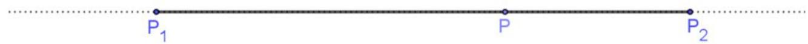

text_image

P₁
P
P₂

对单比的概念我们需要理解以下几点:

(1)单比的定义是有顺序的,共线三点 $P_{1},P_{2},P$ 的顺序不可随意调整，起点→分点= $\lambda$ (分点→终点);  
(2)当 P 位于线段 $P_{1}, P_{2}$ 之间时, $\lambda > 0$ , 否则, 当 P 位于线段 $P_{1}, P_{2}$ 之外时, $\lambda < 0$ , P 为线段 $P_{1}P_{2}$ 中点时 $\lambda = 1$ ;  
(3)如果 $P_{1}, P_{2}$ 为定点, $\lambda$ 也给定, 则点 P 的位置唯一确定;  
(4)在平面直角坐标系中, $P_{1}(x_{1},y_{1}),P_{2}(x_{2},y_{2})$ ,由向量坐标运算,得出定比分点公式:

$$
x _ {P} = \frac {x _ {1} + \lambda x _ {2}}{1 + \lambda}, y _ {P} = \frac {y _ {1} + \lambda y _ {2}}{1 + \lambda}
$$

(5)所谓共线三点的单比,即为定比分点中的定比。

最早出现定比分点高考题是在 2006 年山东高考卷，由于年代久远，所以我们就用同类型题来解读。

# 2. $\lambda + \mu$ 为定值的参数同构与点差法

当圆锥曲线上两点作为定比分点，线段两个端点分别位于焦点和另一条坐标轴上时，这里会涉及一个 $\lambda + \mu$ 为定值的问题，我们介绍参数同构法，点差思想来处理。

【例1】已知焦点在 $x$ 轴上，离心率为 $\frac{2\sqrt{5}}{5}$ 的椭圆的一个顶点是抛物线 $x^{2} = 4y$ 的焦点，过椭圆右焦点 $F$ 的直线 $l$ 交椭圆于 $A$ ， $B$ 两点，交 $y$ 轴于点 $M$ ，且 $\overrightarrow{MA} = \lambda_1\overrightarrow{AF}$ ， $\overrightarrow{MB} = \lambda_2\overrightarrow{BF}$

(1) 求椭圆的方程;   
(2) 证明: $\lambda_{1} + \lambda_{2}$ 为定值.

【例 2】已知椭圆 $C: \frac{x^{2}}{a^{2}} + \frac{y^{2}}{b^{2}} = 1 (a > b > 0)$ 的离心率 $e = \frac{1}{2}$ ，短轴长为 $2\sqrt{3}$ .

(1) 求椭圆 C 的方程;  
(2)已知经过定点 $P(1,1)$ 的直线 l 与椭圆相交于 A, B 两点，且与直线 $y = -\frac{3}{4}x$ 相交于点 Q，如果 $\overrightarrow{AQ} = \lambda \overrightarrow{AP}$ ， $\overrightarrow{QB} = \mu \overrightarrow{PB}$ ，那么 $\lambda + \mu$ 是否为定值？若是，请求出具体数值；若不是，请说明理由.

# 二．单比与交比

# 1. 单比角元形式

两条直线的有向角满足下面几个性质:

(1).如果直线a逆时针旋转到直线b,则(a,b)为正角;如果直线a顺时针旋转到直线b,则(a,b)为负角;   
(2). $\sin (a,b) = -\sin (b,a)$

如下图,分别连接共线三点 A,C,B 与其所在直线外一点 S,记所形成的直线分别为 a,c,b,若 $\overrightarrow{AC} = \lambda \overrightarrow{CB}$ ,则

$$
\lambda = \frac {S A \sin (a , c)}{S B \sin (c , b)}.
$$

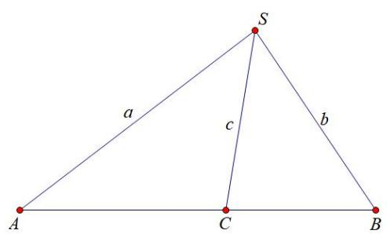

text_image

S
a
c
b
A
C
B

# 2、交比的概念及性质

点列的交比:如果共线四点 $P_{1},P_{2},P_{3},P_{4}$ 满足 $\overrightarrow{P_{1}P_{3}}=\lambda\overrightarrow{P_{3}P_{2}},\overrightarrow{P_{1}P_{4}}=\mu\overrightarrow{P_{4}P_{2}}$ ，则 $\frac{\lambda}{\mu}$ 称为共线四点 $P_{1},P_{2},P_{3},P_{4}$ 的交比,记为 $(P_{1},P_{2};P_{3},P_{4})$ 。其中 $P_{1},P_{2}$ 称为基点偶(对)， $P_{3},P_{4}$ 称为分点偶(对)。

P1

$P_{3}$

$P_{2}$

P4

点列交比的角元形式：如下图,分别连接共线四点 $P_{1}, P_{2}, P_{3}, P_{4}$ 与其所在直线外一点 $S$ , 记所形成的直线分别为 $a, b, c, d$ , 则 $\left(P_{1}, P_{2}; P_{3}, P_{4}\right) = \frac{\sin(a, c) \sin(d, b)}{\sin(c, b) \sin(a, d)}$ .

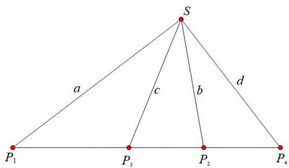

text_image

S
a
c
b
d
P₁
P₃
P₂
P₄

从交比的角元形式可以看出,交比 $\left(P_{1},P_{2};P_{3},P_{4}\right)$ 的值只与直线的有向角有关系,与线段长度没有关系。于是我们很容易据此得到交比的射影不变性。

# 3. 交比的射影不变性

交比的射影不变性：如图所示,过点 S 引四条相交直线,分别与另外两条直线交于 A, B, C, D 和 $P_{1}, P_{2}, P_{3}, P_{4}$ ,
则 $\left(P_{1},P_{2};P_{3},P_{4}\right)=(A,B;C,D)$

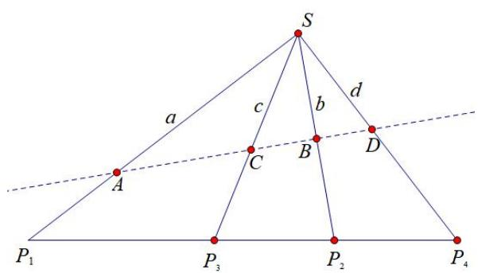

text_image

S
a
c
b
d
A
C
B
D
P₁
P₃
P₂
P₄

交比的射影不变性,是交比的角元形式的直接推论，交比的射影不变性表明，交比经中心射影后不变。

关于交比射影不变性的斜率公式，我们会在后面章节进行解读，交比射影不变性的推论，结合调和点列，基本上可以打通高考.

【例 3】射影几何学中，中心投影是指光从一点向四周散射而形成的投影，如图，O 为透视中心，平面内四个点 E，F，G，H 经过中心投影之后的投影点分别为 A，B，C，D．对于四个有序点 A，B，C，D，
定义比值 $x=\frac{\frac{CA}{CB}}{\frac{DA}{DB}}$ 叫做这四个有序点的交比，记作 (ABCD).

（1）证明： $(EFGH)=(ABCD)$ ;

（2）已知 $(EFGH)=\frac{3}{2}$ ，点B为线段AD的中点， $AC=\sqrt{3}OB=3,\frac{\sin\angle ACO}{\sin\angle AOB}=\frac{3}{2}$ ，求 $\cos A$ .

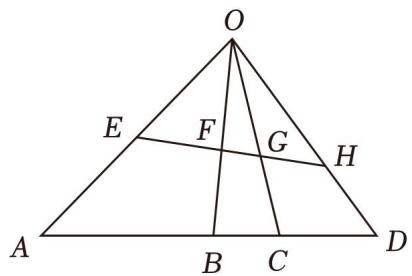

text_image

O
E F G H
A B C D

【例 4】交比是射影几何中最基本的不变量，在欧氏几何中亦有应用．设 A，B，C，D 是直线 l 上互异且非无穷远的四点，则称 $\frac{AC}{BC} \cdot \frac{BD}{AD}$ （分式中各项均为有向线段长度，例如 AB = -BA）为 A，B，C，D 四点的交比，记为 $(A, B; C, D)$ .

（1）证明： $1-(D,B;C,A)=\frac{1}{(B,A;C,D)}$ ;  
（2）若 $l_{1}, l_{2}, l_{3}, l_{4}$ 为平面上过定点 $P$ 且互异的四条直线， $L_{1}, L_{2}$ 为不过点 $P$ 且互异的两条直线， $L_{1}$ 与 $l_{1}, l_{2}, l_{3}, l_{4}$ 的交点分别为 $A_{1}, B_{1}, C_{1}, D_{1}, L_{2}$ 与 $l_{1}, l_{2}, l_{3}, l_{4}$ 的交点分别为 $A_{2}, B_{2}, C_{2}, D_{2}$ ，证明： $(A_{1}, B_{1}; C_{1}, D_{1}) = (A_{2}, B_{2}; C_{2}, D_{2})$ ；  
（3）已知第（2）问的逆命题成立，证明：若 $\Delta EFG$ 与 $\triangle E'F'G'$ 的对应边不平行，对应顶点的连线交于同一点，则 $\Delta EFG$ 与 $\triangle E'F'G'$ 对应边的交点在一条直线上.

# 三．调和点列与定比点差

# 1. 调和点列的概念

如下图①，点 $P$ 在线段 $AB$ 上，则满足 $\frac{\left|\overrightarrow{AP}\right|}{\left|\overrightarrow{PB}\right|} = \lambda (\lambda >0)$ 的点 $P$ 是唯一存在的．但是，如果将线段 $AB$ 改为直线 $AB$ ，此时，满足 $\frac{\left|\overrightarrow{AP}\right|}{\left|\overrightarrow{PB}\right|} = \lambda$ 的点有两个，如下图②，不妨记另一个点为 $Q$ ，则 $\frac{AP}{PB} = \frac{AQ}{QB} = \lambda (\lambda \neq 1)$ ，在此种情况下，我们称点 $A$ 、 $P$ 、 $B$ 、 $Q$ 为调和点列，或者称点 $P$ 、 $Q$ 调和分割点 $A$ 、 $B$ ．按照交比的调和比解释，就是 $(AB,PQ) = -1$

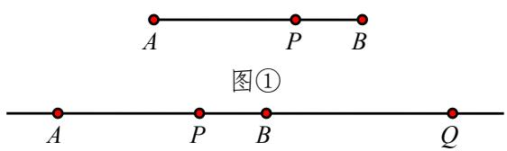

text_image

A
P
B
图①
A
P
B
Q

图②

特别的，当 $\lambda=1$ 时，即点 P 为 AB 的中点，则 Q 为无穷远点.

# 2. 调和点列的性质

如下图所示：对于线段 $AB$ 的内分点 $C$ 和外分点 $D$ 满足 $C$ 、 $D$ 调和分割线段 $AB$ ，即 $\frac{AC}{CB} = \frac{AD}{DB}$ ，设 $O$ 为线段 $AB$ 的中点，则有以下结论成立：

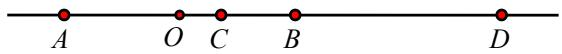

①点 A 、 B 也调和分割 C 、 D ，即 $\frac{CA}{AD} = \frac{CB}{BD}$ ;  
② $\frac{2}{AB}=\frac{1}{AC}+\frac{1}{AD}$ （AB 是 AC 与 AD 的调和平均数）.

【例 5】(2011 山东卷改编) 设 $A_{1}$ 、 $A_{2}$ 、 $A_{3}$ 、 $A_{4}$ 是平面直角坐标系中相异的四点，若 $\overrightarrow{A_{1}A_{3}} = \lambda \overrightarrow{A_{1}A_{2}} (\lambda \in R)$ ， $\overrightarrow{A_{1}A_{4}} = \mu \overrightarrow{A_{1}A_{2}} (\mu \in R)$ ，且 $\frac{1}{\lambda} + \frac{1}{\mu} = 2$ ，则称 $A_{3}$ ， $A_{4}$ 调和分割 $A_{1}A_{2}$ 。已知平面上的点 C，D 调和分割点 A，B，则下面说法正确的是（）

A. $A$ 、 $B$ 、 $C$ 、 $D$ 四点共线

B. $D$ 可能是线段 $AB$ 的中点

C. C、D 可能同时在线段 AB 上 D.

$C$ 、 $D$ 不可能同时在线段 $AB$ 的延长线上

# 3. 定比分点和调和分点支配下的圆锥曲线

在椭圆或双曲线中，设 A, B 为椭圆或双曲线上的两点，若存在 P, Q 两点，满足 $\overrightarrow{AP} = \lambda \overrightarrow{PB}, \overrightarrow{AQ} = -\lambda \overrightarrow{QB}$ ，则一定有： $\frac{x_{P}x_{Q}}{a^{2}} \pm \frac{y_{P}y_{Q}}{b^{2}} = 1$

证明 若 $A(x_{1},y_{1})$ ， $B(x_{2},y_{2})$ ，且 $\overrightarrow{AP} = \lambda \overrightarrow{PB}$ ，则 $P\left(\frac{x_1 + \lambda x_2}{1 + \lambda},\frac{y_1 + \lambda y_2}{1 + \lambda}\right)$ ；若 $\overrightarrow{AQ} = -\lambda \overrightarrow{QB}$ ，则

$$
Q \left(\frac {x _ {1} - \lambda x _ {2}}{1 - \lambda}, \frac {y _ {1} - \lambda y _ {2}}{1 - \lambda}\right), \text {有} \left\{ \begin{array}{l l} \frac {x _ {1} ^ {2}}{a ^ {2}} \pm \frac {y _ {1} ^ {2}}{b ^ {2}} = 1 & (1) \\ \frac {\lambda^ {2} x _ {2} ^ {2}}{a ^ {2}} \pm \frac {\lambda^ {2} y _ {2} ^ {2}}{b ^ {2}} = \lambda^ {2} (2) \end{array} , \right.
$$

(1) - (2) 可得:

$$
\frac {(x _ {1} + \lambda x _ {2}) (x _ {1} - \lambda x _ {2})}{a ^ {2}} \pm \frac {(y _ {1} + \lambda y _ {2}) (y _ {1} - \lambda y _ {2})}{b ^ {2}} = 1 - \lambda^ {2} \text {即得:} \frac {1}{a ^ {2}} \cdot \frac {x _ {1} + \lambda x _ {2}}{1 + \lambda} \cdot \frac {x _ {1} - \lambda x _ {2}}{1 - \lambda} \pm \frac {1}{b ^ {2}} \cdot \frac {y _ {1} + \lambda y _ {2}}{1 + \lambda} \cdot \frac {y _ {1} - \lambda y _ {2}}{1 - \lambda} = 1,
$$

故 $\frac{x_P x_Q}{a^2} \pm \frac{y_P y_Q}{b^2} = 1$ .

在抛物线 $y^{2} = 2px$ 中，设 $A, B$ 为抛物线上的两点。若存在 $P, Q$ 两点，满足 $\overrightarrow{AP} = \lambda \overrightarrow{PB}, \overrightarrow{AQ} = -\lambda \overrightarrow{QB}$ ，一定有 $y_{P}y_{Q} = p(x_{P} + x_{Q})$ 。

证明 若 $A(x_{1}, y_{1})$ , $B(x_{2}, y_{2})$ , $\overrightarrow{AP} = \lambda \overrightarrow{PB}$ ，则 $P(\frac{x_{1} + \lambda x_{2}}{1 + \lambda}, \frac{y_{1} + \lambda y_{2}}{1 + \lambda})$ , $\overrightarrow{AQ} = -\lambda \overrightarrow{QB}$ ，则 $Q(\frac{x_{1}-\lambda x_{2}}{1-\lambda}, \frac{y_{1}-\lambda y_{2}}{1-\lambda})$ ，有 $\left\{\begin{aligned}y_{1}^{2}&=2px_{1}\\ \lambda^{2}y_{2}^{2}&=2\lambda^{2}px_{2}\end{aligned}\right.$ ①
②

①—②得： $y_{1}^{2}-\lambda^{2}y_{2}^{2}=p(x_{1}+x_{1}-\lambda^{2}x_{2}-\lambda^{2}x_{2})$

即 $(y_{1} + \lambda y_{2})(y_{1} - \lambda y_{2}) = p(x_{1} + \lambda x_{2} + x_{1} - \lambda x_{2} + \lambda x_{1} - \lambda^{2}x_{2} - \lambda x_{1} - \lambda^{2}x_{2})$

所以 $\frac{(y_1 + \lambda y_2)(y_1 - \lambda y_2)}{(1 + \lambda)(1 - \lambda)} = \frac{p(x_1 + \lambda x_2)(1 - \lambda)}{(1 - \lambda)(1 + \lambda)} +\frac{p(x_1 - \lambda x_2)(1 + \lambda)}{(1 - \lambda)(1 + \lambda)}$ ，故 $y_{P}y_{Q} = p(x_{P} + x_{Q})$ ：

定比点差的原理谜题解开，就是两个互为调和的定比分点坐标满足圆锥曲线的特征方程.

【例 6】过 $P(4,1)$ 的直线交椭圆 $\frac{x^{2}}{4}+\frac{y^{2}}{2}=1$ 于不同两点 A，B，在线段 AB 上取点 Q，满足 $\frac{|\overrightarrow{AP}|}{|\overrightarrow{PB}|}=\frac{|\overrightarrow{AQ}|}{|\overrightarrow{QB}|}$ .
求证: 点 Q 在某定直线上.

【例 7】已知双曲线 $C: \frac{x^{2}}{a^{2}} - \frac{y^{2}}{b^{2}} = 1 (a > 0, b > 0)$ 过点 $A(4\sqrt{2}, 3)$ ，且焦距为 10.

(1) 求 C 的方程;

(2)已知点 $B(4\sqrt{2}, - 3)$ ， $D(2\sqrt{2},0)$ ， $E$ 为线段 $AB$ 上一点，且直线 $DE$ 交 $C$ 于 $G$ ， $H$ 两点.证明： $\frac{|GD|}{|GE|} = \frac{|HD|}{|HE|}$

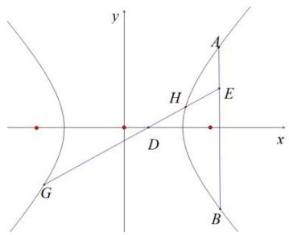

text_image

y
A
H
E
D
x
G
B

# 四．定点在坐标轴上的定比点差

若出现 $y_{P} = 0$ （或者 $y_{Q} = 0$ ），则 $x_{P}x_{Q} = a^{2}$ ，此时 $x_{P} = m, x_{Q} = \frac{a^{2}}{m}$ ；若出现 $x_{P} = 0$ （或者 $x_{Q} = 0$ ），则 $y_{P}y_{Q} = b^{2}$ ，此时 $y_{P} = n, y_{Q} = \frac{b^{2}}{n}$ 。对于公式中，成对出现的“ $m, \frac{a^{2}}{m}$ ”或者“ $n, \frac{b^{2}}{n}$ ”，由于公式的背景和极点极线有关，不妨可以称它们为“调和共轭数”。

【例 8】已知椭圆 $C: \frac{x^{2}}{a^{2}} + \frac{y^{2}}{b^{2}} = 1 (a > b > 0)$ 的离心率 $e = \frac{1}{2}$ ，且经过点 $(1, \frac{3}{2})$ ，点 $F_{1}, F_{2}$ 为椭圆 C 的左、右焦点.

(1) 求椭圆 C 的方程;  
(2) 过点 $F_{1}$ 分别作两条互相垂直的直线 $l_{1}, l_{2}$ ，且 $l_{1}$ 与椭圆交于不同两点 $A, B, l_{2}$ 与直线 $x = 1$ 交于点 $P$ 。若 $\overrightarrow{AF_1} = \lambda \overrightarrow{F_1B}$ ，且点 $Q$ 满足 $\overrightarrow{QA} = \lambda \overrightarrow{QB}$ ，求 $\Delta PQF_{1}$ 面积的最小值。

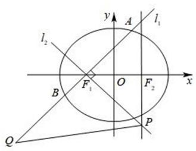

text_image

l₂
F₁
O
F₂
x
y
A
l₁
B
P
Q

# 类型一 定点在 $x$ 轴

过定点 $P(x_{P}, 0)$ 的直线与椭圆 $\frac{x^{2}}{a^{2}} + \frac{y^{2}}{b^{2}} = 1 (a > b > 0)$ 相交于 A、B 两点，设 $\overrightarrow{AP} = \lambda \overrightarrow{PB} (\lambda \neq \pm 1), A(x_{1}, y_{1})$ ， $B(x_{2}, y_{2})$ ，则在直线 AB 上一定存在点 Q 满足 $\overrightarrow{AQ} = -\lambda \overrightarrow{QB}$ ，根据定比点差法可知 $x_{Q} = \frac{a^{2}}{x_{P}}$ .

一定有 $\left\{\begin{aligned}x_{1}&=\frac{x_{P}+x_{Q}}{2}+\frac{x_{P}-x_{Q}}{2}\cdot\lambda\\ x_{2}&=\frac{x_{P}+x_{Q}}{2}+\frac{x_{P}-x_{Q}}{2\lambda}\\ y_{1}+\lambda y_{2}&=0\end{aligned}\right.$

证明： $\left\{ \begin{array}{l} \frac{x_1 + \lambda x_2}{1 + \lambda} = x_p \\ \frac{x_1 - \lambda x_2}{1 - \lambda} = x_Q \Rightarrow \left\{ \begin{array}{c} x_1 + \lambda x_2 = x_p(1 + \lambda) \\ x_1 - \lambda x_2 = x_p(1 - \lambda) \Rightarrow \\ y_1 + \lambda y_2 = 0 \end{array} \right. \\ \frac{y_1 + \lambda y_2}{1 + \lambda} = 0 \end{array} \right.$

# 类型二 定点在 $y$ 轴

过定点 $P(0, y_{p})$ 的直线与椭圆 $\frac{x^{2}}{a^{2}} + \frac{y^{2}}{b^{2}} = 1 (a > b > 0)$ 相交于 A、B 两点，设 $\overrightarrow{AP} = \lambda \overrightarrow{PB} (\lambda \neq \pm 1), A(x_{1}, y_{1})$ ， $B(x_{2}, y_{2})$ ，则在直线 AB 上一定存在点 Q 满足 $\overrightarrow{AQ} = -\lambda \overrightarrow{QB}$ ，根据定比点差法可知 $y_{Q} = \frac{b^{2}}{y_{P}}$ 。同

理： $\left\{ \begin{array}{l}y_{1} = \frac{y_{P} + y_{Q}}{2} +\frac{y_{P} - y_{Q}}{2}\cdot \lambda \\ y_{2} = \frac{y_{P} + y_{Q}}{2} +\frac{y_{P} - y_{Q}}{2\lambda}\\ x_{1} + \lambda x_{2} = 0 \end{array} \right.$

由于在考试当中我们经常要拿出这三个等式，故我们称之为：“三炮齐鸣，天下太平”

【例 9】(2018·浙江高考)已知点 $P(0,1)$ ，椭圆 $\frac{x^{2}}{4} + y^{2} = m (m > 1)$ 上两点 A、B 满足 $\overrightarrow{AP} = 2\overrightarrow{PB}$ ，则当 m = \_\_\_\_ 时，点 B 横坐标的绝对值最大.

# 考向 2 极点极线与完全四边形

# 一．极点极线的定义

# 1. 二次曲线的替换法则

对于一般式的二次曲线 $\varphi: Ax^{2} + Bxy + Cy^{2} + Dx + Ey + F = 0$ ，用 $xx_{0}$ 代 $x^{2}$ ，用 $yy_{0}$ 代 $y^{2}$ ，用 $\frac{x_{0}y + xy_{0}}{2}$ 代 xy，用 $\frac{x + x_{0}}{2}$ 代 x，用 $\frac{y + y_{0}}{2}$ 代 y，常数项不变，

可得方程： $Axx_{0} + B \cdot \frac{x_{0}y + xy_{0}}{2} + Cyy_{0} + D \cdot \frac{x + x_{0}}{2} + E \cdot \frac{y + y_{0}}{2} + F = 0$ .

# 2. 极点极线的综合模型——自极三角形

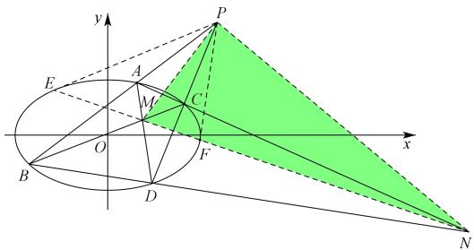

text_image

y
P
E
A
M
C
O
F
x
B
D
N

极点极线的几何意义：

（1）若点 $P$ 是圆锥曲线上的点，则过点 $P$ 的切线即为极点 $p$ 对应的极线.

(2) 如图所示 (以椭圆图形为例), 若点 $P$ 是不在圆锥曲线上的点, 且不为原点 $O$ , 过点 $P$ 作割线 $PAB$ 、 $PCD$ 依次交圆锥曲线于 $A$ 、 $B$ 、 $C$ 、 $D$ 四点, 连结直线 $AD$ 、 $BC$ 交于点 $M$ , 连结直线 $AC$ 、 $BD$ 交于点 $N$ , 则直线 $l_{MN}$ 为极点 $P$ 对应的极线. 类似的, 也可得到极点 N 对应的极线为直线 $l_{PM}$ , 极点 $M$ 对应的极线为直线 $l_{PN}$ , 因此, 我们把 $\triangle PMN$ 称为自极三角形. 【即 $\triangle PMN$ 的任一顶点作为极点, 则顶点对应的边即为对应的极线, “补全自极三角形” 这个技巧很常用, 后面结合例题了解!】

如图所示，如果我们连结直线 NM 交圆锥曲线于点 E、F，则直线 PE、PF 恰好为圆锥曲线的两条切线，此时，直线 $l_{EF}$ 不仅是极点 P 的极线，我们也称直线 $l_{EF}$ 为渐切线.

下面的共轭点模型，实际都是极点在坐标轴上的特例模型的应用，也是高考题常见.

# 二．完全四边形

# 1. 完全四边形定义

完全四边形两两相交，如下图的四边形ABCD，没有三线共点的四条直线AB、BC、CD、DA，及它们的六个交点， $ABE,ADF,BCF,DCE$ 两两相交于 $A,B,C,D,E,F$ 六点，六个点可分成三对相对的顶点，它们的连线 $AC,BD,EF$ 是三条对角线.则ABCDEF即为完全四边形

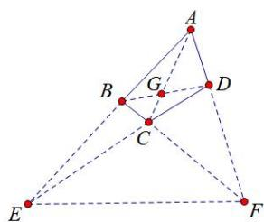

text_image

Geometric diagram with labeled points A, B, C, D, E, F, G and connecting lines forming triangles and dashed segments

# 2. 退化二次曲线构造曲线系解读完全四边形

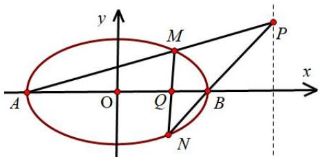

text_image

y
M
P
x
A
O
Q
B
N

模型构造： $f_{1}(x,y) + \lambda f_{2}(x,y) = \mu f_{3}(x,y)$

如图，A、B 分别为椭圆 $\frac{x^{2}}{a^{2}} + \frac{y^{2}}{b^{2}} = 1 (a > b > 0)$ 的左右顶点，M、N 为椭圆上任意两点，MN 与 x 轴交于点 Q，AM 与 BN 交于点 P，我们可以理解为 A，M，B，N 四点确定椭圆（双曲线和抛物线也一致），那么四点之间连线有 6 条，我们选取两条交点在椭圆内的直线乘积式构造弱化二次曲线 $f_{1}(x, y) = 0$ ，再选取两条交点在椭圆外的直线乘积式构造另一条弱化的二次曲线 $f_{2}(x, y) = 0$ ，可以理解为两条弱化的二次曲线形成了这个椭圆 $f_{3}(x, y) = \frac{x^{2}}{a^{2}} + \frac{y^{2}}{b^{2}} - 1 = 0$ ，即 $f_{1}(x, y) + \lambda f_{2}(x, y) = \mu f_{3}(x, y)$

注意：这里最终结果会指向一个极点极线性质 $x_{P}x_{Q} = a^{2}$ ，故在设计 $l_{AB}:y = 0$ ， $l_{MN}:x - ky - m = 0$

$$
f _ {1} (x, y) = y \cdot (x - k y - m) = 0, l _ {A M}: x - k _ {1} y + a = 0, l _ {B N}: x - k _ {2} y - a = 0
$$

$f_{2}(x,y) = (x - k_{1}y + a)\cdot (x - k_{2}y - a) = 0$ ，从而得出： $y\cdot (x - ky - m) + \lambda (x - k_1y + a)\cdot (x - k_2y - a) = \mu (\frac{x^2}{a^2} +\frac{y^2}{b^2} -1)$

记住：曲线系只需要对比系数，确定参数，无需展开求出 $\lambda$ 和 $\mu$ ， $k$ ， $k_{1}$ ， $k_{2}$ 均是斜率倒数，不是斜率.

【例 1】（2020•新课标I）已知 A，B 分别为椭圆 $E:\frac{x^{2}}{a^{2}}+y^{2}=1(a>1)$ 的左、右顶点，G 为 E 的上顶点， $\overrightarrow{AG}\cdot\overrightarrow{GB}=8$ ．P 为直线 x=6 上的动点，PA 与 E 的另一交点为 M，PB 与 E 的另一交点为 N．

(1) 求 E 的方程;  
(2) 证明: 直线 $MN$ 过定点.

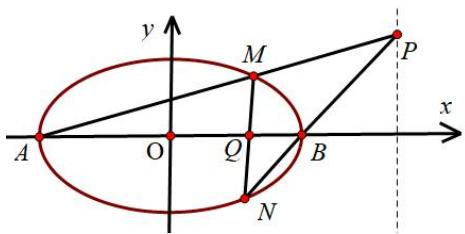

text_image

y
M
P
x
A
O
Q
B
N

【例 2】（2023·新高考Ⅱ）已知双曲线 C 中心为坐标原点，左焦点为 $(-2\sqrt{5}, 0)$ ，离心率为 $\sqrt{5}$ .

(1) 求 C 的方程;  
(2) 记 $C$ 的左、右顶点分别为 $A_{1}$ , $A_{2}$ , 过点 $(-4,0)$ 的直线与 $C$ 的左支交于 $M$ , $N$ 两点, $M$ 在第二象限, 直线 $MA_{1}$ 与 $NA_{2}$ 交于 $P$ , 证明 $P$ 在定直线上.

# 三．调和平行弦中点定理

# 1. 调和点列与调和线束

根据完全四边形中的调和点列可知，完全四边形的任意一条对角线的两端,都被它和另外两条对角线的交点所调和分割.如果我们以 S 点为射影中心， $P_{1},P_{2},P_{3},P_{4}$ 为调和点列，利用交比不变性，如下图， $(P_{1}P_{2},P_{3}P_{4})=(AB,CD)=-1$ ,

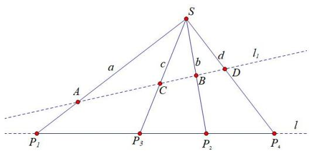

text_image

S
a
c
b
d
l₁
A
C
B
D
P₁
P₃
P₂
P₄
l

则 $SP_{1}$ ， $SP_{2}$ ， $SP_{3}$ ， $SP_{4}$ 均为 S 点的调和线束.

# 2.无穷远点调和点列解读

如图所示，若 $(P_{1}P_{2}, P_{3}P_{4}) = -1$ ， $SP_{1}$ ， $SP_{2}$ ， $SP_{3}$ ， $SP_{4}$ 均为 S 点的调和线束，过 $P_{4}S$ 延长线上任意一点 A 作 $AB // SP_{1}$ 分别交 $SP_{3}$ 和 $SP_{2}$ 于点 B 和 C，则 $AC = BC$ .

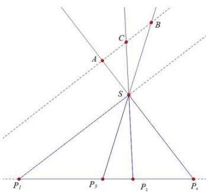

text_image

P₁
P₃
P₂
P₄
S
A
C
B

证明：根据交比不变性，若 $(P_{1}P_{2}, P_{3}P_{4}) = -1$ ，则 $(A, B; C, \infty) = -1$ 故 $AC = CB$ ：

3.调和平行中点定理推论

若 $A, M, B, N$ 是调和点列，如下图所示，过 $A$ 作任意直线 $l$ ，在 $l$ 上任取一点 $C$ ，连接 $CM, CN$ ，过 $N$ 作 $DE // CM$ 交 $AC$ 和 $BC$ 于 $D, E$ 两点，则必有：

①DN=EN,   
②在 CN 上任取一点 R，作 PQ//CM//DE 交 AC 于 P，交 BC 于 Q，则 PR=QR.

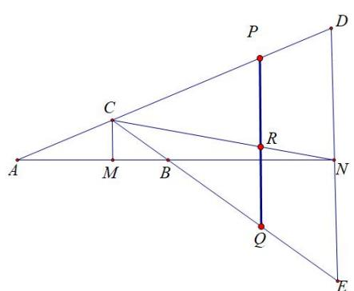

text_image

Geometric diagram with labeled points and lines, showing triangle relationships and intersections

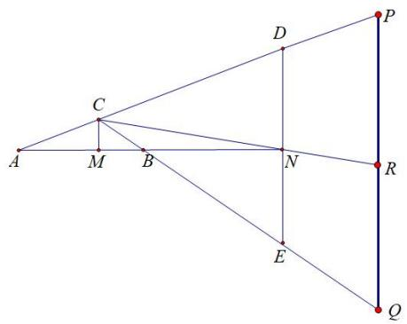

text_image

Geometric diagram with labeled points and lines, showing triangle relationships and intersections

注意：本定理的逆定理也成立.

# 题型一 角平分线定理

已知 AB 交椭圆 $\frac{x^{2}}{a^{2}} + \frac{y^{2}}{b^{2}} = 1 (a > b > 0)$ 长轴 (短轴) 于点 P, B, $B^{r}$ 是椭圆上关于长轴 (短轴) 对称的两点，直线 $AB'$ 交长轴 (短轴) 于 Q，则 $\frac{x_{P}x_{Q}}{a^{2}} = 1$ 或 $\frac{y_{P}y_{Q}}{b^{2}} = 1$ . (双曲线也有相同调和共轭性质)

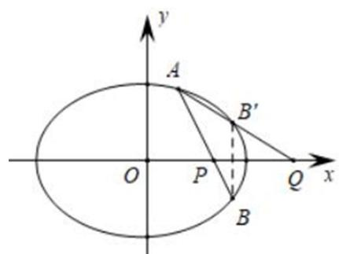

text_image

y
A
B'
O
P
Q
x
B

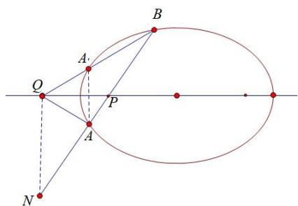

text_image

Geometric diagram showing an ellipse with labeled points A, B, P, Q, N and auxiliary lines, likely illustrating a theorem or construction in plane geometry.

极点极线背景分析：如右图，由于点P与Q符合调和共轭，则以P为极点的极线是QN，故N、A、P、B是调和点列， $\frac{BP}{PA}=\frac{BQ}{AQ}$ (内角平分线定理)，作A关于x轴对称的点 $A'$ ，则 $\frac{BN}{NA}=\frac{BQ}{QA'}=\frac{BQ}{QA}$ .

【例 1】（2024·北京）已知椭圆方程 $E: \frac{x^{2}}{a^{2}} + \frac{y^{2}}{b^{2}} = 1 (a > b > 0)$ ，以椭圆 E 的焦点和短轴端点为顶点的四边形是边长为 2 的正方形。过点 $(0, t)(t > \sqrt{2})$ 且斜率存在的直线与椭圆 E 交于不同的两点 A，B，过点 A 和 $C(0,1)$ 的直线 AC 与椭圆 E 的另一个交点为 D。

(1) 求椭圆 E 的方程及离心率;  
(2) 若直线 BD 的斜率为 0，求 t 的值.

【例2】(2018全国卷 I) 设椭圆 $C: \frac{x^{2}}{2} + y^{2} = 1$ 的右焦点为 F，过 F 的直线 l 与 C 交于 A, B 两点，点 M 的坐标为 $(2, 0)$ .

(1) 当 l 与 x 轴垂直时，求直线 AM 的方程：  
(2) 设 O 为坐标原点，证明： $\angle OMA = \angle OMB$ .

# 题型二．斜率和为0与内外角平分线解读

已知点 A, B 是椭圆 $\frac{x^{2}}{a^{2}} + \frac{y^{2}}{b^{2}} = 1 (a > b > 0)$ 上的动点， $P(x_{0}, y_{0})$ ，直线 PA, PB 的斜率和为 0，则直线 AB 的斜率为 $\frac{b^{2}x_{0}}{a^{2}y_{0}}$ .

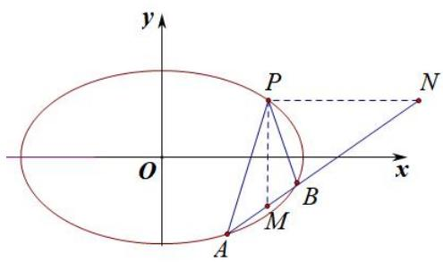

text_image

y
P
N
O
x
A
M
B

如图所示,过点 P 作 x,y 轴的平行线,分别交 AB 于点 N,M,则 PM,PN 分别是 $\angle APB$ 的内角,外角平分线,所以 $(AB,MN)=-1$ , 所以 $M(x_{0},m),N(n,y_{0})$ 是椭圆的一组调和共轭点, 即 $\frac{x_{0}\cdot n}{a^{2}}+\frac{m\cdot y_{0}}{b^{2}}=1$ ,

$$
k _ {A B} = \frac {m - y _ {0}}{x _ {0} - n} = \frac {b ^ {2} x _ {0}}{a ^ {2} y _ {0}}.
$$

【例 4】(2022 新高考 I 卷) 已知 $A(2,1)$ 在双曲线 $C: \frac{x^{2}}{a^{2}} - \frac{y^{2}}{a^{2} - 1} = 1 (a > 1)$ 上, 直线 l 交 C 于 P、Q 两点, 直线 AP, AQ 斜率之和为 0. 求 l 的斜率;

题型 3 隐藏的角平分线与阿氏圆构造

【例 1】(2025·山东省实验中学四诊第 18 题)已知椭圆 $C: \frac{x^{2}}{a^{2}} + \frac{y^{2}}{b^{2}} = 1 (a > b > 0)$ 的半长轴的长度与焦距相等，且过焦点且与 x 轴垂直的直线被椭圆截得的弦长为 3.

(1) 求椭圆 C 的方程;

(2) 已知直线 $l_{0}: x + 2y - 2 = 0$ 与椭圆 $C$ 交于 $A, B$ 两点，过点 $P(2,3)$ 的直线交椭圆 $C$ 于 $E, F$ 两点 ( $E$ 在靠近 $P$ 的一侧)

（i）求 $\frac{|PE|}{|PF|}$ 的取值范围；

（ii）在直线 $l_{0}$ 上是否存在一定点M，使 $\angle EMA=\angle FMA$ 恒成立？若存在，求出M点坐标；若不存在，请说明理由.

【例 2】(2025•永州二模第 19 题) 在直角坐标系 $xOy$ 中, 椭圆 $C: \frac{x^2}{a^2} + \frac{y^2}{b^2} = 1 (a > b > 0)$ 经过点 $P(-2\sqrt{3}, 1)$ , 短半轴长为 $\sqrt{5}$ . 过点 $S(0,5)$ 作直线 $l$ 交 $C$ 于 $A$ , $B$ 两点, 直线 $PA$ 交 $y$ 轴于点 $M$ , 直线 $PB$ 交 $y$ 轴于点 $N$ , 记直线 $PA$ , $PB$ 的斜率分别为 $k_1$ 和 $k_2$ .

(1) 求 C 的标准方程;

（2）证明 $\frac{1}{k_1} +\frac{1}{k_2}$ 是定值，并求出该定值；

（3）设点 $R(0,1)$ ，证明 $C$ 上存在异于其上下顶点的点 $Q$ ，使得 $\angle MQR = \angle NQR$ 恒成立，并求出所有满足条件的 $Q$ 点坐标.

# 题型四 调和点列+平行弦中点

【例 1】(2024•甲卷)已知椭圆 $C:\frac{x^{2}}{a^{2}}+\frac{y^{2}}{b^{2}}=1(a>b>0)$ 的右焦点为 F，点 $M(1,\frac{3}{2})$ 在椭圆 C 上，且 $MF\perp x$ 轴.

(1) 求椭圆 C 的方程:  
（2）过点 $P(4,0)$ 的直线与椭圆 $C$ 交于 $A$ ， $B$ 两点， $N$ 为线段 $FP$ 的中点，直线 $NB$ 与 $MF$ 交于 $Q$ ，证明： $AQ \perp y$ 轴.

【例 2】(2020 北京) 已知椭圆 $C: \frac{x^{2}}{a^{2}} + \frac{y^{2}}{b^{2}} = 1$ 过点 $A(-2, -1)$ ，且 a = 2b.

(1)求椭圆 C 的方程;  
(2) 过点 $B(-4, 0)$ 的直线 $l$ 交椭圆 $C$ 于点 $M, N$ ，直线 $MA, NA$ 分别交直线 $x = -4$ 于点 $P, Q$ . 求 $\frac{|PB|}{|BQ|}$ 的值.

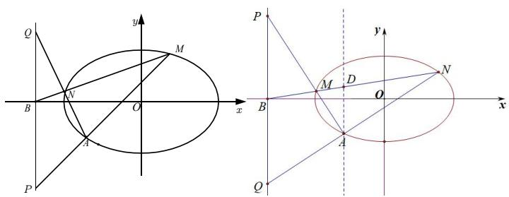

text_image

Mathematical diagrams showing coordinate geometry with an ellipse and a circle, labeled with points P, Q, M, N, O, A, B, D.

【例 3】(2018·北京文) 已知椭圆 $M: \frac{x^{2}}{a^{2}} + \frac{y^{2}}{b^{2}} = 1 (a > b > 0)$ 的离心率为 $\frac{\sqrt{6}}{3}$ ，焦距为 $2\sqrt{2}$ . 斜率为 k 的直线 l 与椭圆 M 有两个不同的交点 A、B.

(1) 求椭圆 M 的方程;  
(2) 若 k=1，求 $\left|AB\right|$ 的最大值；  
(3) 设 $P(-2, 0)$ ，直线 PA 与椭圆 M 的另一个交点为 C，直线 PB 与椭圆 M 的另一个交点为 D。若 C, D 和点 $Q(-\frac{7}{4}, \frac{1}{4})$ 共线，求 k。

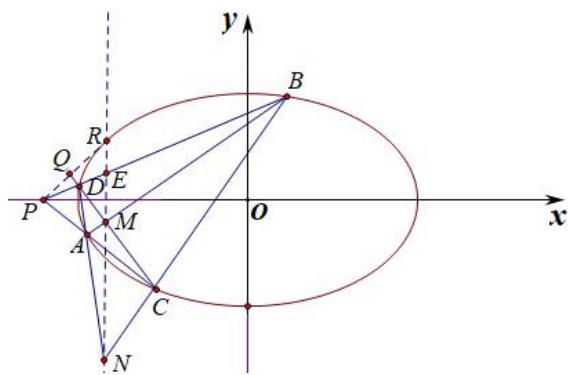

text_image

y
B
Q
R
D
E
P
O
x
A
M
C
N

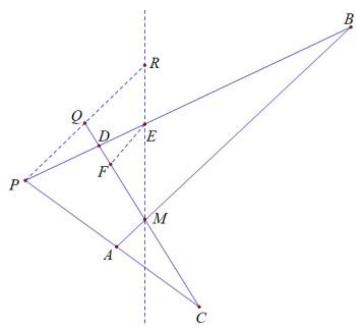

text_image

Geometric diagram with labeled points and lines, including triangle ABC and auxiliary constructions

# 考向 3 调和线束斜率关系

# 1. 调和线束的斜率关系

调和线束的斜率关系: 若 $l_{1}, l_{3}; l_{2}, l_{4}$ 是调和线束, 则它们的斜率满足

$$
\frac {k _ {1} - k _ {2}}{k _ {2} - k _ {3}} = \frac {k _ {1} - k _ {4}}{k _ {3} - k _ {4}}, \quad \frac {1}{k _ {1} - k _ {2}} + \frac {1}{k _ {1} - k _ {4}} = \frac {2}{k _ {1} - k _ {3}}
$$

$$
2 \left(k _ {1} k _ {3} + k _ {2} k _ {4}\right) = \left(k _ {1} + k _ {3}\right) \left(k _ {2} + k _ {4}\right)
$$

题型一：利用斜率关系判断定点定值

【例 1】（2023•乙卷）已知椭圆 $C: \frac{y^{2}}{a^{2}} + \frac{x^{2}}{b^{2}} = 1 (a > b > 0)$ 的离心率为 $\frac{\sqrt{5}}{3}$ ，点 A(-2,0) 在 C 上.

(1) 求 C 的方程;

(2) 过点 $(-2,3)$ 的直线交 $C$ 于点 $P$ , $Q$ 两点, 直线 $AP$ , $AQ$ 与 $y$ 轴的交点分别为 $M$ , $N$ , 证明: 线段 $MN$ 的中点为定点.

【例 2】(2022 北京卷) 已知椭圆 $E: \frac{x^{2}}{a^{2}} + \frac{y^{2}}{b^{2}} = 1 (a > b > 0)$ 的一个顶点为 $A(0, 1)$ ，焦距为 $2\sqrt{3}$ .

(1) 求椭圆 E 的方程

(2) 过点 $P(-2, 1)$ 作斜率为 k 的直线与椭圆 E 交于不同的两点 B, C, 直线 AB, AC 分别与 x 轴交于点 M, N. 当 $|MN| = 2$ 时, 求 k 的值.

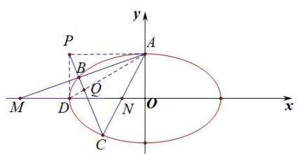

text_image

P
B
A
M
D
O
N
O
C
x
y

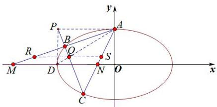

text_image

P
A
y
R
B
O
S
M
D
N
O
x
C

【例 3】(2022 全国乙卷) 已知椭圆 E 的中心为坐标原点，对称轴为 x 轴、y 轴，且过 $A(0, -2)$ , $B(\frac{3}{2}, -1)$ 两点.

(1) 求 E 的方程;  
(2) 设过点 $P(1, -2)$ 的直线交 $E$ 于 $M, N$ 两点，过 $M$ 且平行于 $x$ 轴的直线与线段 $AB$ 交于点 $T$ ，点 $H$ 满足 $\overrightarrow{MT} = \overrightarrow{TH}$ . 证明: 直线 $HN$ 过定点.

# 题型二．调和共轭点与斜率等差

椭圆或双曲线 $\frac{x^2}{a^2} \pm \frac{y^2}{b^2} = 1$ 中，设直线 $AB$ 与椭圆或双曲线交于 $A$ 、 $B$ 两点，且直线 $AB$ 与 $x$ 轴、 $y$ 轴的交点分分别为 $M(m,0)$ 、 $N(0,n)$ ，点 $M$ 和点 $N$ 均不是椭圆顶点.

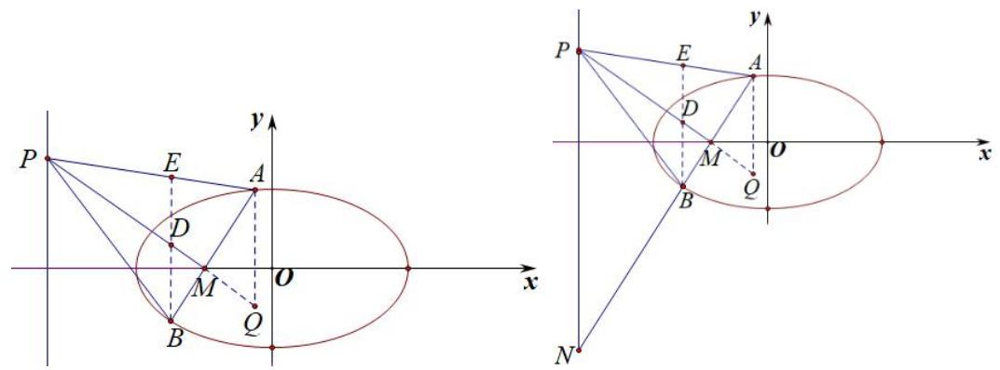

text_image

P
E
A
D
M
Q
B
O
x
y
P
E
A
D
M
Q
B
O
x
N

（1）若点 P 在直线 $x=\frac{a^{2}}{m}$ 上，则 $k_{PA}+k_{PB}=2k_{PM}$ ;

【例 4】已知椭圆 $E: \frac{x^{2}}{a^{2}} + \frac{y^{2}}{b^{2}} = 1 \quad (a > b > 0)$ 经过点 $Q(-2,0)$ ，且直线 $bx + cy - bc = 0 (c = \sqrt{a^{2} - b^{2}}$ 且 c > b) 与圆 $x^{2} + y^{2} = \frac{3}{4}$ 相切.

（1）求椭圆 E 的标准方程；

（2）若过点 $M(1,0)$ 的直线 $l$ 交 $E$ 于 $A,B$ 两点，是否存在定点 $P$ ，使直线 $AP$ 与直线 $BP$ 的斜率之和为2？若存在，求出该定点；若不存在，请说明理由.

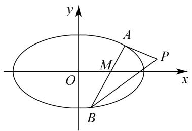

text_image

y
A
M
O
P
x
B

（2）若 $P$ 是直线 $y = \frac{b^2}{n}$ 上任一点，则 $\frac{1}{k_{PA}} +\frac{1}{k_{PB}} = \frac{2}{k_{PN}}$

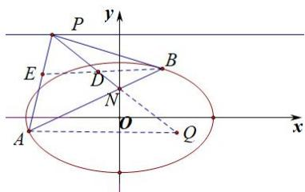

text_image

P
y
E
D
B
N
O
A
Q
x

（3）过圆锥曲线（椭圆、双曲线、抛物线）焦点 $F$ 的任一直线交圆锥曲线于 $A$ 、 $B$ 两点，交对应准线于点 $N$ ，点 $P$ 位于圆锥曲线的通径所在直线上，则 $k_{PA} + k_{PB} = 2k_{PN}$ ：

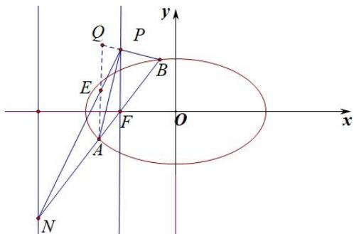

text_image

Q
P
y
E
B
F
O
x
A
N

注意：本结论将 F 换成 $M(m,0)$ ，且 $PM \perp x$ 轴，M 与 N 满足调和共轭， $k_{PA} + k_{PB} = 2k_{PN}$ 也成立.

【例 5】已知双曲线 C: $\frac{x^{2}}{a^{2}} - \frac{y^{2}}{b^{2}} = 1 (a > 0, b > 0)$ 的离心率为 $\sqrt{2}$ ，点 M（3，-1）在双曲线 C 上.

（1）求双曲线 C 的方程；

(2) 若 $F$ 为双曲线的左焦点, 过点 $F$ 作直线 $l$ 交 $C$ 的左支于 $A, B$ 两点. 点 $P(-4, 2)$ , 直线 $AP$ 交直线 $x = -2$ 于点 $Q$ . 设直线 $QA, QB$ 的斜率分别 $k_1, k_2$ , 求证: $k_1 - k_2$ 为定值.

【例 6】(2013 江西文)椭圆 C: $\frac{x^{2}}{a^{2}}+\frac{y^{2}}{b^{2}}=1\quad(a>b>0)$ 的离心率为 $e=\frac{\sqrt{3}}{2}$ ， $a+b=3$ .

(1) 求椭圆 C 的方程;

（2）如图，A，B，D 是椭圆 C 的顶点，P 是椭圆 C 上除顶点外的任意点，直线 DP 交 x 轴于 N 直线 AD 交 BP 于点 M，设 BP 的斜率为 k，MN 的斜率为 m，证明为 2m-k 为定值.

【例 7】过点 $(4,2)$ 的动直线 l 与双曲线 $E:\frac{x^{2}}{a^{2}}-\frac{y^{2}}{b^{2}}=1(a>0,b>0)$ 交于 M,N 两点, 当 l 与 x 轴平行时, $|MN|=4\sqrt{2}$ , 当 l 与 y 轴平行时, $|MN|=4\sqrt{3}$ .

(1)求双曲线 E 的标准方程;  
(2)点 P 是直线 $y = x + 1$ 上一定点, 设直线 PM, PN 的斜率分别为 $k_{1}, k_{2}$ , 若 $k_{1}k_{2}$ 为定值, 求点 P 的坐标.

# 考向 4 帕斯卡定理

# 一．帕斯卡（Pascal）定理及其逆定理

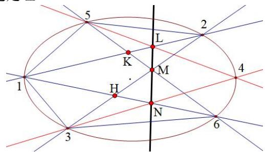

text_image

5
L
2
K
M
1
4
H
N
3
6

图 1 L, M, N 三点共线

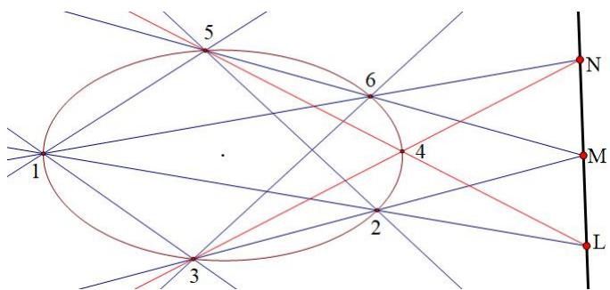

text_image

1
2
3
4
5
6
N
M
L

图 2 L, M, N 三点共线

已知1,2,3,4,5,6是二阶点列上任意六个点,我们记:

12 与 45 的交点为 L,

23 与 56 的交点为 M，

34 与 61 的交点为 N，

那么 L、M 和 N 三点共线(此直线叫 Pascal 线)。

# 二．帕斯卡定理中点的名称的替换

帕斯卡定理中,123456六个点的排列次序是任意的,但无论怎样排列,必须构成一回路。图1和2的回路按顺时针排列次序分别为152463和156423。下面我们再举几个不同排列次序,看它们的结果怎样?

我们考察顺序为 136425 的六点。根据定理:12 与 45 的交点为 L,23 与 56 的交点为 M,34 与 61 的交点为 N, 可得到下图所示结果:

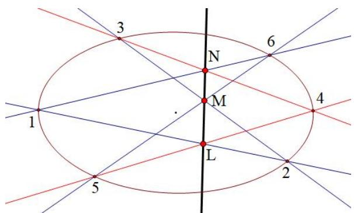

text_image

3
N
6
1
M
4
L
2
5

图 3 对于 136425 六点排列次序的帕斯卡定理

可以看出,与图 1(或 3)的差别是 L,N 两点的上下位置进行了互换,M 仍在它们中间。

再考察顺序为 163524(或 635241,352416,524163,241635,416352)的六点。根据定理,可得到下图所示结果:

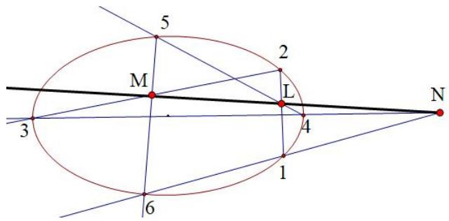

text_image

5
M
2
L
3
4
N
1
6

图 4 对于 163524 排列次序的帕斯卡定理

可以看出,点 L 位于 M 和 N 两点的中间,N 跑到了曲线外边。LNM 三点仍保持共线。再考察六点位置完全为递增的自然顺序 123456。根据定理的陈述,可得到下图所示结果:

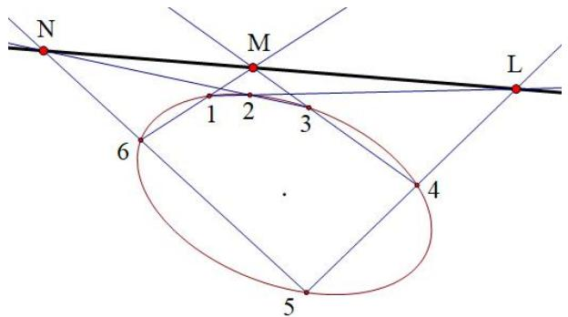

text_image

N
M
L
1 2 3
6
4
5

图 5 对于 123456 六点原始次序的 Pascal 定理

从上图可以看出, L, M, N 三点的排列位置和图 2 类似, 且三点也都位于曲线之外部。

L, M, N 三个点中,也允许有无穷远点。例如,图 5 中若有一对边平行,如 23 与 56 平行,则它们的交点 M 是与 23 和 56 有共同方向的无穷远点,如图 6 所示。

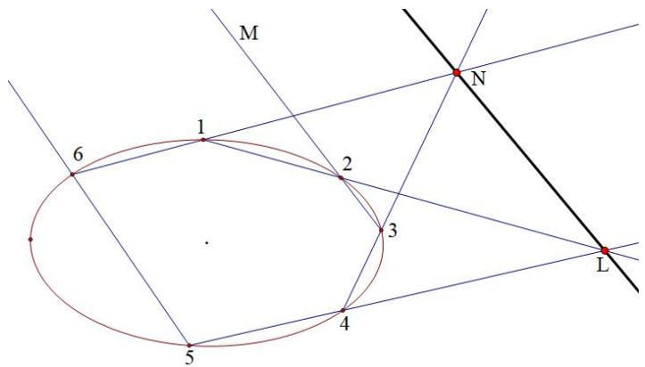

text_image

M
1
6
2
N
3
4
5
L

图 6 帕斯卡定理中允许有无穷远交点

究竟有多少种不同的情况呢?对于6点位置,共有 $6!=720$ 种排列,但轮换相同的6种排列(如123456,234561,...,612345)构成的回路相同,顺时针和逆时针排,如123456和564321,也代表相同回路,不同排列的回路（即Hamilton回路）情况为 $(6-1)!/2=60$ 种。帕斯卡定理说明对于这60种不同的回路都会使它们的6顶点的三组对边的交点L、M、N共线。

最后还要说明两点:六个顶点中,如相邻两个顶点有1到3个重合,这样六个点就变成5个、4个或3个,这时帕斯卡定理仍然成立。

【例 1】(2023·北京) 已知椭圆 $E: \frac{x^{2}}{a^{2}} + \frac{y^{2}}{b^{2}} = 1 (a > b > 0)$ 的离心率为 $\frac{\sqrt{5}}{3}$ ，A、C 分别为 E 的上、下顶点，B、D 分别为 E 的左、右顶点， $|AC| = 4$ .

（1）求 $E$ 的方程；  
(2) 点 P 为第一象限内 E 上的一个动点, 直线 PD 与直线 BC 交于点 M, 直线 PA 与直线 y = -2 交于点 N. 求证: MN // CD.

【例 2】已知点 A，B 是椭圆 $E: \frac{x^{2}}{a^{2}} + \frac{y^{2}}{b^{2}} = 1 (a > b > 0)$ 的左，右顶点，椭圆 E 的短轴长为 2，离心率为 $\frac{\sqrt{3}}{2}$ .

(1) 求椭圆 E 的方程;  
（2）点 O 是坐标原点，直线 l 经过点 $P(-2,2)$ ，并且与椭圆 E 交于点 M，N，直线 BM 与直线 OP 交于点 T，设直线 AT，AN 的斜率分别为 $k_{1}$ ， $k_{2}$ ，求证： $k_{1}k_{2}$ 为定值.

【例 3】已知 $A_{1}(-3,0)$ 和 $A_{2}(3,0)$ 是椭圆 $\eta:\frac{x^{2}}{a^{2}}+\frac{y^{2}}{b^{2}}=1(a>b>0)$ 的左、右顶点，直线 l 与椭圆 $\eta$ 相交于 M，N 两点，直线 l 不经过坐标原点 O，且不与坐标轴平行，直线 $A_{1}M$ 与直线 $A_{2}M$ 的斜率之积为 $-\frac{5}{9}$ .

（1）求椭圆 $\eta$ 的标准方程；  
(2) 若直线 $OM$ 与椭圆 $\eta$ 的另外一个交点为 $S$ , 直线 $A_{1} S$ 与直线 $A_{2} N$ 相交于点 $P$ , 直线 $PO$ 与直线 $l$ 相交于点 $Q$ , 证明: 点 $Q$ 在一条定直线上, 并求出该定直线的方程.

【例 4】已知如图，点 $B_{1}$ ， $B_{2}$ 为椭圆 C 的短轴的两个端点，且 $B_{2}$ 的坐标为 $(0,1)$ ，椭圆 C 的离心率为 $\frac{\sqrt{2}}{2}$ .

（Ⅰ）求椭圆 C 的标准方程；  
（II）若直线 l 不经过椭圆 C 的中心，且分别交椭圆 C 与直线 y = -1 于不同的三点 D，E，P （点 E 在线段 DP 上），直线 PO 分别交直线 $DB_{2}$ ， $EB_{2}$ 于点 M，N．求证：四边形 $B_{1}MB_{2}N$ 为平行四边形.

# 考向 5 万能的对合方程

过抛物线 $y^{2}=2px$ 上两点 $A(x_{1},y_{1})$ 、 $B(x_{2},y_{2})$ 的直线 AB 方程是: $(y_{1}+y_{2})y=2px+y_{1}y_{2}$

关于对合，如果我们设立某种法则 f，我们发现 $(y_{1} + y_{2})y = 2px + y_{1}y_{2}$ 中，

$y_{1}=\frac{2px-yy_{2}}{y-y_{2}}$ ，同时 $y_{2}=\frac{2px-yy_{1}}{y-y_{1}}$ ，故令 $f=\frac{2px-yy_{i}}{y-y_{i}}$ ， $f(y_{1})=y_{2}$ ， $f(y_{2})=y_{1}$ ，这样用 $y_{2}$ 表示 $y_{1}$ 和用 $y_{1}$ 表示 $y_{2}$ 是一样的，这就是一种对合方程，并且 $y_{1}=f(f(y_{1}))$ ，其实我们在做任何联立的时候，只要两个完全能轮换对称的变量构成的方程，比如二次韦达，都是一种对合方程的形式，有句话叫做百姓日用而不知，正是我们天天在用对合方程，却对其看不见，不妨我们重新来了解一下对合方程。

2024 年新高考Ⅱ卷 19 题，就是考查了神奇的反比例对合方程！

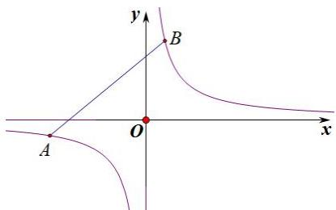

text_image

y
B
A
O
x

如图， $A(x_{1}, y_{1})$ 和 $B(x_{2}, y_{2})$ 分别是反比例函数（等轴双曲线） $y=\frac{m}{x}$ 上的两点，则 AB 的两点对合式方程为： $\frac{x_{1}x_{2}}{m}y+x=x_{1}+x_{2}$ .

证明：由于 $k_{AB} = \frac{\frac{m}{x_1} - \frac{m}{x_2}}{x_1 - x_2} = -\frac{m}{x_1x_2}$ ，故 $AB:y - \frac{m}{x_1} = -\frac{m}{x_1x_2}(x - x_1)$ ，即 $\frac{x_1x_2}{m} y + x = x_1 + x_2$ 。

和抛物线的两点对合式一样，在这个两步就能证明的式子背后，隐藏了很多我们平时没抓住的信息，比如斜率的简化，比如构造相切的点到直线距离的快速同构，由于斜率只需要两点的坐标即可表示，命题者就抓住了这个特点，进行了圆锥与数列综合的命题。

# 一．等轴双曲线仿射后旋转 $45^{\circ}$ 形成反比例函数

如图，将等轴双曲线 $x^{2}-y^{2}=a^{2}$ 逆时针旋转 $45^{\circ}$ ，即变成了初中的反比例函数 $y=\frac{k}{x}$ $k=\frac{a^{2}}{2}$ ，

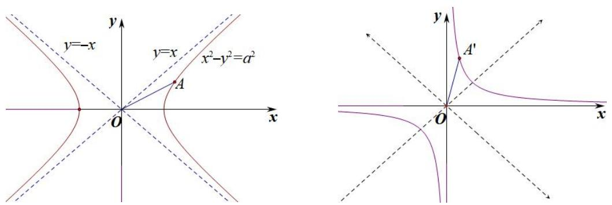

text_image

y
y=-x
y=x
x²-y²=a²
O
A
x
y
A'
O
x

【例 1】（2024•新Ⅱ卷）已知双曲线 $C: x^{2} - y^{2} = m (m > 0)$ ，点 $P_{1}(5,4)$ 在 C 上，k 为常数，0 < k < 1，按照如下方式依次构造点 $P_{n}(n = 2, 3, \cdots)$ ，过 $P_{n-1}$ 斜率为 k 的直线与 C 的左支交于点 $Q_{n-1}$ ，令 $P_{n}$ 为 $Q_{n-1}$ 关于 y 轴的对称点，记 $P_{n}$ 的坐标为 $(x_{n}, y_{n})$ .

（1）若 $k = \frac{1}{2}$ ，求 $x_{2}$ ， $y_{2}$ ；  
（2）证明：数列 $\{x_{n} - y_{n}\}$ 是公比为 $\frac{1 + k}{1 - k}$ 的等比数列；  
（3）设 $S_{n}$ 为 $\triangle P_{n}P_{n + 1}P_{n + 2}$ 的面积，证明：对任意的正整数 $n$ ， $S_{n} = S_{n + 1}$

# 二．非等轴双曲线的仿射换元

由于 $\frac{x^{2}}{a^{2}}-\frac{y^{2}}{a^{2}}=1$ ，令 $\left\{\begin{aligned}x^{\prime}&=\frac{x}{a}-\frac{y}{a}\\ y^{\prime}&=\frac{x}{a}+\frac{y}{a}\end{aligned}\right.$ ，则 $x^{\prime}y^{\prime}=1$ ，由于(1,0)逆时针旋转 $45^{\circ}$ 后得到点 $(\frac{\sqrt{2}}{2},\frac{\sqrt{2}}{2})$ ，(0,1)逆时针旋转 $45^{\circ}$ 后得到点 $(- \frac{\sqrt{2}}{2},\frac{\sqrt{2}}{2})$ ，所以 $\left\{\begin{aligned}x^{\prime}&=\frac{x}{a}-\frac{y}{a}=\frac{\sqrt{2}}{2}(\frac{\sqrt{2}x}{a}-\frac{\sqrt{2}y}{a})\\ y^{\prime}&=\frac{x}{a}+\frac{y}{a}=\frac{\sqrt{2}}{2}(\frac{\sqrt{2}x}{a}+\frac{\sqrt{2}y}{a})\end{aligned}\right.$ 变换是将原来 $P(x,y)$ 横坐标和纵坐标缩小 $\frac{a}{\sqrt{2}}$ 倍后逆时针旋转 $45^{\circ}$ 得来。

综上，双曲线都可以转化为反比例或者对勾函数，当 $e=\sqrt{2}$ 时，按照旋转都能得出反比例，当 $e\neq\sqrt{2}$ 时，旋转后会得到对勾或者飘带函数。按照换元法，就需要先对坐标进行伸缩变换，如下：

$\frac{x^2}{a^2} - \frac{y^2}{b^2} = 1$ ，令 $\left\{ \begin{array}{l} x' = \frac{x}{a} - \frac{y}{b} = \frac{\sqrt{2}}{2} \left( \frac{\sqrt{2}x}{a} - \frac{\sqrt{2}y}{b} \right) \\ y' = \frac{x}{a} + \frac{y}{b} = \frac{\sqrt{2}}{2} \left( \frac{\sqrt{2}x}{a} - \frac{\sqrt{2}y}{b} \right) \end{array} \right.$ ，则此变换是将原来 $P(x, y)$ 横坐标和纵坐标分别缩小。 $\frac{a}{\sqrt{2}}$ 倍和 $\frac{b}{\sqrt{2}}$ 后逆时针旋转 $45^\circ$ 得来，新坐标方程为 $x'y' = 1$ 。

【例 2】(2024·天一大联考) 已知双曲线 C 的中心是坐标原点，对称轴为坐标轴，且过 A(-2,0)，B(-4,3) 两点.

(1) 求 C 的方程;  
（2）设 P，M，N 三点在 C 的右支上，BM // AP，AN // BP，证明：

（i）存在常数 $\lambda$ ，满足 $\overrightarrow{OM} + \overrightarrow{ON} = \lambda \overrightarrow{OP}$ ;

(ii) $\triangle MNP$ 的面积为定值.

【例 3】(2025 温州 1.5 模) 已知双曲线 $C: \frac{x^{2}}{a^{2}} - \frac{y^{2}}{b^{2}} = 1 (a > 0, b > 0)$ 过点 $P_{1}(2,2)$ ，其渐近线的方程为 $y = \pm 2x$ 。按照如下方式依次构造点 $P_{n} (n = 2, 3, \cdots)$ ：过右支上点 $P_{n-1}$ 作斜率为 1 的直线与 C 的左支交于点 $Q_{n-1}$ ，过 $Q_{n-1}$ 再作斜率为 -1 的直线与 C 的右支交于点 $P_{n}(x_{n}, y_{n})$ 。

（1）求双曲线C的方程；  
（2）用 $x_{n},y_{n}$ 表示点 $Q_{n-1}$ 的坐标；  
（3）求证：数列 $\{2x_{n} - y_{n}\}$ 是等比数列.

# 三．椭圆与双曲线的两点对合式

由于 $\cos \alpha \cos \frac{\alpha + \beta}{2} + \sin \alpha \sin \frac{\alpha + \beta}{2} = \cos \frac{\alpha - \beta}{2}$ ,

$$
\cos \beta \cos \frac {\alpha + \beta}{2} + \sin \beta \sin \frac {\alpha + \beta}{2} = \cos \frac {\alpha - \beta}{2},
$$

# 1. 椭圆两点对合式

设 $A(a\cos \alpha ,b\sin \alpha)$ 、 $B(a\cos \beta ,b\sin \beta)$ ，故弦 $AB$ 的方程是 $\frac{x}{a}\cos \frac{\alpha + \beta}{2} +\frac{y}{b}\sin \frac{\alpha + \beta}{2} = \cos \frac{\alpha - \beta}{2},$ 特别的情况，

（1）当 P 为左顶点，则 $\theta = \pi$ ， $k_{PA} = -\frac{b}{a \tan \frac{\alpha + \pi}{2}} = \frac{b}{a} t_{1}$ ;  
（2）当 P 为右顶点，则 $\theta=0,\quad k_{PA}=-\frac{b}{a\tan\frac{\alpha}{2}}=-\frac{b}{at_{1}}$ ;  
（3）当 P 为上顶点，则 $\theta=\frac{\pi}{2}$ ， $k_{PA}=-\frac{b}{a\tan(\frac{\alpha}{2}+\frac{\pi}{4})}=-\frac{b}{a}\frac{1-t_{1}}{1+t_{1}}$ ;  
（4）当 P 为下顶点，则 $\theta=\frac{3\pi}{2}$ ， $k_{PA}=-\frac{b}{a\tan(\frac{\alpha}{2}+\frac{3\pi}{4})}=\frac{b}{a}\frac{1+t_{1}}{1-t_{1}}$ ;

# 2. 双曲线右支的两点对合式

设 $A(\frac{a}{\cos\alpha}, \frac{b\sin\alpha}{\cos\alpha})$ 、 $B(\frac{a}{\cos\beta}, \frac{b\sin\beta}{\cos\beta})$ ，故弦 $AB$ 的方程是 $\frac{x}{a}\cos \frac{\alpha - \beta}{2} - \frac{y}{b}\sin \frac{\alpha + \beta}{2} = \cos \frac{\alpha + \beta}{2}$ ，( $\alpha$ , $\beta$ 为一四象限角，即在双曲线右支上的两点对合式)特别的情况，

（1）当 P 为左顶点， $k_{PA}=\frac{b\frac{\sin\alpha}{\cos\alpha}}{a(\frac{1}{\cos\alpha}+1)}=\frac{b}{a}t_{1}$ ;  
（2）当 P 为右顶点， $k_{PA}=\frac{b\frac{\sin\alpha}{\cos\alpha}}{a(\frac{1}{\cos\alpha}-1)}=\frac{b}{at_{1}}$ ;

3. 双曲线左支的两点对合式

关于双曲线左支上两点，涉及到符号的变化，比如第二三象限 $A\left(\frac{a}{\cos\alpha}, -\frac{b\sin\alpha}{\cos\alpha}\right)$ 、 $B\left(\frac{a}{\cos\beta}, -\frac{b\sin\beta}{\cos\beta}\right)$ ，

不妨换元为 $A(\frac{a}{\cos(-\alpha)}, \frac{b \sin(-\alpha)}{\cos(-\alpha)})$ 、 $B(\frac{a}{\cos(-\beta)}, \frac{b \sin(-\beta)}{\cos(-\beta)})$ ，故弦 AB 的方程是

$$
\frac {x}{a} \cos \frac {- \alpha + \beta}{2} + \frac {y}{b} \sin \frac {- \alpha - \beta}{2} = \cos \frac {- \alpha - \beta}{2}, \text {令} \tan (- \frac {\alpha}{2}) = t _ {1}, \quad \tan (- \frac {\beta}{2}) = t _ {2},
$$

即 $\frac{x}{a} (1 + t_1t_2) - \frac{y}{b} (t_1 + t_2) = 1 - t_1t_2$

（1）当 P 为左顶点， $k_{PA}=\frac{b\frac{\sin(-\alpha)}{\cos(-\alpha)}}{a(\frac{1}{\cos(-\alpha)}+1)}=\frac{b}{a}t_{1}$ ;

（2）当 P 为右顶点， $k_{PA}=\frac{b\frac{\sin(-\alpha)}{\cos(-\alpha)}}{a(\frac{1}{\cos(-\alpha)}-1)}=\frac{b}{at_{1}}$ ;

3. 双曲线左右两支的两点对合式

关于双曲线两支上两点，涉及到符号的变化，比如第一二象限 $A\left(\frac{a}{\cos\alpha}, \frac{b\sin\alpha}{\cos\alpha}\right)$ 、和位于第三四象限的 $B\left(\frac{a}{\cos(-\beta)}, \frac{b\sin(-\beta)}{\cos(-\beta)}\right)$ ，故弦 $AB$ 的方程是 $\frac{x}{a} \cos \frac{\alpha + \beta}{2} + \frac{y}{b} \sin \frac{\alpha - \beta}{2} = \cos \frac{\alpha - \beta}{2}$ ，令 $\tan \frac{\alpha}{2} = t_1$ ， $\tan \left(-\frac{\beta}{2}\right) = t_2$ ，即 $\frac{x}{a} (1 + t_1 t_2) - \frac{y}{b} (t_1 + t_2) = 1 - t_1 t_2$ ；

# 四．对合方程简化单动点模型

1. 椭圆

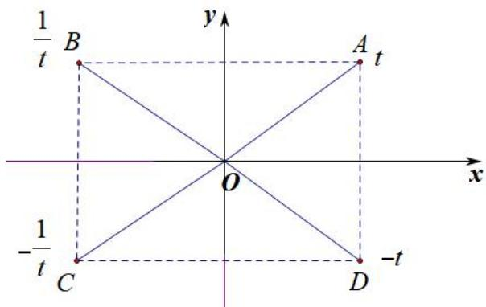

text_image

1/t B
y
A t
O
x
-1/t C
D -t

(1) 若 AB 关于 y 轴对称，则 $t_{A}t_{B}=1$ ;  
(2) 若 AD 关于 x 轴对称，则 $t_{A} + t_{D} = 0$ ;  
(3) 若 AC 关于原点对称，则 $t_{A}t_{C} = -1$ ;

2. 双曲线

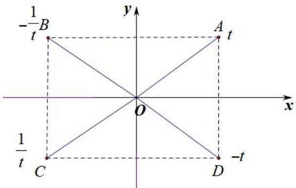

text_image

-1/t B
y
A t
x
O
1/t C
D -t

(1) 若 AB 关于 y 轴对称，则 $t_{A}t_{B} = -1$ ;  
(2) 若 AD 关于 x 轴对称，则 $t_{A} + t_{D} = 0$ ;  
(3) 若 AC 关于原点对称，则 $t_{A}t_{C}=1$ ;

【例 4】（2020•新课标I）已知 A，B 分别为椭圆 $E:\frac{x^{2}}{a^{2}}+y^{2}=1(a>1)$ 的左、右顶点，G 为 E 的上顶点， $\overrightarrow{AG}\cdot\overrightarrow{GB}=8$ ．P 为直线 x=6 上的动点，PA 与 E 的另一交点为 M，PB 与 E 的另一交点为 N．

（1）求 $E$ 的方程；  
(2) 证明: 直线 $MN$ 过定点.

【例 5】（2025·重庆南坪中学）如图，已知椭圆 $C: \frac{x^{2}}{a^{2}} + \frac{y^{2}}{b^{2}} = 1 (a > b > 0)$ 的上顶点为 $A(0,3)$ ，离心率为 $\frac{\sqrt{3}}{2}$ ，若过点 A 作圆 $M: (x+3)^{2} + y^{2} = r^{2} (0 < r < 3)$ 的两条切线分别与椭圆 C 相交于点 B，D （不同于点 A）.

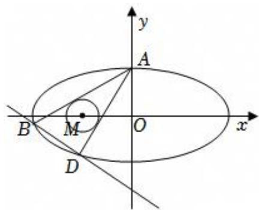

text_image

y
A
B
M
O
x
D

（1）求椭圆 C 的方程；  
（2）设直线 AB 和 AD 的斜率分别为 $k_{1}$ ， $k_{2}$ ，求证： $k_{1} \cdot k_{2}$ 为定值；  
（3）求证：直线 BD 过定点.

【例 6】（2025·合肥一模）已知动圆 $C_{1}:(x+2)^{2}+y^{2}=r_{1}^{2}(r_{1}>0)$ 与动圆 $C_{2}:(x-2)^{2}+y^{2}=r_{2}^{2}(r_{2}>0)$ ，满足 $|r_{1}-r_{2}|=2\sqrt{3}$ ，记 $C_{1}$ 与 $C_{2}$ 公共点的轨迹为曲线 T，曲线 T 与 x 轴的交点记为 A，B （点 A 在点 B 的左侧）.

（1）求曲线T的方程；  
（2）若直线 l 与圆 $x^{2} + y^{2} = 3$ 相切，且与曲线 T 交于 $P_{1}$ ， $P_{2}$ 两点（点 $P_{1}$ 在 y 轴左侧，点 $P_{2}$ 在 y 轴右侧）.  
(i) 若直线 l 与直线 $y = -\frac{\sqrt{3}}{3}x$ 和 $y = \frac{\sqrt{3}}{3}x$ 分别交于 $Q_{1}$ ， $Q_{2}$ 两点，证明： $|P_{1}Q_{1}| = |P_{2}Q_{2}|$ ;  
(ii) 记直线 $AP_{1}$ ， $BP_{2}$ 的斜率分别为 $k_{1}$ ， $k_{2}$ ，证明： $k_{1}k_{2}$ 是定值.

【例 7】（2025·北京海淀区清华附中）已知椭圆 $W: \frac{x^{2}}{a^{2}} + \frac{y^{2}}{b^{2}} = 1 (a > b > 0)$ 的左顶点为 A，下顶点为 B，离心率为 $\frac{\sqrt{3}}{2}$ ，点 $C(\frac{8}{5}, \frac{3}{5})$ 在 W 上.

（Ⅰ）求椭圆 W 的标准方程；

（II）设 $D$ ， $E$ ， $F$ 是椭圆 $W$ 上三个不同的点，它们都不与 $A$ ， $B$ ， $C$ 重合，且 $AB // DE$ ， $BC // EF$ 求证： $AF // CD$ ：

# 拓展思维

# 拓展 1 蒙日圆

问题: 过 $\frac{x^{2}}{a^{2}} + \frac{y^{2}}{b^{2}} = 1 (a > b > 0)$ 外一点 $P(x_{0}, y_{0})$ 作椭圆两条切线. 切点分别为 A、B，若 $k_{PA} \cdot k_{PB} = \lambda$ . 讨论 P 的轨迹.

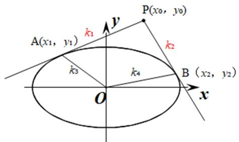

text_image

A(x₁, y₁)
k₁
y
P(x₀, y₀)
k₂
k₃
k₄
B (x₂, y₂)
O
x

如果是切线同构成切点弦，这是走阿基米德三角形的线路，一旦涉及两切线斜率和积问题，用 $k_{PA}$ 构造一个联立式子，利用判别式为零，从而得出 $k_{PA}$ 的二次方程： $ak_{PA}^{2} + bk_{PA} + c = 0$ ，而 $k_{PB}$ 也满足这个方程，故 $k_{PA}$ 、 $k_{PB}$ 是此同构方程 $ak^{2} + bk + c = 0$ 的两个根，从而再利用韦达定理来确定 $k_{PA} \cdot k_{PB} = \lambda$ 的关系式。我们也可以理解为 $k_{PA}$ 确定方程 $ak^{2} + bk + c = 0$ ，而 $k_{PA}$ ， $k_{PB}$ 是此方程的根.

先联立看切线： $\left\{\begin{aligned}\frac{x^{2}}{a^{2}}+\frac{y^{2}}{b^{2}}=1\\\Rightarrow(a^{2}k^{2}+b^{2})x^{2}+2kma^{2}x+a^{2}(m^{2}-b^{2})=0\end{aligned}\right.$ ， $\Delta=0\Rightarrow a^{2}k^{2}+b^{2}-m^{2}=0\cdots\cdots①$ $y=kx+m$

将 $m = y_{0} - kx_{0}$ 代入①得关于 k 的一元一次方程: $(a^{2} - x_{0}^{2})k^{2} + 2x_{0}y_{0}k + b^{2} - y_{0}^{2} = 0 \cdots \cdots$ ②

易知 $k_{PA}$ 、 $k_{PB}$ 同时满足②式，故 $k_{PA}$ 、 $k_{PB}$ 是②式的两个根，我们设为 $k_{1}$ 、 $k_{2}$ ，

所以 $k_{1} \cdot k_{2} = \frac{b^{2} - y_{0}^{2}}{a^{2} - x_{0}^{2}} = \lambda$ ，所以 $\lambda x_{0}^{2} - y_{0}^{2} = \lambda a^{2} - b^{2}$ ;

(1) $\lambda < -1$ ，P 为焦点在 y 轴上的椭圆；  
(2) $\lambda = -1$ ， $P$ 为半径为 $r = \sqrt{a^2 + b^2}$ 的圆，即“蒙日圆”：  
(3) $\lambda \in (-1, 0)$ ， $P$ 为焦点在 $x$ 轴上的椭圆：  
(4) $\lambda \in (0, \frac{b^2}{a^2})$ ， $P$ 为焦点在 $y$ 轴上的双曲线；  
(5) $\lambda = \frac{b^2}{a^2}$ , $P$ 为斜率为 $\pm \frac{b}{a}$ 的射线;  
(6) $\lambda > \frac{b^2}{a^2}$ , $P$ 为焦点在 $x$ 轴上的双曲线;

【例 1】(2014·广东) 已知椭圆 $C: \frac{x^{2}}{a^{2}} + \frac{y^{2}}{b^{2}} = 1 (a > b > 0)$ 的右焦点为 $(\sqrt{5}, 0)$ ，离心率为 $\frac{\sqrt{5}}{3}$ .

(1) 求椭圆 C 的标准方程;  
(2)若动点 $P(x_0, y_0)$ 为椭圆 $C$ 外一点，且点 $P$ 到椭圆 $C$ 的两条切线相互垂直，求点 $P$ 的轨迹方程.

【例 2】椭圆 C 的中心在原点，焦点在 x 轴上，离心率为 $\frac{\sqrt{6}}{3}$ ，并与直线 $y = x + 2$ 相切.

(I) 求椭圆 C 的方程;  
(II)如图，过圆 $D:x^{2}+y^{2}=4$ 上任意一点P作椭圆C的两条切线m，n.求证： $m\perp n$ .

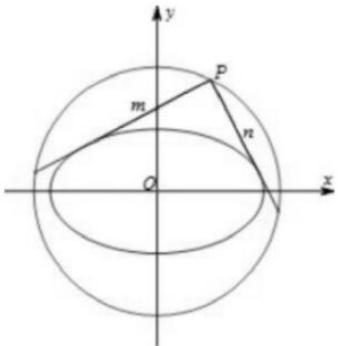

text_image

y
m
P
n
O
x

# 拓展 2 仿射法与面积转化

# 一：仿射法与面积变化

仿射法定理一（直径三角形）：若经过椭圆的对称中心的直线构成的直径三角形，则两条弦的斜率乘积

$$
k _ {A C} \cdot k _ {B C} = - \frac {b ^ {2}}{a ^ {2}}
$$

仿射法定理二（面积伸缩定理）： $\frac{S'}{S}=\frac{a}{b}$ （拉伸短轴）； $\frac{S''}{S}=\frac{b}{a}$ （压缩长轴）

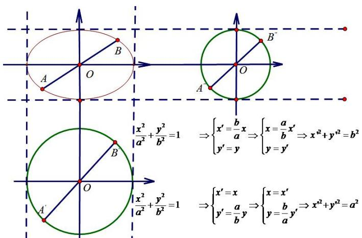

text_image

B
A O
x²/a² + y²/b² = 1 ⇒ {x' = b/a x y' = y} ⇒ {x = a/b x' y = y'} ⇒ x² + y² = b²
B
A'
O
x²/a² + y²/b² = 1 ⇒ {x' = x y' = a/b y} ⇒ {x = x' y = -a/y'} ⇒ x² + y² = a²

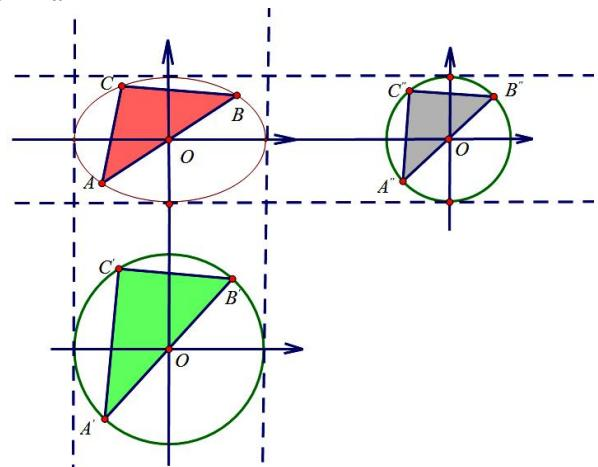

text_image

Geometric diagram showing three coordinate systems with labeled points and shaded regions, likely illustrating a math problem or proof.

拉长短轴后点的坐标变化： $A(x_{0},y_{0})\rightarrow A'(x_{0},\frac{a}{b}y_{0})$ ，横坐标不变，纵坐标拉伸 $\frac{a}{b}$ 倍.

斜率的变化：如图纵坐标拉伸了 $\frac{a}{b}$ 倍，故 $k' = \frac{a}{b} k$ ，由于 $k_{A'C'} \cdot k_{B'C'} = -1$ .

$k_{AC} \cdot k_{BC} = \frac{b}{a} k_{A'C'} \cdot \frac{b}{a} k_{B'C'} = -\frac{b^{2}}{a^{2}}, S_{\triangle ABC} = \frac{b}{a} S_{\triangle A'B'C'}$ （水平宽不变，铅锤高缩小）

压缩长轴后点的坐标变化： $A(x_{0},y_{0})\rightarrow A^{\prime}(\frac{b}{a}x_{0},y_{0})$ ，纵坐标不变，横坐标缩小 $\frac{b}{a}$ 倍.

斜率的变化：如图横坐标缩小了 $\frac{b}{a}$ 倍，故 $k'=\frac{a}{b}k$ ，由于 $k_{A'C'}\cdot k_{B'C'}=-1$ 。

$k_{AC} \cdot k_{BC} = \frac{b}{a} k_{A'C'} \cdot \frac{b}{a} k_{B'C'} = -\frac{b^{2}}{a^{2}}, S_{\triangle ABC} = \frac{a}{b} S_{\triangle A'B'C'}$ （水平宽扩大，铅垂高不变）

【例 1】（2016•北京）已知椭圆 $C:\frac{x^{2}}{a^{2}}+\frac{y^{2}}{b^{2}}=1$ 过点 $A(2,0)$ ， $B(0,1)$ 两点.

（1）求椭圆 C 的方程及离心率；  
（2）设 $P$ 为第三象限内一点且在椭圆 $C$ 上，直线 $PA$ 与 $y$ 轴交于点 $M$ ，直线 $PB$ 与 $x$ 轴交于点 $N$ ，求证：四边形ABNM的面积为定值.

