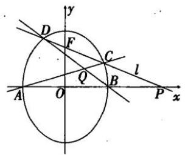
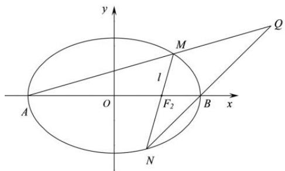
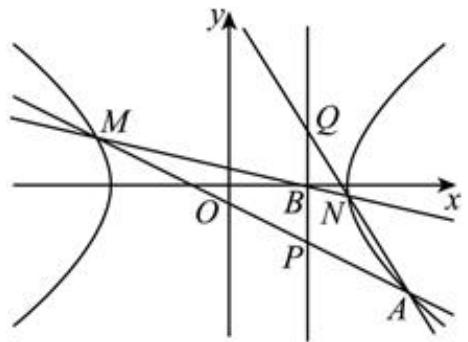
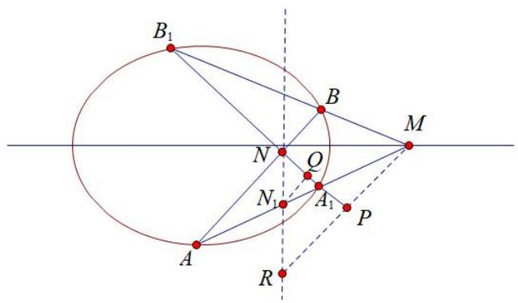
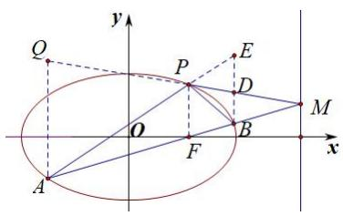

# 第四节跟踪训练

# 考向 1 跟踪训练

【训练 1】设抛物线 $C: y^{2} = 2px (p > 0)$ 的焦点为 F，过点 $P(0, 4)$ 的动直线 l 与抛物线 C 交于 A，B 两点，当 F 在 l 上时，直线 l 的斜率为 -2。

(1) 求抛物线的方程;   
（2）在线段 AB 上取点 D，满足 $\overrightarrow{PA} = \lambda \overrightarrow{PB}$ ， $\overrightarrow{AD} = \lambda \overrightarrow{DB}$ ，证明：点 D 总在定直线上.

【训练 2】已知椭圆 $C: \frac{x^{2}}{a^{2}} + \frac{y^{2}}{b^{2}} = 1 (a > b > 0)$ 的焦距为 2，离心率为 $\frac{1}{2}$ .

（1）求椭圆 C 的标准方程；  
（2）直线 l 与 x 轴正半轴和 y 轴分别交于点 Q，P，与椭圆分别交于点 M，N，各点均不重合且满足 $\overrightarrow{PM} = \lambda \overrightarrow{MQ}$ ， $\overrightarrow{PN} = \mu \overrightarrow{NQ}$ 。若 $\lambda + \mu = -4$ ，证明：直线 l 恒过定点。

【训练 3】点 S 是直线 PQ 外一点, 点 M, N 在直线 PQ 上(点 M, N 与点 P, Q 任一点不重合). 若点 M 在线段 PQ 上, 记 $(P, Q; M) = \frac{|SP| \sin \angle PSM}{|SQ| \sin \angle MSQ}$ , 若点 M 在线段 PQ 外, 记 $(P, Q; M) = -\frac{|SP| \sin \angle PSM}{|SQ| \sin \angle MSQ}$ . 记

$$
(P, Q; M, N) = \frac {(P , Q ; M)}{(P , Q ; N)}.
$$

记 $\Delta ABC$ 的内角 $A, B, C$ 的对边分别为 $a, b, c$ ，已知 $b = 2, A = 60^\circ$ ，点 $D$ 是射线 $BC$ 上一点，且

$$
(B, C; D) = \frac {c}{2}.
$$

(1)若 $AD = \sqrt{3} + 1$ ，求 $\angle ADC$   
(2)射线 BC 上的点 $M_{0}, M_{1}, M_{2}, \cdots$ 满足 $(B, C_{3}M_{n}, D) = -\frac{1 + \sqrt{3}n}{2}, n \in \mathbb{N}$ ,  
(i)当 n=0 时,求 $AM_{0}+8AD$ 的最小值,  
(ii)当 $n \neq 0$ 时, 过点 $C$ 作 $CP_{n} \perp AM_{n}$ 于 $P_{n}$ , 记 $a_{n} = \frac{CP_{n}}{n}$ , 求证, 数列 $\left\{a_{n}\right\}$ 的前 $n$ 项和 $S_{n} < 2 + \sqrt{2}$ .

# 考向 2 跟踪训练

【训练1】(2011·四川)如图, 椭圆有两顶点 $A(-1, 0)$ 、 $B(1, 0)$ , 过其焦点 $F(0, 1)$ 的直线 $l$ 与椭圆交于 $C, D$ 两点, 并与 $x$ 轴交于点 $P$ . 直线 $AC$ 与直线 $BD$ 交于点 $Q$ . 当点 $P$ 异于 $A, B$ 两点时, 求证: $\overrightarrow{OP} \cdot \overrightarrow{OQ}$ 为定值.

text_image

y
D
F
C
l
Q
B
A
O
P
x

【训练2】已知椭圆 $C: \frac{x^2}{a^2} + \frac{y^2}{b^2} = 1 (a > b > 0)$ 的左右焦点分别为 $F_1, F_2$ ，点 $P(1, \frac{3}{2})$ 在 $C$ 上，且 $PF_2 \perp F_2F_1$ .

（1）求 C 的标准方程；  
（2）设 C 的左右顶点分别为 A, B, O 为坐标原点，直线 l 过右焦点 $F_{2}$ 且不与坐标轴垂直，l 与 C 交于 M, N 两点，直线 AM 与直线 BN 相交于点 Q，证明点 Q 在定直线上.

text_image

y
M
l
A O F₂ B x
N
Q

【训练3】(2018全国卷 I) 设椭圆 $C: \frac{x^{2}}{2} + y^{2} = 1$ 的右焦点为 F，过 F 的直线 l 与 C 交于 A, B 两点，点 M 的坐标为 $(2, 0)$ .

(1) 当 l 与 x 轴垂直时，求直线 AM 的方程；  
(2) 设 O 为坐标原点，证明： $\angle OMA = \angle OMB$ .

【训练 4】已知双曲线 $E: \frac{x^{2}}{a^{2}} - \frac{y^{2}}{3} = 1 (a > 0)$ 的左焦点为 F，A，B 分别为双曲线的左、右顶点，顶点到双曲线的渐近线的距离为 $\frac{\sqrt{3}}{2}$ .

(1) 求 E 的标准方程;  
(2) 过点 $B$ 的直线与双曲线左支交于点 $P$ (异于点 $A$ ), 直线 $BP$ 与直线 $l: x = -1$ 交于点 $M$ , $\angle PFA$ 的角平分线交直线 $l$ 于点 $N$ , 证明: $N$ 是 $MA$ 的中点.

【训练 5】（2023·全国一模）已知双曲线 $C: \frac{x^{2}}{a^{2}} - \frac{y^{2}}{b^{2}} = 1 (a > 0, b > 0)$ 过点 $A(3, -\sqrt{2})$ ，且渐近线方程为 $x \pm \sqrt{3} y = 0$ 。

（1）求双曲线 C 的方程；  
（2）如图，过点 $B(1,0)$ 的直线 $l$ 交双曲线 $C$ 于点 $M$ 、 $N$ 。直线 $MA$ 、 $NA$ 分别交直线 $x = 1$ 于点 $P$ 、 $Q$ ，求 $\frac{|PB|}{|BQ|}$ 的值.

text_image

y
M
Q
O
B
N
x
P
A

【训练 6】已知椭圆 $C: \frac{x^{2}}{4} + \frac{y^{2}}{3} = 1$ ，斜率为 1 的直线 l 与椭圆交于 A、B 两点，点 $M(4, 0)$ ，直线 AM 与椭圆交于点 $A_{1}$ ，直线 BM 与椭圆交于 $B_{1}$ ，求证：直线 $A_{1}B_{1}$ 过定点.

text_image

B₁
B
M
N
O
N₁
A₁
P
R

# 考向 3 跟踪训练

【训练 1】已知双曲线 E: $\frac{x^{2}}{a^{2}} - \frac{y^{2}}{b^{2}} = 1$ 的左右焦点为 $F_{1}$ ， $F_{2}$ ，其右准线为 l，点 $F_{2}$ 到直线 l 的距离为 $\frac{3}{2}$ ，过点 $F_{2}$ 的动直线交双曲线 E 于 A，B 两点，当直线 AB 与 x 轴垂直时， $|AB| = 6$ .

(1)求双曲线 E 的标准方程;  
(2)设直线 $AF_{1}$ 与直线 l 的交点为 P，证明：直线 PB 过定点.

【训练2】在平面直角坐标系 $xOy$ 中，点 $F(-\sqrt{3},0)$ ，点 $D(x,y)$ 是平面内的动点．若 $DF$ 为直径的圆与圆 $O:x^{2}+y^{2}=4$ 内切，记点 $D$ 的轨迹为曲线 $E$

(1) 求 E 的方程;  
(2) 设点 $A(0,1), M(t,0), N(4 - t,0)(t \neq 2)$ , 直线 $AM$ , $AN$ 分别与曲线 $E$ 交于点 $S, T(S,T$ 异于 $A)$ $AH \perp ST$ , 垂足为 $H$ , 求 $|OH|$ 的最小值.

【训练 3】（2013 江西理）如图，椭圆 C: $\frac{x^{2}}{a^{2}}+\frac{y^{2}}{b^{2}}=1\quad(a>b>0)$ 经过点 $P(1,\frac{3}{2})$ ，离心率 $e=\frac{1}{2}$ ，直线 l 的方程为 x=4.

(1) 求椭圆 C 的方程;  
（2）AB 是经过右焦点 F 的任一弦（不经过点 P），设直线 AB 与直线 l 相交于点 M，记 PA，PB，PM 的斜率分别为 $k_{1}$ ， $k_{2}$ ， $k_{3}$ 。问：是否存在常数 $\lambda$ ，使得 $k_{1} + k_{2} = \lambda k_{3}$ ？若存在，求 $\lambda$ 的值；若不存在，说明理由。

text_image

y
Q
P
E
D
O
B
M
x
A
F

【训练4】已知椭圆 $C: \frac{x^2}{a^2} + \frac{y^2}{b^2} = 1 (a > b > 0)$ 的离心率为 $\frac{\sqrt{3}}{2}$ , 过点 $P(a, b)$ 的直线 $l$ 与椭圆 $C$ 交于 $A, B$ 两点, 当 $l$ 过坐标原点 $O$ 时, $|AB| = \sqrt{10}$ .

(I)求椭圆 C 的方程;  
(II) 线段 OP 上是否存在定点 Q，使得直线 QA 与直线 QB 的斜率之积为定值。若存在,求出点 Q 的坐标；若不存在，请说明理由。

# 考向 4 跟踪训练

【训练1】已知椭圆 $C: \frac{x^2}{a^2} + \frac{y^2}{b^2} = 1 (a > b > 0)$ 的离心率为 $\frac{\sqrt{3}}{2}, A_1, A_2, B$ 分别为椭圆 $C$ 的左、右和上顶点，直线 $A_1B$ 交直线 $l: y = x$ 于点 $P$ ，且点 $P$ 的横坐标为2.

（1）求椭圆 C 的方程；  
（2）过点 $P$ 的直线与椭圆 $C$ 交于第二象限内 $D$ ， $E$ 两点，且 $E$ 在 $P$ ， $D$ 之间， $A_{1}E$ 与直线 $l$ 交于点 $M$ ，试判断直线 $A_{1}D$ 与 $A_{2}M$ 是否平行，并说明理由.

