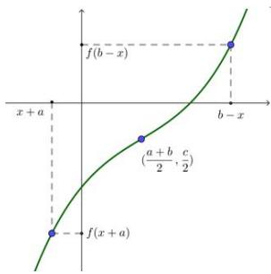
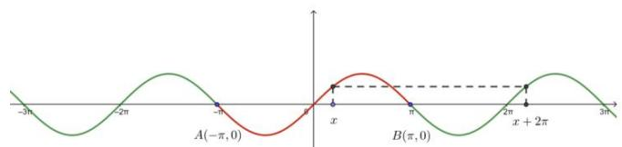
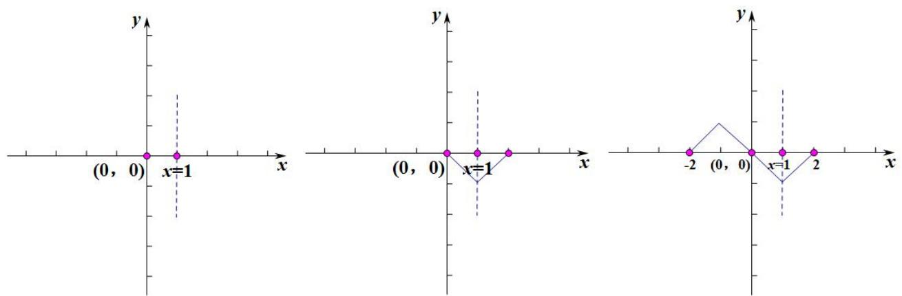
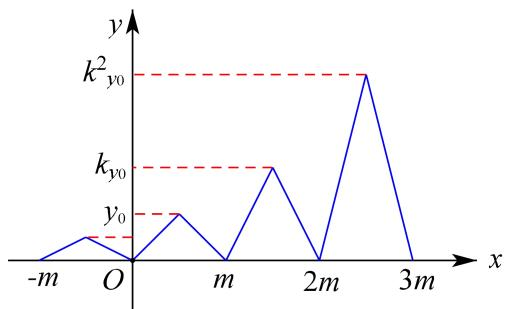

# 第三节 周期性与对称性

# 考向 1 函数的对称性

# 1 函数图象自身的对称关系（可理解为奇偶函数平移后的图像）

①（“偶函数”）轴对称：若 $f(x+a)=f(b-x)$ ，则 $y=f(x)$ 有对称轴 $x=\frac{a+b}{2}$ .  
②（“奇函数”）中心对称：若函数 $y = f(x)$ 定义域为 $R$ ，

且满足条件 $f(a+x)+f(b-x)=c(a,b,c$ 为常数)，则函数 $y=f(x)$ 的图象关于点 $\left(\frac{a+b}{2},\frac{c}{2}\right)$ 对称.

text_image

f(b-x)
x+a
(a+b/c/2) / 2
b-x
f(x+a)

# 2 两个函数图象之间的对称关系

① 轴对称

若函数 $y = f(x)$ 定义域为 $R$ ，则两函数 $y = f(x + a)$ 与 $y = f(b - x)$ 的图象关于直线 $x = \frac{b - a}{2}$ 对称。特殊地，函数 $y = f(a + x)$ 与函数 $y = f(a - x)$ 的图象关于直 $x = 0$ 对称。

② 中心对称

若函数 $y = f(x)$ 定义域为 $R$ ，则两函数 $y = f(a + x)$ 与 $y = c - f(b - x)$ 的图象关于点 $\left(\frac{b - a}{2}, \frac{c}{2}\right)$ 对称。特殊地，函数 $y = f(x + a)$ 与函数 $y = -f(b - x)$ 图象关于点 $\left(\frac{b - a}{2}, 0\right)$ 对称。

对称性两步搞定：①去常数，判断中心对称（奇函数）或轴对称（偶函数）；②中点坐标公式，括号里面相加除2.

# 题型 1 对称性的判断

【例 1】充分理解

（1）若 $f(x+1)$ 为偶函数，则 $f(x)$ 关于 \_\_\_\_ 对称；若 $f(x-2)$ 为奇函数，则 $f(x)$ 关于 \_\_\_\_ 对称；  
（2）若 $f(2x+1)$ 为偶函数，则 $f(x)$ 关于 \_\_\_\_ 对称，则 $f(2x)$ 关于 \_\_\_\_ 对称；  
（3）若 $f(2x-1)$ 为奇函数，则 $f(x)$ 关于 \_\_\_\_ 对称，则 $f(2x)$ 关于 \_\_\_\_ 对称；  
(4)函数 $y=f(x+1)$ 与 $y=f(3-x)$ 关于\_\_\_\_对称; 函数 $y=f(x+1)$ 与 $y=-f(3-x)$ 关于\_\_\_\_对称.

(5) 写出下列式子的对称性:

① $f(x+1)=f(3-x)$ ; ② $f(x+1)=-f(3-x)$ ; ③ $f(x+1)=-f(3-x)+2$ .

【例 2】【多选题】函数 $f(x)$ 的图象关于直线x=1对称，那么()

A. $f(2 - x) = f(x)$

B. $f(1 - x) = f(1 + x)$

C. 函数 $y = f(x + 1)$ 是偶函数

D. 函数 $y = f(x - 1)$ 是偶函数

# 题型2 对称性的应用

【例 1】（2018•新课标Ⅲ）下列函数中，其图象与函数 y = ln x 的图象关于直线 x = 1 对称的是()

A. $y = \ln(1 - x)$

B. $y = \ln(2 - x)$

C. $y = \ln(1 + x)$

D. $y = \ln(2 + x)$

【例 2】（2016•新课标Ⅱ）已知函数 $f(x)(x \in R)$ 满足 $f(-x) = 2 - f(x)$ ，若函数 $y = \frac{x + 1}{x}$ 与 $y = f(x)$ 图象的交点为 $(x_{1}, y_{1})$ ， $(x_{2}, y_{2})$ ，…， $(x_{m}, y_{m})$ ，则 $\sum_{i=1}^{m}(x_{i} + y_{i}) = (\quad)$

A. 0

B. m

C. 2m

D. 4m

# 考向 2 函数的周期性

1. 定义: 对于函数 $y = f(x)$ , 如果存在一个不为零的常数 $T$ , 使得当 $x$ 取定义域内的每一个值时, $f(x + T) = f(x)$ 都成立, 那么把函数 $y = f(x)$ 叫做周期函数, 常数 $T$ 叫做这个函数的周期.

例如：

text_image

-3π
-2π
A(-π,0)
x
B(π,0)
2π
x + 2π
3π

上图是三角函数 $f(x)=\sin x$ 的图像

① $AB = 2\pi$ ，它就是函数的最小正周期T，即 $T = 2\pi$ ;

(最小正周期T的整数倍依然是周期，如： $4\pi$ 也是函数的周期)

② 整个函数，对于任何x，都有 $f(x+2\pi)=f(x)$ .

(两个自变量相差 $2\pi$ ，它们对应的函数值均相等)

# 2. 常见的结论及证明

① $f(x)=f(x+a)\Rightarrow T=|a|$ ;

② $f(x) = -f(x + a) \Rightarrow T = 2 |a|$ ;

③ $f(x)=\frac{1}{f(x+a)}\Rightarrow T=2|a|$ ;

④ $f(x) = -\frac{1}{f(x + a)} \Rightarrow T = 2 |a|$ ;

⑤ $f(x + a) = \frac{1 - f(x)}{1 + f(x)}\Rightarrow T = 2|a|$ ;

⑥ $f(x + a) = \frac{1 + f(x)}{1 - f(x)}\Rightarrow T = 4|a|$ ;

⑦ $f(x + a) = 1 - \frac{1}{f(x)}\Rightarrow T = 3|a|$ ;

⑧ $f(x) = f(x + a) + f(x - a) \Rightarrow T = 6|a|$ .

# 题型 1 周期性的应用

【例 1】设 $f(x)$ 是周期为 4 的奇函数，当 $0 \leq x \leq 1$ 时， $f(x) = x(1 + x)$ ，则 $f(-\frac{9}{2}) =$ \_\_\_\_

【例 2】设偶函数 $f(x)$ 对任意 $x \in R$ ，都有 $f(x + 3) = -\frac{1}{f(x)}$ ，且当 $x \in [-3, -2]$ 时， $f(x) = 4x$ ，则 $f(107.5) =$ \_\_\_\_.

【例 3】设定义在 R 上的函数 $f(x)$ 满足 $f(x) \cdot f(x + 2) = 13$ ， $f(1) = 2$ ，则 $f(2019)$ 等于（）

A. 13

B. 2

C. $\frac{13}{2}$

D. $\frac{2}{13}$

# 考向 3 对称性与周期性的综合应用

# 判断函数 $f(x)$ 的对称性或周期性：

(1) 同周异对 (x 的符号);  
(2) 知三求二（如：双对称得周期）；  
(3) 双对称快速得周期的方法:

①定义法：把式子统一化为 $f(x)=$ \_\_\_\_ 的形式，再联立方程求解周期；

如：奇函数 $f(x)$ ，且满足 $f(1+x)=-f(3-x)$ ，求周期：

解：由 $f(x) = -f(-x)$ ，且 $f(x) = -f(4 - x)$ ，得 $f(-x) = f(4 - x)$ ，即 $T = 4$ 。

②图像法：先标出对称中心及对称轴，如果是双轴（或双中心对称）也同理作图.

如：奇函数 $f(x)$ ，且满足 $f(1+x)=f(1-x)$ ，求周期：

解：第一步，标出对称中心和对称轴；

第二步，穿过对称中心，画出轴对称图象；

第三步，根据对称中心，补全另一侧图象（如图原点左侧）.

第四步，得出最小正周期 T = 4 .

text_image

(0, 0) x=1
(0, 0) x=1
-2 (0, 0) x=1 2

【例 1】(2021·甲卷文) 设 $f(x)$ 是定义域为 R 的奇函数，且 $f(1+x)=f(-x)$ . 若 $f(-\frac{1}{3})=\frac{1}{3}$ ，则 $f(\frac{5}{3})=(\quad)$

A. $-\frac{5}{3}$

B. $-\frac{1}{3}$

C. $\frac{1}{3}$

D. $\frac{5}{3}$

【例 2】（2021•甲卷理）设函数 $f(x)$ 的定义域为 R， $f(x+1)$ 为奇函数， $f(x+2)$ 为偶函数，当 $x \in [1, 2]$ 时， $f(x) = ax^{2} + b$ 。若 $f(0) + f(3) = 6$ ，则 $f(\frac{9}{2}) = (\quad)$

A. $-\frac{9}{4}$

B. $-\frac{3}{2}$

C. $\frac{7}{4}$

D. $\frac{5}{2}$

【例 3】（2022•乙卷）已知函数 $f(x)$ ， $g(x)$ 的定义域均为 R，且 $f(x)+g(2-x)=5$ ， $g(x)-f(x-4)=7$ 。若 $y=g(x)$ 的图像关于直线 x=2 对称， $g(2)=4$ ，则 $\sum_{k=1}^{22}f(k)=(\quad)$

A. -21

B. -22

C. -23

D. -24

# 拓展思维

# 拓展 1 类周期函数问题

若 $y = f(x)$ 满足： $f(x) = kf(x + m)$ ，则 $y = f(x)$ 横坐标每增加 $m$ 个单位，则函数值扩大 $k$ 倍．此函数称为周期为 $m$ 的类周期函数.

line

| x    | y     |
| ---- | ----- |
| -m   | 0     |
| O    | 0     |
| m    | 1     |
| 2m   | 0     |
| 3m   | 1     |

【例 1】（2019•新课标II）设函数 $f(x)$ 的定义域为 R，满足 $f(x+1)=2f(x)$ ，且当 $x\in(0,1]$ 时， $f(x)=x(x-1)$ 。若对任意 $x\in(-\infty,m]$ ，都有 $f(x)\geq-\frac{8}{9}$ ，则 m 的取值范围是（）

A. $(-∞, \frac{9}{4}]$

B. $(-∞, \frac{7}{3}]$

C. $(-∞, \frac{5}{2}]$

D. $(-∞, \frac{8}{3}]$

【例2】（2019·汕头模拟）已知函数 $f(x) = \begin{cases} \frac{|x^2 - 1|}{x - 1} + 1, & x \in [-2, 0] \\ 2f(x - 2), & x \in (0, +\infty) \end{cases}$ ，若函数 $g(x) = f(x) - x - 2m + 1$ 在区间[-2,4]内有3个零点，则实数 $m$ 的取值范围是（）

A. $\{m\mid-\frac{1}{2}<m<\frac{1}{2}\}$

B. $\{m\mid -1 <   m\leq \frac{1}{2}\}$

C. $\{m\mid-1<m<\frac{1}{2}$ 或 $m=1\}$

D. $\{m\mid -\frac{1}{2} < m <   \frac{1}{2}$ 或 $m = 1\}$

# 拓展 2 抽象函数的性质问题

（1）正比例函数 $f(x)=ax$ ，有 $f(x+y)=f(x)+f(y)$ ;  
(2) 一次函数 $f(x) = kx + b$ ，有 $f(x + y) = f(x) + f(y) - b$ ;  
（3）二次函数 $f(x)=ax^{2}+bx+c(a\neq0)$ ，有 $f(x+y)=f(x)+f(y)+2axy-c$ ;  
（4）幂函数 $f(x) = x^{a}$ ，有 $f(xy) = f(x)f(y)$ 或 $f\left(\frac{x}{y}\right) = \frac{f(x)}{f(y)}$ ;  
（5）指数函数 $f(x)=a^{x}$ ，有 $f(x+y)=f(x)f(y)$ 或 $f(x-y)=\frac{f(x)}{f(y)}$ ;  
（6）对数函数 $f(x) = \log_a x$ ，有 $f(xy) = f(x) + f(y)$ 或 $f(\frac{x}{y}) = f(x) - f(y)$ ;

以下模型只作为了解，解题要注意：模型是个充分非必要条件，前者（函数）一定推出后者（模型），反之不一定成立，如 $f(x+y)+f(x-y)=2f(x)f(y)\Rightarrow f(0)=0$ 或 $f(0)=1$ .

(7) 正弦函数 $f(x)=\sin x$ ，有 $f(x)^{2}-f(y)^{2}=f(x+y)f(x-y)$ ;  
(8) 余弦函数 $f(x)=\cos x$ ，有 $f(x+y)+f(x-y)=2f(x)f(y)$ ;  
（9）正切函数 $f(x) = \tan x$ ，有 $f(x \pm y) = \frac{f(x) \pm f(y)}{1 \mp f(x)f(y)}$ ;  
（10）负倒型 $f(x) = \log_a x$ 或 $f(x) = x - \frac{1}{x}$ ，有 $f(x) = -f(\frac{1}{x})$ ；  
（11）反双曲正切型 $f(x) = \log_a\frac{1 + x}{1 - x}$ ，有 $f(x) + f(y) = f(\frac{x + y}{1 + xy})$ ；

注：解决抽象函数题型常用赋值法.

【例 1】（2014·陕西）下列函数中，满足“ $f(x+y)=f(x)f(y)$ ”的单调递增函数是()

A. $f(x)=x^{3}$

B. $f(x) = 3^{x}$

C. $f(x)=x^{\frac{1}{2}}$

D. $f(x)=\left(\frac{1}{2}\right)^{x}$

【例 2】（2021•新高考II）写出一个同时具有下列性质①②③的函数 $f(x)$ : \_\_\_\_.

① $f(x_{1}x_{2})=f(x_{1})f(x_{2})$ ; ② 当 $x\in(0,+\infty)$ 时， $f'(x)>0$ ; ③ $f'(x)$ 是奇函数.

【例 3】（2023•新高考I）已知函数 $f(x)$ 的定义域为 R， $f(xy)=y^{2}f(x)+x^{2}f(y)$ ，则（）

A. $f(0)=0$

B. $f(1)=0$

C. $f(x)$ 是偶函数

D. $x = 0$ 为 $f(x)$ 的极小值点

拓展 3 周期函数的递推问题

例 1. 已知定义在 R 上的函数 $f(x)$ 满足 $f(x+1)=f(x)-1$ ，当 $x\in[0,1)$ 时， $f(x)=3^{x}-1$ ，则 $f(-8)=$ \_\_\_\_.

例 2.（2024•新高考Ⅰ卷）已知函数为 $f(x)$ 的定义域为 R， $f(x) > f(x-1) + f(x-2)$ ，且当 x < 3 时 $f(x) = x$ ，则下列结论中一定正确的是（）

A. $f(10) > 100$

B. $f(20) > 1000$

C. $f(10) < 1000$

D. $f(20) < 10000$

例 3. 定义在 R 上的函数 $f(x)$ 满足 $f(0)=0$ ， $f(x)+f(1-x)=1$ ， $f(\frac{x}{5})=\frac{1}{2}f(x)$ ，且当 $0 \leqslant x_{1} < x_{2} \leqslant 1$ 时， $f(x_{1}) \leqslant f(x_{2})$ ，则 $f(\frac{1}{2024})=(\quad)$

A. $\frac{1}{256}$

B. $\frac{1}{128}$

C. $\frac{1}{64}$

D. $\frac{1}{32}$

