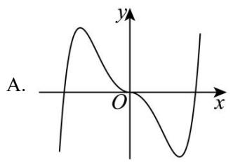
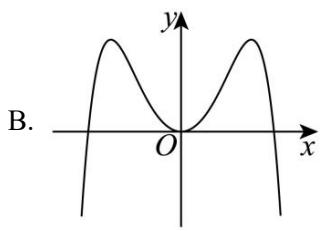
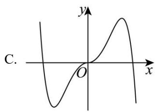
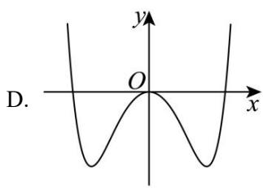

# 第二节 单调性与奇偶性

# 考向 1 函数的单调性

# 题型 1 单调性的定义及判断

（1）定义域是函数的整体性质，单调性是函数的局部性质. 若函数单调区间不止一个时，不能用 “∪” 书写，需要用 “，” 或 “和” 隔开．例如， $f(x)=\frac{1}{x}$ 的单调递减区间为 $(-∞,0)$ ， $(0,+∞)$ .

(2) 等价定义:

① $\forall x_{1}, x_{2} \in D$ ，若 $(x_{1} - x_{2})[f(x_{1}) - f(x_{2})] > 0$ ，则 $f(x)$ 在区间 D 上是增函数；  
② $\forall x_{1}, x_{2} \in D$ ，若 $(x_{1} - x_{2})[f(x_{1}) - f(x_{2})] < 0$ ，则 $f(x)$ 在区间 D 上是减函数.  
③ $\forall x_{1},x_{2}\in D$ ，且 $x_{1}\neq x_{2}$ ，若 $\frac{f(x_1) - f(x_2)}{x_1 - x_2} >0$ ，则 $f(x)$ 在区间 $D$ 上是增函数；  
④ $\forall x_{1},x_{2}\in D$ ，且 $x_{1}\neq x_{2}$ ，若 $\frac{f(x_1) - f(x_2)}{x_1 - x_2} < 0$ ，则 $f(x)$ 在区间 $D$ 上是减函数.

(3) 函数单调性的运算:

①增函数 + 增函数 = 增函数，减函数 + 减函数 = 减函数，  
增函数-减函数 $=$ 增函数，减函数-增函数 $=$ 减函数；  
②函数 $-f(x)$ 与函数 $f(x)$ 的单调性相反；  
③ k > 0 时，函数 $f(x)$ 与 $\frac{k}{f(x)}$ 的单调性相反 ( $f(x) \neq 0$ );

$k < 0$ 时，函数 $f(x)$ 与 $\frac{k}{f(x)}$ 的单调性相同 $(f(x) \neq 0)$ .

【例 1】（2023·北京）下列函数中在区间 $(0,+\infty)$ 上单调递增的是()

A. $f(x) = -\ln x$

B. $f(x)=\frac{1}{2^{x}}$

C. $f(x) = -\frac{1}{x}$

D. $f(x)=3^{|x-1|}$

【例 2】（2017·山东）若函数 $e^{x}f(x)(e=2.71828$ 是自然对数的底数）在 $f(x)$ 的定义域上单调递增，则称函数 $f(x)$ 具有 M 性质，下列函数中具有 M 性质的是（）

A. $f(x) = 2^{-x}$

B. $f(x)=x^{2}$

C. $f(x) = 3^{-x}$

D. $f(x)=\cos x$

【例 3】已知函数 $f(x)=\frac{2}{x-1}+1$ ，则下列说法正确的是()

A. 函数 $f(x)$ 的图象关于点(1,0)对称  
B. 函数 $f(x)$ 在 $(1,+\infty)$ 上单调递增  
C. 函数 $f(x)$ 的图象关于直线 x=1 对称  
D. 函数 $f(x)$ 在 [2, 6] 上的最大值为 3

# 题型 2 利用单调性求参

【例 1】已知 $f(x)$ 是定义在 $[-1, 1]$ 上的减函数，且 $f(2a-3) < f(a-2)$ ，则实数 a 的取值范围是（）

A. $(1, 2]$

B. $(1, 3]$

C. $(1, 4]$

D. $(1, + \infty)$

【例 2】设函数 $f(x)=x \mid x-a$ ，若对 $\forall x_{1}, x_{2} \in [3,+\infty), x_{1} \neq x_{2}$ ，不等式 $\frac{f(x_{1})-f(x_{2})}{x_{1}-x_{2}}>0$ 恒成立，则实数 a 的取值范围是（）

A. $(-∞,-3]$

B. $[-3,0)$

C. $(-∞,3]$

D. $(0,3]$

【例 3】已知函数 $f(x)$ 的定义域为 R，图象恒过 $(1,1)$ 点，对任意 $x_{1}<x_{2}$ ，都有 $\frac{f(x_{1})-f(x_{2})}{x_{1}-x_{2}}>-1$ ．则不等式 $f[\log_{2}(2^{x}-1)]<2-\log_{2}(2^{x}-1)$ 的解集为（）

A. $(0,+\infty)$

B. $(-\infty, \log_2 3)$

C. $(- \infty, 0) \cup (0, \log_2 3)$

D. $(0,\log_23)$

# 题型 3 分段函数的单调性

函数 $f(x)=\left\{\begin{aligned}f_{1}(x),&x\leq a\\ f_{2}(x),&x>a\end{aligned}\right.$ ，在 R 上单调递，则需满足三个条件：

(1) $f_{1}(x)$ 在 $(- \infty, a]$ 上单调增递增；(2) $f_{2}(x)$ 在 $(a, +\infty)$ 上单调增递增；(3) $f_{1}(a) \leq f_{2}(a)$ .

函数 $f(x)=\left\{\begin{aligned}f_{1}(x),&x\leq a\\ f_{2}(x),&x>a\end{aligned}\right.$ ，在 R 上单调增递减，则需满足三个条件：

(1) $f_{1}(x)$ 在 $(- \infty, a]$ 上单调增递减；(2) $f_{2}(x)$ 在 $(a, +\infty)$ 上单调增递减；(3) $f_{1}(a) \geq f_{2}(a)$ .

【例 1】若函数 $f(x)=\left\{\begin{aligned}(2a-3)x-1,x<1\\ x^{2}+1,x\geqslant1\end{aligned}\right.$ ，且对任意的 $x_{1}\neq x_{2}$ ，满足条件 $\frac{f(x_{1})-f(x_{2})}{x_{1}-x_{2}}>0$ ，则实数 a 的取值范围为（）

A. $\left(\frac{3}{2},+\infty\right)$

B. $\left(\frac{3}{2},3\right]$

C. $(\frac{3}{2},4]$

D. $(-∞, \frac{3}{2}]$

【例 2】（2024•新高考 1 卷）已知函数为 $f(x)=\left\{\begin{aligned}-x^{2}-2ax-a,x&<0\\ \mathrm{e}^{x}+\ln(x+1),&x\geq0\end{aligned}\right.$ ，在 R 上单调递增，则 a 取值的范围是（）

A. $(-\infty,0]$

B. $[-1,0]$

C. $[-1,1]$

D. $[0, +\infty)$

# 题型 4 复合函数的单调性

讨论复合函数 $y = f[g(x)]$ 的单调性时要注意：既要把握复合过程，又要掌握基本函数的单调性。一般需要先求定义域，再把复杂的函数正确地分解为两个简单的初等函数的复合，然后分别判断它们的单调性，再用复合法则，复合法则如下：

若 $u = g(x)$ ， $y = f(u)$ 在所讨论的区间上都是增函数或都是减函数，则 $y = f[g(x)]$ 为增函数；

若 $u = g(x)$ ， $y = f(u)$ 在所讨论的区间上一增一减，则 $y = f[g(x)]$ 为减函数.

【例 1】（2023•新高考I）设函数 $f(x)=2^{x(x-a)}$ 在区间 $(0,1)$ 单调递减，则 a 的取值范围是（）

A. $(- \infty, -2]$

B. $[-2, 0)$

C. $(0, 2]$

D. $[2, +\infty)$

【例 2】（2020·海南）已知函数 $f(x)=\lg(x^{2}-4x-5)$ 在 $(a,+\infty)$ 上单调递增，则 a 的取值范围是（）

A. $(2, +\infty)$

B. $[2, +\infty)$

C. $(5, +\infty)$

D. $[5, +\infty)$

# 考向 2 函数的奇偶性

# 题型 1 奇偶性定义及判断

# 函数奇偶性的几个重要结论

（1）奇函数在关于原点对称的区间上的单调性相同，偶函数在关于原点对称的区间上的单调性相反.  
(2) 函数 $f(x)$ ， $g(x)$ 在它们的公共定义域上有下面的结论：

同名加减不变，异名加减不可；同名乘除得偶，异名乘除得奇.

<table><tr><td>f(x)</td><td>g(x)</td><td>f(x)+g(x)</td><td>f(x)-g(x)</td><td>f(x)·g(x)</td><td>f(g(x))</td></tr><tr><td>偶函数</td><td>偶函数</td><td>偶函数</td><td>偶函数</td><td>偶函数</td><td>偶函数</td></tr><tr><td>偶函数</td><td>奇函数</td><td>不能确定</td><td>不能确定</td><td>奇函数</td><td>偶函数</td></tr><tr><td>奇函数</td><td>偶函数</td><td>不能确定</td><td>不能确定</td><td>奇函数</td><td>偶函数</td></tr><tr><td>奇函数</td><td>奇函数</td><td>奇函数</td><td>奇函数</td><td>偶函数</td><td>奇函数</td></tr></table>

（3）若奇函数的定义域包括0，则 $f(0)=0$ 。  
（4）若函数 $f(x)$ 是偶函数，则 $f(-x)=f(x)=f(|x|)$ .  
（5）定义在 $(- \infty, + \infty)$ 上的任意函数 $f(x)$ 都可以唯一表示成一个奇函数与一个偶函数之和.  
(6) 若函数 $y = f(x)$ 的定义域关于原点对称，则：

$f(x)+f(-x)$ 为偶函数， $f(x)-f(-x)$ 为奇， $f(x)\cdot f(-x)$ 为偶函数.

【例 1】已知 $f(x)$ ， $g(x)$ 是定义在 R 上的函数，则 “ $y=f(x)+g(x)$ 是 R 上的偶函数” 是 “ $f(x)$ ， $g(x)$ 都是 R 上的偶函数” 的（）

A. 充分不必要条件  
B. 必要不充分条件  
C. 充要条件

D. 既不充分也不必要条件

【例 2】函数 $f(x)=x+\sin x$ 在 R 上是（）

A. 偶函数、增函数

B. 奇函数、减函数

C. 偶函数、减函数

D. 奇函数、增函数

【例 3】已知函数 $f(x)$ 是偶函数， $g(x)$ 是奇函数，则 $f(x)+g(x)=x^{2}+x-2$ ，则 $f(2)=(\quad)$

A. 1

B. 2

C. 3

D. 4

【例 4】已知函数 $f(x)$ 是定义域为 R 的奇函数，当 $x \geqslant 0$ 时， $f(x) = x + \cos x - 1$ ，则 x < 0 时， $f(x) = (\quad)$

A. $x - \cos x + 1$

B. $-x+\cos x-1$

C. $x + \cos x - 1$

D. $-x - \cos x + 1$

【例 5】若 $f(x)$ 是定义在 R 上的函数，则下列选项中一定是偶函数的是（）

A. $|f(x)|$

B. $f(|x|)$

C. $\frac{1}{f(x)}$

D. $f(x) - f(-x)$

【例 6】（2021•乙卷）设函数 $f(x)=\frac{1-x}{1+x}$ ，则下列函数中为奇函数的是（）

A. $f(x - 1) - 1$

B. $f(x - 1) + 1$

C. $f(x+1) - 1$

D. $f(x+1)+1$

例 7.（2024·天津卷）下列函数是偶函数的是（）

A. $y=\frac{e^{x}-x^{2}}{x^{2}+1}$

B. $y=\frac{\cos x+x^{2}}{x^{2}+1}$

C. $y=\frac{e^{x}-x}{x+1}$

D. $y=\frac{\sin x+4x}{e^{|x|}}$

# 题型 2 常见奇偶的七大模型

奇函数：“两指两对”；偶函数：“一指一对一绝”

(1) 奇函数:

①函数 $f(x)=m\left(\frac{a^{x}+1}{a^{x}-1}\right)(x\neq0)$ 或函数 $f(x)=m\left(\frac{a^{x}-1}{a^{x}+1}\right)$ .  
②函数 $f(x)=\pm(a^{x}-a^{-x})$ .  
③函数 $f(x) = \log_a\frac{bx + m}{bx - m} = \log_a(1 + \frac{2m}{bx - m})$ 或函数 $f(x) = \log_a\frac{bx - m}{bx + m} = \log_a(1 - \frac{2m}{bx + m})$ .  
④函数 $f(x) = \log_a(\sqrt{b^2x^2 + 1} + bx)$ .

注意：关于①式，可以写成函数 $f(x) = m + \frac{2m}{a^x - 1} (x \neq 0)$ 或函数 $f(x) = m - \frac{2m}{a^x + 1} (m \in R)$ .

(2) 偶函数:

① 函数 $f(x)=\pm(a^{x}+a^{-x})$ .  
② 函数 $f(x)=\log_{a}(a^{mx}+1)-\frac{mx}{2}$ .  
③ 函数 $f(|x|)$ 类型的一切函数.

【例 1】下列函数中的奇函数是（）

A. $f(x) = \ln \frac{1 - x}{x}$

B. $f(x) = \ln \frac{1 - x}{x + 1}$

C. $f(x) = 3^{-x} + 3^{-x}$

D. $f(x) = x^{\frac{2}{3}}$

【例 2】（2021•新高考 I）已知函数 $f(x)=x^{3}$ （ $a\cdot2^{-x}-2^{-x}$ ）是偶函数，则 a= \_\_\_\_.

【例 3】已知函数 $f(x) = \ln(2x + \sqrt{4x^2 + a})$ 为奇函数，则 $f(\sqrt{2}) = (\quad)$

A. $ln(\sqrt{2}-1)$

B. $ln(\sqrt{2} + 1)$

C. $2ln(\sqrt{2} - 1)$

D. $2\ln(\sqrt{2}+1)$

【例 4】已知函数 $f(x)=x\cos x$ ， $g(x)=ln(e^{2x}+1)-x-1$ ，则（）

A. $f(x)$ 的图象关于 y 轴对称， $g(x)$ 的图象关于点 $(0, -1)$ 对称  
B. $f(x)$ 的图象关于 y 轴对称， $g(x)$ 的图象关于 y 轴对称  
C. $f(x)$ 的图象关于原点对称. $g(x)$ 的图象关于点（0，-1）对称  
D. $f(x)$ 的图象关于原点对称. $g(x)$ 的图象关于 y 轴对称

【例 5】（2024•甲卷）函数 $f(x) = -x^{2} + \left(e^{x} - e^{-x}\right)\sin x$ 在区间 $[-2.8, 2.8]$ 的大致图像为（）

text_image

A.
y
O
x

text_image

B.
O
x
y

text_image

C.
y
O
x

text_image

D.
O
x
y

# 题型 3 利用奇偶性求参

（1）定义法：偶函数则 $f(-x)=f(x)$ ，奇函数则 $f(-x)=-f(x)$ ;  
（2）特殊值：奇函数定义域可取0时，可利用 $f(0)=0$ ；

奇函数定义域不可取 0 时，可利用其他，如 $f(-1) = -f(1)$ ;

偶函数可利用 $f(-1)=f(1)$ ; $1\in$ 定义域 D ;

（3）利用常见模型处理.

注意避坑：求得参数范围若有两个或以上解，记得验证是否都满足.

【例 1】若函数 $f(x)=1+\frac{m}{e^{x}+1}$ 是奇函数，则 m 的值是（）

A. -1

B.-2

C. 1

D. 2

【例 2】（2023•乙卷）已知 $f(x)=\frac{xe^{x}}{e^{ax}-1}$ 是偶函数，则 a=（）

A.-2

B. -1

C. 1

D. 2

【例 3】若函数 $f(x)=\frac{1}{2^{x}+a}+b$ 为定义在 R 上的奇函数，则实数 b=（）

A. $\frac{1}{2}$

B. $-\frac{1}{2}$

C. 1

D. - 1

题型 4 “M + N” 中值模型

若函数 $f(x) =$ 奇函数 $+a$ ，则我们把它称为准奇函数；求准奇函数最大值 $+$ 最小值之和（ $M + N$ ），我们把它叫做中值模型.

（1）若 $f(x)$ 为奇函数，则其最大值与最小值和为 0，即 $f(x)_{\max} + f(x)_{\min} = 0$ ；  
(2) 若 $f(x)$ 为奇函数，则 $\left\{\begin{aligned} M+N=0 \\ f(-x_{0})+f(x_{0})=0 \end{aligned}\right.$ ;  
(3) 常见考向 $f(x)=$ 奇函数 $+a\Rightarrow\left\{\begin{aligned}M+N=2a\\ f(-x_{0})+f(x_{0})=2a\end{aligned}\right.$ ;

妙解答案： $\left\{\begin{aligned}M+N=2a\\ f(x)_{\max }+f(x)_{\min }=2a\\ f(-x_{0})+f(x_{0})=2a\end{aligned}\right.$

【例 1】（2018•全国 3 卷）已知函数 $f(x)=\ln(\sqrt{1+x^{2}}-x)+1$ ， $f(a)=4$ ，则 $f(-a)=$ \_\_\_\_.

【例 2】（2012•新课标）设函数 $f(x)=\frac{(x+1)^{2}+\sin x}{x^{2}+1}$ 的最大值为 M，最小值为 m，则 $M+m=$ \_\_\_\_.

【例 3】已知函数 $f(x)=\frac{a^{x}}{1+a^{x}}+b\ln(x+\sqrt{x^{2}+1})+c$ 其中 a>0 且 $a\neq1,\quad b\in R,\quad c\in Z$ ，则 f（1）和 $f(-1)$ 的值一定不会是（）

A. $2 + \sqrt{3}$ 和 $-3 - \sqrt{3}$

B. -3 和 4

C. 3 和 -1

D. $\frac{3 + \sqrt{2}}{4}$ 或 $\frac{1 - \sqrt{2}}{4}$

# 考向 3 单调性与奇偶性的综合应用

解决此类题目要注意以下几点：

（1）若给出的是复杂函数，我们要先研究函数的奇偶性和单调性  
（2）若为奇函数则判断函数是否连续，不连续则需通过数形结合解不等式，图象关于原点对称，若连续直接利用单调性即可  
（3）若为偶函数则利用 $f(-x)=f(x)=f(|x|)$ ，转化为 $f(|x|)$ 的形式，考虑在 $[0,+\infty)$ 上的单调性即可

# 题型 1 奇函数与单调性结合

【例 1】已知定义在 R 上的奇函数 $f(x)$ ，且为减函数，又知 $f(1-a)+f(1-a^{2})<0$ ，则 a 的取值范围为

A. $(-2,1)$

B. $(0,2)$

C. $(0,1)$

D. $(- \infty, -2) \cup (1, +\infty)$

【例 2】已知函数 $f(x)=x^{5}+x+2$ ，则不等式 $f(x^{2}-3)+f(2x)<4$ 的解集是（）.

A. $(-1,3)$

B. $(-3,1)$

C. $(-∞,-1)∪(3,+∞)$

D. $(- \infty, -3) \cup (1, +\infty)$

【例 3】已知 $f(x)$ 是定义在 R 上的奇函数，且对任意 $x_{1}, x_{2} \in R$ ，若 $x_{1} < x_{2}$ 都有 $f(x_{1}) - f(x_{2}) < x_{1} - x_{2}$ 成立，则关于 x 的不等式 $f(1 + x^{2}) + f(1 - 3x) < x^{2} - 3x + 2$ 的解为 \_\_\_\_.

# 题型 2 偶函数与单调性结合

【例 1】已知函数 $f(x)$ 关于直线 x=0 对称，且当 $x_{1}<x_{2}\leqslant0$ 时， $[f(x_{2})-f(x_{1})](x_{2}-x_{1})>0$ 恒成立，则满足 $f(3x-1)>f(\frac{1}{3})$ 的 x 的取值范围是（）

A. $\left(\frac{4}{9},+\infty\right)$

B. $(- \infty, \frac{2}{9}) \cup (\frac{4}{9}, +\infty)$

C. $\left(\frac{2}{9},\frac{4}{9}\right)$

D. $(-∞, \frac{2}{9})$

【例 2】已知函数 $f(x)$ 是定义在 $[1-2m, m+1]$ 上的偶函数， $\forall x_{1}, x_{2} \in [0, m+1]$ ，当 $x_{1} \neq x_{2}$ 时， $[f(x_{1})-f(x_{2})](x_{1}-x_{2})<0$ ，则不等式 $f(1-x)\leqslant f(x)$ 的解集是()

A. $[-3, \frac{1}{2}]$

B. $[-2, 3]$

C. $[-2, \frac{1}{2}]$

D. $(-∞, \frac{1}{2}]$

【例 3】已知定义在 $[-12, 12]$ 的函数 $f(x)$ 的图象是连续不断的，且满足以下条件：① $\forall x \in R$ ， $y = f(x + 6)$ 的对称轴是 $x = -6$ ；② $\forall x_1$ ， $x_2 \in [-12, 0)$ ，当 $x_1 \neq x_2$ 时， $\frac{x_2 - x_1}{f(x_2) - f(x_1)} < 0$ ；③ $f(-10) = 0$ 。则下列选项成立的是（）

A. $f(-3) < f$ (4)   
B. 不等式 $\frac{f(x - 1)}{x} > 0$ 的解集为: $(-9, 0) \cup (11, 13]$   
C. 若 $f(2m - 1) > f$ （3），则 $m > 2$ 或 $m < -1$   
D. $\forall x\in[-12,12]$ ， $\exists M\in R$ ，使得 $f(x)\geqslant M$

