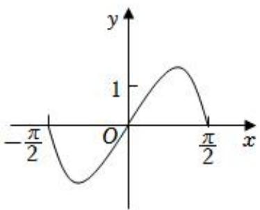
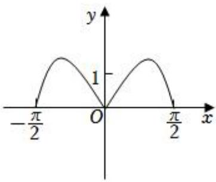
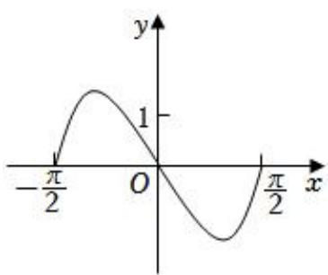
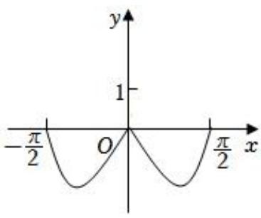

# 第二节 跟踪训练

# 考向 1 跟踪训练

【训练 1】（2021•甲卷）下列函数中是增函数的为( )

A. $f(x) = -x$

B. $f(x)=\left(\frac{2}{3}\right)^{x}$

C. $f(x) = x^{2}$

D. $f(x) = \sqrt[3]{x}$

【训练 2】下列函数中，在区间 $(0,+\infty)$ 上单调递减的是()

A. $f(x)=(x-1)^{3}$

B. $f(x)=2^{|-x|}$

C. $f(x) = -\log_{2} |x|$

D. $f(x)=\left|\log_{\frac{1}{2}}x\right|$

【训练3】若函数 $f(x) = \frac{x - 1}{x + a}$ 在 $(- \infty, -1)$ 上是减函数，则 $a$ 的取值范围是（）

A. $(-∞,-1]$

B. $(-∞,-1)$

C. $(-∞,1]$

D. $(-∞,1)$

【训练 4】已知函数 $y = f(x)$ ， $x \in [-2, 2]$ ，对任意的 $x_{1}$ 、 $x_{2} \in [-2, 2]$ 且 $x_{1} \neq x_{2}$ ，总有 $\frac{f(x_{1}) - f(x_{2})}{x_{1} - x_{2}} > 0$ ，若 $f(m + 1) > f(2m)$ ，则实数 m 的取值范围是 \_\_\_\_.

【训练 5】已知函数 $f(x)$ 的定义域为 R，其图象恒过点 $P(1,3)$ ，对任意 $x_{1}$ ， $x_{2} \in R$ ， $x_{1} \neq x_{2}$ ，都有 $\frac{f(x_{1}) - f(x_{2})}{x_{1} - x_{2}} > 1$ 成立，则不等式 $f(3^{x} - 2) < 3^{x}$ 的解集是 \_\_\_\_.

【训练6】已知 $f(x) = \begin{cases} (a + 2)^x, & x < 1 \\ x^2 - 2ax + 1, & x \geqslant 1 \end{cases}$ 在定义域内单调，则 $a$ 的取值范围是（）

A. $(-1,+\infty)$

B. $(-1, 0]$

C. $(-1, 1]$

D. $[0, 1]$

【训练 7】如果函数 $f(x)=\left\{\begin{aligned}&(3a-1)x+4a,x<1,\\ &\log_{a}x,x\geqslant1\end{aligned}\right.$ 在 R 上单调递减，那么 a 的取值范围是 \_\_\_\_.

【训练8】若函数 $f(x) = \log_a\left(x^2 - ax + 3a - 6\right)$ 在 $[2, +\infty)$ 上是增函数，则实数 $a$ 的取值范围是

# 考向 2 跟踪训练

【训练 1】设函数 $f(x)$ ， $g(x)$ 的定义域都为 R，且 $f(x)$ 是奇函数， $g(x)$ 是偶函数，则下列结论正确的是（）

A. $f(x)\cdot g(x)$ 是偶函数

B. $|f(x)| \cdot g(x)$ 是奇函数

C. $f(x) \cdot |g(x)|$ 是奇函数

D. $|f(x) \cdot g(x)|$ 是奇函数

【训练2】若奇函数 $f(x)$ 和偶函数 $g(x)$ 满足 $f(x)+g(x)=3^{x}+x^{3}+2$ ，则 $f(1)+g(0)=(\quad)$

A. $\frac{7}{3}$

B. $\frac{8}{3}$

C. $\frac{19}{3}$

D. $\frac{16}{3}$

【训练3】已知 $f(x)$ 为 $R$ 上的奇函数，当 $x > 0$ 时， $f(x) = x^3 + \frac{1}{x}$ ，则 $f(-1) + f(0) = (\quad)$

A.-2

B. 0

C. 2

D. 4

【训练 4】已知函数 $f(x+1)$ 的图象关于点（1，1）对称，则下列函数是奇函数的是（）

A. $y=f(x)+1$

B. $y=f(x+2)+1$

C. $y=f(x)-1$

D. $y=f(x+2)-1$

【训练 5】（2023•新高考Ⅱ）若 $f(x)=(x+a)\ln\frac{2x-1}{2x+1}$ 为偶函数，则 $a=(\quad)$

A. -1

B. 0

C. $\frac{1}{2}$

D. 1

【训练 6】若函数 $f(x) = (\sin x + m) \cdot \frac{2^{x} - 1}{2^{x} + 1}$ 为偶函数，则 $m = (\quad)$

A. 2

B. 1

C. $\frac{1}{2}$

D. 0

【训练 7】若函数 $f(x)=\cos x\cdot lg(\sqrt{x^{2}+m}-x)$ 为奇函数，则 $m=$ （）

A. -1

B. 0

C. 1

D. $\pm1$

【训练8】（2022·甲卷）函数 $y = (3^x - 3^-x) \cos x$ 在区间 $[- \frac{\pi}{2}, \frac{\pi}{2}]$ 的图像大致为（）

line

| x | y |
|---|---|
| -π/2 | 0 |
| 0 | 0 |
| π/2 | 1 |

text_image

-π/2
O
1
y
x

line

| x | y |
|---|---|
| -π/2 | 0 |
| 0 | 1 |
| π/2 | 0 |

text_image

-π/2
O
y
1
x
π/2

【训练 9】已知函数 $f(x)=a^{-x}(1-2^{-x})(a>0$ 且 $a\neq1)$ 是奇函数，则 $a=$ （）

A. 2

B. $\sqrt{2}$

C. $\frac{\sqrt{2}}{2}$

D. $\frac{1}{2}$

【训练 10】（2023·甲卷）若 $y=(x-1)^{2}+ax+\sin\left(x+\frac{\pi}{2}\right)$ 为偶函数，则 a= \_\_\_\_.

【训练 11】（2022•乙卷）若 $f(x)=\ln|a+\frac{1}{1-x}|+b$ 是奇函数，则 a=\_\_\_\_，b=\_\_\_\_.

【训练 12】已知函数 $f(x)=(x+a-2)(2x^{2}+a-1)$ 为奇函数，则 a 的值是（）

A. 1

B. 2

C. 1 或 2

D. 0

【训练 13】已知 $f(x)=ax^{3}+b\sin x+\frac{c}{x}+2$ ，且 $f(-5)=m$ ， $f(5)=(\quad)$

A. m

B. -m

C. 4 - m

D. 8 - m

【训练 14】设函数 $f(x)=\frac{(x+1)^{2}+\sin x+2022}{x^{2}+2023}$ 的最大值为 M，最小值为 m，则 $M+m=$ \_\_\_\_.

【训练 15】 $f(x)$ 是定义在 R 上的函数， $f(x+\frac{1}{2})+\frac{1}{2}$ 为奇函数，则 $f(2023)+f(-2022)=$ \_\_\_\_.

# 考向 3 跟踪训练

【训练 1】定义在 $[-2, 2]$ 上的函数 $f(x)=2x^{2}+lg(|x|+1)$ ，则满足 $f(x)<f(2x-1)$ 的 x 的取值范围是（）

A. $[-2, \frac{1}{3})$

B. $\left(\frac{1}{3},1\right)$

C. $(1,\frac{3}{2}]\bigcup[-\frac{1}{2},\frac{1}{3})$

D. $(- \infty, \frac{1}{3}) \cup (1, +\infty)$

【训练2】已知函数 $f(x) = \frac{e^x - e^{-x}}{e^x + e^{-x}} + 2$ ，若有 $f(a) + f(a - 2) > 4$ ，则 $a$ 的取值范围是 \_\_\_\_.

【训练 3】若函数 $f(x)=a+\frac{2}{2^{x}+1}(x\in R)$ 是奇函数，下列选项正确的是()

A. a = -1   
B. $f(x)$ 是单调递增函数  
C. $f(x)$ 是单调递减函数  
D. 不等式 $f(2t + 1) + f(t - 5) \leqslant 0$ 的解集为 $\{t \mid t \geqslant \frac{4}{3}\}$

