# 第五节 函数图像与零点

# 考向 1 函数图象的变换

# 题型 1 图像变换的五大模型

1. 平移变换：上加下减，左加右减

关于 $x: f(x) \to f(x + a)$ 由 $f(x)$ 的图像沿X轴方向平移

关于 y: $f(x) \rightarrow f(x) + a$ 由 $f(x)$ 的图像形沿 Y 轴方向平移

2. 伸缩变换:

关于 $x: f(x) \to f(ax)$ 保持纵坐标不变，横坐标变为原来的 $\frac{1}{a}$ 倍

关于 $y: f(x) \to af(x)$ 保持横坐标不变，纵坐标变为原来的 $a$ 倍

3. 翻转变换:

关于 $x: f(x) \to f(|a|)$ 保留Y轴右侧图像，再把Y轴右侧图像翻折到Y轴的左侧

关于 $y: f(x) \to |f(x)|$ 保留X轴上方图像，再把X轴下方图像翻折到X轴的上方

4. 对称变换:

关于 $x: f(x) \to f(-x)$ 由 $f(x)$ 的图像作关于Y轴的对称变换得到

关于 $y: f(x) \to -f(x)$ 由 $f(x)$ 的图像作关于X轴的对称变换得到

关于原点： $f(x)\rightarrow -f(-x)$ 由 $f(x)$ 的图像作关于原点的对称变换得到

5. 反函数: $y = f^{-1}(x)$ 与 $y = f(x)$ 关于直线 y = x 对称

【例 1】作出下列函数的图象

(1) $f(x) = |\lg x|$ ; (2) $f(x) = \lg |x|$ ; (3) $f(x) = |\lg |x - 1||$ ;

【例 2】函数 $y = f(x)$ 的图象如图所示，那么函数 $y = f(2 - x)$ 的图象是（）

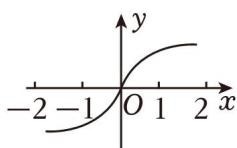

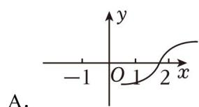

text_image

A.

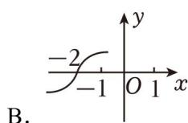

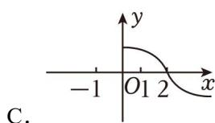

text_image

C.

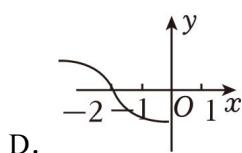

【例 3】设 a 、 b 分别是方程 $2^{x} + x + 2 = 0$ 与 $\log_{2}x + x + 2 = 0$ 的根，则 $a + b =$ \_\_\_\_.

# 题型 2 图像交点个数问题

【例 1】函数 $y=2^{x}$ 与 $y=x^{2}$ 的图象的交点个数是()

A. 0

B. 1

C. 2

D. 3

【例 2】偶函数 $f(x)$ 的图象关于 x=1 对称，且当 $x\in[0,1]$ 时， $f(x)=x$ ，则函数 $y=f(x)$ 的图象与函数 $y=lg|x|$ 的图象的交点个数为（）

A. 14

B. 16

C. 18

D. 20

# 考向 2 函数的方程与零点

# 题型1 零点存在性定理

一般地，如果函数 $y = f(x)$ 在区间 $[a, b]$ 上的图像是连续不断的一条曲线，并且有 $f(a)f(b) < 0$ ，那么函数 $y = f(x)$ 在区间 $(a, b)$ 内有零点，即存在 $c \in (a, b)$ ，使得 $f(c) = 0$ ，这个 $c$ 也就是 $f(x) = 0$ 的根.

# 相关结论：

①若连续不断的函数 $f(x)$ 在定义域上是单调函数，则 $f(x)$ 至多有一个零点.  
②连续不断的函数 $f(x)$ ，其相邻的两个零点之间的所有函数值同号.  
③连续不断的函数 $f(x)$ 通过零点时，函数值不一定变号.  
④连续不断的函数 $f(x)$ 在闭区间 $[a, b]$ 上有零点，不一定能推出 $f(a)f(b) < 0$ .

【例 1】函数 $f(x)=2^{x}+\log_{2}x$ 的零点所在区间是()

A. $(0,\frac{1}{2})$

B. $\left(\frac{1}{2},1\right)$

C. $(1,2)$

D. $(2,3)$

【例 2】已知单调函数 $f(x)$ 满足 $f(f(x)-e^{x}-\ln x+4)=e-3$ ，则函数 $f(x)$ 的零点所在区间为（）

A. $(0,\frac{1}{e^2})$

B. $\left(\frac{1}{e^{2}},\frac{1}{e}\right)$

C. $\left(\frac{1}{e},1\right)$

D. $(1,e)$

# 题型2 数形结合与零点问题

【例 1】（2018•新课标I）已知函数 $f(x)=\left\{\begin{aligned}e^{x}, & x\leq0\\ \ln x, & x>0\end{aligned}\right.$ ， $g(x)=f(x)+x+a$ ．若 $g(x)$ 存在 2 个零点，则 a 的取值范围是（）

A. $[-1, 0)$

B. $[0, +\infty)$

C. $[-1, +\infty)$

D. $[1, +\infty)$

【例 2】函数 $y=\frac{x^{2}+x+1}{x}$ 与 $y=3\sin\frac{\pi x}{2}+1$ 的图象有 n 个交点，其坐标依次为 $(x_{1}, y_{1}), (x_{2}, y_{2}), \ldots, (x_{n}, y_{n})$ ，则 $\sum_{i=1}^{n}(x_{i}+y_{i})=\underline{4}$ .

【例 3】（2019•天津）已知函数 $f(x)=\left\{\begin{aligned}&2\sqrt{x},0\leqslant x\leqslant1,\\ &\frac{1}{x},x>1.\end{aligned}\right.$ 若关于 x 的方程 $f(x)=-\frac{1}{4}x+a(a\in R)$ 恰有两个互异的实数解，则 a 的取值范围为（）

A. $\left[\frac{5}{4},\frac{9}{4}\right]$

B. $\left(\frac{5}{4},\frac{9}{4}\right]$

C. $\left(\frac{5}{4},\frac{9}{4}\right]\bigcup\{1\}$

D. $\left[\frac{5}{4}, \frac{9}{4}\right] \cup \{1\}$

# 题型3 嵌套函数与零点问题

①先看外层零点，把外层零点一一列出： $t_{1}, t_{2}, t_{3} \cdots$ ;  
②再在外层函数作直线， $y=t_{1}$ ， $y=t_{2}$ ，交点个数即为复合函数零点个数.

【例 1】（多选）定义域和值域均为 $[-a, a]$ （常数 a > 0）的函数 $y = f(x)$ 和 $y = g(x)$ 的图象如图所示，下列四个命题中正确的结论是（）

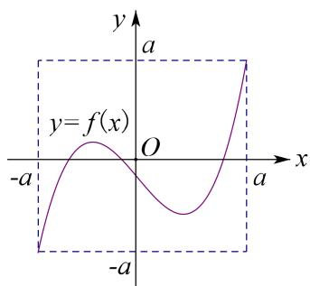

text_image

y
a
y=f(x)
O
-a
-a
x

A. 方程 $f[g(x)] = 0$ 有且仅有三个解  
C. 方程 $f[f(x)]=0$ 有且仅有九个解

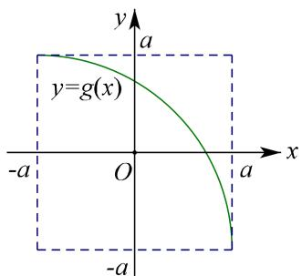

text_image

y
a
y=g(x)
-a O a x
-a

B. 方程 $g[f(x)] = 0$ 有且仅有三个解  
D. 方程 $g[g(x)] = 0$ 有且仅有一个解

【例2】函数 $f(x) = \begin{cases} |\log_2 x|, & x > 0 \\ 2^x, & x \leq 0 \end{cases}$ ，函数 $g(x) = 3f^2 (x) - 8f(x) + 4$ 的零点个数是（）

A. 5

B. 4

C. 3

D. 6

【例 3】已知函数 $f(x)=\left\{\begin{aligned}x^{2}-2x+4, & x\leq0\\ \ln x, & x>0\end{aligned}\right.$ ，若函数 $g(x)=f^{2}(x)+3f(x)+m(m\in R)$ 有三个零点，则 m 的取值范围为（）

A. $m < \frac{9}{4}$

B. $m \leq -28$

C. $-28 \leq m < \frac{9}{4}$

D. m > 28

【例 4】函数 $f(x)=\left\{\begin{aligned}&|\log_{5}(1-x)|,x<1\\&-(x-2)^{2}+2,x\geq1\end{aligned}\right.$ ，则 $f(x+\frac{1}{x}-2)=a(a\in R)$ 的实数根个数不可能为（）

A. 5个

B. 6个

C. 7个

D. 8个

# 题型 4 零点和积范围问题

①巧用韦达定理，把 $x_{1} + x_{2} = -\frac{b}{a}$ ， $x_{1} \cdot x_{2} = \frac{c}{a}$ ;  
②巧用对数运算法则，如 $\left|\log_{a}x\right|=m>0$ ，一定有 $x_{1}\cdot x_{2}=1$ ；  
③统一变量，构造函数求和积范围.

【例1】已知函数 $f(x) = \begin{cases} -2x, & x \leq 0 \\ -x^2 + x, & x > 0 \end{cases}$ ，若函数 $g(x) = f(x) - a$ 恰有三个互不相同的零点 $x_1, x_2, x_3$ ，则 $x_1x_2x_3$ 的取值范围是（）

A. $(- \frac{1}{32}, 0)$

B. $(- \frac{1}{16}, 0)$

C. $(0, \frac{1}{32})$

D. $(0,\frac{1}{16})$

【例 2】已知函数 $f(x)=\left\{\begin{aligned}(x+1)^{2},&x\leq0\\|\log_{2}x|,&x>0\end{aligned}\right.$ ，若方程 $f(x)=a$ 有四个不同的解 $x_{1},x_{2},x_{3},x_{4}$ ，且 $x_{1}<x_{2}<x_{3}<x_{4}$ ，则 $x_{3}\cdot(x_{1}+x_{2})+\frac{1}{x_{3}^{2}\cdot x_{4}}$ 的取值范围是（）

A. $(-1, 1]$

B. $[-1, 1]$

C. $[-1, 1)$

D. $(-1, 1)$

【例 3】【多选】已知函数 $f(x)=\left\{\begin{aligned}&|\ln(x-1)|,&x>1\\ &x^{2}-4|x|+3,&x\leq1\end{aligned}\right.$ ，则下列结论正确的是（）

A. 函数 $f(x)$ 在 $[0, 2]$ 上单调递减  
B. 函数 $f(x)$ 的值域是 $[-1, +\infty)$   
C. 若方程 $f(x) = a$ 有 5 个解，则 $a$ 的取值范围为 (0, 3)  
D. 若函数 $f(x)-a$ 有 3 个不同的零点 $x_{1}$ ， $x_{2}$ ， $x_{3}(x_{1}<x_{2}<x_{3})$ ，则 $x_{1}+\frac{1}{x_{2}}+\frac{1}{x_{3}}$ 的取值范围为 $(-∞,-3)$

拓展思维

拓展 1 不动点与稳定点

不动点 对于函数 $f(x)(x \in D)$ ，我们把方程 $f(x) = x$ 的解 $x$ 称为函数 $f(x)$ 的不动点，即 $y = f(x)$ 与 $y = x$ 图象交点的横坐标.

例如 函数 $f(x)=2x-1$ 有一个不动点为 1，函数 $g(x)=2x^{2}-1$ 的不动点．有两个不动点 $-\frac{1}{2},1$ .

稳定点 对于函数 $f(x)(x \in D)$ ，我们把方程 $f[f(x)] = x$ 的解 $x$ 称为函数 $f(x)$ 的稳定点，即 $y = f[f(x)]$ 与 $y = x$ 图象交点的横坐标。很显然，若 $x_0$ 为函数 $y = f(x)$ 的不动点，则 $x_0$ 必为函数 $y = f(x)$ 的稳定点。

证明 因为 $f(x_{0})=x_{0}$ ，所以 $f(f(x_{0}))=f(x_{0})=x_{0}$ ，故 $x_{0}$ 也是函数 $y=f(x)$ 的稳定点.

【例 1】求函数 $f(x)=2x^{2}-1$ 的稳定点.

【解析】令 $f(f(x))=x$ ，则 $2(2x^{2}-1)^{2}-1=x\Rightarrow2(4x^{4}-4x^{2}+1)-1-x=0\Rightarrow8x^{4}-8x^{2}-x+1=0$ ，因为不动点必为稳定点，所以该方程一定有两解 $x_{1}=-\frac{1}{2}$ ， $x_{2}=1\Rightarrow8x^{4}-8x^{2}-x+1$ 必有因式 $(x-1)(2x+1)=2x^{2}-x-1$ ，可得 $(x-1)(2x+1)(4x^{2}+2x-1)=0\Rightarrow$ 另外两解 $x_{3,4}=\frac{-1\pm\sqrt{5}}{4}$ ，故函数 $f(x)=2x^{2}-1$ 的稳定点是 $-\frac{1}{2}$ ，1， $\frac{-1+\sqrt{5}}{4}$ ， $\frac{-1-\sqrt{5}}{4}$ ，其中 $\frac{-1\pm\sqrt{5}}{4}$ 是稳定点，但不是不动点.

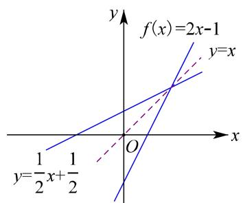

text_image

f(x)=2x-1
y=x
y=\frac{1}{2}x+\frac{1}{2}

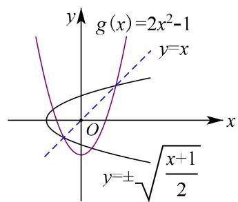

text_image

g(x)=2x^2-1
y=x
y=±√(x+1)/2

由此可见，不动点是函数图象与直线 $y = x$ 的交点的横坐标，稳定点是函数 $y = f(x)(x \in D)$ 图象与曲线 $x = f(y)(y \in D)$ 图象交点的横坐标（特别，若函数有反函数时，则稳定点是函数图象与其反函数图象交点的横坐标）.

不动点定理 1 若函数 $f(x)$ 为定义域内的单调递增函数，则 $f(f(x)) = x$ 有解等价于 $f(x) = x$ 有解.

证明 若 $f(x) = x$ 无解，则必有 $f(x) > x$ ，或 $f(x) < x$ 恒成立，当 $f(x) > x$ 时，因为 $f(x)$ 为定义域内的单调增函数，则 $f(f(x)) > f(x) > x$ ，显然 $f(f(x)) = x$ 无解；同理，可证 $f(x) < x$ 的情况。因此，函数 $f(x)$ 为定义域内的单调增函数， $f(f(x)) = x$ 有解等价于 $f(x) = x$ 有解。

【例 2】（多选）在数学中，布劳威尔不动点定理可应用到有限维空间，是构成一般不动点定理的基石，它得名于荷兰数学家鲁伊兹·布劳威尔 (L．E．J．Brouwer)，简单地讲，就是对于满足一定条件的连续函数 $f(x)$ ．存在一个点 $x_{0}$ ，使得 $f(x_{0}) = x_{0}$ ，那么我们称该函数为“不动点”函数，下列函数是“不动点”函数的是（）

A. $f(x)=x^{2}-x-3$

B. $f(x) = 2^{x} + x$

C. $f(x)=\sqrt{x}+1$

D. $f(x) = 2^{x} - 2$

【例 3】（2013·四川文）设函数 $f(x)=\sqrt{e^{x}+x-a}$ ( $a\in R$ ，e 为自然对数的底数)，若存在 $b\in[0,1]$ 使 $f(f(b))=b$ 成立，则 a 的取值范围是 \_\_\_\_.

【例 4】已知 $f(x)$ 是定义在 R 上的函数，若方程 $f(f(x)) = x$ 有且仅有一个实数根，则 $f(x)$ 可能是（）

A. $f(x) = |2x - 1|$

B. $f(x)=e^{x}$

C. $f(x)=x^{2}+x+1$

D. $f(x)=\sin x$

拓展 2 悬链线——双曲正弦、余弦、正切函数

以下是近年常考的三个常见的双曲函数表达式:

双曲正弦： $y = \sinh x = \frac{e^{x} - e^{-x}}{2}$ ，①奇函数；② R 上单调递增.

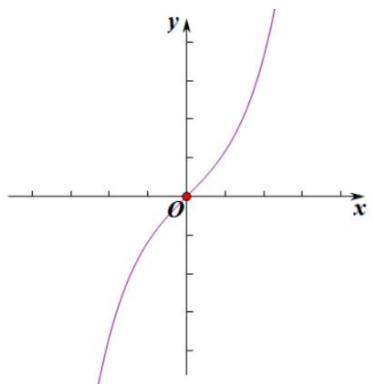

text_image

y
x
O

双曲余弦： $y = \cosh x = \frac{e^{x} + e^{-x}}{2}$ ，①偶函数；② $(-∞, 0)↓$ ， $(0, +∞)↑$ .

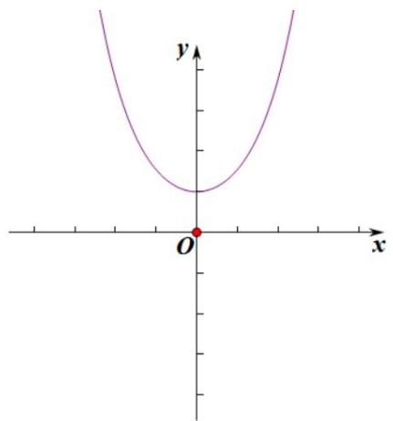

text_image

y
x
O

双曲正切： $y = \tanh x = \frac{e^{x} - e^{-x}}{e^{x} + e^{-x}}$ ，①奇函数；② R 上单调递增.

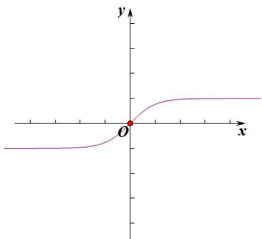

text_image

y
x
O

由于极具迷惑性的外表，与良好的对称性质，深受各地模考题的偏爱.

【例 1】（多选题）意大利画家列奥纳多·达·芬奇的画作《抱银鼠的女子》中，女士脖颈上黑色珍珠项链与主人相互映衬呈现出不一样的美与光泽，达·芬奇提出：固定项链的两端，使其在重力的作用下自然下垂，项链所形成的曲线是什么？这就是著名的“悬链线问题”。后人给出了悬链线的函数解析式：

$f(x)=a\cosh\left(\frac{x}{a}\right)$ ，其中a为曲线顶点到横坐标轴的距离， $\cosh x$ 称为双曲余弦函数，其函数表达式为 $\cosh x=\frac{e^{x}+e^{-x}}{2}$ ，相应地，双曲正弦函数的表达式为 $\sinh x=\frac{e^{x}-e^{-x}}{2}$ ．若直线x=m与双曲余弦函数 $C_{1}$ 双曲正弦函数 $C_{2}$ 的图象分别相交于点A，B，曲线 $C_{1}$ 在点A处的切线 $l_{1}$ 与曲线 $C_{2}$ 在点B处的切线 $l_{2}$ 相交于点P，则下列结论正确的为（）

A. $\cosh (x - y) = \cosh x\cosh y - \sinh x\sinh y$   
B. $y = \sinh x \cosh x$ 是偶函数  
C. $(\cosh x)' = \sinh x$   
D. 若 $\triangle PAB$ 是以 A 为直角顶点的直角三角形，则实数 $m = 0$

【例 2】=双曲函数是一类与常见三角函数类似的函数，在生活中有着广泛的应用，如悬链桥．常见的有双曲正弦函数 $\sinh x = \frac{e^{x} - e^{-x}}{2}$ ，双曲余弦函数 $\cosh x = \frac{e^{x} + e^{-x}}{2}$ ．下列结论不正确的是（）

natural_image

Exterior view of a modern yellow suspension bridge spanning a mountain valley with vehicles on the roadway (no signage or text visible)

A. $\left(\cosh x\right)^2 -\left(\sinh x\right)^2 = 1$   
B. $\cosh (x + y) = \cosh x\cosh y - \sinh x\sinh y$   
C. 双曲正弦函数是奇函数, 双曲余弦函数是偶函数  
D. 若点 $P$ 在曲线 $y = \sinh x$ 上， $\alpha$ 为曲线在点 $P$ 处切线的倾斜角，则 $\alpha \in \left[\frac{\pi}{4}, \frac{\pi}{2}\right)$

【例 3】颐和园的十七孔桥，初建于清乾隆年间；永定河上的卢沟桥，始建于宋代；四川达州的大风高拱桥，修建于清同治 7 年，这些桥梁屹立百年而不倒，观察它们的桥梁结构，有一个共同的特点，那就是拱形结构，这是悬链线在建筑领域的应用。悬链线出现在建筑领域，最早是由十七世纪英国杰出的科学家罗伯特·胡克提出的，他认为当悬链线自然下垂时，处于最稳定的状态，反之如果把悬链线反方向放置，它也是一种稳定的状态，后来由此演变出了悬链线拱门，其中双曲余弦函数就是一种特殊的悬链线函数，其函数表达式为 $\cos h(x)=\frac{e^{x}+e^{-x}}{2}$ ，相应的双曲正弦函数的表达式为 $\sin h(x)=\frac{e^{x}-e^{-x}}{2}$ 。若关于 x 的不等式 $4m\cos h^{2}(x)-4\sin h(2x)-1>0$ 对任意的 x>0 恒成立，则实数 m 的取值范围为（）

A. $(2, +\infty)$

B. $[2, +\infty)$

C. $\left(\frac{1}{4},+\infty\right)$

D. $\left[\frac{1}{4},+\infty\right)$

