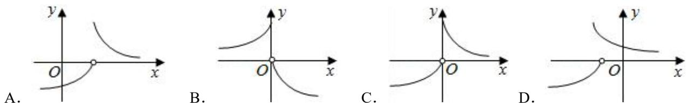

# 第五节 跟踪训练

# 考向 1 跟踪训练

【训练 1】作出下列函数的图象

(1) $f(x)=\left(\frac{1}{2}\right)^{|x|}$ ; (2) $f(x)=\left|2^{x}-1\right|$ ; (3) $f(x)=2^{|x-1|}$ ;

【训练2】已知函数 $f(x) = \begin{cases} 3^x, & (x \leqslant 1) \\ \log_{\frac{1}{3}} x, & (x > 1) \end{cases}$ ，则 $y = f(2 - x)$ 的大致图象是（）

A.

B.

C.

D.

【训练 3】方程 $9x + 3^{x} - \frac{63}{2} = 0$ 的根为 $x_{1}$ ，方程 $x + \log_{3}(x - 2) - \frac{7}{2} = 0$ 的根为 $x_{2}$ ，则 $x_{1} + x_{2}$ 的值为（）

A. $\frac{7}{2}$

B. $\frac{9}{2}$

C. $\frac{11}{2}$

D. $\frac{13}{2}$

【训练 4】函数 $y = x^{2}$ 与函数 $y = |lgx|$ 图象的交点个数为()

A. 0

B. 1

C. 2

D. 3

【训练 5】若函数 $y = f(x) (x \in R)$ 为偶函数，且满足 $f(x + 1) = -f(x)$ ，当 $x \in [0, 1]$ 时 $f(x) = 2^{x} - 1$ ，则函数 $y = f(x)$ 的图象与函数 $y = \lg(|x|)$ 的图象的交点个数为（）

A. 16

B. 18

C. 20

D. 无数个

# 考向 2 跟踪训练

【训练1】已知函数 $f(x) = \log_a (x + n) + a^{x - n} (a > 0, a \neq 1)$ 的图象过定点 $(m,1)$ ，则函数 $g(x) = \log_n x + n^x$ 的零点所在区间为（）

A. $(1,2)$

B. $(2,3)$

C. $(3,4)$

D. $(4,5)$

【训练2】已知函数 $f(x) = \begin{cases} 2^x, & x \leq 0 \\ \log_2 x, & x > 0 \end{cases}$ ，若函数 $g(x) = f(x) + m$ 有两个零点，则 $m$ 的取值范围是（）

A. $[-1,0)$

B. $\left[-1,+\infty\right)$

C. $(-∞,0)$

D. $(-∞,1]$

【训练3】已知函数 $f(x) = \begin{cases} \ln x, & x > 0, \\ -x^2 - x, & x \leqslant 0, \end{cases}$ 若直线 $y = kx$ 与 $y = f(x)$ 有三个不同的交点，则实数 $k$ 的取值范围是（）

A. $(-∞, \frac{1}{e})$

B. $(-1,\frac{2}{e})$

C. $(-1,0]\bigcup \left\{\frac{1}{e}\right\}$

D. $(-2,0]\bigcup\left\{\frac{2}{e}\right\}$

【训练 4】已知定又在 R 上的奇函数 $f(x)$ 满足 $f(x+2)=-f(x)$ ，当 $1 \leqslant x < 2$ 时， $f(x)=x-2$ ，若 $y=\frac{1}{6}x-\frac{1}{3}$ 与 $f(x)$ 的图象交于点 $(x_{1}, y_{1})$ ， $(x_{2}, y_{2})$ ，…， $(x_{n}, y_{n})(n \in N^{*})$ ，则 $\sum_{i=1}^{n}(x_{i} + y_{i}) = (\quad)$

A. 6

B. 8

C. 10

D. 14

【训练5】已知函数 $f(x) = \begin{cases} |lg(-x)| + 1, & x < 0 \\ \left(\frac{1}{2}\right)^x + 1, & x \geqslant 0 \end{cases}$ ，则函数 $y = f^2(x) - 3f(x) + 2$ 的零点个数是（）

A. 6

B. 5

C. 4

D. 3

【训练6】已知函数 $f(x) = \begin{cases} \left|3^x - 1\right|, & x \leqslant 2 \\ x^2 - 10x + 24, & x > 2 \end{cases}$ ，函数 $g(x) = 3f^2(x) - (m + 3)f(x) + m$ 有6个零点，则非零实数 $m$ 的取值范围是（）

A. $(-3,0)\cup\{2$ ,

4}

B. (3,24)

C. [2, 16)

D. [3, 24)

【训练7】已知函数 $f(x) = |\log_2|1 - x||$ ，若函数 $g(x) = f^2 (x) + af(x) + 2b$ 有6个不同的零点，且最小的零点为 $x = -1$ ，则 $2a + b = (\quad)$

A. 6

B.-2

C. 2

D.-6

【训练8】已知函数 $f(x) = \begin{cases} |\log_2(x - 1)|, & 1 < x \leqslant 3 \\ x^2 - 10x + 22, & x > 3 \end{cases}$ ，若方程 $y = f(x) - m$ 有4个不同的零点 $x_1, x_2, x_3, x_4$ ，且 $x_1 < x_2 < x_3 < x_4$ ，则 $(\frac{1}{x_1} + \frac{1}{x_2})(x_3 + x_4) = (\quad)$

A. 10

B. 8

C. 6

D. 4

【训练9】已知函数 $f(x) = \begin{cases} |2^x - 1|, & x \leqslant 1 \\ |log_3(x - 1)|, & x > 1 \end{cases}$ ，若函数 $y = f(x) - a (a \in R)$ 有四个不同的零点 $x_1, x_2, x_3, x_4$ 且 $x_1 < x_2 < x_3 < x_4$ ，则 $(2^{x_1} + 2^{x_2})a + \frac{1}{(x_3 - 1)(x_4 - 1)a}$ 的取值范围是（）

A. $(0,3)$

B. $[2\sqrt{2},3)$

C. $[2\sqrt{2}, + \infty)$

D. $(3,+\infty)$

拓展 1 跟踪训练

【训练 1】（2024·河南月考）对于定义在 R 上的函数 $f(x)$ ，如果存在实数 $x_{0}$ 使 $f(x_{0}) = x_{0}$ ，那么 $x_{0}$ 叫做函数 $f(x)$ 的一个不动点．若函数 $f(x) = \begin{cases} \frac{1}{x}, & x < 0 \\ \left(\frac{1}{2}\right)^{x} - m, & x \geqslant 0 \end{cases}$ 存在两个不动点，则实数 m 的取值范围是（）

A. $[0, 1]$

B. $[-1, 0]$

C. $(-\infty , 1]$

D. $[-1, +\infty)$

【训练2】（2024·广州月考）设函数 $f(x) = \sqrt{e^x + x - a} (a \in R)$ ，若曲线 $y = \frac{3\sqrt{10}}{10}\sin x + \frac{\sqrt{10}}{10}\cos x$ 上存在点 $(x_0, y_0)$ 使得 $f(y_0) = y_0$ ，则 $a$ 的取值范围是（）

A. $\left[\frac{1-e}{e},1\right]$

B. $\left[\frac{1 - e}{e}, e + 1\right]$

C. $[1, e + 1]$

D. $[1, e]$

拓展 2 跟踪训练

【训练1】(2024·盐城模拟) 悬链线指的是一种曲线, 指两端固定的一条 (粗细与质量分布) 均匀、柔软 (不能伸长) 的链条, 在重力的作用下所具有的曲线形状, 例如悬索桥等, 因其与两端固定的绳子在均匀引力作用下下垂相似而得名. 适当选择坐标系后, 悬链线的方程是一个双曲余弦函数, 其标准方程为 $y = a \cosh \frac{x}{a} \left( a \cosh \frac{x}{a} = a \cdot \frac{e^{\frac{x}{a}} + e^{-\frac{x}{a}}}{2} \right.$ , 其中 $a$ 为非零常数, $e$ 为自然对数的底数). 当 $a = 1$ 时, 记 $f(x) = \cosh x$ , 则下列说法正确的是 ( )

A. $f(2x) = 2f^{2}(x) - 1$   
B. $f(x)$ 是周期函数  
C. $f(x)$ 的导函数 $f'(x)$ 是奇函数  
D. $f(x)$ 在 $(- \infty, 0]$ 上单调递减

【训练2】（2024·安徽模拟）双曲函数是一类与三角函数类似的函数，双曲正弦函数 $\sinh (x) = \frac{e^x - e^{-x}}{2}$ ，双曲余弦函数 $\cosh (x) = \frac{e^x + e^{-x}}{2}$ （其中 $e$ 为自然对数的底数），则下列判断正确的是（ ）

A. $\sinh (x)$ 为奇函数， $\cosh (x)$ 为偶函数  
B. $\sinh(2x)=\sinh(x)\cdot\cosh(x)$   
C. 函数 $\cosh (x)$ 在 $R$ 上的最小值为 1  
D. 函数 $g(x) = \cosh (2x) - \cosh (x)$ 在 $R$ 上只有一个零点

