# 2.4 基本初等函数

# 考向 1 幂指对函数

# 题型 1 指对的混合运算

# 1. 指数式运算

(1) 有理数指数幂的性质

① $a^{m}a^{n}=a^{m+n}(a>0,\quad m,\quad n\in Q)$ ;   
② $(a^{m})^{n} = a^{mn}(a > 0, m, n \in Q)$ ;   
③ $(ab)^{m} = a^{m}b^{m}(a > 0, b > 0, m\in Q)$ ;   
④ $\sqrt[n]{a^{m}} = a^{\frac{m}{n}} (a > 0, m, n \in Q)$ .

（2）注意事项：对于根式记号 $\sqrt[n]{a}$ ，要注意以下几点：

① $n \in N$ ，且 n > 1；② 当 n 是奇数，则 $\sqrt[n]{a^n} = a$ ；当 n 是偶数，则 $\sqrt[n]{a^n} = |a| = \begin{cases} a & a \geq 0 \\ -a & a < 0 \end{cases}$ ;  
③负数没有偶次方根；  
④零的任何次方根都是零；  
⑤指数的运算和逆运算，遇到多重根号问题，需要先写成指数形式：

例： $\sqrt{a\sqrt{a\sqrt{a}}} = a^{\frac{1}{2}}a^{\frac{1}{4}}a^{\frac{1}{8}} = a^{\frac{1}{2} +\frac{1}{4} +\frac{1}{8}} = a^{\frac{7}{8}}.$

# 2. 对数式的运算

(1) 对数的性质和运算法则:

①特殊对数： $\log_{a}1=0$ ； $\log_{a}a=1$ ；其中a>0且 $a\neq1$ ；  
②对数恒等式： $a^{\log_{a}N}=N$ （其中a>0且 $a\neq1$ ，N>0）；  
③对数换底公式： $\log_a b = \frac{\log_c b}{\log_c a}$ ，如： $\log_5 7 = \frac{\log_2 7}{\log_2 5} = \frac{\lg 7}{\lg 5} = \frac{\ln 7}{\ln 5}$ .

(2) 对数的运算法则:

①外和内乘原理： $\log_{a}(MN)=\log_{a}M+\log_{a}N$ ；  
②外差内除原理： $\log_a\frac{M}{N} = \log_aM - \log_aN$   
③提公次方法： $\log_{a^m}b^n = \frac{n}{m}\log_a b(m,n\in R)$   
④指中有对，没心没肺： $a^{\log_{a}b}=b$ 和 $\log_{a}a^{b}=b$ ，如： $\log_{3}81=\log_{3}3^{4}=4$ ， $2^{\log_{2}5}=5$ 。

(5) 换底公式和对数运算的一些方法:

①常用换底： $\log_a b = \frac{\log_c b}{\log_c a}$ ，如： $\log_5 7 = \frac{\log_2 7}{\log_2 5} = \frac{\lg 7}{\lg 5} = \frac{\ln 7}{\ln 5}$ ；  
②倒数原理： $\log_a b = \frac{1}{\log_b a}$ ，如： $\log_3 2 = \frac{1}{\log_2 3}$ ；  
③约分法则： $\log_{a}b\cdot\log_{b}c=\log_{a}c$ ，如： $\log_{2}3\cdot\log_{3}4=\log_{2}4=2$ ；  
④归一法则： $\lg 2 \cdot \lg 5 + \lg^{2} 2 + \lg 5 = \lg 2 (\lg 5 + \lg 2) + \lg 5 = \lg 5 + \lg 2 = 1$ .

【例 1】（2022·浙江）已知 $2^{a}=5$ ， $\log_{8}3=b$ ，则 $4^{a-3b}=(\quad)$

A. 25

B. 5

C. $\frac{25}{9}$

D. $\frac{5}{3}$

【例 2】已知 $x^{\frac{1}{2}} - x^{-\frac{1}{2}} = 2$ ，则 $x^{2} + x^{-2}$ 的值为 \_\_\_\_.

【例 3】（2022·天津）化简 $(2\log_{4}3+\log_{8}3)(\log_{3}2+\log_{9}2)$ 的值为()

A. 1

B. 2

C. 4

D. 6

【例 4】（2021•天津）若 $2^{a}=5^{b}=10$ ，则 $\frac{1}{a}+\frac{1}{b}=(\quad)$

A.-1

B. lg7

C. 1

D. $\log_{7}10$

【例 5】（2024•甲卷）已知 a > 1， $\frac{1}{\log_{8}a} - \frac{1}{\log_{a}4} = -\frac{5}{2}$ ，则 a = \_\_\_\_.

# 题型 2 幂指对函数的图像及其性质

1. 指数函数的定义及图像

<table><tr><td colspan="3"> $y = a^x$ </td></tr><tr><td></td><td>0 &lt; a &lt; 1</td><td>a &gt; 1</td></tr><tr><td>图象</td><td>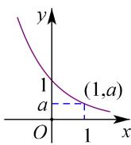</td><td>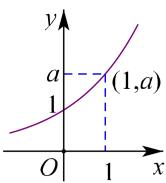</td></tr><tr><td rowspan="6">性质</td><td colspan="2">1定义域R,值域(0,+∞)</td></tr><tr><td colspan="2">2 $a^0=1$ ,即时x=0,y=1,图象都经过(0,1)点</td></tr><tr><td colspan="2">3 $a^x=a$ ,即x=1时,y等于底数a</td></tr><tr><td>4在定义域上是单调减函数</td><td>在定义域上是单调增函数</td></tr><tr><td>5x&lt;0时, $a^x>1$ ;x&gt;0时,0 &lt;  $a^x<1$ </td><td>x&lt;0时,0 &lt;  $a^x<1$ ;x&gt;0时, $a^x>1$ </td></tr><tr><td colspan="2">6既不是奇函数,也不是偶函数</td></tr></table>

（1）当底数大小不定时，必须分“a>1”和“0<a<1”两种情形讨论；  
（2）当 0 < a < 1 时， $x \rightarrow +\infty$ ， $y \rightarrow 0$ ；a 的值越小，图象越靠近 y 轴，递减的速度越快；

当 a > 1 时， $x \rightarrow +\infty$ ， $y \rightarrow 0$ ；a 的值越大，图象越靠近 y 轴，递增速度越快；

（3）函数 $y=a^{x}$ 与 $y=\left(\frac{1}{a}\right)^{x}$ 的图象关于 y 轴对称；

函数① $y = a^{x}$ ; ② $y = b^{x}$ ; ③ $y = c^{x}$ ; ④ $y = d^{x}$ 的图象如下左图所示，则 0 < b < a < 1 < d < c;
即 $x \in (0, +\infty)$ , $b^{x} < a^{x} < d^{x} < c^{x}$ （底大幂大）; $x \in (-\infty, 0)$ 时, $b^{x} > a^{x} > d^{x} > c^{x}$ ;

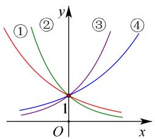

text_image

y
①
②
③
④
O
x

（4）特殊函数：函数 $y=2^{x}$ ， $y=3^{x}$ ， $y=(\frac{1}{2})^{x}$ ， $y=(\frac{1}{3})^{x}$ 的图象如下右图所示.

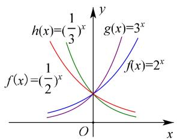

line

| x       | h(x)=(1/3)^x | g(x)=3^x | f(x)=2^x |
| ------- | ------------ | -------- | -------- |
| 0       | 0            | 0        | 0        |
| 1/2     | ~-1.5        | ~-1.5    | ~-1.5    |
| 2       | ~-2.5        | ~-2.5    | ~-2.5    |

# 2. 对数函数的定义及图像

（1）对数函数的定义：函数 $y = \log_a x (a > 0 \text{且} a \neq 1)$ 叫做对数函数，它是指数函数 $y = a^x (a > 0 \text{且} a \neq 1)$ 的反函数.

对数函数的图象：由于对数函数是指数函数的反函数，所以对数函数的图象只须由相应的指数函数图象作关于 $y = x$ 的对称图形，即可获得．同样也分 $a > 1$ 与 $0 < a < 1$ 两种情况归纳：

以 $y = \log_2x$ 与 $y = \log_{\frac{1}{2}}x$ 为例

<table><tr><td></td><td>a&gt;1</td><td>0</td></tr><tr><td>图象</td><td>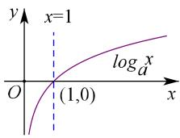</td><td>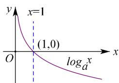</td></tr><tr><td rowspan="2">性质</td><td colspan="2">定义域:(0,+∞)</td></tr><tr><td colspan="2">值域:R</td></tr><tr><td rowspan="3"></td><td colspan="2">过定点(1,0),即x=1时,y=0</td></tr><tr><td>在(0,+∞)上增函数</td><td>在(0,+∞)上是减函数</td></tr><tr><td>当00,当x≥1时,y≤0</td><td>当00,当x≥1时,y≤0</td></tr></table>

(2) 底数变化与图象变化的规律

在同一坐标系内，当 $a > 1$ 时，随 $a$ 的增大，对数函数的图象愈靠近 $x$ 轴；当 $0 < a < 1$ 时，对数函数的图象随 $a$ 的增大而远离 $x$ 轴。（见下图）

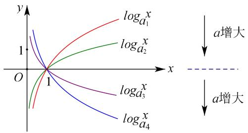

text_image

y
logₐ₁
logₐ₂
logₐ₃
logₐ₄
1
O
x
a增大
a增大

# 3. 幂函数及其性质

(1) 幂函数的定义

一般地， $y = x^{a}(a \in R)$ （ $a$ 为有理数）的函数，即以底数为自变量，幂为因变量，指数为常数的函数.

（2）幂函数的特征：同时满足一下三个条件才是幂函数

① $x^{a}$ 的系数为1；② $x^{a}$ 的底数是自变量；③指数为常数.

（3）常见的幂函数图像及性质：

<table><tr><td>函数</td><td> $y = x$ </td><td> $y = x^{2}$ </td><td> $y = x^{3}$ </td><td> $y = x^{\frac{1}{2}}$ </td><td> $y = x^{-1}$ </td></tr><tr><td>图象</td><td>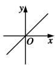</td><td>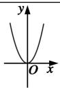</td><td>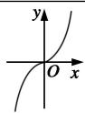</td><td>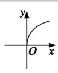</td><td>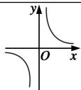</td></tr><tr><td>定义域</td><td> $R$ </td><td> $R$ </td><td> $R$ </td><td> $\{x \mid x \geq 0\}$ </td><td> $\{x \mid x \neq 0\}$ </td></tr><tr><td>值域</td><td> $R$ </td><td> $\{y \mid y \geq 0\}$ </td><td> $R$ </td><td> $\{y \mid y \geq 0\}$ </td><td> $\{y \mid y \neq 0\}$ </td></tr><tr><td>奇偶性</td><td>奇</td><td>偶</td><td>奇</td><td>非奇非偶</td><td>奇</td></tr><tr><td>单调性</td><td>在 $R$ 上单调递增</td><td>在 $(-\infty, 0)$ 上递减,在 $(0, +\infty)$ 上递增</td><td>在 $R$ 上单调递增</td><td>在 $[0, +\infty)$ 上递增</td><td>在 $(-\infty, 0)$ 和 $(0, +\infty)$ 上递减</td></tr><tr><td>公共点</td><td colspan="5">(1, 1)</td></tr></table>

(4) 在区间 $(0,1)$ 上，幂函数中指数越大，函数图象越靠近 $x$ 轴（简记为“指大图低”），在区间 $(1, +\infty)$ 上，幂函数中指数越大，函数图象越远离 $x$ 轴；

（5）幂函数 $y = x^{a} (a \in R)$ 在第一象限内图象的画法如下（单调性）：

①当 a<0 时，其图象可类似 $y=x^{-1}$ 画出；  
②当 0 < a < 1 时，其图象可类似 $y = x^{\frac{1}{2}}$ 画出；  
③当 a > 1 时，其图象可类似 $y = x^{2}$ 画出.

幂函数 $y = x^{a} (a \in R)$ 在第二（三）象限内图象的画法如下（奇偶性）：

①无奇偶性，如 $y = x^{\frac{1}{2}}$ 只在第一象限有图象；  
②奇函数，则补充第三象限图象，如 $y=x^{3}$   
③偶函数，则补充第二象限图象，如 $y = x^{2}$ .

【例 1】（多选）设 a>1，在下列函数中，图像经过定点 $(1,1)$ 的函数有（）

A. $y = x^{a}$

B. $y = a^{x-1}$

C. $y=\log_{a}x+1$

D. $y = ax^{3} + 1$

【例 2】已知函数 $f(x)=a^{x-2}+1(a>0,a\neq1)$ 的图像恒过一点 P，且点 P 在直线 $mx+ny-1=0(mn>0)$ 的图像上，则 $\frac{1}{m}+\frac{1}{n}$ 的最小值为（）

A. 4

B. 6

C. 7

D. 8

【例 3】(2019•浙江)在同一直角坐标系中, 函数 $y=\frac{1}{a^{x}}$ , $y=\log_{a}(x+\frac{1}{2})(a>0 \text{ 且 } a\neq1)$ 的图象可能是()

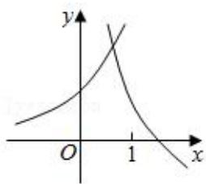

line

| x | y |
|---|---|
| 0 | 0 |
| 1 | 1 |

B.

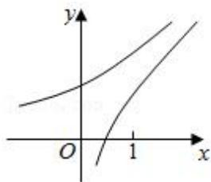

text_image

y
O
1
x

C.   
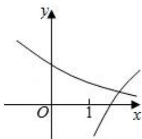

text_image

y
O 1 x

D.

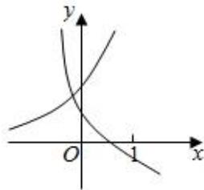

text_image

y
O
1
x

【例 4】已知 $f(x)=a^{x}(a>0,a\neq1)$ ，m， $n\in(0,+\infty)$ ，则下列结论正确的是()

A. $f(m \cdot n) = f(m)f(n)$

B. $f(m + n) = f(m) + f(n)$

C. $f(\frac{m+n}{2}) \geqslant f(\sqrt{mn})$

D. $f(\frac{m + n}{2})\leqslant \frac{f(m) + f(n)}{2}$

【例 5】已知函数 $y = f(x)$ 的图象与函数 $y = e^{x}$ 的图象关于直线 y = x 对称，则函数 $y = f(x^{2} - 4x + 3)$ 的单调递增区间为（）

A. $(- \infty, 1)$

B. $(-∞,2)$

C. $(2,+\infty)$

D. $(3,+\infty)$

# 题型 3 指对函数与实际应用

【例 1】今年 10 月份，自然资源部联合国家林业和草原局向社会公布贡嘎山等 9 座山峰高程数据，其中狮子王高程数据为 4981.3m，夏诺多吉高程数据为 5951.3m．已知大气压强 p （单位：Pa）随高度 h （单位：m）的变化满足关系式 $lnp_{0}-lnp=kh$ ， $p_{0}$ 是海平面大气压强， $k=10^{-4}$ ，则狮子王山峰峰顶的大气压强是夏诺多吉山峰峰顶的大气压强的（）

A. $e^{0.097}$ 倍

B. $e^{\frac{1000}{97}}$ 倍

C. $e^{-0.097}$

D. $e^{-\frac{1000}{97}}$

【例 2】古希腊科学家阿基米德在《论平面图形的平衡》一书中提出了杠杆原理，它是使用天平称物品的理论基础，当天平平衡时，左臂长与左盘物品质量的乘积等于右臂长与右盘物品质量的乘积．某金店用一杆不准确的天平（两边臂不等长）称黄金，某顾客要购买10g 黄金，售货员先将5g 的砝码放在左盘，将黄金放于右盘使之平衡后给顾客；然后又将5g 的砝码放入右盘，将另一黄金放于左盘使之平衡后又给顾客，则顾客实际所得黄金质量 $w(\quad)$

A. $w \leqslant 10g$

B. w<10g

C. $w \geqslant 10g$

D. w>10g

【例 3】（2019•新课标 II）2019 年 1 月 3 日嫦娥四号探测器成功实现人类历史上首次月球背面软着陆，我国航天事业取得又一重大成就．实现月球背面软着陆需要解决的一个关键技术问题是地面与探测器的通讯联系．为解决这个问题，发射了嫦娥四号中继星“鹊桥”，鹊桥沿着围绕地月拉格朗日 $L_{2}$ 点的轨道运行． $L_{2}$ 点是平衡点，位于地月连线的延长线上．设地球质量为 $M_{1}$ ，月球质量为 $M_{2}$ ，地月距离为 R， $L_{2}$ 点到月球的距离为 r，根据牛顿运动定律和万有引力定律，r 满足方程： $\frac{M_{1}}{(R+r)^{2}}+\frac{M_{2}}{r^{2}}=(R+r)\frac{M_{1}}{R^{3}}$ ．设 $\alpha=\frac{r}{R}$ ．由于 $\alpha$ 的值很小，因此在近似计算中 $\frac{3\alpha^{3}+3\alpha^{4}+\alpha^{5}}{(1+\alpha)^{2}}\approx3\alpha^{3}$ ，则 r 的近似值为（）

A. $\sqrt{\frac{M_2}{M_1}} R$

B. $\sqrt{\frac{M_2}{2M_1}} R$

C. $\sqrt[3]{\frac{3M_{2}}{M_{1}}}R$

D. $\sqrt[3]{\frac{M_{2}}{3M_{1}}}R$

【训练8】中国高铁发展至今，已经创造许多世界纪录，虽比发达国家起步晚了40多年，但中国高铁建设突飞猛进，截至2023年初，运营里程增加到4.2万公里，连续十多年稳居世界第一，中国高铁不仅速度比

以前列车快而且噪声更小．我们常用声强级 $L_{1}=10\times\lg\frac{I}{10^{-12}}$ 表示声音的强弱，其中 I 代表声强（单位： $W/m^{2}$ ）．若普通列车的声强级是 100dB，高速列车的声强级是 50dB，则普通列车声强是高速列车声强的（）

A. $10^{6}$ 倍

B. $10^{5}$ 倍

C. $10^{4}$ 倍

D. $10^{3}$ 倍

【训练 9】（2023•多选•新高考 I）噪声污染问题越来越受到重视．用声压级来度量声音的强弱，定义声压级 $L_{p}=20\times\lg\frac{p}{p_{0}}$ ，其中常数 $p_{0}(p_{0}>0)$ 是听觉下限阈值，p 是实际声压．下表为不同声源的声压级：

<table><tr><td>声源</td><td>与声源的距离/m</td><td>声压级/dB</td></tr><tr><td>燃油汽车</td><td>10</td><td>60~90</td></tr><tr><td>混合动力汽车</td><td>10</td><td>50~60</td></tr><tr><td>电动汽车</td><td>10</td><td>40</td></tr></table>

已知在距离燃油汽车、混合动力汽车、电动汽车10m处测得实际声压分别为 $p_{1}$ ， $p_{2}$ ， $p_{3}$ ，则（）

A. $p_{1} \geqslant p_{2}$

B. $p_{2} > 10p_{3}$

C. $p_3 = 100p_0$

D. $p_{1} \leqslant 100p_{2}$

【训练 10】今年 8 月 24 日，日本不顾国际社会的强烈反对，将福岛第一核电站核污染废水排入大海，对海洋生态造成不可估量的破坏。据有关研究，福岛核污水中的放射性元素有 21 种半衰期在 10 年以上；有 8 种半衰期在 1 万年以上。已知某种放射性元素在有机体体液内浓度 $c(Bq/L)$ 与时间 $t$ （年）近似满足关系式 $c = k \cdot a^t (k, a$ 为大于 0 的常数且 $a \neq 1)$ 。若 $c = \frac{1}{6}$ 时， $t = 10$ ；若 $c = \frac{1}{12}$ 时， $t = 20$ 。则据此估计，这种有机体体液内该放射性元素浓度 $c$ 为 $\frac{1}{120}$ 时，大约需要（）（参考数据： $\log_2 3 \approx 1.58$ ， $\log_2 5 \approx 2.32$ ）

A. 43 年

B. 53 年

C. 73 年

D. 120 年

# 考向 2 比大小问题

# 题型 1 单调性法比较大小

【例 1】（2024·天津卷）若 $a=4.2^{-0.3}$ ， $b=4.2^{0.3}$ ， $c=\log_{4.2}0.2$ ，则 a, b, c 的大小关系为（）

A. $a > b > c$

B. b > a > c

C. c > a > b

D. b>c>a

【例 2】（2022•天津）已知 $a=2^{0.7}$ ， $b=(\frac{1}{3})^{0.7}$ ， $c=\log_{2}\frac{1}{3}$ ，则（）

A. $a > c > b$

B. $b > c > a$

C. a > b > c

D. c > a > b

【例 3】（2024·北京）生物丰富度指数 $d=\frac{S-1}{\ln N}$ 是河流水质的一个评价指标，其中 S，N 分别表示河流中的生物种类数与生物个体总数．生物丰富度指数 d 越大，水质越好．如果某河流治理前后的生物种类数 S 没有变化，生物个体总数由 $N_{1}$ 变为 $N_{2}$ ，生物丰富度指数由 2.1 提高到 3.15，则（）

A. $3N_{2}=2N_{1}$

B. $2N_{2}=3N_{1}$

C. $N_{2}^{2}=N_{1}^{3}$

D. $N_{2}^{3}=N_{1}^{2}$

【例 4】（2024·北京）已知 $(x_{1}, y_{1})$ ， $(x_{2}, y_{2})$ 是函数 $y=2^{x}$ 的图象上两个不同的点，则()

A. $\log_{2}\frac{y_{1}+y_{2}}{2}<\frac{x_{1}+x_{2}}{2}$

B. $\log_2\frac{y_1 + y_2}{2} >\frac{x_1 + x_2}{2}$

C. $\log_{2}\frac{y_{1}+y_{2}}{2}<x_{1}+x_{2}$

D. $\log_2\frac{y_1 + y_2}{2} >x_1 + x_2$

# 题型 2 中间值法比较大小

【例 1】（2021•天津）设 $a=\log_{2}0.3$ ， $b=\log_{\frac{1}{2}}0.4$ ， $c=0.4^{0.3}$ ，则三者大小关系为（）

A. $a <   b <   c$

B. $c < a < b$

C. b<c<a

D. a<c<b

【例 2】（2020•新课标III）设 $a=\log_{3}2$ ， $b=\log_{5}3$ ， $c=\frac{2}{3}$ ，则（）

A. a < c < b

B. a < b < c

C. b<c<a

D. c < a < b,

【例 3】（2024•新高考Ⅱ）设函数 $f(x)=a(x+1)^{2}-1$ ， $g(x)=\cos x+2ax(a$ 为常数），当 $x\in(-1,1)$ 时，曲线 $y=f(x)$ 与 $y=g(x)$ 恰有一个交点，则 $a=(\quad)$

A. -1

B. $\frac{1}{2}$

C. 1

D. 2

# 题型 3 图像交点法比较大小

【例 1】设正实数 a, b, c 分别满足 $a \cdot 2^{a} = b \cdot \log_{3} b = c \cdot \log_{2} c = 1$ ，则 a, b, c 的大小关系为（）

A. $a > b > c$

B. b > c > a

C. c > b > a

D. a > c > b

# 题型4 结合函数单调性及奇偶性比较大小

【例 1】（2019•新课标III）设 $f(x)$ 是定义域为 R 的偶函数，且在 $(0,+\infty)$ 单调递减，则（）

A. $f(\log_3\frac{1}{4}) > f(2^{-\frac{3}{2}}) > f(2^{-\frac{2}{3}})$

B. $f(\log_{3}\frac{1}{4})>f(2^{-\frac{2}{3}})>f(2^{-\frac{3}{2}})$

C. $f(2^{-\frac{3}{2}}) > f(2^{-\frac{2}{3}}) > f(\log_{3}\frac{1}{4})$

D. $f(2^{-\frac{2}{3}}) > f(2^{-\frac{3}{2}}) > f(\log_3\frac{1}{4})$

# 拓展思维

# 拓展 1 糖水不等式比较大小

【例 1】已知 $a = \log_{3}2$ ， $b = \log_{6}4$ ， $c = \log_{9}6$ ，则（）

A. $c > a > b$

B. $c > b > a$

C. $a > b > c$

D. a > c > b

【例 2】（2020·新课标III）已知 $5^{5}<8^{4},13^{4}<8^{5}$ ，设 $a=\log_{5}3,b=\log_{8}5,\quad c=\log_{13}8$ ，则有（）

A. $a <   b <   c$

B. $b < a < c$

C. $b < c < a$

D. $c < a < b$

# 拓展 2 常用估值

$$
\sqrt {2} \approx 1. 4 1 4 \quad \sqrt {3} \approx 1. 7 3 2 \quad \sqrt {5} \approx 2. 2 3 6
$$

$$
e \approx 2. 7 1 8 \quad \sqrt {e} \approx 1. 6 4 9 \quad \frac {1}{e} \approx 0. 3 6 8 \quad e ^ {2} \approx 7. 3 8 9
$$

$$
\ln 2 \approx 0. 6 9 3 \quad \lg 2 \approx 0. 3 0 1
$$

$$
\sin 1 \approx 0. 8 4 1 \quad \cos 1 \approx 0. 5 4 0 \quad \tan 1 \approx 1. 5 5 7 \quad \text {弧度制} 1 r a d = \frac {1 8 0 ^ {\circ}}{\pi} \approx 5 7. 2 9 6 ^ {\circ}
$$

【例题】设 $a=\frac{2}{3}$ ， $b=\ln2$ ， $c=\sin1$ ，则（）

A. $b > c > a$

B. $b > a > c$

C. $c > b > a$

D. c > a > b

