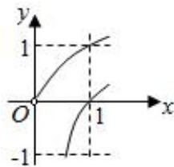
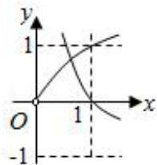

# 第四节 跟踪训练

# 考向 1 跟踪训练

【训练 1】（2020•新课标 I）设 $a \log_{3} 4 = 2$ ，则 $4^{-a} = (\quad)$

A. $\frac{1}{16}$

B. $\frac{1}{9}$

C. $\frac{1}{8}$

D. $\frac{1}{6}$

【训练2】已知 $x^{2} + x^{-2} = 3$ ，则 $\frac{x + x^{-1}}{x^3 + x^{-3}} =$ \_\_\_\_.

【训练 3】已知 $\log_{2}a + \log_{2}b = \log_{2}\frac{9}{2}$ ，则 $3^{a} + 9^{b}$ 的最小值为 \_\_\_\_.

【训练 4】幂函数 $f(x)=(m^{2}-4m+4)x^{m^{2}-6m+8}$ 在 $(0,+\infty)$ 为减函数，则 m 的值为（）

A. 1 或 3

B. 1

C. 3

D. 2

【训练 5】（2014•浙江）在同一直角坐标系中，函数 $f(x)=x^{a}(x>0)$ ， $g(x)=\log_{a}x$ 的图象可能是（）

A.

line

| Point | x | y |
|---|---|---|
| 1 | 0.5 | 1 |
| 2 | 0.75 | 0.8 |
| 3 | 1.0 | -0.6 |
| 4 | 1.25 | -1.2 |
| 5 | 1.5 | -1.8 |
| 6 | 1.75 | -2.4 |
| 7 | 2.0 | -3.0 |
| 8 | 2.25 | -3.6 |
| 9 | 2.5 | -4.2 |
| 10 | 2.75 | -4.8 |
| 11 | 3.0 | -5.4 |
| 12 | 3.25 | -6.0 |
| 13 | 3.5 | -6.6 |
| 14 | 3.75 | -7.2 |
| 15 | 4.0 | -7.8 |
| 16 | 4.25 | -8.4 |
| 17 | 4.5 | -9.0 |
| 18 | 4.75 | -9.6 |
| 19 | 5.0 | -10.2 |
| 20 | 5.25 | -10.8 |
| 21 | 5.5 | -11.4 |
| 22 | 5.75 | -12.0 |
| 23 | 6.0 | -12.6 |
| 24 | 6.25 | -13.2 |
| 25 | 6.5 | -13.8 |
| 26 | 6.75 | -14.4 |
| 27 | 7.0 | -15.0 |
| 28 | 7.25 | -15.6 |
| 29 | 7.5 | -16.2 |
| 30 | 7.75 | -16.8 |
| 31 | 8.0 | -17.4 |
| 32 | 8.25 | -18.0 |
| 33 | 8.5 | -18.6 |
| 34 | 8.75 | -19.2 |
| 35 | 9.0 | -19.8 |
| 36 | 9.25 | -20.4 |
| 37 | 9.5 | -21.0 |
| 38 | 9.75 | -21.6 |
| 39 | 10.0 | -22.2 |
| 40 | 10.25 | -22.8 |
| 41 | 10.5 | -23.4 |
| 42 | 10.75 | -24.0 |
| 43 | 11.0 | -24.6 |
| 44 | 11.25 | -25.2 |
| 45 | 11.5 | -25.8 |
| 46 | 11.75 | -26.4 |
| 47 | 12.0 | -27.0 |
| 48 | 12.25 | -27.6 |
| 49 | 12.5 | -28.2 |
| 50 | 12.75 | -28.8 |
| 51 | 13.0 | -29.4 |
| 52 | 13.25 | -30.0 |
| 53 | 13.5 | -30.6 |
| 54 | 13.75 | -31.2 |
| 55 | 14.0 | -31.8 |
| 56 | 14.25 | -32.4 |
| 57 | 14.5 | -33.0 |
| 58 | 14.75 | -33.6 |
| 59 | 15.0 | -34.2 |
| 60 | 15.25 | -34.8 |
| 61 | 15.5 | -35.4 |
| 62 | 15.75 | -36.0 |
| 63 | 16.0 | -36.6 |
| 64 | 16.25 | -37.2 |
| 65 | 16.5 | -37.8 |
| 66 | 16.75 | -38.4 |
| 67 | 17.0 | -39.0 |
| 68 | 17.25 | -39.6 |
| 69 | 17.5 | -40.2 |
| 70 | 17.75 | -40.8 |
| 71 | 18.0 | -41.4 |
| 72 | 18.25 | -42.0 |
| 73 | 18.5 | -42.6 |
| 74 | 18.75 | -43.2 |
| 75 | 19.0 | -43.8 |
| 76 | 19.25 | -44.4 |
| 77 | 19.5 | -45.0 |
| 78 | 19.75 | -45.6 |
| 79 | 20.0 | -46.2 |
| 80 | 20.25 | -46.8 |
| 81 | 20.5 | -47.4 |
| 82 | 20.75 | -48.0 |
| 83 | 21.0 | -48.6 |
| 84 | 21.25 | -49.2 |
| 85 | 21.5 | -49.8 |
| 86 | 21.75 | -50.4 |
| 87 | 22.0 | -51.0 |
| 88 | 22.25 | -51.6 |
| 89 | 22.5 | -52.2 |
| 90 | 22.75 | -52.8 |
| 91 | 23.0 | -53.4 |
| 92 | 23.25 | -54.0 |
| 93 | 23.5 | -54.6 |
| 94 | 23.75 | -55.2 |
| 95 | 24.0 | -55.8 |
| 96 | 24.25 | -56.4 |
| 97 | 24.5 | -57.0 |
| 98 | 24.75 | -57.6 |
| 99 | 25   | -58   |
| The data is presented in a table format with three columns: x and y, and each cell contains two values of the same x value (y = x + y^x). There are two data series labeled 'x' and 'y'. The values for the x series range from approximately y = y^x / (x^x + y^x) to y = y^x / (x^y + y^x) / (x^y + y^x) / (x^y + y^x) / (x^y + y^x) / (x^y + y^x) / (x^y + y^x) / (x^y + y^x) / (x^y + y^x) are explicitly labeled on the graph.

B.

line

| x | y |
|---|---|
| 0 | 0 |
| 1 | 1 |

C.

text_image

y
1
O
-1
x
1

D.

line

| x | y |
|---|---|
| 0 | 0 |
| 1 | 1 |

【训练 6】函数 $f(x)=\log_{a}(2x-3)+1(a>0$ ，且 $a\neq1)$ 的图象恒过定点 $A(m,n)$ ，若对任意正数 x，y 都有 $mx+ny=4$ ，则 $\frac{1}{x+1}+\frac{2}{y}$ 的最小值是（）

A. 2

B. $\frac{39}{22}$

C. 1

D. $\frac{4}{3}$

【训练7】已知函数 $f(x) = \log_3(3 - x) - \log_3(1 + x) - x + 3$ ，则 $f(x)$ 的图象与两坐标轴围成图形的面积是（）

A. 4

B. $4 \ln 3$

C. 6

D. 6ln3

# 考向 2 跟踪训练

【训练 1】设 $a=\left(\frac{3}{2}\right)^{-\frac{1}{3}}$ , $b=\left(\frac{3}{4}\right)^{\frac{1}{3}}$ , $c=\left(\frac{2}{3}\right)^{\frac{2}{3}}$ ，则 a, b, c 的大小关系为 \_\_\_\_。（注：用“<”将三个数按从小到大的顺序连接）

【训练 2】（2020•天津）设 $a=3^{0.7}$ ， $b=(\frac{1}{3})^{-0.8}$ ， $c=\log_{0.7}0.8$ ，则 a，b，c 的大小关系为（）

A. $a < b < c$

B. $b < a < c$

C. $b < c < a$

D. c < a < b

【训练 3】（2021•新高考 II）已知 $a=\log_{5}2$ ， $b=\log_{8}3$ ， $c=\frac{1}{2}$ ，则下列判断正确的是()

A. $c <   b <   a$

B. b < a < c

C. $a < c < b$

D. $a < b < c$

【训练 4】已知 $2^{a} + a = \log_{2} b + b = \log_{3} c + c = k (k < 1)$ ，则 a, b, c 从小到大的关系是 \_\_\_\_.

【训练 5】已知函数 $f(x)$ 是定义在 R 上的偶函数，且在 $(0,+\infty)$ 上单调递减，若 $a=f(\log_{2}0.2)$ ， $b=f(2^{0.2})$ ， $c=f(0.2^{0.3})$ 则 a，b，c 大小关系为（）

A. a < b < c

B. c<a<b

C. a < c < b

D. b < a < c

# 拓展跟踪训练

【训练 1】比较大小： $\log_{6}8$ 与 $\log_{7}9$ ;

【训练 2】比较大小： $\log_{7}4$ 与 $\log_{9}6$ ;

