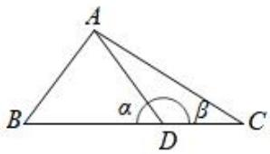
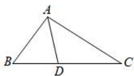
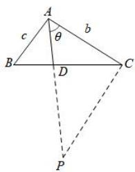
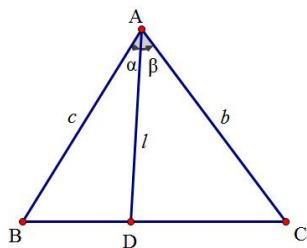

# 5.2 解三角形大题篇

# 考向 1 边角互换

# 一．正余弦定理与边角互换

# 1. 边换角解题步骤

①正弦定理把边化为角；  
②利用 $A + B + C = \pi$ 消去一个元，和差公式展开重新合并式子；  
③利用辅助角公式化成 $A\sin(\omega x + \varphi) = t$ 的形式；  
④解出特殊值的方程.

(注意诱导公式和角度范围的使用)

2. 角换边解题步骤（一般是出现 $\sin^{2}A + \sin^{2}B$ 的形式）

①正弦定理把边角换边；  
②利用余弦定理进行式子的对比求出角度值;

# 题型 1 边化角

【例 1】（2024•新高考Ⅱ）记△ABC 的内角 A，B，C 的对边分别为 a，b，c，已知 $\sin A + \sqrt{3} \cos A = 2$ .

(1) 求 A;   
（2）若 a=2， $\sqrt{2}b\sin C=c\sin 2B$ ，求△ABC周长.

【例 2】（2024•新高考 I）记 $\Delta ABC$ 的内角 A，B，C 的对边分别为 a，b，c，已知 $\sin C = \sqrt{2} \cos B$ ， $a^{2} + b^{2} - c^{2} = \sqrt{2} ab$ 。

(1) 求 B;   
（2）若 $\Delta ABC$ 的面积为 $3 + \sqrt{3}$ ，求 c.

# 题型 2 角化边

【例 1】(2022·乙卷)记 $\Delta ABC$ 的内角 A, B, C 的对边分别为 a, b, c，已知 $\sin C \sin(A-B) = \sin B \sin(C-A)$ .

（1）证明： $2a^{2}=b^{2}+c^{2}$ ;

【例 2】（2019•新课标 I） $\Delta ABC$ 的内角 A，B，C 的对边分别为 a，b，c．设

$$
(\sin B - \sin C) ^ {2} = \sin^ {2} A - \sin B \sin C.
$$

(1) 求 A;

# 考向 2 范围类问题

# 二．解三角形中的范围问题

1. 有界性求 $\sin A + \sin B$ 或者 $\sin A + \lambda \sin B$ 类型

$$
a + b = 4 R \cos \frac {C}{2} \sin \left(A + \frac {C}{2}\right),
$$

$$
a + \lambda b = 2 R \sqrt {\lambda^ {2} + 2 \lambda \cos C + 1} \sin (B + \varphi) \leqslant 2 R \sqrt {\lambda^ {2} + 2 \lambda \cos C + 1} (\lambda > 0)
$$

证明：

注意： $\sin A + \lambda \sin B = \sin(B + C) + \lambda \sin B = \sin B(\lambda + \cos C) + \cos B \sin C,$

当 $\cos C + \lambda = 0$ 时， $a + \lambda b = 2R[\sin B(\cos C + \lambda) + \cos B\sin C] = 2R \cdot \sin C\cos B,$

注意: 求 $\cos A + \cos B$ 的方法如法炮制.

2. 基本不等式求 $a + b$ （或者 $ab$ ）的最值类型

$c^{2}=a^{2}+b^{2}-2ab\cos C=(a+b)^{2}+\lambda ab\leq(1+\frac{\lambda}{4})(a+b)^{2}$ （ $\lambda$ 为常数）

$$
c ^ {2} = a ^ {2} + b ^ {2} - 2 a b \cos C \geq 2 a b - 2 a b \cos C = 2 a b (1 - \cos C)
$$

注意:①求锐角三角形的取值范围问题不适合使用基本不等式的方法; ②注意取等条件; ③配合三角形的三边关系一起使用.

# 3. 邻补角余弦值为0类型

如图， $\triangle ABC$ 中， $\alpha$ 和 $\beta$ 互为补角，则有：

$$
\cos \alpha + \cos \beta = 0 \Rightarrow \frac {A D ^ {2} + B D ^ {2} - A B ^ {2}}{2 A D \cdot B D} + \frac {A D ^ {2} + C D ^ {2} - A C ^ {2}}{2 A D \cdot C D} = 0
$$

text_image

A
B
α
β
D
C

# 4. 定比分点向量法

（1）如图， $\triangle ABC$ 中，若点 $D$ 在边 $BC$ 上，满足 $\overrightarrow{DC} = \lambda \overrightarrow{BD}$ ，则有：

$$
\overrightarrow {A D} = \frac {\lambda}{1 + \lambda} \overrightarrow {A B} + \frac {1}{1 + \lambda} \overrightarrow {A C} \Rightarrow \overrightarrow {A D} ^ {2} = (\frac {\lambda}{1 + \lambda} \overrightarrow {A B} + \frac {1}{1 + \lambda} \overrightarrow {A C}) ^ {2}.
$$

text_image

A
B
D
C

（2）构造三角形用万能辅助角，如图，若点 D 在边 BC 上，满足 $\overrightarrow{DC} = \lambda \overrightarrow{BD}$ ， $|AD| = m$ ，则延长 AP 至 D，使 $\overrightarrow{DP} = \lambda \overrightarrow{AD}$ ，连接 CP，易知 AB // CP，且 $CP = \lambda c$ ，则关于

$b + \lambda c = 2R \sin (\theta + \varphi)$ 来解决求最大值，或者求值问题；由于 $2R = \frac{|AP|}{\sin ACP} = \frac{(1 + \lambda)|AD|}{\sin BAC}$ ，根据万能辅助角公式可得： $b + \lambda c = \frac{(1 + \lambda)|AD|}{\sin\angle BAC} 2 \cos \frac{ACP}{2} \sin \theta + \frac{ACP}{2} \leq \frac{(1 + \lambda)|AD|}{\cos \frac{\angle BAC}{2}}$

text_image

A
b
c
θ
B
D
C
P

# 4. 等面积法处理角平分线

如图，在 $\triangle ABC$ 中，AD是角平分线，则一定有：

$$
S _ {\triangle A B C} = S _ {\triangle A B D} + S _ {\triangle A C D} \Rightarrow \frac {1}{2} A B A C \sin B A C = \frac {1}{2} A B A D \sin B A D + \frac {1}{2} A C A D \sin C A D
$$

text_image

A
α β
c b
l
B D C

# 题型 1 利用正弦定理及三角函数有界性求解

【例 1】（2020·浙江）在锐角 $\Delta ABC$ 中，角 A, B, C 所对的边分别为 a, b, c. 已知 $2b\sin A - \sqrt{3}a = 0$ .

（Ⅰ）求角 B 的大小；  
（II）求 $\cos A + \cos B + \cos C$ 的取值范围.

【例 2】 $\Delta ABC$ 中，角 A，B，C 所对边分别是 a，b，c， $\frac{\tan A}{\tan B} + \frac{\tan A}{\tan C} = \frac{2}{bc}$ ， $b \cos C + c \cos B = 1$ .

（Ⅰ）求角 A 及边 a；  
（Ⅱ）求 $2b+c$ 的最大值.

【例3】在 $\Delta ABC$ 中，内角 $A$ ， $B$ ， $C$ 所对的边分别为 $a$ ， $b$ ， $c$ ，若 $2 - \sin^2 C = \sin A\sin B + \cos^2 A + \cos^2 B$ ：

(1) 求 C;   
（2）若 $\Delta ABC$ 为锐角三角形，且 b=4 ，求 $\Delta ABC$ 面积的取值范围.

# 题型 2 利用余弦定理及基本不等式求解

【例 1】（2020•新课标 II） $\Delta ABC$ 中， $\sin^{2}A-\sin^{2}B-\sin^{2}C=\sin B\sin C$ .

(1) 求 A;   
（2）若 BC=3，求 $\Delta ABC$ 周长的最大值.

【例 2】在 $\Delta ABC$ 中，角 A, B, C 的对边分别为 a, b, c，且 $c \cos C \cos (A - B) + c = c \sin^{2} C + b \sin A \sin C$ .

(1) 求 C;   
（2）若 c=4， $CD \perp AB$ 于点 D，求线段 CD 长度的最大值.

# 题型 3 两角互补余弦法

【例 1】(2021·新高考 I) 记 $\Delta ABC$ 的内角 A, B, C 的对边分别为 a, b, c. 已知 $b^{2} = ac$ ，点 D 在边 AC 上， $BD \sin \angle ABC = a \sin C$ .

（1）证明：BD=b；  
（2）若 AD = 2DC，求 $\cos\angle ABC$ .

# 题型 4 定比分点向量法

【例 1】（2023·新高考Ⅱ）记 $\Delta ABC$ 的内角 A，B，C 的对边分别为 a，b，c，已知 $\Delta ABC$ 面积为 $\sqrt{3}$ ，D 为 BC 的中点，且 AD = 1。

（1）若 $\angle ADC = \frac{\pi}{3}$ ，求 $\tan B$ ；  
(2) 若 $b^{2} + c^{2} = 8$ ，求 b，c。

【例 2】在 $\Delta ABC$ 中，内角 A，B，C 的对边分别为 a，b，c，且 $a^{2}-b^{2}=ac\cos B-\frac{1}{2}bc$ .

(1) 求 A;   
（2）若 $a=6,2\overrightarrow{BD}=\overrightarrow{DC}$ ，求线段 AD 长的最大值.

# 题型 5 换元法求解范围

【例 1】在 $\Delta ABC$ 中，内角 A，B，C 对应的边分别为 a，b，c，若 $2c^{2}=a^{2}+b^{2}$ .

（1）证明： $\frac{1}{\tan A} +\frac{1}{\tan B} = \frac{2}{\tan C}$   
(2) 求 $\frac{a}{b}$ 的取值范围.

【例 2】在 $\Delta ABC$ 中，角 A, B, C 的对边分别为 a, b, c，且 $\sin C = \frac{c}{3} \cos \frac{B}{2}, b = 3$ .

（1）求 $\Delta ABC$ 外接圆的面积；  
（2）若 $\Delta ABC$ 为锐角三角形，求 $\frac{b^{2}+c^{2}}{a^{2}}$ 的取值范围.

