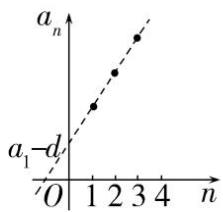
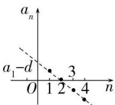
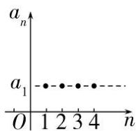
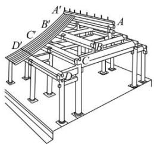
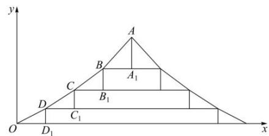

# 第2节 等差数列

# 考向一 等差数列的概念及通项

# 知识点一 等差数列的概念

# 1. 定义

一般地，如果一个数列从第二项起，每一项与它的前一项的差都等于同一个常数，即 $a_{n + 1} - a_n = d$ 或者 $a_{n} - a_{n - 1} = d$ （ $n\geq 2$ ），那么这个数列就叫做等差数列，这个常数叫做等差数列的公差，公差通常用字母 $d$ 表示，公差可正可负可为零.

2. 递推公式形式的定义： $a_{n} - a_{n - 1} = d$ （ $n\in N^{*}$ 且 $n\geq 2$ ）或者 $a_{n + 1} - a_n = d$ ：

# 知识点二 等差中项的概念

由三个数 $a, A, b$ 组成的等差数列可以看成是最简单的等差数列．这时， $A$ 叫做 $a$ 与 $b$ 的等差中项且 $2A = a + b$ .

①两个数的等差中项就是两个数的算术平均数，任意两实数 $a, b$ 的等差中项存在且唯一；  
②三个数 a, A, b 成等差数列的充要条件是 $A = \frac{a + b}{2}$ .

# 知识点三 等差数列的通项公式

1. 首项为 $a_1$ ，公差为 $d$ 的等差数列 $\{a_n\}$ 的通项公式 $a_n = a_1 + (n - 1)d$ .

# 知识点四 从函数观点看等差数列——等差数列与一次函数

由等差数列的通项公式 $a_{n} = a_{1} + (n - 1)d$ ，可得 $a_{n} = dn + (a_{1} - d)$

当 $d \neq 0$ 时， $a_{n} = dn + b$ 是 $n$ 的一次函数，一次项系数是等差数列的公差 $d$ ，它的图象是在直线 $y = dx + b$ 上均匀排列的一群孤立的点.

(1) 当 d > 0 时数列 $\{a_{n}\}$ 为递增数列；(2) 当 d < 0 时数列 $\{a_{n}\}$ 为递减数列；(3) 当 d = 0 时， $a_{n} = a_{1}$ ，等差数列为常数列，此时数列的图象是平行于 x 轴的直线（或 x 轴）上均匀分布的一群孤立的点.

从图象上看（如下图），表示数列 $\{a_{n}\}$ 的各点，即点 $(n,a_{n})$ ，均匀分布在一条直线上.

scatter

| n | a_n |
|---|---|
| 0 | a_1 - d |
| 1 | a_2 - d |
| 2 | a_3 - d |
| 3 | a_4 - d |
| 4 | a_n |

scatter

| Point | n | a_n |
|---|---|---|
| 1 | 1 | - |
| 2 | 2 | 3 |
| 3 | 3 | 3 |
| 4 | 4 | 4 |

# 知识点五 等差数列通项公式的变形及推广

# 1. 公式变形

设等差数列 $\{a_{n}\}$ 的首项为 $a_1$ ，公差为 $d$ ，则

① $d=\frac{a_{n}-a_{m}}{n-m}(m,\ n\in\mathbf{N}^{*},\ \text{且}\ m\neq n)$ ，可用来由等差数列任两项求公差.  
② $a_{n}=a_{m}+(n-m)d(m,\ n\in\mathbf{N}^{*})$ ，可以用来利用任一项及公差直接得到通项公式，不必求 $a_{1}$ .

证明： $\because a_{n}=a_{1}+(n-1)d,\quad a_{m}=a_{1}+(m-1)d,\therefore a_{n}-a_{m}=[a_{1}+(n-1)d]-[a_{1}+(m-1)d]=(n-m)d$ ，

$$
\therefore a _ {n} = a _ {m} + (n - m) d.
$$

由上可知，等差数列的通项公式可以用数列中的任一项与公差来表示，公式 $a_{n} = a_{1} + (n - 1)d$ 可以看成是 $m = 1$ 时的特殊情况.

③ $n = \frac{a_n - a_1}{d} + 1$ ，已知首项，末项，公差即可计算出项数.

# 2. 基本量法

（1）等差数列可以由首项 $a_1$ 和公差 $d$ 确定，我们把 $a_1$ 和 $d$ 称为基本量，所有关于等差数列的计算和证明，都可围绕 $a_1$ 和 $d$ 进行．在基本量法中，不拘泥于 $a_1$ ，有 $a_m$ 可直接用 $a_m$ ：

解题时没有思路了，可以回归基本量法.

(2) 求等差数列的通项公式的两种思路:

①设出基本量 $a_{1}$ , $d$ , 利用条件构建方程组, 通过加减消元法或代入消元法求出 $a_{1}$ , $d$ , 即可写出等差数列 $\{a_{n}\}$ 的通项公式;

②已知等差数列中的两项 $a_{n}, a_{m} (n, m \in \mathbf{N}^{*}, n \neq m)$ 时，则 $\left\{ \begin{array}{l} a_{n} = a_{1} + (n - 1)d \\ a_{m} = a_{1} + (m - 1)d \end{array} \right. \Rightarrow \left\{ \begin{array}{l} d = \frac{a_{m} - a_{n}}{m - n} \\ a_{n} = a_{m} + (n - m)d \end{array} \right.$ ，可不必求 $a_{1}$ 而直接写出等差数列 $\{a_{n}\}$ 的通项公式.

③设项技巧——对称设项

(i) 三个数成等差数列可设为: a-d, a, $a+d$ 或 a, $a+d$ , $a+2d$ ;  
（ii）四个数成等差数列可设为： $a - 3d$ ， $a - d$ ， $a + d$ ， $a + 3d$ 或 $a$ ， $a + d$ ， $a + 2d$ ， $a + 3d$ ：

【例 1】(2020·上海) 已知数列 $\{a_{n}\}$ 是公差不为零的等差数列，且 $a_{1} + a_{10} = a_{9}$ ，则 $\frac{a_{1} + a_{2} + \ldots + a_{9}}{a_{10}} = -\frac{27}{8}$ .

【例 2】设 a, b, c 分别是 $\Delta ABC$ 内角 A, B, C 的对边，若 $\frac{1}{\tan A}, \frac{1}{\tan B}, \frac{1}{\tan C}$ 依次成公差不为 0 的等差数列，则（）

A. a, b, c 依次成等差数列

B. $a^2, b^2, c^2$ 依次成等差数列

C. $\sqrt{a},\sqrt{b},\sqrt{c}$ 依次成等差数列

D. $\frac{1}{a}, \frac{1}{b}, \frac{1}{c}$ 依次成等差数列

【例 3】(2022·新 II 卷)图 1 是中国古代建筑中的举架结构， $AA'$ , $BB'$ , $CC'$ , $DD'$

是桁，相邻桁的水平距离称为步，垂直距离称为举，图2是某古代建筑屋顶截面的示意图.

其中 $DD_{1}, CC_{1}, BB_{1}, AA_{1}$ 是举， $OD_{1}, DC_{1}, CB_{1}, BA_{1}$ 是相等的步，相邻桁的举步之比分别为

$\frac{DD_1}{OD_1} = 0.5, \frac{CC_1}{DC_1} = k_1, \frac{BB_1}{CB_1} = k_2, \frac{AA_1}{BA_1} = k_3$ 。已知 $k_1, k_2, k_3$ 成公差为 0。1 的等差数列，

且直线 OA 的斜率为 0.725，则 $k_{3}=(\quad)$

text_image

A'
B'
C'
D'
B
C
D

图1

text_image

y
A
B
A₁
C
B₁
D
C₁
O
D₁
x

图2

A. 0.75

B. 0.8

C. 0.85

D. 0.9

【例 4】函数 $y=\sqrt{1-(x+2)^{2}}$ 图像上存在不同的三点到原点的距离构成等差数列，则以下不可能成为公差的数是（）

A. $\frac{\sqrt{3}}{3}$

B. $\frac{1}{2}$

C. 1

D. $\sqrt{3}$

【例 5】(2023·乙卷)已知等差数列 $\left\{a_{n}\right\}$ 的公差为 $\frac{2\pi}{3}$ ，集合 $S=\left\{\cos a_{n}\mid n\in N^{*}\right\}$ ，若 $S=\left\{a,b\right\}$ ，则 ab=（）

A. -1

B. $-\frac{1}{2}$

C. 0

D. $\frac{1}{2}$

# 考向 2 等差数列的性质

1. 由等差数列生成新的等差数列

（1）公差为 d 的等差数列 $\left\{a_{n}\right\}$ 具有如下性质：下标成公差为 m 的等差数列的项 $a_{k}, a_{k+m}, a_{k+2m}, \cdots$ 组成以 md 为公差的等差数列，即在等差数列中每隔相同的项选出一项，按原来的顺序排成一列，仍然是一个等差数列.

(2) 如果两等差数列有公共项, 那么由它们的公共项顺次组成的新数列也是等差数列, 且新等差数列的公差是原两等差数列公差的最小公倍数.

（3）若 $\{a_{n}\}$ ， $\{b_{n}\}$ 分别是公差为d， $d'$ 的等差数列，则有

<table><tr><td>数列</td><td>结论</td></tr><tr><td> $\{c+a_n\}$ </td><td>公差为d的等差数列(c为任一常数)</td></tr><tr><td> $\{c\cdot a_n\}$ </td><td>公差为cd的等差数列(c为任一常数)</td></tr><tr><td> $\{a_n+a_{n+k}\}$ </td><td>公差为2d的等差数列</td></tr><tr><td> $\{pa_n+qb_n\}$ </td><td>公差为pd+qd&#x27;的等差数列(p,q为常数)</td></tr></table>

2. 角标和对称性：若 $m + n = p + q$ ，则 $a_{m} + a_{n} = a_{p} + a_{q}$ $(m, n, p, q \in \mathbf{N}^{*})$ .

（1）若 $m + n = 2k$ ，则 $a_{m} + a_{n} = 2a_{k}$ （ $m, n, p \in \mathbf{N}^{*}$ ）；

(2) 若 $m+n+t=p+q+r$ ，则 $a_{m}+a_{n}+a_{t}=a_{p}+a_{q}+a_{r}(m,n,p,q,t,r\in\mathbf{N}^{*})$ .

（3）有穷等差数列中，与首末两项等距离的两项之和都相等，都等于首末两项的和：

$$
a _ {1} + a _ {n} = a _ {2} + a _ {n - 1} = \dots = a _ {i} + a _ {n + 1 - i} = \dots .
$$

对于选填中的二元问题，单条件暗示考性质，可利用从一般到特殊思想，直接考虑特殊化的情形，令 $a_{n}=x$ 可简化计算.

3. 角标项对偶性：若 $a_{n} = m, a_{m} = n$ ，则 $a_{m + n} = 0$ .

证明：由 $a_{n} = a_{m} + (n - m)d$ 得， $d = \frac{a_n - a_m}{n - m} = \frac{m - n}{n - m} = -1$ ， $\therefore a_{m + n} = a_m + (m + n - m)d = n - n = 0$

【例 1】（2024·新高考 II）记 $S_{n}$ 为等差数列 $\{a_{n}\}$ 的前 n 项和，若 $a_{3}+a_{4}=7, 3a_{2}+a_{5}=5$ ，则 $S_{10}=$ \_\_\_\_.

【例 2】已知数列 $\{a_{n}\}$ 为等差数列，且 $a_{1} + a_{7} + a_{13} = 4\pi$ ，则 $\sin a_{7} = (\quad)$

A. $\frac{1}{2}$

B. $-\frac{1}{2}$

C. $\frac{\sqrt{3}}{2}$

D. $-\frac{\sqrt{3}}{2}$

【例 3】已知 $\{a_{n}\}$ ， $\{b_{n}\}$ 均为等差数列，且 $a_{1}=1,\quad b_{1}=2,\quad a_{3}+b_{3}=5$ ，则 $a_{2023}+b_{2023}=(\quad)$

A. 2026

B. 2025

C. 2024

D. 2023

【例4】已知数列 $\{a_{n}\}$ 为等差数列， $a_4 + a_5 + a_6 = 6$ ， $a_7 + a_8 + a_9 = 11$ ，则 $a_{10} + a_{11} + a_{12} = (\quad)$

A. 16

B. 19

C. 25

D. 29

考向3 等差数列的前 $n$ 项 $S_{n}$

<table><tr><td>已知量</td><td>首项,末项与项数</td><td>首项,公差与项数</td></tr><tr><td>求和公式</td><td> $S_n=\frac{n(a_1+a_n)}{2}$ </td><td> $S_n=na_1+\frac{n(n-1)}{2}d$ </td></tr></table>

① $a_{n}=\left\{\begin{aligned}S_{1}&\quad,n=1\\ S_{n}-S_{n-1},&n\geq2\end{aligned}\right.$ ; ② $S_{n}-S_{m}=a_{m+1}+a_{m+2}+\cdots+a_{n}$ .

1. $a_{n}$ 与 $S_{n}$ 之间一步转换

$$
a _ {m _ {1}} + a _ {m _ {2}} + a _ {m _ {3}} + \dots + a _ {m _ {n}} = n a _ {\frac {m _ {1} + m _ {2} + m _ {3} + \dots . . . + m _ {n}}{n}}
$$

例： $a_2 + a_6 + a_7 = 3a_5$ ； $3a_{8} - a_{12} = 2a_{6}$

公式一： $S_{n}=a_{1}+a_{2}+a_{3}+\cdots\cdots+a_{n}\Rightarrow S_{n}=n\cdot a_{\frac{n+1}{2}}$ （其中 n 为奇数）例： $S_{5}=5a_{3}$

公式二： $a_{n} = \frac{S_{2n - 1}}{2n - 1}$ 例： $a_5 = \frac{S_9}{9}$ ； $a_8 = \frac{S_{15}}{15}$

当 $m_{1}$ 、 $m_{2}$ 、 $m_{3}$ 、 $\cdots$ 、 $m_{n}$ 也成等差数列时，均有 $a_{m_{1}} + a_{m_{2}} + a_{m_{3}} + \cdots + a_{m_{n}} = na_{\frac{m_{1} + m_{n}}{2}}$ .

2. 只有 $S$ 的模型与最值问题

性质1．等差数列中： $\frac{S_{m + n}}{m + n} = \frac{S_m - S_n}{m - n}$ ，则有 $\frac{S_{2m + m}}{2m + m} = \frac{S_{2m} - S_m}{2m - m}$ 可以求出 $S_{3m}$ ，甚至 $S_{4m}$

注意：①若 $S_{m}=S_{n}$ ，则一定有： $S_{m+n}=0$ ； $a_{\frac{m+n+1}{2}}=0$ 。

② $S_{n}$ ， $S_{2n}-S_{n}$ ， $S_{3n}-S_{2n}$ 成等差数列，公差为 $n^{2}d$

性质2.等差数列 $\{a_{n}\}$ 中： $\{\frac{S_n}{n}\}$ 为首项是 $a_1$ ，公差是 $\frac{d}{2}$ 的等差数列，若 $m + n = p + q$ ，则 $\frac{S_m}{m} +\frac{S_n}{n} = \frac{S_p}{p} +\frac{S_q}{q}$

特别的，若 $m + n = 2p$ ，则有 $\frac{S_m}{m} +\frac{S_n}{n} = \frac{2S_p}{p}$

性质3. $S_{n}$ 有最大值 $\Leftrightarrow \left\{ \begin{array}{l}a_{n} > 0\\ a_{n + 1} <   0 \end{array} \right.$ ； $S_{n}$ 有最小值 $\Leftrightarrow \left\{ \begin{array}{l}a_n <   0\\ a_{n + 1} > 0 \end{array} \right.$ ，若 $a_{n} = 0$ ，则有 $S_{n} = S_{n - 1}$ 同时取得最值 $S_{n} > 0$ ， $n$ 的最大值 $\Leftrightarrow \left\{ \begin{array}{l}S_n > 0\\ S_{n + 1} <   0 \end{array} \right.$ ； $S_{n} <   0,n$ 的最大值 $\Leftrightarrow \left\{ \begin{array}{l}S_n <   0\\ S_{n + 1} > 0 \end{array} \right.$ 。

题型一 $a_{n}$ 与 $S_{n}$ 的关系

【例 1】（2024·甲卷）等差数列 $\{a_{n}\}$ 的前 n 项和为 $S_{n}$ ，若 $S_{9}=1,\ a_{3}+a_{7}=$ （）

A. -2

B. $\frac{7}{3}$

C. 1

D. $\frac{2}{9}$

【例 2】(2020•新高考 I 卷)将数列 $\{2n-1\}$ 与 $\{3n-2\}$ 的公共项从小到大排列得到数列 $\{a_{n}\}$ ，则 $\{a_{n}\}$ 的前 n 项和为 \_\_\_\_.

【例 3】已知等差数列 $\{a_{n}\}$ ， $a_{1}=-4048$ ，其前 n 项和为 $S_{n}$ ，若 $\frac{S_{20}}{20}-\frac{S_{18}}{18}=4$ ，则 $S_{2025}=(\quad)$

A. 0

B. $2024^{2}$

C. 2025

D. $2025^{2}$

【例 4】(2013·新课标I) 设等差数列 $\{a_{n}\}$ 的前 n 项和为 $S_{n}$ ，若 $S_{m-1} = -2$ ， $S_{m} = 0$ ， $S_{m+1} = 3$ ，则 $m = (\quad)$

A. 3

B. 4

C. 5

D. 6

【例 5】设等差数列 $\{a_{n}\}$ 的前 n 项和为 $S_{n}$ ，若 $\frac{S_{14}}{S_{7}} = 7$ ，则 $\frac{S_{21}}{S_{14}} = (\quad)$

A. $\frac{18}{7}$

B. $\frac{3}{2}$

C. $\frac{11}{7}$

D. $\frac{11}{6}$

【例 6】设 $\{a_{n}\}$ 与 $\{b_{n}\}$ 是两个等差数列，它们的前 n 项和分别为 $S_{n}$ 和 $T_{n}$ ，若 $\frac{S_{n}}{T_{n}}=\frac{31n+101}{n+3}$ ，

则：（1） $\frac{a_{9}}{b_{9}}=$ \_\_\_\_；（2） $\frac{a_{5}}{b_{4}}=$ \_\_\_\_；（3） $\frac{a_{1}+a_{11}}{b_{1}+b_{11}}=$ \_\_\_\_；

（4） $\frac{a_{1}+a_{4}+a_{7}}{b_{1}+b_{4}+b_{7}}=$ \_\_\_\_；（5） $\frac{a_{n}}{b_{n}}=$ \_\_\_\_；（6）求使 $\frac{a_{n}}{b_{n}}$ 为整数的正整数n的集合.

【例 7】已知等差数列 $\{a_{n}\}$ 与等差数列 $\{b_{n}\}$ 的前 n 项和分别为 $S_{n}$ 与 $T_{n}$ ，且 $\frac{S_{n}}{T_{2n-1}} = \frac{5n+3}{4n-2}$ ，则 $\frac{a_{3}}{b_{11}} + \frac{a_{9}}{b_{11}} = (\quad)$

A. $\frac{29}{21}$

B. $\frac{29}{11}$

C. $\frac{58}{21}$

D. $\frac{58}{11}$

# 题型二 与 $S_{n}$ 有关的最值问题

【例 1】记等差数列 $\{a_{n}\}$ 的前 n 项和为 $S_{n}$ ，公差为 d，若 $a_{3}+a_{18}>0$ ， $S_{19}<0$ ，则（）

A. $S_{20} < 0$

B. $a_6 + a_{17} < 0$

C. $a_{11}>0$

D. $\frac{a_1}{d} \in (-9, -8)$

【例 2】(多选)公差为 d 的等差数列 $\{a_{n}\}$ ，其前 n 项和为 $S_{n}$ ， $S_{11} > 0$ ， $S_{12} < 0$ ，下列说法正确的有()

A. $d <   0$

B. $a_{7} > 0$

C. $\{S_{n}\}$ 中 $S_{6}$ 最大

D. $|a_4| < |a_9|$

【例 3】（2019•北京）设等差数列 $\{a_{n}\}$ 的前 n 项和为 $S_{n}$ ，若 $a_{2} = -3$ ， $S_{5} = -10$ ，则 $a_{5} =$ \_\_\_\_ ， $S_{n}$ 的最小值为 \_\_\_\_.

# 题型三 奇数项和与偶数项和

（1）①若数列 $\{a_{n}\}$ 共有 $2n - 1$ 项，则 $S_{2n - 1} = (2n - 1)a_{n}$ （ $a_{n}$ 为中间项）， $S_{\text{奇}} - S_{\text{偶}} = a_{n}$ ， $\frac{S_{\text{奇}}}{S_{\text{偶}}} = \frac{n}{n - 1}$ ；

(其中 $S_{奇}=\frac{n(a_{1}+a_{2n-1})}{2}=na_{n}$ ， $S_{偶}=\frac{(n-1)(a_{2}+a_{2n-2})}{2}=(n-1)a_{n}$ )；

②若数列 $\{a_{n}\}$ 共有 $2n$ 项，则 $S_{2n} = n(a_{n} + a_{n + 1})$ （ $a_{n}$ ， $a_{n + 1}$ 为中间两项）， $S_{\text{偶}} - S_{\text{奇}} = nd$ ， $\frac{S_{\text{偶}}}{S_{\text{奇}}} = \frac{a_{n + 1}}{a_n}$ .

【例 1】等差数列 $\{a_{n}\}$ 共 $2n+1$ 个项，且奇数项和为 165，偶数项和为 150，则 $n=(\quad)$

A. 10

B. 13

C. 11

D. 22

【例 2】一个等差数列共有 2n 项，奇数项的和与偶数项的和分别为 24 和 30，且末项比首项大 10.5，则该数列的项数是（）

A. 4

B. 8

C. 12

D. 20

【例 3】一个等差数列的前 10 项和为 30，前 30 项的和为 10，则前 40 项的和为 \_\_\_\_。

# 考向四 等差数列的判定方法

1. 定义法：利用定义， $a_{n}-a_{n-1}=d$ (常数) $(n\geq2)$ ,  
2. 等差中项法：即 $2a_{n}=a_{n+1}+a_{n-1}(n\geq2)$ .   
3. 通项公式法：若数列 $\{a_{n}\}$ 的通项公式为 $n$ 的一次函数，即 $a_{n} = An + B(A, B$ 是常数)，则 $\{a_{n}\}$ 是等差数列.  
4. 前 n 项和法：若数列 $\left\{a_{n}\right\}$ 的前 n 项和 $S_{n}$ 是 $S_{n}=An^{2}+Bn$ 的形式 (A, B 是常数)，则 $\left\{a_{n}\right\}$ 为等差数列.

注：①解答题可利用（1）或（2）进行严格证明；②选择、填空题时，可直接用(3)或(4)直接判断.

5. 常见的等差数列

(1) $S_{n} = an^{2} + bn \Leftrightarrow \{a_{n}\}$ 为等差数列， $a_{n} = 2an + b - a$ 。  
(2) $S_{n} = an^{2} + bn + c$ （ $c \neq 0$ ） $\Leftrightarrow a_{n} = \left\{ \begin{array}{l} a + b + c, n = 1 \\ 2an + b - a, n \geq 2 \end{array} \right.$ ，即 $\{a_{n}\}$ 是从第二项开始为等差数列.

注：选填题可以直接用，解答题在规范书写的基础上结合结论可以简化计算过程，避实就虚！

（3）若 $S_{n} = pa_{n}^{2} + \frac{1}{2} a_{n} + c$ ，则 $\{a_n\}$ 是等差数列，且 $d = \frac{1}{2p}$

(4) $pa_{n} - pa_{n - 1} = ca_{n}\cdot a_{n - 1},\quad pS_{n} - pS_{n - 1} = cS_{n}\cdot S_{n - 1},\quad nS_{n + 1} - (n + 1)S_{n} = n(n + 1)$ 型递推关系式.

转化步骤：方程两边分别同除以“积式”结构 $a_{n} \cdot a_{n-1}$ ， $S_{n} \cdot S_{n-1}$ ， $n(n+1)$ ，即可分别得到 $\left\{\frac{1}{a_n}\right\}$ ， $\left\{\frac{1}{S_n}\right\}$ ， $\left\{\frac{S_n}{n}\right\}$ 为等差数列。可以类比基本不等式中的“整体代换”来理解记忆，见到 $mx + ny = txy$ 结构，同除积式 $xy$ 得 $\frac{n}{x} + \frac{m}{y} = t$ 。

（5）用于含指数幂 $a_{n} = pa_{n - 1} + p^{n}$ 型已知条件.

转化方法：同除指数项，等式两边同时除以 $p^{n}$ ： $\frac{a_{n}}{p^{n}}=\frac{a_{n-1}}{p^{n-1}}+1$ ，所以 $\left\{\frac{a_{n}}{p^{n}}\right\}$ 为等差数列.

（6）对于分式型递推关系式 $a_{n + 1} = \frac{ca_n}{pa_n + c}$ 型已知条件，且分子只有一项.

转化方法：取倒数法，等式两边同时取倒数可得 $\frac{1}{a_{n + 1}} = \frac{1}{a_n} +\frac{p}{c}$ ，故数列 $\left\{\frac{1}{a_n}\right\}$ 为等差数列.

【例 1】(2022 甲卷理科)记 $S_{n}$ 为数列 $\left\{a_{n}\right\}$ 的前 n 项和．已知 $\frac{2S_{n}}{n} + n = 2a_{n} + 1$ ．证明： $\left\{a_{n}\right\}$ 是等差数列.

【例 2】在数列 $\{a_{n}\}$ 中， $a_{1}=1, a_{n+1}=1-\frac{1}{4a_{n}}, b_{n}=\frac{1}{2a_{n}-1}$ ，其中 $n\in N^{*}$ .

求证：数列 $\{b_{n}\}$ 是等差数列.

【例 3】已知数列 $\{a_{n}\}$ 满足 $a_{1}=\frac{1}{3}, a_{n+1}=\frac{a_{n}}{2a_{n}+1}$ .

证明：数列 $\left\{\frac{1}{a_{n}}\right\}$ 为等差数列，并求数列 $\{a_{n}\}$ 的通项公式 $a_{n}$ .

【例 4】(2015•新课标 2 理)设 $S_{n}$ 是数列 $\left\{a_{n}\right\}$ 的前 n 项和，且 $a_{1} = -1$ ， $a_{n+1} = S_{n}S_{n+1}$ ，则 $S_{n} =$ \_\_\_\_ .

