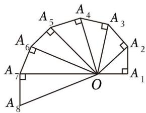

# 第二节跟踪训练

# 考向 1 跟踪训练

【训练 1】（2018•北京）设 $\{a_{n}\}$ 是等差数列，且 $a_{1}=3,\quad a_{2}+a_{5}=36$ ，则 $\{a_{n}\}$ 的通项公式为 \_\_\_\_.

【训练 2】在中国古代，人们用圭表测量日影长度来确定节气，一年之中日影最长的一天被定为冬至．从冬至算起，依次有冬至、小寒、大寒、立春、雨水、惊蛰、春分、清明、谷雨、立夏、小满、芒种这十二个节气，其日影长依次成等差数列，若冬至、立春、春分日影长之和为31．5尺，小寒、雨水，清明日影长之和为28．5尺，则大寒、惊蛰、谷雨日影长之和为( )

A. 25.5 尺

B. 34.5 尺

C. 37.5 尺

D. 96 尺

【训练3】已知等差数列 $\{a_{n}\}$ 的公差为 $\pi$ ；集合 $S = \{\sin a_{n} \mid n \in N^{*}\}$ ，若 $S = \{a, b\}$ ，则 $a + b = (\quad)$

A. -1

B. 0

C. $\frac{1}{2}$

D. 1

【训练 4】图 1 是第七届国际数学教育大会（简称 ICME-7）的会徽图案，会徽的主题图案是由如图 2 所示的一连串直角三角形演化而成的，其中 $OA_{1}=A_{1}A_{2}=A_{2}A_{3}=\ldots=A_{7}A_{8}=1$ ，如果把图 2 中的直角三角形继续作下去，则第 n 个三角形的面积为（）

text_image

ICME-7

图1

text_image

A₅
A₄
A₃
A₂
A₁
A₇
O
A₈

图2

A. $\frac{n}{2}$

B. $\frac{\sqrt{n}}{2}$

C. $\frac{n^{2}}{2}$

D. $\sqrt{n}$

【训练 5】函数 $f(x)=(x^{2}-6x+m)(e^{x-3}+e^{3-x}-n)$ 的四个零点是以 0 为首项的等差数列，则 $m+n=$ \_\_\_\_.

# 考向 2 跟踪训练

【训练1】已知数列 $\{a_{n}\}$ ，则“ $a_{2} + a_{4} = a_{1} + a_{5}$ ”是“ $\{a_{n}\}$ 为等差数列”的（）

A. 充分不必要条件

B. 必要不充分条件

C. 充要条件

D. 既不充分也不必要条件

【训练2】已知等差数列 $\{a_{n}\}$ 满足 $a_1a_3 + a_2a_7 + a_3a_9 + a_7a_8 = 100$ ，则 $a_5 = (\quad)$

A. $\frac{5}{2}$

B. 5

C. 5 或 -5

D. $\frac{5}{2}$ 或 $-\frac{5}{2}$

【训练 3】已知数列 $\{a_{n}\}$ 为等差数列，且 $a_{1} + a_{5} + a_{9} = 4\pi$ ，则 $\tan(a_{3} + a_{7}) = (\quad)$

A. $\sqrt{3}$

B. $-\frac{\sqrt{3}}{3}$

C. $-\sqrt{3}$

D. $\frac{\sqrt{3}}{3}$

【训练4】已知数列 $\{a_{n}\}$ 为等差数列， $a_1 + a_2 + a_3 = 7$ ， $a_7 + a_8 + a_9 = 13$ ，则 $a_{13} + a_{14} + a_{15} = (\quad)$

A. 19

B. 22

C. 25

D. 27

# 考向 3 跟踪训练

# 题型 1

【训练 1】已知 $\{S_{n}\}$ 为等差数列 $\{a_{n}\}$ 的前 n 项和，若 $S_{4}=14,\quad S_{6}=S_{2}+22$ ，则 $S_{6}=(\quad)$

A. 26

B. 27

C. 28

D. 29

【训练 2】（2019•新课标III）记 $S_{n}$ 为等差数列 $\{a_{n}\}$ 的前 n 项和．若 $a_{1} \neq 0$ ， $a_{2} = 3a_{1}$ ，则 $\frac{S_{10}}{S_{5}} =$ \_\_\_\_ .

【训练 3】记等差数列 $\{a_{n}\}$ 与 $\{b_{n}\}$ 的前 n 项和分别为 $S_{n}$ 与 $T_{n}$ ，若 $\frac{S_{n}}{T_{n}} = \frac{n + 1}{2n + 3}$ ，则 $\frac{a_{10}b_{5}}{a_{5}b_{10}} = (\quad)$

A. $\frac{82}{81}$

B. $\frac{81}{82}$

C. $\frac{42}{41}$

D. $\frac{41}{42}$

【训练4】已知两个等差数列 $\{a_{n}\}$ 和 $\{b_{n}\}$ 的前 $n$ 项和分别为 $A_{n}$ 和 $B_{n}$ ，且 $\frac{A_n}{B_n} = \frac{7n + 45}{n + 3}$ ，则使得 $\frac{a_n}{b_n}$ 为整数的正整数 $n$ 可以是（）

A. 1

B. 2

C. 3

D. 6

【训练 5】已知等差数列 $\{a_{n}\}$ 的前 n 项和为 $S_{n}, S_{4}=3, S_{n-4}=12 (n\geq5, n\in N^{*}), S_{n}=17$ ，则 n 的值为（）

A. 8

B. 11

C. 13

D. 17

# 题型 2

【训练 1】已知等差数列 $\{a_{n}\}$ 前 n 项和为 $S_{n}$ ，满足 $S_{39} > 0$ ， $S_{40} < 0$ ，若 $a_{m} \cdot a_{m+1} < 0$ ，则 $m = (\quad)$

A. 18

B. 19

C. 20

D. 21

【训练 2】设等差数列 $\{a_{n}\}$ 的前 n 项和为 $S_{n}$ ，满足 $S_{11} > 0$ ， $S_{12} < 0$ ，数列 $\{\frac{S_{n}}{a_{n}}\}(1 \leqslant n \leqslant 11)$ 中最大的项为第 ( ) 项.

A. 4

B. 5

C. 6

D. 7

【训练 3】(多选)已知 $S_{n}$ 为等差数列 $\{a_{n}\}$ 的前 n 项和， $a_{9} + a_{10} + a_{11} > 0$ ， $a_{9} + a_{12} < 0$ ，则下列选项错误的是（）

A. 数列 $\{a_{n}\}$ 是单调递增数列

B. 当 $n = 11$ 时， $S_{n}$ 最大

C. $S_{19} \cdot S_{20} > 0$

D. $S_{11} <   S_9$

# 题型 3

【训练 1】已知等差数列 $\{a_{n}\}$ 共有 2n-1 项，奇数项之和为 60，偶数项之和为 54，则 n=10.

【训练2】已知等差数列 $\{a_{n}\}$ 中，前 $m(m$ 为奇数）项的和为77，其中偶数项之和为33，且 $a_{1} - a_{m} = 18$ ，则数列 $\{a_{n}\}$ 的通项公式为 $a_{n} = \_$ .

# 考向 4 跟踪训练

【训练 1】已知数列 $\{a_{n}\}$ 满足： $a_{1}=6,\quad a_{n-1}a_{n}-6a_{n-1}+9=0,\quad n\in N^{*}$ 且 $n\geq2$ ，求证： $\left\{\frac{1}{a_{n}-3}\right\}$ 为等差数列.

【训练2】已知数列 $\{a_{n}\}$ 满足 $(a_{n + 1} - 1)(a_n - 1) = 3(a_n - a_{n + 1})$ ， $a_1 = 2$ ，令 $b_{n} = \frac{1}{a_{n} - 1}$

（1）求证：数列 $\{b_{n}\}$ 是等差数列；  
(2) 求数列 $\{a_{n}\}$ 的通项公式.

【训练 3】若数列 $\{a_{n}\}$ 的前 n 项和为 $S_{n}$ ，且满足 $S_{n}(S_{n}-a_{n})+2a_{n}=0(n\geq2)$ ， $a_{1}=2$ ，

（1）求证： $\left\{\frac{1}{S_{n}}\right\}$ 成等差数列；  
(2) 求数列 $\{a_{n}\}$ 的通项公式.

