# 第六节 数列放缩本质论

# 考向一 蛛网图与数列极限单调性判断

# 知识点一 函数迭代和数列的关系

已知函数 $y = f(x)$ 满足 $a_{n+1} = f(a_n)$ ，则一定有 $a_{n+1} = f(a_n) = f_2(a_{n-1}) = \cdots f_n(a_1)$ ，故函数 $y = f(x)$ 通过反复迭代产生的一系列数构成了数列 $\{a_n\}$ 或者记为 $\{b_n\}$ 、 $\{x_n\}$ ，而数列的每一项与函数迭代的关系可以如下表所示：

下面以函数 $y = 2x + 1$ 和数列 $a_{n+1} = 2a_n + 1$

<table><tr><td>数列</td><td> $a_1$ </td><td> $a_2$ </td><td> $a_3$ </td><td> $a_4$ </td><td> $a_5$ </td><td> $a_6$ </td><td>......</td><td> $a_n$ </td><td> $a_{n+1}$ </td></tr><tr><td>函数</td><td>x</td><td>f(x)</td><td> $f_2(x)$ </td><td> $f_3(x)$ </td><td> $f_4(x)$ </td><td> $f_5(x)$ </td><td>......</td><td> $f_{n-1}(x)$ </td><td> $f_n(x)$ </td></tr><tr><td>数列</td><td>1</td><td>x</td><td>7</td><td>15</td><td>31</td><td>63</td><td></td><td> $2^n - 1$ </td><td> $2^{n+1}-1$ </td></tr><tr><td>数列</td><td>-1</td><td>-1</td><td>-1</td><td>-1</td><td>-1</td><td>-1</td><td></td><td>-1</td><td>-1</td></tr><tr><td>函数</td><td>x</td><td>2x+1</td><td>4x+3</td><td>8x+7</td><td>16x+15</td><td>32x+31</td><td>......</td><td> $2^{n-1}x + 2^{n-1}-1$ </td><td> $2^n x + 2^n - 1$ </td></tr></table>

可以发现:

①数列的递推式和函数的迭代式是有着相同的法则的，故数列的任何一项 $\left(a_{n}, a_{n+1}\right)$ 都在函数 $y = f(x)$ 上. ②数列的通项公式是函数对 $a_{1}$ 迭代 $n-1$ 次的结果，即 $a_{n} = f_{n-1}(a_{1})$ ，每一次由于迭代产生出的因变量成为下一次迭代的自变量.

③数列的首项 $a_{1}$ 对整个数列有很大的影响，当迭代不断重复出现同一结果时，我们将其称为不动点.

# 知识点二 函数的迭代图像——蛛网图

函数的迭代图像，简称蛛网图或者折线图，函数 $y = f(x)$ 和直线 y = x 共同决定.

其步骤如下:

1. 在同一坐标系中作出 $y = f(x)$ 和 $y = x$ 的图像（草图），并确定不动点。（如图1所示）

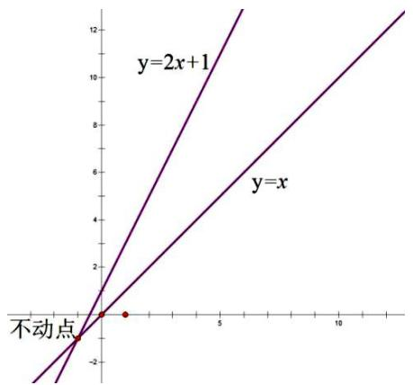

line

| x | y = x | y = 2x + 1 |
|---|---|---|
| -2 | -2 | -2 |
| 0 | 0 | 0 |
| 2 | 2 | 2 |
| 5 | 5 | 5 |
| 10 | 8 | 8 |
| 12 | 10 | 10 |
| 14 | 12 | 12 |

图1

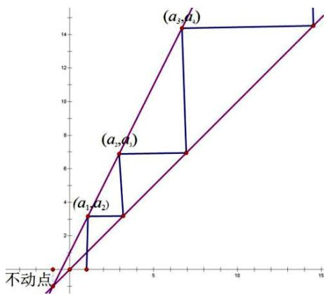

line

| x  | (a₁,a₂) | (a₂,a₃) | (a₃,a₄) |
|----|---------|---------|---------|
| 0  | 0       | 0       | 0       |
| 2.5| 3       | 7       | 14      |
| 5  | 3       | 7       | 14      |
| 15 | 14      | 14      | 14      |

图2

2. 在找出不动点之后，确定范围，将不动点之间的图像放大，并找出起始点 $a_{1}$ （如图2所示）

3. 由 $a_1$ 向 $y = f(x)$ 作垂直于 $x$ 轴的直线与 $y = f(x)$ 相交，并确定交点 $\left(a_1, a_2\right)$ .

4. 由 $\left(a_{1}, a_{2}\right)$ 向 $y = x$ 作平行于 $x$ 轴的直线与 $y = x$ 相交，并确定交点 $\left(a_{2}, a_{2}\right)$ .

5. 由 $\left(a_{2}, a_{2}\right)$ 向 $y = f(x)$ 作垂直于 $x$ 轴的直线与 $y = f(x)$ 相交，并确定交点 $\left(a_{2}, a_{3}\right)$ .

重复 4, 5, 直至找到点 $\left(a_{n}, a_{n+1}\right)$ 的最终去向.

# 知识点三 蛛网图与数列的单调性

定理 1: $y = f(x)$ 的单调增区间存在两个不动点 $x_{1}$ ， $x_{2}(x_{1} < x_{2})$ ，且在两个不动点之间形成一上凸的图形时，（如左图）则数列 $a_{n+1} = f(a_{n})$ 在两个不动点之间的区间是递增的，即 $a_{n+1} > a_{n}$ ，在两不动点以外的区间则是递减的，即 $a_{n+1} < a_{n}$ 。

定理 2: $y = f(x)$ 的单调增区间存在两个不动点 $x_1, x_2 (x_1 < x_2)$ ，且在两个不动点之间形成一下凹的图形时，（如右图）则数列 $a_{n+1} = f(a_n)$ 在两个不动点之间的区间是递减的，即 $a_{n+1} < a_n$ ，在两不动点以外的区间则是递增的，即 $a_{n+1} > a_n$ .

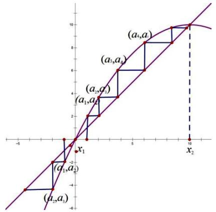

line

| Point | x    | y    |
|-------|------|------|
| a₁,a₂ | -2   | -2   |
| a₂,a₃ | -1   | -1   |
| a₃,a₄ | 1    | 1    |
| a₄,a   | 10   | 10   |

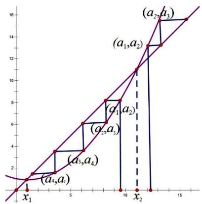

line

| x    | y     |
| ---- | ----- |
| 0    | 0     |
| 1    | 1     |
| 2    | 2     |
| 3    | 3     |
| 4    | 4     |
| 5    | 5     |
| 6    | 6     |
| 7    | 7     |
| 8    | 8     |
| 9    | 9     |
| 10   | 10    |
| 11   | 11    |
| 12   | 12    |
| 13   | 13    |
| 14   | 14    |
| 15   | 15    |
| x₁   | 0     |
| x₂   | 10    |
| x₃   | 12    |
| x₄   | 14    |
| x₅   | 16    |

综上可得，当 $y = f(x)$ 的单调增区间位于上凸内或者下凹外时，即当迭代起点 $a_1$ 位于此区域时，一定有 $a_{n+1} > a_n$ 同理，当迭代起点 $a_1$ 位于单调增区间的上凸外或者下凹内时，一定有 $a_{n+1} < a_n$ .

# 知识点四 数列的极限

根据蛛网图可知，当一数列 $\{a_{n}\}$ 为单调上凸曲线时，迭代点 $(a_{n}, a_{n+1})$ 会无限靠近大的不动点 $x_{2}$ ，我们将这个大的不动点 $x_{2}$ 称为数列 $\{a_{n}\}$ 的极限，记为 $\lim_{n \to \infty} a_{n} = x_{2}$ ；当一数列 $\{a_{n}\}$ 为单调下凹曲线时，迭代点 $(a_{n}, a_{n+1})$ 会无限靠近小的不动点 $x_{1}$ ，我们将这个小的不动点 $x_{1}$ 称为数列 $\{a_{n}\}$ 的极限，记为 $\lim_{n \to \infty} a_{n} = x_{1}$ .

# 几种常见的函数迭代图（未画折线）

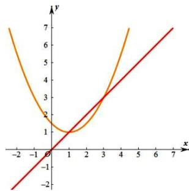

line

| x | y (Orange Curve) | y (Red Line) |
|---|---|---|
| -2 | 7 | -2 |
| -1 | 4 | -1 |
| 0 | 1 | 0 |
| 1 | 1 | 1 |
| 2 | 1 | 2 |
| 3 | 3 | 3 |
| 4 | 6 | 4 |
| 5 | 7 | 5 |
| 6 | 8 | 6 |
| 7 | 9 | 7 |

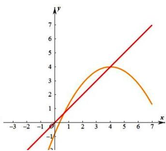

line

| x | y (Red Line) | y (Orange Curve) |
|---|---|---|
| -3 | -1 | -1 |
| -2 | -0.5 | -0.5 |
| -1 | 0 | 0 |
| 0 | 1 | 1 |
| 1 | 2 | 2 |
| 2 | 3 | 3 |
| 3 | 4 | 4 |
| 4 | 5 | 4 |
| 5 | 6 | 3 |
| 6 | 7 | 2 |
| 7 | 8 | 1 |

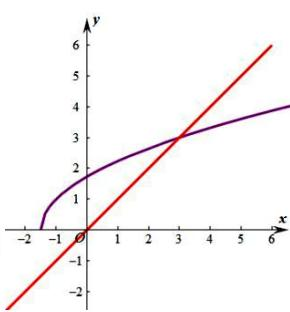

line

| x | y (Line 1) | y (Line 2) |
|---|---|---|
| -2 | -2 | -1 |
| -1 | -1 | 0 |
| 0 | 0 | 1 |
| 1 | 1 | 2 |
| 2 | 2 | 3 |
| 3 | 3 | 4 |
| 4 | 4 | 5 |
| 5 | 5 | 6 |
| 6 | 6 | 7 |

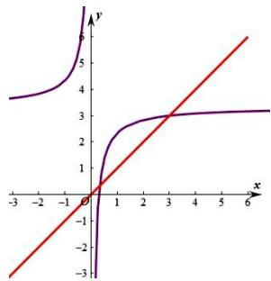

line

| x   | y (purple) | y (red) |
| --- | ---------- | ------- |
| -3  | 4          | -3      |
| -2  | 4.5        | -2      |
| -1  | 5          | -1      |
| 0   | 6          | 0       |
| 1   | 3          | 1       |
| 2   | 3          | 2       |
| 3   | 3          | 3       |
| 4   | 3          | 4       |
| 5   | 3          | 5       |
| 6   | 3          | 6       |

$$
y = a (x - h) ^ {2} + h (a > 0)
$$

$$
y = a (x - h) ^ {2} + h (a <   0)
$$

$$
y = \sqrt {a x + b} (a > 0, b > 0)
$$

$$
y = \frac {a x + b}{c x + d} (a d > b c)
$$

顶点为不动点抛物线

顶点为不动点的抛物线

横着的抛物线

二四象限反比例函数的平移函数

请思考： $\lim_{n\to\infty}a_{n}=h$

$$
\lim _ {n \to \infty} a _ {n} = h
$$

$$
\lim _ {n \to \infty} a _ {n} = x _ {1}
$$

$$
\lim _ {n \to \infty} a _ {n} = x _ {2}
$$

# 知识点五 由反比例（递减函数）函数迭代构成的摆动数列

如下左图所示，当 $f(x)$ 在区间为减函数时，和直线 y = x 相交于不动点，那么由此函数迭代构成的数列为摆动数列，即奇数项和偶数项构成相反的单调性，但都螺旋靠近不动点，极限也是不动点.

左图所示 $a_{1}<a_{3}<a_{5}<\cdots<a_{2n-1}$ ，同时 $a_{2}>a_{4}>a_{6}>\cdots>a_{2n}$ ；如右图所示 $a_{1}>a_{3}>a_{5}>\cdots>a_{2n-1}$ ，

同时 $a_{2}<a_{4}<a_{6}<\cdots<a_{2n}$ .

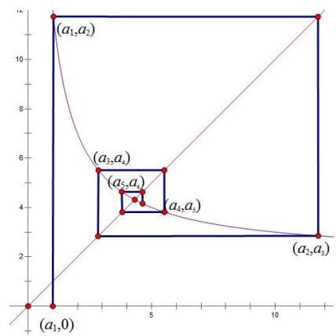

text_image

(a₁,a₂)
(a₃,a₄)
(a₅,a₆)
(a₄,a₅)
(a₂,a₃)
(a₁,0)

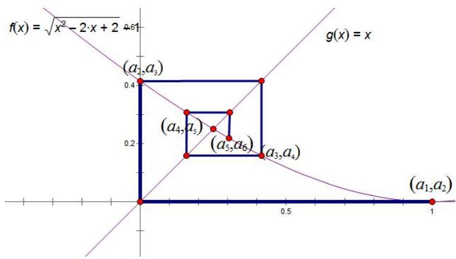

text_image

f(x) = \u221ax^2 - 2\u209a x + 2
g(x) = x
(a_2, a_3)
(a_4, a_5)
(a_5, a_6)
(a_3, a_4)
(a_1, a_2)
0.4
0.2
0.0
0.5
1

【例 1】（2023·北京）数列 $\{a_{n}\}$ 满足 $a_{n+1}=\frac{1}{4}(a_{n}-6)^{3}+6$ ，下列说法正确的是()

A. 若 $a_1 = 3$ ，则 $\{a_n\}$ 是递减数列， $\exists M \in R$ ，使得 $n > m$ 时， $a_n > M$   
B. 若 $a_1 = 5$ ，则 $\{a_n\}$ 是递增数列， $\exists M \leqslant 6$ ，使得 $n > m$ 时， $a_n < M$   
C. 若 $a_1 = 7$ ，则 $\{a_n\}$ 是递减数列， $\exists M > 6$ ，使得 $n > m$ 时， $a_n > M$   
D. 若 $a_1 = 9$ ，则 $\{a_n\}$ 是递增数列， $\exists M \in R$ ，使得 $n > m$ 时， $a_n < M$

【例 2】（多选）已知数列 $\{a_{n}\}$ 的前 n 项和为 $S_{n}$ ， $a_{1}=0, a_{n+1}=\ln(e^{a_{n}}+2)-a_{n}(n\in N^{*})$ ，则下列选项正确的是（）

A. $a_{2n - 1} < a_{2n}$

B. 存在 $n \in N^{*}$ , 使得 $a_{n} = \ln 2$

C. $S_{2023} < 2^{2023}$

D. $\{a_{2n - 1}\}$ 是单调递增数列， $\{a_{2n}\}$ 是单调递减数列

【例 3】（多选）数列 $\{a_{n}\}$ 满足 $a_{1}=1,\quad a_{n+1}=f(a_{n}),\quad n\in N^{*}$ ，则下列说法正确的是()

A. 当 $f(x) = 2x + 1$ 时， $a_{n} = 2^{n} - 1$

B. 当 $f(x) = \frac{x + 1}{x}$ 时， $1 \leqslant a_n \leqslant 2$

C. 当 $f(x) = \frac{x + 1}{x}$ 时， $a_{7} + a_{8} < a_{5} + a_{10}$

D. 当 $f(x) = 2\ln x + \frac{1}{x}$ 时，数列 $\{a_{2n-1}\}$ 单调递增，数列 $\{a_{2n}\}$ 单调递减

【例 4】（多选）已知数列 $\{a_{n}\}$ 的首项为 $a_{1}$ ，且 $a_{n} + e^{a_{n+1} - a_{n}} = 7$ ，则（）

A. 存在 $a_{1}$ 使数列 $\{a_{n}\}$ 为常数列

B. 存在 $a_1$ 使数列 $\{a_n\}$ 为递增数列

C. 存在 $a_{1}$ 使数列 $\{a_{n}\}$ 为递减数列

D. 存在 $a_1$ 使得 $a_1 \geqslant a_n$ 恒成立

# 考向二 蛛网图与数列等比放缩（一级精度）

第一类 无不动点判断 $\frac{a_{n+1}}{a_n}$ 的趋势

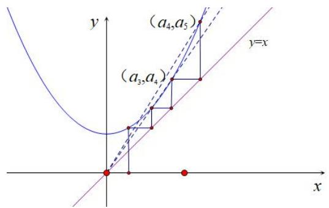

text_image

y
(a₄,a₅)
(a₃,a₄)
y=x
x

若 $a_{n+1}=f(a_{n})$ ，在 $f'(x)>0$ 区间，且 $f''(x)>0$ ， $f(x)$ 为下凹函数，易知 $f'(x)$ 越来越大，故通过构造 $\frac{a_{n+1}}{a_{n}}$ 的单调性，如图，当 $\frac{a_{3}}{a_{2}}>\frac{a_{4}}{a_{3}}\geq1$ ，且 $\frac{a_{6}}{a_{5}}>\frac{a_{5}}{a_{4}}>\frac{a_{4}}{a_{3}}\geq1$ 时，则一定有 $\frac{a_{n+1}}{a_{n}}>\frac{a_{n}}{a_{n-1}}>\cdots>\frac{a_{4}}{a_{3}}$ ;

【例 5】（2019•浙江）设 a， $b \in R$ ，数列 $\{a_{n}\}$ 满足 $a_{1} = a$ ， $a_{n+1} = a_{n}^{2} + b$ ， $n \in N^{*}$ ，则（）

A. 当 $b = \frac{1}{2}$ 时， $a_{10} > 10$

B. 当 $b = \frac{1}{4}$ 时， $a_{10} > 10$

C. 当 $b = -2$ 时， $a_{10} > 10$

D. 当 $b = -4$ 时， $a_{10} > 10$ 第二类 不动点判断 $\frac{a_{n+1} - x_0}{a_n - x_0}$ 的趋势

当 $f'(x)>0$ ， $f''(x)>0$ ，若 $\alpha, \beta$ 为 $f(x)$ 两个不动点，如图所示，我们假设 $f(x)=x^{2}$ ，此函数符合模型，则根据蛛网图，当 $a_{1}\in(0,1)$ 时，则有 $a_{1}>a_{2}>\cdots>a_{n}>0$ ，两个不动点为 $\alpha=0$ ， $\beta=1$ ，

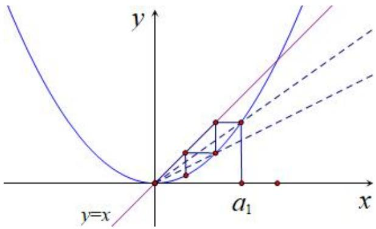

text_image

y
y=x
a₁
x

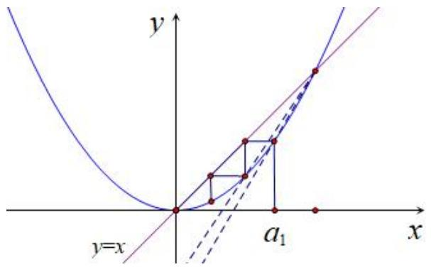

text_image

y
y=x
a₁
x

如左图， $\frac{a_{2}-0}{a_{1}-0}>\frac{a_{3}-0}{a_{2}-0}>\cdots>\frac{a_{n+1}-0}{a_{n}-0}>f'(0)$ ，

如右图， $\frac{a_{2}-1}{a_{1}-1}>\frac{a_{3}-1}{a_{2}-1}>\cdots>\frac{a_{n+1}-1}{a_{n}-1}<1$ ，如此对不动点蛛

网图的斜率翻译放缩，称为数列放缩的一级精度。

我们通过几道例题来解析数列放缩的一级精度。

【例 6】已知数列 $\left\{a_{n}\right\}$ 满足 $a_{1}\in\left[\frac{1}{3},\frac{1}{2}\right)$ ， $a_{n+1}=\sin\frac{\pi a_{n}}{2}(n\in N^{*})$ ，记数列 $\left\{a_{n}\right\}$ 前 n 项和为 $S_{n}$ ，则对于任意的 $n\in N^{*}$ ，下列结论正确的是（）

A. 存在 $k \in N^{*}$ , 使 $a_{k} = 1$

B.数列 $\{a_{n}\}$ 单调递增

C. $a_{n + 1}\geq \frac{3}{4} a_n + \frac{1}{4}$

D. $2a_{n + 1}\leq 2a_{1} + S_{n}$

【例 7】已知数列 $\{a_{n}\}$ 满足 $a_{1}=1$ ， $a_{n}e^{a_{n+1}}=e^{a_{n}}-1$ ，则（）

A. $\{a_{n}\}$ 为单调递减数列

B. $a_{n + 1} > \frac{1}{2} a_n$

C. $a_{2n+1} + a_{2n-1} < 2a_{2n}$

D. $a_{2024} < \left(\frac{2}{3}\right)^{2023}$

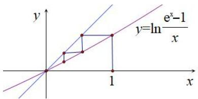

text_image

y
y=ln e^x-1/x
x
1

# 考向三 不动点与二次裂项

第一类 平方式可裂项递推型 $a_{n+1}=a\cdot a_{n+1}^{2}+b\cdot a_{n}+c$

（1）若 $f(x)=ax^{2}+bx+c$ 有两个不动点，当且仅当一个不动点在顶点时，即 $b^{2}-4ac=2b$ ，则一定有： $a_{n+1}+\frac{b}{2a}=a(a_{n}+\frac{b}{2a})^{2}$ ，此时属于可求通项的递推模型，例如 $a_{n+1}=a_{n}^{2}+2a_{n}\Leftrightarrow a_{n+1}+1=(a_{n}+1)^{2}$ ，此模型就是由于 $f(x)=x^{2}+2x=x$ ，不动点为 $\alpha=-1,\quad\beta=0$ ，且 $(-1,-1)$ 为 $f(x)$ 的顶点，故能完成平方式递推；

(2) 若 $f(x)=ax^{2}+bx+c$ 仅有一个不动点 $x_{0}$ ，且不动点不在顶点时，则一定有： $\frac{1}{a_{n+1}-x_{0}}=\frac{1}{a_{n}-x_{0}}-\frac{1}{a_{n}-m}$ ，此时属于可直接裂项相消求通项模型，例如 $a_{n+1}=a_{n}^{2}+a_{n}\Leftrightarrow\frac{1}{a_{n+1}}=\frac{1}{a_{n}}-\frac{1}{a_{n}+1}$ ，此模型就是由于 $f(x)=x^{2}+x=x$ ，不动点为 $x_{0}=0$ ，且 $(0,0)$ 不是 $f(x)$ 的顶点，故能完成裂项递推，我们做一下总结：

① $a_{n + 1} = a_n(a_n + 1)\Rightarrow \frac{1}{a_{n + 1}} = \frac{1}{a_n} -\frac{1}{a_n + 1}\Rightarrow \frac{1}{a_n + 1} = \frac{1}{a_n} -\frac{1}{a_{n + 1}}\Rightarrow \sum_{i = 1}^{n}\frac{1}{a_i + 1} = \frac{1}{a_1} -\frac{1}{a_{n + 1}}$   
② $a_{n + 1} = \frac{a_n^2}{m} +a_n\Rightarrow \frac{a_{n + 1}}{m} = \frac{a_n}{m}\left(\frac{a_n}{m} +1\right)\Rightarrow \frac{1}{a_n + m} = \frac{1}{a_n} -\frac{1}{a_{n + 1}}\Rightarrow \sum_{i = 1}^{n}\frac{1}{a_i + m} = \frac{1}{a_1} -\frac{1}{a_{n + 1}}$   
③ $a_{n + 1} = a_n^2 -a_n + 1\Rightarrow \frac{1}{a_{n + 1} - 1} = \frac{1}{a_n - 1} -\frac{1}{a_n}\Rightarrow \frac{1}{a_n} = \frac{1}{a_n - 1} -\frac{1}{a_{n + 1} - 1}\Rightarrow \sum_{i = 1}^{n}\frac{1}{a_i} = \frac{1}{a_1 - 1} -\frac{1}{a_{n + 1} - 1}$   
④ $a_{n+1}=\frac{a_{n}}{ka_{n}^{2}+1}\Rightarrow\frac{1}{a_{n+1}}-\frac{1}{a_{n}}=ka_{n}\Rightarrow\sum_{i=1}^{n}a_{i}=\frac{1}{k}(\frac{1}{a_{n+1}}-\frac{1}{a_{1}})$

【例 8】（2024·青羊区月考）已知数列 $\{a_{n}\}$ 满足 $a_{1}=1,\quad a_{n+1}=a_{n}^{2}+a_{n},\quad n\in N^{*}$ ，则()

A. $\{a_{n}\}$ 是递减数列

B. $a_{n} > n (n > 2)$

C. $a_{2024} \leqslant 2^{2023}$

D. $\frac{1}{a_{1}+1}+\frac{1}{a_{2}+1}+\cdots+\frac{1}{a_{n}+1}<1$

【例 9】（2024•福建期中）数列 $\{a_{n}\}$ 满足 $a_{1}=a$ ， $a_{n+1}=3a_{n}-a_{n}^{2}-1$ ，则下列说法正确的是()

A. 若 $a \neq 1$ 且 $a \neq 2$ ，数列 $\{a_n\}$ 单调递减

B. 若存在无数个自然数 $n$ ，使得 $a_{n+1} = a_n$ ，则 $a = 1$

C. 当 $a > 2$ 或 $a < 1$ 时， $\{a_{n}\}$ 的最小值不存在

D. 当 a=3 时， $\frac{1}{a_{1}-2}+\frac{1}{a_{2}-2}+\cdots+\frac{1}{a_{n}-2}\in(\frac{1}{2},1]$

第二类 对勾函数单不动点可裂项递推型 $a_{n + 1} = a\cdot a_n + \frac{b}{a_n + m} +n$

如果二次符合，那么对勾函数仅有一个不动点的模型也符合可裂项原理.

【例 10】已知正项数列 $\{a_{n}\}$ 满足 $a_{n+1}=\frac{2a_{n}^{2}+4a_{n}+1}{a_{n}+2}(n\in N^{*})$ ，则（）

A. $\{a_{n}\}$ 为递增数列  
B. $a_{n+1} > 2^{n}a_{1}$   
C. 若 $0 < a_{1} < \frac{1}{3}$ ，则存在大于 1 的正整数 m，使得 $a_{m} - a_{1} \leqslant \frac{1}{6}$   
D. 已知 $b_{n} = \frac{1}{a_{n+1} + 1} + i = 1\frac{1}{2a_{i} + 3}$ ，则存在 $n_0 \in N^*$ ，使得 $b_{n_0} = 1$

# 第三类 平方式立方式等比转化为等比递推型

（1）若 $f(x) = ax^2 + bx + c$ 有两个不动点 $\alpha, \beta$ ，则一定有： $\frac{a_{n+1} - \alpha}{a_n - \alpha} = aa_n + p$ ， $\frac{a_{n+1} - \beta}{a_n - \beta} = aa_n + q$ ，此时通过蛛网图算出 $aa_n + p$ 和 $aa_n + q$ 取值范围，则可以进行两次等比放缩；  
（2）若 $f(x)=ax^{3}+bx^{2}+cx+d$ 有三个不动点，且中间不动点为 $x_{0}$ ，且不动点不在对城中心时，则一定有： $\frac{a_{n+1}-x_{0}}{a_{n}-x_{0}}=aa_{n}^{2}+pa_{n}+q$ ，通过蛛网图算出 $aa_{n}^{2}+pa_{n}+q$ 取值范围，则可以进行等比放缩

【例 11】已知数列 $\{a_{n}\}$ 满足： $\forall n\in N^{*}$ ， $a_{n+1}=a_{n}^{2}+2a_{n}+b$ ，其中 $b\in R$ ，数列 $\{a_{n}\}$ 的前 n 项和是 $S_{n}$ ，下列说法正确的是（）

A. 当 $b \in (1, +\infty)$ 时，数列 $\{a_{n}\}$ 是递增数列  
B. 当 $b = -6$ 时，若数列 $\{a_{n}\}$ 是递增数列，则 $a_{1} \in (-\infty, -3) \cup (2, +\infty)$   
C. 当 $b=\frac{5}{4},a_{1}=2$ 时， $S_{n}\geqslant\frac{n^{2}+3n}{2}$   
D. 当 $b = -2$ ， $a_1 = 3$ 时， $\frac{1}{a_1 + 2} + \frac{1}{a_2 + 2} + \ldots + \frac{1}{a_n + 2} \leqslant \frac{3}{10}$

【例 12】设数列 $\{a_{n}\}$ 满足 $a_{1}=0$ ， $a_{n+1}=ca_{n}^{3}+2-8c, n\in N^{*}$ 其中 c 为实数，数列 $\{a_{n}^{2}\}$ 的前 n 项和是 $S_{n}$ ，下列说法不正确的是（）

A. 当 $c > 1$ 时， $\{a_{n}\}$ 一定是递减数列

B. 当 $c < 0$ 时，不存在 $c$ 使 $\{a_{n}\}$ 是周期数列

C. 当 $c \in [0, \frac{1}{4}]$ 时， $a_n \in [0, 2]$

D. 当 $c = \frac{1}{7}$ 时， $S_{n} > n - \frac{5}{2}$

考向 4 一级精度与导数综合问题

# 一、不动点定号原理

若要证明连续项与不动点 $(x_{0},x_{0})$ 的位置关系，可采用 $\frac{a_{n+1}-x_{0}}{a_{n}-x_{0}}$ 在 $a_{n}<x_{0},a_{n}>x_{0}$ 两种情况分别讨论

【例 1】（MST-虎哥 2025）已知 $a_{n+1}=\frac{2}{2+\ln a_{n}}, a_{n}>\frac{1}{e^{2}}$ ，若 $a_{1}=2$ ;

（1）证明： $a_{2n+1}>1, a_{2n}<1$ ;  
(2) 结合蛛网图说明 $a_{2n+1}, a_{2n}$ 的单调性.

# 二、不动点蛛网图一级精度与导数综合大题

此类题的思考方向为构造递推关系式，结合与不动点连线斜率与渐近线连线斜率，构造诸如 $\frac{a_2 - 1}{a_1 - 1} < \frac{a_3 - 1}{a_2 - 1} < \dots < \frac{a_{n + 1} - 1}{a_n - 1}$ 之类的关系式，结合蛛网图分析它的单调情况，以及它的界限.

此类数列放缩证明题分为两类，第一类 $a_{n} - a_{n - 1}\leq (a_{2} - a_{1})q^{n - 1}$ ，考虑转化为为等比探路放缩，证明$\frac{a_{n}-a_{n-1}}{a_{n-1}-a_{n-2}}\leq q$ ，第二类 $\sum_{i=1}^{n}(a_{i}-x)\leq(a_{1}-x)\frac{1}{A}$ ，x为不动点，

考虑 $\sum_{i=1}^{n}(a_i - x) \leq (a_1 - x)\frac{1 - q^n}{1 - q} \leq (a_1 - x)\frac{1}{1 - q} = (a_1 - x)\frac{1}{A}$ ，证明 $\frac{a_{n+1} - x}{a_n - x} \leq q \leq 1 - A$ .

【例 1】定义数列 $\left\{a_{n}\right\}$ 为 “阶梯数列 “： $a_{1}=\frac{1}{1},a_{2}=\frac{1}{1+\frac{1}{1}},a_{3}=\frac{1}{1+\frac{1}{1+\frac{1}{1}}}\cdots\cdots a_{n}=\frac{1}{1+\frac{1}{1+\frac{1}{\cdots\cdots\frac{1}{1+\frac{1}{1}}}}}$

(1) 求 “阶梯数列” 中， $a_{n+1}$ 与 $a_{n}$ 的递推关系；  
(2) 证明：对 $k \in N^{*}$ ，数列 $\{a_{2k-1}\}$ 为递减数列；  
(3) 证明： $|a_{k+1}-a_{k}|\leq\frac{1}{2}\cdot(\frac{4}{9})^{k-1}$

【例 2】（2025•绵阳一诊压轴）已知函数 $f(x)=\ln x+x^{2}-3x+a$ ， $f(x)$ 在 $(0,1]$ 上的最大值为 $\frac{3}{4}-\ln 2$ .

（1）求实数 $a$ 的值；  
（2）若数列 $\{a_{n}\}$ 满足 $2a_{n}a_{n + 1} = f(a_{n}) + 3a_{n} - 1$ ，且 $a_1 = \frac{4}{3}$   
(i) 当 $n \geq 2$ ， $n \in Z$ 时，比较 $a_{n}$ 与 1 的大小，并说明理由；  
(ii) 求证: $3 \sum_{i=1}^{n} \left| 1 - a_{i} \right| < 2$ .

【例 3】（2025·长郡中学第三套模拟）对于函数 $f(x)$ ，若实数 $x_{0}$ 满足 $f(x_{0}) = x_{0}$ ，则称 $x_{0}$ 为 $f(x)$ 的不动点。已知 $a \geq 0$ ，且 $f(x) = \frac{1}{2} \ln x + ax^{2} + 1 - a$ 的不动点的集合为 A。以 $\min M, \max M$ 分别表示集合 M 中的最小元素和最大元素，

（1）若 a=0 ，求 A 的元素个数及 $\max A$ .  
(2) 当 A 中只有一个元素时, $a$ 的取值集合记为 B,

(i) 求 B;

(ii) 若 $a = \min B$ ，数列 $a_{n}$ 满足 $a_{1} = 2$ ， $a_{n+1} = \frac{f(a_{n})}{a_{n}}$ ，集合 $C_{n} = \left\{\sum_{k=1}^{n} |a_{k} - 1|, \frac{4}{3}\right\}$ ，

求证： $\forall n\in N^{*}$ ， $\max C_n = \frac{4}{3}$

