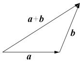
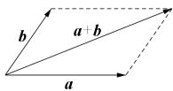
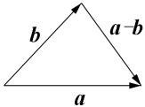
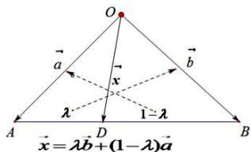
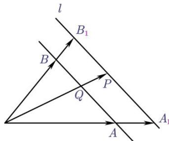
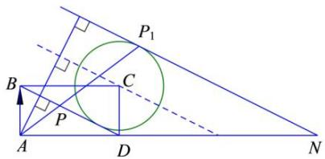
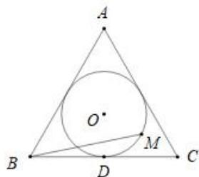

# 6.1 线性运算

# 考向 1 线性运算与共线定理

# 题型 1 加减法运算

# 一．向量的基本概念

(1) 定义: 既有大小又有方向的量叫做向量, 向量的大小叫做向量的长度 (或模).  
（2）向量的模：向量 $\overrightarrow{AB}$ 的大小，也就是向量 $\overrightarrow{AB}$ 的长度，记作 $|\overrightarrow{AB}|$ .

(3) 特殊向量:

①零向量：长度为0的向量，其方向是任意的.  
②单位向量：长度等于1个单位的向量.  
③平行向量：方向相同或相反的非零向量．平行向量又叫共线向量．规定：0与任一向量平行．  
④相等向量：长度相等且方向相同的向量.  
⑤相反向量：长度相等且方向相反的向量.

# 二．向量的线性运算

(1) 向量的线性运算

<table><tr><td>运算</td><td>定义</td><td colspan="2">法则(或几何意义)</td><td>运算律</td></tr><tr><td>加法</td><td>求两个向量和的运算</td><td>三角形法则</td><td>平行四边形法则</td><td>1交换律 $a + b = b + a$ 2结合律 $(a + b) + c = a + (b + c)$ </td></tr><tr><td>减法</td><td>求 $a$ 与 $b$ 的相反向量- $b$ 的和的运算,叫做 $a$ 与 $b$ 的差</td><td colspan="2">三角形法则</td><td> $a - b = a + (-b)$ </td></tr><tr><td>数乘</td><td>求实数 $\lambda$ 与向量 $a$ 的积的运算</td><td colspan="2">(1) $|\lambda a| = |\lambda ||a|$ (2)当 $\lambda >0$ 时, $\lambda a$ 与 $a$ 的方向相同;当 $\lambda < 0$ 时, $\lambda a$ 与 $a$ 的方向相反;当 $\lambda = 0$ 时, $\lambda a = \vec{0}$ </td><td> $\lambda ,\mu \in R$  $\lambda (\mu a) = (\lambda \mu)a$  $(\lambda + \mu)a = \lambda a + \mu a$  $\lambda (a + b) = \lambda a + \lambda b$ </td></tr></table>

# 【提示】

1. 向量表达式中的零向量写成 0，而不能写成 0.  
2. 两个向量共线要区别于两条直线共线，两个向量共线满足的条件是：两个向量所在直线平行或重合，而在直线中，两条直线重合与平行是两种不同的关系。  
3. 要注意三角形法则和平行四边形法则适用的条件，运用平行四边形法则时两个向量的起点必须重合，和向量与差向量分别是平行四边形的两条对角线所对应的向量；运用三角形法则时两个向量必须首尾相接，否则就要把向量进行平移，使之符合条件。

4. 向量加法和减法几何运算应该更广泛、灵活，如： $\overrightarrow{OA}-\overrightarrow{OB}=\overrightarrow{BA}$ ， $\overrightarrow{AM}-\overrightarrow{AN}=\overrightarrow{NM}$ ，

$$
\overrightarrow {O A} = \overrightarrow {O B} + \overrightarrow {C A} \Leftrightarrow \overrightarrow {O A} - \overrightarrow {O B} = \overrightarrow {C A} \Leftrightarrow \overrightarrow {B A} - \overrightarrow {C A} = \vec {0} \Leftrightarrow \overrightarrow {B A} + \overrightarrow {A C} = \vec {0} \Leftrightarrow \overrightarrow {B C} = \vec {0}
$$

# 三．常用结论

（1）向量的三角形法则适用于任意两个向量的加法，并且可以推广到两个以上的非零向量相加，称为多边形法则。一般地，首尾顺次相接的多个向量的和等于从第一个向量起点指向最后一个向量终点的向量。

即 $\overrightarrow{A_{1}A_{2}} + \overrightarrow{A_{2}A_{3}} + \cdots + \overrightarrow{A_{n-1}A_{n}} = \overrightarrow{A_{1}A_{n}}$ .

(2) $\|a| - |b| \leq |a \pm b| \leq |a| + |b|$ ，当且仅当 a，b 至少有一个为 0 时，向量不等式的等号成立.

（3）特别地： $\| \pmb{a} \| - |\pmb{b} \| \leq |\pmb{a} \pm \pmb{b}|$ 或 $|\pmb{a} \pm \pmb{b}| \leq |\pmb{a}| + |\pmb{b}|$ 当且仅当 $\pmb{a}$ ， $\pmb{b}$ 至少有一个为0时或者两向量共线时，向量不等式的等号成立.

（4）减法公式： $\overrightarrow{AB}-\overrightarrow{AC}=\overrightarrow{CB}$ ，常用于向量式的化简.

(5) A 、 P 、 B 三点共线，则 $\overrightarrow{OP}=(1-\lambda)\overrightarrow{OA}+\lambda\overrightarrow{OB}(\lambda\in R)$ ，这是直线的向量式方程.

【例 1】（2025·武汉二调）在三棱柱 $ABC-A_{1}B_{1}C_{1}$ 中，设 $\overrightarrow{AA_{1}}=\vec{a}$ ， $\overrightarrow{AB}=\vec{b}$ ， $\overrightarrow{AC}=\vec{c}$ ，M，N 分别为 AB， $CC_{1}$ 的中点，则 $\overrightarrow{MN} = (\quad)$

A. $\frac{1}{2}\vec{a} +\frac{1}{2}\vec{b} +\vec{c}$

B. $\frac{1}{2}\vec{a} -\frac{1}{2}\vec{b} +\vec{c}$

C. $\vec{a}-\frac{1}{2}\vec{b}+\frac{1}{2}\vec{c}$

D. $\vec{a}+\frac{1}{2}\vec{b}+\vec{c}$

【例 2】（多选）下列各式中结果为零向量的为( )

A. $\overrightarrow{OA} + \overrightarrow{OC} + \overrightarrow{BO} + \overrightarrow{CO}$

B. $\overrightarrow{AB} +\overrightarrow{MB} +\overrightarrow{BO} +\overrightarrow{OM}$

C. $\overrightarrow{AB}-(\overrightarrow{AC}-\overrightarrow{BD})-\overrightarrow{CD}$

D. $\overrightarrow{AB} +\overrightarrow{BC} +\overrightarrow{CA}$

# 题型 2 三点共线

# 四．向量的共线定理

（1）如果 $a = \lambda b$ 且 $b \neq \vec{0}$ ，则 $a // b$ ；反之 $a // b$ 且 $b \neq 0$ ，则一定存在唯一一个实数 $\lambda$ ，使 $a = \lambda b$ 。推论：三点 $A, B, C$ 共线 $\Leftrightarrow \overrightarrow{AB}, \overrightarrow{AC}$ 共线（功能：证明三点共线）；

【例 1】（2015•新课标Ⅱ）设向量 $\vec{a}$ ， $\vec{b}$ 不平行，向量 $\lambda\vec{a}+\vec{b}$ 与 $\vec{a}+2\vec{b}$ 平行，则实数 $\lambda=$ \_\_\_\_.

【例 2】已知 $\vec{a}$ ， $\vec{b}$ 是平面内两个不共线向量， $\overrightarrow{AB}=m\vec{a}+2\vec{b}$ ， $\overrightarrow{BC}=3\vec{a}-\vec{b}$ ，A，B，C 三点共线，则 $m=(\quad)$

A. $-\frac{2}{3}$

B. $\frac{2}{3}$

C.-6

D. 6

# 题型 3 交叉分解定理

# 五．交叉分解定理

（1）如果平面上 $O$ ， $A$ ， $B$ 三点不共线， $D$ 在直线 $AB$ 上，且 $\overrightarrow{AD} = \lambda \overrightarrow{AB}$ ，令 $\overrightarrow{OA} = \vec{a}$ ， $\overrightarrow{OB} = \vec{b}$ ， $\overrightarrow{OD} = \vec{x}$ 则有 $\vec{x} = \lambda \vec{b} + (1 - \lambda)\vec{a}$

text_image

O
a
x
b
λ
1-λ
A
D
B
x = λb + (1 - λ)a

其表达意思就是从一个顶点 O 引出三个向量，且它们共线，每一个向量 $\vec{a}$ ， $\vec{b}$ 分别乘以它对面的比值，简称对面的女孩看过来.

特殊点：当 D 为 AB 中点时， $\lambda=\frac{1}{2}$ ， $\vec{x}=\frac{1}{2}\vec{b}+\frac{1}{2}\vec{a}$ （中线定理）

（2）若 $\overrightarrow{DB} = \lambda \overrightarrow{AD}$ ，则 $\overrightarrow{OD} = \frac{1}{1 + \lambda}\overrightarrow{OA} +\frac{\lambda}{1 + \lambda}\overrightarrow{OB}$

【例 1】（2022•新高考 I）在 $\Delta ABC$ 中，点 D 在边 AB 上，BD = 2DA。记 $\overrightarrow{CA} = \vec{m}$ ， $\overrightarrow{CD} = \vec{n}$ ，则 $\overrightarrow{CB} = (\quad)$

A. $3\vec{m} - 2\vec{n}$

B. $-2\vec{m} + 3\vec{n}$

C. $3\vec{m} + 2\vec{n}$

D. $2\vec{m} + 3\vec{n}$

【例 2】在 $\Delta ABC$ 中， $\overrightarrow{AD} = \frac{3}{2}\overrightarrow{DC}$ ，P 是直线 BD 上的一点，若 $\overrightarrow{AP} = t\overrightarrow{AB} + \frac{2}{5}\overrightarrow{AC}$ 则实数 t 的值为（）

A. $-\frac{1}{3}$

B. $\frac{1}{3}$

C. $-\frac{2}{3}$

D. $\frac{2}{3}$

【例 3】在 $\Delta ABC$ 中，D 是 BC 边的中点，E 是 AC 边上一点且满足 AE = 2EC，AD 与 BE 交于 F，若 $\overrightarrow{AF} = \lambda \overrightarrow{AD}, \overrightarrow{BF} = \mu \overrightarrow{BE}$ ，则 $\lambda + \mu$ 的值是（）

A. 1

B. $\frac{7}{6}$

C. $\frac{7}{5}$

D. $\frac{3}{2}$

# 拓展思维

# 向量等和线的定义

给定一组基底 $\{\overrightarrow{OA},\overrightarrow{OB}\}$ ，则平面内的任一向量 $\overrightarrow{OP}$ 都唯一分解，记为 $\overrightarrow{OP}=\lambda\overrightarrow{OA}+\mu\overrightarrow{OB}(\lambda,\mu\in R)$ .

若点 $P$ 在直线 $AB$ 上或在平行于 $AB$ 的直线上，则 $\lambda + \mu = k$ 为定值，反之也成立，我们把直线 $AB$ 及与直线 $AB$ 平行的直线称为等和线.

如图 $k=\frac{\overrightarrow{OP}}{\overrightarrow{OQ}}=\frac{\overrightarrow{OA_{1}}}{\overrightarrow{OA}}=\frac{\overrightarrow{OB_{1}}}{\overrightarrow{OB}}$ （其中 l 为与 AB 平行的直线，点 P 在 l 上，OP 交 AB 于点 Q， $A_{1}$ ， $B_{1}$ 分别为 OA，OB 与 l 的交点）

注意：等和线的位置影响 $k$ 的取值：

（1）当等和线恰为直线 AB 时，k=1；  
（2）当等和线在点 $O$ 和直线 $AB$ 之间时， $k \in (0,1)$ ；  
（3）当直线 AB 在点 O 和等和线之间时， $k \in (1, +\infty)$ ;

(4) 当等和线过点 O 时，k=0；

(5) 当等和线与直线 AB 在点 O 的两侧时，k < 0；

解题关键：先找到系数和等于1的等和线，把它和基底起始点的距离定义为1倍远，看目标等和线的远近和方向，离起始点越远，k值的绝对值越大，几倍远，k的绝对值就是几，正负由方向决定.

（方向定正负，倍数定 $k$ 值）.

text_image

l
B₁
B
P
Q
A₁
A

# 向量等和线的证明

如图，已知点 $P$ 在与 $AB$ 平行的直线 $l$ 上，且 $\overrightarrow{OP} = \lambda \overrightarrow{OA} +\mu \overrightarrow{OB} (\lambda ,\mu \in R)$

记直线 OP 与直线 AB 相交于点 Q，因为 A, Q, B 三点共线，所以存在实数 $\lambda'$ ， $\mu'$ 使得 $\overrightarrow{OQ} = \lambda' \overrightarrow{OA} + \mu' \overrightarrow{OB}$ ，则根据向量共线定理可知 $\lambda' + \mu' = 1$ ，记 $\frac{OP}{OQ} = \frac{OA_{1}}{OA} = k$ （定值），

则 $\overrightarrow{OP}=k\overrightarrow{OQ}=k\lambda'\overrightarrow{OA}+k\mu'\overrightarrow{OB}$ ，于是 $\lambda+\mu=k\lambda'+k\mu'=k$ ，当点 P 在直线 l 上运动时，始终有 $\frac{OP}{OQ}=\frac{OA_{1}}{OA}=k$ ，于是 $\lambda+\mu=k$ 恒成立.

# 向量等和线解题步骤

向量分解的系数和问题可考虑用等和线解决.

第一步，使用等和线前，应先把向量统一为共起点.

第二步，需要先找到使系数和等于1的线.

第三步，在目标点的活动区域内平移系数和为 1 的那条线，且平移后的直线离起点越远，系数和的绝对值越大；离起点越近，系数和的绝对值越小．平移的过程中，可以得到系数和的取值范围．

第四步，当直线平移到某一位置时，要想得到系数和 $k$ 的值，一般是连接起点 $O$ 和直线上任意一点 $P$ ，

交系数和为 1 的直线于点 Q，则 OP 与 OQ 的比值即为 k．我们可以通过移动点 P 的位置，找到一个最容易得到它们比值的地方.

【例 1】（2016·全国 I 卷）在矩形 ABCD 中，AB = 1，AD = 2，动点 P 在以点 C 为圆心且与 BD 相切的圆上，若 $\overrightarrow{AP} = m\overrightarrow{AB} + n\overrightarrow{AD}$ ，则 $m + n$ 的最大值为（）

A. 3

B. $2\sqrt{2}$

C. $\sqrt{5}$

D. 2

text_image

P₁
B
C
P
A
D
N

例2 在矩形ABCD中， $AB = 1$ ， $AD = 2$ ，动点 $P$ 在以点 $C$ 为圆心且与 $BD$ 相切的圆上，若 $\overrightarrow{AP} = m\overrightarrow{AB} + n\overrightarrow{AD}$ ，则 $m + n$ 的最大值为 （）

A. 3

B. $2\sqrt{2}$

C. $\sqrt{5}$

D. 2

【例 3】如图，圆 O 是边长为 $2\sqrt{3}$ 的等边三角形 ABC 的内切圆，其与 BC 边相切于点 D，点 M 为圆上任意一点， $\overrightarrow{BM}=x\overrightarrow{BA}+y\overrightarrow{BD}(x,y\in R)$ ，则 $2x+y$ 的最大值为（）

A. $\sqrt{2}$

B. $\sqrt{3}$

C. 2

D. $2 \sqrt{2}$

text_image

A
O'
B
D
M
C

