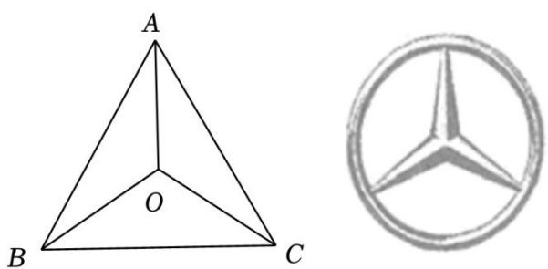

# 第二节 跟踪训练

# 考向 1 跟踪训练

【训练 1】（2022•乙卷）已知向量 $\vec{a}=(2,1)$ ， $\vec{b}=(-2,4)$ ，则 $|\vec{a}-\vec{b}|=(\quad)$

A. 2

B. 3

C. 4

D. 5

【训练 2】（2019•新课标III）已知向量 $\vec{a}=(2,2)$ ， $\vec{b}=(-8,6)$ ，则 $\cos<\vec{a}$ ， $\vec{b}>=$ \_\_\_\_.

【训练3】（2018·新课标Ⅱ）已知向量 $\vec{a}$ ， $\vec{b}$ 满足 $|\vec{a}| = 1$ ， $\vec{a} \cdot \vec{b} = -1$ ，则 $\vec{a} \cdot (2\vec{a} - \vec{b}) = (\quad)$

A. 4

B. 3

C. 2

D. 0

【训练 5】已知 D 是腰长为 2 的等腰直角 $\Delta ABC$ 斜边 BC 上的动点，则 $\overrightarrow{AB} \cdot \overrightarrow{AD}$ 的取值范围是()

A. $[\sqrt{2},4]$

B. $[\sqrt{2}, 2]$

C. $[0, 4]$

D. $[2, 4]$

【训练6】已知在直角三角形 $ABC$ 中， $CA = CB = 1$ ，以斜边 $AB$ 的中点 $O$ 为圆心， $AB$ 为直径，在点 $C$ 的另一侧作半圆弧 $AB$ ， $M$ 为半圆弧上的动点，则 $\overrightarrow{CA} \cdot \overrightarrow{CM}$ 的取值范围为（）

A. $[0, \frac{1 + \sqrt{2}}{2}]$

B. $[0, 1]$

C. $[0, \frac{3}{2}]$

D. $\left[\frac{1 - \sqrt{2}}{2}, 1\right]$

【训练 7】（2025·青岛一模）已知 $\vec{a}=(1,1)$ ， $\vec{b}=(1,-2)$ ，则 $\vec{a}$ 在 $\vec{b}$ 上的投影向量为（）

A. $\left(-\frac{1}{5},\frac{2}{5}\right)$

B. $\left(\frac{1}{5},\frac{2}{5}\right)$

C. $(- \frac{\sqrt{5}}{5}, \frac{2\sqrt{5}}{5})$

D. $(\frac{\sqrt{5}}{5}, \frac{2\sqrt{5}}{5})$

【训练 8】（2025·安徽模拟）已知单位向量 $\vec{a}$ ， $\vec{b}$ 满足 $\vec{a} \cdot \vec{b} = \frac{1}{3}$ ，则 $\vec{a} + \vec{b}$ 在 $\vec{a}$ 上的投影向量为()

A. $\frac{1}{3}\vec{a}$

B. $\frac{1}{2}\vec{a}$

C. $\frac{4}{3}\vec{a}$

D. $\frac{5}{3}\vec{a}$

# 考向 2 跟踪训练

【训练 1】（2025•浙江模拟）已知向量 $\vec{a}=(1,4)$ ， $\vec{b}=(x,2)$ ，若 $\vec{a}/(3\vec{a}-\vec{b})$ ，则 $x=(\quad)$

A. -1

B. $-\frac{1}{2}$

C. $\frac{1}{2}$

D. 1

【训练 2】（2025•深圳一模）已知向量 $\vec{a}=(-1,1)$ ， $\vec{b}=(1,3)$ ，若 $\vec{a}\perp(\vec{a}+\lambda\vec{b})$ ，则 $\lambda=(\quad)$

A.-2

B. -1

C. 1

D. 2

【训练 3】在正方形 ABCD 中，已知 AB = 1，点 P 在射线 CD 上运动，则 $\overrightarrow{PA} \cdot \overrightarrow{PB}$ 的取值范围为（）

A. $[0, 1]$

B. $[1, +\infty)$

C. $\left[\frac{3}{4},1\right]$

D. $\left[\frac{3}{4}, +\infty\right)$

【训练 4】若 $\Delta ABC$ 是边长为 1 的等边三角形，G 是边 BC 的中点，H 是边 AC 的中点，M 为线段 AG 上任意一点，则 $\overrightarrow{MB} \cdot \overrightarrow{MH}$ 的取值范围是（）

A. $\left[-\frac{1}{8}, +\infty\right)$

B. $\left[-\frac{1}{8},\frac{1}{4}\right]$

C. $\left[-\frac{11}{64}, +\infty\right)$

D. $\left[-\frac{11}{64},\frac{1}{4}\right]$

【训练 5】在矩形 ABCD 中，AB = 3，BC = 4．若 AP = 1，则 $\overrightarrow{BP} \cdot \overrightarrow{BD}$ 的取值范围是（）

A. [4, 13]

B. $[4, 14]$

C. [6, 13]

D. [9, 14]

【训练 6】若正 $\Delta ABC$ 的边长为 4，P 为 $\Delta ABC$ 所在平面内的动点，且 PA=1，则 $\overrightarrow{PB} \cdot \overrightarrow{PC}$ 的取值范围是（）

A. [3, 15]

B. $[9 - 2\sqrt{3}, 9 + 2\sqrt{3}]$

C. $[9-3\sqrt{3},9+3\sqrt{3}]$

D. $[9 - 4\sqrt{3}, 9 + 4\sqrt{3}]$

【训练 7】（2025·重庆模拟）在△ABC中， $\overrightarrow{AB}\cdot\overrightarrow{AC}=0,\quad AB=2,\quad AC=\frac{3}{2},\quad E,\quad F$ 为线段AB上的点且 $AE = BF = \frac{1}{4} AB$ ，则 $\overrightarrow{CE} \cdot \overrightarrow{CF} = (\quad)$

A. 3

B. $\frac{21}{8}$

C. 2

D. $\frac{7}{4}$

# 考向 3 跟踪训练

【训练 1】已知 O 为正 $\triangle ABC$ 内的一点，且满足 $\overrightarrow{OA} + \lambda \overrightarrow{OB} + (1 + \lambda) \overrightarrow{OC} = \vec{0}$ ，若 $\triangle OAB$ 的面积与 $\triangle OBC$ 的面积的比值为 3，则 $\lambda$ 的值为（）

A. $\frac{1}{2}$

B. $\frac{5}{2}$

C. 2

D. 3

【训练2】在 $\Delta ABC$ 中， $CA = 2CB = 4$ ， $F$ 为 $\Delta ABC$ 的外心，则 $\overrightarrow{CF}\cdot \overrightarrow{AB} = (\quad)$

A.-6

B.-8

C. -9

D. -12

【训练 3】若 H 是 $\Delta ABC$ 的垂心，且 $2\overrightarrow{HA} + 2\overrightarrow{HB} + 3\overrightarrow{HC} = \vec{0}$ ，则 $\tan C$ 的值为 \_\_\_\_.

【训练 4】（多选）在 $\Delta ABC$ 中，角 A，B，C 所对的边分别为 a，b，c，O 为平面内一点，下列说法正确的有（）

A. 若 $O$ 为 $\Delta ABC$ 的外心，且 $3\overrightarrow{OA} + 4\overrightarrow{OB} + 5\overrightarrow{OC} = \vec{0}$ ，则 $\overrightarrow{OA} \perp \overrightarrow{OB}$

B. 若 $O$ 为 $\Delta ABC$ 的内心， $AB = AC = 5, BC = 8, \overrightarrow{AO} = m\overrightarrow{AB} + n\overrightarrow{BC} (m, n \in R)$ ，则 $m + n = \frac{5}{6}$

C. 若 $O$ 为 $\Delta ABC$ 的重心, $a\overrightarrow{OA} + b\overrightarrow{OB} + \frac{\sqrt{3}}{3} c\overrightarrow{OC} = \vec{0}$ , 则角 $A = 60^{\circ}$

D. 若 O 为 $\Delta ABC$ 的外心，且 O 到 a, b, c 三边距离分别为 k, m, n，则 $k: m: n = \sin A: \sin B: \sin C$ 【训练 5】（多选）“奔驰定理”是平面向量中一个非常优美的结论，因为这个定理对应的图形与“奔驰”轿车 (Mercedesbenz) 的 log o 很相似，故形象地称其为“奔驰定理”。奔驰定理：已知 O 是 $\Delta ABC$ 内一点， $\Delta BOC$ ， $\Delta AOC$ ， $\Delta AOB$ 的面积分别为 $S_{A}$ ， $S_{B}$ ， $S_{C}$ ，且 $S_{A} \cdot \overrightarrow{OA} + S_{B} \cdot \overrightarrow{OB} + S_{C} \cdot \overrightarrow{OC} = \overrightarrow{0}$ 。设 O 是锐角 $\Delta ABC$ 内的一点， $\angle BAC$ ， $\angle ABC$ ， $\angle ACB$ 分别是 $\Delta ABC$ 的三个内角，以下命题正确的有（）

text_image

A
O
B C

A. 若 $\overrightarrow{OA} + 2\overrightarrow{OB} + 3\overrightarrow{OC} = \vec{0}$ ，则 $S_A: S_B: S_C = 1: 2: 3$   
B. 若 $\left|\overrightarrow{OA}\right|=\left|\overrightarrow{OB}\right|=2$ ， $\angle AOB=\frac{5\pi}{6}$ ， $2\overrightarrow{OA}+3\overrightarrow{OB}+4\overrightarrow{OC}=\overrightarrow{0}$ ，则 $S_{\triangle ABC}=\frac{9}{2}$   
C. 若 O 为 $\Delta ABC$ 的内心， $3\overrightarrow{OA} + 4\overrightarrow{OB} + 5\overrightarrow{OC} = \overrightarrow{0}$ ，则 $\angle C = \frac{\pi}{2}$   
D. 若 $O$ 为 $\Delta ABC$ 的垂心， $3\overrightarrow{OA} + 4\overrightarrow{OB} + 5\overrightarrow{OC} = \vec{0}$ ，则 $\cos \angle AOB = -\frac{\sqrt{6}}{6}$

【训练 6】若 O 是平面上的定点，A、B、C 是平面上不共线的三点，且满足 $\overrightarrow{OP} = \overrightarrow{OC} + \lambda (\overrightarrow{CB} + \overrightarrow{CA})(\lambda \in R)$ ，则 P 点的轨迹一定过 $\Delta ABC$ 的（）

A. 外心

B. 内心

C. 重心

D. 垂心

【训练7】 $A$ 、 $B$ 、 $C$ 是平面上不共线的三个点，动点 $P$ 满足 $\overrightarrow{AP} = \lambda (\frac{\overrightarrow{AB}}{|\overrightarrow{AB}|} +\frac{\overrightarrow{AC}}{|\overrightarrow{AC}|})(\lambda \in [0, + \infty))$ ，则点 $P$ 的轨迹一定经过 $\Delta ABC$ 的（）

A. 外心

B. 内心

C. 重心

D. 垂心

【训练8】设 $O$ 为 $\Delta ABC$ 所在平面上一点，动点 $P$ 满足 $\overrightarrow{OP} = \frac{\overrightarrow{OB} + \overrightarrow{OC}}{2} +\lambda (\frac{\overrightarrow{AB}}{|\overrightarrow{AB}|\cos B} +\frac{\overrightarrow{AC}}{|\overrightarrow{AC}|\cos C})$ ，其中 $A$ ， $B$ ， $C$ 为 $\Delta ABC$ 的三个内角，则点 $P$ 的轨迹一定通过 $\Delta ABC$ 的（）

A. 外心

B. 内心

C. 重心

D. 垂心

【训练 9】（多选）下列说法正确的是( )

A. 向量 $\vec{e}_1 = (2, -3)$ , $\vec{e}_2 = (\frac{1}{2}, -\frac{3}{4})$ 能作为平面内所有向量的一组基底

B. 已知 $\Delta OAB$ 中，点 $P$ 为边 $AB$ 的中点，则必有 $\overrightarrow{OP} = \frac{1}{2} (\overrightarrow{OA} + \overrightarrow{OB})$

C. 若 $\overrightarrow{PA} \cdot \overrightarrow{PB} = \overrightarrow{PB} \cdot \overrightarrow{PC} = \overrightarrow{PC} \cdot \overrightarrow{PA}$ , 则 $P$ 是 $\Delta ABC$ 的垂心

D. 若 $G$ 是 $\Delta ABC$ 的重心, 则点 $G$ 满足条件 $\overrightarrow{GA} + \overrightarrow{GB} + \overrightarrow{CG} = \overrightarrow{0}$

【训练 10】(多选)在 $\Delta ABC$ 所在的平面上存在一点 P， $\overrightarrow{AP} = \lambda \overrightarrow{AB} + \mu \overrightarrow{AC} (\lambda, \mu \in R)$ ，则下列说法错误的是()

A. 若 $\lambda + \mu = 1$ ，则点 $P$ 的轨迹不可能经过 $\Delta ABC$ 的外心

B. 若 $\lambda + \mu = -2$ ，则点 $P$ 的轨迹不可能经过 $\Delta ABC$ 的垂心

C. 若 $\lambda + \mu = \frac{1}{2}$ , 则点 $P$ 的轨迹可能经过 $\Delta ABC$ 的重心

D. 若 $\lambda = \mu$ ，则点 $P$ 的轨迹可能经过 $\Delta ABC$ 的内心

