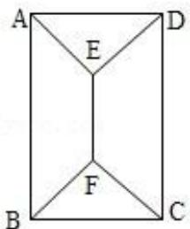
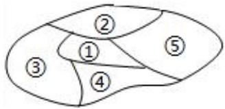
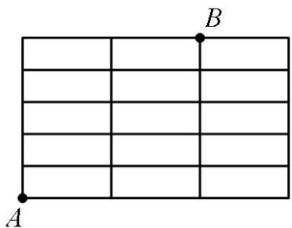
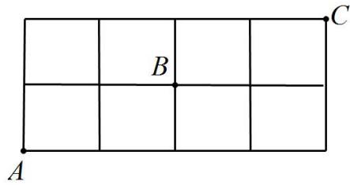

# 第 1 节 计数原理与排列组合

# 知识点一 两个技数原理

# 1. 分类加法计数原理

完成一件事, 有 n 类办法, 在第 1 类办法中有 $m_{1}$ 种不同的办法, 在第 2 类办法中有 $m_{2}$ 种不同的方法, …, 在第 n 类办法中有 $m_{n}$ 种不同的方法, 那么完成这件事共有: $N = m_{1} + m_{2} + \cdots + m_{n}$ 种不同的方法.

# 2. 分步乘法计数原理

完成一件事，需要分成 n 个步骤，做第 1 步有 $m_{1}$ 种不同的方法，做第 2 步有 $m_{2}$ 种不同的方法，…，做第 n 步有 $m_{n}$ 种不同的方法，那么完成这件事共有： $N = m_{1} \cdot m_{2} \cdots m_{n}$ 种不同的方法.

# 3. 两个计数原理的综合应用

如果完成一件事的各种方法是相互独立的，那么计算完成这件事的方法数时，使用分类计数原理。如果完成一件事的各个步骤是相互联系的，即各个步骤都必须完成，这件事才告完成，那么计算完成这件事的方法数时，使用分步计数原理。

# 知识点二 排列组合

# 1. 排列问题

(1) 定义: 从 $n$ 个不同元素中取出 $m (m \leq n)$ 个元素排成一列, 叫做从 $n$ 个不同元素中取出 $m$ 个元素的一个排列. 从 $n$ 个不同元素中取出 $m (m \leq n)$ 个元素的所有排列的个数, 叫做从 $n$ 个不同元素中取出 $m$ 个元素的排列数, 用符号 $A_{n}^{m}$ 表示.

（2）排列数的公式： $A_{n}^{m}=n(n-1)(n-2)\cdots(n-m+1)=\frac{n!}{(n-m)!}$ .

特例：当 m=n 时， $A_{n}^{m}=n!=n(n-1)(n-2)\cdots3\cdot2\cdot1$ ；规定 $0!=1$ .

（3）排列数的性质：① $A_{n}^{m}=nA_{n-1}^{m-1}$ ；② $A_{n}^{m}=\frac{1}{n-m}A_{n}^{m+1}=\frac{n}{n-m}A_{n-1}^{m}$ ；③ $A_{n}^{m}=mA_{n-1}^{m-1}+A_{n-1}^{m}$

（4）解排列应用题的基本思路：

通过审题，找出问题中的元素是什么，是否与顺序有关，有无特殊限制条件（特殊位置，特殊元素）.
2. 组合问题

（1）定义：从 $n$ 个不同元素中取出 $m(m \leq n)$ 个元素并成一组，叫做从 $n$ 个不同元素中取出 $m$ 个元素的一个组合；从 $n$ 个不同元素中取出 $m(m \leq n)$ 个元素的所有组合的个数，叫做从 $n$ 个不同元素中取出 $m$ 个元素的组合数，用符号 $C_n^m$ 表示.

（2）组合数公式及其推导，求从 $n$ 个不同元素中取出 $m$ 个元素的排列数 $A_{n}^{m}$ ，可以按以下两步来考虑：

第一步，先求出从这 n 个不同元素中取出 m 个元素的组合数 $C_{n}^{m}$ ;

第二步，求每一个组合中 $m$ 个元素的全排列数 $A_{n}^{m}$ ；

根据分步计数原理，得到 $A_{n}^{m}=C_{n}^{m}\cdot A_{m}^{m}$ ；因此 $C_{n}^{m}=\frac{A_{n}^{m}}{A_{m}^{m}}=\frac{n(n-1)(n-2)\cdots(n-m+1)}{m!}$ .

这里 $n$ ， $m\in N_{+}$ ，且 $m\leq n$ ，这个公式叫做组合数公式．因为 $A_{n}^{m} = \frac{n!}{(n - m)!}$

所以组合数公式还可表示为： $C_{n}^{m}=\frac{n!}{m!(n-m)!}$ ．特例 $C_{n}^{0}=C_{n}^{n}=1$ ．

注释：组合数公式的推导方法是一种重要的解题方法！在以后学习排列组合的混合问题时，一般都是按先取后排（先组合后排列）的顺序解决问题。

（3）组合数的主要性质：① $C_{n}^{m}=C_{n}^{n-m}$ ；② $C_{n}^{m}+C_{n}^{m-1}=C_{n+1}^{m}$

# 题型一 排列数的计算

【例 1】 $A_{5}^{3}-C_{4}^{3}=$ （）

A. 56

B. 32

C. 50

D. 48

【例 2】已知 $3A_{8}^{x}=4A_{9}^{x-1}$ ，则 x 等于（）

A. 6

B. 13

C. 6 或 13

D. 12

【例 3】【多选】下列等式中成立的是（）

A. $\mathrm{A}_{n}^{3}=(n-2)\mathrm{A}_{n}^{2}$

B. $\frac{1}{n}\mathrm{A}_{n + 1}^{n} = \mathrm{A}_{n + 1}^{n - 1}$

C. $nA_{n-1}^{n-2}=A_{n}^{n}$

D. $\frac{n}{n - m}\mathrm{A}_{n - 1}^{m} = \mathrm{A}_{n}^{m}$

# 题型二 组合数的计算

【例 1】已知 $C_{12}^{x+2}=C_{12}^{2x-5}$ ，则 x 可能取值为（）

A. 4

B. 5

C. 6或7

D. 5或7

【例2】已知 $\frac{1}{\mathrm{C}_5^m} -\frac{1}{\mathrm{C}_6^m} = \frac{7}{10\mathrm{C}_7^m}$ ，则 $\mathrm{C}_7^m +\mathrm{C}_7^{m + 1} + \mathrm{C}_8^{m + 2} + \mathrm{C}_9^{m + 3} + \mathrm{C}_{10}^{m + 4}$ 的值为\_\_\_\_（用数字作答）.

# 题型三 捆绑法（相邻问题，用捆绑法，注意内部存在一定的顺序）

【例 1】4 名男生 2 名女生排成一排，要求两名女生排在一起的排法总数为（）

A. 48

B. 96

C. 120

D. 240

【例 2】（2022·新高考Ⅱ）甲、乙、丙、丁、戊 5 名同学站成一排参加文艺汇演，若甲不站在两端，丙和丁相邻，则不同的排列方式共有（）

A. 12 种

B. 24 种

C. 36 种

D. 48 种

# 题型四 插空法（不相邻问题用插空法，先排列不受限的事物，再插孔不相邻的事物）

【例 1】五声音阶（汉族古代音律）是按五度的相生顺序，从宫音开始到羽音，依次为宫，商，角，徵，羽。若将这五个音阶排成一列，形成一个音序，且要求宫、羽两音节不相邻，可排成不同的音序的种数为（）

A. 12 种

B. 48 种

C. 72 种

D. 120 种

【例 2】高三（一）班学生要安排毕业晚会的 4 个音乐节目，2 个舞蹈节目和 1 个曲艺节目的演出顺序，要求 2 个舞蹈节目不连排，则共有 \_\_\_\_ 种不同的排法.

# 题型五 特殊元素（位置）法（限制条件下，优先考虑并满足有限制的事物，然后再考虑不受限的事物）

【例 1】甲乙丙丁 4 名同学站成一排拍照，若甲不站在两端，不同排列方式有（）

A. 6 种

B. 12 种

C. 36 种

D. 48 种

【例 2】从 6 名短跑运动员中选出 4 人参加 $4 \times 100 \, m$ 接力赛，甲不能跑第一棒和第四棒，问共有 \_\_\_\_ 种参赛方案.

【例 3】（2023·乙卷）甲乙两位同学从 6 种课外读物中各自选读 2 种，则这两人选读的课外读物中恰有 1 种相同的选法共有（）

A. 30 种

B. 60 种

C. 120 种

D. 240 种

【例 4】某校准备下一周举办运动会，甲、乙、丙、丁 4 位同学报名参加 A, B, C, D 这 4 个项目的比赛，每人只报名 1 个项目，任意两人不报同一个项目，甲不报名参加 A 项目，则不同的报名方法种数有（）

A. 18

B. 21

C. 23

D. 72

# 题型六 间接法（正难则反）

【例 1】某小学从 2 位语文教师，4 位数学教师中安排 3 人到西部三个省支教，每个省各 1 人，且至少有 1 位语文教师入选，则不同安排方法有（）种.

A. 16

B. 20

C. 96

D. 120

【例 2】从甲、乙等 5 人中任选 3 人参加三个不同项目的比赛, 要求每个项目都有人参加, 则甲、乙中至少有 1 人入选的不同参赛方案共有\_\_\_\_种.

# 题型七 重排问题求幂策略（解决可重复问题）

【例 1】有 5 名学生报名参加 3 项体育比赛，每人限报一项，则不同的报名方法的种数为（）

A. 243

B. 125

C. 60

D. 120

【例 2】甲、乙、丙、丁 4 名同学争夺数学、物理、化学 3 门学科知识竞赛的冠军，且每门学科只有 1 名冠军产生，有\_\_\_\_种不同的冠军获得情况.

# 题型八 组合问题

【例 1】（2023·新高考Ⅱ）某学校为了了解学生参加体育运动的情况，用比例分配的分层随机抽样方法作抽样调查，拟从初中部和高中部两层共抽取60名学生，已知该校初中部和高中部分别有400名和200名学生，则不同的抽样结果共有（）

A. $C_{400}^{45} \cdot C_{200}^{15}$ 种

B. $C_{400}^{20} \cdot C_{200}^{40}$ 种

C. $C_{400}^{30} \cdot C_{200}^{30}$ 种

D. $C_{400}^{40} \cdot C_{200}^{20}$ 种

【例 2】（2023·新高考 I）某学校开设了 4 门体育类选修课和 4 门艺术类选修课，学生需从这 8 门课中选修 2 门或 3 门课，并且每类选修课至少选修 1 门，则不同的选课方案共有 \_\_\_\_ 种（用数字作答）。

【例 3】（2020·上海）从 6 个人挑选 4 个人去值班，每人值班一天，第一天安排 1 个人，第二天安排 1 个人，第三天安排 2 个人，则共有 \_\_\_\_ 种安排情况.

# 题型九 分组分配问题

# 1. 平均分组问题

【例 1】导师制是高中新的教学探索制度，班级科任教师作为导师既面向全体授课对象，又对指定的若干学生的个性、人格发展和全面素质提高负责。已知有 3 位科任教师负责某学习小组的 6 名同学，每 2 名同学由 1 位科任教师负责，则不同的分配方法的种数为（）

A. 90

B. 15

C. 60

D. 180

【例 2】为提升教育教学质量，促进各分校区发展，西南大学附属中学开展本部一分校区联合教研.现计划从本部派出 7 男 2 女共 9 名老师到 A 、 B 、 C 三个分校区开展教研，每个校区三人，则有（）种安排方案.

A. 1050

B. 1680

C. 2940

D. 3360

# 2. 不平均分组问题

【例 1】现有高校进入高中校园组织招生宣传，4 名男生、3 名女生去参加 A，B 两所高校的志愿填报咨询会，每个学生只能去其中的一所学校，且要求每所学校都既有男生又有女生参加，则不同的安排方法数是（）

A. 42

B. 60

C. 84

D. 120

【例 2】教育扶贫是我国重点扶贫项目，为了缩小教育资源的差距，国家鼓励教师去乡村支教，某校选派了5名教师到 A、B、C 三个乡村学校去支教，每个学校至少去 1 人，每名教师只能去一个学校，不同的选派方法数有（）种

A. 25

B. 60

C. 90

D. 150

# 题型十 排列组合混合问题先选后排策略

【例 1】（2020·新课标Ⅱ）4 名同学到 3 个小区参加垃圾分类宣传活动，每名同学只去 1 个小区，每个小区至少安排 1 名同学，则不同的安排方法共有 \_\_\_\_ 种.

【例 2】将 6 名实习教师分配到 5 所学校进行培训，每名实习教师只能分配到 1 个学校，每个学校至少分配 1 名实习教师，则不同的分配方案共有（）

A. 600 种

B. 900 种

C. 1800 种

D. 3600 种

【例 3】为了落实立德树人的根本任务，践行五育并举，某校开设 A、B、C 三门德育校本课程，现有甲、乙、丙、丁四位同学参加校本课程的学习，每位同学仅报一门，每门至少有一位同学参加，则不同的报名方法有（）

A. 72 种

B. 60 种

C. 54 种

D. 36 种

题型十一 定序问题倍缩法（排列中涉及到定序的问题，则用除法，出去多着全排列中涉及到顺序的问题）

【例 1】某 4 位同学排成一排准备照相时, 又来了 2 位同学要加入, 如果保持原来 4 位同学的相对顺序不变, 则不同的加入方法种数为 ( )

A. 10

B. 20

C. 24

D. 30

【例 2】花灯，又名“彩灯”“灯笼”，是中国传统农业时代的文化产物，兼具生活功能与艺术特色。如图，现有悬挂着的 6 盏不同的花灯需要取下，每次取 1 盏，则不同取法总数为 \_\_\_\_

natural_image

Three identical abstract geometric patterns with concentric ovals and horizontal lines, no text or symbols present.

# 题型十二 隔板法（相同元素的分配问题，用插板法进行求解）

【例 1】10 个三好学生名额分到 7 个班级，每个班级至少一个名额，有（）种不同分配方案？

A. 9

B. 36

C. 84

D. 120

# 题型十三 合理分类与分步策略（多面手问题）

【例 1】我校去年 11 月份，高二年级有 10 人参加了赴日本交流访问团，其中 3 人只会唱歌，2 人只会跳舞，其余 5 人既能唱歌又能跳舞。现要从中选 6 人上台表演，3 人唱歌，3 人跳舞，有（）种不同的选法。

A. 675

B. 575

C. 512

D. 545

# 题型十四 涂色问题（先分配好颜色，再进行涂色，最后加法合并到一起）

求解涂色(种植)问题一般是直接利用两个计数原理求解，常用方法有：

(1)按区域的不同以区域为主分步计数，用分步乘法计数原理分析；  
(2)以颜色(种植作物)为主分类讨论，适用于“区域、点、线段”问题，用分类加法计数原理分析；  
(3)对于涂色(立方体)问题将空间问题平面化，转化为平面区域涂色问题

【例 1】（2010·天津）如图，用四种不同颜色给图中的 A，B，C，D，E，F 六个点涂色，要求每个点涂一种颜色，且图中每条线段的两个端点涂不同颜色，则不同的涂色方法有（）

text_image

A
E
D
B
F
C

A. 288 种

B. 264 种

C. 240 种

D. 168 种

【例 2】（2003·全国）如图，一个地区分为 5 个行政区域，现给地图着色，要求相邻区域不得使用同一颜色．现有 4 种颜色可供选择，则不同的着色方法共有\_\_\_\_种．（以数字作答）

text_image

①
②
③
④
⑤

# 题型十五 标号排位问题（不配对问题）

【例 1】将数字 1, 2, 3, 4 填入标号为 1, 2, 3, 4 的四个方格里，每格填一个数，则每个方格的标号与所填数字均不相同的填法有（）

A、6种

B、9种

C、11种

D、23 种

【例 2】（2024•新高考Ⅱ）在如图的 $4 \times 4$ 方格表中选 4 个方格，要求每行和每列均恰有一个方格被选中，则共有 \_\_\_\_ 种选法，在所有符合上述要求的选法中，选中方格的 4 个数之和的最大值是 \_\_\_\_.

<table><tr><td>11</td><td>21</td><td>31</td><td>40</td></tr><tr><td>12</td><td>22</td><td>33</td><td>42</td></tr><tr><td>13</td><td>22</td><td>33</td><td>43</td></tr><tr><td>15</td><td>24</td><td>34</td><td>44</td></tr></table>

# 题型十六 环排问题线排策略

【例 1】如图,某手链由 10 颗较小的珠子(每颗珠子相同)和 11 颗较大的珠子(每颗珠子均不相同)串成,若 10 颗小珠子必须相邻,大珠子的位置任意,则该手链不同的串法有（）

natural_image

Black and white bracelet with beads, no text or symbols visible

A. $A_{11}^{11}$ 种

B. $\frac{A_{11}^{11}}{2}$ 种

C. $A_{12}^{12}$ 种

D. $\frac{A_{12}^{12}}{2}$ 种

# 题型十七 构造模型策略

【例 1】某排共有 10 个座位，安排 4 人就坐。若每人左右两边都有空位，则不同的坐法有\_\_\_\_种（用数字回答）。

# 题型十八 走楼梯问题 （分类法与插空法相结合）

【例1】某中学有三栋教学楼，如图所示，若某学生要从 $A$ 处到达他所在的班级 $B$ 处（所有楼道间是连通的），则最短路程不同的走法数为（）

text_image

A
B

A. 5

B. 10

C. 15

D. 21

【例 2】某小区的道路网如图所示，则由 A 到 C 的最短路径中，经过 B 的走法有（）

text_image

B
A
C

A. 6种

B. 8 种

C. 9 种

D. 10 种

# 题型十九 数字排列问题

组数问题的常见类型及解决原则：

(1)常见的组数问题:

①组成的数为“奇数”“偶数”“被某数整除的数”;   
②在某一定范围内的数的问题;  
③各位数字和为某一定值问题；  
④各位数字之间满足某种关系问题等.

(2)解决原则

①明确特殊位置或特殊数字，是我们采用“分类”还是“分步”的关键。一般按特殊位置(末位或首位)由谁占领分类，分类中再按特殊位置(或特殊元素)优先的策略分步完成；如果正面分类较多，可采用间接法求解。  
②要注意数字“0”不能排在两位数字或两位数字以上的数的最高位

【例 1】（2024·上海）设集合 A 中的元素皆为无重复数字的三位正整数，且元素中任意两者之积皆为偶数，求集合中元素个数的最大值 \_\_\_\_。

【例 2】在由数字 1, 2, 3, 4, 5 组成的数字不重复的五位数中，小于 50000 的奇数有 \_\_\_\_ 个.

【例 3】用 0, 1, 2, 3, 4 这五个数字，可以组成多少个满足下列条件的没有重复数字的五位数？

(1)偶数;   
(2)百位和千位都是奇数的偶数;   
(3)比 23014 大的数.

