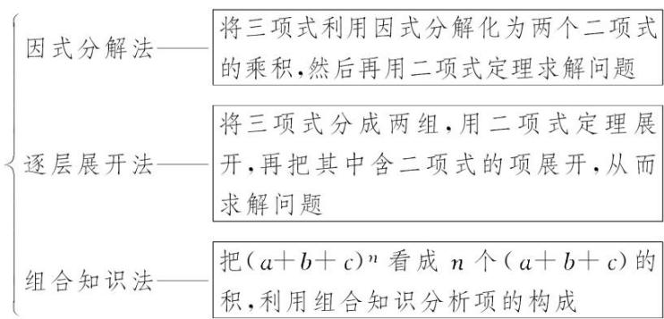
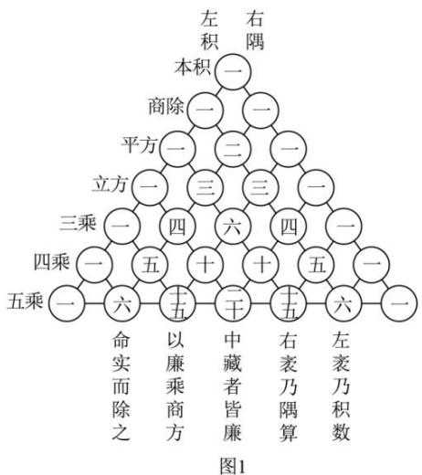
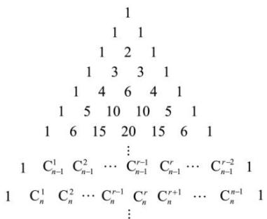
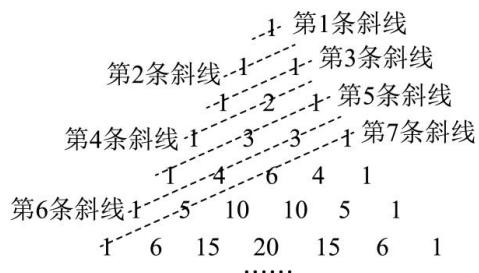

# 第 2 节 二项式定理与杨辉三角

# 1. 二项式展开式的特定项、特定项的系数问题

# (1) 二项式定理

定义 一般地，对于任意正整数 n，都有： $(a+b)^{n}=C_{n}^{0}a^{n}+C_{n}^{1}a^{n-1}b+\cdots+C_{n}^{r}a^{n-r}b^{r}+\cdots+C_{n}^{n}b^{n}(n\in N^{*})$

这个公式所表示的定理叫做二项式定理，等号右边的多项式叫做 $(a+b)^{n}$ 的二项展开式．式中的 $C_{n}^{r}a^{n-r}b^{r}$ 做二项展开式的通项，用 $T_{r+1}$ 表示，即通项为展开式的第 $r+1$ 项： $T_{r+1}=C_{n}^{r}a^{n-r}b^{r}$ ，其中的系数 $C_{n}^{r}(r=0,1,2,\ldots,n)$ 叫做二项式系数.

(2) 二项式 $(a+b)^{n}$ 的展开式的特点:

①项数：共有 $n+1$ 项，比二项式的次数大1；  
②二项式系数：第 $r+1$ 项的二项式系数为 $C_{n}^{r}$ ，最大二项式系数项居中；  
③次数: 各项的次数都等于二项式的幂指数 $n$ 。字母 $a$ 降幂排列, 次数由 $n$ 到 0; 字母 $b$ 升幂排列, 次数从 0 到 $n$ , 每一项中, $a$ , $b$ 次数和均为 $n$ ;  
④项的系数：二项式系数依次是 $C_{n}^{0}, C_{n}^{1}, C_{n}^{2}, \cdots, C_{n}^{r}, \cdots, C_{n}^{n}$ ，项的系数是a与b的系数（包括二项式系数）.

# (3) 两个常用的二项展开式:

$$
① (a - b) ^ {n} = C _ {n} ^ {0} a ^ {n} - C _ {n} ^ {1} a ^ {n - 1} b + \dots + (- 1) ^ {r} \cdot C _ {n} ^ {r} a ^ {n - r} b ^ {r} + \dots + (- 1) ^ {n} \cdot C _ {n} ^ {n} b ^ {n} (n \in N ^ {*})
$$

$$
② (1 + x) ^ {n} = 1 + C _ {n} ^ {1} x + C _ {n} ^ {2} x ^ {2} + \dots + C _ {n} ^ {r} x ^ {r} + \dots + x ^ {n}
$$

# (4) 二项展开式的通项公式

二项展开式的通项： $T_{r+1}=C_{n}^{r}a^{n-r}b^{r}(r=0,1,2,\cdots,n)$

公式特点：①它表示二项展开式的第 $r+1$ 项，该项的二项式系数是 $C_{n}^{r}$ ；②字母b的次数和组合数的上标相同；③a与b的次数之和为n.

注释：①二项式 $(a+b)^{n}$ 的二项展开式的第r+1项 $C_{n}^{r}a^{n-r}b^{r}$ 和 $(b+a)^{n}$ 的二项展开式的第r+1项 $C_{n}^{r}b^{n-r}a^{r}$ 是有区别的，应用二项式定理时，其中的a和b是不能随便交换位置的.

②通项是针对在 $(a+b)^{n}$ 这个标准形式下而言的，如 $(a-b)^{n}$ 的二项展开式的通项是 $T_{r+1}=(-1)^{r}C_{n}^{r}a^{n-r}b^{r}$ （只需把-b看成b代入二项式定理）.

# 2. 二项式展开式中的最值问题

# (1) 二项式系数的性质

①每一行两端都是1，即 $C_{n}^{0}=C_{n}^{n}$ ；其余每个数都等于它“肩上”两个数的和，即 $C_{n+1}^{m}=C_{n}^{m-1}+C_{n}^{m}$   
②对称性 每一行中，与首末两端“等距离”的两个二项式系数相等，即 $C_{n}^{m}=C_{n}^{n-m}$ .  
③二项式系数和 令 a=b=1，则二项式系数的和为 $C_{n}^{0}+C_{n}^{1}+C_{n}^{2}+\cdots+C_{n}^{r}+\cdots+C_{n}^{n}=2^{n}$ ，变形式

$$
C _ {n} ^ {1} + C _ {n} ^ {2} + \dots + C _ {n} ^ {r} + \dots + C _ {n} ^ {n} = 2 ^ {n} - 1.
$$

④奇数项的二项式系数和等于偶数项的二项式系数和：在二项式定理中，令 a=1, b=-1，
则 $C_{n}^{0}-C_{n}^{1}+C_{n}^{2}-C_{n}^{3}+\cdots+(-1)^{n}C_{n}^{n}=(1-1)^{n}=0$ ，从而得到 $C_{n}^{0}+C_{n}^{2}+C_{n}^{4}\cdots+C_{n}^{2r}+\cdots=C_{n}^{1}+C_{n}^{3}+\cdots+C_{n}^{2r+1}$

⑤最大值：如果二项式的幂指数 $n$ 是偶数，则中间一项 $T_{\frac{n}{2} + 1}$ 的二项式系数 $C_n^{\frac{n}{2}}$ 最大；如果二项式的幂指数 $n$ 是奇数，则中间两项 $T_{\frac{n + 1}{2}}, T_{\frac{n + 1}{2} + 1}$ 的二项式系数 $C_n^{\frac{n - 1}{2}}, C_n^{\frac{n + 1}{2}}$ 相等且最大.

(2) 系数的最大项

求 $(a+bx)^{n}$ 展开式中最大的项，一般采用待定系数法．设展开式中各项系数分别为 $A_{1},A_{2},\cdots,A_{n+1}$ ，设第 $r+1$ 项系数最大，应有 $\left\{\begin{aligned}A_{r+1}\geq A_{r}\\ A_{r+1}\geq A_{r+2}\end{aligned}\right.$ ，从而解出r来.

3. 二项式展开式中系数和有关问题

（1）含变量的恒等式：是指无论变量在已知范围内取何值，均可使等式成立，所以通常可对变量赋予特殊值得到一些特殊的等式或性质.  
（2）二项式展开式与原二项式呈恒等关系，所以可通过对变量赋特殊值得到有关系数（或二项式系数）的等式.

(3) 常用赋值举例:

A、设 $(a+b)^{n}=C_{n}^{0}a^{n}+C_{n}^{1}a^{n-1}b+C_{n}^{2}a^{n-2}b^{2}+\cdots+C_{n}^{r}a^{n-r}b^{r}+\cdots+C_{n}^{n}b^{n}$

二项式定理是一个恒等式，即对 $a$ ， $b$ 的一切值都成立，我们可以根据具体问题的需要灵活选取 $a$ ， $b$ 的值.

①令 a=b=1 ，可得： $2^{n}=C_{n}^{0}+C_{n}^{1}+\cdots+C_{n}^{n}$   
②令 a=1, b=-1，可得： $0=C_{n}^{0}-C_{n}^{1}+C_{n}^{2}-C_{n}^{3}\cdots+(-1)^{n}C_{n}^{n}$ ，即：

$C_{n}^{0}+C_{n}^{2}+\cdots+C_{n}^{n}=C_{n}^{1}+C_{n}^{3}+\cdots+C_{n}^{n-1}$ （假设 n 为偶数），再结合①可得：

$$
C _ {n} ^ {0} + C _ {n} ^ {2} + \dots + C _ {n} ^ {n} = C _ {n} ^ {1} + C _ {n} ^ {3} + \dots + C _ {n} ^ {n - 1} = 2 ^ {n - 1}.
$$

B、若 $f(x)=a_{n}x^{n}+a_{n-1}x^{n-1}+a_{n-2}x^{n-2}+\cdots+a_{1}x+a_{0}$ ，则①常数项：令 x=0，得 $a_{0}=f(0)$ .

②各项系数和：令 x=1 ，得 $f(1)=a_{0}+a_{1}+a_{2}+\cdots+a_{n-1}+a_{n}$   
③奇数项的系数和与偶数项的系数和

a. 当 n 为偶数时，奇数项的系数和为 $a_{0} + a_{2} + a_{4} + \cdots + a_{n} = \frac{f(1) + f(-1)}{2}$ ;

偶数项的系数和为 $a_{1} + a_{3} + a_{5} + \cdots + a_{n-1} = \frac{f(1) - f(-1)}{2}$ .

(可简记为: $n$ 为偶数, 奇数项的系数和用“中点公式”, 奇偶交错搭配)

b. 当 n 为奇数时，奇数项的系数和为 $a_{1} + a_{3} + \cdots + a_{n} = \frac{f(1) - f(-1)}{2}$ ;

偶数项的系数和为 $a_{0} + a_{2} + \cdots + a_{n-1} = \frac{f(1) + f(-1)}{2}$ .

(可简记为: $n$ 为奇数, 偶数项的系数和用“中点公式”, 奇偶交错搭配)

若 $f(x)=a_{0}+a_{1}x^{1}+a_{2}x^{2}+\cdots+a_{n-1}x^{n-1}+a_{n}x^{n}$ ，同理可得.

注：常见的赋值为令 x=0，x=1 或 x=-1，然后通过加减运算即可得到相应的结果.

# 题型一 二项式定理的正用与逆用

二项式定理： $(a+b)^{n}=\mathrm{C}_{n}^{0}a^{n}+\mathrm{C}_{n}^{1}a^{n-1}b+\cdots+\mathrm{C}_{n}^{k}a^{n-k}b^{k}+\cdots+\mathrm{C}_{n}^{n}b^{n}(n\in\mathbf{N}^{*})$

二项式定理的双向功能

(1)正用: 将 $(a + b)^n$ 展开, 得到一个多项式, 即二项式定理从左到右使用是展开. 对较复杂的式子, 先化简再用二项式定理展开.

(2)逆用: 将展开式合并成 $(a + b)^n$ 的形式, 即二项式定理从右到左使用是合并, 对于化简、求和、证明等问题的求解, 要熟悉公式的特点、项数、各项幂指数的规律以及各项系数的规律.

【例 1】二项式 $(x+2)^{3}$ 的展开式为（）

A. $x^{3} + 6x^{2} + 6x + 8$

B. $x^{3} + 6x^{2} + 12x + 8$

C. $x^{3}+12x^{2}+6x+8$

D. $x^{3}+12x^{2}+12x+8$

【例 2】化简 $(x+1)^{4}-4(x+1)^{3}+6(x+1)^{2}-4(x+1)+1$ 的结果为（）

A. $x^{4}$

B. $(x-1)^{4}$

C. $(x+1)^{4}$

D. $x^{4}-1$

# 题型二 二项展开式的特定项、项的系数的求解

求二项展开式的特定项问题，一般需要建立方程求 k，再将 k 的值代回通项求解，注意 k 的取值范围 $(k=0,1,2,\ldots,n)$ .

(1)第 m 项：此时 $k+1=m$ ，求出 k，代入通项；  
(2)常数项：即这项中不含“变元”，令通项中“变元”的幂指数为0建立方程；  
(3)有理项：令通项中“变元”的幂指数为整数建立方程.

特定项的系数问题及相关参数值的求解问题等都可依据上述方法求解.

【例 1】（2024·北京）在 $(x-\sqrt{x})^{4}$ 的展开式中， $x^{3}$ 的系数为()

A. 6

B.-6

C. 12

D. -12

【例 2】（2025·上海春季高考）已知 $(x+\frac{a}{x})^{6}$ 的展开式中常数项是20，则a= \_\_\_\_.

【例 3】二项式 $\left(1+\sqrt{x}\right)^{12}$ 的展开式中，有理项有（）项

A. 5

B. 6

C. 7

D. 8

【例 4】（2021·上海）已知二项式 $(x+a)^{5}$ 展开式中， $x^{2}$ 的系数为80，则a=2.

【例 5】已知 $(2x-3)^{8}=a_{0}+a_{1}(1-x)+a_{2}(1-x)^{2}+\cdots+a_{8}(1-x)^{8}$ ，则 $a_{3}=$ （）

A. 224

B. -224

C. -448

D. 448

# 题型三 两个二项式乘积的展开式

求多项式积的特定项的方法——“双通法”

所谓的“双通法”是根据多项式与多项式的乘法法则得到 $(a+bx)^{n}(s+tx)^{m}$ 的展开式中一般项为： $T_{k+1}\cdot T_{r+1}=C_{n}^{k}a^{n-k}(bx)^{k}\cdot C_{m}^{r}s^{m-r}(tx)^{r}$ ，再依据题目中对指数的特殊要求，确定r与k所满足的条件，进而求出r，k的取值情况.

【例 1】（2019·新课标III） $(1+2x^{2})(1+x)^{4}$ 的展开式中 $x^{3}$ 的系数为()

A. 12

B. 16

C. 20

D. 24

【例 2】（2020•新课标 I） $(x+\frac{y^{2}}{x})(x+y)^{5}$ 的展开式中 $x^{3}y^{3}$ 的系数为()

A. 5

B. 10

C. 15

D. 20

【例 3】若 $(1+mx)(1-x)^{5}$ 的展开式中不含 $x^{3}$ 项，则实数 m 的值为（）

A.-2

B. -1

C. 0

D. 1

【例 4】若 $(2x-1)^{5}(x+2)=a_{0}+a_{1}(x-1)+\cdots+a_{5}(x-1)^{5}+a_{6}(x-1)^{6}$ ， $a_{5}=$ \_\_\_\_。

# 题型四 含有三项的二项展开式问题

$(a+b+c)^{n}$ 展开式中特定项的求解方法

text_image

因式分解法——将三项式利用因式分解化为两个二项式的乘积,然后再用二项式定理求解问题
逐层展开法——将三项式分成两组,用二项式定理展开,再把其中含二项式的项展开,从而求解问题
组合知识法——把(a+b+c)^n看成n个(a+b+c)的积,利用组合知识分析项的构成

【例1】在 $\left(1 + x + \frac{1}{x^2}\right)^5$ 的展开式中，常数项为（）

A. 15

B. 16

C. 30

D. 31

【例 2】 $\left(x^{2}+3x+2\right)^{3}$ 的展开式中 $x^{4}$ 的系数为（）

A. 6

B. 8

C. 27

D. 33

# 题型五 二项展开式的系数和问题

求展开式的各项系数之和常用赋值法

根据题目要求，灵活赋给字母不同的值．一般地，要使展开式中项的关系变为系数的关系，令 x=0 可得常数项，令 x=1 可得所有项的系数之和，令 x=-1 可得偶次项系数之和与奇次项系数之和的差，而当二项展开式中含负值项时，令 x=-1 则可得各项系数绝对值之和.

【例 1】（2022·北京）若 $(2x-1)^{4}=a_{4}x^{4}+a_{3}x^{3}+a_{2}x^{2}+a_{1}x+a_{0}$ ，则 $a_{0}+a_{2}+a_{4}=(\quad)$

A. 40

B. 41

C. -40

D. -41

【例 2】（2022·浙江）已知多项式 $(x+2)(x-1)^{4}=a_{0}+a_{1}x+a_{2}x^{2}+a_{3}x^{3}+a_{4}x^{4}+a_{5}x^{5}$ ，则 $a_{2}=$ \_\_\_\_，

$$
a _ {1} + a _ {2} + a _ {3} + a _ {4} + a _ {5} = \underline {{{\quad}}}.
$$

【例 3】在 $(3-x)(1-x)^{5}$ 展开式中，x 的奇数次幂的项的系数和为（）

A. -64

B. 64

C. -32

D. 32

【例 4】【多选】若 $(2-3x)^{2024}=a_{0}+a_{1}(1-x)+a_{2}(1-x)^{2}+\cdots+a_{2024}(1-x)^{2024}$ ，则下列选项正确的有（）

A. $a_0 = 1$

B. $a_{1}+a_{2}+a_{3}+\cdots+a_{2023}+a_{2024}=2^{2024}-1$

C. $\left|a_{0}\right|+\left|a_{1}\right|+\left|a_{2}\right|+\cdots+\left|a_{2023}\right|+\left|a_{2024}\right|=2^{2024}$

D. $a_{1}+2a_{2}+3a_{3}+\cdots+2023a_{2023}+2024a_{2024}=6072\times2^{2023}$

# 题型六 二项展开式中的最大项问题

1. 二项式系数最大的项的求法

求二项式系数最大的项，根据二项式系数的性质对 $(a+b)^{n}$ 中的n进行讨论：

(1)当 n 为奇数时，中间两项的二项式系数最大；  
(2)当 n 为偶数时，中间一项的二项式系数最大.

2. 展开式中系数最大的项的求法

求展开式中系数最大的项与求二项式系数最大的项是不同的，需要根据各项系数的正、负变化情况进行分析．如求 $(a+bx)^{n}(a,b\in\mathbb{R})$ 的展开式中系数最大的项，一般采用待定系数法．设展开式中各项的系数分别为 $A_{0},A_{1},A_{2},\ldots,A_{n}$ ，且第 $r+1$ 项最大，应用 $\left\{\begin{aligned}&A_{r}\geq A_{r-1},\\&A_{r}\geq A_{r+1},\end{aligned}\right.$ 解得r，即得出系数最大的项.

【例 1】【多选】关于 $\left(x+\frac{2}{x}\right)^{5}$ 的展开式，下列结论正确的是（）

A. 奇数项的二项式系数和为 32  
B. 所有项的系数和为 243  
C. 只有第 3 项的二项式系数最大  
D. 含 $x$ 项的系数为40

【例 2】（2024·甲卷）二项式 $\left(\frac{1}{3}+x\right)^{10}$ 的展开式中，各项系数的最大值是 \_\_\_\_.

【例 3】已知二项式 $(mx+1)^{n}$ 的展开式中只有第5项的二项式的系数最大，且展开式中 $x^{3}$ 项的系数为448，则实数m的值为\_\_\_\_.

【例4】已知 $\left(3x + \frac{2}{\sqrt{x}}\right)^n (n\in \mathbf{N}_+)$ 的展开式中第2项与第3项的二项式系数之比是 $\frac{1}{3}$ .

(1)求二项展开式中各项二项式系数和;   
(2)求二项展开式中系数最大的项.

【例 5】在二项式 $\left(x+\frac{1}{2\sqrt[3]{x}}\right)^{n}$ 展开式中，第 3 项的系数和第 4 项的二项式系数比为 3:40.

(1)求 $n$ 的值及展开式中的无理项有几项；  
(2)求展开式中系数最大的项是第几项.

# 题型七 二项式定理的应用

1. 应用二项式定理不仅可以对多项式展开，还可应用于以下几个方面：

(1)证明某些整除性问题或求余数.  
(2)证明有关的等式与不等式.   
(3)进行近似运算或比大小.

2. 各种问题的常用处理方法

(1)整除性问题或求余数问题的处理方法

①解决这类问题，必须构造一个与题目条件有关的二项式.

②用二项式定理处理这类问题，通常把被除数的底数写成除数(或与除数密切关联的数)与某数的和或差的形式，再用二项式定理展开，只考虑后面(或者是前面)的几项就可以了.

(2)证明等式或不等式问题的处理方法

①解决这类问题，常利用构造恒等式的方法，对恒等式中的数据进行分析、整理.  
②在证明过程中常利用如下三种常见变形:

$$
\mathrm{i}. (a - b) ^ {n} = \mathrm{C} _ {n} ^ {0} a ^ {n} + (- 1) ^ {1} \mathrm{C} _ {n} ^ {1} a ^ {n - 1} b + \dots + (- 1) ^ {r} \mathrm{C} _ {n} ^ {r} a ^ {n - r} b ^ {r} + \dots + (- 1) ^ {n} \mathrm{C} _ {n} ^ {n} b ^ {n};
$$

$$
\mathrm{ii.} (1 + x) ^ {n} = \mathrm{C} _ {n} ^ {0} + \mathrm{C} _ {n} ^ {1} x + \mathrm{C} _ {n} ^ {2} x ^ {2} + \dots + \mathrm{C} _ {n} ^ {r} x ^ {r} + \dots + \mathrm{C} _ {n} ^ {n} x ^ {n};
$$

$$
\mathrm{iii.} (1 - x) ^ {n} = \mathrm{C} _ {n} ^ {0} + (- 1) ^ {1} \mathrm{C} _ {n} ^ {1} x + \dots + (- 1) ^ {r} \mathrm{C} _ {n} ^ {r} x ^ {r} + \dots + (- 1) ^ {n - 1} \mathrm{C} _ {n} ^ {n - 1} x ^ {n - 1} + (- 1) ^ {n} \mathrm{C} _ {n} ^ {n} x ^ {n}.
$$

(3)近似计算的处理方法

对于二项式 $(1+a)^{n}$ ，当a的绝对值与0相差很小且n较大时，常用近似公式 $(1+a)^{n}\approx1+na$ ，因为这时展开式后面部分 $C_{n}^{2}a^{2}+C_{n}^{3}a^{3}+\ldots+C_{n}^{n}a^{n}$ 很小，可以忽略不计．类似地，有 $(1-a)^{n}\approx1-na$ .但使用这两个公式时应注意a的条件，以及对计算精确度的要求．要求选取展开式中保留的项，使最后一项小数位恰好符合要求即可，少了不符合要求，多了无用，且增加麻烦.

【例 1】已知 $a=7^{9}$ ， $b=8^{8}$ ， $c=9^{7}$ ，则 a，b，c 的大小关系为（）

A. c < a < b

B. b < c < a

C. b < a < c

D. c < b < a

【例 2】 $245^{2023}$ 被 3 除的余数为（）

A. 2

B. 1

C. 0

D. 不确定

# 题型八 二项式定理与杨辉三角

杨辉三角的性质:

(1)每一行都是对称的，且两端的数都是 1.  
(2)从第三行起，不在两端的任意一个数，都等于上一行中与这个数相邻的两数之和.

【例 1】我国南宋数学家杨辉 1261 年所著的《详解九章算法》一书里给出了杨辉三角，书中是用汉字来表示的，如图 1. 研究发现，杨辉三角可以由组合数来表示，如图 2.

```mermaid
graph TD
    A["左积"] --> B["本积"]
    C["右隅"] --> B
    B --> D["商除"]
    D --> E["平方"]
    E --> F["立方"]
    F --> G["三乘"]
    G --> H["四乘"]
    H --> I["五乘"]
    I --> J["六乘"]
    J --> K["七乘"]
    K --> L["八乘"]
    L --> M["九乘"]
    M --> N["十乘"]
    N --> O["十一乘"]
    O --> P["十二乘"]
    P --> Q["十三乘"]
    Q --> R["十四乘"]
    R --> S["十五乘"]
    S --> T["十六乘"]
    T --> U["七乘"]
    U --> V["八乘"]
    V --> W["九乘"]
    W --> X["十乘"]
    X --> Y["十一乘"]
    Y --> Z["十二乘"]
    Z --> AA["十三乘"]
    AA --> AB["十四乘"]
    AB --> AC["十五乘"]
    AC --> AD["十六乘"]
    AD --> AE["七乘"]
    AE --> AF["八乘"]
    AF --> AG["九乘"]
    AG --> AH["十乘"]
    AH --> AI["十一乘"]
    AI --> AJ["十二乘"]
    AJ --> AK["十三乘"]
    AK --> AL["十四乘"]
    AL --> AM["十五乘"]
    AM --> AN["六乘"]
    AN --> AO["七乘"]
    AO --> AP["八乘"]
    AP --> AQ["九乘"]
    AQ --> AR["十乘"]
    AR --> AS["十一乘"]
    AS --> AT["十二乘"]
    AT --> AU["十三乘"]
    AU --> AV["十四乘"]
    AV --> AW["十五乘"]
    AW --> AX["六乘"]
    AX --> AY["七乘"]
    AY --> AZ["八乘"]
    AZ --> BA["九乘"]
    BA --> BB["十乘"]
    BB --> BC["十一乘"]
    BC --> BD["十二乘"]
    BD --> BE["十三乘"]
    BE --> BF["十四乘"]
    BF --> BG["十五乘"]
    BG --> BH["六乘"]
    BH --> BI["七乘"]
    BI --> BJ["八乘"]
    BJ --> BK["九乘"]
    BK --> BL["十乘"]
    BL --> BM["十一乘"]
    BM --> BN["十二乘"]
    BN --> BO["十三乘"]
    BO --> BP["十四乘"]
    BP --> BQ["十五乘"]
    BQ --> BR["六乘"]
    BR --> BS["七乘"]
    BS --> BT["八乘"]
    BT --> BU["九乘"]
    BU --> BV["十乘"]
    BV --> BW["十一乘"]
    BW --> BX["十二乘"]
    BX --> BY["十三乘"]
    BY --> BZ["十四乘"]
    BZ --> CA["十五乘"]
    CA --> CB["六乘"]
    CB --> CC["七乘"]
    CC --> CD["八乘"]
    CD --> CE["九乘"]
    CE --> CF["十乘"]
    CF --> CG["十一乘"]
    CG --> CH["十二乘"]
    CH --> CI["十三乘"]
    CI --> CJ["十四乘"]
    CJ --> CK["十五乘"]
```

flowchart

text_image

1
1 1
1 2 1
1 3 3 1
1 4 6 4 1
1 5 10 10 5 1
1 6 15 20 15 6 1
⋮
1 C₁ₙ₋₁ C₂ₙ₋₁ ⋯ Cᵣₙ₋₁ Cᵣₙ₋₁ ⋯ Cᵣₙ₋₁¹
1 C₁ₙ C₂ₙ ⋯ Cᵣₙ⁻¹ Cᵣₙ Cᵣₙ⁺¹ ⋯ Cᵣₙ⁻¹¹

图2

杨辉三角有很多有趣的性质，如杨辉三角的两个腰上的数字都是1，用组合数表示为 $C_{n}^{0}=C_{n}^{n}=1$ 。请写出一条其他的性质，用组合数表示为：\_\_\_\_。从杨辉三角蕴含的规律可知： $C_{2}^{2}+C_{3}^{2}+C_{4}^{2}+\cdots+C_{k}^{2}+\cdots+C_{49}^{2}=$ \_\_\_\_。

【例 1】【多选】为引导游客领略传统数学研究的精彩并传播中国传统文化，某景点推出了“解数学题获取名胜古迹入场码”的活动。活动规则如下：如图所示，将杨辉三角第 p 行第 q 个数记为 $a_{p,q}(p,q \in \mathbf{N}^{*})$ ，并从左腰上的各数出发，引一组平行的斜线，记第 n 条斜线上所有数字之和为 $S_{n}(S_{1}=S_{2}=1,S_{3}=2)$ ，入场码由两段数字组成，前段的数字是 $\sum_{i=1}^{4}a_{4,i}10^{4-i}$ 的值，后段的数字是 $S_{2023}-\sum_{i=1}^{2021}S_{i}$ 的值，则（）

text_image

第1条斜线
第2条斜线 -1  第3条斜线
第4条斜线 -1  -2  第5条斜线
第6条斜线 -1  -3  -4  -5  -6  -7  -8  -9  -10  -11  -12  -13  -14  -15  -16  -17  -18  -19
......

A. $a_{2023,2} = 2023$

B. $\sum_{i=1}^{4} a_{4,i} 10^{4-i} = 1331$

C. $S_{9}=34$

D. 该景点入场码为13311

