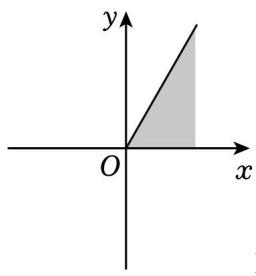
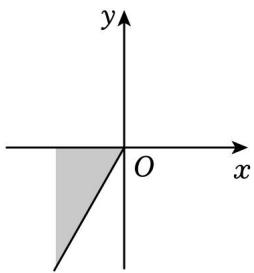
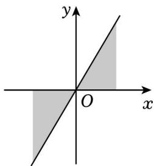
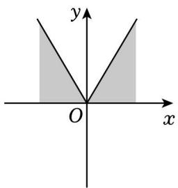
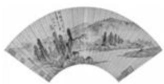
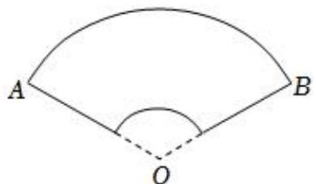
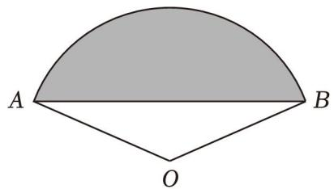

# 第一节 跟踪训练

# 考向 1 跟踪训练

【训练 1】在平面直角坐标系中，下列与角 $420^{\circ}$ 终边相同的角是（）

A. $20^{\circ}$

B. $60^{\circ}$

C. $120^{\circ}$

D. $150^{\circ}$

【训练 2】若 $\alpha$ 为第一象限角，则 $\frac{\alpha}{2}$ 为()

A. 第一象限角

B. 第二象限角

C. 第一象限角或第三象限角

D. 第二象限角或第四象限角

【训练 3】集合 $\{\alpha \mid k \cdot 180^{\circ} \leqslant \alpha \leqslant k \cdot 180^{\circ} + 60^{\circ}, k \in Z\}$ 中的角所表示的范围（阴影部分）是（）

text_image

y
O
x

B.

text_image

y
O
x

C.

text_image

y
O
x

D.

text_image

y
O
x

【训练 4】折扇是我国传统文化的延续，在我国已有四千年左右的历史，“扇”与“善”谐音，折扇也寓意“善良”“善行”。它常以字画的形式体现我国的传统文化，也是运筹帷幄、决胜千里、大智大勇的象征（如图1），图2为其结构简化图，设扇面A，B间的圆弧长为l，AB间的弦长为d，圆弧所对的圆心角为 $\theta(\theta$ 为弧度角)，则l、d和 $\theta$ 所满足的恒等关系为()

natural_image

Traditional Chinese ink painting on a fan-shaped scroll depicting a landscape with trees and hills (no text or symbols)

图1

text_image

A
B
O

图2

A. $\frac{2\sin\frac{\theta}{2}}{\theta} = \frac{d}{l}$

B. $\frac{\sin\frac{\theta}{2}}{\theta} = \frac{d}{l}$

C. $\frac{\cos\frac{\theta}{2}}{\theta} = \frac{d}{l}$

D. $\frac{2\cos\frac{\theta}{2}}{\theta} = \frac{d}{l}$

【训练 5】《九章算术》是中国古代的数学名著，其中《方田》一章涉及到了弧田面积的计算问题，如图所示，弧田是由弧 AB 和弦 AB 所围成的图中阴影部分，若弧田所在圆的半径为 2，圆心角为 $\frac{2\pi}{3}$ ，则此弧田的面积为（）

text_image

A
O
B

A. $\frac{4\pi}{3} -\sqrt{3}$

B. $\frac{4\pi}{3} - 2\sqrt{3}$

C. $\frac{8\pi}{3}-\sqrt{3}$

D. $\frac{8\pi}{3}-2\sqrt{3}$

# 考向 2 跟踪训练

【训练1】若角 $\alpha$ 的终边上有一点 $P(-2, m)$ ，且 $\sin \alpha = -\frac{\sqrt{5}}{5}$ ，则 $m = (\quad)$

A. 4

B. $\pm4$

C. -1

D. $\pm1$

【训练2】在平面直角坐标系 $xOy$ 中，角 $\alpha$ 以 $ox$ 为始边，它的终边经过点(4,3)，则 $\cos \alpha = (\quad)$

A. $-\frac{4}{5}$

B. $\frac{4}{5}$

C. $-\frac{3}{4}$

D. $\frac{3}{4}$

# 考向 3 跟踪训练

【训练 1】（2020•上海）“ $\alpha=\beta$ ”是“ $\sin^{2}\alpha+\cos^{2}\beta=1$ ”的（）

A. 充分非必要条件

B. 必要非充分条件

C. 充要条件

D. 既非充分又非必要条件

【训练 2】（2018•全国）已知 $\alpha$ 为第二象限的角，且 $\tan\alpha=-\frac{3}{4}$ ，则 $\sin\alpha+\cos\alpha=(\quad)$

A. $-\frac{7}{5}$

B. $-\frac{3}{4}$

C. $-\frac{1}{5}$

D. $\frac{1}{5}$

【训练 3】（多选）已知 $\theta \in (0, \pi)$ , $\sin \theta + \cos \theta = \frac{1}{5}$ ，则下列结论正确的是()

A. $\theta \in (\frac{\pi}{2},\pi)$

B. $\cos \theta = \frac{3}{5}$

C. $\tan\theta=-\frac{3}{4}$

D. $\sin \theta \cdot \cos \theta = -\frac{12}{25}$

【训练4】若 $\tan \theta = 2$ ，则 $\frac{(\sin\theta + \cos\theta)\cos 2\theta}{\sin\theta} = (\quad)$

A. $-\frac{2}{5}$

B. $-\frac{9}{10}$

C. $\frac{2}{5}$

D. $\frac{9}{10}$

【训练 5】已知 $\frac{\tan \alpha}{\tan \alpha - 1} = 2$ ，求下列各式的值.

(1) $\frac{2\sin\alpha - 3\cos\alpha}{4\sin\alpha - 9\cos\alpha}$ ;

(2) $4\sin^2\alpha - 3\sin \alpha \cos \alpha - 5\cos^2\alpha$

# 考向 4 跟踪训练

【训练1】已知 $\sin \theta = \frac{3}{5}$ ，则 $\frac{\sin(-\theta)\cos(\pi - \theta)}{\sin(\frac{\pi}{2} - \theta)} = (\quad)$

A. $-\frac{4}{5}$

B. $\frac{4}{5}$

C. $-\frac{3}{5}$

D. $\frac{3}{5}$

【训练2】已知函数 $f(x) = \frac{\cos(\pi - x)}{\sin^2 (\pi - x) - 1}$ ，若 $f\left(\frac{\pi}{2} + \alpha\right) = \frac{3}{2}$ ，则 $\sin \alpha = (\quad)$

A. $-\frac{2}{3}$

B. $\frac{2}{3}$

C. $-\frac{\sqrt{5}}{3}$

D. $\frac{\sqrt{5}}{3}$

【训练 3】 $\sin600^{\circ}+\tan240^{\circ}$ 的值为()

A. $\frac{1}{2} +\sqrt{3}$

B. $\frac{3\sqrt{3}}{2}$

C. $\frac{\sqrt{3}}{2}$

D. $-\frac{\sqrt{3}}{2}$

【训练4】若 $\sin (\alpha +\frac{\pi}{6}) = \frac{1}{3}$ ，则 $\cos (\alpha -\frac{\pi}{3}) = ()$

A. $-\frac{2\sqrt{2}}{3}$

B. $\frac{2\sqrt{2}}{3}$

C. $-\frac{1}{3}$

D. $\frac{1}{3}$

【训练 5】已知 $\sin(-68^{\circ})=m$ ，则 $\cos11^{\circ}=(\quad)$

A. $\sqrt{\frac{1+m}{2}}$

B. $\sqrt{\frac{1-m}{2}}$

C. $\frac{\sqrt{1+m}}{2}$

D. $\frac{\sqrt{1-m}}{2}$

