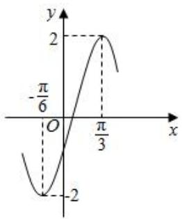
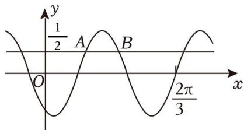
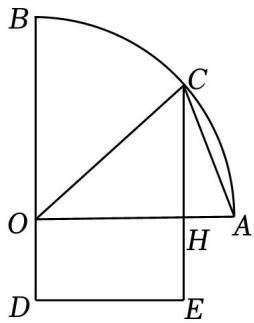
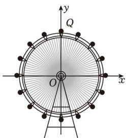

# 第三节 跟踪训练

# 考向 1 跟踪训练

【训练 1】(2019•新课标 II) 若 $x_{1}=\frac{\pi}{4}$ ， $x_{2}=\frac{3\pi}{4}$ 是函数 $f(x)=\sin\omega x(\omega>0)$ 两个相邻的极值点，则 $\omega=(\quad)$

A. 2

B. $\frac{3}{2}$

C. 1

D. $\frac{1}{2}$

【训练 2】(2017•天津) 设函数 $f(x)=2\sin(\omega x+\varphi)$ ， $x\in R$ ，其中 $\omega>0$ ， $|\varphi|<\pi$ 。若 $f(\frac{5\pi}{8})=2$ ， $f(\frac{11\pi}{8})=0$ ，且 $f(x)$ 的最小正周期大于 $2\pi$ ，则（）

A. $\omega = \frac{2}{3},\varphi = \frac{\pi}{12}$

B. $\omega = \frac{2}{3},\varphi = -\frac{11\pi}{12}$

C. $\omega = \frac{1}{3},\varphi = -\frac{11\pi}{24}$

D. $\omega = \frac{1}{3},\varphi = \frac{7\pi}{24}$

【训练 3】（2025·深圳一模）已知函数 $f(x)$ 的周期为 2，且在 $(0,1)$ 上单调递增，则 $f(x)$ 可以是（）

A. $f(x) = \sin \pi x$

B. $f(x) = |\sin \frac{\pi}{2} x|$

C. $f(x) = \cos 2\pi x$

D. $f(x) = \tan \pi x$

【训练4】已知 $f(x) = \sin (2x - \frac{\pi}{4})$ ，则 $f(x)$ 的最小正周期和一个单调增区间分别为（）

A. $\pi, \left[-\frac{\pi}{4}, \frac{\pi}{4}\right]$

B. $\pi, [-\frac{\pi}{8}, \frac{3\pi}{8}]$

C. $2\pi$ ， $\left[-\frac{\pi}{4}, \frac{3\pi}{4}\right]$

D. $2\pi$ ， $\left[-\frac{\pi}{4}, \frac{\pi}{4}\right]$

【训练 5】已知函数 $f(x)=2\cos(\frac{\pi}{3}-\frac{x}{2})$ .

（1）求 $f(x)$ 的单调递增区间；  
（2）若 $x \in [-\pi, \pi]$ 求 $f(x)$ 的最大值和最小值.

【训练 6】（2024•甲卷）函数 $f(x)=\sin x-\sqrt{3}\cos x$ 在 $[0,\pi]$ 上的最大值是 \_\_\_\_

【训练 7】（2016•新课标 II）函数 $y = A \sin(\omega x + \varphi)$ 的部分图象如图所示，则（）

line

| x | y |
|---|---|
| -π/6 | -2 |
| 0 | 0 |
| π/3 | 2 |
| π | -2 |

A. $y = 2\sin (2x - \frac{\pi}{6})$

B. $y = 2\sin (2x - \frac{\pi}{3})$

C. $y = 2 \sin(x + \frac{\pi}{6})$

D. $y = 2\sin \left(x + \frac{\pi}{3}\right)$

【训练8】已知函数 $f(x) = \sin (\omega x + \varphi)$ ，如图， $A, B$ 是直线 $y = \frac{1}{2}$ 与曲线 $y = f(x)$ 的两个交点，若 $|AB| = \frac{\pi}{6}$ ， $f(\frac{3\pi}{4}) =$ \_\_\_\_.

text_image

y
1/2 A B
O 2π/3 x

# 考向 2 跟踪训练

【训练 1】(2022·浙江)为了得到函数 $y = 2 \sin 3x$ 的图象, 只要把函数 $y = 2 \sin \left(3x + \frac{\pi}{5}\right)$ 图象上所有的点()

A. 向左平移 $\frac{\pi}{5}$ 个单位长度

B. 向右平移 $\frac{\pi}{5}$ 个单位长度

C. 向左平移 $\frac{\pi}{15}$ 个单位长度

D. 向右平移 $\frac{\pi}{15}$ 个单位长度

【训练 2】为了得到函数 $y = \sin(2x + \frac{\pi}{3})$ 的图象，只需要把函数 $y = \sin x$ 的图象上（）

A. 各点的横坐标缩短到原来的 $\frac{1}{2}$ , 再向左平移 $\frac{\pi}{3}$ 个单位长度

B. 各点的横坐标缩短到原来的 $\frac{1}{2}$ , 再向左平移 $\frac{\pi}{6}$ 个单位长度

C. 各点的横坐标伸长到原来的 2 倍, 再向左平移 $\frac{\pi}{3}$ 个单位长度

D. 各点的横坐标伸长到原来的 2 倍, 再向左平移 $\frac{\pi}{6}$ 个单位长度

【训练 3】为了得到函数 $y = \sin(2x + \frac{\pi}{3})$ 的图象，只需要把函数 $y = \cos x$ 上所有的点（）

A. 向右平移 $\frac{\pi}{6}$ 个单位，横坐标变为原来的 $\frac{1}{2}$ 倍  
B. 向左平移 $\frac{\pi}{6}$ 个单位, 横坐标变为原来的 2 倍  
C. 横坐标变为原来的 $\frac{1}{2}$ 倍, 向左平移 $\frac{\pi}{12}$ 个单位  
D. 横坐标变为原来的 2 倍, 向左平移 $\frac{\pi}{6}$ 个单位

【训练4】将函数 $f(x) = \cos (\omega x + \frac{\pi}{4})(\omega > 0)$ 的图象向左平移 $\frac{\pi}{3}$ 个单位长度后得到函数 $y = \sin \omega x$ 的图象，则正实数 $\omega$ 的最小值为（）

A. $\frac{21}{4}$

B. $\frac{15}{4}$

C. $\frac{9}{4}$

D. 2

# 考向 3 跟踪训练

【训练 1】将函数 $f(x)=\sin(\omega x+\frac{\pi}{6})(\omega>0)$ 图象向左平移 $\frac{\pi}{2\omega}$ 后，得到 $g(x)$ 的图象，若函数 $g(x)$ 在 $[0,\frac{\pi}{2}]$ 上单调递减，则 $\omega$ 的取值范围为（）

A. $(0, 3]$

B. $(0, 2]$

C. $(0,\frac{4}{3}]$

D. $(0,\frac{5}{3}]$

【训练 2】（2019•新课标III）设函数 $f(x)=\sin(\omega x+\frac{\pi}{5})(\omega>0)$ ，已知 $f(x)$ 在 $[0,2\pi]$ 有且仅有 5 个零点．下述四个结论：

① $f(x)$ 在 $(0,2\pi)$ 有且仅有 3 个极大值点；  
② $f(x)$ 在 $(0,2\pi)$ 有且仅有 2 个极小值点；  
③ $f(x)$ 在 $(0, \frac{\pi}{10})$ 单调递增；  
④ $\omega$ 的取值范围是 $\left[\frac{12}{5}, \frac{29}{10}\right)$ .

其中所有正确结论的编号是( )

A. ①④

B. ②③

C. ①②③

D. ①③④

【训练 3】已知函数 $f(x)=2\cos(\omega x+\frac{\pi}{6})(\omega>0)$ ，若 $f(x)$ 在区间 $[0, \pi)$ 内有且仅有 3 个零点和 3 条对称轴，则 $\omega$ 的取值范围是（）

A. $\left(\frac{17}{6},\frac{10}{3}\right]$

B. $\left(\frac{17}{6},\frac{23}{6}\right]$

C. $\left[\frac{17}{6},\frac{10}{3}\right]$

D. $\left(\frac{7}{3},\frac{10}{3}\right]$

【训练 4】已知函数 $f(x)=\sin(\omega x-\frac{\pi}{6})(\omega>0)$ 在 $(\frac{\pi}{2},\pi)$ 上单调递减，则 $\omega$ 的取值范围是（）

A. $(0,\frac{4}{3}]$

B. $\left[\frac{4}{3},\frac{5}{3}\right]$

C. $(0,\frac{1}{2}]$

D. $[\frac{5}{3},1]$

【训练 5】已知函数 $f(x)=\sin(\omega x+\frac{\pi}{3})(\omega>0)$ 在 $(\frac{\pi}{3},\pi)$ 上恰有 1 个零点，则 $\omega$ 的取值范围是（）

A. $(0,\frac{2}{3})\bigcup[\frac{5}{3},\frac{8}{3}]$

B. $\left(\frac{2}{3},\frac{5}{3}\right]\bigcup\left[2,\frac{8}{3}\right]$

C. $\left[\frac{5}{3},2\right)\bigcup \left[\frac{8}{3},\frac{11}{3}\right]$

D. $(0,2]\bigcup[\frac{8}{3},\frac{11}{3}]$

【训练 6】已知函数 $f(x)=\sin\omega x+\sqrt{3}\cos\omega x(\omega>0)$ 在 $(0,\frac{\pi}{3})$ 上存在零点，且在 $(\frac{\pi}{2},\frac{3\pi}{4})$ 上单调，则 $\omega$ 的取值范围为（）

A. (2, 4]

B. $[2, \frac{7}{2}]$

C. $\left[\frac{7}{3},\frac{26}{9}\right]$

D. $[\frac{7}{3}, 4]$

考向 4 跟踪训练

【训练 1】如图，已知 OAB 是半径为 2 千米的扇形， $OA \perp OB$ ，C 是弧 AB 上的动点，过点 C 作 $CH \perp OA$ ，垂足为 H，某地区欲建一个风景区，该风景区由 $\Delta AOC$ 和矩形 ODEH 组成，且 OH = 2OD，若风景区的修建费为 100 万元/平方千米，则该风景区的修建最多需要（）

text_image

Geometric diagram with labeled points and lines, including a semicircle and triangles

A. 260 万元

B. 265 万元

C. 255 万元

D. 250 万元

【训练 2】如图，一圆形摩天轮的直径为 100 米，圆心 O 到水平地面的距离为 60 米，最上端的点记为 Q．现在摩天轮开始逆时针方向匀速转动，30 分钟转一圈，以摩天轮的中心为原点建立平面直角坐标系，摩天轮从开始转动一圈，点 Q 距离水平地面的高度不超过 85 米的时间为（）

text_image

y
Q
O
x

A. 20 分钟

B. 22 分钟

C. 24 分钟

D. 26 分钟

