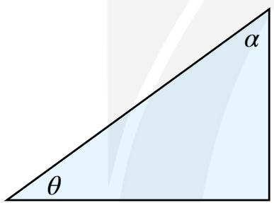
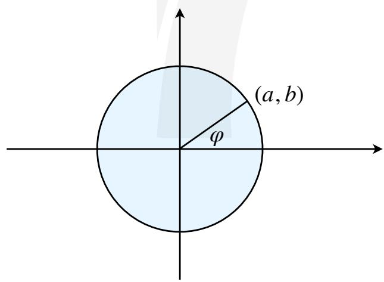

# 第一讲 三角函数基本概念与公式

主讲人：Titus

# 一、诱导公式计算方式优化

# I. 奇偶性与 $\pi$ 性

<table><tr><td></td><td>奇偶性</td><td>π性</td></tr><tr><td>sin x</td><td>奇</td><td>π ⇔ -</td></tr><tr><td>cos x</td><td>偶</td><td>π ⇔ -</td></tr><tr><td>tan x</td><td>奇</td><td>/</td></tr></table>

# II. 互余性

text_image

α
θ

$$
\sin \theta = \cos \alpha
$$

$$
\sin \theta = \cos (\frac {\pi}{2} - \theta)
$$

【例1】 $\cos 240^{\circ} = \_\_\_\_\_.$

【例2】 $\tan(-1410^{\circ})=$ \_\_\_\_.

【例3】 $\sin(-\frac{19\pi}{6})=$ \_\_\_\_.

【例4】 $\sin\frac{3}{4}\pi\cdot\cos\frac{5}{6}\pi\cdot\tan(-\frac{3}{4}\pi)=$ \_\_\_\_.

【例5】设 $\tan(\pi+\alpha)=2$ ，则 $\frac{\sin(\alpha+\pi)+\cos(\pi-\alpha)}{\sin(\alpha+\pi)-\cos(\pi+\alpha)}=$ \_\_\_\_.

【例6】若 $\cos(\pi+\alpha)=\frac{1}{2}$ ， $\pi<\alpha<\frac{3}{2}\pi$ ，则 $\sin(5\pi-\alpha)=$ \_\_\_\_.

【例7】化简： $\frac{\sin(2\pi-\alpha)\cos(\pi+\alpha)\cos(\frac{\pi}{2}+\alpha)\cos(\frac{11}{2}\pi-\alpha)}{\cos(\pi-\alpha)\sin(3\pi-\alpha)\sin(-\pi-\alpha)\sin(\frac{9}{2}\pi+\alpha)}.$

【例8】已知 $\sin(\alpha+\frac{\pi}{2})=\frac{\sqrt{5}}{5}$ ， $\alpha\in(0,\pi)$ ，求 $\frac{\sin(\alpha-\frac{\pi}{2})-\cos(\frac{3}{2}\pi+\alpha)}{\sin(\pi-\alpha)+\cos(3\pi+\alpha)}$ .

# 二、辅助角公式——单位圆建模确定 $\varphi$

$$
f (x) = a \sin x + b \cos x = \sqrt {a ^ {2} + b ^ {2}} \sin (x + \varphi)
$$

text_image

(a, b)
φ

【例1】已知函数 $f(x)=\sqrt{3}\sin x-\cos x$ ，若 $f(x)\geq1$ ，则x的取值范围为\_\_\_\_.

【例2】已知 $\sin(\alpha+\frac{\pi}{6})+\cos\alpha=\frac{4}{5}\sqrt{3}$ ，则 $\sin(\alpha+\frac{\pi}{3})=$ \_\_\_\_.

【例3】已知函数 $f(x)=a\sin x+b\cos x$ 的图象的一条对称轴是 $x=\frac{\pi}{4}$ ，则 $\frac{b}{a}=$ \_\_\_\_.

【例5】已知函数 $f(x)=\sqrt{3}\cos(2x-\frac{\pi}{3})-2\sin x\cos x;$

(1) 求函数 $f(x)$ 的最小正周期  
(2) 证明：当 $x \in [-\frac{\pi}{4}, \frac{\pi}{4}]$ 时， $f(x) \geq -\frac{1}{2}$ .

