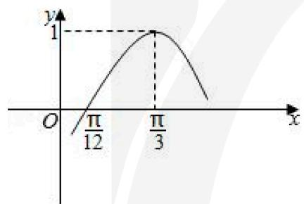
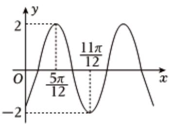
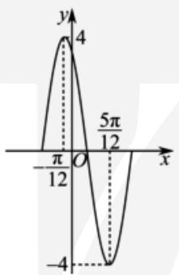
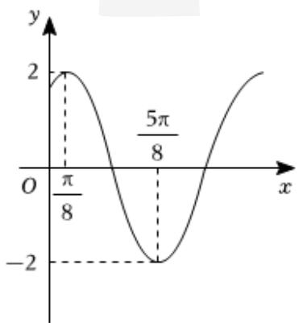
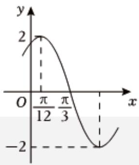

# 第三讲 $A\sin (\omega x + \varphi) + B$ 图像性质

主讲人：Titus

# 一、图象变换

I. 平移变换

II. 伸缩变换

【例1】要得到函数 $y = \sin (2x + \frac{\pi}{4})$ ，只需将函数 $y = \sin 2x$ 的图象（）

A. 向左平移 $\frac{\pi}{8}$ 个单位长度

B. 向右平移 $\frac{\pi}{8}$ 个单位长度

C. 向左平移 $\frac{\pi}{4}$ 个单位长度

D. 向右平移 $\frac{\pi}{4}$ 个单位长度

【例2】先将函数 $y = \sin (2x + \frac{\pi}{5})$ 的图象上所有点的横坐标伸长到原来的2倍（纵坐标不变），再向右平移 $\frac{2\pi}{5}$ 个单位长度，最后向上平移1个单位长度，得到的新函数图象的一个对称中心可以是\_\_\_\_.

【例3】（2023·甲卷）已知 $f(x)$ 为函数 $y=\cos(2x+\frac{\pi}{6})$ 向左平移 $\frac{\pi}{6}$ 个单位所得函数，则 $y=f(x)$ 与 $y=\frac{1}{2}x-\frac{1}{2}$ 的交点个数为\_\_\_\_.

【例4】（2023·新高考II）已知函数 $f(x)=\sin(\omega x+\varphi)$ ，如图，A、B是直线 $y=\frac{1}{2}$ 与曲线 $y=f(x)$ 的两个交点，若 $|AB|=\frac{\pi}{6}$ ，则 $f(\pi)=$ \_\_\_\_。

【例5】函数 $f(x)=A\sin(\omega x+\varphi)$ ( $\omega>0,|\varphi|<\frac{\pi}{2}$ ) 的部分图像如图所示，则 $f(\frac{\pi}{2})=$ \_\_\_\_.

line

| x | y |
|---|---|
| 0 | π/12 |
| π/3 | 1 |
| ∞ | 0 |

【例6】函数 $f(x)=\tan\omega x(\omega>0)$ ，将函数 $f(x)$ 的图象向右平移 $\frac{\pi}{3}$ 个单位长度后，所得的图象与原函数图象重合，则 $\omega$ 的最小值=\_\_\_\_.

# 二、基本图象性质问题（周期性、单调性、对称性、奇偶性）

<table><tr><td rowspan="2"></td><td colspan="2">单调区间</td><td rowspan="2">周期</td><td rowspan="2">对称轴</td><td rowspan="2">对称中心</td></tr><tr><td>递增区间</td><td>递减区间</td></tr><tr><td>sin x</td><td></td><td></td><td></td><td></td><td></td></tr><tr><td>cos x</td><td></td><td></td><td></td><td></td><td></td></tr><tr><td>tan x</td><td></td><td></td><td></td><td></td><td></td></tr><tr><td>sin(ωx + φ)</td><td></td><td></td><td></td><td></td><td></td></tr></table>

【例1】 $f(x)=\sin2x+\sqrt{3}\cos2x$ 图象的一条对称轴是

A. $x = \frac{\pi}{12}$

B. $x = \frac{\pi}{4}$

C. $x = \frac{\pi}{3}$

D. $x = \frac{\pi}{2}$

【例2】 $f(x)=\cos(x+\frac{2\pi}{5})+2\sin\frac{\pi}{5}\sin(x+\frac{\pi}{5})$ 的一条对称轴为

A. $x = \frac{\pi}{5}$

B. $x = \frac{2\pi}{5}$

C. $x = \pi$

D. $x = \frac{\pi}{2}$

【例3】（2023·天津卷）已知函数 $f(x)$ 的一条对称轴为直线x=2，一个周期为4，则 $f(x)$ 的解析式可能为

A. $\sin \frac{\pi}{2} x$

B. $\cos \frac{\pi}{2} x$

C. $\sin \frac{\pi}{4} x$

D. $\cos\frac{\pi}{4}x$

【例4】（2023·乙卷）已知函数 $f(x)=\sin(\omega x+\varphi)$ 在区间单调递增，直线 $x=\frac{\pi}{6}$ 和 $x=\frac{2}{3}\pi$ 为函数 $y=f(x)$ 的图像的两条对称轴，则 $f(-\frac{5\pi}{12})=$ \_\_\_\_.

【例5】（2022•新高考I）记函数 $f(x)=\sin(\omega x+\frac{\pi}{4})+b(\omega>0)$ 的最小正周期为T．若 $\frac{2\pi}{3}<T<\pi$ ，且 $y=f(x)$ 的图像关于点 $(\frac{3\pi}{2},2)$ 中心对称，则 $f(\frac{\pi}{2})=f(-\frac{5\pi}{12})=$ \_\_\_\_.

【例6】已知 $f(x)=2\sin(\omega x+\varphi)$ ( $\omega>0,0<\varphi<\frac{\pi}{2}$ )， $f(x_{1})=2$ ， $f(x_{2})=0$ ，若 $|x_{1}-x_{2}|$ 的最小值为 $\frac{1}{2}$ ，且 $f(\frac{1}{2})=1$ ，则 $f(x)$ 的单调递减区间为\_\_\_\_.

# 三、求 $y = A \sin (\omega x + \varphi) + B$ 解析式问题

【例1】函数 $f(x)=A\sin(\omega x+\varphi)$ ( $A>0,\omega>0,|\varphi|<\frac{\pi}{2}$ ) 的部分图象如图所示，则 $\omega,\varphi$ 的值分别是\_\_\_\_.

line

| x | y |
|---|---|
| 0 | -2 |
| 5π/12 | 2 |
| 11π/12 | -2 |
| >11π/12 | 2 |

【例2】已知函数 $f(x)=A\sin(\omega x+\varphi)$ ( $A>0,\omega>0,|\varphi|<\pi$ ) 的部分图象如图所示，则该函数的解析式为\_\_\_\_.

line

| x | y |
|---|---|
| -π/12 | 0 |
| 4 | 4 |
| -4 | -4 |
| 5π/12 | 0 |

【例3】函数 $y = 2 \sin(\omega x + \varphi)$ ( $A > 0, \omega > 0, |\varphi| < \frac{\pi}{2}$ ) 在一个周期内的图象如图所示，则此函数的解析式是（）

A. $y = \sin (2x - \frac{\pi}{4})$

B. $y = 2\sin (2x + \frac{\pi}{4})$

C. $y = 2 \sin(x + \frac{3\pi}{8})$

D. $2 \sin \left( \frac{x}{2} + \frac{7\pi}{6} \right)$

【例4】（2023春•舟山期末）已知函数 $f(x)=2\cos(\omega x+\varphi)$ 的部分图象如图所示， $\omega>0$ ， $|\varphi|<\pi$ ，则满足 $(f(x)-f(-\frac{17}{4}\pi))(f(x)-f(\frac{4\pi}{3}))<0$ 的整数x取值可能为（）

A. 3

B. 2

C. 1

D. 0

【例5】（2023春•东湖区校级月考） $f(x)=A\sin(\omega x+\varphi)$ ( $A>0,\omega>0,|\varphi|<\frac{\pi}{2}$ ) 的部分图象如图所示，给出下列结论：

line

| x | y |
|---|---|
| 0 | 2 |
| π/12 | 2 |
| π/3 | -2 |
| >π/3 | -2 |

① $f(x)$ 的图象关于直线 $x=\frac{7\pi}{12}$ 对称；  
② $f(0)=\sqrt{3}$ ;   
③该图象可由 $y = 2 \sin 2x$ 的图象向左平移 $\frac{\pi}{6}$ 个单位得到；  
④ $f(x)$ 在 $[- \frac{15}{12} \pi, \frac{\pi}{3}]$ 上单调递减.

其中所有正确结论的序号是（）

A. ①②

B. ①②③

C. ②④

D. ①③④

# 四、绝对值变换

<table><tr><td> $|\sin x|$ </td><td> $|\cos x|$ </td><td> $\sin |x|$ </td><td> $\cos |x|$ </td></tr><tr><td></td><td></td><td></td><td></td></tr></table>

【例1】函数 $f(x)=|\sin x|+|\cos x|$ ，则下列说法正确的是

A. $f(x)$ 的最小值为0

B. $f(x)$ 的最大值为2

C. $f(\frac{\pi}{2}-x)=f(x)$

D. $f(x) = \frac{1}{2}$ 在 $[0, \frac{\pi}{2}]$ 上有解

【例2】函数 $f(x)=\sin|x|-\left|\sin x\right|$ 的值域是\_\_\_\_.

【例3】函数 $f(x)=|\sin x+\cos x|+|\sin x-\cos x|$ 的最小正周期为\_\_\_\_.

【例4】已知函数 $f(x)=\sqrt{|\sin x|}+\sqrt{|\cos x|}$ ，则

A. $f(x)$ 是周期函数

B. $f(x)$ 的图象必有对称轴

C. $f(x)$ 的增区间为 $[k\pi, k\pi + \frac{\pi}{2}]$ , $k \in Z$

D. $f(x)$ 的值域为 $[1, \sqrt[4]{8}]$

