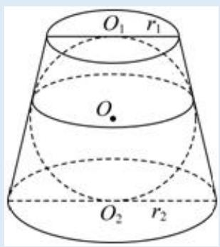
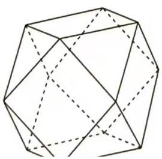
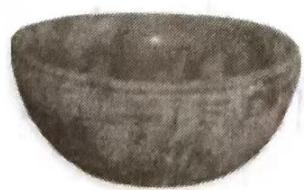
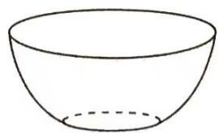

# 1.1 表面积与体积的求法

序言：经过初中数学的初步了解，我们掌握了面积与体积的求法，那么在高中数学我们将会接触更多以及更复杂的立体几何问题。同时为了更好的帮助同学们理解和最快的做出考试时疑难杂症的问题，我不由得想分享一下自己的心得，那么，接下来，我们就从立体几何的最简单表面积与体积开始吧！

正方体与长方体: $V = S \times h$ (S 指代底面积, h 指代高度或者垂直高度)

棱柱: $V = S \times h$ 与上述同理

棱锥或圆锥： $V=\frac{1}{3}\times h\times S$

注: 在实际的考察中, 实际是圆锥较为突出, 比如 2023 年新高考二卷的第 9 题, 就考察圆锥的性质。那么在圆锥中我们有常考的性质, 譬如圆锥的侧面积 $S = \Pi R L$ , 圆锥的体积 $V = \frac{1}{3} \times h \times S$ , 以及圆锥内最大内接三角形问题

棱台或圆台： $V=\frac{1}{3}\times h\times(S_{1}+S_{2}+\sqrt{S_{1}S_{2}})$

注：某些题目中图形可能类似棱台实际并不是棱台，此时就需要对图形切割后进行体积求解，同时，棱台和圆台的体积公式务必要记忆清楚，以免后续产生误会，导致计算结果发生偏差。

现行考试仍然很喜欢考察圆台侧面积公式, 那么此公式以多选题和填空题偏多出现, 考试推导不易, 故在此给出相应公式方便记忆: $S_{\text {侧}} = \pi L(R_1 + R_2)$

平行六面体及一些不规则几何体：处理这类问题时我们通常需要将几何体进行切割或补充，形成一个优良结构便于简化计算过程，那么在后续的例题中我们会讲到这一问题。

【例 1】某圆台上底面和下底面的面积分别为 4, 9, 高为 3, 则该圆台的体积为 ( )

【例 2】已知球 O 内切于圆台（即球与该圆台的上、下底面以及侧面均相切），且圆台的上、下底面半径 $r_{1}: r_{2}=2:3$ ，则圆台的体积与球的体积之比为（）

text_image

O₁ r₁
O
O₂ r₂

# 【例 3】

1. “阿基米德多面体”是由边数不全相同的正多边形为面围成的多面体, 它体现了数学的对称美. 如图, 将正方体沿交于一顶点的三条棱的中点截去一个三棱锥, 共可截去八个三棱锥得到八个面为正三角形, 六个面为正方形的“阿基米德多面体”. 若该多面体的棱长为 $\sqrt{2}$ , 则其体积为 ( )

natural_image

Geometric polyhedron diagram with solid and dashed lines indicating visible and hidden edges (no text or labels)

【例 4】已知一个圆台的母线长度为 5，且它的内切球的表面积为 $16 \pi$ ，则该圆台的体积为（）。

# 【例 5】

3.[新情境·河北邯郸大名一中2023月考]一个球体被两个平行平面所截,夹在两平行平面间的部分叫做“球台”,两平行平面间的距离叫做球台的高.如图①,西晋越窑的某个“卧足杯”的外形可近似看作球台,其直观图如图②,已知杯底的直径为 $2\sqrt{5}\mathrm{cm}$ ,杯口的直径为 $4\sqrt{5}\mathrm{cm}$ ,杯的深度为 $\sqrt{5}\mathrm{cm}$ ,则该卧足杯侧面所在球面的半径为()

natural_image

Close-up of a weathered stone bowl with no visible text or markings

图①

natural_image

Simple line drawing of a bowl with a dashed bottom line (no text or symbols)

图②

A. $5 \mathrm{~cm}$

B. $2\sqrt{6}\mathrm{\;{cm}}$

C. $\frac{25}{4} \mathrm{~cm}$

D. $\frac{13}{2} \mathrm{~cm}$

# 【例 6】

8.[江苏南京一中2022阶段性检测]在三棱锥P-ABC中, $PA\perp$ 平面ABC, $AB\perp AC$ ,AB=AC=1,1<PA<2,记三棱锥P-ABC的体积为V,表面积为S,则 $\frac{V}{S}$ 的取值范围为\_\_\_\_.

【例 7】假设有一圆锥，母线长度为 L，底面圆半径为 R，那么过顶点 S 作截面的面积最大值的讨论。

