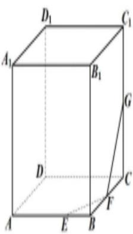

# 1.2 立体几何的截面问题

序言：在前一节我们了解了立体几何中体积与面积的问题，当然除了面积与体积这种表征的问题以外，无可避免的是我们会遇到一些隐晦的题目，比如已知三点求截面，然后对截面进行设问和考察，很多同学空间几何想象能力不足，一直无法理解怎么去构造或者说是补充截面图形，那么在今天这一节，我们会讲一讲如何正确的进行空间图形的构造。

首先了解截面形成的逻辑关系：平行

接下来，让我们看看几个例题简单了解一下怎么作图

# 【例

1

)

12. (2022·浙江台州·高一期中) 在正方体 $ABCD - A_{1}B_{1}C_{1}D_{1}$ 中, $E$ 为棱 $AB$ 的一个三等分点 (靠近 $B$ 点), $F$

,G 分别为棱 BC, $CC_{1}$ 的中点, 过 E, F, G 三点作正方体 $ABCD - A_{1}B_{1}C_{1}D_{1}$ 的截面, 则下列说法正确的是()

text_image

D₁
C₁
A₁
B₁
G
D
C
F
A
E
B

A. 所得截面是六边形  
B. 截面过棱 $D_{1} C_{1}$ 的中点  
C. 截面不经过点 $A_{1}$

D. 截面与线段 $B_{1} D_{1}$ 相交, 且交点是线段 $B_{1} D_{1}$ 的一个五等分点

# 【例 2】

7. (2022·全国·高一单元测试) 在长方体 $ABCD - A_{1}B_{1}C_{1}D_{1}$ 中, $AB = 4, BC = 3$ , $M, N$ 分别为棱 $AB, BB_{1}$ 的中点, 点 $P$ 在对角线 $A_{1}C_{1}$ 上, 且 $A_{1}P = 3$ , 过点 $M, N, P$ 作一个截面, 该截面的形状为 ( )

A. 三角形

B. 四边形

C. 五边形

D. 六边形

# 【例 3】

11. (2022·全国·高三专题练习(文))已知长方体 $ABCD - A_{1}B_{1}C_{1}D_{1}$ 中 $AB = AA_{1} = 4, BC = 3, M$ 为 $AA_{1}$ 的中点， $N$ 为 $C_{1}D_{1}$ 的中点，过 $B_{1}$ 的平面 $\alpha$ 与 $DM, A_{1}N$ 都平行，则平面 $\alpha$ 截长方体所得截面的面积为（）

A. $3 \sqrt{2 2}$

B. $3\sqrt{11}$

C. $4\sqrt{22}$

D. $5\sqrt{11}$

# 【例 4】

3.(2022·全国·高三专题练习(文))正三棱柱 $ABC-A_{1}B_{1}C_{1}$ 中, 所有棱长均为 2, 点 E, F 分别为棱 $BB_{1}$ , $A_{1}C_{1}$ 的中点, 若过点 A, E, F 作一截面, 则截面的周长为()

A. $2 + 2 \sqrt{5}$

B. $2\sqrt{5}+\frac{2}{3}\sqrt{13}$

C. $2 \sqrt{5} + \sqrt{13}$

D. $2 \sqrt{5} + \frac{\sqrt{13}}{2}$

