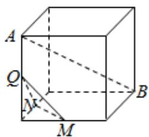
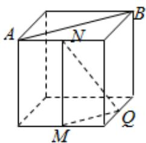
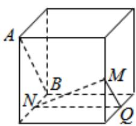
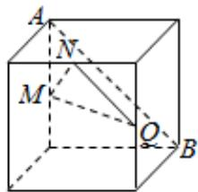
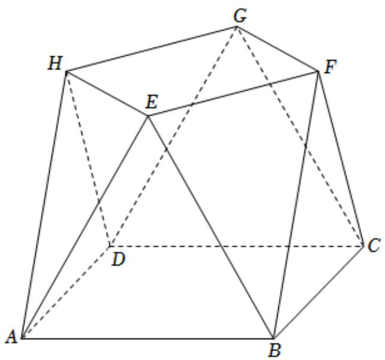
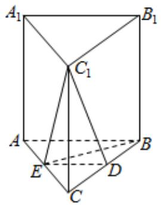

# 3.1 线面平行与垂直的判断

序言：在前面一节我们简单的讲解了空间中点线面的关系以及一些常考题目的分析，那么在这一节，我们将会利用上一节的知识讲解一下如何去分析理解线面平行以及垂直。那么在近六年的四十份高考试卷中，选填中出现八次，概率接近 $12\%$ ，在大题中基本第一问都会使用，所以我们务必掌握。基本定义：

①直线平行于平面内任意一条直线，则线面平行。  
②直线同时垂直平面上的两条相交的直线，则线面垂直。

# 线面平行的性质:

①一条直线和一个平面平行, 则经过这条直线的平面与此平面的交线与该直线平行。

# 面面平行的性质：

①两个平面平行, 则其中一个平面内的直线必平行于另一个平面。  
②如果两个平行平面同时和第三个平面相交,那么它们的交线平行。

# 线面垂直的性质:

①如果一条直线和一个平面垂直,那么这个直线和这个平面内的任意一条直线都垂直。  
②垂直于同一平面的两条直线平行。

# 面面垂直的性质:

①如果两个平面垂直，那么它们所成的二面角是直角。  
②两个平面垂直, 则一个平面内垂直于交线的直线垂直于另一个平面。

那么线面方面的相关性质在课本中就是这样呈现的，可能有的同学还是不能掌握如何在实际做题中应用，那么接下来，我们讲解几个题目，方便大家进一步领会这一节的知识。

# 立体几何

# 一．选择题（共3小题）

1. 设 $\alpha, \beta$ 为两个平面，则 $\alpha // \beta$ 的充要条件是（）

A. $\alpha$ 内有无数条直线与 $\beta$ 平行  
B. $\alpha$ 内有两条相交直线与 $\beta$ 平行  
C. $\alpha, \beta$ 平行于同一条直线  
D. $\alpha, \beta$ 垂直于同一平面

2. 如图, 在下列四个正方体中, $A, B$ 为正方体的两个顶点, $M, N, Q$ 为所在棱的中点, 则在这四个正方体中, 直线 $AB$ 与平面 $MNQ$ 不平行的是 ( )

A.

text_image

A
Q
M
M
B

B.

text_image

A
N
B
M
Q

C.

text_image

A
B
M
N
Q

D.

text_image

A
N
M
O
B

3. 已知平面 $\alpha$ ，直线 $m, n$ 满足 $m \notin \alpha, n \subset \alpha$ ，则“ $m // n$ ”是“ $m // \alpha$ ”的（）

A. 充分不必要条件

B. 必要不充分条件

C. 充分必要条件

D. 既不充分也不必要条件

# 二．解答题（共2小题）

4. 小明同学参加综合实践活动，设计了一个封闭的包装盒．包装盒如图所示：底面 ABCD 是边长为 8（单位：cm）的正方形， $\triangle EAB$ ， $\triangle FBC$ ， $\triangle GCD$ ， $\triangle HDA$ 均为正三角形，且它们所在的平面都与平面 ABCD 垂直.

（1）证明：EF//平面ABCD；  
(2) 求该包装盒的容积（不计包装盒材料的厚度）.

text_image

Geometric diagram of a polyhedron with labeled vertices A, B, C, D, E, F, G and solid/dashed edges indicating visible and hidden edges.

5. 如图，在直三棱柱 $ABC - A_{1}B_{1}C_{1}$ 中， $D$ ， $E$ 分别为 $BC$ ， $AC$ 的中点， $AB = BC$ 。求证：

(1) $A_{1}B_{1}$ // 平面 $DEC_{1}$ ;  
(2) $BE \perp C_{1}E$ .

text_image

A₁
B₁
C₁
A
E
D
C
B

