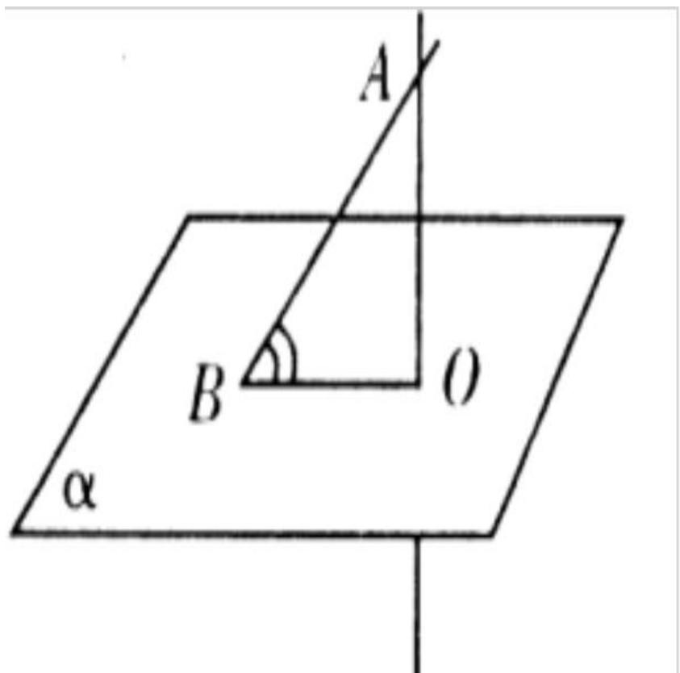
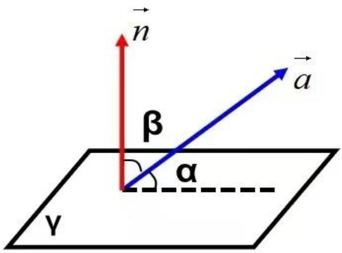
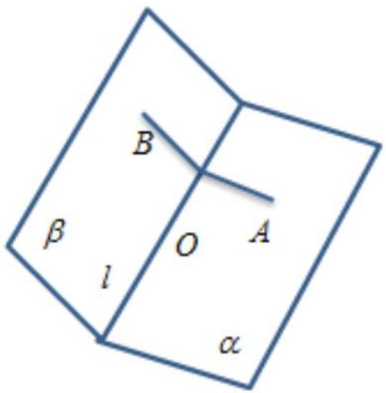
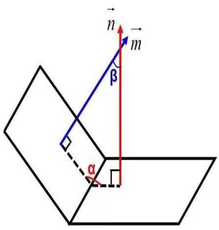
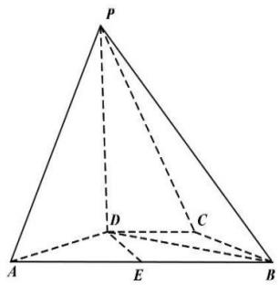
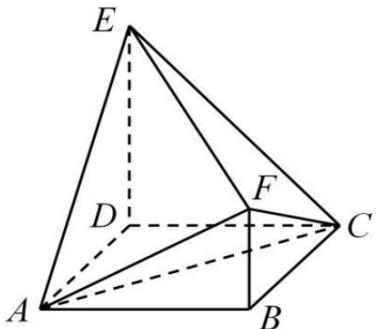
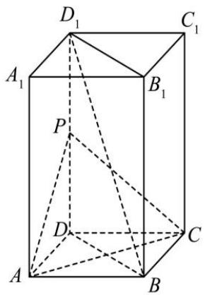
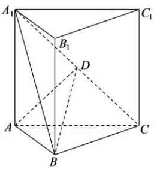
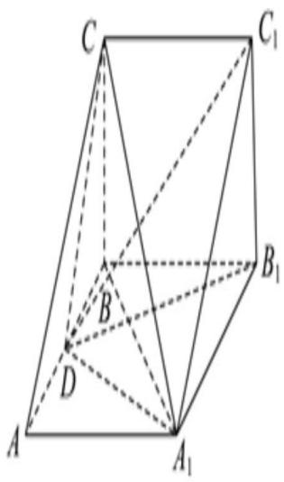

# 4.1 二面角与线面角的求法

序言：在前面一节我们讲了线面平行和垂直的知识，以及一些相关考题，当然这些都只能作为辅助工具，但是这一节的知识才是目前高考的主流，那么通过这一节的学习，我们主要是需要去掌握立体几何中角度的关系。

线面角：过不平行于平面的直线上一点作平面的垂线，这条直线与平面的交点与原直线与平面的交点的连线与原直线构成的(这条线与原直线的夹角的余角线面)即为夹角。

text_image

A
B
O
α

注意线面角的夹角为 $[0, 90^{\circ}]$ 或 $[0, \pi / 2]$ ，在填空题作答时尤为注意，线面角并不存在所谓钝角的问题。

当然，了解了相关的定义之后，我们就得了解怎么求

先了解一个量定义为法向量: 如果一个非零向量 n 与平面 a垂直，则称向量 n 为平面 a 的法向量。

那么如何求法向量呢？可见下文：

平面法向量的具体步骤: (待定系数法)

1、建立恰当的直角坐标系  
2、设平面法向量 $n=(x,y,z)$   
3、在平面内找出两个不共线的向量，记为 $a = (a1, a2, a3)$

$$
b = (b 1, b 2, b 3)
$$

4、根据法向量的定义建立方程组①n·a=0 ②n·b=0   
5、解方程组，取其中一组解即可。

现在我们再来回顾一下刚刚的问题，如何去求线面角呢？

text_image

n
β
α
γ
a

$\vec{a}$ 和平面 $\gamma$ 的夹角的正弦值：

$$
\sin \alpha = | \cos \langle \overrightarrow {a}, \overrightarrow {n} \rangle | = \left| \frac {\overrightarrow {a} \cdot \overrightarrow {n}}{| \overrightarrow {a} | \times | \overrightarrow {n} |} \right|
$$

那么根据上述公式我们可以先求出法向量，然后再写出直线的方向向量 a，结合上述公式就可以很好的求出线面角，当然，在这里需要注意一个细节问题，我们根据这种算法求出的是线面角的正弦值，如果题目问的是某某直线与平面所成角的余弦值，我们则要把刚刚公式的计算结果转化一下，以免答案不正确。

除此之外，我们还需要学习一下二面角的相关求解方法。

二面角: 平面内的一条直线把平面分为两部分, 其中的每一部分都叫做半平面, 从一条直线出发的两个半平面所组成的图形, 叫做二面角 (这条直线叫做二面角的棱, 每个半平面叫做二面角的面).

text_image

B
β
l
O
A
α

注意二面角的范围是【0，180°】，所以在回答二面角余弦值时要注意观察所求二面角到底是锐角还是钝角。

那么，我们如何去求二面角呢？在课本中给出了一个非常好的公式：

text_image

n
m
β
α

①计算得到两个相交平面的法向量 $\vec{m}$ 和 $\vec{n}$ 需要注意的是两个法向量需要指向同一边（二面角内部或二面角外部）如果两个法向量分别指向一边，则将取任一个法向量的反向量即可

②求取法向量夹角β的余弦值:

$$
\cos <   \stackrel {\rightarrow} {m}, \stackrel {\rightarrow} {n} > = \frac {\stackrel {\rightarrow} {m} \cdot \stackrel {\rightarrow} {n}}{\left| \stackrel {\rightarrow} {m} \right| \cdot \left| \stackrel {\rightarrow} {n} \right|}
$$

③如果求二面角α的正弦值，则不需要进行法向量方向判断，直接求取cosβ的绝对值即可进行计算：

那么根据上述公式，我们可以求出二面角的值，那么相关需要注意的问题我们会在课中一一讲到。

例 1. 已知正方体 $ABCD-A_{1}B_{1}C_{1}D_{1}$ ，则（）

A. 直线 $B{C}_{1}$ 与 $D{A}_{1}$ 所成的角为 ${90}^{ \circ  }$

B. 直线 $BC_{1}$ 与 $CA_{1}$ 所成的角为 $90^{\circ}$

C. 直线 $BC_{1}$ 与平面 $BB_{1}D_{1}D$ 所成的角为 $45^{\circ}$

D. 直线 $BC_{1}$ 与平面 $ABCD$ 所成的角为 $45^{\circ}$

例 2.(2022 年高考全国甲卷数学(理))在长方体 $ABCD - A_{1}B_{1}C_{1}D_{1}$ 中，已知 $B_{1}D$ 与平面 ABCD 和平面 $AA_{1}B_{1}B$ 所成的角均为 $30^{\circ}$ ，则 ( )

A. ${AB} = {2AD}$

B. ${AB}$ 与平面 $A{B}_{1}{C}_{1}D$ 所成的角为 ${30}^{ \circ  }$

C. $AC = CB_{1}$

D. $B_{1} D$ 与平面 $B B_{1} C_{1} C$ 所成的角为 $45^{\circ}$

例3.(2022年全国甲)在四棱锥 $P - ABCD$ 中, $PD \perp$ 底面 $ABCD$ , $CD \parallel AB$ , $AD = DC = CB = 1$ , $AB = 2$ , $PD = \sqrt{3}$ .

(1) 证明: $BD \perp PA$ ;   
(2) 求 $PD$ 与平面 $PAB$ 的所成的角的正弦值.

text_image

P
D
C
A
E
B

例4. 如图, 四边形 $ABCD$ 为正方形, $ED \perp$ 平面 $ABCD$ , $FB \parallel ED$ , $AB = ED = 2FB = 2$ .

text_image

E
D
F
C
A
B

(1) 求证: $AC \perp$ 平面 $BDEF$ ;  
(2) 求 BC 与平面 AEF 所成角的正弦值.

例1.如图,四棱柱 $ABCD - A_{1}B_{1}C_{1}D_{1}$ 的底面 $ABCD$ 是菱形, $AA_{1} \perp$ 平面 $ABCD$ , $AB = 1$ , $AA_{1} = 2$ , $\angle BAD = 60^{\circ}$ , 点 $P$ 为 $DD_{1}$ 的中点.

text_image

D₁
C₁
A₁
B₁
P
D
C
A
B

(1)求证：直线 $BD_{1}$ // 平面 PAC；  
(2)求证： $BD_{1}\perp AC$ ；  
(3)求二面角 $B_{1} - AC - P$ 的余弦值.

例7.如图,直三棱柱 $ABC - A_{1}B_{1}C_{1}$ 的体积为4, $\triangle A_{1}BC$ 的面积为 $2\sqrt{2}$ .

(1) 求 A 到平面 $A_{1}BC$ 的距离;

(2) 设 $D$ 为 $A_{1} C$ 的中点, $A A_{1} = A B$ , 平面 $A_{1} B C \perp$ 平面 $A B B_{1} A_{1}$ , 求二面角 $A - B D - C$ 的正弦值.

text_image

A₁
B₁
C₁
D
A
B
C

(2023·吉林模拟)如图, 在三棱柱 $ABC-A_{1}B_{1}C_{1}$ 中, $AA_{1}\perp$ 平面ABC, D为线段AB的中点, CB=4, $AB=4\sqrt{3}$ , $A_{1}C_{1}=8$ , 三棱锥A- $A_{1}DC$ 的体积为8.

(1) 证明: $A_{1} D \perp$ 平面 $B_{1} C_{1} D$ ;  
(2) 求平面 $A_{1}CD$ 与平面 $A_{1}BC$ 夹角的余弦值.

text_image

C
C₁
B₁
D
A
A₁

