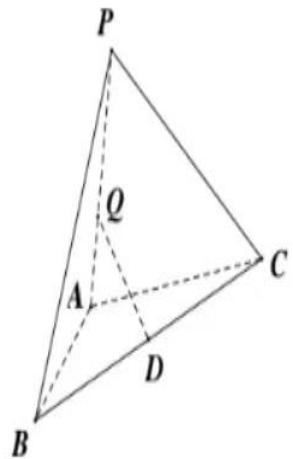
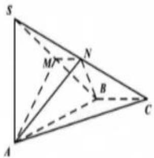
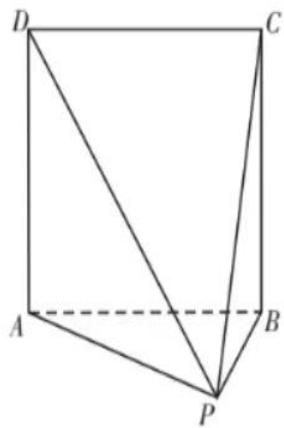
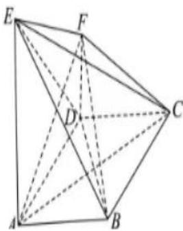
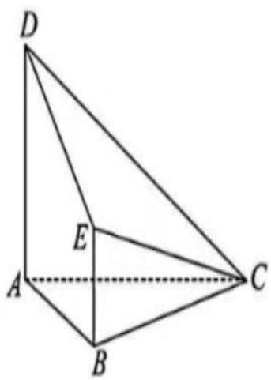

# 4.2 不规则图形的建系

序言：通过前一节的学习，我们主要了解如何求二面角和线面角，大题中我们基本是通过建系解决的，但是有的题目并不是四四方方的立体几何图形，反而是一些抽象的扭曲的图形，那么在这样一种图形中我们如何去建系呢？今天主要讲一些建系的方法。

21. 如图，在 $\triangle ABC$ 中， $AB = 1$ ， $BC = 2\sqrt{2}$ ， $B = \frac{\pi}{4}$ ，将 $\triangle ABC$ 绕边 $AB$ 旋转至 $\triangle ABP$ ，使平面 $ABP \perp$ 平面 $ABC$ ， $D$ 是 $BC$ 的中点.

(1) 求平面 ABC 与平面 PBC 的夹角的余弦值;

(2) 设点 Q 是线段 PA 上的动点，当直线 PC 与直线 DQ 所成角最小时，求线段 AQ 的长度.

text_image

P
Q
A
C
D
B

如图, 已知三棱锥 S-ABC, SA⊥平面

$ABC, \angle ABC = 120^{\circ}, AB = 2, BC = 1, SA = \sqrt{3}.M, N$ 分别为 $SB, SC$ 的中点.

(I) 证明: BC//平面AMN;  
(II) 求点 M 到平面 ABN 的距离.

text_image

S
M
N
B
A
C

如图，在四棱锥 P-ABCD 中，四边形 ABCD 是边长为 2 的正方形， $AP \perp BP$ ，AP = BP， $PD = \sqrt{6}$ . 记平面 PAB 与平面 PCD 的交线为 l.

(1) 证明： $AB \parallel l;$

(2) 求平面 PAB 与平面 PCD 所成的角的正弦值.

natural_image

Geometric diagram of a square with internal diagonals and labeled vertices (no text or symbols)

20.（12分）菱形ABCD中， $\angle ABC=120^{\circ}EA\perp$ 平面ABCD，EA//FD，EA=AD=2FD=2，

（1）证明：直线FC//平面EAB；  
(2)线段 EC 上是否存在点 M 使得直线 EB 与平面 BDM 所成角的正弦值为 $\frac{\sqrt{2}}{8}$ ?

若存在，求 $\frac{EM}{MC}$ ；若不存在，说明理由.

text_image

Geometric diagram of a polyhedron with labeled vertices A, B, C, D, E and internal points F, showing solid and dashed edges.

如图，在五面体 ABCDE 中， $AD \perp$ 平面 ABC， $AD \parallel BE$ ，AD = 2BE，AB = BC。

（1）问：在线段 CD 上是否存在点 P，使得 $PE \perp$ 平面 ACD？若存在，请指出点 P 的位置，并证明；若不存在，请说明理由。

(2) 若 $AB = \sqrt{3}$ ，AC = 2，AD = 2，
求平面 ECD 与平面 ABC 夹角的余弦值.

text_image

Geometric diagram of a tetrahedron with labeled vertices A, B, C, D and internal point E, showing edges and dashed lines.

