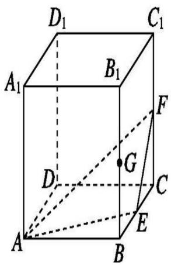
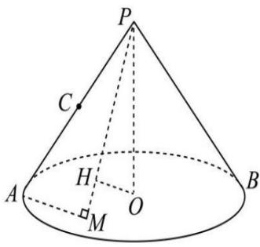
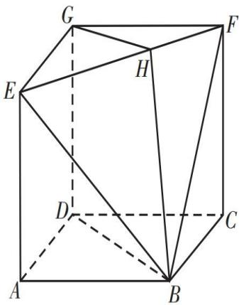

# 4.3 几何法解选填压轴

序言: 在前面一节我们主要讲了如何建系解决大题, 当然, 除了大题我们还有一些小题需要解决, 今天我们就简单的解决一点几何题, 后面专题中专门讲, 这里就不再过多阐述。

11. 如图, 正方体 $ABCD-A_{1}B_{1}C_{1}D_{1}$ 的棱长为 2 , $E$ , $F$ , $G$ 分别为棱 $BC$ , $CC_{1}$ , $BB_{1}$ 的中点, 则下列结论正确的是 ( )

A. 直线 EF 到平面 $A_{1}ADD_{1}$ 的距离为 2

B. 点 $A_{1}$ 到平面 $AEF$ 的距离为 $\frac{4}{3}$

C. 点 $A_{1}$ 到直线 $AF$ 的距离为 $\frac{4\sqrt{2}}{3}$

D. 点 C 与点 G 到平面 AEF 的距离相等

text_image

D₁
C₁
A₁
B₁
F
G
D
C
E
A
B

4. 如图所示, 圆锥的轴截面 $\triangle PAB$ 是以 $P$ 为直角顶点的等腰直角三角形, $PA = 2$ , $C$ 为 $PA$ 中点. 若底面 $\odot O$ 所在平面上有一个动点 $M$ , 且始终保持 $\overrightarrow{MA} \cdot \overrightarrow{MP} = 0$ , 过点 $O$ 作 $PM$ 的垂线, 垂足为 $H$ . 当点 $M$ 运动时,

①点H在空间形成的轨迹为圆   
②三棱锥 $O - HBC$ 的体积最大值为 $\frac{1}{12}$   
③AH+HO的最大值为2  
④ BH 与平面 PAB 所成角的正切值的最大值为 $\frac{\sqrt{5}}{5}$

上述结论中正确的序号为（）.

A. ①②

B. ②③

C. ①③④

D. ①②③

text_image

P
C
H
A
O
M
B

10. 在三棱柱 $ABC - A_{1}B_{1}C_{1}$ 中, 平面 $ACC_{1}A_{1} \perp$ 平面 $ABC$ , $A_{1}A = A_{1}C$ . $E$ , $F$ 分别是线段 $AC$ , $A_{1}B_{1}$ 上的点. 下列结论成立的是 ( )

A. 若 $AA_{1} = AC$ ，则存在唯一直线 $EF$ ，使得 $EF \perp A_{1}C$   
B. 若 $AA_{1} = AC$ ，则存在唯一线段 $EF$ ，使得四边形 $ACC_{1}A_{1}$ 的面积为 $\frac{2\sqrt{3}}{3} EF^2$   
C. 若 $AB \perp BC$ , 则存在无数条直线 $EF$ , 使得 $EF \perp BC$   
D. 若 $AB \perp BC$ , 则存在线段 $EF$ , 使得四边形 $BB_{1}C_{1}C$ 的面积为 $BC \cdot EF$

$\lambda = 1$

12. 已知球 $O$ 的半径为 2, 点 $A, B, C$ 是球 $O$ 表面上的定点, 且 $\overrightarrow{OA} \cdot \overrightarrow{OB} = \overrightarrow{OB} \cdot \overrightarrow{OC} = -1$ , $\overrightarrow{OC} \cdot \overrightarrow{OA} = -2$ , 点 $D$ 是球 $O$ 表面上的动点, 满足 $\overrightarrow{CA} \cdot \overrightarrow{CD} = 0$ , 则

A. 有且仅有一个点 $D$ 使得 $\angle CAD = 30^{\circ}$

B. 点 O 到平面 ABC 的距离为 $\frac{\sqrt{21}}{7}$

C. 存在点 D 使得 BD // 平面 AOC

D. $\overrightarrow{OB} \cdot \overrightarrow{OD}$ 的取值范围为 $[-2, 2]$

11. 如图，在多面体 $EFG - ABCD$ 中，四边形 $ABCD, CFGD, ADGE$ 均是边长为 1 的正方

形，点 $H$ 在棱 $EF$ 上，则

A. 该几何体的体积为 $\frac{2}{3}$   
B. 点 $D$ 在平面 $BEF$ 内的射影为 $\Delta BEF$ 的垂心  
C. $GH + BH$ 的最小值为 $\sqrt{3}$   
D. 存在点 H，使得 $DH \perp BF$

text_image

Geometric diagram of a cube with labeled vertices and internal points, used for spatial geometry problems.

