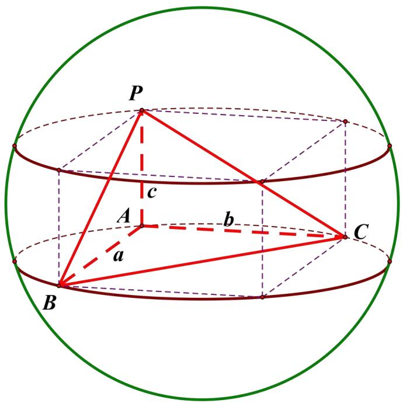
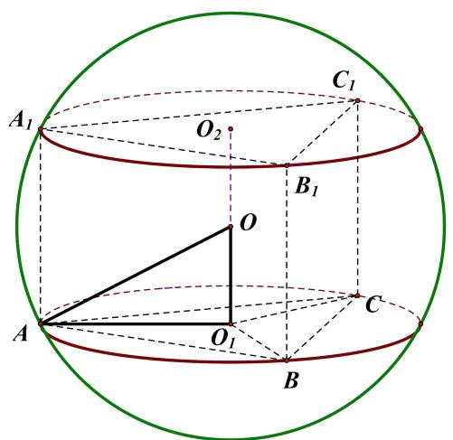
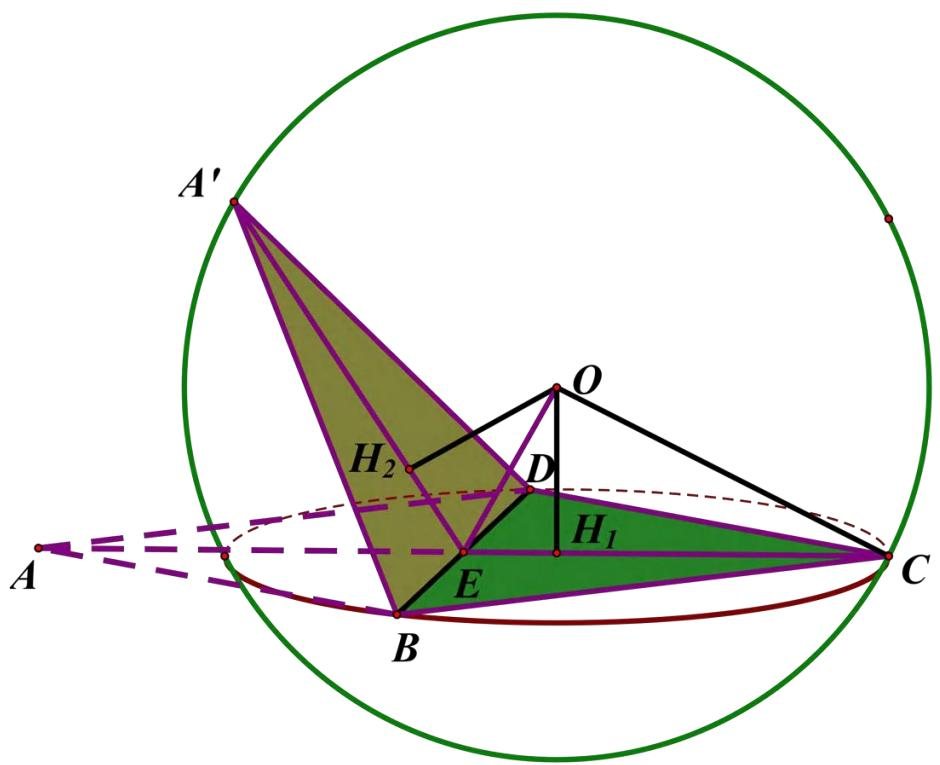
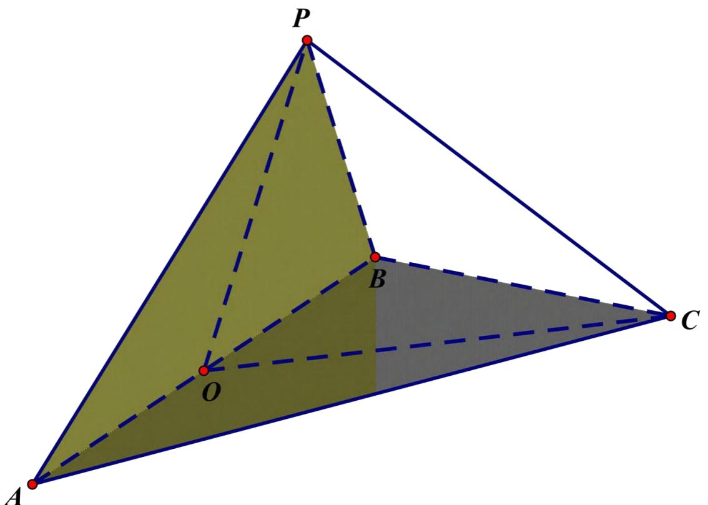
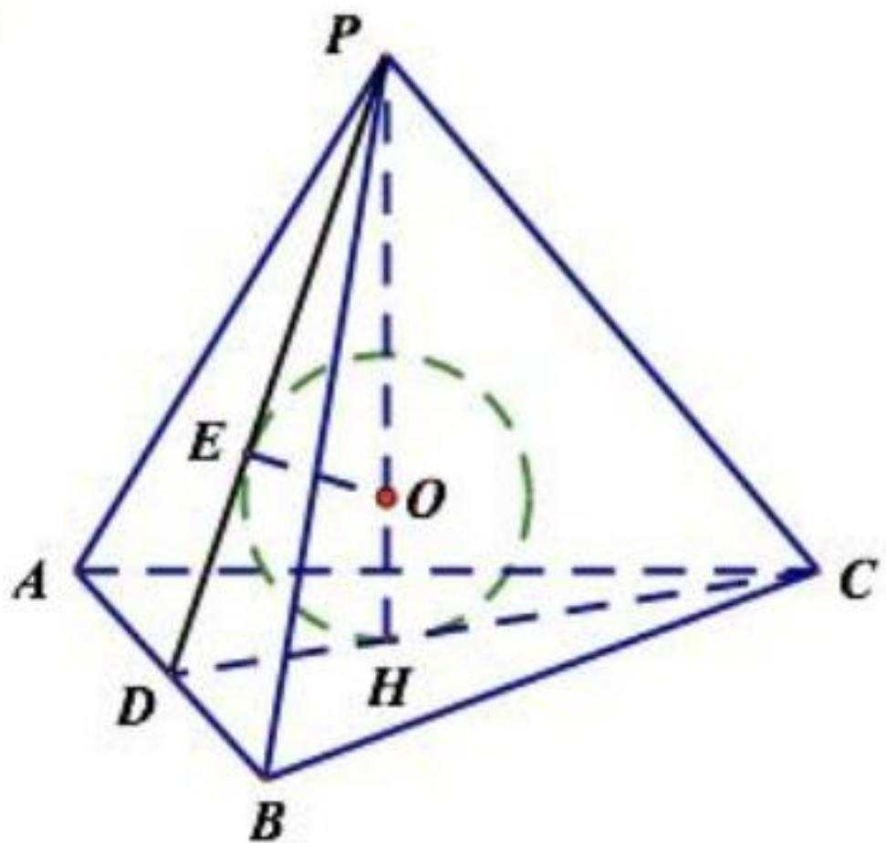

# 5.1 专题：外接球和内切球问题

序言：从今天开始我们进入立体几何的专题训练，那么在这一章我们将会讲解外接球和内切球相关的问题，那么在近年的高考或者模拟考来说，球体问题一直是热门考题，因为它更能体现立体几何抽象的思维和对生活中实际问题的应用与解决，那么我们先了解两个公式。

球的体积公式: $V = \frac{4}{3} \pi R^{3}$

球的表面积公式: $S = 4 \pi R^{2}$

那么解决球体问题必不可少的需要应用以上两个公式，当然这里只是简单的提一下，以免有的同学不知道公式而导致在计算中丢分。

接下来我们列出球体问题的常考题型方便大家记忆和理解。

1·墙角模型 2·垂面模型  
3·汉堡模型 4·折叠模型  
5·对棱相等模型 6·共斜边模型  
7·锥体的内切球问题 8·四面体专题  
9·正棱锥模型

# 墙角模型

特征：三条线两个垂直，不找球心的位置即可求出球半径，

三棱锥与长方体的外接球相同

text_image

P
c
A
b
a
B
C

图1

如图 1 所示，找三条两两垂直的线段，直接用公式 $(2R)^{2}=a^{2}+b^{2}+c^{2}$ ，则可得到结果，下面可看例题：

(3) 在正三棱锥 $S - ABC$ 中, $M 、 N$ 分别是棱 $SC 、 BC$ 的中点, 且 $AM \perp MN$ , 若侧棱 $SA = 2 \sqrt{3}$ , 则正三棱锥 $S - ABC$ 外接球的表面积是\_\_\_\_。

(正三棱锥的对棱是垂直的)

(4) 如果三棱锥的三个侧面两两垂直, 它们的面积分别为 $6 、 4 、 3$ , 那么它的外接球的表面积是 (29 $\pi$ )

# 垂面模型:

特征：有一条棱垂直于底面或者直接说有两个面互相垂直。

统一转化为两个平面互相垂直的模型，然后使用公式

$$
R ^ {2} = r _ {1} ^ {2} + r _ {2} ^ {2} - \frac {l ^ {2}}{4}
$$

那么这个公式即将成为你们最重要的公式，在高中数学球体中将运用非常频繁，在这个公式中 R 指代这个几何体的外接球半径，那么 r 分别指代这两个垂直平面所构成的图形外接圆半径，至于 1 指代两个平面交线的长度。这个公式常常需要结合正弦定理来计算外接圆的半径。

接下来我们可以看几个题目来加深理解:

在四面体 S-ABC 中， $SA \perp$ 平面 ABC， $\angle BAC = 120^{\circ}$ ，SA = AC = 2，AB = 1，则该四面体的外接球的表面积为（）(D)

$$
A. 1 1 \pi \quad B. 7 \pi \quad C. \frac {1 0}{3} \pi \quad D. \frac {4 0}{3} \pi
$$

【例 5】(2020·内蒙古赤峰市·高三月考) 已知三棱锥 P-ABC 中, PA=1, PB=3, AB=2 $\sqrt{2}$ , CA=CB= $\sqrt{5}$ , 面 PAB⊥面 ABC, 则此三棱锥的外接球的表面积为 ( )

A. $\frac{14\pi}{3}$

B. $\frac{28\pi}{3}$

C. $11 \pi$

D. $12 \pi$

变式 1. (2020·四川泸州市·高三一模) 已知三棱锥 $A - BCD$ 中, 平面 $ABD \perp$ 平面 $BCD$ , 且 $\triangle ABD$ 和 $\triangle BCD$ 都是边长为 2 的等边三角形, 则该三棱锥的外接球表面积为 ( )

A. $4 \pi$

B. $\frac{16\pi}{3}$

C. $8 \pi$

D. $\frac{20\pi}{3}$

# 汉堡模型：

直棱柱和圆柱的外接球

text_image

A₁
O₂
C₁
B₁
O
A
O₁
C
B

图10-1

这类问题一般偏简单，我们按照一般的几何关系就可以得出。

(4) 在直三棱柱 $ABC - A_{1}B_{1}C_{1}$ 中, $AB = 4, AC = 6, A = \frac{\pi}{3}, AA_{1} = 4$ 则直三棱柱 $ABC - A_{1}B_{1}C_{1}$ 的外接球的表面积为\_\_\_\_。

# 折叠模型：

两个全等三角形或等腰三角形拼在一起，或菱形折叠。

text_image

A'
H₂
O
D
H₁
E
B
C
A

图11

如图 11 所示，一般为不垂直模型，已知二面角相关情况

【例 4】(2020·广东省高三) 在三棱锥 A - BCD 中, $\triangle ABD$ 与 $\triangle CBD$ 均为边长为 2 的等边三角形, 且二面角 A - BD - C 的平面角为 $120^{\circ}$ , 则该三棱锥的外接球的表面积为 ( )

A. $7 \pi$

B. $8 \pi$

C. $\frac{16\pi}{3}$

D. $\frac{28\pi}{3}$

变式 1. (2020·山东枣庄市·高三期中) 已知二面角 $P - AB - C$ 的大小为 $120^{\circ}$ , 且

$\angle PAB = \angle ABC = 90^{\circ}, AB = AP, AB + BC = 6.$ 若点 $P、A、B、C$ 都在同一个球面上，则该球的表面积的最小值为 \_\_\_\_.

# 对棱相等模型

特征：三棱锥（即四面体）中，已知三组对棱分别相等，求外接球半径

补形法：将此种模型补到长方体内，将棱锥外接球转化为长方体外接球，减轻计算负担，开阔思路

(3) 在三棱锥 $A - BCD$ 中, 若 $AB = CD = 2$ , $AD = BC = 3$ , $AC = BD = 4$ , 则三棱锥 $A - BCD$ 外接球的表面积为\_\_\_\_。

# 共斜边模型

特征: 斜边相同,也可看作矩形沿对角线折起所得三棱锥模型

text_image

P
B
O
C
A

图13

例 7 (1) 在矩形 $ABCD$ 中, $AB = 4$ , $BC = 3$ , 沿 $AC$ 将矩形 $ABCD$ 折成一个直二面角 $B - AC - D$ , 则四面体 $ABCD$ 的外接球的体积为 ( )

A. $\frac{125}{12}\pi$

B. $\frac{125}{9}\pi$

C. $\frac{125}{6}\pi$

D. $\frac{125}{3}\pi$

# 锥体的内切球问题

正三棱锥或正 n 棱锥的处理手法是一样的，在这里讲一个公式

$R=\frac{3V}{S_{总}}$ V 指代体积，S 指代总表面积

其中 R 就是内切球半径

text_image

P
E
O
A
C
D
H
B

熟悉原理即可，一般考察不多，故不作重点内容

# 四面体专题

正四面体：由四个全等正三角形围成的空间封闭图形，所有棱长都相等

因为正四面体在高中考察频率较高，故在此作专题展出，希望大家加深理解

假设正四面体棱长为 a，其外接球半径为 R，内切球半径为 $r$ ，则 $\mathbb{R} = \frac{\sqrt{6}a}{4}$ ，同时 $\mathrm{r} = \frac{\sqrt{6}a}{12}$

对棱中点的连线是对棱的中垂线，长度为 $\frac{\sqrt{2}}{2}a$

相邻二面角的余弦值为三分之一，棱与相交面的线面角正切值是根号二

正四面体内任一点到四个平面距离之和是定值，等于正四面体的高，即 $\frac{\sqrt{6}}{3} a$

# 正棱锥模型

其实只有一个外接球公式有点价值，但是推导毫无难度 $R=\frac{b^{2}}{2h}$ （其中 b 为侧棱长，h 为高）

