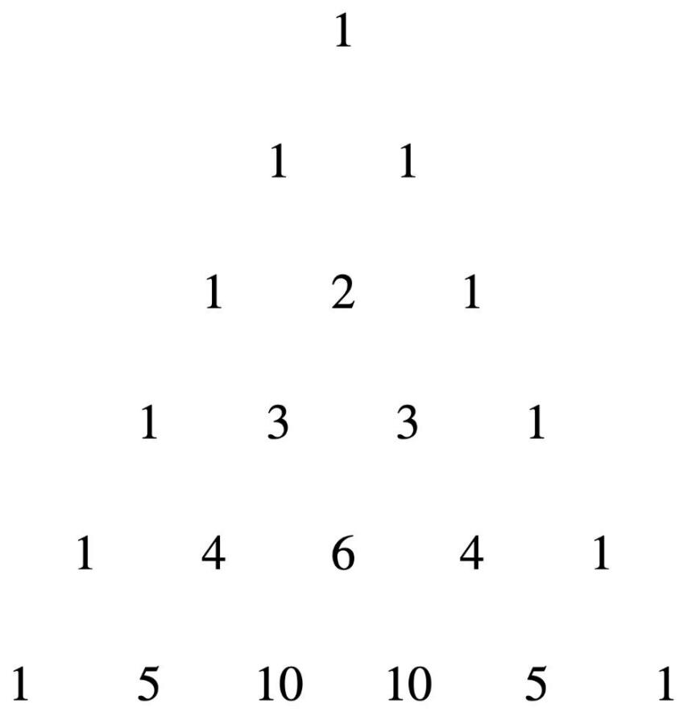
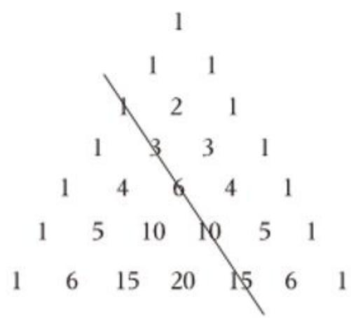
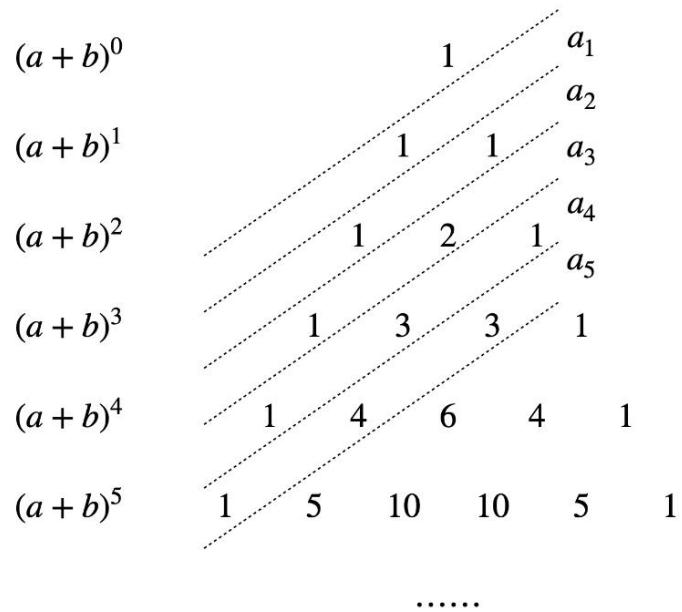

# 数列与杨辉三角

SHU LIE YU XIANG HUI SAN JIAO

主讲人：暄尘

【定义】杨辉三角: 是二项式系数在三角形中的一种几何排列.

图像如右图所示.

text_image

1
1 1
1 2 1
1 3 3 1
1 4 6 4 1
1 5 10 10 5 1

● ● ● ● ● ●

# 【性质】

①每行满足二项式系数 $a_{n} = C_{n}^{r}(r\leq n)$   
②每行与上一行的数字满足二项式推论：

(1) $a_{n} = C_{n}^{r}(r\leq n)$

(2) $C_n^0 + C_n^1 + C_n^2 + \cdots + C_n^n = 2^n$

③错斜行构成斐波那契数列.   
④正斜行构成高阶等差数列.   
⑤每行第三个数等于上行第三个数+行数-1

1

1 1

1 2 1

1 3 3 1

1 4 6 4 1

1 5 10 10 5 1

● ● ● ● ● ●

【例 7】杨辉是我国古代数学史上一位著述丰富的数学家, 著有《详解九章算法》、《日用算法》和《杨辉算法》. 杨辉三角的发现要比欧洲早 500 年左右, 由此可见我国古代数学的成就是非常值得中华民族自豪的, 杨辉三角本身包含了很多有趣的性质. 从第 1 行开始, 第 n 项从左至右的数字之和记为数列 $\{a_{n}\}$ , 如 $a_{1} = 1 + 1 = 2$ , $a_{2} = 1 + 2 + 1$ , $\cdots \{a_{n}\}$ 的前 n 项和记为 $S_{n}$ . 图中实线上的数 1、3、6、10、... 记为数列 $\{b_{n}\}$ , 下列说法正确的有 ( )

A. $S_{10}=2046$ .

B. $C_{3}^{3} + C_{4}^{3} + C_{5}^{3} + \cdots + C_{10}^{3} = 330$ .

C. 第 2023 行中第 1011 个数和第 1012 个数相等.

D. $\left\{\frac{1}{b_{n}}\right\}$ 的前 10 项和为 $\frac{20}{11}$ .

text_image

1
1 1
1 2 1
1 3 3 1
1 4 6 4 1
1 5 10 10 5 1
1 6 15 20 15 6 1

【例 8】在我国南宋数学家杨辉所著作的《详解九章算法》一书中, 用如图所示的三角(杨辉三角)解释了二项和的乘方规律. 下面的数字三角形可以看做当 n 依次取 0, 1, 2, 3…, 时 $(a+b)^{n}$ 展开式的二项式系数, 相邻两斜线间各数的和组成数列 $\{a_{n}\}$ , 例 $a_{1}=1$ , $a_{2}=1+1$ , $a_{3}=1+2$ , …, 设数列 $\{a_{n}\}$ 的前 n 项和为 $S_{n}$ , 若 $a_{2024}=m+3$ , 则 $S_{2022}=$ \_\_\_\_.

A. 2016

B. 2080

C. 4032

D. 4160

text_image

(a + b)⁰
(a + b)¹
(a + b)²
(a + b)³
(a + b)⁴
(a + b)⁵
1
10
10
5
1
1
2
3
4
5
a₁
a₂
a₃
a₄
a₅
1
3
3
1
4
6
4
1
......

本节小结:

natural_image

Abstract geometric shape resembling a stylized letter 'T' with curved lines, rendered in grayscale (no text or symbols)

