# T7 圆锥曲线专题第一大节

# 专题一

# 向量概念

【概念一】向量定义：向量是既有长度也有方向得量.

向量的表示：用 $\vec{a},\vec{\alpha},\overrightarrow{AB}$ 表示.

向量的模：即向量的长度,若给定向量 $\overrightarrow{AB}$ , 其长度为 $\left|\overrightarrow{AB}\right|$ .

特别地：有两种特别的向量,分别为零向量 $\vec{0}$ ,单位向量 $\vec{e}=\frac{\overrightarrow{AB}}{\left|\overrightarrow{AB}\right|}$ .

【概念二】向量间关系：共线向量,非共线向量.

共线向量：同向向量、反向向量和相等向量.

非共线向量：含有一定夹角和垂直向量

向量的夹角：设向量 $\vec{a},\vec{b}$ 的夹角为 $\theta$

当 $\theta=0$ 时, 向量 $\vec{a}, \vec{b}$ 同向, 当 $\theta=\pi$ 时, 向量 $\vec{a}, \vec{b}$ 反向, 当 $\theta=\frac{\pi}{2}$ 时, 向量 $\vec{a}, \vec{b}$ 垂直.

【概念三】向量运算法则：向量的加减运算、数乘、数量积和向量积

向量的加减法：依照三角形法则，或者四边形法则.

注：向量的加减法满足交换律和结合律.

向量的数乘：规定实数 $\lambda$ 与向量 $\vec{a}$ 的积是一个向量, 得到的结果记作 $\lambda\vec{a}$ .

有以下规定:(1) $\left|\lambda\vec{a}\right|=\left|\lambda\right|\cdot\left|\vec{a}\right|$ ,(2)当 $\lambda>0$ 时, $\lambda\vec{a}$ 与 $\vec{a}$ 同向,当 $\lambda<0$ 时, $\lambda\vec{a}$ 与 $\vec{a}$ 反向,
当 $\lambda=0$ 时, $\lambda\vec{a}=\vec{0}$ .

注：向量的数乘满足交换律和分配律.

共线向量定理(从向量角度定义三点共线):

若 $\vec{a} \neq \vec{0}$ , 那么 $\vec{b}$ 与 $\vec{a}$ 共线的充要条件为, 存在实数 $\lambda$ , 使得 $\vec{b} = \lambda \vec{a}$ .

向量的数量积：已知两个非零向量 $\vec{a}$ 与 $\vec{b}$ ，他们的夹角为 $\theta$ ，我们把数量 $\left|\vec{a}\right| \cdot \left|\vec{b}\right| \cos \theta$ 叫做向量 $\vec{a}$ 与 $\vec{b}$ 的数量积（又称内积），记作 $\vec{a} \cdot \vec{b}$ ，即 $\vec{a} \cdot \vec{b} = \left|\vec{a}\right| \cdot \left|\vec{b}\right| \cos \theta$ 。

其中 $\vec{a}\cdot\vec{b}=(x_{1}x_{2},y_{1}y_{2})$ 为 $\vec{b}$ 在 $\vec{a}$ 方向上的投影, 反之 $\left|\vec{a}\right|\cos\theta$ 为 $\vec{a}$ 在 $\vec{b}$ 方向上的投影

注：其中 $0 \leq \theta \leq \pi$ ，规定零向量与任意向量的数量积均为 0，数量积满足分配律.

向量的向量积：已知两个非零且不重合的向量 $\vec{a}$ 与 $\vec{b}$ ，他们的夹角为 $\theta$ ，对于向量 $\vec{a}$ 与 $\vec{b}$ 所构成的二维平面与之垂直的向量 $\vec{c}$ , 我们写作为 $\vec{a} \times \vec{b}$ , 称为向量积(又称叉乘), 即 $\vec{c} = \vec{a} \times \vec{b}$ , 且

$$
\left| \vec {c} \right| = \left| \vec {a} \times \vec {b} \right| = \left| \vec {a} \right| \cdot \left| \vec {b} \right| \sin \theta .
$$

注：其中 $0 \leq \theta \leq \pi$ ，向量 $\vec{c}$ 的方向满足右手系(右手定则)，向量积的运算结果是向量而非数值(与数量积作区别)，向量 $\vec{c}$ 的模长在数值上等于以 $|\vec{a}|$ , $|\vec{b}|$ 为边长, $\theta$ 为夹角的平行四边形面积.

【概念四】向量在直角坐标平面内的坐标表达:

基底向量: 在平面直角坐标系内,分别选取与 x 轴,y 轴正方向平行的单位向量 $\vec{i},\vec{j}$ .

平面向量的基底表示:根据平面向量基本定理,若存在两个实数x和y,满足 $\vec{a}=x\cdot\vec{i}+y\cdot\vec{j}$ ,此为向量 $\vec{a}$ 的坐标表示,x叫做 $\vec{a}$ 在x轴上的坐标,y叫做 $\vec{a}$ 在y轴上的坐标.

显然, $\vec{i}=(1,0)$ , $\vec{j}=(0,1)$ , $\vec{0}=(0,0)$ ,那么 $\vec{a}=(x,y)$ , $\left|\vec{a}\right|=\sqrt{x^{2}+y^{2}}$

向量的坐标表达：已知 $A(x_{1},y_{1}), B(x_{2},y_{2})$

则向量 $\overrightarrow{AB} = (x_2 - x_1, y_2 - y_1), |\overrightarrow{AB}| = \sqrt{(x_2 - x_1)^2 + (y_2 - y_1)^2}$

向量运算法则：向量坐标的加减运算、数乘、数量积和向量积.

向量坐标的加减法：已知 $\vec{a}=(x_{1},y_{1}),\vec{b}=(x_{2},y_{2})$

则 $\vec{a} +\vec{b} = (x_1 + x_2,y_1 + y_2),\vec{a} -\vec{b} = (x_1 - x_2,y_1 - y_2).$

向量坐标的数乘：已知 $\vec{a} = (x_1, y_1)$ ，若存在实数 $\lambda$ ，则 $\lambda \vec{a} = (\lambda x_1, \lambda y_1), |\lambda \vec{a}| = |\lambda| \cdot \sqrt{x_1^2 + y_1^2}$ 。

共线向量定理: 已知 $\vec{a}=(x_{1},y_{1}),\vec{b}=(x_{2},y_{2})$ ,那么 $\vec{b}$ 与 $\vec{a}$ 共线的充要条件为,存在实数 $\lambda$ ,使得$\vec{b} = \lambda \vec{a}$ 即 $(x_{2},y_{2}) = (\lambda x_{1},\lambda y_{1})\Rightarrow \frac{x_{2}}{x_{1}} = \frac{y_{2}}{y_{1}} = \lambda \Rightarrow y_{1}x_{2} - y_{2}x_{1} = 0.$

定比分点公式：若已知 $A(x_{1},y_{1}), B(x_{2},y_{2}), P(x_{0},y_{0})$ 且 $\overrightarrow{AP} = \lambda \overrightarrow{PB}$ ,

则 $x_0(1 + \lambda) = x_1 + \lambda x_2, y_0(1 + \lambda) = y_1 + \lambda y_2$ .

向量坐标的数量积：已知 $\vec{a}=(x_{1},y_{1}),\vec{b}=(x_{2},y_{2})$ ，则 $\vec{a}\cdot\vec{b}=x_{1}x_{2}+y_{1}y_{2}$

若向量 $\vec{a}$ 与 $\vec{b}$ 的夹角为 $\theta$ ，则 $\cos \theta = \frac{\vec{a} \cdot \vec{b}}{|\vec{a}| \cdot |\vec{b}|} = \frac{x_1 x_2 + y_1 y_2}{\sqrt{x_1^2 + y_1^2} \cdot \sqrt{x_2^2 + y_2^2}}$ .

向量坐标的向量积：已知 $\vec{a} = (x_1, y_1), \vec{b} = (x_2, y_2)$ ，则 $\left|\vec{c}\right| = \left|\vec{a} \times \vec{b}\right| = \left|y_1 x_2 - y_2 x_1\right|$ 若向量 $\vec{a}$ 与 $\vec{b}$ 的夹角为 $\theta$ ，则 $\sin \theta = \frac{\left|\vec{a} \times \vec{b}\right|}{\left|\vec{a}\right| \cdot \left|\vec{b}\right|} = \frac{\left|y_1 x_2 - y_2 x_1\right|}{\sqrt{x_1^2 + y_1^2} \cdot \sqrt{x_2^2 + y_2^2}}.$

本节小结:

# 专题二

# 直线基础概念与拓展

【概念一】平面内如何确定直线：

# 【概念二】直线斜率概念：

当直线 l 与 x 轴相交时, 以 x 轴为基准, x 轴正向与直线 l 向上的方向之间所构成的角 $\alpha$ , 叫做直线 l 的倾斜角, 且 $0^{\circ} \leq \alpha < 180^{\circ}$ . 角 $\alpha$ 的正切值定义为直线 l 的斜率, 用字母 k 来表示, 即 $k = \tan \alpha$ 若直线 l 上有两点 $P_{1}(x_{1}, y_{1}), P_{2}(x_{2}, y_{2})$ 则, $k = \frac{\Delta y}{\Delta x} = \frac{y_{1} - y_{2}}{x_{1} - x_{2}}$ .

# 【概念三】直线方程的表达式：

1. 单截距式: $y = kx + b$ (k需存在), $x = my + n$ (m需存在)  
2. 点斜式： $y = k(x - x_0) + y_0$ (k需存在)， $x = m(y - y_0) + x_0$ (m需存在)

3.两点式： $\frac{y - y_1}{x - x_1} = \frac{y - y_2}{x - x_2} = \frac{y_1 - y_2}{x_1 - x_2},x(y_1 - y_2) + y(x_2 - x_1) = y_1x_2 - y_2x_1$   
4. 双截距式： $\frac{x}{a} + \frac{y}{b} = 1 (a, b \neq 0), mx + ny = 1$   
5.一般式： $Ax + By + C = 0(A^{2} + B^{2} \neq 0)$ , $A(x - x_{0}) + B(y - y_{0}) = 0$

直线的法向量为 $(A,B)$ ，方向向量为 $(B,-A)$

6. 向量式(参数方程): $\left\{\begin{aligned} x &= x_{0} + r \cos \theta \\ y &= y_{0} + r \sin \theta \end{aligned}\right.$ ( $\theta$ 为直线倾斜角), $|r|$ 为直线上一点到定点 $(x_{0}, y_{0})$ 的距离.

7. 切圆式: $(x - x_{0})\cos \alpha + (y - y_{0})\sin \alpha = r$

【概念四】点与直线的位置的关系：

平面内有直线 l 为 $Ax + By + C = 0$ ，一点 $P(x_{0}, y_{0})$

若点 P 在直线 l 上, 则 $Ax_{0} + By_{0} + C = 0$ , 若点 P 在直线 l 的上方, 则 $Ax_{0} + By_{0} + C > 0$ ,

若点 P 在直线 l 的下方, 则 $Ax_{0} + By_{0} + C < 0$

【概念五】直线与直线的位置的关系：

若有直线 $l_{1}: A_{1}x + B_{1}y + C_{1} = 0, l_{2}: A_{2}x + B_{2}y + C_{2} = 0$

(1)若直线 $l_{1}$ 与直线 $l_{2}$ 相交于点 $P(x_{0},y_{0})$ ：联立方程组 $\left\{\begin{aligned}A_{1}x+B_{1}y+C_{1}&=0\\ A_{2}x+B_{2}y+C_{2}&=0\end{aligned}\right.$ ，即可解得P

1. 若直线 $l_{1}$ 与直线 $l_{2}$ 之间的夹角为 $\theta$ ，则有倒角公式 $\tan\theta=\frac{k_{2}-k_{1}}{1+k_{1}k_{2}}=\frac{A_{2}B_{1}-A_{1}B_{2}}{A_{1}A_{2}+B_{1}B_{2}}$

2. 若直线 $l_{1}$ 与直线 $l_{2}$ 垂直, 则有 $k_{1}k_{2} = -1$

(2)若直线 $l_{1}$ 与直线 $l_{2}$ 平行,但不重合: $k_{1}=k_{2},\frac{A_{1}}{A_{2}}=\frac{B_{1}}{B_{2}}\Rightarrow A_{1}B_{2}-A_{2}B_{1}=0$

直线也可以简要变成 $l_{1}:A_{1}x+B_{1}y+C_{1}=0$ , $l_{2}:A_{1}x+B_{1}y+C_{1}^{\prime}=0$ 且 $C_{1}\neq C_{1}^{\prime}$

【概念六】与直线有关的距离：

若有直线 $Ax + By + C = 0 \Rightarrow y = kx + b / x = my + n$ ，该直线上两点 $A(x_1, y_1), B(x_2, y_2)$ ，

以及直线外点 $P(x_0, y_0)$

(1)直线上两点距离公式： $\left|AB\right|=\sqrt{1+k^{2}}\left|x_{1}-x_{2}\right|=\sqrt{1+m^{2}}\left|y_{1}-y_{2}\right|$

(2)直线外点到直线的距离公式:

$d_{P - AB} = \frac{|Ax_0 + By_0 + C|}{\sqrt{A^2 + B^2}}$ ，也可以表达为 $d_{P - AB} = \frac{|kx_0 + b - y_0|}{\sqrt{1 + k^2}}, d_{P - AB} = \frac{|my_0 + n - x_0|}{\sqrt{1 + m^2}}$

(3)两条平行直线间的距离:

若直线 $l_{1}:Ax+By+C_{1}=0$ , $l_{2}:Ax+By+C_{2}=0$ 相互平行,则 $d_{1-2}=\frac{\left|C_{1}-C_{2}\right|}{\sqrt{A^{2}+B^{2}}}$

【例 1】已知三角形的顶点是 $A(-5,0)$ , $B(3,-3)$ , 求 AC 边所在直线的方程, 以及该边上的中线所在直线的方程.

【例 2】已知过定点 $P(1,2)$ 的直线在 x 轴正半轴与 y 轴正半轴上的截距分别为 a, b，则 $4a^{2} + b^{2}$ 的最小值为？

【例 3】已知两条直线 $l_{1}: x + (1 + m)y = 2 - m, l_{2}: 2mx + 4y = -16$ . 当且仅当 m 为何值时, $l_{1}$ 与 $l_{2}$ 有以下关系? (1) 相交; (2) 平行; (3) 重合; (4) 垂直.

【例 4】设直线 l 的方程为 $(m^{2}-2m-3)x+(2m^{2}+m-1)y=2m-6$ 根据下列条件分别确定 m 的值:(1) l 在 x 轴上的截距是 -3; (2) l 的斜率是 -1.

【例 5】求俩平行线 $l_{1}:3x+4y=2, l_{2}:6x+8y=15$ 间的距离.

本节小结:

# 专题三

# 圆的方程概念与位置关系

# 【概念一】圆的直观定义(第一定义):

平面内动点到定点的距离等于定长(半径 r)的点集合,即为圆.

# 【概念二】圆的方程：若动点为 $(x, y)$ ，圆心为 $(a, b)$ ，半径为 $r$

(1)圆的标准方程: $(x - a)^{2} + (y - b)^{2} = r^{2}$   
(2)圆的一般方程： $x^{2}+y^{2}+Dx+Ey+F=0(D^{2}+E^{2}-4F>0)$

圆心 $(a,b) = (-\frac{D}{2}, - \frac{E}{2})$ ，半径 $r = \sqrt{D^2 + E^2 - 4F}$

(3)圆的参数方程： $\left\{\begin{aligned}x=a+r\cos\theta\\ y=b+r\sin\theta\end{aligned}\right.$ ( $\theta$ 为变量),利用了 $\sin^{2}\theta+\cos^{2}\theta=1$

# 【概念三】圆的三种定义及方程：

第一定义: 平面内动点到定点(圆心)的距离等于定长(半径 $r$ ) 的点集合, 即为圆.

方程参看概念二.

第二定义(阿波罗尼斯圆): 动点 P 与定点 A, B 的距离之比为定值 $\lambda > 0, \lambda \neq 1$ , 点 P 的轨迹为圆.

设 $P(x,y),A(-c,0),B(c,0)$ ，依照定义 $\frac{|PA|}{|PB|} = \lambda = \sqrt{\frac{(x + c)^2 + y^2}{(x - c)^2 + y^2}}$

化简得 $x^{2} + y^{2} + \frac{2c(1 + \lambda^{2})}{1 - \lambda^{2}} x = 0\Rightarrow (x - \frac{1 + \lambda^{2}}{1 - \lambda^{2}} c)^{2} + y^{2} = (\frac{2\lambda c}{1 - \lambda^{2}})^{2},$

圆心为 $\left(\frac{1+\lambda^{2}}{1-\lambda^{2}}c,0\right)$ ，半径为 $r=\left|\frac{2\lambda c}{1-\lambda^{2}}\right|$ .

第三定义: 动点 $P$ 与定点 $A, B$ 的连线斜率之积为 -1, 点 $P$ 的轨迹为圆.

设 $P(x,y)$ , $A(-c,0)$ , $B(c,0)$ , 依照定义 $k_{PA}k_{PB} = -1 = \frac{y}{x + c} \cdot \frac{y}{x - c}$

化简得 $x^{2} + y^{2} = c^{2}(x \neq \pm c)$ ，圆心为 $(0,0)$ ，半径为 c.

【概念四】圆和点、线、圆的位置关系：

以圆的标准方程为例 $(x - a)^2 +(y - b)^2 = r^2$

(1)点和圆的位置关系：若有一点 $P(x_{0}, y_{0})$ ，若 P 在圆上，则 $(x_{0} - a)^{2} + (y_{0} - b)^{2} = r^{2}$

若 P 在圆内, 则 $(x_{0}-a)^{2}+(y_{0}-b)^{2}<r^{2}$ , 若 P 在圆外, 则 $(x_{0}-a)^{2}+(y_{0}-b)^{2}>r^{2}$

(2)线和圆的位置关系:

设圆的半径为 r, 圆心到直线的距离为 l

1. 若直线与圆有两个交点, 则直线与圆相交 (r > l)

2. 若直线与圆只有一个交点, 则直线与圆相切 (r = l)  
3. 若直线与圆没有交点, 则直线与圆相离 (r < l)

以上三种位置关系,可以通过直线与圆方程组联立,根据 $\Delta$ 的正负来判断.

(3)圆和圆的位置关系:

圆和圆的位置关系主要包含三种:相交、相切和相离.

设两圆的圆心距为 d，两圆半径分别为 $r_{1}, r_{2}$

1. 若两圆有两个公共点, 则两圆相交 ( $\left|r_{1}-r_{2}\right|<d<r_{1}+r_{2}$ )   
2. 若两圆只有一个公共点, 则两圆相切, 包含内切 $(d = \left|r_{1} - r_{2}\right|)$ 和外切 $(d = r_{1} + r_{2})$   
3. 若两圆没有公共点, 则两圆相离, 包含外离 $(r_{1} + r_{2} < d)$ 和内含 $(0 \leq d < |r_{1} - r_{2}|)$

【概念五】与圆有关的距离：

(1)直线交圆的弦长:

设直线 l 与圆 O 交于 $A(x_{1}, y_{1})$ , $B(x_{2}, y_{2})$ , 圆心到直线的距离为 d, 半径为 r.

1. 利用直线和圆联立得到关于 x 或 y 的二次方程, 借助 $\left|AB\right| = \sqrt{1 + k^{2}} \left|x_{1} - x_{2}\right|$ 即可  
2. 利用垂径定理, 可得 $\left|AB\right|=2\sqrt{r^{2}-d^{2}}$

(2)切线与切线长:

设直线 l 过 $P(x_{0}, y_{0})$ 与圆 O 相切于 $M(m, n)$ ，圆心 $(a, b)$ 到直线的距离为 d，半径为 r。

根据切线定义可得 r=d , 结合点 M 在原上即可解的 k

由勾股定理可得 $\left|OP\right|^{2}=\left|OM\right|^{2}+\left|MP\right|^{2}$ ，可得切线长 $\left|MP\right|=\sqrt{\left|OP\right|^{2}-r^{2}}$

# (3)圆上点到定点的距离最值:

设圆的圆心为 O, 半径为 r, 点 P 为圆 O 上一点, Q 是不在圆上也不在圆心的一点

1. 当点 $Q$ 在圆 $O$ 外时, $\left|OQ\right| - r \leq \left|PQ\right| \leq \left|OQ\right| + r$

2.当点 $Q$ 在圆 $O$ 内时， $\left|OQ\right| - r\leq \left|PQ\right|\leq \left|OQ\right| + r$

【例 1】求过四点 $(0,0)$ ， $(4,0)$ ， $(-1,1)$ ， $(4,2)$ 中的三点的一个圆的方程.

【例 2】设点 M 在直线 $2x + y - 1 = 0$ 上, 点 $(3,0)$ 和 $(0,1)$ 均在 $\odot M$ 上, 则 $\odot M$ 的方程为?

【例 3】写出与圆 $x^{2} + y^{2} = 1$ 和 $(x - 3)^{2} + (y - 4)^{2} = 16$ 都相切的一条直线的方程.

【例 4】由直线 $x + 2y - 7 = 0$ 上一点 P 引圆 $x^{2} + y^{2} - 2x + 4y + 2 = 0$ 的一条切线, 切点为 A, 求 $|PA|$ 的最小值.

【例 5】已知半径为 1 的圆经过点(3,4)，求其圆心到原点的距离最小值.

【例 6】已知圆 $C:(x-a)^{2}+y^{2}=4(a\geq2)$ 与直线 $x-y+2\sqrt{2}-2=0$ 相切,求圆 C 与直线 x-y-4=0 相交所得弦长.

本节小结:

# 专题四

# 点轨迹求法

# 【概念一】点轨迹和轨迹方程：

轨迹方程：目标点的横纵坐标之间的一个等量关系.

轨迹：轨迹方程在平面直角坐标系内呈现出来的图形即为轨迹.

# 【观念一】直接求轨迹方程的方法：

(1)直译法: 如果动点运动的条件为一些几何量的等量关系,易于表述成关于 $x, y$ 的方程,就得到轨迹方程,称为直译法.  
(2)定义法: 运用解析几何中一些常用定义(例如圆锥曲线的定义),可从曲线定义出发直接写出轨迹方程,或从曲线定义出发建立关系式,从而求出轨迹方程.  
(3)待定系数法: 若动点轨迹题意已直接告知,即为椭圆、双曲线、抛物线、圆或直线,则据题意,使用待定系数法即可求解轨迹方程.

【例 1】动点 $P(x,y)$ 到两定点 A(-3,0) 和 B(3,0) 的距离之比为 2, 求动点 P 的轨迹方程.

【例 2】(2016 全国一卷)设圆 $x^{2} + y^{2} + 2x - 15 = 0$ 的圆心为 A, 直线 l 过点 $B(1,0)$ 且不与 x 轴重合的, l 交圆 A 于 C, D 两点, 过 B 做 AC 的平行线交 AD 于点 E, 求证: $\left|EA\right| + \left|EB\right|$ .

【例 3】已知 A, B, C 是椭圆 $M: \frac{x^{2}}{a^{2}} + \frac{y^{2}}{b^{2}} = 1 (a > b > 0)$ 上的不同三点, 其中点 A 的坐标为 $(2\sqrt{3}, 0)$ , BC 过椭圆的中心, 点 C 在第一象限, 且满足 $\angle BCA = 90^{\circ}$ , $|BC| = 2 |AC|$ , 求 M 的方程.

# 【观念二】间接求轨迹方程的方法：

(1)相关点代入法: 动点所满足的条件不易表述或求出,但形成轨迹的动点 $P(x, y)$ 却随另一动点 $Q(x', y')$ 的运动而有规律的运动,且动点 $Q$ 的轨迹为给定或容易求得,则可先将 $x'$ , $y'$ 表示为 $x, y$ 的式子,再代入 $Q$ 的轨迹方程,然而整理得 $P$ 的轨迹方程.  
(2)参数法: 求轨迹方程有时很难直接找到动点的横坐标,纵坐标之间的关系,则可借助中间变量(即参数),使 x, y 之间建立起联系,然后再从所求式子中消去参数,得出动点的轨迹方程.  
(3)交轨法: 求两动曲线(或直线)交点轨迹时,可由方程直接消去参数,也可以引入参数来建立这些动曲线的联系,然而消去参数得到轨迹方程.(可以说是参数法的一种变种).

【例 4】从双曲线 $C: x^{2} - y^{2} = 1$ 上的一点 Q 引直线 $l: x + y = 2$ 的垂线, 垂足为 N, 求线段 QN 的中点 P 的轨迹方程.

【例 5】设椭圆方程为 $C: x^{2} + \frac{y^{2}}{4} = 1$ ，过点 $M(0,1)$ 的直交椭圆 C 于 A, B 两点，O 是坐标原点，点 P 满足， $\overrightarrow{OP} = \frac{1}{2} (\overrightarrow{OA} + \overrightarrow{OB})$ ，点 N 的坐标为 $\left(\frac{1}{2}, \frac{1}{2}\right)$ ，当直线绕点 M 旋转时，求动点 P 的轨迹方程.

【例 6】垂直于 x 轴的直线交双曲线 $\frac{x^{2}}{a^{2}} - \frac{y^{2}}{b^{2}} = 1$ 于 M, N 两点, $A_{1}, A_{2}$ 为双曲线的左, 右顶点, 求直线 $A_{1}M$ 与 $A_{2}N$ 的交点 P 的轨迹方程, 并指出轨迹的形状.

本节小结:

# 专题五

# 椭圆的定义、方程和基本量

# 【概念一】椭圆的第一定义：

平面内,动点到两定点 $F_{1},F_{2}$ 的距离之和为定值(即2a,且大于 $\left|F_{1}F_{2}\right|$ )的点轨迹,叫做椭圆.

其中两定点 $F_{1}, F_{2}$ ，称为焦点，点 $F_{1}$ 为左焦点，点 $F_{2}$ 为右焦点，两焦点间的距离为焦距，焦距的一半叫做半焦距.

# 【概念二】椭圆的方程：

(1)椭圆的标准方程:

设动点 $P(x,y)$ , $F_{1}(-c,0)$ , $F_{2}(c,0)$ , 且 $\left|PF_{1}\right| + \left|PF_{2}\right| = 2a (a > c > 0)$

根据定义可得椭圆标准方程为 $\frac{x^{2}}{a^{2}}+\frac{y^{2}}{a^{2}-c^{2}}=1$ ，令 $a^{2}=c^{2}+b^{2}$ ，可得 $\frac{x^{2}}{a^{2}}+\frac{y^{2}}{b^{2}}=1$

若设 $F_{1}(0,-c)$ , $F_{2}(0,c)$ , 则最终可得 $\frac{x^{2}}{b^{2}} + \frac{y^{2}}{a^{2}} = 1$

(2)椭圆的一般方程:

统一后有 $Ax^{2} + By^{2} = 1 (A > 0, B > 0)$ , A, B 谁小, 焦点就在哪一个轴上.

(3)椭圆的参数方程:

以 $\frac{x^{2}}{a^{2}}+\frac{y^{2}}{b^{2}}=1$ 为例,若 $\left\{\begin{aligned}x&=a\cos\theta\\ y&=b\sin\theta\end{aligned}\right.$ ( $\theta$ 为参数),即为椭圆的参数方程

# 【概念三】椭圆的方程中的基本量和简单几何性质：

以焦点在 x 轴的椭圆标准方程为例 $\frac{x^{2}}{a^{2}} + \frac{y^{2}}{b^{2}} = 1$ ，焦点在 y 轴的椭圆可以类比推理.

(1)三个参数 $a, b, c$ :

参数a：半长轴长(2a为长轴长),长度和定值的一半.

参数b：半短轴长(2b为短轴长).

参数 c：半焦距(2c 为焦距),两定点之间的长度

(2)简单几何性质:

坐标范围： $-a \leq x \leq a$ 与 $-b \leq y \leq b$ ，表面了椭圆位于一个矩形的内部。

对称性：该椭圆关于 x 轴对称, y 轴对称, 且也是中心对称, 原点 O 即为对称中心.

顶点：左顶点 $A_{1}(-a,0)$ ，右顶点 $A_{2}(a,0)$ ，下顶点 $B_{1}(0,-b)$ ，上顶点 $B_{2}(0,b)$

离心率: 表示椭圆的扁平程度,定义为 $e = \frac{c}{a}$ (双曲线中也是),当 $0 < e < 1$ 时,即为椭圆.

注：离心率在椭圆范围内,越大则表示椭圆越扁,越小则趋近于圆.

(3)长度的特殊情况:

1. 当动点 P 位于上下顶点时, $\Delta POF_{1}$ 和 $\Delta POF_{2}$ 为直角三角形, 且 $\left|PF_{1}\right| = \left|PF_{2}\right| = a, \left|PO\right| = b$ 此时 $\angle F_{1}PF_{2}$ 与 $\angle A_{1}PA_{2}$ 均最大.

2. 当动点 P 位于焦点上下方时, 此时 $\left|PF\right|=\frac{b^{2}}{a}$ , 可以构成通径.

# 【概念四】椭圆的第二定义：

(1)椭圆的第二定义: 平面内,动点 $P(x,y)$ 与一个定点 $F$ 的距离与它到一条定直线 $l$ 的距离的比是常数时,这个点的轨迹是椭圆. 定点 $F$ 为焦点, $l$ 为焦点对应的准线, 常数为 $e(0 < e < 1)$ 为离心率.

(2)第二定义中的基本量:

1. 若 F 为左焦点 $F_{1}(-c,0)$ ，准线对应为左准线 $x=-\frac{a^{2}}{c}$ (椭圆的左侧).  
2. 若 F 为右焦点 $F_{2}(c,0)$ ，准线对应为右准线 $x=\frac{a^{2}}{c}$ （椭圆的右侧）.  
3. 若 F 为下焦点 $F_{3}(0,-c)$ ，准线对应为下准线 $y=-\frac{a^{2}}{c}$ （椭圆的下侧）.  
4. 若 F 为上焦点 $F_{4}(0, c)$ ，准线对应为上准线 $y = \frac{a^{2}}{c}$ (椭圆的上侧).  
5.焦准距 p (又称准焦距), 即准线和焦点的距离, $p=\frac{b^{2}}{c}$

(3)第二定义的意义:

统一多条圆锥曲线,勾勒焦半径长度的重要定义.

# 【概念五】椭圆的第三定义：

(1)椭圆的第三定义: 平面内,动点 $P(x,y)$ 到两定点 $A_{1}, A_{2}$ (其中 $A_{1}, A_{2}$ 关于原点对称)的连线斜率之积为定值时,动点 $P$ 的轨迹为椭圆.其中斜率积定值为 $e^{2} - 1 (-1 < e^{2} - 1 < 0)$ .

(2)常见的第三定义表达:

1. 两定点 $A_{1}, A_{2}$ 为长轴顶点(焦点在 $x$ 轴), 即 $A_{1}(-a,0), A_{2}(a,0)$ .  
2.两定点 $A_{1}, A_{2}$ 为非轴点, 即 $A_{1}(x_{0}, y_{0}), A_{2}(-x_{0}, -y_{0})$ .  
3.斜率积 $k_{1}k_{2}=e^{2}-1=-\frac{b^{2}}{a^{2}}$ （焦点在x轴）， $k_{1}k_{2}=e^{2}-1=-\frac{a^{2}}{b^{2}}$ （焦点在y轴）.

【例 1】已知圆 $(x+2)^{2}+y^{2}=36$ 的圆心为M，设A为圆上任一点，且点 $N(2,0)$ ，线段AN的垂直平分线交MA于点P，则动点P的轨迹是？

【例 2】把椭圆 $\frac{x^{2}}{25}+\frac{y^{2}}{16}=1$ 的长轴 AB 分成 8 等份, 过每个分点做 x 轴的垂线交椭圆上半部分于 $P_{1}, P_{2} \cdots P_{7}$ , 点 F 是椭圆的一个焦点, 求 $\left|PF_{1}\right| + \left|PF_{2}\right| + \cdots + \left|PF_{7}\right|$ .

【例 3】动点 M 与定点 $F(4,0)$ 的距离和 M 到直线 $l: x = \frac{25}{4}$ 的距离之比为 $\frac{4}{5}$ ，求点 M 的轨迹.

【例 4】设定点 $A(-5,0)$ , $B(5,0)$ , 直线 AM 和 BM 相交于点 M, 且他们的斜率之积为 $-\frac{4}{9}$ , 求点 M 的轨迹.

【例 5】在 $\Delta ABC$ 中, $\angle A = 90^{\circ}$ , $\tan B = \frac{3}{4}$ , 若以 A, B 为焦点的椭圆经过点 C, 求该椭圆的离心率 e.

【例 6】求与椭圆 $4x^{2}+9y^{2}=36$ 有相同焦点,且过点 $(3,-2)$ 的椭圆的标准方程.

本节小结:

# 专题六

# 双曲线的定义、方程和基本量

# 【概念一】双曲线的第一定义：

平面内,动点到两定点 $F_{1},F_{2}$ 的距离之差为定值(即2a,且小于 $\left|F_{1}F_{2}\right|$ )的点轨迹,叫做双曲线.

其中两定点 $F_{1}, F_{2}$ ，称为焦点，点 $F_{1}$ 为左焦点，点 $F_{2}$ 为右焦点，两焦点间的距离为焦距，焦距的一半叫做半焦距.

# 【概念二】双曲线的方程：

(1)双曲线的标准方程:

设动点 $P(x,y)$ , $F_{1}(-c,0)$ , $F_{2}(c,0)$ , 且 $\left\|PF_{1}\right| - \left|PF_{2}\right| = 2a$

根据定义可得双曲线标准方程为 $\frac{x^{2}}{a^{2}}-\frac{y^{2}}{c^{2}-a^{2}}=1$ ，令 $c^{2}=a^{2}+b^{2}$ ，可得

若设 $F_{1}(0,-c)$ , $F_{2}(0,c)$ , 则最终可得 $\frac{y^{2}}{a^{2}} - \frac{x^{2}}{b^{2}} = 1$

(2)双曲线的一般方程:

统一后有 $Ax^{2} + By^{2} = 1 (AB < 0)$ ，A, B 谁正，焦点就在哪一个轴上.

(3)双曲线的参数方程:

以 $\frac{x^{2}}{a^{2}}-\frac{y^{2}}{b^{2}}=1$ 为例,若 $\left\{\begin{aligned}x&=\frac{a}{\cos\theta}\\ y&=b\tan\theta\end{aligned}\right.$ ( $\theta$ 为参数),即为双曲线的参数方程

【概念三】双曲线的方程中的基本量和简单几何性质：

以焦点在 x 轴的双曲线标准方程为例 $\frac{x^{2}}{a^{2}} - \frac{y^{2}}{b^{2}} = 1$ ，焦点在 y 轴的双曲线可以类比推理.

(1)三个参数 $a, b, c$ :

参数a：半实轴长(2a为实轴长),长度差定值的一半.

参数b：半虚轴长(2b为虚轴长).

参数 c：半焦距(2c 为焦距),两定点之间的长度

(2)简单几何性质:

坐标范围： $x \leq -a, x \geq a$ 与 $y \in R$ ，表面了双曲线位于两条直线的外侧.

对称性：该双曲线关于 x 轴对称, y 轴对称, 且也是中心对称, 原点 O 即为对称中心.

顶点：左顶点 $A_{1}(-a,0)$ ，右顶点 $A_{2}(a,0)$ ，下顶点 $B_{1}(0,-b)$ ，上顶点 $B_{2}(0,b)$ （上下顶点实际不存在）

渐近线：根据双曲线的图像,可得双曲线始终与两条直线无限靠近,但始终不相交,这两条直线即为渐近线,在该曲线下,两条渐近线为 $y=\pm\frac{b}{a}x$ .

离心率: 表示双曲线的开口程度,定义为 $e = \frac{c}{a}$ , 当 $e > 1$ 时, 即为双曲线.

注：离心率在双曲线范围内,越大则表示双曲线开口越大,越小则表示双曲线开口越小.

(3)长度的特殊情况:

当动点 P 位于焦点上下方时,此时 $\left|PF\right|=\frac{b^{2}}{a}$ , 可以构成通径.

# 【概念四】双曲线的第二定义：

(1)双曲线的第二定义: 平面内,动点 $P(x,y)$ 与一个定点 $F$ 的距离与它到一条定直线 $l$ 的距离的比是常数时,这个点的轨迹是双曲线.定点 $F$ 为焦点, $l$ 为焦点对应的准线,常数为 $e(e > 1)$ 为离心率.

(2)第二定义中的基本量:

1. 若 F 为左焦点 $F_{1}(-c,0)$ ，准线对应为左准线 $x=-\frac{a^{2}}{c}$ （双曲线左支的右侧）.  
2. 若 F 为右焦点 $F_{2}(c,0)$ ，准线对应为右准线 $x=\frac{a^{2}}{c}$ （双曲线右支的左侧）.  
3. 若 F 为下焦点 $F_{3}(0,-c)$ ，准线对应为下准线 $y=-\frac{a^{2}}{c}$ （双曲线下支的上侧）.  
4. 若 F 为上焦点 $F_{4}(0,c)$ ，准线对应为上准线 $y=\frac{a^{2}}{c}$ （双曲线上支的下侧）.  
5.焦准距 p (又称准焦距), 即准线和焦点的距离, $p=\frac{b^{2}}{c}$

(3)第二定义的意义:

统一多条圆锥曲线,勾勒焦半径长度的重要定义.

# 【概念五】双曲线的第三定义：

(1)双曲线的第三定义: 平面内,动点 $P(x,y)$ 到两定点 $A_{1}, A_{2}$ (其中 $A_{1}, A_{2}$ 关于原点对称)的连线斜率之积为定值时,动点 $P$ 的轨迹为双曲线.其中斜率积定值为 $e^{2} - 1(e^{2} - 1 > 0)$ .

(2)常见的第三定义表达:

1. 两定点 $A_{1}, A_{2}$ 为实轴顶点(焦点在 $x$ 轴), 即 $A_{1}(-a,0), A_{2}(a,0)$ .  
2.两定点 $A_{1}, A_{2}$ 为非轴点, 即 $A_{1}(x_{0}, y_{0}), A_{2}(-x_{0}, -y_{0})$ .  
3.斜率积 $k_{1}k_{2} = e^{2} - 1 = \frac{b^{2}}{a^{2}}$ (焦点在 $x$ 轴), $k_{1}k_{2} = e^{2} - 1 = \frac{a^{2}}{b^{2}}$ (焦点在 $y$ 轴).

【例 1】设 P 为双曲线 $\frac{x^{2}}{a^{2}} - \frac{y^{2}}{9} = 1$ 上一点, 双曲线的一条渐近线方程为 3x - 2y = 0, 点 $F_{1}, F_{2}$ 分别为双曲线的左, 右焦点, 若 $\left|PF_{1}\right| = 3$ , 求 $\left|PF_{2}\right|$ .

【例 2】双曲线 C 的离心率为 2, 焦点为 $F_{1}, F_{2}$ , 点 A 在 C 上, 若 $\left|F_{1}A\right|=2\left|F_{2}A\right|$ , 求 $\cos\angle AF_{1}F_{2}$ .

【例 3】动点 M 与定点 $F(4,0)$ 的距离和 M 到直线 $l: x = \frac{9}{4}$ 的距离之比为 $\frac{4}{3}$ ，求点 M 的轨迹.

【例 4】设定点 $A(-5,0)$ , $B(5,0)$ , 直线 AM 和 BM 相交于点 M, 且他们的斜率之积为 $-\frac{4}{9}$ , 求点 M 的轨迹.

【例 5】设双曲线 C 过 $(2,2)$ ，且与双曲线 $\frac{y^{2}}{4}-x^{2}=1$ 有相同的渐近线，求双曲线 C 的标准方程.

【例 6】设圆锥曲线 E 的两个焦点分别为 $F_{1}, F_{2}$ ，若曲线 E 上存在点 P 满足， $\left|PF_{1}\right|:\left|F_{1}F_{2}\right|:\left|PF_{2}\right|$ =4:3:2,则曲线E的离心率为?

本节小结:

# 专题七

# 抛物线的定义、方程和基本量

# 【概念一】抛物线的定义：

平面内,动点 $P(x,y)$ 与一个定点 F 的距离与它到一条定直线 l 的距离的比为常数 1 时,动点 P 的轨迹为抛物线. 定点 F 为焦点, l 为焦点对应的准线, 常数为 e=1.

# 【概念二】抛物线的方程：

(1)抛物线的标准方程:

设动点 $P(x,y)$ , $F(\frac{p}{2},0)$ , $l: x = -\frac{p}{2}$ 且 $\left|PF\right| = d$

根据定义可得抛物线的标准方程 $y^{2}=2px$

若设点 $P(x,y),F(0,\frac{p}{2}),l:y = -\frac{p}{2}$ 且 $\left|PF\right| = d$

则最终可得 $x^{2} = 2py$

(2)抛物线的参数方程:

若抛物线方程为 $y^{2}=2px$ ，则 $\left\{\begin{aligned}x=2pt^{2}\\ y=2pt\end{aligned}\right.$ ，(t为参数)

若抛物线方程为 $x^{2}=2py$ ，则 $\left\{\begin{aligned}x=2pt\\ y=2pt^{2}\end{aligned}\right.$ ，(t为参数)

# 【概念三】抛物线的方程中的基本量和简单几何性质：

(1)参数 $p$ ：其与椭圆、抛物线的第二定义中的焦准距一致  
(2)简单几何性质:

开口方向与坐标范围：根据焦点在 x 轴, y 轴以及 p 的正负大小, 可以得出抛物线的四种情况

1. 当 p > 0 时, 抛物线方程为 $y^{2} = 2px$ , 开口向右, 且 $x \geq 0$ , $y \in R$ .  
2. 当 p < 0 时, 抛物线方程为 $y^{2} = 2px$ , 开口向左, 且 $x \leq 0, y \in R$ .  
3. 当 p > 0 时, 抛物线方程为 $x^{2} = 2py$ , 开口向上, 且 $x \in R, y \geq 0$ .  
4. 当 p < 0 时, 抛物线方程为 $x^{2} = 2py$ , 开口向下, 且 $x \in R, y \leq 0$ .

对称性：当抛物线方程为 $y^{2}=2px$ 时, 其图像关于 x 轴对称,

当抛物线方程为 $x^{2}=2py$ 时, 其图像关于 y 轴对称.

顶点：抛物线的标准方程始终以原点作为顶点.

离心率：抛物线的离心率始终为 $e = 1$

【例 1】根据条件求顶点在原点的抛物线的标准方程:

(1)关于 y 轴对称,并且经过点 $(\sqrt{3}, -2\sqrt{3})$ (2)过点 $(4, -8)$

【例 2】抛物线 $y^{2}=px(p\neq0)$ 的准线与直线 x=1 的距离为 2, 求抛物线的方程.

【例 3】已知直线 l 过抛物线 C 的焦点,且与 C 的对称轴垂直, l 与 C 交于 A, B 两点, $\left|AB\right|=12$ , 点 P 为 C 的准线上一点, 求 $\Delta ABP$ 的面积.

【例 4】已知 F 是抛物线 $C: y^{2} = 8x$ 的焦点, M 是 C 上一点, FM 的延长线交 y 轴于点 N, 若点 M 为 FN 的中点, 求 $\left|FN\right|$ .

本节小结:

# T7 圆锥曲线专题第二大节

# 专题一

# 直线系和圆系方程

# 【观念一】直线系方程：

(1)平行直线系:

与直线 $l: Ax + By + C = 0$ 平行的直线系方程为 $Ax + By + C' = 0$

(2)垂直直线系：

与直线 $l: Ax + By + C = 0$ 垂直的直线系方程为 $Bx - Ay + C' = 0$

(3)相交直线系:

过两相交直线 $l_{1}: A_{1}x + B_{1}y + C_{1} = 0$ 和 $l_{2}: A_{2}x + B_{2}y + C_{2} = 0$ 交点的直线系方程为 $A_{1}x + B_{1}y + C_{1} + \lambda (A_{2}x + B_{2}y + C_{2}) = 0$

注：推广到 n 条相交直线交点的直线系方程为 $\sum_{i=1}^{n}\lambda_{i}(A_{i}x+B_{i}y+C_{i})=0$

【例 1】已知点 $A(-1,3)$ , $B(5,-7)$ 和直线 $l:3x+4y-20=0$ .

(1)求过点 A 与直线 l 平行的直线 $l_{1}$ 的方程；(2)求过 AB 的中点与 l 垂直的直线 $l_{2}$ 的方程.

【例 2】已知直线 $l: x + 2y - 2 = 0$ ，试求与直线 l 的距离为 $\sqrt{5}$ 的直线的方程.

【例 3】已知 a, b 满足 $a + 2b = 1$ ，则直线 $ax + 3y + b = 0$ 必过定点.

【例 4】已知直线方程为 $(2+\lambda)x+(1-2\lambda)y+4-3\lambda=0$

(1)求证: 不论 $\lambda$ 取何实数值,此直线必过定点;

(2)过这定点引一直线,使它夹在两坐标轴间的线段被这点平分,求这条直线的方程.

【观念二】圆系方程：

(1)圆和圆相交系方程:

经过圆 $C_1: x^2 + y^2 + E_1x + D_1y + F_1 = 0$ 和圆 $C_2: x^2 + y^2 + E_2x + D_2y + F_2 = 0$ 相交的两点的圆系方程为 $x^{2} + y^{2} + E_{1}x + D_{1}y + F_{1} + \lambda(x^{2} + y^{2} + E_{2}x + D_{2}y + F_{2}) = 0$

注：当 $\lambda = -1$ 时,该圆系方程变为 $(D_{1} - D_{2})x + (E_{1} - E_{2})y + F_{1} - F_{2} = 0$ , 即当两圆相交时,过两圆相交点的直线方程；当两圆相切时,过同一个切点的切线方程.

(2)圆与直线相交系:

经过直线 $l: Ax + By + C = 0$ 和圆 $x^{2} + y^{2} + Dx + Ey + F = 0$ 相交的两点的圆系方程为

$$
x ^ {2} + y ^ {2} + D x + E y + F + \lambda (A x + B y + C) = 0
$$

注：当直线 l 为 $(x-a)\cos\theta+(y-b)\sin\theta=r$ , 此方程为以 $(a,b)$ 圆心, 以 r 为半径的圆的切线系

(3)圆和切点系方程:

与圆 $x^{2} + y^{2} + Dx + Ey + F = 0$ 相切于点 $(x_0,y_0)$ 的圆系方程为

$$
x ^ {2} + y ^ {2} + D x + E y + F + \lambda \left[ (x - x _ {0}) ^ {2} + (y - y _ {0}) ^ {2} \right] = 0
$$

【例 5】求经过点 $M(2,-2)$ 以及圆 $x^{2}+y^{2}-6x=0$ 与 $x^{2}+y^{2}=4$ 的交点的圆的方程.

【例 6】已知圆 $C_{1}: x^{2} + y^{2} + 6x - 4 = 0$ 和圆 $C_{2}: x^{2} + y^{2} + 6y - 28 = 0$

(1)求两圆公共弦所在的直线方程; (2)求经过两圆交点且圆心在直线 x-y-4=0 上的圆的方程.

【例 7】已知圆 $C: x^{2} + y^{2} - 2x + 4y - 4 = 0$ ，问是否存在斜率为1直线 l，使直线 l 被圆 C 截得的弦 AB 为直径的圆经过原点。若存在，写出直线 l 的方程；若不存在，请说明理由。

【例 8】求与圆 $C: x^{2} + y^{2} - 4x - 8y + 15 = 0$ 切于点 A(3,6)，且过点 B(5,6) 的圆的方程.

本节小结:

# 专题二

# 直线和圆的对称性问题综合

【观念一】点的对称：

(1)中点与和 $n$ 等分点公式:

若已知 $A(x_{1},y_{1}),B(x_{2},y_{2})$ 的中点为 $P(x_0,y_0),n$ 等分点为 $Q(x_0',y_0')$

则有 $\left\{\begin{aligned}x_{0}&=\frac{x_{1}+x_{2}}{2}\\ y_{0}&=\frac{y_{1}+y_{2}}{2}\end{aligned}\right.$ ， $\left\{\begin{aligned}x_{0}^{\prime}&=\frac{(n-1)x_{1}+x_{2}}{n}\\ x_{0}^{\prime}&=\frac{(n-1)y_{1}+y_{2}}{n}\end{aligned}\right.$

(2)点关于直线对称:

已知点 $P(x_{0}, y_{0})$ 和对称直线 $Ax + By + C = 0$ ，可得点 P 关于对称直线的对称点为

$$
x = x _ {0} - 2 \cdot \frac {A}{\sqrt {A ^ {2} + B ^ {2}}} \cdot \frac {A x _ {0} + B y _ {0} + C}{\sqrt {A ^ {2} + B ^ {2}}}, y = y _ {0} - 2 \cdot \frac {B}{\sqrt {A ^ {2} + B ^ {2}}} \cdot \frac {A x _ {0} + B y _ {0} + C}{\sqrt {A ^ {2} + B ^ {2}}}
$$

可以记称直线为 $F(x,y)=Ax+By+C=0$ (后续均为该方程)

该坐标可以简记为 $x = x_0 - 2 \cdot \frac{A}{A^2 + B^2} F(x_0, y_0), y = y_0 - 2 \cdot \frac{A}{A^2 + B^2} F(x_0, y_0)$

特殊地：①当对称直线为 y = x 时, 对称点为 $(y_{0}, x_{0})$

②当对称直线为 y = -x 时, 对称点为 $(-y_{0}, -x_{0})$

【例 1】求点 A(2,2) 关于直线 $2x - 4y + 9 = 0$ 的对称点的坐标.

【例 2】求点 A(-1,2) 关于直线 $x + y + 3 = 0$ 的对称点 B 的坐标.

# 【模型】将军饮马：

①已知直线 l，点 A, B 在直线 l 的异侧，是否在直线 l 上存在点 P，使 $\left|AP\right| + \left|BP\right|$ 和 $\left\|AP\right| - \left|BP\right\|$ 最小.

①已知直线 l, 点 A, B 在直线 l 的同侧, 是否在直线 l 上存在点 P, 使 $\left|AP\right| + \left|BP\right|$ 和 $\left\|AP\right| - \left|BP\right\|$ 最小.

# 【观念二】线的对称：

(1)直线关于点对称:

已知直线 $Ax + By + C = 0$ 和对称中心点 $P(x_{0}, y_{0})$ ，可得直线关于点 P 对称的直线为

$$
A (2 x _ {0} - x) + B (2 y _ {0} - y) + C = 0 \text {, 即} F (2 x _ {0} - x, 2 y _ {0} - y) = 0
$$

(2)直线关于直线对称:

已知直线 $mx + ny + p = f(x, y) = 0$ 和对称直线 $Ax + By + C = F(x, y) = 0$ ,

可得直线关于直线 $Ax + By + C = 0$ 对称的直线为 $f(x - \frac{2A}{A^{2} + B^{2}} F(x, y), y - \frac{2B}{A^{2} + B^{2}} F(x, y)) = 0$ 可简化得 $\frac{mx+ny+p}{2Am+2Bn}=\frac{Ax+By+C}{A^{2}+B^{2}}$ 该式化简后即为所求直线.

特殊地：①当对称直线为 y = x 时, 直线为 $nx + my + p = 0$

②当对称直线为 y = x 时, 直线为 $nx + my - p = 0$

【例 3】已知直线 $l_{1}:2x-y+3=0$ 与直线 $l_{2}$ 关于直线 y=-x 对称,求直线 $l_{2}$ 的方程.

【例 4】求直线 $a:2x+y-4=0$ 关于直线 $2x-4y+9=0$ 对称的直线 b 的方程.

# 【观念三】圆的对称：

(1)圆关于点对称圆：

圆关于某点对称的圆,可以从圆定义与点关于点对称角度考虑.

(2)圆关于直线对称圆：

圆关于某直线对称的圆,可以从圆定义与点关于直线对称角度考虑.

【例 5】求 $(x-1)^{2}+(y-3)^{2}=4$ 关于点 $(2,2)$ 对称的圆.

【例 6】求 $(x-1)^{2}+(y-3)^{2}=4$ 关于 $y=x+1$ 对称的圆.

本节小结:

# 专题三

# 圆锥曲线的焦点三角形综合

# 【观念一】焦点三角形：

以椭圆、双曲线这种有双焦点的圆锥曲线,在其上一点和双焦点构成三角形时,该三角形为焦点三角形.

# 【观念二】焦点三角形的面积:

设两焦点为 $F_{1}, F_{2}$ , 在曲线上且不和焦点重合的点为 $P(x_{0}, y_{0})$ , 夹角 $\angle F_{1}PF_{2} = \theta$

结合定义与余弦定理可得以下结论：

(1)在椭圆 $\frac{x^2}{a^2} +\frac{y^2}{b^2} = 1$ 中，① $\left|PF_1\right|\left|PF_2\right| = \frac{2b^2}{1 + \cos\theta},$

②焦点三角形周长为 $C_{\Delta F_1PF_2} = 2a + 2c$

③ $S_{\Delta F_1PF_2} = \frac{b^2\sin\theta}{1 + \cos\theta} = b^2\tan \frac{\theta}{2} = c|y_0|$ （焦点在 $x$ 轴） $= c|x_0|$ （焦点在 $y$ 轴） $= b\sqrt{|PF_1||PF_2| - b^2}$ $= (a + c)\cdot r(r$ 为内切圆半径).

(2)在双曲线 $\frac{x^2}{a^2} -\frac{y^2}{b^2} = 1$ 中，① $\left|PF_1\right|\left|PF_2\right| = \frac{2b^2}{1 - \cos\theta}$ ，②焦点三角形周长为

$$
C _ {\Delta F _ {1} P F _ {2}} = 2 \sqrt {a ^ {2} + \frac {2 b ^ {2}}{1 - \cos \theta}} + 2 c,
$$

$$
③ S _ {\Delta F _ {1} P F _ {2}} = \frac {b ^ {2} \sin \theta}{1 - \cos \theta} = \frac {b ^ {2}}{\tan \frac {\theta}{2}} = b \sqrt {\left| P F _ {1} \right| \left| P F _ {2} \right| - b ^ {2}} = c \left| y _ {0} \right|.
$$

(3)在双曲线 $\frac{y^2}{a^2} -\frac{x^2}{b^2} = 1$ 中，

① $\left|PF_{1}\right|\left|PF_{2}\right|=\frac{2b^{2}}{1-\cos\theta}$ ，②焦点三角形周长为 $C_{\Delta F_{1}PF_{2}}=2\sqrt{a^{2}+\frac{2b^{2}}{1-\cos\theta}}+2c$

$$
③ S _ {\Delta F _ {1} P F _ {2}} = \frac {b ^ {2} \sin \theta}{1 - \cos \theta} = \frac {b ^ {2}}{\tan \frac {\theta}{2}} = b \sqrt {\left| P F _ {1} \right| \left| P F _ {2} \right| - b ^ {2}} = c \left| y _ {0} \right|.
$$

【例 1】已知 P 是椭圆 $\frac{x^{2}}{100} + \frac{y^{2}}{36} = 1$ 上一点, $F_{1}, F_{2}$ 分别是椭圆的左右焦点, 若 $\angle F_{1}PF_{2} = 60^{\circ}$ , 则 $\Delta PF_{1}F_{2}$ 的面积为?

【例 2】已知 $F_{1}, F_{2}$ 分别是双曲线 $C: x^{2} - y^{2} = 1$ 的左右焦点, 点 P 在 C 上, 若 $\angle F_{1}PF_{2} = 60^{\circ}$ , 求 (1) $\Delta PF_{1}F_{2}$ 的面积; (2) 点 P 到 x 轴的距离.

设为 $F_{1}, F_{2}$ 为椭圆 $\frac{x^{2}}{a^{2}} + \frac{y^{2}}{b^{2}} = 1$ 的两个焦点，在曲线上且不和焦点重合的点为 $P(x_{0}, y_{0})$ ，夹角 $\angle F_{1}PF_{2} = \theta$ ，结合定义与余弦定理可得：当 P 位于不与两焦点同轴的顶点时， $\angle F_{1}PF_{2} = \theta$ 最大.

证明： $\cos \theta = \frac{\left|PF_1\right|^2 + \left|PF_2\right|^2 - \left|F_1F_2\right|^2}{2\left|PF_1\right|\left|PF_2\right|} = \frac{\left(\left|PF_1\right| + \left|PF_2\right|\right)^2 - 2\left|PF_1\right|\left|PF_2\right| - 4c^2}{2\left|PF_1\right|\left|PF_2\right|} = \frac{2b^2}{\left|PF_1\right|\left|PF_2\right|} -1$

$\geq \frac{2b^2}{\left(\frac{|PF_1| + |PF_2|}{2}\right)^2} - 1 = \frac{2b^2}{a^2} - 1$ ，当且仅当 $|PF_1| = |PF_2|$ 时取等，由于余弦函数在 $(0, \pi)$ 内单调递减，

则当 P 位于不与两焦点同轴的顶点时, $\angle F_{1}PF_{2} = \theta$ 最大.

扩展应用：设不与两焦点同轴的顶点为 Q，则 $e = \sin \frac{\angle F_{1} Q F_{2}}{2}$

由最大顶角定理可得 $\frac{\theta}{2} \leq \frac{\angle F_1 QF_2}{2} < \frac{\pi}{2}$ , 同取正弦可得 $\sin \frac{\theta}{2} \leq e < 1$ .

【例 3】已知椭圆 $\frac{x^{2}}{a^{2}}+\frac{y^{2}}{b^{2}}=1(a>b>0)$ 的两焦点分别为 $F_{1}, F_{2}$ ，若椭圆上存在一点 P，使得 $\angle PF_{1}F_{2}=120^{\circ}$ ，则椭圆的离心率 e 的取值范围是？

【例 4】椭圆 $\frac{x^{2}}{4}+\frac{y^{2}}{3}=1$ 的两个焦点为 $F_{1}, F_{2}$ ，试问：椭圆上是否存在点 P，使得 $\angle F_{1}PF_{2}=90^{\circ}$ ？存在，则求出点 P 的纵坐标；否则说明理由.

# 【观念四】焦点三角形的正弦推论：

设两焦点为 $F_{1}, F_{2}$ ，在曲线上且不和焦点重合的点为 $P(x_{0}, y_{0})$ ，边 $\left|PF_{1}\right|, \left|PF_{2}\right|$ 对应的角为 $\angle PF_{1}F_{2} = \alpha, \angle PF_{2}F_{1} = \beta$ ，可得以下结论：

(1)在椭圆中, $e=\frac{c}{a}=\frac{2c}{2a}=\frac{\left|F_{1}F_{2}\right|}{\left|PF_{1}\right|+\left|PF_{2}\right|}=\frac{\sin(\alpha+\beta)}{\sin\alpha+\sin\beta}=\frac{1-\tan\frac{\alpha}{2}\tan\frac{\beta}{2}}{1+\tan\frac{\alpha}{2}\tan\frac{\beta}{2}}$   
(2)在双曲线中, $e=\frac{c}{a}=\frac{2c}{2a}=\frac{\left|F_{1}F_{2}\right|}{\left\|\left|PF_{1}\right|-\left|PF_{2}\right|\right|}=\frac{\sin(\alpha+\beta)}{\left|\sin\alpha-\sin\beta\right|}=\left|\frac{1+\tan\frac{\alpha}{2}\tan\frac{\beta}{2}}{1-\tan\frac{\alpha}{2}\tan\frac{\beta}{2}}\right|$

【例 5】已知椭圆的焦点是 $F_{1}(-1,0)$ , $F_{2}(1,0)$ ，点 P 为椭圆上一点，且 $\left|F_{1}F_{2}\right|$ 是 $\left|PF_{1}\right|$ 和 $\left|PF_{2}\right|$ 的等差中项，(1) 求椭圆的方程；(2) 若点 P 在第三象限，且 $\angle PF_{1}F_{2}=120^{\circ}$ ，求 $\tan\angle F_{1}PF_{2}$ .

【例 6】已知双曲线的焦点分别为 $F_{1}, F_{2}$ ，设 $\angle PF_{1}F_{2} = \alpha, \angle PF_{2}F_{1} = \beta$ ，且 $\tan \frac{\alpha}{2} \tan \frac{\beta}{2} = \frac{1}{3}$ ，求该双曲线的离心率.

# 【观念五】焦点三角形的内切圆综合：

设左右焦点为 $F_{1}, F_{2}$ , 在曲线上且不和焦点重合的点为 $P(x_{0}, y_{0})$ , 边 $\left|F_{1}F_{2}\right|, \left|PF_{1}\right|, \left|PF_{2}\right|$ 对应的角为 $\angle F_{1}PF_{2} = \theta, \angle PF_{1}F_{2} = \alpha, \angle PF_{2}F_{1} = \beta, \Delta F_{1}PF_{2}$ 的内切圆心为 $I$ , 旁切圆心为 $R, PI$ 和 $x$ 轴的交点为 $M, RI$ 和 $x$ 轴的交点为 $N$ .

(1)在椭圆 $\frac{x^2}{a^2} +\frac{y^2}{b^2} = 1$ 中，有以下推论：

① $\frac{IP}{IM}=\frac{1}{e}$ ; ②内心I的轨迹为 $\frac{x^{2}}{c^{2}}+\frac{(1+e)^{2}y^{2}}{b^{2}e^{2}}=1(y\neq0)$ ; ③旁心R的轨迹为 $x=\pm a,0<|y|<b$ ;
④ $S_{\Delta F_{1}PF_{2}}=(a+c)r(r$ 为内切圆半径).

(2)在双曲线 $\frac{x^{2}}{a^{2}}-\frac{y^{2}}{b^{2}}=1$ 中,有以下推论:

① I 的轨迹为 $x = \pm a, 0 < |y| < b$ ; ② $\frac{RP}{RN} = \frac{1}{e}$ ; ③ 旁心 R 的轨迹为 $\frac{x^{2}}{c^{2}} - \frac{(1 + e)^{2} y^{2}}{b^{2} e^{2}} = 1 (y \neq 0)$ ;
④ $S_{\Delta F_{1}PF_{2}} = (\sqrt{a^{2} + \frac{2b^{2}}{1 - \cos\theta}} + c)r$ (r 同上).

【例 7】已知双曲线 C 的方程为 $x^{2}-\frac{y^{2}}{3}=1$ ，左，右焦点分别为 $F_{1}, F_{2}$ ，过点 $F_{2}$ 作一直线与双曲线 C 的右半支交于点 P, Q，使得 $\angle F_{1}PQ=90^{\circ}$ ，则 $\Delta F_{1}PQ$ 的内切圆半径是？

【例 8】已知双曲线 $\frac{x^{2}}{a^{2}} - \frac{y^{2}}{b^{2}} = 1$ ，左，右焦点分别为 $F_{1}, F_{2}$ ，点 P 双曲线上一点，且 $\overrightarrow{PF_{1}} \cdot \overrightarrow{PF_{2}} = 0$ ， $\Delta F_{1}PF_{2}$ 的内切圆半径 r = 2a，则双曲线的离心率为？

【例 9】已知 $F_{1}, F_{2}$ 分别为椭圆 $\frac{x^{2}}{a^{2}} + \frac{y^{2}}{b^{2}} = 1 (a > b > 0)$ 的左, 右焦点, P 是椭圆上一点(异于左, 右顶点), 过点 P 作 $\angle F_{1}PF_{2}$ 的角平分线交 x 轴交于点 M, 若 $2|PM|^{2} = |PF_{1}| |PF_{2}|$ , 求该椭圆的离心率.

# 【观念五】焦点三角形的重心轨迹：

设左右焦点为 $F_{1}, F_{2}$ ，在曲线上且不和焦点重合的点为 $P(x_{0}, y_{0})$ ，设点 M 为 $\Delta F_{1}PF_{2}$ 的重心可得以下推论：

(1)在椭圆 $\frac{x^2}{a^2} +\frac{y^2}{b^2} = 1$ 中，点 $M$ 的轨迹为 $\frac{x^2}{a^2} +\frac{y^2}{b^2} = \frac{1}{9} (y\neq 0)$   
(2)在双曲线 $\frac{x^2}{a^2} -\frac{y^2}{b^2} = 1$ 中，点 $M$ 的轨迹为 $\frac{x^2}{a^2} -\frac{y^2}{b^2} = \frac{1}{9} (y\neq 0)$   
(3)在双曲线 $\frac{y^2}{a^2} -\frac{x^2}{b^2} = 1$ 中，点 $M$ 的轨迹为 $\frac{y^2}{a^2} -\frac{x^2}{b^2} = \frac{1}{9} (x\neq 0)$

本节小结:

# 专题四

# 焦半径和焦点弦综合

# 第一讲

# 【观念一】焦半径和焦点弦：

焦半径：圆锥曲线上一点和焦点的连线,叫做焦半径(类比于圆的半径).

焦点弦：圆锥曲线上与一焦点共线的两点连线,叫做焦点弦(类比于圆的弦).

# 【观念二】由第二定义引出的焦半径：

第二定义统一观：对于椭圆、双曲线和抛物线三条圆锥曲线,都有统一的第二定义,除离心率不同,定义内容基本不变.

# (1)单支焦半径:

在椭圆中,点 $P(x_{0},y_{0})$ 为椭圆上一点,设点 $F_{1},F_{2}$ 分别为左,右或上,下焦点:

①若方程为 $\frac{x^{2}}{a^{2}}+\frac{y^{2}}{b^{2}}=1(a>b>0)$ ，则 $\left|PF_{1}\right|=a+ex_{0}=a+\frac{c}{a}x_{0},\left|PF_{2}\right|=a-ex_{0}=a-\frac{c}{a}x_{0}$ .  
②若方程为 $\frac{y^2}{a^2} +\frac{a^2}{b^2} = 1(a > b > 0)$ ，则 $\left|PF_1\right| = a - ey_0 = a - \frac{c}{a} y_0,\left|PF_2\right| = a + ey_0 = a + \frac{c}{a} y_0.$

在双曲线中,点 $P(x_{0},y_{0})$ 为双曲线上一点,设点 $F_{1},F_{2}$ 分别为左,右或上,下焦点:

①若方程为 $\frac{x^{2}}{a^{2}} - \frac{y^{2}}{b^{2}} = 1 (a > 0, b > 0)$ ，当点 P 在双曲线左支时，则有 $\left|PF_{1}\right| = -a - ex_{0} = -a - \frac{c}{a}x_{0}$ ， $\left|PF_{2}\right|=a-ex_{0}=a-\frac{c}{a}x_{0}.$   
②若方程为 $\frac{x^{2}}{a^{2}} - \frac{y^{2}}{b^{2}} = 1 (a > 0, b > 0)$ ，当点 P 在双曲线右支时，则有 $\left|PF_{1}\right| = a + ex_{0} = a + \frac{c}{a}x_{0}$ ， $\left|PF_{2}\right|=-a+ex_{0}=-a+\frac{c}{a}x_{0}.$   
③若方程为 $\frac{y^{2}}{a^{2}} - \frac{x^{2}}{b^{2}} = 1 (a > 0, b > 0)$ ，当点 P 在双曲线上支时，则有 $\left|PF_{1}\right| = a + ey_{0} = a + \frac{c}{a} y_{0}$ ， $\left|PF_{2}\right|=-a+ey_{0}=-a+\frac{c}{a}y_{0}.$   
④若方程为 $\frac{y^{2}}{a^{2}} - \frac{x^{2}}{b^{2}} = 1 (a > 0, b > 0)$ ，当点 P 在双曲线下支时，则 $\left|PF_{1}\right| = -a - ey_{0} = -a - \frac{c}{a} y_{0}$ ， $\left|PF_{2}\right|=a-ey_{0}=a-\frac{c}{a}y_{0}.$

在抛物线中,点 $P(x_{0},y_{0})$ 为抛物线上一点,设点 F 为抛物线的焦点:

①若方程为 $y^{2}=2px$ ，若 p>0，则 $\left|PF\right|=\frac{p}{2}+x_{0}$ ，若 p<0，则 $\left|PF\right|=-\frac{p}{2}-x_{0}$ .  
②若方程为 $x^{2}=2py$ ，若 p>0，则 $\left|PF\right|=\frac{p}{2}+y_{0}$ ，若 p<0，则 $\left|PF\right|=-\frac{p}{2}-y_{0}$ 。

注：以上为第二定义推导出来的焦半径,如果记忆不住,只需要按照第二定义来推导即可,当然也可以直接用两点距离公式,结合曲线方程直接计算即可.

# (2)焦弦长:

在椭圆中,点 $A(x_{1},y_{1})$ , $B(x_{2},y_{2})$ 在椭圆上,与焦点共线,设点 $F_{1}$ , $F_{2}$ 分别为左,右或上,下焦点:

①若方程为 $\frac{x^2}{a^2} +\frac{y^2}{b^2} = 1(a > b > 0)$ ，则 $\left|AB\right| = \left|AF_1\right| + \left|BF_1\right| = 2a + e(x_1 + x_2) = 2a + \frac{c}{a} (x_1 + x_2)$

$$
\left| A B \right| = \left| A F _ {2} \right| + \left| B F _ {2} \right| = 2 a - e (x _ {1} + x _ {2}) = 2 a - \frac {c}{a} (x _ {1} + x _ {2}).
$$

②若方程为 $\frac{y^2}{a^2} +\frac{x^2}{b^2} = 1(a > b > 0)$ ，则 $\left|AB\right| = \left|AF_1\right| + \left|BF_1\right| = 2a - e(y_1 + y_2) = 2a - \frac{c}{a} (y_1 + y_2)$

$$
\left| A B \right| = \left| A F _ {2} \right| + \left| B F _ {2} \right| = 2 a + e (y _ {1} + y _ {2}) = 2 a + \frac {c}{a} (y _ {1} + y _ {2}).
$$

在双曲线中,点 $A(x_{1},y_{1})$ , $B(x_{2},y_{2})$ 在双曲线上,与焦点共线,设点 $F_{1},F_{2}$ 分别为左,右或上,下焦点:

①若方程为 $\frac{x^2}{a^2} -\frac{y^2}{b^2} = 1(a > 0,b > 0)$ ，当点 $P$ 在双曲线左支时，则 $\left|AB\right| = \left|AF_1\right| + \left|BF_1\right| =$

$$
- 2 a - e \left(x _ {1} + x _ {2}\right) = - 2 a - \frac {c}{a} \left(x _ {1} + x _ {2}\right), \left| A B \right| = \left| A F _ {2} \right| + \left| B F _ {2} \right| = 2 a - e \left(x _ {1} + x _ {2}\right) = 2 a - \frac {c}{a} \left(x _ {1} + x _ {2}\right).
$$

②若方程为 $\frac{x^{2}}{a^{2}} - \frac{y^{2}}{b^{2}} = 1 (a > 0, b > 0)$ ，则当点 P 在双曲线右支时，则 $\left|AB\right| = \left|AF_{1}\right| + \left|BF_{1}\right| =$

$$
2 a + e \left(x _ {1} + x _ {2}\right) = 2 a + \frac {c}{a} \left(x _ {1} + x _ {2}\right), | A B | = \left| A F _ {2} \right| + \left| B F _ {2} \right| = - 2 a + e \left(x _ {1} + x _ {2}\right) = - 2 a + \frac {c}{a} \left(x _ {1} + x _ {2}\right).
$$

③若方程为 $\frac{y^{2}}{a^{2}} - \frac{x^{2}}{b^{2}} = 1 (a > 0, b > 0)$ ，当点 P 在双曲线上支时，则 $\left|AB\right| = \left|AF_{1}\right| + \left|BF_{1}\right| =$

$$
2 a + e \left(y _ {1} + y _ {2}\right) = 2 a + \frac {c}{a} \left(y _ {1} + y _ {2}\right), \left| A B \right| = \left| A F _ {2} \right| + \left| B F _ {2} \right| = - 2 a + e \left(y _ {1} + y _ {2}\right) = - 2 a + \frac {c}{a} \left(y _ {1} + y _ {2}\right).
$$

④若方程为 $\frac{y^2}{a^2} -\frac{x^2}{b^2} = 1(a > 0,b > 0)$ ，当点 $P$ 在双曲线下支时，则 $\left|AB\right| = \left|AF_1\right| + \left|BF_1\right| =$

$$
- 2 a - e \left(y _ {1} + y _ {2}\right) = - 2 a - \frac {c}{a} \left(y _ {1} + y _ {2}\right), \left| A B \right| = \left| A F _ {2} \right| + \left| B F _ {2} \right| = 2 a - e \left(y _ {1} + y _ {2}\right) = 2 a - \frac {c}{a} \left(y _ {1} + y _ {2}\right).
$$

在抛物线中,点 $A(x_{1},y_{1})$ , $B(x_{2},y_{2})$ 为抛物线上两点,与焦点共线,设点F为抛物线的焦点:

①若方程为 $y^{2}=2px$ ，若 p>0，则 $\left|AB\right|=\left|AF\right|+\left|BF\right|=p+(x_{1}+x_{2})$

若 p < 0，则 $\left|AB\right| = \left|AF\right| + \left|BF\right| = -p - (x_{1} + x_{2})$ .

②若方程为 $x^{2}=2py$ ，若 p>0，则 $\left|AB\right|=\left|AF\right|+\left|BF\right|=p+\left(y_{1}+y_{2}\right)$

若 $p < 0$ ，则 $\left|AB\right| = \left|AF\right| + \left|BF\right| = -p - (y_1 + y_2)$

【例 1】已知点 $A(x_{0}, y_{0})$ 在双曲线 $\frac{x^{2}}{4}-\frac{y^{2}}{32}=1$ 的右支上, 若点 A 到右焦点的距离等于 $2x_{0}$ , 求 $x_{0}$

【例 2】双曲线 $\frac{x^{2}}{64}-\frac{y^{2}}{36}=1$ 上一点 P 到双曲线右焦点的距离是 4, 求么点 P 到左准线的距离.

【例 3】已知点 O 为坐标原点, F 为椭圆 $C: \frac{x^{2}}{3} + y^{2} = 1$ 的左焦点, 点 P, Q 在椭圆上, 点 P, Q, R 满足 $\overrightarrow{OF} \cdot \overrightarrow{PQ} = 0, \overrightarrow{QR} + 2\overrightarrow{PQ} = 0$ , 求 $\sqrt{3}|PF| + |OR|$ 的最大值.

本节小结:

# 第二讲

# 【观念一】以极坐标角度处理焦半径：

第二定义统一观：对于椭圆、双曲线和抛物线三条圆锥曲线,都有统一的第二定义,除离心率不同,定义内容基本不变.

在椭圆中,点 P 为椭圆上一点,设点 $F_{1}, F_{2}$ 分别为左,右或上,下焦点,设直线 $PF_{1}$ 和直线 $PF_{2}$ 的倾斜角分别为 $\alpha, \beta$ 则:

①若方程为 $\frac{x^2}{a^2} +\frac{y^2}{b^2} = 1(a > b > 0)$ ，则 $\left|PF_1\right| = \frac{b^2}{a - c\cos\alpha},\left|PF_2\right| = \frac{b^2}{a + c\cos\beta}.$   
②若方程为 $\frac{y^2}{a^2} +\frac{x^2}{b^2} = 1(a > b > 0)$ ，则 $\left|PF_1\right| = \frac{b^2}{a - c\sin\alpha},\left|PF_2\right| = \frac{b^2}{a + c\sin\beta}.$

在双曲线中,点 P 为双曲线上一点,设点 $F_{1}, F_{2}$ 分别为左,右或上,下焦点,设直线 $PF_{1}$ 和直线 $PF_{2}$ 的倾斜角分别为 $\alpha, \beta$ 则:

①若方程为 $\frac{x^{2}}{a^{2}} - \frac{y^{2}}{b^{2}} = 1 (a > 0, b > 0)$ ，当点 P 在双曲线左支时，则有 $\left|PF_{1}\right| = \frac{b^{2}}{a + c\cos\alpha}$ ,

$$
\left| P F _ {2} \right| = \frac {- b ^ {2}}{a + c \cos \beta}
$$

②若方程为 $\frac{x^{2}}{a^{2}} - \frac{y^{2}}{b^{2}} = 1 (a > 0, b > 0)$ ，当点 P 在双曲线右支时，则有 $\left|PF_{1}\right| = \frac{-b^{2}}{a - c\cos\alpha}$ ,

$$
\left| P F _ {2} \right| = \frac {b ^ {2}}{a - c \cos \beta}.
$$

③若方程为 $\frac{y^{2}}{a^{2}} - \frac{x^{2}}{b^{2}} = 1 (a > 0, b > 0)$ ，当点 P 在双曲线上支时，则有 $\left|PF_{1}\right| = \frac{b^{2}}{a + c\sin\alpha}$ ,

$$
\left| P F _ {2} \right| = \frac {- b ^ {2}}{a - c \sin \beta}.
$$

④若方程为 $\frac{y^{2}}{a^{2}} - \frac{x^{2}}{b^{2}} = 1 (a > 0, b > 0)$ ，当点 P 在双曲线下支时，则 $\left|PF_{1}\right| = \frac{-b^{2}}{a - c\sin\alpha}$ ,

$$
\left| P F _ {2} \right| = \frac {b ^ {2}}{a + c \sin \beta}.
$$

在抛物线中,点 P 为抛物线上一点,设点 F 为抛物线的焦点,设直线 PF 的倾斜角为 $\theta$ :

①若方程为 $y^{2}=2px$ ，若 p>0，则 $\left|PF\right|=\frac{p}{1-\cos\theta}$ ，若 p<0，则 $\left|PF\right|=\frac{-p}{1-\cos\theta}$ .  
②若方程为 $x^{2}=2py$ ，若 p>0，则 $\left|PF\right|=\frac{p}{1-\sin\theta}$ ，若 p<0，则 $\left|PF\right|=\frac{-p}{1-\sin\theta}$ .

以上内容均统一为圆锥曲线的焦半径,即第二定义极坐标式(也为圆锥曲线的极坐标式):

当焦点在 x 轴时, $\left|PF\right|=\left|\frac{ep}{1-e\cos\theta}\right|$ , 当焦点在 y 轴时, $\left|PF\right|=\left|\frac{ep}{1-e\sin\theta}\right|$

在椭圆和双曲线中, $p=\frac{b^{2}}{c},e=\frac{c}{a}$ ,角 $\theta$ 为P和F的连线倾斜角.

在抛物线中, p 即为抛物线方程的参数, e=1, 角 $\theta$ 为 P 和 F 的连线倾斜角.

# 【观念二】以极坐标角度处理焦弦长：

设点 A, B 在圆锥曲线上, 与焦点共线, 设其与焦点连线倾斜角为 $\theta$ , 根据焦半径公式

在椭圆中,设点 $F_{1},F_{2}$ 分别为左,右或上,下焦点,设过 $F_{1}$ 和过 $F_{2}$ 的直线倾斜角分别为 $\alpha,\beta$ 则:

①若方程为 $\frac{x^2}{a^2} +\frac{y^2}{b^2} = 1(a > b > 0)$ ，则 $\left|AF_1\right| = \frac{b^2}{a - c\cos\alpha},\left|BF_1\right| = \frac{b^2}{a + c\cos\alpha},\left|AB\right| = \frac{2ab^2}{a^2 - c^2\cos^2\alpha};$

$$
\left| A F _ {2} \right| = \frac {b ^ {2}}{a + c \cos \beta}, \left| B F _ {2} \right| = \frac {b ^ {2}}{a - c \cos \beta}, \left| A B \right| = \frac {2 a b ^ {2}}{a ^ {2} - c ^ {2} \cos^ {2} \beta} = \frac {2 a b ^ {2}}{b ^ {2} + c ^ {2} \sin^ {2} \beta}
$$

②若方程为 $\frac{y^2}{a^2} +\frac{x^2}{b^2} = 1(a > b > 0)$ ，则 $\left|AF_1\right| = \frac{b^2}{a - c\sin\alpha},\left|BF_1\right| = \frac{b^2}{a + c\sin\alpha},\left|AB\right| = \frac{2ab^2}{a^2 - c^2\sin^2\alpha};$

$$
\left| A F _ {2} \right| = \frac {b ^ {2}}{a + c \sin \beta}, \left| B F _ {2} \right| = \frac {b ^ {2}}{a - c \sin \beta}, \left| A B \right| = \frac {2 a b ^ {2}}{a ^ {2} - c ^ {2} \sin^ {2} \beta} = \frac {2 a b ^ {2}}{b ^ {2} + c ^ {2} \cos^ {2} \beta}
$$

在双曲线中,设点 $F_{1},F_{2}$ 分别为左,右或上,下焦点,设过 $F_{1}$ 和过 $F_{2}$ 的直线倾斜角分别为 $\alpha,\beta$ 则:

①若方程为 $\frac{x^{2}}{a^{2}} - \frac{y^{2}}{b^{2}} = 1 (a > 0, b > 0)$ ，当点 A, B 均在双曲线左支时，有 $\left|AF_{1}\right| = \frac{b^{2}}{a + c\cos\alpha}$ ,

$$
\left| B F _ {1} \right| = \frac {b ^ {2}}{a - c \cos \alpha}, \left| A B \right| = \frac {2 a b ^ {2}}{a ^ {2} - c ^ {2} \cos^ {2} \alpha} = \frac {2 a b ^ {2}}{- b ^ {2} + c ^ {2} \sin^ {2} \alpha},
$$

当点 A, B 均在双曲线右支时, 有 $\left|AF_{2}\right|=\frac{b^{2}}{a-c\cos\beta},\left|BF_{2}\right|=\frac{b^{2}}{a+c\cos\beta}$ ,

$\left|AB\right| = \frac{2ab^2}{a^2 - c^2\cos^2\beta} = \frac{2ab^2}{-b^2 + c^2\sin^2\beta}$ 注：其中 $\cos^2\alpha <  \frac{a^2}{c^2},\cos^2\beta <   \frac{a^2}{c^2}.$

②若方程为 $\frac{x^{2}}{a^{2}} - \frac{y^{2}}{b^{2}} = 1 (a > 0, b > 0)$ ，当点 A, B (点 A 在右支, B 在左支) 在双曲线不同支时，

有 $\left|AF_{1}\right|=\frac{-b^{2}}{a-c\cos\alpha},\left|BF_{1}\right|=\frac{b^{2}}{a+c\cos\alpha},\left|AB\right|=\frac{-2ab^{2}}{a^{2}-c^{2}\cos^{2}\alpha}=\frac{2ab^{2}}{b^{2}-c^{2}\sin^{2}\alpha},$

有 $\left|AF_{2}\right|=\frac{b^{2}}{a-c\cos\beta},\left|BF_{2}\right|=\frac{-b^{2}}{a+c\cos\beta},\left|AB\right|=\frac{-2ab^{2}}{a^{2}-c^{2}\cos^{2}\beta}=\frac{2ab^{2}}{b^{2}-c^{2}\sin^{2}\beta}.$

注：其中 $\cos^{2}\alpha > \frac{a^{2}}{c^{2}}, \cos^{2}\beta > \frac{a^{2}}{c^{2}}$ .

③若方程为 $\frac{y^{2}}{a^{2}} - \frac{x^{2}}{b^{2}} = 1 (a > 0, b > 0)$ ，当点 A, B 均在双曲线上支时，有 $\left|PF_{1}\right| = \frac{b^{2}}{a + c\sin\alpha}$ ,

$$
\left| B F _ {1} \right| = \frac {b ^ {2}}{a - c \sin \alpha}, \left| A B \right| = \frac {2 a b ^ {2}}{a ^ {2} - c ^ {2} \sin^ {2} \alpha} = \frac {2 a b ^ {2}}{- b ^ {2} + c ^ {2} \cos^ {2} \alpha},
$$

当点 A, B 均在双曲线下支时, 有 $\left|AF_{2}\right|=\frac{b^{2}}{a+c\sin\beta},\left|BF_{2}\right|=\frac{b^{2}}{a-c\sin\beta}$ ,

$\left|AB\right| = \frac{2ab^2}{a^2 - c^2\sin^2\beta} = \frac{2ab^2}{-b^2 + c^2\cos^2\beta}$ . 注：其中 $\sin^2\alpha < \frac{a^2}{c^2}, \sin^2\beta < \frac{a^2}{c^2}$ .

④若方程为 $\frac{y^{2}}{a^{2}} - \frac{x^{2}}{b^{2}} = 1 (a > 0, b > 0)$ ，当点 A, B (点 A 在上支, B 在下支) 在双曲线不同支时，

有 $\left|AF_{1}\right|=\frac{b^{2}}{a+c\sin\alpha},\left|BF_{1}\right|=\frac{-b^{2}}{a-c\sin\alpha},\left|AB\right|=\frac{-2ab^{2}}{a^{2}-c^{2}\sin^{2}\alpha}=\frac{2ab^{2}}{b^{2}-c^{2}\cos^{2}\alpha},$

有 $\left|AF_2\right| = \frac{-b^2}{a - c\sin\beta},\left|BF_2\right| = \frac{b^2}{a + c\sin\beta},\left|AB\right| = \frac{-2ab^2}{a^2 - c^2\sin^2\beta} = \frac{2ab^2}{b^2 - c^2\cos^2\beta}.$

注：其中 $\sin^{2}\alpha > \frac{a^{2}}{c^{2}}, \sin^{2}\beta > \frac{a^{2}}{c^{2}}$

在抛物线中,点 F 为抛物线焦点,过 F 的直线倾斜为 $\theta$ 则:

①若方程为 $y^{2}=2px$ ，若 p>0，则 $\left|AF\right|=\frac{p}{1-\cos\theta},\left|BF\right|=\frac{p}{1+\cos\theta},\left|AB\right|=\frac{2p}{\sin^{2}\theta}$

若 $p < 0$ ，则 $\left|AF\right| = \frac{-p}{1 - \cos\theta},\left|BF\right| = \frac{-p}{1 + \cos\theta},\left|AB\right| = \frac{-2p}{\sin^2\theta}.$

②若方程为 $x^{2}=2py$ ，若 p>0，则 $\left|AF\right|=\frac{p}{1-\sin\theta},\left|BF\right|=\frac{p}{1+\sin\theta},\left|AB\right|=\frac{2p}{\cos^{2}\theta}$

若 $p < 0$ ，则 $\left|AF\right| = \frac{-p}{1 - \sin\theta},\left|BF\right| = \frac{-p}{1 + \sin\theta},\left|AB\right| = \frac{-2p}{\cos^2\theta}.$

以上内容均统一为圆锥曲线的焦弦长,即利用双圆锥曲线第二定义来处理:

当焦点在 x 轴时, $\left|PF\right|=\left|\frac{2ep}{1-e^{2}\cos^{2}\theta}\right|$ , 当焦点在 y 轴时, $\left|PF\right|=\left|\frac{2ep}{1-e^{2}\sin^{2}\theta}\right|$

在椭圆和双曲线中, $p=\frac{b^{2}}{c},e=\frac{c}{a}$ ,角 $\theta$ 为P和F的连线倾斜角.

在抛物线中, p 即为抛物线方程的参数, e=1, 角 $\theta$ 为 P 和 F 的连线倾斜角.

# 【观念三】焦半径和焦弦长性质：

(1)焦半径范围：统一以右焦点为例

①在椭圆中： $\left|AF\right|=\left|\frac{b^{2}}{a-c\cos\theta}\right|\in\left[a-c,a+c\right],\left|AB\right|=\left|\frac{2ab^{2}}{a^{2}-c^{2}\cos^{2}\theta}\right|\in\left[\frac{2b^{2}}{a},2a\right]$

②在双曲线中： $\left|AF\right|=\left|\frac{b^{2}}{a+c\cos\theta}\right|\in(-\infty,-a]\cup[a,+\infty),\left|AB\right|=\left|\frac{2ab^{2}}{a^{2}-c^{2}\cos^{2}\theta}\right|\in\left[\frac{2b^{2}}{a},+\infty\right)$

③在抛物线中： $\left|AF\right|=\frac{P}{1-\cos\theta}\in\left[\frac{p}{2},+\infty\right),\left|AB\right|=\frac{2p}{\sin^{2}\theta}\in\left[2p,+\infty\right)$

注：在三条圆锥曲线中,焦弦长最短值均为 $2ep = \frac{2b^{2}}{a}$ 或 2p , 称为通径.

(2)焦半径倒数和差定值：统一以右焦点为例

①在椭圆中： $\frac{1}{|AF|}+\frac{1}{|BF|}=\frac{2}{ep}=\frac{2a}{b^{2}}$

②在双曲线单支中： $\frac{1}{|AF|}+\frac{1}{|BF|}=\frac{2}{ep}=\frac{2a}{b^{2}}$   
③在双曲线双支中： $\left|\frac{1}{|AF|}-\frac{1}{|BF|}\right|=\frac{2}{ep}=\frac{2a}{b^{2}}$   
④在抛物线中： $\frac{1}{|AF|} +\frac{1}{|BF|} = \frac{2}{ep} = \frac{2}{p}$

(3)垂直焦弦长倒数和定值：已知 $AB$ 和 $CD$ 是相互垂直且右焦点 $F$ 的焦点弦

①在椭圆中： $\left|\frac{1}{|AB|}+\frac{1}{|CD|}\right|=\left|\frac{2a^{2}-c^{2}(\cos^{2}\theta+\sin^{2}\theta)}{2ab^{2}}\right|=\left|\frac{2a^{2}-c^{2}}{2ab^{2}}\right|=\left|\frac{2-e^{2}}{2ep}\right|$

②在双曲线中： $\left|\frac{1}{|AB|} +\frac{1}{|CD|}\right| = \left|\frac{2a^2 - c^2(\cos^2\theta + \sin^2\theta)}{2ab^2}\right| = \left|\frac{2a^2 - c^2}{2ab^2}\right| = \left|\frac{2 - e^2}{2ep}\right|$

③在抛物线中： $\left|\frac{1}{|AB|}+\frac{1}{|CD|}\right|=\left|\frac{\sin^{2}\theta+\cos^{2}\theta}{2p}\right|=\left|\frac{1}{2p}\right|$

(4)焦弦长垂直平分：已知 AB 是过右焦点 F 的焦点弦, 其垂直平分线与 x 轴交点为 R.

①在椭圆中： $\frac{|FR|}{|AB|}=\frac{e}{2}$ ；②在双曲线中： $\frac{|FR|}{|AB|}=\frac{e}{2}$ ；③在抛物线中： $\frac{|FR|}{|AB|}=\frac{e}{2}$

# 【观念四】焦点弦比例问题：

当过同一焦点的焦点弦出现比例关系时,存在一系列与长度比有关的公式

均以左焦点 F 为例, 均设 $\overrightarrow{AF} = \lambda \overrightarrow{FB}$ , 直线 AB 的倾斜角为 $\theta$

①在椭圆中：根据焦半径公式 $\frac{b^2}{a - c\cos\theta} = \frac{\lambda b^2}{a + c\cos\theta}$ 可得 ① $\lambda = \frac{a + c\cos\theta}{a - c\cos\theta} = \frac{1 + e\cos\theta}{1 - e\cos\theta}$ ; 可解得 ② $e\cos \theta = \frac{\lambda - 1}{\lambda + 1} \Rightarrow e = \sqrt{1 + k^2}\frac{\lambda - 1}{\lambda + 1}$ (焦比公式);

重新代回焦半径公式可得③ $\left|AF\right|=\frac{\lambda+1}{2}\cdot\frac{b^{2}}{a}=\frac{\lambda+1}{2}\cdot ep,\left|BF\right|=\frac{\lambda+1}{2\lambda}\cdot\frac{b^{2}}{a}=\frac{\lambda+1}{2\lambda}\cdot ep$

②在双曲线中：当 $A, B$ 在双曲线同一支上时，根据焦半径公式 $\frac{b^2}{a - c\cos\theta} = \frac{\lambda b^2}{a + c\cos\theta}$ ，可得① $\lambda = \frac{a + c\cos\theta}{a - c\cos\theta} = \frac{1 + e\cos\theta}{1 - e\cos\theta}$ ；可解得② $e\cos\theta = \frac{\lambda - 1}{\lambda + 1} \Rightarrow e = \sqrt{1 + k^2}\frac{\lambda - 1}{\lambda + 1}$ (焦比公式)；重新代回焦半径公式可得③ $|AF| = \frac{\lambda + 1}{2} \cdot \frac{b^2}{a} = \frac{\lambda + 1}{2} \cdot ep, |BF| = \frac{\lambda + 1}{2\lambda} \cdot \frac{b^2}{a} = \frac{\lambda + 1}{2\lambda} \cdot ep$ 。

当 A, B 在双曲线不同支上时，根据焦半径公式 $\frac{b^{2}}{c\cos\theta-a} = \frac{\lambda b^{2}}{c\cos\theta+a}$ ,

可得① $\lambda=\frac{c\cos\theta+a}{c\cos\theta-a}=\frac{e\cos\theta+1}{e\cos\theta-1}$ ; 可解得② $e\cos\theta=\frac{\lambda+1}{\lambda-1}\Rightarrow e=\sqrt{1+k^{2}}\frac{\lambda+1}{\lambda-1}$ (焦比公式)

重新代回焦半径公式可得③ $\left|AF\right|=\frac{\lambda-1}{2}\cdot\frac{b^{2}}{a}=\frac{\lambda-1}{2}\cdot ep,\left|BF\right|=\frac{\lambda-1}{2\lambda}\cdot\frac{b^{2}}{a}=\frac{\lambda-1}{2\lambda}\cdot ep$ .

③在抛物线中：根据焦半径公式 $\frac{p}{1 - \cos\theta} = \frac{\lambda p}{1 + \cos\theta}$ 可得① $\lambda = \frac{1 + \cos\theta}{1 - \cos\theta}$ 可解得② $\cos \theta = \frac{\lambda - 1}{\lambda + 1} \Rightarrow 1 = \sqrt{1 + k^2} \frac{\lambda - 1}{\lambda + 1}$ (焦比公式);重新代回焦半径公式可得③ $|AF| = \frac{\lambda + 1}{2} \cdot p, |BF| = \frac{\lambda + 1}{2\lambda} \cdot p.$

为了避免出现负值,则写成 $\left|e\cos\theta\right|=\left|\frac{\lambda-1}{\lambda+1}\right|\Rightarrow e=\sqrt{1+k^{2}}\frac{\lambda-1}{\lambda+1}$

# 【观念五】4a体焦点三角形：

在椭圆中,过左焦点 $F_{1}$ 的直线与椭圆交于A,B两点,分别连接右焦点 $F_{2}$ ,可得

$$
① C _ {\Delta A B F _ {2}} = 4 a; \quad ② S _ {\Delta A B F _ {2}} = \frac {| A B | \cdot h _ {2}}{2} = \frac {1}{2} \cdot \frac {2 a b ^ {2}}{a ^ {2} - c ^ {2} \cos^ {2} \theta} \cdot 2 c \sin \theta = \frac {2 a b ^ {2} \sin \theta}{b ^ {2} + c ^ {2} \sin^ {2} \theta} = 2 S _ {\Delta A O B};
$$

当 $AF_{2}$ 垂直于 x 轴时, $\left|AF_{2}\right|=\frac{b^{2}}{a}$ , 设 $\overrightarrow{AF_{1}}=\lambda\overrightarrow{F_{1}B}(\lambda>1)$ , 根据焦弦公式 $\left|AF_{1}\right|=\frac{\lambda+1}{2}\cdot\frac{b^{2}}{a}$

由椭圆定义可得 $\left|AF_{1}\right|+\left|AF_{2}\right|=\frac{\lambda+3}{2}\cdot\frac{b^{2}}{a}=2a$ ，可得③ $e=\sqrt{\frac{\lambda-1}{\lambda+3}}$ ；

若 $AB \perp AF_{2}$ , 设 $\overrightarrow{AF_{1}} = \lambda \overrightarrow{F_{1}B} (\lambda > 1)$ , 则 $\cos \theta = \frac{|AF_{1}|}{2c}$ , 根据焦弦公式 $|AF_{1}| = \frac{\lambda + 1}{2} \cdot \frac{b^{2}}{a}$ ,

代入焦比公式 $e\cos \theta = \frac{\lambda - 1}{\lambda + 1} \Rightarrow \frac{c}{a} \cdot \frac{1}{2c} \cdot \frac{\lambda + 1}{2} \cdot \frac{b^2}{a} = \frac{\lambda - 1}{\lambda + 1}$ , 可得④ $e^2 = \frac{(\lambda - 1)^2 + 4}{(\lambda + 1)^2} \geq \frac{1}{2}$

【观念六】焦弦常数：

设点 P 为椭圆或双曲线上任意一点, 过焦点 $F_{1}, F_{2}$ 分别做弦 $\overrightarrow{PF_{1}} = \lambda \overrightarrow{F_{1}A}, \overrightarrow{PF_{2}} = \mu \overrightarrow{F_{2}A}$ , 连接 $AF_{2}$ , $BF_{1}$ 交于点 Q, 则有:

$$
① \lambda + \mu = \frac {2 (a ^ {2} + c ^ {2})}{a ^ {2} - c ^ {2}} = \frac {2 (1 + e ^ {2})}{1 - e ^ {2}}, ② | Q F | _ {1} + | Q F _ {2} | = \frac {2 a (\lambda + \mu - 1)}{\lambda + \mu + 1}.
$$

【例 1】过双曲线 $x^{2}-y^{2}=4$ 的右焦点 F 作倾斜角为 $105^{\circ}$ 的直线, 交双曲线于 P, Q 两点, 则 $\left|FP\right|\cdot\left|FQ\right|$ 的值为?

【例 2】已知椭圆 $C: \frac{x^{2}}{a^{2}} + \frac{y^{2}}{b^{2}} = 1 (a > b > 0)$ 的离心率为 $\frac{\sqrt{3}}{2}$ ，过右焦点 F 且斜率为 $k (k > 0)$ 的直线与 C 相交于 A, B 两点，若 $\overrightarrow{AF} = 3\overrightarrow{FB}$ ，则 k 等于？

【例 3】已知 A, B 是抛物线 $y^{2}=2px(p>0)$ 上两点, 直线 AB 垂直于 x 轴, 点 F 为抛物线的焦点, 射线 BF 交抛物线的准线于点 C, 且 $\left|AB\right|=\frac{4\sqrt{5}}{5}\left|AF\right|$ , $\Delta AFC$ 的面积为 $2\sqrt{5}+2$ , 求 p 的值.

本节小结:

# 专题五

# 圆锥曲线中点弦综合

【观念一】中点点差法：

已知 $A(x_{1},y_{1})$ , $B(x_{2},y_{2})$ 为圆锥曲线上不重合的两点, 点 $M(x_{0},y_{0})$ 为其中点.

在椭圆中,方程形如 $\frac{x^{2}}{a^{2}}+\frac{y^{2}}{b^{2}}=1$ ,则有 $k_{AB}\cdot\frac{y_{0}}{x_{0}}=k_{AB}k_{OM}=-\frac{b^{2}}{a^{2}}=e^{2}-1$

在双曲线中,方程形如 $\frac{x^{2}}{a^{2}}-\frac{y^{2}}{b^{2}}=\pm1$ ,则有 $k_{AB}\cdot\frac{y_{0}}{x_{0}}=k_{AB}k_{OM}=\frac{b^{2}}{a^{2}}=e^{2}-1$

在抛物线中,方程形如 $y^{2}=2px$ , 则有 $k_{AB}\cdot\frac{y_{0}}{p}=1\Rightarrow k_{AB}=\frac{2p}{y_{1}+y_{2}}=\frac{p}{y_{0}}$

在圆中,方程形如 $(x-a)^{2}+(y-b)^{2}=r^{2}$ ，则有 $k_{AB}\cdot\frac{y_{0}+b}{x_{0}+a}=-1\Rightarrow k_{AB}=-\frac{x_{0}+a}{y_{0}+b}$

【观念二】中点轨迹方程：

在椭圆中,方程形如 $\frac{x^{2}}{a^{2}}+\frac{y^{2}}{b^{2}}=1$ 时,点M的轨迹为 $\frac{x(x-x_{0})}{a^{2}}+\frac{y(y-y_{0})}{b^{2}}=0$

在双曲线中,方程形如 $\frac{x^{2}}{a^{2}}-\frac{y^{2}}{b^{2}}=1$ 时,点M的轨迹为 $\frac{x(x-x_{0})}{a^{2}}-\frac{y(y-y_{0})}{b^{2}}=0$

方程形如 $\frac{y^2}{a^2} -\frac{x^2}{b^2} = 1$ 时，点 $M$ 的轨迹为 $\frac{y(y - y_0)}{a^2} -\frac{x(x - x_0)}{b^2} = 0$

在抛物线中,方程形如 $y^{2}=2px$ 时,点 M 的轨迹为 $y^{2}-y_{0}y=p(x-x_{0})$

方程形如 $x^{2}=2py$ 时, 点 M 的轨迹为 $x^{2}-x_{0}x=p(y-y_{0})$

# 【观念三】中点弦的轨迹方程：

在椭圆中,方程形如 $\frac{x^{2}}{a^{2}}+\frac{y^{2}}{b^{2}}=1$ 时,直线AB的方程为 $\frac{x_{0}(x-x_{0})}{a^{2}}+\frac{y_{0}(y-y_{0})}{b^{2}}=0$

在双曲线中,方程形如 $\frac{x^{2}}{a^{2}}-\frac{y^{2}}{b^{2}}=1$ 时,点M的轨迹为 $\frac{x_{0}(x-x_{0})}{a^{2}}-\frac{y_{0}(y-y_{0})}{b^{2}}=0$

方程形如 $\frac{y^2}{a^2} -\frac{x^2}{b^2} = 1$ 时，点 $M$ 的轨迹为 $\frac{y_0(y - y_0)}{a^2} -\frac{x_0(x - x_0)}{b^2} = 0$

注：若点 $M(x_{0},y_{0})$ 不是原点，则双曲线 $\frac{x^{2}}{a^{2}}-\frac{y^{2}}{b^{2}}=1$ 存在中点弦的充要条件为 $\frac{x_{0}^{2}}{a^{2}}-\frac{y_{0}^{2}}{b^{2}}<0$ 或 $\frac{x_{0}^{2}}{a^{2}}-\frac{y_{0}^{2}}{b^{2}}>1$ 即在双曲线和两条渐近线夹成的区域内.

在抛物线中,方程形如 $y^{2}=2px$ 时,点 M 的轨迹为 $y_{0}y-y_{0}^{2}=p(x-x_{0})$

方程形如 $x^{2}=2py$ 时, 点 M 的轨迹为 $x_{0}x-x_{0}^{2}=p(y-y_{0})$

【例 1】过点 $P(1,1)$ 作直线 l 与椭圆 $\frac{x^{2}}{4} + \frac{y^{2}}{2} = 1$ 交于点 A, B 两点, 求 AB 中点的轨迹.

【例 2】已知 $\Delta ABC$ 的三个顶点都在抛物线 $y^{2}=32x$ 上, 其中点 A(2,8), 且 $\Delta ABC$ 的重心 G 是抛物线的焦点, 求直线 BC 的方程.

【例 3】已知直线 $l: ax - y - (a + 5) = 0$ (a 是参数) 与抛物线 $C: y = (x + 1)^{2}$ 的相交弦是 AB，则弦 AB 的中点轨迹方程.

【例 4】给定双曲线 $x^{2}-\frac{y^{2}}{2}=1$ .

(1)过点 $A(2,1)$ 的直线 l 与所给的双曲线交于 $P_{1}, P_{2}$ 两点, 求线段 $P_{1}P_{2}$ 中点 P 的轨迹方程.  
(2)过点 $B(1,1)$ 做直线 m, 使 m 与所给双曲线于 $Q_{1}, Q_{2}$ 两点, 且点 B 是线段 $Q_{1}Q_{2}$ 的中点? 这样的直线 m 是否存在, 如果存在, 则求出该直线; 若不存在, 请说明理由.

本节小结:

# 专题六

# 圆锥曲线离心率综合

# 【观念一】离心率求值类：

(1)建立关于 $a, c$ 的齐次方程,解方程求离心率.

搭建 $mc^2 + nca + qa^2 = 0 \Leftrightarrow me^2 + ne + q = 0$ 或 $me^4 + ne^2 + q = 0$ , 求 $e$ 即可.

(2)借助圆锥曲线的三大定义来求解离心率.

①借助第一定义来辅助长度和差来计算；②借助第二定义来单独求解焦半径,并借助中间值来搭建a,c的方程来求解；③第三定义直接由离心率表示,直接求即可.

(3)借助平面几何性质辅助求解离心率.

由题意借助基本的平面几何性质,或定理来求解离心率.

(4)借助正余弦定理辅助来求解离心率.

在焦点三角形中,特定情况下利用正余弦定理,可与离心率联系,进而求得离心率.

(5)利用焦比定理来求解离心率.

在 $\overrightarrow{AF} = \lambda \overrightarrow{FB}$ 特点问题中,由焦比定理引出的一些类公式,均与离心率息息相关,可借此来求离心率.

(6)借助单支焦半径来求解离心率.

当与焦点连线倾角正余弦值已知,可借助单支焦半径公式,来计算离心率.

(7)椭圆双曲线共焦点求离心率.

当双曲线和椭圆有共同焦点时,则可以借助几何特性,来求解俩离心率关系

已知 $e_{1},e_{2}$ 分别为椭圆和双曲线的离心率,点 $F_{1},F_{2}$ 分别为椭圆和双曲线共有的焦点,点P为椭圆和双曲线的交点,设 $\angle F_{1}PF_{2}=\theta$ , 则有 $\frac{1-\cos\theta}{e_{1}^{2}}+\frac{1+\cos\theta}{e_{2}^{2}}=2\Rightarrow\frac{\sin^{2}\frac{\theta}{2}}{e_{1}^{2}}+\frac{\cos^{2}\frac{\theta}{2}}{e_{2}^{2}}=1$ .

【例 1】已知点 $F_{1}, F_{2}$ 为双曲线 $E: \frac{x^{2}}{a^{2}} - \frac{y^{2}}{b^{2}} = 1 (a > 0, b > 0)$ 的左右焦点, 点 M 在 E 上, $MF_{1}$ 与 x 轴垂直, $\sin \angle MF_{2}F_{1} = \frac{1}{3}$ , 求 E 的离心率.

【例 2】已知双曲线 $C: \frac{x^{2}}{a^{2}} - \frac{y^{2}}{b^{2}} = 1 (a > 0, b > 0)$ 的一条渐近线被圆 $(x - 2)^{2} + y^{2} = 4$ 所截得的弦长为 2，求 C 的离心率.

【例 3】已知椭圆 $C: \frac{x^{2}}{a^{2}} + \frac{y^{2}}{b^{2}} = 1 (a > b > 0)$ 的左顶点为 A, 点 P, Q 均在 C 上, 且关于 y 轴对称, 若之心 AP, AQ 斜率积为 $\frac{1}{4}$ , 求 C 的离心率.

【例 4】已知点 $F_{1}, F_{2}$ 分别为椭圆和双曲线的公共焦点, 点 P 是它们的公共点, 且 $\angle F_{1}PF_{2} = \frac{\pi}{3}$ , $e_{1}, e_{2}$ 分别为椭圆和双曲线的离心率, 求 $\frac{4e_{1}e_{2}}{\sqrt{3e_{1}^{2} + e_{2}^{2}}}$ 的值.

【例 5】过椭圆 $\frac{x^{2}}{a^{2}}+\frac{y^{2}}{b^{2}}=1(a>b>0)$ 的左, 右焦点作倾斜角分别为 $\frac{\pi}{6}$ 和 $\frac{\pi}{3}$ 的两条直线 $l_{1}, l_{2}$ , 若两条直线的交点 P 恰好在椭圆上, 求椭圆的离心率.

【例 6】已知椭圆 $C: \frac{x^{2}}{a^{2}} + \frac{y^{2}}{b^{2}} = 1 (a > b > 0)$ ，过右焦点 F 且斜率为 k = 1 的直线与 C 相交于 A, B

两点, 若 $\overrightarrow{AF} = 3\overrightarrow{FB}$ , 求椭圆 C 的离心率.

(1)建立关于 a, c 的齐次不等式, 解方程求离心率范围.

搭建 $mc^2 + nca + qa^2 \otimes 0 \Leftrightarrow me^2 + ne + q \otimes 0$ 或 $me^4 + ne^2 + q \otimes 0$ , 求 $e$ 的范围即可.

(2)借助焦半径范围求解离心率范围.

在不同的圆锥曲线中,单个焦半径都有自身的范围,借助这个范围,搭建与单支交焦半径的不等式,求解离心率的范围即可.

(3)借助最大角定理(椭圆)来求解离心率范围.

在椭圆中,可以借助到垂直于焦点所在轴的顶点处的最大角定理,来解决已知一个定角时,求离心率范围的问题.

(4)利用焦比定理来求解离心率范围.

在 $\overrightarrow{AF} = \lambda \overrightarrow{FB}$ 特点问题中,由焦比定理引出的一些类公式,均与离心率息息相关,可借此来求离心率的范围.

(5)椭圆双曲线共焦点求离心率范围.

当双曲线和椭圆有共同焦点时,则可以借助几何特性,来求解俩离心率关系,再利用一些不等式的知识既可以求得离心率的范围.

【例 7】已知椭圆 $\frac{x^{2}}{a^{2}}+\frac{y^{2}}{b^{2}}=1(a>b>0)$ 的左, 右焦点分别为 $F_{1}, F_{2}$ , 离心率为 e, 若椭圆上存在点 P, 使得 $\frac{|PF_{1}|}{|PF_{2}|}=e$ , 求 e 的范围.

【例 8】已知椭圆 $\frac{x^{2}}{a^{2}}+\frac{y^{2}}{b^{2}}=1(a>b>0)$ 的右焦点为 F, 过 F 的直线与椭圆相交于 A, B 两点, 若 $\overrightarrow{BF}=2\overrightarrow{AF}$ , 求椭圆离心率的范围.

【例 9】已知双曲线 $\frac{x^{2}}{a^{2}} - \frac{y^{2}}{b^{2}} = 1 (a > 0, b > 0)$ 的左, 右焦点为 $F_{1}, F_{2}, c$ 是半焦距, 点 P 是双曲线上异于顶点的点, 且满足 $c \tan \angle PF_{1}F_{2} = a \tan \angle PF_{2}F_{1}$ , 求双曲线的离心率范围.

【例 10】设 $F_{1}, F_{2}$ 是椭圆 $\frac{x^{2}}{a^{2}} + \frac{y^{2}}{b^{2}} = 1 (a > b > 0)$ 的左, 右焦点, c 是半焦距, 若椭圆 C 上存在一点 P, 使得 $\overrightarrow{PF_{1}} \cdot \overrightarrow{PF} = \frac{c^{2}}{2}$ , 求椭圆 C 的离心率 e 的取值范围.

【例 11】已知 $F_{1}, F_{2}$ 是椭圆和双曲线的公共焦点, P 是它们的一个公共点, 且 $\angle F_{1}PF_{2} = \frac{\pi}{3}$ , 记椭圆和双曲线的离心率分别为 $e_{1}, e_{2}$ , 则 $\frac{1}{2e_{1}e_{2}}$ 的最大值为?

本节小结:

# 专题七

# 圆锥曲线切线问题综合

# 【观念一】圆锥曲线切线求法：

依照直线和曲线的位置关系,当直线和曲线有且仅有一个交点时,直线和曲线联立后的二次方程,其中的判别式 $\Delta = 0$ .

# 【观念二】圆锥曲线切线设法(不推荐):

根据圆锥曲线切线求法,设切点 $P(x_{0}, y_{0})$ , 可知不同圆锥曲线的直接设法

在圆 $(x - a)^2 +(y - b)^2 = r^2$ 中，切线设为 $y = kx\pm r\sqrt{k^2 + 1}$

在椭圆 $\frac{x^2}{a^2} +\frac{y^2}{b^2} = 1$ 中，切线设为 $y = kx\pm \sqrt{a^2k^2 + b^2}$

在双曲线 $\frac{x^{2}}{a^{2}} - \frac{y^{2}}{b^{2}} = 1$ 中, 切线设为 $y = kx \pm \sqrt{a^{2}k^{2} - b^{2}} (|k| > \frac{b}{a})$

在双曲线 $\frac{y^2}{a^2} -\frac{x^2}{b^2} = 1$ 中，切线设为 $y = kx\pm \sqrt{a^2 - b^2k^2}$ （ $\left|k\right| <   \frac{a}{b})$

在抛物线 $y^{2}=2px$ 中, 切线设为 $y=kx+\frac{p}{2k}$

在抛物线 $x^{2}=2py$ 中, 切线设为 $y=kx-\frac{pk^{2}}{2}$ 设圆锥曲线切线的切点为 $P(x_{0}, y_{0})$ ，根据圆锥曲线切线求法，可得切线分别为：

在圆 $(x - a)^2 +(y - b)^2 = r^2$ 中，切线设为 $(x_0 - a)(x - a) + (y_0 - b)(y - b) = r^2$

在椭圆 $\frac{x^{2}}{a^{2}}+\frac{y^{2}}{b^{2}}=1$ 中, 其切线为 $\frac{x_{0}x}{a^{2}}+\frac{y_{0}y}{b^{2}}=1$

在双曲线 $\frac{x^{2}}{a^{2}}-\frac{y^{2}}{b^{2}}=1$ 中,其切线为 $\frac{x_{0}x}{a^{2}}-\frac{y_{0}y}{b^{2}}=1$

在双曲线 $\frac{y^2}{a^2} -\frac{x^2}{b^2} = 1$ 中，其切线为 $\frac{y_0y}{a^2} -\frac{x_0x}{b^2} = 1$

在抛物线 $y^{2}=2px$ 中, 其切线为 $y_{0}y=p(x+x_{0})$

在抛物线 $x^{2}=2py$ 中, 其切线为 $x_{0}x=p(y+y_{0})$

【观念四】圆锥曲线切点弦：

当点 P 在圆锥曲线外时, 可以做两条切线, 而上述的切线将会发生变化.

设为 $P(x_{0}, y_{0})$ 是圆锥曲线外可作两条切线的一点, 两切点分别为 $A(x_{1}, y_{1}), B(x_{2}, y_{2})$ , 则有:

在圆 $(x - a)^2 +(y - b)^2 = r^2$ 中，切点弦的方程为 $(x_0 - a)(x - a) + (y_0 - b)(y - b) = r^2$

在椭圆 $\frac{x^2}{a^2} +\frac{y^2}{b^2} = 1$ 中，切点弦的方程为 $\frac{x_0x}{a^2} +\frac{y_0y}{b^2} = 1$

在双曲线 $\frac{x^2}{a^2} -\frac{y^2}{b^2} = 1$ 中，切点弦的方程为 $\frac{x_0x}{a^2} -\frac{y_0y}{b^2} = 1$

在双曲线 $\frac{y^2}{a^2} -\frac{x^2}{b^2} = 1$ 中，切点弦的方程为 $\frac{y_0y}{a^2} -\frac{x_0x}{b^2} = 1$

在抛物线 $y^{2}=2px$ 中, 切点弦的方程为 $y_{0}y=p(x+x_{0})$

在抛物线 $x^{2}=2py$ 中, 切点弦的方程为 $x_{0}x=p(y+y_{0})$

注：此时方程与切线方程相似,但并非切线方程,而是两个切点所在的直线方程.

本节小结:

# 专题八

# 双曲线渐近线综合

# 【观念一】双曲线的渐近线：

在高中范畴内,若直线 l 始终与双曲线 C 不相交,但能无限靠近,则直线 l 是 C 的渐近线.

注：渐近线本身没有非常大的特点,但如何使用渐近线是解决问题的关键.

# 【观念二】渐近线的等效式:

若双曲线方程为 $\frac{x^2}{a^2} -\frac{y^2}{b^2} = 1$ ，则其渐近线为 $\frac{x^2}{a^2} -\frac{y^2}{b^2} = (\frac{x}{a} +\frac{y}{b})(\frac{x}{a} -\frac{y}{b}) = 0$

即可得到两条渐近线 $l_{1}:\frac{x}{a}+\frac{y}{b}=0$ 和 $l_{2}:\frac{x}{a}-\frac{y}{b}=0$ ，综合为 $y=\pm\frac{b}{a}x$ .

若双曲线方程为 $\frac{y^2}{a^2} -\frac{x^2}{b^2} = 1$ ，则其渐近线为 $\frac{y^2}{a^2} -\frac{x^2}{b^2} = (\frac{y}{a} +\frac{x}{b})(\frac{y}{a} -\frac{x}{b}) = 0$

即可得到两条渐近线 $l_{1}:\frac{y}{a}+\frac{x}{b}=0$ 和 $l_{2}:\frac{y}{a}-\frac{x}{b}=0$ 综合为 $y=\pm\frac{a}{b}x$ .

注：其中等效式 $\frac{x^{2}}{a^{2}}-\frac{y^{2}}{b^{2}}=0$ 可以看作是“退化的双曲线”，依旧可以使用点差法，但无第三定义.

均以焦点在 x 轴的双曲线 $\frac{x^{2}}{a^{2}} - \frac{y^{2}}{b^{2}} = 1 (a > 0, b > 0)$ 为例

(1)若直线 l 和双曲线交于 C, D 点, 与渐近线交于 A, B 两点, 且 CD 的中点为 M, 则有:

① CD 中点也为点 M；② $k_{OM} \cdot k_{AB} = k_{OM} \cdot k_{CD} = \frac{b^{2}}{a^{2}} = e^{2} - 1$ ；③ $|AC| = |BD|$ ；④ $S_{\Delta AOB} = |x_{A} x_{B}| \cdot \frac{b}{a}$ .
若设 $\overrightarrow{AC} = \lambda \overrightarrow{CB}$ ，则 $x_{A} x_{B} = a^{2} \cdot \frac{(1 + \lambda)^{2}}{4\lambda}$ ，进而⑤ $S_{\Delta AOB} = ab \cdot \frac{(1 + \lambda)^{2}}{4\lambda}$

(2)在双曲线上存在一点 P, 其到两渐近线的距离分别为 $\left|PE\right|$ , $\left|PF\right|$ , 则有:

① $\left|PE\right|\left|PF\right|=\frac{a^{2}b^{2}}{c^{2}}$ ; ② $\overrightarrow{PE}\cdot\overrightarrow{PF}=\frac{a^{2}b^{2}(b^{2}-a^{2})}{c^{4}}$ ; ③ $S_{\Delta PEF}=\frac{a^{3}b^{3}}{c^{4}}$

(3)在双曲线上存在一点 P, 过点 P 作两条分别与两渐近线平行的直线, 分别交渐近线于 G, H 两点, 则有:

① $x_{G}x_{H}=\frac{a^{2}}{4}$ ; ② $S_{\square PGOH}=\frac{ab}{2}$

(4)在双曲线上存在一点 P, 过点 P 作切线分别与两渐近线交于 J, K 两点, 则有:

$$
\begin{array}{l} ① \frac {x _ {0} x}{a ^ {2}} - \frac {y _ {0} y}{b ^ {2}} = 1; \quad ② k _ {O P} k _ {J K} = \frac {b ^ {2}}{a ^ {2}} = e ^ {2} - 1; \quad ③ | P J | = | P K |; \quad ④ | O J | | O K | = a ^ {2} + b ^ {2}; \\ ⑤ \overrightarrow {O J} \cdot \overrightarrow {O K} = a ^ {2} - b ^ {2}; \quad ⑥ S _ {\Delta J O K} = a b. \\ \end{array}
$$

(5)设其的焦点为 F, 其到渐近线的距离为 $\left|FL\right|=b$ , 交点坐标为 $(\pm\frac{a^{2}}{c}, \pm\frac{ab}{c})$ .

【例 1】已知点 $F(2,0)$ 是双曲线 $x^{2}-\frac{y^{2}}{3}=1$ 的右焦点, 求点 F 到双曲线的两条渐近线的距离.

【例 2】已知点 P 是双曲线 $\frac{x^{2}}{3}-y^{2}=1$ 上任意一点, 过点 P 分别作双曲线的两条渐近线的垂线, 垂足分别为 A, B, 求 $\overrightarrow{PA} \cdot \overrightarrow{PB}$ 的值.

【例 3】已知点 P 是双曲线 $\frac{x^{2}}{a^{2}} - \frac{y^{2}}{b^{2}} = 1 (a > 0, b > 0)$ 上一点, 若点 P 到双曲线的两条渐近线的距离之积为 $\frac{c^{2}}{4}$ , 求该双曲下离心率.

【例 4】已知直线 $x - y + 2 = 0$ 与双曲线 $x^{2} - \frac{y^{2}}{b^{2}} = 1 (b > 0)$ 的两条渐近线分别交于 A, B 两点, 若 AB 的中点为点 $M\left(\frac{2}{3}, \frac{8}{3}\right)$ , 则求 b 的值.

本节小结:

# T7 圆锥曲线专题第三大节

# 专题一

# 名“圆”之家

# 【观念一】椭圆和双曲线定义圆：

根据椭圆和双曲线的定义,即 $\left|PF_{1}\right|+\left|PF_{2}\right|=2a>2c=\left|F_{1}F_{2}\right|$ 为椭圆, $\left\|\left|PF_{1}\right|-\left|PF_{2}\right|\right|=2a<2c=\left|F_{1}F_{2}\right|$ 为双曲线,可联系到两圆位置关系中的相切, $r_{1}+r_{2}=d$ 为外切, $\left|r_{1}-r_{2}\right|=d$ 为内切.

若有两圆,分别以两交焦点为圆心,分别以 $r_{1},r_{2}$ 为半径,且有一动圆P以r为半径,均与两圆相切,

①当圆 P 与大圆内切,与小圆外切时,点 P 的轨迹为椭圆.  
②当圆 P 与两圆均内切或均外切时, 点 P 的轨迹为双曲线.

【例 1】已知动圆 P 与圆 $E:(x+\sqrt{3})^{2}+y^{2}=25$ 内切,与圆 $F:(x-\sqrt{3})^{2}+y^{2}=1$ 外切,记圆心 P 的轨迹为曲线 C,求曲线 C 的方程.

# 【观念二】阿波罗尼斯圆：

动点 P 与定点 A, B 的距离之比为定值 $\lambda > 0, \lambda \neq 1$ , 点 P 的轨迹为圆.

设 $P(x,y),A(-c,0),B(c,0)$ ，依照定义 $\frac{|PA|}{|PB|} = \lambda = \sqrt{\frac{(x + c)^2 + y^2}{(x - c)^2 + y^2}}$

化简得 $x^{2} + y^{2} + \frac{2c(1 + \lambda^{2})}{1 - \lambda^{2}} x = 0\Rightarrow (x - \frac{1 + \lambda^{2}}{1 - \lambda^{2}} c)^{2} + y^{2} = (\frac{2\lambda c}{1 - \lambda^{2}})^{2}$

圆心为 $(\frac{1 + \lambda^2}{1 - \lambda^2} c,0)$ ，半径为 $r = \left|\frac{2\lambda c}{1 - \lambda^2}\right|$

【例 2】动点 $P(x,y)$ 到两定点 A(-3,0) 和 B(3,0) 的距离之比为 2, 求动点 P 的轨迹方程.

# 【观念三】内准圆：

已知点 $M(x_0, y_0)$ 是椭圆 $\frac{x^2}{a^2} + \frac{y^2}{b^2} = 1$ 上一点, 过原点坐标 $O$ 分别向圆 $M: (x - x_0)^2 + (y - y_0)^2 = r^2$ 作两条切线, 切点分别为 $A, B$ 且与椭圆交于 $P, Q$ 两点, 记直线 $OP, OQ$ 的斜率分别为 $k_1, k_2$ . 则有以下等价条件, ① $r^2 = \frac{a^2 b^2}{a^2 + b^2}$ ; ② $k_1 k_2 = -\frac{b^2}{a^2}$ ; ③ $|OP|^2 + |OQ|^2 = a^2 + b^2$ .

【例 3】设点 $M(x_{0}, y_{0})$ 是椭圆 $C: \frac{x^{2}}{2} + y^{2} = 1$ 上一点, 从原点 O 向圆 $M: (x - x_{0})^{2} + (y - y_{0})^{2} = \frac{2}{3}$ 的两条切线, 分别与椭圆 C 交于 P, Q 两点, 记直线 OP, OQ 的斜率分别为 $k_{1}, k_{2}$ , 求四边形 OPMQ 的面积最大值.

# 【观念四】外准圆(蒙日圆):

过点曲线外点 $P(x_{0}, y_{0})$ ，向三条圆锥曲线分别引两条切线，且两条切线相互垂直，则点 P 的轨迹为一个特殊的圆，可以由曲线方程来确定：

①当曲线为椭圆 $\frac{x^2}{a^2} +\frac{y^2}{b^2} = 1$ 时候，点 $P$ 轨迹为 $x^{2} + y^{2} = a^{2} + b^{2}$   
②当曲线为双曲线 $\frac{x^2}{a^2} -\frac{y^2}{b^2} = 1$ 时候，点 $P$ 轨迹为 $x^{2} + y^{2} = a^{2} - b^{2}$   
③当曲线为抛物线 $y^{2}=2px$ 时候, 点 P 轨迹为 $x=-\frac{p}{2}$ , 即准线.

【例 4】已知椭圆 $C_{1}:\frac{x^{2}}{9}+\frac{y^{2}}{4}=1$ , 点 $P(x_{0},y_{0})$ 为椭圆外一点, 过点 P 作椭圆 $C_{1}$ 的两条切线, 且两条切线相互垂直, 求点 P 的轨迹.

# 【观念五】焦点弦圆：

①以椭圆的焦半径为直径的圆必与以长轴为直径的圆相内切；  
②以椭圆的焦弦长为直径的圆必与其相应的准线相离；  
③以双曲线的焦半径为直径的圆必与以实轴为直径的圆相外切.；  
④以双曲线的焦弦长为直径的圆必与其相应的准线相交；  
⑤以抛物线的焦半径为直径的圆必与抛物线在顶点处的切线相切；  
⑥以抛物线的焦弦长为直径的圆必与准线相切.

【例 5】已知抛物线 $C: y^{2} = 4x$ 的焦点为 F，过点 F 且斜率为 $k (k > 0)$ 的直线 l 与 C 交于 A, B 两点，且 $|AB| = 8$ ，求过点 A, B 且与 C 的准线相切的圆的方程.

# 【观念六】彭色列闭合圆：

椭圆(圆)或抛物线的任意一个内接三角形的三边,都相切于同一个椭圆椭圆(圆)

常见的情况为椭圆的内接三角形的三边相切于同一个圆,或抛物线的内接三角形的三边相切与同一个圆,具体内容参看彭色列闭合节.

【例 6】已知抛物线 $C_{1}: y^{2} = x$ ，设 $A_{1}, A_{2}, A_{3}$ 为抛物线上互异的三点，若直线 $A_{1}A_{2}, A_{1}A_{3}$ 均与圆 $M: (x - 2)^{2} + y^{2} = 1$ 相切，求证：直线： $A_{2}A_{3}$ 与圆 M 相切.

# 【观念七】四点共圆：

(1)四点共圆的性质:

①共圆的四个点所连成的同侧共底的两个三角形的顶角相等；  
②圆内接四边形的对角互补;   
③圆内接四边形的外角等于内对角.

(2)圆幂定理:

点 P 为平面内一点, 圆 O 的半径为 R, 过点 P 引两条割线或切线, 与圆 O 相交于 A, B, 和 C, D 四点, 或 M, N 两切点, 则可得其中的线段关系.

当点 P 在圆外时, $\left|PA\right|\cdot\left|PB\right|=\left|PC\right|\cdot\left|PD\right|=\left|PM\right|^{2}=\left|PN\right|^{2}$ .

当点 P 再圆内时, $\left|PA\right|\cdot\left|PB\right|=\left|PC\right|\cdot\left|PD\right|$ .

【例 7】（2021 新高考 | 卷）在平面直角坐标系 xOy 中, 已知点 $F_{1}(-\sqrt{17},0)$ , $F_{2}(\sqrt{17},0)$ , 点 M 满足 $\left|MF_{1}\right|-\left|MF_{2}\right|=2$ , 记 M 的轨迹为 C.

(1)求 C 的方程;  
(2)设点T在直线 $x=\frac{1}{2}$ 上,过T的两条直线分别交C于A,B两点和P,Q两点,且满足 $\left|TA\right|\cdot\left|TB\right|=\left|TP\right|\cdot\left|TQ\right|$ ,求直线AB的斜率与直线PQ的斜率之和.

本节小结:

# 专题二

# 圆锥曲线光学性质

# 【观念一】椭圆的光学性质综合：

# (1)基本光学性质:

从椭圆一个焦点发出的光线,经过椭圆的反射后,反射光线在下一次到达椭圆前,会经过另一个焦点.设切线为 $l_{1}$ ,法线为 $l_{2}$ ,切点为P,两焦点分别为 $F_{1},F_{2}$ ,可得 $l_{2}$ 平分 $\angle F_{1}PF_{2},l_{1}$ 平分 $\angle F_{1}PF_{2}$ 的外角.

# (2)焦点在切线的射影点性质:

已知椭圆 $\frac{x^{2}}{a^{2}}+\frac{y^{2}}{b^{2}}=1(a>b>0)$ 上点 P 的切线为 l，则焦点 $F_{1}, F_{2}$ 在切线 l 的射影点分别为 M, N 的轨迹为 $x^{2}+y^{2}=a^{2}$ ，且有以下性质：① $ON//PF_{1}, OM//PF_{2}$ ; ② $\left|MF_{2}\right|\left|NF_{1}\right|=b^{2}$ ; ③ $\Delta F_{2}MN$ 的面积最大值为 ac.

# (3)双切线等角性质:

已知椭圆 $\frac{x^{2}}{a^{2}}+\frac{y^{2}}{b^{2}}=1(a>b>0)$ ，两焦点分别为 $F_{1}, F_{2}$ ，其椭圆外一点 $P(x_{0}, y_{0})$ 向椭圆引两条切线，切点分别为 A, B，可得以下性质：① $PF_{1}$ 平分 $\angle AF_{1}B, PF_{2}$ 平分 $\angle AF_{2}B$ ；② $\angle APF_{1}=\angle BPF_{2}$ .

# 【观念二】双曲线的光学性质综合：

# (1)基本光学性质:

从双曲线一个焦点发出的光线,经过双曲线的反射后,反射光线的反向延长线,会经过另一个焦点.设切线为 $l_{1}$ ,法线为 $l_{2}$ ,切点为P,两焦点分别为 $F_{1},F_{2}$ ,可得 $l_{1}$ 平分 $\angle F_{1}PF_{2},l_{2}$ 平分 $\angle F_{1}PF_{2}$ 的外角.

# (2)焦点在切线的射影点性质:

已知双曲线 $\frac{x^2}{a^2} -\frac{y^2}{b^2} = 1(a > 0,b > 0)$ 上点 $P$ 的切线为 $l$ ，则焦点 $F_{1},F_{2}$ 在切线 $l$ 的射影点分别为 $M$ ， $N$ 的轨迹为 $x^{2} + y^{2} = a^{2}$

# 【观念三】抛物线的光学性质综合：

# (1)基本光学性质:

从抛物线的焦点发出的光线,经过抛物线的反射后,反射光线都平行于抛物线的对称轴.设切线为 $l_{1}$ ,法线为 $l_{2}$ ,切点为P,设焦点为F,过点P的反射光线为PM,可得 $l_{1}$ 平分 $\angle PFM$ , $l_{2}$ 平分 $\angle PFM$ 的外角.

# (2)焦点在切线的射影点性质:

已知抛物线 $y^{2}=2px$ 上点 P 的切线为 l, 焦点为 F, 点 F 在 l 上的射影点为 Q, 则 Q 的轨迹为 y 轴.
已知抛物线 $x^{2}=2yx$ 上点 P 的切线为 l, 焦点为 F, 点 F 在 l 上的射影点为 Q, 则 Q 的轨迹为 x 轴.

# (3)双切线等角性质:

已知抛物线 $y^{2}=2px$ 的焦点为 F，点 A, B 均在抛物线上，连接 AF, BF，点 A, B 处的两条切线分别为 $l_{1}, l_{2}$ ，相交于点 P，可得 $\angle AFP = \angle BFP, 2\angle APB = \angle AFB$ .

【例 1】已知椭圆方程为 $\frac{x^{2}}{4} + \frac{y^{2}}{3} = 1$ 的左, 右焦点分别为 $F_{1}, F_{2}$ , 点 P 为椭圆上一点, 设 $\angle F_{1}PF_{2}$ 的角平分线 PM 交 x 轴于点 $M(m,0)$ , 求 m 的范围.

【例 2】已知椭圆 $\frac{x^{2}}{a^{2}}+\frac{y^{2}}{b^{2}}=1(a>b>0)$ 及圆 $O:x^{2}+y^{2}=a^{2}$ ，过点 $B(0,a)$ 与椭圆相切的直线 l 交圆 O 于点 A，若 $\angle AOB=60^{\circ}$ ，求椭圆的离心率.

【例 3】已知点 P 是椭圆 $\frac{x^{2}}{16} + \frac{y^{2}}{8} = 1 (x \neq 0, y \neq 0)$ 上的动点, 点 $F_{1}, F_{2}$ 是椭圆的两个焦点, O 为坐标原点, 若点 M 是 $\angle F_{1}PF_{2}$ 的角平分线上一点, 且 $\overrightarrow{F_{1}M} \cdot \overrightarrow{MP} = 0$ , 求 $|OM|$ 的取值范围.

本节小结:

# 专题三

# 几何特征三角形

# 【观念一】椭圆重心三角形性质：

设 $\Delta ABC$ 是椭圆 $\frac{x^{2}}{a^{2}}+\frac{y^{2}}{b^{2}}=1$ 的内接三角形, $\Delta ABC$ 的重心为原点 O, 设 $A(x_{1},y_{1}), B(x_{2},y_{2})$ , $C(x_{3},y_{3})$ 则有一系列性质:

① $\overrightarrow{OA} + \overrightarrow{OB} + \overrightarrow{OC} = 0$ ; ② $\frac{x_{1}x_{2}}{a^{2}} + \frac{y_{1}y_{2}}{b^{2}} = -\frac{1}{2}$ ; ③ $k_{OA}k_{BC} = k_{OB}k_{AC} = k_{OC}k_{AB} = -\frac{b^{2}}{a^{2}}$ ;

④ $\left\{\begin{aligned}x_{1}^{2}+x_{2}^{2}+x_{3}^{3}&=\frac{3}{2}a^{2}\\ y_{1}^{2}+y_{2}^{2}+y_{3}^{3}&=\frac{3}{2}b^{2}\end{aligned}\right.$ ; ⑤ $\Delta ABC$ 的面积为定值 $\frac{3\sqrt{3}}{4}ab$ .

# 【观念二】抛物线重心三角形性质:

设 $\Delta ABC$ 是抛物线 $y^{2}=2px$ 的内接三角形, $\Delta ABC$ 的重心为焦点 F, 设 $A(x_{1},y_{1}), B(x_{2},y_{2})$ , $C(x_{3},y_{3})$ 则有一系列性质:

① $\overrightarrow{FA} + \overrightarrow{FB} + \overrightarrow{FC} = 0$ ; ② $\left\{\begin{aligned}x_{1}^{2} + x_{2}^{2} + x_{3}^{3} &= \frac{9}{8} p^{2}\\ y_{1}^{2} + y_{2}^{2} + y_{3}^{3} &= 3p^{2}\end{aligned}\right.$ ; ③ $\left|\overrightarrow{FA}\right| + \left|\overrightarrow{FB}\right| + \left|\overrightarrow{FC}\right| = 3p$ ;

④ $\left|\overrightarrow{FA}\right|^{2}+\left|\overrightarrow{FB}\right|^{2}+\left|\overrightarrow{FC}\right|^{2}=\frac{27}{8}p^{2}$ ; ⑤ $\Delta ABC$ 的面积最大值为 $\frac{3\sqrt{6}}{8}p^{2}$ .

# 【观念三】椭圆中心直角弦性质：

已知椭圆 $\frac{x^2}{a^2} +\frac{y^2}{b^2} = 1$ 点 $O$ 为坐标原点，点 $A,B$ 的均在椭圆上，且满足 $OA\bot OB$ ，过 $O$ 作 $AB$ 的垂线,交 $AB$ 于点 $H$ ，此时为椭圆的中心直角弦形式,会出现一系列性质：

① $\frac{1}{|OA|^2} +\frac{1}{|OB|^2} = \frac{1}{|OH|^2} = \frac{1}{a^2} +\frac{1}{b^2};$ ② $\left|OH\right|^2 = \left|AH\right|\cdot \left|BH\right| = \frac{a^2b^2}{a^2 + b^2}$   
③点 H 的轨迹方程为 $O: x^{2} + y^{2} = \frac{a^{2}b^{2}}{a^{2} + b^{2}}$ ; ④直线 AB 与圆 O 相切;  
⑤ $\frac{2ab}{\sqrt{a^2 + b^2}} \leq |AB| \leq \sqrt{a^2 + b^2}$ ; ⑥ $\frac{a^2b^2}{a^2 + b^2} \leq S_{\triangle AOB} \leq \frac{ab}{2}$ ;   
⑦过椭圆上一点 P 向 $O: x^{2} + y^{2} = \frac{a^{2}b^{2}}{a^{2} + b^{2}}$ 引两条切线 PC, PD, 则 $k_{PC} \cdot k_{PD} = -\frac{b^{2}}{a^{2}}$ .

# 【观念四】抛物线中心直角弦性质:

已知抛物线 $y^{2}=2px$ , 点 O 为坐标原点, 点 A, B 的均在抛物线上, 且满足 $OA \perp OB$ , 过 O 作 AB 的垂线, 交 AB 于点 H , 此时为抛物线的中心直角弦形式, 会出现几个性质:

① $y_{1}y_{2}=-4p^{2}, x_{1}x_{2}=4p^{2}$ ; ② 直线 AB 过定点 $(2p,0)$ ; ③ 点 H 的轨迹方程为 $(x-p)^{2}+y^{2}=p^{2}$ .

【例 1】椭圆 $\frac{x^{2}}{4} + y^{2} = 1$ 上不共线的三点 P, A, B, 设 O 为原点, 满足 $\overrightarrow{OA} + \overrightarrow{OB} + \overrightarrow{OP} = 0$ , 试探究 $\Delta ABP$ 的面积是否为定值?

【例 2】已知斜率为 k 的直线 l 与椭圆 $\frac{x^{2}}{4} + \frac{y^{2}}{3} = 1$ 交于 A, B 两点, 设线段 AB 的中点为 $M(1, m)$ 且 m > 0 (1) 求证: $k < -\frac{1}{2}$ ; (2) 设 F 为椭圆的右焦点, 点 P 为椭圆上一点, 且 $\overrightarrow{FA} + \overrightarrow{FB} + \overrightarrow{FP} = 0$ , 证明: $\left|\overrightarrow{FA}\right|, \left|\overrightarrow{FP}\right|, \left|\overrightarrow{FB}\right|$ 成等差数列, 并求该数列的公差.

【例 3】已知抛物线 $y^{2}=4x$ 的为焦点为 F, $\Delta ABC$ 的三个顶点都在抛物线上, F 为 $\Delta ABC$ 的重心, 求 $\left|AF\right|^{2}+\left|BF\right|^{2}+\left|CF\right|^{2}$ 的值.

【例 4】已知椭圆 $C: x^{2} + 2y^{2} = 4$ ，设 O 为原点，若点 A 在 C 上，点 B 在 y = -2 上，且 $OA \perp OB$ ，求直线 AB 和圆 $x^{2} + y^{2} = 2$ 的位置关系.

【例 5】已知直线 $y=\sqrt{11}x$ 与椭圆 $C:\frac{x^{2}}{a^{2}}+\frac{y^{2}}{b^{2}}=1(a>b>0)$ 相交于 A, B 两点, 在椭圆 C 上存在点 P 使得 $\Delta ABP$ 为等边三角形, 求椭圆 C 的离心率.

【例 6】设 A, B, C 是椭圆 $\frac{x^{2}}{a^{2}} + \frac{y^{2}}{b^{2}} = 1 (a > b > 0)$ 上三个不同的点, 若四边形 OABC 为矩形, 求该椭圆的离心率最小值.

【例 7】已知 P, Q 是抛物线 $y^{2}=4x$ 上个互异的点, 且直线 PQ 过点 (4,0), 求证: $\angle POQ=90^{\circ}$ ,

本节小结:

# 专题四

# 调和理论与极点极线(上)

# 【观念一】单比定义与角元形式:

(1)单比的定义和性质:

若共线不重合的三点 $P_{1}, P_{2}, P$ 满足 $\overrightarrow{P_1P} = \lambda \overrightarrow{P_2P}$ 时, 记 $\lambda$ 为共线三点 $P_{1}, P_{2}, P$ 的单比,写作为 $(P_{1}P_{2}P)=\lambda$ ，且 $\frac{|P_{1}P|}{|P_{2}P|}=\left|\lambda\right|$ ，这里 $P_{1},P_{2}$ 称为基点，P称为分点.

①单比定义严格要求顺序 $P_{1}, P_{2}, P$ 三点顺序不可任意调换,且单比具有正负之分.  
②当 P 在 $P_{1}, P_{2}$ 之间时, $(P_{1}P_{2}P)=\lambda<0$ ; 当 P 在 $P_{1}, P_{2}$ 之外时, $(P_{1}P_{2}P)=\lambda>0$ ;

当 $(P_{1}P_{2}P)=\lambda=-1$ 时, P 为 $P_{1}, P_{2}$ 中点, 当 $(P_{1}P_{2}P)=\lambda=1$ 时, P 为无穷远点.

③如果 $P_{1}, P_{2}$ 为定点, $\lambda$ 也给定, 则点 P 的位置唯一确定.  
④设 $P_{1}(x_{1},y_{1}), P_{2}(x_{2},y_{2}), P(x_{P},y_{P})$ 可得单比的坐标表达：

$$
x _ {P} = \frac {x _ {1} - \lambda x _ {2}}{1 - \lambda}, y _ {P} = \frac {y _ {1} - \lambda y _ {2}}{1 - \lambda} \text {, 且} (P _ {1} P _ {2} P) = \lambda = \frac {x _ {P} - x _ {1}}{x _ {P} - x _ {2}} = \frac {y _ {P} - y _ {1}}{y _ {P} - y _ {2}}
$$

(2)单比的角元形式:

有向角: $\angle AOB$ 表示以 OA 为始边, 旋转到终边 OB 所形成的任意角.

显然逆时针旋转时 $\angle AOB$ 为正角,顺时针旋转时 $\angle AOB$ 为负角,且 $\sin\angle AOB = -\sin\angle BOA$ .在共线的三点 $P_{1}, P_{2}, P$ 外取一点 $S$ , 记 $SP_{1}, SP, SP_{2}$ 三条直线分别为 $a, b, c$ . 若 $\overrightarrow{P_{1}P} = \lambda \overrightarrow{P_{2}P}$ , 则$(P_{1}P_{2}P) = \lambda = \frac{SP_{1}\sin\angle P_{1}SP}{SP_{2}\sin\angle P_{2}SP}$ , 有向角正负与单比正负一致.

结合后面的线束单比,可得 $(P_{1}P_{2}P)=\lambda=\frac{SP_{1}\sin(SP_{1},SP)}{SP_{2}\sin(SP_{2},SP)}$

# 【观念二】点列交比与线束交比：

# (1)点列与线束:

点列：一条直线 l 内所有的点 A, B, C, … 的集合叫做点列, 直线 l 称为点列的底;

线束：一平面内同过一点 O 的所有直线 a, b, c, … 的集合叫做线束，点 O 为线束的中心(顶点).

# (2)点列的交比:

若共线不重合的四点 $P_{1}, P_{2}, P_{3}, P_{4}$ 满足 $\overrightarrow{P_1P_3} = \lambda \overrightarrow{P_2P_3}, \overrightarrow{P_1P_4} = \mu \overrightarrow{P_2P_4}$ , 记 $\frac{\lambda}{\mu}$ 为共线的四点 $P_{1}, P_{2}, P_{3}, P_{4}$ 的交比, 写作为 $(P_{1}P_{2}, P_{3}P_{4}) = \frac{(P_{1}P_{2}P_{3})}{(P_{1}P_{2}P_{4})} = \frac{\lambda}{\mu}$ , 且 $\frac{|P_1P_3|}{|P_2P_3|} \cdot \frac{|P_2P_4|}{|P_1P_4|} = \left|\frac{\lambda}{\mu}\right|$ . 其中 $P_{1}, P_{2}$ 为基点偶, $P_{3}, P_{4}$ 为分点偶.

①交比定义严格要求顺序 $P_{1}, P_{2}, P_{3}, P_{4}$ 四点顺序不可任意调换,且交比具有正负之分.

②依照单比定义,当 $(P_{1}P_{2},P_{3}P_{4})=\frac{\lambda}{\mu}>0$ 时,点偶 $P_{3},P_{4}$ 均在点偶 $P_{1},P_{2}$ 之间或均不在点偶 $P_{1},P_{2}$ 之间; 当 $(P_{1}P_{2},P_{3}P_{4})=\frac{\lambda}{\mu}<0$ 时,点偶 $P_{3},P_{4}$ 中只有一个在点偶 $P_{1},P_{2}$ 之间; 当 $(P_{1}P_{2},P_{3}P_{4})=\frac{\lambda}{\mu}=1$ 时,点偶 $P_{3},P_{4}$ 重合.

③设 $P_{1}(x_{1},y_{1}), P_{2}(x_{2},y_{2}), P_{3}(x_{3},y_{3}), P_{4}(x_{4},y_{4})$ ，根据单比坐标表达，可得交比的坐标表达：

$$
\left(P _ {1} P _ {2}, P _ {3} P _ {4}\right) = \frac {\lambda}{\mu} = \frac {\left(x _ {3} - x _ {1}\right) \left(x _ {4} - x _ {2}\right)}{\left(x _ {3} - x _ {2}\right) \left(x _ {4} - x _ {1}\right)} = \frac {\left(y _ {3} - y _ {1}\right) \left(y _ {4} - y _ {2}\right)}{\left(y _ {3} - y _ {2}\right) \left(y _ {4} - y _ {1}\right)}
$$

④点列交比的性质:

性质 1. 基点偶与分点偶交换, 交比值的变, 即 $(P_{3}P_{4}, P_{1}P_{2}) = (P_{1}P_{2}, P_{3}P_{4}) = \frac{\lambda}{\mu}$

性质 2. 基点偶的两个字母交换或分点偶的两个字母交换, 交比的值变为原来的倒数,

即 $(P_{2}P_{1}, P_{3}P_{4}) = (P_{1}P_{2}, P_{4}P_{3}) = \frac{1}{(P_{1}P_{2}, P_{3}P_{4})} = \frac{\mu}{\lambda}$

性质 3. 交换中间的两个字母或交换两端的两个字母, 交比值等于 1 减去原来的交比值,即 $(P_{1}P_{3}, P_{2}P_{4}) = (P_{4}P_{2}, P_{3}P_{1}) = 1 - (P_{1}P_{2}, P_{3}P_{4}) = 1 - \frac{\lambda}{\mu}$

(3)点列交比的角元形式:

在共线的四点 $P_{1}, P_{2}, P_{3}, P_{4}$ 外取一点 S，记 $SP_{1}, SP_{2}, SP_{3}, SP_{4}$ 四条直线分别为 a, b, c, d。若满足 $\overrightarrow{P_{1}P_{3}} = \lambda \overrightarrow{P_{2}P_{3}}, \overrightarrow{P_{1}P_{4}} = \mu \overrightarrow{P_{2}P_{4}}$ ，则 $(P_{1}P_{2}, P_{3}P_{4}) = \frac{\lambda}{\mu} = \frac{\sin \angle P_{1} SP_{3} \cdot \sin \angle P_{2} SP_{4}}{\sin \angle P_{2} SP_{3} \cdot \sin \angle P_{1} SP_{4}}$

(4)线束的单比:

规定：设 a, b, c 为线束中三直线，由于分割直线均有两部分，为保证下述内容的直线选取部分为确定部分，选取一条过 a, b, c 的中心，为法则线 u，规定不含 u 的部分为确定部分。

设直线 a, b, c 为均过点 O 的直线, 则 a, b, c 构成线束, 记 $(a, b)$ 为直线 a 逆时针转动到直线 b 的夹角, 此时记 $(abc) = \frac{\sin(a, c)}{\sin(b, c)}$ 为 a, b, c 三直线单比, 其中 a, b 为基线, c 为分线.

当 c 不在 a, b 之间时, $(abc) > 0$ ; 当 c 在 a, b 之间时, $(abc) < 0$ ; 当 c 平分 a, b 时, $(abc) = -1$ ;

(5)线束的交比:

设直线 $p_{1}, p_{2}, p_{3}, p_{4}$ 为均过点 O 的直线, 则 $p_{1}, p_{2}, p_{3}, p_{4}$ 构成线束, 记为线束 S.

记 $(p_{1}p_{2},p_{3}p_{4})=\frac{(p_{1}p_{2}p_{3})}{(p_{1}p_{2}p_{4})}=\frac{\sin(p_{1},p_{3})\cdot\sin(p_{2},p_{4})}{\sin(p_{2},p_{3})\cdot\sin(p_{1},p_{4})}$ 为 $p_{1},p_{2},p_{3},p_{4}$ 的交比,其中 $p_{1},p_{2}$ 为基线偶,依照单比定义,当 $(p_{1}p_{2},p_{3}p_{4})>0$ 时,线偶 $p_{3},p_{4}$ 均在线偶 $p_{1},p_{2},p_{3}$ 之间或均不在点偶 $P_{1},P_{2}$ 之间;当 $(p_{1}p_{2},p_{3}p_{4})<0$ 时,线偶 $p_{3},p_{4}$ 均在线偶 $p_{1},p_{2}$ 之间;当 $(P_{1}P_{2},P_{3}P_{4})=\frac{\lambda}{\mu}=1$ 时,线偶 $p_{3},p_{4}$ 重合.

(6)线束交比的斜率形式:

依照线束的交比,设直线 $p_{1}, p_{2}, p_{3}, p_{4}$ 的斜率分别为 $k_{1}, k_{2}, k_{3}, k_{4}$ ,

可得 $(p_{1}p_{2},p_{3}p_{4}) = \frac{(k_{1} - k_{3})(k_{2} - k_{4})}{(k_{2} - k_{3})(k_{1} - k_{4})}$ (7)点列交比与线束交比关系(交比不变性):

①线束 S 的四条直线 a, b, c, d 被一条直线 l 交于分别 A, B, C, D，则 $(ab, cd) = (AB, CD)$   
①线束 S 的四条直线 a, b, c, d 被一条直线 l 交于分别 A, B, C, D，另一条不与直线 l 平行的直线 m 分别交直线 a, b, c, d 于 $A', B', C', D'$ ，则 $(ab, cd) = (AB, CD) = (A'B', C'D')$ .

# 【观念三】调和点列与调和线束：

(1)调和点列：

若点列 R 上不重合的四点 A, B, C, D 满足 $(AB, CD) = -1$ ，则称点列 R 为调和点列.

其中称点偶 C, D 调和分离(分割)点偶 A, B, 或称点偶 A, B 与偶 C, D 调和共轭, 也称 D 为 A, B, C 的第四调和点, 交比值 -1 叫做调和比.

根据点列交比的性质,显然调和分离的关系对于两点偶是相互的.正因为 $(AB,CD)=-1$ ,则必有 $(CD,AB)=(BA,DC)=(DC,BA)=-1$

显然此时点偶 C, D 仅有一点在点偶 A, B 之间, 当 C 为线段 AB 的中点时, D 必为无穷远点.

调和点列的线段推论：

若点列 R 上不重合的四点 A, B, C, D 满足 $(AB, CD) = -1$ , 点 M 为线段 AB 中点, 则有以下推论:

① $\frac{AC}{BC}=\frac{AD}{BD}$ ; ② $\frac{2}{AB}=\frac{1}{AC}+\frac{1}{AD}$ ; ③ $AB\cdot CD=2AD\cdot BC=2AC\cdot BD$ ;

④ $CA \cdot CB = CM \cdot CD$ ; ⑤ $MA^{2} = MB^{2} = MC \cdot MD$ .

(2)调和线束:

线束 S 的四条直线 a, b, c, d 被一条直线 l 交于分别 A, B, C, D 满足 $(ab, cd) = -1$ ，则称线束 S 为调和线束，其中称线偶 c, d 和线偶 a, b 调和分离（分割），也称 d 为第四调和线，交比值 -1 叫做调

和比.

# (3)调和线束分割理论：

若四条直线 a, b, c, d 构成调和线束 S，且被直线 $l_{1}, l_{2}$ 分别交于 A, B, C, D 与 E, F, G, H，则

$$
(a b, c d) = (A B, C D) = (E F, G H) = - 1.
$$

调和线束平行中点定理：

当直线 d 与直线 $l_{1}$ 平行时, 此时必有 C 为线段 AB 的中点.

调和线束平行中点逆定理：

当 C 为线段 AB 的中点,此时必有直线 d 与直线 $l_{1}$ 平行.

调和线束的斜率推论：

设直线 $a, b, c, d$ 的斜率分别为 $k_{1}, k_{2}, k_{3}, k_{4}$ , 若直线 $a, b, c, d$ 构成调和线束 $S$

可得 $(ab,cd)=\frac{(k_{1}-k_{3})(k_{2}-k_{4})}{(k_{2}-k_{3})(k_{1}-k_{4})}=-1$ ，整理得 $2(k_{1}k_{2}+k_{3}k_{4})=(k_{1}+k_{2})(k_{3}+k_{4})$

其中有几种特殊情况：

①当 $k_{4}=0$ 时,有 $\frac{1}{k_{1}}+\frac{1}{k_{2}}=\frac{2}{k_{3}}$ ; ②当 $k_{4}=\infty$ 时,有 $k_{1}+k_{2}=2k_{3}$ ; ③当 $k_{3}+k_{4}=0$ 时,有 $k_{1}k_{2}=k_{3}^{2}$ .

(4)构成调和点列与调和线束的例子:

已知直线上四点 A, B, C, D, 直线外一点 O, 直线 OC 为 $\Delta AOB$ 的内角平分线, 直线 OD 为 $\Delta AOB$ 的外角平分线, 则 $(l_{OA}l_{OB}, l_{OC}l_{OD}) = (AB, CD) = -1$ .

# 【观念四】完全四点型：

# (1)完全四点型定义:

由四个点(其中无三点共线)以及连结其中任意两点的六条直线所组成的图形叫做完全四点形.其中,四个点称为完全四点形的顶点,六条直线称为完全四点形的边,没有公共顶点的两边称为对边,三对对边的交点称为对边点(不考虑对边平行),三个对边点构成一个三角形,称为完全四边形的对边三点形.

已知平面不共线四点 A, B, C, D, 设 $AC \cap BD = X$ , $AB \cap CD = Y$ , $AD \cap BC = Z$ .

由定义得 ABCD 为完全四边形, $\Delta XYZ$ 为对边三点型.

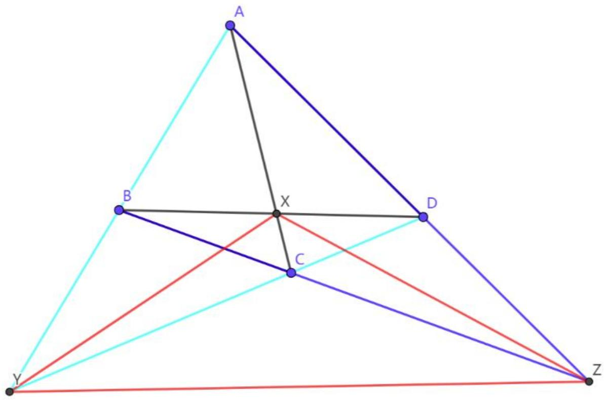

text_image

A
B
X
C
D
Y
Z

# (2)完全四点型中的调和分割:

已知 ABCD, XYZ 为完全四边形, $\Delta XYZ$ 为对边三点型, 设 $AB \cap XZ = P$ , $CD \cap XZ = N$ ,

$AD \cap XY = Q, BC \cap XY = M$ , 可得 $(AB, PY) = (DN, CY) = (AD, QZ) = (BC, MZ) = -1$

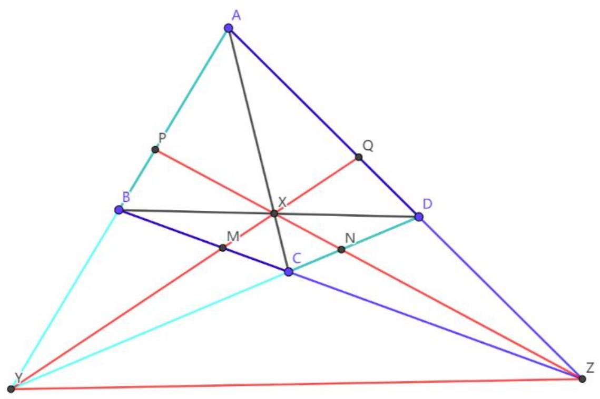

text_image

A
P
B
X
Q
D
M
C
N
Y
Z

# (3)完全四点型中的平行情况:

已知 ABCD 为完全四边形, 其中 AD//BC, AB 与过对边点 X 且平行于 AD 的直线交于点 P, 则 $(AB, PY) = -1$ 即点 P, Y 调和分割点 A, B 且 AQ = QD.

平行线段中点定理：若有任意条平行的线段,过其中一条线段的中点 $P_{0}$ 做直线l,分别交其他平行线段为 $P_{1},P_{2}\cdots$ ,则 $P_{i}$ 为对应平行线段的中点

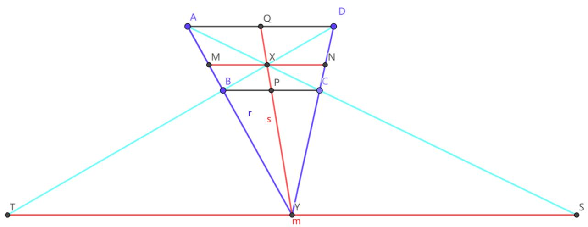

text_image

A
Q
D
M
X
N
B
P
C
r
s
T
Y
m
S

本节小结:

# 专题四

# 调和理论与极点极线(下)

# 【观念一】圆锥曲线与调和共轭：

给定圆锥曲线 C, 不在圆锥曲线 C 上的两点 P, Q 连线与圆锥曲线 C 交于 M, N 两点, 若满足 $(MN, PQ) = -1$ 则称 P, Q 关于圆锥曲线 C 调和共轭, 或称 P, Q 关于圆锥曲线 C 互为共轭点. 若给定圆锥曲线 C 的方程为 $Ax^{2} + By^{2} + Cxy + Dx + Ey + F = 0 (A, B, C, D$ 为常数), 且 $P(x_{1}, y_{1})$ $Q(x_{2}, y_{2})$ , 当且仅当下式成立时, P, Q 关于圆锥曲线 C 调和共轭

$$
A x _ {1} x _ {2} + B y _ {1} y _ {2} + \frac {C}{2} \left(x _ {1} y _ {2} + x _ {2} y _ {1}\right) + \frac {D}{2} \left(x _ {1} + x _ {2}\right) + \frac {E}{2} \left(y _ {1} + y _ {2}\right) + F = 0
$$

# 【观念二】圆锥曲线极线定理：

固定点 P (非有心圆锥曲线的中心) 不动, 则点 P 关于圆锥曲线 C 的所有调和共轭点的轨迹为直线 $l: Ax_{0}x + By_{0}y + \frac{C}{2}(x_{0}y + xy_{0}) + \frac{D}{2}(x_{0} + x) + \frac{E}{2}(y_{0} + y) + F = 0$

点 P 称为极点, 直线 l 称为极线.

①有心圆锥曲线指具有对称中心的圆锥曲线，主要包括椭圆和双曲线；  
②由于我们没有像射影几何教材一样给出无穷远点的概念,更加没有无穷远直线的概念,所以有心圆锥曲线(椭圆和双曲线)的中心是没有对应极线的.  
③给定极线l可反向推出极点P

# 【观念三】极点极线四线一方程：

已知极点 P 关于圆锥曲线 C 的极线 l, 在点 P 位置不同时, 可以延伸出极线的具体意义.

①当极点 P 在圆锥曲线 C 上时, 极线 l 为圆锥曲线 C 在极点 P 处的切线;  
②当极点 P 在圆锥曲线 C 外时, 极线 l 为圆锥曲线 C 的切点弦;  
③当极点 P 在圆锥曲线 C 内时, 极线 l 为过 P 的所有切点弦对应的两条切线交点的轨迹;  
④当极点 P 在圆锥曲线 C 内时, 满足 $l - l_{0} = 0$ 的点为极点 P 为中点时的中点弦轨迹;

# 【观念四】自极三角形：

如果完全四点形的四个顶点均在圆锥曲线 C 上,则其对边三点形每个顶点是其对边的极点,对边三点形每条边是其相对顶点的极线.

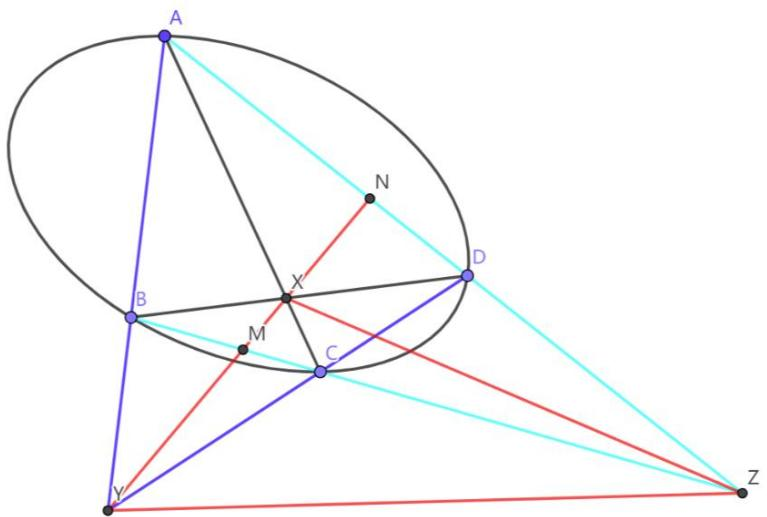

text_image

Geometric diagram with labeled points and lines, showing relationships between circles and triangles

# 【观念五】常见的调和理论与极点极线：

(1)椭圆中的常见形式:

已知椭圆为 $\frac{x^{2}}{a^{2}}+\frac{y^{2}}{b^{2}}=1$ ，极点为 $P(x_{0},y_{0})$ ，极线为 $l:\frac{x_{0}x}{a^{2}}+\frac{y_{0}y}{b^{2}}=1$ ，极线上一点 Q，过极点 P 交椭圆于 A, B 两点.

当极点变为 $(m,0)$ 时，极线为 $x = \frac{a^2}{m}$ ，此时存在 $k_{QA} + k_{QB} = 2k_{QP}$ ；

当极点变为 $(0,n)$ 时,极线变为 $y=\frac{b^{2}}{n}$ ,此时存在 $\frac{1}{k_{QA}}+\frac{1}{k_{QB}}=\frac{2}{k_{QP}}$ ;

当极点变为 $(\pm a,t)$ 时,极线为 $\pm\frac{x}{a}+\frac{y_{0}y}{b^{2}}=1$ ,此时存在顶点处的斜率和与倒数和.

(2)双曲线中的常见形式:

已知双曲线为 $\frac{x^{2}}{a^{2}} - \frac{y^{2}}{b^{2}} = 1$ ，极点为 $P(x_{0}, y_{0})$ ，极线为 $l: \frac{x_{0}x}{a^{2}} - \frac{y_{0}y}{b^{2}} = 1$ ，极线上一点 Q，过极点 P 交双曲线于 A, B 两点.

当极点变为 $(m,0)$ 时，极线为 $x = \frac{a^2}{m}$ ，此时存在 $k_{QA} + k_{QB} = 2k_{QP}$ ；

当极点变为 $(\pm a,t)$ 时,极线为 $\pm\frac{x}{a}-\frac{y_{0}y}{b^{2}}=1$ ,此时存在顶点处的斜率和与倒数和.

(3)抛物线中的常见形式:

已知抛物线为 $y^{2}=2px$ ，极点为 $P(x_{0},y_{0})$ ，极线为 $l:y_{0}y=p(x_{0}+x)$ ，极线上一点 Q，过极点 P 交抛物线于 A, B 两点.

当极点变为 $(m,0)$ 时,极线为x=-m,此时存在 $k_{QA}+k_{QB}=2k_{QP}$ ;

当极点 P 在抛物线外时, 过极点 P 作两条切线, 切点设为 M, N 则 $\Delta PMN$ 构成阿基米德三角形

【观念六】高考中的调和理论与极点极线应用：

【例 1】（2020 年全国 I 卷）已知 A, B 分别为椭圆 $E: \frac{x^{2}}{a^{2}} + y^{2} = 1 (a > 0)$ 的左, 右顶点, G 为 E 的上顶点, $\overrightarrow{AG} \cdot \overrightarrow{GB} = 8$ , P 为直线 x = 6 上的动点, PA 与 E 的另一个交点为 C, PB 与 E 的另一个交点为 D.

(1)求椭圆 E 的方程;  
(2)证明:直线 CD 过定点.

【例 2】（2023 新课标Ⅱ卷）双曲线 C 中, O 为坐标原点, 左焦点为 $(-2\sqrt{5}, 0)$ , 离心率为 $\sqrt{5}$

(1)求 C 的方程;  
(2)记 C 的左右顶点分别为 $A_{1}, A_{2}$ ，过点 $(-4,0)$ 的直线与 C 的左支交于 M, N 两点，M 在第二象限，直线 $MA_{1}$ 与 $NA_{2}$ 交于点 P，证明；P 在定直线上.

【例 3】（2011 四川卷）椭圆有两顶点 A(-1,0), B(1,0), 过其焦点 F(0,1) 的直线 l 与椭圆交于 C, D 两点, 并与 x 轴交于点 P, 直线 AC 与直线 BD 交于点 Q, 求证: $\overrightarrow{OP} \cdot \overrightarrow{OQ}$ .

【例 4】(2018 北京卷)已知抛物线 $y^{2}=4x$ ，点 $P(1,2)$ ，过点 $Q(0,1)$ 的直线 l 与抛物线有两个不同的交点 A, B 且直线 PA 交 y 轴于点 M，直线 PB 交 y 轴于 N，设 O 为原点， $\overrightarrow{QM}=\lambda\overrightarrow{QO}$ ， $\overrightarrow{QN}=\mu\overrightarrow{QO}$ ，求证明： $\frac{1}{\lambda}+\frac{1}{\mu}$ 为定值.

【例 5】(2022 全国 | 卷) 已知点 A(2,1) 在双曲线 $C: \frac{x^{2}}{a^{2}} - \frac{y^{2}}{a^{2} - 1} = 1 (a > 0)$ 上, 直线 l 与 C 交于 P,
Q 两点直线 AP, AQ 的斜率之和为 0.

(1)求直线 $l$ 的斜率;

【例 6】(2018 全国 | 卷) 设椭圆 $C: \frac{x^{2}}{2} + y^{2} = 1$ 的右焦点为 F, 过点 F 的直线 l 与 C 交于 A, B 两点, 点 $M(2,0)$ .

(1)当 l 与 x 轴垂直时,求直线 AM 的方程;  
(2)设 O 为坐标原点,证明: $\angle OMA = \angle OMB$ .

【例 7】(2017 全国 | 卷)已知椭圆 $C: \frac{x^{2}}{a^{2}} + \frac{y^{2}}{b^{2}} = 1 (a > b > 0)$ ，四点 $P_{1}(1,1)$ , $P_{2}(0,1)$ , $P_{3}(-1, \frac{\sqrt{3}}{2})$ , $P_{4}(1, \frac{\sqrt{3}}{2})$ 中恰有三点在椭圆 C 上.

(1)求 $C$ 的方程;  
(2)设直线 l 不经过点 $P_{2}$ 且与 C 相交于 A, B 两点. 若直线 $P_{2}A$ 与直线 $P_{2}B$ 的斜率和为 -1, 证明: l 过定点.

【例 8】(2013 江西卷)已知椭圆 $C: \frac{x^{2}}{4} + y^{2} = 1, A, B$ 分别为椭圆的左, 右顶点, D 为椭圆的上顶点, 点 P 椭圆 C 上除顶点外任意一点, 直线 DP 交 x 轴于点 N, 直线 AD 与 BP 于点 M, 设直线 BP 的斜率为 k, 直线 MN 的斜率为 m, 求证: 2m - k 为定值.

【例 9】（2023 全国乙卷）已知曲线 C 的方程为 $\frac{y^{2}}{a^{2}} + \frac{x^{2}}{b^{2}} = 1 (a > b > 0)$ ，离心率为 $\frac{\sqrt{5}}{3}$ ，曲线过点 A(-2,0).

(1)求曲线 C 的方程;  
(2)过点 $(-2,3)$ 的直线交曲线C与P,Q两点,直线AP,AQ与y轴交于M,N两点,证明:线段MN的中点是定点.

【例 10】（2020 北京卷）已知椭圆 $C: \frac{x^{2}}{8} + \frac{y^{2}}{4} = 1$ ，点 $A(-2, -1)$ ，过点 $B(-4, 0)$ 的直线交椭圆 C 于 M, N 两点，直线 MA 和 NA 交直线 x = -4 于 P, Q 两点，求 $\frac{|PB|}{|BQ|}$ 的值.

【例 11】（2022 全国乙卷）已知椭圆 E 的中心为坐标原点,对称轴为 x 轴,y 轴,且过 A(0,-2),B( $\frac{3}{2}$ ,-1) 两点.

(1)求 E 的方程;  
(2)设过点 $P(1, - 2)$ 的直线交 $E$ 于 $M,N$ 两点,过 $M$ 且平行于 $x$ 轴的直线与线段 $AB$ 交于点 $T$ ,点 $H$ 满足 $\overrightarrow{MT} = \overrightarrow{TH}$ .证明:直线 $HN$ 过定点.

本节小结:

# 专题五

# 阿基米德三角形

# 【观念一】阿基米德三角形定义：

圆锥曲线的弦与过弦的端点的两条切线所围成的三角形叫做阿基米德三角形.

其中圆锥曲线的弦称为阿基米德三角形的底边,两条切线的交点称为阿基米德三角形的顶点.

常见的阿基米德三角形均以抛物线为圆锥曲线进行考察.

其中,弦和抛物线顶点侧构成的弓形面积是阿基米德三角形面积的 $\frac{2}{3}$ .

# 【观念二】阿基米德三角形性质：

依照定义,按开口方向分类两种阿基米德三角形.

(1)横轴开口的抛物线 $y^{2}=2px$ 的阿基米德三角形:

已知抛物线为 $y^{2}=2px$ ，抛物线外一点 $P(x_{0},y_{0})$ 向抛物线引两条切线，切点分别为 $A(x_{1},y_{1})$

$B(x_{2},y_{2})$ , 焦点为 F, 则三角形 $\Delta PAB$ 为阿基米德三角形.

①两条切线 $PA:y_{1}y = p(x + x_{1})\Leftrightarrow y = \frac{p}{y_{1}} x - \frac{y_{1}}{2},PB:y_{2}y = p(x + x_{2})\Leftrightarrow y = \frac{p}{y_{2}} x - \frac{y_{2}}{2};$

②设切线 PA, PB 分别与 y 轴交于 D, E 两点, 可得 $AD \perp DF$ , $BE \perp EF$

③切点弦 $AB:y_0y = p(x + x_0)\Leftrightarrow (y_1 + y_2)y = 2px + y_1y_2$ ，则可得 $x_0 = \frac{y_1y_2}{2p},y_0 = \frac{y_1 + y_2}{2}$

④设 AB 中点为 M, 则 $P(\frac{y_{1}y_{2}}{2p}, \frac{y_{1}+y_{2}}{2})$ , $M(\frac{y_{1}^{2}+y_{2}^{2}}{4p}, \frac{y_{1}+y_{2}}{2})$ , 连接 MP 与抛物线交于点 Q, 作点 Q 处的切线, 此时 $l_{Q} // AB$ ;

⑤ $\left|AF\right|\cdot\left|BF\right|=\left|PF\right|^{2}$ ; ⑥ $\angle PFA=\angle PFB$ ; ⑦阿基米德三角形 $S=\frac{(y_{0}^{2}-2px_{0})^{\frac{3}{2}}}{p}=\frac{\left|y_{1}-y_{2}\right|^{3}}{8p}$ ;  
⑧底边为 a 的阿基米德三角形面积最大值为 $\frac{a^{2}}{8p}$ ;

⑨取弧 AB 上一点 I, 作 I 处的切线, 分别交 PA, PB 于点 S, T 则 $S_{\Delta PAB} = 2S_{\Delta PST}$ , 且 $\Delta PST$ 的垂心在抛物线的准线上;

⑩存在 $\frac{AS}{SP} = \frac{SI}{IT} = \frac{PT}{TB}$ .

(2)纵轴开口的抛物线 $x^{2} = 2py$ 的阿基米德三角形:

已知抛物线为 $x^{2}=2py$ ，抛物线外一点 $P(x_{0},y_{0})$ 向抛物线引两条切线，切点分别为 $A(x_{1},y_{1})$ ， $B(x_{2},y_{2})$ ，焦点为 F，则三角形 $\Delta PAB$ 为阿基米德三角形.

①两条切线 $PA: x_1x = p(y + y_1) \Leftrightarrow y = \frac{x_1}{p}x - \frac{x_1^2}{2p}, PB: x_2x = p(y + y_2) \Leftrightarrow y = \frac{x_2}{p}x - \frac{x_2^2}{2p};$

②设切线 PA, PB 分别与 x 轴交于 D, E 两点, 可得 $AD \perp DF$ , $BE \perp EF$

③切点弦 $AB: x_{0}x = p(y + y_{0}) \Leftrightarrow (x_{1} + x_{2})x = 2py + x_{1}x_{2}$ ，则可得 $x_{0} = \frac{x_{1} + x_{2}}{2}$ ， $y_{0} = \frac{x_{1}x_{2}}{2p}$ ;

④设 AB 中点为 M，则 $P(\frac{x_{1}+x_{2}}{2},\frac{x_{1}x_{2}}{2p})$ ， $M(\frac{x_{1}+x_{2}}{2},\frac{x_{1}^{2}+x_{2}^{2}}{4p})$ ，连接 MP 与抛物线交于点 Q，作点 Q 处的切线，此时 $l_{Q}//AB$ ；

⑤ $\left|AF\right|\cdot\left|BF\right|=\left|PF\right|^{2}$ ; ⑥ $\angle PFA=\angle PFB$ ; ⑦阿基米德三角形 $S=\frac{(x_{0}^{2}-2py_{0})^{\frac{3}{2}}}{p}=\frac{\left|x_{1}-x_{2}\right|^{3}}{8p}$ ;

⑧底边为 a 的阿基米德三角形面积最大值为 $\frac{a^{2}}{8p}$ ;

⑨取弧 AB 上一点 I, 作 I 处的切线, 分别交 PA, PB 于点 S, T 则 $S_{\Delta PAB} = 2S_{\Delta PST}$ , 且 $\Delta PST$ 的垂心在

抛物线的准线上；

⑩存在 $\frac{AS}{SP} = \frac{SI}{IT} = \frac{PT}{TB}$ .

(3)特殊的阿基米德三角形:

以抛物线为 $y^{2}=2px$ 为例, 当切点弦 AB 过其焦点 F 时, 具有更多性质

①点 P 必在抛物线的准线上；②阿基米德三角形 $\Delta PAB$ 为直角三角形,且 $PA \perp PB$ ;  
③ $PF \perp AB$ 符合射影定理；④ 阿基米德三角形 $S_{\Delta PAB}$ 最小值为 $p^{2}$ .

【例 1】(2018 年全国Ⅲ卷)已知点 M(-1,1) 和抛物线 $C: y^{2} = 4x$ ，过 C 的焦点且斜率为 k 的直线与 C 交于 A, B 两点，若 $\angle AMB = 90^{\circ}$ ，求 k 的值.

【例 2】(2005 江西卷)已知抛物线 $C: y = x^{2}$ 的焦点为 F, 动点 P 在直线 x - y - 2 = 0 上运动, 过 P 作抛物线 C 的两条切线 PA, PB, 且与抛物线 C 分别相切于 A, B 两点.

(1)求 $\Delta APB$ 的重心 G 的轨迹方程;  
(2)证明: $\angle PFA = \angle PFB$ .

【例 3】(2006 全国 II 卷)已知抛物线 $x^{2}=4y$ 的焦点为 F, A, B 是抛物线上的两动点, 且 $\overrightarrow{AF}=\lambda\overrightarrow{FB}(\lambda>0)$ . 过 A, B 两点分别作抛物线的切线, 设其交点为 M.

(1)证明: $\overrightarrow{FM} \cdot \overrightarrow{AB}$ 为定值.   
(2)设 $\Delta ABM$ 的面积为 S, 写出 $S = f(\lambda)$ 的表达式, 并求 S 的最小值.

【例 4】(2022 郑州二模)已知抛物线 $C: x^{2} = 4y$ ，过抛物线外一点 N 作抛物线 C 的两条切线，A, B 是切点.

(1)若点 N 的纵坐标为 -2, 求证: 直线 AB 横过定点.  
(2)若 $|AB|=m(m>0)$ ,求 $\Delta ABN$ 的面积最大值(用m表示).

【例 5】(2021 全国乙卷)已知抛物线 $C: x^{2} = 2py$ 的焦点为 F，且 F 与圆 $M: x^{2} + (y + 4)^{2} = 1$ 上的点的距离最小值为 4.

(1)求 $p$ 的值.  
(2)若点 P 在圆 M 上,且 PA, PB 为 C 的两条切线, A, B 是切点,求 $\Delta PAB$ 面积的最大值.

本节小结:

# 专题六

# 坎迪定理与蝴蝶定理

# 【观念一】圆锥曲线的线束交比不变性：

已知圆锥曲线 C, 其上四个不同的点 A, B, C, D, 取其上一动点 P, 则直线 PA, PB, PC, PD 构成的线束 S 的交比值为 r, 当点 P 在圆锥曲线 C 上运动时, 线束 S 的交比值仍为 r.

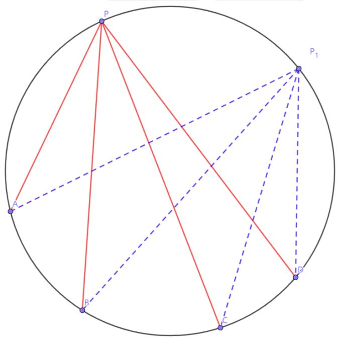

text_image

P
A
B
C
D
P₁

# 【观念二】圆锥曲线的坎迪定理：

已知点 M 为圆锥曲线 C 中定弦 PQ 的一点, 过 M 作两条任意的直线, 交圆锥曲线 C 分别于 A, B 和 C, D 四点, 若直线 PQ 分别与直线 AB, CD 交于 S, T 两点, 则 $\frac{1}{MT} - \frac{1}{MQ} = \frac{1}{MS} - \frac{1}{MP}$ .

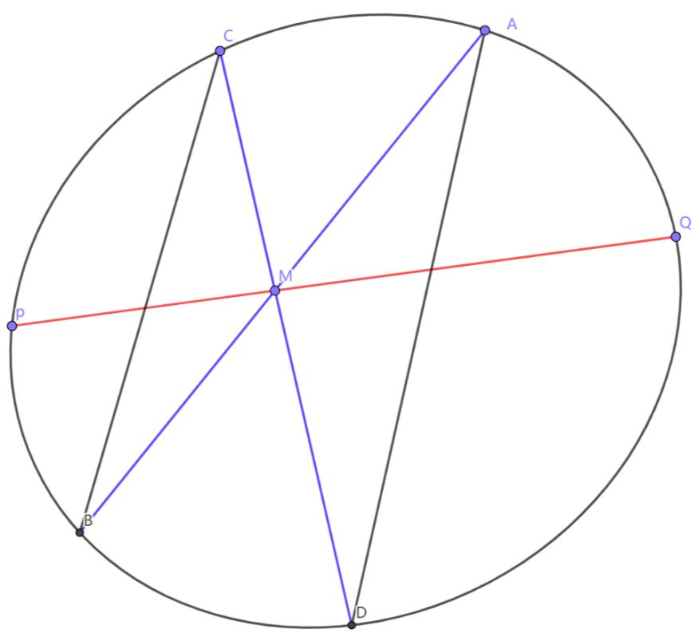

text_image

C
A
M
P
B
D
Q

# 【观念三】圆锥曲线的蝴蝶定理：

蝴蝶定理为圆锥曲线的坎迪定理的一种特殊情况,当 MP = MQ 即点 M 为 PQ 中点时,图像变为完全对称的蝴蝶定理,则 MT = MS.

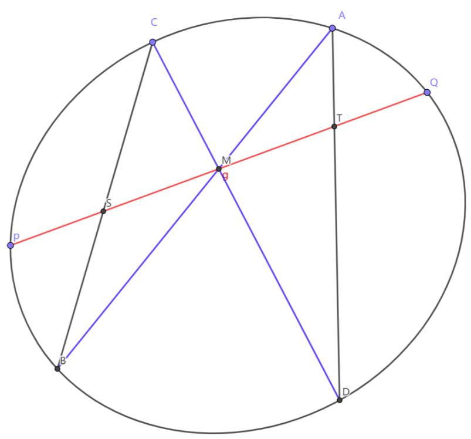

text_image

C
A
Q
P
S
M
g
T
B
D

# 【观念四】椭圆中的坎迪定理：

已知椭圆 $\frac{x^{2}}{a^{2}}+\frac{y^{2}}{b^{2}}=1(a>b>0)$ 的左, 右顶点分别为 $E_{1}, E_{2}$ , 在椭圆的长轴上存在三点 $G(g,0)$ , $T(t,0), H(h,0)$ , 过 G 的直线交椭圆于 A, B 两点, 延长 AT, BT 分别交椭圆于 C, D 两点,

则存在以下结论:

① 直线 CD 过定点 $H\left[\frac{g(a^{2}+t^{2})-2ta^{2}}{2gt-(a^{2}+t^{2})},0\right]$ ; ② $\frac{1}{TE_{2}}-\frac{1}{TE_{1}}=\frac{1}{TH}-\frac{1}{TG}$ ;

③ $\frac{k_{AB}}{k_{CD}}=\frac{a^{2}-t^{2}}{a^{2}+t^{2}-2gt}=\frac{TH}{TG}.$

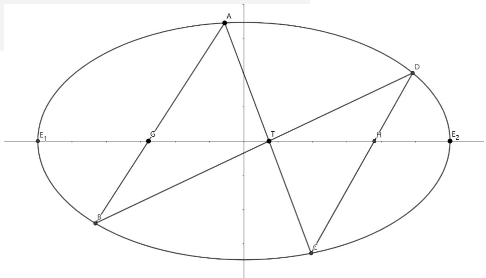

text_image

A
D
E₁
G
T
H
E₂
B
C

# 特殊情况下的坎迪定理：

已知椭圆 $\frac{x^2}{a^2} +\frac{y^2}{b^2} = 1(a > b > 0)$ 的左，右顶点分别为 $A,B$ ，在椭圆的长轴上存在点 $M(m,0)$ ，过 $M$

的直线交椭圆于 C, D 两点, 则 $\frac{k_{AC}}{k_{BD}} = \frac{MB}{MA} = \frac{a - m}{a + m}$ .

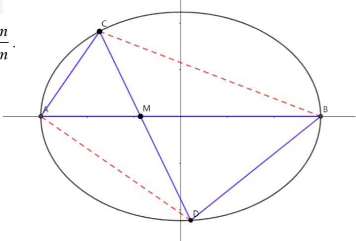

text_image

n/n.

# 【观念五】椭圆中的蝴蝶定理：

已知椭圆为 $\frac{x^2}{a^2} +\frac{y^2}{b^2} = 1(a > b > 0)$ ，在椭圆长轴上存在点 $M(m,0)$ ，过 $M$ 的两条直线分别交椭圆于 $A,C$ 与 $B,D$ ，过点 $M$ 作垂直于长轴的直线交直线 $AB$ 和 $CD$ 交于 $P,Q$ 两点，则 $PM = PQ$

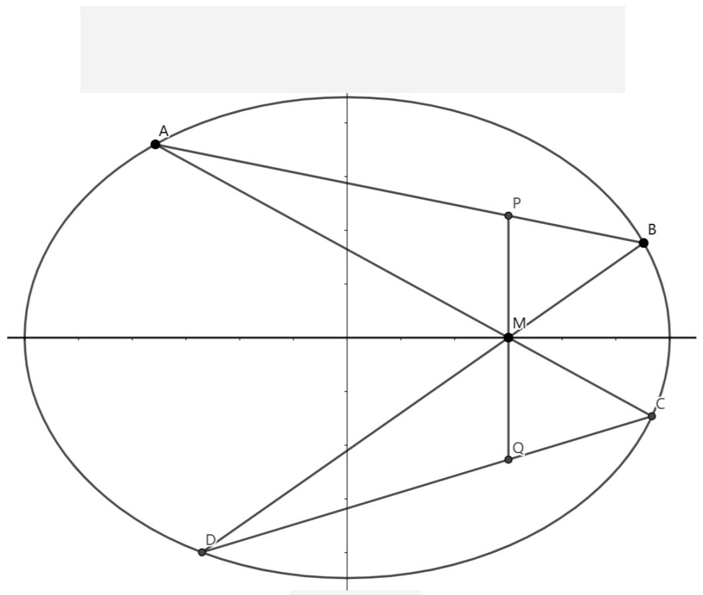

text_image

A
P
B
M
C
Q
D

【观念六】抛物线中的坎迪定理：

已知抛物线 $y^{2}=2px(p>0)$ , $A(a,0)$ , $B(b,0)$ , $C(c,0)$ , 过 A 的直线交抛物线于点 M, N 两点, 延长 MB, NB 分别交抛物线于点 P, Q 则存在以下结论:

①直线 PQ 过点 C；② $b^{2}=ac$ ；③ $\frac{1}{AB}=\frac{1}{OB}+\frac{1}{BC}$ ；④ $\frac{k_{MN}}{k_{PQ}}=\frac{b}{a}=\frac{c-b}{b-a}=\frac{BC}{BA}$ .

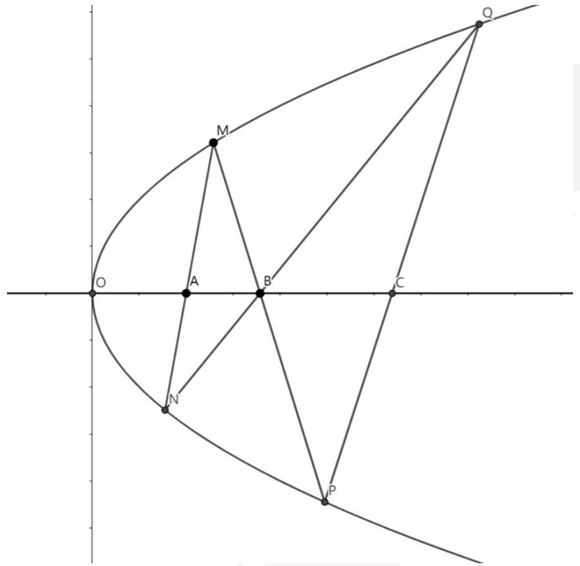

text_image

Geometric diagram with labeled points O, A, B, C, M, N, P, Q and intersecting lines forming a parabola and triangle structure.

【观念七】抛物线中的蝴蝶定理：

已知抛物线 $y^{2}=2px(p>0)$ , $M(m,0)$ , 过 M 的两条直线分别交抛物线于 A, C 与 B, D, 过点 M 作垂直于 x 轴的直线交直线 AB 和 CD 交于 P, Q 两点, 则 PM=PQ.

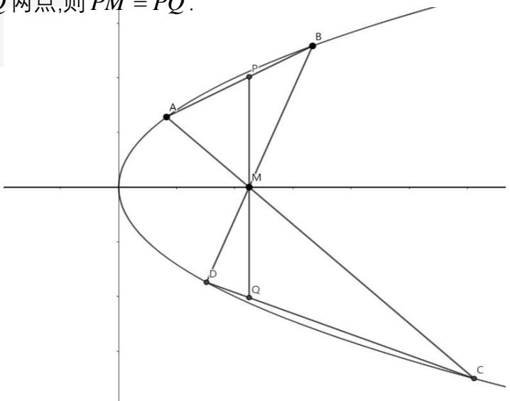

text_image

两点,则PM=PQ.
A
B
P
M
D
Q
C

【例 1】已知椭圆 $\frac{x^{2}}{9}+\frac{y^{2}}{5}=1$ , 点 $R(1,0)$ , 过椭圆右焦点 F 的直线与椭圆交于 A, B 两点, 直线 AR,

直线 BR 分别交椭圆与 C, D 两点, 求证: 直线 CD 过定点且 $\frac{k_{CD}}{k_{AB}}$ 为定值.

【例 2】已知双曲线 $\frac{x^{2}}{3}-y^{2}=1$ , 已知点 $N(2,0)$ , 过点 $M(-3,0)$ 的直线和双曲线交于 A, B 两点, 连接 AN 和 BN 分别交双曲线于 C, D 两点, 求证: $\frac{k_{CD}}{k_{AB}}$ 为定值.

【例 3】（2020 年全国 I 卷）已知 A, B 分别为椭圆 $E: \frac{x^{2}}{a^{2}} + y^{2} = 1 (a > 0)$ 的左, 右顶点, G 为 E 的上顶点, $\overrightarrow{AG} \cdot \overrightarrow{GB} = 8$ , P 为直线 x = 6 上的动点, PA 与 E 的另一个交点为 C, PB 与 E 的另一个交点为 D.

(1)求椭圆 E 的方程;  
(2)证明:直线CD过定点.

【例 4】(2022 全国甲卷) 设抛物线 $C: y^{2} = 2px (p > 0)$ 的焦点 F, 点 $D(p, 0)$ , 过 F 的直线交 C 于 M, N 两点, 当 MD 与 x 轴垂直时, $\left|MF\right| = 3$ .

(1)求 C 的方程;  
(2)设直线 MD, ND 与 C 的另一个交点分别为 A, B 记直线 MN, AB 的倾斜角分别为 $\alpha, \beta$ , 当 $\alpha - \beta$ 取最大值时, 求直线 AB 的方程.

【例 5】(2016 年郑州一模)已知点 $M(-1,0)$ , $N(1,0)$ , 曲线 E 上任意一点到 M 的距离均是到点 N 的距离的 $\sqrt{3}$ 倍.

(1)求曲线 $E$ 的方程;  
(2)已知 $m\neq0$ ,设直线 $l_{1}:x-my-1=0$ 交曲线E于A,C两点,直线 $l_{2}:mx+y-m=0$ 交曲线E于B,D两点,且点C,D均在x轴下方,当CD的斜率为-1求,线段 $|AB|$ 的长度.

【例 6】已知椭圆 $\frac{x^{2}}{8}+\frac{y^{2}}{4}=1$ , 过点 $P(0,1)$ 做椭圆的两条弦 AB, CD (A, C 分别位于第一, 二象限),
若 BC, AD 与直线 y = -1, 分别交于 M, N, 求证: $\left|PM\right| = \left|PN\right|$

本节小结:

# 专题七

# 彭赛列闭合定理

# 【观念一】彭赛列大定理(彭色列闭合定理):

已知大椭圆 $\Gamma_{1}$ 在小椭圆 $\Gamma_{2}$ 的内部, $\Delta ABC$ 是 $\Gamma_{1}$ 的内接三角形和 $\Gamma_{2}$ 的外切三角形, 过 $\Gamma_{1}$ 上任意点 $A_{0}$ 做 $\Gamma_{2}$ 的两条切线, 分别交 $\Gamma_{2}$ 于 $B_{0}, C_{0}$ 两点, 则 $B_{0}C_{0}$ 与 $\Gamma_{2}$ 相切.

抛物线与其他曲线也同样成立；其可推广至 $n$ 边形也同样成立；

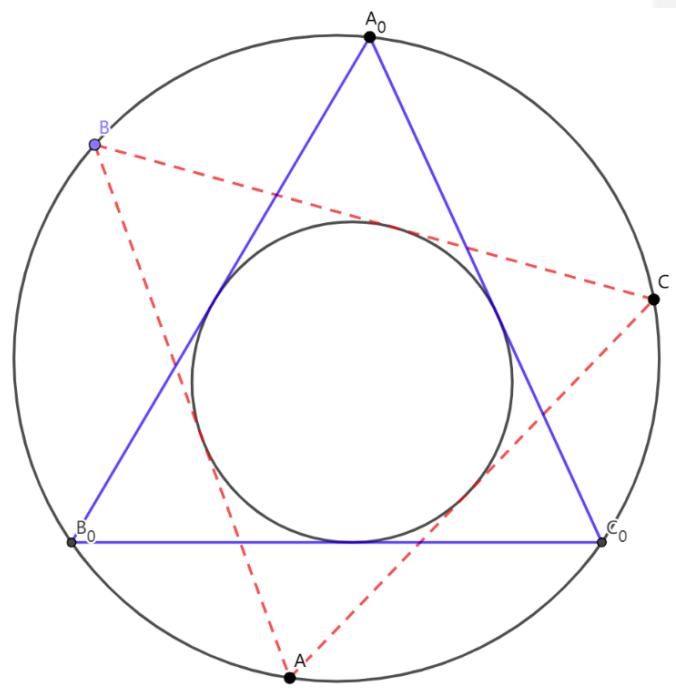

text_image

A₀
B
C
B₀
C₀
A

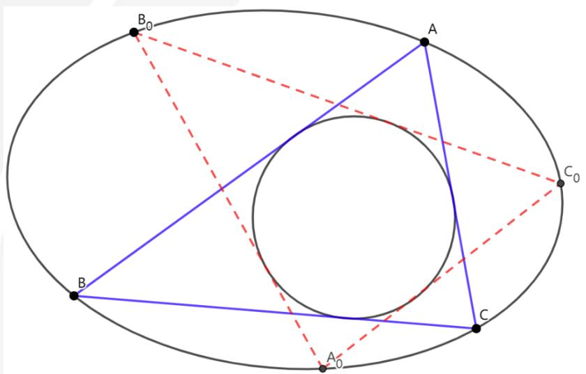

text_image

B₀
A
C₀
B
C
A₀

# 【观念二】彭赛列小定理(光学性质):

已知圆锥曲线 C 的两个焦点 $F_{1}, F_{2}$ ，在圆锥曲线外一点 P 引两条切线，切点分别为 A, B，则 $PF_{1}$ 和 PA 的夹角等于 $PF_{2}$ 与 PB 的夹角.

当点 P 在圆锥曲线 C 上时, 其为圆锥曲线的光学性质.

【例 1】(2021 全国甲卷)已知抛物线 $C_{1}: y^{2} = x$ ，设 $A_{1}, A_{2}, A_{3}$ 为抛物线上互异的三点，若直线 $A_{1}A_{2}, A_{1}A_{3}$ 均与圆 $M: (x - 2)^{2} + y^{2} = 1$ 相切，求证：直线： $A_{2}A_{3}$ 与圆 M 相切.

【例 2】(2009 江西卷)已知圆 $G:(x-2)^{2}+y^{2}=r^{2}$ 是椭圆 $\frac{x^{2}}{16}+y^{2}=1$ 的内接 $\Delta ABC$ 的内切圆, 其中 A 为椭圆的左顶点, 过点 M(0,1) 作圆 G 的两条切线, 交椭圆于 E, F 两点, 证明: 直线 EF 于圆 G 相切.

【例 3】设点 P 是抛物线 $C_{1}: y^{2} = 4x$ 上的动点, 过 P 作圆 $C_{2}: (x - 3)^{2} + y^{2} = r^{2} (r > 0)$ 的两条切线, 交抛物线 $C_{1}$ 于 A, B 两点, 若过 A, B 两点的直线恒与 $C_{2}$ 相切, 求圆的半径 r.

本节小结:

# 专题八

# 帕斯卡定理

# 【观念一】射影不变性引理：

已知点列 $s_1$ 上四点 $O, A_1, B_1, C_1$ , 以及点列 $s_2$ 上四点 $O, A_2, B_2, C_2$ , 且满足 $(OA_1, B_1C_1) = (OA_2, B_2C_2)$ 则可出现以下情况：① $A_{1}A_{2},B_{1}B_{2},C_{1}C_{2}$ 平行；② $A_{1}A_{2},B_{1}B_{2},C_{1}C_{2}$ 共点.

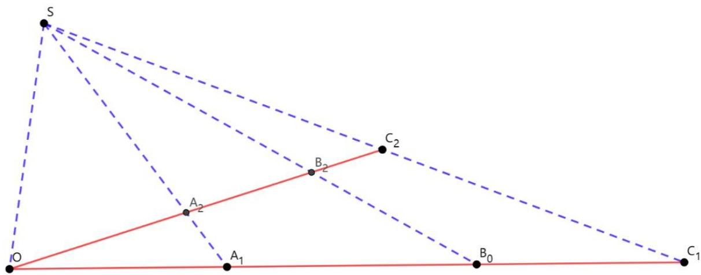

text_image

S
O
A₂
A₁
B₂
C₂
B₀
C₁

# 【观念二】帕普斯定理：

已知点列 $s_{1}$ 上四点 $O, A_{1}, B_{1}, C_{1}$ ，以及点列 $s_{2}$ 上四点 $O, A_{2}, B_{2}, C_{2}$ ，连接 $A_{2}B_{1}, A_{2}C_{1}, A_{1}B_{2}, B_{2}C_{1}, A_{1}C_{2}$ $B_{1}C_{2}$ ，设 $A_{2}B_{1}\cap A_{1}B_{2}=X$ ， $A_{2}C_{1}\cap A_{1}C_{2}=Y$ ， $B_{2}C_{1}\cap B_{1}C_{2}=Z$ ， $A_{2}C_{1}\cap A_{1}B_{2}=E$ ， $B_{2}C_{1}\cap A_{1}C_{2}=D$ 可得 X, Y, Z 三点共线.

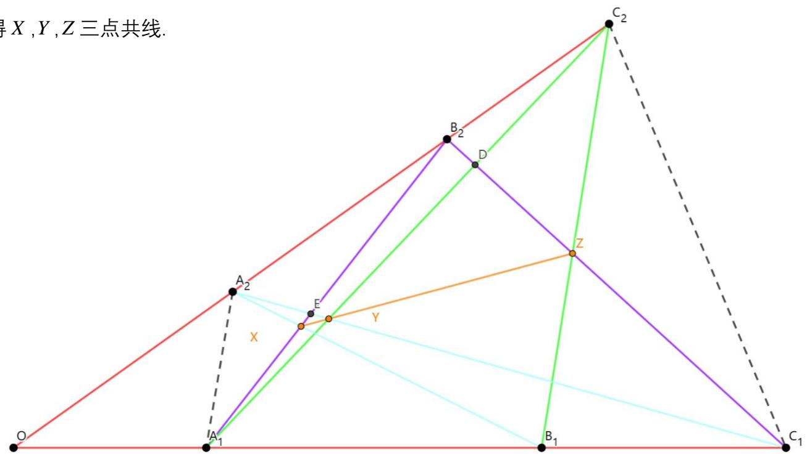

text_image

X,Y,Z三点共线.
A₂
B₂
D
C₂
X
E
Y
Z
O
I₁
B₁
C₁

# 交比相等情况下的帕普斯定理：

已知点列 $s_1$ 上四点 $O, A_1, B_1, C_1$ , 以及点列 $s_2$ 上四点 $O, A_2, B_2, C_2$ , 且满足 $(OA_1, B_1C_1) = (OA_2, B_2C_2)$

连接 $A_{2}B_{1}, A_{2}C_{1}, A_{1}B_{2}, B_{2}C_{1}, A_{1}C_{2}, B_{1}C_{2}$ , 设 $A_{2}B_{1} \cap A_{1}B_{2} = X, A_{2}C_{1} \cap A_{1}C_{2} = Y, B_{2}C_{1} \cap B_{1}C_{2} = Z$ ,

$A_{2}C_{1}\cap A_{1}B_{2}=P,A_{2}B_{1}\cap A_{1}C_{2}=Q\ B_{2}C_{1}\cap A_{1}C_{2}=M,A_{2}C_{1}\cap B_{1}C_{2}=N$ ,则有以下结论：

①O, X, Y, Z 四点共线；②PQ, MN 均过 S.

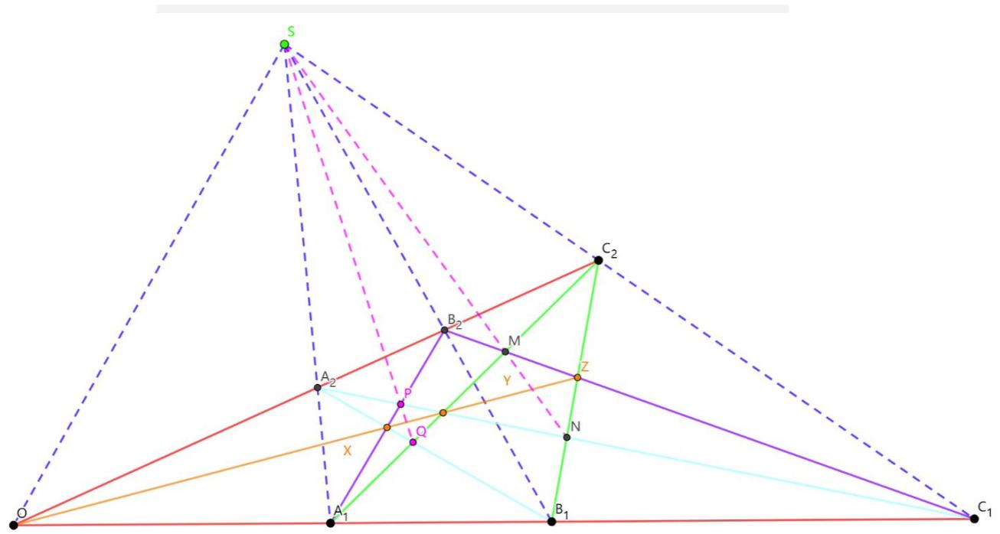

text_image

S
A₂
P
Q
X
A₁
B₂
M
Y
Z
N
B₁
C₂
O
C₁

# 【观念三】帕斯卡定理：

圆锥曲线的内接六边形三组对边交点在一条直线上,这条线为帕斯卡线.

已知 A, B, C, D, E, F 为圆锥曲线 $\Gamma$ 上六点, 设 $AD \cap CE = X$ , $AB \cap EF = Y$ , $BC \cap DF = Z$ 且 $AB \cap DF = M$ , $AD \cap EF = N$ , 则可得 X, Y, Z 三点共线, 直线 XYZ 为帕斯卡线.

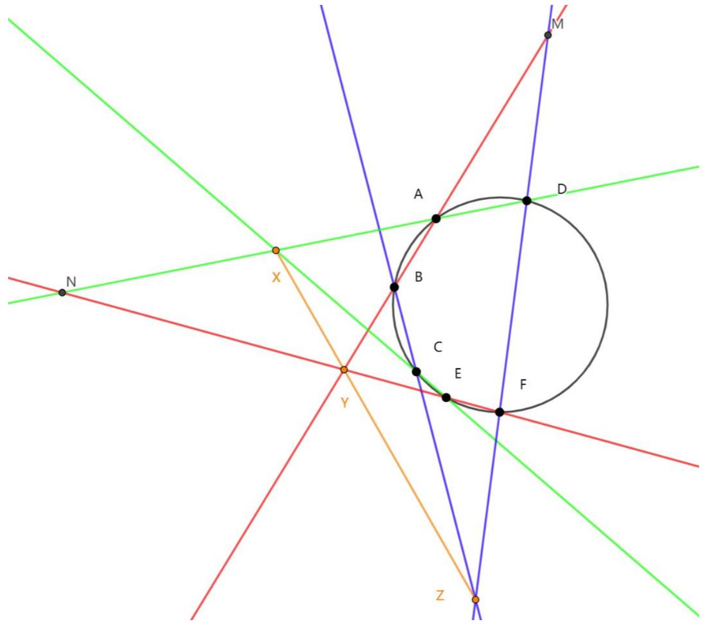

text_image

N
X
Y
Z
A
B
C
E
F
D
M

【观念四】帕斯卡定理的特殊情况：

(1)六边形帕斯卡:

非平行型

三点在内部型  
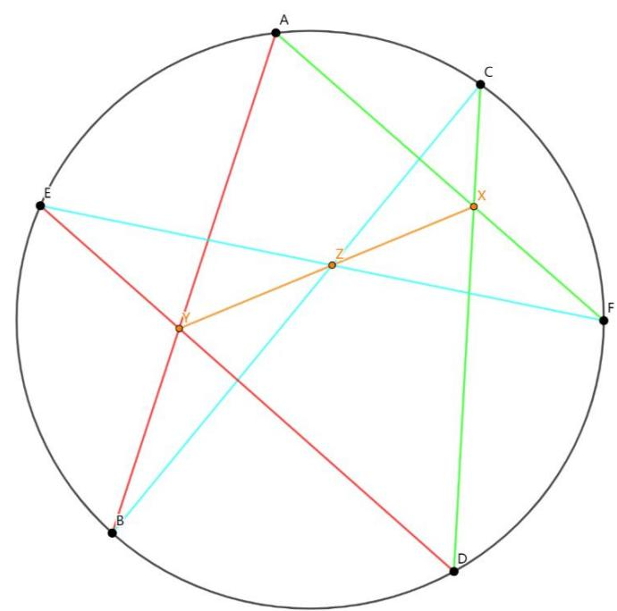

text_image

A
C
E
X
Z
F
B
D

一点在内部型

两点在内部型  
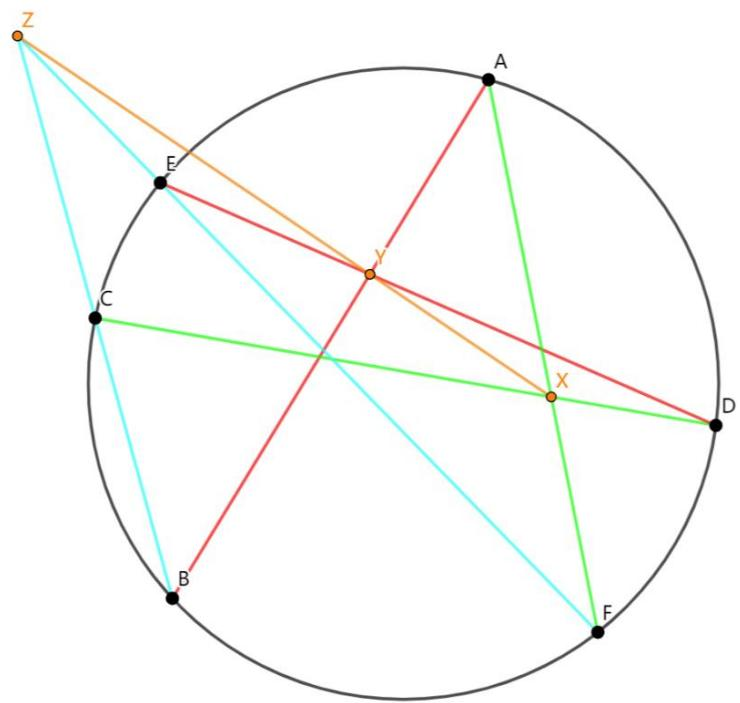

text_image

Geometric diagram showing a circle with labeled points A, B, C, D, E, F, X, Y, Z and intersecting lines forming triangles and chords.

三点在外部型

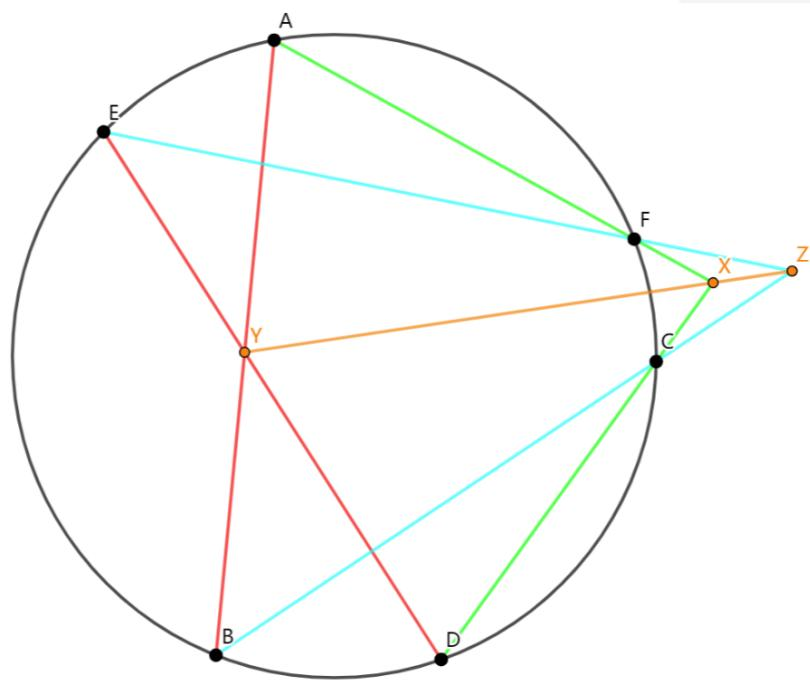

text_image

Geometric diagram of a circle with labeled points A, B, C, D, E, F, X, Y and intersecting lines forming triangles and chords.

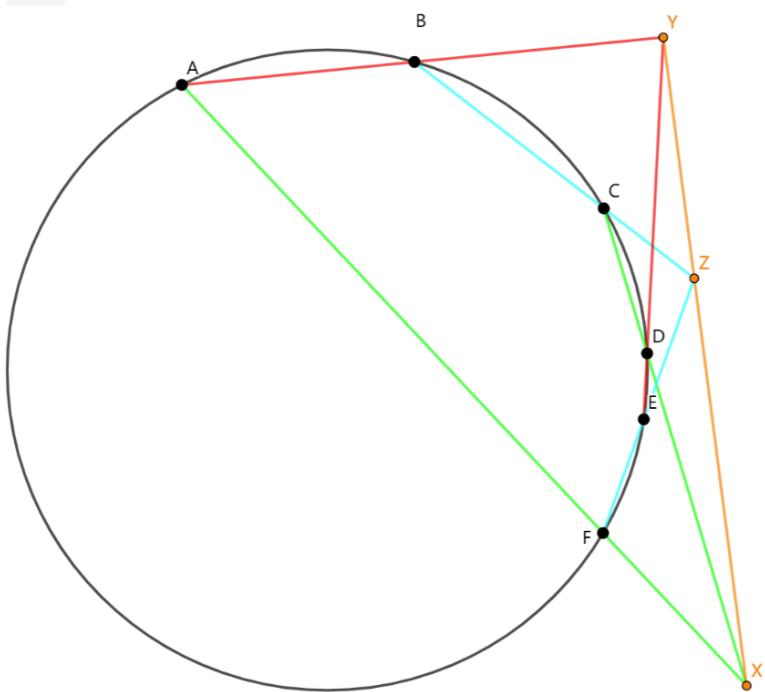

text_image

A
B
C
D
E
F
X
Y
Z

平行型  
一组平行型  
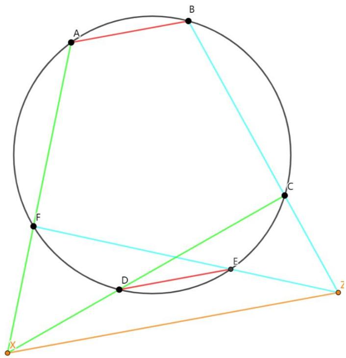

text_image

Geometric diagram showing a circle with inscribed quadrilateral ABCD and extended points E, F, X, Z, including colored lines connecting them.

则有 $AB // DE // XZ$

两组平行型  
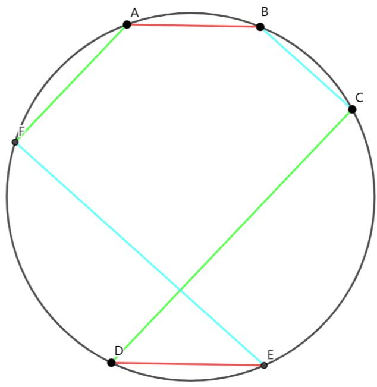

text_image

A
B
C
D
E

则有 $AB // DE, BC // EF, CD // AF$

(2)五边形帕斯卡：  
非平行型  
一点在内部型  
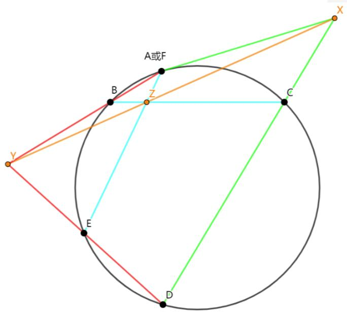

text_image

A或F
B
Z
C
X
Y
E
D

三点在外部型  
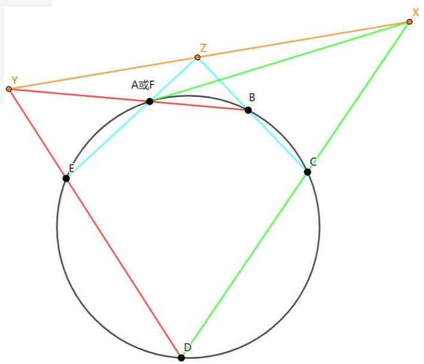

text_image

Y
A或F
Z
B
E
C
D
X

平行型  
则有 $AB // DE // XZ$   
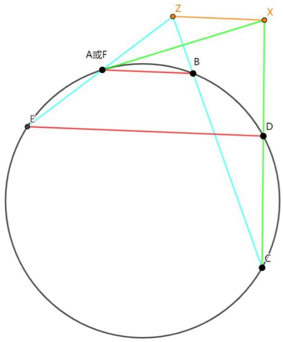

text_image

A或F
B
C
D
X
Z

(3)四边形帕斯卡：

切割线型  
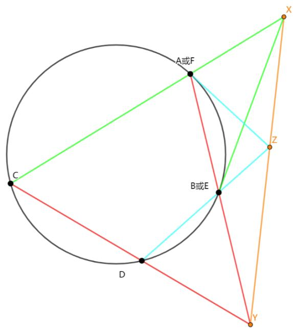

text_image

A或F
C
B或E
D
X
Z
Y

双切线型  
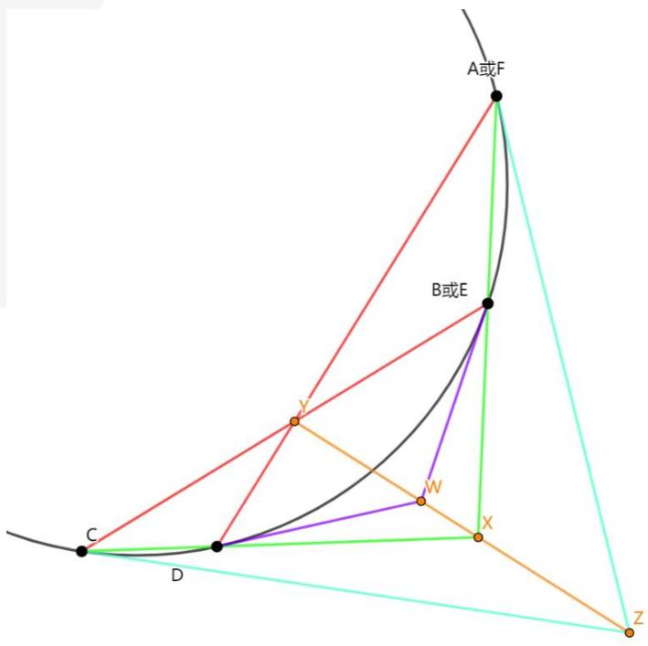

text_image

A或F
B或E
C
D
Y
W
X
Z

# (4)三角形帕斯卡：

三点共线型  
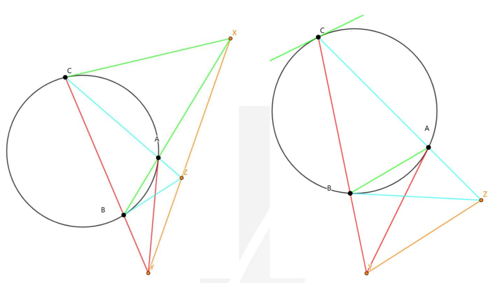  
切线平行型

【例 1】(2023 北京卷)已知椭圆方程为 $E: \frac{x^{2}}{9} + \frac{y^{2}}{4} = 1$ ，点 A, C 分别为椭圆上，下顶点，B, D 分别为椭圆左，右顶点，点 P 为椭圆 E 在第一象限上的动点，PD 与 BC 交于 M, PA 与直线 y = -2 交于 N. 求证：MN//CD.

【例 2】已知椭圆方程为 $\frac{x^{2}}{4} + y^{2} = 1$ ，点 A, B 分别为椭圆的左，右顶点，过点 C(-2,2) 的直线与椭圆交于 P, M 两点，直线 MB 与直线 OC 相交于点 G，求证：直线 AP 和直线 AQ 的斜率积为定值.

【例 3】已知椭圆方程为 $\frac{x^{2}}{24}+\frac{y^{2}}{12}=1$ 直线 $l: y=\frac{1}{2}x$ 与椭圆交于 A, B 两点, C, D 异于 A, B 且直线 AC 与 BD 交于点 M, 直线 AD 与 BC 交于点 N, 求证: 直线 MN 的斜率定值.

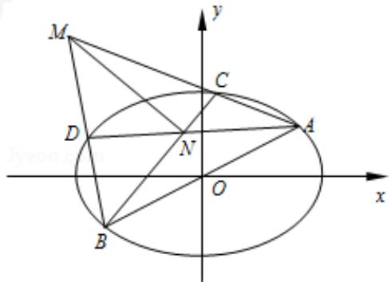

text_image

M
y
C
D
N
A
O
x
B

【例 4】已知椭圆 $C: \frac{x^{2}}{a^{2}} + \frac{y^{2}}{b^{2}} = 1 (a > b > 0)$ 的左, 右顶点分别为 $A_{1}, A_{2}, D(\sqrt{6}, 1)$ 为椭圆 C 上一点, P, Q 为椭圆 C 上异于 $A_{1}, A_{2}$ 的两点, 且直线 PQ 不与坐标轴平行, 点 P 关于原点对称的点为 S, $\overrightarrow{DP} \cdot \overrightarrow{DS}$ 的最大值为 4.

(1)求椭圆 C 的标准方程;  
(2)若直线 $A_{1}S$ 与直线 $A_{2}Q$ 相交于点 T, 直线 OT 与直线 PQ 相交于点 R, 证明: 在椭圆 C 上存在定点 E, 使得 $\Delta RDE$ 的面积为定值, 并求出该定值.

【例 5】(2023.5 暄尘原创) 已知椭圆 $C: mx^{2} + ny^{2} = 1$ 过 $A(-1, \frac{3}{2})$ , $B(2, 0)$ 两点, 过点 $M(2, 3)$ 的直线 l 交椭圆 C 于 P, Q 两点, 直线 AP 与直线 BQ 交于点 E, 直线 AQ 与直线 BP 交于点 F.

(1)求椭圆 C 的标准方程;  
(2)求证:直线 EF 过定点.

本节小结:

# T7 圆锥曲线专题第四大节(上)

# 专题一

# 直线与曲线联立后的运算简化

# 第一讲

# 联立初步和硬解定理

# 【观念一】硬解定理(不推荐!!!):

对于已知的直线 $Ax + By + C = 0$ 与三条曲线相交联立后的结果, 可以通过一般的公式来表示:

(1)与椭圆 $\frac{x^2}{a^2} +\frac{y^2}{b^2} = 1$ 联立,有消 $y$ 得 $x$ 的方案①,也有消 $x$ 得 $y$ 的方案②:

以方案①为例,方案②同理： $(a^{2}A^{2}+b^{2}B^{2})x^{2}+2AC\cdot a^{2}x+a^{2}(C^{2}-b^{2}B^{2})=0$

得其完全判别式为 $\Delta_x = 4a^2 b^2 B^2 (a^2 A^2 +b^2 B^2 -C^2)$ 或 $\Delta_y = 4a^2 b^2 A^2 (a^2 A^2 +b^2 B^2 -C^2)$

等效判别式 $\Delta = a^{2}A^{2} + b^{2}B^{2} - C^{2}$

由韦达定理可得 $x_{1} + x_{2} = \frac{-2AC\cdot a^{2}}{(a^{2}A^{2} + b^{2}B^{2})},x_{1}x_{2} = \frac{a^{2}(C^{2} - b^{2}B^{2})}{(a^{2}A^{2} + b^{2}B^{2})},\frac{1}{x_{1}} +\frac{1}{x_{2}} = \frac{-2AC}{C^{2} - b^{2}B^{2}}$

还有 $y_{1} + y_{2} = \frac{-2BC\cdot b^{2}}{(a^{2}A^{2} + b^{2}B^{2})},y_{1}y_{2} = \frac{b^{2}(C^{2} - a^{2}A^{2})}{(a^{2}A^{2} + b^{2}B^{2})},\frac{1}{y_{1}} +\frac{1}{y_{2}} = \frac{-2BC}{C^{2} - a^{2}A^{2}}$

坐标差 $\left|x_{1}-x_{2}\right|=\sqrt{\left(x_{1}+x_{2}\right)^{2}-4x_{1}x_{2}}=\frac{2ab\left|B\right|\sqrt{\left(a^{2}A^{2}+b^{2}B^{2}-C^{2}\right)}}{a^{2}A^{2}+b^{2}B^{2}}$

还有 $\left|y_{1} - y_{2}\right| = \sqrt{(y_{1} + y_{2})^{2} - 4y_{1}y_{2}} = \frac{2ab\left|A\right|\sqrt{(a^{2}A^{2} + b^{2}B^{2} - C^{2})}}{a^{2}A^{2} + b^{2}B^{2}}$

可得弦长公式为 $d = \sqrt{1 + \frac{A^2}{B^2}}\left|x_1 - x_2\right| = \sqrt{1 + \frac{B^2}{A^2}}\left|y_1 - y_2\right| = \frac{2ab\sqrt{(A^2 + B^2)(a^2A^2 + b^2B^2 - C^2)}}{a^2A^2 + b^2B^2}$

由此还有以 $P(x_0,y_0)$ 为顶点构成三角形的面积 $S = ab\left|Ax_0 + By_0 + C\right|\cdot \frac{\sqrt{(a^2A^2 + b^2B^2 - C^2)}}{a^2A^2 + b^2B^2}$

(2)与双曲线 $\frac{x^2}{a^2} -\frac{y^2}{b^2} = 1$ 联立,有消 $y$ 得 $x$ 的方案①,也有消 $x$ 得 $y$ 的方案②(实际上是换 $-b^{2}$ ):

以方案①为例,方案②同理： $(a^{2}A^{2}-b^{2}B^{2})x^{2}+2AC\cdot a^{2}x+a^{2}(C^{2}+b^{2}B^{2})=0(a^{2}A^{2}-b^{2}B^{2}\neq0)$

得其完全判别式为 $\Delta_x = -4a^2 b^2 B^2 (a^2 A^2 -b^2 B^2 -C^2)$ 或 $\Delta_y = -4a^2 b^2 A^2 (a^2 A^2 -b^2 B^2 -C^2)$

等效判别式 $\Delta = -(a^{2}A^{2} - b^{2}B^{2} - C^{2})$

由韦达定理可得 $x_{1} + x_{2} = \frac{-2AC\cdot a^{2}}{(a^{2}A^{2} - b^{2}B^{2})},x_{1}x_{2} = \frac{a^{2}(C^{2} + b^{2}B^{2})}{(a^{2}A^{2} - b^{2}B^{2})},\frac{1}{x_{1}} +\frac{1}{x_{2}} = \frac{-2AC}{(C^{2} - b^{2}B^{2})}$

还有 $y_{1} + y_{2} = \frac{2BC\cdot b^{2}}{(a^{2}A^{2} - b^{2}B^{2})},y_{1}y_{2} = \frac{-b^{2}(C^{2} - a^{2}A^{2})}{(a^{2}A^{2} - b^{2}B^{2})},\frac{1}{y_{1}} +\frac{1}{y_{2}} = \frac{-2BC}{C^{2} - a^{2}A^{2}}$

坐标差 $\left|x_{1}-x_{2}\right|=\sqrt{(x_{1}+x_{2})^{2}-4x_{1}x_{2}}=\frac{2ab\left|B\right|\sqrt{-(a^{2}A^{2}-b^{2}B^{2}-C^{2})}}{a^{2}A^{2}-b^{2}B^{2}}$

还有 $\left|y_1 - y_2\right| = \sqrt{(y_1 + y_2)^2 - 4y_1y_2} = \frac{2ab\left|A\right|\sqrt{-(a^2A^2 - b^2B^2 - C^2)}}{a^2A^2 - b^2B^2}$

可得弦长公式为 $d = \sqrt{1 + \frac{A^2}{B^2}}\left|x_1 - x_2\right| = \sqrt{1 + \frac{B^2}{A^2}}\left|y_1 - y_2\right| = \frac{2ab\sqrt{-(A^2 + B^2)(a^2A^2 - b^2B^2 - C^2)}}{a^2A^2 - b^2B^2}$

由此还有以 $P(x_0,y_0)$ 为顶点构成三角形的面积 $S = ab\left|Ax_0 + By_0 + C\right|\cdot \frac{\sqrt{-(a^2A^2 - b^2B^2 - C^2)}}{a^2A^2 - b^2B^2}$

(3)与椭圆 $y^{2}=2px$ 联立,有消 x 得 y 的方案①,也有消 y 得 x 的方案②:

以方案①为例,方案②同理: $Ay^{2} + 2pBy + 2pC = 0$ , 得其完判别式为 $\Delta_{y} = 4p^{2}(B^{2} - \frac{2AC}{p})$

由韦达定理可得 $y_{1} + y_{2} = -\frac{2pB}{A}$ , $y_{1}y_{2} = \frac{2pC}{A}$ , $\frac{1}{y_{1}} + \frac{1}{y_{2}} = \frac{-pB}{pC}$

还有 $x_{1} + x_{2} = \frac{2(pB^{2} - AC)}{A^{2}}, x_{1}x_{2} = \frac{C^{2}}{A^{2}}, \frac{1}{x_{1}} + \frac{1}{x_{2}} = \frac{2(pB^{2} - AC)}{C^{2}}$

坐标差 $\left|y_{1} - y_{2}\right| = \sqrt{(y_{1} + y_{2})^{2} - 4y_{1}y_{2}} = \frac{2\sqrt{(p^{2}B^{2} - 2pAC)}}{A}$

还有 $\left|x_{1}-x_{2}\right|=\sqrt{(x_{1}+x_{2})^{2}-4x_{1}x_{2}}=\frac{2\left|B\right|\sqrt{(p^{2}B^{2}-2pAC)}}{A^{2}}$

可得弦长公式为 $d = \sqrt{1 + \frac{A^2}{B^2}}\left|x_1 - x_2\right| = \sqrt{1 + \frac{B^2}{A^2}}\left|y_1 - y_2\right| = \frac{2\sqrt{(A^2 + B^2)(p^2B^2 - 2pAC)}}{A^2}$

【例 1】已知椭圆 $C: \frac{x^{2}}{a^{2}} + \frac{y^{2}}{b^{2}} = 1 (a > b > 0)$ 的一个焦点为 $F(1,0)$ ，离心率为 $\frac{\sqrt{2}}{2}$ ，设 P 是椭圆 C 长轴上的一个动点，过点 P 且斜率为 1 的直线 l 交椭圆于 A, B 两点.

(1)求椭圆 C 的方程;  
(2)求 $\left|PA\right|^{2}+\left|PB\right|^{2}$ 的最大值.

【例 2】已知圆 $O: x^{2} + y^{2} = 1$ 的切线与椭圆 $C: \frac{x^{2}}{2} + y^{2} = 1$ 交于 A, B 两点, 且满足 $\frac{2}{3} \leq \overrightarrow{OA} \cdot \overrightarrow{OB} \leq \frac{3}{4}$ , 求 $\Delta OAB$ 的面积最小值.

【例 3】已知双曲线 $C: \frac{x^{2}}{a^{2}} - \frac{y^{2}}{b^{2}} = 1 (a > 0, b > 0)$ 经过点 $P(2\sqrt{2}, \sqrt{3})$ ，焦点 F 到渐近线的距离为 $\sqrt{3}$ . (1) 求双曲线 C 的方程；

(2)若斜率为1的直线l与C交于A,B两点,当l过双曲线的右焦点时,求弦长 $|AB|$ 的值.

【例 4】已知点 $M(-1,1)$ 和抛物线 $C: y^{2} = 4x$ ，过 C 的焦点且斜率为 k 的直线与 C 交于 A, B 两点，若 $\angle AMB = 90^{\circ}$ ，求 k 的值.

本节小结:

# 第二讲

# 定值定点运算优化

# 【观念一】设线选取方案：

# (1)依照直线特点选取：

若直线过 x 轴定点 $(t,0)$ (或横截距定值 t), 则考虑 $x=my+t$ 或 $y=k(x-t)$

若直线过 y 轴定点 $(0, b)$ (或纵截距定值 b), 则考虑 $y = kx + b$ 或 $x = m(y - b)$

若直线过定点 $(t,b)$ ，则统一设为 $y = kx + m$ 其中 $m = b - kt$ 在需要的时候代换掉

若直线斜率为定值 k，则统一设为 $y = kx + m$

# (2)依照目标结构选取：

若存在两点 $A(x_{1},y_{1})$ , $B(x_{2},y_{2})$ 与定点 $(x_{0},y_{0})$

当求 $k_{PA} + k_{PB} = \frac{y_1 - y_0}{x_1 - x_0} +\frac{y_2 - y_0}{x_2 - x_0}$ 时，以分子为主体,考虑 $y = kx + b$ 或 $y = k(x - t)$

可得 $k_{PA} + k_{PB} = \frac{y_1 - y_0}{x_1 - x_0} +\frac{y_2 - y_0}{x_2 - x_0} = 2k - (y_0 - kx_0 - b)(\frac{1}{x_1 - x_0} +\frac{1}{x_2 - x_0})$

$$
= 2 k - \left(y _ {0} - k x _ {0} - b\right) \frac {x _ {1} + x _ {2} - 2 x _ {0}}{\left(x _ {1} - x _ {0}\right) \left(x _ {2} - x _ {0}\right)} = 2 k - \left(y _ {0} - k x _ {0} - b\right) \frac {x _ {1} + x _ {2} - 2 x _ {0}}{x _ {1} x _ {2} - x _ {0} \left(x _ {1} + x _ {2}\right) + x _ {0} ^ {2}}
$$

当求 $\frac{1}{k_{PA}} +\frac{1}{k_{PB}} = \frac{x_1 - x_0}{y_1 - y_0} +\frac{x_2 - x_0}{y_2 - y_0}$ 时，以分子为主体,考虑 $x = my + t$ 或 $x = m(y - b)$

可得 $\frac{1}{k_{PA}} +\frac{1}{k_{PB}} = \frac{x_1 - x_0}{y_1 - y_0} +\frac{x_2 - x_0}{y_2 - y_0} = 2m - (x_0 - my_0 - t)(\frac{1}{y_1 - y_0} +\frac{1}{y_2 - y_0})$

$$
= 2 m - \left(x _ {0} - m y _ {0} - t\right) \frac {y _ {1} + y _ {2} - 2 y _ {0}}{\left(y _ {1} - y _ {0}\right) \left(y _ {2} - y _ {0}\right)} = 2 m - \left(x _ {0} - m y _ {0} - t\right) \frac {y _ {1} + y _ {2} - 2 y _ {0}}{y _ {1} y _ {2} - y _ {0} \left(y _ {1} + y _ {2}\right) + y _ {0} ^ {2}}
$$

当求 $k_{PA}k_{PB} = \frac{(y_1 - y_0)(y_2 - y_0)}{(x_1 - x_0)(x_2 - x_0)}$ 时,以分子为主体,考虑 $y = kx + b$ 或 $y = k(x - t)$

可得 $k_{PA}k_{PB} = \frac{(y_1 - y_0)(y_2 - y_0)}{(x_1 - x_0)(x_2 - x_0)} = k^2\frac{(x_1 - \frac{y_0 - b}{k})(x_2 - \frac{y_0 - b}{k})}{(x_1 - x_0)(x_2 - x_0)} = k^2\frac{x_1x_2 - \frac{y_0 - b}{k}(x_1 + x_2) + (\frac{y_0 - b}{k})^2}{x_1x_2 - x_0(x_1 + x_2) + x_0^2}$

当求 $\overrightarrow{PA} \cdot \overrightarrow{PB}$ 时, 可考虑上面的几种设法

可得 $\overrightarrow{PA} \cdot \overrightarrow{PB} = (x_1 - x_0)(x_2 - x_0) + (y_1 - y_0)(y_2 - y_0) = (x_1 - x_0)(x_2 - x_0) + (x_1 - \frac{y_0 - b}{k})(x_2 - \frac{y_0 - b}{k})$

注：结构统一可以减少运算,若无法直接使用韦达,可以拆开再运算,也可以先换元后运算,例如分母若为 $x - x_{0}$ 可以考虑 $x_{1} - x_{0} = t_{1}, x_{2} - x_{0} = t_{2}$ , 则 $\frac{1}{x_{1} - x_{0}} + \frac{1}{x_{2} - x_{0}} = \frac{1}{t_{1}} + \frac{1}{t_{2}}$ , 如此可以直接使用倒数韦达, 来减少韦达次数, 若分母为 $(x_{1} - x_{0})(x_{2} - x_{0})$ 可考虑点乘双根法直接运算.

# 【观念二】运算优化方案：

对于联立后的方程,其交点 $A(x_{1},y_{1})$ , $B(x_{2},y_{2})$ 满足方程 $ax^{2}+bx+c=0$

# (1)先系后算法:

对于目标式而言,无需着急把韦达定理代入其中,先代系数后代数据.

例如 $\frac{R_1x_1x_2 + R_2(x_1 + x_2) + R_3}{Q_1x_1x_2 + Q_2(x_1 + x_2) + Q_3} = \frac{R_1c - R_2b + R_3a}{Q_1c - Q_2b + Q_3a}$

例如 $(x_{1} - x_{0})(x_{2} - x_{0}) = x_{1}x_{2} - x_{0}(x_{1} + x_{2}) + x_{0}^{2} = \frac{c - x_{0}b + ax_{0}^{2}}{a}$

例如 $\left|x_{1} - x_{2}\right| = \sqrt{\left(x_{1} + x_{2}\right)^{2} - 4x_{1}x_{2}} = \sqrt{\frac{b^{2} - 4ac}{a^{2}}} = \frac{\sqrt{\Delta}}{\left|a\right|}$

例如 $S = \frac{1}{2}\cdot \left|y_0 - kx_0 - m\right|\cdot \frac{\sqrt{\Delta}}{|a|}$ 等等

(2)点乘双根法：

对于 $ax^2 + bx + c = 0 (a \neq 0)$ 而言, 可以写成 $ax^2 + bx + c = a(x_1 - x)(x_2 - x) = 0$

那么 $a(x_{1} - x_{0})(x_{2} - x_{0}) = ax_{0}^{2} + bx_{0} + c$ 进而 $(x_{1} - x_{0})(x_{2} - x_{0}) = x_{0}^{2} + \frac{b}{a} x_{0} + \frac{c}{a}$

同理有 $(x_{1} - \frac{y_{0} - b}{k})(x_{2} - \frac{y_{0} - b}{k}) = (\frac{y_{0} - b}{k})^{2} + \frac{b}{a} (\frac{y_{0} - b}{k}) + \frac{c}{a}$

【例 1】已知椭圆 $C: \frac{x^{2}}{4} + y^{2} = 1$ ，上顶点 $P(0,1)$ ，点 A, B 为椭圆 C 上两点，且 $k_{PA} + k_{PB} = -1$ ，求证：直线 AB 过定点.

【例 2】已知椭圆 $C: \frac{x^{2}}{a^{2}} + \frac{y^{2}}{b^{2}} = 1 (a > b > 0)$ 的长轴长为 4, O 为坐标原点, A 为 C 的右顶点, B 为椭圆 C 的上顶点, 且 $\Delta OAB$ 的面积为 $\sqrt{3}$ .

(1)求椭圆 C 的方程;

(2)过点 $D(2,3)$ 的直线 $l$ 与椭圆交于 $P, Q$ 两点, 过点 $P$ 作 $x$ 轴垂线, 与直线 $AQ$ 相交于点 $M, N$ 是 $PM$ 的中点, 试问直线 $AN$ 的斜率是否为定值?

(2)由题可知,直线l的斜率一定存在,设l的方程为 $y=k(x-2)+3,P(x_{1},y_{1}),Q(x_{2},y_{2})$ ,

联立方程组 $\left\{\begin{aligned}\frac{x^{2}}{4}+\frac{y^{2}}{3}&=1,\\ y=k(x-2)+3,\end{aligned}\right.$ 消去y整理得 $(3+4k^{2})x^{2}+8k(3-2k)x+16k^{2}-48k+24=0.$ ……5分 $\Delta=[8k(3-2k)]^{2}-4(3+4k^{2})(16k^{2}-48k+24)=32(18k-9)>0$ , 解得 $k>\frac{1}{2}$ ，来源：高三答案公众号 $x_{1}+x_{2}=\frac{8k(2k-3)}{3+4k^{2}},x_{1}x_{2}=\frac{16k^{2}-48k+24}{3+4k^{2}}.$ ……7分

直线 AQ 的方程为 $y=\frac{y_{2}}{x_{2}-2}(x-2)$ ，令 $x=x_{1}$ ，得 $y=\frac{y_{2}(x_{1}-2)}{x_{2}-2}$ ，即点 M 的坐标为 $(x_{1},\frac{y_{2}(x_{1}-2)}{x_{2}-2})$ ，则点 N 的坐标为 $(x_{1},\frac{x_{1}y_{2}+x_{2}y_{1}-2y_{1}-2y_{2}}{2(x_{2}-2)})$ 。……9 分

直线 AN 的斜率 $k_{AN}=\frac{x_{1}y_{2}+x_{2}y_{1}-2y_{1}-2y_{2}}{2(x_{1}-2)(x_{2}-2)}=\frac{2kx_{1}x_{2}+(3-4k)(x_{1}+x_{2})+8k-12}{2x_{1}x_{2}-4(x_{1}+x_{2})+8}$

$= \frac{2k(16k^2 - 48k + 24) + (3 - 4k)(16k^2 - 24k) + (8k - 12)(3 + 4k^2)}{2(16k^2 - 48k + 24) - 4(16k^2 - 24k) + 8(3 + 4k^2)} = \frac{-36}{72} = -\frac{1}{2}. \dots\dots$ 11分

故直线 AN 的斜率为定值, 且该定值为 $-\frac{1}{2}$ . 12 分

【例 3】已知椭圆 $M: \frac{x^{2}}{a^{2}} + \frac{y^{2}}{b^{2}} = 1 (a > b > 0)$ 的左, 右焦点为 $F_{1}, F_{2}$ , 且左焦点坐标为 $(- \sqrt{2}, 0)$ , P 为椭圆上的一个动点, $\angle F_{1}PF_{2}$ 的最大值 $\frac{\pi}{2}$ .

(1)求椭圆 M 的标准方程;

(2)若过点 $(-2,-4)$ 直线l与椭圆M交于A,B两点,点N(2,0),记直线NA的斜率为 $k_{1}$ ,直线NB的斜率为 $k_{2}$ ,证明: $\frac{1}{k_{1}}+\frac{1}{k_{2}}=1$ .

【例 4】已知椭圆 $C: \frac{x^{2}}{6} + \frac{y^{2}}{3} = 1$ ，点 $A(2,1)$ ，点 P, Q 为椭圆 C 上两点，且 $k_{AP} \cdot k_{AQ} = -1$ ，求证：直线 PQ 过定点.

【例 5】已知椭圆 $C: \frac{x^{2}}{4} + \frac{y^{2}}{3} = 1$ ，点 $P(1, \frac{3}{2})$ ，点 A, B 为椭圆 C 上两点，且 $k_{PA} + k_{PB} = 0$ ，求证：直线 AB 的斜率为定值.

【例 6】已知椭圆 $C: \frac{x^{2}}{4} + \frac{y^{2}}{3} = 1$ ，过其右焦点的直线交椭圆于 A, B 两点，试探究：在 x 轴上是否存在定点 T，使得 $\overrightarrow{TA} \cdot \overrightarrow{TB}$ 为定值.

本节小结:

# 第三讲

# 非对称问题处理方案

# 【观念一】对称结构与非对称结构：

前面的内容都是利用 $mx_{1}x_{2} + n(x_{1} + x_{2}) + p = 0$ 的对称结构来处理的, 其本身体现在 $x_{1}$ 和 $x_{2}$ 同次数, 同系数, 这样保证了数据可以直接利用韦达定理.

倘若 $x_{1}$ 和 $x_{2}$ 不满足同次数, 同系数这样的对称结构, 则其为非对称结构, 需要其他方法来辅助.

# 【观念二】关于 $x_{1}=\lambda x_{2}$ 的处理：

方案①:对于 $ax^{2}+bx+c=0(a\neq0)$ 而言, $x_{1}+x_{2}=(1+\lambda)x_{2}=-\frac{b}{a}$ ,

可得 $x_{1} = \frac{\lambda}{1 + \lambda}\cdot (-\frac{b}{a}),x_{2} = \frac{1}{1 + \lambda}\cdot (-\frac{b}{a})$

方案②: 对于 $ax^{2} + bx + c = 0 (a \neq 0)$ 而言, $\frac{(x_{1} + x_{2})^{2}}{x_{1}x_{2}} = \frac{x_{1}}{x_{2}} + \frac{x_{2}}{x_{1}} + 2 = \lambda + \frac{1}{\lambda} + 2 = \frac{b^{2}}{ac}$

可得 $\lambda + \frac{1}{\lambda} + 2 = \frac{b^{2}}{ac}$ .

【观念三】关于 $mx_{1}+nx_{2}+p=0$ 的处理：

方案①: $mx_{1} + nx_{2} + p = 0 \Rightarrow m(x_{1} + x_{2}) + p = (m - n)x_{2}$

$$
m x _ {1} + n x _ {1} + p = 0 \Rightarrow n (x _ {1} + x _ {2}) + p = (n - m) x _ {1}
$$

两式相乘可得 $\left[m(x_1 + x_2) + p\right]\left[n(x_1 + x_2) + p\right] = -(m - n)^2 x_1x_2$

方案②: 对于 $ax^{2} + bx + c = 0 (a \neq 0)$ 而言 $x_{1} + x_{2} = -\frac{b}{a}$

$$
m x _ {1} + n x _ {2} + p = 0 \Rightarrow m (x _ {1} + x _ {2}) + p = (m - n) x _ {2} \Rightarrow p - \frac {b}{a} m = (m - n) x _ {2}
$$

$$
m x _ {1} + n x _ {2} + p = 0 \Rightarrow n \left(x _ {1} + x _ {2}\right) + p = (n - m) x _ {2} \Rightarrow p - \frac {b}{a} n = (n - m) x _ {1}
$$

可得 $x_{1} = \frac{bn - ap}{a(m - n)}, x_{2} = \frac{ap - bn}{a(m - n)}.$

【观念四】关于 $\frac{r_{1}x_{1}x_{2}+m_{1}x_{1}+n_{1}x_{2}+p_{1}}{r_{2}x_{1}x_{2}+m_{2}x_{1}+n_{2}x_{2}+p_{2}}$ 的处理：

方案①:考虑条件有过横纵轴定点,则可得坐标和积关系

以椭圆 $\frac{x^2}{a^2} +\frac{y^2}{b^2} = 1$ 为例，直线 $l$ 与椭圆交于 $A(x_{1},y_{1}),B(x_{2},y_{2})$

若直线 l 过 $(m,0)$ ，则有 $(m+\frac{a^{2}}{m})(x_{1}+x_{2})=2(x_{1}x_{2}+a^{2})$

若直线 l 过 $(0, n)$ ，则有 $(n + \frac{b^{2}}{n})(y_{1} + y_{2}) = 2(y_{1}y_{2} + a^{2})$

方案②:如果与曲线上的双顶点或者对称的两点有关,可以考虑利用第三定义或者点差法.

方案③: 对于 $ax^{2} + bx + c = 0 (a \neq 0)$ 而言 $x_{1} + x_{2} = -\frac{b}{a}$ ，则可强行 $x_{2} = -\frac{b}{a} - x_{1}$ 代入计算

【例 1】已知椭圆 $C: \frac{x^{2}}{9} + y^{2} = 1$ ，点 P 在 x = 6 上，点 A, B 分别为椭圆 C 的左，右顶点，直线 AP 和直线 BP 分别交椭圆 C 于 E, F 两点，求证：直线 EF 过定点.

【例 2】已知椭圆 $C: \frac{x^{2}}{4} + y^{2} = 1$ ，点 $B_{1}, B_{2}$ 分别为椭圆 C 的上，下顶点，过点 $P(0,2)$ 且斜率为 k 的直线与椭圆交于 M, N 两点，求证：直线 $B_{1}M$ 和直线 $B_{2}N$ 的交点 T 在定直线上.

【例 3】已知椭圆 $C: \frac{x^{2}}{8} + \frac{y^{2}}{2} = 1$ ，点 $A(-2, -1)$ ，过点 $B(-4, 0)$ 的直线 l 交椭圆 C 于点 M, N，直线 MA, NA 分别交直线 x = -4 于点 P, Q，求 $\frac{|PB|}{|BQ|}$ 的值.

【例 4】已知点 $M(\sqrt{2},2)$ 在椭圆 $C:\frac{x^{2}}{m}+\frac{y^{2}}{8}=1$ 上, 经过点 $P(\sqrt{2},1)$ 的直线 l 交椭圆于 E, $F(E$ 在 F 上方)两点, 直线 MP 交椭圆于点 N.

(1)求椭圆 $C$ 的方程;

(2)若 $S_{\triangle PFM} = S_{\triangle PEN}$ , 求直线 $l$ 的方程.

本节小结：

# 专题二

# 线条联立同构

# 第一讲

# 直线曲联立解点

# 【观念一】直线过曲线上点时的韦达解点：

如果直线 l 过曲线上一定点 $P(x_{0}, y_{0})$ ，并与曲线交于另一点 $Q(x, y)$ 时，通过韦达定理可得方程 $x + x_{0} = -\frac{b_{x}}{a_{x}}, xx_{0} = \frac{c_{x}}{a_{x}}$ 进而可求得 $x = -\frac{b}{a} - x_{0} = \frac{c_{x}}{a_{x}x_{0}}$ ，在代回设出的直线即可求得 y，这样就解出了点Q此时的点Q已经具备了直线PQ和曲线的交点性质,可以直接进行下步运算.如果韦达以 y 为主体,同样可以利用上述的方式来解得点 Q.

# 【观念二】由联立后得韦达直接解点：

经过直曲联立后,可以得到方程 $a_{x}x^{2}+b_{x}x+c_{x}=0(a_{x}\neq0)$ 或 $a_{y}y^{2}+b_{y}y+c_{y}=0(a_{y}\neq0)$

以 x 为例,根据韦达定理 $x_{1} + x_{2} = 2x_{0} = -\frac{b_{x}}{a_{x}}$ , 这样就可以求得弦中点或者切点 $x_{0} = -\frac{b_{x}}{2a_{x}}$ , 与上述方法一致,代回设出的直线,就可以解的弦中点或切点 $y_{0}$ ,从而实现解中点或切点.

【例 1】设点 M 为圆 $C: x^{2} + y^{2} = 4$ 上的动点, M 在 x 轴的投影为 N. 动点 P 满足 $2\overrightarrow{PN} = \sqrt{3}\overrightarrow{MN}$ 且动点 P 的轨迹为 E.

(1)求轨迹 $E$ 的方程;  
(2)设 E 的左顶点为 D, 若直线 $y = kx + m$ 与曲线 E 交于 A, B (A, B 不是左右顶点), 且满足方程 $\left|\overrightarrow{DA} + \overrightarrow{AB}\right| = \left|\overrightarrow{DA} - \overrightarrow{AB}\right|$ , 求证: 直线 l 过定点, 并求出该定点坐标.

【例 2】（2020 年全国 I 卷）已知 A, B 分别为椭圆 $E: \frac{x^{2}}{a^{2}} + y^{2} = 1 (a > 0)$ 的左, 右顶点, G 为 E 的上顶点, $\overrightarrow{AG} \cdot \overrightarrow{GB} = 8$ , P 为直线 x = 6 上的动点, PA 与 E 的另一个交点为 C, PB 与 E 的另一个交点为 D. (1) 求椭圆 E 的方程; (2) 证明: 直线 CD 过定点.

【例 3】过椭圆 $\frac{x^{2}}{4}+\frac{y^{2}}{3}=1$ 的右焦点 F 作两条相互垂直的弦 AB, CD, 弦 AB, CD 的中点分别为点 M, N, 证明: 直线 MN 过定点.

【例 4】已知抛物线 $E: y^{2} = 2px (p > 0)$ 的焦点 F, E 上的点到准线距离最小值为 1.

(1)求 E 的方程;  
(2)过点 F 作相互垂直的两条直线 $l_{1}, l_{2}$ 分别交 E 于 A, B, C, D 四点, 设线段 AB, CD 的中点分别为 M, N, 求证: 直线 MN 过定点.

【例 5】已知椭圆 $\frac{x^{2}}{a^{2}}+\frac{y^{2}}{b^{2}}=1(a>b>0)$ 的离心率为 $\frac{\sqrt{6}}{3}$ ，直线 l 和椭圆有唯一公共点 M，与 y 轴交于点 N (M 异于 N)，记点 O 为坐标原点，若 $|OM|=|ON|$ ，且 $S_{\Delta OMN}=\sqrt{3}$ ，求椭圆的方程.

本节小结:

# 第二讲

# 直线联立代回曲线

# 【观念一】点线共位：

依照确定直线的方法,平面内任意俩不重合的点都可以确定唯一的直线,倘若两条直线均过同一点P,则两条直线相交联立,即可解得P点坐标;若此时点P还在一条曲线上,此时把点P的坐标代回曲线,即可找到两条直线联立后与曲线的性质方程.

假设这两条直线为 $l_{1}$ 和 $l_{2}$ ，曲线为 C，则可得 $l_{1} \cap l_{2} = P \in C$ 这样的一个关系，依照联立解点代入，就可以找到相应的性质方程.

注：此法与第一讲的直曲解点类似,但此法主要以直线和直线联立解点,而第一讲主要以直线和曲线联立解点,可以找到在第一讲方法下的位置关系为 $l_{1}\cap C=P\in l_{2}$ .

【例 1】（2022 北京卷）已知椭圆 $E: \frac{x^{2}}{a^{2}} + \frac{y^{2}}{b^{2}} = 1 (a > b > 0)$ 的一个顶点为 A(0,1)，且焦距为 2.

(1)求椭圆 E 的方程;  
(2)过点 $P(-2,1)$ 做斜率为 k 的直线 l 与 E 交于不同的两点 B, C, 直线 AB, AC 分别于 x 轴交于点 M 和 N, 当 $|MN| = 2$ 时, 求 k 的值.

【例 2】（2023 全国乙卷）已知曲线 C 的方程为 $\frac{y^{2}}{a^{2}} + \frac{x^{2}}{b^{2}} = 1 (a > b > 0)$ ，离心率为 $\frac{\sqrt{5}}{3}$ ，曲线过点 A(-2,0).

(1)求曲线C的方程;  
(2)过点 $(-2,3)$ 的直线交曲线C与P,Q两点,直线AP,AQ与y轴交于M,N两点,证明:线段MN的中点是定点.

【例 3】设点 M 为圆 $C: x^{2} + y^{2} = 4$ 上的动点, M 在 x 轴的投影为 N. 动点 P 满足 $2\overrightarrow{PN} = \sqrt{3}\overrightarrow{MN}$ 且动点 P 的轨迹为 E.

(1)求轨迹 $E$ 的方程;  
(2)设 E 的左顶点为 D, 若直线 $y = kx + m$ 与曲线 E 交于 A, B (A, B 不是左右顶点), 且满足方程 $\left|\overrightarrow{DA} + \overrightarrow{AB}\right| = \left|\overrightarrow{DA} - \overrightarrow{AB}\right|$ , 求证: 直线 l 过定点, 并求出该定点坐标.

【例 4】已知双曲曲线方程为 $\frac{x^{2}}{4}-\frac{y^{2}}{3}=1$ ，其右顶点为 A，过点 $P(2,1)$ 的直线 l 交双曲线于 M，N 两点，延长 MA，MB 与 y 轴分别交于 G，H 两点， $|GH|=6$ ，求 l 的斜率.

本节小结:

# 第三讲

# 一类引发的同构关系

# 【观念一】双切线同构关系：

当由同一个点引出的两条直线和同一条曲线均相切时,可以根据相切条件,找到两条直线在某一个特征或结构上的相似之处,即同构关系,根据这个条件就可以解决问题.

关注①: 处理相切条件时,一般以两种方案为主,一是与圆相关,考虑用圆切线定义,即 $d = r$ ; 另一是非圆相关,则使用 $\Delta = 0$ 来解决.

关注②：如何设切线?由于均过同一点,则选择设点斜式,但在抛物线中,可以用特殊的两点式来计算.

# 【模型一】蒙日圆：

过点曲线外点 $P(x_{0}, y_{0})$ ，向三条圆锥曲线分别引两条切线，且两条切线相互垂直，则点 P 的轨迹为一个特殊的圆，可以由曲线方程来确定：

①当曲线为椭圆 $\frac{x^2}{a^2} +\frac{y^2}{b^2} = 1$ 时候，点 $P$ 轨迹为 $x^{2} + y^{2} = a^{2} + b^{2}$   
②当曲线为双曲线 $\frac{x^2}{a^2} -\frac{y^2}{b^2} = 1$ 时候，点 $P$ 轨迹为 $x^{2} + y^{2} = a^{2} - b^{2}$   
③当曲线为抛物线 $y^{2}=2px$ 时候, 点 P 轨迹为 $x=-\frac{p}{2}$ , 即准线.

# 【模型二】内准圆：

点 $P(x_0, y_0)$ 在椭圆 $\frac{x^2}{a^2} + \frac{y^2}{b^2} = 1$ 上，从原点 $O$ 引两条均与 $(x - x_0)^2 + (y - y_0)^2 = \frac{a^2b^2}{a^2 + b^2}$ 相切的切线，切点分别为 $M, N$ ，则 $k_{OM}k_{ON} = -\frac{b^2}{a^2}$ . (双曲线同理)

【例 1】已知椭圆 $C: \frac{x^{2}}{4} + y^{2} = 1$ 的上顶点为 A, 过点 A 作圆 $M: (x + 1)^{2} + y^{2} = r^{2} (0 < r < 1)$ 的两条切线, 分别与椭圆 C 相交于点 B, D, 求证: 直线 BD 过定点.

【例 2】已知抛物线 $C_{1}: x^{2} = y, C_{2}: x^{2} + (y - 4)^{2} = 1$ 的圆心为点 M，点 P 是 $C_{1}$ 上一点（异于原点），过点 P 作圆 $C_{2}$ 的两条切线，交抛物线 $C_{1}$ 于 A, B 两点，若过点 M, P 两点的直线 l 垂直于 AB，求直线 l 的方程.

【例 3】设点 $M(x_{0}, y_{0})$ 是椭圆 $C: \frac{x^{2}}{2} + y^{2} = 1$ 上一点, 从原点 O 向圆 $M: (x - x_{0})^{2} + (y - y_{0})^{2} = \frac{2}{3}$ 的两条切线, 分别与椭圆 C 交于 P, Q 两点, 记直线 OP, OQ 的斜率分别为 $k_{1}, k_{2}$ , 求证: $k_{1}k_{2} = -\frac{1}{2}$ .

# 【观念二】三切线处理(彭色列闭合):

当双切线升级到三切线时,与之前相同的,由同一点引出的两条切线的处理方式不变,根据相切条件,可以引导第三条直线获得某些性质,从而解决三切线问题,三切线主要以彭色列闭合为主考察.

【例 4】已知抛物线 $C_{1}: y^{2} = x$ ，设 $A_{1}, A_{2}, A_{3}$ 为抛物线上互异的三点，若直线 $A_{1}A_{2}, A_{1}A_{3}$ 均与圆 $M: (x - 2)^{2} + y^{2} = 1$ 相切，求证：直线： $A_{2}A_{3}$ 与圆 M 相切.

本节小结:

# 专题三

# 齐次化模式

# 第一讲

# 换元以及平移系原理

【观点一】换元处理斜率表达：

在直角坐标平面内,任意定点 $P(x_{0},y_{0})$ 与动点 $M(x,y)$ 连线斜率为 $k=\frac{y-y_{0}}{x-x_{0}}$ 而我们更希望他是 $k = \frac{y}{x}$ ？该如何做？a

【例 1】尝试处理 $k=\frac{y-2}{x-3}$ 的斜率方程.

对于一般情况如何处理？

【例 2】运算推导 $k=\frac{y-y_{0}}{x-x_{0}}$ 的调整方案.

【观点二】二元一次方程与斜率变换：

对于斜率表达总可以写成 $a + bk = 0$ ，也就是整式结构，对于任意的二元一次方程 $cx + dy + e = 0$ 总能通过调整变形,变成 $a + bk = 0$ 的结构.

【例 3】尝试调整方程 $2x + y - 1 = 0$ 变为斜率方程.

当然,如果是二元二次方程也是可以的.

【例 4】尝试调整方程 $2y^{2} + 3xy - x^{2} - 2y + 7x - 8 = 0$ 变为斜率方程.

【观点三】平移系处理斜率表达：

除了先前换元的手段外,在几何图形上最直观的改变就是把定点平移至原点,那我们如何进行平移? 我们先从平移点坐标开始.

【角度一】按照思想与口诀方向平移：

【例 5】以点 $P(5,5)$ 为例, 进行如下操作.

①让点 P 向左平移 2 个单位

②让点 P 向右平移1个单位

③让点 P 向上平移 3 个单位

④让点 P 向下平移 2 个单位

由此我们可以总结规律:

综上四个方向平移，我们可以总结为平移 $t$ 个单位，向左为减，向右为加，向下为减，向上为加，则对于点平移，有简化口诀“上加下减,左减右加”.

【角度二】按照向量形式平移：

【例 6】以点 $P(5,5)$ 为例, 进行如下操作.

①让点 P 向左平移 2 个单位

②让点 P 向右平移1个单位

③让点 P 向上平移 3 个单位

④让点 $P$ 向下平移2个单

由此我们可以总结规律:

当点 $P(x_{0}, y_{0})$ 想要平移至原点只需要将坐标按 $\overrightarrow{PO} = (-x_{0}, -y_{0})$ 平移即可, 而含有坐标的向量 $\vec{\alpha}$ , 必有 $\vec{\alpha} = \overrightarrow{PO} = (-x_{0}, -y_{0})$ .

除了点的平移,还有线的平移,主要是直线和曲线平移.

【例 7】以直线方程 $x + 2y - 3 = 0$ 为例, 进行以下操作.

①将直线向左平移 4 个单位

②将直线向下平移 2 个单位

③将直线向右平移 2 个单位

②将直线向上平移 1 个单位

【例 8】以椭圆方程 $\frac{x^{2}}{4}+y^{2}=1$ 为例,进行以下操作.

①将椭圆右顶点平移至原点

②将椭圆左顶点平移至原点

③将椭圆下顶点平移至原点

②将椭圆上顶点平移至原点

由此我们可以总结规律:

直线和曲线平移的口诀满足“上减下加,左加右减”,与点平移完全相反

按照向量 $\overrightarrow{PO}=(-x_{0},-y_{0})$ 平移是,直接让 $x\Rightarrow x+x_{0}, y\Rightarrow y+y_{0}$ 即可.

本节小结:

# 第二讲

# 齐次化模型初步

【观点三】关于出现 $k_{1}+k_{2},k_{1}k_{2},\frac{1}{k_{1}}+\frac{1}{k_{2}}$ 为定值时,我们该如何思考?

【观点四】关于齐次化设线为 $mx + ny = 1$ ，与斜率方程构造.

【例 1】(2017 全国 | 卷)已知椭圆 $C: \frac{x^{2}}{a^{2}} + \frac{y^{2}}{b^{2}} = 1 (a > b > 0)$ ，四点 $P_{1}(1,1)$ , $P_{2}(0,1)$ , $P_{3}(-1, \frac{\sqrt{3}}{2})$ , $P_{4}(1, \frac{\sqrt{3}}{2})$ 中恰有三点在椭圆 C 上.

(1)求 C 的方程;  
(2)设直线 l 不经过点 $P_{2}$ 且与 C 相交于 A, B 两点. 若直线 $P_{2}A$ 与直线 $P_{2}B$ 的斜率和为 -1, 证明: l 过定点.

【例 2】已知椭圆 $C: \frac{x^{2}}{a^{2}} + \frac{y^{2}}{b^{2}} = 1 (a > b > 0)$ ，A 为椭圆与 y 轴的交点， $F_{1}, F_{2}$ 分别为椭圆左，右焦点， $\Delta AF_{1}F_{2}$ 为等腰直角三角形，且椭圆上的点到焦点的最短距离为 $2 - \sqrt{2}$ .

(1)求椭圆 C 的方程;  
(2)若直线 l 与椭圆 C 交于 M, N 两点, 点 $P(2,0)$ , 记直线 PM 的斜率为 $k_{1}$ , 直线 PN 的斜率为 $k_{2}$ ,
当 $\frac{1}{k_{1}}+\frac{1}{k_{2}}=2$ 时,求证:直线l恒过一定点.

【例 3】已知直线 $l: mx + y - 2m - 3 = 0$ 过定点 A，双曲线 $C: \frac{x^{2}}{a^{2}} - \frac{y^{2}}{b^{2}} = 1 (a > 0, b > 0)$ 过点 A，且 C 的一条渐进线方程为 $y = \sqrt{3}x$ .

(1)求点 A 的坐标和 C 的方程;  
(2)若直线 $l': y = kx + 1 (k \neq 0)$ 与 C 交于 M, N 两点,试探究直线 AM, AN 的斜率和是否为定值?

若是,求出该定值; 若不是,请说明理由.

【例 4】设点 M 为圆 $C: x^{2} + y^{2} = 4$ 上的动点, M 在 x 轴的投影为 N. 动点 P 满足 $2\overrightarrow{PN} = \sqrt{3}\overrightarrow{MN}$ 且动点 P 的轨迹为 E.

(1)求轨迹 $E$ 的方程;  
(2)设 E 的左顶点为 D, 若直线 $y = kx + m$ 与曲线 E 交于 A, B (A, B 不是左右顶点), 且满足方程 $\left|\overrightarrow{DA} + \overrightarrow{AB}\right| = \left|\overrightarrow{DA} - \overrightarrow{AB}\right|$ , 求证: 直线 l 过定点, 并求出该定点坐标.

【例 5】已知椭圆 $C: \frac{x^{2}}{a^{2}} + \frac{y^{2}}{b^{2}} = 1 (a > b > 0)$ 的离心率为 $\frac{\sqrt{2}}{2}$ ，且过 $A(2,1)$ .

(1)求椭圆 $C$ 的方程;  
(2)点 M, N 在 C 上, 且 $AM \perp AN$ , $AD \perp MN$ , D 为垂足, 求证: 是否存在点 Q, 使得 $|DQ|$ 为定值.

【例 6】已知抛物线 $C: y^{2} = 8x$ ，点 P 与点 Q 为抛物线 C 上两动点，点 O 为坐标原点，若 $OP \perp OQ$ ，求证：直线 PQ 过定点.

本节小结:

# 第三讲

# 单曲线平移齐次化处理

【观点五】对于圆锥曲线上一点定点和两动点构成斜率三角形时的斜率和积推论.

以三条曲线为例:

# 【观点五】和积推论:

①在椭圆 $\frac{x^2}{a^2} +\frac{y^2}{b^2} = 1$ 上一定点 $P(x_0,y_0)$ ，两动点 $A(x_{1},y_{1}),B(x_{2},y_{2})$ ，设 $k_{1} = k_{PA},k_{2} = k_{PB}$   
(1)若 $k_{1} + k_{2} = \lambda (\lambda \neq 0)$ ，则直线 $AB$ 过定点 $(x_0 - \frac{2y_0}{\lambda}, - y_0 - \frac{2x_0b^2}{\lambda a^2})$   
(2)若 $k_{1} + k_{2} = 0$ ，则直线 $AB$ 的斜率为定值 $k = \frac{x_0b^2}{y_0a^2}$   
(3)若 $k_{1}k_{2} = \lambda (\lambda \neq \frac{b^{2}}{a^{2}})$ ，则直线 $AB$ 过定点 $(\frac{\lambda a^2 + b^2}{\lambda a^2 - b^2} x_0, - \frac{\lambda a^2 + b^2}{\lambda a^2 - b^2} y_0)$   
(4)若 $k_{1}k_{2} = \frac{b^{2}}{a^{2}}$ ，则直线 $AB$ 的斜率为定值 $k = -\frac{y_0}{x_0}$

②在双曲线 $\frac{x^2}{a^2} -\frac{y^2}{b^2} = 1$ 上一定点 $P(x_0,y_0)$ ，两动点 $A(x_{1},y_{1}),B(x_{2},y_{2})$ ，设 $k_{1} = k_{PA},k_{2} = k_{PB}$

(1)若 $k_{1} + k_{2} = \lambda (\lambda \neq 0)$ ，则直线 $AB$ 过定点 $(x_0 - \frac{2y_0}{\lambda}, - y_0 + \frac{2x_0b^2}{\lambda a^2})$

(2)若 $k_{1} + k_{2} = 0$ ，则直线 $AB$ 的斜率为定值 $k = -\frac{x_0b^2}{y_0a^2}$

(3)若 $k_{1}k_{2} = \lambda (\lambda \neq -\frac{b^{2}}{a^{2}})$ ，则直线 $AB$ 过定点 $(\frac{\lambda a^2 - b^2}{\lambda a^2 + b^2} x_0, - \frac{\lambda a^2 - b^2}{\lambda a^2 + b^2} y_0)$

(4)若 $k_{1}k_{2} = -\frac{b^{2}}{a^{2}}$ ，则直线 $AB$ 的斜率为定值 $k = \frac{y_0}{x_0}$

③在抛物线 $y^{2}=2px$ 上一定点 $P(x_{0},y_{0})$ ，两动点 $A(x_{1},y_{1})$ ， $B(x_{2},y_{2})$ ，设 $k_{1}=k_{PA}$ ， $k_{2}=k_{PB}$

(1)若 $k_{1} + k_{2} = \lambda (\lambda \neq 0)$ ，则直线 $AB$ 过定点 $(x_0 - \frac{2y_0}{\lambda}, - y_0 + \frac{2p}{\lambda})$

(2)若 $k_{1} + k_{2} = 0$ ，则直线 $AB$ 的斜率为定值 $k = -\frac{p}{y_0}$

(3)若 $k_{1}k_{2} = \lambda (\lambda \neq -\frac{b^{2}}{a^{2}})$ ，则直线 $AB$ 过定点 $(x_0 - \frac{2p}{\lambda}, - y_0)$

【例 1】（2020 年全国 I 卷）已知 A, B 分别为椭圆 $E: \frac{x^{2}}{a^{2}} + y^{2} = 1 (a > 0)$ 的左, 右顶点, G 为 E 的上顶点, $\overrightarrow{AG} \cdot \overrightarrow{GB} = 8$ , P 为直线 x = 6 上的动点, PA 与 E 的另一个交点为 C, PB 与 E 的另一个交点为 D.

(1)求椭圆 E 的方程;  
(2)证明:直线CD过定点.

【例 2】(2022 全国 | 卷) 已知点 A(2,1) 在双曲线 $C: \frac{x^{2}}{a^{2}} - \frac{y^{2}}{a^{2} - 1} = 1 (a > 0)$ 上, 直线 l 与 C 交于 P,
Q 两点直线 AP, AQ 的斜率之和为 0.

(1)求直线l的斜率;

【例 3】已知抛物线 $C: y^{2} = 2px (p > 0)$ 的焦点 F，点 $M(x_{0}, y_{0})(y_{0} > 0)$ 在抛物线 C 上，O 为原点，且 $OF \perp MF, |MF| = 2$ .

(1)求抛物线 $C$ 的方程;  
(2)若动直线 $x = my + t(m, t$ 为参数) 与抛物线 C 交于 $A(x_{1}, y_{1})$ , $B(x_{2}, y_{2})$ 两点, 且直线 MA 的斜率与直线 MB 的斜率之和为 2, 证明: 直线 AB 过定点.

【观点六】双中点轨迹平移齐次化处理.

若过点 $P(x_{0}, y_{0})$ 的直线分别与三条曲线交于 A, B 两点, 且线段 AB 的中点为 M

则在不同曲线下的中点 $M$ 的轨迹为：

①椭圆 $\frac{x^2}{a^2} +\frac{y^2}{b^2} = 1$ 时，点 $M$ 的轨迹为 $\frac{x(x - x_0)}{a^2} +\frac{y(y - y_0)}{b^2} = 0$   
②双曲线 $\frac{x^{2}}{a^{2}}-\frac{y^{2}}{b^{2}}=1$ 时,点M的轨迹为 $\frac{x(x-x_{0})}{a^{2}}-\frac{y(y-y_{0})}{b^{2}}=0$   
③抛物线 $y^{2}=2px$ 时, 点 M 的轨迹为 $y^{2}-y_{0}y=p(x-x_{0})$

【例 4】过椭圆 $\frac{x^{2}}{4}+\frac{y^{2}}{3}=1$ 的右焦点 F 作两条相互垂直的弦 AB, CD, 弦 AB, CD 的中点分别为点 M, N.

(1)证明:直线MN过定点.

【例 5】(2023·高三专题练习)已知椭圆 $C: \frac{x^{2}}{a^{2}} + \frac{y^{2}}{b^{2}} = 1 (a > b > 0)$ 的左右焦点为 $F_{1}, F_{2}$ ，上下端点为 $B_{1}, B_{2}$ ，任选三点所构成的三角形均为面积等于 2 的直角三角形.

(1)求椭圆 C 的方程;  
(2)如图,过点 $P(0,2)$ 作两条不重合的且斜率和为 2 的直线,分别与椭圆交于 A, B, E, F 四点,若
线段 AB, EF 的中点分别为 M, N, 试问直线 MN 是否过定点?

【例 6】已知抛物线 $E: y^{2} = 2px (p > 0)$ 的焦点 F, E 上的点到准线距离最小值为 1.

(1)求 $E$ 的方程;  
(2)过点 F 作相互垂直的两条直线 $l_{1}, l_{2}$ 分别交 E 于 A, B, C, D 四点, 设线段 AB, CD 的中点分别为 M, N, 求证: 直线 MN 过定点.

【观点七】曲线外点连线时的平移齐次化处理.

【例 7】设椭圆 $C: \frac{x^{2}}{2} + y^{2} = 1$ 的右焦点为 F，过点 F 的直线 l 与 C 交于 A, B 两点，点 $M(2,0)$ .

(1)当 l 与 x 轴垂直时,求直线 AM 的方程;

(2)设 O 为坐标原点,证明: $\angle OMA = \angle OMB$ .

【例 8】在直角坐标系中,已知点 $P(1,0)$ , $Q(4,1)$ , 过点 P 的直线 l 与椭圆 $\frac{x^{2}}{4} + \frac{y^{2}}{2} = 1$ 分别交于 M,
N 两点.

(1)若直线l与x轴垂直,求 $\Delta MNQ$ 的面积;   
(2)记直线QM,QP,QN的斜率分别为 $k_{1},k_{2},k_{3}$ ，求证： $k_{1},k_{2},k_{3}$ 成等差数列.

【例 9】已知椭圆 $C: \frac{x^{2}}{a^{2}} + \frac{y^{2}}{b^{2}} = 1$ ，设 O 为坐标原点，A, B 是椭圆上两动点，且 $OA \perp OB$ 以及 $OH \perp AB$ ，有以下推论：

① $\frac{1}{|OH|^2} = \frac{1}{|OA|^2} +\frac{1}{|OB|^2} = \frac{1}{a^2} +\frac{1}{b^2} = \frac{a^2 + b^2}{a^2b^2}$ ②点 $H$ 的轨迹方程为 $x^{2} + y^{2} = \frac{a^{2}b^{2}}{a^{2} + b^{2}}$

【例 10】已知椭圆 $C: \frac{x^{2}}{a^{2}} + \frac{y^{2}}{b^{2}} = 1$ ，设 O 为坐标原点，A, B 是椭圆上两动点，且 $k_{OA}, k_{AB}, k_{OB}$ 成等比数列，有以下推论：

① $k_{OA}k_{OB}=\frac{b^{2}}{a^{2}}$ ② $k_{AB}=\pm\frac{b}{a}$ .

本节小结:

# 第四讲

# 斜率代参法

【观点八】如何考虑利用斜率数值来代替点坐标?

可以从直线间的关系得到结果:

【例 1】（2023 湖南长沙雅礼中学二模）已知 $P(2,0)$ 是椭圆 $C: \frac{x^{2}}{a^{2}} + \frac{y^{2}}{b^{2}} = 1 (a > b > 0)$ 的右顶点，过点 $D(1,0)$ 且斜率为 $k (k < 0)$ 的直线 l 与椭圆 C 交于 A, B 两点（点 A 在 x 轴的上方），直线 PA, PB 分别于直线 x = 1 相较于 M, N 两点。当点 A 为椭圆 C 的上顶点时，k = -1。

(1)求椭圆 C 的方程;  
(2)若 $|MN|=\lambda$ ,且 $\lambda\in[2,3]$ ,求实数k的取值范围.

【例 2】（2023 全国乙卷）已知曲线 C 的方程为 $\frac{y^{2}}{a^{2}} + \frac{x^{2}}{b^{2}} = 1 (a > b > 0)$ ，离心率为 $\frac{\sqrt{5}}{3}$ ，曲线过点 A(-2,0).

(1)求曲线C的方程;  
(2)过点 $(-2,3)$ 的直线交曲线C与P,Q两点,直线AP,AQ与y轴交于M,N两点,证明:线段MN的中点是定点.

【例 3】(2022 全国乙卷) 已知椭圆 E 的中心为坐标原点, 对称轴为 x 轴, y 轴, 且过 A(0, -2), B( $\frac{3}{2}$ , -1) 两点.

(1)求 E 的方程;  
(2)设过点 $P(1,-2)$ 的直线交 E 于 M, N 两点, 过 M 且平行于 x 轴的直线与线段 AB 交于点 T, 点 H 满足 $\overrightarrow{MT} = \overrightarrow{TH}$ . 证明: 直线 HN 过定点.

【例 4】（2022 浙江卷）已知椭圆 $E: \frac{x^{2}}{12} + y^{2} = 1$ ，设 A, B 是椭圆上异于 $P(0,1)$ 的两点，且 $Q(0, \frac{1}{2})$ 在线段 AB 上, 直线 PA, PB 分别交直线 $y = -\frac{1}{2}x + 3$ 于 C, D 两点.

(1)求点 $P$ 到椭圆上点的最大距离;  
(2)求 $|CD|$ 的最小值.

除此以外,我们可以得到如下模型:

【例 5】已知椭圆 $C: \frac{x^{2}}{a^{2}} + \frac{y^{2}}{b^{2}} = 1$ 的左顶点 $A(-a,0)$ ，右顶点 $B(a,0)$ ，点 P 为椭圆 C 上一点，延长 PA，PB 交直线 $x = n(|n| \geq a)$ 于 M，N 两点，以 MN 为直径的圆过 x 轴上定点 $T_{1}, T_{2}$ .

【例 6】已知椭圆 $C: \frac{x^{2}}{a^{2}} + \frac{y^{2}}{b^{2}} = 1$ 的左顶点 A(-a,0)，过定点 D(m,0) 的直线交椭圆 C 于 P, Q 两点，延长 AP, AQ 交直线 x = n 于 M, N 两点，以 MN 为直径的圆过 x 轴上定点 $T_{1}, T_{2}$ .

【例 7】已知椭圆 $C: \frac{x^{2}}{a^{2}} + \frac{y^{2}}{b^{2}} = 1$ 的左右顶点分别为 A, B, 过椭圆 C 的内点 $D(\frac{2}{3}, 0)$ 且不与 x 轴重合的动直线 PQ 与 x 轴垂直时, $|PD| = |BD| = \frac{4}{3}$ .

(1)求椭圆 C 的标准方程;  
(2)设直线 AP, AQ 和直线 l: x = t 分别交于 M, N 两点, 若 $MD \perp ND$ 恒成立, 求 t 的值.

本节小结:

# 第五讲

# 极坐标定义齐次化

【观点九】极坐标概念与坐标表达:

【观点十】极坐标观念处理齐次化:

【例 1】已知双曲线 $C: \frac{x^{2}}{a^{2}} - \frac{y^{2}}{b^{2}} = 1 (a > 0, b > 0)$ 的离心率为 $\sqrt{2}$ ，且 C 的一个焦点到其一条渐近线的距离为 1.

(1)求 C 的方程;  
(2)设点 A 为 C 的做顶点,若过点 (3,0) 的直线 l 与 C 的右支交于 P, Q 两点,且直线 AP, AQ 与圆 $O: x^{2} + y^{2} = a^{2}$ 分别交于 M, N 两点,记平行四边形 PQNM 的面积为 $S_{1}, \Delta AMN$ 的面积为 $S_{2}$ , 求 $\frac{S_{1}}{S_{2}}$ 的取值范围.

【例 2】（2021 新高考 | 卷）在平面直角坐标系 xOy 中，已知点 $F_{1}(-\sqrt{17},0)$ , $F_{2}(\sqrt{17},0)$ ，点 M 满足 $\left|MF_{1}\right|-\left|MF_{2}\right|=2$ ，记 M 的轨迹为 C.

(1)求 $C$ 的方程;  
(2)设点 $T$ 在直线 $x = \frac{1}{2}$ 上,过 $T$ 的两条直线分别交 $C$ 于 $A, B$ 两点和 $P, Q$ 两点,且满足 $|TA| \cdot |TB| = |TC| \cdot |TD|$ ,求直线 $AB$ 的斜率与直线 $PQ$ 的斜率之和.

【例 3】已知双曲线 $C: x^{2} - \frac{y^{2}}{3} = 1$ ，设 O 为坐标原点，A, B 是双曲线上两动点，且 $OA \perp OB$ ，求 $S_{\Delta AOB}$ 的最小值.

本节小结:

# T7 圆锥曲线专题第四大节(下)

# 专题四

# 坐标点式的直曲线变换

# 第一讲

# 点差与斜率双用

# 【观念一】直线两点整式：

已知点 $A(x_{1},y_{1})$ , $B(x_{2},y_{2})$ 均在直线 l 上, 可得直线 l 的方程为 $y=\frac{y_{1}-y_{2}}{x_{1}-x_{2}}(x-x_{1})+y_{1}$

改写成整式可得 $y_{1}x_{2}-y_{2}x_{1}=x(y_{1}-y_{2})+y(x_{2}-x_{1})$ ，这样就可以将坐标点式的结果变成直线过定点，或定斜率等直线性质.

# 【观念二】点差的斜率变化:

已知点 $A(x_{1},y_{1}),B(x_{2},y_{2})$ ，根据斜率定义可得 $k_{AB} = \frac{y_1 - y_2}{x_1 - x_2}$ 但此时两点均在三条圆锥曲线上时，

斜率则有另外一种表达方式,基于点差法,即可得到以下结构:

①若点 A, B 均在椭圆 $\frac{x^{2}}{a^{2}} + \frac{y^{2}}{b^{2}} = 1$ 上, 根据点差法可得 $\frac{y_{1} - y_{2}}{x_{1} - x_{2}} \cdot \frac{y_{1} + y_{2}}{x_{1} + x_{2}} = -\frac{b^{2}}{a^{2}}$

整理得 $k_{AB} = \frac{y_1 - y_2}{x_1 - x_2} = -\frac{b^2}{a^2}\cdot \frac{x_1 + x_2}{y_1 + y_2} = -\frac{b^2}{a^2}\cdot \frac{x_\text{中}}{y_\text{中}}.$

②若点 A, B 均在双曲线 $\frac{x^{2}}{a^{2}} - \frac{y^{2}}{b^{2}} = 1$ 上, 根据点差法可得 $\frac{y_{1} - y_{2}}{x_{1} - x_{2}} \cdot \frac{y_{1} + y_{2}}{x_{1} + x_{2}} = \frac{b^{2}}{a^{2}}$

整理得 $k_{AB}=\frac{y_{1}-y_{2}}{x_{1}-x_{2}}=\frac{b^{2}}{a^{2}}\cdot\frac{x_{1}+x_{2}}{y_{1}+y_{2}}=\frac{b^{2}}{a^{2}}\cdot\frac{x_{中}}{y_{中}}$ .

③若点 A, B 均在抛物线 $y^{2}=2px$ 上, 根据点差法可得 $\frac{y_{1}-y_{2}}{x_{1}-x_{2}}\cdot\frac{y_{1}+y_{2}}{2p}=1$

整理得 $k_{AB}=\frac{y_{1}-y_{2}}{x_{1}-x_{2}}=\frac{2p}{y_{1}+y_{2}}=\frac{p}{y_{中}}$

④若点 A, B 均在抛物线 $x^{2}=2py$ 上, 根据点差法可得 $\frac{y_{1}-y_{2}}{x_{1}-x_{2}}\cdot\frac{2p}{x_{1}+x_{2}}=1$

整理得 $k_{AB}=\frac{y_{1}-y_{2}}{x_{1}-x_{2}}=\frac{x_{1}+x_{2}}{2p}=\frac{x_{\text{中}}}{p}$ .

注：大前提是两个点均在曲线上才可以使用,即便点是一个确定的点,点差法也是可以用的.

# 【观念三】斜率和式处理：

斜率和式结构求定值和定点,考虑使用一换一留,以椭圆为例:

已知点 $A(x_{1},y_{1}),B(x_{2},y_{2}),P(x_{0},y_{0})$ 均在 $\frac{x^2}{a^2} +\frac{y^2}{b^2} = 1$ 上，设 $k_{PA} = k_1,k_{PB} = k_2$ ，且 $k_{1} + k_{2} = \lambda$

可得方程组 $\left\{ \begin{array}{l} \frac{y_1 - y_0}{x_1 - x_0} + \frac{y_2 - y_0}{x_2 - x_0} = \lambda \Rightarrow (-\frac{b^2}{a^2}) \cdot \frac{x_1 + x_0}{y_1 + y_0} + \frac{y_2 - y_0}{x_2 - x_0} = \lambda \\ \frac{y_1 - y_0}{x_1 - x_0} + \frac{y_2 - y_0}{x_2 - x_0} = \lambda \Rightarrow \frac{y_1 - y_0}{x_1 - x_0} + (-\frac{b^2}{a^2}) \cdot \frac{x_2 + x_0}{y_2 + y_0} = \lambda \end{array} \right.$

两组方程化简之后,做差可以得到与直线两点式有关的方程,即可找到定点定值.

对倒数和也是同理：

已知点 $A(x_{1},y_{1}),B(x_{2},y_{2}),P(x_{0},y_{0})$ 均在 $\frac{x^2}{a^2} +\frac{y^2}{b^2} = 1$ 上，设 $k_{PA} = k_1,k_{PB} = k_2$ ，且 $\frac{1}{k_1} +\frac{1}{k_2} = \lambda$

可得方程组 $\left\{ \begin{array}{l} \frac{x_1 - x_0}{y_1 - y_0} + \frac{x_2 - x_0}{y_2 - y_0} = \lambda \Rightarrow (-\frac{b^2}{a^2}) \cdot \frac{y_1 + y_0}{x_1 + x_0} + \frac{x_2 - x_0}{y_2 - y_0} = \lambda \\ \frac{x_1 - x_0}{y_1 - y_0} + \frac{x_2 - x_0}{y_2 - y_0} = \lambda \Rightarrow \frac{x_1 - x_0}{y_1 - y_0} + (-\frac{b^2}{a^2}) \cdot \frac{y_2 + y_0}{x_2 + x_0} = \lambda \end{array} \right.$

两组方程化简之后,做差可以得到与直线两点式有关的方程,即可找到定点定值.

对于双中点斜率和式,直接考虑中点点差法的中点形式来代换即可

【例 1】已知椭圆 $C: \frac{x^{2}}{4} + y^{2} = 1$ 的上顶点为 P，设直线 l 不经过点 P 且与 C 相交于 A, B 两点。若直线 PA 与直线 PB 的斜率和为 -1，证明：l 过定点。

【例 2】已知抛物线 $C: y^{2} = 4x$ ，点 $M(1,2)$ ，若动直线 $x = my + t(m, t$ 为参数）与抛物线 C 交于 $A(x_{1}, y_{1}), B(x_{2}, y_{2})$ 两点，且直线 MA 的斜率与直线 MB 的斜率之和为 2，证明：直线 AB 过定点.

【例 3】已知椭圆 $C: \frac{x^{2}}{4} + \frac{y^{2}}{2} = 1$ ，若直线 l 与椭圆 C 交于 M, N 两点，点 $P(2,0)$ ，记直线 PM 的斜率为 $k_{1}$ ，直线 PN 的斜率为 $k_{2}$ ，当 $\frac{1}{k_{1}} + \frac{1}{k_{2}} = 2$ 时，求证：直线 l 恒过一定点.

【例 4】已知椭圆 $C: \frac{y^{2}}{9} + \frac{x^{2}}{5} = 1$ 的上顶点为 A, 过 C 的上焦点 F 的直线 l 与椭圆 C 交于 M, N 两点, 记直线 l 的斜率为 k, 直线 AM 的斜率为 $k_{1}$ , 直线 AN 的斜率为 $k_{2}$ , 求证: $\frac{1}{k} \left( \frac{1}{k_{1}} + \frac{1}{k_{2}} \right)$ 为定值.

【例 5】已知椭圆 $\frac{x^{2}}{4}+\frac{y^{2}}{2}=1$ 的过点 $P(0,2)$ 两条斜率和为 2 的直线, 分别与椭圆交于 A, B 和 C, D 四点, 点 M 为 AB 的中点, N 为 CD 中点, 证明: 直线 MN 过定点.

# 【观念四】斜率积式处理：

斜率积式结构求定值和定点,考虑使用一换一留,以椭圆为例:

已知点 $A(x_{1},y_{1}),B(x_{2},y_{2}),P(x_{0},y_{0})$ 均在 $\frac{x^2}{a^2} +\frac{y^2}{b^2} = 1$ 上，设 $k_{PA} = k_1,k_{PB} = k_2$ ，且 $k_{1}k_{2} = \lambda$

可得方程组 $\left\{ \begin{array}{l} \frac{y_1 - y_0}{x_1 - x_0} \cdot \frac{y_2 - y_0}{x_2 - x_0} = \lambda \Rightarrow (-\frac{b^2}{a^2}) \cdot \frac{x_1 + x_0}{y_1 + y_0} \cdot \frac{y_2 - y_0}{x_2 - x_0} = \lambda \\ \frac{y_1 - y_0}{x_1 - x_0} \cdot \frac{y_2 - y_0}{x_2 - x_0} = \lambda \Rightarrow \frac{y_1 - y_0}{x_1 - x_0} \cdot (-\frac{b^2}{a^2}) \cdot \frac{x_2 + x_0}{y_2 + y_0} = \lambda \end{array} \right.$

两组方程化简之后,做差可以得到与直线两点式有关的方程,即可找到定点定值.

对于双中点斜率积式,直接考虑中点点差法的中点形式来代换即可

【例 6】已知椭圆 $C: \frac{x^{2}}{a^{2}} + \frac{y^{2}}{b^{2}} = 1 (a > b > 0)$ 的离心率为 $\frac{\sqrt{2}}{2}$ ，且过 $A(2,1)$ .

(1)求椭圆 C 的方程;  
(2)点 M, N 在 C 上, 且 $AM \perp AN$ , 求证: 直线 MN 过定点.

【例 7】已知椭圆 $E: \frac{x^{2}}{4} + \frac{y^{2}}{3} = 1$ ，设 E 的左顶点为 D，若直线 $y = kx + m$ 与曲线 E 交于 A， $B(A, B$ 不是左右顶点），且满足方程 $\left|\overrightarrow{DA} + \overrightarrow{AB}\right| = \left|\overrightarrow{DA} - \overrightarrow{AB}\right|$ ，求证：直线 l 过定点，并求出该定点坐标.

【例 8】过椭圆 $\frac{x^{2}}{4}+\frac{y^{2}}{3}=1$ 的右焦点 F 作两条相互垂直的弦 AB, CD, 弦 AB, CD 的中点分别为点 M, N, 证明: 直线 MN 过定点.

# 【观念四】斜率比式处理：

斜率比式结构求定值和定点,一般都与椭圆和双曲线的顶点有关,通常为左右顶点各一,考虑使用两连换,以椭圆的左右顶点为例:

已知点 $A(x_{1},y_{1}),B(x_{2},y_{2}),M(-a,0)N(a,0)$ 均在 $\frac{x^2}{a^2} +\frac{y^2}{b^2} = 1$ 上，设 $k_{MA} = k_1,k_{NB} = k_2$ ，且 $k_{1} = \lambda k_{2}$

可得方程组 $\left\{ \begin{array}{l} \frac{y_1}{x_1 + a} = \lambda \cdot \frac{y_2}{x_2 - a} \Rightarrow y_1 x_2 - ay_1 = \lambda y_2 x_1 + a \lambda y_2 \\ (-\frac{b^2}{a^2}) \cdot \frac{x_1 - a}{y_1} = \lambda \cdot (-\frac{b^2}{a^2}) \cdot \frac{x_2 + a}{y_2} \Rightarrow \frac{x_1 - a}{y_1} = \lambda \cdot \frac{x_2 + a}{y_2} \Rightarrow y_2 x_1 - ay_2 = \lambda y_1 x_2 + a \lambda y_1 \end{array} \right.$

两组方程化简之后,做差可以得到与直线两点式有关的方程,即可找到定点定值.

【例 9】已知椭圆 $C: \frac{x^{2}}{9} + y^{2} = 1$ ，点 P 在 x = 6 上，点 A, B 分别为椭圆 C 的左，右顶点，直线 AP 和直线 BP 分别交椭圆 C 于 E, F 两点，求证：直线 EF 过定点.

【例 10】（2023 新课标Ⅱ卷）双曲线 C 中，O 为坐标原点，左焦点为 $(-2\sqrt{5},0)$ ，离心率为 $\sqrt{5}$

(1)求 $C$ 的方程;  
(2)记 C 的左右顶点分别为 $A_{1}, A_{2}$ ，过点 $(-4,0)$ 的直线与 C 的左支交于 M, N 两点，M 在第二象限，直线 $MA_{1}$ 与 $NA_{2}$ 交于点 P，证明；P 在定直线上.

本节小结:

# 第二讲

# 点差与对偶式

# 【观念一】坐标对偶式：

上一讲内容中,一直会出现 $y_{1}x_{2}-y_{2}x_{1}$ 有关的式,可以联想到其相似的结构 $y_{1}x_{2}+y_{2}x_{1}$ ,这样的两个式子互为对偶式,并且两式可以相互转换,只需借助平方差公式即可:

$$
① y _ {1} x _ {2} + y _ {2} x _ {1} = \frac {y _ {1} ^ {2} x _ {2} ^ {2} - y _ {2} ^ {2} x _ {1} ^ {2}}{y _ {1} x _ {2} - y _ {2} x _ {1}}; \quad ② y _ {1} x _ {2} - y _ {2} x _ {1} = \frac {y _ {1} ^ {2} x _ {2} ^ {2} - y _ {2} ^ {2} x _ {1} ^ {2}}{y _ {1} x _ {2} + y _ {2} x _ {1}}
$$

根据直线两点整式,如果直线过定点,则必然会出现对偶式的一个,另一个则需要通过曲线变化来获得,这样操作,可以帮助我们解决很多圆锥曲线问题.

# 【观念二】轴点弦引发的对偶式：

# (1)横轴点对偶式:

已知直线 l 上两点 $A(x_{1}, y_{1})$ , $B(x_{2}, y_{2})$ , 若直线 l 过横轴定点 $M(m, 0)$ , 根据三点共线

则可得 $\frac{y_1}{x_1 - m} = \frac{y_2}{x_2 - m} \Rightarrow y_1x_2 - y_2x_1 = m(y_1 - y_2)$

结合曲线,可以得到另一个对偶式的结果,可以通过三种方法来推导

三种方法:1.直接对偶关系 2.截距点差 3.点除

①若 A, B 均在椭圆 $\frac{x^{2}}{a^{2}} + \frac{y^{2}}{b^{2}} = 1$ 上, 则 $y_{1}x_{2} + y_{2}x_{1} = \frac{a^{2}}{m}(y_{1} + y_{2})$

②若 A, B 均在双曲线 $\frac{x^{2}}{a^{2}} - \frac{y^{2}}{b^{2}} = 1$ 上, 则 $y_{1}x_{2} + y_{2}x_{1} = \frac{a^{2}}{m}(y_{1} + y_{2})$   
③若 A, B 均在抛物线 $y^{2}=2px$ 上, 则 $y_{1}x_{2}+y_{2}x_{1}=-m(y_{1}+y_{2})$

(2)纵轴点对偶式:

已知直线 l 上两点 $A(x_{1}, y_{1})$ , $B(x_{2}, y_{2})$ , 若直线 l 过纵轴定点 $N(0, n)$ , 根据三点共线

则可得 $\frac{y_1 - n}{x_1} = \frac{y_2 - n}{x_2} \Rightarrow y_1x_2 - y_2x_1 = n(x_2 - x_1)$

结合曲线,可以得到另一个对偶式的结果,可以通过三种方法来推导

①若 A, B 均在椭圆 $\frac{x^{2}}{a^{2}} + \frac{y^{2}}{b^{2}} = 1$ 上, 则 $y_{1}x_{2} + y_{2}x_{1} = \frac{b^{2}}{n}(x_{1} + x_{2})$   
②若 A, B 均在双曲线 $\frac{x^{2}}{a^{2}} - \frac{y^{2}}{b^{2}} = 1$ 上, 则 $y_{1}x_{2} + y_{2}x_{1} = \frac{-b^{2}}{n}(x_{1} + x_{2})$

外扩：对曲线变形后的对偶式变形可得 $\frac{y_{1}}{x_{1}-\frac{a^{2}}{m}}+\frac{y_{2}}{x_{2}-\frac{a^{2}}{m}}=0$ , 即出现了斜率和为 0 的结构.

【例 1】设椭圆 $C: \frac{x^{2}}{2} + y^{2} = 1$ 的右焦点为 F, 过点 F 的直线 l 与 C 交于 A, B 两点, 点 $M(2,0)$ .

(1)当 l 与 x 轴垂直时,求直线 AM 的方程;  
(2)设 O 为坐标原点,证明: $\angle OMA = \angle OMB$ .

【例 2】(2023 新课标 II 卷) 双曲线 C 中, O 为坐标原点, 左焦点为 $(-2\sqrt{5}, 0)$ , 离心率为 $\sqrt{5}$

(1)求 C 的方程;  
(2)记 C 的左右顶点分别为 $A_{1}, A_{2}$ ，过点 $(-4,0)$ 的直线与 C 的左支交于 M, N 两点，M 在第二象限，直线 $MA_{1}$ 与 $NA_{2}$ 交于点 P，证明；P 在定直线上.

# 【观念三】轴点弦对偶式的进一步变形:

依照观念二,以椭圆为例,可以将对偶式进一步变形:

$$
\left\{ \begin{array}{l} y _ {1} x _ {2} - y _ {2} x _ {1} = m \left(y _ {1} - y _ {2}\right) \\ y _ {1} x _ {2} + y _ {2} x _ {1} = \frac {a ^ {2}}{m} \left(y _ {1} + y _ {2}\right) \end{array} \text {可得} \left\{ \begin{array}{l} 2 y _ {1} x _ {2} = \left(\frac {a ^ {2}}{m} + m\right) y _ {1} + \left(\frac {a ^ {2}}{m} - m\right) y _ {2} \\ 2 y _ {2} x _ {1} = \left(\frac {a ^ {2}}{m} + m\right) y _ {2} + \left(\frac {a ^ {2}}{m} - m\right) y _ {1} \end{array} , \text {设} y _ {1} = \lambda y _ {2} \text {代入其中可得} \right. \right.
$$

$$
\text {最终可以解得} \left\{ \begin{array}{l l} x _ {1} = \frac {\frac {a ^ {2}}{m} + m}{2} + (\frac {\frac {a ^ {2}}{m} - m}{2}) \cdot \frac {y _ {1}}{y _ {2}} = \frac {\frac {a ^ {2}}{m} + m}{2} + (\frac {\frac {a ^ {2}}{m} - m}{2}) \cdot \lambda \\ x _ {2} = \frac {\frac {a ^ {2}}{m} + m}{2} + (\frac {\frac {a ^ {2}}{m} - m}{2}) \cdot \frac {y _ {2}}{y _ {1}} = \frac {\frac {a ^ {2}}{m} + m}{2} + (\frac {\frac {a ^ {2}}{m} - m}{2}) \cdot \frac {1}{\lambda} \end{array} \right. \text {以及} y _ {1} = \lambda y _ {2}.
$$

回到其中一步也可以发现两组坐标互相表示:

$$
\begin{array}{l} ① (2 x _ {1} - \frac {a ^ {2}}{m} - m) (2 x _ {2} - \frac {a ^ {2}}{m} - m) = (\frac {a ^ {2}}{m} - m) ^ {2} \Rightarrow x _ {2} = \frac {\left(\frac {a ^ {2}}{m} - m\right) ^ {2}}{4 x _ {1} - 2 \left(\frac {a ^ {2}}{m} + m\right)} + \frac {\frac {a ^ {2}}{m} + m}{2} \\ ② (2 x _ {1} - \frac {a ^ {2}}{m} - m) y _ {2} = (\frac {a ^ {2}}{m} - m) y _ {1} \Rightarrow y _ {2} = \frac {(\frac {a ^ {2}}{m} - m) y _ {1}}{2 x _ {1} - \frac {a ^ {2}}{m} - m} \\ \end{array}
$$

轴点在 y 轴上的同理,这里不写具体过程和内容.

【例 4】已知椭圆 $\frac{x^{2}}{9}+\frac{y^{2}}{5}=1$ , 点 $R(1,0)$ , 过椭圆右焦点 F 的直线与椭圆交于 A, B 两点, 直线 AR, 直线 BR 分别交椭圆与 C, D 两点, 求证: 直线 CD 过定点且 $\frac{k_{CD}}{k_{AB}}$ 为定值.

【例 5】已知椭圆 $\frac{x^{2}}{4}+\frac{y^{2}}{3}=1$ , 点 $P(-4,0)$ , 设过点 $Q(-\frac{5}{2},\frac{3}{2})$ 的直线 AB 和椭圆 C 分别交于 A, B 两点, 若直线 PA. PB 分别与椭圆交于 M, N 两点, 问直线 MN 的斜率是否为定值?

# 【观念四】轴点弦的坐标和积关系：

# (1)同坐标和积关系：

依照观念三,以椭圆为例,可以将对偶式再次变形:

$$
\text {由} \left\{ \begin{array}{l} x _ {1} = \frac {\frac {a ^ {2}}{m} + m}{2} + (\frac {\frac {a ^ {2}}{m} - m}{2}) \cdot \frac {y _ {1}}{y _ {2}} = \frac {\frac {a ^ {2}}{m} + m}{2} + (\frac {\frac {a ^ {2}}{m} - m}{2}) \cdot \lambda \\ x _ {2} = \frac {\frac {a ^ {2}}{m} + m}{2} + (\frac {\frac {a ^ {2}}{m} - m}{2}) \cdot \frac {y _ {2}}{y _ {1}} = \frac {\frac {a ^ {2}}{m} + m}{2} + (\frac {\frac {a ^ {2}}{m} - m}{2}) \cdot \frac {1}{\lambda} \end{array} \right.
$$

可得 $(2x_{1} - \frac{a^{2}}{m} - m)(2x_{2} - \frac{a^{2}}{m} - m) = (\frac{a^{2}}{m} - m)^{2}$ 整理得 $(m + \frac{a^2}{m})(x_1 + x_2) = 2(x_1x_2 + a^2)$

此式证明也可以通过对轴点弦斜率平方得到,即:

由 A, B, M 三点共线可得 $\left(\frac{y_{1}}{x_{1}-m}\right)^{2}=\left(\frac{y_{2}}{x_{2}-m}\right)^{2}$ ，结合 $y_{1}^{2}=b^{2}\left(1-\frac{x_{1}^{2}}{a^{2}}\right)$ ， $y_{2}^{2}=b^{2}\left(1-\frac{x_{2}^{2}}{a^{2}}\right)$

整理得 $(m + \frac{a^2}{m})(x_1 + x_2) = 2(x_1x_2 + a^2)\Rightarrow \frac{1}{x_1 - m} +\frac{1}{x_2 - m} = \frac{2}{\frac{a^2}{m} - m}\Rightarrow \frac{1}{x_1 - \frac{a^2}{m}} +\frac{1}{x_2 - \frac{a^2}{m}} = \frac{2}{m - \frac{a^2}{m}}$

当然,通过联立也是可以算出来的.

# (2)异坐标和积关系：

斜率一方面可以用对偶斜率来表示,也可以通过点差法来表示,由此可得异坐标的和积关系

以椭圆为例：直线 l 与椭圆 $\frac{x^{2}}{a^{2}} + \frac{y^{2}}{b^{2}} = 1$ 交于 $A(x_{1}, y_{1}), B(x_{2}, y_{2})$ 两点

由直线两点式 $y - y_{1} = \frac{y_{1} - y_{2}}{x_{1} - x_{2}} (x - x_{1}) \Rightarrow y - y_{1} = -\frac{b^{2}}{a^{2}} \cdot \frac{x_{1} + x_{2}}{y_{1} + y_{2}} (x - x_{1})$

整理得直线和积两点式 $\frac{(x_1 + x_2)}{a^2} \cdot x + \frac{(y_1 + y_2)}{b^2} \cdot y = \frac{x_1x_2}{a^2} + \frac{y_1y_2}{b^2} + 1$

若直线 l 过定点 $P(x_{0}, y_{0})$ 则可得， $\frac{(x_{1} + x_{2})}{a^{2}} \cdot x_{0} + \frac{(y_{1} + y_{2})}{b^{2}} \cdot y_{0} = \frac{x_{1}x_{2}}{a^{2}} + \frac{y_{1}y_{2}}{b^{2}} + 1$

【例 6】已知椭圆 $\frac{x^{2}}{4} + y^{2} = 1$ ，设过点 $M(1,0)$ 的直线和椭圆分别交于 A, B 两点，是否存在点 P

使直线 AP 和 BP 的斜率和为 2?

【例 7】在直角坐标系中,已知点 $P(1,0)$ , $Q(4,1)$ , 过点 P 的直线 l 与椭圆 $\frac{x^{2}}{4} + \frac{y^{2}}{2} = 1$ 分别交于 M,
N 两点.

(1)若直线 l 与 x 轴垂直,求 $\Delta MNQ$ 的面积;

(2)记直线QM,QP,QN的斜率分别为 $k_{1},k_{2},k_{3}$ ，求证： $k_{1},k_{2},k_{3}$ 成等差数列.

【例 8】已知椭圆 $\frac{x^{2}}{16}+\frac{y^{2}}{12}=1$ , 点 $M(\frac{11}{4},0)$ , 若过右焦点的直线和椭圆分别交于 A, B 两点, 判断 $\overrightarrow{MA}\cdot\overrightarrow{MB}$ 是否为定值?

# 【观念五】非轴点弦的整体对偶式：

若直线 l 过非轴定点 $M(m,n)$ ，则此时需要将一部分作为整体，或者利用换元来处理对偶式运算。

以椭圆为例:

已知直线 l 上两点 $A(x_{1}, y_{1})$ , $B(x_{2}, y_{2})$ 均在椭圆 $\frac{x^{2}}{a^{2}} + \frac{y^{2}}{b^{2}} = 1$ 上, 若直线 l 过非轴定点 $M(m, n)$ ,

则根据三点共线可得 $y_{1}x_{2}-y_{2}x_{1}=m(y_{1}-y_{2})+n(x_{2}-x_{1})$ 接下来调整代数结构,有两种方案

①以 y 为主体,类比于横轴点对偶式有 $(y_{1}-n)x_{2}-(y_{2}-n)x_{1}=m(y_{1}-y_{2})$

则有另一条对偶式 $(y_{1} - n)x_{2} + (y_{2} - n)x_{1} = \frac{(y_{1} - n)^{2}x_{2}^{2} - (y_{2} - n)^{2}x_{1}^{2}}{m(y_{1} - y_{2})}$

代入曲线化简得 $(y_{1} - n)x_{2} + (y_{2} - n)x_{1} = \frac{a^{2}}{b^{2}m}\cdot \left[(b^{2} + n^{2})(y_{1} + y_{2}) - 2ny_{1}y_{2} - 2nb^{2}\right]$

可以整理变形得 $(y_{1} - n)x_{2} + (y_{2} - n)x_{1} = \frac{a^{2}}{b^{2}m}\cdot \left[(b^{2} - n^{2})(y_{1} + y_{2} - 2n) - 2n(y_{1} - n)(y_{2} - n)\right]$

当 $n=\pm b$ 时, 则斜率倒数和出现 $\frac{x_{1}}{y_{1}-n}+\frac{x_{2}}{y_{2}-n}=\mp\frac{2a^{2}}{bm}$

如果计算能力不足,则只需要换元令 $Y_{1}=y_{1}-n,Y_{2}=y_{2}-n$ 代入上式计算即可.

②以 x 为主体,类比于纵轴点对偶式有 $y_{1}(x_{2}-m)-y_{2}(x_{1}-m)=n(x_{2}-x_{1})$

则有另一条对偶式 $y_{1}(x_{2}-m)+y_{2}(x_{1}-m)=\frac{y_{1}^{2}(x_{2}-m)^{2}-y_{2}^{2}(x_{1}-m)^{2}}{n(x_{2}-x_{1})}$

代入曲线化简得 $y_{1}(x_{2} - m) + y_{2}(x_{1} - m) = \frac{b^{2}}{a^{2}n}\cdot \left[(a^{2} + m^{2})(x_{1} + x_{2}) - 2mx_{1}x_{2} - 2ma^{2}\right]$

可以整理变形得 $y_{1}(x_{2} - m) + y_{2}(x_{1} - m) = \frac{b^{2}}{a^{2}n}\cdot \left[(a^{2} - m^{2})(x_{1} + x_{2} - 2m) - 2m(x_{1} - m)(x_{2} - m)\right]$

当 $m=\pm a$ 时, 则斜率和出现 $\frac{y_{1}}{x_{1}-m}+\frac{y_{2}}{x_{2}-m}=\mp\frac{2b^{2}m}{a^{2}n}$

同样的,如果计算能力不足,则只需要换元令 $X_{1}=x_{1}-m,X_{2}=x_{2}-m$ 代入上式计算即可.

【例 9】（2023 全国乙卷）已知曲线 C 的方程为 $\frac{y^{2}}{a^{2}} + \frac{x^{2}}{b^{2}} = 1 (a > b > 0)$ ，离心率为 $\frac{\sqrt{5}}{3}$ ，曲线过点 A(-2,0).

(1)求曲线C的方程;  
(2)过点 $(-2,3)$ 的直线交曲线C与P,Q两点,直线AP,AQ与y轴交于M,N两点,证明:线段MN的中点是定点.

【例 10】已知双曲线 $C: \frac{x^{2}}{a^{2}} - \frac{y^{2}}{b^{2}} = 1$ 的右顶点为 A, O 为原点, 点 $P(1,1)$ 在 C 的渐近线上, $\Delta PAO$ 的面积为 $\frac{1}{2}$ .

(1)求 C 的方程;  
(2)过点 P 做直线 l 交于 M, N 两点, 过点 N 作 x 轴的垂线交直线 AM 于点 G, H 为 NG 的中点, 证明: 直线 AH 的斜率为定值.

【例 11】（2022 全国乙卷）已知椭圆 E 的中心为坐标原点,对称轴为 x 轴, y 轴,且过 A(0,-2), $B(\frac{3}{2},-1)$ 两点.

(1)求 E 的方程;  
(2)设过点 $P(1, - 2)$ 的直线交 $E$ 于 $M,N$ 两点,过 $M$ 且平行于 $x$ 轴的直线与线段 $AB$ 交于点 $T$ ,点 $H$ 满足 $\overrightarrow{MT} = \overrightarrow{TH}$ .证明：直线 $HN$ 过定点.

本节小结:

# 第三讲

# 点乘与拉格朗日恒等式

# 【观念一】平方和差乘积变换与柯西不等式：

(1)在二维柯西不等式推导中,可以得知 $(m^{2}+n^{2})(p^{2}+q^{2})=(mp+nq)^{2}+(mq-np)^{2}$ 的变换结构
由此可得二维柯西不等式 $(m^{2}+n^{2})(p^{2}+q^{2})\geq(mp+nq)^{2}$ ，当且仅当mq=np时取等.  
(2)同理可得平方差乘积变换 $(m^{2}-n^{2})(p^{2}-q^{2})=(mp-nq)^{2}-(mq-np)^{2}$ 变换结构
由此可得二维柯西反向不等式 $(m^{2}-n^{2})(p^{2}-q^{2})\leq(mp-nq)^{2}$ ，当且仅当mq=np时取等.

# 【观念二】第一类点乘变换：

对于椭圆和双曲线而言,点在曲线上的坐标变换不只有点差法这一种方式,还有直接利用乘法的变换方式:

(1)已知点 $A(x_{1},y_{1}),B(x_{2},y_{2})$ 在椭圆 $\frac{x^2}{a^2} +\frac{y^2}{b^2} = 1$ 上,则可得 $\frac{x_1^2}{a^2} +\frac{y_1^2}{b^2} = 1$ 和 $\frac{x_2^2}{a^2} +\frac{y_2^2}{b^2} = 1$

将两式相乘可得 $(\frac{x_1^2}{a^2} +\frac{y_1^2}{b^2})(\frac{x_2^2}{a^2} +\frac{y_2^2}{b^2}) = 1,$

根据平方和乘积变换 $(\frac{x_1^2}{a^2} +\frac{y_1^2}{b^2})(\frac{x_2^2}{a^2} +\frac{y_2^2}{b^2}) = (\frac{x_1x_2}{a^2} +\frac{y_1y_2}{b^2})^2 +(\frac{y_1x_2 - y_2x_1}{ab})^2 = 1$

(2)已知点 $A(x_{1},y_{1}),B(x_{2},y_{2})$ 在双曲线 $\frac{x^2}{a^2} -\frac{y^2}{b^2} = 1$ 上,则可得 $\frac{x_1^2}{a^2} -\frac{y_1^2}{b^2} = 1$ 和 $\frac{x_2^2}{a^2} -\frac{y_2^2}{b^2} = 1$

将两式相乘可得 $(\frac{x_1^2}{a^2} -\frac{y_1^2}{b^2})(\frac{x_2^2}{a^2} -\frac{y_2^2}{b^2}) = 1,$

根据平方差乘积变换 $(\frac{x_1^2}{a^2} -\frac{y_1^2}{b^2})(\frac{x_2^2}{a^2} -\frac{y_2^2}{b^2}) = (\frac{x_1x_2}{a^2} -\frac{y_1y_2}{b^2})^2 -(\frac{y_1x_2 - y_2x_1}{ab})^2 = 1$

# 【观念三】第二类点乘变换：

除了直接相乘以外,还有分离再相乘的点乘运算

已知点 $A(x_{1},y_{1}),B(x_{2},y_{2})$ 在椭圆 $\frac{x^2}{a^2} +\frac{y^2}{b^2} = 1$ 上,则可得 $\frac{x_1^2}{a^2} +\frac{y_1^2}{b^2} = 1$ 和 $\frac{x_2^2}{a^2} +\frac{y_2^2}{b^2} = 1$

方案一：变形得 $\frac{x_1^2}{a^2} = 1 - \frac{y_1^2}{b^2},\frac{x_2^2}{a^2} = 1 - \frac{y_2^2}{b^2}$ 将两式相乘可得 $\frac{x_1^2}{a^2}\cdot \frac{x_2^2}{a^2} = (1 - \frac{y_1^2}{b^2})(1 - \frac{y_2^2}{b^2})$

整理得 $(\frac{x_1x_2}{a^2} -\frac{y_1y_2}{b^2})(\frac{x_1x_2}{a^2} +\frac{y_1y_2}{b^2}) = 1 - (\frac{y_1^2}{b^2} +\frac{y_2^2}{b^2})$

方案二：变形得 $\frac{y_1^2}{b^2} = 1 - \frac{x_1^2}{a^2},\frac{y_2^2}{b^2} = 1 - \frac{x_2^2}{a^2}$ 将两式相乘可得 $\frac{y_1^2}{b^2}\cdot \frac{y_2^2}{b^2} = (1 - \frac{x_1^2}{a^2})(1 - \frac{x_2^2}{a^2})$

整理得 $(\frac{y_1y_2}{b^2} -\frac{x_1x_2}{a^2})(\frac{x_1x_2}{a^2} +\frac{y_1y_2}{b^2}) = 1 - (\frac{x_1^2}{a^2} +\frac{x_2^2}{a^2})$

(1)已知点 $A(x_{1},y_{1}),B(x_{2},y_{2})$ 在椭圆 $\frac{x^2}{a^2} +\frac{y^2}{b^2} = 1$ 上，且 $k_{OA}\cdot k_{OB} = -\frac{b^2}{a^2}$ 或 $\frac{x_1x_2}{a^2} +\frac{y_1y_2}{b^2} = 0$

①拉格朗日恒等式面积：

由观念二可得 $(\frac{x_1x_2}{a^2} +\frac{y_1y_2}{b^2})^2 +(\frac{y_1x_2 - y_2x_1}{ab})^2 = 1$ 又 $\frac{x_1x_2}{a^2} +\frac{y_1y_2}{b^2} = 0$ 则 $\left|y_1x_2 - y_2x_1\right| = ab$ 而此时 $S_{\Delta AOB} = \frac{1}{2}\big|y_1x_2 - y_2x_1\big| = \frac{ab}{2}$ 原点三角形面积为定值.

若 $\frac{x_1x_2}{a^2} +\frac{y_1y_2}{b^2} = f(m)$ ，则可以通过 $f(m)$ 的值域来判断 $S_{\Delta AOB} = \frac{1}{2}\left|y_1x_2 - y_2x_1\right|$ 的范围.

②基底向量:

若平面内一点 $P(x_0, y_0)$ 满足 $\overrightarrow{OP} = \lambda \overrightarrow{OA} + \mu \overrightarrow{OB}$ , 则 $\frac{x_0^2}{a^2} + \frac{y_0^2}{b^2} = \lambda^2 + \mu^2$

当点 $P(x_0, y_0)$ 在椭圆上时 $\frac{x_0^2}{a^2} + \frac{y_0^2}{b^2} = \lambda^2 + \mu^2 = 1$

(2)已知点 $A(x_{1},y_{1})$ , $B(x_{2},y_{2})$ 在椭圆 $\frac{x^{2}}{a^{2}}+\frac{y^{2}}{b^{2}}=1$ 上, 且 $k_{OA}\cdot k_{OB}=\pm\frac{b^{2}}{a^{2}}$ 或 $\frac{x_{1}x_{2}}{a^{2}}\pm\frac{y_{1}y_{2}}{b^{2}}=0$ 坐标平方和定值:

由观念三可得 $\left\{ \begin{array}{l} \left(\frac{y_1y_2}{b^2} - \frac{x_1x_2}{a^2}\right) \left(\frac{x_1x_2}{a^2} + \frac{y_1y_2}{b^2}\right) = 1 - \left(\frac{x_1^2}{a^2} + \frac{x_2^2}{a^2}\right) \\ \left(\frac{x_1x_2}{a^2} - \frac{y_1y_2}{b^2}\right) \left(\frac{x_1x_2}{a^2} + \frac{y_1y_2}{b^2}\right) = 1 - \left(\frac{y_1^2}{b^2} + \frac{y_2^2}{b^2}\right) \end{array} \right.$

代入可得 $x_{1}^{2} + x_{2}^{2} = a^{2},y_{1}^{2} + y_{2}^{2} = b^{2}$ ，相加得 $\left|OA\right|^2 +\left|OB\right|^2 = a^2 +b^2$

【例 1】设椭圆 $C: \frac{x^{2}}{2} + y^{2} = 1$ ，点 P, Q 为椭圆 C 上两点。且 $k_{OP} \cdot k_{OQ} = -\frac{1}{2}$ ，探究 $\left|OP\right|^{2} + \left|OQ\right|^{2}$ 是否为定值。

【例 2】设椭圆 $\frac{x^{2}}{8}+\frac{y^{2}}{6}=1$ , 点 A, B, P 为椭圆上的点, 若四边形 OAPB 为平行四边形, 则其面积是否为定值?

本节小结:

# 第四讲

# 抛物线两点式

# 【观念一】标准抛物线两点式：

对于抛物线上两点 $A(x_{1}, y_{1})$ , $B(x_{2}, y_{2})$ , 其本身在点角度考虑, 横纵坐标可以借助抛物线方程, 相互转化, 引申到 AB 所在直线上, 即可以找到抛物线两点式.

①对于抛物线 $y^{2}=2px$ 而言, 其两点式为 $y-y_{1}=\frac{2p(y_{1}-y_{2})}{y_{1}^{2}-y_{2}^{2}}(x-\frac{y_{1}^{2}}{2p})$

整理得抛物线两点式 $(y_{1}+y_{2})y=2px+y_{1}y_{2}$ ，斜率为 $k=\frac{2p}{y_{1}+y_{2}}$

②对于抛物线 $x^{2}=2py$ 而言, 其两点式为 $y-\frac{x_{1}^{2}}{2p}=\frac{x_{1}^{2}-x_{2}^{2}}{2p(x_{1}-x_{2})}(x-x_{1})$

整理得抛物线两点式 $(x_{1}+x_{2})x=2py+x_{1}x_{2}$ ，斜率为 $k=\frac{x_{1}+x_{2}}{2p}$

其实可以根据二次方程两根式,直接推导两点式

对于① $y^{2}-(y_{1}+y_{2})y+y_{1}y_{2}=0\Rightarrow2px-(y_{1}+y_{2})y+y_{1}y_{2}=0\Rightarrow(y_{1}+y_{2})y=2px+y_{1}y_{2}$

对于② $x^{2} - (x_{1} + x_{2})x + x_{1}x_{2} = 0\Rightarrow 2py - (x_{1} + x_{2})x + x_{1}x_{2} = 0\Rightarrow (x_{1} + x_{2})x = 2py + x_{1}x_{2}$

# 【观念二】过轴点的和积推论：

当直线过轴定点时,可使抛物线上两点形成坐标关系

①对于抛物线 $y^{2} = 2px$ 而言,其两点式为 $(y_{1} + y_{2})y = 2px + y_{1}y_{2}$

若过点 $M(m,0)$ ，则 $y_{1}y_{2} = -2pm, x_{1}x_{2} = m^{2}$ ，若过点 $N(0,n)$ ，则 $\frac{1}{n} = \frac{1}{y_{1}} + \frac{1}{y_{2}}$ .

②对于抛物线 $x^{2}=2py$ 而言, 其两点式为 $(x_{1}+x_{2})x=2py+x_{1}x_{2}$

若过点 $M(m,0)$ ，则 $\frac{1}{m} = \frac{1}{x_{1}} + \frac{1}{x_{2}}$ ，若过点 $N(0,n)$ ，则 $x_{1}x_{2} = -2pn, y_{1}y_{2} = n^{2}$ .

【例 1】已知抛物线 $y^{2}=4x$ ，过点 $M(-2,0)$ 的直线 l 与抛物线交于 A, B 两点，x 轴上一点 N，横坐标为 2，求证： $k_{NA}+k_{NB}$ 为定值.

【例 2】已知抛物线 $y^{2}=4x$ ，点 $P(1,2)$ ，过点 $Q(0,1)$ 的直线 l 与抛物线有两个不同的交点 A，B 且直线 PA 交 y 轴于点 M，直线 PB 交 y 轴于 N，设 O 为原点， $\overrightarrow{QM}=\lambda\overrightarrow{QO},\overrightarrow{QN}=\mu\overrightarrow{QO}$ ，求证明： $\frac{1}{\lambda}+\frac{1}{\mu}$ 为定值.

【例 3】已知 F 为抛物线 $C: y^{2} = 2px$ 的焦点, 点 $P(2,1)$ , $Q(0,1)$ , 且 $\left|PF\right| = \left|QF\right|$ .

(1)求抛物线 C 的标准方程;  
(2)若斜率存在的直线 l 过点 P 且交抛物线 C 于 M, N 两点, 若直线 MF, NF 交抛物线 C 于 A, B
两点(M, N 与 A, B 不重合), 求证: 直线 AB 过定点.

【例 4】设抛物线 $C: y^{2} = 2px (p > 0)$ 的焦点 F, 点 $D(p, 0)$ , 过 F 的直线交 C 于 M, N 两点, 当 MD 与 x 轴垂直时, $\left|MF\right| = 3$ .

(1)求 $C$ 的方程;  
(2)设直线 MD, ND 与 C 的另一个交点分别为 A, B 记直线 MN, AB 的倾斜角分别为 $\alpha, \beta$ , 当 $\alpha - \beta$ 取最大值时, 求直线 AB 的方程.

本节小结:

# 专题五

# 向量代替直线与曲线联立处理方式

# 第一讲

# 定比点差

【观念一】中点和定比分点：

中点是将线段分割成等长的两段,倘若不等长是否能表示?

不等长就说明存在比例关系,若已知 $A(x_{1},y_{1}), B(x_{2},y_{2}), P(x_{0},y_{0})$ 且 $\overrightarrow{AP} = \lambda \overrightarrow{PB} (\lambda \neq -1)$ ,

则 $x_{0}(1+\lambda)=x_{1}+\lambda x_{2},y_{0}(1+\lambda)=y_{1}+\lambda y_{2}$ ，这样就可以通过比例的方式来统一了.

实际上,可以写成 $x_{0}=\frac{x_{1}+\lambda x_{2}}{1+\lambda},y_{0}=\frac{y_{1}+\lambda y_{2}}{1+\lambda}$

而中点只不过是当 $\lambda=1$ 时的特例而已.

# 【观念二】定比点差与共轭方程：

根据定比分点公式,结合曲线方程,可以实现定比点差的操作,由此可以推出一个重要方程:

分别以三条圆锥曲线为例,已知 $A(x_{1},y_{1}), B(x_{2},y_{2}), P(x_{0},y_{0})$ , 且满足 $\overrightarrow{AP} = \lambda \overrightarrow{PB} (\lambda \neq -1)$

(1)若 $A, B$ 均在椭圆 $\frac{x^2}{a^2} + \frac{y^2}{b^2} = 1$ 上, 则有 $\frac{x_1^2}{a^2} + \frac{y_1^2}{b^2} = 1$ 和 $\frac{x_2^2}{a^2} + \frac{y_2^2}{b^2} = 1$

对后面的式子乘 $\lambda^{2}$ ，再做差可得 $\frac{(x_{1}+\lambda x_{2})(x_{1}-\lambda x_{2})}{(1+\lambda)(1-\lambda)a^{2}}+\frac{(y_{1}+\lambda y_{2})(y_{1}-\lambda y_{2})}{(1+\lambda)(1-\lambda)b^{2}}=1$ 这样就可以得到 $\frac{x_0(x_1 - \lambda x_2)}{(1 - \lambda)a^2} +\frac{y_0(y_1 - \lambda y_2)}{(1 - \lambda)b^2} = 1$ ，如果再记一点 $Q(\frac{x_1 - \lambda x_2}{1 - \lambda},\frac{y_1 - \lambda y_2}{1 - \lambda})$

就可以得到共轭方程为 $\frac{x_{P}x_{Q}}{a^{2}}+\frac{y_{P}y_{Q}}{b^{2}}=1$ ，其实通过向量角度来思考 Q，

实际上就是满足 $\overrightarrow{AQ} = -\lambda\overrightarrow{QB}$ ，这样就可以发现了点 A，P, B, Q 都是共线的.

(2)若 A, B 均在双曲线 $\frac{x^{2}}{a^{2}} - \frac{y^{2}}{b^{2}} = 1$ 上, 则有 $\frac{x_{1}^{2}}{a^{2}} - \frac{y_{1}^{2}}{b^{2}} = 1$ 和 $\frac{x_{2}^{2}}{a^{2}} - \frac{y_{2}^{2}}{b^{2}} = 1$

对后面的式子乘 $\lambda^2$ ，再做差可得 $\frac{(x_1 + \lambda x_2)(x_1 - \lambda x_2)}{(1 + \lambda)(1 - \lambda)a^2} -\frac{(y_1 + \lambda y_2)(y_1 - \lambda y_2)}{(1 + \lambda)(1 - \lambda)b^2} = 1$

这样就可以得到 $\frac{x_{0}(x_{1}-\lambda x_{2})}{(1-\lambda)a^{2}}-\frac{y_{0}(y_{1}-\lambda y_{2})}{(1-\lambda)b^{2}}=1$ ，如果再记一点 $Q(\frac{x_{1}-\lambda x_{2}}{1-\lambda},\frac{y_{1}-\lambda y_{2}}{1-\lambda})$

就可以得到共轭方程为 $\frac{x_{P}x_{Q}}{a^{2}}-\frac{y_{P}y_{Q}}{b^{2}}=1$ ，其实通过向量角度来思考 Q，

实际上就是满足 $\overrightarrow{AQ} = -\lambda\overrightarrow{QB}$ ，这样就可以发现了点 A，P, B, Q 都是共线的.

(3)若 A, B 均在抛物线 $y^{2}=2px$ 上, 则有 $y_{1}^{2}=2px_{1}$ 和 $y_{2}^{2}=2px_{2}$

对后面的式子乘 $\lambda^{2}$ ，再做差可得 $\frac{(y_{1}+\lambda y_{2})}{(1+\lambda)}\cdot\frac{(y_{1}-\lambda y_{2})}{(1-\lambda)}=p(\frac{x_{1}+\lambda x_{2}}{1+\lambda}+\frac{x_{1}-\lambda x_{2}}{1-\lambda})$

这样就可以得到 $y_{0}\frac{(y_{1}-\lambda y_{2})}{(1-\lambda)}=p(x_{0}+\frac{x_{1}-\lambda x_{2}}{1-\lambda})$ ，如果再记一点 $Q(\frac{x_{1}-\lambda x_{2}}{1-\lambda},\frac{y_{1}-\lambda y_{2}}{1-\lambda})$

就可以得到共轭方程为 $y_{P}y_{Q}=p(x_{P}+x_{Q})$ ，其实通过向量角度来思考 Q，

实际上就是满足 $\overrightarrow{AQ} = -\lambda\overrightarrow{QB}$ ，这样就可以发现了点 A，P, B, Q 都是共线的.

【例 1】设椭圆 $C: \frac{x^{2}}{4} + \frac{y^{2}}{2} = 1$ ，过点 $P(4,1)$ 的动直线 l 与椭圆 C 相交于不同的点 A, B 时，在线段 AB 上取点 Q，满足 $|AP| \cdot |QB| = |AQ| \cdot |PB|$ ，证明：点 Q 在定直线上.

# 【观念三】轴点弦与坐标方程：

对于过轴点的直线与圆锥曲线相交,都可以借助定比点差来进行联立操作,解得坐标方程来求解问题.

(1)椭圆的过 $x$ 轴定点的坐标方程:

已知 $A(x_{1},y_{1})$ , $B(x_{2},y_{2})$ 均在椭圆 $\frac{x^{2}}{a^{2}}+\frac{y^{2}}{b^{2}}=1$ 上, 且直线 AB 过点 $P(m,0)$

则可设 $\overrightarrow{AP} = \lambda \overrightarrow{PB} (\lambda \neq -1)$ ，解得 $m = \frac{x_{1} + \lambda x_{2}}{1 + \lambda}, 0 = \frac{y_{1} + \lambda y_{2}}{1 + \lambda}$

根据定比点差可得 $m \cdot \frac{(x_{1} - \lambda x_{2})}{(1 - \lambda) a^{2}} + 0 \cdot \frac{(y_{1} - \lambda y_{2})}{(1 - \lambda) b^{2}} = 1$ ，解得 $\frac{a^{2}}{m} = \frac{x_{1} - \lambda x_{2}}{1 - \lambda}$

得到 $\left\{\begin{aligned}x_{1}+\lambda x_{2}&=m(1+\lambda)\\ x_{1}-\lambda x_{2}&=\frac{a^{2}}{m}(1-\lambda)\end{aligned}\right.$ ，联立可得 $\left\{\begin{aligned}x_{1}&=\frac{m+\frac{a^{2}}{m}}{2}+\frac{m-\frac{a^{2}}{m}}{2}\cdot\lambda\\ x_{2}&=\frac{m+\frac{a^{2}}{m}}{2}+\frac{m-\frac{a^{2}}{m}}{2}\cdot\frac{1}{\lambda}\end{aligned}\right.$ 以及 $y_{1}+\lambda y_{2}=0$

这样联立后的坐标方程,就可以拿来解决问题.

(2)椭圆的过 $y$ 轴定点的坐标方程:

已知 $A(x_{1},y_{1}),B(x_{2},y_{2})$ 均在椭圆 $\frac{x^2}{a^2} +\frac{y^2}{b^2} = 1$ 上，且直线 $AB$ 过点 $P(0,n)$

则可设 $\overrightarrow{AP} = \lambda \overrightarrow{PB} (\lambda \neq -1)$ ，解得 $0 = \frac{x_1 + \lambda x_2}{1 + \lambda}, n = \frac{y_1 + \lambda y_2}{1 + \lambda}$

根据定比点差可得 $0\cdot\frac{(x_{1}-\lambda x_{2})}{(1-\lambda)a^{2}}+n\cdot\frac{(y_{1}-\lambda y_{2})}{(1-\lambda)b^{2}}=1$ ，解得 $\frac{b^{2}}{n}=\frac{y_{1}-\lambda y_{2}}{1-\lambda}$

得到 $\left\{\begin{aligned}y_{1}+\lambda y_{2}&=n(1+\lambda)\\ y_{1}-\lambda y_{2}&=\frac{b^{2}}{n}(1-\lambda)\end{aligned}\right.$ ，联立可得 $\left\{\begin{aligned}y_{1}&=\frac{n+\frac{b^{2}}{n}}{2}+\frac{n-\frac{b^{2}}{n}}{2}\cdot\lambda\\ y_{2}&=\frac{n+\frac{b^{2}}{n}}{2}+\frac{n-\frac{b^{2}}{n}}{2}\cdot\frac{1}{\lambda}\end{aligned}\right.$ 以及 $x_{1}+\lambda x_{2}=0$

(3)双曲线的过 $x$ 轴定点的坐标方程: 与椭圆相似, 不再证明

(4)双曲线的过 y 轴定点的坐标方程：与椭圆相似,不在证明

(5)抛物线的过 $x$ 轴定点的坐标方程:

已知 $A(x_{1},y_{1})$ , $B(x_{2},y_{2})$ 均在抛物线 $y^{2}=2px$ 上, 且直线 AB 过点 $P(m,0)$

则可设 $\overrightarrow{AP} = \lambda \overrightarrow{PB} (\lambda \neq -1)$ ，解得 $m = \frac{x_{1} + \lambda x_{2}}{1 + \lambda}, 0 = \frac{y_{1} + \lambda y_{2}}{1 + \lambda}$

根据定比点差可得 $0 \cdot \frac{(y_1 - \lambda y_2)}{(1 - \lambda)} = p(m + \frac{x_1 - \lambda x_2}{1 - \lambda}) = 0$ ，解得 $-m = \frac{x_1 - \lambda x_2}{1 - \lambda}$

得到 $\left\{\begin{aligned}x_{1}+\lambda x_{2}&=m(1+\lambda)\\ x_{1}-\lambda x_{2}&=-m(1-\lambda)\end{aligned}\right.$ ，联立可得 $\left\{\begin{aligned}x_{1}&=m\lambda\\ x_{2}&=\frac{m}{\lambda}\end{aligned}\right.$ 以及 $y_{1}+\lambda y_{2}=0$

【例 2】已知椭圆 $\frac{x^{2}}{8}+\frac{y^{2}}{4}=1$ 的左, 右焦点为分别为 $F_{1}, F_{2}$ , 若过左焦点的直线与椭圆交于 A, B

两点, 过点 A 左直线 x=-4 的垂线, 垂足为 N, 问直线 NB 是否过定点.

【例 3】已知椭圆 $\frac{x^{2}}{8}+\frac{y^{2}}{2}=1$ , 若过点 $P(2,0)$ , 且不过点 $Q(3,1)$ 的直线 l 与椭圆交于 M, N, 直线 MQ 与直线 x=4 交于点 E, 证明: $PQ//NE$ .

【例 4】设椭圆 $C: \frac{x^{2}}{2} + y^{2} = 1$ 的右焦点为 F，过点 F 的直线 l 与 C 交于 A, B 两点，点 $M(2,0)$ . 设 O 为坐标原点，证明： $\angle OMA = \angle OMB$ .

【例 5】已知椭圆 $\frac{x^{2}}{4} + y^{2} = 1$ ，设过点 M(1,0) 的直线和椭圆分别交于 A, B 两点，是否存在点 P

使直线 AP 和 BP 的斜率和为 2?

【观念四】双轴点弦坐标方程：

当出现同一个轴点,引出两条直线和曲线相交时,可以考虑设两个参数,进行两次定比点差,进行运行,需要分析点线条件,合理的使用.

【例 6】已知椭圆 $C: \frac{x^{2}}{4} + \frac{y^{2}}{3} = 1$ 的左, 右焦点分别为 $F_{1}, F_{2}$ , 点 A 是椭圆 C 上一动点, 且点 B, D 也在椭圆 C 上, 满足 $\overrightarrow{AF_{1}} = \lambda \overrightarrow{F_{1}B}, \overrightarrow{AF_{2}} = \mu \overrightarrow{F_{2}D}$ , 求证: $\lambda + \mu$ 为定值.

【例 7】已知椭圆 $C: \frac{x^{2}}{4} + \frac{y^{2}}{3} = 1$ ，斜率为 1 的直线和椭圆 C 分别交于 A, B 两点，点 $M(4,0)$ ，若直线 MA, MB 分别与椭圆交于 E, E 两点，问直线 EF 是否为过定点？

【例 8】已知椭圆 $\frac{x^{2}}{9}+\frac{y^{2}}{5}=1$ , 点 $R(1,0)$ , 过椭圆右焦点 F 的直线与椭圆交于 A, B 两点, 直线 AR, 直线 BR 分别交椭圆与 C, D 两点, 求证: 直线 CD 过定点且 $\frac{k_{CD}}{k_{AB}}$ 为定值.

【观念五】非轴点弦定比点差与坐标方程：

当直线过定点为非轴点时,之前的坐标方程不可继续使用,需要重新选定方案.

(1)椭圆非轴点弦坐标方程:

已知 $A(x_{1},y_{1}),B(x_{2},y_{2})$ 均在椭圆 $\frac{x^2}{a^2} +\frac{y^2}{b^2} = 1$ 上，且直线 $AB$ 过点 $P(x_0,y_0)$

则可设 $\overrightarrow{AP} = \lambda \overrightarrow{PB} (\lambda \neq -1)$ ，解得 $x_{1} + \lambda x_{2} = x_{0}(1 + \lambda)$ ， $y_{1} + \lambda y_{2} = y_{0}(1 + \lambda)$

根据定比点差可得 $x_0 \cdot \frac{(x_1 - \lambda x_2)}{a^2} + y_0 \cdot \frac{(y_1 - \lambda y_2)}{b^2} = 1 - \lambda$

代入可得对偶式 $\left\{ \begin{array}{l} 2\left(\frac{x_0x_1}{a^2} + \frac{y_0y_1}{b^2} - 1\right) = \left(\frac{x_0^2}{a^2} + \frac{y_0^2}{b^2} - 1\right)(1 + \lambda) \\ 2\left(\frac{x_0x_2}{a^2} + \frac{y_0y_2}{b^2} - 1\right) = \left(\frac{x_0^2}{a^2} + \frac{y_0^2}{b^2} - 1\right)(1 + \frac{1}{\lambda}) \end{array} \right.$

解题时只需 $\left\{ \begin{array}{l} \lambda x_{2} = x_{0}(1 + \lambda) - x_{1} \\ \lambda y_{2} = y_{0}(1 + \lambda) - y_{1} \\ 2\left(\frac{x_{0}x_{1}}{a^{2}} + \frac{y_{0}y_{1}}{b^{2}} - 1\right) = \left(\frac{x_{0}^{2}}{a^{2}} + \frac{y_{0}^{2}}{b^{2}} - 1\right)(1 + \lambda) \end{array} \right.$ 或 $\left\{ \begin{array}{l} x_{1} = x_{0}(1 + \lambda) - \lambda x_{2} \\ y_{1} = y_{0}(1 + \lambda) - \lambda y_{2} \\ 2\left(\frac{x_{0}x_{2}}{a^{2}} + \frac{y_{0}y_{2}}{b^{2}} - 1\right) = \left(\frac{x_{0}^{2}}{a^{2}} + \frac{y_{0}^{2}}{b^{2}} - 1\right)(1 + \frac{1}{\lambda}) \end{array} \right.$

(2)抛物线非轴点弦坐标方程:

已知 $A(x_{1},y_{1})$ , $B(x_{2},y_{2})$ 均在椭圆 $y^{2}=2px$ 上, 且直线 AB 过点 $P(x_{0},y_{0})$

则可设 $\overrightarrow{AP} = \lambda \overrightarrow{PB} (\lambda \neq -1)$ ，解得 $x_{1} + \lambda x_{2} = x_{0}(1 + \lambda)$ ， $y_{1} + \lambda y_{2} = y_{0}(1 + \lambda)$

根据定比点差可得 $y_{0} \cdot \frac{(y_{1} - \lambda y_{2})}{(1 - \lambda)} = p(x_{0} + \frac{x_{1} - \lambda x_{2}}{1 - \lambda})$ ,

代入可得对偶式 $\left\{\begin{aligned}&2\left[y_{0}y_{1}-p(x_{0}+x_{1})\right]=(y_{0}^{2}-2px_{0})(1+\lambda)\\&2\left[y_{0}y_{2}-p(x_{0}+x_{2})\right]=(y_{0}^{2}-2px_{0})(1+\frac{1}{\lambda})\end{aligned}\right.$

解题时只需 $\left\{ \begin{array}{l} \lambda x_{2} = x_{0}(1 + \lambda) - x_{1} \\ \lambda y_{2} = y_{0}(1 + \lambda) - y_{1} \\ 2[y_{0}y_{1} - p(x_{0} + x_{1})] = (y_{0}^{2} - 2px_{0})(1 + \lambda) \end{array} \right.$ 或 $\left\{ \begin{array}{l} x_{1} = x_{0}(1 + \lambda) - \lambda x_{2} \\ y_{1} = y_{0}(1 + \lambda) - \lambda y_{2} \\ 2[y_{0}y_{2} - p(x_{0} + x_{2})] = (y_{0}^{2} - 2px_{0})(1 + \frac{1}{\lambda}) \end{array} \right.$

【例 9】已知椭圆 $C: \frac{x^{2}}{a^{2}} + \frac{y^{2}}{b^{2}} = 1 (a > b > 0)$ 的长轴长为 4, O 为坐标原点, A 为 C 的右顶点, B 为椭圆 C 的上顶点, 且 $\Delta OAB$ 的面积为 $\sqrt{3}$ .

(1)求椭圆 C 的方程;  
(2)过点 $D(2,3)$ 的直线 l 与椭圆交于 P, Q 两点, 过点 P 作 x 轴垂线, 与直线 AQ 相交于点 M, N 是 PM 的中点, 试问直线 AN 的斜率是否为定值?

【例 10】（2023 全国乙卷）已知曲线 C 的方程为 $\frac{y^{2}}{a^{2}} + \frac{x^{2}}{b^{2}} = 1 (a > b > 0)$ ，离心率为 $\frac{\sqrt{5}}{3}$ ，曲线过点 A(-2,0).

(1)求曲线C的方程;  
(2)过点 $(-2,3)$ 的直线交曲线C与P,Q两点,直线AP,AQ与轴交于M,N两点,证明:线段MN的中点是定点.

【例 11】（2022 全国乙卷）已知椭圆 E 的中心为坐标原点,对称轴为 x 轴,y 轴,且过 A(0,-2),B( $\frac{3}{2}$ ,-1) 两点.

(1)求 E 的方程;  
(2)设过点 $P(1,-2)$ 的直线交 E 于 M, N 两点, 过 M 且平行于 x 轴的直线与线段 AB 交于点 T, 点 H 满足 $\overrightarrow{MT} = \overrightarrow{TH}$ . 证明: 直线 HN 过定点.

【例 12】（2023 武汉四调）过定点(4,2)的动直线 l 与双曲线 $E: \frac{x^{2}}{a^{2}} - \frac{y^{2}}{b^{2}} = 1 (a > 0, b > 0)$ 交于 M, N 两点, 当 l 与 x 轴平行时, $|MN| = 4\sqrt{2}$ , 当 l 与 y 轴平行时, $|MN| = 4\sqrt{3}$ .

(1)求双曲线 E 的标准方程;  
(2)点 P 是直线 $y = x + 1$ 上一定点, 设直线 PM, PN 的斜率分别为 $k_{1}, k_{2}$ , 若 $k_{1}k_{2}$ 为定值求定点 P 的坐标.

本节小结:

# 第二讲

# 向量基底化长度同构

# 【观念一】单位向量与斜率单位向量：

# (1)单位向量:

在向量观念里面,有方向确定,且长度为1的向量,称为单位向量.

按照共线向量定理,在确定一个定点,就可以找到任意长度的向量(即线段),5

在坐标平面内,设单位向量为 $\vec{e}=(\cos\theta,\sin\theta)$ ，则任意向量为 $\overrightarrow{P_{0}P}=l\vec{e}=l(\cos\theta,\sin\theta)$ ， $\theta$ 为倾斜角

设点 $P_{0}(x_{0},y_{0})$ ，可解点 $P(x_{0}+l\cos\theta,y_{0}+l\sin\theta)$ .

# (2)斜率单位向量:

在单位向量里,可以转化为斜率的表达式 $\vec{k}=(1,k)$ ,此时方向一致,但长度不为1,为 $\left|\vec{k}\right|=\sqrt{1+k^{2}}$ 此时同样可以表达任意向量 $\overrightarrow{P_{0}P}=\lambda\vec{k}=\lambda(1,k)$ ，可解点 $P(x_{0}+\lambda,y_{0}+\lambda k)$ .

注：两组情况下的长度参数均为有向参数,正负代表方向

# 【观念二】斜率单位向量几何观：

与常规的长度公式 $\left|AB\right|=\sqrt{1+k^{2}}\left|x_{1}-x_{2}\right|=\sqrt{1+k^{2}}\left|\Delta x\right|$ ，而 $\left|\overrightarrow{P_{0}P}\right|=\sqrt{1+k^{2}}\left|\lambda\right|$ ，可以发现 $\left|\lambda\right|=\left|\Delta x\right|$ 则长度参数 $\lambda$ 实际上就是坐标差, 这样就可以辅助我们进行一系列的长度表达.

# 【观念三】坐标向量：

依照上一届的定比分点公式,类似的表达出坐标向量,与曲线相交解决问题.

【例 1】已知抛物线 $C: y^{2} = 4x$ ，过点 $Q(1,3)$ 的直线与 C 交于 M，N 两点，过焦点 F 的直线与 C 交于 S，T 两点，是否存在常数 m，使 $\left|QM\right|\left|QN\right| = m\left|ST\right|$ ?

【例 2】（2021 新高考 | 卷）在平面直角坐标系 xOy 中, 已知点 $F_{1}(-\sqrt{17},0)$ , $F_{2}(\sqrt{17},0)$ , 点 M 满足 $\left|MF_{1}\right|-\left|MF_{2}\right|=2$ , 记 M 的轨迹为 C.

(1)求 C 的方程;

(2)设点T在直线 $x=\frac{1}{2}$ 上,过T的两条直线分别交C于A,B两点和P,Q两点,且满足 $\left|TA\right|\cdot\left|TB\right|=\left|TP\right|\cdot\left|TQ\right|$ ,求直线AB的斜率与直线PQ的斜率之和.

【例 3】(2022 全国 | 卷) 已知点 A(2,1) 在双曲线 $C: \frac{x^{2}}{a^{2}} - \frac{y^{2}}{a^{2} - 1} = 1 (a > 0)$ 上, 直线 l 与 C 交于 P,
Q 两点直线 AP, AQ 的斜率之和为 0.

(1)求直线 $l$ 的斜率;  
(2)若 $\tan \angle PAQ = 2\sqrt{2}$ , 求 $\Delta PAQ$ 的面积.

【例 4】已知过点 $P(1,1)$ 的直线 l 与椭圆相交于点 A, B 两点, 且与直线 $y = -\frac{3}{4}x$ 相交于点 Q, 如果 $\overrightarrow{AQ} = \lambda \overrightarrow{AP}, \overrightarrow{QB} = \mu \overrightarrow{PB}$ , 那么 $\lambda + \mu$ 是否为定值?

【例 5】已知点 $T(1,1)$ ，椭圆 $\frac{x^{2}}{4}+\frac{y^{2}}{3}=1$ 上四点 M, N, P, Q 满足 $\overrightarrow{MT}=3\overrightarrow{TQ},\overrightarrow{NT}=3\overrightarrow{TP}$ ，求直线 MN 的斜率.

本节小结:

# 专题六

# 参数方程与三角代换

# 第一讲

# 直线参数方程

# 【观念一】直线的标准参数方程：

依照前面的内容,可知对于一个任意向量,可以由一个同向的单位方向共线运算得到,由此可以得到直线的标准参数方程:

(1)设 $P(x,y)$ , $P_{0}(x_{0},y_{0})$ , $\vec{e}=(\cos\theta,\sin\theta)(\theta$ 为倾斜角), 由 $\overrightarrow{P_{0}P}=t\vec{e}$ , 得 $\left\{\begin{aligned}x&=x_{0}+t\cos\theta\\ y&=y_{0}+t\sin\theta\end{aligned}\right.$ (t 为参数)

此时倾斜角的范围规定为 $0\leq\theta<\pi$ , $k=\tan\theta$

(2)参数 t 的几何意义: t 为有向长度, 正负代表方向, 在几何上表示为从 $P_{0}$ 到 P 的位移 (物理内容)

①在长度上, $\left|P_{0}P\right|=\left|t\right|$ ,②方向上,若t>0,P点在 $P_{0}$ 的上方;反之,若t<0,点P在 $P_{0}$ 的下方;若t=0,则点P与 $P_{0}$ 重合.

(3)若点 $P_{1}, P_{2}$ 分别为直线上两点,且对应的参数分别为 $t_{1}, t_{2}$ , 则 $\overrightarrow{P_1P_2} = (t_2 - t_1)\vec{e}, \left|\overrightarrow{P_1P_2}\right| = \left|t_2 - t_1\right|$ 设点 $P_{3}$ 为 $P_{1}P_{2}$ 的中点,对应的参数为 $t_{3}$ , 则 $t_{3} = \frac{t_{1} + t_{2}}{2}$ , 得 $\left|P_{0}P_{3}\right| = \left|t_{3}\right| = \left|\frac{t_{1} + t_{2}}{2}\right|$ .

当 $P_{3}$ 与 $P_{0}$ 重合时, 则 $t_{1} + t_{2} = 0, t_{1}t_{2} < 0$ .

# 【观念二】直线的一般参数方程：

仅按照斜率的比值,也可得到一般的参数方程:

设 $P(x,y), P_0(x_0,y_0), k_{P_0P} = \frac{b}{a}$ , 可得 $\left\{ \begin{array}{l} x = x_0 + at \\ y = y_0 + bt \end{array} \right.$ (t为参数) 实际上存在方向向量为 $\vec{e} = (\frac{a}{\sqrt{a^2 + b^2}}, \frac{b}{\sqrt{a^2 + b^2}})$ , 此时的长度为 $|P_0P| = \sqrt{a^2 + b^2} |t|$ , 而 $|P_1P_2| = \sqrt{a^2 + b^2} |t_1 - t_2|$ .

# 【观念三】直线参方与曲线联立的长度运算：

将直线的参数方程 $\left\{\begin{aligned}x&=x_{0}+t\cos\theta\\ y&=y_{0}+t\sin\theta\end{aligned}\right.$ (t为参数),代入曲线 $F(x,y)=0$ 时,

可得关于参数 t 的二次方程为 $at^{2} + bt + c = 0$ ，当 $P_{0}(x_{0}, y_{0})$ 为曲线上一点时，a = 0

由韦达定理 $t_1 + t_2 = -\frac{b}{a}, t_1 t_2 = \frac{c}{a}, \frac{1}{t_1} + \frac{1}{t_2} = -\frac{b}{c}, |t_1 - t_2| = \sqrt{(t_1 + t_2)^2 - 4t_1 t_2} = \frac{\sqrt{\Delta}}{|a|}$

若点 A, B 为直线上两点, 对应参数分别为 $t_{1}, t_{2}$ ,

则 $\left|AB\right|=\left|t_{1}-t_{2}\right|=\frac{\sqrt{\Delta}}{\left|a\right|},\left|P_{0}A\right|\left|P_{0}B\right|=\left|t_{1}t_{2}\right|,\left|P_{0}A\right|+\left|P_{0}B\right|=\left|t_{1}\right|+\left|t_{2}\right|$

若点 M 为 AB 中点, 则对应参数为 $\frac{t_{1} + t_{2}}{2}, \left|P_{0}M\right| = \left|\frac{t_{1} + t_{2}}{2}\right| = \left|\frac{b}{2a}\right|$ .

【例 1】已知椭圆 $C: \frac{x^{2}}{6} + \frac{y^{2}}{3} = 1$ ，点 $T(2,1)$ ，点 A, B 均在 C 上，且 AB 平行于 OT，且交直线 $x + y = 3$ 于点 P，证明：存在实数 $\lambda$ 使 $\left|PT\right|^{2} = \lambda \left|PA\right|\left|PB\right|$ .

【例 2】已知抛物线 $C: y^{2} = 4x$ 的焦点为 F，过点 F 作两条相互垂直的直线，分别交 C 于 A, B，与 D, E 四点，点 M, N 分别为线段 AB, CD 的中点，求 $\left|MF\right|\left|NF\right|$ 的最小值.

【例 3】已知椭圆 $C: \frac{x^{2}}{4} + \frac{y^{2}}{3} = 1$ ，已知点 $P(1,0)$ ，过点 P 的直线和椭圆交于 A, B 两点，其倾斜角为 $\theta$ ，若 $|PA| + |PB| = \frac{7}{2}$ ，求 $\cos\theta$ 的值.

本节小结:

# 第二讲

# 曲线的参数方程

# 【观念一】三角恒等关系：

(1)同角三角函数关系:

由三角函数定义得 $\sin^{2}\theta + \cos^{2}\theta = 1$ ，变形得 $\frac{1}{\cos^{2}\theta} - \tan^{2}\theta = 1$ 。

(2)和差角公式:

由三角恒等变换得 $\sin (\alpha +\beta) = \sin \alpha \cos \beta +\sin \beta \cos \alpha ,\sin (\alpha -\beta) = \sin \alpha \cos \beta -\sin \beta \cos \alpha$

$$
\cos (\alpha + \beta) = \cos \alpha \cos \beta - \sin \alpha \sin \beta , \cos (\alpha - \beta) = \cos \alpha \cos \beta + \sin \alpha \sin \beta
$$

$$
\tan (\alpha + \beta) = \frac {\tan \alpha + \tan \beta}{1 - \tan \alpha \tan \beta}, \tan (\alpha - \beta) = \frac {\tan \alpha - \tan \beta}{1 + \tan \alpha \tan \beta}
$$

(3)二角公式:

由和差角公式得 $\sin 2\theta = 2\sin \theta \cos \theta = \frac{2\tan\theta}{1 + \tan^2\theta},\tan 2\theta = \frac{2\tan\theta}{1 - \tan^2\theta}$

$$
\cos 2 \theta = \cos^ {2} \theta - \sin^ {2} \theta = 2 \cos^ {2} \theta - 1 = 1 - 2 \sin^ {2} \theta = \frac {2 \tan \theta}{1 + \tan^ {2} \theta}
$$

(4)和差化积:

由和差角公式得 $\sin A + \sin B = 2\sin \frac{A + B}{2}\cos \frac{A - B}{2},\sin A - \sin B = 2\sin \frac{A - B}{2}\cos \frac{A + B}{2}$

$$
\cos A + \cos B = 2 \cos \frac {A + B}{2} \cos \frac {A - B}{2}, \cos A - \cos B = - 2 \sin \frac {A + B}{2} \sin \frac {A - B}{2}
$$

# 【观念二】曲线的参数方程:

(1)圆的参数方程:

设圆的方程为 $(x - a)^2 +(y - b)^2 = r^2$ ，其参数方程为 $\left\{ \begin{array}{l} x = a + r\cos \theta \\ y = b + r\sin \theta \end{array} \right.$ ( $\theta$ 为参数)

(2)椭圆的参数方程:

设椭圆的方程为 $\frac{x^{2}}{a^{2}}+\frac{y^{2}}{b^{2}}=1$ ,其参数方程为 $\left\{\begin{aligned}x&=a\cos\theta\\ y&=b\sin\theta\end{aligned}\right.$ ( $\theta$ 为参数)

(3)双曲线的参数方程:

设双曲线的方程为 $\frac{x^2}{a^2} -\frac{y^2}{b^2} = 1$ ,其参数方程为 $\left\{ \begin{array}{ll}x = \frac{a}{\cos\theta}\\ y = b\tan \theta \end{array} \right.$ （θ为参数）

设双曲线的方程为 $\frac{y^2}{a^2} -\frac{x^2}{b^2} = 1$ ,其参数方程为 $\left\{ \begin{array}{l}x = b\tan \theta \\ y = \frac{a}{\cos\theta} \end{array} \right.$ (θ为参数)

# (4)抛物线的参数方程:

设抛物线的方程为 $y^{2}=2px$ ，其参数方程为 $\left\{\begin{aligned}x=2pt^{2}\\ y=2pt\end{aligned}\right.$ (t为参数)

设抛物线的方程为 $x^{2}=2py$ ，其参数方程为 $\left\{\begin{aligned}x=2pt\\ y=2pt^{2}\end{aligned}\right.$ (t为参数)

# 【观念三】参数标点：

依照三角函数定义,结合正余弦函数的值域和特殊值,可以找到曲线的特殊点(顶点).

(1)椭圆参数标点:

由椭圆参数方程 $\left\{\begin{aligned}x&=a\cos\theta\\ y&=b\sin\theta\end{aligned}\right.$ ( $\theta$ 为参数),设椭圆的左,右顶点分别为 $A_{1},A_{2}$ ,上,下顶点分别为 $B_{1}$ , $B_{2}$ ，可得 $A_{1}(a\cos\pi,b\sin\pi)$ ， $A_{2}(a\cos0,b\sin0)$ ， $B_{1}(a\cos\frac{\pi}{2},b\sin\frac{\pi}{2})$ ， $B_{2}(a\cos\frac{3\pi}{2},b\sin\frac{3\pi}{2})$

(2)双曲线参数标点:

由双曲线参数方程 $\left\{\begin{aligned}x&=\frac{a}{\cos\theta}\quad(\theta\text{为参数}),\\ y&=b\tan\theta\end{aligned}\right.$ 设椭圆的左,右顶点分别为 $A_{1},A_{2}$ ,

可得 $A_{1}(\frac{a}{\cos\pi},b\tan \pi),A_{2}(\frac{a}{\cos 0},b\tan 0),$

# 【观念四】参数方程直线式:

结合点的参数方程,设二倍角参数,可得参数方程的直线式:

(1)椭圆参数方程直线式:

设在椭圆 $\frac{x^2}{a^2} +\frac{y^2}{b^2} = 1$ 上的点 $A(a\cos 2A,b\sin 2A),B(a\cos 2B,b\sin 2B)$ ，依照点斜式

先算斜率 $k = \frac{b}{a}\cdot \frac{\sin 2A - \sin 2B}{\cos 2A - \cos 2B} = -\frac{b}{a}\cdot \frac{2\sin(A - B)\cos(A + B)}{2\sin(A - B)\sin(A + B)} = -\frac{b}{a}\cdot \frac{\cos(A + B)}{\sin(A + B)} = -\frac{b}{a}\cdot \frac{1}{\tan(A + B)}$

再代入直线方程 $y - b\sin 2B = -\frac{b}{a}\cdot \frac{\cos(A + B)}{\sin(A + B)} (x - a\cos 2B)$

化简得余弦式为 $\frac{\cos(A + B)}{a} x + \frac{\sin(A + B)}{b} y = \cos(A - B)$

进一步化简可得正切式为 $\frac{(1-\tan A\tan B)}{a}x+\frac{(\tan A+\tan B)}{b}y=1+\tan A\tan B$

(2)双曲线参数方程直线式:

设在双曲线 $\frac{x^2}{a^2} -\frac{y^2}{b^2} = 1$ 上的点 $A(\frac{a}{\cos 2A},b\tan 2A),B(\frac{a}{\cos 2B},b\tan 2B)$ ，依照点斜式

先算斜率 $k=\frac{b}{a}\cdot\frac{\tan2A-\tan2B}{\frac{1}{\cos2A}-\frac{1}{\cos2B}}=\frac{b}{a}\cdot\frac{\sin2(A-B)}{\cos2B-\cos2A}=\frac{b}{a}\cdot\frac{\cos(A-B)}{\sin(A+B)}$

再代入直线方程 $y - b \tan 2B = \frac{b}{a} \cdot \frac{\cos(A - B)}{\sin(A + B)} (x - \frac{a}{\cos 2B})$

化简得余弦式为 $\frac{\cos(A - B)}{a} x - \frac{\sin(A + B)}{b} y = \cos(A + B)$

进一步化简可得正切式为 $\frac{(1 + \tan A\tan B)}{a} x - \frac{(\tan A + \tan B)}{b} y = 1 - \tan A\tan B$

# (3)抛物线参数方程直线式:

设在抛物线 $y^{2}=2px$ 上的点 $A(2pa^{2},2pa)$ , $B(2pb^{2},2pb)$ , 依照点斜式

先算斜率 $k = \frac{2p(a - b)}{2p(a^2 - b^2)} = \frac{1}{a + b}$ , 再代入直线方程 $y - 2pa = \frac{1}{a + b} (x - 2pa^2)$

化简得 $(a+b)y=x+2pab$

设在抛物线 $x^{2} = 2py$ 上的点 $A(2pa,2pa^2),B(2pb,2pb^2)$ ，依照点斜式

先算斜率 $k=\frac{2p(a^{2}-b^{2})}{2p(a-b)}=a+b$ , 再代入直线方程 $y-2pa^{2}=(a+b)(x-2pa)$

化简得 $y = (a + b)x - 2pab$

# 【观念五】三角等效判别式：

利用参数方程,代入相交的直线后,根据辅助角公式,可以得到等效的判别式,其效果和正常联立后,找等效判别式 $\Delta$ 一样,以椭圆为例:

设椭圆为 $\frac{x^2}{a^2} +\frac{y^2}{b^2} = 1$ ，其参数方程为 $\left\{ \begin{array}{ll}x = a\cos \theta \\ y = b\sin \theta \end{array} (\theta$ 为参数），相交的直线为 $Ax + By + C = 0$

参数方程代入直线得 $aA\cos\theta+bB\sin\theta+C=0$ , 由辅助角公式 $\sqrt{a^{2}A^{2}+b^{2}B^{2}}\sin(\theta+\alpha)=-C$

其中 $\tan \alpha = \frac{bB}{aA}$ 由三角函数得值域可得 $|\sin (\theta +\alpha)| = \left|\frac{-C}{\sqrt{a^2A^2 + b^2B^2}}\right|\in \leq [0,1]$

可得,①当 $a^{2}A^{2}+b^{2}B^{2}-C^{2}>0$ 时,有两解,即两交点;②当 $a^{2}A^{2}+b^{2}B^{2}-C^{2}=0$ 时,有一解,即相切.

③当 $a^{2}A^{2}+b^{2}B^{2}-C^{2}<0$ 时,无解,即无交点.

【例 1】已知椭圆 $C: \frac{x^{2}}{4} + \frac{y^{2}}{3} = 1$ ，点 A 为其右顶点，斜率为 k 的直线与椭圆交于点 M, N 两点，设直线 AM, AN 的斜率分别为 $k_{1}, k_{2}$ ，若 $\frac{1}{k_{1}} + \frac{1}{k_{2}} = \frac{4}{k}$ ，求 $k_{1}k_{2}$ 的值.

【例 2】已知椭圆 $C: \frac{x^{2}}{4} + y^{2} = 1$ ，上顶点 $P(0,1)$ ，点 A, B 为椭圆 C 上两点，且 $k_{PA} + k_{PB} = -1$ ，求证：直线 AB 过定点.

【例 3】（2020 年全国 I 卷）已知 A, B 分别为椭圆 $E: \frac{x^{2}}{a^{2}} + y^{2} = 1 (a > 0)$ 的左, 右顶点, G 为 E 的上顶点, $\overrightarrow{AG} \cdot \overrightarrow{GB} = 8$ , P 为直线 x = 6 上的动点, PA 与 E 的另一个交点为 C, PB 与 E 的另一个交点为 D.

(1)求椭圆 E 的方程;  
(2)证明:直线CD过定点.

【例 4】已知抛物线 $C: y^{2} = 4x$ ，过焦点 F 斜率为 -1 直线 $l_{1}$ 与抛物线交于 A, B 两点，若过焦点 F 的直线 $l_{2}$ 与抛物线交于 C, D 两点，设直线 AC 与 BD 的交点 P，求证：点 P 在定直线上.

【例 5】设抛物线 $C: y^{2} = 2px (p > 0)$ 的焦点 F, 点 $D(p, 0)$ , 过 F 的直线交 C 于 M, N 两点, 当 MD 与 x 轴垂直时, $|MF| = 3$ .

(1)求 $C$ 的方程;  
(2)设直线 MD, ND 与 C 的另一个交点分别为 A, B 记直线 MN, AB 的倾斜角分别为 $\alpha, \beta$ , 当 $\alpha - \beta$ 取最大值时, 求直线 AB 的方程.

本节小结:

# 第三讲

# 三角代换法

# 【观念一】同类三角结构：

由二倍角公式可得 $\sin \theta = 2\sin \frac{\theta}{2}\cos \frac{\theta}{2} = \frac{2\tan\frac{\theta}{2}}{1 + \tan^2\frac{\theta}{2}},\cos \theta = \cos^2\frac{\theta}{2} -\sin^2\frac{\theta}{2} = \frac{1 - \tan^2\frac{\theta}{2}}{1 + \tan^2\frac{\theta}{2}}$

设 $t = \tan \frac{\theta}{2}$ 可得 $\sin \theta = \frac{2t}{1 + t^2},\cos \theta = \frac{1 - t^2}{1 + t^2},\tan \theta = \frac{2t}{1 - t^2}$

类似的如果更换 $t = 2t'$ 可得 $\sin \theta = \frac{4t'}{1 + 4t'^2}\cos \theta = \frac{1 - 4t'^2}{1 + 4t'^2}\tan \theta = \frac{4t'}{1 - 4t'^2}$

同样的如果更换 $t = \frac{t'}{2}$ 可得 $\sin \theta = \frac{4t'}{4 + t'^2} \cos \theta = \frac{4 - t'^2}{4 + t'^2} \tan \theta = \frac{4t'}{4 - t'^2}$

# 【观念二】二倍角换参数方程直线式：

依照上节内容,将点用曲线参数方程表示代入直线方程,可以得到参数方程直线式,但和差化积并不常用,则可以扩展运算量,考虑二倍角展开化简.

# (1)椭圆参数方程直线式:

设在椭圆 $\frac{x^2}{a^2} +\frac{y^2}{b^2} = 1$ 上的点 $A(a\frac{1 - t_1^2}{1 + t_1^2},b\frac{2t_1}{1 + t_1^2}),B(a\frac{1 - t_2^2}{1 + t_2^2},b\frac{2t_2}{1 + t_2^2})$ ，依照点斜式

先算斜率 $k = \frac{b}{a} \cdot \frac{\frac{2t_1}{1 + t_1^2} - \frac{2t_2}{1 + t_2^2}}{\frac{1 - t_1^2}{1 + t_1^2} - \frac{1 - t_2^2}{1 + t_2^2}} = \frac{b}{a} \frac{(t_2 - t_1)(t_1t_2 - 1)}{(t_2 - t_1)(t_2 + t_1)} = \frac{b(t_1t_2 - 1)}{a(t_2 + t_1)}$

再代入直线方程 $y-b\frac{2t_{1}}{1+t_{1}^{2}}=\frac{b(t_{1}t_{2}-1)}{a(t_{2}+t_{1})}(x-a\frac{1-t_{1}^{2}}{1+t_{1}^{2}})$ ，化简整理得 $\frac{(t_{1}+t_{2})}{b}y+\frac{(1-t_{1}t_{1})}{a}x=1+t_{1}t_{2}$

(2)双曲线参数方程直线式:

设在双曲线 $\frac{x^2}{a^2} -\frac{y^2}{b^2} = 1$ 上的点 $A(a\frac{1 + t_1^2}{1 - t_1^2},b\frac{2t_1}{1 - t_1^2}),B(a\frac{1 + t_2^2}{1 - t_2^2},b\frac{2t_2}{1 - t_2^2})$ ，依照点斜式

先算斜率 $k = \frac{b}{a} \cdot \frac{\frac{2t_1}{1 - t_1^2} - \frac{2t_2}{1 - t_2^2}}{\frac{1 + t_1^2}{1 - t_1^2} - \frac{1 + t_2^2}{1 - t_2^2}} = \frac{b}{a} \frac{(t_1 - t_2)(1 + t_1t_2)}{(t_1 - t_2)(t_2 + t_1)} = \frac{b(1 + t_1t_2)}{a(t_2 + t_1)}$

再代入直线方程 $y-b\frac{2t_{1}}{1-t_{1}^{2}}=\frac{b(1+t_{1}t_{2})}{a(t_{2}+t_{1})}(x-a\frac{1+t_{1}^{2}}{1-t_{1}^{2}})$ ，化简整理得 $\frac{(t_{1}+t_{2})}{b}y-\frac{(1+t_{1}t_{1})}{a}x=1-t_{1}t_{2}$

# 【观念三】三角点式同构：

观念二中的直线计算颇为麻烦,在必要的时候推导即可,而在一些过定点条件时,可以选择三点共线的同构式,找到相关的二次方程,即可找到参数关系,解决问题.

以椭圆三角代换为例:

设在椭圆 $\frac{x^2}{a^2} +\frac{y^2}{b^2} = 1$ 上的点 $A(a\frac{1 - t_1^2}{1 + t_1^2},b\frac{2t_1}{1 + t_1^2}),B(a\frac{1 - t_2^2}{1 + t_2^2},b\frac{2t_2}{1 + t_2^2})$ ，直线 $AB$ 过定点 $P(x_0,y_0)$

由 $A, B, P$ 三点共线得 $k = \frac{b\frac{2t_1}{1 + t_1^2} - y_0}{a\frac{1 - t_1^2}{1 + t_1^2} - x_0} = \frac{b\frac{2t_2}{1 + t_2^2} - y_0}{a\frac{1 - t_2^2}{1 + t_2^2} - x_0}$

化简可以发现 $t_1, t_2$ 是 $(kx_0 - y_0 + ak)t^2 + 2bt + kx_0 - y_0 - ak = 0$ 的两根

根据韦达定理 $t_1 + t_2 = \frac{-2b}{kx_0 - y_0 + ak}, t_1t_2 = \frac{kx_0 - y_0 - ak}{kx_0 - y_0 + ak}, \frac{1}{t_1} + \frac{1}{t_2} = \frac{-2b}{kx_0 - y_0 - ak}$

这样就可以很好的解决问题,避免复杂的直线推导,但请谨记,必要时需要推导直线方程.

特殊地:当定点 P 为椭圆的顶点或任意一点时, k 可以用参数 t 来表示.

【例 1】已知椭圆方程为 $E: \frac{x^{2}}{9} + \frac{y^{2}}{4} = 1$ ，点 A, C 分别为椭圆上，下顶点，B, D 分别为椭圆左，右顶点，点 P 为椭圆 E 在第一象限上的动点，PD 与 BC 交于 M, PA 与直线 y = -2 交于 N.

求证:MN//CD.

【例 2】已知椭圆方程为 $\frac{x^{2}}{4} + y^{2} = 1$ ，点 A, B 分别为椭圆的左，右顶点，过点 C(-2,2) 的直线与椭圆交于 P, M 两点，直线 MB 与直线 OC 相交于点 G，求证：直线 AP 和直线 AQ 的斜率积为定值.

【例 3】（2020 年全国 I 卷）已知 A, B 分别为椭圆 $E: \frac{x^{2}}{a^{2}} + y^{2} = 1 (a > 0)$ 的左, 右顶点, G 为 E 的上顶点, $\overrightarrow{AG} \cdot \overrightarrow{GB} = 8$ , P 为直线 x = 6 上的动点, PA 与 E 的另一个交点为 C, PB 与 E 的另一个交点为 D.

(1)求椭圆 E 的方程;  
(2)证明:直线CD过定点.

【例 4】（2023 全国乙卷）已知曲线 C 的方程为 $\frac{y^{2}}{a^{2}} + \frac{x^{2}}{b^{2}} = 1 (a > b > 0)$ ，离心率为 $\frac{\sqrt{5}}{3}$ ，曲线过点 A(-2,0).

(1)求曲线C的方程;  
(2)过点 $(-2,3)$ 的直线交曲线C与P,Q两点,直线AP,AQ与轴交于M,N两点,证明:线段MN的中点是定点.

本节小结:

