# 第一讲 导数的基本定义与几何意义

主讲人：Titus

# 一、导数的概念

I. 函数 $y = f(x)$ 在 $x = x_0$ 处的导数：函数 $y = f(x)$ 在 $x = x_0$ 处的瞬时变化率，记作 $f'(x_0)$

$$
f ^ {\prime} (x _ {0}) = \lim _ {\triangle x \to 0} \frac {\triangle y}{\triangle x} = \lim _ {\triangle x \to 0} \frac {f (x _ {0} + \triangle x) - f (x _ {0})}{\triangle x}
$$

A. $f'(x_0)$ 反应了 $f(x)$ 的瞬时变化趋势

B. $f'(x_{0})$ 的正负反应了变化方向

C. $f'(x_{0})$ 的绝对值反应了变化快慢

II. $f^{\prime}(x_0)$ 几何意义：在曲线 $y = f(x)$ 上点 $(x_0,f(x_0))$ 处的切线的斜率

# 二、速率的局部影响

<table><tr><td colspan="4"> $f(x_0) = 0$ </td></tr><tr><td colspan="2"> $f'(x_0) < 0$ </td><td colspan="2"> $f'(x_0) > 0$ </td></tr><tr><td> $f(x \to x_0^-) > 0$ </td><td> $f(x \to x_0^+) < 0$ </td><td> $f(x \to x_0^-) < 0$ </td><td> $f(x \to x_0^+) > 0$ </td></tr></table>

# 三、导数的运算

I. 若 $F(x) = f(x) + g(x)$ ，则 $F'(x) = f'(x) + g'(x)$

$$
F ^ {\prime} (x) = \lim _ {\triangle x \to 0} \frac {F (x + \bigtriangleup x) - F (x)}{\bigtriangleup x} = \lim _ {\triangle x \to 0} \frac {f (x + \bigtriangleup x) + g (x + \bigtriangleup x) - f (x) - g (x)}{\bigtriangleup x} = f ^ {\prime} (x) + g ^ {\prime} (x)
$$

II. 若 $F(x) = f(x)g(x)$ ，则 $F'(x) = f'(x)g(x) + g'(x)f(x)$

$$
F ^ {\prime} (x) = \lim _ {\triangle x \to 0} \frac {F (x + \bigtriangleup x) - F (x)}{\bigtriangleup x} = \lim _ {\triangle x \to 0} \frac {f (x + \bigtriangleup x) g (x + \bigtriangleup x) - f (x) g (x)}{\bigtriangleup x}
$$

$$
= \lim _ {\triangle x \to 0} \frac {f (x + \triangle x) g (x + \triangle x) - f (x + \triangle x) g (x) + f (x + \triangle x) g (x) - f (x) g (x)}{\triangle x}
$$

$$
= \lim _ {\triangle x \rightarrow 0} \frac {f (x + \triangle x) - f (x)}{\triangle x} g (x) + \lim _ {\triangle x \rightarrow 0} \frac {g (x + \triangle x) - g (x)}{\triangle x} \lim _ {\triangle x \rightarrow 0} f (x + \triangle x)
$$

$$
= \lim _ {\triangle x \rightarrow 0} \frac {f (x + \triangle x) - f (x)}{\triangle x} g (x) + \lim _ {\triangle x \rightarrow 0} \frac {g (x + \triangle x) - g (x)}{\triangle x} f (x)
$$

$$
= f ^ {\prime} (x) g (x) + g ^ {\prime} (x) f (x)
$$

III. 若 $F(x) = \frac{f(x)}{g(x)}$ ，则 $F'(x) = \frac{f'(x)g(x) - g'(x)f(x)}{g^2(x)}$

$$
F ^ {\prime} (x) = \lim _ {\triangle x \to 0} \frac {F (x + \bigtriangleup x) - F (x)}{\bigtriangleup x} = \lim _ {\triangle x \to 0} \frac {\frac {f (x + \bigtriangleup x)}{g (x + \bigtriangleup x)} - \frac {f (x)}{g (x)}}{\bigtriangleup x}
$$

$$
= \lim _ {\triangle x \rightarrow 0} \frac {f (x + \triangle x) g (x) - f (x) g (x + \triangle x)}{g (x) g (x + \triangle x) \triangle x}
$$

$$
= \lim _ {\triangle x \rightarrow 0} \frac {f (x + \bigtriangleup x) g (x) - f (x) g (x) + f (x) g (x) - f (x) g (x + \bigtriangleup x)}{g (x) g (x + \bigtriangleup x) \bigtriangleup x}
$$

$$
= \lim _ {\triangle x \to 0} \frac {1}{g (x) g (x + \bigtriangleup x)} [ \lim _ {\triangle x \to 0} \frac {f (x + \bigtriangleup x) - f (x)}{\bigtriangleup x} g (x) - \lim _ {\triangle x \to 0} \frac {g (x + \bigtriangleup x) - g (x)}{\bigtriangleup x} f (x) ]
$$

$$
= \frac {f ^ {\prime} (x) g (x) - g ^ {\prime} (x) f (x)}{g ^ {2} (x)}
$$

# 第二讲 求导法则

主讲人：Titus

# 一、求导的根基

I. 基本函数求导

A. $(e^{x})^{\prime} = e^{x}$

B. $(\ln x)' = \frac{1}{x}$

C. $(\sin x)' = \cos x$

D. $(\cos x)' = -\sin x$

II. 复合函数求导: $f(g(x)) = f'(g(x)) \cdot g'(x)$

III. 导数的运算法则

A. 若 $F(x) = f(x) + g(x)$ ，则 $F'(x) = f'(x) + g'(x)$

B. 若 $F(x) = f(x)g(x)$ ，则 $F'(x) = f'(x)g(x) + g'(x)f(x)$

C. 若 $F(x) = \frac{f(x)}{g(x)}$ ，则 $F'(x) = \frac{f'(x)g(x) - g'(x)f(x)}{g^2(x)}$

# 二、推导更为一般的求导公式

I. $(a^{x})' =$

$$
(x ^ {a}) ^ {\prime} =
$$

$$
(x ^ {x}) ^ {\prime} =
$$

II. $(\log_{a}x)'=$

$$
(\log_ {x} a) ^ {\prime} =
$$

III. $(\tan x)' =$

# 三、 $e^{x}$ 特定结构的快速求导

I. $[f(x)e^x ]'$ $= [f(x) + f'(x)]e^x$   
II. $\left[\frac{f(x)}{e^x}\right]' = \frac{f'(x) - f(x)}{e^x}$

【例1】 $f(x)=\ln(3x+a)$ ，若 $f'(0)=1$ ，则a= \_\_\_\_.  
【例2】 $f(x)=\frac{e^{x}}{x+a}$ ，若 $f'(1)=\frac{e}{4}$ ，则a= \_\_\_\_.  
【例3】求 $y = x^{2}e^{x}$ 的导数.  
【例4】 $f(x)=(x+1)\ln x-a(x-1)$ ，求 $y=f(x)$ 在 $(1,f(1))$ 处的切线公式.  
【例5】 $f(x)$ 在 $(1,f(1))$ 处的切线方程是 $y=\frac{1}{2}x+2,\ f(1)+f'(1)=$ \_\_\_\_.  
【例6】 $f(x)=\frac{\sin\theta}{3}x^{3}+\frac{\sqrt{3}\cos\theta}{2}x^{2}+\tan\theta$ ，则导数 $f'(1)$ 的取值范围是\_\_\_\_.

# 第三讲 导数与单调性

主讲人：Titus

# 一、导数与函数单调性的对应关系

I. $f(x)$ 在 $(a,b)$ 上连续

A. 在 $(a, b)$ 上 $f'(x) \geq 0 \Leftrightarrow$ 在 $(a, b)$ 上 $f(x)$ 单调递增  
B. 在 $(a, b)$ 上 $f'(x) \leq 0 \Leftrightarrow$ 在 $(a, b)$ 上 $f(x)$ 单调递减

II. 极值点

A. 定义: 若 $f(a)$ 是函数 $f(x)$ 的极大值或极小值, 则 $a$ 为函数 $f(x)$ 的极值点, 极大值点与极小值点统称为极值点, 注意极值点是数不是点  
B. 判定

1. $a$ 是 $f(x)$ 的极小值点 $\Leftrightarrow$ 在 $x = a$ 附近的左侧 $f'(x) \leq 0$ ，右侧 $f'(x) \geq 0$

2. $a$ 是 $f(x)$ 的极大值点 $\Leftrightarrow$ 在 $x = a$ 附近的左侧 $f'(x) \geq 0$ ，右侧 $f'(x) \leq 0$

C. 阶位与极值

$$
v _ {\ln x} <   v _ {x} <   v _ {e ^ {x}}
$$

1. $\frac{\text{高阶}}{\text{低阶}} \Rightarrow$ 出现极小值   
2. $\frac{\text{低阶}}{\text{高阶}} \Rightarrow$ 出现极大值

III. 导数的功能：研究函数

导数 $\rightarrow$ 函数增长状况

函数增长状况+函数值→函数图像→函数的性质

【例1】已知 $f'(x)$ 是 $f(x)$ 的导函数，若 $f'(x)$ 的图像如图所示，则 $f(x)$ 的图像可能是（）

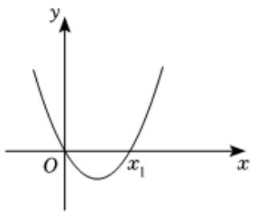

text_image

y
O
x₁
x

A.

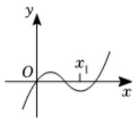

B.

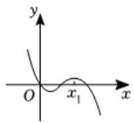

C.

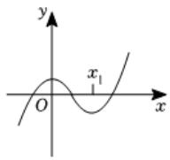

D.

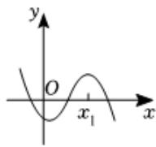

【例2】如图所示是函数 $f(x)$ 的导函数 $f'(x)$ 的图象，则下列判断中正确的是（）

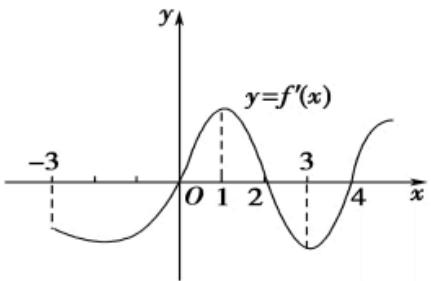

line

| x   | y=f'(x) |
| --- | ------- |
| -3  | -0.6    |
| 0   | 0.0     |
| 1   | 0.8     |
| 2   | 0.0     |
| 3   | -0.6    |
| 4   | 0.6     |

A. 函数 $f(x)$ 在区间 $(-3,0)$ 上是减函数  
B. 函数 $f(x)$ 在区间(1,3)上是减函数  
C. 函数 $f(x)$ 在区间(0,2)上是减函数  
D. 函数 $f(x)$ 在区间(3,4)上是增函数

# 二、求函数的单调区间

# 求导 $\Rightarrow$ 通分

【例1】 $x \in R$ , $f(x) = \frac{2}{3} x^3 + \frac{7}{2} x^2 - 15x + 4$ .

【例2】 $x \in (0,2\pi)$ , $f(x) = \sin x - \cos x + x + 1$ .

【例3】 $x \in R$ , $f(x) = e^{x}(x^{2} - 4x + 1)$ .

【例4】 $x \in R$ , $f(x) = (x - 1)e^{x+1} - x^{2}$ .

# 三、八大指对幂混阶母函数（初步）

A组「幂指混阶」

【母函数1\*】 $xe^{x}$

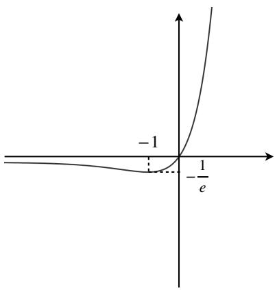

text_image

-1
-1/e

【母函数2\*】 $\frac{e^x}{x}$

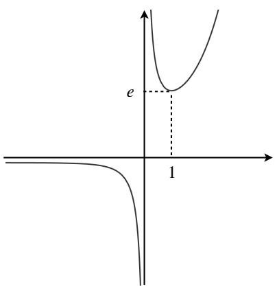

text_image

e
1

【母函数3】 $\frac{x}{e^x}$

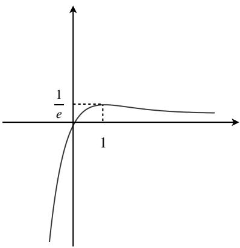

text_image

1
e
1

# B组「幂对混阶」

【母函数 $4^{*}$ 】 $x \ln x$

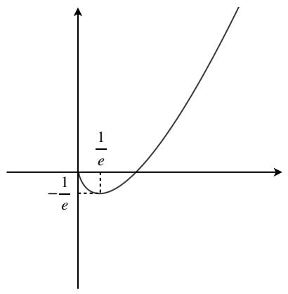

text_image

-1/e
1/e

【母函数5\*】 $\frac{\ln x}{x}$

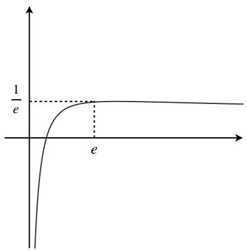

text_image

1/e
e

【母函数6】 $\frac{x}{\ln x}$

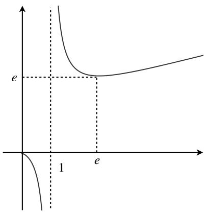

text_image

e
1
e

# C组「指对混阶」

【母函数7】 $\frac{e^x}{\ln ex}$

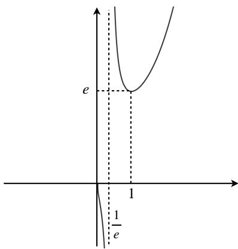

text_image

e
1
1/(e)

【母函数8\*】 $\frac{\ln ex}{e^x}$

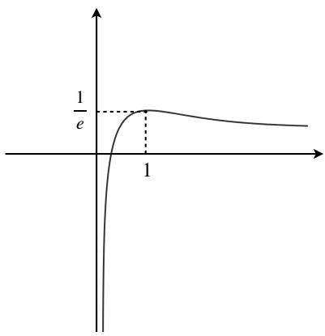

line

| x    | y     |
| ---- | ----- |
| 0    | 1/e   |
| 1    | 1     |

【例1】已知 $f(x)=\frac{e^{x}}{x^{2}}$ （x>0）的最小值是\_\_\_\_.

【例2】已知 $f(x)=\frac{1}{x}+\frac{\ln x}{x}$ 的单调增区间为\_\_\_\_.

【例3】已知 $f(x)=(x+1)e^{x}$ 的最小值为\_\_\_\_.

【例4】已知 $a=\frac{\ln2}{2}$ ， $b=\frac{1}{e}$ ， $c=\frac{2\ln3}{9}$ ，则a,b,c的大小关系为\_\_\_\_.

【例4】 $x \in R$ ， $f(x) = \frac{e^{x - 1}}{x + 1}$ ，求 $f(x)$ 的单调区间.

【例5】 $f(x)=x^{2}e^{1-x}-\ln x-1$ ，证明： $x\leq1$ ， $f(x)\geq0$ .

# 四、单调性讨论

$$
\text { 求导 } \Rightarrow \text { 通分 } \Rightarrow \text { 定义域 }
$$

【例1】 $f(x)=\ln x+\frac{a}{x}$ ，讨论 $f(x)$ 的单调性.

【例2】 $f(x)=e^{x}+ax-2$ ，讨论 $f(x)$ 的单调性.

【例3】 $f(x)=x-\frac{2}{x}+a(2-\ln x)$ ，讨论 $f(x)$ 的单调性.

【例4】 $f(x)=-x\ln x+a(x+1)$ ，讨论 $f(x)$ 的单调性.

# 第四讲 不等式基础及不等式证明问题

主讲人：Titus

# （一）积分构造类

# 一、积分

I. 运算方式：反向求导，如1反向求导就是 $x$ 、 $x + 1$ 、 $x + 2\ldots$   
II. 需要特别熟练的积分

<table><tr><td>幂函数类</td><td>对数类</td><td>多峰不等式</td><td>三角函数类</td></tr><tr><td>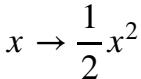 $x^n \to \frac{1}{n+1}x^{n+1}$ </td><td>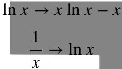</td><td>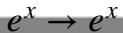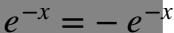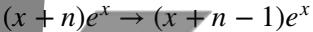</td><td>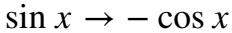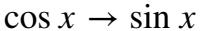</td></tr></table>

【例1】积分： $3x^{2}+9x-2+\frac{1}{x}$ .

【例2】积分： $6x - \sin x + \cos x$ .

【例3】积分： $2x - 3 - \ln x$ .

【例4】积分： $(x-3)e^{x}$ .

# 二、通过积分构造不等式与其回穿性

【起点一】

$$
x \geq 0, e ^ {x} \geq 1
$$

$$
x \geq 1, e ^ {x} \geq e
$$

【起点二】 $x \in R, e^{x} + e^{-x} \geq 2$

【起点三】 $x \in R, \cos x \leq 1$

【起点四】 $x \geq 1, \ln x \geq 0$

【起点五】 $x \in R, x - 1 - \ln x \geq 0$

# 三、积分与精度的关系

# 四、性质总结

1. 步骤：积分（提高精度）→补常数项（保证取等）  
2. 取等和积分搭建的不等式网络  
3. 任意取等和任意积分次数造成的不等式多样性与精度的差异性  
4. 精度的体现: 积分次数=阶位=洛必达的次数=求导次数

# 五、积分类不等式的推导与证明闭环

# （二）代数变形类

# 一、变形方向

【起点一】指数化类：取等不变

$$
x e ^ {x} = x + \ln x \Rightarrow x e ^ {x} - x - \ln x - 1 \geq 0
$$

【起点二】改变倍数类：取等改变

$$
e ^ {x} - e ^ {- x} \geq 2 x
$$

$$
x - 1 \geq \ln (e x)
$$

【起点三】平移类：取等改变

$$
e ^ {x} - x - 1 \geq 0 \Rightarrow e ^ {x} \geq e x
$$

【起点四】替换类

$$
x ^ {2} - x \geq x \ln x \geq x - 1 \geq \ln x \geq 1 - \frac {1}{x}
$$

$$
e ^ {- x} \geq - x + 1 \Rightarrow e ^ {x} \leq \frac {1}{1 - x}, x <   1
$$

$$
\frac {2 (x - 1)}{x + 1} \leq \ln x \leq \frac {1}{2} (x - \frac {1}{x})
$$

# 二、代数变形类不等式的证明

# （三）多峰构造类

# 一、构造方式

# 途径一 多次构造取等

选取第一取等 $\rightarrow$ 选取第二取等

E.g. 1 

<table><tr><td>第一取等选取</td><td>第二取等选取</td><td>多峰不等式</td></tr><tr><td> $g(x) = \frac{e^x - x - 1}{x}$ (0处)</td><td> $\frac{e^2 - 1}{4}x - 1$ (2处)</td><td> $e^x - \frac{e^2 - 1}{4}x^2 - 1 \geq 0$ </td></tr><tr><td> $g(x) = \frac{e^x - x - 1}{x^2}$ (0处)</td><td> $\frac{1}{2}x + \frac{e^2 - 7}{4}$ (2处)</td><td> $e^x - \frac{1}{2}x^3 - \frac{e^2 - 7}{4}x^2 - x - 1 \geq 0$ </td></tr><tr><td> $g(x) = \frac{e^x - x - 1}{x^3}$ (0处)</td><td> $\frac{7 - e^2}{16}x + \frac{e^2 - 5}{4}$ (2处)</td><td> $e^x - \frac{7 - e^2}{16}x^4 - \frac{e^2 - 5}{4}x^3 - x - 1 \geq 0$ </td></tr><tr><td>...</td><td>...</td><td>...</td></tr></table>

E.g. 2 

<table><tr><td>初生取等</td><td>次生取等</td><td>多峰不等式</td></tr><tr><td> $g(x) = \frac{e^x - \frac{1}{2}x^2 - 1}{x}$ (0处)</td><td> $\frac{e^2 - 1}{4}x - 1$ (2处)</td><td> $e^x - \frac{e^2 + 1}{4}x^2 + x - 1 \geq 0$ </td></tr><tr><td> $g(x) = \frac{e^x - \frac{1}{2}x^2 - 1}{x^2}$ (0处)</td><td> $\frac{1}{4}x + \frac{e^2 - 7}{4}$ (2处)</td><td> $e^x - \frac{1}{4}x^3 - \frac{e^2 - 3}{4}x^2 - 1 \geq 0$ </td></tr><tr><td> $g(x) = \frac{e^x - \frac{1}{2}x^2 - 1}{x^3}$ (0处)</td><td> $\frac{5 - e^2}{16}x + \frac{e^2 - 4}{4}$ (2处)</td><td> $e^x - \frac{5 - e^2}{16}x^4 - (\frac{e^2}{4} - 1)x^3 - \frac{1}{2}x^2 - 1 \geq 0$ </td></tr><tr><td>...</td><td>...</td><td>...</td></tr></table>

# 途径二 割线积分类

$$
\frac {\sin x}{x} \geq - \frac {1}{\pi} x + 1 \Rightarrow \sin x \geq - \frac {1}{\pi} x ^ {2} + x
$$

【例】构造一个关于 $e^{x}$ 在0处和1处取等的不等式

# 二、证明方式

【例】 $e^{x}-\frac{1}{2}x^{3}-\frac{e^{2}-7}{4}x^{2}-x-1\geq0(x\geq0)$ .

# （四）复合函数与导数

# 一、不等式的平移和伸缩（取等的改变）

# 二、不等式间的复合函数关系

取等一致，函数不同

$$
x - \ln (x + 1) \text {与} e ^ {x} - x - 1
$$

$$
e ^ {x} - e x \text {与} x - 1 - \ln x
$$

取等不一致，函数相同

$$
e ^ {x} - x - 1 \mathrm{与} e ^ {x} - e x
$$

$$
x - 1 - \ln x \text {与} {\frac {x}{e}} - \ln x
$$

取等不一致，函数不相同

$$
e ^ {x} - x - 1 \text {与} {\frac {x}{e}} - \ln x
$$

$$
x - 1 - \ln x \text {与} e ^ {x} - e x
$$

$$
e ^ {x} - e x \text {与} x - \ln (x + 1)
$$

# (五) 不等式证明

# 一、回顾-不等式的推导

- 积分类   
- 代数变形类  
- 多峰类  
- 复合函数类

# 二、由同一取等处不同不等式运算得到的不等式

# 1. 取等不改变

# II. 精度的决定

A. 加法精度降低，阶位降低或不变  
B. 减法精度增加，阶位增加

【例】 $e^{x}-x-1$ 与 $x-\sin x$

- 加法： $(e^{x} - x - 1) + (x - \sin x)\geq 0$ ，即 $e^x -\sin x - 1\geq 0$   
- 减法： $(e^{x} - x - 1) - (x - \sin x)\geq 0$ ，即 $e^x -2x + \sin x - 1\geq 0$

【特例-减法可同构类】 $e^{x}-x-1$ 与 $x-\ln(x+1)$

\- 加法： $(e^{x} - x - 1) + (x - \ln (x + 1)) \geq 0$ ，即 $e^{x} - \ln (x + 1) - 1 \geq 0$

\- 减法： $(e^{x} - x - 1) - (x - \ln (x + 1))\geq 0$ ，即 $e^x -2x - 1 + \ln (x + 1)\geq 0$

# 三、求导策略

# 1. 幂函数

A. 对数单身狗

【例】证明： $x \geq 1$ ， $(x + 1)\ln x - x + 1 \geq 0$ .

B. 指数找基友

【例】证明： $x \geq 0$ ， $e^{x} \geq 1 + x + \frac{x^{2}}{2}$ .

C. 取对数

【例】0 < x < 1，证明： $xe^{-x} > \frac{1}{x}e^{-\frac{1}{x}}$ .

# 四、最基本解决方案：求导并在取等处分析

【例1】 $x \geq 0$ ，证明： $e^{x} - 2x - 1 + \ln(x + 1) \geq 0$ .

【例2】 $x \geq 0$ ，证明： $e^{x} - 2x - 1 + \sin x \geq 0$ .

【例3】证明： $(2-\ln 2)e^{-\frac{xe^{x}+2\ln 2(1-e^{x})}{e^{x}-2}}+(2\ln 2-1)e^{-\frac{2}{3}(\frac{2x+2\ln 2(1-e^{x})}{e^{x}-2})}\leq1.$

# 五、加法型特殊解决方案-配凑不等式（异构）

【例1】 $f(x)=-\frac{1}{3}x^{3}+\frac{1}{2}x^{2}+x-1$ ，证明：当 $x\in[0,+\infty)$ 时， $f(x)\leq\sin x-\cos x$ .

【例2】证明：当 $x \in (0, +\infty)$ 时， $\frac{e^x - 1}{x} > e^{\frac{x}{2}}$ .

【例3】证明： $\frac{e^{x-1}}{x+1}\geqslant\frac{\sqrt{x}}{2}.$

【例4】 $f(x)=1-\frac{\ln x}{x}$ ， $g(x)=-\frac{1}{e^{x-1}}+\frac{1}{x}+x$ ，证明：当 $x\geq1$ 时， $f(x)+g(x)\geq\frac{2}{x}$ .

【例5】证明： $x \in (0, \frac{\pi}{2})$ ， $\frac{\sin x}{\cos^{3}x} + \sin 2x - 3x > 0.$

# 六、双换元

【例1】若0<x<1，证明： $\frac{e^{x}}{2(1+x)}+\frac{e^{-x}}{2(1-x)}>\frac{2}{2-x^{2}}.$

【例2】证明： $(1+x^{2})^{\frac{1+x}{2}}-(1-x^{2})^{\frac{1-x}{2}}\geq x^{2}$

# 七、依赖分离

【例1】 $f(x)=x(3+x)\ln^{2}x+(x-1)(x-1-5\ln x)$ ，证明： $x\in(1,e^{4})$ 时， $f(x)<0$ .

【例2】证明：当 $x \in (0, +\infty)$ 时， $\frac{e^x - 1}{x} > e^{\frac{x}{2}}$ .

# 第五讲 双参问题

主讲人：Titus

# (一) 加参原理

# 一、参数与系数

# II. 参数的取值范围与原不等式系数的对应关系

参数取值范围的边界\~系数

<table><tr><td>母函数</td><td>加参后</td><td>取值范围</td></tr><tr><td rowspan="5"> $e^x - x - 1 \geq 0$ </td><td> $e^x - x - a \geq 0$ </td><td> $a \leq 1$ </td></tr><tr><td> $e^x - ax - 1 \geq 0$ </td><td> $a = 1$ </td></tr><tr><td> $ae^x - x - 1 \geq 0$ </td><td> $a \geq 1$ </td></tr><tr><td> $ae^x - x - a \geq 0$ </td><td> $a = 1$ </td></tr><tr><td> $ae^{ax^a} - a^2x - \ln(a + e) \geq 0$ </td><td> $a \sim 1$ </td></tr></table>

# III. 参数位置设置给函数图像带来的影响

# A. 影响方面

1. 性质变化: 参数的改变可以使函数产生新的性质, 如拐点、单调性的改变等。例如, 函数 $e^{x} - ax^{2}$ 中的参数 $a$ 可以影响拐点的位置和单调性。  
2. 定义域变化: 参数的存在可以影响函数的定义域。特别是当参数在分母中时, 它可以导致函数在某些点上出现间断或渐近线, 也可能影响渐近线的陡峭程度。  
3. 图像变换：参数可以用来实现函数图像的伸缩和平移，这是最常见的情况。参数的不同取值可以使函数图像上下平移、水平伸缩或压缩等。

4. 特殊点的变动：参数的变化还会影响特殊点，如极值点、交点、定义域中断点等。这涉及到许多分类讨论，包括特殊点的位置、符号判断和大小关系等。

B. 影响方式

1. 参数直接作用于函数变化速率，改变单位时间内固定 $x$ 的量  
2. 参数自身速率等级决定着作用强度  
3. 参数的位置设置决定着作用特点——正反馈/负反馈，正负反馈的互相抵消让参数对函数的整体和局部都产生不一样的影响  
4. 存在正负反馈的临界让反馈作用的效果发生反转，这个临界也是题目最需要关注的突破口

C. 对于参数影响的讨论与定量分析

当不等式加上参数后，我们的重心要放在探索参数如何对原函数产生影响，这个时候就不能受限于x本身，而是应该转换主元，将a当主元、x当参数去分析，即转换分析的变量，通过主元分析，我们按照主元后的结果将含参数问题分成两大类——主元单调问题和主元不单调问题

# 二、问题分类

I. 主元单调问题：对参数求导后，结果恒正/恒负

$$
f (x) \geq 0 \text { 恒成立 }
$$

$$
f (x) = h (a), h ^ {\prime} (a) \geq 0 \Rightarrow f (x) \text {随} a \text {的增大而增大} \Rightarrow f (x) \text {下界对应} a \text {下界} \Rightarrow a \geq \dots
$$

$$
f (x) = h (a), h ^ {\prime} (a) \leq 0 \Rightarrow f (x) \text {随} a \text {的增大而减小} \Rightarrow f (x) \text {下界对应} a \text {上界} \Rightarrow a \leq \dots
$$

A. 主元不含参单调

<table><tr><td>h(a)</td><td>对a求导</td><td>a的区间形式</td></tr><tr><td> $e^{x} - x - a \geq 0$ </td><td> $h'(a) = -1 < 0$ </td><td> $a \leq ...$ </td></tr><tr><td> $ae^{x} - x - 1 \geq 0$ </td><td> $h'(a) = e^{x} \geq 0$ </td><td> $a \geq ...$ </td></tr><tr><td> $e^{ax} - x - 1 \geq 0$ </td><td> $h'(a) = e^{x} - 1 \geq 0$ </td><td> $a \geq ...$ </td></tr></table>

B. 主元含参单调

<table><tr><td>h(a)</td><td>对a求导</td><td>a的区间形式</td></tr><tr><td> $e^{ax} - x - 1$  $(x \geq 0)$ </td><td> $h'(a) = xe^{ax} \geq 0$ </td><td> $a \geq ...$ </td></tr></table>

II. 主元不单调问题：对参数求导后，结果有正有负

A. 主元不含参不单调

<table><tr><td>h(a)</td><td>对a求导</td><td>a的区间形式</td></tr><tr><td>ex-ax-1≥0</td><td>h&#x27;(a)=-x</td><td>...≤a≤...</td></tr></table>

B. 主元含参不单调（★★★）

<table><tr><td>h(a)</td><td>对a求导</td></tr><tr><td> $e^{ax} - \frac{1}{2}ax^2 - x - 1$  $(x \geq 0)$ </td><td> $h'(a) = xe^{ax} - \frac{1}{2}x^2$ </td></tr></table>

# （二）取等的判定

# 一、取等与取等判别式

# I. 取等的性质

A. 单取等的可能情形

1. 函数极值点: $f(x_0) = 0$ , $f'(x_0) = 0$   
2. 函数端点: $f(x_0) = 0$

\- 若为拐点: $f(x_0) = 0$ , $f'(x_0) = 0$

B. 双取等的可能情形与特定性质

1. 单峰函数极值点 $x_{1}+$ 单峰函数极值点 $x_{2}$ : $f(x_{1}) = f'(x_{1}) = 0$ , $f(x_{2}) = f'(x_{2}) = 0$   
2. 区间端点 $x_{1}+$ 单峰函数极值点 $x_{2}$ : $f(x_{1}) = 0$ , $f(x_{2}) = f'(x_{2}) = 0$

# II. 取等判别式

$$
\left\{ \begin{array}{l l} f (x) = 0 \\ f ^ {\prime} (x) = 0 \end{array} \right., \text {消参数解} x
$$

【例】判断取等： $e^{x}-ax-1\geq0$ .

【例】判断取等： $xe^{x}-\ln x\geqslant1+kx.$

【例】判断取等： $e^{x} + ax^{2} - x \geq \frac{1}{2} x^{3} + 1$ .

【例】判断取等： $(x+3)e^{-x}+2x\leq ax^{2}+3$

# III. 取等经验判断

A. 数据逻辑

1. $\ln x\Rightarrow 1,e,\frac{1}{e}$   
2. $e^{x} \Rightarrow 0$   
3. $\sin x, \cos x, \tan x \Rightarrow 0, \pm \frac{\pi}{2}, \pm \frac{\pi}{4}, \pm \frac{\pi}{3}, \pm \frac{\pi}{6}$

B. 极值点逻辑 $f'(x_0) = 0$

1. $e^{x-n} \Rightarrow n, (x-n)e^{x} \Rightarrow n-1$   
2. $\frac{e^x}{x^n} \Rightarrow n$

C. 端点逻辑

1. $[a, +\infty) \Rightarrow a, (-\infty, a] \Rightarrow a$   
2. $[a,b]\Rightarrow a,b$

IV. 取等与参数区间边界

取等的边界性质：取等 $x_0$ 处 $f^n (x_0) = f^{n - 1}(x_0) = \ldots = f'(x_0) = f''(x_0) = 0$ 循环

$$
f ^ {n} (x _ {0}) = 0 \Rightarrow a _ {x _ {0}} \mathrm{为界}
$$

E.g. $f(x)\geq 0$ 恒成立：

$f(x) = h(a), h'(a) \geq 0 \Rightarrow f(x)$ 随 $a$ 的增大而增大 $\Rightarrow f(x)$ 下界对应 $a$ 下界 $\Rightarrow a \geq \ldots$

$f(x) = h(a)$ ， $h^{\prime}(a)\leq 0\Rightarrow f(x)$ 随 $a$ 的增大而减小 $\Rightarrow f(x)$ 下界对应 $a$ 上界 $\Rightarrow a\leq \ldots$

# 三、不等式含参恒成立问题操作SOP Part 1：得到精准答案

flowchart

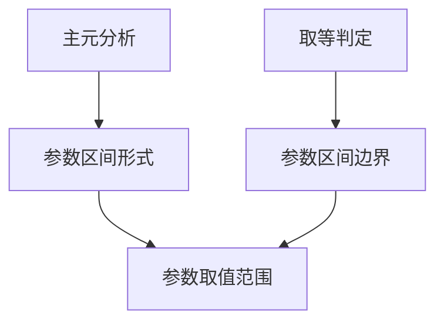

# （三）主元单调问题——区间无限制类

# 一、SOP Part 2: 分参

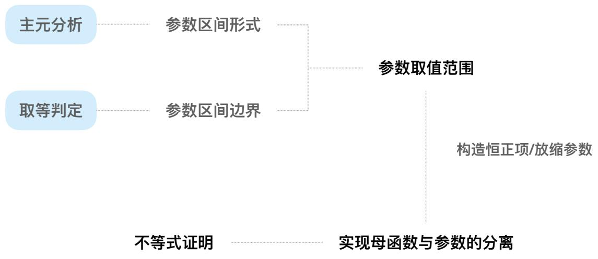

flowchart

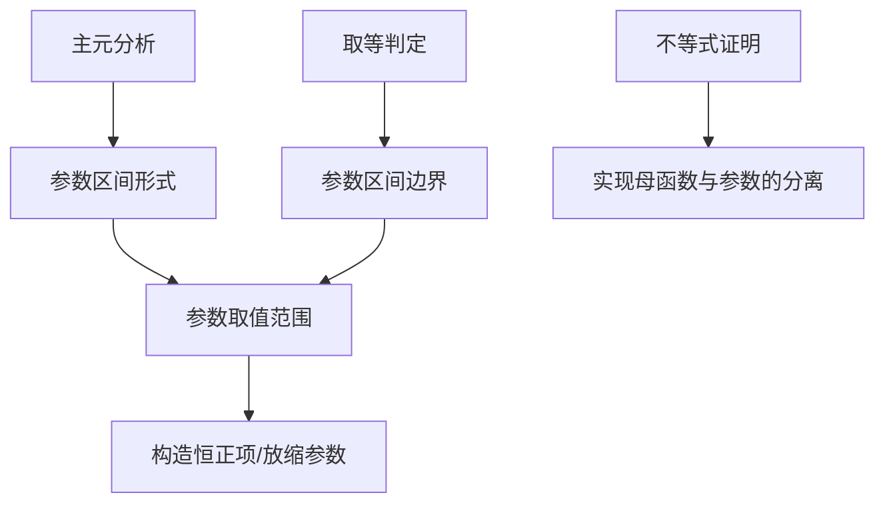

# 二、SOP Part 3：矛盾区间说明

# I. 取等处局部速率造成的正负分异

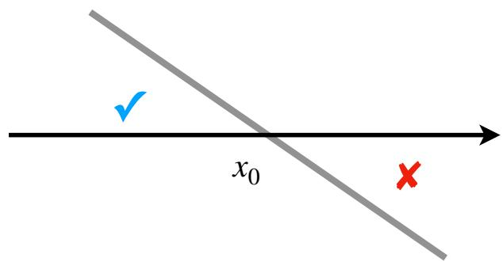

text_image

x₀
✓
×

$$
f (x _ {0}) = 0, f ^ {\prime} (x _ {0}) <   0
$$

text_image

x₀
✓

$$
f (x _ {0}) = 0, f ^ {\prime} (x _ {0}) > 0
$$

# II. 矛盾说明方式：在取等局部证明矛盾

利用边界性质的矛盾：取等 $x_0$ 处 $f^n (x_0) = f^{n - 1}(x_0) = \ldots = f'(x_0) = f''(x_0) = 0$ 循环

【例1】已知函数 $f(x)=\ln x,\quad g(x)=e^{x}\quad(e=2.718\cdots,\quad e$ 为自然对数的底数）

(1) 求函数 $F(x)=f(x)-g(x-1)$ 的单调区间；  
(2) 若不等式 $xf(x) - k(x + 1)f[g(x - 1)] \leq 0$ 在 $[1, +\infty)$ 上恒成立，求实数 $k$ 的取值范围.

【例2·2022长春三模理科】已知函数 $f(x)=xe^{x}+\frac{\ln x}{x}$ .

(1) 求证: 函数 $f(x)$ 有唯一零点;  
(2) 若对任意 $x \in (0, +\infty)$ , $xe^x - \ln x \geqslant 1 + kx$ 恒成立, 求实数 $k$ 的取值范围.

【例3】已知函数 $f(x)=(x+3)e^{-x}+2x$ ，若 $f(x)\leq ax^{2}+3$ ，求a的取值范围.

【例4】已知函数 $f(x)=e^{x}+\sin x+x,\quad g(x)=ax^{2}+3x+1.$

(1) 求 $f(x)$ 在x=0处的切线方程；  
(2) 当 $x \geqslant 0$ 时 $f(x) \geqslant g(x)$ 恒成立，求 $a$ 的取值范围.

【例5】已知函数 $f(x)=ax-\frac{\sin x}{\cos^{3}x},\quad x\in(0,\frac{\pi}{2})$ ，若 $f(x)<\sin2x$ ，求a的取值范围.

【例6】若 $ax^{2}e^{x}+(2x+1)e^{x+1}-x\geq0$ 对 $\forall x\in R$ 恒成立，求实数a的取值范围.

【例7】已知函数 $f(x)=x[e^{x}-\ln(x+1)]$ ，若 $x\in(0,+\infty)$ ， $f(x)>(a+1)\ln(x+1)-ax$ ，求a的取值范围.

【例8】已知函数 $f(x)=2ax-\ln x, a \in R.$

(1) 讨论 $f(x)$ 的单调性;  
(2) 若对任意 $x \in (0, +\infty)$ ，不等式 $e^{x - 2} + x \geqslant xf(x)$ 恒成立，求实数 $a$ 的取值范围.

【例9】已知 $f(x)=e^{x-1}(x-a-1)-\ln x.$

(1) 当 $a = 0$ 时，求 $f(x)$ 的最小值；  
(2) 若曲线 $y = f(x)$ 恒在曲线 $y = \frac{a}{x} + 2e^{a + 1}$ 的上方，求 $a$ 的取值范围.

# （四）主元单调问题——区间限制类

【例1】 $x \in (-\frac{\pi}{4}, \frac{\pi}{4})$ ， $a \cos x - \sin x - (a - 1)e^{-x} \geq 0$ ，求a的取值范围.

# （五）主元单调问题——指数极限取等

【例1】对任意 $x\geq0,\ e^{x}+\ln(x+1)\geq a(2e^{x}+\sin x-2)$ 恒成立，求a的取值范围.

【例2】若关于x的不等式 $e^{x}-x^{2}-\cos x<a(e^{x}+x^{2})$ 在 $[-2,+\infty)$ 上恒成立，求a的取值范围

# （三）主元不单调问题

# 一、概述

对参数求导不单调→参数有上界也有下界

# 二、主元单调不含参-类型一：极点效应

矛盾区间说明-取等处局部速率造成的正负分异   
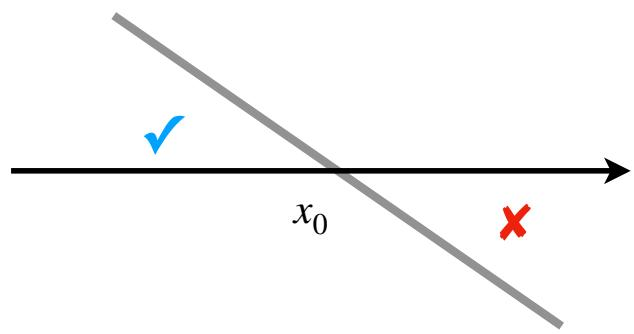

text_image

x₀
✓
×

$$
f (x _ {0}) = 0, f ^ {\prime} (x _ {0}) <   0
$$

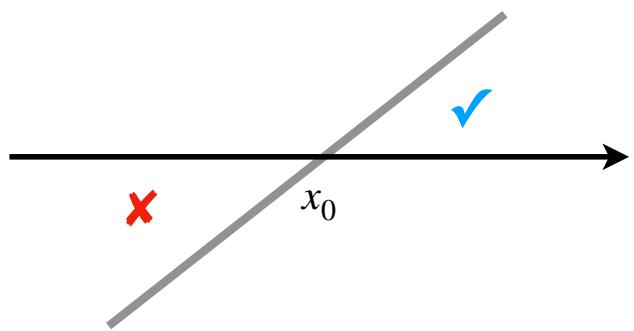

text_image

x₀

$$
f (x _ {0}) = 0, f ^ {\prime} (x _ {0}) > 0
$$

【例1】已知 $f(x)=ax^{2}-ax-x\ln x,\ f(x)\geq0$ ，求a.

【例2】 $(x+1)(e^{x}-1)\geq ax$ 恒成立，求a的取值范围.

【例3】 $e^{x}+ax(x-1)-\cos x\geq0$ 恒成立，求a的取值范围.

【例4】 $e^{x}+ax^{2}-2ax-\cos x\geq0$ 恒成立，求a的取值范围.

【例5】是否存在a使得 $a(x^{3}-e^{x-1})-\ln x\geq0$ 对任意 $x\in(0,2)$ 恒成立？证明你的结论.

# 三、主元不单调含参-局部换元调整为主元不含参

Degree of freedom refers to the number of independent parameters or coordinates that can be varied to define the state of a system.

Constraints limit the motion or behavior of a system. They reduce the degrees of freedom by imposing conditions that the system must satisfy. Constraints can be explicit, like physical barriers, or implicit, like mathematical relationships between variables.

So, degrees of freedom represent potential motion or variability, while constraints define the boundaries or limitations within which a system operates.

“一个等式减少一个自由度，不等关系不减自由度但约束操纵杆的移动范围。”

【例1】 $e^{ax}-\frac{1}{2}ax^{2}-x-1\geq0$ 恒成立，求a的取值范围.

【例2】已知函数 $f(x)=(2x-2a+1)e^{2x-a}$ ， $a\in R$ ，若不等式 $f(x)-2x+1\geq0$ 恒成立，求实数a的取值范围.

# 第六讲 多元问题与消元

主讲人：Titus

# （一）偏移问题概述

$$
f \left(x _ {1}\right) = f \left(x _ {2}\right) = a, \text {证明} p \left(x _ {1}\right) + p \left(x _ {2}\right) \text {与} h (a) \text {的大小关系}
$$

# 一、参数

III. 上界与下界

A. 定义: 对于 $m < p(x_{1}) + p(x_{2}) < n$ , $m$ 为下界, $n$ 为上界

B. 上下界均可参数取值范围的边界构造而得到

C. 双元问题可分为两类——极值点类（单调性调整）、多取等类（正负性调整），上下界一般分别对应这两类

IV. 对 $p(x_{1})+p(x_{2})$ 的理解

A. $x_{1}, x_{2}$ 地位等价、形式一致，且必须“分离”

B. 常见情形

1. 当 $p(x)=x$ 时，即 $x_{1}+x_{2}$

2. 当 $p(x)=\ln x$ 时，即 $x_{1}x_{2}$

3. 当 $p(x)=e^{x}+x$ 时，即 $e^{x_{1}}+e^{x_{2}}+x_{1}+x_{2}$

思考1 证明： $x_{1}x_{2}<m.$

思考2 证明: $x_{1} x_{2} < \frac{2}{x_{1} + x_{2}}$ .

思考2 证明： $x_{1}+x_{2}-\frac{2}{x_{1}+x_{2}}>m+\ln m.$

V. 对“a”的理解：a 是关于零点的函数（这点非常重要），即只对 $x_{1}, x_{2}$ 成立的函数，对原函数分参处理后往往都可以得到 $a = f(x_{1}) = f(x_{2})$

# 二、解决方式——消元

I. 消元方式一：待定系数调整  
II. 消元方式二：比值/差值换元  
III. 消元方式三：对称构造

# （二）待定系数调整（偏构、单调性调整、正负性调整、多取等）

# 一、单调类待定

$$
f (x _ {1}) = f (x _ {2}) = a, \text {证明} p (x _ {1}) + p (x _ {2}) \text {与} h (a) \text {的大小关系}
$$

IV. 动机：可以使得 $F(x_{1}) \sim 0 \sim F(x_{2})$ 后可以因式分解得到代证式的结构

$$
F (x) = p ^ {2} (x) - h (a) p (x) + A (f (x))
$$

A. 常见地

1. 对于 $x_{1} + x_{2}$ : $F(x) = x^{2} - h(a)x + A(f(x))$   
2. 对于 $x_{1}x_{2}$ : $F(x) = x + \frac{h(a)}{x} + A(f(x))$

B. 组成

1. 待定结构部分 $p^{2}(x)-h(a)p(x)$   
2. 调整部分 $A(f(x))$

a) 功能：改变函数性质（单调性、正负性）  
b) 原理：因为最终都得代入 $x_{1}, x_{2}$ ，而 $A(f(x)) = A(a)$ 可在最后一步消去，对待定结构部分能得到的结果无影响

V. 目的：构造出在极值点两侧异号的 $F(x)$ ，从而得到 $F(x_{1})\sim0\sim F(x_{2})$

VI. 理解

A. 不同的结构形式对不同的代征式计算量都会有不同，但每种结构都会随着代证式精度的增加而增加

VII.系数的待定方式

$F(\frac{\text{代征式}}{2}) = F''(\frac{\text{代征式}}{2}) = F'''(\frac{\text{代征式}}{2}) = \ldots = F^n (\frac{\text{代征式}}{2})$ ，联立解得系数

A. $\frac{\text{代征式}}{2}$ 有些情况下就是极值点，但不是所有题目都是极值点  
B. 高考难度内（一阶）简化的思维过程

1. 单调类：保证速率一致 $\rightarrow F''\left(\frac{\text{代征式}}{2}\right) = 0 \rightarrow F(x)$   
2. 多取等类：保证速率一致 $\rightarrow F\left(\frac{\text{代征式}}{2}\right) = 0 \rightarrow F(x)$

# 二、高考难度例题-常规

【例1】 $f(x)=x\left(1-\ln x\right)$ ， $f(x_{1})=f(x_{2})$ ，证明： $2<x_{1}+x_{2}<e$ .

【例2】 $f(x)=e^{x}-ax,\ f(x_{1})=f(x_{2})=0$ ，证明： $x_{1}+x_{2}>2$ .

【例3】 $f(x)=\ln x+\frac{a}{x}$ ， $f(x_{1})=f(x_{2})=0$ ，证明： $2a<x_{1}+x_{2}<1$ .

【例4】 $f(x)=\frac{\ln x}{x}$ ， $f(x_{1})=f(x_{2})=a$ ，证明： $\frac{e}{a}<x_{1}x_{2}<\frac{1}{a^{2}}$ .

【例5】已知 $f(x)=\ln x+\frac{a}{x}(a\in R)$ ，设m,n为两不相等正数.

(1) 求实数 $a$ 的取值范围;  
(2) $f(m)=f(n)=2$ ，证明： $a^{2}<mn<ae;$   
(2) $f(m) = f(n) = 3$ ，证明： $a^2 < mn < ae^2$

【例7】已知函数 $f(x)=(x-p)e^{x}$ 的极值为-1.

(1) 求 $p$ 的值，并求 $f(x)$ 的单调区间；  
(2) 若 $f(a)=f(b)(a\neq b)$ ，证明： $a+b+e^{a}+e^{b}<2.$

# 三、高考难度例题-隐极值点

【例】 $f(x)=\ln x-ax-\frac{1}{x}$ ， $f(x_{1})=f(x_{2})=0$ ，证明： $x_{1}x_{2}>2e^{2}$

# 四、高考难度例题-定比加权

【例】已知函数 $f(x)=x\ln x+a(a\in R)$ ，若函数 $g(x)=f(x)-ax^{2}-x$ 有两个不同的极值点 $x_{1},x_{2}$ （其中 $x_{1}<x_{2}$ ），证明： $x_{1}x_{2}^{2}>e^{3}$ .

# 五、高考难度例题-柯西加权

$$
{\frac {m n}{m + n}} (\sqrt {x _ {1}} + \sqrt {x _ {2}}) ^ {2} <   m x _ {1} + n x _ {2} <   \sqrt {m + n} \sqrt {x _ {1} ^ {2} + x _ {2} ^ {2}}
$$

【例1】 $f(x)=\frac{\ln x}{x}$ ，证明： $2\ln x_{1}+\ln x_{2}>e.$

【例2】 $f(x)=ae^{x}-bx-c$ ，证明： $\frac{e^{x_{1}}}{a}+\frac{e^{x_{2}}}{1-a}>\frac{4b}{a}$ .

# 六、如何一题多解——结构和调整的关联与共通之处（等价命题）

# 七、高于高考难度例题

【例1】函数 $f(x)=x-\ln x-m$ 有两个零点 $x_{1},x_{2}$ ，证明： $x_{1}x_{2}<\frac{2}{x_{1}+x_{2}}$ .

【例2】 $f(x)=x-\ln x$ ，证明： $a+1<x_{1}+x_{2}<\frac{4a+2}{3}$ .

【例3】 $f(x)=x-\ln x$ ，证明： $x_{1}+x_{2}<a+\frac{a\ln a}{a-1}$ .

【例4】 $f(x)=e^{x}-x-a$ ，证明： $x_{1}^{2}+x_{2}^{2}<(a+3)(a-1)$ .

# （三）比值、差值换元

【例1】 $f(x)=x\left(1-\ln x\right)$ ， $f(x_{1})=f(x_{2})$ ，证明： $2<x_{1}+x_{2}<e$ .

【例2】 $f(x)=e^{x}-ax,\ f(x_{1})=f(x_{2})=0$ ，证明： $x_{1}+x_{2}>2$ .

# （四）对称构造

【例1】 $f(x)=e^{x}-ax,\ f(x_{1})=f(x_{2})=0$ ，证明： $x_{1}+x_{2}>2$ .

【例2】 $f(x)=\ln x+\frac{a}{x}$ ， $f(x_{1})=f(x_{2})=0$ ，证明： $2a<x_{1}+x_{2}<1$ .

【例3】 $f(x)=x-\ln x$ ，证明： $a+1<x_{1}+x_{2}<\frac{4a+2}{3}$ .

# （五）相异函数各点关系问题

# 一、不含参-“单调同型函数”作消元枢纽

Step 1：找到相异函数共有的单调结构

Step 2：分离单调结构，根据待证式判断相异函数的单调结构分别对应表达式的大小关系

Step 3: 证明由大小关系得到的不等式

【例1】函数 $f(x)=e^{1-x}(x^{2}+x-1)+x+1$ ， $g(x)=(2-x)e^{x-1}-3(x-1)\ln(3-x)$ ，证明：

(1) 存在 $x_0 \in (0,1), x_1 \in (1,2)$ 使得 $f(x_0) = g(x_1) = 0$ ;  
(2) $x_{1} + x_{0} < 2$ .

【例2】函数 $f(x)=(\cos x-x)(\pi+2x)-\frac{8}{3}(\sin x+1)$ .

（1）证明：存在唯一 $x_0 \in (0, \frac{\pi}{2})$ 使得 $f(x_0) = 0$ ;  
(2) $g(x) = 3(x - \pi)\cos x - 4(1 + \sin x)\ln (3 - \frac{2x}{\pi})$ ，证明：

i）存在唯一 $x_{1}\in (\frac{\pi}{2},\pi)$ 使得 $g(x_{1}) = 0$

ii) $x_0 + x_1 < \pi$ .

# 二、含参类-“双元分离+单参放缩”消元统一变量

Step 1: 消去与待证式无关的参数

Step 2: 与待证式相关的双元分离，将其中一元利用单调性结合待证实放缩消元，得到单一变量不等式

Step 3: 证明不等式

【例1】函数 $f(x)=\ln x-a(x-1)e^{x}$ 的极值点为 $x_{0}$ ，零点为 $x_{1}$ ，证明： $3x_{0}-x_{1}>2$ .

【例2】函数 $f(x)=e^{x}(1+m\ln x)$ ， $f(x)$ 的零点为 $x_{0}$ ， $f'(x)$ 的极小值点为 $x_{1}$ ，证明： $x_{0}>x_{1}$ (根据后面章节需要学习的技能“找点”可知本题 $x_{1}<\frac{1}{2}$ )

# （六）相切临界三元问题

# 问题特征

1. 自由度为3: $x, a, b$   
2. 往往出现其中一个变量构成的的凹/凸函数 $g(x)$ 与这个变量另外两个变量构成的单调函数  
3. 设问形式往往为求两个变量构成的表达式的最值

# 底层逻辑与消元方式

1. 利用相切状态取等的方程组 $f(x) = f'(x) = 0$ ，将 $a, b$ 用 $x$ 表示  
2. 将用 $x$ 表示的 $a, b$ 代入待求式，完成变量的统一  
3. 求导分析最值

【例1】对任意实数 $x\in[1,e]$ ，恒有 $(x+1)\ln x-x+1\geq kx-b;$

(1) 求 $k - b$ 的最大值;  
(2) 求 $\frac{b}{k}$ 的最小值.

【例2】若对a>0， $2x\geq a\ln x+b$ 恒成立，求 $a+b$ 的最大值.

【例3】当 $x\geq0,\ e^{x}-ax-b\sqrt{x^{2}+1}\geq0$ ，求 $a+\sqrt{5}b$ 的最大值.

【例4】若存在a>0，使得 $ax+b\leq e^{bx}$ 恒成立，求 $a+b$ 的最大值.

【例5】 $e^{x}-(a+1)x-b\geq0$ ，求 $(a+1)b$ 的最大值.

【例6】是否存在实数 $k$ 使得只有唯一的正数 $a$ ，当 $x > 0$ 时，恒有 $\ln (x + \frac{1}{a}) \leq \frac{k}{a} x$ ，若存在，求出 $k, a$ 的值，若不存在，请说明理由.

# 第七讲 零点问题

主讲人：Titus

# (一) 三

# 一、参数与系数

【例1】函数 $f(x)=\ln x-a(x-1)e^{x}$ 的极值点为 $x_{0}$ ，零点为 $x_{1}$ ，证明： $3x_{0}-x_{1}>2$ .

【例2】函数 $f(x)=e^{x}(1+m\ln x)$ ， $f(x)$ 的零点为 $x_{0}$ ， $f'(x)$ 的极小值点为 $x_{1}$ ，证明： $x_{0}>x_{1}$ (根据后面章节需要学习的技能“找点”可知本题 $x_{1}<\frac{1}{2}$ )

【例1】函数 $f(x)=e^{1-x}(x^{2}+x-1)+x+1$ ， $g(x)=(2-x)e^{x-1}-3(x-1)\ln(3-x)$ ，证明：

(1) 存在 $x_0 \in (0,1), x_1 \in (1,2)$ 使得 $f(x_0) = g(x_1) = 0$ ;  
(2) $x_{1} + x_{0} < 2$ .

【例2】函数 $f(x)=(\cos x-x)(\pi+2x)-\frac{8}{3}(\sin x+1)$ .

（1）证明：存在唯一 $x_0 \in (0, \frac{\pi}{2})$ 使得 $f(x_0) = 0$ ;  
(2) $g(x) = 3(x - \pi)\cos x - 4(1 + \sin x)\ln (3 - \frac{2x}{\pi})$ ，证明：

I）存在唯一 $x_{1}\in (\frac{\pi}{2},\pi)$ 使得 $g(x_{1}) = 0$

ii) $x_0 + x_1 < \pi$ .

