# 第七章 解三角形

# 第一节 基本定理公式的延伸与应用

本节将详细解释一些基本的三角函数公式，这些公式可视为解三角形问题的基石。在整个解三角形章节中，我们将频繁运用这些基础知识。只有确保对这些基本公式有牢固的掌握，才能在实际问题中灵活运用。

# 一. 三角形的定义与元素分析

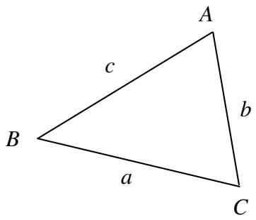

text_image

A
c
b
B
a
C

1. 定义与性质：三角形是一个具有三条边和三个角的多边形，它是最简单的多边形之一，由三个顶点和它们之间的相应边组成。以下是关于三角形的一些基本概念：

1.1. 三角形的元素:

边（Sides）：三角形有三条边，分别连接三个顶点。

角（Angles）：三角形有三个内角，分别位于三个顶点处。

1.2. 三角形的分类:

\- 按边长分类

等边三角形（Equilateral Triangle）：三条边长度相等

等腰三角形（Isosceles Triangle）：至少两条边长度相等

普通三角形（Scalene Triangle）：三条边长度都不相等

\- 按角度分类

锐角三角形（Acute Triangle）：三个角都是锐角

直角三角形（Right Triangle）：一个角是直角（90度）

钝角三角形（Obtuse Triangle）：一个角是钝角

1.3. 三角形内角和定理：三角形的内角和始终等于180度，即

$$
A + B + C = \pi
$$

1.4. 其他性质：

高（Altitude）：从一个顶点到对应边的垂直线段称为高。

中位线（Median）：从一个顶点到对边中点的线段称为中位线

角平分线（Angle Bisector）：从一个角的顶点到对边的角平分线将角分成两个相等的部分

中心线（Perpendicular Bisector）：过一条边中点的垂直平分线称为中心线

# 2. 正余弦定理

2.1. 正弦定理：对于任意三角形 $ABC$ ，其三个边长度分别为 $a$ 、 $b$ 、 $c$ ，对应的内角分别为 $A$ 、 $B$ 、

C，正弦定理表示为：

$$
\frac {a}{\sin A} = \frac {b}{\sin B} = \frac {c}{\sin C} = 2 R
$$

或者可以写成

$$
a = \frac {\sin A}{\sin B} b = \frac {\sin A}{\sin C} c
$$

$$
a = 2 R \sin A, b = 2 R \sin B, c = 2 R \sin C
$$

证明-一箭穿心 已知任意三角形ABC，设其内接于 $\odot O$ ，延长BO交 $\odot O$ 于 $C'$

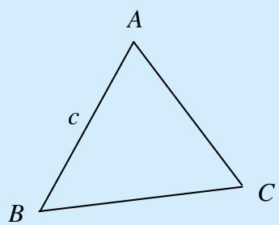

text_image

A
c
B
C

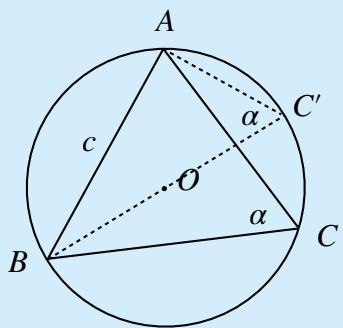

text_image

A
c
O
α
C'
α
B
C

则 $\angle ACB = \angle AC'B$ ，三角形 $ABC$ 为 $Rt\triangle ABC$ ，故 $\sin \angle BC'A = \frac{c}{2R}$ ，即 $\frac{c}{\sin C} = 2R$ ，同理可得 $\frac{a}{\sin A} = \frac{b}{\sin B} = 2R.$

2.2. 余弦定理：对于任意三角形 $ABC$ ，其三个边长度分别为 $a$ 、 $b$ 、 $c$ ，对应的内角分别为 $A$ 、 $B$ 、

C，余弦定理表示为：

$$
a ^ {2} = b ^ {2} + c ^ {2} - 2 b c \cos A
$$

或者可以写成

$$
b ^ {2} = c ^ {2} + a ^ {2} - 2 a c \cos B
$$

$$
c ^ {2} = a ^ {2} + b ^ {2} - 2 a b \cos C
$$

证明-作高+“连环勾”在三角形ABC内构造一个高CD，使得CD垂直于AB。这样我们就得到两个直角三角形ADC和BDC

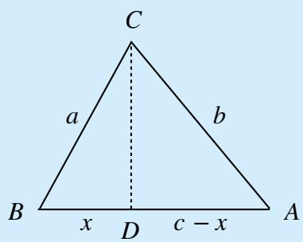

text_image

C
a	b
B	x	D	c-x	A

根据勾股定理，可以得到以下关系：

$$
C B ^ {2} - B D ^ {2} = C D ^ {2} = A C ^ {2} - A D ^ {2},
$$

$$
a ^ {2} - x ^ {2} = b ^ {2} - (c - x) ^ {2},
$$

解得 $x = \frac{a^2 + c^2 - b^2}{2c}$ ，在 $Rt\triangle CBD$ 中， $\cos B = \frac{x}{a} = \frac{a^2 + c^2 - b^2}{2ac}$ ，即 $b^2 = c^2 + a^2 - 2ac\cos B$ ，同理可得 $a^2 = b^2 + c^2 - 2bc\cos A$ ， $c^2 = a^2 + b^2 - 2ab\cos C$ .

3. 三角形的元素分析：一个三角形共6个元素，边 $a$ 、 $b$ 、 $c$ 和角 $A$ 、 $B$ 、 $C$ ，这六个元素互相约束与影响；我们将其看作六个变量，其中若有任意三个元素确定，则可得到一个确定的三角形，即对于“ $a$ 、 $b$ 、 $c$ 、 $A$ 、 $B$ 、 $C$ ”，知三得所有

具体来说，分为以下情况

3.1. 已知两边和夹角：如果你知道三角形的两边长度和它们之间的夹角，可以使用余弦定理来找到第三边的长度。余弦定理公式如下：

$$
c ^ {2} = a ^ {2} + b ^ {2} - 2 a b \cos C
$$

例 已知 $\triangle ABC, A = \frac{2\pi}{3}, b = 2, c = 3.$

3.2. 已知两边和非夹角：如果你知道三角形的两边长度和非夹角，可以使用正弦定理来找到夹角的度数。正弦定理公式如下：

$$
\frac {a}{\sin A} = \frac {b}{\sin B} = \frac {c}{\sin C}
$$

例 已知 $\triangle ABC, B = \frac{\pi}{4}, b = 2, c = 1$ .

3.3. 已知三边：如果你知道三角形的三边长度，可以使用余弦定理找到一个角的度数，然后再用正弦定理找到其他两个角。余弦定理公式为：

$$
c ^ {2} = a ^ {2} + b ^ {2} - 2 a b \cos C
$$

之后，使用正弦定理计算其他两个角。

例 已知 $\triangle ABC, a = 3, b = 5, c = 7$ .

3.4. 已知两角和两角所夹边：首先用三角形内角和定理求出已知边所对的角，再用正弦定理求出所有边长。正弦定理公式如下：

$$
\frac {a}{\sin A} = \frac {b}{\sin B} = \frac {c}{\sin C}
$$

例 已知 $\triangle ABC, A = \frac{\pi}{6}, B = \frac{\pi}{4}, c = \sqrt{2}$ .

3.5. 已知两角和非两角所夹边：首先用三角形内角和定理求出已知边所对的角，用正弦定理求出所有边长。正弦定理公式如下：

$$
\frac {a}{\sin A} = \frac {b}{\sin B} = \frac {c}{\sin C}
$$

例 已知 $\triangle ABC, A = \frac{\pi}{6}, B = \frac{\pi}{4}, b = \sqrt{7}$ .

# 二. 基本公式的应用

# 1. 正余弦定理

在 $\triangle ABC$ 中，角 $A, B, C$ 所对的边分别是 $a, b, c$ ， $R$ 为 $\triangle ABC$ 外接圆半径，则

<table><tr><td>定理</td><td>正弦定理</td><td>余弦定理</td></tr><tr><td>公式</td><td> $\frac{a}{\sin A} = \frac{b}{\sin B} = \frac{c}{\sin C}$ </td><td> $a^{2} = b^{2} + c^{2} - 2bc\cos A$  $b^{2} = c^{2} + a^{2} - 2ac\cos B$  $c^{2} = a^{2} + b^{2} - 2ab\cos C$ </td></tr></table>

<table><tr><td>常见变形</td><td>1.  $a = {2R}\sin A,b = {2R}\sin B,c = {2R}\sin C$ 2.  $\sin A = \frac{a}{2R},\sin B = \frac{b}{2R},\sin C = \frac{c}{2R}$ </td><td> $\cos A = \frac{{b}^{2} + {c}^{2} - {a}^{2}}{2bc}$  $\cos B = \frac{{c}^{2} + {a}^{2} - {b}^{2}}{2ac}$  $\cos C = \frac{{a}^{2} + {b}^{2} - {c}^{2}}{2ab}$ </td></tr></table>

例 （2023·全国·高三专题练习）在 $\triangle ABC$ 中，设命题 p: $\frac{a}{\sin C} = \frac{b}{\sin A} = \frac{c}{\sin B}$ ，命题 q: $\triangle ABC$ 是等边三角形，那么命题 p 是命题 q 的（）

A．充分不必要条件

B. 必要不充分条件

C. 充要条件

D. 既不充分也不必要条件

2. 面积公式

2.1. $S_{\triangle}ABC = \frac{1}{2} ab\sin C = \frac{1}{2} bc\sin A = \frac{1}{2} ac\sin B$

2.2. $S_{\triangle}ABC = \frac{abc}{4R} = \frac{1}{2} (a + b + c) \cdot r$ （ $r$ 是三角形内切圆的半径， $R$ 是三角形外接圆的半径并可由此计算 $R, r)$

2.3. $S_{\triangle}ABC = \frac{1}{2} ah = \frac{1}{2} bh = \frac{1}{2} ch$ （三个 $h$ 分别对应顶点到所在边的距离）

2.4. $S_{\triangle} ABC = \sqrt{p(p - a)(p - b)(p - c)}$ ， $p = \frac{a + b + c}{2}$ ， $a, b, c$ 分别为三角形三边（海伦公式）此公式非常优美，且可以引出一系列更加优美的结论

# 3. 和差化积与积化和差

该公式其实属于三角函数范畴，但在解三角的题目中也有广泛的应用，所以此处给予该公式

$$
\sin \alpha + \sin \beta = 2 \sin \frac {\alpha + \beta}{2} \cdot \cos \frac {\alpha - \beta}{2} \quad \sin \alpha - \sin \beta = 2 \cos \frac {\alpha + \beta}{2} \cdot \sin \frac {\alpha - \beta}{2}
$$

$$
\cos \alpha - \sin \beta = 2 \cos \frac {\alpha + \beta}{2} \cdot \cos \frac {\alpha - \beta}{2} \quad \cos \alpha - \cos \beta = - 2 \sin \frac {\alpha + \beta}{2} \cdot \sin \frac {\alpha - \beta}{2}
$$

$$
\sin \alpha \cdot \cos \beta = \frac {1}{2} [ \sin (\alpha + \beta) + \sin (\alpha - \beta) ] \quad \cos \alpha \cdot \sin \beta = \frac {1}{2} [ \sin (\alpha + \beta) - \sin (\alpha - \beta) ]
$$

$$
\cos \alpha \cdot \cos \beta = \frac {1}{2} [ \cos (\alpha + \beta) + \cos (\alpha - \beta) ] \quad \sin \alpha \cdot \sin \beta = - \frac {1}{2} [ \cos (\alpha + \beta) - \cos (\alpha - \beta) ]
$$

此公式不需要硬背或记口诀，可以通过三角恒等变换与凑角去推导

例如 “ $\sin\alpha\sin\beta$ ”、“ $\cos\alpha\cos\beta$ ”首先联想到“ $\cos(\alpha\pm\beta)$ ”的结果，故可通过 $\cos(\alpha\pm\beta)$ 的加减运算来得到：

$$
\because \sin \alpha \sin \beta = - \frac {1}{2} [ \cos (\alpha + \beta) - \cos (\alpha - \beta) ], \cos \alpha \cdot \cos \beta = \frac {1}{2} [ \cos (\alpha + \beta) + \cos (\alpha - \beta) ],
$$

$$
\therefore \sin \alpha + \sin \beta = \sin \left(\frac {\alpha + \beta}{2} + \frac {\alpha - \beta}{2}\right) + \sin \left(\frac {\alpha + \beta}{2} - \frac {\alpha - \beta}{2}\right) = 2 \sin \frac {\alpha + \beta}{2} \cos \frac {\alpha - \beta}{2}.
$$

# 三. 基础公式的延伸和应用

1. 三角形的内角和的应用

① $\sin C = \sin(A + B) = \sin A \cos B + \cos A \sin B = a \cos B + b \cos A$   
② $-\cos C = \cos(A + B) = \cos A \cos B - \sin A \sin B$   
③ 正切恒等式： $\tan A + \tan B + \tan C = \tan A \cdot \tan B \cdot \tan C (A + B + C = k\pi)$

例 （2023·河南南阳·统考二模）锐角 $\triangle ABC$ 是单位圆的内接三角形，角 $A, B, C$ 对应的边分别为 $a, b, c$ ，且 $a^2 + b^2 - c^2 = 4a^2 \cos A - 2ac \cos B$ ，求 $a$ .

A.2

B. $2\sqrt{2}$

C. $\sqrt{3}$

D.1

2. 正余弦定理的延伸

1. $\frac{a + b + c}{\sin A + \sin B + \sin C} = \frac{a + b}{\sin A + \sin B} = \frac{b + c}{\sin B + \sin C} = \frac{a + c}{\sin A + \sin C} = \frac{a}{\sin A} = \frac{b}{\sin B} = \frac{c}{\sin C}$   
2. 三角形中 $a > b$ ， $\sin A > \sin B$ ， $\cos A < \cos B$   
3. 锐角三角形中: $A > B$ , $\sin A > \cos B$

3. 基础公式在判断三角形个数的应用

在 $\triangle ABC$ 中，已知 $a, b$ 和 $A$ ，解的情况如下：

<table><tr><td></td><td colspan="3">A为锐角</td><td colspan="2">A为钝角或直角</td></tr><tr><td>图形</td><td>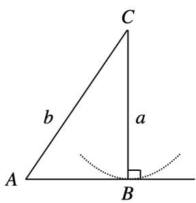</td><td>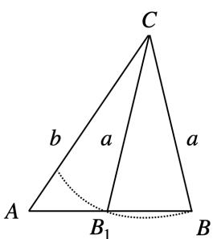</td><td>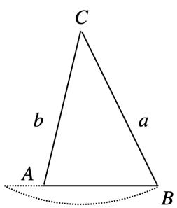</td><td colspan="2">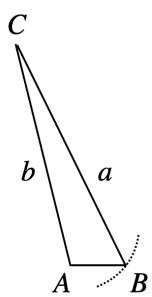</td></tr><tr><td>关系式</td><td>a=b sin A</td><td>b sin A &lt; a &lt; b</td><td>a≥b</td><td>a&gt;b</td><td>a≤b</td></tr><tr><td>解的个数</td><td>一解</td><td>两解</td><td>一解</td><td>一解</td><td>无解</td></tr></table>

例1 （2023·贵州·统考模拟预测） $\triangle ABC$ 中，角 $A, B, C$ 的对边分别是 $a, b, c$ ， $A = 60^{\circ}$ ， $a = \sqrt{3}$ 。若这个三角形有两解，则 $b$ 的取值范围是（）

$$
A. \sqrt {3} <   b \leq 2
$$

$$
B. \sqrt {3} <   b <   2
$$

$$
C. 1 <   b <   2 \sqrt {3}
$$

$$
D. 1 <   b \leq 2
$$

例2 （2023·全国·高三专题练习）若满足 $\angle ABC = \frac{\pi}{4}$ , $AC = 6$ , $BC = k$ 的 $\triangle ABC$ 恰有一个, 则

实数 $k$ 的取值范围是（）

A. (0,6]

$B.(0,6)\cup \left\{6\sqrt{2}\right\}$

C. $\left\{6,6\sqrt{2}\right\}$

D. $(6,6\sqrt{2})$

# 4. 张角定理

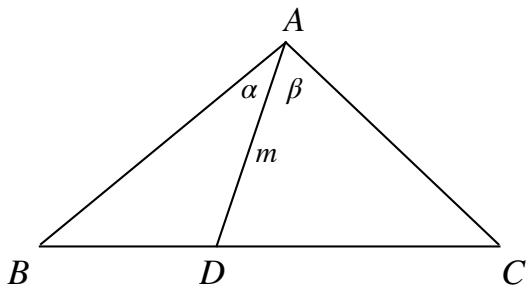

text_image

A
α β
m
B D C

定理：在 $\triangle ABC$ 中， $D$ 是 $BC$ 上的一点，连接 $AD$ ，则 $\frac{\sin\angle BAC}{AD} = \frac{\sin\angle BAD}{AC} + \frac{\sin\angle CAD}{AB}$ .

逆定理：如果 $\frac{\sin\angle BAC}{AD} = \frac{\sin\angle BAD}{AC} +\frac{\sin\angle CAD}{AB}$ ，则 $B,D,C$ 三点共线

引申 当AD为角平分线时， $S_{\triangle ABC} \geq AD^{2} \tan \angle BAD$

例1 在 $\triangle ABC$ 中角 $A, B, C$ 所对应的分别为 $a, b, c$ ，且 $b \cos C = a$ ，点 $M$ 在线段 $AB$ 上，且 $\angle ACM = \angle BCM$ ， $AC = 6CM = 6$ ，则 $\cos \angle BCM$ 的值为 \_\_\_\_.

例2 在 $\triangle ABC$ 中角 $A, B, C$ 所对应的分别为 $a, b, c$ ，且 $b \cos C = a$ ， $\angle ABC = \frac{2\pi}{3}$ ， $BD$ 平分 $\angle ABC$ 交 $AC$ 于点 $D$ ， $BD = 2$ ，则 $ABC$ 的面积的最小值为 \_\_\_\_.

# 第二节 边角关系的转化与应用

# 一. 常见的边角转化处理方式

1. 角 $\leftrightarrow$ 角：三角恒等变换  
2. 边 $\leftrightarrow$ 角：正余弦定理（一般题目中出现其次的角或边时用正弦定理）

在解决涉及边角关系转化的问题时，作为解题者，我们常常面临一个不确定的选择，即是将问题转化为边的关系还是角的关系。因此，在解三角形类的问题中，观察力显得尤为重要。我在这里提出的建议是：

# 首先关注角的条件，然后考虑边的条件

所谓“看角”是指审视题目中存在多少个不同的角，而“看名”则是指留意余弦、正弦等三角函数的名称；接着，根据题目的条件，选择适当的解三角公式并统一变量，最终得出所需的结论。

理论单独阐述可能过于抽象，因此，下面我们将通过例题演示如何处理这一过程。

# 二. 边角关系的转化的应用

例1 在 $\triangle ABC$ 中，内角 $A, B, C$ 所对的边分别为 $a, b, c$ ，已知 $\frac{\cos A}{1 + \sin A} = \frac{\sin 2B}{1 + \cos 2B}$ ，若 $C = \frac{2\pi}{3}$ ，求 $B$ .

例2 在 $\triangle ABC$ 内角 $A, B, C$ 所对的边分别为 $a, b, c$ ，已知 $\sin^2 A - \sin^2 B - \sin^2 C = \sin B \sin C$ ，求 $A$ .

例3 在 $\triangle ABC$ 内角 $A, B, C$ 所对的边分别为 $a, b, c$ ，且满足 $b^2 + bc = a^2$ ，求证： $A = 2B$ .

例4 在 $\triangle ABC$ 内角 $A, B, C$ 所对的边分别为 $a, b, c$ ，满足 $b^{2}(\sin^{2} B - 3 \cos^{2} B) = -a(a + b)$ ，且 $\sin C = \sin 2B$ ，求角 $B$ .

例5 在 $\triangle ABC$ 中，内角 $A, B, C$ 所对的边分别为 $a, b, c$ ，若 $a = 1$ ，且 $2\cos C + c = 2b$ ，求 $A$ .

# 三. 最值与取值范围的处理策略

最值与取值范围的处理分成两种思路：

- 化成边用余弦定理（看到“三条边”+“一个角”的条件），统一变量求函数的极值  
- 化成角用正弦定理消元，利用三角函数的有界性获取范围

同时，我们还需留意三角形中的隐含条件，例如三角形内角和为 $\pi$ ，以及我在前文中提到的解三角形中常用的公式等。对这些知识的熟练掌握，能够为解题提供更多的线索和方向。

例1 秦九韶是我国南宋著名数学家，在他的著作《数书九章》中有已知三边求三角形面积的方法：“以小斜幂并大斜幂减中斜幂，余半之，自乘于上以小斜幂乘大斜幂减上，余四约之，为实一为从隅，从平方得积。”如果把以上这段文字写成公式就是 $S=\sqrt{\frac{1}{4}[a^{2}c^{2}-(\frac{a^{2}+c^{2}-b^{2}}{2})^{2}]}$ ，其中a,b,c是△ABC的内角A,B,C的对边，若△ABC面积S=12，且 $a^{2}+c^{2}-b^{2}=14$ ，则△ABC的周长的最小值为\_\_\_\_.

例2 $\triangle ABC$ 三角形的内角 $A, B, C$ 的对边分别为 $a, b, c$ , $(2a - b)\sin A + (2b - a)\sin B = 2c \sin C$ , 且 $c = 6$ , 则 $\triangle ABC$ 周长的最大值为 \_\_\_\_.

例3 在 $\triangle ABC$ 中，内角 $A, B, C$ 所对的边分别为 $a, b, c$ ，若 $2b \cos A - 2c + a = 0$ ，且 $b = 1$ ，求 $2a + c$ 的最大值.

例4 在 $\triangle ABC$ 中，内角 $A, B, C$ 所对的边分别为 $a, b, c$ ，已知 $\frac{\cos A}{1 + \sin A} = \frac{\sin 2B}{1 + \cos 2B}$ ，求 $\frac{a^2 + b^2}{c^2}$ 的最小值.

例5 （集英竞秀一周年）已知 $\triangle ABC$ 中 $a, b, c$ 分别为角 $A, B, C$ 对应的边，若角 $B$ 为钝角，求取值范围.

# 第三节 构造辅助线在解三角形中的应用

在初中，我们就学过有关的三角形的辅助线构造，高中给大多数人的印象解三角就是纯代数，这也导致大多数高中生只会从爆算的角度理解解三角，解三角顾名思义要在几何图形中去解，因而我们就可以采用数形结合的办法，使得问题得到简化。这一节我会讲解一些实用且常考查的辅助线构造，不会像初中一样拓展.

# 一. 常见的构造辅助线方法

# 1. 截长补短法

例 在 $\triangle ABC$ 中， $AB = CD - BD$ ， $AD \perp BC$ ，求证： $\angle B = 2\angle C$ .

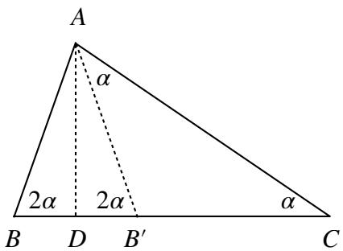

text_image

A
α
2α 2α
B D B' C
α

# 2. 倍长中线法

其中BC=CD，延长AD使得DE=AD，则 $\triangle BDE\cong\triangle CDA.$

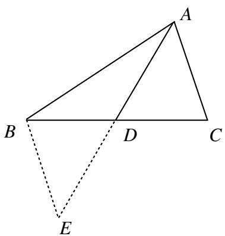

text_image

A
B
D
C
E

# 3. 二倍角处理

二倍角一般有两种处理方式，例如 $\triangle ABC$ 中，B = 2C.

处理 1: 过 A 作 BC 垂线, 再将 $\triangle ABD$ 沿 $AD$ 翻折, 可得 $AB' = B'C$

处理 2：延长CB至D使BD = AB，可得AD = AC.

# 4. 四点共圆（构造辅助圆）

① 对角互补的四边形四点共圆

② 构造三角形的外接圆

# 5. 角平分线的处理

示例 $\triangle ABC$ 中， $AD$ 平分 $\angle A$ .

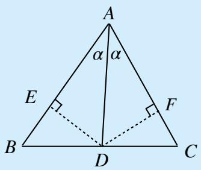

text_image

A
α α
E
F
B
D
C

处理1

过 $D$ 分别向 $A B 、 A C$ 作垂线

则 $\triangle ADE\cong \triangle ADF$

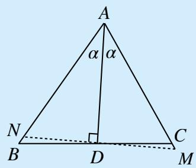

text_image

A
α α
N
B D C
M

处理2

过 $D$ 作 $AD$ 的垂线得 $\triangle ADN\cong \triangle ADM$

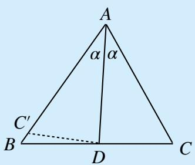

text_image

A
α α
C'
B
D
C

处理3

截 $AC' = AC$

则 $\triangle ADC \cong \triangle ADC'$

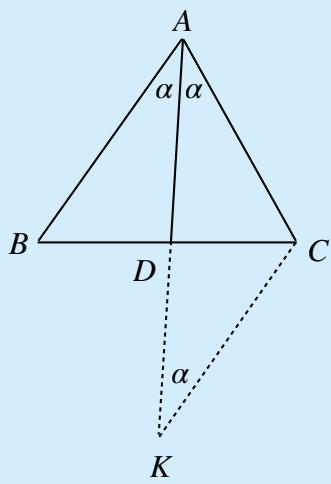

text_image

A
α α
B D C
α
K

处理4

过C作CK//AB交AD于K

则 $AC = CK$

# 二. 构造辅助线的应用

例1 在 $\triangle ABC$ 中， $AB = 2$ ， $D$ 为 $AB$ 中点， $CD = \sqrt{2}$ ，若 $\angle BAC = 2\angle BCD$ ，求 $AC$ 的长.

例2 在 $\triangle ABC$ 中， $\angle BAC = 60^{\circ}$ ， $AB = 2$ ， $BC = \sqrt{6}$ ， $D$ 为 $BC$ 上一点， $AD$ 为 $\angle BAC$ 的平分线，则 $AD =$ \_\_\_\_.

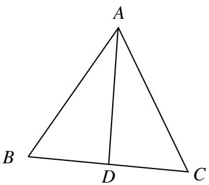

text_image

A
B
D
C

例3 在 $\triangle ABC$ 中，内角 $A$ 、 $B$ 、 $C$ 所对的边分别为 $a, b, c$ ，且满足 $b^{2} + bc = a^{2}$ . 求证： $A = 2B$ ; 例4 如图，在 $\triangle ABC$ 中， $AD$ 平分 $\angle BAC$ ， $AC - CD = 3$ ， $AB + BD = 6$ ， $AD = \_$ .

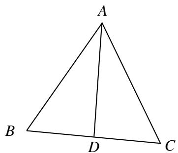

text_image

A
B
D
C

例5 （集英竞秀三周年试题）如图所示，在 $\triangle HDC$ 中， $BD \perp EC$ ， $ED = DB$ ， $DH \perp EB$ ， $CD - DE = 3$ ， $HM = 5$ ，则 $BE =$ \_\_\_\_.

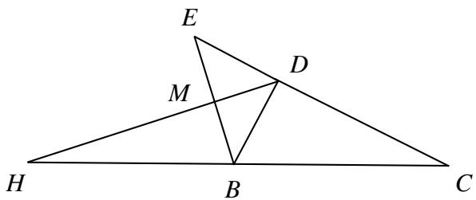

text_image

E
M
D
H
B
C

A. $\frac{\sqrt{18 + 240\sqrt{2}} - 3\sqrt{2}}{4}$

B. $\frac{\sqrt{9 + 120\sqrt{2}} - 5\sqrt{2}}{8}$

C. $\frac{\sqrt{18+240\sqrt{2}}-4\sqrt{2}}{4}$

D. $\frac{\sqrt{9+120\sqrt{2}}-6\sqrt{2}}{4}$

例6 （集英竞秀一周年试题）如图所示，四面体ABCD中，AB = AC = 7，若E为BC中点， $\angle BCD = 2\angle BDE = \frac{\pi}{3}$ ，求证： $AD \perp BC$ .

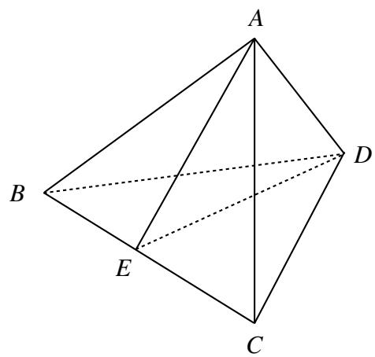

text_image

A
B
E
C
D

例7 在 $\triangle ABC$ 中， $AB > AC$ ， $D$ 为 $BC$ 中点， $AB = 10$ ， $AD = 7$ ， $\cos \angle CAD = \frac{2\sqrt{6}}{7}$ ， $BC =$ \_\_\_\_.

例8 在 $\triangle ABC$ 中， $\angle A = 2\angle B$ ， $AB = \frac{7}{3}$ ， $BC = 4$ ， $CD$ 平分 $\angle ACB$ 交 $AB$ 于点 $D$ ，则线段 $AD$ 长为 \_\_\_\_.

例9 在 $\triangle ABC$ 中， $AB = 2$ ， $D$ 为 $AB$ 中点， $CD = \sqrt{2}$ ，若 $\angle BAC = 2\angle BCD$ ，则线段 $AC$ 长为 \_\_\_\_.

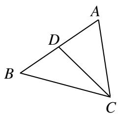

text_image

A
D
B
C

例10 在 $Rt \triangle ABC$ 中， $\angle ACB = \frac{\pi}{2}$ ， $\angle ABC = \frac{\pi}{6}$ ，点 $P$ 在 $\angle ABC$ 内，且 $PA \perp PC$ ， $\angle BPC = \frac{5\pi}{6}$ ，设 $\angle PCB = \theta$ ，则 $\tan \theta =$ \_\_\_\_.

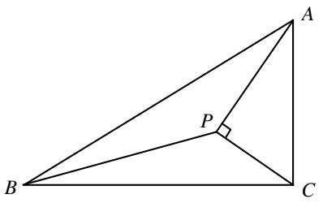

text_image

Geometric diagram of triangle ABC with point P on side BC and perpendicular from P to AB

# 第四节 解三角形在实际问题中的应用

解三角形在集合问题中的应用都是我们之前讲解过的，只不过将图形放在了实际问题中，本节我们将通过以下例题剖析如何在实际问题中解三角形.

例1 2020年12月8日，中国和尼泊尔联合公布珠穆朗玛峰最新高程为8848.86（单位：m），三角高程测量法是珠穆朗玛峰高程测量法之一。如图是三角高程测量法的一个示意图，现有A，B，C三点，且A，B，C在同一水平上的投影 $A'$ ， $B'$ ， $C'$ 满足 $\angle A'C'B'=45^{\circ}$ ， $\angle A'B'C'=60^{\circ}$ 。由C点测得B点的仰角为 $15^{\circ}$ ， $BB'$ 与 $CC'$ 的差为100；由B点测得A点的仰角为 $45^{\circ}$ ，则A，C两点到水平面 $A'B'C'$ 的高度差 $AA'-CC'$ 约为 $(\sqrt{3}\approx1.732)$ （）

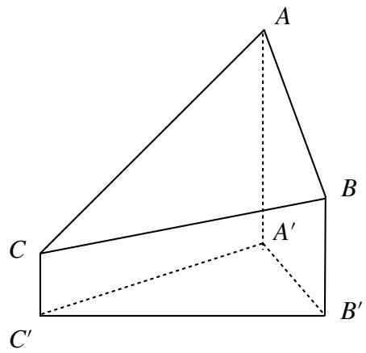

text_image

A
B
C
A'
B'
C'

例2 为迎接大运会的到来，学校决定在半径为 $20\sqrt{2} m$ ，圆心角为 $\frac{\pi}{4}$ 的扇形空地OPQ的内部修建一平行四边形观赛场地ABCD，如图所示.则观赛场地的面积最大值为（）

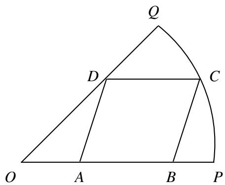

text_image

Q
D
C
O
A
B
P

A. $200m^{2}$

B. $400(2 - \sqrt{2})m^{2}$

C. $400(\sqrt{3} - 1)m^{2}$

D. $400(\sqrt{2} - 1)m^{2}$

例3 如图所示, 为了测量 $A, B$ 处岛屿的距离, 小明在 $D$ 处观测 $A, B$ 分别在 $D$ 处的北偏西 $15^{\circ}$ 、北偏东 $45^{\circ}$ 方向, 再往正东方向行驶40海里至 $C$ 处, 观测 $B$ 在 $C$ 处的正北方向, $A$ 在 $C$ 处的北偏西 $60^{\circ}$ 方向, 则 $A, B$ 两处岛屿间的距离为 ( )

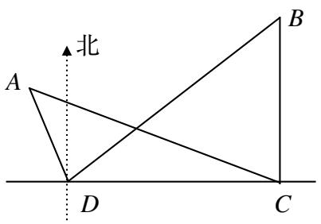

text_image

北
A
B
D
C

A. $20\sqrt{6}$ 海里

$B.40\sqrt{6}$ 海里

C.20(1 + $\sqrt{3}$ )海里

D.40海里

例4 要测量底部不能到达的东方明珠电视塔的高度，在黄浦江西岸选择甲、乙两点测得塔顶的仰角分别为 $45^{\circ},30^{\circ}$ ，在水平面上测得电视塔与甲地连线及甲、乙两地连线所成的角为 $120^{\circ}$ ，甲、乙两地相距500m，则电视塔的高度是\_\_\_\_。

例5 长为3.5m的木棒AB斜靠在石堤旁，木棒的一端A在离堤足C处1.4m的地面上，另一端B在离堤足C处2.8m的石堤上，石堤的倾斜角为 $\alpha$ ，则坡度值 $\tan\alpha=$ （）

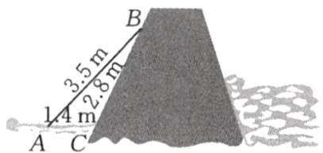

text_image

3.5 m
2.8 m
1.4 m
A C
B

A. $\frac{\sqrt{231}}{5}$

B. $\frac{5}{16}$

C. $\frac{\sqrt{231}}{16}$

D. $\frac{11}{5}$

例6 （2021·全国乙卷）魏晋时期刘徽撰写的《海岛算经》是关于测量的数学著作，其中第一题是测量海岛的高，如图，点E,H,G在水平线AC上，DE和FG是两个垂直于水平面且等高的测量标杆的高度，称为“表高”，EG称为“表距”，GC和EH都称为“表目距”，GC与EH的差称为“表目距的差”，则海岛的高AB = （ ）

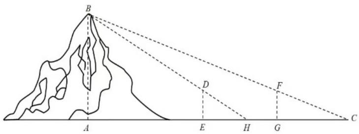

text_image

B
A
D
E
H
G
F
C

A. $\frac{\text{表高} \times \text{表距}}{\text{表距目的差}} + \text{表高}$

B. $\frac{\text{表高} \times \text{表距}}{\text{表距目的差}} - \text{表高}$

C. $\frac{\text{表高} \times \text{表距}}{\text{表距目的差}} + \text{表距}$

D. $\frac{\text{表高} \times \text{表距}}{\text{表距目的差}} - \text{表高}$

例7 在一次海上联合合作战演习中，红方一艘侦察艇发现在北偏东 $45^{\circ}$ 方向相距12nmile的水面上，有蓝方一艘小艇正以每小时10nmile的速度沿南偏东 $75^{\circ}$ 方向前进，若红方侦察艇以每小时

14 n mile 的速度，沿北偏东 $45^{\circ} + \alpha$ 方向拦截蓝方的小艇，若要在最短时间内拦截住，求红方侦察艇所需的时间和角 $\alpha$ 的正弦值.

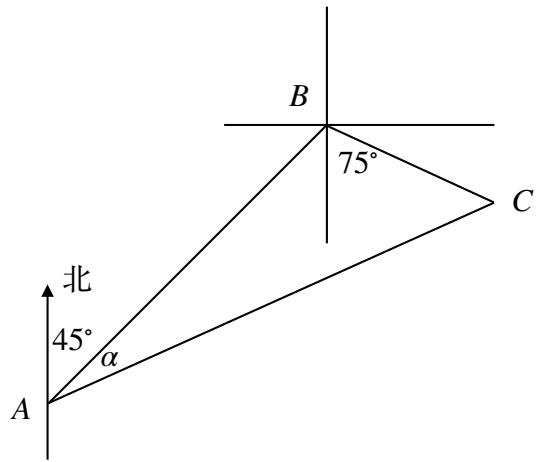

text_image

北
45°
α
A
B
75°
C

例8 如图, 游客从某旅游景区的景点A处下山至C处有两种路径, 一种是从A沿直线步行到C, 另一种是先从A沿索道乘缆车到B, 然后从B沿直线步行到C, 现有甲、乙两位游客从A处下山, 甲沿AC匀速步行, 速度为 $50 \mathrm{~m} / \mathrm{min}$ , 在甲出发 $2 \mathrm{~min}$ 后, 乙从A乘缆车到B, 在B处停留 $1 \mathrm{~min}$ 后, 再从B匀速步行到C, 假设缆车匀速直线运行的速度为 $130 \mathrm{~m} / \mathrm{min}$ , 山路AC长为 $1260 \mathrm{~m}$ , 经测量, $\cos A = \frac{12}{13}$ ,

$$
\cos C = \frac {3}{5}.
$$

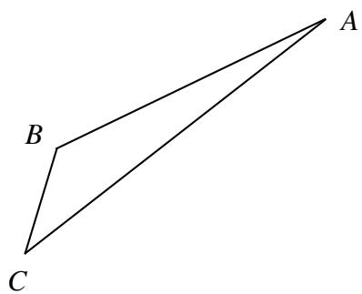

natural_image

Geometric diagram of a quadrilateral ABC with diagonal AC, no text or symbols present

(1) 求索道AB的长;   
(2) 问乙出发多少分钟后, 乙在缆车上与甲的距离最短?

# 章末检测

例1 $\triangle ABC$ 中， $\angle BAC = \frac{\pi}{3}$ ， $D$ 在 $AC$ 上， $BD = DC$ ， $BC = \sqrt{3} AD$

$\angle BCA = \theta (\frac{\pi}{12} < \theta < \frac{\pi}{4})$ ，则cos $\theta =$

例2 在 $\triangle ABC$ 中，角 $A, B, C$ 的对边分别为 $a, b, c$ ，且 $c = a (\sin B + \cos B)$ .

(1) 求角A的大小;   
(2) 若边 $AB$ 上的中线长为 2，求 $\triangle ABC$ 的面积的最大值.

例3 喜来登月亮酒店是浙江省潮州市地标性建筑，某学生为测量其高度，在远处选取了与该建筑物的底端B在同一水平面内的两个测量基点C与D，现测得 $\angle BCD = 45^{\circ}$ ， $\angle BDC = 105^{\circ}$ ，CD = 100米，在点C处测得酒店顶端A的仰角 $\angle ACB = 28^{\circ}$ ，则酒店的高度的是（）

natural_image

Exterior view of a modern, curved glass skyscraper reflected in calm water at dusk (no signage or text visible)

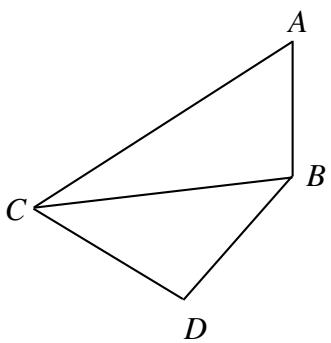

natural_image

Geometric diagram of a quadrilateral with vertices labeled A, B, C, D (no text or symbols beyond labels)

A. 91米

B. 101米

C. 111米

D. 121米

例4 $\triangle ABC$ 的内角 $A, B, C$ 的对边分别是 $a, b, c$ ，若 $(a + b)\sin A = 2b\sin (A + \frac{\pi}{6})$ ， $C = \frac{\pi}{6}$ ，则 $B = (\quad)$

A. $\frac{\pi}{6}$

B. $\frac{\pi}{4}$

C. $\frac{\pi}{3}$

D. $\frac{5\pi}{12}$

例5 $\triangle ABC$ 的内角 $A, B, C$ 的对边分别为 $a, b, c$ ，已知 $\triangle ABC$ 的面积为 $\frac{a^2}{3\sin A}$ .

(1) 求 $\sin B \sin C;$   
(2) 若 $6 \cos B \cos C = 1, a = 3$ , 求 $\triangle ABC$ 的周长.

例6 在 $\triangle ABC$ 中，满足 $\sin^2 A - \cos^2 B + \sqrt{2}\sin A\sin B = -\cos^2 C.$

(1) 求C;   
(2) 设 $\cos A \cos B = \frac{3\sqrt{2}}{5}$ , $\frac{\cos(\alpha + A)(\cos \alpha + B)}{\cos^2 \alpha} = \frac{\sqrt{2}}{5}$ , 求 $\tan \alpha$ 的值.

