# T7高考数学

# 一轮复习专题

本产品研发由武汉导学猫教育有限公司赞助支持

T7 CEE Mathematics First Round Review

总策划：柳曰

主编：PASSER 暄尘 叶子毅 久洵 陈智勇

编委：t.t.t.t. Saikyo 胡杰 馨乃 鱼鱼苯鱼 Zing Alanstar 林宇恒

# T7高考数学 一轮复习

总策划：柳曰

主编: PASSER 暗尘 叶子毅 久洵 陈智勇

编委：t.t.t.t. Saikyo 胡杰 馨乃 鱼鱼苯鱼 Zing Alanstar 林宇恒

# 序言

四月的尾声，春风依旧；砥砺深耕，未来可期。

当你看到此序言时，意味着你已经拿到了我们准备一年的开山之作，由于投入了大量的精力、时间和思考，作为组织者，我的感慨是颇多的，因此我想写把此文写的接地气一些，也想让每一个字、词、句都更小众一些。

# T7导学猫：鲜明的人文情怀——也是属于你的新选择

在T7 UNION导学猫发展的过程中，难度最大的事情就是招募人才，原因如下：这一行说到底是体力活，我们需要综合能力极高的人，既要足够高的专业水平很重要，又要持久的驱动力，当然，有个性也十分的重要；

作为一个比较在意文学性和美学性的发起人，对团队成员的选择也势必有些角度刁钻和苛刻，但正因此，导学猫成为了一个性格鲜明、内核刚硬的团队，不会湮灭于市井之中。

本产品由我（Titus）、暄尘、Passer、久洵、叶老师、陈智勇共同研发，相信对于绝大多数人来说，我们也已然是老面孔了；

在梯期杯、圆梦杯、久洵杯等联赛的命题组名单中，出现过我们脆弱的身影；在风靡全国的抖音上，也许邂逅过我们轻浮的解题作品；在各个数学群聊中也许你也看到了我们亦是沉默寡言、亦是雀跃聒噪的躯体；更甚者，也许每一次数学圈的世界大战中，你也能观察到我们或多或少的插足和涉猎……

或许是都比较年轻，又或许是看到不对的就直说的形式风格，我们多多少少被圈内老人们赋予了“不懂人情事故”、“不给人留面子”等标签；但每一个看似冲动的举动背后，都有着深思熟虑的打量，就是这样一些人，极具“偷感”地聚在一起，悄无声息的打造了一个产品系列，T7数学-高考复习系列，这个系列也随了它爸妈们的性格——直接、到位、不拖沓。

# 学术世界中的神话与现实，不老传说与新定义的共鸣

诚然, 目前市面上涌现了各种五花八门的资料与产品以及以“镰刀”著称的各种民间组织, 随着时间的推移, 都被证明既缺乏职业道德又缺乏专业水准, 所谓的“书香世家”、“超级名师”无非是老肉烂炒的学术厨师和东缝西补的学术裁缝, 一位位伟岸的不老传说的凭着一张脸皮接住了那泼天的富贵;

之所以称其为不老传说，是因为无论他们怎样的“雷”、被读者怎样的曝光，总能卷土重来，拾回年轻时的自信与潇洒，慷慨激昂的继续生产学术垃圾，正所谓——造神运动与朝花夕拾。

越是神奇的操作，背后越没有逻辑。

一些大佬曾说，高手就别去做低水平的竞争，可是在这个勾栏听曲的行业中，往往都是搭台才有人看戏，正如今年九省联考举办一个月后，市面上立马涌现了有关“新定义”的产品，堪称为韭菜量体裁衣；

正所谓，春江水暖鸡先知。

在这个2024年6月之前没有人知道新定义到底怎样考的星球上，总有那么一些人能够搭起一张台，唱完一场戏：

不老传说们的猛追热点，是镰刀挥舞的如履薄冰，是穿越周期的知识付费，

是繁茂韭菜的回流生长，是中年陷阱的雷声滚滚，是圈内老瓜的手硬心软，

是职业傻子的老脸值钱，是数圈骚骚的穷则生变，是打脸专家的龙凤呈祥，一代风骚，二等江湖，时代的沙——璀璨，又夺目。

# 高考复习产品中，不拘一格的新鲜空气

也不知怎么说，我、甚至的大部分团队成员的未来发展方向其实与教育行业并不相关，但也许是由于生来看不惯太low的东西，总想着重创一下这个行业，又也许是结交了同样骨感的朋友，觉得不换新一下大气层，就无法呼吸——责任因个体的不适变得不可推托。

全国各校的一轮复习已迫在眉睫（友商们的镰刀也近在眼前），为了尽快满足大家的需求（维护韭菜生命安全），我们将首先发布《T7高考数学一轮复习》；

不同于市面上其他产品把所有内容简单堆砌或是大招、题型的铺设，在一轮中，们从做题逻辑和主观分析的角度切入基础知识，旨在搭建符合逻辑的思考体系，即对于任何题目，都能依据严谨的逻辑分析一步步将问题拆分并解决的能力；

此外，基础上知识讲解部分，我们从本质阐述问题：

# 溯题源、求本质、通方法、讲思想

这也是我们编写团队一致秉承的理念和初心，将思维和背后的命题逻辑传授于读者，让其不受所谓“题型”、“命题背景”、“大招方法”等伪概念条框的限制，真正地提升最底层的思维能力，从而具备专业和强大的解题能力和分析能力。

# 本册人员分工

# 第一章

编写：柳曰；审核：Passer；排版：柳曰

# 第二、三章

编写：Passer；审核：Passer；排版：杨晓峰

# 第四、五、六、七章

编写：柳曰；审核：Passer、微风、馨乃、鱼鱼苯鱼；排版：柳曰

# 第八章

编写：陈智勇；审核：Passer、柳曰；排版：柳曰、安澜

# 第九、十章

编写：Passer；审核：胡杰、柳曰；排版：柳曰、江锦晨

# 第十一章

编写：暄尘、久洵；审核：暄尘、胡杰、微风；排版：Avery、柳曰、江锦晨

# 第十二章

编写：叶子毅、柳曰；审核：Passer、柳曰；排版：柳曰

# 第十三章

编写：暄尘、久洵、Saikyo；审核：暄尘、胡杰、Zing、t.t.t.t.；排版：柳曰

text_image

T7高考数学
一轮复习专题
本产品研发由武汉导学报教育有限公司赞助支持
T7 CEE Mathematics First Round Review
总策划：TTUS
主编：PASSER 瑞尘 叶子毅 久淘 陈智勇
编委：tt.tt.Saikyo.coio 马乃 鱼鱼笨鱼

natural_image

Abstract geometric shape with black and blue colors, no text or symbols present

# 为您奉上

主力产品首秀，诚意满满

武汉导学猫教育有限公司

T7 CEE Mathematics First Round Review

# 导学猫·内部讲义

# CONTENT

# 目录

# 第一章 集合与逻辑 20

# 第一节 集合的基本概念 20

一. 集合与元素 20  
二. 集合三要素 20  
三. 集合之间的关系与运算 23  
四. Venn图 25  
五. 容斥原理 26  
六. 与集合相关的进阶概念 26

# 第二节 逻辑用语 30

一. 充分条件 30  
二. 必要条件 30  
三. 充要条件 30  
四. 既不充分也不必要条件 30  
五. 全称量词与存在量词 31  
六. 否命题和逆否命题 33

# 第二章 不等式 35

# 第一节 不等式探秘 35

# 一. 不等式的性质及解法 35

1. 幂不等式 35  
2. 绝对值不等式 36  
3. 分式不等式 37  
4. 无理不等式 37  
5. 指数与对数不等式 38

# 二. 比大小的基本原理 38

# 三. 不等式的性质 39

1. 传递性 39  
2. 可加性 39  
3. 可积性 39  
4. 平方法则 39

5. 倒数法则 39

# 第二节 基本不等式 41

一. 基本不等式的概念 41  
二. 基本不等式的应用原则和方法 41  
三. 基本不等式的应用 42

1. 已知和或积求定值或最值 42   
2. 配凑法 42  
3. 换元法 42  
4. 消元法 43  
5. 常数代换 43  
6. 齐次化 43

# 四. 基本不等式的扩展 44

1. 糖水不等式 44  
2. 绝对值的三角不等式不等式 44  
3. 二维柯西不等式 45  
4. 权方和不等式 45  
5. 琴声不等式 46  
6. 数幂形式伯努利不等式 46

# 第三章 函数的概念与性质 47

# 第一节 函数的概念 47

一. 函数的定义 47  
二. 函数的三大性质 47

1. 函数的存在性（Existence） 47  
2. 函数的唯一性 (Uniqueness) 47  
3. 函数的任意性（Arbitrariness） 47

# 三. 函数的三要素 48

1. 定义域（Domain） 48  
2. 法则/规则 (Rule) 48  
3. 值域（Range） 48

# 四. 函数的定义域与值域 49

1. 函数定义域优先原则 49  
2. 值域 50

# 第二节 函数的性质 53

一. 函数的有界性 53  
二. 函数的单调性与最值 54

定义法判断 54

单调性分析法判断 54

导数法判断 55

复合函数单调性判断 55

# 三. 函数的奇偶性 57

1. 奇偶性的定义 57  
2. 函数的奇偶性原理 57  
3. 函数奇偶性的判断 58

# 第三节 函数的对称性、周期性及凹凸性 61

一. 函数的对称性 61  
二. 函数的周期性 62  
三. 函数的凹凸性 63

# 第四节 抽象函数的综合性质 64

一. 抽象函数的性质 64  
二. 抽象函数中对称性和奇偶性的关系 65  
三. 抽象函数中对称性和周期性的关系 65

# 第五节 原函数与导函数的关系 69

一. 原函数与导函数的奇偶性牵连关系 69  
二. 原函数与导函数的周期性 69  
三.导函数构造原函数-构造模型结论 70  
四.导函数构造原函数-积分法 71

# 第六节幂函数 73

一. 基本定义 73  
二. 图像与性质 73  
三. 图像变换 73

# 第七节 多项式函数 74

一. 多项式函数 74  
1. 多项式 74  
2. 有理函数 75  
3. 代数函数 76

二. 一次线性函数 76

三.二次抛物线函数 77

四.三次函数 80

1. 曲线形状 80   
2. 极值点和拐点 80  
3. 单调性 80  
4. 对称性 80  
5. 切割线性质 80   
6. 切线条数 81  
7. 三零点处切线斜率性质 81  
拓展 三次方程的韦达定理 81

# 第八节 分段函数、嵌套函数及反函数的性质 83

一. 分段函数 83

二. 嵌套函数 85  
三. 反函数 86

# 第四章 指数函数与对数函数 88

# 第一节 指数函数 88

一. 基本定义 88  
二. 图像特征 88  
三. 单调性 88  
四. 指数法则 89  
五. 自然指数函数 89

# 第二节 对数函数 90

一. 对数的概念 90  
二. 对数的运算 90  
三. 对数与指数的互化 91  
四. 对数函数的概念 91  
五. 对数函数的图像性质 92

# 第五章 三角函数 93

# 第一节 任意角与弧度制 93

一. 弧度制 93  
二. 任意角 93  
三. 任意角与弧度制的转换关系 93  
四. 单位圆 94

# 第二节 三角函数的概念与性质 97

一. 正弦 97  
二. 余弦 98  
三. 正切 99  
四.三角恒等式 101  
五. 正余弦与反函数 101

# 第二节 诱导公式 102

一. 奇偶性 102  
二. $\pi$ 性 102  
三. 互余性 104  
四. 运算方式综合 105

# 第三节 恒等变换 106

一.和差角公式 106

1. 正弦函数的和差角公式 106  
2. 余弦函数的和差角公式 106  
3. 正切函数的和差角公式 106

# 二.二倍角公式 107

# 第四节 辅助角公式 110

一.辅助角公式及其证明 110  
二. 辅助角公式的优化运算-单位圆建模 110

# 第五节 $\mathrm{Asin}(\omega x + \varphi)$ 图像性质 112

一. 振幅、频率与相位 112  
二. 伸缩变化与平移变换 114

# 第六节 $\omega$ 取值范围问题 117

# 一. 选取操纵杆与约束 117

1. 操纵杆 117   
2. 约束 118

二. 相位角已知情况下的 $\omega$ 取值范围问题 119

三. 相位角未知情况下的 $\omega$ 取值范围问题 120

# 第六章 导数 123

# 第一节 导数的定义与几何意义 123

一. 极限的定义与运算法则 123  
二. 导数的概念 123  
三. 速率的局部影响 124  
三. 极值点与拐点 124  
四. 导数的运算 126  
五. 求导法则 126  
六. 公切线问题与导数 130  
七. 牛顿切线法 132

# 第二节 导数与单调性 134

一. 导数与函数单调性的对应关系 134  
二. 极值与极值点 134  
三. 极值与速率 134  
四. 利用导数求函数的单调区间与讨论单调性 135

1. 不含参类 135  
2. 含参类 136

# 第三节 速率与极限 137

一. 洛必达法则 137  
二. 极限与函数增长速率 139  
三. 指对幂混阶函数 141

# 第四节 新高考方向下导数与实际问题的结合 144

一. 与平面几何结合的二维长度、面积问题 144  
二.与立体几何结合的三维体积问题 145  
三. 与物理结合的速度问题 146

# 第七章 复数 148

# 第一节 复数的概念 148

一. 实部和虚部 148  
二. 复平面 148  
三. 纯虚数 149  
四. 共轭复数 149

# 第二节 复数的三角表示 150

一. 极坐标形式 150  
二. 欧拉公式与复数 151  
1. 欧拉公式及其证明 151  
2. 复数的三角表示 152

# 第三节 复数的四则运算 152

一. 复数的加减法 152  
二. 复数的乘法 152  
三. 复数的除法 153

四. 复数运算法则的三角形式 154

1. 复数乘除运算法则的三角形式 154  
2. 棣莫佛（De Moivre）定理 155

# 第八章 解三角形 156

# 第一节 基本定理公式的延伸与应用 156

一.三角形的定义与元素分析 156  
二. 基本公式的应用 159  
1. 正余弦定理 159  
2. 面积公式 160  
3. 和差化积与积化和差 160

# 三. 基础公式的延伸和应用 161

1. 三角形的内角和的应用 161  
2. 正余弦定理的延伸 161  
3. 基础公式在判断三角形个数的应用 161  
4. 张角定理 163

# 第二节 边角关系的转化与应用 164

一. 常见的边角转化处理方式 164  
二. 边角关系的转化的应用 164  
三. 最值与取值范围的处理策略 166

# 第三节 构造辅助线在解三角形中的应用 168

一. 常见的构造辅助线方法 169  
1. 截长补短法 169  
2. 倍长中线法 169  
3. 二倍角处理 169  
4. 四点共圆（构造辅助圆） 170

5. 角平分线的处理 170

二.构造辅助线的应用 171

第四节 解三角形在实际问题中的应用 177

章末检测 183

第九章 向量 186

第一节 平面向量性运算及坐标表示 186

一. 向量的定义与运算性质 186

二. 向量运算的几何意义 187

第二节 平面向量的两大定理及几何应用 190

一. 共线向量基本定理 190

二. 共线定理的推论：平面向量三点共线结论及其证明 191

三. 平面向量基本定理 191

四. 向量的几何运用 193

1. 向量定比点分公式 193

2. 向量加法与减法与模的运用 193

五. 向量的三角不等式 194

第三节 平面向量的和商差性质及三角的四心的联系 197

一. 等和线 197

二. 等商线 198

三. 等差线 199

四. 三角形的四心定义与性质 200

第四节 向量的数量积概述 204

一. 向量的数量积 204

二. 向量的投影 204

三. 投影向量 205

第五节 向量拓展篇 207

一.奔驰定理与四心的向量揭秘 207

1. 奔驰定理 207

二. 欧拉线（三角形内多心存在关系） 208

四. 梅涅劳斯定理 210

五. 三角形面积公式的向量表达 210

六. 极化恒等式 213

1. 定义 213

2. 极化恒等式的几何意义 214

七. 矩形中的平方和关系 214

八. 对角线向量定理 214

第十章 立体几何 219

第一节 空间立体几何体的初步认识 219

一. 空间几何体 219

# 第二节 空间的点、线、面、角的交织探索 223

一. 基本元素 223  
二. 四大公理和三个推论 224  
三. 空间直线与平面的位置关系 226  
四. 空间平面与平面之间的关系 226  
五. 异面直线的判定和夹角（等角定理） 226

# 第三节 直线和平面的平行判定与性质 230

一. 线面平行及面面平行的判定定理及平行的判定 230

1. 线线平行（判定定理） 230  
2. 线面平行 230  
3. 面面平行 230  
4. 平行的判定 231

二. 线面平行及面面平行的性质定理 231

1. 线面平行的性质定理 231  
2. 面面平行的性质定理 232

# 第四节 直线和平面的垂直和判定与性质 235

一. 线面垂直及面面垂直的判定定理及线线垂直的思考方向 235  
二. 线面垂直与面面垂直的性质定理 236

# 第五节 空间中的定义角和距离探索 239

一. 异面直线 239  
二. 空间角 240  
三. 空间距离 241

# 第六节 空间向量工具在立体几何的应用 248

一. 空间向量的定义 248  
二. 空间向量的线性运算 249  
三. 空间向量的数量积 249  
四. 共线向量定理 249  
五. 空间向量的坐标 249  
六. 平面的法向量 250

# 第七节 空间向量工具在立体几何的应用 252

一. 空间向量证明平行与垂直 252  
二. 空间向量求解空间距离 253  
三. 空间向量求解空间角 255

# 第十一章 数列 264

# 第一节 基本数列观 264

一.数列的概念与性质 264  
二. 数列的分类 264

三. 数列的一般形式与通项公式 264  
四. 数列单调性与最值项 265  
五. 数列的递推公式 267  
六. 数列的周期性 267  
七. 数列的前n项和Sn 269  
八. 数列的前n项积Tn 269

# 第二节 等差数列 270

一. 等差数列的定义 270  
二. 等差数列的通项公式 270  
三. 等差中项 271  
四. 等差数列的单调性 271  
五. 等差数列的前n项和 272  
六. 等差数列的判断方法 274

# 第三节 等比数列 274

一. 等比数列的定义 274  
二. 等比数列的通项公式 274  
三. 等比中项 275  
四. 等比数列的单调性 276  
五. 等比数列的前n项和 276  
六. 等比数列的判断方法 278

# 第四节 等差数列通项的性质 279

一. 等差数列通项函数观 279  
二. 多个等差数列叠加 279  
三. 等差数列的底标特性 280  
四. 等差数列前n项和Sn性质 281

# 第五节 等比数列性质 290

一. 等比数列通项an本身性质 290  
二. 等比数列前项和性质 292  
三. 等比数列前n项积Tn性质 296

# 第六节 基础递推关系构造 297

一. 累加型 297  
二. 累乘型 298  
三. 线性函数型 299  
四. 对数型 307  
五. 符合倒数型 308

# 六. 齐次类 309

# 第七节 数列奇偶项关系 310

# 一. 奇偶项 310

二. 奇偶分段 310

三. 隔项等差 313

四. 隔项等比 317

五. 含(-1)n的讨论类 320

六. 奇偶求和 321

常见的奇偶裂项 327

# 第八节数列求和 328

一. 公式求和与分组并项求和 328

1. 公式求和法 328

2. 分组（并项）求和 328

二. 倒序相加法 331

三. 错位相消法 334

# 第九节 裂项相消法 338

一. 阶差型 338

二. 分式裂差型 339

1. 等差分式型 339

2. 高阶分式型 340

3. 等比分式型 342

4. 根式分式型 343

5. 等差等比混合分式型 344

三. 整式裂差型 346

1. 等差裂项 346

2. 高阶裂项 346

3. 等比裂项 347

4. 等差乘等比裂项 347

5. 对数裂项 348

四.三角裂差型 349

1. 和差角方向 349

2. 积化和差方向 351

3. 齐次转化方向 352

五. 阶乘裂差型 352

1. 阶乘裂项 352

2. 排列数与组合数裂项 353

六. 裂和型 353

# 第十二章 统计与概率 354

# 第一节 记数原理 354

一. 分类加法计数原理与分步乘法计数原理 354

1. 分类加法计数原理 354

2. 分步乘法计数原理 354

# 二.排列与组合 354

1. 排列与排列数 354  
2. 组合与组合数 355  
3. 排列数与组合数的关系 355

# 三.二项式定理 359

1. 定义 359  
2. 公式 359  
3. Pascal三角形与二项式定理 359  
4. 二项式定理系数的性质 360

# 第二节 统计 364

一. 随机抽样 364  
二.样本的数字特征 369  
三. 百分位数 370  
四. 用样本估计总体 371

# 第三节 概率之相互独立与互斥 377

一. 随机试验 377  
二. 样本空间 377  
三. 随机事件、确定事件 377  
四. 事件的关系与运算 378  
五. 互斥事件与对立事件 379  
六. 相互独立事件和相互独立事件的概率乘法公式 381  
七. 概率与频率 381  
八. 解题总结 386

# 第四节 条件概率与全概率 386

一. 条件概率 386  
二. 相互独立与条件概率的关系 389  
三. 全概率公式 393

1. 全概率公式-由因求果 393  
2. 贝叶斯公式-执果求因 394

# 四. 几何抽象视角下的事件与概率 397

1. 事件分类及其概率 397  
2. 概率与频率 397   
3. 独立事件、互斥事件与对立事件 398  
4. 相互独立事件的乘法公式 399  
5. 独立事件与条件概率 400  
6. 公式的理解 401

# 第五节 离散型随机变量 403

一. 离散型随机变量的分布列 403  
二. 离散型随机变量的均值与方差 405

# 第六节 二项分布与超几何分布 412

一. n次独立重复试验 412   
二.二项分布 414  
三. 超几何分布 417  
四. 解题总结 418

# 第七节 正态分布 419

一. 正态曲线 419  
二. 定义 419  
三. 解题总结 422

# 第十三章 圆锥曲线 426

# 第一节 直线方程与扩展方程 426

一. 平面定线定理与方向度量 426

1. 定线定理 426  
2. 方向度量 426

二. 直线的方程 426

1. 点斜率式 426  
2. 斜率截距式 426  
3. 两点式 426  
4. 截距式 426  
5. 恒竖式 427  
6. 点向式 427  
7. 一般式 427  
8. 参数式 427  
9. 定比分点式 427

三. 点线间位置关系 429

1. 点与直线的位置关系 429  
2. 直线与直线的位置关系 429

四. 与线有关性距离 431

1. 两点距离公式 431  
2. 点线距离公式 431  
3. 平行线间距离公式 432

五. 直线系方程 433

1. 相交直线系方程 433  
2. 垂直直线系方程 434  
3. 平行直线系方程 434

# 第二节 圆的方程与圆系扩展 435

一. 圆的定义 435  
二. 圆的方程 436  
三. 点、直线和圆与圆的位置关系 439

1. 点与圆的位置关系 439  
2. 直线与圆的位置关系 439  
3. 圆和圆的位置关系 440

# 四. 圆的弦长与切线问题 441

1. 圆的弦长 441  
2. 圆的切线 441  
3. 圆的切线长（切线长定理） 444

# 五. 四点共圆与圆幂定理 447

1. 圆周角定理在四点共圆的应用 447  
2. 圆幂定理在在四点共圆的应用 448

# 六. 特殊圆（外接圆，内切圆，米勒圆） 450

1. 三角形外接圆 450  
2. 三角形内接圆 450  
3. 米勒圆 451

# 七. 阿波罗尼奥斯圆与性质 455

1. 阿波罗尼奥斯圆定义 455  
2. 阿波罗尼奥斯圆的方程 455  
3. 阿波罗尼奥斯圆的性质 455

# 八. 圆系方程 459

1. 同心圆系方程 459  
2. 过定点圆系方程 459  
3. 相交圆系方程 460

# 第三节 直线与圆综合对称性问题 461

# 一. 点关于点或直线对称 461

1. 点关于点对称公式 461  
2. 点关于直线对称公式 462

# 二. 直线关于点或直线对称 463

1. 直线关于点对称公式 463  
2. 直线关于直线对称公式 463

# 三. 圆关于点或直线对称 465

1. 圆关于点对称 465  
2. 圆关于线对称 465

# 四. 圆上点距离问题 466

1. 点到圆上点距离最值 466   
2. 圆上点到直线距离定值的点个数问题 466

# 五. 平面几何对称性长度问题 467

1. 将军饮马 467  
2. 双对称问题 468

# 六. 阿波罗尼奥斯圆线段转化问题 470

# 第四节 圆锥曲线定义与性质 473

# 一.椭圆的定义与基本量参数 473

1. 椭圆的第一定义 473  
2. 椭圆的方程 473  
3. 椭圆的基本量与简单几何性质 474  
4. 椭圆的第二、三定义 478  
5. 点、直线与椭圆的位置关系 479

# 二. 双曲线的定义与基本量参数 481

1. 双曲线的第一定义 481  
2. 双曲线的方程 482  
3. 双曲线的基本量与简单几何性质 482

# 三. 抛物线的定义与基本量参数 490

1. 抛物线的定义 490  
2. 抛物线的方程 490  
3. 抛物线的基本量与简单几何性质 491  
4. 点、直线与抛物线的位置关系 492

# 四. 圆锥曲线统摄定义与根据圆构成圆锥曲线 496

1. 圆锥曲线的统摄定义（第二定义） 496  
2. 圆构成椭圆和双曲线 496

# 第五节 圆锥曲线的来源Dandelin球模型 500

# 一. 平面截圆柱 500

# 二. 平面截圆锥 502

1. 平面截二次锥面生成曲线图形 502  
2. Dandelin球模型模型分类 502   
3. Dandelin球模型阐述圆锥曲线的生成 503  
4. 圆锥夹角与截面夹角离心率关系 506

# 第三节 圆锥曲线定义与距离最值问题 511

# 一.椭圆定义处理最值问题 511

1. 椭圆第一定义处理 511  
2. 椭圆第二定义处理 511

# 二.抛物线定义处理最值问题 514

# 第一章 集合与逻辑

当我们谈论集合时，我们实际上是在讨论将物体归类为某些共同性质或特征的抽象概念。这种抽象的数学结构提供了一种强大的方式来理解和描述各种数学和现实世界中的问题。集合论是数学的基础之一，不仅在纯数学中有广泛应用，还在计算机科学、统计学、物理学等各个领域中发挥着关键作用。

# 第一节 集合的基本概念

# 一. 集合与元素

1. 元素：集合中的个体，可以是任何对象。

例如 集合 $A = \{1,2,3\}$ 包含了整数1、2和3。

2. 空集：不包含任何元素的集合，通常用符号 $\varnothing$ 表示。  
3. 集合的表示：集合是由一些确定的对象组成的无序集合。集合的表示方式可以通过列举元素、描述特定性质、图形表示或者使用符号等方式来进行。以下是几种常见的表示集合的方式：

\- 列举元素：最直观的方式是通过列举集合中的元素来表示它。

例如 $A = \{a, b, c\}$ 表示包含元素 a、b、c 的集合。

\- 描述特定性质：可以通过描述集合中元素的某些共同特征或满足某些条件的元素来定义集合。

例如 表示正整数集合可以写为 $B=\{x \mid x$ 是正整数\}

\- 区间表示：对于有序集合，可以使用区间表示。

例如 表示一个闭区间 $[a, b]$ 中的所有整数，可以写为 $\{x \mid a \leq x \leq b, x \in Z\}$

# 二. 集合三要素

1. 确定性：确定性指的是对于任意一个对象，它要么属于集合，要么不属于集合，不存在模糊或不确定的情况。换句话说，一个对象要么是集合的成员，要么不是。

例如 在集合 $\{1,2,3\}$ 中，确定性意味着任何一个数字要么是集合的成员（如1、2、3），要么不是（如4、5等）。

2. 互异性：互异性表示集合中的元素各不相同，即每个元素都是唯一的。集合中不允许有重复的元素。

例如 在集合 $\{1,2,3\}$ 中，元素1、2和3是互异的，没有重复的元素。

3. 无序性: 集合中的元素之间没有顺序关系, 即元素的排列顺序不影响集合的本质。换句话说, 对于一个集合来说, 只要包含相同的元素, 无论元素的排列顺序如何, 都被视为同一个集合。这与序列 (如列表或数组) 不同, 序列中元素的排列顺序是有意义的

例如 集合 $\{1,2,3\}$ 和 $\{3,2,1\}$ 是等价的，因为它们包含相同的元素。在集合中，不会关注元素的排列顺序，只会考虑元素的存在与否。

例1（2023·上海）已知 $P = \{1,2\}$ ， $Q = \{2,3\}$ ，若 $M = \{x \mid x \in P, x \notin Q\}$ ，求 $M$ 。

解析 $\because P = \{1,2\}, Q = \{2,3\}, M = \{x \mid x \in P, x \notin Q\}, \therefore M = \{1\}$ .

例2（2020·浙江）设集合 $S, T, S \subseteq N^{*}, T \subseteq N^{*}, S, T$ 中至少有 2 个元素，且 $S, T$ 满足：①对于任意的 $x, y \in S$ ，若 $x \neq y$ ，则 $xy \in T$ ；②对于任意的 $x, y \in T$ ，若 $x < y$ ，则 $\frac{y}{x} \in S$ 。下列命题正确的是

A. 若 $S$ 有4个元素, 则 $S \cup T$ 有7个元素

B. 若 $S$ 有4个元素, 则 $S \cup T$ 有6个元素

C. 若 $S$ 有3个元素, 则 $S \cup T$ 有5个元素

D. 若 $S$ 有3个元素, 则 $S \cup T$ 有4个元素

解析 取 $S = \{ 1,2,4\}$ ,则 $T = \{ 2,4,8\}$ , $S \cup  T = \{ 1,2,4,8\}$ ,4个元素,排除C;

$S = \{2,4,8\}$ ，则 $T = \{8,16,32\}$ ， $S\cup T = \{2,4,8,16,32\}$ ，5个元素，排除D； $S = \{2,4,8,16\}$

则 $T = \{8,16,32,64,128\}$ ， $S\cup T = \{2,4,8,16,32,64,128\}$ ，7个元素，排除B；故选：A.

例3 集合 $A = \{1,2,3\}$ , $B = \{4,5\}$ , $M = \{x \mid x = a + b, a \in A, b \in B\}$ , 求 $M$ 中元素的个数. 解析 因为集合 $A = \{1,2,3\}$ , $B = \{4,5\}$ , $M = \{x \mid x = a + b, a \in A, b \in B\}$ , 所以 $a + b$ 的可能性为 $1 + 4 = 5$ , $1 + 5 = 6$ , $2 + 4 = 6$ , $2 + 5 = 7$ , $3 + 4 = 7$ , $3 + 5 = 8$ , 所以 $M$ 中元素只有: $5, 6, 7, 8$ , 共4个.

例4 若集合 $A=\{x\in R\mid ax^{2}+ax+1=0\}$ 其中只有一个元素，求a.

解析 当a=0时，方程1=0不成立，不满足条件，当 $a\neq0,\Delta=a^{2}-4a=0$ ，解得a=4.

例5 已知集合 $A = \{0,1,2\}$ , 则集合 $B = \{x - y \mid x \in A, y \in A\}$ 中的元素的个数是

A. 1

B. 3

C. 5

D. 9

解析 因为集合 $A=\{0,1,2\}$ ，集合 $B=\{x-y\mid x\in A,\quad y\in A\}$ ，则当x=0，y分别取0，1，2时，
x-y的值分别为0，-1，-2；当x=1，y分别取0，1，2时，x-y的值分别为1，0，-1；当x=2，y
分别取0，1，2时，x-y的值分别为2，1，0，∴ $B=\{-2,-1,0,1,2\}$ ，则集合 $B=\{x-y\mid x\in A,\quad y\in A\}$ 中的元素的个数是5个.

例6 若集合 $A=\{-1,1\}$ ， $B=\{0,2\}$ ，求集合 $\{z\mid z=x+y,x\in A,y\in B\}$ 中元素的个数.
解析 由题意，因为集合 $A=\{-1,1\}$ ， $B=\{0,2\}$ ， $\therefore\{z\mid z=x+y,x\in A,y\in B\}=\{-1,1,3\}$ ，则集合 $\{z\mid z=x+y,x\in A,y\in B\}$ 中的元素为3个.

例7 设 $A(0,0)$ , $B(4,0)$ , $C(t+4,4)$ , $D(t,4) (t \in R)$ , 记 $N(t)$ 为平行四边形ABCD内部（不含边界）的整点个数, 其中整点是指横、纵坐标都是整数的点, 则函数 $N(t)$ 的值域为

A. $\{9,10,11\}$

B. $\{9,10,12\}$

C. $\{9,11,12\}$

D. $\{ {10},{11},{12}\}$

解析 当 $t = 0$ 时, 平行四边形 $A B C D$ 的四个顶点是, $A (0,0)$ , $B (4,0)$ , $C (4,4)$ , $D (0,4)$ , 符合条件的点有 $(1,1)$ , $(1,2)$ , $(1,3)$ , $(2,1)$ , $(2,2)$ , $(2,3)$ , $(3,1)$ , $(3,2)$ , $(3,3)$ 共9个, $N(t) = 9$ , 故D错误; 当 $t = 1$ 时, 平行四边形 $A B C D$ 是 $A (0,0)$ , $B (4,0)$ , $C (5,4)$ , $D (1,4)$ , $N(t) = 12$ , 故A错误; 当 $t = 2$ , 平行四边形 $A B C D$ 的四个顶点是, $A (0,0)$ , $B (4,0)$ , $C (6,4)$ , $D (2,4)$ , $N(t) = 11$ , 故B错误; 故选C.

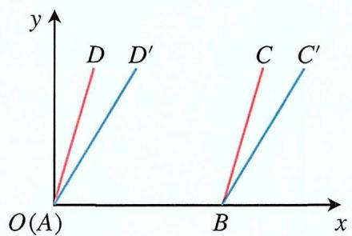

text_image

y
D D'
C C'
O(A) B x

例8 设 $S$ 是整数集 $Z$ 的非空子集, 如果 $\forall a, b \in S$ 都有 $a b \in S$ , 则称 $S$ 关于数的乘法是封闭的, 若 $T, V$ 是 $Z$ 的两个不相交的非空子集, $T \cup V = Z$ , 且 $\forall a, b, c \in T$ 都有 $a b c \in T$ , $\forall x, y, z \in V$ 都有 $x y z \in V$ , 则下列结论恒成立的是

A. $T, V$ 中至少有一个关于乘法是封闭的  
B. $T, V$ 中至多有一个关于乘法是封闭的  
C. $T, V$ 中有且只有一个关于乘法是封闭的  
D. $T, V$ 每一个关于乘法是封闭的

解析 若T为奇数集，V为偶数集，满足题意，此时T和V关于乘法都是封闭的，排除B，C；若T为负整数集，V为非负整数集，也满足题意，此时只有V关于乘法是封闭的，排除D；从而可以得到T，V中至少有一个关于乘法是封闭的，故A正确.

例9 设非空集合 $S = \{ x \mid  m \leq  x \leq  n\}$ 满足: 当 $x \in  S$ , 有 ${x}^{2} \in  S$ , 给出以下三个命题:

①若 $m = 1$ , 则 $S = \{1\}$ , ②若 $m = -\frac{1}{2}$ , 则 $\frac{1}{4} \leq n \leq 1$ , ③若 $n = \frac{1}{2}$ , 则 $-\frac{\sqrt{2}}{2} \leq m \leq 0$ , 其中正确的命题的个数是

A. 0

B. 1

C. 2

D. 3

解析 由定义设非空集合 $S=\{x \mid m \leqslant x \leqslant n\}$ 满足：当 $x \in S$ ，有 $x^{2} \in S$ 知符合定义的参数m的值一定大于等于1或小于等于0，惟如此才能保证 $m \in S$ 时，有 $m^{2} \in S$ 即 $m^{2} \geq m$ ，符合条件的n的值一定大于等于0，小于等于1，惟如此才能保证 $n \in S$ 时，有 $n^{2} \in S$ 即 $n^{2} \leq n$ ，正对每个命题进行判断：

对于① $m = 1$ ， $m^2 = 1 \in S$ ，故必有 $n^2 \leq n$ ， $n \geq 1$ ，可得 $n = \{1\}$ ， $S = \{1\}$

② $m=-\frac{1}{2},\quad m^{2}=\frac{1}{4}\in S,\quad 则 n^{2}\leq n,\quad n\geq\frac{1}{4},\quad 解得 \frac{1}{4}\leq n\leq1;$

③若 $n=\frac{1}{2}$ ， $m\leq\frac{1}{2}$ ， $m^{2}>m$ ， $m^{2}\leq\frac{1}{2}$ ，解得 $-\frac{\sqrt{2}}{2}\leq m\leq0$ ，所以正确的命题有3个.

例10 已知集合 $A = [t, t + 1] \cup [t + 4, t + 9]$ , $0 \notin A$ , 存在正数 $\lambda$ , 使得对任意 $a \in A$ , 都有 $\frac{\lambda}{a} \in A$ , 则 $t$ 的值是 \_\_\_\_.

# 解析

① 当 $t > 0, a \in [t, t + 1]$ 时， $\frac{\lambda}{a} \in [t + 4, t + 9]$ ，当 $a \in [t + 4, t + 9]$ ， $\frac{\lambda}{a} \in [t, t + 1]$ ，即当 $a = t$ 时， $\frac{\lambda}{a} \leqslant t + 9$ ；当 $a = t + 9$ 时， $\frac{\lambda}{a} \geq t$ ，即 $\lambda = t(t + 9)$ ，当 $a = t + 1$ 时， $\frac{\lambda}{a} \geqslant t + 4$ ，当 $a = t + 4$ 时， $\frac{\lambda}{a} \leqslant t + 1$ ，即 $\lambda = (t + 1)(t + 4), \therefore t(t + 9) = (t + 1)(t + 4)$ ，解得 $t = 1$ ；

② 当 $t+1<0<t+4$ ，当 $a\in[t,t+1]$ 时，则 $\frac{\lambda}{a}\in[t,t+1]$ ，当 $a\in[t+4,t+9]$ ， $\frac{\lambda}{a}\in[t+4,t+9]$ ，即当a=t时， $\frac{\lambda}{a}\leqslant t+1$ ，当 $a=t+1$ 时， $\frac{\lambda}{a}\geqslant t$ ，即 $\lambda=t(t+1)$ ，即当
a=t+4时， $\frac{\lambda}{a}\leqslant t+9$ ，当a=t+9， $\frac{\lambda}{a}\geqslant t+4$ ，即 $\lambda=(t+4)(t+9)$ ∴ $t(t+1)=(t+4)(t+9)$ ，解得 t = -3；

③ 当 $t+9<0$ 时，同理可得无解；综上：t的值是1或-3.

# 三. 集合之间的关系与运算

1. 相等: 两个集合 $A$ 和 $B$ 相等, 记作 $A = B$ , 当且仅当它们包含相同的元素。

2. 子集: 集合 $B$ 是集合 $A$ 的子集, 如果集合 $B$ 中的每个元素都是集合 $A$ 中的元素, 记作 $B \subseteq A$ 。

a. 假设一个集合有 $n$ 个元素, 则其子集的个数为 $2^{n}$ , 表示为 $A \subseteq B$

原理 对于集合中的每个元素, 它可以选择出现或不出现在子集中。因此, 对于每个元素, 有两种选择: 出现或者不出现。如果集合中有 $n$ 个元素, 那么每个元素都有这两种选择, 总共就有 $2^{n}$ 种选择.

b. 假设一个集合有 $n$ 个元素,则其真子集的个数为 ${2}^{n} - 1$ ,表示为 $A \subsetneq  B$

原理 除了空集之外, 集合中的每个元素都可以选择出现或不出现, 所以总共有 $2^{n}$ 种可能的子集。然而, 我们要排除本身, 所以总的真子集个数为 $2^{n} - 1$ .

c. 假设一个集合有 $n$ 个元素, 则其非空真子集的个数为 $2^{n} - 2$ , 表示为 $A \subsetneq B$ , 且 $A \neq \varnothing$

原理 除了空集之外, 集合中的每个元素都可以选择出现或不出现, 所以总共有 $2^{n}$ 种可能的子集。然而, 我们要排除本身和空集, 所以总的真子集个数为 $2^{n} - 2$ .

3. 交集：两个集合 $A$ 和 $B$ 的交集，记作 $A \cap B$ ，包含同时属于 $A$ 和 $B$ 的所有元素。

4. 并集: 两个集合 $A$ 和 $B$ 的并集, 记作 $A \cup B$ , 包含 $A$ 和 $B$ 中的所有元素, 不重复计数。

5. 补集: 相对于一个全集 $U$ , 集合 $A$ 的补集, 记作 $\mathbb{C}_U A$ , 即 $\operatorname{complement}(A)$ , 包含了 $U$ 中不属于 $A$ 的所有元素。

6. 差集：两个集合 $A$ 和 $B$ 的差集，记作 $A - B$ ，包含属于 $A$ 但不属于 $B$ 的所有元素。

例1 已知集合 $A = \{x \mid -1 < x < 6\}$ , $B = \{x \mid 2 < x < 3\}$ , 则下列表示正确的是

A. $B \subseteq A$

B. $A \subseteq B$

C. $A = B$

D. $B \in A$

解析 由已知结合集合的包含关系即可判断，因为 $A=\{x\mid-1<x<6\}$ ， $B=\{x\mid2<x<3\}$ ，所以 $B\subseteq A$ ，故选A.

例2 已知集合 $A = \{4, 2a\}$ , $B = \{1, 2, 4\}$ , 若 $A \subseteq B$ , 则 $a$ 的值是

A. 1

B. $\frac{1}{2}$

C. 1或 $\frac{1}{2}$

D. 1或2

解析 根据元素与集合的关系列方程, 解出 $a$ ; $\because A \subseteq B$ , $\therefore 2a = 1$ 或 $2a = 2$ , 解得 $a = 1$ 或 $a = \frac{1}{2}$ , 经检验均符合题意, 故选C.

例3 设集合 $A = \{0, -a\}$ , $B = \{1, a - 2, 2a - 2\}$ , 若 $A \subseteq B$ , 则 $a$ 的值是

A. 2

B. 1

C. $\frac{2}{3}$

D. -1

解析 依题意得 $a - 2 = 0$ 或 $2a - 2 = 0$ ，当 $a - 2 = 0$ 时，解得 $a = 2$ ，此时 $A = \{0, -2\}$ ，

$B = \{1,0,2\}$ ，不合题意；当2a - 2 = 0时，解得a = 1，此时 $A = \{0, -1\}$ ， $B = \{1, -1,0\}$ ，符合题意，故选B.

例4 已知集合 $A = \{x \mid x > -1, x \in R\}$ , $B = \{x \mid x^2 - x - 2 \geq 0, x \in R\}$ , 则下列关系中正确的是

A. $A \subseteq B$

B. $C_R A \subseteq C_R B$

C. $A \cap B = \varnothing$

D. $A \cup  B = R$

解析 已知集合 $A=\{x\mid x>-1,x\in R\}$ ， $B=\{x\mid x^{2}-x-2\geq0,x\in R\}$ ，解得

$B=\{x\mid x\geq2$ 或 $x\leq-1,x\in R\}$ ， $C_{R}A=\{x\mid x\leq1,x\in R\}$ ， $C_{R}B=\{x\mid-1\leq x\leq2\}$ ，则 $A \cup B = R, A \cap B = \{x \mid x \geq 2\}$ ，故选D.

例5 若集合A共有5个元素, 则A的真子集的个数为

A. 32

B. 31

C. 16

D. 15

解析 根据真子集个数的结论可求解, 集合 $A$ 共有 5 个元素, 则 $A$ 的真子集的个数为 $2^{5} - 1 = 31$ , 故选 B.

例6 已知集合 $A = \{1,2,3\}$ , $B = \{2,3\}$ , 则

A. $A = B$

B. $A \cap B = \varnothing$

C. $A \subsetneq B$

D. $B \subsetneq A$

解析 可得 $A \neq B, A \cap B = \{2,3\}$ , 即 $B \subsetneq A$ , 故D正确.

例7 已知互异的复数 $a, b$ 满足 $ab \neq 0$ , 集合 $\{a, b\} = \{a^2, b^2\}$ , 则 $a + b =$

A. 2

B. 1

C. 0

D. -1

解析 根据集合相等的条件可知，若 $\{a, b\} = \{a^{2}, b^{2}\}$ ，则① $a = a^{2}$ ， $b = b^{2}$ ；② $a = b^{2}$ ， $b = a^{2}$ ，由①得 a = 0 或 a = 1，b = 0 或 b = 1，又 $ab \neq 0$ ，则 $a \neq 0$ 且 $b \neq 0$ ，即 a = 1，b = 1，此时集合 $\{1, 1\}$ 不满足条件；由②得，若 $a=b^{2}$ ， $b=a^{2}$ ，两式相减得 $a^{2}-b^{2}=b-a$ ，即 $(a+b)(a-b)=-(a-b)$ ，又a,b为互异的复数，∴ $a-b\neq0$ ，即 $a+b=-1$ ，故选D.

例8 设集合 $A \subseteq \{1,2,3,4\}$ , 若 $A$ 至少有 3 个元素, 则这样的 $A$

A. 2个

B. 4个

C. 5个

D. 7个

解析 由 $A \subseteq \{1,2,3,4\}$ 且 $A$ 至少有3个元素得满足条件的集合 $A$ 有:

$\{1,2,3\}$ , $\{1,2,4\}$ , $\{1,3,4\}$ , $\{2,3,4\}$ , $\{1,2,3,4\}$ , 即这样的这样的A共有5个, 故选C.

例9 已知集合 $A = \{1,2\}$ , $B = \{1,a\}$ , 且 $A = B$ , 则 $a =$ \_\_\_\_.

解析 由集合 $A=\{1,2\}$ ， $B=\{1,a\}$ ，且A=B，则a=2，故答案为2.

例10 已知集合 $A = \{1,3\}$ , $B = \{1,2,a\}$ , 且 $A \subseteq B$ , 则 $a =$ \_\_\_\_.

解析 利用集合的包含关系即可求出a的值，∵3∈A，且A⊆B，∴3∈B，∴a=3，故答案为3.

例11 已知集合 $\{a,b,c\}=\{0,1,2\}$ ，且下列三个关系：① $a\neq2$ ，②b=2，③ $c\neq0$ 有且只有一个正确，则 $100a+10b+c=$ \_\_\_\_.

解析 由 $\{a, b, c\} = \{0, 1, 2\}$ 得， $a, b, c$ 的取值有以下几种情况：

① 当a=0时，b=1，c=2或b=2，c=1，此时不满足题意；

② 当a=1时，b=0，c=2或b=2，c=0，此时不满足题意；

③ 当 $a = 2$ 时, $b = 1$ , $c = 0$ , 此时不满足题意;

④ 当a=2时，b=0，c=1，此时满足题意.

综上： $a = 2$ ， $b = 0$ ， $c = 1$ ，代入得 $100a + 10b + c = 201$ ，故答案为201.

例12 已知集合 $A=\{x\mid-5<x^{3}<5\}$ ， $B=\{-3,-1,0,2,3\}$ ，则 $A\cap B=$

解析 $-\frac{1}{5^{3}} < x < \frac{1}{5^{3}}$ ，而 $1 < \frac{1}{5^{3}} < 2$ ，因此 $A \cap B = \{-1,0\}$ .

# 四. Venn图

韦恩图是一种用来展示集合之间重叠与独立部分的图形方式。这种图表是以英国数学家约翰·韦恩（John Venn）的名字命名的，他在19世纪初首先使用了这种图表。韦恩图通常由圆形表示集合，通过它们的交集和并集来展示集合之间的关系。

韦恩图的主要元素包括：

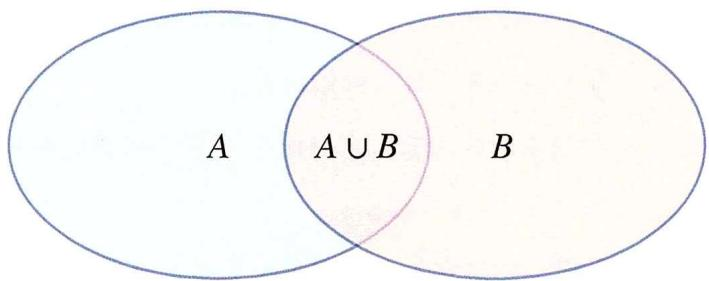

text_image

A
A ∪ B
B

1. 圆：每个圆代表一个集合，通常用标签标识。

2. 重叠区域：在图中，圆的交集部分表示集合之间的共同元素。  
3. 区域外部：圆之外的区域表示各自集合的唯一元素。

韦恩图通常用于展示逻辑关系、数据交集以及集合之间的相互关系，通过观察韦恩图，我们可以直观地理解不同集合之间的关系，包括它们的交集和差异

# 五. 容斥原理

容斥原理是集合论中的一种重要技巧，用于计算多个集合的并集、交集和补集等情况下的元素个数。该原理表述了两个集合的并集的元素个数等于两个集合各自元素个数之和减去它们的交集的元素个数。具体而言，设 A 和 B 是两个集合，则容斥原理可以表述为：

$$
\left| A \cup B \right| = \left| A \right| + \left| B \right| - \left| A \cap B \right|
$$

其中， $|A|$ 表示集合A的元素个数， $|B|$ 表示集合B的元素个数， $|A \cap B|$ 表示集合A和B的交集的元素个数， $|A \cup B|$ 表示集合A和B的并集的元素个数。

容斥原理可以推广到多个集合的情况，其表述为：

$$
\left| A _ {1} \cup A _ {2} \cup \dots \cup A _ {n} \right| = \sum_ {i = 1} ^ {n} \left| A _ {i} \right| - \sum_ {1 \leq i <   j \leq n} \left| A _ {i} \cap A _ {j} \right| + \sum_ {1 \leq i <   j <   k \leq n} \left| A _ {i} \cap A _ {j} \cap A _ {k} \right| - \dots + (- 1) ^ {n + 1} \left| A _ {1} \cap A _ {2} \cap \dots \cap A _ {n} \right|
$$

# 六. 与集合相关的进阶概念

1. 笛卡尔积: 两个集合 $A$ 和 $B$ 的笛卡尔积, 记作 $A \times B$ , 包含所有可能的有序对 $(a, b)$ , 其中 $a$ 是 $A$ 的元素, $b$ 是 $B$ 的元素。形式化地表示为:

$$
A \times B = \{(a, b) \mid a \in A, b \in B \}
$$

例如 如果集合 $A = \{1,2\}$ , 集合 $B = \{x,y\}$ , 那么它们的笛卡尔积 $A \times B$ 就是

$$
\{(1, x), (1, y), (2, x), (2, y) \}
$$

可以推广笛卡尔积的概念到多个集合的情况。如果有 $n$ 个集合 $A_{1}, A_{2}, \ldots, A_{2}$ , 它们的笛卡尔积（记作 $A_{1} \times A_{2} \times \ldots \times A_{n}$ ）是一个集合，其中的每个元素是 $n$ 元组 $a_{1} \times a_{2} \times \ldots \times a_{n}$ ，其中 $a_{1}$ 属于 $A_{1}$ , $a_{2}$ 属于 $A_{2}$ ，以此类推：

$$
A _ {1} \times A _ {2} \times \dots \times A _ {n} = \left\{\left(a _ {1}, a _ {2}, \dots , a _ {n}\right) \mid a _ {1} \in A _ {1}, a _ {2} \in A _ {2}, \dots , a _ {n} \in A _ {n} \right\}
$$

2. 幂集: 集合 $A$ 的幂集是包含 $A$ 的所有子集的集合, 记作 $P(A)$ 。

3. 基数和: 集合的基数是其元素的数量。

4. 有限集：一个集合被称为有限集，如果它包含有限个元素。具体而言，一个集合是有限的，当且仅当它的元素可以按照某种方式列举或计数，且最终停止。

例如 集合 $\{1,2,3,4,5\}$ 是一个有限集，因为它包含有限个元素，而我们可以明确地列举出这些元素。

5. 无限集：一个集合被称为无限集，如果它包含无限多个元素。无限集不可通过列举或计数方式来终止。

例如 自然数集合 $\{1,2,3,4,\ldots\}$ 是一个无限集，因为它包含无限多个元素，无法用有限的方式一一列举。

# 无限集的分类

\- 可数无限集：如果一个无限集的元素可以与自然数集一一对应，即每个元素都可以分配一个唯一的自然数，那么这个无限集是可数无限的。

例如 整数集合 $\{\ldots,-3,-2,-1,0,1,2,3,\ldots\}$ 是可数无限集。

\- 不可数无限集：如果一个无限集的元素不能与自然数集一一对应，那么这个无限集是不可数无限的。

例如 实数集合是一个不可数无限集，它包含了比自然数集更多的元素

例1 设全集 $U = \{0,1,2,4,6,8\}$ ，集合 $M = \{0,4,6\}$ ， $N = \{0,1,6\}$ ，则 $M \cup C_U N =$

A. $\{0,2,4,6,8\}$

B. $\{0,1,4,6,8\}$

C. $\{1,2,4,6,8\}$

D. $U$

解析 由于 $C_U R = \{2,4,8\}$ , 则 $M \cup C_U N = \{0,2,4,6,8\}$ , 故选A.

例2 已知集合 $M = \{ x \mid  x + 2 \geq 0 \}$ , $N = \{ x \mid  x - 1 < 0 \}$ , 则 $M \cap  N =$

A. $\{x\mid -2\leq x <   1\}$

B. $\{x\mid -2 <   x\leq 1\}$

C. $\{x \mid x \geq -2\}$

D. $\{x \mid x < 1\}$

解析 已知集合 $M=\{x\mid x+2\geq0\}$ ， $N=\{x\mid x-1<0\}$ ，则 $M\cap N=\{x\mid-2\leq x<1\}$ ，故选A.

例3 设全集 $U = \{1,2,3,4,5\}$ , 集合 $M = \{1,4\}$ , $N = \{2,5\}$ , 则 $N \cup C_U M =$

A. $\{2,3,5\}$

B. $\{1,3,4\}$

C. $\{1,2,4,5\}$

D. $\{2,3,4,5\}$

解析 由已知结合集合补集及并集运算即可求解，因为 $U=\{1,2,3,4,5\}$ ，集合 $M=\{1,4\}$ ， $N=\{2,5\}$ ，则 $C_{U}M=\{2,3,5\}$ ，则 $N\cup C_{U}M=\{2,3,5\}$ ，故选A.

例4 设集合 $U = R$ ，集合 $M = \{x \mid x < 1\}$ ， $N = \{x \mid -1 < x < 2\}$ ，则 $\{x \mid x \geq 2\} =$

A. $C_U(M\cup N)$

B. $N \cup C_U M$

C. $C_{U}(M \cap N)$

D. $M \cup C_U N$

解析 由题意， $M \cup N = \{x \mid x < 2\}$ ，又U = R，故 $C_{U}(M \cup N) = \{x \mid x \geq 2\}$ ，故选A.

例5 设集合 $A = \{-2, -1, 0, 1, 2\}$ , $B = \{x \mid 0 < x < \frac{2}{5}\}$ , 则 $A \cap B =$

A. $\{0,1,2\}$

B. $\{-2, -1, 0\}$

C. $\{0,1\}$

D. $\{1,2\}$

解析 由题意集合 $A = \{-2, -1, 0, 1, 2\}$ , $B = \{x \mid 0 < x < \frac{2}{5}\}$ , 则 $A \cap B = \{0, 1, 2\}$ , 故选A.

例6 已知全集 $U = R$ ，则正确表示集合 $M = \{-1,0,1\}$ 和 $N = \{x \mid x + x^{2} = 0\}$ 关系的韦恩图是解析 先化简集合N，得 $N=\{-1,0\}$ ，再看集合M，可发现集合N是M的真子集，对照韦恩图即可选出答案，由 $N=\{x\mid x+x^{2}=0\}$ 可得 $N=\{-1,0\}$ ，又 $M=\{-1,0,1\}$ ，∴ $N\subseteq M$ ，故选B.

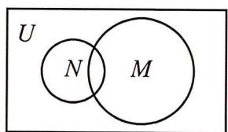

text_image

U
N M

A

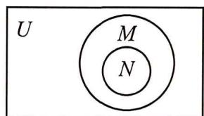

text_image

U
M
N

B

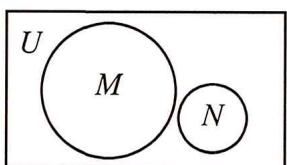

text_image

U
M
N

C

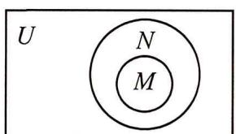

text_image

U
N
M

D

例7 已知全集 $U = R$ ，集合 $M = \{x \mid -2 \leq x - 1 \leq 2\}$ 和 $N = \{x \mid x = 2k - 1, k \in \mathbf{N}^{*}\}$ 关系的韦恩图如图所示，则阴影部分表示的集合的元素共有

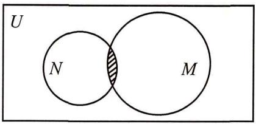

text_image

U
N
M

A. 3个

B. 2个

C. 1个

D. 无穷多个

解析 根据题意, 分析可得阴影部分所示的集合为 $M \cap N$ , 进而可得 $M$ 与 $N$ 的元素特征, 因为 $M = \{x \mid -2 \leq x - 1 \leq 2\}$ , $N = \{x \mid x = 2k - 1, k \in \mathbf{N}^{*}\}$ , 所以 $M \cap N = \{1,3\}$ , 故选B.

例8 已知 $A, B$ 均为集合 $U = \{1,3,5,7,9\}$ 的子集，且 $A \cap B = \{3\}$ ， $(C_U B) \cap A = \{9\}$ ，则 $A =$

A. $\{1,3\}$

B. $\{3,7,9\}$

C. $\{3,5,9\}$

D. $\{3,9\}$

解析 因为 $A \cap B = \{3\}$ , 所以 $3 \in A$ , 又 $(C_U B) \cap A = \{9\}$ , 则 $9 \in A$ , 排除 A; 假设 $7 \in A$ , 则 $A = \{3, 7, 9\}$ , $C_U B = \{1, 5, 7, 9\}$ , 矛盾, 排除 B; 假设 $5 \in A$ , 则 $A = \{3, 5, 9\}$ , $C_U B = \{1, 5, 7, 9\}$ , 矛盾, 排除 C; 故选 D, 本题也可通过韦恩图的方法帮助理解:

例9 已知全集 $U = A \cup B$ 中有 $m$ 个元素, $(C_U A) \cup (C_U B)$ 中有 $n$ 个元素, 若 $A \cap B$ 非空, 则 $A \cap B$ 的元素个数为

A. ${mn}$

B. $m + n$

C. $n - m$

D. $m - n$

解析 要求的 $A \cap B$ 元素个数, 可以根据已知绘制出满足条件的韦恩图, 根据图来分析 (如解法一), 也可以利用德摩根定理解决 (如解法二):

解法一: 由 $(C_U A) \cup (C_U B)$ 中有 $n$ 个元素, 如图所示阴影部分, 又 $U = A \cup B$ 中有 $m$ 个元素, 故 $A \cap B$ 中有 $m - n$ 个元素

解法二：由已知全集 $U=A\cup B$ 中有m个元素，由 $card(A)+card(C_{U}A)=card(U)$ 得 $card(A\cap B)+card[C_{U}(A\cap B)]=card(U)$ 得 $card(A\cap B)=m-n$ ，故选D.

例10 《西游记》, 《三国演义》, 《水浒传》和《红楼梦》是中国古典文学瑰宝, 并称为中国古典小说四大名著。某中学为了解本校学生阅读四大名著的情况, 随机调查了100位学生, 其中阅读过《西游记》或《红楼梦》的学生共有90位, 阅读过《红楼梦》的学生共有80位, 阅读过《西游记》且阅读过《红楼梦》的学生共有60位, 则该校阅读过《西游记》的学生人数与该学校学生总数比值的估计值为

A. 0.5

B. 0.6

C. 0.7

D. 0.8

解析 某中学为了了解本校学生阅读四大名著的情况，随机调查了100位学生，其中阅读过《西游记》或《红楼梦》的学生共有90位，阅读过《红楼梦》的学生共有80位，阅读过《西游记》且阅读过《红楼梦》的学生共有60位，作出维恩图，得该学校阅读过《西游记》的学生人数为70人，则该学校阅读过《西游记》的学生人数与该学校学生总数比值的估计值为0.7，则该校阅读过《西游记》的学生人数与该学校学生总数比值的估计值为0.7。

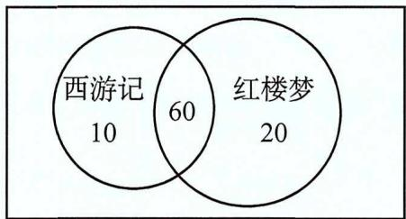

other

| Category   | Count |
| ---------- | ----- |
| 西游记     | 10    |
| 红楼梦     | 20    |
| Both       | 60    |

例11 某中学的学生积极参加体育锻炼, 其中有 $96 \%$ 的学生喜欢足球或游泳, $60 \%$ 的学生喜欢足球, $82 \%$ 的学生喜欢游泳, 则该中学既喜欢足球又喜欢游泳的学生数占该校学生总数的比例是

A. $62\%$

B. $56\%$

C. $46\%$

D. $42\%$

解析 设只喜欢足球的百分比为 $x$ ，只喜欢游泳的百分比为 $y$ ，两个项目都喜欢的百分比为 $z$ ，画出图形，列出方程求解即可，可知 $x + z = 60, x + y + z = 96, y + z = 82$ ，解得 $z = 46$ ，则该中学既喜欢足球又喜欢游泳的学生数占该校学生总数的比例是 $46\%$ .

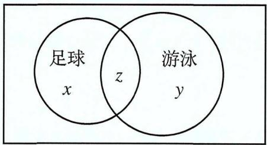

text_image

足球
x
z
游泳
y

例12 如图， $I$ 是全集， $M, P, S$ 是 $I$ 的3个子集，则阴影部分所表示的集合是

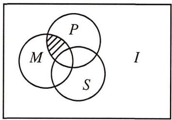

text_image

P
M
S
I

A. $(M\cap P)\cap S$

B. $(M\cap P)\cup S$

C. $(M \cap P) \cap C_{I}S$

D. $(M\cap P)\cup C_{I}S$

解析 观察阴影部分所表示的集合中元素的特点, 它具有在集合 $P$ 和 $M$ 中, 不在集合 $S$ 中, 利用集合元素的含义即可解决, 依题意, 由图知, 阴影部分对应的元素 $a$ 具有性质 $a \in M$ , $a \in P$ , $a \in C_I S$ , 所以阴影部分所表示的集合是 $(M \cap P) \cap C_I S$ , 故选C.

# 第二节 逻辑用语

# 一. 充分条件

充分条件和必要条件是数学和逻辑中用于描述命题之间关系的两个重要概念。它们经常用于分析条件语句、推理和定理的表述。如果一个陈述中的条件部分成立，那么它就是充分条件（Sufficient Condition）。充分条件是指当某个条件发生时，就能确保结论成立。表示为

$$
\text {   “如果   } A \text {, 则   } B \text {” ， 通常用符号表示为   } A \Rightarrow B
$$

例如 考虑命题 "如果一个数是偶数，那么它能被2整除"，这里 "是偶数" 就是充分条件，因为当一个数是偶数时，它确实能被2整除。

# 二. 必要条件

如果一个陈述中的结论部分成立，那么它就是必要条件（Necessary Condition）。必要条件是指在某个条件发生之前，结论是无法成立的。表示为

$$
\text {只有当} B \text {才能是} A \text {, 通常用符号表示为} A \Leftarrow B \text {或} B \Rightarrow A
$$

以前述例子为例 考虑命题 "只有当一个数能被2整除时，它才是偶数"，这里 "能被2整除" 就是必要条件，因为只有在这个条件满足时，数才能是偶数。

需要注意的是，充分条件和必要条件是相关但不同的概念。一个命题可以同时具有充分条件和必要条件，也可以只有其中之一。当一个条件既是充分条件又是必要条件时，我们称这个条件是充要条件。

# 三. 充要条件

如果A是B的充分条件，同时B是A的必要条件，那么A和B就是充要条件（Sufficient and Necessary Condition）。表示为

$$
A \Leftrightarrow B
$$

举例来说 命题“一个正整数是偶数的充要条件是它能被2整除”，表示为 $A \Leftrightarrow B$ ，其中A是“是偶数”，B是“能被2整除”。

# 四. 既不充分也不必要条件

既不充分也不必要条件（Neither Sufficient nor Necessary Condition）指的是一个条件，既不足以导致某个结果，也不是发生该结果所必需的条件。

举个例子 考虑命题：“下雨是湿的条件。”下雨确实是导致地面湿润的一个可能原因，但并不是唯一的原因。地面也可能湿润是因为有人用水管浇水，或者有其他的水源。因此，下雨是导致地面湿润的一个充分条件，但并不是必要条件，因为还有其他的原因也可以导致地面湿润。

类似地，一个条件如果既不足以导致某个结果，也不是发生该结果所必需的条件，就被称为既不充分也不必要的条件。

# 五. 全称量词与存在量词

全称量词和存在量词是逻辑学中的重要概念，它们用于描述命题中的量化关系。

1. 全称量词 (Universal Quantifier)

- 全称量词表示一个命题对某个集合中的所有成员都成立。常见的全称量词是"所有"或者"对于每一个"  
- 用符号表示通常是∀（倒立的A），后面跟着变量和命题，表示对于所有的变量，命题都成立。  
- 举例: 如果我们有命题"P(x)", 其中P表示一个性质, x是变量, $\forall x P(x)$ 表示对于集合中的每个 $x$ , $P(x)$ 都成立.

2. 存在量词 (Existential Quantifier)

- 存在量词表示一个命题至少对某个集合中的一个成员成立。常见的存在量词是"存在"或者"至少有一个"  
- 用符号表示通常是∃（倒立的E），后面跟着变量和命题，表示存在一个变量使得命题成立  
- 举例: 如果我们有命题"P(x)", 其中P表示一个性质, x是变量, ∃xP(x)表示至少存在一个x使得 P(x)成立

举例 假设 $P(x)$ 表示"x是偶数".

$\forall x P(x)$ 表示对于任意一个整数 $x, x$ 都是偶数，即所有整数都是偶数； $\exists x P(x)$ 表示存在至少一个整数 $x$ ，使得 $x$ 是偶数，即存在至少一个偶数。

例1 “ $a^{2}=b^{2}$ ”是“ $a^{2}+b^{2}=2ab$ ”的

A. 充分而不必要条件

B. 必要而不充分条件

C. 充分必要条件

D. 既不充分也不必要条件

解析 根据已知条件，先对原等式变形，再结合充分条件、必要条件的定义，即可求解。

$a^{2}=b^{2}$ ，即 $(a+b)(a-b)=0$ ，解得a=-b或a=b， $a^{2}+b^{2}=2ab$ ，即 $(a-b)^{2}=0$ ，解得a=b，故“ $a^{2}=b^{2}$ ”不能推出“ $a^{2}+b^{2}=2ab$ ”，充分性不成立；“ $a^{2}+b^{2}=2ab$ ”能推出“ $a^{2}=b^{2}$ ”，必要性成立，故“ $a^{2}=b^{2}$ ”是“ $a^{2}+b^{2}=2ab$ ”的必要不充分条件，故选B.

例2 若 $xy \neq 0$ ，则“ $x + y = 0$ ”是“ $\frac{x}{y} + \frac{y}{x} = -2$ ”的

A. 充分而不必要条件

B. 必要而不充分条件

C. 充分必要条件

D. 既不充分也不必要条件

解析 由 $xy \neq 0, x + y = 0$ , 可得 $y = -x \neq 0$ , 进而判断出 $\frac{x}{y} + \frac{y}{x} = -2$ 是否成立; 反之, 若 $xy \neq 0, \frac{x}{y} + \frac{y}{x} = -2$ , 令 $\frac{x}{y} = t$ , 可得 $\frac{y}{x} = \frac{1}{t}$ , 通过换元代入解出 $t$ , 即可判断出结论。

由 $xy \neq 0, x + y = 0, \therefore y = -x \neq 0, \therefore \frac{x}{y} + \frac{y}{x} = -2$ ，反之，若 $xy \neq 0, \frac{x}{y} + \frac{y}{x} = -2$ ，于是 $t + \frac{1}{t} = -2$ ，化为 $t^2 + 2t + 1 = 0$ ，解得 $t = -1$ ，即 $\frac{x}{y} = -1, \therefore xy \neq 0$ ，则“ $x + y = 0$ ”是“ $\frac{x}{y} + \frac{y}{x} = -2$ ”的充要条件，故选C.

例3 设 $x \in R$ ，则“ $\sin x = 1$ ”是“ $\cos x = 0$ ”的

A. 充分而不必要条件

B. 必要而不充分条件

C. 充分必要条件

D. 既不充分也不必要条件

解析 利用同角三角函数间的基本关系，充要条件的定义判定即可。

∵ $\sin^{2}x + \cos^{2}x = 1$ ，则当 $\sin x = 1$ 时，则 $\cos x = 0$ ，充分性成立，当 $\cos x = 0$ 时，则 $\sin x = \pm 1$ ，必要性不成立，∴ $\sin x = 1$ 是 $\cos x = 0$ 的充分不必要条件.

例4 设 $\{a_{n}\}$ 是公差不为0的无穷等差数列, 则 “ $\{a_{n}\}$ 为递增数列” 是 “存在正整数 $N_{0}$ , 当 $n > N_{0}$ 时, $a_{n} > 0$ ” 的

A. 充分而不必要条件

B. 必要而不充分条件

C. 充分必要条件

D. 既不充分也不必要条件

解析 根据等差数列的定义与性质，结合充分必要条件的定义，判断即可。因为数列 $\{a_{n}\}$ 是公差不为0的无穷等差数列，当 $\{a_{n}\}$ 为递增数列时，公差d>0，令 $a_{n}=a_{1}+(n-1)d>0$ ，解得 $n>1-\frac{a_{1}}{d}$ ， $[1-\frac{a_{1}}{d}]$ 表示取整函数，所以存在正整数 $N_{0}=1+[1-\frac{a_{1}}{d}]$ ，当 $n>N_{0}$ 时， $a_{n}>0$ ，充分性成立；当 $n>N_{0}$ 时， $a_{n}>0$ ， $a_{n-1}<0$ ，则 $d=a_{n}-a_{n-1}>0$ ，必要性成立，则“ $\{a_{n}\}$ 为递增数列”是“存在正整数 $N_{0}$ ，当 $n>N_{0}$ 时， $a_{n}>0$ ”的充分必要条件，故选A.

例5 “x是整数”是“2x+1是整数”的

A. 充分而不必要条件

B. 必要而不充分条件

C. 充分必要条件

D. 既不充分也不必要条件

解析 $x$ 是整数时, $2 x + 1$ 是整数, 充分性成立; $2 x + 1$ 是整数时, $x$ 不一定是整数, 如 $x = \frac{1}{2}$ 时, 所以必要性不成立, 故“ $x$ 是整数”是“ $2 x + 1$ 是整数”的充分不必要条件, 故选A.

例6 等比数列 $\{a_{n}\}$ 的公比为 $q$ , 前 $n$ 项和为 $S_{n}$ , 设甲: $q > 0$ , 乙: $\{S_{n}\}$ 是递增数列, 则

A. 甲是乙的充分条件但不是必要条件  
B. 甲是乙的必要条件但不是充分条件  
C. 甲是乙的充要条件  
D. 甲既不是乙的充分条件也不是乙的必要条件

解析 若 $a_{1} = -1, q = 1$ , 则 $S_{n} = n a_{1} = -n$ , 则 $\{S_{n}\}$ 是递减数列, 不满足充分性,

$\because S_{n} = \frac{a_{1}}{1 - q} (1 - q^{n})$ ，则 $S_{n+1} = \frac{a_{1}}{1 - q} (1 - q^{n+1})$ ， $\therefore S_{n+1} - S_{n} = \frac{a_{1}}{1 - q} (q^{n} - q^{n+1}) = a_{1}q^{n}$ ，若 $\{S_{n}\}$ 是递增数列， $\therefore S_{n+1} - S_{n} = a_{1}q^{n} > 0$ ，则 $a_{1} > 0, q > 0$ ，满足必要性，故甲是乙的必要条件而非充分条件，故选B.

例7 设 $\alpha, \beta$ 是两个平面，直线 $l$ 与 $\alpha$ 垂直的一个充分条件是

A. $l / / \beta$ 且 $\alpha \perp \beta$

B. $l \perp \beta$ 且 $\alpha \perp \beta$

C. $l \subset \beta$ 且 $\alpha \perp \beta$

D. $l \perp \beta$ 且 $\alpha / / \beta$

解析 利用直线与平面垂直的判断定理, 再结合充要条件的定义判定即可; 当 $l / / \beta$ 且 $\alpha \perp \beta$ 时, 则 $l \perp \alpha$ 或 $l / / \alpha$ 或 $l \subset \alpha$ , 则A错误, 当 $l \perp \beta$ 且 $a \perp \beta$ 时, 则 $l / / a$ 或 $l \subset a$ , B错误; 当 $l \subset \beta$ 且 $a \perp \beta$ 时, 则 $l \perp a$ 或 $l / / a$ 或 $l \subset a$ 或 $l$ 与 $a$ 相交不垂直, C错误, 当 $l \perp \beta$ 且 $a / / \beta$ 时, 则 $l \perp a$ , D正确,

# 六. 否命题和逆否命题

当我们考虑一个命题的逻辑结构时，除了命题本身外，还有几个相关的概念：否命题和逆否命题。

1. 否命题 (Negation)

\- 否命题是对原命题的否定。如果原命题是真的，那么否命题是假的，如果原命题是假的，那么否命题是真的

\- 用符号表示通常是在命题前加上一个"非"的符号（¬）

\- 举例：如果原命题是"P是真的"，那么否命题是"非P是真的"

2. 逆否命题 (Converse Negation)

\- 逆否命题是对原命题的逆和否定。逆否命题与原命题等价，也就是说，原命题为真时，逆否命题也为真；原命题为假时，逆否命题也为假。

\- 逆否命题的构造是首先对原命题取逆，然后对逆命题再次取逆。

\- 举例：如果原命题是"如果P，那么Q"，那么逆否命题是"如果非Q，那么非P"。

举例 假设有一个原命题：“如果今天下雨，那么草地会湿润。”

否命题："如果今天不下雨，那么草地不会湿润。"（不是所有情况下成立）

逆否命题：“如果草地不湿润，那么今天没有下雨。”（与原命题等价）

例1 下列命题中的假命题是

$$
\mathrm{A.} \exists x \in R, \lg x = 0
$$

$$
\mathrm{B.} \exists x \in R, \tan x = 1
$$

$$
\forall x \in R, x ^ {3} > 0
$$

$$
\forall x \in R, 2 ^ {x} > 0
$$

解析 A、x = 1 成立；B、 $x = \frac{\pi}{4}$ 成立；D、指数函数的值域来判断，对于 C 选项 x = -1 时， $(-1)^{3} = -1 < 0$ ，不正确。故选：C。

例2 命题 “ $\forall n \in N^{*}, f(n) \in N^{*}$ 且 $f(n) \leqslant n$ ” 的否定形式是

$$
\forall n \in N ^ {*}, f (n) \notin N ^ {*} \text {且} f (n) > n
$$

$$
\forall n \in N ^ {*}, f (n) \notin N ^ {*} \text {或} f (n) > n
$$

C. $\exists n_0\in N^*,f(n_0)\notin N^*$ 且 $f(n_0) > n_0$

D. $\exists n_0\in N^*,f(n_0)\notin N^*$ 或 $f(n_0) > n_0$

解析 命题为全称命题, 则命题的否定为: $\exists n_{0} \in N^{*}, f(n_{0}) \notin N^{*}$ 或 $f(n_{0}) > n_{0}$ , 故选: D.

例3 命题 “ $\forall x \in R, |x| + x^{2} \geq 0$ ” 的否定是

A. $\forall x\in R,|x| + x^{2} <   0$

B. $\forall x\in R,|x| + x^2\leqslant 0$

C. $\exists x_0\in R,|x_0| + x_0^2 < 0$

D. $\exists x_0\in R,\left|x_0\right| + x_0^2\geqslant 0$

解析 全称命题的否定是特称命题，则命题 “ $\forall x \in R, |x| + x^{2} \geqslant 0$ ” 的否定 $\exists x_{0} \in R, \left|x_{0}\right| + x_{0}^{2} < 0$ ，故选：C.

例4 设命题 $p:\forall x\in R,x^{2}+1>0$ ，则 $\neg p$ 为

A. $\exists x_0 \in R, x_0^2 + 1 > 0$

B. $\exists x_0\in R,x_0^2 +1\leqslant 0$

C. $\exists x_0\in R,x_0^2 +1 <   0$

D. $\forall x_0\in R,x_0^2 +1\leqslant 0$

解析 ∵命题 $p:\forall x\in R,x^{2}+1>0$ ，是一个特称命题，∴ $\neg p:\exists x_{0}\in R,x_{0}^{2}+1\leqslant0$ ，故选：B.

例5（2024·新高考I卷）设命题 $p:\forall x\in R,|x+1|>1$ ，命题q： $\exists x>0,x^{3}=x$ ，则

A.p和q都是真命题

B. $\neg p$ 和 $q$ 都是真命题

C. $p$ 和 $\neg q$ 都是真命题

D. $\neg p$ 和 $\neg q$ 都是真命题

解析 $p: x > 0$ 或 $x < -2$ , $q: x = 0,1,-1$ , 故若 $p$ 假, 则 $\neg p$ 真; $q$ 真, 则 $\neg p$ 假, 故选: B.

# 第二章 不等式

经过前面的学习我们走到不等式这一章节，在一章的学习节更作为高中知识的一大重要工具来对于一个数学式子产生有界的定义，而这一章更是注重知识的拓展和结构的观察达到学以致用，而不是作为结论的记忆；

接下来我们将从不等式的性质及解法、基本不等式性质及运用、不等式的拓展来全方位阐述。

# 第一节 不等式探秘

# 一. 不等式的性质及解法

1. 幂不等式

$$
a _ {n} x ^ {n} + a _ {n - 1} x ^ {n - 1} + \ldots + a _ {1} x ^ {1} + a _ {0} = a (x) \cdot b (x) \cdot \ldots \cdot z (x) > 0.
$$

高中阶段通常都是以一次不等式、二次不等式、三次不等式以及高次不等式为主，我们这里从“高次不等式的解法”开始进行阐述。

一般遇见高次不等式我们通常采用穿根法去解决，步骤为：

\- 因式分解为多个乘积式

\- 找出零点值

\- 画出数轴点出零点

\- 用极限判断最右侧起点正负

\- 从最右边一个零点进行回穿满足奇穿偶回：次数为奇数的项的零点为穿越零点，次数为偶数的项的零点为非穿越零点

\- 根据零点是否为穿越零点画出函数正负分异草图

\- 根据图像判断不等式解集

例题 解不等式: $(x + 1)(x - 1)^{2}(x - 2)^{3}(x - 3) < 0$ .

解析 $(x+1)$ 、 $(x-2)^{3}$ 、 $(x-3)$ 次数为奇数 $\Rightarrow -1$ 、2、3 为穿越零点； $(x-1)^{2}$ 次数为偶数 $\Rightarrow 1$ 为非穿越零点； $x \rightarrow +\infty$ 时， $(x+1)(x-1)^{2}(x-2)^{3}(x-3) > 0 \Rightarrow$ 图像起点为右上角；

根据奇穿偶回:

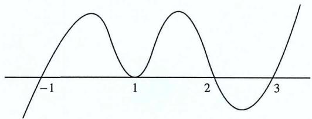

text_image

-1
1
2
3

因此不等式的解集为数轴下半部分，即 $(- \infty, -1) \cup (2,3)$ .

练习1 已知集合 $A = \{x \mid (x + 1)(x - 4) \leq 0\}$ , $B = \{x \mid \log_2 x \leq 2\}$ , 则 $A \cap B =$ \_\_\_\_.

解析 在解决对数不等式时候, 把数字2转换为以2为底的对数 $\log_2 4$ 再通过单调性求出, 同时要注意真数的定义域, $A = [-1, 4]$ , $B = (0, 4]$ , $\therefore A \cap B = (0, 4]$ .

练习2 （2019年天津高考文史类）使不等式 $3x^{2}+x-2<0$ 成立的x的取值范围为\_\_\_\_.

解析 将 $3x^{2}+x-2$ 因式分解: $(x+1)(3x-2)<0,\quad\therefore-1<x<\frac{2}{3}$ ，故答案为 $(-1.\frac{2}{3})$ .

2. 绝对值不等式

单绝对值型： $|f(x)| < a$ ， $|f(x)| > a$ （ $a \in R$ ）；

双绝对值型： $|f(x)|<|g(x)|$ .

处理方式

1. 讨论去除去绝对值   
2. 画出图像去分段求解（如V型及其复合型）  
3. 两边同时进行平方后处理求解

\- 双绝对值方程解法:

$$
\left| f (x) \right| <   \left| g (x) \right| \Rightarrow \left| f (x) \right| ^ {2} <   \left| g (x) \right| ^ {2} \Rightarrow (\left| g (x) \right| + \left| f (x) \right|) (\left| g (x) \right| - \left| f (x) \right|) > 0.
$$

例题 解不等式: $|2x - 1| - |x - 2| < 0$ .

解析 即 $|2x - 1|^2 < |x - 2|^2$ ， $\therefore (2x - 1)^2 - (x - 2)^2 < 0$

$$
\therefore [ (2 x - 1) + (x - 2) ] [ (2 x - 1) - (x - 2) ] <   0, \quad \therefore (3 x - 3) (x + 1) <   0, \quad \therefore - 1 <   x <   1.
$$

练习1 （2009·全国I）不等式 $\left|\frac{x+1}{x-1}\right|<1$ 的解集为\_\_\_\_.

解析 即 $\left|x+1\right|<\left|x-1\right|\quad(x\neq1)$ ，即 $(x+1)^{2}<(x-1)^{2}$ ，即 4x<0，即 x<0.

练习2 （2009·广东高考）不等式 $|\frac{x+1}{x+2}| \geq 1$ 的解集为 \_\_\_\_.

解析 即 $|x + 2| < |x + 1|$ （ $x \neq -2$ ），即 $(x + 2)^{2} < (x + 1)^{2}$ ，即 $x \leq -\frac{3}{2}$ 且 $x \neq -2$ .

3. 分式不等式

$$
\frac {f (x)}{g (x)} > 0 \text {或} \frac {f (x)}{g (x)} <   0.
$$

因分母正负性未知，在解分式不等式的时候不能轻易乘除分母，所以移项通分后把分式不等式转换成幂不等式进行后续处理，即 $\frac{f(x)}{g(x)} > 0 \Leftrightarrow f(x)g(x) > 0$ .

例题 不等式 $\frac{2x+1}{x+2}<1$ 的解集是\_\_\_\_.

解析 这种不含绝对值的类型就不能轻易把分母乘过去转换为幂式不等式，由于不知道分母的正负性，所以我们把常数移项通分转换为幂不等式，即 $\frac{2x + 1}{x + 2} - 1 < 0$ ， $\therefore \frac{2x + 1 - x - 2}{x + 2} < 0$ ，

$\therefore (x - 1)(x + 2) < 0$ ，即 $-2 < x < 1.$

练习1 （2009·全国I）不等式 $\frac{x^{2}}{2x-1}\leq1$ 的解集为\_\_\_\_.

解析 即 $\frac{x^2}{2x - 1} - 1 \leq 0, \therefore \frac{x^2 - 2x + 1}{2x - 1} < 0, \therefore (x - 1)^2 (2x - 1) < 0$ ，根据穿根法得： $x \leq \frac{1}{2}$ .

4. 无理不等式

$$
f ^ {a} (x) > g ^ {b} (x).
$$

通过开方（被开方数一定为非负）把无理不等式转换为幂不等式求解

例题 解不等式: $\sqrt{x^2 - 5x - 6} < |x - 3|$ .

解析 根据定义域 $x^{2}-5x-6=(x-6)(x+1)\geq0$ ，即 $x\geq6$ 或 $x\leq-1$ ，将不等式两边同时平方得： $x^{2}-5x-6<x^{2}-6x+9$ ，解得：x<15，综上： $6\leq x<15$ 或 $x\leq-1$ 。

练习 解不等式: $\sqrt{m^{2} - x^{2}} > 2x - m$ .

解析 根据定义域- $|m|\leq x\leq|m|$ （由于m正负未知，故不可不带绝对值）；

当 $2x - m < 0$ 时，不等式显然成立，即 $x < \frac{m}{2}$

当 $2 x - m \geq 0$ 时, 即 $x \geq \frac{m}{2}$ , 不等式两侧均非负, 同时平方得: $m ^ { 2 } - x ^ { 2 } > 4 x ^ { 2 } - 4 m x + m ^ { 2 }$ ,

即 $x(4m - 5x) > 0$ ，此时由于 $x(4m - 5x)$ 的零点分布情况由 $\frac{4m}{5}$ 的取值决定，故需要对0和 $m$ 的大小进行分类讨论：

① 当 $m = 0$ 时， $\sqrt{-x^2} > 2x$ 无解；

② 当 $m > 0$ 时，

I) $x < \frac{m}{2}$ 时， $-m \leq x \leq m$ ，故 $-m \leq x < \frac{m}{2}$ ;

II) $x \geq \frac{m}{2}$ 时, $0 < x < \frac{4m}{5}, -m \leq x \leq m, x \geq \frac{m}{2}$ , 故 $\frac{m}{2} \leq x < \frac{4m}{5}$ ;

故m>0时， $-m\leq x<\frac{4m}{5}$ .

③ 当 $m < 0$ 时，

I) $x < \frac{m}{2}$ 时， $m \leq x \leq -m$ ，故 $-m \leq x < \frac{m}{2}$ ;

II) $x \geq \frac{m}{2}$ 时, $0 > x > \frac{4m}{5}$ , $m \leq x \leq -m$ , 故 $\frac{m}{2} \leq x < 0$ ;

故 $m < 0$ 时， $-m \leq x < 0$ .

综上： $m = 0$ ，无解； $m > 0$ 时， $-m\leq x <   \frac{4m}{5}; m <   0$ 时， $-m\leq x <   0.$

# 5. 指数与对数不等式

$$
a ^ {f (x)} > k, \log_ {a} f (x) > k.
$$

根据换为同底，再结合指数与对数的单调性去脱去外层函数比较自变量的大小。

例题 解不等式: $\log_a \frac{2}{3} < 1$ .

解析 遇见这种指对不等式考虑把常数转换为同底的对数或者指数利用单调性讨论，这道题由于a值的不确定所以得讨论来除去矛盾区间： $\log_{a}\frac{2}{3}<\log_{a}a$ ，当0<a<1时， $a<\frac{2}{3}$ ，当a>1时， $a>\frac{2}{3}$ ，故 $a\in(0,\frac{2}{3})\cup(1,+\infty)$ .

练习 解不等式: $\log_ {3} | x - 2 | < 2$ 的整数解的个数为 \_\_\_\_.

解析 即 $\log_3 |x - 2| < 2 = \log_3 9$ ，即 $|x - 2| < 9$ ，即 $|x - 2|^2 < 9^2$ ，即 $(x - 11)(x + 7) < 0$ ，即 $-7 < x < 11$ ，又 $x \in \mathbf{Z}$ ，故整数解的个数为 16.

# 二. 比大小的基本原理

1. 作差法和作商法——比大小中的两种常用办法

- 作差法：通常我们把需要比较的变量进行做差与0作比较  
- 作商法：通常我们把需要比较的变量进行做商与1作比较

$$
\frac {a}{b} > 1 (a, b > 0) \text {或} \frac {a}{b} <   1 (a, b <   0) \qquad \qquad a - b > 0 \qquad \qquad a > b
$$

$$
\frac {a}{b} = 1 (b \neq 0) \quad a - b = 0 \quad a = b
$$

$$
\frac {a}{b} <   1 (a, b > 0) \text {或} \frac {a}{b} > 1 (a, b <   0) \qquad \qquad a - b <   0 \qquad \qquad a <   b
$$

# 2. 特殊数值法

在一些非大题的情况下可以考虑特殊数值法进行比较判段，但我们需要去总结和记忆一些常考的特殊值类型和大小，如下表：

<table><tr><td> $\sqrt{2} \approx 1.414$ </td><td> $\sqrt{3} \approx 1.732$ </td><td> $\sqrt{5} \approx 2.236$ </td><td> $\sqrt{7} \approx 2.646$ </td></tr><tr><td> $^3\sqrt{2} \approx 1.260$ </td><td> $^3\sqrt{3} \approx 1.442$ </td><td> $^3\sqrt{4} \approx 1.587$ </td><td> $^3\sqrt{5} \approx 1.710$ </td></tr><tr><td> $\ln 2 \approx 0.639$ </td><td> $\ln 3 \approx 1.099$ </td><td> $\ln 5 \approx 1.609$ </td><td> $\ln 7 \approx 1.946$ </td></tr><tr><td> $e \approx 2.718$ </td><td> $\sqrt{e} \approx 1.649$ </td><td> $\frac{1}{e} \approx 0.368$ </td><td> $e^2 \approx 7.389$ </td></tr></table>

# 三. 不等式的性质

1. 传递性

$$
a > b, b > c \Rightarrow a > c
$$

2. 可加性

$$
a > b \Rightarrow a + c > b + c
$$

\- 同向可加性: $a > b, c > d \Rightarrow a + c > b + d$

\- 异向可减性: $a > b, c < d \Rightarrow a - c > b - d$ (可理解为 $a > b, -c > -d$ 的同向可加性)

3. 可积性

$$
a > b, c > 0 \Rightarrow a c > b c
$$

$$
a > b, c <   0 \Rightarrow a c <   b c
$$

\- 同向正数可乘性: $a > b > 0$ , $c > d > 0 \Rightarrow ac > bd$

\- 同向正数可除性: $a > b > 0, 0 < c < d \Rightarrow \frac{a}{c} > \frac{b}{d}$ (可理解为 $a > b, \frac{1}{c} > \frac{1}{d}$ 的同向正数可除性)

4. 平方法则

$$
a > b > 0 \Rightarrow a ^ {n} > b ^ {n}, n \in \mathbf {N} ^ {*}
$$

5. 倒数法则

$$
a > b > 0 \Rightarrow \frac {1}{a} <   \frac {1}{b}; a <   b <   0 \Rightarrow \frac {1}{a} > \frac {1}{b}
$$

例题 若a>b>0，c<d<0，则一定有

A. $\frac{a}{d} > \frac{b}{c}$

B. $\frac{a}{d} < \frac{b}{c}$

C. $\frac{a}{c} > \frac{b}{d}$

D. $\frac{a}{c} < \frac{b}{d}$

解析 不妨考虑特殊值 $a = 3, b = 1, c = -3, d = -1$ ，则A、C、D错误，B正确.

练习1 下列命题中正确的是

A. 若 $a > b$ ，则 $ac > bc$

B. 若 $a > b, c > d$ ，则 $a - c > b - d$

C. 若 $ab > 0, a > b$ ，则 $\frac{1}{a} < \frac{1}{b}$

D. 若 $a > b, c > d$ ，则 $\frac{a}{c} > \frac{b}{d}$

解析 A. c < 0 时，不成立，故错误；B. 若“a > b, c > d”与“a - c > b - d”不等价，故错误；

C. $ab > 0, a > b$ ，作商得： $\frac{1}{a} < \frac{1}{b}$ ，故正确；D. 取 $a = 2, b = d = -c = -3$ ，矛盾，故错误。

练习2 设x,y,z为正数，且 $2^{x}=3^{y}=5^{z}$ ，则

A. $2x <   3y <   5z$

B. $5 z <   2 x <   3 y$

C. $3y < 5z < 2x$

D. ${3y} < {2x} < {5z}$

解析 $x = \frac{\ln k}{\ln 2}, y = \frac{\ln k}{\ln 3}, z = \frac{\ln k}{\ln 5}$ , 故 $2x = \frac{\ln k}{\ln \sqrt{2}}, 3y = \frac{\ln k}{\ln^3\sqrt{3}}, z = \frac{\ln k}{\ln^5\sqrt{5}}$

又 $^{3}\sqrt{3}=^{6}\sqrt{9}>^{6}\sqrt{8}=\sqrt{2}=^{10}\sqrt{32}>^{10}\sqrt{25}=^{5}\sqrt{5}$ ，故5z>2x>3y，选D.

# 第二节 基本不等式

通过前面的学习，我们已经了解了不等式的一些重要性质和解法。现在，让我们深入研究高中常见的基本不等式，以进一步加深对其的理解并补充必要的知识储备。

# 一. 基本不等式的概念

$$
\frac {a + b}{2} \geq \sqrt {a b} (a, b > 0) , \text {当且仅当} a = b \text {时等号成立}.
$$

推导过程 $(a - b)^{2} \geq 0 \Rightarrow a^{2} - 2ab + b^{2} \geq 0 \Rightarrow a^{2} + b^{2} \geq 2ab \Rightarrow \frac{a^{2} + b^{2}}{2} \geq ab$ ，把 $a^{2}$ 转化成 $a, b^{2}$ 转化成 $b$ ，令 $a > 0, b > 0$ ，可得 $\frac{a + b}{2} \geq \sqrt{ab}$

由基本不等式衍生出来的几个重要平均数

算术平均数 $\frac{a + b}{2}$ 、几何平均数 $\sqrt{ab}$ 、平方平均数 $\sqrt{\frac{a^2 + b^2}{2}}$ 、调和平均数 $\frac{2}{\frac{1}{a} + \frac{1}{b}}$ ;

\- 基本不等式的左侧 $\frac{a + b}{2}$ 就是两个正数 $a, b$ 的成平均数，右侧 $\sqrt{ab}$ 则可以看作长为 $a$ 宽为 $b$ 的矩形面积，而 $\sqrt{ab}$ 就是几何平均；

\- 这四个平均数满足以下不等式关系（当且仅当 $a = b$ 时，四个平均数相等）：

$$
\sqrt {\frac {a ^ {2} + b ^ {2}}{2}} \geq \frac {a + b}{2} \geq \sqrt {a b} \geq \frac {2}{\frac {1}{a} + \frac {1}{b}},
$$

所以算术平均总是大于或等于几何平均，即：

$$
x _ {1}, x _ {2}, x _ {3} \ldots x _ {n} \text {都是正数, 则} x _ {1} + x _ {2} + x _ {3} + \ldots + x _ {n} \geq n ^ {n} \sqrt {x _ {1} x _ {2} x _ {3} \ldots x _ {n}},
$$

$$
(\text {当且仅当} x _ {1} = x _ {2} = x _ {3} = \ldots = x _ {n} \text {时, 等号成立})
$$

# 二. 基本不等式的应用原则和方法

1. 基本不等式的应用

# 一正，二定，三相等

- 一正: 指的是参与基本不等式计算的变量都要为正数  
- 二定: 指的是参与基本不等式计算的变量和或者变量积为定值  
- 三相等：使用基本不等式的最值时要检验取等条件是否成立

使用基本不等式时首先要去判断变量，其次要去找到定值（难点），最后检验取等处（容易遗忘，入坑所在之处）

2. 基本不等式的方法：消元思想、换元思想、配凑常数、分离变量、齐次化、常数代换，将通过后面例题为大家逐一阐述

# 三. 基本不等式的应用

1. 已知和或积求定值或最值

例题 若正数x,y满足 $2x+y-3=0$ ，则 $\frac{x+2y}{xy}$ 的最小值为\_\_\_\_.

解析 $\because 2x + y = 3, \therefore \frac{x + 2y}{xy} = \frac{1}{y} + \frac{2}{x} = \frac{1}{3} (\frac{1}{y} + \frac{2}{x})(2x + y) = \frac{1}{3} (\frac{2x}{y} + \frac{2y}{x} + 5) \geq 3$ , 当且仅当 $x = y = 1$ 时取等, 最小值为3.

练习 已知x>0，y>0， $x+2y+2xy=8$ ，则 $x+2y$ 的最小值为\_\_\_\_。

解析 $\because x + 2y + 2xy = 8, \therefore 8 = x + 2y + 2xy \leq x + 2y + (\frac{x + 2y}{2})^2$ , 令 $t = x + 2y > 0$ , 可得: $8 \leq t + \frac{t^2}{4}$ , 整理得 $t^2 + 4t - 32 \geq 0$ , 解得 $t \geq 4$ 或 $t \leq -8$ (舍), $\therefore x + 2y \geq 4$ , 当且仅当 $x = 2$ , $y = 1$ 时取等号, 最小值为4.

2. 配凑法

例题 已知实数 $x > \frac{1}{2}$ , 则函数 $f(x) = 8x + \frac{1}{2x - 1}$ 的最小值是

解析 构造乘积定值 $f(x) = 8x - 4 + \frac{1}{2x - 1} + 4$ ，利用均值不等式

$$
f (x) \geq 2 \sqrt {4 (2 x - 1) \cdot \frac {1}{2 x - 1}} + 4 = 8,
$$

当且仅当 $4(2x - 1) = \frac{1}{2x - 1}$ ，即 $x = \frac{3}{4}$ 时取得等号，最小值是8.

练习 若正实数x,y满足 $x+2\sqrt{2xy}\leq\lambda(x+y)$ 恒成立，实数 $\lambda$ 的最小值是\_\_\_\_.

解析 分离参数得 $\lambda \geq \frac{x + 2\sqrt{2xy}}{x + y}$ , 配凑后得 $x + y = mx + (1 - m)x + y \geq mx + 2\sqrt{(1 - m)xy}$ , 令 $\frac{m}{2\sqrt{1 - m}} = \frac{1}{2\sqrt{2}}$ 得: $m = \frac{1}{2}, \therefore x + y \geq \frac{1}{2}(x + 2\sqrt{2xy}), (\frac{x + 2\sqrt{2xy}}{x + y})_{max} = 2, \lambda \geq 2.$

3. 换元法

例题 求函数 $f(x)=\frac{x^{2}+3x+6}{x+1}(x>0)$ 的最小值.

解析 将分子看成整体，对分母进行配凑可得 $f(x)=\frac{(x+1)^{2}+(x+1)+4}{x+1}=x+1+\frac{4}{x+1}\geq5$ ，当且仅当 $x+1=\frac{4}{x+1}$ ，即x=1时，等号成立，最小值是5.

练习 已知x>0，y>0，则 $\frac{x}{x+y}+\frac{2y}{x+2y}$ 的最大值为

解析 换元，令 $\left\{\begin{aligned}x+y=m\\ x+2y=n\end{aligned}\right.$ (m, n>0)，即 $\left\{\begin{aligned}x=2m-n\\ y=n-m\end{aligned}\right.$ ，代入得

$$
\text {原式} = \frac {2 m - n}{m} + \frac {2 (n - m)}{n} = 4 - (\frac {n}{m} + \frac {2 m}{n}) \leq 4 - 2 \sqrt {2},
$$

当且仅当 $\frac{n}{m} = \frac{2m}{n}$ ，即 $n = \sqrt{2} m$ 时等号成立，最大值为 $4 - 2\sqrt{2}$

# 4. 消元法

例题 实数a,b满足ab-4a-b+1=0（a>1），则 $(a+1)(b+2)$ 的最小值为\_\_\_\_。

解析 由 $ab - 4a + b + 1 = 0$ 得: $b = 4 + \frac{3}{a - 1}$ ,

$$
\therefore (a + 1) (b + 2) = 6 a + \frac {6}{a - 1} + 9 = 6 (a - 1) + \frac {6}{a - 1} + 1 5 \geq 2 7,
$$

当且仅当 $6(a-1)=\frac{6}{a-1}$ ，即a=2，b=7时等号成立，最小值为27.

练习 正实数x,y,z满足 $x^{2}-3xy+4y^{2}-z=0$ ，当 $\frac{xy}{z}$ 取得最大值时，求 $\frac{2}{x}+\frac{1}{y}-\frac{2}{z}$ 的最大值.

解析 已知 $x^{2}-3xy+4y^{2}-z=0$ ，则 $z=x^{2}-3xy+4y^{2}\geq4xy-3xy=xy$ ，即 $\frac{xy}{z}\leq1$ ，当且仅当x=2y且 $z=xy=2y^{2}$ 时， $\frac{xy}{z}$ 取得最大值，代入得 $\frac{2}{x}+\frac{1}{y}-\frac{2}{z}=\frac{1}{y}+\frac{1}{y}-\frac{1}{y^{2}}=-(\frac{1}{y}-1)^{2}+1$ ，所以 $\frac{2}{x}+\frac{1}{y}-\frac{2}{z}$ 的最大值为1.

# 5. 常数代换

例题 已知正实数 $a, b$ 满足 $a + b = 4$ ，求 $\frac{1}{a + 1} + \frac{1}{b + 3}$ 的最小值.

解析 $\because a + b = 4, \therefore (a + 1) + (b + 3) = 8$ , 则

$$
\frac {1}{a + 1} + \frac {1}{b + 3} = \frac {1}{8} [ (a + 1) + (b + 3) ] (\frac {1}{a + 1} + \frac {1}{b + 3}) = \frac {1}{8} (2 + \frac {b + 3}{a + 1} + \frac {a + 1}{b + 3}) \geq \frac {1}{2},
$$

当且仅当 $a+1=b+3$ 且 $a+b=4$ 时，即a=3，b=1时等号成立

练习 正实数a,b满足 $a+2b=2$ ，则 $\frac{1+4a+3b}{ab}$ 的最小值为\_\_\_\_。

解析 由 $a + 2b = 2$ 可得 $\frac{a}{2} + b = 1$ ,

$$
\therefore \frac {1 + 4 a + 3 b}{a b} = \frac {\frac {a}{2} + b + 4 a + 3 b}{a b} = \frac {\frac {9 a}{2} + 4 b}{a b} = (\frac {9}{2 b} + \frac {4}{a}) (\frac {a}{2} + b) = \frac {9 a}{4 b} + \frac {4 b}{a} + \frac {1 3}{2} \geq \frac {2 5}{2}
$$

# 6. 齐次化

当一个分式的分子与分母所有项次数都相等时，我们称这个式子为齐次式，所以我们的目标就是通过恒等变形达到齐次的效果再进行基本不等式的配凑。

例题 已知x,y>0， $x+2y=3$ ，则 $\frac{x^{2}+3y}{xy}$ 的最小值为\_\_\_\_。

解析 $\because x, y > 0, x + 2y = 3, \therefore \frac{x}{3} + \frac{2y}{3} = 1$

$$
\therefore \frac {x ^ {2} + 3 y}{x y} = \frac {x}{y} + \frac {3}{x} = \frac {x}{y} + \frac {3}{x} (\frac {x}{3} + \frac {2 y}{3}) = \frac {x}{y} + \frac {2 y}{x} + 1 \geq 1 + 2 \sqrt {2},
$$

当且仅当 $x = 3(\sqrt{2} - 1)$ , $y = \frac{3(2 - \sqrt{2})}{2}$ 时, 等号成立, 最小值为 $1 + 2\sqrt{2}$ .

练习 若不等式 $x^{2} - 2y \leq cx(y - x)$ 对满足 $x > 0, y > 0$ 的任意实数 $x, y$ 恒成立，求实数 $c$ 的最大值.

解析 $\because x > y > 0, x^2 - 2y^2 \leq cx(y - x), \therefore \frac{x^2 - 2y^2}{x(y - x)} \geq c$ ，令 $\frac{x}{y} > 1$ ，则

$$
\frac {x ^ {2} - 2 y ^ {2}}{x (y - x)} = \frac {2 - t ^ {2}}{t ^ {2} - t} = - 1 + \frac {2 - t}{t ^ {2} - t},
$$

要使 $\frac{2 - t}{t^2 - t}$ 最小，则必有 $t > 2$ ，令 $m = t - 2$ ，则

$$
c = \frac {x ^ {2} - 2 y ^ {2}}{x (y - x)} = - 1 - \frac {m}{m ^ {2} + 3 m + 2} = - 1 - \frac {1}{m + \frac {2}{m} + 3} \leq 2 \sqrt {2} - 4.
$$

# 四. 基本不等式的扩展

1. 糖水不等式

$$
\frac {b}{a} <   \frac {b + m}{a + m} (a > b > 0, m > 0)
$$

例题 设 $n \in N_{+}$ , 且 $n > 1$ , 证明: $\log_{n+1} n < \log_{n+2}(n + 1)$ .

解析 $\log_{n + 1}n = \frac{\lg n}{\lg(n + 1)} <  \frac{\lg n + \lg\frac{n + 2}{n + 1}}{\lg(n + 1) + \lg\frac{n + 2}{n + 1}} = \frac{\lg\frac{n^2 + 2n}{n + 1}}{\lg(n + 2)} <  \frac{\lg\frac{(n + 1)^2}{n + 1}}{\lg(n + 2)} = \frac{\lg(n + 1)}{\lg(n + 2)} = \log_{n + 2}n + 1$

练习 已知 $5^{5} < 8^{4}$ , $13^{4} < 8^{5}$ , 设 $a = \log_{5} 3$ , $b = \log_{8} 5$ , $c = \log_{13} 8$ , 则有

A. $a < b < c$

B. $b < a < c$

C. $b < c < a$

D. $c < a < b$

解析 $a=\frac{\ln3}{\ln5}<\frac{\ln3+\ln\frac{8}{5}}{\ln5+\ln\frac{8}{5}}=\frac{\ln\frac{24}{5}}{\ln8}<\frac{\ln5}{\ln8}=b,\quad a=\frac{\ln3}{\ln5}<\frac{\ln3+\ln\frac{13}{5}}{\ln5+\ln\frac{13}{5}}=\frac{\ln\frac{39}{5}}{\ln13}<\frac{\ln8}{\ln13}=c$ ，用

排除法，选A.

2. 绝对值的三角不等式不等式

$$
\left| \left| a \right| - \left| b \right| \right| \leq \left| a \pm b \right| \leq \left| a \right| + \left| b \right|
$$

这个不等式表达了两个绝对值之差的范围，在代数结构上类似于三角形中的边长关系

\- 绝对值差异部分

$$
\left| \left| a \right| - \left| b \right| \right| \leq \left| a \pm b \right|
$$

这部分说明了两个绝对值之差的范围。换句话说，两个实数的绝对值之差的绝对值，小于或等于这两个实数之和的绝对值。

# - 绝对值和部分

$$
\vert a \pm b \vert \leq \vert a \vert + \vert b \vert
$$

这部分表示两个实数之和的绝对值，小于或等于这两个实数各自的绝对值之和。

这个不等式的证明可以通过考虑绝对值的定义和各种可能的情况来进行。但是，一种直观的方法是将不等式应用于 $a + b$ 和 $a - b$ ，然后合并得到最终的三角不等式

# 3. 二维柯西不等式

若 $a, b, x, y \in R$ ，则 $(a^2 + b^2)(x^2 + y^2) \geq (ax + by)^2$ ，当且仅当 $\frac{x}{y} = \frac{a}{b}$ 时取等号.

证明 $(a^{2} + b^{2})(x^{2} + y^{2}) - (ax + by)^{2} = a^{2}y^{2} + b^{2}x^{2} - 2abxy = (ay - bx)^{2}\geq 0$ ，当且仅当 $ay = bx$ 即 $\frac{x}{y} = \frac{a}{b}$ 时取等.

补充 拉格朗日恒等式 $(a^2 + b^2)(x^2 + y^2) = (ax + by)^2 - (bx - ay)^2$

例题 已知正实数a,b满足 $a+b=5$ ，求 $\sqrt{a+1}+\sqrt{b+3}$ 的最大值.

解析 由柯西不等式得 $(\sqrt{a+1}+\sqrt{b+3})^{2}\leq(1+1)(a+1+b+3)=18$ ，开方得 $\sqrt{a+1}+\sqrt{b+3}$ 的最大值为 $3\sqrt{2}$ .

练习 设实数x,y满足 $3x^{2}+2y^{2}\leq6$ ，求 $P=2x+y$ 的最大值.

解析 由柯西不等式得 $(2x+y)^{2}\leq[(\sqrt{3}x)^{2}+(\sqrt{2}y)^{2}]\cdot[(\frac{2}{\sqrt{3}})^{2}+(\frac{1}{\sqrt{2}})^{2}]\leq11$ ，P的最大值为 $\sqrt{11}$ .

# 4. 权方和不等式

若a,b为正常数，且x,y>0，则有 $\frac{a^{2}}{x}+\frac{b^{2}}{y}\geq\frac{(a+b)^{2}}{x+y}$ ，当且仅当 $\frac{a}{x}=\frac{b}{y}$ 时取等号

推导过程 $(\frac{a^2}{x} + \frac{b^2}{y})(x + y) = a^2 + b^2 + \frac{a^2y}{x} + \frac{b^2x}{y} \geq a^2 + b^2 + 2\sqrt{\frac{a^2y}{x} \cdot \frac{b^2x}{y}} = (a + b)^2$ ，所以 $\frac{a^2}{x} + \frac{b^2}{y} \geq \frac{(a + b)^2}{x + y}$ ，当且仅当 $\frac{a^2y}{x} = \frac{b^2x}{y}$ ，即 $\frac{a}{x} = \frac{b}{y}$ 时等号成立。

例题 已知正实数 $a, b$ 满足 $a + b = 4$ ，求 $\frac{1}{a + 1} + \frac{1}{b + 3}$ 的最小值.

解析 由 $a + b = 4$ 不难发现, $\frac{1}{a + 1} + \frac{1}{b + 3}$ 中的两项的分母和为定值, 构造权方和不等式

$$
\frac {1}{a + 1} + \frac {1}{b + 3} \geq \frac {(1 + 1) ^ {2}}{a + b + 4} = \frac {1}{2},
$$

当且仅当 $\frac{1}{a + 1} = \frac{1}{b + 3}$ ，即 $a = 3$ ， $b = 1$ 时等号成立，最小值为 $\frac{1}{2}$

练习 已知正实数a, b满足 $a + 2b = 2$ ，求 $\frac{1 + 4a + 3b}{ab}$ 的最小值.

解析 $\because a + 2b = 2, \therefore \frac{1 + 4a + 3b}{ab} = \frac{9a + 8b}{2ab} = \frac{9}{2b} + \frac{8}{a}$ , 分母和为定值, 故考虑构造权方和不等式 $\frac{9}{2b} + \frac{8}{a} \geq \frac{(3 + 2\sqrt{2})^2}{2b + a} = \frac{(3 + 2\sqrt{2})^2}{2}$ , 当且仅当 $\frac{9}{2b} = \frac{8}{a}$ 时等号成立.

# 5. 琴声不等式

若函数 $f(x)$ 是区间I上的上凸函数，则对任意 $x_{1},x_{2},\ldots,x_{n}\in I$ ,

$f(\frac{x_1 + x_2 + \ldots + x_n}{n}) \geq \frac{f(x_1) + f(x_2) + \ldots + f(x_n)}{n}$ ，当且仅当 $x_1 = x_2 = \ldots = x_n$ 时等号成立.

若函数 $f(x)$ 是区间I上的下凸函数，则对任意 $x_{1},x_{2},\ldots,x_{n}\in I$ ,

$f(\frac{x_1 + x_2 + \ldots + x_n}{n}) \leq \frac{f(x_1) + f(x_2) + \ldots + f(x_n)}{n}$ ，当且仅当 $x_1 = x_2 = \ldots = x_n$ 时等号成立.

# 使用琴声不等式候注意

- 函数的凹凸性的判断（在一段区间内也行，函数的凹凸性的两种判断方法会在接下来的函数性质章节中阐述）  
- 变量之间满足特定的关系（一般多用于三角函数，有时候也会考到选项的判断）

例题 (2018·全国I卷) 已知函数 $f(x)=2\sin x+\sin 2x$ ，求 $f(x)$ 的最小值.

解析 观察得， $f(x)$ 为奇函数，在 $[0,\frac{\pi}{2}]$ 上存在最大值，即 $f(x),x\in[0,\frac{\pi}{2}]$ 为上凸函数；由琴声不等式得 $f(x)=\sin x+\sin x+\sin(2\pi-2x)\leq3\sin(\frac{x+x+2\pi-2x}{3})=3\sin\frac{2\pi}{3}$ ，当且仅当 $x=x=2\pi-2x$ 即 $x=\pi$ 时等号成立，根据三角函数的有界性， $f_{min}(x)=-f_{max}(x)=-3\sin\frac{2\pi}{3}=-\frac{3\sqrt{3}}{2}$

# 6. 数幂形式伯努利不等式

对实数 $x > -1$ ， $\left\{ \begin{array}{ll}(1 + x)^n\geq 1 + nx, & n\geq 1\\ (1 + x)^n\leq 1 + nx, & 0\leq n <   1 \end{array} \right.$ ，当且仅当 $n = 0,1$ 或 $x = 0$ 时等号成立

这个不等式通常在用近似值判断大小时使用，还可以用于对高阶函数降次，如对 $x^{n}$ 的含共不等式证明在不便于求导分析时考虑伯努利放缩

# 第三章 函数的概念与性质

通过掌握一些基础知识和初步学习指数、对数和幂函数，我们认识到函数在高中学习中是不可或缺的重要内容。函数的性质贯穿整个高中数学课程，无论何时何地都可以看到函数的存在。函数的广泛应用为学习其他数学领域奠定了坚实基础。要深入学习函数的性质，不可避免地需要将数与形结合起来，进行两个维度的转换和思考。从具体函数的研究逐步深入到抽象函数的理解，这是学好函数性质的关键一步。

接下来，让我们一同打开函数性质的探索之门。

# 第一节 函数的概念

# 一. 函数的定义

$$
y = f (x)
$$

设 $D$ 是一个给定的非空数集。若对任意的 $x \in D$ ，按照一定法则 $f$ ，总有唯一确定的数值 $y$ 与之对应，则称为 $y$ 是 $x$ 的函数，记为 $y = f(x)$

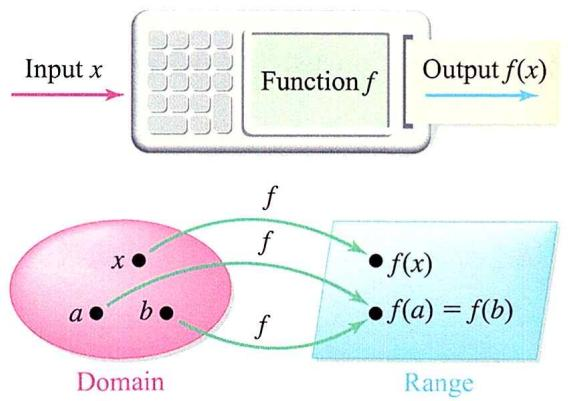

flowchart

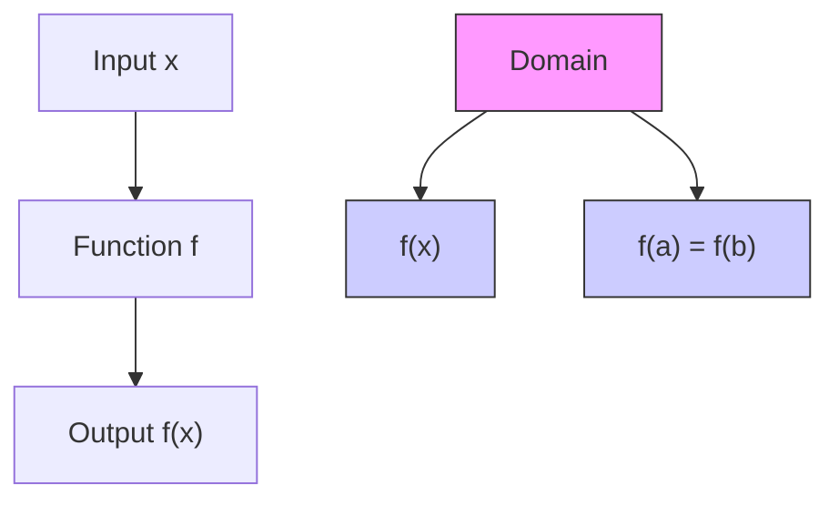

# 二. 函数的三大性质

# 1. 函数的存在性 (Existence)

- 函数存在性指的是在给定的定义域内，是否存在一个规则（或映射），使得每一个定义域内的元素都有唯一对应的值域元素。  
- 一个函数在某个定义域内是存在的，当且仅当对于定义域内的每一个元素，都存在唯一的值与之对应

# 2. 函数的唯一性（Uniqueness）

- 函数的唯一性要求在给定的定义域内，每一个元素只能与一个唯一的值对应，即函数值唯一。  
- 如果一个元素在定义域内对应多个值，那么这就不是一个函数，而是一个多值函数或关系。

# 3. 函数的任意性 (Arbitrariness)

\- 函数的任意性是指定义域和值域之间的元素的对应关系是任意的。

\- 对于给定的定义域元素，可以有多种映射规则，即一个元素可以与多个元素对应。

\- 函数的任意性强调了在定义域内的元素和值域内的元素之间的对应关系是灵活的。

例 定义在实数集上的函数 $f(x)=x^{2}$ :

存在性: 对于任何实数 $x$ , 都存在唯一的实数 $x^{2}$ , 因此这是一个存在的函数。

唯一性: 对于每个 $x$ , 在定义域内只有一个 $x^{2}$ 值, 即每个元素对应唯一的值, 所以它是一个唯一的函数。

任意性：任意一个实数都可以平方得到一个值，且不同的实数可能对应相同的平方值，所以存在多种映射规则，表现出一定的任意性。

任意性、存在性和唯一性是函数的三个关键性质，这三者缺一不可，否则无法构成严格的函数。其中，最关键的是确保每个自变量对应唯一的函数值，而不是一个自变量对应多个函数值。

# 三. 函数的三要素

1. 定义域（Domain）

- 定义域是指函数能够接受输入的所有可能的实数值的集合。换句话说，它是自变量可以取值的范围。  
- 在形式上, 如果有一个函数 $f(x)$ , 则定义域是所有可能使 $f(x)$ 有意义的 $x$ 的值的集合。  
- 例如对于 $f(x)=\sqrt{x}$ ，定义域是所有非负实数，因为不能对负数进行实数平方根运算。

2. 法则/规则 (Rule)

- 法则或规则定义了函数如何将定义域内的元素映射到值域内的元素。它规定了函数的基本操作或变换。  
- 在函数 $f(x)$ 中，规则描述了如何根据自变量x计算对应的函数值 $f(x)$ 。这可以是数学公式、图表、算法等。

3. 值域 (Range)

- 值域是函数实际输出的所有可能值的集合。它是函数在定义域内所有可能函数值的集合。  
- 对于函数 $f(x)$ ，值域是所有可能的 $f(x)$ 的值的集合。  
- 例如，对于函数 $f(x)=x^{2}$ ，如果定义域是所有实数，那么值域是所有非负实数。

总体来说，定义域决定了函数能够操作的输入范围，法则描述了如何进行操作，而值域则反映了函数可能产生的所有输出值。理解这些概念对于分析和理解函数的性质和行为非常重要。判断两个函数是否相等，首先，仔细考察它们的定义域和法则。若其中任何一个要素无法匹配，那么这两个函数就不可能是相等的。

例题 下列选项中， $f(x)$ 与 $g(x)$ 是相等函数的是

A. $f(x) = x - 1, g(x) = (\sqrt{x - 1})^2$

B. $f(x) = x - 1, g(x) = \sqrt{(x - 1)^2}$

C. $f(x)=\frac{x^{2}-4}{x-2},\quad g(x)=x+2$

D. $f(x) = |x|$ , $g(x) = \sqrt{x^2}$

解析-排除法 定义域、值域中有一个不同的必不是相等函数

A项中 $f(x)=x-1$ 的定义域为R， $g(x)=(\sqrt{x-1})^{2}$ 的定义域为 $[1,+\infty)$ ，定义域不同，排除A；
B项中 $f(x)=x-1$ 的值域为R， $g(x)=\sqrt{(x-1)^{2}}$ 的值域为 $[0,+\infty)$ ，值域不同，排除B；

C项中 $f(x)=\frac{x^{2}-4}{x-2}$ 的定义域为 $\{x\mid x\neq0\}$ ， $g(x)=x+2$ 定义域为R，定义域不同，排除C；综上，正确选项为D。

# 四. 函数的定义域与值域

1. 函数定义域优先原则

# 在处理任何函数前，都要先注意定义域

\- 常见函数的定义域

1. 分式分母不为零  
2. 偶次方根的被开方数大于或等于零   
3. 对数的真数大于零，底数大于零且不等于1  
4. 零次幂或负指数次幂底数不为零   
5. $y = \sin x, y = \cos x$ 的定义域为 $R$   
6. $y = \tan x$ 的定义域为 $\{x\mid x\neq k\pi +\frac{\pi}{2}\} ,k\in Z$

\- 抽象函数的定义域

对于抽象函数的性质，定义域与法则常常容易被混淆，在这方面，应该遵循两个关键点：

- 定义域是指自变量的范围，而不是法则对应的具体数学表达式  
- 在同一个对应法则下，括号内的表达式具有相同的定义域范围

例1 求解下面函数的定义域

$$
- f (x) = \frac {1}{x - 2}
$$

解析 由 $x - 2 \neq 0$ ，得 $f(x)$ 的定义域为 $\{x \mid x \neq 2\}$ .

$$
f (x) = \sqrt {2 - 4 x}
$$

解析 由 $2 - 4x \geq 0$ ，得 $f(x)$ 的定义域为 $\{x \mid x \leq \frac{1}{2}\}$ .

$$
- f (x) = (x - 1) ^ {0}
$$

解析 由 $x - 1 \neq 0$ ，得 $f(x)$ 的定义域为 $\{x \mid x \neq 1\}$ .

$$
- y = \sqrt {2 x + 3} - \frac {1}{\sqrt {2 - x}} + \frac {1}{x}
$$

解析 由 $\left\{\begin{aligned}2x+3&\geq0\\ 2-x&>0\\ x&\neq0\end{aligned}\right.$ ，得 $-\frac{3}{2}\leq x<2$ 且 $x\neq0$ ，故 $f(x)$ 的定义域为 $\{x\mid x\in[-\frac{3}{2},2)$ 且 $x\neq0\}$ .

例2 已知 $f(x+1)$ 的定义域为[1,2]，求 $f(3-x)$ 的定义域.

解析 $f(x + 1)$ 的定义域为 $[1,2]$ , 说明 $f(x + 1)$ 中 $x$ 的范围是 $[1,2]$ , 得到 $f(x + 1)$ 中的 $x + 1$ 的取值范围为 $[2,3]$ , 因此 $f(3 - x)$ 中 $3 - x$ 的范围就是 $[2,3]$ , 即 $2 \leq 3 - x \leq 3$ , 解得 $0 \leq x \leq 1$ , 所以 $f(3 - x)$ 的定义域为 $[0,1]$ .

例3 已知 $f(x)$ 的定义域为[0,2]，则函数 $\frac{f(2x)}{x-1}$ 的定义域为.

解析 先求 $f(2x)$ 的定义域，由上述方法可知 $0 \leq 2x \leq 2$ ，即 $0 \leq x \leq 1$ ，又因为分母要求 $x \neq 1$ ，所以目标函数的定义域就为[0,1).

# 2. 值域

A. 常见函数的值域

<table><tr><td>函数名称</td><td>函数</td><td>值域</td></tr><tr><td>一次函数</td><td>y=kx+b(k≠0)</td><td>R</td></tr><tr><td>反比例函数</td><td>y=k/x(k≠0)</td><td>(-∞,0)∪(0,+∞)</td></tr></table>

<table><tr><td>二次函数</td><td> $y = ax^{2} + bx + c (a \neq 0)$ </td><td> $a > 0$ 时,值域为 $[\frac{4ac - b^{2}}{4a}, +\infty)$  $a < 0$ 时,值域为 $(-\infty, \frac{4ac - b^{2}}{4a}]$ </td></tr></table>

<table><tr><td>指数函数</td><td> $y = a^{x} (a > 0 \text{且} a \neq 1)$ </td><td> $(0, +\infty)$ </td></tr><tr><td>对数函数</td><td> $y = \log_{a} x (a > 0 \text{且} a \neq 1)$ </td><td> $R$ </td></tr></table>

<table><tr><td>正弦函数</td><td> $y = \sin x$ </td><td>[-1,1]</td></tr><tr><td>余弦函数</td><td> $y = \cos x$ </td><td>[-1,1]</td></tr></table>

<table><tr><td>正切函数</td><td> $y = \tan x (x \neq \frac{\pi}{2} + k\pi)$ </td><td> $R$ </td></tr></table>

B. 分段函数的值域：分段函数是指在不同定义域上函数的表达式不同的函数，需要进行分段处理和讨论，判断所求自变量所在定义域相对应的函数，分段函数的值域为各段值域的并集

例1 求解下面函数的值域

$$
- f (x) = \frac {x ^ {2}}{x ^ {2} + 1}
$$

解析 $f(x) = \frac{x^2 + 1 - 1}{x^2 + 1} = 1 - \frac{1}{x^2 + 1}$ , 即 $f(x) \in [0,1)$ .

观察法：对于一些比校简单的函数，如正比例，反比例，一次函数等等，通过对函数定义域，性质的观察，结合函数的解析式，求得函数的值域.

$$
f (x) = \sqrt {5 + 4 x - x ^ {2}}
$$

解析 $5 + 4x - x^{2} \geq 0 \Rightarrow x \in [-1, 5]$ , $\because f(x) = \sqrt{5 + 4x - x^{2}} = \sqrt{-(x - 2)^{2} + 9}$ , 又 $\because -(x - 2)^{2} + 9 \in [0, 9]$ , $\therefore y \in [0, 3]$ .

配方法 函数是二次函数或可化为二次函数的复合函数时，可以利用配方法求函数值域

$$
f (x) = | x - 1 | - | x - 3 |
$$

解析 $x < 1$ 时， $f(x) = -x + 1 + x - 3 = -2$ ； $1 \leq x \leq 3$ 时， $f(x) = x - 1 + x - 3 = 2x - 4$ ； $x > 3$ 时， $f(x)=x-1-x-3=2,\quad\therefore y=\left\{\begin{aligned}-2,&x<1\\ 2x-4,&1\leq x\leq3\\ 2,&x>3\end{aligned}\right.$ ，作出函数的图像，易知 $f(x)\in[-2,2]$ .

数形结合法 利用函数图像求最值，或根据几何意义：斜率、距离等

$$
- f (x) = \frac {x ^ {2} - 4 x + 5}{2 x - 4}
$$

解析 令 $t = 2x - 4$ ， $\therefore x \in (2, +\infty)$ ， $\therefore t \in (0, +\infty)$ ，则 $x = \frac{t + 4}{2}$ ， $y = \frac{(\frac{t + 4}{2})^2 - 4 \cdot \frac{t + 4}{2} + 5}{t} = \frac{t^2 + 4}{4t} = \frac{t}{4} + \frac{1}{t} \geq 2\sqrt{\frac{t}{4} \cdot \frac{1}{t}} = 1$ ，当且仅当 $\frac{t}{4} = \frac{1}{t}$ ，即 $t = 2$ 时， $x = 3$ 时取等， $\therefore f(x) \in [1, +\infty)$ .

不等式法 利用常见的基本不等式，注意一正二定三相等

$$
- f (x) = 3 \cdot 4 ^ {x} - 2 ^ {x} + 3, x \in [ - 1, 2 ]
$$

解析 $\because f(x) = 3 \cdot (2^{x})^{2} - 2^{x} + 3, x \in [-1, 2]$ , 设 $t = 2^{x} \in [\frac{1}{2}, 4]$ （换元后要注意新元的取值范围）, $\therefore f(x) = 3 t^{2} - t + 3, t \in [\frac{1}{2}, 4]$ , 对称轴为 $t = \frac{1}{6}$ , 即 $f(x)$ 在 $[\frac{1}{2}, 4]$ 上单调递增, $\therefore f(x) \in [\frac{13}{4}, 47]$ .

换元法 新变量代替函数式中的某些量，使函数转化为以新变量为自变量的函数形式，进而求出值域，如无理函数，复合函数等，包括三角换元，注意新变量的取值范围

变式 求解下面函数的值域

$$
- f (x) = \frac {| x |}{| x | + 1}
$$

解析 方法同例1, $f(x) \in [0,1)$ .

$$
f (x) = \sqrt {3 + x} + \sqrt {5 - x}
$$

解析 $\because (\sqrt{3 + x} +\sqrt{5 - x})^2 = 3 + x + 5 - x + 2\sqrt{(3 + x)(5 - x)} = 8 + 2\sqrt{-(x - 1)^2 + 16}$ ，由题可知 $\left\{ \begin{array}{l}3 + x\geq 0\\ 5 - x\leq 0 \end{array} \right.\Rightarrow x\in [-3,5]$ ，又 $-(x - 1)^{2} + 16\in [0,16],\quad \therefore f(x)\in [2\sqrt{2},4].$

$$
- f (x) = \frac {\sqrt {1 - x ^ {2}}}{2 + x}
$$

解析 整理 $f(x)$ 得 $f(x)=\frac{\sqrt{1-x^{2}}}{2+x}=\frac{\sqrt{1-x^{2}}-0}{x-(-2)}$ ，则求 $f(x)$ 的值域可转化为求 $A(-2,0)$ 与 $P(x,\sqrt{1-x^{2}})$ 两点所连成直线的斜率的取值范围，设该直线为 $l:y=k(x+2)(k>0)$ ，由图可得：

当该直线与半圆相切时，斜率最大，则由两点的距离公式得 $d=\frac{|2k|}{\sqrt{k^{2}+1}}=1\Rightarrow k=\frac{\sqrt{3}}{3}$ ;
当该直线与x轴重合时，斜率最小，易知此时k=0；综上， $f(x)\in[0,\frac{\sqrt{3}}{3}]$ .

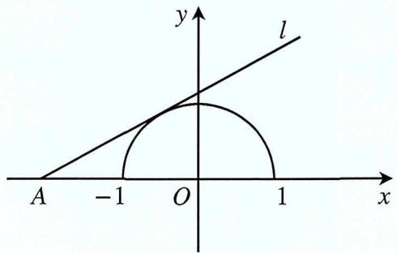

text_image

y
l
A -1 O 1 x

$$
- f (x) = \frac {(x ^ {2} + 1) ^ {2}}{x ^ {2}} (x \neq 0)
$$

解析 $f(x) = \frac{(x^2 + 1)^2}{x^2} = \frac{x^4 + 2x^2 + 1}{x^2} = x^2 + \frac{1}{x^2} + 2 \geq 2\sqrt{x^2 \cdot \frac{1}{x^2}} + 2 = 4$ ，当且仅当 $x^2 = \frac{1}{x^2}$ ， $x = \pm 1$ 时等号成立， $f(x)$ 取得最小值4，即 $f(x)$ 的值域为 $[4, +\infty)$ .

$$
f (x) = x + \sqrt {1 - x ^ {2}}
$$

解析 $\because 1 - x^{2} \geq 0, \therefore |x| \leq 1$ ，设 $x = \sin \theta, \theta \in [-\frac{\pi}{2}, \frac{\pi}{2}]$ ， $\therefore f(x) = \sin x + \cos x = \sqrt{2} \sin (\theta + \frac{\pi}{4})$ $\because \theta \in [-\frac{\pi}{2}, \frac{\pi}{2}]$ ， $\therefore \theta + \frac{\pi}{4} \in [-\frac{\pi}{4}, \frac{3\pi}{4}]$ ，即 $f(x) \in [-1, \sqrt{2}]$ .

例2 求解下面 $f(x)$ 的解析式

$$
f (x + 1) = x ^ {2} - 3 x + 2
$$

解析-定义法

$\because f(x + 1) = x^{2} - 3x + 2 = [(x + 1)^{2} - 1]^{2} - 3[(x + 1) - 1] + 2 = (x + 1)^{2} - 5(x + 1) + 6$ ，则可知 $f(x) = x^{2} - 5x + 6$ .

$f[f(x)] = 4x + 3$ ，且 $f(x)$ 是一次函数

解析-待定系数法（适用于二次函数）

设一次函数 $f(x)=ax+b(a\neq0)$ ，则 $f[f(x)]=af(x)+b=a(ax+b)+b=a^{2}x+ab+b$ ，则

$a^2 = 4$ ， $ab + b = 3$ ，解得 $a = 2$ ， $b = 1$ 或 $a = -2$ ， $b = 3$ ； $\therefore f(x) = 2x + 1$ 或 $f(x) = -2x + 3.$

$$
- f (\sqrt {x} + 1) = x + 2 \sqrt {x}
$$

解析-换元法 令 $t = \sqrt{x} + 1, t \geq 1, x = (t - 1)^2, \because f(\sqrt{x} + 1) = x + 2\sqrt{x}$ ,

$\therefore f(t) = (t - 1)^2 + 2(t - 1)$ ，即 $f(x) = x^2 - 1 (x \geq 1)$ .

\- 函数 $y = x^{2} + x$ 与 $y = f(x)$ 的图像关于点(-2,3)对称

解析-代入法 设 $M(x,y)$ 为 $f(x)$ 上的任意一点，且 $M'=(x',y')$ 为 $M=(x,y)$ 关于点 $(-2,3)$ 的对称点，则由对称性可知 $\frac{x'+x}{2}=-2,\quad\frac{y'+y}{3}=3$ ，则 $\left\{\begin{aligned}x&=-x-4\\ y&=6-y\end{aligned}\right.$ ，又 $M'=(x',y')$ 在 $y=x^{2}+x$ 上，

$\therefore y' = x'^2 + x'$ ，则把 $\left\{ \begin{array}{l} x' = -x - 4 \\ y' = 6 - y \end{array} \right.$ 代入得 $6 - y = (-x - 4)^2 + (-x - 4)$ ，整理 $y = -x^2 - 7x - 6$ ，故 $g(x) = -x^2 - 7x - 6$ .

$$
- f (\sqrt {x} + 1) = x + 2 \sqrt {x}
$$

解析-换元配凑法 由 $f(\sqrt{x}+1)=x+2\sqrt{x}=(\sqrt{x}+1)^{2}-1$ ，令 $t=\sqrt{x}+1,\quad\because x\geq0,\quad\therefore t\geq1$ ，则 $f(t)=t^{2}-1$ ，即 $f(x)=x^{2}-1(x\geq1)$ .

$$
- f (x) - 2 f (\frac {1}{x}) = x
$$

解析-消去法 易知 $x \neq 0$ ，把 $x$ 换成 $\frac{1}{x}$ 得 $f\left(\frac{1}{x}\right) - 2f(x) = \frac{1}{x}$ ，消去 $f\left(\frac{1}{x}\right)$ 得 $f(x) = \frac{x}{3} - \frac{2}{3x}$ .

# 第二节 函数的性质

在深入了解函数的基础知识之后，我们即将进入函数性质的学习阶段，这也是考察函数知识的一个广泛领域。在这部分学习中，我们不仅仅需要扎实的知识基础，更需要深入挖掘几个关键性质之间的相互转换，以及对其理解和运用的灵活性。只有通过这样的学习方式，我们才能真正达到将知识应用于实际问题的目标。接下来，我们将打开函数性质的大门，深入探索知识的深层次。

# 一. 函数的有界性

1. 定义: 设函数 $f(x)$ 的定义域为 $D$ , $f(x)$ 在集合 $D$ 上有定义

\- 如果存在数 $k_{1}$ , 使得 $f(x) \leq k_{1}$ 对任意 $x \in D$ 都成立, 则称函数 $f(x)$ 在 $D$ 上有上界

\- 反之, 如果存在数字 $k_{2}$ , 使得 $f(x) \geq k_{2}$ 对任意 $x \in D$ 都成立, 则称函数 $f(x)$ 在 $D$ 上有下界, 而 $k_{2}$ 称为函数 $f(x)$ 在 $D$ 上的一个下界

\- 如果存在正数 $M$ , 使得 $|f(x)| \leq M$ 对任意 $x \in D$ 都成立, 则称函数在 $D$ 上有界。如果这样的 $M$ 不存在, 就称函数 $f(x)$ 在 $D$ 上无界; 等价于, 无论对于任何正数 $M$ , 总存在 $x_{1}$ 属于 $X$ , 使得 $|f(x1)| > M$ , 那么函数 $f(x)$ 在 $X$ 上无界

\- 此外，函数 $f(x)$ 在X上有界的充分必要条件是它在X上既有上界也有下界

一般来说，连续函数在闭区间具有有界性

举例 $y = x + 6$ 在[1,2]上有最小值7，最大值8，所以说它的函数值在7和8之间变化，是有界的，所以具有有界性。但正切函数在有意义区间，比如 $(\frac{-\pi}{2}, \frac{\pi}{2})$ 内则无界。 $\sin x, \cos x, \sin \frac{1}{x}, \cos \frac{1}{x}$ 都是常见的有界函数，特别是在高中三角函数一定考虑到函数的有界性

# 二. 函数的单调性与最值

首先我们判断一个函数的单调性我们可以三种方法入手：第一种就是定义法；第二种为观察法；第三种就是我们的导函数判断。

而这三种方法我们都要掌握，并且根据题目去适当选取。

# 定义法判断

一般地，设函数 $f(x)$ 的定义域为I:

1. 如果对于定义域 $I$ 内某个区间 $D$ 上的任意两个自变量的值 $x_{1}, x_{2}$ , 当 $x_{1} < x_{2}$ 时, 都有 $f(x_{1}) < f(x_{2})$ , 那么就说函数 $f(x)$ 在区间 $D$ 上是增函数  
2. 如果对于定义域 $I$ 内某个区间 $D$ 上的任意两个自变量的值 $x_{1}, x_{2}$ , 当 $x_{1} < x_{2}$ 时, 都有 $f(x_{1}) > f(x_{2})$ , 那么就说函数 $f(x)$ 在区间 $D$ 上是减函数  
3. 若 $f(x)$ 在定义域I内某个区间D上的任意两个自变量的值 $x_{1}, x_{2}$ ，且 $x_{1} \neq x_{2}$ 时， $\frac{f(x_{1}) - f(x_{2})}{x_{1} - x_{2}} > 0$ 或 $\frac{f(x_{1}) - f(x_{2})}{x_{1} - x_{2}} < 0$ ，我们也可以说函数是是在D上的增（或减）函数

# 单调性分析法判断

通过单调性分析法判断函数的单调性时，我们可以利用取倒数或取负数等运算，通过计算法则来推断新函数的单调性。具体而言：

\- 取倒数

若原函数 $f(x)$ 在某个区间上单调递增（递减），则其倒数 $\frac{1}{f(x)}$ 在该区间上也单调递增（递减）

\- 取负数

若原函数 $f(x)$ 在某个区间上单调递增（递减），则其相反数 $-f(x)$ 在该区间上单调递减（递增）在公共定义域内，函数 $y=f(x)$ ， $y=f_{1}(x)$ 为增函数，函数 $y=g(x)$ ， $y=g_{1}(x)$ 为减函数.

- $y = f(x) + f_{1}(x)$ 为增函数，即增函数 $+$ 增函数 $=$ 增函数；  
- $y = g(x) + g_{1}(x)$ 为减函数，即减函数 $+$ 减函数 $=$ 减函数；  
- $y = f(x) - g(x)$ 为增函数， $y = g(x) - f(x)$ 为减函数；  
- 若 $f(x)>0$ , $f_{1}(x)>0$ , 则 $y=f(x)\cdot f_{1}(x)$ 是增函数;  
- 若 $g(x) > 0$ , $g_{1}(x) > 0$ , 则 $y = g(x) \cdot g_{1}(x)$ 是减函数;

- 若 $f(x) > 0$ ，则 $y = \frac{1}{f(x)}$ 是减函数；  
- 若 $g(x) > 0$ ，则 $y = \frac{1}{g(x)}$ 是增函数；  
- 若 $f(x) > 0$ , $g(x) > 0$ , 则 $y = \frac{g(x)}{f(x)}$ 是减函数.

注：当 $f(x)$ ， $f_{1}(x)$ ， $g(x)$ ， $g_{1}(x)$ 的符号不确定时，需论证其正负，确定单调性.

# 导数法判断

- 如果对于某个区间 $(a, b)$ 内的所有 $x$ ，函数 $f(x)$ 的一阶导数 $f'(x) > 0$ ，那么函数在区间 $(a, b)$ 内单调递增。  
- 如果函数 $f(x)$ 在区间 $(a, b)$ 内的一阶导数 $f'(x) = 0$ ，那么函数在该区间可能是常数（恒定）函数。要确定函数在该区间的性质，需要进一步分析。

# 复合函数单调性判断

在处理复合函数时, 要记住一个口诀: 同增异减的法则通常把把复合函数拆成外层函数, 内层函数, $\mu$ 称为中间变量——在内层它是因变量, 在外层它是自变量。如果这两个函数单调性相同, 则复合得到的函数单调增; 反之, 若两个函数单调性不同, 则复合得到的函数单调减。

例1 证明函数 $f(x) = x + \frac{1}{x}$ 在(0,1)上是减函数.

# 考点-定义法判断函数的单调性

解析 设 $x_{1}, x_{2}$ 为区间 $(0,1)$ 上的两个实数且 $x_{1} < x_{2}$ , 则 $f(x_{1}) - f(x_{2}) = (x_{1} + \frac{1}{x_{1}}) - (x_{2} + \frac{1}{x_{2}})$ , 作差变形得 $f(x_{1}) - f(x_{2}) = (x_{1} - x_{2})(\frac{x_{1}x_{2} - 1}{x_{1}x_{2}})$ , $\because 0 < x_{1} < x_{2}, \therefore x_{1} - x_{2} < 0, x_{1}x_{2} < 1, \therefore f(x_{1}) - f(x_{2}) > 0$ , $f(x_{1}) > f(x_{2}), \therefore f(x) = x + \frac{1}{x}$ 在 $(0,1)$ 上是减函数.

例2 讨论下列函数的单调性.

$$
- f (x) = x \mid x - 1 \mid
$$

考点-数形结合法判断函数的单调性

解析 由题意得 $f(x)=x\left|x-1\right|$ ，去绝对值转化为分段函数 $f(x)=x\left|x-1\right|=$ $\left\{\begin{aligned}x^{2}-x(x&\geq1)\\ x-x^{2}(x&<1)\end{aligned}\right.$ ，如图：

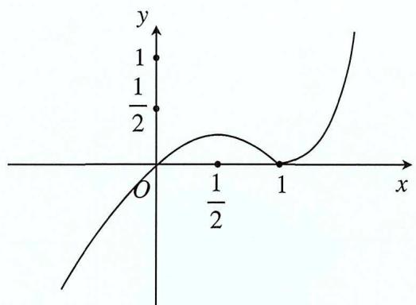

line

| x     | y     |
|-------|-------|
| 0     | 0     |
| 1/2   | 0     |
| 1     | 0     |

由 $f(x)=x^{2}-x(x\geq1)$ 和 $f(x)=x-x^{2}(x<1)$ 的对称轴均为 $x=\frac{1}{2}$ ，∴ $f(x)$ 的单调递增区间是 $(-∞, \frac{1}{2}]$ 和 $[1,+∞)$ ，单调递减区间是 $(\frac{1}{2},1)$ .

$$
- f (x) = \frac {x ^ {3} - x}{| x ^ {2} - 1 |}
$$

考点-数形结合法判断函数的单调性

解析 同理转化为分段函数， $f(x)=\left\{\begin{aligned}x(x>1\text{或}x<-1)\\ -x(-1<x<1)\end{aligned}\right.$ ，如图所示：

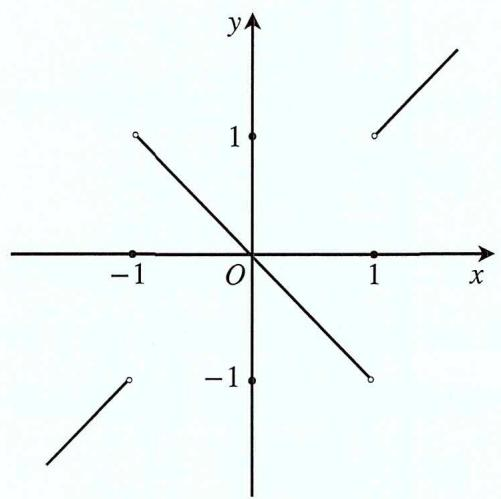

text_image

y
1
-1 O 1 x
-1
-1

易知函数 $f(x)$ 的单调递增区间为 $(-∞,-1]$ 和 $[1,+∞)$ ，单调递减区间是 $(-1,1)$ .

例题3 已知 $f(x)$ ， $g(x)$ 的定义域为R，且 $f(x)$ ， $g(x)$ 都是减函数，求证： $y = f[g(x)]$ 是增函数。考点-复合函数与抽象函数在函数单调性上的运用

证明 在 $R$ 上取任意 $x_{1}, x_{2}$ 且 $x_{1} < x_{2}$ , $\because g(x)$ 在 $R$ 上是减函数, $\therefore g(x_{1}) > g(x_{2})$ , 又 $\because f(x)$ 是减函数, 则 $f[g(x_{1})] < f[g(x_{2})]$ , 即 $y = f[g(x)]$ 是 $R$ 上的增函数.

例题4 已知 $y = \sqrt{x^2 - 2ax + 3}$ 在[1,4]上是减函数，则 $a$ 的取值范围是

考点-复合函数与抽象函数在函数单调性上的运用

解析 令 $\mu = x^{2} - 2ax + 3$ ，则 $y = \sqrt{\mu}$ ，易知 $\mu = x^{2} - 2ax + 3$ 在[1,4]上是减函数，且满足 $\mu \geq 0$ ，故 $\left\{ \begin{array}{l} a \geq 4 \\ 16 - 8a + 3 \geq 0 \end{array} \right.$ ，故 $a \in \varnothing$ .

例5 已知函数 $f(x)$ 为偶函数，当x>0时， $f(x)=\sqrt{x}-4^{-x}$ ，设 $a=f(\log_{3}0.2)$ ， $b=f(3^{-0.2})$ ， $c=f(-3^{1.1})$ ，则

A. $c > a > b$

B. $a > b > c$

C. c > b > a

D. $b > a > c$

考点-函数单调性的运用

解析 由题，当 $x > 0$ 时， $f(x) = \sqrt{x} - 4^{-x} = \sqrt{x} - \frac{1}{4^x}$ ，且 $f(x)$ 在 $x > 0$ 单调递增，又 $f(x)$ 是偶函数， $a = f(\log_3 0.2) = f(-\log_3 5) = f(\log_3 5), c = f(-3^{1.1}) = f(3^{1.1})$ ，且 $3^{1.1} > 3 > \log_3 5 > 1 > 3^{-0.2}$ ，则 $c > a > b$ ，故选A.

例6 已知 $f(x)$ 为R上的减函数，则满足 $f(\frac{1}{x})>f(1)$ 的实数x的取值范围是\_\_\_\_.

考点-利用函数单调性求解或证明不等式

解析 因为 $f(x)$ 为R上的减函数，则 $\frac{1}{x}<1$ ，即 $\frac{x-1}{x}>0$ ，∴ $x(x-1)>0$ ，解得x<0或x>1，所以x的取值范围是 $(-∞,0)∪(1,+∞)$ .

例7 已知函数 $f(x) = -x \mid x \mid, x \in (-1,1)$ ，则不等式 $f(1-m) < f(m^{2}-1)$ 的解集为 \_\_\_\_.考点-利用函数单调性求解或证明不等式

解析 由已知 $f(x)=\left\{\begin{aligned}x^{2},-1&\leq x\leq0\\ -x^{2},0&<x<1\end{aligned}\right.$ ，则 $f(x)$ 在 $(-1,1)$ 上单调递减，∴ $\left\{\begin{aligned}-1&<1-m<1\\ -1<m^{2}&-1<1\\ m^{2}&-1<1-m\end{aligned}\right.$ ，解得0<m<1，即所求解集为(0,1).

例8 已知函数 $y = \log_{\frac{1}{2}}(6 - ax + x^2)$ 在[1,2]上是增函数，则实数 $a$ 的取值范围是\_\_\_\_.

考点-利用函数单调性求解参数的范围

解析 设 $\mu = 6 - ax + x^{2}$ ，∵ $y = \log_{\frac{1}{2}} \mu$ ，∴ $\mu$ 在 [1,2] 上是减函数，∵ $\mu = 6 - ax + x^{2}$ 对称轴为直线 $x = \frac{a}{2}$ ，∴ $\frac{a}{2} \geq 2$ ，且 $\mu > 0$ 在 [1,2] 上成立，∴ $\left\{\begin{aligned}\frac{a}{2} &\geq 2 \\ 6 &-2a + 4 > 0\end{aligned}\right.$ ，解得 $a \in [4,5)$ .

# 三. 函数的奇偶性

前面详细的介绍了函数单调性与有界性，下面阐述函数的奇偶性，并结合前面两大性质综合利用，来开启函数奇偶性的新篇章。

# 1. 奇偶性的定义

首先在奇偶性判断中最重要的第一步为判断是否有对称区间，如果没有就算满足定义也只能是非奇函数非偶函数。

\- 奇函数的定义: 如果对于任意 $x$ 在定义域内都有 $f(x) = -f(-x)$ 。换句话说, 如果将函数的自变量取相反数, 函数值也取相反数, 那么这个函数就是奇函数。

举例 函数 $f(x)=x^{3}$ 是一个奇函数，因为对于任意实数x，都有 $f(x)=f(-x)=x^{3}$

\- 偶函数的定义: 如果对于任意 $x$ 在定义域内都有 $f(x) = f(-x)$ 。换句话说, 如果将函数的自变量取相反数, 函数值不变, 那么这个函数就是偶函数。

举例 函数 $g(x) = x^{2}$ 是一个偶函数，因为对于任意实数 $x$ ，都有 $g(-x) = (-x)^{2} = x^{2}$

# 2. 函数的奇偶性原理

\- $\forall x \in I$ , 都有 $-x \in I$ 不难发现奇偶函数为函数的整体性;

\- $\forall x \in I$ ，都有 $-x \in I$ 也说明奇偶性前提条件为定义域关于原点对称；

\- 奇函数关于原点对称，偶函数关于y轴对称；

注意 若奇函数在原点有意义时那么在原点的函数值为0

\- 函数值特征: 当自变量互为相反数时, 偶函数的函数值相等, 奇函数的函数值互为相反数.

# 3. 函数奇偶性的判断

# - 定义域的对称性

奇偶函数的定义域是关于原点对称的。这一点在分析奇偶性时经常被遗忘，但它是判断奇偶性的基础。

# - 奇函数与偶函数关系

如果一个函数是奇函数，那么它关于原点对称；反之，如果一个函数是偶函数，那么它关于y轴对称。这个关系是奇偶性判断的关键，即

$$
f (- x) = - f (x) \text {为奇函数, 则} f (- x) = f (x) \text {为偶函数}
$$

# - 抽象表达式的数形结合

当函数的具体表达式未知时, 可以通过数形结合的方法来判断奇偶性。通过将函数的自变量替换为负自身 (例如, 将 $x$ 替换为 $-x$ ), 观察表达式是否发生变化, 来判断奇偶性。

奇偶性与单调性的类似计算法则 若 $f(x)$ 、 $g(x)$ 为奇函数， $h(x)$ 、 $u(x)$ 为偶函数，则

1. $f(x) \pm g(x)$ 为奇函数

2. $h(x) \pm u(x)$ 为偶函数

3. $f(x) \cdot g(x)$ 为偶函数

4. $h(x) \cdot u(x)$ 为偶函数

5. $f(x) \cdot h(x)$ 为奇函数

数奇偶性的计算法则与单调性的计算法则相似，通过分析函数的增减性质，可以进一步确认其奇偶性

例1 函数 $f(x)$ 是定义域为R的奇函数，当x>0时， $f(x)=-x+1$ ，求当x<0时， $f(x)$ 的解析式考点-利用奇偶性求函数解析式

解析 令 $x < 0$ ，则 $-x > 0$ ， $\therefore f(-x) = -(-x) + 1 = x + 1$ ，又 $f(x)$ 是定义域为 $R$ 的奇函数，

$$
\therefore f (- x) = - f (x) = x + 1, \text {即当} x <   0 \text {时}, f (x) = - x - 1.
$$

例2 函数 $f(x)=\frac{ax^{2}+1}{bx+c}(a,b,c\in N)$ 是奇函数， $f(1)=2,f(2)<3$ ，求 $f(x)$ 的解析式考点-利用奇偶性求函数解析式

解析 $f(x)$ 是奇函数，则 $f(-x) = -f(x)$ ，即 $\frac{ax^2 + 1}{-bx + c} = -\frac{ax^2 + 1}{bx + c} = \frac{ax^2 + 1}{-bx - c} \Rightarrow c = 0$ ，由 $f(1) = 2$ 得 $a + 1 = 2b$ ，由 $f(2) < 3 \Rightarrow \frac{a - 2}{a + 1} < 0 \Rightarrow -1 < a < 2$ ，又 $a \in N$ ， $\therefore a = 0$ 或 1，当 $a = 0$ 时，

$$
b = \frac {1}{2} \notin N, \text {舍去，当} a = 1 \text {时，} b = 1, \therefore f (x) = \frac {x ^ {2} + 1}{x} = x + \frac {1}{x}.
$$

例3 设 $f(x)$ 为定义在 $R$ 上的奇函数，当 $x \geq 0$ 时， $f(x) = 2^x + 2x + b$ （ $b$ 为常数），求 $f(-1)$ .

考点-利用奇偶性求函数值域

解析 $\because f(x)$ 为定义在 $R$ 上的奇函数， $\therefore f(0) = 2^0 + 2 \times 0 + b = 0$ ，解得 $b = -1$ ， $\therefore x \geq 0$ 时，

$$
f (x) = 2 ^ {x} + 2 x - 1, \text {即} f (- 1) = - f (1) = - (2 ^ {1} + 2 \times 1 - 1) = - 3.
$$

例4 已知 $f(x)=x^{5}+ax^{3}+bx-8$ 且 $f(-2)=10$ ，那么 $f(2)=$ \_\_\_\_.

考点-利用奇偶性求函数值域

解析 设 $F(x)=f(x)+8$ ，则 $F(x)=x^{5}+ax^{3}+bx$ 为奇函数，于是有 $F(-x)=-F(x)$ ，从而有

$f(-x) + 8 = -[f(x) + 8]$ ，即 $f(-x) + f(x) = 16$ ，令 $x = 2$ ，得 $f(-2) + f(2) = -16$ ，又 $f(-2) = 10$ ，故

$$
f (2) = - 1 6 - 1 0 = - 2 6.
$$

例5 已知 $f(x)$ 为定义在 $(-1,1)$ 上的奇函数，且在 $[0,1)$ 上为增函数，若 $f(a-2)+f(3-2a)<0$ ，求a的取值范围.

考点-利用奇偶性讨论函数单调性

解析 $\because f(a - 2) + f(3 - 2a) < 0, \therefore f(a - 2) < -f(3 - 2a)$ , 又 $f(x)$ 为奇函数,

$\therefore f (a - 2) < f (2 a - 3)$ , 又 $f(x)$ 在 $[0,1)$ 上为增函数, $\therefore f (x)$ 在 $(-1,1)$ 为增函数,

$\therefore \left\{ \begin{array}{l}a - 2 <   2a - 3\\ -1 <   a - 2 <   1\\ -1 <   2a - 3 <   1 \end{array} \right.,$ 即 $a\in (1,2)$

例6 已知 $f(x)$ 为定义在(-1,1)上的奇函数且是减函数，解不等式 $f(1-x)+f(1-2x)<0$ .

考点-利用奇偶性讨论函数单调性

解析 由 $f(x)$ 是奇函数得， $f(-x) = -f(x)$ ，则 $f(1 - 2x) = -f(2x - 1)$ ，又 $f(1 - x) + f(1 - 2x) < 0$ ，则

$f(1 - x) < f(2x - 1)$ ，又 $f(x)$ 是定义在 $(-1, 1)$ 的减函数， $\therefore \left\{ \begin{array}{l} -1 < 1 - x < 1 \\ 1 - < 2x - 1 < 1 \\ 1 - x > 2x - 1 \end{array} \right.$ ，解得 $x \in (0, \frac{2}{3})$ ，即不

等式 $f(1-x)+f(1-2x)<0$ 的解集为 $(0,\frac{2}{3})$ .

例7 已知函数 $f(x)$ 对一切 $x, y \in R$ ，都有 $f(x + y) = f(x) + f(y)$ ;

(1) 求证: $f(x)$ 是奇函数;  
(2) 若 $f(-3)=a$ ，用a表示 $f(12)$ .

考点-讨论函数的奇偶性

解析 (1) 显然 $f(x)$ 的定义域是 $R$ ，它关于原点对称， $f(x + y) = f(x) + f(y)$ ，令 $y = -x$ ，得

$f(0)=f(x)+f(-x)$ ，令x=y=0，得 $f(0)+f(0)=f(0)$ ，即 $f(0)=0,\quad\therefore f(x)+f(-x)=0$ ，得证.

(2) 由 $f(-3)=a$ ， $f(x+y)=f(x)+f(y)$ 且 $f(x)$ 是奇函数， $f(12)=2f(6)=4f(3)=-4f(-3)=-4a.$

例8 已知函数 $f(x)=x^{2}+\frac{a}{x}(x\neq0,a\in R)$ .

(1) 讨论 $f(x)$ 的奇偶性，并说明理由；  
(2) 若 $f(x)$ 在 $x \in [2, +\infty)$ 上是增函数，求a的取值范围.

# 考点-讨论函数的奇偶性

解析 (1) 当 $a = 0$ 时, $f(x) = x^{2}$ 为偶函数; 当 $a \neq 0$ 时, $f(x)$ 既不是奇函数也不是偶函数.

(2) 设 $x_{2} > x_{1} > 2$ , $f(x_{1}) - f(x_{2}) = x_{1}^{2} + \frac{a}{x_{1}} - x_{2}^{2} - \frac{a}{x_{2}} = \frac{x_{1} - x_{2}}{x_{1}x_{2}} [x_{1}x_{2}(x_{1} + x_{2}) - a]$ , 由 $x_{2} > x_{1} \geq 2$ 得 $x_{1}x_{2}(x_{1} + x_{2}) > 16$ , $x_{1} - x_{2} < 0$ , $x_{1}x_{2} > 0$ , 要使 $f(x)$ 在 $x \in [2, +\infty)$ 上是增函数只需 $f(x_{1}) < f(x_{2})$ , 即 $x_{1}x_{2}(x_{1} + x_{2}) - a > 0$ 恒成立, 故 $a \leq 16$ .

例9 （2024·新高考II卷）设函数 $f(x)=a(x+1)^{2}-1$ ， $g(x)=\cos x+2ax$ （a为常数），当 $x\in(-1,1)$ 时，曲线 $y=f(x)$ 与 $y=g(x)$ 恰有一个交点，则a=

解析 $\because y = f(x)$ 与 $y = g(x)$ 恰好一个交点， $\therefore f(x) = g(x)$ ，转换为令 $F(x) = f(x) - g(x) = 0$ 有一个交点， $\therefore F(x) = f(x) - g(x) = a(x + 1)^2 - 1 - \cos x - 2ax = a(x^2 + 1) - \cos x - 1$ ，又 $F(x) = F(-x)$ ，所以 $F(x)$ 为偶函数所以关于y轴对称并且要求只有一个零点， $\therefore F(0) = 0$ 才满足，解得： $a = 2$ .

# 第三节 函数的对称性、周期性及凹凸性

# 一. 函数的对称性

函数对称性的最突出的作用为“知一半而得全部”，即一旦函数具备对称性，则只需分析函数一侧的性质即可，从而得到整个函数的性质。

1. 轴对称: 如果一个函数的图像沿一条直线对折, 直线两侧的图像能够完全重合, 则称该函数具备对称性的轴对称, 该直线称为该函数的对称轴

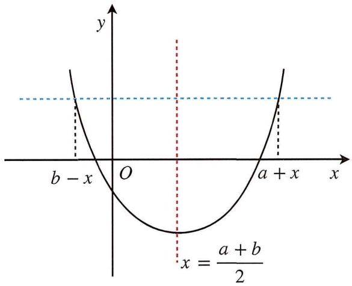

text_image

y
b - x O a + x x
x = \u0394a + b / 2

# 轴对称常见的形式

- 如果 $f(x)=f(2a-x)$ ，则 $f(x)$ 关于直线x=a对称  
- 如果 $f(x+a)=f(a-x)$ ，则 $f(x)$ 关于直线x=a对称  
- 如果 $f(x + a) = f(b - x)$ ，则 $f(x)$ 关于直线 $x = \frac{a + b}{2}$

注意 这里都是指一个函数而不是两个函数要注意判别，两个函数的对称性质不一样

2. 中心对称：如果一个函数的图像沿一个点旋转 $180^{\circ}$ ，所得的图像能与原函数图像完全重合，则称该函数具备对称性中的中心对称，该点称为该函数的对称中心

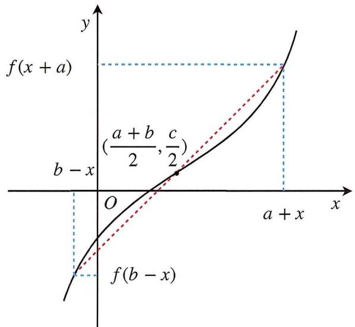

text_image

f(x + a)
\frac{(a + b)}{2}, \frac{c}{2}
b - x
O
a + x
x
y
f(b - x)

中心对称常见的形式

\- 如果 $f(x)+(2a-x)=0$ ，则 $f(x)$ 关于点 $(a,0)$ 对称

\- 如果 $f(x+a)+f(a-x)=0$ ，则 $f(x)$ 关于点 $(a,0)$ 对称

\- 如果 $f(x+a)+f(b-x)=c$ ，则 $f(x)$ 关于点 $\left(\frac{a+b}{2},\frac{c}{2}\right)$ 对称

# 二. 函数的周期性

1. 周期与周期函数：对于函数 $y = f(x)$ ，若存在一个非零常数 $T$ ，使得 $x$ 取定义域内的任何值时， $f(x + T) = f(x)$ 成立，则函数 $y = f(x)$ 叫周期函数，不为零的常数 $T$ 叫这个函数的周期（Period）

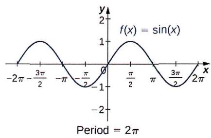

line

| x         | y          |
| --------- | ---------- |
| -2π       | 0          |
| -3π/2     | 1          |
| -π        | 0          |
| -π/2      | -1         |
| 0         | 0          |
| π/2       | 1          |
| π         | 0          |
| 3π/2      | -1         |
| 2π        | 0          |

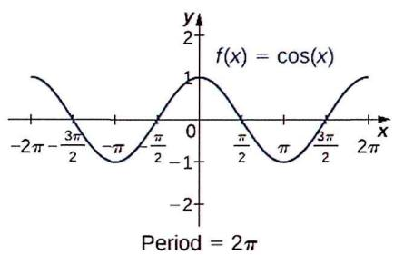

line

| x         | f(x) = cos(x) |
| --------- | ------------- |
| -2π       | 1             |
| -π/2      | 0             |
| 0         | 1             |
| π/2       | 0             |
| π         | -1            |
| 3π/2      | 0             |
| 2π        | 1             |

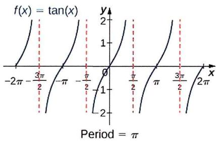

line

| x         | f(x) = tan(x) |
| --------- | ------------- |
| -2π/2     | 0             |
| -π/2      | 0             |
| 0         | 0             |
| π/2       | 0             |
| π         | 0             |
| 3π/2      | 0             |
| 2π        | 0             |

1) 周期函数的定义域一定是无限集  
2) 由周期函数的定义可知，0不能作为函数的周期  
3) 如果 $T$ 是 $f(x)$ 是它的一个周期, 那么 $-T$ 也是 $f(x)$ 的周期, 即周期可以为负值.  
4) 如果 $T$ 是 $f(x)$ 是它的一个周期, 那么 $n T$ 也是 $f(x)$ 的周期, 即周期函数有无数个周期

2. 最小正周期: 如果 $f(x)$ 为周期函数, 且所有的周期中存在一个最小的正数, 则这个最小正数叫 $f(x)$ 的最小正周期, 周期函数 $f(x)$ 不一定含有最小正周期, 如常数函数的周期为任意实数.

3. 常见抽象函数的周期

3.1. 如果 $f(x + a) = f(x + b)$ ，则 $f(x)$ 的周期 $T = b - a$ ;

证明 易证.

3.2. 如果 $f(x + a) = -f(x)$ ，则 $f(x)$ 的周期 $T = 2a$ ;

证明 用 $x \pm a$ 替换 $f(x \pm a) = -f(x)$ 中的 $x$ 得: $f(x \pm 2a) = -f(x \pm a)$ 又因为 $f(x \pm a) = -f(x)$ 所以 $f(x \pm 2a) = f(x)$ , 因此 $T = 2a$ .

3.3. 如果 $f(x + a) = \frac{1}{f(x)}$ ，则 $f(x)$ 的周期 $T = 2a$ ;

证明 用 $x \pm a$ 替换 $f(x \pm a) = \frac{c}{f(x)}$ 得: $f(x \pm 2a) = \frac{c}{f(x \pm a)}$ 又因为 $f(x \pm a) = \frac{c}{f(x)}$ . 所以 $f(x \pm 2a) = f(x)$ , 因此 $T = 2a$ .

3.4. 如果 $f(x + a) = -\frac{1}{f(x)}$ ，则 $f(x)$ 的周期 $T = 2a$ ;

证明 同3.3.

3.5. 如果 $f(x + a) = \frac{1 - f(x)}{1 + f(x)}$ ，则 $f(x)$ 的周期 $T = 2a$ ;

证明 用 $x + a$ 替换 $f(x + a) = \frac{1 - f(x)}{1 + f(x)}$ 中的 $x$ 得： $f(x + 2a) = \frac{1 - f(x + a)}{1 + f(x + a)}$ 又因为 $f(x + a) = \frac{1 - f(x)}{1 + f(x)}$

所以 $f(x+2a)=\frac{1-f(x+a)}{1+f(x+a)}=\frac{1-\frac{1-f(x)}{1+f(x)}}{1+\frac{1-f(x)}{1+f(x)}}=f(x)$ ，则 $f(x+2a)=f(x)$ ，即T=2a.

3.6. 如果 $f(x + a) = \frac{1 + f(x)}{1 - f(x)}$ ，则 $f(x)$ 的周期 $T = 4a$ ;

证明 用 $x + a$ 替换 $f(x + a) = \frac{1 + f(x)}{1 - f(x)}$ 中的 $x$ 得: $f(x + 2a) = \frac{1 + f(x + a)}{1 - f(x + a)}$ , 又 $f(x + a) = \frac{1 + f(x)}{1 - f(x)}$ , 所以 $f(x + 2a) = \frac{1 + f(x + a)}{1 - f(x + a)} = \frac{1 + \frac{1 - f(x)}{1 + f(x)}}{1 - \frac{1 - f(x)}{1 + f(x)}} = -\frac{1}{f(x)}$ , 由3.3可知, $T = 4a$ .

3.7. 如果 $f(x+2a)=f(x+a)-f(x)$ ，则 $f(x)$ 的周期T=6a.

证明 用 $x + a$ 替换 $f(x + 2a) = -f(x - a)$ 中的 $x$ 得: $f(x + 3a) = -f(x)$ 再由3.2可知, $T = 6a$ .

# 4. 常见三角函数的周期

4.1. $y = \sin (\omega x + \varphi)(\omega > 0)$ 的最小正周期为 $T = \frac{2\pi}{\omega}$ ;  
4.2. $y = \cos(\omega x + \varphi)(\omega > 0)$ 的最小正周期为 $T = \frac{2\pi}{\omega}$ ;  
4.3. $y = \tan (\omega x + \varphi)(\omega > 0)$ 的最小正周期为 $T = \frac{\pi}{\omega}$ ;  
4.4. $y = |\sin (\omega x + \varphi)|(\omega > 0)$ 的最小正周期为 $T = \frac{\pi}{\omega}$ ;  
4.5. $y = |\cos (\omega x + \varphi)|(\omega > 0)$ 的最小正周期为 $T = \frac{\pi}{\omega}$ ;  
4.6. $y = |\tan (\omega x + \varphi)|(\omega >0)$ 的最小正周期为 $T = \frac{\pi}{\omega}$

注意 通过对x轴下方的图像进行翻折观察，我们可以发现正弦函数和余弦函数的周期减半，而切线函数(tan)的周期保持不变.

# 三. 函数的凹凸性

1. 定义: 如果一个函数在其定义域内的任意两点之间的线段上, 图像位于这条线段下方, 那么这个函数被称为下凸函数 (凹函数)。相反, 如果一个函数在其定义域内的任意两点之间的线段上,图像位于这条线段上方, 那么这个函数被称为上凸函数 (凸函数)  
2. 拐点和切线: 在凹函数的拐点上, 函数的凹凸性发生改变, 即从凹转为凸, 或从凸转为凹。凹函数的切线位于函数图像的下方, 而凸函数的切线位于函数图像的上方

3. 判定: 如图, 若函数 $f(x)$ 上两点任意 $x_{1}, x_{2}$ 满足 $f \left( \frac{x_{1} + x_{2}}{2} \right) \geq \frac{f(x_{1}) + f(x_{2})}{2}$ , 则 $f(x)$ 为凸函数; 若 $f \left( \frac{x_{1} + x_{2}}{2} \right) \leq \frac{f(x_{1}) + f(x_{2})}{2}$ , 则 $f(x)$ 为凹函数

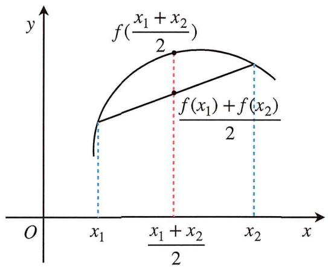

text_image

f(\frac{x_1 + x_2}{2})
f(x_1) + f(x_2)/2
O
x_1
\frac{x_1 + x_2}{2}
x_2
x
y

上凸函数

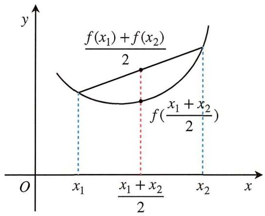

text_image

y
f(x₁) + f(x₂)
2
f(x₁ + x₂)
2
x₁
x₁ + x₂
2
x₂
x
O

下凸函数

4. 函数凹凸性与二阶导数符号关系：二阶导数的几何意义即函数切线斜率的变化率，二阶导大于0时，则切线斜率随x递增，函数为下凸函数；二阶导小于0时，则切线斜率随x递减，函数为上凸函数.

# 第四节 抽象函数的综合性质

前面学习了函数从单调性，奇偶性到函数对称性，周期性，凹凸性等等，这一节通过前面的学习，将这些性质综合利用起来，贴合如今的新高考的要求和考查。首先函数性质的综合运用的时候，应该把函数的这些性质的表达方式和一些形式掌握才能有效知道明白传递出函数的哪一个性质，其次是了解各个函数性质上的联系与区别，这也是我们的学习目标。

# 一. 抽象函数的性质

同周异轴，异和为心

形如：

\- 若 $f(x + a) = f(x + b)$ ，则 $f(x)$ 的周期 $T = b - a$ ，在自变量前的系数为同号就是反映出函数的周期性；

\- 若 $f(x + a) = f(b - x)$ ，则 $f(x)$ 关于直线 $x = \frac{a + b}{2}$ 对称，在自变量前的系数为异号就是反映出函数的对称轴；

\- 若 $f(x+a)+f(b-x)=c$ ，则 $f(x)$ 关于点 $\left(\frac{a+b}{2},\frac{c}{2}\right)$ 对称，在自变量前的系数为异号并且结构上为和的形式就是反映出函数的对称中心.

# 二. 抽象函数中对称性和奇偶性的关系

# 奇偶性是特殊的对称性

形如：

\- 若 $f(x + a)$ 是偶函数，则 $f(x)$ 关于直线 $x = a$ 对称；

证明1一表达式角度 已知 $f(x+a)$ 是偶函数 $\Leftrightarrow f(x+a)=f(-x+a)$ ，而 $f(x+a)=f(-x+a)$ 中的两个自变量为 $x+a$ 和 $-x+a$ ，其和为2a，即自变量只和为2a，函数值相等，结合轴对称的函数意义，可得函数 $f(x)$ 关于直线x=a对称.

证明2一图像平移角度 因为 $f(x+a)$ 是偶函数, 则 $f(x+a)$ 关于 $y$ 轴对称, 根据图像平移法则 $f(x+a)$ 是在 $f(x)$ 上向左平移 $a$ 个单位才关于 $y$ 轴对称, 即 $f(x)$ 关于直线 $x=a$ 对称.

\- 若 $f(x + a) - c$ 是奇函数，则 $f(x)$ 关于点 $(a, c)$ 对称.

证明1一表达式角度 已知 $f(x+a)-c$ 是奇函数，由奇函数性质 $f(x+a)-c=-f(-x+a)+c$ ，整理得 $f(x+a)+f(-x+a)=2c$ ，由中心对称的定义，得 $f(x)$ 关于点 $(a,c)$ 对称.

证明2一图像平移角度 同理 $f(x+a)-c$ 是在 $f(x)$ 上向左平移a个单位和向下平移c个单位才关于原点对称，即 $f(x)$ 关于 $(a,c)$ 对称.

# 三. 抽象函数中对称性和周期性的关系

抽象函数中对称性和周期性有以下三个关系：

1. 一个对称轴和一个对称中心的水平距离为四分之一个周期  
2. 一个对称轴与一个对称轴的水平距离为二分之一个周期  
3. 一个对称轴与一个对称轴的水平距离为二分之一个周期

为了方便记忆，在使用时可以画出最典型的周期函数 $y = \sin x$ 的图像辅助，如下图：

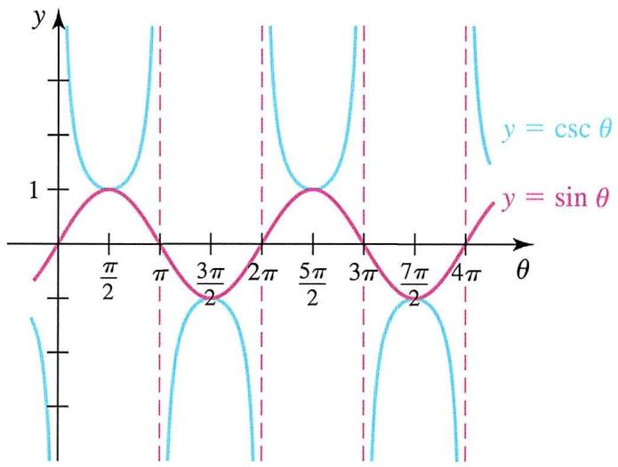

line

| θ       | y = cos θ | y = sin θ |
| ------- | --------- | --------- |
| 0       | 1         | 0         |
| π/2     | 0         | 1         |
| π       | 1         | 0         |
| 3π/2    | 0         | 1         |
| 2π      | 1         | 0         |
| 5π/2    | 0         | 1         |
| 3π      | 1         | 0         |
| 7π/2    | 0         | 1         |
| 4π      | 1         | 0         |

不难发现以上三个性质的已知部分都由两个要素构成, 根据这两个要素, 推得其他性质, 所以在物理的运动学题里面有着知三求五, 而在这里可以任意知道两个变量反推出第三个变量的值.

# 四. 抽象函数中的类周期表达式

有时所给条件和周期表达式的结构类似，例如在 $f(x)$ 前含系数的 $f(x+1)=2f(x)$ 就是一种类周期函数，函数值呈现变化。

例1（2018·全国二卷文数）已知 $f(x)$ 定义域为R，且 $f(x)$ 为奇函数，而且有 $f(1-x)=f(1+x)$ ，若 $f(1)=2$ ，求 $f(1)+f(2)+\ldots+f(50)$ 的值.

解析 由 $f(x)$ 是奇函数，则 $f(-1) = -f(1) = -2$ 且 $f(0) = 0$ ， $f(1 - x) = f(1 + x)$ 可知 $f(x)$ 图像关于 $x = 1$ 对称，则 $f(2) = f(0) = 0$ 及 $f(3) = f(-1) = -2$ ，同理可得 $f(-3) = -f(3) = 2$ ， $f(5) = f(-3) = 2$ ，且 $f(0) = f(2) = f(4) = \ldots = f(50) = 0$ ，故 $f(1) + f(2) + \ldots + f(50) = 2$ .

例2（2019·全国二卷理数）设函数 $f(x)$ 的定义域为R，满足 $f(x+1)=2f(x)$ ，且当 $x\in(0,1]$ 时， $f(x)=x(x-1)$ ，若对任意 $x\in(-\infty,m]$ ，都有 $f(x)\geq-\frac{8}{9}$ ，求m的取值范围.

解析 $\because x \in (0,1]$ , $f(x) = x(x - 1)$ , $f(x + 1) = 2f(x)$ , $\therefore f(x) = 2f(x - 1)$ , 如图所示, 当 $2 < x \leq 3$ 时, $f(x) = 4f(x - 2) = 4(x - 2)(x - 3)$ , 令 $4(x - 2)(x - 3) = -\frac{8}{9}$ , 整理得 $9x^{2} - 45x + 56 = 0$ , 即 $(3x - 7)(3x - 8) = 0$ , 解得 $x_{1} = \frac{7}{3}$ , $x_{2} = \frac{8}{3}$ (舍), $\therefore x \in (-\infty, m]$ 时, $f(x) \geq -\frac{8}{9}$ 成立, 即 $m \leq \frac{7}{3}$ .

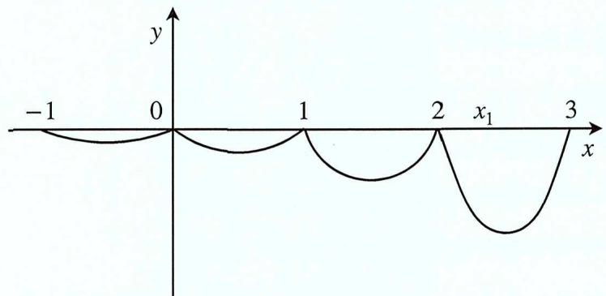

text_image

-1
0
1
2
x₁
3
x
y

例3（2021·全国甲卷理数）设函数 $f(x)$ 的定义域为R， $f(x+1)$ 为奇函数， $f(x+2)$ 为偶函数，当 $x\in[1,2]$ 时， $f(x)=ax^{2}+b$ ，若 $f(0)+f(3)=6$ ，求 $f(\frac{9}{2})$ .

解析 由题意得 $f(x+1)$ 为奇函数 $\Rightarrow f(x+1)+f(-x+1)=0\Rightarrow f(x)$ 关于(1,0)中心对称； $f(x+2)$ 为偶函数 $\Rightarrow f(x+2)-f(-x+2)=0\Rightarrow f(x)$ 关于x=2对称， $f(3)=f(1)=a+b$ ，又因为 $f(x)$ 关于(1,0)中心对称且x=1有意义，故 $f(1)=0=f(3)\Rightarrow a+b=0$ ， $f(0)+f(2)=0\Rightarrow f(0)=-f(2)=-4a-b=6$ ，解得a=-2，b=2，故 $f(\frac{9}{2})=f(\frac{1}{2})$ ，又 $f(\frac{1}{2})+f(\frac{3}{2})=0\Rightarrow f(\frac{1}{2})=-f(\frac{3}{2})=\frac{5}{2}$ .

例4 设函数 $f(x)$ 为定义域为R的奇函数，且 $f(1+x)=f(-x)$ ，若 $f(-\frac{1}{3})=\frac{1}{3}$ ，求 $f(\frac{5}{3})$ .

解析 已知 $f(1+x)=f(-x)$ ，由同周异轴得 $f(x)$ 关于 $x=\frac{1}{2}$ 对称，又 $f(x)$ 为定义域为R的奇函数，∴ $f(x)$ 关于(0,0)中心对称，易知 $\frac{T}{4}=\frac{1}{2}$ ，T=2，∴ $f(\frac{5}{3})=f(\frac{5}{3}-2)=f(-\frac{1}{3})=\frac{1}{3}$ .

例5（2021·新高考II卷）已知函数 $f(x)$ 为定义域为R， $f(x+2)$ 是偶函数， $f(2x+1)$ 是奇函数，则

$$
\mathrm{A.} f (- \frac {1}{2}) = 0
$$

$$
\mathrm{B.} f (- 1) = 0
$$

$$
\mathrm{C.} f (2) = 0
$$

$$
\mathrm{D.} f (4) = 0
$$

解析 $f(2x+1)$ 可看作 $f(x)$ 向左平移1个单位，再横坐标变为原来的 $\frac{1}{2}$ ，故 $f(x+1)$ 也为奇函数，(1,0)为 $f(x)$ 的一个对称中心 $f(1)=0$ ，因为 $f(x+2)$ 为偶函数，则2为 $f(x)$ 的一个对称轴。由上可得T=4，相邻对称轴和对称中心距离 $\frac{T}{4}$ ，又因为相邻对称轴，相邻对称中心距离都为 $\frac{T}{2}$ ，即 $f(-1)=f(1)=0$ ，B正确。其他三项函数值无法求出，错误.

例6（2022·全国乙卷理数）已知函数 $f(x)$ ， $g(x)$ 的定义域均为R，且 $f(x)+g(2-x)=5$ ， $g(x)-f(x-4)=7$ ，若 $y=g(x)$ 的图像关于直线x=2对称， $g(2)=4$ ，则 $\sum_{k=1}^{22}f(k)=$

$$
\mathrm{A.} - 2 1
$$

$$
\mathrm{B.} - 2 2
$$

$$
\mathrm{C.} - 2 3
$$

$$
\mathrm{D.} - 2 4
$$

解析 $\because y = g(x)$ 的图像关于 $x = 2$ 对称， $\therefore g(2 - x) = g(x + 2)$ ，又 $g(x) - f(x - 4) = 7$

$\therefore g(x + 2) - f(x - 2) = 7$ ，即 $g(x + 2) = 7 + f(x - 2)$ ，又 $f(x) + g(2 - x) = 5,\therefore f(x) + g(x + 2) = 5,$

代入得 $f(x)+[7+f(x-2)]=5$ ，即 $f(x)+f(x-2)=-2,\quad\therefore f(3)+f(5)+\ldots+f(21)=-10,$

$f(4) + f(6) + \ldots +f(22) = (-2)\times 5 = -10.$ 又 $f(x) + g(2 - x) = 5,\therefore f(0) + g(2) = 5,$ 即 $f(0) = 1$

$\therefore f(2) = -2 - f(0) = -3.$ 又 $g(x) - f(x - 4) = 7$ ， $\therefore g(x + 4) - f(x) = 7,$ 又 $f(x) + g(2 - x) = 5$ ，联立得， $g(2 - x) + g(x + 4) = 12$ ， $\therefore y = g(x)$ 的图像关于点(3,6)中心对称，又函数 $g(x)$ 的定义域为 $R$ ， $\therefore g(3) = 6$ ，又 $f(x) + g(x + 2) = 5$ ，即 $f(1) = 5 - g(3) = -1.$

所以 $\sum_{k=1}^{22} f(k) = f(1) + f(2) + [f(3) + f(5) + \ldots + f(21)] + [f(4) + f(6) + \ldots + f(22)] = -24$ .

例7 若函数 $f(x)$ 的定义域为R，且 $f(x+y)+f(x-y)=f(x)\cdot f(y)$ ， $f(1)=1$ ，求 $\sum_{k=1}^{22}f(k)$ .

解析 $f(x + 2a) = f(x + a) - f(x)$ ， $\therefore f(x)$ 的周期 $T = 6a$ ，令 $y = 1$ ，则 $f(x + 1) = f(x) - f(x - 1)$ ，

令 $x=x+1$ ，则 $f(x+2)=f(x+1)-f(x)$ ，∴T=6，令x=1，y=0，则 $f(1)+f(1)=f(1)\cdot f(0)$ ，

$$
\therefore f (0) = 2, \quad \therefore f (4) = f (3) - f (2) = - 2 - (- 1) = - 1, \quad \therefore f (5) = f (4) - f (3) = - 1 - (- 2) = 1,
$$

$$
\therefore f (6) = f (5) - f (4) = 1 - (- 1) = 2,
$$

$$
\begin{array}{l} \therefore \sum_ {k = 1} ^ {2 2} f (k) = 3 [ f (1) + f (2) + \dots + f (6) ] + f (1 9) + f (2 0) + f (2 1) + f (2 2) \\ = f (1) + f (2) + f (3) + f (4) = - 3. \\ \end{array}
$$

例8（2023全国乙卷理数）已知函数 $f(x)=\sin(\omega x+\varphi)$ 在区间 $(\frac{\pi}{6},\frac{2\pi}{3})$ 上单调递增，直线 $x=\frac{\pi}{6}$ 和直线 $x=\frac{2\pi}{3}$ 为函数 $y=f(x)$ 的对称轴，求 $f(-\frac{5\pi}{12})$ .

分析 首先这道题给出两个对称轴, 所以根据双对称问题: 两个对称轴的水平距离为二分之一个周期, 然而, 由于变量 $\omega$ 的未确定性, 使其成为这两个对称轴的水平距离在单调区间内的距离小于半个周期, 导致 $\omega$ 的值受到限制, 从而求出 $\omega$ 的取值范围.

解析 由直线 $x = \frac{\pi}{6}$ 和直线 $x = \frac{2\pi}{3}$ 为函数 $y = f(x)$ 的对称轴， $\therefore \frac{2\pi}{3} -\frac{\pi}{6}\geqslant \frac{1}{2} T + kT$ ， $k$ 为正整数，整理得： $T\leq \frac{\pi}{2k + 1}$ ，又 $f(x) = \sin (\omega x + \varphi)$ 在区间 $(\frac{\pi}{6},\frac{2\pi}{3})$ 上单调递增，则 $\frac{2\pi}{3} -\frac{\pi}{6}\leq \frac{1}{2} T$ ，解得 $T\geq \pi$ 结合 $T\leq \frac{\pi}{2k + 1}$ 解得 $T = \pi$ ， $\omega = \frac{2\pi}{T} = 2$ ，故 $f(x) = \sin (2x + \varphi)$ ，又对称中心到对称轴的水平距离距离为 $\frac{T}{4}$ ，设对称中心为 $(x_0,0)$ ，则 $x_0 - \frac{\pi}{6} = \frac{\pi}{4}$ ，解得 $x_0 = \frac{5\pi}{12}$ ，带入对称中心得 $\sin (2\times \frac{5\pi}{12} +\varphi) = 0$ 解得 $\varphi = -\frac{5\pi}{6}$ ，则 $f(x) = \sin (2x - \frac{5\pi}{6})$ ，则 $f(-\frac{5\pi}{12}) = \frac{\sqrt{3}}{2}.$

例9 已知函数 $f(x)$ 的定义域为 $R$ , $f(x) > f(x - 1) + f(x - 2)$ , 且当 $x < 3$ 时, $f(x) = x$ , 则下列结论中一定正确的是

A. $f(10) > 100$

B. $f(20) > 2000$

C. $f(10) < 1000$

D. $f(20) < 10000$

解析 记 $a_{n}=f(n)$ ，则 $a_{n}>a_{n-1}+a_{n-2}(n\geq3)$ ， $a_{1}=1$ ， $a_{2}=2$ ，取 $a_{3}=10001$ ，则显然B、D均错误；递推有 $a_{3}>3$ ， $a_{4}>5$ ， $a_{5}>8$ ， $a_{6}>13$ ， $a_{7}>21$ ， $a_{8}>34$ ， $a_{9}>55$ ， $a_{10}>89$ ，取 $a_{10}=90$ ，故A错误，仿照上述过程，可以得到 $a_{20}>1000$ ，故答案选B.

在过去的五年里，无论是在新高考还是旧高考的考试中，抽象函数的综合性质都是一个经常被考察的重要主题。我建议读者从原理和理解性记忆入手，以实现学以致用的效果。接下来，我们将深入探讨函数的性质，并结合导数在高考中的应用原理，进一步深入理解这些概念。

# 第五节 原函数与导函数的关系

# 一. 原函数与导函数的奇偶性牵连关系

$$
\text { 设 } g (x) = f ^ {\prime} (x), \text { 若 } g (x) \text { 为偶函数,则 } f (x) \text { 为奇函数. }
$$

我们可以从函数的单调性出发进行理解. 由于 $g(x)$ 为偶函数, 在 $x = 0$ 处左右两侧形成先减后增,或先增后减的图像. 根据导函数的正负性, 在 $x = 0$ 处导数由正变或由负变为正, 形成穿越 $x = 0$ 的一条直线. 同理, 可以得到:

- 若 $g(x)$ 为偶函数则 $f'(x)$ 为奇函数；  
- 若 $g(x)$ 为奇函数则 $f'(x)$ 为偶函数.

在深入讨论原函数在 $x = a$ 处对称的情况时, 根据前述原理, 当原函数在 $x = a$ 处对称时, 其导函数必定在该点进行一正一负的穿越, 从而在图像上关于点 $(a,0)$ 呈现对称性. 需要注意的是, 虽然导函数在关于 $(a,0)$ 对称, 但原函数在 $x = a$ 处对称并不意味着函数值一定为零; 换句话说, 函数值并没有被对称性所确定.

注意值得注意的是，仅凭导函数的对称性无法精确推导出原函数的形式

# 二. 原函数与导函数的周期性

$$
\text {   原函数与导函数的周期性一致，不会发生改变.   }
$$

原函数的周期性是能推导函数的，但是导函数具有周期性不能推原函数具有周期性，设 $f(x)$ 的周期为T，即：

$$
f (x + T) = f (x) \Rightarrow f ^ {\prime} (x + T) = f ^ {\prime} (x).
$$

证明 $f^{\prime}(x + T) = \lim_{\Delta x\to 0}\frac{f(x + T + \Delta x)0 - f(x + T)}{\Delta x} = \lim_{\Delta x\to 0}\frac{f(x + \Delta x) - f(x)}{\Delta x} = f^{\prime}(x).$

总结一下上述性质描述：

- $f(x)$ 关于 $x = a$ 对称 $\Leftrightarrow f'(x)$ 关于 $(a,0)$ 对称；  
- $f(x)$ 为偶函数 $\Leftrightarrow f'(x)$ 为奇函数；  
- $f(x)$ 关于 $(a,0)$ 对称 $\rightarrow f'(x)$ 关于 $x = a$ 对称；  
- $f(x)$ 为奇函数 $\rightarrow f'(x)$ 为偶函数；  
- $f(x + T) = f(x) \rightarrow f'(x + T) = f'(x);$   
- $f(x) = g(x) \to f'(x) = g'(x).$

# 三. 导函数构造原函数-构造模型结论

当我们需要构建一个新的函数时，特别是在已知导函数与原函数组合形成新结构的情况下，有时可能难以想到合适的方法，传统的教材和资料通常提供一些结论供记忆使用。在这里，我将从另一个角度解读这一原理，记住这个口诀：

和为积，差为商；正弦余弦反过来.

让我们回顾一些常见的导数构造模型结论以辅助记忆：

<table><tr><td>证明不等式(大于小于符号同理)</td><td>构造函数</td></tr><tr><td> $f'(x) + g'(x) > 0$ </td><td> $F(x) = f(x) + g(x)$ </td></tr><tr><td> $f'(x) - g'(x) > 0$ </td><td> $F(x) = f(x) - g(x)$ </td></tr><tr><td> $f'(x) > k$ </td><td> $F(x) = f(x) - kx$ </td></tr><tr><td> $f'(x)g(x) + g'(x)f(x) > 0$ </td><td> $F(x) = f(x)g(x)$ </td></tr><tr><td> $f'(x)g(x) - g'(x)f(x) > 0$ </td><td> $F(x) = \frac{f(x)}{g(x)}$ </td></tr><tr><td> $xf'(x) + f(x) > 0$ </td><td> $F(x) = xf(x)$ </td></tr><tr><td> $(x + a)f'(x) + f(x) > 0$ </td><td> $F(x) = (x + a)f(x)$ </td></tr><tr><td> $xf'(x) - f(x) > 0$ </td><td> $F(x) = \frac{f(x)}{x}$ </td></tr><tr><td> $(x + a)f'(x) - f(x) > 0$ </td><td> $F(x) = \frac{f(x)}{x + a}$ </td></tr><tr><td> $xf'(x) + nf(x) > 0$ </td><td> $F(x) = x^{n}f(x)$ </td></tr><tr><td> $xf'(x) - nf(x) > 0$ </td><td> $F(x) = \frac{f(x)}{x^{n}}$ </td></tr><tr><td> $f'(x) + f(x) > 0$ </td><td> $F(x) = e^{x}f(x)$ </td></tr><tr><td> $f'(x) - f(x) > 0$ </td><td> $F(x) = \frac{f(x)}{e^{x}}$ </td></tr><tr><td> $f'(x) + nf(x) > 0$ </td><td> $F(x) = e^{nx}f(x)$ </td></tr><tr><td> $f'(x) - nf(x) > 0$ </td><td> $F(x) = \frac{f(x)}{e^{nx}}$ </td></tr><tr><td> $sin xf'(x) + cos xf(x) > 0$ </td><td> $F(x) = sin xf(x)$ </td></tr><tr><td> $sin xf'(x) - cos xf(x) > 0$ </td><td> $F(x) = \frac{f(x)}{\sin x}$ </td></tr><tr><td> $cos xf'(x) - sin xf(x) > 0$ </td><td> $F(x) = \cos xf(x)$ </td></tr><tr><td> $cos xf'(x) + sin xf(x) > 0$ </td><td> $F(x) = \frac{f(x)}{\cos x}$ </td></tr><tr><td> $f'(x) + f(x) > a$ </td><td> $F(x) = e^{x}f(x) - ae^{x}$ </td></tr></table>

# 四. 导函数构造原函数-积分法

首先, 让我们思考一种逆向思维的方法, 就是从求导的角度来看积分. 虽然在高中阶段可能并没有学习积分, 但我们可以采用一种约定俗成的说法, 称之为反向求导. 例如, 考虑函数 $2 x$ , 我们可以反向推导出它的导函数是 $x$ 的平方再加上一个常数C. 有了这种思维方式后, 我们可以进一步探讨如何构建已知结构的函数. 让我们通过一个简单的例子来说明:

$$
- f ^ {\prime} (x) - x f (x) = 0
$$

解析 设 $y = f(x)$ ，则 $y' = f'(x)$ ， $\therefore y' - xy = 0$ ， $y' = \frac{dy}{dx}$ ， $\therefore \frac{dy}{dx} - xy = 0$ ， $\therefore \frac{dy}{y} - x dx = 0$ 逆向思维，此时思考 $\frac{1}{y}, x, 0$ 分别是什么求导后的结果；不用纠结上式子的形式，知道含义即可.

$\therefore d \ln y - d \frac{1}{2} x^2 = dc_1$ ，即 $d[\ln y - \frac{1}{2} x^2] = dc_1$ ，则 $\ln y - \frac{1}{2} x^2 = c_1$ ， $c_1$ 为常数，则总有一个 $c$ 满足 $\ln c = c_1$ ， $\therefore \ln y - \ln c = \frac{1}{2} x^2$ ，则 $\frac{y}{c} = e^{\frac{1}{2} x^2}$ ，即 $f(x) = ce^{\frac{1}{2} x^2}$ ，令 $F(x) = \frac{f(x)}{e^{\frac{1}{2} x^2}} = c$ ，求导即可.

以下再举一例阐述，我会简写一些步骤.

$$
- x f ^ {\prime} (x) - 2 f (x) = 0
$$

解析 设 $y = f(x)$ , $xy' - 2y = 0$ , 则 $x\frac{dy}{dx} - 2y = 0$ , $\therefore \frac{1}{y} dx - \frac{2}{x} dx = 0$ , $\therefore d\ln y - d\ln x^2 = dc$ , 即 $\frac{y}{c} = x^2$ , $y = cx^2$ , 令 $F(x) = \frac{f(x)}{x^2} = c$ , 求导即可.

有了这些例子，我们继续思考一般性结论（只适合有一个未知数的解析式的表达）：

\- $mf'(x) - nf(x) = 0$ （加减一致）， $mf'(x) + [-nf(x)] = 0$

解析 统一 $f'(x)$ 的系数为1， $f'(x)-\frac{n}{m}f(x)=0$ ，设 $\frac{n}{m}$ 为 $P(x)$ ， $f(x)=y$ ，则 $\therefore y'-p(x)y=0$ ，$\frac{dy}{dx} - P(x)y = 0, \therefore \frac{1}{y} dy - P(x)dx = 0$ ，设 $F(x)$ 为 $P(x)$ 的反向求导函数， $F'(x) = P(x)$ ，$\therefore d \ln y - dF(x) = dc$ ，即 $\ln \frac{y}{c} = F(x)$ ， $\therefore f(x) = e^{F(x)}c$ ，令 $H(x) = \frac{f(x)}{e^{F(x)}} = C$ ，求导即可.

由于知识的局限性我在这补充2个原函数：

$$
- f (x) = \frac {\cos x}{\sin x}
$$

解析 设 $F(x)=\int\frac{\cos x}{\sin x}dx=\int\frac{1}{\sin x}d\sin x=\ln\sin x+C,\quad\therefore F'(x)=f(x).$

$$
- g (x) = \frac {\sin x}{\cos x}
$$

解析 设 $G(x)=\int\frac{\sin x}{\cos x}dx=-\int\frac{1}{\cos x}d\cos x=-\ln\cos x+C,\quad\therefore G'(x)=g(x).$

记住这两个特殊的就行，在构造原函数这一部分我们就不过多去找例子阐述了，因为这类题难点就是原函数的构造.

例题（2022·新高考I卷）已知函数 $f(x)$ 及其导函数 $f'(x)$ 的定义域均为R，记 $g(x)=f'(x)$ ，若 $f(\frac{3}{2}-x)$ ， $g(x)$ 都是偶函数，则

A. $f(0) = 0$

B. $g(-\frac{1}{2}) = 0$

C. $f(-1) = f(4)$

D. $g(-1) = g(2)$

分析 因为 $f(\frac{3}{2} - 2x), g(2 + x)$ 均为偶函数，所以 $g(x)$ 是关于 $x = 2$ 对称的，所以 $f'(x)$ 也关于 $x = 2$ 对称，所以 $f(x)$ 关于 $x = \frac{3}{2}$ 对称，即关于 $(\frac{2}{3}, 0)$ 中心对称，再结合双对称性质： $f(x)$ 的对称轴与对称中心的水平距离为四分之一个周期，则 $f'(x)$ 的周期为 2，原函数与导函数周期是不会发生改变的，则 $f(x)$ 的周期也为 2，知道周期和对称轴就能推出对称中心的横坐标一个为 2.

解析 由所以 $f(\frac{3}{2}-2x)=f(\frac{3}{2}+2x)$ ，即 $f(\frac{3}{2}-x)=f(\frac{3}{2}+x), g(2+x)=g(2-x)$ ，所以

$f(3-x)=f(x), g(4-x)=g(x)$ ，则 $f(-1)=f(4)$ ，故C正确；函数 $f(x), g(x)$ 的图象分别关于直线 $x=\frac{3}{2}, x=2$ 对称，又 $g(x)=f'(x)$ ，且函数 $f(x)$ 可导，所以 $g(\frac{3}{2})=0, g(3-x)=-g(x)$ ，所以

$g(4 - x) = g(x) = -g(3 - x)$ ，所以 $g(x + 2) = -g(x + 1) = g(x)$ ，所以 $g(-\frac{1}{2}) = g(\frac{3}{2}) = 0$

$g(-1)=g(1)=-g(2)$ ，故 B 正确，D 错误。若函数 $f(x)$ 满足题设条件，则函数 $f(x)+c$ （c 为常数）也满足题设条件，所以无法确定 $f(x)$ 的函数值，A 错误，故选 BC。

# 第六节 幂函数

幂函数 $f(x)=x^{a}$ 是一类基本的数学函数，其中a是实数。这个函数的性质和图像特征与a的正负、大小密切相关。在这节中，我们将深入探讨 $f(x)=x^{a}$ 的定义、图像、性质以及基本变换。

# 一. 基本定义

1. 幂函数的形式: 幂函数的一般形式是 $f(x) = x^{a}$ , 其中 $x$ 是自变量, $a$ 是实数

2. 幂指数 $a$ 的正负: 当 $a$ 为正整数时, 函数呈现增长趋势; 当 $a$ 为负整数时, 函数呈现递减趋势。当 $a$ 为偶数时, 函数在整个定义域上为非负; 当 $a$ 为奇数时, 函数在整个定义域上可以为负

# 二. 图像与性质

1. 图像特征: 幂函数的图像呈现出一种特定的形状, 具体形状取决于 $a$ 的奇偶性。对于正偶数, 图像为开口向上的抛物线; 对于正奇数, 图像同样开口向上, 但两端分别趋近于负无穷和正无穷。

2. 零点与极值: 幂函数的零点是指 $f(x) = 0$ 的解, 而极值则可能出现在 $f'(x) = 0$ 的点。对于幂函数,通常只有一个零点, 而极值的存在与 $a$ 的奇偶性有关。

# 三. 图像变换

函数 $f(x)=x^{a}$ 中a的变化时，会观察到不同的图像特征。以下是一些常见情况：

1. $a > 0$ 且为奇数

图像特征: 函数呈现增长趋势, 随着 $x$ 的增大, $f(x)$ 的值也增大但两端的趋势不同。其中一个趋近于负无穷, 另一个趋近于正无穷。

例 $f(x) = x^{3}$ 的图像两端趋近于负无穷和正无穷。

2. $a > 0$ 且为偶数

图像特征：函数图像在整个定义域上为非负。两端趋近于正无穷。

例 $f(x) = x^{4}$ 的图像是开口向上的抛物线，两端趋近于正无穷。

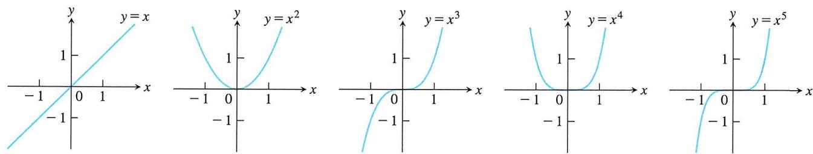

3. 0 < a < 1

图像特征: 函数仍然是增长的, 但增速逐渐减缓。随着 $x$ 的增大, $f(x)$ 的值增长得比 $a > 0$ 的情况更

为缓慢。

例 $f(x) = x^{0.5}$ 的图像为一个逐渐变缓的增长曲线。

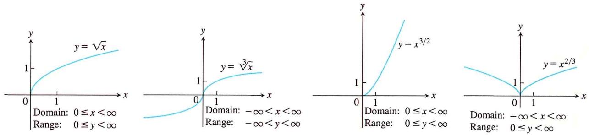

4. $a <   0$ 且为奇数

图像特征: 第一、三象限内, 函数呈现递减趋势, 随着 $x$ 的增大, $f(x)$ 的值减小, 此时 $x \neq 0$

例 $f(x) = x^{-1} = \frac{1}{x}$ 的图像是一个单调递减的反比例函数曲线

5. $a <   0$ 且为偶数

图像特征: 第一象限内, 函数呈现递减趋势, 随着 $x$ 的增大, $f(x)$ 的值减小, 此时 $x \neq 0$ , 第二象限内, 函数呈现递增趋势

例 $f(x) = x^{-2}$ 的图像在第一象限单调递减、第二象限单调递增

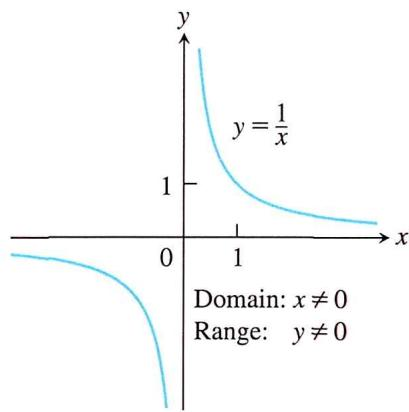

line

| x    | y          |
| ---- | ---------- |
| 0    | 0          |
| 1    | 1          |

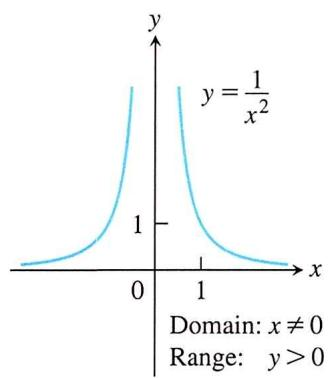

line

| x    | y          |
| ---- | ---------- |
| 0    | 0          |
| 1    | 1          |
| 2    | 0          |

6. $a = 0$

图像特征：函数为常数，图像是一条水平直线

例 $f(x) = x^{0} = 1 (x \neq 0)$ ，图像为 $y = 1$

规律: 对于任意 $a, f(x) = x^{a}$ 其函数图像必过(1,1)

# 第七节 多项式函数

# 一. 多项式函数

1. 多项式

多项式是由多个单项式相加（或相减）而成的代数表达式。一个一元多项式通常具有如下形式：

$$
P (x) = a _ {n} x ^ {n} + a _ {n - 1} x ^ {n - 1} + \ldots + a _ {1} x + a _ {0}
$$

其中 $n$ 是非负整数， $a_{0}, a_{1}, a_{2}, \ldots, a_{n}$ 是实数常数（被称为多项式的系数）。所有多项式的定义域是 $(-q, q)$ 。如果最高次幂的系数 $a_{n} \neq 0$ ，则 $n$ 被称为多项式的次数。

$$
y = \frac {x ^ {3}}{3} - \frac {x ^ {2}}{2} - 2 x + \frac {1}{3}
$$

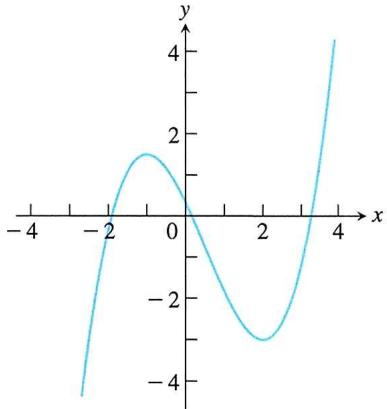

line

| x   | y    |
| --- | ---- |
| -4  | -4.0 |
| -2  | -1.0 |
| 0   | 1.0  |
| 2   | -3.0 |
| 4   | 4.0  |

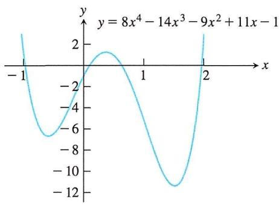

line

| x    | y           |
| ---- | ----------- |
| -1   | 2           |
| 0    | -6          |
| 1    | -12         |
| 2    | 2           |

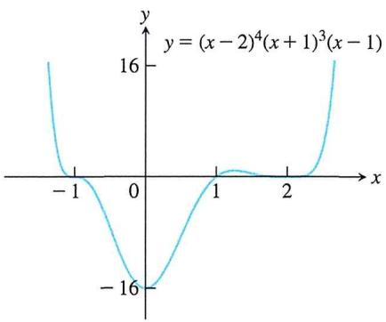

line

| x    | y          |
| ---- | ---------- |
| -1   | 16         |
| 0    | -16        |
| 1    | 0          |
| 2    | 16         |

当 $m\neq0$ 时，线性函数是一次多项式。二次函数通常写作 $p(x)=ax^{2}+bx+c$ ，称为二次多项式。类似地，三次函数是次数为3的多项式，表示为 $p(x)=ax^{3}+bx^{2}+cx+d$ 。

# 2. 有理函数

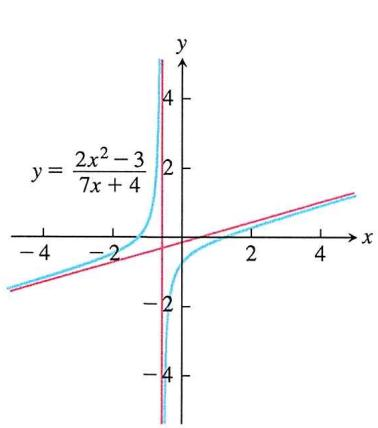

line

| x    | y (blue line) | y (red line) |
| ---- | ------------- | ------------ |
| -4   | ~-1.5         | ~-1.0        |
| -2   | ~-0.5         | ~-0.5        |
| 0    | 0             | 0            |
| 2    | ~1.5          | ~1.0         |
| 4    | ~3.0          | ~2.0         |

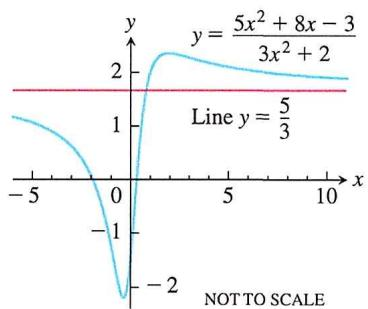

line

| x    | y (line) | y = (5x² + 8x - 3)/(3x² + 2) |
| ---- | -------- | --------------------------- |
| -5   | 1        | 1                           |
| 0    | 0        | -2                          |
| 5    | 2        | 2                           |
| 10   | 2        | 2                           |

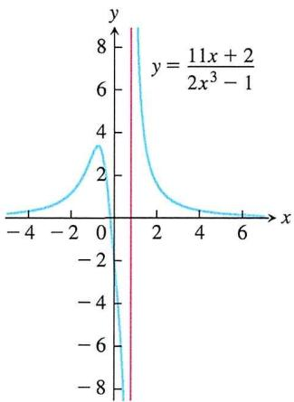

line

| x    | y           |
| ---- | ----------- |
| -4   | ~0          |
| -2   | ~1          |
| 0    | 3           |
| 2    | ~1          |
| 4    | ~0          |
| 6    | ~0          |

有理函数是一个商或比率，表示为

$$
f (x) = \frac {p (x)}{q (x)}
$$

其中 $p(x)$ 和 $q(x)$ 是多项式，有理函数的定义域是所有使得 $q(x) \neq 0$ 的实数 $x$ 的集合。当 $p(x)$ 和 $q(x)$ 都是一次多项式时，即

$$
f (x) = \frac {a x + b}{c x + d}
$$

此时 $f(x)$ 图像草图的快速绘制方式为

A. 作出水平渐近线 $x = -\frac{d}{c}$ （令分母为0）  
B. 作出竖直渐近线 $y = \frac{a}{c}$ （分子和分母的一次项系数比）  
C. 将两条渐近线构成的图形当成坐标系   
D. 任取一点判断所在象限A

E. 在象限A和与象限A沿对角线相对的象限B中作反比例函数图像

举例 $f(x) = \frac{4x + 6}{-2x + 3}$ .

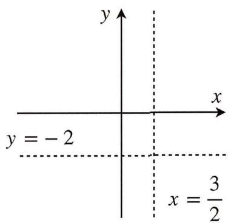

text_image

y
y = -2
x
x = \u00bd/2

作出渐近线

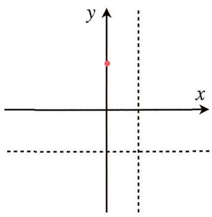

text_image

y
x

任取一点 (0, 2)

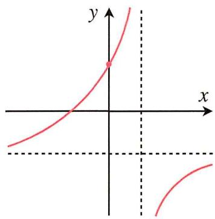

text_image

Graph of a hyperbola with coordinate axes and labeled point on the curve

作出双曲线图像

# 3. 代数函数

由多项式通过代数运算（加法、减法、乘法、除法和开方）构建的任何函数都属于代数函数的范畴，所有有理函数都是代数函数，但还包括更复杂的函数，比如 $y^{3}-9xy+x^{3}=0$ 。

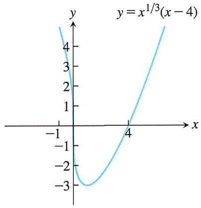

line

| x    | y     |
| ---- | ----- |
| -1   | 4     |
| -2   | 0     |
| -3   | -3    |
| 4    | 0     |
| 5    | 4     |

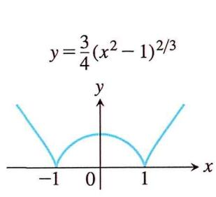

text_image

y=\frac{3}{4}(x^2-1)^{2/3}

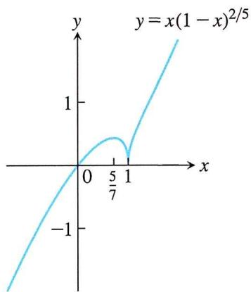

line

| x    | y          |
| ---- | ---------- |
| 0    | 0          |
| 5/7  | ~0.5       |
| 1    | ~1         |

# 二. 一次线性函数

一次函数，也称为线性函数，是数学中的一种基本函数形式。它的一般形式可以写作：

$$
y = k x + b (k \neq 0)
$$

其中， $k$ 和 $b$ 是常数， $k$ 称为斜率，决定了函数图像的倾斜程度， $b$ 是 $y$ 轴的截距，决定了函数图像与 $y$ 轴的交点。

1. 函数图象: 一次函数 $y = kx + b$ 的图象是经过 $(0, b)$ 和 $(- \frac{b}{k}, 0)$ 两点的一条直线, 我们称为直线 $y = kx + b$ , 它可以看作由直线 $y = kx$ 上下平移 $|b|$ 个单位长度得到

# 2. 增减性

k > 0, y随x的增大而增大；k < 0, y随x增大而减小。

$k$ 与 $b$ 的符号决定了直线的单调性及其所在的象限:

\- $k > 0$ 且 $b > 0$ , 直线经过第一、二、三象限, $y$ 随 $x$ 的增大而增大。

- $k > 0$ 且 $b < 0$ , 直线经过第一、三、四象限, $y$ 随 $x$ 的增大而增大。  
- $k < 0$ 且 $b > 0$ , 直线经过第一、二、四象限, $y$ 随 $x$ 的增大而减小。  
- $k < 0$ 且 $b < 0$ , 直线经过第二、三、四象限, $y$ 随 $x$ 的增大而减小。

# 三. 二次抛物线函数

1. 定义: 二次函数作为初中到高中都一直在学习的函数, 也具有特别重要的意义所在, 更是在曲线与直线中扮演重要角色, 其代数形式为:

$$
f (x) = a x ^ {2} + b x + c (a \neq 0)
$$

在二次函数中， $x^{2}$ 的系数 $a$ 决定了函数的开口方向和开口宽度。当 $a > 0$ 时，二次函数开口朝上；当 $a < 0$ 时，二次函数开口朝下。开口的宽度由 $|a|$ 决定，即 $a$ 的绝对值越大，开口越窄； $a$ 的绝对值越小，开口越宽。

2. 二次函数解析式的三种形式

① 一般式: $f(x) = ax^{2} + bx + c (a \neq 0)$   
② 顶点式: $f(x) = a(x - m)^{2} + n (a \neq 0)$   
③ 零点式: $f(x) = a(x - x_{1})(x - x_{2}) (a \neq 0)$

3. 二次函数的图像和性质

<table><tr><td>解析式</td><td> $f(x) = ax^{2} + bx + c (a > 0)$ </td><td> $f(x) = ax^{2} + bx + c (a < 0)$ </td></tr><tr><td>图像</td><td>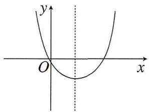</td><td>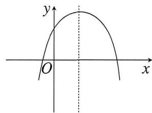</td></tr><tr><td>定义域</td><td> $(-\infty, +\infty)$ </td><td> $(-\infty, +\infty)$ </td></tr><tr><td>值域</td><td> $[\frac{4ac - b^{2}}{4a}, +\infty)$ </td><td> $(-\infty, \frac{4ac - b^{2}}{4a}]$ </td></tr><tr><td>单调性</td><td>在 $x \in (-\infty, -\frac{b}{2a}]$ 上单调递减在 $x \in [-\frac{b}{2a}, +\infty)$ 上单调递增</td><td>在 $x \in (-\infty, -\frac{b}{2a}]$ 上单调递增在 $x \in [-\frac{b}{2a}, +\infty)$ 上单调递减</td></tr><tr><td>奇偶性</td><td colspan="2"> $b = 0$ 时为偶函数, $b \neq 0$ 非奇非偶函数.</td></tr><tr><td>顶点</td><td colspan="2"> $(-\frac{b}{2a}, \frac{4ac - b^{2}}{4a})$ </td></tr><tr><td>对称性</td><td colspan="2">图像关于直线 $x = -\frac{b}{2a}$ 成轴对称图形</td></tr></table>

例1 求函数 $y = \sin x - \cos x + \sin 2x$ 的最小值.

解析 $f(x) = \sin x - \cos x + 2\sin x\cos x$ ，又 $[\sin x - \cos x]^2 = 1 - 2\sin x\cos x$ ，代入得

$$
f (x) = - [ \sin x - \cos x ] ^ {2} + \sin x - \cos x + 1,
$$

设 $\sin x + \cos x = t$ ，则 $f(x) = -t^2 + t + 1$ ，当 $t = -\sqrt{2}$ 时， $y$ 取最小值 $-1 - \sqrt{2}$ .

例2 $f(x) = x^{2} - 2x + 3$ ，当 $x\in [t,t + 1]$ （ $t\in \mathbf{R}$ ）时，求 $f(x)$ 的最大值（结果用 $t$ 表示）.

解析 对称轴 $x = 1$ ，按照 $1 < t, t \leq 1 \leq t + 1, t + 1 < 1$ 进行分类讨论：

当 $t > 1$ 时， $f(x)_{\min} = f(t) = t^2 - 2t + 3$ ， $f(x)_{\max} = f(t + 1) = t^2 + 2$ ；

当 $0 \leqslant t \leqslant 1$ 时，若 $\frac{t + t + 1}{2} \leqslant \frac{1}{2}$ ，即 $0 \leqslant t \leqslant \frac{1}{2}$ 时， $f(x)_{\max} = f(t) = t^2 - 2t + 3$ ，若 $\frac{t + t + 1}{2} > \frac{1}{2}$ ，即 $\frac{1}{2} < t \leqslant 1$ 时， $f(x)_{\max} = f(t + 1) = t^2 + 2$ ；当 $t < 0$ 时， $f(x)_{\max} = f(t) = t^2 - 2t + 3$ .

综上， $f(x)_{\mathrm{max}} = \left\{ \begin{array}{ll}t^{2} + 2 & ,t > \frac{1}{2}\\ t^{2} - 2t + 3 & ,t\leqslant \frac{1}{2} . \end{array} \right.$

例3 设二次函数 $f(x)=ax^{2}+bx+c(a\neq0)$ ，集合 $A=\{x\mid f(x)=x\}=\{2\}$ ，求函数 $f(x)$ 在区间 $[-2,2]$ 上的最大值M。（结果用a表示）

解析 依题 $\left\{ \begin{array}{l} \frac{1 - b}{a} = 4 \\ \frac{c}{a} = 4 \end{array} \right.$ ，解得 $\left\{ \begin{array}{l} b = 1 - 4a \\ c = 4a \end{array} \right.$ ， $\therefore f(x) = ax^2 + (1 - 4a)x + 4a$ ，对称轴为 $x = \frac{4a - 1}{2a}$ ;

(i) 当 $a < 0$ 时，则 $x_0 > 2$ ， $f(x)$ 在 $[-2, 2]$ 上单调递增，所以 $f(x)_{\max} = f(2) = 2$

(ii) 当 $0 < a < \frac{1}{4}$ 时，则 $x_0 < 0$ ， $f(x)_{\max} = f(2) = 2$

(iii) 当 $a \geqslant \frac{1}{4}$ 时，则 $0 \leqslant x_0 < 2$ ， $f(x)_{\max} = f(-2) = 16a - 2$ ，综上 $f(x)_{\max} = \begin{cases} 2, & 0 < a < \frac{1}{4} \text{或} a < 0 \\ 16a - 2, & a \geqslant \frac{1}{4} \end{cases}$ .

例4 若 $f(x)=1-2a-2a\cos x-2\sin^{2}x$ 的最小值为 $g(a)$ .

(1) 求 $g(a)$ 的解析式;  
(2) 求能使 $g(a)=\frac{1}{2}$ 的a值，并求出当a取此值时， $f(x)$ 的最大值.

解析 (1) $f(x) = 2(\cos x - \frac{a}{2})^2 - \frac{a^2}{2} - 2a - 1$ , 令 $t = \cos x \in [-1, 1]$ , 当 $\frac{a}{2} < -1$ , 即 $a < -2$ 时, $f(x)$ 在 $\cos x = -1$ 时取得最小值, 即 $g(a) = 1$ ; 当 $-1 \leqslant \frac{a}{2} \leqslant 1$ , 即 $-2 \leqslant a \leqslant 2$ 时, $f(x)$ 在 $\cos x = \frac{a}{2}$ 时取得最小值, 即 $g(a) = -\frac{a^2}{2} - 2a - 1$ ; 当 $\frac{a}{2} > 1$ , 即 $a > 2$ 时, $f(x)$ 在 $\cos x = 1$ 时取得最小值,

即 $g(a)=1-4a$ ，综上， $g(a)=\left\{\begin{aligned}1-4a(a>2)\\-\frac{a^{2}}{2}-2a-1(-2\leqslant a\leqslant2).\\1(a<-2)\end{aligned}\right.$

(2) 由 $g(a)=\frac{1}{2}$ ，得 $1-4a=\frac{1}{2}$ 或 $-\frac{a^{2}}{2}-2a-1=\frac{1}{2}$ ，当 $1-4a=\frac{1}{2}$ ， $a=\frac{1}{8}$ ，与a>2矛盾，舍去；当 $-\frac{a^{2}}{2}-2a-1=\frac{1}{2}$ ，得 $a=-3$ （舍去）或 $a=-1\in[-2,2]$ ，所以 $f(x)=2(\cos x+\frac{1}{2})^{2}+\frac{1}{2}$ ，当 $\cos x=1$ 时， $f(x)_{\max}=5$ .

例5 求二次函数 $f(x)=ax^{2}+(2a-1)x-3(a\neq0)$ 在区间 $[-\frac{3}{2},2]$ 上的最大值(结果用a表示).

解析 $f(x) = a(x + \frac{2a - 1}{2a})^2 -\frac{(2a - 1)^2}{4a} -3$ ，对称轴为 $x = -\frac{2a - 1}{2a}$

(1) 当 $a > 0$ 时,

(i) 当 $-\frac{2a - 1}{2a} \leqslant \frac{1}{4}$ , 即 $a \geqslant \frac{2}{5}$ 时, $f(x)_{\max} = f(2) = 8a - 5$ ;  
(ii) 当 $-\frac{2a - 1}{9n} > \frac{1}{4}$ , 即 $0 < a < \frac{2}{5}$ 时, $f(x)_{\max} = f(-\frac{3}{2}) = -\frac{3}{4} a - \frac{3}{2}$ .

(2) 当 $a < 0$ 时， $-\frac{2a - 1}{2a} < 0$

(i) 当 $-\frac{2a - 1}{2a} \leqslant -\frac{3}{2}$ 时，即 $-1 \leqslant a < 0$ 时， $f(x)_{\max} = f(-\frac{3}{2}) = -\frac{3}{4}a - \frac{3}{2}$ ;  
(ii) 当 $-\frac{3}{2} < -\frac{2a - 1}{2a} < 0$ 时，即 $a < -1$ 时， $f(x)_{\max} = f(-\frac{2a - 1}{2a}) = -\frac{(2a - 1)^2}{4a} - 3.$

综上， $f(x)_{\max} = \left\{ \begin{array}{l} -\frac{(2a - 1)^2}{4a} -3,a <   - 1,\\ -\frac{3}{4} a - \frac{3}{2}, - 1\leqslant a <   \frac{2}{5}\text{且} a\neq 0,\\ 8a - 5,a\geqslant \frac{2}{5}. \end{array} \right.$

例6 已知函数 $f(x)=x^{2}+mx-1$ ，若对于任意 $x\in[m,m+1]$ ，都有 $f(x)>0$ 成立，则实数m的取值范围是\_\_\_\_.

解析 对称轴 $x = -\frac{m}{2}$ 与区间 $x \in [m, m + 1]$ 的位置关系，

(i) 当 $-\frac{m}{2} < m$ 时， $f(x)_{\mathrm{mix}} = f(m) > 0$ ，解得 $m > \frac{\sqrt{2}}{2}$ ;  
(ii) 当 $m \leqslant -\frac{m}{2} \leqslant m + 1$ 时， $f(x)_{\mathrm{man}} = f(-\frac{m}{2}) > 0$ ，无解；  
(iii) 当 $-\frac{m}{2} > m + 1$ 时， $f(x)_{\min} = f(m + 1) > 0$ ，解得 $m < -\frac{3}{2}$ 或 $m > \frac{\sqrt{2}}{2}$ .

# 四. 三次函数

三次函数是指次数为3的多项式函数，其一般形式可以写为：

$$
f (x) = a x ^ {3} + b x ^ {2} + c x + d (a \neq 0)
$$

这个函数的图像通常是一个非常典型的曲线，称为三次曲线。三次函数的特点如下：

# 1. 曲线形状

# 一个光滑的曲线

# 2. 极值点和拐点

极值点是函数的局部最大值或最小值点，它们发生在导数等于零的点处；拐点则是曲线由凸转凹或由凹转凸的点，它们发生在导数发生变化的点处

# 3. 单调性

natural_image

Simple curved line drawing with no text or symbols

图1—用判别式判断函数图象

以 $a > 0$ 为例, 如图1, 记 $\Delta = b^{2} - 3ac$ 为三次函数图象的判别式, 则当 $\Delta \leqslant 0$ 时, $f(x)$ 为 $R$ 上的单调递增函数; 当 $\Delta > 0$ 时, $f(x)$ 会在中间一段单调递减, 形成三个单调区间以及两个极值.

# 4. 对称性

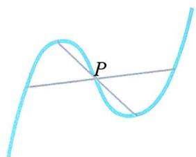

text_image

P

$f(x)$ 的图象关于点 $P(-\frac{b}{3a}, f(-\frac{b}{3a}))$ 对称（特别地，极值点以及极值点对应的图象上的点也关于P对称），反之，若三次函数的对称中心为 $(m, n)$ ，设解析式为 $f(x) = \alpha \cdot (x - m)^{3} + \beta \cdot (x - m) + n$ （其中 $\alpha \neq 0$ ）.

# 5. 切割线性质

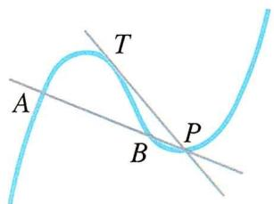

text_image

A
T
B
P

设 $P$ 是 $f(x)$ 上任意一点（非对称中心），过 $P$ 作函数 $f(x)$ 图象的一条割线 $AB$ 与一条切线 $PT$ （ $P$ 点不为切点）， $A, B, T$ 均在 $f(x)$ 的图象上，则 $T$ 点的横坐标平分 $A, B$ 点的横坐标。

推论1 设 $P$ 是 $f(x)$ 上任意一点（非对称中心），过 $P$ 作函数 $f(x)$ 图象的两条切线 $PM, PN$ ，切点分别为 $M, P$ ，则 $M$ 点的横坐标平分 $P, N$ 点的横坐标，如图4

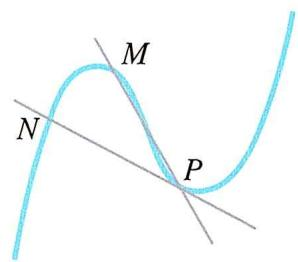

text_image

M
N
P

推论2 设 $f(x)$ 的极大值为 $M$ ，方程 $f(x) = M$ 的两根为 $x_{1}, x_{2} (x_{1} < x_{2})$ ，则区间 $[x_{1}, x_{2}]$ 被 $-\frac{b}{3a}$ 和极小值点三等分

# 6. 切线条数

过 $f(x)$ 的对称中心作切线l，则坐标平面被切线l和函数 $f(x)$ 的图象分割为四个区域，有以下结论：

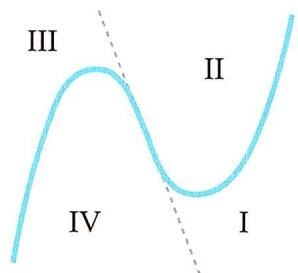

text_image

III
II
IV
I

- 过区域 $I, III$ 内的点作 $y = f(x)$ 的切线，有且仅有三条；  
- 过区域 $II, IV$ 内的点以及对称中心作 $y = f(x)$ 的切线，有且仅有一条；  
- 过切线 $l$ 或函数 $f(x)$ 图象（除去对称中心）上的点作 $y = f(x)$ 的切线，有且仅有两条.

# 7. 三零点处切线斜率性质

三次函数 $f(x)=ax^{3}+bx^{2}+cx+d$ （ $a\neq0$ ）的图像与x轴交点分别为 $P_{1}(x_{1},0)$ ， $P_{2}(x_{2},0)$ ， $P_{3}(x_{3},0)$ ，且这三点处的切线斜率分别为 $k_{1},k_{2},k_{3}$ ，则

$$
\frac {1}{k _ {1}} + \frac {1}{k _ {2}} + \frac {1}{k _ {3}} = 0
$$

证明 $f(x) = a(x - x_1)(x - x_2)(x - x_3)$ ， $f'(x) = a[(x - x_1)(x - x_2) + (x - x_2)(x - x_3) + (x - x_1)(x - x_3)]$

$$
\frac {1}{k _ {1}} + \frac {1}{k _ {2}} + \frac {1}{k _ {3}} = \frac {1}{f ^ {\prime} (x _ {1})} + \frac {1}{f ^ {\prime} (x _ {2})} + \frac {1}{f ^ {\prime} (x _ {3})} = \frac {x _ {2} - x _ {3} + x _ {3} - x _ {1} + x _ {1} - x _ {2}}{a (x _ {1} - x _ {2}) (x _ {1} - x _ {3}) (x _ {2} - x _ {3})} = 0.
$$

拓展 三次方程的韦达定理

\- 定理 若函数 $f(x) = ax^3 + bx^2 + cx + d (a \neq 0, x \in \mathbf{R})$ 有两个极值点 $x_1, x_2$ ，则

$$
x _ {1} + x _ {2} = - \frac {2 b}{3 a}, x _ {1} x _ {2} = \frac {c}{3 a}
$$

\- 推论 若方程 $ax^3 + bx^2 + cx + d = 0 (a \neq 0, x \in \mathbf{R})$ 有三个根 $x_1, x_2, x_3$ ，则

$$
x _ {1} + x _ {2} + x _ {3} = - \frac {b}{a}, x _ {1} x _ {2} x _ {3} = - \frac {d}{a}
$$

证明 $f(x)=a(x-x_{1})(x-x_{2})(x-x_{3})=ax^{3}-a(x_{1}+x_{2}+x_{3})x^{2}+a(x_{1}x_{2}+x_{2}x_{3}+x_{1}x_{3})x-a x_{1}x_{2}x_{3}$ ,
对比系数即 $b=-a(x_{1}+x_{2}+x_{3})$ ， $d=-ax_{1}x_{2}x_{3}$ .

例1 已知函数 $f(x)=x^{3}-9x$ , $g(x)=3x^{2}+a(a\in\mathbf{R})$ ，若方程 $f(x)=g(x)$ 有三个不同实数根 $x_{1},x_{2},x_{3}$ ，且它们可以构成等差数列，则a= \_\_\_\_.

解析 依题意，方程 $f(x)=g(x)$ 有三个不同实数根 $x_{1},x_{2},x_{3}$ 等价于方程 $x^{3}-3x^{2}-9x-a=0$ 有三个不同实数根 $x_{1},x_{2},x_{3}$ ，由韦达定理知 $x_{1}+x_{2}+x_{3}=3$ 。∵ $x_{1},x_{2},x_{3}$ 可以构成等差数列，∴ $x_{2}=1$ ，代入原方程可知a=-11，故答案为-11。

例2 已知函数 $f(x) = x^{3} + ax^{2} + bx + 1$ ( $a > 0, b \in \mathbf{R}$ ) 有极值，且导函数 $f'(x)$ 的极值点是 $f(x)$ 的零点.

(1) 求 $b$ 关于 $a$ 的函数关系式, 并写出定义域;  
(2) 证明: $b^{2} > 3a$ ;   
(3) 若 $f(x), f'(x)$ 这两个函数的所有极值之和不小于 $-\frac{7}{2}$ ，求a的范围

解析 (1) $f'(x) = 3x^{2} + 2ax + b, f''(x) = 6x + 2a$ , 当 $x \geq -\frac{a}{3}$ 时, $f''(x) \geq 0$ , $f'(x)$ 单调递增,

当 $x < -\frac{a}{3}$ 时， $f''(x) < 0$ ， $f'(x)$ 单调递减， $\therefore f'(x)$ 的极小值点为 $x = -\frac{a}{3}$ ，又 $f(-\frac{a}{3}) = 0$ ，

$\therefore b = \frac{2}{9} a^2 + \frac{3}{a}$ , 又 $f(x)$ 有极值, $\therefore f'(x)$ 有实根, $\therefore 4a^2 - 12b > 0$ , $\therefore a^2 - \frac{2}{3} a^2 - \frac{9}{a} > 0$ ,

即 $a > 3$ ， $\therefore b = \frac{2}{9} a^2 +\frac{3}{a}$ （ $a > 3$ ）；

(2) $h(a) = b^{2} - 3a = \frac{1}{81a^{2}} (4a^{3} - 27)(a^{3} - 27) > 0$ ，即 $b^{2} > 3a$

(3) $f'(x) = 3x^{2} + 2ax + b$ ，令 $f'(x) = 0$ ，得 $x_{1} = \frac{-a - \sqrt{a^{2} - 3b}}{3}$ ， $x_{2} = \frac{-a + \sqrt{a^{2} - 3b}}{3}$ ，则极值之和为 $f(x_{1}) + f(x_{2})$ ，采用将 $x_{1}, x_{2}$ 代入的方法求极值显然是不可取的，可采用韦达定理求极值之和，利用 $x_{1} + x_{2} = -\frac{2}{3}a$ ， $x_{1}x_{2} = \frac{b}{3}$ ，注意 $f'(x_{1}) = 0$ ， $f'(x_{2}) = 0$ ，即

$$
3 x _ {1} ^ {2} + 2 a x _ {1} + b = 0, 3 x _ {2} ^ {2} + 2 a x _ {2} + b = 0.
$$

$$
f (x _ {1}) + f (x _ {2}) = \frac {x _ {1}}{3} \left(3 x _ {1} ^ {2} + 2 a x _ {1} + b\right) + \frac {x _ {2}}{3} \left(3 x _ {2} ^ {2} + 2 a x _ {2} + b\right) + \frac {1}{3} a \left(x _ {1} ^ {2} + x _ {2} ^ {2}\right) + \frac {2}{3} b \left(x _ {1} + x _ {2}\right) + 2,
$$

即 $f(x_{1})+f(x_{2})=\frac{1}{3}a[(x_{1}+x_{2})^{2}-2x_{1}x_{2}]+\frac{2}{3}b(x_{1}+x_{2})+2$ ，将 $x_{1}+x_{2}=-\frac{2}{3}a,x_{1}x_{2}=\frac{b}{3}$ 代入，整理得 $f(x_{1})+f(x_{2})=\frac{4a^{3}}{27}-\frac{2ab}{3}+2$ ，又 $b=\frac{2a^{2}}{9}+\frac{3}{a}$ ，则

$$
f (x _ {1}) + f (x _ {2}) = \frac {4 a ^ {3}}{2 7} - \frac {2 a}{3} (\frac {2 a ^ {2}}{9} + \frac {3}{a}) + 2 = 0,
$$

记 $f(x), f'(x)$ 所有极值之和为 $h(a)$ ， $f'(x)$ 的极值为 $b - \frac{a^2}{3} = -\frac{1}{9} a^2 + \frac{3}{a}$ ，则 $h(a) = -\frac{1}{9} a^2 + \frac{3}{a}, a > 3$ ，又 $h'(a) = -\frac{2}{9} a - \frac{3}{a^2} < 0$ ，于是 $h(a)$ 在 $(3, +\infty)$ 上单调递减，采用二分法确定 $h(a) = -\frac{7}{2}$ 的根为6，于是 $h(a) \geq h(6)$ ，故 $a \leq 6$ ，因此 $a$ 的取值 $a \in [3,6]$ .

# 第八节 分段函数、嵌套函数及反函数的性质

在前文中，我们详细探讨了一次、二次和三次函数，但在高考体系中对这些函数的理解仍显不足。在接下来的讨论中，我们将深入研究分段函数、复合函数和反函数，以完善和补充我们对函数体系的理解。

# 一. 分段函数

1. 概念: 如果一个函数在其定义域内, 对应自变量 $x$ 在不同取值范围内有不同的对应关系 (表达式), 则称其为分段函数。常见的高中分段函数如下图所示:

2. 易错、易混知识点及解题技巧总结：

- 分段函数是一个函数，而不是多个函数；  
- 分段函数的定义域是各段自变量取值范围的并集，各段间的定义域交集为空集；  
- 分段函数的值域是各段函数值域的并集.

例1 已知 $a > 0$ 且 $a \neq 1$ , 函数 $f(x) = \left\{ \begin{array}{l} 2x^{3} + 3x^{2} + 2, x \leq 0 \\ a^{x} + 1, x > 0 \end{array} \right.$ 在 $[-2, 2]$ 上的最大值为 3 , 求实数 $a$ 的取值范围.

解析 当 $x \leq 0$ 时, $f(x) = 2x^{3} + 3x^{2} + 2$ , $f'(x) = 6x^{2} + 6x = 6x(x + 1)$ , 由 $f'(x) > 0$ 得 $x > 0$ (舍) 或 $-2 \leq x < -1$ , 此时 $f(x)$ 为增函数, 由 $f'(x) < 0$ 得 $-1 < x \leq 0$ , 此时 $f(x)$ 为减函数, 则当 $x = -1$ 时, $f(x)$ 取得最大值, 极大值为 $f(-1) = 3$ , 当 $x = -2$ 时, $f(x)$ 取得最小值, 最小值为 $f(-2) = -2$ , 因为 $f(x)$ 在 $[-2, 2]$ 上的最大值为 3 , 所以当 $0 < x \leq 2$ 时, 函数 $f(x) = a^{x} + 1$ 的最大值不能超过 3 即可, 当 $a > 1$ 时, $f(x)$ 为增函数, 所以当 $0 < x \leq 2$ 时, 函数 $f(x) = a^{x} + 1$ 的最大值为 $f(2) = a^{2} + 1 \leq 3$ , 即 $a^{2} \leq 2$ , 得到 $1 < a \leq \sqrt{2}$ , 当 $0 < a < 1$ 时, $f(x)$ 为减函数, 所以 $f(x) < a^{2} + 1 = 1 + 1 = 2$ , 此时满足条件, 综上所述, 实数 $a$ 的取值范围是 $0 < a < 1$ 或 $1 < a \leq \sqrt{2}$ .

例2 函数 $f(x)=\left\{\begin{aligned}&|\log_{2}x|,0<x\leq4\\&\frac{2}{3}x^{2}-8x+\frac{70}{3},x>4\end{aligned}\right.$ ，若a,b,c,d互不相同，且 $f(a)=f(b)=f(c)=f(d)$ ,
求abcd的取值范围.

解析 由题意，a, b, c, d 互不相同，可不妨设 a < b < c < d，∵ $f(a) = f(b)$ ，又 $\log_{2}a + \log_{2}b = 0$ ，∴ $\log_{2}ab = 0$ ，∴ ab = 1，又 $f(a) = f(b) = f(c) = f(d)$ ，它们的函数值只能在 0 到 2 之间，

∴ 4 < c < 5，7 < d < 8，根据二次函数的对称性， $c + d = 2 \times 6 = 12$ 。

∴ abcd = cd = c(12 - c) = -c² + 12c （4 < c < 5），则可以将abcd看成一个关于c的二次函数，由二次函数的知识，可知： $-c^{2} + 12c$ 在4 < c < 5上的值域为(32,35)，∴ abcd 的取值范围为(32,35).

例3 函数 $f(x)=\left\{\begin{aligned}&4-8\left|x-\frac{3}{2}\right|,1\leq x\leq2\\&\frac{1}{2}f(\frac{x}{2}),x>2\end{aligned}\right.$ ，则函数 $g(x)=xf(x)-6$ 在区间 $[1,2^{n}]$ （ $n\in N^{*}$ ）内的所有零点的和为

A. $n$

B. ${2n}$

C. $\frac{3}{4} (2^n - 1)$

D. $\frac{3}{2} (2^n - 1)$

解析 由 $g(x)=xf(x)-6=0$ 得 $f(x)=\frac{6}{x}$ ，故函数 $g(x)$ 的零点即为函数 $y=f(x)$ 和函数 $y=\frac{6}{x}$ 图象交点的横坐标，由 $f(x)=\frac{1}{2}f(\frac{x}{2})$ 可得，函数 $y=f(x)$ 是以区间 $(2^{n-1},2^{n})$ 为一段，其图象为在水平方向上伸长为原来的2倍，同时在竖方向上缩短为原来的 $\frac{1}{2}$ ，从而先作出函数 $y=f(x)$ 在区间[1,2]上的图象，再依次作出在[2,4],[4,8],…, $[2^{n-1},2^{n}]$ 上的图象，然后再作出函数 $y=\frac{6}{x}$ 的图象，结合图象可得两图象的交点在函数 $y=f(x)$ 的极大值的位置，由此可得函数 $g(x)$ 在区间 $(2^{n-1},2^{n})$ 上的零点为 $x_{n}=\frac{2^{n-1}+2^{n}}{2}=\frac{3}{4}\cdot2^{n}$ ，故所有零点之和为 $S_{n}=\frac{3}{4}\cdot\frac{2(1-2^{n})}{1-2}=\frac{3(2^{n}-1)}{2}$ .

例4 （2024·新高考II卷）设函数 $f(x)=2x^{3}-2ax^{2}+1$ ，则（）

A. 当 $a > 1$ 时, $f(x)$ 有三个零点  
B. 当 $a < 0$ 时, $x = 0$ 是 $f(x)$ 的极大值点  
C. 存在 $a, b$ , 使得 $x = b$ 为曲线 $y = f(x)$ 的对称轴  
D. 存在 $a$ ，使得点 $(1, f(1))$ 为曲线 $y = f(x)$ 的对称中心

解析 对原函数 $f(x)$ 求一次导数， $f'(x)=6x^{2}-6ax=6x(x-a)$ 令 $f'(x)=0,\ x_{1}=0,\ x_{2}=a$ ；当a>1时， $f(x)$ 在 $(-∞,0)↑(0,a)↓(a,+∞)↑$ ，又 $x→-∞$ 时， $f(x)→-∞$ ， $x→+∞$ 时， $f(x)→+∞$ ， $f(0)=1>0$ ， $f(1)=3-3a<0$ ，所以 $f(a)<0$ ，即 $f(x)$ 有三个零点，故A正确；当a<0时， $f(x)$ 在 $(-∞,a)↑(a,0)↓(0,+∞)↑$ ，x=0为极小值点，故B错误；由于三次函数不存在对称轴，故C错误；

令 $f(0)+f(2)=2f(1)$ ，即 $1+(2\times2^{3}-3a\times2^{2}+1)=2(3-3a)$ ，所以a=2， $f(x)=2x^{3}-6x^{2}+1$ ，满足 $f(x)+f(2-x)=2f(1)$ ，故D正确。

# 二. 嵌套函数

1. 类型

- 自嵌套形: $y = {af}\left\lbrack  {f\left( x\right) }\right\rbrack   + b$   
- 二次嵌套形： $y = a[f(x)]^{2} + bf(x) + c,\quad (a,b,c$ 为常数， $a \neq 0)$

2. 核心方法——换元法：将内部函数零点的值在外部函数作为函数值横线去看外部函数的交点

例1 已知函数 $f(x)=\left\{\begin{aligned}e^{|x-1|},&x>0\\ -x^{2}-2x+1,x&\leq0\end{aligned}\right.$ ，若关于x的方程 $f^{2}(x)-3f(x)+a=0(a\in\mathbf{R})$ 有8个不等的实数根，求a的取值范围.

分析 首先我们不难发现就是考了二次嵌套形，在内部 $f^{2}(x)-3f(x)+a=0(a\in\mathbb{R})$ 最多只能产生两个解，也就是两条横线，我们要用这两条横线在 $f(x)=\left\{\begin{aligned}e^{|x-1|},&x>0\\ -x^{2}-2x+1,x&\leq0\end{aligned}\right.$ 这个图像有八个交点，这就是内值外定.

解析 绘制函数 $f(x)=\left\{\begin{aligned}e^{k-11},&x>0\\ -x^{2}-2x+1,x&\leq0\end{aligned}\right.$ 的图象，令 $f(x)=t$ ，由题意可知，方程 $t^{2}-3t+a=0$ 在区间(1,2)上有两个不同的实数根，令 $g(t)=t^{2}-3t+a(1<t<2)$ ，由题意可知：

$$
\left\{ \begin{array}{l} g (1) = 1 - 3 + a > 0 \\ g (2) = 4 - 6 + a > 0 \\ g \left(\frac {3}{2}\right) = \frac {9}{4} - \frac {9}{2} + a <   0 \end{array} , \right.
$$

据此可知： $2 < a < \frac{9}{4}$

例2 设函数 $f(x)=\left\{\begin{aligned}x+1,x&\leq0,\\ |\log_{2}x|,x&>0,\end{aligned}\right.$ ，则函数 $F(x)=f[f(x)]-1$ 的零点个数为\_\_\_\_.

解析 方程 $f[f(x)] - 1 = 0$ 解的个数，即函数 $F(x)$ 零点个数令 $t = f(x)$ ，则 $f(t) - 1 = 0$ ，解得 $t = 0, 2$ 或 $\frac{1}{2}$ ，作出 $y = f(x)$ 的图象可知 $y = f(x)$ 与 $y = 0, y = 2, y = \frac{1}{2}$ 交点个数为7.

例3（多选）已知函数 $f(x)=\left\{\begin{aligned}&|\ln x|,x>0,\\&-x^{2}-4x+1,x\leqslant0,\end{aligned}\right.$ ，若关于x的方程

$f^{2}(x)-2af(x)+a^{2}-1=0$ 有 $k(k\in\mathbf{N})$ 个不等的实根 $x_{1},x_{2},\cdots,x_{i}$ 且 $x_{1}<x_{2}<\cdots<x_{i}$ ，则下列判断正确的是

A. 当 $a = 0$ 时, $k = 5$

B. 当 $k = 2$ 时, $a$ 的范围为 $(- \infty, -1)$

C. 当 $k = 8$ 时, $x_{1} + x_{4} + x_{6}x_{7} = -3$

D. 当 $k = 7$ 时, $a$ 的范围为(1,2)

解析 令 $t = f(x)$ ，则 $t^2 - 2at + a^2 - 1 = 0 \Rightarrow t_1 = a - 1, t_2 = a + 1$ ，A. 当 $a = 0$ 时， $t_1 = -1, t_2 = 1$ ，由 $f(x) = -1$ 有 1 解， $f(x) = 1$ 有 4 解，故 $k = 5$ ，A 正确；B. 当 $k = 2$ 时， $\begin{cases} a - 1 < 0, \\ a + 1 < 0 \end{cases} \Rightarrow a < -1$ ，B 正确；C. 当 $k = 8$ 时，如图2，结合图象易知： $x_1 + x_4 = -4, x_6x_7 = 1$ ，故 $x_1 + x_4 + x_6x_7 = -3$ ，C 正确；D. 当 $k = 7$ 时，有两种情况： $\begin{cases} 0 < a - 1 < 1, \\ 1 \leqslant a + 1 < 5 \end{cases} \Rightarrow 1 < a < 2$ 或 $\begin{cases} 1 \leqslant a - 1 < 5 \\ a + 1 = 5 \end{cases} \Rightarrow a = 4$ ，从而 $a$ 的范围为 $(1,2) \cup \{4\}$ ，故选ABC.

# 三. 反函数

1. 定义: 若将 $y$ 作为自变量, $x$ 作为 $y$ 的函数, 即 $y = f(x)$ , 其反函数为 $x = f^{-1}(y)$ ;

$$
\mathrm{举例} y = a ^ {x} (a > 0, a \neq 1) \mathrm{与} y = \log_ {a} x (a > 0, a \neq 1)
$$

2. 函数图像: 两个函数关于 $y = x$ 对称。

3. 性质:

- 函数存在反函数的充要条件是，函数的定义域与值域是一一映射  
- 函数与其反函数在相应区间上单调性一致  
- 偶函数和反函数: 大部分偶函数不存在反函数。当函数 $y = f(x)$ ，定义域是 $\{0\}$ 且 $f(x) = C$ （其中 $C$ 是常数），则函数 $f(x)$ 是偶函数且有反函数，其反函数的定义域是 $\{C\}$ ，值域为 $\{0\}$ 。  
- 奇函数和反函数：奇函数不一定存在反函数。被与y轴垂直的直线截时能过2个及以上点即没有反函数。若一个奇函数存在反函数，则它的反函数也是奇函数。  
- 一段连续函数在对应区间内具有一致的单调性  
- 严格单调递增（减）的函数必有严格单调递增（减）的反函数  
- 反函数是相互的且具有唯一性  
- 定义域、值域的相反对应法则互逆（三反）

在此，读者需掌握互逆运算原则以快速判断两个函数是否为反函数。其次，反函数的几何性质与 $y = x$ 对称，因此，为确保两个反函数有两个交点，上半部分的函数图像应小于 $y = x$ ，一个交点应等于 $y = x$ ，下半部分的函数图像应大于 $y = x$ 。

4. 互逆运算法则

- 内部加减运算对应外部减加运算  
- 内部乘除运算对应外部除乘运算  
- 混合运算时，优先处理加减，然后再处理乘除

思考 (2021·T8预热) 函数 $f(x)=ae^{x}+\ln\frac{a}{x+2}-2(a>0)$ ，若 $f(x)>0$ 恒成立，求实数a的取值范围.

解析 将其变形后由题意得 $ae^{x}-2>\ln\frac{x+2}{a}$ 观察右侧的原函数，当减去2时，右侧内部加2；当左侧外部乘以a时，右侧内部除以a，这符合反函数的性质，根据几何性质便可得出结论，后续的内容不再过多阐述，一旦进入导数阶段，这些不等式也可以通过同构解决，在这里，我们只需学会观察

# 第四章 指数函数与对数函数

# 第一节 指数函数

指数函数是数学中一种重要的函数形式，常用于描述增长和衰减的现象。该函数以 $f(x)=a^{x}$ 的形式表示，其中a是底数，x是指数。

# 一. 基本定义

指数函数形式: $f(x) = a^{x}$ , 其中 $a > 0$ 且 $a \neq 1$ , 所有的指数函数的定义域为 $(-q, q)$ , 值域为 $(0, q)$ , 因此指数函数从不取到值为 0; 当 $x = 0$ 时, $a^{0} = 1 (a \neq 0)$ , 这是因为任何数的零次幂等于 1

例1 已知 $f(x) = (m^2 - m - 5)m^x$ 是指数函数，求实数 $m$ 的值.

解析 $\because f(x)$ 是指数函数， $\therefore m^2 - m - 5 = 1$ ， $\therefore m = 3$ 或 $m = -2$ ，又 $m > 0$ 且 $m \neq 1$ ， $\therefore m = 3$ .

例2 已知 $f(x)=(a^{2}-2a+2)(a+1)^{x}$ 是指数函数，求实数a的值.

解析 $\because f(x)$ 是指数函数， $\therefore a^{2} - 2a + 2 = 1, a + 1 > 0$ 且 $a + 1 \neq 1, \therefore a = 1$ .

例3 已知 $f(x) = a^{x-1} - 2$ ( $a > 0, a \neq 1$ ) 的图像恒过定点 $A$ ，若点 $A$ 在直线 $mx - ny - 4 = 0$ 上，其中 $m > 0, n > 0$ ，求 $\frac{1}{m} + \frac{2}{n}$ 的最小值.

解析 $\because a^{x - 1}$ 恒过定点(1,1)，故 $f(x)$ 恒过定点 $(1, - 1)$ ， $\therefore m + n = 4$

$$
\frac {1}{4} (\frac {1}{m} + \frac {2}{n}) (m + n) = \frac {1}{4} (3 + \frac {2 m}{n} + \frac {n}{m}) \geq \frac {3}{4} + \frac {\sqrt {2}}{2}.
$$

# 二. 图像特征

1. 图像形状：指数函数的图像通常是曲线，而不是直线  
2. 渐近线: 图像在 $x$ 轴上的渐近线是 $y = 0$

# 三. 单调性

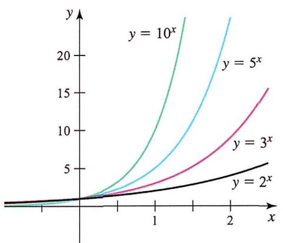

line

| x    | y = 2^x | y = 3^x | y = 5^x | y = 10^x |
| ---- | ------- | ------- | ------- | -------- |
| 0    | 0       | 0       | 0       | 0        |
| 1    | ~1      | ~2      | ~4      | ~8       |
| 2    | ~3      | ~6      | ~12     | ~24      |

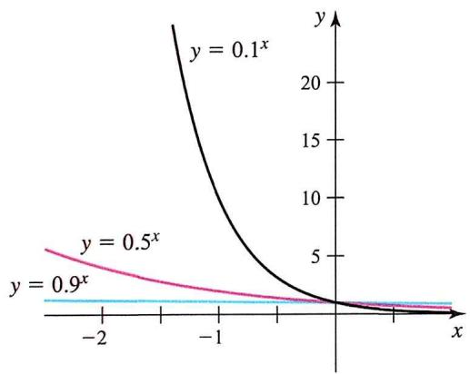

line

| x    | y = 0.1^x | y = 0.5^x |
| ---- | --------- | --------- |
| -2   | ~20       | ~5        |
| -1   | ~10       | ~3        |
| 0    | 0         | 0         |
| 1    | ~0        | ~0        |

1. 增长情况：当 $a > 1$ 时，指数函数呈增长趋势，增长速度随底数的增大而加快， $x \geq 0$ 部分，指数函数随 $a$ 增大而增大， $x < 0$ 部分，指数函数随 $a$ 增大而减小

2. 衰减情况: 当 $0 < a < 1$ 时, 指数函数呈衰减趋势, 衰减速度随底数的减小而加快, $x \geq 0$ 部分, 指数函数随 $a$ 增大而减小, $x < 0$ 部分, 指数函数随 $a$ 增大而增大

# 四. 指数法则

1. 乘法法则

$$
a ^ {m + n} = a ^ {m} a ^ {n}
$$

具有相同底数的幂相乘时，指数相加

2. 除法法则

$$
\frac {a ^ {m}}{a ^ {n}} = a ^ {m - n}
$$

具有相同底数的幂相除时，指数相减

例1 $f(x) = \left(\frac{1}{2}\right)^{-x^2 + 4x + 5}$ 的单调递增区间

解析 只需求 $-x^{2}+4x+5$ 的单调递减区间，即 $[2,+\infty)$ .

例2 已知 $f(x)=\left\{\begin{aligned}(5a-4)x+7a-3 & ,x<1\\ (2a-1)^{x} & ,x\geq1\end{aligned}\right.$ 在R上单调递减，求实数a的取值范围.

解析 只需5a-4<0，0<2a-1<1， $(5a-4)+7a-3\geq2a-1$ ，解得： $a\in[\frac{3}{5},\frac{4}{5})$ .

# 五. 自然指数函数

如图， $y = e^{x}$ 的图像位于 $y = 2^{x}$ 和 $y = 3^{x}$ 的图像之间（因为 $2 \leq e \leq 3$ ），底数为 $e$ 的指数函数具有一个有价值的性质；

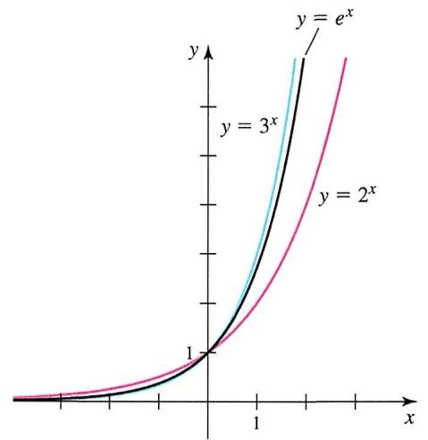

line

| x    | y = e^x | y = 3^x | y = 2^x |
| ---- | ------- | ------- | ------- |
| 0    | 0       | 0       | 0       |
| 1    | 1       | 1       | 1       |

text_image

y = e^x
Tangent line has slope 1 at (0, 1).
1
x

在 $y = e^{x}$ 的图上的每一点，都可以画出一个切线，该切线仅在该点处接触图像。自然指数函数是唯一具有这样一个性质的指数函数：即在 $x = 0$ 处切线的斜率为1，因此，

$$
e ^ {x} \geq x + 1
$$

这个性质，尽管看似微小，但在导数篇章中将会扮演一个十分重要的根基。

# 第二节 对数函数

# 一. 对数的概念

1. 定义: 给定正实数 $b$ (称为底数), 如果 $a$ 是正实数且不等于 1 , 那么等式 $b^{x} = a$ 中的 $x$ 就是以 $b$ 为底数的对数, 通常表示为 $x = \log_{b} a (b > 0 \text{ 且 } b \neq 1)$ , 这可以解释为 “ $b$ 的 $x$ 次方等于 $a$ ”

- 如果 $b^{x}=a$ ，则 $\log_{b}a=x$ ，这是对数的基本定义  
- 底数为10的对数称为常用对数，通常用符号 $\lg a$ 表示，其中 $\lg a = x$ 等价于 $10^{x} = a$   
- 底数为e的对数称为自然对数，通常用符号 $\ln a$ 表示，其中 $\ln a = x$ 等价于 $e^{x} = a$

2. 特殊对数关系

\- 对于任意正数 $a, \log_a a = 1$ , 因为任何数的1次方都是它自己

\- 对于任意正数 $a, \log_a 1 = 0$ ，因为任何数（非零）的0次方都是1

例1 已知 $y = \log_a x + a^2 - 3a + 2$ 是对数函数，求实数 $a$ 的值.

解析 依题: $a^2 - 3a + 2 = 0, a > 0$ 且 $a \neq 1, \therefore a = 2$ .

例2 对数式 $M = \log_{(a-3)}(10 - 2a)$ 是对数函数，求a的取值范围.

解析 依题: $10 - 2a > 0, a - 3 > 0, a - 3 \neq 1$ , 解得 $3 < a < 4$ 或 $4 < a < 5$ .

# 二. 对数的运算

1. 乘法法则: 如果 $\log_ {a} b + \log_ {a} c = x$ , 那么可以合并成一个对数表达式: $\log_ {a} b c = x$ 。这意味着对数中的加法可以转化为乘法

$$
\log_ {a} b + \log_ {a} c = \log_ {a} b c
$$

2. 除法法则: 如果 $\log_ {a} b - \log_ {a} c = x$ , 那么可以合并成一个对数表达式: $\log_ {a} \frac {b}{c} = x$ 。这表示对数中的减法可以转化为除法

$$
\log_ {a} b - \log_ {a} c = \log_ {a} {\frac {b}{c}}
$$

3. 指数法则：如果 $n$ 是任意实数，那么可以将对数中的指数提取出来： $n \log_{a} b = \log_{a} b^{n}$ 。这使得对数中的指数部分可以移到对数的前面

$$
n \log_ {a} b = \log_ {a} b ^ {n}
$$

4. 换底法则: 如果我们有 $\log_ {a} b$ , 而希望将其转化为以另一个底数 $c$ 为底的对数, 可以使用换底法则: $\log_ {a} b = \frac {\log_ {c} b}{\log_ {c} a}$ , 这允许我们在不改变数值的情况下改变底数。

$$
\log_ {a} b = \frac {\log_ {c} b}{\log_ {c} a} = \frac {\ln b}{\ln a} = \frac {\lg a}{\lg b}
$$

# 三. 对数与指数的互化

如果 $\log_a b = x$ ，则 $a^x = b$ 。这表示对数和指数是互相逆操作的关系；在后续导数章节中，我们通常利用这一性质对函数进行变形，即

$$
a ^ {x} = e ^ {\ln a ^ {x}} = e ^ {x \ln a}
$$

特别注意，也许在现阶段函数复习部分，上式并不重要，看似也没什么用，但到了二轮导数章节，上式将会变得十分关键，所以请加深印象。

例1 计算: $\log_{2} 8$ .

解析1 设 $\log_2 8 = x$ ，则 $2^x = 8$ ， $\therefore x = 3$ .

解析2 $\log_{2}8=\log_{2}2^{3}=3\log_{2}2=3.$

例2 计算： $(\log_{4}3 + \log_{8}3)(\log_{3}2 + \log_{9}2)$ .

解析 原式 $= \left(\frac{1}{2} \log_{2} 3 + \frac{1}{3} \log_{2} 3\right) \left(\log_{3} 2 + \frac{1}{3} \log_{3} 2\right) = \frac{5}{6} \cdot \frac{3}{2} \cdot \log_{2} 3 \cdot \log_{3} 2 = \frac{5}{4}$ .

# 四. 对数函数的概念

1. 定义: 对数函数是指以某个固定正数 (称为底数) 为底的对数运算。对数函数的一般形式为 $y = \log_{a} x (a > 0$ 且 $a \neq 1)$ , 其中 $a$ 是底数, $x$ 是真数。对数函数的定义可以用以下等式表示:

$$
y = \log_ {a} (x) \iff a ^ {y} = x
$$

其中，a是底数，x是真数，y是指数。这等式可以理解为“a的y次方等于x”。

2. 定义域: 对数函数的定义域为正实数集合, 即 $x > 0$

3. 值域: 对数函数的值域为实数集合, 即 $-\infty < y < \infty$

对数函数的主要性质包括:

- 对数函数的定义域是正实数集（ $x > 0$ ），因为底数为正时，负数或零的对数是未定义的  
- 当底数 $a$ 等于10时, 通常省略底数10, 写成 $\lg x$ 。这被称为常用对数  
- 当底数 $a$ 等于 $e$ （自然对数的底数，约等于2.71828）时，写成 $\ln x$ ，称为自然对数  
- 对数函数的图像是一条曲线，在正半轴上递增，对数图像在 $x = 1$ 处经过(1,0)

例1 函数 $y = \log_a (x - 2) + 3$ （ $a > 0$ ，且 $a \neq 1$ ）的图像恒过一定点，求出定点坐标.

解析 $\because \log_a x$ 过点(1,0)，当 $x = 1$ 时， $\log_a 1 = 0$ ，故考虑令 $x - 2 = 1$ ， $y = 3$ ， $\therefore$ 过定点(3,3).

例2 函数 $y = \log_a (x + 3) - 1$ ( $a > 0$ , 且 $a \neq 1$ ) 的图像恒过定点 $A$ , 点 $A$ 在直线 $mx + ny = 1$ 上, 其中 $m, n > 0$ , 则 $\frac{1}{m} + \frac{2}{n}$ 的最小值为 \_\_\_\_.

解析 令 $x+3=1$ ，y=-1，∴ $A(-2,-1)$ ，∴ $2m+n=1$ ，

$\therefore \frac{1}{m} + \frac{2}{n} = (\frac{1}{m} + \frac{2}{n})(2m + n) = 4 + (\frac{4m}{n} + \frac{n}{m}) \geq 8$ ，最小值为8.

例3 求函数 $f(x)=\ln(2-x)+\sqrt{x+1}$ 的定义域.

解析 依题2-x>0, $x+1\geq0$ , $\therefore-1\leq x<2$ .

例4 求函数 $f(x)=\frac{\lg(4-x)}{x-3}$ 的定义域.

解析 依题 $3 - x \neq 0, 4 - x > 0, \therefore x < 4$ 且 $x \neq 3$ .

例5 求函数 $f(x)=\ln(4x-x^{2})+\frac{1}{x-2}$ 的定义域.

解析 依题 $4x - x^{2} > 0, x - 2 \neq 0, \therefore 0 < x < 4$ 且 $x \neq 2$ .

例6 求函数 $f(x)=\log_{\frac{1}{2}}(-x^{2}-2x+3)$ 的值域.

解析 $t = -x^{2} - 2x + 3 = -(x + 1)^{2} + 4 \in (0,4]$ , $f(t) = \log_{\frac{1}{2}} t$ 单调递减, $\therefore f(t) \in [-2, +\infty)$ .

例7 函数 $f(x)=\log_{2}(x^{2}-2ax+a)$ 的值域为R，求a的取值范围.

解析 即 $x^{2}-2ax+a$ 能取到大于0的所有数，即 $\Delta\geq0$ ，解得 $a\leq0$ 或 $a\geq1$ .

例8 已知函数 $f(x)=\left\{\begin{aligned}(a-2)x-1 & \text{, }x\geq1\\ \log_{a}x & \text{, }x<1\end{aligned}\right.$ 在 $(-∞,+∞)$ 上单调递增，求a的取值范围.

解析 依题 $a - 2 > 0, a > 1, (a - 2) \cdot 1 - 1 \leq \log_a 1 = 0, \therefore 2 < a \leq 3.$

# 五. 对数函数的图像性质

line

| x    | y = log₂ x | y = ln x | y = log₅ x | y = log₁₀ x |
| ---- | ---------- | -------- | ---------- | ----------- |
| 0    | 0          | 0        | 0          | 0           |
| 1    | ~1.5       | ~1.2     | ~0.8       | ~0.6        |
| 2    | ~2.5       | ~1.8     | ~1.2       | ~0.8        |
| 3    | ~3.5       | ~2.5     | ~1.6       | ~1.0        |
| 4    | ~4.5       | ~3.2     | ~2.0       | ~1.2        |
| 5    | ~5.5       | ~4.0     | ~2.4       | ~1.4        |
| 6    | ~6.5       | ~4.8     | ~2.8       | ~1.6        |
| 7    | ~7.5       | ~5.6     | ~3.2       | ~1.8        |
| 8    | ~8.5       | ~6.4     | ~3.6       | ~2.0        |
| 9    | ~9.5       | ~7.2     | ~4.0       | ~2.2        |
| 10   | ~10.5      | ~8.0     | ~4.4       | ~2.4        |
| 11   | ~11.5      | ~8.8     | ~4.8       | ~2.6        |
| 12   | ~12.5      | ~9.6     | ~5.2       | ~2.8        |
| 13   | ~13.5      | ~10.4    | ~5.6       | ~3.0        |
| 14   | ~14.5      | ~11.2    | ~6.0       | ~3.2        |
| 15   | ~15.5      | ~12.0    | ~6.4       | ~3.4        |
| 16   | ~16.5      | ~12.8    | ~6.8       | ~3.6        |
| 17   | ~17.5      | ~13.6    | ~7.2       | ~3.8        |
| 18   | ~18.5      | ~14.4    | ~7.6       | ~4.0        |
| 19   | ~19.5      | ~15.2    | ~8.0       | ~4.2        |
| 20   | ~20.5      | ~16.0    | ~8.4       | ~4.4        |
| 21   | ~21.5      | ~16.8    | ~8.8       | ~4.6        |
| 22   | ~22.5      | ~17.6    | ~9.2       | ~4.8        |
| 23   | ~23.5      | ~18.4    | ~9.6       | ~5.0        |
| 24   | ~24.5      | ~19.2    | ~10.0      | ~5.2        |
| 25   | ~25.5      | ~20.0    | ~10.4      | ~5.4        |
| 26   | ~26.5      | ~20.8    | ~10.8      | ~5.6        |
| 27   | ~27.5      | ~21.6    | ~11.2      | ~5.8        |
| 28   | ~28.5      | ~22.4    | ~11.6      | ~6.0        |
| 29   | ~29.5      | ~23.2    | ~12.0      | ~6.2        |
| 30   | ~30.5      | ~24.0    | ~12.4      | ~6.4        |
| 31   | ~31.5      | ~24.8    | ~12.8      | ~6.6        |
| 32   | ~32.5      | ~25.6    | ~13.2      | ~6.8        |
| 33   | ~33.5      | ~26.4    | ~13.6      | ~7.0        |
| 34   | ~34.5      | ~27.2    | ~14.0      | ~7.2        |
| 35   | ~35.5      | ~28.0    | ~14.4      | ~7.4        |
| 36   | ~36.5      | ~28.8    | ~14.8      | ~7.6        |
| 37   | ~37.5      | ~29.6    | ~15.2      | ~7.8        |
| 38   | ~38.5      | ~30.4    | ~15.6      | ~8.0        |
| 39   | ~39.5      | ~31.2    | ~16.0      | ~8.2        |
| 40   | ~40.5      | ~32.0    | ~16.4      | ~8.4        |
| 41   | ~41.5      | ~32.8    | ~16.8      | ~8.6        |
| 42   | ~42.5      | ~33.6    | ~17.2      | ~8.8        |
| 43   | ~43.5      | ~34.4    | ~17.6      | ~9.0        |
| 44   | ~44.5      | ~35.2    | ~18.0      | ~9.2        |
| 45   | ~45.5      | ~36.0    | ~18.4      | ~9.4        |
| 46   | ~46.5      | ~36.8    | ~18.8      | ~9.6        |
| 47   | ~47.5      | ~37.6    | ~19.2      | ~9.8        |
| 48   | ~48.5      | ~38.4    | ~19.6      | ~10         |
| 49   | ~49.5      | ~39.2    | ~20         |                     |
| 50   | >1         | >0       | >0         |                     |
log_b=1=0 for any base b>0, b≠1.

当 $b > 1$ 时, 对数函数呈增长趋势, 增长速度随 $b$ 的增大而减慢; 当 $0 < b < 1$ 时, 对数函数呈减小趋势, 减小速度随 $b$ 的增大而增大.

# 第五章 三角函数

# 第一节 任意角与弧度制

# 一. 弧度制

1. 定义：弧度制是一种以弧长和半径的比值来度量角度的方式。一个弧度定义为半径长的一段圆弧所对应的角  
2. 圆周分割：一个圆被定义为包含 $2 \pi$ （约6.28318）弧度，这是因为圆的周长是 $2 \pi r$ ，其中 $r$ 是半径  
3. 符号：弧度通常用字母rad表示，例如 $\theta=2\pi rad$

# 二. 任意角

如图, 如果角的顶点位于原点, 其起始射线沿着正 $x$ 轴方向, 则该角被称为处于标准位置。逆时针测量自正 $x$ 轴起的角被赋予正的度量值, 而顺时针测量的角则被赋予负的度量值。

text_image

y
9π/4
x
y
3π
x
y
-3π/4
x
y
-5π/2
x

描述逆时针旋转的角度可以任意远超过 $2 \pi$ 弧度或 $360^{\circ}$ 。同样，描述顺时针旋转的角度可以具有各种大小的负度量值。

1. 定义：任意角度是一个平面角，通常以度（°）为单位来度量  
2. 圆周分割：一个圆被定义为360度，这是因为历史上认为圆周由360个相等的部分组成  
3. 符号: 角度通常用角符号表示, 例如 $\angle A B C = 30^{\circ}$

# 三. 任意角与弧度制的转换关系

角度可以用度或弧度来测量。在半径为 $r$ 的圆内, 中心角 $A^{\prime} C B^{\prime}$ 的弧 $s$ 包含的弧度数被定义为该弧中所含的“半径单位”数量。如果我们用 $\theta$ 来表示以弧度测量的中心角, 这意味着 $\theta = \frac{s}{r}$ , 或者

$$
s = r \theta (\theta \text {为弧度制})
$$

如果圆是一个半径为 $r = 1$ 的单位圆, 那么从图1.36和方程式(1)可以看出, 以弧度测量的中心角 $\theta$ 就是该角所切割的弧从单位圆上的长度。由于单位圆的一次完整旋转是 $360^{\circ}$ 或 $2 \pi$ 弧度, 我们有

1. 从度到弧度: 弧度 $= \frac{\text{角度}}{180} \times \pi$   
2. 从弧度到度: 角度 = $\frac{\text{弧度}}{\pi} \times 180$

# 四. 单位圆

text_image

x² + y² = 1
y
x

定义：指半径长度为1的圆，方程是 $x^{2}+y^{2}=1$

单位圆在数学、物理和工程等领域中具有重要的意义，它常常用于描述角度、三角函数和复数等概念。以下是一些与单位圆相关的重要概念：

\- 三角函数: 单位圆与三角函数之间有着密切的联系。如果在单位圆上取一点 $P$ , 它与 $x$ 轴的夹角 $\theta$ 则对应于三角函数 $\sin \theta$ 和 $\cos \theta$ 的值, 其中 $\sin \theta$ 是点 $P$ 的纵坐标, $\cos \theta$ 是点 $P$ 的横坐标

\- 弧度制: 单位圆也用于定义弧度制, 一弧度定义为单位圆上的弧长, 对应的圆心角为一个弧度, 因此, 单位圆上的整个周长为 $2 \pi$ , 一整圆的角度为 $360$ 度或 $2 \pi$ 弧度

- 复数: 单位圆也与复数有关。复数可以表示为 $z = x + yi$ ，其中 $x$ 和 $y$ 是实部和虚部，而在单位圆上，复数的模长恰好是 1。这对于复数的乘法和除法运算有着特殊的性质  
- 三角恒等式: 单位圆有助于推导和理解三角恒等式。例如, $\sin^2\theta + \cos^2\theta = 1$ 是由单位圆上的点 $P$ 到原点的距离始终为1导致的

例1 折扇是我国传统文化的延续, 它常以字画的形式体现我国的传统文化, 如图1. 图2是某折扇的结构简化图, 已知 $\angle AOB = \frac{2\pi}{3}$ , $OA = 2$ , 若 $A, B$ 之间的弧长为 $l$ , 求 $\frac{l}{|AB|}$ .

natural_image

Decorative fan with bamboo and calligraphy (no readable text or symbols)

图1

text_image

A
C
O
D
B

图2

解析 A, B 之间的弧长为 l, OA = 2, $\angle AOB = \frac{2\pi}{3}$ , 则 $l = 2 \times \frac{2\pi}{3} = \frac{4}{3}\pi$ , 在 $\triangle OAB$ 中,$AB^{2} = OA^{2} + OB^{2} - 2OA\cdot OB\cos \angle AOB = 12$ ，解得 $AB = 2\sqrt{3}$ ，故 $\frac{l}{|AB|} = \frac{2\sqrt{3}}{9}\pi .$

例2 我国古代的数学著作《九章算术》中的一个问题, 现有一个“圆材埋壁”模型, 其截面如图所示. 若圆柱材料的截面圆的半径长为3, 圆心为 $O$ , 墙壁截面 $A B C D$ 为矩形, 且劣弧 $\widehat{A B}$ 的长等于半径 $O A$ 长的2倍, 求圆材埋在墙壁内部的阴影部分截面面积.

text_image

O
A
B
D
C

解析 扇形的圆心角为 $\angle AOB=2$ ，所以扇形的面积为 $S_{扇}=\frac{1}{2}\times2\times3\times3=9$ ， $\triangle AOB$ 的面积为 $S_{\triangle AOB}=\frac{1}{2}\times3\times3\times\sin 2=\frac{9}{2}\sin 2$ ，所以阴影部分截面面积是 $S=S_{扇}-S_{\triangle AOB}=9-\frac{9}{2}\sin 2$ 。

例3 已知 $\theta$ 是第三象限角，满足 $\sin \frac{\theta}{2} < 0$ ，则 $\frac{\theta}{2}$ 在

A. 第一象限

B. 第二象限

C. 第三象限

D. 第四象限

解析 $\theta$ 是第三象限角， $\therefore \therefore \pi + 2k\pi < \theta < \frac{3\pi}{2} + 2k\pi, k \in Z$ ，则 $\frac{\pi}{2} + k\pi < \theta < \frac{3\pi}{4} + k\pi, k \in Z$ ，即 $\frac{\theta}{2}$ 为第二或第四象限角，又 $\sin \frac{\theta}{2} < 0, \therefore \frac{\theta}{2}$ 为第四象限角，故选D.

例4 1000°角的终边在

A. 第一象限

B. 第二象限

C. 第三象限

D. 第四象限

解析 $1000^{\circ} = 2 \times 360^{\circ} + 280^{\circ}$ , $270^{\circ} < 280^{\circ} < 360^{\circ}$ , $1000^{\circ}$ 角的终边在第四象限, 故选D.

例5 若角 $\alpha$ 的终边落在如图所示的阴影部分内, 求角 $\alpha$ 的取值范围.

text_image

y
30°
O
x
60°

解析 角 $\alpha$ 的终边落在如图所示的阴影部分内, 则角 $\alpha$ 在一个周期内的范围是 $[\frac{2}{3}\pi, \frac{7}{6}\pi]$ , 则角 $\alpha$ 的取值范围是 $[\frac{2}{3}\pi + 2k\pi, \frac{7}{6}\pi + 2k\pi] (k \in Z)$

例6 求集合 $A = \{\alpha \mid \alpha = -2024^{\circ} + k \cdot 180^{\circ}, k \in Z\}$ 中的最大负角 $\alpha$ .

解析 因为 $-2024^{\circ} = -44^{\circ} - 11 \times 180^{\circ}$ , 所以集合 $A$ 中的最大负角 $\alpha$ 为 $-44^{\circ}$ .

# 第二节 三角函数的概念与性质

正弦（sin）、余弦（cos）、和正切（tan）是三角函数，它们与任意角度的定义如下：

$$
\sin \theta = \frac {O}{H}
$$

$$
\cos \theta = \frac {A}{H}
$$

$$
\tan \theta = \frac {\sin \theta}{\cos \theta} = \frac {O}{A}
$$

# 一. 正弦

text_image

y
θ
x
y = sin θ

line

| θ       | y = cos θ | y = sin θ |
| ------- | --------- | --------- |
| 0       | 1         | 0         |
| π/2     | 0         | 1         |
| π       | 1         | 0         |
| 3π/2    | 0         | 1         |
| 2π      | 1         | 0         |
| 5π/2    | 0         | 1         |
| 3π      | 1         | 0         |
| 7π/2    | 0         | 1         |
| 4π      | 1         | 0         |

1. 定义: 在直角三角形中, $\sin \theta$ 定义为对边长度与斜边长度的比值。在单位圆中, $\sin \theta$ 可以定义为以原点为中心, 从正 $x$ 轴开始逆时针旋转 $\theta$ 弧度后到达的点的 $y$ 坐标。

# 2. 特点

text_image

y = sin x
y = -π/2
0
x
Range = [-1, 1]
-1
Domain = [ - π/2 , π/2 ]

- 定义域: $\theta \in R$   
- 值域: $\sin \theta \in [-1, 1]$

- 周期: $T = 2 \pi$   
- 在0到 $2 \pi$ 范围内，正弦函数的图像是一个周期内上升再下降的波形  
- 图像关于原点对称，为奇函数

# 二. 余弦

text_image

y
x = cos θ
y = sec θ
1
π/2
π
3π/2
2π
5π/2
3π
7π/2
4π
θ
y = cos θ

1. 定义: 在直角三角形中, $\cos \theta$ 定义为邻边长度与斜边长度的比值。在单位圆中, $\cos \theta$ 可以定义为以原点为中心, 从正 $x$ 轴开始逆时针旋转 $\theta$ 弧度后到达的点的 $x$ 坐标。  
2. 图像特点

text_image

y
y = cos x
0
π/2
π
x
Range = [-1, 1]
-1
Domain = [0, π]

- 定义域: $\theta \in R$   
- 值域: $\cos \theta \in [-1, 1]$   
- 周期： $T = 2\pi$   
- 余弦函数的图像是一个周期内下降再上升的波形，与正弦函数的图像相位差 $\frac{\pi}{2}$   
- 图像关于y轴对称，为偶函数

# 三. 正切

text_image

k = tan θ
y = sin θ
x = cos θ
y = tan θ
1
π/2
π
3π/2
2π
5π/2
3π
7π/2
4π
θ

1. 定义: 对于任意角度 $\theta$ , 正切是 $\theta$ 终边上任意一点纵坐标与横坐标的比值, 即 $\tan \theta = \frac{\sin \theta}{\cos \theta}$ 。在直角三角形中, 对于一个锐角 $\theta$ , 正切可以表示为: $\tan \theta = \frac{\text {对边}}{\text {邻边}} = \frac{\sin \theta}{\cos \theta}$

2. 单位圆定义: 在单位圆上, 正切值等于角度对应的点在 $y$ 轴上的坐标除以 $x$ 轴上的坐标

3. 图像特点

- 定义域: $\theta \neq \pm \frac{\pi}{2}, \pm \frac{3\pi}{2}, \ldots$   
- 值域: $\tan \theta \in R$   
- 周期: $T = \pi$   
- 正切函数的图像在每个周期内有渐近线 $\theta \neq \frac{k}{2}\pi (k \in Z)$   
- 图像关于原点对称，为奇函数

例1 已知角 $\alpha$ 的终边经过点 $P(-2,1)$ , 求 $\cos \left(\frac{\pi}{2} + \alpha\right)$ .

解析 角 $\alpha$ 的终边经过点 $P(-2,1)$ , 则 $\sin \alpha = \frac{1}{\sqrt{4 + 1}} = \frac{\sqrt{5}}{5}$ , 则 $\cos \left(\frac{\pi}{2} + \alpha\right) = -\sin \alpha = -\frac{\sqrt{5}}{5}$ .

例2 若点 $P(-2\sqrt{2},y)$ 是角 $\alpha$ 终边上一点，且 $\cos(\alpha+\frac{\pi}{2})=-\frac{\sqrt{3}}{3}$ ，求y的值.

解析 $\cos (\alpha +\frac{\pi}{2}) = -\sin \alpha = -\frac{\sqrt{3}}{3}$ ，又由三角函数的定义得 $\sin \alpha = \frac{y}{\sqrt{8 + y^2}}$

$\therefore \frac{y}{\sqrt{8 + y^2}} = \frac{\sqrt{3}}{3}$ 又 $y > 0$ ，解得 $y = 2$

例3 在平面直角坐标系 ${xOy}$ 中,角 $\alpha$ 以 ${Ox}$ 为始边,终边在第三象限,则

A. $\sin \alpha - \cos \alpha \leqslant \tan \alpha$

B. $\sin \alpha - \cos \alpha \geqslant \tan \alpha$

C. $\sin \alpha \cdot \cos \alpha < \tan \alpha$

D. $\sin \alpha \cdot \cos \alpha >\tan \alpha$

解析 对于A, 当 $\alpha = 181^{\circ}$ 时, $\sin \alpha - \cos \alpha$ 的值趋近于 $1$ , $\tan \alpha$ 的值趋近于0, 故A错误; 当 $\alpha = 240^{\circ}$ 时,$\sin \alpha - \cos \alpha = -\frac{\sqrt{3}}{2} + \frac{1}{2} < 0, \tan 240^{\circ} = \sqrt{3} > 0$ ，故B错误；

$\sin\alpha\cdot\cos\alpha-\tan\alpha=\frac{\sin\alpha\cdot\cos^{2}\alpha}{\cos\alpha}-\frac{\sin\alpha}{\cos\alpha}=\frac{\sin\alpha(\cos^{2}\alpha-1)}{\cos\alpha}<0,$ 则 $\sin\alpha\cdot\cos\alpha<\tan\alpha,$ 故C正确，D错误，故选C.

例4 “ $\alpha$ 是第一象限角” 是 “ $\sin\alpha>0$ ” 的（）条件.

A. 充要

B. 充分不必要

C. 必要不充分

D. 既不充分也不必要

解析 $\alpha$ 是第一象限角是 $\sin \alpha > 0$ ，充分性成立； $\sin \alpha > 0$ 时， $\alpha$ 不一定是第一象限，必要性不成立；所以是充分不必要条件，故选：B.

# 四. 三角恒等式

平方和公式是三角函数中的基本恒等式，其中最常见的是正弦和余弦的平方和公式，也称为三角函数的平方和恒等式。这个公式表达了正弦和余弦的平方之和与1的关系：

$$
\sin^ {2} x + \cos^ {2} x = 1
$$

这是最基本的平方和公式，它表达了正弦和余弦在任意角度 $x$ 下的平方之和等于1。这个公式是三角函数的定义之一，也被称为三角函数的单位圆定义。

# 五. 正余弦与反函数

当我们有一个函数 $y = f(x)$ 时，其反函数记为 $y = f^{-1}(x)$ 。反函数的定义是，如果 $(x, y)$ 在函数 $f(x)$ 上，那么 $(y, x)$ 在反函数 $f^{-1}(x)$ 上， $y = f(x)$ 反函数的符号通常表示为 $f^{-1}(x)$ ；

由反函数的定义，我们可以对三角函数的反函数进行定义：

text_image

The graphs of y = sin x and
y = sin⁻¹ x are symmetric
about the line y = x.
y = sin⁻¹ x
y = x
Range of sin x
= Domain of sin⁻¹ x
[-1, 1]
y = sin x
[-π/2, π/2]
[−π/2, π/2]
Restricted domain of sin x
= Range of sin⁻¹ x

text_image

The graphs of y = cos x and y = cos⁻¹ x are symmetric about the line y = x.
y = cos⁻¹ x
y = x
y = cos x
Range of cos x = Domain of cos⁻¹ x
[-1, 1]
[0, π]
Restricted domain of cos x = Range of cos⁻¹ x

1. 反正弦函数: 对于给定区间的 $-\frac{\pi}{2} \leq y \leq \frac{\pi}{2}$ , 若 $x = \sin y$ , 则 $y = \sin^{-1} x$ , 我们记 $y$ 为 $\arcsin x$ , 其定义域为 $[-1, 1]$ , 值域为 $[- \frac{\pi}{2}, \frac{\pi}{2}]$   
2. 反余弦函数：对于给定区间的 $0 \leq y \leq \pi$ ，若 $x = \cos y$ ，则 $y = \cos^{-1} x$ ，我们记 $y$ 为 $\arccos x$ ，其定义域为 $[-1, 1]$ ，值域为 $[- \frac{\pi}{2}, \frac{\pi}{2}]$

利用反函数复合函数的恒等性质，我们能得到两个重要公式：

$$
f (f ^ {- 1} (x)) = x, f ^ {- 1} (f (x)) = x.
$$

这两个性质共同表明， $f(x)$ 和 $f^{-1}(x)$ 是一对互逆的函数，彼此撤销了对方的作用。这也是反函数的一个重要特性，它使得我们可以在两个函数之间进行转换而不改变原始值。由此可得：

$$
\begin{array}{l} \sin (\arcsin x) = x, \cos (\arccos x) = x, - 1 \leq x \leq 1 \\ \arcsin (\sin x) = x, - \frac {\pi}{2} \leq x \leq \frac {\pi}{2}, \arccos (\cos x) = x, 0 \leq x \leq \pi \\ \end{array}
$$

# 第二节 诱导公式

在高中数学教材中，我们面临着十几组诱导公式，很多同学选择死记硬背，但最终的学习效果并不理想。然而，诱导公式作为三角函数的基础内容，是深入理解更复杂问题的关键。可以说，诱导公式是高中数学学习的第一道分水岭，决定着许多学生与其他同学之间的差距。本书的独特之处在于，不同于课本上的传统教学方式，我们将诱导公式概括为三个关键性质：奇偶性、π性、互余性。

通过这三个性质我们可以搭建出一个运算法则，完全平替记忆公式。

# 一. 奇偶性

在三角函数中， $\sin x$ 、 $\cos x$ 和 $\tan x$ 是最常见的三个函数。它们的奇偶性质如下：

$\sin x$ 、 $\tan x$ 为奇函数， $\cos x$ 为偶函数

根据奇函数和偶函数的定义，即有

$$
\sin x = - \sin (- x), \cos x = \cos (- x), \tan x = - \tan (- x),
$$

1 例 计算: $\sin (-\frac{\pi}{2})$ .

解析 $\sin (-\frac{\pi}{2}) = -\sin \frac{\pi}{2} = -1.$ …应用奇偶性

例2 计算: $-\tan (-\frac{\pi}{6})$ .

解析 $-\tan(-\frac{\pi}{6})=\tan\frac{\pi}{6}=\frac{\sqrt{3}}{3}.$ …… 应用奇偶性

例3 化简： $\cos(-\pi)-\sin(-\frac{\pi}{2})+\tan(-\frac{\pi}{3})$ .

解析 $\cos(-\pi)-\sin(-\frac{\pi}{2})+\tan(-\frac{\pi}{3})=\cos\pi+\sin\frac{\pi}{2}-\tan\frac{\pi}{3}$ ……应用奇偶性

$$
= - 1 + 1 - \sqrt {3} = - \sqrt {3}.
$$

# 二. $\pi$ 性

如图, 以 $\sin x$ 为例, 在 $\sin x$ 上任取一点, 该点函数值为 $A$ , 若将该点推进 $\pi$ 个单位, 则其函数值变为 $-A$ , 再往前推进 $\pi$ 个单位, 其函数值便又回到了 $A$ ;

text_image

π
π
A
-A

我们将其抽象为函数表达式，即 $\sin (x - \pi) = -\sin x$ ， $\sin (x - 2\pi) = \sin x$ ，换句话说，括号内的每一个 $\pi$ ，都相当于括号外的一个负号，我们将其形象化：

text_image

sin(x+π)

我们将这种“括号内的一个 $\pi$ ”等价于“括号外的一个—”的性质命名为 $\pi$ 性；显然，当括号内有偶数个 $\pi$ 时，相当于括号外面有偶数个—，等价于不变号，而当括号内有奇数个 $\pi$ 时，相当于括号外面有奇数个—，等价于一个—，即变号。

但注意, 在 $\sin x$ 、 $\cos x$ 和 $\tan x$ 中, 只有 $\sin x$ 和 $\cos x$ 具有 $\pi$ 性, 而 $\tan x$ 不具有, 即对于 $\tan x$ , 无论括号内有多少个 $\pi$ , 移到括号外都不变号, 又或者说一个 $\pi$ 相当于一个 +, 当然也可以通过周期性去理解, 选取自己喜欢的理解方式就行。总结一下, 即:

$$
\sin (x + 2 k \pi) = \sin x, \sin (x + (2 k + 1) \pi) = - \sin x, k \in Z
$$

$$
\cos (x + 2 k \pi) = \cos x, \cos (x + (2 k + 1) \pi) = - \cos x, k \in Z
$$

$$
\tan (x + k \pi) = \tan x, k \in Z
$$

例1 计算: $\tan (\frac{11\pi}{4})$ .

解析1 $\tan (\frac{11\pi}{4}) = \tan (-\frac{\pi}{4})$ …应用π性，括号内移出 $3\pi$

$$
= - \tan {\frac {\pi}{4}} \dots \text {应用奇偶性}
$$

$$
= - 1.
$$

解析2 $\tan(\frac{11\pi}{4})=\tan(-\frac{11\pi}{4})$ ……应用奇偶性

$$
= - \tan {\frac {\pi}{4}} \dots \text {应用} \pi \text {性，括号内移入} 3 \pi
$$

$$
= - 1.
$$

例2 计算: $\cos (-\frac{4\pi}{3})$ .

解析 $\cos(-\frac{4\pi}{3})=\cos\frac{4\pi}{3}$ ……应用奇偶性

$$
= - \cos {\frac {\pi}{3}} \dots \dots \text {应用} \pi \text {性}
$$

$$
= - \frac {1}{2}.
$$

例3 计算: $\sin 210^{\circ}$ .

解析 $\sin 210^{\circ} = -\sin 30^{\circ}$ ……应用π性

$$
= - \frac {1}{2}.
$$

例4 化简： $\sin (-\frac{13}{6}\pi) + \cos (-\frac{2}{3}\pi) + \tan (-\frac{3}{4}\pi).$

$$
\begin{array}{l} = - \sin {\frac {\pi}{6}} - \cos {\frac {\pi}{3}} + \tan {\frac {\pi}{4}} \dots \text {应用} \pi \text {性} \\ = - \frac {1}{2} - \frac {1}{2} + 1 = 0. \\ \end{array}
$$

解析 $\sin(-\frac{13}{6}\pi)+\cos(-\frac{2}{3}\pi)+\tan(-\frac{3}{4}\pi)=-\sin\frac{13}{6}\pi+\cos(-\frac{2}{3}\pi)+\tan(-\frac{3}{4}\pi)$ ……应用奇偶性

# 三. 互余性

引入 如图, 在 $\mathbf{Rt} \triangle ABC$ 中, $\angle A = \frac{\pi}{2}$ , 则有 $\sin B = \frac{AC}{BC}, \cos B = \frac{AB}{BC}, \cos C = \frac{AC}{BC}$ ,$\sin C = \frac{AB}{BC}$ ，则有

$$
\sin B = \cos C, \sin C = \cos B,
$$

又 $B + C = \frac{\pi}{2}$ ，换句话说，在直角三角形内，两个互余的角，其正弦值和余弦值可以相互转化，这个规律对于任意角同样适用，即

$$
\text { 若 } \alpha + \beta = {\frac {\pi}{2}}, \text { 则 } \sin \alpha = \cos \beta 、 \cos \alpha = \sin \beta
$$

例1 计算: $\cos \frac{2 \pi}{3}$ .

解析1 $\cos \frac{2\pi}{3} = \sin (-\frac{\pi}{6}) = -\sin \frac{\pi}{6} = -\frac{1}{2}$ . ……应用互余性

解析2 $\cos \frac{2\pi}{3} = \cos (-\frac{2}{3}\pi)$ …应用奇偶性

$$
= - \cos {\frac {\pi}{3}} \dots \text { 应用 } \pi \text { 性 }
$$

$$
= - \frac {1}{2}.
$$

例2 计算: $\sin \frac{3 \pi}{4}$ .

解析 $\sin\frac{3\pi}{4}=\cos(-\frac{\pi}{4})$ …… 应用互余性

$$
= \cos {\frac {\pi}{4}} \dots \text { 应用奇偶性 }
$$

$$
= \frac {\sqrt {2}}{2}.
$$

# 四. 运算方式综合

将奇偶性、 $\pi$ 性、互余性综合运用, 即可完全平替需要课本上记忆的公式, 运用时遵循以下原则:

括号内的角度往区间 $[0, \frac{\pi}{2}]$ 化简

例1 已知 $\alpha = \frac{\pi}{4}$ , 化简: $\sin (\alpha + \frac{3\pi}{2}) - \cos (\frac{\pi}{2} - \alpha) + \tan (\pi - \alpha)$ .

解析 $\sin (\alpha +\frac{3\pi}{2}) - \cos (\frac{\pi}{2} -\alpha) + \tan (\pi -\alpha) = -\sin (\alpha +\frac{\pi}{2}) - \sin \alpha -\tan \alpha$

$$
\begin{array}{l} = - \cos (- \alpha) - \sin \alpha - \tan \alpha \\ = - \cos \alpha - \sin \alpha - \tan \alpha \\ = - 1 - \sqrt {2}. \\ \end{array}
$$

例2 已知 $\sin \left(\frac{\pi}{3} - x\right) = \frac{3}{5}$ , 求 $\cos \left(x + \frac{7}{6} \pi\right)$ 的值.

解析 $\cos(x+\frac{7}{6}\pi)=-\cos(x+\frac{\pi}{6})=-\sin(\frac{\pi}{3}-x)=-\frac{3}{5}.$

例3 已知 $\alpha$ 的终边过点 $(-1, -2)$ ;

(1) 求 $\cos \alpha$ 及 $\tan \alpha$ 的值.  
(2) 化简并求 $\frac{\sin(\pi - \alpha)\cos(2\pi - \alpha)\sin(-\alpha + \frac{3\pi}{2})}{\tan(-\alpha - \pi)\sin(-\pi - \alpha)}$ 的值.

解析 （1）设x轴负半轴α终边的夹角为β，与 $\cos\alpha=\cos(\pi+\beta)=-\cos\beta=-\frac{\sqrt{5}}{5}$ ， $\tan\alpha=\tan\beta=2.$

(2) $\frac{\sin(\pi - \alpha)\cos(2\pi - \alpha)\sin(-\alpha + \frac{3\pi}{2})}{\tan(-\alpha - \pi)\sin(-\pi - \alpha)} = \frac{\sin \alpha \cos \alpha \cdot (-\cos \alpha)}{-\tan \alpha \sin \alpha} = \frac{\cos^2 \alpha}{\tan \alpha} = \frac{1}{10}$ .

# 第三节 恒等变换

三角恒等式是指对于任意角度的三角函数，存在一些等式使得这些函数之间的关系成立。这些恒等式对于解决三角函数的问题、简化表达式以及进行三角方程的求解都非常有用。以下是一些常见的三角恒等式：

# 一. 和差角公式

和差角公式是用来展开三角函数中的和差角的表达式的公式。在三角函数中，和差角指的是两个角的和或差。和差角公式分别适用于正弦、余弦和正切函数。以下是和差角公式的表达：

1. 正弦函数的和差角公式

$$
\begin{array}{l} \sin (A + B) = \sin A \cos B + \cos A \sin B \\ \sin (A - B) = \sin A \cos B - \cos A \sin B \\ \end{array}
$$

2. 余弦函数的和差角公式

$$
\begin{array}{l} \cos (A + B) = \cos A \cos B - \sin A \sin B \\ \cos (A - B) = \cos A \cos B + \sin A \sin B \\ \end{array}
$$

3. 正切函数的和差角公式

$$
\begin{array}{l} \tan (A + B) = \frac {\tan A + \tan B}{1 - \tan A \tan B} \\ \tan (A - B) = \frac {\tan A - \tan B}{1 + \tan A \tan B} \\ \end{array}
$$

这些公式可以帮助简化三角函数中的复杂表达式，使得对角和角差的计算更加方便。在解决三角函数的问题时，和差角公式是一种常用的工具。

证明 利用欧拉公式（详情见“复数”章节）

要用复数证明这个三角恒等式，我们可以使用欧拉公式，即 $e^{ix}=\cos x+i\sin x$ 。首先，我们将A和B视为实数，并使用欧拉公式表示它们：

$$
e ^ {i A} = \cos A + i \sin A, e ^ {i B} = \cos B + i \sin B, e ^ {i (A + B)} = \cos (A + B) + i \sin (A + B)
$$

使用复数乘法规则，我们得到：

$$
e ^ {i A} \cdot e ^ {i B} = (\cos A + i \sin A) (\cos B + i \sin B)
$$

展开这个乘积，得到

$$
e ^ {i (A + B)} = \cos A \cos B - \sin A \sin B + i (\sin A \cos B + \sin B \cos A)
$$

将结果与表达式 $e^{i(A+B)}=\cos(A+B)+i\sin(A+B)$ 进行比较，发现左右两侧的实部和虚部分别相等。
因此，我们证明了三角恒等式

$$
\sin (A + B) = \sin A \cos B + \cos A \sin B, \cos (A + B) = \cos A \cos B - \sin A \sin B.
$$

正切函数的和差角公式把上面两式作比即可得到.

# 二. 二倍角公式

令将恒等变换中 $A = B = \theta$ 即可得到二倍角公式，二倍角公式用于计算一个角的两倍大小的三角函数值。对于任意角 $\theta$ ，二倍角公式可以表示为：

$$
\sin 2 \theta = 2 \sin \theta \cos \theta
$$

$$
\cos 2 \theta = \cos^ {2} \theta - \sin^ {2} \theta = 2 \cos^ {2} \theta - 1 = 1 - 2 \sin^ {2} \theta
$$

$$
\tan 2 \theta = \frac {2 \tan \theta}{1 - \tan^ {2} \theta}
$$

例1 已知 $\tan \alpha, \tan \beta$ 是方程 $3x^{2} - 4x + 5 = 0$ 的两个根, 则 $\tan (\alpha + \beta)$ 的值为

A. $-\frac{1}{2}$

B.-2

C. $\frac{1}{2}$

D. 2

解析 由题意得 $\tan \alpha + \tan \beta = \frac{4}{3}$ , $\tan \alpha \tan \beta = \frac{5}{3}$ , $\therefore \tan (\alpha + \beta) = \frac{\tan \alpha + \tan \beta}{1 - \tan \alpha \tan \beta} = -2$ , 故选: B.

例2 已知 $\cos (\alpha - \frac{\pi}{6}) = \frac{2}{3}, \alpha \in (-\frac{\pi}{3}, \frac{5\pi}{12})$ ，求 $\sin \alpha$ .

解析 因为 $\cos (\alpha -\frac{\pi}{6}) = \frac{2}{3} <  \frac{\sqrt{2}}{2}, - \frac{\pi}{2} <  \alpha -\frac{\pi}{6} <  - \frac{\pi}{4}$ 所以 $\sin (\alpha -\frac{\pi}{6}) = -\frac{\sqrt{5}}{3},$

则 $\sin \alpha = \sin (\alpha -\frac{\pi}{6} +\frac{\pi}{6}) = \frac{\sqrt{3}}{2}\sin (\alpha -\frac{\pi}{6}) + \frac{1}{2}\cos (\alpha -\frac{\pi}{6}) = \frac{2 - \sqrt{15}}{6}.$

例3 若 $\sin (\alpha +\frac{\pi}{3}) = 3\sin (\alpha -\frac{\pi}{6})$ ，则 $\tan (2\alpha -\frac{\pi}{3}) =$

解析 因为 $\sin (\alpha +\frac{\pi}{3}) = 3\sin (\alpha -\frac{\pi}{6})$ ，可得 $\sin (\alpha -\frac{\pi}{6}) + \frac{\pi}{2} = \cos (\alpha -\frac{\pi}{6}) = 3\sin (\alpha -\frac{\pi}{6}),$

$\therefore \tan (\alpha -\frac{\pi}{6}) = \frac{1}{3}$ ，则 $\tan (2\alpha -\frac{\pi}{3}) = \tan 2(\alpha -\frac{\pi}{6}) = \frac{2\tan(\alpha - \frac{\pi}{6})}{1 - \tan^2(\alpha - \frac{\pi}{6})} = \frac{3}{4}.$

例4 已知平面向量 $\vec{a} = (\sin \alpha, \sqrt{2})$ ， $\vec{b} = (\cos \alpha, 1)$ ，若 $\vec{a} // \vec{b}$ ，则 $\cos 2\alpha =$

解析 因为 $\vec{a} // \vec{b}$ ，∴ $\sin \alpha = \sqrt{2} \cos \alpha$ ，即 $\tan \alpha = \sqrt{2}$ ，

$$
\cos 2 \alpha = \cos^ {2} \alpha - \sin^ {2} \alpha = \frac {\cos^ {2} \alpha - \sin^ {2} \alpha}{\sin^ {2} \alpha + \cos^ {2} \alpha} = \frac {1 - \tan^ {2} \alpha}{\tan^ {2} \alpha + 1} = - \frac {1}{3}.
$$

例5 已知 $\cos \left(\frac{\pi}{5} - \alpha\right) = \frac{1}{3}$ , 则 $\sin \left(\frac{11\pi}{10} + 2\alpha\right) =$

解析 令 $\frac{\pi}{5} - \alpha = t$ ，则 $\alpha = \frac{\pi}{5} - t$ ，故 $\cos t = \frac{1}{3}$ ，所以 $\cos 2t = 2\cos^2 t - 1 = 2 \times \frac{1}{9} - 1 = -\frac{7}{9}$

$$
\sin (\frac {1 1 \pi}{1 0} + 2 \alpha) = \sin (\frac {3 \pi}{2} - 2 t) = - \cos 2 t = 1 - 2 \cos^ {2} t = \frac {7}{9} = - \cos 2 t = \frac {7}{9}.
$$

例6 已知 $\sqrt{3} \sin x - \cos x = \frac{8}{5}$ , 求 $\cos (x + \frac{4\pi}{3})$ .

解析 $\cos \frac{4\pi}{3} = \cos (\pi +\frac{\pi}{3}) = -\cos \frac{\pi}{3} = -\frac{1}{2},\sin \frac{4\pi}{3} = \sin (\pi +\frac{\pi}{3}) = -\sin \frac{\pi}{3} = -\frac{\sqrt{3}}{2},$

$$
\cos (x + \frac {4}{3} \pi) = \cos x \cos \frac {4}{3} \pi - \sin x \sin \frac {4}{3} \pi = \frac {1}{2} (\sqrt {3} \sin x - \cos x) = \frac {4}{5}.
$$

例7 在 $\triangle ABC$ 中， $\cos A = \frac{3}{5}$ ，求 $\cos \frac{A}{2}$ .

解析 $\triangle ABC$ 中， $\cos A = \frac{3}{5} = 2\cos^2\frac{A}{2} - 1, \therefore \cos \frac{A}{2} = \frac{2\sqrt{5}}{5}$ .

例8 已知 $\tan \theta = \frac{1}{3}$ , 则 $\tan (\theta + \frac{\pi}{4})$ .

解析 因为 $\tan \theta = \frac{1}{3}$ , 则 $\tan (\theta + \frac{\pi}{4}) = \frac{1 + \tan \theta}{1 - \tan \theta} = 2$ .

例9 已知 $\sin \alpha - \cos \alpha = \frac{1}{5}, 0 \leqslant \alpha \leqslant \pi$ ，求 $\sin (2\alpha - \frac{\pi}{4})$ .

解析 $\sin \alpha - \cos \alpha = \frac{1}{5}, 0 \leqslant \alpha \leqslant \pi, \therefore \sin^2 \alpha + \cos^2 \alpha - \sin 2\alpha = \frac{1}{25}, \therefore \sin 2\alpha = \frac{24}{25}$ ,

即 $\sin 2\alpha = 2\sin \alpha \cos \alpha = \frac{24}{25} >0,\quad \therefore 0 <   \alpha <  \frac{\pi}{2},$

故 $\sin \alpha +\cos \alpha = \sqrt{(\sin\alpha + \cos\alpha)^2} = \sqrt{1 + \frac{24}{25}} = \frac{7}{5},$

$$
\cos 2 \alpha = (\cos \alpha + \sin \alpha) (\cos \alpha - \sin \alpha) = - \frac {7}{2 5}, \sin (2 \alpha - \frac {\pi}{4}) = \frac {\sqrt {2}}{2} \sin 2 \alpha - \frac {\sqrt {2}}{2} \cos 2 \alpha = \frac {3 1 \sqrt {2}}{5 0}.
$$

例10 若 $\alpha$ 为锐角， $\sin \alpha = \frac{4}{5}$ ，则 $\sin (\alpha + \frac{\pi}{3}) =$

解析 若 $\alpha$ 为锐角， $\sin \alpha = \frac{4}{5}$ ， $\cos \alpha = \frac{3}{5}$ ， $\sin (\alpha + \frac{\pi}{3}) = \frac{1}{2} \sin \alpha + \frac{\sqrt{3}}{2} \cos \alpha = \frac{4 + 3\sqrt{3}}{10}$ .

例11 若 $\alpha$ 为第三象限角， $\sin (\pi - \alpha) = -\frac{5}{13}$ ，求 $\sin 2\alpha$ 的值.

解析 因为 $\alpha$ 为第三象限角， $\sin (\pi - \alpha) = -\frac{5}{13}$ ， $\therefore \sin \alpha = -\frac{5}{13}$ ， $\therefore \cos \alpha = -\sqrt{1 - \sin^2 \alpha} = -\frac{12}{13}$ ，

$$
\therefore \sin 2 \alpha = 2 \sin \alpha \cos \alpha = \frac {1 2 0}{1 6 9}.
$$

例12 已知 $\frac{\sin 2\alpha}{1 + \cos 2\alpha} = \frac{3}{2}$ ，求 $\tan 2\alpha$ 的值.

解析 $\frac{2\sin\alpha\cos\alpha}{2\cos^2\alpha} = \frac{\sin\alpha}{\cos\alpha} = \tan \alpha = \frac{3}{2},\therefore \tan 2\alpha = \frac{2\tan\alpha}{1 - \tan^2\alpha} = -\frac{12}{5}.$

例13（2024·新课标II卷）已知 $\alpha$ 为第一象限角， $\beta$ 为第三象限角， $\tan \alpha + \tan \beta = 4$ ， $\tan \alpha \tan \beta = \sqrt{2} + 1$ ，则 $\sin (\alpha + \beta) =$ \_\_\_\_.

解析 $\frac{2\sin\alpha\cos\alpha}{2\cos^2\alpha} = \frac{\sin\alpha}{\cos\alpha} = \tan \alpha = \frac{3}{2},\tan (\alpha +\beta) = \frac{\tan\alpha + \tan\beta}{1 - \tan\alpha\tan\beta} = -2\sqrt{2},$

又 $\alpha$ 为第一象限角， $\beta$ 为第三象限角，故 $\alpha + \beta \in (\pi + 2k\pi, 2\pi + 2k\pi)$ 为第三、四象限角，

又 $\tan (\alpha +\beta) = -2\sqrt{2} < 0$ ，故 $\alpha +\beta$ 为第四象限角，故 $\sin (\alpha +\beta) = -\frac{2\sqrt{2}}{3}$

例14 （2024·新课标I卷）已知 $\cos(\alpha+\beta)=m,\quad\tan\alpha\tan\beta=2$ ，则 $\cos(\alpha-\beta)=$ \_\_\_\_.

解析 即 $\sin \alpha \sin \beta = 2 \cos \alpha \cos \beta, m = \cos \alpha \cos \beta - \sin \alpha \sin \beta = -\cos \alpha \cos \beta$ ，故

$$
\cos \alpha \cos \beta = - m, \sin \alpha \sin \beta = - 2 m
$$

$$
\cos (\alpha - \beta) = \cos \alpha \cos \beta + \sin \alpha \sin \beta = - 3 m.
$$

# 第四节 辅助角公式

# 一. 辅助角公式及其证明

辅助角公式是三角函数中的一个重要公式，用于简化含有不同角度的三角函数和的形式。具体地说，对于给定的实数 $a$ 、 $b$ 和任意角度 $x$ ，辅助角公式为：

$$
a \sin x + b \cos x = \sqrt {a ^ {2} + b ^ {2}} \sin (x + \varphi),
$$

其中， $\varphi$ 是一个常数，被称为辅助角

为了求解 $\phi$ 这个常数, 我们可以利用三角恒等式, 具体来说, 可以使用三角函数的和差化积公式, 将左侧的表达式转化成右侧形式。首先, 我们考虑右侧的表达式:

$$
\sqrt {a ^ {2} + b ^ {2}} \sin (x + \varphi),
$$

使用和差化积公式:

$$
\sqrt {a ^ {2} + b ^ {2}} (\sin x \cos \varphi + \cos x \sin \varphi),
$$

根据三角函数的定义，我们知道 $\sin \varphi = \frac{b}{\sqrt{a^2 + b^2}}$ 和 $\cos \varphi = \frac{a}{\sqrt{a^2 + b^2}}$ ，代入这两个表达式，得到：

$$
\sqrt {a ^ {2} + b ^ {2}} \left(\sin x \frac {a}{\sqrt {a ^ {2} + b ^ {2}}} + \cos x \frac {b}{\sqrt {a ^ {2} + b ^ {2}}}\right),
$$

简化后得到 $a \sin x + b \cos x$ ，这与原始表达式相同。因此，我们证明了辅助角公式。

总结一下，辅助角公式：

$$
a \sin x + b \cos x = \sqrt {a ^ {2} + b ^ {2}} \sin (x + \varphi),
$$

$\phi$ 是一个常数，满足 $\sin \varphi = \frac{b}{\sqrt{a^2 + b^2}}$ 和 $\cos \varphi = \frac{a}{\sqrt{a^2 + b^2}}.$

# 二. 辅助角公式的优化运算-单位圆建模

通过细致观察辅助角公式， $\sqrt{a^2 + b^2} \sin(x + \varphi)$ 中“ $\sqrt{a^2 + b^2}$ ”部分即 $\sin x$ 与 $\cos x$ 系数平方和开根号，而对于 $\phi$ 的确定，我们不难发现 $\tan \varphi = \frac{b}{a}$ ，由此我们可以抽象出一种快速确定的方法：

text_image

(a,b)
φ
⇒ 确定φ

1. 把 $a \sin x + b \cos x$ 中 $\sin x$ 的系数当成横坐标, $\cos x$ 的系数当成纵坐标, 得到点(a,b);

2. 将 $(a,b)$ 与原点相连的到直线l，该直线与x轴所夹角即为 $\varphi$ .

例 计算 $\sin x + \cos x$ 时, 直线 $l$ 过 $(1,1)$ , 故 $l$ 与 $x$ 轴的夹角为 45 度, 故原式等于 $\sqrt{2} \sin (x + \frac{\pi}{4})$ ; 计算 $\sqrt{3} \sin x - \cos x$ 时, 直线 $l$ 过 $(\sqrt{3}, -1)$ , 故 $l$ 与 $x$ 轴的夹角为 -30 度, 故原式等于 $2 \sin (x - \frac{\pi}{6})$ . 通过这种直观的方法在使用辅助角公式时可以大大减小思维量, 增快运算速度

例1 已知函数 $f(x)=\sqrt{3}\sin x-\cos x(0<x<\pi)$ ，若 $f(x)\geq1$ ，求x的取值范围为.

解析 根据辅助角公式 $f(x)=\sqrt{3}\sin x-\cos x=2\sin(x-\frac{\pi}{6})$ ，故 $\sin(x-\frac{\pi}{6})>\frac{1}{2}$ ，即 $\frac{\pi}{3}<x<\pi.$

例2 已知 $\sin (\alpha + \frac{\pi}{6}) + \cos \alpha = \frac{4}{5} \sqrt{3}$ ，则 $\sin (\alpha + \frac{\pi}{3}) =$ \_\_\_\_.

解析 辅助角公式 $\sin (\alpha +\frac{\pi}{6}) = \frac{\sqrt{3}}{2}\sin \alpha +\frac{1}{2}\cos \alpha ,$

故 $\sin (\alpha +\frac{\pi}{6}) + \cos \alpha = \frac{\sqrt{3}}{2}\sin \alpha +\frac{3}{2}\cos \alpha$

$$
= \sqrt {3} \sin (\alpha + \frac {\pi}{3}),
$$

$$
\therefore \sqrt {3} \sin (\alpha + \frac {\pi}{3}) = \frac {4}{5} \sqrt {3}, \quad \therefore \sin (\alpha + \frac {\pi}{3}) = \frac {4}{5}.
$$

例3 已知函数 $f(x)=a\sin x+b\cos x$ 的图象的一条对称轴是 $x=\frac{\pi}{4}$ ，则 $\frac{b}{a}=$ \_\_\_\_.

解析 $f(x) = a\sin x + b\cos x = \sqrt{a^2 + b^2}\sin (x + \varphi)$ ，故 $\frac{\pi}{4} +\varphi = \frac{\pi}{2} +k\pi ,\varphi = \frac{\pi}{4} +k\pi ,$

$$
{\frac {b}{a}} = \tan \varphi = \tan ({\frac {\pi}{4}} + k \pi) = \tan {\frac {\pi}{4}} = 1.
$$

例4 已知函数 $f(x)=\sqrt{3}\cos(2x-\frac{\pi}{3})-2\sin x\cos x$ ，求函数 $f(x)$ 的最小正周期

解析 $f(x) = \sqrt{3}\sin (\frac{5}{6}\pi -2x) - \sin 2x = \sqrt{3}\sin (2x - \frac{\pi}{6}) - \sin 2x$

$$
= \sqrt {3} \left(\frac {\sqrt {3}}{2} \sin 2 x - \frac {1}{2} \cos 2 x\right) - \sin 2 x = \frac {\sqrt {3}}{2} \sin 2 x - \frac {3}{2} \cos 2 x = \sqrt {3} \sin \left(2 x - \frac {\pi}{3}\right)
$$

∴最小正周期 $T=\frac{2\pi}{2}=\pi.$

# 第五节 $\operatorname{Asin}\left( {\omega x + \phi }\right)$ 图像性质

# 一. 振幅、频率与相位

函数 $y = A \sin (\omega x + \varphi)$ 是一个正弦函数，其中：

- A是振幅（amplitude），表示波的最大偏离  
- $\omega$ 是频率（angular frequency），用于控制周期  
- $\phi$ 是相位（phase angle），表示图像在水平方向上的平移

让我们分别讨论这些参数对函数图像的影响:

1. 振幅 $A$

- 振幅决定波的高度，即波峰和波谷的最大偏离  
- 如果 $A > 1$ , 波形峰谷之间的差异更加明显。如果 $0 < A < 1$ , 波形的振幅减小

2. 角频率 $\omega$

- 角频率 $\omega$ 决定了波形的周期，周期 $T$ 与角频率的关系为 $T = \frac{2\pi}{\omega}$   
- 当 $\omega$ 增大时，周期变短，波形振动更加频繁

3. 相位角 $\varphi$

- 相位角 $\varphi$ 控制了波形在水平方向上的平移  
- 正值表示向左平移，负值表示向右平移

综合来看，这个三角函数的图像特性主要由振幅、角频率和相位角这三个参数共同决定。可以通过调整这些参数来观察函数图像的变化。

例1 已知函数 $f(x)=A\sin(\omega x+\varphi)$ (A>0, $\omega>0$ , $|\varphi|<\frac{\pi}{2}$ ) 的部分图象，求 $f(\frac{61\pi}{36})$ .

line

| x | y |
|---|---|
| 0 | -1 |
| π/2 | π/2 |
| 7π/12 | 7π/12 |
| 11π/12 | 11π/12 |

解析 依题 $\frac{T}{2} = \frac{11\pi}{12} - \frac{7\pi}{12} = \frac{\pi}{3}$ , 所以 $T = \frac{2\pi}{3} = \frac{2\pi}{\omega}$ , 解得 $\omega = 3$ , $f(\frac{7\pi}{12}) = A \sin(3 \times \frac{7\pi}{12} + \varphi) = 0$ , 且 $\frac{7\pi}{12}$ 在递增区间上, 所以 $3 \times \frac{7\pi}{12} + \varphi = 2k\pi$ , $k \in Z$ , 解得 $\varphi = -\frac{7\pi}{4} + 2k\pi$ , $k \in Z$ , 又 $|\varphi| < \frac{\pi}{2}$ , 所以 $\varphi = \frac{\pi}{4}$ , 所以 $f(x) = A \sin(3x + \frac{\pi}{4})$ , 又 $f(\frac{\pi}{2}) = A \sin(3 \times \frac{\pi}{2} + \frac{\pi}{4}) = -1$ , 所以 $-A \cos \frac{\pi}{4} = -1$ , 解得 $A = \sqrt{2}$ , 所以 $f(x) = \sqrt{2} \sin(3x + \frac{\pi}{4})$ , 所以 $f(\frac{61\pi}{36}) = -\sqrt{2} \sin \frac{\pi}{3} = -\frac{\sqrt{6}}{2}$ .

例2 求使 $y = 3 - \cos \frac{x}{2}$ 取最小值的 $x$ 的集合.

解析 令 $\frac{x}{2} = 2k\pi (k \in \mathbb{Z})$ ，整理得 $x = 4k\pi (k \in \mathbb{Z})$ ，故函数取得最小值为 2，故取得最小值的 $x$ 的集合为 $\{x \mid x = 4k\pi, k \in \mathbb{Z}\}$ .

例3 设函数 $f(x)=\cos(2x+\frac{\pi}{3})$ ，则下列结论正确的是

A. $f(x)$ 的最小正周期为 $2\pi$

B. $f(x)$ 的图像关于直线 $x=\frac{7\pi}{12}$ 对称

C. $f(x+\frac{\pi}{2})$ 的一个零点为 $-\frac{\pi}{6}$

D. $f(x)$ 的图像可以由 $y=\sin(2x+\frac{\pi}{3})$ 图像左移 $\frac{\pi}{4}$ 得到

解析 对于函数 $f(x)=\cos\left(2x+\frac{\pi}{3}\right)$ ，由于它的最小正周期为 $\frac{2\pi}{2}=\pi$ ，故A错误.

令 $x=\frac{7\pi}{12}$ ，求得 $f(x)=0$ ，可得 $f(x)$ 的图像关于点 $(\frac{7\pi}{6},0)$ 对称，故B错误.

令 $x=-\frac{\pi}{6}$ ，求得 $f(x)=1$ ，为最大值，可得 $f(x)$ 的图像关于直线 $x=-\frac{\pi}{6}$ 对称，故C错误.

把由 $y = \sin (2x + \frac{\pi}{3})$ 图像左移 $\frac{\pi}{4}$ 个单位，可得 $y = \sin (2x + \frac{\pi}{2} + \frac{\pi}{3}) = \cos (2x + \frac{\pi}{3}) = f(x)$ 的图象，故D正确. 故选：D.

例4 求函数 $f(x)=4\sin(5x-\frac{\pi}{6})$ 在 $[0,\frac{\pi}{5}]$ 上的值域.

解析 $5x - \frac{\pi}{6} \in [-\frac{\pi}{6}, \frac{5\pi}{6}]$ ，所以 $\sin(5x - \frac{\pi}{6}) \in [-\frac{1}{2}, 1]$ ，所以 $f(x) = 4 \sin(5x - \frac{\pi}{6})$ 在 $[0, \frac{\pi}{5}]$ 上的值域为 $[-2, 4]$ .

例5 已知函数 $f(x)=\cos(\frac{\pi}{2}x)$ （0<x<4），若 $a\neq b,f(a)=f(b)$ ，求 $\frac{1}{a}+\frac{4}{b}$ 的最小值。
解析 因为函数 $f(x)=\cos(\frac{\pi}{2}x)$ （0<x<4），所以 $\frac{\pi}{2}x\in(0,2\pi)$ ，因为 $a\neq b$ ，且 $f(a)=f(b)$ ，即 $\cos(\frac{\pi}{2}a)=\cos(\frac{\pi}{2}b)$ ，所以 $(\frac{\pi}{2}a)+(\frac{\pi}{2}b)=2\pi$ ，即 $a+b=4$ ，且a>0，b>0，则

$\frac{1}{a}+\frac{4}{b}=(\frac{1}{a}+\frac{4}{b})\cdot\frac{1}{4}(a+b)=\frac{1}{4}(1+4+\frac{b}{a}+\frac{4a}{b})\geqslant\frac{1}{4}(5+2\sqrt{\frac{b}{a}\cdot\frac{4a}{b}})=\frac{9}{4}$ ，当且仅当 $a=\frac{4}{3}$ ， $b=\frac{8}{3}$ 时取等号.

例6 已知函数 $f(x) = \cos (\sin x)$ ，求 $f(x) = \frac{\sqrt{3}}{2}$ 在 $[-\pi, \pi]$ 内解的个数.

解析 函数 $f(x)$ 满足 $f(-x)=f(x)$ ，故函数 $f(x)$ 为偶函数，由于 $f(x+\pi)=f(x)$ ，故函数的最小正周期为 $\pi$ ；当 $x\in[0,\pi]$ 时， $\sin x=\frac{\pi}{6}+2k\pi$ 或 $\sin x=\frac{5\pi}{6}+2k\pi,(k\in Z)$ ，故函数 $f(x)$ 在 $[0,\pi]$ 内有两解；由于函数 $f(x)$ 为偶函数，故函数 $f(x)$ 在 $[-π,0]$ 上也有两解，故 $f(x)=\frac{\sqrt{3}}{2}$ 在 $[-π,π]$ 内解的个数为4个.

例7 已知函数 $f(x) = \cos x$ ，若关于 $x$ 的方程 $f(x) = a$ 在 $[- \frac{\pi}{3}, \frac{\pi}{2}]$ 上有两个不同的根，求实数 $a$ 的取值范围.

解析 画出 $f(x)=\cos x$ 在 $[- \frac{\pi}{3},\frac{\pi}{2}]$ 上的图象,因为 $f(x)=a$ 在 $[- \frac{\pi}{3},\frac{\pi}{2}]$ 上有两个不同的根,即两个函数有两个不同的交点.则 $a\in[\frac{1}{2},1)$ .

# 二. 伸缩变化与平移变换

三角函数的伸缩变换和平移变换是一种常见的函数变换，用于调整三角函数图像的形状和位置。

1. 伸缩变换：伸缩变换改变函数的振幅和周期。

- 对于正弦函数 $y = \sin x$ 和余弦函数 $y = \cos x$ ，当乘以一个常数 $a$ 时，函数的振幅会变为原来的 $|a|$ 倍。如果 $|a| > 1$ ，振幅会增加，而如果 $|a| < 1$ ，振幅会减小。  
- 伸缩变换还会影响函数的周期。对于 $y = \sin (bx)$ 和 $y = \cos (bx)$ ，周期会变为原来的 $\frac{2\pi}{b}$ 。

2. 平移变换：平移变换改变函数图像在水平和垂直方向上的位置。

- 对于正弦函数 $y = \sin x$ 和余弦函数 $y = \cos x$ ，当在函数中加入常数 $c$ 时，函数图像将沿着 $y$ 轴方向移动 $c$ 个单位。如果 $c > 0$ ，函数图像向上移动；如果 $c < 0$ ，函数图像向下移动。  
- 对于 $y = \sin (x - d)$ 和 $y = \cos (x - d)$ ，当 $d > 0$ 时，函数图像将向右移动 $|d|$ 个单位；当 $d < 0$ 时，函数图像将向左移动 $|d|$ 个单位

这些变换可以单独使用, 也可以结合在一起, 以便更精确地调整函数图像的形状和位置。对于函数 $y = a \sin (bx - c) + d$ , $a$ 控制振幅, $b$ 控制周期, $c$ 控制水平平移, $d$ 控制垂直平移。为了方便判断其变换方式, 我们通常将其写为 $y = a \sin (b(x - \frac{c}{b})) + d$ , 即先将 $y = \sin x$ 右移 $\frac{c}{b}$ 个单位, 周期变为 $\frac{2 \pi}{b}$ 倍, 接着竖直伸缩 $a$ 倍, 并上移 $d$ 个单位。

例1 将函数 $y = \cos (2x - \frac{\pi}{3})$ 的图象向右平移 $\frac{\pi}{4}$ 个单位长度，得到函数 $y = \sin (2x + \varphi)$ （ $|\varphi| < \frac{\pi}{2}$ ）的图象，求 $\varphi$ .

解析 函数 $y = \cos \left( {2x - \frac{\pi}{3}}\right)$ 的图象向右平移 $\frac{\pi }{4}$ 个单位长度,得到

$y = \cos(2x - \frac{\pi}{2} - \frac{\pi}{3}) = \cos[\frac{\pi}{2} + (\frac{\pi}{3} - 2x)] = \sin(2x - \frac{\pi}{3})$ ; 由于得到的函数图象与 $y = \sin(2x + \varphi)$ 的图象重合，且 $|\varphi| < \frac{\pi}{2}$ ，故 $\varphi = -\frac{\pi}{3}$ .

例2 已知函数 $f(x)=\sqrt{2}\sin(\omega x+\varphi)$ ( $\omega>0$ , $|\varphi|<\frac{\pi}{2}$ ) 的部分图象如图所示, 若将函数 $f(x)$ 的图象向右平移 $\theta$ ( $\theta>0$ ) 个单位长度后所得曲线关于y轴对称, 求 $\theta$ 的最小值.

解析 由图得得 $\omega = 2, \varphi = -\frac{\pi}{4}, \therefore f(x) = \sqrt{2} \sin (2x - \frac{\pi}{4})$ ，又

$f(x - \theta) = \sqrt{2}\sin [2(x - \theta) - \frac{\pi}{4}] = \sqrt{2}\sin (2x - 2\theta -\frac{\pi}{4})$ 为偶函数，

$$
\therefore - 2 \theta - {\frac {\pi}{4}} = k \pi + {\frac {\pi}{2}} (k \in Z), \therefore \theta = - {\frac {k \pi}{2}} - {\frac {3 \pi}{8}} (k \in Z), \text {又} \theta > 0, \therefore \theta_ {\min} = {\frac {\pi}{8}}.
$$

例3 已知函数 $f(x) = A \sin (\omega x + \varphi) (A > 0, \omega > 0, |\varphi| < \pi)$ 的部分图象如图所示，则下列结论正确的编号是

(1) 函数 $f(x)$ 的图象关于点 $(\frac{\pi}{6},0)$ 成中心对称；  
(2) 函数 $f(x)$ 的解析式可以为 $f(x)=2\cos(2x-\frac{2\pi}{3})$ ;  
(3) 函数 $f(x)$ 在 $\left[\frac{\pi}{12},\frac{13\pi}{24}\right]$ 上的值域为[0,2];  
(4) 若把 $f(x)$ 图像上所有点的横坐标缩短为原来的 $\frac{2}{3}$ 倍，纵坐标不变，再向右平移 $\frac{\pi}{12}$ 个单位，则所得函数是 $y = 2\sin (3x + \frac{\pi}{12})$ .

A.(1)(3)

B.(2)(3)

C.(3)(4)

D.(1)(4)

解析 由题意可得A=2， $T=\frac{4}{3}(\frac{13\pi}{12}-\frac{\pi}{3})=\pi$ ，即 $\omega=2$ ，所以 $f(x)=2\sin(2x+\varphi)$

因为 $f(\frac{\pi}{3})=2\sin(\frac{2\pi}{3}+\varphi)=2,\quad|\varphi|<\pi$ ，所以 $\varphi=-\frac{\pi}{6},f(x)=2\sin(2x-\frac{\pi}{6})$

则 $f(\frac{\pi}{6})=2\sin\frac{\pi}{6}\neq0,(1)$ 错误；因为 $f(x)=2\cos(2x-\frac{2\pi}{3})=2\cos(2x-\frac{\pi}{6}-\frac{\pi}{2}t)=2\sin(2x-\frac{\pi}{6})$

(2) 正确; 当 $\frac{\pi}{12} \leq x \leq \frac{13\pi}{24}$ 时, $0 \leqslant 2x - \frac{\pi}{6} \leq \frac{11\pi}{12}$ , 所以 $0 \leqslant \sin (2x - \frac{\pi}{6}) \leq 1$ , 即 $0 \leqslant f(x) \leqslant 2$ .

(3)正确; 若把 $f(x)$ 图像上所有点的横坐标缩短为原来的 $\frac{2}{3}$ 倍, 纵坐标不变, 再向右平移 $\frac{\pi}{12}$ 个单位, 则所得函数是 $y = 2 \sin(3x - \frac{\pi}{4})$ , (4) 错误.故选: B.

例4 将函数 $y = \cos (2x + \frac{\pi}{6})$ 的图象向右平移 $\frac{\pi}{4}$ 个单位长度, 得到函数 $y = f(x)$ 的图象, 则曲线 $y = f(x)$ 的一条对称轴为

$$
\mathrm{A.} x = \frac {\pi}{1 2}
$$

$$
\mathrm{B}. x = \frac {\pi}{6}
$$

$$
\mathrm{C}. x = \frac {\pi}{3}
$$

$$
\mathrm{D}. x = \frac {5 \pi}{1 2}
$$

解析 将函数 $y = \cos (2x + \frac{\pi}{6})$ 的图象向右平移 $\frac{\pi}{4}$ 个单位长度，得到函数 $y = f(x)$ 的图象，即

$f(x) = \cos [2(x - \frac{\pi}{4}) + \frac{\pi}{6}] = \cos (2x - \frac{\pi}{3})$ ，令 $2x - \frac{\pi}{3} = k\pi (k\in Z)$ ，得 $x = \frac{k\pi}{2} +\frac{\pi}{6} (k\in Z),$

即曲线 $y = f(x)$ 的对称轴方程为 $x = \frac{k\pi}{2} + \frac{\pi}{6} (k \in Z)$ ，观察四个选项，只有B符合题意，此时 $k = 0$ ，故选：B.

例5 函数 $f(x)=\sin\omega x+a\cos\omega x$ （a>0， $\omega>0$ ）的部分图象如图所示， $A(0,\sqrt{3})$ ， $B(\frac{\pi}{2},-\sqrt{3})$ ，求 $\omega$ .

解析 $f(0) = \sin 0 + a\cos 0 = a = \sqrt{3}, f(x) = \sin \omega x + \sqrt{3}\cos \omega x = 2\sin (\omega x + \frac{\pi}{3}),$

$\therefore f(\frac{\pi}{2}) = 2\sin (\frac{\pi}{2}\omega +\frac{\pi}{3}) = -\sqrt{3},\quad \therefore \sin (\frac{\pi}{2}\omega +\frac{\pi}{3}) = -\frac{\sqrt{3}}{2},$ 解得 $\frac{\pi}{2}\omega +\frac{\pi}{3} = \frac{4\pi}{3},\quad \therefore \omega = 2.$

例6 （2024·新课标I卷）对于函数 $f(x)=\sin 2x$ 和 $g(x)=\sin(2x-\frac{\pi}{4})$ 下列正确的有

A. $f(x)$ 与 $g(x)$ 有相同的零点

B. $f(x)$ 与 $g(x)$ 有相同的最大值

C. $f(x)$ 与 $g(x)$ 有相同的最小正周期

D. $f(x)$ 与 $g(x)$ 的图像有相同的对称轴

解析 $g(x)$ 为 $f(x)$ 右移 $\frac{\pi}{8}$ 个单位得到的函数，故零点、对称轴不同，最大值和最小正周期相同，故选 BC.

例7（2024·新课标I卷）当 $x\in[0,2\pi]$ 时，求曲线 $y=\sin x$ 与 $y=2\sin(3x-\frac{\pi}{6})$ 的交点个数.

解析 根据图像变换作出二者图象，可知有6个交点.

# 第六节 $\omega$ 取值范围问题

# 一. 选取操纵杆与约束

关于 $\omega$ 取值范围问题通常被视为三角函数部分的难点, 这是因为函数从静态转变为动态, 也就是说, 其自由度增加了。然而, 无论问题多么困难, 只要按照两个主要思路去解决, 即选择适当的操纵杆和约束, 这两个概念其实大可不必在三角函数就引入, 但若是要在导数中取得一定造诣, 必须对这两个定义有深刻的理解, 而 $\omega$ 取值范围问题恰好是一个绝佳的引入点, 故笔者想在这里就结合起来讲, 这样其实并不多余, 还能加深大家对函数变化的理解, 为后续二轮导数学习做铺垫;

# 1. 操纵杆

在数学中，操纵杆通常是指在函数或方程中可以被调整的变量或参数。这个概念经常出现在优化问题或控制理论中，其中我们试图找到最佳的操纵杆值，以达到特定的目标或最优结果，即

操纵杆常常被用作优化问题中的自变量

操纵杆的选取有很多种，以 $\sin(\omega x+\frac{\pi}{2})$ 为例，设一系列操纵杆为 $T_{n}$ ：

line

| x    | y      |
| ---- | ------ |
| -6   | 0.0000 |
| -5   | 0.0001 |
| -4   | 0.0003 |
| -3   | 0.0006 |
| -2   | 0.0010 |
| -1   | 0.0015 |
| 0    | 1.0000 |
| 1    | 0.0015 |
| 2    | 0.0006 |
| 3    | 0.0003 |
| 4    | 0.0001 |
| 5    | 0.0000 |
| 6    | -0.0001 |

最直观的，我们选取 $T_{1}=\omega$ 为操纵杆，在这个表达式中，它控制着正弦函数中的周期性变化。通过改变 $T_{1}=\omega$ 的值，可以调整正弦函数的周期，从而改变函数图像的振幅和相位。从图像上，如上图，函数图像恒过(0,1)作伸缩运动。

line

| x  | y |
|----|---|
| -6 | 1 |
| -5 | 1 |
| -4 | 1 |
| -3 | 1 |
| -2 | 1 |
| -1 | 1 |
| 0  | 1 |
| 1  | 1 |
| 2  | 1 |
| 3  | 1 |
| 4  | 1 |
| 5  | 1 |
| 6  | 1 |

而假设选取 $T_{2}=\omega x+\frac{\pi}{2}$ 为操纵杆， $\sin(\omega x+\frac{\pi}{2})$ 即 $\sin T_{2}$ ， $T_{2}$ 直接控制着函数值在竖直方向上的位置，以另一种角度看，改变 $T_{2}$ 的值，相当于一个坐标为 $(T_{2},\sin T_{2})$ 的点A在沿着 $y=\sin x$ 运动，如下图：

line

| x    | y     |
| ---- | ----- |
| -6   | 0.0   |
| -5   | 0.87  |
| -4   | 0.99  |
| -3   | 0.75  |
| -2   | 0.0   |
| -1   | -0.75 |
| 0    | 0.0   |
| 1    | 0.87  |
| 2    | 0.99  |
| 3    | 0.75  |
| 4    | 0.0   |
| 5    | -0.75 |
| 6    | 0.0   |

我们对比 $T_{1}$ 和 $T_{2}$ , 显然 $T_{1}$ 更加错综复杂, 因为函数的每一个部分都在随操纵杆发生着改变, 而假设我们以 $T_{2}$ 为操纵杆, 便可抽象出一个“定”的框架 $y = \sin x$ 和一个“动”的点 $A$ 来更加简洁的反应函数性质,这即操纵杆优化问题中的自变量;

# 2. 约束

约束有两方面，一方面是函数本身的约束，另一方面是函数外部的约束，在 $\omega$ 取值范围问题中也就是题目条件限制；

先来看函数本身的约束，直观的说， $\sin (\omega x + \frac{\pi}{2})$ 的形态虽不固定，但也只可能是下图无数条绿色线条中的一条，即虽然“动”，但不能“乱动”，例如 $\sin (\omega x + \frac{\pi}{2})$ 的 $\omega$ 无论怎么变化，函数图像都无法成为和 $e^x$ 、 $\ln x$ 等一模一样的函数；对于操纵杆 $T_{2}$ 来说，约束体现为 $A(T_{2}, \sin T_{2})$ 只能在 $y = \sin x$ 上运动，而不能在 $y = \sin x$ 以外运动；

line

| x    | y (green) | y (blue) |
| ---- | --------- | -------- |
| -6   | -2        | -2       |
| -5   | 0         | 0        |
| -4   | 2         | 2        |
| -3   | 0         | 0        |
| -2   | -2        | -2       |
| -1   | -1        | -1       |
| 0    | 0         | 0        |
| 1    | 1         | 1        |
| 2    | 0         | 0        |
| 3    | -1        | -1       |
| 4    | -2        | -2       |
| 5    | -1        | -1       |
| 6    | 0         | 0        |

而对于 $\omega$ 取值范围问题，函数外的约束也是至关重要的，通常为以下形式出现：

- 对称轴  
- 零点  
- 极值点  
- 单调区间

以上任意限制均直接作用于操纵杆，换句话说，给操纵杆设置除函数本身约束外还存在的操纵边界，从而使得 $\omega$ 存在范围， $\omega$ 取值范围问题也因此诞生。

# 二. 相位角已知情况下的 $\omega$ 取值范围问题

对于 $x \in D$ , $f(x) = \sin (\omega x + \varphi)$ , 若相位角 $\varphi$ 已知, 则 $\omega x + \varphi$ 的范围可用 $\omega$ 表示, 记为 $D'$ , 故此时选取 $T = \omega x + \varphi$ 为操纵杆会相对合适与直观:

$f(x)=\sin T$ 外层为 $\sin x$ ，而区间 $D'$ 为动态的， $D'$ 由 $\omega$ 直接决定

即定函数动区间。故对于相位角已知情况下的 $\omega$ 取值范围问题我们只需按照以下步骤进行

1. 令 $t = \omega x + \varphi$ ,根据 $x$ 的区间写出 $t$ 的动区间 $D$   
2. 画出外层定函数  
3. 分析区间D的运动方式（有时还需分析D的长度）  
4. 使 $D$ 满足题目条件  
5. 根据D的范围确定 $\omega$ 范围

举个例子，函数 $f(x)=2\cos(\omega x+\frac{\pi}{6})-1$ ，若 $f(x)$ 在区间 $(0,\frac{2}{3}\pi)$ 上恰有两个零点，求 $\omega$ 的取值范围。分析首先分析一下约束，即“有两个零点”；再确定操纵杆，相位角 $\frac{\pi}{6}$ 已知，故以 $t=\omega x+\frac{\pi}{6}$ 为操纵杆， $x\in(0,\frac{2}{3}\pi)$ ，故 $t\in(\frac{\pi}{6},\frac{\pi}{6}+\frac{2}{3}\omega\pi)$ ， $(\frac{\pi}{6},\frac{\pi}{6}+\frac{2}{3}\omega\pi)$ 即一个动态的区间，其左端固定，而右端可动；接着，对于定函数 $y=2\cos t-1$ ，若其要有两个零点，即 $y=\cos t$ 与 $y=\frac{1}{2}$ 有两个交点，作出图像和动区间：

scatter

| Point | X (π/2) | Y (π/2) |
|-------|---------|---------|
| M     | ~0.5    | ~0.8    |
| N     | ~1.5    | ~0.9    |
| Q     | ~4.5    | ~0.9    |

显然若要有两个交点，区间又端点D必须在N, Q之间，且可以与Q重合但不能与D重合，故 $D \in [x_{N}, x_{q})$ ，带入数据即 $\frac{5}{3}\pi < \frac{\pi}{6} + \frac{2}{3}\omega\pi \leq \frac{7}{3}\pi$ ，解出 $\omega$ 范围即 $(\frac{9}{4}, \frac{13}{4}]$ .

注意 若 $D$ 为闭区间, 则可以与 $D$ 重合但不能与 $Q$ 重合

例1（2023·全国I卷）已知函数 $f(x)=\cos\omega x-1$ （ $\omega>0$ ）在区间 $[0,2\pi]$ 有且仅有3个零点，则 $\omega$ 的取值范围是\_\_\_\_.

解析 令 $t = \omega x \in [0,2\pi \omega]$ , 要使 $\cos t = 1$ 有三个零点, 区间右端点需位于区间 $[4\pi,5\pi)$ ,

故 $4\pi \leq 2\pi\omega < 5\pi, 2 \leq \omega < \frac{5}{2}.$

例2 已知函数 $f(x)=2\sin(\omega x-\frac{\pi}{6})\sin(\omega x+\frac{\pi}{3})$ ，若函数 $g(x)=f(x)+\frac{\sqrt{3}}{2}$ 在 $[0,\frac{\pi}{2}]$ 上有且只有三个零点，则 $\omega$ 的取值范围为\_\_\_\_.

解析 $f(x) = \sin (2\omega x - \frac{\pi}{3})$ ，令 $t = 2\omega x - \frac{\pi}{3} \in [-\frac{\pi}{3}, \pi\omega - \frac{\pi}{3}]$ ，若 $\sin t = -\frac{\sqrt{3}}{2}$ 有三个交点，则区间右端点应位于 $[\frac{7}{3}\pi, \frac{10}{3}\pi)$ ，解得： $\frac{8}{3} \leq \omega < \frac{11}{3}$ .

例3 已知函数 $f(x) = \sin (\omega x + \frac{\pi}{4})$ 在 $(- \frac{\pi}{4}, \frac{\pi}{4})$ 有一个最大值点和一个最小值点，求 $\omega$ 的取值范围。解析令 $t = \omega x + \frac{\pi}{4} \in [-\frac{\pi}{4}\omega + \frac{\pi}{4}, \frac{\pi}{4}\omega + \frac{\pi}{4}]$ ，这个区间是关于 $x = \frac{\pi}{4}$ 对称的，故我们只需要右侧端点大于 $\frac{\pi}{2}$ 小于 $\frac{3}{2}\pi$ ，左侧端点大于 $-\frac{\pi}{2}$ 即可，即 $\frac{\pi}{2} < -\frac{\pi}{4}\omega + \frac{\pi}{4} \leq \frac{3}{2}\pi, \frac{\pi}{4}\omega + \frac{\pi}{4} > -\frac{\pi}{2}$ ，解得 $\omega \in (3,5]$

例4 已知函数 $f(x)=\cos(\omega x-\frac{\pi}{3})$ ( $\omega>0$ )， $f(\frac{2}{3}\pi)=f(\frac{5}{6}\pi)$ 若 $f(x)$ 在 $(\frac{2\pi}{3},\frac{5\pi}{6})$ 上有最大值，无最小值，则 $\omega$ 的最大值为\_\_\_\_.

解析 先分析条件 $f(\frac{2}{3}\pi)=f(\frac{5}{6}\pi)$ ，有两种可能，第一种： $\frac{2}{3}\pi=\frac{5}{6}\pi+kT$ ，但在本题显然不成立，若其中区间端点大于一个周期，则必定又出现最大值又出现最小值，故只可能为第二种情况：

$$
x = \frac {1}{2} (\frac {2}{3} \pi + \frac {5}{6} \pi) = \frac {3}{4} \pi \text {为对称轴}
$$

故 $\frac{3}{4}\pi \omega - \frac{\pi}{3} = k\pi, \omega = \frac{4}{3}k + \frac{4}{9}$ , 令 $t = \omega x - \frac{\pi}{3} \in [\frac{8}{9}k\pi - \frac{\pi}{27}, \frac{10}{9}k\pi + \frac{\pi}{27}]$ , 记为 $t \in D$ , 要使 $\cos t$ 有最大值, 无最小值, 则 $D$ 的长度必须小于一个周期, 即 $\frac{2}{9}k\pi + \frac{2}{27}\pi \leq 2\pi, k \leq \frac{26}{3}$ , 即 $k$ 的最大值为 8 , 将 $k = 8$ 代入 $D$ , $D$ 满足条件, 而 $\omega$ 越大 $k$ 越大, 故 $\omega$ 在 $k = 8$ 时取得最大值 $\frac{100}{9}$

注意 极值点、零点、特殊函数值点、对称轴之间的距离关系往往会约束 $\omega$ 的取值形式，以本题为例即，这写距离关系的约束会在下节相位角未知的题目中时常出现

# 三. 相位角未知情况下的 $\omega$ 取值范围问题

在上节内容中我们已经通过以括号内的整体为操纵杆，以外层函数为定函数解决了相位角已知情况下的 $\omega$ 取值范围问题；

而假设相位角未知, 那么由题目条件得到操纵杆的区间的两个端点都将不仅仅由 $\omega$ 决定, 还会收到 $\varphi$ 取值的影响; 问题的复杂性因此大幅增加, 但既然是 $\omega$ 和 $\varphi$ 的双元问题, 就势必绕不开消元, 通常根据题目条件用 $\omega$ 表示出 $\varphi$ , 再将括号内部分当作操纵杆即可解决问题, 不过通常表示 $\varphi$ 时会出现不止一种情况, 需要进行分类讨论, 大体上, 总结成以下步骤:

1. 将题目条件转换为由 $\omega$ 、 $\varphi$ 构成的方程组  
2. 根据方程组用 $\omega$ 表示 $\varphi$

3. 根据特殊点、对称轴等条件确定 $\omega$ 的数据形式（一般用 $k$ 表示）  
4. 将函数所有参数用单一整数变量k统一表示  
5. 以括号内部分为操纵杆分析

例1 已知函数 $f(x) = 2\sin (\omega x + \varphi)$ ( $\omega > 0$ ), $f(\frac{\pi}{3}) = 2$ , $f(\pi) = 0$ , $f(x)$ 在 $(\frac{\pi}{3}, \frac{5\pi}{12})$ 单调, 则下面关于 $\omega$ 的说法正确的是

A. $\omega$ 有8种取值

B. $\omega$ 的取值有无数个

C. $\omega$ 不能等于 $\frac{3}{4}$

D. $\omega$ 可以等于 $\frac{39}{4}$

第一步 翻译条件

$$
\left\{ \begin{array}{l} \frac {\pi}{3} \omega + \varphi = \frac {\pi}{2} + k _ {1} \pi \\ \pi \omega + \varphi = k _ {2} \pi \end{array} , (k _ {1}, k _ {2} \in Z) \right.
$$

第二步 消 $\varphi$

解方程组得: $\omega = \frac{3}{4} (2k_{2} - 4k_{1} - 1)$ , 记为 $\frac{3}{4} (2n - 1), n \in Z^{*}$ , 根据单调区间 $(\frac{\pi}{3}, \frac{5\pi}{12})$ 长度限制 $\omega$ : $\frac{5\pi}{12} - \frac{\pi}{3} \leq \frac{\pi}{\omega}, \therefore \omega \leq 12, \therefore n \leq \frac{15}{2}$ , 故 $n = 1, 2, \ldots, 7$ , 对应的 $\omega$ 有7种取值, AB错误; $n = 1$ 时, $\omega = \frac{3}{4}, n = 7$ 时, $\omega = \frac{39}{4}$ , C错误, D正确.

例2 (2016·全国卷) 已知函数 $f(x)=\sin(\omega x+\varphi)$ ( $\omega>0$ , $|\varphi|<\frac{\pi}{2}$ ), $x=-\frac{\pi}{4}$ 是函数的一个零点, 且 $x=\frac{\pi}{4}$ 是其图像的一条对称轴, 若 $(\frac{\pi}{18},\frac{5\pi}{36})$ 是 $f(x)$ 的一个单调区间, 求 $\omega$ 的最大值.

第一步 翻译条件

$$
\left\{ \begin{array}{l l} - \frac {\pi}{4} \omega + \varphi = k _ {1} \pi \\ \frac {\pi}{4} \omega + \varphi = \frac {\pi}{2} + k _ {2} \pi \end{array} \right., (k _ {1}, k _ {2} \in Z)
$$

第二步 消 $\varphi$

将方程组二式相加得 $\varphi = \frac{\pi}{4} +\frac{k_1 + k_2}{2}\pi$ ，二式相减得 $\omega = 1 + 2(k_{2} - k_{1})$ ，由 $|\varphi | <   \frac{\pi}{2}$ 得：

$$
- \frac {3}{2} <   k _ {1} + k _ {2} <   \frac {1}{2}
$$

$\therefore k_{1} + k_{2} = 0$ 或-1.

第三步 分类讨论

当 $k_{1}+k_{2}=0$ 时， $\omega=1+4k_{2}$ ， $\varphi=\frac{\pi}{4}$ ： $f(x)=\sin(\omega x+\frac{\pi}{4})$ ，令

$$
T _ {1} = \omega x + \frac {\pi}{4} \in (\frac {\pi}{1 8} \omega + \frac {\pi}{4}, \frac {5 \pi}{3 6} \omega + \frac {\pi}{4})
$$

首先考虑单调区间长度 $d\leq\frac{T}{2}=\frac{\pi}{\omega}$ ，即 $\omega\leq12$ ；再考虑单调区间端点：

$$
\left\{ \begin{array}{l} - \frac {\omega \pi}{1 8} + \frac {\pi}{4} \geq - \frac {\pi}{2} + k \pi \\ \frac {5 \omega \pi}{3 6} + \frac {\pi}{4} \leq \frac {\pi}{2} + k \pi \end{array} \right.
$$

解得： $-\frac{27}{2}+18k\leq\omega\leq\frac{9}{5}+\frac{36}{5}k$ ，要求 $\omega$ 的最大值，即求k的最大值，由

$$
- \frac {2 7}{2} + 1 8 k \leq \frac {9}{5} + \frac {3 6}{5} k, \omega = \frac {9}{5} + \frac {3 6}{5} k > 0
$$

得 $k_{max}=1,\omega\leq\frac{9}{5}+\frac{36}{5}=9.$

当 $k_{1}+k_{2}=0$ 时， $\omega=3+4k_{2}$ ， $\varphi=-\frac{\pi}{4}$ ：同理可得 $\omega\leq7$ ；综上， $\omega$ 的最大值为9.

# 第六章 导数

# 第一节 导数的定义与几何意义

# 一. 极限的定义与运算法则

极限是微积分中一个非常重要的概念，它描述了函数在某一点附近的行为。在数学上，极限表示当自变量（通常是 $x$ ）趋近于某个特定值时，函数的值会趋近于某个确定的值。

极限的定义如下: 设函数 $f(x)$ 在某一点 $x = a$ 的某个去心邻域内有定义, 如果存在一个实数 $L$ , 对于任意给定的正实数 $\varepsilon$ , 总存在另一个正实数 $\delta$ , 使得当 $x$ 满足不等式 $0 < |x - a| < \delta$ 时, 对应的函数值 $f(x)$ 满足不等式 $|f(x) - L| < \varepsilon$ , 那么就称函数 $f(x)$ 在 $x = a$ 处的极限为 $L$ , 记作:

$$
\lim _ {x \rightarrow a} f (x) = L
$$

这个定义可能看起来有点复杂, 但它实际上在描述的是: 当 $x$ 趋近于 $a$ 时, $f(x)$ 趋近于 $L$ 。这里的 $L$ 就是函数在 $x = a$ 处的极限值。常见的极限运算法则包括:

1. 常数法则：如果 $c$ 是一个常数，则 $\lim_{x\to a}c = c$ 。  
2. 恒等法则：如果 $f(x)=g(x)$ 当x趋近于a时，那么 $\lim_{x\to a}f(x)=\lim_{x\to a}g(x)$ 。  
3. 加法法则： $\lim_{x\to a}[f(x)+g(x)]=\lim_{x\to a}f(x)+\lim_{x\to a}g(x)$ 。  
4. 乘法法则： $\lim_{x\to a}[f(x)\cdot g(x)]=\lim_{x\to a}f(x)\cdot\lim_{x\to a}g(x)$ 。  
5. 幂函数法则： $\lim_{x\to a}[f(x)]^{n}=[\lim_{x\to a}f(x)]^{n}$ ，其中n是正整数。

# 二. 导数的概念

函数 $y = f(x)$ 在 $x = a$ 处的导数：函数 $y = f(x)$ 在 $x = a$ 处的瞬时变化率，记作 $f'(a)$

text_image

y
f(a + h)
y = f(x)
f(a + h) - f(a)
P
h
O
a
a + h
x

text_image

y
f(a)
P
y = f(x)
O
a
x

$$
f ^ {\prime} (a) = \lim _ {h \rightarrow 0} \frac {f (a + h) - f (a)}{h}
$$

# 理解

- $f^{\prime}(a)$ 反应了 $f(x)$ 的瞬时变化趋势  
- $f^{\prime}(a)$ 的正负反应了变化方向  
- $f^{\prime}(a)$ 的绝对值反应了变化快慢  
- $f'(a)$ 几何意义: 在曲线 $y = f(x)$ 上点 $(a, f(a))$ 处的切线的斜率

# 三. 速率的局部影响

text_image

f(x)
x₀
x

$f'(x_0) < 0$

text_image

f(x)
x₀
x

$f'(x_{0})>0$

$$
f (x _ {0}) = 0
$$

$$
f ^ {\prime} (x _ {0}) <   0
$$

$$
f (x \rightarrow x _ {0} ^ {-}) > 0
$$

$$
f (x \rightarrow x _ {0} ^ {+}) <   0
$$

$$
f ^ {\prime} (x _ {0}) > 0
$$

$$
f (x \rightarrow x _ {0} ^ {-}) <   0
$$

$$
f (x \rightarrow x _ {0} ^ {+}) > 0
$$

# 三. 极值点与拐点

极值点和拐点是函数图像中的两种特殊点，它们在导数中有重要的意义

1. 极值点（Extreme Points）

- 极小值点（Minimum Points）：函数在某个点附近的取值最小的点称为极小值点。具体地说，如果函数 $f(x)$ 在x=c处的邻域内满足对于所有x且x足够接近c，有 $f(x)\geq f(c)$ ，则x=c是函数的一个极小值点。  
- 极大值点（Maximum Points）：函数在某个点附近的取值最大的点称为极大值点。具体地说，如果函数 $f(x)$ 在x=c处的邻域内满足对于所有x且x足够接近c，有 $f(x)\leq f(c)$ ，则x=c是函数的一个极大值点。

极值点同时也包括函数的局部最小值和局部最大值，这些点可以是函数的局部极值，但不一定是全局极值； $x = c$ 处的邻域可以理解为在 $x = c$ 左右两侧一个特别小的区间 $[c - m, c + m]$ ，其中 $m \to 0$

2. 拐点（Inflection Points）

- 拐点是函数图像上的一个点，函数在该点处的曲线由凹转凸或由凸转凹。  
- 具体地说，如果函数 $f(x)$ 在x=c处存在二阶导数，且二阶导数在x=c处为零 $f''(c)=0$ ，则x=c是函数的一个拐点。

在拐点处，函数的曲线在该点的切线方向改变了凹凸性

3. 极值点与拐点的判定

在拐点处, 函数的曲线在该点的切线方向改变了凹凸性。拐点并不一定对应函数的极值点。确定函数的极值点和拐点通常需要进行一些计算和分析。下面是判定它们的一般步骤:

A. 极值点的判定

\- 首先，找到函数的导数 $f'(x)$ 。

\- 然后，解方程 $f'(x)=0$ ，得到函数的驻点（导数为零的点）。

\- 接着，通过二阶导数 $f''(x)$ 或者一阶导数 $f'(x)$ 的变化情况来判断每个驻点的性质：

\- 如果 $f''(x) > 0$ ，则该点是极小值点；

\- 如果 $f''(x) < 0$ ，则该点是极大值点；

\- 如果 $f''(x)=0$ ，则判定不明确，需要进一步的分析。

\- 如果函数在端点处有定义，还需要检查端点处的取值，因为极值点也可能出现在函数的定义域的端点处。

B. 拐点的判定

\- 首先，找到函数的二阶导数 $f''(x)$ 。

\- 然后，解方程 $f''(x)=0$ ，得到函数的可能的拐点。

\- 对每个解 $x = c$ ，通过检查 $f''(x)$ 在 $x = c$ 的符号来判断拐点的性质：

\- 如果 $f''(x)$ 在x=c处由正转负，或者由负转正，则x=c是拐点；

\- 如果 $f''(x)$ 在x=c处不变号，或者不存在二阶导数，则x=c不是拐点。

判断极值点和拐点时需要注意以下几点：

a. 驻点是函数图像的可能特殊点，但它们不一定是真正的极值点和拐点，需要进一步分析确认。  
b. 需要考虑函数的定义域以及可能的间断点，因为在这些点处也可能出现特殊情况。

例1 “ $f'(a)=0$ ”是“x=a为f(x)极值点”的（）条件.

A. 充分必要

B. 充分不必要

C. 必要不充分

D. 既不充分也不必要

解析 极值点处导数值一定为零，导数值为零的点不一定为极值点，故必要不充分，选C.

例2 “ $f'(a)=0$ ”是“x=a为f(x)拐点”的（）条件.

A. 充分必要

B. 充分不必要

C. 必要不充分

D. 既不充分也不必要

解析 拐点处导数值一定为零，导数值为零的点不一定为拐点，故必要不充分，选C.

例3 “ $f''(a)=0$ ”是“x=a为f(x)拐点”的（）条件.

A. 充分必要

B. 充分不必要

C. 必要不充分

D. 既不充分也不必要

解析 拐点处二阶导数值一定为零，二阶导数值为零的点不一定为拐点，故必要不充分，选C.

# 四. 导数的运算

1. 若 $F(x) = f(x) + g(x)$ ，则 $F'(x) = f'(x) + g'(x)$ .

证明 $F^{\prime}(x) = \lim_{\triangle x\to 0}\frac{F(x + \bigtriangleup x) - F(x)}{\bigtriangleup x} = \lim_{\triangle x\to 0}\frac{f(x + \bigtriangleup x) + g(x + \bigtriangleup x) - f(x) - g(x)}{\bigtriangleup x} = f^{\prime}(x) + g^{\prime}(x)$

2. 若 $F(x) = f(x)g(x)$ ，则 $F'(x) = f'(x)g(x) + g'(x)f(x)$ .

证明 $F'(x)=\lim_{\triangle x\to0}\frac{F(x+\triangle x)-F(x)}{\triangle x}=\lim_{\triangle x\to0}\frac{f(x+\triangle x)g(x+\triangle x)-f(x)g(x)}{\triangle x}$

$$
\begin{array}{l} = \lim _ {\triangle x \rightarrow 0} \frac {f (x + \triangle x) g (x + \triangle x) - f (x + \triangle x) g (x) + f (x + \triangle x) g (x) - f (x) g (x)}{\triangle x} \\ = \lim _ {\triangle x \rightarrow 0} \frac {f (x + \triangle x) - f (x)}{\triangle x} g (x) + \lim _ {\triangle x \rightarrow 0} \frac {g (x + \triangle x) - g (x)}{\triangle x} \lim _ {\triangle x \rightarrow 0} f (x + \triangle x) \\ = \lim _ {\triangle x \rightarrow 0} \frac {f (x + \triangle x) - f (x)}{\triangle x} g (x) + \lim _ {\triangle x \rightarrow 0} \frac {g (x + \triangle x) - g (x)}{\triangle x} f (x) \\ = f ^ {\prime} (x) g (x) + g ^ {\prime} (x) f (x) \\ \end{array}
$$

3. 若 $F(x) = \frac{f(x)}{g(x)}$ ，则 $F'(x) = \frac{f'(x)g(x) - g'(x)f(x)}{g^2(x)}$ .

证明 $F^{\prime}(x) = \lim_{\triangle x\to 0}\frac{F(x + \bigtriangleup x) - F(x)}{\bigtriangleup x} = \lim_{\triangle x\to 0}\frac{\frac{f(x + \bigtriangleup x)}{g(x + \bigtriangleup x)} - \frac{f(x)}{g(x)}}{\bigtriangleup x}$

$$
\begin{array}{l} = \lim _ {\triangle x \rightarrow 0} \frac {f (x + \triangle x) g (x) - f (x) g (x + \triangle x)}{g (x) g (x + \triangle x) \triangle x} \\ = \lim _ {\triangle x \rightarrow 0} \frac {f (x + \triangle x) g (x) - f (x) g (x) + f (x) g (x) - f (x) g (x + \triangle x)}{g (x) g (x + \triangle x) \triangle x} \\ = \lim _ {\triangle x \rightarrow 0} \frac {1}{g (x) g (x + \triangle x)} [ \lim _ {\triangle x \rightarrow 0} \frac {f (x + \triangle x) - f (x)}{\triangle x} g (x) - \lim _ {\triangle x \rightarrow 0} \frac {g (x + \triangle x) - g (x)}{\triangle x} f (x) ] \\ = \frac {f ^ {\prime} (x) g (x) - g ^ {\prime} (x) f (x)}{g ^ {2} (x)} \\ \end{array}
$$

# 五. 求导法则

# 1. 复合函数求导公式

复合函数求导是一种处理由两个或多个函数组成的函数的导数的方法。给定两个函数 $f(x)$ 和 $g(x)$ ，它们的复合函数 $h(x)=f(g(x))$ 可以通过链式法则来计算。链式法则的表达式如下：

$$
\mathrm{若} h (x) = f (g (x)), \mathrm{则} h ^ {\prime} (x) = f ^ {\prime} (g (x)) \cdot g ^ {\prime} (x)
$$

这个法则可以扩展到更多的函数组成的复合函数，每个新的函数都需要乘以其内部函数的导数。具体步骤如下：

- 确定内部函数和外部函数: 将复合函数 $h(x)$ 分解为内部函数 $g(x)$ 和外部函数 $f(x)$ 的组合  
- 对内部函数求导: 计算内部函数 $g'(x)$ 的导数

- 对外部函数求导: 计算外部函数 $f^{\prime}(u)$ 在 $u = g(x)$ 处的导数  
- 使用链式法则: 将两个导数相乘, 得到复合函数的导数 $f(g(x)) = f'(g(x)) \cdot g'(x)$

# 2. 基本函数求导公式

高中阶段只需掌握以下四个基本函数的求导公式、导数运算以及复合函数求导公式，即可处理所有求导问题。然而，这四个基本函数的求导在高中阶段并无需深入的严谨证明，直接记忆即可，有兴趣的同学可以通过导数定义自行证明

$$
(e ^ {x}) ^ {\prime} = e ^ {x}, (\ln x) ^ {\prime} = \frac {1}{x}, (\sin x) ^ {\prime} = \cos x, (\cos x) ^ {\prime} = - \sin x
$$

根据这四个基本函数的就求导结果，我们推广更一般的函数的求导

(1) 由 $(e^{x})^{\prime} = e^{x}$ 、 $(\ln x)^{\prime} = \frac{1}{x}$ 推广

$$
- (a ^ {x}) ^ {\prime} = a ^ {x} \cdot \ln x.
$$

证明 转换成指数形式

$$
f (x) = a ^ {x} = e ^ {\ln a ^ {x}} = e ^ {x \ln a},
$$

利用复合函数求导法则 $h'(x)=f'(g(x))\cdot g'(x)$

$$
f ^ {\prime} (x) = e ^ {x \ln a} \cdot (x \ln a) ^ {\prime} = a ^ {x} \cdot \ln a.
$$

$$
- (x ^ {a}) ^ {\prime} = a x ^ {a - 1}.
$$

证明 转换成指数形式

$$
f (x) = x ^ {a} = e ^ {\ln x ^ {a}} = e ^ {a \ln x},
$$

利用复合函数求导法则 $h'(x)=f'(g(x))\cdot g'(x)$

$$
f ^ {\prime} (x) = e ^ {a \ln x} \cdot (a \ln x) ^ {\prime} = x ^ {a} \cdot \frac {a}{x} = a x ^ {a - 1}.
$$

$$
- (x ^ {x}) ^ {\prime} = x ^ {x} (\ln x + 1).
$$

证明 转换成指数形式

$$
f (x) = x ^ {x} = e ^ {\ln x ^ {x}} = e ^ {x \ln x},
$$

利用复合函数求导法则 $h'(x)=f'(g(x))\cdot g'(x)$ 和导数运算法则 $F'(x)=f'(x)g(x)+g'(x)f(x)$

$$
f ^ {\prime} (x) = e ^ {x \ln x} \cdot (x \ln x) ^ {\prime} = x ^ {x} \cdot (x ^ {\prime} \ln x + (\ln x) ^ {\prime} x) = x ^ {x} (\ln x + 1).
$$

$$
- (\log_ {a} x) ^ {\prime} = \frac {1}{x \ln a}.
$$

证明 利用换底公式

$$
f (x) = \frac {\ln x}{\ln a},
$$

利用 $(\ln x)' = \frac{1}{x}$

$$
f ^ {\prime} (x) = \frac {1}{x \ln a}.
$$

(2) 由 $(\sin x)' = \cos x$ 、 $(\cos x)' = -\sin x$ 推广

$$
- (\tan x) ^ {\prime} = \tan^ {2} x + 1.
$$

证明 用 $\sin x$ 、 $\cos x$ 表示

$$
f (x) = \tan x = \frac {\sin x}{\cos x},
$$

利用导数运算法则 $F'(x)=\frac{f'(x)g(x)-g'(x)f(x)}{g^{2}(x)}$

$$
f ^ {\prime} (x) = \frac {\cos x (\sin x) ^ {\prime} - \sin x (\cos x) ^ {\prime}}{\cos^ {2} x} = \frac {\sin^ {2} x + \cos^ {2} x}{\cos^ {2} x} = \tan^ {2} x + 1.
$$

(3) $e^{x}$ 特定结构的快速求导

$$
- [ f (x) e ^ {x} ] ^ {\prime} = [ f (x) + f ^ {\prime} (x) ] e ^ {x}
$$

证明 利用 $F'(x)=f'(x)g(x)+g'(x)f(x)$ 得

$$
[ f (x) e ^ {x} ] ^ {\prime} = f ^ {\prime} (x) e ^ {x} + \left(e ^ {x}\right) ^ {\prime} f (x) = [ f (x) + f ^ {\prime} (x) ] e ^ {x}.
$$

即将 $e^{x}$ 所乘的函数换成其导函数+原函数，导+原

例 求 $y = x^{2}e^{x}$ 的导数.

快速求导 “ $x^{2}$ ” 求导是 $2x$ ，原函数+导函数即 $x^{2} + 2x$ ，故 $y' = (x^{2} + 2x)e^{x}$ .

$$
- \left[ \frac {f (x)}{e ^ {x}} \right] ^ {\prime} = \frac {f ^ {\prime} (x) - f (x)}{e ^ {x}}
$$

证明 利用 $F'(x)=\frac{f'(x)g(x)-g'(x)f(x)}{g^{2}(x)}$ 得

$$
[ \frac {f (x)}{e ^ {x}} ] ^ {\prime} = \frac {f ^ {\prime} (x) e ^ {x} - f (x) (e ^ {x}) ^ {\prime}}{e ^ {2 x}} = \frac {f ^ {\prime} (x) - f (x)}{e ^ {x}}.
$$

即将被 $e^{x}$ 所除的函数换成其导函数-原函数，导-原

例 求 $y = \frac{\sin x}{e^x}$ 的导数.

快速求导 “ $\sin x$ ”求导是 $\cos x$ ，导函数-原函数即 $\cos x - \sin x$ ，故 $y' = \frac{\cos x - \sin x}{e^x}$ .

例1 求 $y = [\ln (2x + 1)]^2$ 的导数.

解析 $y' = 2\ln (2x + 1)\cdot (\ln (2x + 1))' = 2\ln (2x + 1)\frac{1}{2x + 1}(2x)' = \ln (2x + 1)\frac{4}{2x + 1}.$

练习1 $f(x)=\ln(3x+a)$ ，若 $f'(0)=1$ ，则a= \_\_\_\_.

解析 $f'(x)=\frac{3}{3x+a},\quad\therefore f'(0)=\frac{3}{a}=1,\quad\therefore a=3.$

练习2 $f(x)=\frac{e^{x}}{x+a}$ ，若 $f'(1)=\frac{e}{4}$ ，则a= \_\_\_\_.

解析 $f^{\prime}(x) = \frac{(x + a)e^{x} - e^{x}}{(x + a)^{2}}, f^{\prime}(1) = \frac{ae}{(a + 1)^{2}} = \frac{e}{4}, \therefore (a - 1)^{2} = 0, a = 1.$

练习5 $f(x)=\frac{\sin\theta}{3}x^{3}+\frac{\sqrt{3}\cos\theta}{2}x^{2}+\tan\theta$ ，则导数 $f'(1)$ 的取值范围是\_\_\_\_.

解析 $f^{\prime}(x) = \sin \theta x^{2} + \sqrt{3}\cos \theta x, f^{\prime}(1) = \sin \theta +\sqrt{3}\cos \theta = 2\sin (\theta +\frac{\pi}{3})\in [-2,2].$

# 3. 导数与切线方程

导数是函数在某一点处的变化率，而切线是函数在该点处的局部近似线性近似。导数可以帮助我们找到函数图像上某一点处的切线方程。

对于函数 $f(x)$ ，在x=a处的切线方程可以用点斜式表示为：

$$
y - f (a) = f ^ {\prime} (a) (x - a)
$$

其中 $f'(a)$ 是函数 $f(x)$ 在x=a处的导数；若 $f(x)$ 存在凹凸性，则切线方程和函数 $f(x)$ 的线性近似会体现为绝对的大小关系，如最常见的， $f(x)=e^{x}$ 与其在x=0处的切线 $y=x+1$ 满足 $e^{x}\geq x+1$ ，这类近似不等式被称为切线不等式，更多此部分内容，见二轮导数“不等式体系”章节。

例1 (2024·新高考II卷) $f(x) = e^{x} - x - 1$ , 求 $y = f(x)$ 在 $(1, f(1))$ 处的切线公式.

解析 $l:y = f'(1)(x - 1) + f(1),f(1) = e - 2,f'(x) = e^x -1,f'(1) = e - 1,\therefore k = e - 1,$

$$
\therefore l: y = (e - 1) (x - 1) + e - 2 = (e - 1) x - 1.
$$

例2 (2024·北京卷) 已知 $f(x)=x+k\ln(1+x)$ 在 $(t,f(t))$ (t>0) 处切线为l.

(1) 若 $k = -1$ ，求 $f(x)$ 的单调区间；  
(2) 证明: 若 $k \neq 0$ , 切线 $l$ 不经过 $(0,0)$ .

解析 (1) $f(x) = x - \ln (1 + x), f'(x) = \frac{x}{1 + x}$ , 当 $x \geq 1$ 时, $f'(x) \geq 0$ , $f(x)$ 单调递增, 当 $x < 1$ 时, $f'(x) < 0$ , $f(x)$ 单调递减.

(2) $l: y = f'(t)(x - t) + f(t)$ ，取 $x = 0$ ， $y = f(t) - tf'(t) = k(\ln(1 + t) - \frac{1}{1 + t})$ ，故只需证明

$$
g (t) = \ln (1 + t) - \frac {1}{1 + t} \neq 0
$$

令 $m=\frac{1}{1+t}\neq1$ ，即 $A(m)=m-\ln m\neq0$ ， $A'(m)=1-\frac{1}{m}$ ，当 $m\geq1$ 时， $f'(m)\geq0$ ， $f(m)$ 单调递增，当x<1时， $f'(m)<0$ ， $f(m)$ 单调递减，故 $A(m)\geq A(1)=1>0$ ，故切线l不经过 $(0,0)$ .

练1 $f(x) = (x + 1)\ln x - a(x - 1)$ ，求 $y = f(x)$ 在 $(1, f(1))$ 处的切线公式.

解析 $l: y = f'(1)(x - 1) + f(1)$ , $f(1) = 0$ , $f'(x) = \ln x + 1 + \frac{1}{x} - a$ , $f'(1) = 2 - a$ , $\therefore k = 2 - a$ , $\therefore l:y=(2-a)(x-1).$

练2 $f(x)$ 在 $(1, f(1))$ 处的切线方程是 $y = \frac{1}{2}x + 2$ , $f(1) + f'(1) =$ \_\_\_\_.

解析 $f(1)=\frac{1}{2}+2=\frac{5}{2},\quad f'(1)=k=\frac{1}{2},\quad \therefore f(1)+f'(1)=\frac{1}{2}+\frac{5}{2}=3.$

练3 求函数 $g(x)=\sqrt{x}$ 在点Q(4,2)处的切线方程.

解析 $f'(x)=\frac{1}{2\sqrt{x}}$ , $f'(4)=\frac{1}{4}$ , $\therefore l:y=\frac{1}{4}(x-4)+2$ , 即 $y=\frac{1}{4}x+1$ .

扩展-复合函数求导与曲线切线 不仅仅是函数，所有的曲线都可以存在切线，但高中的二次曲线里，x 和y并不一一对应，所以无法通过对x求导得到切线方程，此时就要利用复合函数求导；以单位圆 $x^{2} + y^{2} = 1$ 为例，若要求其在 $x = \frac{1}{2}$ 处的方程，可将y视作x的复合函数，对 $x^{2} + y^{2} = 1$ 求导得：

$$
2 x + 2 y y ^ {\prime} = 0
$$

化简即 $y' = -\frac{x}{y}$ ，又当 $x = \frac{1}{2}$ 时， $y = \frac{\sqrt{3}}{2}$ ，故 $y' = -\frac{1}{\sqrt{3}} = -\frac{\sqrt{3}}{3}$ ，切线方程为：

$$
y = - \frac {\sqrt {3}}{3} (x - \frac {1}{2}) + \frac {\sqrt {3}}{2}.
$$

更多地，推广为在 $(x_0, y_0)$ 处的切线方程，即

$$
y = - \frac {x _ {0}}{y _ {0}} (x - x _ {0}) + y _ {0}.
$$

# 六. 公切线问题与导数

公切线问题与导数密切相关, 因为导数可以用来求解曲线与给定点处的切线的斜率, 进而确定公切线。若要求解两个曲线之间的公切线, 设两个曲线的方程 $y = f(x)$ 和 $y = g(x)$ 的切点分别为 $(x_{1}, f(x_{1}))$ , $(x_{2}, f(x_{2}))$ , 则切线分别为 $y - f(x_{1}) = f'(x_{1})(x - x_{1})$ 和 $y - f(x_{2}) = f'(x_{1})(x - x_{2})$ , 对比系数得:

$$
\left\{ \begin{array}{l} f ^ {\prime} (x _ {1}) = f ^ {\prime} (x _ {2}) \\ f (x _ {1}) - x _ {1} f ^ {\prime} (x _ {1}) = f (x _ {2}) - x _ {2} f ^ {\prime} (x _ {2}) \end{array} \right.
$$

此方程组2个方程、2个未知数，故通过求解方程可以得到 $x_{1}, x_{2}$ 的值，即 $(x_{1}, f(x_{1}))$ ， $(x_{2}, f(x_{2}))$ 的坐标，从而可求出公切线方程.

例1 已知函数 $f(x) = x^{2} + 3x + 3$ ， $g(x) = 2e^{x + 1} - x - 2$ ，求曲线 $y = f(x)$ 与曲线 $y = g(x)$ 公切线的条数.

解析 设切线与 $f(x)$ 、 $g(x)$ 的切线分别为 $(x_{1},f(x_{1}))$ ， $(x_{2},f(x_{2}))$ ，则切线分别为 $y-f(x_{1})=f'(x_{1})(x-x_{1})$ 和 $y-f(x_{2})=f'(x_{1})(x-x_{2})$ ，则

$$
\left\{ \begin{array}{l} f ^ {\prime} (x _ {1}) = f ^ {\prime} (x _ {2}) \\ f (x _ {1}) - x _ {1} f ^ {\prime} (x _ {1}) = f (x _ {2}) - x _ {2} f ^ {\prime} (x _ {2}) \end{array} \right.
$$

即 $\left\{ \begin{array}{l} 2e^{x_2} - 1 = 2x_1 + 3 \\ (2 - 2x_2)e^{x_2 + 1} - 2 = -x_1^2 + 3 \end{array} \right.$ ，消 $x_2$ 得

$$
x _ {1} ^ {2} - 5 + [ 4 - 2 \ln (x _ {1} + 2) ] (x _ {1} + 2) = 0
$$

设 $x_{2} + 2 = t$ ，即 $t^2 - 2t\ln t - 1 = 0$ ，即 $h(t) = t - \frac{1}{t} - 2\ln t = 0$ ， $h'(t) = \frac{(t - 1)^2}{t^2} \geq 0$ ， $h(t)$ 单调递增，又 $h(1) = 0$ ， $\therefore t = 1$ ，仅有1解， $\therefore$ 曲线 $y = f(x)$ 与曲线 $y = g(x)$ 仅有一条公切线.

例2 求经过曲线 $y = 7x^{3} - x$ 与 $y = -x^{3} - 5x + 3$ 的公共点，且与曲线 $f(x) = e^{x} + 1$ 和 $g(x) = e^{x + 1}$ 的公切线 $l$ 垂直的直线方程.

解析 设切线与 $f(x)$ 、 $g(x)$ 的切线分别为 $(x_{1},f(x_{1}))$ ， $(x_{2},f(x_{2}))$ ，则切线分别为 $y-f(x_{1})=f'(x_{1})(x-x_{1})$ 和 $y-f(x_{2})=f'(x_{1})(x-x_{2})$ ，则

$$
\left\{ \begin{array}{l} f ^ {\prime} (x _ {1}) = f ^ {\prime} (x _ {2}) \\ f (x _ {1}) - x _ {1} f ^ {\prime} (x _ {1}) = f (x _ {2}) - x _ {2} f ^ {\prime} (x _ {2}) \end{array} \right.
$$

解得 $x_{1} = 0$ ， $x_{2} = -1$ ，公切线斜率 $k = f'(0) = 1$ ， $k_{l} = -\frac{1}{k} = -1$

由 $7x^{3}-x=-x^{3}-5x+3$ 得 $x=\frac{1}{2}$ ，∴公共点为 $\left(\frac{1}{2},\frac{3}{8}\right)$ ，∴ $l:8x+8y-7=0$ .

例3 (2024·新课标I卷) 若曲线 $y = e^{x} + x$ 在点(0,1)处的切线也是曲线 $y = \ln (x + 1) + a$ 的切线，则 $a =$ \_\_\_\_.

解析 易知曲线 $y = e^{x} + x$ 在点(0,1)处的切线为 $y = 2x + 1$ ， $y = \ln (x + 1) + a = m(x)$ ，根据方程组：

$$
l (x) = m (x), l ^ {\prime} (x) = m ^ {\prime} (x)
$$

解得: $a = \ln 2$ .

# 七. 牛顿切线法

line

| x       | y         |
| ------- | --------- |
| -0.5    | 0         |
| 0.294118| 0         |
| 1       | 0         |
| -2.5    | -3        |
| -2.34545| -3        |
| 2.95349| -50       |
| 2.38681| -50       |
| 4       | -15       |

牛顿切线法（也称为牛顿-拉弗森方法）是一种用于寻找方程的数值近似解的迭代方法，特别是对于寻找方程的根（零点）很有效。它是由英国科学家艾萨克·牛顿提出的，并由约翰·拉弗森提出了类似的方法。这个方法的基本思想是利用切线来逼近函数的根。

假设我们要找到一个函数 $f(x)$ 的根，即找到 $f(x)=0$ 的解。给定一个初始猜测 $x_{0}$ ，我们可以通过以下步骤来逼近根：

1. 选择一个初始猜测 $x_{0}$ 。  
2. 计算函数在这个点的值 $f(x_{0})$ 以及它的导数 $f'(x_{0})$ 。  
3. 通过直线 $y = f'(x_0)(x - x_0) + f(x_0)$ 来构造一个切线，它与 $x$ 轴的交点为 $x_1$ ，表示切线与 $x$ 轴的交点。这个点就是我们的新的猜测值。

4. 重复步骤2和3，直到我们找到一个足够接近根的解。

text_image

y
y = f(x)
(x₀, f(x₀))
(x₁, f(x₁))
(x₂, f(x₂))
O
r
x₃
x₂
x₁
x₀
x

这个方法的迭代公式为:

$$
x _ {n + 1} = x _ {n} - \frac {f (x _ {n})}{f ^ {\prime} (x _ {n})}
$$

牛顿切线法的优点是收敛速度通常很快，特别是当初始猜测值相对于根足够接近时。然而，它也有一些局限性，比如需要函数的导数，并且对初始猜测值敏感，有时候可能会收敛到错误的根或者根本不收敛。

尽管牛顿切线法本身并不在高考导数考察范围内，但是因为其是一个迭代的过程，故常常会与数列挂钩，我们会在二轮数列章节进行讲解，本处大家提前了解即可。

# 第二节 导数与单调性

# 一. 导数与函数单调性的对应关系

2. $f(x)$ 在 $(a, b)$ 上连续

在 $(a, b)$ 上 $f'(x) \geq 0 \Leftrightarrow$ 在 $(a, b)$ 上 $f(x)$ 单调递增

在 $(a, b)$ 上 $f'(x) \leq 0 \Leftrightarrow$ 在 $(a, b)$ 上 $f(x)$ 单调递减

例 $f(x) = x^{2} - 2x$

解析 $f'(x)=2x-2$ ，当 $x\geq1$ 时， $f'(x)\geq0$ ， $f(x)$ 单调递增，当 x<1 时， $f'(x)<0$ ， $f(x)$ 单调递减.

# 二. 极值与极值点

1. 定义: 若 $f(a)$ 是函数 $f(x)$ 的极大值或极小值, 则 $a$ 为函数 $f(x)$ 的极值点, 极大值点与极小值点统称为极值点, 极大值和极小值统称为极值.

注意 极值点是数，不是坐标。

2. 判定

text_image

f'(x)
f(x)

text_image

f'(x)
f(x)

- $a$ 是 $f(x)$ 的极小值点 $\Leftrightarrow$ 在 $x = a$ 附近的左侧 $f'(x) < 0$ , 右侧 $f'(x) > 0$   
- $a$ 是 $f(x)$ 的极大值点 $\Leftrightarrow$ 在 $x = a$ 附近的左侧 $f'(x) > 0$ , 右侧 $f'(x) < 0$

注意 根据课本定义，认为常函数无极值点，但根据大学教材的定义，认为常函数处处是极值点

# 三. 极值与速率

$$
\frac {\text {变化速度高的函数}}{\text {变化速度低的函数}} \Rightarrow \text {出现极小值}, \frac {\text {变化速度低的函数}}{\text {变化速度高的函数}} \Rightarrow \text {出现极大值},
$$

例 指数、对数、幂函数的变化速度关系是 $v_{\ln x} < v_x < v_{e^x}$ ，那么“ $\frac{e^x}{x}$ 、 $\frac{x}{\ln x}$ ”这类高速率比低速率的函数出现了极小值，而“ $\frac{x}{e^x}$ 、 $\frac{\ln x}{x}$ ”这类低速率比高速率的函数出现了极大值.

这种观察是基于导数和函数变化率的关系，但并不是绝对的，因为还可能存在其他因素影响函数的行为。

# 四. 利用导数求函数的单调区间与讨论单调性

利用导数求函数的单调区间是分析函数在定义域内的增减性质的一种方法，以下是一般的步骤

- 明确定义域：首先，确定函数的定义域，即函数在哪个区间内有定义，这是分析单调性的前提。  
- 求导：对函数进行求导，得到函数的导数。导数表示了函数在不同点的斜率，也就是函数的变化率。

\*通分: 在高考题目中, 很多时候通分后的分母会出现恒正或恒负的整体或者部分, 此时我们只需分析分子, 可以大大减少思维量

\- 找出导数为零的点：找到导数等于零的点，即解方程 $f'(x) = 0$ 。这些点被称为临界点，函数在这些点上可能发生变化。

\- 确定导数不存在的点：寻找导数不存在的点。这些点通常是函数的不可导点，也可能是函数的间断点。

\- 分析符号：作出示意图，将临界点和导数不存在的点标在数轴上，画出大概图像，判断该区间内函数的单调性。

如果导数为正，函数在该区间上是增加的；如果导数为负，函数在该区间上是减少的。

# 1. 不含参类

例1 $x \in R$ , $f(x) = \frac{2}{3} x^3 + \frac{7}{2} x^2 - 15x + 4$ .

解析 $f'(x) = 2x^{2} + 7x - 15 = (2x - 3)(x + 5)$ ，当 $x \geq \frac{3}{2}$ 或 $x \leq -5$ 时， $f'(x) \geq 0$ ， $f(x)$ 单调递增，当 $-5 < x < \frac{3}{2}$ 时， $f'(x) < 0$ ， $f(x)$ 单调递减.

例2 $x \in R, f(x) = \sin x - \cos x + x + 1$ .

解析 $f'(x)=\cos x+\sin x+1=\sqrt{2}\sin(x+\frac{\pi}{4})+1$ ，当 $x\in[-\frac{\pi}{2}+2k\pi,\pi+2k\pi]$ （ $k\in Z$ ）时， $f'(x) \geq 0$ , $f(x)$ 单调递增，当 $x \in (\pi + 2k\pi, \frac{3\pi}{2} + 2k\pi)$ 时， $f'(x) < 0$ , $f(x)$ 单调递减.

例3 $x \in R, f(x) = e^{x}(x^{2} - 4x + 1)$ .

解析 $f'(x) = e^{x}(x^{2} - 2x - 3) = e^{x}(x - 3)(x + 1)$ ，当 $-1 \leq x \leq 3$ 时， $f'(x) \leq 0$ ， $f(x)$ 单调递减，当 x > 3 或 x < -1 时， $f'(x) < 0$ ， $f(x)$ 单调递减.

例4 $x \in R$ , $f(x) = (x - 1)e^{x + 1} - x^2$ .

解析 $f'(x) = x(e^{x + 1} - 2)$ , 当 $x \geq 0$ 或 $x \leq \ln 2 - 1$ 时, $f'(x) \geq 0$ , $f(x)$ 单调递增, 当 $\ln 2 - 1 < x < 0$ 时, $f'(x) < 0$ , $f(x)$ 单调递减.

# 2. 含参类

例1 $f(x) = \ln x + \frac{a}{x}$ , 讨论 $f(x)$ 的单调性.

解析 $f'(x)=\frac{1}{x}-\frac{a}{x^{2}}=\frac{x-a}{x^{2}}$ ，当 $a \leq 0$ 时， $f'(x)>0$ ，当 a>0 时， $x \geq a$ ， $f'(x) \geq 0$ ， $f(x)$ 单调递增，
0 < x < a, $f'(x) < 0$ , $f(x)$ 单调递减.

例2 $f(x) = e^{x} + ax - 2$ ，讨论 $f(x)$ 的单调性.

解析 $f'(x) = e^{x} + a$ ，当 $a \geq 0$ 时， $f'(x) > 0$ ， $f(x)$ 单调递增，当 a < 0 时， $f'(\ln(-a)) = 0$ ，当 $x \geq \ln(-a)$ 时， $f(x)$ 单调递增，当 $x < \ln(-a)$ 时， $f(x)$ 单调递减.

例3 $f(x) = x - \frac{2}{x} + a(2 - \ln x)$ ，讨论 $f(x)$ 的单调性.

解析 $f^{\prime}(x) = 1 + \frac{2}{x^{2}} -\frac{a}{x} = \frac{x^{2} - ax + 2}{x^{2}}$ ，当 $a\leq 2\sqrt{2}$ 时， $f^{\prime}(x)\geq 0$ ， $f(x)$ 单调递增；当 $a > 2\sqrt{2}$ 时，若 $\frac{a - \sqrt{a^2 - 8}}{2} \leq x \leq \frac{a + \sqrt{a^2 - 8}}{2}$ 时， $f'(x) \leq 0$ ， $f(x)$ 单调递减，当 $x < \frac{a - \sqrt{a^2 - 8}}{2}$ 或$x > \frac{a + \sqrt{a^2 - 8}}{2}$ 时， $f^{\prime}(x) > 0$ ， $f(x)$ 单调递增.

例4 $f(x) = -x\ln x + a(x + 1)$ ，讨论 $f(x)$ 的单调性.

解析 $f'(x) = -\ln x - 1 + a$ ，当 $x \geq e^{a-1}$ 时， $f'(x) \leq 0$ ， $f(x)$ 单调递减，当 $x < e^{a-1}$ 时， $f'(x) > 0$ ， $f(x)$ 单调递增.

# 第三节 速率与极限

# 一. 洛必达法则

洛必达法则（L'Hôpital's Rule）是微积分中的一项重要工具，用于求解极限的一种方法。该法则是由法国数学家Guillaume François Antoine, Marquis de l'Hôpital在1696年首次提出的，但实际上它是由约翰·贝恩哈德（Johann Bernoulli）在给他的学生l'Hôpital的一封信中提出的，后者后来在他的书中将其归属给了自己。

特别注意 由于高中课程并未包含洛必达法则，因此在解答问题时不能直接引用该定理。我们必须通过导数定义的逆推方法来证明后续的推导过程。当然，第一轮讲解洛必达法则是为了加深对导数概念的理解。在二轮导数的讲解中，即使不使用洛必达法则，我们也能够解决问题。

洛必达法则的基本思想是，当直接代入函数极限的方法无法得到确定的结果时，可以通过对被除数和除数同时求导，然后再次计算极限，来简化极限的求解过程。洛必达法则适用于以下形式的不定型极限：

$$
\lim _ {x \rightarrow c} \frac {f (x)}{g (x)}
$$

其中 $f(x)$ 和 $g(x)$ 在包含c的区间上可导，且 $\lim_{x\to c}f(x)=\lim_{x\to c}g(x)=0$ 或 $\lim_{x\to c}f(x)=\lim_{x\to c}g(x)=\pm\infty$ 。如果直接代入c后无法确定极限的值，可以使用洛必达法则。具体步骤如下：

- 首先, 计算函数 $f(x)$ 和 $g(x)$ 在 $c$ 处的导数 $f^{\prime}(c)$ 和 $g^{\prime}(c)$   
- 如果 $f'(c)$ 和 $g'(c)$ 都存在且 $g'(c) \neq 0$ ，那么洛必达法则规定极限 $\lim_{x \to c} \frac{f(x)}{g(x)}$ 等于 $\lim_{x \to c} \frac{f'(x)}{g'(x)}$

重复应用洛必达法则，直到可以直接求出极限或者得到极限不存在的结论为止。需要注意的是，洛必达法则只适用于特定类型的极限问题，不适用于所有情况，在应用时需要谨慎，以确保条件符合要求。

# 洛必达法则1 (0/0)形式

$f(x)$ 和 $g(x)$ 在包含 c 的区间上可导，且 $\lim_{x\to c}f(x)=\lim_{x\to c}g(x)=0$ ，则

$$
\lim _ {x \rightarrow c} \frac {f (x)}{g (x)} = \lim _ {x \rightarrow c} \frac {f ^ {\prime} (x)}{g ^ {\prime} (x)}
$$

如果将 $x\rightarrow c$ 替换为 $x\rightarrow\pm\infty,\quad x\rightarrow c^{+}$ 或 $x\rightarrow c^{-}$ ，该法则同样适用。

证明 $\lim_{x\to c}\frac{f(x)}{g(x)} = \frac{f'(c)}{g'(c)} = \lim_{x\to c}\frac{\frac{f(x) - f(c)}{x - c}}{\frac{g(x) - g(c)}{x - c}}$ 导数的定义

$$
= \lim _ {x \to c} \frac {f (x) - f (c)}{g (x) - g (c)} \text {同乘} x - c
$$

$$
= \lim _ {x \rightarrow c} \frac {f (x)}{g (x)} f (c) = g (c) = 0
$$

例 用洛必达法则计算下列极限.

a. $\lim_{x\to 0}\frac{\sin x}{x}$

b. $\lim_{x\to 0}\frac{e^x - x - 1}{x^2}$

解析 a. $\lim_{x\to0}\frac{\sin x}{x}=\lim_{x\to0}\frac{\cos x}{1}=1.$

$$
\begin{array}{l} = \lim _ {x \to 0} \frac {e ^ {x}}{2} \text {   再次使用洛必达法则   } \\ = \frac {1}{2}. \\ \end{array}
$$

b. $\lim_{x\to 0}\frac{e^x - x - 1}{x^2} = \lim_{x\to 0}\frac{e^x - 1}{2x}$ 使用洛必达法则

# 洛必达法则2 $(\infty / \infty)$ 形式

$f(x)$ 和 $g(x)$ 在包含c的区间上可导，且 $\lim_{x\to c}f(x)=\lim_{x\to c}g(x)=\pm\infty$ ，则

$$
\lim _ {x \rightarrow c} \frac {f (x)}{g (x)} = \lim _ {x \rightarrow c} \frac {f ^ {\prime} (x)}{g ^ {\prime} (x)}
$$

如果将 $x \to c$ 替换为 $x \to \pm \infty, x \to c^{+}$ 或 $x \to c^{-}$ ，该法则同样适用。

证明 $\lim_{x\to c}\frac{f(x)}{g(x)} = \lim_{x\to c}\frac{\frac{1}{g(x)}}{\frac{1}{f(x)}}$ 变形为(0/0)型

$$
= \lim _ {x \to c} \frac {\frac {g ^ {\prime} (x)}{g ^ {2} (x)}}{\frac {f ^ {\prime} (x)}{f ^ {2} (x)}} \text {使用洛必达法则}
$$

$$
= \lim _ {x \rightarrow c} \frac {g ^ {\prime} (x)}{f ^ {\prime} (x)} \cdot \lim _ {x \rightarrow c} \frac {f ^ {2} (x)}{g ^ {2} (x)} = \lim _ {x \rightarrow c} \frac {g ^ {\prime} (x)}{f ^ {\prime} (x)} \cdot (\lim _ {x \rightarrow c} \frac {f (x)}{g (x)}) ^ {2} \text {同除} \lim _ {x \rightarrow c} \frac {f (x)}{g (x)}
$$

故 $\lim_{x\to c}\frac{g'(x)}{f'(x)}\cdot\lim_{x\to c}\frac{f(x)}{g(x)}=1$ 同除 $\lim_{x\to c}\frac{f(x)}{g(x)}$

即 $\lim_{x\to c}\frac{f(x)}{g(x)}=\lim_{x\to c}\frac{f'(x)}{g'(x)}.$

例 用洛必达法则计算下列极限.

a. $\lim_{x\to 0}x\ln x$

b. $\lim_{x\to \infty}\frac{x^2}{e^x}$

解析 a. $\lim_{x\to0}x\ln x=\lim_{x\to0}\frac{\ln x}{\frac{1}{x}}$ 构造( $\infty/\infty$ )型

$$
= \lim _ {x \rightarrow 0} \frac {\frac {1}{x}}{- \frac {1}{x ^ {2}}} \text {使用洛必达法则}
$$

$$
= \lim _ {x \rightarrow 0} (- x) = 0.
$$

b. $\lim_{x\to \infty}\frac{x^2}{e^x} = \lim_{x\to \infty}\frac{2x}{e^x} = \lim_{x\to \infty}\frac{2}{e^x} = 0.$ 两次使用洛必达法则

# 洛必达法则3 指数化形式 $1^{\infty}$ , $0^{0}$ 或 $\infty^{0}$

如果 $\lim_{x\to c}f(x)^{g(x)}$ 的极限形式为 $1^{\infty}$ ， $0^{0}$ 或 $\infty^0$ ，则先进行指数化再分析极限

$$
\lim _ {x \rightarrow c} f (x) ^ {g (x)} = \lim _ {x \rightarrow c} e ^ {g (x) \ln f (x)} = e ^ {\lim _ {x \rightarrow c} g (x) \ln f (x)}
$$

即分析 $\lim _{x \to c} g(x) \ln f(x)$ ，利用洛必达法则1和洛必达法则2即可。

例 用洛必达法则计算下列极限.

a. $\lim_{x\to 0^{+}}x^{x}$

b. $\lim_{x\to \infty}(1 + \frac{1}{x})^x$

解析 a. $\lim_{x\to0^{+}}x^{x}=e^{\lim_{x\to0^{+}}(x\ln x)}=e^{0}=1.$

b. $\lim_{x\to \infty}(1 + \frac{1}{x})^x = e^{\lim_{x\to \infty}x\ln (1 + \frac{1}{x})}$ 下分析 $\lim_{x\to \infty}x\ln (1 + \frac{1}{x})$

$$
\lim _ {x \rightarrow \infty} x \ln \left(1 + \frac {1}{x}\right) = \lim _ {x \rightarrow \infty} \frac {\ln \left(1 + \frac {1}{x}\right)}{\frac {1}{x}}
$$

$$
= \lim _ {t \rightarrow 0} \frac {\ln (1 + t)}{t} \text {令} t = \frac {1}{x}
$$

$$
= \lim _ {t \rightarrow 0} \frac {\frac {1}{(1 + t)}}{1} \text {使用洛必达法则}
$$

$$
= 1.
$$

# 二. 极限与函数增长速率

L'Hôpital法则的一个重要用途是比较函数的增长率。本节将从极限的角度对以下函数族进行排名：我们的目标是根据它们的速率等级对以下函数族进行排名：

\- $mx$ ，其中 $m > 0$ （代表线性函数）

\- $x^{p}$ , 其中 $p > 0$ (代表多项式函数)

\- $x^{x}$ (有时称为超指数函数或塔函数)

\- $\ln x$ (代表对数函数)

\- $x^{g\ln (x)}$ ，其中 $g > 0$ （代表对数函数的幂次）

- $x^{p} \ln (x)$ , 其中 $p > 0$ (幂次和对数的组合)  
- $e^x$ （代表指数函数）

首先, 我们需要对速率等级进行精确定义, 并说明 $f(x)$ 在 $x \to \infty$ 时增长快于 $g(x)$ 有着什么样的含义:

# 定义 函数的速率等级 (x→∞)

如果 $\lim_{x\to\infty}f(x)=\lim_{x\to\infty}g(x)=\infty$ ，若 $f(x)$ 的增长速率快于 $g(x)$ 的增长速率，则称 $f(x)$ 比 $g(x)$ 具有更高的速

率等级，满足

$$
\lim _ {x \to \infty} {\frac {g (x)}{f (x)}} = 0   {\text {或}}   \lim _ {x \to \infty} {\frac {f (x)}{g (x)}} = \infty
$$

若 $\lim_{x\to\infty}\frac{g(x)}{f(x)}=M,\quad0<M<\infty$ ，则称 $f(x)$ 比 $g(x)$ 具有可比较的增长速率，具有相同的速率等级.

从图像上可以更直观的理解速率等级，以 $f(x)=x^{p}\quad(p>1)$ 和 $g(x)=mx$ 为例：

line

| x    | y (for p=3,4,5,6) | y (for m=100,200,300,400) |
| ---- | ----------------- | ------------------------- |
| 0    | 0                 | 0                         |
| 50   | ~100,000          | ~20,000                   |
| 100  | ~200,000          | ~40,000                   |
| 150  | ~300,000          | ~60,000                   |
| 200  | ~400,000          | ~80,000                   |
| 250  | ~500,000          | ~100,000                  |
| 300  | ~600,000          | ~120,000                  |
| 350  | ~700,000          | ~140,000                  |
| 400  | ~800,000          | ~160,000                  |

利用定义证明 $\lim_{x\to \infty}\frac{x^p}{mx} = \lim_{x\to \infty}\frac{px^{p - 1}}{m} = \infty$ ，∴ $x^{p}$ 比 $mx$ 具有更高的速率等级.

# 结论 函数族速率等级排名

定义 $f(x)<<g(x)$ ： $f(x)$ 速率等级低于 $g(x)\quad(x\to\infty)$ ，p,q,r,s为正实数，b>1.

$$
\ln^ {q} x <   <   x ^ {p} <   <   x ^ {p} \ln^ {r} x <   <   x ^ {p + s} <   <   b ^ {x} <   <   x ^ {x}.
$$

对于高考常见函数即

$$
\ln x <   <   x ^ {p} <   <   e ^ {x}
$$

# 三. 指对幂混阶函数

在高考导数考察中，指对幂混合的函数是最常考察的，而 $e^{x}$ 、 $\ln x$ 、x恰好位于三个不同的速率等级，我们将其两两组合后可得到一系列指对幂混合的函数，因其速率差异，在此将其称为混阶函数；

1. $e^{x}$ 与 $x$ 混阶

text_image

-1
-1
e

$$
f (x) = x e ^ {x}
$$

text_image

e
1

$$
f (x) = \frac {e ^ {x}}{x}
$$

text_image

1/e
1

$$
f (x) = \frac {x}{e ^ {x}}
$$

图像分析1 $f(x) = xe^{x}$ , $f'(x) = (x + 1)e^{x}$ , 当 $x \geq -1$ 时, $f'(x) \geq 0$ , $f(x)$ 单调递增, 当 $x < -1$ 时, $f'(x) < 0$ , $f(x)$ 单调递减; 当 $x \to +\infty$ 时, $f(x) \to +\infty$ , 当 $x \to -\infty$ 时, $f(x) \to 0$ .

图像分析2 $f(x) = \frac{e^x}{x}$ , $f'(x) = (\frac{1}{x} - \frac{1}{x^2})e^x$ , 当 $x \geq 1$ 时, $f'(x) \geq 0$ , $f(x)$ 单调递增, 当 $x < 1$ 且 $x \neq 0$ 时, $f'(x) < 0$ , $f(x)$ 单调递减; 当 $x \to 0^{-}$ 时, $f(x) \to -\infty$ , 当 $x \to -\infty$ 时, $f(x) \to 0$ , 当 $x \to 0^{+}$ 时, $f(x) \to +\infty$ , 当 $x \to +\infty$ 时, $f(x) \to +\infty$ .

图像分析3 $f(x) = \frac{x}{e^x}$ , $f'(x) = \frac{1 - x}{e^x}$ , 当 $x \geq 1$ 时, $f'(x) \leq 0$ , $f(x)$ 单调递减, 当 $x < 1$ 时, $f'(x) \geq 0$ , $f(x)$ 单调递增; 当 $x \to \infty$ 时, $f(x) \to 0$ , 当 $x \to -\infty$ 时, $f(x) \to -\infty$ .

2. $\ln x$ 与 $x$ 混阶

text_image

-1/e
1/e

$$
f (x) = x \ln x
$$

line

| x    | y     |
| ---- | ----- |
| 0    | 0     |
| e    | 1/e   |

$$
f (x) = \frac {\ln x}{x}
$$

text_image

e
1
e

$$
f (x) = \frac {x}{\ln x}
$$

图像分析1 $f(x) = x\ln x$ ， $f^{\prime}(x) = \ln x + 1$ ，当 $x\geq \frac{1}{e}$ 时， $f^{\prime}(x)\geq 0$ ， $f(x)$ 单调递增，当 $0 <   x <   \frac{1}{e}$ 时， $f^{\prime}(x) <   0$ ， $f(x)$ 单调递减；当 $x\to 0$ 时， $f(x)\rightarrow 0$ ，当 $x\to +\infty$ 时， $f(x)\rightarrow +\infty .$

图像分析2 $f(x) = \frac{\ln x}{x}$ , $f'(x) = \frac{1 - \ln x}{x^2}$ , 当 $x \geq e$ 时, $f'(x) \leq 0$ , $f(x)$ 单调递减, 当 $0 < x < e$ 时,

$f^{\prime}(x) < 0$ ， $f(x)$ 单调递减；当 $x\to 0^{-}$ 时， $f(x)\rightarrow -\infty$ ，当 $x\to -\infty$ 时， $f(x)\rightarrow 0$ ，当 $x\to 0^{+}$ 时，

$f(x)\to +\infty$ ，当 $x\to +\infty$ 时， $f(x)\rightarrow +\infty$

图像分析3 $f(x) = \frac{x}{\ln x}$ , $f'(x) = \frac{\ln x - 1}{(\ln x)^2}$ , 当 $x \geq e$ 时, $f'(x) \geq 0$ , $f(x)$ 单调递增, 当 $0 < x < 1$ 且

1 < x < e 时， $f'(x) < 0$ ， $f(x)$ 单调递减；当 $x \to 0$ 时， $f(x) \to 0$ ，当 $x \to 1^{-}$ 时， $f(x) \to -\infty$ ，当 $x \to 1^{+}$ 时， $f(x) \to +\infty$ .

3. $e^{x}$ 与 $\ln x$ 混阶

text_image

e
1
1/e

$$
\frac {e ^ {x}}{\ln e x}
$$

line

| x    | y     |
| ---- | ----- |
| 0    | 1/e   |
| 1    | 1     |

$$
\frac {\ln e x}{e ^ {x}}
$$

图像分析1 $f(x) = \frac{e^x}{\ln ex}$ , $f'(x) = \frac{e^x (x \ln x - 1 + x)}{x (\ln x + 1)^2}$ , 当 $0 < x < \frac{1}{e}$ 或 $\frac{1}{e} < x \leq 1$ 时, $f'(x) \leq 0$ , $f(x)$ 单调递减，当 $x > 1$ 时， $f'(x) > 0$ ， $f(x)$ 单调递增；当 $x \to +\infty$ 时， $f(x) \to +\infty$ ，当 $x \to \frac{1^+}{e}$ 时，

$f(x)\to +\infty$ ，当 $x\to \frac{1}{e}^{-}$ 时， $f(x)\rightarrow -\infty .$

图像分析2 $f(x) = \frac{\ln ex}{e^x}$ , $f'(x) = \frac{x + x \ln x - 1}{xe^x}$ , 当 $x \geq 1$ 时, $f'(x) \leq 0$ , $f(x)$ 单调递减, 当 $0 < x < 1$ 时, $f'(x) > 0$ , $f(x)$ 单调递增; 当 $x \to 0$ 时, $f(x) \to -\infty$ , 当 $x \to +\infty$ 时, $f(x) \to 0$ .

不难发现，函数 $x e^{x}$ 、 $x \ln x$ 、 $\frac{e^{x}}{x}$ 、 $\frac{x}{\ln x}$ 、 $\frac{e^{x}}{\ln ex}$ 都出现了极小值， $x \rightarrow \infty$ 时，均趋近于 $\infty$ ；而相反的， $\frac{x}{e^{x}}$ ， $\frac{\ln x}{x}$ 、 $\frac{\ln ex}{e^{x}}$ 都出现了极大值， $x \rightarrow \infty$ 时，均趋近于0.

这八个函数往往被用作复合函数的母函数来命题，对于部分问题，假设我们能从题目中观察出这些结构，可以大大简化我们的思维量，下面我们用一些例题来讲解；

例1 求 $f(x)=\frac{1}{x}+\frac{\ln x}{x}$ 的最值.

解析 $f(x) = \frac{\ln ex}{ex} \cdot e$ ，其中 $\frac{\ln ex}{ex}$ 即 $\frac{\ln x}{x}$ 的复合函数，最大值为 $\frac{1}{e}$ ， $f(x) = \frac{\ln ex}{ex} \cdot e \leq \frac{1}{e} \cdot e = 1$ .

例2 求 $f(x)=(x+1)e^{x}$ 的单调区间.

解析 $f(x) = (x + 1)e^{x + 1} \cdot \frac{1}{e}$ ，其中 $(x + 1)e^{x + 1}$ 即 $xe^x$ 的复合函数，由 $xe^x$ 左移一个单位得到，而 $xe^x$ 在 $(-\infty, -1)$ 单调递减，在 $(-1, +\infty)$ 单调递增，故 $f(x)$ 在 $(-\infty, -2)$ 单调递减，在 $(-2, +\infty)$ 单调递增.

例3 求 $f(x)=x^{2}e^{x-1}$ 的最值.

解析 $f(x) = \frac{1}{e} x^2 e^x = \frac{4}{e} (\frac{x}{2} e^{\frac{x}{2}})^2 \leq \frac{4}{e} \cdot (\frac{1}{e})^2 = \frac{4}{e^3}$ ，最大值为 $\frac{4}{e^3}$ .

至此还遗留了一个问题——所谓的“阶”到底是什么，有没有一个量化的定义？这个概念是导数学习中的重中之重，在高精度的恒成立问题、偏移问题中均需涉猎，考虑到其深度和广度，在一轮复习中，我们暂且将其模糊化为“速率等级”、不作过多的讲解，更深入的内容将在二轮复习导数章节中阐述，让大家成为古希腊掌握速率的神，目前大家只需要深刻理解导数的定义以及其运用。

# 第四节 新高考方向下导数与实际问题的结合

在新高考制度下，导数的考查方式发生了翻天覆地的变化。随着其在压轴大题中的相对降低，高考对导数的考查除了着重于定义，还可能侧重于导数的应用。而导数的应用在新高考改革之前很少被提及。尽管未来是否会考察导数的应用仍未可知，但这一领域与新高考的方向相符，新高考希望将各章节知识点综合起来考察，而应用题是一个很方便的知识综合的渠道。因此，为了做好应对，本节将全面讨论导数应用问题，并将在随后的二轮复习详细解析传统的压轴题型。

导数的应用题大多建立在双元关系上，即两个相关变量，因此通常按以下步骤进行：

1. 设出相关变量  
2. 根据题目条件找出变量间的约束关系  
3. 用变量表达出题目所求关系式  
4. 利用约束关系对关系式消元，使其只有一个变量  
5. 对只有一个变量的关系式求导分析

# 一. 与平面几何结合的二维长度、面积问题

情景1 一个牧场主有400英尺的栅栏来建造一个矩形的畜栏。畜栏的一侧将由谷仓组成，不需要围栏。三个外部围栏和两个内部围栏将畜栏划分为三个矩形区域。求畜栏封闭区域面积的最大值？

text_image

x x x x
y

解析 设垂直于谷仓的围栏长x，平行于谷仓的围栏长y，则 $4x + y = 400$ ，记面积为 $S(x) = xy$ ，则

$$
S (x) = x (4 0 0 - 4 x) \leq 1 0 0 0 0 (\text {由于是二次函数，这里就不求导了})
$$

故畜栏封闭区域面积的最大值为10000英尺 $^{4}$ .

情景2 如图, 折一张宽度为 $a$ , 长度为 $b$ 的矩形纸, 其中 $0 < a < b$ , 取纸的一角并将其放置在纸的另一侧的点 $P$ 处。然后将纸压平形成折痕, 求折痕长度的最小值.

text_image

b
P a
折痕
P

解析 设折痕下端点到纸张右侧的距离为x，P到纸张下侧的距离为y，过折痕上端点M作MN垂直于纸张右侧于N点，折痕长度为 $D^{2}$ ，根据相似三角形对应边成比例得 $PN=\frac{ax}{y}$ ，故

$$
D ^ {2} = x ^ {2} + y ^ {2} + (\frac {a x}{y}) ^ {2} + a ^ {2}
$$

x与y无约束关系，将 $D^{2}$ 看作以 $x^{2}$ 为自变量的函数 $F(x^{2})$ ， $F'(x^{2})=1+\frac{a^{2}}{y^{2}}>0$ ，故

$$
F (x ^ {2}) \geq F (0) = y ^ {2} + a ^ {2} \geq a ^ {2}, \therefore D \geq a.
$$

情景3 如图, 一面墙上有一个大屏幕。屏幕的下边缘比眼睛高3英尺, 屏幕的上边缘比眼睛高 10 英尺。小朋友Passer应该站在离屏幕多远的地方才能使视角 $\theta$ 最大化?

text_image

10 ft
3 ft
x
θ

解析 要使 $\theta$ 最大化, 只需使 $\cos \theta = \theta (x)$ 最小化, 由余弦定理

$$
\theta (x) = \frac {(9 + x ^ {2}) + (1 0 0 + x ^ {2}) - 4 9}{2 \sqrt {9 + x ^ {2}} \cdot \sqrt {1 0 0 + x ^ {2}}}
$$

$\therefore \theta'(x) = \frac{49x(x^2 - 30)}{[(9 + x^2)(100 + x^2)]^{\frac{3}{2}}}$ , 故 $x = \sqrt{30}$ 时, $\theta(x)$ 最小, 视角 $\theta$ 最大.

# 二. 与立体几何结合的三维体积问题

情景1 假设某航空公司的政策规定，所有行李必须呈盒状，长、宽、高之和不得超过64英寸。在这些条件下，体积最大的方形盒子（底面为正方形）的尺寸和体积是多少？

text_image

w
w
h

解析 设盒子长和宽为 $w$ ，高为 $h$ ，则 $2w + h = 64$ ，体积为 $V(w) = w^2 h = w^2 (64 - 2h)$ ，则

$$
V ^ {\prime} (w) = 2 w (6 4 - 3 w),
$$

∴当 $0 \leq w \leq \frac{64}{3}$ 时， $V'(w) \geq 0$ ， $V(w)$ 单调递增，当 $x > \frac{64}{3}$ 时， $V'(w) < 0$ ， $V(w)$ 单调递减，故 $w = \frac{64}{3}$ 英寸时，盒子体积最大，为 $V(\frac{64}{3}) = \frac{262144}{27}$ 英寸 $^{3}$ .

情景2 如图, 圆锥体是由半径为 20 的圆形金属片切割成一个扇形构成的。然后将切割好的薄片折叠起来并焊接, 求出用这种方法可以形成的体积最大的圆锥体的 $h$ .

text_image

20
→
20
r
h

解析 设圆锥体底面半径为 $r$ ，高为 $h$ ，体积为 $V(h)$ ，则 $r^2 + h^2 = 20^2$ ，

$$
V (h) = \frac {1}{3} \pi r ^ {2} h = \frac {1}{3} \pi (4 0 0 - h ^ {2}) h,
$$

$V^{\prime}(h) = \frac{400}{3}\pi -\pi h^{2}$ ，当 $0 <   h\leq \frac{200\sqrt{3}}{3}$ 时， $V^{\prime}(h)\geq 0$ ， $V(h)$ 单调递增，当 $h > \frac{200\sqrt{3}}{3}$ 时，

$V^{\prime}(h) < 0$ ， $V(h)$ 单调递减，故 $h = \frac{200\sqrt{3}}{3}$ 时形成的体积最大的圆锥体

# 三. 与物理结合的速度问题

情景1 假设一条叫做“暄尘”的小鳄鱼趴在一个半径为1英里的圆形池塘的岸边，它想要到达岸边与目前位置正好相反的一点（在直径的另一端）。小鳄鱼计划以2英里/小时的速度从当前位置游到岸上的另一个点P，然后以4英里/小时的速度沿着岸边走到终点，它应该如何选择P来最小化旅行的总时间？

text_image

Finish
Walk
π - θ
1 mi
θ
P
Swim
Start

解析 设起点为S，终点为F，劣弧PS所对的圆心角为 $\theta(0\leq\theta\leq\pi)$ ，则

$$
P S = 2 \sin {\frac {\theta}{2}}, \text {弧} \widehat {P F} = (\pi - \theta),
$$

设总时间为 $T(\theta)$ ，则 $T(\theta)=\frac{PS}{2}+\frac{\widehat{PF}}{4}=\sin\frac{\theta}{2}+\frac{\pi-\theta}{4}$ ，则

$$
T ^ {\prime} (\theta) = \frac {1}{2} \cos \frac {\theta}{2} - \frac {1}{4},
$$

当 $0 \leq \theta \leq \frac{2}{3}\pi$ 时， $T'(\theta) \geq 0$ ， $T(\theta)$ 单调递增，当 $\frac{2}{3}\pi < \theta \leq \pi$ 时， $T'(\theta) < 0$ ， $T(\theta)$ 单调递减，故 $T(\theta)$ 在 $\theta = 0$ 或 $\theta = 2\pi$ 处取得， $T(0) = \frac{\pi}{4}$ ， $T(\pi) = 1$ ， $\therefore T(0) < T(\pi)$ ，故 $\theta = 0$ 时旅行时间最短，即全程走路.

情景2 Titus站在离摩天轮底部20米的一条垂直于摩天轮表面的线上，他的眼睛在摩天轮底部的水平面上，摩天轮的旋转速度为 $m \mathrm{rad} / \mathrm{min}$ ，Titus的视线与摩天轮上的特定座位成一个角度 $\theta$ 。在一个完整的公转过程中， $\tan \theta$ 在什么时候变化最快？

text_image

y
π rad/min
θ
20 m
x

解析 设从特定座位从摩天轮底部开始旋转, 转过时间 $t$ , 则 $\theta = m t$ , 记 $T(t) = \frac{\tan \theta}{t}$ , 则

$$
T (t) = \frac {\tan m t}{t}
$$

$T^{\prime}(t) = \frac{\frac{mt}{\cos mt} - \sin mt}{t^{2}\cos mt}$ ，故当 $t = 0$ 时， $T(t)$ 变化最快.

# 第七章 复数

# 第一节 复数的概念

复数是数学中的一个概念，它包括实数和虚数部分。一个复数通常表示为 $a + bi$ ，其中，a 和 b 都是实数，而 i 是虚数单位，满足 $i^{2} = -1$ 。

text_image

虚轴
(a, b)
a + bi
实轴

$a + bi$ 在这个表达式中，a是实部，b是虚部

# 一. 实部和虚部

实部（a）是复数的实数部分，表示在复平面上的水平轴上的投影。

虚部（b）是复数的虚数部分，表示在复平面上的垂直轴上的投影。

# 二. 复平面

复数可以用复平面上的点来表示, 其中水平轴是实轴, 垂直轴是虚轴。复数 $a + b i$ 在复平面上的位置由它在实轴和虚轴上的投影决定。

下面是在复平面上画复数的步骤:

- 标定轴: 画出水平的实轴和垂直的虚轴, 交点为原点, 表示复平面的起点。  
- 表示复数: 如果有一个复数 $a + b i$ , 找到实数部分 $a$ 在实轴上的位置, 然后在该位置上作一个垂直线段, 长度为虚数部分 $b$ 。连接原点和这个点, 就得到了复数 $a + b i$ 在复平面上的表示。  
- 箭头表示方向: 通常, 箭头指向表示正方向。因此, 如果虚数部分 $b$ 是正的, 箭头指向复平面的上方; 如果虚数部分 $b$ 是负的, 箭头指向复平面的下方。  
- 标记轴上的数值：在实轴和虚轴上标注刻度和数值，以便更容易理解图中各点的具体位置。

推论 若 $a \in R, \frac{z + a}{z - a}$ 为纯虚数，则

$$
| z | = a, \quad (z \neq \pm a)
$$

例1 复数 $z=\frac{1+\sqrt{2}i}{\sqrt{2}-i}$ 等于\_\_\_\_.

解析 由 $z = \frac{1 + \sqrt{2}i}{\sqrt{2} - i}\times \frac{\sqrt{2} + i}{\sqrt{2} + i} = \frac{3i + \sqrt{2} - \sqrt{2}}{2 + 1} = i.$

例2 复数 $z=\frac{2+i}{i^{2}+i^{5}}$ ，则z的虚部为\_\_\_\_.

解析 由 $z = \frac{2 + i}{-1 + i} \times \frac{-1 - i}{-1 - i} = -\frac{1}{2} - \frac{3}{2} i, \therefore$ 虚部为 $-\frac{3}{2}$ .

例3 已知 $\frac{a + i}{b - 2i} = i (a, b \in R)$ ，则 $a + b =$ \_\_\_\_.

解析 即 $a + i = i(b - 2i) = 2 + bi$ ，即 $a = 2, b = 1, a + b = 3$ .

例4 （2024·新课标I卷）已知 $\frac{z}{z-1}=1+i$ ，则z= \_\_\_\_.

解析 即 $z = z - 1 + {zi} - i,\;z = 1 - i$ .

例5 （2024·新课标II卷）已知 $z = -1 - i$ ，则 $|z| =$

解析 $z = \sqrt{(-1)^2 + (-1)^2} = \sqrt{2}$ .

# 三. 纯虚数

定义: 是指实部为零的复数, 通常用虚数单位 $i (i^{2} = -1)$ 来表示。例如, $3 i$ 和 $-2 i$ 都是纯虚数。在复数平面上, 纯虚数位于y轴上, 其实部为零, 虚部则可以是任意非零实数乘以虚数单位 $i$

# 四. 共轭复数

共轭复数是指一个复数的虚数部分取负值而得到的复数。对于一个复数 $a + bi$ ，它的共轭复数记作a - bi。换句话说，共轭复数保持实部不变，而将虚部的符号取反。具体来说，

如果有复数 $z = a + bi$ ，则其共轭复数为 $\bar{z} = a - bi$ ， $\bar{z}$ 表示 $z$ 的共轭复数

一些重要的性质和关系：

1. 在复平面上，复数 $z$ 和其共轭复数 $z$ 关于实轴对称。

2. 实部和虚部的关系：如果 $z = a + bi$ ，则其共轭复数为 $\bar{z} = a - bi$ 。实部和虚部的关系如下：

$$
a = \frac {z + \bar {z}}{2}, b i = \frac {z - \bar {z}}{2},
$$

3. 共轭复数的性质:

一个复数与其共轭复数相乘, 得到的结果是它的模的平方, 即 $z\bar{z}=|z|^{2}=a^{2}+b^{2}$ 。

一个复数与其共轭复数相加，得到的结果的虚部为零，即 $z + \bar{z} = 2a$ 。

4. 共轭复数的应用: 共轭复数在复数的除法中非常有用, 我们常常采取分子分母同乘分母的共轭复数的方式来计算。如果有两个复数 $a + b i$ 和 $c + d i$ , 它们的商为

$$
\frac {a + b i}{c + d i} = \frac {(a + b i) (c - d i)}{(c + d i) (c - d i)} = \frac {a c + b d}{c ^ {2} + d ^ {2}} + \frac {b c - a d}{c ^ {2} + d ^ {2}} i
$$

其中，分母的 $c^{2}+d^{2}$ 是一个实数，而分子的实部和虚部分别是 $(ac+bd)$ 和 $(bc-ad)$ ，这是商的实部和虚部。

例1 （2024·全国甲卷）若 $z=5+i$ ，则 $i(\bar{z}+z)=$ \_\_\_\_.

解析 由 $\bar{z} + z = 2a = 10, i(\bar{z} + z) = 10i.$

例2 已知复数 $z = -i(1 + 2i)$ ，则 $\bar{z} =$ \_\_\_\_.

解析 由 $z = -i - 2$ ， $\therefore \bar{z} = -2 + i.$

例2 已知复数 $z(1+2i)=i^{3}$ ，则 $\bar{z}=$ \_\_\_\_.

解析 由 $z = \frac{-i}{1 + 2i} = \frac{-i}{1 + 2i} \times \frac{1 - 2i}{1 - 2i} = \frac{2 - i}{1 + 4} = \frac{2}{5} - \frac{1}{5} i, \therefore \overline{z} = \frac{2}{5} + \frac{1}{5} i.$

例3 （2023·中科大强基计划）设复数z满足 $|z|=1$ ，且 $\omega=\frac{z+1}{z-1}$ ，则 $|\frac{1}{\omega^{2}}+4\omega^{2}|$ 的最小值为\_\_\_\_.

解析 设 $z = a + bi, \omega = \frac{z + 1}{z - 1} = \frac{z + 1}{z - 1} \cdot \frac{\bar{z} - 1}{\bar{z} - 1} = \frac{z\bar{z} - z + \bar{z} - 1}{z\bar{z} - (z + \bar{z}) + 1} = \frac{a^2 + b^2 - 2bi - 1}{a^2 + b^2 - 2a + 1},$

又 $|z| = 1$ ，故 $a^2 + b^2 = 1$ ， $\therefore \omega = \frac{-2bi}{2 - 2a} = \frac{bi}{a - 1}$ ， $\therefore \omega^2 = -\left(\frac{b}{a - 1}\right)^2 \leq 0$ ， $\therefore |\frac{1}{\omega^2} + 4\omega^2| \geq 4.$

# 第二节 复数的三角表示

# 一. 极坐标形式

复数的三角表示是一种将复数用幅度和相位表示的方法，也被称为极坐标形式。一个复数可以表示为：

$$
z = r (\cos \theta + i \sin \theta)
$$

text_image

虚轴
r
θ
z
实轴

其中，z是复数，r是幅度（或模）， $\theta$ 是相位（或幅角），i是虚数单位。

举例 如果有一个复数 $z = 3 + 4i$ ，我们可以计算其模长和幅角三角函数值.

计算 模长 $r = |z| = \sqrt{3^2 + 4^2} = 5$ ，幅角 $\tan \theta = \frac{4}{3}$ .

例1 复数 $z=\sqrt{2}-\sqrt{2}i$ 的三角函数形式是\_\_\_\_.

解析 $z = 2(\frac{\sqrt{2}}{2} -\frac{\sqrt{2}}{2} i) = 2(\cos \frac{\pi}{4} +i\sin (-\frac{\pi}{4}))$

例2 已知复数 $z = \cos \theta  + i\sin \theta$ ，则

A. $|z| = \sqrt{2}$

B. ${z}^{2} = 1$

C. $z \cdot \bar{z} = 1$

D. $z + \frac{1}{z}$ 为纯虚数

解析 $|z| = \sqrt{\sin^2\theta + \cos^2\theta} = 1$ ，A错误； $z^2 = \cos^2\theta + (i\sin \theta)^2 + 2\sin \theta \cos \theta i$ ，B错误；

$z \cdot \bar{z} = (\cos \theta + i \sin \theta)(\cos \theta - i \sin \theta) = \cos^{2} \theta + \sin^{2} \theta = 1, C$ 正确；

$z+\frac{1}{z}=\frac{(\cos\theta+i\sin\theta)^{2}+1}{\cos\theta+i\sin\theta}=\frac{2\cos^{2}\theta+2\sin\theta\cos\theta i}{\cos\theta+i\sin\theta}=2\cos\theta,$ D错误.

# 二. 欧拉公式与复数

1. 欧拉公式及其证明

$$
e ^ {i \theta} = \cos \theta + i \sin \theta
$$

证明 根据二轮书导数部分的积分类不等式章节可推导出以下泰勒展开式

$$
\begin{array}{l} e ^ {x} = 1 + x + \frac {x ^ {2}}{2 !} + \frac {x ^ {3}}{3 !} + \frac {x ^ {4}}{4 !} + \dots , \\ \cos x = 1 - \frac {x ^ {2}}{2 !} + \frac {x ^ {4}}{4 !} - \frac {x ^ {6}}{6 !} + \dots , \\ \sin x = x - \frac {x ^ {3}}{3 !} + \frac {x ^ {5}}{5 !} - \frac {x ^ {7}}{7 !} + \dots \\ \end{array}
$$

代入虚数:

$$
\begin{array}{l} e ^ {i x} = 1 + i x - \frac {x ^ {2}}{2 !} - i \frac {x ^ {3}}{3 !} + \frac {x ^ {4}}{4 !} + i \frac {x ^ {5}}{5 !} - \dots , \\ \cos x = 1 - \frac {x ^ {2}}{2 !} + \frac {x ^ {4}}{4 !} - \frac {x ^ {6}}{6 !} + \dots , \\ i \sin x = i x - i \frac {x ^ {3}}{3 !} + i \frac {x ^ {5}}{5 !} - i \frac {x ^ {7}}{7 !} + \dots , \\ \end{array}
$$

累加得:

$$
e ^ {i x} = \cos x + i \sin x
$$

变式1 $e^{i\pi} + 1 = 0.$

证明 由欧拉公式 $e^{ix} = \cos x + i\sin x$ ，令 $x = \pi$ 得， $e^{i\pi} + 1 = 0$ .

变式2 $\cos x = \frac{e^{ix} + e^{-ix}}{2}.$

证明 $e^{ix} + e^{-ix} = \cos x + i\sin x + \cos x - i\sin x = 2\cos x,\quad \therefore \cos x = \frac{e^{ix} + e^{-ix}}{2}.$

变式3 $\sin x = \frac{e^{ix} - e^{-ix}}{2i}$ .

证明 $e^{ix} - e^{-ix} = \cos x + i\sin x - \cos x + i\sin x = 2i\sin x,\quad \therefore \sin x = \frac{e^{ix} - e^{-ix}}{2i}.$

# 2. 复数的三角表示

可以通过使用三角函数来更清晰地表示复数，考虑到 $e^{i\theta}=\cos\theta+i\sin\theta$ :

$$
z = r \cdot e ^ {i \theta}
$$

其中，r是复数的模， $\theta$ 是复数的幅角。

利用欧拉公式，我们可以更方便地进行复数的乘法和除法运算。特别地，欧拉公式为我们提供了一种将三角函数与指数函数联系起来的重要桥梁，使得处理复数问题时更加灵活和简洁。

# 第三节 复数的四则运算

# 一. 复数的加减法

如果有两个复数，分别表示为 $a + bi$ 和 $c + di$ ，它们的加法运算为：

$$
(a + b i) + (c + d i) = (a + c) + (b + d) i
$$

其中， $a$ 和 $c$ 是复数的实部， $b$ 和 $d$ 是复数的虚部。复数的加法就是将实部分别相加，虚部分别相加，然后合并成一个新的复数。

举例 如果有两个复数 $2 + 3i$ 和 $1 - 2i$ , 它们的加法为:

$$
(2 + 3 i) + (1 - 2 i) = (2 + 1) + (3 - 2) i = 3 + i
$$

因此，复数的加法是按照实部和虚部进行分别相加的操作。这种运算符合复数在复平面上的几何解释，即将两个复数的向量相加，得到一个新的向量，减法也同理。

text_image

虚轴
z₁ + z₂
z₂ = c + di
z₁ = a + bi
实轴

# 二. 复数的乘法

如果有两个复数，分别表示为 $a + bi$ 和 $c + di$ ，它们的乘法运算为：

$$
(a + b i) \cdot (c + d i) = (a c - b d) + (a d + b c) i
$$

其中， $a$ 和 $c$ 是复数的实部， $b$ 和 $d$ 是复数的虚部。复数的乘法遵循分配律，将每个部分相乘，并合并成一个新的复数。

举例 如果有两个复数 $2 + 3i$ 和 $1 - 2i$ , 它们的乘法为:

$$
(2 + 3 i) \cdot (1 - 2 i) = (2 \cdot 1 - 3 \cdot (- 2)) + (2 \cdot 1 + 3 \cdot 1) i = 8 + 5 i
$$

复数的乘法是按照实部和虚部进行相应的运算，得到一个新的复数。在复平面上，复数的乘法可以看作是将两个复数的向量相乘，得到一个新的向量，即

text_image

虚轴
z₁·z₂
α + β
z₂
z₁
α
β
实轴

幅角相加，模长相乘

# 三. 复数的除法

如果有两个复数，别表示为 $a + bi$ 和 $c + di$ ，其中 $c \neq 0, d \neq 0$ ，它们的除法运算为

$$
\frac {a + b i}{c + d i} = \frac {(a + b i) (c - d i)}{(c + d i) (c - d i)} = \frac {a c + b d}{c ^ {2} + d ^ {2}} + \frac {b c - a d}{c ^ {2} + d ^ {2}} i
$$

其中， $a$ 和 $c$ 是复数的实部， $b$ 和 $d$ 是复数的虚部。复数的除法通常通过将被除数与除数的共轭复数相乘，然后进行合并得到。分母是除数及其共轭复数的模的平方。

举例 如果有两个复数 $2 + 3i$ 和 $1 - 2i$ , 它们的除法为:

$$
\frac {2 + 3 i}{1 - 2 i} = \frac {(2 + 3 i) (1 + 2 i)}{(1 - 2 i) (1 + 2 i)} = \frac {(2 - 6) + (4 + 3)}{1 ^ {2} + 2 ^ {2}} + \frac {(6 - 2)}{1 ^ {2} + 2 ^ {2}} i = - 1 + 2 i
$$

在复平面上，复数的除法可以看作是将两个复数的向量相除，得到一个新的向量，即

text_image

虚轴
z₁
α + β
z₂
z₁
z₂
α
β
实轴

幅角相减，模长相除

例1 若 $|z - 2i| = |z|$ （ $a, b \in R$ ），则 $z$ 的虚部为 \_\_\_\_.

解法1 即 $(z-2i)^{2}=z^{2}$ ，设 $z=a+bi$ ，则 $a^{2}+(b-2)^{2}=a^{2}+b^{2}$ ，解得b=1。

解法2 记 $z_{1}=2i$ ， $|z-2i|=|z|$ 即z的终点与 $z_{1}$ 终点的构成的线段长度等于z的模长，由等腰三角形的性质可知，z的终点落在 $z_{1}$ 的垂直平分线y=1上，故b=1.

例2 设 $z_{1}$ ， $z_{2}$ 是一对共轭复数，若 $|z_{1}-z_{2}|=\sqrt{6}$ ，且 $\frac{z_{1}}{z_{2}^{2}}$ 为实数，则 $|z_{1}|=$ \_\_\_\_.

解析 设 $z_{1}$ 的幅角为 $\theta$ ，则 $z_{2}$ 的幅角为 $-\theta$ ，∴ $\frac{z_{1}}{z_{2}^{2}}$ 的幅角为 $\theta-2(-\theta)=3\theta$ ，又 $\frac{z_{1}}{z_{2}^{2}}$ 为实数，故其虚部为0，即 $\sin(3\theta)=0,\quad\theta=\frac{1}{3}k\pi,\quad\therefore z_{1}$ 与 $z_{2}$ 的夹角为 $\left|\frac{2}{3}k\pi\right|$ ，即 $\frac{2}{3}\pi$ ，故 $|z_{1}|=\frac{|z_{1}-z_{2}|}{\sqrt{3}}=\sqrt{2}$ .

# 四. 复数运算法则的三角形式

复数可以用三角形式表示，也称为极坐标形式。三角形式使用复数的模（magnitude）和幅角（argument）来描述。设复数为z，它可以写成：

$$
z = r \cdot (\cos \theta + i \sin \theta)
$$

其中，r是复数的模， $\theta$ 是复数的幅角，i是虚数单位。

# 1. 复数乘除运算法则的三角形式

在三角形式下, 复数的乘法和除法可以更容易地进行运算。下面是复数乘法和除法的三角形式法则: 设两个复数为 $z_{1} = r_{1} \cdot (\cos \theta_{1} + i \sin \theta_{1})$ 和 $z_{2} = r_{2} \cdot (\cos \theta_{2} + i \sin \theta_{2})$ 。

乘法运算法则 它们的乘积为:

$$
z _ {1} \cdot z _ {2} = r _ {1} \cdot r _ {2} \cdot (\cos (\theta_ {1} + \theta_ {2}) + i \sin (\theta_ {1} + \theta_ {2}))
$$

除法运算法则 它们的商为:

$$
\frac {z _ {1}}{z _ {2}} = \frac {r _ {1}}{r _ {2}} \cdot (\cos (\theta_ {1} - \theta_ {2}) + i \sin (\theta_ {1} - \theta_ {2}))
$$

旋转坐标公式 已知平面直角坐标系 $xOy$ 中，向量的旋转与复数有关。对于任意向量 $\mathbf{x} = (a, b)$ ，对应的复数为 $z = a + bi$ 。当向量 $\mathbf{x}$ 逆时针旋转一个角度 $\theta$ 时，得到复数

$$
z ^ {\prime} = (a + b i) (\cos \theta + i \sin \theta) = a \cos \theta - b \sin \theta + i (a \sin \theta + b \cos \theta),
$$

因此，对应的新向量为 $\mathbf{x}' = (a\cos \theta -b\sin \theta ,a\sin \theta +b\cos \theta)$

例1 （1990·全国文4）求复数 $1 + i$ 对应的向量按顺时针旋转 $\frac{2}{3}\pi$ 所得到的向量对应的复数.

解析 由 $z = (1 + i)[\cos (-\frac{2}{3}\pi) + i\sin (-\frac{2}{3}\pi)] = (1 + i)(-\frac{1}{2} -\frac{\sqrt{3}}{2} i) = \frac{\sqrt{3} - 1}{2} -\frac{\sqrt{3} + 1}{2} i.$

例2 已知正三角形 ${ABC}$ 的两个顶点坐标是 $A\left( {1,4}\right) ,B\left( {3,2}\right)$ ,求 $C$ 的坐标.

解析 $\overrightarrow{AB} = (2, -2)$ , 要得到一个等边三角形, 可把 $\overrightarrow{AB}$ 逆时针旋转 $\frac{\pi}{3}$ 得到 $\overrightarrow{AC}$ , 则

$$
\overrightarrow {A C} = (2 \cos \frac {\pi}{3} + 2 \sin \frac {\pi}{3}, - 2 \cos \frac {\pi}{3} + 2 \sin \frac {\pi}{3}) = (1 + \sqrt {3}, \sqrt {3} - 1),
$$

设 $C(x,y)$ ， $\overrightarrow{AC}=(x-1,y-4)$ ，则

$$
x - 1 = 1 + \sqrt {3}, y - 4 = \sqrt {3} - 1,
$$

解得 $C(2+\sqrt{3},3+\sqrt{3})$ ；顺时针旋转时同理可得 $C(2-\sqrt{3},5+\sqrt{3})$ .

# 2. 棣莫佛（De Moivre）定理

棣莫佛（De Moivre）定理是一条关于复数的数学定理，由法国数学家亨利·棣莫佛（Abraham de Moivre）于18世纪提出。该定理主要涉及到复数的乘法和幂运算。

设z是一个复数，表示为 $z=r(\cos\theta+i\sin\theta)$ ，其中r为模（复数的长度或大小）， $\theta$ 为幅角（与实轴的夹角），i是虚数单位 $(i^{2}=-1)$ 。棣莫佛定理陈述如下：

对于任意实数 $n$ ，有

$$
z ^ {n} = r ^ {n} \left(\cos (n \theta) + i \sin (n \theta)\right),
$$

其中， $r$ 是复数的模， $\theta$ 是复数的幅角。特别地，当 $n$ 是整数时，棣莫佛定理可以用来简化复数的乘法和幂运算，使得计算更加方便。此外，棣莫佛定理也在解决一些三角函数的问题中起到了重要作用。这个定理的证明可以通过数学归纳法和欧拉公式得到。

证明 首先，将复数表示为欧拉公式形式：

$$
z = r e ^ {i \theta},
$$

然后，将复数的 $n$ 次幂表示为：

$$
z ^ {n} = (r e ^ {i \theta}) ^ {n} = r ^ {n} (e ^ {i \theta}) ^ {n},
$$

根据欧拉公式 $e^{i\theta}=\cos(\theta)+i\sin(\theta)$ ，就得到了棣莫佛定理

$$
z ^ {n} = r ^ {n} (\cos (n \theta) + i \sin (n \theta)).
$$

例1 若复数 $z = (\cos \frac{\pi}{8} + i \sin \frac{\pi}{8})^m (m \in N*)$ 为纯虚数，求 $m$ 的最小值.

解析 $z = \cos \frac{m\pi}{8} + i \sin \frac{m\pi}{8}, \therefore \cos \frac{m\pi}{8} = 0, \sin \frac{m\pi}{8} \neq 0, \therefore \frac{m\pi}{8} = k\pi + \frac{\pi}{2}, \therefore m \geq 4$ ，最小值为4.

例2 $(1+i)^{n}+(1-i)^{n}=$ \_\_\_\_.

解析 $(1 + i)^{n} + (1 - i)^{n} = (\sqrt{2} e^{i\frac{\pi}{4}})^{n} + (\sqrt{2} e^{-i\frac{\pi}{4}})^{n} = 2(\sqrt{2})^{n}\cos \frac{n\pi}{4}.$

# 第八章 解三角形

# 第一节 基本定理公式的延伸与应用

本节将详细解释一些基本的三角函数公式，这些公式可视为解三角形问题的基石。在整个解三角形章节中，我们将频繁运用这些基础知识。只有确保对这些基本公式有牢固的掌握，才能在实际问题中灵活运用。

# 一. 三角形的定义与元素分析

text_image

A
c
b
B
a
C

1. 定义与性质: 三角形是一个具有三条边和三个角的多边形, 它是最简单的多边形之一, 由三个顶点和它们之间的相应边组成。以下是关于三角形的一些基本概念:

1.1. 三角形的元素:

边（Sides）：三角形有三条边，分别连接三个顶点。

角（Angles）：三角形有三个内角，分别位于三个顶点处。

1.2. 三角形的分类:

\- 按边长分类

等边三角形（Equilateral Triangle）：三条边长度相等

等腰三角形（Isosceles Triangle）：至少两条边长度相等

普通三角形（Scalene Triangle）：三条边长度都不相等

\- 按角度分类

锐角三角形（Acute Triangle）：三个角都是锐角

直角三角形（Right Triangle）：一个角是直角（90度）

钝角三角形（Obtuse Triangle）：一个角是钝角

1.3. 三角形内角和定理：三角形的内角和始终等于180度，即

$$
A + B + C = \pi
$$

1.4. 其他性质：

高（Altitude）：从一个顶点到对应边的垂直线段称为高。

中位线（Median）：从一个顶点到对边中点的线段称为中位线

角平分线（Angle Bisector）：从一个角的顶点到对边的角平分线将角分成两个相等的部分
中心线（Perpendicular Bisector）：过一条边中点的垂直平分线称为中心线

# 2. 正余弦定理

2.1. 正弦定理：对于任意三角形 $ABC$ ，其三个边长度分别为 $a 、 b 、 c$ ，对应的内角分别为 $A 、 B 、 C$ ，正弦定理表示为：

$$
\frac {a}{\sin A} = \frac {b}{\sin B} = \frac {c}{\sin C} = 2 R
$$

或者可以写成

$$
a = \frac {\sin A}{\sin B} b = \frac {\sin A}{\sin C} c
$$

$$
a = 2 R \sin A, b = 2 R \sin B, c = 2 R \sin C
$$

证明-一箭穿心 已知任意三角形 $ABC$ ，设其内接于 $\odot O$ ，延长 $BO$ 交 $\odot O$ 于 $C'$ ，

text_image

A
c
B
C

text_image

A
c
O
α
C'
α
B
C

则 $\angle ACB = \angle AC'B$ ，三角形 $ABC$ 为 $Rt \triangle ABC'$ ，故 $\sin\angle BC'A = \frac{c}{2R}$ ，即 $\frac{c}{\sin C} = 2R$ ，同理可得 $\frac{a}{\sin A} = \frac{b}{\sin B} = 2R.$

2.2. 余弦定理：对于任意三角形 $ABC$ ，其三个边长度分别为 $a 、 b 、 c$ ，对应的内角分别为 $A 、 B 、 C$ ，余弦定理表示为：

$$
a ^ {2} = b ^ {2} + c ^ {2} - 2 b c \cos A
$$

或者可以写成

$$
b ^ {2} = c ^ {2} + a ^ {2} - 2 a c \cos B
$$

$$
c ^ {2} = a ^ {2} + b ^ {2} - 2 a b \cos C
$$

证明-作高+“连环勾” 在三角形 $ABC$ 内构造一个高 $CD$ , 使得 $CD$ 垂直于 $AB$ 。这样我们就得到两个直角三角形 $ADC$ 和 $BDC$

text_image

C
a	b
B	x	D	c-x	A

根据勾股定理，可以得到以下关系：

$$
C B ^ {2} - B D ^ {2} = C D ^ {2} = A C ^ {2} - A D ^ {2},
$$

$$
a ^ {2} - x ^ {2} = b ^ {2} - (c - x) ^ {2},
$$

解得 $x = \frac{a^2 + c^2 - b^2}{2c}$ , 在 $Rt \triangle CBD$ 中, $\cos B = \frac{x}{a} = \frac{a^2 + c^2 - b^2}{2ac}$ , 即 $b^2 = c^2 + a^2 - 2ac\cos B$ , 同理可得 $a^2 = b^2 + c^2 - 2bc\cos A$ , $c^2 = a^2 + b^2 - 2ab\cos C$ .

3. 三角形的元素分析：一个三角形共6个元素，边 $a$ 、 $b$ 、 $c$ 和角 $A$ 、 $B$ 、 $C$ ，这六个元素互相约束与影响；我们将其看作六个变量，其中若有任意三个元素确定，则可得到一个确定的三角形，即

对于 “a、b、c、A、B、C”，知三得所有

具体来说，分为以下情况

3.1. 已知两边和夹角：如果你知道三角形的两边长度和它们之间的夹角，可以使用余弦定理来找到第三边的长度。余弦定理公式如下：

$$
c ^ {2} = a ^ {2} + b ^ {2} - 2 a b \cos C
$$

例 已知 $\triangle ABC, A = \frac{2\pi}{3}, b = 2, c = 3.$

证明 $a^2 = b^2 + c^2 - 2bc = 17, a = \sqrt{17}$ .

3.2. 已知两边和非夹角：如果你知道三角形的两边长度和非夹角，可以使用正弦定理来找到夹角的度数。正弦定理公式如下：

$$
\frac {a}{\sin A} = \frac {b}{\sin B} = \frac {c}{\sin C}
$$

例 已知 $\triangle ABC, B = \frac{\pi}{4}, b = 2, c = 1$ .

证明 $\frac{2}{\sin \frac{\pi}{4}} = \frac{1}{a}, \therefore a = \frac{\sqrt{2}}{4}$ , 另外两角余弦定理即可求出.

3.3. 已知三边：如果你知道三角形的三边长度，可以使用余弦定理找到一个角的度数，然后再用正弦定理找到其他两个角。余弦定理公式为：

$$
\cos C = \frac {a ^ {2} + b ^ {2} - c ^ {2}}{2 a b}
$$

之后，使用正弦定理计算其他两个角。

例 已知 $\triangle ABC, a = 3, b = 5, c = 7$ .

证明 $\cos C = \frac{a^2 + b^2 - c^2}{2ab} = \frac{1}{2}, \cos B = \frac{a^2 + c^2 - b^2}{2ac} = \frac{11}{17}, \cos A = \frac{b^2 + c^2 - a^2}{2bc} = \frac{13}{14}$ .

3.4. 已知两角和两角所夹边：首先用三角形内角和定理求出已知边所对的角，再用正弦定理求出所有边长。正弦定理公式如下：

$$
\frac {a}{\sin A} = \frac {b}{\sin B} = \frac {c}{\sin C}
$$

例 已知 $\triangle ABC, A = \frac{\pi}{6}, B = \frac{\pi}{4}, c = \sqrt{2}$ .

证明 由三角形内角和 $C = \frac{7}{12}\pi$ ，利用正弦定理 $\frac{a}{\frac{1}{2}} = \frac{b}{\frac{\sqrt{2}}{2}} = \frac{\sqrt{2}}{\sin C}$ ，解方程即可得其余元素.

3.5. 已知两角和非两角所夹边：首先用三角形内角和定理求出已知边所对的角，用正弦定理求出所有边长。正弦定理公式如下：

$$
\frac {a}{\sin A} = \frac {b}{\sin B} = \frac {c}{\sin C}
$$

例 已知 $\triangle ABC, A = \frac{\pi}{6}, B = \frac{\pi}{4}, b = \sqrt{7}$ .

证明 由三角形内角和 $C = \frac{7}{12}\pi$ ，利用正弦定理 $\frac{a}{\frac{1}{2}} = \frac{\sqrt{7}}{\frac{\sqrt{2}}{2}} = \frac{c}{\sin C}$ ，解方程即可得其余元素.

# 二. 基本公式的应用

# 1. 正余弦定理

在 $\triangle ABC$ 中，角 $A, B, C$ 所对的边分别是 $a, b, c$ ， $R$ 为 $\triangle ABC$ 外接圆半径，则

<table><tr><td>定理</td><td>正弦定理</td><td>余弦定理</td></tr><tr><td>公式</td><td> $\frac{a}{\sin A} = \frac{b}{\sin B} = \frac{c}{\sin C}$ </td><td> $a^{2} = b^{2} + c^{2} - 2bc \cos A$  $b^{2} = c^{2} + a^{2} - 2ac \cos B$  $c^{2} = a^{2} + b^{2} - 2ab \cos C$ </td></tr><tr><td>常见变形</td><td>1.  $a = 2R \sin A, b = 2R \sin B, c = 2R \sin C$ 2.  $\sin A = \frac{a}{2R}, \sin B = \frac{b}{2R}, \sin C = \frac{c}{2R}$ </td><td> $\cos A = \frac{b^{2} + c^{2} - a^{2}}{2bc}$  $\cos B = \frac{c^{2} + a^{2} - b^{2}}{2ac}$  $\cos C = \frac{a^{2} + b^{2} - c^{2}}{2ab}$ </td></tr></table>

例 (2023·全国·高三专题练习) 在 $\triangle ABC$ 中, 设命题 $p: \frac{a}{\sin C} = \frac{b}{\sin A} = \frac{c}{\sin B}$ , 命题 $q:$

△ABC是等边三角形，那么命题p是命题q的（）

A．充分不必要条件

B．必要不充分条件

C. 充要条件

D. 既不充分也不必要条件

解析 由正弦定理可知 $\frac{a}{\sin A} = \frac{b}{\sin B} = \frac{c}{\sin C}$ , 若 $\frac{a}{\sin C} = \frac{b}{\sin A} = \frac{c}{\sin B}$ ,

则 $\frac{a}{c} = \frac{b}{a} = \frac{c}{b} = t, \therefore a = tc, b = ta, c = bt, \therefore abc = t^3 abc, \therefore t = 1, \therefore a = b = c,$

∴△ABC是等边三角形，则A=B=C= $\frac{\pi}{3}$ ，∴ $\frac{a}{\sin A}=\frac{b}{\sin B}=\frac{c}{\sin C}=1$ 成立，

即命题 $p$ 是命题 $q$ 的充要条件, 故选 $C$ .

2. 面积公式

2.1. $S_{\triangle ABC} = \frac{1}{2} ab\sin C = \frac{1}{2} bc\sin A = \frac{1}{2} ac\sin B$

2.2. $S_{\triangle ABC} = \frac{1}{4} (a^2 +b^2 -c^2)\tan C = \frac{1}{4} (a^2 +c^2 -b^2)\tan B = \frac{1}{4} (b^2 +c^2 -a^2)\tan A$

2.3. $S_{\triangle ABC} = \frac{abc}{4R} = \frac{1}{2} (a + b + c) \cdot r$ （ $r$ 是三角形内切圆的半径， $R$ 是三角形外接圆的半径并可由此计算 $R, r$ ）

2.4. $S_{\triangle ABC} = \frac{1}{2} ah = \frac{1}{2} bh = \frac{1}{2} ch$ （三个 $h$ 分别对应顶点到所在边的距离）

2.5. $S_{\triangle ABC} = \sqrt{p(p - a)(p - b)(p - c)}$ ， $p = \frac{a + b + c}{2}$ ， $a, b, c$ 分别为三角形三边（海伦公式）此公式非常优美，且可以引出一系列更加优美的结论

证明 由余弦定理: $\cos A = \frac{b^{2} + c^{2} - a^{2}}{2bc}$ ,

$$
\begin{array}{l} \therefore S ^ {2} = \frac {1}{4} b ^ {2} c ^ {2} \sin^ {2} A = \frac {b ^ {2} c ^ {2}}{4} [ 1 - \frac {(b ^ {2} + c ^ {2} - a ^ {2}) ^ {2}}{4 b ^ {2} c ^ {2}} ] \\ = - \frac {1}{1 6} [ - (2 b c) ^ {2} + (b ^ {2} + c ^ {2} - a ^ {2}) ^ {2} ] \\ = - \frac {1}{1 6} [ (b - c) ^ {2} - a ^ {2}) ] [ (b + c) ^ {2} - a ^ {2} ] \\ = - \frac {1}{1 6} (b + a - c) (b - a - c) (b + c - a) (b + c + a), \\ \end{array}
$$

$$
\therefore S = \sqrt {p (p - a) (p - b) (p - c)}.
$$

3. 和差化积与积化和差

该公式其实属于三角函数范畴，但在解三角的题目中也有广泛的应用，所以此处给予该公式

$$
\sin \alpha + \sin \beta = 2 \sin \frac {\alpha + \beta}{2} \cdot \cos \frac {\alpha - \beta}{2}
$$

$$
\sin \alpha - \sin \beta = 2 \cos \frac {\alpha + \beta}{2} \cdot \sin \frac {\alpha - \beta}{2}
$$

$$
\begin{array}{l} \cos \alpha - \sin \beta = 2 \cos \frac {\alpha + \beta}{2} \cdot \cos \frac {\alpha - \beta}{2} \quad \cos \alpha - \cos \beta = - 2 \sin \frac {\alpha + \beta}{2} \cdot \sin \frac {\alpha - \beta}{2} \\ \sin \alpha \cdot \cos \beta = \frac {1}{2} [ \sin (\alpha + \beta) + \sin (\alpha - \beta) ] \quad \cos \alpha \cdot \sin \beta = \frac {1}{2} [ \sin (\alpha + \beta) - \sin (\alpha - \beta) ] \\ \cos \alpha \cdot \cos \beta = \frac {1}{2} [ \cos (\alpha + \beta) + \cos (\alpha - \beta) ] \quad \sin \alpha \cdot \sin \beta = - \frac {1}{2} [ \cos (\alpha + \beta) - \cos (\alpha - \beta) ] \\ \end{array}
$$

此公式不需要硬背或记口诀，可以通过三角恒等变换与凑角去推导

例如 “ $\sin\alpha\sin\beta$ ”、“ $\cos\alpha\cos\beta$ ”首先联想到“ $\cos(\alpha\pm\beta)$ ”的结果，故可通过 $\cos(\alpha\pm\beta)$ 的加减运算来得到：

$$
\because \sin \alpha \sin \beta = - \frac {1}{2} [ \cos (\alpha + \beta) - \cos (\alpha - \beta) ], \cos \alpha \cdot \cos \beta = \frac {1}{2} [ \cos (\alpha + \beta) + \cos (\alpha - \beta) ],
$$

$$
\therefore \sin \alpha + \sin \beta = \sin (\frac {\alpha + \beta}{2} + \frac {\alpha - \beta}{2}) + \sin (\frac {\alpha + \beta}{2} - \frac {\alpha - \beta}{2}) = 2 \sin \frac {\alpha + \beta}{2} \cos \frac {\alpha - \beta}{2}.
$$

# 三. 基础公式的延伸和应用

1. 三角形的内角和的应用

① $\sin C = \sin(A + B) = \sin A \cos B + \cos A \sin B, c = a \cos B + b \cos A$   
② $-\cos C = \cos(A + B) = \cos A \cos B - \sin A \sin B$   
③ 正切恒等式： $\tan A + \tan B + \tan C = \tan A \cdot \tan B \cdot \tan C (A + B + C = k\pi, k \in Z)$

例 （2023·河南南阳·统考二模）锐角 $\triangle ABC$ 是单位圆的内接三角形，角 $A, B, C$ 对应的边分别为 $a, b, c$ ，且 $a^{2} + b^{2} - c^{2} = 4a^{2} \cos A - 2ac \cos B$ ，求 $a$ .

A.2

B. $2\sqrt{2}$

C. $\sqrt{3}$

D.1

解析 由 $a^2 + b^2 - c^2 = 4a^2 \cos A - 2ac \cos B$ ，得 $b \cdot \frac{a^2 + b^2 - c^2}{2ab} = 2a \cos A - c \cos B$ ,

由余弦定理得 $b \cos C = 2a \cos A - c \cos B$ ，正弦定理得 $\sin B \cos C = 2 \sin A \cos A - \sin C \cos B$

$$
\therefore \sin B \cos C + \sin C \cos B = \sin (B + C) = \sin A = 2 \sin A \cos A, \quad \therefore \cos A = \frac {1}{2}, \quad \because A \in (0, \frac {\pi}{2}),
$$

$$
\therefore \sin A = \frac {\sqrt {3}}{2}. \quad \because \frac {a}{\sin A} = \frac {b}{\sin B} = \frac {c}{\sin C} = 2 r = 2, \quad \therefore a = \sqrt {3}.
$$

2. 正余弦定理的延伸

1. $\frac{a + b + c}{\sin A + \sin B + \sin C} = \frac{a + b}{\sin A + \sin B} = \frac{b + c}{\sin B + \sin C} = \frac{a + c}{\sin A + \sin C} = \frac{a}{\sin A} = \frac{b}{\sin B} = \frac{c}{\sin C}$   
2. 三角形中 $a > b$ , $\sin A > \sin B$ , $\cos A < \cos B$   
3. 锐角三角形中: $A > B$ , $\sin A > \cos B$

3. 基础公式在判断三角形个数的应用

在 $\triangle ABC$ 中，已知 $a, b$ 和 $A$ ，解的情况如下：

<table><tr><td></td><td colspan="3">A为锐角</td><td colspan="2">A为钝角或直角</td></tr><tr><td>图形</td><td></td><td></td><td></td><td colspan="2"></td></tr><tr><td>关系式</td><td>a=b sin A</td><td>b sin A &lt; a &lt; b</td><td>a≥b</td><td>a &gt;b</td><td>a≤b</td></tr><tr><td>解的个数</td><td>一解</td><td>两解</td><td>一解</td><td>一解</td><td>无解</td></tr></table>

例1 (2023·贵州·统考模拟预测) $\triangle ABC$ 中, 角 $A, B, C$ 的对边分别是 $a, b, c$ , $A = 60^{\circ}$ , $a = \sqrt{3}$ .

若这个三角形有两解，则 $b$ 的取值范围是（）

$A.\sqrt{3} < b \leq 2$

$B.\sqrt{3} < b < 2$

C. $1 < b < 2 \sqrt{3}$

$D.1 < b \leq 2$

解析 由正弦定理 $\frac{a}{\sin A} = \frac{b}{\sin B}$ 可得， $b = \frac{a \sin B}{\sin A} = \frac{\sqrt{3} \sin B}{\frac{\sqrt{3}}{2}} = 2 \sin B$ ，要使 $\triangle ABC$ 有两解，则需 $A < B$ ，且 $\sin B < 1$ ， $\therefore \frac{\sqrt{3}}{2} = \sin A < \sin B < 1$ ， $\therefore \sqrt{3} < b < 2$ 。故选： $B$ 。

例2 （2023·全国·高三专题练习）若满足 $\angle ABC = \frac{\pi}{4}$ , $AC = 6$ , $BC = k$ 的 $\triangle ABC$ 恰有一个, 则实数 $k$ 的取值范围是 ( )

A. (0,6]

$B.(0,6)\cup \left\{6\sqrt{2}\right\}$

C. $\left\{6,6\sqrt{2}\right\}$

$D.(6,6\sqrt{2})$

解析 由正弦定理: $\frac{a}{\sin A} = \frac{b}{\sin B}, \therefore \sin A = \frac{a \sin B}{b} = \frac{\frac{\sqrt{2}}{2} k}{6} = \frac{\sqrt{2} k}{12}, \because A \in (0, \frac{3\pi}{4})$ 且 $\triangle ABC$ 恰有一个, $\therefore 0 < \sin A \leq \frac{\sqrt{2}}{2}$ 或 $\sin A = 1, \therefore 0 < k \leq 6$ 或 $k = 6\sqrt{2}$ , 综上: $k \in (0, 6) \cup \{6\sqrt{2}\}$ , 故选 $B$ .

# 4. 张角定理

text_image

A
α β
m
B D C

定理: 在 $\triangle ABC$ 中, $D$ 是 $BC$ 上的一点, 连接 $AD$ , 则 $\frac{\sin \angle BAC}{AD} = \frac{\sin \angle BAD}{AC} + \frac{\sin \angle CAD}{AB}$ .

逆定理: 如果 $\frac{\sin \angle B A C}{A D} = \frac{\sin \angle B A D}{A C} + \frac{\sin \angle C A D}{A B}$ , 则 $B, D, C$ 三点共线.

证明 设AD = m，∵ $S_{\triangle ABC} = S_{\triangle ABD} + S_{\triangle ACD}$ ，

$$
\therefore \frac {1}{2} b c \sin (\alpha + \beta) = \frac {1}{2} c m \sin \alpha + \frac {1}{2} b m \sin \beta , \quad \therefore \frac {\sin (\alpha + \beta)}{m} = \frac {\sin \beta}{c} + \frac {\sin \alpha}{b}.
$$

引申 当 ${AD}$ 为角平分线时, ${S}_{\bigtriangleup {ABC}} \geq  A{D}^{2}\tan \angle {BAD}$

证明 由张角定理: $\frac{2 \cos \alpha}{m} = \frac{1}{b} + \frac{1}{c}$ , 由柯西定理: $(b + c) \cdot (\frac{1}{b} + \frac{1}{c}) \geq (\sqrt{1} + \sqrt{1})^2 = 4$ ,

$$
\therefore S _ {\triangle} A B C = \frac {m}{2} (b + c) \sin \alpha \geq \frac {m}{2} \cdot \frac {4 m}{\cos \alpha} \sin \alpha = m ^ {2} \tan \alpha .
$$

例1 在 $\triangle ABC$ 中角 $A, B, C$ 所对应的分别为 $a, b, c$ , 且 $b \cos C = a$ , 点 $M$ 在线段 $AB$ 上, 且 $\angle ACM = \angle BCM$ , $AC = 6CM = 6$ , 则 $\cos \angle BCM$ 的值为 \_\_\_\_.

解析 $\because b\cos C = a,\therefore \sin B\cos C = \sin A,$

又 $\sin B\cos C = \sin (B + C) = \sin B\cos C + \sin C\cos B,\quad \therefore \sin C\cos B = 0,\quad \because \sin C > 0,$

$$
\therefore \cos B = 0, \because 0 <   B <   \pi , \therefore B = \frac {\pi}{2}, \because A C = 6 C M = 6, \therefore C M = 1,
$$

在 $Rt \triangle BCM$ 中， $a = CM \cdot \cos \angle BCM = \cos \angle BCM$ ，由角平分线张角定理得：

$$
\cos \angle B C M = \frac {1}{2} (\frac {C M}{C B} + \frac {C M}{A C}), \quad \therefore \cos \angle B C M = \frac {1}{2} (\frac {1}{a} + \frac {1}{6}) = \frac {1}{2} (\frac {1}{\angle B C M} + \frac {1}{6}),
$$

解得 $\cos \angle BCM = \frac{3}{4}$ 或 $\cos \angle BCM = -\frac{2}{3}$ （舍去）.

例2 在 $\triangle ABC$ 中角 $A, B, C$ 所对应的分别为 $a, b, c$ , 且 $\angle ABC = \frac{2 \pi}{3}$ , $BD$ 平分 $\angle ABC$ 交 $AC$ 于点 $D$ , $BD = 2$ , 则 $ABC$ 的面积的最小值为 \_\_\_\_.

解析 $\because BD$ 平分 $\angle ABC, \therefore \angle ABD = \angle CBD = \frac{1}{2} \angle ABC = \frac{\pi}{3}$ ,

$$
\therefore S _ {\triangle A B C} \geq A D ^ {2} \tan \angle A B D = 4 \sqrt {3}, \therefore S _ {\triangle A B C \min} = 4 \sqrt {3}.
$$

# 第二节 边角关系的转化与应用

# 一. 常见的边角转化处理方式

1. 角 $\leftrightarrow$ 角：三角恒等变换

2. 边 $\leftrightarrow$ 角：正余弦定理（一般题目中出现其次的角或边时用正弦定理）

在解决涉及边角关系转化的问题时，作为解题者，我们常常面临一个不确定的选择，即是将问题转化为边的关系还是角的关系。因此，在解三角形类的问题中，观察力显得尤为重要。我在这里提出的建议是：

# 首先关注角的条件，然后考虑边的条件

所谓“看角”是指审视题目中存在多少个不同的角，而“看名”则是指留意余弦、正弦等三角函数的名称；接着，根据题目的条件，选择适当的解三角公式并统一变量，最终得出所需的结论。

理论单独阐述可能过于抽象，因此，下面我们将通过例题演示如何处理这一过程。

# 二. 边角关系的转化的应用

例1 在 $\triangle ABC$ 中, 内角 $A, B, C$ 所对的边分别为 $a, b, c$ , 已知 $\frac{\cos A}{1 + \sin A} = \frac{\sin 2B}{1 + \cos 2B}$ , 若 $C = \frac{2\pi}{3}$ , 求 $B$ .

分析 化角还是化边永远是解三角形不可避免的十字路口，我们要善于观察式子结构，在动手之前心中有数，以此题为例：若要化边，会发现sin A与sin 2B并不是很好转化的，这是因为两边的式子都缺乏齐次性，所以难以直接使用正弦定理了；若强行化边使用余弦定理和 $\cos x^{2}+\sin x^{2}=1$ ，那么必然会出现复杂的根式结构，故而我们先放一边；

于是化角的优先级便需要提升到前面来，左边已经很优美，我们重点在于处理右边的二倍角结构，先展开再说，可以发现右边直接化为 $\frac{\sin 2B}{1 + \cos 2B} = \frac{2\sin B\cos B}{2\cos^2 B} = \frac{\sin B}{\cos B}$ ，简洁程度大大提高，这就给了我们走下去的自信，于是接下来就是十字相乘进一步化简，我们直接在解析中呈现。

解析 $\because C = \frac{2\pi}{3}, \therefore A, B \in (0, \frac{\pi}{3}), \therefore \cos B > 0,$

$$
\therefore \frac {\cos A}{1 + \sin A} = \frac {\sin 2 B}{1 + \cos 2 B} = \frac {2 \sin B \cos B}{2 \cos^ {2} B} = \frac {\sin B}{\cos B},
$$

$$
\therefore \sin B = \cos A \cos B - \sin A \sin B = \cos (A + B) = - \cos C = \frac {1}{2}, \text {   又   } 0 <   B <   \frac {\pi}{3}, \therefore B = \frac {\pi}{6}.
$$

例2 在 $\triangle ABC$ 内角 $A, B, C$ 所对的边分别为 $a, b, c$ , 已知 $\sin^2 A - \sin^2 B - \sin^2 C = \sin B \sin C$ , 求 $A$ .

分析

\- 先看角: 有 $A 、 B 、 C$ 三种角

\- 再看各项：均为齐次正弦式，带有3个平方的项⇒正余弦定理化角为边

解析 由正弦定理: $a^{2} - b^{2} - c^{2} = bc$ , 由余弦定理: $a^{2} = b^{2} + c^{2} - 2bc \cos A$ , 联立得,

$$
\text { 又 } 0 <   A <   \pi , \therefore A = \frac {\pi}{3}.
$$

例3 在 $\triangle ABC$ 内角 $A, B, C$ 所对的边分别为 $a, b, c$ , 且满足 $b^{2} + bc = a^{2}$ , 求证: $A = 2B$ .

分析 题中所给均为边，带有平方项故考虑余弦定理，看到bc的组合，考虑“cos A”作过渡，

$\cos A = \frac{b^2 + c^2 - a^2}{2bc} = \frac{c^2 - bc}{2bc} = \frac{c - b}{2b}$ , 又出现边、角关系且 $\frac{c - b}{2b}$ 为齐次式考虑正弦定理化边为角 $\frac{\sin C - \sin B}{2\sin B} = \cos A \Leftrightarrow 2\sin B\cos A = \sin C - \sin B$ , 利用 $\sin C = \sin (A + B)$ 消元得:

$\sin B \cos A = \sin A \cos B - \sin B, \therefore \sin(A - B) = \sin B,$ 从而得证.

证明 在 $\triangle ABC$ 中，由余弦定理： $bc + b^2 = a^2 = c^2 + b^2 - 2cb\cos A$ ， $\therefore b = c - 2b\cos A$ .

由正弦定理： $\sin B = \sin C - 2\sin B\cos A = \sin A\cos B - \cos A\sin B = \sin (A - B),$

$\because A, B \in (0, \pi), \therefore A - B \in (-\pi, \pi), \therefore A - B = B$ 或 $A - B = \pi - B$ （舍去）， $\therefore A = 2B.$

在下一节中，我们将介绍一种更为精妙的几何方法，通过将数学与形式结合，往往能够更深入地理解问题。

例4 在 $\triangle ABC$ 内角 $A, B, C$ 所对的边分别为 $a, b, c$ , 满足 $b^{2} (\sin^{2} B - 3 \cos^{2} B) = -a (a + b)$ , 且 $\sin C = \sin 2B$ , 求角 $B$ .

分析 对于“ $\sin C = \sin 2B$ ”，考虑用二倍角公式得到齐次式 $\sin C = 2\sin B\cos B$ ，化边即可得到 $c = 2b\cos B$ ，利用 $\sin C = \sin (A + B)$ 化角即可得到 $\sin A + \cos A\tan B = 2\sin B$ ，

对于条件“ $b^{2}(\sin^{2}B-3\cos^{2}B)=-a(a+b)$ ”，对左侧化简：

$$
(b \sin B) ^ {2} - 3 (b \cos B) ^ {2} = - (a ^ {2} + a b),
$$

而 $b^{2}\sin^{2}B=b^{2}-b^{2}\cos^{2}B$ ，故 $b^{2}-(2b\cos B)^{2}=-(a^{2}+ab)$ ，注意到因式“ $b\cos B$ ”，由 $c=2b\cos B$ ，得 $b^{2}-c^{2}=-(a^{2}+ab)$ ，实现齐次化边， $\cos C=\frac{a^{2}+b^{2}-c^{2}}{2ab}=-\frac{1}{2}$ .

解析 $\because \sin C = \sin 2B, \therefore \sin C = 2\sin B \cos B,$ 由正弦定理得 $c = 2b \cos B,$

又 $b^{2}(\sin^{2}B-3\cos^{2}B)=-a(a+b),\quad\therefore b^{2}(1-4\cos^{2}B)=-a^{2}-ab,$

又 $c = 2b\cos B$ ， $\therefore c^2 = 4b^2\cos^2 B,\therefore b^2 (1 - \frac{c^2}{b^2}) = -a^2 -ab\Leftrightarrow a^2 +b^2 -c^2 = -ab,$

由余弦定理得 $\cos C = \frac{a^2 + b^2 - c^2}{2ab} = -\frac{1}{2}$ ，又 $C \in (0, \pi)$ ， $\therefore C = \frac{2\pi}{3}$ ， $\because \sin C = \sin 2B$

$$
\therefore \sin \frac {2 \pi}{3} = \sin 2 B, \quad \because B \in (0, \frac {\pi}{3}), \quad \therefore 2 B \in (0, \frac {2 \pi}{3}), \quad \therefore 2 B = \frac {\pi}{3}, \quad \therefore B = \frac {\pi}{6}.
$$

例5 在 $\triangle ABC$ 中, 内角 $A, B, C$ 所对的边分别为 $a, b, c$ , 若 $a = 1$ , 且 $2 \cos C + c = 2b$ , 求 $A$ .

分析 条件“ $2\cos C + c = 2b$ ”为 $\cos C$ 与边c、b的关系且不齐，考虑对 $\cos C$ 使用余弦定理化边：

$$
\cos C = \frac {b ^ {2} + a ^ {2} - c ^ {2}}{2 a b} = \frac {b ^ {2} - c ^ {2} + 1}{2 b} \Rightarrow b ^ {2} + c ^ {2} = b c + 1,
$$

要求A用余弦定理即可， $\cos A=\frac{b^{2}+c^{2}-a^{2}}{2bc}=\frac{bc+1-1}{2bc}=\frac{1}{2},\quad\therefore A=\frac{\pi}{3},$

同时给出一个最接近命题的做法, 这类题一般是通过某一边、角取特殊值隐藏条件, 上面我们发现第二个条件不齐次, 那我们便让他齐次, 利用 $a = 1$ 得到 $2 a \cos C + c = 2 b$ , 后续使用正弦定理即可.

解析 $\because a = 1, 2\cos C + c = 2b$ ，由余弦定理： $2 \times \frac{1^2 + b^2 - c^2}{2b} + c = 2b$ ，即 $b^2 + c^2 - 1 = bc$ ，

$$
\therefore \cos A = \frac {b ^ {2} + c ^ {2} - 1 ^ {2}}{2 b c} = \frac {b c}{2 b c} = \frac {1}{2}, \quad \therefore 0 <   A <   \pi , \quad \therefore A = \frac {\pi}{3}.
$$

# 三. 最值与取值范围的处理策略

最值与取值范围的处理分成两种思路：

- 化成边用余弦定理（看到“三条边”+“一个角”的条件），统一变量求函数的极值  
- 化成角用正弦定理消元，利用三角函数的有界性获取范围

同时, 我们还需留意三角形中的隐含条件, 例如三角形内角和为 $\pi$ , 以及我在前文中提到的解三角形中常用的公式等。对这些知识的熟练掌握, 能够为解题提供更多的线索和方向。

例1 秦九韶是我国南宋著名数学家, 在他的著作《数书九章》中有已知三边求三角形面积的方法: “以小斜幂并大斜幂减中斜幂, 余半之, 自乘于上以小斜幂乘大斜幂减上, 余四约之, 为实一为从隅, 从平方得积.”如果把以上这段文字写成公式就是 $S = \sqrt{\frac{1}{4}[a^2c^2 - (\frac{a^2 + c^2 - b^2}{2})^2]}$ , 其中 $a, b, c$ 是 $\triangle ABC$ 的内角 $A, B, C$ 的对边, 若 $\triangle ABC$ 面积 $S = 12$ , 且 $a^2 + c^2 - b^2 = 14$ , 则 $\triangle ABC$ 的周长的最小值为 \_\_\_\_.

分析 题目所给公式在前面推导海伦公式已经出现过，这里不再赘述，对条件进行分析：

先表示面积： $S=\frac{1}{2}\sqrt{(ac)^{2}-7^{2}}=12\Rightarrow ac=25,$

$$
\therefore \cos B = \frac {a ^ {2} + c ^ {2} - b ^ {2}}{2 a c} = \frac {7}{2 5} \Rightarrow b = \sqrt {a ^ {2} + c ^ {2} - 2 a c \cos B} = \sqrt {a ^ {2} + c ^ {2} - 1 4},
$$

$\therefore a + b + c = a + c + \sqrt{a^2 + c^2 - 14}$ ，注意到 $ac$ 为定值，考虑基本不等式 $a + c \geq 2\sqrt{ac} = 10$ ， $\sqrt{a^2 + c^2 - 14} \geq \sqrt{2ac - 14} = 6$ （ $a = c = 5$ 取等）

解析 $S = \frac{1}{2}\sqrt{(ac)^2 - 7^2} = 12, \therefore ac = 25, \therefore \cos B = \frac{a^2 + c^2 - b^2}{2ac} = \frac{7}{25},$

又 $b=\sqrt{a^{2}+c^{2}-2ac\cos B}=\sqrt{a^{2}+c^{2}-14}$ ,

∴ $\triangle ABC$ 周长 = $a + c + \sqrt{a^{2} + c^{2} - 14} \geq 2\sqrt{ac} + \sqrt{2ac - 14} = 16$ ，当且仅当 a = c = 5，b = 6 时等号成立，周长的最小值为 16.

例2 △ABC三角形的内角A, B, C的对边分别为a, b, c, $(2a - b)\sin A + (2b - a)\sin B = 2c \sin C$ , 且c = 6, 则△ABC周长的最大值为 \_\_\_\_.

分析 题中边的条件远多于角且角均以齐次形式出现，考虑正弦定理，化简得：

$$
a ^ {2} + b ^ {2} - c ^ {2} = a b, \angle C = \frac {\pi}{3},
$$

又 $c = 6$ ，求 $\triangle ABC$ 周长最大值考虑均值不等式

$$
(a + b) ^ {2} - 3 6 = 3 a b \leq 3 (\frac {a + b}{2}) ^ {2}, \therefore a + b \leq 1 2,
$$

再考虑若是求 $C_{\triangle ABC}$ 范围，此时便要用正弦定理，

$$
a + b = 2 R (\sin A + \sin B) = 4 R \sin \frac {A + B}{2} \cos \frac {A - B}{2},
$$

而 $A+B=\pi-C=\frac{2}{3}\pi,\quad\frac{c}{\sin C}=2R,$

$\therefore a + b = 4 R \sin \frac {\pi}{3} \sin (\frac {\pi}{3} - B) = 2 \sqrt {3} R \sin (\frac {\pi}{3} - B)$ , 求出 $(\frac {\pi}{3} - B)$ 范围从而确定整体范围.

解析 $\because (2a - b)\sin A + (2b - a)\sin B = 2c\sin C,\therefore (2a - b)a + (2b - a)b = 2c^2,$

即 $a^2 + b^2 - c^2 = ab, \therefore \cos C = \frac{a^2 + b^2 - c^2}{2ab} = \frac{1}{2}, \because 0 < C < \pi, \therefore C = \frac{\pi}{3},$

在 $\triangle ABC$ ，由余弦定理： $a^2 +b^2 -2ab\cos C = 36$ ，即 $a^2 +b^2 -ab = 36$

$\therefore (a + b)^{2} - 36 = 3ab \leq \frac{3(a + b)^{2}}{4}, \therefore a + b \leq 12$ ，当且仅当 $a = b$ 时，等号成立，

$\therefore a + b + c \leq 18$ ，即 $\triangle ABC$ 周长的最大值为 18.

例3 在 $\triangle ABC$ 中, 内角 $A, B, C$ 所对的边分别为 $a, b, c$ , 已知 $\frac{\cos A}{1 + \sin A} = \frac{\sin 2B}{1 + \cos 2B}$ , 求 $\frac{a^2 + b^2}{c^2}$ 的最小值.

分析 同理例1，由条件 $\frac{\cos A}{1 + \sin A} = \frac{\sin 2B}{1 + \cos 2B}$ 可得 $\cos (A + B) = \sin B$ ，又 $\cos (A + B) = -\cos C,$

$\therefore \cos C = \cos (\frac{\pi}{2} + B), \quad \therefore C = \frac{\pi}{2} + B, A = \pi - B - C = \frac{\pi}{2} - 2B,$ 而 $\frac{a^2 + b^2}{c^2}$ 为齐次式，故用正弦定理化角，再用 $B$ 表示 $A$ 、 $C$ 统一变量即可.

解析 $\sin B = -\cos C > 0, \therefore B = C - \frac{\pi}{2}, \therefore \sin A = \sin (B + C) = \sin (2C - \frac{\pi}{2}) = -\cos 2C$ ，由正弦

定理： $\frac{a^2 + b^2}{c^2} = \frac{\sin^2A + \sin^2B}{\sin^2C} = \frac{\cos^22C + \cos^2C}{\sin^2C} = \frac{(1 - 2\sin^2C)^2 + (1 - \sin^2C)}{\sin^2C},$

令 $t=\sin^{2}C$ ，即 $\frac{a^{2}+b^{2}}{c^{2}}=\frac{2}{t}+4t-5\geq4\sqrt{2}-5$ ，当且仅当 $t=\frac{\sqrt{2}}{2}$ 时，等号成立，∴最小值为 $4\sqrt{2}-5$ .

例4 （集英竞秀一周年）已知 $\triangle ABC$ 中 $a, b, c$ 分别为角 $A, B, C$ 对应的边， $B$ 为钝角，求 $\frac{a(c - a)}{b^2}$ 取值范围.

分析 本题是编者在2021年命制的一周年试题的解三角大题，先分析题目条件，

$B$ 是钝角 $\Rightarrow \cos B = \frac{a^2 + c^2 - b^2}{2ac} < 0 \Rightarrow a^2 + c^2 - b^2 < 0$ ，根据三角形两边之和大于第三边

$a + c > b$ ，且三角形大边对大角， $b$ 边最大， $\therefore \frac{a}{b}, \frac{c}{b} \in (0,1)$ ，又所求 $\frac{a(c - a)}{b^2} = \frac{ac}{b^2} - (\frac{a}{b})^2, \frac{a}{b}, \frac{c}{b}$ 这两个因式代入较复杂，故考虑换元，令 $m = \frac{a}{b}, n = \frac{c}{b}$ ，即求 $(mn - m^2)$ 的范围.

解析 $m + n = \frac{a + c}{b} > 1, a^2 + c^2 < b^2, \therefore m^2 + n^2 = \frac{a^2 + c^2}{b^2} < 1$ ，先看限制条件

$$
\left\{ \begin{array}{l} 0 <   m <   1 \\ 0 <   n <   1 \\ m + n > 1 \\ m ^ {2} + n ^ {2} <   1 \end{array} \right.,
$$

点 $(m, n)$ 分布在阴影部分:

text_image

(0,1)
(1,0)

此时求 $m(n-m)$ 取值范围先对m、n大小讨论

① $n = m$ 时， $m(n - m) = 0$   
② $n < m$ 时， $0 > m(n - m) = mn - m^2$ ， $0 < m^2 < 1 \Rightarrow -m^2 > -1$ ， $mn > 0 \Rightarrow m(n - m) > -1$   
③ n > m 时， $f(n) = m(n - m)$ ， $f'(n) = m > 0$ ，∴ $f(n)$ 在 $(0,1)$ 单调递增，

$$
1 - m <   n <   \sqrt {1 - m ^ {2}},
$$

$$
- \frac {1}{2} <   (1 - 2 m) m = f (1 - m) <   f (n) <   f (\sqrt {1 - m ^ {2}}) = m (\sqrt {1 - m ^ {2}} - m) <   \frac {\sqrt {2} - 1}{2},
$$

综上： $-1 < m(n - m) < \frac{\sqrt{2} - 1}{2}$ .

# 第三节 构造辅助线在解三角形中的应用

在初中，我们就学过有关的三角形的辅助线构造，高中给大多数人的印象解三角就是纯代数，这也导致大多数高中生只会从爆算的角度理解解三角，解三角顾名思义要在几何图形中去解，因而我们就可以采用数形结合的办法，使得问题得到简化。这一节我会讲解一些实用且常考查的辅助线构造，不会像初中一样拓展.

# 一. 常见的构造辅助线方法

# 1. 截长补短法

例 在 $\triangle ABC$ 中, $AB = CD - BD$ , $AD \perp BC$ , 求证: $\angle B = 2\angle C$ .

text_image

A
α
2α 2α
B D B' C
α

解析 在 $DC$ 上截 $DB' = DB$ ，由几何关系： $\triangle ABD \cong \triangle AB'D$ ，

$$
\because A B = C D - B D = C D - D B ^ {\prime} = B ^ {\prime} C, \therefore A B ^ {\prime} = B ^ {\prime} C, \therefore \angle B = \angle A B ^ {\prime} D = 2 \angle C.
$$

# 2. 倍长中线法

其中BC = CD，延长AD使得DE = AD，则 $\triangle BDE \cong \triangle CDA$ .

text_image

A
B
D
C
E

# 3. 二倍角处理

二倍角一般有两种处理方式，例如 $\triangle ABC$ 中， $B = 2C$ .

处理 1: 过 $A$ 作 $B C$ 垂线, 垂足为 $H$ , 再将 $\triangle A B H$ 沿 $A H$ 翻折, 可得 $A B ^ {\prime} = B ^ { \prime } C$

text_image

A
α
2α 2α
B H B' C
α

处理 2: 延长 $C B$ 至 $D$ 使 $B D = A B$ , 可得 $A D = A C$ .

text_image

A
α
2α
α
D
B
C

不同处理方式产生的效果也有所不同，可根据实际情况使用.

4. 四点共圆（构造辅助圆）

① 对角互补的四边形四点共圆  
② 构造三角形的外接圆

5. 角平分线的处理

示例 $\triangle ABC$ 中, $AD$ 平分 $\angle A$ .

text_image

A
α α
E
F
B
D
C

处理1

过 $D$ 分别向 ${AB}$ 、 ${AC}$ 作垂线

则 $\triangle ADE\cong \triangle ADF$

text_image

A
α α
N
B D C
M

处理2

过 $D$ 作 ${AD}$ 的垂线 ${MN}$

得 $\triangle ADN\cong \triangle ADM$

text_image

A
α α
B
D
C
α

$K$ 处理3

过C作CK//AB交AD于K

则 $AC = CK$

text_image

A
α α
C'
B
D
C

处理4

截 $A{C}^{\prime } = {AC}$

则 $\triangle ADC \cong \triangle ADC'$

角平分线定理 $\frac{AB}{AC} = \frac{BD}{DC}$

证明 由处理4 $\triangle ABD \sim \triangle CDK$ , $\therefore \frac{AB}{AC} = \frac{AB}{CK} = \frac{BD}{DC}$ .

# 二. 构造辅助线的应用

例1 在 $\triangle ABC$ 中, $AB = 2$ , $D$ 为 $AB$ 中点, $CD = \sqrt{2}$ , 若 $\angle BAC = 2\angle BCD$ , 求 $AC$ 的长. 分析 由题易知本题破题关键在于二倍角的处理故延长 $BA$ 至 $K$ 使 $AK = AC$ , 可得 $\angle K = \angle DCB$ , 又 $\because \angle B$ 为公共角, $\therefore \triangle CDB \sim \triangle CKB$ , $\therefore CB^{2} = DB \cdot BK$ .

text_image

C
α
α
α
2α
K
A
D
B

解析 设 $AC = AK = x$ , $\therefore CB^2 = 2 + x$ , $\because \triangle ACD$ 中, $\cos 2\alpha = \frac{1 + x^2 - 2}{2x}$ , $\triangle BCD$ 中, $\cos \alpha = \frac{2 + 2 + x - 1}{2\sqrt{2} \cdot \sqrt{2 + x}}$ , 又 $\because \cos 2\alpha = 2 \cos^2 \alpha - 1$ , 联立上式可得 $x = AC = \frac{\sqrt{17} - 1}{2}$ .

注意 最后解三角形也可用向量法，注意到 $\overrightarrow{CD} = \frac{1}{2} (\overrightarrow{CA} +\overrightarrow{CB})$ ，余下自解不难.

例2 在 $\triangle ABC$ 中, $\angle BAC = 60^{\circ}$ , $AB = 2$ , $BC = \sqrt{6}$ , $D$ 为 $BC$ 上一点, $AD$ 为 $\angle BAC$ 的平分线, 则 $AD =$ \_\_\_\_.

text_image

Geometric diagram showing two triangles ABC and ACD with auxiliary points D, M, K and dashed lines indicating construction or proof.

解析 由题，过B作BK⊥AC于K，

$\therefore AK = 1, BK = \sqrt{3}, \because BC = \sqrt{6}, \therefore CK = \sqrt{3}, \angle C = \angle KBC = 45^{\circ}, AC = \sqrt{3} + 1,$ 过 $C$ 作 $CM // AB$ 交 $AD$ 延长线于 $M, \therefore AC = CM = \sqrt{3} + 1$ ，解得 $AM = 3 + \sqrt{3}$

$$
\frac {A B}{C M} = \frac {A D}{D M} = \frac {2}{\sqrt {3} + 1}, \therefore \frac {A M}{A D} = \frac {\sqrt {3} + 1}{2} + 1, \therefore A D = 2.
$$

例3 在 $\triangle ABC$ 中, 内角 $A 、 B 、 C$ 所对的边分别为 $a, b, c$ , 且满足 $b^{2} + bc = a^{2}$ , 求证: $A = 2B$ . 解析 由余弦定理: $c = 2b \cos A + b$ , 过 $C$ 作 $CD \perp AB$ 于 $D$ , 在 $AB$ 上截 $AE = AD$ , 连 $CE$ ,

text_image

C
α
2α 2α
A D E B
α

$$
\therefore \triangle C A D \cong \triangle C D E, \angle A = \angle C E D, \therefore 2 b \cos A = A E, b = A C = C E, c = A B,
$$

$$
\therefore c - b = B E = 2 b \cos A = C E, \text {设} \angle B = \angle \alpha , \therefore \angle B = \angle E C B = \alpha , \therefore C E D = 2 \alpha = \angle A = 2 \angle B.
$$

思考 若由 $A = 2B$ 是否能推出 $b^{2} + bc = a^{2}$ ?

答案 可以（提示：延BA至K，AK = AC，再用相似即可）

例4 如图, 在 $\triangle ABC$ 中, $AD$ 平分 $\angle BAC$ , $AC - CD = 3$ , $AB + BD = 6$ , $AD = \_$ .

text_image

A
β β
B D C
2α
α
α
D
M
A
F
C

解析 由题目条件, 显然是截长补短, 故延长 ${AB}$ 至 $M$ 使 ${BM} = {BD}$ ,在 ${AC}$ 上截 ${CF} = {CD}$ ,

设 $\angle M = \alpha$ ， $\angle BAD = \beta$ ，则 $\angle ADF = \angle M = \alpha$ ，∴ $\triangle AFD\sim \triangle ADM,$

$$
\therefore A D = \sqrt {A F \cdot A M} = 3 \sqrt {2}.
$$

例5 （集英竞秀三周年试题）如图所示，在 $\triangle HDC$ 中， $BD \perp EC$ ， $ED = DB$ ， $DH \perp EB$ ， $CD - DE = 3$ ， $HM = 5$ ，则 $BE =$ \_\_\_\_.

text_image

E
M
D
H
B
C

A. $\frac{\sqrt{18 + 240\sqrt{2}} - 3\sqrt{2}}{4}$

B. $\frac{\sqrt{9 + 120\sqrt{2}} - 5\sqrt{2}}{8}$

C. $\frac{\sqrt{18 + 240\sqrt{2}} - 4\sqrt{2}}{4}$

D. $\frac{\sqrt{9 + 120\sqrt{2}} - 6\sqrt{2}}{4}$

解析 由题目 $CD - DE = 3$ 可知用截长补短, 故将 $\triangle EDB$ 沿 $DB$ 翻折至 $\triangle BDK$ ,

text_image

E
M
D
K
H
B
C

$$
\because E D = B D, B D \perp E C, \therefore \angle E = 4 5 ^ {\circ} = \angle E B D = \angle D B K, B K \perp B E, \therefore B K / / H D,
$$

$$
\therefore \triangle B K C \sim \triangle C H D, \therefore {\frac {D M}{B K}} = {\frac {1}{2}}, \text {设} D M = x, \therefore B K = 2 x, D K = {\sqrt {2}} x,
$$

$$
\because \triangle B K C \sim \triangle C H D, \therefore \frac {C K}{C D} = \frac {B K}{H D}, \therefore \frac {3}{3 + \sqrt {2} x} = \frac {2 x}{5 + x},
$$

$$
\therefore B E = 2 x = \frac {\sqrt {1 8 + 2 4 0 \sqrt {2}} - 3 \sqrt {2}}{4}, \text {选} A.
$$

例6 （集英竞秀一周年试题）如图所示，四面体ABCD中，AB = AC = 7，若E为BC中点， $\angle BCD = 2\angle BDE = \frac{\pi}{3}$ ，求证： $AD \perp BC$ .

text_image

A
B
D
E
C

text_image

D
O
E
B
C
K

解析 等价于证 $DE \perp BC$ ,

分析 我们所证的 $DE \perp BC$ ，只需 $\angle CDE = \angle BDE = 30^{\circ}$ ，而且 BE = CE，联想到同弧或等弧所对圆心角相等，故构造外接圆易得 DK 为 $\odot O$ 直径，∵ E 为 BC 中点，∴ 弧长 BK = 弧长 CK，

$$
\therefore \angle K B C = \angle K C B = \angle B D E = 3 0 ^ {\circ}, \therefore D B E = 6 0 ^ {\circ} \therefore \angle D E B = 9 0 ^ {\circ}, \therefore D E \perp B C.
$$

注意 本题采用二倍角、旋转全等、旋转相似等等均可处理，读者可自行尝试.

例7 在 $\triangle ABC$ 中, $AB > AC$ , $D$ 为 $BC$ 中点, $AB = 10$ , $AD = 7$ , $\cos \angle CAD = \frac{2\sqrt{6}}{7}$ , $BC =$ \_\_\_\_.

解析 延长AD至K，使KD = AD，连接BK，过A作AM⊥BK，则 $\cos\angle ABK=\cos\angle CAD=\frac{2\sqrt{6}}{7}$ ，
∴ AM = 10 = AB，∴ AB ⊥ BK，M 与 B 重合，∴ $\angle ABK = 90^{\circ}$ ，∴ BC = 2BD = 2AD = 14.

text_image

A
M
B
D
C
K

例8 在 $\triangle ABC$ 中, $\angle A = 2\angle B$ , $AB = \frac{7}{3}$ , $BC = 4$ , $CD$ 平分 $\angle ACB$ 交 $AB$ 于点 $D$ , 则线段 $AD$ 长为 \_\_\_\_.

解析 本题破题关键在于二倍角与角平分线的条件为了同时利用这两个条件，考虑翻折 $\triangle ADC$ ，

text_image

C
A D B
K

则AD = DK = BK，设AD = x，∴ AC = 4 - x， $BD = \frac{7}{3} - x$ ，由角平分线定理 $\frac{4 - x}{4} = \frac{x}{\frac{7}{3} - x}$ ，
∴ x = 1 或 $x = \frac{28}{3}$ （舍）.

注意 此题亦可延长BA从而构造二倍角模型，但会相对繁琐，读者可自行尝试.

例9 在 $\triangle ABC$ 中, $AB = 2$ , $D$ 为 $AB$ 中点, $CD = \sqrt{2}$ , 若 $\angle BAC = 2\angle BCD$ , 求 $AC$ .

text_image

Geometric diagram showing two triangles ABC and ACD with labeled vertices and dashed lines indicating auxiliary constructions.

解析 看到二倍角自然想到转化为一倍角，延长BA使AK = AC，连CK，设 $\angle K = \alpha$ ，AC = x，

$\therefore \angle K = \angle BCD = \alpha$ ，又 $\because \angle B$ 为公共角， $\therefore \triangle BDC \sim \triangle BCK$ ， $\therefore BC = \sqrt{x + 2}$ ，此时 $\triangle ABC$ 中所有边的长度都已知晓，还差 $CD = \sqrt{2}$ 与 $AD = BD = 1$ ，

条件未使用，我们容易想到向量解法 $\overrightarrow{CD} = \frac{1}{2} (\overrightarrow{CA} +\overrightarrow{CB})$

$\therefore 2 = \frac{1}{4} (x^2 + x + 2), \therefore x = \frac{\sqrt{17} - 1}{2}$ 或 $x = \frac{-\sqrt{17} - 1}{2}$ (舍).

注意 此题看到中线很多人又会习惯性去倍长，其实想法没错但去验证之后会发现没用，因而构造辅助线不一定一次成功，要多次尝试，切勿急于求成.

例10 在 $Rt \triangle ABC$ 中, $\angle ACB = \frac{\pi}{2}$ , $\angle ABC = \frac{\pi}{6}$ , 点 $P$ 在 $\angle ABC$ 内, 且 $PA \perp PC$ , $\angle BPC = \frac{5\pi}{6}$ , 设 $\angle PCB = \theta$ , 则 $\tan \theta =$ \_\_\_\_.

text_image

Geometric diagram of triangle ABC with point P on side BC and perpendicular from P to AB

text_image

K
A
P
B
C

解析 观察到角的关系较多，故先导角，如图易得 $\triangle KBC \sim \triangle APC$

$\therefore \frac{KB}{PC} = \frac{BC}{AC} = \frac{\sqrt{3}}{1}$ , 设 $PC = x$ , $\therefore KB = \sqrt{3} x$ , $\therefore KP = 3x$ , $\therefore \tan \alpha = \tan \theta = \frac{KB}{KC} = \frac{\sqrt{3}}{4}$ .

# 第四节 解三角形在实际问题中的应用

解三角形在集合问题中的应用都是我们之前讲解过的，只不过将图形放在了实际问题中，本节我们将通过以下例题剖析如何在实际问题中解三角形.

例1 2020年12月8日，中国和尼泊尔联合公布珠穆朗玛峰最新高程为8848.86（单位：m），三角高程测量法是珠穆朗玛峰高程测量法之一。如图是三角高程测量法的一个示意图，现有A, B, C三点，且A, B, C在同一水平上的投影 $A'$ , $B'$ , $C'$ 满足 $\angle A'C'B'=45^{\circ}$ , $\angle A'B'C'=60^{\circ}$ 。由C点测得B点的仰角为 $15^{\circ}$ , $BB'$ 与 $CC'$ 的差为100；由B点测得A点的仰角为 $45^{\circ}$ ，则A, C两点到水平面 $A'B'C'$ 的高度差 $AA'-CC'$ 约为 ( $\sqrt{3}\approx1.732$ )

text_image

A
B
C
A'
B'
C'

解析 过C作 $CH \perp BB'$ ，过B作 $BD \perp AA'$ ，如图

text_image

A
D
B
C
A'
H
C'
B'

故 $AA' - CC' = AA' - (BB' - BH) = AA' - BB' + 100 = AD + 100$

由题易知 $\triangle ADB$ 为等腰直角三角形，所以 AD = DB，

$$
\therefore A A ^ {\prime} - C C = D B + 1 0 0 = A ^ {\prime} B ^ {\prime} + 1 0 0, \because \angle B C H = 1 5 ^ {\circ}, \therefore C H = C ^ {\prime} B ^ {\prime} = \frac {1 0 0}{\tan 1 5 ^ {\circ}},
$$

在 $\triangle A'B'C'$ 中，由正弦定理得： $\frac{A'B'}{\sin 45^\circ} = \frac{C'B'}{\sin 75^\circ} = \frac{100}{\tan 15^\circ \cos 15^\circ} = \frac{100}{\tan 15^\circ}$ ，

又 $\because \sin 15^{\circ} = \sin (45^{\circ} - 30^{\circ}) = \sin 45^{\circ}\cos 30^{\circ} - \cos 45^{\circ}\sin 30^{\circ} = \frac{\sqrt{6} - \sqrt{2}}{4},$

$\therefore A^{\prime}B^{\prime} = \frac{100\times 4\times\frac{\sqrt{2}}{2}}{\sqrt{6} - \sqrt{2}} = 100(\sqrt{3} +1)\approx 273,\quad \therefore AA^{\prime} - CC^{\prime} = A^{\prime}B^{\prime} + 100\approx 373$ ，故选B.

例2 为迎接大运会的到来, 学校决定在半径为 $20 \sqrt{2} m$ , 圆心角为 $\frac{\pi}{4}$ 的扇形空地 $O P Q$ 的内部修建一平行四边形观赛场地 $A B C D$ , 如图所示. 则观赛场地的面积最大值为

text_image

Q
D
C
O
A
B
P

A. ${200}{m}^{2}$

B. ${400}\left( {2 - \sqrt{2}}\right) {m}^{2}$

C. $400(\sqrt{3} - 1)m^{2}$

D. $400(\sqrt{2} - 1)m^{2}$

解析 如图所示:

text_image

Q
D
C
O A F B E P

连接OC，设 $\angle COA = \theta$ ，作 $DF\perp OP$ ， $CE\perp OP$ ，垂足分别为 $F,E$ ，根据平面几何知识可知，

$$
A B = C D = E F, D F = O F, C E = D F, \therefore C E = 2 0 \sqrt {2} \sin \theta ,
$$

$EF = OE - OF = 20\sqrt{2}\cos \theta -20\sqrt{2}\sin \theta$ ，故四边形ABCD的面积S也为四边形DFEC的面积，

即有 $S = 20\sqrt{2}\sin \theta \times 20\sqrt{2} (\cos \theta -\sin \theta) = 400(\sin 2\theta +\cos 2\theta -1) = 400\sqrt{2}\sin (2\theta +\frac{\pi}{4}) - 400,$

其中 $\theta \in (0, \frac{\pi}{4})$ ， $\therefore \sin (2\theta + \frac{\pi}{4}) = 1$ 即 $\theta = \frac{\pi}{8}$ 时， $S_{max} = 400(\sqrt{2} - 1)m^2$ ，故选 $D$ .

例3 如图所示, 为了测量 $A, B$ 处岛屿的距离, 小明在 $D$ 处观测 $A, B$ 分别在 $D$ 处的北偏西 $15^{\circ}$ 、北偏东 $45^{\circ}$ 方向, 再往正东方向行驶40海里至 $C$ 处, 观测 $B$ 在 $C$ 处的正北方向, $A$ 在 $C$ 处的北偏西 $60^{\circ}$ 方向, 则 $A, B$ 两处岛屿间的距离为

text_image

北
A
B
D
C

A. $20 \sqrt{6}$ 海里

$B.40 \sqrt{6}$ 海里

C.20(1+√3)海里

D.40海里

解析 连接 ${AB}$ ,由题意可知, $\angle {BDC} = {90}^{ \circ  } - {45}^{ \circ  } = {45}^{ \circ  }$ , 又 $\angle {BCD} = {90}^{ \circ  }$ ,

$\therefore BC = CD = 40$ （海里），在 $\triangle ADC$ 中， $\angle ADC = 105^{\circ}$ ， $\angle ACD = 90^{\circ} - 60^{\circ} = 30^{\circ}$

$\therefore \angle DAC = 45^{\circ}$ ，由正弦定理可得 $AC = \frac{40\sin 105^{\circ}}{\sin 45^{\circ}} = 20(\sqrt{3} +1)$ （海里），

在 $\triangle ABC$ 中，由余弦定理，得 $AB = \sqrt{AC^2 + BC^2 - 2AC \cdot BC \cos 60^\circ} = 20\sqrt{6}$ （海里），故选A.

例4 要测量底部不能到达的东方明珠电视塔的高度，在黄浦江西岸选择甲、乙两点测得塔顶的仰角分别为 $45^{\circ},30^{\circ}$ ，在水平面上测得电视塔与甲地连线及甲、乙两地连线所成的角为 $120^{\circ}$ ，甲、乙两地相距500m，则电视塔的高度是\_\_\_\_。

解析 依题意画图，设塔高 $AB = h m$ ，在 $Rt \triangle ABC$ 中，由已知得 $BC = h m$ ，在 $Rt \triangle ABD$ 中， $BD = \sqrt{3} h m$ :

text_image

A
B
C
45°
120°
D
30°

在 $Rt\triangle BCD$ 中，由余弦定理 $BD^{2} = BC^{2} + CD^{2} - 2BC\cdot CD\cos \angle BCD$ 得，

$$
3 h ^ {2} = h ^ {2} + 5 0 0 ^ {2} + h \cdot 5 0 0,
$$

解得h = 500.

例5 长为 $3.5 \mathrm{~m}$ 的木棒 $A B$ 斜靠在石堤旁, 木棒的一端 $A$ 在离堤足 $C$ 处 $1.4 \mathrm{~m}$ 的地面上, 另一端 $B$ 在离堤足 $C$ 处 $2.8 \mathrm{~m}$ 的石堤上, 石堤的倾斜角为 $\alpha$ , 则坡度值 $\tan \alpha = (\quad)$

text_image

3.5 m
2.8 m
1.4 m
A C
B

A. $\frac{\sqrt{231}}{5}$

B. $\frac{5}{16}$

C. $\frac{\sqrt{231}}{16}$

D. $\frac{11}{5}$

解析 由题意, 得在 $\triangle ABC$ 中, $AB = 3.5m$ , $AC = 1.4m$ , $BC = 2.8m$ , 且 $\angle \alpha + \angle ACB = \pi$ , 由余弦定理得 $AB^{2} = AC^{2} + BC^{2} - 2AC \cdot BC \cos \angle ACB$ ,

即 $3.5^{2} = 1.4^{2} + 2.8^{2} - 2 \times 1.4 \times 2.8 \times \cos (\pi - \alpha)$ ，解得 $\cos \alpha = \frac{5}{16}$ ， $\therefore \sin \alpha = \frac{\sqrt{231}}{16}$ ，

$\therefore \tan \alpha = \frac{\sin \alpha}{\cos \alpha} = \frac{\sqrt{231}}{5}$ ，故选A.

例6 （2021·全国乙卷）魏晋时期刘徽撰写的《海岛算经》是关于测量的数学著作，其中第一题是测量海岛的高，如图，点 $E, H, G$ 在水平线 $A C$ 上， $D E$ 和 $F G$ 是两个垂直于水平面且等高的测量标杆的高度，称为“表高”， $E G$ 称为“表距”， $G C$ 和 $E H$ 都称为“表目距”， $G C$ 与 $E H$ 的差称为“表目距的差”，则海岛的高 $A B = (\quad)$

text_image

B
A
D
E
H
G
F
C

A. $\frac{\text{表高} \times \text{表距}}{\text{表距目的差}} + \text{表高}$

B. $\frac{\text{表高} \times \text{表距}}{\text{表距目的差}} - \text{表高}$

C. $\frac{\text{表高} \times \text{表距}}{\text{表距目的差}} + \text{表距}$

D. $\frac{\text{表高} \times \text{表距}}{\text{表距目的差}} - \text{表高}$

解析 $\because DE//AB,\quad\therefore\frac{DE}{AB}=\frac{EH}{AH},\quad\because FG//AB,\quad\therefore\frac{FG}{AB}=\frac{GC}{AC},\quad 又DE=FG,\quad\therefore\frac{EH}{AH}=\frac{GC}{AC},$

即 $\frac{EH}{AE + EH} = \frac{GC}{AE + EG + GC}$ ，解得 $AE = \frac{EH \cdot EG}{GC - EH}$ ，又 $AH = AE + EH$

$\therefore AB = \frac{DE \cdot AH}{EH} = \frac{DE \cdot (AE + EH)}{EH} = \frac{DE \cdot EG}{GC - EH} + DE$ ，又 $DE$ 为表高， $EG$ 为表距，

GC-EH为表目距的差，∴AB= $\frac{表高\times 表距}{表距目的差}$ + 表高，故选A.

例7 在一次海上联合合作战演习中, 红方一艘侦察艇发现在北偏东 $45^{\circ}$ 方向相距 $12 n \text{ mile}$ 的水面上, 有蓝方一艘小艇正以每小时 $10 n \text{ mile}$ 的速度沿南偏东 $75^{\circ}$ 方向前进, 若红方侦察艇以每小时 $14 n \text{ mile}$ 的速度, 沿北偏东 $45^{\circ} + \alpha$ 方向拦截蓝方的小艇, 若要在最短时间内拦截住, 求红方侦察艇所需的时间和角 $\alpha$ 的正弦值.

text_image

北
45°
α
A
B
75°
C

解析 如图，设红方侦察艇经过x小时后在C处追上的蓝方的小艇，

则 $AC = 14xn mile, BC = 10xn mile, AB = 12nm mile, \angle ABC = 120^{\circ},$

根据余弦定理得 $(14x)^{2} = 12^{2} + (10x)^{2} - 240x\cos 120^{\circ}$ ，解得 $x = 2$ （负值舍去），

故AC=28nmile，BC=20nmile，根据正弦定理得 $\frac{BC}{\sin\alpha}=\frac{AC}{\sin120^{\circ}}$

解得 $\sin\alpha=\frac{20\sin120^{\circ}}{28}=\frac{5\sqrt{3}}{14}$ ，∴红方侦察艇所需要的时间为2小时，角 $\alpha$ 的正弦值为 $\frac{5\sqrt{3}}{14}$ .

例8 如图, 游客从某旅游景区的景点A处下山至C处有两种路径, 一种是从A沿直线步行到C,另一种是先从A沿索道乘缆车到B, 然后从B沿直线步行到C, 现有甲、乙两位游客从A处下山, 甲沿AC匀速步行, 速度为 $50 \mathrm{~m} / \mathrm{min}$ , 在甲出发2 min后, 乙从A乘缆车到B, 在B处停留1 min后, 再从B匀速步行到C, 假设缆车匀速直线运行的速度为 $130 \mathrm{~m} / \mathrm{min}$ , 山路AC长为 $1260 \mathrm{~m}$ , 经测量,

$$
\cos A = \frac {1 2}{1 3}, \cos C = \frac {3}{5}.
$$

natural_image

Geometric diagram of a quadrilateral ABC with diagonal AC, no text or symbols present

(1) 求索道 $AB$ 的长;  
(2) 问乙出发多少分钟后, 乙在缆车上与甲的距离最短?

解析 （1）在 $\triangle ABC$ 中，∵ $\cos A = \frac{12}{13}$ ， $\cos C = \frac{3}{5}$ ，∴ $\sin A = \frac{5}{13}$ ， $\sin C = \frac{4}{5}$ ，

从而 $\sin B = \sin [\pi - (A + C)] = \sin (A + C) = \sin A \cos C + \cos A \sin C = \frac{5}{13} \times \frac{3}{5} + \frac{12}{13} \times \frac{4}{5} = \frac{63}{65}$ ,

由正弦定理得 $AB = \frac{AC}{\sin B} \times \sin C = \frac{1260}{\frac{63}{65}} \times \frac{4}{5} = 1040 (m)$ ，所以索道 $AB$ 的长为 $1040 m$ .

(2) 假设乙出发 $t \min$ 后, 甲、乙两游客的距离为 $d m$ , 此时, 甲行走了 $(100 + 50 t) m$ , 乙距离 $A$ 处 $130 t m$ , 所以由余弦定理得:

$$
d ^ {2} = (1 0 0 + 5 0 t) ^ {2} + (1 3 0 t) ^ {2} - 2 \times 1 3 0 t \times (1 0 0 + 5 0 t) \times \frac {1 2}{1 3} = 7 4 0 0 \times [ (t - \frac {3 5}{3 7}) ^ {2} + \frac {6 2 5}{1 3 6 9} ],
$$

$\because 0 \leq t \leq \frac{1040}{130}$ , 即 $0 \leq t \leq 8$ , 所以当 $t = \frac{35}{37}$ , 甲、乙两游客距离最短,

即乙出发 $\frac{35}{37} min$ 后，乙在缆车上与甲的距离最短.

# 章末检测

例1 $\triangle ABC$ 中, $\angle BAC = \frac{\pi}{3}$ , $D$ 在 $AC$ 上, $BD = DC$ , $BC = \sqrt{3}AD$ , $\angle BCA = \theta (\frac{\pi}{12} < \theta < \frac{\pi}{4})$ , 则 $\cos \theta =$ \_\_\_\_.

解析 如图所示，作 $DE \perp BC$ 于点E，

text_image

A
D
B
E
C

∵ BD = DC, ∠BCA = θ, ∴∠DBC = θ, ∴∠ADB = 2θ, 令AD = x, ∴ BC = $\sqrt{3}$ AD = $\sqrt{3}$ x, $\because DE \perp BC, \therefore E$ 为 $BC$ 中点， $\therefore \cos \theta = \frac{BE}{BD} = \frac{\frac{\sqrt{3}x}{2}}{BD}, \therefore BD = \frac{\sqrt{3}x}{2 \cos \theta}$ ,

∴在 $\triangle ABD$ 中，由正弦定理，得： $\frac{AD}{\sin\angle ABD} = \frac{BD}{\sin\angle A}$ ，即 $\frac{x}{\sin(\frac{\pi}{3} + 2\theta)} = \frac{\sqrt{3}x}{\sin\frac{\pi}{3}}$ ,

$$
\because \sin \angle A B D = \sin (\frac {\pi}{3} + 2 \theta), \quad \therefore \frac {1}{\sin (\frac {\pi}{3} + 2 \theta)} = \frac {1}{\cos \theta}, \quad \therefore \sin (\frac {\pi}{3} + 2 \theta) = \cos \theta ,
$$

$$
\because \frac {\pi}{1 2} <   \theta <   \frac {\pi}{4}, \therefore \frac {\pi}{2} <   \frac {\pi}{3} + 2 \theta <   \frac {5}{6} \pi , \sin (\frac {\pi}{3} + 2 \theta) = \cos \theta = \sin (\theta + \frac {\pi}{2}),
$$

$$
\therefore \frac {\pi}{3} + 2 \theta = \theta + \frac {\pi}{2}, \therefore \theta = \frac {\pi}{6}, \cos \theta = \frac {\sqrt {3}}{2}.
$$

例2 在 $\triangle ABC$ 中，角 $A, B, C$ 的对边分别为 $a, b, c$ ，且 $c = a (\sin B + \cos B)$ .

(1) 求角A的大小;   
(2) 若边 ${AB}$ 上的中线长为2,求 $\bigtriangleup  {ABC}$ 的面积的最大值.

解析 (1) 在 $\triangle ABC$ 中, $\because c = a (\sin B + \cos B)$ , 由正弦定理可得 $\sin C = \sin A (\sin B + \cos B)$ , 即 $\sin (A + B) = \sin A (\sin B + \cos B)$ , $\sin A \cos B + \cos A \sin B = \sin A \sin B + \sin A \cos B$ ,

$$
\therefore \cos A \sin B = \sin A \sin B, \because \sin B \neq 0, \therefore \cos A = \sin A, \cos A \neq 0, \tan A = 1,
$$

∵ A 为 $\triangle ABC$ 的内角，∴ $A = \frac{\pi}{4}$ .

(2) 设 $M$ 为边 $A B$ 上的中点, 则 $C M$ 为边 $A B$ 上的中线, 即 $| C M | = 2$ , 在 $\triangle A B C$ 中, $A = \frac {\pi}{4}$ , $| A M | = \frac {1}{2} | A B | = \frac {c}{2}, | A C | = b, | C M | = 2$ , 由余弦定理可得:

$$
| C M | ^ {2} = | A M | ^ {2} + | A C | ^ {2} - 2 | A M | | A C | \cos {\frac {\pi}{4}}, \text {即} 4 = (\frac {c}{2}) ^ {2} + b ^ {2} - 2 \cdot \frac {c}{2} \cdot b \cdot \frac {\sqrt {2}}{2},
$$

即 $4+\frac{\sqrt{2}}{2}bc=b^{2}+\frac{c^{2}}{4}\geq2\sqrt{b^{2}\cdot\frac{c^{2}}{4}}=bc,\quad\therefore(1-\frac{\sqrt{2}}{2})bc\leq4,\quad\therefore(2-\sqrt{2})bc\leq8,$

$$
\therefore b c \leq 4 (2 + \sqrt {2}), S _ {\triangle A B C} = \frac {1}{2} b c \sin A \leq \frac {1}{2} \cdot 4 (2 + \sqrt {2}) \cdot \frac {\sqrt {2}}{2} = 2 (\sqrt {2} + 1),
$$

综上所述，结论是： $S_{\triangle ABCmax}=2(\sqrt{2}+1)$ .

例3 喜来登月亮酒店是浙江省潮州市地标性建筑，某学生为测量其高度，在远处选取了与该建筑物的底端B在同一水平面内的两个测量基点C与D，现测得 $\angle BCD = 45^{\circ}$ ， $\angle BDC = 105^{\circ}$ ，CD = 100米，在点C处测得酒店顶端A的仰角 $\angle ACB = 28^{\circ}$ ，则酒店的高度的是

natural_image

Exterior view of a modern, curved glass-enclosed arch bridge over water at dusk (no signage or text visible)

A. 91米

B. 101米

C. 111米

natural_image

Geometric diagram of a quadrilateral with vertices labeled A, B, C, D (no text or symbols beyond labels)

D. 121米

解析 由题设 $\angle CBD=30^{\circ}$ , 在 $\triangle BCD$ 中 $\frac{CD}{\sin CBD}=\frac{BC}{\sin\angle BDC}$ ,

又 $\sin \angle BDC = \sin 105^{\circ} = \sin (60^{\circ} + 45^{\circ}) = \sin 60^{\circ}\cos 45^{\circ} + \cos 60^{\circ}\sin 45^{\circ} = \frac{\sqrt{6} + \sqrt{2}}{4},$

$$
\therefore B C = \frac {C D \sin \angle B D C}{\sin \angle C B D} = \frac {1 0 0 \times \frac {\sqrt {6} + \sqrt {2}}{4}}{\frac {1}{2}} = 5 0 (\sqrt {6} + \sqrt {2}),
$$

又 $AB = BC\tan \angle ACB = 50(\sqrt{6} +\sqrt{2})\tan 28^{\circ}\approx 101$ 米，故选B.

例4 $\triangle ABC$ 的内角 $A, B, C$ 的对边分别是 $a, b, c$ ，若 $(a + b) \sin A = 2b \sin \left( A + \frac{\pi}{6} \right)$ ， $C = \frac{\pi}{6}$ ，则 $B =$

A. $\frac{\pi}{6}$

B. $\frac{\pi}{4}$

C. $\frac{\pi}{3}$

D. $\frac{5\pi}{12}$

解析 $\because C = \frac{\pi}{6}, \therefore (a + b)\sin A = 2b\sin \left(A + \frac{\pi}{6}\right) = 2b\sin (A + C) = 2b\sin B,$

由正弦定理: $(a + b)a = 2b^{2}$ , $\therefore (a - b)(a + 2b) = 0$ , 又 $a > 0, b > 0$ , $\therefore a = b$ , 则 $\triangle ABC$ 为等腰三角形, 故 $B = \frac{1}{2} (\pi - \frac{\pi}{6}) = \frac{5\pi}{12}$ .

例5 $\triangle ABC$ 的内角 $A, B, C$ 的对边分别为 $a, b, c$ ，已知 $\triangle ABC$ 的面积为 $\frac{a^2}{3 \sin A}$ .

(1) 求 $\sin B \sin C;$

(2) 若 $6 \cos B \cos C = 1, a = 3$ , 求 $\triangle ABC$ 的周长.

解析 (1) 由题设得 $\frac{1}{2} a c \sin B = \frac{a^2}{3 \sin A}$ , 即 $\frac{1}{2} c \sin B = \frac{a}{3 \sin A}$ ,

由正弦定理得 $\frac{1}{2}\sin C\sin B = \frac{\sin A}{3\sin A},\therefore \sin B\sin C = \frac{2}{3}.$

(2) 由 (1) 可得 $\cos B \cos C - \sin B \sin C = -\frac{1}{2}$ , 即 $\cos (B + C) = -\frac{1}{2}, \therefore B + C = \frac{2\pi}{3}$ ,

故 $A=\frac{\pi}{3}$ ，又 $\triangle ABC$ 的面积为 $\frac{a^{2}}{3\sin A}$ ， $\therefore\frac{1}{2}bc\sin A=\frac{a^{2}}{3\sin A}$ ， $\therefore bc=8$ ，

由余弦定理得 $b^{2}+c^{2}-bc=9,\quad\therefore(b+c)^{2}-3bc=9,\quad\therefore b+c=\sqrt{33},\quad\therefore\triangle ABC$ 的周长为 $3+\sqrt{33}.$

例6 在 $\triangle ABC$ 中，满足 $\sin^2 A - \cos^2 B + \sqrt{2} \sin A \sin B = -\cos^2 C$ .

(1) 求 $C$ ;

(2) 设 $\cos A \cos B = \frac{3\sqrt{2}}{5}$ ， $\frac{\cos(\alpha + A)(\cos \alpha + B)}{\cos^{2} \alpha} = \frac{\sqrt{2}}{5}$ ，求 $\tan \alpha$ 的值.

解析 (1) $\because \cos^2 B = 1 - \sin^2 B, \cos^2 C = 1 - \sin^2 C,$

$$
\therefore \sin^ {2} A - \cos^ {2} B + \sqrt {2} \sin A \sin B = - \cos^ {2} C, \quad \therefore \sin^ {2} A + \sin^ {2} B + \sqrt {2} \sin A \sin B = \sin^ {2} C,
$$

$$
\therefore a ^ {2} + b ^ {2} + \sqrt {2} a b = c ^ {2}, \quad \therefore \cos C = - \frac {\sqrt {2}}{2}, \quad \therefore C = \frac {3 \pi}{4}.
$$

(2) $\cos C = \cos (\pi - A - B) = -\frac{\sqrt{2}}{2}, \therefore \cos (A + B) = \frac{\sqrt{2}}{2}, A + B = \frac{\pi}{4},$

又 $\cos A\cos B = \frac{\cos(A + B) + \cos(A - B)}{2} = \frac{3\sqrt{2}}{5}$ ，可得 $\cos (A - B) = \frac{7\sqrt{2}}{10}$

同时 $\cos (\alpha + A)\cos (\alpha + B) = \frac{\cos(2\alpha + A + B) + \cos(A - B)}{2} = \frac{\cos(2\alpha + \frac{\pi}{4}) + \frac{7\sqrt{2}}{10}}{2},$

$\therefore \frac{\cos(\alpha + A)\cos(\alpha + \beta)}{2\cos^2\alpha} = \frac{\cos(2\alpha + \frac{\pi}{4}) + \frac{7\sqrt{2}}{10}}{2\cos^2\alpha} = \frac{\sqrt{2}}{10} (\tan^2\alpha - 5\tan \alpha + 4) = 0, \tan \alpha = 4$ 或1.

# 第九章 向量

向量是高中数学课程中的关键概念之一。在高中数学教材中，例如人教A版必修二，强调了向量作为数学强有力的工具的重要性。向量具有几何性质，除了零向量外，它们都可以表示具有方向的线段。因此，在教材中，向量被描述为几何和代数之间的桥梁，这暗示了向量不仅可以解决代数问题，也可以解决一些平面几何问题。将几何问题转化为向量问题，实现了几何与代数的有机结合，促使数学学习实现数形结合的理念。甚至在立体几何中，通过向量的转化，也降低了问题的难度。因此，对向量进行全面的认识是学习数学的首要步骤。

# 第一节 平面向量性运算及坐标表示

# 一. 向量的定义与运算性质

1. 向量的定义：有大小又有方向的量，向量是一种带几何性质的量，在几何上，向量通常表示为箭头，箭头的长度表示向量的大小，箭头的方向表示向量的方向，向量的大小叫做向量的模

- 零向量：长度为0的向量，其方向是任意性，不能画出有向线段，零向量与任意向量都平行  
- 单位向量：长度为1的单位向量  
- 相等向量：长度相等且方向相同的向量  
- 相反向量：长度相等且方向相反的向量  
- 平行向量：方向相同或方向相反的非零向量，平行向量又叫做共线向量。

2. 向量的坐标表示：向量可以定义为一个有序的元素集合，通常表示为v，例如：

$\mathbf{v} = (v_{1}, v_{2}, \ldots, v_{n})$ ，其中 $v_{1}, v_{2}, \ldots, v_{n}$ 是向量的分量或者坐标。每个分量代表了在特定方向上的数值大小

3. 向量的线性运算

\- 向量加法: 对于两个向量 $\mathbf{v} = (v_{1}, v_{2}, \ldots, v_{n})$ 和 $\mathbf{w} = (w_{1}, w_{2}, \ldots, w_{n})$ , 它们的和是将对应分量相加, 即

$$
\mathbf {v} + \mathbf {w} = (v _ {1} + w _ {1}, v _ {2} + w _ {2}, \dots , v _ {n} + w _ {n})
$$

\- 向量减法: 向量减法与向量加法类似, 但是将一个向量的分量减去另一个向量的对应分量, 即

$$
\mathbf {v} - \mathbf {w} = (v _ {1} - w _ {1}, v _ {2} - w _ {2}, \dots , v _ {n} - w _ {n}) 。
$$

\- 数量乘法（标量乘法）：将一个向量乘以一个标量（实数），即将向量的每个分量乘以该标量。例如，如果 $k$ 是一个实数，则 $k \mathbf{v} = (k v_{1}, k v_{2}, \ldots, k v_{n})$

这些运算法则使得向量能够进行各种操作，例如描述物体的位移、力的合成、向量方程的求解等。向量的运算法则也遵循一些基本的代数性质，例如结合律、分配律等。

1. 向量加法的交换律

- 对于任意两个向量 $\mathbf{v}$ 和 $\mathbf{w}$ , 向量加法满足交换律, 即 $\mathbf{v} + \mathbf{w} = \mathbf{w} + \mathbf{v}$   
- 这意味着向量的顺序不影响它们的和。无论先加哪个向量，结果都是相同的

2. 向量加法的结合律

- 对于任意三个向量 $\mathbf{u}$ , $\mathbf{v}$ 和 $\mathbf{w}$ , 向量加法满足结合律, 即 $(\mathbf{u} + \mathbf{v}) + \mathbf{w} = \mathbf{u} + (\mathbf{v} + \mathbf{w})$   
- 这意味着无论向量相加的顺序如何，结果都是相同的。

3. 标量与向量乘法的结合律

- 对于任意标量 $k$ 和向量 $\mathbf{v}$ ，数量乘法满足结合律，即 $k(\mathbf{v}) = (k\mathbf{v})$   
- 这意味着在进行数量乘法时，可以不考虑括号的位置

4. 向量线性运算的推论

\- 向量的模：对于平面向量 $\vec{a} = (x, y)$ ， $\vec{a}$ 的模 $|\vec{a}| = \sqrt{x^2 + y^2}$

\- 相反向量: 对于平面向量 $\overrightarrow{a} = (x, y)$ , 则 $-\overrightarrow{a} = (-x, -y)$

\- 单位向量: 对于平面向量 $\overrightarrow{a} = (x, y)$ , 其同向单位向量为 $[\frac{x}{\sqrt{x^2 + y^2}}, \frac{y}{\sqrt{x^2 + y^2}}]$ , 反向单位向量为 $[\frac{-x}{\sqrt{x^2 + y^2}}, \frac{-y}{\sqrt{x^2 + y^2}}]$

- 向量的平行关系：若 $\vec{a} = (x_1, y_1)$ ， $\vec{b} = (x_2, y_2)$ ， $\vec{a} // \vec{b} \Leftrightarrow \vec{a} = \lambda \vec{b} \Leftrightarrow x_1y_2 = x_2y_1$   
- 向量的垂直关系：若 $\vec{a} = (x_1, y_1)$ ， $\vec{b} = (x_2, y_2)$ ， $\vec{a} \perp \vec{b} \Leftrightarrow x_1y_1 + x_2y_2 = 0$

# 二. 向量运算的几何意义

1. 三角形法则

三角形法则是描述向量加法的一种图形化方法，它使用三角形来表示向量的相对位置和方向，三角形法则适用于任何维度的向量，但在二维空间中更容易理解。

假设有两个向量 $\overrightarrow{A}$ 和 $\overrightarrow{B}$ , 我们可以通过以下步骤使用三角形法则来计算它们的和 $\overrightarrow{C}$ :

1. 将向量画成一个箭头，箭头的长度和方向表示了向量的大小和方向  
2. 从向量 $\overrightarrow{A}$ 的末端开始, 画出向量 $\overrightarrow{B}$ 的箭头, 使其与 $\overrightarrow{A}$ 的箭头相连  
3. 从向量 $\overrightarrow{B}$ 的起点到向量 $\overrightarrow{A}$ 的起点之间的直线段就是向量 $\overrightarrow{C}$ 的箭头。

这样，向量 $\overrightarrow{C}$ 就是向量 $\overrightarrow{A}$ 和 $\overrightarrow{B}$ 的和，示意图如下：

flowchart

在图中， $\overrightarrow{A}$ 和 $\overrightarrow{B}$ 分别用箭头表示，而箭头的和 $\overrightarrow{C}$ 就是从 $\overrightarrow{A}$ 的起点到 $\overrightarrow{B}$ 的末端的箭头，这种图形化方法对于解决与向量相关的问题非常有用，特别是在几何学和物理学中，如力的合成、位移的计算等。

2. 平行四边形法则

平行四边形法则是另一种图形化表示向量相加的方法，也用于计算两个向量的和。这个法则利用了平行四边形的性质，因此得名为平行四边形法则。

假设有两个向量 $\overrightarrow{A}$ 和 $\overrightarrow{B}$ ，它们的和可以通过平行四边形法则进行计算。

text_image

A
B
C

1. 画出第一个向量 $\overrightarrow{A}$ 的箭头, 箭头的长度和方向表示了向量的大小和方向。  
2. 从 $\overrightarrow{A}$ 的末端开始, 画出第二个向量 $\overrightarrow{B}$ 的箭头, 使其与 $\overrightarrow{A}$ 的箭头的起点相连。  
3. 从 $\overrightarrow{B}$ 的末端开始, 画出一个与 $\overrightarrow{A}$ 的箭头平行且长度相等的线段, 使其与 $\overrightarrow{B}$ 的箭头的起点相连。  
4. 从 $\overrightarrow{A}$ 的起点到上一步所画线段的末端, 这条线段就是向量 $\overrightarrow{A} + \overrightarrow{B}$ 的箭头。

例1 （辽宁·高考真题）已知点 $A(1,3)$ ， $B(4,-1)$ 则与 $\overrightarrow{AB}$ 同方向的单位向量为

A. $\left(\frac{3}{5},-\frac{4}{5}\right)$

$B.\left(\frac{4}{5}, - \frac{3}{5}\right)$

C. $\left(-\frac{3}{5},\frac{4}{5}\right)$

D. $\left(-\frac{4}{5},\frac{3}{5}\right)$

解析 $\overrightarrow{AB}=(4-1,-1-3)=(3,-4)$ ，故同方向单位向量为 $\overrightarrow{e}=\frac{\overrightarrow{AB}}{|\overrightarrow{AB}|}=\frac{1}{5}(3,-4)=(\frac{3}{5},-\frac{4}{5})$ ，故选A.

例2 对于向量 $\vec{a}, \vec{b}, \vec{c}$ 和实数 $\lambda$ ，下列命题中真命题是

A. 若 $\vec{a} \cdot \vec{b} = 0$ ，则 $\vec{a} = \vec{0}$ 或 $\vec{b} = \vec{0}$

B. 若 $\lambda \overrightarrow{a} = \overrightarrow{0}$ , 则 $\lambda = 0$ 或 $\overrightarrow{a} = \overrightarrow{0}$

C. 若 $\vec{a}^2 = \vec{b}^2$ ，则 $\vec{a} = \vec{b}$ 或 $\vec{a} = -\vec{b}$

D. 若 $\vec{a} \cdot \vec{b} = \vec{a} \cdot \vec{c}$ , 则 $\vec{b} = \vec{c}$

分析 根据数量积的性质判断 $A, C, D$ , 根据数乘向量的运算的定义判断 $B$ .

解析 对于选项A, C, D，设 $\overrightarrow{a}=(1,0)$ ， $\overrightarrow{c}=(0,2)$ ，则 $\overrightarrow{a}\cdot\overrightarrow{b}=0$ ，但 $\overrightarrow{a}\neq\overrightarrow{0}$ 且 $\overrightarrow{b}\neq0$ ，A错， $\overrightarrow{a}^{2}=\overrightarrow{b}^{2}$ ，但 $\overrightarrow{a}\neq\overrightarrow{b}$ 且 $\overrightarrow{a}\neq-\overrightarrow{b}$ ，C错，由 $\overrightarrow{a}\cdot\overrightarrow{b}=\overrightarrow{a}\cdot\overrightarrow{c}$ ，但 $\overrightarrow{b}\neq\overrightarrow{c}$ ，D错，由 $\lambda\overrightarrow{a}=\overrightarrow{0}$ 可得 $\lambda=0$ 或 $\overrightarrow{a}=\overrightarrow{0}$ ，B对，故选：B.

例3 （2023·北京大兴·校考三模）设 $\vec{a}, \vec{b}$ 是非零向量，“ $\frac{\vec{a}}{|\vec{a}|} = \frac{\vec{b}}{|\vec{b}|}$ ”是“ $\vec{a} = \vec{b}$ ”的

A. 充分而不必要条件

B. 必要而不充分条件

C. 充分必要条件

D. 既不充分也不必要条件

分析 根据向量相等，单位向量判断条件间的推出关系，结合充分，必要性定义即知答案.

解析 由 $\frac{\overrightarrow{a}}{|\overrightarrow{a}|}=\frac{\overrightarrow{b}}{|\overrightarrow{b}|}$ 表示单位向量相等，则 $\overrightarrow{a},\overrightarrow{b}$ 同向，但不能确定它们的模是否相等，即不能推出 $\overrightarrow{a}=\overrightarrow{b}$ ，由 $\overrightarrow{a}=\overrightarrow{b}$ 表示 $\overrightarrow{a},\overrightarrow{b}$ 同向模相等，则 $\frac{\overrightarrow{a}}{|\overrightarrow{a}|}=\frac{\overrightarrow{b}}{|\overrightarrow{b}|}$ ，所以“ $\frac{\overrightarrow{a}}{|\overrightarrow{a}|}=\frac{\overrightarrow{b}}{|\overrightarrow{b}|}$ ”是“ $\overrightarrow{a}=\overrightarrow{b}$ ”的必要而不充分条件，故选：B.

例4 （2023·南京）下列说法中正确的是

A. 单位向量都相等  
B. 平行向量不一定是共线向量  
C. 对于任意向量 $\overrightarrow{a}, \overrightarrow{b}$ ，必有 $|\overrightarrow{a} + \overrightarrow{b}| \leq |\overrightarrow{a}| + |\overrightarrow{b}|$   
D. 若 $\overrightarrow{a}, \overrightarrow{b}$ 满足 $|\overrightarrow{a}| > |\overrightarrow{b}|$ 且 $\overrightarrow{a}$ 与 $\overrightarrow{b}$ 同向，则 $\overrightarrow{a} > \overrightarrow{b}$

分析 对于A: 根据单位向量的概念即可判断; 对于B: 根据共线向量的定义即可判断; 对于C: 分类讨论向量的方向, 根据三角形法则即可判断; 对于D: 根据向量不能比较大小即可判断.

解析 依题意，对于A，单位向量模都相等，方向不一定相同，故错误，

对于B，平行向量就是共线向量，故错误，对于D，两个向量不能比较大小，故错误，

对于C，若 $\overrightarrow{a},\overrightarrow{b}$ 同向共线， $|\overrightarrow{a}+\overrightarrow{b}|=|\overrightarrow{a}|+|\overrightarrow{b}|$ ，若 $\overrightarrow{a},\overrightarrow{b}$ 反向共线，则 $|\overrightarrow{a}+\overrightarrow{b}|<|\overrightarrow{a}|+|\overrightarrow{b}|$ ，若 $\overrightarrow{a},\overrightarrow{b}$ 不共线，根据向量加法的三角形法则及两边之和大于第三边知 $|\overrightarrow{a}+\overrightarrow{b}|<|\overrightarrow{a}|+|\overrightarrow{b}|$ ，综上可知对于任意向量 $\overrightarrow{a},\overrightarrow{b}$ ，必有 $|\overrightarrow{a}+\overrightarrow{b}|\leq|\overrightarrow{a}|+|\overrightarrow{b}|$ ，故正确，故选C.

例5 （2020·全国II卷）在 $\triangle ABC$ 中， $D$ 是 $AB$ 边上的中点，则 $\overrightarrow{CB} =$

$$
A. 2 \overrightarrow {C D} + \overrightarrow {C A}
$$

$$
B. \overrightarrow {C D} - 2 \overrightarrow {C A}
$$

$$
C. 2 \overrightarrow {C D} - \overrightarrow {C A}
$$

$$
D. \overrightarrow {C D} + 2 \overrightarrow {C A}
$$

分析 根据向量的加减法运算法则算出即可.

解析 $\overrightarrow{CB} = \overrightarrow{CA} +\overrightarrow{AB} = \overrightarrow{CA} +2(\overrightarrow{CD} -\overrightarrow{CA}) = 2\overrightarrow{CD} -\overrightarrow{CA}$ ，故选C.

例6 正六边形 ${ABCDEF}$ 中, $\overrightarrow{BA} + \overrightarrow{CD} + \overrightarrow{EF} =$

A. $\overrightarrow{0}$

B. $\overrightarrow{BE}$

C. $\overrightarrow{AD}$

D. $\overrightarrow{CF}$

解析 将 $\overrightarrow{CD}$ 平移到 $\overrightarrow{AF}$ , $\overrightarrow{EF}$ 平移到 $\overrightarrow{CB}$ , 故 $\overrightarrow{BA} + \overrightarrow{CD} + \overrightarrow{EF} = \overrightarrow{BA} + \overrightarrow{AF} = \overrightarrow{CF}$ , 故选 $D$ .

例7 (2023·山东枣庄) 在长方体 $A B C D - A_{1}B_{1}C_{1}D_{1}$ 中, 化简 $\overrightarrow{AB} - \overrightarrow{AD} + \overrightarrow{CC_{1}} =$

$A.\overrightarrow{BD_{1}}$

$B.\overrightarrow{DB_{1}}$

C. $\overrightarrow{AC_1}$

$D.\overrightarrow{CA_{1}}$

分析 由空间向量的线性运算结合长方体的结构特征进行运算.

解析 由长方体的结构特征，有 $\overrightarrow{CC_{1}}=\overrightarrow{BB_{1}}$ ，则 $\overrightarrow{AB}-\overrightarrow{AD}+\overrightarrow{CC_{1}}=\overrightarrow{DB}+\overrightarrow{CC_{1}}=\overrightarrow{DB}+\overrightarrow{BB_{1}}=\overrightarrow{DB_{1}}$ ，故选B.

例8 (2024·全国甲卷) 已知向量 $\vec{a} = (x + 1, x)$ , $\vec{b} = (x, 2)$ , 则

A. $\overrightarrow{a}\perp\overrightarrow{b}$ 的必要条件是x=-3  
B. $\overrightarrow{a}//\overrightarrow{b}$ 的必要条件是x=-3  
C. $\overrightarrow{a}\perp\overrightarrow{b}$ 的充分条件是x=0  
D. $\overrightarrow{a}//\overrightarrow{b}$ 的充分条件是x=0

解析 若要使得 $\overrightarrow{a} \perp \overrightarrow{b}$ 则只需要满足 $x(x+1)+2x=0$ 即可，即 x=0 或 x=-3，若要使得 $\overrightarrow{a}//\overrightarrow{b}$ 则只需要满足 $2(x+1)=x^{2}$ 即可，解得 $x=1-\sqrt{3}$ 或 $x=1+\sqrt{3}$ ，所以要得到充分条件满意一个条件即可.

例9 (2024·全国II卷) 已知向量 $\vec{a}$ , $\vec{b}$ 满足 $|\vec{a}| = 1$ , $|\vec{a} + 2\vec{b}| = 2$ , 且 $(\vec{b} - 2\vec{a}) \perp \vec{b}$ , 则 $|\vec{b}| =$

解析 $\because |\overrightarrow{a} + 2\overrightarrow{b}| = \sqrt{(\overrightarrow{a} + 2\overrightarrow{b})^2} = \sqrt{\overrightarrow{a}^2 + 4\overrightarrow{a}\overrightarrow{b} + \overrightarrow{b}^2} = \overrightarrow{a}^2 + 4\overrightarrow{a}\cdot \overrightarrow{b} + \overrightarrow{b}^2 = 4, \therefore$ 当 $|\overrightarrow{a}| = 1$ 时： $4\overrightarrow{a}\cdot \overrightarrow{b} + \overrightarrow{b}^2 = 3, \because \overrightarrow{b} - 2\overrightarrow{a}\perp \overrightarrow{b} = \overrightarrow{b}^2 - 2\overrightarrow{a}\cdot \overrightarrow{b} = 0, \therefore \overrightarrow{b}^2 = 2\overrightarrow{a}\cdot \overrightarrow{b}$ ，解得 $|\overrightarrow{b}| = \frac{\sqrt{2}}{2}$ .

例10 （2024·全国I卷）已知向量 $\vec{a} = (0,1)$ ， $\vec{b} = (2,x)$ ，若 $\vec{b} \perp (\vec{b} - 4\vec{a})$ ，则 $x =$ 解析 $\because \vec{a} = (0,1)$ ， $\vec{b} = (2,x)$ ， $\therefore \vec{b} - 4\vec{a} = (2,x - 4)$ ， $\therefore \vec{b} \perp (\vec{b} - 4\vec{a}) = (x - 2)^2 = 0$ ， $x = 2$ .

# 第二节 平面向量的两大定理及几何应用

# 一. 共线向量基本定理

共线向量基本定理是解析几何中的一个基本概念，它描述了共线向量之间的关系。在二维空间中，如果两个向量共线，则它们可以通过一个非零实数相乘来表示，即一个向量是另一个向量的倍数。这个定理可以用数学语言来描述如下：

设有两个向量 $\vec{a}$ 和 $\vec{b}$ , 如果存在一个实数 $k$ 使得 $\vec{a} = k\vec{b}$ , 那么向量 $\vec{a}$ 和 $\vec{b}$ 共线

换句话说，如果两个向量可以通过缩放（或拉伸）变成同一条直线上的向量，那么它们就是共线的，在三维空间中，共线向量基本定理同样适用。如果三维空间中的两个向量 $\vec{a}$ 和 $\vec{b}$ 可以表示为 $\vec{a}=k\vec{b}$ ，其中k是一个非零实数，那么这两个向量也是共线的。

# 证明 充要性证明

充分性: 对于向量 $\alpha (a \neq 0)$ 、 $b$ , 如果有一个实数 $\lambda$ , 使 $b = \lambda \alpha$ , 那么由实数与向量的积的定义知, 向量 $\alpha$ 与 $b$ 共线。

必要性: 已知向量 $a$ 与 $b$ 共线, $a \neq 0$ , 且向量 $b$ 的长度是向量 $a$ 的长度的 $m$ 倍, 即 $|b| = m | a|$ . 那么当向量 $a$ 与 $b$ 同方向时, 令 $\lambda = m$ , 有 $b = \lambda a$ , 当向量 $a$ 与 $b$ 反方向时, 令 $\lambda = -m$ , 有 $b = \lambda a$ . 如果 $b = 0$ , 那么 $\lambda = 0$ ; 所以由此还可以证明出: 如果 $b = \lambda a = \mu a$ , 则 $(\lambda - \mu) a = 0$ , 又 $a \neq 0$ , 故 $\lambda = \mu$ , 得到这个实数的唯一性。

这个定理在解析几何和线性代数中有着重要的应用，它可以帮助我们判断向量之间的关系，进而解决一些几何问题。

# 二. 共线定理的推论：平面向量三点共线结论及其证明

如图，A, B, C是平面内三个点，P是平面内任意一点，点C在直线AB上.

text_image

P
A C B

存在实数 $\lambda$ ，使得 $\overrightarrow{PC}=\lambda\overrightarrow{PA}+(1-\lambda)\overrightarrow{PB};$

若 $\overrightarrow{PC} = \lambda \overrightarrow{PA} + (1 - \lambda)\overrightarrow{PB}$ ，则 $A, B, C$ 三点共线.

分析 欲证 $\overrightarrow{PC} = \lambda \overrightarrow{PA} + (1 - \lambda)\overrightarrow{PB}$ , 只需证:

$$
\overrightarrow {P C} = \lambda \overrightarrow {P A} + (1 - \lambda) \overrightarrow {P B} \Leftrightarrow \overrightarrow {P C} - \overrightarrow {P B} = \lambda (\overrightarrow {P A} - \overrightarrow {P B}) \Leftrightarrow \overrightarrow {B C} = \lambda \overrightarrow {B A} \Leftrightarrow \overrightarrow {B C} / / \overrightarrow {B A},
$$

证明 先证明充分性: $\because$ 向量 $\overrightarrow{BC}$ 与向量 $\overrightarrow{BA}$ 共线 (很容易想到向量共线定理),

$$
\therefore \overrightarrow {B C} = \lambda \overrightarrow {B A} \Leftrightarrow \overrightarrow {P C} - \overrightarrow {P B} = \lambda (\overrightarrow {P A} - \overrightarrow {P B}) \Leftrightarrow \overrightarrow {P C} = \lambda \overrightarrow {P A} + \overrightarrow {P B} - \lambda \overrightarrow {P B}, \quad \therefore \overrightarrow {P C} = \lambda \overrightarrow {P A} + (1 - \lambda) \overrightarrow {P B}.
$$

再证必要性： $\overrightarrow{PC} = \lambda \overrightarrow{PA} +\overrightarrow{PB} -\lambda \overrightarrow{PB}\Leftrightarrow \overrightarrow{PC} -\overrightarrow{PB} = \lambda (\overrightarrow{PA} -\overrightarrow{PB})\Leftrightarrow \overrightarrow{BC} = \lambda \overrightarrow{BA}\Leftrightarrow \overrightarrow{BC} // \overrightarrow{BA},$

$\therefore \overrightarrow{BC} = \lambda \overrightarrow{BA}$ （平面向量共线定理）；

当点C在线段AB（包含端点）上时，则 $\overrightarrow{BC}$ 与 $\overrightarrow{BA}$ 同向，有 $0\leq\lambda\leq1$ ；当点C在线段AB延长线上时，则 $\overrightarrow{BC}$ 与 $\overrightarrow{BA}$ 反向，有 $\lambda<0$ ；当点C在线段BA延长线上时，则 $\overrightarrow{BC}$ 与 $\overrightarrow{BA}$ 同向，有 $\lambda>1$ 。此例题逆命题亦成立，即反命题也成立。

注意： $\overrightarrow{PC} = \lambda \overrightarrow{PA} + (1 - \lambda)\overrightarrow{PB}$ 也可以写作 $\overrightarrow{PC} = \lambda \overrightarrow{PA} +\mu \overrightarrow{PB},\lambda +\mu = 1.$

# 三. 平面向量基本定理

如果 $\overrightarrow{e_{1}},\overrightarrow{e_{2}}$ 是同一平面内的两个不共线向量，那么对于这一平面内的任意向量 $\overrightarrow{a}$ ，有且只有一对实数 $\lambda_{1},\lambda_{2}$ ，使 $\overrightarrow{a}=\lambda_{1}\overrightarrow{e_{1}}+\lambda_{2}\overrightarrow{e_{2}}$ 其中，不共线的向量 $\overrightarrow{e_{1}},\overrightarrow{e_{2}}$ 叫作表示这一平面内所有向量的一组基底.

几何的角度 这个定理的本质就是在说，两条相交的直线确定一个平面。我们也可以说，这两个基向量“张成了一个平面”。但与平面几何不同的是，两条平行向量并不能确定一个平面，因为向量平行与向量共线是同义词，两条共线向量只能对应一条直线而不是两条，所以无法确定一个平面。

推论 设 $\overrightarrow{e_{1}},\overrightarrow{e_{2}}$ 是平面内的两个不共线的向量，如果存在实数 $\lambda_{1},\lambda_{2}$ 使得 $a=\lambda_{1}\overrightarrow{e_{1}}+\lambda_{2}\overrightarrow{e_{2}}$ ，那么向量a就也在这个平面上。这一条事实上是“两个向量共线”在平面上的推广。用大学数学（具体来说是“线性代数”这门科目）的话讲，我们说 $\overrightarrow{e_1},\overrightarrow{e_2}$ 这一组向量是“线性无关”的（两个向量不共线），但 $a,\overrightarrow{e_1},\overrightarrow{e_2}$ 这一组向量是“线性相关”的（三个向量共面）

# 四. 向量的几何运用

# 1. 向量定比点分公式

text_image

A
B D C

如图，若 $\frac{|CD|}{|DB|} = \frac{n}{m}$ ，则

$$
\overrightarrow {A D} = \frac {n}{m + n} \overrightarrow {A B} + \frac {m}{m + n} \overrightarrow {A C}
$$

证明 $\overrightarrow{AD} = \overrightarrow{AB} +\overrightarrow{BD} = \overrightarrow{AB} +\frac{\overrightarrow{BD}}{\overrightarrow{BC}}\overrightarrow{BC} = \overrightarrow{AB} +\frac{m}{m + n} (\overrightarrow{AC} -\overrightarrow{AB}) = \frac{n}{m + n}\overrightarrow{AB} +\frac{m}{m + n}\overrightarrow{AC}.$

推论 若D为BC的中点，则 $\overrightarrow{AD}=\frac{1}{2}\overrightarrow{AB}+\frac{1}{2}\overrightarrow{AC}$ ；若 $|CD|=2|DB|$ ，则 $\overrightarrow{AD}=\frac{2}{3}\overrightarrow{AB}+\frac{1}{3}\overrightarrow{AC}$ ;

# 2. 向量加法与减法与模的运用

flowchart

a. 利用相反向量去转换加法法则的计算模长: 在三角形 $A P C$ 中要计算 $| \overrightarrow { P A} + \overrightarrow { P B}|$ , 可以先把 $\overrightarrow { P B}$ 进行转换自己本身的相反向量, 即 $\overrightarrow { P B} = -\overrightarrow { P C}$ , 则

$$
| \overrightarrow {P A} - \overrightarrow {P B} | = | \overrightarrow {B A} |, | \overrightarrow {P A} - \overrightarrow {P B} | = | \overrightarrow {P A} - \overrightarrow {P C} | = | \overrightarrow {C A} |
$$

text_image

P
A
B
A
P
O
B

b. 如图, 若 $|\overrightarrow{PA} - \overrightarrow{PB}| = |\overrightarrow{BA}| = r$ (其中 $r$ 为定值), 且当 $A$ 为定点时, 那么点 $B$ 的轨迹是以点 $A$ 为圆心, $r$ 为半径的圆

c. 若 $\left|\overrightarrow{PA}-\overrightarrow{PB}\right|=\left|\overrightarrow{PA}+\overrightarrow{PB}\right|$ ，即 $\left|\overrightarrow{PO}\right|=\left|\overrightarrow{AB}\right|$ ，所以 PAOB 为矩形，矩形的对角线相等，也隐含了垂直的关系 $\overrightarrow{PA} \perp \overrightarrow{PB}$

# 五. 向量的三角不等式

向量的三角不等式是指对于任意两个向量 $\vec{a}$ 和 $\vec{b}$ , 其长度之和大于等于两个向量之间的距离。具体表达为:

$$
| | \overrightarrow {a} | - | \overrightarrow {b} | | \leq | \overrightarrow {a} \pm \overrightarrow {b} | \leq | \overrightarrow {a} | + | \overrightarrow {b} |
$$

这个不等式的直观解释是：三角形两边之和大于第三边，两边之差小于第三边

1. 若 $|\vec{a}| + |\vec{b}| = |\vec{a} + \vec{b}| \Leftrightarrow \vec{a}$ 与 $\vec{b}$ 同向共线

2. $|\overrightarrow{a} -\overrightarrow{b}| = |\overrightarrow{a} +\overrightarrow{b} |$ 时，平行四边形ABCD为矩形，故 $\overrightarrow{a}\bot \overrightarrow{b}$

例1 已知平面向量 $\vec{a} = (1,2)$ ， $\vec{b} = (-2,m)$ ，且 $\vec{a} // \vec{b}$ ，求 $2\vec{a} + 3\vec{b}$ .

解析 $\because \overrightarrow{a} = (1,2),\overrightarrow{b} = (-2,m)$ ，且 $\overrightarrow{a} // \overrightarrow{b}$ ，∴ $m = -4$ ， $\overrightarrow{b} = (-2, - 4)$ ，∴ $2\overrightarrow{a} +3\overrightarrow{b} = (-4, - 8).$

例2 向量 $\overrightarrow{PA}=(1,4)$ ， $\overrightarrow{PB}=(2,3)$ ， $\overrightarrow{PC}=(x,1)$ ，若A,B,C三点共线，求x的值.

解析 因为A, B, C三点共线，则 $\overrightarrow{PC}=\lambda\overrightarrow{PA}+\mu\overrightarrow{PB}\quad(\lambda+\mu=1)$ ，即

$$
(x, 1) = \lambda (1, 4) + \mu (2, 3) = (\lambda + 2 \mu , 4 \lambda + 3 \mu), \text {解得} x = 4.
$$

例3 $\overrightarrow{a}$ 、 $\overrightarrow{b}$ 满足 $\overrightarrow{AB} = \overrightarrow{a} + 2\overrightarrow{b}$ , $\overrightarrow{BC} = -5\overrightarrow{a} + 6\overrightarrow{b}$ , $\overrightarrow{CD} = 7\overrightarrow{a} - 2\overrightarrow{b}$ , 则一定共线的三个点为

$A.A,B,D$

$B.A,B,C$

C. B, C, D

D.A,C,D

解析 $\because \overrightarrow{AB} = \overrightarrow{a} + 2\overrightarrow{b}, \overrightarrow{BC} = -5\overrightarrow{a} + 6\overrightarrow{b}$ ，不存在 $\lambda$ 使得 $\overrightarrow{AB} = \lambda \overrightarrow{BC}$ ， $\therefore \overrightarrow{AB}, \overrightarrow{BC}$ 不共线，则 $A, B, C$ 不共线， $B$ 错； $\because \overrightarrow{BC} = -5\overrightarrow{a} + 6\overrightarrow{b}, \overrightarrow{CD} = 7\overrightarrow{a} - 2\overrightarrow{b}$ ，不存在 $m$ ，使得 $\overrightarrow{CD} = m\overrightarrow{BC}$ ， $\therefore \overrightarrow{CD}, \overrightarrow{BC}$ 不共线，则 $B, C, D$ 不共线， $C$ 错； $\because \overrightarrow{AC} = \overrightarrow{AB} + \overrightarrow{BC} = \overrightarrow{a} + 2\overrightarrow{b} - 5\overrightarrow{a} + 6\overrightarrow{b} = -4\overrightarrow{a} + 8\overrightarrow{b}$ ，

$\overrightarrow{CD} = 7\overrightarrow{a} - 2\overrightarrow{b}$ ，所以不存在 $n$ ，使得 $\overrightarrow{CD} = n\overrightarrow{AC}$ ， $\therefore \overrightarrow{CD}, \overrightarrow{AC}$ 不共线，则 $A, C, D$ 不共线， $D$ 错；

$\because \overrightarrow{BD} = \overrightarrow{BC} + \overrightarrow{CD} = -5\overrightarrow{a} + 6\overrightarrow{b} + 7\overrightarrow{a} - 2\overrightarrow{b} = 2\overrightarrow{a} + 4\overrightarrow{b} = 2\overrightarrow{AB}, \therefore \overrightarrow{BD}, \overrightarrow{AB}$ 共线，又两向量都过点 $B$ ，故三点 $A, B, D$ 一定共线；故选 $A$ ：

例4 向量 $\overrightarrow{a}, \overrightarrow{b}$ 为不共线的非零向量， $\overrightarrow{AB} = \overrightarrow{a} + 5\overrightarrow{b}$ ， $\overrightarrow{BC} = -2\overrightarrow{a} + 8\overrightarrow{b}$ ， $\overrightarrow{CD} = 3\overrightarrow{a} - 3\overrightarrow{b}$ ，则

A.A,B,C三点共线

$B.A,B,D$ 三点共线

C. B, C, D三点共线

D.A,C,D三点共线

解析 $\overrightarrow{a},\overrightarrow{b}$ 为不共线的非零向量， $\overrightarrow{AB}=\overrightarrow{a}+5\overrightarrow{b},\overrightarrow{BC}=-2\overrightarrow{a}+8\overrightarrow{b},\overrightarrow{CD}=3\overrightarrow{a}-3\overrightarrow{b},$

则 $\overrightarrow{BD} = \overrightarrow{BC} +\overrightarrow{CD} = \overrightarrow{a} +5\overrightarrow{b}$ ， $\overrightarrow{AC} = \overrightarrow{AB} +\overrightarrow{BC} = -\overrightarrow{a} +13\overrightarrow{b}$ ，因 $\frac{1}{-2}\neq \frac{5}{8}$ ，则 $\overrightarrow{AB}$ 与 $\overrightarrow{BC}$ 不共线，

A, B, C三点不共线，A不正确；因 $\overrightarrow{AB}=\overrightarrow{BD}$ ，即 $\overrightarrow{AB}$ 与 $\overrightarrow{BD}$ 共线，且有公共点B，则A, B, D三点共线，B

正确；因 $\frac{-2}{3} \neq \frac{8}{-3}$ ，则 $\overrightarrow{BC}$ 与 $\overrightarrow{CD}$ 不共线， $B, C, D$ 三点不共线， $C$ 不正确；因 $\frac{-1}{3} \neq \frac{13}{-3}$ ，则 $\overrightarrow{AC}$ 与 $\overrightarrow{CD}$ 不共线， $A, C, D$ 三点不共线， $D$ 不正确；故选 $B$ .

例5 已知 $A(m,0)$ , $B(0,1)$ , $C(3,-1)$ , 且 $A,B,C$ 三点共线, 求 $m$ .

解析 $\overrightarrow{AB} = (-m,1)$ , $\overrightarrow{BC} = (3, -2)$ , $\because \overrightarrow{AB}//\overrightarrow{BC}$ , $\therefore -2m = 3$ , 解得 $m = \frac{3}{2}$ .

例6 在 $\triangle ABC$ 中, $D$ 是 $BC$ 边上的中点, $F$ 是 $AD$ 上的一点, 且满足 $\overrightarrow{AF} = \frac{1}{2}\overrightarrow{AD}$ , 连接 $CF$ 并延长交 $AB$ 于 $E$ , 若 $\overrightarrow{AE} = \lambda \overrightarrow{EB}$ , 求 $\lambda$ 的值.

解析 过D作DG//EC交AB于G，∵ $\overrightarrow{AF}=\frac{1}{2}\overrightarrow{AD}$ ，故F为AD的中点，∵AD是BC边上的中线，

$$
\therefore B D = C D, \quad \therefore B G = G E, \quad \because D G / / E C, \quad \therefore A E: E G = A F: F D = 1: 1, \quad \therefore A E: E B = 1: 2.
$$

例7 已知 $|\vec{a}| = |\vec{b}| = 2, \vec{a} \cdot \vec{b} = -2, (\vec{c} - \vec{a}) \cdot (\vec{c} - \vec{b}) = 0$ ，若 $|\vec{d} - \vec{c}| = 2$ ，求 $|\vec{d}|$ 的最大值.

分析 由平面向量数量积的定义可知 $< \overrightarrow{a}, \overrightarrow{b} > = \frac{2\pi}{3}$ , 设 $\overrightarrow{c} = (x, y), \overrightarrow{a} = (2, 0)$ , 则 $\overrightarrow{b} = (-1, \sqrt{3})$ , 结合平面向量数量积的坐标运算和 $(\overrightarrow{c} - \overrightarrow{a}) \cdot (\overrightarrow{c} - \overrightarrow{b}) = 0$ , 得 $(x - \frac{1}{2})^2 + (y - \frac{\sqrt{3}}{2})^2 = 3$ , 令 $\overrightarrow{c} = \overrightarrow{OC}$ , $\overrightarrow{d} = \overrightarrow{OD}$ , 则点 $C$ 的轨迹是以 $O'(\frac{1}{2}, \frac{\sqrt{3}}{2})$ 为圆心, $r = \sqrt{3}$ 为半径的圆, 于是当 $O, O'$ 与 $C$ 三点共线 ( $O'$ 位于 $O$ 和 $C$ 的中间), 且点 $D$ 在 $OC$ 的延长线上时, $|\overrightarrow{OD}| = |\overrightarrow{d}|$ 最大, 为 $|OO'| + r + |CD|$ , 从而求解.

解析 $\because |\overrightarrow{a}| = |\overrightarrow{b}| = 2, \overrightarrow{a} \cdot \overrightarrow{b} = -2, \therefore 2 \times 2 \times \cos < \overrightarrow{a}, \overrightarrow{b} > = -2$ ，即 $< \overrightarrow{a}, \overrightarrow{b} > = \frac{2\pi}{3}$ ,

设 $\vec{c} = (x,y)$ ， $\vec{a} = (2,0)$ ，则 $\vec{b} = (-1,\sqrt{3})$ ， $\because (\vec{c} -\vec{a})\cdot (\vec{c} -\vec{b}) = 0,$

$\therefore (x - 2, y) \cdot (x + 1, y - \sqrt{3}) = 0$ ，化简得， $(x - \frac{1}{2})^2 + (y - \frac{\sqrt{3}}{2})^2 = 3$ ，令 $\overrightarrow{c} = \overrightarrow{OC}, \overrightarrow{d} = \overrightarrow{OD}$ ，则点 $C$ 的轨迹是以 $O'(\frac{1}{2}, \frac{\sqrt{3}}{2})$ 为圆心， $r = \sqrt{3}$ 为半径的圆， $\because |\overrightarrow{d} - \overrightarrow{c}| = |\overrightarrow{OD} - \overrightarrow{OC}| = |\overrightarrow{CD}| = 2$ ，所以当 $O, O'$ 与 $C$ 三点共线（ $O'$ 位于 $O$ 和 $C$ 的中间），且点 $D$ 在 $OC$ 的延长线上时， $|\overrightarrow{OD}| = |\overrightarrow{d}|$ 最大，为

$$
\vert O O ^ {\prime} \vert + r + \vert C D \vert = \sqrt {(\frac {1}{2}) ^ {2} + (\frac {\sqrt {3}}{2}) ^ {2}} + \sqrt {3} + 2 = 3 + \sqrt {3}.
$$

例8 在 $Rt \triangle ABC$ 中， $\angle A = 90^{\circ}$ ，点 $D$ 是边 $BC$ 上的动点，且 $|\overrightarrow{AB}| = 3$ ， $|\overrightarrow{AC}| = 4$ ， $\overrightarrow{AD} = \lambda \overrightarrow{AB} + \mu \overrightarrow{AC} (\lambda > 0, \mu > 0)$ ，则当 $\lambda \mu$ 取得最大值时，求 $|\overrightarrow{AD}|$ 的值.

解析 $|\overrightarrow{AB}| = 3, |\overrightarrow{AC}| = 4, \overrightarrow{AD} = \lambda \overrightarrow{AB} + \mu \overrightarrow{AC} (\lambda > 0, \mu > 0)$ , $\therefore \lambda + \mu = 1$ ,

$\because \lambda + \mu \geq 2\sqrt{\lambda \mu}$ ，即 $\lambda \mu \leq \frac{1}{4}$ ，当且仅当 $\lambda = \mu = \frac{1}{2}$ 时取等号， $\overrightarrow{AD} = \frac{1}{2}\overrightarrow{AB} + \frac{1}{2}\overrightarrow{AC} = (\frac{3}{2}, 2)$ ，

$$
\therefore | \overrightarrow {A D} | = \sqrt {\left(\frac {3}{2}\right) ^ {2} + 2 ^ {2}} = \frac {5}{2}.
$$

例9 若非零向量 $\vec{a}, \vec{b}$ 满足 $|\vec{a} - \vec{b}| = |\vec{b}|$ ，则下列不等式恒成立的为（）

$$
A. | 2 \overrightarrow {b} | > | \overrightarrow {a} - 2 \overrightarrow {b} |
$$

$$
B. | 2 \overrightarrow {b} | <   | \overrightarrow {a} - 2 \overrightarrow {b} |
$$

$$
C. | 2 \overrightarrow {a} | > | 2 \overrightarrow {a} - \overrightarrow {b} |
$$

$$
D. | 2 \overrightarrow {a} | <   | 2 \overrightarrow {a} - \overrightarrow {b} |
$$

解析 若两向量共线，则由于非零向量 $\overrightarrow{a}, \overrightarrow{b}$ ，且 $\left|\overrightarrow{a}-\overrightarrow{b}\right|=\left|\overrightarrow{b}\right|$ ，故必有 $\overrightarrow{a}=2\overrightarrow{b}$ ，代入可知只有 A, C 满足；若两向量不共线，注意到向量模的几何意义，考虑构造如图所示的三角形，

text_image

Geometric diagram of triangle OAC with point B on side BC and line segment BO drawn

使其满足OB = AB = BC，令 $\overrightarrow{OA} = \overrightarrow{a}$ ， $\overrightarrow{OB} = \overrightarrow{b}$ ，则 $\overrightarrow{BA} = \overrightarrow{a} - \overrightarrow{b}$ ，∴ $\overrightarrow{CA} = \overrightarrow{a} - 2\overrightarrow{b}$ ，且

$|\overrightarrow{a}-\overrightarrow{b}|=|\overrightarrow{b}|$ ，又BA+BC>AC， $\therefore|\overrightarrow{a}-\overrightarrow{b}|+|\overrightarrow{b}|>|\overrightarrow{a}-2\overrightarrow{b}|$ ， $\therefore|2\overrightarrow{b}|>|\overrightarrow{a}-2\overrightarrow{b}|$ ，故选A.

# 第三节 平面向量的和商差性质及三角的四心的联系

# 一. 等和线

回顾-三点共线定理 如图, $A, B, C$ 是平面内三个点, $P$ 是平面内任意一点, 若点 $C$ 在直线 $A B$ 上, 则存在实数 $\lambda$ , 使得 $\overrightarrow{PC} = \lambda \overrightarrow{PA} + (1 - \lambda) \overrightarrow{PB}$ ; 反过来, 若 $\overrightarrow{PC} = \lambda \overrightarrow{PA} + (1 - \lambda) \overrightarrow{PB}$ , 则 $A, B, C$ 三点共线.

text_image

P
A C B

证明 $\because$ 向量 $\overrightarrow{BC}$ 与向量 $\overrightarrow{BA}$ 共线， $\therefore \overrightarrow{BC} = \lambda \overrightarrow{BA}, \overrightarrow{PC} - \overrightarrow{PB} = \lambda (\overrightarrow{PA} - \overrightarrow{PB}), \overrightarrow{PC} = \lambda \overrightarrow{PA} + \overrightarrow{PB} - \lambda \overrightarrow{PB}, \therefore \overrightarrow{PC} = \lambda \overrightarrow{PA} + (1 - \lambda) \overrightarrow{PB}$ ，令 $\mu = 1 - \lambda$ ，则 $\overrightarrow{PC} = \lambda \overrightarrow{PA} + \mu \overrightarrow{PB}, \therefore \lambda + \mu = 1.$

等和线性质 若 $\frac{PA}{PA'} = \frac{PB}{PB'} = \frac{PC}{PC'} = k, \overrightarrow{PC'} = \lambda' \overrightarrow{PA'} + \mu' \overrightarrow{PB'}$ , 则 $\lambda' + \mu' = k$

text_image

P
A C B a
λ + μ = 1
A′ C′ B′ b
λ′ + μ′ = k

证明 $\because \overrightarrow{PA^{\prime}} = k\overrightarrow{PA},\overrightarrow{PB^{\prime}} = \mu \overrightarrow{PB},\therefore PC^{\prime} = k\lambda \overrightarrow{PA} +k\mu \overrightarrow{PB},\lambda^{\prime} + \mu^{\prime} = k\lambda +k\mu = k.$ 推论

text_image

P
A C B
A' C' B'
A'' C'' B''
k = 1
k = 2
k = 3

- 若 $k = 1$ ， $\overrightarrow{PC} = \lambda \overrightarrow{PA} +\mu \overrightarrow{PB}$ ，则有 $\lambda +\mu = 1$   
- 若 $k = 2$ ， $\overrightarrow{PC'} = \lambda' \overrightarrow{PA} + \mu' \overrightarrow{PB}$ ，则有 $\lambda' + \mu' = 2$   
- 若 $k = 3$ ， $\overrightarrow{PC''} = \lambda ''\overrightarrow{PA} +\mu ''\overrightarrow{PB}$ ，则有 $\lambda '' + \mu '' = 3$

# 二. 等商线

1. 定义: 平面内一组基底 $\overrightarrow{OA}$ , $\overrightarrow{OB}$ 及任一向量 $\overrightarrow{OP}$ , $\overrightarrow{OP} = \lambda \overrightarrow{OA} + \mu \overrightarrow{OB} (\lambda, \mu \in R)$ , 若点 $P$ 在过 $O$ 点且不与 $OA$ 重合的直线上, 则 $\frac{\lambda}{\mu} = k$ 为定值, 反之也成立, 过点 $O$ 、除 $OA$ 外的直线称为等商线

text_image

等商线
B
C
A
O
B
k = 0
C
k = 1
+∞
A
-∞
无穷远处
k = -1

2. 比值 $k$ 的意义

$$
k = \frac {\lambda}{\mu} = \frac {B P ^ {\prime}}{A P ^ {\prime}}
$$

text_image

A
P
P'
B
O

text_image

A
P'
P
B
O

证明 设 $P$ 点与 $OAB$ 共面, $P$ 点与直线 $AB$ 的位置关系有如图两种情况, $P$ 点在直线 $AB$ 上的情况的证明可以被包含于任一种内, 不妨令直线 $OP$ 与直线 $AB$ 交于一点 $P'$ , 显然有

$$
\frac {S _ {\triangle A P ^ {\prime} O}}{S _ {\triangle B P ^ {\prime} O}} = \frac {S _ {\triangle A P ^ {\prime} P}}{S _ {\triangle B P ^ {\prime} P}} = \frac {A P ^ {\prime}}{B P ^ {\prime}}
$$

根据奔驰定理：

$$
\overrightarrow {A P} = \frac {S _ {\triangle A P C}}{S _ {\triangle A B C}} \overrightarrow {A B} + \frac {S _ {\triangle A P B}}{S _ {\triangle A B C}} \overrightarrow {A C}, \overrightarrow {O P} = \frac {S _ {\triangle O P B}}{S _ {\triangle O A B}} \overrightarrow {O A} + \frac {S _ {\triangle O P A}}{S _ {\triangle O A B}} \overrightarrow {O B},
$$

由等比定律 $\frac{\lambda}{\mu} = \frac{S_{\triangle OPB}}{S_{\triangle OPA}} = \frac{S_{\triangle BP'O} \pm S_{\triangle BP'P}}{S_{\triangle AP'O} \pm S_{\triangle AP'P}} = \frac{BP'}{AP'}$ .

∴若 $\frac{BP'}{AP'}$ 为定值，则P点对应的轨迹上的点就必然满足 $\frac{\lambda}{\mu}$ 为定值，∴P点对应的轨迹是直线.

因此对等商线而言

\- $\frac{BP'}{AP'}$ 确定比值 $\frac{\lambda}{\mu}$ - 等商线里 $\frac{\lambda}{\mu}$ 决定了 $\overrightarrow{OP}$ 的方向

3. 性质

i. 当等商线过 $AB$ 中点 $C$ 时, $k = 1$   
ii. 当等商线与线段AC（除端点）相交时， $k \in (1, +\infty)$   
iii. 当等商线与线段BC（除端点）相交时， $k \in (0,1)$   
iv. 当等商线即为OB时，k = 0   
v. 当等商线与线段BA延长线相交时， $k \in (-\infty, -1)$   
vi. 当等商线与线段AB延长线相交时， $k \in (-1,0)$   
vii. 当等商线与直线AB平行时，k = -1

# 三. 等差线

1. 定义: 平面内一组基底 $\overrightarrow{OA}, \overrightarrow{OB}$ 及任意 $\overrightarrow{OP}$ , $\overrightarrow{OP} = \lambda \overrightarrow{OA} + \mu \overrightarrow{OB} (\lambda, \mu \in R)$ $C$ 为线段 $AB$ 的中点, 若点 $P$ 在直线 $OC$ 上或在平行于 $OC$ 的直线上, 则 $\lambda - \mu = k$ , 反之也成立, 我们把直线 $OC$ 以及与直线 $OC$ 平行的直线称为等差线

text_image

等差线
B
C
A
O

2. 性质

i. 当等差线恰为直线OC时，k = 0  
ii. 当等差线过A点时，k = 1   
iii. 当等差线在直线OC与点A之间时， $k \in (0,1)$   
iv. 当等差线与BA延长线相交时， $k \in (1, +\infty)$   
v. 若两等差线关于直线OC对称，则两定值k互为相反数

3. 等差线与等和线的转换

对于 $\overrightarrow{OP} = \lambda \overrightarrow{OA} +\mu \overrightarrow{OB}$ ，要求 $\lambda -\mu$ 的等差线，作 $B^{\prime}$ 点使得 $\overrightarrow{OB^{\prime}} = -\overrightarrow{OB}$ 利用了加法逆运算，则

$$
\overrightarrow {O P} = \lambda \overrightarrow {O A} + \mu \overrightarrow {O B} = \lambda \overrightarrow {O A} - \mu \overrightarrow {O B ^ {\prime}}
$$

那么我们只需对于基底 $\overrightarrow{OA}$ 和 $\overrightarrow{OB'}$ 去找等和线即可；

4. 等差线平行关系的本质

text_image

等差线
B
C
A
O

$C$ 点是线段 $A B$ 的中点, $O$ 是段 $B B^{\prime}$ 的中点, 故而 $O C$ 是 $B B^{\prime}$ 的中位线, 因此 $O C / / B B^{\prime}$ , 利用变换与等和线, 也能得到2. 中性质.

# 四. 三角形的四心定义与性质

1. 定义: 三角形的四心是指三角形内部的四个重要点, 这四个点在三角形的性质和结构研究中起着重要的作用, 它们可以用来描述三角形的特征和关系, 以及解决与三角形相关的各种问题。它们分别是:

A. 重心（Centroid）：三角形的三条中线的交点，也是三条中线的交点的几何中心，记作 $G$

1. 重心 $G$ 为中线上的三等分点，即 $\frac{AG}{GD} = \frac{CG}{GF} = \frac{BG}{GE} = 2$

2. 重心将三角形分成六个等面积的三角形

B. 外心（Circumcenter）：三角形外接圆的圆心，记作O

1. 外心到三角形的三个顶点的距离相等

2. 外心是三条边垂直平分线的交点

C. 内心（Incenter）：三角形内切圆的圆心，记作I

1. 内心是三角形的三条边的角平分线的交点

2. 内心到三角形的三条边的距离相等

D. 垂心（Orthocenter）：三角形的三条高的交点，记作H

1. 垂心到三角形的三个顶点的距离乘积最小，

2. 锐角三角形的垂心在三角形内，直角三角形的垂心在直角顶点上，钝角三角形的垂心在三角形外

2. 四心与向量

在 $\triangle ABC$ 中，角 $A, B, C$ 所对的边分别是 $a, b, c$

A. 重心

1. $\overrightarrow{OA} +\overrightarrow{OB} +\overrightarrow{OC} = \overrightarrow{0}\Leftrightarrow O$ 是 $\triangle ABC$ 的重心

2. $\triangle ABC$ 的重心坐标 $(\frac{x_A + x_B + x_C}{3}, \frac{y_A + y_B + y_C}{3})$ ,

3. 若 $\overrightarrow{OA} = \lambda (\frac{\overrightarrow{AB}}{|\overrightarrow{AB}|\sin B} +\frac{\overrightarrow{AC}}{|\overrightarrow{AC}|\sin C})$ ，则 $OA$ 过 $\triangle ABC$ 的重心

4. 使 $\overrightarrow{OA}^{2} + \overrightarrow{OB}^{2} + \overrightarrow{OC}^{2}$ 取最小值时的 $O$ 点，为 $\triangle ABC$ 的重心

B. 垂心

1. $\overrightarrow{OA} \cdot \overrightarrow{OB} = \overrightarrow{OB} \cdot \overrightarrow{OC} = \overrightarrow{OC} \cdot \overrightarrow{OA} \Leftrightarrow O$ 为 $\triangle ABC$ 的垂心

2. 若 $\overrightarrow{AP} = \lambda (\frac{\overrightarrow{AB}}{|\overrightarrow{AB}| \cos B} + \frac{\overrightarrow{AC}}{|\overrightarrow{AC}| \cos C})$ , 则直线 $AO$ 过 $\triangle ABC$ 的垂心

C. 内心

1. $a \overrightarrow{OA} + b \overrightarrow{OB} + c \overrightarrow{OC} = \overrightarrow{0} \Leftrightarrow O$ 为 $\triangle ABC$ 的内心

2. $\overrightarrow{CO} = \frac{ab}{a + b + c}\left(\frac{\overrightarrow{CA}}{|\overrightarrow{CA}|} +\frac{\overrightarrow{CB}}{|\overrightarrow{CB}|}\right),\overrightarrow{AO},\overrightarrow{BO}$ 同理

3. $\angle AOB$ 平分线上的向量 $\overrightarrow{OM} = \lambda (\frac{\overrightarrow{OA}}{|\overrightarrow{OA}|} +\frac{\overrightarrow{OB}}{|\overrightarrow{OB}|})$ ， $\lambda \in R$

D. 外心

1. $|\overrightarrow{OA}| = |\overrightarrow{OB}| = |\overrightarrow{OC}| \Leftrightarrow \overrightarrow{OA}^2 = \overrightarrow{OB}^2 = \overrightarrow{OC}^2 \Leftrightarrow O$ 为 $\triangle ABC$ 的外心

2. 外心性质的三组表达

a) $\overrightarrow{AO} \cdot \overrightarrow{AB} = \frac{1}{2} |\overrightarrow{AB}|^2, \overrightarrow{AO} \cdot \overrightarrow{AC} = \frac{1}{2} |\overrightarrow{AC}|^2, \overrightarrow{BO} \cdot \overrightarrow{BC} = \frac{1}{2} |\overrightarrow{BC}|^2$

b) $\overrightarrow{AO} \cdot \overrightarrow{AF} = \frac{1}{4} |\overrightarrow{AB}|^2 + \frac{1}{4} |\overrightarrow{AC}|^2, \overrightarrow{BO} \cdot \overrightarrow{BE} = \frac{1}{4} |\overrightarrow{AB}|^2 + \frac{1}{4} |\overrightarrow{BC}|^2,$

$$
\overrightarrow {C O} \cdot \overrightarrow {C D} = \frac {1}{4} | \overrightarrow {B C} | ^ {2} + \frac {1}{4} | \overrightarrow {A C} | ^ {2}
$$

c) $\overrightarrow{AO} \cdot \overrightarrow{BC} = \frac{1}{2} |\overrightarrow{AC}|^2 - \frac{1}{2} |\overrightarrow{AB}|^2, \overrightarrow{BO} \cdot \overrightarrow{AC} = \frac{1}{2} |\overrightarrow{BC}|^2 - \frac{1}{2} |\overrightarrow{BA}|^2,$

$$
\overrightarrow {C O} \cdot \overrightarrow {A B} = \frac {1}{2} | \overrightarrow {B C} | ^ {2} - \frac {1}{2} | \overrightarrow {A C} | ^ {2}
$$

E. 外心和垂心: $\overrightarrow{OH} = \overrightarrow{OA} + \overrightarrow{OB} + \overrightarrow{OC}$ .

例1 已知 $\triangle ABC$ ， $O$ 为平面上一定点， $\lambda$ 为实数， $P$ 在三角形所在的平面内，且 $P$ 满足 $\overrightarrow{OP} = \overrightarrow{OA} + \lambda (\frac{\overrightarrow{AB}}{|\overrightarrow{AB}| \sin B} + \frac{\overrightarrow{AC}}{|\overrightarrow{AC}| \sin C})$ ，则 $P$ 的轨迹一定经过三角形的（）心.

解析 $\overrightarrow{AP} = \lambda (\frac{\overrightarrow{AB}}{|\overrightarrow{AB}\sin B} +\frac{\overrightarrow{AC}}{|\overrightarrow{AC}|\sin C})$ ，易知 $|\overrightarrow{AB} |\sin B = |\overrightarrow{AC} |\sin C$ ，设 $|\overrightarrow{AB} |\sin B = \frac{1}{y},$ $\therefore \overrightarrow{AP} = \lambda y(\overrightarrow{AB} +\overrightarrow{AC}),\quad \therefore \overrightarrow{AP}$ 与 $\overrightarrow{AD}$ 共线，∴ $P$ 为重心.

例2 O是平面上定点，ABC为平面上不共线的三个点，点P满足： $\lambda\in(0,+\infty)$ ， $\overrightarrow{OP}=\overrightarrow{OA}+\lambda(\frac{\overrightarrow{AB}}{|\overrightarrow{AB}|\cos B}+\frac{\overrightarrow{AC}}{|\overrightarrow{AC}|\cos C})$ ，则点P的轨迹经过 $\triangle ABC$ 的（）心

解析 易知 $\overrightarrow{AP} = \lambda (\frac{\overrightarrow{AB}}{|\overrightarrow{AB}|\cos B} +\frac{\overrightarrow{AC}}{|\overrightarrow{AC}|\cos C}),\therefore \overrightarrow{AP}\cdot \overrightarrow{BC} = \lambda (\frac{\overrightarrow{AB}\cdot\overrightarrow{BC}}{|\overrightarrow{AB}|\cos B} +\frac{\overrightarrow{AC}\cdot\overrightarrow{BC}}{|\overrightarrow{AC}|\cos C}),$ $\therefore \overrightarrow{AP}\cdot \overrightarrow{BC} = \lambda (-|\overrightarrow{BC}| + |\overrightarrow{BC}|) = 0,\therefore AP\bot BC,\therefore P$ 为垂心.

例3 已知 $\overrightarrow{OA} \cdot (\frac{\overrightarrow{AC}}{|\overrightarrow{AC}|} - \frac{\overrightarrow{AB}}{|\overrightarrow{AB}|}) = \overrightarrow{OB} \cdot (\frac{\overrightarrow{BC}}{|\overrightarrow{BC}|} - \frac{\overrightarrow{BA}}{|\overrightarrow{BA}|}) = \overrightarrow{OC} \cdot (\frac{\overrightarrow{CA}}{|\overrightarrow{CA}|} - \frac{\overrightarrow{CB}}{|\overrightarrow{CB}|}) = 0$ , $O$ 在 $\triangle ABC$ 所在的平面内, 则 $O$ 是 $\triangle ABC$ 的 ( ) 心

解析 易知 $\frac{\overrightarrow{AC}}{|\overrightarrow{AC}|} -\frac{\overrightarrow{AB}}{|\overrightarrow{AB}|}$ 为 $\angle A$ 外角的平分线，又 $\overrightarrow{OA}$ 与之垂直，∴ $\overrightarrow{OA}$ 为 $\angle A$ 的平分线，∴ $O$ 为内心.

例4 如图, 在正六边形 $A B C D E F$ 中, 点 $P$ 是 $\triangle C D E$ 内 (包括边界) 的一个动点, 设 $\overrightarrow {A P} = \lambda \overrightarrow {A B} + \mu \overrightarrow {A F}, (\lambda, \mu \in R)$ , 则 $\lambda + \mu$ 的取值范围是

text_image

E
D
F
C
A
B

text_image

E
D
P
C
F
Q
A
B

解析 如图所示, 连接 $BF$ , 将直线平移至 $\triangle CDE$ 相交的最近点和最远点就是 $\lambda + \mu$ 的取值范围, $\therefore \frac{AP}{AQ} \leq \lambda + \mu \leq \frac{AD}{AQ}$ , 易得 $\lambda + \mu \in [3, 4]$ .

例5 已知 $|\overrightarrow{OA}| = 1, |\overrightarrow{OB}| = \sqrt{3}, \overrightarrow{OA} \cdot \overrightarrow{OB} = 0$ , 点 $C$ 在 $\angle AOB$ 内, 且 $\angle AOC = 30^\circ$ , 设 $\overrightarrow{OC} = m\overrightarrow{OA} + n\overrightarrow{OB}$ , 则 $\frac{m}{n}$ 的值为 \_\_\_\_.

解析 且由 $|\overrightarrow{OA}| = 1, |\overrightarrow{OB}| = \sqrt{3}$ , 则可以得知 $\angle OAB = 60^{\circ}$ , 由于点 $C$ 在 $\angle AOB$ 内, 且 $\angle AOC = 30^{\circ}$ , 那么可以发现有 $OC \perp AB$ , 令直线 $OC$ 与直线 $AB$ 交于一点 $C'$ , 则 $AC' = OA \cdot \cos 60^{\circ} = \frac{1}{2}$ ,

$BC' = AB - AC' = \frac{3}{2}$ ，那么 $\frac{m}{n} = \frac{S_{\triangle OPB}}{S_{\triangle OPA}} = \frac{BC'}{AC'} = 3.$

例6 给定两个单位向量 $\overrightarrow{OA}, \overrightarrow{OB}$ , 且 $\overrightarrow{OA} \cdot \overrightarrow{OB} = -\frac{\sqrt{3}}{2}$ , 点 $C$ 在以 $O$ 为圆心的圆弧 $AB$ 上运动, $\overrightarrow{OC} = x\overrightarrow{OA} + y\overrightarrow{OB}$ , 求 $\sqrt{3}x - y$ 的最小值.

解析 由 $\overrightarrow{OA} \cdot \overrightarrow{OB} = -\frac{\sqrt{3}}{2}$ , $\overrightarrow{OA}, \overrightarrow{OB}$ 夹角 $\theta = \frac{5}{6}\pi$ , 如图, 依题意得:

$$
\overrightarrow {O C} = x \overrightarrow {O A} + y \overrightarrow {O B} = \sqrt {3} x (\frac {1}{\sqrt {3}} \overrightarrow {O A}) - y (- \overrightarrow {O B}) = \sqrt {3} x \overrightarrow {O A ^ {\prime}} - y \overrightarrow {O B ^ {\prime}},
$$

text_image

C'
A'
A
B
B'

且 $\overrightarrow{OA'} = \frac{\sqrt{3}}{3}\overrightarrow{OA}$ , $\overrightarrow{OB'} = -\overrightarrow{OB}$ , 可得 $\sqrt{3} x - y = 1$ 的等和线为 $A'B'$ , 当点 $C$ 与点 $B$ 重合时, $\sqrt{3} x - y$ 取最小值-1.

例7 如图, 已知 $\triangle AOB$ 是等腰直角三角形, $OA = 1$ , 四边形 $ACMD$ 是边长 $\frac{1}{2}$ 的正方形, 动点 $N$ 在以 $O$ 为圆心, $OA$ 为半径的弧 $AB$ 上运动, $\overrightarrow{ON} = 2\lambda \overrightarrow{CD} + \mu \overrightarrow{OM}$ , 则 $\lambda - \frac{1}{2}\mu$ 的取值范围是 .

text_image

B
N
D
M

解析 由于 $\lambda - \frac{1}{2} \mu = \frac{1}{2}(2\lambda - \mu)$ , 故只需求 $2\lambda - \mu$ 的取值范围, 作 $\overrightarrow{OE} = \overrightarrow{CD}, \overrightarrow{OM} = -\overrightarrow{MO}$ , 则 $\overrightarrow{ON} = 2\lambda \overrightarrow{CD} + \mu \overrightarrow{OM} = 2\lambda \overrightarrow{OE} - \mu \overrightarrow{OM'}$ , 可得 $2\lambda - \mu = 1$ 时的等和线 $L_{EM'}$ , 即 $k_{EM'} = 1$ , 接下来发现, 当点 $N$ 分别与点 $B$ , 点 $A$ 重合时, $k$ 分别取最大值, 最小值, 过点 $B$ 的等和线 $L_B$ 与 $L_{EM'}$ 重合, 此时 $k_B = k_{EM'} = -1$ , 所以 $2\lambda - \mu$ 的取值范围是 $[-1, 1]$ , 故 $\lambda - \frac{1}{2} \mu$ 的取值范围是 $[- \frac{1}{2}, \frac{1}{2}]$ .

# 第四节 向量的数量积概述

# 一. 向量的数量积

向量的数量积（也称为点积或内积）是两个向量之间的一种运算，通常用于度量它们之间的相似性或者确定它们之间的夹角。数量积的定义如下：

设有两个向量a和b，它们的数量积（点积）定义为这两个向量各个对应分量的乘积之和，即：

$$
\mathbf {a} \cdot \mathbf {b} = a _ {1} b _ {1} + a _ {2} b _ {2} + \dots + a _ {n} b _ {n}
$$

其中， $\mathbf{a}=(a_{1},a_{2},\ldots,a_{n})$ 和 $\mathbf{b}=(b_{1},b_{2},\ldots,b_{n})$ 是向量 a 和 b 的分量。

在二维空间中，向量的数量积还可以表示为：

$$
\mathbf {a} \cdot \mathbf {b} = | \mathbf {a} | \cdot | \mathbf {b} | \cdot \cos \theta
$$

其中，|a|和|b|分别是向量a和b的模，θ是向量a和b之间的夹角。数量积的值可以为正、负或零，具体取决于向量的方向以及它们之间的夹角。

# 二. 向量的投影

投影是向量在另一个向量上的投影长度，它是一个标量值，表示了一个向量在另一个向量方向上的投影的长度。在三维空间中，向量a在向量b上的投影定义为：

$$
\operatorname{proj} _ {\mathbf {b}} (\mathbf {a}) = \frac {\mathbf {a} \cdot \mathbf {b}}{| \mathbf {b} |} = | \mathbf {a} | \cos \theta
$$

这里 $a \cdot b$ 是向量的数量积，表示向量a在向量b方向上的投影的长度，|b|是向量b的模，表示向量b的长度。

在解析几何中，向量的投影可以使用向量的坐标表示进行计算。假设我们有两个三维向量 $\mathbf{a}$ 和 $\mathbf{b}$ ，它们的坐标表示为 $\mathbf{a} = (a_{1}, a_{2}, a_{3})$ 和 $\mathbf{b} = (b_{1}, b_{2}, b_{3})$ ，向量 $\mathbf{a}$ 在向量 $\mathbf{b}$ 上的投影长度可以使用向量的数量积计算：

$$
\operatorname{proj} _ {\mathbf {b}} (\mathbf {a}) = \frac {\mathbf {a} \cdot \mathbf {b}}{| \mathbf {b} |}
$$

其中，|b|是向量b的模，表示为：

$$
| \mathbf {b} | = \sqrt {b _ {1} ^ {2} + b _ {2} ^ {2} + b _ {3} ^ {2}}
$$

根据数量积的定义， $a \cdot b$ 可以展开为：

$$
\mathbf {a} \cdot \mathbf {b} = a _ {1} b _ {1} + a _ {2} b _ {2} + a _ {3} b _ {3}
$$

因此，向量a在向量b上的投影长度为：

$$
\operatorname{proj} _ {\mathbf {b}} (\mathbf {a}) = \frac {a _ {1} b _ {1} + a _ {2} b _ {2} + a _ {3} b _ {3}}{\sqrt {b _ {1} ^ {2} + b _ {2} ^ {2} + b _ {3} ^ {2}}}
$$

这就是向量投影的坐标表示。

# 三. 投影向量

如果我们希望得到投影的向量而不是其长度，可以通过以下公式获得：

$$
\mathbf {c} = \operatorname{proj} _ {\mathbf {b}} (\mathbf {a}) \frac {\mathbf {b}}{| \mathbf {b} |} = \left(\frac {\mathbf {a} \cdot \mathbf {b}}{| \mathbf {b} | ^ {2}}\right) \mathbf {b}
$$

这个向量是向量a在向量b上的投影向量。其二维坐标形式为

$$
(\frac {x _ {1} x _ {2} + y _ {1} y _ {2}}{x _ {1} ^ {2} + x _ {2} ^ {2}} \cdot x _ {1}, \frac {x _ {1} x _ {2} + y _ {1} y _ {2}}{x _ {1} ^ {2} + y _ {1} ^ {2}} \cdot y _ {1})
$$

例1 已知向量 $a$ 、 $b$ 满足 $|a| = 1, a \cdot b = -1$ , 求 $a \cdot (2a - b)$ .

解析 $a \cdot (2a - b) = 2|a|^2 - a \cdot b = 2 - (-1) = 3$ .

例2 设 $a 、 b$ 为单位向量, 且 $\vert a + b \vert = 1$ , 求 $\vert a - b \vert$ .

解析 $|a + b|^2 = |a|^2 + |b|^2 + 2|a||b|\cos \alpha = 1$ ， $\because a, b$ 为单位向量， $|a| = 1$ ， $|b| = 1$

$$
\therefore \cos \alpha = - \frac {1}{2}, | a - b | ^ {2} = | a | ^ {2} + | b | ^ {2} - 2 | a | | b | \cos \alpha = 1 + 1 - 2 \times (- \frac {1}{2}) = 3, \therefore | a - b | = \sqrt {3}.
$$

例3 已知单位向量a、b的夹角为 $45^{\circ}$ ，ka-b与a垂直，求k.

解析 $\because ka - b$ 与 $a$ 垂直, $\therefore (ka - b) \cdot a = k |a|^2 - |b||a|\cos \alpha = 0$ , 又 $a 、 b$ 为单位向量, 且夹角为 $45^\circ$ , $\therefore |a| = 1, |b| = 1, \alpha = 45^\circ$ , $\therefore k = \frac{\sqrt{2}}{2}$ .

例4 已知非零向量 $a$ 、 $b$ 满足 $|a| = 2|b|$ , 且 $(a - b) \perp b$ , 求 $a$ 与 $b$ 的夹角.

解析 $\because(a-b)\perp b,\quad\therefore(a-b)\cdot b=a\cdot b-b\cdot b=|a||b|\cos\theta-|b|^{2}=0,\quad\cos\theta=\frac{|b|}{|a|}$

又 $|a|=2|b|$ ，且a、b为非零向量，∴ $\cos\theta=\frac{|b|}{|a|}=\frac{|b|}{2|b|}=\frac{1}{2}$ ，又 $\theta\in[0,\pi)$ ， $\theta=\frac{\pi}{3}$ .

例5 设点A、B、C不共线，则“ $\overrightarrow{AB}$ 与 $\overrightarrow{AC}$ 的夹角为锐角”是“ $|\overrightarrow{AB}+\overrightarrow{AC}|>|\overrightarrow{BC}|$ ”的

A. 充分而不必要条件

B. 必要而不充分条件

C. 充分必要条件

D. 既不充分也不必要条件

解析 必要性证明： $\left|\overrightarrow{AB}+\overrightarrow{AC}\right|>\left|\overrightarrow{BC}\right|\Rightarrow\overrightarrow{AB}$ 与 $\overrightarrow{AC}$ 的夹角为锐角

$$
\because | \overrightarrow {A B} + \overrightarrow {A C} | > | \overrightarrow {B C} |, \therefore | \overrightarrow {A B} + \overrightarrow {A C} | ^ {2} > | \overrightarrow {B C} | ^ {2}, \overrightarrow {A B} ^ {2} + \overrightarrow {A C} ^ {2} + 2 \overrightarrow {A B} \cdot \overrightarrow {A C} > \overrightarrow {B C} ^ {2},
$$

$\therefore \overrightarrow{AB}^{2} + \overrightarrow{AC}^{2} \cdot \overrightarrow{BC}^{2} > -2|\overrightarrow{AB}| |\overrightarrow{AC}| \cos A, A, B, C$ 不共线，∴记 $AB$ 和 $AC$ 的夹角为 $A$

∴在 $\triangle ABC$ 中，根据余弦定理得：

$$
\cos A = \frac {| \overrightarrow {A B} | ^ {2} + | \overrightarrow {A C} | ^ {2} - | \overrightarrow {B C} | ^ {2}}{2 | \overrightarrow {A B} | | \overrightarrow {A C} |} > - \cos A,
$$

$\therefore \cos A > 0$ ，又 $\because A\in (0,\pi)$ ， $\therefore A\in (0,\frac{\pi}{2})$ ， $A$ 为锐角.

充分性证明： $|\overrightarrow{AB}|$ 与 $|\overrightarrow{AC}|$ 的夹角为锐角 $\Rightarrow|\overrightarrow{AB}+\overrightarrow{AC}|>|\overrightarrow{BC}|$

∵A为锐角，∴cos A > 0，又cos A = $\frac{|\overrightarrow{AB}|^{2} + |\overrightarrow{AC}|^{2} - |\overrightarrow{BC}|^{2}}{2|\overrightarrow{AB}||\overrightarrow{AC}|} > 0,\quad \therefore |\overrightarrow{AB}|^{2} + |\overrightarrow{AC}|^{2} > |\overrightarrow{BC}|^{2},$

$\because \left|\overrightarrow{AB} + \overrightarrow{AB}\right|^{2} = (\overrightarrow{AB} + \overrightarrow{AC})^{2} + 2\left|\overrightarrow{AB}\right|\left|\overrightarrow{AC}\right|\cos A > \left|\overrightarrow{BC}\right|^{2}, \therefore \left|\overrightarrow{AB} + \overrightarrow{AC}\right| > \left|\overrightarrow{BC}\right|$ , 所以“ $\overrightarrow{AB}$ 与 $\overrightarrow{AC}$ 的夹角为锐角”是“ $\left|\overrightarrow{AB} + \overrightarrow{AC}\right| > \left|\overrightarrow{BC}\right|$ ”的充要条件, 选C.

例6 设向量 $\overrightarrow{a}$ , $\overrightarrow{b}$ 是向量, 则“ $|\overrightarrow{a}| = |\overrightarrow{b} |$ ”是 $|\overrightarrow{a} + \overrightarrow{b}| = |\overrightarrow{a} - \overrightarrow{b} |$ ”的

A. 充分而不必要条件

B. 必要而不充分条件

C. 充分必要条件

D. 既不充分也不必要条件

解析 充分性证明：若 $\theta \neq 90^{\circ}$ ，则 $|\overrightarrow{a}||\overrightarrow{b}|\cos \theta \neq -|\overrightarrow{a}||\overrightarrow{b}|\cos \theta$

$|\overrightarrow{a}|^{2}+|\overrightarrow{b}|^{2}+2|\overrightarrow{a}||\overrightarrow{b}|\cos\theta\neq|\overrightarrow{a}|^{2}+|\overrightarrow{b}|^{2}-2|\overrightarrow{a}||\overrightarrow{b}|\cos\theta,\quad|\overrightarrow{a}+\overrightarrow{b}|^{2}\neq|\overrightarrow{a}-\overrightarrow{b}|^{2}$ ，充分性无法证明；

必要性证明： $|\overrightarrow{a} +\overrightarrow{b}| = |\overrightarrow{a} -\overrightarrow{b} |$ ， $|\overrightarrow{a} +\overrightarrow{b}|^2 = |\overrightarrow{a} -\overrightarrow{b}|^2$ ，则 $|\overrightarrow{a}|^2 +|\overrightarrow{b}|^2 +2|\overrightarrow{a} ||\overrightarrow{b} |\cos \theta = |\overrightarrow{a}|^2$ $+|\overrightarrow{b}|^{2} - 2|\overrightarrow{a} ||\overrightarrow{b} |\cos \theta ,\cos \theta = -\cos \theta ,\therefore \theta = 90^{\circ},$ 必要性无法证明；

故“ $|\vec{a}| = |\vec{b} |$ ”是 $|\vec{a} +\vec{b}| = |\vec{a} -\vec{b} |$ ”的既不充分也不必要条件.

例7 在 $\triangle ABC$ 中, $AC = 3$ , $BC = 4$ , $\angle C = 90^{\circ}$ , $P$ 为 $\triangle ABC$ 所在平面内的动点, 且 $PC = 1$ , 求 $\overrightarrow{PA} \cdot \overrightarrow{PB}$ 的取值范围.

解析 以点C为坐标中心建系，∵PC=1，∴P在以C为圆心，1为半径的圆上运动，设

$$
P (\cos \theta , \sin \theta), \theta \in [ 0, 2 \pi ], \overrightarrow {P A} = (3 - \cos \theta , - \sin \theta), \overrightarrow {P B} = (- \cos \theta , 4 - \sin \theta),
$$

$$
\therefore \overrightarrow {P A} \cdot \overrightarrow {P B} = 1 - 5 \sin (\theta + \varphi), \text {又} - 1 \leq \sin (\theta + \varphi) \leq 1, \therefore \overrightarrow {P A} \cdot \overrightarrow {P B} \in [ - 4, 6 ].
$$

例8（2013·江西）设 $\overrightarrow{e}_{1}$ ， $\overrightarrow{e}_{2}$ 为单位向量，且 $\overrightarrow{e}_{1}$ ， $\overrightarrow{e}_{2}$ 的夹角为 $\frac{\pi}{3}$ ，若 $\overrightarrow{a}=\overrightarrow{e}_{1}+3\overrightarrow{e}_{2}$ ， $\overrightarrow{b}=2\overrightarrow{e}_{1}$ ，则向量 $\overrightarrow{a}$ 在 $\overrightarrow{b}$ 方向上的投影为\_\_\_\_.

解析 向量 $\overrightarrow{a}$ 在 $\overrightarrow{b}$ 方向上的投影为 $\frac{\overrightarrow{a} \cdot \overrightarrow{b}}{|\overrightarrow{b}|}$ ，故考虑求解 $\overrightarrow{a} \cdot \overrightarrow{b}$ 与 $|\overrightarrow{b}|$ :

$$
\overrightarrow {a} \cdot \overrightarrow {b} = (\overrightarrow {e _ {1}} + 3 \overrightarrow {e _ {2}}) \cdot 2 \overrightarrow {e _ {1}} = 2 \overrightarrow {e _ {2}} ^ {2} + 6 \overrightarrow {e _ {1}} \cdot \overrightarrow {e _ {2}} = 5, | \overrightarrow {b} | = | 2 \overrightarrow {e _ {1}} | = 2,
$$

故向量 $\vec{a}$ 在 $\vec{b}$ 方向上的投影为 $\frac{\vec{a} \cdot \vec{b}}{|\vec{b}|} = \frac{5}{2}$ .

例9 已知向量 $\vec{a} = (1, \sqrt{3})$ ，且 $\vec{a}$ ， $\vec{b}$ 的夹角为 $\frac{\pi}{3}$ ， $(\vec{a} + \vec{b}) \cdot (2\vec{a} - 3\vec{b}) = 4$ ，则 $\vec{b}$ 在 $\vec{a}$ 方向上的投影向量等于 \_\_\_\_.

解析 $\overrightarrow{b}$ 在 $\overrightarrow{a}$ 方向上的投影向量为 $\frac{\overrightarrow{a} \cdot \overrightarrow{b}}{|\overrightarrow{a}|^{2}} \cdot \overrightarrow{a}$ ，故只需求解 $\overrightarrow{a} \cdot \overrightarrow{b}$ 与 $|\overrightarrow{a}|$ ； $\overrightarrow{a} = (1, \sqrt{3})$ ， $|\overrightarrow{a}| = 2$ ， $(\overrightarrow{a} + \overrightarrow{b}) \cdot (2\overrightarrow{a} - 3\overrightarrow{b}) = 2 |\overrightarrow{a}|^{2} - \overrightarrow{a}\overrightarrow{b} - 3 |\overrightarrow{b}|^{2} = 8 - 2 |\overrightarrow{b}| \cos \frac{\pi}{3} - 3 |\overrightarrow{b}|^{2} = 4$ ， $|\overrightarrow{b}| = 1$ ；故 $\overrightarrow{a} \cdot \overrightarrow{b} = 2 \times 1 \times \cos \frac{\pi}{3} = 1$ ，所以 $\overrightarrow{b}$ 在 $\overrightarrow{a}$ 方向上的投影向量为 $\frac{1}{4}\overrightarrow{a} = (\frac{1}{4}, \frac{\sqrt{3}}{4})$ .

# 第五节 向量拓展篇

在前面四节中，我们已经建立了向量的基础知识，为进一步探索打下了坚实基础。然而，随着新高考改革的推进，我们发现以往的全国卷对向量部分的考核相对较简单。相比之下，像江苏卷、浙江卷等自主命题则更注重向量知识的深度和难度。随着这些省份加入新高考体系，我们无法确定对向量知识的考察是否会更加严格。为了做好应对可能变化的准备，接下来的两节课将专注于拓展向量技巧。

# 一. 奔驰定理与四心的向量揭秘

# 1. 奔驰定理

已知O为△ABC内（若O在三角形外）的一点，如图1所示，△BOC，△AOC，△AOB的面积分别为，则 $S_{\triangle BOC}$ ， $S_{\triangle AOC}$ ， $S_{\triangle AOB}$ ，则 $S_{\triangle BOC}\cdot\overrightarrow{OA}+S_{\triangle AOC}\cdot\overrightarrow{OB}+S_{\triangle AOB}\cdot\overrightarrow{OC}=\overrightarrow{0}$ .

text_image

A
O
C
B

证明 不妨设存在实数 $X, Y, Z$ ，使得 $x \overrightarrow{OA} + y \overrightarrow{OB} + z \overrightarrow{OC} = 0$ ，作 $\overrightarrow{OD} = x \overrightarrow{OA}$ ， $\overrightarrow{OE} = y \overrightarrow{OB}$ ， $\overrightarrow{OF} = z \overrightarrow{OC}$ ，则 $\overrightarrow{OD} + \overrightarrow{OE} + \overrightarrow{OF} = \overrightarrow{0}$ ，则如2所示，点 $O$ 为 $\triangle DEF$ 的重心，由三角形面积公式得：

$$
S _ {\triangle E O F} = y z S _ {\triangle B O C}, S _ {\triangle D O F} = x z S _ {\triangle A O C}, S _ {\triangle D O E} = x y S _ {\triangle A O B},
$$

又 $S_{\triangle EOF} = S_{\triangle DOF} = S_{\triangle DOE}, \therefore yzS_{\triangle BOC} = xzS_{\triangle AOC} = xyS_{\triangle AOB}$ ，同除 $xyz$ 得：

$$
\frac {S _ {\triangle B O C}}{x} = \frac {S _ {\triangle A O C}}{y} = \frac {S _ {\triangle A O B}}{z},
$$

$$
\therefore S _ {\triangle B O C} \overrightarrow {O A} + S _ {\triangle A O C} \overrightarrow {O B} + S _ {\triangle A O B} \overrightarrow {O C} = \overrightarrow {0}.
$$

推论

1. 若 $O$ 为 $\triangle ABC$ 的重心则

$$
S _ {\triangle O B C}: S _ {\triangle O A C}: S _ {\triangle O A B} = 1: 1: 1 \Leftrightarrow \overrightarrow {O A} + \overrightarrow {O B} + \overrightarrow {O C} = 0.
$$

证明 中线分三角形两部分面积相等，进而重心与三角形三顶点连线分三角形三部分面积相等.

2. 若 $O$ 为 $\triangle ABC$ 的内心

$$
S _ {\triangle O B C}: S _ {\triangle O A C}: S _ {\triangle O A B} = a: b: c \Leftrightarrow a \cdot \overrightarrow {O A} + b \cdot \overrightarrow {O B} + c \cdot \overrightarrow {O C} = 0
$$

证明 三角形内心到三边距离相等，则内心与三角形三顶点连线分三角形三部分面积之比等于三边边长之比；

3. 若 $O$ 为 $\triangle ABC$ 的外心

$$
S _ {\triangle O B C}: S _ {\triangle O A C}: S _ {\triangle O A B} = \sin 2 A: \sin 2 B: \sin 2 C \Leftrightarrow \sin 2 A \cdot \overrightarrow {O A} + \sin 2 B \cdot \overrightarrow {O B} + \sin 2 C \cdot \overrightarrow {O C} = 0
$$

证明 $\angle BOC = 2\angle A$ ， $S_{\triangle OBC} = \frac{1}{2}\cdot r^2\cdot \sin BOC = \frac{1}{2}\cdot r^2\cdot \sin 2A$

$$
\therefore S _ {\triangle O A C} = \frac {1}{2} \cdot r ^ {2} \cdot \sin 2 B, S _ {\triangle O A B} = \frac {1}{2} \cdot r ^ {2} \cdot \sin 2 C,
$$

$$
\therefore S _ {\triangle O B C}: S _ {\triangle O A C}: S _ {\triangle O A B} = \sin 2 A: \sin 2 B: \sin 2 C, \quad \therefore \sin 2 A \cdot \overrightarrow {O A} + \sin 2 B \cdot \overrightarrow {O B} + \sin 2 C \cdot \overrightarrow {O C} = 0.
$$

4. 若 $O$ 为 $\triangle ABC$ 的垂心

证明 延长 ${CO}$ 交边 ${AB}$ 于点 $D$ ,则 $\tan A = \frac{|CD|}{|AD|},\tan B = \frac{|CD|}{|BD|}$ ,故 $\tan A : \tan B = |BD| : |AD|$ , 又 ${S}_{\bigtriangleup {OBC}} : {S}_{\bigtriangleup {OAC}} = |{BD}| : |{AD}|,\;\therefore {S}_{\bigtriangleup {OBC}} : {S}_{\bigtriangleup {OAC}} = \tan A : \tan B$ ,同理：

$$
S _ {\triangle O B C}: S _ {\triangle O A C}: S _ {\triangle O B C} = \tan A: \tan B: \tan C,
$$

$$
\therefore \tan A \cdot \overrightarrow {O A} + \tan B \cdot \overrightarrow {O B} + \tan C \cdot \overrightarrow {O C} = 0.
$$

5. 在 $\triangle ABC$ 中, $I_{A}$ 为 $\angle ABC$ 所对应的旁心, 则

$$
- \sin A \cdot \overrightarrow {I _ {A} A} + \sin B \cdot \overrightarrow {I _ {A} B} + \sin C \cdot \overrightarrow {I _ {A} C} = 0.
$$

证明 $|\frac{\overrightarrow{AC}}{b}| = |\frac{\overrightarrow{AB}}{c} |, |c\overrightarrow{AC}| = |b\overrightarrow{AB} |,$ 设 $\lambda_1\overrightarrow{AO} = b\overrightarrow{AB} + c\overrightarrow{AC} = b(\overrightarrow{AO} +\overrightarrow{OB}) + c(\overrightarrow{AO} +\overrightarrow{OC}),$

$b + c - \lambda_{1} = 0$ 时， $b\overrightarrow{OB} + c\overrightarrow{OC} = 0, \therefore \overrightarrow{OB}//\overrightarrow{OC}, \therefore b + c - \lambda_{1} \neq 0,$

$\therefore \overrightarrow{OA} = \frac{b}{b + c - \lambda_1}\overrightarrow{OB} +\frac{c}{b + c - \lambda_1}\overrightarrow{OC},$ 同理 $\lambda_{2}\overrightarrow{BO} = c\overrightarrow{BC} +a\overrightarrow{AB},$

$\therefore \overrightarrow{OA} = \frac{\lambda_2 + a - c}{a}\overrightarrow{OB} + \frac{c}{a}\overrightarrow{OC}$ ，对比系数得 $\lambda_1 = \lambda_2 = b + c - a$ ， $\therefore a\overrightarrow{OA} = b\overrightarrow{OB} = c\overrightarrow{OC}$ .

旁心是三角形的旁切圆（与三角形的一边和其他两边的延长线相切的圆）的圆心它是三角形一个内角的平分线和其他两个内角的外角平分线的交点，每个三角形有三个旁心

# 二. 欧拉线（三角形内多心存在关系）

欧拉线是在三角形中的一条特殊线，由瑞士数学家欧拉命名。它连接了三角形的重心、垂心、外心和内心。

text_image

C
O G H
A B
欧拉线

这四个点分别是三角形的重要几何中心。

\- 重心：三角形的三条中线的交点。中线是连接三角形的每个顶点与对应中点的线段。

- 垂心: 三角形的三条高线的交点。高线是从三角形的顶点向对边所作的垂线。  
- 外心: 三角形外接圆的圆心。外接圆是通过三角形的三个顶点的圆。  
- 内心: 三角形内切圆的圆心。内切圆与三角形的三条边相切。

欧拉线连接了这四个重要点，它们通常不会同时位于同一条直线上，但欧拉线的存在表明它们之间有着重要的几何关系。

1. 外心与重心: 设 $\triangle ABC$ 的外心为 $O$ , 则 $G$ 为 $\triangle ABC$ 的重心的充要条件是:

$$
\overrightarrow {O G} = \frac {1}{3} (\overrightarrow {O A} + \overrightarrow {O B} + \overrightarrow {O C})
$$

2. 外心与垂心: 设 $\triangle ABC$ 的外心为 $O$ , 则 $H$ 为 $\triangle ABC$ 的垂心的充要条件是:

$$
\overrightarrow {O H} = \overrightarrow {O A} + \overrightarrow {O B} + \overrightarrow {O C} = \frac {1}{2} (\overrightarrow {A H} + \overrightarrow {B H} + \overrightarrow {C H})
$$

3. 外心、垂心与重心: 设 $\triangle ABC$ 的外心、重心、垂心分别为 $O, G, H$ , 则

O, G, H三点共线（欧拉线），且 $\overrightarrow{OG}=\frac{1}{2}\overrightarrow{GH}.$

证明 建立平面直角坐标系，设 $A(0,0)$ ， $B(x_{1},0)$ ， $C(x_{2},y_{2})$ ，则 $G(\frac{x_{1}+x_{2}}{3},\frac{y_{2}}{3})$ ，AC中点为 $F(\frac{x_{2}}{2},\frac{y_{2}}{2})$ ，

text_image

y
C
F
O G H
欧拉线
A B x

设 $O(\frac{x_{1}}{2},y_{3})$ ， $H(x_{2},y_{4})$ ，则 $\overrightarrow{AH}=(x_{2},y_{4})$ ， $\overrightarrow{BC}=(x_{2}-x_{1},y_{2})$ ，由 $\overrightarrow{AH}\cdot\overrightarrow{BC}=0$ 得： $y_{4}=\frac{x_{2}(x_{1}-x_{2})}{y_{2}}$ ； $\overrightarrow{OF}=(\frac{x_{2}-x_{1}}{2},\frac{y_{2}}{2}-y_{3}),\overrightarrow{AC}=(x_{2},y_{2})$ ，由 $\overrightarrow{OF}\cdot\overrightarrow{AC}=0$ 得： $y_{3}=\frac{x_{2}(x_{2}-x_{1})}{2y_{2}}+\frac{y_{2}}{2}$ ；代入 $\overrightarrow{OH}$ ， $\overrightarrow{OG}$ 得： $\overrightarrow{OH}=3\overrightarrow{OG}$ .

# 四. 梅涅劳斯定理

梅涅劳斯定理是一个几何定理，它描述了三个交叉线在一个三角形内相交的特殊情况。这个定理得名于古希腊数学家梅涅劳斯（Menelaus）。

text_image

F
A
M
B
N
C
K

梅涅劳斯定理陈述如下：如果一条直线顺次与三角形 $AB$ 、 $BC$ 、 $CA$ 或其延长线交于 $M$ 、 $N$ 、 $K$ 三点，则

$$
\frac {A M}{M B} \cdot \frac {B N}{N C} \cdot \frac {C K}{K A} = 1
$$

证明 过B作AC的平行线交截线于E，则 $\frac{AM}{MB}=\frac{AK}{BE}$ ， $\frac{BN}{NC}=\frac{BE}{CK}$ ，故

$$
\frac {A M}{M B} \cdot \frac {B N}{N C} \cdot \frac {C K}{K A} = \frac {A K}{B E} \cdot \frac {B E}{C K} \cdot \frac {C K}{K A} = 1.
$$

辅助记忆

- 同方向跑一圈（顺时针或逆时针）  
- $\frac{\text{顶点到交点}}{\text{交点回顶点}} \times \frac{\text{顶点到交点}}{\text{交点回顶点}} \times \frac{\text{顶点到交点}}{\text{交点回顶点}} = 1$

# 五. 三角形面积公式的向量表达

平面上 $O, A, B$ 三点不共线，设 $\overrightarrow{OA} = \overrightarrow{a} = (x_1, y_1)$ ， $\overrightarrow{OB} = \overrightarrow{b} = (x_2, y_2)$ ，则

$$
S _ {\triangle O A B} = \frac {1}{2} \sqrt {| a | ^ {2} | b | ^ {2} - (a \cdot b) ^ {2}} = \frac {1}{2} | x _ {1} y _ {2} - x _ {2} y _ {1} |
$$

证明 设 $A(x_{1},y_{1})$ ， $B(x_{2},y_{2})$ ，直线OA: $y_{1}x-x_{1}y=0$ ， $|BA|=\frac{|y_{1}x_{2}-x_{1}y_{2}|}{\sqrt{y_{1}^{2}+x_{1}^{2}}}$ ， $|OA|=\sqrt{x_{1}^{2}+y_{1}^{2}}$ ，则 $S_{\triangle OAB}=\frac{1}{2}|OA|\cdot|BH|=\frac{1}{2}|x_{2}y_{1}-x_{1}y_{2}|$

例1 $a \overrightarrow{OA} + b \overrightarrow{OB} + c \overrightarrow{OC} = \overrightarrow{CB}$ , 若 $S_{\triangle OAB}, S_{\triangle OAC}, S_{\triangle OBC}$ 分别表示 $\triangle OAB, \triangle OAC, \triangle OBC$ 的面积, 则 $S_{\triangle OAB}: S_{\triangle OAC}: S_{\triangle OBC}$ 为

$$
A. (c + 1): (b - 1): a
$$

$$
B. c: b: a
$$

$$
C. \frac {1}{a}: \frac {1}{b - 1}: \frac {1}{c + 1}
$$

$$
D. c ^ {2}: b ^ {2}: a ^ {2}
$$

解析 由 $a\overrightarrow{OA}+b\overrightarrow{OB}+c\overrightarrow{OC}=\overrightarrow{CB},\quad a\overrightarrow{OA}+b\overrightarrow{OB}+c\overrightarrow{OC}=\overrightarrow{OB}-\overrightarrow{OC},\quad a\overrightarrow{OA}=(1-b)\overrightarrow{OB}-(1+c)\overrightarrow{OC}$ 得 $a\overrightarrow{OA}+(b-1)\overrightarrow{OB}+(1+c)\overrightarrow{OC}=\overrightarrow{0}$ ，如图

text_image

A₁
A
C₁
B
B₁

$$
\overrightarrow {O A _ {1}} = a \overrightarrow {O A}, \overrightarrow {O B _ {1}} = (b - 1) \overrightarrow {O B}, \overrightarrow {O C _ {1}} = (1 + c) \overrightarrow {O C}, \therefore \overrightarrow {O A _ {1}} + \overrightarrow {O B _ {1}} + \overrightarrow {O C _ {1}} = \overrightarrow {O},
$$

即 $O$ 是 $\triangle A_{1}B_{1}C_{1}$ 的重心， $\therefore \frac{S_{\triangle OAB}}{S_{\triangle OA_{1}B_{1}}} = \frac{\frac{1}{2}OA \cdot OB \sin \angle AOB}{\frac{1}{2}OA_{1} \cdot OB_{1} \sin \angle A_{1}OB} = \frac{1}{(b - 1)}$

$\therefore S_{\triangle OAB} = \frac{1}{a(b - 1)S_{\triangle OA_1B_1}}$ ，同理 $S_{\triangle OAC} = \frac{1}{a(1 + c)} S_{\triangle OA_1C_1}$ ， $S_{\triangle OBC} = \frac{1}{(b - 1)(1 + c)} S_{\triangle OB_1C_1}$

$$
\therefore S _ {\triangle O A B}: S _ {\triangle O A C}: S _ {\triangle O B C} = \frac {1}{a (b - 1)}: \frac {1}{a (1 + c)}: \frac {1}{(b - 1) (1 + c)} = (c + 1): (b - 1): a.
$$

例2 奔驰定理: 已知 $O$ 是 $\triangle ABC$ 内的一点, $\triangle BOC$ , $\triangle AOC$ , $\triangle AOB$ 的面积分别为 $S_A$ , $S_B$ , $S_C$ , 则 $S_A \cdot \overrightarrow{OA} + S_B \cdot \overrightarrow{OB} + S_C \cdot \overrightarrow{OC} = 0$ , “奔驰定理”是平面向量中一个非常优美的结论, 因为这个定理对应的图形与“奔驰”汽车的Logo很相似, 故形象地称其为“奔驰定理”, 若 $O$ 是锐角三角形 $\triangle ABC$ 内的一点, $A, B, C$ 是 $\triangle ABC$ 的三个内角, 且点 $O$ 满足 $\overrightarrow{OA} \cdot \overrightarrow{OB} = \overrightarrow{OB} \cdot \overrightarrow{OC} = \overrightarrow{OC} \cdot \overrightarrow{OA}$ , 则

A. O为△ABC的垂心

$$
B. \angle A O B = \pi - C
$$

$$
C. | \overrightarrow {O A} |: | \overrightarrow {O B} |: | \overrightarrow {O C} | = \sin A: \sin B: \sin C
$$

$$
D. \tan A \cdot \overrightarrow {O A} + \tan B \cdot \overrightarrow {O B} + \tan C \cdot \overrightarrow {O C} = \overrightarrow {0}
$$

解析 $\because \overrightarrow{OA} \cdot \overrightarrow{OB} = \overrightarrow{OB} \cdot \overrightarrow{OC}, \therefore \overrightarrow{OB} \cdot (\overrightarrow{OA} - \overrightarrow{OC}) = \overrightarrow{OB} \cdot \overrightarrow{CA} = 0$ , 即 $OB \perp CA$ , 同理: $OA \perp BC$ , $OC \perp AB$ , $\therefore O$ 是 $\triangle ABC$ 的垂心, A 正确;

延长OA、OB交BC、AC于D、E两点，又AD⊥BC，BE⊥AC，∠AOE+∠AOB=π，

$\therefore \angle AOB = \pi - \angle AOE = \pi - C, B$ 正确；

由B可得： $\overrightarrow{OA}\cdot\overrightarrow{OB}=|\overrightarrow{OA}|\cdot|\overrightarrow{OB}|\cos\angle AOB=-|\overrightarrow{OA}|\cdot|\overrightarrow{OC}|\cos\angle C$ ，同理：

$$
\overrightarrow {O B} \cdot \overrightarrow {O C} = - | \overrightarrow {O B} | \cdot | \overrightarrow {O C} | \cos A, \overrightarrow {O A} \cdot \overrightarrow {O C} = - | \overrightarrow {O A} | \cdot | \overrightarrow {O C} | \cos B,
$$

$$
\therefore - | \overrightarrow {O A} | \cdot | \overrightarrow {O B} | \cos C = - | \overrightarrow {O B} | \cdot | \overrightarrow {O C} | \cos A = - | \overrightarrow {O A} | \cdot | \overrightarrow {O C} | \cos B,
$$

$\therefore |\overrightarrow{OA}|:|\overrightarrow{OB} |:\left|\overrightarrow{OC}\right|=\cos A:\cos B:\cos C,\quad C错误;$

$$
S _ {C} = \frac {1}{2} | \overrightarrow {O A} | | \overrightarrow {O B} | \sin \angle A O B = \frac {1}{2} | \overrightarrow {O A} | | \overrightarrow {O B} | \sin \angle C, S _ {A} = \frac {1}{2} | \overrightarrow {O B} | | \overrightarrow {O C} | \sin A,
$$

$S_{B}=\frac{1}{2}| \overrightarrow{OA}|| \overrightarrow{OC}|\sin B,$ D正确的；故选：ABD.

例3 瑞士著名数学家莱昂哈德·欧拉在1765年提出：三角形的外心、重心、垂心位于同一直线上，这条直线被后人称为三角形的“欧拉线”。在平面直角坐标系中作 $\triangle ABC$ ， $|AB| = |AC| = 4$ ，点 $B(-1,3)$ ，点 $C(4,-2)$ ，且其“欧拉线”与圆 $M: (x - 3)^{2} + y^{2} = r^{2}$ 相切，则下列结论正确的是

A. $\triangle ABC$ “欧拉线”方程为 $y = x - 1$   
B. 圆M上点到直线 $x - y + 3 = 0$ 的最大距离为 $3\sqrt{2}$   
C. 若点 $(x, y)$ 在圆 $M$ 上，则 $x^{2} + y^{2}$ 的最小值是 $11 - 6\sqrt{2}$   
D. 圆 $(x-a-1)^{2}+(y-a)^{2}=8$ 圆M有公共点，则a的取值范围是 $[1-2\sqrt{2},1+2\sqrt{2}]$

解析 对于 $A, |AB| = |AC| = 4, \therefore \triangle ABC$ 的外心、重心、垂心都在线段 $BC$ 的垂直平分线上,

∴ $k_{BC} = \frac{3 + 2}{-1 - 4} = -1$ ，BC的中点为 $E\left(\frac{3}{2}, \frac{1}{2}\right)$ ，∴ $\triangle ABC$ 的“欧拉线”方程为 y = x - 1，A 正确；对于 B， $M(3,0)$ ， $r = \frac{|3 - 1|}{\sqrt{2}} = \sqrt{2}$ ，M 到 x - y + 3 = 0 的距离 $d = \frac{|3 + 3|}{\sqrt{2}} = 3\sqrt{2} > \sqrt{2}$ ，∴ 圆 M 上点到直线 x - y + 3 = 0 的最大距离为 $d + r = 4\sqrt{2}$ ，B 错误；对于 C，记点 $P(x, y)$ ， $(0 - 3)^{2} + 0^{2} > 2$ ，则原点 O 在圆 M 外，∴ $x^{2} + y^{2} = |OP|^{2}$ 的最小值为 $(|OM| - r)^{2} = (3 - \sqrt{2})^{2} = 11 - 6\sqrt{2}$ ，C 正确；对于 D，圆 $(x - a - 1)^{2} + (y - a)^{2} = 8$ 的圆心为 $F(a + 1, a)$ ，半径为 $R = 2\sqrt{2}$ ，由题意得：

$$
R - r \leq | F M | \leq r + R, \text {即} \sqrt {2} \leq \sqrt {(a - 2) ^ {2} + a ^ {2}} \leq 3 \sqrt {2},
$$

解得 $1-2\sqrt{2}\leq a\leq1+2\sqrt{2}$ ，D正确；故选：ACD.

例4 瑞士数学家欧拉1765年在具所著的《三角形的几何学》一书中提出：任意一角形的外心、重心、垂心在同一条直线上，后人称这条直线为欧拉线，已知 $\triangle ABC$ 的顶点 $A(2,0)$ 、 $B(0,4)$ ，其欧拉线方程为 $x + y - 2 = 0$ ，则顶点 $C$ 的坐标不可以是

A. $(-2, 2)$

B. $(-1,1)$

C. $\left(-\frac{1}{2},\frac{1}{2}\right)$

D. $\left(\frac{2}{3},-\frac{2}{3}\right)$

解析 $\because A(2,0), B(0,4), \therefore AB$ 的垂直平分线方程为 $x - 2y + 3 = 0$ . 又外心在欧拉线 $x + y - 2 = 0$ 上, 联立 $\left\{ \begin{array}{l} x - 2y + 3 = 0 \\ x + y - 2 = 0 \end{array} \right.$ , 解得外心为 $G(\frac{1}{3}, \frac{5}{3})$ ; 又 $r = |GA| = \sqrt{(\frac{1}{3} - 2)^2 + (\frac{5}{3} - 0)^2} = \frac{5\sqrt{2}}{3}$ ,

∴△ABC的外接圆方程为 $(x-1)^{2}+(y-\frac{5}{3})^{2}=\frac{50}{9}$ ; 设 $C(x_{0},y_{0})$ ，则重心 $\left(\frac{x_{0}+2}{3},\frac{y_{0}+4}{3}\right)$ 在欧拉线上，即 $\frac{2+x_{0}}{3}+\frac{4+y_{0}}{3}-2=0$ ，即 $x_{0}+y_{0}=0$ ，又 $C(x_{0},y_{0})$ 在外接圆上，

$$
\therefore (x _ {0} - \frac {1}{3}) ^ {2} + (y _ {0} - \frac {5}{3}) ^ {2} = \frac {5 0}{9},
$$

又 $x_0 + y_0 = 0$ ， $\therefore x_0 = \frac{2}{3},y_0 = -\frac{2}{3}$ 或 $x_0 = -2,y_0 = 2$ ，故选：BC

例5 已知在 $\triangle ABC$ 中, $A(-2,5)$ , $B(-4,2)$ , 点 $C$ 在直线 $x - 3y - 2 = 0$ 上, 若 $\triangle ABC$ 的面积为 4 , 则点 $C$ 的坐标可以为 ( )

A. $(-4,-2)$

B. $(-3,-\frac{5}{3})$

C. $\left(-\frac{76}{7},-\frac{30}{7}\right)$

D. $\left(-\frac{17}{3},-\frac{23}{9}\right)$

答案 AC

解析 设C的坐标为 $(x,y)$ ，则 $\overrightarrow{AB}=(-2,-3)$ ， $\overrightarrow{AC}=(x+2,y-5)$ ，由向量的三角形面积公式：

$$
S _ {\triangle A B C} = \frac {1}{2} | - 2 (y - 5) + 3 (x + 2) | = 4,
$$

$\therefore |-2y+10+3x+6|=8$ ，又 $C$ 在直线 $x-3y-2=0$ 上， $\therefore C(-4,-2)$ 或 $C(-\frac{76}{7},-\frac{30}{7})$ .

例6 $\triangle ABC$ 中, $M$ 是 $AB$ 中点, $\overrightarrow{AN} = \frac{1}{2}\overrightarrow{NC}$ , $BN$ 交 $CM$ 于点 $E$ , 若 $\overrightarrow{AE} = \lambda \overrightarrow{AB} + \mu \overrightarrow{AC}$ , 求 $\lambda$ , $\mu$ 的值.

text_image

C
N
E
A
M
B

解析 求 $\overrightarrow{AE}=\lambda\overrightarrow{AB}+\mu\overrightarrow{AC}$ 中的 $\lambda$ 与 $\mu$ ，需要知道BE与EN的长度比，因此看作 $\triangle ANB$ 与直线交于M,E,C三点.

由梅涅劳斯可知：

$$
\therefore \frac {B E}{E N} \cdot \frac {N C}{C A} \cdot \frac {A M}{M B} = 1, \frac {B E}{E N} \cdot \frac {2}{3} \cdot 1 = 1, \therefore \frac {B E}{E N} = \frac {2}{3},
$$

由N,E,B三点共线可知:

$$
\overrightarrow {A E} = \frac {3}{5} \overrightarrow {A N} + \frac {2}{5} \overrightarrow {A B} = \frac {3}{5} (\frac {1}{3} \overrightarrow {A C}) + \frac {2}{5} \overrightarrow {A B} = \frac {1}{5} \overrightarrow {A C} + \frac {2}{5} \overrightarrow {A B}.
$$

# 六. 极化恒等式

# 1. 定义

对于任意实向量a和b，其点积 $a \cdot b$ 可以通过以下方式表达

$$
\mathbf {a} \cdot \mathbf {b} = = \frac {1}{4} \left(| \mathbf {a} + \mathbf {b} | ^ {2} - | \mathbf {a} - \mathbf {b} | ^ {2}\right)
$$

这个公式表明，一个向量空间中的内积可以通过向量的长度和它们之间的距离来表示。

证明 $(\mathbf{a} + \mathbf{b})^2 = (\mathbf{a}^2 + 2\mathbf{a} \cdot \mathbf{b} + \mathbf{b}^2)$ ， $(\mathbf{a} - \mathbf{b})^2 = (\mathbf{a}^2 - 2\mathbf{a} \cdot \mathbf{b} + \mathbf{b}^2)$ ，相加即可.

# 2. 极化恒等式的几何意义

在三角形 $ABC$ 中, $AD$ 是 $BC$ 边上的中线, $\overrightarrow{AB} \cdot \overrightarrow{AC} = AD^{2} - BD^{2}$ , 所以不难发现从极化恒等式看到向量的数量积可转换为中线长与半底边长的平方差, 此恒等式的精妙之处在于建立了向量和几何的桥梁, 从而实现教材的原话: 向量是沟通代数与几何的桥梁。

# 七. 矩形中的平方和关系

1. 定义：矩形所在平面内任何一点到其两对角线端点的距离的平方和相等

2. 已知点 $O$ 是矩形 $A B C D$ 所在平面上的任意一点, 则

a. $PA^2 + PC^2 = PB^2 + PD^2$ ;

b. $PA^2 + PC^2 = 2PO^2 + OA^2 + OC^2 = 2PO^2 + \frac{AC^2}{2}$

证明a 如图, 在矩形 ${ABCD}$ 中, $O$ 是对角线 ${AC},{BD}$ 的交点, $P$ 是平面 ${ABCD}$ 内的一点；

text_image

P
A
D
O
B
C

$$
\overrightarrow {P B} \cdot \overrightarrow {P D} = P O ^ {2} - \frac {B D ^ {2}}{4}, \overrightarrow {P A} \cdot \overrightarrow {P C} = P O ^ {2} - \frac {A C ^ {2}}{4}, \therefore \overrightarrow {P A} \cdot \overrightarrow {P C} = \overrightarrow {P B} \cdot \overrightarrow {P D},
$$

$$
P A ^ {2} + P C ^ {2} = 2 P O ^ {2} + \frac {A C ^ {2}}{2}, P B ^ {2} + P D ^ {2} = 2 P O ^ {2} + \frac {B D ^ {2}}{2}, \therefore P A ^ {2} + P C ^ {2} = P B ^ {2} + P D ^ {2}.
$$

证明b 先使用两次极化恒等式（根据O是对角线中点）得到结论：

$$
| \overrightarrow {P A} | ^ {2} = | \overrightarrow {P O} | ^ {2} + | \overrightarrow {O A} | ^ {2} + 2 \overrightarrow {P O} \cdot \overrightarrow {O A}, | \overrightarrow {P C} | ^ {2} = | \overrightarrow {P O} | ^ {2} + | \overrightarrow {O C} | ^ {2} + 2 \overrightarrow {P O} \cdot \overrightarrow {O C}
$$

$$
\therefore P A ^ {2} + P C ^ {2} = 2 P O ^ {2} + O A ^ {2} + O C ^ {2} = 2 P O ^ {2} + \frac {A C ^ {2}}{2}.
$$

# 八. 对角线向量定理

在四边形ABCD中，有

$$
\overrightarrow {A C} \cdot \overrightarrow {B D} = \frac {(\overrightarrow {A D} ^ {2} + \overrightarrow {B C} ^ {2}) - (\overrightarrow {A B} ^ {2} + \overrightarrow {C D} ^ {2})}{2}
$$

证明 构造 $\overrightarrow{AC}\cdot\overrightarrow{BD}=(\overrightarrow{AO}+\overrightarrow{OC})\cdot\overrightarrow{BD}=\overrightarrow{AO}\cdot\overrightarrow{BD}+\overrightarrow{OC}\cdot\overrightarrow{BD}$

$$
= \frac {1}{2} (\overrightarrow {A B} + \overrightarrow {A D}) (\overrightarrow {A D} - \overrightarrow {A B}) - \frac {1}{2} (\overrightarrow {C B} + \overrightarrow {C D}) (\overrightarrow {C D} - \overrightarrow {C B})
$$

$$
= \frac {(\overrightarrow {A D} ^ {2} + \overrightarrow {B C} ^ {2}) - (\overrightarrow {A B} ^ {2} + \overrightarrow {C D} ^ {2})}{2}
$$

应用 证明柯西不等式

$$
(a ^ {2} + b ^ {2}) (c ^ {2} + d ^ {2}) \geq (a c + b d) ^ {2} (a \cdot b \cdot c \cdot d \neq 0)
$$

证明 构造两个向量 $\vec{m} = (a, b), \vec{n} = (c, d) \Rightarrow \vec{m} \cdot \vec{n} = |\vec{m}| | \vec{n}| \cos \theta \leq |\vec{m}| | \vec{n}|$ ，故

$(a^{2} + b^{2})(c^{2} + d^{2}) \geq (ac + bd)^{2}$ , 易知当 $\cos \theta = 1$ 时取等号, 即 $\vec{m}$ 与 $\vec{n}$ 共线, 当且仅当 $\frac{a}{c} = \frac{b}{d}$ 时取等.

应用 证明中线长定理

text_image

D
C
A
B

证明 取 $(\overrightarrow{AB},\overrightarrow{AD})$ 为基底，设 $\overrightarrow{AB}=a,\overrightarrow{AD}=b,\overrightarrow{AC}=a+b,\overrightarrow{DB}=a-b$ ，通过向量运算，研究几何元素之间的关系；

$$
\overrightarrow {A C} ^ {2} = (a + b) ^ {2} = a ^ {2} + 2 a \cdot b + b ^ {2}, \overrightarrow {D B} ^ {2} = (a - b) ^ {2} = a ^ {2} - 2 a \cdot b + b ^ {2},
$$

上面两式相加得: $\overrightarrow{AC}^{2} + \overrightarrow{DB}^{2} = 2(a^{2} + b^{2})$ , 把运算结果“翻译”成几何关系:

$$
A C ^ {2} + B D ^ {2} = 2 (A B ^ {2} + A D ^ {2}).
$$

例1 已知向量 $\overrightarrow{a}, \overrightarrow{b}, \overrightarrow{c}$ 为平面内三个单位向量，若 $\overrightarrow{a} \perp \overrightarrow{b}$ ，则 $|\overrightarrow{a} + 2\overrightarrow{c}| + |3\overrightarrow{a} + 2\overrightarrow{b} - \overrightarrow{c}|$ 的最小值为 \_\_\_\_.

解析 $\because |\overrightarrow{a} + 2\overrightarrow{c}| = |2\overrightarrow{a} + \overrightarrow{c}|$ , $\therefore |\overrightarrow{a} + 2\overrightarrow{c}| + |3\overrightarrow{a} + 2\overrightarrow{b} - \overrightarrow{c}| = |2\overrightarrow{a} + \overrightarrow{c}| + |3\overrightarrow{a} + 2\overrightarrow{b} - \overrightarrow{c}|$ , 设 $\overrightarrow{a} = (1,0)$ , $\overrightarrow{b} = (0,1)$ , 原式即 $\overrightarrow{c}$ 到 $A(-2,0)$ 和 $B(3,2)$ 的距离之和, 故最小值为 $|AB| = \sqrt{29}$ .

例2 已知平面向量 $a, b$ 满足 $|\overrightarrow{a}| = 1, 2\overrightarrow{a} - \overrightarrow{b}$ 与 $2\overrightarrow{b} - \overrightarrow{a}$ 的夹角为 $\frac{2\pi}{3}$ , 求 $|\overrightarrow{b}|^2$ 的最大值.

解析 设 $\angle DBA = \theta$ ，正弦定理可得 $\frac{1}{\sin \frac{\pi}{3}} = \frac{BE}{\sin (\frac{2\pi}{3} - \theta)}$ ，由重心性质可得： $DB = \sqrt{3} \sin (\theta + \frac{\pi}{3})$ ，

由余弦定理可得： $3\sin^{2}(\theta+\frac{\pi}{3})-\sqrt{3}\sin(\theta+\frac{\pi}{3})\cos\theta+4=\frac{5}{2}-\frac{9}{4}\cos2\theta\leq\frac{5}{2}+\frac{\sqrt{2}1}{2}.$

所以我们不难发现向量在经过坐标轴后，就把一些纯几何学的东西转换到代数，在利用些几何关系构建从而解的答案，所以向量是代数和几何的桥梁

例3 如图， $\triangle OAB$ ， $\overrightarrow{OA} = \overrightarrow{a}$ ， $\overrightarrow{OB} = \overrightarrow{b}$ ， $\overrightarrow{OM} = \frac{1}{3}\overrightarrow{a}$ ， $\overrightarrow{ON} = \frac{1}{2}\overrightarrow{b}$ ， $AN, BM$ 交于点 $P$ ，试以 $\overrightarrow{a}, \overrightarrow{b}$ 表示 $\overrightarrow{OP}$ .

text_image

O
M
N
P
A
B

解析 $\because A, P, N$ 三点共线， $\therefore \overrightarrow{OP} = (1 - \lambda)\overrightarrow{OA} + \lambda \overrightarrow{ON} = (1 - \lambda)\overrightarrow{a} + \frac{1}{2}\lambda \overrightarrow{b}$ ， $\because M, P, B$ 三点共线， $\therefore \overrightarrow{OP} = \beta \overrightarrow{OM} + (1 - \beta)\overrightarrow{OB} = \frac{1}{3}\beta \overrightarrow{a} + (1 - \beta)\overrightarrow{b}$ ，对比系数得 $\beta = \frac{3}{5}$ ， $\lambda = \frac{4}{5}$ ， $\therefore \overrightarrow{OP} = \frac{1}{5}\overrightarrow{a} + \frac{2}{5}\overrightarrow{b}$ .

例4 在 $\triangle ABC$ 中，点 $P$ 满足 $\overrightarrow{BP} = 2\overrightarrow{PC}$ ，过点 $P$ 的直线与 $AB, AC$ 所在直线分别交于点 $M, N$ ，若 $\overrightarrow{AM} = m\overrightarrow{AB}$ ， $\overrightarrow{AN} = n\overrightarrow{AC}$ ( $m, n > 0$ )，则 $m + 2n$ 的最小值为 \_\_\_\_.

解析 $\because B, P, C$ 三点共线， $\overrightarrow{BP} = 2\overrightarrow{PC}$ ， $\therefore \overrightarrow{AP} = \frac{1}{3}\overrightarrow{AB} + \frac{2}{3}\overrightarrow{AC}$ ， $\because \overrightarrow{AM} = m\overrightarrow{AB}, \overrightarrow{AN} = n\overrightarrow{AC}$

$\therefore \overrightarrow{AP} = \frac{1}{3}\overrightarrow{AB} +\frac{2}{3}\overrightarrow{AC} = \frac{1}{3}\cdot \frac{1}{m}\overrightarrow{AM} +\frac{2}{3}\cdot \frac{1}{n}\overrightarrow{AN} = \frac{1}{3m}\overrightarrow{AM} +\frac{2}{3n}\overrightarrow{AN},$ 又 $M,P,N$ 三点共线，

$$
\therefore \frac {1}{3 m} + \frac {2}{3 n} = 1,
$$

$\therefore m + 2n = (m + 2n)\left(\frac{1}{3m} + \frac{2}{3n}\right) = \frac{2m}{3n} + \frac{2n}{3m} + \frac{5}{3} \geq 2\sqrt{\frac{2m}{3n} \cdot \frac{2n}{3m}} + \frac{5}{3} = 3$ ，当且仅当 $m = n = 1$ 时， $m + 2n$ 最小值为3.

例5 在 $\triangle ABC$ 中, $AC = 3$ , $BC = 4$ , $\angle C = 90^{\circ}$ , $P$ 为 $\triangle ABC$ 所在平面内的动点, 且 $PC = 1$ , 求 $\overrightarrow{PA} \cdot \overrightarrow{PB}$ 的取值范围.

A. $[-5,3]$

$B$ . $[-3,5]$

C. $[-6,4]$

D. $[-4,6]$

解析 记M为AB中点， $|PM| \in [\frac{3}{2}, \frac{7}{2}]$ 由极化恒等式 $\overrightarrow{PA} \cdot \overrightarrow{PB} = \overrightarrow{PM}^{2} - \overrightarrow{BM}^{2} = |\overrightarrow{PM}|^{2} - (\frac{5}{2})^{2}$ ，
∴ $\overrightarrow{PA} \cdot \overrightarrow{PB} \in [-4, 6]$ .

例6 动点M是腰为2的Rt△ABC（∠C=90°）三边上的动点， $(\overrightarrow{MA}+\overrightarrow{MB})\cdot\overrightarrow{MC}$ 的取值范围 \_\_\_\_.

解析： $\because\overrightarrow{MA}+\overrightarrow{MB}=2\overrightarrow{MD},$

$$
\therefore (\overrightarrow {M A} + \overrightarrow {M B}) \cdot \overrightarrow {M C} = 2 \overrightarrow {M D} \cdot \overrightarrow {M C} = 2 (\overrightarrow {M E} ^ {2} - \overrightarrow {D E} ^ {2}) = 2 \overrightarrow {M E} ^ {2} - 2 \cdot (\frac {\sqrt {2}}{2}) ^ {2} = 2 \overrightarrow {M E} ^ {2} - 1
$$

$$
| \overrightarrow {M E} | _ {m i n} = | M _ {0} E | = \frac {1}{2}, \therefore 2 \overrightarrow {M E} - 1 = - \frac {1}{2}, | \overrightarrow {M E} | _ {m a x} = | A E | = | B E | = \sqrt {(\frac {1}{2}) ^ {2} + (\frac {3}{2}) ^ {2}} = \frac {\sqrt {1 0}}{2},
$$

$$
2 \overrightarrow {M E} ^ {2} - 1 = 2 \cdot \frac {\sqrt {1 0} ^ {2}}{4} - 1 = 4, \therefore (\overrightarrow {M A} + \overrightarrow {M B}) \cdot \overrightarrow {M C} \in [ - \frac {1}{2}, 4 ].
$$

例7 平面向量 $\vec{a}, \vec{b}, \vec{c}$ 满足: $\vec{a} \cdot \vec{b} = 0$ , $|\vec{c}| = 1$ , $|\vec{a} - \vec{c}| = |\vec{b} - \vec{c}| = 5$ , 求 $|\vec{a} - \vec{b}|$ 的最小值.

解析：设 $\overrightarrow{OA} = \overrightarrow{a}$ ， $\overrightarrow{OB} = \overrightarrow{b}$ ， $\overrightarrow{OC} = \overrightarrow{c}$ ， $\vec{a} \cdot \vec{b} = 0$ ，由矩形中的平方和关系知：

$$
\left| \overrightarrow {C B} \right| ^ {2} + \left| \overrightarrow {C A} \right| ^ {2} = \left| \overrightarrow {C O} \right| ^ {2} + \left| \overrightarrow {C D} \right| ^ {2},
$$

text_image

B
b
C
O
a
A
D

$\therefore |\overrightarrow{CD}| = 7, |\overrightarrow{a} - \overrightarrow{b}| = |OD| \geq |CD| - |OC| = 6, \therefore$ 最小值为6.

例8 在长方形ABCD中，AB = 2，BC = 1，E为DC的中点，F为线段EC（端点除外）上一动点，现将△AFD沿AF折起，使平ABD⊥平面ABC，在平面ABD内过点D作DK⊥AB，K为垂足，设AK = t，则t的取值范围是\_\_\_\_。

解析: $t \in (\frac{1}{2}, 1)$ , $\because$ 面 $A B D \perp$ 面 $A B C$ , $D K \perp A B$ , $D K \subset$ 面 $A B D$ , 面 $A B D \cap$ 面 $A B C = A B$ .

∴ DK ⊥ 面 ABCF，∴ DK ⊥ AF，设 DF = x (1 < x < 2)，由对角线向量定理得：

$$
\overrightarrow {D K} ^ {2} \cdot \overrightarrow {A F} ^ {2} = \frac {\left(\overrightarrow {D F} ^ {2} + \overrightarrow {A K} ^ {2}\right) - \left(\overrightarrow {A D} ^ {2} + \overrightarrow {K F} ^ {2}\right)}{2},
$$

即 $x^{2}+t^{2}=1^{2}+[ (x-t)^{2}+1]$ ，∴ $t=\frac{1}{x}\in(\frac{1}{2},1)$ .

例9 已知 $\overrightarrow{a}, \overrightarrow{b}$ 是平面内两个互相垂直的单位向量，若向量 $\overrightarrow{c}$ 满足 $|\overrightarrow{c}-\overrightarrow{a}|=\frac{1}{2}$ ，则 $|\overrightarrow{a}+\overrightarrow{b}-\overrightarrow{c}|+2|\overrightarrow{c}-\overrightarrow{b}|$ 的最小值为 \_\_\_\_.

解析：如图， $A(1,0)$ ， $B(0,1)$ ， $D(1,1)$ ，设 $\overrightarrow{OA} = \overrightarrow{a}$ ， $\overrightarrow{OB} = \overrightarrow{b}$ ，则向量 $\overrightarrow{c}$ 满足 $|\overrightarrow{c} - \overrightarrow{a}| = \frac{1}{2}$ ，设 $\overrightarrow{OC} = \overrightarrow{c}$ ，所以点 C 为以 A 为圆心、 $\frac{1}{2}$ 为半径的圆上的一点，

text_image

B
D
C
E
O
A

$\therefore |\overrightarrow{a} + \overrightarrow{b} - \overrightarrow{c}| = CD, 2|\overrightarrow{c} - \overrightarrow{b}| = 2BC,$ 取 $E(1, \frac{1}{4})$ ，则 $\frac{AE}{AC} = \frac{AC}{AD}$ ，又 $\angle CAE = \angle DAC,$

$$
\therefore \triangle A E C \sim \triangle A C D, \therefore \frac {C E}{C D} = \frac {1}{2}, \therefore C D = 2 C E, \therefore C D + 2 B C = 2 (B C + C E) \geq 2 B E = \frac {5}{2}.
$$

例10 向量 $\vec{a}, \vec{b}, \vec{c}$ 满足 $|\vec{a}| = |\vec{b}| = |\vec{c}| = 1, \vec{a} \cdot \vec{b} = 0$ ，求 $|2\vec{c} - \vec{a}| + |\frac{1}{2}\vec{c} - \vec{b}|$ 的最小值.

解析 如圆O为单位圆，A, B, C在圆O上，OA ⊥ OB，∠BOA = $\frac{\pi}{2}$ ，在B'在OB的延长线上，OB' = 2，B''为OB的中点，A'为OA的中点，A''在OA的延长线上，OA'' = 2；设 $\overrightarrow{a} = \overrightarrow{OA}$ ， $\overrightarrow{b} = \overrightarrow{OB}$ ，C为圆O上一点， $\overrightarrow{c} = \overrightarrow{OC}$ ，则 $\frac{OA'}{OC} = \frac{OC}{OA''} = \frac{1}{2}$ ，∴ $\triangle OCA' \sim \triangle OA''C$ ，∴ $CA'' = 2A'C$ ， $CB'' = \frac{1}{2}CB'$ ，

text_image

B''
B
C
B'
O
A'
A
A''

$$
\therefore 2 \overrightarrow {c} - \overrightarrow {a} = 2 (\overrightarrow {c} - \frac {1}{2} \overrightarrow {a}) = 2 (\overrightarrow {O C} - \overrightarrow {O A ^ {\prime}}) = 2 \overrightarrow {A ^ {\prime} C}, \frac {1}{2} \overrightarrow {c} - \overrightarrow {b} = \frac {1}{2} (\overrightarrow {c} - 2 \overrightarrow {b}) = \frac {1}{2} (\overrightarrow {O C} - \overrightarrow {O B ^ {\prime}}) = \frac {1}{2} \overrightarrow {B ^ {\prime} C};
$$

$$
\therefore | 2 \overrightarrow {c} - \overrightarrow {a} | + | \frac {1}{2} \overrightarrow {c} - \overrightarrow {b} | = 2 | \overrightarrow {A ^ {\prime} C} | + \frac {1}{2} | B ^ {\prime} C | = | C A ^ {\prime \prime} | + | B ^ {\prime \prime} C | \geq | B ^ {\prime \prime} A ^ {\prime \prime} | = \sqrt {\frac {1}{4} + 4} = \frac {\sqrt {1 7}}{2}.
$$

# 第十章 立体几何

欧几里得曾经说过几何无王者之道，在我们高中的数学课程中，几何扮演了一个重要的角色。将一维空间的“平面、点、线”推演到二维空间的“立体形状”需要具备空间想象力。然而，我们的想象力也有力所不能及之处，但通过必要的定理和方法，我们仍能够弥补这一缺陷。

在立体几何这一章节，我们将持续深入学习，并系统地为立体几何奠定坚实基础。通过学习空间几何的基本概念，结合教材中的定理，我们将探讨空间几何的构成要素、直线的位置关系、投影与摄影的区别、平面和立体图像的性质判定、球的性质，以及空间立体的表面积和体积计算。此外，我们还将深入研究线面角、面面角的原理阐述和作法。通过利用空间向量作为工具，我们将阐述一些方法论。接下来，我们将开启空间立体章节的学习之旅。

想要学习立体几何第一步就是对空间立体几何去初步认识去了解什么是空间体，只有当了解空间几何体后才能对其他性质进行阐述。

# 第一节 空间立体几何体的初步认识

# 一. 空间几何体

1. 定义：考虑物体的形状和大小，而不考虑其他因素，那么由这些物体抽象出来的空间图形就叫做空间几何体

2. 常见的空间几何体

A. 棱锥几何体：由一个顶点，底面为多边形，侧面为三角形的封闭图形

\- 表面积公式： $S_{表} = S_{侧} + S_{底}$

\- 体积公式: 底面积 $S$ , 高为 $h$ , 其体积 $V = \frac{1}{3} S h$

\- 正棱锥: 底面为正多边形, 侧面为等腰三角形, 顶点在底面的射影为底面的几何中心处, 正三棱锥的对棱垂直

natural_image

Geometric diagram of a triangular pyramid with solid and dotted lines indicating visible and hidden edges (no text or labels)

锥体

natural_image

Simple line drawing of a 3D pyramid (tetrahedron) with visible edges and hidden lines, no text or labels present.

正棱锥

B. 棱柱几何体: 上下底面相互平行且相等, 侧面是平行四边形, 上底面任意一个面内的点向底面做投影就是该该棱柱的高

1. 分类

\- 直棱柱：满足棱柱的特点，其次侧棱垂直于上下两个底面，也是棱柱的高，侧面是矩形

\- 正棱柱：满足直棱柱特点，其次就是底面为正多边形

\- 平行六面体: 每个面都是平行四边形

\- 正四面体：每个面都是相等的正方形，也是正方体

natural_image

Line drawing of a 3D geometric solid with dashed lines indicating hidden edges (no text or symbols)

棱柱

natural_image

Simple line drawing of a 3D geometric solid (cuboid) with visible and hidden edges, no text or symbols present.

直棱柱

natural_image

Simple line drawing of a 3D geometric shape resembling a house or prism with dashed lines indicating hidden edges (no text or symbols)

正棱锥

2. 表面积和体积

\- 表面积公式： $S = 2\pi r^{2} + 2\pi rh$

\- 体积公式: $V = \pi r^{2} h$

D. 台体几何体: 上下两个底面成比例, 互相平行; 在上底面上任意一点在下底面的投影间的距离都为台体几何体的高, 圆台则为上下两个底面的圆心的距离

natural_image

Simple line drawing of a frustum with a dotted base line (no text or symbols)

锥体

natural_image

Simple line drawing of a 3D geometric shape resembling a frustum or truncated prism (no text or symbols)

棱台

1. 分类

\- 棱台：侧面为等腰梯形

\- 圆台：侧面展开为扇环

2. 表面积和体积

\- 表面积公式： $S_{表} = S_{侧} + S_{上底} + S_{下底}$

\- 体积公式：上、下底面面积分别是 $S'$ 、S，高为h，其体积 $V=\frac{1}{3}h(S'+\sqrt{SS'}+S)$

\- 圆台体

\- 表面积公式： $S = \pi r^{2} + \pi R^{2} + \pi rL + \pi RL$

\- 体积公式： $\pi h\frac{(R^2 + Rr + r^2)}{3}$

E. 圆锥几何体: 一个顶点, 底面为一个圆, 侧面展开为扇形, 顶点的在下底面投影在圆心上, 轴截面为等腰三角形

natural_image

Simple line drawing of a cone with a dotted base (no text or symbols)

圆锥

\- 表面积公式: $S = \pi r + \pi r l$

\- 体积公式: $V = \frac{1}{3} \pi r^{2} h$

F. 圆柱几何体：上下两个底面为相同的圆,侧面展开为矩形,轴截面为矩形,母线垂直于上下

natural_image

Simple line drawing of a cylinder with a dotted base line (no text or symbols)

圆柱

\- 表面积公式： $S = 2\pi r^{2} + 2\pi rh$

\- 体积公式： $V = \pi r^{2}h$

G. 球体几何体: 任意截面为圆, 球面上所有点到球心的距离为球的半径在任意截面圆上, 过该截面圆的圆心做垂线必过该球心

natural_image

Simple line drawing of a sphere with intersecting lines and dashed internal lines (no text or symbols)

球体

\- 表面积公式: $S = 4 \pi R^{2}$

\- 体积公式： $V=\frac{4}{3}\pi R^{3}$

例1 埃及胡夫金字塔是古代世界建筑奇迹之一，它的形状可视为一个正四棱锥，以该四棱锥的高为边长的正方形面积等于该四棱锥一个侧面三角形的面积，则其侧面三角形底边上的高与底面正方形的边长的比值为

natural_image

Exterior view of the Great Pyramid of Giza under a clear blue sky, with visitors visible in the base (no signage or text)

A. $\frac{\sqrt{5}-1}{4}$

B. $\frac{\sqrt{5} - 1}{2}$

C. $\frac{\sqrt{5} + 1}{4}$

D. $\frac{\sqrt{5}+1}{2}$

答案 C

解析 如图，设CD=a，PE=b，则 $PO^{2}=PE^{2}-OE^{2}=b^{2}-\frac{a^{2}}{4}$ ，又 $PO^{2}=\frac{1}{2}ab$ ，故 $b^{2}-\frac{a^{2}}{4}=\frac{1}{2}ab$ ，解得 $\frac{b}{a}=\frac{1+\sqrt{5}}{4}$ ，选C.

text_image

P
A
O
B
C
D
E

例2 圆台上、下底面的圆周都在一个直径为10的球面上, 其上、下底面半径分别为4和5, 则该圆台的体积为

答案 $61 \pi$

text_image

4
h
5

解析 设圆台的高为h，则 $h^{2}+4^{2}=5^{2}$ ，∴h=3， $V=\pi h\frac{4^{2}+4\times5+5^{2}}{3}=61\pi.$

例3 已知圆锥的底面半径为 $\sqrt{2}$ , 其侧面展开图为一个半圆, 则该圆锥的母线长为 \_\_\_\_.

答案 $2 \sqrt{2}$

解析 设母线长为 $l$ ，则 $\pi l = 2\pi \times \sqrt{2}$ ， $\therefore l = 2\sqrt{2}$ .

例4 南水北调工程缓解了北方地区一些水资源短缺的问题, 其中一部分水蓄入某水库, 已知该水库水位为海拔 $148.5 \mathrm{~m}$ 时, 相应水面的面积为 $140.0 \mathrm{~km}^{2}$ , 水位为海拔 $157.5 \mathrm{~m}$ 时, 相应水面的面积为 $180.0 \mathrm{~km}^{2}$ , 将该水库在这两个水位间的形状看作一个棱台, 则该水库水位从海拔 $148.5 \mathrm{~m}$ 上升到 $157.5 \mathrm{~m}$ 时, 增加的水量为 \_\_\_\_.

答案 $3 \times (320 + 60\sqrt{7}) \times 10^{6} m^{3}$

解析 依题高 $h = 157.5 - 148.5 = 9m$ ，则 $V = \frac{1}{3} h (140 \times 10^{6} + 180 \times 10^{6} + \sqrt{140 \times 10^{6} \times 180 \times 10^{6}})$ ，即 $V = 3 \times (320 + 60\sqrt{7}) \times 10^{6} m^{3}$ .

例5 （2024·新高考I卷）已知圆柱和圆锥的底面半径相等，侧面积相等，且他们的高均为 $\sqrt{3}$ ，则圆锥的体积为

A. $2 \sqrt{3} \pi$

B. $3 \sqrt{3} \pi$

C. $6 \sqrt{3} \pi$

D. $9 \sqrt{3} \pi$

解析 设两者的底面半径均为 $r$ ，由侧面积相等，得到 $\pi r \sqrt{r^2 + 3} = 2 \pi r \cdot \sqrt{3}$ ，解得 $r = 3$ ，故

$$
V = \frac {1}{3} \pi r ^ {2} \cdot \sqrt {3} = \frac {\sqrt {3}}{3} \pi \times 9 = 3 \sqrt {3} \pi .
$$

# 第二节 空间的点、线、面、角的交织探索

在前面的学习中已经充分了解到什么是空间结构体，而在空间结构体中，都是由一个点，延伸出来的线，再由线编织成一个面最后形成一个封闭成一个空间的结构体。在这一节我们将对这些封闭的空间几何体的最基本的构成元素进行逐渐揭秘。

# 一. 基本元素

1. 点: 点作为一个空间结构体的最基本元素, 也是线和面的最基本元素, 在空间中都可以看作又无线多个点组成, 从而达到线, 面, 空间结构体。

2. 线: 线可以理解为无穷个点沿着一个方向或者不定方向组成的, 沿着一个方向就是直线, 不定方向就是曲线。

3. 平面：首先要明白知道形成一个平面的条件，教材上明确指明：

\- 经过不共线的三点可以确定一个平面并有且只有一个平面；

\- 经过两条平行直线，有且只有一个平面；

\- 经过两条相交直线，有且只有一个平面；

\- 经过共线的两点或两点以上的平面有无数个。

从上述表达中我们可以推理出以下原理：不共线、不平行、不相交的直线称为异面直线。在平面的两条直线的关系只有共面关系或平行相交。由于在新高考的背景下可能在立体几何的第一问的考察会从传统的性质证明转换到公理上的证明，在这里就不得强调一下我们再教材上经常忽视的四大公理和三个推论。

# 二. 四大公理和三个推论

公理1 如果一条直线上的两点在一个平面内，那么这条直线上的所有点都在这个平面内

\- 符号语言： $A \in l, B \in l, A \in \alpha, B \in \alpha \Rightarrow l \subset \alpha$

\- 作用：用来验证直线在平面内用来说明平面是无线延展的

text_image

A
l
B
α

公理2 经过不在同一条直线的三点，有且只有一个平面

\- 符号语言：不共线 $\Rightarrow A, B, C$ 确定一个平面

\- 作用：用来证明多点共面，多线共面

text_image

B
A
C
α

推论1 经过一条直线和这条直线外的一点，有且只有一个平面

\- 符号语言： $A \notin a \Rightarrow$ 有且仅有一个平面，，使 $A \in a, a \subset \alpha$

text_image

A
α B l C

推论2 经过两条相交的直线，有且只有一个平面

\- 符号语言: $a \cap b = P \Rightarrow$ 有且只有一个平面 $\alpha$ , 使 $a \subset \alpha, b \subset \alpha$

text_image

a
P
α
b

推论3：经过两条平行的直线，有且只有一个平面

\- 符号语言: $a / / b \Rightarrow$ 有且只有一个平面 $\alpha$ , 使 $a \subset \alpha, b \subset \alpha$ 公理3 如果两个平面有一个公共点，那么它们还有其他的公共点，且所有这些公共点的集合是一条过这个公共点的直线，那么它们有且只有一条过这个公共点的公共直线

text_image

a
b
α

- 符号语言： $P \in \alpha \cap \beta \Rightarrow \alpha \cap \beta = l$ 且 $P \in l$   
- 作用：用来证明两个平面是相交关系用来证明多点共线，多线共点

text_image

β
l
P
α

公理4 平行于同一条直线的两直线平行，也是平行定理

- 符号语言： $\left\{\begin{aligned}a//b\\ c//b\end{aligned}\Rightarrow a//c\right.$   
- 作用：用来证明线线平行

a
b
c

# 三. 空间直线与平面的位置关系

1. 包含关系：若直线属于面内，则线上的点也属于面内

text_image

a
α

2. 相交关系：若直线与平面只有一个交点，那么这条直线与平面相交

text_image

a
A
α

3. 平行关系：若直线与平面没有交点，则直线与平面平行

text_image

a
α

# 四. 空间平面与平面之间的关系

1. 相交关系：若两个平面相交，会形成一条交线，在这条交线的点都属于这两个平面内

2. 平行关系：若两个平面没有交点，则两个平面平行

# 五. 异面直线的判定和夹角（等角定理）

1. 异面直线的定义: 不在任何同一平面内的两条直线, 叫异面直线, 它是空间两条直线的重要位置关系。如图, $A'B$ 与 $BC$ , $A'B$ 与 $D'C$ 看似分居不同平面, 但事实上, 前者相交, 后者平行, 均是共面。异面, 是看本质, 而不是看形式。

text_image

D'
C'
A'
B'
D
C
A
B

2. 异面直线的角

A. 定义: 已知两条异面直线 $a, b$ , 经过空间任一点作直线 $a'//a, b'//b$ , 我们把 $a'$ 与 $b'$ 所成的锐角 (或直角) 叫做异面直线 $a$ 与 $b$ 所成的角 (或夹角), 异面直线所成的角 $\theta$ 的取值范围是 $0^{\circ} < \theta \leq 90^{\circ}$ 。如果两条异面直线所成的角是直角, 就说这两条异面直线互相垂直。两条互相垂直的异面直线 $a, b$ , 记作 $a \perp b$ 。

B. 异面直线所成的角的两种求法

\- 在空间任取一点 $O$ , 过点 $O$ 分别作 $a' \parallel a, b' \parallel b$ , 则 $a'$ 与 $b'$ 所成的锐角 (或直角) 为异面直线 $a$ 与 $b$ 所成的角, 然后通过解三角形等方法求角; - 在其中一条直线上任取一点 (如在 $b$ 上任取一点 $O$ ), 过点 $O$ 作另一条直线的平行线 (如过点 $O$ 作 $a' \parallel a$ ), 则两条直线相交所成的锐角 (或直角) 为异面直线所成的角 (如 $b$ 与 $a'$ 所成的角), 然后通过解三角形等方法求角 (如图)。

3. 等角定理（判断或证明两个角相等或互补）

A. 定义：

空间中如果两个角的的两边分别对应平行，那么这两个角相等或互补

B. 符号语言: $OA // O'A', OB // O'B' \Rightarrow \angle AOB = \angle A'O'B'$ 或 $\angle AOB + \angle A'O'B' = 180^\circ$

C. 图形语言:

text_image

O'
B'
A'

text_image

B'
O'
A'

text_image

O
A
B

text_image

O
A
B

例1 在下列4个关于立体几何的命题中，正确的命题共有( )

① 一条直线和一个点确定一个平面  
② 过平面外一点有且仅有一条直线与平面垂直   
③ 直线 $l//$ 平面 $\alpha$ ，且直线m//l，则直线m//平面 $\alpha$   
④ 三个不同的平面最多可将整个空间分割为7部分

A. 1

B. 2

C. 3

D. 4

答案 A

解析 ①错误, 一条直线和直线外一个点确定一个平面;

②正确，过平面外一点有且仅有一条直线与平面垂直；  
(3)错误, 直线 $l//$ 平面 $\alpha$ , 且直线 $m//l$ , 则直线 $m$ 与平面 $\alpha$ 平行或在平面 $\alpha$ 内;  
④错误，三个不同的平面最多可将整个空间分割为8部分。

例2 在三棱锥 $D - ABC$ 中, 点 $E, F, G, H$ 分别在 $AB, BC, CD, DA$ 上, 且 $EF \parallel GH$ , 则下列说法中正确的是

A. 直线 ${EH}$ 与 ${FG}$ 一定平行

B. 直线 $EH$ 与 $FG$ 一定相交

C. 直线 ${EH}$ 与 ${FG}$ 可能异面

D. 直线 ${EH}$ 与 ${FG}$ 一定共面

答案 D

解析 由EF//GH，得E，F，G，H四点确定一个平面EFGH，可得直线EH与FG一定共面，故C错误，D正确；当EF//GH，且EF = GH时，四边形EFGH为平行四边形，此时EH//GF，否则，EH与FG相交，故A，B错误。

例3 已知直线 $a, b$ 与平面 $\alpha, \beta$ , 下列命题正确的是

A. 若 $a \parallel b, b \subset \alpha$ ，则 $a \parallel \alpha$

B. 若 $a \parallel \alpha, b \subset \alpha$ , 则 $a \parallel b$

C. 若 $a \perp \alpha, b \subset \alpha$ , 则 $a \perp b$

D. 若 $\alpha \perp \beta, a \subset \alpha$ ，则 $a \perp \beta$

答案 C

解析 对A选项，∵ $a \parallel b$ ， $b \subset \alpha$ ，∴ $a \parallel \alpha$ 或 $a \subset \alpha$ ，故A选项错误；

对B选项，∵平面 $\alpha$ 内存在与直线a不平行的直线，故B选项错误；

对C选项，∵ $a \perp \alpha$ , $b \subset \alpha$ , ∴ $a \perp b$ ，故C选项正确；

对D选项，要满足直线a垂直于两平面的交线才成立，故D选项错误.

例4 已知 $m, n$ 是空间中两条不同的直线, $\alpha, \beta$ 是两个不同的平面, 则下列命题正确的是

A. 若 $m \subset \alpha, n \subset \alpha, m \parallel \beta, n \parallel \beta$ ，则 $\alpha \parallel \beta$

B. 若 $\alpha \perp \beta, n // \alpha$ , 则 $n \perp \beta$

C. 若 $\alpha \parallel \beta$ , $m \parallel \alpha$ , 则 $m \parallel \beta$

D. 若 $m \perp \alpha, n \subset \beta, m \parallel n$ ，则 $\alpha \perp \beta$

答案 D

解析 由 $m, n$ 是空间中两条不同的直线， $\alpha, \beta$ 是两个不同的平面，得：

对A选项，若 $m\subset\alpha,\ n\subset\alpha,\ m\parallel\beta,\ n\parallel\beta$ ，则 $\alpha$ 与 $\beta$ 相交或平行，故A错误；

对B选项，若 $\alpha\perp\beta$ ， $n//\alpha$ ，则n与 $\beta$ 相交，平行或 $n\subset\beta$ ，故B错误；

对C选项，若 $\alpha/\beta$ ，m/ $\alpha$ ，则m/ $\beta$ 或 $m\subset\beta$ ，故C错误；

对D选项，若 $m \perp \alpha$ ， $n \subset \beta$ ，m // n，则由面面垂直的判定定理得 $\alpha \perp \beta$ ，故D正确。

例45（圆梦杯第三届）已知 $m, n$ 是空间中两条不同的直线， $\alpha, \beta$ 是两个不同的平面，则下列命题正确的是

A. 若 $m \parallel \alpha, m \perp \beta$ , 则 $\alpha \perp \beta$

B. 若 $m \subset \alpha, n \notin \alpha$ ，则 $m$ 与 $n$ 为异面直线

C. 若 $m \parallel n, n \parallel \alpha$ , 则 $m \parallel \alpha$

D. 若 $m \perp \alpha, n \parallel \alpha$ , 则 $m \perp n$

答案 D

解析 已知 $m, n$ 是两条不同的直线，且 $\alpha, \beta$ 是两个不同的平面。

对A选项，已知 $m//\alpha$ 且 $m\perp\beta$ ，所以m所在的面也垂直平面 $\beta$ ，又因为m所在的面平行于平面 $\alpha$ ，由平行传递可知 $\alpha\perp\beta$ ，故A正确；对B选项，已知 $m\subset\alpha,n\notin\alpha$ ，易知m与n也可以互相平行，故B错误；对C选项，已知 $m//n,n//\alpha$ ，则 $m\subset\alpha$ ，故C错误；对D选项，已知 $m\perp\alpha,n//\alpha$ ，则 $m\perp n$ ，又 $m\perp\alpha,n//\alpha$ ，则直线n所在的平面平行于平面 $\alpha$ ，易知直线m垂直于直线n所在的平面，故 $m\perp n,D$ 正确。

例5 （2024·全国甲卷）设 $\alpha$ ， $\beta$ 为两个平面， $m, n$ 为两条直线，且 $\alpha \cap \beta = m$ ，下述四个命题：

①若m//n，则n//α或n//β

②若 $m \perp n$ ，则 $n \perp \alpha$ 或 $n \perp \beta$

③若 $n//\alpha$ 且 $n//\beta$ ，则 $m//n$

④若 $n$ 与 $\alpha, \beta$ 所成的角相等，则 $m \perp n$

其中所有真命题的编号是

A. ①③

B. ②④

C.①②③

D. ①③④

解析 $\because \alpha$ 和平面 $\beta$ 相较于直线 $m$ 并且 $m // n, \therefore m \notin$ 平面 $\alpha, m \notin$ 平面 $\beta, n \subset$ 平面 $\alpha$ 和平面 $\beta, \therefore n // \alpha$ 或 $n // \beta$ , 故①正确;

∵要证明线垂直面即要证明垂直于面的相交直线或者能证明两个平面相互垂直，那么在一个平面内垂直于它们交线的直线垂直于另一个平面，故这里并不是相交的直线并可以举出反例：若 $m \perp n$ ，可以 $n \subset \alpha, n \subset \beta$ ，B错误；

∵ $n // \alpha$ , $n // \beta$ , ∴ n 平行平面 $\alpha$ 和 $\beta$ 内任意一条线, ∵ $\alpha \cap \beta = m$ , ∴ $m // n$ , ③正确;

∵ n 与 $\alpha$ ， $\beta$ 所成的角相等，则 $m \perp n$ ，举出反列：若 n 与 $\alpha$ ， $\beta$ 所成的角度成 0 度（由于线面角 $[0,90^{0}]$ ），则 m // n，④ 错误；故选 A.

# 第三节 直线和平面的平行判定与性质

# 一. 线面平行及面面平行的判定定理及平行的判定

1. 线线平行（判定定理）

① 同位角相等两直线平行：在同一平面内，两条直线被第三条直线所截，如果内错角相等，那么这两条直线平行；  
② 内错角相等两直线平行：在同一平面内，两条直线被第三条直线所截，如果同旁内角互补，那么这两条直线平行。

2. 线面平行

A. 证明方法

① 定义法：证明直线与平面无公共点；、利用判定定理：从直线与直线平行得到直线与平面平行；  
(2) 利用面面平行的性质: 两个平面平行, 则一个平面内的直线必平行于另一个平面。

B. 判定定理

① 文字语言

如果平面外的一条直线和这个平面内的一条直线平行，那么这条直线和这个平面平行

② 符号语言

$$
\left\{ \begin{array}{l} a / / b \\ b \subset \alpha \Rightarrow a / / \alpha \\ a \not \subset \alpha \end{array} \right.
$$

③ 图像语言

text_image

a
b
α

3. 面面平行

A. 证明方法

① 如果两个平面垂直于同一条直线，那么这两个平面平行；  
(2) 如果一个平面内有两条相交直线与另一个平面平行, 那么这两个平面平行;  
(3) 如果一个平面内有两条相交直线分别与另一个平面内的两条相交直线平行, 那么这两个平面平行。

B. 判定定理

① 文字语言

如果一个平面内有两条相交的直线都平行于另一个平面，那么这两个平面平行

② 符号语言

$$
\left\{ \begin{array}{l} a / / \alpha \\ \alpha \subset \beta \\ \alpha \cap \beta = b \end{array} \Rightarrow a / / b \right.
$$

③ 图像语言

text_image

α
a
b
β

4. 平行的判定

从上述两条判定定理可以看出判断面面平行或线面平行的前提还是线线平行，有了线线平行就能推出线面或者面面平行，所以重点我们落在线线的平行关系。在图形中看不出平行或者找不出来线线平行关系，这也是许多同学的头疼之处。相信很多同学都已经知道构造平行四边形，利用线段比例的相似三角形的平行，三角形的中位线，这几种常见的方法，下面主要为大家讲解一下投影法。

# 投影法

这也是证明线段平行的方法，它的基本思维是通过线段在不同平面上的投影来判断它们是否平行，具体如下：

① 找到你的目标要完成证明的两条线的平行；  
② 找到一个平面，使得这两条线在该平面的投影重合；  
③ 找到另一个平面，使得这两条线在该平面的投影也重合；  
④ 如果这两个平面不重合则这两条线不平行，反之。

这种方法只是拓展，并非一个必须掌握的方法，虽然这种方法适合复杂的立体图形，但仍需要学生具备一定的几何知识和计算能力。

# 二. 线面平行及面面平行的性质定理

1. 线面平行的性质定理

A. 文字语言

如果一条直线和另一个平面平行，经过这条直线的平面和这个平面相交，那么这条直线就和这条交线平行。

B. 符号语言

$$
\left\{ \begin{array}{l} a / / \alpha \\ a \subset \beta \\ \alpha \cap \beta = b \end{array} \Rightarrow a / / b \right.
$$

C. 图像语言

text_image

α
a
b
β

2. 面面平行的性质定理

① 如果两个平面平行，那么在一个平面中的所有直线都平行于另一个平面；

text_image

β
b
α
a
{α//β
a ⊂ α ⇒ {b//α
a//β

② 如果两个平行平面同时和第三个平面相交，那么他们的相交线平行。

text_image

α//β
α ∩ γ = a ⇒ a //b
β ∩ γ = b

例1 设 $\alpha, \beta$ 为两个平面，则 $\alpha // \beta$ 的充要条件是

A. $\alpha$ 内有无数条直线与 $\beta$ 平行

B. $\alpha$ 内有两条相交直线与 $\beta$ 平行

C. $\alpha, \beta$ 平行于同一条直线

D. $\alpha, \beta$ 垂直于同一平面

答案 B

解析 $\alpha$ 内有无数条直线与 $\beta$ 平行, 不一定有 $\alpha // \beta$ , 也可能相交, 故A错误; $\alpha$ 内有两条相交直线与 $\beta$ 平行, 则 $\alpha // \beta$ , 反之成立, 故B正确; $\alpha$ , $\beta$ 平行于同一条直线, 不一定有 $\alpha // \beta$ , 也可能相交, 故C错误; $\alpha$ , $\beta$ 垂直于同一平面, 不一定有 $\alpha // \beta$ , 也可能相交, 故D错误。

例2 如图, 已知正方体 $A B C D - A _ { 1 } B _ { 1 } C _ { 1 } D _ { 1 } , M , N$ 分别是 $A _ { 1 } D , D _ { 1 } B$ 的中点 (重心在平行条件上), 则

A. 直线 ${A}_{1}D$ 与直线 ${D}_{1}B$ 垂直,直线 ${MN}//$ 平面 ${ABCD}$

B. 直线 $A_{1} D$ 与直线 $D_{1} B$ 平行, 直线 $M N \perp$ 平面 $B D D_{1} B_{1}$

C. 直线 $A_{1} D$ 与直线 $D_{1} B$ 相交, 直线 $M N / /$ 平面 $A B C D$   
D. 直线 ${A}_{1}D$ 与直线 ${D}_{1}B$ 异面,直线 ${MN}\bot$ 平面 $B{DD}_{1}{B}_{1}$

text_image

D₁
A₁
M
N
B₁
C₁
D
C
A
B

答案 A

解析 连接 $AD_{1}$ ，如图由正方体可知 $A_{1}D \perp AD_{1}$ ， $A_{1}D \perp AB$ ， $\therefore A_{1}D \perp$ 平面 $ABD_{1}$ ， $\therefore A_{1}D \perp D_{1}B$ ，由题意知MN为 $\triangle D_{1}AB$ 的中位线， $\therefore MN//AB$ ，又 $\because AB \subset$ 平面ABCD， $MN \notin$ 平面ABCD， $\therefore MN//$ 平面ABCD，A正确；由正方体可知 $A_{1}D$ 与平面 $BDD_{1}$ 相交于点D， $D_{1}B \subset$ 平面 $BDD_{1}$ ， $D \notin D_{1}B$ ，即直线 $A_{1}D$ 与直线 $D_{1}B$ 是异面直线，B、C错误； $\because MN//AB$ ，AB不与平面 $BDD_{1}B_{1}$ 垂直， $\therefore MN$ 不与平面 $BDD_{1}B_{1}$ 垂直，D错误，故选A。

例3 如图, 在四棱锥 $P - A B C D$ 中, 底面 $A B C D$ 为平行四边形, $\triangle P C D$ 为等边三角形, 平面 $P A C \perp$ 平面 $P C D$ , $P A \perp C D$ , $C D = 2$ , $A D = 3$ 。设 $G$ , $H$ 分别为 $P B$ , $A C$ 的中点, 求证: $G H / /$ 平面 $P A D$ 。

text_image

Geometric diagram of a pyramid with labeled vertices and internal points, used for spatial geometry problems.

证明 连接BD，由题意得 $AC \cap BD = H$ ，BH = DH，又由BG = PG，得GH//PD，∵GH∉平面PAD， $PD \subset$ 平面PAD，∴GH//平面PAD。

例4 在平行六面体 $ABCD - A_{1}B_{1}C_{1}D_{1}$ 中， $AA_{1} = AB$ ， $AB_{1} \perp B_{1}C_{1}$ 。求证： $AB // \text{平面 } A_{1}B_{1}C$ 。

text_image

A₁
D₁
B₁
C₁
A
D
B
C

证明 已知 $AB // A_{1}B_{1}$ , $AB \not\subset$ 平面 $A_{1}B_{1}C$ , $A_{1}B_{1} \subset$ 平面 $A_{1}B_{1}C$ , 则根据线面平行判定定理可知 $AB //$ 平面 $A_{1}B_{1}C$ 。

例5 如图, 直三棱柱 $A B C - A ^ { \prime } B ^ { \prime } C ^ { \prime }$ , $\angle B A C = 90^{\circ}$ , $A B = A C = \sqrt{2}$ , $A A ^ { \prime } = 1$ , 点 $M$ , $N$ 分别为 $A ^ { \prime } B$ 和 $B ^ { \prime } C ^ { \prime }$ 的中点。证明: $M N / /$ 平面 $A ^ { \prime } A C C ^ { \prime }$ 。

text_image

A'
N
B'
M
A
C
B
C'

证明 法1 连接 $AB'$ ， $AC'$ ，由已知 $\angle BAC = 90^{\circ}$ ，AB = AC，三棱柱 $ABC - A'B'C'$ 为直三棱柱，所以 M 为 $AB'$ 的中点，又因为 N 为 $B'C'$ 中点，所以 $MN // AC'$ ，又 $MN \notin$ 平面 $A'ACC'$ ， $AC' \subset$ 平面 $A'ACC'$ ，所以 $MN //$ 平面 $A'ACC'$ ;

法2 取 $A^{\prime}B^{\prime}$ 中点，连接MP, NP, 而M, N分别为 $AB^{\prime}$ , $B^{\prime}C^{\prime}$ 中点，所以 $MP//AA^{\prime}$ , $PN//A^{\prime}C^{\prime}$ . 所以MP//平面 $A^{\prime}ACC^{\prime}$ , PN//平面 $A^{\prime}ACC^{\prime}$ ; 又 $MP \cap PN = P$ , 所以平面MPN//平面 $A^{\prime}ACC^{\prime}$ , 而 $MN \subset$ 平面MPN, 所以MN//平面 $A^{\prime}ACC^{\prime}$ 。

text_image

A'
P
N
B'
M
A
C
B
C'

# 第四节 直线和平面的垂直和判定与性质

# 一. 线面垂直及面面垂直的判定定理及线线垂直的思考方向

1. 线线垂直：在初中或者小学我们就知道当两条直线垂直的时候必然有直角，从而就有了勾股定理，实现从几何到代数的转换，即数形结合

2. 线面垂直

A. 证明方法

① 利用定义: 如果直线 $l$ 与平面 $\alpha$ 内的任意一条直线都垂直, 我们就说直线 $l$ 与平面 $\alpha$ 互相垂直, 记作 $l \perp \alpha$ , 直线 $l$ 叫做平面 $\alpha$ 的垂线, 平面 $\alpha$ 叫做直线 $l$ 的垂面;  
(2) 利用判定定理: 从直线与相交直线垂直的到直线与平面的垂直;  
③ 利用面面垂直的性质：两个平面垂直，如果一个平面内有一直线垂直于这两个平面的交线，则这条直线与另一个平面垂直。（这个方法容易忽视在条件里）

B. 判定定理

① 文字语言

如果一条直线与平面内两条相交直线都垂直，那么这条直线与这个平面垂直

② 符号语言

$$
\left\{ \begin{array}{l} l \perp a \\ l \perp b \\ a \subset \alpha \quad \Rightarrow l \perp \alpha \\ b \subset \alpha \\ a \cap b = A \end{array} \right.
$$

③ 图像语言

text_image

l
b
A a
α

注意 要说明分别垂直的两条线在平面内，并且有交点

3. 面面垂直

A. 证明方法

① 一个平面过另一平面的垂线，则这两个平面相互垂直；  
(2) 如果一个平面的垂线平行于另一个平面, 那么这两个平面互相垂直;  
③ 如果两个平面的垂线互相垂直，那么这两个平面互相垂直。

B. 判定定理

① 文字语言

② 符号语言

$$
\left\{ \begin{array}{l} a \perp \alpha \\ a \subset \beta \end{array} \Rightarrow \alpha \perp \beta \right.
$$

③ 图像语言

text_image

a
α
β

# 4. 线线垂直的思考方向

从上述两条判定定理可以看出证明线面垂直或面面垂直的实质还是线线垂直，所以我们将重点落在线线的垂直关系上，这也是许多同学最后的头疼或者能力不足之处，我再次提供几条思考方向：

① 根据题目的线段长度关系发现隐藏的勾股定理；  
② 等腰三角形的三线合一；  
③ 若三角形中有一边的中线长度等于所对边长度的一半，则这一边所对的角是直角；  
④ 到线段两端的距离相等的点在改线段的垂直平分线上；  
⑤ 菱形的对角线互相垂直；  
⑥ 在圆中平分弦（或弧）的直径垂直于弦。

# 二. 线面垂直与面面垂直的性质定理

# 1. 线面垂直的性质定理

# A. 文字语言

① 如果一条直线垂直于一个平面，则该直线与平面内所有直线都垂直；

text_image

a ⊥ α
b,c,d,e,f⊂α ⇒ a ⊥ b,c,d,e,f

② 垂直于同一直线的两条直线平行。

text_image

a ⊥ α
b ⊥ α ⇒ a // b
α
a
b

# 2. 面面垂直的性质定理

A. 文字语言

两个平面垂直，则一个平面内垂直于交线的直线与另一个平面垂直

text_image

α ⊥ β
α ∩ β = c ⇒ α ⊥ β
a ⊂ α
a ⊥ c
α
c
β

例1 设 $\alpha, \beta$ 是两个平面，直线 $l$ 与 $\alpha$ 垂直的一个充分条件是

A. $l / / \beta$ 且 $\alpha \perp \beta$

B. $l \perp \beta$ 且 $\alpha \perp \beta$

C. $l \subset \beta$ 且 $\alpha \perp \beta$

D. $l \perp \beta$ 且 $\alpha / / \beta$

答案 D

解析 当 $l//\beta$ 且 $\alpha \perp \beta$ 时，则 $l \perp \alpha$ 或 $l//\alpha$ 或 $l \subset \alpha$ ，A错误，当 $l \perp \beta$ 且 $\alpha \perp \beta$ 时，则 $l//\alpha$ 或 $l \subset \alpha$ ，B错误，当 $l \subset \beta$ 且 $\alpha \perp \beta$ 时，则 $l \perp \alpha$ 或 $l//\alpha$ 或 $l \subset \alpha$ 或 $l$ 与 $\alpha$ 相交不垂直，C错误，当 $l \perp \beta$ 且 $\alpha \parallel \beta$ 时，则 $l \perp \alpha$ ，D正确。

例2 日晷是中国古代用来测定时间的仪器, 利用与晷面垂直的晷针投射到晷面的影子来测定时间. 把地球看成一个球 (球心记为 $O$ ), 地球上一点 $A$ 的纬度是指 $O A$ 与地球赤道所在平面所成角, 点 $A$ 处的水平面是指过点 $A$ 且与 $O A$ 垂直的平面, 在点 $A$ 处放置一个日晷, 若晷面与赤道所在平面平行, 点 $A$ 处的纬度为北纬 $40^{\circ}$ , 求晷针与点 $A$ 处的水平面所成角.

text_image

H
O'
A
O

解析 设A所在的纬线圈的圆心为 $O'$ ， $OO'$ 垂直于纬线所在的圆面，由上图可得 $\angle OHA$ 为晷针与点A的水平面所成角，又 $\angle OAO'$ 为 $40^{\circ}$ 且 $OA \perp AH$ ，在 $Rt\triangle OHA$ 中， $O'A \perp OH$ ，

$$
\therefore \angle O H A = \angle O A O ^ {\prime} = 4 0 ^ {\circ}.
$$

例3 如图, 已知多面体 $A B C - A _ { 1 } B _ { 1 } C _ { 1 } , A _ { 1 } A , B _ { 1 } B , C _ { 1 } C$ 均垂直于平面 $A B C$ , $\angle A B C = 120 ^ { \circ }$ , $A _ { 1 } A = 4 , C _ { 1 } C = 1 , A B = B C = B _ { 1 } B = 2$ , 证明: $A B _ { 1} \perp$ 平面 $A _ { 1 } B _ { 1 } C _ { 1 }$ .

text_image

A₁
B₁
C₁
A
B
C

证明 $\because A_{1}A \perp$ 平面 $ABC, B_{1}B \perp$ 平面 $ABC, \therefore AA_{1} //BB_{1}, \because AA_{1} = 4, BB_{1} = 2, AB = 2,$

$$
\therefore A _ {1} B _ {1} = \sqrt {A   B ^ {2} + (A   A _ {1} - B   B _ {1}) ^ {2}} = 2 \sqrt {2}  ,    \text { 又 } A   B _ {1} = \sqrt {A   B ^ {2} + B   B _ {1} ^ {2}} = 2 \sqrt {2}  ,    \therefore A   A _ {1} ^ {2} = A   B _ {1} ^ {2} + A _ {1} B _ {1} ^ {2}  ,
$$

$\therefore A B_{1} \perp A_{1} B_{1}$ , 同理可得: $A B_{1} \perp B_{1} C_{1}$ , 又 $A_{1} B_{1} \cap B_{1} C_{1} = B_{1}$ , $\therefore A B_{1} \perp$ 平面 $A_{1} B_{1} C_{1}$ 。

例4 如图, 矩形 $A B C D$ 所在平面与半圆弧 $\widehat {C D}$ 所在平面垂直, $M$ 是 $\widehat {C D}$ 上异于 $C$ , $D$ 的点, 证明: 平面 $A M D \perp$ 平面 $B M C$ .

text_image

Geometric diagram with labeled points A, B, C, D, M and a semicircle, showing triangles and lines for mathematical analysis.

证明 矩形ABCD所在平面与半圆弦 $\widehat{CD}$ ，所在平面垂直，所以AD⊥半圆弦 $\widehat{CD}$ 所在平面，CM⊂半圆弦 $\widehat{CD}$ 所在平面，∴CM⊥AD，M是 $\widehat{CD}$ 上异于C，D的点．∴CM⊥DM，DM∩AD=D，
∴CM⊥平面AMD，CM⊂平面CMB，即平面AMD⊥平面BMC。

例5 在四面体ABCD中， $AB \perp CD$ ，AB = CD = 1， $BD = \sqrt{2}$ ， $BC = AD = \sqrt{3}$ ，求四面体中存在面面垂直关系的对数.

解析 $\because AB = 1, BD = \sqrt{2}, AD = \sqrt{3}$ , 满足 $AB^{2} + BD^{2} = AD^{2}$ , $\therefore AB \perp BD$ , 又 $AB \perp CD$ , $BD \cap CD = D$ , $BD \subset$ 平面 $BCD$ , $CD \subset$ 平面 $BCD$ , $\therefore AB \perp$ 平面 $BCD$ , 又 $AB \subset$ 平面 $ABC$ , $AB \subset$ 平面 $ABD$ , $\therefore$ 平面 $ABC \perp$ 平面 $BCD$ , 平面 $ABD \perp$ 平面 $BCD$ ; $\because CD = 1, BD = \sqrt{2}$ , $BC = \sqrt{3}$ , 满足 $CD^{2} + BD^{2} = BC^{2}$ , $\therefore CD \perp BD$ , 又 $CD \perp AB$ , $BD \cap AB = B$ , $\therefore CD \perp$ 平面 $ABD$ , 又 $CD \subset$ 平面 $ACD$ , $\therefore$ 平面 $ACD \perp$ 平面 $ABD$ , 除面 $ABC \perp$ 面 $BCD$ 、面 $ABD \perp$ 面 $BCD$ 、面 $ACD \perp$ 面 $ABD$ 之外, 没有其他面面垂直关系; 综上: 四面体 $ABCD$ 中存在面面垂直关系有 3 对.

例6 如图, 在三棱锥 $A - BCD$ 中, $AB$ , $BC$ , $CD$ 两两互相垂直, $M$ , $N$ 分别是 $AD$ , $BC$ 的中点, 证明: $MN \perp BC$ .

text_image

A
M
B
D
N
C

证明 取BC的中点E，连接ME，NE，MN，∵AB⊥BC⊥CD，BC,CD⊆平面BCD，∴AB⊥平面BCD，在Rt△ABD中M，E为AD，BD中点，∴AB//ME，∴ME⊥平面BCD，∴NE⊆平面BCD，∴ME⊥BC，在Rt△BCD中N，E为BC，BD的中点，∴BC⊥NE，由BC⊥ME，BC⊥NE，ME,NE⊆平面MNE，得BC⊥平面MNE，∴BC⊥MN。

# 第五节 空间中的定义角和距离探索

在初中的平面几何课程中，我们已经学习并掌握了了直角、锐角、钝角、对顶角等概念。但是，在高中数学的几何学中，我们仍然需要了解到立体空间中的一些新概念，如异面直线所成的线线角，线与平面所成的线面角，以及平面与平面所成的面面角。此外，我们还需要探讨空间中的距离概念，包括点到直线的距离、点到平面的距离、直线到平面的距离，以及面到面的距离。我将通过对这些概念的深入理解和讲解，进一步夯实我们在立体空间几何方面的基础知识。下面让我们深入探讨空间中点线面之间的关系。

# 一. 异面直线

# 1. 异面直线的定义

# 在同一平面上的两条直线

异面直线是既不相交，又不平行的直线。因为两条直线如果相交或平行，则它们必在同一平面上。若无特别的说明，所说的空间直线，都是指异面直线。

# 2. 异面直线所成角的定义

过空间任意一点引两条直线分别平行于两条异面直线，它们所成的锐角（或直角）就是异面直线所形成的角，该角的取值范围是 $\theta \in (0^{\circ}, 90^{\circ}]$ 。（注：当所成角为 $90^{\circ}$ 时，两直线垂直）两条异面直线所成的角通常都是通过直线的平移所形成的，可以通过解三角形的知识的所成角的角度。

# 二. 空间角

1. 线面角的几何定义

A. 文字语言

过不平行于平面的直线上一点作平面的垂线，这条垂线与平面的交点与原直线与平面的交点的连线与原直线构成的夹角（这条垂线与原直线的夹角的余角）即为线面角。

\- 所以从定义可知直线与平面的线面角的范围为 $[0^{\circ}, 90^{\circ}]$ 。当直线与平面垂直时候，线面角为直角；当直线和平面平行的时候，线面角为 $0^{\circ}$ 。

B. 符号语言

已知 $AB \cap \alpha = B$ ，过点A作面 $\alpha$ 的垂线于点O，那么OB称为AB在面 $\alpha$ 的投影，则AB与OB的夹角 $\theta$ 为AB与面 $\alpha$ 线面角。

C. 图像语言（转化为直角三角形求解角度大小）

text_image

A
θ
O
B
α

2. 面面角的几何定义

A. 文字语言

从一条直线出发的两个半平面所组成的图形叫作二面角

平面内的一条直线，把这个平面分为两部分，每一部分都叫作半平面。这条直线叫作二面角的棱，这两个半平面叫作二面角的面。二面角的大小是用它的平面角来衡量的。（区分为锐二面角与钝二面角）

B. 符号语言

二面角的平面角是指在二面角 $\alpha - l - \beta$ 的棱上任取一点 $O$ ，分别在两个半平面内做射线 $AO \perp l, BO \perp l$ ，则 $\angle AOB$ 为二面角 $\alpha - l - \beta$ 的平面角。

C. 图像语言

text_image

α
A
l
O
B
β

线面角和面面角的核心归结为线线夹角，线面角为斜线在面中投影所成的角，二面角为两条同时垂直于交线的直线所成的角，所以我们只需要先找到点到面的垂线，再利用各种性质定理去转换

# 三. 空间距离

# 1. 点到直线的距离

过点A作直线l的垂线，垂足为B，那么AB的的长度为点A到直线l的距离d，如图1

# 2. 点到面的距离

过点A作平面a的垂线，垂足为B，那么AB的长度为点A到平面的a的距离，如图2

# 3. 直线到面的距离

直线与平面平行时，线面离就为直线上的任意一点到这个平面的垂线的长度如d所示，如图3

# 4. 面到面的距离

面与面平行时, 任意一个平面的任何一点作另一个平面的距离 $d$ 就是面面的距离, 如图4

不难发现在求解距离的题目里面就是找到垂线，再利用一定的几何加代数的运算求解，补充一下等体积法也可以求解距离，比较爱考察。

text_image

A
B
l

图1

text_image

A
B

图2

text_image

A
b
B
a

图3

text_image

A
B

图4

例1 已知直三棱柱 $ABC-A_{1}B_{1}C_{1}$ 中， $\angle ABC=120^{\circ}2AB=2$ ， $BC=CC_{1}=1$ ，则异面直线 $AB_{1}$ 与 $BC_{1}$ 所成角的余弦值为

A. $\frac{\sqrt{3}}{2}$

B. $\frac{\sqrt{15}}{5}$

C. $\frac{\sqrt{10}}{5}$

D. $\frac{\sqrt{3}}{3}$

解析 法1 如图所示, 设 $M, N, P$ 分别为 $A B$ , $B B_{1}$ 和 $B_{1} C_{1}$ 的中点, 则 $A B_{1}$ 、 $B C_{1}$ 夹角为 $M N$ 和 $N P$ 夹角或其补角, 因异面直线所成角的角度取值范围为 $(0, \frac{\pi}{2}]$ , 可知 $M N = \frac{1}{2} A B_{1} = \frac{\sqrt{5}}{2}$ , $N P = \frac{1}{2} B C_{1} = \frac{\sqrt{2}}{2}$ , 作 $B C$ 中点 $Q$ , 则 $\triangle P Q M$ 为直角三角形, $\because P Q = 1$ , $M Q = \frac{1}{2} A C$ , 在 $\triangle A B C$ 中, 由余弦定理得 $A C^{2} = A B^{2} + B C^{2} - 2 A B \cdot B C \cdot \cos \angle A B C = 7$ , $\therefore M Q = \frac{1}{2} A C = \frac{\sqrt{7}}{2}$ , 在 $\triangle M Q P$ 中,

$MP = \sqrt{MQ^2 + PQ^2} = \frac{\sqrt{11}}{2}$ ，在 $\triangle PMN$ 中，由余弦定理得

$\cos \angle MNP = \frac{MN^2 + NP^2 - PM^2}{2MN \cdot NP} = -\frac{\sqrt{10}}{5}$ , 又异面直线所成角的角度取值范围为 $(0, \frac{\pi}{2}]$ , 则异面直线 $AB_1$ 与 $BC_1$ 所成角的余弦值为 $\frac{\sqrt{10}}{5}$ , 故选C.

text_image

A₁
B₁
P
C₁
A
N
M
Q
B

法2 如图，将直三棱柱 $ABC-A_{1}B_{1}C_{1}$ 补成四棱柱 $ABCD-A_{1}B_{1}C_{1}D_{1}$ ，求 $\angle BC_{1}D$ 即可， $BC_{1}=\sqrt{2}$ ， $BD=\sqrt{2^{2}+1^{2}-2\times2\times1\times\cos60^{\circ}}=\sqrt{3},\quad C_{1}D=\sqrt{5},\quad\therefore BC_{1}^{2}+BD^{2}=C_{1}D^{2},\quad\therefore\angle DBC_{1}=90^{\circ},$ $\therefore \cos \angle BC_{1}D = \frac{\sqrt{2}}{\sqrt{5}} = \frac{\sqrt{10}}{5}$ ，故选C.

text_image

D₁
A₁
B₁
C₁
D
C
A
B

例2 如图，点N为正方形ABCD的中心， $\triangle ECD$ 为正三角形，平面 $ECD \perp$ 平面ABCD，M是线段ED的中点，则

text_image

E
M
C
N
B
D
A

text_image

E
M
C
B
N
D
A

A. $BM = EN$ ，且直线 $BM$ ， $EN$ 是相交直线C. $BM = EN$ ，且直线 $BM$ ， $EN$ 是异面直线

B. $BM \neq EN$ , 且直线 $BM$ , $EN$ 是相交直线  
D. $BM \neq EN$ , 且直线 $BM$ , $EN$ 是异面直线

答案 B

解析 已知点N为正方形ABCD的中心， $\Delta ECD$ 为正三角形，平面 $ECD \perp$ 平面ABCD，M是线段ED的中点， $\therefore BM \subset$ 平面BDE， $EN \subset$ 平面BDE， $\because BM$ 是 $\Delta BDE$ 中DE边上的中线，EN是 $\Delta BDE$ 中BD边上的中线，则直线BM，EN是相交直线，设DE = a，则 $BD = \sqrt{2}a$ ， $BE = \sqrt{\frac{3}{4}a^2 + \frac{5}{4}a^2} = \sqrt{2}a$ ， $\therefore BM=\frac{\sqrt{7}}{2}a,\quad EN=\sqrt{\frac{3}{4}a^{2}+\frac{1}{4}a^{2}}=a,\quad\therefore BM\neq EN,$ 故选B.

例3 如图, 在多面体 $A B C D E$ 中, $\angle A B D = 60^{\circ}$ , $B D = 2 A B$ , $A B \perp C D$ , 若 $\triangle B C D$ 是等边三角形, $B A = \frac{\sqrt{7}}{3}$ , $N$ 在线段 $C D$ 上, 且 $D N = 2 C N$ , 求 $B N$ 与平面 $A C D$ 所成角正弦值的大小.

text_image

Geometric diagram of a polyhedron with labeled vertices A, B, C, D, E and internal points M, N, showing solid and dashed edges.

text_image

Geometric diagram of a polyhedron with labeled vertices A, B, C, D, E, G, M, N and solid/dashed edges indicating spatial relationships.

答案 $\frac{3 \sqrt{7}}{14}$

解析 在 $\Delta ABD$ 中， $BD = 2AB, \angle ABD = 60^{\circ}$ ，由余弦定理有

$$
A D ^ {2} = B D ^ {2} + A B ^ {2} - 2 B D \cdot A B \cos 6 0 ^ {\circ} = 4 A B ^ {2} + A B ^ {2} - 2 A B ^ {2} = 3 A B ^ {2},
$$

$\therefore B A^{2} + A D^{2} = 4 A B^{2} = D B^{2}, \therefore \angle B A D = 90^{\circ}$ , 即 $A B \perp A D$ , 又 $\because A B \perp C D, A D \cap C D = D$ , $A D \subset$ 面 $A C D$ , $\therefore A B \perp$ 平面 $A C D$ , $\therefore \angle B N A$ 为 $B N$ 与平面 $A C D$ 所成的角, $\because \triangle B C D$ 为等边三角形, $\therefore B C = C D = B D = 2 A B = \frac{2 \sqrt {7}}{3}$ , $\because D N = 2 C N$ , $\therefore C N = \frac{1}{3} C D = \frac{2 \sqrt {7}}{9}$ , 在 $\triangle B C N$ 中,

由余弦定理有 $BN^{2}=BC^{2}+CN^{2}-2BC\times CN\cos60^{\circ}=\frac{28}{9}+\frac{28}{81}-2\times\frac{2\sqrt{7}}{3}\times\frac{2\sqrt{7}}{9}\times\frac{1}{2}=\frac{196}{81}$

$\therefore BN = \frac{14}{9}, \therefore \sin \angle BNA = \frac{AB}{BN} = \frac{\frac{\sqrt{7}}{3}}{\frac{14}{9}} = \frac{3\sqrt{7}}{14}, \therefore BN$ 与平面 $ACD$ 所成角的正弦值的大小为 $\frac{3\sqrt{7}}{14}$ .

text_image

Geometric diagram of a polyhedron with labeled vertices A, B, C, D, E, G, M, N and solid/dashed edges indicating spatial relationships.

例4 平面外 $ABC$ 的一点 $P, AP, AB, AC$ 两两互相垂直，过 $AC$ 的中点 $D$ 做 $ED \perp$ 面 $ABC$ ，且 $ED = 1, PA = 2, AC = 2$ ，连接 $BP, BE$ ，多面体 $B - PADE$ 的体积是 $\frac{\sqrt{3}}{3}$ ，求 $BE$ 与面 $PADE$ 所成的线面角的正切值大小.

text_image

P
E
A
D
C(F)
B

text_image

P
E
A
D
C(F)
B

答案 $\tan \frac{\sqrt{6}}{3}$

解析 连接AE，∵AP,AB,AC两两互相垂直，∴AB⊥平面PAC，则∠BAE为BE与平面PAD所成的角，∴ $V_{B-PADE}=\frac{1}{3}S_{梯形ADEP}\cdot AB=\frac{1}{3}\times\frac{1}{2}\times(1+2)\times1\times AB=\frac{\sqrt{3}}{3}$ ，∴ $AB=\frac{2\sqrt{3}}{3}$ ，又

$\because AE = \sqrt{AD^2 + DE^2} = \sqrt{2}, \therefore \tan \angle BEA = \frac{AB}{AE} = \frac{\sqrt{6}}{3}, BE$ 与面 $PADE$ 所成的线面角的正切值大小为 $\tan \frac{\sqrt{6}}{3}$ .

例5 如图, 点 $B$ 是以 $AC$ 为直径圆周上的一点, $AB = BC$ , $AC = 4$ , $PA = AB$ , $PA \perp$ 平面 $ABC$ , 点 $E$ 为 $PB$ 中点.

(1) 求证: 平面 $A E C \perp$ 平面 $P B C$ ;  
(2) 求直线 $AE$ 与平面 $PAC$ 所成角的大小.

text_image

P
E
A
B
C

text_image

Geometric diagram of a pyramid with labeled vertices and internal points, including dashed lines indicating hidden edges.

答案 (1) 见解析 (2) $\frac{\pi}{6}$

解析 (1) $\because PA \perp \odot O$ 所在平面, 且 $BC$ 为 $\odot O$ 的弦, $\therefore PA \perp BC$ , $\because AB$ 为 $\odot O$ 的直径,

$\therefore BC \perp AC$ ，而 $PA \cap AC = A$ ， $\therefore BC \perp$ 面 $PAC$ ， $\because AE \subset$ 平面 $PAC$ ， $\therefore BC \perp AE$ ，

∵ PA = AB，PA ⊥ 平面ABC，点E为PB的中点. ∴ AE ⊥ PB，PB ∩ BC = B，∴ AE ⊥ 平面PBC，
∵ AE ⊂ 平面AEC，即平面AEC ⊥ 平面PBC；

(2) 作 $BO \perp$ 平面 $APC$ , 取 $PO$ 的中点 $G$ , 连结 $EG$ , 则 $EG // BO$ , $\Rightarrow EG \perp$ 平面 $PAC$ , 连结 $AG$ , $\angle EAG$ 是直线 $AE$ 与面 $PAC$ 所成角, $AE = \frac{1}{2}PB = 2$ , $GE = \frac{1}{2}OB = 1$ , $\therefore \sin \angle EAG = \frac{GE}{AE} = \frac{1}{2}$ , 则直线 $AE$ 与平面 $PAC$ 所成角为 $\frac{\pi}{6}$ .

例6 如图, 在三棱锥 $S - A B C$ 中, $\angle S A B = \angle S A C = \angle A B C = 90^{\circ}, S A = A B, S B = B C.$

(1) 证明: 平面 $SBC \perp$ 平面 $SAB$ ;  
(2) 求二面角A - SC - B的平面角的正弦值.

natural_image

Geometric diagram of a triangular pyramid with vertices labeled S, A, and B (no text or symbols beyond labels)

text_image

S
E
D
C A
B
C

答案 (1) 见解析 (2) $\frac{\sqrt{6}}{3}$

解析 （1）∵ $\angle SAB = \angle SAC = 90^{\circ}$ ，∴ $SA \perp AB, SA \perp AC$ ，又 $AB \cap AC = A, AB, AC \subset$ 平面 ABC，∴ $SA \perp$ 平面 ABC，又 $BC \subset$ 平面 ABC，∴ $SA \perp BC$ ，又 $AB \perp BC, SA \cap AB = A, SA, AB \subset$ 平面 SAB，∴ $BC \perp$ 平面 SAB，又 $BC \subset$ 平面 SBC，则平面 $SBC \perp$ 平面 SAB；

(2) 取 $SB$ 的中点 $D$ , 连接 $AD$ , 因为 $SA = AB$ , 所以 $AD \perp SB$ , 由 (1) 知平面 $SBC \perp$ 平面 $SAB$ , 平面 $SBC \cap$ 平面 $SAB = SB$ , $AD \subset$ 平面 $SAB$ , $\therefore AD \perp$ 平面 $SBC$ , 作 $AE \perp SC$ , 垂足为点 $E$ , 连接 $DE$ , 由三垂线定理知 $DE \perp SC$ , 则 $\angle AED$ 为二面角 $A - SC - B$ 的平面角, 设 $SA = AB = 2$ , 则 $SB = BC = 2\sqrt{2}$ , $AD = \sqrt{2}$ , $AC = 2\sqrt{3}$ , $SC = 4$ , 在 $Rt \triangle ADE$ 中,

$\sin \angle AED = \frac{AD}{AE} = \frac{\sqrt{2}}{\sqrt{3}} = \frac{\sqrt{6}}{3}$ ，则二面角 $A - SC - B$ 的平面角的正弦值为 $\frac{\sqrt{6}}{3}$ .

例7 如图所示的多面体, 它的正视图为直角三角形, 侧视图为正三角形, 俯视图为正方形, $E$ 为 $V B$ 的中点.

(1) 求证: $VD \parallel$ 平面 $EAC$ ;  
(2) 求二面角 $A - VB - D$ 的余弦值.

text_image

V
E
A
B
C
D

text_image

V
E
A
P
B
C
D

答案 (1) 见解析 (2) $\frac{\sqrt{6}}{3}$

解析 （1）由正视图可知平面 $VAB \perp$ 平面 $ABCD$ ，连接 $BD$ 交 $AC$ 于 $O$ 点，连接 $EO$ ，由已知得 $BO = OD$ ， $VE = EB$ ， $\therefore VD // EO$ ，又 $VD \notin$ 平面 $EAC$ ， $EO \subset$ 平面 $EAC$ ， $\therefore VD //$ 平面 $EAC$ ；（2）取 $AB$ 中点为 $P$ ，连接 $VP$ ， $DE$ ，则由题意 $VP \perp$ 平面 $ABCD$ ， $\therefore DA \perp VP$ ，又 $\because AD \perp AB \therefore AD \perp$ 平面 $VAB$ ， $\because VAB$ 是正三角形， $E$ 为 $VB$ 的中点， $\therefore AE \perp VB$ ，由三垂线定理得 $VB \perp DE$ ， $\therefore \angle AED$ 就是所求二面角的平面角， $\because DA = 2$ ，

$$
A E = \sqrt {3} \therefore A E = \sqrt {7} \cos \angle A E D = \frac {A E}{E D} = \frac {\sqrt {2 1}}{7}.
$$

例8 如图, 在三棱锥 $P - A B C$ 中, $A B = B C = 2 \sqrt {2}, P A = P B = P C = A C = 4$ , $O$ 为 $A C$ 中点, 若点 $M$ 在棱 $B C$ 上, 且 $M C = 2 M B, O P \perp C H$ , 求点 $C$ 到平面 $P O M$ 的距离.

text_image

P
O
A
B
M
C
A
O
H
B
M
C
P

解析 作 $CH \perp OM$ ，垂足为H，又 $OP \perp CH$ ，所以 $CH \perp$ 平面POM，故CH的长为点C到平面POM的距离由题设可知 $OC = \frac{1}{2}AC = 2$ ， $CM = \frac{2}{3}BC = \frac{4\sqrt{2}}{3}$ ， $\angle ACB = 45^{\circ}$ ，所以 $OM = \frac{2\sqrt{5}}{3}$ ， $CH = \frac{OC \cdot MC \cdot \sin \angle ACB}{OM} = \frac{4\sqrt{5}}{5}$ ，所以点C到平面POM的距离为 $\frac{4\sqrt{5}}{5}$ .

例9 (2024·新高考I卷) 如图, 四棱锥 $P - A B C D$ 中, $P A \perp$ 底面 $A B C D$ , $P A = A C = 2$ , $B C = 1$ , $A B = \sqrt{3}$ , 如图所示:

text_image

P
D
A
C
B

(1) 若 $AD \perp PB$ , 证明: $AD \parallel$ 平面 $PBC$ ;  
(2) 若 $AD \perp DC$ , 且二面角 $A - CP - D$ 的正弦值为 $\frac{\sqrt{42}}{7}$ , 求 $AD$ .

解析 （1）证明：∵ $PA \perp ABCD$ ，∴ $PA \perp AD$ ，又 $AD \perp PB$ 、 $PB \cap PA = P$ ，∴ $AD \perp PAB$ ，又由 $PA \perp ABCD \Rightarrow PA \perp BC$ ，∴ $AB^{2} + BC^{2} = 1^{2} + (\sqrt{3})^{2} = 4 = AC^{2}$ ，∴ $AB \perp BC$ ，又∵ $PA \cap AB = A$ ，\therefore BC ⊥ PAD，∴ BC // AD（垂直于同一平面的两直线平行），又∵ $BC \subset PBC$ ，∴ AD // 平面PBC

(2) 法一 过D作 $DE \perp AC$ ，作 $EF \perp PC$ 并连接EF即二面角为 $\angle EFD$ ，

∵ PA ⊥ 平面ABCD，∴ PA ⊥ DE，∵ DE ⊥ AC，DE ∩ AC = E，∴ DE ⊥ 平面PAC，

$\therefore \sin \angle EFD = \frac{\sqrt{42}}{7} = \frac{DE}{DF}$ ，不妨设 $AD = x$ ，在 $Rt\triangle PAD$ 中， $PD^{2} = PA^{2} + AD^{2}$

$\therefore PD = \sqrt{4 + x^2}$ 在 $Rt\triangle ADC$ 中，又 $DC^{2} = AC^{2} - AD^{2}$ ，故 $DC = \sqrt{4 - x^2}$ ， $\because PA\perp ABCD,$

$\therefore PA \perp DC$ ，又 $\because AD \perp DC, PA \cap AD = A, \therefore CD \perp PAD$ ，故 $CD \perp PD$ ，故在 $Rt \triangle PDC$

中， $S_{\Delta PDC} = \frac{1}{2} PC\cdot DF = \frac{1}{2} PD\cdot DC,\therefore DF = \frac{PD\cdot DC}{PC} = \frac{\sqrt{4 + x^2}\cdot\sqrt{4 - x^2}}{2\sqrt{2}},$

同理 $DE = \frac{AD\cdot DC}{AC} = \frac{x\cdot\sqrt{4 - x^2}}{2},\quad \therefore \frac{DE}{DF} = \frac{\sqrt{42}}{7} = \frac{\frac{1}{2}(x\cdot\sqrt{4 - x^2})}{\frac{1}{2\sqrt{2}}(\sqrt{4 + x^2}\cdot\sqrt{4 - x^2})},\quad \therefore x = \pm \sqrt{3},$

则 ${AD} = \sqrt{3}$ .

例10 （2024·新高考II卷）已知正三棱台 $ABC-A^{\prime}B^{\prime}C^{\prime}$ 的体积为 $\frac{52}{3}$ ，AB=6， $A_{1}B_{1}=2$ ，则 $AA^{\prime}$ 与平面ABC所成角的正切值为

A. $\frac{1}{2}$

B.1

C.2

D.3

解析 由正三棱台 $ABC-A^{\prime}B^{\prime}C^{\prime}$ 的体积为 $\frac{52}{3}$ ， $V=\frac{1}{3}h(S+S+\sqrt{SS})$ ，AB=6， $A_{1}B_{1}=2$ ，

得 $S=\frac{1}{2}A_{1}B_{1}^{2}\sin60^{\circ}=\sqrt{3},\quad S=\frac{1}{2}AB^{2}\sin60^{\circ}=9\sqrt{3},\quad\therefore\frac{52}{3}=\frac{h}{3}(\sqrt{3}+9\sqrt{3}+\sqrt{9\sqrt{3}+\sqrt{3}}),$

$\therefore h=\frac{4}{\sqrt{3}}$ ，又 $O_{1}O_{2}$ 垂直于面ABC和面 $A^{\prime}B^{\prime}C^{\prime}$ ，考虑 $AA_{1}$ ， $O_{1}O_{2}$ 延长交于点O， $\because\frac{A_{1}B_{1}}{AB}=\frac{1}{2}$

$\therefore A O_{2} = \frac{2}{3} \times \frac{\sqrt{3}}{2} \times 6 = 2 \sqrt{3}, \because O_{1} O_{2} = h = \frac{4}{\sqrt{3}}, \therefore O O_{2} = \frac{6}{\sqrt{3}}, \therefore A A'$ 与面 $A B C$ 所成角的正

切值为： $\tan \theta = \frac{OO_2}{AO_2} = 1$ ，故选B.

# 第六节 空间向量工具在立体几何的应用

在前面已经系统的学习了向量，在空间向量里面再一次重温一下一些向量的知识，为我们在空间立体作为工具打下基础.

# 一. 空间向量的定义

1. 文字语言

具有大小和方向的量叫做空间向量，在空间向量中向量的长度叫做向量的模

2. 符号语言

空间向量也可以用有向线段表示，如图所示，向量 $\overrightarrow{a}$ 也可计作 $\overrightarrow{AB}$ ，其模记为 $|\overrightarrow{a}|$ 或 $|\overrightarrow{AB}|$

3. 图像语言

text_image

A
→a
B

# 二. 空间向量的线性运算

加法 $a + b = \overrightarrow{OA} + \overrightarrow{AB} = \overrightarrow{OB}$

减法 $a - b = \overrightarrow{OA} -\overrightarrow{OC} = \overrightarrow{CA}$

线性运算

当 $\lambda > 0$ 时， $\lambda \pmb{a} = \lambda \overrightarrow{OA} = \overrightarrow{PQ}$ ;

数乘 当 $\lambda < 0$ 时， $\lambda a = \lambda \overrightarrow{OA} = \overrightarrow{MN}$ ;

当 $\lambda = 0$ 时， $\lambda a = 0$

交换律 $a + b = b + a$

运算律 结合律 $a + (b + c) = (a + b) + c, \lambda (\mu a) = (\lambda \mu)a$

分配律 $(\lambda +\mu)\pmb {a} = \lambda \pmb {a} + \mu \pmb {a},\lambda (\pmb {a} + \pmb {b}) = \lambda \pmb {a} + \lambda \pmb{b}$

# 三. 空间向量的数量积

$$
\boldsymbol {a} \cdot \boldsymbol {b} = | \boldsymbol {a} | | \boldsymbol {b} | \cos \langle \boldsymbol {a}, \boldsymbol {b} \rangle
$$

已知两个非零向量 $a, b$ ，则 $|a||b|\cos \langle a, b\rangle$ 叫做 $a, b$ 的数量积，记作 $a \cdot b$ ，即 $a \cdot b = |a||b|\cos \langle a, b\rangle$ .

# 四. 共线向量定理

共线向量也就是平行向量, 方向相同或相反的非零向量叫平行向量, 表示为 $a \parallel b$ , 任意一组平行向量都可移到同一直线上, 所以称为共线向量。共线向量基本定理为如果 $a \neq 0$ , 那么向量 $b$ 与 $a$ 共线的充要条件是: 存在唯一实数 $\lambda$ , 使得 $b = \lambda a$ .

# 五. 空间向量的坐标

# 1. 坐标表示

如图, 对于空间任意一个向量 $p$ , 一定可以把它平移, 使它的起点与原点 $O$ 重合, 得到向量 $\overrightarrow{OP} = p$ , 由空间向量基本定理可知, 存在有序实数组 $(x, y, z)$ , 使得 $p = x e_{1} + y e_{2} + z e_{3}$ , 我们称 $x e_{1}, y e_{2}, z e_{3}$ 为向量 $\overrightarrow{OP}$ 在 $e_{1}, e_{2}, e_{3}$ 上的分向量, 把 $x, y, z$ 称为向量 $p$ 在单位正交基底 $e_{1}, e_{2}, e_{3}$ 下的坐标, 记作 $p = (x, y, z)$ .

# 2. 坐标运算

空间直角坐标系的x轴是横轴（对应为横坐标），y轴是纵轴（对应为纵轴），z轴是竖轴（对应为竖坐标）。令 $a=(a_{1},a_{2},a_{3})$ ， $b=(b_{1},b_{2},b_{3})$ ，则

① $\boldsymbol{a} + \boldsymbol{b} = (a_{1} + b_{1}, a_{2} + b_{2}, a_{3} + b_{3})$ , $\lambda \boldsymbol{a} = (\lambda a_{1}, \lambda a_{2}, \lambda a_{3})(\lambda \in \mathbf{R})$ ;   
② $a \cdot b = a_{1}b_{1} + a_{2}b_{2} + a_{3}b_{3}, \quad a \parallel b \Leftrightarrow a_{1} = \lambda b_{1}, a_{2} = \lambda b_{2}, a_{3} = \lambda b_{3};$

$$
\boldsymbol {a} / / \boldsymbol {b} \Leftrightarrow a _ {1} = \lambda b _ {1}, a _ {2} = \lambda b _ {2}, a _ {3} = \lambda b _ {3} \Leftrightarrow \frac {a _ {1}}{b _ {1}} = \frac {a _ {2}}{b _ {2}} = \frac {a _ {3}}{b _ {3}} = \lambda ;
$$

③ $a \perp b \Leftrightarrow a_{1}b_{1} + a_{2}b_{2} + a_{3}b_{3} = 0;$   
④ $|\boldsymbol{a}| = \sqrt{\boldsymbol{a} \cdot \boldsymbol{a}} = \sqrt{a_1^2 + a_2^2 + a_3^2}$ , $|\boldsymbol{a}|^2 = \boldsymbol{a} \cdot \boldsymbol{a} \Rightarrow |\boldsymbol{a}| = \sqrt{\boldsymbol{a} \cdot \boldsymbol{a}}$ ;   
⑤ $\cos\langle a,b\rangle=\frac{a\cdot b}{|a|\cdot|b|}=\frac{a_{1}b_{1}+a_{2}b_{2}+a_{3}b_{3}}{\sqrt{a_{1}^{2}+a_{2}^{2}+a_{3}^{2}}\cdot\sqrt{b_{1}^{2}+b_{2}^{2}+b_{3}^{2}}}$ ;

此外，还有空间两点的距离公式 $d = \sqrt{[(x_2 - x_2)^2 + (y_2 - y_1)^2 + (z_2 - z_1)^2]}$ .

# 六. 平面的法向量

# 1. 定义

若向量 $a$ 所在直线垂直于平面 $\alpha$ ，则称这个向量垂直于平面 $\alpha$ ，记作 $a \perp \alpha$ ，如果 $a \perp \alpha$ 那么向量 $a$ 叫做平面 $\alpha$ 的法向量.

# 2. 注意事项

① 法向量一定是非零向量  
② 一个平面的所有法向量都是平行的  
③ 平面内的任意一条方向向量都是垂直于法向量的

# 3. 法向量的求法

# A. 待定系数法

① 建立恰当的直角坐标系；  
② 设平面法向量 $n=(x,y,z)$   
③ 在平面内找出两个不共线的向量，记为 $a=(a_{1},a_{2},a_{3})$ ， $b=(b_{1},b_{2},b_{3})$   
④ 根据法向量的定义建立方程组 $n \cdot a = 0$ ， $n \cdot b = 0$   
⑤ 解方程组，取其中一组解即可

# B. 点差法

这里有一首诗便于大家对这个方法的记忆与使用

向量横着排两行，求谁遮谁看剩下，
交叉相乘再相减，求得向量再化简，别忘中间加负号。

当我们需要先找到平面内的两组方向向量，将两组方向向量排成两行，在开始求法向量的第一个数字的时候先遮住两组方向向量得第一个数字，然后交叉相乘相见，依此内推，当我们化简完后，别忘记在法向量的第二个数字前加个负号，例如：

例 已知向量 $\overrightarrow{A_2P} = (0,2,1 - m)$ , $\overrightarrow{A_2C_2} = (2, -2, 2)$ , 求这两个向量所在平面的法向量.

解析 交叉相乘再相减， $[2 \times 2 - (-2) \times (1 - m), 0 \times 2 - 2 \times (1 - n), 0 \times (-2) - 2 \times 2]$ ; 化简 $(3 - m, m - 1, -2)$ ，加负号 $\overrightarrow{n_1} = (3 - m, 1 - m, -2)$

# 第七节 空间向量工具在立体几何的应用

在前面的先导篇我们了解了向量的一些基础知识，也学会了法向量的优化计算，在这一节将继续讲解如何利用空间向量作为辅助工具来的到我们想要得到几何关系.

# 一. 空间向量证明平行与垂直

1. 线面平行证明：直线与平面平行意味着它们没有交点。由于法向量垂直于平面，因此也垂直于平行于该平面的直线。因此，我们可以通过计算直线方向向量与平面法向量的数量积为零来证明它们平行；

text_image

n₁
α

2. 面面平行证明：两个平面平行意味着它们没有交点。我们可以分别计算两个平面的法向量，然后检查它们是否平行，从而确定它们是否平行；

text_image

β
α

3. 线面垂直证明：直线与平面垂直意味着它们有且仅有一个交点。为了证明这一关系，我们只需证明直线的方向向量与平面的法向量平行即可；

text_image

α
n₁

4. 面面垂直证明：两个平面垂直意味着它们形成一条交线。我们可以分别计算两个平面的法向量，然后检查它们的数量积是否为零，从而确定它们是否垂直。

text_image

α
β

# 二. 空间向量求解空间距离

利用空间向量去解决点到平面，直线到平面，平面到平面，异面直线的距离统一向量形式如下，其中 $\overrightarrow{AP}$ 为斜向量， $\mathbf{n}$ 为对应平面的法向量.

$$
d = \frac {| \overrightarrow {A P} \cdot \boldsymbol {n} |}{| \boldsymbol {n} |}
$$

1. 点到平面的距离

如图所示 $\sin \theta = \frac{d}{|\overrightarrow{AP}|} \Rightarrow d = |\overrightarrow{AP}| \sin \theta$ ，又 $\sin \theta = \frac{\overrightarrow{AP} \cdot \boldsymbol{n}}{|\overrightarrow{AP}| \cdot |\boldsymbol{n}|}$ ，则 $d = \frac{|\overrightarrow{AP} \cdot \boldsymbol{n}|}{|\boldsymbol{n}|}$

text_image

P
n
d
θ
A
O
α

2. 直线到平面的距离

text_image

P
n
d
θ
A
O
α

$$
d = \frac {| \overrightarrow {A P} \cdot \boldsymbol {n} |}{| \boldsymbol {n} |}
$$

3. 平面到平面的距离

text_image

P
d
n
θ
A
O
α

$$
d = \frac {| \overrightarrow {A P} \cdot \boldsymbol {n} |}{| \boldsymbol {n} |}
$$

# 4. 异面直线之间的距离

text_image

P
n
d
O
α A
d = \frac{|\overrightarrow{AP} \cdot \mathbf{n}|}{|\mathbf{n}|}

# 5. 两点之间的距离

设 $A(x_{1},y_{1},z_{1})$ ， $B(x_{2},y_{2},z_{2})$ ，则 $\overrightarrow{AB}=\left(x_{2}-x_{1},y_{2}-y_{1},z_{2}-z_{1}\right)$

$$
| \overrightarrow {A B} | = \sqrt {\overrightarrow {A B} ^ {2}} = \sqrt {\left(x _ {2} - x _ {1}\right) ^ {2} + \left(y _ {2} - y _ {1}\right) ^ {2} + \left(z _ {2} - z _ {1}\right) ^ {2}}
$$

# 6. 点到直线的距离

如图，设A为直线a上的一点，a为直线a的方向向量，P为直线外一点，过P作直线a的垂线，垂足为点

H， $\cos\angle PAH=|\cos\langle\overrightarrow{AP},a\rangle|=\left|\frac{\overrightarrow{AP}\cdot a}{|\overrightarrow{AP}|\cdot|a|}\right|$ ，由此可得 $\sin\angle PAH$ ，则P到直线a的距离

$$
d = | P H | = | \overrightarrow {A P} | \sin \angle P A H = | \overrightarrow {A P} | \cdot \sqrt {1 - \cos^ {2} \angle P A H} = \sqrt {| \overrightarrow {A P} | ^ {2} \cdot [ 1 - (\frac {\overrightarrow {A P} \cdot a}{| \overrightarrow {A P} | \cdot | a |}) ^ {2} ]},
$$

即 $d = \sqrt{|\overrightarrow{AP}|^2 - (\frac{\overrightarrow{AP} \cdot a}{|a|})^2}$ ，公式不要死记，根据图像记忆.

text_image

u
P
A
H
l

# 三. 空间向量求解空间角

1. 线面角

$$
\sin \theta = | \cos \beta | = \left| \frac {\overrightarrow {B A} \cdot \boldsymbol {n}}{| \overrightarrow {B A} | | \boldsymbol {n} |} \right|
$$

text_image

B
β
n
θ
A
M
α

斜线AB与平面 $\alpha$ 的夹角为 $\theta$ ，n为平面 $\alpha$ 的法向量，法向量n与向量AB的夹角为 $\beta$

2. 面面角

设法向量 $n_{1}$ 为平面 $\alpha$ 的法向量，法向量 $n_{2}$ 为平面的法向量 $\beta$ 的法向量，先求出二面角的数值大小 $\cos \theta = |\cos \gamma| = \left| \frac{n_{1} \cdot n_{2}}{|n_{1}| |n_{2}|} \right|$ ，再根据题目所求的二面角进行判断在去添加正负号

text_image

n₂
β
γ
n₁
θ
α

例1 如图, 在正方体 $A B C D - A _ { 1 } B _ { 1 } C _ { 1 } D _ { 1 }$ 中, $E$ 为棱 $D D_{1}$ 中点, 求证: $B D_{1} / /$ 平面 $E A C$ .

text_image

z
D₁
C₁
A₁
E
B₁
y
D
A
B
C
x

解析 以D为原点，建立如图所示的空间直角坐标系D-xyz，设正方体 $ABCD-A_{1}B_{1}C_{1}D_{1}$ 的棱长为2， $E(0,0,1)$ ， $A(2,0,0)$ ， $C(0,2,0)$ ， $B(2,2,0)$ ， $B_{1}(2,2,2)$ ， $\overrightarrow{AC}=(-2,2,0)$ ， $\overrightarrow{AE}=(-2,0,1)$ ， $\overrightarrow{AB_{1}}=(0,2,2),\overrightarrow{BD}=(-2,-2,2)$ ，设平面AEC的法向量为 $n=(x,y,z)$ ，则

$$
\left\{ \begin{array}{l} \boldsymbol {n} \cdot \overrightarrow {A E} = - 2 x + z = 0 \\ \boldsymbol {n} \cdot \overrightarrow {A C} = - 2 x + 2 y = 0 \end{array} , \right.
$$

取x=1，得 $n=(1,1,2)$ ， $\overrightarrow{BD_{1}}\cdot n=-2\times1+(-2\times1)+2\times2=0$ ，即 $\overrightarrow{BD_{1}}\perp n$ ，∴ $BD_{1}$ //平面EAC.

例2 在四棱锥 $P - ABCD$ 中, $PD \perp$ 底面 $ABCD$ , $CD // AB$ , $AD = DC = CB = 1$ , $AB = 2$ , $DP = \sqrt{3}$ , 证明: $BD \perp PA$ .

text_image

P
D
C
A
B

解析 过点D作 $DE \perp AB$ 于E，过点C作 $CF \perp AB$ 于F，由题意得四边形ABCD是等腰梯形，
∴ $AE = BF = \frac{1}{2}$ ， $DE = CF = \frac{\sqrt{3}}{2}$ ，以D为原点建立空间直角坐标系，则 $D(0,0,0)$ ， $B(\frac{\sqrt{3}}{2},\frac{3}{2},0)$ ， $P(0,0,\sqrt{3})$ ， $A(\frac{\sqrt{3}}{2},-\frac{1}{2},0)$ ，∴ $\overrightarrow{BD}=(-\frac{\sqrt{3}}{2},-\frac{3}{2},0)$ ， $\overrightarrow{PA}=(\frac{\sqrt{3}}{2},-\frac{1}{2},-\sqrt{3})$ ，∴ $\overrightarrow{BD}\cdot\overrightarrow{PA}=0$ ，故 $BD\perp PA$ .

例3 在底面为菱形的四棱锥 $P - A B C D$ 中, $\angle A B C = \frac{\pi}{3}$ , $P A = A C = a$ , $P B = P D = \sqrt{2} a$ , $E$ 在 $P D$ 上, $P E: E D = 2: 1$ , 在棱 $P C$ 上是否存在一点 $F$ , 使得 $B F / /$ 平面 $A E C$ ?

text_image

Geometric diagram of a pyramid with labeled vertices and internal points, used for spatial geometry problems.

text_image

z
P
A
E
F
B
C
D
y
x

解析 取BC中点M，连接AM，∴ AB = AC，∴ AM ⊥ BC，AM = $\frac{\sqrt{3}}{2}a$ ，以A点为原点建立空间直角坐标表如图，则A(0,0,0)， $B(\frac{\sqrt{3}}{2}a, -\frac{1}{2}a, 0)$ ， $c(\frac{\sqrt{3}}{2}a, \frac{1}{2}a, 0)$ ， $E(0, \frac{2}{3}a, \frac{1}{3}a)$ ， $P(0, 0, a)$ ，设 $\overrightarrow{PF} = \lambda \overrightarrow{PC} (0 < \lambda < 1)$ ，∴ $\overrightarrow{BF} = \overrightarrow{BP} + \overrightarrow{PF} = \overrightarrow{BP} + \lambda \overrightarrow{PC} = (-\frac{\sqrt{3}}{2}a, \frac{1}{2}a, a) + \lambda (\frac{\sqrt{3}}{2}a, \frac{1}{2}a, -a)$ ，则

$\overrightarrow{BF} = (\frac{\sqrt{3}}{2} a(\lambda - 1), \frac{1}{2} a(\lambda + 1), a(1 - \lambda))$ ，设面 $AEC$ 的一个法向量为 $\pmb{n} = (x, y, z)$ ，

$\therefore \left\{ \begin{array}{l} \overrightarrow{AE} \cdot \boldsymbol{n} = \frac{2}{3} ay + \frac{1}{3} az = 0 \\ \overrightarrow{AC} \cdot \boldsymbol{n} = \frac{\sqrt{3}}{2} ax + \frac{1}{2} ay = 0 \end{array} \right.$ ，取 $\boldsymbol{n} = (1, -\sqrt{3}, 2\sqrt{3})$ ， $\because \overrightarrow{BF}//$ 平面 $AEC$ ， $\therefore \overrightarrow{BF} \cdot \boldsymbol{n} = 0$ ，则 $\therefore \frac{\sqrt{3}}{2} a(\lambda - 1) - \frac{\sqrt{3}}{2} a(x + 1) + 2\sqrt{3} a(1 - \lambda) = 0$ ， $\therefore \lambda = \frac{1}{2}$ ，则当 $F$ 是棱PC的中点时， $BF//$ 平面 $AEC$ .

例4 如图, 在 $P - A B C D$ 中, 底面 $A B C D$ 为菱形, $P A \perp$ 底面 $A B C D$ , $A C = 2 \sqrt {2}$ , $P A = 2$ , $E$ 是 $P C$ 上的一点, $P E = 2 E C$ , 证明: $P C \perp$ 平面 $B E D$ .

text_image

P
A
E
B
C
D
z
P
y
A
E
B
D
x
C

解析 以点A为坐标原点，AC所在直线为x轴，建立如图所示的坐标系，设BD=2b，则 $C(2\sqrt{2},0,0)$ ， $D(\sqrt{2},6,0)$ ， $P(0,0,2)$ ， $E(\frac{4\sqrt{2}}{3},0,\frac{2}{3})$ ， $B(\sqrt{2},-6,0)$ ，易得 $\overrightarrow{PC}=(2\sqrt{2},0,-2)$ ，

$\overrightarrow{PC} = (2\sqrt{2}, 0, -2)$ , $\overrightarrow{BE} = (\frac{\sqrt{2}}{3}, 6, \frac{2}{3})$ , $\overrightarrow{DE} = (\frac{\sqrt{2}}{3}, -6, \frac{2}{3})$ , 从而 $\overrightarrow{PC} \cdot \overrightarrow{BE} = 0$ , $\overrightarrow{PC} \cdot \overrightarrow{DE} = 0$ , $\therefore PC \perp BE$ , $PC \perp DE$ , 又 $BE \cap DE = E$ , $\therefore PC \perp$ 平面 $BED$ .

例5 如图, 在四棱锥 $P - A B C D$ 中, $P D = 2 A D = 4$ , $P D \perp D A$ , $P D \perp D C$ , 底面ABCD正方形, $M, N$ 分别是AD, PD的中点.

(1) 求直线 $PB$ 与平面 $MNC$ 所成角的正弦值;  
(2) 求二面角 $N - MC - B$ 的余弦值.

text_image

P
N
D
M
A
B
C

text_image

z
P
N
D
M
A
B
x
y
C

解析 （1）由题意知，PD, DC, DA两两互相垂直，可建立如图所示的坐标系，∵ PD = 2AD = 4，底面ABCD为正方形，M, N分别是AD, PD的中点，则P(0,0,4)，B(2,2,0)，C(0,2,0)，M(1,0,0)，N(0,0,2)， $\overrightarrow{PB} = (2,2,-4)$ ， $\overrightarrow{MN} = (-1,0,2)$ ， $\overrightarrow{NC} = (0,2,-2)$ ，设平面MNC的一个法向量为 $n=(x,y,z)$ ，则 $\left\{\begin{aligned}\boldsymbol{n}\cdot\overrightarrow{MN}&=-x+2z=0\\ \boldsymbol{n}\cdot\overrightarrow{NC}&=2y-2z=0\end{aligned}\right.$ ，不妨令x=2，则y=1，z=1， $n=(2,1,1)$ ，则直线
PB，与平面MNC所成角的正弦值为 $\sin\theta=|\cos\langle\overrightarrow{PB},n\rangle|=|\frac{\overrightarrow{PB}\cdot n}{|\overrightarrow{PB}|\cdot|n|}]=\frac{1}{6}.$

(2) 由上知, 平面 ${MNC}$ 的一个法向量为 $\boldsymbol{n} = \left( {2,1,1}\right)$ ,由题意知平面 ${MCB}$ 的一个法向量 ${\mathbf{n}}_{2} = \left( {0,0,1}\right)$ , 又由题易知二面角 $N - {MC} - B$ 是钝角,设 ${\theta }_{2}$ ,则 $\cos {\theta }_{2} =  - \left| {\cos \langle \boldsymbol{n},{\boldsymbol{n}}_{2}\rangle }\right|  =  - \left| {\frac{\boldsymbol{n} \cdot  {\boldsymbol{n}}_{2}}{\left| \boldsymbol{n}\right|  \cdot  \left| {\boldsymbol{n}}_{2}\right| }}\right|  =  - \frac{\sqrt{6}}{6}$ .

例6 如图, 已知三棱柱 $A B C - A _ { 1 } B _ { 1 } C _ { 1 }$ , 平面 $A _ { 1 } A C C _ { 1} \perp$ 平面 $A B C$ , $\angle A B C = 90 ^ { \circ }$ , $\angle B A C = 30 ^ { \circ }$ , $A _ { 1 } A = A _ { 1 } C = A C$ , $E, F$ 分别是 $A C$ , $A _ { 1 } B _ { 1}$ 的中点, 求直线 $E F$ 与平面 $A _ { 1 } B C$ 所成角的余弦值.

text_image

A₁
F
B₁
C₁
A
E
C
B

text_image

z
A₁
F
B₁
C₁
y
A
E
C
B
x

解析 如图构建空间直角坐标系后，给出主要点的坐标： $B = \left(\frac{\sqrt{3}}{2}, -\frac{1}{2}, 0\right)$ ， $A_{1} = (0, 0, \sqrt{3})$

$F = (\frac{\sqrt{3}}{2}, 0, \sqrt{3})$ ，则 $\overrightarrow{EF} = (\frac{\sqrt{3}}{2}, 0, \sqrt{3})$ ，设 $\pmb{m} = (x, y, z)$ 为平面 $A_{1}BC$ 的法向量，则

$\left\{ \begin{array}{ll}\pmb {m}\cdot \overrightarrow{A_1B} = 0 & \overrightarrow{A_1B} = (\frac{\sqrt{3}}{2}, - \frac{1}{2}, - \sqrt{3})\\ \pmb {m}\cdot \overrightarrow{BC} = 0 & \overrightarrow{BC} = (0,1,0) \end{array} \right.$ ，则 $\left\{ \begin{array}{ll}\frac{\sqrt{3}}{2} x - \frac{1}{2} y - \sqrt{3} z - 0\\ y = 0 \end{array} \right.$ ，令 $z = 1$ ，则 $\pmb {m} = (2,0,1)$ ，EF

与平面法向量m的余弦值为 $|\cos\langle\overrightarrow{EF},m\rangle|=\frac{\overrightarrow{EF}\cdot m}{|\overrightarrow{EF}|\cdot|m|}=\frac{4}{5}$ ，EF与平面 $A_{1}BC$ 的线面角为EF与平面法向量m的夹角的余角，因此EF与平面 $A_{1}BC$ 的线面角的余弦值即为EF与平面法向量m夹角的正弦值，即 $\frac{3}{5}$ .

例7 如图, 已知四棱锥 $P - A B C D$ , $\Delta P A D$ 是以 $A D$ 为斜边的等腰直角三角形, $B C / / A D$ , $C D \perp A D$ , $P C = A D = 2 D C = 2 C B$ , $E$ 为 $P D$ 的中点, 求直线 $C E$ 与平面 $P B C$ 所成角的正弦值.

text_image

P
A
B
C
D
E

text_image

Geometric diagram of a pyramid with labeled vertices and internal points, used for spatial geometry problems.

解析 如图构建空间直角坐标系后，给出主要点的坐标： $C=(1,1,0)$ ， $E=(-\frac{1}{4},\frac{1}{2},\frac{\sqrt{3}}{4})$

$P = \left(-\frac{1}{2},0,\frac{\sqrt{3}}{2}\right), B = (1,0,0), C = (1,1,0)$ ，则 $\overrightarrow{CE} = \left(-\frac{5}{4}, -\frac{1}{2}, \frac{\sqrt{3}}{4}\right)$ ，设 $m = (x, y, z)$ 为平面PBC的法向量，则 $\left\{ \begin{array}{ll}\pmb {m}\cdot \overrightarrow{PB} = 0 & \overrightarrow{PB} = (\frac{3}{2},0, - \frac{\sqrt{3}}{2})\\ \pmb {m}\cdot \overrightarrow{BC} = 0 & \overrightarrow{BC} = (0,1,0) \end{array} \right.$ ，则 $\left\{ \begin{array}{ll}\frac{3}{2} x - \frac{\sqrt{3}}{2} z = 0\\ y = 0 \end{array} \right.$ ，令 $x = 1$ ，则 $\pmb {m} = (1,0,\sqrt{3})$

$CE$ 与平面法向量 $\pmb{m}$ 的余弦值为 $|\cos \langle \overrightarrow{CE},\pmb {m}\rangle | = \frac{\overrightarrow{CE}\cdot\pmb{m}}{|\overrightarrow{CE}|\cdot|\pmb{m}|} = \frac{\sqrt{2}}{8}$ , $EF$ 与平面 $A_{1}BC$ 的线面角为 $EF$ 与平面法向量m的夹角的余角，因此EF与平面 $A_{1}BC$ 的线面角的余弦值即为EF与平面法向量m夹角的正弦值，即 $\frac{\sqrt{2}}{8}$ .

例8 已知直线 $l$ 过定点 $A(2,3,1)$ , 且方向向量为 $\vec{l} = (0,1,1)$ , 求点 $P(4,3,2)$ 到直线 $l$ 的距离.

text_image

P
A
H
l

解析 $\overrightarrow{AP} = (2,0,1)$ , $\cos \angle PAH = |\cos \langle \overrightarrow{AP},\overrightarrow{l}\rangle | = \frac{\overrightarrow{AP}\cdot\overrightarrow{l}}{|\overrightarrow{AP}|\cdot|\overrightarrow{l}|} = \frac{\sqrt{10}}{10}$ ,

$$
\therefore \sin \angle P A H = \sqrt {1 - \cos^ {2} \angle P A H} = \sqrt {1 - (\frac {\sqrt {1 0}}{1 0}) ^ {2}} = \frac {3 \sqrt {1 0}}{1 0},
$$

则 $d = |\overrightarrow{AP} |\cdot \sin \angle PAH = \sqrt{5}\cdot \frac{3\sqrt{10}}{10} = \frac{3\sqrt{2}}{2}.$

例9 在长方体 $ABCD - A_{1}B_{1}C_{1}D_{1}$ 中， $AB = 1$ ， $BC = 2$ ， $AA_{1} = 3$ ，则异面直线 $AC$ 与 $BC_{1}$ 之间的距离为？

解析 建立如图所示空间坐标系，由题可知 $\overrightarrow{AC}=(-2,-1,0)$ ， $\overrightarrow{BC_{1}}=(-2,0,3)$ ，设 $\overrightarrow{AC}$ 与 $\overrightarrow{BC_{1}}$ 的一个公共法向量为 $\boldsymbol{n}=(x,y,z)$ ，则 $\left\{\begin{aligned}\boldsymbol{n}\cdot\overrightarrow{AC}&=-2x+y=0\\ \boldsymbol{n}\cdot\overrightarrow{BC}&=-2x+3z=0\end{aligned}\right.$ ，不妨令 x=3，则 $\boldsymbol{n}=(3,6,2)$ ，而$\overrightarrow{AB} = (0,1,0)$ ，则异面直线 $AC$ 与 $BC_{1}$ 之间的距离为 $d = \frac{|\overrightarrow{AB} \cdot \boldsymbol{n}|}{|\boldsymbol{n}|} = \frac{6}{7}$ .

text_image

z
D₁ C₁
A₁ B₁
D
A x C y
B

例10 如图, 在四棱锥 $P - A B C D$ 中, 侧面 $P A D \perp$ 底面 $A B C D$ , 侧棱 $P A = P D = \sqrt {2}$ , 底面 $A B C D$ 为直角梯形, 其中 $B C / / A D$ , $A B \perp B C$ , $A D = 2 A B = 2 B C = 2$ , $O$ 为 $A D$ 中点, 求点 $A$ 到平面 $P C D$ 的距离.

text_image

P
A
O
D
B
C

text_image

z
P
A
O
D y
B
C
x

答案 $\frac{6}{7}$

解析 如图构建空间直角坐标系后，给出主要点的坐标： $A(0,-1,0)$ ， $C(1,0,0)$ ， $P(0,0,1)$ ，

$D(0,1,0)$ ，则 $\overrightarrow{AC}=(1,1,0)$ ， $\overrightarrow{CP}=(-1,0,1)$ ， $\overrightarrow{CD}=(-1,1,0)$ ，设 $n=(x,y,z)$ 为平面PBC的法向量，则 $\left\{\begin{aligned}\boldsymbol{n}\cdot\overrightarrow{CP}&=0\\ \boldsymbol{n}\cdot\overrightarrow{CD}&=0\end{aligned}\right.$ ，则 $\left\{\begin{aligned}-x+z&=0\\ -x+y&=0\end{aligned}\right.$ ，令x=1，则n=(1,1,1)，则点A到平面PCD距离为

$$
d = \frac {| \overrightarrow {A B} \cdot \boldsymbol {n} |}{| \boldsymbol {n} |} = \frac {6}{7}.
$$

例11 （2024·新高考I卷）如图，四棱锥P-ABCD中，PA⊥底面ABCD，PA=AC=2，BC=1， $AB=\sqrt{3}$ ，如图所示：

text_image

P
D
A C
B
z
P
D
A C
y
x

(1) 若 $AD \perp PB$ , 证明: $AD \parallel$ 平面 $PBC$ ;  
(2) 若 $AD \perp DC$ , 且二面角 $A - CP - D$ 的正弦值为 $\frac{\sqrt{42}}{7}$ , 求 $AD$ .

解析 （1）略（前文已写）；

(2) 建立如图空间直角坐标系, 设 ${AD} = x,{PD} = \sqrt{4 + {x}^{2}}$ , ${DC} = \sqrt{{4 - {x}^{2}}}$ ,那么坐标系中各点为 $D\left( {0,0,0}\right)$ , $A\left( {x,0,0}\right)$ , $P\left( {x,0,2}\right)$ , $C\left( {0,\sqrt{{4 - {x}^{2}}},0}\right)$ ,

则 $\overrightarrow{AP} = (0,0,2)$ 、 $\overrightarrow{AC} = (-x,\sqrt{4 - x^2},0)$ ， $\overrightarrow{PC} = (-x,\sqrt{4 - x^2}, - 2)$ ， $\overrightarrow{DP} = (x,0,2)$

可得 $\overrightarrow{AP} = (0,0,2)$ , $\overrightarrow{AC} = (-x,\sqrt{4 - x^2},0) \Rightarrow \overrightarrow{n_1} = (\frac{\sqrt{4 - x^2}}{x},1,0)$ ; $\overrightarrow{PC} = (-x,\sqrt{4 - x^2}, - 2)$ ,

$\overrightarrow{DP} = (x,0,2) \Rightarrow \overrightarrow{n_2} = (-\frac{2}{x}, 0,1)$ ，则 $|\cos < \overrightarrow{n_1} \cdot \overrightarrow{n_2} > | = \frac{\overrightarrow{n_1} \cdot \overrightarrow{n_2}}{|\overrightarrow{n_1}| \cdot |\overrightarrow{n_2}|} = \frac{\sqrt{4 - x^2}}{\sqrt{4 + x^2}}$ ；设二面角

$$
A - C P - D \text {为} \theta , \sin \theta = \frac {\sqrt {4 2}}{7}, \therefore | \cos \theta | = \frac {\sqrt {7}}{7} = \frac {\sqrt {4 - x ^ {2}}}{\sqrt {4 + x ^ {2}}}, \therefore x = \sqrt {3}.
$$

例12 （2024·新高考II卷）如图，平面四边形ABCD中，AB = 8，CD = 3，AD = 5 $\sqrt{3}$ ， $\angle ADC = 90^{\circ}$ ， $\angle BAD = 30^{\circ}$ ，点E、F满足 $\overrightarrow{AE} = \frac{7}{5}\overrightarrow{AD}$ ， $\overrightarrow{AF} = \frac{1}{2}\overrightarrow{AB}$ ，将 $\triangle AEF$ 沿EF对折至 $\triangle PEF$ ，使得 $PC = 4\sqrt{3}$ .

text_image

Geometric diagram of a pyramid with labeled vertices and internal points, used in spatial geometry problems.

(1) 证明: $EF \perp PD$ ;   
(2) 求面PCD与面PBF所成的二面角的正弦值.

解析 (1) $\because \overrightarrow{AE} = \frac{2}{5}\overrightarrow{AD},\overrightarrow{AF} = \frac{1}{2}\overrightarrow{AB}$ 且 $AD = 5\sqrt{3},AB = 8,\therefore AE = \frac{2}{5} AD = 2\sqrt{3},$

$$
A F = \frac {1}{2} A B = 4, \because \angle B A D = 3 0 ^ {\circ}, \therefore \cos \angle B A D = \frac {A E ^ {2} + A F ^ {2} - E F ^ {2}}{2 \times A E \times A F}, \therefore E F = 2,
$$

$\therefore AE^{2} + EF^{2} = AF^{2}, ED \perp AD,$ 又 $\because \triangle AEF$ 沿 $EF$ 对折至 $\triangle PEF, \therefore \triangle AEF \cong \triangle PEF,$ $EF \perp PE$ 且 $PE \cap AD = E, EF \perp PED,$ 即 $EF \perp PD,$ 证毕.

(2) $\because EF \perp PED, \therefore EF \perp PE, EF \perp ED$ ; 连接 $EC$ , 又 $\angle AOC = 90^{\circ}$ ,

$$
\therefore E C ^ {2} = E D ^ {2} + D C ^ {2} = (3 \sqrt {3}) ^ {2} + 3 ^ {2} = 3 6, \because P E = A E = 2 \sqrt {3}, P C = 4 \sqrt {3},
$$

$$
\therefore P E ^ {2} + E C ^ {2} = P C ^ {2}, P E \perp E C, E C \cap E F = E, P E \perp A B C D;
$$

以E为坐标原点建立平面直角坐标系，又∵AB=8，CD=3， $AD=5\sqrt{3}$ ，则各点坐标分别为 $P(0,0,2\sqrt{3})$ ， $F(2,0,0)$ ， $B(4,2\sqrt{3},0)$ ， $C(3,3\sqrt{3},0)$ ， $D(0,3\sqrt{3},0)$ ，则

$$
\left\{ \begin{array}{l} \overrightarrow {P C} = (3, 3 \sqrt {3}, - 2 \sqrt {3}) \\ \overrightarrow {P D} = (0, 3 \sqrt {3}, - 2 \sqrt {3}) \end{array} \Rightarrow \overrightarrow {n _ {1}} = (0, 2, 3), \left\{ \begin{array}{l} \overrightarrow {P B} = (4, 2 \sqrt {3}, - 2 \sqrt {3}) \\ \overrightarrow {P F} = (2, 0, - 2 \sqrt {3}) \end{array} \Rightarrow \overrightarrow {n _ {2}} = (\sqrt {3}, - 7, 1) \right., \right.
$$

记PCD和PBF的夹角为θ，那么 $\cos\langle\overrightarrow{n_{1}},\overrightarrow{n_{2}}\rangle=|\frac{-2+3}{\sqrt{3+1+1}\times\sqrt{0+4+9}}|=\frac{1}{\sqrt{65}}$ ，得

$$
\sin \theta = \sqrt {1 - \cos^ {2} \left\langle \overrightarrow {n _ {1}} , \overrightarrow {n _ {2}} \right\rangle} = \sqrt {1 - (\frac {1}{\sqrt {6 5}}) ^ {2}} = \frac {8 \sqrt {6 5}}{6 5}.
$$

# 第十一章 数列

在现实中，数据通常呈现离散的形式。数列作为描述数据的有效工具，在我们整理离散数据时发挥着关键作用。熟练掌握数列的相关知识不仅有助于更好地理解数据模式，还能使我们在高中学业中游刃有余。

我们将通过三个方面来深入学习数列：基础概念、性质与构造以及求和方法。

# 第一节 基本数列观

# 一. 数列的概念与性质

我们把按照确定的顺序排列的一列数称为数列（sequence of umber），数列中的每一个数叫做这个数列的项；

数列的第一个位置上的数为这个数列的第1项，用符号 $a_{1}$ 表示，第二个位置上的数为这个数列的第2项，用 $a_{2}$ 表示……第n个位置上的数为这个数列的第n项，用 $a_{n}$ 表示；其中，第1项也叫做首项。除此以外，对于每一个确定的数列还有三条性质

1. 确定性：数列中每一项都是确定的  
2. 可重复性：数列中的不同项可以重复，这与集合不同，集合中的每一个元素要求互异，而数列由于只是按照确定的顺序排列的一列数，并不要求不重复  
3. 有序性：数列中的每一项的排列顺序确定且唯一

# 二. 数列的分类

1. 若一个数列的项数如果为有限项，则该数列称为有穷数列  
2. 若一个数列的项数如果为无限项，则该数列称为无穷数列

# 三. 数列的一般形式与通项公式

数列从首项起, 每一项都与正整数对应, 数列的一般形式可以写成 $a_{1}, a_{2}, a_{3}, \ldots, a_{n}, \ldots$ 其中 $a_{n}$ 表示数列的第 $n$ 项, 称为数列的通项; 整个数列简记成 $\{a_{n}\}$ ( $a$ 也可以换为其他字母)

如果数列的第 $n$ 项 $a_{n}$ 与 $n$ 之间的关系可以用 $a_{n} = f(n)$ 表示, 其中 $f(n)$ 是关于 $n$ 的不含其他未知数的表达式, 则称 $a_{n} = f(n)$ 是数列的通项公式; 换句话说, $f(x)$ 是数列 $\{a_{n}\}$ 的一个生成函数, 并且根据通项公式能够得到数列的任意一项

\- 一个数列可能没有通项公式，也可能有多个通项公式

例如 数列1,27,877,186,...没有通项公式，而数列1,-1,1,-1,1,-1,...通项公式为 $a_{n}=(-1)^{n+1}$ 或是 $a_{n}=\cos(n+1)\pi.$

\- 数列的通项公式可以写成分段的形式，如数列 $1, -1, 1, -1, 1, -1, \ldots$ 的通项公式为

$$
a _ {n} = \left\{ \begin{array}{l l} 1, n \text {为奇数} \\ - 1, n \text {为偶数}. \end{array} \right.
$$

例1 求下列数列的一个通项.

(1) 2,5,8,11...;   
(2) 2,4,6,8...;   
(3) 1,2,1,2...;   
(4) $-1, \frac{1}{2}, -\frac{1}{3}, \frac{1}{4} \ldots$

解析 (1) 上式可写成 $3 \times 1 - 1, 3 \times 2 - 1, 3 \times 3 - 1, 3 \times 4 - 1, \ldots$ , $\therefore a_{n} = 3n - 1$ .

(2) 上式可写成 $2 \times 1, 2 \times 2, 2 \times 3, 2 \times 4 \ldots$ , $\therefore a_{n} = 2n$ .  
（3）当 $n$ 为奇数时， $a_{n} = 1$ ，当 $n$ 为偶数时， $a_{n} = 2$ ， $\therefore a_{n} = \left\{ \begin{array}{ll}1,n\text{为奇数}\\ 2,n\text{为偶数} \end{array} \right.$ 或 $a_{n} = \frac{3}{2} +\frac{(-1)^{n}}{2}$   
（4）当 $n$ 为奇数时， $a_{n} <   0$ ，当 $n$ 为偶数时， $a_{n} > 0$ ， $\therefore \left|a_n\right| = \frac{1}{n},\quad \therefore a_n = \frac{(-1)^n}{n}.$

练习 根据以下数列的通项公式，写出数列的第3项.

(1) $a_{n} = 3^{n} - 1$ ;   
(2) $a_{n} = \frac{2n + 1}{2^{n}};$   
(3) $a_{n} = \sin \frac{n\pi}{3}$ .

解析 (1) $a_{3} = 3^{3} - 1 = 26$ ; (2) $a_{3} = \frac{7}{2^{3}} = \frac{7}{8}$ ; (3) $a_{3} = \sin \frac{3\pi}{3} = 0$ .

# 四. 数列单调性与最值项

数列 $\{a_{n}\}$ 可以看作定义域为正整数集 $N^{*}$ （或 $N^{*}$ 的有限子集）的生成函数，数列 $\{a_{n}\}$ 的通项公式或递推关系为生成函数的解析式；换句话说，数列可以用平面直角坐标系内的点来表示.

# A. 结合函数的单调性，可以找到判断数列 $\{a_{n}\}$ 的单调性

1. 作差

若数列 $\{a_{n}\}$ 满足 $a_{n+1}-a_{n}>0$ 恒成立，则数列 $\{a_{n}\}$ 为递增数列；

若数列 $\{a_{n}\}$ 满足 $a_{n+1}-a_{n}<0$ 恒成立，则数列 $\{a_{n}\}$ 为递减数列；

若数列 $\{a_{n}\}$ 满足 $a_{n+1}-a_{n}=0$ 恒成立，则数列 $\{a_{n}\}$ 为常数列；

若数列 $\{a_{n}\}$ 满足 $a_{n+1}-a_{n}$ 与0的大小关系不能确定，则数列 $\{a_{n}\}$ 为摆动数列.

2. 作商

若数列 $\{a_{n}\}$ 满足 $\frac{a_{n + 1}}{a_n} > 1$ ，且 $a_{n} > 0$ 恒成立，则数列 $\{a_{n}\}$ 为递增数列；

若数列 $\{a_{n}\}$ 满足 $\frac{a_{n+1}}{a_{n}}<1$ ，且 $a_{n}>0$ 恒成立，则数列 $\{a_{n}\}$ 为递减数列；

若数列 $\{a_{n}\}$ 满足 $\frac{a_{n+1}}{a_{n}}=1$ 恒成立，则数列 $\{a_{n}\}$ 为常数列；

若数列 $\{a_{n}\}$ 满足 $\frac{a_{n+1}}{a_{n}}$ 与1的大小关系不能确定，则数列 $\{a_{n}\}$ 为摆动数列.

# 3. 生成函数

设 $f(x)$ 是数列 $\{a_{n}\}$ 对应的生成函数，其定义域为正整数集 $N^{*}$ （或 $N^{*}$ 的有限子集）

若 $f(x)$ 在定义域内单调递增，则数列 $\{a_{n}\}$ 为递增数列；

若 $f(x)$ 在定义域内单调递减，则数列 $\{a_{n}\}$ 为递减数列；（反之不一定成立）

# B. 已知数列的单调性，可以找到数列的最值项

# 1. 已知数列的单调性

若数列 $\{a_{n}\}$ 为递增数列，则 $a_{1}$ 即为最小值项，无最大值项；

若数列 $\{a_{n}\}$ 为递减数列，则 $a_{1}$ 即为最大值项，无最小值项.

# 2. 数列为摆动数列

若 $a_{n}$ 为数列中的最大值项，则 $\left\{\begin{aligned}a_{n}&\geq a_{n-1}\\ a_{n}&\geq a_{n+1}\end{aligned}(n\geq2)\right.$

若 $a_{n}$ 为数列中的最小值项，则 $\left\{\begin{aligned}a_{n}&\leq a_{n-1}\\ a_{n}&\leq a_{n+1}\end{aligned}\right.(n\geq2).$

例1 判断下列数列的单调性.

(1) $a_{n} = 2^{n} - n;$   
(2) $a_{n} = \frac{n + 1}{2^{n}};$   
(3) $a_{n} = (-1)^{n}(2n + 1).$

解析 (1) $a_{n + 1} - a_n = 2^{n + 1} - 2^n + n - 1 - n = 2^n - 1 > 0, \therefore \{a_n\}$ 为递增数列.

(2) 方法一: $a_{n+1} - a_n = \frac{n + 2}{2^{n+1}} - \frac{n + 1}{2^n} = -\frac{n}{2^{n+1}} < 0, \therefore \{a_n\}$ 为递减数列.

方法二： $\frac{a_{n + 1}}{a_n} = \frac{n + 2}{2^{n + 1}}\cdot \frac{2^n}{n + 1} = \frac{n + 2}{2n + 2} < 1,\therefore \{a_n\}$ 为递减数列.

(3) 当 $n$ 为奇数时, $a_{n+1} - a_n = 2n + 3 + 2n + 1 = 4n + 4 > 0$ , $\therefore \{a_n\}$ 为递增数列;

当 $n$ 为偶数时， $a_{n+1} - a_n = -2n - 3 - 2n - 1 = -4n - 4 < 0$ ， $\therefore \{a_n\}$ 为递减数列.

例题2 数列 $\{a_{n}\}$ 满足 $a_{n}=n^{2}-cn$ ，且 $\{a_{n}\}$ 是单调递增数列，求c的取值范围.

解析 $a_{n+1}-a_{n}=(n+1)^{2}-c(n+1)-n^{2}+cn=2n+1-c>0,\quad\therefore c<2n+1$ ，又 $n\geq1,\quad\therefore c<3$ .

例题3 求数列 $a_{n}=\frac{2n-3}{2^{n}}$ 的最大项.

解析 $a_{n + 1} - a_n = \frac{2n - 1}{2^{n + 1}} -\frac{2n - 3}{2^n} = \frac{5 - 2n}{2^{n + 1}}\leq 0,a_n - a_{n - 1} = \frac{2n - 3}{2^n} -\frac{2n - 5}{2^{n - 1}} = \frac{7 - 2n}{2^n}\geq 0,$

$$
\therefore \frac {5}{2} \leq n \leq \frac {7}{2}, \text {又} n \in N ^ {*}, \therefore n = 3, \therefore (a _ {n}) _ {\max} = a _ {3} = \frac {3}{8}.
$$

练习1 已知函数 $f(x) = \frac{1 - 2x}{x + 1}$ （ $x \geq 1$ ），构造数列 $a_{n} = f(n)$ （ $n \in N^{*}$ ），试判断数列的单调性.

解析 $a_{n} = \frac{1 - 2n}{n + 1},\therefore a_{n + 1} - a_n = -\frac{3}{(n + 1)(n + 2)} < 0,\therefore \{a_n\}$ 为递减数列.

练习2 已知数列 $\{a_{n}\}$ 中， $\{a_{n}\} = n^{2} + \lambda n$ ，若 $\{a_{n}\}$ 中第7项是最小值项，求 $\lambda$ 的取值范围.

解析 由题 $\left\{ \begin{array}{l} a_{7} \leq a_{6}, \\ a_{7} \leq a_{8}, \end{array} \right.$ $\therefore \left\{ \begin{array}{l} 7^{2} + 7\lambda \leq 6^{2} + 6\lambda, \\ 7^{2} + 7\lambda \leq 8^{2} + 8\lambda, \end{array} \right.$ $\therefore -15 \leq \lambda \leq -13.$

练习3 已知 $a_{n}=(n+1)\cdot\left(\frac{9}{10}\right)^{n},(n\in N^{*})$ ，则数列 $\{a_{n}\}$ 有没有最大项？如果有，求出最大项；如果没有，说明理由.

解析 $\frac{a_{n+1}}{a_n} = \frac{9(n + 2)}{10(n + 1)} = \frac{9}{10}(1 + \frac{1}{n + 1})$ ，当 $1 \leq n \leq 7$ 时， $\frac{a_{n+1}}{a_n} > 1$ ，当 $n = 8$ 时， $\frac{a_{n+1}}{a_n} = 1$ ，

$\therefore a_{8} = a_{9}$ ，当 $n\geq 9$ 时， $\frac{a_{n + 1}}{a_n} <  1$ ，∴数列 $\{a_{n}\}$ 的最大项为 $a_8 = a_9 = \frac{9^9}{10^8}$

# 五. 数列的递推公式

形如 $a_{n+1}=a_{n}+1$ ， $a_{1}=1$ 或 $a_{n+2}=a_{n+1}+a_{n}$ ， $a_{1}=a_{2}=1$ 一类具有数列 $\{a_{n}\}$ 的几项组成的等式，称为数列的递推公式，一般可能为 $a_{n+1}=f(a_{n})$ 或为 $a_{n+k}=f(a_{n})+g(a_{n+2})+\cdots$ .

# 六. 数列的周期性

对于数列而言 $\{a_{n}\}$ , 如果存在一个常数 $T$ , 使对任意的正整数 $n$ , 恒有 $a_{n} = a_{n+ T}$ 成立, 则称数列 $a_{n} = a_{n+ T}$ 是从第 $n$ 项起的周期为 $T$ 的周期数列, 而所有 $T$ 中的最小值为数列 $\{a_{n}\}$ 的最小正周期; 以下是常见的周期数列 ( $A \neq 0$ )

<table><tr><td> $T = 2$ </td><td colspan="3"> $a_{n} + a_{n+1} = A$ </td><td colspan="2"> $a_{n}a_{n+1} = A$ </td></tr><tr><td> $T = 3$ </td><td> $a_{n} + a_{n+1} + a_{n+2} = A$ </td><td colspan="2"> $a_{n}a_{n+1}a_{n+2} = A$ </td><td> $a_{n+1} = -\frac{1}{a_{n} + 1}$ </td><td> $a_{n+1} = 1 - \frac{1}{a_{n}}$ </td></tr><tr><td> $T = 4$ </td><td colspan="3"> $a_{n+1} = \frac{a_{n} - 1}{a_{n} + 1}$ </td><td colspan="2"> $a_{n+1} = \frac{a_{n} + 1}{1 - a_{n}}$ </td></tr><tr><td> $T = 6$ </td><td colspan="5"> $a_{n+2} = a_{n+1} - a_{n}$ </td></tr><tr><td> $T = 2m$ </td><td colspan="2"> $a_{n} + a_{n+m} = A$ </td><td colspan="2"> $a_{n}a_{n+m} = A$ </td><td> $a_{n+m} = \frac{1 - a_{n}}{1 + a_{n}}$ </td></tr></table>

当 $T=2$ 时 若 $a_{n}+a_{n+1}=A$ ，归递通项 $a_{n+1}+a_{n+2}=A$ ，联立得 $a_{n+2}=a_{n}$ ，所以T=2.

若 $a_{n}a_{n+1}=A$ ，归递通项 $a_{n+1}a_{n+2}=A$ ，联立得 $a_{n+2}=a_{n}$ ，所以T=2.

当T=3时 若 $a_{n}+a_{n+1}+a_{n+2}=A$ ，归递通项 $a_{n+1}+a_{n+2}+a_{n+3}=A$ ，联立得 $a_{n+3}=a_{n}$ ，所以T=3.

若 $a_{n}a_{n+1}a_{n+2}=A$ ，归递通项 $a_{n+1}a_{n+2}a_{n+3}=A$ ，联立得 $a_{n+3}=a_{n}$ ，所以T=3.

若 $a_{n+1}=-\frac{1}{a_{n}+1}$ ，归递通项 $a_{n+2}=-\frac{1}{a_{n+1}+1}=-\frac{1}{1-\frac{1}{a_{n}+1}}=-\frac{a_{n}+1}{a_{n}}$ ，再次归递通项

$a_{n+3}=-\frac{1}{a_{n+2}+1}$ ，联立得 $a_{n+3}=a_{n}$ ，所以T=3.

若 $a_{n+1}=1-\frac{1}{a_{n}}$ ，归递通项 $a_{n+2}=1-\frac{1}{a_{n+1}}=1-\frac{1}{1-\frac{1}{a_{n}}}=-\frac{1}{a_{n}-1}$ ，再次归递通项

$a_{n+3}=1-\frac{1}{a_{n+2}}$ ，联立得 $a_{n+3}=a_{n}$ ，所以T=3.

当T=4时 若 $a_{n+1}=\frac{a_{n}-1}{a_{n}+1}$ ，归递通项 $a_{n+2}=\frac{a_{n+1}-1}{a_{n+1}+1}=\frac{\frac{a_{n}-1}{a_{n}+1}-1}{\frac{a_{n}-1}{a_{n}+1}+1}=-\frac{1}{a_{n}}$ ，得 $a_{n+2}a_{n}=-1$ ，归递通

项 $a_{n+4}a_{n+2}=-1$ ，联立得 $a_{n+4}=a_{n}$ ，所以T=4

若 $a_{n + 1} = \frac{a_n + 1}{1 - a_n}$ ，归递通项 $a_{n + 2} = \frac{a_{n + 1} + 1}{1 - a_{n + 1}} = \frac{\frac{a_n + 1}{1 - a_n} + 1}{1 - \frac{a_n + 1}{1 - a_n}} = -\frac{1}{a_n}$ ，得 $a_{n + 2}a_n = -1$ ，归递通项

$a_{n + 4}a_{n + 2} = -1$ ，联立得 $a_{n + 4} = a_n$ ，所以 $T = 4$

当T=6时 若 $a_{n+2}=a_{n+1}-a_{n}$ ，归递通项 $a_{n+3}=a_{n+2}-a_{n+1}$ ，联立得 $a_{n+3}+a_{n}=0$ ，归递通项

$$
a _ {n + 6} + a _ {n + 3} = 0
$$

联立得 $a_{n+6}=a_{n}$ ，所以T=6.

当T=2m时 若 $a_{n}+a_{n+m}=A$ , 归递通项 $a_{n+m}+a_{n+2m}=A$ , 联立得 $a_{n+2m}=a_{n}$ , 所以\$T=2m\$.

若 $a_{n}a_{n+m}=A$ ，归递通项 $a_{n+m}a_{n+2m}=A$ ，联立得 $a_{n+2m}=a_{n}$ ，所以T=2m.

若 $a_{n+m}=\frac{1-a_{n}}{1+a_{n}}$ ，归递通项 $a_{n+2m}=\frac{1-a_{n+m}}{1+a_{n+m}}=a_{n}$ ，得 $a_{n+2m}=a_{n}$ ，所以T=2m.

例题 已知数列 $\{a_{n}\}$ 满足 $a_{1}=2,\quad a_{n+1}=\frac{1}{1-a_{n}}$ ，则 $a_{2023}=$ \_\_\_\_.

解析 $a_{n + 2} = \frac{1}{1 - a_{n + 1}} = \frac{1}{1 - \frac{1}{1 - a_n}} = \frac{a_n - 1}{a_n},\therefore a_{n + 3} = \frac{1}{1 - a_{n + 2}} = \frac{1}{1 - \frac{a_n - 1}{a_n}} = a_n,\therefore$ 数列 $\{a_{n}\}$ 的周

期为3，∴ $a_{2023}=a_{1}=2$ .

练习 数列 $\{a_{n}\}$ 满足 $a_{n}=\frac{1+a_{n-1}}{1-a_{n-1}}(n\geq2)$ ， $a_{1}=-\frac{1}{100}$ ，则 $a_{2023}=$ \_\_\_\_.

解析 $a_{n + 1} = \frac{1 + a_n}{1 - a_n} = \frac{1 + \frac{1 + a_{n - 1}}{1 - a_{n - 1}}}{1 - \frac{1 + a_{n - 1}}{1 - a_{n - 1}}} = -\frac{1}{a_{n - 1}},\therefore a_{n + 1}a_{n - 1} = -1,\therefore a_{n + 3}a_{n + 1} = -1,$

$\therefore a_{n + 3} = a_{n - 1},\therefore$ 数列 $\{a_n\}$ 的周期为4， $\therefore a_{2023} = a_3,a_2 = \frac{99}{101},a_3 = 100,\therefore a_{2023} = a_3 = 100.$

# 七. 数列的前n项和 $S_{n}$

数列 $\{a_{n}\}$ 的各个项之和称为数列 $\{a_{n}\}$ 的前 $n$ 项和，用 $S_{n}$ 来表示，即 $S_{n} = a_{1} + a_{2} + \ldots + a_{n}$ ，也可用连加符号 $\Sigma$ 来表示，即 $S_{n} = \sum_{i=1}^{n} a_{i}$ .

根据 $S_{n}$ 的求和表达式，可得 $a_{n}$ 与 $S_{n}$ 的关系：

$$
a _ {n} = \left\{ \begin{array}{l} S _ {1}, n = 1 \\ S _ {n} - S _ {n - 1}, n \geq 2 \end{array} . \right.
$$

例题 设 $S_{n}$ 是数列 $\{a_{n}\}$ 的前 $n$ 项和，且 $S_{n} = \frac{3}{2} (a_{n} - 1)$ ，求数列 $\{a_{n}\}$ 的通项公式.

解析 当 $n = 1$ 时， $S_{1} = a_{1} = \frac{3}{2}(a_{1} - 1)$ ， $\therefore a_{1} = 3$ ；当 $n \geq 2$ 时， $a_{n} = S_{n} - S_{n-1} = \frac{3}{2}(a_{n} - a_{n-1})$ ，

$\therefore a_{n} = 3a_{n - 1}$ ，当 $n\geq 2$ 时，数列 $\{a_n\}$ 是以3为公比， $a_2 = 3a_1 = 9$ 为首项的等比数列， $\therefore a_{n} = 3^{n}$ 当 $n = 1$ 时， $a_1 = 3$ ，∴数列 $\{a_{n}\}$ 的通项公式为 $a_{n} = 3^{n}$

练习 已知数列 $\{a_{n}\}$ 的前n项和为 $S_{n}$ ，且 $a_{n}=\frac{1}{2}(\sqrt{S_{n}}+\sqrt{S_{n-1}})(n\geq2)$ ， $S_{4}=4$ ，求数列 $\{a_{n}\}$ 的通项公式.

解析 $\because a_{n} = \frac{1}{2} (\sqrt{S_{n}} +\sqrt{S_{n - 1}}) = \frac{1}{2}\cdot \frac{S_n - S_{n - 1}}{\sqrt{S_n} - \sqrt{S_{n - 1}}} = \frac{1}{2}\cdot \frac{a_n}{\sqrt{S_n} - \sqrt{S_{n - 1}}},\quad \therefore \sqrt{S_n} -\sqrt{S_{n - 1}} = \frac{1}{2},$

又 $S_{4}=4,\quad\therefore\sqrt{S_{1}}=\frac{1}{2},\quad\therefore$ 数列 $\{\sqrt{S_{n}}\}$ 是以 $\frac{1}{2}$ 为公差， $\frac{1}{2}$ 为首项的等差数列， $\therefore S_{n}=\frac{n^{2}}{4};$ 当n=1时， $S_{1}=a_{1}=\frac{1}{4}$ ，当 $n\geq2$ 时， $a_{n}=S_{n}-S_{n-1}=\frac{2n-1}{4}$ ，当n=1时， $a_{1}=\frac{1}{4}$ 符合， $\therefore a_{n}=\frac{2n-1}{4}$ .

$a_{n}=S_{n}-S_{n-1}(n\geq2)$ 容易忽略 $n\geq2$ 的条件， $a_{n}$ 是从第二项开始的，而不是第一项，所以据此求出的 $a_{n}$ 需要验证首项；若n=1符合求出的 $a_{n}$ ，则可直接写上 $a_{n}$ 的表达式；若n=1不符合求出的 $a_{n}$ ，那就必须分段，即 $a_{n}=\left\{\begin{aligned}&S_{1},n=1\\ &S_{n}-S_{n-1},n\geq2\end{aligned}\right.$

例题 设 $S_{n}$ 是数列 $\{a_{n}\}$ 的前n项和，且 $S_{n}=n^{2}+n+2$ ，求数列 $\{a_{n}\}$ 的通项公式.

解析 当 $n \geq 2$ 时， $a_{n} = S_{n} - S_{n-1} = 2n$ ，当 $n = 1$ 时， $a_{1} = S_{1} = 4$ 不符合， $\therefore a_{n} = \left\{ \begin{array}{l} 4, n = 1 \\ 2n, n \geq 2 \end{array} \right.$ .

# 八. 数列的前n项积 $T_{n}$

类比于数列前 $n$ 项和, 数列 $\{a_{n} \}$ 的各个项之积称为数列 $\{a_{n} \}$ 的前 $n$ 项积, 用 $T_{n}$ 来表示, 即

$$
T _ {n} = a _ {1} a _ {2} \dots a _ {n},
$$

亦可用连乘符号 $\Pi$ 来表示，即 $T_{n} = \prod_{i=1}^{n} a_{i}$ .

根据 $T_{n}$ 的求积表达式，可得 $a_{n}$ 与 $T_{n}$ 的关系： $a_{n}=\left\{\begin{aligned}&T_{1},n=1\\&\frac{T_{n}}{T_{n-1}},n\geq2\end{aligned}\right.$

例题 已知数列 $\{a_{n}\}$ 的前 $n$ 项积 $T_{n} = \frac{2^{n}}{n + 1}$ , 求数列 $\{a_{n}\}$ 的通项公式.

解析 当 $n \geq 2$ 时, $a_{n} = \frac{T_{n}}{T_{n - 1}} = \frac{2^{n}}{n + 1} \cdot \frac{n}{2^{n - 1}} = \frac{2n}{n + 1}$ , 当 $n = 1$ 时, $a_{1} = T_{1} = 1$ 符合, 所以 $a_{n} = \frac{2n}{n + 1}$ . 练习 记 $S_{n}$ 为数列 $\{a_{n}\}$ 的前 $n$ 项和, $b_{n}$ 是数列 $\{S_{n}\}$ 的前 $n$ 项积, 已知 $\frac{2}{S_n} + \frac{1}{b_n} = 2$ , 求证: $\{b_{n}\}$ 为等差数列.

解析 当 $n \geq 2$ 时， $S_{n} = \frac{b_{n}}{b_{n-1}}$ ， $\therefore b_{n} - b_{n-1} = \frac{1}{2}$ ， $\therefore \{b_{n}\}$ 为等差数列.

同理于上文， $a_{n} = \frac{T_{n}}{T_{n - 1}} (n \geq 2)$ 容易忽略 $n \geq 2$ 这个条件，这里 $a_{n}$ 是从第二项开始的，而并不是第一项，所以据此求出的 $a_{n}$ 需要验证首项；若 $n = 1$ 符合求出的 $a_{n}$ ，则可直接写上 $a_{n}$ 的表达式；若 $n = 1$ 不符合求出的 $a_{n}$ ，那么必须分段，即 $a_{n} = \left\{ \begin{array}{l} T_{1}, n = 1 \\ \frac{T_{n}}{T_{n - 1}}, n \geq 2 \end{array} \right.$ .

# 第二节 等差数列

# 一. 等差数列的定义

数列 $\{a_{n}\}$ 从第2项起每一项与它的前一项之差等于常数d，则称 $\{a_{n}\}$ 为等差数列，其中，d称为等差数列的公差；由定义可知，等差数列的递推公式为 $a_{n+1}-a_{n}=d$ 或 $a_{n}-a_{n-1}=d(n\geq2)$ （d为常数， $n\in N^{*}$ ）

# 二. 等差数列的通项公式

若 $\{a_{n}\}$ 为以 $d$ 为公差， $a_{1}$ 为首项的等差数列，则 $a_{n} = a_{1} + d(n - 1)$

证明 根据等差数列的递推公式 $a_{n} - a_{n - 1} = d$

归递通项 $a_{n} - a_{n - 1} = d$ ， $a_{n - 1} - a_{n - 2} = d$ ，…， $a_3 - a_2 = d$ ， $a_2 - a_1 = d$ ，将其同侧相加得

$$
(a _ {n} - a _ {n - 1}) + (a _ {n - 1} - a _ {n - 2}) + \dots (a _ {3} - a _ {2}) + (a _ {2} - a _ {1}) = (n - 1) d,
$$

整理得 $a_{n}=a_{1}+d(n-1)$ .

除此以外， $\{a_{n}\}$ 还有其他两种通项公式：

1. 推广式: $a_{n} = a_{m} + (n - m)d$ ;

证明 根据等差数列的递推公式 $a_{n} - a_{n - 1} = d$ 得：

$$
a _ {n} - a _ {n - 1} = d, a _ {n - 1} - a _ {n - 2} = d, \dots , a _ {m + 1} - a _ {m} = d,
$$

将其同侧相加

$$
(a _ {n} - a _ {n - 1}) + (a _ {n - 1} - a _ {n - 2}) + \dots (a _ {m + 1} - a _ {m}) = (n - m) d,
$$

整理得

$$
a _ {n} = a _ {m} + d (n - m).
$$

2. 一般式: $a_{n} = A n + B$ .

证明 易得 $\{a\}$ 的通项公式

$$
a _ {n} = a _ {1} + d (n - 1) = d n + a _ {1} - d,
$$

记 $A = d$ ， $B = a_{1} - d$ ，所以

$$
a _ {n} = A n + B.
$$

# 三. 等差中项

如果x，A，y成等差数列，那么称A为x与y的等差中项，且 $A=\frac{x+y}{2}$ .

证明 $d = A - x = y - A$ ，整理得 $A = \frac{x + y}{2}$

例题1 等差数列 $\{a_{n}\}$ 的公差为 $d(d\neq0)$ ，且 $a_{3}+a_{6}+a_{10}+a_{13}=32$ ，若 $a_{m}=8$ ，求m的值.
解析 $a_{3} + a_{6} + a_{10} + a_{13} = 4a_{1} + 28d = 32, \therefore a_{1} + 7d = 8 = a_{8}, \therefore m = 8.$

例题2 已知等差数列 $\{a_{n}\}$ 的公差为5，前n项和为 $S_{n}$ ，且 $a_{1}$ ， $a_{2}$ ， $a_{5}$ 成等比数列，求 $S_{6}$ .
解析 $a_{1}(a_{1}+20)=(a_{1}+5)^{2},\quad\therefore a_{1}=\frac{5}{2},\quad\therefore a_{n}=5n-\frac{5}{2},\quad\therefore S_{6}=3\cdot30=90.$

练习 数列 $\{a_{n}\}$ 是等差数列， $S_{n}$ 为数列 $\{a_{n}\}$ 的前 $n$ 项和，若 $a_{1} + a_{2} + a_{3} + a_{4} = 3$

$$
a _ {1 7} + a _ {1 8} + a _ {1 9} + a _ {2 0} = 5, \text {求} S _ {2 0}.
$$

解析 $\left\{\begin{aligned}4a_{1}+6d=3\\ 4a_{1}+70d=5\end{aligned}\right.$ ，∴ $a_{1}=\frac{45}{64}$ ， $d=\frac{1}{32}$ ，∴ $S_{20}=10(a_{1}+a_{20})=20a_{1}+190d=20.$

# 四. 等差数列的单调性

1. 作差方向

根据等差数列 $\{a_{n}\}$ 的递推公式 $a_{n + 1} - a_n = d$ ， $\{a_{n}\}$ 的单调性由公差 $d$ 决定.

- 当 $d > 0$ 时， $a_{n + 1} - a_n = d > 0$ 恒成立，则数列 $\{a_n\}$ 为递增数列；  
- 当 $d = 0$ 时， $a_{n + 1} - a_n = d = 0$ 恒成立，则数列 $\{a_n\}$ 为常数列；  
- 当 $d < 0$ 时， $a_{n+1} - a_n = d < 0$ 恒成立，则数列 $\{a_n\}$ 为递减数列.

2. 生成函数方向

$\{a_{n}\}$ 对应的生成函数为 $f(x) = Ax + B(A = d)$ ，所以数列 $\{a_{n}\}$ 的各个项对应的点 $(n, a_{n})$ 在对应函数 $f(x)$ 的图像上，又 $f(x)$ 为一次函数，故

- 当d>0时， $f(x)$ 为增函数；  
- 当 $d = 0$ 时， $f(x)$ 为常函数；  
- 当d<0时， $f(x)$ 为减函数.

再对应数列的单调性即可.

# 五. 等差数列的前n项和

设 $S_{n}$ 为以d为公差， $a_{1}$ 为首项的等差数列 $\{a_{n}\}$ 的前n项和，则 $S_{n}=\frac{n(a_{1}+a_{n})}{2}$ .

证明 根据前n项和的定义

$$
S _ {n} = a _ {1} + a _ {2} + \dots + a _ {n - 1} + a _ {n}, S _ {n} = a _ {n} + a _ {n - 1} + \dots + a _ {2} + a _ {1},
$$

将其同侧相加

$$
2 S _ {n} = \left(a _ {1} + a _ {n}\right) + \left(a _ {2} + a _ {n - 1}\right) + \dots + \left(a _ {n - 1} + a _ {2}\right) + \left(a _ {n} + a _ {1}\right),
$$

根据等差数列的通项公式

$$
a _ {1} + a _ {n} = 2 a _ {1} + d (n - 1),
$$

同理可得

$$
\begin{array}{l} a _ {2} + a _ {n - 1} = 2 a _ {1} + d (n - 2) + d = 2 a _ {1} + (n - 1) d = a _ {1} + a _ {n}, \\ a _ {3} + a _ {n - 2} = 2 a _ {1} + d (n - 3) + 2 d = 2 a _ {1} + (n - 1) d = a _ {1} + a _ {n}, \\ \end{array}
$$

...

代入整理得 $S_{n}=\frac{n(a_{1}+a_{n})}{2}.$

此种求和方法为倒序相加法，除此以外， $S_{n}$ 还有其他两种通项公式.

1. 推广式： $S_{n}=na_{1}+\frac{d}{2}n(n-1)$ ;

证明 $\because S_{n} = \frac{n(a_{1} + a_{n})}{2}$ 又 $a_{n} = a_{1} + d(n - 1)$ ， $\therefore S_n = na_1 + \frac{d}{2} n(n - 1).$

2. 一般式: $S_{n} = A n^{2} + B n$ .

证明 根据等差数列的前 $n$ 项和

$$
S _ {n} = n a _ {1} + \frac {d}{2} n (n - 1) = \frac {d}{2} n ^ {2} + (a _ {1} - \frac {d}{2}) n
$$

记 $A=\frac{d}{2}$ ， $B=a_{1}-\frac{d}{2}$ ，所以

$$
S _ {n} = A n ^ {2} + B n
$$

例1 记 $S_{n}$ 为公差不为0的等差数列 $\{a_{n}\}$ 的前 $n$ 项和，已知 $a_{3} = S_{5}, a_{2}a_{4} = S_{4}$ ，求 $\{a_{n}\}$ 的通项公式.

解析 $\left\{\begin{aligned}a_{1}+2d&=5a_{1}+10d\\ (a_{1}+d)(a_{1}+3d)&=4a_{1}+6d\end{aligned}\right.$ ，∴ d=2, $a_{1}=-4$ , $\therefore a_{n}=2n-6$ .

例2 记 $S_{n}$ 为等差数列 $\{a_{n}\}$ 的前 $n$ 项和，已知 $a_{2} = 11$ ， $S_{10} = 40$ ，求 $\{a_{n}\}$ 的通项公式.

解析 $\left\{\begin{aligned}a_{1}+d&=11\\ 10a_{1}+45d&=40\end{aligned}\right.$ ，∴ d=2, $a_{1}=9$ , $\therefore a_{n}=2n+7$ .

练1 $S_{n}$ 为等差数列 $\{a_{n}\}$ 的前 $n$ 项和，若 $a_{1} \neq 0, a_{2} = 3a_{1}$ ，求 $\frac{S_{10}}{S_5}$ .

解析 $a_{2} = 3a_{1} = a_{1} + d, \therefore 2a_{1} = d, \therefore \frac{S_{10}}{S_{5}} = \frac{\frac{10}{2}(a_{1} + a_{10})}{\frac{5}{2}(a_{1} + a_{5})} = \frac{2(2a_{1} + 9d)}{2a_{1} + 4d} = 4.$

练2 等差数列 $\{a_{n}\}$ 的前 $n$ 项和为 $S_{n}$ , 若 $a_{2} = -3$ , $S_{5} = -10$ , 则 $a_{5} =$ \_\_\_\_, $S_{n}$ 的最小值为解析 $\left\{\begin{aligned}a_{1}+d&=-3\\ 5a_{1}+10d&=-10\end{aligned}\right.$ ，∴ d=1, $a_{1}=-4$ , $\therefore a_{n}=n-5$ , $\therefore a_{5}=0$ , $\therefore S_{n}=\frac{n(-4+n-5)}{2}$ , $\therefore S_{n}=\frac{n^{2}-9n}{2},\therefore$ 当n=4或5时， $S_{n}$ 取得最小值，即 $(S_{n})_{\min}=S_{4}=S_{5}=-10.$

练3 设等差数列 $\left\{a_{n}\right\}$ 的公差为 d (d > 1)， $b_{n} = \frac{n^{2} + n}{a_{n}}$ ， $S_{n}$ ， $T_{n}$ 分别为 $\{a_{n}\}$ ， $\{b_{n}\}$ 的前 n 项和.

(1) 若 $3a_{2} = 3a_{1} + a_{3}$ , $S_{3} + T_{3} = 21$ , 求 $\{a_{n}\}$ 的通项公式;  
(2) 若 $\{b_{n}\}$ 为等差数列，且 $S_{99} - T_{99} = 99$ ，求 $d$ .

解析 (1) $3(a_{1} + d) = 3a_{1} + a_{1} + 2d, \therefore a_{1} = d, S_{3} + T_{3} = 21 = 6d + \frac{9}{d} = 21, \therefore d = 3$ 或 $\frac{1}{2}$ （舍） $\therefore a_{1} = d = 3, \therefore a_{n} = 3n.$

(2) 因为 $\{b_{n}\}$ 为等差数列， $\therefore 2b_{2} = b_{1} + b_{3}, \therefore \frac{12}{a_{1} + d} = \frac{2}{a_{1}} + \frac{12}{a_{1} + 2d}, \therefore a_{1} = d$ 或 $a_{1} = 2d,$

又 $S_{99} - T_{99} = \frac{99(a_1 + a_{99})}{2} -\frac{99(b_1 + b_{99})}{2} = 99(a_{50} - b_{50}) = 99,\therefore a_{50} - b_{50} = 1,$

$\therefore a_{50} - \frac{50\cdot 51}{a_{50}} = 1,\quad \therefore a_{50} = 51$ 或-50，又 $d > 1$ ， $\therefore a_{50} = 51 = a_1 + 49d;$

当 $a_{1}=d$ 时， $d=\frac{51}{50}$ ，符合题意；当 $a_{1}=2d$ 时，d=1，不符合题意，∴ $d=\frac{51}{50}$ .

# 六. 等差数列的判断方法

1. 定义法: $a_{n+1} - a_n = d$ ;  
2. 等差中项法: $2a_{n+1} = a_n + a_{n+2}$ ;   
3. 通项法: $a_{n} = a_{1} + d(n - 1) = A n + B$ ;  
4. 前 $n$ 项和法： $S_{n} = \frac{n(a_{1} + a_{n})}{2} = n a_{1} + \frac{d}{2} n(n - 1) = A n^{2} + B n.$

例1 数列 $\{a_{n}\}$ 满足: $a_{1} = 1, a_{2} = 2, a_{n+2} = 2a_{n+1} - a_{n} + 2$ , 设 $b_{n} = a_{n+1} - a_{n}$ , 证明: $\{b_{n}\}$ 是等差数列.

解析 $a_{n + 2} - a_{n + 1} = a_{n + 1} - a_n + 2$ ， $\therefore b_{n + 1} - b_n = 2$ ， $\{b_n\}$ 是等差数列.

例2 记 $S_{n}$ 为数列 $\{a_{n}\}$ 的前n项和，若 $S_{n}=(2n+1)^{2}+c$ ，且 $\{a_{n}\}$ 是等差数列，求c的值.

解析1 当 $n \geq 2$ 时, $a_{n} = S_{n} - S_{n-1} = 8n$ , 当 $n = 1$ 时, $a_{1} = S_{1} = 9 + c$ , 又 $\{a_{n}\}$ 是等差数列, $\therefore a_{1}$ 应符合 $a_{n} = 8n$ , $\therefore 9 + c = 8$ , $\therefore c = -1$ .

解析2 $\because \{a_{n}\}$ 是等差数列， $\therefore S_{n}$ 应满足 $S_{n} = A n^{2} + B n$ ，又 $S_{n} = 4 n^{2} + 4 n + 1 + c$ 且无常数项，

$$
\therefore 1 + c = 0, \quad \therefore c = - 1.
$$

练 记 $S_{n}$ 为数列 $\{a_{n}\}$ 的前n项和，已知 $a_{n}>0,\quad a_{2}=3a_{1}$ ，且数列 $\{\sqrt{S_{n}}\}$ 是等差数列，证明： $\{a_{n}\}$ 是等差数列.

解析 $\because \{\sqrt{S_n}\}$ 的公差为 $d$ ， $\therefore d = \sqrt{S_2} -\sqrt{S_1} = \sqrt{a_1},\quad \therefore \sqrt{S_n} = \sqrt{a_1} +\sqrt{a_1}\cdot (n - 1) = \sqrt{a_1} n,$

$\therefore S_{n} = a_{1}n^{2}$ ，当 $n\geq 2$ 时， $a_{n} = S_{n} - S_{n - 1} = a_{1}(2n - 1)$ ，当 $n = 1$ 时， $a_1$ 符合， $\therefore a_n = a_1(2n - 1),$ $\therefore a_{n + 1} - a_n = 2a_1,\quad \therefore \{a_n\}$ 是等差数列.

# 第三节 等比数列

# 一. 等比数列的定义

如果数列 $\{a_{n}\}$ 从第2项起，每一项与它的前一项之比都等于同一个常数q，则称 $\left\{a_{n}\right\}$ 为等比数列（其中q称为等比数列的公比）；由定义可知，等比数列的递推公式为 $\frac{a_{n+1}}{a_{n}}=q$ 或 $\frac{a_{n}}{a_{n-1}}=q(n\geq2)$ （d为常数， $n\in N^{*}$ ）

# 二. 等比数列的通项公式

若 $\{a_{n}\}$ 为以q为公比， $a_{1}$ 为首项的等比数列，则 $a_{n}=a_{1}q^{n-1}$ .

证明 根据等比数列的递推公式 $\frac{a_{n}}{a_{n - 1}} = q$ 归递通项

$$
\frac {a _ {n}}{a _ {n - 1}} = q, \frac {a _ {n - 1}}{a _ {n - 2}} = q, \dots , \frac {a _ {3}}{a _ {2}} = q, \frac {a _ {2}}{a _ {1}} = q,
$$

累乘得 $\frac{a_{n}}{a_{n-1}}\cdot\frac{a_{n-1}}{a_{n-2}}\cdots\frac{a_{3}}{a_{2}}\cdot\frac{a_{2}}{a_{1}}=q^{n-1}$ ，整理得 $a_{n}=a_{1}q^{n-1}$ .

除此以外， $\{a_{n}\}$ 还有其他两种通项公式

1. 推广式: $a_{n} = a_{m} q^{n - m}$

证明 根据等比数列的递推公式 $\frac{a_{n}}{a_{n - 1}} = q$ 归递通项

$$
{\frac {a _ {n}}{a _ {n - 1}}} = q, {\frac {a _ {n - 1}}{a _ {n - 2}}} = q, \ldots , {\frac {a _ {m + 2}}{a _ {m + 1}}} = q, {\frac {a _ {m + 1}}{a _ {m}}} = q,
$$

累乘得

$$
\frac {a _ {n}}{a _ {n - 1}} \cdot \frac {a _ {n - 1}}{a _ {n - 2}} \dots \frac {a _ {m + 2}}{a _ {m + 1}} \cdot \frac {a _ {m + 1}}{a _ {m}} = q ^ {n - m},
$$

整理得

$$
a _ {n} = a _ {m} q ^ {n - m}.
$$

2. 一般式: $a_{n} = A q^{n}$ .

证明 易得 $\{a\}$ 的通项公式 $a_{n} = a_{1}q^{n - 1}$ , 记 $A = \frac{a_1}{q}$ , $\therefore a_{n} = Aq^{n}$ .

# 三. 等比中项

如果非零数x，G，y成等比数列，那么称G为x与y的等比中项，且 $G^{2}=xy$ .

证明 根据等比数列的定义 $\frac{G}{x} = \frac{y}{G}$ , 整理得 $G^2 = xy$ .

此时要注意，显然任意两个数都存在等比中项，需要分类讨论：

\- 当 $xy < 0$ 时， $x$ 与 $y$ 不存在等比中项；

\- 当 $xy > 0$ 时， $x$ 与 $y$ 存在两个等比中项，即 $G = \pm \sqrt{xy}$ .

由此可得 $G^{2}=ab$ 是a，G，b等比数列是”的充分不必要条件；但当a,G,b>0时， $G^{2}=ab$ 是“a，G，b是等比数列”的充要条件.

例1 根据下列数据, 求等比数列 $\{a_{n}\}$ 的通项公式.

(1) $a_{2}a_{4}a_{5} = a_{3}a_{6}, a_{4}a_{5} = -32;$

(2) $a_1 = -2, a_7 = 16a_3, a_4a_5 < 0$ ;

(3) $a_{1} = 2, a_{3} = 2a_{2} + 16, a_{n} > 0.$

解析 （1）设公比为q，则 $\left\{\begin{aligned}a_{1}^{3}q^{8}&=a_{1}^{2}q^{7}\\ a_{1}^{2}q^{7}&=-32\end{aligned}\right.$ ，∴q=-2， $a_{2}=1$ ，∴ $a_{n}=a_{2}q^{n-2}=(-2)^{n-2}$ .

(2) 设公比为 $q$ ，则 $a_{1}q^{6}=16a_{1}q^{2}$ ， $\therefore q=\pm 2$ ，又 $a_{4}a_{5}=a_{1}^{2}q^{7}<0$ ， $\therefore q=2$ ， $\therefore a_{n}=-2^{n-1}$ .

(3) 设公比为 $q$ ， $\therefore a_{1}q^{2}=2a_{1}q+16$ ， $\therefore q=4$ 或 $-2$ （舍）， $\therefore a_{n}=2\cdot4^{n-1}$ .

例2 已知等比数列 $\{a_{n}\}$ 满足 $a_{1} = 1, 4a_{4} - a_{1}a_{7} - 4 = 0$ , 求 $a_{7}$ ,

解析 设公比为 $q$ ，则 $q^6 - 4q^3 + 4 = (q^3 - 2)^2 = 0$ ， $\therefore q^3 = 2$ ， $\therefore a_7 = a_1q^6 = 4$ .

练习1 在正项等比数列 $\{a_{n}\}$ 中， $a_{2}a_{4} = 16$ ， $a_{4} + a_{5} = 24$ ，求 $\{a_{n}\}$ 的通项公式，

解析 设公比为 $q$ ， $\therefore a_{2}a_{4} = (a_{1}q^{2})^{2} = 16$ ， $\therefore a_{1}q^{2} = 4$ ，又 $a_{1}q^{2}(q + q^{2}) = 24$ ， $\therefore q = 2$ ， $\therefore a_{1} = 1$ ， $\therefore a_{n} = 2^{n - 1}$ .

练习2 若 $\triangle ABC$ 的内角分别为 A, B, C，对应的边分别为 a, b, c，则 $b^{2} = ac$ 是 a, b, c 成等比数列的什么条件？

解析 $\because a, b, c > 0, \therefore b^{2} = ac$ 是 $a, b, c$ 成等比数列的充要条件.

# 四. 等比数列的单调性

1. 作商方向

根据等比数列 $\{a_{n}\}$ 的递推公式 $\frac{a_{n+1}}{a_n} = q$ ，结合做商方向的单调性判断易得 $\{a_{n}\}$ 的单调性由公比 $q$ 决定.

\- 当 $q > 1$ 时， $\frac{a_{n + 1}}{a_n} = q > 1$ 恒成立，则数列 $\{a_{n}\}$ 为递增数列；

\- 当 $q = 1$ 时， $\frac{a_{n + 1}}{a_n} = q = 1$ 恒成立，则数列 $\{a_{n}\}$ 为常数列；

\- 当 $0 < q < 1$ 时， $\frac{a_{n + 1}}{a_n} = q < 1$ 恒成立，则数列 $\{a_{n}\}$ 为递减数列；

\- 当 $q < 0$ 时， $\frac{a_{n + 1}}{a_n} = q < 0$ ，则数列 $\{a_{n}\}$ 为摆动数列.

2. 生成函数方向

根据数列 $\{a_{n}\}$ 的一般式，我们可以得到 $\{a_{n}\}$ 对应的生成函数 $f(x)=Aq^{n}$ ，观察得到数列 $\{a_{n}\}$ 的各个项对应的点 $(n,a_{n})$ 在对应函数 $f(x)$ 的图像上，易得 $f(x)$ 为指数函数；

\- 当 $A > 0, q > 1$ 时， $f(x)$ 为增函数；当 $A > 0, 0 < q < 1$ 时， $f(x)$ 为减函数；

\- 当 $A < 0, 0 < q < 1$ 时， $f(x)$ 为增函数；当 $A < 0, q > 1$ 时， $f(x)$ 为减函数；

\- 当 $q = 1$ 时， $f(x)$ 为常函数。对应数列的单调性即可。

# 五. 等比数列的前n项和

设 $S_{n}$ 为以q为公比， $a_{1}$ 为首项的等比数列 $\{a_{n}\}$ 的前n项和，则 $S_{n}=\left\{\begin{aligned}&n a_{1},q=1\\&\frac{a_{1}-qa_{n}}{1-q},q\neq1;\end{aligned}\right.$

当q=1时， $S_{n}=a_{1}+a_{2}+\cdots+a_{n-1}+a_{n}=na_{1}$ ，当 $q\neq1$ 时， $S_{n}=a_{1}+a_{2}+\cdots+a_{n-1}+a_{n}$ ， $qS_{n}=qa_{1}+qa_{2}+\cdots+qa_{n-1}+qa_{n}$ ，两式做差得 $(1-q)S_{n}=a_{1}-qa_{n}$ ，整理得 $S_{n}=\frac{a_{1}-qa_{n}}{1-q}$

综上所述 $S_{n}=\left\{\begin{aligned}&na_{1},q=1\\&\frac{a_{1}-qa_{n}}{1-q},q\neq1.\end{aligned}\right.$

此种求和方法为错位相消法，除此以外，当 $q \neq 1$ 时， $S_{n}$ 还有其他两种通项公式.

1. 推广式： $S_{n}=\frac{a_{1}(1-q^{n})}{1-q}$ ;

证明 根据等比数列的前 $n$ 项和 $S_{n} = \frac{a_{1} - qa_{n}}{1 - q}$ , 又 $a_{n} = a_{1}q^{n - 1}$ , $\therefore S_{n} = \frac{a_{1}(1 - q^{n})}{1 - q}$ .

2. 一般式: $S_{n} = A q^{n} - A$ .

证明 根据等差数列的前 $n$ 项和 $S_{n} = \frac{a_{1}(1 - q^{n})}{1 - q}$ , 记 $A = \frac{-a_{1}}{1 - q}$ , 则 $S_{n} = Aq^{n} - A$ .

例1 记 $S_{n}$ 为等比数列 $\left\{a_{n}\right\}$ 的前n项和，若 $S_{2}=4,\quad S_{4}=6$ ，求 $S_{6}$ .

解析 设公比为 $q$ ，则 $S_{2} = \frac{a_{1}(1 - q^{2})}{1 - q}$ ， $S_{4} = \frac{a_{1}(1 - q^{4})}{1 - q}$ ，作比得 $q^{2} = \frac{1}{2}$ ，

$$
\therefore S _ {6} = \frac {a _ {1} (1 - q ^ {6})}{1 - q} = \frac {a _ {1} (1 - q ^ {2}) (1 + q ^ {2} + q ^ {4})}{1 - q} = S _ {2} (1 + q ^ {2} + q ^ {4}) = 7.
$$

例2 设 $\{a_{n}\}$ 是等比数列，且 $a_{1} + a_{2} + a_{3} = 1$ ， $a_{2} + a_{3} + a_{4} = 2$ ，求 $a_{6} + a_{7} + a_{8}$ .

解析 设公比为 $q$ ，则 $\left\{ \begin{array}{l} a_{1}(1 + q + q^{2}) = 1 \\ a_{1}q(1 + q + q^{2}) = 2 \end{array} \right.$ ， $\therefore q = 2, \therefore a_{6} + a_{7} + a_{8} = a_{1}q^{5}(1 + q + q^{2}) = 32.$

例3 等比数列 $\{a_{n}\}$ 的前 $n$ 项和 $S_{n} = m \cdot 4^{n - 1} + t$ （ $m, t$ 为常数），求 $\frac{m}{t}$ .

解析1 $a_{1} = S_{1} = m + t$ ， $a_2 = S_2 - a_1 = 3m$ ， $a_{3} = S_{3} - a_{1} - a_{2} = 12m$ ，又 $\{a_n\}$ 为等比数列，

$$
\therefore a _ {2} ^ {2} = a _ {1} a _ {3}, \quad \therefore 9 m ^ {2} = 1 2 m (m + t), \quad \therefore 4 t = - m, \quad \therefore \frac {m}{t} = - 4.
$$

解析2 $\because S_{n} = Aq^{n} - A,\therefore \frac{m}{4} +t = 0,\therefore \frac{m}{t} = -4.$

练1 记 $S_{n}$ 为等比数列 $\left\{a_{n}\right\}$ 的前n项和，若 $a_{1}=\frac{1}{3}$ ， $a_{4}^{2}=a_{6}$ ，求 $S_{5}$ .

解析 设公比为q，则 $a_{1}^{2}q^{6}=a_{1}q^{5},\quad\therefore q=3,\quad\therefore S_{5}=\frac{a_{1}(1-q^{5})}{1-q}=\frac{121}{3}.$

练2 已知等比数列 $\{a_{n}\}$ 的前3项和为168， $a_{2}-a_{5}=42$ ，求 $a_{6}$ .

解析 设公比为 $q$ ， $\therefore \left\{ \begin{array}{l} \frac{a_1(1 - q^3)}{1 - q} = 168 \\ a_1q(1 - q^3) = 42 \end{array} \right.$ ，作比得 $4q^2 - 4q + 1 = 0$ ， $\therefore q = \frac{1}{2}$ ， $a_1 = 96$ ， $\therefore a_6 = 3$ 。

练3 记 $S_{n}$ 为等比数列 $\left\{a_{n}\right\}$ 的前n项和，若 $a_{5}-a_{3}=12,\quad a_{6}-a_{4}=24$ ，求 $\frac{S_{n}}{a_{n}}$ .

解析 设公比为 $q$ ， $\therefore \left\{ \begin{array}{l} a_{1} q^{2}(q^{2} - 1) = 12 \\ a_{1} q^{3}(q^{2} - 1) = 24 \end{array} \right.$ ，作比得 $q = 2$ ，解得 $a_{1} = 1$ ， $\therefore S_{n} = \frac{1 - 2^{n}}{1 - 2} = 2^{n} - 1$ ， $a_{n} = 2^{n-1}$ ，作比得 $\frac{S_{n}}{a_{n}} = \frac{2^{n} - 1}{2^{n-1}} = 2 - 2^{1-n}$ .

# 六. 等比数列的判断方法

1. 定义法: $\frac{a_{n+1}}{a_n} = q$ ;

2. 等差比项法: $G^{2} = xy$ ;

3. 通项法: $a_{n} = a_{1} q^{n - 1} = A q^{n}$ ;

4. 前 $n$ 项和法： $S_{n} = \left\{ \begin{array}{l} n a_{1}, q = 1 \\ \frac{a_{1} - q a_{n}}{1 - q} = \frac{a_{1}(1 - q^{n})}{1 - q} = A q^{n} - A, q \neq 1. \end{array} \right.$

例1 已知数列 $\{a_{n}\}$ 满足 $a_1 = \frac{7}{8}, a_{n+1} = \frac{1}{2} a_n + \frac{1}{3}$ , 证明: $\{a_{n} - \frac{2}{3}\}$ 是等比数列.

解析 $a_{n+1}=\frac{1}{2}a_{n}+\frac{1}{3},\quad\therefore a_{n+1}-\frac{2}{3}=\frac{1}{2}(a_{n}-\frac{2}{3})$ ，又 $a_{1}-\frac{2}{3}=\frac{5}{24},\quad\therefore\{a_{n}-\frac{2}{3}\}$ 是以 $\frac{1}{2}$ 为公比， $\frac{5}{24}$ 为首项的等比数列.

例2 已知 $\{a_{n}\}$ 和 $\{b_{n}\}$ 满足 $a_{1} = \lambda, a_{n+1} = \frac{2}{3} a_{n} + n - 4, b_{n} = (-1)^{n}(a_{n} - 3n + 21)$ , 其中 $\lambda \in R$ .

(1) 证明: 对于任意 $\lambda \in R, \{a_{n}\}$ 不是等比数列;

(2) 讨论 $\{b_{n}\}$ 是否为等比数列.

解析 (1) $a_{2} = \frac{2}{3}\lambda - 3, a_{3} = \frac{2}{3} (\frac{2}{3}\lambda - 3) - 2 = \frac{4}{9}\lambda - 4$ , 此时 $a_{2}^{2} = (\frac{2}{3}\lambda - 3)^{2} = \frac{4}{9}\lambda^{2} - 4\lambda + 9$ , 又 $a_{1}a_{3} = \frac{4}{9}\lambda^{2} - 4\lambda, \therefore a_{1}a_{3} \neq a_{2}^{2}, \therefore$ 对于任意 $\lambda \in R, \{a_{n}\}$ 不是等比数列.

(2) $\frac{b_{n+1}}{b_n} = \frac{(-1)^{n+1}(a_{n+1} - 3n + 18)}{(-1)^n(a_n - 3n + 21)} = -\frac{\frac{2}{3} a_n - 2n + 14}{a_n - 3n + 21} = -\frac{2}{3}$ , 又 $b_1 = -\lambda - 18$ , $\therefore$ 当 $\lambda = -18$

时， $b_{1}=0,\{b_{n}\}$ 不是等比数列；当 $\lambda\neq-18$ 时， $b_{1}\neq0,\frac{b_{n+1}}{b_{n}}=-\frac{2}{3}$ ，数列 $\{b_{n}\}$ 为等比数列.

练 设 $\left\{a_{n}\right\}$ 的前 n 项和为 $S_{n}$ ，其中 $a_{n} \neq 0$ ， $a_{1}$ 为常数，且 $-a_{1}$ ， $S_{n}$ ， $a_{n+1}$ 成等差数列.

(1) 求 $\{a_{n}\}$ 的通项公式;

(2) 设 $b_{n} = 1 - S_{n}$ , 是否存在 $a_{1}$ , 使得 $\{b_{n}\}$ 是等比数列? 若存在, 求出 $a_{1}$ 的值; 若不存在, 请说明理由.

解析 （1） $2S_{n}=a_{n+1}-a_{1}$ ，当 $n\geq2$ 时， $2S_{n-1}=a_{n}-a_{1}$ ，做差得 $a_{n+1}=3a_{n}$ ， $a_{n}=a_{2}\cdot3^{n-2}$ ;

当 $n = 1$ 时， $2S_{1} = 2a_{1} = a_{2} - a_{1}$ ， $\therefore a_{2} = 3a_{1}$ ， $\therefore a_{n} = a_{1} \cdot 3^{n-1}$ ，当 $n = 1$ 时， $a_{1}$ 符合， $\therefore \{a_{n}\}$ 的通项公式为 $a_{n} = a_{1} \cdot 3^{n-1}$ .

(2) $b_{n}=1-S_{n}=1-\frac{a_{1}}{2}(3^{n}-1)=-\frac{a_{1}}{2}\cdot3^{n}+\frac{a_{1}}{2}+1$ ，当 $a_{1}=-2$ 时， $b_{n}=3^{n}$ ， $\{b_{n}\}$ 为等比数列；

当 $a_{1}\neq-2$ 时， $\frac{b_{n}}{b_{n-1}}=\frac{-a_{1}\cdot3^{n}+a_{1}+2}{-a_{1}\cdot3^{n-1}+a_{1}+2}$ 不为常数， $\{b_{n}\}$ 不是等比数列；

综上所述，存在 $a_{1}=-2$ ，使 $\{b_{n}\}$ 为以3为公比，3为首项的等比数列.

# 第四节 等差数列通项的性质

# 一. 等差数列通项函数观

若数列 $\{a_{n}\}$ 是以 $d$ 为公差的等差数列，则数列 $\{a_{n}\}$ 的通项公式为 $a_{n} = d(n - 1) + a_{1}$ ，换句话说， $\{a_{n}\}$ 的每一项都在函数 $f(n) = d(n - 1) + a_{1}$ 的图像上.

line

| Point | Value |
|---|---|
| a1 | - |
| a2 |  |
| an |  |
| an-1 |  |
| ... | ... |
| n-1 |  |
| n |  |
| a1-d | - |
The chart displays a linear function with tick marks at integer positions (n, 1, 2, ..., n-1, n). The y-axis is labeled 'a_n' and 'a_{n-1}'.

# 二. 多个等差数列叠加

若 $\{a_{n}\}$ , $\{b_{n}\}$ 分别是以 $d_{1}$ , $d_{2}$ 为公差的等差数列, 则有 (A, B, C 为非0常数

<table><tr><td>运算</td><td>数列</td><td>公差</td></tr><tr><td>加常数</td><td> $\{a_n + C\}$ </td><td> $d_1$ </td></tr><tr><td>乘常数</td><td> $\{Ca_n\}$ </td><td> $Cd_1$ </td></tr><tr><td>同列相加</td><td> $\{a_n + a_{n+k}\}, k \in N^*$ </td><td> $2d_1$ </td></tr><tr><td>多列相加</td><td> $\{A a_n + B b_n\}$ </td><td> $Ad_1 + Bd_2$ </td></tr></table>

例1 设数列 $\{a_{n}\}, \{b_{n}\}$ 都是等差数列，若 $a_{1} + b_{1} = 7$ ， $a_{3} + b_{3} = 21$ ，则 $a_{5} + b_{5} = \_$ .

解析 $\because \{a_{n}\}, \{b_{n}\}$ 都是等差数列， $\therefore \{a_{n} + b_{n}\}$ 为等差数列， $\therefore a_{1} + b_{1} + a_{5} + b_{5} = 2(a_{3} + b_{3})$ ，代入得 $a_{5} + b_{5} = 35$ .

# 三. 等差数列的底标特性

1. 已知 $\{a_{n}\}$ 是公差为 $d$ 的等差数列, 若 $p + q = 2m$ , 则 $a_{p} + a_{q} = 2a_{m} (p, q, m \in N^{*})$ , 下面有其的扩展形式:

①若 $b+c=e+f$ ，则 $a_{b}+a_{c}=a_{e}+a_{f};$   
②若 $b+c+e=f+g+h$ ，则 $a_{b}+a_{c}+a_{e}=a_{f}+a_{g}+a_{h};$   
③若 $a_{p}=q,\quad a_{q}=p$ ，且 $p\neq q$ ，则d=-1， $a_{p+q}=0$ 。（以上内容，反之不一定成立）

原性质证明 由等差数列的通项公式 $a_{m} = a_{1} + d(m - 1)$ 代入得 $a_{p} + a_{q} = 2a_{1} + d(p + q - 2)$ ，又

$$
p + q = 2 m, \therefore a _ {p} + a _ {q} = 2 a _ {m}.
$$

扩展①证明 由等差数列的通项公式

$$
a _ {b} + a _ {c} = 2 a _ {1} + d (b + c - 2), a _ {e} + a _ {f} = 2 a _ {1} + d (e + f - 2),
$$

又 $b+c=e+f,\quad\therefore a_{b}+a_{c}=a_{e}+a_{f}.$

扩展②证明 由等差数列的通项公式

$$
a _ {b} + a _ {c} + a _ {e} = 3 a _ {1} + d (b + c + e - 3), a _ {f} + a _ {g} + a _ {h} = 3 a _ {1} + d (f + g + h - 3)
$$

因为 $b + c = d + e$ ，得 $a_{b} + a_{c} + a_{e} = a_{f} + a_{g} + a_{h}$

扩展③证明 由等差数列的通项公式

$$
a _ {p} = a _ {1} + d (p - 1) = q, a _ {q} = a _ {1} + d (q - 1) = p, a _ {p + q} = a _ {1} + d (p + q - 1)
$$

解得 $dp - q + a_{1} - d = 0$ ， $dq - p + a_{1} - d = 0$ ，做差得

$$
d = - 1, p + q = a _ {1} + 1 = 0
$$

代入得 $a_{p+q}=a_{1}-(p+q-1)=0.$

例1 已知数列 $\{a_{n}\}$ 满足 $2a_{n} = a_{n - 1} + a_{n + 1}$ （ $n \geq 2$ ）， $a_{2} + a_{4} + a_{6} = 12$ ， $a_{1} + a_{3} + a_{5} = 9$ ，求 $a_{3} + a_{4}$ .

解析1 由题 $\{a_{n}\}$ 为等差数列，所以 $a_{2}+a_{4}+a_{6}=3a_{4}=12,\quad a_{1}+a_{3}+a_{5}=3a_{3}=9$ ，所以 $a_{3}+a_{4}=7$ .
解析2 由题 $\{a_{n}\}$ 为等差数列，所以 $\left\{\begin{aligned}&3a_{1}+9d=12\\ &3a_{1}+6d=9\end{aligned}\right.$ ，解得 $a_{1}=d=1$ ，所以 $a_{3}+a_{4}=7$ .

例2 在等差数列 $\{a_{n}\}$ 中，知 $a_{4} + a_{8} = 16$ ，求该数列前11项和 $S_{11}$

解析 由题 $\{a_{n}\}$ 为等差数列，所以 $a_{4}+a_{8}=2a_{6}=16$ ，所以 $S_{11}=\frac{11(a_{1}+a_{11})}{2}=11a_{6}=88.$

练1（2024·全国II卷）记 $S_{n}$ 为等差数列 $\left\{a_{n}\right\}$ 的前n项和，若 $a_{3}+a_{4}=7$ ， $a_{3}+a_{4}=7$ ， $3a_{2}+a_{5}=5$ ，求 $S_{10}$ .

解析 设公差为 $d$ ，由题 $a_{3} + a_{4} = a_{2} + a_{5} = 7$ ，解得 $a_{2} = -1, a_{5} = 8$ ，所以 $a_{5} - a_{2} = 3d = 9$ ，解得 $d = 3$ ，所以 $a_{6} = a_{5} + d = 11$ ，所以 $S_{10} = \frac{10}{2}(a_{1} + a_{10}) = 5(a_{5} + a_{6}) = 95$ .

练2 方程 $(x^{2}-2x+m)(x^{2}-2x+n)=0$ 的四个根组成一个首项为 $\frac{1}{4}$ 的等差数列，求 $|m-n|$ 。
解析 设方程 $x^{2}-2x+m=0$ 的根为a, b，方程 $x^{2}-2x+n=0$ 的根为c, d，所以 $a+b=c+d=2$ ,
ab=m, cd=n，假设a<c<d<b，所以 $a=\frac{1}{4}$ , $c=\frac{3}{4}$ , $d=\frac{5}{4}$ , $b=\frac{7}{4}$ ，所以 $m=\frac{7}{16}$ , $n=\frac{15}{16}$ 代入得 $|m-n|=\frac{1}{2}$ .

2. 已知 $\{a_{n}\}$ 是公差为 $d$ 的等差数列, 则 $a_{n}, a_{n + k}, a_{n + 2k} \ldots a_{n + mk}$ 为以 $kd$ 为公差的等差数列, 其中 $k, m \in N^{*}$ 下面有其的简单形式:

① $\{a_{n}\}$ 的奇数项是以2d为公差， $a_{1}$ 为首项的等差数列；  
② $\{a_{n}\}$ 的偶数项是以2d为公差， $a_{2}$ 为首项的等差数列.

证明 根据等差数列的通项公式

$$
\begin{array}{l} a _ {n} = a _ {1} + d (n - 1), a _ {n + k} = a _ {1} + d (n + k - 1), \\ a _ {n + 2 k} = a _ {1} + d (n + 2 k - 1), a _ {n + m k} = a _ {1} + d (n + m k - 1), \\ \end{array}
$$

做差可得 $a_{n+k}-a_{n}=kd,\quad a_{n+2k}-a_{n+k}=kd\ldots a_{n+mk}-a_{n+(m-1)k}=kd$ ，所以 $a_{n},a_{n+k},a_{n+2k}\ldots a_{n+mk}$ 为以kd为公差的等差数列.

当k=2时，即为奇偶数项的关系.

例1 已知数列 $\{a_{n}\}$ 是公差为 $d$ 的等差数列，且 $a_{2} = 5$ ， $a_5 = 10$ ，求 $a_{11}$

解析 由题易得 $a_{2}$ ， $a_{5}$ ， $a_{8}$ ， $a_{11}$ 成等差数列，所以 $a_{5}-a_{2}=a_{8}-a_{5}=a_{11}-a_{8}=5$ ，解得 $a_{11}=20$ .

# 四. 等差数列前n项和 $S_{n}$ 性质

# 1. 前 $n$ 项和 $S_{n}$ 函数观

已知数列 $\{a_{n}\}$ 是以 $d$ 为公差的等差数列，所以数列 $\{a_{n}\}$ 的通项公式为 $a_{n} = d(n - 1) + a_{1}$ ，据此求得前 $n$ 项和为 $S_{n} = \frac{(a_{1} + a_{n})n}{2} = na_{1} + \frac{d}{2} n(n - 1) = \frac{d}{2} n^{2} + (a_{1} - d)n$

可以观察出来 $\{S_{n}\}$ 的生成函数 $f(n) = \frac{d}{2} n^{2} + (a_{1} - d)n$ ， $\{S_{n}\}$ 的每一项都在 $f(n)$ 的图像上.

2. $S_{n}$ 和 $a_{n}$ 的转换特性

已知 $\{a_{n}\}$ 是公差为d的等差数列，其前 $n$ 项和为 $S_{n}$ ，则有：

$$
① a _ {n} = \left\{ \begin{array}{l l} S _ {1}, n = 1 \\ S _ {n} - S _ {n - 1}, n \geq 2 \end{array} \right.
$$

$$
② S _ {2 n - 1} = (2 n - 1) a _ {n}, S _ {2 n} = n (a _ {n} + a _ {n + 1})
$$

扩展形式： $a_{m_{1}}+a_{m_{2}}+\cdots+a_{m_{n}}=na\frac{m_{1}+m_{2}+\cdots+m_{n}}{n}.$

证明② 根据等差数列前 $n$ 项和公式 $S_{n} = \frac{n(a_{1} + a_{n})}{2}$ , 令 $n = 2n - 1$ , 则 $S_{2n - 1} = \frac{(2n - 1)(a_1 + a_{2n - 1})}{2}$ 根据底标特性 $1 + 2n - 1 = 2n$ 得 $S_{2n - 1} = (2n - 1)a_{n}$ , 再令 $n = 2n$ , 则

$$
S _ {n} = \frac {2 n (a _ {1} + a _ {2 n})}{2} = n (a _ {1} + a _ {2 n}),
$$

根据底标特性 $1 + 2n = n + n + 1$ 得 $S_{2n} = n(a_n + a_{n + 1})$

扩展形式证明 根据等差数列的通项公式

$$
a _ {m _ {1}} = a _ {1} + d (m _ {1} - 1), a _ {m _ {2}} = a _ {1} + d (m _ {2} - 1) \dots a _ {m _ {n}} = a _ {1} + d (m _ {n} - 1)
$$

将其同侧相加

$$
a _ {m _ {1}} + a _ {m _ {2}} + \dots + a _ {m _ {n}} = n a _ {1} + d (m _ {1} + m _ {2} + \dots + m _ {n} - n) = n [ a _ {1} + d (\frac {m _ {1} + m _ {2} + \cdots + m _ {n}}{n} - 1) ]
$$

所以 $a_{m_{1}}+a_{m_{2}}+\cdots+a_{m_{n}}=na_{\frac{m_{1}+m_{2}+\cdots+m_{n}}{n}}$

例 记等差数列 $\left\{a_{n}\right\}$ 的前 n 项和为 $S_{n}$ ，已知 $a_{m-1} + a_{m+1} - a_{m}^{2} = 0 (m \geq 2)$ ， $S_{2m-1} = 38$ ，求 m.

解析 由题 $a_{m-1} + a_{m+1} - a_{m}^{2} = 2a_{m} - a_{m}^{2} = a_{m}(2 - a_{m}) = 0$ ，解得 $a_{m} = 2$ 或 0（舍），又 $S_{2m-1} = (2m - 1)a_{m}$ ，代入解得 m = 10.

练 已知 $\left\{a_{n}\right\}$ 为等差数列，且 $a_{4} + a_{6} + a_{10} + a_{12} = 90$ ，求 $a_{8}$ .
解析 由题 $a_{4} + a_{6} + a_{10} + a_{12} = 90 = 4a_{8}$ ，所以 $a_{8} = \frac{45}{2}$ .

3. $S_{n}$ 的奇偶项和特性

已知 $\{a_{n}\}$ 是公差为d的等差数列，其前n项和为 $S_{n}$ ，记 $S$ 为 $\{a_{n}\}$ 所有奇数项的和， $S$ 为 $\{a_{n}\}$ 所有偶数项的和.

①若 $\{a_{n}\}$ 有 $2n - 1$ 项，则 $S_{2n - 1} = (2n - 1)a_{n}$ ， $S_{\text{奇}} = n a_{n}$ ， $S_{\text{偶}} = (n - 1)a_{n}$ ，即

$$
S _ {\text {奇}} - S _ {\text {偶}} = a _ {n}, \frac {S _ {\text {奇}}}{S _ {\text {偶}}} = \frac {n}{n - 1}
$$

②若 $\{a_{n}\}$ 共有 $2n$ 项，则 $S_{2n} = n(a_{n} + a_{n + 1})$ ，且 $S_{\text{偶}} - S_{\text{奇}} = nd$ ， $\frac{S}{S} = \frac{a_{n + 1}}{a_n}$

证明① 分析得奇数项有 $\frac{2n - 2}{2} + 1 = n$ 项, 偶数项有 $\frac{2n - 2}{2} = n - 1$ 项, 根据等差数列前 $n$ 项和公式

$$
S _ {2 n - 1} = (2 n - 1) a _ {n},
$$

对奇数项求和得

$$
S _ {\mathrm{奇}} = a _ {1} + a _ {3} + \dots + a _ {2 n - 1} = \frac {n (a _ {1} + a _ {2 n - 1})}{2},
$$

根据底标特性 $1 + 2n - 1 = 2n$ 得 $S_{\text{奇}} = na_{n}$ ，对偶数项求和得

$$
S _ {\mathrm{偶}} = a _ {2} + a _ {4} + \dots + a _ {2 n - 2} = \frac {(n - 1) (a _ {2} + a _ {2 n - 2})}{2}
$$

根据底标特性 $2 + 2n - 2 = 2n$ 得 $S_{\text{偶}} = (n - 1)a_n$ ，所以 $S_{\text{奇}} - S_{\text{偶}} = a_n$ ， $\frac{S_{\text{奇}}}{S_{\text{偶}}} = \frac{n}{n - 1}$ .

证明② 分析得奇数项有 $\frac{2n}{2} = n$ 项，偶数项有 $\frac{2n}{2} = n$ 项

根据等差数列前 $n$ 项和公式

$$
S _ {2 n} = n (a _ {n} + a _ {n + 1})
$$

对奇数项求和得

$$
S _ {\mathrm{奇}} = a _ {1} + a _ {3} + \dots + a _ {2 n - 1} = \frac {n (a _ {1} + a _ {2 n - 1})}{2}
$$

根据底标特性 $1 + 2n - 1 = 2n$ 得

$$
S _ {\mathrm{奇}} = n a _ {n}
$$

对偶数项求和得

$$
S _ {\mathrm{偶}} = a _ {2} + a _ {4} + \dots + a _ {2 n - 2} = \frac {n (a _ {2} + a _ {2 n})}{2}
$$

根据底标特性 $2 + 2n = 2(n + 1)$ 得

$$
S _ {\mathrm{偶}} = n a _ {n + 1}
$$

所以 $S_{偶}-S_{奇}=nd,\quad\frac{S_{偶}}{S_{奇}}=\frac{a_{n+1}}{a_{n}}.$

例一个等差数列共有 $2n$ 项, 奇数项的和与偶数项的和分别为24和30, 且末项比首项大10.5, 求 $n$ 的值.

解析 由题 $S_{偶}-S_{奇}=6=dn$ ，又 $a_{2n}-a_{1}=(2n-1)d=10.5$ ，解得d=1.5，n=4。

练1 在等差数列 $\{a_{n}\}$ 中， $S_{10} = 120$ ，且在这10项中， $\frac{S_{\text{奇}}}{S_{\text{偶}}} = \frac{11}{13}$ ，求其公差 $d$ .

解析 易得 $S_{偶}-S_{奇}=5d$ ，且 $S_{偶}+S_{奇}=120$ ，解得 $S_{偶}=60+\frac{5}{2}d$ ， $S_{奇}=60-\frac{5}{2}d$ ，又 $\frac{S_{奇}}{S_{偶}}=\frac{11}{13}$ ，代入解得d=2.

练2 等差数列 $\{a_{n}\}$ 共有 $2n+1$ ，所有奇数项之和为132，所有偶数项之和为120，求n.

解析 由题 $S_{奇}=a_{1}+a_{3}+\cdots+a_{2n+1}=\frac{(n+1)(a_{1}+a_{2n+1})}{2}=\frac{(n+1)a_{n+1}}{2}$ ,

$S_{偶}=a_{2}+a_{4}+\cdots+a_{2n}=\frac{n(a_{2}+a_{2n})}{2}=\frac{na_{n+1}}{2}$ ，所以 $\frac{S_{奇}}{S_{偶}}=\frac{n+1}{n}=\frac{132}{120}=\frac{11}{10}$ ，解得n=10.

4. $S_{n}$ 自身特性性

已知 $\{a_{n}\}$ 是公差为 $d$ 的等差数列，其前 $n$ 项和为 $S_{n}$ ，则有以下性质：

A. 数列 $\{\frac{S_n}{n}\}$ 是以 $\frac{d}{2}$ , $\frac{S_1}{1} = a_1$ 为首项的等差数列

证明 根据等差数列前 $n$ 项和公式 $S_{n} = \frac{d}{2} n^{2} + (a_{1} - \frac{d}{2})n$ ，变形得 $\frac{S_{n}}{n} = a_{1} + \frac{d}{2}(n - 1)$ ，显然 $\{\frac{S_{n}}{n}\}$ 是以 $\frac{d}{2}, \frac{S_{1}}{1} = a_{1}$ 为首项的等差数列.

例 记 $S_{n}$ 为数列 $\{a_{n}\}$ 的前n项和，设甲 $\{a_{n}\}$ 为等差数列，乙 $\{\frac{S_{n}}{n}\}$ 为等差数列，则选项正确的是？

A.甲是乙的充分条件但不是必要条件

B.甲是乙的必要条件但不是充分条件

C. 甲是乙的充要条件

D.甲既不是乙的充分条件也不是乙的必要条件

解析 若 $\{a_{n}\}$ 是等差数列，则 $\{\frac{S_{n}}{n}\}$ 为等差数列，即甲是乙的充分条件，反之，若 $\{\frac{S_{n}}{n}\}$ 为等差数列，则可设 $\frac{S_{n+1}}{n+1}-\frac{S_{n}}{n}=D$ ，则 $\frac{S_{n}}{n}=S_{1}+(n-1)D$ ，即 $S_{n}=nS_{1}+n(n-1)D$ ，当 $n\geqslant2$ 时，有

$S_{n-1}=(n-1)S_{1}+(n-1)(n-2)D$ ，上两式相减得 $a_{n}=S_{n}-S_{n-1}=S_{1}+2(n-1)D$ ，当n=1时，上式成立，所以 $a_{n}=a_{1}+2(n-1)D$ ，则 $a_{n+1}-a_{n}=a_{1}+2nD-[a_{1}+2(n-1)D]=2D$ （常数），所以数列 $\left\{a_{n}\right\}$ 为等差数列，即甲是乙的必要条件，综上所述，甲是乙的充要条件.

练 已知等差数列 $\{a_{n}\}$ 的前 $n$ 项和为 $S_{n}$ , 且满足 $\frac{S_{n+2}}{n+2}-\frac{S_{n}}{n}=2$ , 求数列 $\{a_{n}\}$ 的公差.

解析 由题 $\left\{\frac{S_{n}}{n}\right\}$ 是以 $\frac{d}{2}$ ， $\frac{S_{1}}{1}=a_{1}$ 为首项的等差数列，所以 $2\times\frac{d}{2}=2$ ，所以d=2.

B. 若 $\{b_{n}\}$ 也为等差数列，其前 $n$ 项和为 $T_{n}$ ，且满足 $\frac{S_{n}}{T_{n}} = \frac{An + B}{Cn + D}$ ，则 $S_{n} = k (An + B)n$

$$
T _ {n} = k (C n + D) n, k \neq 0.
$$

证明 根据等差数列前 $n$ 项和的一般式 $S_{n} = A n^{2} + B n$ , 原式变形得 $\frac{S_{n}}{T_{n}} = \frac{(A n + B) n}{(C n + D) n}$ 。显然分子和分母分别可以是 $S_{n}, T_{n}$ 的通项公式, 所以 $S_{n} = k (A n + B) n, T_{n} = k (C n + D) n$

例 已知等差数列 $\{a_{n}\}, \{b_{n}\}$ 的前 $n$ 项和分别为 $A_{n}, B_{n}$ , 且 $\frac{A_{n}}{B_{n}} = \frac{7n + 45}{n + 3}$ , 求使得 $\frac{a_{n}}{b_{n}}$ 为整数的正整数 $n$ .

解析 由题 $\frac{S_{2n - 1}}{T_{2n - 1}} = \frac{(2n - 1)a_n}{(2n - 1)b_n} = \frac{a_n}{b_n} = \frac{7n + 19}{n + 1}$ , 所以 $\frac{a_n}{b_n} = 7 + \frac{12}{n + 1}$ , 要使得 $\frac{a_n}{b_n}$ 为整数, 则 $n$ 可取 1,2,3,5,11, 共5个.

练1 已知等差数列 $\{a_{n}\}$ , $\{b_{n}\}$ 的前n项和分别为 $A_{n}$ , $B_{n}$ , 且 $\frac{A_{n}}{B_{n}} = \frac{3n + 2}{n + 3}$ , 求 $\frac{a_{2} + a_{20}}{b_{7} + b_{15}}$

解析1 由题 $\frac{a_2 + a_{20}}{b_7 + b_{15}} = \frac{2a_{11}}{2b_{11}} = \frac{a_{11}}{b_{11}}$ ，又 $\frac{A_{2n - 1}}{B_{2n - 1}} = \frac{(2n - 1)a_n}{(2n - 1)b_n} = \frac{a_n}{b_n} = \frac{6n - 1}{2n + 2}$ ，所以

$$
\frac {a _ {1 1}}{b _ {1 1}} = \frac {a _ {2} + a _ {2 0}}{b _ {7} + b _ {1 5}} = \frac {6 5}{2 4}.
$$

解析2 由题 $\frac{a_{2} + a_{20}}{b_{7} + b_{15}} = \frac{a_{1} + a_{21}}{b_{1} + b_{21}} = \frac{A_{21}}{B_{21}}$ ，又 $\frac{A_{21}}{B_{21}} = \frac{65}{24}$ ，所以 $\frac{a_{2} + a_{20}}{b_{7} + b_{15}} = \frac{65}{24}$ .

练2 已知等差数列 $\{a_{n}\},\{b_{n}\}$ 的前n项和分别为 $S_{n},T_{n}$ 若对任意的正整数 $\{n\}$ ，都有 $\frac{S_{n}}{T_{n}}=\frac{n-9}{5n+3}$ ，求 $\frac{a_{n}}{b_{n}}$ 和 $\frac{a_{13}}{b_{5}}$ .

解析 由题 $\frac{S_n}{T_n} = \frac{(n - 9)n}{(5n + 3)n}$ ，所以 $S_{n} = k(n^{2} - 9n)$ ， $T_{n} = k(5n^{2} + 3n)$ ，

$\therefore a_{n} = S_{n} - S_{n - 1} = k(2n - 10), b_{n} = k(10n - 2)$ ，所以 $\frac{a_n}{b_n} = \frac{k(2n - 10)}{k(10n - 2)} = \frac{n - 5}{5n - 1},$

$$
\frac {a _ {1 3}}{b _ {5}} = \frac {k (2 6 - 1 0)}{k (5 0 - 2)} = \frac {1 6}{4 8} = \frac {1}{3}.
$$

C. 前 $n$ 项和转换 $\frac{S_{m + n}}{m + n} = \frac{S_m - S_n}{m - n}$ , 其中 $m \neq n$

下面有其的简单形式:

①若 $S_{m}=S_{n}$ ，则 $S_{m+n}=0$ ;  
② $S_{m}=n,\quad S_{n}=m$ ，则 $S_{m+n}=-(m+n)$ .

证明 根据等差数列前n项和

$$
S _ {n} = \frac {d}{2} n ^ {2} + (a _ {1} - \frac {d}{2}) n, S _ {m} = \frac {d}{2} m ^ {2} + (a _ {1} - \frac {d}{2}) m, S _ {m + n} = \frac {d}{2} (m + n) ^ {2} + (a _ {1} - \frac {d}{2}) (m + n)
$$

做差得 $S_{m} - S_{n} = \frac{d}{2} (m - n)(m + n) + (a_{1} - \frac{d}{2})(m - n)$

变形得 $\frac{S_m - S_n}{m - n} = a_1 + \frac{d}{2} (m + n - 1)$ ， $\frac{S_{m + n}}{m + n} = a_1 + \frac{d}{2} (m + n - 1)$ 可得

$$
\frac {S _ {m + n}}{m + n} = \frac {S _ {m} - S _ {n}}{m - n}
$$

当 $S_{m}=S_{n}$ 时， $S_{m+n}=0$ ，即为简单形式①

当 $S_{m}=n$ ， $S_{n}=m$ 时， $S_{m+n}=-(m+n)$ ，即为简单形式②

例设等差数列 $\{a_{n}\}$ 的前 $n$ 项和为 $S_{n}$ , 若 $S_{m - 1} = -2$ , $S_{m} = 0$ , $S_{m + 1} = 3$ , 求 $m$ .

解析 因为 $\frac{S_m}{m} = \frac{S_{m-1} - S_1}{m - 2} = 0$ ，所以 $S_1 = -2$ ，又 $\frac{S_{m+1}}{m + 1} = \frac{S_m - S_1}{m - 1}$ ，代入解得 $m = 5$ .

练1 设等差数列的前n项的和为 $S_{n}$ ，且 $S_{4}=16$ ， $S_{8}=64$ ，求 $S_{12}$ .

解析1 因为 $\frac{S_{12}}{12} = \frac{S_8 - S_4}{8 - 4}$ ，代入解得 $S_{12} = 144$ .

解析2 设公差为 $d$ ，所以 $\left\{ \begin{array}{l} 4a_{1} + 6d = 16 \\ 8a_{1} + 28d = 64 \end{array} \right.$ ，解得 $d = 2, a_{1} = 1$ ，故

$$
S _ {1 2} = 6 \left(a _ {1} + a _ {1 2}\right) = 6 \left(2 a _ {1} + 1 1 d\right) = 1 4 4.
$$

练2 若 $S_{n}$ 是等差数列 $\{a_{n}\}$ 的前 $n$ 项和，有 $S_{8} - S_{3} = 10$ ，求 $S_{11}$ 的值.

解析1 因为 $\frac{S_{11}}{11} = \frac{S_8 - S_3}{8 - 3}$ ，代入解得 $S_{11} = 22$ .

解析2 设公差为 $d$ ，所以 $8a_{1} + 28d - 3a_{1} - 3d = 5(a_{1} + 5d) = 10$ ，解得 $a_{6} = 2$ ，故

$$
S _ {1 1} = \frac {1 1 (a _ {1} + a _ {1 1})}{2} = 1 1 a _ {6} = 2 2.
$$

D. 片段和性质: $S_{m}, S_{2m} - S_{m}, S_{3m} - S_{2m} \cdots S_{(k+1)m} - S_{km}$ 为等差数列, 其公差为 $m^{2} d$ , 其中 $k \in N^{*}$ .

证明方案一 前 $n$ 项和公式做差 根据等差数列前 $n$ 项和公式

$$
S _ {m} = \frac {d}{2} m ^ {2} + (a _ {1} - \frac {d}{2}) m
$$

$$
S _ {2 m} = 2 d m ^ {2} + (2 a _ {1} - d) m
$$

$$
S _ {3 m} = \frac {9 d}{2} m ^ {2} + (3 a _ {1} - \frac {3 d}{2}) m
$$

...

$$
S _ {k m} = \frac {k ^ {2} d}{2} m ^ {2} + k (a _ {1} - \frac {d}{2}) m
$$

$$
S _ {(k + 1) m} = \frac {(k + 1) ^ {2} d}{2} m ^ {2} + (k + 1) (a _ {1} - \frac {d}{2}) m
$$

做差得

$$
S _ {2 m} - S _ {m} = \frac {3}{2} d m ^ {2} + (a _ {1} - \frac {d}{2}) m
$$

$$
S _ {3 m} - S _ {2 m} = \frac {5}{2} d m ^ {2} + (a _ {1} - \frac {d}{2}) m
$$

...

$$
S _ {(k + 1) m} - S _ {k m} = \frac {(2 k + 1) d}{2} m ^ {2} + (a _ {1} - \frac {d}{2}) m
$$

观察得 $S_{m}, S_{2m} - S_{m}, S_{3m} - S_{2m} \cdots S_{(k+1)m} - S_{km}$ 为等差数列，其公差为 $m^{2}d$ .

证明方案二 前 $n$ 项和转换 根据 $\frac{S_{m + n}}{m + n} = \frac{S_m - S_n}{m - n}$ 可得

$$
\frac {S _ {2 m} - S _ {m}}{m} = \frac {S _ {3 m}}{3 m}, \frac {S _ {3 m} - S _ {2 m}}{m} = \frac {S _ {5 m}}{5 m}... \frac {S _ {(k + 1) m} - S _ {k m}}{m} = \frac {S _ {(2 k + 1) m}}{(2 k + 1) m}
$$

化简得 $S_{2m} - S_m = \frac{S_{3m}}{3}$ ， $S_{3m} - S_{2m} = \frac{S_{5m}}{5}\dots S_{(k + 1)m} - S_{km} = \frac{S_{(2k + 1)m}}{(2k + 1)}$

又数列 $\{\frac{S_n}{n}\}$ 是以 $\frac{d}{2}$ , $\frac{S_1}{1} = a_1$ 为首项的等差数列, 所以 $\frac{S_{3m}}{3} = a_1m + \frac{d}{2}(3m^2 - m)$ ,

$\frac{S_{5m}}{5} = a_1m + \frac{d}{2} (5m^2 - m) \ldots \frac{S_{(2k+1)m}}{(2k+1)} = a_1m + \frac{d}{2} [(2k+1)m^2 - m]$ 观察得

$S_{m}, S_{2m} - S_{m}, S_{3m} - S_{2m}, \cdots, S_{(k+1)m} - S_{km}$ 为等差数列，其公差为 $m^2 d$ .

例1 已知等差数列 $\{a_{n}\}$ 的前 $n$ 项和为 $a$ , 前 $2 n$ 项和为 $b$ , 求前 $3 n$ 项和.

解析1 因为 $S_{n}$ ， $S_{2n}-S_{n}$ ， $S_{3n}-S_{2n}$ 成等差数列，所以 $2(S_{2n}-S_{n})=S_{n}+S_{3n}-S_{2n}$ 解得 $S_{3n}=3b-3a$ .
解析2 因为 $\frac{S_{3n}}{3n}=\frac{S_{2n}-S_{n}}{n}$ ，所以 $S_{3n}=3b-3a$ .

例2 已知 $\{a_{n}\}$ 为等差数列，其前10项的和 $S_{10}=100$ ，前100项的和 $S_{100}=10$ ，求前110项的和 $S_{110}$ .

解析1 设公差为 $d$ ，因为 $S_{10}$ ， $S_{20} - S_{10}$ …为以 $S_{10}$ 为首项的等差数列， $S_{110} = S_{100} + S_{10} + 1000d$ 又 $\{\frac{S_n}{n}\}$ 是以 $a_1$ 为首项， $\frac{d}{2}$ 为公差的等差数列，所以 $\frac{S_{100}}{100} - \frac{S_{10}}{10} = 45d$ ，解得 $50d = -11$ ，代入得 $S_{110} = S_{100} + S_{10} + 1000d = 110 - 220 = -110$ .

解析2 因为 $\frac{S_{110}}{110} = \frac{S_{100} - S_{10}}{100 - 10}$ ，代入解得 $S_{110} = -110$ .

练（2020全国Ⅱ卷理数）北京天坛的圆丘坛为古代祭天的场所，分上、中、下三层，上层中心有一块圆形石板（称为天心石），环绕天心石砌9块扇面形石板构成第一环，向外每环依次增加9块，下一层的第一环比上一层的最后一环多9块，向外每环依次也增加9块，已知每层环数相同，且下层比中层多729块，则三层共有扇面形石板（不含天心石）

natural_image

Aerial view of a large ornate circular garden with a central pavilion and surrounding trees (no visible text or symbols)

A.3669块

B.3474块

C.3402块

D.3339块

解析 设第n环的天心石数为 $a_{n}$ ，第一层共有n环，则 $\{a_{n}\}$ 是以9为首项，9为公差的等差数列， $a_{n}=9+9(n-1)=9n$ ，设 $S_{n}$ 为 $\{a_{n}\}$ 的前n项和，则第一层，第二层，第三层的块数分别为 $S_{n}$ ， $S_{2n}-S_{n}, S_{3n}-S_{2n}$ ，因为下层比中层多729块，所以 $n^{2}d=729$ ，解得n=9，所以 $S_{3n}=3402$ .

# 5. Sn的最值判断

a. 邻项变号法

若 $a_{n}\geq0$ ，则 $\{S_{n}\}$ 为递增数列，则 $S_{1}$ 为最小值，无最大值；若 $a_{n}\leq0$ ，则 $\{S_{n}\}$ 为递减数列，则 $S_{1}$ 为最大值，无最小值；

\- 若 $S_{n}$ 先增后减，则其有最大值，条件为 $\left\{ \begin{array}{l} S_{n} \geq S_{n - 1} (n \geq 2) \\ S_{n} \geq S_{n + 1} \end{array} \right. \Rightarrow \left\{ \begin{array}{l} a_{n} \geq 0 (n \geq 2) \\ a_{n + 1} \leq 0 \end{array} \right.$

\- 若 $S_{n}$ 先减后增，则其有最小值，条件为 $\left\{ \begin{array}{l} S_{n} \leq S_{n - 1} (n \geq 2) \\ S_{n} \leq S_{n + 1} \end{array} \right. \Rightarrow \left\{ \begin{array}{l} a_{n} \leq 0 (n \geq 2) \\ a_{n + 1} \geq 0 \end{array} \right.$

b. 二次函数法

已知 $\{a_{n}\}$ 是公差为 $d$ 的等差数列，其前 $n$ 项和为 $S_{n}$ ，易得 $S_{n} = \frac{d}{2} n^{2} + (a_{1} - \frac{d}{2})n$ ，所以 $S_{n}$ 的生成函数 $f(n) = \frac{d}{2} n^{2} + (a_{1} - \frac{d}{2})n$ 为二次函数，根据二次函数最值来判断.

值得注意的是，这样 $n$ 不能像 $\mathrm{x}$ 一样可以取到非正整数， $n$ 只能取正整数，如果解出来 $n$ 是个非正整数，则取靠近这个值的正整数.

延申结论 若 $a_1 > 0$ , $S_p = S_q$ 且 $p \neq q$ , 则当 $\mathrm{p} + \mathrm{q}$ 为偶数时, $n = \frac{p + q}{2}$ , 取 $S_n$ 最大值; 当 $p + q$ 为奇数时, $n = \frac{p + q \pm 1}{2}$ , 取 $S_n$ 最大值.

例1 若数列 $\{a_{n}\}$ 是等差数列，首项 $a_{1} > 0, a_{4} + a_{5} > 0, a_{4}a_{5} < 0$ ，则使得前 $n$ 项和 $S_{n}$ 取得最大值的正整数 $n$ 的值是？

解析 当 $d \geq 0$ 时， $a_{4}, a_{5} > 0$ ，又 $a_{4}a_{5} < 0$ ，矛盾，不成立；所以d < 0，所以 $a_{4} > 0$ ， $a_{5} < 0$ ，所以当n = 4， $S_{n}$ 取得最大值.

例2 已知等差数列 $\{a_{n}\}$ 的通项公式 $a_{n}=2n-11$ ，求其前n项和 $S_{n}$ 的最小值.
解析 由题 $S_{n}=n^{2}-10n$ ，当n=5时， $(S_{n})_{\min}=S_{5}=-25.$

例3 等差数列 $\{a_{n}\}$ 的前 $n$ 项和为 $S_{n}$ , 若 $a_{7} > 0$ , $a_{8} < 0$ , 则以下结论正确的是

$$
\mathrm{A.} S _ {7} <   S _ {8}
$$

$$
\mathrm{B.} S _ {1 5} <   S _ {1 6}
$$

$$
\mathrm{C.} S _ {1 3} > 0
$$

$$
\mathrm{D.} S _ {1 5} > 0
$$

解析 由题可得 $\{a_{n}\}$ 为递减数列, 所以前7项均为正项, 从第8项开始为负项, 故 $S_{7}$ 最大, 所以A不正确. 又 $S_{15} = \frac{15(a_{1} + a_{15})}{2} = 15a_{8} < 0$ , 所以D不正确, 又 $S_{13} = \frac{13(a_{1} + a_{13})}{2} = 13a_{7} > 0$ , 所以C正确. 又 $a_{7} > 0$ , $a_{8} < 0$ , 所以 $d < 0$ , 所以 $a_{16} = a_{8} + 8d < 0$ , 所以 $S_{15} < S_{16}$ , 所以B不正确.

练1 记公差为 $d$ 的等差数列 $\{a_{n}\}$ 的前 $n$ 项和为 $S_{n}$ , 且 $S_{5} < S_{6}, S_{6} = S_{7} > S_{8}$ , 则下列结论错误的是.

A. $d <   0$

B. $a_{7}=0$

C. $S_{9} > S_{5}$

D. $S_{6}$ 与 $S_{7}$ 均为 $S_{n}$ 的最大值

解析 由题 $\left\{ \begin{array}{l} S_{7} > S_{8} \\ S_{5} < S_{6} \end{array} \right.$ , 解得 $\left\{ \begin{array}{l} a_{1} + 7d < 0 \\ a_{1} + 2d > 0 \end{array} \right.$ , 所以 $d < 0$ , 所以A正确, 又 $S_{6} = S_{7}$ , 所以 $a_{7} = 0$ , 所以B正确, 又 $S_{9} - S_{5} = a_{6} + a_{7} + a_{8} + a_{9} = 2(a_{7} + a_{8}) = 2a_{8} < 0$ , 所以 $S_{9} < S_{5}$ , 所以C不正确, 又 $a_{7} = 0$ , $a_{6} > 0$ , $d < 0$ , 所以 $S_{6} = S_{7}$ 为最大值, 所以D正确.

练2 设等差数列 $\{a_{n}\}$ 的前n项和为 $S_{n}$ , $a_{1} = 4$ , $S_{5} \geq S_{4} \geq S_{6}$ 则公差 $d$ 的取值范围是?

解析 由题 $5a_{1} + 10d \geq 4a_{1} + 6d \geq 6a_{1} + 15d$ ，解得 $-1 \leq d \leq -\frac{8}{9}$ .

练3 等差数列 $\{a_{n}\}$ 中， $a_{1} > 0$ ，若前 $n$ 项和为 $S_{n}$ ，且 $S_{14} = S_{8}$ ，那么当 $S_{n}$ 取最大值时，求 $n$ .

解析1 设公差为 $d$ ，因为 $S_{14} = S_8$ ，所以 $2a_1 + 21d = a_{11} + a_{12} = 0, d < 0$ ，又 $a_1 < 0$ ，所以 $a_{11} < 0, a_{12} > 0$ ，所以 $n = 11$ 时， $S_n$ 取最大值，所以 $n = 11$ .

解析2 结合二次函数图像，因为 $S_{14}=S_{8}$ ，所以 $(8,S_{8})$ ， $(14,S_{14})$ 关于n=11对称，则 $S_{n}$ 取最小值时，n=11.

练4 等差数列 $\{a_{n}\}$ 的首项 $a_{1} < 0$ ，设 $S_{n}$ 为前 $n$ 项和，且 $S_{6} = S_{11}$ ，则 $S_{n}$ 取最小值时，求 $n$ .

解析1 设公差为d，因为 $S_{6}=S_{11}$ ，所以 $a_{1}+8d=a_{9}=0,\quad d>0$ ，又 $a_{1}<0$ ，所以n=8或9时， $S_{n}$ 取最小值，所以n=8或9.

解析2 结合二次函数图像，因为 $S_{6}=S_{11}$ ，所以 $(6,S_{6})$ ， $(11,S_{11})$ 关于 $n=\frac{17}{2}$ 对称，则 $S_{n}$ 取最小值时，n=8或9.

# 第五节 等比数列性质

# 一. 等比数列通项 $a_{n}$ 本身性质

1. 等比数列通项 $a_{n}$ 函数观

line

| n | an |
|---|----|
| 0 | a₁/q |
| 1 | a₁ |
| 2 | a₂ |
| n | anₙ |

已知数列 $\{a_{n}\}$ 是以 $q$ 为公比的等比数列，所以数列 $\{a_{n}\}$ 的通项公式为 $a_{n} = a_{1}q^{n - 1}$ ，可以观察出来 $\{a_{n}\}$ 的生成函数 $f(n) = a_{1}q^{n - 1}$ ， $\{a_{n}\}$ 的每一项都在 $f(n)$ 的图像上.

2. 多个等比数列叠加

若 $\{a_{n}\}$ , $\{b_{n}\}$ 分别是以 $q_{1}$ , $q_{2}$ 为公比的等比数列, 则有 (r 为非 0 常数)

<table><tr><td>运算</td><td>数列</td><td>公比</td></tr><tr><td>乘常数</td><td> $\{a_n^r\}$ </td><td> $q_1$ </td></tr><tr><td>r次方</td><td> $\{a_n^r\}$ </td><td> $q_1^r$ </td></tr><tr><td>同列相加</td><td> $\{a_n + a_{n+k}\}, k \in N^*$ </td><td> $q_1$ </td></tr><tr><td>多列相乘</td><td> $\{a_nb_n\}$ </td><td> $q_1q_2$ </td></tr><tr><td>多列相除</td><td> $\{\frac{a_nb_n\}$ </td><td> $\frac{q_1}{q_2}$ </td></tr></table>

例 设数列 $\{a_{n}\}, \{b_{n}\}$ 都是等比数列，若 $\frac{a_2}{b_2} = 4, \frac{a_6}{b_6} = 8$ ，求 $\frac{a_{10}}{b_{10}}$ .

解析 因为数列 $\{a_{n}\}, \{b_{n}\}$ 都是等比数列，所以 $\frac{a_{2}}{b_{2}} \cdot \frac{a_{10}}{b_{10}} = (\frac{a_{6}}{b_{6}})^{2}$ ，代入解得 $\frac{a_{10}}{b_{10}} = 16$ .

3. 等比数列的底标特性

A. 已知 $\{a_{n}\}$ 是公比为 $q$ 的等比数列, 若 $b + c = 2m$ , 则 $a_{b} a_{c} = a_{m}^{2}$ ( $b, c, m \in N^{*}$ ), 以下为扩展形式:

① 若 $b + c = d + e$ ，则 $a_{b}a_{c} = a_{d}a_{e}$ ；  
② 若 $b + c + d = e + f + g$ ，则 $a_{b}a_{c}a_{d} = a_{e}a_{f}a_{g}$ ;  
③ $a_{m_{1}}a_{m_{2}}a_{m_{3}}\cdots a_{m_{n}}=(a_{\frac{m_{1}+m_{2}+\cdots m_{3}}{n}})^{n}$

以上内容，反之不一定成立

原性质证明 根据等比数列的通项公式

$$
a _ {b} = a _ {1} q ^ {b - 1}, a _ {c} = a _ {1} q ^ {c - 1}, a _ {m} = a _ {1} q ^ {m - 1}
$$

将其同侧相乘 $a_{b}a_{c}=a_{1}^{2}q^{b+c-2},\quad a_{m}^{2}=a_{1}^{2}q^{2m-2}$ ，又 $b+c=2m,\quad\therefore a_{b}a_{c}=a_{m}^{2}$

扩展① 根据等比数列的通项公式

$$
a _ {b} = a _ {1} q ^ {b - 1}, a _ {c} = a _ {1} q ^ {c - 1}, a _ {d} = a _ {1} q ^ {d - 1}, a _ {e} = a _ {1} q ^ {e - 1}
$$

将其同侧相乘 $a_{b}a_{c}=a_{1}^{2}q^{b+c-2},\quad a_{d}a_{e}=a_{1}^{2}q^{d+e-1},\quad$ 又 $b+c=d+e,\quad\therefore a_{b}a_{c}=a_{d}a_{e}.$

扩展② 根据等比数列的通项公式

$$
a _ {b} = a _ {1} q ^ {b - 1}, a _ {c} = a _ {1} q ^ {c - 1}, a _ {d} = a _ {1} q ^ {d - 1}, a _ {e} = a _ {1} q ^ {e - 1}, a _ {f} = a _ {1} q ^ {f - 1}, a _ {g} = a _ {1} q ^ {g - 1}
$$

将其同侧相乘 $a_{b}a_{c}a_{d} = a_{1}^{3}q^{b + c + d - 3}, a_{e}a_{f}a_{g} = a_{1}^{3}q^{e + f + g - 3}$

因为 $b+c+d=e+f+g$ ， $a_{b}a_{c}a_{d}=a_{e}a_{f}a_{g}$ 扩展③：

根据等比数列的通项公式

$$
a _ {m _ {1}} = a _ {1} q ^ {m _ {1} - 1}, a _ {m _ {2}} = a _ {1} q ^ {m _ {2} - 1}, a _ {m _ {3}} = a _ {1} q ^ {m _ {3} - 1} \dots a _ {m _ {n}} = a _ {1} q ^ {m _ {n} - 1}
$$

将其同侧相乘

$$
a _ {m _ {1}} a _ {m _ {2}} a _ {m _ {3}} \dots a _ {m _ {n}} = a _ {1} ^ {n} q ^ {m _ {1} + m _ {2} + m _ {3} + \dots m _ {n} - n} = (a _ {1} q ^ {\frac {m _ {1} + m _ {2} + m _ {3} + \cdots m _ {n}}{n} - 1}) ^ {n}
$$

整理得 $a_{m_{1}}a_{m_{2}}a_{m_{3}}\cdots a_{m_{n}}=(a_{\frac{m_{1}+m_{2}+\cdots m_{3}}{n}})^{n}.$

例1 已知 $\{a_{n}\}$ 为等比数列，且满足 $a_{4} + a_{7} = 2$ ， $a_{5}a_{6} = -8$ ，求 $a_{10}$

解析 由题 $\left\{ \begin{array}{l} a_{4} + a_{7} = 2 \\ a_{5}a_{6} = a_{4}a_{7} = -8 \end{array} \right.$ ，解得 $\left\{ \begin{array}{l} a_{4} = a_{1}q^{3} = 4 \\ a_{7} = a_{1}q^{6} = -2 \end{array} \right.$ 或 $\left\{ \begin{array}{l} a_{4} = a_{1}q^{3} = -2 \\ a_{7} = a_{1}q^{6} = 4 \end{array} \right.$ ，可得 $a_{10} = a_{1}q^{9} = 1$ 或 -8.

例2 在等比数列 $\{a_{n}\}$ 中，若 $a_{3}, a_{9}$ 是方程 $3x^{2} - 11x + 9 = 0$ 的两根，求 $a_{6}$ 的值.

解析 由题 $a_{3}a_{9}=a_{6}^{2}=\frac{9}{3}=3$ ，所以 $a_{6}=\pm\sqrt{3}$ .

例3 在各项均为正数的等比数列 $\left\{a_{n}\right\}$ 中， $a_{5}a_{6}=9$ ，求 $\log_{3}a_{1}+\log_{3}a_{2}+\cdots+\log_{3}a_{10}$ 的值.

解析 由题 $a_{1}a_{10}=a_{2}a_{9}=\cdots=a_{5}a_{6}=9$ ，所以 $\log_{3}a_{1}+\log_{3}a_{2}+\cdots+\log_{3}a_{10}=5\log_{3}a_{5}a_{6}=10.$

练1 已知数列 $\{a_{n}\}$ 是等比数列，数列 $\{b_{n}\}$ 是等差数列，若 $a_{1}a_{6}a_{11} = -3\sqrt{3}$ ，

$b_{1}+b_{6}+b_{11}=7\pi$ ，求 $\tan\frac{b_{3}+b_{9}}{1-a_{4}a_{8}}$ 的值.

解析 由题可得 $\left\{ \begin{array}{l} a_{1}a_{6}a_{11} = a_{6}^{3} = -3\sqrt{3} \\ b_{1} + b_{6} + b_{11} = 3b_{6} = 7\pi \end{array} \right.$ ，解得 $\left\{ \begin{array}{l} a_{6} = -\sqrt{3} \\ b_{6} = \frac{7\pi}{3} \end{array} \right.$ ，又 $\left\{ \begin{array}{l} a_{4}a_{8} = 3 \\ b_{3} + b_{9} = 2b_{6} = \frac{14\pi}{3} \end{array} \right.$ ，代入可得

$$
\tan {\frac {b _ {3} + b _ {9}}{1 - a _ {4} a _ {8}}} = \tan {\frac {1 4 \pi}{3 (1 - 3)}} = - \tan {\frac {7 \pi}{3}} = - \sqrt {3}.
$$

练2 已知 $\{a_{n}\}$ 为等比数列，且 $a_{3}a_{4}a_{11}a_{12} = 16$ ，求 $a_{5}$ .

解析 由题 $a_{3}a_{4}a_{11}a_{12}=a_{\frac{3+4+11+12}{4}}^{4}=a_{5}^{4}=16$ ，所以 $a_{5}=\pm2$

B. 已知 $\{a_{n}\}$ 是公比为 $q$ 的等比数列, 则 $a_{n}, a_{n+k}, a_{n+2k} \ldots a_{n+m k}$ 为以 $q^{k}$ 为公比的等比数列, 其中

$$
k, m \in N ^ {*}
$$

下面有其的简单形式:

① $\{a_{n}\}$ 的奇数项是以 $q^{2}$ 为公比， $a_{1}$ 为首项的等比数列；  
② $\{a_{n}\}$ 的偶数项是以 $q^{2}$ 为公比， $a_{2}$ 为首项的等比数列.

证明 根据等比数列的通项公式 $a_{n}=a_{1}q^{n-1},\quad a_{n+k}=a_{1}(q^{n-1})^{k},\quad a_{n+2k}=a_{1}(q^{n-1})^{2k}\cdots a_{n+mk}=a_{1}(q^{n-1})^{mk}$ 作除得 $\frac{a_{n+k}}{a_{n}}=q^{k},\quad\frac{a_{n+2k}}{a_{n+k}}=q^{k}\cdots\frac{a_{n+mk}}{a_{n+(m-1)k}}=q^{k}$ ，观察得 $a_{n},\quad a_{n+k},\quad a_{n+2k}\cdots a_{n+mk}$ 为以 $q^{k}$ 为公比的等比数列.

例 已知等比数列 $\{a_{n}\}$ 中， $a_{4} + a_{8} = -2$ ，求 $a_{6}(a_{2} + 2a_{6} + a_{10})$ 的值.

解析 由题 $a_{2},a_{4},a_{6},a_{8},a_{10}$ 为等比数列，所以 $a_{6}(a_{2}+2a_{6}+a_{10})=a_{2}a_{6}+2a_{6}^{2}+a_{6}a_{10}$ ，化简得

$$
a _ {4} ^ {2} + 2 a _ {4} a _ {8} + a _ {8} ^ {2} = (a _ {4} + a _ {8}) ^ {2} = 4.
$$

# 二. 等比数列前 $n$ 项和 $S_{n}$ 性质

1. 前 $n$ 项和 $S_{n}$ 函数观

已知数列 $\{a_{n}\}$ 是以q为公比的等比数列，所以数列 $\{a_{n}\}$ 的通项公式为 $a_{n}=a_{1}q^{n-1}$ ，据此求得前n项和为 $S_{n}=\left\{\begin{aligned}&n a_{1},q=1\\&\frac{a_{1}(1-q^{n})}{1-q}=\frac{a_{1}-qa_{n}}{1-q}=\frac{-a_{1}}{1-q}q^{n}+\frac{a_{1}}{1-q},q\neq1\end{aligned}\right.$ ，当 $q\neq1$ 时

line

| n | S_n |
|---|-----|
| 0 | S₁  |
| 1 | S₂  |
| 2 | Sₙ  |
| n | Sₙ  |

可以观察出来 $\{S_{n}\}$ 的生成函数 $f(n) = \frac{-a_1}{1 - q} q^n +\frac{a_1}{1 - q},\{S_n\}$ 的每一项都在 $f(n)$ 的图像上.

2. $S_{n}$ 和 $a_{n}$ 的转换特性

已知 $\{a_{n}\}$ 是公比为q的等比数列，其前n项和为 $S_{n}$ ，则有：

① $a_{n}=\left\{\begin{aligned}S_{1},&n=1\\ S_{n}-S_{n-1},&n\geq2\end{aligned}\right.$   
② $S_{n} = \frac{a_{1} - qa_{n}}{1 - q}$

例 已知等比数列 $\{a_{n}\}$ 的前 $n$ 项和为 $S_{n} = 2^{n} - 1$ , 求 $a_{n}$ .

解析1 由题 $q = 2$ ，因为 $S_{n} = \frac{1 - 2a_{n}}{1 - 2} = 2^{n} - 1$ ，所以 $a_{n} = 2^{n - 1}$

解析2 当 $n \geq 2$ 时， $a_{n} = S_{n} - S_{n-1} = 2^{n} - 2^{n-1} = 2^{n-1}$ ，当 $n = 1$ 时， $a_{1} = 1$ 符合，所以 $a_{n} = 2^{n-1}$ .

练 已知等比数列 $\{a_{n}\}$ 的前n项和为 $S_{n}=a\cdot3^{n-1}+b$ ，求 $\frac{a}{b}$ .

解析1 当 $n=1$ 时， $S_{1}=a_{1}=a+b$ ，当 $n\geq2$ 时， $a_{n}=S_{n}-S_{n-1}=a(3^{n-1}-3^{n-2})=2a\cdot3^{n-2}$ ，可得 $a_{2}=2a,\quad a_{3}=6a$ ，又 $\{a_{n}\}$ 为等比数列，所以 $a_{1}a_{3}=a_{2}^{2}$ ，代入得 $6a(a+b)=4a^{2}$ ，解得 $\frac{a}{b}=-\frac{1}{3}$ .
解析2 因为 $\{a_{n}\}$ 为等比数列，且公比为3，所以 $S_{n}=A\cdot3^{n}-A$ ，代入得 $A=\frac{a}{3},-A=b$ ，所以 $\frac{a}{b}=-\frac{1}{3}.$

# 3. $S_{n}$ 的奇偶项和特性

$\{a_{n}\}$ 是公比为 $q$ 的等比数列，其前 $n$ 项和为 $S_{n}$ ，记 $S_{\text{奇}}$ 为 $\{a_{n}\}$ 所有奇数项的和， $S_{\text{偶}}$ 为 $\{a_{n}\}$ 所有偶数项的和

① 若 $\{a_{n}\}$ 有 $2n - 1$ 项，则 $S_{\text{偶}} = q(S_{\text{奇}} - a_{2n - 1})$ ， $S_{\text{奇}} - a_{1} = qS_{\text{偶}}$   
② 若 $\{a_{n}\}$ 共有2n项，则 $S_{偶}=qS_{奇}$

证明① 根据等比数列的前n项和公式 $S_{奇}=a_{1}+a_{3}+\cdots+a_{2n-1},\quad S_{偶}=a_{2}+a_{4}+\cdots+a_{2n-2}$ 变形得

$$
S _ {\text {奇}} - a _ {2 n - 1} = a _ {1} + a _ {3} + \dots + a _ {2 n - 3}, S _ {\text {奇}} - a _ {1} = a _ {3} + a _ {5} + \dots + a _ {2 n - 3} + a _ {2 n - 1}
$$

再变形得 $S_{奇}-a_{1}=qS_{偶}$ .

证明② 根据等比数列的前 $n$ 项和公式

$$
S _ {\text {奇}} = a _ {1} + a _ {3} + \dots + a _ {2 n - 1}, S _ {\text {偶}} = a _ {2} + a _ {4} + \dots + a _ {2 n - 2} + a _ {2 n}
$$

变形得 $S_{偶}=qS_{奇}$ .

例 已知一个等比数列首项为1, 项数是偶数, 其奇数项之和为85, 偶数项之和为170, 则这个数列的项数为?

解析 设有2n项，公比为q，由题 $S_{奇}=85$ ， $S_{偶}=170$ ，因为 $S_{偶}=qS_{奇}$ ，所以q=2，可得

$S_{2n} = \frac{1 - 2^{2n}}{1 - 2}$ ，又 $S_{2n} = S + S = 255$ ，解得 $2n = 8$ ，所以共有8项.

练 已知数列 $\{a_{n}\}$ 的前 $n$ 项和 $S_{n} = 2^{n - 1} + 1$ ，则数列 $\{a_{n}\}$ 的前10项中所有奇数项之和与所有偶数项之和的比为.

解析 由题 $n \geq 2$ 时, $a_{n} = S_{n} - S_{n-1} = 2^{n-2}$ , 当 $n = 1$ 时, $a_{1} = 2$ , 不符合, 所以 $a_{n} = \left\{ \begin{array}{l} 2, n = 1 \\ 2^{n-2}, n \geq 2 \end{array} \right.$ $S_{\text {偶}} = \frac{1 - 4^{5}}{1 - 4} = \frac{1023}{3} = 341$ , $S_{\text {奇}} = 2 + \frac{2(1 - 4^{4})}{1 - 4} = \frac{516}{3} = 172$ , 所以 $\frac{S_{\text {奇}}}{S_{\text {偶}}} = \frac{172}{341}$ .

4. $S_{n}$ 自身特性性

已知 $\{a_{n}\}$ 是公比为 $q$ 的等比数列，其前 $n$ 项和为 $S_{n}$ ，则有以下性质：

a. $\frac{S_{n}}{1-q^{n}}=\frac{S_{m}}{1-q^{m}}=\cdots=\frac{a_{1}}{1-q}$ ，其中 $q\neq\pm1$ .

证明 根据等比数列的前n项和公式 $S_{n}=\frac{a_{1}(1-q^{n})}{1-q}$ ， $S_{m}=\frac{a_{1}(1-q^{m})}{1-q}$ ，变形得

$$
\frac {S _ {n}}{1 - q ^ {n}} = \frac {a _ {1}}{1 - q}, \frac {S _ {m}}{1 - q ^ {m}} = \frac {a _ {1}}{1 - q}
$$

由此可得 $\frac{S_{n}}{1-q^{n}}=\frac{S_{m}}{1-q^{m}}=\cdots=\frac{a_{1}}{1-q}.$

例设 $S_{n}$ 为等比数列 $\{a_{n}\}$ 的前 $n$ 项和， $S_{12} = 7S_{4}$ ，求 $\frac{S_8}{S_4}$ .

解析 由题 $\frac{S_{12}}{S_4} = \frac{1 - q^{12}}{1 - q^4} = 1 + q^4 + q^8 = 7$ ，解得 $q^4 = 2$ ，所以 $\frac{S_8}{S_4} = \frac{1 - q^8}{1 - q^4} = 3$ .

练1 设等比数列 $\{a_{n}\}$ 的前 $n$ 项和为 $S_{n}$ , 若 $\frac{S_3}{S_6} = 3$ , 求 $\frac{S_6}{S_9}$ .

解析 由题 $\frac{S_{3}}{S_{6}}=\frac{1-q^{3}}{1-q^{6}}=\frac{1}{1+q^{3}}=3$ ，解得 $q^{3}=-\frac{2}{3}$ ，所以 $\frac{S_{6}}{S_{9}}=\frac{1-q^{6}}{1-q^{9}}=\frac{1+q^{3}}{1+q^{3}+q^{6}}=\frac{3}{7}$ .

练2 记 $S_{n}$ 为等比数列 $\{a_{n}\}$ 的前n项和为，若 $S_{2}=4,\quad S_{4}=6$ ，则 $S_{6}$ .

解析 由题 $\frac{S_4}{S_2} = \frac{1 - q^4}{1 - q^2} = 1 + q^2 = \frac{3}{2}$ , 解得 $q^2 = \frac{1}{2}$ , 所以 $\frac{S_6}{S_2} = \frac{1 - q^6}{1 - q^2} = 1 + q^2 + q^4 = \frac{7}{4}$ , 解得 $S_6 = 7$ .

b. 前 $n$ 项和转换 $S_{m + n} = S_n + q^n S_m = S_m + q^m S_n$

证明 根据等比数列递推关系 $a_{n+m}=q^{m}a_{n},\quad a_{n+m}=q^{n}a_{m}$ ，根据前n项和公式

$$
S _ {n} = a _ {1} + a _ {2} + \dots + a _ {n}, S _ {m} = a _ {1} + a _ {2} + \dots + a _ {m}, S _ {m + n} = a _ {1} + a _ {2} + \dots + a _ {m} + \dots + a _ {m + n}
$$

变形得 $S_{m+n}=S_{m}+q^{m}(a_{1}+a_{2}+\cdots+a_{n})=S_{m}+q^{m}S_{n}$ ，所以 $S_{m+n}=S_{m}+q^{m}S_{n}$ ，同理可证

$$
S _ {m + n} = a _ {1} + a _ {2} + \dots + a _ {n} + \dots + a _ {m + n},
$$

变形得 $S_{m+n}=S_{n}+q^{n}(a_{1}+a_{2}+\cdots+a_{m})=S_{n}+q^{n}S_{m}$ ，所以 $S_{m+n}=S_{n}+q^{n}S_{m}$

综上所述 $S_{m+n}=S_{n}+q^{n}S_{m}=S_{m}+q^{m}S_{n}.$

例 已知等比数列 $\{a_{n}\}$ 的前 $n$ 项和为 $S_{n}$ , $S_{10} = 1$ , $S_{30} = 13$ , 求 $S_{40}$ 的值.

解析 设公比为q，由题 $\frac{S_{30}}{S_{10}}=\frac{1-q^{30}}{1-q^{10}}=1+q^{10}+q^{20}=13$ ，解得 $q^{10}=3$ ，所以

$$
S _ {4 0} = S _ {1 0} + q ^ {1 0} S _ {3 0} = 4 0.
$$

练1 设等比数列 $\{a_{n}\}$ 中前 $n$ 项和为 $S_{n}$ , 已知 $S_{10} = 10$ , $S_{20} = 30$ , 求 $S_{30}$ .

解析 设公比为q，由题 $\frac{S_{20}}{S_{10}}=\frac{1-q^{20}}{1-q^{10}}=1+q^{10}=3$ ，解得 $q^{10}=2$ ，所以 $S_{30}=S_{10}+q^{10}S_{20}=70$ .

练2 已知数列 $\{a_{n}\}$ 的 $n$ 项和为 $S_{n}$ , $S_{10} = 2$ , $S_{30} - S_{10} = 12$ , 求 $S_{60} - S_{30}$ .

解析 设公比为q，由题 $\frac{S_{30}}{S_{10}}=\frac{1-q^{30}}{1-q^{10}}=1+q^{10}+q^{20}=7$ ，解得 $q^{10}=2$ ，所以

$$
S _ {6 0} - S _ {3 0} = q ^ {3 0} S _ {3 0} = 1 1 2.
$$

c. 片段和性质: $S_{m}, S_{2 m} - S_{m}, S_{3 m} - S_{2 m} \cdots S_{(k + 1) m} - S_{km}$ 为等比数列, 其公比为 $q^{m}$ , 其中 $k \in N^{*}$ .

证明方案一 片段提取 根据等比数列递推关系

$$
a _ {m} = a _ {1} q ^ {m - 1}, a _ {2 m} = q ^ {m} a _ {m}, a _ {3 m} = q ^ {m} a _ {2 m} \dots a _ {(k + 1) m} = q ^ {m} a _ {k m}
$$

根据前n项和公式 $S_{m}=a_{1}+a_{2}+\cdots+a_{m}$ ,

$$
S _ {2 m} - S _ {m} = a _ {m + 1} + a _ {m + 2} + \dots + a _ {2 m} \dots S _ {(k + 1) m} - S _ {k m} = a _ {k m + 1} + a _ {k m + 2} + \dots + a _ {(k + 1) m}
$$

变形得

$$
S _ {m} = a _ {1} + a _ {2} + \dots + a _ {m}, S _ {2 m} - S _ {m} = q ^ {m} (a _ {1} + a _ {2} + \dots + a _ {m}) \dots S _ {(k + 1) m} - S _ {k m} = q ^ {k m} (a _ {1} + a _ {2} + \dots + a _ {m})
$$

故 $\frac{S_{2m}-S_{m}}{S_{m}}=q^{m},\quad\frac{S_{3m}-S_{2m}}{S_{2m}-S_{m}}=q^{m}\cdots\frac{S_{(k+1)m}-S_{km}}{S_{km}-S_{(k-1)m}}=q^{m}$ ，所以 $S_{m},S_{2m}-S_{m},S_{3m}-S_{2m}\cdots S_{(k+1)m}-S_{km}$

是以 $q^{m}$ 为公比的等比数列.

方案二 前 $n$ 项和公式 根据等比数列前 $n$ 项和公式

$$
S _ {m} = \frac {a _ {1} (1 - q ^ {m})}{1 - q}, S _ {2 m} = \frac {a _ {1} (1 - q ^ {2 m})}{1 - q}... S _ {k m} = \frac {a _ {1} (1 - q ^ {k m})}{1 - q}, S _ {(k + 1) m} = \frac {a _ {1} (1 - q ^ {(k + 1) m})}{1 - q}
$$

做差得

$$
S _ {2 m} - S _ {m} = \frac {a _ {1} (1 - q ^ {m})}{1 - q} \cdot q ^ {m}, S _ {3 m} - S _ {2 m} = \frac {a _ {1} (1 - q ^ {m})}{1 - q} \cdot q ^ {2 m}... S _ {(k + 1) m} - S _ {k m} = \frac {a _ {1} (1 - q ^ {m})}{1 - q} \cdot q ^ {k m}
$$

可得

$$
\frac {S _ {2 m} - S _ {m}}{S _ {m}} = q ^ {m}, \frac {S _ {3 m} - S _ {2 m}}{S _ {2 m} - S _ {m}} = q ^ {m}... \frac {S _ {(k + 1) m} - S _ {k m}}{S _ {k m} - S _ {(k - 1) m}} = q ^ {m}
$$

所以 $S_{m}$ ， $S_{2m}-S_{m}$ ， $S_{3m}-S_{2m}\cdots S_{(k+1)m}-S_{km}$ 是以 $q^{m}$ 为公比的等比数列.

例 设 $\{a_{n}\}$ 是等比数列，且 $a_{1}+a_{2}+a_{3}=6,\quad a_{4}+a_{5}+a_{6}=-3$ ，求 $a_{7}+a_{8}+a_{9}$ .

解析1 设其前n项和为 $S_{n}$ ，所以 $S_{3}=1$ ， $S_{6}-S_{3}=-3$ ， $S_{9}-S_{6}=a_{7}+a_{8}+a_{9}$ ，又 $S_{3}$ ， $S_{6}-S_{3}$ ， $S_{9}-S_{6}$ 成等比数列，所以 $S_{3}(S_{9}-S_{6})=(S_{6}-S_{3})^{2}$ ，代入解得 $S_{9}-S_{6}=a_{7}+a_{8}+a_{9}=\frac{3}{2}$ .

解析2 设公比为q，所以 $\frac{a_{4}+a_{5}+a_{6}}{a_{1}+a_{2}+a_{3}}=q^{3}=-\frac{1}{2}$ ，所以 $a_{7}+a_{8}+a_{9}=q^{6}(a_{1}+a_{2}+a_{3})=\frac{3}{2}$ .

练设等比数列 $\{a_{n}\}$ 中前 $n$ 项和为 $S_{n}$ ，已知 $S_{10} = 10$ ， $S_{20} = 30$ ，求 $S_{30}$ .

解析 由题 $S_{10}$ ， $S_{20}-S_{10}$ ， $S_{30}-S_{20}$ 成等比数列，所以 $S_{10}(S_{30}-S_{20})=(S_{20}-S_{10})^{2}$ ，代入解得 $S_{30}=70$

d. 等比数列前 $n$ 项和极限 $\lim_{n\to +\infty}S_n = \frac{a_1}{1 - q}$ ，其中 $0 < q < 1$ .

证明 根据等比数列前n项和公式 $S_{n}=\frac{a_{1}(1-q^{n})}{1-q}=\frac{a_{1}}{1-q}-\frac{a_{1}}{1-q}\cdot q^{n}$ ，根据指数函数图像0<q<1，
所以当 $n\to+\infty$ 时， $q^{n}\to0$ ，代入得，当 $n\to+\infty$ 时， $\frac{a_{1}}{1-q}\cdot q^{n}\to0$ ，故当 $n\to+\infty$ 时，

$S_{n} = \frac{a_{1}}{1 - q} -\frac{a_{1}}{1 - q}\cdot q^{n}\rightarrow \frac{a_{1}}{1 - q},$ 综上 $\lim_{n\to +\infty}S_n = \frac{a_1}{1 - q}.$

# 三. 等比数列前n项积 $T_{n}$ 性质

1. 已知 $\{a_{n}\}$ 是公比为 $q$ 的等比数列，其前n项积为 $T_{n}$ ，则 $T_{n} = a_{1}^{n} \cdot q^{\frac{n(n - 1)}{2}}$ .

证明 根据前n项积公式

$$
T _ {n} = a _ {1} a _ {2} \dots a _ {n} = a _ {1} ^ {n} \cdot q ^ {0 + 1 + 2 + \dots + n - 1}
$$

根据等差数列前 $n$ 项和公式

$$
0 + 1 + 2 + \dots + n - 1 = \frac {n (n - 1)}{2}
$$

代入得 $T_{n}=a_{1}^{n}\cdot q^{\frac{n(n-1)}{2}}$ .

例 已知数列 $\{a_{n}\}$ ， $\{b_{n}\}$ 均为正项等比数列， $P_{n}$ ， $Q_{n}$ 分别为数列 $\{a_{n}\}$ ， $\{b_{n}\}$ 的前 n 项积，且 $\frac{\ln P_{n}}{\ln Q_{n}} = \frac{5n - 7}{2n}$ ，求 $\frac{\ln a_{3}}{\ln b_{3}}$ .

解析 由题 $\frac{\ln a_{1} + \ln a_{2} + \cdots + \ln a_{n}}{\ln b_{1} + \ln b_{2} + \cdots + \ln b_{n}} = \frac{5n - 7}{2n}$ , 易知 $\ln a_{n}, \ln b_{n}$ 为等差数列, 所以

$$
\frac {\ln P _ {5}}{\ln Q _ {5}} = \frac {\ln a _ {1} + \cdots + \ln a _ {5}}{\ln a _ {1} + \cdots + \ln a _ {5}} = \frac {5 \ln a _ {3}}{5 \ln b _ {3}} = \frac {\ln a _ {3}}{\ln b _ {3}} = \frac {9}{5}.
$$

练1 已知等比数列 $\{a_{n}\}$ 的前三项积为3，后三项积为9，且所有项的积为729，求该数列的项数。解析 设有 $n$ 项，前 $n$ 项积为 $T_{n}$ ，所以 $a_{1}a_{2}a_{3}a_{n-2}a_{n-1}a_{n}=(a_{1}a_{n})^{3}=27$ ，解得 $a_{1}a_{n}=3$ ，所以 $T_{n}=(a_{1}a_{n})^{\frac{n}{2}}=3^{\frac{n}{2}}=729$ ，所以 $n=12$ 。

练2 设 $\{a_{n}\}$ 使各项均为正数的等比数列， $q$ 是其公比， $T_{n}$ 是其前 $n$ 项积，且 $T_{5} < T_{6}$ ， $T_{6} = T_{7} > T_{8}$ ，则下列选项中成立的是？

A. $0 < q < 1$

B. $a_{7} = 1$

C. $T_{9} > T_{5}$

D. $T_{6}$ 与 $T_{7}$ 均为 $T_{n}$ 的最大值

解析 由题 $\{a_{n}\}$ 各项均为正数，因为 $T_{5}<T_{6}$ ， $T_{6}=T_{7}$ ，可得 $a_{6}=\frac{T_{6}}{T_{5}}>1$ ，又 $a_{7}=\frac{T_{7}}{T_{6}}=1$ ，所以

0 < q < 1，所以A，B均正确，又 $T_{9}=T_{5}\cdot a_{6}a_{7}a_{8}a_{9}=T_{6}\cdot a_{7}^{4}\cdot q^{2}$ ，所以 $\frac{T_{9}}{T_{5}}=q^{2}<1$ ，所以 $T_{9}<T_{5}$ ，所以C错误，又 $T_{5}<T_{6}$ ， $T_{6}=T_{7}>T_{8}$ ，所以 $T_{6}$ 与 $T_{7}$ 均为 $T_{n}$ 的最大值，所以D正确.

2. 已知 $\{a_{n}\}$ 是公比为 $q$ 的等比数列, 其前 $n$ 项积为 $T_{n}$ , 则有 $T_{m}, \frac{T_{2 m}}{T_{m}}, \frac{T_{3 m}}{T_{2 m}} \ldots \frac{T_{(k + 1)m}}{T_{km}}$ 是以 $q^{m^2}$ 为公比的等比数列.

证明 根据前n项积公式 $T_{m}=a_{1}a_{2}\cdots a_{m},\quad T_{2m}=a_{1}a_{2}\cdots a_{2m},\quad\ldots T_{km}=a_{1}a_{2}\cdots a_{km},\quad T_{(k+1)m}=a_{1}a_{2}\cdots a_{(k+1)m}$ 作商得

$$
\frac {T _ {2 m}}{T _ {m}} = a _ {m + 1} a _ {m + 2} \dots a _ {2 m}, \frac {T _ {3 m}}{T _ {2 m}} = a _ {2 m + 1} a _ {2 m + 2} \dots a _ {3 m} \dots \frac {T _ {(k + 1) m}}{T _ {k m}} = a _ {k m + 1} a _ {k m + 2} \dots a _ {(k + 1) m},
$$

根据等比数列得递推关系

$$
a _ {m} = a _ {1} q ^ {m - 1}, a _ {2 m} = q ^ {m} a _ {m}, a _ {3 m} = q ^ {m} a _ {2 m} \dots a _ {(k + 1) m} = q ^ {m} a _ {k m}
$$

所以

$$
\frac {T _ {2 m}}{T _ {m}} = (q ^ {m}) ^ {m} a _ {1} a _ {2} \dots a _ {m}, \frac {T _ {2 m}}{T _ {m}} = (q ^ {2 m}) ^ {m} a _ {1} a _ {2} \dots a _ {m} \dots \frac {T _ {(k + 1) m}}{T _ {k m}} = (q ^ {k m}) ^ {m} a _ {1} a _ {2} \dots a _ {m},
$$

所以 $T_{m}$ ， $\frac{T_{2m}}{T_{m}}$ ， $\frac{T_{3m}}{T_{2m}}\ldots\frac{T_{(k+1)m}}{T_{km}}$ 是以 $q^{m^{2}}$ 为公比的等比数列.

例 已知 $\{a_{n}\}$ 为各项均为正数的等比数列，且满足 $a_{1}a_{2}a_{3}a_{4}=2$ ， $a_{9}a_{10}a_{11}a_{12}=8$ ，求 $a_{5}a_{6}a_{7}a_{8}$ .
解析 设其前n项积为 $T_{n}$ ，所以 $T_{4}=2$ ， $\frac{T_{12}}{T_{8}}=8$ ， $\frac{T_{8}}{T_{4}}=\frac{T_{8}}{2}=a_{5}a_{6}a_{7}a_{8}$ ，易知 $T_{4}$ ， $\frac{T_{8}}{T_{4}}$ ， $\frac{T_{12}}{T_{8}}$ 成等比数列，所以 $T_{4}\cdot\frac{T_{12}}{T_{8}}=(\frac{T_{8}}{T_{4}})^{2}$ ，代入解得 $a_{5}a_{6}a_{7}a_{8}=\frac{T_{8}}{2}=4$ .

# 第六节 基础递推关系构造

通过前面的学习，我们已经对两种基本基本数列的定义、通项、前n项和以及性质有一定的了解。接下来我们将学习一种高中常见的考题形式，递推关系构造求通项公式。

# 一. 累加型

已知数列 $\left\{a_{n}\right\}$ 满足 $a_{n+1}-a_{n}=f(n)$ ，其通项公式为 $a_{n}=a_{1}+f(n-1)+f(n-2)+\cdots+f(2)+f(1)$ .

根据累加法，依次归递通项

$$
a _ {n} - a _ {n - 1} = f (n - 1), a _ {n - 1} - a _ {n - 2} = f (n - 2) \dots a _ {3} - a _ {2} = f (2), a _ {2} - a _ {1} = f (1),
$$

将其同侧相加

$$
(a _ {n} - a _ {n - 1}) + (a _ {n - 1} - a _ {n - 2}) + \dots + (a _ {2} - a _ {1}) = a _ {n} - a _ {1} = f (n - 1) + f (n - 2) + \dots + f (1),
$$

整理得

$$
a _ {n} = a _ {1} + f (n - 1) + f (n - 2) + \dots + f (2) + f (1)
$$

$\{a_{n}\}$ 的通项公式可视作对数列 $\{f(n)\}$ 的求和，其左侧底标为 $n$ ，右侧数据和为同样 $n$ ，这个特点可以作为是否漏项的判断依据.

例 已知数列 $\{a_{n}\}$ 的首项为 1，且满足 $a_{n+1} - a_{n} = 2n - 1$ ，求数列 $\{a_{n}\}$ 的通项公式.

解析 依次归递通项 $a_{n} - a_{n - 1} = 2n - 3$ ， $a_{n - 1} - a_{n - 2} = 2n - 5\dots a_3 - a_2 = 3$ ， $a_2 - a_1 = 1$

将其累加得:

$$
(a _ {n} - a _ {n - 1}) + (a _ {n - 1} - a _ {n - 2}) + \dots + (a _ {3} - a _ {2}) + (a _ {2} - a _ {1}) = a _ {n} - a _ {1} = 2 n - 3 + 2 n - 5 + \ldots + 3 + 1,
$$

整理得 $a_{n}=\frac{(n-1)(2n-3+1)}{2}+a_{1}=n^{2}-2n+2$ ，则数列 $\left\{a_{n}\right\}$ 的通项公式为 $a_{n}=n^{2}-2n+2$ .

练1 已知数列 $\{a_{n}\}$ 的首项为 1，且满足 $a_{n+1} - a_{n} = 2^{n-1}$ ，求数列 $\{a_{n}\}$ 的通项公式.

解析 依次归递通项 $a_{n}-a_{n-1}=2^{n-2}$ ， $a_{n-1}-a_{n-2}=2^{n-3}\ldots a_{3}-a_{2}=2^{1}$ ， $a_{2}-a_{1}=2^{0}$

将其同侧相加得:

$$
(a _ {n} - a _ {n - 1}) + (a _ {n - 1} - a _ {n - 2}) + \dots + (a _ {3} - a _ {2}) + (a _ {2} - a _ {1}) = 2 ^ {n - 2} + 2 ^ {n - 3} + \dots + 2 ^ {1} + 2 ^ {0},
$$

$\therefore a_{n} - a_{1} = a_{n} - 1 = \frac{1 - 2^{n - 1}}{1 - 2} = 2^{n - 1} - 1$ ，则数列 $\{a_n\}$ 的通项公式为 $a_{n} = 2^{n - 1}$

练2 已知数列 $\left\{a_{n}\right\}$ 满足 $a_{1}=\frac{1}{2},a_{n+1}=a_{n}+\frac{1}{n^{2}+n}$ ，求数列 $\left\{a_{n}\right\}$ 的通项公式.

解析 原式即 $a_{n+1}-a_{n}=\frac{1}{n(n+1)}=-\frac{1}{n+1}+\frac{1}{n}$ ，依次归递通项

$$
a _ {n} - a _ {n - 1} = - \frac {1}{n} + \frac {1}{n - 1}, a _ {n - 1} - a _ {n - 2} = - \frac {1}{n - 1} + \frac {1}{n - 2}, \dots , a _ {2} - a _ {1} = - \frac {1}{2} + 1,
$$

同侧相加得

$$
(a _ {n} - a _ {n - 1}) + (a _ {n - 1} - a _ {n - 2}) + \dots + a _ {2} - a _ {1}) = - \frac {1}{n} + \frac {1}{n - 1} - \frac {1}{n - 1} + \frac {1}{n - 2} \dots - \frac {1}{2} + 1,
$$

$\therefore a_{n} - a_{1} = 1 - \frac{1}{n} = \frac{n - 1}{n}$ ，则数列 $\{a_n\}$ 的通项公式为 $a_{n} = \frac{2n - 1}{2n}$

这种型式，本身是把累加法的一类情况统一，熟练之后，直接利用求和即可完整使用累加。

# 二. 累乘型

已知数列 $\left\{a_{n}\right\}$ 满足 $\frac{a_{n+1}}{a_{n}}=f(n)$ ，其通项公式为 $a_{n}=a_{1}\cdot f(n-1)\cdot f(n-2)\cdots f(2)\cdot f(1)$ ，依次归递通项

$$
\frac {a _ {n}}{a _ {n - 1}} = f (n - 1), \frac {a _ {n - 1}}{a _ {n - 2}} = f (n - 2) \dots \frac {a _ {3}}{a _ {2}} = f (2), \frac {a _ {2}}{a _ {1}} = f (1),
$$

同侧相乘得

$$
\frac {a _ {n}}{a _ {n - 1}} \cdot \frac {a _ {n - 1}}{a _ {n - 2}} \dots \frac {a _ {3}}{a _ {2}} \cdot \frac {a _ {2}}{a _ {1}} = \frac {a _ {n}}{a _ {1}} = f (n - 1) \cdot f (n - 2) \dots f (2) \cdot f (1),
$$

$$
\therefore a _ {n} = a _ {1} \cdot f (n - 1) \cdot f (n - 2) \dots f (2) \cdot f (1).
$$

可以观察出 $\{a_{n}\}$ 的通项公式, 其本身可视作对数列 $\{f(n)\}$ 的求积, 这里可发现左侧底标均为 $n$ , 右侧数据和为同样 $n$ , 可以作为是否漏项的判断依据.

例题 已知数列 $\{a_{n}\}$ 的首项为1，且满足 $\frac{a_{n+1}}{a_n} = n$ ，求数列 $\{a_{n}\}$ 的通项公式.

解析 依次归递通项 $\frac{a_n}{a_{n-1}} = n - 1, \frac{a_{n-1}}{a_{n-2}} = n - 2... \frac{a_3}{a_2} = 2, \frac{a_2}{a_1} = 1$ 将其同侧相乘

可得 $\frac{a_{n}}{a_{n-1}}\cdot\frac{a_{n-1}}{a_{n-2}}\cdots\frac{a_{3}}{a_{2}}\cdot\frac{a_{2}}{a_{1}}=\frac{a_{n}}{a_{1}}=(n-1)\cdot(n-2)\cdots2\cdot1$ ，整理得 $a_{n}=a_{1}\cdot(n-1)!=(n-1)!$ 则数列 $\left\{a_{n}\right\}$ 的通项公式为 $a_{n}=(n-1)!$ .

练习 已知数列 $\left\{a_{n}\right\}$ 的首项为 2，且满足 $\frac{a_{n+1}}{a_{n}} = 2^{n}$ ，求数列 $\left\{a_{n}\right\}$ 的通项公式.

解析 依次归递通项

$$
\frac {a _ {n}}{a _ {n - 1}} = 2 ^ {n - 1}, \frac {a _ {n - 1}}{a _ {n - 2}} = 2 ^ {n - 2} \dots \frac {a _ {3}}{a _ {2}} = 2 ^ {2}, \frac {a _ {2}}{a _ {1}} = 2 ^ {1},
$$

同侧相乘得

$$
\frac {a _ {n}}{a _ {n - 1}} \cdot \frac {a _ {n - 1}}{a _ {n - 2}}... \frac {a _ {3}}{a _ {2}} \cdot \frac {a _ {2}}{a _ {1}} = \frac {a _ {n}}{a _ {1}} = 2 ^ {n - 1} \cdot 2 ^ {n - 2}... 2 ^ {2} \cdot 2 ^ {1} = 2 ^ {\frac {n (n - 1)}{2}},
$$

整理得 $\frac{a_n}{2} = 2^{\frac{n^2}{2} -\frac{n}{2}}$ ，则数列 $\{a_{n}\}$ 的通项公式为 $a_{n} = 2^{\frac{n^{2}}{2} -\frac{n}{2} +1}$

这种型式是把累乘法的一类情况统一化，熟练之后，利用求积即可完整使用累乘

# 三. 线性函数型

$\lambda a_{n+1}=Aa_{n}+f(n)$ 这类递推关系在考题中最为常见，即使千变万化，总归有几种常见的情况；特殊地，当A=1时，变为前文累加型 $a_{n+1}-a_{n}=f(n)$ ，当 $A\neq1$ 时，会有以下四种常见形式

1. 已知数列 $\{a_{n}\}$ 满足 $a_{n + 1} = Aa_{n} + B$ ，其通项公式为

$$
a _ {n} = (a _ {1} + \frac {B}{A - 1}) A ^ {n - 1} - \frac {B}{A - 1}
$$

# 方案一：整体构造法

归递通项

$$
a _ {n + 1} = A a _ {n} + B, a _ {n} = A a _ {n - 1} + B (n \geq 2),
$$

两式做差得

$$
a _ {n + 1} - a _ {n} = A (a _ {n} - a _ {n - 1}),
$$

∴ $\left\{a_{n+1}-a_{n}\right\}$ 为以 A 为公比， $a_{2}-a_{1}$ 为首项的等比数列，则

$$
a _ {n + 1} - a _ {n} = \left(a _ {2} - a _ {1}\right) A ^ {n - 1} = \left[ (A - 1) a _ {1} + B \right] A ^ {n - 1}
$$

结合累加型，可得

$$
a _ {n} = (a _ {1} + \frac {B}{A - 1}) A ^ {n - 1} - \frac {B}{A - 1}.
$$

# 方案二：待定系数法

根据方案一，可以发现 $\{a_{n}\}$ 外加一个常数即为等比数列，因此考虑设 $a_{n + 1} + x = A(a_{n} + x)$

即 $a_{n+1}=Aa_{n}+(A-1)x$ ，对比原式得 $(A-1)x=B,\quad\therefore x=\frac{B}{A-1},\quad\therefore\left\{a_{n}+\frac{B}{A-1}\right\}$ 为以A为公比、 $a_{1}+\frac{B}{A-1}$ 为首项的等比数列， $\therefore a_{n}+\frac{B}{A-1}=(a_{1}+\frac{B}{A-1})A^{n-1},$

即 $a_{n}=(a_{1}+\frac{B}{A-1})A^{n-1}-\frac{B}{A-1}.$

# 方案三：构造常数列

根据方案二，可变形得

$$
\frac {a _ {n + 1} + x}{A ^ {n + 1}} = \frac {a _ {n} + x}{A ^ {n}} = \dots = \frac {a _ {1} + x}{A},
$$

仅挑出 $a_{n}$ 和 $a_{1}$ 的部分，可得

$$
a _ {n} = (a _ {1} + x) A ^ {n - 1} - x,
$$

再挑出 $a_{n+1}$ 和 $a_{n}$ 的部分，可得

$$
a _ {n + 1} = A a _ {n} + (A - 1) x \Rightarrow (A - 1) x = B \Rightarrow x = \frac {B}{A - 1},
$$

代入 $x=\frac{B}{A-1}$ ，可解得

$$
a _ {n} = (a _ {1} + \frac {B}{A - 1}) A ^ {n - 1} - \frac {B}{A - 1}.
$$

例题 已知在数列 $\{a_{n}\}$ 中， $a_{1} = 1$ ，且 $a_{n+1} = 2a_{n} + 1$ ，求数列 $\{a_{n}\}$ 的通项公式.

解析1 归递通项 $a_{n+1}=2a_{n}+1$ ， $a_{n}=2a_{n-1}+1$ ，做差得 $a_{n+1}-a_{n}=2(a_{n}-a_{n-1})$ ，∴ $\{a_{n+1}-a_{n}\}$ 是以2为公比、 $a_{2}-a_{1}=2$ 为首项的等比数列，∴ $a_{n+1}-a_{n}=2^{n}$ ，即 $a_{n}=2^{n}-1$ .

解析2 令 $a_{n+1} + x = 2(a_n + x)$ ，则 $a_{n+1} = 2a_n + x$ ，又 $a_{n+1} = 2a_n + 1$ ， $\therefore x = 1$ ， $\therefore \{a_n + 1\}$ 是以2为公比，2为首项的等比数列， $\therefore a_n = 2^n - 1$ .

练习1 已知在数列 $\left\{a_{n}\right\}$ 中， $a_{1}=1$ ，且 $a_{n+1}=3a_{n}+2$ ，求数列 $\left\{a_{n}\right\}$ 的通项公式.

解析1 归递通项 $a_{n+1}=3a_{n}+2$ ， $a_{n}=3a_{n-1}+2$ ，做差得 $a_{n+1}-a_{n}=3(a_{n}-a_{n-1})$ ，∴ $\{a_{n+1}-a_{n}\}$ 是以3为公比、 $a_{2}-a_{1}=4$ 为首项的等比数列，∴ $a_{n+1}-a_{n}=4\cdot3^{n-1}$ ，即 $a_{n}=2\cdot3^{n-1}-1$ .

解析2 令 $a_{n+1} + x = 3(a_n + x)$ ，则 $a_{n+1} = 3a_n + 2x$ ，又 $a_{n+1} = 3a_n + 2$ ， $\therefore x = 1$ ， $\therefore \{a_n + 1\}$ 是以3为公比，2为首项的等比数列， $\therefore a_n = 2 \cdot 3^{n-1} - 1$ .

练习2 已知数列 $\{a_{n}\}$ 满足 $a_1 = 50, 2a_{n+1} = a_n - 1$ , 求满足不等式 $a_{k}a_{k+1} < 0$ 的 $k$ 的值.

解析 令 $2(a_{n+1} + x) = a_n + x$ ，则 $2a_{n+1} = a_n - x$ ，又 $2a_{n+1} = a_n - 1$ ， $\therefore x = 1$ ， $\therefore \{a_n + 1\}$ 是以 $\frac{1}{2}$ 为公比、51为首项的等比数列， $\therefore a_n = \frac{51}{2^{n-1}} - 1$ ， $\therefore a_k a_{k+1} = (\frac{51}{2^{k-1}} - 1)(\frac{51}{2^k} - 1) < 0$ ，

$$
\therefore \frac {1}{1 0 2} <   \frac {1}{2 ^ {k}} <   \frac {1}{5 1}, \quad \therefore k = 6.
$$

II. 已知数列 $\{a_{n}\}$ 满足 $a_{n + 1} = Aa_{n} + Bn + C$ ，则

$$
a _ {n} = \left[ a _ {1} + \frac {B + C}{A - 1} + \frac {B}{(A - 1) ^ {2}} \right] A ^ {n - 1} - \frac {B n + C}{A - 1} - \frac {B}{(A - 1) ^ {2}}
$$

# 方案一：整体构造法

归递通项

$$
a _ {n + 1} = A a _ {n} + B n + C, a _ {n} = A a _ {n - 1} + B (n - 1) + C, \quad (n \geq 2)
$$

两式做差得 $a_{n + 1} - a_n = A(a_n - a_{n - 1}) + B$ ，令 $b_{n} = a_{n + 1} - a_{n}$ ，则 $b_{n} = Ab_{n - 1} + B$

结合三.线性函数型1.求通项型得

$$
b _ {n} = a _ {n + 1} - a _ {n} = (b _ {1} + \frac {B}{A - 1}) A ^ {n - 1} - \frac {B}{A - 1},
$$

再结合累加型得 $a_{n} = a_{1} + (b_{1} + \frac{B}{A - 1})\frac{(A^{n - 1} - 1)}{A - 1} -\frac{B(n - 1)}{A - 1}$ ，又

$$
b _ {1} = a _ {2} - a _ {1} = (A - 1) a _ {1} + B + C,
$$

$$
\therefore a _ {n} = (a _ {1} + \frac {B + C}{A - 1} + \frac {B}{(A - 1) ^ {2}}) A ^ {n - 1} - \frac {B n + C}{A - 1} - \frac {B}{(A - 1) ^ {2}}.
$$

# 方案二：待定系数法

根据方案一可知 $\{a_{n}\}$ 外加一个同结构等差数列即为等比数列，故考虑设

$$
a _ {n + 1} + x (n + 1) + y = A \left(a _ {n} + x n + y\right),
$$

$$
\therefore a _ {n + 1} = A a _ {n} + (A - 1) x n + (A - 1) y - x,
$$

对比原式得 $(A - 1)x = B$ ， $(A - 1)y - x = C$ ， $\therefore x = \frac{B}{A - 1}, y = \frac{C}{A - 1} +\frac{B}{(A - 1)^2},$

$\therefore \left\{a_{n} + \frac{Bn + C}{A - 1} +\frac{B}{(A - 1)^{2}}\right\}$ 为以 $A$ 为公比、 $a_1 + \frac{B + C}{A - 1} +\frac{B}{(A - 1)^2}$ 为首项的等比数列，

$$
\therefore a _ {n} + \frac {B n + C}{A - 1} + \frac {B}{(A - 1) ^ {2}} = \left[ a _ {1} + \frac {B + C}{A - 1} + \frac {B}{(A - 1) ^ {2}} \right] A ^ {n - 1},
$$

$$
\therefore a _ {n} = \left[ a _ {1} + \frac {B + C}{A - 1} + \frac {B}{(A - 1) ^ {2}} \right] A ^ {n - 1} - \frac {B n + C}{A - 1} - \frac {B}{(A - 1) ^ {2}}.
$$

# 方案三：构造常数列

根据方案二得

$$
\frac {a _ {n + 1} + x (n + 1) + y}{A ^ {n + 1}} = \frac {a _ {n} + x n + y}{A ^ {n}} = \dots = \frac {a _ {1} + x + y}{A},
$$

仅挑出 $a_{n}$ 和 $a_{1}$ 的部分，有 $a_{n}=(a_{1}+x+y)A^{n-1}-xn-y$ ；再挑出 $a_{n+1}$ 和 $a_{n}$ 的部分，有 $(A-1)x=B$ ，

$$
(A - 1) y - x = C, \therefore x = \frac {B}{A - 1}, y = \frac {C}{A - 1} + \frac {B}{(A - 1) ^ {2}}, \text {又} x = \frac {B}{A - 1}, y = \frac {C}{A - 1} + \frac {B}{(A - 1) ^ {2}},
$$

$$
\therefore a _ {n} = \left[ a _ {1} + \frac {B + C}{A - 1} + \frac {B}{(A - 1) ^ {2}} \right] A ^ {n - 1} - \frac {B n + C}{A - 1} - \frac {B}{(A - 1) ^ {2}}.
$$

例题 设数列 $\{a_{n}\}$ 满足 $a_1 = 4$ ， $a_{n} = 3a_{n - 1} + 2n - 1(n\geq 2)$ ，求 $a_{n}$

解析1 归递通项 $a_{n+1}=3a_{n}+2n+1$ ， $a_{n}=3a_{n-1}+2n-1$ ，做差得 $a_{n+1}-a_{n}=3(a_{n}-a_{n-1})+2$ ，

令 $b_{n}=a_{n+1}-a_{n}$ ，则 $b_{n}=3b_{n-1}+2,\quad\therefore b_{n}+1=3(b_{n-1}+1),\quad b_{1}+1=a_{2}-a_{1}+1=12,\quad\therefore\{b_{n}+1\}$ 是以3为公比，12为首项的等比数列， $\therefore b_{n}=a_{n+1}-a_{n}=4\cdot3^{n}-1$ ，累加得 $a_{n}=2\cdot3^{n}-n-1$ .

解析2 令 $a_{n}+xn+y=3\left[a_{n-1}+x(n-1)+y\right]$ ，则 $a_{n}=3a_{n-1}+2xn+2y-3x$

又 $a_{n}=3a_{n-1}+2n-1,\quad\therefore x=y=1$ ，则 $\{a_{n}+n+1\}$ 是以3为公比， $a_{1}+2=6$ 为首项的等比数列，
则 $a_{n}=2\cdot3^{n}-n-1$ .

练习 已知在数列 $\left\{a_{n}\right\}$ 中， $a_{1}=\frac{1}{2}$ ，点 $(n,2a_{n+1}-a_{n})$ 在直线 y=x 上，其中 $n\in N^{*}$ ，求 $a_{n}$ .

解析1∵点 $(n,2a_{n+1}-a_{n})$ 在直线y=x上，∴ $a_{n+1}=\frac{1}{2}a_{n}+\frac{1}{2}n$ ，归递通项 $a_{n}=\frac{1}{2}a_{n-1}+\frac{1}{2}n-\frac{1}{2}$

做差得 $a_{n+1}-a_{n}=\frac{1}{2}(a_{n}-a_{n-1})+\frac{1}{2}$ ，令 $a_{n+1}-a_{n}+x=\frac{1}{2}(a_{n}-a_{n-1}+x)$ ，对比系数得x=-1，

则 $\{a_{n+1} - a_n - 1\}$ 是以 $\frac{1}{2}$ 为公比， $a_2 - a_1 - 1 = -\frac{3}{4}$ 为首项的等比数列， $\therefore a_{n+1} - a_n = 1 - \frac{3}{2^{n+1}}$ ，累加得 $a_n = \frac{3}{2^n} + n - 2$ .

解析2 由题 $a_{n+1}=\frac{1}{2}a_{n}+\frac{1}{2}n$ ，令 $a_{n+1}+x(n+1)+y=\frac{1}{2}(a_{n}+xn+y)$ ，化简得

$$
a _ {n + 1} = \frac {1}{2} a _ {n} - \frac {x}{2} n - x - \frac {y}{2},
$$

$\therefore x = -1, y = 2k$ ，又 $a_{1} - 1 + 2 = \frac{3}{2}$ ， $\therefore \{a_{n} - n + 2\}$ 是以 $\frac{1}{2}$ 为公比， $\frac{3}{2}$ 为首项的等比数列，

$$
\therefore a _ {n} = \frac {3}{2 ^ {n}} + n - 2.
$$

Ⅲ. 已知数列 $\{a_{n}\}$ 满足 $a_{n+1} = A a_{n} + B n^{2} + C n + D$ ，求其通项（非必要考察）

# 方案一：整体构造法

归递通项

$$
a _ {n + 1} = A a _ {n} + B n ^ {2} + C n + D, a _ {n} = A a _ {n - 1} + B (n - 1) ^ {2} + C (n - 1) + D (n \geq 2),
$$

做差得 $a_{n+1}-a_{n}=A(a_{n}-a_{n-1})+2Bn+C-B$ ，令 $b_{n}=a_{n+1}-a_{n}$ ，则 $b_{n}=Ab_{n-1}+2Bn+C-B$

结合 线性函数型 III. 得

$$
b _ {n} = a _ {n + 1} - a _ {n} = \left[ b _ {1} + \frac {B + C}{A - 1} + \frac {2 B}{(A - 1) ^ {2}} \right] A ^ {n - 1} - \frac {2 B}{A - 1} n + \frac {B - C}{A - 1} - \frac {2 B}{(A - 1) ^ {2}},
$$

累加得

$$
a _ {n} = \left[ b _ {1} + \frac {B + C}{A - 1} + \frac {2 B}{(A - 1) ^ {2}} \right] \cdot \left(\frac {A ^ {n - 1} - 1}{A - 1}\right) - \frac {B}{A - 1} n ^ {2} + \left[ \frac {2 B - C}{A - 1} - \frac {2 B}{(A - 1) ^ {2}} \right] n + \frac {2 B}{(A - 1) ^ {2}} - \frac {B - C}{A - 1}
$$

又 $b_{1}=a_{2}-a_{1}=(A-1)a_{1}+B+C+D$ ，故

$$
a _ {n} = \left[ a _ {1} + \frac {B + C + D}{A - 1} + \frac {3 B + C}{(A - 1) ^ {2}} + \frac {2 B}{(A - 1) ^ {3}} \right] A ^ {n - 1} - \frac {B}{A - 1} n ^ {2} - \left[ \frac {C}{A - 1} + \frac {B}{(A - 1) ^ {2}} \right] n - \frac {D}{A - 1} - \frac {B + C}{(A - 1) ^ {2}} - \frac {2 B}{(A - 1) ^ {3}}
$$

# 方案二：待定系数法

根据方案一可知 $\{a_{n}\}$ 外加一个二次数列即为等比数列，设

$$
a _ {n + 1} + x (n + 1) ^ {2} + y n + z = A \left(a _ {n} + x n ^ {2} + y n + z\right),
$$

$$
\therefore a _ {n + 1} = A a _ {n + 1} + (A - 1) x n ^ {2} + [ (A - 1) y - 2 x ] n + [ (A - 1) z - x - y ],
$$

对比原式得 $(A - 1)x = B$ ， $(A - 1)y - 2x = C$ ， $(A - 1)z - x - y = D$ ，∴ $x = \frac{B}{A - 1}$

$$
y = \frac {C}{A - 1} + \frac {2 B}{(A - 1) ^ {2}}, z = \frac {D}{A - 1} + \frac {B + C}{(A - 1) ^ {2}} + \frac {2 B}{(A - 1) ^ {3}},
$$

由上式可知 $\{a_{n} + xn^{2} + yn + z\}$ 为以 $A$ 为公比， $a_{1} + x + y + z$ 为首项的等比数列，则

$$
a _ {n} + x n ^ {2} + y n + z = (a _ {1} + x + y + z) A ^ {n - 1},
$$

即

$$
a _ {n} = \left[ a _ {1} + \frac {B + C + D}{A - 1} + \frac {3 B + C}{(A - 1) ^ {2}} + \frac {2 B}{(A - 1) ^ {3}} \right] A ^ {n - 1} - \frac {B}{A - 1} n ^ {2} - \left[ \frac {C}{A - 1} + \frac {B}{(A - 1) ^ {2}} \right] n - \frac {D}{A - 1} - \frac {B + C}{(A - 1) ^ {2}} - \frac {2 B}{(A - 1) ^ {3}}
$$

# 方案三：构造常数列

根据方案二可变形得

$$
\frac {a _ {n + 1} + x (n + 1) ^ {2} + y (n + 1) + z}{A ^ {n + 1}} = \frac {a _ {n} + x n ^ {2} + y n + z}{A ^ {n}} = \dots = \frac {a _ {1} + x + y + z}{A},
$$

仅挑出 $a_{n}$ 和 $a_{1}$ 的部分，可得

$$
a _ {n} + x n ^ {2} + y n + z = (a _ {1} + x + y + z) A ^ {n - 1},
$$

再挑出 $a_{n+1}$ 和 $a_{n}$ 的部分，可得

$$
x = \frac {B}{A - 1}, y = \frac {C}{A - 1} + \frac {2 B}{(A - 1) ^ {2}}, z = \frac {D}{A - 1} + \frac {B + C}{(A - 1) ^ {2}} + \frac {2 B}{(A - 1) ^ {3}},
$$

代入可解得

$$
a _ {n} = \left[ a _ {1} + \frac {B + C + D}{A - 1} + \frac {3 B + C}{(A - 1) ^ {2}} + \frac {2 B}{(A - 1) ^ {3}} \right] A ^ {n - 1} - \frac {B}{A - 1} n ^ {2} - \left[ \frac {C}{A - 1} + \frac {B}{(A - 1) ^ {2}} \right] n - \frac {D}{A - 1} - \frac {B + C}{(A - 1) ^ {2}} - \frac {2 B}{(A - 1) ^ {3}}
$$

例题 已知数列 $\{a_{n}\}$ 满足 $a_{n+1}=2a_{n}+n^{2}-2n-1,\quad a_{1}=1$ ，求数列 $\{a_{n}\}$ 的通项公式.

解析 令 $a_{n+1} + x(n+1)^2 + y(n+1) + z = 2(a_n + xn^2 + yn + z)$ ，则

$$
a _ {n + 1} = 2 a _ {n} + x n ^ {2} + (y - 2 x) n + 2 z - x - y,
$$

又 $a_{n+1}=2a_{n}+n^{2}-2n-1,\quad\therefore x=1,y-2x=-2,2z-x-y=-1,\quad\therefore x=1,y=0,z=0,$ $\therefore a_{n+1}+(n+1)^{2}=2(a_{n}+n^{2}),\quad\therefore\{a_{n}+n^{2}\}$ 为以2为公比，2为首项的等比数列，则 $a_{n}+n^{2}=2^{n}$ ，数列 $\{a_{n}\}$ 的通项公式为 $a_{n}=2^{n}-n^{2}$ .

综合上述三类，可以将这种构造形式推广，在线性函数型中

若 $f(n)$ 满足 $f(n)=i_{0}+i_{1}n+i_{2}n^{2}+\cdots i_{p}n^{p}=\sum_{i=0}^{p}in^{i}\quad(p\geq0,\ p\in N^{*})$ 这种含n的多项式时，其构造形式是固定的，即

$$
a _ {n + 1} + x _ {p} (n + 1) ^ {p} + x _ {p - 1} (n + 1) ^ {p - 1} + \dots + x _ {1} (n + 1) + x _ {0} = A (a _ {n} + x _ {p} n ^ {p} + x _ {p - 1} n ^ {p - 1} + \dots + x _ {1} n + x _ {0}),
$$

记 $g(n)=x_{p}n^{p}+x_{p-1}n^{p-1}+\cdots+x_{1}n+x_{0}$ ，则 $a_{n+1}+g(n+1)=A\left[a_{n}+g(n)\right]$ ，此时只需要对此式化简，解出 $x_{0},x_{1}\cdots x_{p-1},x_{p}$ 即可；在高考中，此问题最多考到p=2的情况，即 $g(n)=x_{2}n^{2}+x_{1}n+x_{0}$ ，其他更复杂的情况不做详细解释.

IV. 数列 $\{a_{n}\}$ 满足 $a_{n+1} = A a_{n} + B q^{n} + C (q \neq 1)$ , 求其通项, 这种考题常见的是 $C = 0$ 的特殊情况, 可以先求此种特殊情况, 然后调整变成一般情况:

数列 $\{a_{n}\}$ 满足 $a_{n + 1} = Aa_{n} + Bq^{n}(q\neq 1)$ ，则 $a_{n} = \left\{ \begin{array}{l}a_{n} = (a_{1} + \frac{Bq}{A - q})A^{n - 1} - \frac{B}{A - q} q^{n},A\neq q\\ a_{n} = [B(n - 1) + a_{1}]A^{n - 1},A = q \end{array} \right.$

# 错误方案：整体构造法

归递通项

$$
a _ {n + 1} = A a _ {n} + B q ^ {n}, a _ {n} = A a _ {n - 1} + B q ^ {n - 1} (n \geq 2),
$$

两式做差得

$$
a _ {n + 1} - a _ {n} = A (a _ {n} - a _ {n - 1}) + B (q - 1) q ^ {n - 1},
$$

令 $b_{n}=a_{n+1}-a_{n}$ ，则

$$
b _ {n} = A b _ {n - 1} + B (q - 1) q ^ {n - 1},
$$

此时陷入循环状态，可以继续往下走，但至少要设 $n - 1$ 个数列，此时为错误方案.

# 方案一：整体构造法

当 $A \neq q$ 时， $a_{n+1} = A a_n + B q^n$ ， $\therefore a_{n+1} = \frac{A}{q} q \cdot a_n + \frac{B}{q} \cdot q^{n+1}$ ，同除 $q^{n+1}$ 得 $\frac{a_{n+1}}{q^{n+1}} = \frac{A}{q} \cdot \frac{a_n}{q^n} + \frac{B}{q}$ ，

结合线性函数型1.可得

$$
\frac {a _ {n + 1}}{q ^ {n + 1}} + x = \frac {A}{q} (\frac {a _ {n}}{q ^ {n}} + x) \Rightarrow \frac {a _ {n + 1}}{q ^ {n + 1}} = \frac {A}{q} \cdot \frac {a _ {n}}{q ^ {n}} + (\frac {A}{q} - 1) x,
$$

又 $a_{n+1}=Aa_{n}+Bq^{n}+C(q\neq1),\quad\therefore x=\frac{B}{A-q},\quad\therefore\left\{\frac{a_{n}}{q^{n}}+\frac{B}{A-q}\right\}$ 为以 $\frac{A}{q}$ 为公比， $\frac{a_{1}}{q}+\frac{B}{A-q}$ 为首项的等比数列， $\therefore\frac{a_{n}}{q^{n}}+\frac{B}{A-q}=(\frac{a_{1}}{q}+\frac{B}{A-q})(\frac{A}{q})^{n-1},\quad\therefore a_{n}=(a_{1}+\frac{Bq}{A-q})A^{n-1}-\frac{B}{A-q}q^{n},$

当A=q时， $a_{n+1}=Aa_{n}+BA^{n}(q\neq1)$ ，同除 $A^{n+1}$ 得 $\frac{a_{n+1}}{A^{n+1}}=\frac{a_{n}}{A^{n}}+\frac{B}{A}$ ， $\therefore\left\{\frac{a_{n}}{A^{n}}\right\}$ 为以 $\frac{B}{A}$ 为公差， $\frac{a_{1}}{A}$ 为首相的等差数列， $\therefore\frac{a_{n}}{A^{n}}=\frac{B}{A}(n-1)+\frac{a_{1}}{A}$ ， $\therefore a_{n}=\left[B(n-1)+a_{1}\right]A^{n-1}$ .

# 方案二：整体构造法

当 $A \neq q$ 时，同除 $A^{n+1}$ ， $a_{n+1} = A a_n + B q^n$ ， $\therefore \frac{a_{n+1}}{A^{n+1}} = \frac{a_n}{A^n} + \frac{B}{A} \cdot \left( \frac{q}{A} \right)^n$ ，累加得

$$
\frac {a _ {n}}{A ^ {n}} - \frac {a _ {1}}{A} = \frac {B}{A - q} \cdot \frac {q}{A} \cdot \left[ 1 - \left(\frac {q}{A}\right) ^ {n - 1} \right],
$$

同除 $A^n$ 得 $a_{n} = (a_{1} + \frac{Bq}{A - q})A^{n - 1} - \frac{B}{A - q} q^{n}$ ，当 $A = q$ 时，其中 $\frac{q}{A} = 1$ ，则

$$
a _ {n + 1} = A a _ {n} + B q ^ {n}, \therefore \frac {a _ {n + 1}}{A ^ {n + 1}} = \frac {a _ {n}}{A ^ {n}} + \frac {B}{A},
$$

此时 $\{\frac{a_n}{A^n}\}$ 为以 $\frac{B}{A}$ 为公差 $\frac{a_1}{A}$ 为首相的等差数列， $\therefore \frac{a_n}{A^n} = \frac{B}{A} (n - 1) + \frac{a_1}{A}$ ，

$$
\therefore a _ {n} = \left[ B (n - 1) + a _ {1} \right] A ^ {n - 1};
$$

根据方案一、二，可得 $a_{n}$ 在 $A \neq q$ 的情况下，为双等比数列叠加，在A = q的情况下为等差×等比

# 方案三：待定系数法

当 $A \neq q$ 时，设 $a_{n+1} + xq^{n+1} = A(a_n + xq^n)$ ， $\therefore a_{n+1} = Aa_n + x(A - q)q^n$ ，对比原式得 $x = \frac{B}{A - q}$ ，故 $\{a_n + \frac{B}{A - q}q^n\}$ 为以 $A$ 为公比 $a_1 + \frac{Bq}{A - q}$ 的等比数列， $\therefore a_n = (a_1 + \frac{Bq}{A - q})A^{n-1} - \frac{B}{A - q}q^n$ ，

当 $A = q$ 时， $a_{n+1} = A a_n + B A^n (q \neq 1)$ ，设 $a_n = (xn + y)A^n$ ，代入原式化简得 $x = \frac{B}{A}$ ，

又 $a_{1}=(x+y)A=B+Ay,\quad\therefore y=\frac{a_{1}-B}{A},$ 代回 $a_{n}$ 得 $a_{n}=\left[B(n-1)+a_{1}\right]A^{n-1}.$

# 方案四：构造常数列

当 $A\neq q$ 时，根据方案二，可变形得 $\frac{a_{n+1}+xq^{n+1}}{A^{n+1}}=\frac{a_{n}+xq^{n}}{A^{n}}=\cdots=\frac{a_{1}+xq}{A}$ ，仅挑出 $a_{n}$ 和 $a_{1}$ 的部分，可得 $a_{n}=(a_{1}+xq)A^{n-1}-xq^{n}$ ;

再挑出 $a_{n+1}$ 和 $a_{n}$ 的部分，可得 $x=\frac{B}{A-q}$ 代回 $a_{n}$ ，得 $a_{n}=(a_{1}+\frac{Bq}{A-q})A^{n-1}-\frac{B}{A-q}q^{n}$ ;

当 $A = q$ 时，构造常数列意义不大，参考前两种方案即可.

例题 已知数列 $\{a_{n}\}$ 满足 $a_1 = 1$ ， $a_{n} = \frac{1}{3} a_{n - 1} + (\frac{1}{3})^{n}(n\geq 2)$ ，求 $a_{n}$

解析1 同乘 $3^{n}$ 得： $3^{n}a_{n}=3^{n-1}a_{n-1}+1$ ，∴ $\{3^{n}a_{n}\}$ 为以1为公差， $3a_{1}=3$ 为首相的等差数列，则

$$
3 ^ {n} a _ {n} = n + 2, \therefore a _ {n} = \frac {n + 2}{3 ^ {n}}.
$$

解析2 令 $a_{n}=(xn+y)\cdot\frac{1}{3^{n}}$ ，∴x=1，又 $a_{1}=1$ ，∴y=2，∴ $a_{n}=\frac{n+2}{3^{n}}$ .

练习 在数列 $\{a_{n}\}$ 中， $a_{1} = 1$ ， $a_{n+1} = 3a_{n} + (-1)^{n}$ ，求 $a_{n}$ .

解析1 令 $a_{n+1} + x(-1)^{n+1} = 3\left[a_n + x(-1)^n\right]$ ，则 $a_{n+1} = 3a_n + 4x(-1)^n$ ，对比原式得 $x = \frac{1}{4}$ ,

$\therefore \{a_{n} + \frac{(-1)^{n}}{4}\}$ 是以3为公比， $a_1 - \frac{1}{4} = \frac{3}{4}$ 为首相的等比数列， $\therefore a_{n} + \frac{(-1)^{n}}{4} = \frac{3^{n}}{4},$

$$
\therefore a _ {n} = \frac {3 ^ {n} - (- 1) ^ {n}}{4}.
$$

解析2 同除 $3^{n+1}$ 得： $\frac{a_{n+1}}{3^{n+1}}=\frac{a_{n}}{3^{n}}+\frac{1}{3}\cdot(-\frac{1}{3})^{n}$ ，累加得 $\frac{a_{n}}{3^{n}}-\frac{a_{1}}{3}=\frac{1}{12}\cdot(-\frac{1}{3})^{n-1}-\frac{1}{12}$

$$
\therefore a _ {n} = \frac {3 ^ {n} - (- 1) ^ {n}}{4}.
$$

已知数列 $\{a_{n}\}$ 满足 $a_{n+1} = A a_{n} + B q^{n} + C (q \neq 1)$ , 求其通项, 对于这种完整的一般结构, 可以转换到 $a_{n+1} = A a_{n} + B q^{n} (q \neq 1)$ 的特殊情况, 只需要将 $C$ 分配即可.

不看原式中的 $Bq^{n}$ 项，则

$$
a _ {n + 1} = A a _ {n} + C,
$$

将其中的 $C$ 分配，令

$$
a _ {n + 1} + x = A (a _ {n} + x) \Rightarrow a _ {n + 1} = A a _ {n} + (A - 1) x,
$$

对比原式得 $x = \frac{C}{A - 1}$ ，代回

$$
a _ {n + 1} + \frac {C}{A - 1} = A (a _ {n} + \frac {C}{A - 1}),
$$

将分配好的结果代会原式

$$
a _ {n + 1} + \frac {C}{A - 1} = A (a _ {n} + \frac {C}{A - 1}) + B q ^ {n},
$$

可观察出 $\{a_{n} + \frac{C}{A - 1} = b_{n}\}$ 满足 $b_{n + 1} = Ab_{n} + Bq^{n}(q\neq 1)$ ，则此时可以按照特殊情况计算，最后添加常数即可

$$
a _ {n} = \left\{ \begin{array}{l} a _ {n} = (a _ {1} + \frac {B q}{A - q}) A ^ {n - 1} - \frac {B}{A - q} q ^ {n} - \frac {C}{A - 1}, A \neq q \\ a _ {n} = [ B (n - 1) + a _ {1} ] A ^ {n - 1} - \frac {C}{A - 1}, A = q \end{array} . \right.
$$

# 四. 对数型

已知正项数列 $\{a_{n}\}$ 满足 $a_{n + 1} = Aa_n^r$ （ $A > 0, r \neq 1$ ），则 $a_{n} = e^{(\ln a_{1} + \frac{\ln A}{r - 1})r^{n - 1} - \frac{\ln A}{r - 1}}$ .

取对数得 $\ln a_{n + 1} = r\ln a_n + \ln A$ ，将 $\{\ln a_n\}$ 结合三.线性函数型I.求通项得

$$
\ln a _ {n} + \frac {\ln A}{r - 1} = (\ln a _ {1} + \frac {\ln A}{r - 1}) r ^ {n - 1}, \text {即} a _ {n} = e ^ {(\ln a _ {1} + \frac {\ln A}{r - 1}) r ^ {n - 1} - \frac {\ln A}{r - 1}}.
$$

这里用了自然底数 $e$ ，做题时，可以选择其他底数，无论如何，用对数运算将其化简即可；下面有其的扩展形式：

①已知正项数列 $\left\{a_{n}\right\}$ 满足 $a_{n+1}=a_{n}^{f(n)}\quad(g(n)>0,\quad f(n)\neq1)$

取对数得 $\ln a_{n + 1} = f(n)\ln a_n\Rightarrow \frac{\ln a_{n + 1}}{\ln a_n} = f(n),\{\ln a_n\}$ 结合二.累乘型求通项即可.

②已知正项数列 $\left\{a_{n}\right\}$ 满足 $(g(n)>0,r\neq1)$

取对数得 $\ln a_{n + 1} = r\ln a_n + \ln g(n),\{\ln a_n\}$ 结合三.线性函数型求通项即可

例题 数列 $\{a_{n}\}$ 满足 $a_{1}=1$ ， $a_{n+1}=2a_{n}^{2}$ ，求数列 $\{a_{n}\}$ 的通项公式.

解析 取对数得 $\ln a_{n+1} = 2 \ln a_n + \ln 2$ ，令 $\ln a_{n+1} + x = 2 (\ln a_n + x)$ ，对比系数得 $x = \ln 2$ ，则 $\{\ln 2a_n\}$ 是以2为公比， $\ln 2a_1 = \ln 2$ 为首相的等比数列， $\therefore \ln 2a_n = \ln 2 \cdot 2^n$ ，即 $a_n = 2^{2^{n-1}-1}$ .

练习1 数列 $\{a_{n}\}$ 满足 $a_{1}=4,\quad a_{n+1}=a_{n}^{2^{n}}$ ，求数列 $\{a_{n}\}$ 的通项公式.

解析 取对数得 $\ln a_{n+1}=2^{n}\ln a_{n}$ ，即 $\frac{\ln a_{n+1}}{\ln a_{n}}=2^{n}$ ，累加： $\frac{\ln a_{n}}{\ln a_{1}}=2^{1+2+\cdots+n-1}=2^{\frac{n(n-1)}{2}}$

即 $a_{n}=4^{2^{\frac{n(n-1)}{2}}}$ .

练习2 已知数列 $\{a_{n}\}$ 满足 $a_{1}=e^{-1},\quad a_{n+1}=e^{2n}\cdot a_{n}^{3}$ ，求数列 $\{a_{n}\}$ 的通项公式.

解析 取对数得 $\ln a_{n+1} = 3 \ln a_n + 2n$ ，令 $\ln a_{n+1} + x(n+1) + y = 3 (\ln a_n + xn + y)$ ，比可得 $x = 1$ ， $y = \frac{1}{2}$ ， $\therefore \{\ln a_n + n + \frac{1}{2}\}$ 是以 3 为公比， $\ln a_1 + \frac{3}{2} = \frac{1}{2}$ 为首相的等比数列，

$\therefore \ln a_{n} + n + \frac{1}{2} = \frac{1}{2}\cdot 3^{n - 1},$ 即 $a_{n} = e^{\frac{3^{n - 1} - 1}{2} -n}.$

# 五. 符合倒数型

已知数列 $\{a_{n}\}$ 满足 $a_{n + 1} = \frac{Aa_n}{Ba_n + C} (ABC\neq 0)$ ，则 $a_{n} = \left\{ \begin{array}{l} \frac{C - A}{(\frac{C - A}{a_1} + B)(\frac{C}{A})^{n - 1} - B},A\neq C\\  \frac{A}{\frac{A}{a_1} + B(n - 1)},A = C \end{array} \right.$

# 方案-取倒构造法

对两边取倒数得

$$
\frac {1}{a _ {n + 1}} = \frac {B a _ {n} + C}{A a _ {n}} = \frac {C}{A} \cdot \frac {1}{a _ {n}} + \frac {B}{A},
$$

当 $A \neq C$ 时，结合三.线性函数型1.得

$$
\frac {1}{a _ {n + 1}} + \frac {B}{C - A} = \frac {C}{A} \cdot (\frac {1}{a _ {n}} + \frac {B}{C - A}),
$$

$\therefore \{\frac{1}{a_n} + \frac{B}{C - A}\}$ 为以 $\frac{C}{A}$ 为公比， $\frac{1}{a_1} + \frac{B}{C - A}$ 为首相的等比数列，

$$
\therefore \frac {1}{a _ {n}} = (\frac {1}{a _ {1}} + \frac {B}{C - A}) (\frac {C}{A}) ^ {n - 1} - \frac {B}{C - A}, \quad \therefore a _ {n} = \frac {C - A}{(\frac {C - A}{a _ {1}} + B) (\frac {C}{A}) ^ {n - 1} - B},
$$

当 $A = C$ 时， $\frac{1}{a_{n + 1}} = \frac{B a_n + A}{A a_n} = \frac{1}{a_n} +\frac{B}{A},\{\frac{1}{a_n}\}$ 为以 $\frac{B}{A}$ 为公差， $\frac{1}{a_1}$ 为首相的等差数列，

$$
\therefore \frac {1}{a _ {n}} = \frac {1}{a _ {1}} + \frac {B}{A} (n - 1), \text {即} a _ {n} = \frac {A}{\frac {A}{a _ {1}} + B (n - 1)}.
$$

上式有 $Ba_{n+1}a_n + Ca_{n+1} - Aa_n = 0 (ABC \neq 0)$ 的等价形式，同除 $\frac{1}{a_{n+1}a_n}$ 就可变成倒数式，再结合三.线性函数型即可；下面有其的扩展形式：

①已知数列 $\{a_{n}\}$ 满足 $a_{n+1}=\frac{A a_{n}}{f(n)a_{n}+B}(ABf(n))\neq0)$

取倒数得 $\frac{1}{a_{n + 1}} = \frac{B}{A}\cdot \frac{1}{a_n} +\frac{f(n)}{A},\{\frac{1}{a_n}\}$ 即满足三.线性函数型

②已知数列 $\{a_{n}\}$ 满足 $a_{n + 1} = \frac{A a_n + B}{C a_n + D} (ABCD\neq 0)$

这种型式只在分子上多了一个常数，但对构造的整个过程造成了翻天覆地的改变，鉴于难度不适，将放在《T7高考二轮复习专题》中进行探讨.

例题 已知数列 $\{a_{n}\}$ 满足 $a_1 = 1$ ， $a_{n + 1} = \frac{a_n}{3a_n + 1}$ ，求 $\{a_{n}\}$ 的通项公式.

解析 取倒数得 $\frac{1}{a_{n+1}} = \frac{1}{a_n} + 3, \therefore \left\{\frac{1}{a_n}\right\}$ 是以3为公差，1为首相的等差数列， $\therefore \frac{1}{a_n} = 3n - 2$ ，取倒数即 $a_n = \frac{1}{3n - 2}$ .

练习1 已知数列 $\{a_{n}\}$ 满足 $a_{1} = \frac{1}{3}, a_{n} - 2a_{n + 1} + 2a_{n}a_{n + 1} = 0$ ，求 $\{a_{n}\}$ 的通项公式.

解析 同除 $a_{n+1}a_n$ 得 $\frac{1}{a_{n+1}} = \frac{2}{a_n} - 2$ ，即 $\frac{1}{a_{n+1}} - 2 = 2\left(\frac{1}{a_n} - 2\right)$ ， $\therefore \left\{\frac{1}{a_n} - 2\right\}$ 为以2为公比，1为首相的等比数列， $\therefore \frac{1}{a_n} = 2^{n-1} + 2$ ， $\therefore a_n = \frac{1}{2^{n-1} + 2}$ .

练习2 已知数列 $\{a_{n}\}$ 满足 $a_{1}=\frac{2}{3},a_{n+1}=\frac{3(n+1)a_{n}}{2a_{n}+n}$ ，求 $\{a_{n}\}$ 的通项公式.

解析 取倒数得 $\frac{n + 1}{a_{n + 1}} = \frac{1}{3} \cdot \frac{n}{a_n} + \frac{2}{3}$ , 即 $\frac{n + 1}{a_{n + 1}} - 1 = \frac{1}{3} \cdot (\frac{n}{a_n} - 1)$ , $\therefore \{\frac{n}{a_n} - 1\}$ 为以 $\frac{1}{3}$ 为公比, $\frac{1}{a_1} - 1 = \frac{1}{2}$ 为首相的等比数列, $\therefore \frac{n}{a_n} = \frac{1}{2 \cdot 3^{n - 1}} + 1$ , $\therefore a_n = \frac{2n \cdot 3^{n - 1}}{2 \cdot 3^{n - 1} + 1}$ .

# 六. 齐次类

已知数列 $\{a_{n}\}$ 满足 $Aa_{n + 1}^{2} + Ba_{n + 1}a_{n} + Ca_{n}^{2} = 0(ABC\neq 0)$

# 方案-转化求根法

令 $x = \frac{a_{n + 1}}{a_n}$ ，则 $Ax^{2} + Bx + C = 0$ ，记 $x_{1},x_{2}$ 为该方程的两实根，则 $A(x - x_1)(x - x_2) = 0$

又 $x=\frac{a_{n+1}}{a_{n}}$ ，∴ $A(a_{n+1}-x_{1}a_{n})(a_{n+1}-x_{2}a_{n})=0$ ，当 $x_{1}\neq x_{2}$ 时， $a_{n+1}=x_{1}a_{n}$ 或 $a_{n+1}=x_{2}a_{n}$ ，具体是哪种情况，要看题目的设计；当 $x_{1}=x_{2}$ 时， $a_{n+1}=x_{1}a_{n}$ .

在上述的三个系数 $A, B, C$ 中，若有含 $n$ 的函数，则大部分也可以进行因式分解.

例题 数列 $\{a_{n}\}$ 是首项为1的正项数列， $(n+1)a_{n+1}^{2}-na_{n}^{2}+a_{n+1}a_{n}=0$ ，求 $a_{n}$ .

解析1 对原式因式分解得 $\left[(n + 1)a_{n + 1} - na_n\right](a_{n + 1} + a_n) = 0$ ，因为 $a_{n + 1}, a_n > 0$

$\therefore (n + 1)a_{n + 1} - na_n = 0$ ，变形为 $\frac{a_{n + 1}}{a_n} = \frac{n}{n + 1}$ ，根据累乘法 $\frac{a_n}{a_1} = \frac{1}{n}$ ，即 $a_{n} = \frac{1}{n}$

解析2 对原式因式分解得 $\left[(n + 1)a_{n + 1} - na_n\right](a_{n + 1} + a_n) = 0$ ，因为 $a_{n + 1}, a_n > 0$

则 $(n+1)a_{n+1}=na_{n}$ ，变形为 $(n+1)a_{n+1}=na_{n}=\cdots=a_{1}$ ，解得 $a_{n}=\frac{1}{n}$ .

练习 已知正项数列 $\{a_{n}\}$ 满足 $2a_{n+1}a_{n}+(n+2)a_{n}^{2}=na_{n+1}^{2}$ ，且 $a_{1}=2$ ，求 $\{a_{n}\}$ 的通项公式.

解析1 因式分解得 $[n a_{n+1} - (n + 2)a_n](a_{n+1} + a_n) = 0$ ，因为 $a_{n+1}, a_n > 0$ ，则 $n a_{n+1} - (n + 2)a_n = 0$ ，变形为 $\frac{a_{n+1}}{a_n} = \frac{n + 2}{n}$ ，根据累乘法 $\frac{a_n}{a_1} = \frac{(n + 1)n}{2}$ ， $\therefore a_n = n(n + 1)$ .

解析2 因式分解得 $[n a_{n+1} - (n + 2)a_n](a_{n+1} + a_n) = 0$ ，因为 $a_{n+1}, a_n > 0$ ，则 $n a_{n+1} - (n + 2)a_n = 0$ ，即 $\frac{a_{n+1}}{n + 2} = \frac{a_n}{n}$ ， $\therefore \frac{a_{n+1}}{(n + 2)(n + 1)} = \frac{a_n}{(n + 1)n} = \cdots = \frac{a_1}{2}$ ， $\therefore a_n = n(n + 1)$ .

# 第七节 数列奇偶项关系

上一节中, 我们对几种构造关系有了一定的了解, 但这些递推关系都是建立在 $a_{n+1}$ 与 $a_{n}$ 的基础上, 倘若变为 $a_{n+2}$ 与 $a_{n}$ , 则就会与数列的奇数项、偶数项扯上关系, 但只要按奇偶两种情况分类讨论, 就可以解决相应的问题。

# 一. 奇偶项

奇数偶数项分别为 $\{a_{n}\} ,\{b_{n}\}$ ，通项为 $\left\{ \begin{array}{l}a_n = 2n - 1\\ b_n = 2n \end{array} \right.$ ，其中 $n\in N^{*}$ ，通常可以简单记为奇数项 $2k + 1$ ，偶数项 $2k$ ，其中 $k\in N^{*}$ ，或者利用特殊数列 $c_{n} = (-1)^{n} = \left\{ \begin{array}{ll} - 1,n\text{为奇数}\\ 1,n\text{为偶数} \end{array} \right.$ 来判断奇数偶数项

# 二. 奇偶分段

与数列的奇数偶数项一样， $n$ 的奇偶数不同会导致 $\{a_{n}\}$ 的通项公式不同，其中存在的递推关系式也会因 $n$ 的奇偶数不同，因此递推关系的表达也会有不同，即 $a_{n+1} = \begin{cases} f_{1}(a_{n}) + g_{1}(n), & n\text{为奇数} \\ f_{2}(a_{n}) + g_{2}(n), & n\text{为偶数} \end{cases}$ ，最终的通项为 $a_{n} = \begin{cases} f(n), & n\text{为奇数} \\ g(n), & n\text{为偶数} \end{cases}$ .

例1 已知数列 $\{a_{n}\}$ 满足 $a_1 = 1$ ， $a_{n + 1} = \left\{ \begin{array}{ll}a_n + 1,n\text{为奇数}\\ a_n + 2,n\text{为偶数} \end{array} \right.$ ，记 $b_{n} = a_{2n - 1},c_{n} = a_{2n}$ ，求 $b_{n}$ 与 $c_{n}$

解析 $b_{n} = a_{2n - 1}, c_{n} = a_{2n}, \therefore b_{n}$ 为 $\{a_{n}\}$ 中的所有奇数项， $c_{n}$ 为 $\{a_{n}\}$ 中的所有偶数项.

因为 $2n - 1$ 为奇数， $2n$ 为偶数， $2n + 1$ 为奇数

$$
a _ {2 n} = a _ {2 n - 1} + 1, a _ {2 n + 1} = a _ {2 n} + 2, a _ {2 n + 2} = a _ {2 n + 1} + 1,
$$

联立得

$$
a _ {2 n + 1} = a _ {2 n - 1} + 3, a _ {2 n + 2} = a _ {2 n} + 3,
$$

又 $b_{n}=a_{2n-1},\quad c_{n}=a_{2n}$ ，故

$$
b _ {n + 1} = b _ {n} + 3, c _ {n + 1} = c _ {n} + 3,
$$

故 $\{b_{n}\}$ , $\{c_{n}\}$ 为以3为公差, 分别以 $b_{1}, c_{1}$ 为首项的等差数列, 又

$$
b _ {1} = a _ {1} = 1, c _ {1} = a _ {2} = a _ {1} + 1 = 2,
$$

故 $b_{n}=3(n-1)+1=3n-2,\quad c_{n}=3(n-1)+2=3n-1.$

此题中 $\{b_{n}\}, \{c_{n}\}$ 分别为 $\{a_{n}\}$ 奇偶项，根据 $\{b_{n}\}, \{c_{n}\}$ 的通项公式，可单独的求解出 $n$ 在不同奇偶数情况下对于的通项公式.

例2 已知数列 $\{a_{n}\}$ 满足 $a_1 = 1, a_{n+1} = \left\{ \begin{array}{l} 2a_{n}, n \text{为奇数} \\ a_{n} + 1, n \text{为偶数} \end{array} \right.$ ，记 $b_{n} = a_{2n-1}, c_{n} = a_{2n}$ ，求 $b_{n}$ 与 $c_{n}$ .

解析1 令 $b_{n}=a_{2n-1}$ ， $c_{n}=a_{2n}$ ，则 $b_{n}$ 为 $\{a_{n}\}$ 中的所有奇数项， $c_{n}$ 为 $\{a_{n}\}$ 中的所有偶数项.

因为 $2n - 1$ 为奇数， $2n$ 为偶数， $2n + 1$ 为奇数

$$
a _ {2 n} = 2 a _ {2 n - 1}, a _ {2 n + 1} = a _ {2 n} + 1, a _ {2 n + 2} = 2 a _ {2 n + 1},
$$

联立得

$$
a _ {2 n + 1} = 2 a _ {2 n - 1} + 1 \Rightarrow a _ {2 n + 1} + 1 = 2 (a _ {2 n - 1} + 1), a _ {2 n + 2} = 2 a _ {2 n} + 2 \Rightarrow a _ {2 n + 2} + 2 = 2 (a _ {2 n} + 2),
$$

又 $b_{n}=a_{2n-1},\quad c_{n}=a_{2n}$ ，那么

$$
b _ {n + 1} + 1 = 2 (b _ {n} + 1), c _ {n + 1} + 2 = 2 (c _ {n} + 2),
$$

观察可得 $\{b_{n}\} ,\{c_{n}\}$ 为以2为公差，分别以 $b_{1} + 1$ ， $c_{1} + 2$ 为首项的等比数列

又 $b_{1}+1=a_{1}+1=2,\quad c_{1}+2=a_{2}+2=a_{1}+3=4$ ，则

$$
b _ {n} = a _ {2 n - 1} = 2 ^ {n} - 1, c _ {n} = a _ {2 n} = 2 ^ {n + 1} - 2
$$

当 $n$ 为奇数时，因为 $2n - 1$ 为奇数，令 $n = \frac{n + 1}{2}$ ，则 $a_{n} = 2^{\frac{n + 1}{2}} - 1$

当 $n$ 为偶数时，因为 $2n$ 为偶数，令 $n = \frac{n}{2}$ ，则 $a_{n} = 2^{\frac{n + 2}{2}} - 2$ ，综上所述 $a_{n} = \left\{ \begin{array}{l} 2^{\frac{n + 1}{2}} - 1, n \text{为奇数} \\ 2^{\frac{n + 2}{2}} - 2, n \text{为偶数} \end{array} \right.$

这种方法需要借助两个新数列 $\{b_{n}\}$ , $\{c_{n}\}$ 来代替 $\{a_{n}\}$ 中的奇偶项, 熟练之后可以省去这两个数列, 直接 $n$ 的奇偶来讨论.

解析2 当 $n$ 为奇数时（此情况下的大前提）， $n + 1$ 为偶数，则

$$
a _ {n + 1} = 2 a _ {n}, a _ {n + 2} = a _ {n + 1} + 1,
$$

联立两式可得

$$
a _ {n + 2} = 2 a _ {n} + 1 \Rightarrow a _ {n + 2} + 1 = 2 (a _ {n} + 1),
$$

观察可得 $n$ 与 $n + 2$ 均为奇数项，则上式表示为在奇数项之间存在的递推关系，即 $\{a_{n} + 1\}$ 中的奇数项为以2为公比， $a_{1} + 1 = 2$ 为首项的等比数列，此时奇数项共有 $\frac{n - 1}{2} + 1 = \frac{n + 1}{2}$ 个，则

$$
a _ {n} + 1 = (a _ {1} + 1) 2 ^ {\frac {n + 1}{2} - 1},
$$

化简得

$$
a _ {n} = 2 ^ {\frac {n + 1}{2}} - 1 (n),
$$

当 $n$ 为偶数时（此情况下的大前提）， $n + 1$ 为奇数，则

$$
a _ {n + 1} = a _ {n} + 1, a _ {n + 2} = 2 a _ {n + 1},
$$

联立两式可得

$$
a _ {n + 2} = 2 a _ {n} + 2 \Rightarrow a _ {n + 2} + 2 = 2 (a _ {n} + 2),
$$

观察可得 $n$ 与 $n + 2$ 均为偶数项, 则上式表示为在偶数项之间存在的递推关系, 即 $\{a_{n} + 2\}$ 中的偶数项为以2为公比, $a_{2} + 2 = 4$ 为首项的等比数列, 此时偶数项共有 $\frac{n}{2}$ 个, 则

$$
a _ {n} + 2 = (a _ {2} + 2) 2 ^ {\frac {n}{2} - 1},
$$

化简得

$$
a _ {n} = 2 ^ {\frac {n + 2}{2}} - 2 (n),
$$

综上所述 $a_{n}=\left\{\begin{aligned}&2^{\frac{n+1}{2}}-1,n\\&2^{\frac{n+2}{2}}-2,n\end{aligned}\right.$ 为奇数.

练1 设首项为1的数列 $\{a_{n}\}$ 的前n项和为 $S_{n}$ ，且 $a_{n}=\left\{\begin{aligned}&a_{n-1}+3,n=2k,k\in N^{*}\\ &2a_{n-1}+3,n=2k+1,k\in N^{*}\end{aligned}\right.$ ，若 $S_{m}>4042$ ，求正整数m的最小值.

解析 令 $n = n + 1$ ，则 $a_{n+1} = \begin{cases} a_n + 3, & n = 2k - 1, k \in N^* \\ 2a_n + 3, & n = 2k, k \in N^* \end{cases}$ ，当 $n = 2k - 1$ 时， $n + 1 = 2k$ ，故 $a_{n+1} = a_n + 3$ ， $a_{n+2} = 2a_{n+1} + 3$ ，联立两式得 $a_{n+2} = 2a_n + 9 \Rightarrow a_{n+2} + 9 = 2(a_n + 9)$ ，故 $\{a_n + 9\}$ 的奇数项为以2为公比， $a_1 + 9 = 10$ 为首项的等比数列，则 $a_n = 10 \cdot 2^{\frac{n-1}{2}} - 9$ ，当 $n = 2k$ 时， $n + 1 = 2k + 1$ ，故 $a_{n+1} = 2a_n + 3$ ， $a_{n+2} = a_{n+1} + 3$ ，联立两式得

$$
a _ {n + 2} = 2 a _ {n} + 6 \Rightarrow a _ {n + 2} + 6 = 2 (a _ {n} + 6),
$$

故 $\{a_{n}+6\}$ 的偶数项为以2为公比、 $a_{2}+6=a_{1}+9=10$ 为首项的等比数列，则 $a_{n}=10\cdot2^{\frac{n-2}{2}}-6$ ，
综上所述 $a_{n}=\left\{\begin{aligned}&10\cdot2^{\frac{n-1}{2}}-9,n\\ &10\cdot2^{\frac{n-2}{2}}-6,n\end{aligned}\right.$ ，则 $a_{2n-1}=10\cdot2^{n-1}-9,\quad a_{2n}=10\cdot2^{n-1}-6,$

故 $S_{2n}=(a_{1}+a_{3}+a_{5}+\cdots a_{2n-1})+(a_{2}+a_{4}+a_{6}+\cdots+a_{2n})=\frac{10\cdot(1-2^{n})}{1-2}-9n+\frac{10(1-2^{n})}{1-2}-6n,$ 化简得 $S_{2n}=10\cdot2^{n+1}-15n-20$ ，又 $S_{14}=2435$ ， $S_{16}=4980$ ，且 $S_{15}=S_{14}+a_{15}=3706$ ，
那么 $S_{15}<4042<S_{16}$ ，则m的最小值为16.

练2 已知数列 $\{a_{n}\}$ 中 $a_{1}=1$ ， $a_{n+1}=\left\{\begin{aligned}&\frac{1}{3}a_{n}+n,n为奇数\\&a_{n}-3n,n为偶数\end{aligned}\right.$ ，求数列 $\{a_{n}\}$ 的通项公式.

解析 当 $n$ 为奇数时， $n + 1$ 为偶数，则有 $a_{n+1} = \frac{1}{3} a_n + n, a_{n+2} = a_{n+1} - 3n - 3,$

联立两式得

$$
a _ {n + 2} = \frac {1}{3} a _ {n} - 2 n - 3 \Rightarrow a _ {n + 2} + 3 (n + 2) - \frac {9}{2} = \frac {1}{3} (a _ {n} + 3 n - \frac {9}{2}),
$$

可得 $\{a_{n} + 3n - \frac{9}{2}\}$ 的奇数项为以 $\frac{1}{3}$ 为公比， $a_{1} - \frac{3}{2} = -\frac{1}{2}$ 为首项的等比数列，

那么 $a_{n}=-\frac{1}{2}\cdot(\frac{1}{3})^{\frac{n-1}{2}}-3n+\frac{9}{2}$ ，当n为偶数时（此情况下的大前提）， $n+1$ 为奇数，

故 $a_{n+1}=a_{n}-3n,\quad a_{n+2}=\frac{1}{3}a_{n+1}+n+1$ ，联立两式得 $a_{n+2}=\frac{1}{3}a_{n}+1\Rightarrow a_{n+2}-\frac{3}{2}=\frac{1}{3}(a_{n}-\frac{3}{2})$

故 $\{a_{n} - \frac{3}{2}\}$ 的偶数项为以 $\frac{1}{3}$ 为公比， $a_{2} - \frac{3}{2} = \frac{a_{1}}{3} + 1 - \frac{3}{2} = -\frac{1}{6}$ 为首项的等比数列，

故 $a_{n}=-\frac{1}{6}\cdot(\frac{1}{3})^{\frac{n-2}{2}}+\frac{3}{2}=-\frac{1}{2}\cdot(\frac{1}{3})^{\frac{n}{2}}+\frac{3}{2}$ ，综上所述 $a_{n}=\left\{\begin{aligned}&-\frac{1}{2}\cdot(\frac{1}{3})^{\frac{n-1}{2}}-3n+\frac{9}{2},n\text{为奇数}\\&-\frac{1}{2}\cdot(\frac{1}{3})^{\frac{n}{2}}+\frac{3}{2},n\text{为偶数}\end{aligned}\right.$

# 三. 隔项等差

在上述内容中出现了一组特殊的递推关系 $\left\{ \begin{array}{l} a_{2n+1} = a_{2n-1} + 3 \\ a_{2n+2} = a_{2n} + 3 \end{array} \right.$ ，上式可以观察出其为奇数项关系，下式为偶数项关系，他们共同的特点是在奇数或者偶数项之间呈现等差递推，那么我们可以将这种等差递推称为隔项等差数列，即隔过两个连续的奇数项之间的偶数项（或隔过两个连续的偶数项之间的奇数项）呈现等差数列，其递推关系可以用 $a_{n+2} - a_n = d$ 来统一表示。

那么如何求这样的数列通项关系？首先要明确，此递推关系需要根据 $n$ 的不同来讨论奇数项或偶数项之间的关系，那么其对应的通项关系不一定相同。

已知数列 $\{a_{n}\}$ 满足 $a_{n + 2} - a_n = d(d\neq 0)$ ，则 $a_{n} = \left\{ \begin{array}{l} \frac{d}{2} (n - 1) + a_1,n\text{为奇数}\\  \frac{d}{2} (n - 2) + a_2,n\text{为偶数} \end{array} \right.$

# 方案一-奇偶讨论

当 $n$ 为奇数时（此情况下的大前提）

$$
a _ {n + 2} - a _ {n} = d,
$$

依次归递通项

$$
a _ {n} - a _ {n - 2} = d, a _ {n - 2} - a _ {n - 4} = d \dots a _ {5} - a _ {3} = d, a _ {3} - a _ {1} = d,
$$

将其同侧相加

$$
(a _ {n} - a _ {n - 2}) + (a _ {n - 2} - a _ {n - 4}) + \dots (a _ {5} - a _ {3}) + (a _ {3} - a _ {1}) = d = d + d + \dots + d + d,
$$

对 $\{a_{n}\}$ 的奇数项而言，共有 $\frac{n - 1}{2} + 1 = \frac{n + 1}{2}$ 项，则有

$$
a _ {n} = d (\frac {n + 1}{2} - 1) + a _ {1} = \frac {d}{2} (n - 1) + a _ {1},
$$

当 $n$ 为偶数时（此情况下的大前提）

$$
a _ {n + 2} - a _ {n} = d,
$$

依次归递通项

$$
a _ {n} - a _ {n - 2} = d, a _ {n - 2} - a _ {n - 4} = d \dots a _ {6} - a _ {4} = d, a _ {4} - a _ {2} = d,
$$

将其同侧相加

$$
(a _ {n} - a _ {n - 2}) + (a _ {n - 2} - a _ {n - 4}) + \dots (a _ {6} - a _ {4}) + (a _ {4} - a _ {2}) = d = d + d + \dots + d + d,
$$

对 $\{a_{n}\}$ 的偶数项而言，共有 $\frac{n}{2}$ 项，则有

$$
a _ {n} = d (\frac {n}{2} - 1) + a _ {2} = \frac {d}{2} (n - 2) + a _ {2},
$$

综上所述 $a_{n}=\left\{\begin{aligned}&\frac{d}{2}(n-1)+a_{1},n\text{为奇数}\\&\frac{d}{2}(n-2)+a_{2},n\text{为偶数}\end{aligned}\right.$

其实本身就是对奇数项或者偶数项部分用等差数列的通项公式，只需要将首相和项数确定.

# 方案二-构造常数列

根据方案一中的结果，对于 $\{a_{n}\}$ 的通项在奇偶数项中均为等差数列，根据这一点可以构造常数列来辅助，则令

$$
a _ {n + 2} - x (n + 2) = a _ {n} - x n \Rightarrow a _ {n + 2} - a _ {n} = 2 x = d,
$$

解得 $x = \frac{d}{2}$ ，代入得

$$
a _ {n + 2} - \frac {d}{3} (n + 2) = a _ {n} - \frac {d}{2} n = a _ {2} - d = a _ {1} - \frac {d}{2},
$$

对于奇数项，由 $a_{1}$ 起手，则

$$
a _ {n} - \frac {d}{2} n = a _ {1} - \frac {d}{2} \Rightarrow a _ {n} = \frac {d}{2} (n - 1) + a _ {1}, n \text {为奇数}
$$

对于偶数项，由 $a_{2}$ 起手，则

$$
a _ {n} - \frac {d}{2} n = a _ {2} - d \Rightarrow a _ {n} = \frac {d}{2} (n - 2) + a _ {2}, n \text {为偶数}
$$

综上所述 $a_{n}=\left\{\begin{aligned}&\frac{d}{2}(n-1)+a_{1},n\text{为奇数}\\&\frac{d}{2}(n-2)+a_{2},n\text{为偶数}\end{aligned}\right.$

对于 $a_{n+2}-a_{n}=d$ 型，有一个衍生形式： $a_{n+1}+a_{n}=An+B$ 。

# 方案-转化隔项等差

依次归递通项

$$
a _ {n + 1} + a _ {n} = A n + B, a _ {n + 2} + a _ {n + 1} = A n + A + B,
$$

两式做差得

$$
a _ {n + 2} - a _ {n} = A,
$$

此时即为隔项等差，利用上述内容即可求得通项.

例题 已知 $\{a_{n}\}$ 满足 $a_{1} = a$ 且 $a_{n + 1} + a_n = 2n + 1$ ，求 $a_{n}$

解析1 归递通项得 $a_{n+2} + a_{n+1} = 2n + 3$ ，则 $a_{n+2} - a_n = 2$ ，

$n$ 为奇数时， $a_{n} = 2\cdot (\frac{n + 1}{2} -1) + a_{1} = n + a - 1,$

$n$ 为偶数时， $a_{n} = 2\cdot (\frac{n}{2} -1) + a_{2} = n - 2 + 3 - a = n - a + 1$ ，综上 $a_{n} = \left\{ \begin{array}{l}n + a - 1,n\text{为奇数}\\ n - a + 1,n\text{为偶数}. \end{array} \right.$

解析2 归递通项得 $a_{n+2} + a_{n+1} = 2n + 3$ ，则 $a_{n+2} - a_n = 2$ ，令 $a_{n+2} - x(n+2) = a_n - xn$ ，则 $x = 1$ 代入得 $a_{n+2} - (n+2) = a_n - n = a_2 - 2 = a_1 - 1$ ，解得 $a_n = \begin{cases} n + a - 1, & n \text{为奇数} \\ n - a + 1, & n \text{为偶数}. \end{cases}$ .

练习 已知 $\{a_{n}\}$ 满足 $a_{1}=1$ 且 $a_{n+1}+a_{n}=4n$ ，求 $a_{n}$ .

解析1 归递通项得 $a_{n+2} + a_{n+1} = 4n + 4$ ，则 $a_{n+2} - a_n = 4$ ， $n$ 为奇数时，

$a_{n} = 4 \cdot (\frac{n + 1}{2} - 1) + a_{1} = 2n - 1, n$ 为偶数时， $a_{n} = 4 \cdot (\frac{n}{2} - 1) + a_{2} = 2n - 4 + 3 = 2n - 1,$ 综上 $a_{n} = 2n - 1.$

解析2 归递通项得 $a_{n+2} + a_{n+1} = 4n + 4$ ，则 $a_{n+2} - a_n = 4$ ，令 $a_{n+2} - x(n+2) = a_n - xn$ ，则 $x = 2$ 代入得 $a_{n+2} - 2(n+2) = a_n - 2n = a_2 - 4 = a_1 - 2 = -1$ ，解得 $a_n = 2n - 1$ .

根据 $a_{n+1}+a_{n}=An+B$ 结构，我们可以进行两向推广，下面有其的扩展形式：

①已知数列 $\left\{a_{n}\right\}$ 满足 $a_{n+1}+a_{n}=f(n)$ ，则 $a_{n}=\left\{\begin{aligned}&a_{1}+g(1)+g(3)+\cdots+g(n),n\text{为奇数}\\&a_{2}+g(2)+g(4)+\cdots+g(n),n\text{为偶数}\end{aligned}\right.$

归递通项

$$
a _ {n + 1} + a _ {n} = f (n), a _ {n + 2} + a _ {n + 1} = f (n + 1),
$$

两者做差，令 $g(n)=f(n+1)-f(n)$ ，则

$$
a _ {n + 2} - a _ {n} = f (n + 1) - f (n) = g (n),
$$

当 $n$ 为奇数时，

$$
a _ {n} = a _ {1} + g (1) + g (3) + \dots + g (n),
$$

当n为偶数时，

$$
a _ {n} = a _ {2} + g (2) + g (4) + \dots + g (n),
$$

综上所述 $a_{n}=\left\{\begin{aligned}a_{1}+g(1)+g(3)+\cdots+g(n),&n\text{为奇数}\\ a_{2}+g(2)+g(4)+\cdots+g(n),&n\text{为偶数}\end{aligned}\right.$

特别地，当 $f(n)=c(c)$ 时， $g(n)=0$ ，那么 $a_{n}=\left\{\begin{aligned}a_{1},&n\text{为奇数}\\ a_{2},&n\text{为偶数}\end{aligned}\right.$

②已知数列 $\left\{a_{n}\right\}$ 满足 $a_{n+t}+a_{n+t-1}+\cdots+a_{n+1}+a_{n}=f(n),t\in N^{*}$ .

归递通项

$$
a _ {n + t} + a _ {n + t - 1} + \dots + a _ {n + 1} + a _ {n} = f (n), a _ {n + t + 1} + a _ {n + t} + \dots + a _ {n + 2} + a _ {n + 1} = f (n + 1),
$$

两者做差，令 $g(n)=f(n+1)-f(n)$ ， $a_{n+t+1}-a_{n}=f(n+1)-f(n)=g(n)$ ，

此时结构变为 $a_{n+t+1}-a_{n}$ ，根据底标可以发现两者之间差了 $t+1$ 项，当t=1时，就是隔项等差，当t为其他数字时，则变为 $t+1$ 项等差，此类问题分段讨论即可.

# 四. 隔项等比

既然有了隔项等差,那么自然会有隔项等比,此时可以根据之前内容,类比出来 $a_{n+2}=qa_{n}$ 这样一个递推关系,很显然是即隔过两个连续的奇数项之间的偶数项(或隔过两个连续的偶数项之间的奇数项)呈现等比数列.

已知数列 \(\{a\_{n}\}\) 满足 \(a\_{n + 2} = qa\_{n}(q\neq 1)\) ，则 \(a\_{n} = \left\{ \begin{array}{l}a\_{1}q^{\frac{n - 1}{2}},n\) 为奇数\\ a\_{2}q^{\frac{n - 2}{2}},n\) 为偶数 \(\pmb {a}\_{2}\equiv \pmb {a}\_{1}\equiv \pmb {a}\_{0}\equiv \pmb {a}\_{0}\equiv \pmb {a}\_{1}\equiv \pmb {a}\_{0}\equiv \pmb {a}\_{0}\equiv \pmb {a}\_{1}\equiv \pmb {a}\_{0}\equiv \pmb {a}\_{0}\equiv \pmb {a}\_{1}\equiv \pmb {a}\_{0}\equiv \pmb {a}\_{0}\equiv \pmb {a}\_{1}\equiv \pmb {a}\_{0}.\)

# 方案一 奇偶讨论

当 $n$ 为奇数时(此情况下的大前提)

$$
a _ {n + 2} = q a _ {n},
$$

依次归递通项

$$
a _ {n} = q a _ {n - 2}, a _ {n - 2} = q a _ {n - 4} \dots a _ {5} = q a _ {3}, a _ {3} = q a _ {1},
$$

将其同侧相乘

$$
a _ {n} a _ {n - 2} \dots a _ {5} a _ {3} = a _ {n - 2} a _ {n - 4} \dots a _ {3} a _ {1} \cdot q \cdot q,
$$

对 $\{a_{n}\}$ 的奇数项而言，共有 $\frac{n - 1}{2} + 1 = \frac{n + 1}{2}$ 项，则有

$$
a _ {n} = a _ {1} q ^ {\frac {n + 1}{2} - 1} = a _ {1} q ^ {\frac {n - 1}{2}},
$$

当n为偶数时（此情况下的大前提），

$$
a _ {n + 2} = q a _ {n},
$$

依次归递通项，

$$
a _ {n} = q a _ {n - 2}, a _ {n - 2} = q a _ {n - 4} \dots a _ {6} = q a _ {4}, a _ {4} = q a _ {2},
$$

将其同侧相乘，

$$
a _ {n} a _ {n - 2} \dots a _ {6} a _ {4} = a _ {n - 2} a _ {n - 4} \dots a _ {4} a _ {2} \cdot q \cdot q \dots
$$

对 $\{a_{n}\}$ 的偶数项而言，共有 $\frac{n}{2}$ 项，则有

$$
a _ {n} = a _ {2} q ^ {\frac {n}{2} - 1} = a _ {2} q ^ {\frac {n - 2}{2}},
$$

综上所述 $a_{n}=\left\{\begin{aligned}a_{1}q^{\frac{n-1}{2}},&n\\ a_{2}q^{\frac{n-2}{2}},&n\end{aligned}\right.$

其实本身就是对奇数项或者偶数项部分用等比数列的通项公式,只需要将首相和项数确定.

# 方案二 构造常数列

根据方案一中的结果, 对于 $\{a _ {n} \}$ 的通项在奇偶数项中均为等比数列, 根据这一点可以构造常数列来辅助, 则令

$$
\frac {a _ {n + 2}}{p ^ {n + 2}} = \frac {a _ {n}}{p ^ {n}} \Rightarrow a _ {n + 2} = p ^ {2} a _ {n},
$$

解得 $p^{2}=q$ ，代入得

$$
\frac {a _ {n + 2}}{p ^ {n + 2}} = \frac {a _ {n}}{p ^ {n}} = \frac {a _ {2}}{p ^ {2}} = \frac {a _ {1}}{p},
$$

对于奇数项，由 $a_{1}$ 起手，则

$$
a _ {n} = a _ {1} p ^ {n - 1} = a _ {1} q ^ {\frac {n - 1}{2}}, n \text {为奇数}
$$

对于偶数项，由 $a_{2}$ 起手，则

$$
a _ {n} = a _ {2} p ^ {n - 2} = a _ {1} q ^ {\frac {n - 2}{2}}, n \text {为偶数}
$$

综上所述 $a_{n}=\left\{\begin{aligned}&\frac{d}{2}(n-1)+a_{1},n\text{为奇数}\\&\frac{d}{2}(n-2)+a_{2},n\text{为偶数}\end{aligned}\right.$

对于 $a_{n+2}=qa_{n}$ 型，有一个衍生形式： $a_{n+1}a_{n}=q^{An+B}$ .

方案 转化隔项等比

依次归递通项

$$
a _ {n + 1} a _ {n} = q ^ {A n + B}, a _ {n + 2} a _ {n + 1} = q ^ {A n + A + B},
$$

两式做差得

$$
a _ {n + 2} = q ^ {A} a _ {n},
$$

此时即为隔项等比，利用上述内容即可求得通项.

例题 数列 $\{a_{n}\}$ 满足 $a_{n+2}=qa_{n}(q\neq1)$ ， $a_{1}=1$ ， $a_{2}=2$ 且 $a_{2}+a_{3}$ ， $a_{3}+a_{4}$ ， $a_{4}+a_{5}$ 成等差数列，求 $a_{n}$ .

解析1 因为 $a_{2}+a_{3}$ ， $a_{3}+a_{4}$ ， $a_{4}+a_{5}$ 成等差数列，则 $a_{2}+a_{5}=a_{3}+a_{4}$ ，代入 $a_{n+2}=qa_{n}(q\neq1)$ ，可得 $(q-1)(a_{2}-q)=0$ ，因为 $q\neq1$ ，则 $q=a_{2}=2$ ，则 $a_{n+2}=2a_{n}$ ，当n为奇数时，

$a_{n} = a_{1}\cdot 2^{\frac{n + 1}{2} -1} = 2^{\frac{n - 1}{2}}$ ，当 $n$ 为偶数时， $a_{n} = a_{2}\cdot 2^{\frac{n}{2} -1} = 2^{\frac{n}{2}}$ ，综上所述 $a_{n} = \left\{ \begin{array}{l}2^{\frac{n - 1}{2}},n\text{为奇数}\\ 2^{\frac{n}{2}},n\text{为偶数} \end{array} \right.$

解析2 因为 $a_{2}+a_{3}$ ， $a_{3}+a_{4}$ ， $a_{4}+a_{5}$ 成等差数列，则 $a_{2}+a_{5}=a_{3}+a_{4}$ ，代入 $a_{n+2}=qa_{n}(q\neq1)$ ，可得 $(q-1)(a_{2}-q)=0$ ，因为 $q\neq1$ ，则 $q=a_{2}=2$ ，则 $a_{n+2}=2a_{n}$ ，令 $\frac{a_{n+2}}{p^{n+2}}=\frac{a_{n}}{p^{n}}$ ，解得 $p^{2}=2$ ，当n为奇数时， $a_{n}=a_{1}\cdot p^{n-1}=2^{\frac{n-1}{2}}$ ，当n为偶数时， $a_{n}=a_{2}\cdot p^{n-2}=2^{\frac{n}{2}}$ ，综上所述 $a_{n}=\left\{\begin{aligned}&2^{\frac{n-1}{2}},&n\text{为奇数}\\ &2^{\frac{n}{2}},&n\text{为偶数}\end{aligned}\right.$

练习 已知 $\{a_{n}\}$ 满足 $a_{1}=3$ 且 $a_{n+1}a_{n}=3^{n}$ ，求 $a_{n}$ .

解析1 归递通项得 $a_{n+2}a_{n+1}=3^{n+1}$ ，则 $a_{n+2}=3a_{n}$ ，当n为奇数时， $a_{n}=a_{1}\cdot3^{\frac{n+1}{2}-1}=3^{\frac{n+1}{2}}$ ，当n为偶数时， $a_{n}=a_{2}\cdot3^{\frac{n}{2}-1}=3^{\frac{n-2}{2}}$ ，综上 $a_{n}=\left\{\begin{aligned}&3^{\frac{n+1}{2}},&n\text{为奇数}\\ &3^{\frac{n-2}{2}},&n\text{为偶数}\end{aligned}\right.$

解析2 归递通项得 $a_{n+2}a_{n+1}=3^{n+1}$ ，则 $a_{n+2}=3a_{n}$ ，令 $\frac{a_{n+2}}{p_{n+2}}=\frac{a_{n}}{p_{n}}$ ，解得 $p^{2}=3$ ，当n为奇数时，

$a_{n} = a_{1}\cdot p^{n - 1} = 3^{\frac{n + 1}{2}}$ ，当 $n$ 为偶数时， $a_{n} = a_{2}\cdot p^{n - 2} = 3^{\frac{n - 2}{2}}$ ，综上 $a_{n} = \left\{ \begin{array}{l}3^{\frac{n + 1}{2}},n\text{为奇数}\\ 3^{\frac{n - 2}{2}},n\text{为偶数} \end{array} \right.$

这里我们可以找到隔项等比和隔项等差之间的关系：

已知数列 $\{a_{n}\}$ 满足 $a_{n + 2} = qa_{n}(q\neq 1)$ ，寻找其与隔项等差之间的关系.

对等式两边同时取对数

$$
\ln a _ {n + 2} = \ln a _ {n} + \ln q,
$$

令 $b_{n}=\ln a_{n}$ ，则

$$
b _ {n + 2} - b _ {n} = \ln q,
$$

此时 $\{b_{n}\}$ 满足隔项等差,那么据此可以求出 $b_{n}$ 的通项公式，进而得到 $a_{n}$ 的通项公式.

根据这种 $a_{n+1}a_{n}=q^{An+B}$ 结构，我们可以进行两向推广，下面有其的扩展形式：

①已知数列 $\left\{a_{n}\right\}$ 满足 $a_{n+1}a_{n}=f(n)$ ，则 $a_{n}=\left\{\begin{aligned}&a_{1}\cdot g(1)\cdot g(3)\cdots g(n),n\text{为奇数}\\&a_{2}\cdot g(2)\cdot g(4)\cdots g(n),n\text{为偶数}\end{aligned}\right.$

归递通项

$$
a _ {n + 1} a _ {n} = f (n), a _ {n + 2} a _ {n + 1} = f (n + 1),
$$

两者做比，令 $g(n)=\frac{f(n+1)}{f(n)}$

$$
a _ {n + 2} = \frac {f (n + 1)}{f (n)} a _ {n} = g (n) a _ {n},
$$

当 $n$ 为奇数时

$$
a _ {n} = a _ {1} \cdot g (1) \cdot g (3) \dots g (n),
$$

当 $n$ 为偶数时

$$
a _ {n} = a _ {2} \cdot g (2) \cdot g (4) \dots g (n),
$$

综上所述 $a_{n}=\left\{\begin{aligned}a_{1}\cdot g(1)\cdot g(3)\cdots g(n),&n为奇数\\ a_{2}\cdot g(2)\cdot g(4)\cdots g(n),&n为偶数\end{aligned}\right.$

特别地，当 $f(n)=c(c)$ 时， $g(n)=1$ ，那么 $a_{n}=\left\{\begin{aligned}a_{1},&n\text{为奇数}\\ a_{2},&n\text{为偶数}\end{aligned}\right.$

②已知数列 $\left\{a_{n}\right\}$ 满足 $a_{n+t}\cdot a_{n+t-1}\cdots a_{n+1}\cdot a_{n}=f(n),t\in N^{*}.$

归递通项

$$
a _ {n + t} \cdot a _ {n + t - 1} \dots a _ {n + 1} \cdot a _ {n} = f (n), a _ {n + t + 1} \cdot a _ {n + t} \dots a _ {n + 2} \cdot a _ {n + 1} = f (n + 1),
$$

两者做比, 令 $g(n)=\frac{f(n+1)}{f(n)}$ ,

$$
a _ {n + t + 1} = \frac {f (n + 1)}{f (n)} a _ {n} = g (n) a _ {n},
$$

此时结构变为 $\frac{a_{n+t+1}}{a_{n}}$ ，根据底标可以发现两者之间差了 $t+1$ 项，当t=1时，就是隔项等比，当t为其他数字时，则变为 $t+1$ 项等比，此类问题分段讨论即可.

# 五. 含 $(-1)^{n}$ 的讨论类

除了前面提到的奇数项 $2k - 1$ 、偶数项 $2k (k \in N^{*})$ , 这两种特殊的等差数列可以表示奇偶项外, $(-1)^{n}$ 或者 $(-1)^{n + m}$ , $\cos \pi n$ 其中 $m \in Z$ 也可以用来讨论奇偶项, $c_{n} = (-1)^{n} = \left\{ \begin{array}{l} -1, n \text{为奇数} \\ 1, n \text{为偶数} \end{array} \right.$ , 那么就会引申出一系列含 $(-1)^{n}$ 的题型.

对于此类题型，只需要分类好 $n$ 的奇偶，结合前面所讲的内容，合理的使用即可.

例题1 已知数列 $\{a_{n}\}$ 满足 $a_{1} = 1, a_{2} = 2$ 且 $a_{n+2} - a_{n} = 1 + (-1)^{n}$ , 求数列 $\{a_{n}\}$ 的通项公式.

解析1 n为奇数时， $a_{n+2}-a_{n}=0$ ， $a_{n+3}-a_{n+1}=2$ ，当n为偶数时， $a_{n+2}-a_{n}=2$ ， $a_{n+3}-a_{n+1}=0$ ，由此可见，无论n取奇数或者偶数 $\{a_{n}\}$ 的奇数项为常数项，偶数项呈等差数列，综上 $a_{n}=\left\{\begin{aligned}&1,n为奇数\\ &n,n为偶数\end{aligned}\right.$ 解析2 由题 $a_{2n+1}-a_{2n-1}=0$ ，可得 $a_{2n+1}=a_{2n-1}=a_{1}=1$ ，则 $\{a_{n}\}$ 的奇数项为1，又 $a_{2n+2}-a_{2n}=2$ ，则 $\{a_{n}\}$ 的偶数项呈现等差数列，公差为2， $a_{2n}=2(\frac{n}{2}-1)+a_{2}=2n$ ，综上 $a_{n}=\left\{\begin{aligned}&1,n为奇数\\ &n,n为偶数\end{aligned}\right.$

例题2 在数列 $\{a_{n}\}$ 中 $a_{1} = 1, a_{2} = 2$ , 数列 $\{b_{n}\}$ 满足 $b_{n} = a_{n+1} + (-1)^{n}a_{n}, n \in N^{*}$ , 若求 $\{b_{n}\}$ 是公差为2的等差数列, 求数列 $\{a_{n}\}$ 的通项公式.

解析1 由题 $b_{n}=a_{n+1}+(-1)^{n}a_{n}=2n-1$ ，当n为奇数时， $a_{n+1}-a_{n}=2n-1$ ， $a_{n+2}+a_{n+1}=2n+1$ ，
联立得 $a_{n+2}+a_{n}=2$ ，又 $a_{1}=1$ ，得 $a_{3}=a_{5}=a_{7}=\cdots=1$ ，则 $a_{n}=1$ ；当n为偶数时， $a_{n+1}=1$ ，且 $a_{n+1} + a_n = 2n - 1$ ，则 $a_n = 2n - 2$ ，综上所述 $a_n = \left\{\begin{aligned}&1, & n为奇数 \\ &2n - 2, & n为偶数.\end{aligned}\right.$

解析2 由题 $b_{n}=a_{n+1}+(-1)^{n}a_{n}=2n-1$ ，则 $a_{2n}-a_{2n-1}=4n-3$ ， $a_{2n+1}+a_{2n}=4n-1$ ，做差得 $a_{2n+1} + a_{2n-1} = 2$ ，又 $a_{1} = 1$ ，则 $a_{2n-1} = 1$ ，则 $a_{2n} = 4n - 2$ ，综上所述 $a_{n}=\left\{\begin{aligned}&1,n为奇数\\ &2n-2,n为偶数.\end{aligned}\right.$

练习1 已知数列 $\{a_{n}\}$ 满足 $a_{2}=2$ ， $a_{2n}=a_{2n-1}+2^{n}$ ， $a_{2n+1}=a_{2n}+(-1)^{n}$ ，则数列 $\{a_{n}\}$ 的2022项为？解析 由题 $a_{2n+2}=a_{2n+1}+2^{n+1}$ ， $a_{2n+1}=a_{2n}+(-1)^{n}$ ，两式联立得 $a_{2n+2}-a_{2n}=2^{n+1}+(-1)^{n}$ ，则有 $a_{2022}-a_{2020}=2^{1011}+(-1)^{1010}$ ， $a_{2020}-a_{2018}=2^{1010}+(-1)^{1009}\cdots a_{4}-a_{2}=2^{2}+(-1)^{1}$ ，将其同侧相加得

$a_{2022} - a_2 = 2^{1011} + 2^{1010} + \dots + 2^2 + (-1)^{1010} + (-1)^{1009} + \dots + (-1)^1 = \frac{4(1 - 2^{1010})}{1 - 2} = 2^{1012} - 4$ ，又 $a_2 = 2$ ，故 $a_{2022} = 2^{1012} - 2$ .

练习2 已知数列 $\{a_{n}\}$ 与 $\{b_{n}\}$ 满足 $b_{n+1}a_{n}+b_{n}a_{n+1}=(-3)^{n}+1,\quad b_{n}=\left\{\begin{aligned}&1,n为奇数,\\ &2,n为偶数,\quad n\in N^{*}且\end{aligned}\right.$

$a_{1}=2$ ，下列说法中正确的是

A. $a_{3}-a_{1}$

B. $a_{4}-a_{2}=18$

C. $\{a_{2n+2}-a_{2n}\}$ 是等差数列

D. $\{a_{2n+1}-a_{2n-1}\}$ 是等比数列

解析 由题可得 $2a_{2n-1} + a_{2n} = 1 - 3^{2n-1}$ ①, $a_{2n} + 2a_{2n+1} = 1 + 3^{2n}$ ②, $2a_{2n+1} + a_{2n+2} = 1 - 3^{2n+1}$ ③

①②做差得 $a_{2n+1}-a_{2n-1}=2\cdot3^{2n-1}$ ⑤，②③做差得 $a_{2n+2}-a_{2n}=-4\cdot3^{2n}$ ⑥，在⑤中n=1时，

$a_{3}-a_{1}=6$ ，在⑥中n=1时， $a_{4}-a_{2}=-36$ ，所以A,B均错。又 $a_{2n+1}-a_{2n-1}=2\cdot3^{2n-1}$ ，则

$\{a_{2n + 1} - a_{2n - 1}\}$ 是等比数列， $a_{2n + 2} - a_{2n} = -4\cdot 3^{2n}$ ，则 $\{a_{2n + 2} - a_{2n}\}$ 是等比数列,而非等差数列.所以C错，D对.

对于含 $(-1)^{n}$ 的讨论类题，考察求和的题目比较多，我们将在下节来介绍.

# 六. 奇偶求和

1. 分类求和: 若求出了 $\{a _ {n} \}$ 的奇数项与偶数项的通项公式, 则可以通过分类 (分组、并项) 求和,

来求前n项和已知 $a_{n}=\left\{\begin{aligned}b_{n},&n 为奇数\\ c_{n},&n 为偶数\end{aligned}\right.$ ，求 $S_{2n},S_{n}$ .

可写出其前2n项和 $S_{2n}$ ,

$$
S _ {2 n} = a _ {1} + a _ {2} + a _ {3} + a _ {4} + \dots + a _ {2 n - 1} + a _ {2 n}, \therefore S _ {2 n} = (a _ {1} + a _ {3} + \dots + a _ {2 n - 1}) + (a _ {2} + a _ {4} + \dots + a _ {2 n})),
$$

代入 $a_{n}=\left\{\begin{aligned}b_{n},&n 为奇数\\ c_{n},&n 为偶数\end{aligned}\right.$ 得， $S_{2n}=(b_{1}+b_{2}+\cdots+b_{n})+(c_{1}+c_{2}+\cdots+c_{n}),$

此时，问题则等价为了 $\{b_{n}\} 、 \{c_{n}\}$ 的求和

若要求 $S_{n}$ ，则需要考虑n的奇偶，当n为奇数时，

$$
S _ {n} = a _ {1} + a _ {2} + a _ {3} + \dots + a _ {n - 1} + a _ {n},
$$

$$
\therefore S _ {n} = \left(a _ {1} + a _ {3} + \dots + a _ {n - 2} + a _ {n}\right) + \left(a _ {2} + a _ {4} + \dots + a _ {n - 1}\right)
$$

其中有 $\frac{n - 1}{2} + 1 = \frac{n + 1}{2}$ 个奇数项， $\frac{n - 1}{2}$ 个偶数项，代入 $a_{n} = \left\{ \begin{array}{l} b_{n}, n \text{为奇数,}\\ c_{n},n\text{为偶数}, \end{array} \right.$

$$
S _ {n} = (b _ {1} + b _ {2} + \dots + b _ {\frac {n + 1}{2}}) + (c _ {1} + c _ {2} + \dots + c _ {\frac {n - 1}{2}}),
$$

即对 $\{b_{n}\}$ 求前 $\frac{n + 1}{2}$ 项和，对 $\{c_{n}\}$ 求前 $\frac{n - 1}{2}$ 项和，当 $n$ 为偶数时，

$$
S _ {n} = a _ {1} + a _ {2} + a _ {3} + \dots + a _ {n - 1} + a _ {n},
$$

$$
\therefore S _ {n} = \left(a _ {1} + a _ {3} + \dots + a _ {n - 1}\right) + \left(a _ {2} + a _ {4} + \dots + a _ {n}\right),
$$

其中有 $\frac{n}{2}$ 个奇数项， $\frac{n}{2}$ 个偶数项，代入 $a_{n} = \left\{ \begin{array}{l}b_{n},n\text{为奇数}\\ c_{n},n\text{为偶数} \end{array} \right.$

$$
S _ {n} = (b _ {1} + b _ {2} + \dots + b _ {\frac {n}{2}}) + (c _ {1} + c _ {2} + \dots + c _ {\frac {n}{2}}),
$$

即对 $\{b_{n}\}$ 求前 $\frac{n}{2}$ 项和，对 $\{c_{n}\}$ 求前 $\frac{n}{2}$ 项和.

例题 设数列 $S_{n}$ 的前n项和为 $S_{n}$ ，已知 $a_{1}=1$ ， $a_{2}=2$ ，且 $a_{n+2}=3S_{n}-S_{n+1}+3$ ，求 $S_{n}$ .
解析1 归递通项 $a_{n+1}=3S_{n-1}-S_{n}+3$ ，与原式做差得 $a_{n+2}=3a_{n}$ ，当n为奇数时，

$$
a _ {n} = a _ {1} 3 ^ {\frac {n - 1}{2}} = 3 ^ {\frac {n - 1}{2}},
$$

当n为偶数时， $a_{n}=a_{2}3^{\frac{n-2}{2}}=2\cdot3^{\frac{n}{2}-1}$ ，综上 $a_{n}=\left\{\begin{aligned}&3^{\frac{n-1}{2}},n\text{为奇数}\\ &2\cdot3^{\frac{n}{2}-1},n\text{为偶数}\end{aligned}\right.$ ，当n为奇数时，

$S_{n}=(a_{1}+a_{3}+\cdots+a_{n})+(a_{2}+a_{4}+\cdots+a_{n-1})$ ，代入得

$$
S _ {n} = \frac {1 - 3 ^ {\frac {n + 1}{2}}}{1 - 3} + \frac {2 (1 - 3 ^ {\frac {n - 1}{2}})}{1 - 3} = \frac {5 \cdot 3 ^ {\frac {n - 1}{2}} - 3}{2},
$$

当n为偶数时， $S_{n}=(a_{1}+a_{3}+\cdots+a_{n-1})+(a_{2}+a_{4}+\cdots+a_{n})$

$$
S _ {n} = \frac {1 - 3 ^ {\frac {n}{2}}}{1 - 3} + \frac {2 (1 - 3 ^ {\frac {n}{2}})}{1 - 3} = \frac {3 ^ {\frac {n}{2} + 1} - 3}{2},
$$

综上所述 $S_{n}=\left\{\begin{aligned}&\frac{5\cdot3^{\frac{n-1}{2}}-3}{2},n\text{为奇数}\\&\frac{3^{\frac{n}{2}+1}-3}{2},n\text{为偶数}\end{aligned}\right.$

解析2 归递通项 $a_{n+1}=3S_{n-1}-S_{n}+3$ ，与原式做差得 $a_{n+2}=3a_{n}$ ，当n为奇数时， $a_{n}=a_{1}3^{\frac{n-1}{2}}=3^{\frac{n-1}{2}}$ ，当n为偶数时， $a_{n}=a_{2}3^{\frac{n-2}{2}}=2\cdot3^{\frac{n-1}{2}}$

即 $a_{n}=\left\{\begin{aligned}&3^{\frac{n-1}{2}},n\text{为奇数}\\ &2\cdot3^{\frac{n}{2}-1},n\text{为偶数}\end{aligned}\right.$ ，即 $\left\{\begin{aligned}a_{2n-1}&=3^{n-1}\\ a_{2n}&=2\cdot3^{n-1}\end{aligned}\right.$

则 $S_{2n}=(a_{1}+a_{3}+\cdots+a_{2n-1})+(a_{2}+a_{4}+\cdots+a_{2n})=\frac{1-3^{n}}{1-3}+\frac{2(1-3^{n})}{1-3}=\frac{3^{n+1}-3}{2}$

当 $n$ 为奇数， $n - 1$ 为偶数，令 $n = \frac{n - 1}{2}, S_{n - 1} = \frac{3^{\frac{n + 1}{2}} - 3}{2}$ ，那么

$$
S _ {n} = S _ {n - 1} + a _ {n} = \frac {3 ^ {\frac {n + 1}{2}} - 3}{2} + 3 ^ {\frac {n - 1}{2}} = \frac {5 \cdot 3 ^ {\frac {n - 1}{2}} - 3}{2},
$$

当 $n$ 为偶数， $n = \frac{n}{2}$ ， $S_{n} = \frac{3^{\frac{n}{2} + 1} - 3}{2}$ ，综上所述 $S_{n} = \left\{ \begin{array}{l} \frac{5 \cdot 3^{\frac{n - 1}{2}} - 3}{2}, n \text{为奇数} \\ \frac{3^{\frac{n}{2} + 1} - 3}{2}, n \text{为偶数} \end{array} \right.$ .

练习 设已知数列 $\{a_{n}\}$ 满足 $a_{1}=0,\quad a_{2}=3,\quad a_{n+2}-a_{n}=2$ ，求数列 $\{a_{n}\}$ 的前n项和 $S_{n}$ .

解析1 当 $n$ 为奇数时， $a_{n} = 2\left(\frac{n + 1}{2} - 1\right) + a_{1} = n - 1$ ，当 $n$ 为偶数时， $a_{n} = 2\left(\frac{n}{2} - 1\right) + a_{2} = n + 1$ 综上 $a_{n} = \left\{ \begin{array}{l} n - 1, n \\ n + 1, n \end{array} \right.$ ，当 $n$ 为奇数时， $S_{n} = (a_{1} + a_{3} + \dots + a_{n}) + (a_{2} + a_{4} + \dots + a_{n-1})$ ，

代入得 $S_{n}=\frac{(0+n-1)(n+1)}{4}+\frac{(3+n)(n-1)}{4}=\frac{n^{2}+n-2}{2}$ ，当n为偶数，

$$
S _ {n} = (a _ {1} + a _ {3} + \dots + a _ {n - 1}) + (a _ {2} + a _ {4} + \dots + a _ {n}), S _ {n} = \frac {(0 + n - 2) n}{4} + \frac {(n + 4) n}{4} = \frac {n ^ {2} + n}{2},
$$

综上所述 $S_{n}=\left\{\begin{aligned}&\frac{n^{2}+n-2}{2},n\text{为奇数}\\&\frac{n^{2}+n}{2},n\text{为偶数}\end{aligned}\right.$

解析2 当n为奇数时， $a_{n}=2(\frac{n+1}{2}-1)+a_{1}=n-1$ ，当n为偶数时， $a_{n}=2(\frac{n}{2}-1)+a_{2}=n+1$ ，
综上 $a_{n}=\left\{\begin{aligned}n-1,n\\ n+1,n\end{aligned}\right.$ ，即 $\left\{\begin{aligned}a_{2n-1}&=2n-2\\ a_{2n}&=2n+1\end{aligned}\right.$ ，则 $S_{2n}=(a_{1}+a_{3}+\cdots+a_{2n-1})+(a_{2}+a_{4}+\cdots+a_{2n})$

代入得 $S_{2n}=\frac{(2n-2+0)n}{2}+\frac{(2n+4)n}{2}=2n^{2}+n,$

当 $n$ 为奇数， $n - 1$ 为偶数，令 $n = \frac{n - 1}{2}$ ， $S_{n - 1} = \frac{n^2 - n}{2}$ ，那么

$$
S _ {n} = S _ {n - 1} + a _ {n} = \frac {n ^ {2} - n}{2} + n - 1 = \frac {n ^ {2} + n - 2}{2},
$$

当 $n$ 为偶数， $n = \frac{n}{2}$ ， $S_{n} = \frac{n^{2} + n}{2}$ ，综上所述 $S_{n} = \left\{ \begin{array}{l} \frac{n^{2} + n - 2}{2}, n \text{为奇数} \\ \frac{n^{2} + n}{2}, n \text{为偶数} \end{array} \right.$ .

2. 和式数列: 在第三部分提到的 $a_{n+1} + a_n = A n + B$ , 数列为和式数列, 都对 $n$ 进行合适的选取, 就可以求出 $\{a_n\}$ 的前 $n$ 项和, 和式数列的推广形式 $a_{n+1} + a_n = f(n)$ , 一方面可以根据题目数据求出 $a_n$ , 另一方面, 可以对式子整体作用求和:

根据 $a_{n+1}+a_{n}=f(n)$ ，可将连续的奇偶数项作为一个整体，例如 $a_{2}+a_{1}$ 或 $a_{3}+a_{2}$ ，这种形式，赋予n不同的数值，然后求和：

当 $n$ 为奇数时， $n - 1$ 为偶数，共有 $\frac{n - 1}{2} + 1 = \frac{n + 1}{2}$ 个奇数， $\frac{n - 1}{2}$ 个偶数，依次归递通项

$$
a _ {2} + a _ {1} = f (1), a _ {4} + a _ {3} = f (3), a _ {6} + a _ {5} = f (5), \dots , a _ {n - 1} + a _ {n - 2} = f (n - 2)
$$

将其同侧相加得

$$
a _ {1} + a _ {2} + a _ {3} + \dots + a _ {n - 2} + a _ {n - 1} = f (1) + f (3) + (5) + \dots f (n - 2) = S _ {n - 1},
$$

此时，若要求 $S_{n}$ ，则有两个方案

方案一 单求 $a_{n}$ 补充 借助和式数列求出 $a_{n}$ ，然后直接相加，即 $S_{n}=S_{n-1}+a_{n}$

方案二 填项剔去 再往下归递一次 $a_{n+1} + a_n = f(n)$ , 则 $S_{n+1} = S_{n-1} + a_n + a_{n+1}$ , 代入可得

$f(1)+f(3)+(5)+\cdots+f(n-2)+f(n)=S_{n+1}$ ，此时 $S_{n+1}$ 相比 $S_{n}$ 多了 $a_{n+1}$ ，可借助和式数列，求出 $a_{n+1}$ ，然后 $S_{n}=S_{n+1}-a_{n+1}$ 即可.

当 $n$ 为偶数时，共有 $\frac{n}{2}$ 个偶数，以及 $\frac{n}{2}$ 个奇数，依次归递通项

$$
a _ {2} + a _ {1} = f (1), a _ {4} + a _ {3} = f (3), a _ {6} + a _ {5} = f (5), \dots , a _ {n} + a _ {n - 1} = f (n - 1),
$$

将其同侧相加得

$$
a _ {1} + a _ {2} + a _ {3} + \dots + a _ {n - 1} + a _ {n} = f (1) + f (3) + (5) + \dots f (n - 1) = S _ {n}.
$$

例题 已知 $\{a_{n}\}$ 满足 $a_1 = 1$ 且 $a_{n + 1} + a_n = 4n$ ，求 $\{a_{n}\}$ 的前100项和 $S_{100}$

解析 令 $f(n)=4n$ ，则 $a_{1}+a_{2}=f(1)$ ， $a_{3}+a_{4}=f(3)$ ， $a_{5}+a_{6}=f(5)\cdots a_{99}+a_{100}=f(99)$ ，将其同侧相加得 $S_{100}=a_{1}+a_{2}+a_{3}+a_{4}+\cdots+a_{99}+a_{100}=f(1)+f(3)+\cdots+f(99)$ ，即

$$
S _ {1 0 0} = 4 \cdot \frac {(1 + 9 9) 5 0}{2} = 1 0 0 0 0.
$$

练习 数列 $\{a_{n}\}$ 满足 $a_{1}\in Z,\quad a_{n+1}+a_{n}=2n+3$ 且其前n项和 $S_{n}$ ，若 $S_{13}=a_{m}$ ，求正整数m.

解析 令 $f(n)=2n+3$ ，则 $a_{2}+a_{3}=f(2)$ ， $a_{4}+a_{5}=f(4)\ldots a_{12}+a_{13}=f(12)$ ，将其同侧相加得

$S_{13} = a_{1} + (a_{2} + a_{3}) + (a_{4} + a_{5}) + \dots +(a_{12} + a_{13}) = a_{1} + f(2) + f(4) + \dots +f(12) = a_{m},$ 代入得

$a_{m} = a_{1} + \frac{(7 + 27)\cdot 6}{2} = a_{1} + 102$ ，又 $a_{n + 1} + a_n = 2n + 3$ ， $a_{n + 2} + a_{n + 1} = 2n + 5$ ，两式做差得

$a_{n + 2} - a_n = 2$ ，当 $n$ 为奇数时， $a_{n} = 2(\frac{n + 1}{2} -1) + a_{1} = n - 1 + a_{1}$ ，则 $m - 1 = 102$ ，解得 $m = 103$

3. 含 $(-1)^{n}$ 求和：直接分类：当出现 $a_{n}=(-1)^{n}\cdot d_{n}$ 时，直接分类进行求和即可

当 $n$ 为奇数时，依次归递通项

$$
a _ {1} = - d _ {1}, a _ {2} = d _ {2}, a _ {3} = - d _ {3}, a _ {4} = d _ {4} \dots a _ {n - 1} = d _ {n - 1}, a _ {n} = - d _ {n},
$$

将其同侧相加得

$$
S _ {n} = a _ {1} + a _ {2} + a _ {3} + \dots + a _ {n - 1} + a _ {n} = (d _ {2} - d _ {1}) + (d _ {4} - d _ {3}) + (d _ {6} - d _ {5}) + \dots (d _ {n - 1} - d _ {n - 2}) - d _ {n},
$$

或 $S_{n}=a_{1}+a_{2}+a_{3}+\cdots+a_{n-1}+a_{n}=(d_{2}+d_{4}+\cdots+d_{n-1})-(d_{1}+d_{3}+\cdots+d_{n-2}+d_{n})$

例1 在数列 $\{a_{n}\}$ 中，已知 $a_{1} + a_{2} = 2$ ，且 $a_{n+1} - a_{n-1} = 1 + \cos n\pi$ ，求 $\{a_{n}\}$ 的前100项和.

解析 由题 $a_{n+1}-a_{n-1}=1+(-1)^{n}$ ，当n为奇数时， $a_{n+1}-a_{n-1}=0$ ， $a_{n+2}-a_{n}=2$ ，当n为偶数时， $a_{n+1}-a_{n-1}=2$ ， $a_{n+2}-a_{n}=0$ ，由此 $\{a_{n}\}$ 的偶数项均为 $a_{2}$ ，奇数项呈现等差数列，且公差为2
即 $a_{2n-1}=2(n-1)+a_{1}$ ， $a_{2n}=a_{2}$ ，则

$$
S _ {1 0 0} = \left(a _ {1} + a _ {3} + \dots + a _ {9 9}\right) + \left(a _ {2} + a _ {4} + \dots + a _ {1 0 0}\right) = 5 0 a _ {1} + 5 0 a _ {2} + 2 4 5 0,
$$

又 $a_{1}+a_{2}=2$ ，则 $S_{100}=2550$ .

例2 数列 $\{a_{n}\}$ 的通项公式为 $a_{n} = (-1)^{n - 1}(4n - 3)$ ，求 $\{a_{n}\}$ 的前100项和 $S_{100}$ .

解析 由题 $a_{2n-1}=8n-7$ ， $a_{2n}=-8n+3$ ，相加得 $a_{2n-1}+a_{2n}=-4$ ，即连续的奇数项+偶数项=-4。那么 $S_{100}=(a_{1}+a_{2})+(a_{3}+a_{4})+\cdots+(a_{99}+a_{100})=-4\cdot50=-200.$

练 数列 $\{a_{n}\}$ 的通项公式为 $a_{n}=(-1)^{n}\cdot n^{2}$ ，求 $\{a_{n}\}$ 的前30项和 $S_{30}$ .

解析 由题 $a_{2n-1}=-4n^{2}+4n-1$ ， $a_{2n}=4n^{2}$ ，相加得 $a_{2n-1}+a_{2n}=4n-1$ ，令 $f(n)=4n-1$ ，

$$
S _ {3 0} = \left(a _ {1} + a _ {2}\right) + \left(a _ {3} + a _ {4}\right) + \dots + \left(a _ {2 9} + a _ {3 0}\right) = f (1) + f (3) + \dots + f (2 9) = \frac {1 1 8 \cdot 1 5}{2} = 1 0 6 2.
$$

片段和规律: 当出现 $a_{n+1} + (-1)^{n}a_{n} = An + B$ 时, 其前 $n$ 项和 $S_{n}$ , 满足 $S_{4n} - S_{4n-4}$ , 成等差数列首项为 $S_{4} = 6A + 2B$ , 公差为 $8A$ , 即 $S_{4n} = 4An^{2} + (2A + 2B)n$ .

依次归递通项，有

$$
a _ {2} - a _ {1} = A + B ①, a _ {3} + a _ {2} = 2 A + B ②, a _ {4} - a _ {3} = 3 A + B ③,
$$

观察可发现2②-①+③可求出 $S_{4}$ ，即

$$
S _ {4} = a _ {1} + a _ {2} + a _ {3} + a _ {4} = 6 A + 2 B,
$$

再次归递通项，有

$$
a _ {6} - a _ {5} = 5 A + B \textcircled {4}, a _ {7} + a _ {6} = 6 A + B \textcircled {5}, a _ {8} - a _ {7} = 7 A + B \textcircled {6},
$$

观察可发现2⑤-④+⑥可求出 $S_{8}-S_{4}$ ，即

$$
S _ {8} - S _ {4} = a _ {5} + a _ {6} + a _ {7} + a _ {8} = 1 4 A + 2 B,
$$

再次归递通项,有

$$
a _ {1 0} - a _ {9} = 9 A + B ⑦, a _ {1 1} + a _ {1 0} = 1 0 A + B ⑧, a _ {1 2} - a _ {1 1} = 1 1 A + B ⑨,
$$

观察可发现2⑦-⑧+⑨可求出 $S_{8}-S_{4}$ ，即

$$
S _ {1 2} - S _ {8} = a _ {9} + a _ {1 0} + a _ {1 1} + a _ {1 2} = 2 2 A + 2 B,
$$

对上面三组式子观察可发现 $S_{4}$ , $S_{8} - S_{4}$ , $S_{12} - S_{8}$ 成等差数列,

$$
\mathrm{那么就有} S _ {4 n} - S _ {4 n - 4} = 8 A (n - 1) + S _ {4} = 8 A n + 2 A + 2 B,
$$

根据累加法可得 $S_{4n}=4An^{2}+(2A+2B)n.$

注：若变为 $a_{n + 1} + (-1)^{n + 1}a_n = An + B$ ，类似地可得 $S_{4n} = 4An^2 +2Bn$

例题 已知数列 $\{a_{n}\}$ 满足 $a_{n+1}+(-1)^{n}a_{n}=2n-1$ ，求数列 $\{a_{n}\}$ 的前32项和.

解析1 当 $n$ 为奇数时, $a_{n+1} - a_n = 2n - 1$ , $a_{n+2} + a_{n+1} = 2n + 1$ , 做差得 $a_{n+2} + a_n = 2$ , 当 $\mathrm{n}$ 为偶数时, $a_{n+1} + a_n = 2n - 1$ , $a_{n+2} - a_{n+1} = 2n + 1$ , 做和得 $a_{n+2} + a_n = 4n$ , 令 $f(n) = 4n$ ,

$$
S _ {3 2} = \left(a _ {1} + a _ {3} + a _ {5} + a _ {7} + \dots + a _ {2 9} + a _ {3 1}\right) + \left(a _ {2} + a _ {4} + a _ {6} + a _ {8} + \dots + a _ {2 8} + a _ {3 0}\right) = 3 2 + f (2) + f (6) + \dots + f (3 0)
$$

代入得 $S_{32}=528.$

解析2 已知 $S_{4n}=4An^{2}+(2A+2B)n$ ，其中A=2，B=-1， $S_{4n}=8n^{2}+2n$ ，则

$$
S _ {3 2} = 8 \cdot 6 4 + 2 \cdot 8 = 5 2 8.
$$

练习 数列 $\{a_{n}\}$ 满足 $a_{n+1}+(-1)^{n+1}a_{n}=2n$ ，求数列 $\{a_{n}\}$ 的前60项和.

解析1 当 $n$ 为奇数时 $a_{n+1} + a_n = 2n$ , $a_{n+2} - a_{n+1} = 2n + 2$ , 做和得 $a_{n+2} + a_n = 4n + 2$ , 当 $n$ 为偶数时, $a_{n+1} - a_n = 2n$ , $a_{n+2} + a_{n+1} = 2n + 2$ , 做差得 $a_{n+2} + a_n = 2$ , 令 $f(n) = 4n + 2$ ,

$$
S _ {3 2} = (a _ {1} + a _ {3} + a _ {5} + a _ {7} + \dots + a _ {5 7} + a _ {5 9}) + (a _ {2} + a _ {4} + a _ {6} + a _ {8} + \dots + a _ {5 9} + a _ {6 0}) = 3 0 + f (1) + f (5) + \dots + f (5 7)
$$

代入得， $S_{32}=1800.$

解析2 已知 $S_{4n}=4An^{2}+2Bn$ ，其中A=2，B=0， $S_{4n}=8n^{2}$ ，则 $S_{60}=8\cdot15^{2}=1800$ .

奇偶裂项求和：当出现 $a_{n}=(-1)^{n-1}(c_{n}+c_{n+1})$ 时，其前n项和 $S_{n}=\left\{\begin{aligned}c_{1}+c_{n+1},&n\text{为奇数}\\ c_{1}-c_{n+1},&n\text{为偶数}\end{aligned}\right.$

当n为奇数时，依次归递通项，有

$$
a _ {1} = c _ {1} + c _ {2}, a _ {2} = - c _ {2} - c _ {3}, a _ {3} = c _ {3} + c _ {4} \dots a _ {n - 1} = - c _ {n - 1} - c _ {n}, a _ {n} = c _ {n} + c _ {n + 1},
$$

将其同侧相加得

$$
S _ {n} = c _ {1} + c _ {2} - (c _ {2} + c _ {3}) + c _ {3} + c _ {4} - (c _ {4} + c _ {5}) + \ldots - (c _ {n - 1} + c _ {n}) + c _ {n} + c _ {n + 1},
$$

化简得

$$
S _ {n} = c _ {1} + c _ {n + 1},
$$

当 $n$ 为偶数时，依次归递通项，有

$$
a _ {1} = c _ {1} + c _ {2}, a _ {2} = - c _ {2} - c _ {3}, a _ {3} = c _ {3} + c _ {4} \dots a _ {n - 1} = c _ {n - 1} + c _ {n}, a _ {n} = - c _ {n} - c _ {n + 1},
$$

将其同侧相加得

$$
S _ {n} = c _ {1} + c _ {2} - (c _ {2} + c _ {3}) + c _ {3} + c _ {4} - (c _ {4} + c _ {5}) + \ldots + c _ {n - 1} + c _ {n} - (c _ {n} + c _ {n + 1}),
$$

化简得

$$
S _ {n} = c _ {1} - c _ {n + 1},
$$

综上所述 $S_{n}=\left\{\begin{aligned}c_{1}+c_{n+1},&n\text{为奇数}\\ c_{1}-c_{n+1},&n\text{为偶数}\end{aligned}\right.$

例题 已知等差数列 $\{a_{n}\}$ 的公差为2前 $n$ 项和为 $S_{n}$ , 且 $S_{1}, S_{2}, S_{4}$ 成等比数列.

(1) 求 $\{a_{n}\}$ 的通项公式;  
(2) 令 $b_{n}=(-1)^{n-1}\cdot\frac{4n}{a_{n}a_{n+1}}$ ，求 $\{b_{n}\}$ 的前n项和.

解析 (1) 设 $a_{n} = 2n + m$ , 则 $S_{1} = 2 + m, S_{2} = 6 + 2m, S_{4} = 20 + 4m$ , 又 $S_{2}^{2} = S_{1}S_{4}$ , 解得

$$
m = - 1, \text {   代入得   } a _ {n} = 2 n - 1;
$$

(2) 由 (1) 得 $b_{n}=(-1)^{n-1}\cdot\frac{4n}{(2n-1)(2n+1)}=(-1)^{n-1}\cdot(\frac{1}{2n-1}+\frac{1}{2n+1})$ ，设 $T_{n}$ 为 $\{b_{n}\}$ 的前n项

和，当 $n$ 为奇数时，

$$
T _ {n} = (1 + \frac {1}{3}) - (\frac {1}{3} + \frac {1}{5}) + (\frac {1}{5} + \frac {1}{7}) - \dots - (\frac {1}{2 n - 3} + \frac {1}{2 n - 1}) + (\frac {1}{2 n - 1} + \frac {1}{2 n + 1}) = \frac {2 n + 2}{2 n + 1}
$$

当 $n$ 为偶数时，

$$
T _ {n} = (1 + \frac {1}{3}) - (\frac {1}{3} + \frac {1}{5}) + (\frac {1}{5} + \frac {1}{7}) - \dots + (\frac {1}{2 n - 3} + \frac {1}{2 n - 1}) - (\frac {1}{2 n - 1} + \frac {1}{2 n + 1}) = \frac {2 n}{2 n + 1},
$$

综上所述， $\{b_n\}$ 的前 $n$ 项和 $T_{n} = \left\{ \begin{array}{l} \frac{2n + 2}{2n + 1}, n \text{为奇数} \\ \frac{2n}{2n + 1}, n \text{为偶数} \end{array} \right.$

练习1 已知数列 $\{a_{n}\}$ 的前 $n$ 项和为 $S_{n}$ , 已知 $S_{n} = n^{2} + n$ .

(1) 求 $\{a_{n}\}$ 的通项公式;  
(2) 已知数列 $\{b_{n}\}$ 满足 $b_{n} = (-1)^{n - 1} \cdot \frac{2n + 1}{a_{n} a_{n + 1}}$ ，求 $\{b_{n}\}$ 的前2n项和.

解析 (1) 当 $n \geq 2$ 时, $S_{n-1} = (n - 1)^{2} + (n - 1) = n^{2} - n$ , 得 $a_{n} = S_{n} - S_{n-1} = 2n$ , 当 $n = 1$ 时,

$S_{1} = a_{1} = 2$ 符合 $a_{n} = 2n$ ，则求 $\{a_n\}$ 的通项公式的通项公式为 $a_{n} = 2n$

(2) 由 (1) 得 $b_{n}=(-1)^{n-1}\cdot\frac{2n+1}{2n(2n+2)}=(-1)^{n-1}\cdot\frac{1}{4}\cdot(\frac{1}{n}+\frac{1}{n+1})$ ，设 $T_{n}$ 为 $\{b_{n}\}$ 的前n项和，则

$$
T _ {2 n} = \frac {1}{4} (1 + \frac {1}{2} - \frac {1}{2} - \frac {1}{3} + \dots + \frac {1}{2 n - 1} + \frac {1}{2 n} - \frac {1}{2 n} - \frac {1}{2 n + 1}) = \frac {1}{4} (1 - \frac {1}{2 n + 1}) = \frac {n}{4 n + 2}.
$$

# 常见的奇偶裂项

① $\{a_{n}=(-1)^{n-1}\cdot\frac{2n+1}{n(n+1)}=(-1)^{n-1}\cdot(\frac{1}{n}+\frac{1}{n+1}),S_{n}=\left\{\begin{aligned}&\frac{n+2}{n+1},n\text{为奇数}\\&\frac{n}{n+1},n\text{为偶数}\end{aligned}\right.$

② $a_{n}=(-1)^{n-1}\cdot\frac{4n}{(2n-1)(2n+1)}=(-1)^{n-1}\cdot(\frac{1}{2n-1}+\frac{1}{2n+1}),S_{n}=\left\{\begin{aligned}&\frac{2n+2}{2n+1},\\ &\frac{2n}{2n+1},\end{aligned}\right.$ 为奇数.

③ $a_{n}=(-1)^{n-1}\cdot\frac{4(n+1)}{(2n+1)(2n+3)}=(-1)^{n-1}\cdot(\frac{1}{2n+1}+\frac{1}{2n+3}),\quad S_{n}=\left\{\begin{aligned}&\frac{2n+4}{2n+3},n\text{为奇数}\\&\frac{2n+2}{2n+3},n\text{为偶数}\end{aligned}\right.$

④ $a_{n}=(-1)^{n-1}\cdot\ln(n+1)n=(-1)^{n-1}\cdot\left[\ln(n+1)+\ln n\right]$ ， $S_{n}=\left\{\begin{aligned}\ln(n+1),& 为奇数\\ \ln(\frac{1}{n+1}),& 为偶数.\end{aligned}\right.$

⑤ $a_{n}=(-1)^{n-1}\cdot\frac{4n^{2}+4n-1}{(2n-1)(2n+1)}=(-1)^{n-1}\cdot\left[1+\frac{1}{2n-1}+\frac{1}{2n+1}\right],\quad S_{n}=\left\{\begin{aligned}&\frac{1}{2n+1},n 为奇数\\&\frac{2n}{2n+1},n 为偶数\end{aligned}\right.$

# 第八节 数列求和

前面介绍了各种基本数列的各项特征与性质，以及一系列构造形式，除此之外，求通项本身之外，求和在数列中也同样占据着很重要的地位，面对不同的数列，其求和方法也是多种多样的，掌握好每一种求和方法，才是解题制胜的关键；

一切起源：数列前 $n$ 项和 $S_{n} = a_{1} + a_{2} + a_{3} + \dots +a_{n} = \sum_{i = 1}^{n}a_{i}$

# 一. 公式求和与分组并项求和

# 1. 公式求和法

顾名思义，利用等差数列、等比数列等已知对应的求和公式进行求和的方法；常见的求和公式有如下几种：

① 等差数列求和公式：已知等差数列 $\{a_{n}\}$ 的通项公式为 $a_{n} = d(n - 1) + a_{1}$ ，其前 $n$ 项和为 $S_{n}$ ，则

$$
S _ {n} = \frac {(a _ {1} + a _ {n}) n}{2} = a _ {1} n + \frac {d}{2} \cdot n (n - 1) = \frac {d}{2} n ^ {2} + (a _ {1} - \frac {d}{2}) n = n a _ {\frac {n + 1}{2}}
$$

(2) 等比数列求和公式: 已知等比数列 $\{a_{n}\}$ 的通项公式为 $a_{n} = a_{1} q^{n - 1}$ , 其前 $n$ 项和为 $S_{n}$ , 则

$$
S _ {n} = \left\{ \begin{array}{l} n a _ {1}, q = 1 \\ \frac {a _ {1} - q a _ {n}}{1 - q} = \frac {a _ {1} (1 - q ^ {n})}{1 - q}, q \neq 1 \end{array} \right.
$$

③ 平方和公式: 已知数列 $\{a_{n}\}$ 的通项公式为 $a_{n} = n^{2}$ , 其前 $\mathrm{n}$ 项和为 $S_{n}$ , 则 $S_{n} = \frac{n(n + 1)(2n + 1)}{6}$ (不可直接使用)  
④ 立方和公式: 已知数列 $\{a_{n}\}$ 的通项公式为 $a_{n} = n^{3}$ , 其前 $n$ 项和为 $S_{n}$ , 则 $S_{n} = \frac{n^{2}(n + 1)^{2}}{4}$ (不可直接使用)  
⑤ 组合数求和: 已知数列 $\{a_{n}\}$ 的通项公式为 $a_{n} = C_{k}^{n} (n \leq k)$ , 其前 $n$ 项和为 $S_{n}$ , 则 $S_{n} = 2^{k}$ , 其中奇数项的和为 $2^{k-1}$ , 偶数项的和为 $2^{k-1}$ .

这些只是一些比较片面的求和公式，实际上这些求和公式我们都是必须完全掌握的（不可直接使用的除外）

# 2. 分组（并项）求和

对无法直接使用公式求和的数列，可以从数列通项公式中的局部结构（即小部分）观察出之间存在的某些特殊关系，并将其合并在一块，形成几组的局部求和，这些局部求和是可直接使用求和公式，那么这种求和方法为分组（并项）求和法；常见的情况有如下几种：

① 等差数列与等比数列叠加形成的数列：已知数列 $\{a_{n}\}$ 的通项公式为 $a_{n} = b_{n} + c_{n}$ ，其前 $n$ 项和为 $S_{n}$ ，其中 $\{b_{n}\}$ ， $\{c\}$ 分别为等差、等比数列，则

$S_{n}=a_{1}+a_{2}+\cdots+a_{n}=(b_{1}+b_{2}+\cdots+b_{n})+(c_{1}+c_{2}+\cdots+c_{n})$ ，即对等差或等比数列进行求和.

② 奇偶分段数列：已知数列数列 $\{a_{n}\}$ 的通项公式为 $a_{n}=\left\{\begin{aligned}&b_{n},n\text{为奇数}\\ &c_{n},n\text{为偶数}\end{aligned}\right.$

③ 含绝对值的分段数列：已知数列 $\{a_{n}\}$ 的通项公式为 $a_{n} = |b_{n}|$ ，其前 $n$ 项和为 $S_{n}$ ，此时需要判断 $b_{n}$ 的正负再进行求和

\- 若数列 $\{b_{n}\}$ 为单调递增数列，且 $b_{m} = 0 (m \leq n, m \in N^{*})$ ，所以 $a_{n} = \left\{ \begin{array}{l} -b_{n}, n \leq m \\ b_{n}, n \geq m \end{array} \right.$ ，则 $S_{n} = -(b_{1} + b_{2} + \dots + b_{m}) + (b_{m+1} + b_{m+2} + \dots + b_{n}) = T_{n} - 2T_{m} (T_{n}$ 为 $\{b_{n}\}$ 的前 $n$ 项和）

\- 若数列 $\{b_{n}\}$ 为单调减增数列，且 $b_{m} = 0$ （ $m \leq n, m \in N^{*}$ ），所以 $a_{n} = \left\{ \begin{array}{l} b_{n}, n \leq m \\ -b_{n}, n \geq m \end{array} \right.$ ，则 $S_{n} = (b_{1} + b_{2} + \dots + b_{m}) - (b_{m+1} + b_{m+2} + \dots + b_{n}) = 2T_{m} - T_{n}$ （ $T_{n}$ 为 $\{b_{n}\}$ 的前 $n$ 项和）

\- 若数列 $\{b_{n}\}$ 单调性不确定，则需要具体讨论.

④ 部分奇偶项合并有特殊关系数列：如和式数列的推广形式 $a_{n+1} + a_n = f(n)$ ，具体求和方式参考上一节.  
⑤ 含 $(-1)^{n}$ 的分类合并数列：已知数列 $\{a_{n}\}$ 的通项公式为 $a_{n}=(-1)^{n}\cdot d_{n}$ ，可以找寻相邻两项之间的关系，然后再求和  
⑥ 片段和规律: 当出现 $a_{n+1} + (-1)^{n} a_{n} = A n + B$ 或 $a_{n+1} + (-1)^{n+1} a_{n} = A n + B$ , 具体求和方式参考上一节.

例1 已知数列 $\{a_{n}\}$ 的通项公式为 $a_{n} = 2^{n} + 2n - 1$ ，求 $\{a_{n}\}$ 的前 $n$ 项和 $S_{n}$ .

解析 由题 $S_{n}=(2^{1}+2^{2}+\cdots+2^{n})+\frac{(2n-1+1)n}{2}=2^{n+1}-2+n^{2}$

例2 已知数列 $\{a_{n}\}$ 的前n项和为 $S_{n}=n^{2}+n+1,\quad b_{n}=(-1)^{n}\cdot a_{n}$ ，求 $\{b_{n}\}$ 的前50项和 $S_{50}$ .
解析 由题易得 $a_{n}=\left\{\begin{aligned}&3,n=1\\ &2n,n\geq2\end{aligned}\right.$ ，则 $b_{n}=\left\{\begin{aligned}-3,n&=1\\ (-1)^{n}\cdot2n,n\geq2\end{aligned}\right.$ ，所以 $S_{50}=(b_{1}+b_{2})+\cdots(b_{49}+b_{50})$ 代入得 $S_{50}=-3+4+(-6+8)+(-10+12)+\cdots+(-98+100)=1+2\times24=49.$

例3 数列 $\{a_{n}\}$ 的通项公式为 $a_{n}=(-1)^{n-1}(4n-3)$ ，求 $\{a_{n}\}$ 的前100项和 $S_{100}$ .
解析 由题 $a_{2n-1}=8n-7,\quad a_{2n}=-8n+3$ ，相加得 $a_{2n-1}+a_{2n}=-4$ ，所以连续的奇数项+偶数项
= -4，那么 $S_{100}=(a_{1}+a_{2})+(a_{3}+a_{4})+\cdots+(a_{99}+a_{100})=-4\cdot50=-200.$

例4 在数列 $\{a_{n}\}$ 中，已知 $a_{n} = 2n - 25$ ，若 $b_{n} = |a_{n}|$ ，求 $\{b_{n}\}$ 的前n项和 $S_{n}$ .解析由题 $b_{n} = \left\{ \begin{array}{l}25 - 2n,1\leq n\leq 12\\ 2n - 25,13\leq n \end{array} \right.$ ，当 $1\leq n\leq 12$ 时， $S_{n} = \frac{(23 + 25 - 2n)n}{2} = -n^{2} + 24n$ ，且 $S_{12} = 144$ ，当 $13\leq n$ 时，

$$
\begin{array}{l} S _ {n} = - \left(a _ {1} + a _ {2} + \dots + a _ {1 2}\right) + \left(a _ {1 3} + \dots + a _ {n}\right) = \left(a _ {1} + \dots + a _ {n}\right) - 2 \left(a _ {1} + a _ {2} + \dots + a _ {1 2}\right) \\ = \frac {(- 2 3 + 2 n - 2 5) n}{2} + 2 S _ {1 2} \\ \end{array}
$$

$$
= n ^ {2} - 2 4 n + 2 8 8.
$$

例5 已知数列 $\{a_{n}\}$ 满足 $a_{n+1} + (-1)^{n} a_{n} = 2 n - 1$ ，求数列 $\{a_{n}\}$ 的前32项和.

解析1 当 $n$ 为奇数时 $a_{n+1} - a_n = 2n - 1$ , $a_{n+2} + a_{n+1} = 2n + 1$ , 做差得 $a_{n+2} + a_n = 2$ , 当 $\mathbf{n}$ 为偶数时, $a_{n+1} + a_n = 2n - 1$ , $a_{n+2} - a_{n+1} = 2n + 1$ , 做和得 $a_{n+2} + a_n = 4n$ , 令 $f(n) = 4n$ ,

$$
\begin{array}{l} {S _ {3 2} = (a _ {1} + a _ {3} + a _ {5} + a _ {7} + \dots + a _ {2 9} + a _ {3 1}) + (a _ {2} + a _ {4} + a _ {6} + a _ {8} + \dots + a _ {2 8} + a _ {3 0}) = 3 2 + f (2) + f (6) + \dots + f (3 0)} \\ {\text {代入得，} S _ {3 2} = 5 2 8.} \end{array}
$$

解析2 已知 $S_{4n} = 4An^{2} + (2A + 2B)n$ ，其中 $A = 2$ ， $B = -1$ ， $S_{4n} = 8n^{2} + 2n$ ，则

$$
S _ {3 2} = 8 \cdot 6 4 + 2 \cdot 8 = 5 2 8.
$$

练1 已知数列 $\{a_{n}\}$ 满足 $a_{1} = 6$ 且 $a_{n+1} = 4a_{n} - 6$ , 求数列 $\{a_{n} + n\}$ 的前 $n$ 项和 $S_{n}$ .

解析 由题 $a_{n+1}-2=4(a_n-2)$ ，则 $a_n=(a_1-2)\cdot4^{n-1}+2=4^n+2$ ，所以 $a_n+n=4^n+n+2$

所以 $S_{n}=\frac{4(1-4^{n})}{1-4}+\frac{(n+1)n}{2}+2n=\frac{4^{n+1}}{3}+\frac{n^{2}}{2}+\frac{5}{2}n-\frac{4}{3}.$

练2 已知数列 $\{a_{n}\}$ 满足 $a_{n}=\left(\frac{3}{4}\right)^{n-1}-\frac{1}{5}$ ，求数列 $\{|a_{n}|\}$ 的前n项和 $S_{n}$ .

解析 易得 $\{a_{n}\}$ 为递减数列，且 $a_{6} = \frac{243}{1024} -\frac{1}{5} >0$ ， $a_{7} = \frac{729}{4096} -\frac{1}{5} < 0$ ，所以

$\left|a_{n}\right| = \left\{ \begin{array}{ll} \left(\frac{3}{4}\right)^{n - 1} - \frac{1}{5}, & 1 \leq n \leq 6 \\ \frac{1}{5} - \left(\frac{3}{4}\right)^{n - 1}, & 7 \leq n \end{array} \right.$ ，记 $\{a_{n}\}$ 的前 $n$ 项和为 $T_{n}$ ，所以 $T_{n} = -4 \times \left(\frac{3}{4}\right)^{n} - \frac{n}{5} + 4$ ，当 $1 \leq n \leq 6$

时， $S_{n}=T_{n}=-4\times\left(\frac{3}{4}\right)^{n}-\frac{n}{5}+4$ ，当 $7\leq n$ 时， $S_{n}=2T_{6}-T_{n}=4\times\left(\frac{3}{4}\right)^{n}+\frac{n}{5}+\frac{8}{5}-8\times\left(\frac{3}{4}\right)^{6}$

综上所述 $S_{n}=\left\{\begin{aligned}&-4\times\left(\frac{3}{4}\right)^{n}-\frac{n}{5}+4,1\leq n\leq6\\&4\times\left(\frac{3}{4}\right)^{n}+\frac{n}{5}+\frac{8}{5}-8\times\left(\frac{3}{4}\right)^{6},7\leq n\end{aligned}\right.$

练3 记数列 $\{a_{n}\}$ 满足的首项为 $a_{1}=1$ ，其前n项和 $S_{n}$ 满足 $k(S_{n}+2a_{n})=3S_{n-1}+3k(k>0,n\geq2)$ ，设 $\{a_{n}\}$ 的公比为 $f(k)$ ，数列 $\{b_{n}\}$ 满足： $b_{1}=1,\frac{1}{b_{n}}=f(b_{n-1})\quad(n\geq2)$ ，求

$$
\frac {1}{b _ {1} b _ {2}} - \frac {1}{b _ {2} b _ {3}} + \dots (- 1) ^ {n + 1} \frac {1}{b _ {n} b _ {n + 1}}.
$$

解析 由题 $k(S_{n}+2a_{n})=3S_{n-1}+3k$ ，且 $k(S_{n+1}+2a_{n+1})=3S_{n}+3k$ ，两式做差得

$$
k (3 a _ {n + 1} - 2 a _ {n}) = 3 a _ {n},
$$

整理得 $a_{n+1}=\left(\frac{3}{k}+2\right)a_{n}$ ，所以 $f(k)=\frac{3}{k}+2$ ，那么 $\frac{1}{b_{n}}=\frac{3}{b_{n-1}}+2$ ，则 $\frac{1}{b_{n}}=\frac{2n+1}{3}$ ，

当 $n$ 为偶数时，

$$
\frac {1}{b _ {1} b _ {2}} - \frac {1}{b _ {2} b _ {3}} + \dots (- 1) ^ {n + 1} \frac {1}{b _ {n} b _ {n + 1}} = \frac {1}{b _ {2}} \left(\frac {1}{b _ {1}} - \frac {1}{b _ {3}}\right) + \frac {1}{b _ {4}} \left(\frac {1}{b _ {3}} - \frac {1}{b _ {5}}\right) + \dots \frac {1}{b _ {n}} \left(\frac {1}{b _ {n - 1}} - \frac {1}{b _ {n + 1}}\right)
$$

$$
= - \frac {4}{3} (\frac {1}{b _ {2}} + \frac {1}{b _ {4}} + \dots + \frac {1}{b _ {n}})
$$

$$
= - \frac {4}{3} \times \frac {\left(\frac {5}{3} + \frac {2 n + 1}{3}\right) \times \frac {n}{2}}{2}
$$

$$
= - \frac {2}{9} n ^ {2} - \frac {2}{3} n,
$$

当 $n$ 为奇数时，

$$
\frac {1}{b _ {1} b _ {2}} - \frac {1}{b _ {2} b _ {3}} + \dots (- 1) ^ {n + 1} \frac {1}{b _ {n} b _ {n + 1}} = - \frac {2}{9} (n - 1) (n + 2) + \frac {2 n + 1}{3} \cdot \frac {2 n + 3}{3} = \frac {2}{9} n ^ {2} + \frac {2}{3} n + \frac {7}{9},
$$

综上所述 $\frac{1}{b_{1}b_{2}}-\frac{1}{b_{2}b_{3}}+\cdots(-1)^{n+1}\frac{1}{b_{n}b_{n+1}}=\left\{\begin{aligned}&\frac{2}{9}n^{2}+\frac{2}{3}n+\frac{7}{9},n\\&-\frac{2}{9}n^{2}-\frac{2}{3}n,n\end{aligned}\right.$

# 二. 倒序相加法

在介绍一个标准的等差数列 $\{a_{n}\}$ 的前 $n$ 项和 $S_{n}$ 时, 我们使用了倒序相加的求和方法, 将原来的式子重复并倒序的写一遍, 再与原式进行相加, 这样就得到 $2 S_{n}$ , 根据等差数列的底标特性, 就可以轻而易举的求出 $S_{n} = \frac{(a_{1} + a_{n}) n}{2}$ , 那么这里存在两个关键的点:

① 要将原来的式子重复并倒序的写一遍，再与原式进行相加  
② 要根据等差数列的底标特性，将局部合并，从而实现和项，即 $a_{1}+a_{n}=a_{2}+a_{n-1}=\cdots$ 根据这两点，我们可以推广出来倒序相加法的一般用途：  
① 第一点：要将原来的式子重复并倒序的写一遍，再与原式进行相加（几乎是所有数列都可以用的）  
(2) 第二点: 要根据数列本身的性质来进行和项 (不难推测, 这一步才是倒序相加法的关键) 那我们的注重点就在第二步, 如何找到数列本身的性质来进行和项: 等差数列 $\{a_{n}\}$ 的通项公式 $a_{n} = d(n - 1) + a_{1}$ , 将 $a_{n}$ 视作关于 $n$ 的函数, 不难发现他是一次函数, 而一次函数的图像本身就是一个中心对称的图形, 其上面的任何一个点都可以作为对称中心, 那么等差数列满足的底标特性 $a_{1} + a_{n} = a_{2} + a_{n - 1} = \cdots$ 就是因此而来, 即函数中心对称性.

根据高一所学的奇函数性质，有 $f(x)+f(-x)=0$ ，可以将其进行平移变换，可得任意具有中心对称的函数满足 $f(a+x)+f(b-x)=c$ ，其对称中心为 $\left(\frac{a+b}{2},\frac{c}{2}\right)$ ，这个式子在图像上的理解为:函数图像上到对称中心距离相等的两个点，他们的纵坐标之和为c.

可以放在等差数列中来验证这个观点：已知等差数列 $\{a_{n}\}$ 的通项公式为 $a_{n} = d(n - 1) + a_{1}$ ，令 $a_{n} = f(n)$ ，则满足

$$
f (\frac {n + 1}{2} - x) + f (\frac {n + 1}{2} + x) = a _ {1} + a _ {n},
$$

即以 $(\frac{n + 1}{2}, \frac{a_1 + a_n}{2})$ 作为函数的对称中心

代入 $x = n$ ，得 $f(\frac{n + 1}{2} -n) + f(\frac{n + 1}{2} +n) = f(\frac{1 - n}{2}) + f(\frac{3n + 1}{2})$ 代入 $a_{n} = f(n)$ ，得

$$
f (\frac {n + 1}{2} - n) + f (\frac {n + 1}{2} + n) = 2 a _ {1} + d (\frac {1 - n}{2} - 1 + \frac {3 n + 1}{2} - 1) = 2 a _ {1} + d (n - 1) = a _ {1} + a _ {n}.
$$

由此我们可以推测，只要是数列可以满足函数中心对称的条件，就可以使用倒序相加法来进行求和，依此我们需要了解函数的中心对称性，或由那些常见的中心对称函数.

常见的奇函数：

① 幂指函数类： $f(x)=x^{2k-1}$ ， $k\in Z$ ； $f(x)=a^{x}-a^{-x}$ .  
② 分式函数类： $f(x)=ax+\frac{b}{x}$ ; $f(x)=\frac{a^{x}-a^{-x}}{a^{x}+a^{-x}}=\frac{a^{2x}-1}{a^{2x}+1}.$   
③ 对数函数类： $f(x)=\log_{a}\frac{mx-n}{mx+n}$ ; $f(x)=\log_{a}\sqrt{(ax)^{2}+1}\pm ax.$   
④ 三角函数类: $f(x) = A \sin \omega x$ ; $f(x) = A \tan \omega x$ .

有些时候，对应的函数中心不在原点，可以根据奇函数平移，来变换成其他的对称中心，均满足 $f(a+x)+f(b-x)=c$ ，其对称中心为 $\left(\frac{a+b}{2},\frac{c}{2}\right)$ .

例1 设 $f(x)=x^{3}$ ，求 $f(-4)+f(-3)+\cdots+f(3)+f(4)$ .

解析 由题易得 $f(x)+f(-x)=0$ ，则 $f(-4)+f(-3)+\cdots+f(3)+f(4)=0$ .

例2 设 $f(x)=\frac{\cos x}{\cos(30^{\circ}-x)}$ ，求 $f(1^{\circ})+f(2^{\circ})+\cdots+f(58^{\circ})+f(59^{\circ})$ 的值.

解析 根据所求目标观察得 $f(x)+f(60^{\circ}-x)=\frac{\cos x}{\cos(30^{\circ}-x)}+\frac{\cos(60^{\circ}-x)}{\cos(x-30^{\circ})}=\frac{\sqrt{3}\cos(x-30^{\circ})}{\cos(x-30^{\circ})}=\sqrt{3}$ 令 $m=f(1^{\circ})+f(2^{\circ})+\cdots+f(58^{\circ})+f(59^{\circ})$ ，所以 $2m=[f(1^{\circ})+f(59^{\circ})]+\cdots[f(59^{\circ})+f(1^{\circ})]$ 所以 $2m=59\sqrt{3}$ ，则 $f(1^{\circ})+f(2^{\circ})+\cdots+f(58^{\circ})+f(59^{\circ})=m=\frac{59\sqrt{3}}{2}$ .

例3 已知数列 $\{a_{n}\}$ 的满足 $a_{n} = n \cdot C_{100}^{n}$ , 求 $\{a_{n}\}$ 的前100项和 $S_{100}$ .

解析 根据组合数的性质 $C_{100}^{0}=C_{100}^{100}$ ， $C_{100}^{1}=C_{100}^{99}\cdots$ ，由题 $S_{100}=0\cdot C_{100}^{0}+1\cdot C_{100}^{1}+\cdots+100\cdot C_{100}^{100}$ ，
所以

$$
2 S _ {1 0 0} = \left(0 \cdot C _ {1 0 0} ^ {0} + 1 0 0 \cdot C _ {1 0 0} ^ {1 0 0}\right) + \left(1 \cdot C _ {1 0 0} ^ {1} + 9 9 \cdot C _ {1 0 0} ^ {9 9}\right) + \dots + \left(1 0 0 \cdot C _ {1 0 0} ^ {1 0 0} + 0 \cdot C _ {1 0 0} ^ {0}\right) = 1 0 0 \left(C _ {1 0 0} ^ {0} + C _ {1 0 0} ^ {1} + \dots + C _ {1 0 0} ^ {1 0 0}\right)
$$

即 $2S_{100}=100\cdot2^{100}$ ，则 $S_{100}=100\cdot2^{99}=25\cdot2^{101}$ .

练1 设 $f(x)=(x-3)^{3}+x-1$ ，已知 $\{a_{n}\}$ 为公差不为0的等差数列，若 $f(a_{1})+\cdots+f(a_{7})=14$ ，则求 $a_{1}+a_{2}+\cdots+a_{7}$ .

解析 根据三次函数对称性 $f(x)+f(6-x)=2f(3)=4$ ，记 $t=f(a_{1})+\cdots+f(a_{7})=14$ ，所以

$$
2 t = [ f (a _ {1}) + f (a _ {7}) ] + [ f (a _ {2}) + f (a _ {6}) ] + \dots + [ f (a _ {7}) + f (a _ {1}) ] = 2 8 = 1 4 f (3)
$$

可得 $f(a_{1})+f(a_{7})=2f(3)=4$ ，则 $a_{1}+a_{7}=6$ ，那么 $a_{1}+a_{2}+\cdots+a_{7}=\frac{(a_{1}+a_{7})\cdot7}{2}=21$

练2 设 $f(x)=\frac{4^{x}}{4^{x}+2}$ ，求 $f(\frac{1}{1001})+f(\frac{2}{1001})+\cdots+f(\frac{1000}{1001})$ 的值.

解析 根据所求目标观察得 $f(x)+f(1-x)=\frac{4^{x}}{4^{x}+2}+\frac{4^{1-x}}{4^{1-x}+2}=\frac{4^{x}+2}{4^{x}+2}=1$ ，记原式=t，所以

$$
2 t = [ f (\frac {1}{1 0 0 1}) + f (\frac {1 0 0 0}{1 0 0 1}) ] + [ f (\frac {2}{1 0 0 1}) + f (\frac {9 9 9}{1 0 0 1}) ] + \dots + [ f (\frac {1 0 0 0}{1 0 0 1}) + f (\frac {1}{1 0 0 1}) ] = 1 0 0 0
$$

则 $t=f(\frac{1}{1001})+f(\frac{2}{1001})+\cdots+f(\frac{1000}{1001})=2.$

练3 设函数 $f(x)=1+\ln\frac{1-x}{x}$ ，设 $a_{1}=1$ ， $a_{n}=f(\frac{1}{n})+f(\frac{2}{n})+\cdots+f(\frac{n-1}{n})\quad(n\geq2)$ ，求数列 $\{a_{n}\}$ 的通项公式.

解析 根据所求目标观察得 $f(x)+f(1-x)=1+\ln\frac{1-x}{x}+1+\ln\frac{x}{1-x}=2$ ，所以当 $n\geq2$ 时，

$2a_{n} = [f(\frac{1}{n}) + f(\frac{n - 1}{n})] + [f(\frac{2}{n}) + f(\frac{n - 2}{n})] + \dots +[f(\frac{n - 1}{n}) + f(\frac{1}{n})] = 2(n - 1)$ ，得

$$
a _ {n} = \left\{ \begin{array}{l} 1, n = 1 \\ n - 1, n \geq 2 \end{array} \right..
$$

与倒序相加法类似的情况还有一些，主要是对应函数，并不是以中心对称性为主，但确实可以发现某两项之间存在运算后的定值关系，此时也可以借助倒序相加法来求和或者求积。

例1 求 $(1 + \tan 1^{\circ})(1 + \tan 2^{\circ})\cdots(1 + \tan 44^{\circ})$ 的值.

解析 根据所求目标观察得 $\tan(x+(\frac{\pi}{4}-x))=\frac{\tan x+\tan(\frac{\pi}{4}-x)}{1-\tan x\tan(\frac{\pi}{4}-x)}=1$

整理得 $(1 + \tan x)[1 + \tan (\frac{\pi}{4} -x)] = 2$ ，则 $(1 + \tan 1^{\circ})(1 + \tan 2^{\circ})\dots (1 + \tan 44^{\circ}) = 2^{22}$

例2 求 $\sin^{2}1^{\circ}+\sin^{2}2^{\circ}+\cdots+\sin^{2}89^{\circ}$ 的值.

解析 根据同角三角函数关系得 $\sin^{2}x + \cos^{2}x = \sin^{2}x + \sin^{2}(\frac{\pi}{2} - x) = 1$ ，记原式 = t，则

$2t = (\sin^{2}1^{\circ} + \sin^{2}89^{\circ}) + (\sin^{2}2^{\circ} + \sin^{2}88^{\circ}) + \cdots + (\sin^{2}89^{\circ} + \sin^{2}1^{\circ}) = 89$ ，则 $t = \frac{89}{2}$

那么 $\sin^{2}1^{\circ}+\sin^{2}2^{\circ}+\cdots+\sin^{2}89^{\circ}=\frac{89}{2}.$

练1 求 $\log_{2}(1+\tan\frac{\pi}{24})+\log_{2}(1+\tan\frac{2\pi}{24})+\cdots+\log_{2}(1+\tan\frac{5\pi}{24})$ 的值.

解析 根据所求目标观察得 $\log_2(1 + \tan x) + \log_2[1 + \tan (\frac{\pi}{4} - x)] = 2$ ，所以原式 $= \frac{5}{2}$ .

练2 已知函数 $f(x)=\frac{1}{x^{2}+1}$ ，求 $f(2016)+f(2015)+\cdots+f(2)+f(\frac{1}{2})+\cdots+f(\frac{1}{2016})$ 的值.
解析 根据所求目标观察得 $f(x)+f(\frac{1}{x})=\frac{1}{x^{2}+1}+\frac{x^{2}}{x^{2}+1}=1$ ，记原式=t，所以 $2t=[f(2016)+f(\frac{1}{2016})]+[f(2015)+f(\frac{1}{2015})]+\cdots+[f(\frac{1}{2016})+f(2016)]=2016$ ，得t=1008
所以 $f(2016)+f(2015)+\cdots+f(2)+f(\frac{1}{2})+\cdots+f(\frac{1}{2016})=1008.$

# 三. 错位相消法

上一节讲述了等差数列的前 $S_{n}$ 的由来是使用了倒序相加的方法，那么接下我们可以类比研究等比数列的前n项和，进而寻找更多的求和方法.

在介绍一个标准的等比数列 $\{a_{n}\}$ 的前 $n$ 项和 $S_{n}$ 时, 我们使用了错位相消的求和方法, 将 $S_{n}$ 直接展开写一遍, 然后再对等式两边乘上其公比 $q (q \neq 1)$ , 此时得到了 $S_{n}$ 和 $q S_{n}$ 的等式, 由于等比数列的递推关系为 $a_{n+1} = q a_{n}$ , 我们可以想到将这两个式子做差, 这样就消掉了中间不能直接求和的项, 仅保留了首相和末项, 即 $(1 - q) S_{n} = a_{1} - q a_{n} (q \neq 1)$ , 从而求出了 $S_{n} = \frac{a_{1} - q a_{n}}{1 - q} (q \neq 1)$ , 那么类比等差数列求和的研究, 这里存在三个关键的点:

① 要将 $S_{n}$ 进行展开，即 $S_{n}=a_{1}+a_{2}+a_{3}+\cdots+a_{n}$ .  
② 要将等式两边乘上公比 $q$ ，即 $qS_{n}=qa_{1}+qa_{2}+qa_{3}+\cdots+qa_{n}$   
③ 根据等比数列的递推关系 $a_{n+1}=qa_{n}$ ，将两式做差，即可得到 $S_{n}=\frac{a_{1}-qa_{n}}{1-q}$ （ $q\neq1$ ）

根据此三点就可以计算得到等比数列的前n项和，但是怎么样的数列求和才可以使用错位相消呢？为什么在这里有错位的含义呢？我们需要解决这两个问题，才可以使错位相消法一般化。

解决问题一 根据第二点可得等式两边需要乘上公比 $q$ ，那么数列 $\{a_{n}\}$ 的通项公式中必定含有等比数列的部分，即含有 $q^{n} (q \neq 1)$ ；除此以外，对于一个标准的等比数列来讲，其通项公式为 $a_{n} = a_{1} \cdot q^{n-1}$ ，除了等比数列部分 $q^{n-1}$ 外，还有 $a_{1}$ 这个部分，他虽然是个常数，但别忘了他也可以是个常数列，常数列既是个等比数列（0除外），也是个等差数列,那么我们也可以认为 $\{a_{n}\}$ 不仅仅是一个标准的等比数列，也是一个等差 $\times$ 等比的数列，那么如果将这个数列写出来，就是 $\{b_{n}\}$ ，其通项公式为 $b_{n} = (an + b) \cdot q^{n}$ ，那么这个数列，也是可以使用错位相消法来进行求和的。

解决问题二 其实错位的含有就藏在第三点中, 我们根据等比数列的递推关系 $a_{n+1} = q a_n$ , 将两式做差得到 $S_n$ , 但实际的操作应该如下:

$$
S _ {n} = a _ {1} + a _ {2} + a _ {3} + \dots + a _ {n - 1} + a _ {n}
$$

$$
q S _ {n} = q a _ {1} + q a _ {2} + q a _ {3} + \dots + q a _ {n - 1} + q a _ {n}
$$

因为 $a_{n+1}=qa_{n}$ ，所以将两式中可以消除的项错位对齐，这样就体现了错位的含义；在上面叙述过程中，提到了 $b_{n}=(an+b)\cdot q^{n}$ 这样一个数列，也是用错位相消法来求和的；

数列 $\{a_{n}\}$ 的通项公式 $a_{n} = (an + b)q^{n}$ ，前 $n$ 项和 $S_{n} = (An + B)q^{n} - B$ ，其中 $A = \frac{aq}{q - 1}$ ，

$$
B = \frac {b q}{q - 1} + \frac {a q}{(q - 1 ^ {2})}.
$$

方案一 错位相消法 展开求和得

$$
S _ {n} = a _ {1} + a _ {2} + \dots + a _ {n} = (a + b) q + (2 a + b) q ^ {2} + \dots + (a n + b) q ^ {n}
$$

$$
q S _ {n} = q a _ {1} + q a _ {2} + \dots + q a _ {n} = (a + b) q ^ {2} + (2 a + b) q ^ {3} + \dots + (a n + b) q ^ {n + 1}
$$

两式做差得 $(1 - q)S_{n} = bq + a(q + q^{2} + q^{3} + \ldots +q^{n}) - (an + b)q^{n + 1}$ ，下面进行整理

$$
(1 - q) S _ {n} = b q + a \cdot \frac {q (1 - q ^ {n})}{1 - q} - (a n + b) q ^ {n + 1},
$$

$$
S _ {n} = \left(\frac {a n + b}{q - 1} + \frac {a}{(q - 1) ^ {2}}\right) q ^ {n + 1} - \frac {b q}{q - 1} - \frac {a q}{(q - 1 ^ {2})},
$$

方案二 最终求和公式 将方案一中的 $S_{n}$ 稍作化简，得

$$
S _ {n} = (\frac {a q n}{q - 1} + \frac {b q}{q - 1} + \frac {a q}{(q - 1) ^ {2}}) q ^ {n} - \frac {b q}{q - 1} - \frac {a q}{(q - 1 ^ {2})}
$$

可发现其中有相同的部分，令 $A=\frac{aq}{q-1}$ ， $B=\frac{bq}{q-1}+\frac{aq}{(q-1^{2})}$ ，得 $S_{n}=(An+B)q^{n}-B$ ，所以这样一个式子就是最终得求和结果；在使用时，只需代入前两项

$$
S _ {1} = (A + B) q - B = a _ {1}, S _ {2} = (2 A + B) q ^ {2} - B = a _ {1} + a _ {2}
$$

联立方程组即可解得A与B；此式不可直接用于大题书写，仅可在小题或验证答案使用，从某种程度上说，这个数列才是错位相消法主要考察的数列形式.

例题1 已知数列 $\{a_{n}\}$ 中， $a_{2} = 1$ ，设 $S_{n}$ 为 $\{a_{n}\}$ 前 $n$ 项和， $2S_{n} = na_{n}$ .

(1) 求 $\{a_{n}\}$ 的通项公式;  
(2) 求数列 $\left\{\frac{a_{n}+1}{2^{n}}\right\}$ 的前n项和 $T_{n}$ .

解析1 （1）当 $n = 1$ 时， $a_{1} = 0$ ，当 $n \geq 2$ 时， $2S_{n-1} = (n - 1)a_{n-1}$ ，与原式做差 $\frac{a_{n}}{a_{n-1}} = \frac{n - 1}{n - 2}$ ，易得 $a_{n} = n - 1$ ；当 $n = 1$ 时， $a_{1} = 0$ 符合 $a_{n} = n - 1$ ，所以 $\{a_{n}\}$ 的通项公式为 $a_{n} = n - 1$ .

(2) 由 (1) 得 $\frac{a_n + 1}{2^n} = \frac{n}{2^n}$ , 所以 $T_n = \frac{1}{2} + \frac{2}{2^2} + \cdots + \frac{n}{2^n}$ , $\frac{T_n}{2} = \frac{1}{2^2} + \frac{2}{2^3} + \cdots + \frac{n}{2^{n+1}}$ , 做差得 $\frac{T_n}{2} = (\frac{1}{2} + \frac{1}{2^2} + \frac{1}{2^3} + \cdots + \frac{1}{2^n}) - \frac{n}{2^{n+1}} = \frac{1 - \frac{1}{2^n}}{2 - 1} - \frac{n}{2^{n+1}} = 1 - \frac{1}{2^n} - \frac{n}{2^{n+1}}$ , 化简得 $T_n = 2 - \frac{n + 2}{2^n}$ .

解析2 （1）当 $n = 1$ 时， $a_{1} = 0$ ，当 $n \geq 2$ 时， $2S_{n-1} = (n - 1)a_{n-1}$ ，与原式做差 $\frac{a_{n}}{a_{n-1}} = \frac{n - 1}{n - 2}$ ，易得 $a_{n} = n - 1$ ；当 $n = 1$ 时， $a_{1} = 0$ 符合 $a_{n} = n - 1$ ，所以 $\{a_{n}\}$ 的通项公式为 $a_{n} = n - 1$ .

(2) 令 $T_{n}=\frac{An+B}{2^{n}}-B$ ，所以 $T_{1}=\frac{A-B}{2}=\frac{1}{2}$ ， $T_{2}=\frac{2A-3B}{4}=1$ ，联立得A=-1，B=-2，所以 $T_{n}=2-\frac{n+2}{2^{n}}$ .

例2 设 $\{a_{n}\}$ 是公比不为1的等比数列，且 $a_{1}$ 为 $a_{2}$ ， $a_{3}$ 的等差中项.

(1) 求 $\{a_{n}\}$ 的公比;  
(2) 若 $a_{1} = 1$ , 求 $\{n a_{n}\}$ 的前 $n$ 项和 $S_{n}$ .

解析1 （1）由题 $2a_{1} = a_{1}q + a_{1}q^{2}$ ，化简得 $(q + 2)(q - 1) = 0$ ，又 $q\neq 1$ ，所以 $q = -2$

(2) $\because a_{1} = 1, \therefore n a_{n} = n(-2)^{n - 1}, \therefore S_{n} = 1 \cdot 1 + 2 \cdot (-2) + \dots + n(-2)^{n - 1}$ , 同理

$$
- 2 S _ {n} = 1 \cdot (- 2) + 2 \cdot (- 2) ^ {2} + \dots + n (- 2) ^ {n},
$$

做差得 $3S_{n}=[1+(-2)+(-2)^{2}+\cdots+(-2)^{n-1}]-n(-2)^{n}$ ，化简得 $S_{n}=\frac{1-(3n+1)\cdot(-2)^{n}}{9}$ .

解析2 (1) 由题 $S_{1} = -2A - 3B = 1$ , 化简得 $(q + 2)(q - 1) = 0$ , 又 $q \neq 1$ , 所以 $q = -2$ .

(2) 因为 $a_{1} = 1$ ，所以 $n a_{n} = n(-2)^{n-1}$ ，令 $S_{n} = (A n + B) \cdot (-2)^{n} - B$ ，所以 $S_{1} = -2 A - 3 B = 1$ ， $S_{2} = 8 A + 3 B = 1 - 4 = -3$ ，联立得 $A = -\frac{1}{3}$ ， $B = -\frac{1}{9}$ ，所以 $S_{n} = \frac{1 - (3 n + 1) \cdot (-2)^{n}}{9}$ .

例3 已知首项都是1的两个数列 $\{a_{n}\}, \{b_{n}\} (b_{n} \neq 0, n \in \mathbf{N}^{*})$ 满足 $2b_{n+1}b_{n}$ .

（1）令 $c_{n} = \frac{a_{n}}{b_{n}}$ ，求证：数列 $\{c_n\}$ 是等差数列；  
(2) 若 $b_{n}=3^{n-1}$ ，求数列 $\left\{a_{n}\right\}$ 的前n项和 $S_{n}$ .

解析1 （1）由题 $\frac{a_{n+1}}{b_{n+1}} - \frac{a_n}{b_n} = 2, \therefore c_{n+1} - c_n = 2, \therefore$ 数列 $\{c_n\}$ 是等差数列；

(2) 由 $c_{n}=2n-1=\frac{a_{n}}{3^{n-1}},\quad\therefore a_{n}=(2n-1)\cdot3^{n-1},\quad\therefore S_{n}=1\cdot1+3\cdot3+\cdots+(2n-1)\cdot3^{n-1}$ ，同理得 $3S_{n}=1\cdot3+3\cdot3^{2}+\cdots+(2n-1)\cdot3^{n}$ ，做差得 $-2S_{n}=1+2(3+3^{2}+\cdots+3^{n-1})-(2n-1)\cdot3^{n}$ ，化简得 $S_{n}=(n-1)\cdot3^{n}+1$ .

解析2 （1）由题 $\frac{a_{n+1}}{b_{n+1}} - \frac{a_n}{b_n} = 2, \therefore c_{n+1} - c_n = 2$ ，所以数列 $\{c_n\}$ 是等差数列；

(2) 由 (1) $c_{n} = 2n - 1 = \frac{a_{n}}{3^{n - 1}}$ , 解得 $a_{n} = (2n - 1) \cdot 3^{n - 1}$ , 令 $S_{n} = (An + B) \cdot 3^{n} - B$ , 所以 $S_{1} = 3A + 2B = 1$ , $S_{2} = 18A + 8B = 10$ , 联立得 $A = 1$ , $B = -1$ , 所以 $S_{n} = (n - 1) \cdot 3^{n} + 1$ .

练习1 已知数列 $\{a_{n}\}$ 的前n项和为 $S_{n}$ ， $a_{1}=-\frac{9}{4}$ ，且 $4S_{n+1}=3S_{n}-9$ .

(1) 求数列 $\{a_{n}\}$ 的通项公式;

(2) 设数列 $\{b_{n}\}$ 满足 $3b_{n} + (n - 4)a_{n} = 0$ , 记 $\{b_{n}\}$ 的前 $n$ 项和为 $T_{n}$ , 若 $T_{n} \leqslant \lambda b_{n}$ 对任意 $n \in \mathbf{N}^{*}$ 恒成立, 求实数 $\lambda$ 的取值范围.

解析1 （1）当 $n\geq2$ 时， $4S_{n}=3S_{n-1}-9$ ，作差得 $4a_{n+1}=3a_{n}$ ，∴ $a_{n}=a_{1}\cdot(\frac{3}{4})^{n-1}=-3\cdot(\frac{3}{4})^{n}$

(2) 由 (1) $b_n = (n - 4) \cdot \left(\frac{3}{4}\right)^n$ , $\therefore T_n = -3 \cdot \frac{3}{4} + (-2) \cdot \left(\frac{3}{4}\right)^2 + \cdots + (n - 4) \cdot \left(\frac{3}{4}\right)^n$ ，同理

$$
\frac {3 T _ {n}}{4} = - 3 \cdot \left(\frac {3}{4}\right) ^ {2} + (- 2) \cdot \left(\frac {3}{4}\right) ^ {3} + \dots + (n - 4) \cdot \left(\frac {3}{4}\right) ^ {n + 1},
$$

做差得 $\frac{T_n}{4} = -\frac{9}{4} +[(\frac{3}{4})^2 = +\dots +(\frac{3}{4})^n ] - (n - 4)\cdot (\frac{3}{4})^{n + 1},\quad \therefore T_n = -4n\cdot (\frac{3}{4})^{n + 1},$

由题 $T_{n}=-4n\cdot(\frac{3}{4})^{n+1}\lambda\cdot(n-4)\cdot(\frac{3}{4})^{n}$ ，即 $\lambda(n-4)+3n\geq0$ ；当n<4时， $\lambda\leq\frac{3n}{4-n}$ ，∴ $\lambda\leq1$ ；当 $n\geq4$ 时， $\lambda\geq\frac{3n}{4-n}$ ，∴ $\lambda\geq-3$ ，∴ $\lambda\in[-3,1]$ .

解析2 (1) 由题当 $n \geq 2$ 时, $4S_{n} = 3S_{n - 1} - 9$ , 与原式做差得 $4a_{n + 1} = 3a_{n}$ ,

$$
\therefore a _ {n} = a _ {1} \cdot (\frac {3}{4}) ^ {n - 1} = - 3 \cdot (\frac {3}{4}) ^ {n}.
$$

(2) 由 (1) $b_n = (n - 4) \cdot \left(\frac{3}{4}\right)^n$ ，令 $T_n = (An + B) \cdot \left(\frac{3}{4}\right)^n - B$ ，所以 $T_1 = \frac{3A - B}{4} = -\frac{9}{4}$ ，

$T_{2} = \frac{18A + 8B}{16} = -\frac{27}{8}$ ，联立得 $A = -3$ ， $B = 0$ ，所以 $T_{n} = -3n\cdot (\frac{3}{4})^{n}$

由题 $T_{n}=-3n\cdot\left(\frac{3}{4}\right)^{n}\lambda\cdot(n-4)\cdot\left(\frac{3}{4}\right)^{n}$ ，即 $\lambda(n-4)+3n\geq0$ ，当n<4时， $\lambda\leq\frac{3n}{4-n}$ ，得 $\lambda\leq1$ ；当 $n\geq4$ 时， $\lambda\geq\frac{3n}{4-n}$ ，得 $\lambda\geq-3,\quad\therefore\lambda\in[-3,1]$ .

练2 某校学生在研究民间剪纸艺术时, 发现剪纸时经常会沿纸的某条对称轴把纸对折; 规格为 $20 \mathrm{dm} \times 12 \mathrm{dm}$ 的长方形纸, 对折1次共可以得到 $10 \mathrm{dm} \times 12 \mathrm{dm}, 20 \mathrm{dm} \times 6 \mathrm{dm}$ 两种规格的图形, 它们的面积之和 $S_{1} = 240 \mathrm{dm}^{2}$ , 对折2次共可以得到 $5 \mathrm{dm} \times 12 \mathrm{dm}, 10 \mathrm{dm} \times 6 \mathrm{dm}, 20 \mathrm{dm} \times 3 \mathrm{dm}$ 三种规格的图形, 它们的面积之和 $S_{2} = 180 \mathrm{dm}^{2}$ , 以此类推; 则对折4共可以得到不同规格图形的种数为 \_\_\_\_; 如果对折 $n$ 次, 求 $\sum_{k=1}^{n} S_{k}$ .

解析 易知有 $20dm \times \frac{3}{4}dm$ 、 $10dm \times \frac{3}{2}dm$ 、 $5dm \times 3dm$ 、 $\frac{5}{2}dm \times 6dm$ 、 $\frac{5}{4}dm \times 12dm$ 共五种规格；又对折第k次共有 $k+1$ 种规格且面积为 $\frac{240}{2^{k}}$ ，∴ $S_{k}=\frac{240(k+1)}{2^{k}}$ ，∴ $\sum_{k=1}^{n}S_{k}=240\sum_{k=1}^{n}\frac{k+1}{2^{k}}$ ;

令 $a_{n}=\frac{n+1}{2^{n}}$ ，求 $\{a_{n}\}$ 的前n项和 $T_{n}$ ，∴ $T_{n}=\frac{1+1}{2}+\frac{2+1}{2^{2}}+\cdots+\frac{n+1}{2^{n}}$ ，同理

$$
\frac {T _ {n}}{2} = \frac {1 + 1}{2 ^ {2}} + \frac {2 + 1}{2 ^ {3}} + \dots + \frac {n + 1}{2 ^ {n + 1}},
$$

作差得 $\frac{T_n}{2} = 1 + (\frac{1}{2} +\frac{1}{2^2} +\frac{1}{2^3} +\dots +\frac{1}{2^n}) - \frac{n + 1}{2^{n + 1}},\quad \therefore T_n = 3 - \frac{n + 3}{2^n}$ ，故

$$
\sum_ {k = 1} ^ {n} S _ {k} = 2 4 0 \sum_ {k = 1} ^ {n} \frac {k + 1}{2 ^ {k}} = 2 4 0 T _ {k} = 2 4 0 (3 - \frac {k + 3}{2 ^ {k}});
$$

或令 $T_{n}=3-\frac{n+3}{2^{n}}$ ，∴ $T_{1}=\frac{A-B}{2}=1$ ， $T_{2}=\frac{2A-3B}{4}=\frac{7}{4}$ ，联立得A=-1，B=-3，故 $T_{n}=3-\frac{n+3}{2^{n}}$ .

# 第九节 裂项相消法

在先前的学习中，我们发现了形如 $a_{n+1}-a_{n}=f(n)$ 这样的累加型数列，求 $\{a_{n}\}$ 的通项公式非常简单，只需要对 $f(n)$ 求和即可。令 $\{b_{n}\}$ 的前n项和为 $S_{n}$ ，假设 $b_{n}$ 能写成两个相同连项的数列差，即 $b_{n}=c_{n}-c_{n+1}$ ，那么前n项和将会非常简单，即前n项和为 $S_{n}=c_{1}-c_{n+1}$ ，只需要将 $b_{n}$ 右侧的 $c_{n}$ 变为 $c_{1}$ 即可，这种依靠将原数列分裂成一个新数列的求和方法，称为裂项相消法。

其优势在于, 可以将一些无法通过常规手段求和的数列, 或常规手段求和过于复杂的数列, 通过裂项, 再求和相消, 进而简单的得到前 $n$ 项和 $S_{n}$ , 那么我们可以深入思考一下这种方法是否可以推广到各种数列求和.

# 一. 阶差型

1. 已知数列 $\{a_{n}\}$ 满足 $a_{n} = c_{n} - c_{n + 1}$ , 求 $\{a_{n}\}$ 的前 $n$ 项和 $S_{n}$ , 则 $S_{n} = c_{1} - c_{n + 1}$ .

根据累加法，依次归递通项

$$
a _ {1} = c _ {1} - c _ {2}, a _ {2} = c _ {2} - c _ {3} \dots a _ {n - 1} = c _ {n - 1} - c _ {n}, a _ {n} = c _ {n} - c _ {n + 1},
$$

将其同侧相加

$$
S _ {n} = a _ {1} + a _ {2} + \dots + a _ {n} = c _ {1} - c _ {2} + c _ {2} - c _ {3} + \dots + c _ {n - 1} - c _ {n} + c _ {n} - c _ {n + 1}
$$

化简得

$$
S _ {n} = c _ {1} - c _ {n + 1}.
$$

注意 这里求和是从 $a_{1}=c_{1}-c_{2}$ 开始的，从 $a_{2}$ 等别的项开始，需要分开计算；其中 $a_{n}=c_{n}-c_{n+1}$ 即为裂项最本质的原理，下面有其的扩展形式：

2. 已知数列 $\{a_{n}\}$ 满足 $a_{n} = c_{n} - c_{n + k}$ , 其中 $k \in N^{*}, k \leq n$ , 求 $\{a_{n}\}$ 的前 $n$ 项和 $S_{n}$ , 则

$$
S _ {n} = c _ {1} + c _ {2} + \dots + c _ {k} - (c _ {n + 1} + c _ {n + 2} \dots + c _ {n + k}),
$$

根据累加法，依次归递通项

$$
a _ {1} = c _ {1} - c _ {k + 1}, a _ {2} = c _ {2} - c _ {k + 2} \dots a _ {n - 1} = c _ {n - 1} - c _ {n + k - 1}, a _ {n} = c _ {n} - c _ {n + k},
$$

将其同侧相加

$$
S _ {n} = a _ {1} + a _ {2} + \dots + a _ {n} = c _ {1} - c _ {k + 1} + c _ {2} - c _ {k + 2} + \dots + c _ {n - 1} - c _ {n + k - 1} + c _ {n} - c _ {n + k},
$$

化简得

$$
S _ {n} = c _ {1} + c _ {2} + \dots + c _ {k} - (c _ {n + 1} + c _ {n + 2} \dots + c _ {n + k}).
$$

注意 这里求和是从 $a_{1} = c_{1} - c_{k + 1}$ 开始的, 从 $a_{2}$ 等别的项开始, 需要分开计算; 当 $k = 1$ 时, 即为最本质情况, 当 $k = 2$ 时, 是考题可能出现的情况, 其他取值基本不会出现.

例题 已知数列 $\{a_{n}\}$ 的通项公式为 $a_{n} = \frac{1}{n} -\frac{1}{n + 1}$ ，求 $\{a_{n}\}$ 的前 $n$ 项和 $S_{n}$

解析1 令 $c_{n}=\frac{1}{n}$ ，所以 $a_{n}=c_{n}-c_{n+1}$ ，依次归递通项 $a_{1}=c_{1}-c_{2}$ ， $a_{2}=c_{2}-c_{3}\ldots a_{n}=c_{n}-c_{n+1}$ ，将其同侧相加， $S_{n}=c_{1}-c_{n+1}=1-\frac{1}{n+1}=\frac{n}{n+1}$ .

解析2 由题 $S_{n}=1-\frac{1}{2}+\frac{1}{2}-\frac{1}{3}+\cdots+\frac{1}{n}-\frac{1}{n+1}=1-\frac{1}{n+1}=\frac{n}{n+1}.$

练习 已知数列 $\{a_{n}\}$ 的通项公式为 $a_{n} = -2^{n - 1}$ , 求 $\{a_{n}\}$ 的前 $n$ 项和 $S_{n}$ .

解析1 令 $c_{n} = 2^{n - 1}$ , $\therefore a_{n} = c_{n} - c_{n + 1}$ , 依次归递通项

$$
a _ {1} = c _ {1} - c _ {2}, a _ {2} = c _ {2} - c _ {3} \dots a _ {n} = c _ {n} - c _ {n + 1},
$$

将其同侧相加， $S_{n}=c_{1}-c_{n+1}=1-2^{n}$

解析2 由等比数列性质 $S_{n}=\frac{1-2^{n}}{2-1}=1-2^{n}$ .

# 二. 分式裂差型

在上一类中，出现了 $a_{n}=\frac{1}{n}-\frac{1}{n+1}$ 这样的分式裂差型，下面我们将阐述一般的分式型如何裂项：两项分式策略为 $a_{n}=\frac{k}{p_{n}p_{n+1}}=\frac{k}{p_{n+1}-p_{n}}\cdot\frac{p_{n+1}-p_{n}}{p_{n}p_{n+1}}=\frac{k}{p_{n+1}-p_{n}}(\frac{1}{p_{n}}-\frac{1}{p_{n+1}})$ ，推广：

$$
\begin{array}{l} a _ {n} = \frac {k}{p _ {n - t} p _ {n - t + 1} \cdots p _ {n + 1}} = \frac {k}{p _ {n + 1} - p _ {n - t}} \cdot \frac {p _ {n + 1} - p _ {n - t}}{p _ {n - t} p _ {n - t + 1} \cdots p _ {n + 1}} \\ = \frac {k}{p _ {n + 1} - p _ {n - t}} (\frac {1}{p _ {n - t} p _ {n - t + 1} \cdots p _ {n}} - \frac {1}{p _ {n - t + 1} \cdots p _ {n + 1}}) \\ \end{array}
$$

其中 $t \in N$ ，观察可得，当 $\frac{k}{p_{n+1} - p_{n-t}}$ 为定值常数时，此式可以进行完整的裂项相消求和，即分子由分母做差决定，此中可得 $c_{n} = \frac{1}{p_{n-t} p_{n-t+1} \cdots p_{n}}$ ，那么前n项和 $S_{n} = c_{1} - c_{n+1}$ .

以上是分式型的一般情况，下面我们将分开阐述常见情况

# 1. 等差分式型

已知数列 $\{a_{n}\}$ 满足 $a_{n} = \frac{A}{b_{n}b_{n + 1}}$ ，其中 $\{b_n\}$ 是以 $d$ 为公差的等差数列，求 $\{a_{n}\}$ 的前 $n$ 项和 $S_{n}$ ，则

$$
a _ {n} = \frac {A}{d} (\frac {1}{b _ {n}} - \frac {1}{b _ {n + 1}}), S _ {n} = \frac {A}{d} (\frac {1}{b _ {1}} - \frac {1}{b _ {n + 1}}).
$$

方案 因为 $\{b_{n}\}$ 是以 $d$ 为公差的等差数列， $\therefore b_{n+1} - b_{n} = d$ ，

$$
\therefore a _ {n} = \frac {A}{b _ {n} b _ {n + 1}} = \frac {A}{b _ {n + 1} - b _ {n}} \cdot \frac {b _ {n + 1} - b _ {n}}{b _ {n} b _ {n + 1}} = \frac {A}{d} (\frac {1}{b _ {n}} - \frac {1}{b _ {n + 1}}),
$$

求和得 $S_{n}=\frac{A}{d}\left(\frac{1}{b_{1}}-\frac{1}{b_{2}}+\frac{1}{b_{2}}-\frac{1}{b_{3}}+\cdots+\frac{1}{b_{n}}-\frac{1}{b_{n+1}}\right)$ ，整理得 $S_{n}=\frac{A}{d}\left(\frac{1}{b_{1}}-\frac{1}{b_{n+1}}\right)$ .

例 已知数列 $\{a_{n}\}$ 的通项公式为 $a_{n} = \frac{2}{(2n - 1)(2n + 1)}$ ，求 $\{a_{n}\}$ 的前 $n$ 项和 $S_{n}$ .

解析 由题 $a_{n}=\frac{(2n+1)-(2n-1)}{(2n-1)(2n+1)}=\frac{1}{2n-1}-\frac{1}{2n+1}$ ，求和得

$$
S _ {n} = 1 - \frac {1}{3} + \frac {1}{3} - \frac {1}{5} + \dots + \frac {1}{2 n - 1} - \frac {1}{2 n + 1} = 1 - \frac {1}{2 n + 1} = \frac {2 n}{2 n + 1}.
$$

练1 已知数列 $\{a_{n}\}$ 的通项公式为 $a_{n} = \frac{4n^{2}}{(2n - 1)(2n + 1)}$ ，求 $\{a_{n}\}$ 的前 $n$ 项和 $S_{n}$ .

解析 由题 $a_{n}=\frac{4n^{2}-1+1}{(2n-1)(2n+1)}=1+\frac{(2n+1)-(2n-1)}{2(2n-1)(2n+1)}=1+\frac{1}{2}\left(\frac{1}{2n-1}-\frac{1}{2n+1}\right)$ ,

求和得 $S_{n}=(1+2+\cdots+n)+\frac{1}{2}(1-\frac{1}{3}+\frac{1}{3}-\frac{1}{5}+\cdots+\frac{1}{2n-1}-\frac{1}{2n+1})$

$$
= \frac {n ^ {2}}{2} + \frac {n}{2} + \frac {n}{2 n + 1}.
$$

练2 已知数列 $\{a_{n}\}$ 的通项公式为 $a_{n}=\frac{2}{n(n+2)}$ ，求 $\{a_{n}\}$ 的前n项和 $S_{n}$ .

解析 由题 $a_{n} = \frac{2}{n(n + 2)} = \frac{n + 2 - n}{n(n + 2)} = \frac{1}{n} -\frac{1}{n + 2}$ ，求和得

$$
\begin{array}{l} S _ {n} = 1 - \frac {1}{3} + \frac {1}{2} - \frac {1}{4} + \dots + \frac {1}{n - 1} - \frac {1}{n + 1} + \frac {1}{n} - \frac {1}{n + 2} \\ = \frac {3}{2} - \frac {1}{n + 1} - \frac {1}{n + 2} \\ = \frac {3 n ^ {2} + 5 n}{2 (n + 1) (n + 2)}. \\ \end{array}
$$

# 2. 高阶分式型

已知数列 $\{a_{n}\}$ 满足 $a_{n} = \frac{A}{b_{n}b_{n + 1}b_{n + 2}}$ ，其中 $\{b_{n}\}$ 是以 $d$ 为公差的等差数列，求 $\{a_{n}\}$ 的前 $n$ 项和 $S_{n}$ ，则

$$
a _ {n} = \frac {A}{2 d ^ {2}} (\frac {1}{b _ {n}} + \frac {1}{b _ {n + 2}} - \frac {2}{b _ {n + 1}}), S _ {n} = \frac {A}{2 d ^ {2}} (\frac {1}{b _ {1}} - \frac {1}{b _ {2}} - \frac {1}{b _ {n + 1}} + \frac {1}{b _ {n + 2}}).
$$

方案一-留至二项 $\because \{b_{n}\}$ 是以 $d$ 为公差的等差数列， $\therefore b_{2} - b_{1} = d, b_{n + 1} - b_{n} = d, b_{n + 2} - b_{n + 1} = d,$

$b_{n + 2} - b_n = 2d,\therefore a_n = \frac{A}{b_nb_{n + 1}b_{n + 2}} = \frac{A}{b_{n + 2} - b_n}\cdot \frac{b_{n + 2} - b_n}{b_nb_{n + 1}b_{n + 2}} = \frac{A}{2d} (\frac{1}{b_nb_{n + 1}} -\frac{1}{b_{n + 1}b_{n + 2}}),$ 求和得

$$
S _ {n} = \frac {k}{2 d} (\frac {1}{b _ {1} b _ {2}} - \frac {1}{b _ {2} b _ {3}} + \frac {1}{b _ {2} b _ {3}} - \frac {1}{b _ {3} b _ {4}} + \dots + \frac {1}{b _ {n} b _ {n + 1}} - \frac {1}{b _ {n + 1} b _ {n + 2}}),
$$

整理得 $S_{n} = \frac{A}{2d}\left(\frac{1}{b_{1}b_{2}} -\frac{1}{b_{n + 1}b_{n + 2}}\right) = \frac{A}{2d}\cdot \frac{1}{d}\left(\frac{b_2 - b_1}{b_1b_2} -\frac{b_{n + 2} - b_{n + 1}}{b_{n + 1}b_{n + 2}}\right)$ ，再整理得

$$
S _ {n} = \frac {A}{2 d ^ {2}} (\frac {1}{b _ {1}} - \frac {1}{b _ {2}} - \frac {1}{b _ {n + 1}} + \frac {1}{b _ {n + 2}}).
$$

# 方案二-留至一项

因为 $\{b_{n}\}$ 是以 $d$ 为公差的等差数列， $\therefore b_{n + 1} - b_{n} = d, b_{n + 2} - b_{n + 1} = d, b_{n + 2} - b_{n} = 2d,$

$\therefore a_{n} = \frac{A}{b_{n}b_{n + 1}b_{n + 2}} = \frac{A}{b_{n + 2} - b_{n}}\cdot \frac{b_{n + 2} - b_{n}}{b_{n}b_{n + 1}b_{n + 2}} = \frac{A}{2d} (\frac{1}{b_nb_{n + 1}} -\frac{1}{b_{n + 1}b_{n + 2}})$ ，将局部裂项

$$
{\frac {1}{b _ {n} b _ {n + 1}}} = {\frac {1}{d}} \cdot {\frac {b _ {n + 1} - b _ {n}}{b _ {n} b _ {n + 1}}} = {\frac {1}{d}} ({\frac {1}{b _ {n}}} - {\frac {1}{b _ {n + 1}}}), {\frac {1}{b _ {n + 1} b _ {n + 2}}} = {\frac {1}{d}} \cdot {\frac {b _ {n + 2} - b _ {n + 1}}{b _ {n + 1} b _ {n + 2}}} = {\frac {1}{d}} ({\frac {1}{b _ {n + 1}}} - {\frac {1}{b _ {n + 2}}}),
$$

对两式求和得 $S_{n}=\frac{A}{2d}\cdot\frac{1}{d}[(\frac{1}{b_{1}}-\frac{1}{b_{n+1}})-(\frac{1}{b_{2}}-\frac{1}{b_{n+2}})]$ ，整理得 $S_{n}=\frac{A}{2d^{2}}(\frac{1}{b_{1}}-\frac{1}{b_{2}}-\frac{1}{b_{n+1}}+\frac{1}{b_{n+2}})$ .

例题 已知数列 $\{a_{n}\}$ 的通项公式为 $a_{n} = \frac{1}{n(n + 1)(n + 2)}$ ，求 $\{a_{n}\}$ 的前 $n$ 项和 $S_{n}$ .

解析 由题 $a_{n}=\frac{1}{n(n+1)(n+2)}=\frac{(n+2)-n}{2n(n+1)(n+2)}=\frac{1}{2}\left[\frac{1}{n(n+1)}-\frac{1}{(n+1)(n+2)}\right]$ ，求和得

$$
S _ {n} = \frac {1}{2} [ \frac {1}{2} - \frac {1}{6} + \frac {1}{6} - \frac {1}{1 2} + \dots + \frac {1}{n (n + 1)} - \frac {1}{(n + 1) (n + 2)} ] = \frac {1}{2} [ \frac {1}{2} - \frac {1}{(n + 1) (n + 2)} ].
$$

练1 已知数列 $\{a_{n}\}$ 的通项公式为 $a_{n} = \frac{n}{(n + 1)(n + 2)(n + 3)}$ ，求 $\{a_{n}\}$ 的前 $n$ 项和 $S_{n}$ .

解析 由题 $a_{n}=\frac{(n+3)-3}{(n+1)(n+2)(n+3)}=\frac{1}{(n+1)(n+2)}-\frac{3}{(n+1)(n+2)(n+3)}$

$$
= \frac {1}{n + 1} - \frac {1}{n + 2} - \frac {3}{2} [ \frac {1}{(n + 1) (n + 2)} - \frac {1}{(n + 2) (n + 3)} ]
$$

$$
= [ \frac {1}{n + 1} - \frac {3}{2} \cdot \frac {1}{(n + 1) (n + 2)} ] - [ \frac {1}{n + 2} - \frac {3}{2} \cdot \frac {1}{(n + 2) (n + 3)} ]
$$

求和得 $S_{n}=\frac{1}{4}+\frac{1}{2n+4}-\frac{3}{2n+6}.$

练习2 已知数列 $\{a_{n}\}$ 的通项公式为 $a_{n}=\frac{n}{n^{4}+n^{2}+1}$ ，求 $\{a_{n}\}$ 的前n项和 $S_{n}$ .

解析 由题 $a_{n}=\frac{n}{(n^{2}+1)^{2}-n^{2}}=\frac{n}{(n^{2}-n+1)(n^{2}+n+1)}=\frac{1}{2}(\frac{1}{n^{2}-n+1}-\frac{1}{n^{2}+n+1})$ ，求和得

$$
S _ {n} = \frac {1}{2} (1 - \frac {1}{3} + \frac {1}{3} - \frac {1}{7} + \dots + \frac {1}{n ^ {2} - n + 1} - \frac {1}{n ^ {2} + n + 1}) = \frac {1}{2} (1 - \frac {1}{n ^ {2} + n + 1}).
$$

# 3. 等比分式型

已知数列 $\{a_{n}\}$ 满足 $a_{n} = \frac{Bq^{n - 1}}{(b_{n} + A)(b_{n + 1} + A)}$ ，其中 $\{b_n\}$ 是以 $q(q\neq 1)$ 为公比的等比数列，求 $\{a_{n}\}$ 的前 $n$ 项和 $S_{n}$ ，则 $a_{n} = \frac{B}{b_{1}(q - 1)} (\frac{1}{b_{n} + A} -\frac{1}{b_{n + 1} + A})$ ， $S_{n} = \frac{B}{b_{1}(q - 1)} (\frac{1}{b_{1} + A} -\frac{1}{b_{n + 1} + A}).$

方案 因为 $\{b_{n}\}$ 是以q为公比的等差数列，∴ $b_{n}=b_{1}q^{n-1}$ ， $b_{n+1}=b_{1}q^{n}$

$$
\begin{array}{l} \therefore a _ {n} = \frac {B q ^ {n - 1}}{(b _ {n} + A) (b _ {n + 1} + A)} \\ = \frac {B q ^ {n - 1}}{\left(b _ {n + 1} + A\right) - \left(b _ {n} + A\right)} \cdot \frac {\left(b _ {n + 1} + A\right) - \left(b _ {n} + A\right)}{\left(b _ {n} + A\right) \left(b _ {n + 1} + A\right)} \\ = \frac {B}{b _ {1} (q - 1)} (\frac {1}{b _ {n} + A} - \frac {1}{b _ {n + 1} + A}) \\ \end{array}
$$

求和得 $S_{n}=\frac{B}{b_{1}(q-1)}\left(\frac{1}{b_{1}+A}-\frac{1}{b_{2}+A}+\frac{1}{b_{2}+A}-\frac{1}{b_{3}+A}+\cdots+\frac{1}{b_{n}+A}-\frac{1}{b_{n+1}+A}\right)$ ，整理得

$$
S _ {n} = \frac {B}{b _ {1} (q - 1)} (\frac {1}{b _ {1} + A} - \frac {1}{b _ {n + 1} + A}).
$$

例 已知数列 $\{a_{n}\}$ 的通项公式为 $a_{n}=\frac{2^{n}}{(2^{n}-1)(2^{n+1}-1)}$ ，求 $\{a_{n}\}$ 的前n项和 $S_{n}$ .

解析 $a_{n} = \frac{(2^{n + 1} - 1) - (2^{n} - 1)}{(2^{n} - 1)(2^{n + 1} - 1)} = \frac{1}{2^{n} - 1} -\frac{1}{2^{n + 1} - 1}$ ，求和得

$$
S _ {n} = 1 - \frac {1}{3} + \frac {1}{3} - \frac {1}{7} + \dots + \frac {1}{2 ^ {n} - 1} - \frac {1}{2 ^ {n + 1} - 1} = 1 - \frac {1}{2 ^ {n + 1} - 1} = \frac {2 ^ {n + 1} - 2}{2 ^ {n + 1} - 1},
$$

练1 已知数列 $\{a_{n}\}$ 的通项公式为 $a_{n} = \frac{3 \cdot 4^{n - 1}}{(4^{n + 1} + 1)(4^{n + 2} + 1)}$ ，求 $\{a_{n}\}$ 的前 $n$ 项和 $S_{n}$ .

解析 $a_{n} = \frac{3\cdot 4^{n - 1}}{(4^{n + 1} + 1)(4^{n + 2} + 1)} = \frac{1}{16}\cdot \frac{(4^{n + 2} + 1) - (4^{n + 1} + 1)}{(4^{n + 1} + 1)(4^{n + 2} + 1)} = \frac{1}{16} (\frac{1}{4^{n + 1} + 1} -\frac{1}{4^{n + 2} + 1})$ ，求和得

$$
S _ {n} = \frac {1}{1 6} \left(\frac {1}{1 7} - \frac {1}{6 5} + \frac {1}{6 5} - \frac {1}{2 5 7} + \dots + \frac {1}{4 ^ {n + 1} + 1} - \frac {1}{4 ^ {n + 2} + 1}\right) = \frac {1}{1 6} \left(\frac {1}{1 7} - \frac {1}{4 ^ {n + 2} + 1}\right).
$$

练2 已知数列 $\{a_{n}\}$ 的通项公式为 $a_{n} = \frac{(a - 1)a^{n}}{(a^{n} + k)(a^{n + 1} + k)}$ ，求 $\{a_{n}\}$ 的前 $n$ 项和 $S_{n}$ .

解析 $a_{n} = \frac{(a - 1)a^{n}}{(a^{n} + k)(a^{n + 1} + k)} = \frac{(a^{n + 1} + k) - (a^{n} + k)}{(a^{n} + k)(a^{n + 1} + k)} = \frac{1}{a^{n} + k} -\frac{1}{a^{n + 1} + k}$ ，求和得

$$
S _ {n} = \frac {1}{a + k} - \frac {1}{a ^ {2} + k} + \frac {1}{a ^ {2} + k} - \frac {1}{a ^ {3} + k} + \dots + \frac {1}{a ^ {n} + k} - \frac {1}{a ^ {n + 1} + k} = \frac {1}{a + k} - \frac {1}{a ^ {n + 1} + k}.
$$

# 4. 根式分式型

根据初中所学的平方差公式 $a^{2}-b^{2}=(a-b)(a+b)$ ，降幂时，变为 $a-b=(\sqrt{a}-\sqrt{b})(\sqrt{a}+\sqrt{b})$ 其中a,b>0，据此可得根式的裂项型；已知数列 $\{a_{n}\}$ 满足 $a_{n}=\frac{A(b_{n}-b_{n+1})}{\sqrt{b_{n}}+\sqrt{b_{n+1}}}$ ，其中 $\{b_{n}\}$ 是正项数列，

求 $\{a_{n}\}$ 的前 $n$ 项和 $S_{n}$ ，则 $a_{n} = A(\sqrt{b_{n}} - \sqrt{b_{n + 1}})$ ， $S_{n} = A(\sqrt{b_{1}} - \sqrt{b_{n + 1}})$ .

方案 $\because b_{n} - b_{n + 1} = (\sqrt{b_{n}} -\sqrt{b_{n + 1}})(\sqrt{b_{n}} +\sqrt{b_{n + 1}}),$

$$
\therefore a _ {n} = \frac {A (b _ {n} - b _ {n + 1})}{\sqrt {b _ {n}} + \sqrt {b _ {n + 1}}} = \frac {A (\sqrt {b _ {n}} - \sqrt {b _ {n + 1}}) (\sqrt {b _ {n}} + \sqrt {b _ {n + 1}})}{\sqrt {b _ {n}} + \sqrt {b _ {n + 1}}} = A (\sqrt {b _ {n}} - \sqrt {b _ {n + 1}}),
$$

求和得 $S_{n}=A(\sqrt{b_{1}}-\sqrt{b_{2}}+\sqrt{b_{2}}-\sqrt{b_{3}}+\cdots+\sqrt{b_{n}}-\sqrt{b_{n+1}})$ ，整理得 $S_{n}=A(\sqrt{b_{1}}-\sqrt{b_{n+1}})$ ，当 $\{b_{n}\}$ 同时也是以d为公差的等差数列，则 $a_{n}=\frac{-Ad}{\sqrt{b_{n}}+\sqrt{b_{n+1}}}$ .

例1 已知数列 $\{a_{n}\}$ 的通项公式为 $a_{n} = \frac{1}{\sqrt{n} + \sqrt{n + 1}}$ ，求 $\{a_{n}\}$ 的前 $n$ 项和 $S_{n}$ .

解析 由题 $a_{n}=\frac{(n+1)-n}{\sqrt{n}+\sqrt{n+1}}=\frac{(\sqrt{n+1}+\sqrt{n})(\sqrt{n+1}-\sqrt{n})}{\sqrt{n}+\sqrt{n+1}}=-(\sqrt{n}-\sqrt{n+1})$ ，求和得

$$
S _ {n} = - (1 - \sqrt {2} + \sqrt {2} - \sqrt {3} + \dots + \sqrt {n} - \sqrt {n + 1}) = - (1 - \sqrt {n + 1}) = \sqrt {n + 1} - 1.
$$

例2 已知数列 $\{a_{n}\}$ 的通项公式为 $a_{n} = \frac{1}{\sqrt{2n - 1} + \sqrt{2n + 1}}$ ，求 $\{a_{n}\}$ 的前 $n$ 项和 $S_{n}$ .

解析 由题 $a_{n} = \frac{1}{2}\cdot \frac{(2n + 1) - (2n - 1)}{\sqrt{2n - 1} + \sqrt{2n + 1}} = -\frac{1}{2} (\sqrt{2n - 1} -\sqrt{2n + 1}),$

$$
\therefore S _ {n} = - \frac {1}{2} (1 - \sqrt {3} + \sqrt {3} - \sqrt {5} + \dots + \sqrt {2 n - 1} - \sqrt {2 n + 1}) = \frac {1}{2} (\sqrt {2 n + 1} - 1).
$$

练习1 已知数列 $\{a_{n}\}$ 的通项公式为 $a_{n}=\frac{1}{(n+1)\sqrt{n}+n\sqrt{n+1}}$ ，求 $\{a_{n}\}$ 的前n项和 $S_{n}$ .

解析 由题 $a_{n}=\frac{1}{\sqrt{n(n+1)}\cdot(\sqrt{n+1}+\sqrt{n})}=\frac{\sqrt{n+1}-\sqrt{n}}{\sqrt{n(n+1)}}=\frac{1}{\sqrt{n}}-\frac{1}{\sqrt{n+1}}$

$$
\therefore S _ {n} = 1 - \frac {1}{\sqrt {2}} + \frac {1}{\sqrt {2}} - \frac {1}{\sqrt {3}} + \dots + \frac {1}{\sqrt {n}} - \frac {1}{\sqrt {n + 1}} = 1 - \frac {1}{\sqrt {n + 1}}.
$$

练习2 $\{a_{n}\}$ 的通项公式为 $a_{n} = \frac{1}{b_{n + k}\sqrt{b_{n}} + b_{n}\sqrt{b_{n + k}}}$ , 数 $\{b_{n}\}$ 为以 $d$ 为公差的正项等差数列, 求 $\{a_{n}\}$ 的前 $n$ 项和 $S_{n}$ .

解析 由题 $a_{n} = \frac{1}{\sqrt{b_{n + k}b_{n}}\cdot(\sqrt{b_{n + k}} + \sqrt{b_{n}})} = \frac{\sqrt{b_{n + k}} - \sqrt{b_n}}{\sqrt{b_{n + k}b_n}\cdot(b_{n + k} - b_n)} = \frac{1}{kd} (\frac{1}{\sqrt{b_n}} -\frac{1}{\sqrt{b_{n + k}}}),$ 求和得

$$
S _ {n} = \frac {1}{k d} (\frac {1}{\sqrt {b _ {1}}} - \frac {1}{\sqrt {b _ {2}}} + \dots + \frac {1}{\sqrt {b _ {n}}} - \frac {1}{\sqrt {b _ {n + k}}}) = \frac {1}{k d} [ (\frac {1}{\sqrt {b _ {1}}} + \dots + \frac {1}{\sqrt {b _ {k}}}) - (\frac {1}{\sqrt {b _ {n + 1}}} + \dots + \frac {1}{\sqrt {b _ {n + k}}}) ].
$$

# 5. 等差等比混合分式型

已知数列 $\{a_{n}\}$ 满足 $a_{n} = \frac{A(b_{n + 1} - qb_{n})}{b_{n}b_{n + 1}}\cdot q^{n}$ ，其中 $q\neq 1$ ，求 $\{a_n\}$ 的前 $n$ 项和 $S_{n}$ ，则 $a_{n} = A(\frac{q^{n}}{b_{n}} -\frac{q^{n + 1}}{b_{n + 1}})$

$$
S _ {n} = A (\frac {q}{b _ {1}} - \frac {q ^ {n + 1}}{b _ {n + 1}}).
$$

方案 $a_{n} = \frac{A(q^{n}b_{n + 1} - qn^{n + 1}b_{n})}{b_{n}b_{n + 1}} = A(\frac{q^{n}}{b_{n}} -\frac{q^{n + 1}}{b_{n + 1}})$ ，求和得

$$
S _ {n} = A \left(\frac {q}{b _ {1}} - \frac {q ^ {2}}{b _ {2}} + \frac {q ^ {2}}{b _ {2}} - \frac {q ^ {3}}{b _ {3}} + \dots + \frac {q ^ {n}}{b _ {n}} - \frac {q ^ {n + 1}}{b _ {n + 1}}\right)
$$

整理得 $S_{n}=A(\frac{q}{b_{1}}-\frac{q^{n+1}}{b_{n+1}})$ .

其中 $\{b_{n}\}$ 多为等差数列，并且分子部分一般以最简式出现，此方案对解题并无太大作用，下面将用例题来阐述如何处理.

例1 已知数列 $\{a_{n}\}$ 的通项公式为 $a_{n} = \frac{n + 2}{n(n + 1)\cdot 2^{n}}$ ，求 $\{a_{n}\}$ 的前 $n$ 项和 $S_{n}$

# 方案一 局部裂项 变形得

$$
a _ {n} = \frac {1}{n (n + 1)} \cdot \frac {n + 2}{2 ^ {n}} = (\frac {1}{n} - \frac {1}{n + 1}) \cdot \frac {n + 2}{2 ^ {n}} = (\frac {n + 2}{n} - \frac {n + 2}{n + 1}) \cdot \frac {1}{2 ^ {n}},
$$

化简得 $a_{n}=\left(\frac{2}{n}-\frac{1}{n+1}\right)\cdot\frac{1}{2^{n}}=\frac{1}{n\cdot2^{n-1}}-\frac{1}{(n+1)\cdot2^{n}}$

求和得

$$
S _ {n} = 1 - \frac {1}{4} + \frac {1}{4} - \frac {1}{1 2} + \dots + \frac {1}{n \cdot 2 ^ {n - 1}} - \frac {1}{(n + 1) \cdot 2 ^ {n}} = 1 - \frac {1}{(n + 1) \cdot 2 ^ {n}},
$$

方案二 待定系数 根据方案一可得非等比部分必然能完全裂项，设 $\frac{n + 2}{n(n + 1)} = \frac{A(n + 1) - Bn}{n(n + 1)}$ 对比系数得A=2，B=1，

$\therefore a_{n} = \frac{2(n + 1) - n}{n(n + 1)}\cdot \frac{1}{2^{n}} = (\frac{2}{n} -\frac{1}{n + 1})\cdot \frac{1}{2^{n}} = \frac{1}{n\cdot 2^{n - 1}} -\frac{1}{(n + 1)\cdot 2^{n}},$ 求和得

$$
S _ {n} = 1 - \frac {1}{4} + \frac {1}{4} - \frac {1}{1 2} + \dots + \frac {1}{n \cdot 2 ^ {n - 1}} - \frac {1}{(n + 1) \cdot 2 ^ {n}} = 1 - \frac {1}{(n + 1) \cdot 2 ^ {n}}.
$$

例2 已知数列 $\{a_{n}\}$ 的通项公式为 $a_{n} = \frac{n^{2} + 2n + 2}{n(n + 1)\cdot 2^{n + 1}}$ ，求 $\{a_{n}\}$ 的前 $n$ 项和 $S_{n}$

方案一-局部裂项 变形得 $a_{n}=\frac{n(n+1)+n+2}{n(n+1)\cdot2^{n+1}}=\frac{1}{2^{n+1}}+\frac{n+2}{n(n+1)\cdot2^{n+1}}$ ，化简得

$$
a _ {n} = \frac {1}{2 ^ {n + 1}} + \frac {1}{n \cdot 2 ^ {n}} - \frac {1}{(n + 1) \cdot 2 ^ {n + 1}},
$$

求和得 $S_{n}=\frac{1-\frac{1}{2^{n}}}{2}+\left(\frac{1}{2}-\frac{1}{8}+\frac{1}{8}-\frac{1}{24}+\cdots+\frac{1}{n\cdot2^{n}}-\frac{1}{(n+1)\cdot2^{n+1}}\right)$

$$
= 1 - \frac {1}{2 ^ {n + 1}} - \frac {1}{(n + 1) \cdot 2 ^ {n + 1}}.
$$

# 方案二-待定系数

非等比部分必然能完全裂项，设 $\frac{n^2 + 2n + 2}{n(n + 1)} = \frac{A(n + 1)^2 - Bn^2}{n(n + 1)}$ ，对比系数得 $A = 2, B = 1$

代入 $a_{n}=\frac{2(n+1)^{2}-n(n+2)}{n(n+1)\cdot2^{n+1}}=\left[\frac{2(n+1)}{n}-\frac{n+2}{n+1}\right]\cdot\frac{1}{2^{n+1}}=\frac{n+1}{n\cdot2^{n}}-\frac{n+2}{(n+1)\cdot2^{n+1}}$

求和得 $S_{n}=1-\frac{3}{8}+\frac{3}{8}-\frac{1}{6}+\cdots+\frac{n+1}{n\cdot2^{n}}-\frac{n+2}{(n+1)\cdot2^{n+1}}=1-\frac{n+2}{(n+1)\cdot2^{n+1}}.$

练1 已知数列 $\{a_{n}\}$ 的通项公式为 $a_{n} = \frac{n + 1}{(4n^{2} - 1)\cdot 3^{n}}$ ，求 $\{a_{n}\}$ 的前 $n$ 项和 $S_{n}$

解析 由题 $a_{n}=\frac{n+1}{(2n-1)(2n+1)\cdot3^{n}}=\frac{1}{2}\left(\frac{n+1}{2n-1}-\frac{n+1}{2n+1}\right)\cdot\frac{1}{3^{n}}$

$$
= \frac {1}{4} [ \frac {1}{(2 n - 1) \cdot 3 ^ {n - 1}} - \frac {1}{(2 n + 1) \cdot 3 ^ {n}} ],
$$

求和得 $S_{n}=\frac{1}{4}[1-\frac{1}{9}+\frac{1}{9}-\frac{1}{45}+\cdots+\frac{1}{(2n-1)\cdot3^{n-1}}-\frac{1}{(2n+1)\cdot3^{n}}]=\frac{1}{4}-\frac{1}{4(2n+1)\cdot3^{n}}.$

练2 已知数列 $\{a_{n}\}$ 的通项公式为 $a_{n}=\frac{\left[k+(1-q^{k})n\right]\cdot q^{n}}{n(n+k)}$ ，求 $\{a_{n}\}$ 的前n项和 $S_{n}$ .

解析 $a_{n} = \frac{(n + k)\cdot q^{n} - n\cdot q^{n + k}}{n(n + k)} = \frac{q^{n}}{n} -\frac{q^{n + k}}{n + k}$ ，求和得

$$
S _ {n} = q - \frac {q ^ {k + 1}}{k + 1} + \frac {q ^ {2}}{2} - \frac {q ^ {k + 2}}{k + 2} + \dots + \frac {q ^ {n}}{n} - \frac {q ^ {n + k}}{n + k},
$$

化简得 $S_{n}=(q+\frac{q^{2}}{2}+\cdots+\frac{q^{k}}{k})-(\frac{q^{k+1}}{k+1}+\frac{q^{k+2}}{k+2}+\cdots+\frac{q^{n+k}}{n+k})$ .

# 三. 整式裂差型

除了分式型的结构可以裂项，整式也可以进行裂项，进而求得前 $n$ 项和 $S_{n}$

# 1. 等差裂项

常见的等差数列本身求和可以借助公式，除此之外可以考虑通过升阶展开，得到通项公式的裂差结果，例如 $(n+1)^{2}-n^{2}=2n+1$ ，这样就可以通过裂项手段进行求和

已知数列 $\{a_{n}\}$ 是以 $d$ 为公差的等差数列，求 $\{a_{n}\}$ 的前 $n$ 项和 $S_{n}$ .

方案-升阶展开 因为 $\{a_{n}\}$ 是以d为公差的等差数列 $a_{n}=a_{1}+d(n-1)$ ，根据 $(n+1)^{2}-n^{2}=2n+1$ ，解得 $n=\frac{(n+1)^{2}-n^{2}}{2}-\frac{1}{2}$ ，代 $\{a_{n}\}$ 的通项公式 $a_{n}=-\frac{d}{2}[n^{2}-(n+1)^{2}]+a_{1}-\frac{3d}{2}$ ，

求和得 $S_{n}=-\frac{d}{2}[1-4+4-9+\cdots+n^{2}-(n+1)^{2}]+(a_{1}-\frac{3d}{2})n=\frac{d}{2}n^{2}+(a_{1}-\frac{d}{2})n.$

例题 已知数列 $\{a_{n}\}$ 的通项公式为 $a_{n} = 2n + 1$ ，求 $\{a_{n}\}$ 的前 $n$ 项和 $S_{n}$ .

解析 由题 $a_{n}=-\left[n^{2}-(n+1)^{2}\right]$ ，求和得 $S_{n}=-\left[1-4+4-16+n^{2}-(n+1)^{2}\right]=n^{2}+2n.$

练习 已知数列 $\{a_{n}\}$ 的通项公式为 $a_{n}=3n-2$ ，求 $\{a_{n}\}$ 的前n项和 $S_{n}$ .

解析 由题 $a_{n}=-\frac{3}{2}[n^{2}-(n+1)^{2}]-\frac{7}{2}$ ，求和得

$$
S _ {n} = - \frac {3}{2} [ 1 - 4 + 4 - 9 + n ^ {2} - (n + 1) ^ {2} ] - \frac {7 n}{2}
$$

$$
= \frac {3 n ^ {2}}{2} - \frac {n}{2}.
$$

# 2. 高阶裂项

例题 已知数列 $\{a_{n}\}$ 的通项公式为 $a_{n}=n^{2}$ ，求 $\{a_{n}\}$ 的前n项和 $S_{n}$ .

解析 由题 $a_{n} = -\frac{1}{3}\cdot [n^{3} - (n + 1)^{3}] - n - \frac{1}{3}$ ，求和得

$$
\begin{array}{l} S _ {n} = - \frac {1}{3} \cdot [ 1 - 8 + 8 - 2 7 + n ^ {3} - (n + 1) ^ {3} ] - \frac {n (n + 1)}{2} - \frac {n}{3} \\ = \frac {n ^ {3}}{3} + \frac {n ^ {2}}{2} + \frac {n}{6} \\ = \frac {n (n + 1) (2 n + 1)}{6}. \\ \end{array}
$$

练习 已知数列 $\{a_{n}\}$ 的通项公式为 $a_{n}=n^{3}$ ，求 $\{a_{n}\}$ 的前n项和 $S_{n}$ .

解析 由题 $a_{n} = -\frac{1}{4} [n^{4} - (n + 1)^{4}] - \frac{3n^{2}}{2} - n - \frac{1}{4}$ , 求和得

$$
S _ {n} = - \frac {1}{4} \cdot [ 1 - 1 6 + 1 6 - 8 1 + n ^ {3} - (n + 1) ^ {3} ] - \frac {3}{2} \cdot \frac {n (n + 1) (2 n + 1)}{6} - \frac {n (n + 1)}{2} - \frac {n}{4} = \frac {n ^ {2} (n + 1) ^ {2}}{4}.
$$

# 3. 等比裂项

与等差数列类似，常见的等比数列本身求和可以借助公式，除此之外可以考虑通过公比升阶做差等到等比数列通项公式，从而形成裂项，再进行求和；

命题 已知数列 $\{a_{n}\}$ 是以 $q (q \neq 1)$ 为公比的等比数列，求 $\{a_{n}\}$ 的前 $n$ 项和 $S_{n}$ .

方案-升阶做差 因为 $\{a_{n}\}$ 是以 $q(q \neq 1)$ 为公比的等比数列 $a_{n} = a_{1} q^{n - 1}$ , 根据 $q^{n - 1} - q^{n} = (1 - q) q^{n - 1}$ , 解得 $q^{n - 1} = \frac{q^{n - 1} - q^{n}}{1 - q}$ , 代入 $\{a_{n}\}$ 的通项公式 $a_{n} = \frac{a_{1}}{1 - q} (q^{n - 1} - q^{n})$ , 求和得

$$
S _ {n} = \frac {a _ {1}}{1 - q} (1 - q + q - q ^ {2} + \dots + q ^ {n - 1} - q ^ {n}) = \frac {a _ {1} (1 - q ^ {n})}{1 - q}.
$$

例题 已知数列 $\{a_{n}\}$ 的通项公式为 $a_{n}=3^{n-1}$ ，求 $\{a_{n}\}$ 的前n项和 $S_{n}$ .

解析 由题 $a_{n}=-\frac{1}{2}(3^{n-1}-3^{n})$ ，求和得 $S_{n}=-\frac{1}{2}(1-3+3-9+\cdots+3^{n-1}-3^{n})=\frac{3^{n}-1}{2}$ .

练习 已知数列 $\{a_{n}\}$ 的通项公式为 $a_{n}=\frac{1}{2^{n-1}}-2n$ ，求 $\{a_{n}\}$ 的前n项和 $S_{n}$ .

解析 由题 $a_{n}=2(\frac{1}{2^{n-1}}-\frac{1}{2^{n}})+n^{2}-(n+1)^{2}+1$ ，求和得

$$
\begin{array}{l} S _ {n} = 2 (1 - \frac {1}{2} + \frac {1}{2} - \frac {1}{4} + \dots + \frac {1}{2 ^ {n - 1}} - \frac {1}{2 ^ {n}}) + [ 1 - 4 + 4 - 9 + \dots + n ^ {2} - (n + 1) ^ {2} ] + n \\ = 2 - \frac {1}{2 ^ {n - 1}} - n ^ {2} - n. \\ \end{array}
$$

# 4. 等差乘等比裂项

根据上述内容, 我们可知对于一般等比数列可以裂项, 对于等差乘等比的数列, 我们一般根据错位想相减法进行求和, 但是也可以通过裂项进行求和, 在此之前, 首先要考虑的是, 这种情况该如何裂项, 根据先前的学习, 可以发现若满足 $a_{n} = c_{n} - c_{n+1}$ , 则 $c_{n}$ 的结构会与 $a_{n}$ 相似, 并且上一点中, 可以发现作为等比数列的 $\{a_{n}\}$ , 裂项的结果同样是个等比数列, 那么如果要裂等差乘等比, 那么裂项的结果也是等差乘等比.

命题 已知数列 $\{a_{n}\}$ 的通项公式 $a_{n}=(an+b)q^{n}(q\neq1)$ ，求 $\{a_{n}\}$ 的前n项和 $S_{n}$ .

方案 设 $a_{n}=c_{n}-c_{n+1},\quad c_{n}=(An+B)q^{n},$

代入 $(an + b)q^{n} = (An + B)q^{n} - (An + A + B)q^{n + 1} = [A(1 - q)n + B(1 - q) - Aq]q^{n}$ ，对比系数得

$$
A = \frac {a}{1 - q}, B = \frac {b}{1 - q} + \frac {a q}{(1 - q) ^ {2}}, \therefore c _ {n} = [ \frac {a}{1 - q} n + \frac {b}{1 - q} + \frac {a q}{(1 - q) ^ {2}} ] q ^ {n},
$$

求和得

$$
S _ {n} = \frac {a + b}{1 - q} + \frac {a q}{(1 - q) ^ {2}} - \frac {a}{1 - q} - [ \frac {a}{1 - q} n + \frac {a + b}{1 - q} + \frac {a q}{(1 - q) ^ {2}} ] q ^ {n + 1}.
$$

例 已知数列 $\{a_{n}\}$ 的通项公式为 $a_{n} = (2n + 1)2^{n}$ ，求 $\{a_{n}\}$ 的前 $n$ 项和 $S_{n}$ .

解析 设 $a_{n} = c_{n} - c_{n + 1}, c_{n} = (An + B)2^{n}$ , 代入得 $A = -2, B = 3$ , 所以 $c_{n} = (-2n + 3)2^{n}$ , 代入得 $a_{n} = (-2n + 3)2^{n} - (-2n + 1)2^{n + 1}$ , 求和

$$
S _ {n} = 2 - (- 4) + (- 4) - (- 2 4) + \dots + (- 2 n + 3) 2 ^ {n} - (- 2 n + 1) 2 ^ {n + 1}.
$$

练1 已知数列 $\{a_{n}\}$ 的通项公式为 $a_{n} = \frac{n + 1}{2^{n}}$ ，求 $\{a_{n}\}$ 的前 $n$ 项和 $S_{n}$ .

解析 设 $a_{n}=c_{n}-c_{n+1},\quad c_{n}=\frac{An+B}{2^{n}}$ ，代入解得A=2，B=4，所以 $c_{n}=\frac{n+2}{2^{n-1}}$ ，代入 $a_{n}=\frac{n+2}{2^{n-1}}-\frac{n+3}{2^{n}}$ ，求和 $S_{n}=3-2+2-\frac{5}{4}+\cdots+\frac{n+2}{2^{n-1}}-\frac{n+3}{2^{n}}=3-\frac{n+3}{2^{n}}.$

练2 已知数列 $\{a_{n}\}$ 的通项公式为 $a_{n} = (n - 4)\left(\frac{3}{4}\right)^{n}$ , 求 $\{a_{n}\}$ 的前 $n$ 项和 $S_{n}$ .

解析 设 $a_{n} = c_{n} - c_{n + 1}, c_{n} = (An + B)(\frac{3}{4})^{n}$ , 代入解得 $A = 4, B = -4, \therefore c_{n} = (4n - 4)(\frac{3}{4})^{n}$ , 代入 $a_{n} = (4n - 4)(\frac{3}{4})^{n} - 4n(\frac{3}{4})^{n + 1}$ 求和

$$
S _ {n} = 0 - \frac {9}{4} + \frac {9}{4} - \frac {2 7}{8} + \dots + (4 n - 4) (\frac {3}{4}) ^ {n} - 4 n (\frac {3}{4}) ^ {n + 1} = - 4 n (\frac {3}{4}) ^ {n + 1}.
$$

事实上, 不仅仅只是等差乘等比数列可以裂项相消求和, 对于高阶数列乘等比数列, 同样是可以裂项相消求和, 例如 $a_{n} = (a n^{2} + b n + c) q^{n}$ , 裂项满足 $a_{n} = c_{n} - c_{n+1}, c_{n} = (A n^{2} + B n + C) q^{n}$ , 代入解出 $A, B, C$ 即可进行裂项相消求和.

# 5. 对数裂项

分式和整式的变换, 只需要一个运算操作即可办到, 而对数运算就可以将分式直接化为整式进行裂项, 再求和。即需要 $\log_ {m} \frac {a}{b} = \log_ {m} a - \log_ {m} b$ .

已知数列 $\{a_{n}\}$ 的通项公式 $a_{n}=\log_{m}\frac{b_{n}}{b_{n+1}}$ ，其中 $\{b_{n}\}$ 是正项数列，求 $\{a_{n}\}$ 的前n项和 $S_{n}$ .

方案 根据 $\log_{m}\frac{a}{b} = \log_{m}a - \log_{m}b$ 可得

$$
a _ {n} = \log_ {m} \frac {b _ {n}}{b _ {n + 1}} = \log_ {m} b _ {n} - \log_ {m} b _ {n + 1},
$$

求和得

$$
S _ {n} = \log_ {m} b _ {1} - \log_ {m} b _ {2} + \log_ {m} b _ {2} - \log_ {m} b _ {3} + \dots + \log_ {m} b _ {n} - \log_ {m} b _ {n + 1},
$$

化简得

$$
S _ {n} = \log_ {m} b _ {1} - \log_ {m} b _ {n + 1}.
$$

例题 已知数列 $\{a_{n}\}$ 的通项公式为 $a_{n} = \ln \frac{n + 1}{n}$ , 求 $\{a_{n}\}$ 的前 $n$ 项和 $S_{n}$ .

解析 由题 $a_{n} = -[\ln n - \ln (n + 1)]$ ，求和得

$$
S _ {n} = - [ 0 - \ln 2 + \ln 2 - \ln 3 + \dots + \ln n - \ln (n + 1) ] = \ln (n + 1).
$$

练习 已知数列 $\{a_{n}\}$ 的通项公式为 $a_{n} = \ln \frac{(n + 1)^{2}}{n(n + 2)}$ ，求 $\{a_{n}\}$ 的前 $n$ 项和 $S_{n}$ .

解析 由题 $a_{n} = \ln \frac{n + 1}{n} +\ln \frac{n + 1}{n + 2} = \ln \frac{n + 1}{n} -\ln \frac{n + 2}{n + 1}$ ，求和得

$$
S _ {n} = \ln 2 - \ln \frac {3}{2} + \ln \frac {3}{2} - \ln 2 + \dots + \ln \frac {n + 1}{n} - \ln \frac {n + 2}{n + 1} = \ln 2 - \ln \frac {n + 2}{n + 1} = \frac {2 (n + 1)}{n + 2}
$$

# 四. 三角裂差型

三角函数是基本函数中的一员，他的存在使得数列的运算变得更加花哨，也使得裂项的结构变得更加丰富，下面我们将阐述一系列的三角裂项结构.

1. 和差角方向

$$
\begin{array}{l} \sin (\alpha + \beta) = \sin \alpha \cos \beta + \sin \beta \cos \alpha , \cos (\alpha + \beta) = \cos \alpha \cos \beta - \sin \beta \sin \alpha ; \\ \sin (\alpha - \beta) = \sin \alpha \cos \beta - \sin \beta \cos \alpha , \cos (\alpha - \beta) = \cos \alpha \cos \beta + \sin \beta \sin \alpha ; \\ \tan (\alpha + \beta) = \frac {\tan \alpha + \tan \beta}{1 - \tan \alpha \tan \beta}, \tan (\alpha - \beta) = \frac {\tan \alpha - \tan \beta}{1 + \tan \alpha \tan \beta}; \\ \end{array}
$$

代数推论 $\tan \alpha -\tan \beta = \frac{\sin(\alpha - \beta)}{\cos\alpha\cos\beta},\frac{1}{\tan\alpha} -\frac{1}{\tan\beta} = -\frac{\sin(\alpha - \beta)}{\sin\alpha\sin\beta}.$

例1 已知数列 $\{a_{n}\}$ 的通项公式为 $a_{n} = \frac{\sin 1}{\cos n \cos(n + 1)}$ ，求 $\{a_{n}\}$ 的前 $n$ 项和 $S_{n}$ .

解析 由题 $a_{n}=\frac{\sin(n+1-n)}{\cos n\cos(n+1)}=\frac{\sin(n+1)\cos n-\sin n\cos(n+1)}{\cos n\cos(n+1)}=-\tan n$ ，求和得

$$
S _ {n} = - \left[ \tan 1 - \tan 2 + \tan 2 - \tan + \dots + \tan n - \tan (n + 1) \right] = \tan (n + 1) - \tan 1.
$$

例2 已知数列 $\{a_{n}\}$ 的通项公式为 $a_{n} = \frac{k}{\sin b_{n} \sin b_{n+1}}$ ，其中 $\{b_{n}\}$ 是以 $d$ 为公差的等差数列，求 $\{a_{n}\}$ 的前 $n$ 项和 $S_{n}$ .

解析 由题 $a_{n} = \frac{k}{\sin d}\cdot \frac{\sin(b_{n + 1} - b_n)}{\sin b_n\sin b_{n + 1}}$

$$
\begin{array}{l} = \frac {k}{\sin d} \cdot \frac {\sin b _ {n + 1} \cos b _ {n} - \sin b _ {n} \cos b _ {n + 1}}{\sin b _ {n} \sin b _ {n + 1}} \\ = \frac {k}{\sin d} \left(\frac {1}{\tan b _ {n}} - \frac {1}{\tan b _ {n + 1}}\right), \\ \end{array}
$$

求和得 $S_{n}=\frac{k}{\sin d}\left(\frac{1}{\tan b_{1}}-\frac{1}{\tan b_{2}}+\frac{1}{\tan b_{2}}-\frac{1}{\tan b_{3}}+\cdots+\frac{1}{\tan b_{n}}-\frac{1}{\tan b_{n+1}}\right)$

$$
= \frac {k}{\sin d} (\frac {1}{\tan b _ {1}} - \frac {1}{\tan b _ {n + 1}}),
$$

代入得 $S_{n}=\frac{k}{\sin d}\left[\frac{1}{\tan b_{1}}-\frac{1}{\tan(b_{1}+dn)}\right]$ .

例3 已知数列 $\{a_{n}\}$ 的通项公式为 $a_{n} = \tan n \tan (n + 1)$ ，求 $\{a_{n}\}$ 的前 $n$ 项和 $S_{n}$ .

解析 由和差角公式得 $\tan (\alpha -\beta) = \frac{\tan\alpha - \tan\beta}{1 + \tan\alpha\tan\beta}$ ，令 $\alpha = n$ ， $\beta = n + 1$ 得

$$
a _ {n} = \frac {\tan n - \tan (n + 1)}{- \tan 1} - 1,
$$

求和得 $S_{n}=\frac{\tan1-\tan2+\tan2-\tan3+\cdots+\tan n-\tan(n+1)}{-\tan1}-n=\frac{\tan(n+1)}{\tan1}-n-1.$

例4 已知数列 $\{a_{n}\}$ 的通项公式为 $a_{n} = \frac{1}{2^{n}}\tan \frac{x}{2^{n}}$ ，求 $\{a_{n}\}$ 的前 $n$ 项和 $S_{n}$ .

解析 由 $\tan 2x = \frac{2\tan x}{1 - \tan^2x}$ ， $\tan x = \frac{1}{\tan x} -\frac{2}{\tan 2x}$ ，令 $x = \frac{1}{2^n}$ ，代入得

$$
a _ {n} = - (\frac {1}{2 ^ {n - 1} \tan \frac {1}{2} ^ {n - 1}} - \frac {1}{2 ^ {n} \tan \frac {1}{2} ^ {n}}),
$$

求和得 $S_{n}=-\left(\frac{1}{\tan1}-\frac{1}{2\tan\frac{1}{2}}+\frac{1}{2\tan\frac{1}{2}}-\frac{1}{4\tan\frac{1}{4}}+\cdots+\frac{1}{2^{n-1}\tan\frac{1}{2^{n-1}}}-\frac{1}{2^{n}\tan\frac{1}{2^{n}}}\right)$

$$
= \frac {1}{2 ^ {n} \tan 2 ^ {n}} - \frac {1}{\tan 1}.
$$

练1 已知数列 $\{a_{n}\}$ 的通项公式为 $a_{n} = \frac{k}{\cos b_{n} \cos b_{n+1}}$ ，其中 $\{b_{n}\}$ 是以 $d$ 为公差的等差数列，求 $\{a_{n}\}$ 的前 $n$ 项和 $S_{n}$ .

解析 由题 $a_{n} = \frac{k}{\sin d}\cdot \frac{\sin(b_{n + 1} - b_n)}{\cos b_n\cos b_{n + 1}}$

$$
= \frac {k}{\sin d} \cdot \frac {\sin b _ {n + 1} \cos b _ {n} - \sin b _ {n} \cos b _ {n + 1}}{\cos b _ {n} \cos b _ {n + 1}}
$$

$$
= \frac {k}{\sin d} (\tan b _ {n} - \tan b _ {n + 1}),
$$

求和得 $S_{n}=\frac{k}{\sin d}(\tan b_{1}-\tan b_{2}+\tan b_{2}-\tan b_{3}+\cdots+\tan b_{n}-\tan b_{n+1})=\frac{k}{\sin d}(\tan b_{1}-\tan b_{n+1})$ ,
代入得 $S_{n}=\frac{k}{\sin d}\left[\tan b_{1}-\tan(b_{1}+dn)\right]$ .

练2 已知数列 $\{a_{n}\}$ 的通项公式为 $a_{n} = 3^{n - 1}\sin^{3}\frac{x}{3^{n}}$ ，其中 $\{b_{n}\}$ 是以 $d$ 为公差的等差数列，求 $\{a_{n}\}$ 的前 $n$ 项和 $S_{n}$ .

解析 利用三倍角公式 $\sin 3\alpha = 3 \sin \alpha - 4 \sin^3\alpha$ ，令 $\alpha = \frac{1}{3^n}$ ， $4 \sin^3\frac{1}{3^n} = 3 \sin \frac{1}{3^n} - \sin \frac{1}{3^{n-1}}$ ，变形得

$$
a _ {n} = - \frac {1}{4} (3 ^ {n - 1} \sin \frac {1}{3 ^ {n - 1}} - 3 ^ {n} \sin \frac {1}{3 ^ {n}}),
$$

求和得 $S_{n}=-\frac{1}{4}(\sin1-3\sin\frac{1}{3}+3\sin\frac{1}{3}-9\sin\frac{1}{9}+\cdots+3^{n-1}\sin\frac{1}{3^{n-1}}-3^{n}\sin\frac{1}{3^{n}})$

$$
= \frac {3 ^ {n}}{4} \sin \frac {1}{3 ^ {n}} - \frac {1}{4} \sin 1.
$$

练3 已知数列 $\{a_{n}\}$ 的通项公式为 $a_{n} = \tan (3n - 1)\tan (3n + 2)$ , 求 $\{a_{n}\}$ 的前 $n$ 项和 $S_{n}$ .解析 由和差角公式得 $\tan (\alpha -\beta) = \frac{\tan\alpha - \tan\beta}{1 + \tan\alpha\tan\beta}$ ，令 $\alpha = 3n - 1$ ， $\beta = 3n + 2$ ，可得，

$$
a _ {n} = \frac {\tan (3 n - 1) - \tan (3 n + 2)}{- \tan 3} - 1,
$$

求和得 $S_{n}=\frac{\tan2-\tan5+\cdots+\tan(3n-1)-\tan(3n+2)}{-\tan3}-n=\frac{\tan(3n+2)}{\tan1}-\frac{\tan2}{\tan3}-n$

练4 已知数列 $\{a_{n}\}$ 的通项公式为 $a_{n} = 2^{n} \tan 2^{n}$ , 求 $\{a_{n}\}$ 的前 $n$ 项和 $S_{n}$ .

解析 根据二倍角公式 $\tan 2x = \frac{2\tan x}{1 - \tan^{2}x}$ 得 $\tan x = \frac{1}{\tan x} - \frac{2}{\tan 2x}$ ，令 $x = 2^{n}$ ，代入得

$a_{n} = \frac{2^{n}}{\tan 2^{n}} -\frac{2^{n + 1}}{\tan 2^{n + 1}},$ 求和得 $S_{n} = \frac{2}{\tan 2} -\frac{4}{\tan 4} +\dots +\frac{2^{n}}{\tan 2^{n}} -\frac{2^{n + 1}}{\tan 2^{n + 1}} = \frac{2}{\tan 2} -\frac{2^{n + 1}}{\tan 2^{n + 1}}.$

# 2. 积化和差方向

$$
2 \sin \alpha \cos \beta = \sin (\alpha + \beta) + \sin (\alpha - \beta), 2 \cos \alpha \sin \beta = \sin (\alpha + \beta) - \sin (\alpha - \beta),
$$

$$
2 \cos \alpha \cos \beta = \cos (\alpha + \beta) + \cos (\alpha - \beta), 2 \sin \alpha \sin \beta = - [ \cos (\alpha + \beta) - \cos (\alpha - \beta) ].
$$

例1 已知数列 $\{a_{n}\}$ 的通项公式为 $a_{n} = \cos 2x n$ ，求 $\{a_{n}\}$ 的前 $n$ 项和 $S_{n}$ .

解析 由积化和差得 $2 \cos \alpha \sin \beta = \sin (\alpha + \beta) - \sin (\alpha - \beta)$ , 令 $\alpha = 2 x n$ , $\beta = x$ , 则

$$
2 \sin x \cos 2 x n = \sin (2 n + 1) x - \sin (2 n - 1) x,
$$

整理得 $a_{n}=-\frac{\sin(2n-1)x-\sin(2n+1)x}{2\sin x}$ ，求和得

$$
S _ {n} = - \frac {\sin x - \sin 3 x + \sin 3 x - \sin 5 x + \cdots + \sin (2 n - 1) x - \sin (2 n + 1) x}{2 \sin x} = \frac {\sin (2 n + 1) x}{2 \sin x} - \frac {1}{2}.
$$

例2 已知数列 $\{a_{n}\}$ 的通项公式为 $a_{n} = \frac{\cos(n + 1)}{\sin n\sin(n + 2)}$ ，求 $\{a_{n}\}$ 的前 $n$ 项和 $S_{n}$

解析 由积化和差得 $2 \cos \alpha \sin \beta = \sin (\alpha + \beta) - \sin (\alpha - \beta)$ , 令 $\alpha = n + 1$ , $\beta = 1$ ,

可得 $\cos (n + 1) = \frac{\sin(n + 2) - \sin n}{2\sin 1}$ ，整理得 $a_{n} = \frac{1}{2\sin 1}\cdot [\frac{1}{\sin n} -\frac{1}{\sin(n + 2)} ]$

求和得 $S_{n}=\frac{1}{2\sin1}\left[\frac{1}{\sin1}-\frac{1}{\sin3}+\frac{1}{\sin2}-\frac{1}{\sin4}+\cdots+\frac{1}{\sin n}-\frac{1}{\sin(n+2)}\right]$ ,

整理得 $S_{n} = \frac{1}{2\sin 1} [\frac{1}{\sin 1} +\frac{1}{\sin 2} -\frac{1}{\sin(n + 1)} -\frac{1}{\sin(n + 2)} ].$

练习1 已知数列 $\{a_{n}\}$ 的通项公式为 $a_{n} = \sin x n$ ，求 $\{a_{n}\}$ 的前 $n$ 项和 $S_{n}$ .

解析 由积化和差得 $2 \sin \alpha \sin \beta = -[\cos (\alpha + \beta) - \cos (\alpha - \beta)]$ ，令 $\alpha = x n, \beta = x$

可得 $2\sin xn\sin x = -[\cos (n + 1)x - \cos (n - 1)x]$ ，整理得 $a_{n} = \frac{\cos(n - 1)x - \cos(n + 1)x}{2\sin x},$

求和得 $S_{n}=\frac{1-\cos2+\cos1-\cos3+\cdots+\cos(n-1)x-\cos(n+1)x}{2\sin x}$

$$
= \frac {1 + \cos 1 - \cos n x - \cos (n + 1) x}{2 \sin x}.
$$

练习2 已知数列 $\{a_{n}\}$ 的通项公式为 $a_{n}=k\sin x(2n-1)$ ，求 $\{a_{n}\}$ 的前n项和 $S_{n}$ .

解析 由积化和差得 $2 \sin \alpha \sin \beta = -[\cos (\alpha + \beta) - \cos (\alpha - \beta)]$ ，令 $\alpha = x(2n - 1)$ ， $\beta = x$ ，可得

$$
2 \sin x (2 n - 1) \sin x = - [ \cos 2 x n - \cos 2 x (n - 1) ],
$$

整理得 $a_{n}=\frac{k[\cos2x(n-1)-\cos2xn]}{2\sin x}$ ，求和得

$$
\begin{array}{l} S _ {n} = \frac {k [ 1 - \cos 2 x + \cos 2 x - \cos 4 + \cdots + \cos 2 x (n - 1) - \cos 2 x n ]}{2 \sin x} \\ = \frac {k (1 - \cos 2 x n)}{2 \sin x} = \frac {k \sin^ {2} n x}{\sin x}. \\ \end{array}
$$

# 3. 齐次转化方向

例 已知数列 $\{a_{n}\}$ 的通项公式为 $a_{n} = \frac{1}{\sin 2^{n}}$ ，求 $\{a_{n}\}$ 的前 $n$ 项和 $S_{n}$ .

解析 由题 $a_{n}=\frac{\sin^{2}2^{n-1}+\cos^{2}2^{n-1}}{\sin2^{n}}=\frac{2\cos^{2}2^{n-1}-(\cos^{2}2^{n-1}-\sin^{2}2^{n-1})}{\sin2^{n}}=\frac{2\cos^{2}2^{n-1}-\cos2^{n}}{\sin2^{n}}$ ，化简得 $a_{n}=\frac{1}{\tan2^{n-1}}-\frac{1}{\tan2^{n}}$ ，求和得 $S_{n}=\frac{1}{\tan1}-\frac{1}{\tan2}+\cdots+\frac{1}{\tan2^{n-1}}-\frac{1}{\tan2^{n}}=\frac{1}{\tan1}-\frac{1}{\tan2^{n}}$ .

# 五. 阶乘裂差型

除了前面四类的裂项相消求和，还有一类比较不常见的裂项求和，是以阶乘为基础，以排列数以及组合数共同造就的一类裂项相消求和.

# 1. 阶乘裂项

$$
\mathrm{阶乘表示方式} n! = 1 \times 2 \times 3 \times \dots \times (n - 1) \times n
$$

例 已知数列 $\{a_{n}\}$ 的通项公式为 $a_{n} = \frac{n}{(n + 1)!}$ , 求 $\{a_{n}\}$ 的前 $n$ 项和 $S_{n}$ .

解析 由题 $a_{n}=\frac{n+1-1}{(n+1)!}=\frac{1}{n!}-\frac{1}{(n+1)!}$ ，求和得

$$
\begin{array}{l} S _ {n} = 1 - \frac {1}{2} + \dots + \frac {1}{n !} - \frac {1}{(n + 1) !} \\ = 1 - \frac {1}{(n + 1) !}. \\ \end{array}
$$

练1 已知数列 $\{a_{n}\}$ 的通项公式为 $a_{n} = n \cdot n!$ ，求 $\{a_{n}\}$ 的前 $n$ 项和 $S_{n}$ .

解析 由题 $a_{n}=(n+1-1)\cdot n!=-[n!-(n+1)!]$ ，求和得

$$
S _ {n} = - [ 1 - 2! + 2! - 3! + \dots + n! - (n + 1)! ] = (n + 1)! - 1.
$$

练2 已知数列 $\{a_{n}\}$ 的通项公式为 $a_{n} = \frac{n + 2}{n! + (n + 1)! + (n + 2)!}$ , 求 $\{a_{n}\}$ 的前 $n$ 项和 $S_{n}$ .

解析 由题 $a_{n}=\frac{1}{(n+2)n!}=\frac{(n+1)}{(n+2)!}=\frac{1}{(n+1)!}-\frac{1}{(n+2)!}$ ，求和得

$$
S _ {n} = \frac {1}{2} - \frac {1}{3} + \frac {1}{3} - \frac {1}{4} + \dots + \frac {1}{(n + 1) !} - \frac {1}{(n + 2) !} = \frac {1}{2 !} - \frac {1}{(n + 2) !}.
$$

# 2. 排列数与组合数裂项

例1 已知数列 $\{a_{n}\}$ 的通项公式为 $a_{n} = n \cdot A_{n}^{n}$ , 求 $\{a_{n}\}$ 的前 $n$ 项和 $S_{n}$ .

解析 由题 $a_{n} = (n + 1 - 1)\cdot A_{n}^{n} = -(A_{n}^{n} - A_{n + 1}^{n + 1})$ ，求和得

$$
\begin{array}{l} S _ {n} = - (A _ {1} ^ {1} - A _ {2} ^ {2} + A _ {2} ^ {2} - A _ {3} ^ {3} + \dots + A _ {n} ^ {n} - A _ {n + 1} ^ {n + 1}) \\ = A _ {n + 1} ^ {n + 1} - 1 \\ = (n + 1)! - 1. \\ \end{array}
$$

例2 已知数列 $\{a_{n}\}$ 的通项公式为 $a_{n} = C_{m + n - 1}^{n - 1}$ , 求 $\{a_{n}\}$ 的前 $n$ 项和 $S_{n}$ .

解析 根据组合数性质当 $n = 1$ 时， $a_{1} = C_{m}^{0} = C_{m + 1}^{0}$ ，当 $n \geq 2$ 时， $a_{n} = -(C_{m + n - 1}^{n - 2} - C_{m + n}^{n - 1})$ ，求和得 $S_{n} = C_{m + 1}^{0} - (C_{m + 1}^{0} - C_{m + 2}^{1} + C_{m + 2}^{1} - C_{m + 3}^{2} + \dots + C_{m + n - 1}^{n - 2} - C_{m + n}^{n - 1}) = C_{m + n}^{n - 1}$ .

# 六. 裂和型

前面五类裂项相消求和, 均是以裂差为主, 再进行求和, 而不乏有一些裂项并不是裂差, 而是裂和, 例如 $a_{n} = c_{n} + c_{n+1}$ , 而对其求和显然不能是相消的结果, 所以此时单靠裂和是不足以进行求和的, 需要借助外力, 此外力就是 $(-1)^{n}$ , 如果 $a_{n} = (-1)^{n}(c_{n} + c_{n+1})$ , 那么裂和即可进行求和, 具体内容参考数列奇偶项关系与分组并项求和章节.

# 第十二章 统计与概率

# 第一节 记数原理

# 一. 分类加法计数原理与分步乘法计数原理

# 1. 分类加法计数原理

定义：分类加法计数原理是指，如果一个事件可以通过若干种不同的方法实现，并且每种方法之间是互斥的，那么实现这个事件的总方法数是所有这些不同方法数的总和。

公式: 设事件 $A$ 可以通过 $n$ 种互斥的方法中的一种来实现, 分别记为 $A_{1}, A_{2}, \ldots, A_{n}$ , 并且每种方法 $A_{i}$ 有 $m_{i}$ 种具体的实现方式, 那么事件 $A$ 的实现方式总数为:

$$
M = m _ {1} + m _ {2} + \dots + m _ {n}
$$

示例 假设你有 3 种不同颜色的球, 每种颜色的球有不同的数量。红色球有 5 个, 蓝色球有 7 个, 绿色球有 3 个。那么, 从这些球中任取一个球的总方法数为:

$$
M = 5 + 7 + 3 = 1 5
$$

# 2. 分步乘法计数原理

定义：分步乘法计数原理是指，如果一个事件的实现需要分几步完成，并且每一步有若干种不同的方法可以选择，那么实现这个事件的总方法数是每一步方法数的乘积。

公式：设事件B的实现需要经过k个步骤，每个步骤有 $p_{i}$ 种不同的方法（其中 $i=1,2,\ldots,k$ ），那么事件B的实现方式总数为：

$$
N = p _ {1} \times p _ {2} \times \dots \times p _ {k}
$$

示例 假设你要穿衣服，从衣柜里选择上衣和裤子。上衣有4件不同的款式，裤子有3条不同的款式。那么，选择一套衣服的总方法数为：

$$
N = 4 \times 3 = 1 2
$$

# 二. 排列与组合

# 1. 排列与排列数

定义: 排列是指从一个给定集合中按照一定顺序选取若干个元素的方式。排列数表示从 $n$ 个不同元素中选取 $r$ 个元素进行排列的总数。

公式：从 $n$ 个不同元素中选取 $r$ 个元素进行排列的排列数记作 $A_{n}^{r}$ , 其公式为:

$$
A _ {n} ^ {r} = n \times (n - 1) \times (n - 2) \times \dots \times (n - r + 1)
$$

或者可以写成： $A_{n}^{r} = \frac{n!}{(n - r)!}$

其中 $n!$ 表示 $n$ 的阶乘，即 $n! = n \times (n - 1) \times (n - 2) \times \dots \times 1$

示例 假设从 5 个不同的字母中选取 3 个进行排列，其排列数为：

$$
A _ {5} ^ {3} = \frac {5 !}{(5 - 3) !} = \frac {5 !}{2 !} = \frac {5 \times 4 \times 3 \times 2 \times 1}{2 \times 1} = 6 0
$$

# 2. 组合与组合数

定义: 组合是指从一个给定集合中不考虑顺序地选取若干个元素的方式。组合数表示从 $n$ 个不同元素中选取 $r$ 个元素的所有组合的总数。

公式: 从 $n$ 个不同元素中选取 $r$ 个元素的组合数记作 $C_{n}^{r}$ , 其公式为: $C_{n}^{r} = \frac{n!}{r!(n - r)!}$

示例 假设从 5 个不同的字母中选取 3 个进行组合，其组合数为：

$$
C _ {5} ^ {3} = \frac {5 !}{3 ! (5 - 3) !} = \frac {5 !}{3 ! 2 !} = \frac {5 \times 4 \times 3 \times 2 \times 1}{(3 \times 2 \times 1) (2 \times 1)} = 1 0
$$

性质

- 对称性： $C_{n}^{k}=C_{n}^{n-k}$   
- 递推关系： $C_{n}^{k}=C_{n-1}^{k-1}+C_{n-1}^{k}$   
- 边界值: $C_{n}^{0} = C_{n}^{n} = 1$

# 3. 排列数与组合数的关系

排列数和组合数之间有着密切的关系。具体来说，从 $n$ 个不同元素中选取 $r$ 个元素进行排列的排列数 $A_{n}^{r}$ 与选取 $r$ 个元素进行组合的组合数 $C_{n}^{r}$ 之间存在以下关系：

$$
A _ {n} ^ {r} = C _ {n} ^ {r} \times r!
$$

理解：

- 组合数 $C_{n}^{r}$ 表示从 $n$ 个不同元素中选取 $r$ 个元素的所有组合的总数，不考虑顺序。  
- 排列数 $A_{n}^{r}$ 表示从n个不同元素中选取r个元素进行排列的总数，考虑顺序。

组合数 $C_{n}^{r}$ 计算的是选取r个元素的方式，而排列数 $A_{n}^{r}$ 则进一步考虑了这些元素的排列顺序。因此，排列数等于组合数乘以r个元素的排列方式（即 $r!$ ）

示例 假设从 5 个不同的字母中选取 3 个进行排列和组合:

\- 组合数 $C_{5}^{3}$ 为:

$$
C _ {5} ^ {3} = \frac {5 !}{3 ! 2 !} = 1 0
$$

\- 排列数 $A_{5}^{3}$ 为：

$$
A _ {5} ^ {3} = \frac {5 !}{2 !} = 6 0
$$

验证关系： $A_{5}^{3} = C_{5}^{3}\times 3! = 10\times 6 = 60.$

例1 有5名同学被安排在周一至周五值日．已知同学甲只能在周一值日；那么5名同学值日顺序的编排方案共有

A. 12种

B. 24种

C. 48种

D. 120种

解析 根据题意, 同学甲只能在周一值日, 那么甲有1种安排方法, 将剩余的4名同学安排在其他4天, 有 $A_{4}^{4}=24$ 种安排方法, 则5名同学值日顺序的编排方案共有 $1 \times A_{4}^{4}=24$ 种; 故选: B.

例2 某办公室为保障财物安全，需在春节放假的七天内每天安排一人值班，已知该办公室共有四个人，每人需值班一天或两天，则不同的值班安排种数为

A. 360

B. 630

C. 2520

D. 15120

解析 第一步 每人需值班一天或两天，七天分成四组（1，2，2，2），故 $\frac{C_7^2 \cdot C_5^2 \cdot C_3^2}{A_3^3} = 105$ ；

第二步 将这四组分给四个人，即 $105 \times A_{4}^{4} = 2520$ ，故不同的安排方法种数是2520种，故选：C.

例3 记由0, 1, 2, 3, 4五个数字组成的五位数为 $\overline{a_{1}a_{2}a_{3}a_{4}a_{5}}$ . 则满足“对任意 $i (i \in N, 1 \leq i \leq 5)$ , 必存在 $j \neq i (j \in N, 1 \leq j \leq 5)$ , 使 $a_{i} = a_{j}$ ”的五位数的个数为

A. 120

B. 160

C. 164

D. 172

解析 由题意知, 满足条件的五位数分为两类: 一类是只由一个数字组成, 另一类是由两个数字组成. 只由一个数字组成有11111,22222,33333,44444共4个;

由两个数字组成可分为0入选与0不入选，0不入选，则从1,2,3,4中选择两个数组成满足条件的五位数，如11122、11133、22211等，共有 $C_{4}^{2}C_{5}^{2}\times2=120$ 个，0入选，则从1,2,3,4中选择一个数组成满足条件的五位数，且0不能放在万位，如11100、22200、11000等，共有 $C_{4}^{1}(C_{4}^{2}+C_{4}^{3})=40$ 个，所以满足条件的五位数共有 $4+120+40=164$ 个，故选：C.

例4 10000的除去1和自己外的正因数的个数是

A. 25

B. 24

C. 23

D. 16

解析 $\because 10000 = 10^{4} = 2^{4} \times 5^{4}, \therefore 10000$ 的除去1和自己外的正因数的个数是 $5 \times 5 - 2 = 23$ , 选C.

例5 将编号为1至7的7个小球放入编号为1至7的7个盒子中，每个盒子中放1个小球，求恰好有3个小球与盒子的编号相同的放法种数？

解析 先确定3个与盒子编号相同的小球，共有 $C_{7}^{3}$ 种选法，假设1，2，3，4号小球与盒子的标号不同，5，6，7号小球与盒子的编号相同，则1，2，3，4号盒子的放法有2，1，4，3；2，3，4，1；2，4，1，3；3，1，4，2；3，4，1，2，3，4，2，1；4，1，2，3；4，3，1，2.；4，3，2，1，共9种，故共有 $C_{7}^{3}\times9=315$ ，故选A.

例6 有7个物体分三列用细绳拴在一根横杆上, 每列分别拴2个, 2个, 3个. 按如下规则向物体射击 (假设每一轮均击中): 每次先选择一列, 然后向该列的最下端物体射击, 直至7个物体全部命中. 则不同的射击顺序 ( ) 种.

A. 210

B. 240

C. 264

D. 188

解析 由题意, 第一排, 排对的概率是二分之一, 第二排, 排对的概率是二分之一, 第三排, 排对的概率是六分之一, 7只气球的所有排列是 $A_{7}^{7}$ , $\therefore$ 用7枪击爆这7只气球不同的次序有

$$
A _ {7} ^ {7} \times \frac {1}{2} \times \frac {1}{2} \times \frac {1}{6} = 2 1 0 \text {种}.
$$

例7 今年两会期间，“新质生产力”被列为了2024年政府工作十大任务之首。某中学为了让高三同学对“新质生产力”有更多的了解，利用周五下午课外活动时间同时开设了四场有关“新质生产力”方面的公益讲座。已知甲、乙、丙、丁四位同学从中一共选择两场去学习，则甲、乙两人不参加同一个讲座的不同方法共有

A. 48种

B. 84种

C. 24种

D. 12种

解析 甲、乙、丙、丁四人从中一共选择两场去学习，先将4人分成2组，其中为“2，2”和“3，1”两组，当为“2，2”时，则甲、乙两人不参加同一个讲座的选择有 $C_{4}^{2}C_{2}^{1}C_{2}^{1}=24$ 种，当为“3，1”时，则甲、乙两人不参加同一个讲座的选择有 $C_{4}^{2}C_{2}^{1}C_{2}^{1}=24$ 种，则甲、乙两人不参加同一个讲座的选择共有 $24+24=48$ 种，故选：A.

例8 在某次乒乓球单打比赛中，原计划每两名选手各比赛一场，但有3名选手各比赛了2场之后就退出了，这样，全部比赛只进行了50场，那么上述3名选手之间比赛的场数是

A. 0

B. 1

C. 2

D. 3

解析 3 名选手之间比赛的可能场数为0、1、2、3，设总人数为N人，那么除这3人外的N-3人中比赛场数为 $C_{N-3}^{2}=\frac{(N-3)(N-4)}{2}$ .

当这3人之间比赛0场时 他们每人与另外N-3人（以下称为“局内人”）要比赛两场，这些比赛没有重合，共计6场，则有方程： $\frac{(N-3)(N-4)}{2}+6=50$ ，N无整数解，故舍去.

当这3人之间比赛1场时 他们有两人与“局内人”分别比赛一场，另一人两场都是和局内人比赛的，所以共计5场，则有方程： $\frac{(N-3)(N-4)}{2}+5=50,\quad N=13$ ，是整数解，满足条件。

当这3人之间比赛2场时 他们有1人与另两人分别比赛一场，另两人都有一场与局内人的比赛，所以共计4场，则有方程： $\frac{(N-3)(N-4)}{2}+4=50$ ，N无整数解，故舍去，故选：B.

例9 (2024·新高考II卷) 在右图的 $4 \times 4$ 方格, 要求每行和每列均恰有一个方格被选中, 则共有\_\_\_\_种选法, 在符合上述要求的选法中, 选中方格中的四个数之和的最大值是\_\_\_\_.

<table><tr><td>11</td><td>21</td><td>31</td><td>40</td></tr><tr><td>12</td><td>22</td><td>33</td><td>42</td></tr><tr><td>13</td><td>22</td><td>33</td><td>43</td></tr><tr><td>15</td><td>24</td><td>34</td><td>44</td></tr></table>

解析-叶老师 第一空 有多少种方式可以在一个 $4 \times 4$ 的方格中选择每行每列各一个方格。这相当于找到4阶方阵的所有排列。每一个排列可以视为一个唯一的选择方式。每行和每列各选择一个方格等同于求4的阶乘 $4! = 24$ （种）

解析-Titus 第二空 按题干要求选法，最终结果四个数的十位数比定分别为1,2,3,4，故只需看个位数：

<table><tr><td></td><td>a</td><td>b</td><td>c</td><td>d</td></tr><tr><td>A</td><td>1</td><td>1</td><td>1</td><td>0</td></tr><tr><td>B</td><td>2</td><td>2</td><td>3</td><td>2</td></tr><tr><td>C</td><td>3</td><td>2</td><td>3</td><td>3</td></tr><tr><td>D</td><td>5</td><td>4</td><td>4</td><td>4</td></tr></table>

显然若要个位数之和最大，显然首选(a,D)=5，删去a和D继续选择：

<table><tr><td></td><td>b</td><td>c</td><td>d</td></tr><tr><td>A</td><td>1</td><td>1</td><td>0</td></tr><tr><td>B</td><td>2</td><td>3</td><td>2</td></tr><tr><td>C</td><td>2</td><td>3</td><td>3</td></tr></table>

显然选择对角线上的1, 3, 3即可达到最大, 故答案为: $1 + 3 + 3 + 5 + 10 + 20 + 30 + 40 = 112$ .

# 三. 二项式定理

# 1. 定义

二项式定理描述了二项式 $(a + b)$ 的 $n$ 次方的展开形式。它将 $(a + b)^{n}$ 展开为若干项的和，每一项都包含 $a$ 和 $b$ 的幂次乘积，并且每项前面都有一个二项式系数。

# 2. 公式

二项式定理的公式为

$$
(a + b) ^ {n} = \sum_ {k = 0} ^ {n} C _ {n} ^ {k} a ^ {n - k} b ^ {k}
$$

其中， $C_{n}^{k}$ 是组合数，表示从 $n$ 个元素中选取 $k$ 个元素的方式数。

\- $\sum_{k=0}^{n}$ 表示从 $k = 0$ 到 $k = n$ 的求和。

\- $C_{n}^{k}$ 是二项式系数，计算公式为 $C_{n}^{k} = \frac{n!}{k!(n - k)!}$

\- $a^{n - k}$ 和 $b^{k}$ 分别表示 $a$ 和 $b$ 的幂次。

本质逻辑 二项式定理的本质在于组合学的思想，即从 $n$ 个元素中选取 $k$ 个元素的方式数。每一项 $C_{n}^{k} a^{n - k} b^{k}$ 表示在展开式中，选择 $k$ 个 $b$ 和 $n - k$ 个 $a$ 的所有可能组合的总和

示例 假设我们要展开 $(a + b)^{3}$ , 根据二项式定理:

$$
(a + b) ^ {3} = \sum_ {k = 0} ^ {3} C _ {3} ^ {k} a ^ {3 - k} b ^ {k}
$$

具体展开为:

$$
(a + b) ^ {3} = C _ {3} ^ {0} a ^ {3} b ^ {0} + C _ {3} ^ {1} a ^ {2} b ^ {1} + C _ {3} ^ {2} a ^ {1} b ^ {2} + C _ {3} ^ {3} a ^ {0} b ^ {3}
$$

计算各项的组合数：

$$
C _ {3} ^ {0} = 1, \quad C _ {3} ^ {1} = 3, \quad C _ {3} ^ {2} = 3, \quad C _ {3} ^ {3} = 1
$$

因此：

$$
(a + b) ^ {3} = a ^ {3} + 3 a ^ {2} b + 3 a b ^ {2} + b ^ {3}.
$$

# 3. Pascal 三角形与二项式定理

Pascal 三角形: Pascal 三角形是一个排列组合数的三角形数组, 每一行的元素是上一行两个相邻元素之和。它的第 $n$ 行 (从第 0 行开始计数) 对应于二项式定理中 $(a + b)^{n}$ 的展开系数。

构建 Pascal 三角形:

1. 第一行（第0行）：只有一个元素1。

2. 第二行（第1行）：两个元素，都是1。

3. 第三行（第2行）：三个元素，分别是1、2、1。

4. 第四行（第3行）：四个元素，分别是1、3、3、1。

以此类推，每一行的元素可以通过以下递推公式计算：

$$
C _ {n} ^ {k} = C _ {n - 1} ^ {k - 1} + C _ {n - 1} ^ {k}
$$

其中， $C_{n}^{k}$ 表示 Pascal 三角形第 n 行第 k 列的元素。

Pascal 三角形的前几行:

$$
\begin{array}{c c c c c c} & 1 \\ & 1 & 1 \\ & 1 & 2 & 1 \\ & 1 & 3 & 3 & 1 \\ & 1 & 4 & 6 & 4 & 1 \\ 1 & 5 & 1 0 & 1 0 & 5 & 1 \end{array}
$$

Pascal 三角形与二项式定理的关系:

二项式定理的公式为:

$$
(a + b) ^ {n} = \sum_ {k = 0} ^ {n} C _ {n} ^ {k} a ^ {n - k} b ^ {k}
$$

其中， $C_{n}^{k}$ 是组合数，表示从 n 个元素中选取 k 个元素的方式数。

Pascal 三角形的第 $n$ 行的元素正好对应于二项式展开式中 $(a + b)^{n}$ 的系数 $C_{n}^{k}$ 。例如：

\- 对于 $(a + b)^{2}$ :

$$
(a + b) ^ {2} = C _ {2} ^ {0} a ^ {2} b ^ {0} + C _ {2} ^ {1} a ^ {1} b ^ {1} + C _ {2} ^ {2} a ^ {0} b ^ {2}
$$

对应 Pascal 三角形的第三行（第 2 行）：1, 2, 1。

\- 对于 $(a + b)^{3}$ :

$$
(a + b) ^ {3} = C _ {3} ^ {0} a ^ {3} b ^ {0} + C _ {3} ^ {1} a ^ {2} b ^ {1} + C _ {3} ^ {2} a ^ {1} b ^ {2} + C _ {3} ^ {3} a ^ {0} b ^ {3}
$$

对应 Pascal 三角形的第四行（第 3 行）：1, 3, 3, 1。

# Pascal 三角形的性质

1. 对称性: Pascal 三角形是对称的, 即第 $n$ 行的第 $k$ 个元素等于第 $n$ 行的第 $n - k$ 个元素:

$$
C _ {n} ^ {k} = C _ {n} ^ {n - k}
$$

2. 边界元素: 每一行的第一个和最后一个元素都是 $1: C_{n}^{0} = C_{n}^{n} = 1$

3. 递推关系: Pascal 三角形的每个元素等于它上方两个元素之和: $C_{n}^{k} = C_{n - 1}^{k - 1} + C_{n - 1}^{k}$

# 4. 二项式定理系数的性质

二项式定理不仅提供了多项式展开的公式，还揭示了系数的一些有趣性质。以下是一些重要的性质：

1. 系数之和: 二项式定理的系数之和等于 $2^{n}$ 。这是因为当 $a = 1$ 和 $b = 1$ 时, 二项式定理变为:

$$
(1 + 1) ^ {n} = \sum_ {k = 0} ^ {n} C _ {n} ^ {k} \cdot 1 ^ {n - k} \cdot 1 ^ {k} = \sum_ {k = 0} ^ {n} C _ {n} ^ {k}
$$

因此，

$$
2 ^ {n} = \sum_ {k = 0} ^ {n} C _ {n} ^ {k}.
$$

当 $a = 1$ 且 $b = -1$ 时，展开式为：

$$
(1 - 1) ^ {n} = \sum_ {k = 0} ^ {n} C _ {n} ^ {k} (- 1) ^ {k} = 0
$$

我们可以将第二个求和式拆分为奇数次项和偶数次项：

$$
0 = \sum_ {\text { even } k} C _ {n} ^ {k} (- 1) ^ {k} + \sum_ {\text { odd } k} C _ {n} ^ {k} (- 1) ^ {k}
$$

其中，当 $k$ 是偶数时， $(-1)^{k} = 1$ ；当 $k$ 是奇数时， $(-1)^{k} = -1$ 。因此，表达式可以写成：

$$
0 = \sum_ {\text { even } k} C _ {n} ^ {k} - \sum_ {\text { odd } k} C _ {n} ^ {k}
$$

设偶数次项系数和为 $S_{even}$ ，奇数次项系数和为 $S_{odd}$ ，那么：

$$
0 = S _ {\mathrm{even}} - S _ {\mathrm{odd}}
$$

因此，我们得到：

$$
S _ {\mathrm{even}} = S _ {\mathrm{odd}}
$$

结合 $2^{n}=\sum_{k=0}^{n}C_{n}^{k}=S_{\mathrm{even}}+S_{\mathrm{odd}}$ ，我们有：

$$
2 ^ {n} = S _ {\mathrm{even}} + S _ {\mathrm{odd}} = 2 S _ {\mathrm{even}}
$$

即：

$$
S _ {\mathrm{even}} = S _ {\mathrm{odd}} = \frac {2 ^ {n}}{2} = 2 ^ {n - 1}
$$

因此，二项式展开式中奇次项系数和偶次项系数都是 $2^{n-1}$ 。

2. 系数的对称性：二项式定理的系数具有对称性，即：

$$
C _ {n} ^ {k} = C _ {n} ^ {n - k}
$$

这意味着在展开式中，前后对称的系数是相等的。例如，对于 $(a + b)^{4}$ ：

$$
(a + b) ^ {4} = 1 a ^ {4} + 4 a ^ {3} b + 6 a ^ {2} b ^ {2} + 4 a b ^ {3} + 1 b ^ {4}
$$

其中，系数1,4,6,4,1是对称的。

3. 系数的递推关系：二项式系数满足以下递推关系：

$$
C _ {n} ^ {k} = C _ {n - 1} ^ {k - 1} + C _ {n - 1} ^ {k}
$$

这意味着每个系数等于它上方两个系数之和。这也是 Pascal 三角形的构建基础。

4. 边界系数：二项式展开式中，边界系数总是 1:

$$
C _ {n} ^ {0} = C _ {n} ^ {n} = 1
$$

5. 中间系数

当n为偶数时，二项式展开式的中间系数最大。

例 对于 $(a + b)^{4}$ :

$$
(a + b) ^ {4} = 1 a ^ {4} + 4 a ^ {3} b + 6 a ^ {2} b ^ {2} + 4 a b ^ {3} + 1 b ^ {4}
$$

其中，系数 6 是最大的。

当 n 为奇数时，二项式展开式的两个中间系数相等且最大。

例 对于 $(a + b)^{5}$ :

$$
(a + b) ^ {5} = 1 a ^ {5} + 5 a ^ {4} b + 1 0 a ^ {3} b ^ {2} + 1 0 a ^ {2} b ^ {3} + 5 a b ^ {4} + 1 b ^ {5}
$$

其中，系数 10 是最大的。

6. 二项式系数的乘积：二项式系数的乘积可以通过组合数的性质来计算。例如：

$$
C _ {n} ^ {k} \cdot C _ {n} ^ {n - k} = C _ {n} ^ {k} \cdot C _ {n} ^ {k} = \frac {n !}{k ! (n - k) !} \cdot \frac {n !}{k ! (n - k) !}
$$

例1 若 $(x^{2} - \frac{1}{x})^{5}$ 的展开式中不含 $x^{a}$ ( $a \in R$ ) 的项，则 $a$ 的值可能为

A. -5

B. 1

C. 7

D. 2

解析 由题意可得，二项展开式的通项为： $T_{r+1}=C_{5}^{r}x^{10-2r}(-\frac{1}{x})^{r}=(-1)^{r}C_{5}^{r}x^{10-3r},\quad\because r=0,1,2,3,4,5$ ∴ 10 - 3r = 10, 7, 4, 1, -2, -5, ∴ a = 2，故选：D.

例2 $(\sqrt{10} + 3)^{2n+1}$ ( $n \in N^{*}$ ) 的整数部分和小数部分分别为 $I_{n}$ 和 $F_{n}$ , 则 $F_{n}(F_{n} + I_{n})$ 的值为

A. 1

B. 2

C. 4

D. 与 $n$ 有关的数

解析 注意到其展开式中所有含有非整数项的都在奇数项上因为我们再看另外一个式子 $(\sqrt{10}-3)^{2n+1}$ 的展开式,它与上面那个式子奇数项都相同，偶数项互为相反数，因此我们有

$$
(\sqrt {1 0} + 3) ^ {2 n + 1} - (\sqrt {1 0} - 3) ^ {2 n + 1} \text {为整数，}
$$

因为 $0 < \sqrt{10} - 3 < 1$ ，所以 $0 < (\sqrt{10} - 3)^{2n+1} < 1$ ，所以 $(\sqrt{10} - 3)^{2n+1}$ ，就是 $(\sqrt{10} + 3)^{2n+1}$ 的小数部分，就是 $F_{n}$ ，而 $F_{n} + I_{n} = (\sqrt{10} + 3)^{2n+1}$ ，所以

$$
F _ {n} \left(F _ {n} + I _ {n}\right) = (\sqrt {1 0} - 3) ^ {2 n + 1} \cdot (\sqrt {1 0} + 3) ^ {2 n + 1} = [ (\sqrt {1 0} - 3) \cdot (\sqrt {1 0} + 3) ] ^ {2 n + 1} = 1 ^ {2 n + 1} = 1
$$

例3 若 $(1-2x)^{2009}=a_{0}+a_{1}x+\ldots+a_{2009}x^{2009}(x\in R)$ ，则 $\frac{a_{1}}{2}+\frac{a_{2}}{2^{2}}+\ldots+\frac{a_{2009}}{2^{2009}}$ 的值为

A. 2

B. 0

C. -1

D. -2

解析 令 $x = \frac{1}{2}$ 得， $0 = a_{0} + \frac{a_{1}}{2} + \frac{a_{2}}{2^{2}} + \ldots + \frac{a_{2009}}{2009}$ ，令 $x = 0$ 得 $1 = a_{0}$ ，两式相减得

$$
\frac {a _ {1}}{2} + \frac {a _ {2}}{2} + \dots + \frac {a _ {2 0 0 9}}{2} = - 1.
$$

例4 $(1-\frac{1}{x^{2}})^{n}$ （ $n\in N^{n}$ ）的展开式中 $x^{-4}$ 的系数记为 $a_{n}$ ，则 $\frac{1}{a_{2}}+\frac{1}{a_{3}}+\cdots+\frac{1}{a_{2010}}=$ \_\_\_\_。
解析 令 $\frac{1}{a_{n}}=\frac{1}{C_{n}^{2}}=\frac{2}{n(n-1)}=2(\frac{1}{n-1}-\frac{1}{n})$ ，累加得 $\frac{1}{a_{2}}+\frac{1}{a_{3}}+\cdots+\frac{1}{a_{2010}}=\frac{2009}{1005}$ 。

例5 “杨辉三角”是中国古代重要的数学成就, 它比西方的“帕斯卡三角形”早了300多年。如图所示的是由“杨辉三角”拓展而成的三角形数阵, 图中虚线上的数 $1, 3, 6, 10 \ldots$ 构成数列 $a_{n}$ , 记 $a_{n}$ 为该数列的第 $n$ 项, 则 $a_{64} =$

text_image

1
    1   1
    1   2   1'
    1   3   3'   1
    1   4   6'   4   1
1   5   10'   10   5   1
......      ......

A. 2016

B. 2080

C. 4032

D. 4160

解析 由题意得 $a_{1}=1$ ， $a_{2}=3=1+2$ ， $a_{3}=6=1+2+3$ ， $a_{4}=10=1+2+3+4\cdots$ 观察规律可得 $a_{n}=1+2+3+\ldots+n=\frac{n(n+1)}{2}$ ，所以 $a_{64}=2080$ 。故选：B.

例6 杨辉三角, 是二项式系数在三角形中的一种几何排列, 这是我国数学史上的又一个伟大成就, 其实, 中国古代数学家在数学的许多重要领域中处于遥遥领先的地位, 中国古代数学史曾经有自己光辉灿烂的篇章, 而杨辉三角的发现就是十分精彩的一页, 下图的表在我国南宋数学家杨辉1261年所著的《详解九章算法》一书里就出现了。该表中, 从上到下, 第 $n$ 次出现某行所有数都是奇数的行号记为 $\{a_{n}\}$ , 比如 $a_{1} = 1$ , $a_{2} = 3$ , 则数列 $\{a_{n}\}$ 的前10项和为 \_\_\_\_.

<table><tr><td>第1行</td><td></td><td></td><td></td><td>1</td><td>1</td><td></td><td></td><td></td></tr><tr><td>第2行</td><td></td><td></td><td>1</td><td>2</td><td>1</td><td></td><td></td><td></td></tr><tr><td>第3行</td><td></td><td>1</td><td>3</td><td>3</td><td>1</td><td></td><td></td><td></td></tr><tr><td>第4行</td><td>1</td><td>4</td><td>6</td><td>4</td><td>1</td><td></td><td></td><td></td></tr><tr><td>第5行</td><td>1</td><td>5</td><td>10</td><td>10</td><td>5</td><td>1</td><td></td><td></td></tr><tr><td>第6行</td><td>1</td><td>6</td><td>15</td><td>20</td><td>15</td><td>6</td><td>1</td><td></td></tr></table>

解析 $a^1 = 1, a^2 = 3, a^3 = 7$ ，归纳可得 $a^n = 2n - 1$

故 $\{a_{n}\}$ 的前10项和 $=2+2^{2}+2^{3}+\cdots+2^{10}-10=2^{11}-2-10=2036$ .

例7 若 $n \in N^{*}$ , $(1 + \sqrt{2})^{n} = \sqrt{2} a_{n} + b_{n} (a_{n}, b_{n} \in Z)$ , 证明: 数列 $\{b_{n}\}$ 各项均为奇数. 解析 由数学归纳法 (i) 当 $n = 1$ 时, 易知 $b_{1} = 1$ , 为奇数;

(ii) 假设当 $n = k$ 时， $(1 + \sqrt{2})^k = \sqrt{2} a_k + b_k$ ，其中 $b_k$ 为奇数，则当 $n = k + 1$ 时，

$$
(1 + \sqrt {2}) ^ {k + 1} = (1 + \sqrt {2}) ^ {k} (1 + \sqrt {2}) = (\sqrt {2} a _ {k} + b _ {k}) (1 + \sqrt {2}),
$$

化简得 $b_{k+1}=b_{k}+2a_{k}$ ，又 $a_{k},b_{k}\in Z$ ，所以 $2a_{k}$ 是偶数，由归纳假设知 $b_{k}$ 是奇数，故 $b_{k+1}$ 也是奇数综（i）（ii）可知数列 $\{b_{n}\}$ 各项均为奇数.

# 第二节 统计

# 一. 随机抽样

# 1. 抽样的必要性

在实际中，要全面了解总体的情况往往是困难的，甚至是不可能的。这主要因为：

① 一些总体中包含的个体数通常是庞大的，甚至可能是无限的，例如无法对每一颗灯泡进行试验并记录其使用寿命。  
② 一些总体具有破坏性，例如不可能对所有的炮弹进行试射。  
③ 一些调查具有破坏性，例如不可能挖掘地里所有的种子来检验它们是否发芽。  
④ 全面调查（普查）往往会浪费大量的人力、物力和财力。

因此，通常通过从总体中抽取一部分个体，根据对这一部分个体的观察研究结果，再去推断和估计总体情况，即用样本估计总体，这是统计学的一个基本思想。

# 2. 抽样调查

定义：一种在统计学中常用的研究方法，通过从总体中抽取一部分样本来获取有关总体的信息。这种方法被广泛应用于各种领域，包括市场调研、医学研究、社会学调查等。总体、个体、样本是抽样调查所涉及的三个基本概念：

总体 统计中所考察对象的某一数值指标的全体构成的集合称为总体。

个体 构成总体的每一个元素叫做个体。

样本 从总体中抽取若干个个体进行考察，这若干个个体所构成的集合叫做总体的一个样本，样本中个体的数目叫做样本容量。

在对不同类型的总体进行抽样调查时，往往会选取不同类型的抽样方法：除了简单随机抽样外，还有其他一些常用的抽样方法，如系统抽样、分层抽样。系统抽样是通过选择每隔一定间隔的个体来构建样本；分层抽样是将总体划分为若干层次，然后从每一层中独立地随机抽取样本，下面对这些抽象方法进行逐一讲解。

# A. 简单随机抽样

1. 概念: 设一个总体含有 $N$ 个个体, 从中逐个不放回地抽取 $n$ 个个体作为样本, 如果每次抽取时总体内的各个个体被抽到的机会都相等, 就把这种抽样方法叫做简单随机抽样。这样抽取的样本, 叫做简单随机样本。

# 2. 两种常用的简单随机抽样方法

a) 抽签法（抓阄法）：把总体中的个个体编号，把号码写在号签上，将号签放在一个容器中，搅拌均匀后，每次从中抽取一个号签，连续抽取 $n$ 次，就得到一个容量为 $n$ 的样本。

b) 随机数法: 即利用随机数表、随机数骰子或计算机产生的随机数进行抽样。这里仅介绍随机数表法。随机数表由数字1、2、3……组成, 并且每个数字在表中各个位置出现的机会都是一样的。注意: 为了保证所选数字的随机性, 需在查看随机数表前就指出开始数字的横、纵位置。

例

3. 抽签法与随机数法的适用情况

a) 抽签法适用于总体中个体数较少的情况，随机数法适用于总体中个体数较多的情况。但是当总体容量很大且需要的样本容量也很大时，利用随机数法抽取样本仍不方便。

b) 一个抽样试验能否用抽签法，关键看两点：一是抽签是否方便；二是号签是否易搅匀。一般地，当总体容量和样本容量都较小时，可使用抽签法。

4. 简单随机抽样的性质

a) 有限性：简单随机抽样要求被抽取的样本的总体个数是有限的，便于通过样本对总体进行分析。

b) 逐一性：简单随机抽样是从总体中逐个地进行抽取，便于实践中操作。

c) 不放回性：简单随机抽样是一种不放回抽样，便于进行有关的分析和计算。

d) 等可能性：简单随机抽样中各个个体被抽到的机会都相等，从而保证了抽样方法的公平。只有这四个特点都满足的抽样才是简单随机抽样。

B. 系统抽样

1. 概念：系统抽样是一种抽样方法，适用于总体个体数较多的情况。它通过将总体均衡地分成若干部分，并按照预先制定的规则从每一部分抽取一个个体来得到所需的样本。这种方法的特点是通过系统性的规则来选择样本，而不是通过随机抽取，从而实现对总体的有效代表。

2. 步骤: 一般地, 当需要从容量为 $N$ 的总体中抽取容量为 $n$ 的样本时, 可以按以下步骤进行系统抽样:

a) 先将总体的每个个体编号，可以利用个体自身所带的号码，如学号、准考证号、门牌号等。

b) 确定分段间隔，对编号进行分段。当 $\frac{N}{n}$ 是整数时，取每段个体数为 $\frac{N}{n}$ 。

c) 在第一段使用简单随机抽样的方法确定第一个个体编号。

d) 按照一定的规则抽取样本, 通常是将第一个个体编号加上间隔得到第二个个体编号,再加上间隔得到第三个个体编号, 依次进行下去, 直到获取整个样本。

e) 注意: 若 $\frac {N}{n}$ 不是整数, 可以先从总体中随机地剔除几个个体, 使得总体中剩余的个体数能被样本容量整除。此外, 系统抽样适用于总体容量较大且个体之间无明显差异的情况, 以确保样本的代表性和有效性。

# C. 分层抽样

1. 概念: 分层抽样是一种抽样方法, 通常在抽样时将总体分成互不交叉的层, 然后按照一定的比例从各层独立地抽取一定数量的个体, 将各层抽取的个体合并在一起形成最终的样本。这种抽样方法适用于总体已知由几个差异明显的部分组成的情况, 可以更好地反映总体的特征。分层抽样时, 每层抽取的个体可以不一样多, 但必须满足抽取 $n_{i} = n \frac{N_{i}}{N}$ 个个体 (其中 $i$ 是层数, $n$ 是抽取的样本容量, $N_{i}$ 是第 $i$ 层中个体的个数, $N$ 是总体容量).

2. 优势：可以保证每个部分都在样本中得到充分的代表，从而使得样本更具有代表性和可靠性。此方法特别适用于总体内部存在差异，而我们又希望在样本中能够准确地反映这些差异的情况。

3. 分层抽样问题类型及解题思路

a) 求某层应抽个体数量: 按该层所占总体的比例计算。假设总体有N个个体, 第i层占总体比例为 $p_{i} (i = 1,2,\dots,k)$ , 要抽取 $n$ 个样本, 那么第i层应抽取的个体数量为 $n_{i} = p_{i} n$ 。

b) 已知某层个体数量，求总体容量或反之求解：根据分层抽样就是按比例抽样，列比例式进行计算。例如，如果已知第i层抽取了 $n_{i}$ 个个体，那么总体的数量就是 $N_{i}=\frac{n_{i}}{p_{i}}$ 。

c) 分层抽样的计算应根据抽样比构造方程求解: 当涉及到复杂的分层抽样问题时, 可能需要构造方程进行求解。这包括考虑到各层抽样比例之间的关系, 以及样本总量等因素。解这些方程可以得到满足条件的抽样结果。

D. 三种抽样方法的区别和联系

<table><tr><td>抽样方法</td><td>共同点</td><td>特点</td><td>相互联系</td><td>适用范围</td></tr><tr><td>简单随机抽样</td><td></td><td>从总体中逐个不放回地抽取</td><td></td><td>样本容量较小</td></tr><tr><td>系统抽样</td><td rowspan="2">抽样过程中每个个体被抽到的可能性都相等</td><td>将总体平均分成若干部分,按事先确定的规则在各部分中抽取</td><td>在起始部分抽样时采用简单随机抽样</td><td>总体容量较大</td></tr><tr><td>分层抽样</td><td>将总体分成互不交叉的层,然后分层进行抽取</td><td>各层抽样时采用简单随机抽样或系统抽样</td><td>总体由差异明显的几部分组成</td></tr></table>

例1 （2024·内蒙古一模）树人中学高一年级有712名学生，男生有326名，女生有386名，想抽取样本了解高一年级的平均身高，为减少“极端”样本的出现，你认为比较合适的抽样方法为

A. 抽签法

B. 随机数法

C. 分层抽样

D. 其他方法

答案 C

解析 由于男生、女生身高存在差异，为减少“极端”样本的出现，因此合适的抽样方法为分层抽样

例2（2024·蚌埠期末）为了解高一新生的体质健康状况，某校将组织高一学生进行体质健康抽测。已知该校高一年级共有800名学生，将他们依次编号001, 002, 003, …, 800，拟利用随机数表随机抽取80名同学参加体质健康测试，随机数表的一部分如下：

<table><tr><td>7816</td><td>6572</td><td>802</td><td>6314</td><td>0720</td><td>4369</td><td>9728</td><td>0198</td></tr><tr><td>3204</td><td>9243</td><td>4935</td><td>8200</td><td>3623</td><td>4869</td><td>6938</td><td>7481</td></tr><tr><td>2976</td><td>3413</td><td>2841</td><td>4241</td><td>2424</td><td>1985</td><td>9313</td><td>2322</td></tr></table>

在随机数表中从第2行第4列开始，横向依次读取三个数字，则被抽中的第5个编号是

A.036

B. 341

C. 328

D.693

答案D

分析 根据随机数表的用法，依次列出有关数据即可

解析 由题意, 从第2行, 第4列开始, 横向依次读取的三个数字是: 492, 434, 935 (无效), 820 (无效), 036, 234, 869 (无效), 693, 所以抽中的第5个编号是: 693

# 解题总结

I. 不论哪种抽样方法，总体中的每一个个体被抽到的概率都是相同的

II. 分层抽样的前提以及所遵循的两条原则

A. 前提：分层抽样使用的前提是总体可以分层，层与层之间有明显区别，而层内个体间差异较小，每层中所抽取的个体数可按各层个体数在总体的个体数中所占比例抽取

B. 遵循的两条原则:

1. 将相似的个体归入一类，即为一层，分层要求每层的各个个体互不交叉，即遵循不重复、不遗漏的原则；

2. 分层抽样为保证每个个体等可能入样, 需遵循在各层中进行简单随机抽样, 每层样本数量与每层个体数量的比等于抽样比.

训练1（2024·重庆模拟）①植物根据植株的高度及分枝部位等可以分为乔木、灌木和草木三大类，某植物园需要对其园中的不同植物的干重（烘干后测定的质量）进行测量；②检测员拟对一批新生产的1000箱牛奶抽取10箱进行质量检测；上述两项调查应采用的抽样方法是

A. ①用简单随机抽样，②用分层随机抽样

B. ①用简单随机抽样，②用简单随机抽样

C. ①用分层随机抽样，②用简单随机抽样

D. ①用分层随机抽样，②用分层随机抽样

解析 ①乔木、灌木和草木分类明显，①适合用分层随机抽样，②样本容量较小，且分类不明显，②适合用简单随机抽样，故选：C.

训练2 (2023秋·大兴区期末) 采取随机模拟的方法估计气步枪学员击中目标的概率, 先由计算器算出0到9之间取整数值的随机数, 指定1, 2, 3, 4表示命中, 5, 6, 7, 8, 9, 0表示不命中, 以三个随机数为一组, 代表三次射击击中的结果, 经随机数模拟产生了20组随机数:

907 966 181 925 271 932 812 458 569 683 431 257 393 027 556 488 730 113 537 989根据以上数据估计，该学员三次射击至少击中两次的概率为

A. $\frac{3}{10}$

$B \cdot \frac{7}{20}$

C. $\frac{2}{5}$

D. $\frac{9}{20}$

解析 设学员三次射击至少击中两次的事件为A，由所给的数据可得至少击中两次的有181 271 932 812 431 393 113 共有7个，所有的结果由20个，所以 $P(A)=\frac{7}{20}$ ，故选：B.

训练3（2023秋·青岛期末）某校要从高一、高二、高三共2023名学生中选取60名组成亚运会志愿者，若先用简单随机抽样的方法从2023名学生中剔除23名，再从剩下的2000名学生中按分层抽样的方法抽取60名，则每名学生入选的可能性

A. 都相等且为 $\frac{60}{2023}$

B. 都相等且为 $\frac{3}{100}$

C. 不完全相等

$D$ . 都不相等

解析 先用简单随机抽样的方法从2023名学生中剔除23名，每个个体被抽取的概率相等，再从剩下的2000名学生中按分层抽样的方法抽取60名，也就是每名学生被剔除或者入选的可能性都为 $\frac{60}{2023}$ .

# 二. 样本的数字特征

# 1. 众数、中位数、平均数

众数、中位数和平均数都是用来描述数据集中趋势的统计量，它们分别反映了数据的集中趋势在不同方面。

A. 平均数（均值）

\- 定义：所有数据值的总和除以数据点的个数。

\- 计算方法：平均数 = 总和 / 数据点个数。

\- 优点：对异常值较为敏感，因为它受每个数据点的影响。

\- 公式：平均数 $= \frac{\sum_{i = 1}^{n}x_{i}}{n}$

B. 中位数

\- 定义: 将数据按升序排列, 位于中间位置的值。如果数据集有偶数个值, 则中位数是中间两个值的平均数。

\- 计算方法：对于奇数个数据点，中位数是排序后的中间值；对于偶数个数据点，中位数是中间两个值的平均值。

\- 优点：对于数据中的极端值不太敏感，因为它只关注排序后的中间位置。

C. 众数

\- 定义：数据集中出现频率最高的值

\- 计算方法：找到数据集中出现次数最多的值

\- 可能情况：一个数据集可能没有众数（所有值出现的次数相等），也可能有一个众数（单峰分布）或多个众数（多峰分布）

\- 优点：对于描述数据的集中趋势在某一点的情况较为敏感

这三个统计量在描述数据分布的方面各有侧重，选择使用哪个取决于数据集的性质以及研究的问题。平均数通常用于度量整体趋势，中位数对于受极端值影响较大的数据集更为稳健，而众数则更加关注数据集中的典型值。在实际应用中，通常会结合使用这些统计量，以更全面地了解数据的特征。

# 2. 方差和标准差

标准差和方差都是用来度量数据分布的离散程度或散布情况的统计量，它们是描述数据变异性的重要工具。

A. 方差 (Variance)

\- 定义: 方差是每个数据点与均值之差的平方和的平均值

\- 计算方法: 对于包含 $n$ 个数据点的数据集 $x_{1}, x_{2}, \ldots, x_{n}$ , 方差 $S^{2}$ 的计算公式为:

$$
S ^ {2} = \frac {\sum_ {i = 1} ^ {n} (x _ {i} - \bar {x}) ^ {2}}{n}, \text {其中} \bar {x} \text {是数据集的均值}
$$

\- 方差值越大，表示数据点相对于均值的离散程度越高

# B. 标准差 (Standard Deviation)

- 定义：标准差是方差的平方根，用于度量数据集中每个数据点与-均值之间的平均距离  
- 计算方法：标准差 $S$ 的计算公式为：

$$
S = \sqrt {S ^ {2}} = \sqrt {\frac {\sum_ {i = 1} ^ {n} (x _ {i} - \bar {x}) ^ {2}}{n}}
$$

- 标准差相对于方差更为直观，因为它具有与原始数据相同的单位  
- 标准差越大，表示数据点相对于均值的离散程度越高

# C. 残差 (补)

# 数据特征

1. 标准差、方差描述了一组数据围绕平均数波动程度的大小。标准差、方差越大，则数据的离散程度越大；标准差、方差越小，数据的离散程度越小；反之亦可由离散程度的大小推算标准差、方差的大小

2. 如果数据 $x_{1}, x_{2}, x_{3}, \ldots, x_{n}$ 的平均值为 $\bar{x}$ , 方差 $s^{2}$ , 则

\- 若一组新数据的平均数为的 $ax_{1} + b, ax_{2} + b, ax_{3} + b, \ldots, ax_{n} + b$ 平均值为 $a\bar{x} + b$ ，方差为 $a^{2}s^{2}$

# 三. 百分位数

1. 定义: 一组数据的第 $p$ 百分位数是这样一个值, 它使得这组数据中至少有 $p \%$ 的数据小于或等于这个值, 且至少有 $(100 - p) \%$ 的数据大于或等于这个值

2. 计算一组 $n$ 个数据的的第 $p$ 百分位数的步骤

a. 按从小到大排列原始数据   
b. 计算 $i = n \times p \%$   
c. 若i不是整数而大于i的比邻整数j，则第p百分位数为第j项数据；若i是整数，则第p百分位数为第i项与第 $i+1$ 项数据的平均数

# 3. 四分位数

我们之前学过的中位数，相当于是第50百分位数。在实际应用中，除了中位数外，常用的分位数还有第25百分位数，第75百分位数；这三个分位数把一组由小到大排列后的数据分成四等份，因此称为四分位数

\- 下四分位数 ( $Q_{1}$ )：下四分位数也称作第一个四分位数 ( $Q_{1}$ )，是将数据按大小顺序排列后，处于第 $25 \%$ 位置的数值。它是比 $25 \%$ 的数据都大，比其余 $75 \%$ 的数据都小的值。计算步骤如下:

\- 中位数 $(Q_{2})$ ：中位数也称作第二个四分位数 $(Q_{2})$ 或中点，是将数据分为两个等份的位置，位于第 $50 \%$ 位置的数值。它是比 $50 \%$ 的数据都大，比另外 $50 \%$ 的数据都小的值。

\- 上四分位数 ( $Q_{3}$ )：上四分位数也称作第三个四分位数 ( $Q_{3}$ )，是将数据按大小顺序排列后，处于第75%位置的数值。它是比75%的数据都大，比其余25%的数据都小的值。

# 四. 用样本估计总体

# 1. 频率分布直方图

频率分布直方图是一种用于可视化数据分布的图形表示方法，特别是在统计学和数据分析领域中常被使用。它将数据分成若干个区间，并绘制了每个区间的频率或频数的条形，以展示数据的分布情况。

A. 频率（Frequency）在频率分布直方图中，频率是指在某个区间内观察到的数据点的个数。它反映了在数据集中某个范围内的数据密度。

计算频率的公式为:

$$
\mathrm{频率} = \frac {\mathrm{某个区间的频数}}{\mathrm{总样本容量}}
$$

B. 频数（Frequency Count）频数是指落在每个区间内的数据点的数量。在频率分布直方图中，频数通常显示在每个柱形的顶部。计算频数的方法是简单地统计落在每个区间内的数据点的个数。

C. 样本容量（Sample Size）：样本容量是指整个数据集中的观测数量，即数据集中的总样本数。样本容量通常用 $n$ 表示。样本容量的计算方法是统计数据集中的总观测数量。

D. 组距（Class Interval）：是指在统计学和数据分析中用于划分数据分组的区间的宽度。在频率分布直方图中，数据被分成若干组（或区间），而组距就是这些组的宽度，表示相邻两组之间的距离，即：

$$
\mathrm{组距} = \frac {\mathrm{数据范围}}{\mathrm{组数}}
$$

综合来说，频率分布直方图是通过将数据分组成区间，然后绘制每个区间的条形来展示数据分布情况的图形。频率表示每个区间内的数据点相对于总样本容量的比例，而频数表示每个区间内的数据点的具体数量，故频率分布直方图中各个小方形的面积总和等于。在统计分析中，频率分布直方图是一种直观而有效的方式，帮助我们理解和解释数据的分布特征。

频率分布直方图中数字特征的计算

histogram

| Bin Range | Frequency |
| --------- | --------- |
| 0 - 10    | Low       |
| 10 - 20   | Medium    |
| 20 - 30   | High      |
| 30 - 40   | Very High |
| 40 - 50   | Medium    |
| 50 - 60   | Low       |
| 60 - 70   | Medium    |
| 70 - 80   | High      |
| 80 - 90   | Very High |
| 90 - 100  | Low       |

中位数、平均数

histogram

| Bin Range | Frequency |
| --------- | --------- |
| 0 - 10    | Low       |
| 10 - 20   | Medium    |
| 20 - 30   | High      |
| 30 - 40   | Medium    |
| 40 - 50   | Low       |
| 50 - 60   | Very Low  |
| 60 - 70   | Very Low  |
| 70 - 80   | Very Low  |
| 80 - 90   | Very Low  |
| 90 - 100  | Very Low  |

中位数平均数

histogram

| Bin Range | Frequency |
| --------- | --------- |
| 0 - 1     | 1         |
| 1 - 2     | 2         |
| 2 - 3     | 3         |
| 3 - 4     | 5         |
| 4 - 5     | 7         |
| 5 - 6     | 9         |
| 6 - 7     | 11        |
| 7 - 8     | 13        |
| 8 - 9     | 15        |
| 9 - 10    | 17        |
| 10 - 11   | 19        |
| 11 - 12   | 21        |
| 12 - 13   | 23        |
| 13 - 14   | 25        |
| 14 - 15   | 27        |
| 15 - 16   | 29        |
| 16 - 17   | 31        |
| 17 - 18   | 33        |
| 18 - 19   | 35        |
| 19 - 20   | 37        |
| 20 - 21   | 39        |
| 21 - 22   | 41        |
| 22 - 23   | 43        |
| 23 - 24   | 45        |
| 24 - 25   | 47        |
| 25 - 26   | 49        |
| 26 - 27   | 51        |
| 27 - 28   | 53        |
| 28 - 29   | 55        |
| 29 - 30   | 57        |
| 30 - 31   | 59        |
| 31 - 32   | 61        |
| 32 - 33   | 63        |
| 33 - 34   | 65        |
| 34 - 35   | 67        |
| 35 - 36   | 69        |
| 36 - 37   | 71        |
| 37 - 38   | 73        |
| 38 - 39   | 75        |
| 39 - 40   | 77        |
| 40 - 41   | 79        |
| 41 - 42   | 81        |
| 42 - 43   | 83        |
| 43 - 44   | 85        |
| 44 - 45   | 87        |
| 45 - 46   | 89        |
| 46 - 47   | 91        |
| 47 - 48   | 93        |
| 48 - 49   | 95        |
| 49 - 50   | 97        |
| Note: The 'Bin Range' labels are not explicitly provided in the code, so they are not included in the chart. The 'Histogram' legend is not used in the plot. The 'Density' curve is a continuous function of the data. There is only one data series labeled 'Density'.

平均数 中位数

- 平均数在“长尾巴”一侧  
- 最高的小长方形底边中点的横坐标即是众数  
- 中位数是将数据集分成两部分，使得左右两部分的面积相等。中位数左边和右边的小长方形的面积和是相等的：设中位数为 $x$ ，利用 $x$ 左/右侧矩形面积之和等于0.5，即可求出 $x$

\- 平均数是频率分布直方图的“重心”，等于频率分布直方图中每个小长方形的面积乘以小长方形底边中点的横坐标之和，即有 $\overline{x} = x_{1}p_{1} + x_{2}p_{2} + \ldots +x_{n}p_{n}$ ，其中 $x_{n}$ 为每个小长方形底边的中点， $p_{n}$ 为每个小长方形的面积

例1（2024·榆林一模）某市为提高市民对文明城市创建的认识，举办了“创建文明城市”知识竞赛，从所有答卷中随机抽取100份作为样本，将100个样本数据按[30,40)，[40,50)，[50,60)，[60,70)，[70,80)，[80,90]分成6组，并整理得到如下频率分布直方图.

(1) 请通过频率分布直方图估计这100份样本数据的平均值（同一组中的数据用该组区间的中点值作代表）；  
(2) 该市决定表彰知识竞赛成绩排名前 $30 \%$ 的市民, 某市民知识竞赛的成绩是78, 请估计该市民能否得到表彰.

histogram

| 分数 | 频率/组距 |
|---|---|
| 30-40 | 0.005 |
| 40-50 | 0.010 |
| 50-60 | 0.010 |
| 60-70 | 0.020 |
| 70-80 | 0.032 |
| 80-90 | 0.023 |

解析 (1) 依题意得: $100$ 份样本数据的平均值为 $\bar {x} = 68.3$ ;

(2) 设知识竞赛成绩排名前 $30\%$ 的最低成绩为 $m$ ，则 $0.023 \times 10 + (80 - m) \times 0.032 = 0.3$ ，解得 $m = 77.8125$ ，因为 $78 > 7.8125$ ，所以该市民能得到表彰。

例2（2024·浙江模拟）为了了解某公路段汽车通过的时速，随机抽取了200辆汽车通过该公路段的时速数据，进行适当分组后（每组为左闭右开的区间），绘制成频率分布直方图，“根据直方图，以下说法正确的是

histogram

| 时速 (km) | 频率/组距 |
| :--- | :--- |
| 40-50 | 0.01 |
| 50-60 | 0.03 |
| 60-70 | 0.04 |
| 70-80 | 0.02 |

A. 时速在[70,80)的数据有40个  
B. 可以估计该组数据的第70百分位数是65  
C. 时速在 $[50,70)$ 的数据的频率是0.07  
D. 可以估计汽车通过该路段的平均时速是 $62 \mathrm{~km} / \mathrm{h}$

解析 对于选项A，根据频率分布直方图，时速在[70,80)的数据的频率为 $0.02 \times 10 = 0.2$ ，所以时速在[70,80)的数据有40个，A正确；对于选项B，由题意可得

$$
0. 0 1 \times 1 0 + a \times 1 0 + 0. 0 4 \times 1 0 + 0. 0 2 \times 1 0 = 1,
$$

解得 $a = 0.03$ ，因为前两个矩形面积之和为0.4，前三个矩形面积之和为0.8，所以第70百分位数一定位于[60,70)内，设第70百分位数为 $m$ ，则有 $0.4 + (m - 60) \times 0.04 = 0.7$ ，解得 $m = 67.5$ ，所以选项B错误，对于选项C，时速在[50,70)的数据的频率为： $(0.03 + 0.04) \times 10 = 0.7$ ，C错误；对于选项D，车子经过该路段的时速约为： $45 \times 0.1 + 55 \times 0.3 + 65 \times 0.4 + 75 \times 0.2 = 62$ ，D正确．故选：AD．

# 解题总结

1. 考查角度:

(1) 利用频率分布直方图求频率、频数;  
(2) 利用频率分布直方图估计总体.

2. 易错防范: 频率分布直方图的纵坐标是 $\frac{\text{频率}}{\text{组距}}$ , 而不是频率.

练1 （2024‘顺德区模拟）一次考试后，学校将全体考生的成绩分数绘制成频率分布直方图（如图），并按照等级划分表（如表）对考生作出评价，若甲考生的等级为“A”，则估计甲的分数为100（或101，102，103，104，105中的任意一个即可）．（写出满足条件的一个整数值即可）

等级 划分范围（分数由高到低）

$A^{+}$ 前20%（包括20%）

A 前20%\~35%(包括35%)

$B^{+}$ 前35%\~65%（包括65%）

B 前65%\~85%(包括85%)

$C^{+}$ 前85%\~95%（包括95%）

C 最后5%

histogram

| 成绩/分 | 频率/组距 |
| :--- | :--- |
| 60-70 | 0.006 |
| 70-80 | 0.009 |
| 80-90 | 0.02 |
| 90-100 | 0.032 |
| 100-110 | 0.02 |
| 110-120 | 0.008 |

解析 由频率分布直方图得: $(0.006 + 0.009 + 0.02 + 0.032 + a + 0.008) \times 10 = 1$ , 解得 $a = 0.025$ , 因为甲考生的等级为“A”, 所以甲的分数在前 $25 \% \sim 35 \%$ (包括 $35 \%$ ), [60,100)的频率为 $(0.006 + 0.009 + 0.02 + 0.032) \times 10 = 0.67$ , 设百分65位数为 $x$ , 则

$$
(x - 9 0) \times 0. 0 3 2 + 0. 0 6 + 0. 0 9 + 0. 2 = 0. 6 5,
$$

解得x = 99.375，设百分80位数为y，则 $(y - 100) \times 0.025 + 0.67 = 0.80$ ，解得y = 105.2，∴甲的分数应位(99.375,105.2]，∴甲的分数为100，101，102，103，104，105中的任意一个即可．故答案为：100（或101，102，103，104，105中的任意一个即可）

练2 (2024·衡阳模拟) 2022年2月4日至20日, 第24届冬季奥林匹克运动会在北京成功举办. 某学校根据该校男女生人数比例, 使用分层抽样的方法随机调查了200名学生, 统计他们观看开幕式的时长 (单位: min) 情况, 样本数据按照[40,50), [50,60), ..., [90,100]进行分组, 得到如图所示的频率分布直方图.

histogram

| 时间/min | 频率/组距 |
| -------- | --------- |
| 40-50    | 0.001     |
| 50-60    | 0.002     |
| 60-70    | 0.018     |
| 70-80    | 0.040     |
| 80-90    | 0.018     |
| 90-100   | 0.018     |

(I) 求 $a$ ;   
(II) 估计该校学生观看开幕式时长的平均数（每组数据以该组区间的中点值为代表）和中位数；  
(Ⅲ) 已知样本中有 $\frac{2}{3}$ 的男生观看开幕式时长小于 $80 \mathrm{~min}$ , 观看开幕式时长不小于 $80 \mathrm{~min}$ 的男女生人数相等, 估计该校男生与女生的人数之比.

解析（I）由 $10 \times (0.001 + 0.002 + 0.017 + 0.04 + a + 0.018) = 1$ ，得 $a = 0.022$ .

(Ⅱ) 平均数为

$$
1 0 \times (4 5 \times 0. 0 0 1 + 5 5 \times 0. 0 0 2 + 6 5 \times 0. 0 1 7 + 7 5 \times 0. 0 4 + 8 5 \times 0. 0 2 2 + 9 5 \times 0. 0 1 8) = 7 8. 4.
$$

设这200名学生观看开幕式时长的中位数为 $m$ ，由频率分布直方图可知 $m \in [70,80)$ ，且

$$
(0. 0 0 1 + 0. 0 0 2 + 0. 0 1 7) \times 1 0 + 0. 0 4 \times (m - 7 0) = 0. 5,
$$

解得 $m = 77.5$ 。估计该校学生观看开幕式时长的平均数和中位数分别为78.4, 77.5.

（Ⅲ）由频率分布直方图可知样本中观看开幕式时长不小于80min的人数为

$$
(0. 0 2 2 + 0. 0 1 8) \times 1 0 \times 2 0 0 = 8 0
$$

由题意知这80人中有一半，即40人是男生，又因为观看开幕式时长小于80min的男生占男生人数的 $\frac{2}{3}$ ，故这40名男生占样本中所有男生人数的 $\frac{1}{3}$ ，因此样本中男生人数为120，女生人数为80，因为样本是用分层抽样的方法得到的，故估计该校男生与女生的人数之比为 $\frac{120}{80}=\frac{3}{2}$ .

例3（2024·重庆模拟）一个容量为10的样本，其数据依次为：9, 2, 5, 10, 16, 7, 18, 23, 20, 3；则该组数据的第75百分位数为\_\_\_\_。

解析 将这些数从小到大重新排列后为: 2, 3, 5, 7, 9, 10, 16, 18, 20, 23, ${10} \times  {0.75} = {7.5}$ ,则取从小到大排列后的第8个数,即该组数据的第75百分位数为18.

例4（2024·南昌模拟）支原体肺炎是学龄前儿童及青年人常见的一种肺炎，全年均可发病，以冬季多见，主要通过飞沫传播，潜伏期较长，近期，某班级出现许多学生感染支原体肺炎的现象，为确保班级的正常教学，该班班主任统计了最近一周5天感染支原体肺炎的学生人数，已知这5天的人数互不相等，且5天数据的平均数为 $\bar{x}$ ，若最后一天的数据不小心被墨水污染，前4天的数据的平均数为 $\bar{y}$ ，若 $\bar{x} = \bar{y}$ ，则4天数据的第60百分位数\_\_\_\_（填“大于”，“小于”“等于”）这5天数据的第60百分位数.

解析 5天数据的平均数为 $\bar{x}$ ，前4天的数据的平均数为 $\bar{y}$ ， $\bar{x} = \bar{y}$ ，则被污染的数据为

$$
5 \overline {{{x}}} - 4 \overline {{{y}}} = 5 \overline {{{x}}} - 4 \overline {{{x}}} = \overline {{{x}}},
$$

不妨设5天的数据关系为 $x_{1}<x_{2}<x_{3}<x_{4}<x_{5}$ ，其中 $x_{3}=\bar{x}$ ，5天数据的第60百分位数为 $\frac{x_{3}+x_{4}}{2}$ ，污染后的数据关系为 $x_{1}<x_{2}<x_{4}<x_{5}$ ，4天数据的第60百分位数为 $x_{4}$ ，显然 $x_{4}>\frac{x_{3}+x_{4}}{2}$ ，所以4天数据的第60百分位数大于这5天数据的第60百分位数，故大于。

例5（2024·上海节选）水果分为一级果和二级果，共136箱，其中一级果102箱，二级果34箱。若抽取若干箱水果，其中一级果共120个，单果质量平均数为303.45克，方差为603.46；二级果48个，单果质量平均数为240.41克，方差为648.21；求168个水果的方差和平均数，并预估果园中单果的质量。

解析 设一级果平均质量为 $\bar{x}$ ，方差为 $S_{x}^{2}$ ，二级果质量为 $\bar{y}$ ，方差为 $S_{y}^{2}$ ，总体样本平均质量为 $\bar{z}$ 平均值，方差为 $S^{2}$ ，因为 $\bar{x} = 303.45, \bar{y} = 240.41, S_{x}^{2} = 603.46, S_{y}^{2} = 648.21$ ，所以

$$
\overline {{{z}}} = \frac {1 2 0}{1 2 0 + 4 8} \times 3 0 3. 4 5 + \frac {4 8}{1 2 0 + 4 8} \times 2 4 0. 4 1 = 2 8 5. 4 4 \text {克},
$$

$$
S ^ {2} = \frac {1 2 0}{1 2 0 + 4 8} \times [ 6 0 3. 4 6 + (3 0 3. 4 5 - 2 8 5. 4 4) ^ {2} ] + \frac {4 8}{1 2 0 + 4 8} \times [ 6 4 8. 2 1 + (2 4 0. 4 1 - 2 8 5. 4 4) ^ {2} ] = 1 4 2 7. 2 7
$$

克 $^{2}$ ；预估：平均质量为 $\frac{102}{136}\cdot\bar{x}+\frac{34}{136}\cdot\bar{y}=287.69$ 克.

例6（2023·乙卷）某厂为比较甲乙两种工艺对橡胶产品伸缩率的处理效应，进行10次配对试验，每次配对试验选用材质相同的两个橡胶产品，随机地选其中一个用甲工艺处理，另一个用乙工艺处理，测量处理后的橡胶产品的伸缩率，甲、乙两种工艺处理后的橡胶产品的伸缩率分别记为 $x_{i}$ ， $y_{i}(i=1,2,\ldots,10)$ ．试验结果如下：

<table><tr><td>试验序号i</td><td>1</td><td>2</td><td>3</td><td>4</td><td>5</td><td>6</td><td>7</td><td>8</td><td>9</td><td>10</td></tr><tr><td>伸缩率xi</td><td>545</td><td>533</td><td>551</td><td>522</td><td>575</td><td>544</td><td>541</td><td>568</td><td>596</td><td>548</td></tr><tr><td>伸缩率yi</td><td>536</td><td>527</td><td>543</td><td>530</td><td>560</td><td>533</td><td>522</td><td>550</td><td>576</td><td>536</td></tr></table>

记 $z_{i} = x_{i} - y_{i}(i = 1,2,\dots ,10)$ ，记 $z_{1},x_{2},\ldots ,z_{10}$ 的样本平均数为 $\overline{z}$ ，样本方差为 $s^2$

(1) 求 $\bar{z}$ , $s^{2}$ ;

(2) 判断甲工艺处理后的橡胶产品的伸缩率较乙工艺处理后的橡胶产品的伸缩率是否有显著提高.

(如果 $\bar{z} \geq 2\sqrt{\frac{x^{2}}{10}}$ ，则认为甲工艺处理后的橡胶产品的伸缩率较乙工艺处理后的橡胶产品的伸缩率有显著提高，否则不认为有显著提高)

解析（1）根据表中数据，计算 $z_{i}=x_{i}-y_{i}$ （ $i=1,2,\ldots,10$ ），填表如下：

<table><tr><td>试验序号i</td><td>1</td><td>2</td><td>3</td><td>4</td><td>5</td><td>6</td><td>7</td><td>8</td><td>9</td><td>10</td></tr><tr><td>伸缩率xi</td><td>545</td><td>533</td><td>551</td><td>522</td><td>575</td><td>544</td><td>541</td><td>568</td><td>596</td><td>548</td></tr><tr><td>伸缩率yi</td><td>536</td><td>527</td><td>543</td><td>530</td><td>560</td><td>533</td><td>522</td><td>550</td><td>576</td><td>536</td></tr><tr><td>zi=x_i-y_i</td><td>9</td><td>6</td><td>8</td><td>-8</td><td>15</td><td>11</td><td>19</td><td>18</td><td>20</td><td>12</td></tr></table>

计算平均数为 $\bar{z} = \frac{1}{10}\sum_{i = 1}^{10}z_i = \frac{1}{10}\times (9 + 6 + 8 - 8 + 15 + 11 + 19 + 18 + 20 + 12) = 11$

方差为

$$
s ^ {2} = \frac {1}{1 0} \sum_ {i = 1} ^ {1 0} (z _ {i} - \bar {z}) ^ {2} = \frac {1}{1 0} \times [ (- 2) ^ {2} + (- 5) ^ {2} + (- 3) ^ {2} + (- 1 9) ^ {2} + 4 ^ {2} + 0 ^ {2} + 8 ^ {2} + 7 ^ {2} + 9 ^ {2} + 1 ^ {2} ] = 6 1.
$$

(2) 由 (1) 知, $\bar{z} = 11$ , $2 \sqrt{\frac{s^2}{10}} = 2 \sqrt{6.1} < 2 \sqrt{6.25} = 5$ , 所以 $\bar{z} \geq 2 \sqrt{\frac{x^2}{10}}$ , 认为甲工艺处理后的橡胶产品的伸缩率较乙工艺处理后的橡胶产品的伸缩率有显著提高.

# 解题总结

I. 众数、中位数、平均数、方差的意义及常用结论

A. 平均数、中位数、众数描述其集中趋势，方差和标准差描述波动大小.  
B. 方差的简化计算公式

$$
s ^ {2} = {\frac {1}{n}} \left[ \left(x _ {1} ^ {2} + x _ {2} ^ {2} + \dots + x _ {n} ^ {2}\right) - n   {\bar {x}} ^ {2} \right] \text {或写成} s ^ {2} = {\frac {1}{n}} \left(x _ {1} ^ {2} + x _ {2} ^ {2} + \dots + x _ {n} ^ {2}\right) - {\bar {x}} ^ {2},
$$

即方差等于原数据平方的平均数减去平均数的平方

II. 主要命题角度

A. 样本的数字特征与频率分布直方图交汇   
B. 样本的数字特征与优化决策问题交汇: 利用样本的数字特征解决优化决策问题的依据

1. 平均数反映了数据取值的平均水平；标准差、方差描述了一组数据围绕平均数波动的大小。标准差、方差越大，数据的离散程度越大，越不稳定；标准差、方差越小，数据的离散程度越小，越稳定。

2. 用样本估计总体就是利用样本的数字特征来描述总体的数字特征.

练（2024·宝鸡模拟）第19届亚运会于2023年9月23日至10月8日在中国杭州举行，中国代表团共获得201枚金牌，111枚银牌，71枚铜牌，共383枚奖牌的历史最好成绩。某个项目的比赛的六个裁判为某运动员的打分分别为95，95，95，93，94，94，评分规则为去掉六个原始分的一个最高分和一个最低分，剩下四个有效分的平均分为该选手的最后得分，设这六个原始分的中位数为A，方差为 $S^{2}$ ，四个有效分的中位数为 $A_{1}$ ，方差为 $S_{1}^{2}$ ，则下列结论正确的是

A. $A \neq A_{1}, S^{2} < S_{1}^{2}$

B. $A \neq A_{1}, S^{2} > S_{1}^{2}$

C. $A = A_{1}, S^{2} <   S_{1}^{2}$

D. $A = A_{1}, S^{2} > S_{1}^{2}$

答案 D

解析 某个项目的比赛的六个裁判为某运动员的打分分别为95, 95, 95, 94, 94, 93, 中位数为 $A_{1} = \frac{94 + 95}{2} = 94.5$ , 方差为 $S^{2}$ , 四个有效分为95, 95, 94, 94, 中位数为 $A_{1} = \frac{94 + 95}{2} = 94.5$ , 方差为 $S_{1}^{2}$ , 根据方差的定义知四个有效分的波动性变小, $\therefore S^{2} > S_{1}^{2}$ .

# 第三节 概率之相互独立与互斥

# 一. 随机试验

随机试验是指对随机现象的实现和观察的过程，简称试验，通常用字母表示。我们感兴趣的随机试验具有以下特点：

- 试验可以在相同条件下重复进行。  
- 试验的所有可能结果是明确可知的，并且不止一个。  
- 每次试验总是恰好出现这些可能结果中的一个，但事先不能确定出现哪一个结果。

# 二. 样本空间

我们把随机试验E的每个可能的基本结果称为样本点，全体样本点的集合称为试验E的样本空间，一般地，用 $\Omega$ 表示样本空间，用 $\omega$ 表示样本点，如果一个随机试验有n个可能结果 $\omega_{1},\omega_{2},\ldots,\omega_{n}$ ，则称样本空间 $\Omega=\omega_{1},\omega_{2},\ldots\omega_{n}$ 为有限样本空间.

# 三. 随机事件、确定事件

- 一般地, 随机试验中的每个随机事件都可以用这个试验的样本空间的子集来表示, 为了叙述方便, 我们将样本空间 $\Omega$ 的子集称为随机事件, 简称事件, 并把只包含一个样本点的事件称为基本事件, 当且仅当 $A$ 中某个样本点出现时, 称为事件 $A$ 发生.  
- Ω作为自身的子集, 包含了所有的样本点, 在每次试验中总有一个样本点发生, 所以Ω总会发生, 我们称Ω为必然事件.  
- 空集 $\phi$ 不包含任何样本点，在每次试验中都不会发生，我们称为 $\phi$ 为不可能事件。

\- 确定事件:必然事件和不可能事件统称为相对随机事件的确定事件.

# 四. 事件的关系与运算

1. 包含关系: 一般地, 对于事件 $A$ 和事件 $B$ , 如果事件 $A$ 发生, 则事件 $B$ 一定发生, 这时称事件 $B$ 包含事件 $A$ (或者称事件 $A$ 包含于事件 $B$ ), 记作 $B \supseteq A$ 或者 $A \supseteq B$ . 与两个集合的包含关系类比, 可用下图表示:

text_image

A
B
Ω

不可能事件记作 $\phi$ ，任何事件都包含不可能事件.

2. 相等关系: 一般地, 若 $B \supseteq A$ 且 $A \supseteq B$ , 称事件 $A$ 与事件 $B$ 相等. 与两个集合的并集类比, 可用下图表示:

text_image

A(B)
Ω

3. 并事件（和事件）：若某事件发生当且仅当事件A发生或事件B发生，则称此事件A为事件与事件B的并事件（或和事件），记作 $A \cup B$ （或 $A + B$ ），与两个集合的并集类比，可用下图表示：

text_image

A
B
Ω

4. 交事件（积事件）：若某事件发生当且仅当事件A发生且事件B发生，则称此事件为事件A与事件B的交事件（或积事件），记作 $A \cap B$ （或AB），与两个集合的交集类比，可用下图表示：

text_image

A
B
Ω

# 五. 互斥事件与对立事件

1. 互斥事件: 在一次试验中, 事件和事件不能同时发生, 即, 则称事件与事件互斥, 可用下图表示:

text_image

A
B
Ω

如果 $A_{1},A_{2},\ldots,A_{n}$ 中任何两个都不可能同时发生，那么就说事件 $A_{1},A_{2},\ldots,A_{n}$ 彼此互斥.

2. 对立事件: 若事件 $A$ 和事件 $B$ 在任何一次实验中有且只有一个发生, 即 $A \cup B = \Omega$ 为必然事件, $A \cap B = \phi$ 则称事件 $A$ 和事件 $B$ 互为对立事件, 事件 $A$ 的对立事件记为 $\overline{A}$ .

text_image

A
Ā
Ω

3. 互斥事件与对立事件的关系

a. 互斥事件是不可能同时发生的两个事件，而对立事件除要求这两个事件不同时发生外，还要求二者之一必须有一个发生。  
b. 对立事件是互斥事件的特殊情况，而互斥事件未必是对立事件，即“互斥”是“对立”的必要不充分条件，而“对立”则是“互斥”的充分不必要条件。

4. 概率的基本性质

a. 对于任意事件A都有： $0 \leq P(A) \leq 1$ .  
b. 必然事件的概率为1，即 $P(\Omega)=1$ ；不可能事件概率为0即 $P(\phi)=0$ 。  
c. 概率的加法公式：若事件A与事件B互斥，则 $P(A \cup B) = P(A) + P(B)$ .

推广 一般地, 若事件 $A_{1}, A_{2}, \ldots, A_{n}$ 彼此互斥, 则事件发生 (即 $A_{1}, A_{2}, \ldots, A_{n}$ 中有一个发生) 的概率等于这 $n$ 个事件分别发生的概率之和, 即: $P(A_{1} + A_{2} + \ldots A_{n}) = P(A_{1}) + P(A_{2}) + \ldots + P(A_{n})$ .

5. 对立事件的概率: 若事件 $A$ 与事件 $B$ 互为对立事件, 则 $P(A) = 1 - P(B)$ , $P(B) = 1 - P(A)$ , 且 $P(A \cup B) = P(A) + P(B) = 1$ .  
6. 概率的单调性: 若 $A \subseteq B$ , 则 $P(A) \leq P(B)$ .   
7. 若 $A, B$ 是一次随机实验中的两个事件, 则 $P(A \cup B) = P(A) + P(B) - P(A \cap B)$ .

例1（2024·连云港模拟）有5张相同的卡片，分别标有数字1, 2, 3, 4, 5，从中有放回地随机取两次，每次取1张卡片， $A_{1}$ 表示事件“第一次取出的卡片上的数字为2”， $A_{2}$ 表示事件“第一次取出的卡片上的数字为奇数”， $A_{3}$ 表示事件“两次取出的卡片上的数字之和为6”， $A_{4}$ 表示事件“两次取出的卡片上的数字之和为7”，则

A. $A_{3}$ 与 $A_{4}$ 为对立事件

$B. A_{1}$ 与 $A_{3}$ 为相互独立事件

C. $A_{2}$ 与 $A_{4}$ 为相互独立事件

D. $A_{2}$ 与 $A_{4}$ 为互斥事件

解析 $A_{3}$ 与 $A_{4}$ 互斥但不对立, 故 $A$ 错误; $P(A_{1}) = \frac{1}{5}, P(A_{3}) = \frac{5}{25} = \frac{1}{5}, P(A_{1}A_{3}) = \frac{1}{25} = P(A_{1})P(A_{3}), \therefore A_{1}$ 与 $A_{3}$ 相互独立, 故 $B$ 正确; $P(A_{2}) = \frac{3}{5}, P(A_{4}) = \frac{4}{25}, P(A_{2}A_{4}) = \frac{2}{25} \neq P(A_{2})P(A_{4}), A_{2}$ 与 $A_{4}$ 不独立, 故 $C$ 错误; $A_{2}$ 表示事件“第一次取出的卡片上的数字为奇数”, $A_{4}$ 表示事件“两次取出的卡片上的数字之和为7", $A_{2}$ 与 $A_{4}$ 可同时发生, $A_{2}$ 与 $A_{4}$ 不互斥, $D$ 错. 故选 $B$ .

例2（2024·长宁区校级期末）掷一枚骰子，设事件A：落地时向上的点数是奇数；B：落地时向上的点数是3的倍数；C：落地时向上的点数是是2；D：落地时向上的点数是2的倍数，则下列说法中，错误的是

A. A和B有可能同时发生

B. A和D是对立事件

C. B和C是对立事件

D.A和C是互斥事件

解析 根据题意，事件 A = “出现的点数为1、3、5，”，B = “出现的点数为3、6”，C = “出现的点数为2”，D = “出现的点数为2、4、6”，由此分析选项：对于A，当落地时向上的点数为3时，A与B同时发生，A正确；对于B，由对立事件的定义，A与D是对立事件，B正确；对于C，当落地时向上的点数为5时，B与C同时不发生，不是对立事件，C错误；对于D，A与C不会同时发生，是互斥事件，D正确．故选C．

例3（2024·连云港模拟）有5张相同的卡片，分别标有数字1, 2, 3, 4, 5，从中有放回地随机取两次，每次取1张卡片， $A_{1}$ 表示事件“第一次取出的卡片上的数字为2”， $A_{2}$ 表示事件“第一次取出的卡片上的数字为奇数”， $A_{3}$ 表示事件“两次取出的卡片上的数字之和为6”， $A_{4}$ 表示事件“两次取出的卡片上的数字之和为7”，则

A. $A_{3}$ 与 $A_{4}$ 为对立事件

$B.A_{1}$ 与 $A_{3}$ 为相互独立事件

C. $A_{2}$ 与 $A_{4}$ 为相互独立事件

D. $A_{2}$ 与 $A_{4}$ 为互斥事件

解析 $A_{3}$ 与 $A_{4}$ 互斥但不对立，故 A 错误； $P(A_{1})=\frac{1}{5}$ ， $P(A_{3})=\frac{5}{25}=\frac{1}{5}$ ， $P(A_{1}A_{3})=\frac{1}{25}=P(A_{1})P(A_{3})$ ，
∴ $A_{1}$ 与 $A_{3}$ 相互独立，故 B 正确； $P(A_{2})=\frac{3}{5}$ ， $P(A_{4})=\frac{4}{25}$ ， $P(A_{2}A_{4})=\frac{2}{25}\neq P(A_{2})P(A_{4})$ ， $A_{2}$ 与 $A_{4}$ 不独立，故 C 错误； $A_{2}$ 表示事件“第一次取出的卡片上的数字为奇数”， $A_{4}$ 表示事件“两次取出的卡片上的数字之和为 7”， $A_{2}$ 与 $A_{4}$ 可同时发生， $A_{2}$ 与 $A_{4}$ 不互斥，D 错．故选 B．

例4（2024·长宁区校级期末）掷一枚骰子，设事件A：落地时向上的点数是奇数；B：落地时向上的点数是3的倍数；C：落地时向上的点数是是2；D：落地时向上的点数是2的倍数，则下列说法中，错误的是

A. A和B有可能同时发生

B. A和D是对立事件

C. B和C是对立事件

D.A和C是互斥事件

解析 根据题意, 事件 $A =$ “出现的点数为1、3、5,”, $B =$ “出现的点数为3、6”, $C =$ “出现的点数为2”, $D =$ “出现的点数为2、4、6”, 由此分析选项: 对于 $A$ , 当落地时向上的点数为3时, $A$ 与 $B$ 同时发生, $A$ 正确; 对于 $B$ , 由对立事件的定义, $A$ 与 $D$ 是对立事件, $B$ 正确; 对于 $C$ , 当落地时向上的点数为5时, $B$ 与 $C$ 同时不发生, 不是对立事件, $C$ 错误; 对于 $D$ , $A$ 与 $C$ 不会同时发生, 是互斥事件, $D$ 正确. 故选 $C$ .

# 六. 相互独立事件和相互独立事件的概率乘法公式

1. 相互独立事件: 事件 $A$ (或 $B$ ) 是否发生, 对事件 $B$ (或 $A$ ) 发生的概率没有影响, 这样两个事件叫做相互独立事件  
2. 相互独立事件的性质: 如果事件A与B相互独立, 那么A与 $\overline{B}$ , $\overline{A}$ 与B, $\overline{A}$ 与 $\overline{B}$ 也都相互独立  
3. 相互独立事件同时发生的概率公式：将事件A和事件B同时发生的事件即为 $A \cdot B$ ，若两个相互独立事件A、B同时发生，则事件 $A \cdot B$ 发生的概率为 $P(A \cdot B) = P(A) \cdot P(B)$

推广一般地, 若事件 $A_{1}, A_{2}, \ldots, A_{n}$ 相互独立, 则这 $n$ 个事件同时发生的概率等于每个事件发生的概率之积, 即 $P(A_{1} \cdot A_{2} \cdot \ldots \cdot A_{n}) = P(A_{1}) \cdot P(A_{2}) \cdot \ldots \cdot P(A_{n})$

4. 互斥事件与相互独立事件的区别

① 互斥事件：两个事件不可能同时发生；  
② 相互独立事件: 一个事件的发生与否对另一个事件发生的概率没有影响.

# 七. 概率与频率

1. 频率: 在 $n$ 次重复试验中, 事件 $A$ 发生的次数 $k$ 称为事件 $A$ 发生的频数, 频数 $k$ 与总次数 $n$ 的比值 $\frac{k}{n}$ , 叫做事件 $A$ 发生的频率.  
2. 概率: 在大量重复进行同一试验时, 事件发生的频率总是接近于某个常数, 并且在它附近摆动,这时, 就把这个常数叫做事件的概率, 记作.  
3. 概率与频率的关系: 对于给定的随机事件 $A$ , 由于事件 $A$ 发生的频率 $\frac{k}{n}$ 随着试验次数的增加稳定于概率 $P(A)$ , 因此可以用频率 $\frac{k}{n}$ 来估计概率 $P(A)$ .

例1（2024·新高考I卷）甲、乙两人各有四张卡片，每张卡片上标有一个数字，甲的卡片分别标有数字：1,3,5,7，乙卡片上分别标有数字2,4,6,8；两人进行四轮比赛，在每轮比赛中，两人各自从自己持有的卡片中随机选一张，并比较所选卡片数字的大小，数字大的得1分，数字小的得0分，然后各自弃置此轮的卡片（弃置的卡片在此后的轮次中不能使用），则四轮比赛后，甲的总得分小于2分的概率为 \_\_\_\_.

解析1-叶老师类似于古代田忌赛马，我们先固定乙的出牌顺序为：2,4,6,8。然后对应的甲有24种出牌顺序，我们先列出来，并标上甲所能得的对应分值：

<table><tr><td>1357(0分)</td><td>3157(1分)</td><td>5137(1分)</td><td>7135(1分)</td></tr><tr><td>1375(1分)</td><td>3175(2分)</td><td>5173(2分)</td><td>7153(1分)</td></tr><tr><td>1537(1分)</td><td>3517(2分)</td><td>5371(2分)</td><td>7315(1分)</td></tr><tr><td>1573(2分)</td><td>3571(3分)</td><td>5317(1分)</td><td>7351(1分)</td></tr><tr><td>1735(1分)</td><td>3715(2分)</td><td>5713(2分)</td><td>7531(2分)</td></tr><tr><td>1753(1分)</td><td>3751(2分)</td><td>5731(2分)</td><td>7513(2分)</td></tr></table>

这样一切就一目了然了: 我们直接就能看出甲在什么情况下得2分以下: 因此概率 $P = \frac{12}{24} = \frac{1}{2}$ .

解析2-久洵 记随机变量X为甲的总得分，则X的取值可能为2，3；若X=3，则只能是 $1\rightarrow8$ ， $3\rightarrow2$ ， $5\rightarrow4$ ， $7\rightarrow6$ ，则 $P(X=3)=(\frac{1}{4})^{2}(\frac{1}{3})^{2}(\frac{1}{2})^{2}A_{4}^{4}=\frac{1}{24}$ .

记 $p_{0}=\frac{1}{24}$ ，下面讨论X=2的情况：

(1) 若 $7 \rightarrow 8$ ，则甲得2分当且仅当 $5 \rightarrow 4, 3 \rightarrow 2, 1 \rightarrow 6$ ;  
(2) 若 $7 \rightarrow 6$ , 则可以继续分类如下:

a. $5 \rightarrow 8, 3 \rightarrow 2, 1 \rightarrow 4$ ;   
b. $5 \rightarrow 4, 3 \rightarrow 8, 1 \rightarrow 6$ ;   
c. $5 \rightarrow 2, 3 \rightarrow 8, 1 \rightarrow 4$ ;   
d. $5 \rightarrow 2$ , $3 \rightarrow 4$ , $1 \rightarrow 8$ ;

(3) 若 $7 \rightarrow 4$ , 则可以继续分类如下:

a. $5 \to 8, 3 \to 2, 1 \to 6$ ;   
b. $5 \to 6, 3 \to 2, 1 \to 8$ ;   
c. $5 \rightarrow 2, 1 \rightarrow 6, 3 \rightarrow 8$ ;   
d. $5 \rightarrow 2, 1 \rightarrow 8, 3 \rightarrow 6$ ;

(4) 若 $7 \rightarrow 2$ , 则可以继续分类如下:

a. $5 \rightarrow 4$ , $1 \rightarrow 6$ , $3 \rightarrow 8$ ;   
b. $5 \rightarrow 4$ , $1 \rightarrow 8$ , $3 \rightarrow 6$ ;

所以 $P(X = 2) = 11p_0 = \frac{11}{24}$ ，故 $P(X \geq 2) = P(X = 2) + P(X = 3) = \frac{1}{2}$ .

例2（2024·浦东新区期末）以下论述描述正确的是\_\_\_\_。（请填写对应序号）

解析 对于①, 随机现象是可以重复的, 比如抛一枚硬币多次, 可以重复出现正面朝上, 故错误, 对于②, 比如抛一枚骰子, 出现1点朝上的可能性显然小于偶数点朝上的可能性, 故错误, 对于③, 概率就是描述随机现象中某些结果出现的可能性大小, 故正确. 故答案为③.

例3（2024·合肥模拟）2023年9月26日，第十四届中国（合肥）国际园林博览会在合肥骆岗公园开幕。本届园博会以“生态优先，百姓园博”为主题，共设有5个省内展园、26个省外展园和7个国际展园，开园面积近3.23平方公里。游客可通过乘坐观光车、骑自行车和步行三种方式游园。

(1) 若游客甲计划在5个省内展园和7个国际展园中随机选择2个展园游玩, 记甲参观省内展园的数量为 $X$ , 求 $X$ 的分布列及数学期望 $E(X)$ ;  
(2) 为更好地服务游客, 主办方随机调查了500名首次游园且只选择一种游园方式的游客, 其选择的游园方式和游园结果的统计数据如下表:

<table><tr><td>游园方式 游园结果</td><td>观光车</td><td>自行车</td><td>步行</td></tr><tr><td>参观完所有展园</td><td>80</td><td>80</td><td>40</td></tr><tr><td>未参观完所有展园</td><td>20</td><td>120</td><td>160</td></tr></table>

用频率估计概率．若游客乙首次游园，选择上述三种游园方式的一种，求游园结束时乙能参观完所有展园的概率.

解析 (1) 由题, $X$ 所有可能取值为 $0, 1, 2$ , $\therefore P(X = 0) = \frac{C_{5}^{0} C_{7}^{2}}{C_{12}^{2}} = \frac{7}{22}$ ,

$P(X=1)=\frac{C_{5}^{1}C_{7}^{1}}{C_{12}^{2}}=\frac{35}{66},\quad P(X=2)=\frac{C_{5}^{2}C_{7}^{0}}{C_{12}^{2}}=\frac{5}{33},\quad$ 则X的分布列为：

<table><tr><td>X</td><td>0</td><td>1</td><td>2</td></tr><tr><td>P</td><td>7/22</td><td>35/66</td><td>5/33</td></tr></table>

故 $E(X)=0\times\frac{7}{22}+1\times\frac{35}{66}+2\times\frac{5}{33}=\frac{5}{6};$

(2) 记“游客乙乘坐观光车游园”为事件 $A$ , “游客乙骑自行车游园”为事件 $B$ , “游客乙步行游园”为事件 $C$ , “游园结束时, 乙能参观完所有展园”为事件 $M$ , 则由统计表可得 $P(A)=0.2$ , $P(B)=0.4$ , $P(C)=0.4$ , $P(M|A)=0.8$ , $P(M|B)=0.4$ , $P(M|C)=0.2$ , 由全概率公式可得:

$$
P (M) = P (A) P (M \mid A) + P (B) P (M \mid B) + P (C) P (M \mid C) = 0. 4,
$$

所以乙能参观完所有展园的概率为0.4.

例4（2024·福州模拟）人的性格可以大体分为“外向型”和“内向型”两种，树人中学为了了解这两种性格特征与人的性别是否存在关联，采用简单随机抽样的方法抽取90名学生，得到如下数据：

<table><tr><td></td><td>外向型</td><td>内向型</td></tr><tr><td>男性</td><td>45</td><td>15</td></tr><tr><td>女性</td><td>20</td><td>10</td></tr></table>

(1) 以上述统计结果的频率估计概率, 从该校男生中随机抽取2人、女生中随机抽取1人担任志愿者, 设这三人中性格外向型的人数为 $X$ , 求 $X$ 的数学期望;  
(2) 对表格中的数据, 依据 $\alpha = 0.1$ 的独立性检验, 可以得出独立性检验的结论是这两种性格特征与人的性别没有关联。如果将表格中的所有数据都扩大为原来 10 倍, 在相同的检验标准下, 再用独立性检验推断这两种性格特征与人的性别之间的关联性, 得到的结论是否一致? 请说明理由。

附：参考公式： $X=\frac{n(ad-bc)^{2}}{(a+b)(c+d)(a+c)(b+d)}$ .

<table><tr><td> $\alpha$ </td><td>0.1</td><td>0.05</td><td>0.01</td></tr><tr><td> $x_a$ </td><td>2.706</td><td>3.841</td><td>6.635</td></tr></table>

解析 (1) 由统计结果可知, 外向型男生在所有男生中占比为 $\frac{3}{4}$ , 外向型女生在所有女生中占比为 $\frac{2}{3}$ , 故从该校男生中随机抽取一人为外向型男生的概率是 $\frac{3}{4}$ , 从该校女生中随机抽取一人为外向型女生的概率是 $\frac{2}{3}$ ; 则的所有可能取值为 $0, 1, 2, 3$ . 则

$$
P (X = 0) = (\frac {1}{4}) ^ {2} \times \frac {1}{3} = \frac {1}{4 8}, P (X = 1) = C _ {2} ^ {1} \times \frac {3}{4} \times \frac {1}{4} \times \frac {1}{3} + (\frac {1}{4}) ^ {2} \times \frac {2}{3} = \frac {1}{6},
$$

$$
P (X = 2) = (\frac {3}{4}) ^ {2} \times \frac {1}{3} + C _ {2} ^ {1} \times \frac {3}{4} \times \frac {1}{4} \times \frac {2}{3} = \frac {2 1}{4 8}, P (X = 3) = (\frac {3}{4}) ^ {2} \times \frac {2}{3} = \frac {3}{8},
$$

所以 $E(X)=0\times\frac{1}{48}+1\times\frac{1}{6}+2\times\frac{21}{48}+3\times\frac{3}{8}=\frac{13}{6}.$

(2)零假设为 $H_{0}$ ：两种性格特征与人的性别无关联，由所获得的所有数据都扩大为原来10倍可知：

$$
X ^ {2} = \frac {9 0 0 \times (4 5 0 \times 1 0 0 - 1 5 0 \times 2 0 0) ^ {2}}{6 0 0 \times 3 0 0 \times 6 5 0 \times 2 5 0} = \frac {9 0}{1 3} \approx 6. 9 2 3 > 2. 7 0 6 = x _ {0. 1},
$$

依据 $\alpha = 0.1$ 的独立性检验, 可以推断这两种性格特征与人的性别有关联, 与原来的结论不一致,原因是每个数据扩大为原来的10倍, 相当于样本量变大为原来的10倍, 导致推断结论发生了变化.

例5（2024·北京人大附中月考）某电视台举行文艺比赛，并通过网络对比赛进行直播，比赛现场有5名专家评委给每位参赛选手评分，场外观众可以通过网络给每位参赛远手评分，每位选手的最终得分由专家评分和观众评分确定。某选手参与比赛后，现场专家评分情况如下表：场外有数万名观众参与评分，将评分按照[7,8)，[8,9)，[9,10)分组，绘成频率分布直方图如下：

bar

| 评分 | 频率/组距 |
|---|---|
| 7 | 0.2 |
| 8 | 0.3 |
| 9 | 0.5 |
| 10 | 0.5 |

<table><tr><td>专家</td><td>A</td><td>B</td><td colspan="2">C</td><td colspan="2">D</td><td>E</td></tr><tr><td>评分</td><td>9.6</td><td colspan="2">9.5</td><td colspan="2">9.6</td><td>8.9</td><td>9.7</td></tr></table>

(1) 求 $a$ 的值, 并用频率估计概率, 估计某场外观众评分不小于9的概率;  
(2) 从5名专家中随机选取3人, $X$ 表示评分不小于9分的人数; 从场外观众中随机选取3人, 用频率估计概率, $Y$ 表示评分不小于9分的人数: 试求 $E(X)$ 与 $E(Y)$ 的值;  
(3) 考虑以下两种方案来确定该选手的最终得分:

方案一：用所有专家与观众的评分的平均数 $\bar{x}$ 作为该选手的最终得分.

方案二: 分别计算专家评分的平均数 $\overline{x_1}$ 和观众评分的平均数 $\overline{x_2}$ , 用 $\frac{x_1 + \overline{x}_2}{2}$ 作为该选手最终得分, 请直接写出与 $\frac{\overline{x_1} + \overline{x_2}}{2}$ 的大小关系.

解析（1）由频率分布直方图知： $a = 1 - 0.2 - 0.5 = 0.3$ ，某场外观众评分不小于9的概率是 $0.5 = \frac{1}{2}$ .

(2) $X$ 的可能取值为 2,3, $P(X = 2) = \frac{C_4^2 C_1^1}{C_5^3} = \frac{3}{5}$ , $P(X = 3) = \frac{C_4^3}{C_5^3} = \frac{2}{5}$ , 所以 $X$ 的分布列为:

<table><tr><td>X</td><td>2</td><td>3</td></tr><tr><td>P</td><td>3/5</td><td>2/5</td></tr></table>

所以 $E(X)=2\times\frac{3}{5}+3\times\frac{2}{5}=\frac{12}{5}$ ，由题意可知， $Y\sim B(3,\frac{1}{2})$ ，所以 $E(Y)=np=\frac{3}{2}$ .

(3) $\overline{x} < \frac{\overline{x}_1 + \overline{x}_2}{2}$ .

总结 概率和频率的关系：概率可看成频率在理论上的稳定值，它从数量上反映了随机事件发生的可能性的大小，它是频率的科学抽象，当试验次数越来越多时频率向概率靠近，只要次数足够多，所得频率就近似地当作随机事件的概率。

# 八. 解题总结

1. 准确把握互斥事件与对立事件的概念:

①互斥事件是不可能同时发生的事件，但也可以同时不发生；  
②对立事件是特殊的互斥事件，特殊在对立的两个事件不可能都不发生，既有且仅有一个发生。

2. 判别互斥事件、对立事件一般用定义判断，不可能同时发生的两个事件为互斥事件；两个事件，若有且仅有一个发生，则这两个事件为对立事件，对立事件一定是互斥事件。

3. 求复杂的互斥事件的概率的两种方法:

(1) 直接法, 将所求事件的概率分解为一些彼此互斥的事件的概率的和, 运用互斥事件的概率求和公式计算  
(2) 间接法, 先求此事件的对立事件的概率, 再用公式, 即运用逆向思维 (正难则反), 特别是 “至多”、“至少”型题目, 用间接法求解就显得较简便.

# 第四节 条件概率与全概率

# 一. 条件概率

1. 定义: 一般地, 设 $A, B$ 为两个事件, 且 $P(A) > 0$ , 称 $P(B \mid A) = \frac{P(AB)}{P(A)}$ 为在事件 $A$ 发生的条件下, 事件 $B$ 发生的条件概率; $P(B \mid A)$ 读作 $A$ 发生的条件下 $B$ 发生的概率.

注意 （1）条件概率 $P(B|A)$ 中“|”后面就是条件；

(2) 若 $P(A) = 0$ , 表示条件 $A$ 不可能发生, 此时用条件概率公式计算 $P(B \mid A)$ 就没有意义了, 所以条件概率计算必须在 $P(A) > 0$ 的情况下进行.

2. 性质

- 条件概率具有概率的性质，任何事件的条件概率都在0和1之间，即 $0 \leq P(B \mid A) \leq 1$   
- 必然事件的条件概率为1，不可能事件的条件概率为0  
- 如果B与C互斥，则 $P(B \cup C \mid A) = P(B \mid A) + P(C \mid A)$

注意 （1）如果知道事件A发生会影响事件B发生的概率，那么 $P(B) \neq P(B|A)$ ;

(2)已知A发生,在此条件下B发生,相当于AB发生,要求 $P(B|A)$ ,相当于把A看作新的基本

事件空间计算AB发生的概率，即 $P(B|A)=\frac{n(AB)}{n(A)}=\frac{\frac{n(AB)}{n(\Omega)}}{\frac{n(A)}{n(\Omega)}}=\frac{P(AB)}{P(A)}$ .

3. 计算方法

\- 利用定义计算：先分别计算概率 $P(A B)$ 和 $P(A)$ ，然后代入公式 $P(B \mid A) = \frac{P(A B)}{P(A)}$ 即可

\- 借助古典概型计算概率的公式: 先求事件A包含的基本事件数 $n(A)$ , 再在事件A发生的条件下求事件B包含的基本事件数 $n(AB)$ , 则 $P(B \mid A) = \frac{n(AB)}{n(A)}$

例1（2024·河北模拟）甲、乙、丙、丁4位同学报名参加学校举办的数学建模、物理探究、英语演讲、劳动实践四项活动，每人只能报其中一项，则在甲同学报的活动其他同学不报的情况下，求4位同学所报活动各不相同的概率.

分析 根据题意, 设事件 $A =$ “甲同学报的活动其他同学不报”, $B =$ “4位同学所报活动各不相同”, 由分步计数原理求出 $n(A)$ 和 $n(AB)$ , 结合条件概率公式计算可得答案.

解析 根据题意, 设事件A = “甲同学报的活动其他同学不报”, 事件B = “4位同学所报活动各不相同”, 由题得 $n(A) = 4 \times 3 \times 3 \times 3$ , $n(AB) = 4 \times 3 \times 2 \times 1$ , 所以

$$
P (B \mid A) = \frac {n (A B)}{n (A)} = \frac {4 \times 3 \times 2 \times 1}{4 \times 3 \times 3 \times 3} = \frac {2}{9}.
$$

例2 有3台车床加工同一型号的零件，第1,2,3台加工的次品率分别为 $5\%,2\%,4\%$ ，加工出来的零件混放在一起；已知第1,2,3台车床加工的零件数的比为4:5:11，现任取一个零件，记事件 $A_{i}=$ “零件为第i台车床加工”（ $i=1,2,3$ ），事件 $B=$ “零件为次品”，求 $P(A_{1}|B)$ .

解析 由题意得 $P(B)=\frac{4}{20}\times0.05+\frac{5}{20}\times0.02+\frac{11}{20}\times0.04=0.037$ ,

$$
\therefore P \left(A _ {1} | B\right) = \frac {P \left(A _ {1} B\right)}{P (B)} = \frac {\frac {4}{2 0} \times 0 . 0 5}{0 . 0 3 7} = \frac {1 0}{3 7}.
$$

例3 (2024·安徽质检) 甲罐中有5个红球, 2个白球和3个黑球, 乙罐中有4个红球, 3个白球和3个黑球; 先从甲罐中随机取出一球放入乙罐, 分别以 $A_{1}, A_{2}$ 和 $A_{3}$ 表示由甲罐取出的球是红球, 白球和黑球的事件; 再从乙罐中随机取出一球, 以 $B$ 表示由乙罐取出的球是红球的事件, 则下列结论中正确的是

A. $P(B) = \frac{2}{5}$

B. $P(B|A_{1}) = \frac{5}{11}$

C.事件B与事件A相互独立

D. $A_{1}, A_{2}, A_{3}$ 是两两互斥的事件

解析 本题是概率的综合问题, 掌握基本概念, 及条件概率的基本运算是解决问题的关键, 本题在 $A_{1}, A_{2}, A_{3}$ 是两两互斥的事件, 把事件 $B$ 的概率进行转化 $P(B) = P(B \mid \cdot A_{1}) + P(B \cdot A_{2}) + P(B \cdot A_{3})$ , 可知事件 $B$ 的概率是确定的, 即:

$$
P (B) = P (B \cdot A _ {1}) + P (B \cdot A _ {2}) + P (B \cdot A _ {3}) = \frac {5}{1 0} \times \frac {5}{1 1} + \frac {2}{1 0} \times \frac {4}{1 1} + \frac {3}{1 0} \times \frac {4}{1 1} = \frac {9}{2 2}.
$$

故答案为BD.

# 解题总结

1. 用定义法求条件概率 $P(B \mid A)$ 的步骤

(1) 分析题意, 弄清概率模型  
(2) 计算 $P(A)$ ， $P(A \cap B)$   
(3) 代入公式求 $P(B|A)=\frac{P(A\cap B)}{P(A)}$

2. 例2第三问利用了两种求条件概率的方法，法一为定义法，法二利用基本事件个数直接作商，是一种重要的求条件概率的方法

3. 计算条件概率的方法

(1) 在缩小后的样本空间 $\Omega_{A}$ 中计算事件 $B$ 发生概率, 即 $P (B \mid A)$   
(2) 在原样本空间 $\Omega$ 中, 先计算 $P(A \cap B)$ , $P(A)$ , 再利用公式 $P(B \mid A) = \frac{P(A \cap B)}{P(A)}$ , 计算得 $P(B \mid A)$

4. 为了求复杂事件的概率, 往往需要把该事件分为两个或多个互斥事件, 求出简单事件的概率后,相加即可得到复杂事件的概率 (如例3); 利用公式 $P(B \cup C \mid A) = P(B \mid A) + P(C \mid A)$ 可使条件概率的计算较为简单, 但应注意这个性质的使用前提是 “B与C互斥”

练1 (2024·温州一模) 甲、乙、丙为完全相同的三个不透明盒子, 盒内均装有除颜色外完全相同的球. 甲盒装有 4 个白球, 8 个黑球, 乙盒装有 1 个白球, 5 个黑球, 丙盒装有 3 个白球, 3 个黑球.

(1) 随机抽取一个盒子, 再从该盒子中随机摸出 1 个球, 求摸出的球是黑球的概率;  
(2) 已知 (1) 中摸出的球是黑球, 求此球属于乙箱子的概率.

解析 （1）记取到甲盒子为事件A $_{1}$ ，取到乙盒子为事件为A $_{2}$ ，取到丙盒子为事件 $A_{3}$ ，取到黑球为事件B，由全概率公式得摸出黑球的概率为

$$
\begin{array}{l} P (B) = P \left(A _ {1}\right) P \left(B \mid A _ {1}\right) + P \left(A _ {2}\right) P \left(B \mid A _ {2}\right) + P \left(A _ {3}\right) P \left(B \mid A _ {3}\right) \\ = \frac {1}{3} \times \frac {8}{1 2} + \frac {1}{3} \times \frac {5}{6} + \frac {1}{3} \times \frac {3}{6} = \frac {2}{3}. \\ \end{array}
$$

(2) 摸出的球是黑球, 则由条件概率得此球属于乙箱子的概率为

$$
P (A _ {2} | B) = \frac {P (A _ {2} B)}{P (B)} = \frac {\frac {1}{3} \times \frac {5}{6}}{\frac {2}{3}} = \frac {5}{1 2}.
$$

练2（2024·哈尔滨三中校级期末）如图，有三个外形相同的箱子，分别编号为1, 2, 3，其中1号箱装有1个黑球和3个白球，2号箱装有2个黑球和2个白球，3号箱装有3个黑球，这些球除颜色外完全相同；小明先从三个箱子中任取一箱，再从取出的箱中任意摸出一球，记事件 $A_{i}$ （i = 1,2,3）表示“球取自第i号箱”，事件B表示“取得黑球”.

(1) 求 $P(B)$ 的值;  
(2) 若小明取出的球是黑球, 判断该黑球来自几号箱的概率最大? 请说明理由.

text_image

1
2
3

解答 (1) 由已知得: $P(A_{1}) = P(A_{2}) = P(A_{3}) = \frac{1}{3}, P(B \mid A_{1}) = \frac{1}{4}, P(B \mid A_{2}) = \frac{1}{2}, P(B \mid A_{3}) = 1$ ,

而 $P(BA_{1})=P(B\mid A_{1})\cdot P(A_{1})=\frac{1}{4}\times\frac{1}{3}=\frac{1}{12},\quad P(BA_{2})=P(B\mid A_{2})\cdot P(A_{2})=\frac{1}{2}\times\frac{1}{3}=\frac{1}{6},$

$P(BA_{3})=P(B|A_{3})\cdot P(A_{3})=1\times\frac{1}{3}=\frac{1}{3}$ ，由全概率公式可得

$$
P (B) = P (B A _ {1}) + P (B A _ {2}) + P (B A _ {3} t) = \frac {1}{1 2} + \frac {1}{6} + \frac {1}{3} = \frac {7}{1 2}.
$$

(2) 因“小明取出的球是黑球, 该黑球来自 1 号箱”可表示为: $A B$ , 其概率为

$$
P (A _ {1} \mid B) = \frac {P (A _ {1} B)}{P (B)} = \frac {1}{7},
$$

“小明取出的球是黑球，该黑球来自2号箱”可表示为： $A_{2}B$ ，其概率为 $P(A_{2}|B)=\frac{P(A_{2}B)}{P(B)}=\frac{2}{7}$

“小明取出的球是黑球，该黑球来自3号箱”可表示为： $A_{3}B$ ，其概率为 $P(A_{3}|B)=\frac{P(A_{3}B)}{P(B)}=\frac{4}{7}$ .

综上， $P(A_{3}|B)$ 最大，即若小明取出的球是黑球，可判断该黑球来自3号箱的概率最大.

# 二. 相互独立与条件概率的关系

1. 相互独立事件的概念及性质

\- 相互独立事件的概念：对于两个事件 $A, B$ ，如果 $P(B \mid A) = P(B)$ ，则意味着事件 $A$ 的发生不影响事件 $B$ 发生的概率，设 $P(A) > 0$ ，根据条件概率的计算公式， $P(B) = P(B \mid A) = \frac{P(AB)}{P(A)}$ ，从而 $P(AB) = P(A)P(B)$ ，由此我们可得：

设A, B为两个事件，若 $P(AB)=P(A)P(B)$ ，则称事件A与事件B相互独立

- 概率的乘法公式: 由条件概率的定义, 对于任意两个事件 $A$ 与 $B$ , 若 $P(A) > 0$ , 则 $P(AB) = P(A)P(B|A)$ , 我们称上式为概率的乘法公式  
- 相互独立事件的性质如果事件A, B互相独立, 那么A与 $\bar{B}$ , $\bar{A}$ 与B, $\bar{A}$ 与 $\bar{B}$ 也都相互独立  
- 两个事件的相互独立性的推广: 两个事件的相互独立性可以推广到 $n (n > 2, n \in \mathbf{N}^{+})$ 个事件的相互独立性, 即若事件 $A_{1}, A_{2}, \cdots, A_{n}$ 相互独立, 则这 $n$ 个事件闰时发生的概率

$$
P (A _ {1} A _ {2} \dots A _ {n}) = P (A _ {1}) (A _ {2}) \dots P (A _ {n}).
$$

2. 事件的独立性

\- 事件A与B相互独立的充要条件是 $P(AB)=P(A)\cdot P(B)$

- 当 $P(B)>0$ 时，A与B独立的充要条件是 $P(A\mid B)=P(A)$   
- 如果 $P(A) > 0$ ， $A$ 与 $B$ 独立，则 $P(B|A) = \frac{P(AB)}{P(A)} = \frac{P(A)\cdot P(B)}{P(A)} = P(B)$ 成立

例1（2024·徐州模拟）某中学对该校学生的学习兴趣和预习情况进行长期调查，学习习兴趣高，事件B：主动预习；据统计显示， $P(\bar{A}|\bar{B})=\frac{3}{4}$ ， $P(\bar{A}|B)=\frac{1}{4}P(B)=\frac{4}{5}$ .

(1) 计算 $P(A)$ 和 $P(A \mid B)$ 的值, 并判断 $A$ 与 $B$ 是否为独立事件;  
(2) 为验证学习兴趣和主动预习是否有关, 该校用分层抽样的方法抽取了一个容量为 $m (m \in N^{*})$ 的样本, 利用独立性检验, 计算得 $x^{2} = 1.350$ , 为提高检验结论的可靠性, 现将样本容墨调整为原来的 $t (t \in N^{*})$ 倍, 使得能有 $99.5 \%$ 的把握认为学习兴趣与主动预习有关, 试确定 $t$ 的最小值.

附： $\chi^2 = \frac{n(ad - bc)^2}{(a + b)(c + d)(a + c)(b + d)}$ ，其中 $n = a + b + c + d.$

$$
\begin{array}{l l l l l l} P (x ^ {2} \geq k) & 0. 1 0 & 0. 0 5 & 0. 0 1 0 & 0. 0 0 5 & 0. 0 0 1 \\ k & 2. 7 0 6 & 3. 8 4 1 & 6. 6 3 5 & 7. 8 7 9 & 1 0. 8 2 8 \end{array}
$$

解析 (1) 因为 $P(\bar{A} \mid \bar{B}) = \frac{3}{4}, P(\bar{A} \mid B) = \frac{1}{4}$ , 所以 $P(A \mid B) = 1 - P(\bar{A} \mid B) = 1 - \frac{1}{4} = \frac{3}{4}$ ,

$P(A|\bar{B}) = 1 - P(\bar{A} |\bar{B}) = 1 - \frac{3}{4} = \frac{1}{4},$ 又 $P(\mathrm{B}) = \frac{4}{5}$ ，所以 $P(\bar{B}) = 1 - P(\mathrm{B}) = 1 - \frac{4}{5} = \frac{1}{5};$

所以 $P(A)=P(B)P(A\mid B)+P(\bar{B})P(A\mid\bar{B})=\frac{4}{5}\times\frac{3}{4}+\frac{1}{5}\times\frac{1}{4}=\frac{13}{20}$ ; 因为 $P(A\mid B)=\frac{P(AB)}{P(B)}$ ，所以

$P(AB)=P(B)P(A|B)=\frac{4}{5}\times\frac{3}{4}=\frac{3}{5},\quad P(A)P(B)=\frac{13}{20}\times\frac{4}{5}=\frac{52}{100}$ ，所以 $P(AB)\neq P(A)P(B)$ ，所以A与B不是独立事件；

(2) 根据题意, 填写列联表如下:

<table><tr><td></td><td>学习兴趣高</td><td>学习兴趣一般</td><td>总计</td></tr><tr><td>主动预习</td><td>ta</td><td>tb</td><td>t(a+b)</td></tr><tr><td>不太主动预习</td><td>tc</td><td>td</td><td>t(c+d)</td></tr><tr><td>总计</td><td>t(a+c)</td><td>t(b+d)</td><td>t(a+b+c+d)</td></tr></table>

计算可得： $\chi^2 = \frac{n(ad - bc)^2}{(a + b)(c + d)(a + c)(b + d)} = \frac{t(a + b + c + d)\cdot(t^2ac - t^2bd)^2}{t(a + b)\cdot t(c + d)\cdot t(a + c)\cdot t(b + d)}$

$$
= t \cdot \frac {(a + b + c + d) (a c - b d) ^ {2}}{(a + b) (c + d) (a + c) (b + d)} = 1. 3 5 0 t > 7. 8 7 9
$$

解得 $t > 5.836$ ，又 $t \in N^{*}$ ，所以 $t$ 的最小值为6.

例2（2024·沙坪坝区校级开学）已知 $\bar{A},\bar{B}$ 分别为随机事件A,B的对立事件，满足 $0<P(A)<1,0<P(B)<1$ ，则下列叙述可以说明事件A,B为相互独立事件的是

$$
\mathrm{A.} P (\mathrm{B}) = P (B \mid A)
$$

$$
\mathrm{B}. P (\bar {B} \mid A) = P (\bar {B} \mid \bar {A})
$$

$$
\mathrm{C.} P (\mathrm{A}) + P (\mathrm{B}) = P (A \cup B)
$$

$$
D. P (A B) + P (\bar {A} B) = P (B \mid A)
$$

解析 根据题意，依次分析选项：对于A，由于 $P(B \mid A)=\frac{P(AB)}{P(A)}$ ，则

$$
P (\mathrm{B}) = P (B \mid A) \Leftrightarrow P (A B) = P (\mathrm{A}) P (\mathrm{B})
$$

则事件A, B为相互独立，A正确；对于B, 若 $P(\bar{B}|A)=P(\bar{B}|\bar{A})$ ，则事件A与 $\bar{B}$ 相互独立，则必有事件A, B为相互独立，B正确；对于C，若 $P(A)+P(B)=P(A\cup B)$ ，则有 $P(AB)=0$ ，事件A, B不相互独立，C错误；对于D, 由于 $P(AB)+P(\bar{A}B)=P(B)$ ，则有

$$
P (A B) + P (\bar {A} B) = P (B \mid A) \Leftrightarrow P (B) = P (B \mid A)
$$

变形可得 $P(AB)=P(A)P(B)$ ，则事件A,B为相互独立，D正确；故选：ABD.

# 解题总结

I. 判断事件是否相互独立的方法

A. 定义法: 事件 $A, B$ 相互独立 $\Leftrightarrow P(A \cap B) = P(A) \cdot P(B)$   
B. 由事件本身的性质直接判定两个事件发生是否相互影响  
C. 条件概率法: 当 $P(A)>0$ 时, 可用 $P(B|A)=P(B)$ 判断

II. 求相互独立事件同时发生的概率的步骤

A. 首先确定各事件之间是相互独立的  
B. 确定这些事件可以同时发生  
C. 求出每个事件的概率，再求积

III. 使用相互独立事件同时发生的概率计算公式时, 要掌握公式的适用条件, 即各个事件是相互独立的, 而且它们能同时发生

IV. 求复杂事件的概率一般可分三步进行

A. 列出题中涉及的各个事件，并用适当的符号表示它们  
B. 理清各事件之间的关系，恰当地用事件间的“并”、“交”表示所求事件  
C. 根据事件之间的关系准确地运用概率公式进行计算

V. 计算事件同时发生的概率常用直接法，当遇到“至少”“至多”问题，考虑逆向思维，考查原事件的对立事件，用间接法处理

练1（2023秋·德阳期末）在一次抛掷硬市的试验中规定：若正面向上（用数字1表示），质点向东移动1个单位；若正面向下（用数字0表示），质点向北移动1个单位，甲同学将一枚质地均匀的硬市连续抛掷了3次，则质点在水平面中从 $P_{0}$ 点经过3次移动后到达 $P_{3}$ 点，记事件 $A=|P_{0}P_{3}|=\sqrt{5}$ .

(1) 写出甲同学进行该试验的样本空间 $\Omega$ ，并求 $P(A)$ ;  
(2) 如果乙同学按照甲同学完全相同的方式独立的进行试验, 记事件 $B = |P_{0}P_{3}| = 3$ , 求 $A$ 与 $B$ 至少有一个发生的概率.

解析 （1）样本空间 $\Omega = \{000, 001, 010, 100, 110, 101, 011, 111\}$ ，事件 $A = \{001, 010, 100, 110, 101, 011\}$ ，故 $P(A) = \frac{6}{8} = \frac{3}{4}$ ;

(2) 根据题意, 事件 $B = \{000, 111\}$ , 则 $P(B) = \frac{1}{4}$ , 由于乙同学按照甲同学完全相同的方式独立的进行试验, 即事件 $A, B$ 相互独立, 故 $P(A + B) = P(A) + P(B) - P(AB) = \frac{3}{4} + \frac{1}{4} - \frac{3}{4} \times \frac{1}{4} = \frac{13}{16}$ .

练2 (2024·汕头一模) 《国家学生体质健康标准》是我国对学生体质健康方面的基本要求, 是综合评价学生综合素质的重要依据. 为促进学生积极参加体育锻炼, 养成良好的锻炼习惯, 提高体质健康水平, 某学校从全校学生中随机抽取 200 名学生进行 “是否喜欢体育锻炼”的问卷调查. 获得如下信息:

(1) 男生所占比例为60%;   
(2) 不喜欢体育锻炼的学生所占比例为45%;  
(3) 喜欢体育锻炼的男生比喜欢体育锻炼的女生多 50 人.

(i) 完成 $2 \times 2$ 列联表, 依据小概率值 $\alpha = 0.001$ 的独立性检验, 分析喜欢体育锻炼与性别是否有关联?

<table><tr><td rowspan="2">性别</td><td colspan="2">体育锻炼</td><td rowspan="2">合计</td></tr><tr><td>喜欢</td><td>不喜欢</td></tr><tr><td>男</td><td></td><td></td><td></td></tr><tr><td>女</td><td></td><td></td><td></td></tr><tr><td>合计</td><td></td><td></td><td></td></tr></table>

(ii) a) 从这200名学生中采用按比例分配的分层随机抽样方法抽取20人,再从这20人中随机抽取3人.记事件A = “至少有2名男生”、B = “至少有2名喜欢体育锻炼的男生”、 $C$ =“至多有1名喜欢体育锻炼的女生”,请计算P(B|A)和P(ABC)的值.

b) 对于随机事件A、B、C， $P(A)>0$ ， $P(AB)>0$ ，试分析 $P(ABC)$ 与 $P(A)P(B|A)\cdot P(C|AB)$ 的大小关系，并给予证明.

参考公式及数据： $\chi^2 = \frac{n(ad - bc)^2}{(a + b)(c + d)(a + c)(b + d)}$ ， $n = a + b + c + d.$

<table><tr><td> $\alpha$ </td><td>0.10</td><td>0.05</td><td>0.010</td><td>0.001</td></tr><tr><td> ${\chi }_{\alpha }$ </td><td>2.706</td><td>3.841</td><td>6.635</td><td>10.828</td></tr></table>

解析 （1）∵男生所占比例为60%，∴男生有 $200 \times 60\% = 120$ 人，∵不喜欢体育锻炼的学生所占比例为45%，∴不喜欢体育锻炼的学生有 $200 \times 45\% = 90$ 人，∴喜欢体育锻炼的学生有200 - 90 = 110人，∵喜欢体育锻炼的男生比喜欢体育锻炼的女生多50人，∴喜欢体育锻炼的男生有80人，喜欢体育锻炼的女生有30人，∴ $2 \times 2$ 列联表为：

<table><tr><td rowspan="2">性别</td><td colspan="2">体育锻炼</td><td rowspan="2">合计</td></tr><tr><td>喜欢</td><td>不喜欢</td></tr><tr><td>男</td><td>80</td><td>40</td><td>120</td></tr><tr><td>女</td><td>30</td><td>50</td><td>80</td></tr><tr><td>合计</td><td>110</td><td>90</td><td>200</td></tr></table>

假设 $H_{0}$ ：是否喜欢体育锻炼与性质无关联，根据表中数据，计算得

$$
\chi^ {2} = \frac {n (a d - b c) ^ {2}}{(a + b) (c + d) (a + c) (b + d)} = \frac {2 0 0 \times (8 0 \times 5 0 - 4 0 \times 3 0) ^ {2}}{1 2 0 \times 8 0 \times 1 1 0 \times 9 0} \approx 1 6. 4 9 8 > 1 0. 8 2 8,
$$

依据小概率值 $\alpha = 0.001$ 的独立性检验，推断 $H_0$ 不成立， $\therefore$ 喜欢体育锻炼与性别有关联.

(2) (i) 依题意随机抽取的 20 名学生中, 喜欢体育锻炼的男生有 8 人, 不喜欢体育锻炼的男生有 4 人, 喜欢体育锻炼的女生有 3 人, 不喜欢体育锻炼的女生有 5 人,

事件 $B \mid A$ 表示“在至少有2名男生喜欢体育锻炼的条件下, 至少有2名男生喜欢体育锻炼”, 事件 $ABC$ 表示 “2男生1女生都喜欢体育锻炼” 和 “3男生中至少2人喜欢体育锻炼”,

$$
\therefore P (B \mid A) = \frac {C _ {8} ^ {2} (C _ {4} ^ {1} + C _ {3} ^ {1} + C _ {5} ^ {1}) + C _ {8} ^ {3}}{C _ {1 2} ^ {2} C _ {8} ^ {1} + C _ {1 2} ^ {3}} = \frac {9 8}{1 8 7}, P (A B C) = \frac {C _ {8} ^ {2} (C _ {3} ^ {1} + C _ {5} ^ {1}) + C _ {8} ^ {2} C _ {4} ^ {1} + C _ {8} ^ {3}}{C _ {2 0} ^ {3}} = \frac {9 8}{2 8 5}.
$$

(ii) a) 对于随机事件 $A, B, C, P(A) > 0, P(AB) > 0$ ，则 $P(ABC) = P(A)P(B|A)P(C|AB)$ ;

b) 证明如下: $P(A) P(B \mid A) P(C \mid A B) = P(A) \cdot \frac{P(AB)}{P(A)} \cdot \frac{P(ABC)}{P(AB)} = P(ABC)$ .

# 三. 全概率公式

1. 全概率公式-由因求果

$$
P (B) = P (A) P (B \mid A) + P (\bar {A}) P (B \mid \bar {A})
$$

定理1 若样本空间 $\Omega$ 中的事件 $A_{1}, A_{2}, \ldots, A_{n}$ 满足:

- 任意n个事件均互斥，即 $A_{i}A_{j}=\varnothing,\ i,j=1,2,\cdots,n,i\neq j$   
- $A_{1} + A_{2} + \dots +A_{n} = \Omega$   
- $P(A_{i}) > 0$ , $i = 1, 2, \cdots, n$

则对 $\Omega$ 中的任意事件 $B$ , 都有

$$
B = B A _ {1} + B A _ {2} + \dots + B A _ {n}, \text {且} P (B) = \sum_ {i = 1} ^ {n} P (B A _ {i}) = \sum_ {i = 1} ^ {n} P (A _ {i}) P (B   |   A _ {i}).
$$

证明 如下图所示，因为事件 $A_{1},A_{2},\cdots,A_{n}$ 中有且只有一个与事件B同时发生，其中 $A_{1},A_{2},\cdots,A_{n}$ 互斥，即 $B=\sum_{i=1}^{n}BA_{i}$ ，显然 $BA_{1},BA_{2},\cdots,BA_{n}$ 也互不相容，所以由概率的加法公式和概率的乘法公式得：

$$
\begin{array}{l} P (B) = P (\sum_ {i = 1} ^ {n} B A _ {i}) = P (B A _ {1} + B A _ {2} + \dots B A _ {n}) = P (B A _ {1}) + P (B A _ {2}) + \dots + P (B A _ {n}) \\ = P \left(A _ {1}\right) P \left(B \mid A _ {1}\right) + P \left(A _ {2}\right) P \left(B \mid A _ {2}\right) + \dots + P \left(A _ {n}\right) P \left(B \mid A _ {n}\right) \\ = \sum_ {i = 1} ^ {n} P (A _ {i}) P (B \mid A _ {i}) \\ \end{array}
$$

即得到全概率公式

$$
P (B) = \sum_ {I = 1} ^ {n} P (A _ {i}) P (B \mid A _ {i})
$$

A. 内涵：全概率公式是用来计算一个复杂事件的概率，它需要将复杂事件分解成若干简单事件的概率计算，即运用了“化整为零”的思想处理问题；

分析定理1中的已知条件后, 将所研究事件的试验结果视为 $B$ , 而导致事件 $B$ 发生的若干不同的假设情况也可以理解为各种原因视为 $A_{1}, A_{2}, \cdots, A_{n}$ , 而且只有 $A_{1}, A_{2}, \cdots, A_{n}$ 发生了才有事件 $B$ 的发生, 那么全概率公式做出了由因求果的推断.

B. 关键点: 什么样的问题适用于这个公式? 所研究的事件试验前提或前一步深试验有多种可能, 在这多种可能中均有所研究的事件发生, 这时要求所研究事件的概率就可用全概率公式; 合理选择 $A_{1}, A_{2}, \cdots, A_{n}, P(A_{i}), P(B \mid A_{i}) (i = 1, 2, \cdots, n)$ 易求.

# 2. 贝叶斯公式-执果求因

一般地，当 $0 < P(A) < 1$ 且 $P(B) > 0$ 时，有

$$
P (A \mid B) = \frac {P (A) P (B \mid A)}{P (B)} = \frac {P (A) P (B \mid A)}{P (A) P (B \mid A) + P (\bar {A}) P (B \mid \bar {A})}
$$

定理2 若样本空间 $\Omega$ 中的事件 $A_{1}, A_{2}, \cdots, A_{n}$ 满足

\- 任意两个事件均互斥，即 $A_{I}A_{j}=\varnothing,\ i,j=1,2,\cdots,n,i\neq j$

$$
- A _ {1} + A _ {2} + \dots + A _ {n} = \Omega
$$

$$
- 0 <   P \left(A _ {i}\right) <   1, i = 1, 2, \dots , n
$$

则对 $\Omega$ 中的任意概率非零的事件 $B$ , 都有

$$
B = B A _ {1} + B A _ {2} + \dots + B A _ {n}, \text {且} P (A _ {j} | B) = \frac {(A _ {j}) P (B | A _ {j})}{P (B)} = \frac {P (A _ {j}) P (B | A _ {j})}{\sum_ {i = 1} ^ {n} P (A _ {i}) P (B | A _ {i})}
$$

A. 在理论研究和实际中还会遇到一类问题, 这就是需要根据试验发生的结果寻找原因, 看看导致这一试验结果的各种可能的原因中哪个起主要作用, 解决这类问题的方法就是使用贝叶斯公式; 贝叶斯公式的意义是导致事件 $B$ 发生的各种原因可能性的大小, 称之为后验概率;

B. 贝叶斯公式充分体现了 $P(A \mid B), P(A), P(B), P(B \mid A), P(B \mid \bar{A}), P(AB)$ 之间的转关系, 即

$$
P (A \mid B) = \frac {P (A B)}{P (B)}, P (A B) = P (A \mid B) P (B) = P (B \mid A) P (A),
$$

$P(B)=P(A)P(B|A)+P(\bar{A})P(B|\bar{A})$ 之间的内在联系.

例1 全概率公式及其应用 甲袋中有 5 个红球和 3 个白球, 乙袋中有 4 个红球和 2 个白球, 如果所有小球只存在颜色的差别, 并且整个取球过程是盲取, 分两步进行: 第一步, 先从甲袋中随机取出一球放入乙袋, 分别用 $A_{1}, A_{2}$ 表示由甲袋中取出红球、白球的事件; 第二步, 再从乙袋中随机取出两球, 用 $B$ 表示第二步由乙袋中取出的球是 “两球都为红球” 的事件, 求事件 $B$ 的概率.

解析 在 $A_{1}$ 发生的条件下, 乙罐中有5红2白7个球, 则 $P(B \mid A_{1}) = \frac{C_{5}^{2}}{C_{7}^{2}} = \frac{10}{21}$ , 在 $A_{2}$ 发生的条件下, 乙罐中有4红3白, 共7个球, 则 $P(B \mid A_{2}) = \frac{C_{4}^{2}}{C_{7}^{2}} = \frac{2}{7}$ , $\therefore$ 事件 $B$ 的概率是

$$
P (\mathrm{B}) = P (A _ {1}) P (B \mid A _ {1}) + P (A _ {2}) P (B \mid A _ {2}) = \frac {5}{8} \times \frac {1 0}{2 1} + \frac {3}{8} \times \frac {6}{2 1} = \frac {1 7}{4 2}.
$$

例2 全概率公式及其应用 某中学开展高二年级“拔尖创新人才”学科素养评估活动，其中物化生、政史地、物化政三种组合人数之比为6:3:1，这三个组合中分别有 $10\%$ ， $6\%$ ， $2\%$ 的学生参与此次活动，现从这三个组合中任选一名学生，求这名学生参与此次活动的概率.

分析 设事件A表示“这名学生参与此次活动”，事件 $B_{1}$ 表示“这名学生选择物化生组合”，事件 $B_{2}$ 表示“这名学生选择政史地组合”，事件 $B_{3}$ 表示“这名学生选择物化政组合”，由全概率公式能求出从这三个组合中任选一名学生，这名学生参与此次活动的概率.

解析 设事件A表示“这名学生参与此次活动”，事件 $B_{1}$ 表示“这名学生选择物化生组合”，事件 $B_{2}$ 表示“这名学生选择政史地组合”，事件 $B_{3}$ 表示“这名学生选择物化政组合”，则

$$
P (B _ {1}) = \frac {6}{6 + 3 + 1} = 0. 6, P (B _ {2}) = \frac {3}{6 + 3 + 1} = 0. 3, P (B _ {3}) = \frac {1}{6 + 3 + 1} = 0. 1,
$$

$$
P (A \mid B _ {1}) = 0. 1, P (A \mid B _ {2}) = 0. 0 6, P (A \mid B _ {3}) = 0. 0 1,
$$

由全概率公式得从这三个组合中任选一名学生，这名学生参与此次活动的概率为：

$$
P (A) = P \left(B _ {1}\right) P \left(A \mid B _ {1}\right) + P \left(B _ {2}\right) P \left(A \mid B _ {2}\right) + P \left(B _ {3}\right) P \left(A \mid B _ {3}\right) = 0. 6 \times 0. 1 + 0. 3 \times 0. 0 6 + 0. 1 \times 0. 0 2 = 0. 0 8.
$$

全概率公式在解题中体现了“化整为零、各个击破”的转化思想，可将较为复杂的概率计算分解为一些较为容易的情况分别进行考虑.

例3 贝叶斯公式及其应用（2024·包河区校级模拟）下列结论正确的是

$$
A. P (A) = P (B) P (A \mid B) + P (\bar {B}) P (A \mid \bar {B})
$$

$$
\mathrm{B.} P (B) = P (A) P (B \mid A) + P (A) P (\bar {B} \mid A)
$$

$$
\mathrm{C.} P (A \mid B) = \frac {P (B) P (A \mid B)}{P (A) P (B \mid A)}
$$

$$
\mathrm{D}. P (A \mid B) = \frac {P (A) P (B \mid A)}{P (A) P (B \mid A) + P (\bar {A}) P (B \mid \bar {A})}
$$

解析 对于A，由全概率公式得 $P(A)=P(B)P(A\mid B)+P(\bar{B})P(A\mid\bar{B})$ ，故A正确；

对于 $B$ ，由全概率公式得 $P(B) = P(A)P(B|A) + P(\bar{A})P(B|\bar{A})$ ，故 $B$ 错误；

对于C，由条件概率得 $P(A|B)=\frac{P(AB)}{P(B)}\neq\frac{P(B)P(A|B)}{P(A)P(B|A)}$ ，故 $C$ 错误；对于D，由贝叶斯公式得 $P(A|B)=\frac{P(A)P(B|A)}{P(A)P(B|A)+P(\bar{A})P(B|\bar{A})}$ ，故D正确，故选AD.

例4 贝叶斯公式及其应用 （2024·扬州一模）托马斯-贝叶斯 Thomas Bayes 在研究“逆向概率”的问题中得到了一个公式： $P(A_{i}|B)=\frac{P(A_{i})P(B|A_{i})}{\sum_{j=1}^{n}P(A_{j})P(B|A_{j})}$ ，这个公式被称为贝叶斯公式（贝叶斯定理），其中 $\sum_{j=1}^{n}P(A_{j})P(B|A_{j})$ 称为 B 的全概率；假设甲袋中有 3 个白球和 3 个红球，乙袋中有 2 个白球和 2 个红球，现从甲袋中任取 2 个球放入乙袋，再从乙袋中任取 2 个球；已知从乙袋中取出的是 2 个红球，求从甲袋中取出的也是 2 个红球的概率.

解析 设从甲中取出2个球, 其中红球的个数为 $i$ 个的事件为 $A_{i}$ , 事件 $A$ 的概率为 $P(A_{i})$ , 从乙中取出 2 个球, 其中红球的个数为 2 个的事件为 $B$ , 事件 $B$ 的概率为 $P(B)$ , 由题意可知,

(1) $P(A_0) = \frac{C_3^2C_3^0}{C_6^2} = \frac{1}{5}, P(B|A_0) = \frac{C_2^2C_4^0}{C_6^2} = \frac{1}{15};$

(2) $P(A_{1}) = \frac{C_{3}^{1}C_{3}^{1}}{C_{6}^{2}} = \frac{3}{5}, P(B|A_{1}) = \frac{C_{3}^{2}C_{3}^{0}}{C_{6}^{2}} = \frac{1}{5};$

(3) $P(A_{2}) = \frac{C_{3}^{0} C_{3}^{2}}{C_{6}^{2}} = \frac{1}{5}, P(B \mid A_{2}) = \frac{C_{4}^{2} C_{2}^{0}}{C_{6}^{2}} = \frac{2}{5}$ , 根据贝叶斯公式可得, 从乙袋中取出的是 2 个红球, 则从甲袋中取出的也是 2 个红球的概率为

$$
P (A _ {2} | B) = \frac {P (A _ {2}) P (B | A _ {2})}{P (A _ {0}) P (B | A _ {0}) + P (A _ {1}) P (B | A _ {1}) + P (A _ {2}) P (B | A _ {2})} = \frac {3}{8}.
$$

总结-利用贝叶斯公式求概率的步骤

1. 利用全概率公式计算 $P(A)$ ，即 $P(A)=\sum_{i=1}^{n}P(B_{i})P(A|B_{i})$

2. 计算 $P(AB)$ ，可利用 $P(AB) = P(B)P(A|B)$ 求解

3. 代入 $P(B \mid A) = \frac{P(AB)}{P(A)}$ 求解

更多地，贝叶斯概率公式反映了条件概率 $P(B|A)=\frac{P(AB)}{P(A)}$ 、全概率公式 $P(A)=\sum_{i=1}^{n}P(B_{i})P(A|B_{i})$ 及乘法公式 $P(AB)=P(B)P(A|B)$ 之间的关系，即

$$
P (B _ {j} | A) = \frac {P (B _ {j} A)}{P (A)} = \frac {P (B _ {j}) P (A | B _ {j})}{P (A)} = \frac {P (B _ {j}) P (A | B _ {j})}{\sum_ {i = 1} ^ {n} P (B _ {i}) P (A | B _ {i})}
$$

# 四. 几何抽象视角下的事件与概率

# 1. 事件分类及其概率

# 1. 必然事件

必然事件是指在特定条件下，事件一定会发生的情况；它的概率为1，表示发生的肯定性达到最高

例如，投掷一个公正的六面骰子，得到一个数字1、2、3、4、5或6的事件就是一个必然事件，因为每个可能的结果都是肯定会发生的

# 2. 不可能事件

不可能事件是指在特定条件下，事件绝对不会发生的情况，它的概率为0，表示发生的肯定性最低

例如, 投掷一个公正的六面骰子得到一个数字7的事件就是一个不可能事件, 因为骰子的面数只有1到6, 不可能出现数字7

# 3. 随机事件

随机事件是指在一系列可能的结果中，每个结果发生的概率都是随机的，介于0和1之间例如，投掷一枚硬币正面朝上的事件是一个随机事件，因为硬币可能落在正面朝上或反面朝上，每种情况的概率是相等的

# 2. 概率与频率

# 1. 概率

概率是一个理论上的概念，用于描述在理想化的情况下，某个事件发生的相对可能性。它通常用数学方式表示为一个介于0和1之间的数值，其中0表示不可能事件，1表示必然事件，0.5表示 $50 \%$ 的可能性

# 2. 频率

频率是指在一系列观察或实验中，某一事件发生的次数。它通常用于描述实际观测到的事件发生情况。

频率可以用来估计概率，特别是在大量观测数据可用的情况下。如果某个事件在一组观测中发生的频率很高，那么我们可以倾向于认为该事件的概率也较高。

例如，如果你投掷一个骰子1,000次，记录到1出现的次数为200次，那么1的频率就是200/ $1000 = 0.2$ ，即 $20\%$

# 3. 独立事件、互斥事件与对立事件

# 1. 独立事件

独立事件是指两个或多个事件之间没有相互影响的情况。如果事件A的发生与事件B的发生不会影响彼此，那么这两个事件就是独立的。

具体而言，事件A和事件B是独立的，如果它们的联合概率等于它们各自的概率的乘积，即 $P(A \cap B) = P(A) \cdot P(B)$ 。

text_image

A
B

# 2. 互斥事件

互斥事件是指两个事件不能同时发生的情况。如果事件A发生了，那么事件B就不能发生，反之亦然。互斥事件的概率 $P(A \cap B)$ 等于零，因为它们不会同时发生。例如，抛一枚硬币时，事件A可以表示正面出现，事件B可以表示反面出现，这两个事件是互斥的。

text_image

A
B

# 3. 对立事件

对立事件是指两个事件中的一个发生就意味着另一个不发生的情况。如果事件A发生了，那么事件B就没有发生，反之亦然。通常，对立事件是通过对样本空间中的事件取补集而得到的。

例如, 对于一枚六面骰子, 事件 $A$ 可以表示掷出奇数点数, 事件 $B$ 可以表示掷出偶数点数, 这两个事件是对立的, 因为它们的和总是为偶数或奇数, 不可能同时发生。

text_image

A
B

4. $A$ 事件 $\Rightarrow B$ 事件

A事件发生时B事件一定发生，但B事件发生时A事件不一定发生，这种情况下，通常称A事件为B事件的“充分条件”，而B事件为A事件的“必要条件”，这种关系描述了事件之间的因果关系和依赖关系

例如，事件B可以表示考试考80分以上，事件A可以考试考90分以上

text_image

A B

4. 相互独立事件的乘法公式

1. 相互独立事件的乘法公式用于计算多个独立事件同时发生的概率。如果事件A和事件B是独立事件，那么它们的联合概率（即同时发生的概率）可以通过以下公式计算：

$$
P (A \cap B) = P (A) \cdot P (B)
$$

其中 $P(A \cap B)$ 表示事件A和事件B同时发生的概率， $P(A)$ 表示事件A发生的概率， $P(B)$ 表示事件B发生的概率

2. 这个公式适用于两个独立事件的情况，如果有更多的独立事件，可以依次使用乘法公式来计算它们同时发生的概率

$$
P \left(A _ {1} \cup A _ {2} \cup \dots \cup A _ {n}\right) = P \left(A _ {1}\right) \cdot P \left(A _ {2}\right) \dots P \left(A _ {n}\right)
$$

需要注意的是，这个公式仅适用于独立事件。如果事件A和事件B不是独立的，那么它们的联合概率不能简单地通过相乘来计算，而需要考虑它们之间的依赖关系。

# 5. 独立事件与条件概率

忘记公式 $\Rightarrow$ 拥抱具体事件 $\Rightarrow$ 作出草图 $\Rightarrow$ 将条件当成概率空间 $\Rightarrow$ 计算面积占比

text_image

A
B

text_image

A
B

text_image

A
B

text_image

B A

# 概率的集合意义

1. 定义 $1 \times  1$ 正方形为一个概率空间  
2. 任何事件都对应概率空间的一个子集  
3. 每个事件的概率都是它们占据的面积

# 6. 公式的理解

# A. 条件概率公式

$$
P (A B) = P (B \mid A) \cdot P (A) = P (A \mid B) \cdot P (B)
$$

text_image

P(A|B)
P(B|A) P(AB) B P(B)
A
P(A)

$$
P (A \mid B) = P (A)
$$

$$
P (A \mid B) = P (B)
$$

text_image

P(B)
B A
P(A)

$$
P (A \mid B) = \frac {P (B)}{P (A)}
$$

$$
P (A B) = P (B)
$$

# B. 全概率公式

$$
P (A) = \sum_ {i = 1} ^ {n} P (A \mid B _ {i}) \cdot P (B _ {i})
$$

<table><tr><td> $B_1$ </td><td></td></tr><tr><td> $B_2$ </td><td></td></tr><tr><td>A</td><td></td></tr><tr><td>...</td><td></td></tr><tr><td> $B_n$ </td><td></td></tr></table>

实验E的样本空间为S，A为E的事件， $B_{1},B_{2},\ldots,B_{n}$ 为S的一个划分，且 $P(B_{i})>0(i=1,2,\ldots,n)$ ，则

$$
P (A) = P (A \mid B _ {1}) \cdot P (B _ {1}) + P (A \mid B _ {2}) \cdot P (B _ {2}) + \dots + P (A \mid B _ {n}) \cdot P (B _ {n})
$$

# C. 贝叶斯公式

$$
P (A B) = P (B \mid A) \cdot P (A) = P (A \mid B) \cdot P (B)
$$

$$
P (B \mid A) = P (B) \frac {P (A \mid B)}{P (A)}
$$

贝叶斯公式用于计算在已知某一事件发生的条件下，另一事件发生的概率

\- $P(B)$ 是事件 $B$ 发生的概率（先验概率）

\- $P(B \mid A)$ 是在事件A发生的条件下事件B发生的概率（后验概率）

\- $P(A \mid B)$ 是在事件 $B$ 发生的条件下事件 $A$ 发生的概率（似然）

• $\frac{P(A \mid B)}{P(A)}$ 通常称为贝叶斯因子，表示了在观测到数据B之后，我们对事件A的概率估计相对于先验概率 $P(A)$ 的变化程度

- 如果这个比值大于1，说明观测数据增强了事件A发生的可能性  
- 如果小于1，说明观测数据减少了事件A发生的可能性  
- 如果等于1，观测数据对事件A的发生概率没有影响

贝叶斯公式的关键思想是利用先验概率（事件B的概率）和条件概率 $P(A|B)$ 来计算后验概率 $P(B|A)$ ，从而更新我们对事件B的信念

# 第五节 离散型随机变量

# 一. 离散型随机变量的分布列

1. 随机变量: 在随机试验中, 我们确定了一个对应关系, 使得每一个试验结果都用一个确定的数字表示。在这个对应关系下, 数字随着试验结果的变化而变化。像这种随着试验结果变化而变化的变量称为随机变量。随机变量常用字母 $X, Y, \xi, \eta, \ldots$ 表示。

注意 一般地，如果一个试验满足下列条件：

- 试验可以在相同的情形下重复进行;  
- 试验的所有可能结果是明确可知的，并且不止一个；

\- 每次试验总是恰好出现这些可能结果中的一个，但在一次试验之前不能确定这次试验会出现哪个结果，这种试验就是随机试验。

有些随机试验的结果虽然不具有数量性质，但可以用数来表示．如掷一枚硬币，X=0表示反面向上，X=1表示正面向上.

随机变量的线性关系 若X是随机变量， $Y=aX+b$ ，a,b是常数，则Y也是随机变量.

2. 离散型随机变量：对于所有取值可以一一列出来的随机变量，称为离散型随机变量。

注意 本章研究的离散型随机变量只取有限个值；离散型随机变量与连续型随机变量的区别与联系：① 如果随机变量的可能取值是某一区间内的一切值，这样的变量就叫做连续型随机变量；② 离散型随机变量与连续型随机变量都是用变量表示随机试验的结果，但离散型随机变量的结果可以按一定的次序一一列出，而连续型随机变量的结果不能一一列出.

3. 离散型随机变量的分布列的表示

一般地，若离散型随机变量X可能取的不同值为 $x_{1}$ ， $x_{2},\cdots,x_{i},\cdots,x_{n}$ ，X取每一个值 $x_{i}\quad(i=1,2,\cdots,n)$ 的概率 $P(X=x_{i})=p_{i}$ ，以表格的形式表示如下：

我们将上表称为离散型随机变量X的概率分布列，简称为X的分布列．有时为了简单起见，也用等式 $P(X=x_{i})=p_{i},\quad i=1,2,\cdots,n$ 表示X的分布列.

4. 离散型随机变量的分布列的性质

根据概率的性质，离散型随机变量的分布列具有如下性质：

A. $p_{i} \geq 0, i = 1, 2, \cdots, n$   
B. $p_{1} + p_{2} + \cdots + p_{n} = 1$

注意 性质B可以用来检查所写出的分布列是否有误，也可以用来求分布列中的某些参数；随机变量ξ所取的值分别对应的事件是两两互斥的，利用这一点可以求相关事件的概率

5. 两点分布：若随机变量 $X$ 服从两点分布，即其分布列为

<table><tr><td>X</td><td>0</td><td>1</td></tr><tr><td>P</td><td>1-p</td><td>p</td></tr></table>

其中 $0 < p < 1$ ，则称离散型随机变量 $X$ 服从参数为 $p$ 的两点分布。其中 $P(X = 1)$ 称为成功概率

注意 两点分布的试验结果只有两个可能性，且其概率之和为1；两点分布又称0-1分布、伯努利分布，其应用十分广泛

例1（2024·德州一模）离散型随机变量 $X$ 的分布列中部分数据丢失, 丢失数据以 $x, y \in (x, y \in N)$ 代替, 分布列如下, 求 $P(\frac{3}{2} < X < \frac{11}{3})$ .

$$
\begin{array}{l l l l l l l} X = i & 1 & 2 & 3 & 4 & 5 & 6 \\ P (X = i) & 0. 2 1 & 0. 2 0 & 0. x 5 & 0. 1 0 & 0. 1 y & 0. 1 0 \end{array}
$$

解析 由离散型随机变量分布列的性质得： $0.21 + 0.20 + 0.x5 + 0.1 + 0.1y + 0.1 = 1$

即 $y = 4, x = 2, \therefore P(\frac{3}{2} < X < \frac{11}{3}) = P(X = 2) + P(X = 3) = 0.20 + 0.25 = 0.45.$

例2 (2024·白城一模) 设 $0 < a < 1$ . 随机变量 $X$ 的分布列如下, 则当 $a$ 在 $(0,1)$ 内增大时,

$$
\begin{array}{c c c c} X & 0 & a & 1 \\ P & \frac {1}{3} & \frac {1}{3} & \frac {1}{3} \end{array}
$$

A. $D(X)$ 先减小后增大

B. $D(X)$ 减小

C. $D(X)$ 先增大后减小

D. $D(X)$ 增大

解析 $E(X)=0\times\frac{1}{3}+\frac{1}{3}\times a+1\times\frac{1}{3}=\frac{a+1}{3}$ ,

$D(x)=\frac{1}{3}\times(\frac{a+1}{3}-0)^{2}+\frac{1}{3}(\frac{a+1}{3}-a)^{2}+\frac{1}{3}\times(\frac{a+1}{3}-1)^{2}=\frac{2}{9}(a^{2}-a+1)$ ，结合二次图像可知，当 $a\in(0,\frac{1}{2})$ 时， $D(X)$ 单调递减，当 $a\in(\frac{1}{2},1)$ ， $D(X)$ 单调递增.

# 解题总结

1. 离散型随机变量的分布列性质的应用

a. 利用“总概率之和为1”可以求相关参数的取值范围或值  
b. 利用“随机变量在某一范围内的概率等于它取这个范围内各个值的概率之和”求特定事件的概率  
c. 可以根据性质 $p_{1}+p_{2}+\cdots+p_{n}=1$ ，及 $i=1,2,\cdots,n$ 判断所求的分布列是否正确

2. 确定离散型随机变量的取值时, 易忽视各个可能取值表示的事件是彼此互斥的.

练1（2024·蚌埠一模）已知随机变量 $\zeta$ 的分布列为 $P(\zeta = k) = mk (k = 1,2,3)$ ，设 $F(x) = P(\zeta \geq x)$ ，求 $F\left(\frac{5}{2}\right)$ .

解析 由离散型随机变量的分布列的性质可得， $m + 2m + 3m = 1$ ，解得 $m = \frac{1}{6}$ ，由题意

$$
F (\frac {5}{2}) = P (\xi \leq \frac {5}{2}) = P (\xi = 1) + P (\xi = 2) = \frac {1}{6} + \frac {1}{3} = \frac {1}{2}.
$$

# 二. 离散型随机变量的均值与方差

1. 均值：若离散型随机变量 $X$ 的分布列为

<table><tr><td>X</td><td> $x_{1}$ </td><td> $x_{2}$ </td><td>...</td><td> $x_{i}$ </td><td>...</td><td> $x_{n}$ </td></tr><tr><td>P</td><td> $p_{1}$ </td><td> $p_{2}$ </td><td>...</td><td> $p_{i}$ </td><td>...</td><td> $p_{n}$ </td></tr></table>

称 $E(X)=x_{1}p_{1}+x_{2}p_{2}+\cdots+x_{i}p_{i}+\cdots+x_{n}p_{n}=1$ 为随机变量X的均值或数学期望，它反映了离散型随机变量取值的平均水平.

说明 均值 $E(X)$ 刻画的是 $X$ 取值的“中心位置”，这是随机变量 $X$ 的一个重要特征；根据均值的定义，可知随机变量的分布完全确定了它的均值。但反过来，两个不同的分布可以有相同的均值。这表明分布描述了随机现象的规律，从而也决定了随机变量的均值。而均值只是刻画了随机变量取值的“中心位置”这一重要特征，并不能完全决定随机变量的性质

2. 均值的性质

a. $E(C)=C$ (C为常数)   
b. 若 $Y = aX + b$ ，其中 $a, b$ 为常数，则 $Y$ 也是随机变量，且 $E(aX + b) = aE(X) + b$ .  
c. $E(X_{1} + X_{2}) = E(X_{1}) + E(X_{2}).$   
d. 如果 $X_{1}, X_{2}$ 相互独立，则 $E(X_{1} \cdot X_{2}) = E(X_{1}) \cdot E(X_{2})$ .

3. 常用分布的均值

a. 两点分布：若随机变量X服从参数为p的两点分布，则 $E(X)=1\times p+0\times(1-p)=p$   
b. 二项分布: 若离散型随机变量 $X \sim B(n, p)$ , 则 $E(X) = \sum_{k=0}^{n} k C_{n}^{k} p^{k} (1 - p)^{n-k} = np$

说明 二项分布均值公式的直观解释: 在一次试验中, 试验成功的概率是 $p$ , 则在 $[n]$ 次独立重复试验中, 试验成功的平均次数为 $np$

c. 超几何分布: 若 $X$ 服从参数 $N, M, n$ 的超几何分布, 则 $E(X) = \frac{nM}{N}$ .

4. 方差

若离散型随机变量X的分布列为

<table><tr><td>X</td><td> $x_{1}$ </td><td> $x_{2}$ </td><td>...</td><td> $x_{i}$ </td><td>...</td><td> $x_{n}$ </td></tr><tr><td>P</td><td> $p_{1}$ </td><td> $p_{2}$ </td><td>...</td><td> $p_{i}$ </td><td>...</td><td> $p_{n}$ </td></tr></table>

则称 $D(X) = \sum_{i=1}^{n}(x_i - E(X))^2 p_i$ 为随机变量 $X$ 的方差，并称其算术平方根 $\sqrt{D(X)}$ 为随机变量 $X$ 的标准差

说明 $(x_{i}-E(X))^{2}$ 描述了 $x_{i}\quad(i=1,2,\cdots,n)$ 相对于均值 $E(X)$ 的偏离程度，而 $D(X)$ 是上述偏离程度的加权平均，刻画了随机变量 X 与其均值 $E(X)$ 的平均偏离程度．随机变量的方差和标准差均反映了随机变量取值偏离于均值的平均程度，方差或标准差越小，则随机变量偏离于均值的平均程度越小；标准差与随机变量有相同的单位，而方差的单位是随机变量单位的平方．

# 5. 方差的性质

a. 若 $Y = aX + b$ ，其中 $a, b$ 为常数，则 $Y$ 也是随机变量，且 $D(aX + b) = a^2 D(X)$

b. 方差公式的变形: $D(X) = E(X^2) - [E(X)]^2$

6. 常用分布的方差-两点分布: 若随机变量 $X$ 服从参数为 $p$ 的两点分布, 则 $D(X) = p(1 - p)$

例1（2024·东营区一模）学生甲想加入校篮球队，篮球教练对其进行投篮测试．测试规则如下：①投篮分为两轮，每轮均有两次机会，第一轮在罚球线处，第二轮在三分线处；②若他在罚球线处投进第一球，则直接进入下一轮，若第一次没投进可以进行第二次投篮，投进则进入下一轮，否则不预录取；③若他在三分线处投进第一球，则直接录取，若第一次没投进可以进行第二次投篮，投进则录取，否则不予录取．已知学生甲在罚球线处投篮命中率为 $\frac{3}{4}$ ，在三分线处投篮命中率为 $\frac{2}{3}$ ．假设学生甲每次投进与否互不影响．

(1) 求学生甲被录取的概率;

(2) 在这次测试中, 记学生甲投篮的次数为 $X$ , 求 $X$ 的分布列.

解析 （1）记事件 $A_{i}$ 表示“甲在罚球线处投篮，第i次投进”，事件 $B_{i}$ 表示“甲在三分线处投篮，第i次投进”，则 $P(A_{1})=P(A_{2})=\frac{3}{4}$ ， $P(B_{1})=P(B_{2})=\frac{2}{3}$ ，设事件C表示“学生甲不被录取”，则

$$
C = \overline {{{A _ {1}}}} \overline {{{A _ {2}}}} + (A + \overline {{{A _ {1}}}} A _ {2}) \overline {{{B _ {1}}}} \overline {{{B _ {2}}}}
$$

所以 $P(C)=P(\overline{A_{1}}\overline{A_{2}})+P(A+\overline{A_{1}}A_{2})P(\overline{B_{1}}\overline{B_{2}})=\frac{1}{6}$ ，所以学生甲被录取的概率为 $1-P(C)=\frac{5}{6}$ .

(2) $X$ 的可能取值为 2,3,4, $P(X = 2) = P(\overline{A_1A_2} + A_1B_1) = \frac{1}{4^2} + \frac{3}{4} \times \frac{2}{3} = \frac{9}{16}$ ,

$$
P (X = 3) = P (\overline {{{A _ {1}}}} A _ {2} B _ {1} + A _ {1} \overline {{{B _ {1}}}}) = \frac {1}{4} \times \frac {3}{4} \times \frac {2}{3} + \frac {3}{4} \times \frac {1}{3} = \frac {3}{8},
$$

$$
P (X = 4) = P (\overline {{A _ {1}}} A _ {2} \overline {{B _ {1}}}) = \frac {1}{4} \times \frac {3}{4} \times \frac {1}{3} = \frac {1}{1 6}
$$

所以X的分布列为:

$$
\begin{array}{l l l l} X & 2 & 3 & 4 \\ P & \frac {9}{1 6} & \frac {3}{8} & \frac {1}{1 6} \end{array}
$$

例2（2024·江西名校协作体）设 $(X,Y)$ 是一个二维离散型随机变量，它们的一切可能取的值为 $(a_{i},b_{j})$ ，其中 $i,j\in N^{*}$ ，令 $p_{ij}=P(X=a_{i},Y=b_{j})$ ，称 $p_{ij}(i,j\in N^{*})$ 是二维离散型随机变量 $(X,Y)$ 的联合分布列．与一维的情形相似，我们也习惯于把二维离散型随机变量的联合分布列写成下表形式：

<table><tr><td> $Y / X$ </td><td> $b_{1}$ </td><td> $b_{2}$ </td><td> $b_{3}$ </td><td>...</td></tr><tr><td> $a_{1}$ </td><td> $p_{1,1}$ </td><td> $p_{1,2}$ </td><td> $p_{1,3}$ </td><td>...</td></tr><tr><td> $a_{2}$ </td><td> $p_{2,1}$ </td><td> $p_{2,2}$ </td><td> $p_{2,3}$ </td><td>...</td></tr><tr><td> $a_{3}$ </td><td> $p_{3,1}$ </td><td> $p_{3,2}$ </td><td> $p_{3,3}$ </td><td>...</td></tr><tr><td>...</td><td>...</td><td>...</td><td>...</td><td>...</td></tr></table>

现有 $n (n \in N^{*})$ 个相同的球等可能的放入编号为1,2,3的三个盒子中, 记落下第1号盒子中的球的个数为 $X$ , 落入第2号盒子中的球的个数为 $Y$ .

(1) 当 $n = 2$ 时, 求 $(X, Y)$ 的联合分布列;  
(2) 设 $p_{k}=\sum_{m=0}^{n}P(X=k,Y=m),\quad k\in N$ 且 $k\leq n$ ，计算 $\sum_{k=0}^{n}kp_{k}$ .

解析 （1）由题意知X可取0,1,2，Y可取0,1,2，则 $P(X=0,Y=0)=\frac{1}{9}$ ，

$$
P (X = 0, Y = 1) = C _ {2} ^ {1} \times \frac {1}{3} \times \frac {1}{3} = \frac {2}{9}, P (X = 0, Y = 2) = \frac {1}{3 ^ {2}} = \frac {1}{9},
$$

$$
P (X = 1, Y = 0) = C _ {2} ^ {1} \times \frac {1}{3} \times \frac {1}{3} = \frac {2}{9}, P (X = 1, Y = 1) = C _ {2} ^ {1} \times \frac {1}{3} \times \frac {1}{3} = \frac {2}{9},
$$

$$
P (X = 2, Y = 0) = \frac {1}{3 ^ {2}} = \frac {1}{9}, P (X = 1, Y = 2) = P (X = 2, Y = 1) = P (X = 2, Y = 2) = 0
$$

$\therefore (X,Y)$ 的联合分布列为:

<table><tr><td>(X,Y)</td><td>0</td><td>1</td><td>2</td></tr><tr><td>0</td><td> $\frac{1}{9}$ </td><td> $\frac{2}{9}$ </td><td> $\frac{1}{9}$ </td></tr><tr><td>1</td><td> $\frac{2}{9}$ </td><td> $\frac{2}{9}$ </td><td>0</td></tr><tr><td>2</td><td> $\frac{1}{9}$ </td><td>0</td><td>0</td></tr></table>

(2) 当 $k + m > n$ 时， $P(X = k, Y = m) = 0$ ，

$$
\begin{array}{l} \therefore p _ {k} = \sum_ {m = 0} ^ {n} P (X = k, Y = m) = \sum_ {m = 0} ^ {n - k} P (x = k, Y = m) = \sum_ {m = 0} ^ {n - k} (C _ {n} ^ {k} C _ {n - k} ^ {m} \cdot \frac {1}{3 ^ {n}}) = \frac {C _ {n} ^ {k}}{3 ^ {n}} \sum_ {m = 0} ^ {n - k} C _ {n - k} ^ {m} = \frac {C _ {n} ^ {k}}{3 ^ {n}} 2 ^ {n - k} \\ = \sum_ {m = 0} ^ {n - k} (C _ {n} ^ {k} C _ {n - k} ^ {m} \cdot \frac {1}{3 ^ {n}}) = \frac {C _ {n} ^ {k}}{3 ^ {n}} \sum_ {m = 0} ^ {n - k} C _ {n - k} ^ {m} = \frac {C _ {n} ^ {k}}{3 ^ {n}} \cdot 2 ^ {n - k} = C _ {n} ^ {k} (\frac {1}{3}) ^ {k} \cdot (\frac {2}{3}) ^ {n - k} \\ \end{array}
$$

设 $Z \sim B(n, \frac{1}{3})$ ，则由二项分布的期望公式得 $\sum_{k=0}^{n} k p_k = E(Z) = \frac{n}{3}$ .

# 解题总结

I. 求解离散型随机变量分布列问题的思路模板

A. 必须好好审题

1. 做题之前必须先读题，最好读三遍以上，以便尽可能多的提取有效信息  
2. 搞清题目机制

a) 规则：弄清题目新情景中设定的“游戏规则”  
b) 事件: 弄清问题所涉及的事件有什么特点, 事件之间有什么关系, 如互斥、对立、独立等; 理清事件以什么形式发生, 如同时发生、至少有几个发生、至多有几个发生、恰有几个发生等; 明确我们将要完成的“事件”, 并对事件分解  
c) 要求：注意附加限制条件，明确抽取方式，是放回还是不放回、抽取有无顺序等

B. 按以下步骤做题，便可得到满分

1. 定元：根据已知条件，确定离散型随机变量X的取值   
2. 定性：明确每个随机变量取值所对应的“子事件”   
3. 定型：确定事件的概率“模型”和计算公式．是条件概率，还是相互独立事件；是超几何分布，还是二项分布  
4. 计算：计算随机变量取每一个值的概率  
5. 列表：列出分布列，并检验概率之和是否为1  
6. 求解：根据均值、方差公式求解其值

II. 求分布列的三种方法

A. 由统计数据得到离散型随机变量的分布列

1. 可设出随机变量 $X$ , 并确定随机变量的所有可能取值作为第一行数据  
2. 由统计数据利用事件发生的频率近似地表示该事件的概率作为第二行数据，由统计数据得到分布列可帮助我们更好理解分布列的作用和意义

B. 由古典概型求出离散型随机变量的分布列: 求离散型随机变量的分布列, 首先要根据具体情况确定 $X$ 的取值情况, 然后利用排列、组合与概率知识求出 $X$ 取各个值的概率。而超几何分布就是此类问题中的一种

III. 由互斥事件的概率、相互独立事件同时发生的概率及 $n$ 次独立重复试验有 $k$ 次发生的概率求离散型随机变量的分布列

练1（2024·哈师大附中、东北师大附中、辽宁省实验中学一模）在统计学的实际应用中，除了中位数外，经常使用的是 $25 \%$ 分位数（简称为第一四分位数）与 $75 \%$ 分位数（简称为第三四分位数），四分位数应用于统计学的箱型图绘制，是统计学中分位数的一种，即把所有数值由小到大排列，并分成四等份，处于三个分割点的数值就是四分位数，箱型图中“箱体”的下底边对应数据为第一四分位数，上底边对应数据为第三四分位数，中间的线对应中位数，已知甲、乙两班人数相同，在一次测试中两班成绩箱型图如图所示。

(1) 由此图估计甲、乙两班平均分较高的班级是哪个? (直接给出结论即可, 不用说明理由)  
(2) 若在两班中随机抽取一人, 发现他的分数小于128分, 则求该同学来自甲班和乙班的概率分别是多少?  
(3) 据统计两班中高于140分共10人, 其中甲班6人, 乙班4人, 从中抽取了3人作学习经验交流, 3人中来自乙班的人数为 $X$ , 求 $X$ 的分布列.

boxplot

| 班级 | 分数 |
| ---- | ---- |
| 甲班 | 128  |
| 乙班 | 128  |

解析 （1）由图估计甲班平均分高.

(2) 由图知甲班有 $\frac{1}{2}$ 的学生分数低于128分, 乙班中有 $\frac{3}{4}$ 的学生分数低于128分, 设从两班中随机抽取 1人, 设“该同学来自甲班”为事件 $A$ , “该同学分数低于128分”为事件 $B$ , 则

$$
P (A) = \frac {1}{2}, P (\overline {{{{A}}}}) = \frac {1}{2}, P (B | A) = \frac {1}{2}, P (B | \overline {{{{A}}}}) = \frac {3}{4},
$$

$$
P (\mathrm{B}) = P (A B) + P (B \mid A) P (A) + P (B \mid \bar {A}) P (\bar {A}) = \frac {1}{2} \times \frac {1}{2} + \frac {3}{4} \times \frac {1}{2} = \frac {5}{8},
$$

$$
P (A \mid B) = \frac {P (A B)}{P (B)} = \frac {P (A) P (B \mid A)}{P (B)} = \frac {\frac {1}{2} \times \frac {1}{2}}{\frac {5}{8}} = \frac {2}{5},
$$

$$
P (\bar {A} \mid B) = \frac {P (\bar {A} B)}{P (B)} = \frac {P (\bar {A}) P (B \mid \bar {A})}{P (B)} = \frac {\frac {1}{2} \times \frac {3}{4}}{\frac {5}{8}} = \frac {3}{5},
$$

∴该同学来自甲班和乙班的概率分别是 $\frac{2}{5}$ ， $\frac{3}{5}$ .

(3) 依题意 $X$ 的可能取值为 0, 1, 2, 3, 则 $P(X = 0) = \frac{C_6^3 C_4^0}{C_{10}^3} = \frac{1}{6}$ , $P(X = 1) = \frac{C_6^2 C_4^1}{C_{10}^3} = \frac{1}{2}$ ,

$$
P (X = 2) = \frac {C _ {6} ^ {1} C _ {4} ^ {2}}{C _ {1 0} ^ {3}} = \frac {3}{1 0}, \quad P (X = 4) = \frac {C _ {6} ^ {0} C _ {4} ^ {3}}{C _ {1 0} ^ {3}} = \frac {1}{3 0}
$$

∴ X 的分布列为:

$$
\begin{array}{c c c c c} X & 0 & 1 & 2 & 3 \\ P & \frac {1}{6} & \frac {1}{2} & \frac {3}{1 0} & \frac {1}{3 0} \end{array}
$$

例1（2024·邯郸模拟）从分别写有数字1,2,3,5,9的5张卡片中任取2张，设这2张卡片上的数字之和为 $X$ ，求 $E(X)$ 。

解析 从分别写有数字1, 2, 3, 5, 9的5张卡片中任取2张卡片共有10种结果,

$$
(1, 2), (1, 3), (1, 5), (1, 9), (2, 3), (2, 5), (2, 9), (3, 5), (3, 9), (5, 9)
$$

2张卡片上的数字之和分别为：

$$
3, 4, 5, 6, 7, 8, 1 0, 1 1, 1 2, 1 4
$$

$$
P (X = 3) = P (X = 4) = \dots = P (X = 1 1) = P (X = 1 2) = P (X = 1 4) = \frac {1}{1 0}
$$

所以 $E(x)=\frac{1}{10}(3+4+5+6+7+8+10+11+12+14)=8.$

例2（2024·葫芦岛一模）某机器有四种核心部件A, B, C, D，四个部件至少有三个正常工作时，机器才能正常运行，四个核心部件能够正常工作的概率满足为 $P(A) = P(B)$ ， $P(C) = P(D)$ ，且各部件是否正常工作相互独立，已知 $P(A) + P(C) = \frac{4}{3}$ ，设X为在n次实验中成功运行的次数，若 $E(x) = 16$ ，求至少需要进行的试验次数.

解析 设 $P(A)=P(B)=a\in(\frac{1}{3},1)$ ，则 $P(C)=P(D)=\frac{4}{3}-a$ ，设一次实验中成功运行的概率为p，
则 $p=P(A)P(B)P(C)P(D)+[1-P(A)]P(B)P(C)P(D)+[1-P(B)]P(A)P(C)P(D)$

$$
+ [ 1 - P (C) ] P (A) P (B) P (D) + [ 1 - P (D) ] P (A) P (B) P (C)
$$

$$
= - \frac {2 7 a ^ {4} - 7 2 a ^ {3} + 7 2 a ^ {2} - 3 2 a}{9},
$$

令 $f(a)=27a^{4}-72a^{3}+72a^{2}-32a,\quad a\in(\frac{1}{3},1)$ ，则 $f'(a)=4(3a-2)^{2}$ ，当 $a\in(\frac{1}{3},\frac{2}{3})$ 时， $f'(a)<0$ ，
当 $a\in(\frac{2}{3},1)$ 时， $f'(a)>0$ ，则 $f(a)$ 在 $(\frac{1}{3},\frac{2}{3})$ 上单调递减，在 $(\frac{2}{3},1)$ 上单调递增，

故 $f(a)\geq f(\frac{2}{3})=-\frac{16}{3}$ ，故 $p\leq-\frac{-\frac{16}{3}}{9}=\frac{16}{27}$ ，由X服从二项分布，故有 $E(x)=np=16$ ，则 $n=\frac{16}{p}\geq27$ ．故答案为：27.

# 解题总结

均值与方差性质的应用若X是随机变量，则 $\eta = f(x)$ 一般仍是随机变量，在求 $\eta$ 的期望和方差时，熟练应用期望和方差的性质，可以避免再求 $\eta$ 的分布列带来的繁琐运算.

练1（2024·天河区二模）设 $10 \leq x_{1} < x_{2} < x_{3} < x_{4} < x_{5} \leq 50$ ，随机变量 $\xi_{1}$ 取值 $x_{1}, x_{2}, x_{3}, x_{4}, x_{5}$ 的概率均为0.2，随机变量 $\xi_{2}$ 取值 $\frac{x_{1} + x_{2}}{2}, \frac{x_{2} + x_{3}}{2}, \frac{x_{3} + x_{4}}{2}, \frac{x_{4} + x_{5}}{2}, \frac{x_{5} + x_{1}}{2}$ 的概率也均为0.2，若记 $D(\xi_{1}), D(\xi_{2})$ 分别为 $\xi_{1}, \xi_{2}$ 的方差，则

A. $D(\xi_1) <   D(\xi_2)$   
B. $D(\xi_1) = D(\xi_2)$   
C. $D(\xi_1) > D(\xi_2)$   
D. $D(\xi_1)$ 与 $D(\xi_2)$ 的大小关系与 $x_{1}, x_{2}, x_{3}, x_{4}, x_{5}$ 的取值有关

解析 由随机变量 $\xi_{1}, \xi_{2}$ 的取值情况，它们的期望分别为： $E(\xi_{1}) = \frac{1}{5}(x_{1} + x_{2} + x_{3} + x_{4} + x_{5})$ ，

$$
E (\xi_ {2}) = \frac {1}{5} \left(\frac {x _ {1} + x _ {2}}{2} + \frac {x _ {2} + x _ {3}}{2} + \frac {x _ {3} + x _ {4}}{2} + \frac {x _ {4} + x _ {5}}{2} + \frac {x _ {5} + x _ {1}}{2}\right) = \frac {1}{5} (x _ {1} + x _ {2} + x _ {3} + x _ {4} + x _ {5}),
$$

即 $E(\xi_{2})=E(\xi_{1})$ ,

$$
D (\xi_ {1}) = \frac {1}{5} [ (x _ {1} - E (\xi_ {1})) ^ {2} + (x _ {2} - E (\xi_ {1})) ^ {2} + (x _ {3} - E (\xi_ {1})) ^ {2} + (x _ {4} - E (\xi_ {1})) ^ {2} + (x _ {5} - E (\xi_ {1})) ^ {2}
$$

$$
= \frac {1}{5} (x _ {1} ^ {2} + x _ {2} ^ {2} + x _ {3} ^ {2} + x _ {4} ^ {2} + x _ {5} ^ {2}) - E ^ {2} (\xi_ {1}),
$$

同理 $(\frac{x_1 + x_2}{2})^2 + (\frac{x_2 + x_3}{2})^2 + (\frac{x_3 + x_4}{2})^2 + (\frac{x_4 + x_5}{2})^2 + (\frac{x_5 + x_1}{2})^2 - E^2(\xi_2)$ ,

而 $(\frac{x_1 + x_2}{2})^2 + (\frac{x_2 + x_3}{2})^2 + (\frac{x_3 + x_4}{2})^2 + (\frac{x_4 + x_5}{2})^2 + (\frac{x_5 + x_1}{2})^2$

$$
= \frac {2 (x _ {1} ^ {2} + x _ {2} ^ {2} + x _ {3} ^ {2} + x _ {4} ^ {2} + x _ {5} ^ {2}) + 2 x _ {1} x _ {2} + 2 x _ {2} x _ {3} + 2 x _ {3} x _ {4} + 2 x _ {4} x _ {5} + 2 x _ {5} x _ {1}}{4}
$$

$$
<   \frac {2 (x _ {1} ^ {2} + x _ {2} ^ {2} + x _ {3} ^ {2} + x _ {4} ^ {2} + x _ {5} ^ {2}) + 2 x _ {1} ^ {2} + 2 x _ {2} ^ {2} + 2 x _ {3} ^ {2} + 2 x _ {4} ^ {2} + 2 x _ {5} ^ {2}}{4} = x _ {1} ^ {2} + x _ {2} ^ {2} + x _ {3} ^ {2} + x _ {4} ^ {2} + x _ {5} ^ {2},
$$

所以有 $D(\xi_{1})>D(\xi_{2})$ . 故选：C.

练2 (2023秋·河南期末) 已知离散型随机变量 $X$ 的分布列如表, 求 $D(X)$ 的最大值.

<table><tr><td>X</td><td>0</td><td>1</td><td>2</td></tr><tr><td>P</td><td>a</td><td>a+b</td><td>a-b</td></tr></table>

解析 $P(X=0)+P(X=1)+P(X=2)=3a=1$ ，故 $a=\frac{1}{3}$ ，易得 $0\leq\frac{1}{3}+b<\frac{2}{3}$ ， $0\leq\frac{1}{3}-b<\frac{2}{3}$ ，
则 $b\in[-\frac{1}{3},\frac{1}{3}]$ ，故 $E(X)=0\times\frac{1}{3}+1\times(\frac{1}{3}+b)+2\times(\frac{1}{3}-b)=1-b$

$$
D (X) = \frac {1}{3} (1 - b) ^ {2} + (\frac {1}{3} + b) b ^ {2} + (\frac {1}{3} - b) (1 + b) ^ {2} = - (b + \frac {1}{2}) ^ {2} + \frac {1 1}{1 2},
$$

又因为 $b\in[-\frac{1}{3},\frac{1}{3}]$ ，所以 $D(x)\in[\frac{2}{9},\frac{8}{9}]$ ，最大值为 $\frac{8}{9}$ .

# 第六节 二项分布与超几何分布

# 一. n次独立重复试验

1. 定义：在相同条件下重复做的 $n$ 次试验，

2. 独立重复试验的条件：①每次试验在同样条件下进行；②各次试验是相互独立的；③每次试验都只有两种结果，即事件要么发生，要么不发生

3. 特点

\- 每次试验中，事件发生的概率是相同的；

\- 每次试验中的事件是相互独立的，其实质是相互独立事件的特例。

例1 已知随机变量 $X_{1}$ ， $X_{2}$ 分别满足二项分布 $X_{1} \sim B(n_{1}, \frac{1}{3})$ ， $X_{2} \sim B(n_{2}, \frac{1}{3})$ ，则“ $n_{1} > n_{2}$ ”是“ $D(X_{1}) > D(X_{2})$ ”的

A. 充分不必要条件

B. 必要不充分条件

C. 充要条件

D. 既不充分也不必要条件

解答 根据题意，因为随机变量 $X_{1}$ ， $X_{2}$ 分别满足二项分布 $X_{1}\sim B(n_{1},\frac{1}{3})$ ， $X_{2}\sim B(n_{2},\frac{1}{3})$ ，由二项分布的性质， $D(X_{1})=n_{1}\times\frac{1}{3}\times\frac{2}{3}=\frac{2}{9}n_{1}$ ，同理 $D(X_{2})=\frac{2}{9}n_{2}$ ，若 $n_{1}>n_{2}$ ，则有 $\frac{2}{9}n_{1}>\frac{2}{9}n_{2}$ ，

即 $D(X_{1})>D(X_{2})$ ，反之，若 $D(X_{1})>D(X_{2})$ ，即 $\frac{2}{9}n_{1}>\frac{2}{9}n_{2}$ ，必有 $n_{1}>n_{2}$ ，故“ $n_{1}>n_{2}$ ”是“ $D(X_{1})>D(X_{2})$ ”充要条件.

例2 下列命题中，正确的命题是

A. 已知随机变量 $X$ 服从二项分布 $B(n, p)$ ，若 $E(X) = 30$ ， $D(X) = 20$ ，则 $p = \frac{2}{3}$

B．已知 $P(A)=\frac{1}{3}$ ， $P(\overline{A}\mid B)=\frac{3}{4}$ ， $P(\overline{A}\mid\overline{B})=\frac{1}{2}$ ，则 $P(B)=\frac{2}{3}$

C. 设随机变量 $\xi$ 服从正态分布 $N(0,1)$ , 若 $P(\xi > 1) = p$ , 则 $P(-1 < \xi < 0) = \frac{1}{2} - p$

D. 某人在10次射击中, 击中目标的次数为 $X$ , $X \sim B(10, 0.7)$ , 当 $X = 7$ 时概率最大解答 对于A, 已知随机变量 $X$ 服从二项分布 $B(n, p)$ , 若 $E(X) = 30$ , $D(X) = 20$ ,

则 $\left\{\begin{aligned}np&=30\\ np(1-p)&=20\end{aligned}\right.$ ，解得 $\left\{\begin{aligned}n&=90\\ p&=\frac{1}{3}\end{aligned}\right.$ ，故A错误；对于B，已知 $P(A)=\frac{1}{3}$

$$
\therefore P (\overline {{{A}}}) = 1 - P (A) = \frac {2}{3}, \text {又} P (\overline {{{A}}} \mid B) = \frac {3}{4}, P (\overline {{{A}}} \mid \overline {{{B}}}) = \frac {1}{2},
$$

所以 $P(\overline{A}) = P(\overline{A} |B)\cdot P(B) + P(\overline{A} |\overline{B})\cdot P(\overline{B}) = \frac{3}{4} P(B) + \frac{1}{2} P(\overline{B}) = \frac{2}{3},$

所以 $\frac{3}{4} P(B) + \frac{1}{2}[1 - P(B)] = \frac{2}{3}$ ，解得 $P(B) = \frac{2}{3}$ ，故B正确；

对于C，设随机变量 $\xi$ 服从正态分布 $N(0,1)$ ，若 $P(\xi>1)=p$ ，则

$$
P (- 1 <   \xi <   0) = P (0 <   \xi <   1) = \frac {1}{2} - P (\xi > 1) = \frac {1}{2} - p,
$$

故C正确；对于D，某人在10次射击中，击中目标的次数为X， $X \in B(10,0.7)$ ，当x = k时，对应的概率 $P(X = k) = C_{10}^{k} \cdot 0.7^{k} \cdot 0.3^{10-k}$ ，∴ $k \geq 1$ 时，

$$
\frac {P (X = k)}{P (X = k - 1)} = \frac {C _ {1 0} ^ {k} \cdot 0 . 7 ^ {k} \cdot 0 . 3 ^ {1 0 - k}}{C _ {1 0} ^ {k - 1} \cdot 0 . 7 ^ {k - 1} 0 . 3 ^ {1 0 - (k - 1)}} = \frac {7 (1 1 - k)}{3 k} \geq 1,
$$

由 $\frac{P(X = k)}{P(X = k - 1)} = \frac{7(11 - k)}{3k} \geq 1$ ，得 $k \leq \frac{77}{10}$ ，所以 $1 \leq k \leq \frac{77}{10}$ ，又 $k \in N^*$ ， $\therefore 1 \leq k \leq 7$ ，又因为 $P(X = 0) < P(X = 1)$ ， $\therefore k = 7$ 时， $P(X = 7)$ 的值最大，故D正确．故选：BCD.

# 解题总结

1. 在解复杂的题目时, 可利用“正难则反”的思想, 通过考查原事件的对立事件来求其概率  
2. 运用=独立重复试验的概率公式求概率, 首先要分析问题中涉及的试验是否为 $n$ 次独立重复试验, 若不符合条件, 则不能应用公式求解; 在求 $n$ 次独立重复试验中事件恰好发生 $k$ 次的概率时, 首先要确定好 $n$ 和 $k$ 的值, 再准确利用公式求概率.  
3. 解决这类实际问题往往需把所求的概率的事件分拆为若干个事件，而这每个事件均为独立重复试验。

练1（2024·甘肃一模）如图，李先生家住H小区，他工作在C科技园区，从家开车到公司上班路上有 $L_{1}$ 、 $L_{2}$ 两条路线， $L_{1}$ 路线上有 $A_{1}$ 、 $A_{2}$ 、 $A_{3}$ 三个路口，各路口遇到红灯的概率均为 $\frac{1}{2}$ ； $L_{2}$ 路线上有 $B_{1}$ 、 $B_{2}$ 两个路口，各路口遇到红灯的概率依次为 $\frac{3}{4}$ ， $\frac{3}{5}$ .

(1) 若走 $L_{1}$ 路线，求最多遇到1次红灯的概率；  
(2) 若走 $L_{2}$ 路线, 求遇到红灯次数 $X$ 的数学期望;  
(3) 按照“平均遇到红灯次数最少”的要求, 请你帮助李先生从上述两条路线中选择一条最好的上班路线, 并说明理由.

flowchart

解答 (1) 设“走 $L_{1}$ 路线最多遇到1次红灯”为事件A，包括没有遇到红灯和只遇到红灯一次两种情况。则 $P(A) = C_{3}^{0} \times (\frac{1}{2})^{3} + C_{3}^{1} \times (\frac{1}{2})^{2} (\frac{1}{2}) = \frac{1}{2}$ ，所以走 $L_{1}$ 路线，最多遇到1次红灯的概率为 $\frac{1}{2}$ 。

(2) 依题意, $X$ 的可能取值为0, 1, 2, $P(X = 0) = (1 - \frac{3}{4}) \times (1 - \frac{3}{5}) = \frac{1}{10}$ ,

$$
P (X = 1) = \frac {3}{4} \times (1 - \frac {3}{5}) + (1 - \frac {3}{4}) \times \frac {3}{5} = \frac {9}{2 0}, P (X = 2) = \frac {3}{4} \times \frac {3}{5} = \frac {9}{2 0}.
$$

随机变量X的分布列为:

$$
\begin{array}{c c c c} X & 0 & 1 & 2 \\ P & \frac {1}{1 0} & \frac {9}{2 0} & \frac {9}{2 0} \end{array}
$$

$$
\therefore E (X) = \frac {1}{1 0} \times 0 + \frac {9}{2 0} \times 1 + \frac {9}{2 0} \times 2 = \frac {2 7}{2}.
$$

(3) 设选择 $L_{1}$ 路线遇到红灯次数为 $Y$ , 随机变量 $Y$ 服从二项分布 $Y \sim B(3, \frac{1}{2})$ , $\therefore E(Y) = 3 \times \frac{1}{2} = \frac{3}{2}$ . 因为 $E(X) < E(Y)$ , 所以选择 $L_{2}$ 路线上班最好.

练2（2024·重庆八中月考）某疫苗三期临床试验要求注射1剂后抗体产生率不低于90%。例如，进行一组100个对象的疫苗试验，在对100个对象各注射1剂疫苗后，若未产生抗体的对象不超过10个，则认为该疫苗通过试验，且试验结束；否则，对所有未产生抗体的试验对象分别再注射1剂疫苗，如果它们均产生抗体，也认为该疫苗通过试验，如果还存在未产生抗体的试验对象则认为试验失败，需重新研制疫苗。通过前期大量试验数据分析得知每个试验对象在每次注射一剂疫苗后产生抗体的概率均为 $p(0 < p < 1)$ ，两次注射互不影响，且各试验对象在注射疫苗后是否产生抗体相互独立。现进行一组10个对象的疫苗三期临床试验。

(1) 若 $p = \frac{1}{2}$ ，求试验结束时共注射了10剂疫苗的概率；  
(2) 设试验结束时共注射了 $\xi$ 剂疫苗, 求 $E(\xi)$ . (用含 $p$ 的式子表示)

解答 （1）共注射10剂，即10个试验对象中最多1个未产生抗体，故试验结束时共注射了10剂疫苗的概率 $P=C_{10}^{1}(\frac{1}{2})^{10}+(\frac{1}{2})^{10}$ .

(2) 设这10个试验对象在注射第一剂后未产生的抗体有 $X$ 个, 由题意知, $X \sim B (10, 1 - p)$ , 当 $X = 0$ 或1时, $\xi = 10$ , 当 $X \geq 2$ 时, $\xi = X + 10$ ,

$$
E (\xi) = [ P (X = 0) + P (X = 1) ] \cdot 1 0 + \sum_ {k = 2} ^ {1 0} P (X = k) \cdot (k + 1 0) = 1 0 \sum_ {k = 0} ^ {1 0} P (X = k) + \sum_ {k = 2} ^ {1 0} P (X = k) k
$$

$$
= 1 0 + E (X) - P (X = 0) \cdot 0 - P (X = 1) \cdot 1 = 1 0 \left(2 - p - p ^ {9} + p ^ {1 0}\right).
$$

# 二. 二项分布

1. 定义: 在 $n$ 次独立重复试验中, 用 $X$ 表示事件 $A$ 发生的次数, 设每次试验中事件 $A$ 发生的概率为 $p$ , 不发生的概率 $q = 1 - p$ , 那么事件 $A$ 恰好发生 $k$ 次的概率是 $P(X = k) = C_{n}^{k} p^{K} q^{n - k}$ ( $k = 0, 1, 2, \ldots, n$ ) 于是得到 $X$ 的分布列

<table><tr><td>X</td><td>0</td><td>1</td><td>...</td><td>k</td><td>...</td><td>n</td></tr><tr><td>p</td><td> $C_{n}^{0} p^{0} q^{n}$ </td><td> $C_{n}^{1} p^{1} q^{n-1}$ </td><td>...</td><td> $C_{n}^{k} p^{k} q^{n-k}$ </td><td>...</td><td> $C_{n}^{n} p^{0} q^{0}$ </td></tr></table>

由于表中第二行恰好是二项式展开式 $(q+p)^{n}=C_{n}^{0}p^{0}q^{n}+C_{n}^{1}p^{1}q^{n-1}+\ldots+C_{n}^{k}p^{k}q^{n-k}+\ldots C_{n}^{n}p^{n}q^{0}$ 各对应项的值，称这样的离散型随机变量X服从参数为n，p的二项分布，记作 $X\sim B(n,p)$ ，并称p为成功概率.

2. 注意: 由二项分布的定义可以发现, 两点分布是一种特殊的二项分布, 即 $n = 1$ 时的二项分布, 所以二项分布可以看成是两点分布的一般形式.

3. 二项分布的适用条件及实质

a. 适用条件（视频率为概率）

① 各次试验中的事件是相互独立的

② 每次试验只有两种结果：事件要么发生，要么不发生

③ 随机变量是这n次独立重复试验中事件发生的次数

b. 实质：二项分布是放回抽样问题，在每次试验中某一事件发生的概率是相同的

3. 二项分布的期望、方差

$$
\text { 若 } X \sim B (n, p), \text { 则 } E (x) = n p, D (x) = n p (1 - p)
$$

例1（2024·济宁一模）下列说法中正确的是

A. 线性回归分析中可以用决定系数 $R^{2}$ 来刻画回归的效果, 若 $R^{2}$ 的值越小, 则模型的拟合效果越好  
B. 已知随机变量X服从二项分布 $B(n,p)$ ，若 $E(x)=20$ ， $D(x)=10$ ，则n=40  
C. 已知随机变量 $\xi$ 服从正态分布 $N(2, \sigma^2)$ , 若 $P(\xi > 1) = p$ , 则 $P(\xi > 3) = 1 - p$   
D．已知随机事件A，B满足 $P(B)=\frac{3}{5}$ ， $P(AB)=\frac{2}{5}$ ，则 $P(\overline{A}\mid B)=\frac{2}{3}$

解答 对于A, 在线性回归分析中, 用决定系数 $R^{2}$ 来刻画回归的效果, 若 $R^{2}$ 越大, 说明模型的拟合效果越好, 故A错误; 对于B, 因为随机变量X服从二项分布 $B(n,p)$ , 所以 $E(x)=np=20$ ,

$D(x)=np(1-p)=10$ ，则 $p=\frac{1}{2}$ ，n=40，故B正确；对于C，随机变量 $\xi$ 服从正态分布 $N(2,\sigma^{2})$ ，所以 $P(\xi>3)=P(\xi<1)=1-P(\xi>1)=1-p$ ，故C正确；对于D，随机事件A，B满足 $P(B)=\frac{3}{5}$

$P(AB) = \frac{2}{5}, \therefore P(\overline{A} B) = P(B) - P(AB) = \frac{3}{5} - \frac{2}{5} = \frac{1}{5}, \therefore P(\overline{A} |B) = \frac{P(\overline{A} B)}{P(B)} = \frac{1}{3}$ , 故 $D$ 错误.

例2（2024·无锡一模）已知在伯努利试验中，事件A发生的概率为 $p(0 < p < 1)$ ，我们称将试验进行至事件A发生r次为止，试验进行的次数X服从负二项分布，记作 $X \sim NB(r, p)$ ，则下列说法正确的是

A. 若 $X \sim NB(1, \frac{1}{2})$ ，则 $P(X = k) = (\frac{1}{2})^k$ ， $k = 1, 2, 3, \ldots$   
B. 若 $X \sim NB(r, p)$ , 则 $P(X = k) = p^{r}(1 - p)^{k - r}$ , $k = r, r + 1, r + 2, \ldots$   
C. 若 $X \sim NB(r, p)$ , $Y \sim B(n, p)$ , 则 $P(X \leq n, Y \geq r)$

C. 若 $X \sim NB(r, p)$ , $Y \sim B(n, p)$ , 则 $P(X \leq n, Y \geq r)$

解答 对于A选项，因为 $X \sim NB(1, \frac{1}{2})$ ，则 $P(X = k) = \frac{1}{2} (\frac{1}{2})^{k-1} = (\frac{1}{2})^k$ ，故 A 对；对于B选项，因为 $X \sim NB(r, p)$ ，则 $P(X = k) = C_{k-1}^{r-1} p^{r-1}(1 - q)^{k-r} p = C_{k-1}^{r} p^{r-1}(1 - q)^{k-r}$ ， $k = r, r + 1, r + 2, \ldots$ ，故B错；对于C选项，因为从 $\{1, 2, \ldots, n\}$ 中取出 $r + j (0 \leq j \leq n - r)$ 个数 $a_1 < a_2 < \ldots < a_{r+j}$ 的取法有 $C_n^{r+j}$ 种，这些取法可按 $a_r$ 的值分类，即 $a_r = r + i (0 \leq i \leq n - r - j)$ 时的取法有 $C_{r-1+i}^{r-1} C_{n-r-i}^i$ 种， $\therefore \sum_{i=0}^{n-r-j} C_{r-1+i}^{r-1} C_{n-r-i}^i = C_n^{r+j}$ ，因为 $X \sim NB(r, p), Y \sim B(n, p)$ ，设 $q = 1 - p$ ，则 $p + q = 1$ ，

所以 $P(X \leq qn) = \sum_{i=0}^{n-r} C_{r-1+i}^{r-1} p^r q^i = \sum_{i=0}^{n-r} C_{r-1+i}^{r-1} p^r q^i (p + q)^{n-r-i}$

$$
= \sum_ {i = 0} ^ {n - r} C _ {r - 1 + i} ^ {r - 1} p ^ {r} q ^ {i} \cdot \sum_ {j = 0} ^ {n - r - i} C _ {n - r - i} ^ {j} p ^ {j} q ^ {n - r - i - j} = \sum_ {j = 0} ^ {n - r} C _ {n} ^ {r + j} p ^ {r + j} q ^ {n - r - j} = P (Y \geq q r), \text {故C对};
$$

对于D选项，因为 $X \sim NB(r, p)$ ， $P(X = k)$ 最大，则 $\left\{ \begin{array}{l} P(X = k) \geq qP(X \geq qk - 1) \\ P(X = k) \geq qP(X \geq qk + 1) \end{array} \right.$ ，

所以 $\left\{ \begin{array}{l} C_{k - 1}^{r - 1}p^r (1 - p)^{k - r}\geq C_{k - 2}^{r - 1}p^r (1 - p)^{k - r - 1}\\ C_{k - 1}^{r - 1}p^{r}(1 - p)^{k - r}\geq C_{k}^{r - 1}p^{r}(1 - p)^{k - r + 1} \end{array} \right.$ ，解得 $\frac{k - 1}{p}\leq p\leq 1 + \frac{r - 1}{p}$ ，所以，当 $k$ 取不小于 $\frac{r - 1}{p}$ 的最小正整数时， $P(X = k)$ 最大，故D对.

# 总结

1. 二项分布求解随机变量涉及“至少”、“至多”问题的取值概率，其实质是求在某一取值范围内的概率，一般转化为几个互斥事件发生的概率的和，或者利用对立事件求概率。

2. 二项分布的简单应用是求 $n$ 次独立重复试验中事件 $A$ 恰好发生 $k$ 次的概率, 解题的一般思路是:

i. 根据题意设出随机变量

ii. 分析出随机变量服从二项分布

iii. 找到参数n,p

iv. 写出二项分布的分布列

v. 将k值代入求解概率

3. 判断随机变量 $X$ 服从二项分布的条件 $X \sim B (n, p)$

(1) X的取值为0,1,2,...,n;

(2) $P(X = k) = C_n^k P^k (1 - P)^{n - k}$ ( $k = 0,1,2,\dots,n$ , $p$ 为试验成功的概率)

提醒 在实际应用中，往往出现数量 “较大”、“很大”、“非常大” 等字眼，这表明试验可视为独立重复试验，进而判定是否服从二项分布

4. 牢记且理解事件中常见词语的含义：

(1) A、B中至少有一个发生的事件为 $A \cup B$ ;  
(2) $A 、 B$ 都发生的事件为 $A B$ ;  
(3) A、B都不发生的事件为 $\overline{AB}$ ;  
(4) A、B恰有一个发生的事件为 $\overline{AB} \cup \overline{AB}$ ;  
(5) A、B至多一个发生的事件为 $\overline{AB} \cup \overline{AB} \cup \overline{AB}$ .

5. 求随机变量 $X$ 的期望与方差时, 可首先分析 $X$ 是否服从二项分布, 如果 $X \sim B (n, p)$ , 则用公式 $E (x) = n p$ , $D (x) = n p (1 - p)$ 求解, 可大大减少计算量.

6. 有些随机变量虽不服从二项分布, 但与之具有线性关系的另一随机变量服从二项分布, 这时, 可以综合应用 $E (a X + b) = a E (x) + b$ 以及 $E (x) = n p$ 求出 $E (a X + b)$ , 根据 $D (a X + b) = a^{2} D (x)$ , 还可求出 $D (a X + b)$ .

# 三. 超几何分布

1. 定义: 在含有 $M$ 件次品的 $N$ 件产品中, 任取 $n$ 件, 其中恰有 $X$ 件次品, 则事件 $\{X = k\}$ 发生的概率为 $P(X = k) = \frac{C_M^k C_{n - m}^{n - k}}{C_N^n}$ , $k = 0, 1, 2, \ldots, m$ , 其中 $m = \min \{M, n\}$ , 且 $n \leq N$ , $M \leq N$ , $n$ , $M$ ,

$n \in N^{*}$ ，称分布列为超几何分布列．如果随机变量X的分布列为超几何分布列，则称随机变量X服从超几何分布，记作 $X \sim (H, M, n)$ .

<table><tr><td>X</td><td>0</td><td>1</td><td>...</td><td>m</td></tr><tr><td>P</td><td> $\frac{C_{M}^{0} C_{N-M}^{n-0}}{C_{N}^{n}}$ </td><td> $\frac{C_{M}^{1} C_{N-1}^{n-1}}{C_{N}^{n}}$ </td><td>...</td><td> $\frac{C_{M}^{m} C_{N-M}^{n-m}}{C_{N}^{n}}$ </td></tr></table>

# 2. 超几何分布的适用条件及实质

(1) 适用条件

① 考察对象分两类;   
② 已知各类对象的个数；  
③ 从中抽取若干个个体，考察某类个体个数Y的概率分布.

(2) 实质: 超几何分布是不放回抽样问题, 在每次试验中某一事件发生的概率是不相同的

3. 超几何分布的期望

$$
\text { 若 } X \sim H (N, M, n), \text { 则 } E (x) = {\frac {n M}{N}}
$$

例1（2024·成都七中）袋中有6个大小相同的黑球，编号为1，2，3，4，5，6，还有4个同样大小的白球，编号为7，8，9，10，现从中任取4个球，则下列结论中正确的是

①取出的最大号码X服从超几何分布

②取出的黑球个数Y服从超几何分布

③取出2个白球的概率为 $\frac{1}{14}$

④若取出一个黑球记2分，取出一个白球记1分，则总得分最大的概率为 $\frac{1}{14}$

A. ①②

B. ②④

C. ③④

D. ①③④

解答 超几何分布是统计学上一种离散概率分布，它描述了由有限个物件中抽出 $n$ 个物件，成功抽出指定种类的物件的次数（不归还），故取出的最大号码 $X$ 不服从超几何分布，取出的黑球个数 $Y$ 服从超几何分布，故①错误，②正确，取出两个白球的概率为 $\frac{C_6^2 C_4^2}{C_{10}^4}$ ，故错误，若取出一个黑球记2分，取出一个白球记1分，则当4个球都为黑球时，总得分最大，所以总得分最大的概率为 $\frac{C_6^4}{C_{10}^4} = \frac{1}{14}$ ，故④正确。

例2（2024·漳州一模）一箱中装有6个同样大小的红球，编号为1，2，3，4，5，6，还有4个同样大小的黄球，编号为7，8，9，10，现从箱中任取4个球，下列变量服从超几何分布的是

A. $X$ 表示取出的最小号码

B. 若有放回的取球时，X表示取出的最大号码

C. 取出一个红球记2分,取出一个黄球记1分、X表示取出的4个球的总得分

D. 若有放回的取球时，X表示取出的黄球个数

解答 选项A, B, D不符合超几何分布的定义，因为超几何分布取球必须是无放回地取球且一次取完，所以选项A, B, D无法用超几何分布的数学模型计算概率，故选项A, B, D错误；选项C符合超几何分布的定义，将红球视作次品，黄球视作正品，则可以用超几何分布的数学模型计算概率，故选项C正确。

# 四. 解题总结

1. 随机变量是否服从超几何分布的判断

若随机变量X服从超几何分布，则满足如下条件：

i. 该试验是不放回地抽取 $n$ 次

ii. 随机变量X表示抽取到的次品件数（或类似事件），反之亦然

2. 求超几何分布的分布列的步骤

i. 验证随机变量服从超几何分布，并确定参数N，M，n的值  
ii. 根据超几何分布的概率计算公式计算出随机变量取每一个值时的概率  
iii. 列出分布列

# 第七节 正态分布

# 一. 正态曲线

1. 定义: 我们把函数 $\varphi_{\mu, \sigma}(x) = \frac{1}{\sqrt{2 \pi} \sigma} e^{-\frac{(x - \mu)^2}{2 \sigma^2}}$ , $x \in (-\infty, +\infty)$ (其中 $\mu$ 是样本均值, $\sigma$ 是样本标准差) 的图象称为正态分布密度曲线, 简称正态曲线. 正态曲线呈钟形, 即中间高, 两边低.

2. 正态曲线的性质

i. 曲线位于x轴上方，与x轴不相交  
ii. 曲线是单峰的，它关于直线 $x = \mu$ 对称  
iii. 曲线在 $x = \mu$ 处达到峰值（最大值）  
iv. 曲线与x轴之间的面积为1;

v. 当 $\sigma$ 一定时, 曲线的位置由 $\mu$ 确定, 曲线随着 $\mu$ 的变化而沿 $x$ 轴平移, 如图甲所示:

vi. 当 $\mu$ 一定时, 曲线的形状由 $\sigma$ 确定. $\sigma$ 越小, 曲线越“高瘦”, 表示总体的分布越集中; $\sigma$ 越大, 曲线越“矮胖”, 表示总体的分布越分散, 如图乙所示:

line

| x    | σ=0.5 | σ=1   | σ=2   |
| ---- | ----- | ----- | ----- |
| -3   | ~0.0  | ~0.0  | ~0.0  |
| -2   | ~0.0  | ~0.0  | ~0.0  |
| -1   | ~0.0  | ~0.0  | ~0.0  |
| 0    | ~1.0  | ~0.5  | ~0.0  |
| 1    | ~0.5  | ~0.2  | ~0.0  |
| 2    | ~0.0  | ~0.0  | ~0.0  |
| 3    | ~0.0  | ~0.0  | ~0.0  |

line

| x    | μ=-1 | μ=0  | μ=1  |
| ---- | ---- | ---- | ---- |
| -2   |      |      |      |
| -1   |      |      |      |
| 0    | 1    | 1    | 1    |
| 1    |      |      |      |
| 2    |      |      |      |

# 二. 定义

随机变量X落在区间 $(a,b]$ 的概率为 $P(a<X\leq b)=\int_{a}^{b}\varphi_{\mu,\sigma}(x)dx$ ，即由正态曲线，过点 $(a,0)$ 和点 $(b,0)$ 的两条x轴的垂线，及x轴所围成的平面图形的面积，如下图中阴影部分所示，就是X落在区间 $(a,b]$ 的概率的近似值.

area

| x    | y     |
| ---- | ----- |
| a    | Peak  |
| b    | Peak  |

一般地, 如果对于任何实数 $a$ , $b (a < b)$ , 随机变量 $X$ 满足 $P (a < X \leq b) = \int_{a}^{b} \varphi_{\mu, \sigma}(x) dx$ , 则称随机变量 $X$ 服从正态分布. 正态分布完全由参数 $\mu$ , $\sigma$ 确定, 因此正态分布常记作 $N(\mu, \sigma^2)$ . 如果随机变量 $X$ 服从正态分布, 则记为 $X \sim N(\mu, \sigma^2)$ . 其中, 参数 $\mu$ 是反映随机变量取值的平均水平的特征数, 可以用样本的均值去估计; $\sigma$ 是衡量随机变量总体波动大小的特征数, 可以用样本的标准差去估计.

2. $3 \sigma$ 原则

若 $X \sim N(\mu, \sigma^{2})$ ，则对于任意的实数a > 0， $P(\mu - a < X \leq \mu + a) = \int_{\mu - a}^{\mu + a} \varphi_{\mu, \sigma}(x) dx$ 为下图中阴影部分的面积，对于固定的 $\mu$ 和a而言，该面积随着 $\sigma$ 的减小而变大．这说明 $\sigma$ 越小，X落在区间 $(\mu - a, \mu + a]$ 的概率越大，即X集中在 $\mu$ 周围的概率越大

text_image

y
O μ−a μ μ+a x

$$
P (\mu - \sigma <   X \leq \mu + \sigma) = 0. 6 8 2 6;
$$

$$
P (\mu - 2 \sigma <   X \leq \mu + 2 \sigma) = 0. 9 5 4 4;
$$

$$
P (\mu - 3 \sigma <   X \leq \mu + 3 \sigma) = 0. 9 9 7 4.
$$

由 $P(\mu-3\sigma<X\leq\mu+3\sigma)=0.9974$ ，知正态总体几乎总取值于区间 $(\mu-3\sigma,\mu+3\sigma)$ 之内，而在此区间以外取值的概率只有0.0026，通常认为这种情况在一次试验中几乎不可能发生，即为小概率事件。在实际应用中，通常认为服从于正态分布 $N(\mu,\sigma^{2})$ 的随机变量X只取 $(\mu-3\sigma,\mu+3\sigma)$ 之间的值，并简称之为 $3\sigma$ 原则。

例1 对 $A, B$ 两地国企员工的上班迟到情况进行统计，可知两地国企员工的上班迟到时间均符合正态分布，其中 $A$ 地员工的上班迟到时间为 $X$ （单位：min）， $X \sim N(2,4)$ ，对应的曲线为 $C_1$ ， $B$ 地员工的上班迟到时间为 $Y$ （单位：min）， $Y \sim N(3, \frac{1}{9})$ ，对应的曲线为 $C_2$ ，则下列图象正确的是

A.

B.

C.

D.

解析 由 $\mu_{X} = 2 < \mu_{Y} = 3$ ，故曲线 $C_{1}$ 的对称轴在曲线 $C_{2}$ 的左侧，排除 $C$ 、 $D$ ；由 $\sigma_{X}^{2} = 4 > \sigma_{Y}^{2} = \frac{1}{9}$ ，故曲线 $C_{2}$ 比曲线 $C_{1}$ 瘦高，曲线 $C_{1}$ 比曲线 $C_{2}$ 矮胖，排除 A，故选：B.

训练1 (2024. 重庆八中期末) 阿鑫上学有时坐公交车, 有时骑自行车. 若阿鑫坐公交车用时 $X$ 和骑自行车用时 $X$ 都服从正态分布, 其密度曲线如图所示, 则以下结论错误的是 ( )

line

| x   | X 的密度曲线 | Y 的密度曲线 |
| --- | ------------ | ------------ |
| 26  | ~0.5         | ~0           |
| 30  | ~1.0         | ~0           |
| 34  | ~1.5         | ~1.0         |
| 38  | ~0.5         | ~0           |

A. $Y$ 的数据较 $X$ 更集中  
B. 若有 $34 \mathrm{~min}$ 可用, 那么坐公交车不迟到的概率大  
C. 若有 $38 \mathrm{~min}$ 可用, 那么骑自行车不迟到的概率大  
D. $P(X > 30) + P(Y30) = 1$

解析 由正态密度曲线图象知， $X \sim N(30, \sigma_{1}^{2})$ ， $Y \sim N(34, \sigma_{2}^{2})$ ，Y 图象更陡峭，Y 的数据较 X 更集中，A 正确；由正态密度曲线图象知，有 34min 可用时，坐公交车不迟到的概率大于 $\frac{1}{2}$ ，骑自行车不迟到的概率为 $\frac{1}{2}$ ，B 正确；由正态密度曲线图象知， $1 - P(X \leq 38) > 1 - P(Y \leq 38)$ ，所以

$P(X \leq 38) < P(Y \leq 38)$ ，C正确；由正态密度曲线图象知， $P(X > 30) = \frac{1}{2}$ ， $P(Y \leq 30) < \frac{1}{2}$

$\therefore P (X > 30) + P (Y \leq 30) < 1$ ，选项D错误，故选：D.

例2（2017·新课标Ⅰ）为了监控某种零件的一条生产线的生产过程，检验员每天从该生产线上随机抽取16个零件，并测量其尺寸（单位：cm）；根据长期生产经验，可以认为这条生产线正常状态下生产的零件的尺寸服从正态分布 $N(\mu,\sigma^{2})$ .

(1) 假设生产状态正常, 记 $X$ 表示一天内抽取的 16 个零件中其尺寸在 $(\mu - 3 \sigma, \mu + 3 \sigma)$ 之外的零件数, 求 $P(X \geq 1)$ 及 $X$ 的数学期望;

(2) 一天内抽检零件中, 如果出现了尺寸在 $(\mu - 3\sigma, \mu + 3\sigma)$ 之外的零件, 就认为这条生产线在这一天的生产过程可能出现了异常情况, 需对当天的生产过程进行检查.

（i）试说明上述监控生产过程方法的合理性；  
（ii）下面是检验员在一天内抽取的16个零件的尺寸：

<table><tr><td>9.95</td><td>10.12</td><td>9.96</td><td>9.96</td><td>10.01</td><td>9.92</td><td>9.98</td><td>10.04</td></tr><tr><td>10.26</td><td>9.91</td><td>10.13</td><td>10.02</td><td>9.22</td><td>10.04</td><td>10.05</td><td>9.95</td></tr></table>

经计算得 $\bar{x} = \frac{1}{16}\sum_{i=1}^{16} x_i = 9.97$ , $s = \sqrt{\frac{1}{16} \sum_{i=1}^{16} (x_i - \bar{x})^2} = \sqrt{\frac{1}{16} \left( \sum_{i=1}^{16} x_i^2 - 16\bar{x}^2 \right)} \approx 0.212$ , 其中 $x_i$ 为抽取的第 $i$ 个零件的尺寸, $i = 1,2,\ldots,16$ ; 用样本平均数 $\bar{x}$ 作为 $\mu$ 的估计值 $\hat{\mu}$ , 用样本标准差 $s$ 作为 $\sigma$ 的估计值 $\hat{\sigma}$ , 利用估计值判断是否需对当天的生产过程进行检查? 剔除 $(\mu - 3\sigma, \mu + 3\sigma)$ 之外的数据, 用剩下的数据估计 $\mu$ 和 $\sigma$ (精确到0.01).

附：若随机变量Z服从正态分布 $N(\mu,\sigma^{2})$ ，则 $P(\mu-3\sigma<Z<\mu+3\sigma)=0.9974,0.9974^{16}\approx0.9592,$ $\sqrt{0.008} \approx 0.09$ .

解析 (1) 由题可知尺寸落在 $(\mu - 3\sigma, \mu + 3\sigma)$ 之内的概率为0.9974，则落在 $(\mu - 3\sigma, \mu + 3\sigma)$ 之外的概率为 $1 - 0.9974 = 0.0026$ ，由题意知 $X \sim B(16, 0.0026)$ ，

$$
\begin{array}{r l} & {\because P (X = 0) = C _ {1 6} ^ {0} \times (1 - 0. 9 9 7 4) ^ {0} \times 0. 9 9 7 4 ^ {1 6} \approx 0. 9 5 9 2, \quad \therefore P (X \geq 1) = 1 - P (X = 0) = 0. 0 4 0 8, \text {因为}} \\ & {X \sim B (1 6, 0. 0 0 2 6), \quad \therefore E (X) = 1 6 \times 0. 0 0 2 6 = 0. 0 4 1 6;} \end{array}
$$

(2) (i) 如果生产状态正常, 一个零件尺寸在 $(\mu - 3\sigma, \mu + 3\sigma)$ 之外的概率只有0.0026, 一天内抽取的16个零件中, 出现尺寸在 $(\mu - 3\sigma, \mu + 3\sigma)$ 之外的零件的概率只有0.0408, 发生的概率很小。因此一旦发生这种状况, 就有理由认为这条生产线在这一天的生产过程可能出现了异常情况, 需对当天的生产过程进行检查, 可见上述监控生产过程的方法是合理的。

(ii) 由 $\bar{x} = 9.97, s \approx 0.212$ , 得 $\mu$ 的估计值为 $\hat{\mu} = 9.97, \sigma$ 的估计值为 $\hat{\sigma} = 0.212$ , 由样本数据可以看出一个零件的尺寸在 $(\mu - 3\sigma, \mu + 3\sigma)$ 之外, 因此需对当天的生产过程进行检查。剔除 $(\mu - 3\sigma, \mu + 3\sigma)$ 之外的数据9.22, 剩下的数据的平均数为 $\frac{1}{15}(16 \times 9.97 - 9.22) = 10.02$ , 因此 $\mu$ 的估计值为10.02。

$\sum_{i=1}^{16} x_i^2 = 16 \times 0.212^2 + 16 \times 9.97^2 \approx 1591.134$ ，剔除 $(\mu - 3\sigma, \mu + 3\sigma)$ 之外的数据9.22，剩下的数据的样本方差为 $\frac{1}{15} (1591.134 - 9.22^2 - 15 \times 10.02^2) \approx 0.008$ ，因此 $\sigma$ 的估计值为 $\sqrt{0.008} \approx 0.09$ .

# 三. 解题总结

1. 在解决有关问题时, 通常认为服从正态分布 $N(\mu, \sigma^2)$ 的随机变量 $x$ 只取 $(\mu - 3\sigma, \mu + 3\sigma)$ 之间的值. 如果服从正态分布的随机变量的某些取值超出了这个范围就说明出现了意外情况.

2. 求正态变量 $x$ 在某区间内取值的概率的基本方法:

(1) 根据题目中给出的条件确定 $\mu$ 与 $\sigma$ 的值.  
(2) 将待求问题向 $(\mu - \sigma, \mu + \sigma]$ , $(\mu - 2\sigma, \mu + 2\sigma]$ , $(\mu - 3\sigma, \mu + 3\sigma]$ 这三个区间进行转化;  
(3) 利用 $x$ 在上述区间的概率、正态曲线的对称性和曲线与 $x$ 轴之间的面积为 1 求出最后结果.

3. 假设检验的思想

(1) 统计中假设检验的基本思想: 根据小概率事件在一次试验中几乎不可能发生的原则和从总体中抽测的个体的数值, 对事先所作的统计假设作出判断: 是拒绝假设, 还是接受假设.  
(2) 若随机变量 $\xi$ 服从正态分布 $N(\mu, \sigma^2)$ , 则 $\xi$ 落在区间 $(\mu - 3\sigma, \mu + 3\sigma]$ 内的概率为 0.9974, 亦即落在区间 $(\mu - 3\sigma, \mu + 3\sigma]$ 之外的概率为 0.0026, 此为小概率事件。如果此事件发生了, 就说明 $\xi$ 不服从正态分布。  
(3) 对于小概率事件要有一个正确的理解: 小概率事件是指发生的概率小于 $3 \%$ 的事件。对于这类事件来说, 在大量重复试验中, 平均每试验大约 33 次, 才发生 1 次, 所以认为在一次试验中该事件是几乎不可能发生的。不过应注意两点: 一是这里的“几乎不可能发生”是针对“一次试验”来说的, 如果试验次数多了, 该事件当然是很可能发生的; 二是当我们运用“小概率事件几乎不可能发生的原理”进行推断时, 也有 $3 \%$ 犯错的可能性。

训练1 我省高考总成绩由语文、数学、外语三门统考科目和思想政治、历史、地理、物理、化学、生物六门选考科目组成，将每门选考科目的考生原始成绩从高到低划分为 $A, B^{+}, B, C^{+}, C, D^{+}, D, E$ 共8个等级，参照正态分布原则，确定各等级人数所占比例分别为 $3\% , 7\% , 16\% , 24\% , 24\% , 16\% , 7\% , 3\%$ ，选考科目成绩计入考生总成绩时，将 $A$ 至 $E$ 等级内的考生原始成绩，依照等比例转换法则，分别转换到[91,100]，[81,90]，[71,80]，[61,70]，[51,60]，[41,50]，[31,40]，[21,30]八个分数区间，得到考生的等级成绩，如果某次高考模拟考试物理科目的原始成绩 $X \sim N(50,256)$ ，那么 $D$ 等级的原始分最高大约为

附：①若 $X \sim N(\mu, \sigma^{2})$ ， $Y = \frac{X - \mu}{\sigma}$ ，则 $Y \sim N(0,1)$ ;

②当 $Y \sim N(0,1)$ 时， $P(Y,,1.5) \approx 0.9$

A. 23 B. 29 C. 26 D. 43

解析 设 $Y = \frac{X - 50}{16}$ ，则 $Y \sim N(0,1)$ ，由题意知：从低到高，即 $E$ 到 $D$ 等级人数所占比例为 $10\%$ ，若 $D$ 等级的原始分最高为 $X$ ，则 $P(Y \leq \frac{X - 50}{16}) = 0.1$ ，又 $P(Y,,1.5) \approx 0.9$ ，所以

$P(Y \leq \frac{X - 50}{16}) = 1 - P(Y \leq -1.5)$ ，而 $Y \sim N(0,1)$ ，所以 $P(Y \leq \frac{X - 50}{16}) = P(Y \leq -1.5)$ ，即 $\frac{X-50}{16}=-1.5$ ，可得X=26分．故选C.

训练2 (2024·邵阳模拟) 为了选拔创新型人才, 某大学对高三年级学生的数学学科和物理学科进行了检测 (检测分为初试和复试), 共有4万名学生参加初试。组织者随机抽取了200名学生的初试成绩, 绘制了频率分布直方图, 如图所示.

(1) 根据频率分布直方图, 求 $a$ 的值及样本平均数的估计值;  
(2) 若所有学生的初试成绩 $X$ 近似服从正态分布 $N(\mu, \sigma^2)$ , 其中 $\mu$ 为样本平均数的估计值, $\sigma = 10.5$ . 规定初试成绩不低于90分的学生才能参加复试, 试估计能参加复试的人数;  
(3) 复试笔试试题包括两道数学题和一道物理题, 已知小明进入了复试, 且在复试笔试中答对每一道数学题的概率均为 $x$ , 答对物理题的概率为 $y$ . 若小明全部答对的概率为 $\frac{1}{8}$ , 答对两道题的概率为 $P$ , 求概率 $P$ 的最小值.

附：若随机变量 $X$ 服从正态分布 $N(\mu, \sigma^2)$ ，则 $P(\mu - \sigma < X \leq \mu + \sigma) = 0.6826$

$$
P (\mu - 2 \sigma <   X \leq \mu + 2 \sigma) = 0. 9 5 4 4, P (\mu - 3 \sigma <   X \leq \mu + 3 \sigma) = 0. 9 9 7 3.
$$

histogram

| 初试成绩 | 频率/组距 |
| -------- | --------- |
| 45       | 0.012     |
| 55       | 0.026     |
| 65       | 0.032     |
| 75       | 0.026     |
| 85       | 0.012     |
| 95       | 0.012     |

解析 (1) 根据频率分布直方图相关知识可得 $10 \times (0.012 + 0.026 + 0.032 + a + 0.01) = 1$ ,

$$
\therefore a = 0. 0 2, \text {样本平均数的估计值为} 5 0 \times 0. 1 2 + 6 0 \times 0. 2 6 + 7 0 \times 0. 3 2 + 8 0 \times 0. 2 + 9 0 \times 0. 1 = 6 9.
$$

(2) $\sigma = 10.5, \mu = 69, \therefore P(X \geq 90) = P(X \geq \mu + 2\sigma) = \frac{1 - 0.9545}{2} = 0.02275, \therefore$ 能参加复试的人数约为 $40000 \times 0.02275$ （人）.

(3) 由题意有 $x^{2}y=\frac{1}{8}$ ，答对两道题的概率 $P=x^{2}(1-y)+C_{2}^{1}x(1-x)y=x^{2}+2xy-3x^{2}y$ ，而 $x^{2}y=\frac{1}{8},\therefore P=x^{2}+\frac{1}{4x}-\frac{3}{8}$ ，令 $f(x)=x^{2}+\frac{1}{4x}-\frac{3}{8}\quad(0<x\leq1)$ ，则 $f'(x)=2x-\frac{1}{4x^{2}}$ ，令 $f'(x)=0$ 时， $x=\frac{1}{2},\therefore x\in(\frac{1}{2},1)$ 时， $f'(x)>0,f(x)$ 在 $(\frac{1}{2},1)$ 内单调递增，当 $x\in(0,\frac{1}{2})$ 时， $f'(x)<0,f(x)$ 在 $(0,\frac{1}{2})$ 内单调递减，∴当 $x=\frac{1}{2}$ 时， $f(x)_{min}=\frac{3}{8}$ ，故概率P的最小值为 $\frac{3}{8}$ .

# 总结

1. 求正态曲线的两个方法

a. 图解法: 明确顶点坐标即可, 横坐标为样本的均值 $\mu$ , 纵坐标为 \$  
b. 待定系数法：求出 $\mu, \sigma$ 便可

2. 正态分布下两类常见的概率计算

a. 利用正态分布密度曲线的对称性研究相关概率问题，涉及的知识主要是正态曲线关于直线 $x = \mu$ 对称，曲线与 $x$ 轴之间的面积为1  
b. 利用 $3 \sigma$ 原则求概率问题时, 要注意把给出的区间或范围与正态变量的 $\mu$ , $\sigma$ 进行对比联系, 确定它们属于 $(\mu - \sigma, \mu + \sigma)$ , $(\mu - 2 \sigma, \mu + 2 \sigma)$ , $(\mu - 3 \sigma, \mu + 3 \sigma)$ 中的哪一个.

3. 正态总体在某个区间内取值概率的求解策略

a. 充分利用正态曲线对称性和曲线与 $x$ 轴之间面积为1  
b. 熟记 $P(\mu - \sigma < X \leq \mu + \sigma)$ , $P(\mu - 2\sigma < X \leq \mu + 2\sigma)$ , $P(\mu - 3\sigma < X \leq \mu + 3\sigma)$ 的值.  
c. 注意概率值的求解转化

① $P(X < a) = 1 - P(X \geq a)$   
② $P(X < \mu - a) = P(X \geq \mu + a)$   
③ 若 $b < \mu$ ，则 $P(X < b) = \frac{1 - P(\mu - b < X < \mu + b)}{2}$ .

特别提醒：正态曲线，并非都关于y轴对称，只有标准正态分布曲线才关于y轴对称。

# 第十三章 圆锥曲线

# 第一节 直线方程与扩展方程

# 一. 平面定线定理与方向度量

# 1. 定线定理

- 两点定线: 平面内不重合的两个点连线可以确定唯一条直线  
- 点向定线：平面内一个点与一个平面内的方向可以确定唯一条直线

# 2. 方向度量

text_image

θ

方向向量

text_image

Diagram showing light reflection with incident and reflected rays, labeled angle θ

法向量

- 方向向量: 与直线平行的向量称为直线的方向向量  
- 法向量: 与直线垂直的向量称为直线的法向量  
- 斜率: 直线向上方向与 $x$ 轴正半轴所成的角称为直线的倾斜角 $\theta$ , 倾斜角的范围 $[0^{\circ}, 180^{\circ})$ , 倾斜角的正切值即为直线的斜率 $k = \tan \theta$ , 若已知斜率存在的直线上两点 $A(x_{1}, y_{1})$ , $B(x_{2}, y_{2})$ , 斜率可表示为 $k = \frac{y_{1} - y_{2}}{x_{1} - x_{2}}$

# 二. 直线的方程

# 1. 点斜率式

$$
y = k (x - x _ {0}) + y _ {0} \text {或} x = m (y - y _ {0}) + x _ {0}, \text {其中直线过点} P (x _ {0}, y _ {0}), \text {且} m k = 1
$$

# 2. 斜率截距式

$$
y = k x + b \text {或} x = m y + n, \text {其中} b \text {为} y \text {轴截距}, n \text {为} x \text {轴截距，且} m k = 1
$$

# 3. 两点式

$$
y = \frac {y _ {1} - y _ {2}}{x _ {1} - x _ {2}} (x - x _ {1}) + y _ {1} \text {或} y _ {1} x _ {2} - y _ {2} x _ {1} = x (y _ {1} - y _ {2}) + y (x _ {2} - x _ {1})
$$

前者为两点分式，后者为两点整式，其中直线过不重合两点 $A(x_{1},y_{1})$ ， $B(x_{2},y_{2})$ ， $k=\frac{y_{1}-y_{2}}{x_{1}-x_{2}}$ .

# 4. 截距式

$$
\frac {x}{a} + \frac {y}{b} = 1 \text {或} m x + n y = 1
$$

其中a, b分别为x轴，y轴截距，m，n分别为x轴，y轴截距倒数，且a, b或m, n不同时为0，后者多用于齐次化， $k = -\frac{b}{a}$ 或 $k = -\frac{m}{n}$ .

5. 恒竖式

$$
A x + B = 0 \text {或} C y + D = 0
$$

前者为竖直线方程，后者为水平线方程，且 $A, B$ 或 $C, D$ 不同时为0，前者 $k = \infty$ ，后者 $k = 0$ .

6. 点向式

$$
A (x - x _ {0}) + B (y - y _ {0}) = 0 \text {或} \frac {x - x _ {0}}{m} = \frac {y - y _ {0}}{n}
$$

前者为点法式方程，由过点 $P(x_{0},y_{0})$ ，与直线法向量 $\overrightarrow{\alpha}=(A,B)$ 构成，后者为点向式方程，由过点 $P(x_{0},y_{0})$ ，与直线方向向量 $\overrightarrow{\beta}=(m,n)$ 构成，且A,B或m,n不同时为0， $k=-\frac{A}{B}$ 或 $k=\frac{n}{m}$ .

证明前者 设直线上动点 $M(x,y)$ ，由直线法向量定义得 $\overrightarrow{PM} \cdot \overrightarrow{\alpha} = 0$ ，代入得

$$
A (x - x _ {0}) + B (y - y _ {0}) = 0
$$

证明后者 设直线上动点 $M(x,y)$ ，由直线方向向量定义得 $\overrightarrow{PM}=t\overrightarrow{\beta}$ ，t为实数，代入得

$$
x - x _ {0} = t m, y - y _ {0} = t n
$$

消除t得 $\frac{x-x_{0}}{m}=\frac{y-y_{0}}{n}.$

除此以外，还有两个特殊的方向向量

单位方向向量 $\vec{e} = (\cos \theta, \sin \theta)$ , 斜率方向向量 $\vec{k} = (1, k)$ , 对于前者, 其方向向量为 $\vec{\alpha'} = (B, -A)$ , 对于后者, 其法向量为 $\vec{\beta'} = (n, -m)$

7. 一般式

$Ax + By + C = 0$ 是所有直线的统一形式，其中，A, B 不同时为 0.

8. 参数式

$$
\left\{ \begin{array}{l} {x = x _ {0} + t   \cos \theta} \\ {y = y _ {0} + t   \sin \theta} \end{array} \text {或} \left\{ \begin{array}{l} x = x _ {0} + \lambda \\ y = y _ {0} + \lambda k \end{array} \right. \text {或} \left\{ \begin{array}{l} x = x _ {0} + \lambda m \\ y = y _ {0} + \lambda n \end{array} \right. \right.
$$

其中 $\theta$ 为倾斜角， $k$ 为斜率， $(m, n)$ 为直线的方向向量， $t$ 和 $\lambda$ 为有向长度参数，前者称为标准直线参数方程，中者称为斜率式直线参数方程，后者称为任意直线参数方程，与点向量式的证明类似，具体的使用我们将在二轮中描述

9. 定比分点式

已知 $A(x_{1},y_{1})$ ， $B(x_{2},y_{2})$ 该直线上不同的两点，直线上任意一点 $P(x,y)$ 满足 $\overrightarrow{AP}=\lambda\overrightarrow{PB}$ ，则

$$
x = \frac {x _ {1} + \lambda x _ {2}}{1 + \lambda}, y = \frac {y _ {1} + \lambda y _ {2}}{1 + \lambda} \text {其中} \lambda \neq - 1
$$

该方程为定比分点式直线方程，可以准确表述线段比，以及P所在的直线含义.

例1 已知三角形的三个顶点 $A(-5,0)$ , $B(3,-3)$ , $C(0,2)$ , 求:

(1) $AC$ 边所在直线的方程;  
(2) $BC$ 边上中线所在直线的方程.

解析 （1）利用截距式可得 $AC: -\frac{x}{5} + \frac{y}{2} = 1$ ，化简得 $2x - 5y + 10 = 0.$

(2) 易得 $BC$ 中点为 $D(\frac{3}{2}, -\frac{1}{2})$ , 利用两点式可得 $AD: x + 13y + 5 = 0$ .

例2 直线l的斜率为 $\frac{1}{4}$ ，且和两坐标轴围成面积为2的三角形，求直线l的方程；

解析 设 $l: y = \frac{1}{4} x + m$ ，令 $x = 0$ 得 $(0, m)$ ，令 $y = 0$ 得 $(-4m, 0)$ ，由题可得 $\frac{1}{2} \cdot |m| \cdot |4m| = 2$ ，解得 $m = \pm 1$ ，所以 $l: y = \frac{1}{4} x \pm 1$ .

例3 斜率为 $-\frac{4}{3}$ 的直线l与两坐标轴围成的三角形的周长为9，求直线l的方程.

设 $l:y=\frac{1}{4}x+m$ ，令x=0得 $(0,m)$ ，令y=0得 $(\frac{3m}{4},0)$ ，由题可得

$$
\vert m \vert + \frac {3 \vert m \vert}{4} + \sqrt {\vert m \vert^ {2} + \frac {9 \vert m \vert^ {2}}{1 6}} = 9,
$$

解得 $m=\pm3$ ，所以 $l:y=-\frac{4}{3}x\pm3$ .

例4（2004·全国卷II）已知平面上直线l的方向向量 $\overrightarrow{e}=(-\frac{4}{5},\frac{3}{5})$ ，点 $O(0,0)$ 和 $A(1,-2)$ 在l上的射影分别是 $O_{1}$ 和 $A_{1}$ ，则 $\overrightarrow{O_{1}A_{1}}=\lambda\overrightarrow{e}$ ，求 $\lambda$ 的值.

解析 易得 $\left|\overrightarrow{e}\right|=1,\quad\overrightarrow{OA}=(1,-2)$ ，所以 $\lambda$ 即为 $\overrightarrow{OA}$ 在 l 上的投影，所以 $\lambda=\frac{\overrightarrow{e}\cdot\overrightarrow{OA}}{\left|\overrightarrow{e}\right|}=-2.$

练1（2010·上海）直线l的参数方程是 $\left\{\begin{aligned}x&=1+2t\\ y&=2-t\end{aligned}\right.$ （ $t\in R$ ），则l的方向向量 $\overrightarrow{d}$ 可以是？

A.(1,2)

B.(2,1)

C. $(-2,1)$

D. $(1,-2)$

解析 由直线参数方程一般式可得方向向量 $\overrightarrow{\alpha}=(2,-1)$ ，与其共线的向量均为l的方向向量，故C正确.

练2 已知过定点 $P(1,2)$ 的直线在x轴正半轴与y轴正半轴上的截距分别为a和b，求 $4a^{2}+b^{2}$ 的最小值.

解析 设直线为 $\frac{x}{a}+\frac{y}{b}=1$ ，代入点P，所以 $\frac{1}{a}+\frac{2}{b}=1\geq2\sqrt{\frac{2}{ab}}$ ，解得 $ab\geq8$ ，当且仅当a=2，
b=4取等，由重要不等式得 $4a^{2}+b^{2}\geq4ab\geq32$ ，当且仅当a=2，b=4取等.

练3 设直线 $l$ 的方程为 $(m^{2} - 2m - 3)x + (2m^{2} + m - 1)y = 2m - 6$ 根据下列条件分别确定 $m$ 的值:

(1) l在x轴上的截距是-3;  
(2) $l$ 的斜率是-1.

解析 (1) 令 $y = 0$ ，解得 $\left(\frac{2m - 6}{m^2 - 2m - 3}, 0\right)$ ，所以 $\frac{2m - 6}{m^2 - 2m - 3} = \frac{2(m - 3)}{(m - 3)(m + 1)} = -3$ ， $m = -\frac{5}{3}$ .

(2) 由题 $-\frac{m^2 - 2m - 3}{2m^2 + m - 1} = -\frac{(m - 3)(m + 1)}{(2m - 1)(m + 1)} = -1$ ，解得 $m = -2$ .

# 三. 点线间位置关系

# 1. 点与直线的位置关系

若平面内有一点 $P(x_{0},y_{0})$ ，有一条直线 $l:Ax+By+C=0\quad(B>0)$ ，则有以下三种位置关系

text_image

P
P
P

a. 若点P在直线l上，则 $B(Ax_{0}+By_{0}+C)=0$ ;   
b. 若点P在直线l的上方，则 $B(Ax_{0}+By_{0}+C)>0$ ;   
c. 若点 $P$ 在直线 $l$ 的下方, 则 $B (A x_{0} + B y_{0} + C) < 0$ .

# 2. 直线与直线的位置关系

text_image

Geometric diagram showing two intersecting lines with labeled angle θ and a right angle symbol

若平面内有两条直线 $l_{1}:A_{1}x + B_{1}y + C_{1} = 0$ ， $l_{2}:A_{2}x + B_{2}y + C_{2} = 0$ ，则有以下两种位置关系

a. 平行，则有 $k_{1}=k_{2}$ ，也可以写成 $\frac{A_{1}}{B_{1}}=\frac{A_{2}}{B_{2}}$ 或 $A_{1}B_{2}-A_{2}B_{1}=0\quad(B_{1}C_{2}-B_{2}C_{1}\neq0)$

特殊的 当 $B_{1}C_{2}-B_{2}C_{1}=0$ ， $l_{1},l_{2}$ 重合

b. 相交，则有

$$
\left\{ \begin{array}{l} A _ {1} x + B _ {1} y + C _ {1} = 0 \\ A _ {2} x + B _ {2} y + C _ {2} = 0 \end{array} , \text {即} x = \frac {B _ {1} C _ {2} - B _ {2} C _ {1}}{A _ {1} B _ {2} - A _ {2} B _ {1}}, y = - \frac {A _ {1} C _ {2} - A _ {2} C _ {1}}{A _ {1} B _ {2} - A _ {2} B _ {1}}, \text {且} A _ {1} B _ {2} - A _ {2} B _ {1} \neq 0. \right.
$$

在角度上有夹角 $\theta$ ，满足倒角公式

$$
\tan \theta = \frac {k _ {2} - k _ {1}}{1 + k _ {1} k _ {2}} = \frac {A _ {2} B _ {1} - A _ {1} B _ {2}}{A _ {1} A _ {2} + B _ {1} B _ {2}}, \cos \theta = \frac {A _ {1} A _ {2} + B _ {1} B _ {2}}{\sqrt {A _ {1} ^ {2} + B _ {1} ^ {2}} \cdot \sqrt {A _ {2} ^ {2} + B _ {2} ^ {2}}}
$$

该夹角是从 $l_{1}$ 逆时针转动到 $l_{2}$ 时的夹角.

特殊地，当两直线垂直时， $\theta = \frac{\pi}{2} \Leftrightarrow k_{1}k_{2} = -1 \Leftrightarrow A_{1}A_{2} - B_{1}B_{2} = 0$

证明正切-倒倾斜角设 $l_{1}$ ， $l_{2}$ 的倾斜角分别为 $\alpha$ ， $\beta$ ，则 $\theta=\beta-\alpha$ ，故

$$
\tan \theta = \tan (\beta - \alpha) = \frac {k _ {2} - k _ {1}}{1 + k _ {1} k _ {2}} = \frac {A _ {2} B _ {1} - A _ {1} B _ {2}}{A _ {1} A _ {2} + B _ {1} B _ {2}}
$$

证明余弦-方向向量 易得 $l_{1}$ ， $l_{2}$ 的方向向量分别为 $\overrightarrow{l_{1}}=(B_{1},-A_{1}),\overrightarrow{l_{2}}=(B_{2},-A_{2})$ ，故

$$
\overrightarrow {l _ {1}} \cdot \overrightarrow {l _ {2}} = | \overrightarrow {l _ {1}} | \cdot | \overrightarrow {l _ {2}} | \cos \theta = (B _ {1}, - A _ {1}) \cdot (B _ {2}, - A _ {2}) = A _ {1} A _ {2} + B _ {1} B _ {2}
$$

代入模长化简得 $\cos \theta = \frac{A_1A_2 + B_1B_2}{\sqrt{A_1^2 + B_1^2}\cdot\sqrt{A_2^2 + B_2^2}}.$

例1 已知两条直线 $l_{1}: x + (1 + m)y = 2 - m$ , $l_{2}: 2mx + 4y = -16$ , 当且仅当 $m$ 为何值时, $l_{1}$ 与 $l_{2}$ 有以下关系?

(1) 相交；(2) 平行；(3) 重合；(4) 垂直.

解析 (1) 若两直线相交, 则 $4 \neq 2 m (1 + m)$ , 解得 $m \neq 1$ 或 $m \neq -2$ ;

(2) 若两直线平行, 则 $4 = 2m (1 + m)$ , 解得 $m = 1$ 或 $m = -2$ , 经检验, 当 $m = -2$ 时, 两直线重合, 所以仅有 $m = 1$ ; (3) 由 (2) 得 $m = 1$ ;  
(4) 若两直线垂直，则 $2m + 4(1 + m) = 0$ ，解得 $m = -\frac{2}{3}$ .

例2（2008·四川文理）直线 $y = 3x$ 绕原点逆时针旋转 $\frac{\pi}{2}$ ，再向右平移1个单位，求所得到的直线.

解析 先得到选择后得直线 $y = -\frac{1}{3} x$ ，向右平移两个单位得 $y = -\frac{1}{3} x + \frac{1}{3}$ .

练1 给出三条直线 $l_{1}:4x+y=4$ ， $l_{2}:mx+y=0$ ， $l_{3}:2x-3my=4$

(1) m为何值时, 三线共点;  
(2) $m = 0$ 时, 三条直线能围成一个三角形吗?  
(3) 求当三条直线围成三角形时, $m$ 的取值范围.

解析 (1) $l_{1}$ 与 $l_{2}$ 的交点为 $A(\frac{4}{4 - m}, \frac{-4m}{4 - m})$ , 将 $A$ 点坐标代入直线 $l_{3}$ 的方程得, $m = \frac{2}{3}$ 或 $m = -1$ ;

(2) $m = 0$ 时, 可得 $l_{1}$ 与 $l_{2}$ 交点为 $A(1,0)$ , 因为点 $A(1,0)$ 不在直线 $l_{3}$ 上, 且三条直线两两均不平行, 所以 $m = 0$ 时, 三条直线能围成一个三角形;

(3) 若 $l_{1} / / l_{2}$ , 有 $m = 4$ ; 若 $l_{1} / / l_{3}$ , 有 $m = - \frac{1}{6}$ ; 而 $l_{2} / / l_{3}$ 不成立, 三条直线不能围成一个三角形时, 三线共点或出现其中两条互相平行, 综上可知, 三条直线围成三角形的条件是 $m \neq -1, - \frac{1}{6}, \frac{2}{3}, 4$ .

练2 已知 $Rt \triangle ABC$ ，角 $A$ 为直角顶点，若 $AC$ ， $AB$ 边上的中线分别落在直线 $x - 2y = 0$ 和 $2x - y = 0$ 上，斜边长为 10，求三角形的面积.

text_image

y
C
E
O(A) D B x

解析 将点A移到原点，同时让点B在x轴，C在y轴, 因为平移过程的中线的夹角是不变的，所以两条中线的夹角仍为 $\tan\theta=\frac{2-\frac{1}{2}}{1+2\times\frac{1}{2}}=\frac{3}{4}$ ，结合图形可知 $k_{CD}=-\frac{|AC|}{|AD|}=-2\frac{|AE|}{|AD|}$ ，

$k_{BE}=-\frac{|AE|}{|AB|}=-\frac{|AE|}{2|AD|}$ ，所以 $k_{CD}=4k_{BE}$ ，所以 $\tan\theta=\frac{k_{BE}-k_{CD}}{1+k_{BE}\cdot k_{CD}}=\frac{k_{BE}-4k_{BE}}{1+k_{BE}\cdot4k_{BE}}=\frac{3}{4}$ 解得 $k_{BE}=-\frac{1}{2}$ ，所以 $\frac{AE}{AB}=\frac{1}{2}$ ，所以AB=AC=5 $\sqrt{2}$ ，三角形面积为25.

# 四. 与线有关性距离

text_image

l
B
P
d
A
l
l₁
l₂

# 1. 两点距离公式

若平面内有直线 $l$ 过 $A(x_{1},y_{1})$ ， $B(x_{2},y_{2})$ ，其方程为 $Ax + By + C = 0$ 或 $y = kx + b$ 或 $x = my + n$ 则有两点距离公式 $|AB| = \sqrt{(x_1 - x_2)^2 + (y_1 - y_2)^2} = \sqrt{k^2 + 1}|x_1 - x_2| = \sqrt{m^2 + 1}|y_1 - y_2|$ ，证明只需代入直线方程即可

# 2. 点线距离公式

若平面内有直线 $l$ ，其方程为 $Ax + By + C = 0$ 或 $y = kx + b$ 或 $x = my + n$ ，直线外一点 $P(x_0, y_0)$ 则有 $P$ 到直线 $l$ 的距离公式

$$
d _ {P - l} = \frac {| A x _ {0} + B y _ {0} + C |}{\sqrt {A ^ {2} + B ^ {2}}} = \frac {| k x _ {0} + b - y _ {0} |}{\sqrt {k ^ {2} + 1}} = \frac {| m y _ {0} + n - x _ {0} |}{\sqrt {m ^ {2} + 1}}
$$

证明方案一 解点连线 过点P作l的垂线，垂足为Q，可得 $PQ:y-y_{0}=\frac{B}{A}(x-x_{0})$ 与直线l联立得

$$
Q (\frac {B ^ {2} x _ {0} - A B y _ {0} - A C}{A ^ {2} + B ^ {2}}, \frac {- A B x _ {0} + A ^ {2} y _ {0} - B C}{A ^ {2} + B ^ {2}})
$$

代入两点距离公式

$$
| P Q | = \sqrt {\left(\frac {B ^ {2} x _ {0} - A B y _ {0} - A C}{A ^ {2} + B ^ {2}} - x _ {0}\right) ^ {2} + \left(\frac {- A B x _ {0} + A ^ {2} y _ {0} - B C}{A ^ {2} + B ^ {2}} - y _ {0}\right) ^ {2}} = \sqrt {\frac {(A x _ {0} + B y _ {0} + C) ^ {2}}{A ^ {2} + B ^ {2}}}
$$

化简得 $d_{P - l} = |PQ| = \frac{|Ax_0 + By_0 + C|}{\sqrt{A^2 + B^2}}.$

证明方案二 向量法 过点P作l的垂线，垂足为Q，取直线上一点 $M(x_{1},y_{1})$ ，则 $\overrightarrow{MP}=(x_{0}-x_{1},y_{0}-y_{1})$ ，直线法向量 $\overrightarrow{\alpha}=(A,B)$ ，可得

$$
d _ {P - l} = | P Q | = \frac {| \overrightarrow {M P} \cdot \overrightarrow {\alpha} |}{| \overrightarrow {\alpha} |} = \frac {| A (x _ {0} - x _ {1}) + B (y _ {0} - y _ {1}) |}{\sqrt {A ^ {2} + B ^ {2}}} = \frac {| A x _ {0} + B y _ {0} + C |}{\sqrt {A ^ {2} + B ^ {2}}}
$$

证明方案三 柯西不等式 过点 $P$ 作 $l$ 的垂线, 垂足为 $Q$ , 取直线上一点 $M(x_{1}, y_{1})$ , 代入两点距离公式

$$
\mid P M \mid^ {2} = (x _ {0} - x _ {1}) ^ {2} + (y _ {0} - y _ {1}) ^ {2}
$$

同乘 $A^2 + B^2$ 得 $(A^2 + B^2) |PM|^2 = (A^2 + B^2)[(x_0 - x_1)^2 + (y_0 - y_1)^2]$ ，根据柯西不等式

$$
(A ^ {2} + B ^ {2}) | P M | ^ {2} \geq [ A (x _ {0} - x _ {1}) + B (y _ {0} - y _ {1}) ] ^ {2} = (A x _ {0} + B y _ {0} + C) ^ {2}
$$

易知 $|PM|_{\min}=|PQ|$ ，所以 $d_{P-l}=|PQ|=\frac{|Ax_{0}+By_{0}+C|}{\sqrt{A^{2}+B^{2}}}$ .

# 3. 平行线间距离公式

若平面内有两条平行不重合的直线 $l_{1}:Ax+By+C_{1}=0$ ， $l_{2}:Ax+By+C_{2}=0$ 其中 $C_{1}\neq C_{2}$ 则有平行线间距离公式

$$
d _ {l _ {2} - l _ {1}} = \frac {| C _ {2} - C _ {1} |}{\sqrt {A ^ {2} + B ^ {2}}}
$$

证明 续用点到直线距离公式 取直线 $l_{1}$ 上一点 $P(x_{0},y_{0})$ ，有

$$
d _ {l _ {2} - l _ {1}} = d _ {l _ {2} - P} = \frac {| A x _ {0} + B y _ {0} + C _ {2} |}{\sqrt {A ^ {2} + B ^ {2}}} = \frac {| C _ {2} - C _ {1} |}{\sqrt {A ^ {2} + B ^ {2}}}
$$

例1 （1）已知点 $A(-1,2)$ ， $B(2,\sqrt{7})$ ，在x轴上求一点P，使 $|PA|=|PB|$ ，并求 $|PA|$ ；

(2) 已知点 $A(4, -3)$ , $B(2, -1)$ , 和直线 $l: 4x + 3y - 2 = 0$ , 求一点 $P$ 使 $|PA| = |PB|$ , 且点 $P$ 到 $l$ 的距离等于2.

解析 (1) 设 $P(a,0)$ , $\therefore \sqrt{(a+1)^{2}+4}=\sqrt{(a-2)^{2}+7}$ , $\therefore a=1$ , $|PA|=\sqrt{(a+1)^{2}+4}=2\sqrt{2}$ ; (2) 设 $P(x_{0},y_{0})$ , 因为 $|PA|=|PB|$ , 所以 $P$ 在 $AB$ 的垂直平分线上, 可得 $AB$ 的垂直平分线为

$y = x - 5$ ，所以 $y_{0} = x_{0} - 5$ ，由点到直线距离公式 $2 = \frac{|4x_{0} + 3y_{0} - 2|}{5}$ ，联立解得 $P(1, - 4)$ 或 $P(\frac{27}{7}, - \frac{8}{7}).$

例2 求平行线 $l_{1}:3x+4y=2$ 与 $l_{2}:6x+8y=15$ 间的距离.

解析 化简 $l_{2}:3x+4y=\frac{15}{2}$ ，所以两直线距离为 $\frac{\left|\frac{15}{2}-2\right|}{5}=\frac{11}{25}$

练1 若动点A和B分别在直线 $l_{1}: x + y - 7 = 0$ 和 $l_{2}: x + y - 5 = 0$ 上移动，求AB的中点M到原点的距离的最小值.

解析 易知AB的中点M的轨迹与直线 $l_{1}$ 和 $l_{2}$ 距离都相等的直线，设点M所在直线的方程为 $x+y+m=0$ ，根据平行线间的距离公式得 $\frac{|m+7|}{\sqrt{2}}=\frac{|m+5|}{\sqrt{2}}$ ，解得m=-6，所以 $x+y-6=0$ ，当OM与M所在直线垂直时， $|OM|$ 取最小值，即为 $3\sqrt{2}$ .

练2 已知P为抛物线 $y^{2}=2x$ 上任一点，求P到直线 $x-y+5=0$ 距离的最小值.

解析 设 $P(\frac{y_{0}^{2}}{2},y_{0})$ ，由点到直线距离公式得 $d=\frac{\left|\frac{y_{0}^{2}}{2}-y_{0}+5\right|}{\sqrt{2}}$ ，易得最小值为 $\frac{9\sqrt{2}}{4}$ .

练3 若 $x - 2y + 2 = 0$ ，求函数 $u = x^2 + y^2 - 2x + 4y$ 的最小值.

解析 由题 $u = x^{2} + y^{2} - 2x + 4y = (x - 1)^{2} + (y + 2)^{2} - 5$ ，所以u为直线上的点到(1, -2)的距离平方 -5，当该点和(1, -2)连线与直线垂直时，取最小值，所以 $d_{\min} = \frac{|1 + 4 + 2|}{\sqrt{1 + 4}} = \frac{7}{5}\sqrt{5}$ ，故

$$
u _ {\mathrm{min}} = d _ {\mathrm{min}} ^ {2} - 5 = \frac {4 9}{5} - 5 = \frac {2 4}{5}.
$$

# 五. 直线系方程

text_image

P

# 1. 相交直线系方程

方程5.1 相交直线系方程 已知平面内两条直线 $l_{1}: A_{1}x + B_{1}y + C_{1} = 0$ , $l_{2}: A_{2}x + B_{2}y + C_{2} = 0$ , 则有相交直线系方程

$$
A _ {1} x + B _ {1} y + C _ {1} + \lambda (A _ {2} x + B _ {2} y + C _ {2}) = 0, \lambda \in R
$$

整个方程表示为直线的方程，其含义为经过 $l_{1}$ 与 $l_{2}$ 交点的直线.

扩展形式 若有n条直线依次为

$$
l _ {1}: A _ {1} x + B _ {1} y + C _ {1} = 0, l _ {2}: A _ {2} x + B _ {2} y + C _ {2} = 0 \dots l _ {n}: A _ {n} x + B _ {n} y + C _ {n} = 0
$$

则经过 $l_{1}$ ， $l_{2}\ldots l_{n}$ 公共交点的直线为

$$
\sum_ {i = 1} ^ {n} \lambda_ {i} (A _ {n} x + B _ {n} y + C _ {n}) = \lambda_ {1} (A _ {1} x + B _ {1} y + C _ {1}) + \lambda_ {2} (A _ {2} x + B _ {2} y + C _ {2}) + \dots + \lambda_ {n} (A _ {n} x + B _ {n} y + C _ {n}) = 0
$$

# 2. 垂直直线系方程

方程5.2 垂直直线系方程 已知平面内的一条直线 $l: Ax + By + C = 0$ ，则有垂直线系方程：

$$
B x - A y + \lambda = 0, \lambda \in R
$$

整个方程表示为直线的方程，其含义为与l垂直的直线.

# 3. 平行直线系方程

方程5.2 平行直线系方程 已知平面内的一条直线 $l: Ax + By + C = 0$ ，则有平行线系方程

$$
A x + B y + \lambda = 0, \lambda \in R
$$

整个方程表示为直线的方程，其含义为与l平行的直线.

例1 已知直线方程为 $(2 + \lambda)x + (1 - 2\lambda)y + 4 - 3\lambda = 0$

(1) 求证: 不论 $\lambda$ 取何实数值, 此直线必过定点;  
(2) 过这定点引一直线, 使它夹在两坐标轴间的线段被这点平分, 求这条直线的方程.

解析 （1）整理直线 $2x + y + 4 + \lambda (x - 2y - 3) = 0$ ，与 $\lambda$ 无关，则 $\left\{\begin{aligned}&2x+y+4=0\\ &x-2y-3=0\end{aligned}\right.$ ，解得 $(-1,-2)$ ;

(2) 设过点 $(-1, -2)$ 的直线与两坐标轴分别交于 $A(a,0)$ , $B(0,b)$ , 由中点公式得

$$
\frac {a + 0}{2} = - 1, \frac {0 + b}{2} = - 2
$$

解得a=-2，b=-4，所求直线的方程为 $\frac{x}{-2}+\frac{y}{-4}=1$ ，即 $2x+y+4=0$ .

例2 已知点 $A(-1,3)$ ， $B(5,-7)$ 和直线 $l:3x+4y-20=0$ .

(1) 求过点A与直线l平行的直线 $l_{1}$ 的方程;  
(2) 求过 ${AB}$ 的中点与 $l$ 垂直的直线 ${l}_{2}$ 的方程.

解析 （1）设 $l_{1}:3x+4y+m=0$ ，因为A在 $l_{1}$ 上，故m=-9，∴ $l_{1}:3x+4y-9=0$ ;

(2) 设 $l_{2}: 4x - 3y + n = 0$ ，∵ AB 的中点 $(2, -2)$ 在 $l_{2}$ 上，故 n = -14，∴ $l_{2}: 4x - 3y - 19 = 0$ .

例3 求过直线 $2x + 3y + 1 = 0$ 和直线 $x - 3y + 4 = 0$ 的交点，且与直线 $3x + 4y - 7 = 0$ 垂直的直线方程.

解析 设该直线为 $2x + 3y + 1 + \lambda (x - 3y + 4) = 0$ ，整理得 $(2 + \lambda)x + (3 - 3\lambda)y + 1 + 4\lambda = 0$ ，与直线 $3x + 4y - 7 = 0$ 垂直得， $\frac{2 + \lambda}{3\lambda - 3} \cdot (-\frac{3}{4}) = -1$ ，解得 $\lambda = 2$ ，代入得 $4x - 3y + 9 = 0$

练1 已知 $a, b$ 满足 $a + 2b = 1$ , 则直线 $ax + 3y + b = 0$ 必过定点.

解析1 将a=1-2b代入得， $x+3y+b(1-2x)=0$ ，与b无关，则 $\left\{\begin{aligned}x+3y&=0\\ 1-2x&=0\end{aligned}\right.$ ，解得 $\left(\frac{1}{2},-\frac{1}{6}\right)$ .

解析2 改写条件 $a + 2b - 1 = 0$ 和 $ax + b + 3y = 0$ 对比得 $\frac{x}{1} = \frac{1}{2} = \frac{3y}{-1}$ ，解得 $(\frac{1}{2}, -\frac{1}{6})$

练2 已知点 $P(-2,-1)$ 和直线 $l:(1+3\lambda)x+(1+2\lambda)y-(2+5\lambda)=0(\lambda\in R)$ ，求P到直线l距离的最大值.

解析 整理直线 $l: x + y - 2 + \lambda (3x + 2y - 5) = 0$ ，与 $\lambda$ 无关，则 $\left\{\begin{aligned}x+y-2&=0\\ 3x+2y&-5=0\end{aligned}\right.$ ，解得A(1,1)，当PA 和l垂直时，P到直线l距离的最大，此时 $d_{\max}=|PA|=\sqrt{13}$ .

# 第二节 圆的方程与圆系扩展

# 一. 圆的定义

text_image

r
P
O
A
B
P
A
B

第一定义 平面内动点 $P$ 到一定点 $O$ 的距离 $OP$ 等于定长 $r$ , 则点 $P$ 的轨迹为圆, 其中 $O$ 为圆心, $r$ 为半径

第二定义 平面内动点 $P$ 到两定点 $A, B$ 的距离之比等于 $\lambda (\lambda > 0, \lambda \neq 1)$ , 则点 $P$ 的轨迹为圆, 该圆由阿波罗尼奥斯发现, 故命名为阿波罗尼斯圆

第三定义 平面内动点 $P$ 与两定点 $A, B$ 的连线垂直，则点 $P$ 的轨迹为圆（本质是圆周角定理）

第四定义 用一个过二次锥面的顶点，且与二次锥面的对称轴垂直的平面，与二次锥面相截，可截得曲线形状为圆，其原理和完整定义讲在后续圆锥曲线的来源Dandelin球模型一节中描述. 圆的补充定义

a. 第一补充定义：平面内动点 $P$ 与两定点 $A, B$ 的距离平方和为定值，则点 $P$ 的轨迹为圆。  
b. 第二补充定义：平面内动点 $P$ 与两定点 $A, B$ 的连线向量数量积为定值，则点 $P$ 的轨迹为圆。  
c. 第三补充定义：平面内动点 $P$ 与两定点 $A, B$ 构成的夹角 $\angle A P B$ 为定值，则点 $P$ 的轨迹为圆.

# 二. 圆的方程

# 1. 圆的标准方程

借助圆的第一定义可得圆的标准方程: 设点 $P(x, y)$ , 定点 $O(x_{0}, y_{0})$ , 半径为 $r$ , 由定义得 $|PO| = r$ , 代入 $\sqrt{(x - x_{0})^{2} + (y - y_{0})^{2}} = r$ 平方得

$$
(x - x _ {0}) ^ {2} + (y - y _ {0}) ^ {2} = r ^ {2}
$$

# 2. 圆的向量式方程

借助圆的第三定义可得圆的向量式方程，设点 $P(x,y)$ ，定点 $A(x_{1},y_{1})$ ， $B(x_{2},y_{2})$ ，由定义得 $\overrightarrow{PA}\cdot\overrightarrow{PB}=0$ 代入得

$$
(x - x _ {1}) (x - x _ {2}) + (y - y _ {1}) (y - y _ {2}) = 0
$$

该方程也称作圆的直径式方程，其中A，B即为直径两端

# 3. 圆的一般式方程

根据其他定义或前面两个方程展开，得到圆的一般式方程，设实数 $D, E, F \in R$ ，则有

$$
x ^ {2} + y ^ {2} + D x + E y + F = 0
$$

接下来讨论他的其他性质，将其配方，化成标准方程

$$
(x + \frac {D}{2}) ^ {2} + (y + \frac {E}{2}) ^ {2} = \frac {D ^ {2} + E ^ {2} - 4 F}{4}
$$

① 对比标准方程，可得圆心为 $(- \frac{D}{2}, - \frac{E}{2})$

② 当 $D^{2} + E^{2} - 4F > 0$ 时，半径为 $\frac{\sqrt{D^2 + E^2 - 4F}}{2}$

当 $D^{2}+E^{2}-4F=0$ 时，该方程只能表示圆心一点

当 $D^{2}+E^{2}-4F<0$ 时，该方程无意义

(3) 根据一般方程的系数, 含有三个未知数 $D, E, F \in R$ , 则需要三个含有他们的方程, 才足以解得, 故可得三个不共线的点可确定唯一个圆 (即为外接圆).

# 4. 圆的参数方程

观察圆的标准方程，与 $\sin^2\theta + \cos^2\theta = 1$ 极其相似，则可借助这个方程来找到圆的参数方程，写出圆的标准方程 $(x - x_0)^2 + (y - y_0)^2 = r^2$ ，可令 $x - x_0 = r \cos \theta, y - y_0 = r \sin \theta$ ，代入可满足方程，所以

$$
\left\{ \begin{array}{l} x = x _ {0} + r \cos \theta \\ y = y _ {0} + r \sin \theta \end{array} \right.
$$

该方程即为圆的参数方程，其中 $\theta$ 为圆上任意一点与圆心连线与 $x$ 轴正半轴的夹角

例1 求经过点 $A(6,5)$ ， $A(6,5)$ ， $B(0,1)$ 且圆心在直线 $3x+10y+9=0$ 上的圆的方程.

解析 设圆的方程为 $x^{2}+y^{2}+Dx+Ey+F=0$ ，可得圆心为 $(- \frac{D}{2}, -\frac{E}{2})$ ，将A和B代入圆方程，圆心代入直线方程得 $\left\{\begin{aligned}&6D+5E+F=-61\\ &10D+E+F=-1\\ &3D+10E=18\end{aligned}\right.$ ，联立解得 $\left\{\begin{aligned}D&=-14\\ E&=6\\ F&=-7\end{aligned}\right.$ ，所以圆的方程为

$$
x ^ {2} + y ^ {2} - 1 4 x + 6 y - 7 = 0
$$

例2 (2015·新课标II) 过三点 $A(1,3)$ , $B(4,2)$ , $C(1,-7)$ 的圆交 $y$ 轴于 $M$ 和 $N$ 两点, 求 $|MN|$ .

解析1 因为 $k_{BA}=\frac{3-2}{1-4}=-\frac{1}{3}$ ， $k_{BC}=\frac{-7-2}{1-4}=3$ ，所以 $k_{BA}k_{BC}=-1$ ，所以AC为直径，圆心为
(1,-2)，半径 $r=\frac{|AC|}{2}=5$ ，故圆的方程为 $(x-1)^{2}+(y+2)^{2}=25$ ，圆心到x轴距离为2，垂径定理得 $|MN|=2\sqrt{r^{2}-1}=4\sqrt{6}$ .

解析2 因为 $k_{BA}=\frac{3-2}{1-4}=-\frac{1}{3}$ ， $k_{BC}=\frac{-7-2}{1-4}=3$ ，所以 $k_{BA}k_{BC}=-1$ ，所以AC为直径，故圆的方程为 $(x-1)^{2}+(y-3)(y+7)=0$ ，令x=0，解得 $y=\pm2\sqrt{6}-2$ ，所以 $|MN|=4\sqrt{6}$ .

解析3 直线AC的方程为x=1，线段AB的中垂线为 $y-\frac{5}{2}=3(x-\frac{5}{2})$ ，联立得圆心为 $(1,-2)$ ，半径为5，故圆的方程为 $(x-1)^{2}+(y-3)(y+7)=0$ ，令x=0，解得 $y=\pm2\sqrt{6}-2$ ，所以 $|MN|=4\sqrt{6}$ .

例3（2011·新课标）在平面直角坐标系 $xOy$ 中, 曲线 $y = x^{2} - 6x + 1$ 与坐标轴的交点都在圆 $C$ 上, 求圆 $C$ 的方程;

解析 曲线和坐标轴的交点分别为(0,1)， $(3-2\sqrt{2},0)$ ， $(3+2\sqrt{2},0)$ ，根据对称性设 $C(3,t)$ ，所以 $R^{2}=3^{2}+(t-1)^{2}=(\sqrt{2})^{2}+t^{2}$ ，解得t=1，R=3，所以圆 $C:(x-3)^{2}+(y-1)^{2}=9$ .

练1 已知圆 $C: x^{2} + y^{2} + kx + 2y = -k^{2}$ ，当圆C的面积取最大值时，求圆心C的坐标.

解析 将圆化为标准方程 $C:(x+\frac{k}{2})^{2}+(y+1)^{2}=1-\frac{3}{4}k^{2}(k^{2}\leq\frac{4}{3})$ ，可得面积 $S=\pi(1-\frac{3}{4}k^{2})$ ，当k=0时，S取最大值，所以 $C(0,-1)$ .

练2 已知圆 $C_{1}:(x+2)^{2}+(y-3)^{2}=5$ 与圆 $C_{2}$ 相交于A(0,2)和A(0,2)，B(-1,1)两点，且四边形 $C_{1}AC_{2}B$ 为平行四边形，求圆 $C_{2}$ 的方程.

解析 设 $C_{2}(m,n)$ ，两圆半径分别为 $R_{1}$ 和 $R_{2}$ ，易得 $C_{1}C_{2}\perp AB$ ，因为四边形 $C_{1}AC_{2}B$ 为平行四边形，所以 $C_{1}A//C_{2}B$ ，且 $R_{1}=R_{2}$ ，所以有 $\frac{n-3}{m+2}\cdot1=-1,\quad\frac{n-1}{m+1}=-\frac{1}{2}$ ，联立解得 $C_{2}(1,0)$ ，所以圆 $C_{2}$ 的方程为 $(x-1)^{2}+y^{2}=5$ .

练3 (2017·江苏) 在平面直角坐标系 ${xOy}$ 中,已知 $A\left( {-{12},0}\right)$ 和 $A\left( {-{12},0}\right) ,B\left( {0,6}\right)$ 点 $P$ 在圆

$O: x^{2} + y^{2} = 50$ 上，若 $\overrightarrow{PA} \cdot \overrightarrow{PB} \leq 20$ ，求P的横坐标范围.

解析 设 $P(m,n)$ ，所以 $m^{2}+n^{2}=50$ ，所以 $\overrightarrow{PA}\cdot\overrightarrow{PB}=12m+6n+m^{2}+n^{2}=12m+6n+50$ ，所以

$2m+n+5\leq0$ ，即P在直线 $2x+y+5=0$ 的下方，联立得x=-51，根据图形分析可得P的横坐标范围为 $(-5\sqrt{2},1)$

练4 已知 $A(2,3)$ 和 $B(6,-3)$ ，点P在 $3x-4y+3=0$ 上，若满足 $\overrightarrow{AP}\cdot\overrightarrow{BP}+2\lambda=0$ 的P有2个，求 $\lambda$ 的取值范围.

解析 $P(m,n)$ ，所以 $3m-4n+3=0,\overrightarrow{AP}\cdot\overrightarrow{BP}+2\lambda=\frac{25m^{2}-110m+57}{16}+2\lambda=0$ ，整理得 $25m^{2}-110m+57+32\lambda=0$ ，令 $\Delta=(-110)^{2}-4\cdot25\cdot(57+32\lambda)>0$ ，解得 $\lambda<2$ .

# 三. 点、直线和圆与圆的位置关系

# 1. 点与圆的位置关系

text_image

y
P₂
P₃
x
P₁

点和圆的位置关系有：点在圆内，点在圆上，点在圆外，接下来从两个方向进行阐述

a. 从距离角度判断位置关系

以圆的标准方程为例：若有点 $P(x_{0},y_{0})$ ，有圆 $O:(x-a)^{2}+(y-b)^{2}=r^{2}$ ，设d为O和P之间的距离

① 若点 $P$ 在圆 $O$ 内部, 则 $(x_{0} - a)^{2} + (y_{0} - b)^{2} < r^{2}$ 或 $d < r$ .  
② 若点 $P$ 在圆 $O$ 上, 则 $(x_{0} - a)^{2} + (y_{0} - b)^{2} = r^{2}$ 或 $d = r$ .  
③ 若点 $P$ 在圆 $O$ 外部, 则 $(x_{0} - a)^{2} + (y_{0} - b)^{2} > r^{2}$ 或 $d > r$ .

b. 从向量角度判断位置关系: 若有点 $P(x_{0}, y_{0})$ , 设点 $A, B$ 分别为圆 $O$ 的直径两端点

① 若点P在圆O内部，则 $\overrightarrow{PA}\cdot\overrightarrow{PB}<0$ 或 $\frac{\pi}{2}<\angle APB<\pi$ ，即钝角  
② 若点P在圆O上，则 $\overrightarrow{PA}\cdot\overrightarrow{PB}=0$ 或 $\angle APB=\frac{\pi}{2}$ ，即直角  
③ 若点P在圆O外部，则 $\overrightarrow{PA}\cdot\overrightarrow{PB}>0$ 或 $0<\angle APB<\frac{\pi}{2}$ ，即锐角

# 2. 直线与圆的位置关系

text_image

Three coordinate diagrams showing circle and triangle constructions with labeled points and axes

直线和圆的位置关系有：相交，相切，相离，接下来从两个方向进行阐述

a. 从距离角度判断位置关系：若有直线 $l$ ，有圆 $O$ ，设 $d$ 为 $O$ 到 $l$ 的距离

① 若直线l与圆O相交，则d<r   
② 若直线l与圆O相切，则d=r   
③ 若直线l与圆O相离，则d>r

b. 从判别式角度判断位置关系, 若有直线 $l$ , 有圆 $O$ , 联立得关于 $x$ 或 $y$ 的二次方程, 其判别式为 $\Delta$

① 若直线l与圆O相交，则 $\Delta>0$   
② 若直线l与圆O相切，则 $\Delta=0$   
③ 若直线l与圆O相离，则 $\Delta<0$

c. 过定点直线，在定点所在圆夹成的不同区域内，判断直线和圆的位置关系

① 若 $l$ 过定点 $P(x_0, y_0)$ 在圆内部，即 $(x_0 - a)^2 + (y_0 - b)^2 < r^2$ ，则 $l$ 与 $O$ 必定有两个交点  
② 若 $l$ 过定点 $P(x_0, y_0)$ 在圆上，即 $(x_0 - a)^2 + (y_0 - b)^2 = r^2$ ，则 $l$ 与 $O$ 至少有一个交点  
③ 若 $l$ 过定点 $P(x_0, y_0)$ 在圆外部，即 $(x_0 - a)^2 + (y_0 - b)^2 > r^2$ ，则 $l$ 与 $O$ 有任意情况

判别式角度判断直线和圆的位置关系，可以推广到判断直线和任意二次曲线的位置关系.

# 3. 圆和圆的位置关系

圆和圆的位置关系有: 内含, 内切, 相交, 外切, 外离, 接下来从距离方向进行阐述; 若有圆 $O_{1}$ , 圆 $O_{2}$ , 设半径分别为 $r_{1}, r_{2}, d$ 为 $O_{1}$ 到 $O_{2}$ 的距离

text_image

r₁
O₁
d
r₂
O₂
r₁
O₁
d
r₂
O₂
r₁
O₁
d
O₂
r₁
O₁
d
r₂
O₂
r₁
O₁
d
O₂
r₂

① 若圆 $O_{1}$ ，圆 $O_{2}$ 内含，则0<d< $|r_{1}-r_{2}|$   
② 若圆 $O_{1}$ ，圆 $O_{2}$ 内切，则 $d=|r_{1}-r_{2}|\neq0$   
③ 若圆 $O_{1}$ ，圆 $O_{2}$ 相交，则 $|r_{1}-r_{2}|<d<r_{1}+r_{2}$   
④ 若圆 $O_{1}$ ，圆 $O_{2}$ 外切，则 $d=r_{1}+r_{2}$   
⑤ 若圆 $O_{1}$ ，圆 $O_{2}$ 外离，则 $d > r_{1} + r_{2}$

# 四. 圆的弦长与切线问题

# 1. 圆的弦长

设圆 $O$ 的半径为 $r$ , 弦长为 $l$ , 弦心距为 $d$ (圆心到弦的距离), 下述两种求弦长方法

text_image

O
r
r
d

方案一 垂径定理 根据垂径定理得 $d^2 + \left(\frac{l}{2}\right)^2 = r^2$ ，化简得 $l = 2\sqrt{r^2 - d^2}$

方案二 两点距离公式 联立l所在的直线方程与圆O的方程，可得关于x或y的二次方程，利用两点距离公式即可求得 $|AB| = \sqrt{(x_1 - x_2)^2 + (y_1 - y_2)^2} = \sqrt{k^2 + 1} |x_1 - x_2| = \sqrt{m^2 + 1} |y_1 - y_2|$

# 2. 圆的切线

text_image

P
r
O

# a. 切线的方程以及方程含义

设点 $P(x_{0},y_{0})$ 为圆 $O:(x-a)^{2}+(y-b)^{2}=r^{2}$ 上一点，直线l是点P处关于圆O的切线，切线方程为 $(x_{0}-a)(x-a)+(y_{0}-b)(y-b)=r^{2}$ .

证明方案一切线定义 设 $l$ 的方程为 $y = k(x - x_0) + y_0$ ，根据切线定义

$$
r = \frac {\mid k (a - x _ {0}) + y _ {0} - b \mid}{\sqrt {k ^ {2} + 1}}
$$

平方化简得 $[(x_0 - a)^2 - r^2]k^2 + 2(a - x_0)(y_0 - b)k + (y_0 - b)^2 - r^2 = 0$ ，又该方程只有一个根，

$$
\therefore k = \frac {(a - x _ {0}) (y _ {0} - b)}{r ^ {2} - (x _ {0} - a) ^ {2}}
$$

因为点 $P$ 在圆 $O$ 上，所以 $(x_0 - a)^2 + (y_0 - b)^2 = r^2$ ，代入上式得 $k = -\frac{x_0 - a}{y_0 - b}$ ，代入直线中，化简得

$$
(x _ {0} - a) (x - x _ {0}) + (y _ {0} - b) (y - y _ {0}) = 0
$$

变形可得 $(x_0 - a)(x - a) + (y_0 - b)(y - b) = r^2.$

证明方案二 向量方向 取切线上一点 $Q(x,y)$ ，∵ $\overrightarrow{PQ} \cdot \overrightarrow{OP} = 0$

$$
\therefore (x _ {0} - a) (x - x _ {0}) + (y _ {0} - b) (y - y _ {0}) = 0
$$

变形可得 $(x_0 - a)(x - a) + (y_0 - b)(y - b) = r^2$

证明方案三 构造内切圆 易得以 $OP$ 为直径的圆与圆 $O$ 内切, 则 $l$ 也为 $OP$ 为直径的圆的切线, 得 $OP$ 为直径的圆 $(x - a)(x - x_{0}) + (y - b)(y - y_{0}) = 0$ , 由内切, 仅有点 $P$ 为唯一交点, 与圆 $O$ 联立得

$$
(x _ {0} - a) x + a ^ {2} - a x _ {0} + (y _ {0} - b) y + b ^ {2} - b y _ {0} = r ^ {2}
$$

整理得 $(x_0 - a)(x - a) + (y_0 - b)(y - b) = r^2$

该方程在不同位置代表不同含义 若圆 $O:(x-a)^{2}+(y-b)^{2}=r^{2}$ 外有一点 $P(x_{0},y_{0})$ ，从点P作圆O的两条切线，切点分别为A，B，此时方程 $(x_{0}-a)(x-a)+(y_{0}-b)(y-b)=r^{2}$ 表示为A，B两点处的切点弦方程

text_image

A
r
O
r
B
P

证明 设 $A(x_{1},y_{1})$ ， $B(x_{2},y_{2})$ ，由切线方程可得

$$
(x _ {1} - a) (x - a) + (y _ {1} - b) (y - b) = r ^ {2}, (x _ {2} - a) (x - a) + (y _ {2} - b) (y - b) = r ^ {2}
$$

又均过点 $P$ ，故

$$
(x _ {1} - a) (x _ {0} - a) + (y _ {1} - b) (y _ {0} - b) = r ^ {2}, (x _ {2} - a) (x _ {0} - a) + (y _ {2} - b) (y _ {0} - b) = r ^ {2}
$$

以点 $P$ 的坐标为主元, 可得 $A$ , $B$ 两点满足方程 $(x_{0} - a)(x - a) + (y_{0} - b)(y - b) = r^{2}$ , 故该方程为 $A$ , $B$ 两点处的切点弦方程

b. 圆的公切线

text_image

r₁
O₁
d
r₂
O₂
r₁
O₁
d
r₂
O₂
r₁
O₁
d
r₂
O₂
r₁
O₁
d
r₂
O₂

根据两圆的位置关系不同, 两圆的公切线条数也不同, 下面将讨论公切线条数, 若有圆 $O_{1}$ , 圆 $O_{2}$ , 设半径分别为 $r_{1}, r_{2}, d$ 为 $O_{1}$ 到 $O_{2}$ 的距离

① 若圆 $O_{1}$ ，圆 $O_{2}$ 内含，则两圆有0条公切线。  
② 若圆 $O_{1}$ ，圆 $O_{2}$ 内切，则两圆有1条公切线.  
③ 若圆 $O_{1}$ ，圆 $O_{2}$ 相交，则两圆有2条公切线.  
④ 若圆 $O_{1}$ ，圆 $O_{2}$ 外切，则两圆有3条公切线.  
⑤ 若圆 $O_{1}$ ，圆 $O_{2}$ 外离，则两圆有4条公切线.

c. 公切线方程求法：根据相切关系，结合平面几何知识，可以简单推出两种求公切线的方法，若有圆 $O_{1}$ ，圆 $O_{2}$ ，设半径分别为 $r_{1}$ ， $r_{2}$ ，当 $r_{1}=r_{2}$ 时，公切线与 $O_{1}O_{2}$ 平行，此时设斜截式，利用d=r即可求出公切线，当 $r_{2}>r_{1}$ 时，可用下面两种方法

方法一 半径割补法 因为 $r_{2}>r_{1}$ ，以 $O_{2}$ 为圆心，做半径分别为 $r=r_{2}-r_{1}$ ， $r=r_{2}+r_{1}$ 的同心圆，过 $O_{1}$ 做这两圆的切线，此时该切线分别与外、内公切线平行，即可求出斜率，此时设斜截式，利用d=r，即可求出公切线.

# 方法二 倒角公式

text_image

Geometric diagram showing two circles with tangent lines and labeled points, including perpendiculars and auxiliary lines.

如果仅仅求公切线的斜率,也可以采用如下的方法求解:

a. 外公切线

直线 $AB$ 为圆 $O_{1}$ 和圆 $O_{2}$ 外公切线，设圆 $O_{1}$ 和圆 $O_{2}$ 的半径分别为 $r_{1}$ 和 $r_{2}$ ，作 $O_{1}E \perp BO_{2}$ 于点 $\mathrm{E}$ ，所以 $|O_{2}E| = |r_{1} - r_{2}|$ ，在 $Rt \triangle EO_{1}O_{2}$ 中，结合到角公式得

$$
\tan \angle E O _ {1} O _ {2} = \frac {| E O _ {2} |}{\sqrt {\left| O _ {1} O _ {2} \right| ^ {2} - | E O _ {2} | ^ {2}}} = \frac {k _ {O _ {1} E} - k _ {O _ {1} O _ {2}}}{1 + k _ {O _ {1} E} k _ {O _ {1} O _ {2}}},
$$

求出 $k_{O_{1}E}$ 即为外公切线AB的斜率.

b. 内公切线

直线 $CD$ 为圆 $O_{1}$ 和圆 $O_{2}$ 内公切线，设圆 $O_{1}$ 和圆 $O_{2}$ 的半径分别为 $r_{1}$ 和 $r_{2}$ ，作 $O_{1}F \perp O_{2}D$ 于点 $F$ ，所以 $|O_{2}F| = r_{1} + r_{2}$ ，在 $Rt \triangle FO_{1}O_{2}$ 中，结合到角公式得

$$
\tan \angle F O _ {1} O _ {2} = \frac {| F O _ {2} |}{\sqrt {| O _ {1} O _ {2} | ^ {2} - | F O _ {2} | ^ {2}}} = \frac {k _ {O _ {1} F} - k _ {O _ {1} O _ {2}}}{1 + k _ {O _ {1} F} k _ {O _ {1} O _ {2}}},
$$

求出 $k_{O_{1}F}$ 即为内公切线CD的斜率.

方法三 半径定比法

text_image

r₁
O₁
r₂
O₂
P
r₁
O₁
P
O₂
r₂

设公切线与 $O_{1}O_{2}$ 交于点P，令 $\lambda_{外}=-\frac{r_{1}}{r_{2}}$ ， $\lambda_{内}=\frac{r_{1}}{r_{2}}$ ，根据相似可得 $\frac{|O_{1}P|}{|O_{2}P|}=|\lambda|$ ，利用定比分点式 $\overrightarrow{O_{1}P}=\lambda\overrightarrow{PO_{2}}$ ，即可求出点P，此时过点P设点斜式，利用d=r即可求出公切线.

3. 圆的切线长（切线长定理）

text_image

A
r
O
r
B
P

过圆 $O$ 外一点 $P(x_0, y_0)$ 向圆 $O$ 做两条切线，切点分别为 $A, B$ ，可求切线长 $|PA|$ ， $|PB|$ 设圆 $O$ 的方程为 $(x - a)^2 + (y - b)^2 = r^2$ 或 $x^2 + y^2 + Ex + Dy + F = 0$ ，根据切线定义以及勾股定理，

可得 $|PA| = |PB| = \sqrt{|PO|^2 - r^2} = \sqrt{(x_0 - a)^2 + (y_0 - b)^2 - r^2} = \sqrt{x_0^2 + y_0^2 + Dx_0 + Ey_0 + F}$

证明后者：可得圆心为 $(- \frac{D}{2} - \frac{E}{2})$ ， $r = \frac{\sqrt{D^2 + E^2 - 4F}}{2}$ 可得

$$
\vert P A \vert = \vert P B \vert = \sqrt {\vert P O \vert^ {2} - r ^ {2}} = \sqrt {(x _ {0} + \frac {D}{2}) ^ {2} + (y _ {0} + \frac {E}{2}) ^ {2} - \frac {D ^ {2} + E ^ {2} - 4 F}{4}}
$$

化简得 $|PA| = |PB| = \sqrt{x_0^2 + y_0^2 + Dx_0 + Ey_0 + F}$ ，切线长定理一般用 $r$ 和 $|PO|$ 直接计算即可.

例1 点 $P(3a+2,4a)$ 在圆 $(x-2)^{2}+y^{2}=1$ 的内部, 求a的取值范围.

解析 因为 $P$ 圆 $9a^{2} + 16a^{2} = 25a^{2} < 1$ ，解得 $-\frac{1}{5} < a < \frac{1}{5}$

例2 已知直线方程 $mx - y - m - 1 = 0$ ，圆的方程为 $x^{2} + y^{2} - 4x - 2y + 1 = 0$ ，当 $m$ 为何值时，圆与直线有：(1)有两个公共点；(2)只有一个公共点；(3)没有公共点.

解析 将圆化成标准方程为 $(x - 2)^{2} + (y - 1)^{2} = 4$ ，则 $R = 2$ ，圆心到直线的距离为 $d = \frac{|m - 2|}{\sqrt{m^{2} + 1}}$

(1)若有两个公共点，则 $d=\frac{|m-2|}{\sqrt{m^{2}+1}}<R=2$ ，解得 $m<-\frac{4}{3}$ 或m>0；  
(2)若只有一个公共点，则 $d=\frac{|m-2|}{\sqrt{m^{2}+1}}=R=2$ ，解得 $m=-\frac{4}{3}$ 或m=0;  
(3)若没有公共点，则 $d=\frac{|m-2|}{\sqrt{m^{2}+1}}>R=2$ ，解得 $-\frac{4}{3}<m<0.$

例3 过点 $(-1,-2)$ 的直线l被圆 $x^{2}+y^{2}-2x-2y+1=0$ 截得的弦长为 $\sqrt{2}$ ，求直线l的方程.
解析 将圆化成标准方程为 $(x-1)^{2}+(y-1)^{2}=1$ ，设 $l:y=k(x+1)-2$ ，可得

$\sqrt{2} = 2\sqrt{1 - \left(\frac{|2k - 3|}{\sqrt{k^2 + 1}}\right)^2}$ ，解得 $k = 1$ 或 $k = \frac{17}{7}$ ，所以 $l: x - y - 1 = 0$ 或 $l: \frac{17}{7} x - y + \sqrt{3} 7 = 0$ .

例4（2012 江西）过直线 $x + y - 2\sqrt{2} = 0$ 上点 $P$ 作圆 $x^{2} + y^{2} = 1$ 的两条切线，若两条切线的夹角为 $\frac{\pi}{3}$ ，求点 $P$ 的坐标.

解析 设两切点为A和B，所以 $\angle APB=\frac{\pi}{3}$ ，由切线可得 $\angle APO=\angle BPO=\frac{\pi}{6}$ ，所以 $|OP|=2$ ，设 $P(m,n)$ ，且 $n=2\sqrt{2}-m$ ，所以 $\sqrt{m^{2}+(2\sqrt{2}-m)^{2}}=2$ ，解得 $m=\sqrt{2}$ ，所以 $P(\sqrt{2},\sqrt{2})$ .

例5 已知直线 $l: ax + by + 1 = 0$ （ $a, b$ 不同时为0），圆 $C: x^{2} + y^{2} - 2x = 0$ ，则

A. 当 $b^{2}-2a=1$ 时，直线l与圆C相切；  
B. 当 $a + b = -2$ 时，直线 $l$ 与圆 $C$ 不可能相交；  
C. 当 $a = 1, b = -1$ 时，与圆 $C$ 外切且与直线 $l$ 相切的动圆圆心的轨迹是一条抛物线；  
D. 当 $a = 1, b = -1$ 时，直线 $l$ 与坐标轴相交于 $A, B$ 两点，则圆 $C$ 上存在点 $P$ 满足 $\overrightarrow{PA} \cdot \overrightarrow{PB} = 0$ .

解析 将圆化成标准方程为 $(x-1)^{2}+y^{2}=1$ ，可得圆心到l的距离 $d=\frac{|a+1|}{\sqrt{a^{2}+b^{2}}}$ ，当 $b^{2}-2a=1$ 时， $d=\frac{|a+1|}{\sqrt{a^{2}+2a+1}}=1=r$ ，所以l与圆C相切，故A正确；若l与圆C相交，则 $d=\frac{|a+1|}{\sqrt{a^{2}+b^{2}}}<r=1$ 又 $a+b=-2$ ，所以 $a^{2}+2a+3>0$ 显然恒成立，故直线l与圆C必相交，故B错误；当a=1，

$b = -1$ 时, $l: x - y + 1 = 0$ , 设动圆圆心为 $D$ , 半径为 $R$ , 所以 $D$ 到 $l: x - y + 1 + \sqrt{2} = 0$ 的距离为 $R + 1$ , 且 $|DC| = R + 1$ , 所以 $D$ 的轨迹为抛物线, 故 $C$ 正确; 当 $a = 1$ , $b = -1$ 时,

$l: x - y + 1 = 0$ ，可得 $A(-1,0)$ ， $B(0,1)$ ，若存在点P满足 $\overrightarrow{PA} \cdot \overrightarrow{PB} = 0$ ，则以AB为直径的圆和圆C有交点，易算得两圆交点为A和B，所以当P位于A和B处时，满足题意，故D正确.

例6 已知圆 $O_{1}: x^{2} + y^{2} + 4x + 3 = 0$ 和圆 $O_{2}: x^{2} + y^{2} - 6x - 2y + 6 = 0$ ，求圆 $O_{1}$ 和圆 $O_{2}$ 的外公切线方程.

解析1 设两圆半径分别为 $r_{1}=1$ ， $r_{2}=2$ ，过 $O_{2}$ 作半径为 $r_{2}-r_{1}=1$ 的同心圆，过 $O_{1}$ 作该小圆的切线为 $y=k(x+2)$ ，由 $d=r_{2}-r_{1}$ 得 $24k^{2}-10k=0$ ，解得k=0或 $k=\frac{5}{12}$ ，设外公切线为

$y = kx + m$ ，代入两 $k$ ，由 $d = r_1$ 或 $d = r_2$ ，解得 $m = -1$ 或 $m = \frac{13}{12}$ ，所以所以外公切线为 $y = -1$ 或 $5x - 12y + 23 = 0$ .

解析2 设外公切线与 $O_{1}O_{2}$ 交于点P，两圆半径分别为 $r_{1}=1,r_{2}=2$ ，令 $\lambda=-\frac{r_{1}}{r_{2}}=-\frac{1}{2}$ ，由相似得 $\overrightarrow{O_{1}P}=\lambda\overrightarrow{PO_{2}}$ ，解得 $P(-7,-1)$ ，设公切线为 $y=k(x+7)-1$ ，由d=r得 $24k^{2}-10k=0$ ，解得k=0或 $k=\frac{5}{12}$ ，所以外公切线为y=-1或，.

练1（2016·全国Ⅲ卷）已知直线 $l: mx + y + 3m - \sqrt{3} = 0$ 与圆 $x^{2} + y^{2} = 12$ 交于A和B两点，过A、B分作l的垂线与x轴交于C，D两点，若 $|AB| = 2\sqrt{3}$ ，求 $|CD|$ 的值.

解析 圆心到 $l$ 的距离为 $d = \frac{|3m - \sqrt{3}|}{\sqrt{m^2 + 1}} = \sqrt{12 - \frac{|AB|^2}{4}}$ , 解得 $m = -\frac{\sqrt{3}}{3}$ , 可得 $l$ 的倾斜角为 $\frac{\pi}{6}$ , 因为 $AC \perp l, BD \perp l$ , 且 $C$ 和 $D$ 均在 $x$ 轴上, 所以 $|AB| = |CD| \cos \frac{\pi}{6}$ , 解得 $|AB| = 4$

练2（2009·全国卷）已知圆 $O: x^{2} + y^{2} = 5$ 和点 $A(1,2)$ ，求过A且与圆O相切的直线与两坐标轴围成的三角形的面积.

解析 设两切线和坐标轴分别交于B和C，易得BC:x+2y=5，解得B(5,0)，C:(0, $\frac{5}{2}$ )，所以

$$
S _ {\triangle O B C} = \frac {1}{2} \cdot 5 \cdot \frac {5}{2} = \frac {2 5}{4}.
$$

练3（2007·四川）已知圆O的方程是 $x^{2}+y^{2}-2=0$ ，圆 $O'$ 的方程是 $x^{2}+y^{2}-8x+10=0$ ，由动点P向圆O和圆 $O'$ 所引的切线长相等，求动点P的轨迹方程.

解析 设 $P(x,y)$ ，由切线长定理得 $\sqrt{x^{2}+y^{2}-2}=\sqrt{x^{2}+y^{2}-8x+10}$ ，解得 $x=\frac{3}{2}$ .

练4 求圆 $C_{1}: x^{2} + y^{2} + 2x + 6y + 9 = 0$ 与圆 $C_{2}: x^{2} + y^{2} - 6x + 2y + 1 = 0$ 的公切线方程. 解析 将两圆化成标准方程 $C_{1}: (x + 1)^{2} + (y + 3)^{2} = 1$ 和 $C_{2}: (x - 3)^{2} + (y + 1)^{2} = 9$ , 半径分别为 $r_{1} = 1$ 和 $r_{2} = 3$ , 设 $C_{1}C_{2}$ 和内公切线交点为 $P$ , 和外公切线交点为 $Q$ , 令 $\lambda = \frac{r_{1}}{r_{2}} = \frac{1}{3}$ , $\mu = -\frac{r_{1}}{r_{2}} = -\frac{1}{3}$ 由相似得 $\overrightarrow{C_{1}P} = \lambda \overrightarrow{PC_{2}}$ 和 $\overrightarrow{C_{1}Q} = \mu \overrightarrow{QC_{2}}$ , 解得 $P(0, -\frac{5}{2})$ , $Q(-3, -4)$ , 设内外公切线方程分别为 $y = k_{1}x - \frac{5}{2}$ 和 $y = k_{2}(x + 3) - 4$ , 由 $d = r$ 得 $k_{1} = -\frac{4}{3}$ 或 $k_{1} = \infty$ , $k_{2} = \frac{4}{3}$ 或 $k_{2} = 0$ , 所以内公切线方程为 $x = 0$ 或 $y = -\frac{3}{4}x - \frac{5}{2}$ , 外公切线方程为 $y = -4$ 或 $y = \frac{4}{3}x$ .

练5 若直线 $l$ 与圆 $C_1: x^2 + y^2 = 1$ 和圆 $C_2: (x - 5\sqrt{2})^2 + (y - 5\sqrt{2})^2 = 49$ 均相切，且两个圆的圆心均在直线 $l$ 的下方，求直线 $l$ 的斜率.

text_image

y
B
D
C₂
A
C₁
x

解析 如图，所求的直线l即为直线AB，作 $C_{1}D\perp C_{2}B$ ，垂足为D，则 $C_{1}D//AB$ ，易得 $|C_{1}C_{2}|=10$ ， $k_{C_{1}C_{2}}=1$ ， $|C_{1}C_{2}|=10$ ， $k_{C_{1}C_{2}}=1$ ， $|C_{1}D|=7-1=6$ ，故 $|C_{1}D|=8$ ，设直线l的斜率为k，由正切定义和倒角公式得 $\tan\angle DC_{1}C_{2}=\frac{|DC_{2}|}{|DC_{1}|}=\frac{k-k_{C_{1}C_{2}}}{1+kk_{C_{1}C_{2}}}$ ，即 $\frac{6}{8}=\frac{k-1}{1+k}$ ，解得k=7.

练6（2024·全国甲卷）已知a,b,c成等差数列，直线 $ax+by+c=0$ 与圆 $C:x^{2}+(y+2)^{2}=5$ 交于A和B两点，求 $|AB|$ 最小值.

解析 因为a, b, c成等差数列，所以 $a - 2b + c = 0$ ，直线 $ax + by + c = 0$ 恒过 $P(1, -2)$ ，当 $PC \perp AB$ 时， $|AB|$ 取得最小值，此时 $|PC| = 1$ ， $|AB| = 2\sqrt{5 - |PC|^2} = 4$ .

# 五. 四点共圆与圆幂定理

解决四点共圆的问题主要方面有两种，一是从圆周角定理入手，二是从圆幂定理入手

1. 圆周角定理在四点共圆的应用

圆周角定理: 圆周角的度数等于它所对弧上的圆心角度数的一半, 同弧或等弧所对的圆周角相等.

利用圆周角定理可推出圆的内接四边形对角互补（这里不再证明）

已知圆 $O$ 上四点 $A, B, C, D$ , 设 $k_{1}, k_{2}, k_{3}, k_{4}$ 分别为对应斜率, 考虑两种情况

a. $\angle ABD = \angle ACD$ ：只需要证明 $\alpha = \beta$ ，利用倒角公式，即证明 $\frac{k_2 - k_1}{1 + k_1k_2} = \frac{k_4 - k_3}{1 + k_3k_4}$   
b. $\angle ABC + \angle ADC = \pi$ ：只需要证明 $\alpha + \beta = \pi$ ，利用倒角公式，即证明 $\frac{k_2 - k_1}{1 + k_1k_2} = -\frac{k_4 - k_3}{1 + k_3k_4}$

text_image

B
α k₂
k₁ k₃
C
β
k₄
A D

text_image

B
α
k₂
k₁
C
k₃
A
k₄
β
D

# 2. 圆幂定理在在四点共圆的应用

圆幂定理是对圆的三个定理的总结，分别为相交弦定理、割线定理和切割线定理

text_image

A
C
P
D
B

text_image

B
A
P
C
D

text_image

A
C
B
P

a. 相交弦定理: 圆内两条弦 $AB$ , $CD$ 相交于点 $P$ ( $P$ 在圆内), 则被 $P$ 分割的共线线段乘积相等, 即 $|PA| \cdot |PB| = |PC| \cdot |PD|$   
b. 割线定理: 从圆外一点 $P$ 引两条割线分别与圆交于 $A, B$ 和 $C, D$ 四点, 则被 $P$ 分割的共线线段乘积相等, 即 $|PA| \cdot |PB| = |PC| \cdot |PD|$   
c. 切割线定理: 从圆外一点 $P$ 分别引一条切线和一条割线与圆交于 $A$ 和 $B, C$ 三点, 则切线长与被 $P$ 分割的共线线段成等比数列, 即 $|PA|^{2} = |PB| \cdot |PC|$   
d. 圆幂定理: 设圆的圆心为 $O$ , 半径为 $R$ , 则点 $P$ 对圆 $O$ 的幂定义为 $\left|OP^{2}-R^{2}\right|$ , 当点 $P$ 位于不同位置时, 幂的值不同, 会有以下三种情况:

- 点P位于圆内部，则 $OP^{2}-R^{2}<0$ ，  
- 点P位于圆上，则 $OP^{2}-R^{2}=0$ ，  
- 点P位于圆外部，则 $OP^{2}-R^{2}>0$ .

在长度上而言，前面三个定理中的共线线段乘积都应该是幂的绝对值，即

$$
\mid P A \mid \mid P B \mid = \mid P C \mid \mid P D \mid = \mid O P ^ {2} - R ^ {2} \mid
$$

圆幂定理是对前面三个定理的总结，用圆幂定理即可描述这三个定理，统一形式仍然满足：

$$
\mid P A \mid \mid P B \mid = \mid P C \mid \mid P D \mid = \mid O P ^ {2} - R ^ {2} \mid
$$

当 $A, B$ 重合时, 退化至切割线定理, 若 $C, D$ 也重合时, 退化至切线长定理, 上述定理只需要借助相似即可证明, 这里不再证明.

例1 过点 $P(-1, -5)$ 的倾斜角为 $\frac{\pi}{3}$ 的直线 $l$ 与圆 $x^{2} + y^{2} = 4$ 交于 $A$ 、 $B$ 两点，求 $|PA| \cdot |PB|$ . 解析由圆幂定理得 $|PA| \cdot |PB| = ||OP|^2 - R^2| = 21$ ;

例2 圆 $(x-3)^{2}+y^{2}=4$ 和直线y=mx的交点为P和Q两点，O为坐标原点，求 $|OP|\cdot|OQ|$ .
解析 设圆心为I(3,0)，易得线y=mx过O(0,0)，设y=mx和圆相切于点T，由切线长定理得 $|OT|^{2}=|OI|^{2}-R^{2}=5$ ，由切割线定理得 $|OP|\cdot|OQ|=|OT|^{2}=5$ .

例3 设二次函数 $y = (x - 2012)(x + 2013)$ 的图象与坐标轴有三个交点，则过这三个点的圆与坐标轴的另一个交点的坐标为.

解析 设二次函数与x轴的交点为A(2012,0)和B(-2013,0)与y轴的交点为C(0,-2012×2013)，设过A，B，C三个点的圆与坐标轴的另一个交点为D，根据相交弦定理 $|OA||OB|=|OC||OD|$ ，即 $|OD|=1$ ，由于点D在y轴正半轴，故坐标为(0,1).

练1 已知 $A 、 B 、 C 、 P$ 四点共圆, $| \overrightarrow { A B } | = 2$ , 且 $2 \overrightarrow { P C } = \overrightarrow { P A } +3 \overrightarrow { P B }$ , 求 $|\overrightarrow { P C } |$ .

text_image

P
M
A
B
C

解析 设PC的中点为M，则 $\overrightarrow{PM}=\frac{1}{4}\overrightarrow{PA}+\frac{3}{4}\overrightarrow{PB}$ ，故A、M、B三点共线，且 $\overrightarrow{AM}=3\overrightarrow{MB}$ ，又 $|\overrightarrow{AB}|=2$ ，故 $|AM|=\frac{3}{2}$ ， $|MB|=\frac{1}{2}$ ，由相交弦定理 $|MP||MC|=|MA||MB|$ ，易得 $|\overrightarrow{PC}|=\sqrt{3}$ .

练2（2015·天津）如图，在圆O中，M和N是弦AB的三等分点，弦CD和CE分别经过点M和N，若 $|CM|=2$ ， $|MD|=4$ ，CM=2，MD=4，CN=3，求线段|NE|的值.

text_image

D
E
O
M
N
A
B
C

解析 由相交弦定理得 $|MA||MB|=|MC||MD|$ ， $|NC||NE|=|NA||NB|$ ，又因为M、N是弦AB的三等分点，所以 $|MA||MB|=|NA||NB|$ ， $|NC||NE|=|MC||MD|$ ，所以

$$
| N E | = \frac {| M C | | M D |}{| N C |} = \frac {2 \times 4}{3} = \frac {8}{3}.
$$

# 六. 特殊圆（外接圆，内切圆，米勒圆）

常见的圆还有外接圆和内切圆，除此之外还有一个米勒定理中的圆，称为米勒圆。

下面将阐述这三个特殊圆

# 1. 三角形外接圆

a. 三角形外接圆心坐标: 已知 $\triangle ABC$ 的三个顶点坐标为 $A(x_{1}, y_{1})$ , $B(x_{2}, y_{2})$ , $C(x_{3}, y_{3})$ , 可得外接圆心 $O(x, y)$ 公式

$$
\left\{ \begin{array}{l} x = \frac {(x _ {1} ^ {2} + y _ {1} ^ {2}) (y _ {2} - y _ {3}) + (x _ {2} ^ {2} + y _ {2} ^ {2}) (y _ {3} - y _ {1}) + (x _ {3} ^ {2} + y _ {3} ^ {2}) (y _ {1} - y _ {2})}{2 [ x _ {1} (y _ {2} - y _ {3}) + x _ {2} (y _ {3} - y _ {1}) + x _ {3} (y _ {1} - y _ {2}) ]} \\ y = \frac {(x _ {1} ^ {2} + y _ {1} ^ {2}) (x _ {2} - x _ {3}) + (x _ {2} ^ {2} + y _ {2} ^ {2}) (x _ {3} - x _ {1}) + (x _ {3} ^ {2} + y _ {3} ^ {2}) (x _ {1} - x _ {2})}{2 [ y _ {1} (x _ {2} - x _ {3}) + y _ {2} (x _ {3} - x _ {1}) + y _ {3} (x _ {1} - x _ {2}) ]} \end{array} \right.
$$

证明方案一 利用外心定义 由三角形外心定义可得 $OA = OB = OC$ ，任选两组等式，利用两点距离公式可得

$$
\left\{ \begin{array}{l} (x - x _ {1}) ^ {2} + (y - y _ {1}) ^ {2} = (x - x _ {2}) ^ {2} + (y - y _ {2}) ^ {2} \\ (x - x _ {1}) ^ {2} + (y - y _ {1}) ^ {2} = (x - x _ {3}) ^ {2} + (y - y _ {3}) ^ {2} \end{array} \right.
$$

化简得 $\left\{ \begin{array}{l} 2(x_{1} - x_{2})x + 2(y_{1} - y_{2})y = x_{1}^{2} + y_{1}^{2} - x_{2}^{2} - y_{2}^{2} \\ 2(x_{1} - x_{3})x + 2(y_{1} - y_{3})y = x_{1}^{2} + y_{1}^{2} - x_{3}^{2} - y_{3}^{2} \end{array} \right.$ ，联立这两个方程即可解得.

证明方案二 利用圆得一般方程 设外接圆的方程为 $x^{2} + y^{2} + Dx + Ey + F = 0$ ，代入三点

$$
\left\{ \begin{array}{l} x _ {1} ^ {2} + y _ {1} ^ {2} + D x _ {1} + E y _ {1} + F = 0 \\ x _ {2} ^ {2} + y _ {2} ^ {2} + D x _ {2} + E y _ {2} + F = 0 \\ x _ {3} ^ {2} + y _ {3} ^ {2} + D x _ {3} + E y _ {3} + F = 0 \end{array} \right.
$$

联立这三个方程解出D，E，利用圆心为 $(- \frac{D}{2}, -\frac{E}{2})$ 即可.

b. 三角形外接圆方程: 利用 a. 中求出的外心坐标, 结合 $R = O A$ 即可解出半径, 解外接圆的方程即可; 或利用方案二, 解出 $D, E, F$ 即可直接得到外接圆方程.

# 2. 三角形内接圆

a. 三角形内接圆心公式: 已知 $\triangle ABC$ 的三个顶点坐标为 $A(x_{1}, y_{1})$ , $B(x_{2}, y_{2})$ , $C(x_{3}, y_{3})$ , 可得内接圆心 $O(x, y)$ 公式

$$
\left\{ \begin{array}{l} x = \frac {B C x _ {1} + A C x _ {2} + B C x _ {3}}{A B + A C + B C} \\ y = \frac {B C y _ {1} + A C y _ {2} + B C y _ {3}}{A B + A C + B C} \end{array} \right.
$$

证明 利用内心向量性质 由三角形内心向量性质可得 $AB \cdot \overrightarrow{OC} + AC \cdot \overrightarrow{OB} + BC \cdot \overrightarrow{OA} = 0$ ，代入坐标可得 $\left\{\begin{aligned}AB(x_{3}-x)+AC(x_{2}-x)+BC(x_{1}-x)=0\\ AB(y_{3}-y)+AC(y_{2}-y)+BC(y_{1}-y)=0\end{aligned}\right.$ ，解得即可.

b. 三角形内接圆方程: 利用 a. 中求出的内心坐标, 结合 $R = O A$ 即可解出半径, 解内接圆的方程即可

3. 米勒圆

a. 圆外角: 圆外一点P引两条割线分别与圆交于 $A, B, C, D$ 四点, 此时 $\angle A P C$ 即称为圆外角, 且在 $\triangle A D P$ 中 $\angle A P D = \pi - \angle P A D - \angle A D P = \angle B A D - \angle A D P$ , 由此易得 $\angle A P D \leq \angle B A D$ , 当且仅当 $\angle A D P = 0^{\circ}$ 时取等, 即圆外角小于等于圆周角

text_image

Geometric diagram showing a circle with points A, B, C, D and external point P, including chords and dashed lines.

b. 米勒定理: 已知点 $M, N$ 是 $\angle A O B$ 的一边 $O A$ 上的两定点, 点 $P$ 是另一边 $O B$ 上一动点, 当且仅当 $\triangle M P N$ 的外接圆与边 $O B$ 相切于点 $P$ 时, $\angle M P N$ 最大, 满足圆幂定理 $|O P|^{2} = |O M| \cdot |O N|$

text_image

A
N
M
O
P₁
P
P₂
B

证明方案 利用圆外角性质 作 $\triangle MPN$ 的外接圆, 与 $OB$ 切于点 $P$ , 取 $Q$ 为 $OB$ 上异于 $P$ 的一点, 因为 $\angle MPN$ 是圆周角, $\angle MQN$ 是圆外角, 所以 $\angle MPN > \angle MQN$ , 所以 $\angle MPN$ 为最大角, 此时满足切割线定理 $|OP|^2 = |OM| \cdot |ON|$ .

c. 米勒定理推广：合理的利用圆外角和圆周角的关系，可得对于 $P$ 所在不同轨迹时米勒定理的推广（这些例子需要能够达到成立的条件）

1. 当点P的轨迹为椭圆（圆）时

a) 若线段MN为椭圆（圆）外部一定线段，当 $\triangle MNP$ 的外接圆和椭圆（圆）外切时， $\angle MPN$ 取最大值

b) 当 $\triangle MNP$ 的外接圆和椭圆（圆）内切时， $\angle MPN$ 取最小值

c) 若线段MN为椭圆（圆）内部一定线段，当 $\triangle MNP$ 的外接圆和椭圆（圆）内切时， $\angle MPN$ 取最大值

2. 当点P的轨迹为双曲线时

a) 若线段MN为双曲线外部一定线段，当 $\triangle MNP$ 的外接圆和双曲线外切时， $\angle MPN$ 取最大值  
b) 若线段MN为双曲线内部一定线段，当 $\triangle MNP$ 的外接圆和双曲线内切时， $\angle MPN$ 取最大值

3. 当点P的轨迹为抛物线时

a) 若线段MN为抛物线外部一定线段，当 $\triangle MNP$ 的外接圆和抛物线外切时， $\angle MPN$ 取最大值  
b) 若线段MN为抛物线内部一定线段，当 $\triangle MNP$ 的外接圆和抛物线内切时， $\angle MPN$ 取最大值

证明（仅证明椭圆情况，其余类似可证，但不做要求，理解即可）

# 方案-利用圆外角性质

1. 若线段MN为椭圆外部一定线段: 作 $\triangle MNP$ 的外接圆O, 当O与椭圆外切时, 记切点为 $P_{1}$ , 圆为 $O_{1}$ , 当O与椭圆内切时, 记切点为 $P_{2}$ , 圆为 $O_{2}$ ; 对于圆 $O_{1}$ , 其为外切圆为最小圆, 故除了 $\angle MP_{1}N$ 外的 $\angle MPN$ 均为圆 $O_{1}$ 的圆外角, 所以均满足 $\angle MPN \leq \angle MP_{1}N$ , 故 $\angle MP_{1}N$ 为最大角; 对于圆 $O_{2}$ , 其为内切圆, 为最大圆, 故 $\angle MP_{2}N$ 必为圆O的圆外角, 均满足 $\angle MP_{2}N \leq \angle MPN$ , 故 $\angle MP_{2}N$ 为最小角.  
2. 若线段 $MN$ 为椭圆内部一定线段: 作 $\triangle MNP$ 的外接圆 $O$ , 当 $O$ 与椭圆内切时, 记切点为 $P_{1}$ , 对于圆 $O_{1}$ , 其为外切圆, 为最小圆, 那么除了 $\angle MP_{1}N$ 外的 $\angle MPN$ 均为圆 $O_{1}$ 的圆外角, 所以均满足 $\angle MPN \leq \angle MP_{1}N$ , 故 $\angle MP_{1}N$ 为最大角, 由于线段 $MN$ 位于椭圆内部, 所以圆 $O$ 不可能与椭圆内切.

例1 已知 $\triangle ABC$ 的三个顶点坐标分别为 $A(-1,5)$ , $B(-2,-2)$ , $A(-1,5)$ , $B(-2,-2)$ , $C(5,5)$ 求其外接圆的一般方程, 并求圆心和半径.

解析 设圆的方程为 $x^{2}+y^{2}+Dx+Ey+F=0$ ，代入三个点，可得D=-4，E=-2，D=-4，
E = -2, F = -20，外接圆的一般方程为 $x^{2}+y^{2}-4x-2y-20=0$ ，圆心坐标为(2,1)，半径 $r=\frac{\sqrt{D^{2}+E^{2}-4F}}{2}=5.$

例2 已知三角形三边所在直线方程分别为 $x - 6 = 0, x + 2y = 0$ 和 $x - 2y + 8 = 0$ , 求这个三角形的外接圆方程.

解析 联立直线方程可得 $A(6,-3)$ ， $B(6,7)$ ， $C(-4,2)$ ，设圆的方程为 $x^{2}+y^{2}+Dx+Ey+F=0$ ，代入点坐标得 $D=-\frac{9}{2}$ ，E=-4，F=-30，所以外接圆方程为 $x^{2}+y^{2}-\frac{9}{2}x-4y-30=0$

例3（1986·全国卷）在平面直角坐标系中，在y轴的正半轴（坐标原点除外）上给定两点A和B，试在x轴的正半轴（坐标原点除外）上求点C，使 $\angle ACB$ 取得最大值.

解析 由米勒定理, 当过 $A$ 和 $B$ 的圆和 $x$ 轴相切于点 $C$ 时, $\angle ACB$ 取得最大值.

例4（2005·浙江）如图，已知椭圆 $\frac{x^{2}}{4} + \frac{y^{2}}{3} = 1$ 的焦点分别为 $F_{1}$ 和 $F_{2}$ ，长轴为 $A_{1}A_{2}$ ，若直线 $l_{1}: x = m (|m| > 1)$ ， $P$ 为 $l_{1}$ 上的动点，使 $\angle F_{1}PF_{2}$ 最大的点 $P$ 记为 $Q$ ，求点 $Q$ 的坐标（用 $m$ 表示）.

text_image

x = m
P
A₁ F₁ F₂ A₂ x
y

解析 米勒定理得, 当过 $F_{1}$ 和 $F_{2}$ 的圆和 $l_{1}$ 相切于点 $Q$ 时, $\angle F_{1}PF_{2}$ 取得最大值, 设直线 $l_{1}$ 与 $x$ 轴的交点为 $H$ , 且点 $Q(m, y_{0})$ , $|m| > 1$ , 此时 $Q$ 满足圆幂定理 $|HQ|^{2} = |HF_{1}| |HF_{2}|$ , 即

$$
y _ {Q} ^ {2} = (- 1 - m) (1 - m),
$$

解得 $y_{Q}=\pm\sqrt{m^{2}-1}$ ，所以点Q的坐标为 $(m,\pm\sqrt{m^{2}-1})$ ， $|m|>1$ .

练1（2015·新课标II）已知三点 $A(1,0)$ ， $B(0,\sqrt{3})$ ， $A(1,0)$ ， $B(0,\sqrt{3})$ ， $C(2,\sqrt{3})$ ，求 $\triangle ABC$ 外接圆的圆心到原点的距离.

解析 设圆的方程为 $x^{2}+y^{2}+Dx+Ey+F=0$ ，代入三个点，可得D=-2， $E=-\frac{4\sqrt{3}}{3}$ ，F=1，
所以外接圆方程为 $x^{2}+y^{2}-2x-\frac{4\sqrt{3}}{3}y+1=0$ ，可得圆心为 $(1,\frac{2\sqrt{3}}{3})$ ，距离为 $\frac{\sqrt{21}}{3}$ .

练2 已知点F和A分别为椭圆 $C:\frac{x^{2}}{a^{2}}+\frac{y^{2}}{b^{2}}=1(a>b>0)$ 的右焦点和上顶点，点B为椭圆右准线l上的一动点，且 $\triangle ABF$ 的外接圆面积的最小值是 $4\pi$ ，则当椭圆的短轴最长时，椭圆的离心率为？

text_image

y
A
B
F
x

解析 设 $\triangle ABF$ 的外接圆半径 r，由正弦定理 $2r = \frac{|AF|}{\sin\angle ABF} = \frac{a}{\sin\angle ABF}$ ，由米勒定理得当 $\triangle ABF$ 的外接圆与右准线相切时， $\angle ABF$ 取得最大值，此时 r 取得最小值，即 $\triangle ABF$ 的外接圆面积取得最小值，又 $2r \geq \frac{a^{2}}{c}$ ，所以 $\pi r^{2} \geq \pi (\frac{a^{2}}{2c})^{2}$ ，当且仅当直线 AB 与准线 l 垂直时取得等，故 $\pi (\frac{a^{2}}{2c})^{2} = 4\pi$ ，即 $a^{2} = 4c$ ， $b^{2} = a^{2} - c^{2} = c(4 - c) \leq 4$ ，当且仅当 c = 2 时取等，所以 $e = \frac{c}{a} = \frac{\sqrt{2}}{2}$ .

练3 设椭圆 $\frac{x^{2}}{4} + \frac{y^{2}}{3} = 1$ 和 $F_{2}C$ 的左和右焦点, $P$ 是 $C$ 上一点, 过 $P$ 的切线交 $x = 2$ 于 $Q$ , 求 $\tan \angle F_{1} Q F_{2}$ 的最大值.

解析 由米勒定理得, 当 ${F}_{1}$ 和 ${F}_{2}$ 的圆和 $x = 2$ 相切于点 $P$ 时, $\tan \angle {F}_{1}Q{F}_{2}$ 取得最大值,由对称性可得圆心在 $y$ 轴上,易得圆心为 $\left( {0,\pm  \sqrt{3}}\right)$ ,此时 $Q\left( {2,\pm  \sqrt{3}}\right)$ ,计算得

$$
\tan \angle F _ {1} Q F _ {2} = \frac {k _ {Q F _ {2}} - k _ {Q F _ {1}}}{1 + k _ {Q F _ {2}} k _ {Q F _ {1}}} = \frac {\sqrt {3} - \frac {\sqrt {3}}{3}}{1 + \sqrt {3} \cdot \frac {\sqrt {3}}{3}} = \frac {\sqrt {3}}{3}.
$$

练4 已知 $P$ 是圆 $C: (x - 2)^{2} + (y - 3)^{2} = 2$ 上一点, 已知点 $A(-1,0)$ 和 $B(1,0)$ , 求 $\angle A P B$ 的正切值的最大值.

解析 由米勒定理得当 $\triangle PAB$ 的外接圆和圆 $C$ 外切时, $\angle APB$ 取最大值, 设 $\triangle PAB$ 的外接圆心为 $M(m, n)$ , 半径为 $R$ , 其在 $AB$ 的垂直平分线上, 所以 $m = 0$ , $R^2 = n^2 + 1$ , 因为外接圆和圆 $C$ 外切, 所以 $4 + (n - 3)^2 = (R + \sqrt{2})^2$ , 解得 $n = 1$ 或 $\frac{23}{7}$ (舍), 所以 $\triangle PAB$ 的外接圆为 $x^2 + (y - 1)^2 = 1$ , 与圆 $C$ 解得 $\mathrm{P}(1, 2)$ , 所以 $(\tan \angle APB)_{\max} = 1$

练5（2022·南昌一模）已知点A(-1,0)和B(3,0)，P是圆 $x^{2}+y^{2}=45$ 上的一个动点，求 $\sin\angle APB$ 的最大值.

解析 由米勒定理得当 $\triangle PAB$ 的外接圆和圆 $C$ 外切时, $\angle APB$ 取最大值, 设 $\triangle PAB$ 的外接圆心为 $M(m, n)$ , 半径为 $R$ , 其在 $AB$ 的垂直平分线上, 所以 $m = 1$ , $R^2 = n^2 + 4$ , 因为外切, 所以 $1 + n^2 = (\sqrt{45} - R)^2$ , 解得 $R = \frac{8\sqrt{5}}{5}$ , 由正弦定理 $\frac{|AB|}{\sin \angle APB} = 2R$ , 解得 $(\sin \angle APB)_{max} = \frac{\sqrt{5}}{4}$ .

# 七. 阿波罗尼奥斯圆与性质

# 1. 阿波罗尼奥斯圆定义

平面内动点 $P$ 到两定点 $A, B$ 的距离之比等于 $\lambda (\lambda > 0, \lambda \neq 1)$ ，则点 $P$ 的轨迹为圆，该圆由阿波罗尼奥斯发现，故命名为阿波罗尼斯圆，下面将以定点在 $x$ 轴上来阐述阿波罗尼奥斯圆的各种性质

text_image

y
P
B
A x

# 2. 阿波罗尼奥斯圆的方程

设定点 $A(a,0)$ ， $B(b,0)$ ，动点 $P(x,y)$ ，满足 $|AP|=\lambda|BP|$ ，按照定义可得圆方程：

按照定义可得 $\sqrt{(x - a)^2 + y^2} = \lambda \sqrt{(x - b)^2 + y^2}$ ，两边平方化简可得

$$
x ^ {2} + y ^ {2} + 2 \frac {a - \lambda^ {2} b}{\lambda^ {2} - 1} x = \frac {a ^ {2} - \lambda^ {2} b ^ {2}}{\lambda^ {2} - 1} (\lambda > 0, \lambda \neq 1)
$$

将其配方可得圆的标准方程

$$
(x - \frac {\lambda^ {2} b - a}{\lambda^ {2} - 1}) ^ {2} + y ^ {2} = (\frac {\lambda}{\lambda^ {2} - 1}) ^ {2} (a - b) ^ {2} (\lambda > 0, \lambda \neq 1)
$$

故可得半径为 $R = \left|\frac{\lambda}{\lambda^2 - 1} (a - b)\right|$ ，圆心为 $(\frac{\lambda^2b - a}{\lambda^2 - 1}, 0)$ .

注：当 $\lambda>1$ 时，点A在圆外，点B在圆内；当 $0<\lambda<1$ 时，点A在圆内，点B在圆外.

# 3. 阿波罗尼奥斯圆的性质

设阿波罗尼奥斯圆圆心为 $O$ , 且与 $x$ 轴依次交于 $P_{1}$ , $P_{2}$ 两点, 则有以下性质:

a. 长度性质

text_image

y
P
P₁ O B P₂ A x

① $\frac{|AP|}{|BP|} = \frac{|AP_1|}{|BP_1|}$

② $\frac{|AP|}{|BP|} = \frac{|AP_2|}{|BP_2|}$

③ $\frac{|AP_1|}{|BP_1|} = \frac{|AP_2|}{|BP_2|}$

④ $|OA|\cdot|OB|=|OP_{1}|\cdot|OP_{2}|=|OP|^{2}=R^{2}$

⑤ $\frac{|OA|}{|OP|} = \frac{|OP|}{|OB|} = \lambda$

证明 由定义可得 $\frac{|AP|}{|BP|} = \lambda$ ，由于 $P_{1}, P_{2}$ 均是圆上的点，所以

$$
\frac {| A P |}{| B P |} = \frac {| A P _ {1} |}{| B P _ {1} |}, \frac {| A P |}{| B P |} = \frac {| A P _ {2} |}{| B P _ {2} |}
$$

①②恒成立，将①和②联立可得③：

$$
\frac {| A P _ {1} |}{| B P _ {1} |} = \frac {| A P _ {2} |}{| B P _ {2} |}
$$

对③进行变形可得 $\frac{|AP_1|}{|BP_1|} = \frac{|AP_2|}{|BP_2|} = \frac{|OA| - |OP_1|}{|OP_1| - |OB|} = \frac{|OA| + |OP_2|}{|OP_2| + |OB|}$ , 化简可得

$$
\mid O A \mid \cdot \mid O B \mid = \mid O P _ {1} \mid \cdot \mid O P _ {2} \mid = \mid O P \mid^ {2} = R ^ {2}
$$

再对④进行变形（利用合分比定理），一方面

$$
\frac {| O A |}{| O P |} = \frac {| O P |}{| O B |} = \frac {| O A | - | O P |}{| O P | - | O B |} = \frac {| O A | - | O P _ {1} |}{| O P _ {1} | - | O B |} = \frac {| A P _ {1} |}{| B P _ {1} |} = \lambda
$$

另一方面

$$
\frac {| O A |}{| O P |} = \frac {| O P |}{| O B |} = \frac {| O A | + | O P |}{| O P | + | O B |} = \frac {| O A | + | O P _ {2} |}{| O P _ {2} | + | O B |} = \frac {| A P _ {2} |}{| B P _ {2} |} = \lambda
$$

所以 $\frac{|OA|}{|OP|}=\frac{|OP|}{|OB|}=\lambda$ ，其中③体现出来了调和点列，④体现出来了反演或调和点列的中点性质.

b. 等角性质: $PP_{1}$ 为 $\angle A P B$ 的内角平分线, $PP_{2}$ 为 $\angle A P B$ 的外角平分线, $PP_{1} \perp PP_{2}$ , 设 $P B$ 与圆交于另一点 $Q$ , 此时必有 $\angle P A B = \angle Q A B$ .

text_image

y
α
P
α
β
β
P₁ O B P₂ A x
y
P
O B P₂ A x
Q

证明 由定义可得 $\frac{|AP|}{|BP|} = \frac{|AP_1|}{|BP_1|}$ , $\frac{|AP|}{|BP|} = \frac{|AP_2|}{|BP_2|}$ 恒成立, 由角平分线逆定理可得 $PP_1$ 为 $\angle APB$ 的内角平分线, $PP_2$ 为 $\angle APB$ 的外角平分线, 由内外角平分线性质可得 $PP_1 \perp PP_2$ , 设 $PB$ 与圆交于另一点 $Q$ , 由定义可得 $\frac{|AP|}{|BP|} = \frac{|AQ|}{|BQ|} = \lambda$ , 由角平分线逆定理可得, $AB$ 为 $\angle PAQ$ 的内角平分线, 所以 $\angle PAB = \angle QAB$ .

c. 面积性质: 三角形 $\triangle PAB$ 的最大值为 $\frac{|AB| \cdot R}{2} = \left|\frac{\lambda}{\lambda^2 - 1}\right| \cdot \frac{(a - b)^2}{2}$ .

证明 $S_{\triangle PAB} = \frac{1}{2} \cdot |AB| \cdot h = \frac{|a - b|}{2} \cdot h$ ，又 $P$ 在圆上， $\therefore h \leq R = |\frac{\lambda}{\lambda^2 - 1}(a - b)|$ ，所以 $S_{\triangle PAB} \leq |\frac{\lambda}{\lambda^2 - 1}| \cdot \frac{(a - b)^2}{2}$ .

例1（2006·四川）已知两定点 $A(-2,0)$ ， $B(1,0)$ 如果动点 $P$ 满足条件 $|PA| = 2|PB|$ ，求点 $P$ 的轨迹所包围的图形的面积.

解析 设 $P(x,y)$ ，∵ $|PA|=2|PB|$ ，∴ $\sqrt{(x+2)^{2}+y^{2}}=2\sqrt{(x-1)^{2}+y^{2}}$ ，∴ $(x-2)^{2}+y^{2}=4$ ，可得 $S=\pi R^{2}=4\pi$ .

例2（2015·湖北）如图，圆 $C$ 与 $x$ 轴相切于点 $T(1,0)$ ，与 $y$ 轴正半轴交于两点 $A$ 和 $B$ （ $B$ 在 $A$ 的上方），且 $|AB| = 2$ .

(1) 求圆 $C$ 的标准方程;  
(2) 过点A任作一条直线与圆 $O: x^{2} + y^{2} = 1$ 相交于M和N两点, 下列三个结论:

$$
① \frac {| N A |}{| N B |} = \frac {| M A |}{| M B |}; ② \frac {| N B |}{| N A |} - \frac {| M A |}{| M B |} = 2; ③ \frac {| N B |}{| N A |} + \frac {| M A |}{| M B |} = 2 \sqrt {2}.
$$

其中正确结论的序号是\_\_\_\_。（写出所有正确结论的序号）

解析 (1) 因为圆 $C$ 与 $x$ 轴相切于点 $T(1,0)$ , 所以 $C(1,R)$ , 由垂径定理得 $R^{2} = 1 + \frac{|AB|^{2}}{4}$ , 解得 $R = \sqrt{2}$ , 所以圆 $C$ 的标准方程为 $(x - 1)^{2} + (y - \sqrt{2})^{2} = 2$

(2) 由 $A(0, \sqrt{2} - 1)$ , $B(0, \sqrt{2} + 1)$ , 因为 $|OA| \cdot |OB| = 1 = R_{O}^{2}$ , 由阿波罗尼奥斯圆性质可得, 圆 $O$ 是以 $A$ 和 $B$ 为对应点的阿波罗尼奥斯圆, 易得 $\frac{|MA|}{|MB|} = \frac{|NA|}{|NB|} = \frac{|OA|}{R_{0}} = \frac{R_{0}}{|OB|} = \sqrt{2} - 1$ , 所以 $\frac{|NB|}{|NA|} = \sqrt{2} + 1$ , 由此①②③均正确.

例3 已知点 $A(-\frac{1}{3},0)$ ，B(1,1)单位圆 $O:x^{2}+y^{2}=1$ 上任意一点P，求 $3|PA|+|PB|$ 的最小值

解析 作点A关于圆的对应点D，易得OA和圆的交点为(±1,0)，因为A在圆内，所以D必在圆外， $|PD|=\lambda|PA|$ ，由阿波罗尼奥斯圆性质得 $D(-3,0)$ ， $\frac{|PD|}{|PA|}=3$ ，所以 $|PD|=3|PA|$ ，所以 $3|PA|+|PB|=|PD|+|PB|$ ，由三角形的三边关系 $|PD|+|PB|\geq|DB|=\sqrt{17}$ ，当且仅当P，
D，B共线时取等，所以 $3|PA|+|PB|$ 的最小值为 $\sqrt{17}$ .

例4 某电信公司要在甲、乙、丙三地搭建三座5G信号塔来构建一个三角形信号覆盖区域，以实现5G商用，已知甲、乙两地相距8公里，丙、甲两地距离是丙、乙两地距离的 $\sqrt{3}$ 倍，求这个三角形信号覆盖区域的最大面积。（单位：平方公里）

解析 以点A和B分别表示甲和乙两地，以点C表示丙地，以线段AB的中点O为原点，线段AB所在直线为x轴，线AB的中垂线所在直线为y轴建立平面直角坐标，设A(-4,0)和B(4,0)，C(x,y);

由题可得 $|AC| = \sqrt{3}|BC|$ ，即 $(x + 4)^2 + y^2 = 9(x - 4)^2 + 9y^2$ ，整理得 $(x - 8)^2 + y^2 = 48$ ，所以点 $C$ 的轨迹是以点(8,0)为圆心， $4\sqrt{3}$ 为半径长的圆，所以 $\triangle ABC$ 边 $AB$ 高的最大值为 $r = 4\sqrt{3}$ ，所以

$$
S _ {\triangle A B C} \leq \frac {1}{2} \times 8 \times 4 \sqrt {3} = 1 6 \sqrt {3}.
$$

练1 在平面直角坐标系 $xOy$ 中, 若 $A(-4,0)$ , $B(2,0)$ , 点 $P$ 满足 $|PA|=2|PB|$ , 点 $P$ 的轨迹为圆 $C$ , 下列结论正确的是 \_\_\_\_.

①圆C的面积为16π;   
②当A, B, P三点不共线时，射线PO平分 $\angle APB$ ;  
③存在一定点 $M_0$ ，使得 $\vert PO\vert^2 +\vert PM_0\vert^2$ 为定值；  
④在x轴上存在异于A和B的两定点D和E，使得 $|PE|=2|PD|$ .

解析 设 $P(x,y)$ ，∵ $|PA|=2|PB|$ ， $\sqrt{(x+4)^{2}+y^{2}}=2\sqrt{(x-2)^{2}+y^{2}}$ ，∴ $(x-4)^{2}+y^{2}=16$ ，

$S = \pi R^{2} = 16\pi$ ，故①正确；设圆心为T，易得AT和圆T的交点为 $O(0,0)$ 和 $I(8,0)$ ，所以

$\frac{|PA|}{|PB|}=\frac{|OA|}{|OB|}$ ，故②正确；设 $M_{0}(m,0)$ ，所以

$$
\left| P O \right| ^ {2} + \left| P M _ {0} \right| ^ {2} = 2 x ^ {2} + 2 y ^ {2} - 2 m x + m ^ {2},
$$

由圆的方程 $x^{2}+y^{2}-8x=0$ ，联立得 $\left|PO\right|^{2}+\left|PM_{0}\right|^{2}=(16-2m)x+m^{2}$ ，若 $\left|PO\right|^{2}+\left|PM_{0}\right|^{2}$ 为定值，则与x无关，所以16-2m=0，解得m=8，点 $M_{0}$ 即为I(8,0)，且定值为64；假设存在点D(d,0)和E(e,0)，因为 $|PE|=2|PD|$ ，所以 $3x^{2}+3y^{2}+(2e-8d)x+4d^{2}-e^{2}=0$ ，由圆的方程

$x^{2}+y^{2}-8x=0$ ，对比得24=8d-2e， $4d^{2}=e^{2}$ ，解得 $\left\{\begin{aligned}d&=2\\ e&=-4\end{aligned}\right.$ （舍）或 $\left\{\begin{aligned}d&=6\\ e&=12\end{aligned}\right.$ ，即存在点D(6,0)和E(12,0)，使得 $|PE|=2|PD|$ .

练2 已知平面 $\alpha \perp$ 平面 $\beta, A$ 和 $\beta, A, B$ 是平面 $\alpha$ 与平面 $\beta$ 的交线上的两个定点， $DA \subset \beta$ ， $DA \subset \beta, CB \subset \beta$ ，且 $DA \perp \alpha, CB \perp \alpha, |AD| = 4, |BC| = 8, |AB| = 6$ ，在平面 $\alpha$ 上有一个动点 $P$ ，使得 $\angle APD = \angle BPC$ ，求 $\triangle PAB$ 的面积的最大值.

text_image

α
P
A
B
β D
C

解析 将空间几何体中的线、面、角的关系转化为平面内点P所满足的几何条件，因为 $DA \perp \alpha$ ，所以 $DA \perp PA$ ，在Rt $\triangle PAD$ 中， $\tan \angle APD = \frac{|AD|}{|AP|} = \frac{4}{|AP|}$ ，同理 $\tan \angle BPC = \frac{|BC|}{|BP|} = \frac{8}{|BP|}$

因为 $\angle APD = \angle BPC$ ，所以 $|BP| = 2|AP|$ ，在平面 $\alpha$ 内，以线段 $AB$ 的中点为原点、 $AB$ 所在的直线为 $x$ 轴，建立平面直角坐标系，所以 $A(-3,0)$ ， $B(3,0)$ ；

设 $P(x,y)$ ，则有 $\sqrt{(x-3)^{2}+y^{2}}=2\sqrt{(x+3)^{2}+y^{2}}(y\neq0)$ ，平方化简得 $(x+5)^{2}+y^{2}=16$ ，所以 $y^{2}=16-(x+5)^{2}\leqslant16,\quad|y|\leqslant4$ 且 $y\neq0$ ，所以 $S_{\triangle PAB}=\frac{1}{2}|y|\cdot|AB|=3|y|12$ ，当且仅当x=-5， $y=\pm4$ 时取等.

练3 已知在 $\triangle ABC$ 中，角 $A, B, C$ 所对的边分别为 $a, b, c$ ，且 $\sin A = 2 \sin B$ ， $a \cos B + b \cos A = 2$ ，求 $\triangle ABC$ 面积的最大值.

解析 由题可得 $\sin A = 2 \sin B$ ，由正弦定理得 $BC = 2AC$ ，又 $a \cos B + b \cos A = c$ ，

所以 $c=|AB|=2$ ，以AB边所在的直线为x轴，以线段AB的垂直平分线为y轴建立平面直角坐标系，
设 $A(-1,0)$ 和 $B(1,0)$ ， $C(x,y)$ （ $x\neq0$ ），因为BC=2AC，所以C的轨迹方程为

$$
(x - \frac {5}{3}) ^ {2} + y ^ {2} = \frac {1 6}{9} (x \neq 0)
$$

所以边AB高的最大值为 $r=\frac{4}{3}$ ，所以 $S_{\triangle ABC}\leq\frac{1}{2}\times2\times\frac{4}{3}=\frac{4}{3}$ ，所以 $\triangle ABC$ 面积的最大值为 $\frac{4}{3}$ .

# 八. 圆系方程

# 1. 同心圆系方程

方程8.1 同心圆系方程 已知平面内一点 $O(x_0, y_0)$ ，则有与 $O$ 同圆心的同心圆系方程：

$$
(x - x _ {0}) ^ {2} + (y - y _ {0}) ^ {2} = \lambda_ {1}, \lambda_ {1} > 0
$$

也可表示为:

$$
x ^ {2} + y ^ {2} - 2 x _ {0} x - 2 y _ {0} y + \lambda_ {2} = 0, \lambda_ {2} <   x _ {0} ^ {2} + y _ {0} ^ {2}
$$

整个方程表示为圆的方程，其含义为任意一个以 $O$ 为圆心的圆.

# 2. 过定点圆系方程

方程8.2 过定点圆系方程 已知平面内一点 $P\left( {{x}_{0},{y}_{0}}\right)$ ,则有经过点 $P$ 的圆系方程：

$$
(x - x _ {0}) ^ {2} + (y - y _ {0}) ^ {2} + A (x - x _ {0}) + B (y - y _ {0}) = 0
$$

整个方程表示为圆的方程，其含义为任意一个经过点 $P$ 的圆，特殊地，当这个定点是切点时，该方程可以写为：

$$
x ^ {2} + y ^ {2} + D x + E y + F + \lambda [ (x - x _ {0}) ^ {2} + (y - y _ {0}) ^ {2} ] = 0
$$

# 方程8.3 直线与圆交点系方程

已知平面内一直线 $l: Ax + By + C = 0$ 与圆 $O: x^{2} + y^{2} + Dx + Ey + F = 0$ 交于两点，则有过该两点的圆系方程：

$$
x ^ {2} + y ^ {2} + D x + E y + F + \lambda (A x + B y + C) = 0
$$

整个方程表示为圆的方程，其含义为任意一个经过点 $l$ 与 $O$ 的两个交点的圆；倘若该 $l$ 与 $O$ 仅有一个交点，则 $l$ 变为该圆的切线，此时同样满足.

# 3. 相交圆系方程

# 方程8.4 相交圆系方程

已知平面内两圆方程分别为 $O_{1}:x^{2}+y^{2}+D_{1}x+E_{1}y+F_{1}=0$ ， $O_{2}:x^{2}+y^{2}+D_{2}x+E_{2}y+F_{2}=0$ ，
则有相交圆系方程：

$$
x ^ {2} + y ^ {2} + D _ {1} x + E _ {1} y + F _ {1} + \lambda (x ^ {2} + y ^ {2} + D _ {2} x + E _ {2} y + F _ {2}) = 0, \lambda \in R
$$

整个方程表示为圆或直线的方程，其含义为经过 $O_{1}$ 与 $O_{2}$ 交点的圆或直线方程

特殊地，当 $\lambda = -1$ 时，该方程退化为根轴方程 $(D_{1} - D_{2})x + (E_{1} - E_{2})y + F_{1} - F_{2} = 0$

- 若 $O_{1}$ , $O_{2}$ 相交, 则该方程表示为交点的公共弦方程  
- 若 $O_{1}$ , $O_{2}$ 相切, 则该方程表示公切线方程  
- 若 $O_{1}$ , $O_{2}$ 相离或内含, 则该方程表示为与 $O_{1} O_{2}$ 垂直且对称的方程

直线系和圆系本质上都是将同时满足的满足一定集合的方程，经过线性组合而形成的对于参数 $\lambda$ 线性无关的方程，最后表示的含义取决于整体化简整理的结果.

例1（2023郑州一模）求经过点 $P(1,1)$ 以及圆 $x^{2} + y^{2} - 4 = 0$ 与 $x^{2} + y^{2} - 4x + 4y - 12 = 0$ 交点的圆的方程.

解析1 设该圆为 $x^{2}+y^{2}-4x+4y-12+\lambda(x^{2}+y^{2}-4)=0$ ，因为该圆过P，代入得 $\lambda=-5$ ，所以该圆的方程为 $x^{2}+y^{2}+x-y-2=0$ 。

解析2 联立两圆得 $y = x + 2$ ，和其中一个圆联立得(0,2)或(-2,0)，所以该两点即为两圆交点，设所求圆的方程为 $x^{2} + y^{2} + Dx + Ey + D = 0$ ，代入三点得 $D = 1$ ， $E = -1$ ， $F = -2$ ，所以所求圆的方程为 $x^{2} + y^{2} + x - y - 2 = 0$ .

例2 求过圆 $x^{2}+y^{2}-2x+2y+1=0$ 与圆 $x^{2}+y^{2}+4x-2y-4=0$ 的交点，圆心在直线 $x-2y+5=0$ 上的圆的方程.

解析 设该圆为 $x^{2} + y^{2} - 2x + 2y + 1 + \lambda (x^{2} + y^{2} + 4x - 2y - 4) = 0$ ，整理得

$(1 + \lambda)x^{2} + (1 + \lambda)y^{2} + (4\lambda - 2)x + (2 - 2\lambda)y - 4\lambda + 1 = 0$ ，圆心为 $\left(\frac{1 - 2\lambda}{1 + \lambda}, \frac{\lambda - 1}{1 + \lambda}\right)$ ，代入

$x - 2y + 5 = 0$ ，解得 $\lambda = -8$ ，代回得 $x^{2} + y^{2} + \frac{34}{7} x - \frac{18}{7} y - \frac{33}{7} = 0.$

例3 三角形三边所在直线方程分别为, $x-6=0$ , $x+2y=0$ 和 \$, 求这个三角形的外接圆方程. 解析 设该圆方程为 $(x-6)(x+2y)+\lambda_{1}(x+2y)(x-2y+8)+\lambda_{2}(x-6)(x-2y+8)=0$

整理得 $(1+\lambda_{1}+\lambda_{2})x^{2}+(2-2\lambda_{2})xy-4\lambda_{1}y^{2}+(8\lambda_{1}+2\lambda_{2}-6)x+(16\lambda_{1}+12\lambda_{2}-12)x-48\lambda_{2}=0,$ 若该方程表示圆，则必有无xy项，且 $x^{2}$ 和 $y^{2}$ 系数一致，所以

$$
1 + \lambda_ {1} + \lambda_ {2} = - 4 \lambda_ {1}, 2 - 2 \lambda_ {2} = 0,
$$

解得 $\lambda_1 = -\frac{3}{5}$ , $\lambda_2 = 1$ , 带回得三角形的外接圆方程即为 $x^2 + y^2 - \frac{9}{2} x - 4y - 30 = 0$ .

练1 求与圆 $C: x^{2} + y^{2} - 4x - 8y + 15 = 0$ ，切于点 $A(3,6)$ ，且过点 $B(5,6)$ 的圆的方程.

解析 与圆C切于点A(3,6)的圆系方程可以设为 $x^{2}+y^{2}-4x-8y+15+\lambda[(x-3)^{2}+(y-6)^{2}]=0$ ，因为该圆过点B，代入得 $\lambda=-2$ ，故所求的圆的方程为 $x^{2}+y^{2}-8x-16y+75=0$ 。

练2 已知圆 $C: x^{2} + y^{2} - 2x + 4y - 4 = 0$ ，问是否存在斜率为1直线l，使直线l被圆C截得的弦AB为直径的圆经过原点，若存在，写出直线l的方程；若不存在l请说明理由.

解析 假设存在直线 $y = x + m$ ，以弦 $AB$ 为直径的圆为 $x^{2} + y^{2} - 2x + 4y - 4 + \lambda (x - y + m) = 0$

因为圆过原点，所以 $\lambda m - 4 = 0$ ，又因为圆心 $(\frac{2 - \lambda}{2}, \frac{\lambda - 4}{2})$ 在直线 $y = x + m$ 上，所以 $\lambda = m + 3$ ，联立两个方程，解得 $m = -4$ 或 $m = 1$ ，经检验 $y = x - 4$ 和 $y = x + 1$ 都和圆 $C$ 相交，故存在直线 $l$ .

练3 求经过直线 $2x - y + 3 = 0$ 与圆 $x^{2} + y^{2} + 2x - 4y + 1 = 0$ 的两个交点，且面积最小的圆的方程.

解析1 联立两圆 $\left\{ \begin{array}{l} x^{2} + y^{2} - 10x - 10y = 0 \\ x^{2} + y^{2} + 6x + 2y - 40 = 0 \end{array} \right.$ , 解得交点坐标分别为 $(4, -2)$ , $(-2, 6)$ , 故以这两个交点为直径的圆的面积最小, 易得圆的方程为 $(x - 1)^{2} + (y - 2)^{2} = 25$ .

解析2 设圆 $C_{1}$ 和 $C_{1}, C_{2}$ 相交于AB两点，在圆系方程中，当AB为直径时，圆的面积最小，易得AB所在的直线方程为 $2x + 2y - 11 = 0$ ，两圆 $C_{1}$ 和 $C_{1}, C_{2}$ 的圆心所在的直线方程为y = x，可得AB的中点为 $(\frac{11}{4}, \frac{11}{4})$ ，过AB的圆系方程为 $x^{2} + y^{2} - 2x - 2y - 14 + \lambda(x^{2} + y^{2} - 25) = 0$ 可得圆心为

$(\frac{1}{1 + \lambda}, \frac{1}{1 + \lambda})$ ，令 $\frac{1}{1 + \lambda} = \frac{11}{4}$ ，解得 $\lambda = -\frac{7}{11}$ ，故以 $AB$ 为直径的圆为

$4x^{2}+4y^{2}-22x-22y+21=0$ ，此圆半径 $r=\sqrt{\frac{79}{8}}<5$ （所设的圆系方程不包括圆 $C_{2}$ ），故上述圆的方程即为所求.

# 第三节 直线与圆综合对称性问题

# 一. 点关于点或直线对称

# 1. 点关于点对称公式

平面内一点 $P(x_{0},y_{0})$ 关于中心 $O(m,n)$ 的对称点为 $Q(2m-x_{0},2n-y_{0})$

证明 设 $P(x_{0},y_{0})$ 的对称点为 $Q(x,y)$ ，根据中点公式可得 $x+x_{0}=2m$ ， $y+y_{0}=2n$ ，解得

$$
x = 2 m - x _ {0}, y = 2 n - y _ {0},
$$

这里O是对称中心，P与B是关于Q的一组对称点.

# 2. 点关于直线对称公式

平面内一点 $P(x_{0},y_{0})$ 关于对称轴 $l_{0}:Ax+By+C=0$ 的对称点为

$$
Q [ x _ {0} - 2 \frac {A}{A ^ {2} + B ^ {2}} (A x _ {0} + B y _ {0} + C), y _ {0} - 2 \frac {B}{A ^ {2} + B ^ {2}} (A x _ {0} + B y _ {0} + C) ]
$$

证明 方案一 按对称性直接求 设 $P(x_{0},y_{0})$ 的对称点为 $Q(x,y)$ ，由轴对称可得PQ中点必在 $l_{0}$ 上，所以 $A\frac{x+x_{0}}{2}+B\frac{y+y_{0}}{2}+C=0$ ，又因为 $PQ\perp l_{0}$ ，所以 $\frac{y-y_{0}}{x-x_{0}}\cdot(-\frac{A}{B})=-1$ ，联立这两个方程即可解得， $x=x_{0}-2\frac{A}{A^{2}+B^{2}}(Ax_{0}+By_{0}+C)$ ， $y=y_{0}-2\frac{B}{A^{2}+B^{2}}(Ax_{0}+By_{0}+C)$

方案二 利用方向向量: 设 $P(x_{0}, y_{0})$ 的对称点为 $Q(x, y)$ , 易得对称轴 $l_{0}$ 的一个法向量为 $\overrightarrow{\alpha} = (A, B)$ , 因为 $\overrightarrow{PQ}//\overrightarrow{\alpha}$ , 所以设 $\frac{x - x_{0}}{A} = \frac{y - y_{0}}{B} = t$ , 解得 $x = x_{0} + A t$ , $y = y_{0} + B t$ , 由对称得 $d_{P - l_{0}} = d_{Q - l_{0}}$ , 所以 $\frac{|A x_{0} + B y_{0} + C|}{\sqrt{A^{2} + B^{2}}} = \frac{|A(x_{0} + A t) + B(y_{0} + B t) + C|}{\sqrt{A^{2} + B^{2}}}$ , 解得 $t = \frac{- 2 (A x_{0} + B y_{0} + C)}{A^{2} + B^{2}}$ 或 0 (舍)

代入得 $x = x_0 - 2\frac{A}{A^2 + B^2} (Ax_0 + By_0 + C), y = y_0 - 2\frac{B}{A^2 + B^2} (Ax_0 + By_0 + C)$

这里可以记对称轴方程 $F(x,y)=Ax+By+C$ ，当且仅当在 $l_{0}$ 上的点代入该方程可得 $F(x,y)=0$ 简记对称点 $Q[x_{0}-2\frac{A}{A^{2}+B^{2}}F(x_{0},y_{0}),y_{0}-2\frac{B}{A^{2}+B^{2}}F(x_{0},y_{0})]$ ，特殊地，当对称轴 $l_{0}$ 为特殊直线时，
对称点有简单的情况，当 $l_{0}:x-y=0$ 时， $P(x_{0},y_{0})$ 的对称点为 $Q(y_{0},x_{0})$ ，当 $l_{0}:x+y=0$ 时， $P(x_{0},y_{0})$ 的对称点为 $Q(-y_{0},-x_{0})$

例1 求点 $A\left( {3,2}\right)$ 关于点 $B\left( {-3,4}\right)$ 的对称点 $C$ 的坐标.

解析 设 $C(x,y)$ ，由中心对称得3+x=-6， $2+y=8$ ，解得 $C(-9,6)$ .

例2 求点 $A\left( {2,2}\right)$ 关于直线 ${2x} - {4y} + 9 = 0$ 的对称点 $B$ 的坐标.

解析1 设 $B(m,n)$ ，由题可得 $\frac{1}{2}\cdot\frac{n-2}{m-2}=-1$ ， $2\cdot\frac{m+2}{2}-4\cdot\frac{n+2}{2}+9=0$ ，联立解得 $B(1,4)$ .
解析2 设 $B(m,n)$ ，易得对称轴 $l_{0}$ 的一个法向量为 $\overrightarrow{\alpha}=(2,-4)$ ，因为 $\overrightarrow{AB}//\overrightarrow{\alpha}$ ，所以设

$\frac{m - 2}{2} = \frac{n - 2}{-4} = t$ ，解得 $\left\{ \begin{array}{l} m = 2t + 2 \\ n = -4t + 2 \end{array} \right.$ ，由对称得 $d_{A - l} = d_{B - l}$ ，所以 $\frac{\sqrt{5}}{2} = \frac{|20t + 5|}{2\sqrt{5}}$ ，解得 $t = -\frac{1}{2}$ ，所以 $B(1,4)$ .

练 求点 $A(-1,2)$ 关于直线 $x+y+3=0$ 的对称点B的坐标.

解析1 设 $B(m,n)$ ，由题可得 $\frac{1}{2}\cdot\frac{n-2}{m+1}=-1,\quad\frac{m-1}{2}+\frac{n+2}{2}+3=0$ ，联立解得 $B(-5,-2)$ .

解析2 设 $B(m,n)$ ，易得对称轴 $l_{0}$ 的一个法向量为 $\overrightarrow{\alpha}=(1,1)$ ，因为 $\overrightarrow{AB}//\overrightarrow{\alpha}$ ，所以设

$m + 1 = n - 2 = t$ ，解得 $\left\{ \begin{array}{l} m = t - 1 \\ n = t + 2 \end{array} \right.$ ，由对称得 $d_{A - l} = d_{B - l}$ ，所以 $2\sqrt{2} = \frac{|2t + 4|}{\sqrt{2}}$ ，解得 $t = -4$ ，所以 $B(-5, -2)$

# 二. 直线关于点或直线对称

# 1. 直线关于点对称公式

平面内一直线 $l_{1}:Ax+By+C=0$ 关于中心 $O(m,n)$ 的对称直线为 $l_{2}:A(2m-x)+B(2n-y)+C=0$ 证明 设点 $P(x_{0},y_{0})$ 是 $l_{1}$ 上一点，对称点为 $Q(x,y)$ ，则Q必在 $l_{2}$ 上，根据中点公式可得

$$
x _ {0} = 2 m - x, y _ {0} = 2 n - y
$$

因为点P在 $l_{1}$ 上，所以 $A(2m-x)+B(2n-y)+C=0$ ，该方程表示为Q点坐标满足的方程，即对称直线 $l_{2}$ .

# 2. 直线关于直线对称公式

平面内一直线 $l_{1}:mx+ny+p=0$ 关于对称轴 $l_{0}:Ax+By+C=0$ 的对称直线为

$$
\frac {m x + n y + p}{A x + B y + C} = \frac {2 m A + 2 n B}{A ^ {2} + B ^ {2}}
$$

(或写成 $l_{2}$ : $m[x-2\frac{A}{A^{2}+B^{2}}(Ax+By+C)]+n[y-2\frac{B}{A^{2}+B^{2}}(Ax+By+C)]+p=0)$

证明 设点 $P\left( {{x}_{0},{y}_{0}}\right)$ 是 ${l}_{1}$ 上一点,对称点为 $Q\left( {x,y}\right)$ ,则 $Q$ 必在 ${l}_{2}$ 上,利用点关于直线对称的方法,可得

$$
x _ {0} = x - 2 \frac {A}{A ^ {2} + B ^ {2}} (A x + B y + C), y _ {0} = y - 2 \frac {B}{A ^ {2} + B ^ {2}} (A x + B y + C)
$$

因为点P在 $l_{1}$ 上，所以 $m[x-2\frac{A}{A^{2}+B^{2}}(Ax+By+C)]+n[y-2\frac{B}{A^{2}+B^{2}}(Ax+By+C)]+p=0$ ，该方程表示为Q点坐标满足的方程，即对称直线 $l_{2}$ ，这里将其变形可得

$$
\frac {m x + n y + p}{A x + B y + C} = \frac {2 m A + 2 n B}{A ^ {2} + B ^ {2}}
$$

将该方程化简即为 $l_{2}$ ，这里可以记对称轴方程

$F(x,y)=Ax+By+C$ ，当且仅当在 $l_{0}$ 上的点代入该方程可得 $F(x,y)=0$ ，

记其中一条对称直线为 $f(x,y)=mx+ny+p$ ，当且仅当在 $l_{1}$ 上的点代入该方程可得 $f(x,y)=0$ ，与点关于直线对称求点相反，利用点Q求出点P：

$$
P [ x - \frac {2 A}{A ^ {2} + B ^ {2}} F (x, y), y - \frac {2 B}{A ^ {2} + B ^ {2}} F (x, y) ]
$$

代入 $l_{1}$ 可得 $f[x-\frac{2A}{A^{2}+B^{2}}F(x,y),y-\frac{2B}{A^{2}+B^{2}}F(x,y)]=0$ ，该方程即为 $l_{2}$

实际上, 在考题中只需要确定要对称的直线 $l_{1}: m x + n y + p = 0$ , $l_{1}$ 以及对称轴 $l_{0}: A x + B y + C = 0$ 代入简化的方程 $\frac{m x + n y + p}{A x + B y + C} = \frac{2 m A + 2 n B}{A ^ {2} + B ^ {2}}$ , 再化简即可

例1 已知直线 $l: x - y - 1 = 0$ , $A(1,1)$ , 求 $l$ 关于 $A$ 对称的直线方程.

解析1 设点 $P(x_{0},y_{0})$ 是l上一点，其对称点为 $Q(x,y)$ ，所以 $x_{0}=2-x$ ， $y_{0}=2-y$ ，因为P在l上，代入l得 $2-x-(2-y)-1=0$ ，化简得对称的直线方程为 $x-y+1=0$ 。

解析2 由于中心对称的直线平行，所以设对称的直线方程为 $x - y + m = 0$ ，取l上一点(1,0)，作其关于A的对称点(1,2)，此点必在对称的直线上，代入得m = 1，所以 $x - y + 1 = 0$ .

例2 已知直线 $l_{1}: 2x - y + 3 = 0$ 与直线 $l_{2}$ 关于直线 $y = -x$ 对称，求直线 $l_{2}$ 的方程.

解析1 设点 $P(x_{0},y_{0})$ 是 $l_{1}$ 上一点，其对称点为 $Q(x,y)$ ，可得 $x_{0}=x-\frac{2}{2}(x+y)=-y$ ，

$y_0 = y - \frac{2}{2} (x + y) = -x$ ，因为 $P$ 在 $l_{1}$ 上，代入 $l_{1}$ 得 $2(-y) - (-x) + 3 = 0$ ，化简得 $l_{2}: x - 2y + 3 = 0.$

解析2 利用结论公式 $\frac{2x-y+3}{x+y}=\frac{4-2}{2}$ ，化简得 $l_{2}:x-2y+3=0$ .

解析3 取直线 $l_{1}$ 上两点(0,3)和 $(- \frac{3}{2}, 0)$ ，分别作关于y = -x的对称点(-3,0)和 $(0, \frac{3}{2})$ ，利用直线截距式或两点式计算得 $l_{2}: x - 2y + 3 = 0$ .

例3 已知 $\triangle ABC$ 的顶点 $A$ 的坐标为 $(3, -1)$ , $AB$ 边上的中线所在直线方程为 $6x + 10y - 59 = 0$ , $\angle B$ 的角平分线所在直线方程为 $x - 4y + 10 = 0$ , 求直线 $BC$ 的方程.

解析 设 $B(m,n)$ ，则 $\left\{\begin{aligned}m-4n+10&=0\\ 6\cdot\frac{3+m}{2}+10\cdot\frac{n-1}{2}-59&=0\end{aligned}\right.$ ，解得 $B(10,5)$ ，接下来有两种方法：

方法一 求出点A关于 $6x + 10y - 59 = 0$ ， $\angle B$ 的角平分线的对称点D(1,7)，点D在BC上，利用直线两点式计算可得直线BC的方程为 $2x + 9y - 65$ .

方法二 易得 $k_{AB}=\frac{6}{7}$ ，设 $6x+10y-59=0$ ， $\angle B$ 的角平分线的斜率为 $k=\frac{1}{4}$ ，由倒角公式可得 $\frac{k-k_{BC}}{1+kk_{BC}}=\frac{k_{BA}-k}{1+k_{BA}k}$ ，解得 $k_{BC}=-\frac{2}{9}$ ，利用点斜式可得直线BC的方程为 $2x+9y-65$ .

练1 求直线 $2x + 3y - 6 = 0$ 关于点A(-1,2)对称的直线方程.

解析1 设点 $P(x_{0},y_{0})$ 是l上一点，其对称点为 $Q(x,y)$ ，所以 $x_{0}=-2-x$ ， $y_{0}=4-y$ ，因为P在l上，代入l得 $2(-2-x)+3(4-y)-6=0$ ，化简得对称的直线方程为 $2x+3y+m=0$ 。

解析2 由于中心对称的直线平行，所以设对称的直线方程为 $2x + 3y + m = 0$ ，取l上一点(0,2)，作其关于A的对称点 $(-2,2)$ ，此点必在对称的直线上，代入得m = -2，所以 $2x + 3y - 2 = 0$ .

练2 求直线 $a: 2x + y - 4 = 0$ 关于直线 $2x - 4y + 9 = 0$ 对称的直线 $b$ 的方程.

解析 易得直线a与直线 $2x-4y+9=0$ 垂直，所以a直线关于 $2x-4y+9=0$ 对称的直线仍然为a，即a=b.

练3（2024·宁波十校）过直线 $y = 3x$ 上的点 $P$ 作圆 $C: (x + 2)^{2} + (y - 4)^{2} = 4$ 的两条切线 $l_{1}, l_{2}$ ，当直线 $l_{1}$ 和 $l_{1}, l_{2}$ 关于直线 $y = 3x$ 对称时，求点 $P$ 的坐标.

解析 当直线 $l_{1}$ 和 $l_{1}, l_{2}$ 关于直线y = 3x对称，此时PC与直线y = 3x垂直，可得PC: $y = -\frac{1}{3}(x + 2) + 4$ 与y = 3x联立得 $P(1,3)$ .

练4 光线通过点A(-2,4)，经直线l:2x-y-7=0反射，若反射光线通过点 $B(5,8)$ .求入射光线和反射光线所在直线的方程.

解析 设A关于l的对称点为 $P(m,n)$ ，由对称得 $AP\perp l$ 且AP中点在l上，所以

$$
\frac {n - 4}{m + 2} \cdot 2 = - 1, 2 \cdot \frac {m - 2}{2} - \frac {n + 4}{2} - 7 = 0
$$

解得 $P(10,-2)$ ，利用直线两点式计算可得反射直线光线PB为 $2x+y-18=0$ ，联立PB和l可得交点 $D(\frac{25}{4},\frac{11}{2})$ ，利用直线两点式计算可得入射直线光线PB为 $2x-11y+48=0$ 。

# 三. 圆关于点或直线对称

# 1. 圆关于点对称

圆关于点对称, 本质上是点关于点对称, 由于对称使得半径不变, 仅有圆心变动, 所以只需要利用点关于点对称, 求出对称的圆心, 再结合半径, 即可求出对称的圆.

# 2. 圆关于线对称

圆关于直线对称, 本质上是点关于直线对称, 由于对称使得半径不变, 仅有圆心变动, 所以只需要利用点关于直线对称, 求出对称的圆心, 再结合半径, 即可求出对称的圆.

例 求 $(x-1)^{2}+(y-3)^{2}=4$ 关于点(2,2)对称的圆.

解析 设对称后的圆心为 $A(m,n)$ ，可得 $1+m=4,3+n=4$ ，解得 $A(3,1)$ ，可得对称圆方程为 $(x-3)^{2}+(y-1)^{2}=4$ .

练 求 $(x-1)^{2}+(y-3)^{2}=4$ 关于 $y=x+1$ 对称的圆.

解析 设对称后的圆心为 $A(m, n)$ ，可得 $\left\{ \begin{array}{l} \frac{n - 3}{m - 1} \cdot 1 = -1 \\ \frac{m + 1}{2} - \frac{n + 3}{2} + 1 = 0 \end{array} \right.$ ，联立解得 $A(2, 2)$ ，可得对称圆方程

为 $(x-2)^{2}+(y-2)^{2}=4.$

# 四. 圆上点距离问题

# 1. 点到圆上点距离最值

平面定圆O外一点定P上，到圆O上任意一点Q的最大距离为 $|OP|+R$ ，最小距离为 $|OP|-R$ .

证明 延长 $PO$ 与圆 $O$ 交于 $Q_{1}$ , $Q_{2}$ 两点 (其中 $Q_{1}$ 距 $P$ 更远), 可以构成 $\triangle PQQ_{1}$ , $\triangle PQQ_{2}$ , 结合三角形三边关系, $\therefore ||PQ_{2}|| - |QQ_{2}|| \leq |PQ| \leq |PQ_{1}| + |QQ_{1}|$ , 当且仅当 $Q$ 运动到 $Q_{1}$ 时, $|QQ_{1}| = 0$ , 此时 $|PQ|$ 最大且为 $|PQ_{1}| = |OP| + R$ , 当且仅当 $Q$ 运动到 $Q_{2}$ 时, $|QQ_{2}| = 0$ , 此时 $|PQ|$ 最小且为 $|PQ_{2}| = |OP| - R$ .

# 2. 圆上点到直线距离定值的点个数问题

平面内定圆 $O(x_{0},y_{0})$ 的半径为R，直线 $l:Ax+By+C=0$ ，圆心O到l的距离为D，圆O上动点Q到l的距离为d，当D，d，R三者之间关系不同时，则有以下几种情况

A. 若 $l$ 与圆 $O$ 有交点，即 $D \leq R$ 时

1. 若 $d > D + r$ 时，点Q的个数为0  
2. 若 $d = D + R$ 时，点Q的个数为1  
3. 若 $R - D < d < D + R$ 时，点 $Q$ 的个数为2  
4. 若 $d = R - D$ 时，点 $Q$ 的个数为3  
5. 若0<d<R-D时，点Q的个数为4

B. 若 $l$ 与圆 $O$ 有无点，即 $D > R$ 时

1. 若 $d < D - R$ 时，点 $Q$ 的个数为0  
2. 若 $d = D - R$ 时，点 $Q$ 的个数为1  
3. 若 $D - R < d < D + R$ 时，点 $Q$ 的个数为2

例题1 试求圆 $\left\{\begin{aligned}x&=2\cos\theta\\ y&=2\sin\theta\end{aligned}\right.$ （ $\theta$ 为参数）上点到点A(4,5)的距离最值.

解析 可得圆得方程为 $x^{2}+y^{2}=4$ ，圆心为 $O(0,0)$ ，半径为R=2，设圆上动点为P，可得 $|OA|-R\leq PA\leq|OA|+R$ ，所以最大值为7，最小值为3.

例题2 一束光线从点 $A(-1,1)$ 出发，求经x轴反射到圆 $C:(x-2)^{2}+(y-3)^{2}=1$ 上的最短路径. 解析作点A关于x轴的对称点 $B(-1,-1)$ ，可得最短路径为 $|BC|-R=4$ .

例题3（2007·湖南）圆 $x^{2}+2x+y^{2}+4y-3=0$ 上到直线 $x+y+1=0$ 的距离等于 $\sqrt{2}$ 的点共有多少个？

解析 将圆化为标准方程 $(x+1)^{2}+(y+2)^{2}=8$ ，可得圆心为 $A(-1,-2)$ ，半径 $R=2\sqrt{2}$ ，可得圆心到直线的距离 $D=\frac{|-2|}{\sqrt{1+1}}=\sqrt{2}$ ，此时直线和圆相交，且 $\sqrt{2}=2\sqrt{2}-\sqrt{2}$ ，所以共有3个.

例题4 若圆 $C:(x-3)^{2}+(y+5)^{2}=r^{2}$ （r>0）上有且仅有两个点到直线4x-3y-2=0的距离等于1，则圆半径r的取值范围是

解析 可得 $C$ 到直线的距离为 $D = 5$ , 当 $D \leq r$ 时, 即 $r > 5$ , 直线和圆相交, 因为仅有两个点到直线 $4x - 3y - 2 = 0$ 的距离等于 1 , 所以 $r - D = r - 5 < 1 < D + r = 5 + r$ , 解得 $5 \leq r < 6$ ; 当 $D > r$ 时, 即 $r < 5$ , 直线和圆相离, 因为仅有两个点到直线 $4x - 3y - 2 = 0$ 的距离等于 1 , 所以 $1 > D - r = 5 - r$ , 解得 $4 < r < 5$ , 综上 $4 < r < 6$ .

练习1 平面上两点 $A(-1,0)$ 和 $B(1,0)$ ，点P为圆 $C:(x-3)^{2}+(y-4)^{2}=4$ 上任一动点，则 $|AP|^{2}+|BP|^{2}$ 的最小值为\_\_\_\_，且此时点P的坐标为\_\_\_\_.

解析 设 $O(0,0)$ , 由中线长定理可得 $A P^{2} + B P^{2} = \frac{1}{2} (4 O P^{2} + A B^{2}) = 2 + 2 O P^{2}$ ,

又 $|OP| \geq |OC| - R = 5 - 2 = 3$ ，当且仅当 $O, P, C$ 共线且 $P$ 在 $OC$ 中间时取等，所以 $|AP|^2 + |BP|^2$ 的最小值为20，联立 $y = \frac{4}{3} x$ 与圆可得 $P\left(\frac{9}{5}, \frac{12}{5}\right)$ .

练习2（2012·江苏）已知圆 $C:x^{2}+y^{2}-8x+15=0$ ，若直线y=kx-2上至少存在一点，使得以该点为圆心，1为半径的圆与圆C有公共点，求k的最大值.

解析 将圆化为标准方程 $(x-4)^{2}+(y+2)^{2}=1$ ，可得半径R=1，由题只需圆心C到直线的距离小于等于2即可，可得 $D=\frac{|4k-2|}{\sqrt{k^{2}+1}}\leq2$ ，解得 $0\leq k\leq\frac{4}{3}$ ，所以k的最大值为 $\frac{4}{3}$ .

# 五. 平面几何对称性长度问题

text_image

P₁
A
P
B
B
P
P₂
A
B′

1. 将军饮马

a. 异侧线段和差最小问题

已知两定点A，B分别在直线l的两侧，点P是直线l上一动点，求P在何时，使得 $|PA|+|PB|$ 以及 $||PA|-|PB||$ 最小？

解决方案 连接AB和l交于点 $P_{1}$ ，此时 $|PA|+|PB|$ 最小且为 $|P_{1}A|+|P_{1}B|=|AB|$ ，作点B关于l的对称点 $B'$ ，连接 $AB'$ 与l交于点 $P_{2}$ ，此时 $||PA|-|PB||$ 最小且为 $||P_{2}A|-|P_{2}B||=|AB'|$

b. 同侧线段和差最小问题

已知两定点A，B分别在直线l的一侧，点P是直线l上一动点，求P在何时，使得 $|PA|+|PB|$ 以及 $||PA|-|PB||$ 最大？

text_image

Geometric diagram showing two angles with labeled points and lines, including solid and dashed lines for angle relationships.

解决方案 作点B关于l的对称点 $B'$ ，连接 $AB'$ 与l交于点 $P_{1}$ ，此时 $|PA|+|PB|$ 最小且为

$$
\left| P _ {1} A \right| + \left| P _ {1} B \right| = \left| A B ^ {\prime} \right|
$$

连接 ${AB}$ 和 $l$ 交于点 ${P}_{2}$ ,此时 $\left| \left| {PA}\right|  - \left| {PB}\right| \right|$ 最大为

$$
\left| \left| P _ {2} A \right| - \left| P _ {2} B \right| \right| = | A B |
$$

2. 双对称问题

text_image

Geometric diagram showing three orthographic projections with labeled points and lines, likely from a math problem or proof.

a. 单点在角内

点A在角 $\angle {POQ}$ 内,在射线 ${OP}$ , ${OQ}$ 上分别找一点 $B$ , $C$ ,使得 $\bigtriangleup  {ABC}$ 的周长最小？

解决方案 过点A分别作关于OP, OQ的对称点 $A'$ , $A''$ , 连接 $A'A''$ 分别与OP, OQ交于 $B'$ , $C'$ 两点, 此时△ABC的周长最小, 且为 $|A'A''|$

b. 双点在角内

点A，B在角 $\angle {POQ}$ 内，在射线 ${OP}$ ， ${OQ}$ 上分别找一点C，D，使得四边形ABCD的周长最小？

解决方案 过点A，B分别作关于OP，OQ的对称点 $A'$ ， $B'$ ，连接 $A'A''$ 分别与OP，OQ交于 $C'$ ， $D'$ 两点，此时四边形ABCD的周长最小，且为 $|AB|+|A'B'|$

c. 双点在角上

点A，B分别在角 $\angle POQ$ 的两边OP，OQ上，在射线OP，OQ上分别找一点C，D，使得

$|AC| + |CD| + |DB|$ 最小?

解决方案 过点A, B分别作关于OQ, OP的对称点 $A'$ , $B'$ , 连接 $A'A''$ 分别与OP, OQ交于 $C'$ , $D'$ 两点, 此时 $|AC|+|CD|+|DB|$ 最小, 且为 $|A'B'|$

例1 （1）已知两点 $A(3, - 3)$ ， $A(3, - 3)$ ， $B(5,1)$ ，直线 $l:y = x$ ，在直线 $l$ 上求一点 $P$ ，使得 $|PA| + |PB|$ 取最小值；

(2) 已知两点 $A(3, -3)$ , $A(3, -3)$ , $B(5, 1)$ , 直线 $l: y = x$ , 在直线 $l$ 上求一点 $P$ , 使得 $|PA| + |PB|$ 取最小值;  
(3) 已知两点 $A(3, -3)$ , $A(3, -3)$ , $B(5, 1)$ , 直线 $l: y = x$ , 在直线 $l$ 上求一点 $P$ , 使得 $||PA| - |PB||$ 取最大值;  
(3) 已知两点 $A(3, -3)$ , $A(3, -3)$ , $B(5, 1)$ , 直线 $l: y = x$ , 在直线 $l$ 上求一点 $P$ , 使得 $||PA| - |PB||$ 取最大值;

解析 （1）作点A关于l的对称点 $D(-3,3)$ ，可得 $|PA|+|PB|=|PD|+|PB|$ ，由三角形三边关系得 $|PD|+|PB|\geq|BD|=2\sqrt{17}$ ，联立BD与l，解得 $P(\frac{9}{5},\frac{9}{5})$ .

(2) 易得 (2) 中 $A$ 变为 (1) 中 $D$ , 故此时 $P(\frac{9}{5}, \frac{9}{5})$ 使得 $|PA| + |PB|$ 取最小值.  
(3)作点 $A$ 关于 $l$ 的对称点 $D(3, -3)$ , 延长 $B D$ 和 $l$ 交于点 $P$ , 可得

$$
\left| \left| P A \right| - \left| P B \right| \right| = \left| \left| P D \right| - \left| P B \right| \right| = \left| D B \right|, \text {此时取最大值，联立} B D \text {与} l, \text {解得} P (9, 9).
$$

(4) 易得 (4) 中 $A$ 变为 (3) 中 $D$ , 故此时 $P(9,9)$ , 使得 $\vert \vert PA \vert - \vert PB \vert \vert$ 取最大值.

例2 在四边形ABCD中， $\angle B = 45^{\circ}$ ，BD = 2，求 $\triangle ACD$ 周长的最小值.

text_image

D₁
P
A
A
D
B
C
C
Q
D₂

解析 如图所示, 分别作 $D$ 关于直线 $B A$ 和 $B C$ 的对称点 $D_{1}$ 和 $D_{2}$ , 所以 $B D = B D_{1} = B D_{2} = 2$ , 因为 $\angle D_{1} B D_{2} = 90^{\circ}$ , 故 $\triangle A C D$ 周长的最小值为 $D_{1} D_{2} = 2 \sqrt{2}$ .

练习1 点 $P$ 是 $y = x$ 上一动点, 点 $M$ 是圆 $x^{2} + (y - 1)^{2} = \frac{1}{4}$ 上的动点, 点 $N$ 是圆 $(x - 2)^{2} + y^{2} = \frac{1}{4}$ 上的动点, 求 $|PN| - |PM|$ 的最大值.

解析 设两圆圆心分别为 $A(0,1)$ 和 $B(2,0)$ , 要求 $|PN| - |PM|$ 的最大值, 先将最值转化到圆心上, 故 $|PN|$ 取大, $|PM|$ 取小, 即 $|PN| = |PB| + \frac{1}{2}, |PM| = |PA| - \frac{1}{2}$ ,

$$
\therefore | P N | - | P M | = | P B | - | P A | + 1,
$$

作点A关于直线y = x的对称点D(1,0)，∴|PB|-|PA|=|PB|-|PD|，由三角形三边关系得

$$
\vert P B \vert - \vert P D \vert \leq \vert B D \vert = 1,
$$

所以 $|PN|-|PM|$ 的最大值为2.

练习2 已知点A是圆 $(x-3)^{2}+(y-5)^{2}=1$ 上的动点，点B、C分别是y轴与直线y=x上的动点,求△ABC周长的最小值.

解析 设点A关于y轴于直线y = x上的对称点分别为 $A_{1}$ 和 $A_{2}$ ，则

$$
\angle A _ {1} O A _ {2} = \frac {\pi}{2}, | O A | = | O A _ {1} | = | O A _ {2} |,
$$

只有当 $A_{1}$ 和 $A_{2}$ 共线时， $\triangle ABC$ 的周长取得最小值，此时

$$
\left| A _ {1} A _ {2} \right| = \sqrt {2} \left| O A \right| \geq \sqrt {2} \times (\sqrt {3 ^ {2} + 5 ^ {2}} - 1) = 2 \sqrt {1 7} - \sqrt {2}.
$$

# 六. 阿波罗尼奥斯圆线段转化问题

已知平面内一动点 $P$ 的轨迹为圆, 则必然存在其对应的阿波罗尼奥斯圆, 设基准点为 $A$ 与 $B$ , 由阿波罗尼奥斯圆定义可得 $|AP| = \lambda |BP|$ , 诸如此类就可以将 $a + \lambda b$ 的非对称线段和问题转化到对称的线段和问题, 但总有一些问题并不能直接使用阿波罗尼斯圆定义和性质来解决.

思考 如何快速寻找基准点的对应点？如何快速判断线段比值？

利用阿波罗尼奥斯圆的性质，即可快速找到基准点的对应点以及线段比值：

依照定义, 设定点分别为 $A$ 和 $B$ , 动点 $P(x, y)$ , 满足 $|AP| = \lambda |BP|$ , 点 $P$ 的轨迹为阿波罗尼奥斯圆, 设其圆心为 $O$ , 半径为 $R$ , 与 $AB$ 直线的交点为 $P_{1}$ 和 $P_{2}$ , 则有性质:

$$
\mid O A \mid \cdot \mid O B \mid = \mid O P _ {1} \mid \cdot \mid O P _ {2} \mid = \mid O P \mid^ {2} = R ^ {2}, \frac {\mid A P \mid}{\mid B P \mid} = \frac {\mid A P _ {1} \mid}{\mid B P _ {1} \mid} = \frac {\mid A P _ {2} \mid}{\mid B P _ {2} \mid} = \lambda
$$

text_image

y
P
P₁ O B P₂ A x

注意 阿波罗尼奥斯圆的性质点A和B和圆心O共线，并且点A和B在圆心O的同一侧而不是异一侧，借助 $|OA| \cdot |OB| = R^2$ ，设坐标代入长度方程解点A或B即可.

除此之外还可以通利用圆半径来计算比值，证明参考前文.

例1 已知点M是直线 $l_{1}:ax+y-2a=0$ 和 $l_{2}:x-ay+2=0(a\in\mathbb{R})$ 的交点，A(-1,0)，B(m,0)且点M满足 $|MA|=\frac{1}{2}|MB|$ 恒成立，若C(2,2)，求2 $|MA|+|MC|$ 的最小值.

解析 可得 $l_{1}$ 过 $E(2,0)$ ， $l_{2}$ 过 $F(-2,0)$ ，且 $l_{1} \perp l_{2}$ ，所以M在以EF为直径的圆上，即 $x^{2} + y^{2} = 4$ ，
因为 $2|MA|=|MB|$ ，由阿波罗尼奥斯圆性质得 $B(-4,0)$ ，所以 $2|MA|+|MC|=|MB|+|MC|$ ，由三角形的三边关系 $|MB|+|MC|\geq|BC|=2\sqrt{10}$ ，当且仅当M，B，C共线时取等，所以最小值为 $2\sqrt{10}$ .

例2 阿波罗尼斯是古希腊著名数学家, 与欧几里得、阿基米德一起被称为亚历山大时期数学三巨匠, 他对圆雉曲线有深刻而系统的研究, 主要研究成果集中在他的代表作《圆雉曲线》一书中, 阿波罗尼斯圆是他的研究成果之一, 指的是已知动点 $M$ 与两定点 $A$ 和 $B$ 的距离之比为 $\lambda (\lambda > 0, \lambda \neq 1)$ , 那么点 $M$ 的轨迹就是阿波罗尼斯圆. 下面我们来研究与它相关的一个问题, 已知圆 $x^{2} + y^{2} = 1$ 以及点 $A(-\frac{1}{2}, 0)$ 和 $B(1,1)$ , $M$ 为圆 $O$ 上的动点, 求 $2|MA| + |MB|$ 的最小值.

解析 作 $A$ 的对应点为 $D$ , 易得 $O A$ 和圆的交点为 $(\pm 1,0)$ , 因为 $A$ 在圆内, 所以 $D$ 必在圆外

$|MD|=\lambda|MA|$ ，由阿波罗尼奥斯圆性质得 $D(-2,0)$ ， $\frac{|MD|}{|MA|}=2$ ，所以 $|MD|=2|MA|$ ，所以 $2|MA|+|MB|=|MD|+|MB|$ ，由三角形的三边关系 $|MD|+|MB|\geq|DB|=\sqrt{10}$ ，当且仅当M，D，B共线时取等，所以 $2|MA|+|MB|$ 的最小值为 $\sqrt{10}$ .

练1 在平面直角坐标系中, 已知点 $B(4,0)$ , $D(1,4)$ , $C$ 为圆 $M: (x + 4)^{2} + y^{2} = 16$ 上的动点, 求 $|CB| + 2|CD|$ 的最小值.

解析 作B的对应点为A，易得MB和圆的交点为(0,0)或(-8,0)，因为B在圆外，所以A必在圆内，设 $|CB|=\lambda|CA|$ ，由阿波罗尼奥斯圆性质得 $A(-2,0)$ ， $\frac{|CB|}{|CA|}=2$ ，所以 $|CB|=2|CA|$

$$
\therefore | C B | + 2 | C D | = 2 (| C A | + | C D |),
$$

由三角形的三边关系 $|CA|+|CD|\geq|AD|=5$ ，当且仅当C，A，D共线时取等，所以 $|CB|+2|CD|$ 的最小值为 $\sqrt{10}$ .

练3 在平面直角坐标系中, 已知点 $B(4,0)$ , $D(-4,2)$ , $C$ 为圆 $M: (x + 4)^{2} + y^{2} = 16$ 上的动点, 求 $|CB| - 2|CD|$ 的最大值.

解析 作B的对应点为A，易得MB和圆的交点为(0,0)或(-8,0)，因为B在圆外，所以A必在圆内，设 $|CB|=\lambda|CA|$ ，由阿波罗尼奥斯圆性质得 $A(-2,0)$ ， $\frac{|CB|}{|CA|}=2$ ，所以 $|CB|=2|CA|$ ，

所以 $|CB|-2|CD|=2(|CA|-|CD|)$ ，由三角形的三边关系 $|CA|-|CD|\leq|AD|=2\sqrt{2}$ ，当且仅当C，A，D共线，且C在D的上方时取等，所以 $|CB|-2|CD|$ 的最大值 $4\sqrt{2}$ .

练4 已知 $P(0,-4)$ ， $Q(0,4)$ ，A是圆 $C:x^{2}+(y-2)^{2}=9$ 上的动点，求 $|AP|+\sqrt{3}|AQ|$ 的最大值.

解析1（错误分析）分别作P和Q的对应点为E和F，易得PC和圆的交点为(0,5)或(0,-1)，因为P在圆外，Q在圆内，所以E必在圆内，F必在圆外，设 $|AP|=\lambda|AE|$ ， $|AQ|=\mu|AF|$ ，由阿波罗尼奥斯圆性质得 $E(0,\frac{1}{2})$ ， $F(0,\frac{13}{2})$ ， $|AP|=2|AE|$ ， $|AQ|=\frac{2}{3}$ ，此时

$$
\vert A P \vert + \sqrt {3} \vert A Q \vert = 2 \vert A E \vert + \sqrt {3} \vert A Q \vert = \vert A P \vert + \frac {2 \sqrt {3}}{3} \vert A F \vert = 2 \vert A E \vert + \frac {2 \sqrt {3}}{3} \vert A F \vert ,
$$

每一种情况系数均不相同，所以不能使用三角形的三边关系，由于A在运动，无法找到一组合适的点，使得其可以系数变为相同的，故此题不能依靠阿波罗尼奥斯圆转化线段处理.

解析2（正解）由圆的参数方程得 $A(3\cos\theta,3\sin\theta+2)$ ，代入 $|AP|+\sqrt{3}|AQ|$ ，化简得 $|AP|+\sqrt{3}|AQ|=\sqrt{45+36\sin\theta}+\sqrt{39-36\sin\theta}$ ，由柯西不等式得

$$
\sqrt {4 5 + 3 6 \sin \theta} + \sqrt {3 9 - 3 6 \sin \theta} \leq \sqrt {(4 5 + 3 6 \sin \theta + 3 9 - 3 6 \sin \theta)} = 2 \sqrt {4 2},
$$

当且仅当 $\sin\theta=-\frac{1}{12}$ 时取等.

此题为反套路题，当判断阿波罗尼奥斯圆转化线段不能使得其变成同系数的线段和差时，需要及时更换方法

# 第四节 圆锥曲线定义与性质

# 一. 椭圆的定义与基本量参数

# 1. 椭圆的第一定义

平面内一动点 $P$ 到两定点 $F_{1}$ 与 $F_{2}$ 的距离之和为定值（即 $2a$ ，且 $2a > |F_{1}F_{2}|$ ），则该点 $P$ 的轨迹为椭圆（其中点 $F_{1}, F_{2}$ 为焦点）.

text_image

y
P
F₁ O F₂ x

这里规定两焦点的距离为 $2c$ ，根据三角形三边关系有

$$
\left| P F _ {1} \right| + \left| P F _ {2} \right| = 2 a > \left| F _ {1} F _ {2} \right| = 2 c
$$

# 2. 椭圆的方程

# i. 椭圆的标准方程

推导 选取 $F_{1}$ 与 $F_{2}$ 在x轴上的情况，即 $F_{1}(-c,0)$ ， $F_{2}(c,0)$ ，设 $P(x,y)$ ，则可得P的轨迹方程

根据椭圆的第一定义 $|PF_1| + |PF_2| = \sqrt{(x + c)^2 + y^2} +\sqrt{(x - c)^2 + y^2} = 2a$ ，移项并平方得

$$
(x + c) ^ {2} + y ^ {2} = 4 a ^ {2} - 4 a \sqrt {(x - c) ^ {2} + y ^ {2}} + (x - c) ^ {2} + y ^ {2}
$$

化简得 $\sqrt{(x - c)^2 + y^2} = a - \frac{c}{a} x, |PF_1| + |PF_2| = 2a > |F_1F_2| = 2c$ ，再平方并化简得

$$
\frac {x ^ {2}}{a ^ {2}} + \frac {y ^ {2}}{a ^ {2} - c ^ {2}} = 1
$$

记 $b^{2}=a^{2}-c^{2}$ ， $a^{2}=b^{2}+c^{2}$ ，代入得

$$
\frac {x ^ {2}}{a ^ {2}} + \frac {y ^ {2}}{b ^ {2}} = 1 (a > b > 0)
$$

该方程即为椭圆的标准方程，焦点在x轴上，对称中心在原点处；假设此时焦点在y轴上，即焦点为 $F_{1}(0,-c)$ ， $F_{2}(0,c)$ ，此时标准方程为

$$
\frac {y ^ {2}}{a ^ {2}} + \frac {x ^ {2}}{b ^ {2}} = 1 (a > b > 0)
$$

# ii. 椭圆的一般方程

推导 类比椭圆的标准方程可得椭圆的一般方程

$$
A x ^ {2} + B y ^ {2} = 1 (A, B > 0, A \neq B)
$$

若A<B，则 $\frac{1}{A}>\frac{1}{B}$ ，此时椭圆焦点在x轴；若A>B，则 $\frac{1}{A}<\frac{1}{B}$ ，此时椭圆焦点在y轴
iii. 椭圆的参数方程

text_image

y
A₀
P
B₀
θ
O
x

借助同角三角函数关系 $\sin^2\theta +\cos^2\theta = 1$ ，可得椭圆 $\frac{x^2}{a^2} +\frac{y^2}{b^2} = 1(a > b > 0)$ 的参数方程

# 公式 椭圆的参数方程

$\left\{ \begin{array}{l} x = a \cos \theta \\ y = b \sin \theta \end{array} \right.$ ，其中 $\theta$ 为离心角

离心角是椭圆上任意一点P分别向长轴直径圆与短轴直径圆作竖直与水平线，交点分别为 $A_{0}$ ， $B_{0}$ ，设椭圆中心为O，此时 $A_{0}B_{0}O$ 与x轴正半轴的夹角称为离心角.

# 3. 椭圆的基本量与简单几何性质

以焦点在x轴上，方程为 $\frac{x^{2}}{a^{2}}+\frac{y^{2}}{b^{2}}=1(a>b>0)$ 的椭圆为例：

三个参数 $a, b, c$

- 参数a: 半长轴长（2a为长轴长），长度和定值的一半  
- 参数b: 半短轴长（2b为短轴长）  
- 参数 $c$ : 半焦距 (2c为焦距), 两定点之间的长度

简单几何性质

text_image

y
e↓
O
x

- 坐标范围: $-a \leq x \leq a$ 与 $-b \leq y \leq b$ , 表面了椭圆位于一个矩形的内部.  
- 对称性：该椭圆关于x轴对称，y轴对称，且也是中心对称，原点O即为对称中心.  
- 顶点: 左顶点 $A_{1}(-a,0)$ , 右顶点 $A_{2}(a,0)$ , 下顶点 $B_{1}(0,-b)$ , 上顶点 $B_{2}(0,b)$   
- 离心率: 表示椭圆的扁平程度, 定义为 $e = \frac{c}{a}$ (双曲线中同样), 当 $0 < e < 1$ 时, 即为椭圆.  
- 离心率在椭圆范围内，越大则表示椭圆越扁，越小则趋近于圆.

例1 已知 $\triangle ABC$ 的顶点 $B, C$ 在椭圆 $\frac{x^2}{3} + y^2 = 1$ 上，顶点 $A$ 是椭圆的一个焦点，且椭圆的另外一焦点在 $BC$ 边上，求 $\triangle ABC$ 的周长.

解析 设另一个焦点为 $D$ ，由椭圆的第一定义得 $BA + BD = 2\sqrt{3}$ ， $CA + CD = 2\sqrt{3}$

$$
\therefore C _ {\triangle A B C} = B A + C A + B C = B A + B D + C A + C D = 4 \sqrt {3}.
$$

例2（2021·龙海期中）已知方程 $\frac{x^2}{4-k} + \frac{y^2}{k-2} = 1$ 表示椭圆，求 $k$ 的取值范围.

解析 由椭圆标准方程得，∴4-k>0，k-2>0，∴2<k<4.

例3（2018·新课标Ⅱ）已知 $F_{1}$ 和 $F_{2}$ 是椭圆C的两个焦点，P是C上的一点，若 $PF_{1}\perp PF_{2}$ ，且 $\angle PF_{2}F_{1}=60^{\circ}$ ，求C的离心率.

解析 因为 $\angle F_{1}PF_{2} + \angle F_{1}F_{2}P + \angle PF_{1}F_{2} = 180^{\circ}$ ，∴ $\angle PF_{1}F_{2} = 30^{\circ}$ ，由椭圆第一定义可得 $\left|PF_{1}\right| + \left|PF_{2}\right| = 2a$ ，又 $e = \frac{c}{a} = \frac{2c}{2a} = \frac{\left|F_{1}F_{2}\right|}{\left|PF_{1}\right| + \left|PF_{2}\right|}$ ，由正弦定理得

$$
e = \frac {\sin \angle F _ {1} P F _ {2}}{\sin \angle F _ {1} F _ {2} P + \sin \angle P F _ {1} F _ {2}}, \therefore e = \frac {2}{1 + \sqrt {3}} = \sqrt {3} - 1.
$$

例4 (2018·新课标II) 已知 $F_{1}$ 和 $F_{2}$ 是椭圆 $C: \frac{x^{2}}{a^{2}} + \frac{y^{2}}{b^{2}} = 1 (a > b > 0)$ 的左、右焦点, $A$ 是 $C$ 的左顶点, 点 $P$ 在过 $A$ 且斜率为 $\frac{\sqrt{3}}{6}$ 的直线上, $\triangle PF_{1}F_{2}$ 为等腰三角形, $\angle F_{1}F_{2}P = 120^{\circ}$ , 求 $C$ 的离心率. 解析 过点 $A$ 作 $X$ 轴垂线, 垂足为 $B$ , $\because \triangle PF_{1}F_{2}$ 为等腰三角形, $\angle F_{1}F_{2}P = 120^{\circ}$ ,

$\therefore |F_{1}F_{2}| = |PF_{2}| = 2c, |PB| = |PF_{2}|\sin 60^{\circ} = \sqrt{3} c, F_{2}B = |PF_{2}|\cos 60^{\circ} = c,$ 又 $k_{PA} = \frac{\sqrt{3}}{6}$ , 且 $A(-a,0), \therefore \tan \angle APB = \frac{|PB|}{|AF_{2}| + |F_{2}B|} = \frac{\sqrt{3}c}{a + 2c} = \frac{\sqrt{3}}{6},$ 解得 $e = \frac{c}{a} = \frac{1}{4}$ .

例5（2019年全国卷I）已知椭圆C的焦点为 $F_{1}(-1,0)$ 和 $F_{1}(-1,0)$ ， $F_{2}(1,0)$ ，过点 $F_{2}$ 的直线与椭圆C交于A和B两点，若 $|AF_{2}|=2|F_{2}B|$ ， $|AB|=|BF_{1}|$ ，求椭圆C的方程.

解析 设 $\left|F_{2}B\right|=t,\quad\therefore\left|AF_{2}\right|=2t,\quad\left|AB\right|=\left|BF_{1}\right|=3t;$

由椭圆第一定义得 $|BF_{2}|+|BF_{1}|=4t=2a,\quad\therefore 2t=a,\quad|AF_{2}|=a,\quad\therefore A$ 为上或下顶点，

在等腰 $\triangle ABF_{1}$ 中 $\cos \angle F_{1}AB = \frac{|F_{1}A|}{2|AB|} = \frac{1}{3}$ , 在等腰 $\triangle F_{1}AF_{2}$ 中, 由余弦定理得

$$
\left| F _ {1} F _ {2} \right| ^ {2} = \left| A F _ {1} \right| ^ {2} + \left| A F _ {2} \right| ^ {2} - 2 \left| A F _ {1} \right| \left| A F _ {2} \right| \cos \angle F _ {1} A B = \frac {4}{3} a ^ {2},
$$

$\therefore a^{2} = 3, b^{2} = 2$ ，故椭圆 $C$ 方程为 $\frac{x^2}{3} + \frac{y^2}{2} = 1$ .

例6（2021天心月考）已知椭圆 $C: \frac{x^{2}}{a^{2}} + \frac{y^{2}}{b^{2}} = 1 (a > b > 0)$ 的左右焦点分别为 $F_{1}$ 和 $F_{2}$ , $O$ 为坐标原点, $A$ 为椭圆上一点, 且 $\overrightarrow{AF_{1}} \cdot \overrightarrow{AF_{2}} = 0$ , 直线 $AF_{2}$ 交 $y$ 轴于点 $M$ , 若 $|F_{1}F_{2}| = 6|OM|$ , 求 $\triangle OMF_{2}$ 与 $\triangle AF_{1}F_{2}$ 的面积之比.

解析 $\because |F_{1}F_{2}| = 6|OM| = 2c, \therefore |OM| = \frac{c}{3}, \because \overrightarrow{AF_{1}} \cdot \overrightarrow{AF_{2}} = 0$ , 由相似得 $\frac{|OM|}{|OF_{2}|} = \frac{|AF_{1}|}{|AF_{2}|} = \frac{1}{3}$ 由椭圆第一定义得 $|AF_{1}| + |AF_{2}| = 2a, \therefore |AF_{1}| = \frac{a}{2}, |AF_{2}| = \frac{3a}{2}$ , 在 $Rt\triangle F_{1}AF_{2}$ 中, 由勾股定理得 $|AF_{1}|^{2} + |AF_{2}|^{2} = |F_{1}F_{2}|^{2}$ , 解得 $\frac{c^{2}}{a^{2}} = \frac{5}{8}$ , 又 $\frac{S_{\triangle OMF_{2}}}{S_{\triangle AF_{1}F_{2}}} = \frac{|OM| \cdot |OF_{2}|}{|AF_{1}| \cdot |AF_{2}|} = \frac{4c^{2}}{9a^{2}} = \frac{5}{18}$ .

例7（2023湖北模拟）已知椭圆 $\frac{x^{2}}{16} + \frac{y^{2}}{12} = 1$ 的左顶点为 $A$ ，右焦点为 $F$ ， $M$ 是椭圆上任意一点，求 $\overrightarrow{MA} \cdot \overrightarrow{MF}$ 的取值范围.

解析 设 $M(x_{0},y_{0})$ ，易得 $x_{0}\in[-4,4]$ ，∴ $\overrightarrow{MA}\cdot\overrightarrow{MF}=y_{0}^{2}+x_{0}^{2}+2x_{0}-8$ ，∵点M在椭圆上，

$$
\therefore y _ {0} ^ {2} = 1 2 - \frac {3}{4} x _ {0} ^ {2}, \quad \therefore \overrightarrow {M A} \cdot \overrightarrow {M F} = \frac {x _ {0} ^ {2}}{4} + 2 x _ {0} + 4 = (\frac {x _ {0}}{2} + 2) ^ {2} \in [ 0, 1 6 ].
$$

例8（2024全国Ⅱ卷）已知曲线 $C: x^{2} + y^{2} = 16 (y > 0)$ ，从 $C$ 上任意一点 $P$ 向 $x$ 轴作垂线段 $PP'$ ， $P'$ 为垂足，则线段 $PP'$ 的中点 $M$ 的轨迹方程为？

$$
\mathrm{A.} \frac {x ^ {2}}{1 6} + \frac {y ^ {2}}{4} = 1 (y > 0)
$$

$$
\mathrm{B.} \frac {x ^ {2}}{1 6} + \frac {y ^ {2}}{8} = 1 (y > 0)
$$

$$
\mathrm{C.} \frac {y ^ {2}}{1 6} + \frac {x ^ {2}}{4} = 1 (y > 0)
$$

$$
\mathrm{D.} \frac {y ^ {2}}{1 6} + \frac {x ^ {2}}{8} = 1 (y > 0)
$$

解析 设 $P(x_{0},y_{0})$ ， $P'(x_{0},0)$ ，M(x,y)，由题可得 $x_{0}=x$ ， $y_{0}=2y$ ，因为点P在C上，所以 $x_{0}^{2}+y_{0}^{2}=16(y_{0}>0)$ ，所以 $x^{2}+4y^{2}=16(y>0)$ ，化简得 $\frac{x^{2}}{16}+\frac{y^{2}}{4}=1(y>0)$ ，故选A.

练习1（2006·四川）如图把椭圆 $\frac{x^{2}}{25}+\frac{y^{2}}{16}=1$ 的长轴AB分成8等份，过每个分点作x轴的垂线交椭圆的上半部分于 $P_{1}, P_{2}\ldots P_{7}$ 七个点，F是椭圆的一个焦点，求 $|P_{1}F|+|P_{2}F|+\ldots+|P_{7}F|$ .

text_image

y
P₄
P₅
P₆
P₇
P₁
A
F
E
B
x

解析 作椭圆的另一个焦点为 $E$ ，根据对称性可得

$$
\left| P _ {1} E \right| = \left| P _ {7} F \right|, \left| P _ {2} E \right| = \left| P _ {6} F \right|, \left| P _ {3} E \right| = \left| P _ {5} F \right|, \left| P _ {4} E \right| = \left| P _ {4} F \right| = 5,
$$

由椭圆的第一定义 $|P_1F| + |P_1E| = |P_2F| + |P_2E| = |P_3F| + |P_3E| = 10$

$$
\therefore | P _ {1} F | + | P _ {2} F | + \dots + | P _ {7} F | = (| P _ {1} F | + | P _ {1} E |) + (| P _ {2} F | + | P _ {2} E |) + (| P _ {3} F | + | P _ {3} E |) + | P _ {4} F | = 3 5
$$

练习2 (2000·年全国联赛) 在椭圆 $\frac{x^{2}}{a^{2}} + \frac{y^{2}}{b^{2}} = 1 (a > b > 0)$ 中, 记左焦点为 $F$ , 右顶点为 $A$ , 短轴上方的端点为 $B$ , 若该椭圆的离心率为 $\frac{\sqrt{5} - 1}{2}$ , 求 $\angle A B F$ 的值.

解析 $\because e = \frac{c}{a} = \frac{\sqrt{5} - 1}{2}, \therefore c = \frac{\sqrt{5} - 1}{2} a, c^2 = \frac{3 - \sqrt{5}}{2} a^2,$ 设 $A(a,0), F(-c,0), B(0,b)$ ,

$\therefore |AF| = a + c = \frac{\sqrt{5} + 1}{2} a, |BF| = a, |AB| = \sqrt{a^2 + b^2} = \sqrt{2a^2 - c^2} = \sqrt{\frac{\sqrt{5} + 1}{2} a^2}$ , 在 $\triangle ABF$ 中，由余弦定理得 $\cos \angle ABF = \frac{|AB|^2 + |FB|^2 - |AF|^2}{2|AB|\cdot|BF|} = 0, \therefore \angle ABF = \frac{\pi}{2}$ .

练习3（2022·内江期末）设M为椭圆 $\frac{x^{2}}{a^{2}}+\frac{y^{2}}{b^{2}}=1\quad(a>b>0)$ 上一点， $F_{1}$ 和 $F_{2}$ 为椭圆的焦点，若 $\angle MF_{1}F_{2}=75^{\circ}$ ， $\angle MF_{1}F_{2}=75^{\circ}$ ， $\angle MF_{2}F_{1}=15^{\circ}$ ，求椭圆的离心率.

解析 $\because \angle F_{1} M F_{2} + \angle M F_{1} F_{2} + \angle M F_{2} F_{1} = 180^{\circ}, \therefore \angle F_{1} M F_{2} = 90^{\circ}$ , 由椭圆第一定义可得

$$
\left| M F _ {1} \right| + \left| M F _ {2} \right| = 2 a
$$

又 $e = \frac{c}{a} = \frac{2c}{2a} = \frac{|F_1F_2|}{|MF_1| + |MF_2|}$ ，由正弦定理得

$$
e = \frac {\sin \angle F _ {1} M F _ {2}}{\sin \angle M F _ {2} F _ {1} + \sin \angle M F _ {1} F _ {2}}
$$

$$
\therefore e = \frac {1}{\sin 7 5 ^ {\circ} + \sin 1 5 ^ {\circ}} = \frac {1}{\sin (4 5 ^ {\circ} + 3 0 ^ {\circ}) + \sin (4 5 ^ {\circ} - 3 0 ^ {\circ})} = \frac {1}{2 \sin 4 5 ^ {\circ}} = \frac {\sqrt {2}}{2}.
$$

练习4（2023浙江月考）已知 $F_{1}$ 和 $F_{2}$ 是椭圆 $E:\frac{x^{2}}{a^{2}}+\frac{y^{2}}{b^{2}}=1(a>b>0)$ 的左右焦点，点P是椭圆E上任一点，若 $\overrightarrow{PF_{1}}\cdot\overrightarrow{PF_{2}}=c^{2}$ ，求椭圆离心率的取值范围.

解析 设 $P(x_{0},y_{0})$ ，易得 $x_{0}\in[-a,a]$ ，∴ $\overrightarrow{PF_{1}}\cdot\overrightarrow{PF_{2}}=x_{0}^{2}+y_{0}^{2}-c^{2}=c^{2}$ ，∴ $x_{0}^{2}+y_{0}^{2}-2c^{2}=0$ ，

∵点P在椭圆上，∴ $y_{0}^{2}=b^{2}-\frac{b^{2}}{a^{2}}x^{2}$ ，解得 $x^{2}=\frac{a^{2}(3c^{2}-a^{2})}{c^{2}}$

一方面 $3c^{2}-a^{2}\geq0$ ，另一方面 $\frac{a^{2}(3c^{2}-a^{2})}{c^{2}}\leq a^{2}$ ，解得 $\frac{1}{3}\leq e^{2}\leq\frac{1}{2},\quad\therefore\frac{\sqrt{3}}{3}\leq e\leq\frac{\sqrt{2}}{2}.$

练习5（2015浙江卷）若椭圆 $\frac{x^{2}}{a^{2}}+\frac{y^{2}}{b^{2}}=1(a>b>0)$ 的右焦点 $F(c,0)$ 关于直线 $y=\frac{b}{c}x$ 的对称点Q在椭圆上，求椭圆的离心率.

解析 设左焦点为 $E(-c,0)$ ，QF与 $y=\frac{b}{c}x$ 交于点T，因为F与Q关于 $y=\frac{b}{c}x$ 对称，

$$
\therefore | Q F | = 2 | T F | = \frac {2 b c}{\sqrt {b ^ {2} + c ^ {2}}} = \frac {2 b c}{a},
$$

$$
| Q E | = 2 | T O | = 2 \sqrt {| O F | ^ {2} - | T F | ^ {2}} = 2 \sqrt {c ^ {2} - \frac {b ^ {2} c ^ {2}}{a ^ {2}}} = \frac {2 c ^ {2}}{a},
$$

由椭圆第一定义得 $|QF| + |QE| = \frac{2c^2}{a} +\frac{2bc}{a} = 2a$ ，解得 $b = c$ ， $\therefore e = \frac{\sqrt{2}}{2}$

4. 椭圆的第二、三定义

a. 椭圆的第二定义

text_image

l₁
P
l₂
F₁ O F₂
x
y

平面内一动点 $P$ 到定点 $F$ 的距离与到准线的距离之比为离心率 $e (0 < e < 10 < e < 1)$ , 则该点 $P$ 的轨迹为椭圆.

$$
\frac {| P F _ {1} |}{d _ {P - l _ {1}}} = \frac {\sqrt {(x + c) ^ {2} + y ^ {2}}}{| \frac {a ^ {2}}{c} + x |} = e, \frac {| P F _ {2} |}{d _ {P - l _ {2}}} = \frac {\sqrt {(x - c) ^ {2} + y ^ {2}}}{| \frac {a ^ {2}}{c} - x |} = e
$$

这里不同的焦点需要对应不同的准线：

\- 若 $F$ 为左焦点 $F_{1}(-c,0)$ ，准线对应为左准线 $x = -\frac{a^2}{c}$ （椭圆的左侧）

\- 若 $F$ 为右焦点 $F_{2}(c,0)$ ，准线对应为右准线 $x = \frac{a^2}{c}$ （椭圆的右侧）

\- 若 $F$ 为下焦点 $F_{3}(0, - c)$ ，准线对应为下准线 $y = -\frac{a^2}{c}$ （椭圆的下侧）

\- 若 $F$ 为上焦点 $F_{4}(0,c)$ ，准线对应为上准线 $y = \frac{a^2}{c}$ （椭圆的上侧）

除此之外，还有基本量：焦准距 $p$ （又称准焦距），即准线和焦点的距离， $p = \frac{b^2}{c}$

b. 椭圆的第三定义

text_image

y
P
A O B x
y
A P
O B x

平面内一动点 $P$ 到两定点 $A, B$ 的连线斜率乘积为 $e^{2} - 1 (0 < e < 1)$ ，则该点 $P$ 的轨迹为椭圆； $\frac{y - y_1}{x - x_1} \cdot \frac{y - y_2}{x - x_2} = e^2 - 1$ 两定点的中点即为椭圆的对称中心即 $(\frac{x_1 + x_2}{2}, \frac{y_1 + y_2}{2})$ ，常见的第三定义：

- 两定点为 $A_{1}(-a,0)$ ， $A_{2}(a,0)$ ，第三定义为 $\frac{y}{x - a} \cdot \frac{y}{x + a} = -\frac{b^2}{a^2} = e^2 - 1$ ；  
- 两定点为 $A_{1}(x_{0},y_{0})$ ， $A_{2}(-x_{0}, - y_{0})$ ，第三定义为 $\frac{y - y_0}{x - x_0}\cdot \frac{y + y_0}{x + x_0} = -\frac{b^2}{a^2} = e^2 -1.$

均是以椭圆 $\frac{x^2}{a^2} +\frac{y^2}{b^2} = 1$ 为例，其他情况可以类比推导

5. 点、直线与椭圆的位置关系

a. 点与椭圆的位置关系

以椭圆 $\Gamma : \frac{x^2}{a^2} + \frac{y^2}{b^2} = 1$ ，左右焦点分别为 $F_1, F_2$ 为例，则可得出点和椭圆的位置关系

① 若点 $P(x_{0},y_{0})$ 在椭圆 $\Gamma$ 内部，则 $\frac{x_{0}^{2}}{a^{2}}+\frac{y_{0}^{2}}{b^{2}}<1$ ，且 $|PF_{1}|+|PF_{2}|<2a$   
② 若点 $P(x_{0},y_{0})$ 在椭圆 $\Gamma$ 上，则 $\frac{x_{0}^{2}}{a^{2}}+\frac{y_{0}^{2}}{b^{2}}=1$ ，且 $|PF_{1}|+|PF_{2}|=2a$   
③ 若点 $P(x_{0},y_{0})$ 在椭圆Γ外部，则 $\frac{x_{0}^{2}}{a^{2}}+\frac{y_{0}^{2}}{b^{2}}>1$ ，且 $|PF_{1}|+|PF_{2}|>2a.$

b. 直线与椭圆的位置关系

以椭圆 $\Gamma : \frac{x^2}{a^2} + \frac{y^2}{b^2} = 1$ 和直线 $l: Ax + By + C = 0$ 为例，则可得出直线和椭圆的位置关系

text_image

y
A
C
P
x
D
B
y
A
P
x
y
B
F
A
C
P
x
D
E

(1) 任意直线和椭圆的位置关系

① 若 $l$ 与椭圆 $\Gamma$ 相交（有两个交点），则等效判别式 $\bar{\Delta} = a^{2}A^{2} + b^{2}B^{2} - C^{2} > 0$   
② 若 $l$ 与椭圆 $\Gamma$ 相切（只有一个交点），则等效判别式 $\bar{\Delta} = a^{2}A^{2} + b^{2}B^{2} - C^{2} = 0$   
③ 若 $l$ 与椭圆 $\Gamma$ 相离（没有交点），则等效判别式 $\bar{\Delta} = a^{2}A^{2} + b^{2}B^{2} - C^{2} < 0$

(2) 过定点直线, 在定点所在椭圆夹成的不同区域内, 判断直线和椭圆的位置关系

① 若 $l$ 过定点 $P(x_{0}, y_{0})$ 在椭圆内部，即 $\frac{x_{0}^{2}}{a^{2}} + \frac{y_{0}^{2}}{b^{2}} < 1$ ，则 $l$ 与必定有两个 $\Gamma$ 交点  
② 若 $l$ 过定点 $P(x_{0}, y_{0})$ 在椭圆上，即 $\frac{x_{0}^{2}}{a^{2}} + \frac{y_{0}^{2}}{b^{2}} = 1$ ，则 $l$ 与 $\Gamma$ 至少有一个交点  
③ 若 $l$ 过定点 $P(x_{0}, y_{0})$ 在椭圆外部，即 $\frac{x_{0}^{2}}{a^{2}} + \frac{y_{0}^{2}}{b^{2}} = 1$ ，则 $l$ 与 $\Gamma$ 有任意情况

例1（人教版选择性必修一P113）动点M与定点F(4,0)的距离和M到直线l:x= $\frac{25}{4}$ 的距离之比为 $\frac{4}{5}$ ,求点M的轨迹.

解析 设点 $M(x,y)$ ，由题得 $\sqrt{(x-4)^{2}+y^{2}}=\frac{4}{5}|x-\frac{25}{4}|$ ，平方得 $(x-4)^{2}+y^{2}=\frac{16}{25}(x-\frac{25}{4})^{2}$ ，化简得 $\frac{x^{2}}{25}+\frac{y^{2}}{9}=1$ .

例2（2023包头期末）设 $F_{1}$ 和 $F_{1}$ ， $F_{2}$ 分为椭圆 $\Gamma:\frac{x^{2}}{25}+\frac{y^{2}}{21}=1$ 的左右焦点，P为 $\Gamma$ 上一点且在第二象限，若 $|PF_{1}|=|F_{1}F_{2}|$ ，则点P的坐标为？

解析 设 $P(x_{0},y_{0})$ 由椭圆第二定义得

$$
\left| P F _ {1} \right| = \sqrt {(x _ {0} + 2) ^ {2} + y _ {0} ^ {2}} = \sqrt {x _ {0} ^ {2} + 4 x _ {0} + 4 - \frac {2 1}{2 5} x _ {0} ^ {2} + 2 1} = \left| \frac {2}{5} x _ {0} + 5 \right|, \because x \in [ - 5, 5 ],
$$

$\therefore |PF_{1}| = \frac{2}{5} x_{0} + 5 = |F_{1}F_{2}| = 4$ ，解得 $x_0 = -\frac{5}{2}$ ，代入椭圆得 $y_0 = \pm \frac{3\sqrt{7}}{2}$ ，∴点 $P(-\frac{5}{2}, \pm \frac{3\sqrt{7}}{2})$

例3（人教版选择性必修一P109）设定点 $A(-5,0)$ ， $B(5,0)$ ，直线 $AM$ 和 $BM$ 相交于点 $M$ ，且他们的斜率之积为 $-\frac{4}{9}$ ，求点 $M$ 的轨迹.

解析 设点 $M(x,y)$ ，由题得 $\frac{y}{x+5}\cdot\frac{y}{x-5}=-\frac{4}{9}$ ，化简得 $\frac{x^{2}}{25}+\frac{9y^{2}}{100}=1$ .

例4（2022·甲卷）椭圆 $C: \frac{x^{2}}{a^{2}} + \frac{y^{2}}{b^{2}} = 1 (a > b > 0)$ 的左顶点为 $A$ ，点 $P$ 和 $Q$ 均在 $C$ 上，且关于 $y$ 轴对称，若直线 $AP$ 和 $AQ$ 的斜率之积为 $\frac{1}{4}$ ，则 $C$ 的离心率为？

解析 设Q关于x轴对称点为T，由对称性P与T关于原点对称，且 $k_{AQ}=-k_{AT}$ ，由椭圆第三定义得 $k_{AP}k_{AT}=-k_{AP}k_{AQ}=-\frac{1}{4}=e^{2}-1$ ，解得 $e=\frac{\sqrt{3}}{2}$ .

练1 设椭圆 $\frac{x^{2}}{a^{2}} + \frac{y^{2}}{b^{2}} = 1 (a > b > 0)$ 长轴的两个顶点分别为 A 和 B，点 C 为椭圆上不同于 A 和 B 的任一点，若将 $\triangle ABC$ 的三个内角记作 A、B、C，且满足 $3 \tan A + 3 \tan B + \tan C = 0$ ，求椭圆的离心率.

解析 由正切恒等式得 $\tan A + \tan B = \tan A \tan B \tan C - \tan C, \therefore \tan A \tan B = \frac{2}{3}$ , 由椭圆第三定义得 $k_{CA} k_{CB} = -\tan A \tan B = e^2 - 1 = -\frac{2}{3}$ , 解得 $e = \frac{\sqrt{3}}{3}$ .

练2 在平面直角坐标系中, 若方程 $m(x^{2} + y^{2} + 2y + 1) = (x - 2y + 3)^{2}$ 表示的曲线为椭圆, 求 $m$ 的取值范围.

解析 设 $P(x,y)$ 满足方程， $F(-1,0)$ ，由题 $m[x^{2}+(y+1)^{2}]=(x-2y+3)^{2}$ ，该方程左侧为 $|PF|^{2}$ ，右侧可以看作为P到某一条直线l的距离的平方，设 $l:Ax+By+C=0$ ，

$\therefore d^{2} = \frac{(Ax + By + C)^{2}}{A^{2} + B^{2}}$ ，对比方程右侧得 $A = 1, B = -2, C = 3, \therefore l: x - 2y + 3 = 0$ ，由椭圆的第二定义得 $x^{2} + (y + 1)^{2} = e^{2} \cdot \frac{(x - 2y + 3)^{2}}{5}, \therefore \frac{1}{m^{2}} = \frac{e^{2}}{5}$ ，又 $0 < e < 1, \therefore m > 5$ .

# 二. 双曲线的定义与基本量参数

1. 双曲线的第一定义

text_image

y
P
F₁ O F₂ x

平面内一动点 $P$ 到两定点 $F_{1}$ 与 $F_{2}$ 的距离之差为定值（即 $2a$ ，且 $2a < |F_{1}F_{2}|$ ），则该点 $P$ 的轨迹为双曲线（其中点 $F_{1}, F_{2}$ 为焦点）这里规定两焦点的距离为 $2c$ ，根据三角形三边关系有

$$
\left| P F _ {1} \right| - \left| P F _ {2} \right| = 2 a <   \left| F _ {1} F _ {2} \right| = 2 c
$$

# 2. 双曲线的方程

a. 双曲线的标准方程

选取 $F_{1}$ 与 $F_{2}$ 在x轴上的情况，即 $F_{1}(-c,0)$ ， $F_{2}(c,0)$ ，设 $P(x,y)$ ，则可得P的轨迹方程，根据双曲线的第一定义 $|PF_{1}|-|PF_{2}|=|\sqrt{(x+c)^{2}+y^{2}}-\sqrt{(x-c)^{2}+y^{2}}|=2a$ ，去绝对值得

$$
\sqrt {(x + c) ^ {2} + y ^ {2}} - \sqrt {(x - c) ^ {2} + y ^ {2}} = \pm 2 a,
$$

移项并平方得 $(x + c)^2 + y^2 = 4a^2 \pm 4a\sqrt{(x - c)^2 + y^2} + (x - c)^2 + y^2$ ，化简得

$$
\frac {x ^ {2}}{a ^ {2}} + \frac {y ^ {2}}{c ^ {2} - a ^ {2}} = 1
$$

记 $b^{2}=c^{2}-a^{2}$ ，即 $c^{2}=a^{2}+b^{2}$ ，代入得 $\frac{x^{2}}{a^{2}}-\frac{y^{2}}{b^{2}}=1(a>0,b>0)$ ，该方程即为双曲线的标准方程，焦点在x轴上，对称中心在原点处

假设此时焦点在y轴上，即焦点为 $F_{1}(0,-c)$ ， $F_{2}(0,c)$ ，此时标准方程为 $\frac{y^{2}}{a^{2}}-\frac{x^{2}}{b^{2}}=1$ .

b. 双曲线的一般方程

类比双曲线的标准方程可得双曲线的一般方程 $Ax^{2}+By^{2}=1(AB<0)$ 若A>0，B<0此时双曲线焦点在x轴；若A<0，B>0，此时双曲线焦点在y轴

c. 双曲线的参数方程

text_image

y
Q
θ
O
P
Px x

借助同角三角函数关系 $\tan^2\theta -\frac{1}{\cos^2\theta} = 1$ ，可得双曲线 $\frac{x^2}{a^2} -\frac{y^2}{b^2} = 1(a > 0,b > 0)$ 的参数方程

$$
\left\{ \begin{array}{l l} x = a \tan \theta \\ y = \frac {b}{\cos \theta} \end{array} \right., \text {其中} \theta \text {为离心角}
$$

离心角是双曲线上任意一点P在实轴上的投影 $P_{x}$ ，向实轴直径圆引切线，相切与点Q，此时 $\angle QOP_{x}$ 即为离心角.

3. 双曲线的基本量与简单几何性质

以焦点在x轴上，方程为 $\frac{x^{2}}{a^{2}}-\frac{y^{2}}{b^{2}}=1(a>0,b>0)$ 的双曲线为例：

A. 三个参数 $a, b, c$

- 参数 $a$ : 半实轴长 (2a 为实轴长), 长度差定值的一半.  
- 参数 $b$ : 半虚轴长（2b为虚轴长）.  
- 参数 $c$ : 半焦距 (2c为焦距), 两定点之间的长度

B. 简单几何性质

- 坐标范围: $x \leq -a$ , $x \geq a$ 与 $y \in R$ , 表面了双曲线位于两条直线的外侧.  
- 对称性: 该双曲线关于 $x$ 轴对称, $y$ 轴对称, 且也是中心对称, 原点 $O$ 即为对称中心.  
- 顶点: 左顶点 $A_{1}(-a,0)$ , 右顶点 $A_{2}(a,0)$ , 下顶点 $B_{1}(0,-b)$ , 上顶点 $B_{2}(0,b)$ (上下顶点实际不存在), 左右顶点也叫实轴顶点, 上下顶点也叫虚轴顶点  
- 渐近线: 根据双曲线的图像, 可得双曲线始终与两条直线无限靠近, 但始终不相交, 这两条直线即为渐近线, 在该曲线下, 两条渐近线为 $y = \pm \frac{b}{a}x$ ; 两渐近线方程可以合写成 $\frac{x^2}{a^2} - \frac{y^2}{b^2} = (\frac{x}{a} + \frac{y}{b})(\frac{x}{a} - \frac{y}{b}) = 0$ , 分解后就是单独一条渐近线.

text_image

y
e↑
O
x

\- 离心率: 表示双曲线的开口程度, 定义为 $e = \frac{c}{a}$ , 当 $e > 1$ 时, 即为双曲线; 离心率在双曲线范围内, 越大则表示双曲线开口越大, 越小则表示双曲线开口越小.

例1（2016新课标I）已知方程 $\frac{x^{2}}{m^{2} + n} - \frac{y^{2}}{3m^{2} - n} = 1$ 表示双曲线，且该双曲线两焦点间的距离为4，求 $n$ 的取值范围.

解析 由双曲线标准方程得 $m^{2}+n+3m^{2}-n=4m^{2}=4$ ， $(m^{2}+n)(3m^{2}-n)>0$ ，∴-1<n<3.

例2已知 $0<\theta<\frac{\pi}{4}$ ，则双曲线 $C_{1}:\frac{x^{2}}{\sin^{2}\theta}-\frac{y^{2}}{\cos^{2}\theta}=1$ 与 $C_{2}:\frac{y^{2}}{\cos^{2}\theta}-\frac{x^{2}}{\sin^{2}\theta}=1$ 的（）.

A. 实轴长相等

B. 虚轴长相等

C. 离心率相等

D. 焦距相等

解析 对于由于 $\sin^{2}\theta + \cos^{2}\theta = 1 = c^{2}$ ，∴两双曲线焦距相等，故选D.

例3（2021·开封一模）从双曲线 $\frac{x^{2}}{a^{2}} - \frac{y^{2}}{b^{2}} = 1 (a > 0, b > 0)$ 的左焦点 $F$ 引圆 $x^{2} + y^{2} = a^{2}$ 的切线，切点为 $T$ ， $FT$ 延长交双曲线右支于 $P$ 点，若 $M$ 为线段 $FP$ 的中点， $O$ 为坐标原点，求 $|OM| - |MT|$ 与 $b - a$ 的大小关系.

text_image

y
M
P
T
F
O
x

解析 因为 $OT \perp FT$ , $\therefore |OT|^2 + |FT|^2 = |OF|^2$ , 解得 $|FT| = b$ , 设右焦点为 $E$ , 在 $\triangle PFE$ 中, $OM$ 为中位线, $\therefore |OM| = \frac{|PE|}{2}$ , $|MT| = \frac{|PF|}{2} - |FT|$ , 由双曲线第一定义得

$$
| P F | - | P E | = 2 a, \therefore | O M | - | M T | = \frac {| P E |}{2} - \frac {| P F |}{2} + | F T | = b - a.
$$

例4（2015·新课标I）已知 $M(x_{0},y_{0})$ ，是双曲线 $C:\frac{x^{2}}{2}-y^{2}=1$ 上的一点， $F_{1}$ ， $F_{2}$ 是C的左、右两个焦点，若 $\overrightarrow{MF_{1}}\cdot\overrightarrow{MF_{2}}<0$ ，求 $y_{0}$ 的取值范围.

解析 由题 $\overrightarrow{MF_1} \cdot \overrightarrow{MF_2} = x_0^2 + y_0^2 - 3$ ， $\because M$ 在 $C$ 上， $\therefore x_0^2 = 2y_0^2 + 2$ ， $\therefore 3y_0^2 - 1 < 0$

$$
\therefore - \frac {\sqrt {3}}{3} <   y _ {0} <   \frac {\sqrt {3}}{3}.
$$

例5 已知 $0 < \theta < \frac{\pi}{4}$ , 则双曲线 $C_{1}: \frac{y^{2}}{\sin^{2} \theta} - \frac{x^{2}}{\sin^{2} \theta \tan^{2} \theta} = 1$ 与 $C_{2}: \frac{x^{2}}{\cos^{2} \theta} - \frac{y^{2}}{\sin^{2} \theta} = 1$ 的

A. 实轴长相等

B.虚轴长相等

C.焦距相等

D. 离心率相等

解析 显然A，B均错；∵ $\sin^{2}\theta + \sin^{2}\theta\tan^{2}\theta = \sin^{2}\theta(1 + \tan^{2}\theta) = \frac{\sin^{2}\theta}{\cos^{2}\theta} = \tan^{2}\theta = c_{1}^{2}$

$\sin^2\theta + \cos^2\theta = 1 = c_2^2$ ，故 $C$ 错误； $e_1^2 = \frac{c_1^2}{a_1^2} = \frac{\tan^2\theta}{\sin^2\theta} = \frac{1}{\cos^2\theta}$ ， $e_2^2 = \frac{c_2^2}{a_2^2} = \frac{1}{\cos^2\theta} = e_1^2$ ，故选 $D$ .

例6（2020·新课标Ⅲ）设双曲线 $C:\frac{x^{2}}{a^{2}}-\frac{y^{2}}{b^{2}}=1$ 的左右焦点分别为 $F_{1},F_{2}$ ，离心率为 $\sqrt{5}$ ，点P是C上一点，且 $F_{1}P\perp F_{2}P$ ，若 $S_{\triangle PF_{1}F_{2}}=4$ ，求a的值.

解析 $\because F_{1}P \perp F_{2}P, \therefore |PF_{1}| |PF_{2}| = 8$ , 且

$$
\left| P F _ {1} \right| ^ {2} + \left| P F _ {2} \right| ^ {2} = (\left| P F _ {1} \right| - \left| P F _ {2} \right|) ^ {2} + 2 \left| P F _ {1} \right| \left| P F _ {2} \right| = \left| F _ {1} F _ {2} \right| ^ {2},
$$

由双曲线第一定义 $|PF_{1}|-|PF_{2}|=2a,\quad\therefore4a^{2}+16=4c^{2}$ ，又 $e=\frac{c}{a}=\sqrt{5},\quad\therefore4a^{2}+16=20a^{2}$ ，
解得a = 1.

例7（2020·全国I卷文）设 $F_{1}$ ， $F_{2}$ 是双曲线 $C:x^{2}-\frac{y^{2}}{3}=1$ 的两个焦点，O为坐标原点，点P在C上且 $|OP|=2$ ，求 $S_{\triangle PF_{1}F_{2}}$ .

解析1 易得 $F_{1}(-2,0)$ ， $F_{2}(2,0)$ ，∵ $|OP|=|OF_{1}|=|OF_{2}|=2$ ，∴P在以O为圆心，2为半径的圆上，
联立 $x^{2}+y^{2}=4$ 与C，得 $y^{2}=\frac{9}{4}$ ，∴ $|y|=\frac{3}{2}$ ，∴ $S_{\triangle PF_{1}F_{2}}=\frac{1}{2}|y|\cdot|F_{1}F_{2}|=\frac{1}{2}\cdot\frac{3}{2}\cdot4=3.$

解析2 易得 $F_{1}(-2,0)$ ， $F_{2}(2,0)$ ，∵ $|OP|=|OF_{1}|=|OF_{2}|=2$ ，∴P在以O为圆心， $F_{1}F_{2}$ 为直径的圆上，∴ $F_{1}P\perp F_{2}P$ ，∴ $|PF_{1}|^{2}+|PF_{2}|^{2}=(|PF_{1}|-|PF_{2}|)^{2}+2|PF_{1}||PF_{2}|=16$ ，由双曲线第一定义 $|PF_{1}|-|PF_{2}|=2$ ，∴ $|PF_{1}||PF_{2}|=6$ ，∴ $S_{\triangle PF_{1}F_{2}}=\frac{1}{2}|PF_{1}||PF_{2}|=3$ .

例8（2024·全国Ⅰ卷）设双曲线 $C:\frac{x^{2}}{a^{2}}-\frac{y^{2}}{b^{2}}=1(a>0,b>0)$ 的左右焦点分别为 $F_{1}$ 和 $F_{2}$ ，过 $F_{2}$ 作平行于y轴的直线交C于A和B两点，若 $|F_{1}A|=13,|AB|=10$ ，求C的离心率.

解析 设点A在第一象限，由双曲线第一定义 $|AF_{1}|-|AF_{2}|=2a$ ，因为 $|AB|=2|AF_{2}|=10$ ，所以 $|AF_{1}|=2a+5=13$ ，解得a=4，联立直线x=c与C得 $y_{A}=|AF_{2}|=\frac{b^{2}}{a}=5$ ，所以 $b=2\sqrt{5}$ ，c=6，可得离心率为 $e=\frac{c}{a}=\frac{3}{2}$ .

练1 已知双曲线 $C: \frac{x^2}{a^2} - \frac{y^2}{b^2} = 1 (a > 0, b > 0)$ 的离心率为 $\sqrt{5}$ , 左、右焦点分别为 $F_1$ 和 $F_2$ , $F_2$ 关于 $C$ 的一条渐近线的对称点为 $P$ , 若 $|PF_1| = 2$ , 求 $S_{\triangle PF_1F_2}$ .

解析 设 $PF_{2}$ 和渐近线的交点为T，∵ $\tan\angle TOF_{2}=\frac{b}{a}$ ，∴ $\cos\angle TOF_{2}=\frac{a}{c}$ ，∴ $|OT|=a$ ，在 $\triangle PF_{2}F_{1}$ 中，OT为中位线，∴ $|OT|=a=\frac{|PF_{1}|}{2}=1$ ，又 $e=\frac{c}{a}=\sqrt{5}$ ，∴ $|OF_{2}|=c=\sqrt{5}$ ，

$$
b = \sqrt {c ^ {2} - a ^ {2}} = 2, \therefore S _ {\triangle P F _ {1} F _ {2}} = 4 S _ {\triangle T O F _ {2}} = 4 \cdot \frac {1}{2} a \cdot b = 4.
$$

练2 (2011 山东理) 已知双曲线 $\frac{x^{2}}{a^{2}} - \frac{y^{2}}{b^{2}} = 1 (a > 0, b > 0)$ 的两条渐近线均和圆 $C: x^{2} + y^{2} - 6x + 5 = 0$ 相切, 且双曲线的右焦点为圆 $C$ 的圆心, 求双曲线的方程.

解析 化为圆的标准方程 $C:(x-3)^{2}+y^{2}=4,\quad\therefore c=3$ ，渐近线为 $bx\pm ay=0$ ，

$\therefore r = 2 = \frac{3b}{\sqrt{a^2 + b^2}} = \frac{3b}{c} = b, \therefore b = 2, \therefore a = \sqrt{c^2 - b^2} = \sqrt{5}, \therefore$ 双曲线的方程为 $\frac{x^2}{5} - \frac{y^2}{4} = 1$ ，故选 $A$ .

练3（2021·安徽模拟）点P为双曲线 $C_{1}:\frac{x^{2}}{a^{2}}-\frac{y^{2}}{b^{2}}=1(a>0,b>0)$ 和圆 $C_{2}:x^{2}+y^{2}=a^{2}+b^{2}$ 的一个交点，且 $2\angle PF_{1}F_{2}=\angle PF_{2}F_{1}$ ，其中 $F_{1},F_{2}$ 为双曲线 $C_{1}$ 的两个焦点，求双曲线 $C_{1}$ 的离心率.解析 $C_2: x^2 + y^2 = a^2 + b^2 = c^2$ , $\therefore$ 点 $P$ 在以 $O$ 为圆心 $F_1F_2$ 为直径的圆上, $\therefore F_1P \perp F_2P$ ,

$\because 2 \angle PF_{1}F_{2} = \angle PF_{2}F_{1}, \therefore \angle PF_{1}F_{2} = \frac{\pi}{6}, \angle PF_{2}F_{1} = \frac{\pi}{3}, \therefore P$ 在双曲线的右支上，由双曲线第一定义得 $|PF_{1}| - |PF_{2}| = 2a$ ，又 $e = \frac{c}{a} = \frac{|F_{1}F_{2}|}{|PF_{1}| - |PF_{2}|}$ ，由正弦定理得

$$
e = \frac {\sin \angle F _ {1} P F _ {2}}{\sin \angle P F _ {2} F _ {1} - \sin \angle P F _ {1} F _ {2}} = \frac {2}{\sqrt {3} - 1} = \sqrt {3} + 1.
$$

练4（2018天津卷）已知双曲线 $\frac{x^{2}}{a^{2}}-\frac{y^{2}}{b^{2}}=1(a>0,b>0)$ 的离心率为2，过右焦点且垂直于x轴的直线与双曲线交于A和B两点.设A和B到双曲线的同一条渐近线的距离分别为 $d_{1}$ 和 $d_{2}$ ，且 $d_{1}+d_{2}=6$ ，求双曲线的方程.

解析 分别过A、F、B作渐近线的垂线，垂足分别为M、T、N，∵F为AB中点，

$\therefore |AM| + |BN| = d_1 + d_2 = 2|TF| = 6,\therefore |TF| = 3$ ，设渐近线为 $bx\pm ay = 0$

$\therefore |TF| = \frac{bc}{\sqrt{a^2 + b^2}} = b$ ，又 $e = \frac{c}{a} = \frac{\sqrt{a^2 + b^2}}{a} = 2$ ， $\therefore a = \sqrt{3}$ ， $\therefore$ 双曲线的方程为 $\frac{x^2}{3} - \frac{y^2}{9} = 1$ .

练5（2019·新课标I）双曲线 $C:\frac{x^{2}}{a^{2}}-\frac{y^{2}}{b^{2}}=1(a>0,b>0)$ 的一条渐近线的倾斜角为 $130^{\circ}$ ，求C的离心率.

解析 可得 $\tan 130^{\circ} = -\frac{b}{a}$ , $\therefore \frac{b}{a} = \tan 50^{\circ}$ , 又 $e = \frac{c}{a} = \frac{\sqrt{a^{2} + b^{2}}}{a} = \sqrt{\left(\frac{b}{a}\right)^{2} + 1}$ , 代入得

$$
e = \sqrt {\tan^ {\circ} 5 0 + 1} = \frac {1}{\cos 5 0 ^ {\circ}}.
$$

4. 双曲线的第二、三定义

text_image

y
P
F₁ O F₂ x

a. 双曲线的第二定义: 平面内一动点 $P$ 到定点 $F$ 的距离与到准线的距离之比为离心率 $e (e > 1)$ , 则该点 $P$ 的轨迹为双曲线

$$
\frac {| P F _ {1} |}{d _ {P - l _ {1}}} = \frac {\sqrt {(x + c) ^ {2} + y ^ {2}}}{| \frac {a ^ {2}}{c} + x |} = e, \frac {| P F _ {2} |}{d _ {P - l _ {2}}} = \frac {\sqrt {(x - c) ^ {2} + y ^ {2}}}{| \frac {a ^ {2}}{c} - x |} = e
$$

这里不同的焦点需要对应不同的准线

- 若 $F$ 为左焦点 $F_{1}(-c,0)$ ，准线对应为左准线 $x = -\frac{a^2}{c}$ （双曲线的外部左侧）  
- 若 $F$ 为右焦点 $F_{2}(c,0)$ ，准线对应为右准线 $x = \frac{a^2}{c}$ （双曲线的外部右侧）  
- 若 $F$ 为下焦点 $F_{3}(0, - c)$ ，准线对应为下准线 $y = -\frac{a^2}{c}$ （双曲线的外部下侧）  
- 若 $F$ 为上焦点 $F_{4}(0,c)$ ，准线对应为上准线 $y = \frac{a^2}{c}$ （双曲线的外部上侧）

除此之外，还有基本量：焦准距 $p$ （又称准焦距），即准线和焦点的距离， $p = \frac{b^2}{c}$

b. 双曲线的第三定义: 平面内一动点 $P$ 到两定点 $A, B$ 的连线斜率乘积为 $e^{2} - 1 (e > 1)$ , 则该点 $P$ 的轨迹为双曲线.

text_image

y
P
A O B x

text_image

y
A
O
x
P
B

$$
\frac {y - y _ {1}}{x - x _ {1}} \cdot \frac {y - y _ {2}}{x - x _ {2}} = e ^ {2} - 1
$$

两定点的中点即为双曲线的对称中心即 $\left(\frac{x_1 + x_2}{2}, \frac{y_1 + y_2}{2}\right)$ , 常见的第三定义:

两定点为 $A_{1}(-a,0)$ ， $A_{2}(a,0)$ ，第三定义为 $\frac{y}{x - a}\cdot \frac{y}{x + a} = \frac{b^2}{a^2} = e^2 -1$ ，两定点为 $A_{1}(x_{0},y_{0})$

$A_{2}(-x_{0}, - y_{0})$ ，第三定义为 $\frac{y - y_0}{x - x_0}\cdot \frac{y + y_0}{x + x_0} = \frac{b^2}{a^2} = e^2 -1$ ，均是以双曲线 $\frac{x^2}{a^2} -\frac{y^2}{b^2} = 1(a > 0,b > 0)$ 为例，其他情况可以类比推导

# 5. 点、直线与双曲线的位置关系

a. 点与双曲线的位置关系: 以双曲线 $\Gamma : \frac{x^{2}}{a^{2}} - \frac{y^{2}}{b^{2}} = 1 (a > 0, b > 0)$ , 左右焦点分别为 $F_{1}$ , $F_{2}$ 为例, 则可得出点和双曲线的位置关系

① 若点 $P(x_{0},y_{0})$ 在双曲线 $\Gamma$ 内部，则 $\frac{x_{0}^{2}}{a^{2}}-\frac{y_{0}^{2}}{b^{2}}>1$ ，且 $||PF_{1}|-|PF_{2}||>2a$   
② 若点 $P(x_{0},y_{0})$ 在双曲线 $\Gamma$ 上，则 $\frac{x_{0}^{2}}{a^{2}}-\frac{y_{0}^{2}}{b^{2}}=1$ ，且 $|PF_{1}|-|PF_{2}|=2a$   
③ 若点 $P(x_{0},y_{0})$ 在双曲线 $\Gamma$ 外部，则 $\frac{x_{0}^{2}}{a^{2}}-\frac{y_{0}^{2}}{b^{2}}<1$ ，且 $\left|\left|PF_{1}\right|-\left|PF_{2}\right|\right|<2a$   
④ 若点 $P(x_{0},y_{0})$ 在双曲线 $\Gamma$ 的渐近线上，则 $\frac{x_{0}^{2}}{a^{2}}-\frac{y_{0}^{2}}{b^{2}}=0$ 或 $\frac{x_{0}}{a}+\frac{y_{0}}{b}=0$ 或 $\frac{x_{0}}{a}-\frac{y_{0}}{b}=0$

b. 直线与双曲线的位置关系: 以双曲线 $\Gamma : \frac{x^2}{a^2} - \frac{y^2}{b^2} = 1 (a > 0, b > 0)$ 和直线 $l: Ax + By + C = 0$ 为例, 则可得出直线和双曲线的位置关系

text_image

Three coordinate diagrams showing hyperbola and parabola with labeled points and lines in Cartesian coordinates.

\- 任意直线和双曲线的位置关系

① 若 $l$ 与双曲线 $\Gamma$ 有两个交点, 则 $a^{2} A^{2} - b^{2} B^{2} \neq 0$ 且 $\bar{\Delta} = C^{2} - a^{2} A^{2} + b^{2} B^{2} > 0$   
(2) 若 $l$ 与双曲线 $\Gamma$ 只有一个交点, 当 $a^{2} A^{2}- b^{2} B^{2}=0$ 且 $C \neq 0$ 时, $l$ 与 $\Gamma$ 只有一个交点; 当 $a^{2} A^{2}- b^{2} B^{2} \neq 0$ 且 $\bar{\Delta}=C^{2}- a^{2} A^{2}+ b^{2} B^{2}=0$ 时, $l$ 与 $\Gamma$ 只有一个交点  
(3) 若 $l$ 与双曲线 $\Gamma$ 无交点, 当 $a^{2} A^{2}- b^{2} B^{2}=0$ 且 $C=0$ 时, $l$ 与 $\Gamma$ 的渐近线重合, 无交点; 当 $a^{2} A^{2}- b^{2} B^{2}\neq0$ 且 $\bar{\Delta}=C^{2}- a^{2} A^{2}+ b^{2} B^{2}<0$ 时, $l$ 与 $\Gamma$ 无交点

\- 过定点直线，在定点所在双曲线夹成的不同区域内，判断直线和双曲线的位置关系

① 若 $l$ 过定点 $P(x_{0}, y_{0})$ 在双曲线内部，即 $\frac{x_{0}^{2}}{a^{2}} - \frac{y_{0}^{2}}{b^{2}} > 1$ ，则 $l$ 与 $\Gamma$ 至少有一个交点

② 若 $l$ 过定点 $P(x_{0}, y_{0})$ 在双曲线上，即 $\frac{x_{0}^{2}}{a^{2}} - \frac{y_{0}^{2}}{b^{2}} = 1$ ，则 $l$ 与 $\Gamma$ 至少有一个交点

③ 若 $l$ 过定点 $P(x_{0}, y_{0})$ 在椭圆外部, 即 $\frac{x_{0}^{2}}{a^{2}} - \frac{y_{0}^{2}}{b^{2}} > 1$ , 则 $l$ 与 $\Gamma$ 有任意情况

例1 动点M与定点F(4,0)的距离和M到直线l:x= $\frac{9}{4}$ 的距离之比为 $\frac{4}{3}$ ，求点M的轨迹.

解析 设点 $M(x,y)$ ，由题得 $\sqrt{(x-4)^{2}+y^{2}}=\frac{4}{3}|x-\frac{9}{4}|$ ，化简得 $\frac{x^{2}}{9}-\frac{y^{2}}{16}=1$ .

例2（2008·重庆） $M(-2,0)$ 和 $N(2,0)$ 是平面上的两点，动点P满足 $|PM|-|PN|=2$ ，设d为点P到直线 $l:x=\frac{1}{2}$ 的距离，若 $|PM|=2|PN|^{2}$ ，求 $\frac{|PM|}{d}$ 的值.

text_image

y
l
P
M
O
N
x

解析 由双曲线第一定义得2a=2，2c=4，∴点P的轨迹为 $x^{2}-\frac{y^{2}}{3}=1$ ，易得 $|PN|\geq1$ ，且 $|PM|=2|PN|^{2}$ ，∴ $|PM|>|PN|$ ，∴ $|PM|=|PN|+2$ ，∴ $2|PN|^{2}-|PN|-2=0$ ，解得 $|PN|=\frac{1+\sqrt{17}}{4}$ ，注意到l为右焦点N所对应的准线，由双曲线第二定义得 $\frac{|PN|}{d}=2$ ，

$$
\therefore \frac {| P M |}{d} = \frac {2 | P N | ^ {2}}{d} = 4 | P N | = 1 + \sqrt {1 7}.
$$

例3（人教版选择性必修一P121）设定点 $A(-5,0), B(5,0)$ ，直线 $AM$ 和 $BM$ 相交于点 $M$ ，且他们的斜率之积为 $\frac{4}{9}$ ，求点 $M$ 的轨迹.

解析 设点 $M(x,y)$ ，由题得 $\frac{y}{x+5}\cdot\frac{y}{x-5}=-\frac{4}{9}$ ，化简得 $\frac{x^{2}}{25}-\frac{9y^{2}}{100}=1$ .

例4（2021赤峰模拟）设双曲线 $C:\frac{x^{2}}{a^{2}}-\frac{y^{2}}{b^{2}}=1(a>0,b>0)$ ，M和N是双曲线C上关于坐标原点对称的两点，P为双曲线C上的一动点，若 $k_{PM}k_{PN}=4$ ，求双曲线C的离心率.

解析 由双曲线第三定义得 $k_{PM}k_{PN}=e^{2}-1=4$ ，解得 $e=\sqrt{5}$ .

练1（2021全国模拟）已知双曲线 $\frac{x^{2}}{a^{2}} - \frac{y^{2}}{b^{2}} = 1 (a > 0, b > 0)$ 的离心率为 $\frac{\sqrt{5}}{2}$ , $A$ 和 $B$ 是双曲线上关于原点对称的两点, $M$ 是双曲线上异于 $A$ 和 $B$ 的动点, 直线 $M A$ 和 $M B$ 的斜率分别为 $k_{1}$ 和 $k_{2}$ , 若 $k_{1} \in [1, 2]$ , 求 $k_{2}$ 的取值范围.

解析 由双曲线第三定义得 $k_{1}k_{2} = e^{2} - 1 = \frac{1}{4}, \therefore k_{2} = \frac{1}{4k_{1}}$ ，又 $k_{1} \in [1,2]$ ， $\therefore k_{2} \in [\frac{1}{8}\frac{1}{4}]$ .

练2 (2023湖北模拟) 现有方程 $m(x^{2} + y^{2} + 2y + 1) = (2x - y + 3)^{2}$ 表示的曲线是双曲线, 求 $m$ 的取值范围.

解析 设 $P(x,y)$ 满足方程， $F(-1,0)$ ，由题 $m[x^{2}+(y+1)^{2}]=(x-2y+3)^{2}$ ，该方程左侧为 $|PF|^{2}$ ，右侧可以看作为P到某一条直线l的距离的平方，设 $l:Ax+By+C=0$ ，

$\therefore d^{2} = \frac{(Ax + By + C)^{2}}{A^{2} + B^{2}}$ ，对比方程右侧得 $A = 2, B = -1, C = 3, \therefore l: 2x - y + 3 = 0$ ，由双曲线的第二定义得 $x^{2} + (y + 1)^{2} = e^{2} \cdot \frac{(2x - y + 3)^{2}}{5}, \therefore \frac{1}{m^{2}} = \frac{e^{2}}{5}$ ，又 $e > 1, \therefore 0 < m < 5$ .

# 三. 抛物线的定义与基本量参数

# 1. 抛物线的定义

text_image

l
d
P
O
F
x
y

平面内一动点P到两定点F的距离等于到定直线l的距离，则该点P的轨迹为抛物线，其中F为焦点，l为准线

$$
| P F | = d _ {P - l}
$$

# 2. 抛物线的方程

# a. 抛物线的标准方程

选取F在x轴上，且准线垂直x轴的情况，设F与l的距离为 $p(p>0)$ ，即 $F(\frac{p}{2},0)$ ， $l:x=-\frac{p}{2}$ ，
设 $P(x,y)$ ，则可得P的轨迹方程；根据抛物线的定义

$$
| P F | = \sqrt {(x - \frac {p}{2}) ^ {2} + y ^ {2}} = d _ {P - l} = | x + \frac {p}{2} |
$$

平方化简得

# 公式 2.1 抛物线的标准方程

$$
y ^ {2} = 2 p x
$$

该方程即为抛物线的标准方程，焦点在 $x$ 轴的正半轴上，开口向右；类似的，在不同焦点位置，准线位置，开口方向的影响下，抛物线的方程也有不一样的表达：

① 若 $F(\frac{p}{2},0)$ ， $l:x=-\frac{p}{2}$ ，则标准方程为 $y^{2}=2px$ ，开口向右  
② 若 $F(-\frac{p}{2},0)$ ， $l:x=\frac{p}{2}$ ，则标准方程为 $y^{2}=-2px$ ，开口向左  
③ 若 $F(0,\frac{p}{2})$ ， $l:y=-\frac{p}{2}$ ，则标准方程为 $x^{2}=2py$ ，开口向上  
④ 若 $F(0,-\frac{p}{2})$ ， $l:y=\frac{p}{2}$ ，则标准方程为 $x^{2}=-2py$ ，开口向下

b. 抛物线的一般方程

结合初中所学的二次函数，可以得到

# 公式 2.2 抛物线的一般方程

$$
x = A y ^ {2} + B y + C \text {或} y = A x ^ {2} + B x + C (A \neq 0)
$$

前者表示为开口在左右方向的抛物线，后者表示为开口在上下方向的抛物线

c. 抛物线的参数方程

借助三角函数定义 $\frac{y}{x} = \tan \theta$ ，可得抛物线 $y^{2} = 2px$ 的参数方程

# 公式 2.3 抛物线的参数方程

$$
x = \frac {2 p}{\tan^ {2} \theta}, y = \frac {2 p}{\tan \theta}
$$

其中 $\theta$ 为抛物线上一点(x,y)与原点连线与x正轴的夹角

# 3. 抛物线的基本量与简单几何性质

以焦点在x轴上，开口向右，方程为 $y^{2}=2px(p>0)$ 的抛物线为例

a. 参数 $p$ : 焦准距又称准焦距, 即准线和焦点的距离, 与前面第二定义意义相同

b. 简单几何性质:

- 坐标范围： $x \geq 0$ 与 $y \in R$ ，当 $x$ 增大时， $|y|$ 也同样增大  
- 对称性: 该抛物线关于 $x$ 轴对称, 相应的, 如果方程为 $x^{2} = 2 p y (p > 0)$ , 则关于 $y$ 轴对称 $p$ 的正负不影响对称轴的生成  
- 顶点: 抛物线的顶点为对称轴和抛物线的交点, 始终为原点 $O$ 离心率: 抛物线上一点 $P$ 到 $F$ 的距离与到 $l$ 的距离之比即为离心率, 即 $e = \frac{PF}{d_{P - l}} = 1$

# 4. 点、直线与抛物线的位置关系

# a. 点与抛物线的位置关系

以抛物线 $\Gamma: y^{2} = 2px (p > 0)$ , 焦点为 $F$ , 抛物线上点到准线的距离为 $d$ 为例, 则可得出点和抛物线的位置关系

- 若点 $P(x_{0},y_{0})$ 在抛物线 $\Gamma$ 内部，则 $y_{0}^{2}<2px_{0}(p>0)$ ， $|PF|<d.$   
- 若点 $P(x_{0},y_{0})$ 在抛物线 $\Gamma$ 上，则 $y_{0}^{2}=2px_{0}(p>0)$ ， $|PF|=d.$   
- 若点 $P(x_{0},y_{0})$ 在抛物线 $\Gamma$ 外部，则 $y_{0}^{2}>2px_{0}(p>0)$ ， $|PF|>d.$

# b. 直线与抛物线的位置关系

以抛物线 $\Gamma: y^{2} = 2px (p > 0)$ 和直线 $l: Ax + By + C = 0$ 为例，则可得出直线和抛物线的位置关系

text_image

y
A
C
P
O
x
B
D
y
P
O
x
y
E
F
C
A
O
x
D
B

\- 任意直线和抛物线的位置关系

1) 若 $l$ 与抛物线 $\Gamma$ 相交（有两个交点），则等效判别式 $\bar{\Delta} = pB^{2} - 2AC > 0$   
2) 若 $l$ 与抛物线 $\Gamma$ 相切（只有一个交点），则等效判别式 $\bar{\Delta} = pB^{2} - 2AC = 0$   
3) 若 $l$ 与抛物线 $\Gamma$ 相离（没有交点），则等效判别式 $\bar{\Delta} = pB^{2} - 2AC < 0$

\- 过定点直线，在定点所在抛物线夹成的不同区域内，判断直线和抛物线的位置关系

1) 若 $l$ 过定点 $P(x_{0}, y_{0})$ 在抛物线内部，即 $y_{0}^{2} < 2px_{0}(p > 0)$ ，则 $l$ 与 $\Gamma$ 必定有两个交点  
2) 若 $l$ 过定点 $P(x_0, y_0)$ 在抛物线上，即 $y_0^2 = 2px_0 (p > 0)$ ，则 $l$ 与 $\Gamma$ 至少有一个交点  
3) 若 $l$ 过定点 $P(x_{0}, y_{0})$ 在抛物线外部，即 $y_{0}^{2} > 2px_{0}(p > 0)$ ，则 $l$ 与 $\Gamma$ 有任意情况

例1（2011·辽宁）已知 $F$ 是抛物线 $y^{2} = x$ 的焦点，且 $A$ 和 $B$ 是该抛物线上的两点满足 $|AF| + |BF| = 3$ ，求线段 $AB$ 的中点到 $y$ 轴的距离.

解析 设AB中点为 $M(x_{0},y_{0})$ ，由抛物线定义得 $|AF|+|BF|=x_{A}+x_{B}+\frac{1}{2}=2x_{0}+\frac{1}{2}=3$ ，解得 $x_{0}=\frac{5}{4}$ ，∴线段AB的中点到y轴的距离为 $x_{0}=\frac{5}{4}$ .

例2 (2021·道里期中) 已知抛物线 $C: y^{2} = -2px (p > 0)$ 的焦点为 $F, M(-1, y_{0})$ 是抛物线上一点, 过点 $M$ 向抛物线 $C$ 的准线引垂线, 垂足为 $D$ , 若 $\triangle MDF$ 为等边三角形, 求 $p$ 的值.

text_image

y
M
D
F
x

解析1 易得 $F(-\frac{p}{2},0)$ ， $M(-1,\sqrt{2p})$ ， $D(\frac{p}{2},\sqrt{2p})$ ，∵△MDF为等边三角形，

$\therefore |MF| = |MD| = |DF|$ ，由抛物线定义得， $|MF| = |MD| = \frac{p}{2} + 1$ ， $\therefore \frac{p}{2} + 1 = \sqrt{p^2 + 2p}$ ， $\therefore 3p^2 + 4p - 4 = 0$ ，解得 $p = \frac{2}{3}$ .

解析2 设准线 $x=\frac{p}{2}$ 与x轴交点为N，易得 $|NF|=p$ ，∵ $\triangle MDF$ 为等边三角形，∴ $\angle DFN=\frac{\pi}{3}$ ，且 $|MF|=|MD|=|DF|$ ，由抛物线的定义得， $|MF|=|MD|=\frac{p}{2}+1$ ，

$\therefore \frac{p}{2} + 1 = \frac{|NF|}{\cos\angle DFN} = 2p$ ，解得 $p = \frac{2}{3}$ .

例3（2020·全国模拟）若抛物线 $x^{2}=8y$ 上一点M到该抛物线焦点F的距离为6，过点M作x轴垂线，垂足为N，设O为坐标原点，则四边形OFMN的面积为？

解析 易得准线 $y = -2$ ， $F(0,2)$ ，由抛物线定义得 $|MF| = |MN| + 2 = 6$ ， $\therefore |MN| = 4$ ，即 $y_M = 4$ ，代入抛物线得 $|ON|^2 = 32$ ，又 $S_{OFMN} = \frac{1}{2} (|OF| + |MN|) \cdot |ON|$ ， $\therefore S_{OFMN} = 12\sqrt{2}$ .

例4（2021·郴州二模）抛物线 $C:y^{2}=8x$ ，点P为抛物线上任意一点，过点P向圆 $D:x^{2}+y^{2}-4x+3=0$ 作切线，切点分别为A和B，则四边形PADB面积的最小值为？

解析 将圆D化为标准方程 $D:(x-2)^{2}+y^{2}=1$ ，点D为C的焦点，过P作准线l的垂线，垂足为M，由抛物线定义得 $|PD|=|PM|$ ，由切线长定理 $|PA|=|PB|=\sqrt{|PD|^{2}-1}$ ，

又 $S_{PADB} = 2S_{\triangle PAD} = |PA| = \sqrt{|PD|^2 - 1} = \sqrt{|PM|^2 - 1}$ ，当 $P$ 与 $O$ 重合时， $|PM|$ 最小，

$$
\therefore S _ {P A D B} = 2 S _ {\triangle P A D} \geq \sqrt {2 ^ {2} - 1} = \sqrt {3}.
$$

例5 已知抛物线 $y^{2}=2px$ （p>0）的准线方程为x=-1，焦点为F，A、B、C为抛物线上不同的三点， $|\overrightarrow{FA}|$ ， $|\overrightarrow{FB}|$ ， $|\overrightarrow{FC}|$ 成等差数列，且点B在x轴下方，若 $\overrightarrow{FA}+\overrightarrow{FB}+\overrightarrow{FC}=\overrightarrow{0}$ ，则直线AC的方程为？

解析 设 $A(x_{1},y_{1})$ 、 $B(x_{2},y_{2})$ 、 $C(x_{3},y_{3})$ ，∵ $|\overrightarrow{FA}|$ ， $|\overrightarrow{FB}|$ ， $|\overrightarrow{FC}|$ 成等差数列，

$\therefore |\overrightarrow{FA}| + |\overrightarrow{FC}| = 2|\overrightarrow{FB}|$ ，由抛物线定义得 $x_{1} + x_{3} + 2 = 2x_{2} + 2$ ， $\therefore x_{1} + x_{3} = 2x_{2}$

又 $\overrightarrow{FA}+\overrightarrow{FB}+\overrightarrow{FC}=\overrightarrow{0},\quad\therefore x_{1}+x_{2}+x_{3}=3,\quad y_{1}+y_{2}+y_{3}=0,$ 联立解得 $x_{2}=1,\quad y_{2}=-2,$

$\therefore x_{1} + x_{3} = 2, y_{1} + y_{3} = 2$ ，设 $AC$ 中点为 $M(1,1)$ ，， $k_{AC} = \frac{4(y_1 - y_3)}{y_1^2 - y_3^2} = \frac{4}{y_1 + y_3} = \frac{4}{2} = 2$

$$
\therefore A C: y = 2 x - 1.
$$

例6（2021·正定期中）已知抛物线 $C: y^{2} = 2px$ （p > 0）的焦点为F，准线与x轴的交点为A，点B为以F为圆心，AF为半径的圆与抛物线C的一个交点，O为坐标原点，记 $\angle ABO = \theta$ ，求 $\tan\theta$ .

解析 易得 $A(-\frac{p}{2},0)$ ，圆 $F:(x-\frac{p}{2})^{2}+y^{2}=p^{2}$ ，与抛物线联立得 $B(\frac{p}{2},\pm p)$ ，

根据对称性，取 $B(\frac{p}{2},p)$ ，∴ $k_{AB}=1$ ， $k_{OB}=2$ ，由倒角公式得 $\tan\theta=\frac{k_{OB}-k_{AB}}{1+k_{OB}k_{AB}}=\frac{1}{3}$ .

例7（2023·天津）过原点的一条直线与圆 $C:(x+2)^{2}+y^{2}=3$ 相切，交曲线 $y^{2}=2px(p>0)$ 于点P，若 $|OP|=8$ ，则p的值为？

解析 设 $OP: y = kx (k > 0)$ , $\sqrt{3} = \frac{|2k|}{\sqrt{k^2 + 1}}$ , 解得 $k = \sqrt{3}$ , 联立 $OP: y = \sqrt{3} x$ 与 $y^2 = 2px$ ,

解得 $P(\frac{2p}{3},\frac{2\sqrt{3}p}{3})$ ，又 $\left|OP\right|=8$ ，解得p=6.

例8（2024·全国Ⅱ卷）抛物线 $C: y^{2} = 4x$ 的准线为l，P在C上，过P作 $\odot A: x^{2} + (y - 4)^{2} = 1$ 的一条切线，Q为切点，过P作l的垂线，垂足为B，则

A. $l$ 与 $\odot A$ 相切

B. 当 P, A, B 三点共线时， $|PQ| = \sqrt{15}$

C. 当 $|PB| = 2$ 时, $PA \perp AB$

D. 满足 $\left|PA\right| = \left|PB\right|$ 的点 P 有且仅有 2 个

解析 由题 $l: x = -1, A(0,4), R = 1$ ，易得 $\mathrm{l}$ 与 $\odot A$ 相切，故A正确；当 $P, A, B$ 三点共线时， $P(4,4)$ ，由切线长定理 $|PQ|^2 = |PA|^2 - R^2 = 15$ ，所以 $|PQ| = \sqrt{15}$ ，故B正确；若 $|PB| = 2$ ，解得

$P(1,\pm2)$ ， $B(-1,\pm2)$ ，当 $P(1,2)$ ， $B(-1,2)$ 时， $k_{PA}=-2$ ， $k_{AB}=2$ ，所以 $k_{PA}k_{AB}=-4\neq-1$ ；当 $P(1,-2)$ ， $B(-1,-2)$ 时， $k_{PA}=-6$ ， $k_{AB}=6$ ，所以 $k_{PA}k_{AB}=-36\neq-1$ ，故C错误；

由抛物线定义 $|PB| = |PF|$ ，所以 $|PA| = |PF|$ ，所以 $P$ 在 $AF$ 的垂直平分线上，所以联立

$x = 4y - \frac{15}{2}$ 与C得， $y^{2} - 16y + 30 = 0$ ，判别式 $\Delta = 136 > 0$ ，所以点 $P$ 有且仅有2个，故D正确.

练1（2021·齐齐哈尔一模）已知点 $A(0,\sqrt{3})$ ，抛物线 $C:y^{2}=2px\quad(p>0)$ 的焦点为F，射线FA与抛物线C相交于点M，与其准线相交于点N，若 $|FM|:|MN|=1:2$ ，求p的值.

text_image

N
y
A
P
M
O
F
x

解析 过M作准线的垂线，垂足为P，由抛物线定义得 $|PM|=|FM|$ ，∴ $|PM|:|MN|=1:2$ ，

又 $NP \perp PM, \therefore \angle TNF = \frac{\pi}{6}$ ，又y轴与准线平行，∴ $\angle AOF = \frac{\pi}{6}, \therefore \tan \frac{\pi}{6} = \frac{|OF|}{|A|} = \frac{p}{2\sqrt{3}}$ ，解得 p = 2.

练2 已知点 $A(1,2)$ 在抛物线 $\Gamma: y^{2}=2px$ 上，若 $\triangle ABC$ 的三个顶点都在抛物线 $\Gamma$ 上，记三边AB，BC，BC所在直线的斜率分别为 $k_{1}$ 、 $k_{2}$ 、 $k_{3}$ ，求 $\frac{1}{k_{1}}-\frac{1}{k_{2}}+\frac{1}{k_{3}}$ 的值.

解析∵点A(1,2)在Γ上，∴Γ:y²=4x，B(x₁,y₁)，C(x₂,y₂)，有k₂=4(y₁-y₂)/y₁²-y₂²=4/y₁+y₂

同理可得 $k_{1}=\frac{4}{y_{1}+2},\quad k_{3}=\frac{4}{y_{2}+2},\quad\therefore\frac{1}{k_{1}}-\frac{1}{k_{2}}+\frac{1}{k_{3}}=\frac{y_{1}+y_{2}+4-(y_{1}+y_{2})}{4}=1.$

练3 已知抛物线 $\Gamma: x^{2} = 2py (p > 0)$ 的焦点 $F$ 到准线 $l$ 的距离为 2，直线 $l_{1}, l_{2}$ 与抛物线 $\Gamma$ 分别交于 $M$ 和 $N, M$ 和 $P$ ，其中直线 $l_{2}$ 过点 $F, \overrightarrow{MR} = \overrightarrow{RN}, R(x_{R}, y_{R})$ ，若 $y_{R} = |MN| - \frac{p}{2}$ ，则当 $\angle MFN$ 取到最大值时，求 $|MP|$ 的值.

解析 由题 $p = 2$ ，设 $M(x_{1},y_{1})$ ， $N(x_{2},y_{2})$ ， $P(x_{3},y_{3})$ ，由抛物线定义得 $|MF| + |NF| = y_1 + y_2 + 2$

$$
\because \overrightarrow {M R} = \overrightarrow {R N}, \therefore \frac {y _ {1} + y _ {2}}{2} = | M N | - 1, \therefore | M F | + | N F | = 2 | M N |,
$$

在 $\triangle MFN$ 中，由余弦定理得

$$
\cos \angle M F N = \frac {\left| M F \right| ^ {2} + \left| N F \right| ^ {2} - \left| M N \right| ^ {2}}{2 \left| M F \right| \cdot \left| N F \right|} = \frac {3 (\left| M F \right| ^ {2} + \left| N F \right| ^ {2})}{8 \left| M F \right| \cdot \left| N F \right|} - \frac {1}{4} \geq \frac {6 \left| M F \right| \cdot \left| N F \right|}{8 \left| M F \right| \cdot \left| N F \right|} - \frac {1}{4} = \frac {1}{2},
$$

只有 $|MF| = |NF|$ 时取等，此时 $\angle MFN_{\mathrm{max}} = \frac{\pi}{3}$ ，且 $\triangle MFN$ 为等边三角形，

根据对称性 $\angle OFN = \frac{\pi}{6}$ , , 又直线 $l_{2}$ 过点 $F$ , 故设 $l_{2}: y = \sqrt{3} x + 1$ , 与 $\Gamma$ 联立得, $y^{2} - 14y + 1 = 0$ , 由韦达定理得 $y_{1} + y_{3} = 14$ , 由抛物线定义得 $|MP| = y_{1} + y_{3} + 2 = 14 + 2 = 16$ .

练4（2021·江岸期末）如图，A和B为抛物线 $y^{2}=4x$ 上的两点，F为抛物线的焦点且 $FA\perp FB$ ，C为直线AB上一点且横坐标为-1，连接FC，若 $|BF|=3|AF|$ ，求 $\tan C$ .

text_image

C
y
A'
A
O
F
x
B'
D
B

解析 过A和B分别作准线的垂线，垂足为A'和B'，过F作AB的垂线，垂足为H，过A作BB'的垂线，垂足为D，设 $|AF|=|AA'|=m$ ， $|BF|=|BB'|=3m$ ， $\because FA\perp FB$ ， $\therefore|AB|=\sqrt{10}m$ ，

$$
\because A D \perp D B, \therefore | A D | = | A ^ {\prime} B ^ {\prime} | = \sqrt {| A B | ^ {2} - (| B B ^ {\prime} | - | A A ^ {\prime} |) ^ {2}} = \sqrt {6} m,
$$

$$
\because A A ^ {\prime} / / B B ^ {\prime}, \therefore \frac {| A A ^ {\prime} |}{| B B ^ {\prime} |} = \frac {1}{3}, \therefore | C A | = \frac {| A B |}{2} = \frac {\sqrt {1 0} m}{2}, \because F H \perp A B,
$$

$$
\therefore | F H | \cdot | A B | = | A F | \cdot | B F |, \therefore | F H | = {\frac {3 {\sqrt {1 0}} m}{1 0}}, \text {由} \triangle A H F \sim \triangle A F B \text {得} {\frac {| A H |}{| F H |}} = {\frac {| A F |}{| B F |}},
$$

解得 $|AH| = \frac{\sqrt{10}m}{10}$ ，又 $\tan C = \frac{|FH|}{|CH|} = \frac{|FH|}{|CA| + |AH|}$ ， $\therefore \tan C = \frac{1}{2}$ .

# 四. 圆锥曲线统摄定义与根据圆构成圆锥曲线

# 1. 圆锥曲线的统摄定义（第二定义）

综合椭圆和双曲线的第二定义，以及抛物线的定义，可得圆锥曲线的统摄定义

平面内一动点P到定点F的距离与到准线的距离之比为离心率，则该点P的轨迹为圆锥曲线.

$$
\frac {| P F |}{d _ {P - l}} = e
$$

切记，焦点要与准线对应，例如：左焦点必须对应左准线

当离心率不同时，点P的轨迹对应的曲线也不同：

当0 < e < 1时，对应椭圆；当e = 1时，对应抛物线；当e > 1时，对应双曲线

第二定义的更多使用将在二轮中进一步阐述

# 2. 圆构成椭圆和双曲线

根据圆和圆的位置关系，当出现三个圆时，他们的相切位置关系所导致的半径关系，就可以生成椭圆和双曲线这两条圆锥曲线

已知 $O_{1}$ 和 $O_{2}$ 是平面内两个半径分别为 $r_{1}$ ， $r_{2}$ ，且不重合的定圆，点P是该平面内一动圆的圆心，圆P与 $O_{1}$ ， $O_{2}$ 均相切

a. 椭圆的生成

text_image

P
O₁
O₂
(1)

(1) 当 $r_1 = r_2$ 时, 且 $O_1$ 与 $O_2$ 相交时, 若圆 $P$ 与 $O_1$ , $O_2$ 其中一个内切, 一个外切, 则点 $P$ 的轨迹以 $O_1$ , $O_2$ 为焦点, $r_1 + r_2$ 为长轴长的椭圆; 不妨设 $P$ 与 $O_1$ 内切, 与 $O_2$ 外切, 得 $|PO_1| = r_1 - r$ , $|PO_2| = r_2 + r$ , $\therefore |PO_1| + |PO_2| = r_1 + r_2$

(2) 当 $r_{1}<r_{2}$ 时，

text_image

P
O₁
O₂
(2) ①

text_image

O₁ O₂
P
(2) ②

① 且 $O_{1}$ 与 $O_{2}$ 相交时, 若圆 $P$ 与 $O_{1}, O_{2}$ 其中一个内切, 一个外切, 则点 $P$ 的轨迹以 $O_{1}, O_{2}$ 为焦点, $r_{1} + r_{2}$ 为长轴长的椭圆 (除去两个切点), 不妨设 $P$ 与 $O_{1}$ 内切, 与 $O_{2}$ 外切, 得

$$
\left| P O _ {1} \right| = r _ {1} - r, \left| P O _ {2} \right| = r _ {2} + r, \therefore \left| P O _ {1} \right| + \left| P O _ {2} \right| = r _ {1} + r _ {2}
$$

② 且 $O_{1}$ 与 $O_{2}$ 内切时, 若圆 $P$ 与 $O_{1}$ 外切, 与 $O_{2}$ 内切, 则点 $P$ 的轨迹以 $O_{1}, O_{2}$ 为焦点, $r_{1} + r_{2}$ 为长轴长的椭圆 (除去两个切点), 得 $\left|PO_{1} \right| = r_{1} + r, \left|PO_{2} \right| = r_{2} - r$ ,

$$
\therefore | P O _ {1} | + | P O _ {2} | = r _ {1} + r _ {2}
$$

text_image

O₁
P
O₂

(2)④

text_image

O₁
P
O₂

(2)③

③ 且 $O_{1}$ 与 $O_{2}$ 内含时, 若圆 $P$ 与 $O_{1}, O_{2}$ 均内切, 则点 $P$ 的轨迹以 $O_{1}, O_{2}$ 为焦点, $r_{2} - r_{1}$ 为长轴长的椭圆; 得 $|PO_{1}| = r - r_{1}, |PO_{2}| = r_{2} - r, \therefore |PO_{1}| + |PO_{2}| = r_{2} - r_{1}$

④ 且 $O_{1}$ 与 $O_{2}$ 内含时, 若圆 $P$ 与 $O_{1}, O_{2}$ 均外切, 则点 $P$ 的轨迹以 $O_{1}, O_{2}$ 为焦点, $r_{1} + r_{2}$ 为长轴长的椭圆, 得 $|PO_{1}| = r_{1} + r, |PO_{2}| = r_{2} - r, \therefore |PO_{1}| + |PO_{2}| = r_{1} + r_{2}$

b. 双曲线的生成

text_image

P
O₁
O₂

(1)

(1) 当 $r_{1}=r_{2}$ 时，且 $O_{1}$ 与 $O_{2}$ 外离时，若圆P与 $O_{1}$ ， $O_{2}$ 其中一个内切，一个外切，则点P的轨迹以 $O_{1}$ ， $O_{2}$ 为焦点， $r_{1}+r_{2}$ 为实轴长的双曲线，不妨设P与 $O_{1}$ 内切，与 $O_{2}$ 外切，得

$$
\left| P O _ {1} \right| = r - r _ {1}, \left| P O _ {2} \right| = r _ {2} + r, \therefore \left| P O _ {2} \right| - \left| P O _ {1} \right| = r _ {1} + r _ {2}
$$

(2) 当 $r_{1}<r_{2}$ 时，

① $O_{1}$ 与 $O_{2}$ 外离时, 若圆 $P$ 与 $O_{1}, O_{2}$ 其中一个内切, 一个外切, 则点 $P$ 的轨迹以 $O_{1}, O_{1}$ 为焦点, $r_{1} + r_{2}$ 为实轴长的双曲线, 不妨设 $P$ 与 $O_{1}$ 内切, 与 $O_{2}$ 外切, 得 $\left|PO_{1} \right| = r - r_{1}$ ,

$$
\left| P O _ {2} \right| = r _ {2} + r, \therefore \left| P O _ {2} \right| - \left| P O _ {1} \right| = r _ {1} + r _ {2}
$$

② $O_{1}$ 与 $O_{2}$ 外离时, 若圆 $P$ 与 $O_{1}, O_{2}$ 均内切, 则点 $P$ 的轨迹以 $O_{1}, O_{2}$ 为焦点, $r_{2} - r_{1}$ 为实轴长的双曲线, 得 $|PO_{1}| = r - r_{1}, |PO_{2}| = r - r_{2}, \therefore |PO_{1}| - |PO_{2}| = r_{2} - r_{1}$   
(3) $O_{1}$ 与 $O_{2}$ 外离时, 若圆 $P$ 与 $O_{1}, O_{2}$ 均外切, 则点 $P$ 的轨迹以 $O_{1}, O_{2}$ 为焦点, $r_{2} - r_{1}$ 为实轴长的双曲线, 得 $|PO_{1}| = r_{1} + r, |PO_{2}| = r_{2} + r, \therefore |PO_{2}| - |PO_{1}| = r_{2} - r_{1}$

text_image

(2) ④
(2) ⑤
(2) ⑥
(2) ⑦

④ $O_{1}$ 与 $O_{2}$ 外切时, 若圆 $P$ 与 $O_{1}, O_{2}$ 均内切, 则点 $P$ 的轨迹以 $O_{1}, O_{2}$ 为焦点, $r_{2} - r_{1}$ 为实轴长的双曲线, 得 $|PO_{2}| = r_{2} + r, |PO_{2}| = r_{2} + r, \therefore |PO_{1}| - |PO_{2}| = r_{2} - r_{1}$   
⑤ $O_{1}$ 与 $O_{2}$ 外切时, 若圆 $P$ 与 $O_{1}, O_{2}$ 均外切, 则点 $P$ 的轨迹以 $O_{1}, O_{2}$ 为焦点, $r_{2} - r_{1}$ 为实轴长的双曲线, 得 $|PO_{1}| = r_{1} + r, |PO_{2}| = r_{2} + r, \therefore |PO_{2}| - |PO_{1}| = r_{2} - r_{1}$

⑥ 且 $O_{1}$ 与 $O_{2}$ 相交时, 若圆 $P$ 与 $O_{1}, O_{2}$ 均内切, 则点 $P$ 的轨迹以 $O_{1}, O_{2}$ 为焦点, $r_{2} - r_{1}$ 为实轴长的双曲线, 得 $\left|PO_{1} \right| = r - r_{1}, \left|PO_{2} \right| = r - r_{2}, \therefore \left|PO_{1} \right| - \left|PO_{2} \right| = r_{2} - r_{1}$   
⑦ 且 $O_{1}$ 与 $O_{2}$ 相交时, 若圆 $P$ 与 $O_{1}$ , $O_{2}$ 均外切, 则点 $P$ 的轨迹以 $O_{1}$ , $O_{2}$ 为焦点, $r_{2} - r_{1}$ 为实轴长的双曲线, 得 $|PO_{1}| = r_{1} + r$ , $|PO_{2}| = r_{2} + r$ , $\therefore |PO_{2}| - |PO_{1}| = r_{2} - r_{1}$

例1 已知动圆 $P$ 与圆 $E: (x + \sqrt{3})^2 + y^2 = 25$ 内切，与圆 $F: (x - \sqrt{3})^2 + y^2 = 1$ 外切，记圆心 $P$ 的轨迹为曲线 $C$ ，求曲线 $C$ 的方程.

解析 设圆P的半径为r，由题 $|EF|=2\sqrt{3}<4$ ，∴圆E和圆F内含，又 $|PE|=5-r$ ， $|PF|=r+1$ ，
∴ $\left|PE\right| + \left|PF\right| = 6 = 2a, \therefore a = 3, c = \sqrt{3}, \therefore$ 曲线C的方程为 $\frac{x^{2}}{9} + \frac{y^{2}}{6} = 1$ .

例2 已知圆 $F_{1}:(x+3)^{2}+y^{2}=1$ ， $F_{2}:(x-3)^{2}+y^{2}=9$ ，动圆P和圆 $F_{1}$ ， $F_{2}$ 均外切，求圆心P的轨迹方程.

解析 设圆P的半径为r，由题 $|EF|=6>4$ ，∴圆E和圆F相离，又 $|PF_{1}|=r+1$ ， $|PF_{2}|=r+3$ ，
∴ $|PF_{2}| - |PF_{1}| = 2 = 2a$ ，∴ a = 1, c = 3，∴ P 的方程为 $x^{2} - \frac{y^{2}}{8} = 1 (x \leq -1)$ .

练1（2021·伊川月考）一动圆与圆 $x^{2}+y^{2}=1$ 外切，同时与圆 $x^{2}+y^{2}-6x-91=0$ 内切，则动圆的圆心轨迹是什么？

解析 设动圆的圆心为P， $x^{2}+y^{2}=1$ 的圆心为 $F_{1}(0,0)$ ， $r_{1}=1$ ， $x^{2}+y^{2}-6x-91y=0$ 的圆心为 $F_{2}(3,0)$ ， $r_{2}=10$ ，∴ $|F_{1}F_{2}|=3<r_{2}-r_{1}=9$ ，∴圆 $F_{1}$ 和圆 $F_{2}$ 内含，又 $|PF_{1}|=r+1$ ， $|PF_{2}|=10-r$ ，∴ $|PE|+|PF|=11$ ，∴动圆圆心P的轨迹为椭圆.

练2（2020·成都高二）一动圆P过定点 $M(-4,0)$ ，且与已知的圆 $N:(x-4)^{2}+y^{2}=16$ 相切，求动圆的圆心P的轨迹方程.

解析 当圆P与圆N外切时， $|PN|-|PM|=4$ ，当圆P与圆N内切时， $|PM|-|PN|=4$ ，
∴ $\left|\left|PM\right|-\left|PN\right|\right|=4=2a,\quad\therefore a=2,c=4,\quad\therefore P$ 的轨迹方程为 $\frac{x^{2}}{4}-\frac{y^{2}}{12}=1$ .

练3（2021·兴庆期末）与圆 $(x-2)^{2}+y^{2}=1$ 外切，且与直线 $x+1=0$ 相切的动圆圆心为P，求圆心P的轨迹方程.

解析 设圆 $P$ 的半径为 $r$ , $(x - 2)^{2} + y^{2} = 1$ 的圆心为 $F$ , 过点 $P$ 作 $x + 1 = 0$ 的垂线, 垂足为 $M$ ,

$\therefore |PF| = r + 1, |PM| = r$ ，作直线 $x + 2 = 0$ ，过 $P$ 作 $x + 2 = 0$ 的垂线，垂足为 $N$

$\therefore |PN| = r + 1, \therefore |PF| = |PN| = r + 1, \therefore P$ 的轨迹方程为 $y^{2} = 8x$ .

# 第五节 圆锥曲线的来源Dandelin球模型

Dandelin球模型是用来可视化圆锥曲线（如椭圆、抛物线、双曲线）的几何性质的一种方法。在这个模型中，圆锥曲线被想象成是一个圆锥与两个球相交而成的结果。通过Dandelin球模型，我们可以将圆锥曲线与圆柱体的截面联系起来，从而更好地理解这些曲线的性质和特征。

# 一. 平面截圆柱

用一个不平行圆柱底面的平面截圆柱，可得截面是一个椭圆，接下来讨论存在的性质

natural_image

Two overlapping ovals drawn on separate planes, no text or symbols present

text_image

A
O₁
B
K₁
G₁
M
P
N
G₂
D
O₂
C
K₂

如果将这个圆柱扩大, 一定能找到两个内切圆柱壁, 且与截面相切的球, 如图所示, 设两球球心分别为 $O_{1}$ 和 $O_{2}$ , 半径为 $r$ , 两球心分别与截面相切与 $M$ 和 $N$ , 与圆柱壁相切与 $A$ 和 $B$ , $C$ 和 $D$ , 截面与圆柱壁交于 $G_{1}$ 和 $G_{2}$ , 截面与底面的夹角为 $\theta$ , 与圆柱壁的夹角为 $\varphi$ (二者满足 $\theta + \varphi = \frac{\pi}{2}$ ), 点 $P$ 为截面椭圆上一点.

首先剥离出其中ABCD所在平面，如图所示，设 $G_{1}G_{2}$ 分别与AB，CD交于E，F

其中 $G_{1}A$ 与 $G_{1}M$ 为圆 $O_{1}$ 的两条切线， $G_{1}D$ 与 $G_{1}N$ 为圆 $O_{2}$ 的两条切线， $G_{2}B$ 与 $G_{2}M$ 为圆 $O_{1}$ 的两条切线， $G_{2}C$ 与 $G_{2}N$ 为圆 $O_{2}$ 的两条切线，由切线长定理可得

$$
\left| G _ {1} A \right| = \left| G _ {1} M \right|, \left| G _ {1} D \right| = \left| G _ {1} N \right|, \left| G _ {2} B \right| = \left| G _ {2} M \right|, \left| G _ {2} C \right| = \left| G _ {2} N \right|
$$

所以可得

$$
\mid G _ {1} M \mid + \mid G _ {1} N \mid = \mid G _ {1} A \mid + \mid G _ {1} D \mid = \mid A D \mid = \mid O _ {1} O _ {2} \mid \text {或}
$$

$$
\left| G _ {2} M \right| + \left| G _ {2} N \right| = \left| G _ {2} C \right| + \left| G _ {2} B \right| = | B C | = \left| O _ {1} O _ {2} \right| ①
$$

易证明 $\Delta EO_{1}M \cong \Delta FO_{2}N$ ，进而易证明 $\triangle EAG_{1} \cong \triangle FCG_{2}$ ，所以 $G_{1}A = G_{2}C$ ，所以

$$
\left| G _ {1} G _ {2} \right| = \left| G _ {1} N \right| + \left| G _ {2} N \right| = \left| G _ {1} D \right| + \left| G _ {2} C \right| = \left| G _ {1} D \right| + \left| G _ {1} A \right| = | A D | = \left| O _ {1} O _ {2} \right| ②
$$

在 $Rt \triangle FG_{1}D$ 或 $Rt \triangle EG_{2}B$ 中，易得

$$
\frac {| G _ {1} D |}{| G _ {1} F |} = \frac {| G _ {1} N |}{| G _ {1} F |} = \sin \theta = \cos \varphi \text {或} \frac {| G _ {2} B |}{| G _ {2} E |} = \frac {| G _ {2} M |}{| G _ {2} E |} = \sin \theta = \cos \varphi ③
$$

以上①②③为在平面中的性质推论, 下面重新放回立体图形中: 过 $P$ 做圆柱母线, 与球 $O_{1}$ 和 $O_{2}$ 相切与 $K_{1}$ 和 $K_{2}$ 两点, 设 $A B K_{1}, C D K_{2}$ 所在平面分别为 $\alpha$ , $\gamma$ , 截面平面为 $\beta$ , $\alpha \cap \beta = l_{1}, \gamma \cap \varphi = l_{2}$ , 此时的二面角 $\alpha - l_{1} - \beta$ 和 $\gamma - l_{2} - \beta$ 均为 $\theta$ , 过 $K_{1}$ 和 $K_{2}$ 分别作 $l_{1}$ 和 $l_{2}$ 的垂线, 垂足分别为 $Q_{1}$ 和 $Q_{2}$ .

在 $MPK_{1}$ 平面与 $NPK_{2}$ 平面中，由切线长定理有 $|PM|=|PK_{1}|$ 和 $|PN|=|PK_{2}|$ ，联立得

$$
\left| P M \right| + \left| P N \right| = \left| P K _ {1} \right| + \left| P K _ {2} \right| = \left| K _ {1} K _ {2} \right| = \left| O _ {1} O _ {2} \right| ④
$$

由二面角 $\alpha - l_{1} - \beta$ 和 $\gamma - l_{2} - \beta$ 均为 $\theta$ 可得，

$$
\sin \varphi = \cos \theta = \frac {2 r}{| O _ {1} O _ {2} |} \text {和} \tan \varphi = \frac {1}{\tan \theta} = \frac {2 r}{| M N |} ⑤
$$

$$
\frac {| P K _ {1} |}{| P Q _ {1} |} = \frac {| P M |}{| P Q _ {1} |} = \sin \theta = \cos \varphi \text {和} \frac {| P K _ {2} |}{| P Q _ {2} |} = \frac {| P N |}{| P Q _ {2} |} = \sin \theta = \cos \varphi ⑥
$$

由此可得，M与N实际上就是该截面椭圆的两个焦点 $F_{1}$ 与 $F_{2}$ ，且

$$
2 c = | M N | = \left| F _ {1} F _ {2} \right| = \frac {2 r}{\tan \varphi} = 2 r \tan \theta
$$

$G_{1}$ 与 $G_{2}$ 分别为长轴的两个顶点，且 $2a = |PM| + |PN| = |PF_{1}| + |PF_{2}| = |G_{1}G_{2}| = |O_{1}O_{2}|$

$2a = \frac{2r}{\sin\varphi} = \frac{2r}{\cos\theta}$ ，两球心距为长轴长，离心率满足 $e = \frac{2c}{2a} = \sin \theta = \cos \varphi$

$\frac{|PM|}{|PQ_1|} = \frac{|PF_1|}{|PQ_1|} = \frac{|PF_1|}{d_{P - l_1}} = e$ 与 $\frac{|PN|}{|PQ_2|} = \frac{|PF_2|}{|PQ_2|} = \frac{|PF_2|}{d_{P - l_2}} = e$ 为椭圆的第二定义， $l_{1}$ 与 $l_{2}$ 均为对应准线

text_image

E A O₁ B
G₁ M N φ G₂ θ F
D O₂ C

text_image

l₁
E
A
O₁
B
α
Q₁
G₁
M
K₁
P
N
G₂
β
D
O₂
C
γ
K₂
l₂
Q₂
F

这种利用两个内切球来研究讨论截面圆锥曲线的方法，由数学家Dandelin所创，故而被称为Dandelin球模型，不仅仅在截圆柱中所体现，在圆锥截面中更有作用

# 二. 平面截圆锥

# 1. 平面截二次锥面生成曲线图形

将两个圆锥对顶放置, 形成一个二次锥面 (即两个圆锥), 用一个平面截该二次锥面, 可得七种图形: 设圆锥母线和对称轴所成的角为 $\alpha$ , 截面与对称轴的所成的角为 $\beta$ , 考虑对称性, 故两角范围分别为 $0 < \alpha < \frac{\pi}{2}, 0 \leq \beta \leq \frac{\pi}{2}$ .

A. 截面过二次锥面顶点 $O$

1. 当 $\beta = \frac{\pi}{2}$ 时，截面与二次锥面的两侧均不相交，故图形为一个顶点 $O$   
2. 当 $\beta = \alpha$ 时, 截面与二次锥面的母线平行, 故图形为一条过顶点 $O$ 的直线 (一条母线)  
3. 当 $\beta < \alpha$ 时, 截面与二次锥面的两侧均相交, 故图形为两条过顶点 $O$ 的相交直线 (两条母线)

B. 截面不过二次锥面顶点 $O$

1. 当 $\beta = \frac{\pi}{2}$ 时，截面与二次锥面的一侧相交，故图形为圆  
2. 当 $\beta > \alpha$ 时, 截面与二次锥面的一侧相交, 故图形为椭圆  
3. 当 $\beta < \alpha$ 时, 截面与二次锥面的一侧相交, 故图形为双曲线 (两个锥面各有一支)  
4. 当 $\beta = \alpha$ 时, 截面与二次锥面的母线平行, 故图形为抛物线

natural_image

3D geometric diagram showing a cone intersecting with planes and curves, no text or symbols present

text_image

θ
φ

# 2. Dandelin球模型模型分类

A. Dandelin双球模型：椭圆，双曲线，两条圆锥曲线，对应圆锥曲线第一定义  
B. Dandelin单球模型：椭圆，双曲线，抛物线三条圆锥曲线，对应圆锥曲线第二定义

# 3. Dandelin球模型阐述圆锥曲线的生成

text_image

O
α
O₂
Q₂
F₁
β
F₂
P
O₁
Q₁

A. 当 $\beta > \alpha$ 时, 截面与二次锥面的一侧相交, 故图形为椭圆, 选择下半圆锥来阐述椭圆的生成;

椭圆的生成 设两内切球球心分别为 $O_{1}$ 和 $O_{2}$ , 半径分别为 $r_{1}$ 和 $r_{2}$ , 且 $r_{1} > r_{2}$ , 类比前述平面截圆柱, 此时两球与截面分别相切于两焦点 $F_{1}$ 和 $F_{2}$ , 点 $P$ 为截面图形的上一点, 过 $P$ 作圆锥母线, 和两球分别切于 $Q_{1}$ 和 $Q_{2}$ , 过 $O_{2}$ 作 $Q_{1} O_{1}$ 的垂线, 垂足为 $A$ , 过 $O_{1}$ 作截面的垂线, 再过 $O_{2}$ 作该垂线的垂线, 垂足为 $B$ , 在 $OPO_{1} O_{2}$ 平面中, 由切线长定理有 $|PF_{1}| = |P Q_{1}|$ 和 $|PF_{2}| = |P Q_{2}|$ , 联立得

$$
\left| P F _ {1} \right| + \left| P F _ {2} \right| = \left| P Q _ {1} \right| + \left| P Q _ {2} \right| = \left| Q _ {1} Q _ {2} \right| = \left| O Q _ {1} \right| - \left| O Q _ {2} \right|,
$$

由母线和对称轴夹角为 $\alpha$ ，截面和对称轴夹角为 $\beta$ 得，

$$
\tan \alpha = \frac {r _ {1}}{| O Q _ {1} |} = \frac {r _ {2}}{| O Q _ {2} |},
$$

由双垂直平行可得四边形 $A{Q}_{1}{Q}_{2}{O}_{2},{F}_{1}{F}_{2}{O}_{2}B$ 为平行四边形,所以

$$
\cos \alpha = \frac {| O _ {2} A |}{| O _ {1} O _ {2} |} = \frac {| Q _ {1} Q _ {2} |}{| O _ {1} O _ {2} |}, \cos \beta = \frac {| O _ {2} B |}{| O _ {1} O _ {2} |} = \frac {| F _ {1} F _ {2} |}{| O _ {1} O _ {2} |}, \tan \beta = \frac {| O _ {1} B |}{| O _ {2} B |},
$$

代入得

$$
2 a = | P F _ {1} | + | P F _ {2} | = \left\{ \begin{array}{l l} | O Q _ {1} | - | O Q _ {2} | = \frac {r _ {1} - r _ {2}}{\tan \alpha} \\ | Q _ {1} Q _ {2} | = | O _ {2} A | = | O _ {1} O _ {2} | \cos \alpha \\ \left| Q _ {1} Q _ {2} \right| = \left| O _ {2} A \right| = \sqrt {| O _ {1} O _ {2} | ^ {2} - | O _ {1} A | ^ {2}} = \sqrt {| O _ {1} O _ {2} | ^ {2} - (r _ {1} - r _ {2}) ^ {2}} \end{array} , \right.
$$

$$
2 c = | F _ {1} F _ {2} | = \left\{ \begin{array}{l l} | O _ {2} B | = | O _ {1} O _ {2} | \cos \beta = \frac {| O _ {1} B |}{\tan \beta} = \frac {r _ {1} + r _ {2}}{\tan \beta} \\ | O _ {2} B | = \sqrt {| O _ {1} O _ {2} | ^ {2} - | O _ {1} B | ^ {2}} = \sqrt {| O _ {1} O _ {2} | ^ {2} - (r _ {1} + r _ {2}) ^ {2}}, \end{array} \right.
$$

联立可得 $2b = \sqrt{(r_1 + r_2)^2 - (r_1 - r_2)^2} = 2r_1r_2,$

$$
e = \frac {2 c}{2 a} = \frac {r _ {1} + r _ {2}}{r _ {1} - r _ {2}} \cdot \frac {\tan \alpha}{\tan \beta} = \frac {\cos \beta}{\cos \alpha} = \frac {\sqrt {| O _ {1} O _ {2} | ^ {2} - (r _ {1} + r _ {2}) ^ {2}}}{\sqrt {| O _ {1} O _ {2} | ^ {2} - (r _ {1} - r _ {2}) ^ {2}}}.
$$

上述为Dandelin双球模型，借助椭圆第一定义来算基本量，下述两个单球对应的第二定义：

第二定义 过 $O_{1}$ 和 $O_{2}$ 作平行圆锥底面的平面和截面交于 $l_{1}$ 和 $l_{2}$ ，类比前述平面截圆柱， $l_{1}$ 和 $l_{2}$ 分别为两准线，两平面所含圆的圆心分别为 $O_{3}$ 和 $O_{4}$ ，过点P分别作 $l_{1}$ 和 $l_{2}$ 的垂线，垂足分别为S和T，过P作垂直 $O_{3}Q_{1}$ 的垂线，垂足为H，

text_image

O
α
O₄
Q₂
T
F₁
β
F₂
P
S
O₃
δ
H
Q₁
O₁

text_image

O
α
Q₂
O₂'
T
B
F₂
P
F₁
β
S
Q₁
A
O₁

可得 $PH$ 与对称轴平行, 所以 $\cos \alpha = \frac{|PH|}{|PQ_1|} = \frac{|PH|}{|PF_1|}$ , 由截面和对称轴夹角为 $\beta$ , $\cos \beta = \frac{|PH|}{|PS|}$ , 联立消去 $|PH|$ 可得, $e = \frac{|PF_1|}{|PS|} = \frac{\cos \beta}{\cos \alpha}$ , 此时即为椭圆的第二定义, 类比可证 $F_2$ 对应的情况.

B. 当 $\beta < \alpha$ 时, 截面与二次锥面的一侧相交, 故图形为双曲线 (两个锥面各有一支)

双曲线的生成 设两内切球球心分别为 $O_{1}$ 和 $O_{2}$ , 半径分别为 $r_{1}$ 和 $r_{2}$ , 且 $r_{1} > r_{2}$ , 类比前述平面截圆柱,此时两球与截面分别相切于两焦点 $F_{1}$ 和 $F_{2}$ , 圆锥对称轴和截面交于点 $M$ , 点 $P$ 为截面图形的上一点,过 $P$ 作圆锥母线, 和两球分别切于 $Q_{1}$ 和 $Q_{2}$ , 过 $O_{2}$ 作 $Q_{1}O_{1}$ 的垂线, 垂足为 $A$ , 过 $O_{1}$ 作截面的垂线, 再过 $O_{2}$ 作该垂线的垂线, 垂足为 $B$ . 在 $OPO_{1}O_{2}$ 平面中, 由切线长定理有 $|PF_{1}| = |PQ_{1}|$ 和 $|PF_{2}| = |PQ_{2}|$ ,联立得 $|PF_{2}| - |PF_{1}| = |PQ_{2}| - |PQ_{1}| = |Q_{1}Q_{2}| = |OQ_{1}| + |OQ_{2}|$ , 由母线和对称轴夹角为 $\alpha$ , 截面和对称轴夹角为 $\beta$ 得 $\tan \alpha = \frac{r_{1}}{|OQ_{1}|} = \frac{r_{2}}{|OQ_{2}|}$ , 由双垂直平行可得四边形 $BQ_{1}Q_{2}O_{2}, F_{1}F_{2}O_{2}A$ 为平行四边形, 所以

$$
\cos \alpha = \frac {| O _ {2} B |}{| O _ {1} O _ {2} |} = \frac {| Q _ {1} Q _ {2} |}{| O _ {1} O _ {2} |}, \cos \beta = \frac {| O _ {2} A |}{| O _ {1} O _ {2} |} = \frac {| F _ {1} F _ {2} |}{| O _ {1} O _ {2} |}, \tan \beta = \frac {| O A _ {1} |}{| O A _ {2} |},
$$

代入得

$$
2 a = | P F _ {2} | - | P F _ {1} | = \left\{ \begin{array}{l l} | O Q _ {1} | + | O Q _ {2} t | = \frac {r _ {1} + r _ {2}}{\tan \alpha} \\ | Q _ {1} Q _ {2} | = | O _ {2} B | = | O _ {1} O _ {2} | \cos \alpha \\ | Q _ {1} Q _ {2} | = | O _ {2} B | = \sqrt {| O _ {1} O _ {2} | ^ {2} - | O _ {1} B | ^ {2}} = \sqrt {| O _ {1} O _ {2} | ^ {2} - (r _ {1} + r _ {2}) ^ {2}} \end{array} \right.
$$

$$
2 c = | F _ {1} F _ {2} | = \left\{ \begin{array}{l l} | O _ {2} A | = | O _ {1} O _ {2} | \cos \beta = \frac {| O _ {1} A |}{\tan \beta} = \frac {r _ {1} - r _ {2}}{\tan \beta} \\ | O _ {2} A | = \sqrt {| O _ {1} O _ {2} | ^ {2} - | O _ {1} A | ^ {2}} = \sqrt {| O _ {1} O _ {2} | ^ {2} - (r _ {1} - r _ {2}) ^ {2}} \end{array} \right.
$$

联立可得

$$
2 b = \sqrt {(r _ {1} + r _ {2}) ^ {2} - (r _ {1} - r _ {2}) ^ {2}} = 2 r _ {1} r _ {2}, e = \frac {2 c}{2 a} = \frac {r _ {1} - r _ {2}}{r _ {1} + r _ {2}} \cdot \frac {\tan \alpha}{\tan \beta} = \frac {\cos \beta}{\cos \alpha} = \frac {\sqrt {| O _ {1} O _ {2} | ^ {2} - (r _ {1} - r _ {2}) ^ {2}}}{\sqrt {| O _ {1} O _ {2} | ^ {2} - (r _ {1} + r _ {2}) ^ {2}}}
$$

上述为Dandelin双球模型，借助双曲线第一定义来算基本量，下述两个单球对应的第二定义：

第二定义 过 $O_{1}$ 和 $O_{2}$ 作平行圆锥底面的平面和截面交于 $l_{1}$ 和 $l_{2}$ ，类比前述平面截圆柱， $l_{1}$ 和 $l_{2}$ 分别为两准线，两平面所含圆的圆心分别为 $O_{3}$ 和 $O_{4}$ ，过点P分别作 $l_{1}$ 和 $l_{2}$ 的垂线，垂足分别为S和T；

text_image

O₂
Q₂
O₄
T
O₃
Q
S
H
O₁
P
F₁
F₂

text_image

F₂
O₂
T
α
Q₂
O
β
B
Q₁
S
P
F₁
A
O₁

过 $P$ 作垂直 $O_{3}Q_{1}$ 的垂线, 垂足为 $H$ , 可得 $PH$ 与对称轴平行, 所以 $\cos \alpha = \frac{|PH|}{|PQ_1|} = \frac{|PH|}{|PF_1|}$ , 由截面和对称轴夹角为 $\beta$ , $\cos \beta = \frac{|PH|}{|PS|}$ , 联立消去 $|PH|$ 可得, $e = \frac{|PF_1|}{|PS|} = \frac{\cos \beta}{\cos \alpha}$ , 此时即为椭圆的第二定义, 类比可证 $F_{2}$ 对应的情况.

text_image

α
O₂: Q
O₁:
β
F
H
P
S

C. 当 $\beta = \alpha$ 时, 截面与二次锥面的母线平行, 图形为抛物线, 选择下半圆锥来阐述抛物线的生成抛物线的生成 由于抛物线无第一定义，则Dandelin双球模型不可在抛物线中使用，但是Dandelin单球模型对应第二定义，所以可用Dandelin单球阐述；设内切球球心为 $O_{1}$ ，半径分别为r，类比前述平面截圆柱，此时球与截面分别相切于焦点F，点P为截面图形的上一点，过P作圆锥母线，和球切于Q，过 $O_{1}$ 作平行圆锥底面的平面和截面交于l，类比前述平面截圆柱，l为准线，平面所含圆的圆心为 $O_{2}$ ，过点P作的l垂线，垂足为S，在 $O_{1}PO_{2}$ 平面中，由切线长定理有，过P作垂直 $O_{1}O_{2}$ 的垂线，垂足为H，可得PH与对称轴平行，所以 $\cos\alpha=\frac{|PH|}{|PQ|}=\frac{|PH|}{|PF|}$ ，由截面和对称轴夹角为 $\beta$ ，$\cos \beta = \frac{|PH|}{|PS|}$ ，因为 $\beta = \alpha$ ，联立消去 $|PH|$ 得， $e = \frac{|PF|}{|PS|} = \frac{\cos \beta}{\cos \alpha} = 1.$

# 4. 圆锥夹角与截面夹角离心率关系

综合上述三条圆锥曲线的生成，可得统一的离心率与夹角之间的关系

$$
e = \frac {\cos \beta}{\cos \alpha}
$$

其中圆锥母线和对称轴所成的角为 $\alpha$ ，截面与对称轴的所成的角为 $\beta$ ，考虑对称性，故两角范围分别为 $0 < \alpha < \frac{\pi}{2}$ ， $0 \leq \beta \leq \frac{\pi}{2}$ .

\- 当 $\beta > \alpha$ 时，由于 $0 < e = \frac{\cos \beta}{\cos \alpha} < 1$ ，故生成曲线为椭圆.

\- 当 $\beta < \alpha$ 时，由于 $e = \frac{\cos \beta}{\cos \alpha} > 1$ ，故生成曲线为双曲线.

\- 当 $\beta = \alpha$ 时，由 $e = \frac{\cos\beta}{\cos\alpha} = 1$ ，故生成曲线为抛物线.

\- 当 $\beta = \frac{\pi}{2}$ 时，由于 $e = \frac{\cos\beta}{\cos\alpha} = 0$ ，故生成曲线为圆

特殊地，若 $\alpha = 0$ ，则 $0 \leq e = \cos \beta < 1$ ，圆锥变为圆柱，生成曲线仅能为圆或椭圆

例1 (2024·杭州二模) 机场为旅客提供的圆雉形纸杯如图所示, 该纸杯母线长为 $12 \mathrm{~cm}$ , 开口直径为 $8 \mathrm{~cm}$ , 旅客使用纸杯喝水时, 当水面与纸杯内壁所形成的椭圆经过母线中点时, 椭圆的离心率为?

text_image

水面
B
O
M
N
A
P
B
T
M
F
Q
A
P
B
T
M
F
Q
A
P

解析1 如图所示， $\alpha$ 为母线和对称轴所成的角， $\beta$ 为截面与对称轴的所成的角，则有 $e = \frac{\cos \beta}{\cos \alpha}$

由题 $|AB|=8$ ， $|PA|=12$ ， $|MB|=|MP|=6$ ，在 $\cos\alpha=\frac{|OP|}{|PA|}=\frac{\sqrt{PA^{2}-OA^{2}}}{|PA|}=\frac{2\sqrt{2}}{3}$ ，由于O和M分别为AB和PB的中点，所以N为重心，所以 $|OP|=3|ON|$ ，所以 $\tan\beta=\frac{3|OA|}{|OP|}=\frac{3}{2\sqrt{2}}$ ，
所以 $\cos\beta=\frac{2\sqrt{2}}{\sqrt{17}}$ ，所以 $e=\frac{\cos\beta}{\cos\alpha}=\frac{3\sqrt{17}}{17}$ .

解析2 在截面下方作单球与截面相切于点F，与圆锥内壁相切于Q，过Q作平行底面的平面与截面交于准线l，可得 $MA \cap l = T$ ，由椭圆第二定义得 $e = \frac{|MF|}{|MT|}$ ，由切线长定理可得 $|MF| = |MQ|$ ，又 TQ // AB，所以 $\frac{|MQ|}{|MT|} = \frac{|MB|}{|MA|}$ ，所以 $e = \frac{|MB|}{|MA|}$ ，由题 $|AB| = 8, |PA| = 12$ ，

$|MB| = |MP| = 6$ ，由中线长定理可得 $|AP|^2 + |AB|^2 = 2(|MA|^2 + |MB|^2)$ ，解得

$|MA|=2\sqrt{17}$ ，所以 $e=\frac{|MB|}{|MA|}=\frac{3\sqrt{17}}{17}$ .

例2 (2024·日照一模) 如图是数学家Germinal Dandelin用来证明一个平面截圆锥侧面得到的截口曲线是椭圆的模型（称为“Dandelin双球”）. 在圆锥内放两个大小不同的小球, 使得它们分别与圆锥的侧面、截面相切, 截面分别与球 $O_{1}$ , 球 $O_{2}$ 切于点 $E, F$ ( $E, F$ 是截口椭圆 $C$ 的焦点). 设图中球 $O_{1}$ , 球 $O_{2}$ 的半径分别为 4 和 1 , 球心距 $|O_{1}O_{2}| = \sqrt{34}$ , 则

A.椭圆C的中心不在直线 $O_{1}O_{2}$ 上

B. $|EF|=4$

C. 直线 $O_{1} O_{2}$ 与椭圆 $C$ 所在平面所成的角的正弦值为 $\frac{5 \sqrt{34}}{34}$

D.椭圆C的离心率为 $\frac{3}{5}$

text_image

S
O₂
F₁
F₂
O₁

解析 由Dandelin双球模型可得椭圆中心在EF中点处，而并非在 $O_{1}O_{2}$ 上，故A正确；

又 $|EF| = 2c = |O_1O_2|\cos \beta = \sqrt{|O_1O_2|^2 - (r_1 + r_2)^2} = 3$ ，且 $\cos \beta = \frac{3}{\sqrt{34}}$ ，所以 $\sin \beta = \frac{5\sqrt{34}}{34}$ 故B错误，C正确；又 $e=\frac{\sqrt{|O_{1}O_{2}|^{2}-(r_{1}+r_{2})^{2}}}{\sqrt{|O_{1}O_{2}|^{2}-(r_{1}-r_{2})^{2}}}=\frac{\sqrt{34-25}}{\sqrt{34-9}}=\frac{3}{5}$ ，故D正确；

例3（2024·福建一检）在 $\triangle ABC$ 中， $\angle ABC = 90^{\circ}$ ， $|AB| = 6$ ， $\angle ACB$ 的平分线交 $AB$ 于点 $D$ ， $AD = 2DB$ ，平面 $\alpha$ 过直线 $AB$ ，且与 $\triangle ABC$ 所在的平面垂直.

(1) 求直线 $CD$ 与平面 $\alpha$ 所成角的大小;  
(2) 设点 $E \in \alpha$ , 且 $\angle ECD = 30^{\circ}$ , 记 $E$ 的轨迹为曲线 $\Gamma$ , 请说明 $\Gamma$ 是什么曲线.

text_image

C
H
B
D
A
E
α

text_image

C
H
O
α
B
D
A
E

解析 (1) 过 $D$ 作 $A C$ 的垂线, $H$ 为垂足, 所以 $| D B | = | D H | = 2$ , 所以 $\frac{| D H |}{| A D |} = \frac{| D B |}{| A D |} = \frac{1}{2}$ , 所以 $\angle H D A = \frac {\pi}{3}$ , 所以 $\angle C D B = \frac {\pi - \angle H D A}{2} = \frac {\pi}{3}$ , 所以直线 $C D$ 与平面 $\alpha$ 所成角的大小为 $\frac {\pi}{3}$ ;

(2) 由射线 $CE$ 形成的几何体为以 $C$ 为顶点, $CB$ 和 $CH$ 为母线, $CD$ 为对称轴的圆锥, 作球 $O$ 与 $CBH$ 部分圆锥相切, 由平面截圆锥图形可知 $\Gamma$ 轨迹为椭圆, 由 Dandelin 球模型可得 $AB$ 为椭圆长轴, $\angle BCD = \angle ECD = \frac{\pi}{6}$ 为母线和对称轴所成的角, $\angle CDB = \frac{\pi}{3}$ 为截面与对称轴的所成的角, 所以 $e = \frac{\cos\angle CDB}{\cos\angle BCD} = \frac{\sqrt{3}}{3}$ , 所以 $\Gamma$ 是以 $AB$ 为长轴, 离心率为 $e = \frac{\sqrt{3}}{3}$ 的椭圆.

本文以 Dandelin 球模型角度来解释，并不代表正确证明步骤.

例4 如图所示, 底面半径为3 , 高8的圆柱内放有一个半径为3的球, 球与圆柱下底面相切, 作不与圆柱底面平行的平面 $\alpha$ 与球相切于点 $F$ , 若平面 $\alpha$ 与圆柱侧面相交所得曲线为封闭曲线 $C$ , 且 $C$ 是以 $F$ 为一个焦点的椭圆, 则 $C$ 的离心率的最大值为?

text_image

F
O₂

text_image

η
5
O₂
3
3
3

解析 设平面 $\alpha$ 与对称轴的所成的角为 $\eta$ ，由平面截圆柱离心率公式 $e = \cos \eta$ ，可得 $\eta$ 越小， $e$ 越大，当平面 $\alpha$ 恰好过圆柱上底面时， $\eta$ 最小，此时 $\tan \frac{\eta}{2} = \frac{3}{5}$ ，所以 $e = \frac{1 - \tan^2 \frac{\eta}{2}}{1 + \tan^2 \frac{\eta}{2}} = \frac{8}{17}$ .

练1（2008·浙江理）如图，AB是平面α的斜线段，A为斜足，若点P在平面α内运动，使得△ABP的面积为定值，则动点P的轨迹是？

text_image

B
G
A
P
α

解析 过P作AB的垂线，垂足为G，所以 $S=\frac{|AB|\cdot|PG|}{2}$ ，因为S和|AB|为定值，所以|PG|为定值，故P在以AB为对称轴，|PG|为底面半径的圆柱上，由题又在平面 $\alpha$ 上，由平面截圆柱可得P的轨迹为椭圆，故选B.

练2（2008·浙江文）如下图，斜线段 $AB$ 与平面 $\alpha$ 所成的角为 $60^{\circ}$ ， $B$ 为斜足，平面上的动点 $P$ 满足 $\angle PAB = 30^{\circ}$ ，则点 $P$ 的轨迹是？

text_image

A
30°
60°
B
α
P

解析 由 $\angle PAB=30^{\circ}$ 可得由射线 $AP$ 形成的几何体为以 $A$ 为顶点， $AP$ 为母线， $AB$ 为对称轴的圆锥，用平面 $\alpha$ 截圆锥得可得P的轨迹，其中 $\angle PAB=30^{\circ}$ 为母线与对称轴的所成的角，平面 $\alpha$ 与对称轴的所成的角为 $60^{\circ}$ ，有 $e=\frac{\cos60^{\circ}}{\cos30^{\circ}}=\frac{\sqrt{3}}{3}<1$ ，所以 $P$ 的轨迹为椭圆.

练3（2024·梯期杯）如图，概念型超音速客机“T7号”平行于地面进行超低空飞行，在冲破音障的一瞬间形成了音爆云（飞行器超高速飞行时形成的形状像是一个以物体为中心轴、向四周均匀扩散的圆锥状云团），该圆锥状云团的底面 $\odot O$ 与地面垂直，高为 $H$ 米，音爆云与地面接触位置形成的曲线为 $E$ ， $E$ 的离心率为 $e$ ， $E$ 上距离飞机尾部最近的点到音爆云底面的距离为 $h$ ，则“T7号”的飞行高度为

text_image

H
O
h

$$
A. \frac {\sqrt {e ^ {2} - 1}}{e} (H - h)
$$

$$
B. \frac {\sqrt {e ^ {2} + 1}}{e} (H - h)
$$

$$
C. \sqrt {e ^ {2} - 1} (H - h)
$$

$$
D. \sqrt {e ^ {2} + 1} (H - h)
$$

解析 过 O 作底面垂线，垂足为 $O'$ 设云团圆锥母线和 $OO'$ 交于 T，设飞行高度为 t，云团圆锥母线和对称轴夹角为 $\alpha$ ，由平面截圆锥离心率公式可得 $e = \frac{\cos 0}{\cos \alpha} = \frac{1}{\cos \alpha}$ ，又 $\tan^{2}\alpha + 1 = \frac{1}{\cos^{2}\alpha}$ ，

且 $\tan \alpha = \frac{OT}{H} = \frac{O'T}{h} = \frac{OO'}{H - h} = \frac{t}{H - h}$ ，联立得 $t = \sqrt{e^2 - 1}(H - h)$ ，故选C.

# 第三节 圆锥曲线定义与距离最值问题

结合圆锥曲线的第一、二定义，可得一系列含有焦点的距离连线最值问题

# 一. 椭圆定义处理最值问题

# 1. 椭圆第一定义处理

已知点 $P$ 为椭圆 $\Gamma : \frac{x^2}{a^2} + \frac{y^2}{b^2} = 1 (a > b > 0)$ 上一点， $F_1$ 和 $F_2$ 为 $\Gamma$ 的两个焦点；

text_image

Q
P
F₁ O F₂
x
y

text_image

y
P₁
P
Q
F₁ O F₂ x
P₂

text_image

y
P
Q
F₁ O F₂ x
P₁
P₂

情形1 点 $Q$ 为 $\Gamma$ 外一定点, 有 $|Q F_{2}| - 2 a \leq |P Q| - |P F_{1}|$ , 当 $P, Q, F_{2}$ 共线时取等; 根据椭圆第一定义

$$
\vert P Q \vert - \vert P F _ {1} \vert = \vert P Q \vert + \vert P F _ {2} \vert - 2 a,
$$

根据 $\triangle PQF_{2}$ 三边关系

$$
\vert P Q \vert - \vert P F _ {1} \vert = \vert P Q \vert + \vert P F _ {2} \vert - 2 a \geq \vert Q F _ {2} \vert - 2 a.
$$

情形2 点 $Q$ 为 $\Gamma$ 内一定点, 有 $2 a - | Q F_{2} | \leq | P Q | + | P F_{1} | \leq 2 a + | Q F_{2}|$ , 当 $P_{1}, Q, F_{2}$ 共线时左取等, 当 $P_{2}, Q, F_{2}$ 共线时右取等, 根据椭圆第一定义

$$
\vert P Q \vert + \vert P F _ {1} \vert = \vert P Q \vert - \vert P F _ {2} \vert + 2 a
$$

一方面，根据 $\triangle PQF_{2}$ 三边关系 $|QF_{2}| \geq |PQ| - |PF_{2}| \geq -|QF_{2}|$ ，另一方面，根据 $\triangle PQF_{1}$ 三边关系 $|PQ| + |PF_{1}| > |QF_{1}|$ ，因为 $Q$ 在椭圆内，所以 $2a - |QF_{2}| > |QF_{1}|$ ，综合得

$$
2 a - | Q F _ {2} | \leq | P Q | + | P F _ {1} | \leq 2 a + | Q F _ {2} |
$$

情形3 点Q为Γ内一定点，有 $|QF_{1}| \leq |PQ| + |PF_{1}| \leq 2a + |QF_{2}|$ ，当 $P_{1}, Q, F_{2}$ 共线时左取等，当 $P_{2}, Q, F_{2}$ 共线时右取等，根据椭圆第一定义 $|PQ| + |PF_{1}| = |PQ| - |PF_{2}| + 2a$ ;

一方面，根据 $\triangle PQF_{2}$ 三边关系得

$$
\left| Q F _ {2} \right| \geq \left| P Q \right| - \left| P F _ {2} \right| \geq - \left| Q F _ {2} \right|,
$$

另一方面，根据 $\triangle PQF_{1}$ 三边关系

$$
\vert P Q \vert + \vert P F _ {1} \vert > \vert Q F _ {1} \vert
$$

因为 $Q$ 在椭圆外，所以 $\vert QF_{1}\vert > 2a - \vert QF_{2}\vert$ ，综合得 $\vert QF_{1}\vert \leq \vert PQ\vert + \vert PF_{1}\vert \leq 2a + \vert QF_{2}\vert$

上述情况都是以 $F_{1}$ 为主的， $F_{2}$ 的情况类似，不再证明

# 2. 椭圆第二定义处理

已知点 $P$ 为椭圆 $\Gamma : \frac{x^2}{a^2} + \frac{y^2}{b^2} = 1 (a > b > 0)$ 上一点, $F$ 为焦点, $l$ 为对应准线, 点 $M$ 为 $P$ 作 1 垂线的垂足, 点 $Q$ 为非椭圆上一点, 有 $|PQ| + \frac{1}{e} |PF| \geq |QM|$ , 根据椭圆第二定义有

$$
\left| P F \right| = e \left| P M \right|,
$$

所以 $|PQ| + \frac{1}{e} |PF| = |PQ| + |PM|$ ，根据 $\triangle PQM$ 三边关系

$$
| P Q | + \frac {1}{e} | P F | = | P Q | + | P M | \geq | Q M |
$$

再往下算 $|QM|$ 最值需要具体情况具体分析，考虑是否能取等；双曲线情况的处理方法与椭圆类似，考虑到各种情况的叠加使讨论情况过于繁多，这里不再阐述.

例1 $P$ 在椭圆 $C_1: \frac{x^2}{4} + \frac{y^2}{3} = 1$ 上, $C_1$ 的右焦点为 $F$ , $Q$ 在圆 $C_2: x^2 + y^2 + 6x - 8y + 21 = 0$ 上, 求 $|PQ| - |PF|$ 的最小值.

解析 设 $C_{1}$ 的左焦点为 $E$ ，由椭圆第一定义可得 $|PF| + |PE| = 4$ ，所以

$$
\vert P Q \vert - \vert P F \vert = \vert P Q \vert + \vert P E \vert - 4
$$

由三角形三边关系得 $|PQ|+|PE|\geq|EQ|$ ，易得 $C_{2}(-3,4)$ ，r=2，因为点Q在圆 $C_{2}$ 上，所以

$$
\mid E Q \mid \geq \mid C _ {2} E \mid - r,
$$

所以 $|PQ|-|PF|\geq|C_{2}E|-r-4=2\sqrt{5}-6$ ，当且仅当 $F_{2},P,E,Q,C_{2}$ 四点共线时取等号.

例2（2018·九龙坡期末）设 $F_{1}, F_{2}$ 分别是椭圆 $\frac{x^{2}}{49}+\frac{y^{2}}{33}=1$ 的左、右焦点，P为椭圆上任一点，点M的坐标为(8,5)，求 $|PM|+|PF_{1}|$ 的最大值.

解析 易得 $c = 4$ , 所以 $F_{1}(-4,0)$ , $F_{2}(4,0)$ , 由椭圆第一定义得 $|PF_{1}| + |PF_{2}| = 14$ , 因为点 $M$ 在椭圆的外部, 则

$$
\vert P M \vert + \vert P F _ {1} \vert = 1 4 + \vert P M \vert - \vert P F _ {2} \vert \leq 1 4 + \vert M F _ {2} \vert = 1 4 + \sqrt {(8 - 4) ^ {2} + 5 ^ {2}} = 1 4 + \sqrt {4 1},
$$

当且仅当 $M, F_{2}, P$ 三点共线时取等号，故答案为 $14 + \sqrt{41}$ .

例3 已知 $F$ 是椭圆 $C: \frac{x^{2}}{20} + \frac{y^{2}}{4} = 1$ 的右焦点, $P$ 是 $C$ 上一点, $A(-2,1)$ , 何时周长最小?

解析 设左焦点为E，由椭圆第一定义得 $|PF|+|PE|=4\sqrt{5}$ ，又 $C_{\triangle APF}=|AF|+|AP|+|PF|$ ，其中 $|AF|$ 为定值， $|AP|+|PF|=|AP|-|PE|+4\sqrt{5}$ ，由三角形三边关系得

$$
\left| A P \right| - \left| P E \right| \geq - \left| A E \right|,
$$

当且仅当 $A, P, E$ 且 $P$ 在 $x$ 轴上方时取等，所以联立直线 $AE$ 与椭圆可得 $P(0,2)$ .

例4 （2009·辽宁理）已知 $F$ 是双曲线 $\frac{x^2}{4} - \frac{y^2}{12} = 1$ 的左焦点， $A(1,4)$ ， $P$ 是双曲线右支上的动点，求 $|PF| + |PA|$ 的最小值.

解析 设双曲线右焦点为 $E$ ，由双曲线第一定义得 $|PF| - |PE| = 4$ ，故

$$
\mid P F \mid + \mid P A \mid = \mid P E \mid + \mid P A \mid + 4,
$$

由三角形三边关系得 $|PE| + |PA| \geq |AE| = 5$ ，∴ $|PF| + |PA| \geq 9$ ，当且仅当 $P, A, E$ 共线时取等.

例5（1999·年全国高中联赛）给定点A(-2,2)，已知P是椭圆 $\frac{x^{2}}{25}+\frac{y^{2}}{16}=1$ 上的动点，F是左焦点，当 $|AP|+\frac{5}{3}|PF|$ 取得最小值时，求P点的坐标.

解析 设左准线 $l: x = -\frac{25}{3}$ , 过 $P$ 作 $l$ 的垂线, 垂足为 $M$ , 由椭圆第二定义得 $|PF| = \frac{3}{5} |PM|$ , 所以 $|AP| + \frac{5}{3} |PF| = |AP| + |PM| \geq |AM|$ , 当且仅当 $P, A, M$ 共线时取等, 当 $AM \perp l$ 时, $|AM|_{\min}$ , 此时 $y_P = 2$ , 解得 $P_1(-\frac{5\sqrt{3}}{2}, 2)$ , $P_2(\frac{5\sqrt{3}}{2}, 2)$ , 若使 $|AP| + \frac{5}{3} |PF|$ 取最小值, 则点 $P_1$ 符合.

练1 (2006·江西) $P$ 为双曲线 $\frac{x^{2}}{9} - \frac{y^{2}}{16} = 1$ 的右支上一点 M，N 分别是圆 $(x + 5)^{2} + y^{2} = 4$ 和 $(x - 5)^{2} + y^{2} = 1$ 上的点，求 $|PM| - |PN|$ 的最大值.

解析 设左右焦点分别为 $F_{1}, F_{2}$ 恰为两圆圆心，由双曲线第一定义得 $|PF_{1}| - |PF_{2}| = 6$ ，若 $|PM| - |PN|$ 取最大，则 $|PM|$ 取最大， $|PN|$ 取最小，则

$$
\mid P M \mid - \mid P N \mid \leq (\mid P F _ {1} \mid + 2) - (\mid P F _ {2} \mid - 1) = 9.
$$

练2 (2009·重庆) 已知双曲线 $x^{2} - \frac{y^{2}}{4} = 1$ , 点 $A$ 的坐标为 $(- \sqrt{5}, 0)$ , $(- \sqrt{5}, 0)$ , $B$ 是圆 $x^{2} + (y - \sqrt{5})^{2} = 1$ 上的点, 点 $M$ 在双曲线右支上, 求 $|MA| + |MB|$ 的最小值, 并求此时 $M$ 点的坐标.

text_image

y
B
M
A
O
D x

解析 设易得 A 为双曲线的左焦点，设右焦点为 $D(\sqrt{5},0)$ ，圆心为 T，由双曲线第一定义得 $|MA|-|MD|=2$ ，所以 $|MA|+|MB|=|MD|+|MB|+2\geq|BD|+2$ ，又 $(- \sqrt{5},0)$ ，B在圆T上，所以 $|BD|\geq|BT|-1$ ，所以 $|MA|+|MB|\geq|BT|+1=\sqrt{10}+1$ ，当且仅当M,T,B,D共线时取等.

练3 已知点 $P(x,y)$ 在椭圆 $\frac{x^{2}}{4}+\frac{y^{2}}{3}=1$ 上运动，设 $d=\sqrt{x^{2}+y^{2}+4y+4}-\frac{x}{2}$ ，求d的最小值. 解析 设 $A(0,-2)$ ，椭圆的右焦点为 $F(1,0)$ ，左，所以 $\sqrt{x^{2}+(y+2)^{2}}=|PA|$ ，由椭圆的第二定义得 $|PF|=2-\frac{x}{2}$ ，所以 $d=|PA|+|PF|-2\geq|AF|-2=\sqrt{5}-2$ ，当且仅当P,A,F共线取等

# 二. 抛物线定义处理最值问题

已知点P为抛物线 $\Gamma:y^{2}=2px$ 上一点，F为 $\Gamma$ 的焦点， $l:x=-\frac{p}{2}$ 为 $\Gamma$ 的准线，d是P到l的距离，M是P到l的垂足

text_image

y
l
P
P₀
Q
O
F
x

text_image

y
l
P
Q
P₀
O
F
x

a. 若点 $Q$ 为 $\Gamma$ 内一定点，有 $|PF| + |PQ| \geq x_{Q} + \frac{p}{2}$ ，当 $PQ$ 与 $l$ 垂直时取等，根据抛物线定义有 $|PF| = d = |PM|$ ，所以 $|PF| + |PQ| = d + |PQ| = |PM| + |PQ|$ ，根据 $\triangle PQM$ 三边关系， $|PF| + |PQ| = |PM| + |PQ| \geq |MQ| = x_{Q} + \frac{p}{2}$

b. 若点 $Q$ 为 $\Gamma$ 外一定点, 有 $d + |PQ| \geq \sqrt{(x_{Q} + \frac{p}{2})^{2} + y_{Q}^{2}}$ , 当 $P, Q, F$ 共线时取等, 根据抛物线定义有 $d = |PF|$ , 所以 $d + |PQ| = |PF| + |PQ|$ , 根据 $\triangle PQF$ 三边关系,

$$
d + | P Q | = | P F | + | P Q | \geq | F Q | = \sqrt {(x _ {Q} + \frac {p}{2}) ^ {2} + y _ {Q} ^ {2}}
$$

例1 (2008·宁夏) 已知点 P 在抛物线 $y^{2} = 4x$ 上, 那么点 P 到点 $Q(2, -1)$ 的距离与点 P 到抛物线焦点距离之和取得最小值时, 求点 P 的坐标.

解析 设抛物线的焦点为 $F(1,0)$ ，过P作准线l的垂线，垂足为M，由抛物线定义得 $|PM|=|PF|$ ，所以 $|PQ|+|PF|=|PQ|+|PM|\geq|MQ|=3$ ，当且仅当 $PQ\perp l$ 时取等，解得 $P(\frac{1}{4},-1)$ .

例2 （2009·四川理）已知直线 $l_{1}:4x-3y+6=0$ 和直线 $l_{2}:x=-1$ ，抛物线 $y^{2}=4x$ 上一动点P到直线 $l_{1}$ 和直线 $l_{2}$ 的距离之和的最小值.

解析 设抛物线焦点为 $F(1,0)$ ，过P分别作 $l_{1}$ 和 $l_{2}$ 的垂线，垂足分别为M和N，由抛物线定义得 $|PN|=|PF|$ ，∴ $|PM|+|PN|=|PM|+|PF|\geq|MF|$ ，当且仅当P,M,F共线时取等；

当 $MF \perp l_1$ 时， $|MF|_{\min} = \frac{|4 + 6|}{\sqrt{4^2 + (-3)^2}} = 2$ ，所以 $|PM| + |PN| \geq 2$ .

练1（2021·宜昌模拟）已知抛物线 $C:y^{2}=8x$ 的焦点为F，M是抛物线C上一点，N是圆 $(x-6)^{2}+(y-3)^{2}=9$ 上一点，求 $|MN|+|MF|$ 的最小值.

解析 设准线为 $l$ , 圆系为 $O$ , 过 $M$ 作 $l$ 的垂线, 垂足为 $T$ , 由抛物线的定义得 $|MF| = |MT|$ , 所以

$$
\left| M N \right| + \left| M F \right| = \left| M N \right| + \left| M T \right| \geq \left| N T \right|,
$$

当且仅当M,N,T共线时取等，由 $\triangle ONT$ 三边关系得 $|NT|\geq|OT|-|ON|=|OT|-3$ ，当且仅当O,N,T共线时取等；当 $OT\perp l$ 时， $|OT|_{\min}=7$ ，所以 $|MN|+|MF|\geq8-3=5$ ，当且仅当M,O,T,N共线时取等.

练2 (2023·龙岗期末) 已知 $P$ 是抛物线 $y^{2} = 8x$ 上的一个动点, $Q$ 是圆 $(x - 3)^{2} + (y - 1)^{2} = 1$ 上的一个动点, $N(2,0)$ 是一个定点, 求 $|PQ| + |PN|$ 的最小值.

解析 易知 N 为抛物线的焦点，设准线为 l，圆心为 O，过 P 作 l 的垂线，垂足为 M，由抛物线的定义得 $\left|PN\right| = \left|PM\right|$ ， $\left|PQ\right| + \left|PN\right| = \left|PQ\right| + \left|PM\right| \geq \left|QM\right|$ ，当且仅当 M, P, Q 共线时取等，由 Delta OQM 三边关系得 $\left|QM\right| \geq \left|OM\right| - \left|OQ\right| = \left|OM\right| - 1$ ，当且仅当 O, M, Q 共线时取等，当 $OM \perp l$ 时， $\left|OM\right|_{\min} = 5$ ，所以 $\left|PQ\right| + \left|PN\right| \geq 5 - 1 = 4$ ，当且仅当 P, O, M, Q 共线时取等。

练3（2021·临沂学业考试）点M为抛物线 $y=\frac{1}{4}x^{2}$ 上任意一点，N为圆 $x^{2}+y^{2}-2y+\frac{3}{4}=0$ 上任意一点，若函数 $f(x)=\log_{a}(x+2)+2(a>1)$ 的图象恒过定点P，求 $|MP|+|MN|$ 的最小值. 解析 易知 $P(-1,2)$ ，设圆心为 $F(0,1)$ ， $r=\frac{1}{2}$ ，准线为l，过M作l的垂线，垂足为T，由抛物线定义得 $|MF|=|MT|$ ，由△MNF三边关系得

$$
\vert M P \vert + \vert M N \vert \geq \vert M P \vert + \vert M F \vert - \frac {1}{2} = \vert M P \vert + \vert M T \vert - \frac {1}{2},
$$

当且仅当 $M, N, F$ 共线时取等，又 $|MP| + |MT| \geq |PT|$ ，当且仅当 $M, P, T$ 共线时取等，当 $PT \perp l$ 时， $|PT|_{\min} = 3$ ，所以 $|MP| + |MN| \geq 3 - \frac{1}{2} = \frac{5}{2}$ .

# T7高考数学 一轮复习专题

# 人生没有送分题 但TutorCat教过你标准答案

text_image

QR code image with central logo, likely linking to a digital resource or website

公众号

text_image

QR code with WeChat logo in the center, likely linking to a messaging app or website

主编微信

本产品研发由武汉导学猫教育有限公司赞助支持T7 CEE Mathematics First Round Review

TutorCat.Inc.®

