# T7高考数学

# 一轮复习练习册

★真题锦集

名师点拨

★通方法，悟本质

挣脱限制，成就卓越

Surpass Limits, Create Extraordinary

# T7 一轮复习专题练习册目录

# 第一章：集合和逻辑....3

一、选择题……3  
二、填空题……9

# 第二章：不等式....10

一、选择题……10  
二、多选题....10  
三、填空题....11

# 第三章：函数性质....12

一、选择题....12  
二、填空题....14  
三、解答题....15

# 第四章：指数函数和对数函数 17

一、选择题……17  
二、多选题……23  
三、填空题……23  
四、解答题……25

# 第五章：三角函数....29

一、选择题……29  
二、多选题……37  
三、填空题……37  
四、解答题....39

# 第六章：解三角形....42

一、选择题……42  
二、填空题……44   
三、解答题....45

# 第七章：向量 56

一、选择题....56  
二、多选题....58  
三、填空题....58

# 第八章：复数 62

一、选择题....62  
二、填空题....65

# 第九章：概率与统计 67

一、选择题....67  
二、多选题....71  
三、填空题....71  
四、解答题....73

# 第十章：数列 80

一、选择题....80  
二、填空题....85  
三、解答题....86

# 第十一章：立体几何 103

一、选择题……103  
二、多选题....110  
三、填空题……112  
四、解答题....115

# 第一章：集合和逻辑

# 一、选择题

1. (2019·全国) 设集合 $P = \{x \mid x^2 - 2 > 0\}$ , $Q = \{1, 2, 3, 4\}$ , 则 $P \cap Q$ 的非空子集的个数为 ( )

A. 8

B. 7

C. 4

D. 3

2.（2019·新课标III）已知集合 $A = \{-1, 0, 1, 2\}$ ， $B = \{x \mid x^2 \leqslant 1\}$ ，则 $A \cap B = (\quad)$

A. $\{-1, 0, 1\}$

B. $\{0, 1\}$

C. $\{-1, 1\}$

D. $\{0, 1, 2\}$

3.（2019·北京）已知集合 $A = \{x\mid -1 <   x <   2\}$ ， $B = \{x\mid x > 1\}$ ，则 $A\bigcup B = (\quad)$

A. $(-1, 1)$

B. (1,2)

C. $(-1, +\infty)$

D. $(1, +\infty)$

4.（2019·天津）设集合 $A = \{-1, 1, 2, 3, 5\}$ ， $B = \{2, 3, 4\}$ ， $C = \{x \in R \mid 1 \leqslant x < 3\}$ ，则 $(A \cap C) \cup B = (\quad)$

A. $\{2\}$

B. $\{2, 3\}$

C. $\{-1, 2, 3\}$

D. $\{1, 2, 3, 4\}$

5.（2019·新课标Ⅱ）设集合 $A = \{x\mid x^2 -5x + 6 > 0\}$ ， $B = \{x\mid x - 1 <   0\}$ ，则 $A\bigcap B = ($

A. $(- \infty, 1)$

B. $(-2,1)$

C. $(-3,-1)$

D. $(3, +\infty)$

6.（2019·新课标Ⅰ）已知集合 $U=\{1,2,3,4,5,6,7\}$ ， $A=\{2,3,4,5\}$ ， $B=\{2,3,6,7\}$ ，则 $B\cap(\complement_{U}A)=(\quad)$

A. $\{1, 6\}$

B. $\{1, 7\}$

C. $\{6, 7\}$

D. $\{1, 6, 7\}$

7. (2019·新课标III)《西游记》《三国演义》《水浒传》和《红楼梦》是中国古典文学瑰宝, 并称为中国古典小说四大名著。某中学为了解本校学生阅读四大名著的情况, 随机调查了 100 位学生, 其中阅读过《西游记》或《红楼梦》的学生共有 90 位, 阅读过《红楼梦》的学生共有 80 位, 阅读过《西游记》且阅读过《红楼梦》的学生共有 60 位, 则该校阅读过《西游记》的学生人数与该学校学生总数比值的估计值为( )

A. 0.5

B. 0.6

C. 0.7

D. 0.8

8.（2019·浙江）若 $a > 0$ ， $b > 0$ ，则“ $a + b\leqslant 4$ ”是“ $ab\leqslant 4$ ”的（

A. 充分不必要条件

B. 必要不充分条件

C. 充分必要条件

D. 既不充分也不必要条件

9.（2019·新课标I）已知集合 $M = \{x\mid -4 <   x <   2\}$ ， $N = \{x\mid x^2 -x - 6 <   0\}$ ，则 $M\bigcap N = (\quad)$

A. $\{x \mid -4 < x < 3\}$

B. $\{x\mid -4 <   x <   - 2\}$

C. $\{x \mid -2 < x < 2\}$

D. $\{x \mid 2 < x < 3\}$

10. (2019·北京) 设函数 $f(x) = \cos x + b\sin x$ ( $b$ 为常数), 则 “ $b = 0$ ” 是 “ $f(x)$ 为偶函数” 的 ( )

A. 充分而不必要条件

B. 必要而不充分条件

C. 充分必要条件

D. 既不充分也不必要条件

11.（2019·天津）设 $x \in R$ ，则“ $0 < x < 5$ ”是“ $|x - 1| < 1$ ”的（ ）

A. 充分而不必要条件

B. 必要而不充分条件

C. 充要条件

D. 既不充分也不必要条件

12.（2019·浙江）已知全集 $U = \{-1, 0, 1, 2, 3\}$ ，集合 $A = \{0, 1, 2\}$ ， $B = \{-1, 0, 1\}$ ，则 $(C_U A) \bigcap B = ($

A. $\{-1\}$

B. $\{0, 1\}$

C. $\{-1, 2, 3\}$

D. $\{-1, 0, 1, 3\}$

13.（2020·浙江）已知空间中不过同一点的三条直线 $l, m, n$ 。则“ $l, m, n$ 共面”是“ $l, m, n$ 两两相交”的（）

A. 充分不必要条件

B. 必要不充分条件

C. 充分必要条件

D. 既不充分也不必要条件

14. (2020·全国) 若集合 $A$ 共有 5 个元素, 则 $A$ 的真子集的个数为(   )

A. 32

B. 31

C. 16

D. 15

15.（2020·新课标Ⅱ）已知集合 $A = \{x\| x| < 3, x\in Z\}$ ， $B = \{x\| x| > 1, x\in Z\}$ ，则 $A\cap B = (\quad)$

A. $\varnothing$

B. $\{-3, -2, 2, 3\}$

C. $\{-2, 0, 2\}$

D. $\{-2, 2\}$

16.（2020·新课标III）已知集合 $A = \{1, 2, 3, 5, 7, 11\}$ ， $B = \{x \mid 3 < x < 15\}$ ，则 $A \cap B$ 中元素的个数为( )

A. 2

B. 3

C. 4

D. 5

17.（2020·北京）已知集合 $A = \{-1, 0, 1, 2\}$ ， $B = \{x \mid 0 < x < 3\}$ ，则 $A \cap B = (\quad)$

A. $\{-1, 0, 1\}$

B. $\{0, 1\}$

C. $\{-1, 1, 2\}$

D. $\{1, 2\}$

18.（2020·海南）设集合 $A = \{2, 3, 5, 7\}$ ， $B = \{1, 2, 3, 5, 8\}$ ，则 $A \cap B = (\quad)$

A. $\{1, 3, 5, 7\}$

B. $\{2, 3\}$

C. $\{2, 3, 5\}$

D. $\{1, 2, 3, 5, 7, 8\}$

19.（2020·浙江）设集合 $S$ ， $T$ ， $S \subseteq N^{*}$ ， $T \subseteq N^{*}$ ， $S$ ， $T$ 中至少有 2 个元素，且 $S$ ， $T$ 满足：

①对于任意的 $x$ ， $y \in S$ ，若 $x \neq y$ ，则 $xy \in T$ ；

②对于任意的 $x$ ， $y \in T$ ，若 $x < y$ ，则 $\frac{y}{x} \in S$ ．下列命题正确的是（）

A. 若 $S$ 有 4 个元素,则 $S \mid  T$ 有 7 个元素

B. 若 S 有 4 个元素，则 $S \mid T$ 有 6 个元素

C. 若 S 有 3 个元素，则 $S \mid T$ 有 5 个元素

D. 若 S 有 3 个元素，则 $S \mid T$ 有 4 个元素

20.（2020·天津）设全集 $U = \{-3, -2, -1, 0, 1, 2, 3\}$ ，集合 $A = \{-1, 0, 1, 2\}$ ， $B = \{-3, 0, 2, 3\}$ ，则 $A \cap (\complement_U B) = (\quad)$

A. $\{-3, 3\}$

B. $\{0, 2\}$

C. $\{-1, 1\}$

D. $\{-3, -2, -1, 1, 3\}$

21.（2020·新课标Ⅰ）设集合 $A=\{x \mid x^{2}-4\leqslant0\}$ ， $B=\{x \mid 2x+a\leqslant0\}$ ，且 $A\bigcap B=\{x \mid -2\leqslant x\leqslant1\}$ ，则 $a=(\quad)$

A. -4

B. -2

C. 2

D. 4

22.（2020·浙江）已知集合 $P = \{x\mid 1 <   x <   4\}$ ， $Q = \{x\mid 2 <   x <   3\}$ ，则 $P\bigcap Q = ($

A. $\{x\mid1<x\leq2\}$

B. $\{x \mid 2 < x < 3\}$

C. $\{x \mid 3 \leqslant x < 4\}$

D. $\{x \mid 1 < x < 4\}$

23. (2020·海南) 某中学的学生积极参加体育锻炼, 其中有 $96 \%$ 的学生喜欢足球或游泳, $60 \%$ 的学生喜欢足球, $82 \%$ 的学生喜欢游泳, 则该中学既喜欢足球又喜欢游泳的学生数占该校学生总数的比例是 ( )

A. $62\%$

B. $56\%$

C. $46\%$

D. $42\%$

24.（2020·新课标Ⅲ）已知集合 $A = \{(x, y) | x, y \in N^{*}, y \geqslant x\}$ ， $B = \{(x, y) | x + y = 8\}$ ，则 $A \cap B$ 中元素的个数为（ ）

A. 2

B. 3

C. 4

D. 6

25.（2020·天津）设 $a \in R$ ，则“ $a > 1$ ”是“ $a^2 > a$ ”的（ ）

A. 充分不必要条件

B. 必要不充分条件

C. 充要条件

D. 既不充分也不必要条件

26.（2020·山东）设集合 $A = \{x\mid 1\leqslant x\leqslant 3\}$ ， $B = \{x\mid 2 <   x <   4\}$ ，则 $A\bigcup B = ($

A. $\{x \mid 2 < x \leqslant 3\}$

B. $\{x \mid 2 \leqslant x \leqslant 3\}$

C. $\{x \mid 1 \leqslant x < 4\}$

D. $\{x \mid 1 < x < 4\}$

27. (2021·全国) 设 $\alpha$ , $\beta$ 是两个平面, 直线 $l$ 与 $\alpha$ 垂直的一个充分条件是( )

A. $l \parallel \beta$ 且 $\alpha \perp \beta$

B. $l \perp \beta$ 且 $\alpha \perp \beta$

C. $l \subset \beta$ 且 $\alpha \perp \beta$

D. $l \perp \beta$ 且 $\alpha // \beta$

28.（2021·全国）设集合 $A = \{x\mid -1 <   x <   4\}$ ， $B = \{x\mid 2 <   x <   5\}$ ，则 $A\bigcup B = ($

A. $\{x\mid-1<x<4\}$

B. $\{x\mid-1<x<5\}$

C. $\{x \mid 2 < x < 4\}$

D. $\{x \mid 2 < x < 5\}$

29.（2021·新高考Ⅱ）若全集 $U=\{1,2,3,4,5,6\}$ ，集合 $A=\{1,3,6\}$ ， $B=\{2,3,4\}$ ，则 $A\bigcap C_{U}B=( )$

A. $\{3\}$

B. $\{1, 6\}$

C. $\{5, 6\}$

D. $\{1, 3\}$

30.（2021·北京）已知集合 $A = \{x\mid -1 <   x <   1\}$ ， $B = \{x\mid 0\leqslant x\leqslant 2\}$ ，则 $A\bigcup B = ($

A. $\{x\mid -1 <   x <   2\}$

B. $\{x\mid-1<x\leq2\}$

C. $\{x \mid 0 \leqslant x < 1\}$

D. $\{x \mid 0 \leqslant x \leqslant 2\}$

31.（2021·甲卷）等比数列 $\{a_{n}\}$ 的公比为 $q$ ，前 $n$ 项和为 $S_{n}$ 。设甲： $q > 0$ ，乙： $\{S_{n}\}$ 是递增数列，则（ ）

A. 甲是乙的充分条件但不是必要条件

B. 甲是乙的必要条件但不是充分条件

C. 甲是乙的充要条件

D. 甲既不是乙的充分条件也不是乙的必要条件

32.（2021·浙江）设集合 $A = \{x\mid x\geqslant 1\}$ ， $B = \{x\mid -1 <   x <   2\}$ ，则 $A\bigcap B = ($

A. $\{x \mid x > -1\}$

B. $\{x \mid x \geqslant 1\}$

C. $\{x\mid-1<x<1\}$

D. $\{x\mid 1\leqslant x <   2\}$

33.（2021·天津）设集合 $A = \{-1, 0, 1\}$ ， $B = \{1, 3, 5\}$ ， $C = \{0, 2, 4\}$ ，则 $(A \cap B) \cup C = (\quad)$

A. $\{0\}$

B. $\{0, 1, 3, 5\}$

C. $\{0, 1, 2, 4\}$

D. $\{0, 2, 3, 4\}$

34.（2021·新高考Ⅰ）设集合 $A=\{x\mid-2<x<4\}$ ， $B=\{2,3,4,5\}$ ，则 $A\bigcap B=(\quad)$

A. $\{2, 3, 4\}$

B. $\{3, 4\}$

C. $\{2, 3\}$

D. $\{2\}$

35.（2021·乙卷）已知全集 $U = \{1, 2, 3, 4, 5\}$ ，集合 $M = \{1, 2\}$ ， $N = \{3, 4\}$ ，则 $\complement_U(M \bigcup N) = (\quad)$

A. $\{5\}$

B. $\{1, 2\}$

C. $\{3, 4\}$

D. $\{1, 2, 3, 4\}$

36. (2021·上海) 已知集合 $A = \{x \mid x > -1, x \in R\}$ , $B = \{x \mid x^2 - x - 2 \geqslant 0, x \in R\}$ , 则下列关系中, 正确的是 ( )

A. $A \subseteq B$

B. $\complement_R A \subseteq \complement_R B$

C. $A \bigcap B = \varnothing$

D. $A \bigcup B = R$

37.（2021·甲卷）设集合 $M = \{x\mid 0 <   x <   4\}$ ， $N = \{x\mid \frac{1}{3}\leqslant x\leqslant 5\}$ ，则 $M\bigcap N = ($

A. $\{x \mid 0 < x \leqslant \frac{1}{3}\}$

B. $\{x\mid\frac{1}{3}\leqslant x<4\}$

C. $\{x \mid 4 \leqslant x < 5\}$

D. $\{x\mid 0 <   x\leqslant 5\}$

38.（2021·甲卷）设集合 $M = \{1, 3, 5, 7, 9\}$ ， $N = \{x \mid 2x > 7\}$ ，则 $M \cap N = (\quad)$

A. $\{7, 9\}$

B. $\{5, 7, 9\}$

C. $\{3, 5, 7, 9\}$

D. $\{1, 3, 5, 7, 9\}$

39.（2022·上海）若集合 $A = [-1, 2)$ ， $B = Z$ ，则 $A \cap B = (\quad)$

A. $\{-2, -1, 0,$

1} B. $\{-1, 0, 1\}$

C. $\{-1, 0\}$

D. $\{-1\}$

40.（2022·天津）“x为整数”是“2x+1为整数”的( )条件

A. 充分不必要

B. 必要不充分

C. 充分必要

D. 既不充分也不必要

41.（2022·北京）已知全集 $U = \{x\mid -3 <   x <   3\}$ ，集合 $A = \{x\mid -2 <   x\leqslant 1\}$ ，则 $\complement_U A = (\quad)$

A. $(-2, 1]$

B. $(-3,-2)\bigcup[1,3)$

C. $[-2, 1)$

D. $(-3, -2]\bigcup(1,3)$

42.（2022·乙卷）集合 $M = \{2, 4, 6, 8, 10\}$ ， $N = \{x \mid -1 < x < 6\}$ ，则 $M \cap N = (\quad)$

A. $\{2, 4\}$

B. $\{2, 4, 6\}$

C. $\{2, 4, 6, 8\}$

D. $\{2, 4, 6, 8, 10\}$

43.（2022·乙卷）设全集 $U = \{1, 2, 3, 4, 5\}$ ，集合 $M$ 满足 $\complement_U M = \{1, 3\}$ ，则（

A. $2 \in M$

B. $3 \in M$

C. $4 \notin M$

D. $5 \notin M$

44.（2022·全国）设集合 $A = \{1, 2, 3, 4, 5\}$ ， $B = \{x \mid x^2 \in A\}$ ，则 $A \cap B = (\quad)$

A. $\{1\}$

B. $\{1, 2\}$

C. $\{1, 4\}$

D. $\varnothing$

45.（2022·浙江）设 $x \in R$ ，则“ $\sin x = 1$ ”是“ $\cos x = 0$ ”的（）

A. 充分不必要条件

B. 必要不充分条件

C. 充分必要条件

D. 既不充分也不必要条件

46.（2022·新高考I）若集合 $M = \{x\mid \sqrt{x} < 4\}$ ， $N = \{x\mid 3x\geqslant 1\}$ ，则 $M\bigcap N = (\quad)$

A. $\{x\mid 0\leqslant x <   2\}$

B. $\{x\mid\frac{1}{3}\leqslant x<2\}$

C. $\{x \mid 3 \leqslant x < 16\}$

D. $\{x\mid\frac{1}{3}\leqslant x<16\}$

47.（2022·甲卷）设全集 $U = \{-2, -1, 0, 1, 2, 3\}$ ，集合 $A = \{-1, 2\}$ ， $B = \{x \mid x^2 - 4x + 3 = 0\}$ ，则 $\complement_U(A \bigcup B) = (\quad)$

A. $\{1, 3\}$

B. $\{0, 3\}$

C. $\{-2, 1\}$

D. $\{-2, 0\}$

48.（2022·天津）设全集 $U=\{-2,-1,0,1,2\}$ ，集合 $A=\{0,1,2\}$ ， $B=\{-1,2\}$ ，则 $A\cap(\complement_{U}B)=(\infty)$

A. $\{0, 1\}$

B. $\{0, 1, 2\}$

C. $\{-1, 1, 2\}$

D. $\{0, -1, 1, 2\}$

49.（2022·甲卷）设集合 $A = \{-2, -1, 0, 1, 2\}$ ， $B = \{x \mid 0 \leqslant x < \frac{5}{2}\}$ ，则 $A \cap B = (\quad)$

A. $\{0, 1, 2\}$

B. $\{-2, -1, 0\}$

C. $\{0, 1\}$

D. $\{1, 2\}$

50.（2022·新高考Ⅱ）已知集合 $A=\{-1,1,2,4\}$ ， $B=\{x\|x-1|\leqslant1\}$ ，则 $A\bigcap B=(\quad)$

A. $\{-1, 2\}$

B. $\{1, 2\}$

C. $\{1, 4\}$

D. $\{-1, 4\}$

51.（2021·乙卷）已知集合 $S = \{s \mid s = 2n + 1, n \in Z\}$ ， $T = \{t \mid t = 4n + 1, n \in Z\}$ ，则 $S \cap T = (\quad)$

A. $\varnothing$

B. $S$

C. $T$

D. $Z$

52. (2022·北京) 设 $\{a_{n}\}$ 是公差不为 0 的无穷等差数列, 则 “ $\{a_{n}\}$ 为递增数列” 是 “存在正整数 $N_{0}$ , 当 $n > N_{0}$ 时, $a_{n} > 0$ ” 的 ( )

A. 充分而不必要条件

B. 必要而不充分条件

C. 充分必要条件

D. 既不充分也不必要条件

53.（2023·全国）集合 $A = \{-2, -1, 0, 1, 2\}$ ， $B = \{2k \mid k \in A\}$ ，则 $A \cap B = (\quad)$

A. $\{0\}$

B. $\{0, 2\}$

C. $\{-2, 0\}$

D. $\{-2, 0, 2\}$

54.（2022·浙江）设集合 $A = \{1, 2\}$ ， $B = \{2, 4, 6\}$ ，则 $A \cup B = (\quad)$

A. $\{2\}$

B. $\{1, 2\}$

C. $\{2, 4, 6\}$

D. $\{1, 2, 4, 6\}$

55.（2023·乙卷）设集合 $U = R$ ，集合 $M = \{x\mid x <   1\}$ ， $N = \{x\mid -1 <   x <   2\}$ ，则 $\{x\mid x\geqslant 2\} = ($

A. $\complement_{U}(M\bigcup N)$

B. $N \cup C_{U} M$

C. $\complement_{U}(M\bigcap N)$

D. $M \bigcup C_{U} N$

56.（2023·甲卷）设全集 $U = \{1, 2, 3, 4, 5\}$ ，集合 $M = \{1, 4\}$ ， $N = \{2, 5\}$ ，则 $N \bigcup C_U M = (\quad)$

A. $\{2, 3, 5\}$

B. $\{1, 3, 4\}$

C. $\{1, 2, 4, 5\}$

D. $\{2, 3, 4, 5\}$

57.（2023·天津）“ $a^{2}=b^{2}$ ”是“ $a^{2}+b^{2}=2ab$ ”的（）

A. 充分不必要条件

B. 必要而不充分条件

C. 充分必要条件

D. 既不充分也不必要条件

58.（2023·天津）已知集合 $U = \{1, 2, 3, 4, 5\}$ ， $A = \{1, 3\}$ ， $B = \{1, 2, 4\}$ ，则 $(C_U B) \cup A = (\quad)$

A. $\{1, 3, 5\}$

B. $\{1, 3\}$

C. $\{1, 2, 4\}$

D. $\{1, 2, 4, 5\}$

59.（2023·北京）已知集合 $M = \{x\mid x + 2\geqslant 0\}$ ， $N = \{x\mid x - 1 <   0\}$ .则 $M\bigcap N = (\quad)$

A. $\{x \mid -2 \leqslant x < 1\}$

B. $\{x \mid -2 < x \leqslant 1\}$

C. $\{x \mid x \geqslant -2\}$

D. $\{x \mid x < 1\}$

60.（2023·甲卷）设集合 $A = \{x\mid x = 3k + 1,k\in Z\}$ ， $B = \{x\mid x = 3k + 2,k\in Z\}$ ， $U$ 为整数集，则 $\complement_U(A\bigcup B) = ($

A. $\{x \mid x = 3k, k \in Z\}$

B. $\{x \mid x = 3k - 1, k \in Z\}$ C. $\{x \mid x = 3k - 2, k \in Z\}$

D. $\varnothing$

61.（2023·乙卷）设全集 $U = \{0, 1, 2, 4, 6, 8\}$ ，集合 $M = \{0, 4, 6\}$ ， $N = \{0, 1, 6\}$ ，则 $M \bigcup_{U} C_U N = ($

A. $\{0, 2, 4, 6, 8\}$ B. $\{0, 1, 4, 6, 8\}$ C. $\{1, 2, 4, 6, 8\}$ D. $U$

62.（2023·上海）已知 $P = \{1, 2\}$ ， $Q = \{2, 3\}$ ，若 $M = \{x \mid x \in P, x \notin Q\}$ ，则 $M = (\quad)$

A. $\{1\}$

B. $\{2\}$

C. $\{3\}$

D. $\{1, 2, 3\}$

63.（2023·新高考Ⅰ）已知集合 $M=\{-2,-1,0,1,2\}$ ， $N=\{x\mid x^{2}-x-6\geqslant0\}$ ，则 $M\bigcap N=(\quad)$

A. $\{-2, -1, 0,$

1} B. {0, 1, 2}

C. $\{-2\}$

D. $\{2\}$

64.（2023·新高考Ⅱ）设集合 $A = \{0, -a\}$ ， $B = \{1, a - 2, 2a - 2\}$ ，若 $A \subseteq B$ ，则 $a = (\quad)$

A. 2

B. 1

C. $\frac{2}{3}$

D. -1

# 二、填空题

65.（2019·上海）已知集合 $A = \{1, 2, 3, 4, 5\}$ ， $B = \{3, 5, 6\}$ ，则 $A \cap B = \_$ .

66.（2020·上海）已知集合 $A = \{1, 2, 4\}$ ，集合 $B = \{2, 4, 5\}$ ，则 $A \cap B = \_$ .

67.（2020·江苏）已知集合 $A = \{-1, 0, 1, 2\}$ ， $B = \{0, 2, 3\}$ ，则 $A \cap B = \_$ .

68.（2021·上海）已知 $A = \{x\mid 2x\leqslant 1\}$ ， $B = \{-1,0,1\}$ ，则 $A\bigcap B = \_$

69.（2022·上海）已知集合 $A = \{-1, 2\}$ ，集合 $B = \{1, 3\}$ ，则 $A \cap B = \_$ .

70.（2023·上海）已知集合 $A = \{1, 2\}$ ， $B = \{1, a\}$ ，且 $A = B$ ，则 $a = \_$ .

# 第二章：不等式

# 一、选择题

1.（2019·浙江）若 $a > 0$ ， $b > 0$ ，则“ $a + b\leqslant 4$ ”是“ $ab\leqslant 4$ ”的（

A. 充分不必要条件

B. 必要不充分条件

C. 充分必要条件

D. 既不充分也不必要条件

2.（2019·新课标I）已知集合 $M = \{x\mid -4 <   x <   2\}$ ， $N = \{x\mid x^2 -x - 6 <   0\}$ ，则 $M\bigcap N = ($

A. $\{x \mid -4 < x < 3\}$

B. $\{x \mid -4 < x < -2\}$

C. $\{x \mid -2 < x < 2\}$

D. $\{x \mid 2 < x < 3\}$

3.（2020·上海）下列不等式恒成立的是( )

A. $a^2 + b^2 \leqslant 2ab$

B. $a^2 + b^2 \geqslant -2ab$

C. $a + b \geqslant 2\sqrt{|ab|}$

D. $a^2 + b^2 \leqslant -2ab$

4.（2020·全国）若 $a + b + c = 4$ ， $3a + 2b - c = 0$ ，则 $ab$ 的最大值为( )

A. $\frac{1}{6}$

B. $\frac{\sqrt{3}}{6}$

C. $\frac{1}{3}$

D. $\frac{\sqrt{3}}{3}$

5. (2021·上海) 已知两两不相等的 $x_{1}, y_{1}, x_{2}, y_{2}, x_{3}, y_{3}$ , 同时满足① $x_{1} < y_{1}, x_{2} < y_{2}, x_{3} < y_{3}$ ; ② $x_{1} + y_{1} = x_{2} + y_{2} = x_{3} + y_{3}$ ; ③ $x_{1}y_{1} + x_{3}y_{3} = 2x_{2}y_{2}$ , 以下哪个选项恒成立( )

A. $2x_{2} <   x_{1} + x_{3}$

B. $2x_{2} > x_{1} + x_{3}$

C. $x_{2}^{2}<x_{1}x_{3}$

D. $x_{2}^{2} > x_{1}x_{3}$

6.（2021·乙卷）下列函数中最小值为4的是()

A. $y = x^{2} + 2x + 4$

B. $y=|\sin x|+\frac{4}{|\sin x|}$

C. $y = 2^{x} + 2^{2-x}$

D. $y = \ln x + \frac{4}{\ln x}$

7. (2022·上海) 若实数 $a$ 、 $b$ 满足 $a > b > 0$ , 下列不等式中恒成立的是( )

A. $a + b > 2\sqrt{ab}$

B. $a + b <   2\sqrt{ab}$

C. $\frac{a}{2}+2b>2\sqrt{ab}$

D. $\frac{a}{2} + 2b < 2\sqrt{ab}$

# 二、多选题

1.（2020·山东）已知 $a > 0$ ， $b > 0$ ，且 $a + b = 1$ ，则（

A. $a^2 + b^2 \geqslant \frac{1}{2}$

B. $2^{a - b} > \frac{1}{2}$

C. $\log_2a + \log_2b\geqslant -2$

D. $\sqrt{a} +\sqrt{b}\leqslant \sqrt{2}$

2.（2022·新高考Ⅱ）若 x，y 满足 $x^{2} + y^{2} - xy = 1$ ，则（）

A. $x + y \leqslant 1$

B. $x + y \geqslant -2$

C. $x^{2} + y^{2} \leqslant 2$

D. $x^{2} + y^{2} \geqslant 1$

# 三、填空题

1. (2019·上海) 如图, 已知正方形 $OABC$ , 其中 $OA = a (a > 1)$ , 函数 $y = 3x^{2}$ 交 $BC$ 于点 $P$ , 函数 $y = x^{-\frac{1}{2}}$ 交 $AB$ 于点 $Q$ , 当 $|AQ| + |CP|$ 最小时, 则 $a$ 的值为 $\_$ .

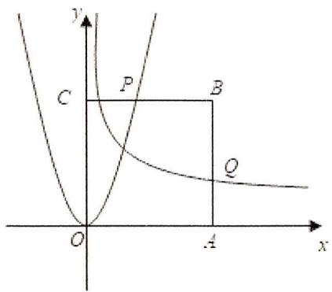

text_image

y
C
P
B
Q
O
A
x

2.（2019·上海）若 $x$ ， $y \in R^{+}$ ，且 $\frac{1}{x} + 2y = 3$ ，则 $\frac{y}{x}$ 的最大值为 \_\_\_\_.

3.（2019·天津）设 $x > 0$ ， $y > 0$ ， $x + 2y = 5$ ，则 $\frac{(x + 1)(2y + 1)}{\sqrt{xy}}$ 的最小值为

4.（2019·天津）设 x > 0，y > 0， $x + 2y = 4$ ，则 $\frac{(x + 1)(2y + 1)}{xy}$ 的最小值为 \_\_\_\_.

5.（2019·天津）设 $x \in R$ ，使不等式 $3x^{2} + x - 2 < 0$ 成立的 $x$ 的取值范围为 \_\_\_\_.

6.（2020·江苏）已知 $5x^{2}y^{2} + y^{4} = 1(x,y\in R)$ ，则 $x^{2} + y^{2}$ 的最小值是

7.（2020·天津）已知 a > 0，b > 0，且 ab = 1，则 $\frac{1}{2a} + \frac{1}{2b} + \frac{8}{a + b}$ 的最小值为 \_\_\_\_.

8.（2021·天津）已知 a > 0，b > 0，则 $\frac{1}{a} + \frac{a}{b^{2}} + b$ 的最小值为 \_\_\_\_.

9.（2021·上海）已知函数 $f(x) = 3^{x} + \frac{a}{3^{x} + 1} (a > 0)$ 的最小值为5，则 $a =$ \_\_\_\_.

10.（2023·上海）已知正实数 a 、 b 满足 $a + 4b = 1$ ，则 ab 的最大值为 \_\_\_\_.

11.（2024·上海）已知 $ab = 1$ ， $4a^{2} + 9b^{2}$ 的最小值为

# 第三章：函数性质

# 一、选择题

1.（2019·全国）下列函数中，为偶函数的是( )

A. $y=(x+1)^{2}$

B. $y = 2^{-x}$

C. $y=|\sin x|$

D. $y = lg(x + 1) + lg(x - 1)$

2. (2019·天津) 已知函数 $f(x) = \begin{cases} 2\sqrt{x}, & 0 \leqslant x \leqslant 1, \\ \frac{1}{x}, & x > 1 \end{cases}$ . 若关于 $x$ 的方程 $f(x) = -\frac{1}{4} x + a (a \in R)$ 恰有两个互异的实数解, 则 $a$ 的取值范围为 ( )

A. $\left[\frac{5}{4}, \frac{9}{4}\right]$

B. $(\frac{5}{4}, \frac{9}{4}]$

C. $\left(\frac{5}{4},\quad\frac{9}{4}\right]\bigcup\{1\}$

D. $\left[\frac{5}{4},\quad\frac{9}{4}\right]\bigcup\{1\}$

3.（2019·上海）已知 $\omega \in R$ ，函数 $f(x) = (x - 6)^2 \cdot \sin(\omega x)$ ，存在常数 $a \in R$ ，使 $f(x + a)$ 为偶函数，则 $\omega$ 的值可能为（ ）

A. $\frac{\pi}{2}$

B. $\frac{\pi}{3}$

C. $\frac{\pi}{4}$

D. $\frac{\pi}{5}$

4. (2019·北京) 下列函数中, 在区间 $(0, +\infty)$ 上单调递增的是 ( )

A. $y = x^{\frac{1}{2}}$

B. $y = 2^{-x}$

C. $y = \log_{\frac{1}{2}} x$

D. $y=\frac{1}{x}$

5. (2019·新课标III) 设 $f(x)$ 是定义域为 $R$ 的偶函数，且在 $(0, +\infty)$ 单调递减，则（）

A. $f(\log_{3}\frac{1}{4})>f(2^{-\frac{3}{2}})>f(2^{-\frac{2}{3}})$

B. $f(\log_{3}\frac{1}{4})>f(2^{-\frac{2}{3}})>f(2^{-\frac{3}{2}})$

C. $f(2^{-\frac{3}{2}}) > f(2^{-\frac{2}{3}}) > f(\log_{3}\frac{1}{4})$

D. $f(2^{-\frac{2}{3}}) > f(2^{-\frac{3}{2}}) > f(\log_{3}\frac{1}{4})$

6.（2019·新课标Ⅱ）设 $f(x)$ 为奇函数，且当 $x \geqslant 0$ 时， $f(x) = e^{x} - 1$ ，则当 x < 0 时， $f(x) = (\quad)$

A. $e^{-x} - 1$

B. $e^{-x} + 1$

C. $-e^{-x} - 1$

D. $- e^{-x} + 1$

7. (2020·山东) 若定义在 $R$ 的奇函数 $f(x)$ 在 $(- \infty, 0)$ 单调递减, 且 $f(2) = 0$ , 则满足 $xf(x - 1) \geqslant 0$ 的 $x$ 的取值范围是 ( )

A. $[-1, 1] \bigcup [3, +\infty)$ B. $[-3, -1] \bigcup [0, 1]$ C. $[-1, 0] \bigcup [1, +\infty)$ D. $[-1, 0] \bigcup [1, 3]$

8.（2020·新课标Ⅱ）若 $2^{x}-2^{y}<3^{-x}-3^{-y}$ ，则()

A. $\ln(y-x+1)>0$

B. $\ln(y-x+1)<0$

C. $\ln|x-y|>0$

D. $\ln|x-y|<0$

9.（2021·全国）下列函数中为偶函数的是( )

A. $y = \lg(x - 1) + \lg(x + 1)$

B. $y=|\sin x+\cos x|$

C. $y = x^{\frac{1}{3}}$

D. $y=(x+2)^{2}+(2x-1)^{2}$

10.（2021·上海）以下哪个函数既是奇函数，又是减函数( )

A. $y = -3x$

B. $y = x^{3}$

C. $y = \log_{3} x$

D. $y = 3^{x}$

11. (2021·北京) 设函数 $f(x)$ 的定义域为 $[0, 1]$ , 则 “ $f(x)$ 在区间 $[0, 1]$ 上单调递增” 是 “ $f(x)$ 在区间 $[0, 1]$ 上的最大值为 $f(1)$ ” 的 ( )

A. 充分而不必要条件

B. 必要而不充分条件

C. 充分必要条件

D. 既不充分也不必要条件

12.（2021·天津）设 $a \in R$ ，函数 $f(x) = \begin{cases} \cos(2\pi x - 2\pi a) & x < a \\ x^2 - 2(a + 1)x + a^2 + 5 & x \geqslant a \end{cases}$ ，若函数 $f(x)$ 在区间 $(0, +\infty)$ 内恰有 6 个零点，则 $a$ 的取值范围是（ ）

A. $(2, \frac{9}{4}] \cup (\frac{5}{2}, \frac{11}{4}]$

B. $\left(\frac{7}{4},2\right]\cup\left(\frac{5}{2},\frac{11}{4}\right]$

C. $(2, \frac{9}{4}]\bigcup[\frac{11}{4}, 3)$

D. $\left(\frac{7}{4},2\right)\bigcup\left[\frac{11}{4},3\right)$

13.（2021·甲卷）下列函数中是增函数的为( )

A. $f(x) = -x$

B. $f(x)=\left(\frac{2}{3}\right)^{x}$

C. $f(x)=x^{2}$

D. $f(x)=\sqrt[3]{x}$

14.（2021·乙卷）设函数 $f(x) = \frac{1 - x}{1 + x}$ ，则下列函数中为奇函数的是（ ）

A. $f(x - 1) - 1$

B. $f(x - 1) + 1$

C. $f(x+1)-1$

D. $f(x+1)+1$

# 二、填空题

1. (2019·浙江) 已知 $a \in R$ , 函数 $f(x) = ax^3 - x$ . 若存在 $t \in R$ , 使得 $|f(t + 2) - f(t)| \leqslant \frac{2}{3}$ , 则实数 $a$ 的最大值是 \_\_\_\_.

2. (2019·北京) 设函数 $f(x) = e^{x} + ae^{-x}$ ( $a$ 为常数). 若 $f(x)$ 为奇函数, 则 $a =$ \_\_\_\_; 若 $f(x)$ 是 $R$ 上的增函数, 则 $a$ 的取值范围是 \_\_\_\_.

3.（2019·江苏）函数 $y=\sqrt{7+6x-x^{2}}$ 的定义域是 \_\_\_\_.

4.（2019·新课标Ⅱ）已知 $f(x)$ 是奇函数，且当 x<0 时， $f(x)=-e^{ax}$ 。若 $f(\ln2)=8$ ，则 a= \_\_\_\_.

5.（2020·江苏）已知 $y = f(x)$ 是奇函数，当 $x \geqslant 0$ 时， $f(x) = x^{\frac{2}{3}}$ ，则 $f(-8)$ 的值是 \_\_\_\_.

6.（2020·北京）函数 $f(x)=\frac{1}{x+1}+lnx$ 的定义域是 \_\_\_\_.

7.（2020·上海）若函数 $y = a \cdot 3^x + \frac{1}{3^x}$ 为偶函数，则 $a =$ \_\_\_\_.

8.（2021·全国）已知函数 $f(x) = ax^3 + bx + c\sin x - 2$ ，且 $f(-2) = 8$ ，则 $f(2) =$ \_\_\_\_.

9.（2021·全国）函数 $f(x)=\sqrt{2^{x+1}-4^{x}}$ 的定义域是 \_\_\_\_.

10.（2021·新高考Ⅱ）写出一个同时具有下列性质①②③的函数 $f(x)$ ：\_\_\_\_.

① $f(x_{1}x_{2})=f(x_{1})f(x_{2})$ ；② 当 $x\in(0,+\infty)$ 时， $f'(x)>0$ ；③ $f'(x)$ 是奇函数.

11.（2021·新高考Ⅰ）已知函数 $f(x)=x^{3}(a\cdot2^{x}-2^{-x})$ 是偶函数，则 a= \_\_\_\_.

12.（2021·新高考Ⅰ）函数 $f(x)=|2x-1|-2\ln x$ 的最小值为 \_\_\_\_.

# 三、解答题

1. (2022·上海)为有效塑造城市景观、提升城市环境品质, 上海市正在努力推进新一轮架空线入地工程的建设。如图是一处要架空线入地的矩形地块 $ABCD$ , $AB=30m$ , $AD=15m$ 。为保护 $D$ 处的一棵古树, 有关部门划定了以 $D$ 为圆心、 $DA$ 为半径的四分之一圆的地块为历史古迹封闭区。若架空线入线口为 $AB$ 边上的点 $E$ , 出线口为 $CD$ 边上的点 $F$ , 施工要求 $EF$ 与封闭区边界相切, $EF$ 右侧的四边形地块 $BCFE$ 将作为绿地保护生态区。(计算长度精确到 $0.1m$ , 计算面积精确到 $0.01m^{2}$ )

(1) 若 $\angle ADE = 20^{\circ}$ ，求 EF 的长；

(2) 当入线口 $E$ 在 $AB$ 上的什么位置时, 生态区的面积最大? 最大面积是多少?

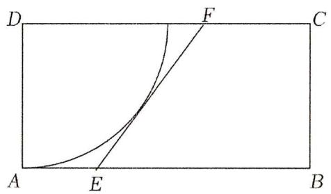

text_image

D
F
C
A
E
B

2. (2020·上海) 已知非空集合 $A \subseteq R$ , 函数 $y = f(x)$ 的定义域为 $D$ , 若对任意 $t \in A$ 且 $x \in D$ , 不等式 $f(x) \leqslant f(x + t)$ 恒成立, 则称函数 $f(x)$ 具有 $A$ 性质.

（1）当 $A=\{-1\}$ ，判断 $f(x)=-x$ 、 $g(x)=2x$ 是否具有 A 性质；

（2）当 $A = (0,1)$ ， $f(x) = x + \frac{1}{x}$ ， $x\in [a, + \infty)$ ，若 $f(x)$ 具有 $A$ 性质，求 $a$ 的取值范围；

(3) 当 $A = \{-2, m\}$ , $m \in Z$ , 若 $D$ 为整数集且具有 $A$ 性质的函数均为常值函数, 求所有符合条件的 $m$ 的值.

3.（2020·全国）设函数 $f(x) = \sqrt{-x^2 + 5x + 6}$ .

(1) 求 $f(x)$ 的定义域;  
(2) 求 $f(x)$ 的单调区间:  
(3) 求 $f(x)$ 在区间 [1, 5] 的最大值和最小值.

4.（2021·上海）已知函数 $f(x) = \sqrt{|x + a| - a} - x$ .

(1) 若 a=1，求函数的定义域；  
(2) 若 $a \neq 0$ , 若 $f(ax) = a$ 有 2 个不同实数根, 求 $a$ 的取值范围;  
(3) 是否存在实数 $a$ ，使得函数 $f(x)$ 在定义域内具有单调性？若存在，求出 $a$ 的取值范围。

# 第四章：指数函数和对数函数

# 一、选择题

1.（2019·新课标III）函数 $y = \frac{2x^3}{2^x + 2^{-x}}$ 在[-6, 6]的图象大致为()

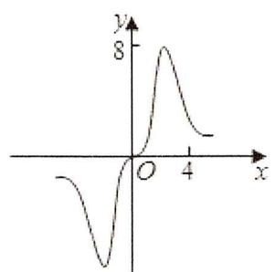

line

| x | y |
|---|---|
| 0 | 0 |
| 1 | -2 |
| 2 | 0 |
| 3 | 8 |
| 4 | 0 |

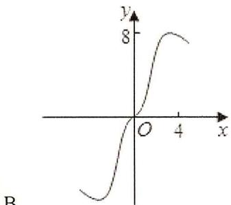

line

| x | y |
|---|---|
| 0 | 0 |
| 1 | 2 |
| 2 | 4 |
| 3 | 6 |
| 4 | 8 |

A.

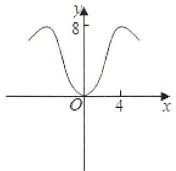

line

| x | y |
|---|---|
| 0 | 8 |
| 4 | 8 |

B.

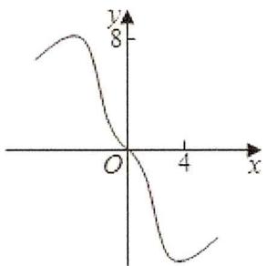

line

| x | y |
|---|---|
| 0 | 8 |
| 1 | 6 |
| 2 | 4 |
| 3 | 2 |
| 4 | 0 |

C.

2.（2019·新课标Ⅱ）若a>b，则()

A. $\ln(a-b)>0$

B. $3^{a} < 3^{b}$

C. $a^{3}-b^{3}>0$

D. $|a| > |b|$

3.（2019·天津）已知 $a = \log_52$ ， $b = \log_{0.5}0.2$ ， $c = 0.5^{0.2}$ ，则 $a$ ， $b$ ， $c$ 的大小关系为（

A. $a < c < b$

B. $a < b < c$

C. $b < c < a$

D. $c < a < b$

4. (2019·北京) 在天文学中, 天体的明暗程度可以用星等或亮度来描述. 两颗星的星等与亮度满足 $m_{2} - m_{1} = \frac{5}{2} \lg \frac{E_{1}}{E_{2}}$ , 其中星等为 $m_{k}$ 的星的亮度为 $E_{k} (k = 1,2)$ . 已知太阳的星等是 -26.7, 天狼星的星等是 -1.45, 则太阳与天狼星的亮度的比值为 ( )

A. $10^{10.1}$

B. 10.1

C. lg10.1

D. $10^{-10.1}$

5.（2019·新课标III）函数 $f(x)=2\sin x-\sin 2x$ 在 $[0, 2\pi]$ 的零点个数为（）

A. 2

B. 3

C. 4

D. 5

6.（2019·天津）已知 $a = \log_27$ ， $b = \log_38$ ， $c = 0.3^{0.2}$ ，则 $a$ ， $b$ ， $c$ 的大小关系为（

A. c < b < a

B. a < b < c

C. b<c<a

D. $c < a < b$

7. (2019·新课标III) 设 $f(x)$ 是定义域为 $R$ 的偶函数，且在 $(0, +\infty)$ 单调递减，则（）

A. $f(\log_{3}\frac{1}{4})>f(2^{-\frac{3}{2}})>f(2^{-\frac{2}{3}})$

B. $f(\log_{3}\frac{1}{4})>f(2^{-\frac{2}{3}})>f(2^{-\frac{3}{2}})$

C. $f(2^{-\frac{3}{2}}) > f(2^{-\frac{2}{3}}) > f(\log_3\frac{1}{4})$

D. $f(2^{-\frac{2}{3}}) > f(2^{-\frac{3}{2}}) > f(\log_{3}\frac{1}{4})$

8.（2019·浙江）在同一直角坐标系中，函数 $y=\frac{1}{a^{x}}$ ， $y=\log_{a}(x+\frac{1}{2})(a>0$ 且 $a\neq1)$ 的图象可能是（）

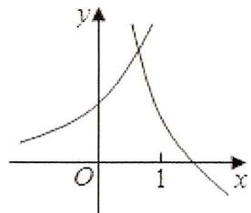

text_image

y
O
1
x

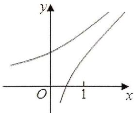

text_image

Mathematical graph showing two curves on a Cartesian coordinate system with x and y axes labeled.

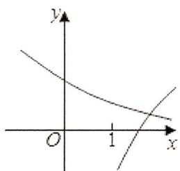

text_image

y
O
1
x

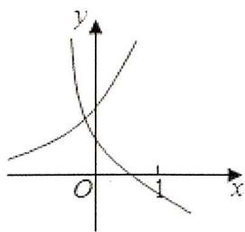

text_image

y
O
x

9.（2019·新课标I）已知 $a = \log_20.2$ ， $b = 2^{0.2}$ ， $c = 0.2^{0.3}$ ，则（

A. $a < b < c$

B. $a < c < b$

C. c < a < b

D. $b < c < a$

10.（2019·新课标II）2019年1月3日嫦娥四号探测器成功实现人类历史上首次月球背面软着陆，我国航天事业取得又一重大成就。实现月球背面软着陆需要解决的一个关键技术问题是地面与探测器的通讯联系。为解决这个问题，发射了嫦娥四号中继星“鹊桥”，鹊桥沿着围绕地月拉格朗日 $L_{2}$ 点的轨道运行。 $L_{2}$ 点是平衡点，位于地月连线的延长线上。设地球质量为 $M_{1}$ ，月球质量为 $M_{2}$ ，地月距离为R， $L_{2}$ 点到月球的距离为r，根据牛顿运动定律和万有引力定律，r满足方程： $\frac{M_{1}}{(R+r)^{2}}+\frac{M_{2}}{r^{2}}=(R+r)\frac{M_{1}}{R^{3}}$ 。

设 $\alpha = \frac{r}{R}$ 。由于 $\alpha$ 的值很小，因此在近似计算中 $\frac{3\alpha^3 + 3\alpha^4 + \alpha^5}{(1 + \alpha)^2} \approx 3\alpha^3$ ，则 $r$ 的近似值为（）

A. $\sqrt{\frac{M_2}{M_1}} R$

B. $\sqrt{\frac{M_2}{2M_1}} R$

C. $\sqrt[3]{\frac{3M_2}{M_1}} R$

D. $\sqrt[3]{\frac{M_2}{3M_1}} R$

11.（2020·天津）设 $a = 3^{0.7}$ ， $b = \left(\frac{1}{3}\right)^{-0.8}$ ， $c = \log_{0.7} 0.8$ ，则 $a, b, c$ 的大小关系为（ ）

A. $a < b < c$

B. $b < a < c$

C. $b < c < a$

D. $c < a < b$

12.（2020·新课标I）设 $a\log_34 = 2$ ，则 $4^{-a} = (\quad)$

A. $\frac{1}{16}$

B. $\frac{1}{9}$

C. $\frac{1}{8}$

D. $\frac{1}{6}$

13.（2020·新课标Ⅲ）已知 $5^{5} < 8^{4}$ ， $13^{4} < 8^{5}$ 。设 $a = \log_{5}3$ ， $b = \log_{8}5$ ， $c = \log_{13}8$ ，则（

A. $a < b < c$

B. $b < a < c$

C. $b < c < a$

D. $c < a < b$

14. (2020·山东) 基本再生数 $R_{0}$ 与世代间隔 $T$ 是新冠肺炎的流行病学基本参数。基本再生数指一个感染者传染的平均人数，世代间隔指相邻两代间传染所需的平均时间。在新冠肺炎疫情初始阶段，可以用指数模型： $I(t)=e^{rt}$ 描述累计感染病例数 $I(t)$ 随时间 $t$ （单位：天）的变化规律，指数增长率 $r$ 与 $R_{0}$ ， $T$ 近似满足 $R_{0}=1+rT$ 。有学者基于已有数据估计出 $R_{0}=3.28$ ， $T=6$ 。据此，在新冠肺炎疫情初始阶段，累计感染病例数增加 1 倍需要的时间约为 $(\quad)(ln2 \approx 0.69)$

A. 1.2 天

B. 1.8 天

C. 2.5 天

D. 3.5 天

15.（2020·新课标I）若 $2^{a} + \log_{2}a = 4^{b} + 2\log_{4}b$ ，则（

A. $a > 2b$

B. $a <   2b$

C. $a > b^{2}$

D. $a <   b^{2}$

16.（2020·新课标III）设 $a = \log_32$ ， $b = \log_53$ ， $c = \frac{2}{3}$ ，则（

A. $a < c < b$

B. $a < b < c$

C. b<c<a

D. c < a < b

17. (2020·天津) 已知函数 $f(x) = \begin{cases} x^3, & x \geqslant 0, \\ -x, & x < 0 \end{cases}$ . 若函数 $g(x) = f(x) - |kx^2 - 2x| (k \in R)$ 恰有 4 个零点，则 $k$ 的取值范围是（）

A. $(- \infty, -\frac{1}{2}) \cup (2\sqrt{2}, + \infty)$

B. $(- \infty, -\frac{1}{2}) \cup (0, 2\sqrt{2})$

C. $(- \infty, 0) \cup (0, 2 \sqrt{2})$

D. $(- \infty, 0) \cup (2\sqrt{2}, + \infty)$

18.（2020·新课标Ⅱ）设函数 $f(x) = \ln |2x + 1| - \ln |2x - 1|$ ，则 $f(x)$ ( )

A. 是偶函数，且在 $\left(\frac{1}{2}, +\infty\right)$ 单调递增

B. 是奇函数，且在 $(- \frac{1}{2}, \frac{1}{2})$ 单调递减

C. 是偶函数，且在 $(- \infty, -\frac{1}{2})$ 单调递增

D. 是奇函数，且在 $(- \infty, -\frac{1}{2})$ 单调递减

19.（2020·北京）已知函数 $f(x) = 2^{x} - x - 1$ ，则不等式 $f(x) > 0$ 的解集是（

A. $(-1, 1)$

B. $(- \infty, -1) \cup (1, +\infty)$

C. $(0,1)$

D. $(- \infty, 0) \cup (1, + \infty)$

20. (2020·新课标III) Logistic 模型是常用数学模型之一, 可应用于流行病学领域. 有学者根据公布数据建立了某地区新冠肺炎累计确诊病例数 $I(t)(t$ 的单位: 天) 的 Logistic 模型: $I(t)=\frac{K}{1+e^{-0.23(t-53)}}$ , 其中 $K$ 为最大确诊病例数. 当 $I(t^{*})=0.95K$ 时, 标志着已初步遏制疫情, 则 $t^{*}$ 约为( ) $(ln19≈3)$

A. 60

B. 63

C. 66

D. 69

21.（2021·上海）下列函数中，在定义域内存在反函数的是( )

A. $f(x) = x^{2}$

B. $f(x) = \sin x$

C. $f(x) = 2^{x}$

D. $f(x) = 1$

22.（2021·天津）设 $a = \log_2 0.3$ ， $b = \log_{\frac{1}{2}} 0.4$ ， $c = 0.4^{0.3}$ ，则三者大小关系为（

A. $a < b < c$

B. $c < a < b$

C. b<c<a

D. $a < c < b$

23.（2021·全国）已知 a > b > 1，则以下四个数中最大的是（）

A. $\log_b a$

B. $\log_{2b}2a$

C. $\log_{3b}3a$

D. $\log_{4b} 4a$

24.（2021·新高考Ⅱ）已知 $a = \log_5 2$ ， $b = \log_8 3$ ， $c = \frac{1}{2}$ ，则下列判断正确的是（

A. $c < b < a$

B. $b < a < c$

C. $a < c < b$

D. $a < b < c$

25.（2021·天津）若 $2^{a}=5^{b}=10$ ，则 $\frac{1}{a}+\frac{1}{b}=(\quad)$

A. -1

B. lg7

C. 1

D. $\log_710$

26. (2021·甲卷) 青少年视力是社会普遍关注的问题, 视力情况可借助视力表测量。通常用五分记录法和小数记录法记录视力数据, 五分记录法的数据 $L$ 和小数记录法的数据 $V$ 满足 $L = 5 + \lg V$ 。已知某同学视力的五分记录法的数据为 4.9, 则其视力的小数记录法的数据约为 ( ) ( $\sqrt[10]{10} \approx 1.259$ )

A. 1.5

B. 1.2

C. 0.8

D. 0.6

27. (2021·北京) 某一时段内, 从天空降落到地面上的雨水, 未经蒸发、渗漏、流失而在水平面上积聚的深度, 称为这个时段的降雨量 (单位: $mm$ ). 24 h 降雨量的等级划分如下:

<table><tr><td>等级</td><td>24h降雨量(精确到0.1)</td></tr><tr><td>......</td><td>......</td></tr><tr><td>小雨</td><td>0.1~9.9</td></tr><tr><td>中雨</td><td>10.0~24.9</td></tr><tr><td>大雨</td><td>25.0~49.9</td></tr><tr><td>暴雨</td><td>50.0~99.9</td></tr><tr><td>......</td><td>......</td></tr></table>

在综合实践活动中，某小组自制了一个底面直径为 $200 \mathrm{~mm}$ ，高为 $300 \mathrm{~mm}$ 的圆锥形雨量器。若一次降雨过程中，该雨量器收集的 $24 \mathrm{~h}$ 的雨水高度是 $150 \mathrm{~mm}$ （如图所示），则这 $24 \mathrm{~h}$ 降雨量的等级是（）

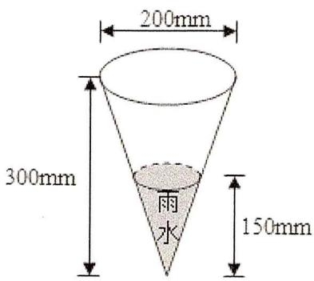

text_image

200mm
300mm
雨水
150mm

A. 小雨

B. 中雨

C. 大雨

D. 暴雨

28.（2022·全国）函数 $y = 2^{\frac{1}{x}} (x > 0)$ 的反函数是（）

A. $y = \frac{1}{\log_2x} (x > 1)$

B. $y=\log_{2}\frac{1}{x}(x>1)$

C. $y=\frac{1}{\log_{2}x}(0<x<1)$

D. $y=\log_{2}\frac{1}{x}(0<x<1)$

29.（2022·甲卷）已知 $9^{m}=10$ ， $a=10^{m}-11$ ， $b=8^{m}-9$ ，则()

A. $a > 0 > b$

B. $a > b > 0$

C. b > a > 0

D. b>0>a

30.（2022·天津）已知 $a = 2^{0.7}$ ， $b = \left(\frac{1}{3}\right)^{0.7}$ ， $c = \log_2\frac{1}{3}$ ，则（

A. a > c > b

B. b > c > a

C. a > b > c

D. $c > a > b$

31.（2022·北京）已知函数 $f(x) = \frac{1}{1 + 2^x}$ ，则对任意实数 $x$ ，有（ ）

A. $f(-x) + f(x) = 0$

B. $f(-x)-f(x)=0$

C. $f(-x) + f(x) = 1$

D. $f(-x) - f(x) = \frac{1}{3}$

32.（2022·新高考I）设 $a = 0.1e^{0.1}$ ， $b = \frac{1}{9}$ ， $c = -ln0.9$ ，则（

A. a < b < c

B. $c < b < a$

C. $c < a < b$

D. $a < c < b$

33.（2022·天津）化简 $(2\log_43 + \log_83)(\log_32 + \log_92)$ 的值为（

A. 1

B. 2

C. 4

D. 6

34.（2022·浙江）已知 $2^{a}=5$ ， $\log_{8}3=b$ ，则 $4^{a-3b}=(\quad)$

A. 25

B. 5

C. $\frac{25}{9}$

D. $\frac{5}{3}$

35.（2023·全国）若 $\log_2(x^2 + 2x + 1) = 4$ ，且 $x > 0$ ，则 $x = (\quad)$

A. 2

B. 3

C. 4

D. 5

36.（2023·乙卷）函数 $f(x) = x^{3} + ax + 2$ 存在3个零点，则 $a$ 的取值范围是（）

A. $(- \infty, -2)$

B. $(-∞,-3)$

C. $(-4, - 1)$

D. $(-3,0)$

37. (2023·甲卷) 函数 $y = f(x)$ 的图象由 $y = \cos \left( 2x + \frac{\pi}{6} \right)$ 的图象向左平移 $\frac{\pi}{6}$ 个单位长度得到, 则 $y = f(x)$ 的图象与直线 $y = \frac{1}{2}x - \frac{1}{2}$ 的交点个数为 (   )

A. 1

B. 2

C. 3

D. 4

# 二、多选题

38. (2023·新高考Ⅰ) 噪声污染问题越来越受到重视。用声压级来度量声音的强弱, 定义声压级 $L_{p} = 20 \times \lg \frac{p}{p_{0}}$ , 其中常数 $p_{0}(p_{0} > 0)$ 是听觉下限阈值, $p$ 是实际声压。下表为不同声源的声压级:

<table><tr><td>声源</td><td>与声源的距离/m</td><td>声压级/dB</td></tr><tr><td>燃油汽车</td><td>10</td><td>60~90</td></tr><tr><td>混合动力汽车</td><td>10</td><td>50~60</td></tr><tr><td>电动汽车</td><td>10</td><td>40</td></tr></table>

已知在距离燃油汽车、混合动力汽车、电动汽车10m处测得实际声压分别为 $p_{1}$ ， $p_{2}$ ， $p_{3}$ ，则（）

A. $p_{1} \geqslant p_{2}$

B. $p_2 > 10p_3$

C. $p_3 = 100p_0$

D. $p_1 \leqslant 100 p_2$

# 三、填空题

39.（2019·上海）函数 $f(x) = x^{2} (x > 0)$ 的反函数为 \_\_\_\_.

40.（2019·江苏）设 $f(x)$ ， $g(x)$ 是定义在 R 上的两个周期函数， $f(x)$ 的周期为 4， $g(x)$ 的周期为 2，且 $f(x)$ 是奇函数. 当 $x \in (0, 2]$ 时， $f(x) = \sqrt{1 - (x - 1)^2}$ ， $g(x) = \begin{cases} k(x + 2), & 0 < x \leqslant 1, \\ -\frac{1}{2}, & 1 < x \leqslant 2, \end{cases}$ 其中 k > 0. 若在区间 $(0, 9]$ 上，关于 x 的方程 $f(x) = g(x)$ 有 8 个不同的实数根，则 k 的取值范围是 \_\_\_\_.

41. (2019·北京) 李明自主创业, 在网上经营一家水果店, 销售的水果中有草莓、京白梨、西瓜、桃, 价格依次为 $60$ 元/盒、 $65$ 元/盒、 $80$ 元/盒、 $90$ 元/盒。为增加销量, 李明对这四种水果进行促销: 一次购买水果的总价达到 $120$ 元, 顾客就少付 $x$ 元。每笔订单顾客网上支付成功后, 李明会得到支付款的 $80\%$ 。

①当 $x = 10$ 时, 顾客一次购买草莓和西瓜各 1 盒, 需要支付 元; ②在促销活动中, 为保证李明每笔订单得到的金额均不低于促销前总价的七折, 则 $x$ 的最大值为 .

42.（2019·新课标II）已知 $f(x)$ 是奇函数，且当x<0时， $f(x)=-e^{ax}$ 。若 $f(ln2)=8$ ，则a=\_\_\_\_。

43.（2020·上海）设 $a \in R$ ，若存在定义域为 $R$ 的函数 $f(x)$ 同时满足下列两个条件：

（1）对任意的 $x_0 \in R$ ， $f(x_0)$ 的值为 $x_0$ 或 $x_0^2$ ；

(2) 关于 x 的方程 $f(x)=a$ 无实数解,

则 a 的取值范围是 \_\_\_\_.

44.（2020·上海）已知函数 $f(x) = x^3$ ， $f^{-1}(x)$ 是 $f(x)$ 的反函数，则 $f^{-1}(x) =$

45. (2020·上海) 已知 $f(x) = \sqrt{x - 1}$ ，其反函数为 $f^{-1}(x)$ ，若 $f^{-1}(x) - a = f(x + a)$ 有实数根，则 $a$ 的取值范围为 \_\_\_\_。

46.（2021·上海）若方程组 $\left\{ \begin{array}{l}a_{1}x + b_{1}y = c_{1}\\ a_{2}x + b_{2}y = c_{2} \end{array} \right.$ 无解，则 $\left| \begin{array}{ll}a_1 & b_1\\ a_2 & b_2 \end{array} \right| =$

47.（2021·上海）已知 $f(x) = \frac{3}{x} + 2$ ，则 $f^{-1}(1) =$ \_\_\_\_.

48.（2022·上海）设函数 $f(x) = x^3$ 的反函数为 $f^{-1}(x)$ ，则 $f^{-1}(27) =$

49. (2022·天津) 设 $a \in R$ , 对任意实数 $x$ , 记 $f(x) = \min \{|x| - 2, x^2 - ax + 3a - 5\}$ . 若 $f(x)$ 至少有 3 个零点, 则实数 $a$ 的取值范围为 \_\_\_\_.

50.（2023·上海）已知函数 $f(x) = 2^{-x} + 1$ ，且 $g(x) = \begin{cases} \log_2 (x + 1), & x \geqslant 0 \\ f(-x), & x < 0 \end{cases}$ ，则方程 $g(x) = 2$ 的解为 \_\_\_\_.

51.（2023·天津）若函数 $f(x) = ax^2 - 2x - |x^2 - ax + 1|$ 有且仅有两个零点，则 $a$ 的取值范围为

52.（2024·上海） $\log_{2}x$ 的定义域

# 四、解答题

53.（2019·上海）改革开放 40 年，我国卫生事业取得巨大成就，卫生总费用增长了数十倍。卫生总费用包括个人现金卫生支出、社会支出、政府支出，如表为 2012 年 -2015 年我国卫生费用中个人现金支出、社会支出和政府支出的费用（单位：亿元）和在卫生总费用中的占比。

<table><tr><td rowspan="2">年份</td><td rowspan="2">卫生总费用(亿元)</td><td colspan="2">个人现金卫生支出</td><td colspan="2">社会卫生支出</td><td colspan="2">政府卫生支出</td></tr><tr><td>绝对数(亿元)</td><td>占卫生总费用比重(%)</td><td>绝对数(亿元)</td><td>占卫生总费用比重(%)</td><td>绝对数(亿元)</td><td>占卫生总费用比重(%)</td></tr><tr><td>2012</td><td>28119.00</td><td>9656.32</td><td>34.34</td><td>10030.70</td><td>35.67</td><td>8431.98</td><td>29.99</td></tr><tr><td>2013</td><td>31668.95</td><td>10729.34</td><td>33.88</td><td>11393.79</td><td>35.98</td><td>9545.81</td><td>30.14</td></tr><tr><td>2014</td><td>35312.40</td><td>11295.41</td><td>31.99</td><td>13437.75</td><td>38.05</td><td>10579.23</td><td>29.96</td></tr><tr><td>2015</td><td>40974.64</td><td>11992.65</td><td>29.27</td><td>16506.71</td><td>40.29</td><td>12475.28</td><td>30.45</td></tr></table>

(数据来源于国家统计年鉴)

(1) 指出 2012 年到 2015 年之间我国卫生总费用中个人现金支出占比和社会支出占比的变化趋势:  
（2）设 $t = 1$ 表示1978年，第 $n$ 年卫生总费用与年份 $t$ 之间拟合函数 $f(t) = \frac{357876.6053}{1 + e^{6.4420 - 0.1136t}}$ 研究函数 $f(t)$ 的单调性，并预测我国卫生总费用首次超过12万亿的年份.

54. (2020·上海) 有一条长为 $120 \mathrm{~ 米}$ 的步行道 $O A$ , $A$ 是垃圾投放点 $\omega_{1}$ , 若以 $O$ 为原点, $O A$ 为 $x$ 轴正半轴建立直角坐标系, 设点 $B(x,0)$ , 现要建设另一座垃圾投放点 $\omega_{2}(t,0)$ , 函数 $f_{t}(x)$ 表示与 $B$ 点距离最近的垃圾投放点的距离.

（1）若 t=60，求 $f_{60}(10)$ 、 $f_{60}(80)$ 、 $f_{60}(95)$ 的值，并写出 $f_{60}(x)$ 的函数解析式；  
(2) 若可以通过 $f_{t}(x)$ 与坐标轴围成的面积来测算扔垃圾的便利程度, 面积越小越便利. 问: 垃圾投放点 $\omega_{2}$ 建在何处才能比建在中点时更加便利?

55.（2020·上海）在研究某市交通情况时，道路密度是指该路段上一定时间内通过的车辆数除以时间，车辆密度是该路段一定

时间内通过的车辆数除以该路段的长度，现定义交通流量为 $v = \frac{q}{x}$ ， $x$ 为道路密度， $q$ 为车辆密度，交通流量 $v = f(x) = \begin{cases} 100 - 135 \cdot \left( \frac{1}{3} \right)^{\frac{80}{x}}, & 0 < x < 40 \\ -k(x - 40) + 85, & 40 \leqslant x \leqslant 80 \end{cases}$ .

（1）若交通流量 v > 95，求道路密度 x 的取值范围；  
（2）已知道路密度 x=80 时，测得交通流量 v=50，求车辆密度 q 的最大值.

56.（2021·上海）已知一企业今年第一季度的营业额为 1.1 亿元，往后每个季度增加 0.05 亿元，第一季度的利润为 0.16 亿元，往后每一季度比前一季度增长 4%.

(1) 求今年起的前 20 个季度的总营业额;  
(2) 请问哪一季度的利润首次超过该季度营业额的18%？

57.（2022·乙卷）已知函数 $f(x)=\ln(1+x)+axe^{-x}$ .

(1) 当 a=1 时，求曲线 $y=f(x)$ 在点 $(0, f(0))$ 处的切线方程；  
(2) 若 $f(x)$ 在区间 $(-1,0)$ ， $(0,+\infty)$ 各恰有一个零点，求 a 的取值范围.

58. (2023·上海)为了节能环保、节约材料, 定义建筑物的 “体形系数” $S = \frac{F_{0}}{V_{0}}$ , 其中 $F_{0}$ 为建筑物暴露在空气中的面积 (单位: 平方米), $V_{0}$ 为建筑物的体积 (单位: 立方米).

(1) 若有一个圆柱体建筑的底面半径为 $R$ , 高度为 $H$ , 暴露在空气中的部分为上底面和侧面, 试求该建筑体的 “体形系数” $S$ ; (结果用含 $R$ 、 $H$ 的代数式表示)

(2) 定义建筑物的 “形状因子” 为 $f = \frac{L^2}{A}$ ，其中 $A$ 为建筑物底面面积， $L$ 为建筑物底面周长，又定义 $T$ 为总建筑面积，即为每层建筑面积之和（每层建筑面积为每一层的底面面积）。设 $n$ 为某宿舍楼的层数，层高为 3 米，则可以推导出该宿舍楼的 “体形系数” 为 $S = \sqrt{\frac{f \cdot n}{T}} + \frac{1}{3n}$ 。当 $f = 18$ ， $T = 10000$ 时，试求当该宿舍楼的层数 $n$ 为多少时，“体形系数” $S$ 最小。

# 第五章：三角函数

# 一、选择题

1.（2019·全国）已知 $\tan A = 2$ ，则 $\frac{\sin 2A + \cos^2 A}{1 + \cos 2A} = ()$

A. $\frac{3}{2}$

B. $\frac{5}{2}$

C. 3

D. 5

2.（2019·新课标I）关于函数 $f(x) = \sin |x| + |\sin x|$ 有下述四个结论：

① $f(x)$ 是偶函数  
② $f(x)$ 在区间 $\left(\frac{\pi}{2}, \pi\right)$ 单调递增  
③ $f(x)$ 在 $[-π, \pi]$ 有4个零点  
④ $f(x)$ 的最大值为 2

其中所有正确结论的编号是( )

A. ①②④

B. ②④

C. ①④

D. ①③

3.（2019·天津）已知函数 $f(x) = A\sin (\omega x + \varphi)(A > 0, \omega > 0, |\varphi| < \pi)$ 是奇函数，且 $f(x)$ 的最小正周期为 $\pi$ ，将 $y = f(x)$ 的图象上所有点的横坐标伸长到原来的2倍（纵坐标不变），所得图象对应的函数为 $g(x)$ . 若 $g(\frac{\pi}{4}) = \sqrt{2}$ ，则 $f(\frac{3\pi}{8}) = (\quad)$

A. -2

B. $-\sqrt{2}$

C. $\sqrt{2}$

D. 2

4. (2019·新课标III) 设函数 $f(x) = \sin (\omega x + \frac{\pi}{5})(\omega > 0)$ ，已知 $f(x)$ 在 $[0, 2\pi]$ 有且仅有 5 个零点。下述四个结论:

① $f(x)$ 在 $(0,2\pi)$ 有且仅有 3 个极大值点：  
② $f(x)$ 在 $(0,2\pi)$ 有且仅有2个极小值点：  
③ $f(x)$ 在 $(0, \frac{\pi}{10})$ 单调递增；  
④ $\omega$ 的取值范围是 $\left[\frac{12}{5}, \frac{29}{10}\right)$ .

其中所有正确结论的编号是（ ）

A. ①④

B. ②③

C. ①②③

D. ①③④

5. (2019·天津) 已知函数 $f(x) = A \sin (\omega x + \varphi) (A > 0, \omega > 0, |\varphi| < \pi)$ 是奇函数，将 $y = f(x)$ 的图象上所有点的横坐标伸长到原来的 2 倍（纵坐标不变），所得图象对应的函数为 $g(x)$ 。若 $g(x)$ 的最小正周期为 $2\pi$ ，且 $g(\frac{\pi}{4}) = \sqrt{2}$ ，则 $f(\frac{3\pi}{8}) = (\quad)$

A. -2

B. $- \sqrt{2}$

C. $\sqrt{2}$

D. 2

6.（2019·新课标Ⅱ）若 $x_{1}=\frac{\pi}{4}$ ， $x_{2}=\frac{3\pi}{4}$ 是函数 $f(x)=\sin\omega x(\omega>0)$ 两个相邻的极值点，则 $\omega=(\quad)$

A. 2

B. $\frac{3}{2}$

C. 1

D. $\frac{1}{2}$

7.（2019·上海）已知 $\tan\alpha\cdot\tan\beta=\tan(\alpha+\beta)$ 。有下列两个结论：

①存在 $\alpha$ 在第一象限， $\beta$ 在第三象限；

②存在 $\alpha$ 在第二象限， $\beta$ 在第四象限；

则（ ）

A. ①②均正确

B. ①②均错误

C. ①对②错

D. ①错②对

8. (2019·北京) 如图, $A$ , $B$ 是半径为 2 的圆周上的定点, $P$ 为圆周上的动点, $\angle APB$ 是锐角, 大小为 $\beta$ , 图中阴影区域的面积的最大值为( )

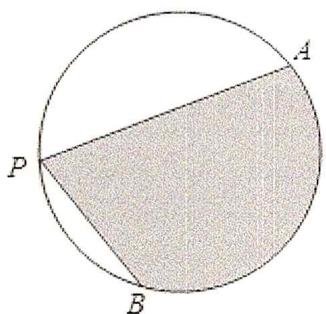

text_image

P
A
B

A. $4\beta + 4\cos\beta$

B. $4 \beta + 4 \sin \beta$

C. $2\beta + 2\cos\beta$

D. $2 \beta + 2 \sin \beta$

9. (2019·新课标Ⅱ) 下列函数中, 以 $\frac{\pi}{2}$ 为最小正周期且在区间 $(\frac{\pi}{4}, \frac{\pi}{2})$ 单调递增的是( )

A. $f(x)=|\cos2x|$

B. $f(x)=|\sin2x|$

C. $f(x)=\cos|x|$

D. $f(x)=\sin|x|$

10.（2019·新课标Ⅱ）已知 $\alpha \in (0, \frac{\pi}{2})$ ， $2\sin 2\alpha = \cos 2\alpha + 1$ ，则 $\sin \alpha = (\quad)$

A. $\frac{1}{5}$

B. $\frac{\sqrt{5}}{5}$

C. $\frac{\sqrt{3}}{3}$

D. $\frac{2\sqrt{5}}{5}$

11.（2019·新课标I） $\tan 255^{\circ} = (\quad)$

A. $-2 - \sqrt{3}$

B. $-2 + \sqrt{3}$

C. $2 - \sqrt{3}$

D. $2 + \sqrt{3}$

12.（2020·新课标III）已知 $2\tan\theta-\tan(\theta+\frac{\pi}{4})=7$ ，则 $\tan\theta=(\quad)$

A. -2

B. -1

C. 1

D. 2

13.（2020·全国）已知函数 $f(x) = 2\sin^2 x - \sqrt{3}\sin 2x$ ，则 $f(x)$ 的最小值为（）

A. 0

B. -1

C. $-\sqrt{3}$

D. -2

14.（2020·天津）已知函数 $f(x) = \sin (x + \frac{\pi}{3})$ . 给出下列结论：

① $f(x)$ 的最小正周期为 $2\pi$ ;

② $f(\frac{\pi}{2})$ 是 $f(x)$ 的最大值；

(3)把函数 $y = \sin x$ 的图象上的所有点向左平移 $\frac{\pi}{3}$ 个单位长度，可得到函数 $y = f(x)$ 的图象。其中所有正确结论的序号是( )

A. ①

B. ①③

C. ②③

D. ①②③

15.（2020·上海）“ $\alpha = \beta$ ”是“ $\sin^2\alpha + \cos^2\beta = 1$ ”的（

A. 充分非必要条件

B. 必要非充分条件

C. 充要条件

D. 既非充分又非必要条件

16.（2020·新课标 I）设函数 $f(x)=\cos(\omega x+\frac{\pi}{6})$ 在 $[-π, \pi]$ 的图象大致如图，则 $f(x)$ 的最小正周期为（）

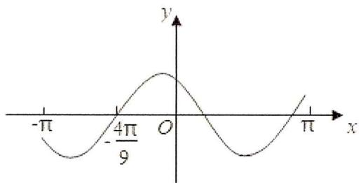

text_image

-π
-4π/9
O
x
y

A. $\frac{10\pi}{9}$

B. $\frac{7\pi}{6}$

C. $\frac{4\pi}{3}$

D. $\frac{3 \pi}{2}$

17.（2020·新课标Ⅱ）若 $\alpha$ 为第四象限角，则（）

A. $\cos 2\alpha > 0$

B. $\cos 2\alpha < 0$

C. $\sin 2\alpha > 0$

D. $\sin 2\alpha < 0$

18.（2020·新课标III）已知 $\sin \theta +\sin (\theta +\frac{\pi}{3}) = 1$ ，则 $\sin (\theta +\frac{\pi}{6}) = ()$

A. $\frac{1}{2}$

B. $\frac{\sqrt{3}}{3}$

C. $\frac{2}{3}$

D. $\frac{\sqrt{2}}{2}$

19.（2020·新课标I）已知 $\alpha \in (0,\pi)$ ，且 $3\cos 2\alpha - 8\cos \alpha = 5$ ，则 $\sin \alpha = (\quad)$

A. $\frac{\sqrt{5}}{3}$

B. $\frac{2}{3}$

C. $\frac{1}{3}$

D. $\frac{\sqrt{5}}{9}$

20. (2021·全国) 函数 $y = \cos^2 x + \sin x \cos x$ 图像的对称轴是( )

A. $x=\frac{k\pi}{2}+\frac{\pi}{8}(k\in Z)$

B. $x=\frac{k\pi}{2}-\frac{\pi}{8}(k\in Z)$

C. $x = k\pi + \frac{\pi}{4} (k \in Z)$

D. $x = k\pi -\frac{\pi}{4} (k\in Z)$

21.（2021·全国）已知 $\tan x = 2$ ，则 $\frac{2\sin x + \cos x}{2\sin x - \cos x} = (\quad)$

A. 3

B. $\frac{5}{3}$

C. $\frac{3}{5}$

D. $\frac{1}{3}$

22.（2021·乙卷） $\cos^2\frac{\pi}{12} -\cos^2\frac{5\pi}{12} = (\quad)$

A. $\frac{1}{2}$

B. $\frac{\sqrt{3}}{3}$

C. $\frac{\sqrt{2}}{2}$

D. $\frac{\sqrt{3}}{2}$

23.（2021·北京）函数 $f(x) = \cos x - \cos 2x$ 是（

A. 奇函数，且最大值为 2

B. 偶函数，且最大值为 2

C. 奇函数，且最大值为 $\frac{9}{8}$

D. 偶函数，且最大值为 $\frac{9}{8}$

24.（2021·甲卷）若 $\alpha \in (0, \frac{\pi}{2})$ ， $\tan 2\alpha = \frac{\cos \alpha}{2 - \sin \alpha}$ ，则 $\tan \alpha = (\quad)$

A. $\frac{\sqrt{15}}{15}$

B. $\frac{\sqrt{5}}{5}$

C. $\frac{\sqrt{5}}{3}$

D. $\frac{\sqrt{15}}{3}$

25. (2021·浙江) 已知 $\alpha, \beta, \gamma$ 是互不相同的锐角, 则在 $\sin \alpha \cos \beta$ , $\sin \beta \cos \gamma$ , $\sin \gamma \cos \alpha$ 三个值中, 大于 $\frac{1}{2}$ 的个数的最大值是( )

A. 0

B. 1

C. 2

D. 3

26.（2021·上海）已知 $f(x) = 3\sin x + 2$ ，对任意的 $x_{1} \in [0, \frac{\pi}{2}]$ ，都存在 $x_{2} \in [0, \frac{\pi}{2}]$ ，使得 $f(x_{1}) = 2f(x_{2} + \theta) + 2$ 成立，则下列选项中， $\theta$ 可能的值是（）

A. $\frac{3\pi}{5}$

B. $\frac{4\pi}{5}$

C. $\frac{6\pi}{5}$

D. $\frac{7\pi}{5}$

27.（2021·新高考Ⅰ）若 $\tan\theta=-2$ ，则 $\frac{\sin\theta(1+\sin2\theta)}{\sin\theta+\cos\theta}=(\quad)$

A. $-\frac{6}{5}$

B. $-\frac{2}{5}$

C. $\frac{2}{5}$

D. $\frac{6}{5}$

28.（2021·乙卷）函数 $f(x)=\sin\frac{x}{3}+\cos\frac{x}{3}$ 的最小正周期和最大值分别是（）

A. $3 \pi$ 和 $\sqrt{2}$

B. $3 \pi$ 和 2

C. $6 \pi$ 和 $\sqrt{2}$

D. $6 \pi$ 和 2

29. (2021·乙卷) 把函数 $y = f(x)$ 图像上所有点的横坐标缩短到原来的 $\frac{1}{2}$ 倍, 纵坐标不变, 再把所得曲线向右平移 $\frac{\pi}{3}$ 个单位长度, 得到函数 $y = \sin \left( {x - \frac{\pi }{4}}\right)$ 的图像, 则 $f\left( x\right)  =$ (   )

A. $\sin \left(\frac{x}{2} -\frac{7\pi}{12}\right)$

B. $\sin(\frac{x}{2}+\frac{\pi}{12})$

C. $\sin(2x-\frac{7\pi}{12})$

D. $\sin(2x+\frac{\pi}{12})$

30.（2021·新高考Ⅰ）下列区间中，函数 $f(x)=7\sin(x-\frac{\pi}{6})$ 单调递增的区间是()

A. $(0, \frac{\pi}{2})$

B. $(\frac{\pi}{2}, \pi)$

C. $(\pi, \frac{3\pi}{2})$

D. $(\frac{3\pi}{2}, 2\pi)$

31.（2022·全国）已知函数 $f(x) = \sin (2x + \varphi)$ . 若 $f(\frac{\pi}{3}) = f(-\frac{\pi}{3}) = \frac{1}{2}$ ，则 $\varphi = (\quad)$

A. $2k\pi + \frac{\pi}{2} (k \in Z)$

B. $2k\pi + \frac{\pi}{3}(k \in Z)$

C. $2k\pi - \frac{\pi}{3}(k \in Z)$

D. $2k\pi - \frac{\pi}{2} (k \in Z)$

32.（2022·天津）已知 $f(x) = \frac{1}{2}\sin 2x$ ，关于该函数有下列四个说法：

① $f(x)$ 的最小正周期为 $2\pi$ ;  
② $f(x)$ 在 $\left[-\frac{\pi}{4}, \frac{\pi}{4}\right]$ 上单调递增；  
③当 $x\in[-\frac{\pi}{6},\quad\frac{\pi}{3}]$ 时， $f(x)$ 的取值范围为 $[- \frac{\sqrt{3}}{4},\quad \frac{\sqrt{3}}{4}]$ ;  
④ $f(x)$ 的图象可由 $g(x)=\frac{1}{2}\sin(2x+\frac{\pi}{4})$ 的图象向左平移 $\frac{\pi}{8}$ 个单位长度得到.

以上四个说法中，正确的个数为（ ）

A. 1

B. 2

C. 3

D. 4

33.（2022·新高考Ⅰ）记函数 $f(x)=\sin(\omega x+\frac{\pi}{4})+b(\omega>0)$ 的最小正周期为 T．若 $\frac{2\pi}{3}<T<\pi$ ，且 $y=f(x)$ 的图像关于点 $\left(\frac{3\pi}{2},2\right)$ 中心对称，则 $f\left(\frac{\pi}{2}\right)=(\quad)$

A. 1

B. $\frac{3}{2}$

C. $\frac{5}{2}$

D. 3

34.（2022·新高考Ⅱ）若 $\sin (\alpha +\beta) + \cos (\alpha +\beta) = 2\sqrt{2}\cos (\alpha +\frac{\pi}{4})\sin \beta$ ，则（

A. $\tan (\alpha -\beta) = 1$

B. $\tan (\alpha +\beta) = 1$

C. $\tan(\alpha-\beta)=-1$

D. $\tan (\alpha +\beta) = -1$

35. (2022·甲卷) 将函数 $f(x) = \sin (\omega x + \frac{\pi}{3})(\omega > 0)$ 的图像向左平移 $\frac{\pi}{2}$ 个单位长度后得到曲线 $C$ ，若 $C$ 关于 $y$ 轴对称，则 $\omega$ 的最小值是（）

A. $\frac{1}{6}$

B. $\frac{1}{4}$

C. $\frac{1}{3}$

D. $\frac{1}{2}$

36. (2022·浙江) 为了得到函数 $y = 2\sin {3x}$ 的图象, 只要把函数 $y = 2\sin \left( {{3x} + \frac{\pi }{5}}\right)$ 图象上所有的点(   )

A. 向左平移 $\frac{\pi}{5}$ 个单位长度

B. 向右平移 $\frac{\pi}{5}$ 个单位长度

C. 向左平移 $\frac{\pi}{15}$ 个单位长度

D. 向右平移 $\frac{\pi}{15}$ 个单位长度

37. (2022·甲卷) 沈括的《梦溪笔谈》是中国古代科技史上的杰作, 其中收录了计算圆弧长度的“会圆术”. 如图, $AB$ 是以 $O$ 为圆心, $OA$ 为半径的圆弧, $C$ 是 $AB$ 的中点, $D$ 在 $AB$ 上, $CD \perp AB$ . “会圆术”给出 $AB$ 的弧长的近似值 $s$ 的计算公式: $s = AB + \frac{CD^{2}}{OA}$ . 当 $OA = 2$ , $\angle AOB = 60^{\circ}$ 时, $s = (\quad)$

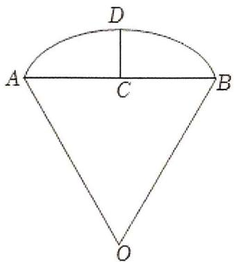

text_image

D
A	C	B
O

A. $\frac{11 - 3\sqrt{3}}{2}$

B. $\frac{11 - 4\sqrt{3}}{2}$

C. $\frac{9 - 3\sqrt{3}}{2}$

D. $\frac{9 - 4\sqrt{3}}{2}$

38. (2022·甲卷) 设函数 $f(x) = \sin (\omega x + \frac{\pi}{3})$ 在区间 $(0, \pi)$ 恰有三个极值点、两个零点，则 $\omega$ 的取值范围是 ( )

A. $\left[\frac{5}{3}, \frac{13}{6}\right)$

B. $\left[\frac{5}{3}, \frac{19}{6}\right)$

C. $\left(\frac{13}{6},\frac{8}{3}\right]$

D. $\left(\frac{13}{6},\frac{19}{6}\right]$

39.（2023·全国）已知函数 $f(x) = \sin (2\pi x - \frac{\pi}{5})$ ，则（ ）

A. $(- \frac{3}{20}, \frac{7}{20})$ 上单调递增

B. $(- \frac{1}{5}, \frac{3}{10})$ 上单调递增

C. $(\frac{3}{10}, \frac{4}{5})$ 上单调递减

D. $\left(\frac{3}{20},\frac{13}{20}\right)$ 上单调递增

40. (2023·上海) 已知 $a \in R$ , 记 $y = \sin x$ 在 $[a, 2a]$ 的最小值为 $s_a$ , 在 $[2a, 3a]$ 的最小值为 $t_a$ , 则下列情况不可能的是 ( )

A. $s_{a} > 0, t_{a} > 0$

B. $s_{a} < 0, t_{a} < 0$

C. $s_{a} > 0, t_{a} < 0$

D. $s_{a} < 0, t_{a} > 0$

41. (2023·乙卷) 已知函数 $f(x) = \sin (\omega x + \varphi)$ 在区间 $(\frac{\pi}{6}, \frac{2\pi}{3})$ 单调递增, 直线 $x = \frac{\pi}{6}$ 和 $x = \frac{2\pi}{3}$ 为函数 $y = f(x)$ 的图像的两条对称轴, 则 $f(-\frac{5\pi}{12}) = (\quad)$

A. $-\frac{\sqrt{3}}{2}$

B. $-\frac{1}{2}$

C. $\frac{1}{2}$

D. $\frac{\sqrt{3}}{2}$

42.（2023·甲卷）已知 $f(x)$ 为函数 $y = \cos(2x + \frac{\pi}{6})$ 向左平移 $\frac{\pi}{6}$ 个单位所得函数，则 $y = f(x)$ 与 $y = \frac{1}{2}x - \frac{1}{2}$ 的交点个数为（）

A. 1

B. 2

C. 3

D. 4

43.（2023·甲卷）“ $\sin^2\alpha + \sin^2\beta = 1$ ”是“ $\sin\alpha + \cos\beta = 0$ ”的（ ）

A. 充分条件但不是必要条件

B. 必要条件但不是充分条件

C. 充要条件

D. 既不是充分条件也不是必要条件

44.（2023·天津）已知函数 $f(x)$ 的一条对称轴为直线 x=2，一个周期为 4，则 $f(x)$ 的解析式可能为()

A. $\sin \left(\frac{\pi}{2} x\right)$

B. $\cos (\frac{\pi}{2} x)$

C. $\sin \left(\frac{\pi}{4} x\right)$

D. $\cos \left(\frac{\pi}{4} x\right)$

45.（2023·乙卷）已知等差数列 $\{a_{n}\}$ 的公差为 $\frac{2\pi}{3}$ ，集合 $S = \{\cos a_{n} \mid n \in N^{*}\}$ ，若 $S = \{a, b\}$ ，则 $ab = (\quad)$

A. -1

B. $-\frac{1}{2}$

C. 0

D. $\frac{1}{2}$

46.（2023·新高考Ⅱ）已知 $\alpha$ 为锐角， $\cos \alpha = \frac{1 + \sqrt{5}}{4}$ ，则 $\sin \frac{\alpha}{2} = (\quad)$

A. $\frac{3 - \sqrt{5}}{8}$

B. $\frac{-1 + \sqrt{5}}{8}$

C. $\frac{3-\sqrt{5}}{4}$

D. $\frac{-1 + \sqrt{5}}{4}$

47.（2023·新高考I）已知 $\sin (\alpha -\beta) = \frac{1}{3}$ ， $\cos \alpha \sin \beta = \frac{1}{6}$ ，则 $\cos (2\alpha +2\beta) = ()$

A. $\frac{7}{9}$

B. $\frac{1}{9}$

C. $-\frac{1}{9}$

D. $- \frac{7}{9}$

# 二、多选题

1（2020·海南）如图是函数 $y = \sin (\omega x + \varphi)$ 的部分图象，则 $\sin (\omega x + \varphi) = ()$

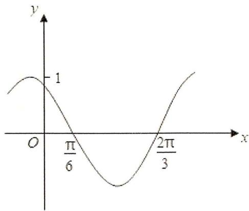

A. $\sin (x + \frac{\pi}{3})$

B. $\sin \left(\frac{\pi}{3} - 2x\right)$

C. $\cos (2x + \frac{\pi}{6})$

D. $\cos(\frac{5\pi}{6}-2x)$

2（2022·新高考II）已知函数 $f(x) = \sin (2x + \varphi)(0 < \varphi < \pi)$ 的图像关于点 $(\frac{2\pi}{3}, 0)$ 中心对称，则()

A. $f(x)$ 在区间 $(0, \frac{5\pi}{12})$ 单调递减  
B. $f(x)$ 在区间 $\left(-\frac{\pi}{12}, \frac{11\pi}{12}\right)$ 有两个极值点  
C. 直线 $x = \frac{7\pi}{6}$ 是曲线 $y = f(x)$ 的对称轴  
D. 直线 $y=\frac{\sqrt{3}}{2}-x$ 是曲线 $y=f(x)$ 的切线

# 三、填空题

1.（2019·新课标Ⅰ）函数 $f(x)=\sin(2x+\frac{3\pi}{2})-3\cos x$ 的最小值为 \_\_\_\_.

2.（2019·北京）函数 $f(x)=\sin^{2}(2x)$ 的最小正周期是 \_\_\_\_.

3.（2019·江苏）已知 $\frac{\tan\alpha}{\tan(\alpha + \frac{\pi}{4})} = -\frac{2}{3}$ ，则 $\sin (2\alpha + \frac{\pi}{4})$ 的值是 \_\_\_\_.

4.（2020·上海）已知 $3\sin 2x = 2\sin x$ ， $x\in (0,\pi)$ ，则 $x = \_$ .

5.（2020·北京）若函数 $f(x)=\sin(x+\varphi)+\cos x$ 的最大值为 2，则常数 $\varphi$ 的一个取值为 \_\_\_\_.

6.（2020·浙江）已知 $\tan \theta = 2$ ，则 $\cos 2\theta =$ \_\_\_\_， $\tan (\theta -\frac{\pi}{4}) =$ \_\_\_\_.

7. (2020·江苏) 将函数 $y = 3\sin \left( {2x + \frac{\pi }{4}}\right)$ 的图象向右平移 $\frac{\pi }{6}$ 个单位长度,则平移后的图象中与 $y$ 轴最近的对称轴的方程是 \_\_\_\_.

8.（2020·新课标Ⅱ）若 $\sin x = -\frac{2}{3}$ ，则 $\cos 2x =$ \_\_\_\_ .

9.（2020·上海）函数 $y = \tan 2x$ 的最小正周期为 \_\_\_\_.

10.（2020·江苏）已知 $\sin^2 (\frac{\pi}{4} +\alpha) = \frac{2}{3}$ ，则 $\sin 2\alpha$ 的值是

11.（2021·上海）已知 $\theta > 0$ ，存在实数 $\varphi$ ，使得对任意 $n \in N^{*}$ ， $\cos(n\theta + \varphi) < \frac{\sqrt{3}}{2}$ ，则 $\theta$ 的最小值是 \_\_\_\_.

12. (2021·北京) 若点 $A(\cos \theta, \sin \theta)$ 关于 $y$ 轴的对称点为 $B(\cos (\theta + \frac{\pi}{6}), \sin (\theta + \frac{\pi}{6}))$ , 则 $\theta$ 的一个取值为 \_\_\_\_.

13.（2021·甲卷）已知函数 $f(x) = 2\cos (\omega x + \varphi)$ 的部分图像如图所示，则 $f(\frac{\pi}{2}) =$ \_\_\_\_.

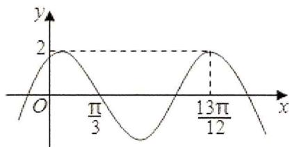

line

| x | y |
|---|---|
| 0 | 0 |
| π/3 | 2 |
| 13π/12 | 2 |

14．（2021·甲卷）已知函数 $f(x)=2\cos(\omega x+\varphi)$ 的部分图像如图所示，则满足条件 $(f(x)-f(-\frac{7\pi}{4}))(f(x)-f(\frac{4\pi}{3}))>0$ 的最小正整数 x 为 \_\_\_\_.

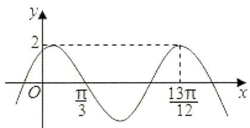

line

| x | y |
|---|---|
| 0 | 0 |
| π/3 | 2 |
| 13π/12 | 2 |

15.（2022·上海）函数 $f(x)=\cos^{2}x-\sin^{2}x+1$ 的周期为 \_\_\_\_.

16.（2022·全国）若 $\tan\theta=3$ ，则 $\tan2\theta=$ \_\_\_\_.

17.（2022·浙江）若 $3\sin \alpha -\sin \beta = \sqrt{10}$ ， $\alpha +\beta = \frac{\pi}{2}$ ，则 $\sin \alpha =$ \_\_\_\_， $\cos 2\beta =$ \_\_\_\_.

18.（2022·上海）若 $\tan \alpha = 3$ ，则 $\tan (\alpha +\frac{\pi}{4}) = \_$

19. (2022·乙卷) 记函数 $f(x) = \cos (\omega x + \varphi)(\omega > 0, 0 < \varphi < \pi)$ 的最小正周期为 $T$ . 若 $f(T) = \frac{\sqrt{3}}{2}$ , $x = \frac{\pi}{9}$ 为 $f(x)$ 的零点, 则 $\omega$ 的最小值为 \_\_\_\_.

20.（2022·北京）若函数 $f(x)=A\sin x-\sqrt{3}\cos x$ 的一个零点为 $\frac{\pi}{3}$ ，则 A= \_\_\_\_； $f(\frac{\pi}{12})=$ \_\_\_\_.

21.（2023·全国）已知 $\sin2\theta=-\frac{1}{3}$ ，若 $\frac{\pi}{4}<\theta<\frac{3\pi}{4}$ ，则 $\tan\theta=$ \_\_\_\_.

22.（2023·上海）已知 $\tan\alpha=3$ ，则 $\tan2\alpha=$

23.（2023·乙卷）若 $\theta \in (0, \frac{\pi}{2})$ ， $\tan \theta = \frac{1}{3}$ ，则 $\sin \theta - \cos \theta = \_$ .

24. (2023·新高考 I) 已知函数 $f(x) = \cos \omega x - 1 (\omega > 0)$ 在区间 $[0, 2\pi]$ 有且仅有 3 个零点，则 $\omega$ 的取值范围是 \_\_\_\_。

25. (2023·新高考II) 已知函数 $f(x) = \sin (\omega x + \varphi)$ ，如图， $A$ ， $B$ 是直线 $y = \frac{1}{2}$ 与曲线 $y = f(x)$ 的两个交点，若 $|AB| = \frac{\pi}{6}$ ，则 $f(\pi) =$ \_\_\_\_.

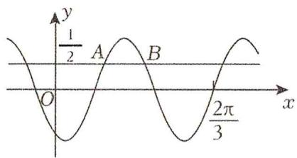

text_image

y
1/2 A B
O
2π/3
x

# 四、解答题

1.（2019·全国）已知函数 $f(x) = 2\sin^2 x - 4\cos^2 x + 1$ .

(1) 求 $f(x)$ 的最小正周期:

（2）设 $g(x)=f(\frac{x}{2})$ ，求 $g(x)$ 在区间 $[0, \frac{\pi}{3}]$ 的最大值与最小值.

2.（2019·浙江）设函数 $f(x)=\sin x,\quad x\in R$ .

（Ⅰ）已知 $\theta \in [0, 2\pi)$ ，函数 $f(x + \theta)$ 是偶函数，求 $\theta$ 的值：

（II）求函数 $y = [f(x + \frac{\pi}{12})]^2 + [f(x + \frac{\pi}{4})]^2$ 的值域.

3.（2020·上海）已知函数 $f(x) = \sin \omega x$ ， $\omega > 0$ .

（1） $f(x)$ 的周期是 $4\pi$ ，求 $\omega$ ，并求 $f(x) = \frac{1}{2}$ 的解集；  
（2）已知 $\omega=1,\quad g(x)=f^{2}(x)+\sqrt{3}f(-x)f(\frac{\pi}{2}-x),\quad x\in[0,\quad\frac{\pi}{4}]$ ，求 $g(x)$ 的值域.

4.（2023·北京）已知函数 $f(x) = \sin \omega x\cos \varphi +\cos \omega x\sin \varphi ,\quad \omega >0,\quad |\varphi | <   \frac{\pi}{2} .$

（I）若 $f(0) = -\frac{\sqrt{3}}{2}$ ，求 $\varphi$ 的值；

(II) 若 $f(x)$ 在 $\left[-\frac{\pi}{3}, \frac{2\pi}{3}\right]$ 上单调递增, 且 $f(\frac{2\pi}{3}) = 1$ , 再从条件①、条件②、条件③这三个条件中选择一个作为已知, 求 $\omega$ 、 $\varphi$ 的值.

条件①: $f(\frac{\pi}{3})=1$ ;

条件②: $f(-\frac{\pi}{3})=-1$ ;

条件③： $f(x)$ 在 $\left[-\frac{4\pi}{3}, -\frac{\pi}{3}\right]$ 上单调递减.

注：如果选择多个条件分别解答，按第一个解答计分.

5.（2024·上海）已知 $f(x) = \sin (\omega x + \frac{\pi}{3})$ ， $\omega > 0$ ：

（1）设 $\omega=1$ ，求解： $y=f(x)$ ， $x\in[0,\pi]$ 的值域；

(2) $a > \pi (a \in R)$ , $f(x)$ 的最小正周期为 $\pi$ , 若在 $x \in [\pi, a]$ 上恰有 3 个零点, 求 $a$ 的取值范围.

# 第六章：解三角形

# 一、选择题

1. (2019·新课标 I) $\triangle ABC$ 的内角 $A, B, C$ 的对边分别为 $a, b, c$ . 已知 $a \sin A - b \sin B = 4c \sin C$ , $\cos A = -\frac{1}{4}$ , 则 $\frac{b}{c} = (\quad)$

A. 6

B. 5

C. 4

D. 3

2. (2020·北京) 2020 年 3 月 14 日是全球首个国际圆周率日 ( $\pi Day$ ). 历史上, 求圆周率 $\pi$ 的方法有多种,与中国传统数学中的 “割圆术” 相似, 数学家阿尔. 卡西的方法是: 当正整数 $n$ 充分大时, 计算单位圆的内接正 $6n$ 边形的周长和外切正 $6n$ 边形 (各边均与圆相切的正 $6n$ 边形) 的周长, 将它们的算术平均数作为 $2\pi$ 的近似值. 按照阿尔. 卡西的方法, $\pi$ 的近似值的表达式是 ( )

A. $3n(\sin\frac{30^{\circ}}{n}+\tan\frac{30^{\circ}}{n})$

B. $6n(\sin \frac{30^{\circ}}{n} +\tan \frac{30^{\circ}}{n})$

C. $3n(\sin \frac{60^{\circ}}{n} +\tan \frac{60^{\circ}}{n})$

D. $6n(\sin \frac{60^{\circ}}{n} +\tan \frac{60^{\circ}}{n})$

3.（2020·新课标III）在 $\triangle ABC$ 中， $\cos C = \frac{2}{3}$ ， $AC = 4$ ， $BC = 3$ ，则 $\tan B = (\quad)$

A. $\sqrt{5}$

B. $2\sqrt{5}$

C. $4\sqrt{5}$

D. $8 \sqrt{5}$

4.（2020·新课标III）在 $\triangle ABC$ 中， $\cos C = \frac{2}{3}$ ， $AC = 4$ ， $BC = 3$ ，则 $\cos B = (\quad)$

A. $\frac{1}{9}$

B. $\frac{1}{3}$

C. $\frac{1}{2}$

D. $\frac{2}{3}$

5. (2021·乙卷) 魏晋时期刘徽撰写的《海岛算经》是关于测量的数学著作, 其中第一题是测量海岛的高. 如图, 点 $E$ , $H$ , $G$ 在水平线 $AC$ 上, $DE$ 和 $FG$ 是两个垂直于水平面且等高的测量标杆的高度, 称为 “表高”, $EG$ 称为 “表距”, $GC$ 和 $EH$ 都称为 “表目距”, $GC$ 与 $EH$ 的差称为 “表目距的差”, 则海岛的高 $AB = (\quad)$

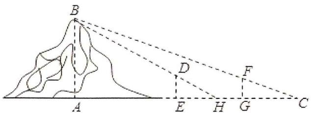

text_image

Geometric diagram showing a curve with labeled points A, B, C, D, E, F, G, H and dashed construction lines

A. $\frac{\text{表高} \times \text{表距}}{\text{表目距的差}} + \text{表高}$

B. $\frac{\text{表高} \times \text{表距}}{\text{表目距的差}} - \text{表高}$

C. $\frac{\text{表高} \times \text{表距}}{\text{表目距的差}} + \text{表距}$

D. $\frac{\text{表高} \times \text{表距}}{\text{表目距的差}} - \text{表距}$

6.（2021·甲卷）2020年12月8日，中国和尼泊尔联合公布珠穆朗玛峰最新高程为8848.86（单位：m），三角高程测量法是珠峰高程测量方法之一。如图是三角高程测量法的一个示意图，现有A，B，C三点，且A，B，C在同一水平面上的投影 $A'$ ， $B'$ ， $C'$ 满足 $\angle A'C'B'=45^{\circ}$ ， $\angle A'B'C'=60^{\circ}$ 。由C点测得B点的仰角为 $15^{\circ}$ ， $BB'$ 与 $CC'$ 的差为100；由B点测得A点的仰角为 $45^{\circ}$ ，则A，C两点到水平面 $A'B'C'$ 的高度差 $AA'-CC'$ 约为( ) $(\sqrt{3}\approx1.732)$

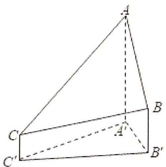

text_image

Geometric diagram of a triangular pyramid with labeled vertices A, B, C and A', B', C'

A. 346

B. 373

C. 446

D. 473

7.（2021·甲卷）在 $\triangle ABC$ 中，已知 $B = 120^{\circ}$ ， $AC = \sqrt{19}$ ， $AB = 2$ ，则 $BC = (\quad)$

A. 1

B. $\sqrt{2}$

C. $\sqrt{5}$

D. 3

8. (2023·乙卷) 在 $\triangle ABC$ 中, 内角 $A, B, C$ 的对边分别是 $a, b, c$ , 若 $a \cos B - b \cos A = c$ , 且 $C = \frac{\pi}{5}$ , 则 $\angle B = (\quad)$

A. $\frac{\pi}{10}$

B. $\frac{\pi}{5}$

C. $\frac{3\pi}{10}$

D. $\frac{2\pi}{5}$

9.（2023·北京）在 $\triangle ABC$ 中， $(a + c)(\sin A - \sin C) = b(\sin A - \sin B)$ ，则 $\angle C = (\quad)$

A. $\frac{\pi}{6}$

B. $\frac{\pi}{3}$

C. $\frac{2\pi}{3}$

D. $\frac{5\pi}{6}$

# 二、填空题

1. (2019·上海) 在 $\triangle ABC$ 中, $AC = 3$ , $3 \sin A = 2 \sin B$ , 且 $\cos C = \frac{1}{4}$ , 则 $AB = \_$ .

2. (2019·浙江) 在 $\triangle ABC$ 中, $\angle ABC = 90^{\circ}$ , $AB = 4$ , $BC = 3$ , 点 $D$ 在线段 $AC$ 上, 若 $\angle BDC = 45^{\circ}$ , 则 $BD = \_$ , $\cos \angle ABD = \_$ .

3. (2019·江苏) 如图, 在 $\triangle ABC$ 中, $D$ 是 $BC$ 的中点, $E$ 在边 $AB$ 上, $BE = 2EA$ , $AD$ 与 $CE$ 交于点 $O$ . 若 $\overrightarrow{AB} \cdot \overrightarrow{AC} = 6\overrightarrow{AO} \cdot \overrightarrow{EC}$ , 则 $\frac{AB}{AC}$ 的值是 \_\_\_\_.

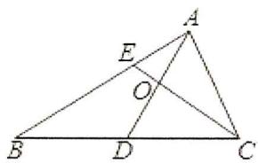

text_image

Geometric diagram of triangle ABC with internal points D, E, and intersection O

4.(2019·新课标Ⅱ)△ABC的内角A，B，C的对边分别为a，b，c.已知 $b\sin A+a\cos B=0$ ，则B=\_\_\_\_.

5. (2019·新课标Ⅱ) $\triangle ABC$ 的内角 $A, B, C$ 的对边分别为 $a, b, c$ . 若 $b=6, a=2c, B=\frac{\pi}{3}$ , 则 $\triangle ABC$ 的面积为 \_\_\_\_.

6. (2021·浙江) 我国古代数学家赵爽用弦图给出了勾股定理的证明。弦图是由四个全等的直角三角形和中间的一个小正方形拼成的一个大正方形（如图所示）。若直角三角形直角边的长分别为 3, 4，记大正方形的面积为 $S_{1}$ ，小正方形的面积为 $S_{2}$ ，则 $\frac{S_{1}}{S_{2}} =$ \_\_\_\_.

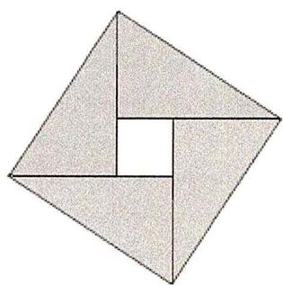

natural_image

Geometric diagram of a square divided into four triangles with one corner, no text or symbols present.

7.（2021·浙江）在 $\triangle ABC$ 中， $\angle B = 60^{\circ}$ ， $AB = 2$ ， $M$ 是 $BC$ 的中点， $AM = 2\sqrt{3}$ ，则 $AC =$ \_\_\_\_； $\cos \angle MAC =$ \_\_\_\_.  
8. (2021·乙卷) 记 $\triangle ABC$ 的内角 $A, B, C$ 的对边分别为 $a, b, c$ , 面积为 $\sqrt{3}, B = 60^{\circ}, a^{2} + c^{2} = 3ac$ , 则 $b = \_$ .  
9.（2022·上海）已知在 $\triangle ABC$ 中， $\angle A = \frac{\pi}{3}$ ，AB = 2，AC = 3，则 $\triangle ABC$ 的外接圆半径为 \_\_\_\_.  
10. (2022·甲卷) 已知 $\triangle ABC$ 中, 点 $D$ 在边 $BC$ 上, $\angle ADB = 120^{\circ}$ , $AD = 2$ , $CD = 2BD$ . 当 $\frac{AC}{AB}$ 取得最小值时, $BD = \_$ .  
11.（2023·全国）在 $\Delta ABC$ 中， $A = 2B$ ， $a = 6$ ， $b = 4$ ，则 $\cos B = \_$ .  
12. (2023·上海) 某公园欲建设一段斜坡, 坡顶是一条直线, 斜坡顶点距水平地面的高度为 $4 \mathrm{~米}$ , 坡面与水平面所成夹角为 $\theta$ . 行人每沿着斜坡向上走 $1 m$ 消耗的体力为 $(1.025 - \cos \theta)$ , 欲使行人走上斜坡所消耗的总体力最小, 则 $\theta =$ \_\_\_\_.  
13. (2023·甲卷) 在 $\triangle ABC$ 中, $\angle BAC = 60^{\circ}$ , $AB = 2$ , $BC = \sqrt{6}$ , $D$ 为 $BC$ 上一点, $AD$ 为 $\angle BAC$ 的平分线, 则 $AD = \_$ .  
14.（2024·上海）三角形 ABC 中， $BC=2, A=\frac{\pi}{3}, B=\frac{\pi}{4}$ ，则 AB= \_\_\_\_.

# 三、解答题

1.(2019·上海)如图，A-B-C为海岸线，AB为线段，BC为四分之一圆弧，BD=39.2km， $\angle BDC=22^{\circ}$ ， $\angle CBD=68^{\circ}$ ， $\angle BDA=58^{\circ}$ .

(1) 求 BC 的长度;  
(2) 若 $AB = 40km$ ，求 $D$ 到海岸线 $A - B - C$ 的最短距离。（精确到 $0.001km$ ）

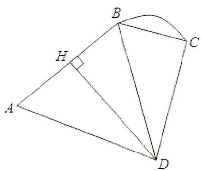

text_image

Geometric diagram with labeled points A, B, C, D and a right angle at H, showing triangles and a curved arc.

2. (2019·江苏) 在 $\triangle ABC$ 中, 角 $A$ , $B$ , $C$ 的对边分别为 $a$ , $b$ , $c$ .

（1）若 $a = 3c$ ， $b = \sqrt{2}$ ， $\cos B = \frac{2}{3}$ ，求 $c$ 的值；  
(2) 若 $\frac{\sin A}{a} = \frac{\cos B}{2b}$ ，求 $\sin(B + \frac{\pi}{2})$ 的值.

3.(2019·天津)在 $\triangle ABC$ 中,内角 $A,B,C$ 所对的边分别为 $a,b,c$ .已知 $b+c=2a,3c\sin B=4a\sin C$ .

（Ⅰ）求 $\cos B$ 的值；  
（II）求 $\sin(2B+\frac{\pi}{6})$ 的值.

4.（2019·北京）在 $\Delta ABC$ 中， $a = 3$ ， $b - c = 2$ ， $\cos B = -\frac{1}{2}$

（Ⅰ）求b，c的值；  
(II) 求 $\sin(B+C)$ 的值.

5. (2019·新课标III) $\triangle ABC$ 的内角 $A$ 、 $B$ 、 $C$ 的对边分别为 $a$ , $b$ , $c$ . 已知 $a \sin \frac{A + C}{2} = b \sin A$ .

(1) 求 B;   
(2) 若 $\triangle ABC$ 为锐角三角形，且 c=1 ，求 $\triangle ABC$ 面积的取值范围.

6.(2019·新课标Ⅰ)△ABC的内角A，B，C的对边分别为a，b，c.设 $(\sin B-\sin C)^{2}=\sin^{2}A-\sin B\sin C$

(1) 求 A:

(2) 若 $\sqrt{2}a + b = 2c$ ，求 $\sin C$ .

7.（2020·全国）设 $\Delta ABC$ 的面积为 $10\sqrt{3}$ ，内角 A，B，C 的对边分别为 a，b，c，且 a=7， $\sin^{2}A=\sin^{2}B+\sin^{2}C-\sin B\sin C$ ．求A，b和c．

8.（2020·新课标Ⅰ）△ABC的内角A，B，C的对边分别为a，b，c．已知 $B=150^{\circ}$

(1) 若 $a=\sqrt{3}c$ ， $b=2\sqrt{7}$ ，求 $\triangle ABC$ 的面积；

(2) 若 $\sin A + \sqrt{3}\sin C = \frac{\sqrt{2}}{2}$ ，求 C.

9. (2020·北京) 在 $\triangle ABC$ 中, $a + b = 11$ , 再从条件①、条件②这两个条件中选择一个作为已知, 求:

( I ) a 的值;

(II) $\sin C$ 和 $\triangle ABC$ 的面积.

条件①: c=7, $\cos A=-\frac{1}{7}$ ;

条件②: $\cos A=\frac{1}{8}$ ， $\cos B=\frac{9}{16}$ .

注：如果选择条件①和条件②分别解答，按第一个解答计分.

10. (2020·山东) 在① $ac = \sqrt{3}$ , ② $c \sin A = 3$ , ③ $c = \sqrt{3} b$ 这三个条件中任选一个, 补充在下面问题中, 若问题中的三角形存在, 求 $c$ 的值; 若问题中的三角形不存在, 说明理由.

问题: 是否存在 $\triangle ABC$ ，它的内角 A，B，C 的对边分别为 a，b，c，且 $\sin A = \sqrt{3} \sin B$ ， $C = \frac{\pi}{6}$ ，\_\_\_\_？

注：如果选择多个条件分别解答，按第一个解答计分.

11.（2020·江苏）在 $\triangle ABC$ 中，角 $A$ 、 $B$ 、 $C$ 的对边分别为 $a$ 、 $b$ 、 $c$ ．已知 $a = 3$ ， $c = \sqrt{2}$ ， $B = 45^{\circ}$

(1) 求 $\sin C$ 的值;  
（2）在边 $BC$ 上取一点 $D$ ，使得 $\cos \angle ADC = -\frac{4}{5}$ ，求 $\tan \angle DAC$ 的值.

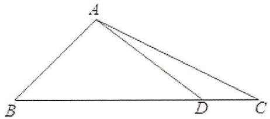

text_image

A
B
D
C

12.（2020·浙江）在锐角 $\triangle ABC$ 中，角 $A$ ， $B$ ， $C$ 所对的边分别为 $a$ ， $b$ ， $c$ ．已知 $2b\sin A - \sqrt{3} a = 0$ ：

（Ⅰ）求角 B 的大小；  
（II）求 $\cos A + \cos B + \cos C$ 的取值范围.

13.（2020·天津）在 $\Delta ABC$ 中，角 $A, B, C$ 所对的边分别为 $a, b, c$ 。已知 $a = 2\sqrt{2}, b = 5, c = \sqrt{13}$ 。

（Ⅰ）求角 C 的大小；

(II) 求 $\sin A$ 的值;

（III）求 $\sin(2A+\frac{\pi}{4})$ 的值.

14.（2020·新课标Ⅱ） $\Delta ABC$ 中， $\sin^{2}A-\sin^{2}B-\sin^{2}C=\sin B\sin C$ .

(1) 求 A:

(2) 若 BC = 3，求 $\triangle ABC$ 周长的最大值.

15.（2020·新课标Ⅱ） $\Delta ABC$ 的内角A，B，C的对边分别为a，b，c，已知 $\cos^{2}(\frac{\pi}{2}+A)+\cos A=\frac{5}{4}$ .

(1) 求 A:

(2) 若 $b - c = \frac{\sqrt{3}}{3}a$ ，证明： $\triangle ABC$ 是直角三角形.

16.（2021·全国）记 $\Delta ABC$ 的内角 $A, B, C$ 的对边分别为 $a, b, c$ . 已知 $a = 2\sqrt{6}, b = 3$ , $\sin^2 (B + C) + \sqrt{2}\sin 2A = 0$ , 求 $c$ 及 $\cos B$ .

17.（2021·上海）已知 A、B、C 为 $\Delta ABC$ 的三个内角，a、b、c 是其三条边，a=2， $\cos C=-\frac{1}{4}$ .

(1) 若 $\sin A = 2\sin B$ ，求 b、c；  
(2) 若 $\cos(A-\frac{\pi}{4})=\frac{4}{5}$ ，求 c.

18.（2021·天津）在 $\triangle ABC$ 中，内角 $A, B, C$ 的对边分别为 $a, b, c$ ，且 $\sin A: \sin B: \sin C = 2: 1: \sqrt{2}$ ， $b = \sqrt{2}$ .

(1) 求 a 的值;  
(2) 求 $\cos C$ 的值;  
(3) 求 $\sin(2C-\frac{\pi}{6})$ 的值.

19. (2021·新高考Ⅰ) 记 $\triangle ABC$ 的内角 $A, B, C$ 的对边分别为 $a, b, c$ . 已知 $b^{2} = ac$ , 点 $D$ 在边 $AC$ 上, $BD \sin \angle ABC = a \sin C$ .

(1) 证明: BD = b;   
(2) 若 AD = 2DC，求 cos∠ABC。

20.（2021·新高考Ⅱ）在 $\triangle ABC$ 中，角 $A, B, C$ 所对的边长为 $a, b, c, b = a + 1, c = a + 2$ .

(1) 若 $2\sin C = 3\sin A$ ，求 $\triangle ABC$ 的面积；  
(2) 是否存在正整数 $a$ ，使得 $\triangle ABC$ 为钝角三角形？若存在，求出 $a$ 的值；若不存在，说明理由。

21.（2021·北京）在 $\Delta ABC$ 中， $c=2b\cos B$ ， $\angle C=\frac{2\pi}{3}$ .

（Ⅰ）求∠B；

(II) 在条件①、条件②、条件③这三个条件中选择一个作为已知, 使 $\triangle ABC$ 存在且唯一确定, 并求 $BC$ 边上的中线的长.

条件① $c=\sqrt{2}b$ ;

条件② $\Delta ABC$ 的周长为 $4 + 2\sqrt{3}$ ;

条件③ $\Delta ABC$ 的面积为 $\frac{3\sqrt{3}}{4}$ .

注: 如果选择的条件不符合要求, 第 (II) 问得 0 分; 如果选择多个符合要求的条件分别解答, 按第一个解答计分.

22.（2022·上海）如图，在同一平面上， $AD = BC = 6$ ， $AB = 20$ ， $O$ 为 $AB$ 中点，曲线 $CD$ 上任一点到 $O$ 距离相等，角 $\angle DAB = \angle ABC = 120^{\circ}$ ， $P$ ， $Q$ 关于 $OM$ 对称， $MO \perp AB$ ；

(1) 若点 P 与点 C 重合，求 $\angle POB$ 的大小；  
(2) P 在何位置，求五边形 MOABP 面积 S 的最大值.

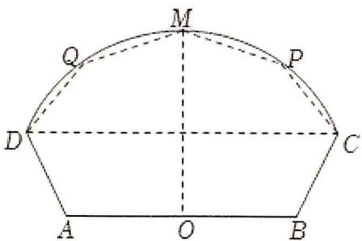

text_image

M
Q
P
D
C
A
O
B

23.(2022·乙卷)记△ABC的内角A，B，C的对边分别为a，b，c，已知 $\sin C\sin(A-B)=\sin B\sin(C-A)$ .

(1) 若 A=2B，求 C；  
(2) 证明: $2a^{2} = b^{2} + c^{2}$ .

24. (2022·全国) 记 $\triangle ABC$ 的内角 $A, B, C$ 的对边分别为 $a, b, c$ , 已知 $\sin A = 3 \sin B, C = \frac{\pi}{3}, c = \sqrt{7}$ .

(1) 求 a;   
(2) 求 $\sin A$ .

25. (2022·新高考Ⅱ) 记 $\triangle ABC$ 的内角 $A, B, C$ 的对边分别为 $a, b, c$ , 分别以 $a, b, c$ 为边长的三个正三角形的面积依次为 $S_{1}, S_{2}, S_{3}$ . 已知 $S_{1} - S_{2} + S_{3} = \frac{\sqrt{3}}{2}, \sin B = \frac{1}{3}$ .

(1) 求 $\Delta ABC$ 的面积;  
(2) 若 $\sin A\sin C=\frac{\sqrt{2}}{3}$ ，求 b.

26. (2022·新高考 I) 记 $\triangle ABC$ 的内角 $A, B, C$ 的对边分别为 $a, b, c$ , 已知 $\frac{\cos A}{1 + \sin A} = \frac{\sin 2B}{1 + \cos 2B}$ .

(1) 若 $C=\frac{2\pi}{3}$ ，求 B；

(2) 求 $\frac{a^{2}+b^{2}}{c^{2}}$ 的最小值.

27.（2022·天津）在 $\Delta ABC$ 中，角 $A, B, C$ 所对的边分别为 $a, b, c$ 。已知 $a = \sqrt{6}, b = 2c, \cos A = -\frac{1}{4}$ 。

(1) 求 c 的值;  
(2) 求 $\sin B$ 的值;  
(3) 求 $\sin(2A - B)$ 的值.

28.(2022·乙卷)记△ABC的内角A，B，C的对边分别为a，b，c，已知 $\sin C\sin(A-B)=\sin B\sin(C-A)$ .

(1) 证明: $2a^{2} = b^{2} + c^{2}$ ;

(2) 若 a=5， $\cos A=\frac{25}{31}$ ，求 $\Delta ABC$ 的周长.

29.（2022·北京）在 $\Delta ABC$ 中， $\sin 2C = \sqrt{3} \sin C$ 。

(Ⅰ) 求 $\angle C$ ;

（Ⅱ）若 b=6，且 $\triangle ABC$ 的面积为 $6\sqrt{3}$ ，求 $\triangle ABC$ 的周长.

30.（2022·浙江）在 $\triangle ABC$ 中，角 $A$ ， $B$ ， $C$ 所对的边分别为 $a$ ， $b$ ， $c$ ．已知 $4a = \sqrt{5} c$ ， $\cos C = \frac{3}{5}$

( I ) 求 $\sin A$ 的值;

(II) 若 b=11，求 $\triangle ABC$ 的面积.

31.（2023·乙卷）在 $\triangle ABC$ 中，已知 $\angle BAC = 120^{\circ}$ ， $AB = 2$ ， $AC = 1$ 。

(1) 求 $\sin\angle ABC$ :

(2) 若 D 为 BC 上一点，且 $\angle BAD = 90^{\circ}$ ，求 $\triangle ADC$ 的面积.

32. (2023·上海) 在 $\triangle ABC$ 中, 角 $A 、 B 、 C$ 所对应的边分别为 $a 、 b 、 c$ , 其中 $b = 2$ .

（1）若 $A + C = 120^{\circ}$ ，a = 2c，求边长 c；  
(2) 若 $A - C = 15^{\circ}$ ， $a = \sqrt{2}c \sin A$ ，求 $\triangle ABC$ 的面积.

33. (2023·新高考Ⅱ) 记 $\triangle ABC$ 的内角 $A, B, C$ 的对边分别为 $a, b, c$ , 已知 $\triangle ABC$ 面积为 $\sqrt{3}, D$ 为 $BC$ 的中点, 且 $AD = 1$ .

(1) 若 $\angle ADC = \frac{\pi}{3}$ ，求 $\tan B$ ;  
(2) 若 $b^{2} + c^{2} = 8$ ，求 b，c。

34.（2023·甲卷）记 $\triangle ABC$ 的内角 $A, B, C$ 的对边分别为 $a, b, c$ ，已知 $\frac{b^2 + c^2 - a^2}{\cos A} = 2$ 。

(1) 求 bc ;   
(2) 若 $\frac{a\cos B-b\cos A}{a\cos B+b\cos A}-\frac{b}{c}=1$ ，求 $\triangle ABC$ 面积.

35.（2023·新高考Ⅰ）已知在 $\Delta ABC$ 中， $A + B = 3C$ ， $2\sin(A - C) = \sin B$ .

(1) 求 $\sin A$ ;   
(2) 设 AB = 5，求 AB 边上的高.

36.（2023·天津）在 $\triangle ABC$ 中，角 $A, B, C$ 的对边分别为 $a, b, c$ 。已知 $a = \sqrt{39}$ ， $b = 2$ ， $\angle A = 120^\circ$ 。

（Ⅰ）求 $\sin B$ 的值；

(II) 求 c 的值;

（III）求 $\sin(B-C)$ 的值.

# 第七章: 向量

# 一、选择题

1.（2019·新课标II）已知向量 $\vec{a} = (2,3)$ ， $\vec{b} = (3,2)$ ，则 $|\vec{a} -\vec{b}| = (\quad)$

A. $\sqrt{2}$

B. 2

C. $5 \sqrt{2}$

D. 50

2.（2019·北京）设点 $A$ ， $B$ ， $C$ 不共线，则“ $\overrightarrow{AB}$ 与 $\overrightarrow{AC}$ 的夹角为锐角”是“ $|\overrightarrow{AB} + \overrightarrow{AC}| > |\overrightarrow{BC}|$ ”的（）

A. 充分而不必要条件

B. 必要而不充分条件

C. 充分必要条件

D. 既不充分也不必要条件

3.（2019·新课标Ⅱ）已知 $\overrightarrow{AB} = (2,3)$ ， $\overrightarrow{AC} = (3,t)$ ， $|\overrightarrow{BC}| = 1$ ，则 $\overrightarrow{AB} \cdot \overrightarrow{BC} = (\quad)$

A. -3

B. -2

C. 2

D. 3

4.（2019·新课标Ⅰ）已知非零向量 $\vec{a}$ ， $\vec{b}$ 满足 $|\vec{a}|=2|\vec{b}|$ ，且 $(\vec{a}-\vec{b})\perp\vec{b}$ ，则 $\vec{a}$ 与 $\vec{b}$ 的夹角为（）

A. $\frac{\pi}{6}$

B. $\frac{\pi}{3}$

C. $\frac{2\pi}{3}$

D. $\frac{5\pi}{6}$

5.（2020·全国）设点 $P_{1}$ ， $P_{2}$ ， $P_{3}$ 在 $\odot O$ 上，若 $\overrightarrow{OP_1} +\overrightarrow{OP_2} +\overrightarrow{OP_3} = \overrightarrow{0}$ ，则 $\angle P_1P_2P_3 = (\quad)$

A. $30^{\circ}$

B. ${45}^{ \circ  }$

C. ${60}^{ \circ  }$

D. ${90}^{ \circ  }$

6.（2020·海南）在 $\triangle ABC$ 中， $D$ 是 $AB$ 边上的中点，则 $\overrightarrow{CB} = (\quad)$

A. $2\overrightarrow{CD} +\overrightarrow{CA}$

B. $\overrightarrow{CD} - 2\overrightarrow{CA}$

C. $2 \overrightarrow{CD} - \overrightarrow{CA}$

D. $\overrightarrow{CD} + 2\overrightarrow{CA}$

7. (2020·山东)已知 $P$ 是边长为 2 的正六边形 $A B C D E F$ 内的一点, 则 $\overrightarrow {A P} \cdot \overrightarrow {A B}$ 的取值范围是 ( )

A. $(-2,6)$

B. $(-6,2)$

C. $(-2,4)$

D. $(-4,6)$

8. (2020·新课标 II) 已知单位向量 $\vec{a}$ , $\vec{b}$ 的夹角为 $60^{\circ}$ , 则在下列向量中, 与 $\vec{b}$ 垂直的是 ( )

A. $\vec{a} + 2\vec{b}$

B. $2\vec{a} +\vec{b}$

C. $\vec{a}-2\vec{b}$

D. $2\vec{a} -\vec{b}$

9.（2020·新课标III）已知向量 $\vec{a}$ ， $\vec{b}$ 满足 $|\vec{a}| = 5$ ， $|\vec{b}| = 6$ ， $\vec{a} \cdot \vec{b} = -6$ ，则 $\cos < \vec{a}$ ， $\vec{a} + \vec{b} >= (\quad)$

A. $-\frac{31}{35}$

B. $-\frac{19}{35}$

C. $\frac{17}{35}$

D. $\frac{19}{35}$

10.（2021·全国）已知向量 $\vec{a}=(\cos\theta,\sin\theta)$ ， $\vec{b}=(3,-4)$ ，则 $\vec{a}\cdot\vec{b}$ 的最大值是（）

A. 7

B. 5

C. 4

D. 1

11.（2021·浙江）已知非零向量 $\vec{a}$ ， $\vec{b}$ ， $\vec{c}$ ，则“ $\vec{a} \cdot \vec{c} = \vec{b} \cdot \vec{c}$ ”是“ $\vec{a} = \vec{b}$ ”的（ ）

A. 充分不必要条件

B. 必要不充分条件

C. 充分必要条件

D. 既不充分也不必要条件

12. (2021·上海) 在 $\triangle ABC$ 中, $D$ 为 $BC$ 中点, $E$ 为 $AD$ 中点, 则以下结论: ①存在 $\triangle ABC$ , 使得 $\overrightarrow{AB} \cdot \overrightarrow{CE} = 0$ ; ②存在 $\triangle ABC$ , 使得 $\overrightarrow{CE} / / (\overrightarrow{CB} + \overrightarrow{CA})$ ; 它们的成立情况是 ( )

A. ①成立，②成立

B. ①成立，②不成立

C. ①不成立，②成立

D. ①不成立，②不成立

13.（2022·全国）已知向量 $\vec{a} = (x + 2,1 + x)$ ， $\vec{b} = (x - 2,1 - x)$ .若 $\vec{a} // \vec{b}$ ，则（

A. $x^{2} = 2$

B. $|x| = 2$

C. $x^{2} = 3$

D. $|x| = 3$

14.（2022·北京）在 $\triangle ABC$ 中， $AC = 3$ ， $BC = 4$ ， $\angle C = 90^{\circ}$ 。 $P$ 为 $\triangle ABC$ 所在平面内的动点，且 $PC = 1$ 则 $\overrightarrow{PA} \cdot \overrightarrow{PB}$ 的取值范围是（ ）

A. $[-5, 3]$

B. $[-3, 5]$

C. $[-6, 4]$

D. $[-4, 6]$

15.（2022·新高考Ⅱ）已知向量 $\vec{a}=(3,4)$ ， $\vec{b}=(1,0)$ ， $\vec{c}=\vec{a}+t\vec{b}$ ，若 $<\vec{a}$ ， $\vec{c}>=<\vec{b}$ ， $\vec{c}>$ ，则 $t=(\quad)$

A. -6

B. -5

C. 5

D. 6

16.（2022·乙卷）已知向量 $\vec{a}$ ， $\vec{b}$ 满足 $|\vec{a}| = 1$ ， $|\vec{b}| = \sqrt{3}$ ， $|\vec{a} - 2\vec{b}| = 3$ ，则 $\vec{a} \cdot \vec{b} = (\quad)$

A. -2

B. -1

C. 1

D. 2

17.（2022·乙卷）已知向量 $\vec{a} = (2,1)$ ， $\vec{b} = (-2,4)$ ，则 $|\vec{a} - \vec{b}| = (\quad)$

A. 2

B. 3

C. 4

D. 5

18.（2022·新高考Ⅰ）在△ABC中，点D在边AB上，BD=2DA．记 $\overrightarrow{CA}=\vec{m}$ ， $\overrightarrow{CD}=\vec{n}$ ，则 $\overrightarrow{CB}=(\quad)$

A. $3\vec{m} - 2\vec{n}$

B. $-2\vec{m} + 3\vec{n}$

C. $3 \vec{m} + 2 \vec{n}$

D. $2 \vec{m} + 3 \vec{n}$

19.（2023·全国）设向量 $\vec{a} = (2, x + 1)$ ， $\vec{b} = (x - 2, -1)$ ，若 $\vec{a} \perp \vec{b}$ ，则 $x = (\quad)$

A. 5

B. 2

C. 1

D. 0

20.（2023·甲卷）已知向量 $\vec{a} = (3,1)$ ， $\vec{b} = (2,2)$ ，则 $\cos \langle \vec{a} + \vec{b}$ ， $\vec{a} - \vec{b} \rangle = (\quad)$

A. $\frac{1}{17}$

B. $\frac{\sqrt{17}}{17}$

C. $\frac{\sqrt{5}}{5}$

D. $\frac{2 \sqrt{5}}{5}$

21.（2023·甲卷）向量 $|\vec{a}| = |\vec{b}| = 1$ ， $|\vec{c}| = \sqrt{2}$ ，且 $\vec{a} +\vec{b} +\vec{c} = \vec{0}$ ，则 $\cos \langle \vec{a} -\vec{c},\vec{b} -\vec{c}\rangle = ($

A. $-\frac{1}{5}$

B. $-\frac{2}{5}$

C. $\frac{2}{5}$

D. $\frac{4}{5}$

22.（2023·乙卷）正方形ABCD的边长是2，E是AB的中点，则 $\overrightarrow{EC}\cdot\overrightarrow{ED}=(\quad)$

A. $\sqrt{5}$

B. 3

C. $2 \sqrt{5}$

D. 5

23.（2023·北京）已知向量 $\vec{a}$ ， $\vec{b}$ 满足 $\vec{a} +\vec{b} = (2,3)$ ， $\vec{a} -\vec{b} = (-2,1)$ ，则 $|\vec{a}|^2 -|\vec{b}|^2 = ($

A. -2

B. -1

C. 0

D. 1

24.（2023·新高考Ⅰ）已知向量 $\vec{a}=(1,1)$ ， $\vec{b}=(1,-1)$ 。若 $(\vec{a}+\lambda\vec{b})\perp(\vec{a}+\mu\vec{b})$ ，则（）

A. $\lambda + \mu = 1$

B. $\lambda + \mu = -1$

C. $\lambda \mu = 1$

D. $\lambda \mu = -1$

# 二、多选题

1. (2021·新高考 I) 已知 $O$ 为坐标原点, 点 $P_{1}(\cos \alpha, \sin \alpha)$ , $P_{2}(\cos \beta, -\sin \beta)$ , $P_{3}(\cos (\alpha + \beta), \sin (\alpha + \beta))$ , $A(1,0)$ , 则 ( )

A. $|\overrightarrow{OP_1}| = |\overrightarrow{OP_2}|$

B. $|\overrightarrow{AP_1}| = |\overrightarrow{AP_2}|$

C. $\overrightarrow{OA} \cdot \overrightarrow{OP_3} = \overrightarrow{OP_1} \cdot \overrightarrow{OP_2}$

D. $\overrightarrow{OA} \cdot \overrightarrow{OP_1} = \overrightarrow{OP_2} \cdot \overrightarrow{OP_3}$

# 三、填空题

1.（2019·全国）已知向量 $\vec{a} = (1,m)$ ， $\vec{b} = (3,1)$ ，若 $\vec{a}\perp \vec{b}$ ，则 $m =$

2.（2019·北京）已知向量 $\vec{a} = (-4,3)$ ， $\vec{b} = (6,m)$ ，且 $\vec{a} \perp \vec{b}$ ，则 $m = \_$ .

3.（2019·新课标III）已知向量 $\vec{a} = (2,2)$ ， $\vec{b} = (-8,6)$ ，则 $\cos < \vec{a}$ ， $\vec{b} > =$ \_\_\_\_.

4.（2019·天津）在四边形ABCD中， $AD \parallel BC$ ， $AB = 2\sqrt{3}$ ，AD = 5， $\angle A = 30^{\circ}$ ，点E在线段CB的延长线上，且AE = BE，则 $\overrightarrow{BD} \cdot \overrightarrow{AE} =$ \_\_\_\_.

5. (2019·浙江) 已知正方形 $ABCD$ 的边长为 1. 当每个 $\lambda_{i} (i=1,2,3,4,5,6)$ 取遍 $\pm 1$ 时, $|\lambda_{1}\overrightarrow{AB}+\lambda_{2}\overrightarrow{BC}+\lambda_{3}\overrightarrow{CD}+\lambda_{4}\overrightarrow{DA}+\lambda_{5}\overrightarrow{AC}+\lambda_{6}\overrightarrow{BD}|$ 的最小值是 \_\_\_\_, 最大值是 \_\_\_\_.

6.（2019·新课标III）已知 $\vec{a}$ ， $\vec{b}$ 为单位向量，且 $\vec{a} \cdot \vec{b} = 0$ ，若 $\vec{c} = 2\vec{a} - \sqrt{5}\vec{b}$ ，则 $\cos <\vec{a}$ ， $\vec{c} >=\_$

7.（2019·江苏）如图，在 $\triangle ABC$ 中， $D$ 是 $BC$ 的中点， $E$ 在边 $AB$ 上， $BE = 2EA$ ， $AD$ 与 $CE$ 交于点 $O$ 。若 $\overrightarrow{AB} \cdot \overrightarrow{AC} = 6\overrightarrow{AO} \cdot \overrightarrow{EC}$ ，则 $\frac{AB}{AC}$ 的值是 \_\_\_\_.

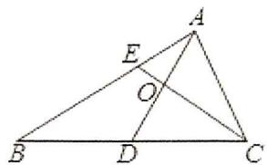

text_image

Geometric diagram of triangle ABC with internal points D, E, and intersection O

8. (2020·浙江) 已知平面单位向量 $\vec{e}_1$ , $\vec{e}_2$ 满足 $|2\vec{e}_1 - \vec{e}_2| \leqslant \sqrt{2}$ . 设 $\vec{a} = \vec{e}_1 + \vec{e}_2$ , $\vec{b} = 3\vec{e}_1 + \vec{e}_2$ , 向量 $\vec{a}$ , $\vec{b}$ 的夹角为 $\theta$ , 则 $\cos^2\theta$ 的最小值是 \_\_\_\_.

9.（2020·上海）已知 $\overrightarrow{a_{1}}$ ， $\overrightarrow{a_{2}}$ ， $\overrightarrow{b_{1}}$ ， $\overrightarrow{b_{2}}$ ，…， $\overrightarrow{b_{k}}(k\in N^{*})$ 是平面内两两互不相等的向量，满足 $|\overrightarrow{a_{1}}-\overrightarrow{a_{2}}|=1$ ，且 $|\overrightarrow{a_{i}}-\overrightarrow{b_{j}}|\in\{1,2\}$ （其中 i=1,2,j=1,2,…,k），则 k 的最大值是 \_\_\_\_.

10.（2020·上海）三角形 $ABC$ 中， $D$ 是 $BC$ 中点， $AB = 2$ ， $BC = 3$ ， $AC = 4$ ，则 $\overrightarrow{AD} \cdot \overrightarrow{AB} =$ \_\_\_\_.

11.（2020·新课标Ⅰ）设向量 $\vec{a}=(1,-1)$ ， $\vec{b}=(m+1,2m-4)$ ，若 $\vec{a}\perp\vec{b}$ ，则 m= \_\_\_\_.

12.（2020·新课标Ⅱ）已知单位向量 $\vec{a}$ ， $\vec{b}$ 的夹角为 $45^{\circ}$ ， $k\vec{a}-\vec{b}$ 与 $\vec{a}$ 垂直，则 k= \_\_\_\_.

13.(2020·北京)已知正方形ABCD的边长为2,点P满足 $\overrightarrow{AP}=\frac{1}{2}(\overrightarrow{AB}+\overrightarrow{AC})$ ,则 $|\overrightarrow{PD}|=$ \_\_\_\_； $\overrightarrow{PB}\cdot\overrightarrow{PD}=$ \_\_\_\_.

14.（2020·天津）如图，在四边形ABCD中， $\angle B=60^{\circ}$ ，AB=3，BC=6，且 $\overrightarrow{AD}=\lambda\overrightarrow{BC}$ ， $\overrightarrow{AD}\cdot\overrightarrow{AB}=-\frac{3}{2}$ ，
则实数 $\lambda$ 的值为 \_\_\_\_，若 M，N 是线段 BC 上的动点，且 $|\overrightarrow{MN}|=1$ ，则 $\overrightarrow{DM}\cdot\overrightarrow{DN}$ 的最小值为 \_\_\_\_。

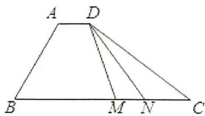

text_image

A D
B M N C

15.（2020·新课标Ⅰ）设 $\vec{a}$ ， $\vec{b}$ 为单位向量，且 $|\vec{a}+\vec{b}|=1$ ，则 $|\vec{a}-\vec{b}|=$ \_\_\_\_.

16.(2020·江苏)在 $\triangle ABC$ 中, $AB=4$ , $AC=3$ , $\angle BAC=90^{\circ}$ , $D$ 在边 $BC$ 上,延长 $AD$ 到 $P$ ,使得 $AP=9$ .若 $\overrightarrow{PA}=m\overrightarrow{PB}+(\frac{3}{2}-m)\overrightarrow{PC}(m$ 为常数),则 $CD$ 的长度是\_\_\_\_.

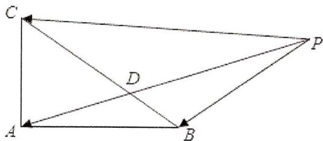

text_image

Geometric diagram with labeled points A, B, C, D, P and directional arrows indicating vectors or transformations

17.（2020·上海）已知 $A_{1}$ 、 $A_{2}$ 、 $A_{3}$ 、 $A_{4}$ 、 $A_{5}$ 五个点，满足 $\overrightarrow{A_nA_{n+1}}\cdot\overrightarrow{A_{n+1}A_{n+2}}=0(n=1,2,3)$ ， $|\overrightarrow{A_nA_{n+1}}|\cdot|\overrightarrow{A_{n+1}A_{n+2}}|=n+1(n=1,2,3)$ ，则 $|\overrightarrow{A_1A_5}|$ 的最小值为 \_\_\_\_.

18. (2021·浙江) 已知平面向量 $\vec{a}$ , $\vec{b}$ , $\vec{c} (\vec{c} \neq \vec{0})$ 满足 $|\vec{a}| = 1$ , $|\vec{b}| = 2$ , $\vec{a} \cdot \vec{b} = 0$ , $(\vec{a} - \vec{b}) \cdot \vec{c} = 0$ . 记平面向量 $\vec{d}$ 在 $\vec{a}$ , $\vec{b}$ 方向上的投影分别为 $x$ , $y$ , $\vec{d} - \vec{a}$ 在 $\vec{c}$ 方向上的投影为 $z$ , 则 $x^{2} + y^{2} + z^{2}$ 的最小值是 \_\_\_\_.

19. (2021·天津) 在边长为 1 的等边三角形 $ABC$ 中, $D$ 为线段 $BC$ 上的动点, $DE \perp AB$ 且交 $AB$ 于点 $E$ , $DF // AB$ 且交 $AC$ 于点 $F$ , 则 $|2\overrightarrow{BE} + \overrightarrow{DF}|$ 的值为 $\_$ ; $(\overrightarrow{DE} + \overrightarrow{DF}) \cdot \overrightarrow{DA}$ 的最小值为 $\_$ .

20.（2021·甲卷）若向量 $\vec{a}$ ， $\vec{b}$ 满足 $|\vec{a}|=3$ ， $|\vec{a}-\vec{b}|=5$ ， $\vec{a}\cdot\vec{b}=1$ ，则 $|\vec{b}|=$ \_\_\_\_.

21.（2021·甲卷）已知向量 $\vec{a} = (3,1)$ ， $\vec{b} = (1,0)$ ， $\vec{c} = \vec{a} + k\vec{b}$ 。若 $\vec{a} \perp \vec{c}$ ，则 $k = \_$ .

22.（2021·乙卷）已知向量 $\vec{a}=(1,3)$ ， $\vec{b}=(3,4)$ ，若 $(\vec{a}-\lambda\vec{b})\perp\vec{b}$ ，则 $\lambda=$ \_\_\_\_.

23.（2021·乙卷）已知向量 $\vec{a}=(2,5)$ ， $\vec{b}=(\lambda,4)$ ，若 $\vec{a}//\vec{b}$ ，则 $\lambda=$ \_\_\_\_.

24.（2021·新高考Ⅱ）已知向量 $\vec{a} + \vec{b} + \vec{c} = \vec{0}$ ， $|\vec{a}| = 1$ ， $|\vec{b}| = |\vec{c}| = 2$ ，则 $\vec{a} \cdot \vec{b} + \vec{b} \cdot \vec{c} + \vec{c} \cdot \vec{a} =$ \_\_\_\_.

25. (2022·上海) 在 $\triangle ABC$ 中, $\angle A = 90^{\circ}$ , $AB = AC = 2$ , 点 $M$ 为边 $AB$ 的中点, 点 $P$ 在边 $BC$ 上, 则 $\overrightarrow{MP} \cdot \overrightarrow{CP}$ 的最小值为 \_\_\_\_.

26.（2022·上海）若平面向量 $|\vec{a}| = |\vec{b}| = |\vec{c}| = \lambda$ ，且满足 $\vec{a}\cdot \vec{b} = 0$ ， $\vec{a}\cdot \vec{c} = 2$ ， $\vec{b}\cdot \vec{c} = 1$ ，则 $\lambda =$

27.（2022·天津）在 $\triangle ABC$ 中， $\overrightarrow{CA} = \vec{a}$ ， $\overrightarrow{CB} = \vec{b}$ ， $D$ 是 $AC$ 中点， $\overrightarrow{CB} = 2\overrightarrow{BE}$ ，试用 $\vec{a}$ ， $\vec{b}$ 表示 $\overrightarrow{DE}$ 为 \_\_\_\_，若 $\overrightarrow{AB} \perp \overrightarrow{DE}$ ，则 $\angle ACB$ 的最大值为 \_\_\_\_。

28.（2022·甲卷）设向量 $\vec{a}$ ， $\vec{b}$ 的夹角的余弦值为 $\frac{1}{3}$ ，且 $|\vec{a}|=1$ ， $|\vec{b}|=3$ ，则 $(2\vec{a}+\vec{b})\cdot\vec{b}=$ \_\_\_\_.

29. (2022·浙江) 设点 $P$ 在单位圆的内接正八边形 $A_{1}A_{2}\ldots A_{8}$ 的边 $A_{1}A_{2}$ 上, 则 $\overrightarrow{PA_1}^2 + \overrightarrow{PA_2}^2 + \ldots + \overrightarrow{PA_8}^2$ 的取值范围是 \_\_\_\_.

30.（2022·甲卷）已知向量 $\vec{a}=(m,3)$ ， $\vec{b}=(1,m+1)$ 。若 $\vec{a}\perp\vec{b}$ ，则 m= \_\_\_\_.

31.（2023·上海）已知向量 $\vec{a}=(3,4)$ ， $\vec{b}=(1,2)$ ，则 $\vec{a}-2\vec{b}=$ \_\_\_\_.

32.（2023·天津）在 $\Delta ABC$ 中， $\angle A=60^{\circ}$ ， $|\overrightarrow{BC}|=1$ ，点 D 为 AB 的中点，点 E 为 CD 的中点，若设 $\overrightarrow{AB}=\vec{a}$ ， $\overrightarrow{AC}=\vec{b}$ ，则 $\overrightarrow{AE}$ 可用 $\vec{a}$ ， $\vec{b}$ 表示为 \_\_\_\_；若 $\overrightarrow{BF}=\frac{1}{3}\overrightarrow{BC}$ ，则 $\overrightarrow{AE}\cdot\overrightarrow{AF}$ 的最大值为 \_\_\_\_.

33.（2023·新高考Ⅱ）已知向量 $\vec{a}$ ， $\vec{b}$ 满足 $|\vec{a}-\vec{b}|=\sqrt{3}$ ， $|\vec{a}+\vec{b}|=|2\vec{a}-\vec{b}|$ ，则 $|\vec{b}|=$ \_\_\_\_.

34.（2023·上海）已知 $\overrightarrow{OA}$ 、 $\overrightarrow{OB}$ 、 $\overrightarrow{OC}$ 为空间中三组单位向量，且 $\overrightarrow{OA} \perp \overrightarrow{OB}$ 、 $\overrightarrow{OA} \perp \overrightarrow{OC}$ ， $\overrightarrow{OB}$ 与 $\overrightarrow{OC}$ 夹角为 $60^{\circ}$ ，点 P 为空间任意一点，且 $|\overrightarrow{OP}| = 1$ ，满足 $|\overrightarrow{OP} \cdot \overrightarrow{OC}| \leqslant |\overrightarrow{OP} \cdot \overrightarrow{OB}| \leqslant |\overrightarrow{OP} \cdot \overrightarrow{OA}|$ ，则 $|\overrightarrow{OP} \cdot \overrightarrow{OC}|$ 最大值为 \_\_\_\_.

# 第八章：复数

# 一、选择题

1.（2019·新课标II）设 $z = i(2 + i)$ ，则 $\overline{z} = (\quad)$

A. $1+2i$

B. $-1+2i$

C. 1-2i

D. -1-2i

2. (2019·新课标 I) 设复数 $z$ 满足 $|z - i| = 1$ , $z$ 在复平面内对应的点为 $(x, y)$ , 则 ( )

A. $(x + 1)^{2} + y^{2} = 1$

B. $(x - 1)^{2} + y^{2} = 1$

C. $x^{2}+(y-1)^{2}=1$

D. $x^{2}+(y+1)^{2}=1$

3.（2019·全国）复数 $z = \frac{1 - i}{2i}$ 在复平面内对应的点在（ ）

A. 第一象限

B. 第二象限

C. 第三象限

D. 第四象限

4.（2019·新课标III）若 $z(1 + i) = 2i$ ，则 $z = (\quad)$

A. $-1 - i$

B. $-1 + i$

C. $1 - i$

D. $1 + i$

5.（2019·新课标Ⅱ）设 $z = -3 + 2i$ ，则在复平面内 $\overline{z}$ 对应的点位于（

A. 第一象限

B. 第二象限

C. 第三象限

D. 第四象限

6.（2019·北京）已知复数 $z = 2 + i$ ，则 $z\cdot \overline{z} = (\quad)$

A. $\sqrt{3}$

B. $\sqrt{5}$

C. 3

D. 5

7.（2019·新课标I）设 $z = \frac{3 - i}{1 + 2i}$ ，则 $|z| =$ （

A. 2

B. $\sqrt{3}$

C. $\sqrt{2}$

D. 1

8.（2020·全国）设 $z=\frac{2(3+5i)}{(1-i)^{2}}$ ，则 $\overline{z}=(\quad)$

A. $5 - 3i$

B. -5-3i

C. $5 + 3i$

D. $-5 + 3i$

9.（2020·山东） $\frac{2-i}{1+2i}=(\quad)$

A. 1

B. -1

C. $i$

D. -i

10.（2020·浙江）已知 $a \in R$ ，若 $a - 1 + (a - 2)i$ （ $i$ 为虚数单位）是实数，则 $a = (\quad)$

A. 1

B. -1

C. 2

D. -2

11.（2020·海南） $(1 + 2i)(2 + i) = (\quad)$

A. $4 + 5i$

B. $5i$

C. -5i

D. $2 + 3i$

12.（2020·北京）在复平面内，复数 z 对应的点的坐标是 $(1,2)$ ，则 $i \cdot z = (\quad)$

A. $1 + 2i$

B. $-2 + i$

C. $1 - 2i$

D. $-2 - i$

13. (2020·山东) 已知 $P$ 是边长为 2 的正六边形 $A B C D E F$ 内的一点, 则 $\overrightarrow {A P} \cdot \overrightarrow {A B}$ 的取值范围是 ( )

A. $(-2,6)$

B. $(-6, 2)$

C. $(-2,4)$

D. $(-4,6)$

14.（2020·新课标Ⅱ） $(1-i)^{4}=(\quad)$

A. -4

B. 4

C. -4i

D. $4 i$

15.（2020·新课标Ⅰ）若 $z=1+i$ ，则 $\left|z^{2}-2z\right|=(\quad)$

A. 0

B. 1

C. $\sqrt{2}$

D. 2

16.（2020·新课标III）复数 $\frac{1}{1 - 3i}$ 的虚部是（

A. $-\frac{3}{10}$

B. $-\frac{1}{10}$

C. $\frac{1}{10}$

D. $\frac{3}{10}$

17.（2020·新课标Ⅰ）若 $z=1+2i+i^{3}$ ，则 $|z|=(\quad)$

A. 0

B. 1

C. $\sqrt{2}$

D. 2

18.（2020·新课标III）若 $\overline{z}(1+i)=1-i$ ，则 $z=(\quad)$

A. $1 - i$

B. $1 + i$

C. -i

D. $i$

19.（2021·北京）若复数 $z$ 满足 $(1 - i)\cdot z = 2$ ，则 $z = ($

A. -1-i

B. $-1 + i$

C. $1 - i$

D. $1 + i$

20.（2021·全国） $z = \frac{2 - i}{2 + i}$ 的共轭复数 $\overline{z} = (\quad)$

A. $\frac{3}{5}+\frac{4}{5}i$

B. $\frac{3}{5} -\frac{4}{5} i$

C. $\frac{4}{5} + \frac{3}{5} i$

D. $\frac{4}{5}-\frac{3}{5}i$

21.（2021·乙卷）设 $iz = 4 + 3i$ ，则 $z = (\quad)$

A. $-3 - 4i$

B. $-3 + 4i$

C. $3 - 4i$

D. $3 + 4i$

22.（2021·新高考Ⅱ）复数 $\frac{2-i}{1-3i}$ 在复平面内对应点所在的象限为()

A. 第一象限

B. 第二象限

C. 第三象限

D. 第四象限

23.（2021·乙卷）设 $2(z+\overline{z})+3(z-\overline{z})=4+6i$ ，则 $z=(\quad)$

A. $1 - 2i$

B. $1 + 2i$

C. $1 + i$

D. $1 - i$

24.（2021·浙江）已知 $a \in R$ ， $(1 + ai)i = 3 + i$ (i 为虚数单位)，则 $a = (\quad)$

A. -1

B. 1

C. -3

D. 3

25.（2021·甲卷）已知 $(1 - i)^{2}z = 3 + 2i$ ，则 $z = ($

A. $-1 - \frac{3}{2} i$

B. $-1 + \frac{3}{2} i$

C. $-\frac{3}{2} + i$

D. $-\frac{3}{2} - i$

26.（2021·新高考I）已知 $z = 2 - i$ ，则 $z(\overline{z} +i) = ()$

A. $6 - 2i$

B. $4 - 2i$

C. $6 + 2i$

D. $4 + 2i$

27.（2022·乙卷）设 $(1 + 2i)a + b = 2i$ ，其中 $a$ ， $b$ 为实数，则（

A. $a = 1, b = -1$

B. $a = 1, b = 1$

C. $a = -1, b = 1$

D. $a = -1, b = -1$

28.（2022·乙卷）已知 $z = 1 - 2i$ ，且 $z + a\overline{z} +b = 0$ ，其中 $a$ ， $b$ 为实数，则（

A. $a = 1, b = -2$

B. $a = -1, b = 2$

C. $a = 1, b = 2$

D. $a = -1, b = -2$

29.（2022·甲卷）若 $z = 1 + i$ ，则 $\vert iz + 3\overline{z}\vert = (\quad)$

A. $4 \sqrt{5}$

B. $4 \sqrt{2}$

C. $2\sqrt{5}$

D. $2\sqrt{2}$

30.（2022·新高考Ⅰ）若 $i(1 - z) = 1$ ，则 $z + \overline{z} = (\quad)$

A. -2

B. -1

C. 1

D. 2

31.（2022·新高考Ⅱ） $(2 + 2i)(1 - 2i) = (\quad)$

A. $-2 + 4i$

B. $-2 - 4i$

C. $6 + 2i$

D. $6 - 2i$

32.（2022·浙江）已知 $a$ ， $b\in R$ ， $a + 3i = (b + i)i$ （ $i$ 为虚数单位），则（

A. $a = 1, b = -3$

B. $a = -1, b = 3$

C. a = -1, b = -3

D. $a = 1, b = 3$

33.（2022·甲卷）若 $z = -1 + \sqrt{3} i$ ，则 $\frac{z}{z\overline{z} - 1} = ()$

A. $-1 + \sqrt{3} i$

B. $-1 - \sqrt{3} i$

C. $-\frac{1}{3}+\frac{\sqrt{3}}{3}i$

D. $-\frac{1}{3} - \frac{\sqrt{3}}{3} i$

34.（2022·北京）若复数 z 满足 $i \cdot z = 3 - 4i$ ，则 $|z| = (\quad)$

A. 1

B. 5

C. 7

D. 25

35.（2023·全国）已知 $(2 + i)\overline{z} = 5 + 5i$ ，则 $|z| = ($

A. $\sqrt{5}$

B. $\sqrt{10}$

C. $5\sqrt{2}$

D. $5\sqrt{5}$

36.（2023·乙卷） $|2+i^{2}+2i^{3}|=(\quad)$

A. 1

B. 2

C. $\sqrt{5}$

D. 5

37.（2023·甲卷） $\frac{5(1 + i^3)}{(2 + i)(2 - i)} = (\quad)$

A. -1

B. 1

C. $1 - i$

D. $1 + i$

38.（2023·乙卷）设 $z = \frac{2 + i}{1 + i^2 + i^5}$ ，则 $\overline{z} = (\quad)$

A. $1 - 2i$

B. $1 + 2i$

C. $2 - i$

D. $2 + i$

39.（2023·甲卷）若复数 $(a + i)(1 - ai) = 2$ ， $a\in R$ ，则 $a = (\quad)$

A. -1

B. 0

C. 1

D. 2

40.（2023·北京）在复平面内，复数 z 对应的点的坐标是 $(-1, \sqrt{3})$ ，则 z 的共轭复数 $\overline{z} = (\quad)$

A. $1 + \sqrt{3} i$

B. $1 - \sqrt{3} i$

C. $-1 + \sqrt{3} i$

D. $-1 - \sqrt{3} i$

41.（2023·新高考Ⅰ）已知 $z=\frac{1-i}{2+2i}$ ，则 $z-\overline{z}=(\quad)$

A. -i

B. $i$

C. 0

D. 1

42. (2023·新高考Ⅱ) 在复平面内, $(1 + 3i)(3 - i)$ 对应的点位于( )

A. 第一象限

B. 第二象限

C. 第三象限

D. 第四象限

# 二、填空题

1. (2019·上海) 设 $i$ 为虚数单位, $3 \overline{z} - i = 6 + 5i$ , 则 $|z|$ 的值为 \_\_\_\_
2. (2019·江苏) 已知复数 $(a + 2i)(1 + i)$ 的实部为 0, 其中 $i$ 为虚数单位, 则实数 $a$ 的值是 \_\_\_\_.

3.（2019·浙江）复数 $z=\frac{1}{1+i}$ (i为虚数单位)，则 $|z|=$ \_\_\_\_.

4.（2019·天津）i 是虚数单位，则 $\left|\frac{5-i}{1+i}\right|$ 的值为 \_\_\_\_.

5.（2020·上海）已知复数 z 满足 $z + 2\overline{z} = 6 + i$ ，则 z 的实部为 \_\_\_\_。
6.（2020·江苏）已知i是虚数单位，则复数 $z=(1+i)(2-i)$ 的实部是\_\_\_\_。

7.（2020·天津）i 是虚数单位，复数 $\frac{8-i}{2+i}=$ \_\_\_\_.

8.（2020·新课标Ⅱ）设复数 $z_{1}$ ， $z_{2}$ 满足 $|z_{1}| = |z_{2}| = 2$ ， $z_{1} + z_{2} = \sqrt{3} + i$ ，则 $|z_{1} - z_{2}| =$ \_\_\_\_.

9.（2021·上海）已知 z=1-3i，则 $\left|\bar{z}-i\right|=$ \_\_\_\_.

10.（2021·上海）已知 $z_{1} = 1 + i$ ， $z_{2} = 2 + 3i$ ，求 $z_{1} + z_{2} = \_$

11.（2021·天津）i 是虚数单位，复数 $\frac{9+2i}{2+i}=$ \_\_\_\_.

12.（2022·上海）已知 $z = 2 + i$ （其中 $i$ 为虚数单位），则 $\overline{z} = \underline{\quad}$

13.（2022·上海）已知 $z = 1 + i$ （其中 $i$ 为虚数单位），则 $2\overline{z} = \_$ .

14.（2022·天津）已知i是虚数单位，化简 $\frac{11-3i}{1+2i}$ 的结果为 \_\_\_\_.

15.(2023·上海)已知 $z_{1}$ ， $z_{2}\in C$ 且 $z_{1}=i\overline{z_{2}}(i$ 为虚数单位)，满足 $|z_{1}-1|=1$ ，则 $|z_{1}-z_{2}|$ 的取值范围为 \_\_\_\_.

16.（2023·天津）已知i是虚数单位，化简 $\frac{5+14i}{2+3i}$ 的结果为 \_\_\_\_.

17.（2024·上海）已知 $\frac{Z}{1 + i} = i$ ，则 $Z^2 = \_$

# 第九章：概率与统计

# 一、选择题

1. (2019·新课标 II) 演讲比赛共有 9 位评委分别给出某选手的原始评分, 评定该选手的成绩时, 从 9 个原始评分中去掉 1 个最高分、1 个最低分, 得到 7 个有效评分。7 个有效评分与 9 个原始评分相比, 不变的数字特征是( )

A. 中位数

B. 平均数

C. 方差

D. 极差

2. (2020·天津) 从一批零件中抽取 80 个, 测量其直径 (单位: $mm$ ), 将所得数据分为 9 组: [5.31, 5.33), [5.33, 5.35), ..., [5.45, 5.47), [5.47, 5.49], 并整理得到如下频率分布直方图, 则在被抽取的零件中, 直径落在区间 [5.43, 5.47) 内的个数为 ( )

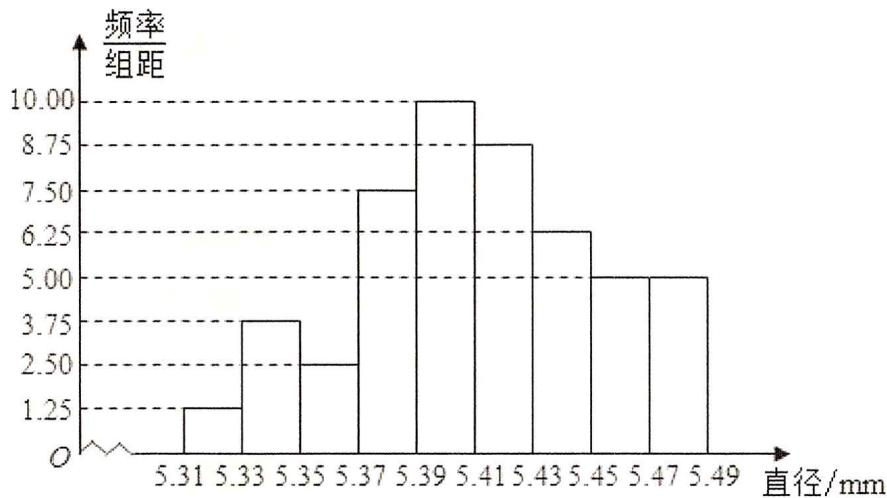

histogram

| 直径 (mm) | 频率/组距 |
| :--- | :--- |
| 5.31 | 1.25 |
| 5.33 | 3.75 |
| 5.35 | 2.50 |
| 5.37 | 7.50 |
| 5.39 | 10.00 |
| 5.41 | 8.75 |
| 5.43 | 6.25 |
| 5.45 | 5.00 |
| 5.47 | 5.00 |
| 5.49 | 0.00 |

A. 10

B. 18

C. 20

D. 36

3.（2020·新课标III）设一组样本数据 $x_{1}$ , $x_{2}$ , ..., $x_{n}$ 的方差为 0.01, 则数据 $10x_{1}$ , $10x_{2}$ , ..., $10x_{n}$ 的方差为( )

A. 0.01

B. 0.1

C. 1

D. 10

4.（2020·新课标III）在一组样本数据中，1，2，3，4出现的频率分别为 $p_{1}$ ， $p_{2}$ ， $p_{3}$ ， $p_{4}$ ，且 $\sum_{i=1}^{4}p_{i}=1$ ，则下面四种情形中，对应样本的标准差最大的一组是()

A. $p_{1}=p_{4}=0.1,\quad p_{2}=p_{3}=0.4$

B. $p_{1}=p_{4}=0.4,\quad p_{2}=p_{3}=0.1$

C. $p_{1}=p_{4}=0.2,\quad p_{2}=p_{3}=0.3$

D. $p_1 = p_4 = 0.3, p_2 = p_3 = 0.2$

5.（2021·甲卷）为了解某地农村经济情况，对该地农户家庭年收入进行抽样调查，将农户家庭年收入的调查数据整理得到如下频率分布直方图：

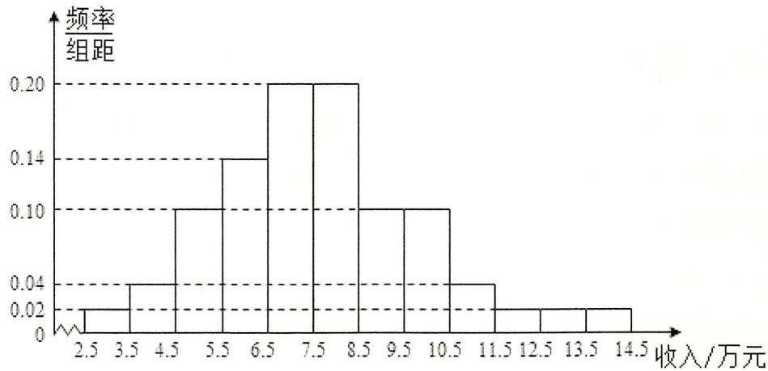

histogram

| 收入/万元 | 频率/组距 |
|---|---|
| 2.5 | 0.02 |
| 3.5 | 0.04 |
| 4.5 | 0.10 |
| 5.5 | 0.14 |
| 6.5 | 0.20 |
| 7.5 | 0.20 |
| 8.5 | 0.10 |
| 9.5 | 0.10 |
| 10.5 | 0.04 |
| 11.5 | 0.02 |
| 12.5 | 0.02 |
| 13.5 | 0.02 |
| 14.5 | 0.02 |

根据此频率分布直方图，下面结论中不正确的是( )

A. 该地农户家庭年收入低于4.5万元的农户比率估计为6%

B. 该地农户家庭年收入不低于10.5万元的农户比率估计为 $10\%$

C. 估计该地农户家庭年收入的平均值不超过6.5万元

D. 估计该地有一半以上的农户, 其家庭年收入介于 4.5 万元至 8.5 万元之间

6.（2021·天津）从某网络平台推荐的影视作品中抽取400部，统计其评分数据，将所得400个评分数据分为8组：[66, 70)，[70, 74)，…，[94, 98)，并整理得到如下的频率分布直方图，则评分在区间[82, 86)内的影视作品数量是( )

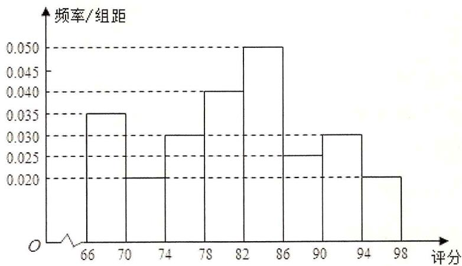

histogram

| 评分 | 频率/组距 |
| :--- | :--- |
| 66 | 0.035 |
| 70 | 0.020 |
| 74 | 0.030 |
| 78 | 0.040 |
| 82 | 0.050 |
| 86 | 0.025 |
| 90 | 0.030 |
| 94 | 0.020 |
| 98 | 0.020 |

A. 20

B. 40

C. 64

D. 80

7. (2022·天津) 将 1916 年到 2015 年的全球年平均气温（单位: $^\circ \mathrm{C}$ ），共 100 个数据，分成 6 组 [13.55, 13.75), [13.75, 13.95), [13.95, 14.15), [14.15, 14.35), [14.35, 14.55), [14.55, 14.75] 并整理得到如下的频率分布直方图，则全球年平均气温在区间 [14.35, 14.75] 内的有( )

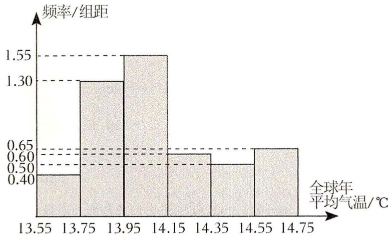

histogram

| 全球年平均气温/℃ | 频率/组距 |
|---|---|
| 13.55 | 0.40 |
| 13.75 | 1.30 |
| 13.95 | 1.55 |
| 14.15 | 0.60 |
| 14.35 | 0.50 |
| 14.55 | 0.65 |
| 14.75 | 0.65 |

A. 22 年

B. 23 年

C. 25 年

D. 35 年

8. (2022·甲卷) 某社区通过公益讲座以普及社区居民的垃圾分类知识。为了解讲座效果, 随机抽取 10 位社区居民, 让他们在讲座前和讲座后各回答一份垃圾分类知识问卷, 这 10 位社区居民在讲座前和讲座后问卷答题的正确率如图:

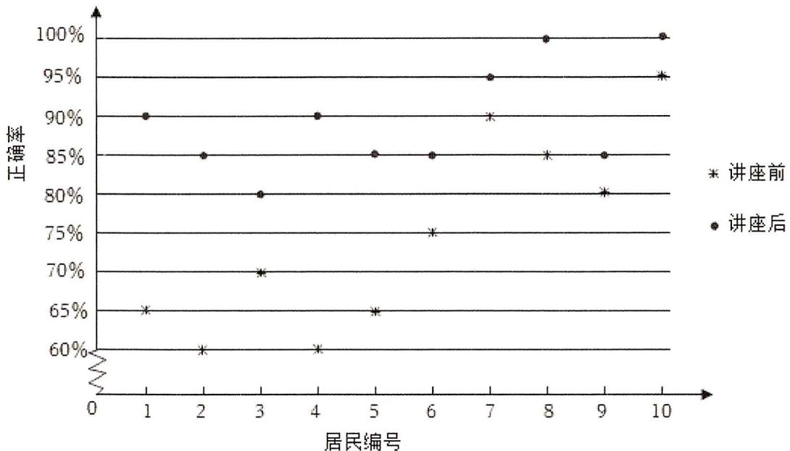

scatter

| 居民编号 | 正确率 | 讲座前 |
| -------- | ------ | ------ |
| 1        | 65%    | *      |
| 2        | 60%    | *      |
| 3        | 70%    | *      |
| 4        | 60%    | *      |
| 5        | 65%    | *      |
| 6        | 75%    | *      |
| 7        | 90%    | *      |
| 8        | 85%    | *      |
| 9        | 80%    | *      |
| 10       | 95%    | *      |
| 1        | 90%    | ●      |
| 2        | 85%    | ●      |
| 3        | 80%    | ●      |
| 4        | 90%    | ●      |
| 5        | 85%    | ●      |
| 6        | 85%    | ●      |
| 7        | 95%    | ●      |
| 8        | 100%   | ●      |
| 9        | 85%    | ●      |
| 10       | 100%   | ●      |

则（ ）

A. 讲座前问卷答题的正确率的中位数小于 $70\%$

B. 讲座后问卷答题的正确率的平均数大于 $85 \%$

C. 讲座前问卷答题的正确率的标准差小于讲座后正确率的标准差

D. 讲座后问卷答题的正确率的极差大于讲座前正确率的极差

9. (2023·上海) 如图为 2017-2021 年上海市货物进出口总额的条形统计图, 则下列对于进出口贸易额描述错误的是( )

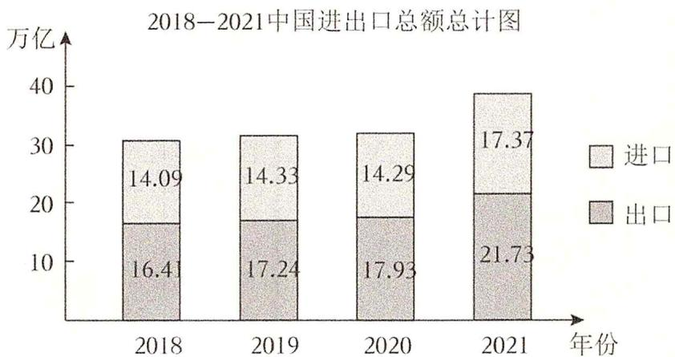

bar_stacked

2018-2021中国进出口总额总计图
| 年份 | 进口 (万亿) | 出口 (万亿) |
|---|---|---|
| 2018 | 14.09 | 16.41 |
| 2019 | 14.33 | 17.24 |
| 2020 | 14.29 | 17.93 |
| 2021 | 17.37 | 21.73 |

A. 从2018年开始，2021年的进出口总额增长率最大

B. 从2018年开始，进出口总额逐年增大

C. 从2018年开始，进口总额逐年增大

D. 从 2018 年开始, 2020 年的进出口总额增长率最小

10.（2021·新高考Ⅰ）有6个相同的球，分别标有数字1, 2, 3, 4, 5, 6，从中有放回的随机取两次，每次取1个球。甲表示事件“第一次取出的球的数字是1”，乙表示事件“第二次取出的球的数字是2”，丙表示事件“两次取出的球的数字之和是8”，丁表示事件“两次取出的球的数字之和是7”，则()

A. 甲与丙相互独立

B. 甲与丁相互独立

C. 乙与丙相互独立

D. 丙与丁相互独立

11. (2022·乙卷) 某棋手与甲、乙、丙三位棋手各比赛一盘, 各盘比赛结果相互独立。已知该棋手与甲、乙、丙比赛获胜的概率分别为 $p_{1}, p_{2}, p_{3}$ , 且 $p_{3} > p_{2} > p_{1} > 0$ 。记该棋手连胜两盘的概率为 $p$ , 则( )

A. $p$ 与该棋手和甲、乙、丙的比赛次序无关

B. 该棋手在第二盘与甲比赛，p 最大

C. 该棋手在第二盘与乙比赛，p 最大

D. 该棋手在第二盘与丙比赛，p 最大

12. (2024·上海) 有四种礼盒, 前三种里面分别仅装有中国结、记事本、笔袋, 第四个礼盒里面三种礼品都有, 现从中任选一个盒子, 设事件 $A$ : 所选盒中有中国结, 事件 $B$ : 所选盒中有记事本, 事件 $C$ : 所选盒中有笔袋, 则( )

A. 事件 A 与事件 B 互斥

B. 事件 A 与事件 B 相互独立

C. 事件 A 与事件 B{ } C 互斥

D. 事件 A 与事件 $B \cap C$ 相互独立

# 二、多选题

13.（2021·新高考Ⅱ）下列统计量中，能度量样本 $x_{1}$ ， $x_{2}$ ， $\ldots$ ， $x_{n}$ 的离散程度的有（ ）

A. 样本 $x_{1}, x_{2}, \ldots, x_{n}$ 的标准差

B. 样本 $x_{1}, x_{2}, \ldots, x_{n}$ 的中位数

C. 样本 $x_{1}, x_{2}, \ldots, x_{n}$ 的极差

D. 样本 $x_{1}, x_{2}, \ldots, x_{n}$ 的平均数

14.（2021·新高考Ⅰ）有一组样本数据 $x_{1}$ ， $x_{2}$ ，…， $x_{n}$ ，由这组数据得到新样本数据 $y_{1}$ ， $y_{2}$ ，…， $y_{n}$ ，其中 $y_{i} = x_{i} + c (i = 1, 2, \ldots, n)$ ， $c$ 为非零常数，则（）

A. 两组样本数据的样本平均数相同

B. 两组样本数据的样本中位数相同

C. 两组样本数据的样本标准差相同

D. 两组样本数据的样本极差相同

15.（2023·新高考Ⅰ）有一组样本数据 $x_{1}$ ， $x_{2}$ ，…， $x_{6}$ ，其中 $x_{1}$ 是最小值， $x_{6}$ 是最大值，则（ ）

A. $x_{2}$ , $x_{3}$ , $x_{4}$ , $x_{5}$ 的平均数等于 $x_{1}$ , $x_{2}$ , $\cdots$ , $x_{6}$ 的平均数

B. $x_{2}$ , $x_{3}$ , $x_{4}$ , $x_{5}$ 的中位数等于 $x_{1}$ , $x_{2}$ , $\cdots$ , $x_{6}$ 的中位数

C. $x_{2}$ , $x_{3}$ , $x_{4}$ , $x_{5}$ 的标准差不小于 $x_{1}$ , $x_{2}$ , $\cdots$ , $x_{6}$ 的标准差

D. $x_{2}$ , $x_{3}$ , $x_{4}$ , $x_{5}$ 的极差不大于 $x_{1}$ , $x_{2}$ , $\cdots$ , $x_{6}$ 的极差

16.(2023·新高考Ⅱ)在信道内传输0,1信号,信号的传输相互独立.发送0时,收到1的概率为 $\alpha(0<\alpha<1)$ ,收到0的概率为 $1-\alpha$ ; 发送1时,收到0的概率为 $\beta(0<\beta<1)$ ,收到1的概率为 $1-\beta$ . 考虑两种传输方案: 单次传输和三次传输. 单次传输是指每个信号只发送1次,三次传输是指每个信号重复发送3次. 收到的信号需要译码,译码规则如下: 单次传输时,收到的信号即为译码; 三次传输时,收到的信号中出现次数多的即为译码(例如,若依次收到1,0,1,则译码为1)( )

A. 采用单次传输方案, 若依次发送 $1,0,1$ , 则依次收到 $1,0,1$ 的概率为 $(1 - \alpha)(1 - \beta)^{2}$

B. 采用三次传输方案, 若发送 1 , 则依次收到 1 , 0 , 1 的概率为 $\beta (1 - \beta)^{2}$

C. 采用三次传输方案, 若发送 1 , 则译码为 1 的概率为 $\beta (1 - \beta)^{2} + (1 - \beta)^{3}$

D. 当 $0 < \alpha < 0.5$ 时, 若发送 0 , 则采用三次传输方案译码为 0 的概率大于采用单次传输方案译码为 0 的概率

# 三、填空题

17.（2019·江苏）已知一组数据 6, 7, 8, 8, 9, 10, 则该组数据的方差是 \_\_\_\_.

18. (2019·新课标 II) 我国高铁发展迅速, 技术先进。经统计, 在经停某站的高铁列车中, 有 10 个车次的正点率为 0.97, 有 20 个车次的正点率为 0.98, 有 10 个车次的正点率为 0.99, 则经停该站高铁列车所有车次的平均正点率的估计值为 \_\_\_\_。

19. (2020·上海) 已知有四个数 1, 2, a, b, 这四个数的中位数是 3, 平均数是 4, 则 $ab =$

20.（2020·江苏）已知一组数据 4, 2a, 3-a, 5, 6 的平均数为 4，则 a 的值是

21. (2023·上海) 现有某地一年四个季度的 $GDP$ (亿元), 第一季度 $GDP$ 为 232 (亿元), 第四季度 $GDP$ 为 241 (亿元), 四个季度的 $GDP$ 逐季度增长, 且中位数与平均数相同, 则该地一年的 $GDP$ 为 \_\_\_\_.

22. (2023·上海) 某校抽取 100 名学生测身高, 其中身高最大值为 $186 \mathrm{~cm}$ , 最小值为 $154 \mathrm{~cm}$ , 根据身高数据绘制频率组距分布直方图, 组距为 5 , 且第一组下限为 153.5 , 则组数为 \_\_\_\_.

23.（2023·上海）已知事件 A 的对立事件为 $\overline{A}$ ，若 P（A）=0.5，则 $P(\overline{A})=$ \_\_\_\_.

24. (2023·天津) 甲、乙、丙三个盒子中装有一定数量的黑球和白球, 其总数之比为 $5: 4: 6$ . 这三个盒子中黑球占总数的比例分别为 $40 \%$ , $25 \%$ , $50 \%$ 。现从三个盒子中各取一个球, 取到的三个球都是黑球的概率为 \_\_\_\_；将三个盒子混合后任取一个球, 是白球的概率为 \_\_\_\_.

# 四、解答题

1. (2019·北京)改革开放以来, 人们的支付方式发生了巨大转变。近年来, 移动支付已成为主要支付方式之一。为了解某校学生上个月 $A$ , $B$ 两种移动支付方式的使用情况, 从全校所有的 1000 名学生中随机抽取了 100 人, 发现样本中 $A$ , $B$ 两种支付方式都不使用的有 5 人, 样本中仅使用 $A$ 和仅使用 $B$ 的学生的支付金额分布情况如下:

<table><tr><td>支付金额 支付方式</td><td>不大于2000元</td><td>大于2000元</td></tr><tr><td>仅使用A</td><td>27人</td><td>3人</td></tr><tr><td>仅使用B</td><td>24人</td><td>1人</td></tr></table>

（Ⅰ）估计该校学生中上个月 A，B 两种支付方式都使用的人数；

（II）从样本仅使用 B 的学生中随机抽取 1 人，求该学生上个月支付金额大于 2000 元的概率；

（III）已知上个月样本学生的支付方式在本月没有变化。现从样本仅使用 B 的学生中随机抽查 1 人，发现他本月的支付金额大于 2000 元。结合（II）的结果，能否认为样本仅使用 B 的学生中本月支付金额大于 2000 元的人数有变化？说明理由。

2. (2019·新课标III) 为了解甲、乙两种离子在小鼠体内的残留程度, 进行如下试验: 将 200 只小鼠随机分成 $A$ 、 $B$ 两组, 每组 100 只, 其中 $A$ 组小鼠给服甲离子溶液, $B$ 组小鼠给服乙离子溶液。每只小鼠给服的溶液体积相同、摩尔浓度相同。经过一段时间后用某种科学方法测算出残留在小鼠体内离子的百分比。根据试验数据分别得到如图直方图:

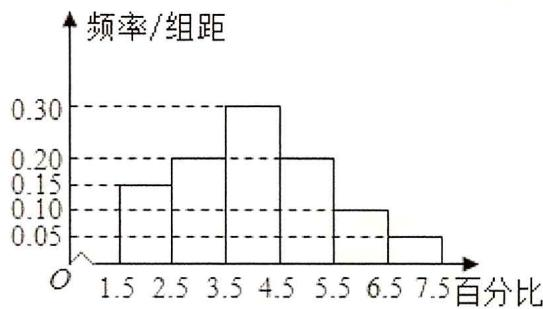

histogram

| 百分比 | 频率/组距 |
|---|---|
| 1.5 | 0.15 |
| 2.5 | 0.20 |
| 3.5 | 0.30 |
| 4.5 | 0.20 |
| 5.5 | 0.10 |
| 6.5 | 0.05 |
| 7.5 | 0.05 |

甲离子残留百分比直方图

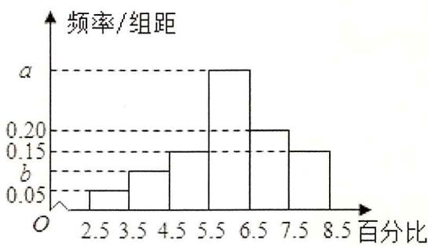

histogram

| 百分比 | 频率/组距 |
| :--- | :--- |
| 2.5 | 0.05 |
| 3.5 | 0.12 |
| 4.5 | 0.16 |
| 5.5 | 0.22 |
| 6.5 | 0.19 |
| 7.5 | 0.15 |
a
b

乙离子残留百分比直方图

记 C 为事件：“乙离子残留在体内的百分比不低于 5.5”，根据直方图得到 P（C）的估计值为 0.70.

（1）求乙离子残留百分比直方图中 a，b 的值；  
(2) 分别估计甲、乙离子残留百分比的平均值（同一组中的数据用该组区间的中点值为代表）.

3. (2019·新课标 II) 某行业主管部门为了解本行业中小企业的生产情况, 随机调查了 100 个企业, 得到这些企业第一季度相对于前一年第一季度产值增长率 $y$ 的频数分布表.

<table><tr><td>y的分组</td><td>[-0.20, 0)</td><td>[0, 0.20)</td><td>[0.20, 0.40)</td><td>[0.40, 0.60)</td><td>[0.60, 0.80)</td></tr><tr><td>企业数</td><td>2</td><td>24</td><td>53</td><td>14</td><td>7</td></tr></table>

(1) 分别估计这类企业中产值增长率不低于 $40 \%$ 的企业比例、产值负增长的企业比例;

(2) 求这类企业产值增长率的平均数与标准差的估计值（同一组中的数据用该组区间的中点值为代表）. (精确到0.01)附: $\sqrt{74} \approx 8.602$ .

4. (2021·乙卷) 某厂研制了一种生产高精产品的设备, 为检验新设备生产产品的某项指标有无提高, 用一台旧设备和一台新设备各生产了 10 件产品, 得到各件产品该项指标数据如下:

<table><tr><td>旧设备</td><td>9.8</td><td>10.3</td><td>10.0</td><td>10.2</td><td>9.9</td><td>9.8</td><td>10.0</td><td>10.1</td><td>10.2</td><td>9.7</td></tr><tr><td>新设备</td><td>10.1</td><td>10.4</td><td>10.1</td><td>10.0</td><td>10.1</td><td>10.3</td><td>10.6</td><td>10.5</td><td>10.4</td><td>10.5</td></tr></table>

旧设备和新设备生产产品的该项指标的样本平均数分别记为 $\overline{x}$ 和 $\overline{y}$ ，样本方差分别记为 $s_1^2$ 和 $s_2^2$ 。

(1) 求 $\bar{x}$ ， $\bar{y}$ ， $s_{1}^{2}$ ， $s_{2}^{2}$ ;

(2) 判断新设备生产产品的该项指标的均值较旧设备是否有显著提高 (如果 $\overline{y} - \overline{x} \geqslant 2\sqrt{\frac{s_1^2 + s_2^2}{10}}$ , 则认为新设备生产产品的该项指标的均值较旧设备有显著提高, 否则不认为有显著提高).

5.（2022·新高考Ⅱ）在某地区进行流行病学调查，随机调查了100位某种疾病患者的年龄，得到如下的样本数据的频率分布直方图：

(1) 估计该地区这种疾病患者的平均年龄（同一组中的数据用该组区间的中点值为代表）；  
(2) 估计该地区一位这种疾病患者的年龄位于区间[20, 70)的概率;  
(3) 已知该地区这种疾病患者的患病率为 $0.1\%$ , 该地区年龄位于区间[40, 50)的人口占该地区总人口的 $16\%$ . 从该地区中任选一人, 若此人的年龄位于区间[40, 50), 求此人患这种疾病的概率 (以样本数据中患者的年龄位于各区间的频率作为患者的年龄位于该区间的概率, 精确到 0.0001 ).

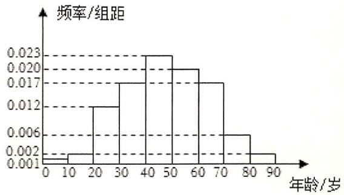

histogram

| 年龄/岁 | 频率/组距 |
|---|---|
| 0-10 | 0.001 |
| 10-20 | 0.002 |
| 20-30 | 0.012 |
| 30-40 | 0.017 |
| 40-50 | 0.023 |
| 50-60 | 0.020 |
| 60-70 | 0.017 |
| 70-80 | 0.006 |
| 80-90 | 0.002 |

6.（2023·新高考Ⅱ）某研究小组经过研究发现某种疾病的患病者与未患病者的某项医学指标有明显差异，经过大量调查，得到如下的患病者和未患病者该指标的频率分布直方图：

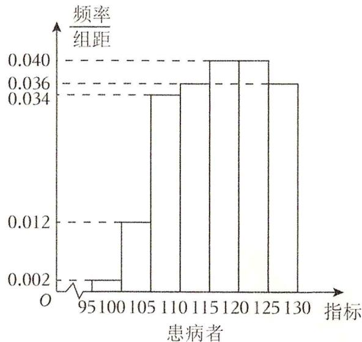

histogram

| 患病者 | 频率/组距 |
| :--- | :--- |
| 95-100 | 0.002 |
| 105-110 | 0.012 |
| 110-115 | 0.036 |
| 115-120 | 0.040 |
| 120-125 | 0.040 |
| 125-130 | 0.036 |

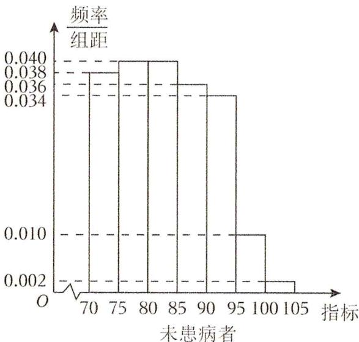

histogram

| 指标 | 频率/组距 |
| ---- | --------- |
| 70   | 0.038     |
| 75   | 0.040     |
| 80   | 0.036     |
| 85   | 0.034     |
| 90   | 0.036     |
| 95   | 0.010     |
| 100  | 0.002     |
| 105  | 0.002     |

利用该指标制定一个检测标准, 需要确定临界值 $c$ , 将该指标大于 $c$ 的人判定为阳性, 小于或等于 $c$ 的人判定为阴性, 此检测标准的漏诊率是将患病者判定为阴性的概率, 记为 $p$ (c); 误诊率是将未患病者判定为阳性的概率, 记为 $q$ (c). 假设数据在组内均匀分布, 以事件发生的频率作为相应事件发生的概率.

(1) 当漏诊率 $p$ (c) = 0.5% 时, 求临界值 $c$ 和误诊率 $q$ (c);   
(2) 设函数 $f$ (c) = p (c) + q (c). 当 $c \in [95, 105]$ , 求 $f$ (c) 的解析式, 并求 $f$ (c) 在区间[95, 105]的最小值.

7. (2023·乙卷) 某厂为比较甲乙两种工艺对橡胶产品伸缩率的处理效应, 进行 10 次配对试验, 每次配对试验选用材质相同的两个橡胶产品, 随机地选其中一个用甲工艺处理, 另一个用乙工艺处理, 测量处理后的橡胶产品的伸缩率, 甲、乙两种工艺处理后的橡胶产品的伸缩率分别记为 $x_{i}$ , $y_{i} (i = 1, 2, \ldots 10)$ . 试验结果如下:

<table><tr><td>试验序号i</td><td>1</td><td>2</td><td>3</td><td>4</td><td>5</td><td>6</td><td>7</td><td>8</td><td>9</td><td>10</td></tr><tr><td>伸缩率 $x_i$ </td><td>545</td><td>533</td><td>551</td><td>522</td><td>575</td><td>544</td><td>541</td><td>568</td><td>596</td><td>548</td></tr><tr><td>伸缩率 $y_i$ </td><td>536</td><td>527</td><td>543</td><td>530</td><td>560</td><td>533</td><td>522</td><td>550</td><td>576</td><td>536</td></tr></table>

记 $z_{i}=x_{i}-y_{i}(i=1,2,\cdots,10)$ ，记 $z_{1}, z_{2}, \cdots, z_{10}$ 的样本平均数为 $\overline{z}$ ，样本方差为 $s^{2}$ .

(1) 求 $\overline{z}$ , $s^{2}$ ;   
(2) 判断甲工艺处理后的橡胶产品的伸缩率较乙工艺处理后的橡胶产品的伸缩率是否有显著提高. (如果 $\overline{z} \geqslant 2\sqrt{\frac{s^2}{10}}$ , 则认为甲工艺处理后的橡胶产品的伸缩率较乙工艺处理后的橡胶产品的伸缩率有显著提高, 否则不认为有显著提高)

8. (2024·上海) 水果分为一级果和二级果, 共 136 箱, 其中一级果 102 箱, 二级果 34 箱.

(1) 随机挑选两箱水果, 求恰好一级果和二级果各一箱的概率;   
(2) 进行分层抽样, 共抽 8 箱水果, 求一级果和二级果各几箱;  
(3) 抽取若干箱水果, 其中一级果共 120 个, 单果质量平均数为 $303.45$ 克, 方差为 $603.46$ ; 二级果 48 个, 单果质量平均数为 $240.41$ 克, 方差为 $648.21$ ; 求 168 个水果的方差和平均数, 并预估果园中单果的质量.

# 第十章：数列

# 一、选择题

1.（2019·全国） $3 + 3^{3} + 3^{5} + \ldots +3^{2n + 1} = ($

A. $\frac{3}{2} (9^{n} - 1)$

B. $\frac{3}{2} (9^{n + 1} - 1)$

C. $\frac{3}{8} (9^{n} - 1)$

D. $\frac{3}{8} (9^{n + 1} - 1)$

2.（2019·新课标I）记 $S_{n}$ 为等差数列 $\{a_{n}\}$ 的前 $n$ 项和．已知 $S_{4} = 0$ ， $a_5 = 5$ ，则（

A. $a_{n} = 2n - 5$

B. $a_{n} = 3n - 10$

C. $S_{n} = 2n^{2} - 8n$

D. $S_{n} = \frac{1}{2} n^{2} - 2n$

3.（2019·浙江）设 $a$ ， $b\in R$ ，数列 $\{a_{n}\}$ 满足 $a_1 = a$ ， $a_{n + 1} = a_n^2 +b$ ， $n\in N^{*}$ ，则（

A. 当 $b = \frac{1}{2}$ 时， $a_{10} > 10$

B. 当 $b = \frac{1}{4}$ 时， $a_{10} > 10$

C. 当 $b = -2$ 时， $a_{10} > 10$

D. 当 $b = -4$ 时， $a_{10} > 10$

4.（2020·上海）计算： $\lim_{n\to \infty}\frac{3^n + 5^n}{3^{n - 1} + 5^{n - 1}} = ()$

A. 3

B. $\frac{5}{3}$

C. $\frac{3}{5}$

D. 5

5.（2020·全国）设函数 $f(x) = x^{2} + x + c$ ，若 $f(1), f(2), f(3)$ 成等比数列，则 $c = (\quad)$

A. -6

B. -2

C. 2

D. 6

6. (2020·新课标 II) 0-1 周期序列在通信技术中有着重要应用。若序列 $a_{1}a_{2} \ldots a_{n} \ldots$ 满足 $a_{i} \in \{0, 1\} (i=1, 2, \ldots)$ , 且存在正整数 $m$ , 使得 $a_{i+m} = a_{i} (i=1, 2, \ldots)$ 成立, 则称其为 0-1 周期序列, 并称满足 $a_{i+m} = a_{i} (i=1,2 \ldots)$ 的最小正整数 $m$ 为这个序列的周期。对于周期为 $m$ 的 0-1 序列 $a_{1}a_{2} \ldots a_{n} \ldots$ , $C(k) = \frac{1}{m} \sum_{i=1}^{m} a_{i} a_{i+k} (k=1, 2, \ldots, m-1)$ 是描述其性质的重要指标, 下列周期为 5 的 0-1 序列中, 满足 $C(k) \leqslant \frac{1}{5} (k=1, 2, 3, 4)$ 的序列是 ( )

A. 11010...

B. 11011...

C. 10001...

D. 11001...

7. (2020·新课标 II) 如图, 将钢琴上的 12 个键依次记为 $a_{1}, a_{2}, \ldots, a_{12}$ . 设 $1 \leqslant i < j < k \leqslant 12$ . 若 $k - j = 3$ 且 $j - i = 4$ , 则 $a_{i}, a_{j}, a_{k}$ 为原位大三和弦; 若 $k - j = 4$ 且 $j - i = 3$ , 则称 $a_{i}, a_{j}, a_{k}$ 为原位小三和弦. 用这 12 个键可以构成的原位大三和弦与原位小三和弦的个数之和为 ( )

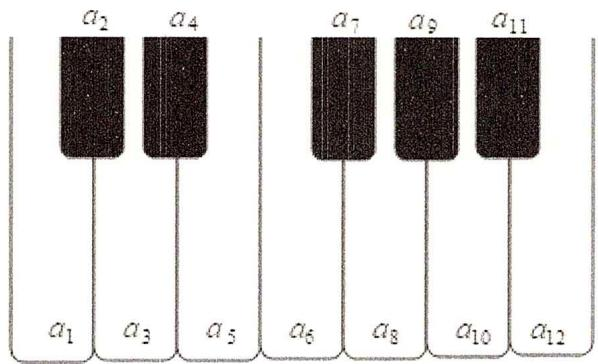

text_image

a₂ a₄
a₁ a₃ a₅
a₆ a₈ a₁₀ a₁₁
a₁₂

A. 5

B. 8

C. 10

D. 15

8. (2020·新课标 II) 北京天坛的圜丘坛为古代祭天的场所, 分上、中、下三层. 上层中心有一块圆形石板 (称为天心石), 环绕天心石砌 9 块扇面形石板构成第一环, 向外每环依次增加 9 块. 下一层的第一环比上一层的最后一环多 9 块, 向外每环依次也增加 9 块. 已知每层环数相同, 且下层比中层多 729 块, 则三层共有扇面形石板 (不含天心石) ( )

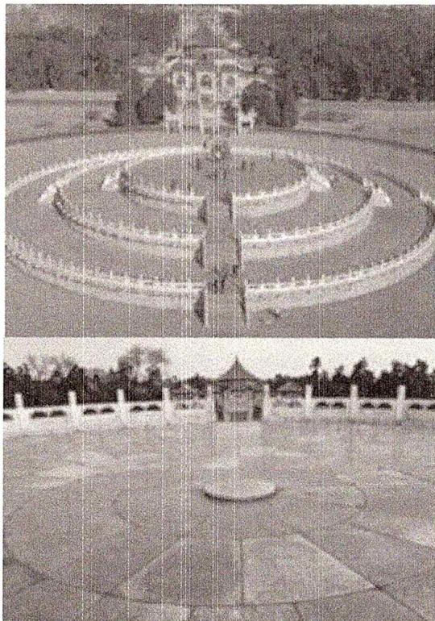

natural_image

Two black-and-white photos showing a circular garden with a central figure and a traditional pavilion, both set against trees and a paved plaza (no visible text or symbols)

A. 3699 块

B. 3474 块

C. 3402 块

D. 3339 块

9.(2020·浙江)已知等差数列 $\{a_{n}\}$ 的前n项和 $S_{n}$ ，公差 $d\neq0$ ，且 $\frac{a_{1}}{d}\leqslant1$ 。记 $b_{1}=S_{2}$ ， $b_{n+1}=S_{2n+2}-S_{2n}$ ， $n\in N^{*}$ ，下列等式不可能成立的是()

A. $2a_{4} = a_{2} + a_{6}$

B. $2b_{4} = b_{2} + b_{6}$

C. $a_{4}^{2}=a_{2}a_{8}$

D. $b_{4}^{2} = b_{2}b_{8}$

10.（2020·新课标Ⅱ）记 $S_{n}$ 为等比数列 $\{a_{n}\}$ 的前n项和．若 $a_{5}-a_{3}=12,\quad a_{6}-a_{4}=24$ ，则 $\frac{S_{n}}{a_{n}}=(\quad)$

A. ${2}^{n} - 1$

B. $2 - 2^{1 - n}$

C. $2-2^{n-1}$

D. $2^{1-n}-1$

11.（2020·北京）在等差数列 $\{a_{n}\}$ 中， $a_1 = -9$ ， $a_5 = -1$ 。记 $T_{n} = a_{1}a_{2}\dots a_{n}(n = 1,2,\dots)$ ，则数列 $\{T_n\}$ （

A. 有最大项，有最小项

B. 有最大项，无最小项

C. 无最大项，有最小项

D. 无最大项，无最小项

12.（2020·新课标Ⅱ）数列 $\{a_{n}\}$ 中， $a_1 = 2$ ， $a_{m + n} = a_m a_n$ .若 $a_{k + 1} + a_{k + 2} + \ldots +a_{k + 10} = 2^{15} - 2^5$ ，则 $k = ($

A. 2

B. 3

C. 4

D. 5

13.（2020·新课标Ⅰ）设 $\{a_{n}\}$ 是等比数列，且 $a_{1}+a_{2}+a_{3}=1,\quad a_{2}+a_{3}+a_{4}=2$ ，则 $a_{6}+a_{7}+a_{8}=(\quad)$

A. 12

B. 24

C. 30

D. 32

14.（2021·浙江）已知数列 $\{a_{n}\}$ 满足 $a_1 = 1$ ， $a_{n + 1} = \frac{a_n}{1 + \sqrt{a_n}} (n\in N^*)$ .记数列 $\{a_{n}\}$ 的前 $n$ 项和为 $S_{n}$ ，则（

A. $\frac{3}{2} < S_{100} < 3$

B. $3 < S_{100} < 4$

C. $4 <   S_{100} <   \frac{9}{2}$

D. $\frac{9}{2} < S_{100} < 5$

15.（2021·北京）《中国共产党党旗党徽制作和使用的若干规定》指出，中国共产党党旗为旗面缀有金黄色党徽图案的红旗，通用规格有五种．这五种规格党旗的长 $a_1$ ， $a_2$ ， $a_3$ ， $a_4$ ， $a_5$ （单位：cm）成等差数列，对应的宽为 $b_{1}$ ， $b_{2}$ ， $b_{3}$ ， $b_{4}$ ， $b_{5}$ （单位：cm），且长与宽之比都相等．已知 $a_1 = 288$ ， $a_5 = 96$ ， $b_{1} = 192$ 则 $b_{3} = (\quad)$

A. 64

B. 96

C. 128

D. 160

16. (2021·北京) 已知 $\{a_{n}\}$ 是各项为整数的递增数列, 且 $a_{1} \geqslant 3$ , 若 $a_{1} + a_{2} + a_{3} + \ldots + a_{n} = 100$ , 则 $n$ 的最大值为 ( )

A. 9

B. 10

C. 11

D. 12

17.（2021·全国）等差数列 $\{a_{n}\}$ 中，若 $a_{2} - a_{5} + a_{8} - a_{11} + a_{14} = 1$ ，则 $\{a_{n}\}$ 的前15项和为（

A. 1

B. 8

C. 15

D. 30

18. (2021·甲卷) 记 $S_{n}$ 为等比数列 $\{a_{n}\}$ 的前 $n$ 项和. 若 $S_{2} = 4$ , $S_{4} = 6$ , 则 $S_{6} = (\quad)$

A. 7

B. 8

C. 9

D. 10

19.（2022·浙江）已知数列 $\{a_{n}\}$ 满足 $a_1 = 1$ ， $a_{n + 1} = a_n - \frac{1}{3} a_n^2 (n\in N^*)$ ，则（

A. $2 <   100a_{100} <   \frac{5}{2}$

B. $\frac{5}{2} < 100a_{100} < 3$

C. $3 < 100a_{100} < \frac{7}{2}$

D. $\frac{7}{2} < 100a_{100} < 4$

20.（2022·上海）已知等比数列 $\{a_{n}\}$ 的前 $n$ 项和为 $S_{n}$ ，前 $n$ 项积为 $T_{n}$ ，则下列选项判断正确的是（ ）

A. 若 $S_{2022} > S_{2021}$ ，则数列 $\{a_{n}\}$ 是递增数列

B. 若 $T_{2022} > T_{2021}$ ，则数列 $\{a_{n}\}$ 是递增数列

C. 若数列 $\{S_{n}\}$ 是递增数列，则 $a_{2022} \geqslant a_{2021}$

D. 若数列 $\{T_{n}\}$ 是递增数列，则 $a_{2022} \geqslant a_{2021}$

21. (2022·新高考II) 图1是中国古代建筑中的举架结构, $AA'$ , $BB'$ , $CC'$ , $DD'$ 是桁, 相邻桁的水平距离称为步, 垂直距离称为举. 图2是某古代建筑屋顶截面的示意图, 其中 $DD_{1}$ , $CC_{1}$ , $BB_{1}$ , $AA_{1}$ 是举, $OD_{1}$ , $DC_{1}$ , $CB_{1}$ , $BA_{1}$ 是相等的步, 相邻桁的举步之比分别为 $\frac{DD_{1}}{OD_{1}} = 0.5$ , $\frac{CC_{1}}{DC_{1}} = k_{1}$ , $\frac{BB_{1}}{CB_{1}} = k_{2}$ , $\frac{AA_{1}}{BA_{1}} = k_{3}$ . 已知 $k_{1}$ , $k_{2}$ , $k_{3}$ 成公差为0.1的等差数列, 且直线 $OA$ 的斜率为0.725, 则 $k_{3} = (\quad)$

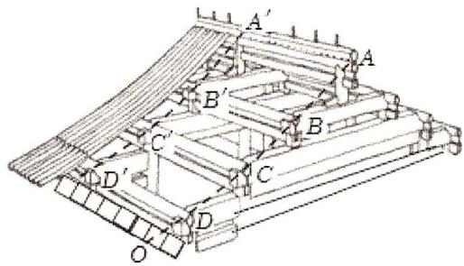

text_image

Technical diagram of a mechanical assembly with labeled components A, B, C, D and O, showing structural layout and connections.

图1

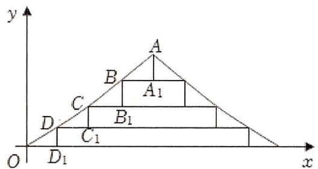

text_image

y
A
B
A₁
C
D
B₁
C₁
O
D₁
x

图2

A. 0.75

B. 0.8

C. 0.85

D. 0.9

22.（2022·全国）设等比数列 $\{a_{n}\}$ 的首项为 1，公比为 $q$ ，前 $n$ 项和为 $S_{n}$ 。令 $b_{n} = S_{n} + 2$ ，若 $\{b_{n}\}$ 也是等比数列，则 $q = (\quad)$

A. $\frac{1}{2}$

B. $\frac{3}{2}$

C. $\frac{5}{2}$

D. $\frac{7}{2}$

23.（2022·乙卷）已知等比数列 $\{a_{n}\}$ 的前3项和为168， $a_2 - a_5 = 42$ ，则 $a_6 = (\quad)$

A. 14

B. 12

C. 6

D. 3

24.（2023·上海）已知无穷数列 $\{a_{n}\}$ 的各项均为实数， $S_{n}$ 为其前 $n$ 项和，若对任意正整数 $k > 2022$ 都有 $|S_{k}| > |S_{k-1}|$ ，则下列各项中可能成立的是（）

A. $a_{1}$ ， $a_{2}$ ， $a_{5}$ ，…， $a_{2n-1}$ ，…为等差数到， $a_{2}$ ， $a_{4}$ ， $a_{6}$ ，…， $a_{2n}$ ，…为等比数列

B. $a_{1}$ ， $a_{2}$ ， $a_{5}$ ，…， $a_{2n-1}$ ，…为等比数列， $a_{2}$ ， $a_{4}$ ， $a_{6}$ ，…， $a_{2n}$ ，…为等差数列

C. $a_{1}$ ， $a_{2}$ ， $a_{3}$ ，…， $a_{2022}$ 为等差数列， $a_{2022}$ ， $a_{2023}$ ，…， $a_{n}$ ，…为等比数列

D. $a_{1}$ ， $a_{2}$ ， $a_{3}$ ，…， $a_{2022}$ 为等比数列， $a_{2022}$ ， $a_{2023}$ ，…， $a_{n}$ ，…为等差数列

25.（2023·全国） $S_{n}$ 为等差数列的前 $n$ 项和， $S_{9} = 81$ ， $a_2 = 3$ ，则 $a_{10} = (\quad)$

A. 2

B. 11

C. 15

D. 19

26.（2023·天津）已知 $\{a_{n}\}$ 为等比数列， $S_{n}$ 为数列 $\{a_{n}\}$ 的前 $n$ 项和， $a_{n+1} = 2S_{n} + 2$ ，则 $a_{4}$ 的值为（ ）

A. 3

B. 18

C. 54

D. 152

27.（2023·甲卷）记 $S_{n}$ 为等差数列 $\{a_{n}\}$ 的前 $n$ 项和．若 $a_2 + a_6 = 10$ ， $a_4a_8 = 45$ ，则 $S_{5} = (\quad)$

A. 25

B. 22

C. 20

D. 15

29.（2023·北京）数列 $\{a_{n}\}$ 满足 $a_{n + 1} = \frac{1}{4} (a_n - 6)^3 +6$ ，下列说法正确的是（

A. 若 $a_{1}=3$ ，则 $\{a_{n}\}$ 是递减数列， $\exists M\in R$ ，使得 $a_{n}>M$

B. 若 $a_{1}=5$ ，则 $\{a_{n}\}$ 是递增数列， $\exists M\leqslant6$ ，使得 $a_{n}<M$

C. 若 $a_{1} = 7$ ，则 $\{a_{n}\}$ 是递减数列， $\exists M > 6$ ，使得 $a_{n} > M$

D. 若 $a_{1} = 9$ ，则 $\{a_{n}\}$ 是递增数列， $\exists M \in R$ ，使得 $a_{n} < M$

30.（2023·甲卷）已知正项等比数列 $\{a_{n}\}$ 中， $a_1 = 1$ ， $S_{n}$ 为 $\{a_{n}\}$ 前 $n$ 项和， $S_{5} = 5S_{3} - 4$ ，则 $S_{4} = (\quad)$

A. 7

B. 9

C. 15

D. 30

31.（2023·新高考Ⅱ）记 $S_{n}$ 为等比数列 $\{a_{n}\}$ 的前 $n$ 项和，若 $S_{4} = -5$ ， $S_{6} = 21S_{2}$ ，则 $S_{8} = (\quad)$

A. 120

B. 85

C. -85

D. -120

32. (2023·新高考 I) 记 $S_{n}$ 为数列 $\{a_{n}\}$ 的前 $n$ 项和, 设甲: $\{a_{n}\}$ 为等差数列; 乙: $\{\frac{S_{n}}{n}\}$ 为等差数列, 则 ( )

A. 甲是乙的充分条件但不是必要条件

B. 甲是乙的必要条件但不是充分条件

C. 甲是乙的充要条件

D. 甲既不是乙的充分条件也不是乙的必要条件

33.（2021·新高考Ⅱ）设正整数 $n = a_0 \cdot 2^0 + a_1 \cdot 2^1 + \ldots + a_{k-1} \cdot 2^{k-1} + a_k \cdot 2^k$ ，其中 $a_i \in \{0, 1\}$ ，记 $\omega(n) = a_0 + a_1 + \ldots + a_k$ ，则（ ）

A. $\omega (2n) = \omega (n)$

B. $\omega (2n + 3) = \omega (n) + 1$

C. $\omega(8n+5)=\omega(4n+3)$

D. $\omega (2^{n} - 1) = n$

# 二、填空题

1.（2019·新课标Ⅰ）设 $S_{n}$ 为等比数列 $\{a_{n}\}$ 的前n项和．若 $a_{1}=1$ ， $S_{3}=\frac{3}{4}$ ，则 $S_{4}=$ \_\_\_\_.

2.（2019·新课标Ⅰ）记 $S_{n}$ 为等比数列 $\{a_{n}\}$ 的前n项和．若 $a_{1}=\frac{1}{3}$ ， $a_{4}^{2}=a_{6}$ ，则 $S_{5}=$ \_\_\_\_.

3. (2019·江苏) 已知数列 $\{a_{n}\} (n \in N^{*})$ 是等差数列, $S_{n}$ 是其前 $n$ 项和. 若 $a_{2}a_{5} + a_{8} = 0$ , $S_{9} = 27$ , 则 $S_{8}$ 的值是 .

4.（2019·新课标III）记 $S_{n}$ 为等差数列 $\{a_{n}\}$ 的前 $n$ 项和．若 $a_1 \neq 0$ ， $a_2 = 3a_1$ ，则 $\frac{S_{10}}{S_5} = \_$ .

5.(2019·北京)设等差数列 $\{a_{n}\}$ 的前n项和为 $S_{n}$ ，若 $a_{2}=-3$ ， $S_{5}=-10$ ，则 $a_{5}=$ \_\_\_\_， $S_{n}$ 的最小值为\_\_\_\_.

6.（2020·浙江）已知数列 $\{a_{n}\}$ 满足 $a_{n} = \frac{n(n + 1)}{2}$ ，则 $S_{3} =$ \_\_\_\_.

7.（2020·上海）计算： $\lim_{n\to\infty}\frac{n+1}{3n-1}=$ \_\_\_\_.

8.（2020·上海）已知数列 $\{a_{n}\}$ 是公差不为零的等差数列，且 $a_{1} + a_{10} = a_{9}$ ，则 $\frac{a_{1} + a_{2} + \ldots + a_{9}}{a_{10}} =$ \_\_\_\_.

9.（2020·新课标Ⅰ）数列 $\{a_{n}\}$ 满足 $a_{n+2}+(-1)^{n}a_{n}=3n-1$ ，前16项和为540，则 $a_{1}=$ \_\_\_\_.

10. (2020·江苏) 设 $\{a_{n}\}$ 是公差为 $d$ 的等差数列, $\{b_{n}\}$ 是公比为 $q$ 的等比数列. 已知数列 $\{a_{n} + b_{n}\}$ 的前 $n$ 项和 $S_{n} = n^{2} - n + 2^{n} - 1 (n \in N^{*})$ , 则 $d + q$ 的值是

11.(2020·山东)将数列 $\{2n-1\}$ 与 $\{3n-2\}$ 的公共项从小到大排列得到数列 $\{a_{n}\}$ ，则 $\{a_{n}\}$ 的前n项和为\_\_\_\_.

12.（2020·新课标Ⅱ）记 $S_{n}$ 为等差数列 $\{a_{n}\}$ 的前n项和．若 $a_{1}=-2,\quad a_{2}+a_{6}=2$ ，则 $S_{10}=$

13.（2021·上海）在无穷等比数列 $\{a_{n}\}$ 中， $\lim (a_1 - a_n) = 4$ ，则 $a_2$ 的取值范围是 \_\_\_\_.

14. (2021·上海) 已知 $a_{i} \in N^{*}(i=1, 2, \ldots, 9)$ 对任意的 $k \in N^{*}(2 \leqslant k \leqslant 8)$ , $a_{k} = a_{k-1} + 1$ 或 $a_{k} = a_{k+1} - 1$ 中有且仅有一个成立, $a_{1} = 6$ , $a_{9} = 9$ , 则 $a_{1} + \ldots + a_{9}$ 的最小值为 \_\_\_\_.

15.(2021·上海)已知 $\{a_{n}\}$ 为无穷等比数列， $a_{1}=3$ ， $a_{n}$ 的各项和为9， $b_{n}=a_{2n}$ ，则数列 $\{b_{n}\}$ 的各项和为\_\_\_\_.

16.（2021·上海）已知等差数列 $\{a_{n}\}$ 的首项为3，公差为2，则 $a_{10} =$

17. (2021·新高考 I) 某校学生在研究民间剪纸艺术时, 发现剪纸时经常会沿纸的某条对称轴把纸对折. 规格为 $20dm \times 12dm$ 的长方形纸, 对折 1 次共可以得到 $10dm \times 12dm$ , $20dm \times 6dm$ 两种规格的图形, 它们的面积之和 $S_{1} = 240dm^{2}$ , 对折 2 次共可以得到 $5dm \times 12dm$ , $10dm \times 6dm$ , $20dm \times 3dm$ 三种规格的图形, 它们的面积之和 $S_{2} = 180dm^{2}$ , 以此类推. 则对折 4 次共可以得到不同规格图形的种数为\_\_\_\_; 如果对折 $n$ 次, 那么 $\sum_{k=1}^{n} S_{k} =$ \_\_\_\_ $dm^{2}$ .

18. (2022·上海) 已知等差数列 $\{a_{n}\}$ 的公差不为零, $S_{n}$ 为其前 $n$ 项和, 若 $S_{5} = 0$ , 则 $S_{i} (i = 1, 2, \ldots, 100)$ 中不同的数值有 \_\_\_\_个.

19. (2022·乙卷) 记 $S_{n}$ 为等差数列 $\{a_{n}\}$ 的前 $n$ 项和. 若 $2S_{3} = 3S_{2} + 6$ , 则公差 $d = \_$ .

20.（2023·乙卷）已知 $\{a_{n}\}$ 为等比数列， $a_2a_4a_5 = a_3a_6$ ， $a_9a_{10} = -8$ ，则 $a_7 = \_$ .

21（2023·上海）已知首项为3，公比为2的等比数列，设等比数列的前n项和为 $S_{n}$ ，则 $S_{6}=$ \_\_\_\_.

22.（2023·甲卷）记 $S_{n}$ 为等比数列 $\{a_{n}\}$ 的前 $n$ 项和．若 $8S_{6} = 7S_{3}$ ，则 $\{a_{n}\}$ 的公比为 \_\_\_\_.

23. (2023·北京) 我国度量衡的发展有着悠久的历史, 战国时期就出现了类似于砝码的用来测量物体质量的 “环权”. 已知 9 枚环权的质量 (单位: 铢) 从小到大构成项数为 9 的数列 $\{a_{n}\}$ , 该数列的前 3 项成等差数列, 后 7 项成等比数列, 且 $a_{1} = 1$ , $a_{5} = 12$ , $a_{9} = 192$ , 则 $a_{7} =$ \_\_\_\_, 数列 $\{a_{n}\}$ 的所有项的和为 \_\_\_\_.

24.（2024·上海） $a_{1}=2,\quad a_{2}=4,\quad a_{3}=8,\quad a_{4}=16$ ，任意 $b_{1},\quad b_{2},\quad b_{3},\quad b_{4}\in R$ ，满足

$\{a_{i} + a_{j}\mid 1\leqslant i <   j\leqslant 4\} = \{b_{i} + b_{j}\mid 1\leqslant i <   j\leqslant 4\}$ ，求有序数列 $\{b_1,b_2,b_3,b_4\}$ 有 对.

25.（2024·上海）数列 $\{a_{n}\}$ ， $a_{n} = n + c$ ， $S_{7} < 0$ ， $c$ 的取值范围为 \_\_\_\_.

# 三、解答题

1. (2019·上海) 数列 $\{a_{n}\} (n\in N^{*})$ 有100项, $a_1 = a$ , 对任意 $n\in [2, 100]$ , 存在 $a_{n} = a_{i} + d$ , $i\in [1, n - 1]$ , 若 $a_{k}$ 与前 $n$ 项中某一项相等, 则称 $a_{k}$ 具有性质 $P$ .

(1) 若 $a_{1}=1$ ，d=2，求 $a_{4}$ 所有可能的值；

(2) 若 $\{a_{n}\}$ 不为等差数列, 求证: 数列 $\{a_{n}\}$ 中存在某些项具有性质 $P$ ;

（3）若 $\{a_{n}\}$ 中恰有三项具有性质 $P$ ，这三项和为 $c$ ，使用 $a$ ， $d$ ， $c$ 表示 $a_1 + a_2 + \ldots + a_{100}$

2.（2019·天津）设 $\{a_{n}\}$ 是等差数列， $\{b_{n}\}$ 是等比数列．已知 $a_{1} = 4$ ， $b_{1} = 6$ ， $b_{2} = 2a_{2} - 2$ ， $b_{3} = 2a_{3} + 4$ ：

（Ⅰ）求 $\{a_{n}\}$ 和 $\{b_{n}\}$ 的通项公式；  
（Ⅱ）设数列 $\{c_{n}\}$ 满足 $c_{1} = 1$ ， $c_{n} = \left\{ \begin{array}{l}1,2^{k} < n < 2^{k + 1},\\ b_{k},n = 2^{k}, \end{array} \right.$ 其中 $k\in N^{*}$

(i) 求数列 $\{a_{2^{n}}(c_{2^{n}}-1)\}$ 的通项公式；

(ii) 求 $\sum_{i=1}^{2^{n}}a_{i}c_{i}(n\in N^{*})$ .

3.（2019·全国）数列 $\{a_{n}\}$ 中， $a_1 = \frac{1}{3}$ ， $2a_{n + 1}a_n + a_{n + 1} - a_n = 0$

(1) 求 $\{a_{n}\}$ 的通项公式;  
（2）求满足 $a_1a_2 + a_2a_3 + \ldots + a_{n-1}a_n < \frac{1}{7}$ 的 $n$ 的最大值.

4. (2019·北京) 已知数列 $\{a_{n}\}$ , 从中选取第 $i_{1}$ 项、第 $i_{2}$ 项、...、第 $i_{m}$ 项 ( $i_{1} < i_{2} < \ldots < i_{m}$ ), 若 $a_{i_{1}} < a_{i_{2}} < \ldots < a_{i_{m}}$ , 则称新数列 $a_{i_{1}}$ , $a_{i_{2}}$ , ..., $a_{i_{m}}$ 为 $\{a_{n}\}$ 的长度为 $m$ 的递增子列. 规定: 数列 $\{a_{n}\}$ 的任意一项都是 $\{a_{n}\}$ 的长度为 1 的递增子列.

（Ⅰ）写出数列 1，8，3，7，5，6，9 的一个长度为 4 的递增子列；  
（II）已知数列 $\{a_{n}\}$ 的长度为 $p$ 的递增子列的末项的最小值为 $a_{m_0}$ ，长度为 $q$ 的递增子列的末项的最小值为 $a_{n_0}$ 。若 $p < q$ ，求证： $a_{m_0} < a_{n_0}$ ；  
（III）设无穷数列 $\{a_{n}\}$ 的各项均为正整数，且任意两项均不相等．若 $\{a_{n}\}$ 的长度为 s 的递增子列末项的最小值为 2s-1，且长度为 s 末项为 2s-1 的递增子列恰有 $2^{s-1}$ 个 $(s=1,2,\ldots)$ ，求数列 $\{a_{n}\}$ 的通项公式.

5.（2019·新课标Ⅱ）已知数列 $\{a_{n}\}$ 和 $\{b_{n}\}$ 满足 $a_1 = 1$ ， $b_{1} = 0$ ， $4a_{n + 1} = 3a_{n} - b_{n} + 4$ ， $4b_{n + 1} = 3b_{n} - a_{n} - 4$ ：

（1）证明： $\{a_{n}+b_{n}\}$ 是等比数列， $\{a_{n}-b_{n}\}$ 是等差数列；

(2) 求 $\{a_{n}\}$ 和 $\{b_{n}\}$ 的通项公式.

6.（2019·上海）已知数列 $\{a_{n}\}$ ， $a_{1} = 3$ ，前 $n$ 项和为 $S_{n}$ 。

（1）若 $\{a_{n}\}$ 为等差数列，且 $a_4 = 15$ ，求 $S_{n}$

（2）若 $\{a_{n}\}$ 为等比数列，且 $\lim_{n\to \infty}S_n < 12$ ，求公比 $q$ 的取值范围.

7.（2019·江苏）定义首项为 1 且公比为正数的等比数列为 “M-数列”.

（1）已知等比数列 $\{a_{n}\} (n\in N^{*})$ 满足： $a_2a_4 = a_5$ ， $a_3 - 4a_2 + 4a_1 = 0$ ，求证：数列 $\{a_n\}$ 为“ $M-$ 数列”；

（2）已知数列 $\{b_{n}\} (n\in N^{*})$ 满足： $b_{1} = 1$ ， $\frac{1}{S_n} = \frac{2}{b_n} -\frac{2}{b_{n + 1}}$ ，其中 $S_{n}$ 为数列 $\{b_n\}$ 的前 $n$ 项和.

①求数列 $\{b_{n}\}$ 的通项公式;

②设 m 为正整数，若存在 “M-数列” $\{c_{n}\}(n\in N^{*})$ ，对任意正整数 k，当 $k\leqslant m$ 时，都有 $c_{k}\leqslant b_{k}\leqslant c_{k+1}$ 成立，求 m 的最大值.

8.（2019·浙江）设等差数列 $\{a_{n}\}$ 的前 $n$ 项和为 $S_{n}$ ， $a_{3} = 4$ ， $a_{4} = S_{3}$ . 数列 $\{b_{n}\}$ 满足：对每个 $n \in N^{*}$ ， $S_{n} + b_{n}$ ， $S_{n+1} + b_{n}$ ， $S_{n+2} + b_{n}$ 成等比数列.

（Ⅰ）求数列 $\{a_{n}\}$ ， $\{b_{n}\}$ 的通项公式；  
（Ⅱ）记 $c_{n} = \sqrt{\frac{a_{n}}{2b_{n}}}$ ， $n\in N^{*}$ ，证明： $c_{1} + c_{2} + \ldots +c_{n} <   2\sqrt{n}$ ， $n\in N^{*}$

9.（2019·新课标Ⅱ）已知 $\{a_{n}\}$ 是各项均为正数的等比数列， $a_1 = 2$ ， $a_3 = 2a_2 + 16$ ：

(1) 求 $\{a_{n}\}$ 的通项公式;  
（2）设 $b_{n}=\log_{2}a_{n}$ ，求数列 $\{b_{n}\}$ 的前n项和.

10.（2019·北京）设 $\{a_{n}\}$ 是等差数列， $a_1 = -10$ ，且 $a_2 + 10$ ， $a_3 + 8$ ， $a_4 + 6$ 成等比数列.

(1) 求 $\{a_{n}\}$ 的通项公式;  
(2) 记 $\{a_{n}\}$ 的前 n 项和为 $S_{n}$ ，求 $S_{n}$ 的最小值.

11.（2019·天津）设 $\{a_{n}\}$ 是等差数列， $\{b_{n}\}$ 是等比数列，公比大于0.已知 $a_1 = b_1 = 3$ ， $b_2 = a_3$ ， $b_3 = 4a_2 + 3$

（Ⅰ）求 $\{a_{n}\}$ 和 $\{b_{n}\}$ 的通项公式；  
（Ⅱ）设数列 $\{c_{n}\}$ 满足 $c_{n} = \left\{ \begin{array}{ll}1,n & \text{为奇数,}\\ b_{\frac{n}{2}}, & n\text{为偶数.} \end{array} \right.$ 求 $a_1c_1 + a_2c_2 + \ldots +a_{2n}c_{2n}(n\in N^*)$ ：

12.（2019·新课标I）记 $S_{n}$ 为等差数列 $\{a_{n}\}$ 的前 $n$ 项和．已知 $S_{9} = -a_{5}$

(1) 若 $a_{3}=4$ ，求 $\{a_{n}\}$ 的通项公式；  
(2) 若 $a_{1}>0$ ，求使得 $S_{n}\geqslant a_{n}$ 的 n 的取值范围.

13. (2019·新课标 I) 为治疗某种疾病, 研制了甲、乙两种新药, 希望知道哪种新药更有效, 为此进行动物试验。试验方案如下: 每一轮选取两只白鼠对药效进行对比试验。对于两只白鼠, 随机选一只施以甲药, 另一只施以乙药。一轮的治疗结果得出后, 再安排下一轮试验。当其中一种药治愈的白鼠比另一种药治愈的白鼠多 4 只时, 就停止试验, 并认为治愈只数多的药更有效。为了方便描述问题, 约定: 对于每轮试验, 若施以甲药的白鼠治愈且施以乙药的白鼠未治愈则甲药得 1 分, 乙药得 -1 分; 若施以乙药的白鼠治愈且施以甲药的白鼠未治愈则乙药得 1 分, 甲药得 -1 分; 若都治愈或都未治愈则两种药均得 0 分。甲、乙两种药的治愈率分别记为 $\alpha$ 和 $\beta$ , 一轮试验中甲药的得分记为 $X$ 。

(1) 求 X 的分布列;

(2) 若甲药、乙药在试验开始时都赋予 4 分, $p_{i} (i = 0, 1, \ldots, 8)$ 表示 “甲药的累计得分为 $i$ 时, 最终认为甲药比乙药更有效”的概率, 则 $p_{0} = 0$ , $p_{8} = 1$ , $p_{i} = ap_{i-1} + bp_{i} + cp_{i+1} (i = 1, 2, \ldots, 7)$ , 其中 $a = P(X = -1)$ , $b = P(X = 0)$ , $c = P(X = 1)$ . 假设 $\alpha = 0.5$ , $\beta = 0.8$ .

(i) 证明： $\{p_{i+1}-p_{i}\}(i=0,1,2,\ldots,7)$ 为等比数列；  
（ii）求 $p_4$ ，并根据 $p_4$ 的值解释这种试验方案的合理性.

14.（2020·北京）已知 $\{a_{n}\}$ 是无穷数列．给出两个性质：

①对于 $\{a_{n}\}$ 中任意两项 $a_{i}$ ， $a_{j}(i > j)$ ，在 $\{a_{n}\}$ 中都存在一项 $a_{m}$ ，使得 $\frac{a_i^2}{a_j} = a_m$ ；  
②对于 $\{a_{n}\}$ 中任意一项 $a_{n}(n\geqslant 3)$ ，在 $\{a_{n}\}$ 中都存在两项 $a_{k}$ ， $a_{l}(k > l)$ ，使得 $a_{n} = \frac{a_{k}^{2}}{a_{l}}$ 。

（Ⅰ）若 $a_{n} = n (n = 1, 2, \ldots)$ ，判断数列 $\{a_{n}\}$ 是否满足性质①，说明理由；  
（II）若 $a_{n} = 2^{n - 1}(n = 1,2,\dots)$ ，判断数列 $\{a_n\}$ 是否同时满足性质①和性质②，说明理由；  
（III）若 $\{a_{n}\}$ 是递增数列，且同时满足性质①和性质②，证明： $\{a_{n}\}$ 为等比数列.

15.(2020·上海)已知数列 $\{a_{n}\}$ 为有限数列,满足 $|a_{1}-a_{2}|\leqslant|a_{1}-a_{3}|\leqslant\ldots\leqslant|a_{1}-a_{m}|$ ,则称 $\{a_{n}\}$ 满足性质P.

(1) 判断数列 3、2、5、1 和 4、3、2、5、1 是否具有性质 $P$ ，请说明理由；  
(2) 若 $a_{1} = 1$ , 公比为 $q$ 的等比数列, 项数为 10 , 具有性质 $P$ , 求 $q$ 的取值范围;  
(3) 若 $\{a_{n}\}$ 是 1, 2, 3, ..., $m$ 的一个排列 $(m \geqslant 4)$ , $\{b_{n}\}$ 符合 $b_{k} = a_{k+1} (k = 1, 2, \ldots, m-1)$ , $\{a_{n}\}$ 、 $\{b_{n}\}$ 都具有性质 $P$ , 求所有满足条件的数列 $\{a_{n}\}$ .

16.（2020·全国）设数列 $\{a_{n}\}$ 的前 $n$ 项和 $S_{n} = 2a_{n} - n$ ：

(1) 求 $\{a_{n}\}$ 的通项公式;  
(2) 证明: $\sum_{i=1}^{n} \frac{1}{a_{2i}} < \frac{1}{2}$ .

17. (2020·江苏) 已知数列 $\{a_{n}\} (n \in N^{*})$ 的首项 $a_{1} = 1$ , 前 $n$ 项和为 $S_{n}$ . 设 $\lambda$ 和 $k$ 为常数, 若对一切正整数 $n$ , 均有 $S_{n+1}^{\frac{1}{k}} - S_{n}^{\frac{1}{k}} = \lambda a_{n+1}^{\frac{1}{k}}$ 成立, 则称此数列为 “ $\lambda - k$ ” 数列.

(1) 若等差数列 $\{a_{n}\}$ 是 “ $\lambda - 1$ ” 数列, 求 $\lambda$ 的值;  
（2）若数列 $\{a_{n}\}$ 是“ $\frac{\sqrt{3}}{3} - 2$ ”数列，且 $a_{n} > 0$ ，求数列 $\{a_{n}\}$ 的通项公式；

(3) 对于给定的 $\lambda$ , 是否存在三个不同的数列 $\{a_{n}\}$ 为 “ $\lambda - 3$ ” 数列, 且 $a_{n} \geqslant 0$ ? 若存在, 求出 $\lambda$ 的取值范围; 若不存在, 说明理由.

18.（2020·浙江）已知数列 $\{a_{n}\}$ ， $\{b_{n}\}$ ， $\{c_{n}\}$ 满足 $a_{1} = b_{1} = c_{1} = 1$ ， $c_{n} = a_{n+1} - a_{n}$ ， $c_{n+1} = \frac{b_{n}}{b_{n+2}} c_{n}(n \in N^{*})$ 。

（Ⅰ）若 $\{b_{n}\}$ 为等比数列，公比 $q > 0$ ，且 $b_{1} + b_{2} = 6b_{3}$ ，求 $q$ 的值及数列 $\{a_{n}\}$ 的通项公式；

（Ⅱ）若 $\{b_n\}$ 为等差数列，公差 $d > 0$ ，证明： $c_{1} + c_{2} + c_{3} + \ldots +c_{n} <   1 + \frac{1}{d}, n\in N^{*}.$

19.（2020·新课标III）设数列 $\{a_{n}\}$ 满足 $a_1 = 3$ ， $a_{n + 1} = 3a_n - 4n$

(1) 计算 $a_{2}, a_{3}$ , 猜想 $\{a_{n}\}$ 的通项公式并加以证明;

(2) 求数列 $\{2^{n}a_{n}\}$ 的前 n 项和 $S_{n}$ .

20.（2020·天津）已知 $\{a_{n}\}$ 为等差数列， $\{b_{n}\}$ 为等比数列， $a_{1} = b_{1} = 1$ ， $a_{5} = 5(a_{4} - a_{3})$ ， $b_{5} = 4(b_{4} - b_{3})$ 。

（Ⅰ）求 $\{a_{n}\}$ 和 $\{b_{n}\}$ 的通项公式；

（II）记 $\{a_{n}\}$ 的前 $n$ 项和为 $S_{n}$ ，求证： $S_{n}S_{n+2}<S_{n+1}^{2}(n\in N^{*})$ ；

（III）对任意的正整数 n，设 $c_{n}=\left\{\begin{aligned}&\frac{(3a_{n}-2)b_{n}}{a_{n}a_{n+2}},n\text{为奇数,}\\&\frac{a_{n-1}}{b_{n+1}},n\text{为偶数}\cdot\end{aligned}\right.$ 求数列 $\{c_{n}\}$ 的前 2n 项和.

21.（2020·海南）已知公比大于1的等比数列 $\{a_{n}\}$ 满足 $a_2 + a_4 = 20$ ， $a_3 = 8$

(1) 求 $\{a_{n}\}$ 的通项公式;  
(2) 求 $a_{1}a_{2}-a_{2}a_{3}+\ldots+(-1)^{n-1}a_{n}a_{n+1}$

22.（2020·新课标Ⅰ）设 $\{a_{n}\}$ 是公比不为1的等比数列， $a_{1}$ 为 $a_{2}$ ， $a_{3}$ 的等差中项.

(1) 求 $\{a_{n}\}$ 的公比;  
(2) 若 $a_{1}=1$ ，求数列 $\{na_{n}\}$ 的前 n 项和.

23.（2020·山东）已知公比大于1的等比数列 $\{a_{n}\}$ 满足 $a_{2} + a_{4} = 20$ ， $a_3 = 8$

(1) 求 $\{a_{n}\}$ 的通项公式;  
(2) 记 $b_{m}$ 为 $\{a_{n}\}$ 在区间 $(0, m](m \in N^{*})$ 中的项的个数，求数列 $\{b_{m}\}$ 的前100项和 $S_{100}$ .

24.（2020·上海）已知各项均为正数的数列 $\{a_{n}\}$ ，其前 $n$ 项和为 $S_{n}$ ， $a_{1} = 1$ 。

(1) 若数列 $\{a_{n}\}$ 为等差数列, $S_{10} = 70$ , 求数列 $\{a_{n}\}$ 的通项公式;  
（2）若数列 $\{a_{n}\}$ 为等比数列， $a_4 = \frac{1}{8}$ ，求满足 $S_{n} > 100a_{n}$ 时 $n$ 的最小值.

25.（2020·新课标III）设等比数列 $\{a_{n}\}$ 满足 $a_{1} + a_{2} = 4$ ， $a_{3} - a_{1} = 8$

(1) 求 $\{a_{n}\}$ 的通项公式;  
（2）记 $S_{n}$ 为数列 $\{\log_3a_n\}$ 的前 $n$ 项和．若 $S_{m} + S_{m + 1} = S_{m + 3}$ ，求 $m$ ：

26.（2021·上海）已知数列 $\{a_{n}\}$ 满足 $a_{n} \geqslant 0$ ，对任意 $n \geqslant 2$ ， $a_{n}$ 和 $a_{n+1}$ 中存在一项使其为另一项与 $a_{n-1}$ 的等差中项.

（1）已知 $a_{1}=5$ ， $a_{2}=3$ ， $a_{4}=2$ ，求 $a_{3}$ 的所有可能取值；

（2）已知 $a_1 = a_4 = a_7 = 0$ ， $a_2$ 、 $a_5$ 、 $a_8$ 为正数，求证： $a_2$ 、 $a_5$ 、 $a_8$ 成等比数列，并求出公比 $q$

（3）已知数列中恰有 3 项为 0，即 $a_{r}=a_{s}=a_{t}=0$ ，2<r<s<t，且 $a_{1}=1$ ， $a_{2}=2$ ，求 $a_{r+1}+a_{s+1}+a_{t+1}$ 的最大值.

27.（2021·甲卷）记 $S_{n}$ 为数列 $\{a_{n}\}$ 的前 $n$ 项和，已知 $a_{n} > 0$ ， $a_{2} = 3a_{1}$ ，且数列 $\{\sqrt{S_n}\}$ 是等差数列，证明： $\{a_{n}\}$ 是等差数列.

28.（2021·全国）记数列 $\{a_{n}\}$ 的前 $n$ 项和为 $S_{n}$ 。已知 $S_{n+1} = 3S_{n} + 2n + 4$ ，且 $a_{1} = 4$ 。

(1) 证明: $\{a_{n} + 1\}$ 是等比数列;  
(2) 求 $S_{n}$ .

29. (2021·乙卷) 记 $S_{n}$ 为数列 $\{a_{n}\}$ 的前 $n$ 项和, $b_{n}$ 为数列 $\{S_{n}\}$ 的前 $n$ 项积, 已知 $\frac{2}{S_{n}} + \frac{1}{b_{n}} = 2$ .

(1) 证明: 数列 $\{b_{n}\}$ 是等差数列;

(2) 求 $\{a_{n}\}$ 的通项公式.

30.（2021·浙江）已知数列 $\{a_{n}\}$ 的前 $n$ 项和为 $S_{n}$ ， $a_{1} = -\frac{9}{4}$ ，且 $4S_{n+1} = 3S_{n} - 9 (n \in N^{*})$ 。

（Ⅰ）求数列 $\{a_{n}\}$ 的通项公式；

（Ⅱ）设数列 $\{b_{n}\}$ 满足 $3b_{n} + (n - 4)a_{n} = 0(n\in N^{*})$ ，记 $\{b_n\}$ 的前 $n$ 项和为 $T_{n}$ ，若 $T_{n}\leqslant \lambda b_{n}$ 对任意 $n\in N^{*}$ 恒成立，求实数 $\lambda$ 的取值范围.

31. (2021·天津) 已知数列 $\{a_{n}\}$ 是公差为 2 的等差数列, 其前 8 项的和为 64. 数列 $\{b_{n}\}$ 是公比大于 0 的等比数列, $b_{1} = 4$ , $b_{3} - b_{2} = 48$ .

(1) 求数列 $\{a_{n}\}$ 和 $\{b_{n}\}$ 的通项公式;

(2) 记 $c_{n}=b_{2n}+\frac{1}{b_{n}}$ ， $n\in N^{*}$ .

(i) 证明： $\{c_{n}^{2}-c_{2n}\}$ 是等比数列；

(ii) 证明： $\sum_{k=1}^{n}\sqrt{\frac{a_k a_{k+1}}{c_k^2 - c_{2k}}} < 2\sqrt{2} (n \in N^*)$

32.（2021·乙卷）设 $\{a_{n}\}$ 是首项为 1 的等比数列，数列 $\{b_{n}\}$ 满足 $b_{n} = \frac{na_{n}}{3}$ ，已知 $a_{1}, 3a_{2}, 9a_{3}$ 成等差数列.

(1) 求 $\{a_{n}\}$ 和 $\{b_{n}\}$ 的通项公式;  
（2）记 $S_{n}$ 和 $T_{n}$ 分别为 $\{a_{n}\}$ 和 $\{b_{n}\}$ 的前 $n$ 项和．证明： $T_{n} <   \frac{S_{n}}{2}$

33. (2021·甲卷)已知数列 $\{a_{n}\}$ 的各项均为正数, 记 $S_{n}$ 为 $\{a_{n}\}$ 的前 $n$ 项和, 从下面①②③中选取两个作为条件, 证明另外一个成立.

①数列 $\{a_{n}\}$ 是等差数列；②数列 $\{\sqrt{S_{n}}\}$ 是等差数列；③ $a_{2}=3a_{1}$

注：若选择不同的组合分别解答，则按第一个解答计分.

34.（2021·北京）设 $p$ 为实数．若无穷数列 $\{a_{n}\}$ 满足如下三个性质，则称 $\{a_{n}\}$ 为 $\Re_p$ 数列：

① $a_{1}+p\geqslant0$ ，且 $a_{2}+p=0$ ；  
② $a_{4n-1} < a_{4n}$ ( $n = 1, 2, \ldots$ );   
③ $a_{m + n}\in \{a_m + a_n + p,a_m + a_n + p + 1\} (m = 1,2,\dots ;n = 1,2,\dots)$

（Ⅰ）如果数列 $\{a_{n}\}$ 的前四项为 2，-2，-2，-1，那么 $\{a_{n}\}$ 是否可能为 $\Re_{2}$ 数列？说明理由；

（II）若数列 $\{a_{n}\}$ 是 $R_{0}$ 数列，求 $a_{5}$ ;

（III）设数列 $\{a_{n}\}$ 的前 $n$ 项和为 $S_{n}$ ，是否存在 $\Re_{p}$ 数列 $\{a_{n}\}$ ，使得 $S_{n} \geqslant S_{10}$ 恒成立？如果存在，求出所有的 $p$ ；如果不存在，说明理由。

35.（2021·新高考Ⅰ）已知数列 $\{a_{n}\}$ 满足 $a_{1}=1,\quad a_{n+1}=\left\{\begin{aligned}&a_{n}+1,n为奇数,\\&a_{n}+2,n为偶数.\end{aligned}\right.$

（1）记 $b_{n}=a_{2n}$ ，写出 $b_{1}$ ， $b_{2}$ ，并求数列 $\{b_{n}\}$ 的通项公式；  
(2) 求 $\{a_{n}\}$ 的前 20 项和.

36. (2021·新高考II) 记 $S_{n}$ 是公差不为 0 的等差数列 $\{a_{n}\}$ 的前 $n$ 项和, 若 $a_{3} = S_{5}, a_{2}a_{4} = S_{4}$ .

（Ⅰ）求数列 $\{a_{n}\}$ 的通项公式 $a_{n}$ ;  
（II）求使 $S_{n} > a_{n}$ 成立的 $n$ 的最小值.

37.（2022·上海）数列 $\{a_{n}\}$ 对任意 $n\in N^{*}$ 且 $n\geqslant 2$ ，均存在正整数 $i\in [1,n - 1]$ ，满足 $a_{n + 1} = 2a_n - a_i$ ， $a_1 = 1$ $a_2 = 3$ ：

(1) 求 $a_{4}$ 可能值;  
(2) 命题 $p$ ：若 $a_{1}, a_{2}, \cdots, a_{8}$ 成等差数列，则 $a_{9} < 30$ ，证明 $p$ 为真，同时写出 $p$ 逆命题 $q$ ，并判断命题 $q$ 是真是假，说明理由；  
（3）若 $a_{2m} = 3^m$ ， $(m\in N^{*})$ 成立，求数列 $\{a_n\}$ 的通项公式.

38.（2022·全国）设 $\{a_{n}\}$ 是首项为1，公差不为0的等差数列，且 $a_1, a_2, a_6$ 成等比数列.

(1) 求 $\{a\}$ 的通项公式.  
(2) 令 $b_{n} = (-1)^{n} a_{n}$ ，求数列 $\{b_{n}\}$ 的前 $n$ 项和 $S_{n}$ .

39.（2022·北京）已知 $Q: a_{1}, a_{2}, \ldots, a_{k}$ 为有穷整数数列．给定正整数 $m$ ，若对任意的 $n \in \{1, 2, \ldots, m\}$ ，在 $Q$ 中存在 $a_{i}, a_{i+1}, a_{i+2}, \ldots, a_{i+j} (j \geqslant 0)$ ，使得 $a_{i} + a_{i+1} + a_{i+2} + \ldots + a_{i+j} = n$ ，则称 $Q$ 为 $m-$ 连续可表数列.

(Ⅰ) 判断 $O:2,1,4$ 是否为5-连续可表数列？是否为6-连续可表数列？说明理由：  
(II) 若 $O: a_{1}, a_{2}, \ldots, a_{k}$ 为8-连续可表数列，求证： $k$ 的最小值为4；  
（III）若 $O:a_{1}, a_{2}, \ldots, a_{k}$ 为20-连续可表数列，且 $a_{1} + a_{2} + \ldots + a_{k} < 20$ ，求证： $k \geqslant 7$

40.（2022·天津）设 $\{a_{n}\}$ 是等差数列， $\{b_{n}\}$ 是等比数列，且 $a_{1} = b_{1} = a_{2} - b_{2} = a_{3} - b_{3} = 1$ 。

(1) 求 $\{a\}$ 与 $\{b\}$ 的通项公式:  
(2) 设 $\{a_{n}\}$ 的前 n 项和为 $S_{n}$ ，求证： $(S_{n+1} + a_{n+1})b_{n} = S_{n+1}b_{n+1} - S_{n}b_{n}$ ;  
(3) 求 (Tex translation failed).

41.（2022·上海）已知在数列 $\{a_{n}\}$ 中， $a_2 = 1$ ，其前 $n$ 项和为 $S_{n}$

（1）若 $\{a_{n}\}$ 是等比数列， $S_{2} = 3$ ，求 $\lim_{n\to \infty}S_n$

(2) 若 $\{a_{n}\}$ 是等差数列， $S_{2n} \geqslant n$ ，求其公差 d 的取值范围.

42. (2022·浙江) 已知等差数列 $\{a_{n}\}$ 的首项 $a_{1} = -1$ , 公差 $d > 1$ . 记 $\{a_{n}\}$ 的前 $n$ 项和为 $S_{n}(n \in N^{*})$ .

（Ⅰ）若 $S_{4}-2a_{2}a_{3}+6=0$ ，求 $S_{\nu}$ ；

（II）若对于每个 $n \in N^*$ ，存在实数 $c_{n}$ ，使 $a_{n} + c_{n}$ ， $a_{n+1} + 4c_{n}$ ， $a_{n+2} + 15c_{n}$ 成等比数列，求 $d$ 的取值范围.

43.（2022·新高考Ⅱ）已知 $\{a_{n}\}$ 是等差数列， $\{b_{n}\}$ 是公比为 2 的等比数列，且 $a_{2} - b_{2} = a_{3} - b_{3} = b_{4} - a_{4}$ .

(1) 证明: $a_{1} = b_{1}$ ;

（2）求集合 $\{k \mid b_{k} = a_{m} + a_{1}, 1 \leqslant m \leqslant 500\}$ 中元素的个数.

44.（2022·甲卷）记 $S_{n}$ 为数列 $\{a_{n}\}$ 的前 $n$ 项和．已知 $\frac{2S_n}{n} + n = 2a_n + 1$

(1) 证明: $\{a_{n}\}$ 是等差数列;

(2) 若 $a_{4}$ ， $a_{7}$ ， $a_{9}$ 成等比数列，求 $S_{n}$ 的最小值.

45. (2022·新高考 I) 记 $S_{n}$ 为数列 $\{a_{n}\}$ 的前 $n$ 项和, 已知 $a_{1} = 1$ , $\{\frac{S_{n}}{a_{n}}\}$ 是公差为 $\frac{1}{3}$ 的等差数列.

(1) 求 $\{a_{n}\}$ 的通项公式;  
(2) 证明: $\frac{1}{a_1} + \frac{1}{a_2} + \ldots + \frac{1}{a_n} < 2$ .

46.（2023·全国）已知 $\{a_{n}\}$ 为等比数列，其前 $n$ 项和为 $S_{n}$ ， $S_{3} = 21$ ， $S_{6} = 189$ 。

(1) 求 $\{a_{n}\}$ 的通项公式;  
(2) 若 $b_{n}=(-1)^{n}a_{n}$ ，求 $\{b_{n}\}$ 的前 n 项和 $T_{n}$ .

47. (2023·上海) 已知 $f(x) = \ln x$ ，在该函数图像 $\Gamma$ 上取一点 $a_1$ ，过点 $(a_1, f(a_1))$ 作函数 $f(x)$ 的切线，该切线与 $y$ 轴的交点记作 $(0, a_2)$ ，若 $a_2 > 0$ ，则过点 $(a_2, f(a_2))$ 作函数 $f(x)$ 的切线，该切线与 $y$ 轴的交点记作 $(0, a_3)$ ，以此类推 $a_3, a_4, \ldots$ ，直至 $a_m \leqslant 0$ 停止，由这些项构成数列 $\{a_n\}$ .

（1）设 $a_{m}(m \geqslant 2)$ 属于数列 $\{a_{n}\}$ ，证明： $a_{m} = \ln a_{m-1} - 1$ ；  
(2) 试比较 $a_{m}$ 与 $a_{m-1} - 2$ 的大小关系;  
(3) 若正整数 $k \geqslant 3$ , 是否存在 $k$ 使得 $a_{1} 、 a_{2} 、 a_{3} 、 \ldots 、 a_{k}$ 依次成等差数列? 若存在, 求出 $k$ 的所有取值; 若不存在, 请说明理由.

48. (2023·北京) 数列 $\{a_{n}\}$ , $\{b_{n}\}$ 的项数均为 $m(m > 2)$ , 且 $a_{n}$ , $b_{n} \in \{1, 2, \cdots, m\}$ , $\{a_{n}\}$ , $\{b_{n}\}$ 的前 $n$ 项和分别为 $A_{n}$ , $B_{n}$ , 并规定 $A_{0} = B_{0} = 0$ . 对于 $k \in \{0, 1, 2, \cdots, m\}$ , 定义 $r_{k} = \max \{i \mid B_{i} \leqslant A_{k}, i \in \{0, 1, 2, \cdots, m\}\}$ , 其中, maxM 表示数集 $M$ 中最大的数.

（Ⅰ）若 $a_{1}=2,\quad a_{2}=1,\quad a_{3}=3,\quad b_{1}=1,\quad b_{2}=3,\quad b_{3}=3$ ，求 $r_{0},\quad r_{1},\quad r_{2},\quad r_{3}$ 的值；  
（Ⅱ）若 $a_{1} \geqslant b_{1}$ ，且 $2r_{i} \leqslant r_{i+1} + r_{i-1}$ ， $j = 1, 2, \cdots, m-1$ ，求 $r_{n}$ ;  
（III）证明：存在 $0 \leqslant p < q \leqslant m$ ， $0 \leqslant r < s \leqslant m$ ，使得 $A_{p} + B_{s} = A_{a} + B_{r}$

49. (2023·新高考 I) 设等差数列 $\{a_{n}\}$ 的公差为 $d$ , 且 $d > 1$ . 令 $b_{n} = \frac{n^{2} + n}{a_{n}}$ , 记 $S_{n}$ , $T_{n}$ 分别为数列 $\{a_{n}\}$ , $\{b_{n}\}$ 的前 $n$ 项和.

（1）若 $3a_{2} = 3a_{1} + a_{3}$ ， $S_{3} + T_{3} = 21$ ，求 $\{a_{n}\}$ 的通项公式；  
(2) 若 $\{b_{n}\}$ 为等差数列，且 $S_{00}-T_{00}=99$ ，求 d.

50.（2023·甲卷）已知数列 $\{a_{n}\}$ 中， $a_2 = 1$ ，设 $S_{n}$ 为 $\{a_{n}\}$ 前 $n$ 项和， $2S_{n} = na_{n}$

(1) 求 $\{a_{n}\}$ 的通项公式;  
(2) 求数列 $\left\{\frac{a_{n}+1}{2^{n}}\right\}$ 的前 n 项和 $T_{n}$ .

51.（2023·天津）已知 $\{a_{n}\}$ 是等差数列， $a_2 + a_5 = 16$ ， $a_5 - a_3 = 4$

（Ⅰ）求 $\{a_{n}\}$ 的通项公式和 $\sum_{i=2^{n-1}}^{2^{n}-1}a_{i}$ ;

（Ⅱ）已知 $\{b_n\}$ 为等比数列，对于任意 $k\in N^{*}$ ，若 $2^{k - 1}\leqslant n\leqslant 2^k -1$ ，则 $b_{k} <   a_{n} <   b_{k + 1}$

(i) 当 $k \geqslant 2$ 时，求证： $2^{k} - 1 < b_{k} < 2^{k} + 1$ ;

(ii) 求 $\{b_{n}\}$ 的通项公式及其前 n 项和.

52.（2023·乙卷）记 $S_{n}$ 为等差数列 $\{a_{n}\}$ 的前 $n$ 项和，已知 $a_{2} = 11$ ， $S_{10} = 40$

(1) 求 $\{a_{n}\}$ 的通项公式;

(2) 求数列 $\{|a_{n}|\}$ 的前 n 项和 $T_{n}$ .

53.（2023·新高考Ⅱ）已知 $\{a_{n}\}$ 为等差数列， $b_{n} = \begin{cases} a_{n} - 6, & n\text{为奇数} \\ 2a_{n}, & n\text{为偶数} \end{cases}$ ，记 $S_{n}$ ， $T_{n}$ 为 $\{a_{n}\}$ ， $\{b_{n}\}$ 的前 $n$ 项和， $S_{4} = 32$ ， $T_{3} = 16$ 。

(1) 求 $\{a_{n}\}$ 的通项公式;

(2) 证明: 当 $n > 5$ 时, $T_{n} > S_{n}$ .

# 第十一章：立体几何

# 一、选择题

1. (2019·上海) 一个直角三角形的两条直角边长分别为 1 和 2, 将该三角形分别绕其两个直角边旋转得到的两个圆锥的体积之比为( )

A. 1

B. 2

C. 4

D. 8

2. (2019·全国) 正三棱锥 $P - ABC$ 的侧面都是直角三角形, $E$ , $F$ 分别是 $AB$ , $BC$ 的中点, 则 $PB$ 与平面 $PEF$ 所成角的正弦值为 ( )

A. $\frac{\sqrt{3}}{6}$

B. $\frac{\sqrt{6}}{6}$

C. $\frac{\sqrt{3}}{3}$

D. $\frac{\sqrt{6}}{3}$

3. (2019·浙江) 设三棱锥 $V - ABC$ 的底面是正三角形, 侧棱长均相等, $P$ 是棱 $VA$ 上的点 (不含端点). 记直线 $PB$ 与直线 $AC$ 所成角为 $\alpha$ , 直线 $PB$ 与平面 $ABC$ 所成角为 $\beta$ , 二面角 $P - AC - B$ 的平面角为 $\gamma$ , 则 ( )

A. $\beta < \gamma, \alpha < \gamma$

B. $\beta <  \alpha ,\beta <  \gamma$

C. $\beta <  \alpha ,\quad \gamma <  \alpha$

D. $\alpha <  \beta ,\gamma <  \beta$

4. (2019·新课标III) 如图, 点 $N$ 为正方形 $ABCD$ 的中心, $\Delta ECD$ 为正三角形, 平面 $ECD \perp$ 平面 $ABCD$ , $M$ 是线段 $ED$ 的中点, 则( )

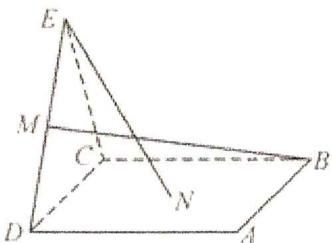

text_image

Geometric diagram of a triangular pyramid with labeled vertices and internal points

A. BM = EN，且直线 BM，EN 是相交直线

B. $BM \neq EN$ ，且直线 BM，EN 是相交直线

C. BM = EN，且直线 BM，EN 是异面直线

D. $BM \neq EN$ , 且直线 $BM$ , $EN$ 是异面直线

5.（2019·新课标II）设 $\alpha$ ， $\beta$ 为两个平面，则 $\alpha // \beta$ 的充要条件是( )

A. $\alpha$ 内有无数条直线与 $\beta$ 平行

B. $\alpha$ 内有两条相交直线与 $\beta$ 平行

C. $\alpha, \beta$ 平行于同一条直线

D. $\alpha, \beta$ 垂直于同一平面

6. (2020·浙江) 已知空间中不过同一点的三条直线 $l, m, n$ . 则 “ $l, m, n$ 共面” 是 “ $l, m, n$ 两两相交” 的 ( )

A. 充分不必要条件

B. 必要不充分条件

C. 充分必要条件

D. 既不充分也不必要条件

7. (2020·全国) 已知正三棱锥 $P - ABC$ , $AB = 2$ , $PA = \sqrt{3}$ , $D$ 为 $PC$ 中点, 则三棱锥 $D - ABC$ 的体积为 ( )

A. $\frac{\sqrt{5}}{6}$

B. $\frac{1}{3}$

C. $\frac{\sqrt{3}}{6}$

D. $\frac{\sqrt{2}}{6}$

8.（2020·山东）日晷是中国古代用来测定时间的仪器，利用与晷面垂直的晷针投射到晷面的影子来测定时间。把地球看成一个球（球心记为O），地球上一点A的纬度是指OA与地球赤道所在平面所成角，点A处的水平面是指过点A且与OA垂直的平面。在点A处放置一个日晷，若晷面与赤道所在平面平行，点A处的纬度为北纬40°，则晷针与点A处的水平面所成角为( )

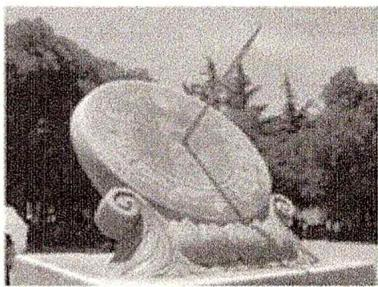

natural_image

Illustration of a large, horned creature with a bird perched on its side, set against a backdrop of trees and distant figures (no text or symbols visible)

A. ${20}^{ \circ  }$

B. ${40}^{ \circ  }$

C. ${50}^{ \circ  }$

D. ${90}^{ \circ  }$

9.（2020·新课标Ⅰ）埃及胡夫金字塔是古代世界建筑奇迹之一，它的形状可视为一个正四棱锥。以该四棱锥的高为边长的正方形面积等于该四棱锥一个侧面三角形的面积，则其侧面三角形底边上的高与底面正方形的边长的比值为( )

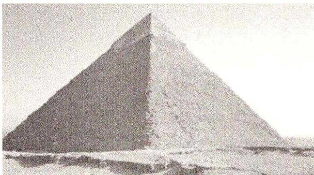

natural_image

Two adjacent pyramids of different sizes, one shaded and one plain, standing in a natural landscape (no text or symbols visible)

A. $\frac{\sqrt{5} - 1}{4}$

B. $\frac{\sqrt{5} - 1}{2}$

C. $\frac{\sqrt{5}+1}{4}$

D. $\frac{\sqrt{5} + 1}{2}$

10. (2021·天津) 两个圆锥的底面是一个球的同一截面, 顶点均在球面上, 若球的体积为 $\frac{32 \pi}{3}$ , 两个圆锥的高之比为 $1: 3$ , 则这两个圆锥的体积之和为 ( )

A. $3 \pi$

B. $4 \pi$

C. $9 \pi$

D. $12 \pi$

11. (2021·乙卷) 在正方体 $ABCD - A_{1}B_{1}C_{1}D_{1}$ 中, $P$ 为 $B_{1}D_{1}$ 的中点, 则直线 $PB$ 与 $AD_{1}$ 所成的角为(   )

A. $\frac{\pi}{2}$

B. $\frac{\pi}{3}$

C. $\frac{\pi}{4}$

D. $\frac{\pi}{6}$

12. (2021·新高考II) 北斗三号全球卫星导航系统是我国航天事业的重要成果。在卫星导航系统中, 地球静止同步轨道卫星的轨道位于地球赤道所在平面, 轨道高度为 $36000 \mathrm{~km}$ (轨道高度是指卫星到地球表面的距离)。将地球看作是一个球心为 $O$ , 半径 $r$ 为 $6400 \mathrm{~km}$ 的球, 其上点 $A$ 的纬度是指 $OA$ 与赤道平面所成角的度数。地球表面上能直接观测到的一颗地球静止同步轨道卫星点的纬度最大值为 $\alpha$ , 该卫星信号覆盖地球表面的表面积 $S = 2 \pi r^{2} (1 - \cos \alpha)$ (单位: $km^{2}$ ), 则 $S$ 占地球表面积的百分比约为 ( )

A. $26\%$

B. $34\%$

C. $42\%$

D. $50\%$

13. (2021·浙江) 如图, 已知正方体 $ABCD - A_{1}B_{1}C_{1}D_{1}$ , $M$ , $N$ 分别是 $A_{1}D$ , $D_{1}B$ 的中点, 则 ( )

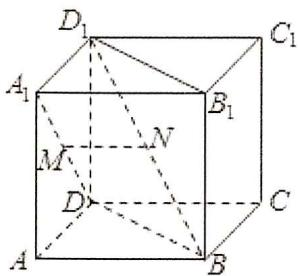

text_image

D₁
A₁
M
N
D
A
B
C₁
B₁
C

A. 直线 $A_{1} D$ 与直线 $D_{1} B$ 垂直, 直线 $M N / /$ 平面 $A B C D$   
B. 直线 $A_{1} D$ 与直线 $D_{1} B$ 平行, 直线 $M N \perp$ 平面 $B D D_{1} B_{1}$   
C. 直线 $A_{1} D$ 与直线 $D_{1} B$ 相交, 直线 $M N / / \text{平面} A B C D$   
D. 直线 $A_{1} D$ 与直线 $D_{1} B$ 异面, 直线 $M N \perp$ 平面 $B D D_{1} B_{1}$

14. (2021·新高考Ⅱ) 正四棱台的上、下底面的边长分别为 2, 4, 侧棱长为 2, 则其体积为( )

A. $20 + 12\sqrt{3}$

B. $28 \sqrt{2}$

C. $\frac{56}{3}$

D. $\frac{28\sqrt{2}}{3}$

15.（2021·新高考Ⅰ）已知圆锥的底面半径为 $\sqrt{2}$ ，其侧面展开图为一个半圆，则该圆锥的母线长为( )

A. 2

B. $2 \sqrt{2}$

C. 4

D. $4\sqrt{2}$

16.（2022·上海）上海海关大楼的顶部为逐级收拢的四面钟楼，如图，四个大钟分布在四棱柱的四个侧面，则每天0点至12点（包含0点，不含12点）相邻两钟面上的时针相互垂直的次数为( )

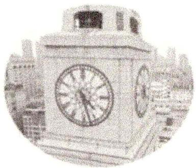

natural_image

Exterior view of a vintage-style clock tower with visible dials and wheels (no text or symbols)

A. 0

B. 2

C. 4

D. 12

17.（2022·全国）底面积为 $2\pi$ ，侧面积为 $6\pi$ 的圆锥的体积是()

A. $8 \pi$

B. $\frac{8\pi}{3}$

C. $2 \pi$

D. $\frac{4\pi}{3}$

18. (2022·天津) 十字歇山顶是中国古代建筑屋顶的经典样式之一, 图 1 中的故宫角楼的顶部即为十字歇山顶。其上部可视为由两个相同的直三棱柱交叠而成的几何体 (图 2)。这两个三棱柱有一个公共侧面 $ABCD$ 。在底面 $BCE$ 中, 若 $BE = CE = 3$ , $\angle BEC = 120^\circ$ , 则该几何体的体积为 ( )

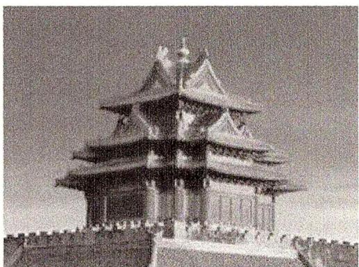

natural_image

Exterior view of a traditional Chinese multi-tiered pagoda with tiered eaves and stone walls, surrounded by people (no visible text or symbols)

图1

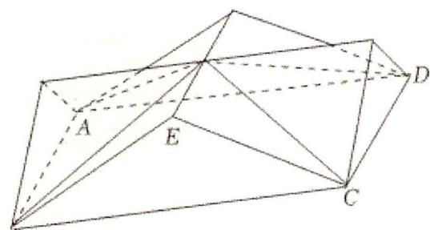

natural_image

Geometric diagram of a polyhedron with labeled vertices A, C, D and internal point E (no text or symbols present)

图2

A. $\frac{27}{2}$

B. $\frac{27\sqrt{3}}{2}$

C. 27

D. ${27}\sqrt{3}$

19. (2022·上海) 如图正方体 $ABCD-A_{1}B_{1}C_{1}D_{1}$ 中, $P$ 、 $Q$ 、 $R$ 、 $S$ 分别为棱 $AB$ 、 $BC$ 、 $BB_{1}$ 、 $CD$ 的中点, 连接 $A_{1}S$ , $B_{1}D$ . 空间任意两点 $M$ 、 $N$ , 若线段 $MN$ 上不存在点在线段 $A_{1}S$ 、 $B_{1}D$ 上, 则称 $MN$ 两点可视, 则下列选项中与点 $D_{1}$ 可视的为 ( )

text_image

D₁
A₁
B₁
R
D
S
C
Q
A
P
B
C₁

A. 点 $P$

B. 点 $B$

C. 点 $R$

D. 点 $Q$

20.（2022·甲卷）甲、乙两个圆锥的母线长相等，侧面展开图的圆心角之和为 $2\pi$ ，侧面积分别为 $S_{甲}$ 和 $S_{乙}$ ，体积分别为 $V_{甲}$ 和 $V_{乙}$ 。若 $\frac{S_{甲}}{S_{乙}}=2$ ，则 $\frac{V_{甲}}{V_{乙}}=(\quad)$

A. $\sqrt{5}$

B. $2\sqrt{2}$

C. $\sqrt{10}$

D. $\frac{5\sqrt{10}}{4}$

21. (2022·北京) 已知正三棱锥 $P - ABC$ 的六条棱长均为 6, $S$ 是 $\Delta ABC$ 及其内部的点构成的集合。设集合 $T = \{Q \in S \mid PQ \leqslant 5\}$ , 则 $T$ 表示的区域的面积为 ( )

A. $\frac{3\pi}{4}$

B. $\pi$

C. $2 \pi$

D. $3 \pi$

22. (2022·浙江) 如图, 已知正三棱柱 $ABC - A_{1}B_{1}C_{1}$ , $AC = AA_{1}$ , $E$ , $F$ 分别是棱 $BC$ , $A_{1}C_{1}$ 上的点. 记 $EF$ 与 $AA_{1}$ 所成的角为 $\alpha$ , $EF$ 与平面 $ABC$ 所成的角为 $\beta$ , 二面角 $F - BC - A$ 的平面角为 $\gamma$ , 则 ( )

text_image

A₁ F C₁
B₁
A C
E B

A. $\alpha \leqslant \beta \leqslant \gamma$

B. $\beta \leqslant \alpha \leqslant \gamma$

C. $\beta\leqslant\gamma\leqslant\alpha$

D. $\alpha\leqslant\gamma\leqslant\beta$

23. (2022·甲卷) 在长方体 $ABCD-A_{1}B_{1}C_{1}D_{1}$ 中, 已知 $B_{1}D$ 与平面 $ABCD$ 和平面 $AA_{1}B_{1}B$ 所成的角均为 $30^{\circ}$ , 则 ( )

A. AB = 2AD   
B. AB 与平面 $AB, C, D$ 所成的角为 $30^{\circ}$   
C. $AC = CB_{1}$   
D. $B_{1}D$ 与平面 $BB_{1}C_{1}C$ 所成的角为 $45^{\circ}$

24. (2022·乙卷) 在正方体 $ABCD - A_{1}B_{1}C_{1}D_{1}$ 中, $E$ , $F$ 分别为 $AB$ , $BC$ 的中点, 则( )

A. 平面 $B_{1}EF \perp$ 平面 $BDD_{1}$

B. 平面 $B_{1}EF \perp$ 平面 $A_{1}BD$

C. 平面 $B_{1}EF$ // 平面 $A_{1}AC$

D. 平面 $B_{1}EF$ // 平面 $A_{1}C_{1}D$

25.（2022·新高考Ⅰ）南水北调工程缓解了北方一些地区水资源短缺问题，其中一部分水蓄入某水库。已知该水库水位为海拔148.5m时，相应水面的面积为 $140.0km^{2}$ ；水位为海拔157.5m时，相应水面的面积为 $180.0km^{2}$ 。将该水库在这两个水位间的形状看作一个棱台，则该水库水位从海拔148.5m上升到157.5m时，增加的水量约为 $(\sqrt{7}\approx2.65)$ （）

A. $1.0 \times 10^{9} m^{3}$

B. $1.2 \times 10^{9} m^{3}$

C. $1.4 \times 10^{9} m^{3}$

D. $1.6 \times 10^{9} m^{3}$

26. (2023·上海) 如图所示, 在正方体 $ABCD-A_{1}B_{1}C_{1}D_{1}$ 中, 点 $P$ 为边 $A_{1}C_{1}$ 上的动点, 则下列直线中, 始终与直线 $BP$ 异面的是( )

text_image

D₁
A₁
B₁
C₁
D
C
A
B

A. $DD_{1}$

B. $AC$

C. $AD_{1}$

D. $B_{1}C$

27. (2023·全国) 长方体的对角线长为 1, 表面积为 1, 有一面为正方形, 则其体积为( )

A. $\frac{\sqrt{2}}{108}$

B. $\frac{\sqrt{2}}{27}$

C. $\frac{\sqrt{2}}{9}$

D. $\frac{\sqrt{2}}{6}$

28. (2023·乙卷)已知 $\triangle ABC$ 为等腰直角三角形, $AB$ 为斜边, $\triangle ABD$ 为等边三角形, 若二面角 $C - AB - D$ 为 $150^{\circ}$ , 则直线 $CD$ 与平面 $ABC$ 所成角的正切值为 ( )

A. $\frac{1}{5}$

B. $\frac{\sqrt{2}}{5}$

C. $\frac{\sqrt{3}}{5}$

D. $\frac{2}{5}$

29. (2023·甲卷) 在三棱锥 $P - ABC$ 中, $\triangle ABC$ 是边长为 2 的等边三角形, $PA = PB = 2$ , $PC = \sqrt{6}$ , 则该棱锥的体积为 ( )

A. 1

B. $\sqrt{3}$

C. 2

D. 3

30. (2023·北京) 当曹是我国传统建筑造型之一, 蕴含着丰富的数学元素. 安装灯带可以勾勒出建筑轮廓, 展现造型之美. 如图, 某屋顶可视为五面体 $ABCDEF$ , 四边形 $ABFE$ 和 $CDEF$ 是全等的等腰梯形, $\Delta ADE$ 和 $\Delta BCF$ 是全等的等腰三角形. 若 $AB = 25m$ , $BC = AD = 10m$ , 且等腰梯形所在的面、等腰三角形所在的面与底面夹角的正切值均为 $\frac{\sqrt{14}}{5}$ . 为这个模型的轮廓安装灯带 (不计损耗), 则所需灯带的长度为 ( )

text_image

E
F
D
C
A
B

A. $102 m$

B. $112m$

C. $117m$

D. ${125m}$

31. (2023·乙卷) 已知圆锥 $PO$ 的底面半径为 $\sqrt{3}$ , $O$ 为底面圆心, $PA$ , $PB$ 为圆锥的母线, $\angle AOB = 120^{\circ}$ , 若 $\triangle PAB$ 的面积等于 $\frac{9\sqrt{3}}{4}$ , 则该圆锥的体积为 ( )

A. $\pi$

B. $\sqrt{6} \pi$

C. $3 \pi$

D. $3 \sqrt{6} \pi$

32.（2023·甲卷）在四棱锥 P-ABCD 中，底面 ABCD 为正方形，AB=4，PC=PD=3， $\angle PCA=45^{\circ}$ ，则 $\Delta PBC$ 的面积为（）

A. $2 \sqrt{2}$

B. $3\sqrt{2}$

C. $4\sqrt{2}$

D. $5\sqrt{2}$

33. (2023·天津) 在三棱锥 $P - ABC$ 中, 线段 $PC$ 上的点 $M$ 满足 $PM = \frac{1}{3} PC$ , 线段 $PB$ 上的点 $N$ 满足 $PN = \frac{2}{3} PB$ , 则三棱锥 $P - AMN$ 和三棱锥 $P - ABC$ 的体积之比为 ( )

A. $\frac{1}{9}$

B. $\frac{2}{9}$

C. $\frac{1}{3}$

D. $\frac{4}{9}$

# 二、多选题

1. (2021·新高考II) 如图, 下列正方体中, $O$ 为底面的中心, $P$ 为所在棱的中点, $M$ , $N$ 为正方体的顶点, 则满足 $MN \perp OP$ 的是( )

2. (2021·新高考 I ) 在正三棱柱 $ABC - A_{1}B_{1}C_{1}$ 中, $AB = AA_{1} = 1$ , 点 $P$ 满足 $\overrightarrow{BP} = \lambda \overrightarrow{BC} + \mu \overrightarrow{BB_{1}}$ , 其中 $\lambda \in [0, 1]$ , $\mu \in [0, 1]$ , 则 ( )

A. 当 $\lambda=1$ 时， $\triangle AB_{1}P$ 的周长为定值  
B. 当 $\mu=1$ 时，三棱锥 $P-A_{1}BC$ 的体积为定值  
C. 当 $\lambda = \frac{1}{2}$ 时，有且仅有一个点 $P$ ，使得 $A_{1}P \perp BP$   
D. 当 $\mu = \frac{1}{2}$ 时，有且仅有一个点 $P$ ，使得 $A_{1}B \perp$ 平面 $AB_{1}P$

3. (2021·新高考II) 如图, 下列正方体中, $O$ 为底面的中心, $P$ 为所在棱的中点, $M$ , $N$ 为正方体的顶点, 则满足 $MN \perp OP$ 的是( )

4.（2021·新高考Ⅰ）在正三棱柱 $ABC-A_{1}B_{1}C_{1}$ 中， $AB=AA_{1}=1$ ，点 P 满足 $\overrightarrow{BP}=\lambda\overrightarrow{BC}+\mu\overrightarrow{BB_{1}}$ ，其中 $\lambda\in[0,1]$ ， $\mu\in[0,1]$ ，则（）

A. 当 $\lambda = 1$ 时, $\triangle AB_{1}P$ 的周长为定值  
B. 当 $\mu = 1$ 时, 三棱锥 $P - A, BC$ 的体积为定值  
C. 当 $\lambda=\frac{1}{2}$ 时，有且仅有一个点 P，使得 $A_{1}P\perp BP$   
D. 当 $\mu = \frac{1}{2}$ 时，有且仅有一个点 $P$ ，使得 $A_{1}B \perp$ 平面 $AB_{1}P$

5. (2022·新高考Ⅱ) 如图, 四边形 $ABCD$ 为正方形, $ED \perp$ 平面 $ABCD$ , $FB // ED$ , $AB = ED = 2FB$ . 记三棱锥 $E-ACD$ , $F-ABC$ , $F-ACE$ 的体积分别为 $V_1$ , $V_2$ , $V_3$ , 则 ( )

text_image

Geometric diagram of a tetrahedron with labeled vertices A, B, C, D, E and internal points F and D, showing solid and dashed edges.

A. $V_{3} = 2V_{2}$

B. $V_{3} = V_{1}$

C. $V_{3} = V_{1} + V_{2}$

D. $2V_{3} = 3V_{1}$

6. (2022·新高考 I) 已知正方体 $ABCD - A_{1}B_{1}C_{1}D_{1}$ , 则 ( )

A. 直线 $BC_{1}$ 与 $DA_{1}$ 所成的角为 $90^{\circ}$   
B. 直线 $BC_{1}$ 与 $CA_{1}$ 所成的角为 $90^{\circ}$   
C. 直线 $BC_{1}$ 与平面 $BB, D, D$ 所成的角为 $45^{\circ}$   
D. 直线 $BC_{1}$ 与平面 $ABCD$ 所成的角为 $45^{\circ}$

7. (2023·新高考II)已知圆锥的顶点为 $P$ , 底面圆心为 $O$ , $AB$ 为底面直径, $\angle APB = 120^{\circ}$ , $PA = 2$ , 点 $C$ 在底面圆周上, 且二面角 $P - AC - O$ 为 $45^{\circ}$ , 则( )

A. 该圆锥的体积为 $\pi$

B. 该圆锥的侧面积为 $4 \sqrt{3} \pi$

C. $AC = 2\sqrt{2}$

D. $\Delta PAC$ 的面积为 $\sqrt{3}$

8. (2023·新高考 I ) 下列物体中, 能够被整体放入棱长为 1 (单位: $m$ ) 的正方体容器 (容器壁厚度忽略不计) 内的有 ( )

A. 直径为 $0.99 m$ 的球体  
B. 所有棱长均为 $1.4 \mathrm{~m}$ 的四面体  
C. 底面直径为0.01m，高为1.8m的圆柱体  
D. 底面直径为1.2m，高为0.01m的圆柱体

# 三、填空题

1. (2019·天津)已知四棱锥的底面是边长为 $\sqrt{2}$ 的正方形, 侧棱长均为 $\sqrt{5}$ . 若圆柱的一个底面的圆周经过四棱锥四条侧棱的中点, 另一个底面的圆心为四棱锥底面的中心, 则该圆柱的体积为  
2. (2019·新课标III) 学生到工厂劳动实践, 利用 $3 D$ 打印技术制作模型。如图, 该模型为长方体 $A B C D - A _ { 1 } B _ { 1 } C _ { 1 } D _ { 1 }$ 挖去四棱锥 $O - E F G H$ 后所得的几何体, 其中 $O$ 为长方体的中心, $E$ , $F$ , $G$ , $H$ 分别为所在棱的中点, $A B = B C = 6 c m$ , $A A _ { 1 } = 4 c m . 3 D$ 打印所用原料密度为 $0.9 g / c m ^ { 3 }$ 。不考虑打印损耗, 制作该模型所需原料的质量为 $\_ g$ 。

text_image

Geometric diagram of a rectangular prism with labeled vertices and internal points, used for spatial geometry problems.

3.（2019·北京）已知 $l$ ， $m$ 是平面 $\alpha$ 外的两条不同直线。给出下列三个论断：

① $l \perp m$ ; ② $m // \alpha$ ; ③ $l \perp \alpha$ .

以其中的两个论断作为条件，余下的一个论断作为结论，写出一个正确的命题：\_\_\_\_。

4. (2019·江苏) 如图, 长方体 $ABCD-A_{1}B_{1}C_{1}D_{1}$ 的体积是 120, $E$ 为 $CC_{1}$ 的中点, 则三棱锥 $E-BCD$ 的体积是 \_\_\_\_.

text_image

D₁
A₁ B₁ C₁
D E
A B C

5. (2019•新课标II) 中国有悠久的金石文化, 印信是金石文化的代表之一. 印信的形状多为长方体、正方体或圆柱体, 但南北朝时期的官员独孤信的印信形状是 “半正多面体” (图1). 半正多面体是由两种或两种以上的正多边形围成的多面体. 半正多面体体现了数学的对称美. 图2是一个棱数为48的半正多面体, 它的所有顶点都在同一个正方体的表面上, 且此正方体的棱长为1. 则该半正多面体共有\_\_\_\_个面, 其棱长为 \_\_\_\_.

text_image

大見全
見中

图1

natural_image

Geometric wireframe diagram of a polyhedron with visible and hidden edges (no labels or text)

图2

6. (2020·全国) 在空间直角坐标系中, 已知点 $A(1, 0, 2)$ , $B(1, 1, -1)$ , 则经过点 $A$ 且与直线 $AB$ 垂直的平面方程为 \_\_\_\_.

7. (2020·江苏) 如图, 六角螺帽毛坯是由一个正六棱柱挖去一个圆柱所构成的。已知螺帽的底面正六边形边长为 $2 \mathrm{~cm}$ , 高为 $2 \mathrm{~cm}$ , 内孔半径为 $0.5 \mathrm{~cm}$ , 则此六角螺帽毛坯的体积是 $\_ \mathrm{cm}^{3}$ 。

natural_image

Isometric line drawing of a cube with one face and one cylinder, no text or symbols present

8. (2020·浙江) 已知圆锥的侧面积 (单位: $cm^{2}$ ) 为 $2\pi$ , 且它的侧面展开图是一个半圆, 则这个圆锥的底面半径 (单位: $cm$ ) 是 \_\_\_\_.

9. (2020·海南) 已知正方体 $ABCD - A_{1}B_{1}C_{1}D_{1}$ 的棱长为 2, $M$ 、 $N$ 分别为 $BB_{1}$ 、 $AB$ 的中点, 则三棱锥 $A - NMD_{1}$ 的体积为 \_\_\_\_.

10.（2020·新课标Ⅰ）如图，在三棱锥P-ABC的平面展开图中，AC=1，AB=AD= $\sqrt{3}$ ，AB⊥AC，AB⊥AD， $\angle CAE=30^{\circ}$ ，则 $\cos\angle FCB=$ \_\_\_\_.

text_image

D(P)
A
B
C
E(P)
F(P)

11. (2021·全国) 三棱锥 $P - ABC$ 中, $PA \perp$ 底面 $ABC$ , 且 $PA = 3$ , $AB = CB = 2$ , $AC = 2\sqrt{2}$ , 则侧面 $PBC$ 的面积是 \_\_\_\_.

12. (2021·上海) 已知圆柱的底面半径为 1, 高为 2, 则圆柱的侧面积为 \_\_\_\_.

13.（2021·全国）三棱锥 P-ABC 中，PA⊥底面 ABC，且 PA=3，AB=CB=2， $AC=2\sqrt{2}$ ，则侧面 PBC 的面积是 \_\_\_\_。

14.（2021·上海）已知圆柱的底面半径为1，高为2，则圆柱的侧面积为

15.（2021·甲卷）已知一个圆锥的底面半径为6，其体积为30π，则该圆锥的侧面积为\_\_\_\_。

16. (2021·上海) 已知圆柱的底面圆半径为 1, 高为 2, $AB$ 为上底面圆的一条直径, $C$ 是下底面圆周上的一个动点, 则 $\triangle ABC$ 的面积的取值范围为 \_\_\_\_.

17. (2022·全国) 在正三棱柱 $ABC - A_{1}B_{1}C_{1}$ 中, $AB = 1$ , $AA_{1} = \frac{\sqrt{2}}{2}$ , 则异面直线 $AB_{1}$ 与 $BC_{1}$ 所成角的大小为 \_\_\_\_.

18.（2022·上海）已知圆柱的高为4，底面积为 $9\pi$ ，则圆柱的侧面积为\_\_\_\_。

19. (2023·上海) 空间中有三个点 $A$ 、 $B$ 、 $C$ , 且 $AB = BC = CA = 1$ , 在空间中任取 2 个不同的点 $D$ , $E$ (不考虑这两个点的顺序), 使得它们与 $A$ 、 $B$ 、 $C$ 恰好成为一个正四棱锥的五个顶点, 则不同的取法有种.

20. (2023·甲卷) 在正方体 $ABCD - A_{1}B_{1}C_{1}D_{1}$ 中, $E$ , $F$ 分别为 $CD$ , $A_{1}B_{1}$ 的中点, 则以 $EF$ 为直径的球面与正方体每条棱的交点总数为 \_\_\_\_.

21. (2023·新高考Ⅱ) 底面边长为 4 的正四棱锥被平行于其底面的平面所截, 截去一个底面边长为 2 , 高为 3 的正四棱锥, 所得棱台的体积为 \_\_\_\_.

22. (2023·新高考Ⅰ) 在正四棱台 $ABCD - A_{1}B_{1}C_{1}D_{1}$ 中, $AB = 2$ , $A_{1}B_{1} = 1$ , $AA_{1} = \sqrt{2}$ , 则该棱台的体积为 \_\_\_\_.

# 四、解答题

1. (2019·新课标III) 图 1 是由矩形 $ADEB$ ，Rt△ABC 和菱形 $BFGC$ 组成的一个平面图形，其中 $AB = 1$ ， $BE = BF = 2$ ， $\angle FBC = 60^\circ$ 。将其沿 $AB$ ， $BC$ 折起使得 $BE$ 与 $BF$ 重合，连结 $DG$ ，如图 2。

text_image

Geometric diagram with labeled points A, B, C, D, E, F, G forming rectangles and triangles

图1

text_image

D
E(F)
G
A
B
C

图2

(1) 证明: 图2中的 $A, C, G, D$ 四点共面, 且平面 $ABC \perp$ 平面 $BCGE$ ;

(2) 求图 2 中的四边形 ACGD 的面积.

2. (2019·北京) 如图, 在四棱锥 $P - ABCD$ 中, $PA \perp$ 平面 $ABCD$ , 底面 $ABCD$ 为菱形, $E$ 为 $CD$ 的中点.

（Ⅰ）求证： $BD \perp$ 平面 PAC；

（Ⅱ）若 $\angle ABC = 60^{\circ}$ ，求证：平面 $PAB \perp$ 平面 PAE；

（III）棱 $PB$ 上是否存在点 $F$ ，使得 $CF / /$ 平面 $PAE$ ？说明理由.

text_image

P
A
B
C
D
E

3.(2019·天津)如图,在四棱锥 P-ABCD 中,底面 ABCD 为平行四边形, $\Delta$ PCD 为等边三角形,平面 PAC⊥平面 PCD, $PA\perp CD$ , $CD=2$ , $AD=3$ .

(Ⅰ) 设 G，H 分别为 PB，AC 的中点，求证：GH // 平面 PAD；

(II) 求证: $PA \perp$ 平面 $PCD$ ;

(III) 求直线 AD 与平面 PAC 所成角的正弦值.

text_image

Geometric diagram of a tetrahedron with labeled vertices and internal points, used for spatial geometry problems.

4.(2019·北京)如图,在四棱锥 P-ABCD 中, $PA \perp$ 平面 ABCD, $AD \perp CD$ , $AD // BC$ , $PA = AD = CD = 2$ , $BC = 3$ . E 为 PD 的中点, 点 F 在 PC 上, 且 $\frac{PF}{PC} = \frac{1}{3}$ .

(Ⅰ) 求证: $CD \perp$ 平面 $PAD$ :

(II) 求二面角 F-AE-P 的余弦值:

（III）设点 $G$ 在 $PB$ 上，且 $\frac{PG}{PB} = \frac{2}{3}$ 。判断直线 $AG$ 是否在平面 $AEF$ 内，说明理由。

text_image

Geometric diagram of a pyramid with labeled vertices and internal points, used for spatial geometry problems.

5.（2019·上海）如图，在长方体 $ABCD-A_{1}B_{1}C_{1}D_{1}$ 中，M 为 $BB_{1}$ 上一点，已知 BM=2，CD=3，AD=4， $AA_{1}=5$ .

(1) 求直线 $A, C$ 和平面 $ABCD$ 的夹角;

(2) 求点 A 到平面 A.MC 的距离.

text_image

A₁
B₁
C₁
M
A
D
B
C
D₁

6. (2019·新课标II)如图, 长方体 $ABCD-A_{1}B_{1}C_{1}D_{1}$ 的底面 $ABCD$ 是正方形, 点 $E$ 在棱 $AA_{1}$ 上, $BE \perp EC_{1}$ .

(1) 证明: $BE \perp$ 平面 $EB_{1}C_{1}$ ;

（2）若 $AE = A_{1}E$ ，求二面角 $B - EC - C_{1}$ 的正弦值.

text_image

D₁
C₁
A₁
B₁
E
C
D
A
B

7. (2019·浙江) 如图, 已知三棱柱 $ABC - A_{1}B_{1}C_{1}$ , 平面 $A_{1}ACC_{1} \perp$ 平面 $ABC$ , $\angle ABC = 90^{\circ}$ , $\angle BAC = 30^{\circ}$ , $A_{1}A = A_{1}C = AC$ , $E$ , $F$ 分别是 $AC$ , $A_{1}B_{1}$ 的中点.

（Ⅰ）证明： $EF \perp BC$ ;

（II）求直线 EF 与平面 $A_{1}BC$ 所成角的余弦值.

text_image

A₁
F
B₁
C₁
A
E
C
B

8.（2019·天津）如图，AE⊥平面ABCD，CF//AE，AD//BC，AD⊥AB，AB=AD=1，AE=BC=2。

（Ⅰ）求证：BF//平面ADE；

（Ⅱ）求直线 CE 与平面 BDE 所成角的正弦值；

（III）若二面角 E-BD-F 的余弦值为 $\frac{1}{3}$ ，求线段 CF 的长.

text_image

Geometric diagram of a cube with labeled vertices and internal diagonals, used for spatial geometry problems.

9. (2019·新课标 II) 如图, 长方体 $ABCD-A_{1}B_{1}C_{1}D_{1}$ 的底面 $ABCD$ 是正方形, 点 $E$ 在棱 $AA_{1}$ 上, $BE \perp EC_{1}$ .

(1) 证明: $BE \perp$ 平面 $EB_{1}C_{1}$ ;  
(2) 若 $AE = A_{1}E$ ，AB = 3，求四棱锥 $E - BB_{1}C_{1}C$ 的体积.

text_image

Geometric diagram of a rectangular prism with labeled vertices and internal points, used for spatial geometry problems.

10.（2019·江苏）如图，在直三棱柱 $ABC-A_{1}B_{1}C_{1}$ 中，D，E 分别为 BC，AC 的中点，AB=BC．求证：

(1) $A_{1}B_{1}$ // 平面 $DEC_{1}$ ;  
(2) $BE \perp C_{1}E$ .

text_image

A₁
B₁
C₁
A
E
D
C
B

11. (2019·新课标 I) 如图, 直四棱柱 $ABCD - A_{1}B_{1}C_{1}D_{1}$ 的底面是菱形, $AA_{1} = 4$ , $AB = 2$ , $\angle BAD = 60^{\circ}$ , $E$ , $M$ , $N$ 分别是 $BC$ , $BB_{1}$ , $A_{1}D$ 的中点.

(1) 证明: $MN //$ 平面 $C_{1}DE$ ;  
(2) 求二面角 $A - MA_{1} - N$ 的正弦值.

text_image

Geometric diagram of a rectangular prism with labeled vertices and internal points, used for spatial geometry problems.

12. (2020·新课标II) 如图, 已知三棱柱 $ABC - A_{1}B_{1}C_{1}$ 的底面是正三角形, 侧面 $BB_{1}C_{1}C$ 是矩形, $M$ , $N$ 分别为 $BC$ , $B_{1}C_{1}$ 的中点, $P$ 为 $AM$ 上一点. 过 $B_{1}C_{1}$ 和 $P$ 的平面交 $AB$ 于 $E$ , 交 $AC$ 于 $F$ .

(1) 证明: $AA_{1} // MN$ , 且平面 $A_{1}AMN \perp$ 平面 $EB_{1}C_{1}F$ ;

(2) 设 $O$ 为 $\triangle A_{1}B_{1}C_{1}$ 的中心. 若 $AO = AB = 6$ , $AO //$ 平面 $EB_{1}C_{1}F$ , 且 $\angle MPN = \frac{\pi}{3}$ , 求四棱锥 $B - EB_{1}C_{1}F$ 的体积.

text_image

Geometric diagram of a cube with labeled vertices and internal points, used for spatial geometry problems.

13. (2020·海南) 如图, 四棱锥 $P - ABCD$ 的底面为正方形, $PD \perp$ 底面 $ABCD$ . 设平面 $PAD$ 与平面 $PBC$ 的交线为 $l$ .

(1) 证明: $l \perp$ 平面 $PDC$ ;

(2) 已知 $PD = AD = 1$ , $Q$ 为 $l$ 上的点, $QB = \sqrt{2}$ , 求 $PB$ 与平面 $QCD$ 所成角的正弦值.

text_image

P
D
A
B
C

14. (2020·上海) 已知 $ABCD$ 是边长为 1 的正方形, 正方形 $ABCD$ 绕 $AB$ 旋转形成一个圆柱.

(1) 求该圆柱的表面积;

(2) 正方形 $ABCD$ 绕 $AB$ 逆时针旋转 $\frac{\pi}{2}$ 至 $ABC_{1}D_{1}$ , 求线段 $CD_{1}$ 与平面 $ABCD$ 所成的角.

text_image

C
B
C₁
D
A
D₁

15. (2020·新课标 I) 如图, $D$ 为圆锥的顶点, $O$ 是圆锥底面的圆心, $\triangle ABC$ 是底面的内接正三角形, $P$ 为 $DO$ 上一点, $\angle APC = 90^{\circ}$ .

(1) 证明: 平面 $PAB \perp$ 平面 $PAC$ ;  
(2) 设 $DO = \sqrt{2}$ ，圆锥的侧面积为 $\sqrt{3}\pi$ ，求三棱锥 P - ABC 的体积.

text_image

D
P
C
O
A
B

16.(2020·浙江)如图,在三棱台 $ABC-DEF$ 中,平面 $ACFD \perp$ 平面 $ABC$ , $\angle ACB = \angle ACD = 45^{\circ}$ , $DC = 2BC$ .

（Ⅰ）证明： $EF \perp DB$ ;  
（II）求直线 DF 与平面 DBC 所成角的正弦值.

text_image

Geometric diagram of a frustum with labeled vertices A, B, C, D, E, F and dashed internal edges

17. (2020·江苏) 在三棱锥 $A - BCD$ 中, 已知 $CB = CD = \sqrt{5}$ , $BD = 2$ , $O$ 为 $BD$ 的中点, $AO \perp$ 平面 $BCD$ , $AO = 2$ , $E$ 为 $AC$ 中点.

(1) 求直线 AB 与 DE 所成角的余弦值;  
(2) 若点 $F$ 在 $BC$ 上, 满足 $BF = \frac{1}{4} BC$ , 设二面角 $F - DE - C$ 的大小为 $\theta$ , 求 $\sin \theta$ 的值.

text_image

Geometric diagram of a tetrahedron with labeled vertices and internal points, including dashed lines for hidden edges.

18. (2020·北京) 如图, 在正方体 ${ABCD} - {A}_{1}{B}_{1}{C}_{1}{D}_{1}$ 中, $E$ 为 $B{B}_{1}$ 的中点.

（Ⅰ）求证： $BC_{1}$ // 平面 $AD_{1}E$ ；

（II）求直线 $AA_{1}$ 与平面 $AD_{1}E$ 所成角的正弦值.

text_image

A₁
B₁
D₁
C₁
E
A
B
D
C

19. (2020·新课标III) 如图, 在长方体 $ABCD - A_{1}B_{1}C_{1}D_{1}$ 中, 点 $E$ , $F$ 分别在棱 $DD_{1}$ , $BB_{1}$ 上, 且 $2DE = ED_{1}$ , $BF = 2FB_{1}$ .

(1) 证明: 点 $C_{1}$ 在平面 $AEF$ 内;

（2）若 AB=2，AD=1， $AA_{1}=3$ ，求二面角 $A-EF-A_{1}$ 的正弦值.

text_image

Geometric diagram of a rectangular prism with labeled vertices and internal diagonals

20. (2020·新课标 I) 如图, $D$ 为圆锥的顶点, $O$ 是圆锥底面的圆心, $A E$ 为底面直径, $A E = A D$ . $\triangle A B C$ 是底面的内接正三角形, $P$ 为 $D O$ 上一点, $P O = \frac{\sqrt{6}}{6} D O$ .

(1) 证明: $PA \perp$ 平面 $PBC$ ;

(2) 求二面角 B-PC-E 的余弦值.

text_image

Geometric diagram of a cone with labeled points and dashed lines indicating hidden edges

21. (2020·山东) 如图, 四棱锥 $P - ABCD$ 的底面为正方形, $PD \perp$ 底面 $ABCD$ . 设平面 $PAD$ 与平面 $PBC$ 的交线为 $l$ .

(1) 证明: $l \perp$ 平面 $PDC$ ;

(2) 已知 $PD = AD = 1$ , $Q$ 为 $l$ 上的点, 求 $PB$ 与平面 $QCD$ 所成角的正弦值的最大值.

text_image

P
D
C
A
B

22. (2020·天津) 如图, 在三棱柱 $ABC - A_{1}B_{1}C_{1}$ 中, $CC_{1} \perp$ 平面 $ABC$ , $AC \perp BC$ , $AC = BC = 2$ , $CC_{1} = 3$ , 点 $D$ , $E$ 分别在棱 $AA_{1}$ 和棱 $CC_{1}$ 上, 且 $AD = 1$ , $CE = 2$ , $M$ 为棱 $A_{1}B_{1}$ 的中点.

（Ⅰ）求证： $C_{1}M \perp B_{1}D$ ；

（Ⅱ）求二面角 $B - B_{1}E - D$ 的正弦值；

（III）求直线 AB 与平面 $DB_{1}E$ 所成角的正弦值.

text_image

C₁
M
B₁
A₁
E
D
C
A
B

23. (2020·江苏) 在三棱柱 $ABC - A_{1}B_{1}C_{1}$ 中, $AB \perp AC$ , $B_{1}C \perp$ 平面 $ABC$ , $E$ , $F$ 分别是 $AC$ , $B_{1}C$ 的中点.

(1) 求证: $EF \parallel$ 平面 $AB_{1}C_{1}$ ;

(2) 求证: 平面 $AB_{1}C \perp$ 平面 $ABB_{1}$ .

text_image

A₁
B₁
C₁
F
A
E
C
B

24. (2020·新课标III) 如图, 在长方体 $ABCD - A_{1}B_{1}C_{1}D_{1}$ 中, 点 $E$ , $F$ 分别在棱 $DD_{1}$ , $BB_{1}$ 上, 且 $2DE = ED_{1}$ , $BF = 2FB_{1}$ . 证明:

(1) 当 AB = BC 时， $EF \perp AC$ ;

(2) 点C. 在平面AEF内.

text_image

C
B
D
A
E
F
C₁
B₁
D₁
A₁

25. (2020·新课标II) 如图, 已知三棱柱 $ABC - A_{1}B_{1}C_{1}$ 的底面是正三角形, 侧面 $BB_{1}C_{1}C$ 是矩形, $M$ , $N$ 分别为 $BC$ , $B_{1}C_{1}$ 的中点, $P$ 为 $AM$ 上一点, 过 $B_{1}C_{1}$ 和 $P$ 的平面交 $AB$ 于 $E$ , 交 $AC$ 于 $F$ .

（1）证明： $AA_{1} // MN$ ，且 $B_{1}C_{1} \perp$ 平面 $A_{1}AMN$ ；

(2) 设 $O$ 为 $\triangle A_{1}B_{1}C_{1}$ 的中心, 若 $AO //$ 面 $EB_{1}C_{1}F$ , 且 $AO = AB$ , 求直线 $B_{1}E$ 与平面 $A_{1}AMN$ 所成角的正弦值.

text_image

A₁
O
N
C₁
B₁
F
A
E
P
M
B

26.（2021·上海）如图，在长方体 $ABCD - A_{1}B_{1}C_{1}D_{1}$ 中，已知 $AB = BC = 2$ ， $AA_{1} = 3$ ：

(1) 若 P 是棱 $A_{1}D_{1}$ 上的动点，求三棱锥 C-PAD 的体积；

(2) 求直线 $AB_{1}$ 与平面 $ACC_{1}A_{1}$ 的夹角大小.

text_image

D₁
A₁
B₁
C₁
D
A
B
C

27. (2021·上海) 四棱锥 $P - ABCD$ , 底面为正方形 $ABCD$ , 边长为 4, $E$ 为 $AB$ 中点, $PE \perp$ 平面 $ABCD$ .

(1) 若 $\Delta PAB$ 为等边三角形，求四棱锥 P-ABCD 的体积；  
(2) 若 $CD$ 的中点为 $F$ , $PF$ 与平面 $ABCD$ 所成角为 $45^{\circ}$ , 求 $PC$ 与 $AD$ 所成角的大小.

text_image

Geometric diagram of a pyramid with labeled vertices and internal points, used in spatial geometry problems.

28. (2021·北京) 如图, 在正方体 $ABCD-A_{1}B_{1}C_{1}D_{1}$ , $E$ 为 $A_{1}D_{1}$ 的中点, $B_{1}C_{1}$ 交平面 $CDE$ 交于点 $F$ .

（Ⅰ）求证：F 为 $B_{1}C_{1}$ 的中点；  
(II) 若点 $M$ 是棱 $A_{1}B_{1}$ 上一点, 且二面角 $M - FC - E$ 的余弦值为 $\frac{\sqrt{5}}{3}$ , 求 $\frac{A_{1}M}{A_{1}B_{1}}$ 的值.

text_image

D₁
E
A₁
M
F
B₁
C₁
D
C
A
B

29. (2021·甲卷) 已知直三棱柱 $ABC - A_{1}B_{1}C_{1}$ 中, 侧面 $AA_{1}B_{1}B$ 为正方形, $AB = BC = 2$ , $E$ , $F$ 分别为 $AC$ 和 $CC_{1}$ 的中点, $BF \perp A_{1}B_{1}$ .

(1) 求三棱锥 F-EBC 的体积;  
(2) 已知 D 为棱 $A_{1}B_{1}$ 上的点，证明： $BF \perp DE$ .

text_image

A₁
D
B₁
C₁
F
A
E
C
B

30.(2021·乙卷)如图,四棱锥 $P - ABCD$ 的底面是矩形, $PD \perp$ 底面 $ABCD$ , $M$ 为 $BC$ 的中点,且 $PB \perp AM$ .

(1) 证明: 平面 $PAM \perp$ 平面 $PBD$ ;  
(2) 若 $PD = DC = 1$ , 求四棱锥 $P - ABCD$ 的体积.

text_image

P
D
C
M
A
B

31. (2021·天津) 如图, 在棱长为 2 的正方体 $ABCD-A_{1}B_{1}C_{1}D_{1}$ 中, $E$ , $F$ 分别为棱 $BC$ , $CD$ 的中点.

(1) 求证: $D_{1} F / /$ 平面 $A_{1} E C_{1}$ ;  
(2) 求直线 $AC_{1}$ 与平面 $A_{1}EC_{1}$ 所成角的正弦值;  
(3) 求二面角 $A - A_{1}C_{1} - E$ 的正弦值.

text_image

A₁
B₁
C₁
D₁
A
B
E
C
F
D

32.(2021·浙江)如图,在四棱锥 $P - ABCD$ 中,底面 $ABCD$ 是平行四边形, $\angle ABC = 120^{\circ}$ , $AB = 1$ , $BC = 4$ , $PA = \sqrt{15}$ , $M$ , $N$ 分别为 $BC$ , $PC$ 的中点, $PD \perp DC$ , $PM \perp MD$ .

（Ⅰ）证明： $AB \perp PM$ ；  
(II) 求直线 AN 与平面 PDM 所成角的正弦值.

text_image

Geometric diagram of a pyramid with labeled vertices and internal points, including dashed lines for hidden edges.

33. (2021·乙卷) 如图, 四棱锥 $P - ABCD$ 的底面是矩形, $PD \perp$ 底面 $ABCD$ , $PD = DC = 1$ , $M$ 为 $BC$ 中点, 且 $PB \perp AM$ .

(1) 求 BC;   
(2) 求二面角 A-PM-B 的正弦值.

text_image

P
D
C
M
A
B

34. (2021·甲卷) 已知直三棱柱 $ABC - A_{1}B_{1}C_{1}$ 中, 侧面 $AA_{1}B_{1}B$ 为正方形, $AB = BC = 2$ , $E$ , $F$ 分别为 $AC$ 和 $CC_{1}$ 的中点, $D$ 为棱 $A_{1}B_{1}$ 上的点, $BF \perp A_{1}B_{1}$ .

(1) 证明: $BF \perp DE$ ;   
(2) 当 $B_{1}D$ 为何值时，面 $BB_{1}C_{1}C$ 与面 DFE 所成的二面角的正弦值最小？

text_image

A
C1
D
B1
F
A
E
C
B

35. (2021·新高考Ⅰ) 如图, 在三棱锥 $A - BCD$ 中, 平面 $ABD \perp$ 平面 $BCD$ , $AB = AD$ , $O$ 为 $BD$ 的中点.

(1) 证明: $OA \perp CD$ ;   
(2) 若 $\Delta OCD$ 是边长为 1 的等边三角形, 点 $E$ 在棱 $AD$ 上, $DE = 2EA$ , 且二面角 $E - BC - D$ 的大小为 $45^{\circ}$ , 求三棱锥 $A - BCD$ 的体积.

text_image

Geometric diagram of a tetrahedron with labeled vertices A, B, C, D and internal points E, O, showing solid and dashed edges.

36.（2021·新高考Ⅱ）在四棱锥 Q-ABCD 中，底面 ABCD 是正方形，若 AD=2， $QD=QA=\sqrt{5}$ ，QC=3。

（Ⅰ）求证：平面 $QAD \perp$ 平面 ABCD；  
（II）求二面角 B-QD-A 的平面角的余弦值.

text_image

O
A
B
C
D

37. (2022·上海) 如图, 圆柱下底面与上底面的圆心分别为 $O 、 O_{1}$ , $A A_{1}$ 为圆柱的母线, 底面半径长为 1.

(1) 若 $AA_{1} = 4$ , $M$ 为 $AA_{1}$ 的中点, 求直线 $MO_{1}$ 与上底面所成角的大小; (结果用反三角函数值表示)  
(2) 若圆柱过 $O O_{1}$ 的截面为正方形, 求圆柱的体积与侧面积.

text_image

O₁
A₁
O
A

38. (2022·乙卷) 如图, 四面体 $ABCD$ 中, $AD \perp CD$ , $AD = CD$ , $\angle ADB = \angle BDC$ , $E$ 为 $AC$ 的中点.

(1) 证明: 平面 $BED \perp$ 平面 $ACD$ ;  
(2) 设 $AB = BD = 2$ , $\angle ACB = 60^{\circ}$ , 点 $F$ 在 $BD$ 上, 当 $\triangle AFC$ 的面积最小时, 求 $CF$ 与平面 $ABD$ 所成的角的正弦值.

text_image

Geometric diagram of a tetrahedron with labeled vertices A, B, C, D, E, F and internal points connected by solid and dashed lines.

39. (2022·甲卷) 小明同学参加综合实践活动, 设计了一个封闭的包装盒。包装盒如图所示: 底面 $ABCD$ 是边长为 8 (单位: $cm$ ) 的正方形, $\Delta EAB$ , $\Delta FBC$ , $\Delta GCD$ , $\Delta HDA$ 均为正三角形, 且它们所在的平面都与平面 $ABCD$ 垂直。

(1) 证明: $EF \parallel$ 平面 $ABCD$ ;

(2) 求该包装盒的容积（不计包装盒材料的厚度）.

text_image

Geometric diagram of a polyhedron with labeled vertices and internal points, used for spatial geometry problems.

40. (2022·北京) 如图, 在三棱柱 $ABC - A_{1}B_{1}C_{1}$ 中, 侧面 $BCC_{1}B_{1}$ 为正方形, 平面 $BCC_{1}B_{1} \perp$ 平面 $ABB_{1}A_{1}$ , $AB = BC = 2$ , $M$ , $N$ 分别为 $A_{1}B_{1}$ , $AC$ 的中点.

（Ⅰ）求证：MN//平面 $BCC_{1}B_{1}$ ;

(II) 再从条件①、条件②这两个条件中选择一个作为已知, 求直线 $AB$ 与平面 $BMN$ 所成角的正弦值. 条件①: $AB \perp MN$ ;

条件②: $BM = MN$ .

注：如果选择条件①和条件②分别解答，按第一个解答计分.

text_image

B₁ M A₁
C₁ B A
C N

41.（2022·乙卷）如图，四面体ABCD中， $AD \perp CD$ ，AD = CD， $\angle ADB = \angle BDC$ ，E为AC的中点.

(1) 证明: 平面 $BED \perp$ 平面 $ACD$ ;

(2) 设 $AB = BD = 2$ , $\angle ACB = 60^{\circ}$ , 点 $F$ 在 $BD$ 上, 当 $\triangle AFC$ 的面积最小时, 求三棱锥 $F - ABC$ 的体积.

text_image

Geometric diagram of a tetrahedron with labeled vertices A, B, C, D, E, F and internal points connected by solid and dashed lines.

42. (2022·新高考II) 如图, $PO$ 是三棱锥 $P-ABC$ 的高, $PA=PB$ , $AB \perp AC$ , $E$ 为 $PB$ 的中点.

(1) 证明: $OE \parallel$ 平面 $PAC$ ;  
(2) 若 $\angle ABO = \angle CBO = 30^{\circ}$ , $PO = 3$ , $PA = 5$ , 求二面角 $C - AE - B$ 的正弦值.

text_image

Geometric diagram of a triangular pyramid with labeled vertices and internal points

43.（2022·甲卷）在四棱锥 P-ABCD 中，PD⊥底面 ABCD，CD∥AB，AD=DC=CB=1，AB=2，DP= $\sqrt{3}$ .

(1) 证明: $BD \perp PA$ ;   
(2) 求 PD 与平面 PAB 所成的角的正弦值.

text_image

P
D
C
A
B

44.（2022·天津）直三棱柱 $ABC-A_{1}B_{1}C_{1}$ 中， $AA_{1}=AB=AC=2$ ， $AA_{1}\perp AB$ ， $AC\perp AB$ ，D 为 $A_{1}B_{1}$ 中点，E 为 $AA_{1}$ 中点，F 为 CD 中点.

(1) 求证: $EF \parallel$ 平面 $ABC$ ;  
(2) 求直线 BE 与平面 $CC_{1}D$ 的正弦值;  
(3) 求平面 $A_{1}CD$ 与平面 $CC_{1}D$ 夹角的余弦值.

text_image

C
C₁
F
E
A₁
D
B₁
A
B

45. (2022·浙江) 如图, 已知 $ABCD$ 和 $CDEF$ 都是直角梯形, $AB//DC$ , $DC//EF$ , $AB=5$ , $DC=3$ , $EF=1$ , $\angle BAD=\angle CDE=60^{\circ}$ , 二面角 $F-DC-B$ 的平面角为 $60^{\circ}$ . 设 $M$ , $N$ 分别为 $AE$ , $BC$ 的中点.

（Ⅰ）证明： $FN \perp AD$ ；

（II）求直线 BM 与平面 ADE 所成角的正弦值.

text_image

Geometric diagram of a trapezoid with labeled vertices and internal points, including dashed lines indicating hidden edges.

46. (2022·新高考 I) 如图, 直三棱柱 $ABC - A_{1}B_{1}C_{1}$ 的体积为 4 , $\triangle A_{1}BC$ 的面积为 $2\sqrt{2}$ .

(1) 求 A 到平面 $A_{1}BC$ 的距离;

(2) 设 D 为 $A_{1}C$ 的中点， $AA_{1}=AB$ ，平面 $A_{1}BC \perp$ 平面 $ABB_{1}A_{1}$ ，求二面角 A-BD-C 的正弦值.

text_image

A₁
B₁
C₁
D
A
B
C

47.（2023·全国）在直三棱柱 $ABC - A_{1}B_{1}C_{1}$ 中， $AB = AC = 1$ ， $AA_{1} = \sqrt{2}$ ， $\angle CAB = 120^{\circ}$

(1) 求直三棱柱 $ABC - A_{1}B_{1}C_{1}$ 的体积;

(2) 求直三棱柱 $ABC - A_{1}B_{1}C_{1}$ 的表面积.

48.(2023·乙卷)如图,在三棱锥 $P - ABC$ 中, $AB \perp BC$ , $AB = 2$ , $BC = 2\sqrt{2}$ , $PB = PC = \sqrt{6}$ , $AD = \sqrt{5}DO$ , $BP$ , $AP$ , $BC$ 的中点分别为 $D$ , $E$ , $O$ , 点 $F$ 在 $AC$ 上, $BF \perp AO$ .

(1) 证明: $EF \parallel$ 平面 $ADO$ ;  
(2) 证明: 平面 $ADO \perp$ 平面 $BEF$ ;  
(3) 求二面角 D-AO-C 的正弦值.

text_image

Geometric diagram of a pyramid with labeled vertices and internal points, used for spatial geometry problems.

49. (2023·天津)在三棱台 $ABC - A_{1}B_{1}C_{1}$ 中, 若 $A_{1}A \perp$ 平面 $ABC$ , $AB \perp AC$ , $AB = AC = AA_{1} = 2$ , $A_{1}C_{1} = 1$ , $M$ , $N$ 分别为 $BC$ , $AB$ 中点.

（Ⅰ）求证： $A_{1}N//$ 平面 $C_{1}MA$ ；  
（Ⅱ）求平面 $C_{1}MA$ 与平面 $ACC_{1}A_{1}$ 所成角的余弦值；  
（III）求点 C 到平面 $C_{1}MA$ 的距离.

text_image

A₁
C₁
B₁
A
N
B
M
C

50.（2023·上海）已知直四棱柱 $ABCD - A_{1}B_{1}C_{1}D_{1}$ ， $AB\perp AD$ ， $AB//CD$ ， $AB = 2$ ， $AD = 3$ ， $CD = 4$ ：

(1) 证明: 直线 $A_{1} B //$ 平面 $D C C_{1} D_{1}$ ;

(2) 若该四棱柱的体积为 36, 求二面角 $A_{1} - BD - A$ 的大小.

text_image

D₁
C₁
A₁
B₁
D
C
A
B

51. (2023·甲卷) 在三棱柱 $ABC - A_{1}B_{1}C_{1}$ 中, $AA_{1} = 2$ , $A_{1}C \perp$ 底面 $ABC$ , $\angle ACB = 90^{\circ}$ , $A_{1}$ 到平面 $BCC_{1}B_{1}$ 的距离为 1.

(1) 求证: $AC = A_{1}C$ ;

(2) 若直线 $AA_{1}$ 与 $BB_{1}$ 距离为 2，求 $AB_{1}$ 与平面 $BCC_{1}B_{1}$ 所成角的正弦值.

text_image

C₁
A₁
C
A
B₁
B

52.（2023·新高考Ⅰ）如图，在正四棱柱 $ABCD-A_{1}B_{1}C_{1}D_{1}$ 中，AB=2， $AA_{1}=4$ ．点 $A_{2}$ ， $B_{2}$ ， $C_{2}$ ， $D_{2}$ 分别在棱 $AA_{1}$ ， $BB_{1}$ ， $CC_{1}$ ， $DD_{1}$ 上， $AA_{2}=1$ ， $BB_{2}=DD_{2}=2$ ， $CC_{2}=3$ ．

(1) 证明: $B_{2} C_{2} // A_{2} D_{2}$ ;

(2) 点 $P$ 在棱 $BB_{1}$ 上, 当二面角 $P - A_{2}C_{2} - D_{2}$ 为 $150^{\circ}$ 时, 求 $B_{2}P$ .

text_image

C₁
B₁
D₁
C₂
A₁
P
B₂
D₂
C
A₂
B
D
A

17. (2023·乙卷) 如图, 在三棱锥 $P - ABC$ 中, $AB \perp BC$ , $AB = 2$ , $BC = 2\sqrt{2}$ , $PB = PC = \sqrt{6}$ , $BP$ , $AP$ , $BC$ 的中点分别为 $D$ , $E$ , $O$ , 点 $F$ 在 $AC$ 上, $BF \perp AO$ .

(1) 求证: $EF$ // 平面 ADO;  
(2) 若 $\angle POF = 120^{\circ}$ ，求三棱锥 P - ABC 的体积.

text_image

Geometric diagram of a pyramid with labeled vertices and internal points, used for spatial geometry problems.

18.（2023·北京）如图，四面体 $P - ABC$ 中， $PA = AB = BC = 1$ ， $PC = \sqrt{3}$ ， $PA \perp$ 平面 $ABC$ 。

（Ⅰ）求证： $BC \perp$ 平面 PAB；  
（II）求二面角 A-PC-B 的大小.

natural_image

Geometric diagram of a triangular pyramid with vertices labeled P, A, B, C (no text or symbols beyond labels)

19. (2023·新高考Ⅱ) 如图, 三棱锥 $A - BCD$ 中, $DA = DB = DC$ , $BD \perp CD$ , $\angle ADB = \angle ADC = 60^{\circ}$ , $E$ 为 $BC$ 中点.

(1) 证明 $BC \perp DA$ ;  
（2）点 F 满足 $\overrightarrow{EF} = \overrightarrow{DA}$ ，求二面角 D - AB - F 的正弦值.

text_image

A
F
C
D
E
B

53. (2024·上海) 如图, $PA$ 、 $PB$ 、 $PC$ 为圆锥三条母线, $AB = AC$ .

(1) 证明: $PA \perp BC$ ;

(2) 若圆锥侧面积为 $\sqrt{3}\pi, BC$ 为底面直径, $BC = 2$ , 求二面角 $B - PA - C$ 的大小.

text_image

P
C
A
B

text_image

UNION ACADEMY OF ADVANCED LEARNINGS
7

T7 UNION

