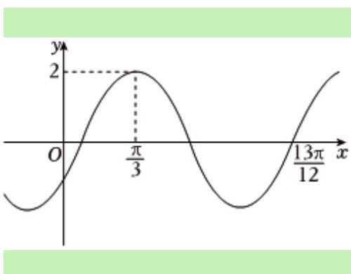
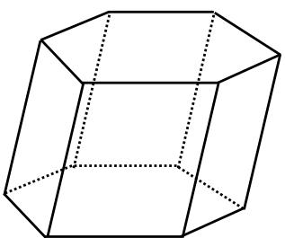
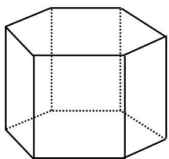
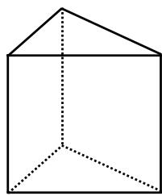
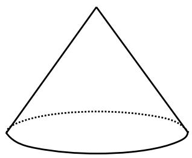
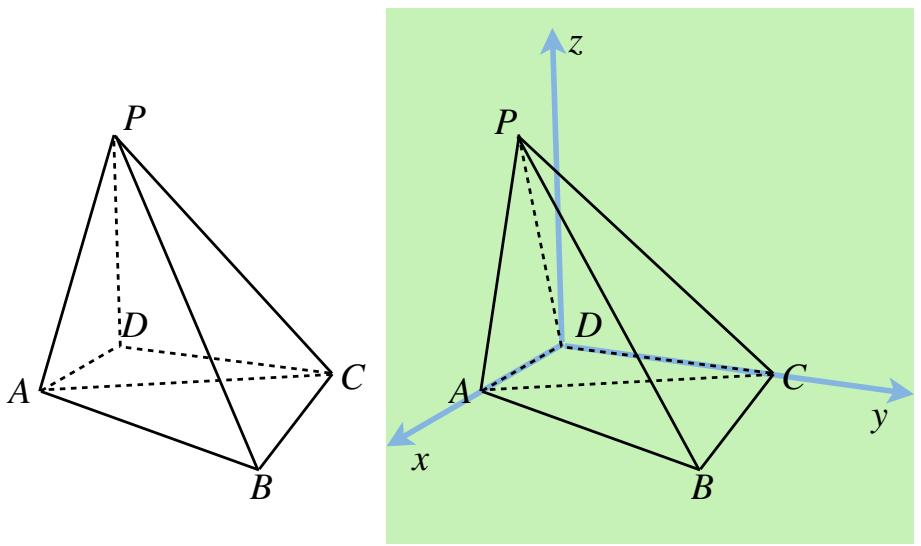

# 勘误

# 绿色背景为修改部分

打印文件每日更新，故后期拿到书的读者对照时会发现勘误已经修改

# 集合 第一节（第一版印刷P25）

例12 已知集合 $A=\{x\mid-5<x^{3}<5\}$ ， $B=\{-3,-1,0,2,3\}$ ，则 $A\cap B=$

解析 $-5^{\frac{1}{3}} < x < 5^{\frac{1}{3}}$ ，而 $1 < 5^{\frac{1}{3}} < 2$ ，因此 $A \cap B = \{-1,0\}$ .

# 集合 第一节（第一版印刷P27）

例1 设全集 $U = \{0,1,2,4,6,8\}$ ，集合 $M = \{0,4,6\}$ ， $N = \{0,1,6\}$ ，则 $M \cup C_U N =$

A. $\{0,2,4,6,8\}$

B. $\{0,1,4,6,8\}$

C. $\{1,2,4,6,8\}$

D. U

解析 由于 $C_U N = \{2,4,8\}$ ，则 $M \cup C_U N = \{0,2,4,6,8\}$ ，故选A.

例5 设集合 $A = \{-2, -1, 0, 1, 2\}$ ， $B = \{x \mid 0 \leq x \leq \frac{5}{2}\}$ ，则 $A \cap B =$

A. $\{0,1,2\}$

B. $\{-2, -1, 0\}$

C. $\{0,1\}$

D. $\{1,2\}$

解析 由题意集合 $A = \{-2, -1, 0, 1, 2\}$ ， $B = \{x \mid 0 \leq x \leq \frac{5}{2}\}$ ，则 $A \cap B = \{0, 1, 2\}$ ，故选A.

# 集合 第二节（第一版印刷P32）

例4 设 $\{a_{n}\}$ 是公差不为0的无穷等差数列，则“ $\{a_{n}\}$ 为递增数列”是“存在正整数 $N_{0}$ ，当 $n > N_{0}$ 时， $a_{n} > 0$ ”的

A. 充分而不必要条件

B. 必要而不充分条件

C. 充分必要条件

D. 既不充分也不必要条件

解析 根据等差数列的定义与性质，结合充分必要条件的定义，判断即可。因为数列 $\{a_{n}\}$ 是公差不为0的无穷等差数列，当 $\{a_{n}\}$ 为递增数列时，公差 $d > 0$ ，令 $a_{n} = a_{1} + (n - 1)d > 0$ ，解得 $n > 1 - \frac{a_1}{d}$ $[1 - \frac{a_1}{d} ]$ 表示取整函数，所以存在正整数 $N_0 = 1 + [1 - \frac{a_1}{d} ]$ ，当 $n > N_0$ 时， $a_{n} > 0$ ，充分性成立；当 $n > N_0$ 时， $a_{n} > 0$ ， $a_{n - 1} < 0$ ，则 $d = a_{n} - a_{n - 1} > 0$ ，必要性成立，则“ $\{a_{n}\}$ 为递增数列”是“存在正整数 $N_0$ ，当 $n > N_0$ 时， $a_{n} > 0$ ”的充分必要条件，故选C.

# 不等式 第一节（第一版印刷P37）

练习1 （2009·全国I）不等式 $\frac{x^{2}}{2x-1}<1$ 的解集为\_\_\_\_.

解析 即 $\frac{x^{2}}{2x-1}-1<0,\quad\therefore\frac{x^{2}-2x+1}{2x-1}<0,\quad\therefore(x-1)^{2}(2x-1)<0$ ，根据穿根法得： $x<\frac{1}{2}$

# 不等式 第一节（第一版印刷P38）

故 $m > 0$ 时， $-m\leq x <   \frac{4m}{5}.$

① 当 $m < 0$ 时，

I) $x < \frac{m}{2}$ 时， $m \leq x \leq -m$ ，故 $m \leq x < \frac{m}{2}$ ;

II) $x \geq \frac{m}{2}$ 时， $0 > x > \frac{4m}{5}$ ， $m \leq x \leq -m$ ，故 $\frac{m}{2} \leq x < 0$ ;

故m<0时， $-m\leq x<0.$

综上： $m = 0$ ，无解； $m > 0$ 时， $-m\leq x <   \frac{4m}{5}$ ； $m <   0$ 时， $m\leq x <   0.$

# 不等式 第二节（第一版印刷P39）

<table><tr><td> $\sqrt{2} \approx 1.414$ </td><td> $\sqrt{3} \approx 1.732$ </td><td> $\sqrt{5} \approx 2.236$ </td><td> $\sqrt{7} \approx 2.646$ </td></tr><tr><td> $^3\sqrt{2} \approx 1.260$ </td><td> $^3\sqrt{3} \approx 1.442$ </td><td> $^3\sqrt{4} \approx 1.587$ </td><td> $^3\sqrt{5} \approx 1.710$ </td></tr><tr><td> $\ln 2 \approx 0.693$ </td><td> $\ln 3 \approx 1.099$ </td><td> $\ln 5 \approx 1.609$ </td><td> $\ln 7 \approx 1.946$ </td></tr><tr><td> $e \approx 2.718$ </td><td> $\sqrt{e} \approx 1.649$ </td><td> $\frac{1}{e} \approx 0.368$ </td><td> $e^2 \approx 7.389$ </td></tr></table>

# 不等式 第二节（第一版印刷P42）

# 1. 换元法

例题 求函数 $f(x)=\frac{x^{2}+3x+6}{x+1}(x>0)$ 的最小值.

解析 将分子看成整体，对分母进行配凑可得 $f(x) = \frac{(x + 1)^2 + (x + 1) + 4}{x + 1} = x + 1 + \frac{4}{x + 1} + 1 \geq 5$ ，当且仅当 $x + 1 = \frac{4}{x + 1}$ ，即 $x = 1$ 时，等号成立，最小值是5.

# 不等式 第二节（第一版印刷P43）

# 2. 消元法

例题 实数a,b满足ab-4a-b+1=0（a>1），则 $(a+1)(b+2)$ 的最小值为\_\_\_\_.

解析 由 $ab - 4a - b + 1 = 0$ 得： $b = 4 + \frac{3}{a - 1}$ ，

$$
\therefore (a + 1) (b + 2) = 6 a + \frac {6}{a - 1} + 9 = 6 (a - 1) + \frac {6}{a - 1} + 1 5 \geq 2 7,
$$

当且仅当 $6(a - 1) = \frac{6}{a - 1}$ ，即 $a = 2$ ， $b = 7$ 时等号成立，最小值为27.

# 不等式 第二节（第一版印刷P46）

练习 已知正实数 $a, b$ 满足 $a + 2b = 2$ ，求 $\frac{1 + 4a + 3b}{ab}$ 的最小值.

解析 $\because a + 2b = 2, \therefore \frac{1 + 4a + 3b}{ab} = \frac{9a + 8b}{2ab} = \frac{9}{2b} + \frac{4}{a}$ , 分母和为定值, 故考虑构造权方和不等式 $\frac{9}{2b} + \frac{4}{a} \geq \frac{(3 + 2)^2}{2b + a} = \frac{25}{2}$ , 当且仅当 $\frac{9}{2b} = \frac{4}{a}$ 时等号成立.

使用琴声不等式时注意

# 函数 第一节（第一版印刷P51）

# 四. 函数的定义域与值域

例1

$$
- f (x) = \frac {x ^ {2} - 4 x + 5}{2 x - 4} (x > 2)
$$

解析 $f(x) = \frac{(x - 2)^2 + 1}{2(x - 2)} = \frac{x - 2}{2} +\frac{1}{2(x - 2)}\geq 2\sqrt{\frac{x - 2}{2}\frac{1}{2(x - 2)}} = 1,$

当且仅当 $\frac{x-2}{2}=\frac{1}{2(x-2)}$ ，即x=3时取等，∴ $f(x)\in[1,+\infty)$ .

不等式法 利用常见的基本不等式，注意一正二定三相等

# 函数 第一节（第一版印刷P52,53）

例2

$^{-}f[f(x)]=4x+3$ ，且 $f(x)$ 是一次函数

# 解析-待定系数法（适用于二次函数）

设一次函数 $f(x)=ax+b(a\neq0)$ ，则 $f[f(x)]=af(x)+b=a(ax+b)+b=a^{2}x+ab+b$ ，则 $a^{2}=4,\quad ab+b=3$ ，解得a=2，b=1或a=-2，b=-3；∴ $f(x)=2x+1$ 或 $f(x)=-2x-3$ .

$$
- f (x) - 2 f (\frac {1}{x}) = x
$$

解析-消去法 易知 $x \neq 0$ ，把 $x$ 换成 $\frac{1}{x}$ 得 $f\left(\frac{1}{x}\right) - 2f(x) = \frac{1}{x}$ ，消去 $f\left(\frac{1}{x}\right)$ 得 $f(x) = -\frac{x}{3} - \frac{2}{3x}$ .

# 三角函数 第一节（第一版印刷P101）

3. 反余弦函数: 对于给定区间的 $0 \leq y \leq \pi$ , 若 $x = \cos y$ , 则 $y = \cos^{-1} x$ , 我们记 $y$ 为 $\arccos x$ , 其定义域为 $[-1, 1]$ , 值域为 $[0, \pi]$

# 三角函数 第五节（第一版印刷P112）

# 五. 振幅、角频率与相位

函数 $y = A \sin (\omega x + \varphi)$ 是一个正弦函数，其中：

- A是振幅（amplitude），表示波的最大偏离  
- $\omega$ 是角频率（angular frequency），用于控制周期  
- $\phi$ 是相位（phase angle），表示图像在水平方向上的平移

# 三角函数 第五节（第一版印刷P115）

例3 已知函数 $f(x) = A \sin (\omega x + \varphi) (A > 0, \omega > 0, |\varphi| < \pi)$ 的部分图象如图所示，则下列结论正确的编号是

(1) 函数 $f(x)$ 的图象关于点 $(\frac{\pi}{6},0)$ 成中心对称；

# 三角函数 第六节（第一版印刷P119）

例1（2023·全国I卷）已知函数 $f(x)=\cos\omega x-1$ （ $\omega>0$ ）在区间 $[0,2\pi]$ 有且仅有3个零点，则 $\omega$ 的取值范围是\_\_\_\_.

解析 令 $t = \omega x \in [0,2\pi \omega]$ ，要使 $\cos t = 1$ 有三个零点，区间右端点需位于区间 $[4\pi, 6\pi)$ ，

故 $4\pi \leq 2\pi\omega < 6\pi, 2 \leq \omega < 3.$

# 导数 第一节（第一版印刷P130）

例1 已知函数 $f(x) = x^{2} + 3x + 3$ ， $g(x) = 2e^{x + 1} - x - 2$ ，求曲线 $y = f(x)$ 与曲线 $y = g(x)$ 公切线的条数.

解析 设切线与 $f(x)$ 、 $g(x)$ 的切线分别为 $(x_{1},f(x_{1}))$ ， $(x_{2},f(x_{2}))$ ，则切线分别为 $y-f(x_{1})=f'(x_{1})(x-x_{1})$ 和 $y-f(x_{2})=f'(x_{1})(x-x_{2})$ ，则

$$
\left\{ \begin{array}{l} f ^ {\prime} (x _ {1}) = f ^ {\prime} (x _ {2}) \\ f (x _ {1}) - x _ {1} f ^ {\prime} (x _ {1}) = f (x _ {2}) - x _ {2} f ^ {\prime} (x _ {2}) \end{array} \right.
$$

即 $\left\{ \begin{array}{l} 2e^{x_2} - 1 = 2x_1 + 3 \\ (2 - 2x_2)e^{x_2 + 1} - 2 = -x_1^2 + 3 \end{array} \right.$ ，消 $x_2$ 得

$$
x _ {1} ^ {2} - 5 + [ 4 - 2 \ln (x _ {1} + 2) ] (x _ {1} + 2) = 0
$$

设 $x_{1} + 2 = t$ ，即 $t^2 - 2t\ln t - 1 = 0$ ，即 $h(t) = t - \frac{1}{t} - 2\ln t = 0$ ， $h'(t) = \frac{(t - 1)^2}{t^2} \geq 0$ ， $h(t)$ 单调递增，又 $h(1) = 0$ ， $\therefore t = 1$ ，仅有1解， $\therefore$ 曲线 $y = f(x)$ 与曲线 $y = g(x)$ 仅有一条公切线.

# 立体几何 第一节（第一版印刷P220）

\- 平行六面体：每个面都是平行四边形

\- 正六面体：每个面都是相等的正方形，也是正方体

natural_image

Geometric diagram of a 3D cube with visible and hidden edges (no text or labels)

棱柱

natural_image

Simple line drawing of a 3D cube with visible and hidden edges (no text or symbols)

直棱柱

natural_image

Simple line drawing of a 3D house-like structure with solid and dotted lines indicating visible and hidden edges (no text or symbols)

正棱锥

1. 表面积和体积

- 表面积公式: 底面积 $\times 2+$ 侧面积  
- 体积公式：底面积×高

# 立体几何 第一节（第一版印刷P221）

A. 圆锥几何体：一个顶点，底面为一个圆，侧面展开为扇形，顶点的在下底面投影在圆心上，轴截面为等腰三角形

natural_image

Simple line drawing of a cone with a dotted base (no text or symbols)

圆锥

\- 表面积公式： $S = \pi r^{2} + \pi rl$

\- 体积公式： $V=\frac{1}{3}\pi r^{2}h$

# 立体几何 第七节（第一版印刷P261）

例11 （2024·新高考I卷）如图，四棱锥P-ABCD中， $PA \perp$ 底面ABCD，PA=AC=2，BC=1， $AB=\sqrt{3}$ ，如图所示：

text_image

P
D
A
C
B
z
P
D
A
C
y
x
B

(1) 若 $AD \perp PB$ , 证明: $AD \parallel$ 平面 $PBC$ ;  
(2) 若 $AD \perp DC$ ，且二面角 $A - CP - D$ 的正弦值为 $\frac{\sqrt{42}}{7}$ ，求 $AD$ .

# 数列 第三节（第一版印刷P275）

例1 根据下列数据，求等比数列 $\{a_{n}\}$ 的通项公式.

(1) $a_{2}a_{4}a_{5} = a_{3}a_{6}, a_{4}a_{5} = -32;$   
(2) $a_{1} = -2, a_{7} = 16a_{3}, a_{4}a_{5} < 0;$   
(3) $a_{1} = 2, a_{3} = 2a_{2} + 16, a_{n} > 0.$

解析 （1）设公比为q，则 $\left\{\begin{aligned}a_{1}^{3}q^{8}&=a_{1}^{2}q^{7}\\ a_{1}^{2}q^{7}&=-32\end{aligned}\right.$ ，∴q=-2， $a_{2}=1$ ，∴ $a_{n}=a_{2}q^{n-2}=(-2)^{n-2}$ .

(2）设公比为 $q$ ，则 $a_1q^6 = 16a_1q^2$ ， $\therefore q = \pm 2$ ，又 $a_4a_5 = a_1^2 q^7 < 0$ ， $\therefore q = -2$ ， $\therefore a_{n} = -2^{n}$   
（3）设公比为 $q$ ， $\therefore a_{1}q^{2} = 2a_{1}q + 16$ ， $\therefore q = 4$ 或-2（舍）， $\therefore a_{n} = 2\cdot 4^{n - 1}$

# 数列 第八节（第一版印刷P335）

数列 $\{a_{n}\}$ 的通项公式 $a_{n} = (an + b)q^{n}$ ，前 $n$ 项和 $S_{n} = (An + B)q^{n} - B$ ，其中

$$
A = \frac {a q}{q - 1}, B = \frac {b q}{q - 1} + \frac {a q}{(q - 1) ^ {2}}.
$$

方案一 错位相消法 展开求和得

$$
S _ {n} = a _ {1} + a _ {2} + \dots + a _ {n} = (a + b) q + (2 a + b) q ^ {2} + \dots + (a n + b) q ^ {n}
$$

$$
q S _ {n} = q a _ {1} + q a _ {2} + \ldots + q a _ {n} = (a + b) q ^ {2} + (2 a + b) q ^ {3} + \ldots + (a n + b) q ^ {n + 1}
$$

两式做差得 $(1 - q)S_{n} = bq + a(q + q^{2} + q^{3} + \ldots +q^{n}) - (an + b)q^{n + 1}$ ，下面进行整理

$$
(1 - q) S _ {n} = b q + a \cdot \frac {q (1 - q ^ {n})}{1 - q} - (a n + b) q ^ {n + 1},
$$

$$
S _ {n} = (\frac {a n + b}{q - 1} + \frac {a}{(q - 1) ^ {2}}) q ^ {n + 1} - \frac {b q}{q - 1} - \frac {a q}{(q - 1) ^ {2}},
$$

方案二 最终求和公式 将方案一中的 $S_{n}$ 稍作化简，得

$$
S _ {n} = (\frac {a q n}{q - 1} + \frac {b q}{q - 1} + \frac {a q}{(q - 1) ^ {2}}) q ^ {n} - \frac {b q}{q - 1} - \frac {a q}{(q - 1) ^ {2}}
$$

可发现其中有相同的部分，令 $A = \frac{aq}{q - 1}$ ， $B = \frac{bq}{q - 1} + \frac{aq}{(q - 1)^2}$ ，得 $S_{n} = (An + B)q^{n} - B$ ，所以这样一个式子就是最终得求和结果；在使用时，只需代入前两项

# 数列 第九节（第一版印刷P346）

# 三. 整式裂差型

例题 已知数列 $\{a_{n}\}$ 的通项公式为 $a_{n}=n^{2}$ ，求 $\{a_{n}\}$ 的前n项和 $S_{n}$ .

解析 由题 $a_{n} = -\frac{1}{3}\cdot [n^{3} - (n + 1)^{3}] - n - \frac{1}{3}$ ，求和得

$$
\begin{array}{l} S _ {n} = - \frac {1}{3} \cdot [ 1 - 8 + 8 - 2 7 + \dots + n ^ {3} - (n + 1) ^ {3} ] - \frac {n (n + 1)}{2} - \frac {n}{3} \\ = \frac {n ^ {3}}{3} + \frac {n ^ {2}}{2} + \frac {n}{6} \\ = \frac {n (n + 1) (2 n + 1)}{6}. \\ \end{array}
$$

