# 第一章：集合和逻辑

# 一、选择题

1.【分析】可求出集合 P，从而进行交集的运算求出 $P \bigcap Q = \{2, 3, 4\}$ ，从而得出 $P \bigcap Q$ 的非空子集的个数为： $C_{3}^{1} + C_{3}^{2} + C_{3}^{3} = 7$ 个.

【解答】解： $P=\{x\mid x\left\langle-\sqrt{2},或x\right\rangle\sqrt{2}\}$ ;

$$
\therefore P \bigcap Q = \{2, 3, 4 \};
$$

∴ $P \bigcap Q$ 的非空子集的个数为： $C_{3}^{1} + C_{3}^{2} + C_{3}^{3} = 7$ 个.

故选：B.

【点评】考查描述法、列举法表示集合的定义，一元二次不等式的解法，以及交集的运算，集合子集的个数的求法.

2.【分析】解求出 B 中的不等式，找出 A 与 B 的交集即可.

【解答】解：因为 $A=\{-1,0,1,2\}$ ， $B=\{x\mid x^{2}\leqslant1\}=\{x\mid-1\leqslant x\leqslant1\}$ ，

所以 $A \bigcap B = \{-1, 0, 1\}$ ,

故选：A.

【点评】本题考查了两个集合的交集和一元二次不等式的解法，属基础题.

3.【分析】直接由并集运算得答案.

【解答】解：∵ $A=\{x\mid-1<x<2\}$ ， $B=\{x\mid x>1\}$ ，

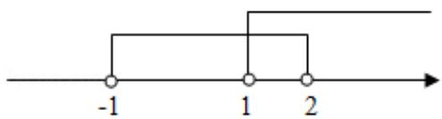

text_image

-1
1
2

$$
\therefore A \bigcup B = \{x \mid - 1 <   x <   2 \} \bigcup \{x \mid x > 1 \} = (- 1, + \infty).
$$

故选：C.

【点评】本题考查并集及其运算，是基础的计算题.

4.【分析】根据集合的基本运算即可求 $A \cap C$ ，再求 $(A \cap C) \cup B$ ;

【解答】解：设集合 $A=\{-1, 1, 2, 3, 5\}$ ， $C=\{x \in R \mid 1 \leqslant x < 3\}$ ，

则 $A \bigcap C = \{1, 2\}$ ,

$$
\because B = \{2, 3, 4 \},
$$

$$
\therefore (A \bigcap C) \bigcup B = \{1, 2 \} \cup \{2, 3, 4 \} = \{1, 2, 3, 4 \};
$$

故选：D.

【点评】本题主要考查集合的基本运算，比较基础.

5.【分析】根据题意，求出集合 A 、 B ，由交集的定义计算可得答案.

【解答】解：根据题意， $A=\{x\mid x^{2}-5x+6>0\}=\{x\mid x>3$ 或 $x<2\}$ ，

$$
B = \{x \mid x - 1 <   0 \} = \{x \mid x <   1 \},
$$

则 $A \bigcap B = \{x \mid x < 1\} = (-\infty, 1)$ ;

故选：A.

【点评】本题考查交集的计算，关键是掌握交集的定义，属于基础题.

6.【分析】先根据补集定义求出 $C_U A$ ，然后再根据交集定义求 $B \bigcap (\complement_U A)$ 即可.

【解答】解：∵ $U = \{1, 2, 3, 4, 5, 6, 7\}$ ， $A = \{2, 3, 4, 5\}$ ， $B = \{2, 3, 6, 7\}$ ，

$$
\therefore C _ {U} A = \{1, 6, 7 \},
$$

则 $B \cap (\complement_U A) = \{6, 7\}$

故选：C.

【点评】本题主要考查集合的交集与补集的求解，属于基础试题.

7.【分析】作出维恩图，得到该学校阅读过《西游记》的学生人数为 70 人，由此能求出该学校阅读过《西游记》的学生人数与该学校学生总数比值的估计值.

【解答】解：某中学为了了解本校学生阅读四大名著的情况，随机调查了100位学生，

其中阅读过《西游记》或《红楼梦》的学生共有90位，

阅读过《红楼梦》的学生共有 80 位，阅读过《西游记》且阅读过《红楼梦》的学生共有 60 位，作出维恩图，得：

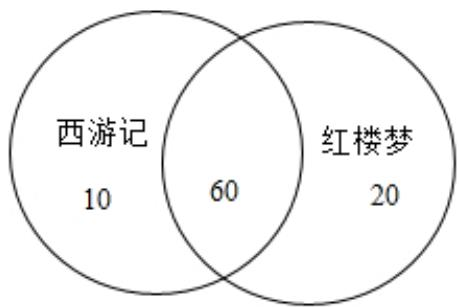

other

| Category   | Count |
| ---------- | ----- |
| 西游记     | 10    |
| 红楼梦     | 20    |
| Both       | 60    |

∴该学校阅读过《西游记》的学生人数为70人，

则该学校阅读过《西游记》的学生人数与该学校学生总数比值的估计值为： $\frac{70}{100}=0.7$

故选：C.

【点评】本题考查该学校阅读过《西游记》的学生人数与该学校学生总数比值的估计值的求法，考查维恩图的性质等基础知识，考查推理能力与计算能力，属于基础题.

8.【分析】充分条件和必要条件的定义结合均值不等式、特值法可得结果

【解答】解：∵a>0，b>0，∴ $4\geqslant a+b\geqslant2\sqrt{ab}$ ，

$\therefore 2 \geqslant \sqrt{ab}$ ， $\therefore ab \leqslant 4$ ，即 $a + b \leqslant 4 \Rightarrow ab \leqslant 4$ ，

若 $a = 4$ ， $b = \frac{1}{4}$ ，则 $ab = 1\leqslant 4$

但 $a + b = 4 + \frac{1}{4} > 4$ ,

即 $ab \leqslant 4$ 推不出 $a + b \leqslant 4$

∴ $a + b \leqslant 4$ 是 $ab \leqslant 4$ 的充分不必要条件

故选：A.

【点评】本题主要考查充分条件和必要条件的判断，均值不等式，考查了推理能力与计算能力.

9.【分析】利用一元二次不等式的解法和交集的运算即可得出.

【解答】解：∵ $M = \{x \mid -4 < x < 2\}$ ， $N = \{x \mid x^{2} - x - 6 < 0\} = \{x \mid -2 < x < 3\}$ ，

$$
\therefore M \bigcap N = \{x \mid - 2 <   x <   2 \}.
$$

故选：C.

【点评】本题考查了一元二次不等式的解法和交集的运算，属基础题.

10.【分析】“b=0” $\Rightarrow$ “f(x)为偶函数”，“f(x)为偶函数” $\Rightarrow$ “b=0”，由此能求出结果.

【解答】解：设函数 $f(x)=\cos x+b\sin x$ (b 为常数)，

则 “b=0” $\Rightarrow$ “f(x)为偶函数”，

“ $f(x)$ 为偶函数” $\Rightarrow$ “ $b = 0$ ”，

∴函数 $f(x)=\cos x+b\sin x$ (b 为常数)，

则 “b=0” 是 “ $f(x)$ 为偶函数”的充分必要条件.

故选：C.

【点评】本题考查命题真假的判断，考查函数的奇偶性等基础知识，考查推理能力与计算能力，属于基础题.

11.【分析】解出关于 x 的不等式，结合充分必要条件的定义，从而求出答案.

【解答】解：∵ $|x-1|<1$ ，∴0<x<2，

∵0<x<5推不出0<x<2，

$$
0 <   x <   2 \Rightarrow 0 <   x <   5,
$$

∴0<x<5是0<x<2的必要不充分条件，

即 $0 < x < 5$ 是 $|x - 1| < 1$ 的必要不充分条件

故选：B.

【点评】本题考查了充分必要条件，考查解不等式问题，是一道基础题.

12.【分析】由全集 $U$ 以及 $A$ 求 $A$ 的补集，然后根据交集定义得结果.

【解答】解：∵ $C_{U}A=\{-1, 3\}$ ,

$$
\begin{array}{l} \therefore (\complement_ {U} A) \bigcap B \\ = \{- 1, 3 \} \cap \{- 1, 0, 1 \} \\ = \{- 1 \} \\ \end{array}
$$

故选：A.

【点评】本题主要考查集合的基本运算，比较基础.

13.【分析】由 $m$ ， $n$ ， $l$ 在同一平面，则 $m$ ， $n$ ， $l$ 相交或 $m$ ， $n$ ， $l$ 有两个平行，另一直线与之相交，或三条直线两两平行，根据充分条件，必要条件的定义即可判断.

【解答】解：空间中不过同一点的三条直线 $m$ ， $n$ ， $l$ ，若 $m$ ， $n$ ， $l$ 在同一平面，则 $m$ ， $n$ ， $l$ 相交或 $m$ ， $n$ ， $l$ 有两个平行，另一直线与之相交，或三条直线两两平行.

而若 “m，n，l 两两相交”，则 “m，n，l 在同一平面” 成立.

故 $m$ ， $n$ ， $l$ 在同一平面”是“ $m$ ， $n$ ， $l$ 两两相交”的必要不充分条件，

故选：B.

【点评】本题借助空间的位置关系，考查了充分条件和必要条件，属于基础题.

14.【分析】根据真子集个数的结论即可求解.

【解答】解：∵集合A共有5个元素，

∴ A 的真子集的个数为 $2^{5}-1=31$ .

故选：B.

【点评】本题考查真子集个数的结论，属基础题.

15.【分析】求出集合 $A, B$ ，由此能求出 $A \cap B$ .

【解答】解：集合 $A=\{x \mid x \mid <3, \quad x \in Z\}=\{x \mid -3 < x < 3, \quad x \in Z\}=\{-2, -1, 0, 1, 2\}$ ,

$B=\{x\mid x|>1,\quad x\in Z\}=\{x\mid x<-1$ 或 $x>1,\quad x\in Z\}$

$$
\therefore A \bigcap B = \{- 2, 2 \}.
$$

故选：D.

【点评】本题考查交集的求法，考查交集定义等基础知识，考查运算求解能力，是基础题.

16.【分析】根据题意求出 $A \cap B$ ，进而能求出 $A \cap B$ 中元素的个数.

【解答】解：∵集合 $A=\{1,2,3,5,7,11\}$ ， $B=\{x\mid3<x<15\}$ ，

$$
\therefore A \bigcap B = \{5, 7, 1 1 \},
$$

$\therefore A \cap B$ 中元素的个数为 3.

故选：B.

【点评】本题考查交集中元素个数的求法，考查交集定义等基础知识，考查运算求解能力，是基础题.

17.【分析】根据交集的定义写出 $A \cap B$ 即可.

【解答】解：集合 $A = \{-1, 0, 1, 2\}$ ， $B = \{x \mid 0 < x < 3\}$ ，则 $A \bigcap B = \{1, 2\}$ ，

故选：D.

【点评】本题考查了交集的定义与运算问题，是基础题目.

18.【分析】根据两集合的公共元素得出答案.

【解答】解：因为集合 A，B 的公共元素为：2，3，5

故 $A\bigcap B=\{2,3,5\}$ .

故选：C.

【点评】本题考查了集合的交集运算，属于基础题.

19.【分析】利用特殊集合排除选项，推出结果即可.

【解答】解：取： $S=\{1,2,4\}$ ，则 $T=\{2,4,8\}$ ， $S\bigcup T=\{1,2,4,8\}$ ，4个元素，排除C.

$S=\{2,4,8\}$ ，则 $T=\{8,16,32\}$ ， $S\bigcup T=\{2,4,8,16,32\}$ ，5个元素，排除D；

$S=\{2,4,8,16\}$ 则 $T=\{8,16,32,64,128\}$ ， $S\bigcup T=\{2,4,8,16,32,64,128\}$ ，7个元素，排除 B；

故选：A.

【点评】本题考查命题的真假的判断与应用, 集合的基本运算, 利用特殊集合排除选项是选择题常用方法, 难度比较大.

20.【分析】进行补集、交集的运算即可.

【解答】解：全集 $U=\{-3,\ -2,\ -1,\ 0,\ 1,\ 2,\ 3\}$ ，集合 $A=\{-1,\ 0,\ 1,\ 2\}$ ， $B=\{-3,\ 0,\ 2,\ 3\}$ ，则 $\complement_{U}B=\{-2,\ -1,\ 1\}$ ，

$$
\therefore A \cap (\complement_ {U} B) = \{- 1, 1 \},
$$

故选：C.

【点评】考查列举法的定义，以及补集、并集的运算.

21.【分析】由二次不等式和一次不等式的解法，化简集合 A，B，再由交集的定义，可得 a 的方程，解方程可得 a．

【解答】解：集合 $A=\{x \mid x^{2}-4\leqslant0\}=\{x \mid-2\leqslant x\leqslant2\}$ ， $B=\{x \mid 2x+a\leqslant0\}=\{x \mid x\leqslant-\frac{1}{2}a\}$ ，

由 $A \bigcap B = \{x \mid -2 \leqslant x \leqslant 1\}$ ，可得 $-\frac{1}{2} a = 1$ ，

则 $a = -2$ ：

故选：B.

【点评】本题考查集合的交集运算，同时考查不等式的解法，考查方程思想和运算能力，是一道基础题.

22.【分析】直接利用交集的运算法则求解即可.

【解答】解：集合 $P=\{x\mid1<x<4\}$ ， $Q=\{x\mid2<x<3\}$ ，

则 $P \bigcap Q = \{x \mid 2 < x < 3\}$ .

故选：B.

【点评】此题考查了交集及其运算，熟练掌握交集的定义是解本题的关键.

23.【分析】设只喜欢足球的百分比为 $x$ ，只喜欢游泳的百分比为 $y$ ，两个项目都喜欢的百分比为 $z$ ，画出

图形，列出方程求解即可.

【解答】解：设只喜欢足球的百分比为 $x$ ，只喜欢游泳的百分比为 $y$ ，两个项目都喜欢的百分比为 $z$ ，

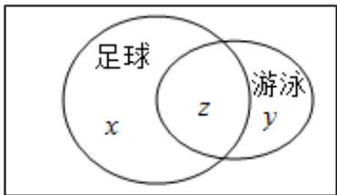

text_image

足球
x
z
游泳
y

由题意，可得 $x + z = 60$ ， $x + y + z = 96$ ， $y + z = 82$ ，解得 z = 46。

∴该中学既喜欢足球又喜欢游泳的学生数占该校学生总数的比例是46%。

故选：C.

【点评】本题考查集合的应用，子集与交集、并集运算的转换，韦恩图的应用，是基本知识的考查.

24.【分析】利用交集定义求出 $A \bigcap B = \{(7,1), (6,2), (3,5), (4,4)\}$ . 由此能求出 $A \bigcap B$ 中元素的个数.

【解答】解：∵集合 $A=\{(x,y)\mid x,\quad y\in N^{*},\quad y\geqslant x\}$ ， $B=\{(x,y)\mid x+y=8\}$

$$
\therefore A \bigcap B = \{(x, y) | \left\{ \begin{array}{l} y \geqslant x \\ x + y = 8, \end{array} x, y \in N ^ {*} \right\} = \{(1, 7), (2, 6), (3, 5), (4, 4) \}.
$$

$\therefore A \cap B$ 中元素的个数为 4.

故选：C.

【点评】本题考查交集中元素个数的求法，考查交集定义等基础知识，考查运算求解能力，是基础题.

25.【分析】解得 a 的范围，即可判断出结论.

【解答】解：由 $a^{2}>a$ ，解得a<0或a>1，

故 “a>1” 是 “ $a^{2}>a$ ” 的充分不必要条件，

故选：A.

【点评】本题考查了不等式的解法、简易逻辑的判定方法，考查了推理能力与计算能力，属于基础题.

26.【分析】利用并集定义和不等式的性质直接求解.

【解答】解：∵集合 $A=\{x\mid1\leqslant x\leqslant3\}$ ， $B=\{x\mid2<x<4\}$ ，

$$
\therefore A \bigcup B = \{x \mid 1 \leqslant x <   4 \}.
$$

故选：C.

【点评】本题考查并集的求法，考查并集定义等基础知识，考查运算求解能力，是基础题.

27.【分析】利用直线与平面垂直的判断定理，再结合充要条件的定义判定即可.

【解答】解：A，当 $l//\beta$ 且 $\alpha\perp\beta$ 时，则 $l\perp\alpha$ 或 $l//\alpha$ 或 $l\subset\alpha$ ，∴A错误，

B，当 $l\perp\beta$ 且 $\alpha\perp\beta$ 时，则 $l//\alpha$ 或 $l\subset\alpha$ ，∴B错误，

C，当 $l\subset\beta$ 且 $\alpha\perp\beta$ 时，则 $l\perp\alpha$ 或 $l//\alpha$ 或 $l\subset\alpha$ 或l与 $\alpha$ 相交不垂直，∴C错误，

D，当 $l\perp\beta$ 且 $\alpha//\beta$ 时，则 $l\perp\alpha$ ，∴D正确，

故选：D.

【点评】本题考查了直线与平面垂直的判断定理，充要条件的判定，考查了推理能力与计算能力，属于中档题.

28.【分析】利用并集及其运算求解即可.

【解答】解：∵ $A = \{x \mid -1 < x < 4\}$ ， $B = \{x \mid 2 < x < 5\}$ ，

$$
\therefore A \bigcup B = \{x \mid - 1 <   x <   5 \},
$$

故选：B.

【点评】此题考查了并集及其运算，熟练掌握并集的定义是解本题的关键.

29.【分析】先利用补集的定义求出 $\complement_U B$ ，再利用交集的定义求解即可.

【解答】解：因为全集 $U = \{1, 2, 3, 4, 5, 6\}$ ，集合 $A = \{1, 3, 6\}$ ， $B = \{2, 3, 4\}$ ，所以 $\complement_U B = \{1, 5, 6\}$ ，

故 $A \bigcap C_U B = \{1, 6\}$ .

故选：B.

【点评】本题考查了集合的运算，主要考查了集合交集与补集的求解，解题的关键是掌握交集和补集的定义，属于基础题.

30.【分析】直接利用并集运算得答案.

【解答】解：∵ $A=\{x\mid-1<x<1\}$ ， $B=\{x\mid0\leqslant x\leqslant2\}$ ，

$$
\therefore A \bigcup B = \{x \mid - 1 <   x <   1 \} \bigcup \{x \mid 0 \leqslant x \leqslant 2 \} = \{x \mid - 1 <   x \leqslant 2 \}.
$$

故选：B.

【点评】本题考查并集及其运算，是基础题.

31.【分析】根据等比数列的求和公式和充分条件和必要条件的定义即可求出.

【解答】解：若 $a_{1}=-1,\quad q=1$ ，则 $S_{n}=na_{1}=-n$ ，则 $\{S_{n}\}$ 是递减数列，不满足充分性；

$$
\because S _ {n} = \frac {a _ {1}}{1 - q} (1 - q ^ {n}),
$$

则 $S_{n+1}=\frac{a_{1}}{1-q}(1-q^{n+1})$ ,

$$
\therefore S _ {n + 1} - S _ {n} = \frac {a _ {1}}{1 - q} (q ^ {n} - q ^ {n + 1}) = a _ {1} q ^ {n},
$$

若 $\{S_{n}\}$ 是递增数列，

$$
\therefore S _ {n + 1} - S _ {n} = a _ {1} q ^ {n} > 0,
$$

则 $a_1 > 0$ ， $q > 0$

∴满足必要性，

故甲是乙的必要条件但不是充分条件，

故选：B.

【点评】本题主要考查数列的函数特性，充分条件和必要条件，属于中档题.

32.【分析】直接利用交集的定义求解即可.

【解答】解：因为集合 $A=\{x \mid x \geqslant 1\}$ ， $B=\{x \mid -1 < x < 2\}$ ，

所以 $A \bigcap B = \{x \mid 1 \leqslant x < 2\}$ .

故选：D.

【点评】本题考查了集合交集的运算，解题的关键是掌握集合交集的定义，属于基础题.

33.【分析】利用集合交集与并集的定义直接求解即可.

【解答】解：因为集合 $A=\{-1,0,1\}$ ， $B=\{1,3,5\}$ ， $C=\{0,2,4\}$ ，

所以 $A \bigcap B = \{1\}$ ，所以 $(A \bigcap B) \bigcup C = \{0, 1, 2, 4\}$ .

故选：C.

【点评】本题考查了集合的运算，解题的关键是掌握集合交集与并集的定义，属于基础题.

34.【分析】利用交集定义直接求解.

【解答】解：∵集合 $A=\{x\mid-2<x<4\}$ ， $B=\{2,3,4,5\}$ ，

$$
\therefore A \bigcap B = \{2, 3 \}.
$$

故选：C.

【点评】本题考查集合的运算，考查交集定义、不等式性质等基础知识，考查运算求解能力，是基础题.

35.【分析】利用并集定义先求出 $M \cup N$ ，由此能求出 $\complement_{U}(M \cup N)$ .

【解答】解：∵全集 $U=\{1,2,3,4,5\}$ ，集合 $M=\{1,2\}$ ， $N=\{3,4\}$ ，

$$
\therefore M \bigcup N = \{1, 2, 3, 4 \},
$$

$$
\therefore \complement_ {U} (M \bigcup N) = \{5 \}.
$$

故选：A.

【点评】本题考查集合的运算，考查并集、补集定义等基础知识，考查运算求解能力等数学核心素养，是基础题.

36.【分析】根据集合的基本运算对每一选项判断即可.

【解答】解：已知集合 $A=\{x \mid x>-1, \quad x \in R\}$ ， $B=\{x \mid x^{2}-x-2 \geqslant 0, \quad x \in R\}$ ，

解得 $B = \{x\mid x\geqslant 2$ 或 $x\leqslant -1$ ， $x\in R\}$

$$
\complement_ {R} A = \{x \mid x \leqslant - 1, \quad x \in R \}, \quad \complement_ {R} B = \{x \mid - 1 <   x <   2 \};
$$

则 $A \bigcup B = R$ ， $A \bigcap B = \{x \mid x \geqslant 2\}$ ，

故选：D.

【点评】本题主要考查集合的基本运算，比较基础.

37.【分析】直接利用交集运算求解.

【解答】解：集合 $M = \{x \mid 0 < x < 4\}$ ， $N = \{x \mid \frac{1}{3} \leqslant x \leqslant 5\}$ ，则 $M \bigcap N = \{x \mid \frac{1}{3} \leqslant x < 4\}$ ，故选：B．

【点评】本题考查了交集及其运算，是基础题.

38.【分析】直接根据交集的运算性质，求出 $M \cap N$ 即可.

【解答】解：因为 $N=\{x\mid2x>7\}=\{x\mid x>\frac{7}{2}\}$ ， $M=\{1,3,5,7,9\}$ ，
所以 $M \bigcap N = \{5, 7, 9\}$ .

故选：B.

【点评】本题考查了交集及其运算，属基础题.

39.【分析】根据集合的运算性质计算即可.

【解答】解：∵ A = [-1, 2)，B = Z，

$$
\therefore A \bigcap B = \{- 1, 0, 1 \},
$$

故选：B.

【点评】本题考查了集合的交集的运算，是基础题.

40.【分析】分别判断充分性和必要性是否成立即可.

【解答】解：x 为整数时， $2x+1$ 也是整数，充分性成立；

$2x+1$ 为整数时，x 不一定是整数，如 $x=\frac{1}{2}$ 时，所以必要性不成立，是充分不必要条件.
故选：A.

【点评】本题考查了充分必要条件的判断问题，是基础题.

41.【分析】由补集的定义直接求解即可.

【解答】解：因为全集 $U = \{x \mid -3 < x < 3\}$ ，集合 $A = \{x \mid -2 < x \leqslant 1\}$ ，

所以 $\complement_U A = \{x \mid -3 < x \leqslant -2$ 或 $1 < x < 3\} = (-3, -2] \bigcup (1,3)$ .

故选：D.

【点评】本题主要考查补集的运算，考查运算求解能力，属于基础题.

42.【分析】直接利用交集运算求解即可.

【解答】解：∵ $M = \{2, 4, 6, 8, 10\}$ ， $N = \{x \mid -1 < x < 6\}$ ，

$$
\therefore M \bigcap N = \{2, 4 \}.
$$

故选：A.

【点评】本题考查集合的交集运算，属于基础题.

43.【分析】根据补集的定义写出集合 M，再判断选项中的命题是否正确.

【解答】解：因为全集 $U=\{1,2,3,4,5\}$ ， $C_{U}M=\{1,3\}$

所以 $M=\{2, 4, 5\}$ ,

所以 $2 \in M$ ， $3 \notin M$ ， $4 \in M$ ， $5 \in M$ 。

故选：A.

【点评】本题考查了补集的定义与应用问题，是基础题.

44.【分析】先求出集合 B，再利用交集运算求解即可.

【解答】解：∵集合 $A=\{1,2,3,4,5\}$ ,

$$
\therefore B = \{x \mid x ^ {2} \in A \} = \{- 1, - \sqrt {2}, - \sqrt {3}, - 2, - \sqrt {5}, 1, \sqrt {2}, \sqrt {3}, 2, \sqrt {5} \},
$$

则 $A \bigcap B = \{1, 2\}$ ,

故选：B.

【点评】此题考查了交集及其运算，熟练掌握交集的定义是解本题的关键.

45.【分析】利用同角三角函数间的基本关系，充要条件的定义判定即可.

【解答】解：∵ $\sin^{2}x + \cos^{2}x = 1$ ，

①当 $\sin x = 1$ 时，则 $\cos x = 0$ ，∴ 充分性成立，

②当 $\cos x = 0$ 时，则 $\sin x = \pm 1$ ，∴ 必要性不成立，

∴ $\sin x = 1$ 是 $\cos x = 0$ 的充分不必要条件，

故选：A.

【点评】本题考查了同角三角函数间的基本关系，充要条件的判定，属于基础题.

46.【分析】分别求解不等式化简 M 与 N，再由交集运算得答案.

【解答】解：由 $\sqrt{x}<4$ ，得 $0\leqslant x<16$ ，∴ $M=\{x\mid\sqrt{x}<4\}=\{x\mid0\leqslant x<16\}$

由 $3x \geqslant 1$ ，得 $x \geqslant \frac{1}{3}$ ， $\therefore N = \{x \mid 3x \geqslant 1\} = \{x \mid x \geqslant \frac{1}{3}\}$ ，

$$
\therefore M \bigcap N = \{x \mid 0 \leqslant x <   1 6 \} \bigcap \{x \mid x \geqslant \frac {1}{3} \} = \{x \mid \frac {1}{3} \leqslant x <   1 6 \}.
$$

故选：D.

【点评】本题考查交集及其运算，考查不等式的解法，是基础题.

47.【分析】求解一元二次方程化简 B，再由并集与补集运算得答案.

【解答】解：∵ $B=\{x \mid x^{2}-4x+3=0\}=\{1, 3\}$ ， $A=\{-1, 2\}$ ，

$$
\therefore A \bigcup B = \{- 1, 1, 2, 3 \},
$$

又 $U=\{-2,-1,0,1,2,3\}$ ,

$$
\therefore \complement_ {U} (A \bigcup B) = \{- 2, 0 \}.
$$

故选：D.

【点评】本题考查交、并、补集的混合运算，是基础题.

48.【分析】直接利用集合的补集与交集的运算法则求解即可.

【解答】解：全集 $U=\{-2,-1,0,1,2\}$ ，集合 $A=\{0,1,2\}$ ， $B=\{-1,2\}$ ，

则 $A \cap (\complement_U B) = \{0, 1, 2\} \cap \{-2, 0, 1\} = \{0, 1\}$ .

故选：A.

【点评】本题考查集合的交集，补集的运算法则的应用，是基础题.

49.【分析】利用交集定义直接求解.

【解答】解：集合 $A=\{-2, -1, 0, 1, 2\}$ ， $B=\{x \mid 0 \leqslant x < \frac{5}{2}\}$

则 $A \bigcap B = \{0, 1, 2\}$ .

故选：A.

【点评】本题考查集合的运算，考查交集定义、不等式性质等基础知识，考查运算求解能力，是基础题.

50.【分析】解不等式求集合 B，再根据集合的运算求解即可.

【解答】解： $|x-1|\leqslant1$ ，解得： $0\leqslant x\leqslant2$ ，

∴集合 $B=\{x\mid0\leqslant x\leqslant2\}$

$$
\therefore A \bigcap B = \{1, 2 \}.
$$

故选：B.

【点评】本题主要考查集合的基本运算，利用集合的关系是解决本题的关键.

51.【分析】分别讨论当 $n$ 是偶数、奇数时的集合元素情况，结合集合的基本运算进行判断即可.

【解答】解：当 n 是偶数时，设 n=2k，则 $s=2n+1=4k+1$ ，

当 $n$ 是奇数时，设 $n = 2k + 1$ ，则 $s = 2n + 1 = 4k + 3$ ， $k \in Z$ ，

则 $T \subsetneqq S$ ，

则 $S \bigcap T = T$

故选：C.

【点评】本题主要考查集合的基本运算，利用分类讨论思想结合交集定义是解决本题的关键，是基础题.

52.【分析】根据等差数列的定义与性质，结合充分必要条件的定义，判断即可.

【解答】解：因为数列 $\{a_{n}\}$ 是公差不为0的无穷等差数列，当 $\{a_{n}\}$ 为递增数列时，公差d>0，

令 $a_{n} = a_{1} + (n - 1)d > 0$ ，解得 $n > 1 - \frac{a_1}{d}$ ， $[1 - \frac{a_1}{d} ]$ 表示取整函数，

所以存在正整数 $N_{0}=1+[1-\frac{a_{1}}{d}]$ ，当 $n>N_{0}$ 时， $a_{n}>0$ ，充分性成立；

当 $n > N_{0}$ 时， $a_{n} > 0$ ， $a_{n-1} < 0$ ，则 $d = a_{n} - a_{n-1} > 0$ ，必要性成立；

是充分必要条件.

故选：C.

【点评】本题考查了等差数列与充分必要条件的应用问题，是基础题.

53.【分析】由题意得到 $B=\{-4, -2, 0, 2, 4\}$ ，利用集合的交集运算即可求解.

【解答】解：因为集合 $A=\{-2, -1, 0, 1, 2\}$ ， $B=\{2k \mid k \in A\}$ ，

所以 $B = \{-4, -2, 0, 2, 4\}$ ，则 $A \bigcap B = \{-2, 0, 2\}$ .

故选：D.

【点评】本题考查了集合的交集运算，属于基础题.

54.【分析】利用并集运算求解即可.

【解答】解：∵ $A=\{1, 2\}$ ， $B=\{2, 4, 6\}$ ，

$$
\therefore A \bigcup B = \{1, 2, 4, 6 \},
$$

故选：D.

【点评】本题考查了并集及其运算，属于基础题.

55.【分析】由数据可直接判断，必要时可借助数轴分析.

【解答】解：由题意： $M \bigcup N = \{x \mid x < 2\}$ ，又 U = R，

$$
\therefore C _ {U} (M \bigcup N) = \{x \mid x \geqslant 2 \}.
$$

故选：A.

【点评】本题考查集合的基本运算，属简单题.

56. 【分析】由已知结合集合补集及并集运算即可求解.

【解答】解：因为 $U=\{1,2,3,4,5\}$ ，集合 $M=\{1,4\}$ ， $N=\{2,5\}$ ，

所以 $\complement_{U}M=\{2,3,5\}$ ,

则 $N \bigcup C_{U} M = \{2, 3, 5\}$ .

故选：A.

【点评】本题主要考查了集合补集及并集运算，属于基础题.

57. 【分析】根据已知条件，先对原等式变形，再结合充分条件、必要条件的定义，即可求解.

【解答】解： $a^{2}=b^{2}$ ，即 $(a+b)(a-b)=0$ ，解得a=-b或a=b，

$a^{2}+b^{2}=2ab$ ，即 $(a-b)^{2}=0$ ，解得a=b，

故 “ $a^{2}=b^{2}$ ” 不能推出 “ $a^{2}+b^{2}=2ab$ ”，充分性不成立，

“ $a^2 + b^2 = 2ab$ ”能推出“ $a^2 = b^2$ ”，必要性成立，

故 “ $a^{2}=b^{2}$ ” 是 “ $a^{2}+b^{2}=2ab$ ” 的必要不充分条件.

故选：B.

【点评】本题主要考查充分条件、必要条件定义，属于基础题.

58. 【分析】根据已知条件，结合补集、并集的运算，即可求解.

【解答】解： $U=\{1,2,3,4,5\}$ ， $A=\{1,3\}$ ， $B=\{1,2,4\}$ ，

则 $C_{U}B=\{3, 5\}$ ,

故 $(\complement_U B) \bigcup A = \{1, 3, 5\}$ .

故选：A.

【点评】本题主要考查补集、并集的运算，属于基础题.

59. 【分析】求出集合 $M$ 、 $N$ 的范围，再根据交集的定义可得.

【解答】解：由题意， $M=\{x\mid x\geqslant-2\}$ ， $N=\{x\mid x<1\}$

$$
\therefore M \bigcap N = \{x \mid - 2 \leqslant x <   1 \}.
$$

故选：A.

【点评】本题考查集合的交集求法，属简单题.

60. 【分析】根据集合的基本运算，即可求解.

【解答】解：∵ $A=\{x \mid x=3k+1, k \in Z\}$ ， $B=\{x \mid x=3k+2, k \in Z\}$ ，

$\therefore A\bigcup B=\{x\mid x=3k+1$ 或 $x=3k+2,\quad k\in Z\}$ ，又 U 为整数集，

$$
\therefore \complement_ {U} (A \bigcup B) = \{x \mid x = 3 k, k \in Z \}.
$$

故选：A.

【点评】本题考查集合的基本运算，属基础题.

61. 【分析】直接利用集合的补集和并集运算求出结果.

【解答】解：由于 $C_{U}N=\{2,4,8\}$ ，

所以 $M \bigcup C_{U} N = \{0, 2, 4, 6, 8\}$ .

故选：A.

【点评】本题考查的知识要点：集合的运算，主要考查学生的理解能力和计算能力，属于基础题.

62. 【分析】根据题意及集合的概念，即可得解.

【解答】解：∵ $P=\{1, 2\}$ ， $Q=\{2, 3\}$ ， $M=\{x \mid x \in P, x \notin Q\}$ ，

$$
\therefore M = \{1 \}.
$$

故选：A.

【点评】本题考查集合的基本概念，属基础题.

63. 【分析】先把集合 N 表示出来，再根据交集的定义计算即可.

【解答】解：∵ $x^{2}-x-6 \geqslant 0$ ，∴ $(x-3)(x+2) \geqslant 0$ ，∴ $x \geqslant 3$ 或 $x \leqslant -2$ ，

$N=(-\infty,\quad-2]\bigcup[3,\quad+\infty)$ ，则 $M\bigcap N=\{-2\}$ .

故选：C.

【点评】本题考查集合的运算，属于基础题.

64. 【分析】根据题意可得 a-2=0 或 2a-2=0，然后讨论求得 a 的值，再验证即可.

【解答】解：依题意，a-2=0 或 2a-2=0，

当 $a - 2 = 0$ 时，解得 $a = 2$

此时 $A=\{0, -2\}$ ， $B=\{1, 0, 2\}$ ，不符合题意；

当 2a - 2 = 0 时，解得 a = 1，

此时 $A=\{0, -1\}$ ， $B=\{1, -1, 0\}$ ，符合题意.

故选：B.

【点评】本题考查集合间的关系，考查运算求解能力，属于基础题.

# 二、填空题

65.【分析】利用交集定义直接求解.

【解答】解：∵集合 $A=\{1,2,3,4,5\}$ ,

$$
B = \{3, 5, 6 \},
$$

$$
\therefore A \bigcap B = \{3, 5 \}.
$$

故答案为： $\{3, 5\}$ .

【点评】本题考查交集的求法，考查交集定义等基础知识，考查运算求解能力，是基础题.

66.【分析】由交集的定义可得出结论.

【解答】解：因为 $A=\{1,2,4\}$ ， $B=\{2,4,5\}$ ，

则 $A \bigcap B = \{2, 4\}$ .

故答案为： $\{2, 4\}$ .

【点评】本题考查交集的定义，属于基础题.

67.【分析】运用集合的交集运算，可得所求集合.

【解答】解：集合 $B=\{0,2,3\}$ ， $A=\{-1,0,1,2\}$ ，

则 $A \bigcap B = \{0, 2\}$ ,

故答案为： $\{0, 2\}$ .

【点评】本题考查集合的交集运算，考查运算能力，属于基础题.

68.【分析】直接根据交集的运算性质，求出 $A \cap B$ 即可.

【解答】解：因为 $A=\{x \mid 2x \leqslant 1\} = \{x \mid x \leqslant \frac{1}{2}\}$ ， $B = \{-1, 0, 1\}$ ，

所以 $A \bigcap B = \{-1, 0\}$ .

故答案为： $\{-1, 0\}$ .

【点评】本题考查了交集及其运算，属基础题.

69.【分析】利用交集定义直接求解.

【解答】解：∵集合 $A=\{-1, 2\}$ ，集合 $B=\{1, 3\}$ ，

$$
\therefore A \bigcap B = \{- 1, 2 \} \cap \{1, 3 \} = \{1, 2 \}.
$$

故答案为：∅.

【点评】本题考查集合的运算，考查交集定义等基础知识，考查运算求解能力，是基础题.

70.【分析】根据已知条件，结合集合相等的定义，即可求解.

【解答】解：集合 $A=\{1, 2\}$ ， $B=\{1, a\}$ ，且 A=B，

则 $a = 2$ ：

故答案为：2.

【点评】本题主要考查集合相等的定义，属于基础题.

# 第二章：不等式

# 一、选择题

1. 【分析】充分条件和必要条件的定义结合均值不等式、特值法可得结果

【解答】解：∵a>0，b>0，∴ $4\geqslant a+b\geqslant2\sqrt{ab}$ ，

$\therefore 2 \geqslant \sqrt{ab}$ ， $\therefore ab \leqslant 4$ ，即 $a + b \leqslant 4 \Rightarrow ab \leqslant 4$ ，

若 $a = 4$ ， $b = \frac{1}{4}$ ，则 $ab = 1\leqslant 4$

但 $a + b = 4 + \frac{1}{4} > 4$ ,

即 $ab \leqslant 4$ 推不出 $a + b \leqslant 4$ ，

∴ $a + b \leqslant 4$ 是 $ab \leqslant 4$ 的充分不必要条件

故选：A.

【点评】本题主要考查充分条件和必要条件的判断，均值不等式，考查了推理能力与计算能力.

2. 【分析】利用一元二次不等式的解法和交集的运算即可得出.

【解答】解：∵ $M = \{x \mid -4 < x < 2\}$ ， $N = \{x \mid x^{2} - x - 6 < 0\} = \{x \mid -2 < x < 3\}$ ，

$$
\therefore M \bigcap N = \{x \mid - 2 <   x <   2 \}.
$$

故选：C.

【点评】本题考查了一元二次不等式的解法和交集的运算，属基础题.

3.【分析】利用 $(a+b)^{2}\geqslant0$ 恒成立，可直接得到 $a^{2}+b^{2}\geqslant-2ab$ 成立，通过举反例可排除ACD.

【解答】解：A．显然当a<0，b>0时，不等式 $a^{2}+b^{2}\leqslant2ab$ 不成立，故A错误；

B．∵ $(a+b)^{2}\geqslant0$ ，∴ $a^{2}+b^{2}+2ab\geqslant0$ ，∴ $a^{2}+b^{2}\geqslant-2ab$ ，故B正确；

C．显然当a<0，b<0时，不等式 $a+b\geqslant2\sqrt{|ab|}$ 不成立，故C错误；

D．显然当a>0，b>0时，不等式 $a^{2}+b^{2}\leqslant-2ab$ 不成立，故D错误.

故选：B.

【点评】本题考查了基本不等式的应用，考查了转化思想，属基础题.

4. 【分析】方法一：由 $a + b + c = 4$ ， $3a + 2b - c = 0$ ，可消去 c 得到 $4a + 3b = 4$ ，根据基本不等式“和定，积有最大值”， $4a+3b\geqslant2\sqrt{4a\cdot3b}=4\sqrt{3}\cdot\sqrt{ab}(a>0,b>0)$ ，当且仅当4a=3b时，等号成立即可得出答案；方法二：由 $a+b+c=4$ ， $3a+2b-c=0$ ，可消去c得到 $4a+3b=4$ ，则 $a=1-\frac{3}{4}b$ ，令y=ab，代入即可得到二次函数，即可得出答案.

【解答】解：方法一：由 $a + b + c = 4$ ， $3a + 2b - c = 0$ ，消去 $c$ 得到 $4a + 3b = 4$

令 $a > 0$ ， $b > 0$ 。则 $4a + 3b \geqslant 2\sqrt{4a \cdot 3b}$ ，即 $\sqrt{ab} \leqslant \frac{\sqrt{3}}{3}$ ， $\therefore ab \leqslant \frac{1}{3}$ ，当且仅当 $4a = 3b$ 时，等号成立，故 $ab$ 的最大值为 $\frac{1}{3}$ 。

故选：C.

方法二：由 $a + b + c = 4$ ， $3a + 2b - c = 0$ ，可消去 $c$ 得到 $4a + 3b = 4$ ，则 $a = 1 - \frac{3}{4} b$ ，令 $y = ab$

$\therefore y = -\frac{3}{4} b^2 + b = -\frac{3}{4} (b - \frac{2}{3})^2 + \frac{1}{3}, \therefore$ 当 $b = \frac{2}{3}$ 时， $y_{max} = \frac{1}{3}$ ，故 $ab$ 的最大值为 $\frac{1}{3}$ .

故选：C.

【点评】本题主要考查基本不等式的应用，解题时要注意“=”成立的条件及使用基本不等式的条件，属于中档题.

5. 【分析】设 $\left\{\begin{aligned}x_{1}&=m-a\\ y_{1}&=m+a\end{aligned}\right.$ ， $\left\{\begin{aligned}x_{2}&=m-b\\ y_{2}&=m+b\end{aligned}\right.$ ， $\left\{\begin{aligned}x_{3}&=m-c\\ y_{3}&=m+c\end{aligned}\right.$ ，根据题意，则有 $\left\{\begin{aligned}a^{2}+c^{2}&=2b^{2}\\ m^{2}&>b^{2}\end{aligned}\right.$ ，可得

$x_{1}+x_{3}-2x_{2}=2b-(a+c)$ ，通过求解 $(2b)^{2}-(a+c)^{2}>0$ ，可得 $x_{1}+x_{3}-2x_{2}=2b-(a+c)>0$ ，可得A正确，B错误；利用作差法可得 $x_{1}x_{3}-x_{2}^{2}=(2b-a-c)m-\frac{(a-c)^{2}}{2}$ ，而上面已证 $(2b-a-c)>0$ ，因无法知道m的正负，可得该式子的正负无法恒定，即无法判断CD，即可得解.

【解答】解：设 $x_{1} + y_{1} = x_{2} + y_{2} = x_{3} + y_{3} = 2m$

$$
\left\{ \begin{array}{l} x _ {1} = m - a \\ y _ {1} = m + a \end{array} , \left\{ \begin{array}{l} x _ {2} = m - b \\ y _ {2} = m + b \end{array} , \left\{ \begin{array}{l} x _ {3} = m - c \\ y _ {3} = m + c \end{array} , \right. \right. \right.
$$

根据题意，应该有 $\left\{\begin{aligned}a\neq b\neq c\\ a,b,c>0\end{aligned}\right.$

且 $m^2 - a^2 + m^2 - c^2 = 2(m^2 - b^2) > 0$

则有 $\left\{\begin{aligned}a^{2}+c^{2}&=2b^{2}\\ m^{2}&>b^{2}\end{aligned}\right.$ ,

则 $x_{1} + x_{3} - 2x_{2} = (m - a) + (m - c) - 2(m - b) = 2b - (a + c)$

因为 $(2b)^{2}-(a+c)^{2}=2(a^{2}+c^{2})-(a+c)^{2}>0$ ，

所以 $x_{1} + x_{3} - 2x_{2} = 2b - (a + c) > 0$ ，

所以 A 项正确，B 错误.

$x_{1}x_{3} - x_{2}^{2} = (m - a)(m - c) - (m - b)^{2} = (2b - a - c)m + ac - b^{2} = (2b - a - c)m - \frac{(a - c)^{2}}{2}$ 而上面已证 $(2b - a - c) > 0$

因为不知道 $m$ 的正负，

所以该式子的正负无法恒定.

故选：A.

【点评】本题主要考查不等关系与不等式的应用，考查了方程思想和转化思想，属于中档题.

6.【分析】利用二次函数的性质求出最值，即可判断选项 A，根据基本不等式以及取最值的条件，即可判断选项 B，利用基本不等式求出最值，即可判断选项 C，利用特殊值验证，即可判断选项 D．

【解答】解：对于 A， $y = x^{2} + 2x + 4 = (x + 1)^{2} + 3 \geqslant 3$ ，

所以函数的最小值为 3，故选项 A 错误；

对于 B，因为 $0 < |\sin x| \leqslant 1$ ，所以 $y = |\sin x| + \frac{4}{|\sin x|} \geqslant 2\sqrt{|\sin x| \cdot \frac{4}{|\sin x|}} = 4$ ，

当且仅当 $|\sin x| = \frac{4}{|\sin x|}$ ，即 $|\sin x| = 2$ 时取等号，

因为 $|\sin x| \leqslant 1$ ，所以等号取不到，

所以 $y=|\sin x|+\frac{4}{|\sin x|}>4$ ，故选项 B 错误；

对于 C，因为 $2^{x} > 0$ ，所以 $y = 2^{x} + 2^{2-x} = 2^{x} + \frac{4}{2^{x}} \geqslant 2\sqrt{2^{x} \cdot \frac{4}{2^{x}}} = 4$ ，

当且仅当 $2^{x}=2$ ，即x=1时取等号，

所以函数的最小值为 4，故选项 C 正确；

对于 D，因为当 $x=\frac{1}{e}$ 时， $y=\ln\frac{1}{e}+\frac{4}{\ln\frac{1}{e}}=-1-4=-5<4$ ，

所以函数的最小值不是 4，故选项 D 错误.

故选：C.

【点评】本题考查了函数最值的求解，涉及了二次函数最值的求解，利用基本不等式求解最值的应用，在使用基本不等式求解最值时要满足三个条件：一正、二定、三相等，考查了转化思想，属于中档题.

7. 【分析】利用已知条件以及基本不等式化简即可判断求解.

【解答】解：因为a>b>0，所以 $a+b\geqslant2\sqrt{ab}$ ，当且仅当a=b时取等号，

又 a > b > 0 ，所以 $a + b > 2\sqrt{ab}$ ，故 A 正确，B 错误，

$\frac{a}{2} + 2b \geqslant 2\sqrt{\frac{a}{2} \times 2b} = 2\sqrt{ab}$ ，当且仅当 $\frac{a}{2} = 2b$ ，即 $a = 4b$ 时取等号，故 $CD$ 错误，

故选：A.

【点评】本题考查了基本不等式的应用，考查了学生的理解能力，属于基础题.

# 二、多选题

1. 【分析】直接利用不等式的性质的应用和基本不等式的应用求出结果.

【解答】解：①已知 a > 0，b > 0，且 $a + b = 1$ ，所以 $(a + b)^{2} \leqslant 2a^{2} + 2b^{2}$ ，则 $a^{2} + b^{2} \geqslant \frac{1}{2}$ ，故 A 正确.

②利用分析法：要证 $2^{a - b} > \frac{1}{2}$ ，只需证明 $a - b > -1$ 即可，即 $a > b - 1$ ，由于 $a > 0$ ， $b > 0$ ，且 $a + b = 1$ ，所以： $a > 0$ ， $-1 < b - 1 < 0$ ，故 $B$ 正确.

③ $\log_2a + \log_2b = \log_2ab\leqslant \log_2(\frac{a + b}{2})^2 = -2$ ，故 $C$ 错误.

④由于 a > 0，b > 0，且 $a + b = 1$ ，

利用分析法：要证 $\sqrt{a} +\sqrt{b}\leqslant \sqrt{2}$ 成立，只需对关系式进行平方，整理得 $a + b + 2\sqrt{ab}\leqslant 2$ ，即 $2\sqrt{ab}\leqslant 1$ ，故 $\sqrt{ab}\leqslant \frac{1}{2} = \frac{a + b}{2}$ ，当且仅当 $a = b = \frac{1}{2}$ 时，等号成立．故 $D$ 正确.

故选：ABD.

【点评】本题考查的知识要点：不等式的性质的应用，基本不等式的应用，主要考查学生的运算能力和转换能力及思维能力，属于基础题型.

2. 【分析】方法一：原等式可化为， $(x-\frac{y}{2})^{2}+(\frac{\sqrt{3}}{2}y)^{2}=1$ ，进行三角代换，令 $\left\{\begin{aligned}&x-\frac{y}{2}=\cos\theta\\&\frac{\sqrt{3}}{2}y=\sin\theta\end{aligned}\right.$ ，则

$\left\{ \begin{array}{l} x = \frac{\sqrt{3}}{3}\sin \theta + \cos \theta \\ y = \frac{2\sqrt{3}}{3}\sin \theta \end{array} \right.$ ，结合三角函数的性质分别求出 $x + y$ 与 $x^2 + y^2$ 的取值范围即可.

方法二：由 $x^{2} + y^{2} - xy = 1$ 可得， $(x + y)^{2} = 1 + 3xy\leqslant 1 + 3(\frac{x + y}{2})^{2}$ ， $x^{2} + y^{2} - 1 = xy\leqslant \frac{x^{2} + y^{2}}{2}$ ，分别求出 $x + y$

与 $x^{2} + y^{2}$ 的取值范围即可.

【解答】解：方法一：由 $x^{2} + y^{2} - xy = 1$ 可得， $(x - \frac{y}{2})^2 +(\frac{\sqrt{3}}{2} y)^2 = 1$

令 $\left\{ \begin{array}{l} x - \frac{y}{2} = \cos \theta \\ \frac{\sqrt{3}}{2} y = \sin \theta \end{array} \right.$ ，则 $\left\{ \begin{array}{l} x = \frac{\sqrt{3}}{3} \sin \theta + \cos \theta \\ y = \frac{2\sqrt{3}}{3} \sin \theta \end{array} \right.$ ，

$\therefore x + y = \sqrt{3}\sin \theta +\cos \theta = 2\sin (\theta +\frac{\pi}{6})\in [-2,2]$ ，故 $A$ 错， $B$ 对，

$$
\because x ^ {2} + y ^ {2} = \left(\frac {\sqrt {3}}{3} \sin \theta + \cos \theta\right) ^ {2} + \left(\frac {2 \sqrt {3}}{3} \sin \theta\right) ^ {2} = \frac {\sqrt {3}}{3} \sin 2 \theta - \frac {1}{3} \cos 2 \theta + \frac {4}{3} = \frac {2}{3} \sin \left(2 \theta - \frac {\pi}{6}\right) + \frac {4}{3} \in [ \frac {2}{3}, 2 ],
$$

故 $C$ 对， $D$ 错，

方法二：对于 A，B，由 $x^{2} + y^{2} - xy = 1$ 可得， $(x + y)^{2} = 1 + 3xy \leqslant 1 + 3\left(\frac{x + y}{2}\right)^{2}$ ，即 $\frac{1}{4}(x + y)^{2} \leqslant 1$ ，$\therefore (x+y)^{2}\leqslant4,\quad\therefore-2\leqslant x+y\leqslant2$ ，故A错，B对，

对于 C，D，由 $x^{2} + y^{2} - xy = 1$ 得， $x^{2} + y^{2} - 1 = xy \leqslant \frac{x^{2} + y^{2}}{2}$ ，

$\therefore x^{2}+y^{2}\leqslant2$ ，故C对；

$$
\because - x y \leqslant \frac {x ^ {2} + y ^ {2}}{2}, \therefore 1 = x ^ {2} + y ^ {2} - x y \leqslant x ^ {2} + y ^ {2} + \frac {x ^ {2} + y ^ {2}}{2} = \frac {3 (x ^ {2} + y ^ {2})}{2},
$$

$\therefore x^{2}+y^{2}\geqslant\frac{2}{3}$ ，故D错误.

故选：BC.

【点评】本题主要考查了三角代换求最值，考查了三角函数的性质，同时考查了学生分析问题，转化问题的能力，属于中档题.

# 三、填空题

1.【分析】由已知可得 P，Q 坐标，进而可得 $\left|AQ\right| + \left|CP\right| = \sqrt{\frac{a}{3}} + \sqrt{\frac{1}{a}}$ ，由基本不等式可得答案.

【解答】解：由题意得： $P$ 点坐标为 $(\sqrt{\frac{a}{3}}, a)$ ， $Q$ 点坐标为 $(a, \sqrt{\frac{1}{a}})$ ，

$$
\mid A Q \mid + \mid C P \mid = \sqrt {\frac {a}{3}} + \sqrt {\frac {1}{a}} \geqslant 2 \sqrt {\frac {1}{\sqrt {3}}},
$$

当且仅当 $a = \sqrt{3}$ 时，取最小值，

故答案为： $\sqrt{3}$

【点评】本题考查的知识点是基本不等式，二次函数和幂函数，难度不大，属于基础题.

2.【分析】根据基本不等式可得.

【解答】解： $3=\frac{1}{x}+2y\geqslant2\sqrt{\frac{1}{x}\cdot2y}$ ，∴ $\frac{y}{x}\leqslant(\frac{3}{2\sqrt{2}})^{2}=\frac{9}{8}$ （当且仅当 $x=\frac{2}{3}$ ， $y=\frac{3}{4}$ 时，取得等号）；

故答案为： $\frac{9}{8}$

【点评】本题考查了基本不等式及其应用，属基础题.

3.【分析】利用基本不等式求最值.

【解答】解：∵ x > 0，y > 0， $x + 2y = 5$ ，

$\therefore 2xy \leqslant \left(\frac{x + 2y}{2}\right)^{2} = \frac{25}{4}$ ，当且仅当 $x = 2y$ 时取等号，

$$
\therefore x y \leqslant \frac {2 5}{8},
$$

则 $\frac{(x + 1)(2y + 1)}{\sqrt{xy}} = \frac{2xy + x + 2y + 1}{\sqrt{xy}} = \frac{2xy + 6}{\sqrt{xy}} = 2\sqrt{xy} +\frac{6}{\sqrt{xy}};$

由基本不等式有:

$$
2 \sqrt {x y} + \frac {6}{\sqrt {x y}} \geqslant 2 \sqrt {2 \sqrt {x y} \cdot \frac {6}{\sqrt {x y}}} = 4 \sqrt {3};
$$

当且仅当 $2\sqrt{xy} = \frac{6}{\sqrt{xy}}$ 时，

即： $xy = 3$ ， $x + 2y = 5$ 时，即： $\left\{ \begin{array}{l}x = 3\\ y = 1 \end{array} \right.$ 或 $\left\{ \begin{array}{l}x = 2\\ y = \frac{3}{2} \end{array} \right.$ 时；等号成立，

故 $\frac{(x+1)(2y+1)}{\sqrt{xy}}$ 的最小值为 $4\sqrt{3}$ ;

故答案为： $4\sqrt{3}$

【点评】本题考查了基本不等式在求最值中的应用，属于中档题.

4.【分析】利用基本不等式求最值.

【解答】解：x>0，y>0， $x+2y=4$ ，

则 $\frac{(x + 1)(2y + 1)}{xy} = \frac{2xy + x + 2y + 1}{xy} = \frac{2xy + 5}{xy} = 2 + \frac{5}{xy}$

$$
x > 0, \quad y > 0, \quad x + 2 y = 4,
$$

由基本不等式有： $4 = x + 2y \geqslant 2\sqrt{2xy}$ ，

$$
\therefore 0 <   x y \leqslant 2,
$$

$$
\frac {5}{x y} \geqslant \frac {5}{2},
$$

故： $2+\frac{5}{xy}\geqslant2+\frac{5}{2}=\frac{9}{2}$ ;

（当且仅当 x=2y=2 时，即：x=2，y=1 时，等号成立），

故 $\frac{(x+1)(2y+1)}{xy}$ 的最小值为 $\frac{9}{2}$ ;

故答案为： $\frac{9}{2}$ .

【点评】本题考查了基本不等式在求最值中的应用，属于中档题.

5.【分析】解一元二次不等式即可.

【解答】解： $3x^{2}+x-2<0$ ，将 $3x^{2}+x-2$ 分解因式即有：

$$
(x + 1) (3 x - 2) <   0; \quad (x + 1) \left(x - \frac {2}{3}\right) <   0;
$$

由一元二次不等式的解法 “小于取中间，大于取两边”

可得： $-1 < x < \frac{2}{3}$ ;

即： $\{x\mid-1<x<\frac{2}{3}\}$ ；或 $(-1,\frac{2}{3})$ ；

故答案为： $(-1,\frac{2}{3})$ ;

【点评】本题考查了不等式的解法与应用问题，是基础题.

6.【分析】方法一、由已知求得 $x^{2}$ ，代入所求式子，整理后，运用基本不等式可得所求最小值；方法二、由 $4=(5x^{2}+y^{2})\cdot4y^{2}$ ，运用基本不等式，计算可得所求最小值.

【解答】解：方法一、由 $5x^{2}y^{2}+y^{4}=1$ ，可得 $x^{2}=\frac{1-y^{4}}{5y^{2}}$ ，

由 $x^{2} \geqslant 0$ ，可得 $y^{2} \in (0, 1]$ ，

则 $x^{2} + y^{2} = \frac{1 - y^{4}}{5y^{2}} +y^{2} = \frac{1 + 4y^{4}}{5y^{2}} = \frac{1}{5} (4y^{2} + \frac{1}{y^{2}})$

$\geqslant \frac{1}{5} \cdot 2\sqrt{4y^2 \cdot \frac{1}{y^2}} = \frac{4}{5}$ ，当且仅当 $y^2 = \frac{1}{2}$ ， $x^2 = \frac{3}{10}$ ，

可得 $x^{2} + y^{2}$ 的最小值为 $\frac{4}{5}$ ;

方法二、 $4=(5x^{2}+y^{2})\cdot4y^{2}\leqslant(\frac{5x^{2}+y^{2}+4y^{2}}{2})^{2}=\frac{25}{4}(x^{2}+y^{2})^{2}$

故 $x^{2} + y^{2}\geqslant \frac{4}{5}$

当且仅当 $5x^{2}+y^{2}=4y^{2}=2$ ，即 $y^{2}=\frac{1}{2}$ ， $x^{2}=\frac{3}{10}$ 时取得等号，

可得 $x^{2} + y^{2}$ 的最小值为 $\frac{4}{5}$ .

故答案为： $\frac{4}{5}$ .

【点评】本题考查基本不等式的运用：求最值，考查转化思想和化简运算能力，属于中档题.

7.【分析】由 $\frac{1}{2a} +\frac{1}{2b} +\frac{8}{a + b} = \frac{a + b}{2ab} +\frac{8}{a + b} = \frac{a + b}{2} +\frac{8}{a + b}$ ，利用基本不等式即可求出.

【解答】解： $a > 0$ ， $b > 0$ ，且 $ab = 1$ ，则 $\frac{1}{2a} +\frac{1}{2b} +\frac{8}{a + b} = \frac{a + b}{2ab} +\frac{8}{a + b} = \frac{a + b}{2} +\frac{8}{a + b}\geqslant 2\sqrt{\frac{a + b}{2}\cdot\frac{8}{a + b}} = 4$ 当且仅当 $\frac{a + b}{2} = \frac{8}{a + b}$ ，即 $a = 2 + \sqrt{3}$ ， $b = 2 - \sqrt{3}$ 或 $a = 2 - \sqrt{3}$ ， $b = 2 + \sqrt{3}$ 取等号，

故答案为：4

【点评】本题考查了基本不等式的应用，考查了运算求解能力，属于中档题.

8.【分析】法一：先利用基本不等式得到 $\frac{1}{a} +\frac{a}{b^2} +b\geqslant \frac{2}{b} +b$ ，再利用基本不等式得到 $\frac{2}{b} +b\geqslant 2\sqrt{2}$ ，最后求出两次利用基本不等式取等号时的 $a$ ， $b$ 的值即可.

法二：利用均值不等式，转化求解即可.

【解答】解：法一：∵ a > 0，b > 0，∴ $\frac{1}{a} + \frac{a}{b^{2}} + b \geqslant 2\sqrt{\frac{1}{a} \cdot \frac{a}{b^{2}}} + b = \frac{2}{b} + b \geqslant 2\sqrt{2}$ ，

当且仅当 $\frac{1}{a}=\frac{a}{b^{2}}$ 且 $b=\frac{2}{b}$ ，即 $a=b=\sqrt{2}$ 时取等号，

$\therefore \frac{1}{a} + \frac{a}{b^2} + b$ 的最小值为 $2\sqrt{2}$ ,

法二：∵ a > 0，b > 0，

$$
\therefore \frac {1}{a} + \frac {a}{b ^ {2}} + b = \frac {1}{a} + \frac {a}{b ^ {2}} + \frac {b}{2} + \frac {b}{2} \geqslant 4 \sqrt [ 4 ]{\frac {1}{a} \cdot \frac {a}{b ^ {2}} \cdot \frac {b}{2} \cdot \frac {b}{2}} = 2 \sqrt {2},
$$

当且仅当 $\frac{1}{a} = \frac{a}{b^2} = \frac{b}{2}$ ，即 $a = b = \sqrt{2}$ 时取等号，

∴ $\frac{1}{a} + \frac{a}{b^{2}} + b$ 的最小值为 $2\sqrt{2}$ ,

故答案为： $2\sqrt{2}$ .

【点评】本题考查了基本不等式在求最值中的应用，注意两次利用基本不等式取等号的条件同时成立，属于中档题.

9.【分析】利用基本不等式求最值需要满足“一正、二定、三相等”，该题只需将函数解析式变形成 $f(x)=3^{x}+1+\frac{a}{3^{x}+1}-1$ ，然后利用基本不等式求解即可，注意等号成立的条件.

【解答】解： $f(x)=3^{x}+\frac{a}{3^{x}+1}=3^{x}+1+\frac{a}{3^{x}+1}-1\geqslant2\sqrt{a}-1=5$

所以 a=9 ，经检验， $3^{x}=2$ 时等号成立.

故答案为：9.

【点评】本题主要考查了基本不等式的应用，以及整体的思想，解题的关键是构造积为定值，属于基础题.

10.【分析】直接利用基本不等式求出结果.

【解答】解：正实数 $a$ 、 $b$ 满足 $a + 4b = 1$ ，则 $ab = \frac{1}{4} \times a \cdot 4b \leqslant \frac{1}{4} \times (\frac{a + 4b}{2})^2 = \frac{1}{16}$ ，当且仅当 $a = \frac{1}{2}$ ， $b = \frac{1}{8}$ 时等号成立.

故答案为： $\frac{1}{16}$ .

11. 【分析】由已知结合基本不等式即可求解.

【解答】解：由 $ab = 1$ ， $4a^{2} + 9b^{2}\geqslant 2\cdot 2a\cdot 3b = 12$ ，当且仅当 $2a = 3b$ ，即 $a = \frac{\sqrt{6}}{2},b = \frac{\sqrt{6}}{3}$ 或 $a = -\frac{\sqrt{6}}{2},b = -\frac{\sqrt{6}}{3}$ 时取最小值12，

所以 $4a^{2} + 9b^{2}$ 的最小值为 12.

故答案为：12.

【点评】本题主要考查了基本不等式在最值求解中的应用，属于基础题.

# 第三章：函数的性质

# 一、选择题

1. 【分析】根据函数奇偶性的定义分别进行判断即可.

【解答】解：A．函数关于 x = -1 对称，函数为非奇非偶函数，

B．函数的减函数，不具备对称性，不是偶函数，

$$
C, \quad f (- x) = | \sin (- x) | = | - \sin x | = | \sin x | = f (x),
$$

则函数 $f(x)$ 是偶函数，满足条件.

D．由 $\left\{\begin{aligned}x+1&>0\\ x-1&>0\end{aligned}\right.$ 得 $\left\{\begin{aligned}x&>-1\\ x&>1\end{aligned}\right.$ 得x>1，函数的定义为 $(1,+\infty)$ ，定义域关于原点不对称，为非奇非偶函数，
故选：C．

【点评】本题主要考查函数奇偶性的判断，结合函数奇偶性的定义和性质分别进行进行判断是解决本题的关键.

2. 【分析】分别作出 $y = f(x)$ 和 $y = -\frac{1}{4}x$ 的图象，考虑直线经过点 $(1,2)$ 和 $(1,1)$ 时，有两个交点，直线与 $y = \frac{1}{x}$ 在 x > 1 相切，求得 a 的值，结合图象可得所求范围.

【解答】解：作出函数 $f(x)=\left\{\begin{aligned}&2\sqrt{x},0\leqslant x\leqslant1,\\ &\frac{1}{x},x>1\cdot\end{aligned}\right.$ 的图象，

以及直线 $y = -\frac{1}{4}x$ 的图象，

关于 $x$ 的方程 $f(x) = -\frac{1}{4} x + a (a \in R)$ 恰有两个互异的实数解，

即为 $y = f(x)$ 和 $y = -\frac{1}{4} x + a$ 的图象有两个交点，

平移直线 $y = -\frac{1}{4}x$ ，考虑直线经过点 $(1,2)$ 和 $(1,1)$ 时，

有两个交点，可得 $a = \frac{9}{4}$ 或 $a = \frac{5}{4}$ ，

考虑直线与 $y=\frac{1}{x}$ 在 x>1 相切，可得 $ax-\frac{1}{4}x^{2}=1$ ，

由 $\triangle=a^{2}-1=0$ ，解得 $a=1(-1$ 舍去 $)$ ，

综上可得 a 的范围是 $\left[\frac{5}{4}, \frac{9}{4}\right] \cup \{1\}$ .

故选：D.

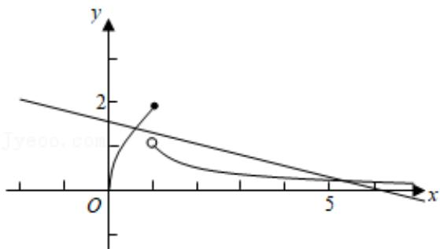

text_image

y
2
O
x
5

【点评】本题考查分段函数的运用，注意运用函数的图象和平移变换，考查分类讨论思想方法和数形结合思想，属于中档题.

3. 【分析】直接利用三角函数的性质的应用和函数的奇偶性的应用求出结果.

【解答】解：由于函数 $f(x)=(x-6)^{2}\cdot\sin(\omega x)$ ，存在常数 $a\in R$ ，

$f(x+a)$ 为偶函数，

则： $f(x + a) = (x + a - 6)^{2}\cdot \sin [\omega (x + a)]$

由于函数为偶函数，

故：a=6，

所以： $6\omega=\frac{\pi}{2}+k\pi$ ，

当 $k = 1$ 时. $\omega = \frac{\pi}{4}$

故选：C.

【点评】本题考查的知识要点：三角函数的性质的应用，主要考查学生的运算能力和转换能力，属于基础题型.

4. 【分析】判断每个函数在 $(0,+\infty)$ 上的单调性即可.

【解答】解： $y = x^{\frac{1}{2}}$ 在 $(0, +\infty)$ 上单调递增， $y = 2^{-x}$ , $y = \log_{\frac{1}{2}} x$ 和 $y = \frac{1}{x}$ 在 $(0, +\infty)$ 上都是减函数.

故选：A.

【点评】考查幂函数、指数函数、对数函数和反比例函数的单调性.

5. 【分析】根据 $\log_3 4 > \log_3 3 = 1$ ， $0 < 2^{-\frac{3}{2}} < 2^{-\frac{2}{3}} < 2^0 = 1$ ，结合 $f(x)$ 的奇偶性和单调性即可判断.

【解答】解：∵ $f(x)$ 是定义域为 R 的偶函数，∴ $f(\log_{3}\frac{1}{4}) = f(\log_{3}4)$ ,

$$
\because \log_ {3} 4 > \log_ {3} 3 = 1, \quad 0 <   2 ^ {- \frac {3}{2}} <   2 ^ {- \frac {2}{3}} <   2 ^ {0} = 1,
$$

$$
\therefore 0 <   2 ^ {- \frac {3}{2}} <   2 ^ {- \frac {2}{3}} <   \log_ {3} 4
$$

$f(x)$ 在 $(0, +\infty)$ 上单调递减，

$$
\therefore f \left(2 ^ {- \frac {3}{2}}\right) > f \left(2 ^ {- \frac {2}{3}}\right) > f \left(\log_ {3} \frac {1}{4}\right),
$$

故选：C.

【点评】本题考查了函数的奇偶性和单调性，关键是指对数函数单调性的灵活应用，属基础题.

6. 【分析】设 $x < 0$ ，则 $-x > 0$ ，代入已知函数解析式，结合函数奇偶性可得 $x < 0$ 时的 $f(x)$ .

【解答】解：设 x<0，则 -x>0，

$$
\therefore f (- x) = e ^ {- x} - 1,
$$

∵设 $f(x)$ 为奇函数，∴ $-f(x)=e^{-x}-1$ ，

即 $f(x) = -e^{-x} + 1$

故选：D.

【点评】本题考查函数的解析式即常用求法，考查函数奇偶性性质的应用，是基础题.

7. 【分析】根据函数奇偶性的性质，然后判断函数的单调性，利用分类讨论思想进行求解即可.

【解答】解：∵定义在 R 的奇函数 $f(x)$ 在 $(-∞,0)$ 单调递减，且 $f(2)=0$ ， $f(x)$ 的大致图象如图：

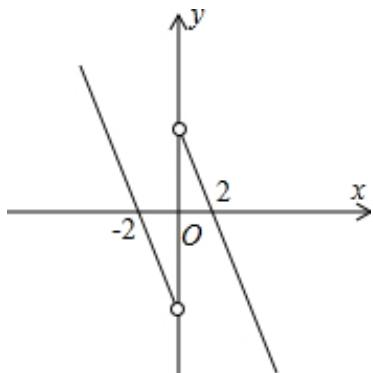

text_image

y
-2 O 2 x

∴ $f(x)$ 在 $(0,+\infty)$ 上单调递减，且 $f(-2)=0$ ;

故 $f(-1)<0$ ;

当 x=0 时，不等式 $xf(x-1)\geqslant0$ 成立，

当 x=1 时，不等式 $xf(x-1)\geqslant0$ 成立，

当 x-1=2 或 x-1=-2 时，即 x=3 或 x=-1 时，不等式 $xf(x-1)\geqslant0$ 成立，

当 x > 0 时，不等式 $xf(x - 1) \geqslant 0$ 等价为 $f(x - 1) \geqslant 0$ ，

此时 $\left\{\begin{aligned}x&>0\\ 0&<x-1\leqslant2\end{aligned}\right.$ ，此时 $1<x\leqslant3$ ，

当 $x < 0$ 时，不等式 $xf(x - 1) \geqslant 0$ 等价为 $f(x - 1) \leqslant 0$

即 $\left\{\begin{aligned}x<0\\ -2&\leqslant x-1<0\end{aligned}\right.$ ，得 $-1\leqslant x<0$ ，

综上 $-1 \leqslant x \leqslant 0$ 或 $1 \leqslant x \leqslant 3$ ，

即实数 x 的取值范围是 $[-1, 0] \cup [1, 3]$ ,

故选：D.

【点评】本题主要考查不等式的求解，结合函数奇偶性的性质，作出函数 $f(x)$ 的草图，是解决本题的关键．难度中等．

8. 【分析】方法一：由 $2^{x} - 2^{y} < 3^{-x} - 3^{-y}$ ，可得 $2^{x} - 3^{-x} < 2^{y} - 3^{-y}$ ，令 $f(x) = 2^{x} - 3^{-x}$ ，则 $f(x)$ 在 $R$ 上单调递增，且 $f(x) < f(y)$ ，结合函数的单调性可得 $x$ ， $y$ 的大小关系，结合选项即可判断。

方法二：根据条件取 x = -1，y = 0，即可排除错误选项.

【解答】解：方法一：由 $2^{x} - 2^{y} < 3^{-x} - 3^{-y}$ ，可得 $2^{x} - 3^{-x} < 2^{y} - 3^{-y}$ ，

令 $f(x)=2^{x}-3^{-x}$ ，则 $f(x)$ 在 R 上单调递增，且 $f(x)<f(y)$ ，

所以 x < y，即 y - x > 0，由于 $y - x + 1 > 1$ ，

故 $ln(y-x+1)>ln1=0$ .

方法二：取 x = -1，y = 0，满足 $2^{x} - 2^{y} < 3^{-x} - 3^{-y}$ ，

此时 $\ln(y-x+1)=\ln2>0,\quad\ln|x-y|=\ln1=0$ ，可排除 BCD .

故选：A.

【点评】本题主要考查了函数的单调性在比较变量大小中的应用，属于基础试题.

9. 【分析】分别运用函数的奇偶性的定义，对各个选项意义判断可得结论.

【解答】解：对于 A， $y=lg(x-1)+lg(x+1)$ 的定义域为 $(1,+\infty)$ ，不关于原点对称，故 A 不正确；

对于 B， $y = f(x) = |\sin x + \cos x|$ 的定义域为 R，但 $f(-x) \neq f(x)$ ，故 B 不正确；

对于 $C$ ， $y = f(x) = x^{\frac{1}{3}}$ 的定义域为 $R$ ， $f(-x) = -f(x)$ ， $f(x)$ 为奇函数，故 $C$ 不正确；

对于 D， $y=f(x)=(x+2)^{2}+(2x-1)^{2}=5x^{2}+5$ ，满足 $f(-x)=f(x)$ ，故 $y=f(x)$ 为偶函数，故 D 正确.

故选：D.

【点评】本题考查函数的奇偶性的定义和运用，考查转化思想和运算能力，属于基础题.

10. 【分析】结合基本初等函数的单调性及奇偶性分别检验各选项即可判断.

【解答】解：y = -3x 在 R 上单调递减且为奇函数，A 符合题意；

因为 $y = x^{3}$ 在 R 上是增函数，B 不符合题意；

$y=\log_{3}x,\quad y=3^{x}$ 为非奇非偶函数，C 不符合题意；

故选：A.

【点评】本题主要考查了基本初等函数的单调性及奇偶性的判断，属于基础题.

11.【分析】根据充分、必要条件的定义，判断命题的真假性即可.

【解答】解：若函数 $f(x)$ 在 $[0, 1]$ 上单调递增，

则函数 $f(x)$ 在 $[0, 1]$ 上的最大值为 f （1），

若 $f(x) = (x - \frac{1}{3})^2$ ，则函数 $f(x)$ 在 $[0, 1]$ 上的最大值为 $f(1)$ ，

但函数 $f(x)$ 在 $[0, 1]$ 上不单调，

故选：A.

【点评】本题考查了充分、必要条件的判断，属于基础题.

12. 【分析】分 $x < a$ ， $x \geqslant a$ 两种情况讨论，当 $x < a$ 时，且 $\frac{7}{4} < a \leqslant \frac{9}{4}$ 时， $f(x)$ 有 4 个零点， $\frac{9}{4} < x \leqslant \frac{11}{4}$ ， $f(x)$ 有 5 个零点， $\frac{11}{4} < x \leqslant \frac{13}{4}$ ， $f(x)$ 有 6 个零点，当 $x > a$ 时，即 $2 < a \leqslant \frac{5}{2}$ ， $f(x)$ 有两个零点，当 $-2a + 5 < 0$ 时，即 $a > \frac{5}{2}$ ， $f(x)$ 有 1 个零点，当 $a = 2$ 时， $f(x)$ 有一个零点，综合两种情况，即可求解.

【解答】解：∵ $f(x)$ 在区间 $(0, +\infty)$ 内恰有 6 个零点

又∵二次函数最多有两个零点，

∴当x<a时， $f(x)=0$ 至少有四个根，

$$
\because f (x) = \cos (2 \pi x - 2 \pi a) = \cos [ 2 \pi (x - a) ],
$$

∴ 令 $f(x)=0$ ，即 $2\pi(x-a)=\frac{\pi}{2}+k\pi k\in Z$ ，

$$
\therefore x = \frac {k}{2} + \frac {1}{4} + a,
$$

又∵ $x\in(0,+\infty)$ ,

∴ $0 < \frac{k}{2} + \frac{1}{4} + a < a$ ，即 $-2a - \frac{1}{2} < k < -\frac{1}{2}$ ，

①当 x < a 时， $-5 \leqslant -2a - \frac{1}{2} < -4$ ， $f(x)$ 有 4 个零点，即 $\frac{7}{4} < a \leqslant \frac{9}{4}$ ，

$-6 \leqslant -2a - \frac{1}{2} < -5$ ， $f(x)$ 有5个零点，即 $\frac{9}{4} < a \leqslant \frac{11}{4}$ ，$-7 \leqslant -2a - \frac{1}{2} < -6$ ， $f(x)$ 有6个零点，即 $\frac{11}{4} < a \leqslant \frac{13}{4}$ ，

②当 $x \geqslant a$ 时， $f(x) = x^2 - 2(a + 1)x + a^2 + 5$

∴ $\triangle = b^{2} - 4ac = 4(a + 1)^{2} - 4(a^{2} + 5) = 8a - 16 = 0$ ，解得 a = 2，

当a<2时， $\triangle<0$ ， $f(x)$ 无零点，

当 a=2 时， $\triangle=0$ ， $f(x)$ 有 1 个零点，

当 $a > 2$ 时， $f(a) = a^2 - 2a(a + 1) + a^2 + 5 = -2a + 5$

∵ $f(x)$ 的对称轴 $x = a + 1$ ，即 f （a）在对称轴的左边，

∴当 $-2a+5\geqslant0$ 时，即 $2<a\leqslant\frac{5}{2}$ ， $f(x)$ 有两个零点，

当 $-2a + 5 < 0$ 时，即 $a > \frac{5}{2}$ ， $f(x)$ 有1个零点，

综合①②可得，若函数 $f(x)$ 在区间 $(0,+\infty)$ 内恰有 6 个零点，则需满足：

$$
\left\{ \begin{array}{l} \frac {7}{4} <   a \leqslant \frac {9}{4} \\ 2 <   a \leqslant \frac {5}{2} \end{array} \text {或} \left\{ \begin{array}{l} \frac {9}{4} \spadesuit a \leqslant \frac {1 1}{4} \\ a \spadesuit \frac {5}{2} \text {或} a = 2 \end{array} \right. \text {或} \left\{ \begin{array}{l} \frac {1 1}{4} <   a \leqslant \frac {1 3}{4}, \\ a <   2 \end{array} \right. \right.
$$

解得 $a \in (2, \frac{9}{4}] \cup (\frac{5}{2}, \frac{11}{4}]$ .

故选：A.

【点评】本题考查了余弦函数和二次函数，需要学生掌握分类讨论的思想，且本题综合性强，属于难题.

13. 【分析】结合基本初等函数在定义域上的单调性分别检验各选项即可判断.

【解答】解：由一次函数性质可知 $f(x) = -x$ 在 R 上是减函数，不符合题意；

由指数函数性质可知 $f(x)=\left(\frac{2}{3}\right)^{x}$ 在 R 上是减函数，不符合题意；

由二次函数的性质可知 $f(x)=x^{2}$ 在 R 上不单调，不符合题意；

根据幂函数性质可知 $f(x)=\sqrt[3]{x}$ 在 R 上单调递增，符合题意.

故选：D.

【点评】本题主要考查基本初等函数的单调性的判断，属于基础题.

14. 【分析】先根据函数 $f(x)$ 的解析式，得到 $f(x)$ 的对称中心，然后通过图象变换，使得变换后的函数图象的对称中心为 $(0,0)$ ，从而得到答案.

【解答】解：因为 $f(x)=\frac{1-x}{1+x}=\frac{-(x+1)+2}{1+x}=-1+\frac{2}{x+1}$ ,所以函数 $f(x)$ 的对称中心为 $(-1,-1)$ ,

所以将函数 $f(x)$ 向右平移一个单位，向上平移一个单位，

得到函数 $y = f(x - 1) + 1$ ，该函数的对称中心为 $(0, 0)$ ，

故函数 $y = f(x - 1) + 1$ 为奇函数.

故选：B.

【点评】本题考查了函数奇偶性和函数的图象变换, 解题的关键是确定 $f(x)$ 的对称中心, 考查了逻辑推理能力, 属于基础题.

# 二、填空题

1.【分析】由题意可得 $|a(t+2)^{3}-(t+2)-at^{3}+t|\leqslant\frac{2}{3}$ ，化为 $|2a(3t^{2}+6t+4)-2|\leqslant\frac{2}{3}$ ，去绝对值化简，结合二次函数的最值，以及不等式的性质，不等式有解思想，可得a的范围，进而得到所求最大值.

【解答】解：存在 $t \in R$ ，使得 $|f(t + 2) - f(t)| \leqslant \frac{2}{3}$ ，

即有 $|a(t+2)^{3}-(t+2)-at^{3}+t|\leqslant\frac{2}{3}$ ,

化为 $|2a(3t^{2}+6t+4)-2|\leqslant\frac{2}{3}$ ,

可得 $-\frac{2}{3} \leqslant 2a(3t^2 + 6t + 4) - 2 \leqslant \frac{2}{3}$ ,

即 $\frac{2}{3} \leqslant a(3t^2 + 6t + 4) \leqslant \frac{4}{3}$ ,

由 $3t^{2} + 6t + 4 = 3(t + 1)^{2} + 1 \geqslant 1$

可得 $0 < a \leqslant \frac{4}{3}$ ，可得 $a$ 的最大值为 $\frac{4}{3}$ 。

故答案为： $\frac{4}{3}$ .

【点评】本题考查不等式成立问题解法，注意运用去绝对值和分离参数法，考查化简变形能力，属于基础题.

2.【分析】对于第一空：由奇函数的定义可得 $f(-x) = -f(x)$ ，即 $e^{-x} + ae^{x} = -(e^{x} + ae^{-x})$ ，变形可得分析可得 a 的值，即可得答案；

对于第二空：求出函数的导数，由函数的导数与单调性的关系分析可得 $f(x)$ 的导数 $f'(x)=e^{x}-ae^{-x}\geqslant0$ 在 R 上恒成立，变形可得： $a\leqslant e^{2x}$ 恒成立，据此分析可得答案.

【解答】解：根据题意，函数 $f(x) = e^{x} + ae^{-x}$ ，

若 $f(x)$ 为奇函数，则 $f(-x) = -f(x)$ ，即 $e^{-x} + ae^{x} = -(e^{x} + ae^{-x})$ ，变形可得 a = -1，

函数 $f(x)=e^{x}+ae^{-x}$ ，导数 $f'(x)=e^{x}-ae^{-x}$

若 $f(x)$ 是 R 上的增函数，则 $f(x)$ 的导数 $f'(x)=e^{x}-ae^{-x}\geqslant0$ 在 R 上恒成立，

变形可得： $a \leqslant e^{2x}$ 恒成立，分析可得 $a \leqslant 0$ ，即 a 的取值范围为 $(-∞, 0]$ ;

故答案为： $-1$ ， $(-∞, 0]$ .

【点评】本题考查函数的奇偶性与单调性的判定,关键是理解函数的奇偶性与单调性的定义,属于基础题.

3.【分析】由根式内部的代数式大于等于0求解一元二次不等式得答案.

【解答】解：由 $7 + 6x - x^{2} \geqslant 0$ ，得 $x^{2} - 6x - 7 \leqslant 0$ ，

解得： $-1 \leqslant x \leqslant 7$ .

∴函数 $y=\sqrt{7+6x-x^{2}}$ 的定义域是 $[-1,7]$ .

故答案为： $[-1, 7]$ .

【点评】本题考查函数的定义域及其求法，考查一元二次不等式的解法，是基础题.

4.【分析】奇函数的定义结合对数的运算可得结果

【解答】解：∵ $f(x)$ 是奇函数，∴ $f(-\ln2) = -8$ ，

又∵当x<0时， $f(x)=-e^{ax}$ ，

$$
\therefore f (- l n 2) = - e ^ {- a l n 2} = - 8,
$$

$$
\therefore - a \ln 2 = \ln 8, \quad \therefore a = - 3.
$$

故答案为：-3

【点评】本题主要考查函数奇偶性的应用，对数的运算性质，属于基础题.

5.【分析】由奇函数的定义可得 $f(-x) = -f(x)$ ，由已知可得 f（8），进而得到 $f(-8)$ .

【解答】解： $y = f(x)$ 是奇函数，可得 $f(-x) = -f(x)$ ，

当 $x \geqslant 0$ 时， $f(x) = x^{\frac{2}{3}}$ ，可得 $f(8) = 8^{\frac{2}{3}} = 4$ ，

则 $f(-8) = -f$ （8） = -4，

故答案为：-4.

【点评】本题考查函数的奇偶性的定义和运用：求函数值，考查转化思想和运算能力，属于基础题.

6.【分析】根据函数成立的条件建立不等式组，解不等式即可.

【解答】解：要使函数有意义，则 $\left\{\begin{aligned}x+1&\neq0\\ x&>0\end{aligned}\right.$

所以 $\left\{\begin{aligned}x\neq-1\\ x>0\end{aligned}\right.$ ，所以x>0，

所以函数的定义域为 $\{x\mid x>0\}$ ，

故答案为： $\{x\mid x>0\}$ .

【点评】本题主要考查函数定义域的求解, 根据函数成立的条件建立不等式是解决本题的关键. 比较基础.

7.【分析】根据题意，由函数奇偶性的定义可得 $a \cdot 3^{(-x)} + \frac{1}{3^{(-x)}} = a \cdot 3^x + \frac{1}{3^x}$ ，变形分析可得答案.

【解答】解：根据题意，函数 $y = a \cdot 3^{x} + \frac{1}{3^{x}}$ 为偶函数，则 $f(-x) = f(x)$ ，

即 $a \bullet 3^{(-x)} + \frac{1}{3^{(-x)}} = a \bullet 3^x + \frac{1}{3^x}$ ,

变形可得： $a(3^{x} - 3^{-x}) = (3^{x} - 3^{-x})$

必有 a=1;

故答案为：1.

【点评】本题考查函数的奇偶性的性质以及应用，关键是掌握函数奇偶性的定义，属于基础题.

8.【答案】-12.

【分析】由已知得 $f(-x)+f(x)=-ax^{3}-bx-c\sin x-2+ax^{3}+bx+c\sin x-2=-4$ ，结合已知 $f(-2)=8$ 可求.

【解答】解：因为 $(x)=ax^{3}+bx+c\sin x-2$ ，

所以 $f(-x)+f(x)=-ax^{3}-bx-c\sin x-2+ax^{3}+bx+c\sin x-2=-4$

因为 $f(-2)=8$ ，

所以 f （2） = -12 .

故答案为：-12.

【点评】本题主要考查了函数的奇偶性在函数求值中的应用，属于基础题.

9..【分析】根据函数的解析式，列出使函数解析式有意义的不等式，求出解集即可.

【解答】解：∵函数 $f(x)=\sqrt{2^{x+1}-4^{x}}$ ,

$$
\therefore 2 ^ {x + 1} - 4 ^ {x} \geqslant 0, \quad \therefore (2 ^ {x}) ^ {2} - 2 \cdot 2 ^ {x} \leqslant 0,
$$

$$
\therefore 0 <   2 ^ {x} \leqslant 2, \quad \therefore x \leqslant 1,
$$

∴函数 $f(x)=\sqrt{2^{x+1}-4^{x}}$ 的定义域是 $(-∞, 1]$ ,

故答案为： $(-∞, 1]$ .

【点评】本题考查了求函数定义域的应用问题，解题的关键是列出使函数解析式有意义的不等式，是基础题.

10.【分析】可看出 $f(x)=x^{2}$ 满足这三个性质.

【解答】解： $f(x)=x^{2}$ 时， $f(x_{1}x_{2})=(x_{1}x_{2})^{2}=x_{1}^{2}x_{2}^{2}=f(x_{1})f(x_{2})$ ；当 $x\in(0,+\infty)$ 时， $f'(x)=2x>0$ ； $f'(x)=2x$ 是奇函数.

故答案为： $f(x)=x^{2}$ .

另解：幂函数 $f(x) = x^{a} (a > 0)$ 即可满足条件①和②；偶函数即可满足条件③，

综上所述，取 $f(x)=x^{2}$ 即可.

【点评】本题考查了幂函数的求导公式，奇函数的定义及判断，考查了计算能力，属于基础题.

11.【分析】利用奇函数的定义即可求解 a 的值.

【解答】解：函数 $f(x)=x^{3}(a\cdot2^{x}-2^{-x})$ 是偶函数，

$y=x^{3}$ 为 R 上的奇函数，

故 $y=a\cdot2^{x}-2^{-x}$ 也为 R 上的奇函数，

所以 $y|_{x=0}=a\cdot2^{0}-2^{0}=a-1=0$

所以 $a = 1$

法二：因为函数 $f(x)=x^{3}(a\cdot2^{x}-2^{-x})$ 是偶函数，

所以 $f(-x)=f(x)$ ,

即 $-x^{3}(a\cdot 2^{-x} - 2^{x}) = x^{3}(a\cdot 2^{x} - 2^{-x})$

即 $x^{3}(a\cdot2^{x}-2^{-x})+x^{3}(a\cdot2^{-x}-2^{x})=0$

即 $(a-1)(2^{x}+2^{-x})x^{3}=0$ ，

所以 a=1.

故答案为：1.

【点评】本题主要考查利用函数奇偶性的应用，考查计算能力，属于基础题.

12.【分析】法一、求出函数定义域，对 x 分段去绝对值，当 $0 < x \leqslant \frac{1}{2}$ 时，分析函数的单调性；当 $x > \frac{1}{2}$ 时，利用导数分析单调性并求最小值，即可得到 $f(x)$ 的最小值.

法二、令 $g(x) = |2x - 1|$ ， $h(x) = 2\ln x$ ，分别作出两函数的图象，数形结合得答案.

【解答】解：法一、函数 $f(x)=|2x-1|-2\ln x$ 的定义域为 $(0,+\infty)$ .

当 $0 < x \leqslant \frac{1}{2}$ 时， $f(x) = |2x - 1| - 2\ln x = -2x + 1 - 2\ln x$

此时函数 $f(x)$ 在 $(0, \frac{1}{2}]$ 上为减函数，

当 $x > \frac{1}{2}$ 时， $f(x) = |2x - 1| - 2\ln x = 2x - 1 - 2\ln x$

则 $f'(x)=2-\frac{2}{x}=\frac{2(x-1)}{x}$ ,

当 $x \in (\frac{1}{2}, 1)$ 时， $f'(x) < 0$ ， $f(x)$ 单调递减，

当 $x \in (1, +\infty)$ 时， $f'(x) > 0$ ， $f(x)$ 单调递增，

∵ $f(x)$ 在 $(0,+\infty)$ 上是连续函数，

∴ 当 $x \in (0,1)$ 时， $f(x)$ 单调递减，当 $x \in (1,+\infty)$ 时， $f(x)$ 单调递增.

∴当 x=1 时 $f(x)$ 取得最小值为 f （1） $=2\times1-1-2\ln1=1$

故答案为：1.

法二、令 $g(x)=|2x-1|$ ， $h(x)=2\ln x$ ，

分别作出两函数的图象如图:

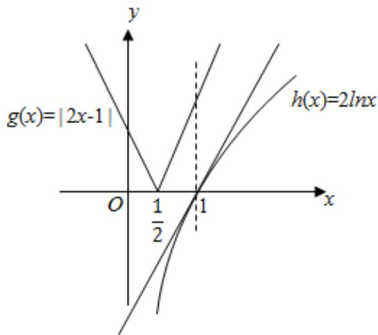

text_image

g(x)=|2x-1|
h(x)=2lnx
O
1/2
1
x
y

由图可知， $f(x)\geqslant f$ （1）=1，

则数 $f(x)=|2x-1|-2\ln x$ 的最小值为 1.

故答案为：1.

【点评】本题考查函数的最值及其几何意义，利用导数求最值的应用，考查运算求解能力，是中档题.

# 三、解答题

1. 【分析】（1）作 $DH \perp EF$ ，然后结合锐角三角函数定义表示出 EF，（2）设 $\angle ADE = \theta$ ，结合锐角三角函数定义可表示 $AE$ ，FH，然后表示出面积，结合同角基本关系进行化简，再由基本不等式可求.

【解答】解：（1）作 $DH \perp EF$ ，垂足为 H，

则 $EF = EH + HF = 15\tan 20^{\circ} + 15\tan 50^{\circ}\approx 23.3m$

（2）设 $\angle ADE = \theta$ ，则 $AE = 15\tan\theta$ ， $FH = 15\tan(90^{\circ} - 2\theta)$ ，

$$
\begin{array}{l} S _ {\text {四边形} A D F E} = 2 S _ {\Delta A D E} + S _ {\Delta D F H} = 2 \times \frac {1}{2} \times 1 5 \times 1 5 \tan \theta + \frac {1}{2} \times 1 5 \times 1 5 \tan (9 0 ^ {\circ} - 2 \theta), \\ = \frac {1 5}{2} (3 0 \tan \theta + 1 5 \cot 2 \theta) = \frac {1 5}{2} (3 0 \tan \theta + 1 5 \times \frac {1 + \tan^ {2} \theta}{2 \tan \theta}) = \frac {2 2 5}{4} (3 \tan \theta + \frac {1}{\tan \theta}) \geqslant \frac {2 2 5 \sqrt {3}}{2}, \\ \end{array}
$$

当且仅当 $3\tan \theta = \frac{1}{\tan\theta}$ ，即 $\tan \theta = \frac{\sqrt{3}}{3}$ 时取等号，此时 $AE = 15\tan \theta = 5\sqrt{3}$ ，最大面积为 $450 - \frac{225\sqrt{3}}{2}\approx 255.14m^2.$

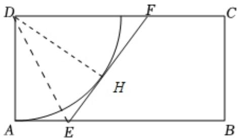

text_image

Geometric diagram of rectangle ABCD with points E, F, H and auxiliary lines, including dashed construction lines.

【点评】本题主要考查了利用基本不等式在求解最值中的应用, 解题的关键是由实际问题抽象出数学问题,属于中档题.

2.【分析】（1）利用函数的单调性结合新定义，逐个判断即可；

（2）依题意， $f(x)=x+\frac{1}{x}(x\geqslant a)$ 为增函数，由双勾函数的图象及性质即得解；  
（3）根据条件，分 $m \leqslant 0$ ，m 为正偶数和 m 为正奇数三种情况，求出条件的 m 的值.

【解答】解：（1）∵ $f(x) = -x$ 为减函数，

$$
\therefore f (x) <   f (x - 1),
$$

$\therefore f(x) = -x$ 具有 A 性质；

$\because g(x)=2x$ 为增函数，

$$
\therefore g (x) > g (x - 1),
$$

$\therefore g(x)=2x$ 不具有 A 性质；

（2）依题意，对任意 $t\in(0,1)$ ， $f(x)\leqslant f(x+t)$ 恒成立，

∴ $f(x)=x+\frac{1}{x}(x\geqslant a)$ 为增函数（不可能为常值函数），

由双勾函数的图象及性质可得 $a \geqslant 1$ ，

当 $a \geqslant 1$ 时，函数单调递增，满足对任意 $t \in (0,1)$ ， $f(x) \leqslant f(x + t)$ 恒成立，

综上，实数 a 的取值范围为 $[1, +\infty)$ .

（3）∵D为整数集，具有A性质的函数均为常值函数，

当 $m \leqslant 0$ 时，取单调递减函数 $f(x) = -x$ ，两个不等式恒成立，但 $f(x)$ 不为常值函数；

当 \(m\) 为正偶数时，取 \(f(x) = \begin{cases} 0, & n\) 为偶数 \\ 1, & n\) 为奇数 \end{cases}\)，两个不等式恒成立，但 \(f(x)\) 不为常值函数；

当 m 为正奇数时，根据对任意 $t \in A$ 且 $x \in D$ ，不等式 $f(x) \leqslant f(x + t)$ 恒成立，

可得 $f(x-m)\leqslant f(x)\leqslant f(x+m)\leqslant f(x+1)\leqslant f(x-1)\leqslant f(x-m)$ ,

则 $f(x)=f(x+1)$ ，所以 $f(x)$ 为常值函数，

综上， $m$ 为正奇数.

【点评】本题以新定义为载体, 考查抽象函数的性质及其运用, 考查逻辑推理能力及灵活运用知识的能力,属于中档题.

3. 【分析】（1）解不等式 $-x^{2} + 5x + 6 \geqslant 0$ 即可求解；

（2）根据一元二次函数的单调性及复合函数的单调性即可求解；

（3）由（2）中的结论数形结合即可求解.

【解答】解：（1）∵ $f(x)=\sqrt{-x^{2}+5x+6}$ ，

$$
\therefore - x ^ {2} + 5 x + 6 \geqslant 0, \quad \therefore x ^ {2} - 5 x - 6 \leqslant 0,
$$

$$
\therefore - 1 \leqslant x \leqslant 6,
$$

∴ $f(x)$ 的定义域为 $[-1, 6]$ ;

(2) $\because$ 一元二次函数 $y = -x^{2} + 5x + 6$ 的开口向下，且对称轴为 $x = \frac{5}{2}$ ，

又 $x \in [-1, 6]$ ，∴根据复合函数的单调性可得：

$f(x)$ 的单调增区间为 $[-1, \frac{5}{2}]$ ，单调减区间为 $[\frac{5}{2}, 6]$ ;

（3）由（2）可知 $f(x)$ 在 $[1, \frac{5}{2}]$ 上单调递增，在 $[\frac{5}{2}, 5]$ 上单调递减，

∴ $f(x)$ 的最大值为 $f(\frac{5}{2})=\frac{7}{2}$ ,

又 $\frac{5}{2} - 1 < 5 - \frac{5}{2}$ ,

∴ $f(x)$ 的最小值为 f （5）= $\sqrt{6}$ ，故 $f(x)$ 在区间[1，5]的最大值为 $\frac{7}{2}$ ，最小值为 $\sqrt{6}$ .

【点评】本题考查一元二次不等式的求解，一元二次函数的单调性，复合函数的单调性，属基础题.

4.【分析】（1）把 a=1 代入函数解析式，由根式内部的代数式大于等于 0 求解绝对值的不等式得答案；

（2） $f(ax)=a\Leftrightarrow\sqrt{|ax+a|-a}=ax+a$ ，设 $ax+a=t\geqslant0$ ，得 $a=t-t^{2}$ ， $t\geqslant0$ ，求得等式右边关于t的函数的值域可得a的取值范围；

（3）分 $x \geqslant -a$ 与 $x < -a$ 两类变形，结合复合函数的单调性可得使得函数 $f(x)$ 在定义域内具有单调性的 $a$ 的范围.

【解答】解：（1）当 $a = 1$ 时， $f(x) = \sqrt{|x + 1| - 1} - x$

由 $|x+1|-1\geqslant0$ ，得 $|x+1|\geqslant1$ ，解得 $x\leqslant-2$ 或 $x\geqslant0$ .

∴函数的定义域为 $(-∞, -2]∪[0, +∞)$ ;

(2) $f(ax) = \sqrt{|ax + a| - a} - ax$ ,

$$
f (a x) = a \Leftrightarrow \sqrt {| a x + a | - a} = a x + a,
$$

设 $ax + a = t \geqslant 0$ ，∴ $\sqrt{t - a} = t$ 有两个不同实数根，整理得 $a = t - t^{2}$ ， $t \geqslant 0$ ，

$\therefore a = -(t - \frac{1}{2})^2 + \frac{1}{4}, t \geqslant 0$ ，当且仅当 $0 \leqslant a < \frac{1}{4}$ 时，方程有 2 个不同实数根，

又 $a \neq 0$ ，∴ $a$ 的取值范围是 $(0, \frac{1}{4})$ ；

（3）当 $x \geqslant -a$ 时， $f(x) = \sqrt{|x + a| - a} - x = \sqrt{x} - x = -(\sqrt{x} - \frac{1}{2})^2 + \frac{1}{4}$ ，在 $[\frac{1}{4}, +\infty)$ 上单调递减，此时需要满足 $-a \geqslant \frac{1}{4}$ ，即 $a \leqslant -\frac{1}{4}$ ，函数 $f(x)$ 在 $[-a, +\infty)$ 上递减；

当 $x < -a$ 时， $f(x) = \sqrt{|x + a| - a} - x = \sqrt{-x - 2a} - x$ ，在 $(- \infty, -2a]$ 上递减，

$\because a\leqslant-\frac{1}{4}<0,\quad\therefore-2a>-a>0$ ，即当 $a\leqslant-\frac{1}{4}$ 时，函数 $f(x)$ 在 $(-∞,-a)$ 上递减.

综上，当 $a\in(-\infty,-\frac{1}{4}]$ 时，函数 $f(x)$ 在定义域R上连续，且单调递减.

【点评】本题考查函数定义域的求法，考查函数零点与方程根的关系，考查函数单调性的判定及其应用，考查逻辑思维能力与推理论证能力，属难题.

# 第四章：指数函数和对数函数

# 一、选择题

1.【分析】由 $y = \frac{2x^3}{2^x + 2^{-x}}$ 的解析式知该函数为奇函数可排除 $C$ ，然后计算 $x = 4$ 时的函数值，根据其值即可排除 $A, D$ .

【解答】解：由 $y = f(x) = \frac{2x^{3}}{2^{x} + 2^{-x}}$ 在 $[-6, 6]$ ，知

$$
f (- x) = \frac {2 (- x) ^ {3}}{2 ^ {- x} + 2 ^ {x}} = - \frac {2 x ^ {3}}{2 ^ {x} + 2 ^ {- x}} = - f (x),
$$

$\therefore f(x)$ 是 $[-6, 6]$ 上的奇函数，因此排除 $C$

又 $f$ （4） $= \frac{2^{11}}{2^8 + 1} >7$ ，因此排除 $A$ ， $D$ ：

故选：B.

【点评】本题考查了函数的图象与性质，解题关键是奇偶性和特殊值，属基础题.

2.【分析】取 a=0，b=-1，利用特殊值法可得正确选项.

【解答】解：取 a=0，b=-1，则

$ln(a-b)=ln1=0$ ，排除 A；

$3^{a}=3^{0}=1>3^{b}=3^{-1}=\frac{1}{3}$ ，排除 B；

$a^{3}=0^{3}>(-1)^{3}=-1=b^{3}$ ，故C对；

$|a|=0<|-1|=1=b$ ，排除D.

故选：C.

【点评】本题考查了不等式的基本性质，利用特殊值法可迅速得到正确选项，属基础题.

3.【分析】本题先将 $a$ 、 $b$ 、 $c$ 的大小与1作个比较，发现 $b > 1$ ， $a$ 、 $c$ 都小于1．再对 $a$ 、 $c$ 的表达式进行变形，判断 $a$ 、 $c$ 之间的大小.

【解答】解：由题意，可知：

$$
a = \log_ {5} 2 <   1,
$$

$$
b = \log_ {0. 5} 0. 2 = \log_ {\frac {1}{2}} \frac {1}{5} = \log_ {2 ^ {- 1}} 5 ^ {- 1} = \log_ {2} 5 > \log_ {2} 4 = 2.
$$

$$
c = 0. 5 ^ {0. 2} <   1,
$$

$\therefore b$ 最大， $a$ 、 $c$ 都小于1.

$$
\because a = \log_ {5} 2 = \frac {1}{\log_ {2} 5}, c = 0. 5 ^ {0. 2} = (\frac {1}{2}) ^ {\frac {1}{5}} = \sqrt [ 5 ]{\frac {1}{2}} = \frac {1}{\sqrt [ 5 ]{2}}.
$$

而 $\log_25 > \log_24 = 2 > \sqrt[5]{2}$

$$
\therefore \frac {1}{\log_ {2} 5} <   \frac {1}{\sqrt [ 5 ]{2}}.
$$

$$
\therefore a <   c,
$$

$$
\therefore a <   c <   b.
$$

故选：A.

【点评】本题主要考查对数、指数的大小比较，这里尽量借助于整数1作为中间量来比较.本题属基础题.

4.【分析】把已知数据代入 $m_{2} - m_{1} = \frac{5}{2} lg\frac{E_{1}}{E_{2}}$ ，化简后利用对数的运算性质求解.

【解答】解：设太阳的星等是 $m_{1} = -26.7$ ，天狼星的星等是 $m_{2} = -1.45$ ，

由题意可得： $-1.45-(-26.7)=\frac{5}{2}lg\frac{E_{1}}{E_{2}}$

$\therefore \lg \frac{E_1}{E_2} = \frac{50.5}{5} = 10.1$ ，则 $\frac{E_1}{E_2} = 10^{10.1}$

故选：A.

【点评】本题考查对数的运算性质，是基础的计算题.

5.【分析】令 $f(x)=0$ ，得 $\sin x=0$ 或 $\cos x=1$ ，再根据 x 的取值范围，求出零点.

【解答】解：函数 $f(x)=2\sin x-\sin 2x$ 在 $[0, 2\pi]$ 的零点个数，

即方程 $2\sin x - \sin 2x = 0$ 在区间 $[0, 2\pi]$ 的根个数，

即 $2\sin x = \sin 2x = 2\sin x\cos x$ 在区间 $[0, 2\pi]$ 的根个数，

即 $\sin x = 0$ 或 $\cos x = 1$ 在区间 $[0, 2\pi]$ 的根个数，

解得 x=0 或 $x=\pi$ 或 $x=2\pi$ .

所以函数 $f(x)=2\sin x-\sin 2x$ 在 $[0, 2\pi]$ 的零点个数为 3 个.

故选：B.

【点评】本题考查了函数的零点与方程的根的关系，考查了方程思想，属于基础题.

6.【分析】本题可根据相应的对数式与指数式与整数进行比较即可得出结果.

【解答】解：由题意，可知：

$$
a = \log_ {2} 7 > \log_ {2} 4 = 2,
$$

$$
1 <   b = \log_ {3} 8 <   \log_ {3} 9 = 2,
$$

$$
c = 0. 3 ^ {0. 2} <   1,
$$

$$
\therefore c <   b <   a.
$$

故选：A.

【点评】本题主要考查对数式与指数式的大小比较，可利用整数作为中间量进行比较．本题属基础题.

7.【分析】根据 $\log_{3}4 > \log_{3}3 = 1$ ， $0 < 2^{-\frac{3}{2}} < 2^{-\frac{2}{3}} < 2^{0} = 1$ ，结合 $f(x)$ 的奇偶性和单调性即可判断.

【解答】解：∵ $f(x)$ 是定义域为 R 的偶函数，∴ $f(\log_{3}\frac{1}{4}) = f(\log_{3}4)$ ,

$$
\because \log_ {3} 4 > \log_ {3} 3 = 1, \quad 0 <   2 ^ {- \frac {3}{2}} <   2 ^ {- \frac {2}{3}} <   2 ^ {0} = 1,
$$

$$
\therefore 0 <   2 ^ {- \frac {3}{2}} <   2 ^ {- \frac {2}{3}} <   \log_ {3} 4
$$

$f(x)$ 在 $(0, +\infty)$ 上单调递减，

$$
\therefore f \left(2 ^ {- \frac {3}{2}}\right) > f \left(2 ^ {- \frac {2}{3}}\right) > f \left(\log_ {3} \frac {1}{4}\right),
$$

故选：C.

【点评】本题考查了函数的奇偶性和单调性，关键是指对数函数单调性的灵活应用，属基础题.

8.【分析】对 a 进行讨论，结合指数，对数的性质即可判断；

【解答】解：由函数 $y=\frac{1}{a^{x}}$ ， $y=\log_{a}(x+\frac{1}{2})$ ，

当 a > 1 时，可得 $y = \frac{1}{a^{x}}$ 是递减函数，图象恒过 $(0,1)$ 点，

函数 $y = \log_a(x + \frac{1}{2})$ ，是递增函数，图象恒过 $(\frac{1}{2}, 0)$ ；

当1>a>0时，可得 $y=\frac{1}{a^{x}}$ 是递增函数，图象恒过(0,1)点，

函数 $y=\log_{a}(x+\frac{1}{2})$ ，是递减函数，图象恒过 $\left(\frac{1}{2},0\right)$ ;

∴满足要求的图象为：D

故选：D.

【点评】本题考查了指数函数，对数函数的图象和性质，属于基础题.

9.【分析】利用对数函数和指数函数的性质，即可求解.

【解答】解：∵ $a=\log_{2}^{0.2}<\log_{2}^{1}=0$ ， $b=2^{0.2}>2^{0}=1$ ， $0<c=0.2^{0.3}<0.2^{0}=1$ ，

$$
\therefore a <   c <   b.
$$

故选：B.

【点评】本题考查三个数的大小的求法，是基础题，解题时要认真审题，注意对数函数和指数函数的性质的合理运用.

10.【分析】由 $\alpha = \frac{r}{R}$ ，推导出 $\frac{M_2}{M_1} = \frac{3\alpha^3 + 3\alpha^4 + \alpha^5}{(1 + \alpha)^2} \approx 3\alpha^3$ ，由此能求出 $r = \alpha R = \sqrt[3]{\frac{M_2}{3M_1}} R$

【解答】解：∵ $\alpha=\frac{r}{R}$ . ∴ $r=\alpha R$ ,

r 满足方程： $\frac{M_{1}}{(R+r)^{2}}+\frac{M_{2}}{r^{2}}=(R+r)\frac{M_{1}}{R^{3}}$

$$
\therefore \frac {1}{1 + 2 \cdot \frac {r}{R} + \frac {r ^ {2}}{R ^ {2}}} \cdot M _ {1} + \frac {R ^ {2}}{r ^ {2}} \cdot M _ {2} = (1 + \frac {r}{R}) M _ {1},
$$

把 $\alpha=\frac{r}{R}$ 代入，得： $\frac{1}{(1+\alpha)^{2}}\cdot M_{1}+\frac{1}{\alpha^{2}}\cdot M_{2}=(1+\alpha)M_{1}$

$$
\therefore \frac {M _ {2}}{\alpha^ {2}} = [ (1 + \alpha) - \frac {1}{(1 + \alpha) ^ {2}} ] M _ {1} = \frac {(1 + \alpha) ^ {3} - 1}{(1 + \alpha) ^ {2}} \cdot M _ {1} = \frac {\alpha (\alpha^ {2} + 3 \alpha + 3)}{(1 + \alpha) ^ {2}} M _ {1},
$$

$$
\therefore \frac {M _ {2}}{M _ {1}} = \frac {3 \alpha^ {3} + 3 \alpha^ {4} + \alpha^ {5}}{(1 + \alpha) ^ {2}} \approx 3 \alpha^ {3},
$$

$$
\therefore r = \alpha R = \sqrt [ 3 ]{\frac {M _ {2}}{3 M _ {1}}} R.
$$

故选：D.

【点评】本题考查点到月球的距离的求法, 考查函数在我国航天事业中的灵活运用, 考查化归与转化思想、函数与方程思想, 考查运算求解能力, 是中档题.

11.【分析】根据指数函数和对数函数的性质即可求出.

【解答】解： $a=3^{0.7}$ ， $b=(\frac{1}{3})^{-0.8}=3^{0.8}$ ，

则 b > a > 1，

$$
\log_ {0. 7} 0. 8 <   \log_ {0. 7} 0. 7 = 1,
$$

$$
\therefore c <   a <   b,
$$

故选：D.

【点评】本题考查了指数函数和对数函数的性质，属于基础题.

12.【分析】直接根据对数和指数的运算性质即可求出.

【解答】解：因为 $a\log_34 = 2$ ，则 $\log_34^a = 2$ ，则 $4^{a} = 3^{2} = 9$

则 $4^{-a} = \frac{1}{4^a} = \frac{1}{9}$

故选：B.

【点评】本题考查了对数和指数的运算性质，属于基础题.

13.【分析】法一：利用中间值比较即可 $a$ ， $b$ ，根据由 $b = \log_8 5 < 0.8$ 和 $c = \log_{13} 8 > 0.8$ ，得到 $c > b$ ，即可确定 $a$ ， $b$ ， $c$ 的大小关系.

法二：利用作差法得到 $a < b$ ，利用指对互化得到 $b < \frac{4}{5}$ ， $c > \frac{4}{5}$ ，由此能求出结果.

【解答】解法一：由 $\frac{3}{4}\log_{5}5=\frac{3}{4}\log_{8}8$ ，

$\because \log_{5}5^{\frac{3}{4}} > \log_{5}3$ ，而 $\log_{8}8^{\frac{3}{4}} < \log_{8}5$

$$
\therefore \log_ {5} 3 <   \log_ {8} 5,
$$

即 $a < b$

$$
\because 5 ^ {5} <   8 ^ {4}, \therefore 5 <   4 \log_ {5} 8, \therefore \log_ {5} 8 > 1. 2 5, \therefore b = \log_ {8} 5 <   0. 8;
$$

$$
\because 1 3 ^ {4} <   8 ^ {5}, \therefore 4 <   5 \log_ {1 3} 8, \therefore c = \log_ {1 3} 8 > 0. 8, \therefore c > b,
$$

综上， $c > b > a$

解法二：∵ $a = \log_{5} 3$ ， $b = \log_{8} 5$ ， $c = \log_{13} 8$ ，

$$
\therefore a - b = \log_ {5} 3 - \log_ {8} 5 = \frac {\ln 3}{\ln 5} - \frac {\ln 5}{\ln 8} = \frac {\ln 3 \ln 8 - \ln^ {2} 5}{\ln 5 \ln 8}
$$

$$
<   \frac {(\frac {\ln 3 + \ln 8}{2}) ^ {2} - \ln^ {2} 5}{\ln 5 \ln 8} <   \frac {(\frac {\ln 2 5}{2}) ^ {2} - \ln^ {2} 5}{\ln 5 \ln 8} = 0,
$$

$$
\therefore a <   b,
$$

$$
\because 5 ^ {5} <   8 ^ {4}, \therefore 5 \log_ {8} 5 <   4, \therefore b = \log_ {8} 5 <   \frac {4}{5},
$$

$$
\because 1 3 ^ {4} <   8 ^ {5}, \therefore 4 <   5 \log_ {1 3} 8, \therefore c = \log_ {1 3} 8 > \frac {4}{5},
$$

$$
\therefore a <   b <   c.
$$

故选：A.

【点评】本题考查了三个数大小的判断，指数对的运算和基本不等式的应用，考查了转化思想，是基础题.

14.【分析】根据所给模型求得 r=0.38，令 t=0，求得 I，根据条件可得方程 $e^{0.38t}=2$ ，然后解出 t 即可.

【解答】解：把 $R_{0}=3.28$ ，T=6 代入 $R_{0}=1+rT$ ，可得 r=0.38，∴ $I(t)=e^{0.38t}$ ，

当 t=0 时， $I(0)=1$ ，则 $e^{0.38t}=2$ ，

两边取对数得 0.38t = ln2，解得 $t = \frac{ln2}{0.38} \approx 1.8$ .

故选：B.

【点评】本题考查函数模型的实际运用，考查学生阅读理解能力，计算能力，属于中档题.

15.【分析】先根据指数函数以及等式的性质得到 $2^{a} + \log_{2}a < 2^{2b} + \log_{2}2b$ ；再借助于函数的单调性即可求解结论.

【解答】解：因为 $2^{a} + \log_{2} a = 4^{b} + 2\log_{4} b = 2^{2b} + \log_{2} b$ ;

因为 $2^{2b} + \log_2b < 2^{2b} + \log_22b = 2^{2b} + \log_2b + 1$

所以 $2^{a} + \log_{2}a <   2^{2b} + \log_{2}2b$

令 $f(x) = 2^{x} + \log_{2}x$ ，由指对数函数的单调性可得 $f(x)$ 在 $(0, +\infty)$ 内单调递增；

且 $f$ （a） $< f(2b)\Rightarrow a < 2b$

故选：B.

【点评】本题主要考查指数函数和对数函数的应用，属于基础题.

16.【分析】利用指数函数、对数函数的单调性直接求解.

【解答】解：∵ $a=\log_{3}2=\log_{3}\sqrt[3]{8}<\log_{3}\sqrt[3]{9}=\frac{2}{3}$

$$
b = \log_ {5} 3 = \log_ {5} \sqrt [ 3 ]{2 7} > \log_ {5} \sqrt [ 3 ]{2 5} = \frac {2}{3},
$$

$$
c = \frac {2}{3},
$$

$$
\therefore a <   c <   b.
$$

故选：A.

【点评】本题考查三个数的大小的判断，考查指数函数、对数函数的单调性等基础知识，考查运算求解能力，是基础题.

17.【分析】问题转化为 $f(x)=|kx^{2}-2x|$ 有四个根， $\Rightarrow y=f(x)$ 与 $y=h(x)=|kx^{2}-2x|$ 有四个交点，再分三种情况当 k=0 时，当 k<0 时，当 k>0 时，讨论两个函数是否能有 4 个交点，进而得出 k 的取值范围.

【解答】解：若函数 $g(x)=f(x)-|kx^{2}-2x|(k\in R)$ 恰有 4 个零点，

则 $f(x)=|kx^{2}-2x|$ 有四个根，

即 $y = f(x)$ 与 $y = h(x) = |kx^2 - 2x|$ 有四个交点，

当 $k = 0$ 时， $y = f(x)$ 与 $y = |-2x| = 2|x|$ 图象如下：

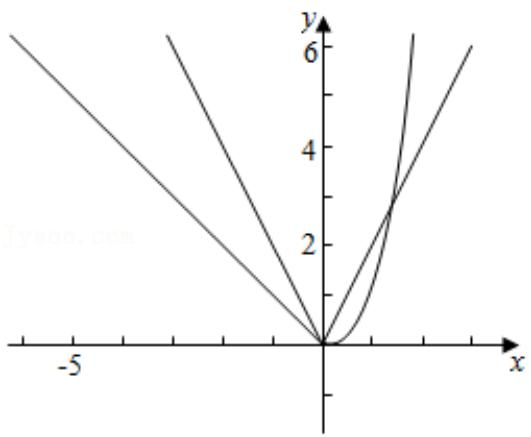

line

| x  | y1  | y2  | y3  |
|----|-----|-----|-----|
| -5 | 6   | 4   | 2   |
| 0  | 0   | 0   | 0   |
| 5  | 6   | 4   | 2   |

两图象只有两个交点，不符合题意，

当 $k < 0$ 时， $y = |kx^2 - 2x|$ 与 $x$ 轴交于两点 $x_1 = 0$ ， $x_2 = \frac{2}{k} (x_2 < x_1)$ 图象如图所示，

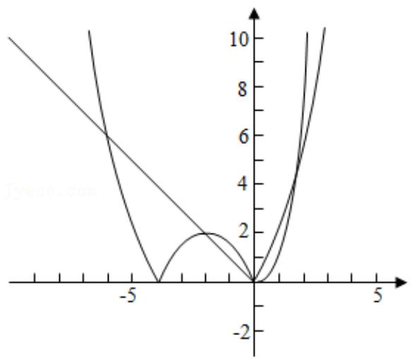

line

| x    | y1   | y2   |
| ---- | ---- | ---- |
| -6   | 10   | 0    |
| -5   | 6    | 0    |
| -4   | 2    | 0    |
| -3   | 0    | 0    |
| -2   | 0    | 0    |
| -1   | 0    | 0    |
| 0    | 0    | 0    |
| 1    | 0    | 0    |
| 2    | 0    | 0    |
| 3    | 0    | 0    |
| 4    | 0    | 0    |
| 5    | 0    | 0    |
| 6    | 10   | 0    |

当 $x = \frac{1}{k}$ 时，函数 $y = |kx^2 - 2x|$ 的函数值为 $-\frac{1}{k}$ ，

当 $x = \frac{1}{k}$ 时，函数 $y = -x$ 的函数值为 $-\frac{1}{k}$ ，

所以两图象有 4 个交点，符合题意，

当 $k > 0$ 时，

$y=|kx^{2}-2x|$ 与 x 轴交于两点 $x_{1}=0,\quad x_{2}=\frac{2}{k}(x_{2}>x_{1})$

在 $[0, \frac{2}{k})$ 内两函数图象有两个交点，所以若有四个交点，

只需 $y = x^{3}$ 与 $y = kx^{2} - 2x$ 在 $\left(\frac{2}{k}, +\infty\right)$ 还有两个交点，即可，

即 $x^{3}=kx^{2}-2x$ 在 $\left(\frac{2}{k},+\infty\right)$ 还有两个根，即 $k = x + \frac{2}{x}$ 在 $(\frac{2}{k}, +\infty)$ 还有两个根，

函数 $y = x + \frac{2}{x} \geqslant 2\sqrt{2}$ ，（当且仅当 $x = \frac{2}{x}$ ，即 $x = \sqrt{2}$ 时，取等号），

所以 $0 < \frac{2}{k} < \sqrt{2}$ ，且 $k > 2\sqrt{2}$ ，

所以 $k > 2\sqrt{2}$

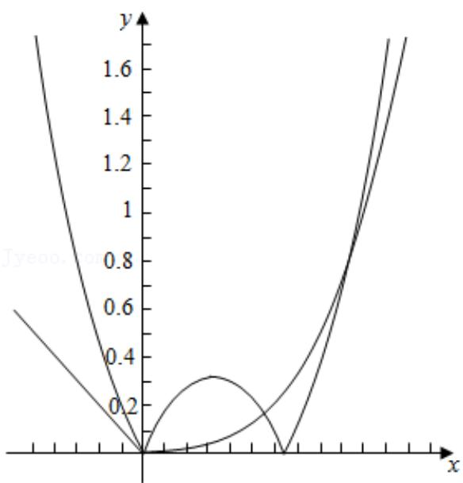

line

| x    | y1     | y2     |
| ---- | ------ | ------ |
| 0    | 0.0000 | 0.0000 |
| 1    | 0.2500 | 0.3079 |
| 2    | 0.5000 | 0.6487 |
| 3    | 0.7500 | 0.9999 |
| 4    | 1.0000 | 1.3667 |
| 5    | 1.2500 | 1.7336 |
| 6    | 1.5000 | 2.1015 |
| 7    | 1.7500 | 2.4704 |
| 8    | 2.0000 | 2.8393 |
| 9    | 2.2500 | 3.1982 |
| 10   | 2.5000 | 3.5571 |
| 11   | 2.7500 | 3.9161 |
| 12   | 3.0000 | 4.2751 |
| 13   | 3.2500 | 4.6341 |
| 14   | 3.5000 | 5.0031 |
| 15   | 3.7500 | 5.4621 |
| 16   | 4.0000 | 5.9211 |
| 17   | 4.2500 | 6.3791 |
| 18   | 4.5000 | 6.8381 |
| 19   | 4.7500 | 7.2971 |
| 20   | 5.0000 | 7.7561 |
| 21   | 5.2500 | 8.2151 |
| 22   | 5.5000 | 8.6741 |
| 23   | 5.7500 | 9.1331 |
| 24   | 6.0000 | 9.6021 |
| 25   | 6.2500 | 10.0711|
| 26   | 6.5000 | 10.5391|
| 27   | 6.7500 | 11.0181|
| 28   | 7.0000 | 11.4971|
| 29   | 7.2500 | 12.0761|
| 30   | 7.5000 | 12.6551|
| 31   | 7.7500 | 13.2341|
| 32   | 8.0000 | 13.8131|
| 33   | 8.2500 | 14.3921|
| 34   | 8.5000 | 14.9711|
| 35   | 8.7500 | 15.5491|
| 36   | 9.0000 | 16.1281|
| 37   | 9.2500 | 16.7071|
| 38   | 9.5000 | 17.2861|
| 39   | 9.7500 | 17.8651|
| 40   | 10.0000| nan     |

综上所述，k 的取值范围为 $(-∞, 0) ∪ (2√2, +∞)$ .

故选：D.

【点评】本题考查函数的零点，参数的取值范围，关键利用分类讨论思想，分析函数的交点，属于中档题.

18.【分析】求出 x 的取值范围, 由定义判断为奇函数, 利用对数的运算性质变形, 再判断内层函数 $t=\left|\frac{2x+1}{2x-1}\right|$ 的单调性, 由复合函数的单调性得答案.

【解答】解：由 $\left\{\begin{aligned}&2x+1\neq0\\ &2x-1\neq0\end{aligned}\right.$ ，得 $x\neq\pm\frac{1}{2}$ .

又 $f(-x) = \ln | - 2x + 1| - \ln | - 2x - 1| = -( \ln |2x + 1| - \ln |2x - 1|) = -f(x)$

∴ $f(x)$ 为奇函数;

由 $f(x) = \ln |2x + 1| - \ln |2x - 1| = \ln \frac{|2x + 1|}{|2x - 1|} = \ln |\frac{2x + 1}{2x - 1}|$ ，

$$
\because \frac {2 x + 1}{2 x - 1} = \frac {2 x - 1 + 2}{2 x - 1} = 1 + \frac {2}{2 x - 1} = 1 + \frac {2}{2 \left(x - \frac {1}{2}\right)} = 1 + \frac {1}{x - \frac {1}{2}}.
$$

可得内层函数 $t = \left|\frac{2x + 1}{2x - 1}\right|$ 的图象如图，

在 $(- \infty, -\frac{1}{2})$ 上单调递减，在 $(- \frac{1}{2}, \frac{1}{2})$ 上单调递增，

则 $(\frac{1}{2}, +\infty)$ 上单调递减.

又对数式 y = lnt 是定义域内的增函数，

由复合函数的单调性可得， $f(x)$ 在 $(-∞, -\frac{1}{2})$ 上单调递减.

故选：D.

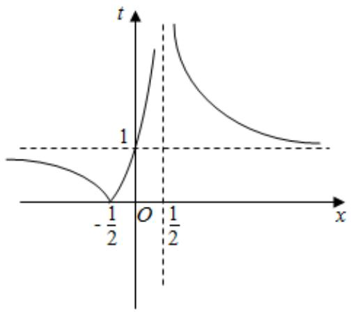

line

| x       | t     |
| ------- | ----- |
| -1/2    | 0     |
| 0       | 1     |
| 1/2     | >1    |

【点评】本题考查函数的奇偶性与单调性的综合，考查复合函数单调性的求法，是中档题.

19.【分析】不等式即 $2^{x} > x + 1$ 。由于函数 $y = 2^{x}$ 和直线 $y = x + 1$ 的图象都经过点 $(0,1)$ 、 $(1,2)$ ，数形结合可得结论。

【解答】解：不等式 $f(x)>0$ ，即 $2^{x}>x+1$ 。

由于函数 $y=2^{x}$ 和直线 $y=x+1$ 的图象都经过点 $(0,1)$ 、

(1,2)，如图所示：

不等式 $f(x)>0$ 的解集是 $(-∞, 0)∪(1, +∞)$ ,

故选：D.

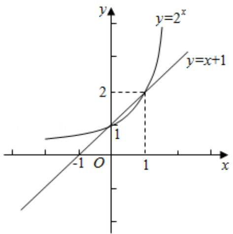

text_image

y
y=2^x
y=x+1
2
1
O
1
x

【点评】本题主要考查其它不等式的解法，函数的图象和性质，属于中档题.

20.【分析】根据所给材料的公式列出方程 $\frac{K}{1 + e^{-0.23(t^* - 53)}} = 0.95K$ ，解出 $t$ 即可.

【解答】解：由已知可得 $\frac{K}{1+e^{-0.23(t^{*}-53)}}=0.95K$ ，解得 $e^{-0.23(t^{*}-53)}=\frac{1}{19}$ ，

两边取对数有 $-0.23(t^{*}-53)=-ln19$ ，

解得 $t^{*}\approx66$ ，

故选：C.

【点评】本题考查函数模型的实际应用，考查学生计算能力，属于中档题

21.【分析】根据反函数的定义以及映射的定义即可判断选项是否正确.

【解答】解：选项 A：因为函数是二次函数，属于二对一的映射，

根据函数的定义可得函数不存在反函数，A 错误，

选项 B：因为函数是三角函数，有周期性和对称性，属于多对一的映射，

根据函数的定义可得函数不存在反函数，B 错误，

选项 C：因为函数的单调递增的指数函数，属于一一映射，所以函数存在反函数，C 正确，

选项 D：因为函数是常数函数，属于多对一的映射，所以函数不存在反函数，D 错误，

故选：C.

【点评】本题考查了反函数的定义以及映射的定义,考查了学生对函数以及映射概念的理解,属于基础题.

22.【分析】利用指数函数和对数函数的性质.

【解答】解：∵ $\log_{2}0.3 < \log_{2}1 = 0$ ，∴ a < 0，

$$
\because \log_ {\frac {1}{2}} 0. 4 > \log_ {\frac {1}{2}} 0. 5 = 1, \quad \therefore b > 1,
$$

$$
\because 0 <   0. 4 ^ {0. 3} <   0. 4 ^ {0} = 1, \therefore 0 <   c <   1,
$$

$$
\therefore a <   c <   b,
$$

故选：D.

【点评】本题主要考查了指数函数和对数函数的性质，考查了三个数比较大小，是基础题.

23.【分析】利用举实例，再结合对数的运算法则求解即可.

【解答】解：令a=4，b=2，

则 $\log_{b}a=\log_{2}4=2$

$$
\log_ {2 b} 2 a = \log_ {4} 8 = \frac {l g 8}{l g 4} = \frac {3 l g 2}{2 l g 2} = \frac {3}{2},
$$

$$
\log_ {3 b} 3 a = \log_ {6} 1 2 = 1 + \log_ {6} 2 <   1 + \log_ {6} \sqrt {6} = 1 + \frac {1}{2} = \frac {3}{2},
$$

$$
\log_ {4 b} 4 a = \log_ {8} 1 6 = 1 + \log_ {8} 2 = 1 + \frac {1}{3} = \frac {4}{3},
$$

故最大的是 $\log_b a$ ，

故选：A.

【点评】本题考查对数的运算法则，举实例法的应用，属于中档题.

24.【分析】可得出 $\log_{5}2<\frac{1}{2},\log_{8}3>\frac{1}{2}$ ，然后即可得出 a，b，c 的大小关系.

【解答】解：∵ $\log_{5}2<\log_{5}5^{\frac{1}{2}}=\frac{1}{2}$ ， $\log_{8}3>\log_{8}8^{\frac{1}{2}}=\frac{1}{2}$ ，

$$
\therefore a <   c <   b.
$$

故选：C.

【点评】本题考查了对数的运算性质，对数函数的单调性，增函数的定义，考查了计算能力，属于基础题.

25.【分析】对已知的指数式化为对数式，再利用对数的运算性质求解.

【解答】解： $\because 2^{a}=5^{b}=10$ ， $\therefore a=\log_{2}10>0$ ， $b=\log_{5}10>0$ ，

$$
\therefore \frac {1}{a} + \frac {1}{b} = \frac {1}{\log_ {2} 1 0} + \frac {1}{\log_ {5} 1 0} = \log_ {1 0} 2 + \log_ {1 0} 5 = l g 1 0 = 1,
$$

故选：C.

【点评】本题主要考查了对数的运算性质，考查了对数式与指数式的互化，是基础题.

26.【分析】把 L=4.9 代入 $L=5+lgV$ 中，直接求解即可.

【解答】解：在 $L=5+lgV$ 中，L=4.9，所以 $4.9=5+lgV$ ，即 $lgV=-0.1$ ，

解得 $V = 10^{-0.1} = \frac{1}{10^{0.1}} = \frac{1}{\sqrt[10]{10}} = \frac{1}{1.259} \approx 0.8$

所以其视力的小数记录法的数据约为 0.8.

故选：C.

【点评】本题考查了对数与指数的互化问题，也考查了运算求解能力，是基础题.

27.【分析】利用圆锥内积水的高度是圆锥总高度的一半，求出圆锥内积水部分的半径，求出圆锥的体积，求出平面上积水的厚度，由题意即可得到答案.

【解答】解：圆锥的体积为 $V=\frac{1}{3}Sh=\frac{1}{3}r^{2}\pi h$ ，

因为圆锥内积水的高度是圆锥总高度的一半，

所以圆锥内积水部分的半径为 $\frac{1}{2}\times\frac{1}{2}\times200=50mm$ ，

将 r=50，h=150 代入公式可得 $V=125000\pi(mm^{3})$ ，

图上定义的是平地上积水的厚度，即平地上积水的高，

平地上积水的体积为V=Sh，且对于这一块平地的面积，即为圆锥底面圆的面积，

所以 $S = \pi \cdot \left( \frac{1}{2} \times 200 \right)^{2} = 10000 \pi (mm^{2})$ ,

则平地上积水的厚度 $h=\frac{125000\pi}{10000\pi}=12.5(mm)$ ,

因为10<12.5<25，

由题意可知，这一天的雨水属于中雨.

故选：B.

【点评】本题考查了空间几何体在实际生活中的应用，解题的关键是掌握锥体和柱体体积公式的应用，考查了逻辑推理能力与空间想象能力，属于中档题.

28.【分析】根据 x 的范围求出 y 的范围，再反解出 x，然后根据反函数的定义即可求解.

【解答】解：由 $y=2^{\frac{1}{x}}(x>0)$ 可得： $\frac{1}{x}=\log_{2}y$

因为 x > 0 ，所以 $\frac{1}{x} > 0$ ，则 y > 1 ，

所以原函数的反函数为 $y=\frac{1}{\log_{2}x}(x>1)$ .

故选：A.

【点评】本题考查了求解函数的反函数的问题，考查了学生的运算能力，属于基础题.

29.【分析】首先由 $9^{m}=10$ 得到 $m=\log_{9}10$ ，可大致计算m的范围，观察a，b的形式从而构造函数 $f(x)=x^{m}-x-1(x>1)$ ，利用 $f(x)$ 的单调性比较 $f(10)$ 与f（8）大小关系即可.

【解答】解：∵ $9^{m}=10$ ，∴ $m=\log_{9}10$ ，

$$
\because 1 = \log_ {9} 9 <   \log_ {9} 1 0 <   \log_ {9} \sqrt {7 2 9} = \frac {3}{2}
$$

$$
\therefore 1 <   m <   \frac {3}{2},
$$

$$
a = 1 0 ^ {m} - 1 1 = 1 0 ^ {m} - 1 0 - 1, \quad b = 8 ^ {m} - 9 = 8 ^ {m} - 8 - 1,
$$

构造函数 $f(x)=x^{m}-x-1(x>1)$ ,

$$
\therefore f ^ {\prime} (x) = m x ^ {m - 1} - 1,
$$

$$
\because 1 <   m <   \frac {3}{2}, x > 1, \therefore f ^ {\prime} (x) = m x ^ {m - 1} - 1 > 0,
$$

∴ $f(x)=x^{m}-x-1$ 在 $(1,+\infty)$ 单调递增，

∴ $f(10) > f$ （8），又因为 $f(9) = 9^{\log_{9}10} - 9 - 1 = 0$ ，

故 $a > 0 > b$

故选：A.

【点评】本题主要考查构造函数比较大小，属于较难题目.

30.【分析】根据指数函数和对数函数的图象与性质，判断 $a > 1 > b > 0 > c$

【解答】解：因为 $y=2^{x}$ 是定义域 R 上的单调增函数，所以 $2^{0.7}>2^{0}=1$ ，即 $a=2^{0.7}>1$ ;

因为 $y=(\frac{1}{3})^{x}$ 是定义域 R 上的单调减函数，所以 $(\frac{1}{3})^{0.7}<(\frac{1}{3})^{0}=1$ ，且 $b=(\frac{1}{3})^{0.7}$ ，所以 0<b<1；

因为 $y=\log_{2}x$ 是定义域 $(0,+\infty)$ 上的单调增函数，所以 $\log_{2}\frac{1}{3}<\log_{2}1=0$ ，即 $c=\log_{2}\frac{1}{3}<0$ ；

所以 a > b > c .

故选：C.

【点评】本题考查了根据指数函数和对数函数的图象与性质判断函数值大小的应用问题，是基础题.

31.【分析】根据题意计算 $f(x) + f(-x)$ 的值即可.

【解答】解：因为函数 $f(x)=\frac{1}{1+2^{x}}$ ，所以 $f(-x)=\frac{1}{1+2^{-x}}=\frac{2^{x}}{2^{x}+1}$ ，

所以 $f(-x)+f(x)=\frac{1+2^{x}}{1+2^{x}}=1$ .

故选：C.

【点评】本题考查了指数的运算与应用问题，是基础题.

32．【分析】构造函数 $f(x)=\ln x+\frac{1}{x}$ ，x>0，设 $g(x)=xe^{x}+\ln(1-x)(0<x<1)$ ，则 $g'(x)=(x+1)e^{x}+\frac{1}{x-1}=\frac{(x^{2}-1)e^{x}+1}{x-1}$ ，令 $h(x)=e^{x}(x^{2}-1)+1$ ， $h'(x)=e^{x}(x^{2}+2x-1)$ ，利用导数性质由此能求出结果.

【解答】解：构造函数 $f(x)=\ln x+\frac{1}{x}$ ，x>0，

则 $f'(x)=\frac{1}{x}-\frac{1}{x^{2}}$ ，x>0，

当 $f'(x)=0$ 时，x=1，

0 < x < 1 时， $f'(x) < 0$ ， $f(x)$ 单调递减；

x>1 时， $f'(x)>0$ ， $f(x)$ 单调递增，

∴ $f(x)$ 在 x=1 处取最小值 f （1）=1，∴ $\ln x > 1 - \frac{1}{x}$ ，(x > 0 且 $x \neq 1$ )，

$$
\therefore \ln 0. 9 > 1 - \frac {1}{0 . 9} = - \frac {1}{9}, \quad \therefore - \ln 0. 9 <   \frac {1}{9}, \quad \therefore c <   b;
$$

$$
\because - \ln 0. 9 = \ln \frac {1 0}{9} > 1 - \frac {9}{1 0} = \frac {1}{1 0}, \therefore \frac {1 0}{9} > e ^ {0. 1},
$$

$$
\therefore 0. 1 e ^ {0. 1} <   \frac {1}{9}, \quad \therefore a <   b;
$$

设 $g(x)=xe^{x}+ln(1-x)(0\leqslant x<1)$ ,

则 $g'(x)=(x+1)e^{x}+\frac{1}{x-1}=\frac{(x^{2}-1)e^{x}+1}{x-1}$

令 $h(x)=e^{x}(x^{2}-1)+1,\quad h'(x)=e^{x}(x^{2}+2x-1)$ ,

当 $0 < x < \sqrt{2} - 1$ 时， $h'(x) < 0$ ，函数 $h(x)$ 单调递减，

当 $\sqrt{2} - 1 < x < 1$ 时， $h'(x) > 0$ ，函数 $h(x)$ 单调递增，

∵ $h(0)=0$ ，∴ 当 $0<x<\sqrt{2}-1$ 时， $h(x)<0$ ，

当 $0 < x < \sqrt{2} - 1$ 时， $g'(x) > 0$ ， $g(x) = xe^{x} + ln(1 - x)$ 单调递增，

$$
\therefore g (0. 1) > g (0) = 0, \therefore 0. 1 e ^ {0. 1} > - l n 0. 9, \therefore a > c,
$$

$$
\therefore c <   a <   b.
$$

故选：C.

【点评】本题考查三个数的大小的判断，考查构造法、导数性质等基础知识，考查运算求解能力，是难题.

33.【分析】利用对数的换底公式计算即可.

【解答】解： $(2\log_{4}3+\log_{8}3)(\log_{3}2+\log_{9}2)=(\frac{2lg3}{lg4}+\frac{lg3}{lg8})(\frac{lg2}{lg3}+\frac{lg2}{lg9})$

$$
= \left(\frac {l g 3}{l g 2} + \frac {l g 3}{3 l g 2}\right) \left(\frac {l g 2}{l g 3} + \frac {l g 2}{2 l g 3}\right)
$$

$$
= \frac {4}{3} \frac {\lg 3}{\lg 2} \cdot \frac {3}{2} \frac {\lg 2}{\lg 3}
$$

$$
= 2.
$$

故选：B.

【点评】本题考查了对数的换底公式应用问题，是基础题.

34.【分析】直接利用指数、对数的运算性质求解即可.

【解答】解：由 $2^{a}=5$ ， $\log_{8}3=b$ ，

可得 $8^{b}=2^{3b}=3$ ，

则 $4^{a - 3b} = \frac{4^a}{4^{3b}} = \frac{(2^a)^2}{(2^{3b})^2} = \frac{5^2}{3^2} = \frac{25}{9}$

故选：C.

【点评】本题考查了指数、对数的运算性质，考查了计算能力，属于基础题.

35.【分析】根据对数式和指数式的互化可得出 $x^{2}+2x-15=0$ ，然后根据 x>0 解出 x 的值即可.

【解答】解：∵ $\log_{2}(x^{2}+2x+1)=4$ ，

$\therefore x^{2}+2x+1=16$ ，且x>0，解得x=3。

故选：B.

【点评】本题考查了指数式和对数式的互化，一元二次方程的解法，考查了计算能力，属于基础题.

36.【分析】求函数的导数， $f(x)$ 存在3个零点，等价为 $f'(x)=0$ 有两个不同的根，且极大值大于0极小值小于0，求函数的极值，建立不等式关系即可.

【解答】解： $f'(x)=3x^{2}+a$ ，

若函数 $f(x)=x^{3}+ax+2$ 存在 3 个零点，

则 $f'(x)=3x^{2}+a=0$ ，有两个不同的根，且极大值大于 0 极小值小于 0，

即判别式 $\triangle = 0 - 12a > 0$ ，得 $a < 0$

由 $f'(x) > 0$ 得 $x > \sqrt{-\frac{a}{3}}$ 或 $x < -\sqrt{-\frac{a}{3}}$ ，此时 $f(x)$ 单调递增，

由 $f^{\prime}(x) < 0$ 得 $-\sqrt{-\frac{a}{3}} < x < \sqrt{-\frac{a}{3}}$ ，此时 $f(x)$ 单调递减，

即当 $x = -\sqrt{-\frac{a}{3}}$ 时，函数 $f(x)$ 取得极大值，当 $x = \sqrt{-\frac{a}{3}}$ 时， $f(x)$ 取得极小值，

则 $f(-\sqrt{-\frac{a}{3}}) > 0$ ， $f(\sqrt{-\frac{a}{3}}) <   0$

即 $-\sqrt{-\frac{a}{3}} (-\frac{a}{3} + a) + 2 > 0$ ，且 $\sqrt{-\frac{a}{3}} (-\frac{a}{3} + a) + 2 < 0$

即 $-\sqrt{-\frac{a}{3}} \times \frac{2a}{3} + 2 > 0$ ，①，且 $\sqrt{-\frac{a}{3}} \times \frac{2a}{3} + 2 < 0$ ，②，

则①恒成立，

由 $\sqrt{-\frac{a}{3}}\times \frac{2a}{3} +2 <   0$ ， $2 <   - \sqrt{-\frac{a}{3}}\times \frac{2a}{3},$

平方得 $4<-\frac{a}{3}\times\frac{4a^{2}}{9}$ ，即 $a^{3}<-27$ ，

则 a<-3，综上 a<-3，

即实数 a 的取值范围是 $(-∞,-3)$ .

故选：B.

【点评】本题主要考查函数零点个数的应用，求函数的导数，转化为函数极值与 0 的关系是解决本题的关键，是中档题.

37.【分析】利用三角函数的图象变换，求解函数的解析式，然后判断两个函数的图象交点个数即可.

【解答】解： $y = \cos(2x + \frac{\pi}{6})$ 的图象向左平移 $\frac{\pi}{6}$ 个单位长度得到 $f(x) = \cos(2x + \frac{\pi}{2}) = -\sin 2x$ ，

在同一个坐标系中画出两个函数的图象，如图：

$y = f(x)$ 的图象与直线 $y = \frac{1}{2} x - \frac{1}{2}$ 的交点个数为：3.

故选：C.

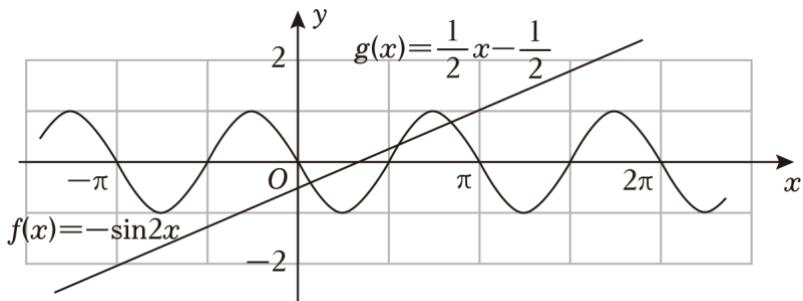

line

| x       | f(x)        | g(x)        |
|---------|-------------|-------------|
| -π      | -sin2x      | 1/2         |
| 0       | 0           | 1/2         |
| π       | -sin2x      | 1/2         |
| 2π      | 0           | 1/2         |

【点评】本题考查三角函数的图象的变换，函数的零点个数的求法，考查分析问题解决问题的能力，是中档题.

# 二、多选题

38.【分析】根据题意分别计算 $p_{1}$ ， $p_{2}$ ， $p_{3}$ 的范围，进行比较即可求解.

【解答】解：由题意得， $60 \leqslant 20lg\frac{p_{1}}{p_{0}} \leqslant 90$ ， $1000p_{0} \leqslant p_{1} \leqslant 10^{\frac{9}{2}}p_{0}$ ，

$$
5 0 \leqslant 2 0 l g \frac {p _ {2}}{p _ {0}} \leqslant 6 0, 1 0 ^ {\frac {5}{2}} p _ {0} \leqslant p _ {2} \leqslant 1 0 0 0 p _ {0},
$$

$$
2 0 l g \frac {p _ {3}}{p _ {0}} = 4 0, \quad p _ {3} = 1 0 0 p _ {0},
$$

可得 $p_{1} \geqslant p_{2}$ ，A 正确；

$p_{2}\leqslant10p_{3}=1000p_{0}$ ，B错误；

$p_{3}=100p_{0}$ ，C 正确；

$p_{1}\leqslant10^{\frac{9}{2}}p_{0}=100\times10^{\frac{5}{2}}p_{0}\leqslant100p_{2},\quad p_{1}\leqslant100p_{2},\quad D$ 正确.

故选：ACD.

【点评】本题考查函数模型的运用，考查学生的计算能力，是中档题.

# 三、选择题

39.【分析】由 $y = x^{2}(x > 0)$ 解得 $x = \sqrt{y}(y > 0)$ ，再交换 x 与 y 的位置即得反函数.

【解答】解：由 $y = x^{2} (x > 0)$ 解得 $x = \sqrt{y}$ ，

$$
\therefore f ^ {- 1} (x) = \sqrt {x} (x > 0)
$$

故答案为 $f^{-1}$ $(x) = \sqrt{x} (x > 0)$

【点评】本题考查了反函数，属基础题.

40.【分析】由已知函数解析式结合周期性作出图象，数形结合得答案.

【解答】解：作出函数 $f(x)$ 与 $g(x)$ 的图象如图，

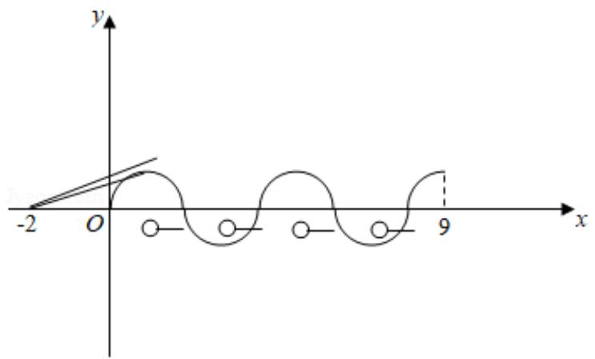

text_image

y
-2 O 9 x

由图可知，函数 $f(x)$ 与 $g(x) = -\frac{1}{2} (1 < x \leqslant 2, 3 < x \leqslant 4, 5 < x \leqslant 6, 7 < x \leqslant 8)$ 仅有 2 个实数根；
要使关于 x 的方程 $f(x)=g(x)$ 有 8 个不同的实数根，

则 $f(x) = \sqrt{1 - (x - 1)^2}$ ， $x \in (0, 2]$ 与 $g(x) = k(x + 2)$ ， $x \in (0, 1]$ 的图象有 2 个不同交点，

由(1,0)到直线 $kx - y + 2k = 0$ 的距离为1，得 $\frac{|3k|}{\sqrt{k^2 + 1}} = 1$ ，解得 $k = \frac{\sqrt{2}}{4} (k > 0)$ ，

∵两点 $(-2,0)$ ， $(1,1)$ 连线的斜率 $k=\frac{1}{3}$ ，

$$
\therefore \frac {1}{3} \leqslant k <   \frac {\sqrt {2}}{4}.
$$

即 k 的取值范围为 $\left[\frac{1}{3}, \frac{\sqrt{2}}{4}\right)$ .

故答案为： $\left[\frac{1}{3},\frac{\sqrt{2}}{4}\right)$ .

【点评】本题考查函数零点的判定，考查分段函数的应用，体现了数形结合的解题思想方法，是中档题.

41.【分析】①由题意可得顾客一次购买的总金额，减去x，可得所求值；

②在促销活动中，设订单总金额为 $m$ 元，可得 $(m - x) \times 80\% \geqslant m \times 70\%$ ，解不等式，结合恒成立思想，可得 $x$ 的最大值.

【解答】解：①当 x=10 时，顾客一次购买草莓和西瓜各 1 盒，可得 $60+80=140$ （元），

即有顾客需要支付140-10=130（元）；

②在促销活动中，设订单总金额为m元，

可得 $(m - x)\times 80\% \geqslant m\times 70\%$

即有 $x \leqslant \frac{m}{8}$ 恒成立，

若 m<120，可得到支付款为80%m；

当 $m \geqslant 120$

可得 $x \leqslant \frac{120}{8} = 15$ ，

则 x 的最大值为 15 元.

故答案为：130，15

【点评】本题考查不等式在实际问题的应用，考查化简运算能力，属于中档题.

42.【分析】奇函数的定义结合对数的运算可得结果

【解答】解：∵ $f(x)$ 是奇函数，∴ $f(-\ln2) = -8$ ，

又∵当x<0时， $f(x)=-e^{ax}$ ，

$$
\therefore f (- l n 2) = - e ^ {- a l n 2} = - 8,
$$

$$
\therefore - a \ln 2 = \ln 8, \quad \therefore a = - 3.
$$

故答案为：-3

【点评】本题主要考查函数奇偶性的应用，对数的运算性质，属于基础题.

43.【分析】根据条件（1）可知 $x_{0}=0$ 或 1，进而结合条件（2）可得 a 的范围

【解答】解：根据条件（1）可得 $f(0)=0$ 或 $f(1)=1$ ，

又因为关于 x 的方程 $f(x)=a$ 无实数解，所以 $a\neq0$ 或 1，

故 $a \in (-\infty, 0) \cup (0, 1) \cup (1, +\infty)$ ,

故答案为： $(-∞, 0)∪(0, 1)∪(1, +∞)$ .

【点评】本题考查函数零点与方程根的关系，属于基础题.

44.【分析】由已知求解 x，然后把 x 与 y 互换即可求得原函数的反函数.

【解答】解：由 $y = f(x) = x^{3}$ ，得 $x = \sqrt[3]{y}$ ，

把 x 与 y 互换，可得 $f(x)=x^{3}$ 的反函数为 $f^{-1}(x)=\sqrt[3]{x}$ .

故答案为： $\sqrt[3]{x}$ .

【点评】本题考查函数的反函数的求法，注意反函数的定义域是原函数的值域，是基础题.

45.【分析】因为 $y = f^{-1}(x) - a$ 与 $y = f(x + a)$ 互为反函数若 $y = f^{-1}(x) - a$ 与 $y = f(x + a)$ 有实数根 $\Rightarrow y=f(x+a)$ 与 y=x 有交点 $\Rightarrow$ 方程 $\sqrt{x+a-1}=x$ ，有根．进而得出答案.

【解答】解：因为 $y = f^{-1}(x) - a$ 与 $y = f(x + a)$ 互为反函数，

若 $y=f^{-1}(x)-a$ 与 $y=f(x+a)$ 有实数根，

则 $y = f(x + a)$ 与 y = x 有交点，

所以 $\sqrt{x + a - 1} = x$

即 $a = x^{2} - x + 1 = (x - \frac{1}{2})^{2} + \frac{3}{4} \geqslant \frac{3}{4}$ ,

故答案为： $\left[\frac{3}{4},+\infty\right)$ .

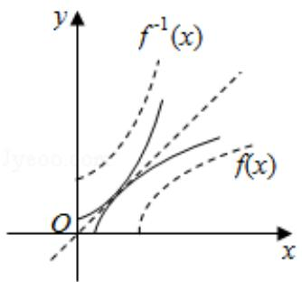

text_image

y
f⁻¹(x)
f(x)
O
x

【点评】本题主要考查函数的性质，函数与方程的关系，属于中档题.

46.【分析】利用二元一次方程组的解的行列式表示进行分析即可得到答案.

【解答】解：对于方程组 $\left\{ \begin{array}{l}a_{1}x + b_{1}y = c_{1}\\ a_{2}x + b_{2}y = c_{2} \end{array} \right.$ ，有 $D = \left| \begin{array}{ll}a_1 & b_1\\ a_2 & b_2 \end{array} \right|, D_x = \left| \begin{array}{ll}c_1 & b_1\\ c_2 & b_2 \end{array} \right|, D_y = \left| \begin{array}{ll}a_1 & c_1\\ a_2 & c_2 \end{array} \right|$

根据题意，方程组 $\left\{\begin{aligned}a_{1}x+b_{1}y=c_{1}\\ a_{2}x+b_{2}y=c_{2}\end{aligned}\right.$ 无解，

所以 D=0 ，即 $D=\begin{vmatrix}a_{1}&b_{1}\\a_{2}&b_{2}\end{vmatrix}=0$

故答案为：0.

【点评】本题考查的是二元一次方程组的解行列式表示法，这种方法可以使得方程组的解与对应系数之间的关系表示的更为清晰，解题的关键是熟练掌握二元一次方程组的解行列式表示法中对应的公式.

47.【分析】利用反函数的定义，得到 $f(x)=1$ ，求解 x 的值即可.

【解答】解：因为 $f(x)=\frac{3}{x}+2$ ，

令 $f(x) = 1$ ，即 $\frac{3}{x} +2 = 1$ ，解得 $x = -3$

故 $f^{-1}(1)=-3$ .

故答案为：-3.

【点评】本题考查了反函数定义的理解和应用，解题的关键是掌握原函数的定义域即为反函数的值域，考查了运算能力，属于基础题.

48.【分析】直接利用反函数的定义求出函数的关系式，进一步求出函数的值.

【解答】解：函数 $f(x)=x^{3}$ 的反函数为 $f^{-1}(x)$ ,

整理得 $f^{-1}(x)=\sqrt[3]{x}$ ;

所以 $f^{-1}(27)=3$ .

故答案为：3.

【点评】本题考查的知识要点：反函数的定义和性质，主要考查学生的运算能力和数学思维能力，属于基础题.

49.【分析】设 $g(x)=x^{2}-ax+3a-5$ ， $h(x)=|x|-2$ ，分析可知函数 $g(x)$ 至少有一个零点，可得出 $\triangle\geqslant0$ ，求出 a 的取值范围，然后对实数 a 的取值范围进行分类讨论，根据题意可得出关于实数 a 的不等式，综合可求得实数 a 的取值范围.

【解答】解：设 $g(x)=x^{2}-ax+3a-5$ ， $h(x)=|x|-2$ ，由 $|x|-2=0$ 可得 $x=\pm2$ 。

要使得函数 $f(x)$ 至少有3个零点，则函数 $g(x)$ 至少有一个零点，

则 $\triangle = a^2 - 4(3a - 5) \geqslant 0$

解得 $a \leqslant 2$ 或 $a \geqslant 10$ .

①当 a=2 时， $g(x)=x^{2}-2x+1$ ，作出函数 $g(x)$ 、 $h(x)$ 的图象如图所示：

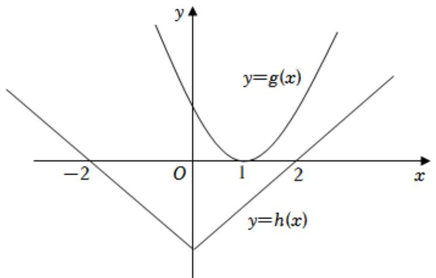

text_image

y
y=g(x)
-2 O 1 2 x
y=h(x)

此时函数 $f(x)$ 只有两个零点，不满足题意；

②当 a<2 时，设函数 $g(x)$ 的两个零点分别为 $x_{1}$ 、 $x_{2}(x_{1}<x_{2})$ ，

要使得函数 $f(x)$ 至少有3个零点，则 $x_{2} \leqslant -2$

所以， $\left\{\begin{aligned}\frac{a}{2}&<-2\\ g(-2)&=5a-1\geq0\end{aligned}\right.$ ，解得 $a\in\varnothing$ ；

③当 a=10 时， $g(x)=x^{2}-10x+25$ ，作出函数 $g(x)$ 、 $h(x)$ 的图象如图所示：

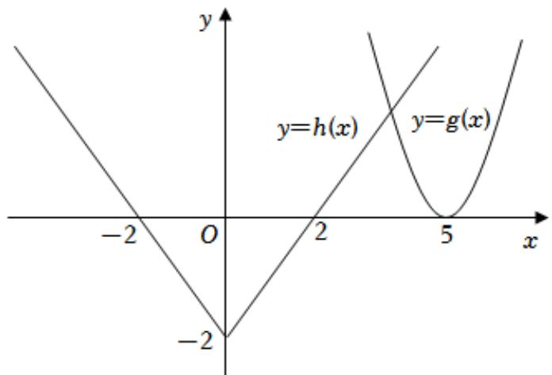

text_image

y
y=h(x)
y=g(x)
-2
O
2
5
x
-2

由图可知，函数 $f(x)$ 的零点个数为 3，满足题意；

④当a>10时，设函数 $g(x)$ 的两个零点分别为 $x_{3}$ 、 $x_{4}(x_{3}<x_{4})$ ，

要使得函数 $f(x)$ 至少有 3 个零点，则 $x_{3} \geqslant 2$ ，可得 $\left\{\begin{aligned}\frac{a}{2}>2\\ g(2)=a-1\geq0\end{aligned}\right.$ ，解得a>4，此时a>10。

综上所述，实数 a 的取值范围是 $[10, +\infty)$ .

故答案为： $[10, +\infty)$

【点评】本题考查了函数的零点、转化思想、分类讨论思想及数形结合思想，属于中难题.

50.【分析】分 $x \geqslant 0$ 和 x < 0 分别求解即可.

【解答】解：当 $x \geqslant 0$ 时， $g(x) = 2 \Leftrightarrow \log_2(x + 1) = 2$ ，解得 $x = 3$ ；

当 x<0 时， $g(x)=f(-x)=2^{x}+1=2$ ，解得 x=0 （舍）；

所以 $g(x)=2$ 的解为：x=3。

故答案为：x=3。

【点评】本题考查了分段函数的性质、对数的基本运算、指数的基本运算，属于基础题.

51.【分析】首先要分情况去绝对值，化简函数，再根据对应方程根的情况判定零点个数是否满足题意.

【解答】解：①当 a=0 时， $f(x)=-2x-|x^{2}+1|=-2x-x^{2}-1$ ，不满足题意；

②当方程 $x^{2}-ax+1=0$ 满足 $a\neq0$ 且 $\triangle\leqslant0$ 时，

有 $a^2 - 4 \leqslant 0$ 即 $a \in [-2, 0) \cup (0, 2]$ ,

此时， $f(x)=(a-1)x^{2}+(a-2)x-1$

，当 $a = 1$ 时，不满足，

当 $a \neq 1$ 时， $\triangle = (a - 2)^2 + 4(a - 1) = a^2 > 0$ ，满足；

③ $\triangle>0$ 时， $a\in(-\infty,-2)\cup(2,+\infty)$ ，

记 $x^{2}-ax+1$ 的两根为 m，n，不妨设 m<n，

则 $f(x)=\left\{\begin{aligned}&[(a-1)x-1](x+1),&x\in(-\infty,m]\bigcup[n,+\infty)\\&[(a+1)x-1](x-1),&x\in(m,n)\end{aligned}\right.$

当 a > 2 时， $x_{1} = \frac{1}{a - 1}$ ， $x_{2} = -1$ 且 $x \in (-\infty, m] \cup [n, +\infty)$ ，

但此时 $x_{1}^{2} - ax_{1} + 1 = \frac{-a + 2}{(a - 1)^{2}} < 0$ ，舍去 $x_{1}$

$x_{3}=\frac{1}{a+1}$ ， $x_{4}=1$ ，且 $x\in(m,n)$ ，

但此时 $x_{3}^{2} - ax_{3} + 1 = \frac{a + 2}{(a - 1)^{2}} >0$ ，舍去 $x_{3}$ 故仅有 1 与 -1 两个解，即 $f(x)$ 有且仅有两个零点，

当 a<-2 时，有 $x_{2}^{2}-ax_{2}+1=a+2<0$ ，舍去 $x_{2}$ ， $x_{4}^{2}-ax_{4}+1=2-a>0$ ，舍去 $x_{4}$ ，

故仅有 $\frac{1}{a - 1}$ 和 $\frac{1}{a + 1}$ 两个解，即 $f(x)$ 有且仅有两个零点，

综上， $a\in (-\infty ,0)\cup (0,1)\cup (1, + \infty) .$

故答案为： $(-∞, 0)∪(0, 1)∪(1, +∞)$ .

【点评】本题是含参数的函数零点问题，主要是分类讨论思想的考查，属偏难题.

52.【分析】结合对数函数真数的性质，即可求解.

【解答】解： $\log_{2}x$ 的定义域为 $(0,+\infty)$ .

故答案为： $(0,+\infty)$ .

【点评】本题主要考查对数函数定义域的求解，属于基础题.

# 四、解答题

53.【分析】（1）根据表格数据得出结论；

（2）根据函数性质得出单调性，解不等式求出 t 的范围，从而得出答案.

【解答】解：（1）由表格数据可知个人现金支出占比逐渐减少，社会支出占比逐渐增多.

(2) $\because y = e^{6.4420 - 0.1136t}$ 是减函数，且 $y = e^{6.4420 - 0.1136t} > 0$

$\therefore f(t)=\frac{357876.6053}{1+e^{6.4420-0.1136t}}$ 在 N 上单调递增，

令 $\frac{357876.6053}{1 + e^{6.4420 - 0.1136t}} >120000$ ，解得 $t > 50.68$

∴当 $t\geqslant51$ 时，我国卫生总费用超过12万亿，

∴预测我国到2028年我国卫生总费用首次超过12万亿.

【点评】本题考查了函数单调性判断与应用，计算较复杂.

54.【分析】（1）利用题目所给定义表示出 $f_{60}(x) = \{|60 - x|, |120 - x|\}_{min}$ ，分类讨论可得 $f_{60}(x)$ ；

（2）利用题意可得 $f_{t}(x)=\left\{\begin{aligned}&|t-x|,&x\leqslant0.5(120+t)\\&|120-x|,&x>0.5(120+t)\end{aligned}\right.$ ，表示出 $f_{t}(x)$ 与坐标轴围成的面积，进而表示出面积不等式，解出不等式即可

【解答】解：（1）投放点 $\omega_{1}(120,0)$ ， $\omega_{2}(60,0)$ ， $f_{60}(10)$ 表示与 $B(10,0)$ 距离最近的投放点（即 $\omega_{2}$ ）的距离，所以 $f_{60}(10)=|60-10|=50$ ，同理分析， $f_{60}(80)=|60-80|=20$ ， $f_{60}(95)=|120-95|=25$ ，

由题意得， $f_{60}(x) = \{|60 - x|, |120 - x|\}_{min}$ ，

则当 $|60-x|\leqslant|120-x|$ ，即 $x\leqslant90$ 时， $f_{60}(x)=|60-x|$ ;

当 $|60-x|>|120-x|$ ，即x>90时， $f_{60}(x)=|120-x|$ ;

综上 $f_{60}(x)=\left\{\begin{aligned}|60-x|,&x\leqslant90\\ |120-x|,&x>90\end{aligned}\right.$ ;

（2）由题意得 $f_{t}(x) = \{|t - x|, |120 - x|\}_{min}$ ，

所以 $f_{t}(x) = \left\{ \begin{array}{ll} |t - x|, & x \leqslant 0.5(120 + t) \\ |120 - x|, & x > 0.5(120 + t) \end{array} \right.$ ，则 $f_{t}(x)$ 与坐标轴围成的面积如阴影部分所示，

所以 $S=\frac{1}{2}t^{2}+\frac{1}{4}(120-t)^{2}=\frac{3}{4}t^{2}-60t+3600$

由题意， $S < S(60)$ ，即 $\frac{3}{4}t^{2} - 60t + 3600 < 2700$ ，

解得 $20 < t < 60$ ，即垃圾投放点 $\omega_{2}$ 建在(20,0)与(60,0)之间时，比建在中点时更加便利.

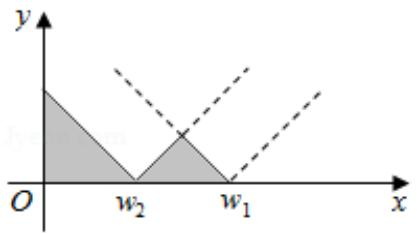

text_image

y
O
w₂
w₁
x

【点评】本题是新定义问题，考查对题目意思的理解，分类讨论是关键，属于中档题.

55.【分析】（1）由交通流量 v 随着道路密度 x 的增大而减小，知 $v = f(x)$ 是单调递减函数，进而知 k > 0，于是只需 $100 - 135 \cdot \left( \frac{1}{3} \right)^{\frac{80}{x}} > 95$ ，解不等式即可；

（2）把 $x = 80$ ， $v = 50$ 代入 $v = f(x)$ 的解析式中，求出 $k$ 的值，利用 $q = vx$ 可得到 $q$ 关于 $x$ 的函数关系式，分段判断函数的单调性，并求出各自区间上 $q$ 的最大值，取较大者即可.

【解答】解：（1）按实际情况而言，交通流量 v 随着道路密度 x 的增大而减小，

故 $v=f(x)$ 是单调递减函数，

所以 k > 0，

当 $40 \leqslant x \leqslant 80$ 时，v最大为85，

于是只需令 $100-135\cdot(\frac{1}{3})^{\frac{80}{x}}>95$ ，解得 $x<\frac{80}{3}$ ，

故道路密度 x 的取值范围为 $(0, \frac{80}{3})$ .

（2）把 $x = 80$ ， $\nu = 50$ 代入 $v = f(x) = -k(x - 40) + 85$ 中，

得 $50 = -k \cdot 40 + 85$ ，解得 $k = \frac{7}{8}$ .

$$
\therefore q = v x = \left\{ \begin{array}{l} 1 0 0 x - 1 3 5 \cdot \left(\frac {1}{3}\right) ^ {\frac {8 0}{x}} \cdot x, 0 <   x <   4 0 \\ - \frac {7}{8} (x - 4 0) x + 8 5 x, 4 0 \leqslant x \leqslant 8 0 \end{array} , \right.
$$

①当0<x<40时， $v=100-135\cdot(\frac{1}{3})^{\frac{80}{x}}<100$ ，

$$
q = v x <   1 0 0 \times 4 0 = 4 0 0 0.
$$

②当 $40 \leqslant x \leqslant 80$ 时， $q$ 是关于 $x$ 的二次函数， $q = -\frac{7}{8} x^2 + 120x$ ，

对称轴为 $x = \frac{480}{7}$ ，此时 $q$ 有最大值，为 $-\frac{7}{8} \times (\frac{480}{7})^2 + 120 \times \frac{480}{7} = \frac{28800}{7} > 4000$ 。

综上所述，车辆密度 $q$ 的最大值为 $\frac{28800}{7}$ 。

【点评】本题考查分段函数的实际应用，考查学生分析问题和解决问题的能力，以及运算能力，属于中档题.

56.【分析】（1）由题意可知，可将每个季度的营业额看作等差数列，则首项 $a_1 = 1.1$ ，公差 $d = 0.05$ ，再利用等差数列的前 $n$ 项和公式求解即可.

（2）解法一：假设今年第一季度往后的第 $n(n \in N^{*})$ 季度的利润首次超过该季度营业额的 $18\%$ ，则 $0.16 \times (1 + 4\%)^{n} > (1.1 + 0.05n) \cdot 18\%$ ，令 $f(n) = 0.16 \times (1 + 4\%)^{n} - (1.1 + 0.05n) \cdot 18\%$ ， $(n \in N^{*})$ ，递推作差可得当 $1 \leqslant n \leqslant 9$ 时， $f(n)$ 递减；当 $n \geqslant 10$ 时， $f(n)$ 递增，注意到 $f(1) < 0$ ，所以若 $f(n) > 0$ ，则只需考虑 $n \geqslant 10$ 的情况即可，再验证出 $f(24) < 0$ ， $f(25) > 0$ ，即可得到利润首次超过该季度营业额的 $18\%$ 的时间。

解法二：设今年第一季度往后的第 $n(n \in N^{*})$ 季度的利润与该季度营业额的比为 $a_{n}$ ，则 $\frac{a_{n+1}}{a_{n}} = \frac{1.04(1.05 + 0.05n)}{1.1 + 0.05n} = 1 + 0.04(1 - \frac{26}{22 + n})$ ，所以数列 $\{a_{n}\}$ 满足 $a_{1} > a_{2} > a_{3} > a_{4} = a_{5} < a_{6} < a_{7} < \ldots\ldots$ ，再由 $a_{25}$ ， $a_{26}$ 的值即可判断出结果。

【解答】解：（1）由题意可知，可将每个季度的营业额看作等差数列，

则首项 $a_1 = 1.1$ ，公差 $d = 0.05$

$$
\therefore S _ {2 0} = 2 0 a _ {1} + \frac {2 0 (2 0 - 1)}{2} d = 2 0 \times 1. 1 + 1 0 \times 1 9 \times 0. 0 5 = 3 1. 5,
$$

即营业额前 20 季度的和为 31.5 亿元.

（2）解法一：假设今年第一季度往后的第 $n(n \in N^{*})$ 季度的利润首次超过该季度营业额的 $18\%$ ，

则 $0.16 \times (1 + 4\%)^n > (1.1 + 0.05n) \cdot 18\%$

令 $f(n) = 0.16 \times (1 + 4\%)^n - (1.1 + 0.05n) \cdot 18\%$ ， $(n \in N^*)$ ，

即要解 $f(n)>0$ ，

则当 $n \geqslant 2$ 时， $f(n) - f(n - 1) = 0.0064 \cdot (1 + 4\%)^{n - 1} - 0.009$

令 $f(n)-f(n-1)>0$ ，解得： $n\geqslant10$

即当 $1 \leqslant n \leqslant 9$ 时， $f(n)$ 递减；当 $n \geqslant 10$ 时， $f(n)$ 递增，

由于 f （1）<0，因此 $f(n)>0$ 的解只能在 $n\geqslant10$ 时取得，

经检验， $f(24)<0$ ， $f(25)>0$ ，

所以今年第一季度往后的第 25 个季度的利润首次超过该季度营业额的 18% .

解法二：设今年第一季度往后的第 $n(n \in N^{*})$ 季度的利润与该季度营业额的比为 $a_{n}$ ，

则 $\frac{a_{n + 1}}{a_n} = \frac{1.04(1.05 + 0.05n)}{1.1 + 0.05n} = 1.04 - \frac{1.04}{22 + n} = 1 + 0.04(1 - \frac{26}{22 + n})$

∴ 数列 $\{a_{n}\}$ 满足 $a_{1}>a_{2}>a_{3}>a_{4}=a_{5}<a_{6}<a_{7}<\ldots\ldots$

注意到， $a_{25}=0.178\ldots,\quad a_{26}=0.181\ldots,$

∴今年第一季度往后的第25个季度利润首次超过该季度营业额的18%。

【点评】本题主要考查了函数的实际应用，考查了等差数列的实际应用，同时考查了学生的计算能力，是中档题.

57.【分析】（1）将 a=1 代入，对函数 $f(x)$ 求导，求出 $f'(0)$ 及 $f(0)$ ，由点斜式得答案；

（2）对函数 $f(x)$ 求导，分 $a \geqslant 0$ 及 a < 0 讨论，当 $a \geqslant 0$ 时容易判断不合题意，当 a < 0 时，设 $g(x) = e^{x} + a(1 - x^{2})$ ，利用导数判断 $g(x)$ 的性质，进而判断得到函数 $f(x)$ 的单调性并结合零点存在性定理即可得解.

【解答】解：（1）当 a=1 时， $f(x)=\ln(1+x)+xe^{-x}$ ，则 $f'(x)=\frac{1}{1+x}+e^{-x}-xe^{-x}$ ，

$$
\therefore f ^ {\prime} (0) = 1 + 1 = 2,
$$

又 $f(0)=0$ ,

∴所求切线方程为 y=2x；

(2) $f'(x) = \frac{1}{1 + x} + \frac{a(1 - x)}{e^x} = \frac{e^x + a(1 - x^2)}{e^x(1 + x)}$ ,

若 $a \geqslant 0$ ，当 -1 < x < 0 时， $f'(x) > 0$ ， $f(x)$ 单调递增，则 $f(x) < f(0) = 0$ ，不合题意；

设 $g(x)=e^{x}+a(1-x^{2})$ ， $g'(x)=e^{x}-2ax$ ，

当 $-1 \leqslant a < 0$ 时，在 $(0, +\infty)$ 上， $g(x) > e^0 + a \geqslant 0$ ， $f'(x) > 0$ ， $f(x)$ 单调递增，无零点，不合题意；

当 $a < -1$ 时，当 $x > 0$ 时， $g'(x) > 0$ ，则 $g(x)$ 在 $(0, +\infty)$ 上单调递增， $g(0) = 1 + a < 0$ ， $g(1) = e > 0$

所以存在唯一的 $x_{0} \in (0,1)$ ，使得 $g(x_{0}) = 0$ ，且 $f(x)$ 在 $(0, x_{0})$ 上单调递减，在 $(x_{0}, +\infty)$ 上单调递增，

$$
f (x _ {0}) <   f (0) = 0,
$$

先证当 $x > 0$ 时， $\frac{x}{2} >\ln x$

设 $h(x)=\frac{x}{2}-lnx$ ，则 $h'(x)=\frac{1}{2}-\frac{1}{x}=\frac{x-2}{2x}$ ，

易知当0<x<2时， $h'(x)<0$ ， $h(x)$ 单减，当x>2时， $h'(x)>0$ ， $h(x)$ 单增，

所以 $h(x) \geqslant h(2) = \frac{2}{2} - \ln 2 = 1 - \ln 2 > 0$ ，则当 x > 0 时， $\frac{x}{2} > \ln x$ ，

所以 $x > 2\ln x, e^{x} > x^{2}, \frac{x}{e^{x}} < \frac{1}{x}$ ,

再证 $lnx \geqslant 1 - \frac{1}{x}$ ,

设 $m(x)=\ln x-1+\frac{1}{x}$ ，则 $m'(x)=\frac{1}{x}-\frac{1}{x^{2}}=\frac{x-1}{x^{2}}$

易知当0<x<1时， $m'(x)<0$ ， $m(x)$ 单减，当x>1时， $m'(x)>0$ ， $m(x)$ 单增，

所以 $m(x) \geqslant m$ （1）=0，即 $\ln x \geqslant 1 - \frac{1}{x}$ ，

则由 $a < -1$ ，可得 $axe^{-x} > \frac{a}{x}$

则当 $x > 1 + a^2$ 时， $f(x) = \ln (1 + x) + axe^{-x} > \ln (1 + x) + \frac{a}{x} > 0$

此时 $f(x)$ 在 $(0,+\infty)$ 上恰有一个零点，

当 $-1 < x < 0$ 时， $g'(x)$ 在 $(-1,0)$ 上单调递增， $g'(-1) = \frac{1}{e} + 2a < 0, g'(0) = 1 > 0$

故存在唯一的 $x_{1} \in (-1,0)$ ，使得 $g'(x_1) = 0$ ，且 $g(x)$ 在 $(-1,x_1)$ 上单调递减，在 $(x_1,0)$ 上单调递增，

$$
g \left(x _ {1}\right) <   g (0) = 1 + a <   0, g (- 1) = \frac {1}{e} > 0,
$$

故存在唯一的 $x_{2} \in (-1, x_{1})$ ，使得 $g(x_{2}) = 0$ ，

所以 $f(x)$ 在 $(-1, x_{2})$ 上单调递增，在 $(x_{2}, 0)$ 上单调递减，

$x\to -1$ 时， $f(x)\rightarrow -\infty$ ， $f(0) = 0$ ，此时 $f(x)$ 在 $(-1,0)$ 上恰有一个零点，

综上，实数 a 的取值范围为 $(-∞,-1)$ .

【点评】本题考查导数的几何意义，考查利用导数研究函数的单调性，零点问题，考查分类讨论思想及运算求解能力，属于难题.

58.【分析】（1）利用圆柱体的表面积和体积公式，结合题目中 S 的定义求解即可；

（2）利用导函数求 S 的单调性，即可求出 S 最小时 n 的值.

【解答】解：（1）由圆柱体的表面积和体积公式可得：

$$
F _ {0} = 2 \pi R H + \pi R ^ {2} \cdot V _ {0} = \pi R ^ {2} H,
$$

所以 $S=\frac{F_{0}}{V_{0}}=\frac{\pi R(2H+R)}{\pi R^{2}H}=\frac{2H+R}{HR}$ .

（2）由题意可得 $S=\sqrt{\frac{18n}{10000}}+\frac{1}{3n}=\frac{3\sqrt{2n}}{100}+\frac{1}{3n}$ ， $n\in N^{*}$

所以 $S'=\frac{3\sqrt{2}}{200\sqrt{n}}-\frac{1}{3n^{2}}=\frac{9\sqrt{2}n^{\frac{3}{2}}-200}{600n^{2}}$

令 $S' = 0$ ，解得 $n = \sqrt[3]{\frac{20000}{81}} \approx 6.27$ ，

所以 s 在 $[1, 6.27]$ 单调递减，在 $[6.27, +\infty)$ 单调递增，

所以 S 的最小值在 n=6 或 7 取得，

当 n=6 时， $S=\frac{3\sqrt{2\times6}}{100}+\frac{1}{3\times6}\approx0.1595$ ，

当 n=7 时， $S=\frac{3\sqrt{2\times7}}{100}+\frac{1}{3\times7}\approx0.16$ ，

所以在 n=6 时，该建筑体 S 最小.

【点评】本题主要考查根据实际问题选择合适的函数模型，属于中档题.

# 第五章：三角函数

# 一、选择题

1.【分析】利用二倍角公式以及同角三角函数基本关系式化简所求表达式为正切函数的形式，代入求解即可.

【解答】解： $\tan A = 2$ ，

则 $\frac{\sin 2A + cos^2 A}{1 + \cos 2A} = \frac{2\sin A\cos A + cos^2 A}{2cos^2 A} = \frac{2\tan A + 1}{2} = \frac{5}{2}.$

故选：B.

【点评】本题考查三角函数化简求值，同角三角函数基本关系式以及二倍角公式的应用.

2.【分析】根据绝对值的应用，结合三角函数的图象和性质分别进行判断即可.

【解答】解： $f(-x)=\sin|-x|+|\sin(-x)|=\sin|x|+|\sin x|=f(x)$ 则函数 $f(x)$ 是偶函数，故①正确，
当 $x \in (\frac{\pi}{2}, \pi)$ 时， $\sin |x| = \sin x, |\sin x| = \sin x$

则 $f(x)=\sin x+\sin x=2\sin x$ 为减函数，故②错误，

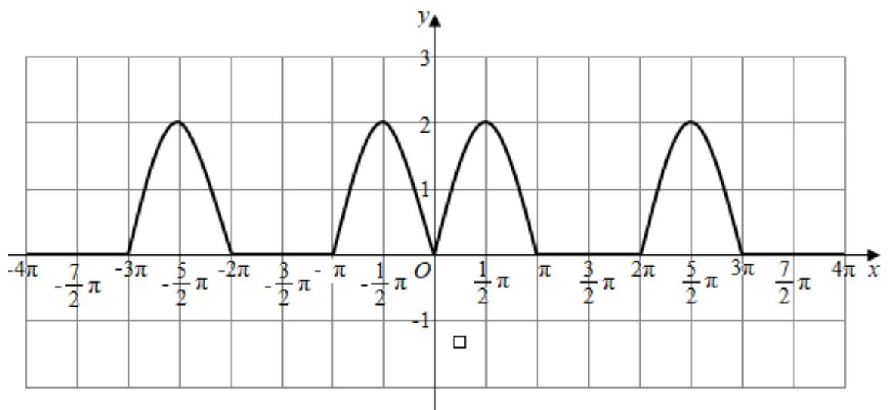

当 $0 \leqslant x \leqslant \pi$ 时， $f(x) = \sin |x| + |\sin x| = \sin x + \sin x = 2\sin x$

由 $f(x)=0$ 得 $2\sin x=0$ 得 x=0 或 $x=\pi$ ，

由 $f(x)$ 是偶函数，得在 $[- \pi, 0)$ 上还有一个零点 $x = -\pi$ ，即函数 $f(x)$ 在 $[- \pi, \pi]$ 有3个零点，故③错误，

当 $\sin|x|=1,\quad|\sin x|=1$ 时， $f(x)$ 取得最大值 2，故④正确，

故正确的是①④，

故选：C.

【点评】本题主要考查与三角函数有关的命题的真假判断，结合绝对值的应用以及利用三角函数的性质是解决本题的关键.

3.【分析】根据条件求出 $\varphi$ 和 $\omega$ 的值，结合函数变换关系求出 $g(x)$ 的解析式，结合条件求出 $A$ 的值，利用代入法进行求解即可.

【解答】解：∵ $f(x)$ 是奇函数，∴ $\varphi = 0$ ，

$\because f(x)$ 的最小正周期为 $\pi$ ，

$\therefore \frac{2\pi}{\omega}=\pi$ ，得 $\omega=2$ ，

则 $f(x)=A\sin2x$ ，将 $y=f(x)$ 的图象上所有点的横坐标伸长到原来的 2 倍（纵坐标不变），所得图象对应的函数为 $g(x)$ .

则 $g(x)=A\sin x$ ,

若 $g(\frac{\pi}{4}) = \sqrt{2}$ ，则 $g(\frac{\pi}{4}) = A\sin \frac{\pi}{4} = \frac{\sqrt{2}}{2} A = \sqrt{2}$ ，即 $A = 2$

则 $f(x)=2\sin2x$ ，则 $f(\frac{3\pi}{8})=2\sin(2\times\frac{3\pi}{8})=2\sin\frac{3\pi}{4}=2\times\frac{\sqrt{2}}{2}=\sqrt{2}$ ，

故选：C.

【点评】本题主要考查三角函数的解析式的求解，结合条件求出 A， $\omega$ 和 $\varphi$ 的值是解决本题的关键.

4.【分析】依题意作出 $f(x)=\sin(\omega x+\frac{\pi}{5})$ 的图象，可判断①和②，根据 $f(x)$ 在 $[0,2\pi]$ 有且仅有 5 个零点，可得 $5\pi\leqslant2\pi\omega+\frac{\pi}{5}<6\pi$ ，解出 $\omega$ ，然后判断③是否正确即可得到答案.

【解答】解：依题意作出 $f(x)=\sin(\omega x+\frac{\pi}{5})$ 的图象如图，其中 $m\leqslant2\pi<n$

显然①正确，②错误；

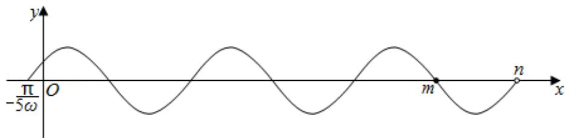

text_image

y
-π/5ω O m n x

当 $x \in [0, 2\pi]$ 时， $\omega x + \frac{\pi}{5} \in (\frac{\pi}{5}, 2\pi \omega + \frac{\pi}{5})$

∵ $f(x)$ 在 $[0, 2\pi]$ 有且仅有 5 个零点，

$$
\therefore 5 \pi \leqslant 2 \pi \omega + \frac {\pi}{5} <   6 \pi ,
$$

$\therefore \frac{12}{5} \leqslant \omega < \frac{29}{10}$ ，故④正确，

因此由选项可知只需判断③是否正确即可得到答案，

下面判断③是否正确，

当 $x \in (0, \frac{\pi}{10})$ 时， $\omega x + \frac{\pi}{5} \in (\frac{\pi}{5}, \frac{(\omega + 2)\pi}{10})$

若 $f(x)$ 在 $(0, \frac{\pi}{10})$ 单调递增，

则 $\frac{(\omega + 2)\pi}{10} < \frac{\pi}{2}$ ，即 $\omega < 3$ ，

$\because \frac{12}{5} \leqslant \omega < \frac{29}{10}$ ，故③正确.

故选：D.

【点评】本题考查了三角函数的图象与性质，关键是数形结合的应用，属中档题.

5.【分析】根据条件求出 $\varphi$ 和 $\omega$ 的值，结合函数变换关系求出 $g(x)$ 的解析式，结合条件求出 $A$ 的值，利用代入法进行求解即可.

【解答】解：∵ $f(x)$ 是奇函数，∴ $\varphi = 0$ ，

则 $f(x)=A\sin(\omega x)$

将 $y = f(x)$ 的图象上所有点的横坐标伸长到原来的2倍（纵坐标不变），所得图象对应的函数为 $g(x)$ .

即 $g(x)=A\sin(\frac{1}{2}\omega x)$

∵ $g(x)$ 的最小正周期为 $2\pi$ ，

$\therefore \frac{2\pi}{\frac{1}{2}\omega}=2\pi$ ，得 $\omega=2$ ，

则 $g(x)=A\sin x$ ， $f(x)=A\sin 2x$ ，

若 $g(\frac{\pi}{4}) = \sqrt{2}$ ，则 $g(\frac{\pi}{4}) = A\sin \frac{\pi}{4} = \frac{\sqrt{2}}{2} A = \sqrt{2}$ ，即 $A = 2$

则 $f(x) = 2\sin 2x$ ，则 $f(\frac{3\pi}{8}) = 2\sin (2\times \frac{3\pi}{8} = 2\sin \frac{3\pi}{4} = 2\times \frac{\sqrt{2}}{2} = \sqrt{2}$

故选：C.

【点评】本题主要考查三角函数的解析式的求解，结合条件求出 A， $\omega$ 和 $\varphi$ 的值是解决本题的关键.

6.【分析】 $x_{1}=\frac{\pi}{4}$ ， $x_{2}=\frac{3\pi}{4}$ 是 $f(x)$ 两个相邻的极值点，则周期 $T=2(\frac{3\pi}{4}-\frac{\pi}{4})=\pi$ ，然后根据周期公式即可求出 $\omega$ .

【解答】解： $\because x_{1}=\frac{\pi}{4}, x_{2}=\frac{3\pi}{4}$ 是函数 $f(x)=\sin \omega x (\omega>0)$ 两个相邻的极值点，

$$
\therefore T = 2 \left(\frac {3 \pi}{4} - \frac {\pi}{4}\right) = \pi = \frac {2 \pi}{\omega}
$$

$$
\therefore \omega = 2,
$$

故选：A.

【点评】本题考查了三角函数的图象与性质，关键是根据条件得出周期，属基础题.

7.【分析】考虑运用二次方程的实根的分布, 结合导数判断单调性可判断①; 运用特殊值法, 令 $\tan \alpha = -\frac{1}{3}$ , 结合两角和的正切公式, 计算可得所求结论, 可判断②.

【解答】解：由 $\tan\alpha\cdot\tan\beta=\tan(\alpha+\beta)$ ,

即为 $\tan \alpha \cdot \tan \beta = \frac{\tan \alpha + \tan \beta}{1 - \tan \alpha \tan \beta}$

设 $m = \tan \alpha$ ， $n = \tan \beta$ ，可得 $n^2 m^2 + n(1 - m) + m = 0$

若 m > 0，由韦达定理可得 $x_{1}x_{2} = \frac{m}{m^{2}} = \frac{1}{m} > 0$ ，

可得上式关于 n 的方程有两个同号的根，若为两个正根，可得 n > 0，

即有 m > 1，考虑 $\triangle = f(m) = (1 - m)^{2} - 4m^{3}$ ， $f'(m) = 2m - 2 - 12m^{2} = -12(m - \frac{1}{12})^{2} - \frac{23}{12}$ ，

当 m>1 时， $f(m)$ 递减，可得 $f(m)<f$ （1）=-4<0，则方程无解，

$\beta$ 在第三象限不可能，故①错；

可令 $\tan\alpha=-\frac{1}{3}$ ,

由 $\tan \alpha \cdot \tan \beta = \tan (\alpha +\beta)$

即为 $\tan \alpha \cdot \tan \beta = \frac{\tan \alpha + \tan \beta}{1 - \tan \alpha \tan \beta}$

可得 $-\frac{1}{3}\tan\beta=\frac{\tan\beta-\frac{1}{3}}{1+\frac{1}{3}\tan\beta}$ ,

解得 $\tan \beta = -6 \pm \sqrt{39}$ ，存在 $\beta$ 在第四象限，故②对.

故选：D.

【点评】本题考查三角函数的正切公式，以及方程思想、运算能力，属于基础题.

8.【分析】由题意可得 $\angle AOB = 2\angle APB = 2\beta$ ，要求阴影区域的面积的最大值，即为直线 $QO \perp AB$ ，运用扇形面积公式和三角形的面积公式，计算可得所求最大值.

【解答】解：由题意可得 $\angle AOB = 2\angle APB = 2\beta$ ,

要求阴影区域的面积的最大值，即为直线 $QO \perp AB$ ，

即有 $QO = 2$ ， $Q$ 到线段 $AB$ 的距离为 $2 + 2\cos \beta$

$$
A B = 2 \cdot 2 \sin \beta = 4 \sin \beta ,
$$

扇形 AOB 的面积为 $\frac{1}{2} \cdot 2\beta \cdot 4 = 4\beta$ ,

$\Delta ABQ$ 的面积为 $\frac{1}{2}(2+2\cos\beta)\cdot4\sin\beta=4\sin\beta+4\sin\beta\cos\beta=4\sin\beta+2\sin2\beta$

$$
S _ {\Delta A O Q} + S _ {\Delta B O Q} = 4 \sin \beta + 2 \sin 2 \beta - \frac {1}{2} \cdot 2 \cdot 2 \sin 2 \beta = 4 \sin \beta ,
$$

即有阴影区域的面积的最大值为 $4\beta + 4\sin \beta$ 。

故选：B.

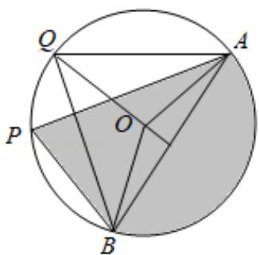

text_image

Q
A
P
O
B

【点评】本题考查圆的扇形面积公式和三角函数的恒等变换，考查化简运算能力，属于中档题.

9.【分析】根据正弦函数，余弦函数的周期性及单调性依次判断，利用排除法即可求解.

【解答】解： $f(x)=\sin|x|$ 不是周期函数，可排除 D 选项；

$f(x)=\cos|x|$ 的周期为 $2\pi$ ，可排除 C 选项；

$f(x) = |\sin 2x|$ 在 $\frac{\pi}{4}$ 处取得最大值，不可能在区间 $(\frac{\pi}{4}, \frac{\pi}{2})$ 单调递增，可排除 $B$ 。

故选：A.

【点评】本题主要考查了正弦函数，余弦函数的周期性及单调性，考查了排除法的应用，属于基础题.

10.【分析】由二倍角的三角函数公式化简已知可得 $4\sin \alpha \cos \alpha = 2\cos^2\alpha$ ，结合角的范围可求 $\sin \alpha >0$ $\cos \alpha >0$ ，可得 $\cos \alpha = 2\sin \alpha$ ，根据同角三角函数基本关系式即可解得 $\sin \alpha$ 的值.

【解答】解：∵ $2\sin2\alpha=\cos2\alpha+1$ ，

∴ 可得： $4\sin\alpha\cos\alpha=2\cos^{2}\alpha$

$$
\because \alpha \in (0, \frac {\pi}{2}), \sin \alpha > 0, \cos \alpha > 0,
$$

$$
\therefore \cos \alpha = 2 \sin \alpha ,
$$

$$
\because \sin^ {2} \alpha + \cos^ {2} \alpha = \sin^ {2} \alpha + (2 \sin \alpha) ^ {2} = 5 \sin^ {2} \alpha = 1,
$$

∴ 解得: $\sin\alpha=\frac{\sqrt{5}}{5}$ .

故选：B.

【点评】本题主要考查了二倍角的三角函数公式，同角三角函数基本关系式在三角函数化简求值中的应用，考查了转化思想，属于基础题.

11.【分析】利用诱导公式变形，再由两角和的正切求解.

【解答】解： $\tan255^{\circ}=\tan(180^{\circ}+75^{\circ})=\tan75^{\circ}=\tan(45^{\circ}+30^{\circ})$

$$
= \frac {\tan 4 5 ^ {\circ} + \tan 3 0 ^ {\circ}}{1 - \tan 4 5 ^ {\circ} \tan 3 0 ^ {\circ}} = \frac {1 + \frac {\sqrt {3}}{3}}{1 - 1 \times \frac {\sqrt {3}}{3}} = \frac {3 + \sqrt {3}}{3 - \sqrt {3}} = \frac {(3 + \sqrt {3}) ^ {2}}{6} = \frac {1 2 + 6 \sqrt {3}}{6} = 2 + \sqrt {3}.
$$

故选：D.

【点评】本题考查三角函数的取值，考查诱导公式与两角和的正切，是基础题.

12.【分析】利用两角和差的正切公式进行展开化简，结合一元二次方程的解法进行求解即可.

【解答】解：由 $2\tan\theta-\tan(\theta+\frac{\pi}{4})=7$ ，得 $2\tan\theta-\frac{\tan\theta+1}{1-\tan\theta}=7$ ，

即 $2\tan\theta-2\tan^{2}\theta-\tan\theta-1=7-7\tan\theta$

得 $2\tan^{2}\theta-8\tan\theta+8=0$

即 $\tan^{2}\theta-4\tan\theta+4=0$

即 $(\tan \theta - 2)^{2} = 0$

则 $\tan \theta = 2$

故选：D.

【点评】本题主要考查三角函数值的化简和求解，结合两角和差的正切公式以及配方法是解决本题的关键．难度中等.

13.【分析】首先利用三角函数关系式的恒等变换，把函数的关系式变形成余弦型函数，进一步利用余弦型函数性质的应用求出函数的最小值.

【解答】解：函数 $f(x)=2\sin^{2}x-\sqrt{3}\sin2x=2\times\frac{1-\cos2x}{2}-\sqrt{3}\sin2x=1-2\cos(2x-\frac{\pi}{3})$ ;

当 $2x - \frac{\pi}{3} = k\pi (k\in Z)$ ，即 $x = \frac{k\pi}{2} +\frac{\pi}{6} (k\in Z)$ 时，函数的最小值为-1.

故选：B.

【点评】本题考查的知识要点：三角函数的关系式的变换，余弦型函数性质的应用，主要考查学生的运算能力和数学思维能力，属于基础题.

14.【分析】由已知结合正弦函数的周期公式可判断①，结合函数最值取得条件可判断②，结合函数图象的平移可判断③.

【解答】解：因为 $f(x)=\sin(x+\frac{\pi}{3})$ ,

①由周期公式可得， $f(x)$ 的最小正周期 $T=2\pi$ ，故①正确；

② $f(\frac{\pi}{2})=\sin(\frac{\pi}{2}+\frac{\pi}{3})=\sin\frac{5\pi}{6}=\frac{1}{2}$ ，不是 $f(x)$ 的最大值，故②错误；

③根据函数图象的平移法则可得，函数 $y = \sin x$ 的图象上的所有点向左平移 $\frac{\pi}{3}$ 个单位长度，可得到函数 $y = f(x)$ 的图象，故③正确.

故选：B.

【点评】本题以命题的真假判断为载体，主要考查了正弦函数的性质的简单应用，属于中档试题.

15.【分析】容易看出，由 $\alpha = \beta$ 可得出 $\sin^2\alpha +\cos^2\beta = 1$ ，而反之显然不成立，从而可得出“ $\alpha = \beta$ ”是“ $\sin^2\alpha +\cos^2\beta = 1$ ”的充分不必要条件.

【解答】解：（1）若 $\alpha = \beta$ ，则 $\sin^{2}\alpha + \cos^{2}\beta = \sin^{2}\alpha + \cos^{2}\alpha = 1$ ，

∴ “ $\alpha=\beta$ “是“ $\sin^{2}\alpha+\cos^{2}\beta=1$ “的充分条件；

（2）若 $\sin^{2}\alpha+\cos^{2}\beta=1$ ，则 $\sin^{2}\alpha=\sin^{2}\beta$ ，得不出 $\alpha=\beta$

∴ “ $\alpha=\beta$ ” 不是 “ $\sin^{2}\alpha+\cos^{2}\beta=1$ ” 的必要条件，

∴ “ $\alpha=\beta$ ” 是 “ $\sin^{2}\alpha+\cos^{2}\beta=1$ ” 的充分非必要条件.

故选：A.

【点评】本题考查了充分条件、必要条件和充分不必要条件的定义， $\sin^2\alpha + \cos^2\alpha = 1$ ，正弦函数的图象，考查了推理能力，属于基础题.

16.【分析】由图象观察可得最小正周期小于 $\frac{13\pi}{9}$ ，大于 $\frac{10\pi}{9}$ ，排除 $A$ ， $D$ ；再由 $f(-\frac{4\pi}{9}) = 0$ ，求得 $\omega$ ，对照选项 $B$ ， $C$ ，代入计算，即可得到结论。

【解答】解：由图象可得最小正周期小于 $\pi - \left(-\frac{4\pi}{9}\right) = \frac{13\pi}{9}$ ，大于 $2 \times \left(\pi - \frac{4\pi}{9}\right) = \frac{10\pi}{9}$ ，排除 A，D；
由图象可得 $f(-\frac{4\pi}{9})=\cos(-\frac{4\pi}{9}\omega+\frac{\pi}{6})=0$ ，

即为 $-\frac{4\pi}{9}\omega+\frac{\pi}{6}=k\pi+\frac{\pi}{2},\quad k\in Z,$ (\*)

若选 B，即有 $\omega=\frac{2\pi}{\frac{7\pi}{6}}=\frac{12}{7}$ ，由 $-\frac{4\pi}{9}\times\frac{12}{7}+\frac{\pi}{6}=k\pi+\frac{\pi}{2}$ ，可得 k 不为整数，排除 B；

若选 C，即有 $\omega=\frac{2\pi}{\frac{4\pi}{3}}=\frac{3}{2}$ ，由 $-\frac{4\pi}{9}\times\frac{3}{2}+\frac{\pi}{6}=k\pi+\frac{\pi}{2}$ ，可得 k=-1，成立.

故选：C.

【点评】本题考查三角函数的图象和性质，主要是函数的周期的求法，运用排除法是迅速解题的关键，属于中档题.

17.【分析】先求出 $2\alpha$ 是第三或第四象限角或为 y 轴负半轴上的角，即可判断.

【解答】解： $\alpha$ 为第四象限角，

则 $-\frac{\pi}{2} + 2k\pi < \alpha < 2k\pi$ ， $k \in Z$ ，

则 $-\pi + 4k\pi < 2\alpha < 4k\pi$ ,

∴ $2\alpha$ 是第三或第四象限角或为 y 轴负半轴上的角，

$$
\therefore \sin 2 \alpha <   0,
$$

故选：D.

【点评】本题考查了角的符号特点，考查了转化能力，属于基础题.

18.【分析】利用两角和差的三角公式，进行转化，利用辅助角公式进行化简即可.

【解答】解：∵ $\sin\theta + \sin(\theta + \frac{\pi}{3}) = 1$ ,

$$
\therefore \sin \theta + \frac {1}{2} \sin \theta + \frac {\sqrt {3}}{2} \cos \theta = 1,
$$

即 $\frac{3}{2}\sin \theta +\frac{\sqrt{3}}{2}\cos \theta = 1$

得 $\sqrt{3} (\frac{1}{2}\cos \theta +\frac{\sqrt{3}}{2}\sin \theta) = 1$

即 $\sqrt{3}\sin(\theta+\frac{\pi}{6})=1$

得 $\sin(\theta+\frac{\pi}{6})=\frac{\sqrt{3}}{3}$

故选：B.

【点评】本题主要考查三角函数值的化简和求值，利用两角和差的三角公式以及辅助角公式进行转化是解决本题的关键．难度不大.

19.【分析】利用二倍角的余弦把已知等式变形，化为关于 $\cos \alpha$ 的一元二次方程，求解后再由同角三角函数基本关系式求得 $\sin \alpha$ 的值.

【解答】解：由 $3\cos 2\alpha - 8\cos \alpha = 5$ ，得 $3(2\cos^2\alpha - 1) - 8\cos \alpha - 5 = 0$

即 $3\cos^{2}\alpha - 4\cos\alpha - 4 = 0$ ，解得 $\cos\alpha = 2$ （舍去），或 $\cos\alpha = -\frac{2}{3}$ .

$$
\because \alpha \in (0, \pi), \therefore \alpha \in (\frac {\pi}{2}, \pi),
$$

则 $\sin \alpha = \sqrt{1 - \cos^2\alpha} = \sqrt{1 - (-\frac{2}{3})^2} = \frac{\sqrt{5}}{3}$

故选：A.

【点评】本题考查三角函数的化简求值，考查同角三角函数基本关系式与二倍角公式的应用，是基础题.

20.【分析】利用倍角公式降幂，再由辅助角公式化积，然后结合正弦函数的性质求解.

【解答】解： $y=\cos^{2}x+\sin x\cos x$

$$
\begin{array}{l} = \frac {1 + \cos 2 x}{2} + \frac {1}{2} \sin 2 x = \frac {1}{2} (\sin 2 x + \cos 2 x) + \frac {1}{2} \\ = \frac {\sqrt {2}}{2} \left(\frac {\sqrt {2}}{2} \sin 2 x + \frac {\sqrt {2}}{2} \cos 2 x\right) + \frac {1}{2} = \frac {\sqrt {2}}{2} \sin \left(2 x + \frac {\pi}{4}\right) + \frac {1}{2}. \\ \end{array}
$$

由 $2x + \frac{\pi}{4} = \frac{\pi}{2} + k\pi$ ， $k \in Z$ ，得 $x = \frac{\pi}{8} + \frac{k\pi}{2}$ ， $k \in Z$ ：

∴ 函数 $y = \cos^{2} x + \sin x \cos x$ 图像的对称轴是 $x = \frac{k\pi}{2} + \frac{\pi}{8} (k \in Z)$ .

故选：A.

【点评】本题考查三角函数的恒等变换应用，考查 $y = A \sin(\omega x + \varphi)$ 型函数的图象与性质，是基础题.

21.【分析】由已知把要求值的式子化弦为切求解.

【解答】解：由 $\tan x = 2$ ，得 $\cos x \neq 0$ ，

$$
\therefore \frac {2 \sin x + \cos x}{2 \sin x - \cos x} = \frac {2 \tan x + 1}{2 \tan x - 1} = \frac {2 \times 2 + 1}{2 \times 2 - 1} = \frac {5}{3}.
$$

故选：B.

【点评】本题考查三角函数的化简求值，考查同角三角函数基本关系式的应用，是基础题.

22.【分析】法一、直接利用二倍角的余弦化简求值即可.

法二、由诱导公式即二倍角的余弦化简求值.

【解答】解：法一、 $\cos^2\frac{\pi}{12} - \cos^2\frac{5\pi}{12}$

$$
= \frac {1 + \cos \frac {\pi}{6}}{2} - \frac {1 + \cos \frac {5 \pi}{6}}{2}
$$

$$
= \frac {1}{2} + \frac {1}{2} \cos \frac {\pi}{6} - \frac {1}{2} - \frac {1}{2} \cos \frac {5 \pi}{6}
$$

$$
= \frac {1}{2} \times \frac {\sqrt {3}}{2} - \frac {1}{2} \times \left(- \frac {\sqrt {3}}{2}\right) = \frac {\sqrt {3}}{2}.
$$

法二、 $\cos^2\frac{\pi}{12} -\cos^2\frac{5\pi}{12}$

$$
= \cos^ {2} \frac {\pi}{1 2} - \sin^ {2} \frac {\pi}{1 2}
$$

$$
= \cos \frac {\pi}{6} = \frac {\sqrt {3}}{2}.
$$

故选：D.

【点评】本题考查三角函数的化简求值和二倍角的余弦，是基础题.

23.【分析】先利用二倍角公式将函数 $f(x)$ 进行化简，然后由偶函数的定义进行判断，再利用换元法，令 $t = \cos x$ ，转化为二次函数求解最值即可.

【解答】解：因为 $f(x)=\cos x-\cos 2x=\cos x-(2\cos^{2}x-1)=-2\cos^{2}x+\cos x+1$

因为 $f(-x)=-2\cos^{2}(-x)+\cos(-x)+1=-2\cos^{2}x+\cos x+1=f(x)$ ,

故函数 $f(x)$ 为偶函数，

令 $t=\cos x$ ，则 $t\in[-1,1]$ ，

故 $f(t) = -2t^{2} + t + 1$ 是开口向下的二次函数，

所以当 $t=-\frac{1}{2\times(-2)}=\frac{1}{4}$ 时， $f(t)$ 取得最大值 $f(\frac{1}{4})=-2\times(\frac{1}{4})^{2}+\frac{1}{4}+1=\frac{9}{8}$

故函数的最大值为 $\frac{9}{8}$ .

综上所述，函数 $f(x)$ 是偶函数，有最大值 $\frac{9}{8}$ .

故选：D.

【点评】本题考查了三角函数的性质，二倍角公式的运用，偶函数的定义，二次函数的性质，考查了逻辑推理能力与转化归能力，属于基础题.

24.【分析】把等式左边化切为弦, 再展开倍角公式, 求解 $\sin \alpha$ , 进一步求得 $\cos \alpha$ , 再由商的关系可得 $\tan \alpha$ 的值.

【解答】解：由 $\tan2\alpha=\frac{\cos\alpha}{2-\sin\alpha}$ ，得 $\frac{\sin2\alpha}{\cos2\alpha}=\frac{\cos\alpha}{2-\sin\alpha}$ ，

即 $\frac{2\sin\alpha\cos\alpha}{1-2\sin^{2}\alpha}=\frac{\cos\alpha}{2-\sin\alpha}$ ,

$$
\because \alpha \in (0, \frac {\pi}{2}), \therefore \cos \alpha \neq 0,
$$

则 $2\sin \alpha (2 - \sin \alpha) = 1 - 2\sin^2\alpha$ ，解得 $\sin \alpha = \frac{1}{4}$

则 $\cos \alpha = \sqrt{1 - \sin^2\alpha} = \frac{\sqrt{15}}{4}$

$$
\therefore \tan \alpha = \frac {\sin \alpha}{\cos \alpha} = \frac {\frac {1}{4}}{\frac {\sqrt {1 5}}{4}} = \frac {\sqrt {1 5}}{1 5}.
$$

故选：A.

【点评】本题考查三角函数的恒等变换与化简求值，考查倍角公式的应用，是基础题.

25.【分析】首先利用基本不等式确定 $\sin \alpha \cos \beta + \sin \beta \cos \gamma + \sin \gamma \cos \alpha$ 的取值范围，确定个数的上限，然后利用特殊角确定满足题意的个数即可.

【解答】解：由基本不等式可得： $\sin\alpha\cos\beta\leqslant\frac{\sin^{2}\alpha+\cos^{2}\beta}{2}$ ， $\sin\beta\cos\gamma\leqslant\frac{\sin^{2}\beta+\cos^{2}\gamma}{2}$ ， $\sin\gamma\cos\alpha\leqslant\frac{\sin^{2}\gamma+\cos^{2}\alpha}{2}$ ，

三式相加，可得： $\sin \alpha \cos \beta +\sin \beta \cos \gamma +\sin \gamma \cos \alpha \leqslant \frac{3}{2},$

很明显 $\sin\alpha\cos\beta,\quad\sin\beta\cos\gamma,\quad\sin\gamma\cos\alpha$ 不可能均大于 $\frac{1}{2}$ .

取 $\alpha=30^{\circ}$ ， $\beta=60^{\circ}$ ， $\gamma=45^{\circ}$ ，

则 $\sin \alpha \cos \beta = \frac{1}{4} < \frac{1}{2}, \sin \beta \cos \gamma = \frac{\sqrt{6}}{4} > \frac{1}{2}, \sin \gamma \cos \alpha = \frac{\sqrt{6}}{4} > \frac{1}{2}$ ,

则三式中大于 $\frac{1}{2}$ 的个数的最大值为 2，

故选：C.

【点评】本题主要考查三角函数的性质，基本不等式求最值的方法，同角三角函数基本关系等知识，属于难题.

26.【分析】由题意可知， $x_{1}\in[0,\frac{\pi}{2}]$ ，即 $\sin x_{1}\in[0,1]$ ，可得 $f(x_{1})\in[2,5]$ ，将存在任意的 $x_{1}\in[0,\frac{\pi}{2}]$ ，都存在 $x_{2}\in[0,\frac{\pi}{2}]$ ，使得 $f(x)=2f(x+\theta)+2$ 成立，转化为 $f(x_{2}+\theta)_{min}\leqslant0$ ， $f(x_{2}+\theta)_{max}\geqslant\frac{3}{2}$ ，又由 $f(x)=3\sin x+2$ ，可得 $\sin(x_{2}+\theta)_{min}\leqslant-\frac{2}{3}$ ， $\sin(x_{2}+\theta)_{max}\geqslant-\frac{1}{6}$ ，再将选项中的值，依次代入验证，即可求解.

【解答】解：∵ $x_{1} \in [0, \frac{\pi}{2}]$ ,

$$
\therefore \sin x _ {1} \in [ 0, 1 ],
$$

$$
\therefore f (x _ {1}) \in [ 2, 5 ],
$$

∵都存在 $x_{2}\in[0,\quad\frac{\pi}{2}]$ ，使得 $f(x_{1})=2f(x_{2}+\theta)+2$ 成立，

$$
\therefore f \left(x _ {2} + \theta\right) _ {\min} \leqslant 0, \quad f \left(x _ {2} + \theta\right) _ {\max} \geqslant \frac {3}{2},
$$

$$
\because f (x) = 3 \sin x + 2,
$$

$$
\therefore \sin (x _ {2} + \theta) _ {\min} \leqslant - \frac {2}{3}, \quad \sin (x _ {2} + \theta) _ {\max} \geqslant - \frac {1}{6},
$$

$y=\sin x$ 在 $x\in\left[\frac{\pi}{2},\frac{3\pi}{2}\right]$ 上单调递减，

当 $\theta=\frac{3\pi}{5}$ 时， $x_{2}+\theta\in[\frac{3\pi}{5},\frac{11\pi}{10}]$ ,

∴ $\sin(x_{2}+\theta)=\sin\frac{11\pi}{10}>\sin\frac{7\pi}{6}=-\frac{1}{2}$ ，故 A 选项错误，

当 $\theta=\frac{4\pi}{5}$ 时， $x_{2}+\theta\in[\frac{4\pi}{5},\frac{13\pi}{10}]$ ,

$$
\therefore \sin (x _ {2} + \theta) _ {\min} = \sin \frac {1 3 \pi}{1 0} <   \sin \frac {5 \pi}{4} = - \frac {\sqrt {2}}{2} <   - \frac {2}{3},
$$

$\sin(x_{2}+\theta)_{max}=\sin\frac{4\pi}{5}>0$ ，故 B 选项正确，

当 $\theta=\frac{6\pi}{5}$ 时， $x_{2}+\theta\in[\frac{6\pi}{5},\frac{17\pi}{10}]$

$\sin(x_{2}+\theta)_{max}=\sin\frac{6\pi}{5}<\sin\frac{13\pi}{12}=\frac{\sqrt{2}-\sqrt{6}}{4}<-\frac{1}{6}$ ，故C选项错误，

当 $\theta=\frac{7\pi}{5}$ 时， $x_{2}+\theta\in[\frac{7\pi}{5},\frac{19\pi}{10}]$ $\sin(x_{2}+\theta)_{max}=\sin\frac{19\pi}{10}<\sin\frac{23\pi}{12}=\frac{\sqrt{2}-\sqrt{6}}{4}<-\frac{1}{6}$ ，故D选项错误.

故选：B.

【点评】本题考查了三角函数的单调性，以及恒成立问题，需要学生有较综合的知识，属于中档题.

27.【分析】由题意化简所给的三角函数式，然后利用齐次式的特征即可求得三角函数式的值.

【解答】解：由题意可得： $\frac{\sin\theta(1 + \sin 2\theta)}{\sin\theta + \cos\theta} = \frac{\sin\theta(\sin^2\theta + \cos^2\theta + 2\sin\theta\cos\theta)}{\sin\theta + \cos\theta}$

$$
\begin{array}{l} = \frac {\sin \theta}{\sin \theta + \cos \theta} \cdot \frac {\sin^ {2} \theta + \cos^ {2} \theta + 2 \sin \theta \cdot \cos \theta}{\sin^ {2} \theta + \cos^ {2} \theta} \\ = \frac {\tan \theta}{\tan \theta + 1} \cdot \frac {\tan \theta^ {2} + 2 \tan \theta + 1}{\tan^ {2} \theta + 1} \\ = \frac {2}{5}. \\ \end{array}
$$

故选：C.

【点评】本题主要考查同角三角函数基本关系, 三角函数式的求值等知识, $\sin^2 A + \cos^2 A = 1$ 是解题的关键,属于中等题.

28.【分析】化简函数的表达式，再利用三角函数的周期，正弦函数的最值求解即可.

【解答】解：∵ $f(x)=\sin\frac{x}{3}+\cos\frac{x}{3}=\sqrt{2}\sin(\frac{x}{3}+\frac{\pi}{4})$ ,

$$
\therefore T = \frac {2 \pi}{\frac {1}{3}} = 6 \pi .
$$

当 $\sin (\frac{x}{3} +\frac{\pi}{4}) = 1$ 时，函数 $f(x)$ 取得最大值 $\sqrt{2}$

∴函数 $f(x)$ 的周期为 $6\pi$ ，最大值 $\sqrt{2}$ .

故选：C.

【点评】本题考查了辅助角公式、三角函数的周期性与最值，考查了推理能力与计算能力，属于中档题.

29.【分析】由题意利用函数 $y = A \sin(\omega x + \varphi)$ 的图像变换规律，得出结论.

【解答】解：∵把函数 $y = f(x)$ 图像上所有点的横坐标缩短到原来的 $\frac{1}{2}$ 倍，纵坐标不变，

再把所得曲线向右平移 $\frac{\pi}{3}$ 个单位长度，得到函数 $y=\sin(x-\frac{\pi}{4})$ 的图像，

∴ 把函数 $y = \sin(x - \frac{\pi}{4})$ 的图像，向左平移 $\frac{\pi}{3}$ 个单位长度，

得到 $y=\sin(x+\frac{\pi}{3}-\frac{\pi}{4})=\sin(x+\frac{\pi}{12})$ 的图像；

再把图像上所有点的横坐标变为原来的 2 倍，纵坐标不变，可得 $f(x)=\sin(\frac{1}{2}x+\frac{\pi}{12})$ 的图像.

故选：B.

【点评】本题主要考查函数 $y = A \sin(\omega x + \varphi)$ 的图像变换规律，属基础题.

30.【分析】本题需要借助正弦函数单调增区间的相关知识点求解.

【解答】解：令 $-\frac{\pi}{2}+2k\pi\leqslant x-\frac{\pi}{6}\leqslant\frac{\pi}{2}+2k\pi,\quad k\in Z$ .

则 $-\frac{\pi}{3} + 2k\pi \leqslant x \leqslant \frac{2\pi}{3} + 2k\pi$ ， $k \in Z$ ：

当 $k = 0$ 时， $x \in [-\frac{\pi}{3}, \frac{2\pi}{3}]$ ，

$(0,\frac{\pi}{2})\subseteq [-\frac{\pi}{3},\frac{2\pi}{3}],$

故选：A.

【点评】本题考查正弦函数单调性，是简单题.

31.【分析】由题意, 可得函数 $f(x)$ 的一条对称轴为 x=0 , 即 $\varphi=2k\pi+\frac{\pi}{2}(k\in Z)$ . 或 $\varphi=2k\pi-\frac{\pi}{2}(k\in Z)$ . 再检验选项, 可得结论.

【解答】解：∵函数 $f(x)=\sin(2x+\varphi)$ ， $f(\frac{\pi}{3})=f(-\frac{\pi}{3})=\frac{1}{2}$ ，

∴ 函数 $f(x)$ 的一条对称轴为 x=0，即 $\sin\varphi=1$ 或 $\sin\varphi=-1$ ，故 $\varphi=2k\pi+\frac{\pi}{2}(k\in Z)$ 。或 $\varphi=2k\pi-\frac{\pi}{2}(k\in Z)$ 。
∴ $\sin(\frac{2\pi}{3}+\varphi)=\sin(-\frac{2\pi}{3}+\varphi)=\frac{1}{2}$ ①。不妨 k=0 时，

$\varphi=\frac{\pi}{2}$ 时，①不成立；当 $\varphi=-\frac{\pi}{2}$ 时，①成立，

故 $\varphi = 2k\pi -\frac{\pi}{2} (k\in Z)$

故选：D.

【点评】本题主要考查正弦函数的图象和性质，属于中档题.

32.【分析】由题意，利用正弦函数的图象和性质，得出结论.

【解答】解：对于 $f(x)=\frac{1}{2}\sin2x$ ，它的最小正周期为 $\frac{2\pi}{2}=\pi$ ，故①错误；

在 $[- \frac{\pi}{4}, \frac{\pi}{4}]$ ， $2x \in [-\frac{\pi}{2}, \frac{\pi}{2}]$ ，函数 $f(x)$ 单调递增，故②正确；

当 $x \in [-\frac{\pi}{6}, \frac{\pi}{3}]$ 时， $2x \in [-\frac{\pi}{3}, \frac{2\pi}{3}]$ ， $f(x)$ 的取值范围为 $[- \frac{\sqrt{3}}{4}, \frac{1}{2}]$ ，故③错误；

$f(x)$ 的图象可由 $g(x)=\frac{1}{2}\sin(2x+\frac{\pi}{4})$ 的图象向右平移 $\frac{\pi}{8}$ 个单位长度得到，故④错误，

故选：A.

【点评】本题主要考查正弦函数的图象和性质，属于基础题.

33.【分析】由周期范围求得 $\omega$ 的范围，由对称中心求解 $\omega$ 与 b 值，可得函数解析式，则 $f(\frac{\pi}{2})$ 可求.

【解答】解：函数 $f(x)=\sin(\omega x+\frac{\pi}{4})+b(\omega>0)$ 的最小正周期为 T，

则 $T=\frac{2\pi}{\omega}$ ，由 $\frac{2\pi}{3}<T<\pi$ ，得 $\frac{2\pi}{3}<\frac{2\pi}{\omega}<\pi$ ，∴ $2<\omega<3$ ，

$\because y=f(x)$ 的图像关于点 $\left(\frac{3\pi}{2},2\right)$ 中心对称， $\therefore b=2$

且 $\sin (\frac{3\pi}{2}\omega +\frac{\pi}{4}) = 0$ ，则 $\frac{3\pi}{2}\omega +\frac{\pi}{4} = k\pi$ ， $k\in Z$ ：

∴ $\omega=\frac{2}{3}(k-\frac{1}{4})$ ， $k\in Z$ ，取 k=4，可得 $\omega=\frac{5}{2}$ .

$\therefore f(x) = \sin \left(\frac{5}{2} x + \frac{\pi}{4}\right) + 2$ ，则 $f\left(\frac{\pi}{2}\right) = \sin \left(\frac{5}{2} \times \frac{\pi}{2} + \frac{\pi}{4}\right) + 2 = -1 + 2 = 1$ 。

故选：A.

【点评】本题考查 $y = A \sin(\omega x + \varphi)$ 型函数的图象与性质，考查逻辑思维能力与运算求解能力，是中档题.

34.【分析】解法一：由已知结合辅助角公式及和差角公式对已知等式进行化简可求 $\alpha -\beta$ ，进而可求.

解法二：根据已知条件，结合三角函数的两角和公式，即可求解.

【解答】解：解法一：因为 $\sin(\alpha + \beta) + \cos(\alpha + \beta) = 2\sqrt{2} \cos(\alpha + \frac{\pi}{4}) \sin \beta$

所以 $\sqrt{2}\sin(\alpha+\beta+\frac{\pi}{4})=2\sqrt{2}\cos(\alpha+\frac{\pi}{4})\sin\beta$

即 $\sin(\alpha+\beta+\frac{\pi}{4})=2\cos(\alpha+\frac{\pi}{4})\sin\beta$

所以 $\sin(\alpha+\frac{\pi}{4})\cos\beta+\sin\beta\cos(\alpha+\frac{\pi}{4})=2\cos(\alpha+\frac{\pi}{4})\sin\beta$

所以 $\sin(\alpha+\frac{\pi}{4})\cos\beta-\sin\beta\cos(\alpha+\frac{\pi}{4})=0$

所以 $\sin (\alpha +\frac{\pi}{4} -\beta) = 0$

所以 $\alpha +\frac{\pi}{4} -\beta = k\pi ,k\in Z$

所以 $\alpha -\beta = k\pi -\frac{\pi}{4}$

所以 $\tan(\alpha-\beta)=-1$ .

解法二：由题意可得， $\sin\alpha\cos\beta+\cos\alpha\sin\beta+\cos\alpha\cos\beta-\sin\alpha\sin\beta=2(\cos\alpha-\sin\alpha)\sin\beta$

即 $\sin\alpha\cos\beta-\cos\alpha\sin\beta+\cos\alpha\cos\beta+\sin\alpha\sin\beta=0$

所以 $\sin(\alpha-\beta)+\cos(\alpha-\beta)=0$

故 $\tan (\alpha -\beta) = -1$

故选：C.

【点评】本题主要考查了辅助角公式，和差角公式在三角化简求值中的应用，解题的关键是公式的灵活应用，属于中档题.

35.【分析】由题意, 利用函数 $y = A \sin (\omega x + \varphi)$ 的图象变换规律, 三角函数的图象和性质, 求得 $\omega$ 的最小值.

【解答】解：将函数 $f(x)=\sin(\omega x+\frac{\pi}{3})(\omega>0)$ 的图像向左平移 $\frac{\pi}{2}$ 个单位长度后得到曲线 C，

则 C 对应函数为 $y = \sin(\omega x + \frac{\omega \pi}{2} + \frac{\pi}{3})$ ,

∵ C 的图象关于 y 轴对称，∴ $\frac{\omega\pi}{2} + \frac{\pi}{3} = k\pi + \frac{\pi}{2}$ ， $k \in Z$ ，

即 $\omega=2k+\frac{1}{3}$ ， $k\in Z$ ，

则令k=0，可得 $\omega$ 的最小值是 $\frac{1}{3}$ ，

故选：C.

【点评】本题主要考查函数 $y = A \sin(\omega x + \varphi)$ 的图象变换规律，三角函数的图象和性质，属于中档题.

36.【分析】由已知结合正弦函数图象的平移即可求解.

【解答】解：把 $y=2\sin(3x+\frac{\pi}{5})$ 图象上所有的点向右平移 $\frac{\pi}{15}$ 个单位可得 $y=2\sin[3(x-\frac{\pi}{15})+\frac{\pi}{5}]=2\sin3x$ 的图象.

故选：D.

【点评】本题主要考查了正弦函数的图象平移，属于基础题.

37.【分析】由已知求得 AB 与 CD 的值，代入 $s = AB + \frac{CD^{2}}{OA}$ 得答案.

【解答】解：∵OA=OB=2， $\angle AOB=60^{\circ}$ ，∴AB=2，

∵ C 是 AB 的中点，D 在 AB 上， $CD \perp AB$ ，

∴延长DC可得O在DC上， $CD=OD-OC=2-\sqrt{3}$ ，

$$
\therefore s = A B + \frac {C D ^ {2}}{O A} = 2 + \frac {(2 - \sqrt {3}) ^ {2}}{2} = 2 + \frac {7 - 4 \sqrt {3}}{2} = \frac {1 1 - 4 \sqrt {3}}{2}.
$$

故选：B.

【点评】本题考查扇形及其应用，考查运算求解能力，是基础题.

38.【分析】由题意，利用正弦函数的极值点和零点，求得 $\omega$ 的取值范围.

【解答】解：当 $\omega < 0$ 时，不能满足在区间 $(0, \pi)$ 极值点比零点多，所以 $\omega > 0$ ；

函数 $f(x) = \sin (\omega x + \frac{\pi}{3})$ 在区间 $(0, \pi)$ 恰有三个极值点、两个零点，

$$
\omega x + \frac {\pi}{3} \in \left(\frac {\pi}{3}, \omega \pi + \frac {\pi}{3}\right),
$$

$$
\therefore \frac {5 \pi}{2} <   \omega \pi + \frac {\pi}{3} \leqslant 3 \pi ,
$$

求得 $\frac{13}{6}<\omega\leqslant\frac{8}{3}$ ,

故选：C.

【点评】本题主要考查正弦函数的极值点和零点，属于中档题.

39.【分析】根据已知条件，结合正弦函数的单调性，即可求解.

【解答】解： $f(x)=\sin(2\pi x-\frac{\pi}{5})$ ,

令 $-\frac{\pi}{2} + 2k\pi \leqslant 2\pi x - \frac{\pi}{5} \leqslant \frac{\pi}{2} + 2k\pi$ ， $k \in Z$ ，解得 $-\frac{3}{20} + k \leqslant x \leqslant \frac{7}{20} + k$ ， $k \in Z$ ，

当 $k = 0$ 时， $-\frac{3}{20} \leqslant x \leqslant \frac{7}{20}$

故 $f(x)$ 在 $(- \frac{3}{20}, \frac{7}{20})$ 上单调递增.

故选：A.

【点评】本题主要考查正弦函数的单调性，属于基础题.

40.【分析】由题意可知 a > 0，对 a 分别求值，排除 ABC，即可得答案.

【解答】解：由给定区间可知，a>0。

区间 $[a, 2a]$ 与区间 $[2a, 3a]$ 相邻，且区间长度相同.

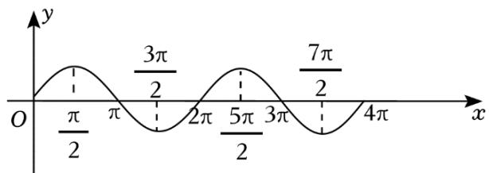

line

| x       | y     |
| ------- | ----- |
| 0       | 0     |
| π/2     | π/2   |
| π       | 3π/2  |
| 2π      | 2π    |
| 5π/2    | 5π/2  |
| 3π      | 3π/2  |
| 7π/2    | 7π/2  |
| 4π      | 4π    |

取 $a = \frac{\pi}{6}$ ，则 $[a, 2a] = \left[\frac{\pi}{6}, \frac{\pi}{3}\right]$ ，区间 $[2a, 3a] = \left[\frac{\pi}{3}, \frac{\pi}{2}\right]$ ，可知 $s_a > 0$ ， $t_a > 0$ ，故 $A$ 可能；

取 $a = \frac{5\pi}{12}$ ，则 $[a, 2a] = [\frac{5\pi}{12}, \frac{5\pi}{6}]$ ，区间 $[2a, 3a] = [\frac{5\pi}{6}, \frac{5\pi}{4}]$ ，可知 $s_a > 0$ ， $t_a < 0$ ，故 $C$ 可能；

取 $a = \frac{7\pi}{6}$ ，则 $[a, 2a] = \left[\frac{7\pi}{6}, \frac{7\pi}{3}\right]$ ，区间 $[2a, 3a] = \left[\frac{7\pi}{3}, \frac{7\pi}{2}\right]$ ，可知 $s_a < 0$ ， $t_a < 0$ ，故 $B$ 可能.

结合选项可得，不可能的是 $s_a < 0$ ， $t_a > 0$ ：

故选：D.

【点评】本题考查正弦函数的图象与三角函数的最值，训练了排除法的应用，取特值是关键，是中档题.

41.【分析】先根据题意建立方程求出参数，再计算，即可得解.

【解答】解：根据题意可知 $\frac{T}{2}=\frac{2\pi}{3}-\frac{\pi}{6}=\frac{\pi}{2}$ ，

$\therefore T=\pi$ ，取 $\omega>0$ ， $\therefore\omega=\frac{2\pi}{T}=2$ ，

又根据“五点法”可得 $2 \times \frac{\pi}{6} + \varphi = -\frac{\pi}{2} + 2k\pi$ ， $k \in Z$

$$
\therefore \varphi = - \frac {5 \pi}{6} + 2 k \pi , k \in Z,
$$

$$
\therefore f (x) = \sin \left(2 x - \frac {5 \pi}{6} + 2 k \pi\right) = \sin \left(2 x - \frac {5 \pi}{6}\right),
$$

$$
\therefore f \left(- \frac {5 \pi}{1 2}\right) = \sin \left(- \frac {5 \pi}{6} - \frac {5 \pi}{6}\right) = \sin \left(- \frac {5 \pi}{3}\right) = \sin \frac {\pi}{3} = \frac {\sqrt {3}}{2}.
$$

故选：D.

【点评】本题考查三角函数的性质，方程思想，属基础题.

42.【分析】由题意，利用函数 $y = A \cos(\omega x + \varphi)$ 的图象变换规律，余弦函数的图象和性质，得出结论.

【解答】解：把函数 $y = \cos\left(2x + \frac{\pi}{6}\right)$ 向

左平移 $\frac{\pi}{6}$ 个单位可得

函数 $f(x)=\cos(2x+\frac{\pi}{2})=-\sin2x$ 的图象，

而直线 $y=\frac{1}{2}x-\frac{1}{2}=\frac{1}{2}(x-1)$ 经过点 $(1,0)$ ，且斜率为 $\frac{1}{2}$ ，

且直线还经过点 $\left(\frac{3\pi}{4},\frac{3\pi-4}{8}\right)$ 、

$$
\left(- \frac {\pi}{4}, - \frac {\pi + 4}{8}\right),
$$

$$
0 <   \frac {3 \pi - 4}{8} <   1,
$$

$-1<-\frac{\pi+4}{8}<0$ ，如图，

故 $y = f(x)$ 与 $y = \frac{1}{2} x - \frac{1}{2}$ 的交点个数为3.

故选：C.

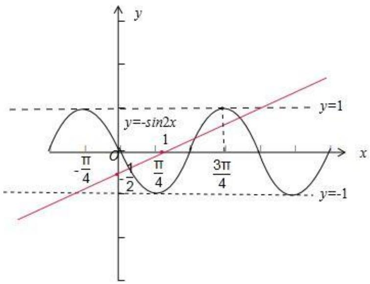

line

| x       | y = -sin2x | y = 1 |
| ------- | ---------- | ----- |
| -π/4    | -          | 0     |
| 0       | 0          | 1     |
| π/4     | -          | 0     |
| 3π/4    | 0          | 1     |

【点评】本题主要考查函数 $y = A \sin(\omega x + \varphi)$ 的图象变换规律，余弦函数的图象和性质，属于中档题.

43.【分析】利用同角三角函数基本关系式，结合充要条件判断即可.

【解答】解： $\sin^{2}\alpha+\sin^{2}\beta=1$ ，可知 $\sin\alpha=\pm\cos\beta$ ，可得 $\sin\alpha\pm\cos\beta=0$ ，

所以 “ $\sin^{2}\alpha+\sin^{2}\beta=1$ ” 是 “ $\sin\alpha+\cos\beta=0$ ” 的必要不充分条件，

故选：B.

【点评】本题考查同角三角函数基本关系式以及充要条件的应用，是基础题.

44.【分析】由已知结合正弦函数及余弦函数的对称性及周期公式分别检验各选项即可判断.

【解答】解：A：若 $f(x)=\sin(\frac{\pi}{2}x)$ ，则 $T=\frac{2\pi}{\frac{\pi}{2}}=4$ ，

令 $\frac{\pi}{2} x = \frac{\pi}{2} + k\pi$ ， $k \in Z$ ，则 $x = 1 + 2k$ ， $k \in Z$ ，显然 $x = 2$ 不是对称轴，不符合题意；

B：若 $f(x)=\cos(\frac{\pi}{2}x)$ ，则 $T=\frac{2\pi}{\frac{\pi}{2}}=4$ ，

令 $\frac{\pi}{2} x = k\pi$ ， $k\in Z$ ，则 $x = 2k$ ， $k\in Z$

故 x=2 是一条对称轴，B 符合题意；

$C: f(x) = \sin(\frac{\pi}{4}x)$ ，则 $T = \frac{2\pi}{\frac{\pi}{4}} = 8$ ，不符合题意；

$D: f(x) = \cos\left(\frac{\pi}{4}x\right)$ ，则 $T = \frac{2\pi}{\frac{\pi}{4}} = 8$ ，不符合题意.

故选：B.

【点评】本题主要考查了正弦及余弦函数的对称性及周期性，属于基础题.

45.【分析】根据等差数列的通项公式，三角函数的周期性，特值法，即可求解.

【解答】解：设等差数列 $\{a_{n}\}$ 的首项为 $a_1$ ，又公差为 $\frac{2\pi}{3}$

$$
\therefore a _ {n} = a _ {1} + \frac {2 \pi}{3} (n - 1),
$$

$\therefore \cos a_{n} = \cos \left(\frac{2n\pi}{3} +a_{1} - \frac{2\pi}{3}\right)$ ，其周期为 $\frac{2\pi}{\frac{2\pi}{3}} = 3$

又根据题意可知 S 集合中仅有两个元素，

∴ 可利用对称性，对 $a_{n}$ 取特值，

如 $a_{1}=0,\quad a_{2}=\frac{2\pi}{3},\quad a_{3}=\frac{4\pi}{3},\quad \ldots,$ 或 $a_{1}=-\frac{\pi}{3},\quad a_{2}=\frac{\pi}{3},\quad a_{3}=\pi,\quad \ldots,$

代入集合 S 中计算易得: $ab = -\frac{1}{2}$ .

故选：B.

【点评】本题考查等差数列的通项公式，三角函数的周期性，特值法，属中档题.

46.【分析】根据已知条件，结合二倍角公式，以及角 $\alpha$ 的取值范围，即可求解.

【解答】解： $\cos\alpha=\frac{1+\sqrt{5}}{4}$

则 $\cos \alpha = 1 - 2\sin^2\frac{\alpha}{2}$

故 $2\sin^2\frac{\alpha}{2} = 1 - \cos \alpha = \frac{3 - \sqrt{5}}{4}$ 即 $\sin^2\frac{\alpha}{2} = \frac{3 - \sqrt{5}}{8} = \frac{(\sqrt{5})^2 + 1^2 - 2\sqrt{5}}{16} = \frac{(\sqrt{5} - 1)^2}{16}$

∵ $\alpha$ 为锐角，

$$
\therefore \sin \frac {\alpha}{2} > 0,
$$

$$
\therefore \sin \frac {\alpha}{2} = \frac {- 1 + \sqrt {5}}{4}.
$$

故选：D.

【点评】本题主要考查半角的三角函数，属于基础题.

47.【分析】由已知结合和差角公式先求出 $\sin \alpha \cos \beta$ ，再求出 $\sin (\alpha +\beta)$ ，然后结合二倍角公式可求.

【解答】解：因为 $\sin(\alpha - \beta) = \sin \alpha \cos \beta - \sin \beta \cos \alpha = \frac{1}{3}$ ， $\cos \alpha \sin \beta = \frac{1}{6}$ ，

所以 $\sin \alpha \cos \beta = \frac{1}{2}$

所以 $\sin (\alpha +\beta) = \sin \alpha \cos \beta +\sin \beta \cos \alpha = \frac{1}{2} +\frac{1}{6} = \frac{2}{3},$

则 $\cos (2\alpha + 2\beta) = 1 - 2\sin^2 (\alpha + \beta) = 1 - 2 \times \frac{4}{9} = \frac{1}{9}$ .

故选：B.

【点评】本题主要考查了和差角公式，二倍角公式的应用，属于中档题.

# 二、多选题

1.【分析】根据图象先求出函数的周期，和 $\omega$ ，利用五点法求出函数的 $\varphi$ 的值，结合三角函数的诱导公式进行转化求解即可.

【解答】解：由图象知函数的周期 $T=2\times\left(\frac{2\pi}{3}-\frac{\pi}{6}\right)=\pi$ ，即 $\frac{2\pi}{|\omega|}=\pi$ ，即 $\omega=\pm2$ ，

当 $\omega=2$ 时，由五点作图法，得 $2\times\frac{\pi}{6}+\varphi=\pi$ ，所以 $\varphi=\frac{2\pi}{3}$ ，

则 $f(x) = \sin (2x + \frac{2\pi}{3}) = \cos (\frac{\pi}{2} - 2x - \frac{2\pi}{3})$

$$
= \cos (- 2 x - \frac {\pi}{6}) = \cos (2 x + \frac {\pi}{6})
$$

$$
= \sin (\frac {\pi}{2} - 2 x - \frac {\pi}{6}) = \sin (\frac {\pi}{3} - 2 x),
$$

当 $\omega = -2$ 时，由五点作图法，得 $-2 \times \frac{\pi}{6} + \varphi = 0$ ，所以 $\varphi = \frac{\pi}{3}$

所以 $f(x)=\sin(-2x+\frac{\pi}{3})=\cos(2x+\frac{\pi}{6})$ .

故选：BC.

【点评】本题主要考查三角函数解析式的求解，结合函数图象求出函数的周期和 $\omega$ ，利用三角函数的诱导公式进行转化是解决本题的关键．比较基础.

2.【分析】直接利用函数的对称性求出函数的关系式, 进一步利用函数的性质的判断 $A 、 B 、 C 、 D$ 的真假.

【解答】解：因为 $f(x)=\sin(2x+\varphi)(0<\varphi<\pi)$ 的图象关于点 $\left(\frac{2\pi}{3},0\right)$ 对称，

所以 $2 \times \frac{2\pi}{3} + \varphi = k\pi, \quad k \in Z$ ,

所以 $\varphi = k\pi - \frac{4\pi}{3}$ ,

因为 $0 < \varphi < \pi$

所以 $\varphi=\frac{2\pi}{3}$ ,

故 $f(x)=\sin(2x+\frac{2\pi}{3})$ ,

令 $\frac{\pi}{2}<2x+\frac{2\pi}{3}<\frac{3\pi}{2}$ ，解得 $-\frac{\pi}{12}<x<\frac{5\pi}{12}$ ，

故 $f(x)$ 在 $(0, \frac{5\pi}{12})$ 单调递减，A 正确；

$$
x \in \left(- \frac {\pi}{1 2}, \frac {1 1 \pi}{1 2}\right), 2 x + \frac {2 \pi}{3} \in \left(\frac {\pi}{2}, \frac {5 \pi}{2}\right),
$$

根据函数的单调性，故函数 $f(x)$ 在区间 $(- \frac{\pi}{12}, \frac{11\pi}{12})$ 只有一个极值点，故 $B$ 错误；

令 $2x + \frac{2\pi}{3} = k\pi +\frac{\pi}{2},\quad k\in Z$ ，得 $x = \frac{k\pi}{2} -\frac{\pi}{12},\quad k\in Z,\quad C$ 显然错误；

$$
f (x) = \sin \left(2 x + \frac {2 \pi}{3}\right),
$$

求导可得， $f'(x)=2\cos(2x+\frac{2\pi}{3})$

令 $f^{\prime}(x) = -1$ ，即 $\cos (2x + \frac{2\pi}{3}) = -\frac{1}{2}$ ，解得 $x = k\pi$ 或 $x = \frac{\pi}{3} +k\pi (k\in Z)$

故函数 $y = f(x)$ 在点 $(0, \frac{\sqrt{3}}{2})$ 处的切线斜率为 $k = y' \big|_{x=0} = 2 \cos \frac{2\pi}{3} = -1$ ,

故切线方程为 $y - \frac{\sqrt{3}}{2} = -(x - 0)$ ，即 $y = -x + \frac{\sqrt{3}}{2}$ ，故 $D$ 正确.

直线 $y = \frac{\sqrt{3}}{2} - x$ 显然与 $y = \sin (2x + \frac{2\pi}{3})$ 相切，故直线 $y = \frac{\sqrt{3}}{2} - x$ 显然是曲线的切线，故 $D$ 正确.

故选：AD.

【点评】本题考查的知识要点：三角函数关系式的求法，函数的性质的应用，主要考查学生的运算能力和数学思维能力，属于基础题.

# 三、填空题

1.【分析】先利用诱导公式，二倍角公式对已知函数进行化简，然后结合二次函数的单调性即可去求解最小值

【解答】解：∵ $f(x)=\sin(2x+\frac{3\pi}{2})-3\cos x$

$$
= - \cos 2 x - 3 \cos x = - 2 \cos^ {2} x - 3 \cos x + 1,
$$

令 $t=\cos x$ ，则 $-1\leqslant t\leqslant1$ ，

令 $g(t) = -2t^2 - 3t + 1$ 的开口向下，对称轴 $t = -\frac{3}{4}$ ，在 $[-1, 1]$ 上先增后减，

故当 t=1 即 $\cos x=1$ 时，函数有最小值 -4 .

故答案为：-4

【点评】本题主要考查了诱导公式，二倍角的余弦公式在三角函数时化简求值中的应用及利用余弦函数，二次函数的性质求解最值的应用，属于基础试题

2.【分析】用二倍角公式可得 $f(x)=-\frac{1}{2}\cos(4x)+\frac{1}{2}$ ，然后用周期公式求出周期即可.

【解答】解：∵ $f(x)=\sin^{2}(2x)$ ,

$$
\therefore f (x) = - \frac {1}{2} \cos (4 x) + \frac {1}{2},
$$

∴ $f(x)$ 的周期 $T = \frac{\pi}{2}$ ,

故答案为： $\frac{\pi}{2}$ .

【点评】本题考查了三角函数的图象与性质，关键是合理使用二倍角公式，属基础题.

3.【分析】直接利用三角函数的中和角的正切的应用求出 $\tan \alpha$ 的值, 进一步利用万能公式的应用求出结果.

【解答】解：已知 $\frac{\tan\alpha}{\tan(\alpha + \frac{\pi}{4})} = -\frac{2}{3}$ ，整理得 $3\tan^2\alpha - 5\tan \alpha - 2 = 0$ ，

解得 $\tan\alpha=2$ 或 $-\frac{1}{3}$ ,

（1）当 $\tan \alpha = 2$ 时，

则 $\sin2\alpha=\frac{2\tan\alpha}{1+\tan^{2}\alpha}=\frac{4}{5}$ ， $\cos2\alpha=\frac{1-\tan^{2}\alpha}{1+\tan^{2}\alpha}=-\frac{3}{5}$

故 $\sin (2\alpha +\frac{\pi}{4}) = \frac{\sqrt{2}}{2}\sin 2\alpha +\frac{\sqrt{2}}{2}\cos 2\alpha = \frac{4}{5}\times \frac{\sqrt{2}}{2} -\frac{3}{5}\times \frac{\sqrt{2}}{2} = \frac{\sqrt{2}}{10}.$

(2) 当 $\tan\alpha=-\frac{1}{3}$ 时，

则 $\sin2\alpha=\frac{2\tan\alpha}{1+\tan^{2}\alpha}=-\frac{3}{5},\quad\cos2\alpha=\frac{1-\tan^{2}\alpha}{1+\tan^{2}\alpha}=\frac{4}{5},$

$$
\sin (2 \alpha + \frac {\pi}{4}) = \frac {\sqrt {2}}{2} \sin 2 \alpha + \frac {\sqrt {2}}{2} \cos 2 \alpha = - \frac {3}{5} \times \frac {\sqrt {2}}{2} + \frac {4}{5} \times \frac {\sqrt {2}}{2} = \frac {\sqrt {2}}{1 0}.
$$

故答案为： $\frac{\sqrt{2}}{10}$ .

【点评】本题考查的知识要点：三角函数关系式的恒等变换，万能公式的应用，主要考查学生的运算能力

和数学思维能力，属于基础题型.

4.【分析】根据三角函数的倍角公式，结合反三角公式即可得到结论.

【解答】解：∵ $3\sin2x = 2\sin x$ ，

$$
6 \sin x \cos x = 2 \sin x,
$$

$$
\because x \in (0, \pi),
$$

$$
\therefore \sin x \neq 0,
$$

$$
\therefore \cos x = \frac {1}{3},
$$

故 $x = \arccos \frac{1}{3}$

故答案为： $\arccos\frac{1}{3}$ .

【点评】本题主要考查函数值的计算，利用三角函数的倍角公式是解决本题的关键.

5.【分析】由两角和差公式，及辅助角公式化简得 $f(x)=\sqrt{\cos^{2}\varphi+(1+\sin\varphi)^{2}}\sin(x+\theta)$ ，其中 $\cos\theta=\frac{\cos\varphi}{\sqrt{\cos^{2}\varphi+(1+\sin\varphi)^{2}}}$ ， $\sin\theta=\frac{1+\sin\varphi}{\sqrt{\cos^{2}\varphi+(1+\sin\varphi)^{2}}}$ ，结合题意可得 $\sqrt{\cos^{2}\varphi+(1+\sin\varphi)^{2}}=2$ ，解得 $\varphi$ ，
即可得出答案.

【】解：解法1: $f(x)=\sin(x+\varphi)+\cos x=\sin x\cos\varphi+\cos x\sin\varphi+\cos x=\sin x\cos\varphi+(1+\sin\varphi)\cos x=\sqrt{\cos^{2}\varphi+(1+\sin\varphi)^{2}}\sin(x+\theta)$ 其中 $\cos\theta=\frac{\cos\varphi}{\sqrt{\cos^{2}\varphi+(1+\sin\varphi)^{2}}}$ ， $\sin\theta=\frac{1+\sin\varphi}{\sqrt{\cos^{2}\varphi+(1+\sin\varphi)^{2}}}$

所以 $f(x)$ 最大值为 $\sqrt{cos^2\varphi + (1 + \sin\varphi)^2} = 2$

所以 $\cos^{2}\varphi+(1+\sin\varphi)^{2}=4$

即 $2 + 2 \sin \varphi = 4$ ,

所以 $\sin\varphi=1$ ，

所以 $\varphi = \frac{\pi}{2} + 2k\pi$ ， $k \in Z$ 时 $\varphi$ 均满足题意，

故可选 $k = 0$ 时， $\varphi = \frac{\pi}{2}$

解法 $2 \because \sin(x + \varphi) \leqslant 1, \cos x \leqslant 1$ ,

又函数 $f(x)=\sin(x+\varphi)+\cos x$ 的最大值为 2,

所以当且仅当 $\sin(x+\varphi)=1$ ， $\cos x=1$ 时函数 $f(x)$ 取到最大值，

此时 $x=2k\pi,\quad k\in Z$ ，

则 $\sin(x+\varphi)=\sin\varphi=1$

于是 $\varphi = \frac{\pi}{2} + 2k\pi$ ， $k \in Z$ 时 $\varphi$ 均满足题意，

故可选 $k = 0$ 时， $\varphi = \frac{\pi}{2}$

故答案为： $\frac{\pi}{2}$ .

【点评】本题考查三角恒等变换，辅助角公式，三角函数最值，以及考查运算能力，属于中档题.

6.【分析】利用二倍角公式以及同角三角函数基本关系式求解第一问，利用两角和与差的三角函数转化求解第二问.

【解答】解： $\tan\theta=2$ ，

则 $\cos2\theta=\frac{\cos^{2}\theta-\sin^{2}\theta}{\cos^{2}\theta+\sin^{2}\theta}=\frac{1-\tan^{2}\theta}{1+\tan^{2}\theta}=\frac{1-4}{1+4}=-\frac{3}{5}$

$$
\tan \left(\theta - \frac {\pi}{4}\right) = \frac {\tan \theta - \tan \frac {\pi}{4}}{1 + \tan \theta \tan \frac {\pi}{4}} = \frac {2 - 1}{1 + 2 \times 1} = \frac {1}{3}.
$$

故答案为： $-\frac{3}{5}$ ; $\frac{1}{3}$ .

【点评】本题考查二倍角公式的应用，两角和与差的三角函数以及同角三角函数基本关系式的应用，是基本知识的考查.

7.【分析】利用三角函数的平移可得新函数 $g(x)=f\left(x-\frac{\pi}{6}\right)$ ，求 $g(x)$ 的所有对称轴 $x=\frac{7\pi}{24}+\frac{k\pi}{2}$ ， $k\in Z$ ，从而可判断平移后的图象中与 y 轴最近的对称轴的方程，

【解答】解：因为函数 $y=3\sin(2x+\frac{\pi}{4})$ 的图象向右平移 $\frac{\pi}{6}$ 个单位长度可得

$$
g (x) = f \left(x - \frac {\pi}{6}\right) = 3 \sin \left(2 x - \frac {\pi}{3} + \frac {\pi}{4}\right) = 3 \sin \left(2 x - \frac {\pi}{1 2}\right),
$$

则 $y = g(x)$ 的对称轴为 $2x - \frac{\pi}{12} = \frac{\pi}{2} + k\pi$ ， $k \in Z$ ，

即 $x=\frac{7\pi}{24}+\frac{k\pi}{2}$ ， $k\in Z$ ，

当 $k = 0$ 时， $x = \frac{7\pi}{24}$ ，

当 $k = -1$ 时， $x = -\frac{5\pi}{24}$ ，

所以平移后的图象中与 y 轴最近的对称轴的方程是 $x = -\frac{5\pi}{24}$ ,

故答案为： $x=-\frac{5\pi}{24}$ ，

【点评】本题考查三角函数的平移变换，对称轴方程，属于中档题.

8.【分析】由已知利用二倍角公式化简所求即可计算得解.

【解答】解：∵ $\sin x = -\frac{2}{3}$ ,

$$
\therefore \cos 2 x = 1 - 2 \sin^ {2} x = 1 - 2 \times \left(- \frac {2}{3}\right) ^ {2} = \frac {1}{9}.
$$

故答案为： $\frac{1}{9}$ .

【点评】本题主要考查了二倍角公式在三角函数化简求值中的应用，考查了转化思想，属于基础题.

9.【分析】根据函数 $y = \tan \omega x$ 的周期为 $\frac{\pi}{\omega}$ ，求出函数 $y = \tan 2x$ 的最小正周期.

【解答】解：函数 $y = \tan 2x$ 的最小正周期为 $\frac{\pi}{2}$ ,

故答案为： $\frac{\pi}{2}$ .

【点评】本题主要考查正切函数的周期性和求法，属于基础题.

10.【分析】根据二倍角公式即可求出.

【解答】解：因为 $\sin^2 (\frac{\pi}{4} +\alpha) = \frac{2}{3}$ ，则 $\sin^2 (\frac{\pi}{4} +\alpha) = \frac{1 - \cos(\frac{\pi}{2} + 2\alpha)}{2} = \frac{1 + \sin 2\alpha}{2} = \frac{2}{3},$

解得 $\sin 2\alpha = \frac{1}{3}$

故答案为: $\frac{1}{3}$

【点评】本题考查了二倍角公式，属于基础题.

11.【分析】在单位圆中分析可得 $\theta > \frac{\pi}{3}$ ，由 $\frac{2\pi}{\theta} \in N^{*}$ ，即 $\theta = \frac{2\pi}{k}$ ， $k \in N^{*}$ ，即可求得 $\theta$ 的最小值.

【解答】解: 在单位圆中分析, 由题意可得 $n\theta + \varphi$ 的终边要落在图中阴影部分区域 (其中 $\angle AOX = \angle BOx = \frac{\pi}{6}$ ), 所以 $\theta > \angle AOB = \frac{\pi}{3}$ ,

因为对任意 $n \in N^{*}$ 都成立，

所以 $\frac{2\pi}{\theta} \in N^*$ ，即 $\theta = \frac{2\pi}{k}$ ， $k \in N^*$ ，

同时 $\theta > \frac{\pi}{3}$ ，所以 $\theta$ 的最小值为 $\frac{2\pi}{5}$ .

故答案为： $\frac{2\pi}{5}$ .

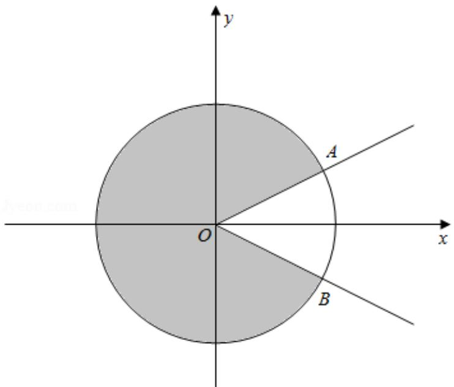

text_image

y
A
O
x
B

【点评】本题主要考查三角函数的最值，考查数形结合思想，属于中档题.

12.【分析】利用点关于 y 轴对称，可知横坐标相反，纵坐标相等，利用诱导公式分析求解，写出一个符合题意的角即可.

【解答】解：因为 $P(\cos\theta,\sin\theta)$ 与 $Q(\cos(\theta+\frac{\pi}{6}),\sin(\theta+\frac{\pi}{6}))$ 关于 y 轴对称，

故其横坐标相反，纵坐标相等，

即 $\sin \theta = \sin (\theta +\frac{\pi}{6})$ 且 $\cos \theta = -\cos (\theta +\frac{\pi}{6})$

由诱导公式 $\sin \alpha = \sin (\pi -\alpha)$ ， $\cos \alpha = -\cos (\pi -\alpha)$

所以 $\theta +\frac{\pi}{6} = 2k\pi +\pi -\theta = (2k + 1)\pi -\theta ,\quad k\in Z$ ，解得 $\theta = k\pi +\frac{5\pi}{12},\quad k\in Z$

则符合题意的 $\theta$ 值可以为 $\frac{5\pi}{12}$ .

故答案为： $\frac{5\pi}{12}$ （答案不唯一）.

【点评】本题考查了三角函数的化简，三角函数诱导公式的应用，点关于线的对称性问题，属于基础题.

13.【分析】根据图象可得 $f(x)$ 的最小正周期，从而求得 $\omega$ ，然后利用五点作图法可求得 $\varphi$ ，得到 $f(x)$ 的解析式，再计算 $f(\frac{\pi}{2})$ 的值.

【解答】解：由图可知， $f(x)$ 的最小正周期 $T = \frac{4}{3} (\frac{13\pi}{12} - \frac{\pi}{3}) = \pi$ ，

所以 $\omega=\frac{2\pi}{T}=2$ ，因为 $f(\frac{\pi}{3})=0$ ，

所以由五点作图法可得 $2 \times \frac{\pi}{3} + \varphi = \frac{\pi}{2}$ ，解得 $\varphi = -\frac{\pi}{6}$ ，

所以 $f(x)=2\cos(2x-\frac{\pi}{6})$ ,

所以 $f(\frac{\pi}{2}) = 2\cos (2\times \frac{\pi}{2} -\frac{\pi}{6}) = -2\cos \frac{\pi}{6} = -\sqrt{3}$

故答案为： $-\sqrt{3}$

【点评】本题主要考查由 $y = A\cos (\omega x + \varphi)$ 的部分图象确定其解析式，考查数形结合思想与运算求解能力，属于基础题.

14.【分析】观察图像， $\frac{3}{4}T=\frac{13\pi}{12}-\frac{\pi}{3}$ ，即周期为 $\pi$ ，将需要求解的式子进行周期变换，变换到 $\frac{\pi}{3}$ 附近，观察图像可知 $x>\frac{\pi}{3}$ ，即最小正整数为2.

【解答】解：由图像可得 $\frac{3}{4}T=\frac{13}{12}\pi-\frac{\pi}{3}$ ，即周期为 $\pi$ ，

$$
\because (f (x) - f (- \frac {7 \pi}{4})) ((f (x) - f (\frac {4 \pi}{3})) > 0, T = \pi ,
$$

$$
\therefore (f (x) - f (\frac {\pi}{4})) (f (x) - f (\frac {\pi}{3})) > 0,
$$

观察图像可知当 $x>\frac{\pi}{3}$ ,

$$
f (x) <   f \left(\frac {\pi}{4}\right), \quad f (x) <   f \left(\frac {\pi}{3}\right),
$$

$\because 2\in(\frac{\pi}{3},\frac{5\pi}{6})$ ，且 $f(\frac{5\pi}{6})=0$ ，

∴ x=2 时最小，且满足题意，

故答案为：2.

【点评】该题考查了三角函数的周期性，以及如何通过图像判断函数值的大小，题型灵活，属于中等题.

15.【分析】由三角函数的恒等变换化简函数可得 $f(x)=\cos2x+1$ ，从而根据周期公式即可求值.

【解答】解： $f(x)=\cos^{2}x-\sin^{2}x+1$

$$
\begin{array}{l} = \cos^ {2} x - \sin^ {2} x + \cos^ {2} x + \sin^ {2} x \\ = 2 \cos^ {2} x \\ = \cos 2 x + 1, \\ \end{array}
$$

$$
T = \frac {2 \pi}{2} = \pi .
$$

故答案为： $\pi$ ：

【点评】本题主要考查了三角函数的恒等变换，三角函数的周期性及其求法，倍角公式的应用，属于基础题.

16.【分析】由已知直接利用二倍角的正切求解.

【解答】解：由 $\tan\theta=3$ ，得 $\tan2\theta=\frac{2\tan\theta}{1-tan^{2}\theta}=\frac{2\times3}{1-3^{2}}=-\frac{3}{4}$

故答案为： $-\frac{3}{4}$ .

【点评】本题考查三角函数的化简求值，考查倍角公式的应用，是基础题.

17.【分析】由诱导公式求出 $3\sin \alpha - \cos \alpha = \sqrt{10}$ ，再由同角三角函数关系式推导出 $\sin \alpha = \frac{3\sqrt{10}}{10}$ ，由此能求出 $\cos 2\beta$ 的值.

【解答】解：∵ $3\sin\alpha - \sin\beta = \sqrt{10}$ ， $\alpha + \beta = \frac{\pi}{2}$ ，

$$
\therefore 3 \sin \alpha - \cos \alpha = \sqrt {1 0},
$$

$$
\therefore \cos \alpha = 3 \sin \alpha - \sqrt {1 0},
$$

$$
\because \sin^ {2} \alpha + \cos^ {2} \alpha = 1,
$$

$$
\therefore \sin^ {2} \alpha + (3 \sin \alpha - \sqrt {1 0}) ^ {2} = 1,
$$

解得 $\sin \alpha = \frac{3\sqrt{10}}{10}$ ， $\cos \beta = \sin \alpha = \frac{3\sqrt{10}}{10}$

$$
\cos 2 \beta = 2 \cos^ {2} \beta - 1 = 2 \times \frac {9 0}{1 0 0} - 1 = \frac {4}{5}.
$$

故答案为： $\frac{3\sqrt{10}}{10}$ ; $\frac{4}{5}$ .

【点评】本题考查三角函数值的求法，考查诱导公式、同角三角函数关系式、二倍角公式等基础知识，考查运算求解能力，是基础题.

18.【分析】由两角和的正切公式直接求解即可.

【解答】解：若 $\tan\alpha=3$ ，

则 $\tan (\alpha +\frac{\pi}{4}) = \frac{\tan\alpha + \tan\frac{\pi}{4}}{1 - \tan\alpha\tan\frac{\pi}{4}} = \frac{3 + 1}{1 - 3\times 1} = -2.$

故答案为：-2.

【点评】本题主要考查两角和的正切公式，考查运算求解能力，属于基础题.

19.【分析】由题意，结合余弦函数的周期和零点，建立相关的方程求解即可.

【解答】解：函数 $f(x) = \cos (\omega x + \varphi)(\omega > 0, 0 < \varphi < \pi)$ 的最小正周期为 $T = \frac{2\pi}{\omega}$ ，若 $f(T) = \cos (\omega \times \frac{2\pi}{\omega} + \varphi) = \cos \varphi = \frac{\sqrt{3}}{2}, 0 < \varphi < \pi$ ，则 $\varphi = \frac{\pi}{6}$ ，

所以 $f(x)=\cos(\omega x+\frac{\pi}{6})$ .

因为 $x = \frac{\pi}{9}$ 为 $f(x)$ 的零点，所以 $\cos (\frac{\omega\pi}{9} +\frac{\pi}{6}) = 0$

故 $\frac{\omega\pi}{9} +\frac{\pi}{6} = k\pi +\frac{\pi}{2},\quad k\in Z$ ，所以 $\omega = 9k + 3$ ， $k\in Z$

因为 $\omega > 0$ ，则 $\omega$ 的最小值为 3.

故答案为：3.

【点评】本题主要考查余弦函数的图象和性质，考查了方程思想，属于基础题.

20.【分析】由题意，利用函数的零点，求得 A 的值，再利用两角差的正弦公式化简 $f(x)$ ，可得 $f(\frac{\pi}{12})$ 的值.

【解答】解：∵函数 $f(x)=A\sin x-\sqrt{3}\cos x$ 的一个零点为 $\frac{\pi}{3}$ ，∴ $\frac{\sqrt{3}}{2}A-\sqrt{3}\times\frac{1}{2}=0$ ，

∴ A = 1，函数 $f(x) = \sin x - \sqrt{3} \cos x = 2 \sin \left( x - \frac{\pi}{3} \right)$ ，

$$
\therefore f \left(\frac {\pi}{1 2}\right) = 2 \sin \left(\frac {\pi}{1 2} - \frac {\pi}{3}\right) = 2 \sin \left(- \frac {\pi}{4}\right) = - 2 \sin \frac {\pi}{4} = - \sqrt {2},
$$

故答案为：1； $-\sqrt{2}$ .

【点评】本题主要考查两角差的正弦公式，函数的零点，求三角函数的值，属于中档题.

21.【分析】利用二倍角公式得到 $\sin \theta > 0$ ， $\cos \theta < 0$ ，则 $\frac{\pi}{2} < \theta < \frac{3\pi}{4}$ ， $\tan \theta < -1$ ，利用“1”的代换即可求解.

【解答】解： $\because \frac{\pi}{4} < \theta < \frac{3\pi}{4}$ ，且 $\sin 2\theta = 2\sin \theta \cos \theta = -\frac{1}{3} < 0$ ， $\therefore \sin \theta > 0$ ， $\cos \theta < 0$ ，

$$
\therefore \frac {\pi}{2} <   \theta <   \frac {3 \pi}{4}, \tan \theta <   - 1,
$$

$$
\because \sin 2 \theta = 2 \sin \theta \cos \theta = - \frac {1}{3},
$$

$$
\therefore \frac {2 \sin \theta \cos \theta}{\sin^ {2} \theta + \cos^ {2} \theta} = \frac {2 \tan \theta}{\tan^ {2} \theta + 1} = - \frac {1}{3},
$$

解得 $\tan\theta=-3-2\sqrt{2}$ 或 $-3+2\sqrt{2}$ （舍）.

故答案为： $-3-2\sqrt{2}$ .

【点评】本题考查了三角函数的求值问题，属于中档题.

22.【分析】直接利用正切函数的二倍角公式求解.

【解答】解：∵ $\tan\alpha=3$ ，

$$
\therefore \tan 2 \alpha = \frac {2 \tan \alpha}{1 - \tan^ {2} \alpha} = \frac {2 \times 3}{1 - 3 ^ {2}} = - \frac {3}{4}.
$$

故答案为： $-\frac{3}{4}$ .

【点评】本题主要考查了二倍角公式的应用，属于基础题.

23.【分析】根据三角函数的坐标定义，利用坐标法进行求解即可.

【解答】解：∵ $\theta\in(0,\frac{\pi}{2})$ ， $\tan\theta=\frac{1}{3}=\frac{y}{x}$

∴ 令 x=3，y=1，设 $\theta$ 终边上一点的坐标 $P(3,1)$ ，

则 $r = |OP| = \sqrt{3^2 + 1^2} = \sqrt{10}$

则 $\sin \theta -\cos \theta = \frac{1}{\sqrt{10}} -\frac{3}{\sqrt{10}} = -\frac{2}{\sqrt{10}} = -\frac{\sqrt{10}}{5}.$

故答案为： $-\frac{\sqrt{10}}{5}$ .

【点评】本题主要考查三角函数值的计算，利用坐标法进行求解是解决本题的关键，是基础题.

24.【分析】利用余弦函数的周期，结合函数的零点个数，列出不等式求解即可.

【解答】解： $x \in [0, 2\pi]$ ，函数的周期为 $\frac{2\pi}{\omega} (\omega > 0)$ ， $\cos \omega x - 1 = 0$ ，可得 $\cos \omega x = 1$ ，

函数 $f(x)=\cos\omega x-1(\omega>0)$ 在区间 $[0,2\pi]$ 有且仅有 3 个零点，

可得 $2\cdot\frac{2\pi}{\omega}\leqslant2\pi<3\cdot\frac{2\pi}{\omega}$ ，

所以 $2 \leqslant \omega < 3$

故答案为：[2，3).

【点评】本题考查三角函数的周期的应用，函数的零点的应用，是基础题.

25.【分析】由 A，B 两点的位置入手，结合整体代换思想，先确定 $\omega$ ，再根据图象的位置，找出合乎条件的一个 $\varphi$ 值，即可求解.

【解答】解：由题意：设 $A(x_{1}, \frac{1}{2})$ ， $B(x_{1} + \frac{\pi}{6}, \frac{1}{2})$ ，

由 $y=\sin(\omega x+\varphi)$ 的图象可知：

$f(x_{1}) = \sin (\omega x_{1} + \varphi) = \frac{1}{2}$ ，故 $\omega x_{1} + \varphi = \frac{\pi}{6} +2k_{1}\pi ,k_{1}\in Z$

$f(x_{2}) = \sin [\omega (x_{1} + \frac{\pi}{6}) + \varphi ] = \frac{1}{2}$ ，则 $\omega (x_1 + \frac{\pi}{6}) + \varphi = \frac{5\pi}{6} +2k_2\pi ,k_2\in Z$

两式相减得： $\frac{\pi}{6}\omega=\frac{2\pi}{3}+2(k_{2}-k_{1})\pi,k_{2}-k_{1}\in Z$

由图可知： $T < \frac{2\pi}{3} - 0 < 2T$ ，即 $\frac{2\pi}{\omega} < \frac{2\pi}{3} < \frac{4\pi}{\omega}$ ，解得 $\omega \in (3,6)$ ，

$$
\because \omega = 4 + 1 2 (k _ {2} - k _ {1}), \quad k _ {2} - k _ {1} \in Z
$$

$$
\therefore \omega = 4, \quad \therefore f (x) = \sin (4 x + \varphi),
$$

又 $f\left(\frac{2\pi}{3}\right) = \sin \left(\frac{8\pi}{3} +\varphi\right) = 0$ ， $\therefore \frac{8\pi}{3} +\varphi = k\pi ,k\in Z$

即 $\varphi = -\frac{8\pi}{3} + k\pi, \quad k \in Z, \quad \because f(0) = \sin \varphi < 0,$

∴ 当 k=2 时， $\varphi=-\frac{2\pi}{3}$ 满足条件，

$$
\therefore f (x) = \sin \left(4 x - \frac {2 \pi}{3}\right)
$$

$$
\therefore f (\pi) = \sin (4 \pi - \frac {2 \pi}{3}) = - \frac {\sqrt {3}}{2}.
$$

故答案为： $-\frac{\sqrt{3}}{2}$ .

【点评】本题主要考查根据函数 $y = A \sin(\omega x + \varphi)$ 的图象确定解析式的方法，属中档题.

# 四、解答题

1.【分析】利用倍角公式降幂并整理.

（1）直接利用三角函数的周期公式求周期；  
（2）求出 $g(x) = f\left(\frac{x}{2}\right)$ 的解析式，再由余弦函数的有界性求 $g(x)$ 在区间 $[0, \frac{\pi}{3}]$ 的最大值与最小值.

【解答】解： $f(x)=2\sin^{2}x-4\cos^{2}x+1=1-\cos 2x-2(1+\cos 2x)+1=-3\cos 2x$

(1) $f(x)$ 的最小正周期 $T = \frac{2\pi}{2} = \pi$ ;  
(2) $g(x) = f\left(\frac{x}{2}\right) = -3\cos \left(2 \cdot \frac{x}{2}\right) = -3\cos x$ ,

$$
\because x \in [ 0, \frac {\pi}{3} ],
$$

$$
\therefore - 3 \cos x \in [ - 3, - \frac {3}{2} ].
$$

即 $g(x)$ 在区间 $[0, \frac{\pi}{3}]$ 的最大值为 $-\frac{3}{2}$ ，最小值为 -3.

【点评】本题考查 $y = A \sin(\omega x + \varphi)$ 型函数的图象和性质，考查倍角公式的应用，是基础题.

2.【分析】（1）函数 $f(x+\theta)$ 是偶函数，则 $\theta=\frac{\pi}{2}+k\pi(k\in Z)$ ，根据 $\theta$ 的范围可得结果；

（2）化简函数得 $y=\frac{\sqrt{3}}{2}\sin(2x-\frac{\pi}{6})+1$ ，然后根据 x 的范围求值域即可.

【解答】解：（1）由 $f(x)=\sin x$ ，得

$$
f (x + \theta) = \sin (x + \theta),
$$

∵ $f(x+\theta)$ 为偶函数，∴ $\theta=\frac{\pi}{2}+k\pi(k\in Z)$ ,

$\because \theta \in [0, 2\pi)$ , $\therefore \theta = \frac{\pi}{2}$ 或 $\theta = \frac{3\pi}{2}$ ,

(2) $y = \left[f\left(x + \frac{\pi}{12}\right)\right]^2 + \left[f\left(x + \frac{\pi}{4}\right)\right]^2$

$$
= \sin^ {2} (x + \frac {\pi}{1 2}) + \sin^ {2} (x + \frac {\pi}{4})
$$

$$
= \frac {1 - \cos (2 x + \frac {\pi}{6})}{2} + \frac {1 - \cos (2 x + \frac {\pi}{2})}{2}
$$

$$
= 1 - \frac {1}{2} (\cos 2 x \cos \frac {\pi}{6} - \sin 2 x \sin \frac {\pi}{6} - \sin 2 x)
$$

$$
= \frac {3}{4} \sin 2 x - \frac {\sqrt {3}}{4} \cos 2 x + 1
$$

$$
= \frac {\sqrt {3}}{2} \sin (2 x - \frac {\pi}{6}) + 1,
$$

$$
\because x \in R, \quad \therefore \sin (2 x - \frac {\pi}{6}) \in [ - 1, 1 ],
$$

$$
\therefore y = \frac {\sqrt {3}}{2} \sin \left(2 x - \frac {\pi}{6}\right) + 1 \in \left[ 1 - \frac {\sqrt {3}}{2}, 1 + \frac {\sqrt {3}}{2} \right],
$$

∴ 函数 $y = \left[ f(x + \frac{\pi}{12}) \right]^2 + \left[ f(x + \frac{\pi}{4}) \right]^2$ 的值域为： $\left[ 1 - \frac{\sqrt{3}}{2}, 1 + \frac{\sqrt{3}}{2} \right]$ .

【点评】本题考查了三角函数的奇偶性和三角函数的图象与性质，关键是熟练掌握三角恒等变换，属基础题.

3.【分析】（1）直接利用正弦型函数的性质的应用求出结果.

（2）利用三角函数关系式的变换和正弦型函数的性质的应用求出函数的值域.

【解答】解：（1）由于 $f(x)$ 的周期是 $4\pi$ ，所以 $\omega=\frac{2\pi}{4\pi}=\frac{1}{2}$ ，所以 $f(x)=\sin\frac{1}{2}x$ 。

令 $\sin \frac{1}{2} x = \frac{1}{2}$ ，故 $\frac{1}{2} x = 2k\pi + \frac{\pi}{6}$ 或 $2k\pi + \frac{5\pi}{6}$ ，整理得 $x = 4k\pi + \frac{\pi}{3}$ 或 $x = 4k\pi + \frac{5\pi}{3}$ .

故解集为 $\{x\mid x = 4k\pi +\frac{\pi}{3}$ 或 $x = 4k\pi +\frac{5\pi}{3}, k\in Z\}$

(2) 由于 $\omega=1$ ，

所以 $f(x)=\sin x$ .

所以 $g(x) = \sin^2 x + \sqrt{3}\sin (-x)\sin (\frac{\pi}{2} -x) = \frac{1 - \cos 2x}{2} -\frac{\sqrt{3}}{2}\sin 2x = -\frac{\sqrt{3}}{2}\sin 2x - \frac{1}{2}\cos 2x + \frac{1}{2} = \frac{1}{2} -\sin (2x + \frac{\pi}{6})$

由于 $x \in [0, \frac{\pi}{4}]$ ,

所以 $\frac{\pi}{6}\leqslant2x+\frac{\pi}{6}\leqslant\frac{2\pi}{3}$ .

$$
\frac {1}{2} \leqslant \sin (2 x + \frac {\pi}{6}) \leqslant 1,
$$

故 $-1\leqslant-\sin(2x+\frac{\pi}{6})\leqslant-\frac{1}{2}$ ,

故 $-\frac{1}{2}\leqslant g(x)\leqslant0$ .

所以函数 $g(x)$ 的值域为 $[-\frac{1}{2},0]$ .

【点评】本题考查的知识要点：三角函数关系式的恒等变换，正弦型函数的性质的应用，主要考查学生的运算能力和转换能力及思维能力，属于基础题型.

4.【分析】（I）化简函数 $f(x) = \sin (\omega x + \varphi)$ ，由 $f(0) = -\frac{\sqrt{3}}{2}$ 求出 $\varphi$ 的值.

（Ⅱ）若选①：由 $f(x)$ 在 $x=\frac{\pi}{3}$ 和 $x=\frac{2\pi}{3}$ 时取得最大值 1，这与已知矛盾，判断 $\omega$ 、 $\varphi$ 不存在.

若选②：由题意求出 $f(x)$ 的最小正周期，即可求出 $\omega$ 的值，再根据 $f(\frac{2\pi}{3})=1$ 求出 $\varphi$ 的值；

若选③：由题意知 $f(x)$ 在 $x = -\frac{\pi}{3}$ 时取得最小值， $x = \frac{2\pi}{3}$ 时取得最大值，由此求出 $f(x)$ 的最小正周期，再求 $\omega$ 和 $\varphi$ 的值.

【解答】解：（I）因为函数 $f(x)=\sin\omega x\cos\varphi+\cos\omega x\sin\varphi=\sin(\omega x+\varphi)$ ,

所以 $f(0)=\sin\varphi=-\frac{\sqrt{3}}{2}$ ,

又因为 $|\varphi|<\frac{\pi}{2}$ ，所以 $\varphi=-\frac{\pi}{3}$ .

（Ⅱ）若选①： $f(\frac{\pi}{3})=1$ ；

因为 $f(\frac{2\pi}{3})=1$ ，

所以 $f(x)$ 在 $x = \frac{\pi}{3}$ 和 $x = \frac{2\pi}{3}$ 时取得最大值1，这与 $f(x)$ 在 $[-\frac{\pi}{3}, \frac{2\pi}{3}]$ 上单调递增矛盾，所以 $\omega$ 、 $\varphi$ 的值不存在.

若选②: $f(-\frac{\pi}{3})=-1$ ;

因为 $f(x)$ 在 $\left[-\frac{\pi}{3}, \frac{2\pi}{3}\right]$ 上单调递增，且 $f(\frac{2\pi}{3})=1$ ，

所以 $f(x)$ 在 $x=-\frac{\pi}{3}$ 时取得最小值 -1， $x=\frac{2\pi}{3}$ 时取得最大值 1，

所以 $f(x)$ 的最小正周期为 $T = 2 \times \left( \frac{2\pi}{3} + \frac{\pi}{3} \right) = 2\pi$ ，计算 $\omega = \frac{2\pi}{T} = 1$ ，

又因为 $f\left(\frac{2\pi}{3}\right) = \sin \left(\frac{2\pi}{3} +\varphi\right) = 1$ ，所以 $\frac{2\pi}{3} +\varphi = 2k\pi +\frac{\pi}{2}, k\in Z$

解得 $\varphi = 2k\pi - \frac{\pi}{6}$ ， $k \in Z$ ;

又因为 $|\varphi|<\frac{\pi}{2}$ ，所以 $\varphi=-\frac{\pi}{6}$ ;

若选③： $f(x)$ 在 $\left[-\frac{4\pi}{3}, -\frac{\pi}{3}\right]$ 上单调递减，因为 $f(x)$ 在 $\left[-\frac{\pi}{3}, \frac{2\pi}{3}\right]$ 上单调递增，且 $f(\frac{2\pi}{3})=1$ ，所以 $f(x)$ 在 $x = -\frac{\pi}{3}$ 时取得最小值 -1， $x = \frac{2\pi}{3}$ 时取得最大值 1，

所以 $f(x)$ 的最小正周期为 $T = 2 \times \left( \frac{2\pi}{3} + \frac{\pi}{3} \right) = 2\pi$ ，所以 $\omega = \frac{2\pi}{T} = 1$ ，

又因为 $f\left(\frac{2\pi}{3}\right) = \sin \left(\frac{2\pi}{3} +\varphi\right) = 1$ ，所以 $\frac{2\pi}{3} +\varphi = 2k\pi +\frac{\pi}{2}, k\in Z$

解得 $\varphi = 2k\pi - \frac{\pi}{6}$ ， $k \in Z$ ;

又因为 $|\varphi|<\frac{\pi}{2}$ ，所以 $\varphi=-\frac{\pi}{6}$ .

【点评】本题考查了三角函数的图象与性质的应用问题，也考查了运算求解能力，是基础题.

5.【分析】（1）由题意，根据正弦函数的单调性，求出函数的最值，可得结论.

（2）由题意，根据正弦函数的周期性和零点，求出 a 的取值范围.

【解答】解：（1）当 $\omega=1$ 时， $f(x)=\sin(\omega x+\frac{\pi}{3})=\sin(x+\frac{\pi}{3})$ .

因为 $x \in [0, \pi]$ ，所以令 $t = x + \frac{\pi}{3}, t \in [\frac{\pi}{3}, \frac{4\pi}{3}]$ ，

根据 $y = f(t) = \sin t$ 在 $[\frac{\pi}{3},\frac{\pi}{2} ]$ 上单调递增，在 $[\frac{\pi}{2},\frac{4\pi}{3} ]$ 上单调递减，

所以函数的最大值为 $\sin \frac{\pi}{2} = 1$ ，最小值为 $\sin \frac{4\pi}{3} = -\sin \frac{\pi}{3} = -\frac{\sqrt{3}}{2}$

因此函数的值域为 $[- \frac{\sqrt{3}}{2}, 1]$ .

（2）由题知 $T=\frac{2\pi}{\omega}=\pi$ ，所以 $\omega=2$ ， $f(x)=\sin(2x+\frac{\pi}{3})$ .

当 $f(x) = 0$ 时， $2x + \frac{\pi}{3} = k\pi, k \in Z$ ，即 $x = -\frac{\pi}{6} + \frac{k\pi}{2}, k \in Z$ 。

当 $k = 3$ 时， $x = \frac{4\pi}{3} > \pi$ ，所以 $\frac{4\pi}{3} + T \leqslant a < \frac{4\pi}{3} + \frac{3}{2}T$ ，即 $\frac{7\pi}{3} \leqslant a < \frac{17\pi}{6}$ .

因此，a 的取值范围为 $\left[\frac{7\pi}{3}, \frac{17\pi}{6}\right)$ .

【点评】本题主要考查正弦函数的图象和性质，属于中档题.

# 第六章：解三角形

# 一、选择题

1.【分析】利用正弦定理和余弦定理列出方程组，能求出结果.

【解答】解：∵ $\Delta ABC$ 的内角 A，B，C 的对边分别为 a，b，c，

$$
a \sin A - b \sin B = 4 c \sin C, \cos A = - \frac {1}{4},
$$

∴由正弦定理得:

$$
\left\{ \begin{array}{l} a ^ {2} - b ^ {2} = 4 c ^ {2} \\ \cos A = \frac {b ^ {2} + c ^ {2} - a ^ {2}}{2 b c} = - \frac {1}{4} \end{array} , \right.
$$

解得 $3c^{2}=\frac{1}{2}bc$ ，

$$
\therefore \frac {b}{c} = 6.
$$

故选：A.

【点评】本题考查了正弦定理、余弦定理、三角函数性质，考查了推理能力与计算能力，属于中档题.

2.【分析】设内接正 $6n$ 边形的边长为 $a$ ，外切正 $6n$ 边形的边长为 $b$ ，运用圆的性质，结合直角三角形的锐角三角函数的定义，可得所求值.

【解答】解：如图，设内接正6n边形的边长为a，外切正6n边形的边长为b，

可得 $a=2\sin\frac{360^{\circ}}{12n}=2\sin\frac{30^{\circ}}{n}$ ,

$$
b = 2 \tan \frac {3 6 0 ^ {\circ}}{1 2 n} = 2 \tan \frac {3 0 ^ {\circ}}{n},
$$

则 $2\pi \approx \frac{6na + 6nb}{2} = 6n(\sin \frac{30^{\circ}}{n} + \tan \frac{30^{\circ}}{n})$

即 $\pi \approx 3n(\sin\frac{30^{\circ}}{n} + \tan\frac{30^{\circ}}{n})$ ,

故选：A.

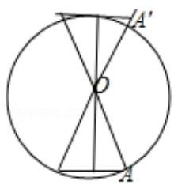

text_image

Geometric diagram showing a circle with inscribed triangle and labeled points A, A', and center O

【点评】本题考查数学中的文化，考查圆的内接和外切多边形的边长的求法，考查运算能力，属于基础题.

3.【分析】由已知利用同角三角函数基本关系式可求 $\tan C$ 的值，利用余弦定理可求 AB 的值，可得 A = C ，利用三角形的内角和定理可求 $B = \pi - 2C$ ，利用诱导公式，二倍角的正切函数公式即可求解 $\tan B$ 的值.

【解答】解：∵ $\cos C = \frac{2}{3}$ ，AC = 4，BC = 3，

$$
\therefore \tan C = \sqrt {\frac {1}{\cos^ {2} C} - 1} = \frac {\sqrt {5}}{2},
$$

$\therefore AB = \sqrt{AC^2 + BC^2 - 2AC \cdot BC \cdot \cos C} = \sqrt{4^2 + 3^2 - 2 \times 4 \times 3 \times \frac{2}{3}} = 3$ ，可得 $A = C$ ，

$$
\therefore B = \pi - 2 C,
$$

则 $\tan B = \tan (\pi - 2C) = -\tan 2C = \frac{-2\tan C}{1 - \tan^2 C} = \frac{-2\times\frac{\sqrt{5}}{2}}{1 - \frac{5}{4}} = 4\sqrt{5}$ .

故选：C.

【点评】本题主要考查了同角三角函数基本关系式，余弦定理，三角形的内角和定理，诱导公式，二倍角的正切函数公式在解三角形中的应用，考查了计算能力和转化思想，属于基础题.

4.【分析】先根据余弦定理求出 AB，再代入余弦定理求出结论.

【解答】解：在 $\Delta ABC$ 中， $\cos C = \frac{2}{3}$ ， $AC = 4$ ， $BC = 3$ ，

由余弦定理可得 $AB^{2}=AC^{2}+BC^{2}-2AC\cdot BC\cdot\cos C=4^{2}+3^{2}-2\times4\times3\times\frac{2}{3}=9$ ；

故 AB = 3 ;

$$
\therefore \cos B = \frac {A B ^ {2} + B C ^ {2} - A C ^ {2}}{2 A B \cdot B C} = \frac {3 ^ {2} + 3 ^ {2} - 4 ^ {2}}{2 \times 3 \times 3} = \frac {1}{9},
$$

故选：A.

【点评】本题主要考查了余弦定理的应用，熟练掌握余弦定理是解本题的关键.

5.【分析】根据相似三角形的性质、比例的性质、直角三角形的边角关系即可得出.

【解答】解： $\frac{DE}{AB}=\frac{EH}{AH}$ ， $\frac{FG}{BA}=\frac{CG}{CA}$ ，故 $\frac{EH}{AH}=\frac{CG}{CA}$ ，即 $\frac{EH}{AE+EH}=\frac{CG}{AE+EG+GC}$ ，

解得 $AE=\frac{EH\cdot EG}{CG-EH}$ ，AH=AE+EH，

故 $AB=\frac{DE\cdot AH}{EH}=\frac{DE(AE+EH)}{EH}=\frac{DE\cdot AE}{EH}+\frac{DE\cdot EH}{EH}=\frac{DE\cdot EG}{CG-EH}+DE=\frac{表高\times 表距}{表目距的差}+ 表高.$

另解：如图所示，连接 FD 并延长交 AB 于点 M，

$\frac{\text{表目距的差}}{\text{表高}} = \frac{GC}{FG} - \frac{EH}{DE} = \frac{AC}{AB} - \frac{AH}{AB} = \frac{CH}{AB}$

$$
\frac {\text {表高} \times \text {表距}}{\text {表目距的差}} = \frac {\text {表距}}{\frac {\text {表目距的差}}{\text {表高}}} = \frac {\frac {E G}{C H}}{\frac {A B}{}} = \frac {D F}{C H} \times A B = \frac {B D}{B H} \times A B = \frac {B M}{A B} \times A B = B M,
$$

$$
\therefore A B = B M + M A = \frac {\text {表高} \times \text {表距}}{\text {表目距的差}} + \text {表高}.
$$

故选：A.

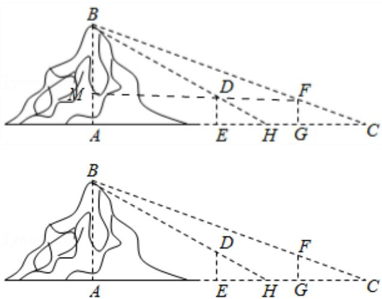

text_image

Geometric diagram showing two topographic views with labeled points and dashed construction lines, likely illustrating a math problem or proof.

【点评】本题考查了相似三角形的性质、比例的性质、直角三角形的边角关系，考查了推理能力与计算能力，属于中档题.

6.【分析】本题要注意各个三角形不共面，在每个三角形中利用正弦定理求边长，进而找到高度差.

【解答】解：过 C 作 $CH \perp BB'$ 于 H，过 B 作 $BM \perp AA'$ 于 M，

$$
\text {则} \angle B C H = 1 5 ^ {\circ}, B H = 1 0 0, \angle A B M = 4 5 ^ {\circ}, C H = C ^ {\prime} B ^ {\prime}, A ^ {\prime} B ^ {\prime} = B M = A M, B B ^ {\prime} = M A ^ {\prime}, \angle C ^ {\prime} A ^ {\prime} B ^ {\prime} = 7 5 ^ {\circ}
$$

$$
\therefore \tan \angle B C H = \tan 1 5 ^ {\circ} = \tan (4 5 ^ {\circ} - 3 0 ^ {\circ}) = \frac {\tan 4 5 ^ {\circ} - \tan 3 0 ^ {\circ}}{1 + \tan 4 5 ^ {\circ} \tan 3 0 ^ {\circ}} = 2 - \sqrt {3}, \quad \sin 7 5 ^ {\circ} = \sin (4 5 ^ {\circ} + 3 0 ^ {\circ}) = \frac {\sqrt {2}}{2} (\frac {\sqrt {3}}{2} + \frac {1}{2})
$$

则在 RtΔBCH 中， $CH=\frac{BH}{\tan\angle BCH}=100(2+\sqrt{3})$ ，∴ $C'B'=100(2+\sqrt{3})$

在 $\triangle A'B'C'$ 中，由正弦定理知， $A'B' = \frac{C'B'}{\sin\angle C'A'B'}\cdot \sin \angle A'C'B' = 100(\sqrt{3} +1)$ ， $\therefore AM = 100(\sqrt{3} +1)$

$$
\therefore A A ^ {\prime} - C C ^ {\prime} = A M + B H = 1 0 0 (\sqrt {3} + 1) + 1 0 0 \approx 3 7 3,
$$

故选：B.

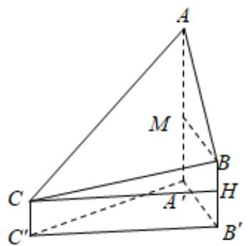

text_image

A
M
C
B
H
A'
C'
B'

【点评】理解仰角的概念，各个三角形不共面，因此做好辅助线是关键.

7.【分析】设角 A，B，C 所对的边分别为 a，b，c，利用余弦定理得到关于 a 的方程，解方程即可求得 a 的值，从而得到 BC 的长度.

【解答】解：设角 A，B，C 所对的边分别为 a，b，c，

结合余弦定理，可得 $19=a^{2}+4-2\times a\times2\times\cos120^{\circ}$ ，

即 $a^{2}+2a-15=0$ ，解得 a=3 （a=-5 舍去），

所以 BC = 3.

故选：D.

【点评】本题考查了余弦定理，考查了方程思想，属基础题.

8.【分析】利用正弦定理以及两角和差的三角公式进行转化求解即可.

【解答】解：由 $a \cos B - b \cos A = c$ 得 $\sin A \cos B - \sin B \cos A = \sin C$ ,

得 $\sin(A-B)=\sin C=\sin(A+B)$ ,

即 $\sin A\cos B - \sin B\cos A = \sin A\cos B + \sin B\cos A$

即 $2\sin B\cos A = 0$ ，得 $\sin B\cos A = 0$

在 $\Delta ABC$ 中， $\sin B \neq 0$ ，

∴ $\cos A = 0$ ，即 $A = \frac{\pi}{2}$ ，

则 $B = \pi - A - C = \pi - \frac{\pi}{2} - \frac{\pi}{5} = \frac{3\pi}{10}$ .

故选：C.

【点评】本题主要考查解三角形的应用，利用正弦定理，两角和差的三角公式进行转化求解是解决本题的关键，是中档题.

9.【分析】首先由正弦定理推论，将条件中的正弦值化为边，再运用余弦定理，求得 $C$ 的余弦值，即可得 $C$ 的值.

【解答】解：由正弦定理 $\frac{a}{\sin A} = \frac{b}{\sin B} = \frac{c}{\sin C} = 2R$ (R 为三角形外接圆半径）可得：

$$
\sin A = \frac {a}{2 R}, \quad \sin B = \frac {b}{2 R}, \quad \sin C = \frac {c}{2 R},
$$

所以 $(a + c)(\sin A - \sin C) = b(\sin A - \sin B)$ 可化为 $(a + c)(a - c) = b(a - b)$ ，

即 $a^2 + b^2 - c^2 = ab$

$$
\therefore \cos C = \frac {a ^ {2} + b ^ {2} - c ^ {2}}{2 a b} = \frac {a b}{2 a b} = \frac {1}{2},
$$

又 $C\in (0,\pi)$ ， $\therefore C = \frac{\pi}{3}$

故选：B.

【点评】本题考查正弦定理和余弦定理的综合应用，属简单题.

# 二、填空题

1.【分析】利用正弦定理可得 BC=2，利用余弦定理即可得出结论.

【解答】解：∵ $3\sin A = 2\sin B$ ，

∴由正弦定理可得：3BC=2AC，

∴由 AC=3，可得：BC=2，

$$
\because \cos C = \frac {1}{4},
$$

∴由余弦定理可得： $\frac{1}{4}=\frac{3^{2}+2^{2}-AB^{2}}{2\times3\times2}$

∴ 解得: $AB = \sqrt{10}$ .

故答案为： $\sqrt{10}$

【点评】本题考查正弦、余弦定理的运用，考查学生的计算能力，正确运用正弦、余弦定理是关键.

2.【分析】解直角三角形 $ABC$ ，可得 $\sin C$ ， $\cos C$ ，在三角形 $BCD$ 中，运用正弦定理可得 $BD$ ；再由三角函数的诱导公式和两角和差公式，计算可得所求值.

【解答】解：在直角三角形 ABC 中，AB = 4，BC = 3，AC = 5， $\sin C = \frac{4}{5}$ ，

在 $\Delta BCD$ 中，可得 $\frac{3}{\frac{\sqrt{2}}{2}} = \frac{BD}{\sin C}$ ，可得 $BD = \frac{12\sqrt{2}}{5}$ ；

$$
\angle C B D = 1 3 5 ^ {\circ} - C, \sin \angle C B D = \sin (1 3 5 ^ {\circ} - C) = \frac {\sqrt {2}}{2} (\cos C + \sin C) = \frac {\sqrt {2}}{2} \times \left(\frac {4}{5} + \frac {3}{5}\right) = \frac {7 \sqrt {2}}{1 0},
$$

即有 $\cos\angle ABD=\cos(90^{\circ}-\angle CBD)=\sin\angle CBD=\frac{7\sqrt{2}}{10}$

故答案为： $\frac{12\sqrt{2}}{5}$ ， $\frac{7\sqrt{2}}{10}$ ，

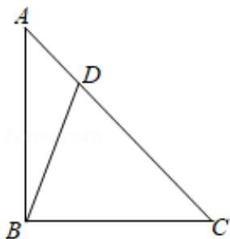

text_image

A
D
B
C

【点评】本题考查三角形的正弦定理和解直角三角形，考查三角函数的恒等变换，化简整理的运算能力，

属于中档题.

3.【分析】首先算出 $\overrightarrow{AO} = \frac{1}{2}\overrightarrow{AD}$ ，然后用 $\overrightarrow{AB}$ 、 $\overrightarrow{AC}$ 表示出 $\overrightarrow{AO}$ 、 $\overrightarrow{EC}$ ，结合 $\overrightarrow{AB} \cdot \overrightarrow{AC} = 6\overrightarrow{AO} \cdot \overrightarrow{EC}$ 得 $\frac{1}{2}\overrightarrow{AB}^2 = \frac{3}{2}\overrightarrow{AC}^2$ ，进一步可得结果.

【解答】解：设 $\overrightarrow{AO} = \lambda \overrightarrow{AD} = \frac{\lambda}{2} (\overrightarrow{AB} + \overrightarrow{AC})$ ,

$$
\overrightarrow {A O} = \overrightarrow {A E} + \overrightarrow {E O} = \overrightarrow {A E} + \mu \overrightarrow {E C} = \overrightarrow {A E} + \mu (\overrightarrow {A C} - \overrightarrow {A E})
$$

$$
= (1 - \mu) \overrightarrow {A E} + \mu \overrightarrow {A C} = \frac {1 - \mu}{3} \overrightarrow {A B} + \mu \overrightarrow {A C}
$$

$$
\therefore \left\{ \begin{array}{l} \frac {\lambda}{2} = \frac {1 - \mu}{3} \\ \frac {\lambda}{2} = \mu \end{array} , \quad \therefore \left\{ \begin{array}{l} \lambda = \frac {1}{2} \\ \mu = \frac {1}{4} \end{array} , \right. \right.
$$

$$
\therefore \overrightarrow {A O} = \frac {1}{2} \overrightarrow {A D} = \frac {1}{4} (\overrightarrow {A B} + \overrightarrow {A C}),
$$

$$
\overrightarrow {E C} = \overrightarrow {A C} - \overrightarrow {A E} = - \frac {1}{3} \overrightarrow {A B} + \overrightarrow {A C},
$$

$$
6 \overrightarrow {A O} \cdot \overrightarrow {E C} = 6 \times \frac {1}{4} (\overrightarrow {A B} + \overrightarrow {A C}) \cdot (- \frac {1}{3} \overrightarrow {A B} + \overrightarrow {A C})
$$

$$
= \frac {3}{2} \left(- \frac {1}{3} \overrightarrow {A B} ^ {2} + \frac {2}{3} \overrightarrow {A B} \cdot \overrightarrow {A C} + \overrightarrow {A C} ^ {2}\right)
$$

$$
= - \frac {1}{2} \overrightarrow {A B} ^ {2} + \overrightarrow {A B} \cdot \overrightarrow {A C} + \frac {3}{2} \overrightarrow {A C} ^ {2},
$$

$$
\because \overrightarrow {A B} \cdot \overrightarrow {A C} = - \frac {1}{2} \overrightarrow {A B} ^ {2} + \overrightarrow {A B} \cdot \overrightarrow {A C} + \frac {3}{2} \overrightarrow {A C} ^ {2},
$$

$$
\therefore \frac {1}{2} \overrightarrow {A B} ^ {2} = \frac {3}{2} \overrightarrow {A C} ^ {2}, \quad \therefore \frac {\overrightarrow {A B} ^ {2}}{\overrightarrow {A C} ^ {2}} = 3,
$$

$$
\therefore \frac {A B}{A C} = \sqrt {3}.
$$

故答案为： $\sqrt{3}$

【点评】本题考查向量的数量积的应用，考查向量的表示以及计算，考查计算能力.

4.【分析】由正弦定理化简已知等式可得 $\sin A\sin B + \sin A\cos B = 0$ ，由于 $\sin A > 0$ ，化简可得 $\tan B = -1$ 结合范围 $B\in (0,\pi)$ ，可求 $B$ 的值为 $\frac{3\pi}{4}$

【解答】解：∵ $b \sin A + a \cos B = 0$ ，

∴由正弦定理可得： $\sin A\sin B+\sin A\cos B=0$ ，

$$
\because A \in (0, \pi), \quad \sin A > 0,
$$

∴ 可得： $\sin B + \cos B = 0$ ，可得： $\tan B = -1$ ，

$$
\because B \in (0, \pi),
$$

$$
\therefore B = \frac {3 \pi}{4}.
$$

故答案为： $\frac{3\pi}{4}$ .

【点评】本题主要考查了正弦定理, 同角三角函数基本关系式, 特殊角的三角函数值在解三角形中的应用, 考查了计算能力和转化思想, 属于基础题.

5.【分析】利用余弦定理得到 $c^{2}$ ，然后根据面积公式 $S_{\Delta ABC}=\frac{1}{2}ac\sin B=c^{2}\sin B$ 求出结果即可.

【解答】解：由余弦定理有 $b^{2}=a^{2}+c^{2}-2ac\cos B$ ，

$$
\because b = 6, \quad a = 2 c, \quad B = \frac {\pi}{3},
$$

$$
\therefore 3 6 = (2 c) ^ {2} + c ^ {2} - 4 c ^ {2} \cos \frac {\pi}{3},
$$

$$
\therefore c ^ {2} = 1 2,
$$

$$
\therefore S _ {\triangle A B C} = \frac {1}{2} a c \sin B = c ^ {2} \sin B = 6 \sqrt {3},
$$

故答案为： $6\sqrt{3}$ .

【点评】本题考查了余弦定理和三角形的面积公式，属基础题.

6.【分析】利用勾股定理求出直角三角形斜边长，即大正方形的边长，由 $S_{2}=S_{1}-S_{\text{阴影}}$ ，求出 $S_{2}$ ，再求出 $\frac{S_{1}}{S_{2}}$ .

【解答】解：∵直角三角形直角边的长分别为3，4，

∴直角三角形斜边的长为 $\sqrt{3^{2}+4^{2}}=5$ ，

即大正方形的边长为 5，∴ $S_{1}=5^{2}=25$ ，

则小正方形的面积 $S_{2}=S_{1}-S_{阴影}=25-4\times\frac{1}{2}\times3\times4=1$

$$
\therefore \frac {S _ {1}}{S _ {2}} = 2 5.
$$

故答案为：25.

【点评】本题考查了三角形中的几何计算和勾股定理，考查运算能力，属于基础题.

7.【分析】在 $\Delta ABM$ 、 $\Delta ABC$ 和 $\Delta AMC$ 中用余弦定理即可解决此题.

【解答】解：在 $\Delta ABM$ 中： $AM^{2}=BA^{2}+BM^{2}-2BA\cdot BM\cos60^{\circ}$ ， $\therefore(2\sqrt{3})^{2}=2^{2}+BM^{2}-2\times2\cdot BM\cdot\frac{1}{2}$ $\therefore BM^{2} - 2BM - 8 = 0$ ，解得： $BM = 4$ 或-2（舍去）.

∵点M是BC中点，∴MC=4，BC=8，在 $\Delta ABC$ 中： $AC^{2}=2^{2}+8^{2}-2\times2\times8\cos60^{\circ}=52$ ，∴ $AC=2\sqrt{13}$ ；

在 $\Delta AMC$ 中： $\cos \angle MAC = \frac{(2\sqrt{3})^2 + (2\sqrt{13})^2 - 4^2}{2\times 2\sqrt{3}\times 2\sqrt{13}} = \frac{2\sqrt{39}}{13}.$

故答案为： $2\sqrt{13}$ ; $\frac{2\sqrt{39}}{13}$ .

【点评】本题考查余弦定理应用，考查数学运算能力，属于中档题.

8.【分析】由题意和三角形的面积公式以及余弦定理得关于 b 的方程，解方程可得.

【解答】解：∵ $\Delta ABC$ 的内角 A，B，C 的对边分别为 a，b，c，面积为 $\sqrt{3}$ ， $B = 60^{\circ}$ ， $a^{2} + c^{2} = 3ac$ ，
∴ $\frac{1}{2}ac\sin B=\sqrt{3}\Rightarrow\frac{1}{2}ac\times\frac{\sqrt{3}}{2}=\sqrt{3}\Rightarrow ac=4\Rightarrow a^{2}+c^{2}=12$

又 $\cos B = \frac{a^2 + c^2 - b^2}{2ac} \Rightarrow \frac{1}{2} = \frac{12 - b^2}{8} \Rightarrow b = 2\sqrt{2}$ ，（负值舍）

故答案为： $2\sqrt{2}$ .

【点评】本题考查三角形的面积公式以及余弦定理的应用，属基础题.

9.【分析】直接利用正弦定理和余弦定理求出结果.

【解答】解：在 $\triangle ABC$ 中， $\angle A = \frac{\pi}{3}$ ，AB = 2，AC = 3，

利用余弦定理 $BC^{2} = AC^{2} + AB^{2} - 2AB\cdot AC\cdot \cos A$ ，整理得 $BC = \sqrt{7}$

所以 $\frac{BC}{\sin A} = 2R$ ，解得 $R = \frac{\sqrt{21}}{3}$

故答案为： $\frac{\sqrt{21}}{3}$ .

【点评】本题考查的知识要点：正弦定理和余弦定理，主要考查学生的运算能力和数学思维能力，属于基础题.

10.【分析】首先设出 $BD$ ， $CD$ ，在两个三角形中分别表示 $AC$ ， $BC$ ，继而 $\frac{AC^2}{AB^2} = \frac{b^2}{c^2} = \frac{4x^2 - 4x + 4}{x^2 + 2x + 4} = 4 - \frac{12}{x + 1 + \frac{3}{x + 1}}$ ，从而利用均值不等式取等号的条件即可.

【解答】解：设 BD = x，CD = 2x，

在三角形 ACD 中， $b^{2}=4x^{2}+4-2\cdot2x\cdot2\cdot\cos60^{\circ}$ ，可得： $b^{2}=4x^{2}-4x+4$ ，

在三角形ABD中， $c^2 = x^2 +4 - 2\cdot x\cdot 2\cdot \cos 120^\circ$ ，可得： $c^2 = x^2 +2x + 4$

要使得 $\frac{AC}{AB}$ 最小，即 $\frac{b^{2}}{c^{2}}$ 最小，

$$
\frac {b ^ {2}}{c ^ {2}} = \frac {4 x ^ {2} - 4 x + 4}{x ^ {2} + 2 x + 4} = \frac {4 (x ^ {2} + 2 x + 4) - 1 2 x - 1 2}{x ^ {2} + 2 x + 4} = 4 - 1 2 \cdot \frac {x + 1}{x ^ {2} + 2 x + 4} = 4 - 1 2 \cdot \frac {x + 1}{(x + 1) ^ {2} + 3} = 4 - \frac {1 2}{x + 1 + \frac {3}{x + 1}},
$$

其中 $x + 1 + \frac{3}{x + 1} \geqslant 2\sqrt{3}$ ，此时 $\frac{b^2}{c^2} \geqslant 4 - 2\sqrt{3}$ ，

当且仅当 $(x+1)^{2}=3$ 时，即 $x=\sqrt{3}-1$ 或 $x=-\sqrt{3}-1$ （舍去），即 $x=\sqrt{3}-1$ 时取等号，

故答案为： $\sqrt{3} -1$

【点评】本题主要考查余弦定理及均值不等式的应用，属于中档题.

11.【分析】根据已知条件，结合正弦定理，即可求解.

【解答】解：在 $\Delta ABC$ 中，A = 2B，a = 6，b = 4，

则 $\frac{a}{\sin A} = \frac{b}{\sin B}$ ，即 $\frac{6}{\sin 2B} = \frac{6}{2\sin B\cos B} = \frac{4}{\sin B}$ ，解得 $\cos B = \frac{3}{4}$ .

故答案为： $\frac{3}{4}$ .

【点评】本题主要考查正弦定理的应用，属于基础题.

12.【分析】先求出斜坡的长度，求出上坡所消耗的总体力的函数关系，求出函数的导数，利用导数研究函数的最值即可.

【解答】解：斜坡的长度为 $l=\frac{4}{\sin\theta}$ ，

上坡所消耗的总体力 $y=\frac{4}{\sin\theta}\times(1.025-\cos\theta)=\frac{4.1-4\cos\theta}{\sin\theta}$

函数的导数 $y'=\frac{4\sin\theta\cdot\sin\theta-(4.1-4\cos\theta)\cos\theta}{\sin^{2}\theta}=\frac{4-4.1\cos\theta}{\sin^{2}\theta}$

由 $y' = 0$ ，得 $4 - 4.1 \cos \theta = 0$ ，得 $\cos \theta = \frac{40}{41}$ ， $\theta = \arccos \frac{40}{41}$ ，

由 $f'(x)>0$ 时 $\cos\theta<\frac{40}{41}$ ，即 $\arccos\frac{40}{41}<\theta<\frac{\pi}{2}$ 时，函数单调递增，

由 $f'(x) < 0$ 时 $\cos\theta > \frac{40}{41}$ ，即 $0 < \theta < \arccos\frac{40}{41}$ 时，函数单调递减，

即 $\theta = \arccos \frac{40}{41}$ ，函数取得最小值，即此时所消耗的总体力最小.

故答案为： $\theta=\arccos\frac{40}{41}$ .

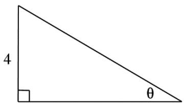

text_image

4
θ

【点评】本题主要考查生活的应用问题，求函数的导数，利用导数研究函数的最值是解决本题的关键，是

中档题.

13.【分析】在 $\Delta ABC$ 中，根据正弦定理可求出 $\angle ACB = 45^{\circ}$ ，从而可得 $\angle ABC = \angle ADB = 75^{\circ}$ ，即得 $AD = AB = 2$ .

【解答】解：如图，∵在 $\triangle ABC$ 中，AB=2， $\angle BAC=60^{\circ},BC=\sqrt{6}$ ，

∴由正弦定理可得 $\frac{BC}{\sin\angle BAC}=\frac{AB}{\sin\angle ACB}$ ,

$$
\therefore \sin \angle A C B = \frac {A B \times \sin \angle B A C}{B C} = \frac {2 \times \frac {\sqrt {3}}{2}}{\sqrt {6}} = \frac {\sqrt {2}}{2}, \text {又} \angle B A C = 6 0 ^ {\circ},
$$

$$
\therefore \angle A C B = 4 5 ^ {\circ}, \quad \therefore \angle A B C = 1 8 0 ^ {\circ} - 4 5 ^ {\circ} - 6 0 ^ {\circ} = 7 5 ^ {\circ},
$$

又 AD 为 $\angle BAC$ 的平分线，且 $\angle BAC = 60^{\circ}$ ，

$$
\therefore \angle B A D = 3 0 ^ {\circ} \text {, 又} \angle A B C = 7 5 ^ {\circ}, \therefore \angle A D B = 7 5 ^ {\circ},
$$

$$
\therefore A D = A B = 2.
$$

故答案为：2.

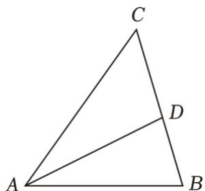

text_image

C
D
A
B

【点评】本题考查解三角形问题，正弦定理的应用，属中档题.

14.【分析】根据已知条件，结合正弦定理，即可求解.

【解答】解：三角形 ABC 中， $A + B + C = \pi, C = \frac{5\pi}{12}$ ，

$$
\sin C = \sin \left(\frac {\pi}{4} + \frac {\pi}{6}\right) = \sin \frac {\pi}{4} \cos \frac {\pi}{6} + \cos \frac {\pi}{4} \sin \frac {\pi}{6} = \frac {\sqrt {2} + \sqrt {6}}{4},
$$

由正弦定理 $\frac{BC}{\sin A} = \frac{AB}{\sin C}$ ， $BC = 2$ ， $A = \frac{\pi}{3}$

故 $AB=\frac{BC\sin C}{\sin A}=\frac{2\times\frac{\sqrt{2}+\sqrt{6}}{4}}{\frac{\sqrt{3}}{2}}=\frac{3\sqrt{2}+\sqrt{6}}{3}$ .

故答案为： $\frac{3\sqrt{2}+\sqrt{6}}{3}$ .

【点评】本题主要考查正弦定理的应用，属于基础题.

# 三、解答题

1.【分析】（1）由题意可求 BC，及弧 BC 所在的圆的半径 R，然后根据弧长公式可求；

（2）根据正弦定理可得， $\frac{BD}{\sin A} = \frac{AB}{\sin 58^{\circ}}$ ，可求 $\sin A$ ，进而可求 $A$ ，进而可求 $\angle ABD$ ，根据三角函数即可求解.

【解答】解：（1）由题意可得， $BC = BD\sin 22^{\circ}$ ，弧 BC 所在的圆的半径 $R = BC\sin\frac{\pi}{4} = \frac{\sqrt{2}}{2}BC$ ，弧 BC 的长度为 $\frac{1}{2}\pi R = \frac{1}{2}\pi \cdot BC \cdot \frac{\sqrt{2}}{2} = \frac{\sqrt{2}}{4} \times 3.141 \times 39.2 \times \sin 22^{\circ} = 16.310km$ ；

（2）根据正弦定理可得， $\frac{BD}{\sin A}=\frac{AB}{\sin58^{\circ}}$

$$
\therefore \sin A = \frac {3 9 . 2}{4 0} \times \sin 5 8 ^ {\circ} = 0. 8 3 1, \quad A = 5 6. 2 ^ {\circ},
$$

$$
\therefore \angle A B D = 1 8 0 ^ {\circ} - 5 6. 2 ^ {\circ} - 5 8 ^ {\circ} = 6 5. 8 ^ {\circ},
$$

$$
\therefore D H = B D \times \sin \angle A B D = 3 5. 7 5 0 k m <   C D = 3 6. 3 4 6 k m
$$

∴ D 到海岸线 A - B - C 的最短距离为 35.750 km

【点评】本题主要考查了利用三角函数，正弦定理求解三角形，还考查了基本运算.

2.【分析】（1）由余弦定理得： $\cos B=\frac{a^{2}+c^{2}-b^{2}}{2ac}=\frac{10c^{2}-2}{6c^{2}}=\frac{2}{3}$ ，由此能求出c的值.

（2）由 $\frac{\sin A}{a} = \frac{\cos B}{2b}$ ，利用正弦定理得 $2\sin B = \cos B$ ，再由 $\sin^2 B + \cos^2 B = 1$ ，能求出 $\sin B = \frac{\sqrt{5}}{5}$ ， $\cos B = \frac{2\sqrt{5}}{5}$ ，由此利用诱导公式能求出 $\sin (B + \frac{\pi}{2})$ 的值.

【解答】解: (1) ∵ 在 $\Delta ABC$ 中, 角 A, B, C 的对边分别为 a, b, c.

$$
a = 3 c, \quad b = \sqrt {2}, \quad \cos B = \frac {2}{3},
$$

∴由余弦定理得:

$$
\cos B = \frac {a ^ {2} + c ^ {2} - b ^ {2}}{2 a c} = \frac {1 0 c ^ {2} - 2}{6 c ^ {2}} = \frac {2}{3},
$$

解得 $c = \frac{\sqrt{3}}{3}$

(2) $\because \frac{\sin A}{a} = \frac{\cos B}{2b}$ ,

∴由正弦定理得： $\frac{\sin A}{a}=\frac{\sin B}{b}=\frac{\cos B}{2b}$

$$
\therefore 2 \sin B = \cos B,
$$

$$
\because \sin^ {2} B + \cos^ {2} B = 1,
$$

$$
\therefore \sin B = \frac {\sqrt {5}}{5}, \cos B = \frac {2 \sqrt {5}}{5},
$$

$$
\therefore \sin (B + \frac {\pi}{2}) = \cos B = \frac {2 \sqrt {5}}{5}.
$$

【点评】本题考查三角形边长、三角函数值的求法，考查正弦定理、余弦定理、诱导公式、同角三角函数关系式等基础知识，考查推理能力与计算能力，属于中档题.

3.【分析】（I）根据正余弦定理可得；

（Ⅱ）根据二倍角的正余弦公式以及和角的正弦公式可得.

【解答】解（Ⅰ）在三角形 ABC 中，由正弦定理 $\frac{b}{\sin B} = \frac{c}{\sin C}$ ，得 $b \sin C = c \sin B$ ，又由 $3c \sin B = 4a \sin C$ ，得 $3b \sin C = 4a \sin C$ ，即 3b = 4a。又因为 $b + c = 2a$ ，得 $b = \frac{4a}{3}$ ， $c = \frac{2a}{3}$ ，由余弦定理可得

$$
\cos B = \frac {a ^ {2} + c ^ {2} - b ^ {2}}{2 a c} = \frac {a ^ {2} + \frac {4}{9} a ^ {2} - \frac {1 6}{9} a ^ {2}}{2 \cdot a \cdot \frac {2}{3} a} = - \frac {1}{4}.
$$

（Ⅱ）由（Ⅰ）得 $\sin B = \sqrt{1 - \cos^{2}B} = \frac{\sqrt{15}}{4}$ ，从而 $\sin 2B = 2\sin B\cos B = -\frac{\sqrt{15}}{8}$ ，

$$
\cos 2 B = \cos^ {2} B - \sin^ {2} B = - \frac {7}{8},
$$

故 $\sin (2B + \frac{\pi}{6}) = \sin 2B\cos \frac{\pi}{6} +\cos 2B\sin \frac{\pi}{6} = -\frac{\sqrt{15}}{8}\times \frac{\sqrt{3}}{2} -\frac{7}{8}\times \frac{1}{2} = -\frac{3\sqrt{5} + 7}{16}.$

【点评】本小题主要考查同角三角函数的基本关系，两角和的正弦公式，二倍角的正余弦公式，以及正弦定理、余弦定理等基础知识．考查运算求解能力．属中档题．

4.【分析】（1）利用余弦定理可得 $b^{2}=a^{2}+c^{2}-2ac\cos B$ ，代入已知条件即可得到关于b的方程，解方程即可；

(2) $\sin (B + C) = \sin (\pi - A) = \sin A$ ，根据正弦定理可求出 $\sin A$ .

【解答】解：（1）∵ a=3，b-c=2， $\cos B=-\frac{1}{2}$ .

∴由余弦定理，得 $b^{2}=a^{2}+c^{2}-2ac\cos B$

$$
= 9 + (b - 2) ^ {2} - 2 \times 3 \times (b - 2) \times \left(- \frac {1}{2}\right),
$$

$$
\therefore b = 7, \quad \therefore c = b - 2 = 5;
$$

（2）在 $\Delta ABC$ 中， $\because \cos B = -\frac{1}{2}$ ， $\therefore \sin B = \frac{\sqrt{3}}{2}$ ，

由正弦定理有： $\frac{a}{\sin A}=\frac{b}{\sin B}$ ，

$$
\therefore \sin A = \frac {a \sin B}{b} = \frac {3 \times \frac {\sqrt {3}}{2}}{7} = \frac {3 \sqrt {3}}{1 4},
$$

$$
\therefore \sin (B + C) = \sin (\pi - A) = \sin A = \frac {3 \sqrt {3}}{1 4}.
$$

【点评】本题考查了正弦定理余弦定理，属基础题.

5.【分析】（1）运用三角函数的诱导公式和二倍角公式，以及正弦定理，计算可得所求角；

（2）运用余弦定理可得 $b$ ，由三角形ABC为锐角三角形，可得 $a^2 + a^2 - a + 1 > 1$ 且 $1 + a^2 - a + 1 > a^2$ ，求得 $a$ 的范围，由三角形的面积公式，可得所求范围.

【解答】解：（1） $a\sin\frac{A+C}{2}=b\sin A$ ，即为 $a\sin\frac{\pi-B}{2}=a\cos\frac{B}{2}=b\sin A$ ，

可得 $\sin A\cos\frac{B}{2}=\sin B\sin A=2\sin\frac{B}{2}\cos\frac{B}{2}\sin A$

$$
\because \sin A > 0,
$$

$$
\therefore \cos \frac {B}{2} = 2 \sin \frac {B}{2} \cos \frac {B}{2},
$$

若 $\cos\frac{B}{2}=0$ ，可得 $B=(2k+1)\pi,\quad k\in Z$ 不成立，

$$
\therefore \sin \frac {B}{2} = \frac {1}{2},
$$

由 $0 < B < \pi$ ，可得 $B = \frac{\pi}{3}$

（2）若 $\Delta ABC$ 为锐角三角形，且 c=1，

由余弦定理可得 $b=\sqrt{a^{2}+1-2a\cdot1\cdot\cos\frac{\pi}{3}}=\sqrt{a^{2}-a+1}$ ，

由三角形 ABC 为锐角三角形，可得 $a^{2} + a^{2} - a + 1 > 1$ 且 $1 + a^{2} - a + 1 > a^{2}$ ，且 $1 + a^{2} > a^{2} - a + 1$ ，

解得 $\frac{1}{2} < a < 2$

可得 $\Delta ABC$ 面积 $S=\frac{1}{2}a\cdot\sin\frac{\pi}{3}=\frac{\sqrt{3}}{4}a\in(\frac{\sqrt{3}}{8},\quad\frac{\sqrt{3}}{2})$ .

【点评】本题考查三角形的正弦定理和余弦定理、面积公式的运用，考查三角函数的恒等变换，以及化简运算能力，属于中档题.

6.【分析】（1）由正弦定理得： $b^{2}+c^{2}-a^{2}=bc$ ，再由余弦定理能求出A。

（2）由已知及正弦定理可得： $\sin(C-\frac{\pi}{6})=\frac{\sqrt{2}}{2}$ ，可解得C的值，由两角和的正弦函数公式即可得解.

【解答】解：（1） $\Delta ABC$ 的内角 A，B，C 的对边分别为 a，b，c。

$$
\because (\sin B - \sin C) ^ {2} = \sin^ {2} A - \sin B \sin C.
$$

$$
\therefore \sin^ {2} B + \sin^ {2} C - 2 \sin B \sin C = \sin^ {2} A - \sin B \sin C,
$$

∴由正弦定理得： $b^{2}+c^{2}-a^{2}=bc$ ，

$$
\therefore \cos A = \frac {b ^ {2} + c ^ {2} - a ^ {2}}{2 b c} = \frac {b c}{2 b c} = \frac {1}{2},
$$

$$
\because 0 <   A <   \pi , \therefore A = \frac {\pi}{3}.
$$

(2) $\because \sqrt{2} a + b = 2c, A = \frac{\pi}{3},$

∴由正弦定理得 $\sqrt{2}\sin A + \sin B = 2\sin C$ ,

$$
\therefore \frac {\sqrt {6}}{2} + \sin \left(\frac {2 \pi}{3} - C\right) = 2 \sin C
$$

解得 $\sin(C-\frac{\pi}{6})=\frac{\sqrt{2}}{2}$ ,

$\therefore C - \frac{\pi}{6} = \frac{\pi}{4}$ 或 $C - \frac{\pi}{6} = \frac{3\pi}{4}$ ,

$$
\because 0 <   C <   \frac {2 \pi}{3}, \therefore C = \frac {\pi}{4} + \frac {\pi}{6},
$$

$$
\therefore \sin C = \sin \left(\frac {\pi}{4} + \frac {\pi}{6}\right) = \sin \frac {\pi}{4} \cos \frac {\pi}{6} + \cos \frac {\pi}{4} \sin \frac {\pi}{6} = \frac {\sqrt {2}}{2} \times \frac {\sqrt {3}}{2} + \frac {\sqrt {2}}{2} \times \frac {1}{2} = \frac {\sqrt {6} + \sqrt {2}}{4}.
$$

【点评】本题考查了正弦定理、余弦定理、三角函数性质，考查了推理能力与计算能力，属于中档题.

7.【分析】由正弦定理化简已知等式可得 $b^{2} + c^{2} - a^{2} = bc$ ，进而根据余弦定理可求 $\cos A = \frac{1}{2}$ ，结合范围 $0 < A < \pi$ ，可求 $A$ 的值；

由已知利用三角形的面积公式可求 bc = 40，又由余弦定理可得 $b^{2} + c^{2} = 89$ ，联立即可解得 b，c 的值.

【解答】解：因为 $\sin^{2}B + \sin^{2}C - \sin^{2}A = \sin B \sin C$ ，

所以 $b^{2}+c^{2}-a^{2}=bc$ ，

则 $\cos A=\frac{b^{2}+c^{2}-a^{2}}{2bc}=\frac{bc}{2bc}=\frac{1}{2}$

因为 $0 < A < \pi$ ，

所以 $A=\frac{\pi}{3}$ .

因为 $\Delta ABC$ 的面积为 $10\sqrt{3}$ ，

所以 $\frac{1}{2} bc\sin A = \frac{\sqrt{3}}{4} bc = 10\sqrt{3}$ ，即 $bc = 40$ ，①

又因为由余弦定理可得： $b^{2}+c^{2}-a^{2}=bc,\quad a=7$

所以 $b^{2}+c^{2}=89$ ，②

所以由①②联立解得b=5，c=8或b=8，c=5。

【点评】本题考查三角形的正弦定理、余弦定理和面积公式的运用，考查方程思想和运算能力，属于中档题.

8.【分析】（1）根据题意， $B=150^{\circ}$ ，通过余弦定理，即可求得c=2， $a=2\sqrt{3}$ ，进而通过三角形面积公式 $S_{\triangle ABC}=\frac{1}{2}ac\sin B=\frac{1}{2}\cdot2\sqrt{3}\cdot2\cdot\frac{1}{2}=\sqrt{3}$

（2）通过三角形内角和为 $180^{\circ}$ ，将 $A = 180^{\circ} - 150^{\circ} - C$ 代入 $\sin A + \sqrt{3}\sin C = \frac{\sqrt{2}}{2}$ ，根据 $C$ 的范围，即可求得 $C = 15^{\circ}$ .

【解答】解：（1） $\Delta ABC$ 中， $B=150^{\circ}$ ， $a=\sqrt{3}c$ ， $b=2\sqrt{7}$ ，

$$
\cos B = \frac {a ^ {2} + c ^ {2} - b ^ {2}}{2 a c} = \frac {3 c ^ {2} + c ^ {2} - 2 8}{2 \sqrt {3} c ^ {2}} = - \frac {\sqrt {3}}{2},
$$

$\therefore c=2$ （负值舍去）， $a=2\sqrt{3}$ ，

$$
\therefore S _ {\triangle A B C} = \frac {1}{2} a c \sin B = \frac {1}{2} \cdot 2 \sqrt {3} \cdot 2 \cdot \frac {1}{2} = \sqrt {3}.
$$

(2) $\sin A + \sqrt{3}\sin C = \frac{\sqrt{2}}{2},$

即 $\sin (180^{\circ} - 150^{\circ} - C) + \sqrt{3}\sin C = \frac{\sqrt{2}}{2}$

化简得 $\frac{1}{2}\cos C + \frac{\sqrt{3}}{2}\sin C = \frac{\sqrt{2}}{2}$

$$
\sin (C + 3 0 ^ {\circ}) = \frac {\sqrt {2}}{2},
$$

$$
\because 0 ^ {\circ} <   C <   3 0 ^ {\circ},
$$

$$
\therefore 3 0 ^ {\circ} <   C + 3 0 ^ {\circ} <   6 0 ^ {\circ},
$$

$$
\therefore C + 3 0 ^ {\circ} = 4 5 ^ {\circ},
$$

$$
\therefore C = 1 5 ^ {\circ}.
$$

【点评】本题主要考查解三角形中余弦定理的应用，结合三角恒等变换中辅助角公式的应用，属于基础题.

9.【分析】选择条件①（Ⅰ）由余弦定理求出 $(a+b)(a-b)=49+2b$ ，再结合 $a+b=11$ ，即可求出a的值，（Ⅱ）由正弦定理可得 $\sin C$ ，再根据三角形的面积公式即可求出，

选择条件②（Ⅰ）根据同角的三角函数的关系和正弦定理可得 $\frac{a}{b} = \frac{\sin A}{\sin B} = \frac{6}{5}$ ，再结合 $a + b = 11$ ，即可求出 $a$ 的值，

（Ⅱ）由两角和的正弦公式求出 $\sin C$ ，再根据三角形的面积公式即可求出.

【解答】解：选择条件①（Ⅰ）由余弦定理得 $a^{2}=b^{2}+c^{2}-2bc\cos A$ ，即 $a^{2}-b^{2}=49-14b\times(-\frac{1}{7})=49+2b$ ∴ $(a + b)(a - b) = 49 + 2b$

$$
\because a + b = 1 1,
$$

$$
\therefore 1 1 a - 1 1 b = 4 9 + 2 b,
$$

即 $11a - 13b = 49$

联立 $\left\{\begin{aligned}a+b=11\\ 11a-13b=49\end{aligned}\right.$ ，解得a=8，b=3，

故 $a = 8$ ：

（II）在 $\Delta ABC$ 中， $\sin A > 0$ ，

$$
\therefore \sin A = \sqrt {1 - \cos^ {2} A} = \frac {4 \sqrt {3}}{7},
$$

由正弦定理可得 $\frac{a}{\sin A} = \frac{c}{\sin C}$

$$
\therefore \sin C = \frac {c \sin A}{a} = \frac {7 \times \frac {4 \sqrt {3}}{7}}{8} = \frac {\sqrt {3}}{2},
$$

$$
\therefore S _ {\triangle A B C} = \frac {1}{2} a b \sin C = \frac {1}{2} \times 8 \times 3 \times \frac {\sqrt {3}}{2} = 6 \sqrt {3}.
$$

选择条件②（Ⅰ）在 $\Delta ABC$ 中， $\sin A > 0$ ， $\sin B > 0$ ， $C = \pi - (A + B)$ ，

$$
\because \cos A = \frac {1}{8}, \quad \cos B = \frac {9}{1 6},
$$

$$
\therefore \sin A = \sqrt {1 - \cos^ {2} A} = \frac {3 \sqrt {7}}{8}, \quad \sin B = \sqrt {1 - \cos^ {2} B} = \frac {5 \sqrt {7}}{1 6},
$$

由正弦定理可得 $\frac{a}{\sin A} = \frac{b}{\sin B}$

$$
\therefore \frac {a}{b} = \frac {\sin A}{\sin B} = \frac {6}{5},
$$

$$
\because a + b = 1 1,
$$

$$
\therefore a = 6, \quad b = 5,
$$

故 $a = 6$

（Ⅱ）在 $\Delta ABC$ 中， $C = \pi - (A + B)$ ，

$$
\therefore \sin C = \sin (A + B) = \sin A \cos B + \cos A \sin B = \frac {3 \sqrt {7}}{8} \times \frac {9}{1 6} + \frac {5 \sqrt {7}}{1 6} \times \frac {1}{8} = \frac {\sqrt {7}}{4},
$$

$$
\therefore S _ {\triangle A B C} = \frac {1}{2} a b \sin C = \frac {1}{2} \times 6 \times 5 \times \frac {\sqrt {7}}{4} = \frac {1 5 \sqrt {7}}{4}
$$

【点评】本题考查了同角的三角函数的关系，两角和的正弦公式，正余弦定理，三角形的面积公式等知识，考查了运算能力求解能力，转化月化归能力，属于中档题.

10.【分析】①根据题意，结合正弦定理，可得 $b = \frac{\sqrt{3}}{3} a$ ， $c = \frac{\sqrt{3}}{a}$ ，结合 $C = \frac{\pi}{6}$ ，运用余弦定理 $\cos C = \frac{a^2 + b^2 - c^2}{2ab}$ ，即可求得 $c = 1$ .

②根据题意， $\Delta ABC$ 中， $c \sin A = a \sin C$ ，即可求得 $a = 6$ ，进而得到 $b = 2\sqrt{3}$ 。运用余弦定理 $\cos C = \frac{a^2 + b^2 - c^2}{2ab}$ ，即可求得 $c = 2\sqrt{3}$ 。  
③根据 $c = \sqrt{3}b$ ， $\sin A = \sqrt{3}\sin B$ 即 $a = \sqrt{3}b$ ，可列式求得 $\cos C = \frac{\sqrt{3}}{6}$ ，与已知条件 $C = \frac{\pi}{6}$ 矛盾，所以问题中的三角形不存在.

【解答】解：① $ac=\sqrt{3}$ .

$\Delta ABC$ 中， $\sin A = \sqrt{3}\sin B$ ，即 $b = \frac{\sqrt{3}}{3} a$

$$
a c = \sqrt {3}, \therefore c = \frac {\sqrt {3}}{a},
$$

$$
\cos C = \frac {a ^ {2} + b ^ {2} - c ^ {2}}{2 a b} = \frac {a ^ {2} + \frac {a ^ {2}}{3} - \frac {3}{a ^ {2}}}{\frac {2 \sqrt {3} a ^ {2}}{3}} = \frac {\sqrt {3}}{2},
$$

$$
\therefore a = \sqrt {3}, b = 1, c = 1.
$$

② $c \sin A = 3$ .

$\Delta ABC$ 中， $c\sin A = a\sin C = a\sin \frac{\pi}{6} = 3$ ， $\therefore a = 6$ ：

$\because \sin A = \sqrt{3} \sin B$ ，即 $a = \sqrt{3} b$ ， $\therefore b = 2\sqrt{3}$ .

$$
\cos C = \frac {a ^ {2} + b ^ {2} - c ^ {2}}{2 a b} = \frac {3 6 + 1 2 - c ^ {2}}{2 \times 6 \times 2 \sqrt {3}} = \frac {\sqrt {3}}{2},
$$

$$
\therefore c = 2 \sqrt {3}.
$$

③ $c = \sqrt{3}b$ .

$\because \sin A = \sqrt{3} \sin B,$ 即 $a = \sqrt{3} b,$

又∵ $c=\sqrt{3}b$ ，

$$
\cos C = \frac {a ^ {2} + b ^ {2} - c ^ {2}}{2 a b} = \frac {\sqrt {3}}{6} \neq \cos \frac {\pi}{6},
$$

与已知条件 $C=\frac{\pi}{6}$ 相矛盾，所以问题中的三角形不存在.

【点评】本题主要考查解三角形中的正弦定理与余弦定理，熟练掌握余弦定理并灵活地应用是解本题的关键.

11.【分析】（1）由题意及余弦定理求出 b 边，再由正弦定理求出 $\sin C$ 的值；

（2）三角形的内角和为 $180^{\circ}$ ， $\cos \angle ADC = -\frac{4}{5}$ ，可得 $\angle ADC$ 为钝角，可得 $\angle DAC$ 与 $\angle ADC + \angle C$ 互为补角，所以 $\sin \angle DAC = \sin (\angle ADC + \angle C)$ 展开可得 $\sin \angle DAC$ 及 $\cos \angle DAC$ ，进而求出 $\tan \angle DAC$ 的值.

【解答】解：（1）因为 $a = 3$ ， $c = \sqrt{2}$ ， $B = 45^{\circ}$ ，由余弦定理可得：

$$
b = \sqrt {a ^ {2} + c ^ {2} - 2 a c \cos B} = \sqrt {9 + 2 - 2 \times 3 \times \sqrt {2} \times \frac {\sqrt {2}}{2}} = \sqrt {5},
$$

由正弦定理可得 $\frac{c}{\sin C} = \frac{b}{\sin B}$ ，所以 $\sin C = \frac{c}{b} \cdot \sin 45^\circ = \frac{\sqrt{2}}{\sqrt{5}} \cdot \frac{\sqrt{2}}{2} = \frac{\sqrt{5}}{5}$ ，

所以 $\sin C = \frac{\sqrt{5}}{5}$ ;

（2）因为 $\cos\angle ADC = -\frac{4}{5}$ ，所以 $\sin\angle ADC = \sqrt{1 - \cos^{2}\angle ADC} = \frac{3}{5}$ ，

在三角形 ADC 中，易知 C 为锐角，由（1）可得 $\cos C = \sqrt{1 - \sin^{2}C} = \frac{2\sqrt{5}}{5}$ ，

所以在三角形 ADC 中， $\sin\angle DAC=\sin(\angle ADC+\angle C)=\sin\angle ADC\cos\angle C+\cos\angle ADC\sin\angle C=\frac{2\sqrt{5}}{25}$ 因为 $\angle DAC\in (0,\frac{\pi}{2})$ ，所以 $\cos \angle DAC = \sqrt{1 - \sin^2\angle DAC} = \frac{11\sqrt{5}}{25}$

所以 $\tan \angle DAC = \frac{\sin\angle DAC}{\cos\angle DAC} = \frac{2}{11}$

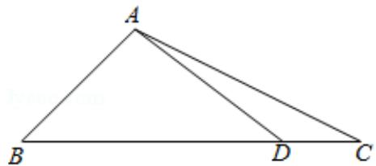

text_image

A
B
D
C

【点评】本题考查三角形的正弦定理及余弦定理的应用，及两角和的正弦公式的应用，属于中档题.

12.【分析】（I）根据正弦定理可得 $\sin B = \frac{\sqrt{3}}{2}$ ，结合角的范围，即可求出，

（Ⅱ）根据两角和差的余弦公式，以及利用正弦函数的性质即可求出.

【解答】解：（Ⅰ）∵ $2b\sin A = \sqrt{3}a$ ，

$$
\therefore 2 \sin B \sin A = \sqrt {3} \sin A,
$$

$$
\because \sin A \neq 0,
$$

$$
\therefore \sin B = \frac {\sqrt {3}}{2},
$$

∵ $\Delta ABC$ 为锐角三角形，

$$
\therefore B = \frac {\pi}{3},
$$

（Ⅱ）∵ $\Delta ABC$ 为锐角三角形， $B=\frac{\pi}{3}$

$$
\therefore C = \frac {2 \pi}{3} - A,
$$

$$
\therefore \cos A + \cos B + \cos C = \cos A + \cos (\frac {2 \pi}{3} - A) + \cos \frac {\pi}{3} = \cos A - \frac {1}{2} \cos A + \frac {\sqrt {3}}{2} \sin A + \frac {1}{2} = \frac {1}{2} \cos A + \frac {\sqrt {3}}{2} \sin A + \frac {1}{2} = \sin (A + \frac {\pi}{6}) + \frac {1}{2},
$$

$\Delta ABC$ 为锐角三角形， $0 < A < \frac{\pi}{2}$ ， $0 < C < \frac{\pi}{2}$

解得 $\frac{\pi}{6}<A<\frac{\pi}{2}$ ,

$$
\therefore \frac {\pi}{3} <   A + \frac {\pi}{6} <   \frac {2 \pi}{3},
$$

$$
\therefore \frac {\sqrt {3}}{2} <   \sin (A + \frac {\pi}{6}) \leqslant 1,
$$

$$
\therefore \frac {\sqrt {3}}{2} + \frac {1}{2} <   \sin (A + \frac {\pi}{6}) + \frac {1}{2} \leqslant \frac {3}{2},
$$

$\therefore \cos A + \cos B + \cos C$ 的取值范围为 $(\frac{\sqrt{3} + 1}{2}, \frac{3}{2}]$ .

【点评】本题考查了正弦定理，三角函数的化简，三角函数的性质，考查了运算求解能力和转化与化归能力，属于中档题.

13.【分析】（I）根据余弦定理即可求出 C 的大小，

（Ⅱ）根据正弦定理即可求出 $\sin A$ 的值，  
（III）根据同角的三角形函数的关系，二倍角公式，两角和的正弦公式即可求出.

【解答】解：（Ⅰ）由余弦定理以及 $a=2\sqrt{2}$ ，b=5， $c=\sqrt{13}$ ，

则 $\cos C = \frac{a^2 + b^2 - c^2}{2ab} = \frac{8 + 25 - 13}{2\times 2\sqrt{2}\times 5} = \frac{\sqrt{2}}{2},$

$$
\because C \in (0, \pi),
$$

$$
\therefore C = \frac {\pi}{4};
$$

（Ⅱ）由正弦定理，以及 $C=\frac{\pi}{4}$ ， $a=2\sqrt{2}$ ， $c=\sqrt{13}$ ，可得 $\sin A=\frac{a\sin C}{c}=\frac{2\sqrt{2}\times\frac{\sqrt{2}}{2}}{\sqrt{13}}=\frac{2\sqrt{13}}{13}$ ；  
（III）由 $a < c$ ，及 $\sin A = \frac{2\sqrt{13}}{13}$ ，可得 $\cos A = \sqrt{1 - \sin^2 A} = \frac{3\sqrt{13}}{13}$

则 $\sin 2A = 2\sin A\cos A = 2 \times \frac{2\sqrt{13}}{13} \times \frac{3\sqrt{13}}{13} = \frac{12}{13}$ ,

$$
\therefore \cos 2 A = 2 \cos^ {2} A - 1 = \frac {5}{1 3},
$$

$$
\therefore \sin (2 A + \frac {\pi}{4}) = \frac {\sqrt {2}}{2} (\sin 2 A + \cos 2 A) = \frac {\sqrt {2}}{2} (\frac {1 2}{1 3} + \frac {5}{1 3}) = \frac {1 7 \sqrt {2}}{2 6}.
$$

【点评】本题考了正余弦定理，同角的三角形函数的关系，二倍角公式，两角和的正弦公式，属于中档题.

14.【分析】（1）运用余弦定理和特殊角的三角函数值，可得所求角；

（2）方法一、运用正弦定理和三角函数的和差公式，结合余弦函数的图象和性质，可得所求最大值.方法二、运用余弦定理和基本不等式，即可得到所求最大值.

【解答】解：（1）设 $\Delta ABC$ 的内角 A，B，C 所对的边分别为 a，b，c，

因为 $\sin^{2}A - \sin^{2}B - \sin^{2}C = \sin B \sin C$ ,

由正弦定理可得 $a^2 - b^2 - c^2 = bc$

即为 $b^{2}+c^{2}-a^{2}=-bc$ ，

由余弦定理可得 $\cos A=\frac{b^{2}+c^{2}-a^{2}}{2bc}=-\frac{bc}{2bc}=-\frac{1}{2}$

由 $0 < A < \pi$ ，可得 $A = \frac{2\pi}{3}$

(2) 由题意可得 a = 3，

又 $B + C = \frac{\pi}{3}$ ，可设 $B = \frac{\pi}{6} -d$ ， $C = \frac{\pi}{6} +d$ ， $-\frac{\pi}{6} <  d <   \frac{\pi}{6},$

由正弦定理可得 $\frac{3}{\sin\frac{2\pi}{3}} = \frac{b}{\sin B} = \frac{c}{\sin C} = 2\sqrt{3}$

可得 $b=2\sqrt{3}\sin(\frac{\pi}{6}-d)$ ， $c=2\sqrt{3}\sin(\frac{\pi}{6}+d)$ ，

则 $\Delta ABC$ 周长为 $a + b + c = 3 + 2\sqrt{3}[\sin(\frac{\pi}{6} - d) + \sin(\frac{\pi}{6} + d)] = 3 + 2\sqrt{3}(\frac{1}{2}\cos d - \frac{\sqrt{3}}{2}\sin d + \frac{1}{2}\cos d + \frac{\sqrt{3}}{2}\sin d)$ $=3+2\sqrt{3}\cos d$

当 $d = 0$ ，即 $B = C = \frac{\pi}{6}$ 时， $\Delta ABC$ 的周长取得最大值 $3 + 2\sqrt{3}$

另解： $a = 3$ ， $A = \frac{2\pi}{3}$ 又 $a^2 = b^2 +c^2 -2bc\cos A$

$$
\therefore 9 = b ^ {2} + c ^ {2} + b c = (b + c) ^ {2} - b c \geqslant (b + c) ^ {2} - \frac {1}{4} (b + c) ^ {2},
$$

由 $b+c>3$ ，则 $b+c\leqslant2\sqrt{3}$ （当且仅当 b=c 时，“=”成立），

则 $\Delta ABC$ 周长的最大值为 $3 + 2\sqrt{3}$ .

【点评】本题考查三角形的正弦定理和余弦定理的运用，考查三角函数的恒等变换和图象与性质，考查方程思想和化简运算能力，属于中档题.

15.【分析】(1)由已知利用诱导公式, 同角三角函数基本关系式化简已知等式可得 $\sin^2 A - \cos A + \frac{1}{4} = 0$ , 解方程得 $\cos A = \frac{1}{2}$ , 结合范围 $A \in (0, \pi)$ , 可求 $A$ 的值;

（2）由已知利用正弦定理，三角函数恒等变换的应用可求 $\sin (B - \frac{\pi}{3}) = \frac{1}{2}$ ，结合范围 $B - \frac{\pi}{3} \in (-\frac{\pi}{3}, \frac{\pi}{3})$ ，可求 $B = \frac{\pi}{2}$ ，即可得证.

【解答】解：（1）∵ $\cos^{2}\left(\frac{\pi}{2}+A\right)+\cos A=\sin^{2}A+\cos A=1-\cos^{2}A+\cos A=\frac{5}{4}$

$\therefore \cos^2 A - \cos A + \frac{1}{4} = 0$ ，解得 $\cos A = \frac{1}{2}$

$$
\because A \in (0, \pi),
$$

$$
\therefore A = \frac {\pi}{3};
$$

（2）证明：∵ $b-c=\frac{\sqrt{3}}{3}a,\quad A=\frac{\pi}{3}$

∴由正弦定理可得 $\sin B-\sin C=\frac{\sqrt{3}}{3}\sin A=\frac{1}{2}$ ，

$$
\therefore \sin B - \sin \left(\frac {2 \pi}{3} - B\right) = \sin B - \frac {\sqrt {3}}{2} \cos B - \frac {1}{2} \sin B = \frac {1}{2} \sin B - \frac {\sqrt {3}}{2} \cos B = \sin \left(B - \frac {\pi}{3}\right) = \frac {1}{2},
$$

$$
\because B \in (0, \frac {2 \pi}{3}), \quad B - \frac {\pi}{3} \in (- \frac {\pi}{3}, \frac {\pi}{3}),
$$

$\therefore B - \frac{\pi}{3} = \frac{\pi}{6}$ ，可得 $B = \frac{\pi}{2}$ ，可得 $\Delta ABC$ 是直角三角形，得证.

【点评】本题主要考查了正弦定理，三角函数恒等变换的应用，考查了计算能力和转化思想，考查了方程思想的应用，属于基础题.

16.【分析】根据已知条件，结合三角函数的恒等变换公式和三角函数的同角公式，求出 $\cos A = -\frac{1}{3}$ ， $\sin A=\frac{2\sqrt{2}}{3}$ ，再结合正弦定理，余弦定理，即可求解.

【解答】解：∵ $A + B + C = \pi$ ， $\sin^{2}(B + C) + \sqrt{2} \sin 2A = 0$ ，

$$
\therefore \sin^ {2} A + 2 \sqrt {2} \sin A \cos A = 0,
$$

$$
\because \sin A \neq 0,
$$

$$
\therefore \sin A = - 2 \sqrt {2} \cos A,
$$

$\therefore \cos A < 0, A$ 为钝角，

又∵ $\sin^{2}A+\cos^{2}A=1$ ，

$$
\therefore \cos A = - \frac {1}{3}, \quad \sin A = \frac {2 \sqrt {2}}{3},
$$

由正弦定理可得， $\frac{a}{\sin A}=\frac{b}{\sin B}$ ，即 $\frac{2\sqrt{6}}{\frac{2\sqrt{2}}{3}}=\frac{3}{\sin B}$ ，解得 $\sin B=\frac{\sqrt{3}}{3}$ ，

又∵ $\sin^{2}B+\cos^{2}B=1$ ，B为锐角，

$$
\therefore \cos B = \frac {\sqrt {6}}{3},
$$

∴ $\cos B = \frac{a^{2} + c^{2} - b^{2}}{2ac}$ ，即 $\frac{24 + c^{2} - 9}{4\sqrt{6}c} = \frac{\sqrt{6}}{3}$ ，化简整理可得， $c^{2} - 8c + 15 = 0$ ，解得 c = 3 或 c = 5，

$$
\because \angle A > \angle C,
$$

$$
\therefore a > c,
$$

$$
\because 5 > 2 \sqrt {6},
$$

$$
\therefore c = 3,
$$

故 c=3， $\cos B=\frac{\sqrt{6}}{3}$ .

【点评】本题主要考查解三角形，考查转化能力，属于中档题.

17.【分析】（1）由已知利用正弦定理即可求解 b 的值；利用余弦定理即可求解 c 的值.

（2）根据已知利用两角差的余弦公式，同角三角函数基本关系式可求得 $\cos A$ ， $\sin A$ ， $\sin C$ 的值，进而根据正弦定理可得 $c$ 的值.

【解答】解：（1）因为 $\sin A = 2\sin B$ ，可得 a = 2b，

又 $a = 2$ ，可得 $b = 1$

由于 $\cos C = \frac{a^2 + b^2 - c^2}{2ab} = \frac{2^2 + 1^2 - c^2}{2\times 2\times 1} = -\frac{1}{4}$ ，可得 $c = \sqrt{6}$

（2）因为 $\cos (A - \frac{\pi}{4}) = \frac{\sqrt{2}}{2} (\cos A + \sin A) = \frac{4}{5}$

可得 $\cos A + \sin A = \frac{4\sqrt{2}}{5}$ ,

又 $\cos^2 A + \sin^2 A = 1$

可解得 $\cos A = \frac{7\sqrt{2}}{10}$ ， $\sin A = \frac{\sqrt{2}}{10}$ ，或 $\sin A = \frac{7\sqrt{2}}{10}$ ， $\cos A = \frac{\sqrt{2}}{10}$

因为 $\cos C = -\frac{1}{4}$ ，可得 $\sin C = \frac{\sqrt{15}}{4}$ ， $\tan C = -\sqrt{15}$ ，可得 C 为钝角，

若 $\sin A = \frac{7\sqrt{2}}{10}$ ， $\cos A = \frac{\sqrt{2}}{10}$ ，可得 $\tan A = 7$ ，可得 $\tan B = -\tan (A + C) = \frac{\tan A + \tan C}{\tan A\tan C - 1} = \frac{7 - \sqrt{15}}{7\times(-\sqrt{15}) - 1} < 0$ 可得 $B$ 为钝角，这与 $C$ 为钝角矛盾，舍去，

所以 $\sin A = \frac{\sqrt{2}}{10}$ ，由正弦定理 $\frac{2}{\sin A} = \frac{c}{\sin C}$ ，可得 $c = \frac{5\sqrt{30}}{2}$ 。

【点评】本题主要考查了正弦定理，余弦定理，两角差的余弦公式，同角三角函数基本关系式在解三角形中的应用，考查了计算能力和转化思想，属于中档题.

18.【分析】（1）由题意利用正弦定理，求得 $a$ 的值.

(2) 由题意利用余弦定理计算求得结果.  
(3) 先来用二倍角公式求得 $2C$ 的正弦值和余弦值, 再利用两角和的正弦公式求得 $\sin (2C - \frac{\pi}{6})$ 的值.

【解答】解：（1）∵ $\Delta ABC$ 中， $\sin A:\sin B:\sin C=2:1:\sqrt{2}$ ，∴ a:b:c=2:1: $\sqrt{2}$ ，

$$
\because b = \sqrt {2}, \therefore a = 2 b = 2 \sqrt {2}, c = \sqrt {2} b = 2.
$$

（2） $\Delta ABC$ 中，由余弦定理可得 $\cos C = \frac{a^2 + b^2 - c^2}{2ab} = \frac{8 + 2 - 4}{2 \times 2\sqrt{2} \times \sqrt{2}} = \frac{3}{4}$ .  
（3）由（2）可得 $\sin C = \sqrt{1 - \cos^2C} = \frac{\sqrt{7}}{4}$

$$
\therefore \sin 2 C = 2 \sin C \cos C = \frac {3 \sqrt {7}}{8}, \quad \cos 2 C = 2 \cos^ {2} C - 1 = \frac {1}{8},
$$

$$
\sin (2 C - \frac {\pi}{6}) = \sin 2 C \cos \frac {\pi}{6} - \cos 2 C \sin \frac {\pi}{6} = \frac {3 \sqrt {2 1} - 1}{1 6}.
$$

【点评】本题主要考查正弦定理、余弦定理、同角三角函数的基本关系、二倍角公式、两角和的正弦公式的应用，考查了运算求解能力，属于中档题.

19.【分析】（1）利用正弦定理求解；

（2）要能找到隐含条件： $\angle BDA$ 和 $\angle BDC$ 互补，从而列出等式关系求解.

【解答】解：（1）证明：由正弦定理知， $\frac{b}{\sin\angle ABC}=\frac{c}{\sin\angle ACB}=2R$ ，

$$
\therefore b = 2 R \sin \angle A B C, c = 2 R \sin \angle A C B,
$$

$$
\because b ^ {2} = a c, \therefore b \cdot 2 R \sin \angle A B C = a \cdot 2 R \sin \angle A C B,
$$

即 $b\sin \angle ABC = a\sin C$

$$
\because B D \sin \angle A B C = a \sin C,
$$

$$
\therefore B D = b;
$$

(2) 法一: 由 (1) 知 $BD = b$ ,

$$
\because A D = 2 D C, \therefore A D = \frac {2}{3} b, D C = \frac {1}{3} b,
$$

在 $\Delta ABD$ 中，由余弦定理知， $\cos \angle BDA = \frac{BD^2 + AD^2 - AB^2}{2BD \cdot AD} = \frac{b^2 + (\frac{2}{3}b)^2 - c^2}{2b \cdot \frac{2}{3}b} = \frac{13b^2 - 9c^2}{12b^2}$ ，

在 $\Delta CBD$ 中，由余弦定理知， $\cos\angle BDC=\frac{BD^{2}+CD^{2}-BC^{2}}{2BD\cdot CD}=\frac{b^{2}+(\frac{1}{3}b)^{2}-a^{2}}{2b\cdot\frac{1}{3}b}=\frac{10b^{2}-9a^{2}}{6b^{2}}$

$$
\because \angle B D A + \angle B D C = \pi ,
$$

$$
\therefore \cos \angle B D A + \cos \angle B D C = 0,
$$

即 $\frac{13b^2 - 9c^2}{12b^2} +\frac{10b^2 - 9a^2}{6b^2} = 0$

得 $11b^{2}=3c^{2}+6a^{2}$ ，

$$
\because b ^ {2} = a c,
$$

$$
\therefore 3 c ^ {2} - 1 1 a c + 6 a ^ {2} = 0,
$$

∴ c = 3a 或 $c = \frac{2}{3}a$ ,

在 $\Delta ABC$ 中，由余弦定理知， $\cos\angle ABC=\frac{a^{2}+c^{2}-b^{2}}{2ac}=\frac{a^{2}+c^{2}-ac}{2ac}$

当 c=3a 时， $\cos\angle ABC=\frac{7}{6}>1$ （舍）；

当 $c=\frac{2}{3}a$ 时， $\cos\angle ABC=\frac{7}{12}$ ;

综上所述， $\cos \angle ABC = \frac{7}{12}$

法二：∵点D在边AC上且AD=2DC，

$$
\therefore \overrightarrow {B D} = \frac {1}{3} \overrightarrow {B A} + \frac {2}{3} \overrightarrow {B C},
$$

$$
\therefore \overrightarrow {B D} ^ {2} = \frac {1}{3} \overrightarrow {B A} \cdot \overrightarrow {B D} + \frac {2}{3} \overrightarrow {B C} \cdot \overrightarrow {B D},
$$

而由（1）知 $BD = b$

$$
\therefore b ^ {2} = \frac {1}{3} b c \cdot \cos \angle A B D + \frac {2}{3} a b \cdot \cos \angle C B D,
$$

即 $3b = c \cdot \cos \angle ABD + 2a \cdot \cos \angle CBD$

由余弦定理知： $3b=c\cdot\frac{b^{2}+c^{2}-\frac{4}{9}b^{2}}{2bc}+2a\cdot\frac{a^{2}+b^{2}-\frac{1}{9}b^{2}}{2ab}$

$$
\therefore 1 1 b ^ {2} = 3 c ^ {2} + 6 a ^ {2},
$$

$$
\because b ^ {2} = a c,
$$

$$
\therefore 3 c ^ {2} - 1 1 a c + 6 a ^ {2} = 0,
$$

$\therefore c = 3a$ 或 $c = \frac{2}{3} a$

在 $\Delta ABC$ 中，由余弦定理知， $\cos \angle ABC = \frac{a^2 + c^2 - b^2}{2ac} = \frac{a^2 + c^2 - ac}{2ac}$ ，

当 c=3a 时， $\cos\angle ABC=\frac{7}{6}>1$ （舍）；

当 $c=\frac{2}{3}a$ 时， $\cos\angle ABC=\frac{7}{12}$ ;

综上所述， $\cos \angle ABC = \frac{7}{12}$

法三：在 $\Delta BCD$ 中，由正弦定理可知 $a \sin C = BD \sin \angle BDC = b \sin \angle BDC$ ，

而由题意可知 $ac = b2 \Rightarrow a \sin C = b \sin \angle ABC$ ，

于是 $\sin\angle BDC=\sin\angle ABC$ ，从而 $\angle BDC=\angle ABC$ 或 $\angle BDC+\angle ABC=\pi$

若 $\angle BDC = \angle ABC$ ，则 $\Delta CBD\sim \Delta CAB$ ，于是 $CB2 = CD\cdot CA\Rightarrow a2 = \frac{b^2}{3}\Rightarrow a:b:c = 1:\sqrt{3}:3$

无法构成三角形，不合题意.

若 $\angle BDC + \angle ABC = \pi$ ，则 $\angle ADB = \angle ABC \Rightarrow \Delta ABD \sim \Delta ACB$ ，

于是 $AB2 = AD \cdot AC \Rightarrow c2 = \frac{2b^{2}}{3} \Rightarrow a : b : c = 3 : \sqrt{6} : 2$ ，满足题意，

因此由余弦定理可得 $\cos\angle ABC=\frac{a^{2}+c^{2}-b^{2}}{2ac}=\frac{7}{12}$ .

【点评】本题考查正弦定理及余弦定理的内容，是一道好题.

20.【分析】（1）根据已知条件，以及正弦定理，可得 $a = 4$ ， $b = 5$ ， $c = 6$ ，再结合余弦定理、三角形面积公式，即可求解，（2）由 $c > b > a$ ，可推得 $\Delta ABC$ 为钝角三角形时，角 $C$ 必为钝角，运用余弦定理可推得 $a^2 -2a - 3 <   0$ ，再结合 $a > 0$ ，三角形的任意两边之和大于第三边定理，即可求解.

【解答】解：（1）∵2sin C = 3sin A，

∴根据正弦定理可得2c=3a，

$$
\because b = a + 1, \quad c = a + 2,
$$

$$
\therefore a = 4, \quad b = 5, \quad c = 6,
$$

在 $\Delta ABC$ 中，运用余弦定理可得 $\cos C = \frac{a^2 + b^2 - c^2}{2ab} = \frac{4^2 + 5^2 - 6^2}{2\times 4\times 5} = \frac{1}{8}$

$$
\because \sin^ {2} C + \cos^ {2} C = 1,
$$

$$
\therefore \sin C = \sqrt {1 - \cos^ {2} C} = \sqrt {1 - (\frac {1}{8}) ^ {2}} = \frac {3 \sqrt {7}}{8},
$$

$$
\therefore S _ {\triangle A B C} = \frac {1}{2} a b \sin C = \frac {1}{2} \times 4 \times 5 \times \frac {3 \sqrt {7}}{8} = \frac {1 5 \sqrt {7}}{4}.
$$

(2) $\because c > b > a$

∴ $\Delta ABC$ 为钝角三角形时，角 C 必为钝角，

$$
\cos C = \frac {a ^ {2} + b ^ {2} - c ^ {2}}{2 a b} = \frac {a ^ {2} + (a + 1) ^ {2} - (a + 2) ^ {2}}{2 a (a + 1)} <   0,
$$

$$
\therefore a ^ {2} - 2 a - 3 <   0,
$$

$$
\because a > 0,
$$

$$
\therefore 0 <   a <   3,
$$

∵三角形的任意两边之和大于第三边，

$\therefore a + b > c$ ，即 $a + a + 1 > a + 2$ ，即 $a > 1$

$$
\therefore 1 <   a <   3,
$$

∵ a 为正整数，

$$
\therefore a = 2.
$$

【点评】本题主要考查了正弦定理和余弦定理的运用．考查了学生对三角函数基础知识的综合运用.

21.【分析】(I)根据已知条件, 运用正弦定理, 即可求解, (II) 选①不满足正弦定理, $\Delta ABC$ 不存在, 选②周长为 $4 + 2\sqrt{3}$ , 结合已知条件, 运用正弦定理可求三角形各边长度, 在 $\Delta ACD$ 中, 运用余弦定理, 即可求解, 选③面积为 $S_{\Delta ABC} = \frac{3\sqrt{3}}{4}$ , 通过三角形面积公式, 可求得 $a$ 的值, 再结合余弦定理, 即可求解.

【解答】解：（Ⅰ）∵ $c = 2b \cos B$ ，

由正弦定理可得 $\sin C = 2\sin B\cos B$ ，即 $\sin C = \sin 2B$ ，

$$
\because C = \frac {2 \pi}{3},
$$

∴当 C=2B 时， $B=\frac{\pi}{3}$ ，即 $C+B=\pi$ ，不符合题意，舍去，

$$
\therefore C + 2 B = \pi ,
$$

$$
\therefore 2 B = \frac {\pi}{3},
$$

即 $B = \frac{\pi}{6}$

（II）选① $c=\sqrt{2}b$ ，

由正弦定理可得

$\frac{c}{b}=\frac{\sin C}{\sin B}=\frac{\frac{\sqrt{3}}{2}}{\frac{1}{2}}=\sqrt{3}$ ，与已知条件 $c=\sqrt{2}b$ 矛盾，故 $\Delta ABC$ 不存在，

选②周长为 $4+2\sqrt{3}$ ，

$$
\because C = \frac {2 \pi}{3}, B = \frac {\pi}{6},
$$

$$
\therefore A = \frac {\pi}{6},
$$

由正弦定理可得 $\frac{a}{\sin A} = \frac{b}{\sin B} = \frac{c}{\sin C} = 2R$ ，即 $\frac{a}{\frac{1}{2}} = \frac{b}{\frac{1}{2}} = \frac{c}{\frac{\sqrt{3}}{2}} = 2R$ ，

$$
\therefore a = R, b = R, c = \sqrt {3} R,
$$

$$
\therefore a + b + c = (2 + \sqrt {3}) R = 4 + 2 \sqrt {3},
$$

∴ R=2，即 a=2，b=2， $c=2\sqrt{3}$ ，

$\therefore \Delta ABC$ 存在且唯一确定，

设 BC 的中点为 D，

$$
\therefore C D = 1,
$$

在 $\Delta ACD$ 中，运用余弦定理， $AD^{2}=AC^{2}+CD^{2}-2AC\cdot CD\cdot\cos\angle C$

即 $AD^{2}=4+1-2\times2\times1\times(-\frac{1}{2})=7,\quad AD=\sqrt{7}$

∴ BC 边上的中线的长度 $\sqrt{7}$ .

选③面积为 $S_{\Delta ABC} = \frac{3\sqrt{3}}{4}$ ,

$$
\because A = B = \frac {\pi}{6},
$$

$$
\therefore a = b,
$$

$\therefore S_{\triangle ABC} = \frac{1}{2} ab\sin C = \frac{1}{2} a^2\times \frac{\sqrt{3}}{2} = \frac{3\sqrt{3}}{4}$ ，解得 $a = \sqrt{3}$

余弦定理可得

$$
A D ^ {2} = A C ^ {2} + C D ^ {2} - 2 \times A C \times C D \times \cos \frac {2 \pi}{3} = 3 + \frac {3}{4} + \sqrt {3} \times \frac {\sqrt {3}}{2} = \frac {2 1}{4},
$$

$$
A D = \frac {\sqrt {2 1}}{2}.
$$

【点评】本题主要考查了正弦定理和余弦定理的运用．考查了学生对三角函数基础知识的综合运用，属于中档题.

22.【分析】（1）在 $\Delta OBC$ 中，直接利用余弦定理求出 OP，再结合正弦定理求解；

(2) 利用五边形 $CDQMP$ 的对称性, 将所求的面积化为四边形 $PMNC$ 的面积计算问题, 充分利用圆弧的性质, 找到最大值点, 从而解决问题.

【解答】解：（1）点 P 与点 C 重合，由题意可得 OB = 10，BC = 6， $\angle ABC = 120^{\circ}$ ，

由余弦定理可得 $OP^2 = OB^2 + BC^2 - 2OB \cdot BC \cos \angle ABC = 36 + 100 - 2 \times 6 \times 10 \times \left(-\frac{1}{2}\right) = 196$

所以 OP=14，在 $\Delta OBP$ 中，由正弦定理得 $\frac{OP}{\sin120^{\circ}}=\frac{BP}{\sin\angle POB}$ ，

所以 $\frac{14}{\frac{\sqrt{3}}{2}} = \frac{6}{\sin\angle POB}$ ，解得 $\sin \angle POB = \frac{3\sqrt{3}}{14}$

所以 $\angle POB$ 的大小为 $\arcsin\frac{3\sqrt{3}}{14}$ ;

（2）如图，连结 $QA$ ， $PB$ ， $OQ$ ， $OP$ ，

∵ 曲线 CMD 上任意一点到 O 距离相等，

$$
\therefore O P = O Q = O M = O C = 1 4,
$$

∵ P，Q 关于 OM 对称，

∴ P 点在劣弧 CM 中点或劣弧 DM 的中点位置， $S_{\Delta QOM} = S_{\Delta POM} = \alpha$ ，

则 $\angle AOQ = \angle BOP = S_{\Delta BOP} = \frac{\pi}{2} -\alpha$

则五边形面积 $S = 2(S_{\Delta AOQ} + S_{\Delta QOM})$

$$
= 2 \left[ \frac {1}{2} \cdot O Q \cdot O A \cdot \sin \left(\frac {\pi}{2} - \alpha\right) + \frac {1}{2} \cdot O Q \cdot O M \cdot \sin \alpha \right]
$$

$$
= 1 9 6 \sin \alpha + 1 4 0 \cos \alpha
$$

$= 28\sqrt{74}\sin (\alpha +\varphi)$ ，其中 $\tan \varphi = \frac{5}{7}$

当 $\sin(\alpha+\varphi)=1$ 时， $S_{五边形MQABP}$ 取最大值 $28\sqrt{74}$ ，

∴五边形MQABP面积S的最大值为 $28\sqrt{74}$ .

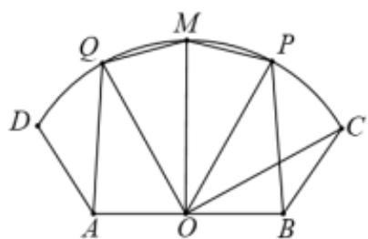

text_image

Q
M
P
D
C
A
O
B

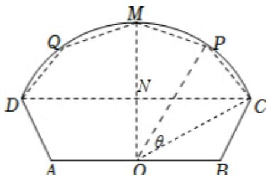

text_image

M
Q
P
D
N
C
θ
A
O
B

【点评】本题考查了扇形的性质、正、余弦定理和面积公式在解三角形问题中的应用，同时考查了学生的

逻辑推理能力、运算能力等，属于中档题.

23.【分析】(1)由 $\sin C \sin(A-B)=\sin B \sin(C-A)$ ，结合 A=2B，可得 $\sin C=\sin(C-A)$ ，即 $C+C-A=\pi$ ，再由三角形内角和定理列式求解 C；

(2) 把已知等式展开两角差的正弦, 由正弦定理及余弦定理化角为边即可证明结论.

【解答】解：（1）由 $\sin C \sin(A-B)=\sin B \sin(C-A)$ ,

又 A = 2B，∴ $\sin C \sin B = \sin B \sin (C - A)$ ，

$\because \sin B \neq 0, \therefore \sin C = \sin (C - A)$ ，即 C = C - A （舍去）或 $C + C - A = \pi$ ，

联立 $\left\{\begin{aligned}A&=2B\\ 2C-A&=\pi\\ A+B+C&=\pi\end{aligned}\right.$ ，解得 $C=\frac{5}{8}\pi$ ；

证明：（2）由 $\sin C \sin(A-B)=\sin B \sin(C-A)$ ,

得 $\sin C \sin A \cos B - \sin C \cos A \sin B = \sin B \sin C \cos A - \sin B \cos C \sin A$

由正弦定理可得 $ac \cos B - bc \cos A = bc \cos A - ab \cos C$ ，

由余弦定理可得： $ac\cdot \frac{a^2 + c^2 - b^2}{2ac} = 2bc\cdot \frac{b^2 + c^2 - a^2}{2bc} -ab\cdot \frac{a^2 + b^2 - c^2}{2ab}$

整理可得： $2a^{2}=b^{2}+c^{2}$

【点评】本题考查三角形的解法，考查正弦定理及余弦定理的应用，考查运算求解能力，是中档题.

24.【分析】（1）根据已知条件，结合正弦定理，以及余弦定理，即可求解.

（2）根据（1）的结论，以及正弦定理，即可求解.

【解答】解：（1）∵ $\sin A = 3\sin B$ ，

∴由正弦定理可得，a=3b，

∴由余弦定理可得， $c^{2}=a^{2}+b^{2}-2ab\cos C$ ，即 $7=9b^{2}+b^{2}-3b^{2}$ ，解得b=1，

$$
\therefore a = 3.
$$

(2) $\because a = 3, C = \frac{\pi}{3}, c = \sqrt{7}$ ,

$$
\therefore \sin A = \frac {a \sin C}{c} = \frac {3 \times \frac {\sqrt {3}}{2}}{\sqrt {7}} = \frac {3 \sqrt {2 1}}{1 4}.
$$

【点评】本题主要考查正弦定理、余弦定理的应用，属于基础题.

25.【分析】(1) 根据 $S_{1}-S_{2}+S_{3}=\frac{\sqrt{3}}{2}$ ，求得 $a^{2}-b^{2}+c^{2}=2$ ，由余弦定理求得 ac 的值，根据 $S=\frac{1}{2}ac\sin B$ ，求 $\Delta ABC$ 面积.

（2）由正弦定理得 $\therefore a = \frac{b\sin A}{\sin B}$ ， $c = \frac{b\sin C}{\sin B}$ ，且 $ac = \frac{3\sqrt{2}}{4}$ ，求解即可.

【解答】解：（1） $S_{1}=\frac{1}{2}a^{2}\sin60^{\circ}=\frac{\sqrt{3}}{4}a^{2}$

$$
S _ {2} = \frac {1}{2} b ^ {2} \sin 6 0 ^ {\circ} = \frac {\sqrt {3}}{4} b ^ {2},
$$

$$
S _ {3} = \frac {1}{2} c ^ {2} \sin 6 0 ^ {\circ} = \frac {\sqrt {3}}{4} c ^ {2},
$$

$$
\because S _ {1} - S _ {2} + S _ {3} = \frac {\sqrt {3}}{4} a ^ {2} - \frac {\sqrt {3}}{4} b ^ {2} + \frac {\sqrt {3}}{4} c ^ {2} = \frac {\sqrt {3}}{2},
$$

解得： $a^2 - b^2 + c^2 = 2$

$\because \sin B=\frac{1}{3},\quad a^{2}-b^{2}+c^{2}=2>0,$ 即 $\cos B>0,$

$$
\therefore \cos B = \frac {2 \sqrt {2}}{3},
$$

$$
\therefore \cos B = \frac {a ^ {2} + c ^ {2} - b ^ {2}}{2 a c} = \frac {2 \sqrt {2}}{3},
$$

解得： $ac=\frac{3\sqrt{2}}{4}$ ，

$$
S _ {\triangle A B C} = \frac {1}{2} a c \sin B = \frac {\sqrt {2}}{8}.
$$

∴ $\Delta ABC$ 的面积为 $\frac{\sqrt{2}}{8}$ .

（2）由正弦定理得： $\frac{b}{\sin B} = \frac{a}{\sin A} = \frac{c}{\sin C}$

$$
\therefore a = \frac {b \sin A}{\sin B}, \quad c = \frac {b \sin C}{\sin B},
$$

由（1）得 $ac=\frac{3\sqrt{2}}{4}$ ，

$$
\therefore a c = \frac {b \sin A}{\sin B} \cdot \frac {b \sin C}{\sin B} = \frac {3 \sqrt {2}}{4}
$$

已知， $\sin B = \frac{1}{3}$ ， $\sin A\sin C = \frac{\sqrt{2}}{3}$

解得： $b=\frac{1}{2}$ .

方法二、由 $\frac{ac}{\sin A\sin C} = \frac{9}{4} = (2R)^2$

即有 $2R = \frac{3}{2}$ ，即 $b = 2R\sin B = \frac{1}{2}$

【点评】本题考查利用正余弦定理解三角形，需灵活运用正余弦定理公式.

26.【分析】(1) 利用倍角公式、和差公式、三角形内角和定理即可得出 B .

（2）利用诱导公式把 A 用 C 表示，再利用正弦定理、倍角公式、基本不等式即可得出结论.

【解答】解：（1）∵ $\frac{\cos A}{1+\sin A}=\frac{\sin 2B}{1+\cos 2B}$ ， $1+\cos 2B=2\cos^{2}B\neq0$ ， $\cos B\neq0$ 。

$$
\therefore \frac {\cos A}{1 + \sin A} = \frac {2 \sin B \cos B}{2 \cos^ {2} B} = \frac {\sin B}{\cos B},
$$

化为： $\cos A\cos B=\sin A\sin B+\sin B$ ，

$$
\therefore \cos (B + A) = \sin B,
$$

$$
\therefore - \cos C = \sin B, \quad C = \frac {2 \pi}{3},
$$

$$
\therefore \sin B = \frac {1}{2},
$$

$$
\because 0 <   B <   \frac {\pi}{3}, \therefore B = \frac {\pi}{6}.
$$

（2）由（1）可得： $-\cos C=\sin B>0$ ，

可得 C 为钝角，∴ $\sin(C - \frac{\pi}{2}) = \sin B$ ,

$$
\therefore B = C - \frac {\pi}{2}.
$$

在三角形中， $\sin A=\sin(B+C)=\sin(2C-\frac{\pi}{2})=-\cos2C$

$\frac{a^{2}+b^{2}}{c^{2}}=\frac{\sin^{2}A+\sin^{2}B}{\sin^{2}C}=\frac{\cos^{2}2C+\cos^{2}C}{\sin^{2}C}=\frac{(1-2\sin^{2}C)^{2}+(1-\sin^{2}C)}{\sin^{2}C}=\frac{2+4\sin^{4}C-5\sin^{2}C}{\sin^{2}C}=\frac{2}{\sin^{2}C}+4\sin^{2}C-5\geqslant2\sqrt{2\times4}-5=4\sqrt{2}-5$ ，当且仅当 $\sin C=\frac{1}{\sqrt[4]{2}}$ 时取等号.

∴ $\frac{a^{2}+b^{2}}{c^{2}}$ 的最小值为 $4\sqrt{2}-5$ .

【点评】本题考查了倍角公式、和差公式、三角形内角和定理、余弦定理、基本不等式、转化方法，考查了推理能力与计算能力，属于中档题.

27.【分析】（1）由余弦定理及题中条件可得 c 边的值；

（2）由正弦定理可得 $\sin C$ 的值，再由 b = 2c 及正弦定理可得 $\sin B$ 的值；  
（3）求出 $2A$ 及 $B$ 角的正余弦值，由两角差的正弦公式可得 $2A - B$ 的正弦值.

【解答】解（1）因为 $a=\sqrt{6}$ ，b=2c， $\cos A=-\frac{1}{4}$ ，

由余弦定理可得 $\cos A=\frac{b^{2}+c^{2}-a^{2}}{2bc}=\frac{4c^{2}+c^{2}-6}{4c^{2}}=-\frac{1}{4}$ ,

解得：c=1;

(2) $\cos A = -\frac{1}{4}$ ， $A \in (0, \pi)$ ，所以 $\sin A = \sqrt{1 - \cos^{2} A} = \frac{\sqrt{15}}{4}$ ，

由 b=2c ，可得 $\sin B=2\sin C$ ，

由正弦定理可得 $\frac{a}{\sin A} = \frac{c}{\sin C}$ ，即 $\frac{\sqrt{6}}{\frac{\sqrt{15}}{4}} = \frac{1}{\sin C}$ ，

可得 $\sin C=\frac{\sqrt{10}}{8}$ ,

所以 $\sin B = 2\sin C = 2 \times \frac{\sqrt{10}}{8} = \frac{\sqrt{10}}{4}$ ;

（3）因为 $\cos A = -\frac{1}{4}$ ， $\sin A = \frac{\sqrt{15}}{4}$ ，

所以 $\sin 2A = 2\sin A\cos A = 2\times (-\frac{1}{4})\times \frac{\sqrt{15}}{4} = -\frac{\sqrt{15}}{8},\quad \cos 2A = 2\cos^2 A - 1 = 2\times \frac{1}{16} -1 = -\frac{7}{8},$

$\sin B=\frac{\sqrt{10}}{4}$ ，可得 $\cos B=\frac{\sqrt{6}}{4}$ ，

所以 $\sin (2A - B) = \sin 2A\cos B - \cos 2A\sin B = -\frac{\sqrt{15}}{8}\times \frac{\sqrt{6}}{4} -(-\frac{7}{8})\times \frac{\sqrt{10}}{4} = \frac{\sqrt{10}}{8},$

所以 $\sin(2A-B)$ 的值为 $\frac{\sqrt{10}}{8}$ .

【点评】本题考查正余弦定理及两角差的正弦公式的应用，属于基础题.

28.【分析】（1）利用两角差与和的正弦公式，三角形内角和公式，正弦和余弦定理，即可求得结论；

（2）利用（1）中结论求出 $b^{2}+c^{2}$ 和2bc的值，即可求出 $\Delta ABC$ 的周长.

【解答】（1）证明： $\Delta ABC$ 中， $\sin C\sin(A-B)=\sin B\sin(C-A)$ ，

所以 $\sin C(\sin A \cos B - \cos A \sin B) = \sin B(\sin C \cos A - \cos C \sin A)$ ,

所以 $\sin A\sin B\cos C + \sin A\cos B\sin C = 2\cos A\sin B\sin C$

即 $\sin A(\sin B\cos C + \cos B\sin C) = 2\cos A\sin B\sin C$ ,

所以 $\sin A\sin(B+C)=2\cos A\sin B\sin C$

由正弦定理得 $a^{2}=2bc\cos A$ ，

由余弦定理得 $a^{2}=b^{2}+c^{2}-2bc\cos A$ ，

所以 $2a^{2}=b^{2}+c^{2}$ ;

（2）当 $a = 5$ ， $\cos A = \frac{25}{31}$ 时， $b^{2} + c^{2} = 2\times 5^{2} = 50$ ， $2bc = \frac{a^2}{\cos A} = \frac{25}{\frac{25}{31}} = 31$

所以 $(b+c)^{2}=b^{2}+c^{2}+2bc=50+31=81$ ，解得 $b+c=9$ ，

所以 $\Delta ABC$ 的周长为 $a + b + c = 5 + 9 = 14$ .

【点评】本题考查了三角恒等变换与解三角形的应用问题，也考查了运算求解能力与推理证明能力，是中档题.

29.【分析】（I）根据二倍角公式化简可得 $\cos C$ ，进一步计算可得角 $C$ ；（II）根据三角形面积求得 $a$ ，

再根据余弦定理求得 c，相加可得三角形的周长.

【解答】解：（I）∵ $\sin 2C = \sqrt{3} \sin C$ ，

$$
\therefore 2 \sin C \cos C = \sqrt {3} \sin C,
$$

又 $\sin C \neq 0$ ， $\therefore 2\cos C = \sqrt{3}$ ，

$$
\therefore \cos C = \frac {\sqrt {3}}{2}, \because 0 <   C <   \pi ,
$$

$$
\therefore C = \frac {\pi}{6};
$$

（Ⅱ）∵ $\Delta ABC$ 的面积为 $6\sqrt{3}$ ，

$$
\therefore \frac {1}{2} a b \sin C = 6 \sqrt {3},
$$

又 $b = 6$ ， $C = \frac{\pi}{6}$

$$
\therefore \frac {1}{2} \times a \times 6 \times \frac {1}{2} = 6 \sqrt {3},
$$

$$
\therefore a = 4 \sqrt {3},
$$

又 $\cos C=\frac{a^{2}+b^{2}-c^{2}}{2ab}$ ,

$$
\therefore \frac {\sqrt {3}}{2} = \frac {(4 \sqrt {3}) ^ {2} + 6 ^ {2} - c ^ {2}}{2 \times 4 \sqrt {3} \times 6},
$$

$$
\therefore c = 2 \sqrt {3},
$$

$$
\therefore a + b + c = 6 + 6 \sqrt {3},
$$

∴ $\Delta ABC$ 的周长为 $6 + 6\sqrt{3}$ .

【点评】本题考查了三角形面积公式和余弦定理的应用，属于中档题.

30.【分析】（I）根据 $\cos C = \frac{3}{5}$ ，确定 C 的范围，再求出 $\sin C$ ，由正弦定理可求得 $\sin A$ ;

（Ⅱ）根据 A，C 的正、余弦值，求出 $\sin B$ ，再由正弦定理求出 a，代入面积公式计算即可.

【解答】解：（Ⅰ）因为 $\cos C = \frac{3}{5} > 0$ ，所以 $C \in (0, \frac{\pi}{2})$ ，且 $\sin C = \sqrt{1 - \cos^{2}C} = \frac{4}{5}$ ，

由正弦定理可得： $\frac{a}{\sin A}=\frac{c}{\sin C}$ ,

即有 $\sin A=\frac{a\sin C}{c}=\frac{a}{c}\sin C=\frac{\sqrt{5}}{4}\times\frac{4}{5}=\frac{\sqrt{5}}{5}$ ;

（Ⅱ）因为 $4a=\sqrt{5}c\Rightarrow a=\frac{\sqrt{5}}{4}c<c$ ，

所以 A < C ，故 $A \in (0, \frac{\pi}{2})$ ,

又因为 $\sin A = \frac{\sqrt{5}}{5}$ ，所以 $\cos A = \frac{2\sqrt{5}}{5}$ ，

所以 $\sin B = \sin[\pi - (A + C)] = \sin(A + C) = \sin A \cos C + \cos A \sin C = \frac{11\sqrt{5}}{25}$ ;

由正弦定理可得： $\frac{a}{\sin A}=\frac{c}{\sin C}=\frac{b}{\sin B}=5\sqrt{5}$

所以 $a=5\sqrt{5}\sin A=5$ ，

所以 $S_{\triangle ABC}=\frac{1}{2}ab\sin C=\frac{1}{2}\times5\times11\times\frac{4}{5}=22$

【点评】本题考查了解三角形中正弦定理、面积公式，属于基础题.

31.【分析】（1）由余弦定理可求 BC，进而可求 $\sin \angle ABC$ ;

（2）由已知可求 $\tan\angle ABC$ ，进而可得 AD，可求面积.

【解答】解：（1）在 $\Delta ABC$ 中，由余弦定理可知 $BC^{2}=2^{2}+1^{2}-2\times1\times2\times\cos120^{\circ}=7$ ， $BC=\sqrt{7}$ ，∴由余弦定理可得 $\cos\angle ABC=\frac{7+4-1}{2\times\sqrt{7}\times2}=\frac{5\sqrt{7}}{14}$ ，

又 $\angle ABC\in (0^{\circ},60^{\circ})$ ，∴ $\sin \angle ABC = \sqrt{1 - cos^2\angle ABC} = \sqrt{1 - \frac{25}{28}} = \frac{\sqrt{21}}{14}$

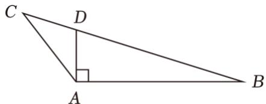

text_image

C
D
A
B

（2）由（1）知： $\cos \angle ABC = \frac{5\sqrt{7}}{14}$ ， $\sin \angle ABC = \frac{\sqrt{21}}{14}$

$$
\therefore \tan \angle A B C = \frac {\sqrt {3}}{5}, \quad \therefore \frac {1}{2} A D = \frac {\sqrt {3}}{5}, \quad \therefore A D = \frac {2 \sqrt {3}}{5},
$$

∴ $\Delta ADC$ 的面积为 $\frac{1}{2} \times AD \times AC \times \sin \angle DAC = \frac{1}{2} \times \frac{2\sqrt{3}}{5} \times 1 \times \frac{1}{2} = \frac{\sqrt{3}}{10}$ .

【点评】本题考查余弦定理的应用，考查三角形面积的计算，属基础题.

32.【分析】（1）由已知结合和差角公式及正弦定理进行化简可求 A，B，C，然后结合锐角三角函数即可求解；

（2）由已知结合正弦定理先求出 $\sin C$ ，进而可求 C，再由正弦定理求出 a，结合三角形面积公式可求.

【解答】解：（1）∵ $A + C = 120^{\circ}$ ，且 a = 2c，

$$
\therefore \sin A = 2 \sin C = 2 \sin (1 2 0 ^ {\circ} - A) = \sqrt {3} \cos A + \sin A,
$$

$$
\therefore \cos A = 0,
$$

$$
\therefore A = 9 0 ^ {\circ}, \quad C = 3 0 ^ {\circ}, \quad B = 6 0 ^ {\circ},
$$

$$
\because b = 2,
$$

$$
\therefore c = \frac {2 \sqrt {3}}{3};
$$

(2) $a = \sqrt{2} c\sin A$

则 $\sin A = \sqrt{2}\sin C\sin A$

$$
\sin A > 0,
$$

$$
\therefore \sin C = \frac {\sqrt {2}}{2},
$$

$$
\because A - C = 1 5 ^ {\circ},
$$

$\therefore C$ 为锐角，

$$
\therefore C = 4 5 ^ {\circ}, \quad A = 6 0 ^ {\circ}, \quad B = 7 5 ^ {\circ},
$$

$$
\therefore \frac {a}{\sin 6 0 ^ {\circ}} = \frac {2}{\sin 7 5 ^ {\circ}} = \frac {8}{\sqrt {2} + \sqrt {6}},
$$

$$
\therefore a = \frac {4 \sqrt {3}}{\sqrt {2} + \sqrt {6}} = 3 \sqrt {2} - \sqrt {6},
$$

$$
\therefore S _ {\triangle A B C} = \frac {1}{2} a b \sin C = \frac {1}{2} \times \frac {4 \sqrt {3}}{\sqrt {2} + \sqrt {6}} \times 2 \times \frac {\sqrt {2}}{2} = 3 - \sqrt {3}.
$$

【点评】本题主要考查了和差角公式，正弦定理，三角形的面积公式在求解三角形中的应用，属于中档题.

33.【分析】（1）根据已知条件，推得 $S_{\Delta ACD} = \frac{\sqrt{3}}{2}$ ，过 $A$ 作 $AE \perp BC$ ，垂足为 $E$ ，依次求出 $AE$ ， $BE$ ，即可求解；

(2) 法一: 根据已知条件, 求得 $\overrightarrow{AD} = \frac{1}{2} (\overrightarrow{AB} + \overrightarrow{AC})$ , 两边同时平方, 再结合三角形的面积公式, 即可求解. 法二: 根据已知条件, 结合余弦定理, 以及三角形的面积公式, 即可求解.

【解答】解：（1） $D$ 为 $BC$ 中点， $S_{\triangle ABC} = \sqrt{3}$ ，

则 $S_{\Delta ACD} = \frac{\sqrt{3}}{2}$

过 A 作 $AE \perp BC$ ，垂足为 E，如图所示:

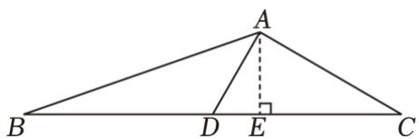

text_image

A
B D E C

$\Delta ADE$ 中， $DE = \frac{1}{2}$ ， $AE = \frac{\sqrt{3}}{2}$ ， $S_{\Delta ACD} = \frac{1}{2}\cdot \frac{\sqrt{3}}{2} CD = \frac{\sqrt{3}}{2}$ ，解得 $CD = 2$

$$
\therefore B D = 2, \quad B E = \frac {5}{2},
$$

故 $\tan B=\frac{AE}{BE}=\frac{\frac{\sqrt{3}}{2}}{\frac{5}{2}}=\frac{\sqrt{3}}{5}$ ;

(2) 法一: $\overrightarrow{AD}=\frac{1}{2}(\overrightarrow{AB}+\overrightarrow{AC})$ ,

$$
\overrightarrow {A D} ^ {2} = \frac {1}{4} \left(c ^ {2} + b ^ {2} + 2 b c \cos A\right),
$$

$$
A D = 1, \quad b ^ {2} + c ^ {2} = 8,
$$

则 $1 = \frac{1}{4} (8 + 2bc\cos A)$

$$
\therefore b c \cos A = - 2 (1),
$$

$S_{\triangle ABC}=\frac{1}{2}bc\sin A=\sqrt{3}$ ，即 $bc\sin A=2\sqrt{3}$ ②，

由①②解得 $\tan A = -\sqrt{3}$ ，

$$
\therefore A = \frac {2 \pi}{3},
$$

$\therefore bc = 4$ ，又 $b^{2} + c^{2} = 8$

$$
\therefore b = c = 2.
$$

法二，设 $\angle ADC = \alpha$ ，

$$
\cos \alpha = \frac {1 + \frac {a ^ {2}}{4} - b ^ {2}}{2 \cdot 1 \cdot \frac {a}{2}},
$$

$$
\cos (\pi - \alpha) = \frac {a ^ {2} + 1 - c ^ {2}}{2 \cdot 1 \cdot \frac {c}{2}},
$$

两式化简整理可得， $2+\frac{a^{2}}{2}-b^{2}-c^{2}=0$ ，

$$
b ^ {2} + c ^ {2} = 8,
$$

则 $a = 2\sqrt{3}$

$\Delta ABC$ 面积为 $\sqrt{3}$ , D 为 BC 的中点,

则 $S_{\Delta ACD} = \frac{1}{2} \times 1 \times \sqrt{3} \times \sin \alpha = \frac{\sqrt{3}}{2}$ ，解得 $\sin \alpha = 1$ ，即 $\alpha = \frac{\pi}{2}$ ，

故 $b = c = 2$

【点评】本题主要考查三角形中的几何计算，考查转化能力，属于中档题.

34.【分析】（1）由已知结合余弦定理进行化简即可求解bc；

（2）先利用正弦定理及和差角公式进行化简可求 $\cos A$ ，进而可求 $A$ ，然后结合三角形面积公式可求.

【解答】解：（1）因为 $\frac{b^{2}+c^{2}-a^{2}}{\cos A}=\frac{2bc\cos A}{\cos A}=2bc=2$ ，

所以 bc = 1 ;

(2) $\frac{a\cos B - b\cos A}{a\cos B + b\cos A} -\frac{b}{c} = \frac{\sin A\cos B - \sin B\cos A}{\sin A\cos B + \sin B\cos A} -\frac{\sin B}{\sin C} = 1,$

所以 $\frac{\sin(A-B)}{\sin(A+B)}-\frac{\sin B}{\sin C}=\frac{\sin(A-B)-\sin B}{\sin C}=1$ ，

所以 $\sin(A-B)-\sin B=\sin C=\sin(A+B)$ ,

所以 $\sin A\cos B - \sin B\cos A - \sin B = \sin A\cos B + \sin B\cos A$

即 $\cos A = -\frac{1}{2}$ ,

由 A 为三角形内角得 $A=\frac{2\pi}{3}$ ,

$\Delta ABC$ 面积 $S = \frac{1}{2} bc\sin A = \frac{1}{2}\times 1\times \frac{\sqrt{3}}{2} = \frac{\sqrt{3}}{4}$

【点评】本题主要考查了余弦定理，正弦定理，和差角公式及三角形面积公式的应用，属于中档题.

35.【分析】（1）由三角形内角和可得 $C = \frac{\pi}{4}$ ，由 $2\sin (A - C) = \sin B$ ，可得 $2\sin (A - C) = \sin (A + C)$ ，再利用两角和与差的三角函数公式化简可得 $\sin A = 3\cos A$ ，再结合平方关系即可求出 $\sin A$ ；

（2）由 $\sin B = \sin(A + C)$ 求出 $\sin B$ ，再利用正弦定理求出 AC，BC，由等面积法即可求出 AB 边上的高.

【解答】解：（1）∵ $A + B = 3C$ ， $A + B + C = \pi$ ，

$$
\therefore 4 C = \pi ,
$$

$$
\therefore C = \frac {\pi}{4},
$$

$$
\because 2 \sin (A - C) = \sin B,
$$

$$
\therefore 2 \sin (A - C) = \sin [ \pi - (A + C) ] = \sin (A + C),
$$

$$
\therefore 2 \sin A \cos C - 2 \cos A \sin C = \sin A \cos C + \cos A \sin C,
$$

$$
\therefore \sin A \cos C = 3 \cos A \sin C,
$$

$$
\therefore \frac {\sqrt {2}}{2} \sin A = 3 \times \frac {\sqrt {2}}{2} \cos A,
$$

∴ $\sin A = 3\cos A$ ，即 $\cos A = \frac{1}{3}\sin A$ ，

又 $\because \sin^2 A + \cos^2 A = 1, \therefore \sin^2 A + \frac{1}{9} \sin^2 A = 1,$

解得 $\sin^{2}A=\frac{9}{10}$ ,

又∵ $A\in(0,\pi)$ ，∴ $\sin A>0$ ，

$$
\therefore \sin A = \frac {3 \sqrt {1 0}}{1 0};
$$

（2）由（1）可知 $\sin A = \frac{3\sqrt{10}}{10}$ ， $\cos A = \frac{1}{3}\sin A = \frac{\sqrt{10}}{10}$

$$
\therefore \sin B = \sin (A + C) = \sin A \cos C + \cos A \sin C = \frac {3 \sqrt {1 0}}{1 0} \times \frac {\sqrt {2}}{2} + \frac {\sqrt {1 0}}{1 0} \times \frac {\sqrt {2}}{2} = \frac {2 \sqrt {5}}{5},
$$

$$
\therefore \frac {A B}{\sin C} = \frac {A C}{\sin B} = \frac {B C}{\sin A} = \frac {5}{\sin \frac {\pi}{4}} = 5 \sqrt {2},
$$

$$
\therefore A C = 5 \sqrt {2} \sin B = 5 \sqrt {2} \times \frac {2 \sqrt {5}}{5} = 2 \sqrt {1 0}, \quad B C = 5 \sqrt {2} \times \sin A = 5 \sqrt {2} \times \frac {3 \sqrt {1 0}}{1 0} = 3 \sqrt {5},
$$

设 AB 边上的高为 h，

则 $\frac{1}{2} AB\cdot h = \frac{1}{2}\times AC\times BC\times \sin C$

$$
\therefore \frac {5}{2} h = \frac {1}{2} \times 2 \sqrt {1 0} \times 3 \sqrt {5} \times \frac {\sqrt {2}}{2},
$$

解得 $h = 6$

即 AB 边上的高为 6.

【点评】本题主要考查了两角和与差的三角函数公式，考查了正弦定理和余弦定理的应用，属于中档题.

36.【分析】（Ⅰ）根据已知条件，结合正弦定理，即可求解；

（Ⅱ）根据已知条件，结合余弦定理，即可求解；  
（III）根据已知条件，结合三角函数的同角公式，以及正弦的两角差公式，即可求解.

【解答】解：（Ⅰ） $a=\sqrt{39}$ ，b=2， $\angle A=120^{\circ}$ ，

则 $\sin B = \frac{b \sin A}{a} = \frac{2 \times \frac{\sqrt{3}}{2}}{\sqrt{39}} = \frac{\sqrt{13}}{13}$ ;

(II) $a = \sqrt{39}, b = 2, \angle A = 120^{\circ}$ ,

则 $a^2 = b^2 + c^2 - 2bc \cdot \cos A = 4 + c^2 + 2c = 39$ ，化简整理可得， $(c + 7)(c - 5) = 0$ ，解得 $c = 5$ （负值舍去）；

(III) $\cos B = \sqrt{1 - \sin^2 B} = \frac{2\sqrt{39}}{13}$ ,

$$
c = 5, \quad a = \sqrt {3 9}, \quad \angle A = 1 2 0 ^ {\circ},
$$

则 $\sin C = \frac{c\sin A}{a} = \frac{5\times\frac{\sqrt{3}}{2}}{\sqrt{39}} = \frac{5\sqrt{13}}{26}$

故 $\cos C = \sqrt{1 - \sin^2C} = \frac{3\sqrt{39}}{26}$

所以 $\sin(B-C)=\sin B\cos C-\sin C\cos B=\frac{\sqrt{13}}{13}\times\frac{3\sqrt{39}}{26}-\frac{5\sqrt{13}}{26}\times\frac{2\sqrt{39}}{13}=-\frac{7}{26}\sqrt{3}$

# 第七章：向量

# 一、选择题

1.【分析】利用向量的坐标减法运算求得 $\vec{a}-\vec{b}$ 的坐标，再由向量模的公式求解.

【解答】解：∵ $\vec{a}=(2,3)$ ， $\vec{b}=(3,2)$ ，

$$
\therefore \vec {a} - \vec {b} = (2, 3) - (3, 2) = (- 1, 1),
$$

$$
\therefore | \vec {a} - \vec {b} | = \sqrt {(- 1) ^ {2} + 1 ^ {2}} = \sqrt {2}.
$$

故选：A.

【点评】本题考查平面向量的坐标运算，考查向量模的求法，是基础题.

2.【分析】“ $\overrightarrow{AB}$ 与 $\overrightarrow{AC}$ 的夹角为锐角” $\Rightarrow$ “ $|\overrightarrow{AB} + \overrightarrow{AC}| > |\overrightarrow{BC}|$ ”, “ $|\overrightarrow{AB} + \overrightarrow{AC}| > |\overrightarrow{BC}|$ ” $\Rightarrow$ “ $\overrightarrow{AB}$ 与 $\overrightarrow{AC}$ 的夹角为锐角”，由此能求出结果.

【解答】解：点 A，B，C 不共线，

$$
\overrightarrow {B C} = \overrightarrow {A C} - \overrightarrow {A B}, \therefore \overrightarrow {B C} ^ {2} = \overrightarrow {A C} ^ {2} + \overrightarrow {A B} ^ {2} - 2 \overrightarrow {A C} \cdot \overrightarrow {A B},
$$

当 $\overrightarrow{AB}$ 与 $\overrightarrow{AC}$ 的夹角为锐角时， $\overrightarrow{AC}\cdot\overrightarrow{AB}=\frac{\overrightarrow{AC}^{2}+\overrightarrow{AB}^{2}-\overrightarrow{BC}^{2}}{2}>0$

∴ “ $\overrightarrow{AB}$ 与 $\overrightarrow{AC}$ 的夹角为锐角” $\Rightarrow$ “ $|\overrightarrow{AB} + \overrightarrow{AC}| > |\overrightarrow{BC}|$ ”,

“ $|\overrightarrow{AB}+\overrightarrow{AC}|>\overrightarrow{BC}|$ ” $\Rightarrow$ “ $\overrightarrow{AB}$ 与 $\overrightarrow{AC}$ 的夹角为锐角”，

∴设点 A，B，C 不共线，则 “ $\overrightarrow{AB}$ 与 $\overrightarrow{AC}$ 的夹角为锐角” 是 “ $|\overrightarrow{AB} + \overrightarrow{AC}| > |\overrightarrow{BC}|$ ” 的充分必要条件.

故选：C.

【点评】本题考查充分条件、必要条件、充要条件的判断，考查向量等基础知识，考查推理能力与计算能力，属于基础题.

3.【分析】由 $\overrightarrow{BC} = \overrightarrow{AC} -\overrightarrow{AB}$ 先求出 $\overrightarrow{BC}$ 的坐标，然后根据 $|\overrightarrow{BC}| = 1$ ，可求 $t$ ，结合向量数量积定义的坐标表示即可求解.

【解答】解：∵ $\overrightarrow{AB} = (2,3)$ ， $\overrightarrow{AC} = (3,t)$ ，

$$
\therefore \overrightarrow {B C} = \overrightarrow {A C} - \overrightarrow {A B} = (1, t - 3),
$$

$$
\because | \overrightarrow {B C} | = 1,
$$

$\therefore t-3=0$ 即 $\overrightarrow{BC}=(1,0)$ ,

则 $\overrightarrow{AB} \cdot \overrightarrow{BC} = 2$

故选：C.

【点评】本题主要考查了向量数量积的定义及性质的坐标表示，属于基础试题

4.【分析】由 $(\vec{a} -\vec{b})\perp \vec{b}$ ，可得 $(\vec{a} -\vec{b})\cdot \vec{b} = 0$ ，进一步得到 $|\overrightarrow{a}\| \overrightarrow{b} |\cos <  \vec{a},\vec{b} > - \vec{b}^{2} = 0$ ，然后求出夹角即可.

【解答】解：∵ $(\vec{a}-\vec{b})\perp\vec{b}$ ，

$$
\therefore (\vec {a} - \vec {b}) \cdot \vec {b} = \vec {a} \cdot \vec {b} - \vec {b} ^ {2}
$$

$$
= | \overrightarrow {a} \| \overrightarrow {b} | \cos <   \vec {a}, \vec {b} > - \vec {b} ^ {2} = 0,
$$

$$
\therefore \cos <   \vec {a}, \vec {b} > = \frac {\overrightarrow {| b |} ^ {2}}{| \overrightarrow {a} | | \overrightarrow {b} |}
$$

$$
= \frac {\overrightarrow {| b |} ^ {2}}{2 \overrightarrow {| b |} ^ {2}} = \frac {1}{2},
$$

$$
\because <   \vec {a}, \vec {b} > \in [ 0, \pi ],
$$

$$
\therefore <   \vec {a}, \vec {b} > = \frac {\pi}{3}.
$$

故选：B.

【点评】本题考查了平面向量的数量积和向量的夹角，属基础题.

5.【分析】根据已知条件，推得 $\overrightarrow{OP_1} +\overrightarrow{OP_2} = -\overrightarrow{OP_3}$ ，即 $(\overrightarrow{OP_1} +\overrightarrow{OP_2})^2 = \overrightarrow{OP_3}^2$ ，再结合平面向量的数量积公式，即可求解.

【解答】解：设 $|\overrightarrow{OP_{1}}=|\overrightarrow{OP_{2}}|=|\overrightarrow{OP_{3}}|=r$ ，

$$
\because \overrightarrow {O P _ {1}} + \overrightarrow {O P _ {2}} + \overrightarrow {O P _ {3}} = \vec {0},
$$

$\therefore \overrightarrow{OP_{1}} + \overrightarrow{OP_{2}} = -\overrightarrow{OP_{3}}$ ，即 $(\overrightarrow{OP_{1}} + \overrightarrow{OP_{2}})^{2} = \overrightarrow{OP_{3}}^{2}$ ，

$\therefore r^{2} + r^{2} + 2 \times r \times r \times \cos \angle P_{1}OP_{2} = r^{2}$ ，解得 $\cos \angle P_{1}OP_{2} = -\frac{1}{2}$ ，

$\therefore \angle P_{1}OP_{2} = 120^{\circ}$ ，同理可得， $\angle P_{1}OP_{3} = 120^{\circ}$ ， $\angle P_{2}OP_{3} = 120^{\circ}$

$\therefore \triangle P_{1}P_{2}P_{3}$ 是等边三角形，

$$
\therefore \angle P _ {1} P _ {2} P _ {3} = 6 0 ^ {\circ}.
$$

故选：C.

【点评】本题主要考查平面向量的数量积公式，属于基础题.

6.【分析】利用向量加法法则直接求解.

【解答】解：在 $\Delta ABC$ 中，D 是 AB 边上的中点，

则 $\overrightarrow{CB} = \overrightarrow{CD} +\overrightarrow{DB} = \overrightarrow{CD} +\overrightarrow{AD}$

$$
= \overrightarrow {C D} + (\overrightarrow {A C} + \overrightarrow {C D})
$$

$$
= 2 \overrightarrow {C D} - \overrightarrow {C A}.
$$

故选：C.

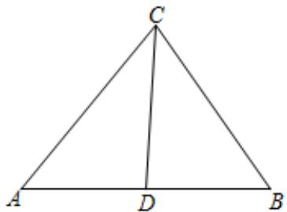

text_image

C
A D B

【点评】本题考查向量的表示，考查向量加法法则等基础知识，考查运算求解能力，是基础题.

7.【分析】画出图形，结合向量的数量积转化判断求解即可.

【解答】解：画出图形如图，

$\overrightarrow{AP}\cdot\overrightarrow{AB}=|\overrightarrow{AP}||\overrightarrow{AB}|\cos<\overrightarrow{AP},\overrightarrow{AB}>$ ，它的几何意义是AB的长度与 $\overrightarrow{AP}$ 在 $\overrightarrow{AB}$ 向量的投影的乘积，显然，P在C处时，取得最大值， $|\overrightarrow{AC}|\cos\angle CAB=|\overrightarrow{AB}|+\frac{1}{2}|\overrightarrow{AB}|=3$ ，可得 $\overrightarrow{AP}\cdot\overrightarrow{AB}=|\overrightarrow{AP}||\overrightarrow{AB}|\cos<\overrightarrow{AP},\overrightarrow{AB}>=2\times3=6$ ，最大值为6，

在 F 处取得最小值， $\overrightarrow{AP}\cdot\overrightarrow{AB}=|\overrightarrow{AP}||\overrightarrow{AB}|\cos<\overrightarrow{AP},\overrightarrow{AB}>=-2\times2\times\frac{1}{2}=-2$ ，最小值为 -2，

P 是边长为 2 的正六边形 ABCDEF 内的一点，

所以 $\overrightarrow{AP} \cdot \overrightarrow{AB}$ 的取值范围是 $(-2, 6)$ .

故选：A.

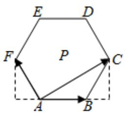

text_image

E
D
F
P
C
A
B

【点评】本题考查向量的数量积的应用，向量在几何中的应用，是中档题.

8.【分析】利用平面向量的数量积为 0，即可判断两向量是否垂直.

【解答】解：单位向量 $|\vec{a}|=|\vec{b}|=1$ ， $\vec{a}\cdot\vec{b}=1\times1\times\cos60^{\circ}=\frac{1}{2}$

对于 A， $(\vec{a}+2\vec{b})\cdot\vec{b}=\vec{a}\cdot\vec{b}+2\vec{b}^{2}=\frac{1}{2}+2=\frac{5}{2}$ ，所以 $(\vec{a}+2\vec{b})$ 与 $\vec{b}$ 不垂直；

对于 B， $(2\vec{a}+\vec{b})\cdot\vec{b}=2\vec{a}\cdot\vec{b}+\vec{b}^{2}=2\times\frac{1}{2}+1=2$ ，所以 $(2\vec{a}+\vec{b})$ 与 $\vec{b}$ 不垂直；

对于 C， $(\vec{a}-2\vec{b})\cdot\vec{b}=\vec{a}\cdot\vec{b}-2\vec{b}^{2}=\frac{1}{2}-2=-\frac{3}{2}$ ，所以 $(\vec{a}-2\vec{b})$ 与 $\vec{b}$ 不垂直；

对于 D， $(2\vec{a}-\vec{b})\cdot\vec{b}=2\vec{a}\cdot\vec{b}-\vec{b}^{2}=2\times\frac{1}{2}-1=0$ ，所以 $(2\vec{a}-\vec{b})$ 与 $\vec{b}$ 垂直.

故选：D.

【点评】本题考查了判断两向量是否垂直的应用问题，是基础题.

9.【分析】利用已知条件求出 $|\vec{a}+\vec{b}|$ ，然后利用向量的数量积求解即可.

【解答】解：向量 $\vec{a}$ ， $\vec{b}$ 满足 $|\vec{a}|=5$ ， $|\vec{b}|=6$ ， $\vec{a}\cdot\vec{b}=-6$ ，

可得 $|\vec{a} +\vec{b}| = \sqrt{\vec{a}^2 + 2\vec{a}\cdot\vec{b} + \vec{b}^2} = \sqrt{25 - 12 + 36} = 7$

$$
\cos <   \vec {a}, \quad \vec {a} + \vec {b} > = \frac {\vec {a} \cdot (\vec {a} + \vec {b})}{| \vec {a} | | \vec {a} + \vec {b} |} = \frac {\vec {a} ^ {2} + \vec {a} \cdot \vec {b}}{5 \times 7} = \frac {2 5 - 6}{5 \times 7} = \frac {1 9}{3 5}.
$$

故选：D.

【点评】本题考查平面向量的数量积的应用，数量积的运算以及向量的夹角的求法，是中档题.

10.【分析】利用向量的数量积，结合辅助角公式，利用三角函数的有界性求解最值即可.

【解答】解：向量 $\vec{a} = (\cos \theta, \sin \theta)$ ， $\vec{b} = (3, -4)$ ，

则 $\vec{a} \cdot \vec{b} = 3\cos \theta - 4\sin \theta = 5\cos (\theta + \varphi)$ ，其中 $\tan \varphi = \frac{4}{3}$ .

∵ $5\cos(\theta + \varphi) \leqslant 5$ ，∴ $\vec{a} \cdot \vec{b}$ 的最大值是 5.

故选：B.

【点评】本题考查向量的数量积的求法，辅助角公式的应用，是基础题.

11.【分析】分别从充分性和必要性进行判断，由充分条件与必要条件的定义，即可得到答案.

【解答】解：当 $\vec{a} \perp \vec{c}$ 且 $\vec{b} \perp \vec{c}$ ，则 $\vec{a} \cdot \vec{c} = \vec{b} \cdot \vec{c} = 0$ ，但 $\vec{a}$ 与 $\vec{b}$ 不一定相等，

故 $\vec{a} \cdot \vec{b} = \vec{b} \cdot \vec{c}$ 不能推出 $\vec{a} = \vec{b}$ ,

则 “ $\vec{a}\cdot\vec{c}=\vec{b}\cdot\vec{c}$ ” 是 “ $\vec{a}=\vec{b}$ ” 的不充分条件；

由 $\vec{a}=\vec{b}$ ，可得 $\vec{a}-\vec{b}=\vec{0}$ ，

则 $(\vec{a} -\vec{b})\cdot \vec{c} = 0$ ，即 $\vec{a}\cdot \vec{b} = \vec{b}\cdot \vec{c}$

所以 $\vec{a}=\vec{b}$ 可以推出 $\vec{a}\cdot\vec{b}=\vec{b}\cdot\vec{c}$

故“ $\vec{a} \cdot \vec{c} = \vec{b} \cdot \vec{c}$ ”是“ $\vec{a} = \vec{b}$ ”的必要条件.

综上所述，“ $\vec{a}\cdot\vec{c}=\vec{b}\cdot\vec{c}$ ”是“ $\vec{a}=\vec{b}$ ”的必要不充分条件.

故选：B.

【点评】本题考查了充分条件与必要条件的判断，解题的关键是掌握平面向量的基本概念和基本运算，属于基础题.

12.【分析】设 $A(2x,2y)$ ， $B(-1,0)$ ， $C(1,0)$ ， $D(0,0)$ ， $E(x,y)$ ，由向量数量的坐标运算即可判断①；F 为 AB 中点，可得 $(\overrightarrow{CB} + \overrightarrow{CA}) = 2\overrightarrow{CF}$ ，由 D 为 BC 中点，可得 CF 与 AD 的交点即为重心 G，从而可判断②

【解答】解：不妨设 $A(2x,2y)$ ， $B(-1,0)$ ， $C(1,0)$ ， $D(0,0)$ ， $E(x,y)$ ，

① $\overrightarrow{AB}=(-1-2x,-2y)$ ， $\overrightarrow{CE}=(x-1,y)$ ，

若 $\overrightarrow{AB}\cdot\overrightarrow{CE}=0$ ，则 $-(1+2x)(x-1)-2y^{2}=0$ ，即 $-(1+2x)(x-1)=2y^{2}$

满足条件的 $(x,y)$ 存在，例如 $(0,\frac{\sqrt{2}}{2})$ ，满足上式，所以①成立；

② F 为 AB 中点， $(\overrightarrow{CB} + \overrightarrow{CA}) = 2\overrightarrow{CF}$ ，CF 与 AD 的交点即为重心 G，

因为G为AD的三等分点，E为AD中点，

所以 $\overrightarrow{CE}$ 与 $\overrightarrow{CG}$ 不共线，即②不成立.

故选：B.

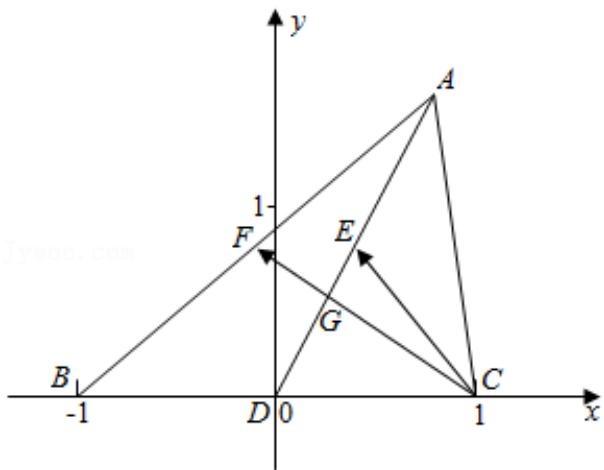

text_image

y
1-
F
E
G
B
-1
D 0
1
x
A
C

【点评】本题主要考查平面向量数量积的运算，共线向量的判断，属于中档题.

13.【分析】由已知可得 $x+2(1-x)-(1+x)(x-2)=0$ ，计算即可.

【解答】解：∵ $\vec{a} // \vec{b}$ ， $\vec{a} = (x + 2, 1 + x)$ ， $\vec{b} = (x - 2, 1 - x)$ .

$$
\therefore (x + 2) (1 - x) - (1 + x) (x - 2) = 0,
$$

$$
\therefore - 2 x ^ {2} + 4 = 0, \quad \therefore x ^ {2} = 2.
$$

故选：A.

【点评】本题考查两向量共线的坐标运算，属基础题.

14.【分析】根据条件，建立平面直角坐标系，设 $P(x,y)$ ，计算可得 $\overrightarrow{PA} \cdot \overrightarrow{PB} = -3x - 4y + 1$ ，进而可利用参数方程转化为三角函数的最值问题求解.

【解答】解：在 $\Delta ABC$ 中，AC=3，BC=4， $\angle C=90^{\circ}$ ，

以 C 为坐标原点，CA，CB 所在的直线为 x 轴，y 轴建立平面直角坐标系，如图：

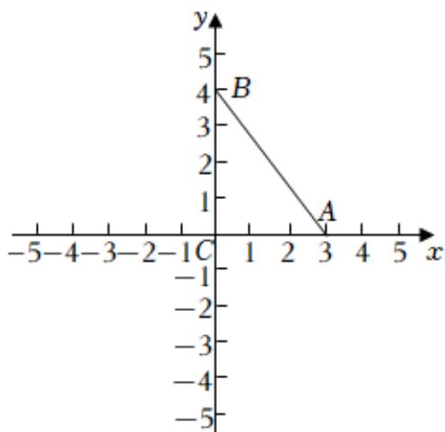

text_image

y
5
4
B
2
1
A
-1
-2
-3
-4
-5
-1
C
1
2
3
4
5
x

则 $A(3,0)$ ， $B(0,4)$ ， $C(0,0)$ ，

设 $P(x,y)$ ,

因为 PC = 1，

所以 $x^{2} + y^{2} = 1$ ，

又 $\overrightarrow{PA}=(3-x,-y)$ ， $\overrightarrow{PB}=(-x,4-y)$ ，

所以 $\overrightarrow{PA}\cdot\overrightarrow{PB}=-x(3-x)-y(4-y)=x^{2}+y^{2}-3x-4y=-3x-4y+1$

设 $x = \cos\theta$ ， $y = \sin\theta$ ，

所以 $\overrightarrow{PA}\cdot\overrightarrow{PB}=-(3\cos\theta+4\sin\theta)+1=-5\sin(\theta+\varphi)+1$ ，其中 $\tan\varphi=\frac{3}{4}$

当 $\sin(\theta+\varphi)=1$ 时， $\overrightarrow{PA}\cdot\overrightarrow{PB}$ 有最小值为 -4，

当 $\sin(\theta+\varphi)=-1$ 时， $\overrightarrow{PA}\cdot\overrightarrow{PB}$ 有最大值为 6，

所以 $\overrightarrow{PA} \cdot \overrightarrow{PB} \in [-4, 6]$ ,

故选：D.

【点评】本题考查了平面向量数量积的最值问题，属于中档题.

15.【分析】先利用向量坐标运算法则求出 $\vec{c}=(3+t,4)$ ，再由 $<\vec{a},\vec{c}>=<\vec{b},\vec{c}>$ ，利用向量夹角余弦公式列方程，能求出实数 t 的值.

【解答】解：∵向量 $\vec{a}=(3,4)$ ， $\vec{b}=(1,0)$ ， $\vec{c}=\vec{a}+t\vec{b}$ ，

$$
\therefore \vec {c} = (3 + t, 4),
$$

$$
\because <   \vec {a}, \quad \vec {c} > = <   \vec {b}, \quad \vec {c} >,
$$

$$
\therefore \frac {\vec {a} \cdot \vec {c}}{| \vec {a} | \cdot | \vec {c} |} = \frac {\vec {b} \cdot \vec {c}}{| \vec {b} | \cdot | \vec {c} |}, \quad \therefore \frac {2 5 + 3 t}{5} = \frac {3 + t}{1},
$$

解得实数t=5.

故选：C.

【点评】本题考查实数值的求法，考查向量坐标运算法则、向量夹角余弦公式等基础知识，考查运算求解能力，是基础题.

16.【分析】利用 $|\vec{a} - 2\vec{b}| = \sqrt{(\vec{a} - 2\vec{b})^2}$ ，结合数量积的性质计算可得结果.

【解答】解：因为向量 $\vec{a}$ ， $\vec{b}$ 满足 $|\vec{a}|=1$ ， $|\vec{b}|=\sqrt{3}$ ， $|\vec{a}-2\vec{b}|=3$ ，

所以 $|\vec{a} - 2\vec{b}| = \sqrt{(\vec{a} - 2\vec{b})^2} = \sqrt{\vec{a}^2 - 4\vec{a}\cdot\vec{b} + 4\vec{b}^2} = \sqrt{1 - 4\vec{a}\cdot\vec{b} + 4\times 3} = 3$

两边平方得，

$13 - 4\vec{a}\cdot \vec{b} = 9$

解得 $\vec{a}\cdot\vec{b}=1$

故选：C.

【点评】本题考查了平面向量数量积的运算和性质，属于基础题.

17.【分析】先计算 $\vec{a} -\vec{b}$ 的坐标，再利用坐标模长公式求解.

【解答】解： $\vec{a}-\vec{b}=(4,-3)$ ,

故 $|\vec{a} -\vec{b}| = \sqrt{4^2 + (-3)^2} = 5$

故选：D.

【点评】本题主要考查向量坐标公式，属于基础题.

18.【分析】直接利用平面向量的线性运算可得 $\frac{1}{2}\overrightarrow{CB} = \frac{3}{2}\overrightarrow{CD} -\overrightarrow{CA}$ ，进而得解.

【解答】解：如图，

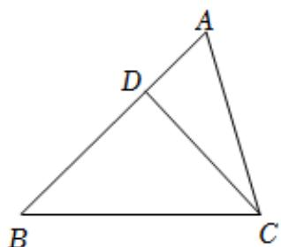

text_image

A
D
B
C

$$
\overrightarrow {C D} = \overrightarrow {C A} + \overrightarrow {A D} = \overrightarrow {C A} + \frac {1}{2} \overrightarrow {D B} = \overrightarrow {C A} + \frac {1}{2} (\overrightarrow {C B} - \overrightarrow {C D}) = \overrightarrow {C A} + \frac {1}{2} \overrightarrow {C B} - \frac {1}{2} \overrightarrow {C D},
$$

$\therefore \frac{1}{2}\overrightarrow{CB} = \frac{3}{2}\overrightarrow{CD} -\overrightarrow{CA}$ ，即 $\overrightarrow{CB} = 3\overrightarrow{CD} -2\overrightarrow{CA} = 3\vec{n} -2\vec{m}$

故选：B.

【点评】本题主要考查平面向量的线性运算，考查运算求解能力，属于基础题.

19.【分析】利用向量垂直的性质直接求解.

【解答】解：∵向量 $\vec{a}=(2,x+1)$ ， $\vec{b}=(x-2,-1)$ ， $\vec{a}\perp\vec{b}$ ，

$\therefore \vec{a} \cdot \vec{b} = 0$ ，可得 $2(x - 2) + (x + 1) \times (-1) = 0$ ，

$$
\therefore x = 5.
$$

故选：A.

【点评】本题考查向量垂直的性质等基础知识，考查运算求解能力，是基础题.

20.【分析】根据题意，求出 $\vec{a} +\vec{b}$ 和 $\vec{a} -\vec{b}$ 的坐标，进而求出 $|\vec{a} +\vec{b} |$ 、 $|\vec{a} -\vec{b} |$ 和 $(\vec{a} +\vec{b})\cdot (\vec{a} -\vec{b})$ 的值，进而

由数量积的计算公式计算可得答案.

【解答】解：根据题意，向量 $\vec{a} = (3,1)$ ， $\vec{b} = (2,2)$ ，

则 $\vec{a}+\vec{b}=(5,3)$ ， $\vec{a}-\vec{b}=(1,-1)$ ，

则有 $|\vec{a} +\vec{b}| = \sqrt{25 + 9} = \sqrt{34}$ ， $|\vec{a} -\vec{b}| = \sqrt{1 + 1} = \sqrt{2}$ ， $(\vec{a} +\vec{b})\cdot (\vec{a} -\vec{b}) = 2$

故 $\cos \langle \vec{a} +\vec{b},\vec{a} -\vec{b}\rangle = \frac{(\vec{a} + \vec{b})\cdot(\vec{a} - \vec{b})}{|\vec{a} + \vec{b}||\vec{a} - \vec{b}|} = \frac{2}{\sqrt{34}\cdot\sqrt{2}}\frac{\sqrt{17}}{17}.$

故选：B.

【点评】本题考查向量的夹角，涉及向量的数量积计算，属于基础题.

21.【分析】根据题意，用 $\vec{a}$ 、 $\vec{b}$ 表示 $\vec{c}$ ，利用模长公式求出 $\cos <\vec{a}$ ， $\vec{b}>$ ，再计算 $\vec{a}-\vec{c}$ 与 $\vec{b}-\vec{c}$ 的数量积和夹角余弦值.

【解答】解：因为向量 $|\vec{a}|=|\vec{b}|=1$ ， $|\vec{c}|=\sqrt{2}$ ，且 $\vec{a}+\vec{b}+\vec{c}=\vec{0}$ ，所以 $-\vec{c}=\vec{a}+\vec{b}$ ，

所以 $\vec{c}^{2}=\vec{a}^{2}+\vec{b}^{2}+2\vec{a}\cdot\vec{b}$

即 $2=1+1+2\times1\times1\times\cos<\vec{a}$ ， $\vec{b}>$

解得 $\cos <\vec{a}$ ， $\vec{b}>=0$ ，

所以 $\vec{a} \perp \vec{b}$ ,

又 $\vec{a} -\vec{c} = 2\vec{a} +\vec{b}$ ， $\vec{b} -\vec{c} = \vec{a} +2\vec{b}$

所以 $(\vec{a} -\vec{c})\cdot (\vec{b} -\vec{c}) = (2\vec{a} +\vec{b})\cdot (\vec{a} +2\vec{b}) = 2\vec{a}^{2} + 2\vec{b}^{2} + 5\vec{a}\cdot \vec{b} = 2 + 2 + 0 = 4$

$$
| \vec {a} - \vec {c} | = | \vec {b} - \vec {c} | = \sqrt {4 \vec {a} ^ {2} + 4 \vec {a} \cdot \vec {b} + \vec {b} ^ {2}} = \sqrt {4 + 0 + 1} = \sqrt {5},
$$

所以 $\cos\langle\vec{a}-\vec{c},\vec{b}-\vec{c}\rangle=\frac{(\vec{a}-\vec{c})\cdot(\vec{b}-\vec{c})}{|\vec{a}-\vec{c}||\vec{b}-\vec{c}|}=\frac{4}{\sqrt{5}\times\sqrt{5}}=\frac{4}{5}$ .

故选：D.

【点评】本题考查了平面向量的数量积与模长夹角的计算问题，是基础题.

22.【分析】由已知结合向量的线性表示及向量数量积的性质即可求解.

【解答】解：正方形 ABCD 的边长是 2，E 是 AB 的中点，

所以 $\overrightarrow{EB} \cdot \overrightarrow{EA} = -1$ ， $\overrightarrow{EB} \perp \overrightarrow{AD}$ ， $\overrightarrow{EA} \perp \overrightarrow{BC}$ ， $\overrightarrow{BC} \cdot \overrightarrow{AD} = 2 \times 2 = 4$ ，

则 $\overrightarrow{EC} \cdot \overrightarrow{ED} = (\overrightarrow{EB} + \overrightarrow{BC}) \cdot (\overrightarrow{EA} + \overrightarrow{AD}) = \overrightarrow{EB} \cdot \overrightarrow{EA} + \overrightarrow{EB} \cdot \overrightarrow{AD} + \overrightarrow{EA} \cdot \overrightarrow{BC} + \overrightarrow{BC} \cdot \overrightarrow{AD} = -1 + 0 + 0 + 4 = 3.$

故选：B.

【点评】本题主要考查了向量的线性表示及向量数量积的性质的应用，属于基础题.

23.【分析】根据向量的坐标运算，向量的模公式，即可求解.

【解答】解：∵ $\vec{a} + \vec{b} = (2,3)$ ， $\vec{a} - \vec{b} = (-2,1)$ ，

$$
\therefore \vec {a} = (0, 2), \quad \vec {b} = (2, 1),
$$

$$
\therefore | \vec {a} | ^ {2} - | \vec {b} | ^ {2} = 4 - 5 = - 1.
$$

故选：B.

【点评】本题考查向量的坐标运算，向量的模公式，属基础题.

24.【分析】由已知求得 $\vec{a} + \lambda\vec{b}$ 与 $\vec{a} + \mu\vec{b}$ 的坐标，再由两向量垂直与数量积的关系列式求解.

【解答】解：∵ $\vec{a}=(1,1)$ ， $\vec{b}=(1,-1)$ ，

$$
\therefore \vec {a} + \lambda \vec {b} = (\lambda + 1, 1 - \lambda), \quad \vec {a} + \mu \vec {b} = (\mu + 1, 1 - \mu),
$$

由 $(\vec{a} + \lambda \vec{b}) \perp (\vec{a} + \mu \vec{b})$ ，得 $(\lambda + 1)(\mu + 1) + (1 - \lambda)(1 - \mu) = 0$

整理得： $2\lambda\mu+2=0$ ，即 $\lambda\mu=-1$ 。

故选：D.

【点评】本题考查平面向量加法与数乘的坐标运算，考查两向量垂直与数量积的关系，是基础题.

# 二、多选题

1.【分析】法一、由已知点的坐标分别求得对应向量的坐标，然后逐一验证四个选项得答案；

法二、由题意画出图形，利用向量的模及数量积运算逐一分析四个选项得答案.

【解答】解：法一、∵ $P_{1}(\cos\alpha,\sin\alpha)$ ， $P_{2}(\cos\beta,-\sin\beta)$ ， $P_{3}(\cos(\alpha+\beta)$ ， $\sin(\alpha+\beta))$ ， $A(1,0)$ ，

$$
\therefore \overrightarrow {O P _ {1}} = (\cos \alpha , \sin \alpha), \quad \overrightarrow {O P _ {2}} = (\cos \beta , - \sin \beta),
$$

$$
\overrightarrow {O P _ {3}} = (\cos (\alpha + \beta), \sin (\alpha + \beta)), \overrightarrow {O A} = (1, 0),
$$

$$
\overrightarrow {A P _ {1}} = (\cos \alpha - 1, \sin \alpha), \quad \overrightarrow {A P _ {2}} = (\cos \beta - 1, - \sin \beta),
$$

则 $|\overrightarrow{OP_1}| = \sqrt{\cos^2\alpha + \sin^2\alpha} = 1$ ， $|\overrightarrow{OP_2}| = \sqrt{\cos^2\beta + (-\sin\beta)^2} = 1$ ，则 $|\overrightarrow{OP_1}| = |\overrightarrow{OP_2}|$ ，故 $A$ 正确；

$$
\mid \overrightarrow {A P _ {1}} \mid = \sqrt {(\cos \alpha - 1) ^ {2} + \sin^ {2} \alpha} = \sqrt {\cos^ {2} \alpha + \sin^ {2} \alpha - 2 \cos \alpha + 1} = \sqrt {2 - 2 \cos \alpha},
$$

$$
\left| \overrightarrow {A P _ {2}} \right| = \sqrt {(\cos \beta - 1) ^ {2} + (- \sin \beta) ^ {2}} = \sqrt {\cos^ {2} \beta + \sin^ {2} \beta - 2 \cos \beta + 1} = \sqrt {2 - 2 \cos \beta},
$$

$|\overrightarrow{AP_{1}}|\neq|\overrightarrow{AP_{2}}|$ ，故 B 错误；

$$
\overrightarrow {O A} \cdot \overrightarrow {O P _ {3}} = 1 \times \cos (\alpha + \beta) + 0 \times \sin (\alpha + \beta) = \cos (\alpha + \beta),
$$

$$
\overrightarrow {O P _ {1}} \cdot \overrightarrow {O P _ {2}} = \cos \alpha \cos \beta - \sin \alpha \sin \beta = \cos (\alpha + \beta),
$$

$\therefore \overrightarrow{OA} \cdot \overrightarrow{OP_{3}} = \overrightarrow{OP_{1}} \cdot \overrightarrow{OP_{2}}$ ，故 C 正确；

$$
\overrightarrow {O A} \cdot \overrightarrow {O P _ {1}} = 1 \times \cos \alpha + 0 \times \sin \alpha = \cos \alpha ,
$$

$$
\overrightarrow {O P _ {2}} \cdot \overrightarrow {O P _ {3}} = \cos \beta \cos (\alpha + \beta) - \sin \beta \sin (\alpha + \beta) = \cos [ \beta + (\alpha + \beta) ] = \cos (\alpha + 2 \beta),
$$

$\therefore \overrightarrow{OA} \cdot \overrightarrow{OP_{1}} \neq \overrightarrow{OP_{2}} \cdot \overrightarrow{OP_{3}}$ ，故 D 错误.

故选：AC.

# 法二、如图建立平面直角坐标系，

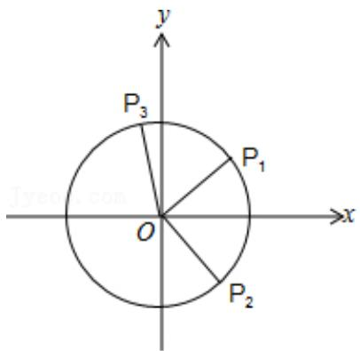

text_image

y
P₃
P₁
O
x
P₂

$A(1,0)$ ，作出单位圆O，并作出角 $\alpha$ ， $\beta$ ， $-\beta$ ，

使角 $\alpha$ 的始边与 OA 重合，终边交圆 O 于点 $P_{1}$ ，角 $\beta$ 的始边为 $OP_{1}$ ，终边交圆 O 于 $P_{3}$ ，

角 $-\beta$ 的始边为 OA，交圆 O 于 $P_{2}$ ，

于是 $P_{1}(\cos\alpha,\sin\alpha)$ ， $P_{3}(\cos(\alpha+\beta)$ ， $\sin(\alpha+\beta))$ ， $P_{2}(\cos\beta,-\sin\beta)$ ，

由向量的模与数量积可知，A、C 正确；B、D 错误.

故选：AC.

【点评】本题考查平面向量数量积的性质及运算，考查同角三角函数基本关系式及两角和的三角函数，考查运算求解能力，是中档题.

# 三、填空题

1.【分析】根据 $\vec{a} \perp \vec{b}$ 即可得出 $\vec{a} \cdot \vec{b} = 0$ ，进行数量积的坐标运算即可求出 m .

【解答】解：∵ $\vec{a} \perp \vec{b}$ ;

$$
\therefore \vec {a} \cdot \vec {b} = 3 + m = 0;
$$

$$
\therefore m = - 3.
$$

故答案为：-3.

【点评】考查向量垂直的充要条件，以及向量数量积的坐标运算.

2.【分析】 $\vec{a}\perp\vec{b}$ 则 $\vec{a}\cdot\vec{b}=0$ ，代入 $\vec{a}$ ， $\vec{b}$ ，解方程即可.

【解答】解：由向量 $\vec{a}=(-4,3)$ ， $\vec{b}=(6,m)$ ，且 $\vec{a}\perp\vec{b}$ ，

得 $\vec{a}\cdot\vec{b}=-24+3m=0$

$$
\therefore m = 8.
$$

故答案为：8.

【点评】本题考查了平面向量的数量积与垂直的关系，属基础题.

3.【分析】数量积的定义结合坐标运算可得结果

【解答】解： $\vec{a}\cdot\vec{b}=2\times(-8)+2\times6=-4$

$$
| \vec {a} | = \sqrt {2 ^ {2} + 2 ^ {2}} = 2 \sqrt {2},
$$

$$
| \vec {b} | = \sqrt {(- 8) ^ {2} + 6 ^ {2}} = 1 0,
$$

$$
\cos <   \vec {a}, \quad \vec {b} > = \frac {- 4}{2 \sqrt {2} \times 1 0} = - \frac {\sqrt {2}}{1 0}.
$$

故答案为： $-\frac{\sqrt{2}}{10}$ .

【点评】本题考查数量积的定义和坐标运算，考查计算能力.

4.【分析】利用 $\overrightarrow{AD}$ 和 $\overrightarrow{AB}$ 作为基底表示向量 $\overrightarrow{BD}$ 和 $\overrightarrow{AE}$ ，然后计算数量积即可.

【解答】解：∵ AE = BE ， AD // BC ， $\angle A = 30^{\circ}$

∴在等腰三角形ABE中， $\angle BEA=120^{\circ}$ ，

又 $AB = 2\sqrt{3}$ ， $\therefore AE = 2$

$$
\therefore \overrightarrow {B E} = - \frac {2}{5} \overrightarrow {A D},
$$

$$
\because \overrightarrow {A E} = \overrightarrow {A B} + \overrightarrow {B E}, \therefore \overrightarrow {A E} = \overrightarrow {A B} - \frac {2}{5} \overrightarrow {A D}
$$

又 $\overrightarrow{BD} = \overrightarrow{BA} +\overrightarrow{AD} = -\overrightarrow{AB} +\overrightarrow{AD}$

$$
\therefore \overrightarrow {B D} \cdot \overrightarrow {A E} = (- \overrightarrow {A B} + \overrightarrow {A D}) \cdot (\overrightarrow {A B} - \frac {2}{5} \overrightarrow {A D})
$$

$$
= - \overrightarrow {A B} ^ {2} + \frac {7}{5} \overrightarrow {A B} \cdot \overrightarrow {A D} - \frac {2}{5} \overrightarrow {A D} ^ {2}
$$

$$
\begin{array}{l} = - \overrightarrow {A B} ^ {2} + \frac {7}{5} | \overrightarrow {A B} | \cdot | \overrightarrow {A D} | \cos A - \frac {2}{5} \overrightarrow {A D} ^ {2} \\ = - 1 2 + \frac {7}{5} \times 5 \times 2 \sqrt {3} \times \frac {\sqrt {3}}{2} - \frac {2}{5} \times 2 5 \\ = - 1 \\ \end{array}
$$

故答案为：-1.

【点评】本题考查了平面向量基本定理和平面向量的数量积，关键是选好基底，属中档题.

5.【分析】建立平面直角坐标系，用坐标表示题中的所有向量，求出向量的模，分析式子中的两个括号内 $\lambda_{1}$ ， $\lambda_{3}$ 与 $\lambda_{2}$ ， $\lambda_{4}$ 的取值相互没有影响，有影响的是 $\lambda_{5}$ ， $\lambda_{6}$ ，分类讨论 $\lambda_{5}$ ， $\lambda_{6}$ 的取值，再确定 $\lambda_{1}$ ， $\lambda_{3}$ 与 $\lambda_{2}$ ， $\lambda_{4}$ 的取值，能求出最值.

【解答】解：如图，建立平面直角坐标系，则 $A(0,0)$ ， $B(1,0)$ ， $C(1,1)$ ， $D(0,1)$ ，

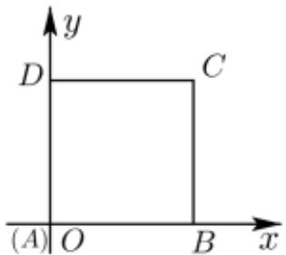

text_image

y
D	C
(A)O	B	x

$$
\therefore \overrightarrow {A B} = (1, 0), \quad \overrightarrow {B C} = (0, 1), \quad \overrightarrow {C D} = (- 1, 0), \quad \overrightarrow {D A} = (0, - 1), \quad \overrightarrow {A C} = (1, 1), \quad \overrightarrow {B D} = (- 1, 1),
$$

$$
\therefore \left| \lambda_ {1} \overrightarrow {A B} + \lambda_ {2} \overrightarrow {B C} + \lambda_ {3} \overrightarrow {C D} + \lambda_ {4} \overrightarrow {D A} + \lambda_ {5} \overrightarrow {A C} + \lambda_ {6} \overrightarrow {B D} \right|
$$

$$
= \left| \left(\lambda_ {1} - \lambda_ {3} + \lambda_ {5} - \lambda_ {6}, \quad \lambda_ {2} - \lambda_ {4} + \lambda_ {5} + \lambda_ {6}\right) \right|
$$

$$
= \sqrt {\left(\lambda_ {1} - \lambda_ {3} + \lambda_ {5} - \lambda_ {6}\right) ^ {2} + \left(\lambda_ {2} - \lambda_ {4} + \lambda_ {5} + \lambda_ {6}\right) ^ {2}}, (*)
$$

(\*)中第一个括号中的 $\lambda_{1}$ , $\lambda_{3}$ 与第二个括号中的 $\lambda_{2}$ , $\lambda_{4}$ 的取值互不影响,

只需讨论 $\lambda_{5}$ ， $\lambda_{6}$ 的取值情况即可，

当 $\lambda_{5}$ ， $\lambda_6$ 同号时，不妨取 $\lambda_{5} = 1$ ， $\lambda_{6} = 1$ ，则 (\*) 式即为 $\sqrt{(\lambda_1 - \lambda_3)^2 + (\lambda_2 - \lambda_4 + 2)^2}$

$$
\because \lambda_ {1}, \quad \lambda_ {2}, \quad \lambda_ {3}, \quad \lambda_ {4} \in \{- 1, 1 \},
$$

$\therefore \lambda_{1} = \lambda_{3}, \lambda_{2} - \lambda_{4} = -2 (\lambda_{2} = -1, \lambda_{4} = 1)$ 时，(\*)取得最小值0，

当 $|\lambda_1 - \lambda_3| = 2$ （如 $\lambda_{1} = 1$ ， $\lambda_{3} = -1$ )， $\lambda_{2} - \lambda_{4} = 2(\lambda_{2} = 1$ ， $\lambda_4 = -1)$ 时，(\*)式取得最大值为 $2\sqrt{5}$

当 $\lambda_{5}$ ， $\lambda_{6}$ 异号时，不妨取 $\lambda_{5} = 1$ ， $\lambda_{6} = -1$ ，则 (\*)式即为 $\sqrt{(\lambda_1 - \lambda_2 + 2)^2 + (\lambda_2 - \lambda_4)^2}$

同理可得最小值为 0，最大值为 $2\sqrt{5}$ .

故答案为：0； $2\sqrt{5}$ .

【点评】本题考查向量的加减运算和向量的模的最值求法，注意变形和分类讨论，考查化简运算能力，属于基础题.

6.【分析】根据向量数量积的应用，求出相应的长度和数量积即可得到结论.

【解答】解： $\vec{a}\cdot\vec{c}=\vec{a}\cdot(2\vec{a}-\sqrt{5}\vec{b})=2\vec{a}^{2}-\sqrt{5}\vec{a}\cdot\vec{b}=2$ ，

$$
\because \vec {c} ^ {2} = (2 \vec {a} - \sqrt {5} \vec {b}) ^ {2} = 4 \vec {a} ^ {2} - 4 \sqrt {5} \vec {a} \cdot \vec {b} + 5 \vec {b} ^ {2} = 9,
$$

$\therefore|\vec{c}|=3,$

$$
\therefore \cos <   \vec {a}, \quad \vec {c} > = \frac {\vec {a} \cdot \vec {c}}{| \vec {a} | | \vec {c} |} = \frac {2}{3}.
$$

故答案为: $\frac{2}{3}$

【点评】本题主要考查向量夹角的求解，根据向量数量积的应用分别求出数量积及向量长度是解决本题的关键.

7.【分析】首先算出 $\overrightarrow{AO} = \frac{1}{2}\overrightarrow{AD}$ ，然后用 $\overrightarrow{AB}$ 、 $\overrightarrow{AC}$ 表示出 $\overrightarrow{AO}$ 、 $\overrightarrow{EC}$ ，结合 $\overrightarrow{AB} \cdot \overrightarrow{AC} = 6\overrightarrow{AO} \cdot \overrightarrow{EC}$ 得 $\frac{1}{2}\overrightarrow{AB}^2 = \frac{3}{2}\overrightarrow{AC}^2$ ，进一步可得结果.

【解答】解：设 $\overrightarrow{AO} = \lambda \overrightarrow{AD} = \frac{\lambda}{2} (\overrightarrow{AB} + \overrightarrow{AC})$ ,

$$
\overrightarrow {A O} = \overrightarrow {A E} + \overrightarrow {E O} = \overrightarrow {A E} + \mu \overrightarrow {E C} = \overrightarrow {A E} + \mu (\overrightarrow {A C} - \overrightarrow {A E})
$$

$$
= (1 - \mu) \overrightarrow {A E} + \mu \overrightarrow {A C} = \frac {1 - \mu}{3} \overrightarrow {A B} + \mu \overrightarrow {A C}
$$

$$
\therefore \left\{ \begin{array}{l} \frac {\lambda}{2} = \frac {1 - \mu}{3} \\ \frac {\lambda}{2} = \mu \end{array} , \quad \therefore \left\{ \begin{array}{l} \lambda = \frac {1}{2} \\ \mu = \frac {1}{4} \end{array} , \right. \right.
$$

$$
\therefore \overrightarrow {A O} = \frac {1}{2} \overrightarrow {A D} = \frac {1}{4} (\overrightarrow {A B} + \overrightarrow {A C}),
$$

$$
\overrightarrow {E C} = \overrightarrow {A C} - \overrightarrow {A E} = - \frac {1}{3} \overrightarrow {A B} + \overrightarrow {A C},
$$

$$
6 \overrightarrow {A O} \cdot \overrightarrow {E C} = 6 \times \frac {1}{4} (\overrightarrow {A B} + \overrightarrow {A C}) \cdot (- \frac {1}{3} \overrightarrow {A B} + \overrightarrow {A C})
$$

$$
= \frac {3}{2} \left(- \frac {1}{3} \overrightarrow {A B} ^ {2} + \frac {2}{3} \overrightarrow {A B} \cdot \overrightarrow {A C} + \overrightarrow {A C} ^ {2}\right)
$$

$$
= - \frac {1}{2} \overrightarrow {A B} ^ {2} + \overrightarrow {A B} \cdot \overrightarrow {A C} + \frac {3}{2} \overrightarrow {A C} ^ {2},
$$

$$
\because \overrightarrow {A B} \cdot \overrightarrow {A C} = - \frac {1}{2} \overrightarrow {A B} ^ {2} + \overrightarrow {A B} \cdot \overrightarrow {A C} + \frac {3}{2} \overrightarrow {A C} ^ {2},
$$

$$
\therefore \frac {1}{2} \overrightarrow {A B} ^ {2} = \frac {3}{2} \overrightarrow {A C} ^ {2}, \quad \therefore \frac {\overrightarrow {A B} ^ {2}}{\overrightarrow {A C} ^ {2}} = 3,
$$

$$
\therefore \frac {A B}{A C} = \sqrt {3}.
$$

故答案为： $\sqrt{3}$

【点评】本题考查向量的数量积的应用，考查向量的表示以及计算，考查计算能力.

8.【分析】设 $\overrightarrow{e_{1}}$ 、 $\overrightarrow{e_{2}}$ 的夹角为 $\alpha$ ，由题意求出 $\cos\alpha\geqslant\frac{3}{4}$ ;

再求 $\vec{a}$ ， $\vec{b}$ 的夹角 $\theta$ 的余弦值 $\cos^2\theta$ 的最小值即可.

【解答】解：设 $\vec{e_1}$ 、 $\vec{e_2}$ 的夹角为 $\alpha$ ，由 $\vec{e_1}$ ， $\vec{e_2}$ 为单位向量，满足 $|2\vec{e_1} -\vec{e_2}| \leqslant \sqrt{2}$

所以 $4\overrightarrow{e_1}^{\rightarrow 2} - 4\overrightarrow{e_1}\cdot \overrightarrow{e_2} + \overrightarrow{e_2}^{\rightarrow 2} = 4 - 4\cos \alpha + 1 \leqslant 2$

解得 $\cos\alpha\geqslant\frac{3}{4}$ ;

又 $\vec{a} = \vec{e}_1 + \vec{e}_2$ ， $\vec{b} = 3\vec{e}_1 + \vec{e}_2$ ，且 $\vec{a}$ ， $\vec{b}$ 的夹角为 $\theta$

所以 $\vec{a} \cdot \vec{b} = 3\vec{e}_1^2 + 4\vec{e}_1 \cdot \vec{e}_2 + \vec{e}_2^2 = 4 + 4\cos \alpha$

$$
\vec {a} ^ {2} = \overrightarrow {e _ {1}} ^ {2} + 2 \overrightarrow {e _ {1}} \cdot \overrightarrow {e _ {2}} + \overrightarrow {e _ {2}} ^ {2} = 2 + 2 \cos \alpha ,
$$

$$
\vec {b} ^ {2} = 9 \overrightarrow {e _ {1}} ^ {2} + 6 \overrightarrow {e _ {1}} \cdot \overrightarrow {e _ {2}} + \overrightarrow {e _ {2}} ^ {2} = 1 0 + 6 \cos \alpha ;
$$

则 $\cos^2\theta = \frac{(\vec{a}\cdot\vec{b})^2}{\vec{a}^2\times\vec{b}^2} = \frac{(4 + 4\cos\alpha)^2}{(2 + 2\cos\alpha)(10 + 6\cos\alpha)} = \frac{4 + 4\cos\alpha}{5 + 3\cos\alpha} = \frac{4}{3} -\frac{\frac{8}{3}}{5 + 3\cos\alpha},$

所以 $\cos \alpha = \frac{3}{4}$ 时， $\cos^2\theta$ 取得最小值为 $\frac{4}{3} - \frac{\frac{8}{3}}{5 + 3 \times \frac{3}{4}} = \frac{28}{29}$ .

故答案为： $\frac{28}{29}$ .

【点评】本题考查了平面向量的数量积与夹角的运算问题，是中档题.

9.【分析】设 $\overrightarrow{OA_{1}} = \overrightarrow{a_{1}}$ ， $\overrightarrow{OA_{2}} = \overrightarrow{a_{2}}$ ，结合向量的模等于 1 和 2 画出图形，由圆的交点个数即可求得 k 的最大值.

【解答】解：如图，设 $\overrightarrow{OA_{1}} = \overrightarrow{a_{1}}$ ， $\overrightarrow{OA_{2}} = \overrightarrow{a_{2}}$ ，

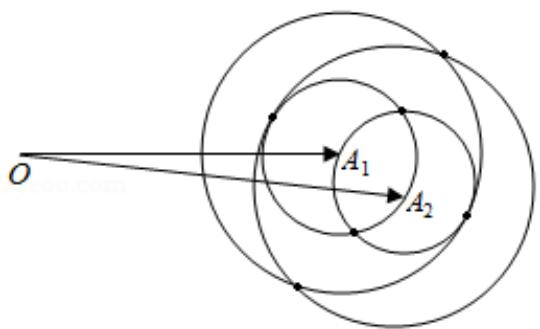

text_image

O
A₁
A₂

由 $|\overrightarrow{a_1} -\overrightarrow{a_2}| = 1$ ，且 $|\overrightarrow{a_i} -\overrightarrow{b_j} |\in \{1,2\}$

分别以 $A_{1}$ ， $A_{2}$ 为圆心，以 1 和 2 为半径画圆，其中任意两圆的公共点共有 6 个.

故满足条件的 k 的最大值为 6.

故答案为：6.

【点评】本题考查两向量的线性运算，考查向量模的求法，正确理解题意是关键，是中档题.

10.【分析】根据余弦定理即可求出 $\cos\angle BAC=\frac{11}{16}$ ，并得出 $\overrightarrow{AD}\cdot\overrightarrow{AB}=\frac{1}{2}(\overrightarrow{AB}+\overrightarrow{AC})\cdot\overrightarrow{AB}$ ，然后进行数量积的运算即可.

【解答】解：∵在 $\triangle ABC$ 中，AB=2，BC=3，AC=4，

∴由余弦定理得， $\cos\angle BAC=\frac{AB^{2}+AC^{2}-BC^{2}}{2AB\cdot AC}=\frac{4+16-9}{2\times2\times4}=\frac{11}{16}$

∴ $\overrightarrow{AB} \cdot \overrightarrow{AC} = 2 \times 4 \times \frac{11}{16} = \frac{11}{2}$ ，且 D 是 BC 的中点，

$$
\begin{array}{l} \therefore \overrightarrow {A D} \cdot \overrightarrow {A B} = \frac {1}{2} (\overrightarrow {A B} + \overrightarrow {A C}) \cdot \overrightarrow {A B} \\ = \frac {1}{2} (\overrightarrow {A B} ^ {2} + \overrightarrow {A B} \cdot \overrightarrow {A C}) \\ = \frac {1}{2} \times \left(4 + \frac {1 1}{2}\right) \\ = \frac {1 9}{4}. \\ \end{array}
$$

故答案为： $\frac{19}{4}$ .

【点评】本题考查了余弦定理，向量加法的平行四边形法则，向量数乘的几何意义，向量数量积的运算及计算公式，考查了计算能力，属于基础题.

11.【分析】根据向量垂直的条件可得关于 m 的方程，解之可得结果.

【解答】解：向量 $\vec{a}=(1,-1)$ ， $\vec{b}=(m+1,2m-4)$ ，若 $\vec{a}\perp\vec{b}$ ，

则 $\vec{a}\cdot\vec{b}=m+1-(2m-4)=-m+5=0$

则 $m = 5$

故答案为：5.

【点评】本题考查了向量的垂直的条件和向量数量积的运算，属于基础题.

12.【分析】由已知求得 $\vec{a} \cdot \vec{b}$ ，再由 $k\vec{a} - \vec{b}$ 与 $\vec{a}$ 垂直，可得 $(k\vec{a} - \vec{b}) \cdot \vec{a} = 0$ ，展开即可求得 k 值.

【解答】解：∵向量 $\vec{a}$ ， $\vec{b}$ 为单位向量，且 $\vec{a}$ ， $\vec{b}$ 的夹角为 $45^{\circ}$ ，

$$
\therefore \vec {a} \cdot \vec {b} = | \vec {a} | \cdot | \vec {b} | \cos 4 5 ^ {\circ} = 1 \times 1 \times \frac {\sqrt {2}}{2} = \frac {\sqrt {2}}{2},
$$

又 $k\vec{a}-\vec{b}$ 与 $\vec{a}$ 垂直，

$$
\therefore (k \vec {a} - \vec {b}) \cdot \vec {a} = k | \vec {a} | ^ {2} - \vec {a} \cdot \vec {b} = 0,
$$

即 $k - \frac{\sqrt{2}}{2} = 0$ ，则 $k = \frac{\sqrt{2}}{2}$

故答案为： $\frac{\sqrt{2}}{2}$ .

【点评】本题考查平面向量的数量积运算，考查向量垂直与数量积的关系，是基础题.

13.【分析】根据向量的几何意义可得 $P$ 为 $BC$ 的中点，再根据向量的数量积的运算和正方形的性质即可求出.

【解答】解：由 $\overrightarrow{AP} = \frac{1}{2} (\overrightarrow{AB} +\overrightarrow{AC})$ ，可得 $P$ 为 $BC$ 的中点，

则 $|CP|=1$ ，

$$
\therefore | P D | = \sqrt {2 ^ {2} + 1 ^ {2}} = \sqrt {5},
$$

$$
\therefore \overrightarrow {P B} \cdot \overrightarrow {P D} = \overrightarrow {P B} \cdot (\overrightarrow {P C} + \overrightarrow {C D}) = - \overrightarrow {P C} \cdot (\overrightarrow {P C} + \overrightarrow {C D}) = - \overrightarrow {P C} ^ {2} - \overrightarrow {P C} \cdot \overrightarrow {C D} = - 1,
$$

故答案为： $\sqrt{5}$ ，-1.

【点评】本题考查了向量的几何意义和向量的数量积的运算，属于基础题.

14.【分析】以 $B$ 为原点，以 $BC$ 为 $x$ 轴建立如图所示的直角坐标系，根据向量的平行和向量的数量积即可求出点 $D$ 的坐标，即可求出 $\lambda$ 的值，再设出点 $M$ ， $N$ 的坐标，根据向量的数量积可得关于 $x$ 的二次函数，根据二次函数的性质即可求出最小值.

【解答】解：以 B 为原点，以 BC 为 x 轴建立如图所示的直角坐标系，

$$
\because \angle B = 6 0 ^ {\circ}, A B = 3,
$$

$$
\therefore A \left(\frac {3}{2}, \frac {3 \sqrt {3}}{2}\right),
$$

$$
\because B C = 6,
$$

$$
\therefore C (6, 0),
$$

$$
\because \overrightarrow {A D} = \lambda \overrightarrow {B C},
$$

$$
\therefore A D \parallel B C,
$$

设 $D(x_{0},\ \frac{3\sqrt{3}}{2})$ ,

$$
\therefore \overrightarrow {A D} = \left(x _ {0} - \frac {3}{2}, 0\right), \quad \overrightarrow {A B} = \left(- \frac {3}{2}, - \frac {3 \sqrt {3}}{2}\right),
$$

∴ $\overrightarrow{AD} \cdot \overrightarrow{AB} = -\frac{3}{2}(x_{0} - \frac{3}{2}) + 0 = -\frac{3}{2}$ ，解得 $x_{0} = \frac{5}{2}$ ，

$$
\therefore D \left(\frac {5}{2}, \frac {3 \sqrt {3}}{2}\right),
$$

$$
\therefore \overrightarrow {A D} = (1, 0), \quad \overrightarrow {B C} = (6, 0),
$$

$$
\therefore \overrightarrow {A D} = \frac {1}{6} \overrightarrow {B C},
$$

$$
\therefore \lambda = \frac {1}{6},
$$

$$
\because | \overrightarrow {M N} | = 1,
$$

设 $M(x,0)$ ，则 $N(x+1,0)$ ，其中 $0 \leqslant x \leqslant 5$ ，

$$
\therefore \overrightarrow {D M} = (x - \frac {5}{2}, - \frac {3 \sqrt {3}}{2}), \quad \overrightarrow {D N} = (x - \frac {3}{2}, - \frac {3 \sqrt {3}}{2}),
$$

$\therefore \overrightarrow{DM} \cdot \overrightarrow{DN} = (x - \frac{5}{2})(x - \frac{3}{2}) + \frac{27}{4} = x^2 - 4x + \frac{21}{2} = (x - 2)^2 + \frac{13}{2}$ ，当 $x = 2$ 时取得最小值，最小值为 $\frac{13}{2}$ ，故答案为： $\frac{1}{6}$ ， $\frac{13}{2}$ .

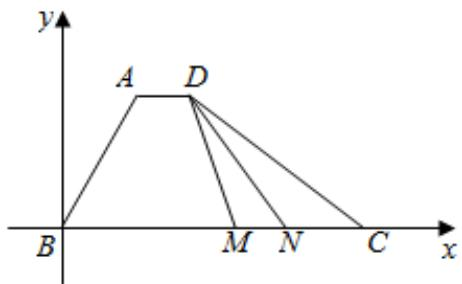

text_image

y
A D
B M N C x

【点评】本题考查了向量在几何中的应用，考查了向量的共线和向量的数量积，以及二次函数的性质，属于中档题.

15.【分析】直接利用向量的模的平方，结合已知条件转化求解即可.

【解答】解： $\vec{a}$ ， $\vec{b}$ 为单位向量，且 $|\vec{a}+\vec{b}|=1$ ，

$$
\left| \vec {a} + \vec {b} \right| ^ {2} = 1,
$$

可得 $\vec{a}^{2} + 2\vec{a} \cdot \vec{b} + \vec{b}^{2} = 1$ ,

$$
1 + 2 \vec {a} \cdot \vec {b} + 1 = 1,
$$

所以 $2\vec{a}\cdot\vec{b}=-1$

则 $|\vec{a} -\vec{b}| = \sqrt{\vec{a}^2 - 2\vec{a}\cdot\vec{b} + \vec{b}^2} = \sqrt{3}$

故答案为： $\sqrt{3}$ .

【点评】本题考查向量的模的求法，数量积的应用，考查计算能力.

16.【分析】以 A 为坐标原点，分别以 AB，AC 所在直线为 x，y 轴建立平面直角坐标系，求得 B 与 C 的坐标，再把 $\overrightarrow{PA}$ 的坐标用 m 表示．由 AP=9 列式求得 m 值，然后分类求得 D 的坐标，则 CD 的长度可求.

【解答】解：如图，以 A 为坐标原点，分别以 AB，AC 所在直线为 x，y 轴建立平面直角坐标系，则 $B(4,0)$ ， $C(0,3)$ ，

由 $\overrightarrow{PA} = m\overrightarrow{PB} + (\frac{3}{2} -m)\overrightarrow{PC}$ ，得 $\overrightarrow{PA} = m(\overrightarrow{PA} +\overrightarrow{AB}) + (\frac{3}{2} -m)(\overrightarrow{PA} +\overrightarrow{AC})$

整理得： $\overrightarrow{PA}=-2m\overrightarrow{AB}+(2m-3)\overrightarrow{AC}$

$$
= - 2 m (4, 0) + (2 m - 3) (0, 3) = (- 8 m, 6 m - 9).
$$

由 $AP = 9$ ，得 $64m^{2} + (6m - 9)^{2} = 81$ ，解得 $m = \frac{27}{25}$ 或 $m = 0$

当 $m = 0$ 时， $\overrightarrow{PA} = (0, - 9)$ ，此时 $C$ 与 $D$ 重合， $|CD| = 0$

当 $m = \frac{27}{25}$ 时，直线 $PA$ 的方程为 $y = \frac{9 - 6m}{8m} x$

直线 BC 的方程为 $\frac{x}{4} + \frac{y}{3} = 1$ ,

联立两直线方程可得 $x=\frac{8}{3}m,\quad y=3-2m$ .

即 $D(\frac{72}{25}, \frac{21}{25})$ ,

$$
\therefore | C D | = \sqrt {\left(\frac {7 2}{2 5}\right) ^ {2} + \left(\frac {2 1}{2 5} - 3\right) ^ {2}} = \frac {1 8}{5}.
$$

∴ CD 的长度是 0 或 $\frac{18}{5}$ .

故答案为：0 或 $\frac{18}{5}$ .

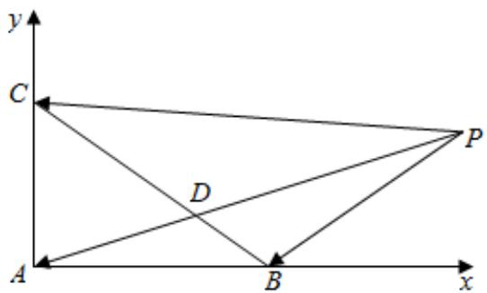

text_image

y
C
D
A
B
x
P

【点评】本题考查向量的概念与向量的模，考查运算求解能力，利用坐标法求解是关键，是中档题.

42.【分析】可设 $|\overrightarrow{A_1A_2}| = x$ ，从而据题意可得出 $|\overrightarrow{A_2A_3}| = \frac{2}{x}$ ， $|\overrightarrow{A_3A_4}| = \frac{3x}{2}, |\overrightarrow{A_4A_5}| = \frac{8}{3x}$ ，并设 $A_1(0,0)$ ，根据是求 $|\overrightarrow{A_1A_5}|$ 的最小值，从而可得出 $A_5(-\frac{x}{2}, -\frac{2}{3x})$ ，从而可求出 $|\overrightarrow{A_1A_5}|^2 = \frac{x^2}{4} + \frac{4}{9x^2}$ ，从而根据基本不等式即可求出 $|\overrightarrow{A_1A_5}|$ 的最小值.

【解答】解：设 $|\overrightarrow{A_1A_2}| = x$ ，则 $|\overrightarrow{A_2A_3}| = \frac{2}{x}$ ， $|\overrightarrow{A_3A_4}| = \frac{3x}{2}, |\overrightarrow{A_4A_5}| = \frac{8}{3x}$

设 $A_{1}(0,0)$ ，如图，

∵求 $\left|\overrightarrow{A_{1}A_{5}}\right|$ 的最小值，则：

$$
A _ {2} (x, 0), \quad A _ {3} (x, \frac {2}{x}), A _ {4} (- \frac {x}{2}, \frac {2}{x}), \quad A _ {5} (- \frac {x}{2}, - \frac {2}{3 x}),
$$

$\therefore \left|\overrightarrow{A_{1}A_{5}}\right|^{2} = \left(-\frac{x}{2}\right)^{2} + \left(-\frac{2}{3x}\right)^{2} = \frac{x^{2}}{4} + \frac{4}{9x^{2}} \geqslant \frac{2}{3}$ ，当且仅当 $\frac{x^2}{4} = \frac{4}{9x^2}$ ，即 $x = \frac{2\sqrt{3}}{3}$ 时取等号，

$\therefore|\overrightarrow{A_{1}A_{5}}|$ 的最小值为 $\frac{\sqrt{6}}{3}$ .

故答案为： $\frac{\sqrt{6}}{3}$ .

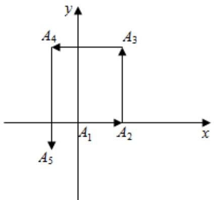

text_image

y
A₄
A₃
A₁
A₂
x
A₅

【点评】本题考查了向量垂直的充要条件, 利用向量坐标解决向量问题的方法, 基本不等式求最值的方法, 考查了计算能力, 属于中档题.

17.【分析】首先由所给的关系式得到 x，y，z 之间的关系，然后求解其最小值即可.

【解答】解：令 $\vec{a}=(1,0),\vec{b}=(0,2),\vec{c}=(m,n)$ ,

因为 $(\vec{a}-\vec{b})\cdot\vec{c}=0$ ，故 $(1,-2)\cdot(m,n)=0,\therefore m-2n=0$ ，令 $\vec{c}=(2n,n)$ ，

平面向量 $\vec{d}$ 在 $\vec{a}$ ， $\vec{b}$ 方向上的投影分别为 x，y，设 $\vec{d} = (x, y)$ ，

则： $\vec{d} -\vec{a} = (x - 1,y),(\vec{d} -\vec{a})\cdot \vec{c} = 2n(x - 1) + ny,|\vec{c}| = \sqrt{5}|n|$

从而： $z = \frac{(\vec{d} - \vec{a})\cdot\vec{c}}{|\vec{c}|} = \frac{2xn + yn - 2n}{\sqrt{5}|n|}$ ，故 $2x + y\pm \sqrt{5} z = 2$

方法一：由柯西不等式可得 $2x + y - \sqrt{5} z = 2 \leqslant \sqrt{2^2 + 1^2 + (-\sqrt{5})^2} \cdot \sqrt{x^2 + y^2 + z^2}$ ，

化简得 $x^{2} + y^{2} + z^{2}\geqslant \frac{4}{10} = \frac{2}{5}$ ，当且仅当 $\frac{2}{x} = \frac{1}{y} = \frac{-\sqrt{5}}{z}$ ，即 $x = \frac{2}{5},y = \frac{1}{5},z = -\frac{\sqrt{5}}{5}$ 时取等号，

故 $x^{2} + y^{2} + z^{2}$ 的最小值为 $\frac{2}{5}$ .

方法二：则 $x^{2} + y^{2} + z^{2}$ 表示空间中坐标原点到平面 $2x + y \pm \sqrt{5}z - 2 = 0$ 上的点的距离的平方，

由平面直角坐标系中点到直线距离公式推广得到的空间直角坐标系中点到平面距离公式可得:

$$
\left(x ^ {2} + y ^ {2} + z ^ {2}\right) _ {\min} = \left(\frac {2 \times 0 + 1 \times 0 \pm \sqrt {5} \times 0 - 2}{\sqrt {4 + 1 + 5}}\right) ^ {2} = \frac {4}{1 0} = \frac {2}{5}.
$$

故答案为： $\frac{2}{5}$ .

【点评】本题主要考查平面向量数量积的定义与运算法则，平面向量的坐标运算，平面向量的投影，类比推理的应用等知识，属于难题.

18.【分析】设 BE = x，表示出 BD = 2x， $DE = \sqrt{3}x$ ，DC = 1 - 2x，利用数量积的定义与性质即可求出.

【解答】解：如图，设 BE = x，

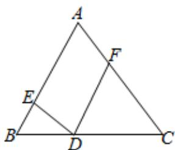

text_image

Geometric diagram of triangle ABC with points D, E, F and line segments AD, BE, CD, EF labeled

∵ $\Delta ABC$ 是边长为 1 等边三角形， $DE \perp AB$ ，

$$
\therefore \angle B D E = 3 0 ^ {\circ}, \quad B D = 2 x, \quad D E = \sqrt {3} x, \quad D C = 1 - 2 x,
$$

∵ DF // AB，∴ $\Delta DFC$ 是边长为 1 - 2x 等边三角形， $DE \perp DF$ ，

$$
\therefore (2 \overrightarrow {B E} + \overrightarrow {D F}) ^ {2} = 4 \overrightarrow {B E} ^ {2} + 4 \overrightarrow {B E} \cdot \overrightarrow {D F} + \overrightarrow {D F} ^ {2} = 4 x ^ {2} + 4 x (1 - 2 x) \times \cos 0 ^ {\circ} + (1 - 2 x) ^ {2} = 1,
$$

则 $|2\overrightarrow{BE}+\overrightarrow{DF}|=1$ ，

$$
\begin{array}{l} \because (\overrightarrow {D E} + \overrightarrow {D F}) \cdot \overrightarrow {D A} = (\overrightarrow {D E} + \overrightarrow {D F}) \cdot (\overrightarrow {D E} + \overrightarrow {E A}) = \overrightarrow {D E} ^ {2} + \overrightarrow {D F} \cdot \overrightarrow {E A} \\ = (\sqrt {3} x) ^ {2} + (1 - 2 x) \times (1 - x) = 5 x ^ {2} - 3 x + 1 \\ = 5 \left(x - \frac {3}{1 0}\right) ^ {2} + \frac {1 1}{2 0}, x \in \left(0, \frac {1}{2}\right), \\ \end{array}
$$

$\therefore(\overrightarrow{DE}+\overrightarrow{DF})\cdot\overrightarrow{DA}$ 的最小值为 $\frac{11}{20}$ .

故答案为：1， $\frac{11}{20}$ .

【点评】本题考查向量的数量积的定义，向量的运算法则，二次函数求最值，属于中档题.

19.【分析】由题意首先计算 $(\vec{a}-\vec{b})^{2}$ ，然后结合所给的条件，求出向量的模即可.

【解答】解：由题意，可得 $(\vec{a}-\vec{b})^{2}=\vec{a}^{2}-2\vec{a}\cdot\vec{b}+\vec{b}^{2}=25$ ，

因为 $|\vec{a}|=3,\quad\vec{a}\cdot\vec{b}=1$ ，所以 $9-2\times1+\vec{b}^{2}=25$ ，

所以 $\vec{b}^2 = 18, |\vec{b}| = \sqrt{\vec{b}^2} = 3\sqrt{2}$ .

故答案为： $3\sqrt{2}$ .

【点评】本题考查了平面向量数量积的性质及其运算和向量的模，属于基础题.

20.【分析】利用向量数量积的运算性质结合向量垂直的坐标表示，列出关于 $k$ 的方程，求解即可.

【解答】解：因为向量 $\vec{a}=(3,1)$ ， $\vec{b}=(1,0)$ ， $\vec{c}=\vec{a}+k\vec{b}$ ，

由 $\vec{a} \perp \vec{c}$ ，则 $\vec{a} \cdot (\vec{a} + k\vec{b}) = |\vec{a}|^{2} + k\vec{a} \cdot \vec{b} = 3^{2} + 1^{2} + k \cdot (3 \times 1 + 1 \times 0) = 10 + 3k = 0$ ，

解得 $k=-\frac{10}{3}$ .

故答案为： $-\frac{10}{3}$ .

【点评】本题考查了平面向量的坐标运算, 涉及了平面向量数量积的运算性质, 平面向量垂直的坐标表示, 考查了运算能力, 属于基础题.

21.【分析】利用向量的坐标运算求得 $\vec{a}-\lambda\vec{b}=(1-3\lambda,3-4\lambda)$ ，再由 $(\vec{a}-\lambda\vec{b})\perp\vec{b}$ ，可得 $(\vec{a}-\lambda\vec{b})\cdot\vec{b}=0$ ，即可求解 $\lambda$ 的值.

【解答】解：因为向量 $\vec{a}=(1,3)$ ， $\vec{b}=(3,4)$ ，

则 $\vec{a}-\lambda\vec{b}=(1-3\lambda,3-4\lambda)$ ,

又 $(\vec{a} - \lambda \vec{b}) \perp \vec{b}$

所以 $(\vec{a} - \lambda \vec{b}) \cdot \vec{b} = 3(1 - 3\lambda) + 4(3 - 4\lambda) = 15 - 25\lambda = 0$

解得 $\lambda=\frac{3}{5}$ .

故答案为： $\frac{3}{5}$ .

【点评】本题主要考查数量积的坐标运算，向量垂直的充要条件，考查方程思想与运算求解能力，属于基础题.

22.【分析】根据题意，由 $\vec{a} // \vec{b}$ ，可得关于 $\lambda$ 的方程，再求出 $\lambda$ 即可.

【解答】解：因为 $\vec{a}=(2,5)$ ， $\vec{b}=(\lambda,4)$ ， $\vec{a}//\vec{b}$ ，

所以 $8 - 5\lambda = 0$ ，解得 $\lambda = \frac{8}{5}$

故答案为： $\frac{8}{5}$ .

【点评】本题考查向量平行的坐标表示，涉及向量的坐标计算，属于基础题.

23.【分析】 $\vec{a}+\vec{b}+\vec{c}=\vec{0}\Leftrightarrow\vec{a}+\vec{b}=-\vec{c}$ 或 $\vec{a}+\vec{c}=-\vec{b}$ 或 $\vec{b}+\vec{c}=-\vec{a}$ ，三等式两边平方可解决此题.

【解答】解：方法1：由 $\vec{a}+\vec{b}+\vec{c}=\vec{0}$ 得 $\vec{a}+\vec{b}=-\vec{c}$ 或 $\vec{a}+\vec{c}=-\vec{b}$ 或 $\vec{b}+\vec{c}=-\vec{a}$ ，

$\therefore (\vec{a} + \vec{b})^2 = (-\vec{c})^2$ 或 $(\vec{a} + \vec{c})^2 = (-\vec{b})^2$ 或 $(\vec{b} + \vec{c})^2 = (-\vec{a})^2,$

又∵ $|\vec{a}|=1$ ， $|\vec{b}|=|\vec{c}|=2$ ，∴ $5+2\vec{a}\cdot\vec{b}=4$ ， $5+2\vec{a}\cdot\vec{c}=4$ ， $8+2\vec{b}\cdot\vec{c}=1$ ，

$$
\therefore \vec {a} \cdot \vec {b} = - \frac {1}{2}, \quad \vec {a} \cdot \vec {c} = - \frac {1}{2}, \quad \vec {b} \cdot \vec {c} = - \frac {7}{2}, \quad \therefore \vec {a} \cdot \vec {b} + \vec {a} \cdot \vec {c} + \vec {b} \cdot \vec {c} = - \frac {9}{2}.
$$

故答案为： $-\frac{9}{2}$ .

方法 $2:\vec{a}\cdot \vec{b} +\vec{b}\cdot \vec{c} +\vec{c}\cdot \vec{a} = \frac{(\vec{a} + \vec{b} + \vec{c})^2 - |\vec{a}|^2 - |\vec{b}|^2 - |\vec{c}|^2}{2} = \frac{0 - 1 - 4 - 4}{2} = -\frac{9}{2}.$

故答案为： $-\frac{9}{2}$ .

【点评】本题考查平面向量数量积性质及运算，考查数学运算能力，属于基础题.

24.【分析】建立平面直角坐标系，利用数量积的坐标运算求出 $\overrightarrow{MP} \cdot \overrightarrow{CP} = 2x^{2} - 3x$ ，再利用二次函数求最值即可.

【解答】解：建立平面直角坐标系如下，

则 $B(2,0)$ ， $C(0,2)$ ， $M(1,0)$

直线 BC 的方程为 $\frac{x}{2} + \frac{y}{2} = 1$ ，即 $x + y = 2$ ，

点 P 在直线上，设 $P(x,2-x)$ ，

$$
\therefore \overrightarrow {M P} = (x - 1, 2 - x), \quad \overrightarrow {C P} = (x, - x),
$$

$$
\therefore \overrightarrow {M P} \cdot \overrightarrow {C P} = x (x - 1) - x (2 - x) = 2 x ^ {2} - 3 x = 2 \left(x - \frac {3}{4}\right) ^ {2} - \frac {9}{8} \geqslant - \frac {9}{8},
$$

∴ $\overrightarrow{MP} \cdot \overrightarrow{CP}$ 的最小值为 $-\frac{9}{8}$ .

故答案为： $-\frac{9}{8}$ .

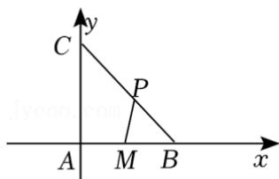

text_image

C
y
P
A M B x

【点评】本题考查了数量积的坐标运算，考查了二次函数求最值，属于中档题.

25.【分析】利用平面向量的数量积进行分析，即可得出结果.

【解答】解：由题意，有 $\vec{a} \cdot \vec{b} = 0$ ，则 $\vec{a} \perp \vec{b}$ ，设 $<\vec{a}, \vec{c} > = \theta$ ，

$$
\left\{ \begin{array}{l} \vec {a} \cdot \vec {c} = 2 \\ \vec {b} \cdot \vec {c} = 1 \end{array} \Rightarrow \left\{ \begin{array}{l} | \vec {a} | | \vec {c} | \cos \theta = 2, ① \\ | \vec {b} | | \vec {c} | \cos \left(\frac {\pi}{2} - \theta\right) = 1, ② \end{array} \right. \right.
$$

则 $\frac{②}{①}$ 得， $\tan\theta=\frac{1}{2}$ ，

由同角三角函数的基本关系得： $\cos \theta = \frac{2\sqrt{5}}{5}$

则 $\vec{a} \cdot \vec{c} = |\vec{a}||\vec{c}|\cos \theta = \lambda \cdot \lambda \cdot \frac{2\sqrt{5}}{5} = 2$

$$
\lambda^ {2} = \sqrt {5},
$$

则 $\lambda = \sqrt[4]{5}$

故答案为： $\sqrt[4]{5}$ .

【点评】本题考查平面向量的数量积，考查学生的运算能力，属于中档题.

26.【分析】由题意, 利用两个向量加减法及其几何意义, 两个向量的数量积公式, 基本不等式, 求出 $\cos C$ 的最小值, 可得 $\angle ACB$ 的最大值.

【解答】解：∵ $\Delta ABC$ 中， $\overrightarrow{CA} = \vec{a}$ ， $\overrightarrow{CB} = \vec{b}$ ，D 是 AC 中点， $\overrightarrow{CB} = 2\overrightarrow{BE}$ ，如图：

$$
\therefore \overrightarrow {D E} = \overrightarrow {C E} - \overrightarrow {C D} = \overrightarrow {C B} + \overrightarrow {B E} - \frac {1}{2} \overrightarrow {C A} = \vec {b} + \frac {\vec {b}}{2} - \frac {\vec {a}}{2} = \frac {3 \vec {b} - \vec {a}}{2}.
$$

$$
\because \overrightarrow {A B} = \overrightarrow {C B} - \overrightarrow {C A} = \vec {b} - \vec {a}, \quad \overrightarrow {A B} \perp \overrightarrow {D E},
$$

$\therefore \overrightarrow{AB} \cdot \overrightarrow{DE} = (\vec{b} - \vec{a}) \cdot \frac{3\vec{b} - \vec{a}}{2} = \frac{1}{2}(3\vec{b}^2 - 4\vec{a} \cdot \vec{b} + \vec{a}^2) = 0$ ，即 $4\vec{a} \cdot \vec{b} = \vec{a}^2 + 3\vec{b}^2$

即 $4\cdot a\cdot b\cdot \cos C = a^2 +3b^2$ ，即 $\cos C = \frac{a^2 + 3b^2}{4ab}\geqslant \frac{2\sqrt{3}ab}{4ab} = \frac{\sqrt{3}}{2},$

当且仅当 $a=\sqrt{3}b$ 时，等号成立，故 $\cos C$ 的最小值为 $\frac{\sqrt{3}}{2}$ ，故 C 的最大值为 $\frac{\pi}{6}$ ，

即 $\angle ACB$ 的最大值为 $\frac{\pi}{6}$ ,

故答案为： $\frac{3\vec{b}-\vec{a}}{2}$ ; $\frac{\pi}{6}$ .

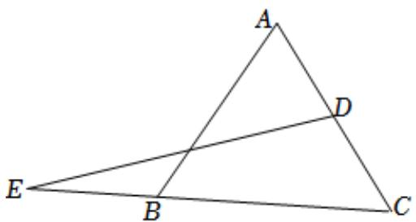

text_image

A
D
E
B
C

【点评】本题主要考查两个向量加减法及其几何意义，两个向量的数量积公式，基本不等式的应用，属于中档题.

27.【分析】首先计算 $\vec{a} \cdot \vec{b}, \vec{b}^{2}$ 的值，然后结合向量的运算法则可得所给式子的值.

【解答】解：由题意可得 $\vec{a} \cdot \vec{b} = 1 \times 3 \times \frac{1}{3} = 1, \vec{b}^{2} = 9$ ,

则 $(2\vec{a} +\vec{b})\cdot \vec{b} = 2\vec{a}\cdot \vec{b} +\vec{b}^{2} = 2 + 9 = 11$

故答案为：11.

【点评】本题主要考查平面向量的数量积的定义，平面向量的运算法则等知识，属于中等题.

28.【分析】以圆心为原点， $A_{7}A_{3}$ 所在直线为x轴， $A_{5}A_{1}$ 所在直线为y轴，建立平面直角坐标系，求出正八边形各个顶点坐标，设 $P(x,y)$ ，进而得到 $\overrightarrow{PA_{1}}^{2}+\overrightarrow{PA_{2}}^{2}+\ldots+\overrightarrow{PA_{8}}^{2}=8(x^{2}+y^{2})+8$ ，根据点P的位置可求出 $x^{2}+y^{2}$ 的范围，从而得到 $\overrightarrow{PA_{1}}^{2}+\overrightarrow{PA_{2}}^{2}+\ldots+\overrightarrow{PA_{8}}^{2}$ 的取值范围.

【解答】解：以圆心为原点， $A_{7}A_{3}$ 所在直线为 x 轴， $A_{5}A_{1}$ 所在直线为 y 轴，建立平面直角坐标系，如图所示，

则 $A_{1}(0,1)$ ， $A_{2}(\frac{\sqrt{2}}{2},\frac{\sqrt{2}}{2})$ ， $A_{3}(1,0)$ ， $A_{4}(\frac{\sqrt{2}}{2}, - \frac{\sqrt{2}}{2})$ ， $A_{5}(0, - 1)$ ， $A_{6}(-\frac{\sqrt{2}}{2}, - \frac{\sqrt{2}}{2})$ ， $A_{7}(-1,0)$ ， $A_{8}(-\frac{\sqrt{2}}{2},\frac{\sqrt{2}}{2})$ 设 $P(x,y)$

则 $\overrightarrow{PA_1}^2 +\overrightarrow{PA_2}^2 +\ldots +\overrightarrow{PA_8}^2 = |PA_1|^2 +|PA_2|^2 +|PA_3|^2 +|PA_4|^2 +|PA_5|^2 +|PA_6|^2 +|PA_7|^2 +|PA_8|^2 = 8(x^2 +y^2) + 8$

$$
\because \cos 2 2. 5 ^ {\circ} \leqslant | O P | \leqslant 1, \therefore \frac {1 + \cos 4 5 ^ {\circ}}{2} \leqslant x ^ {2} + y ^ {2} \leqslant 1,
$$

$$
\therefore \frac {2 + \sqrt {2}}{4} \leqslant x ^ {2} + y ^ {2} \leqslant 1,
$$

$$
\therefore 1 2 + 2 \sqrt {2} \leqslant 8 \left(x ^ {2} + y ^ {2}\right) + 8 \leqslant 1 6,
$$

即 $\overrightarrow{PA_{1}}^{2} + \overrightarrow{PA_{2}}^{2} + \ldots + \overrightarrow{PA_{8}}^{2}$ 的取值范围是 $[12 + 2\sqrt{2}, 16]$ ,

故答案为： $[12+2\sqrt{2}, 16]$ .

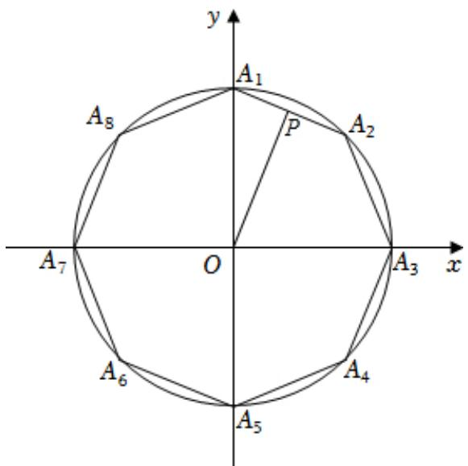

text_image

y
A₁
A₈
P
A₂
A₇
O
A₃
x
A₆
A₄
A₅

【点评】本题主要考查了平面向量数量积的运算和性质，考查了学生分析问题和转化问题的能力，属于中档题.

29.【分析】由题意，利用两个向量垂直的性质，两个向量的数量积公式，两个向量坐标形式的运算法则，计算求得 $m$ 的值.

【解答】解：∵向量 $\vec{a}=(m,3)$ ， $\vec{b}=(1,m+1)$ 。 $\vec{a}\perp\vec{b}$ ，

$$
\therefore \vec {a} \cdot \vec {b} = m + 3 (m + 1) = 0,
$$

则 $m = -\frac{3}{4}$

故答案为： $-\frac{3}{4}$ .

【点评】本题主要考查两个向量垂直的性质，两个向量的数量积公式，两个向量坐标形式的运算法则，属

于基础题.

30.【分析】根据平面向量的坐标运算法则，计算即可.

【解答】解：因为向量 $\vec{a}=(3,4)$ ， $\vec{b}=(1,2)$ ，

所以 $\vec{a}-2\vec{b}=(3-2\times1,\quad4-2\times2)=(1,\quad0)$ .

故答案为： $(1,0)$ .

【点评】本题考查了平面向量的坐标运算问题，是基础题.

31.【分析】由平面向量的线性运算，结合平面向量数量积的运算及基本不等式的应用求解即可.

【解答】解：在 $\Delta ABC$ 中， $\angle A = 60^{\circ}$ ， $|\overrightarrow{BC}| = 1$ ，点 D 为 AB 的中点，点 E 为 CD 的中点， $\overrightarrow{AB} = \vec{a}$ ， $\overrightarrow{AC} = \vec{b}$ ，则 $\overrightarrow{AE} = \frac{1}{2} (\overrightarrow{AD} + \overrightarrow{AC}) = \frac{1}{4} \overrightarrow{AB} + \frac{1}{2} \overrightarrow{AC} = \frac{1}{4} \vec{a} + \frac{1}{2} \vec{b}$ ;

设 $|\overrightarrow{AB}|=x,\quad|\overrightarrow{AC}|=y$

由余弦定理可得： $1=x^{2}+y^{2}-xy$ ，

又 $x^{2} + y^{2}\geqslant 2xy$

即 $xy \leqslant 1$ ，当且仅当 $x = y$ 时取等号，

又 $\overrightarrow{BF} = \frac{1}{3}\overrightarrow{BC}$

则 $\overrightarrow{AF} = \overrightarrow{AB} +\frac{1}{3}\overrightarrow{BC} = \overrightarrow{AB} +\frac{1}{3} (\overrightarrow{AC} -\overrightarrow{AB}) = \frac{2}{3}\overrightarrow{AB} +\frac{1}{3}\overrightarrow{AC} = \frac{2}{3}\vec{a} +\frac{1}{3}\vec{b},$

则 $\overrightarrow{AE} \cdot \overrightarrow{AF} = \left(\frac{1}{4}\vec{a} + \frac{1}{2}\vec{b}\right) \cdot \left(\frac{2}{3}\vec{a} + \frac{1}{3}\vec{b}\right)$

$$
= \frac {1}{1 2} \left(2 \vec {a} ^ {2} + 5 \vec {a} \cdot \vec {b} + 2 \vec {b} ^ {2}\right)
$$

$$
= \frac {1}{1 2} \left(2 x ^ {2} + 2 y ^ {2} + \frac {5}{2} x y\right)
$$

$$
= \frac {1}{1 2} (\frac {9}{2} x y + 2)
$$

$$
\leqslant \frac {1}{1 2} (\frac {9}{2} + 2)
$$

$$
= \frac {1 3}{2 4},
$$

即 $\overrightarrow{AE} \cdot \overrightarrow{AF}$ 的最大值为 $\frac{13}{24}$ .

故答案为： $\frac{1}{4}\vec{a}+\frac{1}{2}\vec{b}$ ； $\frac{13}{24}$ .

text_image

A
D
E
B
F
C

【点评】本题考查了平面向量的线性运算，重点考查了平面向量数量积的运算及基本不等式的应用，属中档题.

32.【分析】根据向量数量积的性质及方程思想，即可求解.

【解答】解：∵ $|\vec{a}-\vec{b}|=\sqrt{3}$ ， $|\vec{a}+\vec{b}|=|2\vec{a}-\vec{b}|$ ，

$$
\therefore \vec {a} ^ {2} + \vec {b} ^ {2} - 2 \vec {a} \cdot \vec {b} = 3, \quad \vec {a} ^ {2} + \vec {b} ^ {2} + 2 \vec {a} \cdot \vec {b} = 4 \vec {a} ^ {2} + \vec {b} ^ {2} - 4 \vec {a} \cdot \vec {b},
$$

$$
\therefore \vec {a} ^ {2} = 2 \vec {a} \cdot \vec {b}, \quad \therefore \vec {b} ^ {2} = 3,
$$

$$
\therefore | \vec {b} | = \sqrt {3}.
$$

故答案为： $\sqrt{3}$

【点评】本题考查向量数量积的性质及方程思想，属基础题.

33.【分析】将问题坐标化，表示出 $\overrightarrow{OA},\overrightarrow{OB},\overrightarrow{OC}$ 的坐标，再设 $\overrightarrow{OP}=(x,y,z)$ ，代入条件，结合不等式的性质求解.

【解答】解：设 $\overrightarrow{OA}=(0,0,1)$ ， $\overrightarrow{OB}=(\frac{\sqrt{3}}{2},\frac{1}{2},0)$ ， $\overrightarrow{OC}=(0,1,0)$ ，

$\overrightarrow{OP}=(x,y,z)$ ，不妨设x，y，z>0，则 $|\overrightarrow{OP}|=x^{2}+y^{2}+z^{2}=1$ ，

因为 $|\overrightarrow{OP} \cdot \overrightarrow{OC}| \leqslant |\overrightarrow{OP} \cdot \overrightarrow{OB}| \leqslant |\overrightarrow{OP} \cdot \overrightarrow{OA}|$ ,

所以 $y \leqslant \frac{\sqrt{3}}{2}x + \frac{1}{2}y \leqslant z$ ，可得 $x \geqslant \frac{\sqrt{3}}{3}y$ ， $z \geqslant y$ ，

所以 $1=x^{2}+y^{2}+z^{2}\geqslant\frac{1}{3}y^{2}+y^{2}+y^{2}$ ，解得 $y^{2}\leqslant\frac{3}{7}$ ，

故 $\overrightarrow{OP} \cdot \overrightarrow{OC} = y \leqslant \frac{\sqrt{21}}{7}$ .

故答案为： $\frac{\sqrt{21}}{7}$ .

【点评】本题考查空间向量的坐标运算以及不等式的性质，属于中档题.

# 第八章：复数

# 一．选择题

1.【分析】利用复数代数形式的乘除运算化简，再由共轭复数的概念得答案.

【解答】解：∵ $z = i(2 + i) = -1 + 2i$ ，

$$
\therefore \overline {{{z}}} = - 1 - 2 i,
$$

故选：D.

【点评】本题考查复数代数形式的乘除运算，考查复数的基本概念，是基础题.

2.【分析】由 z 在复平面内对应的点为 $(x, y)$ ，可得 $z = x + yi$ ，然后根据 $|z - i| = 1$ 即可得解.

【解答】解：∵z在复平面内对应的点为 $(x,y)$ ，

$$
\therefore z = x + y i, \quad \therefore z - i = x + (y - 1) i,
$$

$$
\therefore | z - i | = \sqrt {x ^ {2} + (y - 1) ^ {2}} = 1,
$$

$$
\therefore x ^ {2} + (y - 1) ^ {2} = 1,
$$

故选：C.

【点评】本题考查复数的模、复数的几何意义，正确理解复数的几何意义是解题关键，属基础题.

3.【分析】利用复数代数形式的乘除运算化简，求出 z 的坐标得答案.

【解答】解： $\because z=\frac{1-i}{2i}=\frac{(1-i)(-i)}{-2i^{2}}=-\frac{1}{2}-\frac{1}{2}i$ ，

∴ z 在复平面内对应的点的坐标为 $\left(-\frac{1}{2}, -\frac{1}{2}\right)$ ，在第三象限.

故选：C.

【点评】本题考查复数代数形式的乘除运算，考查复数的代数表示法及其几何意义，是基础题.

4.【分析】利用复数的运算法则求解即可.

【解答】解：由 $z(1+i)=2i$ ，得

$$
z = \frac {2 i}{1 + i} = \frac {2 i (1 - i)}{2}
$$

$$
= 1 + i.
$$

故选：D.

【点评】本题主要考查两个复数代数形式的乘法和除法法则，虚数单位i的幂运算性质，属于基础题.

5.【分析】求出 $z$ 的共轭复数，根据复数的几何意义求出复数所对应点的坐标即可.

【解答】解：∵z=-3+2i，

$$
\therefore \bar {z} = - 3 - 2 i,
$$

∴在复平面内 $\bar{z}$ 对应的点为 $(-3,-2)$ ，在第三象限.

故选：C.

【点评】本题考查共轭复数的代数表示及其几何意义，属基础题.

6.【分析】直接由 $z \cdot \overline{z} = |z|^{2}$ 求解.

【解答】解：∵z=2+i，

$$
\therefore z \cdot \overline {{{z}}} = | z | ^ {2} = (\sqrt {2 ^ {2} + 1 ^ {2}}) ^ {2} = 5.
$$

故选：D.

【点评】本题考查复数及其运算性质，是基础的计算题.

7.【分析】直接利用复数商的模等于模的商求解.

【解答】解：由 $z=\frac{3-i}{1+2i}$ ，得 $\left|z\right|=\left|\frac{3-i}{1+2i}\right|=\frac{\left|3-i\right|}{\left|1+2i\right|}=\frac{\sqrt{10}}{\sqrt{5}}=\sqrt{2}$ .

故选：C.

【点评】本题考查复数模的求法，考查数学转化思想方法，是基础题.

8.【分析】先化简复数 z，再求 $\bar{z}$ ，从而得解.

【解答】解： $\because z=\frac{2(3+5i)}{(1-i)^{2}}=\frac{2(3+5i)}{-2i}=\frac{3+5i}{-i}=-5+3i$ ，

$$
\therefore \bar {z} = - 5 - 3 i.
$$

故选：B.

【点评】本题考查复数的基本运算，属基础题.

9.【分析】运用复数的除法运算法则，化简可得所求值.

【解答】解： $\frac{2-i}{1+2i}=\frac{(2-i)(1-2i)}{(1+2i)(1-2i)}=\frac{-5i}{1+4}=-i$

故选：D.

【点评】本题考查复数的乘除运算，考查化简运算能力，是一道基础题.

10.【分析】利用复数的虚部为 0，求解即可.

【解答】解： $a \in R$ ，若 $a - 1 + (a - 2)i$ （i 为虚数单位）是实数，

可得 a-2=0，解得 a=2。

故选：C.

【点评】本题考查复数的基本概念，是基础题.

11.【分析】根据复数的乘法公式计算.

【解答】解： $(1+2i)(2+i)=2+i+4i+2i^{2}=5i$ ，

故选：B.

【点评】本题考查了复数运算，属于基础题.

12.【分析】根据复数的几何意义先求出 z 的表达式，结合复数的运算法则进行计算即可.

【解答】解：∵复数z对应的点的坐标是(1,2)，

$$
\therefore z = 1 + 2 i,
$$

则 $i \cdot z = i(1 + 2i) = -2 + i$ ,

故选：B.

【点评】本题主要考查复数的运算, 结合复数的几何意义求出复数的表达式是解决本题的关键. 比较基础.

13.【分析】画出图形，结合向量的数量积转化判断求解即可.

【解答】解：画出图形如图，

$\overrightarrow{AP} \cdot \overrightarrow{AB} = |\overrightarrow{AP}||\overrightarrow{AB}|\cos < \overrightarrow{AP}, \overrightarrow{AB}>$ ，它的几何意义是AB的长度与 $\overrightarrow{AP}$ 在 $\overrightarrow{AB}$ 向量的投影的乘积，显然，P在C处时，取得最大值， $|\overrightarrow{AC}|\cos\angle CAB=|\overrightarrow{AB}|+\frac{1}{2}|\overrightarrow{AB}|=3$ ，可得 $\overrightarrow{AP} \cdot \overrightarrow{AB}=|\overrightarrow{AP}||\overrightarrow{AB}|\cos<\overrightarrow{AP}, \overrightarrow{AB}>=2\times3=6$ ，最大值为6，

在 F 处取得最小值， $\overrightarrow{AP}\cdot\overrightarrow{AB}=|\overrightarrow{AP}||\overrightarrow{AB}|\cos<\overrightarrow{AP},\overrightarrow{AB}>=-2\times2\times\frac{1}{2}=-2$ ，最小值为 -2，

P 是边长为 2 的正六边形 ABCDEF 内的一点，

所以 $\overrightarrow{AP} \cdot \overrightarrow{AB}$ 的取值范围是 $(-2, 6)$ .

故选：A.

text_image

E
D
F
P
C
A
B

【点评】本题考查向量的数量积的应用，向量在几何中的应用，是中档题.

14.【分析】直接利用复数代数形式的乘除运算化简得答案.

【解答】解： $(1-i)^{4}=[(1-i)^{2}]^{2}=(-2i)^{2}=-4$

故选：A.

【点评】本题考查复数代数形式的乘除运算，是基础题.

15.【分析】由复数的乘方和加减运算，化简 $z^{2}-2z$ ，再由复数的模的定义，计算可得所求值.

【解答】解：若 $z = 1 + i$ ，则 $z^2 - 2z = (1 + i)^2 - 2(1 + i) = 2i - 2 - 2i = -2$

则 $|z^{2}-2z|=|-2|=2$ ，

故选：D.

【点评】本题考查复数的运算，考查复数的模的求法，主要考查化简运算能力，是一道基础题.

16.【分析】直接利用复数代数形式的乘除运算化简得答案.

【解答】解：∵ $\frac{1}{1-3i}=\frac{1+3i}{(1-3i)(1+3i)}=\frac{1}{10}+\frac{3}{10}i$

∴复数 $\frac{1}{1-3i}$ 的虚部是 $\frac{3}{10}$ .

故选：D.

【点评】本题考查复数代数形式的乘除运算，考查复数的基本概念，是基础题.

17.【分析】根据复数的定义化简原式，并通过模长公式求解即可.

【解答】解： $z=1+2i+i^{3}=1+2i-i=1+i$ ，

$$
\therefore | z | = \sqrt {1 ^ {2} + 1 ^ {2}} = \sqrt {2}.
$$

故选：C.

【点评】本题考查了复数的定义以及复数模的求法，是基础题.

18.【分析】把已知等式变形，再由复数代数形式的乘除运算化简，然后利用共轭复数的概念得答案.

【解答】解：由 $\overline{z}(1+i)=1-i$ ，得 $\overline{z}=\frac{1-i}{1+i}=\frac{(1-i)^{2}}{(1+i)(1-i)}=-i$ ，

$$
\therefore z = i.
$$

故选：D.

【点评】本题考查复数代数形式的乘除运算，考查复数的基本概念，是基础题.

19.【分析】利用复数的除法运算法则进行求解即可.

【解答】解：因为 $(1-i)\cdot z=2$ ，

所以 $z=\frac{2}{1-i}=\frac{2(1+i)}{(1-i)(1+i)}=1+i$ .

故选：D.

【点评】本题考查了复数的除法运算，解题的关键是掌握复数除法的运算法则，属于基础题.

20.【分析】根据已知条件，结合共轭复数的定义，以及复数的四则运算，即可求解.

【解答】解： $\because z=\frac{2-i}{2+i}=\frac{(2-i)^{2}}{(2+i)(2-i)}=\frac{3}{5}-\frac{4}{5}i$ ，

$$
\therefore \overline {{z}} = \frac {3}{5} + \frac {4}{5} i.
$$

故选：A.

【点评】本题主要考查共轭复数的定义，以及复数的四则运算，属于基础题.

21.【分析】把已知等式变形，再由复数代数形式的乘除运算化简得答案.

【解答】解：由 $iz = 4 + 3i$ ，得 $z = \frac{4 + 3i}{i} = \frac{(4 + 3i)(-i)}{-i^2} = -3i^2 -4i = 3 - 4i$ ：

故选：C.

【点评】本题考查复数代数形式的乘除运算，是基础题.

22.【分析】利用复数代数形式的乘除运算化简，求出复数所对应点的坐标得答案.

【解答】解： $\because \frac{2 - i}{1 - 3i} = \frac{(2 - i)(1 + 3i)}{(1 - 3i)(1 + 3i)} = \frac{2 + 6i - i - 3i^2}{1^2 + (-3)^2} = \frac{5 + 5i}{10} = \frac{1}{2} + \frac{1}{2}i$ ，

∴在复平面内，复数 $\frac{2-i}{1-3i}$ 对应的点的坐标为 $\left(\frac{1}{2},\frac{1}{2}\right)$ ，位于第一象限.

故选：A.

【点评】本题考查复数代数形式的乘除运算，考查复数的代数表示法及其几何意义，是基础题.

23.【分析】利用待定系数法设出 $z = a + bi$ ， $a$ ， $b$ 是实数，根据条件建立方程进行求解即可.

【解答】解：设 $z = a + bi$ ，a，b 是实数，

则 $\overline{z} = a - bi$

则由 $2(z + \overline{z}) + 3(z - \overline{z}) = 4 + 6i$

得 $2 \times 2a + 3 \times 2bi = 4 + 6i$ ，

得 $4a+6bi=4+6i$ ，

得 $\left\{\begin{aligned}4a&=4\\ 6b&=6\end{aligned}\right.$ ，得a=1，b=1，

即 $z = 1 + i$

故选：C.

【点评】本题主要考查复数的基本运算，利用待定系数法建立方程是解决本题的关键，是基础题.

24.【分析】利用复数相等的定义求解即可.

【解答】解：因为 $(1+ai)i=3+i$ ，即 $-a+i=3+i$ ，

由复数相等的定义可得，-a=3，即 a=-3。

故选：C.

【点评】本题考查了复数相等定义的理解和应用，属于基础题.

25.【分析】利用复数的乘法运算法则以及除法的运算法则进行求解即可.

【解答】解：因为 $(1-i)^{2}z=3+2i$ ，

所以 $z=\frac{3+2i}{(1-i)^{2}}=\frac{3+2i}{-2i}=\frac{(3+2i)i}{(-2i)\cdot i}=\frac{-2+3i}{2}=-1+\frac{3}{2}i$

故选：B.

【点评】本题考查了复数的运算，主要考查了复数的乘法运算法则以及除法的运算法则的运用，考查了运算能力，属于基础题.

26.【分析】把 z=2-i 代入 $z(\overline{z}+i)$ ，再由复数代数形式的乘除运算化简得答案.

【解答】解：∵ z = 2 - i，

$$
\therefore z (\bar {z} + i) = (2 - i) (2 + i + i) = (2 - i) (2 + 2 i) = 4 + 4 i - 2 i - 2 i ^ {2} = 6 + 2 i.
$$

故选：C.

【点评】本题考查复数代数形式的乘除运算，考查复数的基本概念，是基础题.

27.【分析】根据已知条件，结合复数相等的条件，即可求解.

【解答】解：∵ $(1+2i)a+b=2i$ ，

$\therefore a + b + 2ai = 2i$ ，即 $\left\{ \begin{array}{l}a + b = 0\\ 2a = 2 \end{array} \right.$

解得 $\left\{\begin{aligned}a=1\\ b=-1\end{aligned}\right.$

故选：A.

【点评】本题主要考查复数相等的条件，属于基础题.

28.【分析】根据复数与共轭复数的定义，利用复数相等列方程求出 $a$ 、 $b$ 的值.

【解答】解：因为 z=1-2i，且 $z+a\overline{z}+b=0$ ，

所以 $(1 - 2i) + a(1 + 2i) + b = (1 + a + b) + (-2 + 2a)i = 0$

所以 $\left\{\begin{aligned}1+a+b=0\\ -2+2a=0\end{aligned}\right.$

解得 a=1，b=-2。

故选：A.

【点评】本题考查了复数与共轭复数以及复数相等的应用问题，是基础题.

29.【分析】先求出 $iz + 3\overline{z} = i + i^{2} + 3(1 - i) = 2 - 2i$ ，由此能求出 $|iz + 3\overline{z}|$ .

【解答】解： $z=1+i$ ，

$$
\therefore i z + 3 \bar {z} = i + i ^ {2} + 3 (1 - i) = i - 1 + 3 - 3 i = 2 - 2 i,
$$

则 $|iz + 3\overline{z}| = \sqrt{2^2 + (-2)^2} = 2\sqrt{2}$ .

故选：D.

【点评】本题考查复数的运算，考查复数的运算法则、复数的模等基础知识，考查运算求解能力，是基础题.

30.【分析】把已知等式变形，利用复数代数形式的乘除运算化简，求出 $\overline{z}$ ，再求出 $z + \overline{z}$ 。

【解答】解：由 $i(1 - z) = 1$ ，得 $1 - z = \frac{1}{i} = \frac{-i}{-i^2} = -i$

$\therefore z = 1 + i$ ，则 $\overline{z} = 1 - i$

$$
\therefore z + \overline {{z}} = 1 + i + 1 - i = 2.
$$

故选：D.

【点评】本题考查复数代数形式的乘除运算，考查复数的基本概念，是基础题.

31.【分析】由已知结合复数的四则运算即可求解.

【解答】解： $(2+2i)(1-2i)=2-4i+2i-4i^{2}=6-2i$

故选：D.

【点评】本题主要考查了复数的四则运算，属于基础题.

32.【分析】利用复数的乘法运算化简，再利用复数的相等求解.

【解答】解：∵ $a + 3i = (b + i)i = -1 + bi$ ，a， $b \in R$ ，

$$
\therefore a = - 1, \quad b = 3,
$$

故选：B.

【点评】本题考查复数代数形式的乘法运算，考查了复数的相等，是基础题.

33.【分析】由已知求得 $z \cdot \overline{z}$ ，代入 $\frac{z}{z\overline{z} - 1}$ ，则答案可求.

【解答】解：∵ $z = -1 + \sqrt{3}i$ ，∴ $z \cdot \overline{z} = |z|^{2} = (\sqrt{(-1)^{2} + (\sqrt{3})^{2}})^{2} = 4$ ，

则 $\frac{z}{z\overline{z} - 1} = \frac{-1 + \sqrt{3}i}{4 - 1} = -\frac{1}{3} +\frac{\sqrt{3}}{3} i.$

故选：C.

【点评】本题考查复数代数形式的乘除运算，考查复数模的求法，是基础题.

34.【分析】把已知等式变形，再由商的模等于模的商求解.

【解答】解：由 $i \cdot z = 3 - 4i$ ，得 $z = \frac{3 - 4i}{i}$ ，

$$
\therefore | z | = \left| \frac {3 - 4 i}{i} \right| = \frac {| 3 - 4 i |}{| i |} = \frac {\sqrt {3 ^ {2} + (- 4) ^ {2}}}{1} = 5.
$$

故选：B.

【点评】本题考查复数模的求法，考查化归与转化思想，是基础题.

35.【分析】把已知等式变形，利用复数代数形式的乘除运算化简，再由共轭复数即复数的模的概念得答案.

【解答】解：由 $(2+i)\overline{z}=5+5i$ ，

得 $\overline{z} = \frac{5 + 5i}{2 + i}$

$$
= \frac {(5 + 5 i) (2 - i)}{(2 + i) (2 - i)}
$$

$$
= \frac {1 5 + 5 i}{5}
$$

$$
= 3 + i,
$$

则 $z = 3 - i$ ， $|z| = \sqrt{3^2 + (-1)^2} = \sqrt{10}$

故选：B.

【点评】本题考查复数代数形式的乘除运算，考查复数的基本概念，是基础题.

36.【分析】直接利用复数的模的运算求出结果.

【解答】解：由于 $|2+i^{2}+2i^{3}|=|1-2i|=\sqrt{1^{2}+(-2)^{2}}=\sqrt{5}$ .

故选：C.

【点评】本题考查的知识要点：复数的运算，复数的模，主要考查学生的理解能力和计算能力，属于基础题.

37.【分析】直接利用复数的运算法则化简求解即可.

【解答】解： $\frac{5(1+i^{3})}{(2+i)(2-i)}=\frac{5(1-i)}{5}=1-i$

故选：C.

【点评】本题考查复数的运算法则的应用，是基础题.

38.【分析】先对 $z$ 进行化简，再根据共轭复数概念写出即可.

【解答】解：∵ $i^{2} = -1$ ， $i^{5} = i$ ，

$$
\therefore z = \frac {2 + i}{1 + i ^ {2} + i ^ {5}}
$$

$$
= \frac {2 + i}{i}
$$

$$
= 1 - 2 i,
$$

$$
\therefore \overline {{z}} = 1 + 2 i.
$$

故选：B.

【点评】本题考查了复数的运算及共轭复数的概念，属简单题.

39.【分析】根据复数的运算法则和复数相等的定义，列方程组求出 a 的值.

【解答】解：因为复数 $(a+i)(1-ai)=2$ ，

所以 $2a + (1 - a^{2})i = 2$ ，

即 $\left\{\begin{aligned}2a&=2\\ 1-a^{2}&=0\end{aligned}\right.$ ，解得a=1。

故选：C.

【点评】本题考查了复数的运算法则和复数相等的应用问题，是基础题.

40.【分析】根据复数的几何意义、共轭复数的定义即可得出结论.

【解答】解：∵在复平面内，复数z对应的点的坐标是 $(-1,\sqrt{3})$ ，

$$
\therefore z = - 1 + \sqrt {3} i,
$$

则 $z$ 的共轭复数 $\overline{z} = -1 - \sqrt{3} i$

故选：D.

【点评】本题考查了复数的几何意义、共轭复数的定义，考查了推理能力与计算能力，属于基础题.

41.【分析】根据已知条件，结合复数的四则运算，以及共轭复数的定义，即可求解.

【解答】解： $z=\frac{1-i}{2+2i}=\frac{1}{2}\cdot\frac{1-i}{1+i}=\frac{1}{2}\cdot\frac{(1-i)^{2}}{(1+i)(1-i)}=-\frac{1}{2}i$

则 $\overline{z}=\frac{1}{2}i$

故 $z - \overline{z} = -i$

故选：A.

【点评】本题主要考查复数的四则运算，以及共轭复数的定义，属于基础题.

42.【分析】直接利用复数代数形式的乘除运算化简得答案.

【解答】解： $(1+3i)(3-i)=3-i+9i+3=6+8i$ ，

则在复平面内， $(1+3i)(3-i)$ 对应的点的坐标为 $(6,8)$ ，位于第一象限.

故选：A.

【点评】本题考查复数代数形式的乘除运算，考查复数的代数表示法及其几何意义，是基础题.

# 二．填空题

1.【分析】把已知等式变形求得 $\overline{z}$ 再由 $|z| = |\overline{z}|$ ，结合复数模的计算公式求解.

【解答】解：由 $3\overline{z}-i=6+5i$ ，得 $3\overline{z}=6+6i$ ，即 $\overline{z}=2+2i$ ，

$$
\therefore | z | = \left| \bar {z} \right| = \sqrt {2 ^ {2} + 2 ^ {2}} = 2 \sqrt {2}.
$$

故答案为： $2\sqrt{2}$ .

【点评】本题考查复数代数形式的乘除运算，考查复数模的求法，是基础题.

2.【分析】利用复数代数形式的乘除运算化简，再由实部为0求的a值.

【解答】解：∵ $(a+2i)(1+i)=(a-2)+(a+2)i$ 的实部为0，

$\therefore a - 2 = 0$ ，即 $a = 2$ ：

故答案为：2.

【点评】本题考查复数代数形式的乘除运算，考查复数的基本概念，是基础题.

3.【分析】利用复数代数形式的除法运算化简，然后利用模的计算公式求模.

【解答】解： $\because z=\frac{1}{1+i}=\frac{1-i}{(1+i)(1-i)}=\frac{1}{2}-\frac{1}{2}i$ 。

$$
\therefore | z | = \sqrt {\left(\frac {1}{2}\right) ^ {2} + \left(- \frac {1}{2}\right) ^ {2}} = \frac {\sqrt {2}}{2}.
$$

故答案为： $\frac{\sqrt{2}}{2}$ .

【点评】本题考查了复数代数形式的除法运算，考查了复数模的求法，是基础题.

4.【分析】本题可根据复数定义及模的概念及基本运算进行计算.

【解答】解：由题意，可知：

$$
\frac {5 - i}{1 + i} = \frac {(5 - i) (1 - i)}{(1 + i) (1 - i)} = \frac {5 - 6 i + i ^ {2}}{1 - i ^ {2}} = 2 - 3 i,
$$

$$
\therefore \left| \frac {5 - i}{1 + i} \right| = \left| 2 - 3 i \right| = \sqrt {2 ^ {2} + (- 3) ^ {2}} = \sqrt {1 3}.
$$

故答案为： $\sqrt{13}$

【点评】本题主要考查复数定义及模的概念及基本运算．本题属基础题.

5.【分析】设 $z = a + bi$ ， $(a, b \in R)$ 。根据复数 z 满足 $z + 2\overline{z} = 6 + i$ ，利用复数的运算法则、复数相等即可得出。

【解答】解：设 $z = a + bi$ ， $(a, b \in R)$ .

∵复数z满足 $z+2\bar{z}=6+i$ ，

$$
\therefore 3 a - b i = 6 + i,
$$

可得： $3a = 6$ ， $-b = 1$ ，解得 $a = 2$ ， $b = -1$ ：

则 z 的实部为 2.

故答案为：2.

【点评】本题考查了复数的运算法则、复数相等，考查了推理能力与计算能力，属于基础题.

6.【分析】利用复数的乘法的运算法则，化简求解即可.

【解答】解：复数 $z=(1+i)(2-i)=3+i$ ，

所以复数 $z=(1+i)(2-i)$ 的实部是：3.

故答案为：3.

【点评】本题考查复数的乘法的运算法则以及复数的基本概念的应用，是基本知识的考查.

7.【分析】根据复数的运算法则即可求出.

【解答】解：i 是虚数单位，复数 $\frac{8-i}{2+i}=\frac{(8-i)(2-i)}{(2+i)(2-i)}=\frac{15-10i}{5}=3-2i$

故答案为： $3 - 2i$

【点评】本题考查了复数的运算，属于基础题.

8.【分析】利用复数模的计算公式和复数的运算性质，求解即可.

【解答】解：复数 $z_{1}$ ， $z_{2}$ 满足 $\left|z_{1}\right|=\left|z_{2}\right|=2$ ， $z_{1}+z_{2}=\sqrt{3}+i$ ，所以 $\left|z_{1}+z_{2}\right|=2$ ，

$$
\therefore \left| z _ {1} + z _ {2} \right| ^ {2} = \left(z _ {1} + z _ {2}\right) \cdot \overline {{{z _ {1} + z _ {2}}}} = 4,
$$

$\therefore 8 + z_{1}\overline{z_{2}} +\overline{z_{1}} z_{2} = 4$ 得 $z_{1}\overline{z_{2}} +\overline{z_{1}} z_{2} = -4$

$$
\therefore \left| z _ {1} - z _ {2} \right| ^ {2} = 8 - \left(z _ {1} \overline {{z _ {2}}} + \overline {{z _ {1}}} z _ {2}\right) = 1 2.
$$

又 $|z_{1}-z_{2}|>0$ ，故 $|z_{1}-z_{2}|=2\sqrt{3}$ .

故答案为： $2\sqrt{3}$ .

【点评】熟练掌握复数的运算法则和纯虚数的定义、复数模的计算公式是解题的关键.

9.【分析】由已知求得 $\overline{z}-i$ ，再由复数模的计算公式求解.

【解答】解：∵ z = 1 - 3i，

$$
\therefore \overline {{z}} - i = 1 + 3 i - i = 1 + 2 i,
$$

则 $|\overline{z} - i| = |1 + 2i| = \sqrt{1^2 + 2^2} = \sqrt{5}$ .

故答案为： $\sqrt{5}$ ：

【点评】本题考查复数的加减运算，考查复数的基本概念，考查复数模的求法，是基础题.

10.【分析】直接根据复数的运算性质，求出 $z_{1} + z_{2}$ 即可.

【解答】解：因为 $z_{1}=1+i$ ， $z_{2}=2+3i$ ，

所以 $z_{1} + z_{2} = 3 + 4i$ .

故答案为： $3+4i$ .

【点评】本题考查了复数的加法运算，属基础题.

11.【分析】利用复数的运算法则即可得出.

【解答】解：复数 $\frac{9+2i}{2+i}=\frac{(9+2i)(2-i)}{(2+i)(2-i)}=\frac{18+2+4i-9i}{2^{2}-i^{2}}=4-i$ ，

故答案为： $4 - i$ ：

【点评】本题考查了复数的运算法则，考查了推理能力与计算能力，属于基础题.

12.【分析】根据已知条件，结合共轭复数的概念，即可求解.

【解答】解：∵z=2+i，

$$
\therefore \overline {{z}} = 2 - i.
$$

故答案为：2-i.

【点评】本题主要考查共轭复数的概念，属于基础题.

13.【分析】直接利用共轭复数的概念得答案.

【解答】解： $z=1+i$ ，则 $\overline{z}=1-i$ ，所以 $2\overline{z}=2-2i$ 。

故答案为： $2 - 2i$

【点评】本题考查了共轭复数的概念，是基础题.

14.【分析】直接利用复数代数形式的乘除运算化简即可.

【解答】解： $\frac{11-3i}{1+2i}=\frac{(11-3i)(1-2i)}{(1+2i)(1-2i)}=\frac{5-25i}{5}=1-5i$

故答案为： $1 - 5i$ ：

【点评】本题考查了复数代数形式的乘除运算，属于基础题.

15.【分析】引入复数的三角形式，将问题转化为三角函数的值域问题求解.

【解答】解：设 $z_{1}-1=\cos\theta+i\sin\theta$ ，则 $z_{1}=1+\cos\theta+i\sin\theta$ ，

因为 $z_{1} = i\cdot \overline{z_{2}}$ ，所以 $z_{2} = \sin \theta +i(\cos \theta +1)$

所以 $|z_{1} - z_{2}| = \sqrt{(\cos\theta - \sin\theta + 1)^{2} + (\sin\theta - \cos\theta - 1)^{2}}$

$$
= \sqrt {2 [ \sqrt {2} \sin (\theta - \frac {\pi}{4}) - 1 ] ^ {2}} = \sqrt {2} | \sqrt {2} \sin (\theta - \frac {\pi}{4}) - 1 |,
$$

显然当 $\sin(\theta-\frac{\pi}{4})=\frac{\sqrt{2}}{2}$ 时，原式取最小值 0，

当 $\sin(\theta-\frac{\pi}{4})=-1$ 时，原式取最大值 $2+\sqrt{2}$ ，

故 $|z_{1}-z_{2}|$ 的取值范围为 $[0, 2+\sqrt{2}]$ .

故答案为： $[0, 2 + \sqrt{2}]$ .

【点评】本题考查复数的三角形式以及三角恒等变换，同时考查了复数的模长公式，属于中档题.

16.【分析】直接利用复数代数形式的乘除运算化简求解即可.

【解答】解： $\frac{5+14i}{2+3i}=\frac{(5+14i)(2-3i)}{(2+3i)(2-3i)}=\frac{52+13i}{13}=4+i$

故答案为： $4+i$ .

【点评】本题主要考查了复数代数形式的乘除运算，属于基础题.

17.【分析】利用复数的运算性质以及共轭复数的定义化简即可求解.

【解答】解：由题意可得 $z = i(1 + i) = -1 + i$ ，

所以 $\overline{z} = -1 - i$ .

故答案为：-1-i.

【点评】本题考查了复数的运算性质，涉及到共轭复数的求解，属于基础题.

# 第九章：概率与统计

# 一．选择题

1.【分析】根据题意，由数据的数字特征的定义，分析可得答案.

【解答】解：根据题意，从9个原始评分中去掉1个最高分、1个最低分，得到7个有效评分，

7 个有效评分与 9 个原始评分相比，最中间的一个数不变，即中位数不变，

故选：A.

【点评】本题考查数据的数字特征，关键是掌握数据的平均数、中位数、方差、极差的定义以及计算方法，属于基础题.

2.【分析】根据频率分布直方图求出径径落在区间[5.43，5.47)的频率，再乘以样本的个数即可.

【解答】解：直径落在区间[5.43，5.47)的频率为 $(6.25 + 5)\times 0.02 = 0.225$

则被抽取的零件中，直径落在区间[5.43，5.47)内的个数为 $0.225 \times 80 = 18$ 个，

故选：B.

【点评】本题考查了频率分布直方图，属于基础题.

3.【分析】根据任何一组数据同时扩大几倍方差将变为平方倍增长，求出新数据的方差即可.

【解答】解：∵样本数据 $x_{1}$ ， $x_{2}$ ，…， $x_{n}$ 的方差为 0.01，

∴根据任何一组数据同时扩大几倍方差将变为平方倍增长，

∴ 数据 $10x_{1}$ ， $10x_{2}$ ，…， $10x_{n}$ 的方差为： $100 \times 0.01 = 1$ ，

故选：C.

【点评】本题考查了方差的性质，掌握根据任何一组数据同时扩大几倍方差将变为平方倍增长是解题的关键，本题属于基础题.

4.【分析】根据题意，求出各组数据的方差，方差大的对应的标准差也大.

【解答】解：选项 $A:E(x) = 1\times 0.1 + 2\times 0.4 + 3\times 0.4 + 4\times 0.1 = 2.5$ ，所以

$$
D (x) = (1 - 2. 5) ^ {2} \times 0. 1 + (2 - 2. 5) ^ {2} \times 0. 4 + (3 - 2. 5) ^ {2} \times 0. 4 + (4 - 2. 5) ^ {2} \times 0. 1 = 0. 6 5;
$$

同理选项 $B: E(x) = 2.5$ ， $D(x) = 1.85$ ;

选项 $C: E(x) = 2.5$ ， $D(x) = 1.05$ ;

选项 $D: E(x) = 2.5$ ， $D(x) = 1.45$ ;

故选：B.

【点评】本题考查了方差和标准差的问题，记住方差、标准差的公式是解题的关键.

5.【分析】利用频率分布直方图中频率的求解方法，通过求解频率即可判断选项 A，B，D，利用平均值的计算方法，即可判断选项 C．

【解答】解：对于 A，该地农户家庭年收入低于 4.5 万元的农户比率为 $(0.02 + 0.04) \times 1 = 0.06 = 6\%$ ，故选项 A 正确；

对于 B，该地农户家庭年收入不低于 10.5 万元的农户比率为 $(0.04 + 0.02 \times 3) \times 1 = 0.1 = 10\%$ ，故选项 B 正确；

对于 C ，估计该地农户家庭年收入的平均值为 $3 \times 0.02 + 4 \times 0.04 + 5 \times 0.1 + 6 \times 0.14 + 7 \times 0.2 + 8 \times 0.2 + 9 \times 0.1 + 10 \times 0.1 + 11 \times 0.04 + 12 \times 0.02 + 13 \times 0.02 + 14 \times 0.02 = 7.68 > 6.5$ 万元，故选项 C 错误；

对于 D，家庭年收入介于 4.5 万元至 8.5 万元之间的频率为 $(0.1 + 0.14 + 0.2 + 0.2) \times 1 = 0.64 > 0.5$ ，

故估计该地有一半以上的农户，其家庭年收入介于 4.5 万元至 8.5 万元之间，故选项 D 正确.

故选：C.

【点评】本题考查了频率分布直方图的应用，解题的关键是掌握频率分布直方图中频率的求解方法以及平均数的计算方法，属于基础题.

6.【分析】由频率分布直方图先求频率，再求频数，即评分在区间[82，86)内的影视作品数量即可.

【解答】解：由频率分布直方图知，

评分在区间[82，86)内的影视作品的频率为 $(86 - 82)\times 0.05 = 0.2$

故评分在区间[82，86)内的影视作品数量是 $400\times0.2=80$ ，

故选：D.

【点评】本题考查了频率分布直方图的应用及频率的定义与应用，属于基础题.

7.【分析】结合已知条件和频率分布直方图求出[14.35，14.75]的频率，进而可求出结果.

【解答】解：根据频率分布直方图可得，[14.35，14.75]频率为 $0.5 \times 0.2 + 0.65 \times 0.2 = 0.23$

所以全球年平均气温在区间[14.35，14.75]内的有 $100\times0.23=23$ 年.

故选：B.

【点评】本题考查频率分布直方图的性质等基础知识，考查运算求解能力，是基础题.

8.【分析】对于 $A$ ，求出讲座前问卷答题的正确率的中位数进行判断；对于 $B$ ，求出讲座后问卷答题的正确率的平均数进行判断；对于 $C$ ，由图形知讲座前问卷答题的正确率相对分散，讲座后问卷答题的正确率相对集中，进行判断；对于 $D$ ，求出讲座后问卷答题的正确率的极差和讲座前正确率的极差，由此判断 $D$ 。

【解答】解：对于 A，讲座前问卷答题的正确率从小到大为：

60%，60%，65%，65%，70%，75%，80%，85%，90%，95%，

∴讲座前问卷答题的正确率的中位数为： $(70\%+75\%)/2=72.5\%$ ，故A错误；

对于 $B$ ，讲座后问卷答题的正确率的平均数为：

$\frac{1}{10} (80\% + 85\% + 85\% + 85\% + 85\% + 90\% + 90\% + 95\% + 100\% + 100\%) = 89.5\% > 85\%$ ，故 $B$ 正确；

对于 C，由图形知讲座前问卷答题的正确率相对分散，讲座后问卷答题的正确率相对集中，

∴讲座前问卷答题的正确率的标准差大于讲座后正确率的标准差，故C错误；

对于 D ，讲座后问卷答题的正确率的极差为：100% - 80% = 20%，

讲座前正确率的极差为： $95\% - 60\% = 35\%$

∴讲座后问卷答题的正确率的极差小于讲座前正确率的极差，故D错误.

故选：B.

【点评】本题考查命题真假的判断，考查散点图、中位数、平均数、标准差、极差等基础知识，考查运算求解能力，是基础题.

9.【分析】结合统计图中条形图的高度、增量的变化，以及增长率的计算方法，逐项判断即可.

【解答】解：显然 2021 年相对于 2020 年进出口额增量增加特别明显，故最后一年的增长率最大，A 对；统计图中的每一年条形图的高度逐年增加，故 B 对；

2020 年相对于 2019 的进口总额是减少的，故 C 错；

显然进出口总额 2021 年的增长率最大，而 2020 年相对于 2019 年的增量比 2019 年相对于 2018 年的增量小，

且计算增长率时前者的分母还大，故2020年的增长率一定最小， $D$ 正确.

故选：C.

【点评】本题考查统计图的识图问题，以及增长率的计算，属于中档题.

10.【分析】分别列出甲、乙、丙、丁可能的情况，然后根据独立事件的定义判断即可.

【解答】解：由题意可知，两点数和为8的所有可能为：(2,6)，(3,5)，(4,4)，(5,3)，(6,2)，两点数和为7的所有可能为(1,6)，(2,5)，(3,4)，(4,3)，(5,2)，(6,1)，

$P$ （甲） $= \frac{1}{6}$ ， $P$ （乙） $= \frac{1}{6}$ ， $P$ （丙） $= \frac{5}{6\times 6} = \frac{5}{36}$ ， $P$ （丁） $= \frac{6}{6\times 6} = \frac{1}{6}$

A:P（甲丙）=0≠P（甲）P（丙），

$B:P$ （甲丁） $= \frac{1}{36} = P$ （甲） $P$ （丁），

$C:P$ （乙丙） $= \frac{1}{36}\neq P$ （乙） $P$ （丙），

$D:P$ （丙丁）=0≠P（丙）P（丁），

故选：B.

【点评】本题考查相互独立事件的应用，要求能够列举出所有事件和发生事件的个数，属于中档题.

11.【分析】已知棋手与甲、乙、丙比赛获胜的概率不相等，所以 P 受比赛次序影响，A 错误；再计算第二盘分别与甲、乙、丙比赛连赢两盘的概率，比较大小即可.

【解答】解：A 选项，已知棋手与甲、乙、丙比赛获胜的概率不相等，所以 P 受比赛次序影响，故 A 错误；设棋手在第二盘与甲比赛连赢两盘的概率为 $P_{甲}$ ，棋手在第二盘与乙比赛连赢两盘的概率为 $P_{乙}$ ，棋手在第二盘与丙比赛连赢两盘的概率为 $P_{丙}$ ，

$$
P _ {\text {甲}} = \left(1 - p _ {2}\right) p _ {1} p _ {3} + p _ {2} p _ {1} \left(1 - p _ {3}\right) + \left(1 - p _ {3}\right) p _ {1} p _ {2} + p _ {3} p _ {1} \left(1 - p _ {2}\right) = 2 \left[ p _ {1} \left(p _ {2} + p _ {3}\right) - 2 p _ {1} p _ {2} p _ {3} \right],
$$

同理可得， $P_{\text{乙}} = 2\left[p_{2}(p_{1} + p_{3}) - 2p_{1}p_{2}p_{3}\right]$

$$
P _ {\text {丙}} = 2 \big [ p _ {1} p _ {3} + p _ {2} p _ {3} - 2 p _ {1} p _ {2} p _ {3} \big ],
$$

$$
P _ {\text {丙}} - P _ {\text {甲}} = 2 p _ {2} \left(p _ {3} - p _ {1}\right) > 0, \quad P _ {\text {丙}} - P _ {\text {乙}} = 2 p _ {1} \left(p _ {3} - p _ {2}\right) > 0,
$$

∴ $P_{丙}$ 最大，即棋手在第二盘与丙比赛连赢两盘的概率最大.

故选：D.

【点评】本题考查概率的求法，是基础题，解题时要认真审题，注意相互独立事件概率乘法公式的灵活运用.

12.【分析】根据互斥事件和对立事件的定义，逐一判断选项即可.

【解答】解：选项 A，事件 A 和事件 B 可以同时发生，即第四个礼盒中可以既有中国结，又有记事本，事件 A 与事件 B 不互斥，A 错误；

选项 B，∵ P（A）= $\frac{1}{2}$ ，P（B）= $\frac{1}{2}$ ， $P(AB)=\frac{1}{4}$ ，∴ P（A）P（B）= $P(AB)$ ，B 正确；

选项 C，事件 A 与事件 $B \cup C$ 可以同时发生，即第四个礼盒中可以既有中国结，又有记事本或笔袋，C 错误；

选项 $D$ ， $\because P(A) = \frac{1}{2}$ ， $P(B\bigcap C) = \frac{1}{4}$ ， $P(A\cap (B\bigcap C)) = \frac{1}{4}$ ， $\therefore P(A)P(B\bigcap C)\neq P(A\cap (B\bigcap C))$ ， $\therefore A$ 与 $B\bigcap C$ 不独立，故 $D$ 错误.

故选：B.

【点评】本题考查相互独立事件的概率公式，考查互斥事件的定义，属于基础题.

# 二．多选题

1.【分析】利用中位数、标准差、极差、平均数的定义以及含义分析求解即可.

【解答】解：中位数是反应数据的变化，

方差是反应数据与均值之间的偏离程度，

极差是用来表示统计资料中的变异量数，反映的是最大值与最小值之间的差距，

平均数是反应数据的平均水平，

故能反应一组数据离散程度的是标准差，极差.

故选：AC.

【点评】本题考查了中位数、标准差、极差、平均数的定义以及含义，属于基础题.

2.【分析】利用平均数、中位数、标准差、极差的定义直接判断即可.

【解答】解：对于 A，两组数据的平均数的差为 c，故 A 错误；

对于 B，两组样本数据的样本中位数的差是 c，故 B 错误；

对于 C，∵标准差 $D(y_{i})=D(x_{i}+c)=D(x_{i})$ ，

∴两组样本数据的样本标准差相同，故C正确；

对于 D，∵ $y_{i}=x_{i}+c(i=1,2,\ldots,n)$ ，c 为非零常数，

x 的极差为 $x_{max} - x_{min}$ ，y 的极差为 $(x_{max} + c) - (x_{min} + c) = x_{max} - x_{min}$ ，

∴两组样本数据的样本极差相同，故D正确.

故选：CD.

【点评】本题考查命题真假的判断，考查平均数、中位数、标准差、极差的定义等基础知识，是基础题.

3.【分析】根据平均数，中位数，标准差，极差的概念逐一判定即可.

【解答】解：A 选项， $x_{2}$ ， $x_{3}$ ， $x_{4}$ ， $x_{5}$ 的平均数不一定等于 $x_{1}$ ， $x_{2}$ ，…， $x_{6}$ 的平均数，A 错误；

B 选项， $x_{2}$ ， $x_{3}$ ， $x_{4}$ ， $x_{5}$ 的中位数等于 $\frac{x_{3} + x_{4}}{2}$ ， $x_{1}$ ， $x_{2}$ ，…， $x_{6}$ 的中位数等于 $\frac{x_{3} + x_{4}}{2}$ ，B 正确；

C 选项，设样本数据 $x_{1}$ ， $x_{2}$ ，…， $x_{6}$ 为 0，1，2，8，9，10，可知 $x_{1}$ ， $x_{2}$ ，…， $x_{6}$ 的平均数是 5， $x_{2}$ ， $x_{3}$ ， $x_{4}$ ， $x_{5}$ 的平均数是 5，

$x_{1}$ ， $x_{2}$ ，…， $x_{6}$ 的方差 $s_1^2 = \frac{1}{6}\times [(0 - 5)^2 +(1 - 5)^2 +(2 - 5)^2 +(8 - 5)^2 +(9 - 5)^2 +(10 - 5)^2 ] = \frac{50}{3}$

$x_{2}$ ， $x_{3}$ ， $x_{4}$ ， $x_{5}$ 的方差 $s_2^2 = \frac{1}{4}\times [(1 - 5)^2 +(2 - 5)^2 +(8 - 5)^2 +(9 - 5)^2 ] = \frac{25}{2}$

$s_{1}^{2}>s_{2}^{2},\quad\therefore s_{1}>s_{2},\quad C$ 错误.

D 选项， $x_{6}>x_{5}$ ， $x_{2}>x_{1}$ ， $\therefore x_{6}-x_{1}>x_{5}-x_{2}$ ，D 正确.

故选：BD.

【点评】本题考查平均数、中位数、标准差、极差的计算，是基础题.

4.【分析】根据已知条件，结合相互独立事件的概率乘法公式，即可求解.

【解答】解：采用单次传输方案，若依次发送 1，0，1，则依次收到 1，0，1 的概率为： $(1-\beta)(1-\alpha)(1-\beta)=(1-\alpha)(1-\beta)^{2}$ ，故 A 正确；

采用三次传输方案，若发送 1，依次收到 1，0，1 的概率为： $(1-\beta)\beta(1-\beta)=\beta(1-\beta)^{2}$ ，故 B 正确；

采用三次传输方案，若发送 1，

则译码为 1 包含收到的信号为包含两个 1 或 3 个 1，

故所求概率为： $C_{3}^{2}\beta(1-\beta)^{2}+(1-\beta)^{3}$ ，故C错误；

三次传输方案发送 0，译码为 0 的概率 $P_{1}=C_{3}^{2}\alpha(1-\alpha)^{2}+(1-\alpha)^{3}$

单次传输发送 0 译码为 0 的概率 $P_{2}=1-\alpha$ ，

$$
\begin{array}{l} P _ {2} - P _ {1} = (1 - \alpha) - C _ {3} ^ {2} \alpha (1 - \alpha) ^ {2} - (1 - \alpha) ^ {3} = (1 - \alpha) [ 1 - C _ {3} ^ {2} \alpha (1 - \alpha) - (1 - \alpha) ^ {2} ] \\ = (1 - \alpha) (2 \alpha^ {2} - \alpha) \\ = (1 - \alpha) \alpha (2 \alpha - 1), \\ \end{array}
$$

当 $0 < \alpha < 0.5$ 时， $P_{2} - P_{1} < 0$

故 $P_{2}<P_{1}$ ，故D正确.

故选：ABD.

【点评】本题主要考查相互独立事件的概率乘法公式，属于中档题.

# 三．填空题

17.【分析】先求出一组数据 6, 7, 8, 8, 9, 10 的平均数，由此能求出该组数据的方差.

【解答】解：一组数据 6，7，8，8，9，10 的平均数为：

$$
\bar {x} = \frac {1}{6} (6 + 7 + 8 + 8 + 9 + 1 0) = 8,
$$

∴该组数据的方差为:

$$
S ^ {2} = \frac {1}{6} [ (6 - 8) ^ {2} + (7 - 8) ^ {2} + (8 - 8) ^ {2} + (8 - 8) ^ {2} + (9 - 8) ^ {2} + (1 0 - 8) ^ {2} ] = \frac {5}{3}.
$$

故答案为： $\frac{5}{3}$ .

【点评】本题考查一组数据的方差的求法，考查平均数、方差等基础知识，考查运算求解能力，是基础题.

18.【分析】利用加权平均数公式直接求解.

【解答】解：∵经统计，在经停某站的高铁列车中，有10个车次的正点率为0.97，有20个车次的正点率为0.98，有10个车次的正点率为0.99，

∴经停该站高铁列车所有车次的平均正点率的估计值为:

$$
\bar {x} = \frac {1}{1 0 + 2 0 + 1 0} (1 0 \times 0. 9 7 + 2 0 \times 0. 9 8 + 1 0 \times 0. 9 9) = 0. 9 8.
$$

故答案为：0.98.

【点评】本题考查经停该站高铁列车所有车次的平均正点率的估计值的求法，考查加权平均数公式等基础知识，考查推理能力与计算能力，属于基础题.

19.【分析】分别由题意结合中位数，平均数计算方法得 $a + b = 13$ ， $\frac{2 + a}{2} = 3$ ，解得 $a$ ， $b$ ，再算出答案即可.

【解答】解：因为四个数的平均数为4，所以 $a+b=4\times4-1-2=13$ ，
因为中位数是 3，所以 $\frac{2+a}{2}=3$ ，解得a=4，代入上式得b=13-4=9，

所以 ab = 36，

故答案为：36.

【点评】本题考查样本的数字特征，中位数，平均数，属于基础题.

20.【分析】运用平均数的定义，解方程可得 a 的值.

【解答】解：一组数据 4，2a，3-a，5，6 的平均数为 4，

则 $4 + 2a + (3 - a) + 5 + 6 = 4 \times 5$ ，

解得 $a = 2$

故答案为：2.

【点评】本题考查平均数的定义的运用，考查方程思想和运算能力，属于基础题.

21.【分析】设第二季度 GDP 为 x 亿元，第三季度 GDP 为 y 亿元，则 232 < x < y < 241，由题意可得 $\frac{x + y}{2} = \frac{232 + x + y + 241}{4}$ ，可求出 $x + y$ 的值，从而求出该地一年的 GDP.

【解答】解：设第二季度 GDP 为 x 亿元，第三季度 GDP 为 y 亿元，则 232 < x < y < 241，

∵中位数与平均数相同，

$$
\therefore \frac {x + y}{2} = \frac {2 3 2 + x + y + 2 4 1}{4},
$$

$$
\therefore x + y = 4 7 3,
$$

∴该地一年的 GDP 为 $232 + x + y + 241 = 946$ （亿元）.

故答案为：946（亿元）.

【点评】本题主要考查了中位数和平均数的定义，属于基础题.

22.【分析】计算极差，根据组距求解组数即可.

【解答】解：极差为 $186 - 154 = 32$ ，组距为5，且第一组下限为153.5，

$\frac{32}{5}=6.4$ ，故组数为7组，

故答案为：7.

【点评】本题考查频率分布直方图，属于基础题.

23.【分析】利用对立事件概率计算公式直接求解.

【解答】解：事件 A 的对立事件为 $\bar{A}$ ，

若 P （A）=0.5，则 $P(\bar{A})=1-0.5=0.5$

故答案为：0.5.

【点评】本题考查概率的求法，考查对立事件概率计算公式等基础知识，考查运算求解能力，是基础题.

24.【分析】根据相互独立事件的乘法公式即可求解；根据古典概型概率公式即可求解.

【解答】解：设盒子中共有球15n个，

则甲盒子中有黑球2n个，白球3n个，

乙盒子中有黑球 $n$ 个，白球 $3n$ 个，

丙盒子中有黑球 $3n$ 个，白球 $3n$ 个，

从三个盒子中各取一个球，取到的三个球都是黑球的概率为 $\frac{2n}{5n}\times\frac{n}{4n}\times\frac{3n}{6n}=\frac{1}{20}$ ;

将三个盒子混合后任取一个球，是白球的概率 $\frac{9n}{15n} = \frac{3}{5}$

故答案为： $\frac{1}{20}$ ; $\frac{3}{5}$ .

【点评】本题考查相互独立事件乘法公式，考查古典概型，是基础题.

# 四．解答题

1.【分析】（Ⅰ）从全校所有的 1000 名学生中随机抽取的 100 人中，A，B 两种支付方式都不使用的有 5 人，仅使用 A 的有 30 人，仅使用 B 的有 25 人，求出 A，B 两种支付方式都使用的人数有 40 人，由此能估计该校学生中上个月 A，B 两种支付方式都使用的人数.

（II）从样本仅使用 B 的学生有 25 人，其中不大于 2000 元的有 24 人，大于 2000 元的有 1 人，从中随机抽取 1 人，基本事件总数 n=25，该学生上个月支付金额大于 2000 元包含的基本事件个数 m=1，由此能求出该学生上个月支付金额大于 2000 元的概率. (III) 从样本仅使用 B 的学生中随机抽查 1 人, 发现他本月的支付金额大于 2000 元的概率为 $\frac{1}{25}$ , 虽然概率较小, 但发生的可能性为 $\frac{1}{25}$ . 不能认为样本仅使用 B 的学生中本月支付金额大于 2000 元的人数有变化.

【解答】解：（I）由题意得：

从全校所有的 1000 名学生中随机抽取的 100 人中，

A，B 两种支付方式都不使用的有 5 人，

仅使用 A 的有 30 人，仅使用 B 的有 25 人，

∴ A，B 两种支付方式都使用的人数有：100 - 5 - 30 - 25 = 40，

∴估计该校学生中上个月 A，B 两种支付方式都使用的人数为： $1000 \times \frac{40}{100} = 400$ 人.

（II）从样本仅使用 B 的学生有 25 人，其中不大于 2000 元的有 24 人，大于 2000 元的有 1 人，从中随机抽取 1 人，基本事件总数 n = 25，

该学生上个月支付金额大于 2000 元包含的基本事件个数 m=1，

∴该学生上个月支付金额大于2000元的概率 $p=\frac{m}{n}=\frac{1}{25}$ .

（III）不能认为样本仅使用 B 的学生中本月支付金额大于 2000 元的人数有变化，

理由如下:

上个月样本学生的支付方式在本月没有变化.

现从样本仅使用 B 的学生中随机抽查 1 人，

发现他本月的支付金额大于 2000 元的概率为 $\frac{1}{25}$ ,

虽然概率较小，但发生的可能性为 $\frac{1}{25}$ .

故不能认为样本仅使用 B 的学生中本月支付金额大于 2000 元的人数有变化.

【点评】本题考查频数、概率的求法，考查频数分布表、概率等基础知识，考查推理能力与计算能力，属于基础题.

2.【分析】(1)由频率分布直方图的性质列出方程组, 能求出乙离子残留百分比直方图中 $a, b$ .

(2) 利用频率分布直方图能估计甲离子残留百分比的平均值和乙离子残留百分比的平均值.

【解答】解：（1）C 为事件：“乙离子残留在体内的百分比不低于 5.5”，

根据直方图得到 P （C）的估计值为 0.70.

则由频率分布直方图得:

$$
\left\{ \begin{array}{l} a + 0. 2 0 + 0. 1 5 = 0. 7 \\ 0. 0 5 + b + 0. 1 5 = 1 - 0. 7 \end{array} , \right.
$$

解得乙离子残留百分比直方图中 a=0.35，b=0.10。

(2) 估计甲离子残留百分比的平均值为:

$$
\overline {{{x _ {\text {甲}}}}} = 2 \times 0. 1 5 + 3 \times 0. 2 0 + 4 \times 0. 3 0 + 5 \times 0. 2 0 + 6 \times 0. 1 0 + 7 \times 0. 0 5 = 4. 0 5.
$$

乙离子残留百分比的平均值为:

$$
\overline {{{x _ {\text {乙}}}}} = 3 \times 0. 0 5 + 4 \times 0. 1 + 5 \times 0. 1 5 + 6 \times 0. 3 5 + 7 \times 0. 2 + 8 \times 0. 1 5 = 6. 0 0.
$$

【点评】本题考查频率、平均值的求法，考查频率分布直方图的性质等基础知识，考查推理能力与计算能力，属于基础题.

3.【分析】（1）根据频数分布表计算即可；

(2) 根据平均值和标准差计算公式代入数据计算即可.

【解答】解：（1）根据产值增长率频数表得，所调查的 100 个企业中产值增长率不低于 40% 的企业为：

$$
\frac {14 + 7}{100} = 0.21 = 21 \% ,
$$

产值负增长的企业频率为： $\frac{2}{100}=0.02=2\%$ ,

用样本频率分布估计总体分布得这类企业中产值增长率不低于 40% 的企业比例为 21%，产值负增长的企业比例为 2%；

（2）企业产值增长率的平均数 $\bar{y}=\frac{1}{100}(-0.1\times2+0.1\times24+0.3\times53+0.5\times14+0.7\times7)=0.3=30\%$

产值增长率的方差 $s^2 = \frac{1}{100}\sum_{i = 1}^{5}n_i(y_i - \overline{y})^2$

$$
\begin{array}{l} = \frac {1}{1 0 0} \left[ (- 0. 4) ^ {2} \times 2 + (- 0. 2) ^ {2} \times 2 4 + 0 ^ {2} \times 5 3 + 0. 2 ^ {2} \times 1 4 + 0. 4 ^ {2} \times 7 \right] \\ = 0. 0 2 9 6, \\ \end{array}
$$

∴产值增长率的标准差 $s=\sqrt{0.0296}=0.02\times\sqrt{74}\approx0.17$

∴这类企业产值增长率的平均数与标准差的估计值分别为 0.30, 0.17.

【点评】本题考查了样本数据的平均值和方差的求法，考查运算求解能力，属基础题.

4.【分析】（1）利用平均数和方差的计算公式进行计算即可；

（2）比较 $\bar{y}-\bar{x}$ 与 $2\sqrt{\frac{s_{1}^{2}+s_{2}^{2}}{10}}$ 的大小，即可判断得到答案.

【解答】解:(1)由题中的数据可得, $\bar{x}=\frac{1}{10}\times(9.8+10.3+10.0+10.2+9.9+9.8+10.0+10.1+10.2+9.7)=10$ ,

$$
\begin{array}{l} \overline {{{y}}} = \frac {1}{1 0} \times (1 0. 1 + 1 0. 4 + 1 0. 1 + 1 0. 0 + 1 0. 1 + 1 0. 3 + 1 0. 6 + 1 0. 5 + 1 0. 4 + 1 0. 5) = 1 0. 3, \\ s _ {1} ^ {2} = \frac {1}{1 0} \times [ (9. 8 - 1 0) ^ {2} + (1 0. 3 - 1 0) ^ {2} + (1 0 - 1 0) ^ {2} + (1 0. 2 - 1 0) ^ {2} + (9. 9 - 1 0) ^ {2} + (9. 8 - 1 0) ^ {2} \\ \left. + (1 0 - 1 0) ^ {2} + (1 0. 1 - 1 0) ^ {2} + (1 0. 2 - 1 0) ^ {2} + (9. 7 - 1 0) ^ {2} \right] = 0. 0 3 6; \\ s _ {2} ^ {2} = \frac {1}{1 0} \times [ (1 0. 1 - 1 0. 3) ^ {2} + (1 0. 4 - 1 0. 3) ^ {2} + (1 0. 1 - 1 0. 3) ^ {2} + (1 0. 0 - 1 0. 3) ^ {2} + (1 0. 1 - 1 0. 3) ^ {2} \\ \left. + (1 0. 3 - 1 0. 3) ^ {2} + (1 0. 6 - 1 0. 3) ^ {2} + (1 0. 5 - 1 0. 3) ^ {2} + (1 0. 4 - 1 0. 3) ^ {2} + (1 0. 5 - 1 0. 3) ^ {2} \right] = 0. 0 4; \\ \end{array}
$$

(2) $\overline{y} -\overline{x} = 10.3 - 10 = 0.3$ ， $\frac{s_1^2 + s_2^2}{10} = \frac{0.036 + 0.04}{10} = 0.0076$

因为 $\left(\frac{\overline{y}-\overline{x}}{2}\right)^{2}=0.0225>0.0076$ ,

所以 $\overline{y}-\overline{x}>2\sqrt{\frac{s_{1}^{2}+s_{2}^{2}}{10}}$

故新设备生产产品的该项指标的均值较旧设备有显著提高.

【点评】本题考查了样本特征数的计算，解题的关键是掌握平均数与方差的计算公式，考查了运算能力，属于基础题.

5.【分析】（1）利用平均数公式求解即可.

（2）利用频率分布直方图求出频率，进而得到概率.  
（3）利用条件概率公式计算即可.

【解答】解：（1）由频率分布直方图得该地区这种疾病患者的平均年龄为：

$$
\bar {x} = 5 \times 0. 0 0 1 \times 1 0 + 1 5 \times 0. 0 0 2 \times 1 0 + 2 5 \times 0. 0 1 2 \times 1 0 + 3 5 \times 0. 0 1 7 \times 1 0 + 4 5 \times 0. 0 2 3 \times 1 0 + 5 5 \times 0. 0 2 0 \times 1 0 + 6 5 \times 0. 0 1 7 \times 1 0 + 7 5 \times 0. 0 0 6 \times 1 0 + 8 5 \times 0. 0 0 2 \times 1 0 = 4 7. 9 \text {岁}
$$

（2）该地区一位这种疾病患者的年龄位于区间[20，70)的频率为：

$$
(0. 0 1 2 + 0. 0 1 7 + 0. 0 2 3 + 0. 0 2 0 + 0. 0 1 7) \times 1 0 = 0. 8 9,
$$

∴估计该地区一位这种疾病患者的年龄位于区间[20，70)的概率为0.89.

（3）设从该地区中任选一人，此人的年龄位于区间[40，50)为事件 $B$ ，此人患这种疾病为事件 $C$ 则 $P(C|B) = \frac{P(BC)}{P(B)} = \frac{0.1\% \times 0.023 \times 10}{16\%} \approx 0.0014$ ：

【点评】本题考查频率分布直方图求平均数、频率，考查条件概率计算公式，属于基础题.

6.【分析】（1）根据已知条件，列出等式，即可求解；

（2）根据已知条件，分 $c \in [95, 100]$ ，(100，105]两种情况，依次求出函数，即可求解.

【解答】解：（1）当漏诊率 p （c）=0.5% 时，

则 $(c-95)\cdot0.002=0.5\%$ ，解得c=97.5；

$$
q (\mathrm{c}) = 0.01 \times 2.5 + 5 \times 0.002 = 0.035 = 3.5 \% ;
$$

(2) 当 $c \in [95, 100]$ 时，

$$
f (\mathrm{c}) = p (\mathrm{c}) + q (\mathrm{c}) = (c - 9 5) \cdot 0. 0 0 2 + (1 0 0 - c) \cdot 0. 0 1 + 5 \times 0. 0 0 2 = - 0. 0 0 8 c + 0. 8 2 \geqslant 0. 0 2,
$$

当 $c\in (100,105]$ 时， $f(\mathbf{c}) = p(\mathbf{c}) + q(\mathbf{c}) = 5\times 0.002 + (c - 100)\cdot 0.012 + (105 - c)\cdot 0.002 = 0.01c - 0.98 > 0.02$

故 $f$ （c） $= \left\{ \begin{array}{l} -0.008c + 0.82,95\leqslant c\leqslant 100\\ 0.01c - 0.98,100 <   c\leqslant 105 \end{array} \right.$

所以 f （c）的最小值为 0.02.

【点评】本题主要考查频率分布直方图的应用，属于基础题.

7.【分析】（1）根据表中数据，计算 $z_{i} = x_{i} - y_{i}(i = 1,2,\dots ,10)$ ，求平均数 $\overline{z}$ 和方差 $s^2$

（2）根据 $\overline{z}$ 和 $2\sqrt{\frac{s^2}{10}}$ ，比较大小即可得出结论.

【解答】解：（1）根据表中数据，计算 $z_{i}=x_{i}-y_{i}(i=1,2,\ldots,10)$ ，填表如下：

<table><tr><td>试验序号 $i$ </td><td>1</td><td>2</td><td>3</td><td>4</td><td>5</td><td>6</td><td>7</td><td>8</td><td>9</td><td>10</td></tr><tr><td>伸缩率  $x_{i}$ </td><td>545</td><td>533</td><td>551</td><td>522</td><td>575</td><td>544</td><td>541</td><td>568</td><td>596</td><td>548</td></tr><tr><td>伸缩率  $y_{i}$ </td><td>536</td><td>527</td><td>543</td><td>530</td><td>560</td><td>533</td><td>522</td><td>550</td><td>576</td><td>536</td></tr><tr><td> $z_{i}=x_{i}-y_{i}$ </td><td>9</td><td>6</td><td>8</td><td>-8</td><td>15</td><td>11</td><td>19</td><td>18</td><td>20</td><td>12</td></tr></table>

计算平均数为 $\overline{z}=\frac{1}{10}\sum_{i=1}^{10}z_{i}=\frac{1}{10}\times(9+6+8-8+15+11+19+18+20+12)=11$

方差为 $s^2 = \frac{1}{10}\sum_{i=1}^{10}(z_i - \overline{z})^2 = \frac{1}{10}\times [(-2)^2 + (-5)^2 + (-3)^2 + (-19)^2 + 4^2 + 0^2 + 8^2 + 7^2 + 9^2 + 1^2] = 61$

（2）由（1）知， $\overline{z}=11,\quad2\sqrt{\frac{s^{2}}{10}}=2\sqrt{6.1}<2\sqrt{6.25}=5,$

所以 $\bar{z} \geqslant 2\sqrt{\frac{s^{2}}{10}}$ ，认为甲工艺处理后的橡胶产品的伸缩率较乙工艺处理后的橡胶产品的伸缩率有显著提高.

【点评】本题考查了平均数与方差的计算问题，也考查了数据分析与运算求解能力，是基础题.

8.【分析】（1）由排列组合公式可得样本空间的样本点的个数及所求的事件的样本点的个数，由古典概型的概率公式可得所求的概率；

(2) 由两个级别的箱数之比, 可得样本中两个级别的箱数;  
（3）由分层抽样的平均数及方差的计算公式，可得 168 个水果的方差和平均数，进而估计 136 箱单果的质量.

【解答】解：（1）古典概型：设 A 事件为恰好选到一级果和二级果各一箱，样本空间的样本点的个数

$$
n = C _ {1 3 6} ^ {2} = \frac {1 3 6 \times 1 3 5}{2} = 9 1 8 0,
$$

A 事件的样本点的公式 $m = C_{102}^{1} \cdot C_{34}^{1} = 3468$ ,

所以 P （A）= $\frac{m}{n}=\frac{3468}{9180}=\frac{17}{45}$ ;

（2）因为一级果箱数：二级果箱数=3:1，

所以 8 箱水果中有一级果抽取 6 箱，二级果抽取 2 箱；

（3）设一级果平均质量为 $x$ ，方差为 $S_x^2$ ，二级果质量为 $y$ ，方差为 $S_y^2$ ，总体样本平均质量为 $z$ 平均值，方差为 $S^2$ ，

因为 $\bar{x}=303.45,\quad\bar{y}=240.41,\quad S_{x}^{2}=603.46,\quad S_{y}^{2}=648.21,$

所以 $\overline{z}=\frac{120}{120+48}\times303.45+\frac{48}{120+48}\times240.41=285.44$ 克，

$$
S ^ {2} = \frac {1 2 0}{1 2 0 + 4 8} \times [ 6 0 3. 4 6 + (3 0 3. 4 5 - 2 8 5. 4 4) ^ {2} ] + \frac {4 8}{1 2 0 + 4 8} \times [ 6 4 8. 2 1 + (2 4 0. 4 1 - 2 8 5. 4 4) ^ {2} ] = 1 4 2 7. 2 7 \text {克} ^ {2}.
$$

预估：平均质量为 $\frac{102}{136}\cdot\bar{x}+\frac{34}{136}\cdot\bar{y}=287.69$ 克.

【点评】本题考查分层抽样的平均数公式及方差公式的应用，属于基础题.

# 第十章：数列

# 一、选择题

1.【分析】可看出，数列 3， $3^{3}$ ， $3^{5}$ ，…， $3^{2n+1}$ 是首项为 3，公比为 $3^{2}$ 的等比数列，并且 $3^{2n+1}$ 是第 $n+1$ 项，从而根据等比数列的前 n 项和公式求该等比数列的前 $n+1$ 项的和即可.

【解答】解：数列 3， $3^{3}$ ， $3^{5}$ ，…， $3^{2n+1}$ 是首项为 3，公比为 $3^{2}$ 的等比数列；

且 $3^{2n + 1}$ 是第 $n + 1$ 项；

$$
\therefore 3 + 3 ^ {3} + 3 ^ {5} + \dots + 3 ^ {2 n + 1} = \frac {3 (1 - 3 ^ {2 n + 2})}{1 - 3 ^ {2}} = \frac {3}{8} (9 ^ {n + 1} - 1).
$$

故选： $D$ ：

【点评】考查等比数列的定义，等比数列的前 n 项和公式.

2.【分析】根据题意，设等差数列 $\{a_{n}\}$ 的公差为 $d$ ，则有 $\left\{ \begin{array}{l} 4a_{1} + 6d = 0 \\ a_{1} + 4d = 5 \end{array} \right.$ ，求出首项和公差，然后求出通项公式和前 $n$ 项和即可.

【解答】解：设等差数列 $\{a_{n}\}$ 的公差为d，

由 $S_{4} = 0$ ， $a_5 = 5$ ，得

$$
\left\{ \begin{array}{l} 4 a _ {1} + 6 d = 0 \\ a _ {1} + 4 d = 5 \end{array} , \quad \therefore \left\{ \begin{array}{l} a _ {1} = - 3 \\ d = 2 \end{array} , \right. \right.
$$

$$
\therefore a _ {n} = 2 n - 5, \quad S _ {n} = n ^ {2} - 4 n,
$$

故选：A.

【点评】本题考查等差数列的通项公式以及前 n 项和公式，关键是求出等差数列的公差以及首项，属于基础题.

3.【分析】对于 B，令 $x^{2}-x+\frac{1}{4}=0$ ，得 $x=\frac{1}{2}$ ，取 $a_{1}=\frac{1}{2}$ ，得到当 $b=\frac{1}{4}$ 时， $a_{10}<10$ ；对于 C，令 $x^{2}-x-2=0$ ，得 x=2 或 x=-1，取 $a_{1}=2$ ，得到当 b=-2 时， $a_{10}<10$ ；对于 D，令 $x^{2}-x-4=0$ ，得 $x=\frac{1\pm\sqrt{17}}{2}$ ，取 $a_{1}=\frac{1+\sqrt{17}}{2}$ ，得到当 b=-4 时， $a_{10}<10$ ；对于 A， $a_{2}=a^{2}+\frac{1}{2}\geqslant\frac{1}{2}$ ， $a_{3}=(a^{2}+\frac{1}{2})^{2}+\frac{1}{2}\geqslant\frac{3}{4}$ ，

$a_{4} = (a^{4} + a^{2} + \frac{3}{4})^{2} + \frac{1}{2} \geqslant \frac{9}{16} + \frac{1}{2} = \frac{17}{16} > 1$ ，当 $n \geqslant 4$ 时， $\frac{a_{n+1}}{a_n} = a_n + \frac{\frac{1}{2}}{a_n} > 1 + \frac{1}{2} = \frac{3}{2}$ ，由此推导出 $\frac{a_{10}}{a_4} > (\frac{3}{2})^6$ ，从而 $a_{10} > \frac{729}{64} > 10$ .

【解答】解：对于 B，令 $x^{2}-x+\frac{1}{4}=0$ ，得 $x=\frac{1}{2}$ ，

取 $a_1 = \frac{1}{2}$ ， $\therefore a_{2} = \frac{1}{2},\dots ,a_{n} = \frac{1}{2} <  10$

∴ 当 $b=\frac{1}{4}$ 时， $a_{10}<10$ ，故 B 错误；

对于 C，令 $x^{2}-x-2=0$ ，得 x=2 或 x=-1，

取 $a_1 = 2$ ， $\therefore a_2 = 2$ ，…， $a_{n} = 2 <   10$

∴当b=-2时， $a_{10}<10$ ，故C错误；

对于 $D$ ，令 $x^{2} - x - 4 = 0$ ，得 $x = \frac{1\pm\sqrt{17}}{2}$

取 $a_1 = \frac{1 + \sqrt{17}}{2}$ ， $\therefore a_{2} = \frac{1 + \sqrt{17}}{2},\ldots ,a_{n} = \frac{1 + \sqrt{17}}{2} <  10$

∴ 当 b = -4 时， $a_{10} < 10$ ，故 D 错误；

对于 $A$ ， $a_2 = a^2 +\frac{1}{2}\geqslant \frac{1}{2},\quad a_3 = (a^2 +\frac{1}{2})^2 +\frac{1}{2}\geqslant \frac{3}{4},$

$$
a _ {4} = \left(a ^ {4} + a ^ {2} + \frac {3}{4}\right) ^ {2} + \frac {1}{2} \geqslant \frac {9}{1 6} + \frac {1}{2} = \frac {1 7}{1 6} > 1,
$$

$a_{n + 1} - a_n > 0$ ， $\{a_n\}$ 递增，

当 $n \geqslant 4$ 时， $\frac{a_{n+1}}{a_n} = a_n + \frac{\frac{1}{2}}{a_n} > 1 + \frac{1}{2} = \frac{3}{2}$ ，

$\therefore \left\{ \begin{array}{l} \frac{a_{5}}{a_{4}} > \frac{3}{2} \\ \frac{a_{6}}{a_{5}} > \frac{3}{2} \\ \cdots \\ \cdots \\ \frac{a_{10}}{a_{9}} > \frac{3}{2} \end{array} , \therefore \frac{a_{10}}{a_{4}} > (\frac{3}{2})^{6}, \therefore a_{10} > \frac{729}{64} > 10. \right.$ 故 $A$ 正确.

故选：A.

【点评】本题考查命题真假的判断，考查数列的性质等基础知识，考查化归与转化思想，考查推理论证能

力，是中档题.

4.【分析】把 $\frac{3^n + 5^n}{3^{n-1} + 5^{n-1}}$ 分子分母同时除以 $5^{n-1}$ ，则答案可求.

【解答】解： $\lim_{n\to\infty}\frac{3^{n}+5^{n}}{3^{n-1}+5^{n-1}}=\lim_{n\to\infty}\frac{3(\frac{3}{5})^{n-1}+5}{(\frac{3}{5})^{n-1}+1}=5$

故选：D.

【点评】本题考查数列极限的求法，是基础的计算题.

5.【分析】根据根据等比数列的性质建立方程即可求解.

【解答】解：∵ $f(x)=x^{2}+x+c$ ，

$\therefore f(1) = c + 2, f(2) = c + 6, f(3) = c + 12,$

又 $f$ （1）， $f$ （2）， $f$ （3）成等比数列，

$\therefore f (1) f (3) = [f (2)]^2,$

$$
\therefore (c + 2) (c + 1 2) = (c + 6) ^ {2},
$$

解得 c = 6.

故选：D.

【点评】本题考查等比数列的性质，方程思想，属基础题.

6.【分析】分别为4个选项中 $k = 1$ ，2，3，4进行讨论，若有一个不满足条件，就排除；由题意可得周期都是5，每个答案中都给了一个周期的排列，若需要下个周期的排列，继续写出，如 $C$ 答案中的排列为100011000110001.

【解答】解：对于 A 选项：序列 11010 11010

C (1) $= \frac{1}{5}\sum_{i = 1}^{5}a_{i}a_{i + 1} = \frac{1}{5} (1 + 0 + 0 + 0 + 0) = \frac{1}{5},$

C （2） $=\frac{1}{5}\sum_{i=1}^{5}a_{i}a_{i+2}=\frac{1}{5}(0+1+0+1+0)=\frac{2}{5}>\frac{1}{5}$ ，不满足 $C(k)\leqslant\frac{1}{5}(k=1,2,3,4)$ ，故排除 A；

对于 $B$ 选项：序列11011 11011

C （1）= $\frac{1}{5}\sum_{i=1}^{5}a_{i}a_{i+1}=\frac{1}{5}(1+0+0+1+1)=\frac{3}{5}>\frac{1}{5}$ ，不满足条件，排除；

对于 C 选项：序列 10001 10001 10001

C (1) $= \frac{1}{5}\sum_{i = 1}^{5}a_{i}a_{i + 1} = \frac{1}{5} (0 + 0 + 0 + 0 + 1) = \frac{1}{5},$

C (2) $= \frac{1}{5}\sum_{i = 1}^{5}a_{i}a_{i + 2} = \frac{1}{5} (0 + 0 + 0 + 0 + + 0) = 0$   
C (3) $= \frac{1}{5}\sum_{i = 1}^{5}a_{i}a_{i + 3} = \frac{1}{5} (0 + 0 + 0 + 0 + 0) = 0,$   
C （4） $=\frac{1}{5}\sum_{i=1}^{5}a_{i}a_{i+4}=\frac{1}{5}(1+0+0+0+0)+0=\frac{1}{5}$ ，符合条件，

对于 $D$ 选项：序列1100111001

C（1） $= \frac{1}{5}\sum_{i = 1}^{5}a_{i}a_{i + 1} = \frac{1}{5} (1 + 0 + 0 + 0 + 1) = \frac{2}{5} >\frac{1}{5}$ 不满足条件.

故选：C.

【点评】本题考查序列的周期性及对5个两项乘积之和的求法，属于中档题.

7.【分析】由原位大三和弦、原位小三和弦的定义，运用列举法，即可得到所求和.

【解答】解：若 k-j=3 且 j-i=4，则 $a_{i}$ ， $a_{j}$ ， $a_{k}$ 为原位大三和弦，

即有 $i = 1$ ， $j = 5$ ， $k = 8$ ； $i = 2$ ， $j = 6$ ， $k = 9$ ； $i = 3$ ， $j = 7$ ， $k = 10$ ； $i = 4$ ， $j = 8$ ， $k = 11$ ； $i = 5$ ， $j = 9$ ， $k = 12$ ，共5个；

若 $k - j = 4$ 且 $j - i = 3$ ，则 $a_{i}$ ， $a_{j}$ ， $a_{k}$ 为原位小三和弦，

可得 $i = 1$ ， $j = 4$ ， $k = 8$ ； $i = 2$ ， $j = 5$ ， $k = 9$ ； $i = 3$ ， $j = 6$ ， $k = 10$ ； $i = 4$ ， $j = 7$ ， $k = 11$ ； $i = 5$ ， $j = 8$ ， $k = 12$ ，共5个，

总计 10 个.

故选：C.

【点评】本题是数列在实际问题中的运用，运用列举法是解题的关键，属于基础题.

8.【分析】方法一：由题意可得从内到外每环之间构成等差数列，且公差 $d = 9$ ， $a_{1} = 9$ ，根据等差数列的性质即可求出 $n = 9$ ，再根据前 $n$ 项和公式即可求出；

方法二：设第 $n$ 环天心石块数为 $a_{n}$ ，第一层共有 $n$ 环，根据等差数列分段和为等差数列，即可求出.

【解答】解：方法一：设每一层有 $n$ 环，由题意可知，从内到外每环上扇面形石板数之间构成等差数列，上层中心的首项为 $a_{1} = 9$ ，且公差 $d = 9$ ，

由等差数列的性质可得 $S_{n}$ ， $S_{2n} - S_{n}$ ， $S_{3n} - S_{2n}$ 成等差数列，

且 $(S_{3n} - S_{2n}) - (S_{2n} - S_n) = n^2 d$

则 $n^2 d = 729$

则 $n = 9$ ，

则三层共有扇面形石板 $S_{3n}=S_{27}=27\times9+\frac{27\times26}{2}\times9=3402$ 块，

方法二：设第 n 环天心石块数为 $a_{n}$ ，第一层共有 n 环，

则 $\{a_{n}\}$ 是以9为首项，9为公差的等差数列， $a_{n} = 9 + (n - 1)\times 9 = 9n$

设 $S_{n}$ 为 $\{a_{n}\}$ 的前n项和，则第一层、第二层、第三层的块数分别为 $S_{n}$ ， $S_{2n}-S_{n}$ ， $S_{3n}-S_{2n}$ ，

∵下层比中层多729块，

$$
\therefore S _ {3 n} - S _ {2 n} = S _ {2 n} - S _ {n} + 7 2 9,
$$

$$
\therefore \frac {3 n (9 + 2 7 n)}{2} - \frac {2 n (9 + 1 8 n)}{2} = \frac {2 n (9 + 1 8 n)}{2} - \frac {n (9 + 9 n)}{2} + 7 2 9,
$$

$\therefore 9n^{2}=729$ ，解得 n=9，

$$
\therefore S _ {3 n} = S _ {2 7} = \frac {2 7 (9 + 9 \times 2 7)}{2} = 3 4 0 2,
$$

故选：C.

【点评】本题考查了等差数列在实际生活中的应用，考查了分析问题解决问题的能力，属于中档题.

9.【分析】由已知利用等差数列的通项公式判断 A 与 C；由 $b_{n+1}=S_{2n+2}-S_{2n}$ 分别求得 $b_{2}$ ， $b_{4}$ ， $b_{6}$ ， $b_{8}$ ，分析 B，D 成立时是否满足公差 $d\neq0$ ， $\frac{a_{1}}{d}\leqslant1$ 判断 B 与 D．

【解答】解:

在等差数列 $\{a_{n}\}$ 中， $a_{n} = a_{1} + (n - 1)d$

$$
\therefore a _ {2} = a _ {1} + d, \quad a _ {4} = a _ {1} + 3 d, \quad a _ {8} = a _ {1} + 7 d,
$$

$$
b _ {n + 1} = S _ {2 n + 2} - S _ {2 n},
$$

$$
\therefore b _ {2} = S _ {4} - S _ {2} = a _ {3} + a _ {4},
$$

$$
b _ {4} = S _ {8} - S _ {6} = a _ {7} + a _ {8},
$$

$$
b _ {6} = S _ {1 2} - S _ {1 0} = a _ {1 1} + a _ {1 2},
$$

$$
b _ {8} = S _ {1 6} - S _ {1 4} = a _ {1 5} + a _ {1 6},
$$

$A.2a_{4}=a_{2}+a_{6}$ ，根据等差数列的性质可得 A 正确，

B．若 $2b_{4}=b_{2}+b_{6}$ ，则 $2(a_{7}+a_{8})=a_{3}+a_{4}+a_{11}+a_{12}=(a_{3}+a_{12})+(a_{4}+a_{11})$ ，成立，B 正确，

C．若 $a_{4}^{2}=a_{2}a_{8}$ ，则 $(a_{1}+3d)^{2}=(a_{1}+d)(a_{1}+7d)$ ，

即 $a_1^2 + 6a_1d + 9d^2 = a_1^2 + 8a_1d + 7d^2$ ，得 $a_1d = d^2$

$\because d \neq 0, \therefore a_{1} = d,$ 符合 $\frac{a_{1}}{d} \leqslant 1, C$ 正确;

D．若 $b_{4}^{2}=b_{2}b_{8}$ ，则 $(a_{7}+a_{8})^{2}=(a_{3}+a_{4})(a_{15}+a_{16})$ ，

即 $4a_{1}^{2} + 52a_{1}d + 169d^{2} = 4a_{1}^{2} + 68a_{1}d + 145d^{2}$ ，得 $16a_{1}d = 24d^{2}$

$\because d \neq 0, \therefore 2a_{1} = 3d,$ 不符合 $\frac{a_{1}}{d} \leqslant 1, D$ 错误;

故选：D.

【点评】本题考查数列递推式，等差数列的通项公式与前 n 项和，考查转化思想和计算能力，是中档题.

10.【分析】根据等比数列的通项公式求出首项和公比，再根据求和公式即可求出.

【解答】解：设等比数列的公比为 q，

$$
\because a _ {5} - a _ {3} = 1 2,
$$

$$
\therefore a _ {6} - a _ {4} = q \left(a _ {5} - a _ {3}\right),
$$

$$
\therefore q = 2,
$$

$$
\therefore a _ {1} q ^ {4} - a _ {1} q ^ {2} = 1 2,
$$

$$
\therefore 1 2 a _ {1} = 1 2,
$$

$$
\therefore a _ {1} = 1,
$$

$$
\therefore S _ {n} = \frac {1 - 2 ^ {n}}{1 - 2} = 2 ^ {n} - 1, a _ {n} = 2 ^ {n - 1},
$$

$$
\therefore \frac {S _ {n}}{a _ {n}} = \frac {2 ^ {n} - 1}{2 ^ {n - 1}} = 2 - 2 ^ {1 - n},
$$

故选：B.

【点评】本题考查了等比数列的通项公式和求和公式，考查了运算求解能力，属于基础题.

11.【分析】由已知求出等差数列的通项公式，分析可知数列 $\{a_{n}\}$ 是单调递增数列，且前5项为负值，自第6项开始为正值，进一步分析得答案.

【解答】解：设等差数列 $\{a_{n}\}$ 的公差为 $d$ ，由 $a_1 = -9$ ， $a_5 = -1$ ，得 $d = \frac{a_5 - a_1}{5 - 1} = \frac{-1 - (-9)}{4} = 2$

$$
\therefore a _ {n} = - 9 + 2 (n - 1) = 2 n - 1 1.
$$

由 $a_{n} = 2n - 11 = 0$ ，得 $n = \frac{11}{2}$ ，而 $n\in N^{*}$

可知数列 $\{a_{n}\}$ 是单调递增数列，且前5项为负值，自第6项开始为正值.

可知 $T_{1}=-9<0,\quad T_{2}=63>0,\quad T_{3}=-315<0,\quad T_{4}=945>0$ 为最大项，

自 $T_{5}$ 起均小于0，且逐渐减小.

∴ 数列 $\{T_{n}\}$ 有最大项，无最小项.

故选：B.

【点评】本题考查等差数列的通项公式，考查数列的函数特性，考查分析问题与解决问题的能力，是中档题.

12.【分析】在已知数列递推式中，取 m=1，可得 $\frac{a_{n+1}}{a_{n}}=2$ ，则数列 $\{a_{n}\}$ 是以 2 为首项，以 2 为公比的等比数列，再由等比数列的前 n 项和公式列式求解.

【解答】解：由 $a_{1}=2$ ，且 $a_{m+n}=a_{m}a_{n}$ ，

取 $m = 1$ ，得 $a_{n + 1} = a_1a_n = 2a_n$

$$
\therefore \frac {a _ {n + 1}}{a _ {n}} = 2,
$$

则数列 $\{a_{n}\}$ 是以2为首项，以2为公比的等比数列，

则 $a_{k + 1} = 2\bullet 2^k = 2^{k + 1}$

$$
\therefore a _ {k + 1} + a _ {k + 2} + \dots + a _ {k + 1 0} = \frac {2 ^ {k + 1} (1 - 2 ^ {1 0})}{1 - 2} = 2 ^ {1 1 + k} - 2 ^ {k + 1} = 2 ^ {1 5} - 2 ^ {5},
$$

$\therefore k+1=5$ ，即 k=4。

故选：C.

【点评】本题考查数列递推式，考查等比关系的确定，训练了等比数列前 n 项和的求法，是中档题.

13.【分析】根据等比数列的性质即可求出.

【解答】解： $\{a_{n}\}$ 是等比数列，且 $a_{1}+a_{2}+a_{3}=1$ ，

则 $a_2 + a_3 + a_4 = q(a_1 + a_2 + a_3)$ ，即 $q = 2$

$$
\therefore a _ {6} + a _ {7} + a _ {8} = q ^ {5} \left(a _ {1} + a _ {2} + a _ {3}\right) = 2 ^ {5} \times 1 = 3 2,
$$

故选：D.

【点评】本题考查了等比数列的性质和通项公式，属于基础题.

14.【分析】由题意首先整理所给的递推关系式，得到数列的通项的范围，然后结合求和公式裂项即可确定前100项和的范围． $\frac{1}{\sqrt{a_n}} -\frac{1}{\sqrt{a_1}} = \frac{1}{2} (n - 1)\Rightarrow \frac{1}{\sqrt{a_n}} = 1 + \frac{n - 1}{2} = \frac{n + 1}{2}\Rightarrow a_n = \frac{4}{(n + 1)^2}$

【解答】解：因为 $a_1 = 1, a_{n+1} = \frac{a_n}{1 + \sqrt{a_n}}$ ，所以 $a_n > 0, a_2 = \frac{1}{2}$ ，所以 $S_{100} > a_1 + a_2 = \frac{3}{2}$ ，

$$
\frac {1}{a _ {n + 1}} = \frac {1}{a _ {n}} + \frac {1}{\sqrt {a _ {n}}} = (\frac {1}{\sqrt {a _ {n}}} + \frac {1}{2}) ^ {2} - \frac {1}{4} <   (\frac {1}{\sqrt {a _ {n}}} + \frac {1}{2}) ^ {2},
$$

$\therefore \frac{1}{\sqrt{a_{n+1}}} < \frac{1}{\sqrt{a_n}} + \frac{1}{2}$ ，故 $\frac{1}{\sqrt{a_n}} - \frac{1}{\sqrt{a_{n-1}}} < \frac{1}{2}, \cdots, \frac{1}{\sqrt{a_2}} - \frac{1}{\sqrt{a_1}} < \frac{1}{2}$

由累加法可得当 $n \geqslant 2$ 时，

$$
\frac {1}{\sqrt {a _ {n} ?}} - \frac {1}{\sqrt {a _ {1} ?}} <   \frac {1}{2} (n - 1) \Rightarrow \frac {1}{\sqrt {a _ {n} ?}} <   1 + \frac {n - 1}{2} = \frac {n + 1}{2} \Rightarrow a _ {n} > \frac {4}{(n + 1) ^ {2}},
$$

又因为当 $n = 1$ 时， $a_{n} = \frac{4}{(n + 1)^{2}}$ 也成立，所以 $a_{n} \geqslant \frac{4}{(n + 1)^{2}} (n \in N^{*})$

所以 $a_{n + 1} = \frac{a_n}{1 + \sqrt{a_n}}\leqslant \frac{a_n}{1 + \frac{2}{n + 1}} = \frac{n + 1}{n + 3} a_n$

$\therefore \frac{a_{n+1}}{a_{n}}\leqslant\frac{n+1}{n+3}$ ，故 $\frac{a_{n}}{a_{n-1}}\leqslant\frac{n}{n+2},\frac{a_{n-1}}{a_{n-2}}\leqslant\frac{n-1}{n+1},\cdots,\frac{a_{2}}{a_{1}}\leqslant\frac{2}{4}$

由累乘法可得当 $n \geqslant 2$ 时， $a_{n} = \frac{a_{n}}{a_{1}} \leqslant \frac{n}{n + 2} \times \frac{n - 1}{n + 1} \times \frac{n - 2}{n} \times \dots \times \frac{3}{5} \times \frac{2}{4} = \frac{6}{(n + 2)(n + 1)} = 6\left(\frac{1}{n + 1} - \frac{1}{n + 2}\right)$ ，

所以 $S_{100} \leqslant 1 + 6\left(\frac{1}{3} - \frac{1}{4} + \frac{1}{4} - \frac{1}{5} + \frac{1}{5} - \frac{1}{6} + \cdots + \frac{1}{101} - \frac{1}{102}\right) = 1 + 6\left(\frac{1}{3} - \frac{1}{102}\right) < 1 + 2 = 3$ .

另解：设 $f(x) = \frac{x}{1 + \sqrt{x}}$ ， $x > 0$ ， $f'(x) = \frac{2 + \sqrt{x}}{2(1 + \sqrt{x})^2} > 0$ ，可得 $f(x)$ 在 $(0, +\infty)$ 递增，接下来运用待定系数法估计 $\{a_n\}$ 的上下界，设 $a_n \leqslant M_n = \frac{\lambda}{(n + \mu)(n + \mu + 1)}$ ，则探索 $a_{n+1}$ 也满足上界的条件.

$$
a _ {n + 1} \leqslant M _ {n + 1} \Leftarrow f (a _ {n}) \leqslant \frac {\lambda}{(n + \mu + 1) (n + \mu + 2)} \Leftarrow f (\frac {\lambda}{(n + \mu) (n + \mu + 1)}) \leqslant \frac {\lambda}{(n + \mu + 1) (n + \mu + 2)} \Leftarrow
$$

$$
\frac {\frac {\lambda}{(n + \mu) (n + \mu + 1)}}{1 + \sqrt {\frac {\lambda}{(n + \mu) (n + \mu + 1)}}} \leqslant \frac {\lambda}{(n + \mu + 1) (n + \mu + 2)} \Leftarrow \lambda \cdot \frac {n + \mu}{n + \mu + 1} \geqslant 4.
$$

在此条件下，有 $S_{n}\leqslant \sum_{i = 1}^{n}\frac{\lambda}{(n + \mu)(n + \mu + 1)} = \sum_{i = 1}^{n}\lambda (\frac{1}{n + \mu} -\frac{1}{n + \mu + 1}) <   \frac{\lambda}{1 + \mu},$

注意到 $a_1 = 1$ ，取 $\lambda = 6$ ， $\mu = 1$ ，从而 $M_{1} = 1$ ，此时可得 $S_{n} < 3$

故选：A.

【点评】本题主要考查数列的递推关系式及其应用，数列求和与放缩的技巧等知识，属于难题.

15.【分析】直接利用数列的等差中项的应用求出结果.

【解答】解： $\{a_{n}\}$ 和 $\{b_{n}\}$ 是两个等差数列，且 $\frac{a_{k}}{b_{k}}(1 \leqslant k \leqslant 5)$ 是常值，由于 $a_{1} = 288$ ， $a_{5} = 96$ ，

故 $a_{3}=\frac{a_{1}+a_{5}}{2}=192$ ，

由于 $\frac{a_3}{b_3} = \frac{a_1}{b_1} = \frac{288}{192} = \frac{3}{2}$

所以 $b_{3}=128$ .

另解： $\frac{a_{1}}{b_{1}}=\frac{a_{5}}{b_{5}}$ ，解得： $b_{5}=\frac{a_{5}b_{1}}{a_{1}}=64$

故： $b_{3}=\frac{b_{1}+b_{5}}{2}=128$

故选：C.

【点评】本题考查的知识要点：数列的等差中项的应用，主要考查学生的运算能力和数学思维能力，属于基础题.

16.【分析】数列 $\{a_{n}\}$ 是递增的整数数列， $n$ 要取最大，即递增幅度尽可能为小的整数，用特殊值法代入验证，即可求解.

【解答】解：数列 $\{a_{n}\}$ 是递增的整数数列，

∴ n 要取最大，递增幅度尽可能为小的整数，

假设递增的幅度为 1，

$$
\because a _ {1} = 3,
$$

$$
\therefore a _ {n} = n + 2,
$$

则 $S_{n}=\frac{(3+n+2)n}{2}=\frac{5n+n^{2}}{2}$ ,

当 n=10 时， $a_{10}=12$ ， $S_{10}=75$ ，

$\because 100-S_{10}=25>a_{10}=12$ ，即 n 可继续增大，n=10 非最大值，

当 n=12 时， $a_{12}=14$ ， $S_{12}=102$ ，

$\because 100-S_{12}=100-102<0$ ，不满足题意，

即 n=11 为最大值.

故选：C.

【点评】本题考查了数列的知识，具有一定的探索性，需要找到研究的临界问题，属于中档题.

17.【分析】由题意，利用等差数列的性质、等差数列的前 n 项和公式，求得结果.

【解答】解：等差数列 $\{a_{n}\}$ 中，

$$
\because a _ {2} - a _ {5} + a _ {8} - a _ {1 1} + a _ {1 4} = \left(a _ {2} + a _ {8} + a _ {1 4}\right) - \left(a _ {5} + a _ {1 1}\right) = 3 a _ {8} - 2 a _ {8} = 1, \quad \therefore a _ {8} = 1,
$$

则 $\{a_{n}\}$ 的前15项和为 $\frac{15\times(a_1 + a_{15})}{2} = 15a_8 = 15$

故选：C.

【点评】本题主要考查等差数列的性质、等差数列的前 $n$ 项和公式，属于基础题.

18.【分析】由等比数列的性质得 $S_{2}$ ， $S_{4} - S_{2}$ ， $S_{6} - S_{4}$ 成等比数列，从而得到关于 $S_{6}$ 的方程，再求出 $S_{6}$ .

【解答】解：∵ $S_{n}$ 为等比数列 $\{a_{n}\}$ 的前 n 项和， $S_{2}=4$ ， $S_{4}=6$ ，

由等比数列的性质，可知 $S_{2}$ ， $S_{4} - S_{2}$ ， $S_{6} - S_{4}$ 成等比数列，

∴ 4，2， $S_{6}-6$ 成等比数列，

$\therefore 2^{2} = 4(S_{6} - 6)$ ，解得 $S_{6} = 7$ ：

故选：A.

【点评】本题考查了等比数列的性质，考查方程思想和运算求解能力，是基础题.

19.【分析】分析可知数列 $\{a_{n}\}$ 是单调递减数列，根据题意先确定上限，得到 $a_{n} \leqslant \frac{3}{n+2}$ ，由此可推得 $100a_{n} < 3$ ，再将原式变形确定下限，可得 $\frac{1}{a_{n+1}} \leqslant \frac{1}{3} n + \frac{1}{3} (\frac{1}{2} + \frac{1}{3} + \ldots + \frac{1}{n+1}) + 1$ ，由此可推得 $100a_{100} > \frac{5}{2}$ ，综合即可得到答案.

【解答】解：∵ $a_{n+1}-a_{n}=-\frac{1}{3}a_{n}^{2}<0$ ，

$\therefore\{a_{n}\}$ 为递减数列，

又 $a_{n + 1} = a_n - \frac{1}{3} a_n^2\leqslant \frac{2}{3}$ ，且 $a_{n}\neq 0$

$$
\therefore \frac {a _ {n + 1}}{a _ {n}} = 1 - \frac {1}{3} a _ {n} \geqslant \frac {2}{3} > 0,
$$

又 $a_1 = 1 > 0$ ，则 $a_{n} > 0$

$$
\therefore a _ {n} - a _ {n + 1} = \frac {1}{3} a _ {n} ^ {2} \geqslant \frac {1}{3} a _ {n} a _ {n + 1},
$$

$$
\therefore \frac {1}{a _ {n + 1}} - \frac {1}{a _ {n}} \geqslant \frac {1}{3},
$$

$\therefore \frac{1}{a_n} \geqslant \frac{1}{a_1} + \frac{1}{3} (n - 1) = \frac{1}{3} n + \frac{2}{3}$ ，则 $a_n \leqslant \frac{3}{n + 2}$ ，

$$
\therefore 1 0 0 a _ {1 0 0} \leqslant 1 0 0 \times \frac {3}{1 0 2} <   \frac {3 0 6}{1 0 2} = 3;
$$

由 $a_{n + 1} = a_n - \frac{1}{3} a_n^2$ 得 $a_{n + 1} = a_n(1 - \frac{1}{3} a_n)$ ，得 $\frac{1}{a_{n + 1}} -\frac{1}{a_n} = \frac{1}{3 - a_n}\leqslant \frac{1}{3 - \frac{3}{n + 2}} = \frac{1}{3}(1 + \frac{1}{n + 1})$

累加可得， $\frac{1}{a_{n + 1}}\leqslant \frac{1}{3} n + \frac{1}{3} (\frac{1}{2} +\frac{1}{3} +\dots +\frac{1}{n + 1}) + 1$

$$
\therefore \frac {1}{a _ {1 0 0}} \leqslant 3 4 + \frac {1}{3} \times \left(\frac {1}{2} + \frac {1}{3} + \dots \dots + \frac {1}{1 0 0}\right) <   3 4 + \frac {1}{3} \times \left(\frac {1}{2} \times 6 + \frac {1}{8} \times 9 3\right) <   4 0,
$$

$$
\therefore 1 0 0 a _ {1 0 0} > 1 0 0 \times \frac {1}{4 0} = \frac {5}{2};
$$

综上， $\frac{5}{2} < 100a_{100} < 3$

故选：B.

【点评】本题考查递推数列，数列的单调性等知识，对化简变形能力要求较高，考查运算求解能力，逻辑推理能力，属于难题.

20.【分析】反例判断 A；反例判断 B；构造等比数列，结合等比数列的性质判断 C；推出数列公比以及数列项的范围，即可判断 D．

【解答】解：如果数列 $a_1 = -1$ ，公比为-2，满足 $S_{2022} > S_{2021}$ ，但是数列 $\{a_n\}$ 不是递增数列，所以 $A$ 不正确；如果数列 $a_1 = 1$ ，公比为 $-\frac{1}{2}$ ，满足 $T_{2022} > T_{2021}$ ，但是数列 $\{a_n\}$ 不是递增数列，所以 $B$ 不正确；

如果数列 $a_1 = 1$ ，公比为 $\frac{1}{2}$ ， $S_{n} = \frac{1 - (\frac{1}{2})^{n}}{\frac{1}{2}} = 2(1 - \frac{1}{2^{n}})$ ，数列 $\{S_n\}$ 是递增数列，但是 $a_{2022} < a_{2021}$ ，所以 $C$ 不正确；

数列 $\{T_{n}\}$ 是递增数列，可知 $T_{n} > T_{n - 1}$ ，可得 $a_{n} > 1$ ，所以 $q \geqslant 1$ ，可得 $a_{2022} \geqslant a_{2021}$ 正确，所以 $D$ 正确；

故选：D.

【点评】本题考查数列的应用，等比数列的性质的应用，是中档题.

21.【分析】由题意 $\frac{DD_1 + CC_1 + BB_1 + AA_1}{OD_1 + DC_1 + CB_1 + BA_1} = 0.725$ ，结合等差数列的性质求解即可.

【解答】解：设 $OD_{1}=DC_{1}=CB_{1}=BA_{1}=1$ ，则 $CC_{1}=k_{1}$ ， $BB_{1}=k_{2}$ ， $AA_{1}=k_{3}$ ，

由题意得： $k_{1} = k_{3} - 0.2$ ， $k_{2} = k_{3} - 0.1$ 且 $\frac{DD_1 + CC_1 + BB_1 + AA_1}{OD_1 + DC_1 + CB_1 + BA_1} = 0.725$

解得 $k_{3}=0.9$ ，

故选：D.

【点评】本题主要考查等差数列的性质，结合阅读材料，考查学生的知识运用能力，是基础题.

22.【分析】由题意可知， $a_{1}=1,\quad a_{2}=q,\quad a_{3}=q^{2}$ ，再结合等比数列的性质，即可求解.

【解答】解：由题意可知， $a_{1}=1,\quad a_{2}=q,\quad a_{3}=q^{2}$

$\because b_{n}=S_{n}+2$ ，若 $\{b_{n}\}$ 也是等比数列，

∴ $b_{2}^{2}=b_{1}b_{3}$ ，即 $(3+q)^{2}=(1+2)(3+q+q^{2})$ ，即 $2q^{2}-3q=0$ ，解得 $q=\frac{3}{2}$ 或 q=0 （舍去）.

故选：B.

【点评】本题主要考查等比数列的性质，属于基础题.

23.【分析】由题意，利用等比数列的定义、性质、通项公式，求得 $a_{6}$ 的值.

【解答】解：设等比数列 $\{a_{n}\}$ 的公比为q， $q\neq0$ ，由题意， $q\neq1$ .

∵前3项和为 $a_{1}+a_{2}+a_{3}=\frac{a_{1}(1-q^{3})}{1-q}=168$ ， $a_{2}-a_{5}=a_{1}\cdot q-a_{1}\cdot q^{4}=a_{1}\cdot q(1-q^{3})=42$ ，

$$
\therefore q = \frac {1}{2}, \quad a _ {1} = 9 6,
$$

则 $a_6 = a_1 \cdot q^5 = 96 \times \frac{1}{32} = 3$

故选： $D$ ：

【点评】本题主要考查等比数列的定义、性质、通项公式，属于基础题.

24.【分析】由对任意正整数 k > 2022，都有 $\left|S_{k}\right| > \left|S_{k+1}\right|$ ，可以知道 $a_{2022}$ ， $a_{2033}$ ， $a_{2024}$ ，…， $a_{n}$ 不可能为等差数列，若 d = 0， $a_{n} = 0$ ，则 $\left|S_{k}\right| = \left|S_{k+1}\right|$ ，矛盾；若 d = 0， $a_{n} < 0$ ，当 $n \to +\infty$ ， $S_{n} \to -\infty$ ，k 使得 $\left|S_{k+1}\right| > \left|S_{k}\right|$ ，矛盾；若 d = 0， $a_{n} > 0$ ，当 $n \to +\infty$ ， $S_{n} \to +\infty$ ，必有 k 使得 $\left|S_{k+1}\right| > \left|S_{k}\right|$ ，矛盾；若 d > 0，当 $n \to +\infty$ ， $a_{n} \to +\infty$ ， $S_{n} \to +\infty$ 必有 k 使得 $\left|S_{k+1}\right| > \left|S_{k}\right|$ ，矛盾；若 d < 0，当 $n \to +\infty$ ， $a_{n} \to -\infty$ ， $S_{n} \to -\infty$ ，必有 k 使得 $\left|S_{k+1}\right| > \left|S_{k}\right|$ ，矛盾；即可判断.

【解答】解：由对任意正整数 k > 2022，都有 $\left|S_{k}\right| > \left|S_{k+1}\right|$ ，可以知道 $a_{2022}$ ， $a_{2033}$ ， $a_{2024}$ ，…， $a_{n}$ 不可能为等差数列，

因为若 $d < 0$ ，当 $n \to +\infty$ ， $an \to -\infty$ ， $Sn \to -\infty$ ，必有 $k$ 使得 $|Sk + 1| > |Sk|$ ，矛盾；若 $d = 0$ ， $a_{n} = 0$ ，则 $|S_{k}| = |S_{k + 1}|$ ，矛盾；

若 $d = 0, a_{n} < 0$ ，当 $n \to +\infty, S_{n} \to -\infty, k$ 使得 $|S_{k+1}| > |S_{k}|$ ，矛盾；若 $d = 0, a_{n} > 0$ ，当 $n \to +\infty, S_{n} \to +\infty$ ，

必有 k 使得 $\left|S_{k+1}\right|>\left|S_{k}\right|$ ，矛盾；

若 d > 0，当 $n \to +\infty$ ， $a_{n} \to +\infty$ ， $S_{n} \to +\infty$ 必有 k 使得 $|S_{k+1}| > |S_{k}|$ ，矛盾；

所以选项 B 中的 $a_{2}$ ， $a_{4}$ ， $a_{6}$ ，…， $a_{2n}$ 为等差数列与上述推理矛盾，故不可能正确；

选项 D 中的 $a_{2022}$ ， $a_{2023}$ ， $a_{2024}$ ，…， $a_{n}$ 为等差数列与上述推理矛盾，故不可能正确；

选项 A 中的 $a_{1}$ ， $a_{3}$ ， $a_{5}$ ，…， $a_{2n-1}$ 为等差数列与上述推理矛盾，故不可能正确；

由排除法可得 C 正确.

故选：C.

【点评】本题考查了等差数列和等比数列的性质，属于中档题.

25.【分析】可设公差为 $d$ ，根据 $S_{9} = 81$ ， $a_{2} = 3$ 即可建立关于 $a_{1}$ ， $d$ 的方程组，然后解出 $a_{1}$ ， $d$ 的值，然后即可求出 $a_{10}$ 的值.

【解答】解：设等差数列的公差为 d，则： $\left\{\begin{aligned}9a_{1}+36d&=81\\ a_{1}+d&=3\end{aligned}\right.$ ，解得 $\left\{\begin{aligned}a_{1}&=1\\ d&=2\end{aligned}\right.$

$$
\therefore a _ {1 0} = a _ {1} + 9 d = 1 + 1 8 = 1 9.
$$

故选：D.

【点评】本题考查了等差数列的通项公式和前 n 项和公式，考查了计算能力，属于基础题.

26.【分析】由已知递推关系先表示出 $a_{2}$ ， $a_{3}$ ，然后结合等比数列的性质可求首项 $a_{1}$ ，公比 $q$ ，进而可求 $a_{4}$ .

【解答】解：因为 $\{a_{n}\}$ 为等比数列， $a_{n+1}=2S_{n}+2$ ，

所以 $a_{2}=2S_{1}+2=2a_{1}+2,\quad a_{3}=2S_{2}+2=2(a_{1}+2a_{1}+2)+2=6a_{1}+6$

由等比数列的性质可得， $a_{2}^{2}=a_{1}\cdot a_{3}$ ，

即 $(2 + 2a_{1})^{2} = (6a_{1} + 6)\cdot a_{1}$

所以 $a_{1}=2$ 或 $a_{1}=-1$ （舍），

所以 $a_{2}=6,\quad q=3$

则 $a_4 = a_1 \cdot q^3 = 2 \times 3^3 = 54$ 。

故选：C.

【点评】本题主要考查了等比数列的性质及通项公式的应用，属于基础题.

27.【分析】由已知结合等差数列的性质及通项公式先求出 $a_1$ ， $d$ ，然后结合等差数列的求和公式可求.

【解答】解：等差数列 $\{a_{n}\}$ 中， $a_{2}+a_{6}=2a_{4}=10$ ，

所以 $a_4 = 5$

$$
a _ {4} a _ {8} = 5 a _ {8} = 4 5,
$$

故 $a_{8}=9$ ，

则 $d = \frac{a_8 - a_4}{8 - 4} = 1$ ， $a_{1} = a_{4} - 3d = 5 - 3 = 2$

则 $S_{5} = 5a_{1} + \frac{5\times 4}{2} d = 10 + 10 = 20$

故选：C.

【点评】本题主要考查了等差数列的通项公式及求和公式的应用，属于基础题.

28.【分析】法(i)利用数学归纳法进行分析排除即可.

法(ii)由题意可得 $a_{n+1}-6=\frac{1}{4}(a_{n}-6)^{3}$ ， $n\in N_{+}$ ，可得 $a_{n}-6=\frac{1}{4^{1+3+9+\ldots3^{n-2}}}\times(a_{1}-6)^{3^{n-1}}=\frac{2}{2^{3^{n-1}}}\cdot(a_{1}-6)^{3^{n-1}}$ ，分别将 $a_{1}=3,5,7,9$ 代入，可得 $a_{n}$ 的解析式，进而判断所给命题的真假.

【解答】解：法(i)对原式进行变形，得 $a_{n+1}-a_{n}=\left[\frac{1}{4}(a_{n}-6)^{2}-1\right](a_{n}-6)$ ，

当 $a_{1}=3$ ，则 $a_{2}-a_{1}<0,\quad a_{2}<3$ ，

设 $a_{k} < 3 (k \in Z, k \geqslant 2)$ ，则 $a_{k+1} - a_{k} < -3$ ，所以 $\{a_{n}\}$ 是递减数列，

当 $n\to +\infty$ ， $a_{n}\rightarrow -\infty$ ， $A$ 错误，同理可证明 $D$ 错误，

当 $a_{1}=5$ ，则 $a_{2}-a_{1}>0$ ，即 $a_{2}>5$ ，又因为 $\frac{1}{4}(a_{1}-6)^{3}<0$ ，所以 $5<a_{2}<6$ ，

假设 $5 < a_{k} < 6 (k \in Z, k \geqslant 2)$ ，则 $a_{k+1} - a_{k} > 0$ ，即 $a_{k+1} > 5$ ，又因为 $\frac{1}{4}(a_{k} - 6)^{3} < 0$ ，所以 $5 < a_{k+1} < 6$ ，

所以当 $n \to +\infty$ ， $a_n \to 6$ ， $B$ 正确，

对于 C，当 $a_{1}=7$ ，可得 $a_{2}=\frac{1}{4}+6$ ， $a_{3}=\frac{1}{4^{4}}+6$ ，可得 $\{a_{n}\}$ 是递减数列， $\lim_{n\to\infty}a_{n}=6$ ，

故不存在 M > 6， $a_{n} > M$ 恒成立，C 错误.

法 $(ii)a_{n + 1} = \frac{1}{4} (a_n - 6)^3 +6$ ，可得 $a_{n + 1} - 6 = \frac{1}{4} (a_n - 6)^3$ ， $n\in N_{+}$

所以 $a_2 - 6 = \frac{1}{4} (a_1 - 6)^3$ ， $a_3 - 6 = \frac{1}{4} (a_2 - 6)^3 = \frac{1}{4} [\frac{1}{4} (a_1 - 6)^3]^3 = \frac{1}{4}\times \frac{1}{4^3}\times (a_1 - 6)^{32},$

$$
a _ {4} - 6 = \frac {1}{4} \times \frac {1}{4 ^ {3}} \times \frac {1}{4 ^ {9}} \times (a _ {1} - 6) ^ {3 3},
$$

归纳猜想： $a_{n} - 6 = \frac{1}{4^{1 + 3 + 9 + \ldots 3^{n - 2}}} \times (a_{1} - 6)^{3^{n - 1}} = \frac{2}{2^{3^{n - 1}}} \cdot (a_{1} - 6)^{3^{n - 1}}$

当 $a_1 = 3$ 时， $a_n - 6 = \frac{2}{2^{3^{n-1}}} \cdot (-3)^{3^{n-1}} = -2 \times \left(\frac{3}{2}\right)^{3^{n-1}}$ ，即 $a_n = \frac{2}{2^{3^{n-1}}} \cdot (-3)^{3^{n-1}} = -2 \times \left(\frac{3}{2}\right)^{3^{n-1}} + 6$ ，所以 $\{a_n\}$ 是递减数列，

无边界;

$a_{1} = 5$ 时， $a_{n} - 6 = \frac{2}{2^{3^{n - 1}}}\cdot (-1)^{3^{n - 1}} = -2\times (\frac{1}{2})^{3^{n - 1}}$ ，即 $a_{n} = -2\times (\frac{1}{2})^{3^{n - 1}} + 6 = 2[3 - (\frac{1}{2})^{3^{n - 1}}]$ ，由复合函数的单调性，可

得 $\{a_{n}\}$ 是递增，有边界，所以B正确；

$a_{1} = 7$ 时， $a_{n} - 6 = \frac{2}{2^{3^{n - 1}}} \cdot 1^{3^{n - 1}} = 2 \times \left(\frac{1}{2}\right)^{3^{n - 1}}$ ，所以 $\{a_{n}\}$ 是递减数列，有边界；所以 $C$ 不正确；

$a_{1} = 9$ 时， $a_{n} - 6 = \frac{2}{2^{3^{n - 1}}} \cdot 3^{3^{n - 1}} = 2 \times \left(\frac{3}{2}\right)^{3^{n - 1}}$ ，所{以 $a_{n}$ }是递增数列，无边界；所以 $D$ 不正确；

故选：B.

【点评】本题主要考查使用数学归纳法对数列的增减性和敛散性进行判断，属中档题.

29.【分析】利用已知条件求解等比数列的公比，然后求解即可.

【解答】解：等比数列 $\{a_{n}\}$ 中，设公比为q，

$a_{1} = 1$ ， $S_{n}$ 为 $\{a_n\}$ 前 $n$ 项和， $S_{5} = 5S_{3} - 4$ ，显然 $q\neq 1$

(如果 q=1，可得 5=15-4 矛盾)，

可得 $\frac{1 - q^5}{1 - q} = 5\cdot \frac{1 - q^3}{1 - q} -4$

解得 $q^2 = 4$ ，即 $q = 2$

$$
S _ {4} = \frac {1 - q ^ {4}}{1 - q} = \frac {1 - 1 6}{1 - 2} = 1 5.
$$

故选：C.

【点评】本题考查等比数列前 $n$ 项和的求法，是中档题.

30.【分析】由题意知公比 $q \neq 1$ ，设首项为 $a_{1}$ ，由 $S_{6} = 21S_{2}$ 求出 $q^{2}$ ，再代入 $S_{4}$ 求出 $\frac{a_{1}}{1 - q}$ ，由此求得 $S_{8}$ .

【解答】解：等比数列 $\{a_{n}\}$ 中， $S_{4} = -5$ ， $S_{6} = 21S_{2}$ ，显然公比 $q\neq 1$

设首项为 $a_1$ ，则 $\frac{a_1(1 - q^4)}{1 - q} = -5①$ ， $\frac{a_1(1 - q^6)}{1 - q} = \frac{21a_1(1 - q^2)}{1 - q} ②,$

化简②得 $q^{4}+q^{2}-20=0$ ，解得 $q^{2}=4$ 或 $q^{2}=-5$ （不合题意，舍去），

代入①得 $\frac{a_{1}}{1-q}=\frac{1}{3}$ ,

所以 $S_{8} = \frac{a_{1}(1 - q^{8})}{1 - q} = \frac{a_{1}}{1 - q} (1 - q^{4})(1 + q^{4}) = \frac{1}{3}\times (-15)\times (1 + 16) = -85$

故选：C.

【点评】本题考查了等比数列的前 $n$ 项和公式计算问题，也考查了运算求解能力，是中档题.

31.【分析】首先明确充要条件的判定方法，再从等差数列的定义入手，进行正反两方面的论证.

【解答】解：若 $\{a_{n}\}$ 是等差数列，设数列 $\{a_{n}\}$ 的首项为 $a_{1}$ ，公差为 $d$ ，

则 $S_{n} = na_{1} + \frac{n(n - 1)}{2} d$

即 $\frac{S_n}{n} = a_1 + \frac{n - 1}{2} d = \frac{d}{2} n + a_1 - \frac{d}{2}$

故 $\{\frac{S_n}{n}\}$ 为等差数列，

即甲是乙的充分条件.

反之，若 $\{\frac{S_n}{n}\}$ 为等差数列，则可设 $\frac{S_{n + 1}}{n + 1} -\frac{S_n}{n} = D$

则 $\frac{S_n}{n} = S_1 + (n - 1)D$ ，即 $S_{n} = nS_{1} + n(n - 1)D$

当 $n \geqslant 2$ 时，有 $S_{n-1} = (n-1)S_1 + (n-1)(n-2)D$

上两式相减得： $a_{n} = S_{n} - S_{n - 1} = S_{1} + 2(n - 1)D$

当 $n = 1$ 时，上式成立，所以 $a_{n} = a_{1} + 2(n - 1)D$

则 $a_{n + 1} - a_n = a_1 + 2nD - [a_1 + 2(n - 1)D] = 2D$ （常数），

所以数列 $\{a_{n}\}$ 为等差数列.

即甲是乙的必要条件.

综上所述，甲是乙的充要条件.

故本题选：C.

【点评】本题主要考查利用定义进行等差数列的判断，穿插了充要条件的判定，属中档题.

32.【分析】 $2n=a_{0}\cdot2^{1}+a_{1}\cdot2^{2}+\ldots+a_{k-1}\cdot2^{k}+a_{k}\cdot2^{k+1}$ 可判断A；取n=2可判断B；

把 $8n + 5$ 和 $4n + 3$ 都化成 $n = a_0 \cdot 2^0 + a_1 \cdot 2^1 + \ldots + a_{k-1} \cdot 2^{k-1} + a_k \cdot 2^k$ ，可判断 $C$ ；

$2^{n}-1=1\cdot2^{0}+1\cdot2^{1}+\ldots+1\cdot2^{n-1}$ 可判断D.

【解答】解：∵ $2n = a_{0} \cdot 2^{1} + a_{1} \cdot 2^{2} + \ldots + a_{k-1} \cdot 2^{k} + a_{k} \cdot 2^{k+1}$ ，∴ $\omega(2n) = \omega(n) = a_{0} + a_{1} + \ldots + a_{k}$ ，∴ A 对；

当 $n = 2$ 时， $2n + 3 = 7 = 1 \cdot 2^0 + 1 \cdot 2^1 + 1 \cdot 2^2$ ， $\therefore \omega (7) = 3$ 。

$\because 2=0\cdot2^{0}+1\cdot2^{1},\quad\therefore\omega(2)=0+1=1,\quad\therefore\omega(7)\neq\omega(2)+1,\quad\therefore B$ 错；

$$
\because 8 n + 5 = a _ {0} \cdot 2 ^ {3} + a _ {1} \cdot 2 ^ {4} + \dots + a _ {k} \cdot 2 ^ {k + 3} + 5 = 1 \cdot 2 ^ {0} + 1 \cdot 2 ^ {2} + a _ {0} \cdot 2 ^ {3} + a _ {1} \cdot 2 ^ {4} + \dots + a _ {k} \cdot 2 ^ {k + 3},
$$

$$
\therefore \omega (8 n + 5) = a _ {0} + a _ {1} + \dots + a _ {k} + 2.
$$

$$
\because 4 n + 3 = a _ {0} \cdot 2 ^ {2} + a _ {1} \cdot 2 ^ {3} + \dots + a _ {k} \cdot 2 ^ {k + 2} + 3 = 1 \cdot 2 ^ {0} + 1 \cdot 2 ^ {1} + a _ {0} \cdot 2 ^ {2} + a _ {1} \cdot 2 ^ {3} + \dots + a _ {k} \cdot 2 ^ {k + 2},
$$

$\therefore \omega (4n + 3) = a_0 + a_1 + \ldots +a_k + 2 = \omega (8n + 5). \quad \therefore C$ 对；

$\because 2^{n} - 1 = 1 \cdot 2^{0} + 1 \cdot 2^{1} + \ldots + 1 \cdot 2^{n-1}, \therefore \omega(2^{n} - 1) = n, \therefore D$ 对.

故选：ACD.

【点评】本题考查数列递推式，考查数学运算能力，属于难题.

# 二、填空题

1.【分析】利用等比数列的通项公式及求和公式表示已知，可求公比，然后再利用等比数列的求和公式即可求解

【解答】解：∵等比数列 $\{a_{n}\}$ 的前n项和， $a_{1}=1,\quad S_{3}=\frac{3}{4}$ ，

$$
\therefore q \neq 1, \frac {1 - q ^ {3}}{1 - q} = \frac {3}{4},
$$

整理可得， $q^{2}+q+\frac{1}{4}=0$ ，

解可得， $q = -\frac{1}{2}$

则 $S_{4}=\frac{1-q^{4}}{1-q}=\frac{1-\frac{1}{16}}{1+\frac{1}{2}}=\frac{5}{8}$ .

故答案为: $\frac{5}{8}$

【点评】本题主要考查了等比数列的通项公式及求和公式的简单应用，属于基础试题

2.【分析】根据等比数列的通项公式, 建立方程求出 q 的值, 结合等比数列的前 n 项和公式进行计算即可.

【解答】解：在等比数列中，由 $a_{4}^{2}=a_{6}$ ，得 $q^{6}a_{1}^{2}=q^{5}a_{1}>0$ ，

即 $q > 0$ ， $q = 3$

则 $S_{5}=\frac{\frac{1}{3}(1-3^{5})}{1-3}=\frac{121}{3}$ ,

故答案为: $\frac{121}{3}$

【点评】本题主要考查等比数列前 n 项和的计算，结合条件建立方程组求出 q 是解决本题的关键.

3.【分析】设等差数列 $\{a_{n}\}$ 的首项为 $a_1$ ，公差为 $d$ ，由已知列关于首项与公差的方程组，求解首项与公差，再由等差数列的前 $n$ 项和求得 $S_{8}$ 的值.

【解答】解：设等差数列 $\{a_{n}\}$ 的首项为 $a_{1}$ ，公差为d，

则 $\left\{ \begin{array}{l}(a_{1} + d)(a_{1} + 4d) + a_{1} + 7d = 0\\ 9a_{1} + \frac{9\times 8}{2} d = 27 \end{array} \right.$ ，解得 $\left\{ \begin{array}{l}a_1 = -5\\ d = 2 \end{array} \right.$

$$
\therefore S _ {8} = 8 a _ {1} + \frac {8 \times 7 d}{2} = 8 \times (- 5) + 5 6 = 1 6.
$$

故答案为：16.

【点评】本题考查等差数列的通项公式，考查等差数列的前 n 项和，是基础题.

4.【分析】根据 $a_{2} = 3a_{1}$ ，可得公差 $d = 2a_{1}$ ，然后利用等差数列的前 $\pmb{n}$ 项和公式将 $\frac{S_{10}}{S_5}$ 用 $a_{1}$ 表示，化简即可.

【解答】解：设等差数列 $\{a_{n}\}$ 的公差为 $d$ ，则

由 $a_1 \neq 0$ ， $a_2 = 3a_1$ 可得， $d = 2a_1$ ，

$$
\begin{array}{l} \therefore \frac {S _ {1 0}}{S _ {5}} = \frac {1 0 \left(a _ {1} + a _ {1 0}\right)}{5 \left(a _ {1} + a _ {5}\right)} \\ = \frac {2 (2 a _ {1} + 9 d)}{2 a _ {1} + 4 d} \\ = \frac {2 \left(2 a _ {1} + 1 8 a _ {1}\right)}{2 a _ {1} + 8 a _ {1}} = 4, \\ \end{array}
$$

故答案为：4.

【点评】本题考查等差数列前 n 项和性质以及等差数列性质，考查了转化思想，属基础题.

5.【分析】利用等差数列 $\{a_{n}\}$ 的前 $n$ 项和公式、通项公式列出方程组，能求出 $a_{1} = -4$ ， $d = 1$ ，由此能求出 $a_{5}$ 的 $S_{n}$ 的最小值.

【解答】解：设等差数列 $\{a_{n}\}$ 的前n项和为 $S_{n}$ ， $a_{2}=-3$ ， $S_{5}=-10$ ，

$$
\therefore \left\{ \begin{array}{l} a _ {1} + d = - 3 \\ 5 a _ {1} + \frac {5 \times 4}{2} d = - 1 0 \end{array} , \right.
$$

解得 $a_{1}=-4,\quad d=1$ ，

$$
\therefore a _ {5} = a _ {1} + 4 d = - 4 + 4 \times 1 = 0,
$$

$$
S _ {n} = n a _ {1} + \frac {n (n - 1)}{2} d = - 4 n + \frac {n (n - 1)}{2} = \frac {1}{2} \left(n - \frac {9}{2}\right) ^ {2} - \frac {8 1}{8},
$$

$\therefore n = 4$ 或 $n = 5$ 时， $S_{n}$ 取最小值为 $S_{4} = S_{5} = -10$ 。

故答案为：0，-10.

【点评】本题考查等差数列的第 5 项的求法，考查等差数列的前 n 项和的最小值的求法，考查等差数列的性质等基础知识，考查推理能力与计算能力，属于基础题.

6.【分析】求出数列的前3项，然后求解即可.

【解答】解：数列 $\{a_{n}\}$ 满足 $a_{n}=\frac{n(n+1)}{2}$ ，

可得 $a_{1}=1,\quad a_{2}=3,\quad a_{3}=6$ ，

所以 $S_{3}=1+3+6=10$ .

故答案为：10.

【点评】本题考查数列求和，数列通项公式的应用，是基本知识的考查.

7.【分析】由极限的运算法则和重要数列的极限公式，可得所求值.

【解答】解： $\lim_{n\to\infty}\frac{n+1}{3n-1}=\lim_{n\to\infty}\frac{1+\frac{1}{n}}{3-\frac{1}{n}}=\frac{1+\lim_{n\to\infty}\frac{1}{n}}{3-\lim_{n\to\infty}\frac{1}{n}}=\frac{1+0}{3-0}=\frac{1}{3}$

故答案为： $\frac{1}{3}$ .

【点评】本题考查数列的极限的求法，注意运用极限的运算性质，考查运算能力，是一道基础题.

8.【分析】根据等差数列的通项公式可由 $a_1 + a_{10} = a_9$ ，得 $a_1 = -d$ ，在利用等差数列前 $\pmb{n}$ 项和公式化简 $\frac{a_1 + a_2 + \ldots + a_9}{a_{10}}$ 即可得出结论.

【解答】解：根据题意，等差数列 $\{a_{n}\}$ 满足 $a_1 + a_{10} = a_9$ ，即 $a_1 + a_1 + 9d = a_1 + 8d$ ，变形可得 $a_1 = -d$ 所以 $\frac{a_1 + a_2 + \ldots + a_9}{a_{10}} = \frac{9a_1 + \frac{9\times 8d}{2}}{a_1 + 9d} = \frac{9a_1 + 36d}{a_1 + 9d} = \frac{-9d + 36d}{-d + 9d} = \frac{27}{8}$

故答案为： $\frac{27}{8}$ .

【点评】本题考查等差数列的前 n 项和与等差数列通项公式的应用, 注意分析 $a_{1}$ 与 d 的关系, 属于基础题.

9.【分析】在已知数列递推式中，分别取 n 为奇数与偶数，可得 $a_{n}-a_{n-2}=3(n-2)-1$ 与 $a_{n+2}+a_{n}=3n-1$ ，利用累加法得到 n 为奇数时 $a_{n}$ 与 $a_{1}$ 的关系，求出偶数项的和，然后列式求解 $a_{1}$ .

【解答】解：由 $a_{n + 2} + (-1)^n a_n = 3n - 1$

当 n 为奇数时，有 $a_{n+2}-a_{n}=3n-1$ ，

可得 $a_{n} - a_{n - 2} = 3(n - 2) - 1$

...

$$
a _ {3} - a _ {1} = 3 \cdot 1 - 1,
$$

累加可得 $a_{n} - a_{1} = 3[1 + 3 + \ldots +(n - 2)] - \frac{n - 1}{2}$

$$
= 3 \cdot \frac {[ 1 + (n - 2) ] \cdot \frac {n - 1}{2}}{2} - \frac {n - 1}{2} = \frac {(n - 1) (3 n - 5)}{4};
$$

当 n 为偶数时， $a_{n+2} + a_{n} = 3n - 1$ ，

可得 $a_4 + a_2 = 5$ ， $a_8 + a_6 = 17$ ， $a_{12} + a_{10} = 29$ ， $a_{16} + a_{14} = 41$

可得 $a_2 + a_4 + \ldots + a_{16} = 92$

$$
\therefore a _ {1} + a _ {3} + \dots + a _ {1 5} = 4 4 8.
$$

$$
\therefore 8 a _ {1} + \frac {1}{4} (0 + 8 + 4 0 + 9 6 + 1 7 6 + 2 8 0 + 4 0 8 + 5 6 0) = 4 4 8,
$$

$\therefore 8a_{1} = 56$ ，即 $a_1 = 7$ ：

故答案为：7.

【点评】本题考查数列递推式，考查等差数列的前 n 项和，考查运算求解能力，是中档题.

10.【分析】由 $\{a_{n}+b_{n}\}$ 的前 n 项和 $S_{n}=n^{2}-n+2^{n}-1(n\in N^{*})$ ，由 $\{a_{n}\}$ 是公差为 d 的等差数列，设首项为 $a_{1}$ ；求出等差数列的前 n 项和的表达式； $\{b_{n}\}$ 是公比为 q 的等比数列，设首项为 $b_{1}$ ，讨论当 q 为 1 和不为 1 时的前 n 项和的表达式，由题意可得 $q\neq1$ ，由对应项的系数相等可得 d，q 的值，进而求出 $d+q$ 的值.

【解答】解：因为 $\{a_{n}+b_{n}\}$ 的前 n 项和 $S_{n}=n^{2}-n+2^{n}-1(n\in N^{*})$

因为 $\{a_{n}\}$ 是公差为 $d$ 的等差数列，设首项为 $a_{1}$ ； $\{b_{n}\}$ 是公比为 $q$ 的等比数列，设首项为 $b_{1}$ ，

所以 $\{a_{n}\}$ 的通项公式 $a_{n} = a_{1} + (n - 1)d$ ，所以其前 $n$ 项和 $S_{a_n} = \frac{n[a_1 + a_1 + (n - 1)d]}{2} = \frac{d}{2} n^2 +(a_1 - \frac{d}{2})n$

当 $\{b_{n}\}$ 中，当公比q=1时，其前n项和 $S_{b_{n}}=nb_{1}$ ，

所以 $\{a_{n}+b_{n}\}$ 的前 n 项和 $S_{n}=S_{a_{n}}+S_{b_{n}}=\frac{d}{2}n^{2}+(a_{1}-\frac{d}{2})n+nb_{1}=n^{2}-n+2^{n}-1(n\in N^{*})$ ，显然没有出现 $2^{n}$ ，
所以 $q \neq 1$ ，

则 $\{b_n\}$ 的前 $n$ 项和为 $S_{b_n} = \frac{b_1(q^n - 1)}{q - 1} = \frac{b_1q^n}{q - 1} -\frac{b_1}{q - 1},$

所以 $S_{n}=S_{a_{n}}+S_{b_{n}}=\frac{d}{2}n^{2}+(a_{1}-\frac{d}{2})n+\frac{b_{1}q^{n}}{q-1}-\frac{b_{1}}{q-1}=n^{2}-n+2^{n}-1(n\in N^{*})$

由两边对应项相等可得： $\left\{\begin{aligned}\frac{d}{2}&=1\\ a_{1}-\frac{d}{2}&=-1\\ q&=2\\ \frac{b_{1}}{q-1}&=1\end{aligned}\right.$ 解得： $d=2,\quad a_{1}=0,\quad q=2,\quad b_{1}=1,$

所以 $d + q = 4$ ，

故答案为：4

【点评】本题考查等差数列及等比数列的综合及由前 n 项和求通项的性质，属于中档题.

11.【分析】首先判断 $\{a_{n}\}$ 是以1为首项、以6为公差的等差数列，再利用求和公式，得出结论.

【解答】解：将数列 $\{2n-1\}$ 与 $\{3n-2\}$ 的公共项从小到大排列得到数列 $\{a_{n}\}$ ，

则 $\{a_{n}\}$ 是以1为首项、以6为公差的等差数列，

故它的前 n 项和为 $n \times 1 + \frac{n(n-1)}{2} \times 6 = 3n^{2} - 2n$ ,

故答案为： $3n^{2}-2n$

【点评】本题主要考查等差数列的性质以及求和公式，属于基础题.

12.【分析】由已知结合等差数的性质及求和公式即可直接求解.

【解答】解：因为等差数列 $\{a_{n}\}$ 中， $a_{1}=-2,\quad a_{2}+a_{6}=2a_{4}=2$

所以 $a_4 = 1$

$3d = a_{4} - a_{1} = 3$ ，即 $d = 1$

则 $S_{10} = 10a_{1} + \frac{10\times 9}{2} d = 10\times (-2) + 45\times 1 = 25$

故答案为：25

【点评】本题主要考查了等差数列的性质及求和公式的应用，属于基础试题.

13.【分析】由无穷等比数列的概念可得公比 q 的取值范围，再由极限的运算知 $a_{1}=4$ ，从而得解.

【解答】解：∵无穷等比数列 $\{a_{n}\}$ ，∴公比 $q\in(-1,0)\cup(0,1)$ ，

$$
\therefore \lim _ {n \rightarrow \infty} a _ {n} = 0,
$$

$$
\therefore \lim _ {n \rightarrow \infty} (a _ {1} - a _ {n}) = a _ {1} = 4,
$$

$$
\therefore a _ {2} = a _ {1} q = 4 q \in (- 4, 0) \cup (0, 4).
$$

故答案为： $(-4, 0) \cup (0, 4)$ .

【点评】本题考查无穷等比数列的概念与性质，极限的运算，考查学生的运算求解能力，属于基础题.

14.【分析】设 $b_{k}=a_{k+1}-a_{k}$ ，由题意可得， $b_{k}$ ， $b_{k-1}$ 恰有一个为1，然后分两种情况分别求解 $a_{1}+\ldots+a_{9}$ 的值，即可得到答案.

【解答】解：设 $b_{k}=a_{k+1}-a_{k}$ ，由题意可得， $b_{k}$ ， $b_{k-1}$ 恰有一个为1，

如果 $b_{1}=b_{3}=b_{5}=b_{7}=b_{9}=1$ ，那么 $a_{1}=6,\quad a_{2}=7,\quad a_{3}\geqslant1,\quad a_{4}=a_{3}+1\geqslant2$ ，

同样也有， $a_{5}\geqslant1,\quad a_{6}=a_{5}+1\geqslant2,\quad a_{7}\geqslant1,\quad a_{8}=a_{7}+1\geqslant2$

全部加起来至少是 $6+7+1+2+1+2+1+2+9=31$ ;

如果 $b_{2}=b_{4}=b_{6}=b_{8}=1$ ，那么 $a_{8}=8,\quad a_{2}\geqslant1,\quad a_{3}=a_{2}+1\geqslant2$ ，

同样也有， $a_{4}\geqslant1,\quad a_{5}\geqslant2,\quad a_{6}\geqslant1,\quad a_{7}\geqslant2$

全部加起来至少是 $6+1+2+1+2+1+2+8+9=32$ ，

综上所述，最小应该是 31.

故答案为：31.

【点评】本题考查了数列的概念的理解和应用，递推公式的应用，考查了逻辑推理能力与运算能力，属于中档题.

15.【分析】设 $\{a_{n}\}$ 的公比为q，由无穷递缩等比数列的求和公式，解方程可得q，进而得到 $a_{n}$ ， $b_{n}$ ，求得数列 $\{b_{n}\}$ 的首项和公比，再由无穷递缩等比数列的求和公式，可得所求和.

【解答】解：设 $\{a_{n}\}$ 的公比为q，

由 $a_{1}=3,\quad a_{n}$ 的各项和为 9，可得 $\frac{3}{1-q}=9$ ，

解得 $q=\frac{2}{3}$ ,

所以 $a_{n}=3\times\left(\frac{2}{3}\right)^{n-1}$ ,

$$
b _ {n} = a _ {2 n} = 3 \times (\frac {2}{3}) ^ {2 n - 1},
$$

可得数列 $\{b_{n}\}$ 是首项为2，公比为 $\frac{4}{9}$ 的等比数列，

则数列 $\{b_n\}$ 的各项和为 $\frac{2}{1 - \frac{4}{9}} = \frac{18}{5}$ .

故答案为： $\frac{18}{5}$ .

【点评】本题考查等比数列的通项公式和无穷递缩等比数列的求和公式，考查方程思想和运算能力，属于基础题.

16.【分析】由已知结合等差数列的通项公式即可直接求解.

【解答】解：因为等差数列 $\{a_{n}\}$ 的首项为3，公差为2，

则 $a_{10} = a_1 + 9d = 3 + 9 \times 2 = 21$

故答案为：21.

【点评】本题主要考查了等差数列的通项公式，属于基础题

17.【分析】依题意，对折 k 次共有 $k+1$ 种规格，且面积为 $\frac{240}{2^{k}}$ ，则 $S_{k}=\frac{240(k+1)}{2^{k}}$ ， $\sum_{k=1}^{n}S_{k}=240\sum_{k=1}^{n}\frac{k+1}{2^{k}}$ ，然后再转化求解即可.

【解答】解：易知有 $20dm \times \frac{3}{4} dm, 10dm \times \frac{3}{2} dm, 5dm \times 3dm, \frac{5}{2} dm \times 6dm$ ， $\frac{5}{4} dm \times 12dm$ ，共5种规格；由题可知，对折 $k$ 次共有 $k + 1$ 种规格，且面积为 $\frac{240}{2^k}$ ，故 $S_k = \frac{240(k + 1)}{2^k}$ ，

则 $\sum_{k=1}^{n} S_k = 240 \sum_{k=1}^{n} \frac{k+1}{2^k}$ ，记 $T_n = \sum_{k=1}^{n} \frac{k+1}{2^k}$ ，则 $\frac{1}{2} T_n = \sum_{k=1}^{n} \frac{k+1}{2^{k+1}}$

$$
\therefore \frac {1}{2} T _ {n} = \sum_ {k = 1} ^ {n} \frac {k + 1}{2 ^ {k}} - \sum_ {k = 1} ^ {n} \frac {k + 1}{2 ^ {k + 1}} = 1 + \left(\sum_ {k = 1} ^ {n - 1} \frac {k + 2}{2 ^ {k + 1}} - \sum_ {k = 1} ^ {n - 1} \frac {k + 1}{2 ^ {k + 1}}\right) - \frac {n + 1}{2 ^ {n + 1}}
$$

$$
= 1 + \frac {\frac {1}{4} \left(1 - \frac {1}{2 ^ {n - 1}}\right)}{1 - \frac {1}{2}} - \frac {n + 1}{2 ^ {n + 1}} = \frac {3}{2} - \frac {n + 3}{2 ^ {n + 1}},
$$

$$
\therefore T _ {n} = 3 - \frac {n + 3}{2 ^ {n}},
$$

$$
\therefore \sum_ {k = 1} ^ {n} S _ {k} = 2 4 0 (3 - \frac {n + 3}{2 ^ {n}}).
$$

故答案为：5； $240(3-\frac{n+3}{2^{n}})$ .

【点评】本题考查数列的求和，考查数学知识在生活中的具体运用，考查运算求解能力及应用意识，属于中档题.

18.【分析】由等差数前 $n$ 项和公式求出 $a_1 = -2d$ ，从而 $S_{n} = \frac{d}{2} (n^{2} - 5n)$ ，由此能求出结果.

【解答】解：∵等差数列 $\{a_{n}\}$ 的公差不为零， $S_{n}$ 为其前n项和， $S_{5}=0$ ，

∴ $S_{5}=5a_{1}+\frac{5\times4}{2}d=0$ ，解得 $a_{1}=-2d$ ，

$$
\therefore S _ {n} = n a _ {1} + \frac {n (n - 1)}{2} d = - 2 n d + \frac {n (n - 1)}{2} d = \frac {d}{2} \left(n ^ {2} - 5 n\right),
$$

$\because d\neq0,\quad\therefore S_{i}(i=0,1,2\cdots,100)$ 中 $S_{0}=S_{5}=0$ ,

$$
S _ {2} = S _ {3} = - 3 d, \quad S _ {1} = S _ {4} = - 2 d,
$$

其余各项均不相等，

$\therefore S_{i}(i=1,2\cdots,100)$ 中不同的数值有：101-3=98.

故答案为：98.

【点评】本题考查等差数列的前 n 项和公式、通项公式等基础知识，考查运算求解能力，是中档题.

19.【分析】根据已知条件，可得 $2(a_{1} + a_{2} + a_{3}) = 3(a_{1} + a_{2}) + 6$ ，再结合等差中项的性质，即可求解.

【解答】解：∵ $2S_{3}=3S_{2}+6$ ，

$$
\therefore 2 \left(a _ {1} + a _ {2} + a _ {3}\right) = 3 \left(a _ {1} + a _ {2}\right) + 6,
$$

$\because\{a_{n}\}$ 为等差数列，

$$
\therefore 6 a _ {2} = 3 a _ {1} + 3 a _ {2} + 6,
$$

$\therefore 3(a_{2} - a_{1}) = 3d = 6$ ，解得 $d = 2$ ：

故答案为：2.

【点评】本题主要考查等差数列的前 n 项和，考查转化能力，属于基础题.

20.【分析】根据等比数列的性质即可求解.

【解答】解：∵等比数列 $\{a_{n}\}$ ，

$\therefore a_{2}a_{4}a_{5}=a_{2}a_{3}a_{6}=a_{3}a_{6}$ , 解得 $a_{2}=1$

而 $a_9a_{10} = a_2q^7 a_2q^8 = (a_2)^2 q^{15} = -8$ ，可得 $q^{15} = (q^5)^3 = -8$

即 $q^5 = -2$

$$
a _ {7} = a _ {2} \cdot q ^ {5} = 1 \times (- 2) = - 2.
$$

故答案为：-2.

【点评】本题考查等比数列的性质，是基础题.

21.【分析】直接利用等比数列的前 n 项和公式求解.

【解答】解：∵等比数列的首项为3，公比为2，

$$
\therefore S _ {6} = \frac {3 \times (1 - 2 ^ {6})}{1 - 2} = 1 8 9.
$$

故答案为：189.

【点评】本题主要考查了等比数列的前 n 项和公式，属于基础题.

22.【分析】由已知结合等比数列的求和公式即可直接求解.

【解答】解：等比数列 $\{a_{n}\}$ 中， $8S_{6}=7S_{3}$ ，

则 $q \neq 1$

所以 $8\times\frac{a_{1}(1-q^{6})}{1-q}=7\times\frac{a_{1}(1-q^{3})}{1-q}$ ，

解得 $q = -\frac{1}{2}$

故答案为： $-\frac{1}{2}$ .

【点评】本题主要考查了等比数列的求和公式的应用，属于基础题.

23.【分析】根据数列 $\{a_{n}\}$ 的后7项成等比数列， $a_{n}>0$ ，可得 $a_{7}=\sqrt{a_{5}a_{9}}$ ， $a_{3}=\frac{a_{5}^{2}}{a_{7}}$ ，可得公比 $q=\sqrt{\frac{a_{5}}{a_{3}}}$ ，进而得出 $a_{4}$ ，利用求和公式即可得出结论.

【解答】解：∵数列 $\{a_{n}\}$ 的后7项成等比数列， $a_{n}>0$ ，

$$
\therefore a _ {7} = \sqrt {a _ {5} a _ {9}} = \sqrt {1 2 \times 1 9 2} = 4 8,
$$

$$
\therefore a _ {3} = \frac {a _ {5} ^ {2}}{a _ {7}} = \frac {1 2 ^ {2}}{4 8} = 3,
$$

∴ 公比 $q = \sqrt{\frac{a_{5}}{a_{3}}} = \sqrt{\frac{12}{3}} = 2$ .

$$
\therefore a _ {4} = 3 \times 2 = 6,
$$

又该数列的前 3 项成等差数列，

∴数列 $\{a_{n}\}$ 的所有项的和为 $\frac{3(a_{1}+a_{3})}{2}+\frac{6\times(2^{6}-1)}{2-1}=\frac{3\times(1+3)}{2}+378=384$ .

故答案为：48；384.

【点评】本题考查了等差数列与等比数列的通项公式与求和公式及性质、方程思想方法，考查了推理能力与计算能力，属于中档题.

24【分析】由题意得 $\{a_{i}+a_{j}\mid6,10,12,18,20,24\}$ ，设 $b_{1}<b_{2}<b_{3}<b_{4}$ ，由单调性有 $b_{1}+b_{2}=6,b_{1}+b_{3}=10$ ， $b_{2}+b_{4}=20,\quad b_{3}+b_{4}=24$ ，分类讨论可求解.

【解答】解：由题意得 $\{a_{i}+a_{j}\mid6,10,12,18,20,24\}$ ，

满足 $\{a_{1} + a_{j}\mid 1\leqslant i <   j\leqslant 4\} = \{b_{1} + b_{j}\mid 1\leqslant i <   j\leqslant 4\}$

不妨设 $b_{1}<b_{2}<b_{3}<b_{4}$ ，

由单调性有 $b_{1}+b_{2}=6,\quad b_{1}+b_{3}=10,\quad b_{2}+b_{4}=20,\quad b_{3}+b_{4}=24$

分两种情况讨论:

① $b_{2}+b_{3}=12,\quad b_{1}+b_{4}=18$

解得 $b_{1}=2,\quad b_{2}=4,\quad b_{3}=8,\quad b_{4}=16$ ，

② $b_{2}+b_{3}=18,\quad b_{1}+b_{4}=12,$

解得 $b_{1}=-1,\quad b_{2}=7,\quad b_{3}=11,\quad b_{4}=13,$

所以有 2 种，

综上共有 $2A_{4}^{4}=48$ 对.

故答案为：48.

【点评】本题综合考查了数列，不等式的应用，属于难题.

25.【分析】由已知结合等差数列的求和公式及性质的应用，属于基础题.

【解答】解：等差数列由 $a_{n} = n + c$ ，知数列 $\{a_{n}\}$ 为等差数列 $S_{7} = \frac{7(a_{1} + a_{7})}{2} = 7a_{4} < 0$ 即 $7(4 + c) < 0$

解得 $c < -4$ ：

故 $c$ 的取值范围为 $(- \infty, -4)$ .

故答案为： $(-∞,-4)$ .

【点评】本题主要考查了等差数列的性质及求和公式的应用，属于基础题.

# 三、解答题

1.【分析】（1）根据 $a_{1}=1,\quad d=2$ 逐一求出 $a_{2},\quad a_{3},\quad a_{4}$ 即可；

(2) $\{a_{n}\}$ 不为等差数列, 数列 $\{a_{n}\}$ 存在 $a_{m}$ 使得 $a_{m} = a_{m-1} + d$ 不成立, 根据题意进一步推理即可证明结论;  
(3) 去除具有性质 $P$ 的数列 $\{a_{n}\}$ 中的前三项后, 数列 $\{a_{n}\}$ 的剩余项重新排列为一个等差数列, 且该数列的首项为 $a$ , 公差为 $d$ , 求 $a_{1} + a_{2} + \ldots + a_{100}$ 即可.

【解答】解：（1）∵数列 $\{a_{n}\}$ 有100项， $a_{1}=a$ ，对任意 $n\in[2,100]$ ，存在 $a_{n}=a_{i}+d$ ， $i\in[1,n-1]$ ，
∴若 $a_{1}=1,\quad d=2$ ，则当n=2时， $a_{2}=a_{1}+d=3$

当 n=3 时， $i\in[1,2]$ ，则 $a_{3}=a_{1}+d=3$ 或 $a_{3}=a_{2}+d=5$ ，

当 $n = 4$ 时， $i \in [1, 3]$ ，则 $a_4 = a_1 + d = 3$ 或 $a_4 = a_2 + d = 5$ 或 $a_4 = a_3 + d = (a_1 + d) + d = 5$ 或 $a_4 = a_3 + d = (a_2 + d) + d = 7$

$\therefore a_{4}$ 的所有可能的值为：3，5，7；

(2) $\because \{a_{n}\}$ 不为等差数列，

∴ 数列 $\{a_{n}\}$ 存在 $a_{m}$ 使得 $a_{m}=a_{m-1}+d$ 不成立，

∵对任意 $n\in[2,10]$ ，存在 $a_{n}=a_{i}+d,\quad i\in[1,n-1]$ ;

∴ 存在 $p \in [1, n-2]$ ，使 $a_{m} = a_{p} + d$ ，则

对于 $a_{m - q} = a_i + d$ ， $i\in [1,n - q - 1]$ ，存在 $p = i$ ，使得 $a_{m - q} = a_m$

因此 $\{a_{n}\}$ 中存在具有性质 $P$ 的项；

（3）由（2）知，去除具有性质 P 的数列 $\{a_{n}\}$ 中的前三项，则数列 $\{a_{n}\}$ 的剩余项均不相等，

∵对任意 $n\in[2,100]$ ，存在 $a_{n}=a_{i}+d,\quad i\in[1,n-1]$ ，则

一定能将数列 $\{a_{n}\}$ 的剩余项重新排列为一个等差数列，且该数列的首项为 $a$ ，公差为 $d$

$$
\therefore a _ {1} + a _ {2} + \dots + a _ {1 0 0} = 9 7 a + \frac {9 7 \times (9 7 - 1)}{2} d + c = 9 7 a + 4 6 5 6 d + c.
$$

【点评】本题考查了等差数列的性质和前 $n$ 项和公式，考查了逻辑推理能力和计算能力，关键是对新定义的理解，属难题.

2.【分析】（I）设等差数列 $\{a_{n}\}$ 的公差为 $d$ ，等比数列 $\{b_{n}\}$ 的公比为 $q$ ，利用等差数列、等比数列的通项公式列出方程组，能求出 $\{a_{n}\}$ 和 $\{b_{n}\}$ 的通项公式.

（Ⅱ）(i) 由 $a_{2^n}(c_{2^n} - 1) = a_{2^n}(b_n - 1)$ ，能求出数列 $\{a_{2^n}(c_{2^n} - 1)\}$ 的通项公式.

(Tex translation failed)，由此能求出结果.

【解答】解：（I）设等差数列 $\{a_{n}\}$ 的公差为d，等比数列 $\{b_{n}\}$ 的公比为q，

依题意有:

$\left\{ \begin{array}{l} 6q = 6 + 2d \\ 6q^2 = 12 + 4d \end{array} \right.$ , 解得 $\left\{ \begin{array}{l} d = 3 \\ q = 2 \end{array} \right.$ ,

$$
\therefore a _ {n} = 4 + (n - 1) \times 3 = 3 n + 1,
$$

$$
b _ {n} = 6 \times 2 ^ {n - 1} = 3 \times 2 ^ {n}.
$$

（Ⅱ） $(i)\because$ 数列 $\{c_{n}\}$ 满足 $c_{1}=1,\quad c_{n}=\left\{\begin{aligned}&1,2^{k}<n<2^{k+1},\\&b_{k},n=2^{k},\end{aligned}\right.$ 其中 $k\in N^{*}$ .

$$
\therefore a _ {2 ^ {n}} \left(c _ {2 ^ {n}} - 1\right) = a _ {2 ^ {n}} \left(b _ {n} - 1\right) = \left(3 \times 2 ^ {n} + 1\right) \left(3 \times 2 ^ {n} - 1\right) = 9 \times 4 ^ {n} - 1,
$$

∴ 数列 $\{a_{2^{n}}(c_{2^{n}}-1)\}$ 的通项公式为:

$$
a _ {2 ^ {n}} (c _ {2 ^ {n}} - 1) = 9 \times 4 ^ {n} - 1.
$$

(Tex translation failed)

$$
\begin{array}{l} = \left(2 ^ {n} \times 4 + \frac {2 ^ {n} \left(2 ^ {n} - 1\right)}{2} \times 3\right) + \sum_ {i = 1} ^ {n} \left(9 \times 4 ^ {i} - 1\right) \\ = (3 \times 2 ^ {2 n - 1} + 5 \times 2 ^ {n - 1}) + 9 \times \frac {4 (1 - 4 ^ {n})}{1 - 4} - n \\ = 2 7 \times 2 ^ {2 n - 1} + 5 \times 2 ^ {n - 1} - n - 1 2. (n \in N ^ {*}). \\ \end{array}
$$

【点评】本题考查等差数列、等比数列通项公式及前 $n$ 项和等基础知识，考查化归与转化思想和数列求和的基本方法以及运算求解能力.

3.【分析】（1）由 $2a_{n + 1}a_n + a_{n + 1} - a_n = 0$ 可得 $\frac{1}{a_{n + 1}} -\frac{1}{a_n} = 2$ ，可知数列 $\{\frac{1}{a_n}\}$ 是等差数列，求出 $\frac{1}{a_n}$ 的通项公式可得 $a_{n}$

（2）由（1）知 $\frac{1}{a_{n - 1}a_n} = \frac{1}{(2n - 1)(2n + 1)} = \frac{1}{2} (\frac{1}{2n - 1} -\frac{1}{2n + 1})(n\geqslant 2)$ ，然后利用裂项相消法求出 $a_1a_2 + a_2a_3 + \ldots +a_{n - 1}a_n$ ，再解不等式可得 $n$ 的范围，进而得到 $n$ 的最大值.

【解答】解：（1）∵ $2a_{n+1}a_{n}+a_{n+1}-a_{n}=0$ .

$\therefore \frac{1}{a_{n+1}} - \frac{1}{a_n} = 2$ ，又 $\frac{1}{a_1} = 3$

∴ 数列 $\left\{\frac{1}{a_{n}}\right\}$ 是以 3 为首项，2 为公差的等差数列，

$$
\therefore \frac {1}{a _ {n}} = 2 n + 1, \quad \therefore a _ {n} = \frac {1}{2 n + 1};
$$

（2）由（1）知， $a_{n - 1}a_n = \frac{1}{(2n - 1)(2n + 1)} = \frac{1}{2} (\frac{1}{2n - 1} -\frac{1}{2n + 1})(n\geqslant 2),$

$$
\therefore a _ {1} a _ {2} + a _ {2} a _ {3} + \dots + a _ {n - 1} a _ {n} = \frac {1}{2} \left[ \left(\frac {1}{3} - \frac {1}{5}\right) + \left(\frac {1}{5} - \frac {1}{7}\right) + \dots + \left(\frac {1}{2 n - 1} - \frac {1}{2 n + 1}\right) \right] = \frac {1}{2} \left(\frac {1}{3} - \frac {1}{2 n + 1}\right),
$$

$$
\because a _ {1} a _ {2} + a _ {2} a _ {3} + \dots + a _ {n - 1} a _ {n} <   \frac {1}{7}, \quad \therefore \frac {1}{2} (\frac {1}{3} - \frac {1}{2 n + 1}) <   \frac {1}{7},
$$

$$
\therefore 4 n + 2 <   4 2, \quad \therefore n <   1 0, \quad \because n \in N ^ {*},
$$

$\therefore n$ 的最大值为9.

【点评】本题考查了等差数列的定义，通项公式和裂项相消法求出数列的前 $n$ 项和，考查了转化思想，关键是了解数列的递推公式，明确递推公式与通项公式的异同，会根据数列的递推公式构造新数列，属中档题.

4.【分析】(I)1, 3, 5, 6. 答案不唯一.

(II) 设长度为 q，末项为 $a_{n_{0}}$ 的递增子列为 $a_{r_{1}}$ ， $a_{r_{2}}$ ，…， $a_{r_{q-1}}$ ， $a_{n_{0}}$ ，由 p < q，可得 $a_{r_{p}} \leqslant a_{r_{q-1}} < a_{n_{0}}$ ，数列 $\{a_{n}\}$ 的长度为 p 的递增子列末项的最小值为 $a_{m_{0}}$ ， $a_{r_{1}}$ ， $a_{r_{2}}$ ，…， $a_{r_{q-1}}$ ， $a_{r_{p}}$ 是 $\{a_{n}\}$ 的长度为 p 的递增子列，即可求证.

(III) 考虑 $2s - 1$ 与 $2s$ 这一组数在数列中的位置. 若 $\{a_n\}$ 中有 $2s$ , 若 $2s$ 在 $2s - 1$ 之后, 则必然在长度为 $s + 1$ , 且末项为 $2s$ 的递增子列, 这与长度为 $s$ 的递增子列末项的最小值为 $2s - 1$ 矛盾, 可得 $2s$ 必在 $2s - 1$ 之前. 继续考虑末项为 $2s + 1$ 的长度为 $s + 1$ 的递增子列. 因此对于数列 $2n - 1, 2n$ , 由于 $2n$ 在 $2n - 1$ 之前, 可得研究递增子列时, 不可同时取 $2n$ 与 $2n - 1$ , 即可得出: 递增子列最多有 $2^s$ 个. 由题意, 这 $s$ 组数列对全部存在于原数列中, 并且全在 $2s + 1$ 之前. 可得 $2, 1, 4, 3, 6, 5, \ldots\ldots$ , 是唯一构造.

【解答】解： $(I)1$ ，3，5，6.

(II) 证明：设长度为 q，末项为 $a_{n_{0}}$ 的递增子列为 $a_{r_{1}}$ ， $a_{r_{2}}$ ，…， $a_{r_{q-1}}$ ， $a_{n_{0}}$ ，

由 p < q，可得 $a_{r_{p}} \leqslant a_{r_{q-1}} < a_{n_{0}}$ ，

∵ 数列 $\{a_{n}\}$ 的长度为 p 的递增子列末项的最小值为 $a_{m_{0}}$ ,

又∵ $a_{r_{1}}$ ， $a_{r_{2}}$ ，…， $a_{r_{q-1}}$ ， $a_{r_{p}}$ 是 $\{a_{n}\}$ 的长度为p的递增子列，

$$
\therefore a _ {m _ {0}} \leqslant a _ {r _ {p}},
$$

由此可得， $a_{m_0} < a_{n_0}$

(III) 解：考虑 2s-1 与 2s 这一组数在数列中的位置.

若 $\{a_{n}\}$ 中有 $2s$ ，在 $2s$ 在 $2s - 1$ 之后，则必然在长度为 $s + 1$ ，且末项为 $2s$ 的递增子列，

这与长度为s的递增子列末项的最小值为2s-1矛盾，∴2s必在2s-1之前.

继续考虑末项为 $2s + 1$ 的长度为 $s + 1$ 的递增子列.

∵对于数列 2n-1，2n，由于 2n 在 2n-1 之前，∴研究递增子列时，不可同时取 2n 与 2n-1，∵对于1至2s的所有整数，研究长度为 $s+1$ 的递增子列时，第1项是1与2二选1，第2项是3与4二选1，……，第s项是2s-1与2s二选1，

故递增子列最多有 $2^{s}$ 个．由题意，这 $s$ 组数列对全部存在于原数列中，并且全在 $2s + 1$ 之前.

∴ 2, 1, 4, 3, 6, 5, ……，是唯一构造.

即 $a_{2k}=2k-1,\quad a_{2k-1}=2k,\quad k\in N^{*}$

【点评】本题考查了数列递推关系、数列的单调性，考查了逻辑推理能力、分析问题与解决问题的能力，属于难题.

5.【分析】（1）定义法证明即可；

(2) 由 (1) 结合等差、等比的通项公式可得

【解答】解：（1）证明：∵ $4a_{n+1}=3a_{n}-b_{n}+4$ ， $4b_{n+1}=3b_{n}-a_{n}-4$ ；

$$
\therefore 4 \left(a _ {n + 1} + b _ {n + 1}\right) = 2 \left(a _ {n} + b _ {n}\right), \quad 4 \left(a _ {n + 1} - b _ {n + 1}\right) = 4 \left(a _ {n} - b _ {n}\right) + 8;
$$

即 $a_{n + 1} + b_{n + 1} = \frac{1}{2} (a_n + b_n)$ ， $a_{n + 1} - b_{n + 1} = a_n - b_n + 2$

又 $a_1 + b_1 = 1$ ， $a_1 - b_1 = 1$

$\therefore \{a_{n} + b_{n}\}$ 是首项为1，公比为 $\frac{1}{2}$ 的等比数列，

$\{a_{n}-b_{n}\}$ 是首项为1，公差为2的等差数列；

（2）由（1）可得： $a_{n} + b_{n} = \left(\frac{1}{2}\right)^{n - 1}$

$$
a _ {n} - b _ {n} = 1 + 2 (n - 1) = 2 n - 1;
$$

$$
\therefore a _ {n} = \left(\frac {1}{2}\right) ^ {n} + n - \frac {1}{2},
$$

$$
b _ {n} = \left(\frac {1}{2}\right) ^ {n} - n + \frac {1}{2}.
$$

【点评】本题考查了等差、等比数列的定义和通项公式，是基础题

6.【分析】（1）求出公差即可求 $S_{n}$ ;

（2）由 $\lim_{n\to\infty}S_{n}$ 存在得 -1<q<1 且 $q\neq0$ ，由 $\lim_{n\to\infty}S_{n}<12$ 得 $q<\frac{3}{4}$ ，取交集可得公比 q 的取值范围.

【解答】解：（1）∵ $a_{4}=a_{1}+3d=3+3d=15$ ，∴d=4，

$$
\therefore S _ {n} = 3 n + \frac {n (n - 1)}{2} \times 4 = 2 n ^ {2} + n;
$$

(2) $S_{n} = \frac{3(1 - q^{n})}{1 - q}$ , $\because \lim_{n\to \infty}S_n$ 存在, $\therefore -1 < q < 1$ ,

$\therefore \lim_{n\to \infty}S_n$ 存在， $\therefore -1 < q < 1$ 且 $q\neq 0$ ， $\therefore \lim_{n\to \infty}S_n = \lim_{n\to \infty}\frac{3(1 - q^n)}{1 - q} = \frac{3}{1 - q},$

$\therefore \frac{3}{1 - q} < 12, \therefore q < \frac{3}{4}, \therefore -1 < q < 0$ 或 $0 < q < \frac{3}{4}$ ,

∴ 公比 q 的取值范围为 $(-1, 0) \cup (0, \frac{3}{4})$ .

【点评】本题考查了等差数列和等比数列的前 n 项和及等差数列的通项公式，考查了极限的定义，考查了推理能力与计算能力，属于中档题.

7.【分析】（1）设等比数列 $\{a_{n}\}$ 的公比为 $q$ ，然后根据 $a_{2}a_{4} = a_{5}$ ， $a_{3} - 4a_{2} + 4a_{1} = 0$ 列方程求解，在根据新定义判断即可；

（2）求出 $b_{2}$ ， $b_{3}$ ， $b_{4}$ 猜想 $b_{n}$ ，然后用数学归纳法证明；

(3) 设 $\{c_{n}\}$ 的公比为 q，将问题转化为 $\left[\frac{\ln k}{k}\right]_{max} \leqslant \left[\frac{\ln k}{k-1}\right]_{min}$ ，然后构造函数 $f(x) = \frac{\ln x}{x} (x \geqslant 3)$ ， $g(x) = \frac{\ln x}{x-1} (x \leqslant 3)$ ，分别求解其最大值和最小值，最后解不等式 $\frac{\ln 3}{3} \leqslant \frac{\ln m}{m-1}$ ，即可.

【解答】解：（1）设等比数列 $\{a_{n}\}$ 的公比为q，则

由 $a_2a_4 = a_5$ ， $a_3 - 4a_2 + 4a_1 = 0$ ，得 $\left\{ \begin{array}{l}a_1^2 q^4 = a_1q^4\\ a_1q^2 -4a_1q + 4a_1 = 0 \end{array} \right.\therefore \left\{ \begin{array}{l}a_1 = 1\\ q = 2 \end{array} \right.,$

∴ 数列 $\{a_{n}\}$ 首项为 1 且公比为正数

即数列 $\{a_{n}\}$ 为“M-数列”;

(2) ①∵ $b_{1}=1$ , $\frac{1}{S_{n}}=\frac{2}{b_{n}}-\frac{2}{b_{n+1}}$ ,

∴ 当 n=1 时， $\frac{1}{S_{1}}=\frac{1}{b_{1}}=\frac{2}{b_{1}}-\frac{2}{b_{2}}$ ， $\therefore b_{2}=2$ ，

当 $n = 2$ 时， $\frac{1}{S_2} = \frac{1}{b_1 + b_2} = \frac{2}{b_2} -\frac{2}{b_3},\therefore b_3 = 3,$

当 $n = 3$ 时， $\frac{1}{S_3} = \frac{1}{b_1 + b_2 + b_3} = \frac{2}{b_3} -\frac{2}{b_4},\therefore b_4 = 4,$

猜想 $b_{n}=n$ ，下面用数学归纳法证明；

(i) 当 n=1 时， $b_{1}=1$ ，满足 $b_{n}=n$ ，

(ii) 假设 $n = k$ 时，结论成立，即 $b_{k} = k$ ，则 $n = k + 1$ 时，

由 $\frac{1}{S_k} = \frac{2}{b_k} -\frac{2}{b_{k + 1}}$ ，得

$$
b _ {k + 1} = \frac {2 b _ {k} S _ {k}}{2 S _ {k} - b _ {k}} = \frac {2 k \cdot \frac {k (k + 1)}{2}}{2 \cdot \frac {k (k + 1)}{2} - k} = k + 1,
$$

故 $n=k+1$ 时结论成立，

根据 $(i)(ii)$ 可知， $b_{n}=n$ 对任意的 $n\in N^{*}$ 都成立.

故数列 $\{b_{n}\}$ 的通项公式为 $b_{n}=n$ ;

②设 $\{c_{n}\}$ 的公比为q，

存在 “M - 数列” $\{c_{n}\}(n\in N^{*})$ ，对任意正整数 k，当 $k\leqslant m$ 时，都有 $c_{k}\leqslant b_{k}\leqslant c_{k+1}$ 成立，即 $q^{k - 1}\leqslant k\leqslant q^k$ 对 $k\leqslant m$ 恒成立，

当 $k = 1$ 时， $q \geqslant 1$ ，当 $k = 2$ 时， $\sqrt{2} \leqslant q \leqslant 2$ ，

当 $k \geqslant 3$ ，两边取对数可得， $\frac{lnk}{k} \leqslant l n q \leqslant \frac{l n k}{k - 1}$ 对 $k \leqslant m$ 有解，即 $\left[\frac{l n k}{k}\right]_{max} \leqslant l n q \leqslant \left[\frac{l n k}{k - 1}\right]_{min}$ ，令 $f(x)=\frac{lnx}{x}(x \geqslant 3)$ ，则 $f'(x)=\frac{1-lnx}{x^{2}}$ ，

当 $x \geqslant 3$ 时， $f'(x) < 0$ ，此时 $f(x)$ 递减，

∴ 当 $k \geqslant 3$ 时， $\left[\frac{lnk}{k}\right]_{max} = \frac{ln3}{3}$ ,

令 $g(x)=\frac{lnx}{x-1}(x\leqslant3)$ ，则 $g'(x)=\frac{1-\frac{1}{x}-lnx}{x^{2}}$ ，

令 $\phi(x)=1-\frac{1}{x}-\ln x$ ，则 $\phi'(x)=\frac{1-x}{x^{2}}$

当 $x \geqslant 3$ 时， $\phi'(x) < 0$ ，即 $g'(x) < 0$ ，

∴ $g(x)$ 在 $[3, +\infty)$ 上单调递减，

即 $k \geqslant 3$ 时， $\left[\frac{lnk}{k - 1}\right]_{min} = \frac{lnm}{m - 1}$ ，则 $\frac{ln3}{3} \leqslant \frac{lnm}{m - 1}$ ，

下面求解不等式 $\frac{ln3}{3} \leqslant \frac{lnm}{m - 1}$ ,

化简，得 $3\ln m - (m - 1)\ln 3 \geqslant 0$ ，

令 $h(m)=3\ln m-(m-1)\ln3$ ，则 $h'(m)=\frac{3}{m}-\ln3$ ，

由 $k \geqslant 3$ 得 $m \geqslant 3$ ， $h'(m) < 0$ ，∴ $h(m)$ 在 $[3, +\infty)$ 上单调递减，

又由于 h （5）=3ln5-4ln3=ln125-ln81>0，h （6）=3ln6-5ln3=ln216-ln243<0，

∴ 存在 $m_{0} \in (5,6)$ 使得 $h(m_{0}) = 0$ ,

∴m的最大值为5，此时 $q\in[3^{\frac{1}{3}}$ ， $5^{\frac{1}{4}}]$ .

【点评】本题考查了由递推公式求等比数列的通项公式和不等式恒成立，考查了数学归纳法和构造法，是数列、函数和不等式的综合性问题，属难题.

8.【分析】(I) 利用等差数列通项公式和前 n 项和公式列出方程组，求出 $a_{1}=0$ ，d=2，从而 $a_{n}=2n-2$ ， $n\in N^{*}$ 。 $S_{n}=n^{2}-n$ ， $n\in N^{*}$ ，利用 $(S_{n+1}+b_{n})^{2}=(S_{n}+b_{n})(S_{n+2}+b_{n})$ ，能求出 $b_{n}$ 。

（Ⅱ） $c_{n}=\sqrt{\frac{a_{n}}{2b_{n}}}=\sqrt{\frac{2n-2}{2n(n+1)}}=\sqrt{\frac{n-1}{n(n+1)}}$ ， $n\in N^{*}$ ，用数学归纳法证明，得到 $c_{1}+c_{2}+\ldots+c_{n}<2\sqrt{n}$ ， $n\in N^{*}$

【解答】解：（I）设数列 $\{a_{n}\}$ 的公差为d，

由题意得 $\left\{\begin{aligned}a_{1}+2d&=4\\ a_{1}+3d&=3a_{1}+3d\end{aligned}\right.$

解得 $a_{1}=0,\quad d=2$ ，

$$
\therefore a _ {n} = 2 n - 2, \quad n \in N ^ {*}.
$$

$$
\therefore S _ {n} = n ^ {2} - n, \quad n \in N ^ {*},
$$

∵ 数列 $\{b_{n}\}$ 满足：对每个 $n \in N^{*}$ ， $S_{n} + b_{n}$ ， $S_{n+1} + b_{n}$ ， $S_{n+2} + b_{n}$ 成等比数列.

$$
\therefore \left(S _ {n + 1} + b _ {n}\right) ^ {2} = \left(S _ {n} + b _ {n}\right) \left(S _ {n + 2} + b _ {n}\right),
$$

解得 $b_{n}=\frac{1}{2}(S_{n+1}^{2}-S_{n}S_{n+2})$ ,

解得 $b_{n}=n^{2}+n,\quad n\in N^{*}$ .

（Ⅱ）证明： $c_{n}=\sqrt{\frac{a_{n}}{2b_{n}}}=\sqrt{\frac{2n-2}{2n(n+1)}}=\sqrt{\frac{n-1}{n(n+1)}}$ ， $n\in N^{*}$

用数学归纳法证明：

①当 n=1 时， $c_{1}=0<2$ ，不等式成立；

②假设 n=k， $(k\in N^{*})$ 时不等式成立，即 $c_{1}+c_{2}+\ldots+c_{k}<2\sqrt{k}$

则当 $n=k+1$ 时，

$$
\begin{array}{l} c _ {1} + c _ {2} + \dots + c _ {k} + c _ {k + 1} <   2 \sqrt {k} + \sqrt {\frac {k}{(k + 1) (k + 2)}} <   2 \sqrt {k} + \sqrt {\frac {1}{k + 1}} \\ <   2 \sqrt {k} + \frac {2}{\sqrt {k + 1} + \sqrt {k}} = 2 \sqrt {k} + 2 (\sqrt {k + 1} - \sqrt {k}) = 2 \sqrt {k + 1}, \\ \end{array}
$$

即 $n=k+1$ 时，不等式也成立.

由①②得 $c_{1}+c_{2}+\ldots+c_{n}<2\sqrt{n},\quad n\in N^{*}$ .

【点评】本题考查等差数列、等比数列、数列求和、数学归纳法等基础知识，考查运算求解能力和综合应用能力.

9.【分析】（1）设等比数列的公比，由已知列式求得公比，则通项公式可求；

(2) 把 (1) 中求得的 $\{a_{n}\}$ 的通项公式代入 $b_{n} = \log_{2} a_{n}$ , 得到 $b_{n}$ , 说明数列 $\{b_{n}\}$ 是等差数列, 再由等差数列的前 $n$ 项和公式求解.

【解答】解：（1）设等比数列的公比为 q，

由 $a_1 = 2$ ， $a_3 = 2a_2 + 16$ ，得 $2q^{2} = 4q + 16$

即 $q^{2}-2q-8=0$ ，解得 q=-2（舍）或 q=4。

$$
\therefore a _ {n} = a _ {1} q ^ {n - 1} = 2 \times 4 ^ {n - 1} = 2 ^ {2 n - 1};
$$

(2) $b_{n} = \log_{2} a_{n} = \log_{2} 2^{2n-1} = 2n - 1$ ,

$$
\because b _ {1} = 1, \quad b _ {n + 1} - b _ {n} = 2 (n + 1) - 1 - 2 n + 1 = 2,
$$

∴ 数列 $\{b_{n}\}$ 是以 1 为首项，以 2 为公差的等差数列，

则数列 $\{b_n\}$ 的前 $n$ 项和 $T_{n} = n\times 1 + \frac{n(n - 1)\times 2}{2} = n^{2}$

【点评】本题考查等差数列与等比数列的通项公式及前 n 项和，考查对数的运算性质，是基础题.

10.【分析】(I) 利用等差数列通项公式和等比数列的性质, 列出方程求出 $d = 2$ , 由此能求出 $\{a_{n}\}$ 的通项公式.

（II）由 $a_{1} = -10$ ，d = 2，求出 $S_{n}$ 的表达式，然后转化求解 $S_{n}$ 的最小值.

【解答】解：（I）∵ $\{a_{n}\}$ 是等差数列， $a_{1}=-10$ ，且 $a_{2}+10$ ， $a_{3}+8$ ， $a_{4}+6$ 成等比数列.

$$
\therefore (a _ {3} + 8) ^ {2} = (a _ {2} + 1 0) (a _ {4} + 6),
$$

$$
\therefore (- 2 + 2 d) ^ {2} = d (- 4 + 3 d),
$$

解得 $d = 2$

$$
\therefore a _ {n} = a _ {1} + (n - 1) d = - 1 0 + 2 n - 2 = 2 n - 1 2.
$$

（II）由 $a_1 = -10$ ， $d = 2$ ，得：

$$
S _ {n} = - 1 0 n + \frac {n (n - 1)}{2} \times 2 = n ^ {2} - 1 1 n = \left(n - \frac {1 1}{2}\right) ^ {2} - \frac {1 2 1}{4},
$$

$\therefore n = 5$ 或 $n = 6$ 时， $S_{n}$ 取最小值-30.

【点评】本题考查数列的通项公式、前 $n$ 项和的最小值的求法，考查等差数列、等比数列的性质等基础知识，考查推理能力与计算能力，属于基础题.

11.【分析】（I）由等差等比数列通项公式和前 $n$ 项和的求解 $\{a_{n}\}$ 和 $\{b_{n}\}$ 的通项公式即可.

（Ⅱ）利用分组求和和错位相减法得答案.

【解答】解：（Ⅰ） $\{a_{n}\}$ 是等差数列， $\{b_{n}\}$ 是等比数列，公比大于0.

设等差数列 $\{a_{n}\}$ 的公差为 $d$ ，等比数列 $\{b_{n}\}$ 的公比为 $q$ ， $q > 0$

由题意可得： $3q=3+2d$ ①； $3q^{2}=15+4d$ ②

解得：d=3，q=3，

故 $a_{n} = 3 + 3(n - 1) = 3n$ ， $b_{n} = 3\times 3^{n - 1} = 3^{n}$

（Ⅱ）数列 $\left\{c_{n}\right\}$ 满足 $c_{n}=\begin{cases}1,n\text{为奇数,}\\b_{\frac{n}{2}},n\text{为偶数}\end{cases}$

$$
\begin{array}{l} a _ {1} c _ {1} + a _ {2} c _ {2} + \dots + a _ {2 n} c _ {2 n} (n \in N ^ {*}) \\ = \left(a _ {1} + a _ {3} + a _ {5} + \dots + a _ {2 n - 1}\right) + \left(a _ {2} b _ {1} + a _ {4} b _ {2} + a _ {6} b _ {3} + \dots + a _ {2 n} b _ {n}\right) \\ = [ 3 n + \frac {n (n - 1)}{2} \times 6 ] + (6 \times 3 + 1 2 \times 3 ^ {2} + 1 8 \times 3 ^ {3} + \dots + 6 n \times 3 ^ {n}) \\ = 3 n ^ {2} + 6 \left(1 \times 3 + 2 \times 3 ^ {2} + \dots + n \times 3 ^ {n}\right) \\ \end{array}
$$

令 $T_{n}=(1\times3+2\times3^{2}+\ldots+n\times3^{n})$ ①,

则 $3T_{n}=1\times3^{2}+2\times3^{3}+\ldots+n3^{n+1}$ ②,

②-①得： $2T_{n}=-3-3^{2}-3^{3}\ldots-3^{n}+n3^{n+1}$

$$
\begin{array}{l} = - 3 \times \frac {1 - 3 ^ {n}}{1 - 3} + n 3 ^ {n + 1} \\ = \frac {(2 n - 1) 3 ^ {n + 1} + 3}{2}; \\ \end{array}
$$

故 $a_1c_1 + a_2c_2 + \dots + a_{2n}c_{2n} = 3n^2 + 6T_n = 3n^2 + 3 \times 2T_n = \frac{(2n - 1)3^{n+2} + 6n^2 + 9}{2}(n \in N^*)$

【点评】本题主要考查等差等比数列通项公式和前 $n$ 项和的求解，考查数列求和的基本方法分组和错位相减法的运算求解能力，属中档题.

12.【分析】(1)根据题意,等差数列 $\{a_{n}\}$ 中,设其公差为d,由 $S_{9}=-a_{5}$ ,即可得 $S_{9}=\frac{(a_{1}+a_{9})\times9}{2}=9a_{5}=-a_{5}$ ,
变形可得 $a_{5}=0$ ，结合 $a_{3}=4$ ，计算可得 d 的值，结合等差数列的通项公式计算可得答案；

（2）若 $S_{n} \geqslant a_{n}$ ，则 $na_{1} + \frac{n(n - 1)}{2} d \geqslant a_{1} + (n - 1)d$ ，分 $n = 1$ 与 $n \geqslant 2$ 两种情况讨论，求出 $n$ 的取值范围，综合即可得答案.

【解答】解：（1）根据题意，等差数列 $\{a_{n}\}$ 中，设其公差为 $d$ ，

若 $S_{9} = -a_{5}$ ，则 $S_{9} = \frac{(a_{1} + a_{9})\times 9}{2} = 9a_{5} = -a_{5}$ ，变形可得 $a_5 = 0$ ，即 $a_1 + 4d = 0$

若 $a_3 = 4$ ，则 $d = \frac{a_5 - a_3}{2} = -2$

则 $a_{n} = a_{3} + (n - 3)d = -2n + 10$

（2）若 $S_{n}\geqslant a_{n}$ ，则 $na_1 + \frac{n(n - 1)}{2} d\geqslant a_1 + (n - 1)d$

当 $n = 1$ 时，不等式成立，

当 $n \geqslant 2$ 时，有 $\frac{nd}{2} \geqslant d - a_1$ ，变形可得 $(n - 2)d \geqslant -2a_1$

又由 $S_{9} = -a_{5}$ ，即 $S_{9} = \frac{(a_{1} + a_{9})\times 9}{2} = 9a_{5} = -a_{5}$ ，则有 $a_5 = 0$ ，即 $a_1 + 4d = 0$ ，则有 $(n - 2)\frac{-a_1}{4}\geqslant -2a_1$ 又由 $a_1 > 0$ ，则有 $n\leqslant 10$

则有 $2 \leqslant n \leqslant 10$

综合可得： $n$ 的取值范围是 $\{n\mid 1\leqslant n\leqslant 10, n\in N\}$

【点评】本题考查等差数列的性质以及等差数列的前 $n$ 项和公式，涉及数列与不等式的综合应用，属于中档题.

13.【分析】(1)由题意可得 X 的所有可能取值为 -1, 0, 1，再由相互独立试验的概率求 $P(X = -1)$ ， $P(X = 0)$ ， $P(X=1)$ 的值，则 X 的分布列可求；

(2) (i) 由 $\alpha = 0.5$ ， $\beta = 0.8$ 结合（1）求得 $a$ ， $b$ ， $c$ 的值，代入 $p_i = ap_{i-1} + bp_i + cp_{i+1}$ ，得到 $p_{i+1} - p_i = 4(p_i - p_{i-1})$ ，由 $p_1 - p_0 = p_1 \neq 0$ ，可得 $\{p_{i+1} - p_i\} (i = 0, 1, 2, \ldots, 7)$ 为公比为 4，首项为 $p_1$ 的等比数列；

(ii) 由 (i) 可得， $p_{8}=(p_{8}-p_{7})+(p_{7}-p_{6})+\ldots+(p_{1}-p_{0})+p_{0}$ ，利用等比数列的前 n 项和与 $p_{8}=1$ ，得 $p_{1}=\frac{3}{4^{8}-1}$ ，进一步求得 $p_{4}=\frac{1}{257}$ 。 $P_{4}$ 表示最终认为甲药更有效的概率，结合 $\alpha=0.5,\beta=0.8$ ，可得在甲药治愈率为 0.5，乙药治愈率为 0.8 时，认为甲药更有效的概率为 $p_{4}=\frac{1}{257}\approx0.0039$ ，此时得出错误结论的概率非常小，说明这种试验方案合理。

【解答】（1）解：X 的所有可能取值为 -1，0，1.

$$
P (X = - 1) = (1 - \alpha) \beta , P (X = 0) = \alpha \beta + (1 - \alpha) (1 - \beta), P (X = 1) = \alpha (1 - \beta),
$$

∴ X 的分布列为:

<table><tr><td>X</td><td>-1</td><td>0</td><td>1</td></tr><tr><td>P</td><td>(1-α)β</td><td>αβ+(1-α)(1-β)</td><td>α(1-β)</td></tr></table>

(2) (i) 证明: $\because \alpha = 0.5, \beta = 0.8$ ,

∴由（1）得，a=0.4，b=0.5，c=0.1。

因此 $p_{i}=0.4p_{i-1}+0.5p_{i}+0.1p_{i+1}(i=1,2,\ldots,7)$ ,

故 $0.1(p_{i + 1} - p_i) = 0.4(p_i - p_{i - 1})$ ，即 $p_{i + 1} - p_i = 4(p_i - p_{i - 1})$

又∵ $p_{1}-p_{0}=p_{1}\neq0,\therefore\{p_{i+1}-p_{i}\}(i=0,1,2,\ldots,7)$ 为公比为4，首项为 $p_{1}$ 的等比数列；

(ii) 解: 由(i)可得,

$$
p _ {8} = \left(p _ {8} - p _ {7}\right) + \left(p _ {7} - p _ {6}\right) + \dots + \left(p _ {1} - p _ {0}\right) + p _ {0} = \frac {p _ {1} \left(1 - 4 ^ {8}\right)}{1 - 4} = \frac {4 ^ {8} - 1}{3} p _ {1},
$$

$$
\because p _ {8} = 1, \therefore p _ {1} = \frac {3}{4 ^ {8} - 1},
$$

$$
\therefore p _ {4} = \left(p _ {4} - p _ {3}\right) + \left(p _ {3} - p _ {2}\right) + \left(p _ {2} - p _ {1}\right) + \left(p _ {1} - p _ {0}\right) + p _ {0} = \frac {4 ^ {4} - 1}{3} p _ {1} = \frac {1}{2 5 7}.
$$

$p_{4}$ 表示最终认为甲药更有效的概率.

由计算结果可以看出，在甲药治愈率为 0.5，乙药治愈率为 0.8 时，认为甲药更有效的概率为

$p_{4}=\frac{1}{257}\approx0.0039$ ，此时得出错误结论的概率非常小，说明这种试验方案合理.

【点评】本题是函数与数列的综合题，主要考查数列和函数的应用，考查离散型随机变量的分布列，根据条件推出数列的递推关系是解决本题的关键．综合性较强，有一定的难度.

14.【分析】（I）由 $\frac{a_3^2}{a_2} = \frac{9}{2} \notin N^*$ ，即可知道不满足性质.

（II）对于任意的 $i$ 和 $j$ ，满足 $\frac{a_i^2}{a_j} = 2^{2i - j - 1}$ ， $\Rightarrow 2i - j \in N^*$ ，必存在 $m = 2i - j$ ，可得满足性质①；对于任意的 $n$ ，欲满足 $a_n = 2^{n - 1} = \frac{a_k^2}{a_l} = 2^{2k - l - 1}$ ， $\Rightarrow n = 2k - l$ 即可，必存在有一组 $k$ ， $l$ 使使得它成立，故满足性质②.

（III）先用反证法证明数列必然恒正或恒负，再用数学归纳法证明 $\{a_{n}\}$ 也是等比数列，即可.

【解答】解：（I）不满足，理由： $\frac{a_{3}^{2}}{a_{2}}=\frac{9}{2}\notin N^{*}$ ，不存在一项 $a_{m}$ 使得 $\frac{a_{3}^{2}}{a_{2}}=a_{m}$ .

（Ⅱ）数列 $\{a_{n}\}$ 同时满足性质①和性质②，

理由：对于任意的 $i$ 和 $j$ ，满足 $\frac{a_i^2}{a_j} = 2^{2i-j-1}$ ，因为 $i \in N^*$ ， $j \in N^*$ 且 $i > j$ ，所以 $2i - j \in N^*$ ，则必存在 $m = 2i - j$ ，此时， $2^{m-1} \in \{a_i\}$ 且满足 $\frac{a_i^2}{a_j} = 2^{2i-j-1} = a_m$ ，性质①成立，

对于任意的 n，欲满足 $a_{n}=2^{n-1}=\frac{a_{k}^{2}}{a_{l}}=2^{2k-l-1}$ ，满足 n=2k-l 即可，因为 $k\in N^{*}$ ， $l\in N^{*}$ ，且 k>l，

所以 $2k - l$ 可表示所有正整数，所以必有一组 $k$ ， $l$ 使 $n = 2k - l$ ，即满足 $a_{n} = \frac{a_{k}^{2}}{a_{l}}$ ，性质②成立.

（III）首先，先证明数列恒正或恒负，

反证法：假设这个递增数列先负后正，

那么必有一项 $a_{l}$ 绝对值最小或者有 $a_{l}$ 与 $a_{l+1}$ 同时取得绝对值最小，

如仅有一项 $a_{l}$ 绝对值最小，此时必有一项 $a_{m} = \frac{a_{l}^{2}}{a_{j}}$ ，此时 $\left|a_{m}\right|\triangleleft \left|a_{l}\right|$

与前提矛盾，

如有两项 $a_{l}$ 与 $a_{l+1}$ 同时取得绝对值最小值，那么必有 $a_{m}=\frac{a_{l}^{2}}{a_{l+1}}$ 此时 $|a_{m}|=|a_{l}|$ ，与前提条件矛盾，

所以数列必然恒正或恒负，

在数列恒正的情况下，由②知，存在 k，l 且 k > l，

因为是递增数列， $a_{k}>a_{l}>0$ ，使得 $\frac{a_{k}^{2}}{a_{l}}=a_{3}>a_{k}$ ，

即 3 > k > l，所以 $\frac{a_{2}^{2}}{a_{1}} = a_{3}$ ，此时 $a_{1}$ ， $a_{2}$ ， $a_{3}$ 成等比数列，

数学归纳法:

（1）已证 $n = 3$ 时，满足 $\{a_{n}\}$ 是等比数列，公比 $q = \frac{a_2}{a_1}$ ，  
（2）假设 n=k 时，也满足 $\{a_{k}\}$ 是等比数列，公比 $q=\frac{a_{2}}{a_{1}}$

那么由①知 $\frac{a_k^2}{a_{k - 1}} = qa_k$ 等于数列的某一项 $a_{m}$ ，证明这一项为 $a_{k + 1}$ 即可，

反证法:

假设这一项不是 $a_{k + 1}$ ，因为是递增数列，所以该项 $a_{m} = \frac{a_{k}^{2}}{a_{k - 1}} = qa_{k} > a_{k + 1}$

那么 $a_{k}<a_{k+1}<qa_{k}$ ，由等比数列 $\{a_{k}\}$ 得 $a_{1}q^{k-1}<a_{k+1}<a_{1}q^{k}$ ，

由性质②得 $a_{1}q^{k-1}<\frac{a_{m}^{2}}{a_{l}}<a_{1}q^{k}$ ，同时 $a_{k+1}=\frac{a_{m}^{2}}{a_{l}}>a_{m}>a_{l}$ ，s 所以 $k+1>m=l$ ，

所以 $a_{m}$ ， $a_{l}$ 分别是等比数列 $\{a_{k}\}$ 中两项，即 $a_{m}=a_{1}q^{m-1}$ ， $a_{l}=a_{1}q^{l-1}$ ，

原式变为 $a_1q^{k - 1} < a_1q^{2m - l - 1} < a_1q^k$

所以 $k - 1 < 2m - l - 1 < k$ ，又因为 $k \in N^{*}$ ， $m \in N^{*}$ ， $l \in N^{*}$ ，不存在这组解，所以矛盾，

所以知 $\frac{a_k^2}{a_{k - 1}} = qa_k = a_{k + 1}$ ， $\{a_{k + 1}\}$ 为等比数列，

由数学归纳法知， $\{a_{n}\}$ 是等比数列得证，

同理，数列恒负， $\{a_{n}\}$ 也是等比数列.

【点评】本题属于新定义题，考查等比数列的性质，数学归法等，考查逻辑思维能力，属于难题.

15.【分析】（1）根据定义，验证两个数列3、2、5、1和4、3、2、5、1是否具有性质P即可；

(2) 假设公比 q 的等比数列满足性质 p，可得： $\left|a_{1}-a_{1}q^{n}\right|\geqslant\left|a_{1}-a_{1}q^{n-1}\right|$ ，推出 $(q-1)q^{n-1}[q^{n-1}(q+1)-2]\geqslant0$ ，
通过 $q\geqslant1,\quad0<q\leqslant1$ 时， $-1\leqslant q<0$ 时：q<-1时，四种情况讨论求解即可.

（3）设 $a_1 = p$ ，分 $p = 1$ 时，当 $p = m$ 时，当 $p = 2$ 时，当 $p = m - 1$ 时，以及 $P \in \{3, 4, \ldots, m - 3, m - 2\}$ 五种情况讨论，判断数列 $\{a_n\}$ 的可能情况，分别推出 $\{b_n\}$ 判断是否满足性质 $P$ 即可.

【解答】解：（1）对于数列 3，2，5，1，有 $\left|2-3\right|=1$ ， $\left|5-3\right|=2$ ， $\left|1-3\right|=2$ ，满足题意，该数列满足性质 P；

对于第二个数列 4、3、2、5、1， $|3-4|=1$ ， $|2-4|=2$ ， $|5-4|=1$ ．不满足题意，该数列不满足性质 P．

（2）由题意： $|a_{1} - a_{1}q^{n}|\geqslant |a_{1} - a_{1}q^{n - 1}|$ ，可得： $|q^n -1|\geqslant |q^{n - 1} - 1|$ ， $n\in \{2,3,\dots ,9\}$

两边平方可得： $q^{2n} - 2q^n +1\geqslant q^{2n - 2} - 2q^{n - 1} + 1,$

整理可得： $(q-1)q^{n-1}[q^{n-1}(q+1)-2]\geqslant0$ ，当 $q\geqslant1$ 时，得 $q^{n-1}(q+1)-2\geqslant0$ 此时关于n恒成立，

所以等价于 n=2 时， $q(q+1)-2\geqslant0$ ，

所以， $(q+2)(q-1)\geqslant0$ ，所以 $q\leqslant-2$ ，或 $q\geqslant1$ ，所以取 $q\geqslant1$ ，

当 $0 < q \leqslant 1$ 时，得 $q^{n - 1}(q + 1) - 2 \leqslant 0$ ，此时关于 $n$ 恒成立，所以等价于 $n = 2$ 时， $q(q + 1) - 2 \leqslant 0$

所以 $(q + 2)(q - 1) \leqslant 0$ ，所以 $-2 \leqslant q \leqslant 1$ ，所以取 $0 < q \leqslant 1$ .

当 $-1 \leqslant q < 0$ 时： $q^{n-1}[q^{n-1}(q+1)-2] \leqslant 0$

当 n 为奇数时，得 $q^{n-1}(q+1)-2 \leqslant 0$ ，恒成立，当 n 为偶数时， $q^{n-1}(q+1)-2 \geqslant 0$ ，不恒成立；

故当 $-1 \leqslant q < 0$ 时，矛盾，舍去.

当 q<-1 时，得 $q^{n-1}[q^{n-1}(q+1)-2]\leqslant0$ ，当 n 为奇数时，得 $q^{n-1}(q+1)-2\leqslant0$ ，恒成立，

当 n 为偶数时， $q^{n-1}(q+1)-2 \geqslant 0$ ，恒成立；故等价于 n=2 时， $q(q+1)-2 \geqslant 0$ ，

所以 $(q+2)(q-1)\geqslant0$ ，所以 $q\leqslant-2$ 或 $q\geqslant1$ ，所以取 $q\leqslant-2$ ，

综上 $q \in (-\infty, -2] \cup (0, +\infty)$ .

（3）设 $a_1 = p$ ， $p\in \{3,4,\dots ,m - 3,m - 2\}$

因为 $a_{1}=p$ ， $a_{2}$ 可以取p-1，或 $p+1$ ， $a_{3}$ 可以取p-2，或 $p+2$ ，

如果 $a_2$ 或 $a_3$ 取了 $p - 3$ 或 $p + 3$ ，将使 $\{a_n\}$ 不满足性质 $P$ ；所以 $\{a_n\}$ 的前5项有以下组合：

① $a_{1}=p,\quad a_{2}=p-1;\quad a_{3}=p+1;\quad a_{4}=p-2;\quad a_{5}=p+2;$   
② $a_{1} = p$ ， $a_2 = p - 1$ ； $a_3 = p + 1$ ； $a_4 = p + 2$ ； $a_5 = p - 2$   
③ $a_{1} = p$ ， $a_2 = p + 1$ ； $a_3 = p - 1$ ； $a_4 = p - 2$ ； $a_5 = p + 2$   
④ $a_{1} = p$ ， $a_2 = p + 1$ ； $a_3 = p - 1$ ； $a_4 = p + 2$ ； $a_5 = p - 2$

对于①， $b_{1}=p-1,\quad|b_{2}-b_{1}|=2,\quad|b_{3}-b_{1}|=1$ ，与 $\{b_{n}\}$ 满足性质P矛盾，舍去；

对于②， $b_{1}=p-1,\quad|b_{2}-b_{1}|=2,\quad|b_{3}-b_{1}|=3,\quad|b_{4}-b_{1}|=1$ 与 $\{b_{n}\}$ 满足性质P矛盾，舍去；

对于③， $b_{1}=p+1,\quad|b_{2}-b_{1}|=2,\quad|b_{3}-b_{1}|=3,\quad|b_{4}-b_{1}|=1$ 与 $\{b_{n}\}$ 满足性质P矛盾，舍去；

对于④ $b_{1}=p+1,\quad|b_{2}-b_{1}|=2,\quad|b_{3}-b_{1}|=1$ ，与 $\{b_{n}\}$ 满足性质P矛盾，舍去；

所以 $P \in \{3, 4, \ldots, m-3, m-2\}$ ，均不能同时使 $\{a_{n}\}$ 、 $\{b_{n}\}$ 都具有性质 P．

当 p=1 时，有数列 $\{a_{n}\}$ : 1, 2, 3, …, m-1, m 满足题意.

当 p = m 时，有数列 $\{a_{n}\}$ : m, m - 1, ..., 3, 2, 1 满足题意.

当 p=2 时，有数列 $\{a_{n}\}$ : 2, 1, 3, …, m-1, m 满足题意.

当 p=m-1 时，有数列 $\{a_{n}\}$ : m-1, m, m-2, m-3, ..., 3, 2, 1 满足题意.

所以满足题意的数列 $\{a_{n}\}$ 只有以上四种.

【点评】本题考查数列的综合应用，不等式以及不等关系，二次函数的性质以及函数的相关性质的综合应用，考查分析问题解决问题的能力是难度大的题目，必须由高的数学思维逻辑修养才能解答.

16.【分析】（1）由已知可得： $a_{n}=2a_{n-1}+1$ ，即 $a_{n}+1=2(a_{n-1}+1)$ ，即数列 $\{a_{n}+1\}$ 是以2为首项，2为公比的等比数列，然后求通项公式即可；

（2）由（1）可得： $\frac{1}{a_{2n}} = \frac{1}{2^{2n} - 1} = \frac{1}{(2^n + 1)(2^n - 1)} = \frac{1}{2}\left(\frac{1}{2^n - 1} -\frac{1}{2^n + 1}\right)$ ，然后累加后放缩即可得证.

【解答】（1）解：已知数列 $\{a_{n}\}$ 的前 n 项和 $S_{n}=2a_{n}-n$

则当 n=1 时， $S_{1}=2a_{1}-1$ ，即 $a_{1}=1$ ，

当 $n \geqslant 2$ 时， $a_{n} = S_{n} - S_{n-1} = (2a_{n} - n) - (2a_{n-1} - n + 1) = 2a_{n} - 2a_{n-1} - 1$

即 $a_{n} = 2a_{n - 1} + 1$

即 $a_{n} + 1 = 2(a_{n - 1} + 1)$

又 $a_1 + 1 = 2$

即数列 $\{a_{n} + 1\}$ 是以2为首项，2为公比的等比数列，

即 $a_{n} + 1 = 2^{n}$

即 $a_{n} = 2^{n} - 1$ ， $n\in N^{+}$

（2）证明：由（1）可得： $\frac{1}{a_{2n}} = \frac{1}{2^{2n} - 1} = \frac{1}{(2^n + 1)(2^n - 1)} = \frac{1}{2}\left(\frac{1}{2^n - 1} -\frac{1}{2^n + 1}\right),$

则 $\sum_{i=1}^{n}\frac{1}{a_{2i}}=\frac{1}{2}[(1-\frac{1}{3})+(\frac{1}{3}-\frac{1}{5})+\ldots+(\frac{1}{2^n-1}-\frac{1}{2^n+1})]=\frac{1}{2}[1-(\frac{1}{5}-\frac{1}{7})-(\frac{1}{9}-\frac{1}{15})-\ldots-(\frac{1}{2^{n-1}+1}-\frac{1}{2^n-1})-\frac{1}{2^n+1}]-\frac{1}{2^n+1}]<\frac{1}{2}$ ,

故命题得证.

【点评】本题考查了利用数列递推式求数列的通项公式，重点考查了裂项求和法，属中档题.

17.【分析】（1）由“ $\lambda-1$ ”数列可得k=1，结合数列的递推式，以及等差数列的定义，可得 $\lambda$ 的值；

(2) 运用 “ $\frac{\sqrt{3}}{3} - 2$ ” 数列的定义, 结合数列的递推式和等比数列的通项公式, 可得所求通项公式;

（3）若存在三个不同的数列 $\{a_{n}\}$ 为“ $\lambda - 3$ ”数列，则 $S_{n+1}^{\frac{1}{3}} - S_{n}^{\frac{1}{3}} = \lambda a_{n+1}^{\frac{1}{3}}$ ，由两边立方，结合数列的递推式，以及 $t$ 的讨论，二次方程的实根分布和韦达定理，即可判断是否存在 $\lambda$ ，并可得取值范围.

【解答】解：（1）k=1 时， $a_{n+1}=S_{n+1}-S_{n}=\lambda a_{n+1}$ ，由 n 为任意正整数，且 $a_{1}=1,\quad a_{n}\neq0$ ，可得 $\lambda=1$ ；

(2) $\sqrt{S_{n+1}} - \sqrt{S_n} = \frac{\sqrt{3}}{3}\sqrt{a_{n+1}}$ ，则 $a_{n+1} = S_{n+1} - S_n = (\sqrt{S_{n+1}} - \sqrt{S_n}) \cdot (\sqrt{S_{n+1}} + \sqrt{S_n}) = \frac{\sqrt{3}}{3} \cdot \sqrt{a_{n+1}} (\sqrt{S_{n+1}} + \sqrt{S_n})$ ，因此 $\sqrt{S_{n+1}} + \sqrt{S_n} = \sqrt{3} \cdot \sqrt{a_{n+1}}$ ，即 $\sqrt{S_{n+1}} = \frac{2}{3}\sqrt{3a_{n+1}}$ ， $S_{n+1} = \frac{4}{3} a_{n+1} = \frac{4}{3}(S_{n+1} - S_n)$ ，

从而 $S_{n + 1} = 4S_{n}$ ，又 $S_{1} = a_{1} = 1$ ，可得 $S_{n} = 4^{n - 1}$

$$
a _ {n} = S _ {n} - S _ {n - 1} = 3 \cdot 4 ^ {n - 2}, \quad n \geqslant 2,
$$

综上可得 $a_{n} = \left\{ \begin{array}{ll}1,n = 1\\ 3\cdot 4^{n - 2},n\geqslant 2, & n\in N^{*}; \end{array} \right.$

（3）若存在三个不同的数列 $\{a_{n}\}$ 为“ $\lambda - 3$ ”数列，

则 $S_{n + 1}^{\frac{1}{3}} - S_n^{\frac{1}{3}} = \lambda a_{n + 1}^{\frac{1}{3}}$

则 $S_{n + 1} - 3S_{n + 1}^{\frac{2}{3}}S_n^{\frac{1}{3}} + 3S_{n + 1}^{\frac{1}{3}}S_n^{\frac{2}{3}} - S_n = \lambda^3 a_{n + 1} = \lambda^3 (S_{n + 1} - S_n)$

由 $a_1 = 1$ ， $a_{n}\geqslant 0$ ，且 $S_{n} > 0$ ，令 $p_n = (\frac{S_{n + 1}}{S_n})^{\frac{1}{3}} > 0$

则 $(1 - \lambda^3)p_n^3 - 3p_n^2 + 3p_n - (1 - \lambda^3) = 0$

$\lambda = 1$ 时， $p_n = p_n^2$

由 $p_n > 0$ ，可得 $p_n = 1$ ，则 $S_{n + 1} = S_n$

即 $a_{n + 1} = 0$

此时 $\{a_{n}\}$ 唯一，不存在三个不同的数列 $\{a_{n}\}$ ，

$\lambda \neq 1$ 时，令 $t = \frac{3}{1 - \lambda^3}$ ，则 $p_n^3 - tp_n^2 + tp_n - 1 = 0$ ，则 $(p_n - 1)[p_n^2 + (1 - t)p_n + 1] = 0$ ，

① $t \leqslant 1$ 时， $p_{n}^{2} + (1 - t)p_{n} + 1 > 0$ ，则 $p_{n} = 1$ ，同上分析不存在三个不同的数列 $\{a_{n}\}$ ；

②1<t<3时， $\triangle=(1-t)^{2}-4<0,\quad p_{n}^{2}+(1-t)p_{n}+1=0$ 无解，

则 $p_{n}=1$ ，同上分析不存在三个不同的数列 $\{a_{n}\}$ ;

③ t = 3 时， $(p_{n} - 1)^{3} = 0$ ，则 $p_{n} = 1$ ，同上分析不存在三个不同的数列 $\{a_{n}\}$ .

④ t > 3 时，即 $0 < \lambda < 1$ 时， $\triangle = (1 - t)^{2} - 4 > 0$ ， $p_{n}^{2} + (1 - t)p_{n} + 1 = 0$ 有两解 $\alpha$ ， $\beta$ ，

设 $\alpha < \beta$ ， $\alpha +\beta = t - 1 > 2$ ， $\alpha \beta = 1 > 0$ ，则 $0 <   \alpha <  1 <   \beta$

则对任意 $n \in N^*$ ， $\frac{S_{n+1}}{S_n} = 1$ 或 $\frac{S_{n+1}}{S_n} = \alpha^3$ （舍去）或 $\frac{S_{n+1}}{S_n} = \beta^3$ ，

由于数列 $\{S_{n}\}$ 从任何一项求其后一项均有两种不同的结果，

所以这样的数列 $\{S_{n}\}$ 有无数多个，则对应的数列 $\{a_{n}\}$ 有无数多个.

则存在三个不同的数列 $\{a_{n}\}$ 为“ $\lambda - 3$ ”数列，且 $a_{n} \geqslant 0$ ，

综上可得 $0 < \lambda < 1$

【点评】本题考查数列的新定义的理解和运用，考查等差数列和等比数列的通项公式的运用，以及数列的递推式的运用，考查分类讨论思想，以及运算能力和推理论证能力，是一道难题.

18.【分析】（1）先根据等比数列的通项公式将 $b_{2}=q$ ， $b_{3}=q^{2}$ 代入 $b_{1}+b_{2}=6b_{3}$ ，计算出公比q的值，然后根据等比数列的定义化简 $c_{n + 1} = \frac{b_n}{b_{n + 2}}\cdot c_n$ 可得 $c_{n + 1} = 4c_{n}$ ，则可发现数列 $\{c_n\}$ 是以1为首项，4为公比的等比数列，从而可得数列 $\{c_n\}$ 的通项公式，然后将通项公式代入 $c_{n + 1} = a_{n + 1} - a_n$ ，可得 $a_{n + 1} - a_n = c_{n + 1} = 4^n$ ，再根据此递推公式的特点运用累加法可计算出数列 $\{a_n\}$ 的通项公式；

（2）通过将已知关系式 $c_{n + 1} = \frac{b_n}{b_{n + 2}}\cdot c_n$ 不断进行转化可构造出数列 $\{b_n b_{n + 1}c_n\}$ ，且可得到数列 $\{b_n b_{n + 1}c_n\}$ 是一个常数列，且此常数为 $1 + d$ ，从而可得 $b_{n}b_{n + 1}c_{n} = 1 + d$ ，再计算得到 $c_{n} = \frac{1 + d}{b_{n}b_{n + 1}}$ ，根据等差数列的特点进行转化进行裂项，在求和时相消，最后运用放缩法即可证明不等式成立.

【解答】（Ⅰ）解：由题意， $b_{2}=q$ ， $b_{3}=q^{2}$ ，

$$
\because b _ {1} + b _ {2} = 6 b _ {3}, \therefore 1 + q = 6 q ^ {2},
$$

整理，得 $6q^{2}-q-1=0$ ，

解得 $q = -\frac{1}{3}$ （舍去），或 $q = \frac{1}{2}$ ，

$$
\therefore c _ {n + 1} = \frac {b _ {n}}{b _ {n + 2}} \cdot c _ {n} = \frac {1}{\frac {b _ {n + 2}}{b _ {n}}} \cdot c _ {n} = \frac {1}{q ^ {2}} \cdot c _ {n} = \frac {1}{(\frac {1}{2}) ^ {2}} \cdot c _ {n} = 4 \cdot c _ {n},
$$

∴ 数列 $\{c_{n}\}$ 是以 1 为首项，4 为公比的等比数列，

$$
\therefore c _ {n} = 1 \cdot 4 ^ {n - 1} = 4 ^ {n - 1}, \quad n \in N ^ {*}.
$$

$$
\therefore a _ {n + 1} - a _ {n} = c _ {n} = 4 ^ {n - 1},
$$

则 $a_1 = 1$

$$
a _ {2} - a _ {1} = 1,
$$

$$
a _ {3} - a _ {2} = 4 ^ {1},
$$

...

$$
a _ {n} - a _ {n - 1} = 4 ^ {n - 2},
$$

各项相加，可得

$$
a _ {n} = 1 + 1 + 4 ^ {1} + 4 ^ {2} + \dots + 4 ^ {n - 2} = \frac {1 - 4 ^ {n - 1}}{1 - 4} + 1 = \frac {4 ^ {n - 1} + 2}{3}.
$$

（Ⅱ）证明：依题意，由 $c_{n+1}=\frac{b_{n}}{b_{n+2}}\cdot c_{n}(n\in N^{*})$ ，可得

$$
b _ {n + 2} \cdot c _ {n + 1} = b _ {n} \cdot c _ {n},
$$

两边同时乘以 $b_{n+1}$ ，可得

$$
b _ {n + 1} b _ {n + 2} c _ {n + 1} = b _ {n} b _ {n + 1} c _ {n},
$$

$$
\because b _ {1} b _ {2} c _ {1} = b _ {2} = 1 + d,
$$

∴ 数列 $\{b_{n}b_{n+1}c_{n}\}$ 是一个常数列，且此常数为 $1+d$ ，

$$
b _ {n} b _ {n + 1} c _ {n} = 1 + d,
$$

$$
\therefore c _ {n} = \frac {1 + d}{b _ {n} b _ {n + 1}} = \frac {1 + d}{d} \cdot \frac {d}{b _ {n} b _ {n + 1}} = (1 + \frac {1}{d}) \cdot \frac {b _ {n + 1} - b _ {n}}{b _ {n} b _ {n + 1}} = (1 + \frac {1}{d}) (\frac {1}{b _ {n}} - \frac {1}{b _ {n + 1}}),
$$

又∵ $b_{1}=1,\quad d>0$ ,

$$
\therefore b _ {n} > 0,
$$

$$
\therefore c _ {1} + c _ {2} + \dots + c _ {n}
$$

$$
= (1 + \frac {1}{d}) (\frac {1}{b _ {1}} - \frac {1}{b _ {2}}) + (1 + \frac {1}{d}) (\frac {1}{b _ {2}} - \frac {1}{b _ {3}}) + \dots + (1 + \frac {1}{d}) (\frac {1}{b _ {n}} - \frac {1}{b _ {n + 1}})
$$

$$
= (1 + \frac {1}{d}) (\frac {1}{b _ {1}} - \frac {1}{b _ {2}} + \frac {1}{b _ {2}} - \frac {1}{b _ {3}} + \dots + \frac {1}{b _ {n}} - \frac {1}{b _ {n + 1}})
$$

$$
= (1 + \frac {1}{d}) (\frac {1}{b _ {1}} - \frac {1}{b _ {n + 1}})
$$

$$
= (1 + \frac {1}{d}) (1 - \frac {1}{b _ {n + 1}})
$$

$$
<   1 + \frac {1}{d},
$$

$\therefore c_{1} + c_{2} + \ldots +c_{n} <   1 + \frac{1}{d}$ ，故得证.

【点评】本题主要考查数列求通项公式，等差数列和等比数列的基本量的运算，以及和式不等式的证明问题．考查了转化与化归思想，整体思想，方程思想，累加法求通项公式，裂项相消法求和，放缩法证明不等式，以及逻辑推理能力和数学运算能力．本题属综合性较强的偏难题.

19.【分析】（1）法一利用数列的递推关系式求出 $a_2$ ， $a_3$ ，猜想 $\{a_n\}$ 的通项公式，然后利用数学归纳法证明即可.

法二：利用数列的递推关系式，转化求解即可.

（2）化简数列的通项公式，利用错位相减法求解数列的前 n 项和 $S_{n}$ .

【解答】解：（1）法一：数列 $\{a_{n}\}$ 满足 $a_{1}=3,\quad a_{n+1}=3a_{n}-4n$

则 $a_{2} = 3a_{1} - 4 = 5$ ， $a_3 = 3a_2 - 4\times 2 = 7$ ，…，

猜想 $\{a_{n}\}$ 的通项公式为 $a_{n} = 2n + 1$

证明如下：(i) 当 n=1, 2, 3 时，显然成立，

(ii) 假设 n=k 时， $a_{k}=2k+1(k\in N^{+})$ 成立，

当 $n = k + 1$ 时， $a_{k + 1} = 3a_k - 4k = 3(2k + 1) - 4k = 2k + 3 = 2(k + 1) + 1$ ，故 $n = k + 1$ 时成立，

由 $(i)(ii)$ 知， $a_{n}=2n+1$ ，猜想成立，

所以 $\{a_{n}\}$ 的通项公式 $a_{n}=2n+1$ .

法二：数列 $\{a_{n}\}$ 满足 $a_1 = 3$ ， $a_{n + 1} = 3a_{n} - 4n$

则 $a_{2}=3a_{1}-4=5,\quad a_{3}=3a_{2}-4\times2=7,\quad\ldots,$

猜想 $\{a_{n}\}$ 的通项公式为 $a_{n} = 2n + 1$

证明：设 $a_{n + 1} + \alpha (n + 1) + \beta = 3(a_n + \alpha n + \beta)$

可得 $a_{n + 1} = 3a_{n} + 2\alpha n + 2\beta -\alpha$

$\therefore \left\{ \begin{array}{l} 2\alpha = -4 \\ 2\beta - \alpha = 0 \end{array} \right.$ , 解得 $\left\{ \begin{array}{l} \alpha = -2 \\ \beta = -1 \end{array} \right.$ ,

$\therefore a_{n + 1} - 2(n + 1) - 1 = 3(a_n - 2n - 1)$ ，（不能说明 $\{a_n - 2n - 1\}$ 是等比数列）

$\because a_{1} = 3, a_{1} - 2 \times 1 - 1 = 0$ ，并且 $a_{2} - 2 \times 2 - 1 = 0$ ，所以 $a_{n} = 2n + 1$ 恒成立.

所以 $a_{n} = 2n + 1$

（2）令 $b_{n}=2^{n}a_{n}=(2n+1)\cdot2^{n}$ ，则数列 $\{2^{n}a_{n}\}$ 的前n项和

$$
S _ {n} = 3 \times 2 ^ {1} + 5 \times 2 ^ {2} + \dots + (2 n + 1) 2 ^ {n}, \quad \dots ①
$$

两边同乘2得， $2S_{n}=3\times2^{2}+5\times2^{3}+\ldots+(2n+1)2^{n+1}$ ，…②

①-②得， $-S_{n}=3\times2+2\times2^{2}+\ldots+2\times2^{n}-(2n+1)2^{n+1}$

$$
= 6 + \frac {8 (1 - 2 ^ {n - 1})}{1 - 2} - (2 n + 1) 2 ^ {n + 1},
$$

所以 $S_{n}=(2n-1)2^{n+1}+2$

【点评】本题考查数列的递推关系式的应用，数学归纳法和数列求和，考查了转化思想和计算能力，属中档题.

20.【分析】（I）分别根据等差数列的通项公式和等比数列的通项公式即可求出；

（Ⅱ）根据等差数列的求和公式和作差法即可比较大小，则可证明；  
（III）分类讨论，再根据错位相减法即可求出前 2n 项和.

【解答】解：（I）设等差数列 $\{a_{n}\}$ 的公差为d，等比数列 $\{b_{n}\}$ 的公比为q，

由 $a_1 = 1$ ， $a_5 = 5(a_4 - a_3)$ ，则 $1 + 4d = 5d$ ，可得 $d = 1$

$$
\therefore a _ {n} = 1 + n - 1 = n,
$$

$$
\because b _ {1} = 1, \quad b _ {5} = 4 (b _ {4} - b _ {3}),
$$

$$
\therefore q ^ {4} = 4 \left(q ^ {3} - q ^ {2}\right),
$$

解得 q=2，

$$
\therefore b _ {n} = 2 ^ {n - 1};
$$

（Ⅱ）证明：法一：由（Ⅰ）可得 $S_{n}=\frac{n(n+1)}{2}$ ，

$$
\therefore S _ {n} S _ {n + 2} = \frac {1}{4} n (n + 1) (n + 2) (n + 3), \quad \left(S _ {n + 1}\right) ^ {2} = \frac {1}{4} (n + 1) ^ {2} (n + 2) ^ {2},
$$

$$
\therefore S _ {n} S _ {n + 2} - S _ {n + 1} ^ {2} = - \frac {1}{2} (n + 1) (n + 2) <   0,
$$

$$
\therefore S _ {n} S _ {n + 2} <   S _ {n + 1} ^ {2} (n \in N ^ {*});
$$

法二：∵数列 $\{a_{n}\}$ 为等差数列，且 $a_{n}=n$ ，

$$
\therefore S _ {n} = \frac {n (n + 1)}{2}, \quad S _ {n + 2} = \frac {(n + 2) (n + 3)}{2}, \quad S _ {n + 1} = \frac {(n + 1) (n + 2)}{2},
$$

$$
\therefore \frac {S _ {n} S _ {n + 2}}{S _ {n + 1} ^ {2}} = \frac {n (n + 3)}{(n + 1) (n + 2)} = \frac {n ^ {2} + 3 n}{n ^ {2} + 3 n + 2} <   1,
$$

$$
\therefore S _ {n} S _ {n + 2} <   S _ {n + 1} ^ {2} (n \in N ^ {*});
$$

（III）当 n 为奇数时， $c_{n}=\frac{(3a_{n}-2)b_{n}}{a_{n}a_{n+2}}=\frac{(3n-2)2^{n-1}}{n(n+2)}=\frac{2^{n+1}}{n+2}-\frac{2^{n-1}}{n}$

当 n 为偶数时， $c_{n}=\frac{a_{n-1}}{b_{n+1}}=\frac{n-1}{2^{n}}$

对任意的正整数 n，有 $\sum_{k=1}^{n}c_{2k-1}=\sum_{k=1}^{n}\left(\frac{2^{2k}}{2k+1}-\frac{2^{2k-2}}{2k-1}\right)=\frac{2^{2n}}{2n+1}-1$ ，

和 $\sum_{k=1}^{n} c_{2k} = \sum_{k=1}^{n} \frac{2k - 1}{4^k} = \frac{1}{4} + \frac{3}{4^2} + \frac{5}{4^3} + \ldots + \frac{2n - 1}{4^n}$ ，①，

由①× $\frac{1}{4}$ 可得 $\frac{1}{4}\sum_{k=1}^{n}c_{2k}=\frac{1}{4^{2}}+\frac{3}{4^{3}}+\ldots+\frac{2n-3}{4^{n}}+\frac{2n-1}{4^{n+1}}$ ，②，

①-②得 $\frac{3}{4}\sum_{k=1}^{n}c_{2k} = \frac{1}{4} +\frac{2}{4^2} +\frac{2}{4^3} +\ldots +\frac{2}{4^n} -\frac{2n - 1}{4^{n + 1}}$

$$
\therefore \sum_ {k = 1} ^ {n} c _ {2 k} = \frac {5}{9} - \frac {6 n + 5}{9 \times 4 ^ {n}},
$$

因此 $\sum_{k=1}^{2n} c_k = \sum_{k=1}^{n} c_{2k-1} + \sum_{k=1}^{n} c_{2k} = \frac{4^n}{2n+1} - \frac{6n+5}{9 \times 4^n} - \frac{4}{9}$ .

数列 $\{c_{n}\}$ 的前 $2n$ 项和 $\frac{4^n}{2n + 1} -\frac{6n + 5}{9\times 4^n} -\frac{4}{9}$

【点评】本题考查了等差数列等比数列的通项公式和求和公式，考查了不等式的大小比较，考查了数列求和的方法，考查了运算求解能力，转化与化归能力，分类与整合能力，属于中档题.

21.【分析】（1）根据题意，列方程组 $\left\{ \begin{array}{l}a_{2} + a_{4} = 20\\ a_{3} = a_{1}q^{2} = 8 \end{array} \right.$ ，解得 $a_1$ 和 $q$ ，然后求出 $\{a_n\}$ 的通项公式；

（2）根据条件，可知 $a_1a_2$ ， $-a_2a_3$ ，… $(-1)^{n - 1}a_n a_{n + 1}$ ，是以 $2^{3}$ 为首项， $-2^{2}$ 为公比的等比数列，由等比数列求和公式，即可得出答案.

【解答】解：（1）设等比数列 $\{a_{n}\}$ 的公比为 $q(q>1)$ ,

则 $\left\{ \begin{array}{l}a_{2} + a_{4} = a_{1}q + a_{1}q^{3} = 20\\ a_{3} = a_{1}q^{2} = 8 \end{array} \right.$

$$
\because q > 1, \therefore \left\{ \begin{array}{l} a _ {1} = 2 \\ q = 2 \end{array} \right.,
$$

$$
\therefore a _ {n} = 2 \cdot 2 ^ {n - 1} = 2 ^ {n}.
$$

(2) 令 $b_{n}=(-1)^{n-1}a_{n}a_{n+1}$ ，则 $b_{1}=8$ ，

所以 $\frac{b_{n + 1}}{b_n} = \frac{(-1)^n\cdot 2^{n + 1}\cdot 2^{n + 2}}{(-1)^{n - 1}\cdot 2^n\cdot 2^{n + 1}} = -2^2$

所以数列 $\{b_{n}\}$ 是等比数列，公比为 $-2^{2}$ ，首项为8，

$$
a _ {1} a _ {2} - a _ {2} a _ {3} + \dots + (- 1) ^ {n - 1} a _ {n} a _ {n + 1}
$$

$$
\begin{array}{l} = 2 ^ {3} - 2 ^ {5} + 2 ^ {7} - 2 ^ {9} + \dots + (- 1) ^ {n - 1} \cdot 2 ^ {2 n + 1}, \\ = \frac {2 ^ {3} [ 1 - (- 2 ^ {2}) ^ {n} ]}{1 - (- 2 ^ {2})} = \frac {8}{5} - (- 1) ^ {n} \frac {2 ^ {2 n + 3}}{5}. \\ \end{array}
$$

$$
\begin{array}{l} = 2 ^ {3} - 2 ^ {5} + 2 ^ {7} - 2 ^ {9} + \dots + (- 1) ^ {n - 1} \cdot 2 ^ {2 n + 1}, \\ = \frac {2 ^ {3} [ 1 - (- 2 ^ {2}) ^ {n} ]}{1 - (- 2 ^ {2})} = \frac {8}{5} - (- 1) ^ {n} \frac {2 ^ {2 n + 3}}{5}. \\ \end{array}
$$

【点评】本题考查等比数列的通项公式，前 n 项求和公式，考查转化思想和方程思想，属于基础题.

22.【分析】（1）设 $\{a_{n}\}$ 是公比q不为1的等比数列，运用等差数列的中项性质和等比数列的通项公式，解方程可得公比q；

(2) 求得 $a_{n}$ , $na_{n}$ , 运用数列的数列的错位相减法求和, 结合等比数列的求和公式, 化简整理, 可得所求和.

【解答】解：（1）设 $\{a_{n}\}$ 是公比q不为1的等比数列，

$a_{1}$ 为 $a_{2}$ ， $a_{3}$ 的等差中项，可得 $2a_{1}=a_{2}+a_{3}$ ，

即 $2a_{1}=a_{1}q+a_{1}q^{2}$ ,

即为 $q^2 + q - 2 = 0$

解得 $q = -2$ (1 舍去),

所以 $\{a_{n}\}$ 的公比为-2；

(2) 若 $a_{1}=1$ ，则 $a_{n}=(-2)^{n-1}$ ，

$$
n a _ {n} = n \bullet (- 2) ^ {n - 1},
$$

则数列 $\{na_{n}\}$ 的前 $n$ 项和为 $S_{n} = 1\bullet 1 + 2\bullet (-2) + 3\bullet (-2)^{2} + \ldots +n\bullet (-2)^{n - 1},$

$$
- 2 S _ {n} = 1 \bullet (- 2) + 2 \bullet (- 2) ^ {2} + 3 \bullet (- 2) ^ {3} + \dots + n \bullet (- 2) ^ {n},
$$

两式相减可得 $3S_{n}=1+(-2)+(-2)^{2}+(-2)^{3}+\ldots+(-2)^{n-1}-n\bullet(-2)^{n}$

$$
= \frac {1 - (- 2) ^ {n}}{1 - (- 2)} - n \bullet (- 2) ^ {n},
$$

化简可得 $S_{n}=\frac{1-(1+3n)\cdot(-2)^{n}}{9}$ ,

所以数列 $\{na_{n}\}$ 的前 $n$ 项和为 $\frac{1 - (1 + 3n)\bullet(-2)^{n}}{9}$ .

【点评】本题考查等比数列的通项公式和求和公式的运用，以及等差数列的中项性质，考查数列的错位相减法求和，主要考查方程思想和化简运算能力，属于中档题.

23.【分析】(1) 设出等比数列的公比, 由已知列式求得公比, 进一步求出首项, 可得等比数列的通项公式;

（2）由题意求得0在数列 $\{b_{m}\}$ 中有1项，1在数列 $\{b_{m}\}$ 中有2项，2在数列 $\{b_{m}\}$ 中有4项，…，可知 $b_{63} = 5$ ， $b_{64} = b_{65} = \dots = b_{100} = 6$ ，则数列 $\{b_m\}$ 的前100项和 $S_{100}$ 可求.

【解答】解：（1）设等比数列 $\{a_{n}\}$ 的公比为 $q(q>1)$ ,

$$
\because a _ {2} + a _ {4} = 2 0, \quad a _ {3} = 8,
$$

$$
\therefore \frac {8}{q} + 8 q = 2 0,
$$

解得 q=2 或 $q=\frac{1}{2}$ （舍去），

$$
\therefore a _ {1} = 2,
$$

$$
\therefore a _ {n} = 2 \cdot 2 ^ {n - 1} = 2 ^ {n},
$$

（2）记 $b_{m}$ 为 $\{a_{n}\}$ 在区间 $(0, m](m \in N^{*})$ 中的项的个数，

$$
\therefore 2 ^ {n} \leqslant m,
$$

$$
\therefore n \leqslant \log_ {2} m,
$$

故 $b_{1} = 0$ ， $b_{2} = 1$ ， $b_{3} = 1$ ， $b_{4} = 2$ ， $b_{5} = 2$ ， $b_{6} = 2$ ， $b_{7} = 2$

$$
b _ {8} = 3, \quad b _ {9} = 3, \quad b _ {1 0} = 3, \quad b _ {1 1} = 3, \quad b _ {1 2} = 3, \quad b _ {1 3} = 3, \quad b _ {1 4} = 3, \quad b _ {1 5} = 3, \quad b _ {1 6} = 4, \dots ,
$$

可知 0 在数列 $\{b_{m}\}$ 中有 1 项，1 在数列 $\{b_{m}\}$ 中有 2 项，2 在数列 $\{b_{m}\}$ 中有 4 项，…，

由 $\frac{1\times(1-2^6)}{1-2}=63<100$ ， $\frac{1\times(1-2^7)}{1-2}=127>100$

可知 $b_{63}=5,\quad b_{64}=b_{65}=\ldots=b_{100}=6.$

∴ 数列 $\{b_{m}\}$ 的前 100 项和 $S_{100}=0+1\times2+2\times4+3\times8+4\times16+5\times32+6\times37=480$

【点评】本题考查等比数列的通项公式与前 n 项和，考查归纳与推理论证能力，考查计算能力，是中档题.

24.【分析】（1）设等差数列的公差为 d，运用等差数列的求和公式，解方程可得 d，进而得到所求通项公式；

（2）设等比数列的公比为 q，由等比数列的通项公式可得 q，再由等比数列的求和公式，解不等式可得 n 的最小值.

【解答】解：（1）数列 $\{a_{n}\}$ 为公差为d的等差数列， $S_{10}=70,\quad a_{1}=1$ ，

可得 $10+\frac{1}{2}\times10\times9d=70$ ，解得 $d=\frac{4}{3}$ ，

则 $a_{n} = 1 + \frac{4}{3} (n - 1) = \frac{4}{3} n - \frac{1}{3}$ ;

（2）数列 $\{a_{n}\}$ 为公比为 $q$ 的等比数列， $a_{4} = \frac{1}{8}$ ， $a_{1} = 1$

可得 $q^3 = \frac{1}{8}$ ，即 $q = \frac{1}{2}$

则 $a_{n} = \left(\frac{1}{2}\right)^{n - 1},\quad S_{n} = \frac{1 - \left(\frac{1}{2}\right)^{n}}{1 - \frac{1}{2}} = 2 - \left(\frac{1}{2}\right)^{n - 1},$

$S_{n}>100a_{n}$ ，即为 $2-(\frac{1}{2})^{n-1}>100\cdot(\frac{1}{2})^{n-1}$

即 $2^{n} > 101$ ，可得 $n \geqslant 7$ ，即 $n$ 的最小值为7.

【点评】本题考查等差数列和等比数列的通项公式和求和公式的运用，考查方程思想和运算能力，属于基础题.

25.【分析】（1）设其公比为 q，则由已知可得 $\left\{\begin{aligned}a_{1}+a_{1}q&=4\\ a_{1}q^{2}-a_{1}&=8\end{aligned}\right.$ ，解得 $a_{1}=1,\quad q=3$ ，可求其通项公式.

（2）由（1）可得 $\log_3a_n = n - 1$ ，是一个以0为首项，1为公差的等差数列，可求 $S_{n} = \frac{n(n - 1)}{2}$ ，由已知可得 $\frac{m(m - 1)}{2} +\frac{(m + 1)m}{2} = \frac{(m + 3)(m + 2)}{2}$ ，进而解得 $m$ 的值.

【解答】解：（1）设公比为 q，则由 $\left\{\begin{aligned}a_{1}+a_{1}q&=4\\ a_{1}q^{2}-a_{1}&=8\end{aligned}\right.$

可得 $a_{1}=1,\quad q=3$ ，

所以 $a_{n} = 3^{n - 1}$

（2）由（1）有 $\log_3a_n = n - 1$ ，是一个以0为首项，1为公差的等差数列，

所以 $S_{n}=\frac{n(n-1)}{2}$ ,

所以 $\frac{m(m - 1)}{2} +\frac{(m + 1)m}{2} = \frac{(m + 3)(m + 2)}{2}, m^2 -5m - 6 = 0,$

解得 m=6，或 m=-1（舍去），

所以 $m = 6$

【点评】本题主要考查了等比数列的通项公式的求法，等差数列的求和，考查了转化思想和方程思想的应用，属于基础题.

26.【分析】（1）根据 $a_{n}$ 和 $a_{n + 1}$ 中存在一项使其为另一项与 $a_{n - 1}$ 的等差中项建立等式，然后将 $a_1, a_2, a_4$ 的值代入即可；

（2）根据递推关系求出 $a_{5}$ 、 $a_{8}$ ，然后根据等比数列的定义进行判定即可；  
（3）分别求出 $a_{r + 1}$ ， $a_{s + 1}$ ， $a_{t + 1}$ 的通项公式，从而可求出各自的最大值，从而可求出所求.

【解答】解：（1）由题意， $2a_{n}=a_{n+1}+a_{n-1}$ 或 $2a_{n+1}=a_{n}+a_{n-1}$ ，

$\therefore 2a_{2} = a_{3} + a_{1}$ 解得 $a_3 = 1$ ， $2a_{3} = a_{2} + a_{1}$ 解得 $a_3 = 4$ ，经检验， $a_3 = 1$

（2）证明： $\because a_{1}=a_{4}=a_{7}=0$ ， $\therefore a_{3}=2a_{2}$ ，或 $a_{3}=\frac{a_{2}}{2}$ ，经检验， $a_{3}=\frac{a_{2}}{2}$ ；

$\therefore a_{5} = \frac{a_{3}}{2} = \frac{a_{2}}{4}$ 或 $a_5 = -a_1 = -\frac{a_2}{2}$ （舍）， $\therefore a_{5} = \frac{a_{2}}{4}$

$\therefore a_{6} = \frac{a_{5}}{2} = \frac{a_{2}}{8}$ 或 $a_{6} = -a_{5} = -\frac{a_{2}}{4}$ （舍）， $\therefore a_{6} = \frac{a_{2}}{8}$

$\therefore a_{8} = \frac{a_{6}}{2} = \frac{a_{2}}{16}$ 或 $a_{8} = -a_{6} = -\frac{a_{2}}{8}$ （舍）， $\therefore a_{8} = \frac{a_{2}}{16}$

综上， $a_{2}$ 、 $a_{5}$ 、 $a_{8}$ 成等比数列，公比为 $\frac{1}{4}$ ;

（3）由 $2a_{n} = a_{n + 1} + a_{n - 1}$ 或 $2a_{n + 1} = a_n + a_{n - 1}$ ，可知 $\frac{a_{n + 2} - a_{n + 1}}{a_{n + 1} - a_n} = 1$ 或 $\frac{a_{n + 2} - a_{n + 1}}{a_{n + 1} - a_n} = -\frac{1}{2}$

由第（2）问可知， $a_{r} = 0$ ，则 $a_{r - 2} = 2a_{r - 1}$ ，即 $a_{r - 1} - a_{r - 2} = -a_{r - 1}$

$\therefore a_{r} = 0$ ，则 $a_{r + 1} = \frac{1}{2} a_{r - 1} = -\frac{1}{2} (a_{r - 1} - a_{r - 2}) = -\frac{1}{2}\cdot (-\frac{1}{2})^{i}\cdot 1^{r - 3 - i}\cdot (a_{2} - a_{1}) = -\frac{1}{2}\cdot (-\frac{1}{2})^{i},i\in N^{*},$

$$
\therefore \left(a _ {r + 1}\right) _ {\max} = \frac {1}{4},
$$

同理， $a_{s + 1} = -\frac{1}{2}\cdot (-\frac{1}{2})^j\cdot 1^{s - 2 - r - j}\cdot (a_{r + 1} - a_r) = -\frac{1}{2}\cdot (-\frac{1}{2})^j\cdot \frac{1}{4},j\in N^*$

$\therefore (a_{s + 1})_{max} = \frac{1}{16}$ ，同理， $(a_{t + 1})_{max} = \frac{1}{64}$ ， $\therefore a_{r + 1} + a_{s + 1} + a_{t + 1}$ 的最大值 $\frac{21}{64}$

【点评】本题主要考查了数列的综合应用，等比数列的判定以及通项公式的求解，同时考查了学生计算能力，属于难题.

27.【分析】设等差数列 $\{\sqrt{S_n}\}$ 的公差为 $d$ ，可用 $\sqrt{S_1}$ 、 $\sqrt{S_2}$ 求出 $d$ ，得到 $S_n$ 的通项公式，利用 $a_n = S_n - S_{n-1}$ 可求出 $a_n$ 的通项，从而证明 $\{a_n\}$ 是等差数列.

【解答】证明：设等差数列 $\{\sqrt{S_{n}}\}$ 的公差为 d，

由题意得 $\sqrt{S_{1}}=\sqrt{a_{1}}$ ; $\sqrt{S_{2}}=\sqrt{a_{1}+a_{2}}=\sqrt{4a_{1}}=2\sqrt{a_{1}}$ ,

则 $d = \sqrt{S_2} -\sqrt{S_1} = 2\sqrt{a_1} -\sqrt{a_1} = \sqrt{a_1}$ ，所以 $\sqrt{S_n} = \sqrt{a_1} +(n - 1)\sqrt{a_1} = n\sqrt{a_1}$

所以 $S_{n}=n^{2}a_{1}$ ①;

当 $n \geqslant 2$ 时，有 $S_{n-1} = (n - 1)^2 a_1$ ②.

由①②，得 $a_{n}=S_{n}-S_{n-1}=n^{2}a_{1}-(n-1)^{2}a_{1}=(2n-1)a_{1}$ ③，

经检验，当 n=1 时也满足③.

所以 $a_{n}=(2n-1)a_{1},\quad n\in N_{+}$

当 $n \geqslant 2$ 时， $a_{n} - a_{n-1} = (2n - 1)a_{1} - (2n - 3)a_{1} = 2a_{1}$ ，

所以数列 $\{a_{n}\}$ 是等差数列.

【点评】本题考查了等差数列的概念和性质，涉及逻辑推理，数学运算等数学学科核心素养，属于中档题.

28.【分析】(1) 已知 $S_{n+1} = 3S_n + 2n + 4$ ，①，则 $S_n = 3S_{n-1} + 2(n-1) + 4$ ，②，由①-②可得： $a_{n+1} = 3a_n + 2$ ， $(n \geqslant 2)$ ，由题意可得： $a_2 = 3a_1 + 2$ ，即 $a_{n+1} = 3a_n + 2$ ， $(n \in N^+)$ ，则 $a_{n+1} + 1 = 3(a_n + 1)$ ，即 $\{a_n + 1\}$ 是以5为首项，3为公比的等比数列；

（2）由（1）可得： $a_{n} + 1 = 5\times 3^{n - 1}$ ，即 $a_{n} = 5\times 3^{n - 1} - 1$ ，结合等比数列前 $\pmb{n}$ 项和公式求解即可.

【解答】（1）证明：已知 $S_{n+1}=3S_{n}+2n+4$ ，①

则 $S_{n}=3S_{n-1}+2(n-1)+4$ ，②

由①-②可得： $a_{n+1}=3a_{n}+2,\quad(n\geqslant2)$

又 $a_1 = 4$

则 $S_{2}=4+a_{2}=3\times4+6$

即 $a_2 = 14$

则 $a_{2} = 3a_{1} + 2$

即 $a_{n + 1} = 3a_n + 2$ ， $(n\in N^{+})$

则 $a_{n + 1} + 1 = 3(a_n + 1)$

又 $a_{1}+1=5$ ，

即 $\{a_{n} + 1\}$ 是以5为首项，3为公比的等比数列；

（2）解：由（1）可得： $a_{n} + 1 = 5\times 3^{n - 1}$

即 $a_{n} = 5 \times 3^{n - 1} - 1$

则 $S_{n} = 5(3^{0} + 3^{1} + \ldots +3^{n - 1}) - n = \frac{5(1 - 3^{n})}{1 - 3} -n = \frac{5(3^{n} - 1)}{2} -n.$

【点评】本题考查了等比数列通项公式的求法，重点考查了等比数列前 n 项和公式，属基础题.

29.【分析】（1）由题意当 n=1 时， $b_{1}=S_{1}$ ，代入已知等式可得 $b_{1}$ 的值，当 $n\geqslant2$ 时，将 $\frac{b_{n}}{b_{n-1}}=S_{n}$ ，代入 $\frac{2}{S_{n}}+\frac{1}{b_{n}}=2$ ，可得 $b_{n}-b_{n-1}=\frac{1}{2}$ ，进一步得到数列 $\{b_{n}\}$ 是等差数列；

(2)由 $a_1 = S_1 = b_1 = \frac{3}{2}$ , 可得 $b_n = \frac{n + 2}{2}$ , 代入已知等式可得 $S_n = \frac{n + 2}{n + 1}$ , 当 $n \geqslant 2$ 时, $a_n = S_n - S_{n-1} = -\frac{1}{n(n + 1)}$ , 进一步得到数列 $\{a_n\}$ 的通项公式.

【解答】解：（1）证明：当 n=1 时， $b_{1}=S_{1}$ ，

由 $\frac{2}{b_1} +\frac{1}{b_1} = 2$ ，解得 $b_{1} = \frac{3}{2}$

当 $n \geqslant 2$ 时， $\frac{b_n}{b_{n-1}} = S_n$ ，代入 $\frac{2}{S_n} + \frac{1}{b_n} = 2$ ，

消去 $S_{n}$ ，可得 $\frac{2b_{n-1}}{b_{n}}+\frac{1}{b_{n}}=2$ ，所以 $b_{n}-b_{n-1}=\frac{1}{2}$ ，

所以 $\{b_n\}$ 是以 $\frac{3}{2}$ 为首项， $\frac{1}{2}$ 为公差的等差数列.

（2）由题意，得 $a_1 = S_1 = b_1 = \frac{3}{2}$

由（1），可得 $b_{n}=\frac{3}{2}+(n-1)\times\frac{1}{2}=\frac{n+2}{2}$

由 $\frac{2}{S_n} +\frac{1}{b_n} = 2$ ，可得 $S_{n} = \frac{n + 2}{n + 1}$

当 $n \geqslant 2$ 时， $a_{n} = S_{n} - S_{n-1} = \frac{n + 2}{n + 1} - \frac{n + 1}{n} = -\frac{1}{n(n + 1)}$ ，显然 $a_{1}$ 不满足该式，

所以 $a_{n}=\left\{\begin{aligned}&\frac{3}{2},&n=1\\&-\frac{1}{n(n+1)},&n\geqslant2\end{aligned}\right.$

【点评】本题考查了等差数列的概念，性质和通项公式，考查了方程思想，是基础题.

30.【分析】（I）首先利用递推关系式确定数列为等比数列，然后结合等比数列的通项公式可得数列的通项公式；

（Ⅱ）首先错位相减求得 $T_{n}$ 的值，然后分离参数利用恒成立的结论分类讨论即可求得实数 $\lambda$ 的取值范围.

【解答】解：（Ⅰ）由 $4S_{n+1}=3S_{n}-9$ 可得 $4S_{n}=3S_{n-1}-9(n\geqslant2)$ ,

两式作差，可得： $4a_{n+1}=3a_{n}$ ，

$$
\therefore \frac {a _ {n + 1}}{a _ {n}} = \frac {3}{4},
$$

很明显， $\frac{a_{2}}{a_{1}}=\frac{3}{4}$ ，

所以数列 $\{a_{n}\}$ 是以 $-\frac{9}{4}$ 为首项， $\frac{3}{4}$ 为公比的等比数列，

其通项公式为： $a_{n} = (-\frac{9}{4})\times (\frac{3}{4})^{n - 1} = -3\times (\frac{3}{4})^{n}(n\geqslant 1,n\in N^{*})$

（Ⅱ）由 $3b_{n} + (n - 4)a_{n} = 0$ ，得 $b_{n} = -\frac{n - 4}{3} a_{n} = (n - 4)(\frac{3}{4})^{n}$

$$
T _ {n} = - 3 \times \frac {3}{4} - 2 \times (\frac {3}{4}) ^ {2} - 1 \times (\frac {3}{4}) ^ {3} + \dots + (n - 5) (\frac {3}{4}) ^ {n - 1} + (n - 4) \cdot (\frac {3}{4}) ^ {n},
$$

$$
\frac {3}{4} T _ {n} = - 3 \times \left(\frac {3}{4}\right) ^ {2} - 2 \times \left(\frac {3}{4}\right) ^ {3} - 1 \times \left(\frac {3}{4}\right) ^ {4} + \dots + (n - 5) \cdot \left(\frac {3}{4}\right) ^ {n} + (n - 4) \cdot \left(\frac {3}{4}\right) ^ {n + 1},
$$

两式作差可得:

$$
\frac {1}{4} T _ {n} = - 3 \times \frac {3}{4} + (\frac {3}{4}) ^ {2} + (\frac {3}{4}) ^ {3} + (\frac {3}{4}) ^ {4} + \dots (\frac {3}{4}) ^ {n} - (n - 4) \cdot (\frac {3}{4}) ^ {n + 1}
$$

$$
= - \frac {9}{4} + \frac {\frac {9}{1 6} [ 1 - (\frac {3}{4}) ^ {n - 1} ]}{1 - \frac {3}{4}} - (n - 4) (\frac {3}{4}) ^ {n + 1}
$$

$$
= - \frac {9}{4} + \frac {9}{4} - 4 (\frac {3}{4}) ^ {n + 1} - (n - 4) \cdot (\frac {3}{4}) ^ {n + 1} = - n \cdot (\frac {3}{4}) ^ {n + 1},
$$

则 $T_{n}=-4n\cdot(\frac{3}{4})^{n+1}$ .

据此可得 $-4n\cdot(\frac{3}{4})^{n+1}\leqslant\lambda(n-4)(\frac{3}{4})^{n}$ 恒成立，即 $\lambda(n-4)+3n\geqslant0$ 恒成立.

n=4 时不等式成立;

$n < 4$ 时， $\lambda \leqslant -\frac{3n}{n - 4} = -3 - \frac{12}{n - 4}$ ，由于 $n = 1$ 时 $(-3 - \frac{12}{n - 4})_{min} = 1$ ，故 $\lambda \leqslant 1$

n>4 时， $\lambda\geqslant-\frac{3n}{n-4}=-3-\frac{12}{n-4}$ ，而 $-3-\frac{12}{n-4}<-3$ ，故： $\lambda\geqslant-3$ ；

综上可得， $\{\lambda\mid-3\leqslant\lambda\leqslant1\}$ .

【点评】本题主要考查由递推关系式求数列的通项公式的方法，错位相减求和的方法，数列中的恒成立问题，分类讨论的数学思想等知识，属于中等题.

31.【分析】（1）由等差数列的求和公式，解方程可得首项，进而得到 $a_{n}$ ；由等比数列的通项公式，解方程可得公比，进而得到 $b_{n}$ ；

(2) (i) 利用已知数列的通项公式，表示出 $c_{n}$ ，然后利用等比数列的定义证明即可；

(ii) 设 $p_n = \sqrt{\frac{a_n a_{n+1}}{c_n^2 - c_{2n}}} = \sqrt{\frac{(2n-1)(2n+1)}{2 \cdot 4^n}}$ ，然后利用放缩法得到 $p_n < \sqrt{2} \cdot \frac{n}{2^n}$ ，再利用错位相减法求解数列 $\{\frac{n}{2^n}\}$ 的和，即可判断以 $\sum_{k=1}^{n} q_k = 2 - \frac{n+2}{2^n} < 2$ ，从而证明不等式.

【解答】证明：（1）由数列 $\{a_{n}\}$ 是公差 $d$ 为2的等差数列，其前8项的和为64，

可得 $8a_{1}+\frac{1}{2}\times8\times7d=64$ ，解得 $a_{1}=1$ ，

所以 $a_{n}=1+2(n-1)=2n-1,\quad n\in N^{*}$ ;

由数列 $\{b_n\}$ 是公比 $q$ 大于0的等比数列， $b_{1} = 4$ ， $b_{3} - b_{2} = 48$

可得 $4q^{2}-4q=48$ ，解得 $q=4(-3$ 舍去 $)$ ，

所以 $b_{n}=4^{n}$ ， $n\in N^{*}$ ;

(2) (i) 证明：因为 $a_{n} = 2n - 1$ ， $b_{n} = 4^{n}$ ，

所以 $c_{n} = b_{2n} + \frac{1}{b_{n}} = 4^{2n} + \frac{1}{4^{n}}$

则 $c_{n}^{2} - c_{2n} = (4^{2n} + \frac{1}{4^{n}})^{2} - (4^{4n} + \frac{1}{4^{2n}})$

$$
= 4 ^ {4 n} + 2 \cdot 4 ^ {n} + \frac {1}{4 ^ {2 n}} - 4 ^ {4 n} - \frac {1}{4 ^ {2 n}} = 2 \cdot 4 ^ {n},
$$

所以 $\frac{c_{n+1}^2 - c_{2n+2}}{c_n^2 - c_{2n}} = \frac{2 \cdot 4^{n+1}}{2 \cdot 4^n} = 4$

又 $c_{1}^{2} - c_{2} = (4^{2} + \frac{1}{4})^{2} - (4^{4} + \frac{1}{4^{2}}) = 8$

所以数列 $\{c_{n}^{2}-c_{2n}\}$ 是以8为首项，4为公比的等比数列；

(ii) 证明：设 $p_n = \sqrt{\frac{a_n a_{n+1}}{c_n^2 - c_{2n}}} = \sqrt{\frac{(2n-1)(2n+1)}{2 \cdot 4^n}} = \sqrt{\frac{4n^2 - 1}{2 \cdot 4^n}} < \sqrt{\frac{4n^2}{2 \cdot 4^n}} = \sqrt{2} \cdot \frac{n}{2^n}$ ,

考虑 $q_{n} = \frac{n}{2^{n}}$ ，则 $p_n < \sqrt{2} q_n$

所以 $\sum_{k=1}^{n} q_k = \frac{1}{2} + \frac{2}{2^2} + \ldots + \frac{n}{2^n}$ ,

则 $\frac{1}{2}\sum_{k = 1}^{n}q_{k} = \frac{1}{2^{2}} +\frac{2}{2^{3}} +\dots +\frac{n}{2^{n + 1}}$

两式相减可得， $\frac{1}{2}\sum_{k = 1}^{n}q_{k} = \frac{1}{2} +\frac{1}{2^{2}} +\dots +\frac{1}{2^{n}} -\frac{n}{2^{n + 1}} = \frac{\frac{1}{2}\times(1 - \frac{1}{2^{n}})}{1 - \frac{1}{2}} -\frac{n}{2^{n + 1}} = 1 - \frac{n + 2}{2^{n + 1}},$

所以 $\sum_{k=1}^{n} q_k = 2 - \frac{n+2}{2^n} < 2$

则 $\sum_{k=1}^{n}\sqrt{\frac{a_k a_{k+1}}{c_k^2 - c_{2k}}} < \sqrt{2}\sum_{k=1}^{n}q_k < 2\sqrt{2}$ ,

故 $\sum_{k=1}^{n}\sqrt{\frac{a_k a_{k+1}}{c_k^2 - c_{2k}}} < 2\sqrt{2}$ .

【点评】本题考查等差数列和等比数列的通项公式和求和公式，以及数列的错位相减法求和、不等式的证明，考查方程思想和运算能力、推理能力，属于中档题.

32.【分析】（1）根据 $a_1$ ， $3a_2$ ， $9a_3$ 成等差数列， $\{a_n\}$ 是首项为 1 的等比数列，求出公比 $q$ ，进一步求出 $\{a_n\}$ 和 $\{b_n\}$ 的通项公式；

（2）分别利用等比数列的前 $n$ 项和公式和错位相减法，求出 $S_{n}$ 和 $T_{n}$ ，再利用作差法证明 $T_{n} < \frac{S_{n}}{2}$ .

【解答】解：（1）∵ $a_{1}$ ， $3a_{2}$ ， $9a_{3}$ 成等差数列，∴ $6a_{2}=a_{1}+9a_{3}$ ，

$\because \{a_{n}\}$ 是首项为1的等比数列，设其公比为 $q$ ，

则 $6q = 1 + 9q^{2}$ ， $\therefore q = \frac{1}{3}$

$$
\therefore a _ {n} = a _ {1} q ^ {n - 1} = \left(\frac {1}{3}\right) ^ {n - 1},
$$

$$
\therefore b _ {n} = \frac {n a _ {n}}{3} = n \cdot (\frac {1}{3}) ^ {n}.
$$

（2）证明：由（1）知 $a_{n} = \left(\frac{1}{3}\right)^{n - 1}, b_{n} = n\cdot \left(\frac{1}{3}\right)^{n},$

$$
\therefore S _ {n} = \frac {1 \times [ 1 - (\frac {1}{3}) ^ {n} ]}{1 - \frac {1}{3}} = \frac {3}{2} - \frac {1}{2} \times (\frac {1}{3}) ^ {n - 1},
$$

$$
T _ {n} = 1 \times (\frac {1}{3}) ^ {1} + 2 \times (\frac {1}{3}) ^ {2} + \dots + n \cdot (\frac {1}{3}) ^ {n}, \quad ①
$$

$$
\therefore \frac {1}{3} T _ {n} = 1 \times \left(\frac {1}{3}\right) ^ {2} + 2 \times \left(\frac {1}{3}\right) ^ {3} + \dots + n \cdot \left(\frac {1}{3}\right) ^ {n + 1}, \tag {②}
$$

①-②得， $\frac{2}{3}T_{n}=\frac{1}{2}[1-(\frac{1}{3})^{n}]-n(\frac{1}{3})^{n+1}$

$$
\therefore T _ {n} = \frac {3}{4} - \frac {1}{4} \times (\frac {1}{3}) ^ {n - 1} - \frac {n}{2} (\frac {1}{3}) ^ {n},
$$

$$
\therefore T _ {n} - \frac {S _ {n}}{2} = \frac {3}{4} - \frac {1}{4} \times (\frac {1}{3}) ^ {n - 1} - \frac {n}{2} \cdot (\frac {1}{3}) ^ {n} - [ \frac {3}{4} - \frac {1}{4} \times (\frac {1}{3}) ^ {n - 1} ] <   0,
$$

$$
\therefore T _ {n} <   \frac {S _ {n}}{2}.
$$

【点评】本题考查了等差数列与等比数列的性质，等比数列的前 $n$ 项和公式和利用错位相减法求数列的前 $n$ 项和，考查了方程思想和转化思想，属中档题.

33.【分析】首先确定条件和结论，然后结合等差数列的通项公式和前 n 项和公式证明结论即可.

【解答】解：选择①③为条件，②结论.

证明过程如下:

由题意可得： $a_2 = a_1 + d = 3a_1$ ， $\therefore d = 2a_{1}$

数列的前 n 项和： $S_{n}=na_{1}+\frac{n(n-1)}{2}d=na_{1}+\frac{n(n-1)}{2}\times2a_{1}=n^{2}a_{1}$

故 $\sqrt{S_n} -\sqrt{S_{n - 1}} = n\sqrt{a_1} -(n - 1)\sqrt{a_1} = \sqrt{a_1}(n\geqslant 2),$

据此可得数列 $\{\sqrt{S_{n}}\}$ 是等差数列.

选择①②为条件，③结论：

设数列 $\{a_{n}\}$ 的公差为 $d$ ，则：

$$
\sqrt {S _ {1}} = \sqrt {a _ {1}}, \sqrt {S _ {2}} = \sqrt {a _ {1} + (a _ {1} + d)} = \sqrt {2 a _ {1} + d}, \sqrt {S _ {3}} = \sqrt {a _ {1} + (a _ {1} + d) + (a _ {1} + 2 d)} = \sqrt {3 (a _ {1} + d)},
$$

数列 $\{\sqrt{S_n}\}$ 为等差数列，则： $\sqrt{S_1} +\sqrt{S_3} = 2\sqrt{S_2}$

即： $(\sqrt{a_1} +\sqrt{3(a_1 + d)})^2 = (2\sqrt{2a_1 + d})^2$ ，整理可得： $d = 2a_{1}$ ， $\therefore a_2 = a_1 + d = 3a_1$

选择③②为条件，①结论：

由题意可得： $S_{2} = a_{1} + a_{2} = 4a_{1}$ ， $\therefore \sqrt{S_2} = 2\sqrt{a_1}$

则数列 $\{\sqrt{S_n}\}$ 的公差为 $d = \sqrt{S_2} -\sqrt{S_1} = \sqrt{a_1}$

通项公式为： $\sqrt{S_n} = \sqrt{S_1} +(n - 1)d = n\sqrt{a_1}$

据此可得，当 $n \geqslant 2$ 时， $a_{n} = S_{n} - S_{n-1} = n^{2}a_{1} - (n-1)^{2}a_{1} = (2n-1)a_{1}$ ，

当 $n = 1$ 时上式也成立，故数列的通项公式为： $a_{n} = (2n - 1)a_{1}$

由 $a_{n + 1} - a_n = [2(n + 1) - 1]a_1 - (2n - 1)a_1 = 2a_1$ ，可知数列 $\{a_{n}\}$ 是等差数列.

【点评】本题主要考查等差数列的判定与证明，等差数列的通项公式，等差数列的前 n 项和公式等知识，属于中等题.

34.【分析】（I）利用性质③，结合题意进行判断，即可得到答案；

（II）由性质③，确定 $a_3$ ， $a_4$ 的取值情况，然后分别分析得到 $a_4 = 1$ ， $a_3 = a_1$ ，从而求出 $a_1$ 的值，当 $a_1 = 0$ 则 $\{a_n\}$ 的前四项为0，0，0，1，利用数学归纳法证明 $a_{4n + i} = n(i = 1,2,3)$ ， $a_{4n + 4} = n + 1(n\in N)$ ，即可求得答案；

（III）令 $b_{n}=a_{n}+p$ ，由性质③进行分析，可得数列 $\{b_{n}\}$ 为 $R_{0}$ 数列，利用（2）中的结论，得到p的取值情况，即可得到答案.

【解答】解：（I）数列 $\{a_{n}\}$ 不可能为 $R_{2}$ 数列，理由如下，

因为 $p = 2$ ， $a_1 = 2$ ， $a_2 = -2$ ，所以 $a_1 + a_2 + p = 2$ ， $a_1 + a_2 + p + 1 = 3$

因为 $a_{3}=-2$ ，所以 $a_{3}\notin\{a_{1}+a_{2}+p,a_{1}+a_{2}+p+1\}$

所以数列 $\{a_{n}\}$ 不满足性质③.

（Ⅱ）性质①， $a_{1}\geqslant0$ ， $a_{2}=0$ ；

由性质③ $a_{m+2}\in\{a_{m},\quad a_{m}+1\}$ ，因此 $a_{3}=a_{1}$ 或 $a_{3}=a_{1}+1$ ， $a_{4}=0$ 或 $a_{4}=1$ ，

若 $a_{4}=0$ ，由性质②可得 $a_{3}<a_{4}$ ，即 $a_{1}<0$ 或 $a_{1}+1<0$ ，矛盾；

若 $a_{4}=1,\quad a_{3}=a_{1}+1$ ，由 $a_{3}<a_{4}$ ，则 $a_{1}+1<1$ ，矛盾，

因此只能是 $a_4 = 1$ ， $a_3 = a_1$

又因为 $a_4 = a_1 + a_3$ 或 $a_4 = a_1 + a_3 + 1$ ，所以 $a_1 = \frac{1}{2}$ 或 $a_1 = 0$ ：

若 $a_1 = \frac{1}{2}$ ，则 $a_2 \in \{a_1 + a_1 + 0, a_1 + a_1 + 0 + 1\} = \{2a_1, 2a_1 + 1\} = \{1, 2\}$ ，不满足 $a_2 = 0$ ，舍去；

当 $a_1 = 0$ ，则 $\{a_n\}$ 的前四项为0，0，0，1，

下面用数学归纳法证明 $a_{4n+i}=n(i=1,2,3)$ ， $a_{4n+4}=n+1(n\in N)$ ，

当 n=0 时，经检验命题成立；

假设 $n \leqslant k (k \geqslant 0)$ 时命题成立.

当 $n = k + 1$ 时，

若 i=1，则 $a_{4(k+1)+1}=a_{4k+5}=a_{j+(4k+5-j)}$ ，

利用性质③： $\{a_{j}+a_{4k+5-j}\mid j\in N^{*},\quad1\leqslant j\leqslant4k+4\}=\{k,\quad k+1\}$ ，此时可得 $a_{4k+5}=k+1$ ，

否则 $a_{4k + 5} = k$ ，取 $k = 0$ 可得 $a_5 = 0$ ，而由性质②可得 $a_5 = a_1 + a_4\in \{1,2\}$ ，与 $a_5 = 0$ 矛盾.

同理可得， $\{a_{j}+a_{4k+6-j}\mid j\in N^{*},\quad1\leqslant j\leqslant4k+5\}=\{k,\quad k+1\}$ ，此时可得 $a_{4k+6}=k+1$ ，

$\{a_{j} + a_{4k + 8 - j}\mid j\in N^{*},2\leqslant j\leqslant 4k + 6\} = \{k + 1,k + 2\}$ ，此时可得 $a_{4k + 8} = k + 2$

$\{a_{j} + a_{4k + 7 - j}\mid j\in N^{*},1\leqslant j\leqslant 4k + 6\} = \{k + 1\}$ ，又因为 $a_{4k + 7} <   a_{4k + 8}$ ，此时可得 $a_{4k + 7} = k + 1$

即当 $n = k + 1$ 时，命题成立.

综上可得， $a_{5}=a_{4\times1+1}=1$ ；

（Ⅲ）令 $b_{n} = a_{n} + p$ ，由性质③可知， $\forall m$ ， $n\in N^{*}$ ， $b_{m + n} = a_{m + n} + p\in \{a_m + p + a_n + p$

$$
\left. a _ {m} + p + a _ {n} + p + 1 \right\} = \left\{b _ {m} + b _ {n}, \quad b _ {m} + b _ {n} + 1 \right\},
$$

由于 $b_{1} = a_{1} + p \geqslant 0$ ， $b_{2} = a_{2} + p = 0$ ， $b_{4n - 1} = a_{4n - 1} + p < a_{4n} + p = b_{4n}$

因此数列 $\{b_n\}$ 为 $\mathfrak{R}_0$ 数列，

由（Ⅱ）可知，若 $\forall n\in N^{*}$ ， $a_{4n+i}=n-p(i=1,2,3)$ ， $a_{4n+1}=n+1-p$ ；

$$
S _ {1 1} - S _ {1 0} = a _ {1 1} = a _ {4 \times 2 + 3} = 2 - p \geqslant 0,
$$

$$
S _ {9} - S _ {1 0} = - a _ {1 0} = - a _ {4 \times 2 + 2} = - (2 - p) \geqslant 0,
$$

因此 p=2 ，此时 $a_{1}$ ， $a_{2}$ ，…， $a_{10}\leqslant0$ ， $a_{j}\geqslant0(j\geqslant11)$ ，满足题意.

【点评】本题考查了有关数列的新定义问题，解决此类问题，关键是读懂题意，理解新定义的本质，把新情境下的概念、法则、运算化归到常规的数学背景中，运用相关的数学公式、定理、性质进行解答即可，属于难题.

35.【分析】（1）由数列 $\{a_{n}\}$ 的通项公式可求得 $a_2, a_4$ ，从而可得求得 $b_1, b_2$ ，由 $b_{n} - b_{n-1} = 3$ 可得数列 $\{b_{n}\}$ 是等差数列，从而可求得数列 $\{b_{n}\}$ 的通项公式；

（2）由数列 $\{a_{n}\}$ 的通项公式可得数列 $\{a_{n}\}$ 的奇数项和偶数项分别为等差数列，求解即可.

【解答】解：（1）因为 $a_{1}=1,\quad a_{n+1}=\left\{\begin{aligned}&a_{n}+1,n\\&a_{n}+2,n\end{aligned}\right.$ 为奇数，

所以 $a_2 = a_1 + 1 = 2$ ， $a_3 = a_2 + 2 = 4$ ， $a_4 = a_3 + 1 = 5$

所以 $b_{1}=a_{2}=2,\quad b_{2}=a_{4}=5$ ，

$$
b _ {n} - b _ {n - 1} = a _ {2 n} - a _ {2 n - 2} = a _ {2 n} - a _ {2 n - 1} + a _ {2 n - 1} - a _ {2 n - 2} = 1 + 2 = 3, \quad n \geqslant 2,
$$

所以数列 $\{b_n\}$ 是以 $b_{1} = 2$ 为首项，以3为公差的等差数列，

所以 $b_{n} = 2 + 3(n - 1) = 3n - 1$

另解：由题意可得 $a_{2n + 1} = a_{2n - 1} + 3$ ， $a_{2n + 2} = a_{2n} + 3$

其中 $a_1 = 1$ ， $a_2 = a_1 + 1 = 2$

于是 $b_{n}=a_{2n}=3(n-1)+2=3n-1,\quad n\in N^{*}$ .

（2）由（1）可得 $a_{2n}=3n-1,\quad n\in N^{*}$

则 $a_{2n - 1} = a_{2n - 2} + 2 = 3(n - 1) - 1 + 2 = 3n - 2$ ， $n\geqslant 2$

当 $n = 1$ 时， $a_{1} = 1$ 也适合上式，

所以 $a_{2n-1}=3n-2,\quad n\in N^{*}$

所以数列 $\{a_{n}\}$ 的奇数项和偶数项分别为等差数列，

则 $\{a_{n}\}$ 的前 20 项和为

$$
a _ {1} + a _ {2} + \dots + a _ {2 0} = \left(a _ {1} + a _ {3} + \dots + a _ {1 9}\right) + \left(a _ {2} + a _ {4} + \dots + a _ {2 0}\right) = 1 0 + \frac {1 0 \times 9}{2} \times 3 + 1 0 \times 2 + \frac {1 0 \times 9}{2} \times 3 = 3 0 0.
$$

【点评】本题主要考查数列的递推式，数列的求和，考查运算求解能力，属于中档题.

36.【分析】（I）直接利用等差数列的性质和前 n 项和的应用求出数列的通项公式；

（Ⅱ）直接利用作差法的应用和数列的分解因式的应用求出结果.

【解答】解：（I）数列 $S_{n}$ 是公差d不为0的等差数列 $\{a_{n}\}$ 的前n项和，若 $a_{3}=S_{5}$ ， $a_{2}a_{4}=S_{4}$

根据等差数列的性质， $a_3 = S_5 = 5a_3$ ，故 $a_3 = 0$

根据 $a_{2}a_{4}=S_{4}$ 可得 $(a_{3}-d)(a_{3}+d)=(a_{3}-2d)+(a_{3}-d)+a_{3}+(a_{3}+d)$ ,

整理得 $-d^{2}=-2d$ ，可得 $d=2(d=0$ 不合题意），

故 $a_{n} = a_{3} + (n - 3)d = 2n - 6$

(II) $a_{n} = 2n - 6, a_{1} = -4,$

$$
S _ {n} = - 4 n + \frac {n (n - 1)}{2} \times 2 = n ^ {2} - 5 n,
$$

$S_{n}>a_{n}$ ，即 $n^{2}-5n>2n-6$ ，

整理可得 $n^{2}-7n+6>0$ ，

当 $n > 6$ 或 $n < 1$ 时， $S_{n} > a_{n}$ 成立，

由于 $n$ 为正整数，

故 $n$ 的最小正值为7.

【点评】本题考查的知识要点：数列的通项公式的求法，数列的求和，主要考查学生的运算能力和数学思维能力，属于基础题.

37.【分析】（1）利用递推关系式可得 $a_{3}=5$ ，然后计算 $a_{4}$ 的值即可；

（2）由题意可得 $a_{n}=2n-1(n\in[1,8],n\in N^{*})$ ，则 $a_{9}=2a_{8}-a_{i}<30$ ，从而命题为真命题，给出反例可得命题 q 为假命题.

（3）由题意可得 $a_{2m + 2} = 2a_{2m + 1} - a_i (i \leqslant 2m)$ ， $a_{2m + 1} = 2a_{2m} - a_j (j \leqslant 2m - 1)$ ，然后利用数学归纳法证明数列单调递增，最后分类讨论即可确定数列的通项公式.

【解答】解：（1） $a_3 = 2a_2 - a_1 = 5$ ， $a_4 = 2a_3 - a_2 = 7$ 或 $a_4 = 2a_3 - a_1 = 9$ ：

(2) $\because a_{1}, a_{2}, a_{3}, a_{4}, a_{5}, a_{6}, a_{7}, a_{8}$ 为等差数列， $\therefore d = 2, a_{n} = 2n - 1 (n \in [1,8], n \in N^{*})$

$$
a _ {9} = 2 a _ {8} - a _ {i} = 3 0 - a _ {i} <   3 0.
$$

逆命题 $q$ ：若 $a_9 < 30$ ，则 $a_1, a_2, a_3, a_4, a_5, a_6, a_7, a_8$ 为等差数列是假命题，举例：

$$
a _ {1} = 1, \quad a _ {2} = 3, \quad a _ {3} = 5, \quad a _ {4} = 7, \quad a _ {5} = 9, \quad a _ {6} = 1 1, \quad a _ {7} = 1 3, \quad a _ {8} = 2 a _ {7} - a _ {5} = 1 7, \quad a _ {9} = 2 a _ {8} - a _ {7} = 2 1.
$$

（3）因为 $a_{2m}=3^{m}$ ，

$$
\therefore a _ {2 m + 2} = 3 ^ {m + 1}, a _ {2 m + 2} = 2 a _ {2 m + 1} - a _ {i} (i \leqslant 2 m), \quad a _ {2 m + 1} = 2 a _ {2 m} - a _ {j} (j \leqslant 2 m - 1),
$$

$$
\therefore a _ {2 m + 2} = 4 a _ {2 m} - 2 a _ {j} - a _ {i},
$$

$$
\therefore 2 a _ {j} + a _ {i} = 4 a _ {2 m} - a _ {2 m + 2} = 4 \times 3 ^ {m} - 3 ^ {m + 1} = 3 ^ {m} = a _ {2 m},
$$

以下用数学归纳法证明数列单调递增，即证明 $a_{n + 1} > a_n$ 恒成立：

当 $n = 1$ ， $a_{2} > a_{1}$ 明显成立，

假设 n=k 时命题成立，即 $a_{k}>a_{k-1}>a_{k-1}\cdots>>a_{2}>a_{1}>0$

则 $a_{k + 1} - a_k = 2a_k - a_i - a_k = a_k - a_i > 0$ ，则 $a_{k + 1} > a_k$ ，命题得证.

回到原题，分类讨论求解数列的通项公式：

1. 若 $j = 2m - 1$ ，则 $a_{2m} = 2a_{j} + a_{i} = 2a_{2m - 1} + a_{i} > a_{2m - 1} - a_{i}$ 矛盾，

2. 若 $j = 2m - 2$ ，则 $a_{j} = 3^{m - 1}$ ， $\therefore a_{i} = 3^{m} - 2a_{j} = 3^{m - 1}$ ， $\therefore i = 2m - 2$ ，

此时 $a_{2m + 1} = 2a_{2m} - a_j = 2\times 3^m -3^{m - 1} = 5\times 3^{m - 1},$

$$
\therefore a _ {n} = \left\{ \begin{array}{c c} 1 & n = 1 \\ 5 \times 3 ^ {\frac {n - 3}{2}} & n = 2 k + 1, k \in N ^ {*} \\ 3 ^ {\frac {n}{2}} & n = 2 k, k \in N ^ {*} \end{array} , \right.
$$

3. 若 $j < 2m - 2$ ，则 $2a_{j} < 2 \times 3^{m - 1}$ ，

$$
\therefore a _ {i} = 3 ^ {m} - 2 a _ {j} > 3 ^ {m - 1}, \quad \therefore j = 2 m - 1,
$$

$\therefore a_{2m + 2} = 2a_{2m + 1} - a_{2m - 1}$ （由（2）知对任意 $m$ 成立），

$$
a _ {6} = 2 a _ {5} - a _ {3},
$$

事实上： $a_6 = 2a_5 - a_2$ 矛盾.

综上可得 $a_{n} = \left\{ \begin{array}{ll}1 & n = 1\\ 5\times 3^{\frac{n - 3}{2}} & n = 2k + 1,k\in N^{*}\\ 3^{\frac{n}{2}} & n = 2k,k\in N^{*} \end{array} \right.$

【点评】本题主要考查数列中的递推关系式，数列中的推理问题，数列通项公式的求解等知识，属于难题.

38.【分析】（1）由已知条件可得： $(1+d)^{2}=1+5d$ ，求得d=3，然后求通项公式即可；

（2）由（1）可得： $b_{n}=(-1)^{n}(3n-2)$ ，则 $b_{2k-1}+b_{2k}=(-1)^{2k-1}(6k-5)+(-1)^{2k}(6k-2)=3$ ，然后分两种情况讨论：①当n为偶数时，②当n为奇数时，然后求和即可.

【解答】解：（1）已知 $\{a_{n}\}$ 是首项为1，公差 $d$ 不为0的等差数列，

又 $a_1, a_2, a_6$ 成等比数列，

则 $(1 + d)^{2} = 1 + 5d$

即 $d^2 - 3d = 0$

又 $d \neq 0$

即 d=3，

则 $a_{n}=1+3(n-1)=3n-2$ ;

(2) 由 (1) 可得: $b_{n} = (-1)^{n}(3n - 2)$ ,

则 $b_{2k - 1} + b_{2k} = (-1)^{2k - 1}(6k - 5) + (-1)^{2k}(6k - 2) = 3$

则当 $n$ 为偶数时， $S_{n} = 3 \times \frac{n}{2} = \frac{3n}{2}$ ，

当 $n$ 为奇数时， $S_{n} = S_{n - 1} + b_{n} = \frac{3(n - 1)}{2} -(3n - 2) = \frac{1 - 3n}{2}$ ，

即 $S_{n}=\left\{\begin{aligned}&\frac{3n}{2},n\text{为偶数}\\&\frac{1-3n}{2},n\text{为奇数}\end{aligned}\right.$

【点评】本题考查了等差数列通项公式的求法，重点考查了捆绑求和法，属基础题.

39.【分析】（Ⅰ）直接根据 m- 连续可表数列的定义即可判断；

(II) 采用反证法证明, 即假设 $k$ 的值为 3 , 结合 $O$ 是 8- 连续可表数列的定义推出矛盾, 进而得出证明;

（III）首先 $m-$ 连续可表数列的定义，证明得出 $k \geqslant 6$ ，然后验证 $k = 6$ 是否成立，进而得出所证的结论.

【解答】解：（Ⅰ）若 m=5，则对于任意的 $n \in \{1, 2, 3, 4, 5\}$ ，

$$
a _ {2} = 1, \quad a _ {1} = 2, \quad a _ {1} + a _ {2} = 2 + 1 = 3, \quad a _ {3} = 4, \quad a _ {2} + a _ {3} = 1 + 4 = 5,
$$

所以 O 是 5-连续可表数列;

由于不存在任意连续若干项之和相加为6，

所以 Q 不是 6- 连续可表数列;

（II）假设 k 的值为 3，则 $a_{1}$ ， $a_{2}$ ， $a_{3}$ 最多能表示 $a_{1}$ ， $a_{2}$ ， $a_{3}$ ， $a_{1} + a_{2}$ ， $a_{2} + a_{3}$ ， $a_{1} + a_{2} + a_{3}$ ，共 6 个数字，

与 $O$ 是8-连续可表数列矛盾，故 $k \geqslant 4$ ；

现构造 O:4, 2, 1, 5 可以表达出 1, 2, 3, 4, 5, 6, 7, 8 这 8 个数字，即存在 k=4 满足题意.

故 $k$ 的最小值为4.

（III）先证明 $k \geqslant 6$

从 5 个正整数中，取一个数字只能表示自身，最多可表示 5 个数字，

取连续两个数字最多能表示 4 个数字，取连续三个数字最多能表示 3 个数字，

取连续四个数字最多能表示 2 个数字，取连续五个数字最多能表示 1 个数字，

所以对任意给定的 5 个整数，最多可以表示 $5 + 4 + 3 + 2 + 1 = 15$ 个正整数，不能表示 20 个正整数，即 $k \geqslant 6$ .

若 $k = 6$ ，最多可以表示 $6 + 5 + 4 + 3 + 2 + 1 = 21$ 个正整数，

由于 Q 为 20-连续可表数列，且 $a_{1} + a_{2} + \ldots + a_{k} < 20$ ，

所以其中必有一项为负数.

既然 5 个正整数都不能连续可表1-20的正整数，

所以至少要有 6 个正整数连续可表1-20的正整数，

所以至少 6 个正整数和一个负数才能满足题意，

当 k=7 时，数列 1, 2, 4, 5, 8, -2, -1 满足题意，

当 $k > 7$ 时，数列1，2，4，5，8，-2，-1， $a_{k} = \ldots = a_{n} = 0$ ，所以 $k \geqslant 7$ 符合题意，

故 $k \geqslant 7$ .

【点评】本题考查数列的新定义，考查学生的逻辑思维能力和运算能力，属中档题.

40.【分析】（1）设等差数列 $\{a_{n}\}$ 的公差为 $d$ ，等比数列 $\{b_{n}\}$ 的公比为 $q$ ，由 $a_1 = b_1 = a_2 - b_2 = a_3 - b_3 = 1$ 可得 $1 + d - q = 1$ ， $1 + 2d - q^2 = 1$ ，解得 $d$ ， $q$ ，即可得出 $a_{n}$ ：

（2）由等比数列的性质及通项公式与前 n 项和的关系结合分析法能证明 $(S_{n+1} + a_{n+1})b_n = S_{n+1}b_{n+1} - S_nb_n$ ;

（3）先求出 $[a_{2k} - (-1)^{2k - 1}a_{2k - 1}]b_{2k - 1} + [a_{2k + 1} - (-1)_{2k}^{2k}]b_{2k} = 2k\cdot 4^k$ ，利用并项求和，结合错位相减法能求出结果.

【解答】解：（1）设等差数列 $\{a_{n}\}$ 的公差为d，等比数列 $\{b_{n}\}$ 的公比为q，

$$
\because a _ {1} = b _ {1} = a _ {2} - b _ {2} = a _ {3} - b _ {3} = 1,
$$

$$
\therefore 1 + d - q = 1, \quad 1 + 2 d - q ^ {2} = 1,
$$

解得 d=q=2，

$$
\therefore a _ {n} = 1 + 2 (n - 1) = 2 n - 1, \quad b _ {n} = 2 ^ {n - 1}.
$$

（2）证明：∵ $b_{n+1}=2b_{n}\neq0$ ，

∴要证明 $(S_{n+1}+a_{n+1})b_{n}=S_{n+1}b_{n+1}-S_{n}b_{n}$

即证明 $(S_{n + 1} + a_{n + 1})b_n = 2S_{n + 1}\cdot b_n - S_nb_n$

即证明 $S_{n + 1} + a_{n + 1} = 2S_{n + 1} - S_n$

即证明 $a_{n + 1} = S_{n + 1} - S_n$

由数列的通项公式和前 n 项和的关系得： $a_{n+1}=S_{n+1}-S_{n}$

$$
\therefore (S _ {n + 1} + a _ {n + 1}) b _ {n} = S _ {n + 1} b _ {n + 1} - S _ {n} b _ {n}.
$$

$$
\begin{array}{l} = (4 k - 1 + 4 k - 3) \times 2 ^ {2 k - 2} + [ 4 k + 1 - (4 k - 1) ] \times 2 ^ {2 k - 1} = 2 k \cdot 4 ^ {k}, \\ = \sum_ {k = 1} ^ {n} 2 k \cdot 4 ^ {k}, \\ \end{array}
$$

(3) $\because [a_{2k} - (-1)^{2k - 1}a_{2k - 1}]b_{2k - 1} + [a_{2k + 1} - (-1)_{2k}^{2k}]b_{2k}$

∴ (Tex translation failed)

设 $T_{n}=\sum_{k=1}^{n}2k\cdot4^{k}$ .

则 $T_{n} = 2 \times 4 + 4 \times 4^{2} + 6 \times 4^{3} + \ldots + 2n \times 4^{n}$ ，①

$$
\therefore 4 T _ {n} = 2 \times 4 ^ {2} + 4 \times 4 ^ {3} + 6 \times 4 ^ {4} + \dots + 2 n \times 4 ^ {n + 1}, \tag {②}
$$

①-②，得：

$$
\begin{array}{l} - 3 T _ {n} = 2 \left(4 + 4 ^ {2} + 4 ^ {3} + 4 ^ {4} + \dots + 4 ^ {n}\right) - 2 n \cdot 4 ^ {n + 1} \\ = \frac {2 \times 4 (1 - 4 ^ {n})}{1 - 4} - 2 n \times 4 ^ {n + 1} \\ = \frac {(2 - 6 n) \cdot 4 ^ {n + 1} - 8}{3}, \\ \end{array}
$$

$$
\therefore T _ {n} = \frac {(6 n - 2) \cdot 4 ^ {n + 1} + 8}{9},
$$

∴ (Tex translation failed).

【点评】本题考查了等差数列与等比数列的通项公式与求和公式、错位相减法，考查了推理能力与计算能力，属于难题.

41.【分析】（1）由已知求得等比数列的公比，再求出前 n 项和，求极限得答案；

（2）求出等差数列的前 2n 项和，代入 $S_{2n} \geqslant n$ ，对 n 分类分析得答案.

【解答】解：（1）在等比数列 $\{a_{n}\}$ 中， $a_{2}=1,\quad S_{2}=3$ ，则 $a_{1}=2$ ，

∴ 公比 $q = \frac{1}{2}$ ，则 $S_{n} = \frac{a_{1}(1 - q^{n})}{1 - q} = 4(1 - \frac{1}{2^{n}})$ ，

$$
\therefore \lim _ {n \rightarrow \infty} S _ {n} = \lim _ {n \rightarrow \infty} 4 \left(1 - \frac {1}{2 ^ {n}}\right) = 4;
$$

(2) 若 $\{a_{n}\}$ 是等差数列，

则 $S_{2n} = \frac{(a_2 + a_{2n - 1})\cdot 2n}{2} = 2dn^2 +(2 - 3d)n\geqslant n$

即 $(3 - 2n)d\leqslant 1$ ，当 $n = 1$ 时， $d\leqslant 1$

当 $n \geqslant 2$ 时， $d \geqslant \frac{1}{3 - 2n}$ 恒成立， $\because \frac{1}{3 - 2n} \in [-1, 0)$ ， $\therefore d \geqslant 0$ 。

综上所述， $d\in [0,1]$

【点评】本题考查等差数列与等比数列前 n 项和，考查数列极限的求法，考查数列的函数特性及应用，是中档题.

42.【分析】(I)由等差数列 $\{a_{n}\}$ 的首项 $a_{1} = -1$ 及 $S_{4} - 2a_{2}a_{3} + 6 = 0$ 可得关于公差 $d$ 的方程, 再由公差 $d$ 的范围可得 $d$ 的值, 再由等差数列的前 $n$ 项和公式可得 $S_{n}$ 的解析式;

（II）由 $a_{n} + c_{n}$ ， $a_{n + 1} + 4c_{n}$ ， $a_{n + 2} + 15c_{n}$ 成等比数列，可得关于 $c_{n}$ 的二次方程，由判别式大于0可得 $d$ 的表达式，分类讨论可得 $d$ 的取值范围.

【解答】解：（Ⅰ）因为等差数列 $\{a_{n}\}$ 的首项 $a_{1}=-1$ ，公差d>1，

因为 $S_{4} - 2a_{2}a_{3} + 6 = 0$ ，可得 $\frac{4(a_1 + a_4)}{2} -2a_2a_3 + 6 = 0$ ，即 $2(a_{1} + a_{4}) - 2a_{2}a_{3} + 6 = 0$

$a_{1} + a_{1} + 3d - (a_{1} + d)(a_{1} + 2d) + 3 = 0$ ，即 $-1 - 1 + 3d - (-1 + d)(-1 + 2d) + 3 = 0$

整理可得： $d^{2}=3d$ ，解得d=3，

所以 $S_{n} = na_{1} + \frac{n(n - 1)}{2} d = -n + \frac{3n^{2} - 3n}{2} = \frac{3n^{2} - 5n}{2}$

即 $S_{n}=\frac{3n^{2}-5n}{2}$ ;

（Ⅱ）因为对于每个 $n \in N^*$ ，存在实数 $c_n$ ，使 $a_n + c_n$ ， $a_{n+1} + 4c_n$ ， $a_{n+2} + 15c_n$ 成等比数列，

则 $(a_{1} + nd + 4c_{n})^{2} = [a_{1} + (n - 1)d + c_{n}][(a_{1} + (n + 1)d + 15c_{n}], a_{1} = -1$

整理可得： $c_{n}^{2} + [(14 - 8n)d + 8]c_{n} + d^{2} = 0$ ，则 $\triangle = [(14 - 8n)d + 8]^{2} - 4d^{2}\geqslant 0$ 恒成立在 $n\in N^{+}$

整理可得 $[(2n - 3)d - 2][n - 2)d - 1] \geqslant 0$

当 $n = 1$ 时，可得 $d \leqslant -2$ 或 $d \geqslant -1$ ，而 $d > 1$

所以 d 的范围为 $(1, +\infty)$ ;

$n = 2$ 时，不等式变为 $(d - 2)(-1)\geqslant 0$ ，解得 $d\leqslant 2$ ，而 $d > 1$

所以此时 $d \in (1, 2]$ ，

当 $n \geqslant 3$ 时， $d > 1$ ，则 $[(2n - 3)d - 2][n - 2)d - 1] > (2n - 5)(n - 3) \geqslant 0$ 符合要求，

综上所述，对于每个 $n\in N^{*}$ ，d的取值范围为(1，2]，使 $a_{n}+c_{n}$ ， $a_{n+1}+4c_{n}$ ， $a_{n+2}+15c_{n}$ 成等比数列.

【点评】本题考查等差数列的性质的应用及等比数列的性质的应用，恒成立的判断方法，属于中档题.

43.【分析】（1）设等差数列 $\{a_{n}\}$ 的公差为 $d$ ，由题意可得 $a_1 + d - 2b_1 = a_1 + 2d - 4b_1$ ， $a_1 + d - 2b_1 = 4d - (a_1 + 3d)$ ，根据这两式即可证明 $a_1 = b_1$ ；

（2）由题设条件可知 $2^{k-1}=2m$ ，由 m 的范围，求出 k 的范围，进而得出答案.

【解答】解：（1）证明：设等差数列 $\{a_{n}\}$ 的公差为 $d$ ，

由 $a_2 - b_2 = a_3 - b_3$ ，得 $a_1 + d - 2b_1 = a_1 + 2d - 4b_1$ ，则 $d = 2b_{1}$

由 $a_2 - b_2 = b_4 - a_4$ ，得 $a_1 + d - 2b_1 = 8b_1 - (a_1 + 3d)$

即 $a_1 + d - 2b_1 = 4d - (a_1 + 3d)$

$$
\therefore a _ {1} = b _ {1}.
$$

（2）由（1）知， $d=2b_{1}=2a_{1}$

由 $b_{k} = a_{m} + a_{1}$ 知， $b_{1} \cdot 2^{k - 1} = a_{1} + (m - 1)d + a_{1}$ ，

$\therefore b_{1}\cdot2^{k-1}=b_{1}+(m-1)\cdot2b_{1}+b_{1}$ ，即 $2^{k-1}=2m$ ，

又 $1 \leqslant m \leqslant 500$ ，故 $2 \leqslant 2^{k-1} \leqslant 1000$ ，则 $2 \leqslant k \leqslant 10$

故集合 $\{k\mid b_k = a_m + a_1$ ， $1\leqslant m\leqslant 500\}$ 中元素个数为9个.

【点评】本题考查等差数列与等比数列的综合运用，考查运算求解能力，属于中档题.

44.【分析】（1）由已知把 $n$ 换为 $n + 1$ 作差可得递推关系从而证明，

（2）由 $a_4$ ， $a_7$ ， $a_9$ 成等比数列，求出首项，利用等差数列通项公式找出 $a_n$ 正负分界点计算即可.

【解答】解：（1）证明：由已知有： $2S_{n}+n^{2}=2na_{n}+n\cdots①$

把 n 换成 $n+1$ ， $2S_{n+1}+(n+1)^{2}=2(n+1)a_{n+1}+n+1\cdots②$

②-①可得： $2a_{n+1}=2(n+1)a_{n+1}-2na_{n}-2n$

整理得： $a_{n+1}=a_{n}+1$ ，

由等差数列定义有 $\{a_{n}\}$ 为等差数列；

（2）由已知有 $a_7^2 = a_4 \cdot a_9$ ，设等差数列 $a_n$ 的首项为 $x$ ，由（1）有其公差为 1，

故 $(x+6)^{2}=(x+3)(x+8)$ ，解得x=-12，故 $a_{1}=-12$ ，

所以 $a_{n}=-12+(n-1)\times1=n-13$

故可得： $a_{1}<a_{2}<a_{3}<\cdots<a_{12}<0,\quad a_{13}=0,\quad a_{14}>0,$

故 $S_{n}$ 在 $n = 12$ 或者 $n = 13$ 时取最小值， $S_{12} = S_{13} = \frac{(-12 + 0)\times 13}{2} = -78$

故 $S_{n}$ 的最小值为-78.

【点评】本题主要考查利用数列递推关系求通项及等差数列前 n 项和的最小值，属于中档题.

45.【分析】（1）直接利用数列的递推关系式的应用求出数列的通项公式；

(2) 利用 (1) 的结论, 进一步利用裂项相消法的应用求出数列的和, 进一步利用放缩法的应用求出结果.

【解答】解：（1）已知 $a_1 = 1$ ， $\{\frac{S_n}{a_n}\}$ 是公差为 $\frac{1}{3}$ 的等差数列，

所以 $\frac{S_n}{a_n} = 1 + \frac{1}{3} (n - 1) = \frac{1}{3} n + \frac{2}{3}$ ，整理得 $S_{n} = \frac{1}{3} na_{n} + \frac{2}{3} a_{n}$ ，①，

故当 $n \geqslant 2$ 时， $S_{n-1} = \frac{1}{3}(n-1)a_{n-1} + \frac{2}{3}a_{n-1}$ ，②，

①-②得： $\frac{1}{3} a_{n} = \frac{1}{3} na_{n} - \frac{1}{3} na_{n - 1} - \frac{1}{3} a_{n - 1}$

故 $(n-1)a_{n}=(n+1)a_{n-1}$ ,

化简得： $\frac{a_n}{a_{n - 1}} = \frac{n + 1}{n - 1},\frac{a_{n - 1}}{a_{n - 2}} = \frac{n}{n - 2},\dots\dots ,\frac{a_3}{a_2} = \frac{4}{2},\frac{a_2}{a_1} = \frac{3}{1};$

所以 $\frac{a_n}{a_1} = \frac{n(n + 1)}{2}$

故 $a_{n}=\frac{n(n+1)}{2}$ （首项符合通项）.

所以 $a_{n}=\frac{n(n+1)}{2}$ .

证明：（2）由于 $a_{n} = \frac{n(n + 1)}{2}$

所以 $\frac{1}{a_n} = \frac{2}{n(n + 1)} = 2\left(\frac{1}{n} -\frac{1}{n + 1}\right),$

所以 $\frac{1}{a_1} +\frac{1}{a_2} +\ldots +\frac{1}{a_n} = 2(1 - \frac{1}{2} +\frac{1}{2} -\frac{1}{3} +\ldots +\frac{1}{n} -\frac{1}{n + 1}) = 2\times (1 - \frac{1}{n + 1}) <   2.$

【点评】本题考查的知识要点：数列的递推关系式，数列的通项公式的求法，数列的求和，裂项相消法在数列求和中的应用，主要考查学生的运算能力和数学思维能力，属于中档题.

46.【分析】（1）利用等比数列的前 $n$ 项和公式，建立方程组进行求解即可.

（2）求出 $\{b_n\}$ 的通项公式，得到 $\{b_n\}$ 是等比数列，利用等比数列的前 $n$ 项和公式进行求解即可.

【解答】解：（1）∵ $\{a_{n}\}$ 为等比数列，其前n项和为 $S_{n}$ ， $S_{3}=21$ ， $S_{6}=189$ .

$$
\therefore S _ {6} \neq 2 S _ {3}, \quad \therefore q \neq 1,
$$

则 $\left\{ \begin{array}{l} \frac{a_1(1 - q^3)}{1 - q} = 21 \\ \frac{a_1(1 - q^6)}{1 - q} = 189 \end{array} \right.$ ，两式作商得 $1 + q^3 = 9$ ，即 $q^3 = 8$ ，

得 q=2， $a_{1}=3$ ，

则 $a_{n} = 3 \times 2^{n - 1}$ , $(n \in N^{\cdot})$ .

(2) $\because b_{n} = (-1)^{n}a_{n} = (-1)^{n}\cdot 3\times 2^{n - 1},$

∴当 $n\geqslant2$ 时， $\frac{b_{n}}{b_{n-1}}=\frac{(-1)^{n}\cdot3\times2^{n-1}}{(-1)^{n-1}\cdot3\times2^{n-2}}=-2$ ，

即 $\{b_{n}\}$ 是公比为-2的等比数列，首项 $b_{1} = -3$ ，

则 $T_{n} = \frac{-3[1 - (-2)^{n}]}{1 - (-2)} = \frac{-3[1 - (-2)^{n}]}{3} = -1 + (-2)^{n}$

【点评】本题主要考查等比数列的通项公式和前 n 项和公式的计算，利用方程组法建立方程求出首项和公比是解决本题的关键，是中档题.

47.【分析】（1）对函数 $f(x)$ 求导，利用导数的几何意义，可得过点 $(a_{m-1}, f(a_{m-1}))$ 的切线方程，再结合题意即可得证：

(2) 由不等式 $lnx \leqslant x - 1 (x > 0)$ , 结合 (1) 即可得出结论;

（3）易知公差 $d = a_{n} - a_{n - 1} = \ln a_{n - 1} - a_{n - 1} - 1$ ， $2\leqslant n\leqslant k$ ，考察函数 $g(x) = \ln x - x - 1$ ，利用导数可知 $g(x)$ 的单调性情况，进而得到至多存在两个 $a_{n - 1}$ ，使得 $g(a_{n - 1}) = d$ ，由此可知 $k = 3$ ，再验证即可.

【解答】解：（1）证明： $f'(x)=\frac{1}{x}$ ，

则过点 $(a_{m-1}, f(a_{m-1}))$ 的切线的斜率为 $\frac{1}{a_{m-1}}$ ,

由点斜式可得，此时切线方程为 $y - \ln a_{m - 1} = \frac{1}{a_{m - 1}} (x - a_{m - 1})$ ，即 $y = \frac{1}{a_{m - 1}} x + \ln a_{m - 1} - 1$ ，

令 x=0 ，可得 $y=lna_{m-1}-1$

根据题意可知， $a_{m}=lna_{m-1}-1$ ，即得证；

(2) 先证明不等式 $\ln x \leqslant x - 1 (x > 0)$ ,

设 $F(x) = \ln x - x + 1(x > 0)$ ，则 $F'(x) = \frac{1}{x} - 1 = \frac{1 - x}{x}$ ，

易知当0<x<1时， $F'(x)>0$ ， $F(x)$ 单调递增，当x>1时， $F'(x)<0$ ， $F(x)$ 单调递减，

则 $F(x)\leqslant F$ （1） $= 0$ ，即 $\ln x\leqslant x - 1(x > 0)$

结合（1）可知， $a_{m}=lna_{m-1}-1\leqslant a_{m-1}-1-1=a_{m-1}-2$ ；

（3）假设存在这样的 k 符合要求，

由（2）可知，数列 $\{a_{n}\}$ 为严格的递减数列， $n = 1$ ，2，3，...， $k$

由（1）可知，公差 $d = a_{n} - a_{n - 1} = \ln a_{n - 1} - a_{n - 1} - 1$ ， $2\leqslant n\leqslant k$

先考察函数 $g(x)=\ln x-x-1$ ，则 $g'(x)=\frac{1}{x}-1=\frac{1-x}{x}$ ，

易知当0<x<1时， $g'(x)>0$ ， $g(x)$ 单调递增，当x>1时， $g'(x)<0$ ， $g(x)$ 单调递减，

则 $g(x) = d$ 至多只有两个解，即至多存在两个 $a_{n - 1}$ ，使得 $g(a_{n - 1}) = d$

若 $k \geqslant 4$ ，则 $g(a_{1}) = g(a_{2}) = g(a_{3}) = d$ ，矛盾，则 $k = 3$

当 $k = 3$ 时，设函数 $h(x) = \ln (\ln x - 1) - 2\ln x + x + 1$

由于 $h(e^{1.1}) = ln0.1 - 2.2 + e^{1.1} + 1 = e^{1.1} - ln10 - 1.2 < 0$ ， $h(e^2) = -3 + e^2 >0$

则存在 $x_0 \in (e^{1.1}, e^2)$ ，使得 $h(x_0) = 0$ ，

于是取 $a_1 = x_0$ ， $a_2 = lna_1 - 1$ ， $a_3 = lna_2 - 1$ ，它们构成等差数列.

综上，k=3。

【点评】本题考查数列与函数的综合运用，考查逻辑推理能力和运算求解能力，属于中档题.

48.【分析】（I）根据题意可得，列表分析 $a_{i}$ ， $A_{i}$ ， $b_{i}$ ， $B_{i}$ ， $r_{K}$ 的值，即可得出答案.

（II）由题意知 $r_n \leqslant m$ 且 $r_n \in N, a_n \geqslant 1, b_n \geqslant 1$ ，则 $A_n \geqslant 1, B_n \geqslant 1$ ，当且仅当 $n = 1$ 时，等号成立，可推出 $r_m - r_{m-1} \geqslant r_{m-1} - r_{m-2} \geqslant \ldots \geqslant r_1 - r_0 = 1$ ，即 $r_{i+1} - r_i \geqslant 1$ ，用反证法证明满足 $r_{n+1} - r_n > 1$ 的最小正整数为 $1 \leqslant j \leqslant m - 1$ 不成立，推出 $r_{n+1} - r_n = 1$ 成立，由等差数列的性质，即可得出答案.

（III）分两种情况：若 $A_{m} \geqslant B_{m}$ 时，若 $A_{m} < B_{m}$ 时，证明 $A_{p} + B_{s} = A_{a} + B_{r}$ ，即可得出答案.

【解答】解：（Ⅰ）列表如下，对比可知 $r_{0}=0,\quad r_{1}=1,\quad r_{2}=1,\quad r_{3}=2$

<table><tr><td>i</td><td>0</td><td>1</td><td>2</td><td>3</td></tr><tr><td>ai</td><td></td><td>2</td><td>1</td><td>3</td></tr><tr><td>Ai</td><td>0</td><td>2</td><td>3</td><td>6</td></tr><tr><td>bi</td><td></td><td>1</td><td>3</td><td>3</td></tr><tr><td>Bi</td><td>0</td><td>1</td><td>4</td><td>7</td></tr><tr><td>rk</td><td>0</td><td>1</td><td>1</td><td>2</td></tr></table>

（Ⅱ）由题意知 $r_n \leqslant m$ 且 $r_n \in N$ ，

因为 $a_{n} \geqslant 1$ ， $b_{n} \geqslant 1$ ， $a_{n}$ ， $b_{n} \in \{1, 2, \cdots, m\}$ ，

所以 $A_{n} \geqslant 1$ ， $B_{n} \geqslant 1$ ，当且仅当 n = 1 时，等号成立，

所以 $r_{0}=0,\quad r_{1}=1$ ，

又因为 $2r_{j}\leqslant r_{j-1}+r_{j+1}$ ,

则 $r_{j + 1} - r_j\geqslant r_j - r_{j - 1}$ ，即 $r_m - r_{m - 1}\geqslant r_{m - 1} - r_{m - 2}\geqslant \ldots \geqslant r_1 - r_0 = 1$

可得 $r_{j + 1} - r_j\geqslant 1$

反证：假设满足 $r_{n + 1} - r_n > 1$ 的最小正整数为 $1 \leqslant i \leqslant m - 1$

当 $j \geqslant i$ 时，则 $r_{i+1} - r_j \geqslant 2$ ;

当 $i \leqslant j - 1$ 时，则 $r_{j + 1} - r_j = 1$

则 $r_m = (r_m - r_{m-1}) + (r_{m-1} - r_{m-2}) + \ldots + (r_1 - r_0) + r_0 \geqslant 2(m - i) + i = 2m - i$

又因为 $1 \leqslant i \leqslant m - 1$ ，则 $r_m \geqslant 2m - i \geqslant 2m - (m - 1) = m + 1 > m$ ，

所以假设不成立， $r_{n+1}-r_{n}=1$ 成立，

所以数列 $\{r_n\}$ 是以首项为1，公差为1的等差数列，

所以 $r_{n}=0+1\times n=n,\quad n\in N$ .

（III）证明：若 $A_{m} \geqslant B_{m}$ ，设 $S_{n} = A_{n} - B_{r_{n}}$ ， $1 \leqslant n \leqslant m$ ，

根据题意可得 $S_{n}\geqslant0$ 且 $S_{n}$ 为整数，

反证法：假设存在正整数 K，使得 $S_{K} \geqslant m$ ，

且 $r_{K} \neq m$ （若 $r_{K} = m$ 时， $A_{m} = B_{m}$ 显然成立， $A_{m} > B_{m}$ 和 $A_{m} < B_{m}$ 同理，只需要论证 $A_{m} < B_{m}$

， $B_{r_k + 1} = B_{m + 1}$ 不存在），

则 $A_{K} - B_{r_{K}}\geqslant m$ ， $A_{K} - B_{r_{k} + 1} <   0$

所以 $b_{r_k + 1} = B_{r_k + 1} - B_{r_K} = (A_K - B_{r_K}) - (A_K - B_{r_K + 1}) > m$ ,

这与 $b_{r_{K}+1}\in\{1,\ 2\ldots,\ m\}$ 相矛盾，

所以对任意 $1 \leqslant n \leqslant m$ ， $n \in N$ ，均有 $S_{n} \leqslant m - 1$ ，

①若存在正整数 N，使得 $S_{N}=A_{N}-B_{r_{N}}=0$ ，即 $A_{N}=B_{r_{N}}$

取 $r = p = 0$ ， $q = N$ ， $s = r_{N}$ ，使得 $A_{P} + B_{s} = A_{q} + B_{r}$

②若不存在正整数 N，使得 $S_{N}=0$ ，

因为 $S_{n} \in \{1, 2m, \ldots, m-1\}$ ，且 $1 \leqslant n \leqslant m$ ，

所以必存在 $1 \leqslant X < Y \leqslant m$ ，使得 $S_{X} = S_{Y}$ ，即 $A_{X} - B_{r_{X}} = A_{Y} - B_{r_{Y}}$ ，可得 $A_{X} + B_{r_{Y}} = A_{Y} + B_{r_{X}}$

取 p = X ， $s = r_{Y}$ ， q = Y ， $r = r_{X}$ ，使得 $A_{p} + B_{s} = A_{q} + B_{r}$ ，

若 $A_{m} < B_{m}$ ，设 $S_{n} = B_{r_{n}} - A_{n}$ ， $1 \leqslant n \leqslant m$ ，

根据题意可得 $S_{n}\leqslant0$ 且 $S_{n}$ 为整数，

反证法：假设存在正整数 K，使得 $S_{K} \leqslant -m$ ，

则 $B_{r_K} - A_K \leqslant -m$ ， $B_{r_k + 1} - A_K > 0$

所以 $b_{r_k + 1} = B_{r_k + 1} - B_{r_K} = (B_{r_K + 1} - A_K) - (B_{r_K} - A_K) > m$

这与 $b_{r_{K}+1}\in\{1,\ 2\ldots,\ m\}$ 相矛盾，

所以对任意 $1 \leqslant n \leqslant m$ ， $n \in N$ ，均有 $S_{n} \geqslant 1 - m$ ，

①若存在正整数 N，使得 $S_{N} = B_{r_{N}} - A_{N} = 0$ ，即 $A_{N} = B_{r_{N}}$

取 $r = p = 0$ ， $q = N$ ， $s = r_{N}$ ，使得 $A_{P} + B_{s} = A_{q} + B_{r}$

②若不存在正整数 N，使得 $S_{N}=0$ ，

因为 $S_{n}\in \{-1, - 2,\dots ,1 - m\}$ ，且 $1\leqslant n\leqslant m$

所以必存在 $1 \leqslant X < Y \leqslant m$ ，使得 $S_{X} = S_{Y}$ ，即 $A_{X} + B_{r_{Y}} = A_{Y} + B_{r_{X}}$ ，可得 $A_{X} + B_{r_{Y}} = A_{Y} + B_{r_{X}}$

取 p=X ， $s=r_{Y}$ ，q=Y ， $r=r_{X}$ ，使得 $A_{p}+B_{s}=A_{q}+B_{r}$ .

综上所述，存在 $0 \leqslant p < q \leqslant m$ ， $0 \leqslant r < s \leqslant m$ ，使得 $A_{p} + B_{s} = A_{q} + B_{r}$ 。

【点评】本题考查数列的综合应用，解题中需要理清思路，属于中档题.

49.【分析】（1）根据题意及等差数列的通项公式与求和公式，建立方程组，即可求解；

（2）根据题意及等差数列的通项公式的特点，可设 $a_{n} = tn$ ，则 $b_{n} = \frac{n + 1}{t}$ ，且 $d = t > 1$ ；或设 $a_{n} = k(n + 1)$ 则 $b_{n} = \frac{n}{k}$ ，且 $d = k > 1$ ，再分类讨论，建立方程，即可求解.

【解答】解：（1）∵ $3a_{2}=3a_{1}+a_{3}$ ， $S_{3}+T_{3}=21$ ，

∴根据题意可得 $\left\{\begin{aligned}&3(a_{1}+d)=3a_{1}+a_{1}+2d\\&3a_{1}+3d+\left(\frac{2}{a_{1}}+\frac{6}{a_{1}+d}+\frac{12}{a_{1}+2d}\right)=21\end{aligned}\right.$

$$
\therefore \left\{ \begin{array}{l} a _ {1} = d \\ 6 d + \frac {9}{d} = 2 1 \end{array} , \right.
$$

$\therefore 2d^{2} - 7d + 3 = 0$ ，又 $d > 1$

∴ 解得 d=3，∴ $a_{1}=d=3$ ，

$$
\therefore a _ {n} = a _ {1} + (n - 1) d = 3 n, \quad n \in N ^ {*};
$$

（2）∵ $\{a_{n}\}$ 为等差数列， $\{b_{n}\}$ 为等差数列，且 $b_{n}=\frac{n^{2}+n}{a_{n}}$ ，

∴根据等差数列的通项公式的特点，可设 $a_{n}=tn$ ，则 $b_{n}=\frac{n+1}{t}$ ，且d=t>1；

或设 $a_{n} = k(n + 1)$ ，则 $b_{n} = \frac{n}{k}$ ，且 $d = k > 1$

①当 $a_{n}=tn,\quad b_{n}=\frac{n+1}{t},\quad d=t>1$ 时，

则 $S_{99}-T_{99}=\frac{(t+99t)\times99}{2}-\left(\frac{2}{t}+\frac{100}{t}\right)\times\frac{99}{2}=99$

$\therefore 50t - \frac{51}{t} = 1, \therefore 50t^2 - t - 51 = 0,$ 又 $d = t > 1$

∴ 解得 $d = t = \frac{51}{50}$ ;

②当 $a_{n} = k(n + 1)$ ， $b_{n} = \frac{n}{k}$ ， $d = k > 1$ 时，

则 $S_{99} - T_{99} = \frac{(2k + 100k)\times 99}{2} -(\frac{1}{k} +\frac{99}{k})\times \frac{99}{2} = 99$

$\therefore 51k - \frac{50}{k} = 1, \therefore 51k^2 - k - 50 = 0,$ 又 $d = k > 1$

∴此时k无解，

∴ 综合可得 $d = \frac{51}{50}$ .

【点评】本题考查等差数列的性质，等差数列的通项公式与求和公式的应用，方程思想，化归转化思想，分类讨论思想，属中档题.

50.【分析】（1）求得 $a_{1}=0$ ，进而可得当 $n\geqslant3$ 时，可得 $\frac{a_{n}}{a_{n-1}}=\frac{n-1}{n-2}$ ，由累乘法可求 $\{a_{n}\}$ 的通项公式；

（2） $\frac{a_n + 1}{2^n} = \frac{n}{2^n}$ ，利用错位相减法可求数列 $\{\frac{a_n + 1}{2^n}\}$ 的前 $n$ 项和 $T_{n}$

【解答】解：（1）当 n=1 时， $2S_{1}=a_{1}$ ，解得 $a_{1}=0$ ，

当 $n \geqslant 2$ 时， $2S_{n-1} = (n - 1)a_{n-1}$ ，

$$
\therefore 2 a _ {n} = n a _ {n} - (n - 1) a _ {n - 1}, \quad \therefore (n - 1) a _ {n - 1} = (n - 2) a _ {n},
$$

当 $n \geqslant 3$ 时，可得 $\frac{a_n}{a_{n-1}} = \frac{n - 1}{n - 2}$ ，

$$
\therefore a _ {n} = \frac {a _ {n}}{a _ {n - 1}} \times \frac {a _ {n - 1}}{a _ {n - 2}} \times \dots \times \frac {a _ {3}}{a _ {2}} \times a _ {2} = \frac {2}{1} \times \frac {3}{2} \times \frac {4}{3} \times \dots \times \frac {n - 1}{n - 2} \times 1 = n - 1,
$$

当 n=2 或 n=1 时， $a_{1}=0$ ， $a_{2}=1$ 适合上式，

$\therefore\{a_{n}\}$ 的通项公式为 $a_{n}=n-1$ ;

(2) 由 (1) 可得 $\frac{a_n + 1}{2^n} = \frac{n}{2^n}$ ,

$$
\begin{array}{l} \therefore T _ {n} = \frac {1}{2} + \frac {2}{2 ^ {2}} + \frac {3}{2 ^ {3}} + \dots + \frac {n}{2 ^ {n}}, \quad \therefore \frac {1}{2} T _ {n} = \frac {1}{2 ^ {2}} + \frac {2}{2 ^ {3}} + \frac {3}{2 ^ {4}} + \dots + \frac {n}{2 ^ {n + 1}}, \\ \therefore \frac {1}{2} T _ {n} = \frac {1}{2} + \frac {1}{2 ^ {2}} + \frac {1}{2 ^ {3}} + \dots + \frac {1}{2 ^ {n}} - \frac {n}{2 ^ {n + 1}} = \frac {\frac {1}{2} (1 - \frac {1}{2 ^ {n}})}{1 - \frac {1}{2}} - \frac {n}{2 ^ {n + 1}} = 1 - \frac {1}{2 ^ {n}} - \frac {n}{2 ^ {n + 1}}, \\ \therefore T _ {n} = 2 - \frac {n + 2}{2 ^ {n}}. \\ \end{array}
$$

【点评】本题考查求数列的通项公式，考查数列的前 n 项的和的求法，属中档题.

51.【分析】（I）建立方程组求出首项和公差即可求解.

（Ⅱ）根据数列递推关系，利用极限思想分别求出公比和首项，即可得到结论.

【解答】解：（Ⅰ）∵ $\{a_{n}\}$ 是等差数列， $a_{2}+a_{5}=16,\quad a_{5}-a_{3}=4$

$\therefore\left\{\begin{aligned}a_{1}+d+a_{1}+4d&=2a_{1}+5d=16\\ a_{1}+4d-a_{1}-2d&=2d=4\end{aligned}\right.$ ，得d=2， $a_{1}=3$ ，

则 $\{a_{n}\}$ 的通项公式 $a_{n} = 3 + 2(n - 1) = 2n + 1(n\in N)$

$\sum_{i=2^{n-1}}^{2^n - 1} a_i$ 中的首项为 $a_i = 2 \times 2^{n-1} + 1 = 2^n + 1$ ，项数为 $2^n - 1 - 2^{n-1} + 1 = 2^n - 2^{n-1} = 2 \times 2^{n-1} - 2^{n-1} = 2^{n-1}$ ，

则 $\sum_{i=2^{n-1}}^{2^{n-1}}a_i = 2^{n-1}(2^n + 1) + \frac{2^{n-1}(2^{n-1} - 1)}{2} \times 2 = 2^{n-1}(2^n + 1) + 2^{n-1}(2^{n-1} - 1) = 2^{n-1}(2^n + 1 + 2^{n-1} - 1) = 2^{n-1}(2^n + 2^{n-1}) = 2^{n-1} \times 3 \times 2^{n-1} = 3 \times 4^{n-1}$ .

(II) (i) $\because 2^{k-1} \leqslant n \leqslant 2^k - 1, \therefore 2^k \leqslant 2n \leqslant 2^{k+1} - 2, 1 + 2^k \leqslant 2n + 1 \leqslant 2^{k+1} - 1,$

即 $1 + 2^{k}\leqslant a_{n}\leqslant 2^{k + 1} - 1$

当 $k \geqslant 2$ 时， $\because b_{k} < a_{n} < b_{k+1}$ .

$\therefore b_{k}<1+2^{k}$ ，且 $b_{k+1}>2^{k+1}-1$ ，

即 $b_{k} > 2^{k} - 1$

综上 $2^{k}-1<b_{k}<1+2^{k}$ ，故成立；

(ii) $\because 2^{k}-1<b_{k}<2^{k}+1$ 成立，

$\because\{b_{n}\}$ 为等比数列，∴设公比为 q，

当 $k \geqslant 2$ 时， $2^{k+1} - 1 < b_{k+1} < 2^{k+1} + 1$ ， $\frac{1}{2^k + 1} < \frac{1}{b_k} < \frac{1}{2^k - 1}$ ，

则 $\frac{2^{k + 1} - 1}{2^k + 1} < \frac{b_{k + 1}}{b_k} < \frac{2^{k + 1} + 1}{2^k - 1}$

即 $\frac{2(2^k + 1) - 3}{2^k + 1} < \frac{b_{k + 1}}{b_k} < \frac{2(2^k - 1) + 3}{2^k - 1}$ ,

即 $2 - \frac{3}{2^k + 1} < q < 2 + \frac{3}{2^k - 1}$

当 $k\to +\infty$ ， $2 - \frac{3}{2^{k} + 1}\rightarrow 2$ ， $2 + \frac{3}{2^k - 1}\rightarrow 2$

$$
\therefore q = 2,
$$

∵ $k \geqslant 2$ 时， $2^{k} - 1 < b_{k} < 2^{k} + 1$ ，

$$
\therefore 2 ^ {k} - 1 <   b _ {1} 2 ^ {k - 1} <   2 ^ {k} + 1,
$$

即 $\frac{2^k - 1}{2^{k - 1}} < b_1 < \frac{2^k + 1}{2^{k - 1}}$

即 $2 - \frac{1}{2^{k - 1}} < b_{1} < 2 + \frac{1}{2^{k - 1}}$

当 $k\to +\infty$ ， $2 - \frac{1}{2^{k - 1}}\rightarrow 2$ ， $2 + \frac{1}{2^{k - 1}}\rightarrow 2$

则 $b_{1}=2$ ，

则 $b_{n}=2\times2^{n-1}=2^{n}$ ，即 $\{b_{n}\}$ 的通项公式为 $b_{n}=2^{n}$ ，

则 $\{b_n\}$ 的其前 $n$ 项和 $T_{n} = \frac{2(1 - 2^{n})}{1 - 2} = 2^{n + 1} - 2$

【点评】本题主要考查等比数列和等差数列的通项公式以及求和公式的应用，利用方程组法以及数列的递推关系进行求解是解决本题的关键，是中档题.

52.【分析】（1）建立方程组求出首项和公差即可.

（2）求出 $|a_{n}|$ 的表达式，讨论n的取值，然后进行求解即可.

【解答】解：（1）在等差数列中，∵ $a_{2}=11$ ， $S_{10}=40$ 。

$\therefore \left\{ \begin{array}{l}a_{1} + d = 11\\ 10a_{1} + \frac{10\times 9}{2} d = 40 \end{array} \right.$ 即 $\left\{ \begin{array}{l}a_1 + d = 11\\ a_1 + \frac{9}{2} d = 4 \end{array} \right.,$

得 $a_{1}=13,\quad d=-2$ ，

则 $a_{n} = 13 - 2(n - 1) = -2n + 15(n\in N)$ ：

(2) $|a_{n}| = |-2n + 15| = \begin{cases} -2n + 15, & 1 \leqslant n \leqslant 7 \\ 2n - 15, & n \geqslant 8 \end{cases}$ ,

即 $1 \leqslant n \leqslant 7$ 时， $|a_{n}| = a_{n}$ ，

当 $n \geqslant 8$ 时， $|a_n| = -a_n$

当 $1 \leqslant n \leqslant 7$ 时，数列 $\{|a_{n}|\}$ 的前n项和 $T_{n}=a_{1}+\cdots+a_{n}=13n+\frac{n(n-1)}{2}\times(-2)=-n^{2}+14n$ ，

当 $n \geqslant 8$ 时，数列 $\{|a_n|\}$ 的前 $n$ 项和

$$
T _ {n} = a _ {1} + \dots + a _ {7} - \dots - a _ {n} = - S _ {n} + 2 \left(a _ {1} + \dots + a _ {7}\right) = - [ 1 3 n + \frac {n (n - 1)}{2} \times (- 2) ] + 2 \times \frac {1 3 + 1}{2} \times 7 = n ^ {2} - 1 4 n + 9 8.
$$

【点评】本题主要考查等差数列的通项公式和数列求和，建立方程组求出首项和公差是解决本题的关键，是中档题.

53.【分析】（1）根据已知条件，结合等差数列的性质，以及等差数列的前 n 项和公式，即可求解；

（2）根据已知条件，求出 $T_{n}$ ， $S_{n}$ ，再结合作差法，并分类讨论，即可求证.

【解答】解：（1）设等差数列 $\{a_{n}\}$ 的公差为d，

$S_{n}$ ， $T_{n}$ 为 $\{a_{n}\}\{b_{n}\}$ 的前 n 项和， $S_{4}=32$ ， $T_{3}=16$ ，

则 $\left\{ \begin{array}{l}a_{1} + a_{2} + a_{3} + a_{4} = 32\\ a_{1} - 6 + 2a_{2} + a_{3} - 6 = 16 \end{array} \right.$ ，即 $\left\{ \begin{array}{l}4a_1 + \frac{4(4 - 1)}{2} d = 32\\ a_2 = 7 \end{array} \right.$ ，解得 $\left\{ \begin{array}{l}a_1 = 5\\ d = 2 \end{array} \right.,$

故 $a_{n}=5+2(n-1)=2n+3$ ;

（2）证明：由（1）可知， $b_{n}=\begin{cases}2n-3,n\text{为奇数}\\4n+6,n\text{为偶数}\end{cases}$

$$
S _ {n} = \frac {(5 + 2 n + 3) n}{2} = (n + 4) n,
$$

当 $n$ 为偶数时， $n > 5$

$$
T _ {n} = - 1 + 3 + \dots + 2 (n - 1) - 3 + 1 4 + 2 2 + \dots + 4 n + 6
$$

$$
= \frac {\frac {n}{2} [ - 1 + 2 (n - 1) - 3 ]}{2} + \frac {\frac {n}{2} (1 4 + 4 n + 6)}{2} = \frac {\frac {n}{2} (1 4 + 6 n)}{2} = \frac {n (3 n + 7)}{2},
$$

$$
T _ {n} - S _ {n} = \frac {n ^ {2} - n}{2} > 0,
$$

当 n 为奇数时，n > 5， $T_{n} = T_{n-1} + b_{n} = \frac{(n-1)(3n+4)}{2} + 2n - 3 = \frac{3n^{2} + 5n - 10}{2}$ ，

$$
T _ {n} - S _ {n} = \frac {n ^ {2} - 3 n - 1 0}{2} > \frac {2 5 - 1 5 - 1 0}{2} = 0,
$$

故原式得证.

【点评】本题主要考查数列的求和，考查转化能力，属于中档题.

# 第十一章：立体几何

# 一、选择题

1.【分析】直接利用圆锥的体积公式求得两个圆锥的体积，作比得答案.

【解答】解：如图，

text_image

A
C
B

则 $V_{1}=\frac{1}{3}\pi\times2^{2}\times1=\frac{4}{3}\pi,\quad V_{2}=\frac{1}{3}\pi\times1^{2}\times2=\frac{2}{3}\pi$

∴两个圆锥的体积之比为 $\frac{\frac{4}{3}\pi}{\frac{2}{3}\pi}=2$ .

故选：B.

2.【分析】以 P 为原点，PA 为 x 轴，PB 为 y 轴，PC 为 z 轴，建立空间直角坐标系，利用向量法能求出 PB 与平面 PEF 所成角的正弦值.

【解答】解：∵正三棱锥 P-ABC 的侧面都是直角三角形，E，F 分别是 AB，BC 的中点，

text_image

P
A
C
x
E
F
B
y
z

∴以 P 为原点，PA 为 x 轴，PB 为 y 轴，PC 为 z 轴，建立空间直角坐标系，

设 PA = PB = PC = 2，

则 $A(2, 0, 0)$ , $B(0, 2, 0)$ , $C(0, 0, 2)$ , $E(1, 1, 0)$ , $F(0, 1, 1)$ ,

$$
\overrightarrow {P B} = (0, 2, 0), \quad \overrightarrow {P E} = (1, 1, 0), \quad \overrightarrow {P F} = (0, 1, 1),
$$

设平面 PEF 的法向量 $\vec{n}=(x,\quad y,\quad z)$ ,

则 $\left\{ \begin{array}{l} \vec{n} \cdot \overrightarrow{PE} = x + y = 0 \\ \vec{n} \cdot \overrightarrow{PF} = y + z = 0 \end{array} \right.$ ，取 $x = 1$ ，得 $\vec{n} = (1, -1, 1)$ ，

设 PB 与平面 PEF 所成角为 $\theta$ ，

则 $\sin\theta=\frac{|\overrightarrow{PB}\cdot\vec{n}|}{|\overrightarrow{PB}|\cdot|\vec{n}|}=\frac{2}{2\sqrt{3}}=\frac{\sqrt{3}}{3}$

∴ PB 与平面 PEF 所成角的正弦值为 $\frac{\sqrt{3}}{3}$ .

故选：C.

3.【分析】本题以三棱锥为载体，综合考查异面直线所成角、直线和平面所成角和二面角的概念和计算，解答的基本方法是通过明确各种角，应用三角函数知识求解，而后比较大小，充分运用图象，则可事半功倍，

【解答】解：方法一、如图 G 为 AC 的中点，V 在底面的射影为 O，则 P 在底面上的射影 D 在线段 AO 上，作 $DE \perp AC$ 于 E，易得 PE // VG，过 P 作 PF // AC 于 F，

过 D 作 DH // AC，交 BG 于 H，

则 $\alpha = \angle BPF$ ， $\beta = \angle PBD$ ， $\gamma = \angle PED$ ，

则 $\cos\alpha=\frac{PF}{PB}=\frac{EG}{PB}=\frac{DH}{PB}<\frac{BD}{PB}=\cos\beta$ ，可得 $\beta<\alpha$ ；

$\tan\gamma=\frac{PD}{ED}>\frac{PD}{BD}=\tan\beta$ ，可得 $\beta<\gamma$ ，

方法二、由最小值定理可得 $\beta < \alpha$ ，记 V - AC - B 的平面角为 $\gamma'$ （显然 $\gamma' = \gamma$ ），

由三正弦定理可得 $\beta < \gamma' = \gamma$ ;

方法三、（特殊图形法）设三棱锥 V-ABC 为棱长为 2 的正四面体，P 为 VA 的中点，

易得 $\cos\alpha=\frac{\frac{1}{2}}{\sqrt{3}}=\frac{\sqrt{3}}{6}$ ，可得 $\sin\alpha=\frac{\sqrt{33}}{6}$ ， $\sin\beta=\frac{\frac{\sqrt{6}}{3}}{\sqrt{3}}=\frac{\sqrt{2}}{3}$ ， $\sin\gamma=\frac{\frac{\sqrt{6}}{3}}{\frac{\sqrt{3}}{2}}=\frac{2\sqrt{2}}{3}$ ，

当 $AP=\frac{2}{3}$ 时，由余弦定理可得 $PB=\sqrt{4+\frac{4}{9}-2\times2\times\frac{2}{3}\times\frac{1}{2}}=\frac{2\sqrt{7}}{3}$

$\cos \alpha = \frac{\frac{28}{9} + \frac{16}{9} - \frac{28}{9}}{2 \times \frac{2\sqrt{7}}{3} \times \frac{4}{3}} = \frac{1}{\sqrt{7}}$ ， $\sin \alpha = \frac{\sqrt{6}}{\sqrt{7}}$ ，可得 $\alpha < \gamma$ ，故 $C$ 错误.

故选：B.

text_image

Geometric diagram of a pyramid with labeled vertices and internal points, used for spatial geometry problems.

4.【分析】推导出 $BM$ 是 $\Delta BDE$ 中 $DE$ 边上的中线， $EN$ 是 $\Delta BDE$ 中 $BD$ 边上的中线，从而直线 $BM$ ，EN 是相交直线，设 DE = a，则 $BD = \sqrt{2}a$ ， $BE = \sqrt{\frac{3}{4}a^{2} + \frac{5}{4}a^{2}} = \sqrt{2}a$ ，从而 $BM \neq EN$ 。

【解答】解：∵点 N 为正方形 ABCD 的中心， $\Delta ECD$ 为正三角形，平面 $ECD \perp$ 平面 ABCD，M 是线段 ED 的中点，

$\therefore BM \subset$ 平面 BDE， $EN \subset$ 平面 BDE，

∵ BM 是 $\Delta BDE$ 中 DE 边上的中线，EN 是 $\Delta BDE$ 中 BD 边上的中线，

∴ 直线 BM，EN 是相交直线，

设 $DE = a$ ，则 $BD = \sqrt{2} a$ ， $BE = \sqrt{\frac{3}{4} a^2 + \frac{5}{4} a^2} = \sqrt{2} a$

$$
\therefore B M = \frac {\sqrt {7}}{2} a, E N = \sqrt {\frac {3}{4} a ^ {2} + \frac {1}{4} a ^ {2}} = a,
$$

$$
\therefore B M \neq E N,
$$

故选：B.

text_image

Geometric diagram of a tetrahedron with labeled vertices and internal points, showing solid and dashed edges.

5.【分析】由平面与平面平行的判定逐一分析四个选项得答案.

【解答】解： $\alpha$ 内有无数条直线与 $\beta$ 平行，不一定有 $\alpha //\beta$ ，也可能相交，故 A 错误；

$\alpha$ 内有两条相交直线与 $\beta$ 平行，则 $\alpha //\beta$ ，反之成立，故 B 正确；

$\alpha$ ， $\beta$ 平行于同一条直线，不一定有 $\alpha //\beta$ ，也可能相交，故 C 错误；

$\alpha$ ， $\beta$ 垂直于同一平面，不一定有 $\alpha//\beta$ ，也可能相交，故D错误.

故选：B.

6.【分析】由 $m$ ， $n$ ， $l$ 在同一平面，则 $m$ ， $n$ ， $l$ 相交或 $m$ ， $n$ ， $l$ 有两个平行，另一直线与之相交，或三条直线两两平行，根据充分条件，必要条件的定义即可判断.

【解答】解：空间中不过同一点的三条直线 $m$ ， $n$ ， $l$ ，若 $m$ ， $n$ ， $l$ 在同一平面，则 $m$ ， $n$ ， $l$ 相交或 $m$ ， $n$ ， $l$ 有两个平行，另一直线与之相交，或三条直线两两平行.

而若 “m，n，l 两两相交”，则 “m，n，l 在同一平面” 成立.

故 $m$ ， $n$ ， $l$ 在同一平面”是“ $m$ ， $n$ ， $l$ 两两相交”的必要不充分条件，

故选：B.

7.【分析】由题意画出图形，求得棱锥底面面积，再求出棱锥的高，得到 D 到底面的距离，再由棱锥体积公式求解.

【解答】解：如图，

text_image

Geometric diagram of a tetrahedron with labeled vertices and internal points, showing solid and dashed edges.

正三棱锥 P-ABC 中，AB=2，则 $S_{\triangle ABC}=\frac{1}{2}\times2\times2\times\frac{\sqrt{3}}{2}=\sqrt{3}$

设 AC 的中点为 E，连接 BE，则 $\Delta ABC$ 的中心 O 在 BE 上，且 $BO = \frac{2}{3} BE = \frac{2}{3} \sqrt{3}$ ，

又 $PA = \sqrt{3}$ ，∴三棱锥的高 $PO = \sqrt{(\sqrt{3})^2 - (\frac{2\sqrt{3}}{3})^2} = \frac{\sqrt{15}}{3}$

∵ D 为 PC 中点，∴ D 到平面 ABC 的距离为 $\frac{1}{2}PO = \frac{\sqrt{15}}{6}$ ,

∴三棱锥 D-ABC 的体积为 $V=\frac{1}{3}\times\sqrt{3}\times\frac{\sqrt{15}}{6}=\frac{\sqrt{5}}{6}$ .

故选：A.

8.【分析】由纬度的定义和线面角的定义，结合直角三角形的性质，可得晷针与点 A 处的水平面所成角.

【解答】解：可设 A 所在的纬线圈的圆心为 $O'$ ， $OO'$ 垂直于纬线所在的圆面，

由图可得 $\angle OHA$ 为晷针与点 A 处的水平面所成角，

又 $\angle OAO'$ 为 $40^{\circ}$ 且 $OA\perp AH$ ，

在 RtΔOHA 中， $O'A \perp OH$ ，∴ $\angle OHA = \angle OAO' = 40^{\circ}$ ，

另解：画出截面图，如下图所示，其中 CD 是赤道所在平面的截线.

$l$ 是点 $A$ 处的水平面的截线，由题意可得 $OA \perp l$ ， $AB$ 是晷针所在直线． $m$ 是晷面的截线，由题意晷面和赤道面平行，晷针与晷面垂直，

根据平面平行的性质定理可得 m // CD，

根据线面垂直的定义可得 $AB \perp m$ ，由于 $\angle AOC = 40^{\circ}$ ，m // CD，

所以 $\angle OAG = \angle AOC = 40^{\circ}$ ，由于 $\angle OAG + \angle GAE = \angle BAE + \angle GAE = 90^{\circ}$ ，

所以 $\angle BAE = \angle OAG = 40^{\circ}$ ，也即晷针与 A 处的水平面所成角为 $\angle BAE = 40^{\circ}$ ，

故选：B.

text_image

E
B
G
m
A
D
O
C
l

text_image

H
O'
A
O

9.【分析】先根据正四棱锥的几何性质列出等量关系，进而求解结论.

【解答】解：设正四棱锥的高为 h，底面边长为 a，侧面三角形底边上的高为 $h'$ ，

则依题意有： $\left\{\begin{aligned}h^{2}&=\frac{1}{2}ah^{\prime}\\ h^{2}&=h^{\prime2}-(\frac{a}{2})^{2}\end{aligned}\right.$

因此有 $h'^{2}-(\frac{a}{2})^{2}=\frac{1}{2}ah'\Rightarrow4(\frac{h'}{a})^{2}-2(\frac{h'}{a})-1=0\Rightarrow\frac{h'}{a}=\frac{\sqrt{5}+1}{4}$ （负值 $\frac{-\sqrt{5}+1}{4}$ 舍去）；

故选：C.

10.【分析】由题意画出图形，由球的体积求出球的半径，再由直角三角形中的射影定理求得截面圆的半径，代入圆锥体积公式得答案.

【解答】解：如图，设球 O 的半径为 R，由题意， $\frac{4}{3}\pi R^{3}=\frac{32\pi}{3}$ ，

可得 R=2，则球 O 的直径为 4，

∵两个圆锥的高之比为1:3，∴ $AO_{1}=1$ ， $BO_{1}=3$ ，

由直角三角形中的射影定理可得： $r^{2}=1\times3$ ，即 $r=\sqrt{3}$ .

∴这两个圆锥的体积之和为 $V=\frac{1}{3}\pi\times(\sqrt{3})^{2}\times(1+3)=4\pi$ .

故选：B.

text_image

B
O
R
O₁
r
A

【点评】本题考查球内接圆锥体积的求法，考查空间想象能力与思维能力，考查运算求解能力，是中档题.

11.【分析】法一：由 $AD_{1} // BC_{1}$ ，得 $\angle PBC_{1}$ 是直线 PB 与 $AD_{1}$ 所成的角（或所成角的补角），由此利用余弦定理，求出直线 PB 与 $AD_{1}$ 所成的角.

法二: $AD_{1} / / BC_{1}$ , 从而直线 $PB$ 与 $AD_{1}$ 所成角为 $\angle PBC_{1}$ , 在正 $\triangle A_{1}BC_{1}$ 中, $BP$ 是 $\angle A_{1}BC_{1}$ 的平分线, 由此能求出直线 $PB$ 与 $AD_{1}$ 所成的角.

【解答】解法一：∵ $AD_{1} // BC_{1}$ ，∴ $\angle PBC_{1}$ 是直线 PB 与 $AD_{1}$ 所成的角（或所成角的补角），

设正方体 $ABCD-A_{1}B_{1}C_{1}D_{1}$ 的棱长为 2,

则 $PB_{1} = PC_{1} = \frac{1}{2}\sqrt{2^{2} + 2^{2}} = \sqrt{2}$ ， $BC_{1} = \sqrt{2^{2} + 2^{2}} = 2\sqrt{2}$ ， $BP = \sqrt{2^2 + (\sqrt{2})^2} = \sqrt{6}$

$$
\therefore \cos \angle P B C _ {1} = \frac {P B ^ {2} + B C _ {1} ^ {2} - P C _ {1} ^ {2}}{2 \times P B \times B C _ {1}} = \frac {6 + 8 - 2}{2 \times \sqrt {6} \times 2 \sqrt {2}} = \frac {\sqrt {3}}{2},
$$

$$
\therefore \angle P B C _ {1} = \frac {\pi}{6},
$$

∴直线 PB 与 $AD_{1}$ 所成的角为 $\frac{\pi}{6}$ .

解法二：∵ $AD_{1} // BC_{1}$ ，∴ 直线 PB 与 $AD_{1}$ 所成角为 $\angle PBC_{1}$ ，

在正 $\triangle A_{1}BC_{1}$ 中， $BP$ 是 $\angle A_{1}BC_{1}$ 的平分线，

$$
\therefore \angle P B C _ {1} = \frac {\pi}{6}.
$$

∴直线 PB 与 $AD_{1}$ 所成的角为 $\frac{\pi}{6}$ .

故选：D.

text_image

Geometric diagram of a cube with labeled vertices and internal diagonals, used for spatial geometry problems.

text_image

D₁
P
A₁
B₁
C₁
D
C
A
B

【点评】本题考查异面直线所成角和余弦定理，考查运算求解能力，是基础题.

12.【分析】由题意，地球静止同步卫星轨道的左右两端的竖直截面图，求解 $\cos\alpha$ ，根据卫星信号覆盖的地球表面面积可得 S 占地球表面积的百分比.

【解答】解：由题意，作出地球静止同步卫星轨道的左右两端的竖直截面图，

text_image

地球
A
O
B
P 卫星

地球静止同步轨道

则 $OP = 36000 + 6400 = 42400$ ，那么 $\cos \alpha = \frac{6400}{42400} = \frac{8}{53}$

卫星信号覆盖的地球表面面积 $S = 2\pi r^{2}(1 - \cos \alpha)$ ,那么，S 占地球表面积的百分比为 $\frac{2\pi r^{2}(1-\cos\alpha)}{4\pi r^{2}}=\frac{45}{106}\approx42\%$ .

故选：C.

【点评】本题考查了对题目的阅读能力和理解能力，属于基础题.

13.【分析】通过证明直线 $A_{1}D \perp$ 平面 $ABD_{1}$ ， $MN$ 是 $\Delta ABD_{1}$ 的中位线，可判断 $A$ ；根据异面直线的判断可知 $A_{1}D$ 与直线 $D_{1}B$ 是异面直线，可判断 $B$ ；根据异面直线的判断可知直线 $A_{1}D$ 与直线 $D_{1}B$ 是异面直线，可判断 $C$ ；由 $MN // AB$ ，可知 $MN$ 不与平面 $BDD_{1}B_{1}$ 垂直，可判断 $D$ 。

【解答】解：连接 $AD_{1}$ ，如图：

由正方体可知 $A_{1}D \perp AD_{1}$ ， $A_{1}D \perp AB$ ，∴ $A_{1}D \perp$ 平面 $ABD_{1}$ ，

$\therefore A_{1}D \perp D_{1}B$ ，由题意知 $MN$ 为 $\triangle D_{1}AB$ 的中位线， $\therefore MN // AB$ ，

又∵ $AB \subset$ 平面 ABCD，MN ∉ 平面 ABCD，∴ MN // 平面 ABCD．∴ A 对；

由正方体可知 $A_{1}D$ 与平面 $BDD_{1}$ 相交于点 D， $D_{1}B \subset$ 平面 $BDD_{1}$ ， $D \notin D_{1}B$ ，

∴直线 $A_{1}D$ 与直线 $D_{1}B$ 是异面直线，∴ B、C 错；

∵ MN // AB，AB 不与平面 $BDD_{1}B_{1}$ 垂直，∴ MN 不与平面 $BDD_{1}B_{1}$ 垂直，∴ D 错.

故选：A.

text_image

D₁
A₁
B₁
C₁
M
N
D
A
B
C

【点评】本题考查了线面平行的判定定理和线面垂直的判定定理与性质，考查了逻辑推理核心素养，属于中档题.

14.【分析】法一：过 A 作 $AE \perp A_{1}B_{1}$ ，得 $A_{1}E = \frac{4 - 2}{2} = 1$ ， $AE = \sqrt{AA_{1}^{2} - A_{1}E^{2}} = \sqrt{3}$ 。连接 AC， $A_{1}C_{1}$ ，过 A 作 $AG \perp A_{1}C_{1}$ ，求出 $A_{1}G = \sqrt{2}$ ，从而 $AG = \sqrt{AA_{1}^{2} - A_{1}G^{2}} = \sqrt{2}$ ，由此能求出正四棱台的体积。

法二：由四棱台的几何特征算出几何体的高及上下底面面积，再由棱台的体积公式能求出结果.

【解答】解法一：如图 $ABCD-A_{1}B_{1}C_{1}D_{1}$ 为正四棱台，AB=2， $A_{1}B_{1}=4$ ， $AA_{1}=2$ 。

在等腰梯形 $A_{1}B_{1}BA$ 中，过 A 作 $AE \perp A_{1}B_{1}$ ，可得 $A_{1}E = \frac{4 - 2}{2} = 1$ ，

$$
A E = \sqrt {A A _ {1} ^ {2} - A _ {1} E ^ {2}} = \sqrt {4 - 1} = \sqrt {3}.
$$

连接 AC， $A_{1}C_{1}$ ，

$$
A C = \sqrt {4 + 4} = 2 \sqrt {2}, A _ {1} C _ {1} = \sqrt {1 6 + 1 6} = 4 \sqrt {2},
$$

过 $A$ 作 $AG \perp A_{1}C_{1}$ , $A_{1}G = \frac{4\sqrt{2} - 2\sqrt{2}}{2} = \sqrt{2}$ ,

$$
A G = \sqrt {A A _ {1} ^ {2} - A _ {1} G ^ {2}} = \sqrt {4 - 2} = \sqrt {2},
$$

∴正四棱台的体积为:

$$
\begin{array}{l} V = \frac {S _ {\text {上} + S _ {\text {下}}} + \sqrt {S _ {\text {上}} \cdot S _ {\text {下}}}}{3} \times h \\ = \frac {2 ^ {2} + 4 ^ {2} + \sqrt {2 ^ {2} \times 4 ^ {2}}}{3} \times \sqrt {2} \\ = \frac {2 8 \sqrt {2}}{3}. \\ \end{array}
$$

解法二：作出图形，连接该正四棱台上下底面的中心，如图，

natural_image

Geometric diagram of a 3D polyhedron with solid and dashed lines indicating visible and hidden edges (no text or labels)

∵该四棱台上下底面边长分别为2，4，侧棱长为2，

∴该棱台的高 $h=\sqrt{2^{2}-(2\sqrt{2}-\sqrt{2})^{2}}=\sqrt{2}$ ，

下底面面积 $S_{1}=16$ ，上底面面积 $S_{2}=4$ ，

则该棱台的体积为:

$$
V = \frac {1}{3} h \left(S _ {1} + S _ {2} + \sqrt {S _ {1} S _ {2}}\right) = \frac {1}{3} \times \sqrt {2} \times (1 6 + 4 + \sqrt {6 4}) = \frac {2 8 \sqrt {2}}{3}.
$$

故选：D.

text_image

Geometric diagram of a cube with labeled vertices and internal points, used for spatial geometry problems.

【点评】本题考查四棱台的体积的求法，考查空间中线线、线面、面面间的位置关系等基础知识，考查运算求解能力、推理论证能力，是中档题.

15.【分析】设母线长为 $l$ ，利用圆锥底面周长即为侧面展开图半圆的弧长，圆锥的母线长即为侧面展开图半圆的半径，列出方程，求解即可.

【解答】解：由题意，设母线长为 $l$ ，

因为圆锥底面周长即为侧面展开图半圆的弧长，圆锥的母线长即为侧面展开图半圆的半径，

则有 $2\pi \cdot \sqrt{2} = \pi \cdot l$ ，解得 $l = 2\sqrt{2}$

所以该圆锥的母线长为 $2\sqrt{2}$ .

故选：B.

【点评】本题考查了旋转体的理解和应用，解题的关键是掌握圆锥底面周长即为侧面展开图半圆的弧长，圆锥的母线长即为侧面展开图半圆的半径，考查了逻辑推理能力与运算能力和空间思维能力，属于基础题.

16.【分析】3点时和9点时相邻两钟面上的时针相互垂直.

【解答】解：3 点时和 9 点时相邻两钟面上的时针相互垂直，

∴每天0点至12点（包含0点，不含12点），

相邻两钟面上的时针相互垂直的次数为 2，

故选：B.

【点评】本题考查两条异面直线垂直的判断，考查空间中线线、线面、面面间的位置关系，考查推理论证能力，是中档题.

17.【分析】设圆锥的底面半径为 $r$ ，母线长为 $l$ ，由已知列式求得 $r$ 与 $l$ ，再由勾股定理求圆锥的高，然后代入圆锥体积公式求解.

【解答】解：设圆锥的底面半径为 r，母线长为 l，

由题意可得 $\left\{ \begin{array}{l} \pi r^2 = 2\pi \\ \pi rl = 6\pi \end{array} \right.$ ，解得 $r = \sqrt{2}$ ， $l = 3\sqrt{2}$ ，

∴圆锥的高 $h=\sqrt{l^{2}-r^{2}}=\sqrt{(3\sqrt{2})^{2}-(\sqrt{2})^{2}}=4$ .

∴圆锥的体积是 $V=\frac{1}{3}\times2\pi\times4=\frac{8\pi}{3}$ .

故选：B.

【点评】本题考查圆锥体积的求法，考查运算求解能力，是基础题.

18.【分析】根据题目插图和题干对“十字歇山”的结构特征的描述，作出几何体直观图，再求出该组合体的体积.

【解答】解：如图所示：几何体为直三棱柱 BCE-ADF 与两个三棱锥 S-MAB，S-NCD，

设直三棱柱 BEC-ADF 的底面 BCE 的面积为是，高为 h，所求的几何体的条件为 V，

$$
B E = C E = 3, \angle B E C = 1 2 0 ^ {\circ},
$$

则 $S = \frac{1}{2} BE\cdot CE\sin 120^{\circ} = \frac{1}{2}\times 3\times 3\times \frac{\sqrt{3}}{2} = \frac{9\sqrt{3}}{4},h = CD = BC = 3\sqrt{3},$

所以 $V = V_{三棱柱BCE-ADF} + V_{三棱锥S-MAB} + V_{三棱锥S-NCD} = Sh + \frac{1}{3} S \cdot \frac{1}{2} h + \frac{1}{3} S \cdot \frac{1}{2} h = \frac{4}{3} Sh = \frac{4}{3} \times \frac{9\sqrt{3}}{4} \times 3\sqrt{3} = 27$ .

故选：C.

natural_image

Exterior view of a traditional Chinese multi-tiered pagoda-style building with red walls and orange eaves, set against a twilight sky (no signage or text visible)

图1

text_image

图2

【点评】本题主要考查组合体结构的认识及体积的求法，需要具备一定的直观想象能力，属于中档题.

19.【分析】线段 $MN$ 上不存在点在线段 $A_{1}S$ 、 $B_{1}D$ 上，即直线 $MN$ 与线段 $A_{1}S$ 、 $B_{1}D$ 不相交，因此所求与 $D_{1}$ 可视的点，即求哪条线段不与线段 $A_{1}S$ 、 $B_{1}D$ 相交，再利用共面定理，异面直线的判定定理即可判断.

【解答】解：线段 $MN$ 上不存在点在线段 $A_{1}S$ 、 $B_{1}D$ 上，即直线 $MN$ 与线段 $A_{1}S$ 、 $B_{1}D$ 不相交，因此所求与 $D_{1}$ 可视的点，即求哪条线段不与线段 $A_{1}S$ 、 $B_{1}D$ 相交，

对 A 选项，如图，连接 $A_{1}P$ 、PS、 $D_{1}S$ ，因为 P、S 分别为 AB、CD 的中点，∴ 易证 $A_{1}D_{1} //PS$ ，故 $A_{1}$ 、 $D_{1}$ 、P、S 四点共面，∴ $D_{1}P$ 与 $A_{1}S$ 相交，∴ A 错误；

text_image

D₁
A₁
B₁
R
D
S
C
Q
A
P
B
C₁

对 B 、 C 选项，如图，连接 $D_{1}B$ 、 DB ，易证 $D_{1}$ 、 $B_{1}$ 、 B 、 D 四点共面，

故 $D_{1}B$ 、 $D_{1}R$ 都与 $B_{1}D$ 相交，∴B、C错误；

text_image

D₁
A₁
B₁
R
D
S
C
Q
A
P
B
C₁

对 D 选项，连接 $D_{1}Q$ ，由 A 选项分析知 $A_{1}$ 、 $D_{1}$ 、P、S 四点共面记为平面 $A_{1}D_{1}PS$ ，

∵ $D_{1} \in$ 平面 $A_{1}D_{1}PS$ ， $Q \notin$ 平面 $A_{1}D_{1}PS$ ，且 $A_{1}S \subset$ 平面 $A_{1}D_{1}PS$ ，点 $D_{1} \notin A_{1}S$ ，

$\therefore D_{1}Q$ 与 $A_{1}S$ 为异面直线，

同理由 B，C 选项的分析知 $D_{1}$ 、 $B_{1}$ 、B、D 四点共面记为平面 $D_{1}B_{1}BD$ ，

∵ $D_{1} \in$ 平面 $D_{1}B_{1}BD$ ， $Q \notin$ 平面 $D_{1}B_{1}BD$ ，且 $B_{1}D \subset$ 平面 $D_{1}B_{1}BD$ ，点 $D_{1} \notin B_{1}D$ ，

$\therefore D_{1}Q$ 与 $B_{1}D$ 为异面直线，

故 $D_{1}Q$ 与 $A_{1}S$ ， $B_{1}D$ 都没有公共点，∴D选项正确.

text_image

D₁
A₁
B₁
R
D
S
C
Q
A
P
B
C₁

故选：D.

【点评】本题考查新定义，共面定理的应用，异面直线的判定定理，属中档题.

20.【分析】设圆的半径（即圆锥母线）为 3，甲、乙两个圆锥的底面半径分别为 $r_1$ ， $r_2$ ，高分别为 $h_1$ ， $h_2$ ，则可求得 $r_1 = 2$ ， $r_2 = 1$ ， $h_1 = \sqrt{5}, h_2 = 2\sqrt{2}$ ，进而求得体积之比.

【解答】解：如图，

text_image

甲
O
120
A
乙
B

甲，乙两个圆锥的侧面展开图刚好拼成一个圆，设圆的半径（即圆锥母线）为 3，甲、乙两个圆锥的底面半径分别为 $r_1$ ， $r_2$ ，高分别为 $h_1$ ， $h_2$ ，

则 $2\pi r_{1} = 4\pi$ ， $2\pi r_{2} = 2\pi$ ，解得 $r_1 = 2$ ， $r_2 = 1$

由勾股定理可得 $h_1 = \sqrt{5}, h_2 = 2\sqrt{2}$ ，

$$
\therefore \frac {V _ {\text {甲}}}{V _ {\text {乙}}} = \frac {\frac {1}{3} \pi r _ {1} ^ {2} h _ {1}}{\frac {1}{3} \pi r _ {2} ^ {2} h _ {2}} = \sqrt {1 0}.
$$

故选：C.

【点评】本题考查圆锥的侧面积和体积求解，考查运算求解能力，属于中档题.

21.【分析】设点 P 在面 ABC 内的投影为点 O，连接 OA，根据正三角形的性质求得 OA 的长，并由勾股定理求得 OP 的长，进而知 T 表示的区域是以 O 为圆心，1 为半径的圆.

【解答】解：设点 P 在面 ABC 内的投影为点 O，连接 OA，则 $OA = \frac{2}{3} \times 3\sqrt{3} = 2\sqrt{3}$ ，

所以 $OP = \sqrt{PA^{2} - OA^{2}} = \sqrt{36 - 12} = 2\sqrt{6}$ ,

由 $\sqrt{PQ^2 - OP^2} = \sqrt{25 - 24} = 1$ ，知 $T$ 表示的区域是以 $O$ 为圆心，1为半径的圆，

所以其面积 $S = \pi$ ：

text_image

P
B
O
A
C

故选：B.

【点评】本题考查棱锥的结构特征，点的轨迹问题，考查空间立体感和运算求解能力，属于基础题.

22.【分析】根据线线角的定义，线面角的定义，面面角的定义，转化即可求解.

【解答】解：∵正三棱柱 $ABC-A_{1}B_{1}C_{1}$ 中， $AC=AA_{1}$

∴正三棱柱的所有棱长相等，设棱长为1，

如图，过 $F$ 作 $FG \perp AC$ ，垂足点为 $G$ ，连接 $GE$ ，则 $A_{1}A // FG$ ，

∴ EF 与 $AA_{1}$ 所成的角为 $\angle EFG = \alpha$ ，且 $\tan \alpha = \frac{GE}{FG} = GE$ ，

又 $GE\in [0,1],\therefore \tan \alpha \in [0,1]$

∴ EF 与平面 ABC 所成的角为 $\angle FEG = \beta$ ，且 $\tan \beta = \frac{GF}{GE} = \frac{1}{GE} \in [1, +\infty)$ ，

$\therefore \tan \beta \geqslant \tan \alpha, \ldots ①,$

再过 G 点作 $GH \perp BC$ ，垂足点为 H，连接 HF，

又易知 $FG \perp$ 底面 ABC， $BC \subset$ 底面 ABC，

$\therefore BC \perp FG$ ，又 $FG \bigcap GH = G$ ， $\therefore BC \perp$ 平面 $GHF$ ，

∴二面角 F-BC-A 的平面角为 $\angle GHF = \gamma$ ，且 $\tan \gamma = \frac{GF}{GH} = \frac{1}{GH}$ ，又 $GH \in [0, \frac{\sqrt{3}}{2}]$ ，

$\therefore \tan \gamma \in [\frac{2\sqrt{3}}{3}, +\infty), \therefore \tan \gamma \geqslant \tan \alpha, \ldots ②,$

又 $GE \geqslant GH$ ，∴ $\tan \beta \leqslant \tan \gamma$ ，…③，

由①②③得 $\tan\alpha\leqslant\tan\beta\leqslant\tan\gamma$ ，又 $\alpha,\quad\beta,\quad\gamma\in[0,\quad\frac{\pi}{2})$ ， $y=\tan x$ 在 $[0,\quad\frac{\pi}{2})$ 单调递增，

$\therefore \alpha \leqslant \beta \leqslant \gamma$

故选：A.

text_image

A₁
F
C₁
α
B₁
A
G
β
Y
E
H
B

【点评】本题考查线线角的定义，线面角的定义，面面角的定义，考查了转化思想，属中档题.

23.【分析】不妨令 $AA_{1}=1$ ，可根据直线与平面所成角的定义，确定长方体的各棱长，即可求解.

【解答】解：如图所示，连接 $AB_{1}$ ，BD，不妨令 $AA_{1}=1$ ，

text_image

D₁
C₁
A₁
B₁
D
C
A
B

在长方体 $ABCD-A_{1}B_{1}C_{1}D_{1}$ 中， $AD \perp$ 面 $AA_{1}B_{1}B$ ， $BB_{1} \perp$ 面 ABCD，

所以 $\angle B_{1}DB$ 和 $\angle DB_{1}A$ 分别为 $B_{1}D$ 与平面 ABCD 和平面 $AA_{1}B_{1}B$ 所成的角，

即 $\angle B_{1}DB = \angle DB_{1}A = 30^{\circ}$

所以在 RtΔBDB $_{1}$ 中， $BB_{1}=AA_{1}=1,\quad BD=\sqrt{3},B_{1}D=2$ ，

在 RtΔADB₁ 中， $DB_{1}=2$ ， $AD=1,AB_{1}=\sqrt{3}$ ，

所以 $AB = \sqrt{2}$ ， $CB_{1} = \sqrt{2}$ ， $AC = \sqrt{3}$ ，

故选项 A，C 错误，

由图易知，AB 在平面 $AB_{1}C_{1}D$ 上的射影在 $AB_{1}$ 上，

所以 $\angle B_{1}AB$ 为 AB 与平面 $AB_{1}C_{1}D$ 所成的角，

在 RtΔABB₁ 中， $\sin\angle B_{1}AB=\frac{BB_{1}}{AB_{1}}=\frac{1}{\sqrt{3}}=\frac{\sqrt{3}}{3}$

故选项 B 错误，

如图，连接 $B_{1}C$ ，

text_image

D₁
A₁
B₁
C₁
D
A
B
C

则 $B_{1}D$ 在平面 $BB_{1}C_{1}C$ 上的射影为 $B_{1}C$ ，

所以 $\angle DB_{1}C$ 为 $B_{1}D$ 与平面 $BB_{1}C_{1}C$ 所成的角，

在 $Rt \triangle DB_{1}C$ 中， $B_{1}C = \sqrt{2} = DC$ ，所以 $\angle DB_{1}C = 45^{\circ}$ ，

所以选项 D 正确，

故选：D.

【点评】本题考查了直线与平面所成角，属于中档题.

24.【分析】对于 A，易知 $EF \parallel AC$ ， $AC \perp$ 平面 $BDD_{1}$ ，从而判断选项 A 正确；对于 B，由选项 A 及平面 $BDD_{1} \cap$ 平面 $A_{1}BD = BD$ 可判断选项 B 错误；对于 C，由于 $AA_{1}$ 与 $B_{1}E$ 必相交，容易判断选项 C 错误；对于 D，易知平面 $AB_{1}C \parallel$ 平面 $A_{1}C_{1}D$ ，而平面 $AB_{1}C$ 与平面 $B_{1}EF$ 有公共点 $B_{1}$ ，由此可判断选项 D 错误。

【解答】解：对于 A，由于 E，F 分别为 AB，BC 的中点，则 $EF \parallel AC$ ，

又 $AC \perp BD$ ， $AC \perp DD_{1}$ ， $BD \bigcap DD_{1} = D$ ，且 $BD$ ， $DD_{1} \subset$ 平面 $BDD_{1}$

$\therefore AC \perp$ 平面 $BDD_{1}$ ，则 $EF \perp$ 平面 $BDD_{1}$ ，

又 $EF \subset$ 平面 $B_{1}EF$ ,

∴平面 $B_{1}EF \perp$ 平面 $BDD_{1}$ ，选项 A 正确；

对于 B，由选项 A 可知，平面 $B_{1}EF \perp$ 平面 $BDD_{1}$ ，而平面 $BDD_{1} \cap$ 平面 $A_{1}BD = BD$ ，在该正方体中，试想 $D_{1}$ 运动至 $A_{1}$ 时，平面 $B_{1}EF$ 不可能与平面 $A_{1}BD$ 垂直，选项 B 错误；

对于 C，在平面 $ABB_{1}A_{1}$ 上，易知 $AA_{1}$ 与 $B_{1}E$ 必相交，故平面 $B_{1}EF$ 与平面 $A_{1}AC$ 不平行，选项 C 错误；

对于 $D$ ，易知平面 $AB_{1}C //$ 平面 $A_{1}C_{1}D$ ，而平面 $AB_{1}C$ 与平面 $B_{1}EF$ 有公共点 $B_{1}$ ，故平面 $B_{1}EF$ 与平面 $A_{1}C_{1}D$ 不可能平行，选项 $D$ 错误.

故选：A.

text_image

D₁
A₁
B₁
C₁
D
C
F
A
E
B

【点评】本题考查空间中线线，线面，面面间的位置关系，考查逻辑推理能力，属于中档题.

25.【分析】先统一单位，再根据题意结合棱台的体积公式求解即可.

【解答】解： $140km^{2}=140\times10^{6}m^{2}$ ， $180km^{2}=180\times10^{6}m^{2}$ ，

根据题意，增加的水量约为 $\frac{140\times 10^{6} + 180\times 10^{6} + \sqrt{140\times 10^{6}\times 180\times 10^{6}}}{3}\times (157.5 - 148.5)$

$$
= \frac {(1 4 0 + 1 8 0 + 6 0 \sqrt {7}) \times 1 0 ^ {6}}{3} \times 9
$$

$\approx(320+60\times2.65)\times10^{6}\times3=1437\times10^{6}\approx1.4\times10^{9}m^{3}$ . 故选：C.

text_image

180km²
157.5m
140km²
148.5m

【点评】本题以实际问题为载体考查棱台的体积公式，考查运算求解能力，属于基础题.

26.【分析】根据空间中的两条直线的位置关系，判断是否为异面直线即可.

【解答】解：对于 A，当 P 是 $A_{1}C_{1}$ 的中点时，BP 与 $DD_{1}$ 是相交直线；

对于 B，根据异面直线的定义知，BP 与 AC 是异面直线；

对于 C，当点 P 与 $C_{1}$ 重合时，BP 与 $AD_{1}$ 是平行直线；

对于 D，当点 P 与 $C_{1}$ 重合时，BP 与 $B_{1}C$ 是相交直线.

故选：B.

【点评】本题考查了两条直线间的位置关系应用问题，是基础题.

27.【分析】根据已知条件，结合长方体表面积、体积公式，即可求解.

【解答】解：不妨设长方体底面为正方形，边长为a，高为b，

则底面的对角线为 $\sqrt{a^2 + a^2} = \sqrt{2} a$

∵长方体的对角线长为1，表面积为1，

$\therefore \left\{ \begin{array}{l}4ab + 2a^{2} = 1\\ (\sqrt{2} a)^{2} + b^{2} = 1 \end{array} \right.$ ，解得 $\left\{ \begin{array}{l}a = \frac{\sqrt{2}}{6}\\ b = \frac{2\sqrt{2}}{3} \end{array} \right.,$

∴长方体体积为 $a^{2}b=\frac{\sqrt{2}}{27}$ .

故选：B.

【点评】本题主要考查长方体表面积、体积公式，属于基础题.

28.【分析】取 $AB$ 的中点 $E$ ，连接 $CE$ ， $DE$ ，则根据题意易得二面角 $C - AB - D$ 的平面角为 $\angle CED = 150^{\circ}$ ，又易知平面 $CED \perp$ 平面 $ABC$ ，从而得直线 $CD$ 与平面 $ABC$ 所成角为 $\angle DCE$ ，再解三角形，即可求解.

【解答】解：如图，取 AB 的中点 E，连接 CE，DE，

text_image

B
D
E
C
A

text_image

C
1 E
30°
√3
√3/2
H
D

则根据题意易得 $AB \perp CE$ ， $AB \perp DE$ ，

∴二面角 C-AB-D 的平面角为 $\angle CED=150^{\circ}$ ,

∵ $AB \perp CE$ ， $AB \perp DE$ ，且 $CE \bigcap DE = E$ ，

∴ $AB \perp$ 平面 CED，又 $AB \subset$ 平面 ABC，

∴平面 $CED \perp$ 平面 ABC，

∴ CD 在平面 ABC 内的射影为 CE，

∴ 直线 CD 与平面 ABC 所成角为 $\angle DCE$ ，

过 D 作 DH 垂直 CE 所在直线，垂足点为 H，

设等腰直角三角形 ABC 的斜边长为 2,

则可易得 CE=1， $DE=\sqrt{3}$ ，又 $\angle DEH=30^{\circ}$ ，

$$
\therefore D H = \frac {\sqrt {3}}{2}, E H = \frac {3}{2}, \therefore C H = 1 + \frac {3}{2} = \frac {5}{2},
$$

$$
\therefore \tan \angle D C E = \frac {D H}{C H} = \frac {\frac {\sqrt {3}}{2}}{\frac {5}{2}} = \frac {\sqrt {3}}{5}.
$$

故选：C.

【点评】本题考查二面角的概念，线面角的求解，化归转化思想，属中档题.

29.【分析】取 AB 的中点 D，连接 PD、CD，可得 $AB \perp$ 平面 PCD，再求出 $\Delta PCD$ 面积，然后利用棱锥体积公式求解.

【解答】解：如图，

text_image

P
C
A
D
B

$PA = PB = 2$ ，AB = BC = 2，取 AB 的中点 D，连接 PD，CD，

可得 $AB \perp PD$ ， $AB \perp CD$ ，

又 $PD \bigcap CD = D$ ，PD、 $CD \subset$ 平面 PCD，∴ $AB \perp$ 平面 PCD，

在 $\Delta PAB$ 与 $\Delta ABC$ 中，求得 $PD = CD = \sqrt{2^2 - 1^2} = \sqrt{3}$ ，

在 $\Delta PCD$ 中，由 $PD = CD = \sqrt{3}$ ， $PC = \sqrt{6}$ ，得 $PD^2 + CD^2 = PC^2$ ，则 $PD \perp CD$

$$
\therefore S _ {\Delta P C D} = \frac {1}{2} \times P D \times C D = \frac {1}{2} \times \sqrt {3} \times \sqrt {3} = \frac {3}{2},
$$

$$
\therefore V _ {P - A B C} = \frac {1}{3} S _ {\Delta P C D} \times A B = \frac {1}{3} \times \frac {3}{2} \times 2 = 1.
$$

故选：A.

【点评】本题考查多面体体积的求法，训练了利用等积法求多面体的体积，是中档题.

30.【分析】根据题意及对称性可知底面四边形 ABCD 为矩形，再根据三垂线定理作出等腰梯形所在的面、等腰三角形所在的面与底面夹角，再题目中的数据，计算即可求解.

【解答】解：根据题意及对称性可知底面四边形 ABCD 为矩形，

设 E，F 在底面矩形的射影点分别为 M，N，

设 AD 与 BC 的中点分别为 P，Q，则 M，N 在线段 PQ 上，如图，

text_image

E 15 F
√14
D 5 M 15 √14
P 5 N 5 8 C
A G 15 H 5 B
Q 5

过 M，N 分别作 AB 的垂线，垂足点分别为 G，H，连接 HF，FQ，

则根据题意及三垂线定理易得 $\tan \angle EPM = \tan \angle EGM = \tan \angle FHN = \tan \angle FQN = \frac{\sqrt{14}}{5}$

又 $MG = NH = 5$ ， $\therefore EM = FN = \sqrt{14}$ ， $\therefore PM = QN = 5$ ， $\therefore EP = FQ = \sqrt{14 + 25} = \sqrt{39}$

$$
\therefore M N = P Q - P M - Q N = A B - P M - Q N = 2 5 - 5 - 5 = 1 5, \quad \therefore E F = M N = 1 5,
$$

又易知 $BC \perp QN$ ， $FN \perp$ 底面矩形ABCD，

∴根据三垂线定理可知 $BC \perp FQ$ ，又 BQ = 5， $FQ = \sqrt{39}$ ，

$$
\therefore F B = \sqrt {3 9 + 2 5} = 8, \quad \therefore E D = E A = F C = F B = 8,
$$

∴该多面体的所有棱长和为 $8\times4+(25+10)\times2+15=117$ .

故所需灯带的长度为117m.

故选：C.

【点评】本题考查几何体的所有棱长和的求解，三垂线定理作二面角，化归转化思想，属中档题.

31.【分析】根据题意，设该圆锥的高为 $h$ ，即 $PO = h$ ，取 $AB$ 的中点 $E$ ，连接 $PE$ ，利用余弦定理求出 $AB$ 的长，分析可得 $PE \perp AB$ ，由三角形面积公式求出 $PE$ 的长，由此求出 $h$ 的值，由圆锥的体积计算可得答案.

【解答】解：根据题意，设该圆锥的高为h，即PO=h，取AB的中点E，连接PE、OE，

由于圆锥 PO 的底面半径为 $\sqrt{3}$ ，即 OA = OB = $\sqrt{3}$ ，

而 $\angle AOB = 120^{\circ}$ ，故 $AB = \sqrt{OA^{2} + OB^{2} - 2OA\cdot OB\cdot\cos 120^{\circ}} = \sqrt{3 + 3 + 3} = 3$

同时 $OE = OA \times \sin 30^{\circ} = \frac{\sqrt{3}}{2}$ ,

$\Delta PAB$ 中，PA = PB，E 为 AB 的中点，则有 $PE \perp AB$ ，

又由 $\Delta PAB$ 的面积等于 $\frac{9\sqrt{3}}{4}$ ，即 $\frac{1}{2} PE \cdot AB = \frac{9\sqrt{3}}{4}$ ，变形可得 $PE = \frac{3\sqrt{3}}{2}$ ，

而 $PE=\sqrt{h^{2}+\frac{3}{4}}$ ，则有 $h^{2}+\frac{3}{4}=\frac{27}{4}$ ，解可得 $h=\sqrt{6}$ ，

故该圆锥的体积 $V=\frac{1}{3}\pi\times(\sqrt{3})^{2}h=\sqrt{6}\pi$ .

故选：B.

text_image

P
O
A
B
E

【点评】本题考查圆锥的体积计算，注意圆锥的体积计算公式，属于基础题.

32.【分析】解法一：先根据对称性易知 $\angle PDB = \angle PCA = 45^{\circ}$ ，再根据余弦定理求出 $PB$ ，然后用余弦定

理求 $\Delta PBC$ 的一个角的余弦值，从而得该角的正弦值，最后代入三角形面积公式，即可得解.

解法二：设 P 在底面的射影为 H，连接 HC，设 $\angle PCH = \theta$ ， $\angle ACH = \alpha$ ，且 $\alpha \in (0, \frac{\pi}{2})$ ，则 $\angle HCD = 45^{\circ} - \alpha$ ，或 $\angle HCD = 45^{\circ} + \alpha$ ，易知 $\cos \angle PCD = \frac{2}{3}$ ，又 $\angle PCA = 45^{\circ}$ ，再根据最小角定理及三角形面积公式，即可求解.

【解答】解：解法一：∵四棱锥 P-ABCD 中，底面 ABCD 为正方形，

又 $PC = PD = 3$ ， $\angle PCA = 45^{\circ}$

∴根据对称性易知 $\angle PDB = \angle PCA = 45^{\circ}$ ,

又底面正方形 ABCD 得边长为 4，∴ $BD = 4\sqrt{2}$ ，

∴在 $\Delta PBD$ 中，根据余弦定理可得：

$$
P B = \sqrt {(4 \sqrt {2}) ^ {2} + 3 ^ {2} - 2 \times 4 \sqrt {2} \times 3 \times \frac {\sqrt {2}}{2}} = \sqrt {1 7},
$$

又 BC = 4，PC = 3，∴ 在 $\Delta PBC$ 中，由余弦定理可得：

$$
\cos \angle P C B = \frac {1 6 + 9 - 1 7}{2 \times 4 \times 3} = \frac {1}{3}, \therefore \sin \angle P C B = \frac {2 \sqrt {2}}{3},
$$

∴ $\Delta PBC$ 的面积为 $\frac{1}{2} \times BC \times PC \times \sin \angle PCB = \frac{1}{2} \times 4 \times 3 \times \frac{2\sqrt{2}}{3} = 4\sqrt{2}$ .

解法二：如图，设 P 在底面的射影为 H，连接 HC，

text_image

P
3
3
A
H
θ
α
4
B
C
D

设 $\angle PCH = \theta$ ， $\angle ACH = \alpha$ ，且 $\alpha \in (0,\frac{\pi}{2})$

则 $\angle HCD = 45^{\circ} - \alpha$ ，或 $\angle HCD = 45^{\circ} + \alpha$

易知 $\cos\angle PCD=\frac{2}{3}$ ，又 $\angle PCA=45^{\circ}$ ，

则根据最小角定理（三余弦定理）可得：

$$
\left\{ \begin{array}{l} \cos \angle P C A = \cos \theta \cos \alpha \\ \cos \angle P C D = \cos \theta \cos \angle H C D \end{array} , \right.
$$

$$
\therefore \left\{ \begin{array}{l l} \frac {\sqrt {2}}{2} = \cos \theta \cos \alpha \\ \frac {2}{3} = \cos \theta \cos (4 5 ^ {\circ} - \alpha) \end{array} \text {或} \left\{ \begin{array}{l l} \frac {\sqrt {2}}{2} = \cos \theta \cos \alpha \\ \frac {2}{3} = \cos \theta \cos (4 5 ^ {\circ} + \alpha) \end{array} , \right. \right.
$$

$$
\therefore \frac {\cos (4 5 ^ {\circ} - \alpha)}{\cos \alpha} = \frac {2 \sqrt {2}}{3} \text {或} \frac {\cos (4 5 ^ {\circ} + \alpha)}{\cos \alpha} = \frac {2 \sqrt {2}}{3},
$$

$$
\therefore \frac {\cos \alpha + \sin \alpha}{\cos \alpha} = \frac {4}{3} \text {或} \frac {\cos \alpha - \sin \alpha}{\cos \alpha} = \frac {4}{3},
$$

$$
\therefore \tan \alpha = \frac {1}{3} \text {或} \tan \alpha = - \frac {1}{3}, \text {又} \alpha \in (0, \frac {\pi}{2}),
$$

$$
\therefore \tan \alpha = \frac {1}{3}, \quad \therefore \cos \alpha = \frac {3}{\sqrt {1 0}}, \quad \sin \alpha = \frac {1}{\sqrt {1 0}},
$$

$$
\therefore \frac {\sqrt {2}}{2} = \frac {3}{\sqrt {1 0}} \cos \theta , \quad \therefore \cos \theta = \frac {\sqrt {5}}{3},
$$

再根据最小角定理可得:

$$
\cos \angle P C B = \cos \theta \cos (4 5 ^ {\circ} + \alpha) = \frac {\sqrt {5}}{3} \times \frac {\sqrt {2}}{2} \left(\frac {3}{\sqrt {1 0}} - \frac {1}{\sqrt {1 0}}\right) = \frac {1}{3},
$$

$$
\therefore \sin \angle P C B = \frac {2 \sqrt {2}}{3}  ,    \text { 又 }   B C = 4  ,    P C = 3  ,
$$

$$
\therefore \Delta P B C \text {   的面积为   } \frac {1}{2} \times B C \times P C \times \sin \angle P C B = \frac {1}{2} \times 4 \times 3 \times \frac {2 \sqrt {2}}{3} = 4 \sqrt {2} .
$$

故选：C.

【点评】本题考查三角形面积的求解，余弦定理的应用，三角形面积公式的应用，最小角定理的应用，化归转化思想，属中档题.

33.【分析】设 N 到平面 PAC 的距离 $d_{1}$ ，B 到平面 PAC 的距离 $d_{2}$ ，则 $d_{1}=\frac{2}{3}d_{2}$ ， $S_{\Delta PMA}=\frac{1}{3}S_{\Delta PAC}$ ，然后结合三棱锥的体积公式即可求解.

【解答】解：在三棱锥 P-ABC 中，线段 PC 上的点 M 满足 $PM = \frac{1}{3}PC$ ，线段 PB 上的点 N 满足 $PN = \frac{2}{3}PB$ ，

所以 $S_{\Delta PMA} = \frac{1}{3} S_{\Delta PAC}$ ,

设 N 到平面 PAC 的距离 $d_{1}$ ，B 到平面 PAC 的距离 $d_{2}$ ，则 $d_{1}=\frac{2}{3}d_{2}$ ，

则三棱锥 P-AMN 的体积为 $V_{三棱锥P-AMN} = V_{三棱锥N-APM} = \frac{1}{3} S_{\Delta PAM} \cdot d_{1} = \frac{1}{3} \times \frac{1}{3} S_{\Delta PAC} \times \frac{2}{3} d_{2} = \frac{2}{9} V_{三棱锥B-PAC}$ .
故三棱锥 P-AMN 和三棱锥 P-ABC 的体积之比为 $\frac{2}{9}$ .

故选：B.

【点评】本题主要考查了三棱锥体积的求解，换顶点的应用是求解问题的关键，属于中档题.

# 二、多选题

1.【分析】对于 $A$ ，设正方体棱长为2，设MN与OP所成角为 $\theta$ ，求出 $\tan \theta = \frac{\sqrt{2}}{2}$ ，从而不满足 $MN\bot OP$ ；对于 $B$ ， $C$ ， $D$ ，作出平面直角坐标系，设正方体棱长为2，利用向量法进行判断.

【解答】解：对于 A，设正方体棱长为 2，设 MN 与 OP 所成角为 $\theta$ ，

则 $\tan \theta = \frac{1}{\frac{1}{2}\sqrt{4 + 4}} = \frac{\sqrt{2}}{2}$ ，∴不满足 $MN \perp OP$ ，故 $A$ 错误；

对于 B，如图，作出平面直角坐标系，设正方体棱长为 2，

text_image

z
M
P
O
y
N
x

则 $N(2, 0, 0)$ , $M(0, 0, 2)$ , $P(2, 0, 1)$ , $O(1, 1, 0)$ ,

$$
\overrightarrow {M N} = (2, 0, - 2), \overrightarrow {O P} = (1, - 1, 1),
$$

$\overrightarrow{MN}\cdot\overrightarrow{OP}=0,\quad\therefore$ 满足 $MN\perp OP$ ，故 B 正确；

对于 C，如图，作出平面直角坐标系，设正方体棱长为 2，

text_image

z
M
P
O
N
y
x

则 $M(2, 2, 2)$ ， $N(0, 2, 0)$ ， $O(1, 1, 0)$ ， $P(0, 0, 1)$ ，

$$
\overrightarrow {M N} = (- 2, 0, - 2), \overrightarrow {O P} = (- 1, - 1, 1),
$$

$\overrightarrow{MN}\cdot\overrightarrow{OP}=0,\quad\therefore$ 满足 $MN\perp OP$ ，故 C 正确；

对于 $D$ ，如图，

text_image

z
N
P
M
y
O
x

作出平面直角坐标系，设正方体棱长为2，

则 $M(0, 2, 0)$ ， $N(0, 0, 2)$ ， $P(2, 1, 2)$ ， $O(1, 1, 0)$ ，

$$
\overrightarrow {M N} = (0, - 2, 2), \overrightarrow {O P} = (1, 0, 2),
$$

$\overrightarrow{MN} \cdot \overrightarrow{OP} = 4$ ，∴不满足 $MN \perp OP$ ，故D错误.

故选：BC.

2.【分析】判断当 $\lambda=1$ 时，点 P 在线段 $CC_{1}$ 上，分别计算点 P 为两个特殊点时的周长，即可判断选项 A；当 $\mu=1$ 时，点 P 在线段 $B_{1}C_{1}$ 上，利用线面平行的性质以及锥体的体积公式，即可判断选项 B；当 $\lambda=\frac{1}{2}$ 时，取线段 BC， $B_{1}C_{1}$ 的中点分别为 M， $M_{1}$ ，连结 $M_{1}M$ ，则点 P 在线段 $M_{1}M$ 上，分别取点 P 在 $M_{1}$ ，M 处，得到均满足 $A_{1}P\perp BP$ ，即可判断选项 C；当 $\mu=\frac{1}{2}$ 时，取 $CC_{1}$ 的中点 $D_{1}$ ， $BB_{1}$ 的中点 D，则点 P 在线的 $DD_{1}$ 上，证明当点 P 在点 $D_{1}$ 处时， $A_{1}B\perp$ 平面 $AB_{1}D_{1}$ ，利用过定点 A 与定直线 $A_{1}B$ 垂直的平面有且只有一个，即可判断选项 D．

【解答】解：对于 A，当 $\lambda=1$ 时， $\overrightarrow{BP}=\overrightarrow{BC}+\mu\overrightarrow{BB_{1}}$ ，即 $\overrightarrow{CP}=\mu\overrightarrow{BB_{1}}$ ，所以 $\overrightarrow{CP}//\overrightarrow{BB_{1}}$ ，

故点 P 在线段 $CC_{1}$ 上，此时 $\triangle AB_{1}P$ 的周长为 $AB_{1} + B_{1}P + AP$ ，

当点 P 为 $CC_{1}$ 的中点时， $\triangle AB_{1}P$ 的周长为 $\sqrt{5} + \sqrt{2}$ ，

当点 P 在点 $C_{1}$ 处时， $\triangle AB_{1}P$ 的周长为 $2\sqrt{2} + 1$ ，

故周长不为定值，故选项 A 错误；

text_image

A₁
B₁
C₁
P
A
C
B

对于 B，当 $\mu=1$ 时， $\overrightarrow{BP}=\lambda\overrightarrow{BC}+\overrightarrow{BB_{1}}$ ，即 $\overrightarrow{B_{1}P}=\lambda\overrightarrow{BC}$ ，所以 $\overrightarrow{B_{1}P}//\overrightarrow{BC}$ ，

故点 P 在线段 $B_{1}C_{1}$ 上，

因为 $B_{1}C_{1}$ // 平面 $A_{1}BC$ ，

所以直线 $B_{1}C_{1}$ 上的点到平面 $A_{1}BC$ 的距离相等，

又 $\triangle A_{1}BC$ 的面积为定值，

所以三棱锥 $P-A_{1}BC$ 的体积为定值，故选项 B 正确；

text_image

A₁
C₁
P
B₁
A
C
B

对于 C，当 $\lambda=\frac{1}{2}$ 时，取线段 BC， $B_{1}C_{1}$ 的中点分别为 M， $M_{1}$ ，连结 $M_{1}M$ ，

因为 $\overrightarrow{BP}=\frac{1}{2}\overrightarrow{BC}+\mu\overrightarrow{BB_{1}}$ ，即 $\overrightarrow{MP}=\mu\overrightarrow{BB_{1}}$ ，所以 $\overrightarrow{MP}//\overrightarrow{BB_{1}}$ ，

则点 P 在线段 $M_{1}M$ 上，

当点 P 在 $M_{1}$ 处时， $A_{1}M_{1} \perp B_{1}C_{1}$ ， $A_{1}M_{1} \perp B_{1}B$ ，

又 $B_{1}C_{1}\bigcap B_{1}B = B_{1}$ ，所以 $A_{1}M_{1}\perp$ 平面 $BB_{1}C_{1}C$

又 $BM_{1} \subset$ 平面 $BB_{1}C_{1}C$ ，所以 $A_{1}M_{1} \perp BM_{1}$ ，即 $A_{1}P \perp BP$ ，

同理，当点 P 在 M 处， $A_{1}P \perp BP$ ，故选项 C 错误；

text_image

A₁
M₁
C₁
B₁
P
A
C
M
B

对于 D，当 $\mu=\frac{1}{2}$ 时，取 $CC_{1}$ 的中点 $D_{1}$ ， $BB_{1}$ 的中点 D，

因为 $\overrightarrow{BP} = \lambda \overrightarrow{BC} +\frac{1}{2}\overrightarrow{BB_1}$ ，即 $\overrightarrow{DP} = \lambda \overrightarrow{BC}$ ，所以 $\overrightarrow{DP} / / \overrightarrow{BC}$

则点 P 在线的 $DD_{1}$ 上，

当点 P 在点 $D_{1}$ 处时，取 AC 的中点 E，连结 $A_{1}E$ ，BE，

因为 $BE \perp$ 平面 $ACC_{1}A_{1}$ ，又 $AD_{1} \subset$ 平面 $ACC_{1}A_{1}$ ，所以 $AD_{1} \perp BE$ ，

在正方形 $ACC_{1}A_{1}$ 中， $AD_{1} \perp A_{1}E$ ，

又 $BE \bigcap A_{1}E = E$ ， $BE$ ， $A_{1}E \subset$ 平面 $A_{1}BE$ ，

故 $AD_{1} \perp$ 平面 $A_{1}BE$ ，又 $A_{1}B \subset$ 平面 $A_{1}BE$ ，所以 $A_{1}B \perp AD_{1}$ ，

在正方体形 $ABB_{1}A_{1}$ 中， $A_{1}B \perp AB_{1}$ ，

又 $AD_{1}\bigcap AB_{1}=A,\quad AD_{1},\quad AB_{1}\subset$ 平面 $AB_{1}D_{1}$ ，所以 $A_{1}B\perp$ 平面 $AB_{1}D_{1}$ ，

因为过定点 A 与定直线 $A_{1}B$ 垂直的平面有且只有一个，

故有且仅有一个点 P，使得 $A_{1}B \perp$ 平面 $AB_{1}P$ ，故选项 D 正确.

text_image

A₁
B₁
C₁
D₁( P )
E
D
A
C
B

故选：BD.

3.【分析】对于 A，设正方体棱长为 2，设 MN 与 OP 所成角为 $\theta$ ，求出 $\tan\theta=\frac{\sqrt{2}}{2}$ ，从而不满足 $MN\perp OP$ ；对于 B，C，D，作出平面直角坐标系，设正方体棱长为 2，利用向量法进行判断.

【解答】解：对于 A，设正方体棱长为 2，设 MN 与 OP 所成角为 $\theta$ ，

则 $\tan \theta = \frac{1}{\frac{1}{2}\sqrt{4 + 4}} = \frac{\sqrt{2}}{2}$ ，∴不满足 $MN \perp OP$ ，故 $A$ 错误；

对于 B，如图，作出平面直角坐标系，设正方体棱长为 2，

text_image

z
M
P
O
y
N
x

则 $N(2, 0, 0)$ ， $M(0, 0, 2)$ ， $P(2, 0, 1)$ ， $O(1, 1, 0)$ ，

$$
\overrightarrow {M N} = (2, 0, - 2), \overrightarrow {O P} = (1, - 1, 1),
$$

$\overrightarrow{MN}\cdot\overrightarrow{OP}=0,\quad\therefore$ 满足 $MN\perp OP$ ，故 B 正确；

对于 C，如图，作出平面直角坐标系，设正方体棱长为 2，

text_image

z
M
P
O
N
y
x

则 $M(2, 2, 2)$ ， $N(0, 2, 0)$ ， $O(1, 1, 0)$ ， $P(0, 0, 1)$ ，

$$
\overrightarrow {M N} = (- 2, 0, - 2), \overrightarrow {O P} = (- 1, - 1, 1),
$$

$\overrightarrow{MN} \cdot \overrightarrow{OP} = 0$ ，∴满足 $MN \perp OP$ ，故C正确；

对于 $D$ ，如图，

text_image

z
N
P
M
y
O
x

作出平面直角坐标系，设正方体棱长为2，

则 $M(0, 2, 0)$ ， $N(0, 0, 2)$ ， $P(2, 1, 2)$ ， $O(1, 1, 0)$ ，

$$
\overrightarrow {M N} = (0, - 2, 2), \overrightarrow {O P} = (1, 0, 2),
$$

$\overrightarrow{MN} \cdot \overrightarrow{OP} = 4$ ，∴不满足 $MN \perp OP$ ，故D错误.

故选：BC.

【点评】本题考查命题真假的判断，考查空间中线线、线面、面面间的位置关系基础知识，考查数学运算、逻辑思维等核心素养，是中档题.

4.【分析】判断当 $\lambda=1$ 时，点 P 在线段 $CC_{1}$ 上，分别计算点 P 为两个特殊点时的周长，即可判断选项 A；当 $\mu=1$ 时，点 P 在线段 $B_{1}C_{1}$ 上，利用线面平行的性质以及锥体的体积公式，即可判断选项 B；当 $\lambda=\frac{1}{2}$ 时，取线段 BC， $B_{1}C_{1}$ 的中点分别为 M， $M_{1}$ ，连结 $M_{1}M$ ，则点 P 在线段 $M_{1}M$ 上，分别取点 P 在 $M_{1}$ ，M 处，得到均满足 $A_{1}P\perp BP$ ，即可判断选项 C；当 $\mu=\frac{1}{2}$ 时，取 $CC_{1}$ 的中点 $D_{1}$ ， $BB_{1}$ 的中点 D，则点 P 在线的 $DD_{1}$ 上，证明当点 P 在点 $D_{1}$ 处时， $A_{1}B\perp$ 平面 $AB_{1}D_{1}$ ，利用过定点 A 与定直线 $A_{1}B$ 垂直的平面有且只有一个，即可判断选项 D．

【解答】解：对于 A，当 $\lambda=1$ 时， $\overrightarrow{BP}=\overrightarrow{BC}+\mu\overrightarrow{BB_{1}}$ ，即 $\overrightarrow{CP}=\mu\overrightarrow{BB_{1}}$ ，所以 $\overrightarrow{CP}//\overrightarrow{BB_{1}}$ ，

故点 P 在线段 $CC_{1}$ 上，此时 $\triangle AB_{1}P$ 的周长为 $AB_{1} + B_{1}P + AP$ ，

当点 P 为 $CC_{1}$ 的中点时， $\triangle AB_{1}P$ 的周长为 $\sqrt{5} + \sqrt{2}$ ，

当点 P 在点 $C_{1}$ 处时， $\triangle AB_{1}P$ 的周长为 $2\sqrt{2} + 1$ ，

故周长不为定值，故选项 A 错误；

text_image

A₁
B₁
C₁
P
A
C
B

对于 B，当 $\mu=1$ 时， $\overrightarrow{BP}=\lambda\overrightarrow{BC}+\overrightarrow{BB_{1}}$ ，即 $\overrightarrow{B_{1}P}=\lambda\overrightarrow{BC}$ ，所以 $\overrightarrow{B_{1}P}//\overrightarrow{BC}$ ，

故点 P 在线段 $B_{1}C_{1}$ 上，

因为 $B_{1}C_{1}$ // 平面 $A_{1}BC$ ，

所以直线 $B_{1}C_{1}$ 上的点到平面 $A_{1}BC$ 的距离相等，

又 $\triangle A_{1}BC$ 的面积为定值，

所以三棱锥 $P-A_{1}BC$ 的体积为定值，故选项 B 正确；

text_image

A₁
C₁
P
B₁
A
C
B

对于 C，当 $\lambda=\frac{1}{2}$ 时，取线段 BC， $B_{1}C_{1}$ 的中点分别为 M， $M_{1}$ ，连结 $M_{1}M$ ，因为 $\overrightarrow{BP} = \frac{1}{2}\overrightarrow{BC} +\mu \overrightarrow{BB_1}$ ，即 $\overrightarrow{MP} = \mu \overrightarrow{BB_1}$ ，所以 $\overrightarrow{MP} / / \overrightarrow{BB_1}$

则点 P 在线段 $M_{1}M$ 上，

当点 P 在 $M_{1}$ 处时， $A_{1}M_{1} \perp B_{1}C_{1}$ ， $A_{1}M_{1} \perp B_{1}B$ ，

又 $B_{1}C_{1}\bigcap B_{1}B = B_{1}$ ，所以 $A_{1}M_{1}\perp$ 平面 $BB_{1}C_{1}C$

又 $BM_{1} \subset$ 平面 $BB_{1}C_{1}C$ ，所以 $A_{1}M_{1} \perp BM_{1}$ ，即 $A_{1}P \perp BP$ ，

同理，当点 P 在 M 处， $A_{1}P \perp BP$ ，故选项 C 错误；

text_image

A₁
M₁
C₁
B₁
P
A
C
M
B

对于 D，当 $\mu=\frac{1}{2}$ 时，取 $CC_{1}$ 的中点 $D_{1}$ ， $BB_{1}$ 的中点 D，因为 $\overrightarrow{BP} = \lambda \overrightarrow{BC} + \frac{1}{2} \overrightarrow{BB_{1}}$ ，即 $\overrightarrow{DP} = \lambda \overrightarrow{BC}$ ，所以 $\overrightarrow{DP} / / \overrightarrow{BC}$ ，

则点 P 在线的 $DD_{1}$ 上，

当点 P 在点 $D_{1}$ 处时，取 AC 的中点 E，连结 $A_{1}E$ ，BE，

因为 $BE \perp$ 平面 $ACC_{1}A_{1}$ ，又 $AD_{1} \subset$ 平面 $ACC_{1}A_{1}$ ，所以 $AD_{1} \perp BE$ ，

在正方形 $ACC_{1}A_{1}$ 中， $AD_{1} \perp A_{1}E$ ，

又 $BE \bigcap A_{1}E = E$ ， $BE$ ， $A_{1}E \subset$ 平面 $A_{1}BE$ ，

故 $AD_{1} \perp$ 平面 $A_{1}BE$ ，又 $A_{1}B \subset$ 平面 $A_{1}BE$ ，所以 $A_{1}B \perp AD_{1}$ ，

在正方体形 $ABB_{1}A_{1}$ 中， $A_{1}B\perp AB_{1}$ ，

又 $AD_{1}\bigcap AB_{1}=A$ ， $AD_{1}$ ， $AB_{1}\subset$ 平面 $AB_{1}D_{1}$ ，所以 $A_{1}B\perp$ 平面 $AB_{1}D_{1}$ ，

因为过定点 A 与定直线 $A_{1}B$ 垂直的平面有且只有一个，

故有且仅有一个点 P，使得 $A_{1}B \perp$ 平面 $AB_{1}P$ ，故选项 D 正确.

text_image

A₁
B₁
C₁
D₁( P )
E
D
A
B
C

故选：BD.

【点评】本题考查了动点轨迹，线面平行与线面垂直的判定，锥体的体积问题等，综合性强，考查了逻辑推理能力与空间想象能力，属于难题.

5.【分析】利用直接法与等体积法直接计算各三棱锥的体积，进而可得 $V_{1}$ 、 $V_{2}$ 、 $V_{3}$ 之间的关系.

【解答】解：设 AB = ED = 2FB = 2，

$$
V _ {1} = \frac {1}{3} \times S _ {\triangle A C D} \times | E D | = \frac {4}{3},
$$

$$
V _ {2} = \frac {1}{3} \times S _ {\triangle A B C} \times | F B | = \frac {2}{3},
$$

如图所示，

text_image

E
D
F
C
M
A
B

连接 BD 交 AC 于点 M，连接 EM、FM，

则 $FM = \sqrt{3}$ ， $EM = \sqrt{6}$ ， $EF = 3$

故 $S_{\Delta EMF} = \frac{1}{2}\times \sqrt{3}\times \sqrt{6} = \frac{3\sqrt{2}}{2},$

$$
V _ {3} = \frac {1}{3} S _ {\triangle E M F} \times A C = \frac {1}{3} \times \frac {3 \sqrt {2}}{2} \times 2 \sqrt {2} = 2,
$$

故 C、D 正确，A、B 错误.

故选：CD.

【点评】本题主要考查组合体的体积，熟练掌握棱锥的体积公式是解决本题的关键.

6.【分析】求出异面直线所成角判断 A；证明线面垂直，结合线面垂直的性质判断 B；分别求出线面角判断 C 与 D．

【解答】解：如图，

text_image

D₁
O
C₁
A₁
B₁
D
C
A
B

连接 $B_{1}C$ ，由 $A_{1}B_{1}//DC$ ， $A_{1}B_{1}=DC$ ，得四边形 $DA_{1}B_{1}C$ 为平行四边形，

可得 $DA_{1} //B_{1}C$ ，∵ $BC_{1} \perp B_{1}C$ ，∴ 直线 $BC_{1}$ 与 $DA_{1}$ 所成的角为 $90^{\circ}$ ，故 A 正确；

$\because A_{1}B_{1}\perp BC_{1},BC_{1}\perp B_{1}C,A_{1}B_{1}\bigcap B_{1}C = B_{1},\therefore BC_{1}\perp \text{平面} DA_{1}B_{1}C$ ，而 $CA_{1}\subset \text{平面} DA_{1}B_{1}C$

$\therefore BC_{1} \perp CA_{1}$ ，即直线 $BC_{1}$ 与 $CA_{1}$ 所成的角为 $90^{\circ}$ ，故 B 正确；

设 $A_{1}C_{1}\bigcap B_{1}D_{1} = O$ ，连接 $BO$ ，可得 $C_1O \perp$ 平面 $BB_{1}D_{1}D$ ，即 $\angle C_{1}BO$ 为直线 $BC_{1}$ 与平面 $BB_{1}D_{1}D$ 所成的角， $\because \sin \angle C_{1}BO = \frac{OC_{1}}{BC_{1}} = \frac{1}{2}$ ，∴ 直线 $BC_{1}$ 与平面 $BB_{1}D_{1}D$ 所成的角为 $30^{\circ}$ ，故 $C$ 错误；

∵ $CC_{1}$ ⊥ 底面 ABCD，∴ $\angle C_{1}BC$ 为直线 $BC_{1}$ 与平面 ABCD 所成的角为 $45^{\circ}$ ，故 D 正确.

故选：ABD.

【点评】本题考查空间中异面直线所成角与线面角的求法，考查空间想象能力与思维能力，考查运算求解能力，是基础题.

7.【分析】作图，取AC中点D，易知 $\angle PDO=45^{\circ}$ ，然后再逐项分析判断即可.

【解答】解：取 $AC$ 中点 $D$ ，则 $OD \perp AC$ ， $PD \perp AC$

text_image

P
A
D
O
C
B

由二面角的定义可知，二面角 $P - AC - O$ 的平面角即为 $\angle PDO = 45^{\circ}$

对于 A， $\Delta PAB$ 中，由于 PA = PB = 2， $\angle APB = 120^{\circ}$ ，

则 $PO = 1$ ， $AO = \sqrt{3}$

则 $OD = 1$ ， $V = \frac{1}{3}\cdot 3\pi \cdot 1 = \pi$ ，选项 $A$ 正确.

对于 B， $S_{侧}=\pi\times\sqrt{3}\times2=2\sqrt{3}\pi$ ，选项 B 错误.

对于 C， $AC=2\sqrt{3-1}=2\sqrt{2}$ ，选项 C 正确.

对于 D， $PD=\sqrt{2}$ ， $S_{\Delta PAC}=\frac{1}{2}\times\sqrt{2}\times2\sqrt{2}=2$ ，选项 D 错误.

故选：AC.

【点评】本题考查二面角的定义，考查立体几何中的距离求解，考查运算求解能力，属于中档题.

8.【分析】对于 A，由正方体的内切球直径大于 0.99 可判断；对于 B，由正方体内部最大的正四面体的棱长大于 1.4 可判断；对于 C，由正方体的体对角线小于 1.8 可判断；对于 D，取 E，F，G，H，I，J 都为棱中点，则六边形 EFGHIJ 为正六边形，由正六边形的内切圆直径大于 1.2 可判断.

【解答】解：对于 A，棱长为 1 的正方体内切球的直径为 1 > 0.99，选项 A 正确；

对于B，如图，

text_image

B
C
A
D
B₁
C₁
A₁
D₁

正方体内部最大的正四面体 $D-A_{1}BC_{1}$ 的棱长为 $\sqrt{1^{2}+1^{2}}=\sqrt{2}>1.4$ ，选项 B 正确；

对于 C，棱长为 1 的正方体的体对角线为 $\sqrt{3}<1.8$ ，选项 C 错误；

对于 D，（法一）如图，六边形 EFGHIJ 为正六边形，E，F，G，H，I，J 为棱的中点，

text_image

B E C
A D F
J
B₁ G
I C₁
A₁ H D₁
E F
J G
I H

高为 0.01 米可忽略不计，看作直径为 1.2 米的平面圆，

六边形 EFGHIJ 棱长为 $\frac{\sqrt{2}}{2}$ 米， $\angle GFH = \angle GHF = 30^{\circ}$ ，

所以 $FH = \sqrt{3}FG = \sqrt{3}GH = \frac{\sqrt{6}}{2}$ 米，故六边形 EFGHIJ 内切圆直径为 $\frac{\sqrt{6}}{2}$ 米，

而 $(\frac{\sqrt{6}}{2})^2 = \frac{3}{2} > (1.2)^2 = 1.44$ ，选项 $D$ 正确.

（法二）因为 $1.2m > 1m$ ，可知底面正方形不能包含圆柱的底面圆，

如图，

text_image

A₁
O
C₁
O₁
A
M
E
C

过 $AC_{1}$ 的中点 $O$ 作 $OE \perp AC_{1}$ ，设 $OE \bigcap AC = E$ ，

可知 $AC=\sqrt{2}, CC_{1}=1, AC_{1}=\sqrt{3}, OA=\frac{\sqrt{3}}{2}$ ,

则 $\tan \angle CAC_{1} = \frac{CC_{1}}{AC} = \frac{OE}{AO}$ ，即 $\frac{1}{\sqrt{2}} = \frac{OE}{\frac{\sqrt{3}}{2}}$ ，解得 $OE = \frac{\sqrt{6}}{4}$

且 $(\frac{\sqrt{6}}{4})^2 = \frac{3}{8} = \frac{9}{24} >\frac{9}{25} = 0\cdot 6^2$ ，即 $\frac{\sqrt{6}}{4} >0.6$

故以 $AC_{1}$ 为轴可能对称放置底面直径为 1.2m 的圆柱，

若底面直径为 $1.2m$ 的圆柱与正方体的上下底面均相切，

设圆柱的底面圆心为 $O_{1}$ ，与正方体的下底面的切点为M，

可知， $AC_{1} \perp O_{1}M$ ， $O_{1}M = 0.6$ ，

则 $\tan\angle CAC_{1}=\frac{CC_{1}}{AC}=\frac{O_{1}M}{AO_{1}}$

即 $\frac{1}{\sqrt{2}} = \frac{0.6}{AO_1}$ ，解得 $AO_{1} = 0.6\sqrt{2}$

根据对称性可知圆柱的高为 $\sqrt{3}-2\times0.6\sqrt{2}\approx1.732-1.2\times1.414=0.0352>0.01$

所以能够被整体放入正方体内，故熏香 D 正确.

故选：ABD.

【点评】本题考查简单几何体的体积，考查空间想象能力与运算求解能力，属于中档题.

# 三、填空题

1.【分析】求出正四棱锥的底面对角线长度和正四棱锥的高度，根据题意得圆柱上底面的直径就在相对中点连线，有线段成比例求圆柱的直径和高，求出答案即可.

【解答】解：由题作图可知，四棱锥底面正方形的对角线长为2，且垂直相交平分，

由勾股定理得：正四棱锥的高为2，

由于圆柱的一个底面的圆周经过四棱锥四条侧棱的中点，

有圆柱的上底面直径为底面正方形对角线的一半等于 1，即半径等于 $\frac{1}{2}$ ;

由相似比可得圆柱的高为正四棱锥高的一半 1，

则该圆柱的体积为： $v = sh = \pi \left( \frac{1}{2} \right)^{2} \times 1 = \frac{\pi}{4}$ ;

故答案为： $\frac{\pi}{4}$

2.【分析】该模型体积为 $V_{ABCD-A_{1}B_{1}C_{1}D_{1}}-V_{O-EFGH}=6\times6\times4-\frac{1}{3}\times(4\times6-4\times\frac{1}{2}\times3\times2)\times3=132(cm^{3})$ ，再由3D打印所用原料密度为0.9g/cm $^{3}$ ，不考虑打印损耗，能求出制作该模型所需原料的质量.

【解答】解：该模型为长方体 $ABCD-A_{1}B_{1}C_{1}D_{1}$ ，挖去四棱锥 O-EFGH 后所得的几何体，其中 O 为长方体的中心，

E，F，G，H，分别为所在棱的中点，AB=BC=6cm， $AA_{1}=4cm$ ，

∴该模型体积为:

$$
\begin{array}{l} V _ {A B C D - A _ {1} B _ {1} C _ {1} D _ {1}} - V _ {O - E F G H} \\ = 6 \times 6 \times 4 - \frac {1}{3} \times (4 \times 6 - 4 \times \frac {1}{2} \times 3 \times 2) \times 3 \\ = 1 4 4 - 1 2 = 1 3 2 \left(c m ^ {3}\right), \\ \end{array}
$$

∵3D打印所用原料密度为 $0.9g/cm^{3}$ ，不考虑打印损耗，

∴制作该模型所需原料的质量为： $132 \times 0.9 = 118.8(g)$ .

故答案为：118.8.

text_image

D₁
A₁
O
B₁
G
C₁
F
H
D
C
E
B
A

3.【分析】由 $l$ ， $m$ 是平面 $\alpha$ 外的两条不同直线，利用线面平行的判定定理得若 $l \perp \alpha$ ， $l \perp m$ ，则 $m / / \alpha$ 。若 $l \perp \alpha$ ， $m / / \alpha$ ，则由线面垂直的性质和线面平行的性质得 $l \perp m$ 。

【解答】解：由 l，m 是平面 $\alpha$ 外的两条不同直线，知：

由线面平行的判定定理得:

若 $l \perp \alpha$ ， $l \perp m$ ，则 $m // \alpha$ 。

若 $l \perp \alpha$ ，m // $\alpha$ ，则由线面垂直的性质和线面平行的性质得 $l \perp m$ ，

∴若 $l\perp\alpha$ ，m// $\alpha$ ，则 $l\perp m$

故答案为：若 $l \perp \alpha$ ， $l \perp m$ ，则 $m // \alpha$ 。（或若 $l \perp \alpha$ ， $m // \alpha$ ，则 $l \perp m$ ）.

4.【分析】推导出 $V_{ABCD-A_{1}B_{1}C_{1}D_{1}}=AB\times BC\times DD_{1}=120$ ，三棱锥E-BCD的体积：

$V_{E-BCD}=\frac{1}{3}\times S_{\triangle BCD}\times CE=\frac{1}{3}\times\frac{1}{2}\times BC\times DC\times CE=\frac{1}{12}\times AB\times BC\times DD_{1}$ ，由此能求出结果.

【解答】解：∵长方体 $ABCD-A_{1}B_{1}C_{1}D_{1}$ 的体积是 120，E 为 $CC_{1}$ 的中点，

$$
\therefore V _ {A B C D - A _ {1} B _ {1} C _ {1} D _ {1}} = A B \times B C \times D D _ {1} = 1 2 0,
$$

∴三棱锥 E-BCD 的体积:

$$
\begin{array}{l} V _ {E - B C D} = \frac {1}{3} \times S _ {\Delta B C D} \times C E \\ = \frac {1}{3} \times \frac {1}{2} \times B C \times D C \times C E \\ = \frac {1}{1 2} \times A B \times B C \times D D _ {1} \\ = 1 0. \\ \end{array}
$$

故答案为：10.

text_image

D₁
A₁ B₁ C₁
D
A B C

5.【分析】中间层是一个正八棱柱，有8个侧面，上层是有 $8+1$ 个面，下层也有 $8+1$ 个面，故共有26个面；半正多面体的棱长为中间层正八棱柱的棱长加上两个棱长的 $\cos45^{\circ}=\frac{\sqrt{2}}{2}$ 倍.

【解答】解：由题意知，半正多面体的中间层是一个正八棱柱，共有 $8+8+8+2=26$ 个面，且正八棱柱的每个侧面都是正方形，对应表面的三角形是正三角形，故所有棱长都相等，由半正多面体的棱长是中间层正八棱柱的棱长加上两个棱长的 $\cos45^{\circ}$ 倍，

设其棱长为 $x$ ，则 $x + \frac{\sqrt{2}}{2} x + \frac{\sqrt{2}}{2} x = 1$ ，解得 $x = \sqrt{2} -1$

故答案为：26， $\sqrt{2} -1$

6.【分析】由已知可得 $\overrightarrow{AB}=(0,1,-3)$ ，设经过点 A 且与直线 AB 垂直的平面内任一点 $M(x,y,z)$ ，可得 $0\times x+1\times y+(-3)\times z=0$ ，化简即可.

【解答】解：∵ $A(1, 0, 2)$ ， $B(1, 1, -1)$ ，∴ $\overrightarrow{AB} = (0, 1, -3)$ ，

设经过点 $A$ 且与直线 $AB$ 垂直的平面内任一点 $M(x, y, z)$ ，则 $\overrightarrow{AM} = (x - 1, y, z - 2)$

则可得 $\overrightarrow{AB} \cdot \overrightarrow{AM} = 0$ ，即 $0 \times (x - 1) + 1 \times y + (-3) \times (z - 2) = 0$ ，即 $y - 3z + 6 = 0$ 。

故答案为： $y - 3z + 6 = 0$ .

7.【分析】通过棱柱的体积减去圆柱的体积，即可推出结果.

【解答】解：六棱柱的体积为： $6 \times \frac{1}{2} \times 2 \times 2 \times \sin 60^{\circ} \times 2 = 12\sqrt{3}$ ，

圆柱的体积为： $\pi\times(0.5)^{2}\times2=\frac{\pi}{2}$ 所以此六角螺帽毛坯的体积是： $(12\sqrt{3}-\frac{\pi}{2})cm^{3}$ ，

故答案为： $12\sqrt{3} - \frac{\pi}{2}$

8.【分析】利用圆锥的侧面积，求出母线长，求解底面圆的周长，然后求解底面半径.

【解答】解：∵圆锥侧面展开图是半圆，面积为 $2\pi cm^{2}$ ，

text_image

A
B
O
C

设圆锥的母线长为 $acm$ ，则 $\frac{1}{2} \times a^2\pi = 2\pi$ ，∴ $a = 2cm$

∴侧面展开扇形的弧长为 $2\pi cm$ ，

设圆锥的底面半径 OC = rcm，则 $2\pi r = 2\pi$ ，解得 r = 1cm。

故答案为：1cm.

9.【分析】由题意画出图形，再由等体积法求三棱锥 $A-NMD_{1}$ 的体积.

【解答】解：如图，

text_image

D₁
C₁
A₁
B₁
M
D
C
A
N
B

∵正方体 $ABCD-A_{1}B_{1}C_{1}D_{1}$ 的棱长为 2，M 、 N 分别为 $BB_{1}$ 、 AB 的中点，

$$
\therefore S _ {\triangle A N M} = \frac {1}{2} \times 1 \times 1 = \frac {1}{2},
$$

$$
\therefore V _ {A - N M D _ {1}} = V _ {D _ {1} - A M N} = \frac {1}{3} \times \frac {1}{2} \times 2 = \frac {1}{3}.
$$

故答案为： $\frac{1}{3}$ .

10.【分析】根据条件可知 D 、 E 、 F 三点重合，分别求得 BC 、 CF 、 BF 即可.

【解答】解：由已知得 $BD = \sqrt{2}AB = \sqrt{6}$ ，BC = 2，

因为 D 、 E 、 F 三点重合，所以 $AE = AD = \sqrt{3}$ ， $BF = BD = \sqrt{2}AB = \sqrt{6}$ ，

则在 $\Delta ACE$ 中，由余弦定理可得 $CE^{2}=AC^{2}+AE^{2}-2AC\cdot AE\cdot\cos\angle CAE=1+3-2\sqrt{3}\times\frac{\sqrt{3}}{2}=1$

所以 CE = CF = 1，

则在 $\Delta BCF$ 中，由余弦定理得 $\cos\angle FCB=\frac{BC^{2}+CF^{2}-BF^{2}}{2BC\cdot CF}=\frac{1+4-6}{2\times1\times2}=-\frac{1}{4}$

故答案为： $-\frac{1}{4}$ .

11.【分析】由题意可得三棱锥 P-ABC 三个侧面都是直角三角形，再由勾股定理结合面积公式即可求得侧面 PBC 的面积.

【解答】解：如图：

text_image

P
A
B
C

∵ PA ⊥ 底面 ABC，

$CB \subset$ 底面 ABC，

$\therefore PA \perp BC,$

又 AB = CB = 2， $AC = 2\sqrt{2}$ ，即 $AB^{2} + BC^{2} = AC^{2}$ ，

可得 $BC \perp AB$ ，

$$
A B \bigcap P A = A,
$$

$AB \subset$ 平面 PAB，

$AP \subset$ 平面 $PAB$ ,

$\therefore BC \perp$ 平面 PAB，

$PB \subset$ 平面 PAB，

$\therefore BC \perp PB$

∵ PA ⊥ 底面 ABC，PA ⊥ AB，

$$
P B = \sqrt {3 ^ {2} + 2 ^ {2}} = \sqrt {1 3},
$$

在 RtΔPBC 中，BC = 2，

$$
\therefore S _ {\text {侧面} P B C} = \frac {1}{2} \times B C \times P B = \frac {1}{2} \times 2 \times \sqrt {1 3} = \sqrt {1 3}.
$$

故答案为： $\sqrt{13}$

12.【分析】根据圆柱的侧面积公式计算即可.

【解答】解：圆柱的底面半径为 r=1，高为 h=2，

所以圆柱的侧面积为 $S_{侧} = 2\pi rh = 2\pi \times 1 \times 2 = 4\pi$ .

故答案为： $4\pi$ .

13.【分析】由题意可得三棱锥 $P - ABC$ 三个侧面都是直角三角形，再由勾股定理结合面积公式即可求得侧面 $PBC$ 的面积.

【解答】解：如图：

text_image

P
A
B
C

∵ PA ⊥ 底面 ABC，

$CB \subset$ 底面 ABC，

$\therefore PA \perp BC,$

又 AB = CB = 2， $AC = 2\sqrt{2}$ ，即 $AB^{2} + BC^{2} = AC^{2}$ ，

可得 $BC \perp AB$ ，

$$
A B \bigcap P A = A,
$$

$AB \subset$ 平面 PAB，

$AP \subset$ 平面 $PAB$ ,

$\therefore BC \perp$ 平面 PAB，

$PB \subset$ 平面 PAB，

$\therefore BC \perp PB,$

∵ PA ⊥ 底面 ABC，PA ⊥ AB，

$$
P B = \sqrt {3 ^ {2} + 2 ^ {2}} = \sqrt {1 3},
$$

在 RtΔPBC 中，BC = 2，

$$
\therefore S _ {\text {侧面} P B C} = \frac {1}{2} \times B C \times P B = \frac {1}{2} \times 2 \times \sqrt {1 3} = \sqrt {1 3}.
$$

故答案为： $\sqrt{13}$

【点评】本题主要考查棱锥的侧面面积的计算，是基础题.

14.【分析】根据圆柱的侧面积公式计算即可.

【解答】解：圆柱的底面半径为 r=1，高为 h=2，

所以圆柱的侧面积为 $S_{\text{侧}} = 2\pi rh = 2\pi \times 1 \times 2 = 4\pi$ .

故答案为： $4\pi$ .

【点评】本题考查了圆柱的侧面积公式应用问题，是基础题.

15.【分析】由题意，设圆锥的高为 $h$ ，根据圆锥的底面半径为6，其体积为 $30\pi$ 求出 $h$ ，再求得母线的长度，然后确定圆锥的侧面积即可.

【解答】解：由圆锥的底面半径为6，其体积为 $30\pi$ ，

设圆锥的高为 h，则 $\frac{1}{3} \times (\pi \times 6^{2}) \times h = 30\pi$ ，解得 $h = \frac{5}{2}$ ，

所以圆锥的母线长 $l=\sqrt{\left(\frac{5}{2}\right)^{2}+6^{2}}=\frac{13}{2}$ ,

所以圆锥的侧面积 $S = \pi rl = \pi \times 6 \times \frac{13}{2} = 39\pi$ .

故答案为： $39\pi$ .

【点评】本题考查了圆锥的侧面积公式和圆锥的体积公式，考查了方程思想，属于基础题.

16.【分析】上顶面圆心记为 O，下底面圆心记为 $O'$ ，连接 OC，过点 C 作 $CM \perp AB$ ，垂足为点 M，由于 AB 为定值，则 $S_{\Delta ABC}$ 的大小随着 CM 的长短变化而变化，

分别求解 CM 的最大值和最小值，即可得到答案.

【解答】解：如图1，上底面圆心记为 $O$ ，下底面圆心记为 $O^{\prime}$

text_image

A
O
M
B
O'
C

图1

text_image

A
O(M)
B
C

图2

text_image

A
O
C

图3

连接 OC，过点 C 作 $CM \perp AB$ ，垂足为点 M，

则 $S_{\triangle ABC} = \frac{1}{2} \times AB \times CM$ ，

根据题意，AB 为定值 2，所以 $S_{\triangle ABC}$ 的大小随着 CM 的长短变化而变化，

如图 2 所示，当点 M 与点 O 重合时， $CM = OC = \sqrt{1^{2} + 2^{2}} = \sqrt{5}$ ，

此时 $S_{\triangle ABC}$ 取得最大值为 $\frac{1}{2} \times 2 \times \sqrt{5} = \sqrt{5}$ ;

如图 3 所示，当点 M 与点 B 重合，CM 取最小值 2，

此时 $S_{\Delta ABC}$ 取得最小值为 $\frac{1}{2} \times 2 \times 2 = 2$ .

综上所述， $S_{\Delta ABC}$ 的取值范围为 $[2, \sqrt{5}]$ .

故答案为： $[2,\sqrt{5} ]$

【点评】本题考查了空间中的最值问题，将三角形面积的最值问题转化为求解线段 CM 的最值问题进行求解是解题的关键，考查了空间想象能力与逻辑推理能力，属于中档题.

17.【分析】通过建立空间直角坐标系，利用两条异面直线的方向向量的夹角即可得出异面直线所成的角.

【解答】解：如图所示，分别取 BC、 $B_{1}C_{1}$ 的中点 O、 $O_{1}$ ，由正三棱柱的性质可得 AO、BO、 $OO_{1}$ ，两两垂直，

建立空间直角坐标系.

则 $A(\frac{\sqrt{3}}{2}, 0, 0)$ ， $B(0, \frac{1}{2}, 0)$ ， $B_{1}(0, \frac{1}{2}, \frac{\sqrt{2}}{2})$ ，

$$
C _ {1} (0, - \frac {1}{2}, \frac {\sqrt {2}}{2}).
$$

$$
\therefore \overrightarrow {A B _ {1}} = \left(- \frac {\sqrt {3}}{2}, \frac {1}{2}, \frac {\sqrt {2}}{2}\right), \overrightarrow {B C _ {1}} = (0, - 1, \frac {\sqrt {2}}{2}),
$$

$$
\therefore \cos <   \overrightarrow {A B _ {1}}, \quad \overrightarrow {B C _ {1}} > = 0,
$$

∴ 异面直线 $AB_{1}$ 与 $BC_{1}$ 所成角的大小为 $90^{\circ}$ .

故答案为： $90^{\circ}$ .

text_image

C₁
O₁
B₁
A₁
C
O
y
B
A
x
z

【点评】本题考查异面直线所成角的求法，属中档题.

18.【分析】由底面积为 $9\pi$ 解出底面半径R=3，再代入侧面积公式求解即可.

【解答】解：因为圆柱的底面积为 $9\pi$ ，即 $\pi R^{2}=9\pi$ ，

所以 R=3，

所以 $S_{侧}=2\pi Rh=24\pi$ .

故答案为： $24\pi$ ：

【点评】本题考查了圆柱的侧面积公式，属于基础题.

19.【分析】根据正四棱锥的性质，分类讨论，即可求解.

【解答】解：如图所示，设任取2个不同的点为D、E，

text_image

C
E
A
B
D
C
A
B
E
D

当 $\Delta ABC$ 为正四棱锥的侧面时，如图，平面 ABC 的两侧分别可以做 ABDE 作为圆锥的底面，有 2 种情况，同理以 BCED、ACED 为底面各有 2 种情况，所以共有 6 种情况；

当 $\Delta ABC$ 为正四棱锥的截面时，如图，D、E 位于 AB 两侧，ADBE 为圆锥的底面，只有一种情况，同理以 BDCE、ADCE 为底面各有 1 种情况，所以共有 3 种情况；

综上，共有 $6+3=9$ 种情况.

故答案为：9.

【点评】本题考查正四棱锥的性质，分类讨论思想，属中档题.

20.【分析】根据正方体的对称性，可知球心到各棱距离相等，由此能求出结果.

【解答】解：在正方体 $ABCD-A_{1}B_{1}C_{1}D_{1}$ 中，E，F 分别为 CD， $A_{1}B_{1}$ 的中点，

设正方体 $ABCD-A_{1}B_{1}C_{1}D_{1}$ 中棱长为 2，EF 中点为 O，

取 AB， $BB_{1}$ 中点 G，M，侧面 $BB_{1}C_{1}C$ 的中心为 N，

连接 FG，EG，OM，ON，MN，如图，

text_image

D₁
C₁
A₁
F
B₁
O
N
M
D
E
C
A
G
B

由题意得 O 为球心，在正方体 $ABCD - A_{1}B_{1}C_{1}D_{1}$ 中， $EF = \sqrt{FG^{2} + EG^{2}} = \sqrt{4 + 4} = 2\sqrt{2}$ ，

$$
\therefore R = \sqrt {2},
$$

则球心 O 到 $BB_{1}$ 的距离为 $OM = \sqrt{ON^{2} + MN^{2}} = \sqrt{1 + 1} = \sqrt{2}$ ,

∴球 O 与棱 $BB_{1}$ 相切，球面与棱 $BB_{1}$ 只有一个交点，

同理，根据正方体 $ABCD-A_{1}B_{1}C_{1}D_{1}$ 的对称性可知，其余各棱和球面也只有一个交点，

∴ 以 EF 为直径的球面与正方体每条棱的交点总数为 12.

故答案为：12.

【点评】本题考查正方体的对称性、球心到各棱距离等基础知识，考查运算求解能力，是中档题.

21.【分析】根据题意易知 $\triangle SO_{1}A_{1} \sim \Delta SOA$ ，从而可求出台体的高，再根据台体的体积公式，计算即可得解。

【解答】解：如图所示，根据题意易知 $\triangle SO_{1}A_{1}\sim\Delta SOA$ ，

$\therefore \frac{SO_{1}}{SO}=\frac{O_{1}A_{1}}{OA}=\frac{\sqrt{2}}{2\sqrt{2}}=\frac{1}{2}$ ，又 $SO_{1}=3$ ，

$\therefore SO = 6, \therefore OO_{1} = 3$ ，又上下底面正方形边长分别为2，4，

∴所得棱台的体积为 $\frac{1}{3}\times(4+16+\sqrt{4\times16})\times3=28$ .

故答案为：28.

text_image

S
D₁
C₁
O
A₁
B₁
D
C
O
B
A

【点评】本题考查台体的体积的求解，化归转化思想，方程思想，属基础题.

22.【分析】先根据题意求出四棱台的高，再代入台体的体积公式即可求解.

【解答】解：如图，设正四棱台 $ABCD-A_{1}B_{1}C_{1}D_{1}$ 的上下底面中心分别为 M，N，过 $A_{1}$ 作 $A_{1}H \perp AC$ ，垂足点为 H，由题意易知 $A_{1}M = HN = \frac{\sqrt{2}}{2}$ ，又 $AN = \sqrt{2}$ ，

$\therefore AH = AN - HN = \frac{\sqrt{2}}{2}$ 又 $AA_{1} = \sqrt{2}$ ， $\therefore A_{1}H = MN = \frac{\sqrt{6}}{2}$

∴该四棱台的体积为 $\frac{1}{3}\times(1+4+\sqrt{1\times4})\times\frac{\sqrt{6}}{2}=\frac{7\sqrt{6}}{6}$ .

故答案为： $\frac{7\sqrt{6}}{6}$ .

text_image

D₁
C₁
M
A₁
1
B₁
√2
D
C
2
H
N
A
B

【点评】本题考查台体的体积公式的应用，属基础题.

# 四、解答题

1.【分析】（1）运用空间线线平行的公理和确定平面的条件，以及线面垂直的判断和面面垂直的判定定理，即可得证；

（2）连接 BG，AG，由线面垂直的性质和三角形的余弦定理和勾股定理，结合三角形的面积公式，可

得所求值.

【解答】解：（1）证明：由已知可得 AD // BE，CG // BE，即有 AD // CG，

则 AD，CG 确定一个平面，从而 A，C，G，D 四点共面；

由四边形ABED为矩形，可得 $AB \perp BE$ ，

由 $\Delta ABC$ 为直角三角形，可得 $AB \perp BC$ ，

又 $BC \cap BE = B$ ，可得 $AB \perp$ 平面 $BCGE$

$AB \subset$ 平面 ABC，可得平面 $ABC \perp$ 平面 BCGE；

(2) 连接 BG，AG，

由 $AB \perp$ 平面 BCGE，可得 $AB \perp BG$ ，

在 $\Delta BCG$ 中， $BC = CG = 2$ ， $\angle BCG = 120^{\circ}$ ，可得 $BG = 2BC\sin 60^{\circ} = 2\sqrt{3}$

可得 $AG=\sqrt{AB^{2}+BG^{2}}=\sqrt{13}$

在 $\Delta ACG$ 中， $AC = \sqrt{5}$ ， $CG = 2$ ， $AG = \sqrt{13}$

可得 $\cos \angle ACG = \frac{4 + 5 - 13}{2\times 2\times\sqrt{5}} = -\frac{1}{\sqrt{5}}$ ，即有 $\sin \angle ACG = \frac{2}{\sqrt{5}}$

则平行四边形 $ACGD$ 的面积为 $2 \times \sqrt{5} \times \frac{2}{\sqrt{5}} = 4$ .

text_image

D
E(F)
G
A
B
C

2.【分析】（Ⅰ）推导出 $BD \perp PA$ ， $BD \perp AC$ ，由此能证明 $BD \perp$ 平面 PAC．

(II) 推导出 $AB \perp AE$ ， $PA \perp AE$ ，从而 $AE \perp$ 平面 $PAB$ ，由此能证明平面 $PAB \perp$ 平面 $PAE$ 。

（III）棱 $PB$ 上是存在中点 $F$ ，取 $AB$ 中点 $G$ ，连结 $GF$ ， $CG$ ，推导出 $CG // AE$ ， $FG // PA$ ，从而平面 $CFG // \text{平面 } PAE$ ，进而 $CF // \text{平面 } PAE$ 。

【解答】证明：（Ⅰ）∵四棱锥 P-ABCD 中，PA⊥平面 ABCD，底面 ABCD 为菱形，

$$
\therefore B D \perp P A, \quad B D \perp A C,
$$

∵ $PA \cap AC = A$ ，∴ $BD \perp$ 平面 PAC。

(II)∵在四棱锥P-ABCD中，PA⊥平面ABCD，底面ABCD为菱形，

E 为 CD 的中点， $\angle ABC = 60^{\circ}$ ，

$$
\therefore A B \perp A E, P A \perp A E,
$$

$\because PA\bigcap AB = A, \therefore AE \perp \text{平面} PAB,$

∵ $AE \subset$ 平面 PAE，∴ 平面 $PAB \perp$ 平面 PAE。

解：（III）棱 $PB$ 上是存在中点 $F$ ，使得 $CF / /$ 平面 $PAE$ ：

理由如下：取 AB 中点 G，连结 GF，CG，

∵在四棱锥 P-ABCD 中，PA⊥平面 ABCD，底面 ABCD 为菱形，E 为 CD 的中点，

$\therefore CG //AE, FG //PA,$

$\because CG \bigcap FG = G, AE \bigcap PA = A,$

∴平面 CFG // 平面 PAE，

∵ CF ⊂ 平面 CFG，∴ CF // 平面 PAE。

text_image

Geometric diagram of a pyramid with labeled vertices and internal points, used in spatial geometry problems.

3.【分析】（Ⅰ）连结 BD，由题意得 $AC \cap BD = H$ ，BH = DH，由 BG = PG，得 GH // PD，由此能证明 GH // 平面 PAD。

（Ⅱ）取棱 $PC$ 中点 $N$ ，连结 $DN$ ，推导出 $DN \perp PC$ ，从而 $DN \perp$ 平面 $PAC$ ，进而 $DN \perp PA$ ，再上 $PA \perp CD$ ，能证明 $PA \perp$ 平面 $PCD$ ：

（III）连结 $AN$ ，由 $DN \perp$ 平面 $PAC$ ，知 $\angle DAN$ 是直线 $AD$ 与平面 $PAC$ 所成角，由此能求出直线 $AD$ 与平面 $PAC$ 所成角的正弦值.

【解答】证明：（Ⅰ）连结 BD，由题意得 $AC \cap BD = H$ ，BH = DH，

又由 BG = PG ，得 GH // PD ，

∵ GH ∉ 平面 PAD，PD ⊂ 平面 PAD，

∴ GH // 平面 PAD .

（Ⅱ）取棱 PC 中点 N，连结 DN，

依题意得 $DN \perp PC$ ，

又∵平面 PAC⊥平面 PCD，平面 PAC∩平面 PCD = PC，

$\therefore DN \perp$ 平面 PAC，

又 $PA \subset$ 平面 $PAC, \therefore DN \perp PA,$

又 $PA \perp CD$ ， $CD \bigcap DN = D$ ，

∴ PA ⊥ 平面 PCD.

解：（III）连结 AN，由（II）中 DN ⊥ 平面 PAC，

知 $\angle DAN$ 是直线 $AD$ 与平面 $PAC$ 所成角，

∵△PCD是等边三角形，CD=2，且N为PC中点，

$\therefore DN = \sqrt{3}$ ，又 $DN\perp AN$

在 RtΔAND 中， $\sin\angle DAN=\frac{DN}{DA}=\frac{\sqrt{3}}{3}$ .

∴直线 AD 与平面 PAC 所成角的正弦值为 $\frac{\sqrt{3}}{3}$ .

text_image

Geometric diagram of a tetrahedron with labeled vertices and internal points, used for spatial geometry problems.

4.【分析】（Ⅰ）推导出 $PA \perp CD$ ， $AD \perp CD$ ，由此能证明 $CD \perp$ 平面 PAD.

(II) 以 $A$ 为原点, 在平面 $ABCD$ 内过 $A$ 作 $CD$ 的平行线为 $x$ 轴, $AD$ 为 $y$ 轴, $AP$ 为 $z$ 轴, 建立空间直角坐标系, 利用向量法能求出二面角 $F - AE - P$ 的余弦值.

（III）求出 $\overrightarrow{AG} = (\frac{4}{3}, 0, \frac{2}{3})$ ，平面 AEF 的法向量 $\vec{m} = (1, 1, -1)$ ， $\vec{m} \cdot \overrightarrow{AG} = 0$ ，从而直线 AG 在平面 AEF 内。

【解答】证明：（Ⅰ）∵PA⊥平面ABCD，∴PA⊥CD，

$$
\because A D \perp C D, P A \cap A D = A,
$$

$\therefore CD \perp$ 平面 PAD .

解：（Ⅱ）以 A 为原点，在平面 ABCD 内过 A 作 CD 的平行线为 x 轴，

AD 为 y 轴，AP 为 z 轴，建立空间直角坐标系，

$A(0, 0, 0), E(0, 1, 1), F(\frac{2}{3}, \frac{2}{3}, \frac{4}{3}),$

$P(0, 0, 2), B(2, -1, 0)$

$$
\overrightarrow {A E} = (0, 1, 1), \quad \overrightarrow {A F} = (\frac {2}{3}, \frac {2}{3}, \frac {4}{3}),
$$

平面 AEP 的法向量 $\vec{n} = (1, 0, 0)$ ,

设平面 AEF 的法向量 $\vec{m}=(x,y,z)$ ,

则 $\left\{ \begin{array}{l} \vec{m} \cdot \overrightarrow{AE} = y + z = 0 \\ \vec{m} \cdot \overrightarrow{AF} = \frac{2}{3} x + \frac{2}{3} y + \frac{4}{3} z = 0 \end{array} \right.$ ，取 $x = 1$ ，得 $\vec{m} = (1, 1, -1)$ ，

设二面角 F-AE-P 的平面角为 $\theta$ ，

则 $\cos \theta = \frac{|\vec{m} \cdot \vec{n}|}{|\vec{m}| \cdot |\vec{n}|} = \frac{1}{\sqrt{3}} = \frac{\sqrt{3}}{3}$ .

∴二面角 F-AE-P 的余弦值为 $\frac{\sqrt{3}}{3}$ .

（III）直线 AG 在平面 AEF 内，理由如下：

∵点G在PB上，且 $\frac{PG}{PB}=\frac{2}{3}$ ．∴ $G(\frac{4}{3},-\frac{2}{3},\frac{2}{3})$ ,

$$
\therefore \overrightarrow {A G} = \left(\frac {4}{3}, - \frac {2}{3}, \frac {2}{3}\right),
$$

∵平面 AEF 的法向量 $\vec{m}=(1,1,-1)$ ,

$$
\vec {m} \cdot \overrightarrow {A G} = \frac {4}{3} - \frac {2}{3} - \frac {2}{3} = 0,
$$

故直线 AG 在平面 AEF 内.

text_image

z
P
F
E
G
A
D
y
B
C
x

5.【分析】（1）由题意可得 $A_{1}C$ 与平面 ABCD 所成夹角为 $\angle A_{1}CA$ ，判断 $\triangle A_{1}CA$ 为等腰三角形，即可求出，

（2）如图建立坐标系，根据向量的关系可得点 A 到平面 $A_{1}MC$ 的距离 $d=\frac{|\overrightarrow{AC}\cdot\vec{n}|}{|\vec{n}|}$ ，求出法向量即可求出.

【解答】解：（1）依题意： $AA_{1}$ ⊥ 平面 ABCD，连接 AC，则 $A_{1}C$ 与平面 ABCD 所成夹角为 $\angle A_{1}CA$ ，

text_image

A₁
B₁
C₁
M
A
D
B
C

$$
\because A A _ {1} = 5, \quad A C = \sqrt {3 ^ {2} + 4 ^ {2}} = 5,
$$

$\therefore \triangle A_{1}CA$ 为等腰三角形，

$$
\therefore \angle A _ {1} C A = \frac {\pi}{4},
$$

∴ 直线 $A_{1}C$ 和平面 ABCD 的夹角为 $\frac{\pi}{4}$ ,

(2) (空间向量), 如图建立坐标系,

text_image

z
A₁
D₁
B₁
C₁
M
A
D
y
x
B
C

则 $A(0, 0, 0)$ ， $C(3, 4, 0)$ ， $A_{1}(0, 0, 5)$ ， $M(3, 0, 2)$ ，

$$
\therefore \overrightarrow {A C} = (3, 4, 0), \overrightarrow {A _ {1} C} = (3, 4, - 5), \overrightarrow {M C} = (0, 4. - 2),
$$

设平面 $A_{1}MC$ 的法向量 $\vec{n}=(x,y,z)$ ,

由 $\left\{\vec{n}\cdot\overrightarrow{A_{1}C}=3x+4y-5z=0\right.$ ，可得 $\vec{n}=(2,1,2)$ ，

∴ 点 A 到平面 $A_{1}MC$ 的距离 $d=\frac{|\overrightarrow{AC}\cdot\vec{n}|}{|\vec{n}|}=\frac{3\times2+4\times1}{\sqrt{2^{2}+1^{2}+2^{2}}}=\frac{10}{3}$ .

6.【分析】（1）推导出 $B_{1}C_{1} \perp BE$ ， $BE \perp EC_{1}$ ，由此能证明 $BE \perp$ 平面 $EB_{1}C_{1}$ ：

（2）以 C 为坐标原点，建立如图所示的空间直角坐标系，利用向量法能求出二面角 $B - EC - C_{1}$ 的正弦值.

【解答】证明：（1）长方体 $ABCD-A_{1}B_{1}C_{1}D_{1}$ 中， $B_{1}C_{1}\perp$ 平面 $ABA_{1}B_{1}$

$$
\therefore B _ {1} C _ {1} \perp B E, \because B E \perp E C _ {1},
$$

$\because B_{1}C_{1}\bigcap EC_{1}=C_{1}, \therefore BE \perp \text{平面 } EB_{1}C_{1}$ .

解：（2）以 C 为坐标原点，建立如图所示的空间直角坐标系，

设 $AE = A_{1}E = 1$ ，则 $BE = EB_{1}$ ，∵ $BE \perp$ 平面 $EB_{1}C_{1}$ ，∴ $BE \perp EB_{1}$ ，

$$
\therefore B E ^ {2} + E B _ {1} ^ {2} = 2 B E ^ {2} = B B _ {1} ^ {2} = 4, \therefore B E ^ {2} = 2,
$$

$$
\because A E ^ {2} + A B ^ {2} = 1 + A B ^ {2} = B E ^ {2} = 2, \therefore A B = 1,
$$

则 $E(1, 1, 1)$ ， $A(1, 1, 0)$ ， $B_{1}(0, 1, 2)$ ， $C_{1}(0, 0, 2)$ ， $C(0, 0, 0)$ ，

$\because BC \perp EB_{1}, \therefore EB_{1} \perp \text{面 } EBC,$

故取平面 EBC 的法向量为 $\vec{m} = \overrightarrow{EB_{1}} = (-1, 0, 1)$ ,

设平面 $ECC_{1}$ 的法向量 $\vec{n}=(x,y,z)$ ,

由 $\left\{\begin{aligned}\vec{n}\cdot\overrightarrow{CC_{1}}&=0\\ \vec{n}\cdot\overrightarrow{CE}&=0\end{aligned}\right.$ ，得 $\left\{\begin{aligned}z&=0\\ x+y+z&=0\end{aligned}\right.$ ，取 x=1，得 $\vec{n}=(1,-1,0)$ ，

$$
\therefore \cos <   \vec {m}, \vec {n} > = \frac {\vec {m} \cdot \vec {n}}{| \vec {m} | \cdot | \vec {n} |} = - \frac {1}{2},
$$

∴二面角 $B - EC - C_{1}$ 的正弦值为 $\frac{\sqrt{3}}{2}$ .

text_image

z
C₁
D₁
A₁
B₁
E
C
D
A
B
y
x

7.【分析】法一：

（Ⅰ）连接 $A_{1}E$ ，则 $A_{1}E \perp AC$ ，从而 $A_{1}E \perp$ 平面 ABC， $A_{1}E \perp BC$ ，推导出 $BC \perp A_{1}F$ ，从而 $BC \perp$ 平面 $A_{1}EF$ 由此能证明 $EF \perp BC$ 。  
（Ⅱ）取 $BC$ 中点 $G$ ，连接 $EG$ 、 $GF$ ，则 $EGFA_{1}$ 是平行四边形，推导出 $A_{1}E \perp EG$ ，从而平行四边形 $EGFA_{1}$ 是矩形，推导出 $BC \perp$ 平面 $EGFA_{1}$ ，连接 $A_{1}G$ ，交 $EF$ 于 $O$ ，则 $\angle EOG$ 是直线 $EF$ 与平面 $A_{1}BC$ 所

成角（或其补角），由此能求出直线 EF 与平面 $A_{1}BC$ 所成角的余弦值.

法二：

（Ⅰ）连接 $A_{1}E$ ，推导出 $A_{1}E \perp$ 平面 ABC，以 E 为原点，在平面 ABC 中，过 E 作 AC 的垂线为 x 轴，EC， $EA_{1}$ 所在直线分别为 y，z 轴，建立空间直角坐标系，利用向量法能求出直线 EF 与平面 $A_{1}BC$ 所成角的余弦值.

【解答】方法一：

证明：（Ⅰ）连接 $A_{1}E$ ，∵ $A_{1}A=A_{1}C$ ，E是AC的中点，

$$
\therefore A _ {1} E \perp A C,
$$

又平面 $A_{1}ACC_{1}\perp$ 平面ABC， $A_{1}E\subset$ 平面 $A_{1}ACC_{1}$

平面 $A_{1}ACC_{1}\cap$ 平面 $ABC = AC$

$\therefore A_{1}E \perp$ 平面 $ABC$ ， $\therefore A_{1}E \perp BC$ ，

$$
\because A _ {1} F / / A B, \angle A B C = 9 0 ^ {\circ}, \therefore B C \perp A _ {1} F,
$$

$\because A_{1}F\bigcap A_{1}E=A_{1},\quad\therefore BC\perp$ 平面 $A_{1}EF$ ,

$$
\therefore E F \perp B C.
$$

解：（Ⅱ）取 $BC$ 中点 $G$ ，连接 $EG$ 、 $GF$ ，则 $EGFA_{1}$ 是平行四边形，

由于 $A_{1}E \perp$ 平面 ABC，故 $A_{1}E \perp EG$ ，

∴平行四边形 $EGFA_{1}$ 是矩形，

由（Ⅰ）得 $BC \perp$ 平面 $EGFA_{1}$ ，

则平面 $A_{1}BC \perp$ 平面 $EGFA_{1}$ ,

∴ EF 在平面 $A_{1}BC$ 上的射影在直线 $A_{1}G$ 上，

连接 $A_{1}G$ ，交 EF 于 O，则 $\angle EOG$ 是直线 EF 与平面 $A_{1}BC$ 所成角（或其补角），

不妨设 AC = 4，则在 $Rt \triangle A_{1}EG$ 中， $A_{1}E = 2\sqrt{3}$ ， $EG = \sqrt{3}$ ，

∵ O 是 $A_{1}G$ 的中点，故 EO = OG = $\frac{A_{1}G}{2} = \frac{\sqrt{15}}{2}$ ,

$$
\therefore \cos \angle E O G = \frac {E O ^ {2} + O G ^ {2} - E G ^ {2}}{2 \times E O \times O G} = \frac {3}{5},
$$

∴直线 EF 与平面 $A_{1}BC$ 所成角的余弦值为 $\frac{3}{5}$ .

方法二：

证明：（Ⅰ）连接 $A_{1}E$ ，∵ $A_{1}A = A_{1}C$ ，E 是 AC 的中点，

$$
\therefore A _ {1} E \perp A C,
$$

又平面 $A_{1}ACC_{1} \perp$ 平面 ABC， $A_{1}E \subset$ 平面 $A_{1}ACC_{1}$ ，

平面 $A_{1}ACC_{1}$ ∩ 平面 ABC = AC，

$\therefore A_{1}E \perp$ 平面 ABC，

如图，以 E 为原点，在平面 ABC 中，过 E 作 AC 的垂线为 x 轴，

EC， $EA_{1}$ 所在直线分别为 y，z 轴，建立空间直角坐标系，

设 AC = 4，则 $A_{1}(0, 0, 2\sqrt{3})$ ， $B(\sqrt{3}, 1, 0)$ ， $B_{1}(\sqrt{3}, 3, 2\sqrt{3})$ ， $F(\frac{\sqrt{3}}{2}, \frac{3}{2}, 2\sqrt{3})$ ， $C(0, 2, 0)$ ，

$$
\overrightarrow {E F} = \left(\frac {\sqrt {3}}{2}, \frac {3}{2}, 2 \sqrt {3}\right), \quad \overrightarrow {B C} = (- \sqrt {3}, 1, 0),
$$

由 $\overrightarrow{EF} \cdot \overrightarrow{BC} = 0$ ，得 $EF \perp BC$ .

解：（Ⅱ）设直线 EF 与平面 $A_{1}BC$ 所成角为 $\theta$ ，

由（Ⅰ）得 $\overrightarrow{BC}=(-\sqrt{3},1,0)$ ， $\overrightarrow{A_{1}C}=(0,2,-2\sqrt{3})$ ，

设平面 $A_{1}BC$ 的法向量 $\vec{n}=(x,y,z)$ ,

则 $\left\{ \begin{array}{l} \overrightarrow{BC} \cdot \vec{n} = -\sqrt{3} x + y = 0 \\ \overrightarrow{A_1C} \cdot \vec{n} = y - \sqrt{3} z = 0 \end{array} \right.$ ，取 $x = 1$ ，得 $\vec{n} = (1, \sqrt{3}, 1)$ ，

$$
\therefore \sin \theta = \frac {| \overrightarrow {E F} \cdot \vec {n} |}{| \overrightarrow {E F} | \cdot | \vec {n} |} = \frac {4}{5},
$$

∴ 直线 EF 与平面 $A_{1}BC$ 所成角的余弦值为 $\sqrt{1-\left(\frac{4}{5}\right)^{2}}=\frac{3}{5}$ .

text_image

A₁
F
B₁
C₁
O
A
E
G
C
B
z
A₁
F
B₁
C₁
y
E
C
x

8.【分析】（Ⅰ）以 A 为坐标原点，分别以 $\overrightarrow{AB}$ ， $\overrightarrow{AD}$ ， $\overrightarrow{AE}$ 所在直线为 x，y，z 轴建立空间直角坐标系，求得 A，B，C，D，E 的坐标，设 $CF = h(h > 0)$ ，得 $F(1, 2, h)$ 。可得 $\overrightarrow{AB} = (1, 0, 0)$ 是平面 ADE 的法向量，再求出 $\overrightarrow{BF} = (0, 2, h)$ ，由 $\overrightarrow{BF} \cdot \overrightarrow{AB} = 0$ ，且直线 $BF \notin$ 平面 ADE，得 $BF //$ 平面 ADE；

（Ⅱ）求出 $\overrightarrow{CE}=(-1,-2,2)$ ，再求出平面 BDE 的法向量，利用数量积求夹角公式得直线 CE 与平面 BDE

所成角的余弦值，进一步得到直线 CE 与平面 BDE 所成角的正弦值；

（III）求出平面 BDF 的法向量，由两平面法向量所成角的余弦值为 $\frac{1}{3}$ 列式求线段 CF 的长.

【解答】（Ⅰ）证明：以 A 为坐标原点，分别以 $\overrightarrow{AB}$ ， $\overrightarrow{AD}$ ， $\overrightarrow{AE}$ 所在直线为 x，y，z 轴建立空间直角坐标系，

可得 $A(0, 0, 0)$ ， $B(1, 0, 0)$ ， $C(1, 2, 0)$ ， $D(0, 1, 0)$ ， $E(0, 0, 2)$ 。

设 $CF = h(h > 0)$ ，则 $F(1,2,h)$

则 $\overrightarrow{AB} = (1,0,0)$ 是平面 $ADE$ 的法向量，又 $\overrightarrow{BF} = (0,2,h)$ ，可得 $\overrightarrow{BF} \cdot \overrightarrow{AB} = 0$ 。

又∵直线BF∉平面ADE，∴BF//平面ADE；

（Ⅱ）解：依题意， $\overrightarrow{BD}=(-1,1,0)$ ， $\overrightarrow{BE}=(-1,0,2)$ ， $\overrightarrow{CE}=(-1,-2,2)$ .

设 $\vec{n}=(x,y,z)$ 为平面 BDE 的法向量，

则 $\left\{ \begin{array}{l} \vec{n} \cdot \overrightarrow{BD} = -x + y = 0 \\ \vec{n} \cdot \overrightarrow{BE} = -x + 2z = 0 \end{array} \right.$ ，令 $z = 1$ ，得 $\vec{n} = (2,2,1)$ 。

$$
\therefore \cos <   \overrightarrow {C E}, \vec {n} > = \frac {\overrightarrow {C E} \cdot \vec {n}}{| \overrightarrow {C E} | \cdot | \vec {n} |} = - \frac {4}{9}.
$$

∴ 直线 CE 与平面 BDE 所成角的正弦值为 $\frac{4}{9}$ ;

（III）解：设 $\vec{m}=(x', y', z')$ 为平面 BDF 的法向量，

则 $\left\{ \begin{array}{l} \vec{m} \cdot \overrightarrow{BD} = -x' + y' = 0 \\ \vec{m} \cdot \overrightarrow{BF} = 2y' + hz' = 0 \end{array} \right.$ ，取 $y' = 1$ ，可得 $\vec{m} = (1,1, -\frac{2}{h})$ ，

由题意， $|\cos < \vec{m},\vec{n} >| = \frac{|\vec{m}\cdot\vec{n}|}{|\vec{m}|\cdot|\vec{n}|} = \frac{|4 - \frac{2}{h}|}{3\times\sqrt{2 + \frac{4}{h^2}}} = \frac{1}{3}$ ，解得 $h = \frac{8}{7}$

经检验，符合题意.

∴线段 CF 的长为 $\frac{8}{7}$ .

text_image

z
E
F
D
y
C
A
B
x

9.【分析】（1）由线面垂直的性质可得 $B_{1}C_{1} \perp BE$ ，结合 $BE \perp EC_{1}$ 利用线面垂直的判定定理可证明 $BE \perp$ 平面 $EB_{1}C_{1}$ ；

（2）由条件可得 $AE = AB = 3$ ，然后得到 $E$ 到平面 $BB_{1}C_{1}C$ 的距离 $d = 3$ ，在求四棱锥的体积即可.

【解答】解：（1）证明：由长方体 $ABCD-A_{1}B_{1}C_{1}D_{1}$ ，可知

$B_{1}C_{1}\perp$ 平面 $ABB_{1}A_{1}$ ， $BE\subset$ 平面 $ABB_{1}A_{1}$ ，

$$
\therefore B _ {1} C _ {1} \perp B E,
$$

$$
\because B E \perp E C _ {1}, \quad B _ {1} C _ {1} \bigcap E C _ {1} = C _ {1},
$$

$\therefore BE \perp$ 平面 $EB_{1}C_{1}$ ;

（2）由（1）知 $\angle BEB_{1} = 90^{\circ}$ ，由题设可知 RtΔABE ≅ Rt △ $A_{1}B_{1}E$

$$
\therefore \angle A E B = \angle A _ {1} E B _ {1} = 4 5 ^ {\circ}, \quad \therefore A E = A B = 3, \quad A A _ {1} = 2 A E = 6,
$$

∵在长方体 $ABCD-A_{1}B_{1}C_{1}D_{1}$ 中， $AA_{1}$ // 平面 $BB_{1}C_{1}C$ ， $E \in AA_{1}$ ， $AB \perp$ 平面 $BB_{1}C_{1}C$ ，

∴ E 到平面 $BB_{1}C_{1}C$ 的距离 d = AB = 3，

∴ 四棱锥 $E - BB_{1}C_{1}C$ 的体积 $V = \frac{1}{3} \times 3 \times 6 \times 3 = 18$ .

10.【分析】（1）推导出 $DE // AB$ ， $AB // A_{1}B_{1}$ ，从而 $DE // A_{1}B_{1}$ ，由此能证明 $A_{1}B_{1} // \text{平面 } DEC_{1}$

（2）推导出 $BE \perp AA_{1}$ ， $BE \perp AC$ ，从而 $BE \perp$ 平面 $ACC_{1}A_{1}$ ，由此能证明 $BE \perp C_{1}E$ 。

【解答】证明：（1）∵在直三棱柱 $ABC-A_{1}B_{1}C_{1}$ 中，D，E 分别为 BC，AC 的中点，

$$
\therefore D E / / A B, \quad A B / / A _ {1} B _ {1}, \quad \therefore D E / / A _ {1} B _ {1},
$$

∵ $DE \subset$ 平面 $DEC_{1}$ ， $A_{1}B_{1} \notin$ 平面 $DEC_{1}$ ，

$\therefore A_{1}B_{1} // 平面 DEC_{1}.$

解：（2）∵在直三棱柱 $ABC-A_{1}B_{1}C_{1}$ 中，E 是 AC 的中点，AB=BC。

$$
\therefore B E \perp A C,
$$

∵直三棱柱 $ABC-A_{1}B_{1}C_{1}$ 中， $AA_{1}\perp$ 平面 ABC， $BE\subset$ 平面 ABC，

$$
\therefore B E \perp A A _ {1},
$$

又 $AA_{1}\bigcap AC=A$ ，∴ $BE\perp$ 平面 $ACC_{1}A_{1}$ ，

$\because C_{1}E \subset$ 平面 $ACC_{1}A_{1}$ , $\therefore BE \perp C_{1}E$ .

text_image

A₁
B₁
C₁
A
E
D
C
B

11.【分析】（1）过 N 作 $NH \perp AD$ ，证明 NM // BH，再证明 BH // DE，可得 NM // DE，再由线面平行的判定可得 MN // 平面 $C_{1}DE$ ；

（2）以 $D$ 为坐标原点，以垂直于 $DC$ 得直线为 $x$ 轴，以 $DC$ 所在直线为 $y$ 轴，以 $DD_{1}$ 所在直线为 $z$ 轴建立空间直角坐标系，分别求出平面 $A_{1}MN$ 与平面 $MAA_{1}$ 的一个法向量，由两法向量所成角的余弦值可得二面角 $A - MA_{1} - N$ 的正弦值.

【解答】（1）证明：如图，过 N 作 $NH \perp AD$ ，则 $NH // AA_{1}$ ，且 $NH = \frac{1}{2} AA_{1}$ ，

又 $MB // AA_{1}$ ， $MB = \frac{1}{2} AA_{1}$ ，∴ 四边形 NMBH 为平行四边形，则 NM // BH，

由 $NH \parallel AA_{1}$ ，N 为 $A_{1}D$ 中点，得 H 为 AD 中点，而 E 为 BC 中点，

∴ BE //DH，BE = DH，则四边形 BEDH 为平行四边形，则 BH //DE，

$$
\therefore N M \mathbin {/ /} D E,
$$

∵ NM ∉ 平面 $C_{1}DE$ ， $DE \subset$ 平面 $C_{1}DE$ ，

∴ MN // 平面 $C_{1}DE$ ;

（2）解：以 $D$ 为坐标原点，以垂直于 $DC$ 的直线为 $x$ 轴，以 $DC$ 所在直线为 $y$ 轴，以 $DD_{1}$ 所在直线为 $z$ 轴建立空间直角坐标系，

则 $N(\frac{\sqrt{3}}{2}, -\frac{1}{2}, 2)$ , $M(\sqrt{3}, 1, 2)$ , $A_{1}(\sqrt{3}, -1, 4)$ ,

$$
\overrightarrow {N M} = \left(\frac {\sqrt {3}}{2}, \frac {3}{2}, 0\right), \quad \overrightarrow {N A _ {1}} = \left(\frac {\sqrt {3}}{2}, - \frac {1}{2}, 2\right),
$$

设平面 $A_{1}MN$ 的一个法向量为 $\vec{m}=(x,y,z)$ ,

由 $\left\{\begin{aligned}\vec{m}\cdot\overrightarrow{NM}&=\frac{\sqrt{3}}{2}x+\frac{3}{2}y=0\\ \vec{m}\cdot\overrightarrow{NA_{1}}&=\frac{\sqrt{3}}{2}x-\frac{1}{2}y+2z=0\end{aligned}\right.$ ，取 $x=\sqrt{3}$ ，得 $\vec{m}=(\sqrt{3},-1,-1)$ ，

又平面 $MAA_{1}$ 的一个法向量为 $\vec{n} = (1,0,0)$ ,

$$
\therefore \cos <   \vec {m}, \vec {n} > = \frac {\vec {m} \cdot \vec {n}}{| \vec {m} | \cdot | \vec {n} |} = \frac {\sqrt {3}}{\sqrt {5}} = \frac {\sqrt {1 5}}{5}.
$$

∴二面角 $A - MA_{1} - N$ 的正弦值为 $\sqrt{1 - cos^{2} < \vec{m}, \vec{n} >} = \sqrt{1 - (\frac{\sqrt{15}}{5})^{2}} = \frac{\sqrt{10}}{5}$ .

text_image

z
D₁
A₁
B₁
C₁
N
M
H
D
A
B
E
C
y
x

12.【分析】（1）先求出线线平行，可得线线垂直，即可求线面垂直，最后可得面面垂直；

（2）利用体积转化法，可得 $V_{B-EB_{1}C_{1}F}=\frac{1}{3}S_{四边形EB_{1}C_{1}F}\cdot MH$ ，再分别求MH， $S_{四边形EB_{1}C_{1}F}$ 即可求结论.

【解答】证明：（1）由题意知 $AA_{1} //BB_{1} //CC_{1}$ ,

又∵侧面 $BB_{1}C_{1}C$ 是矩形且 M，N 分别为 BC， $B_{1}C_{1}$ 的中点，

$$
\therefore M N / / B B _ {1}, \quad B B _ {1} \perp B _ {1} C _ {1},
$$

$\therefore MN //AA_{1}$ ， $MN \perp B_{1}C_{1}$ ，又底面是正三角形，

$$
\therefore A M \perp B C, A _ {1} N \perp B _ {1} C _ {1},
$$

又∵ $MN\bigcap AM=M$ ，∴ $B_{1}C_{1}\perp$ 平面 $A_{1}AMN$ ，

$\because B_{1}C_{1}\subset$ 平面 $EB_{1}C_{1}F$ ，

∴平面 $A_{1}AMN \perp$ 平面 $EB_{1}C_{1}F$ ;

解：（2）∵ AO // 平面 $EB_{1}C_{1}F$ ， $AO \subset$ 平面 $A_{1}AMN$ ，

平面 $A_{1}AMN \cap$ 平面 $EB_{1}C_{1}F = NP, \therefore AO // NP,$

$$
\because N O / / A P, \therefore A O = N P = 6,
$$

∵ O 为 $\triangle A_{1}B_{1}C_{1}$ 的中心，

$$
\therefore O N = \frac {1}{3} A _ {1} C _ {1} \sin 6 0 ^ {\circ} = \frac {1}{3} \times 6 \times \frac {\sqrt {3}}{2} = \sqrt {3},
$$

$$
\therefore O N = A P = \sqrt {3},
$$

$$
\therefore A M = 3 A P = 3 \sqrt {3},
$$

过 M 作 $MH \perp NP$ ，垂足为 H，

∵平面 $A_{1}AMN \perp$ 平面 $EB_{1}C_{1}F$ ，平面 $A_{1}AMN \cap$ 平面 $EB_{1}C_{1}F = NP$ ， $MH \subset$ 平面 $A_{1}AMN$ ，

$\therefore MH \perp$ 平面 $EB_{1}C_{1}F$ ,

∵在等边三角形中 $\frac{EF}{BC}=\frac{AP}{AM}$ ，

即 $EF=\frac{AP\cdot BC}{AM}=\frac{\sqrt{3}\times6}{3\sqrt{3}}=2$

由（1）可知四边形 $EB_{1}C_{1}F$ 为梯形，

∴ 四边形 $EB_{1}C_{1}F$ 的面积为 $S_{四边形EB_{1}C_{1}F}=\frac{1}{2}(B_{1}C_{1}+EF)\cdot NP=\frac{1}{2}(6+2)\times6=24$

$$
\because M P = \frac {2}{3} \cdot A M = \frac {2}{3} \times 3 \sqrt {3} = 2 \sqrt {3},
$$

$$
\because \angle M P N = \frac {\pi}{3}, \therefore M H = M P \sin \angle M P N = 2 \sqrt {3} \times \frac {\sqrt {3}}{2} = 3,
$$

$$
\therefore V _ {B - E B _ {1} C _ {1} F} = \frac {1}{3} S _ {\text {四边形} E B _ {1} C _ {1} F} \cdot M H = \frac {1}{3} \times 2 4 \times 3 = 2 4.
$$

text_image

A₁
O
N
C₁
B₁
H
F
A
E
P
M
B

13.【分析】(1) 过 $P$ 在平面 PAD 内作直线 $l // AD$ , 推得 $l$ 为平面 PAD 和平面 PBC 的交线, 由线面垂直的判定和性质, 即可得证;

(2) 以 $D$ 为坐标原点, 直线 $DA$ , $DC$ , $DP$ 所在的直线为 $x$ , $y$ , $z$ 轴, 建立空间直角坐标系 $D - xyz$ , 求出 $Q(0, 1, 1)$ , 运用向量法, 求得平面 $QCD$ 的法向量, 结合向量的夹角公式求解即可.

【解答】（1）证明：过 P 在平面 PAD 内作直线 l // AD，

由 AD // BC，可得 l // BC，即 l 为平面 PAD 和平面 PBC 的交线，

∵ $PD \perp$ 平面 ABCD， $BC \subset$ 平面 ABCD，∴ $PD \perp BC$ ，

又 $BC \perp CD$ ， $CD \bigcap PD = D$ ， $\therefore BC \perp$ 平面 $PCD$ ，

设 m 为平面 PCD 中任意一条直线，则 $BC \perp m$ ，

$$
\because l / / B C, \therefore l \perp m,
$$

由线面垂直的定义是 $l \perp$ 平面 PCD；

（2）解：如图，以 D 为坐标原点，直线 DA，DC，DP 所在的直线为 x，y，z 轴，建立空间直角坐标系 D-xyz，

$\because PD = AD = 1,\quad Q$ 为 l 上的点， $QB = \sqrt{2}$

$$
\therefore P B = \sqrt {3}, Q P = 1,
$$

text_image

z
P
Q
D
m
A
B
C
y
x

则 $D(0, 0, 0)$ ， $A(1, 0, 0)$ ， $C(0, 1, 0)$ ， $P(0, 0, 1)$ ， $B(1, 1, 0)$ ，作 PQ // AD，则 PQ 为平面 PAD 与平面 PBC 的交线为 l，因为 $QB = \sqrt{2}$ ， $\Delta QAB$ 是等腰直角三角形，所以 $Q(1, 0, 1)$ ，

则 $\overrightarrow{DQ}=(1,0,1)$ ， $\overrightarrow{PB}=(1,1,-1)$ ， $\overrightarrow{DC}=(0,1,0)$ ，

设平面 QCD 的法向量为 $\vec{n} = (a, b, c)$ ,

则 $\left\{\begin{aligned}\vec{n}\cdot\overrightarrow{DC}&=0\\ \vec{n}\cdot\overrightarrow{DQ}&=0\end{aligned}\right.$ ，∴ $\left\{\begin{aligned}b&=0\\ a+c&=0\end{aligned}\right.$ ，取 c=1，可得 $\vec{n}=(-1,0,1)$ ，

$$
\therefore | \cos <   \vec {n}, \overrightarrow {P B} > | = | \frac {\vec {n} \cdot \overrightarrow {P B}}{| \vec {n} | | \overrightarrow {P B} |} | = | \frac {- 1 - 1}{\sqrt {3} \cdot \sqrt {2}} | = \frac {\sqrt {6}}{3},
$$

∴ PB 与平面 QCD 所成角的正弦值为 $\frac{\sqrt{6}}{3}$ .

14.【分析】（1）该圆柱的表面由上下两个半径为 1 的圆面和一个长为 $2 \pi$ 、宽为 1 的矩形组成，依次求出圆面和矩形的面积，相加即可；

（2）先利用线面垂直的判定定理证明 $AD_{1} \perp$ 平面 $ADB$ ，连接 $CD_{1}$ ，则 $\angle D_{1}CA$ 即为线段 $CD_{1}$ 与平面 $ABCD$ 所成的角，再利用三角函数的知识求出 $\cos \angle D_{1}CA$ 即可.

【解答】解：（1）该圆柱的表面由上下两个半径为1的圆面和一个长为 $2\pi$ 、宽为1的矩形组成，

$$
\therefore S = 2 \times \pi \times 1 ^ {2} + 2 \pi \times 1 = 4 \pi .
$$

故该圆柱的表面积为 $4\pi$ ：

(2) ∵ 正方形 $ABC_{1}D_{1}$ ，∴ $AD_{1} \perp AB$ ，

又 $\angle DAD_{1} = \frac{\pi}{2}$ ， $\therefore AD_{1}\perp AD$

$\because AD\bigcap AB=A$ ，且AD、 $AB\subset$ 平面ADB，

$\therefore AD_{1} \perp$ 平面 ADB，即 $D_{1}$ 在面 ADB 上的投影为 A，

连接 $CD_{1}$ ，则 $\angle D_{1}CA$ 即为线段 $CD_{1}$ 与平面ABCD所成的角，

而 $\cos \angle D_{1}CA = \frac{AC}{CD_{1}} = \frac{\sqrt{2}}{\sqrt{3}} = \frac{\sqrt{6}}{3}$

∴线段 $CD_{1}$ 与平面 ABCD 所成的角为 $\arccos\frac{\sqrt{6}}{3}$ .

15.【分析】（1）首先利用三角形的全等的应用求出 $AP \perp BP$ ， $CP \perp BP$ ，进一步求出二面角的平面角为直角，进一步求出结论.

（2）利用锥体的体积公式和圆锥的侧面积公式的应用及勾股定理的应用求出结果.

【解答】解：（1）连接 OA，OB，OC， $\Delta ABC$ 是底面的内接正三角形，

所以 AB = BC = AC .

O 是圆锥底面的圆心，所以：OA = OB = OC，

所以 $AP^{2}=BP^{2}=CP^{2}=OA^{2}+OP^{2}=OB^{2}+OP^{2}=OC^{2}+OP^{2}$

所以 $\Delta APB \cong \Delta BPC \cong \Delta APC$ ，

由于 $\angle APC = 90^{\circ}$ ,

所以 $\angle APB = \angle BPC = 90^{\circ}$ ,

所以 $AP \perp BP$ ， $CP \perp BP$ ，

由于 $AP \bigcap CP = P$ ，

所以 $BP \perp$ 平面 APC，

由于 $BP \subset$ 平面 $PAB$ ，

所以：平面 $PAB \perp$ 平面 $PAC$ 。

（2）设圆锥的底面半径为 r，圆锥的母线长为 l，

所以 $l = \sqrt{2 + r^2}$

由于圆锥的侧面积为 $\sqrt{3}\pi$

所以 $\pi\cdot r\cdot\sqrt{2+r^{2}}=\sqrt{3}\pi$ ，整理得 $(r^{2}+3)(r^{2}-1)=0$ ，

解得 r=1.

所以 $AB = \sqrt{1 + 1 - 2\times 1\times 1\times(-\frac{1}{2})} = \sqrt{3}$

由于 $AP^2 + BP^2 = AB^2$ ，解得 $AP = \sqrt{\frac{3}{2}}$

则： $V_{P-ABC}=\frac{1}{3}\times\frac{1}{2}\times\sqrt{\frac{3}{2}}\times\sqrt{\frac{3}{2}}\times\sqrt{\frac{3}{2}}=\frac{\sqrt{6}}{8}$

text_image

D
P
C
O
A
B

16.【分析】（Ⅰ）题根据已知条件，作 $DH \perp AC$ ，根据面面垂直，可得 $DH \perp BC$ ，进一步根据直角三角形的知识可判断出 $\Delta BHC$ 是直角三角形，且 $\angle HBC = 90^{\circ}$ ，则 $HB \perp BC$ ，从而可证出 $BC \perp$ 面 DHB，最后根据棱台的定义有 EF // BC，根据平行线的性质可得 $EF \perp DB$ ；

（Ⅱ）题先可设 BC=1，根据解直角三角形可得 $BH=1,\quad HC=\sqrt{2},\quad DH=\sqrt{2},\quad DC=2,\quad DB=\sqrt{3}$ ，然后找到 CH 与面 DBC 的夹角即为 $\angle HCG$ ，根据棱台的特点可知 DF 与面 DBC 所成角与 CH 与面 DBC 的夹角相等，通过计算 $\angle HCG$ 的正弦值，即可得到 DF 与面 DBC 所成角的正弦值.

【解答】解：（Ⅰ）证明：作 $DH \perp AC$ ，且交 AC 于点 H，

∵面 ADFC ⊥ 面 ABC，DH ⊂ 面 ADFC，∴ DH ⊥ BC，

∴在 RtΔDHC 中， $CH = CD \cdot \cos 45^{\circ} = \frac{\sqrt{2}}{2} CD$ ，

$$
\because D C = 2 B C, \therefore C H = \frac {\sqrt {2}}{2} C D = \frac {\sqrt {2}}{2} \cdot 2 B C = \sqrt {2} \cdot B C,
$$

$\therefore \frac{BC}{CH} = \frac{\sqrt{2}}{2}$ ，即 $\Delta BHC$ 是直角三角形，且 $\angle HBC = 90^{\circ}$ ，

$\therefore HB \perp BC, \therefore BC \perp \text{面} DHB, \because BD \subset \text{面} DHB, \therefore BC \perp BD,$

∵在三棱台 DEF-ABC 中，EF//BC，∴EF⊥DB.

text_image

Geometric diagram of a polyhedron with labeled vertices and internal points, used in spatial geometry problems.

（Ⅱ）设 $BC = 1$ ，则 $BH = 1$ ， $HC = \sqrt{2}$

在 RtΔDHC 中， $DH = \sqrt{2}$ ，DC = 2，

在 RtΔDHB 中， $DB=\sqrt{DH^{2}+HB^{2}}=\sqrt{2+1}=\sqrt{3}$

作 $HG \perp BD$ 于 G，∵ $BC \perp HG$ ，∴ $HG \perp$ 面 BCD，∵ $GC \subset$ 面 BCD，

∴ $HG \perp GC$ ，∴ $\Delta HGC$ 是直角三角形，且 $\angle HGC = 90^{\circ}$ ，

设 DF 与面 DBC 所成角为 $\theta$ ，则 $\theta$ 即为 CH 与面 DBC 的夹角，

且 $\sin \theta = \sin \angle HCG = \frac{HG}{HC} = \frac{HG}{\sqrt{2}}$

∵ 在 RtΔDHB 中， $DH \cdot HB = BD \cdot HG$ ，

$$
\therefore H G = \frac {D H \cdot H B}{B D} = \frac {\sqrt {2} \cdot 1}{\sqrt {3}} = \frac {\sqrt {6}}{3},
$$

$$
\therefore \sin \theta = \frac {H G}{\sqrt {2}} = \frac {\frac {\sqrt {6}}{3}}{\sqrt {2}} = \frac {\sqrt {3}}{3}.
$$

17.【分析】（1）由题意画出图形，连接 OC，由已知可得 $CO \perp BD$ ，以 O 为坐标原点，分别以 OB，OC，OA 所在直线为 x，y，z 轴建立空间直角坐标系，求出所用点的坐标，得到 $\overrightarrow{AB} = (-1,0,2)$ ， $\overrightarrow{DE} = (1,1,1)$ ，设直线 AB 与 DE 所成角为 $\alpha$ ，由两向量所成角的余弦值，可得直线 AB 与 DE 所成角的余弦值；

（2）由 $BF = \frac{1}{4} BC$ ，得 $\overrightarrow{BF} = \frac{1}{4} \overrightarrow{BC}$ ，设 $F(x, y, z)$ ，由向量等式求得 $F(\frac{3}{4}, \frac{1}{2}, 0)$ ，进一步求出平面 DEF 的一个法向量与平面 DEC 的一个法向量，由两法向量所成角的余弦值求得 $\cos \theta$ ，再由同角三角函数基本关系式求解 $\sin \theta$ 。

【解答】解：（1）如图，连接 OC，∵ CB = CD，O 为 BD 的中点，∴ $CO \perp BD$ .

text_image

z
A
E
O
B
F
C
x
y

以 O 为坐标原点，分别以 OB，OC，OA 所在直线为 x，y，z 轴建立空间直角坐标系.

$\because BD=2,\quad\therefore OB=OD=1,$ 则 $OC=\sqrt{BC^{2}-OB^{2}}=\sqrt{5-1}=2.$

$\therefore B(1, 0, 0), A(0, 0, 2), C(0, 2, 0), D(-1, 0, 0)$

∵ E 是 AC 的中点，∴ $E(0, 1, 1)$ ，

$\therefore \overrightarrow{AB} = (1,0, - 2),\quad \overrightarrow{DE} = (1,1,1).$

设直线 AB 与 DE 所成角为 $\alpha$ ，

则 $\cos \alpha = \frac{|\overrightarrow{AB} \cdot \overrightarrow{DE}|}{|\overrightarrow{AB}| \cdot |\overrightarrow{DE}|} = \frac{|1 - 2|}{\sqrt{1 + 4} \cdot \sqrt{1 + 1 + 1}} = \frac{\sqrt{15}}{15}$ ,

即直线 AB 与 DE 所成角的余弦值为 $\frac{\sqrt{15}}{15}$ ;

(2) $\because BF = \frac{1}{4} BC, \therefore \overrightarrow{BF} = \frac{1}{4}\overrightarrow{BC},$

设 $F(x, y, z)$ ，则 $(x - 1, y, z) = (-\frac{1}{4}, \frac{1}{2}, 0)$ ， $\therefore F(\frac{3}{4}, \frac{1}{2}, 0)$ .

$$
\therefore \overrightarrow {D E} = (1, 1, 1), \quad \overrightarrow {D F} = (\frac {7}{4}, \frac {1}{2}, 0), \quad \overrightarrow {D C} = (1, 2, 0).
$$

设平面 DEF 的一个法向量为 $\vec{m} = (x_{1}, y_{1}, z_{1})$ ,

由 $\left\{\begin{aligned}\vec{m}\cdot\overrightarrow{DE}&=x_{1}+y_{1}+z_{1}=0\\ \vec{m}\cdot\overrightarrow{DF}&=\frac{7}{4}x_{1}+\frac{1}{2}y_{1}=0\end{aligned}\right.$ ，取 $x_{1}=-2$ ，得 $\vec{m}=(-2,7,-5)$ ；

设平面 DEC 的一个法向量为 $\vec{n}=(x_{2},y_{2},z_{2})$ ,

由 $\left\{\begin{aligned}\vec{n}\cdot\overrightarrow{DE}&=x_{2}+y_{2}+z_{2}=0\\\vec{n}\cdot\overrightarrow{DC}&=x_{2}+2y_{2}=0\end{aligned}\right.$ ，取 $x_{2}=-2$ ，得 $\vec{n}=(-2,1,1)$ .

$$
\therefore | \cos \theta | = \frac {| \vec {m} \cdot \vec {n} |}{| \vec {m} | \cdot | \vec {n} |} = \frac {| 4 + 7 - 5 |}{\sqrt {4 + 4 9 + 2 5} \cdot \sqrt {4 + 1 + 1}} = \frac {\sqrt {1 3}}{1 3}.
$$

$$
\therefore \sin \theta = \sqrt {1 - \cos^ {2} \theta} = \sqrt {1 - \frac {1}{1 3}} = \frac {2 \sqrt {3 9}}{1 3}.
$$

18.【分析】（I）根据正方体的性质可证得 $BC_{1} / / AD_{1}$ ，再利用线面平行的判定定理即可得证；

（Ⅱ）解法一：以 A 为原点，AD、AB、 $AA_{1}$ 分别为 x、y 和 z 轴建立空间直角坐标系，设直线 $AA_{1}$ 与平面 $AD_{1}E$ 所成角为 $\theta$ ，先求出平面 $AD_{1}E$ 的法向量 $\vec{m}$ ，再利用 $\sin\theta=|\cos<\vec{m}$ ， $\overrightarrow{AA_{1}}>|=|\frac{\vec{m}\cdot\overrightarrow{AA_{1}}}{|\vec{m}|\cdot|\overrightarrow{AA_{1}}}|$ 以及空间向量数量积的坐标运算即可得解.

解法二：设正方体的棱长为 $2a(a > 0)$ ，易知 $S_{\triangle AA_1D} = 2a^2$ ，结合勾股定理和余弦定理可求得 $\cos \angle EAD_{1} = \frac{\sqrt{10}}{10}$ ，再求得 $S_{\triangle EAD_1} = \frac{1}{2} AD_1\cdot AE\cdot \sin \angle EAD_1$ ；设点 $A_{1}$ 到平面 $EAD_{1}$ 的距离为 $h$ ，根据等体积法 $V_{A_1 - EAD_1} = V_{E - AA_1D}$ ，可求出 $h$ 的值，设直线 $AA_{1}$ 与平面 $AD_{1}E$ 所成角为 $\theta$ ，则 $\sin \theta = \frac{h}{AA_1}$ ，从而得解.

【解答】解：（Ⅰ）由正方体的性质可知， $AB // C_{1}D_{1}$ 中，且 $AB = C_{1}D_{1}$ ，

∴四边形 $ABC_{1}D_{1}$ 是平行四边形，∴ $BC_{1} // AD_{1}$ ，

又 $BC_{1} \notin$ 平面 $AD_{1}E$ ， $AD_{1} \subset$ 平面 $AD_{1}E$ ， $\therefore BC_{1} //$ 平面 $AD_{1}E$ 。

（Ⅱ）解法一：以 A 为原点，AD、AB、 $AA_{1}$ 分别为 x、y 和 z 轴建立如图所示的空间直角坐标系，

text_image

z
A₁
B₁
D₁
C₁
E
A
B
y
x
D
C

设正方体的棱长为 $a(a > 0)$ ，则 $A(0, 0, 0)$ ， $A_{1}(0, 0, a)$ ， $D_{1}(a, 0, a)$ ， $E(0, a, \frac{1}{2} a)$ ，

$$
\therefore \overrightarrow {A A _ {1}} = (0, 0, a), \quad \overrightarrow {A D _ {1}} = (a, 0, a), \quad \overrightarrow {A E} = (0, a, \frac {1}{2} a),
$$

设平面 $AD_{1}E$ 的法向量为 $\vec{m}=(x,y,z)$ ，则 $\left\{\begin{aligned}\vec{m}\cdot\overrightarrow{AD_{1}}&=0\\ \vec{m}\cdot\overrightarrow{AE}&=0\end{aligned}\right.$ ，即 $\left\{\begin{aligned}a(x+z)&=0\\ a(y+\frac{1}{2}z)&=0\end{aligned}\right.$

令 z=2，则 x=-2，y=-1，∴ $\vec{m}=(-2,-1,2)$ ，

设直线 $AA_{1}$ 与平面 $AD_{1}E$ 所成角为 $\theta$ ，则 $\sin\theta=|\cos<\vec{m},\quad\overrightarrow{AA_{1}}>|=|\frac{\vec{m}\cdot\overrightarrow{AA_{1}}}{|\vec{m}|\cdot|\overrightarrow{AA_{1}}}|=\frac{2a}{a\cdot3}=\frac{2}{3}$ 故直线 $AA_{1}$ 与平面 $AD_{1}E$ 所成角的正弦值为 $\frac{2}{3}$ .

解法二：设正方体的棱长为 $2a(a > 0)$ ，则 $AD_{1} = 2\sqrt{2} a$ ， $AE = \sqrt{5} a$ ， $ED_{1} = 3a$ ， $S_{\triangle AA_1D} = \frac{1}{2} \cdot 2a \cdot 2a = 2a^2$ ，

由余弦定理知， $\cos \angle EAD_{1} = \frac{AD_{1}^{2} + AE^{2} - ED_{1}^{2}}{2\cdot AD_{1}\cdot AE} = \frac{8a^{2} + 5a^{2} - 9a^{2}}{2\cdot 2\sqrt{2}a\cdot\sqrt{5}a} = \frac{\sqrt{10}}{10},$

$$
\therefore \sin \angle E A D _ {1} = \frac {3 \sqrt {1 0}}{1 0},
$$

$$
\therefore S _ {\triangle E A D _ {1}} = \frac {1}{2} A D _ {1} \cdot A E \cdot \sin \angle E A D _ {1} = 3 a ^ {2},
$$

设点 $A_{1}$ 到平面 $EAD_{1}$ 的距离为 h，

$$
\because V _ {A _ {1} - E A D _ {1}} = V _ {E - A A _ {1} D},
$$

$$
\therefore \frac {1}{3} h \cdot 3 a ^ {2} = \frac {1}{3} \cdot 2 a \cdot 2 a ^ {2}, \quad \therefore h = \frac {4}{3} a,
$$

设直线 $AA_{1}$ 与平面 $AD_{1}E$ 所成角为 $\theta$ ，则 $\sin\theta=\frac{h}{AA_{1}}=\frac{\frac{4}{3}a}{2a}=\frac{2}{3}$ .

故直线 $AA_{1}$ 与平面 $AD_{1}E$ 所成角的正弦值为 $\frac{2}{3}$ .

19.【分析】（1）在 $AA_{1}$ 上取点 M，使得 $A_{1}M = 2AM$ ，连接 EM， $B_{1}M$ ， $EC_{1}$ ， $FC_{1}$ ，由已知证明四边形 $B_{1}FAM$ 和四边形 EDAM 都是平行四边形，可得 $AF //MB_{1}$ ，且 $AF = MB_{1}$ ，AD //ME，且 AD = ME，进一步证明四边形 $B_{1}C_{1}EM$ 为平行四边形，得到 $EC_{1} //MB_{1}$ ，且 $EC_{1} = MB_{1}$ ，结合 $AF //MB_{1}$ ，且 $AF = MB_{1}$ ，可得 $AF //EC_{1}$ ，且 $AF = EC_{1}$ ，则四边形 $AFC_{1}E$ 为平行四边形，从而得到点 $C_{1}$ 在平面 AEF 内；

（2）在长方体 $ABCD - A_{1}B_{1}C_{1}D_{1}$ 中，以 $C_1$ 为坐标原点，分别以 $C_1D_1$ ， $C_1B_1$ ， $C_1C$ 所在直线为 $x$ ， $y$ ， $z$ 轴建立空间直角坐标系．分别求出平面 $AEF$ 的一个法向量与平面 $A_{1}EF$ 的一个法向量，由两法向量所成角的余弦值可得二面角 $A - EF - A_{1}$ 的余弦值，再由同角三角函数基本关系式求得二面角 $A - EF - A_{1}$ 的正弦值.

【解答】（1）证明：在 $AA_{1}$ 上取点 M，使得 $A_{1}M = 2AM$ ，连接 EM， $B_{1}M$ ， $EC_{1}$ ， $FC_{1}$ ，

在长方体 $ABCD-A_{1}B_{1}C_{1}D_{1}$ 中，有 $DD_{1}//AA_{1}//BB_{1}$ ，且 $DD_{1}=AA_{1}=BB_{1}$ .

又 $2DE = ED_{1}$ ， $A_{1}M = 2AM$ ， $BF = 2FB_{1}$ ， $\therefore DE = AM = FB_{1}$ .

∴ 四边形 $B_{1}FAM$ 和四边形 EDAM 都是平行四边形.

$\therefore AF / / MB_{1}$ ，且 $AF = MB_{1}$ ， $AD / / ME$ ，且 $AD = ME$

又在长方体 $ABCD - A_{1}B_{1}C_{1}D_{1}$ 中，有 $AD // B_{1}C_{1}$ ，且 $AD = B_{1}C_{1}$ ，

∴ $B_{1}C_{1} // ME$ 且 $B_{1}C_{1} = ME$ ，则四边形 $B_{1}C_{1}EM$ 为平行四边形，

$\therefore EC_{1} //MB_{1}$ ，且 $EC_{1} = MB_{1}$ ，

又 $AF / / MB_{1}$ ，且 $AF = MB_{1}$ ， $\therefore AF / / EC_{1}$ ，且 $AF = EC_{1}$

则四边形 $AFC_{1}E$ 为平行四边形，

∴点 $C_{1}$ 在平面AEF内；

(2) 解: 在长方体 $ABCD - A_{1}B_{1}C_{1}D_{1}$ 中, 以 $C_{1}$ 为坐标原点,

分别以 $C_{1}D_{1}$ ， $C_1B_1$ ， $C_1C$ 所在直线为 $x$ ， $y$ ， $z$ 轴建立空间直角坐标系.

$$
\because A B = 2, \quad A D = 1, \quad A A _ {1} = 3, \quad 2 D E = E D _ {1}, \quad B F = 2 F B _ {1},
$$

$$
\therefore A (2, 1, 3), E (2, 0, 2), F (0, 1, 1), A _ {t} (2, 1, 0),
$$

则 $\overrightarrow{EF} = (-2,1, - 1)$ ， $\overrightarrow{AE} = (0, - 1, - 1)$ ， $\overrightarrow{A_E} = (0, - 1,2)$

设平面 AEF 的一个法向量为 $\vec{n}_{1}=(x_{1},y_{1},z_{1})$ .

则 $\left\{ \begin{array}{l} \overrightarrow{n_1} \cdot \overrightarrow{EF} = -2x_1 + y_1 - z_1 = 0 \\ \overrightarrow{n_1} \cdot \overrightarrow{AE} = -y_1 - z_1 = 0 \end{array} \right.$ ，取 $x_1 = 1$ ，得 $\overrightarrow{n_1} = (1,1,-1)$ ；

设平面 $A_{1}EF$ 的一个法向量为 $\overrightarrow{n_{2}}=(x_{2},y_{2},z_{2})$ .

则 $\left\{ \begin{array}{l} \overrightarrow{n_2} \cdot \overrightarrow{EF} = -2x_2 + y_2 - z_2 = 0 \\ \overrightarrow{n_2} \cdot \overrightarrow{A_1E} = -y_2 + 2z_2 = 0 \end{array} \right.$ ，取 $x_2 = 1$ ，得 $\overrightarrow{n_2} = (1,4,2)$ .

$$
\therefore \cos <   \overrightarrow {n _ {1}}, \overrightarrow {n _ {2}} > = \frac {\overrightarrow {n _ {1}} \cdot \overrightarrow {n _ {2}}}{| \overrightarrow {n _ {1}} | \cdot | \overrightarrow {n _ {2}} |} = \frac {1 + 4 - 2}{\sqrt {3} \cdot \sqrt {2 1}} = \frac {\sqrt {7}}{7}.
$$

设二面角 $A - EF - A_{1}$ 为 $\theta$ ，则 $\sin \theta = \sqrt{1 - \frac{1}{7}} = \frac{\sqrt{42}}{7}$

∴二面角 $A - EF - A_{1}$ 的正弦值为 $\frac{\sqrt{42}}{7}$ .

text_image

z
C
B
D
A
E
M
F
C₁
B₁
y
D₁
A₁
x

20.【分析】（1）设圆 O 的半径为 1，求出各线段的长度，利用勾股定理即可得到 $PA \perp PC$ ， $PA \perp PB$ ，进而得证；

（2）建立空间直角坐标系，求出平面 PBC 及平面 PCE 的法向量，利用向量的夹角公式即可得解.

【解答】解：（1）不妨设圆 O 的半径为 1，OA = OB = OC = 1，AE = AD = 2，AB = BC = AC = $\sqrt{3}$ ， $DO=\sqrt{DA^{2}-OA^{2}}=\sqrt{3},PO=\frac{\sqrt{6}}{6}DO=\frac{\sqrt{2}}{2},$

$$
P A = P B = P C = \sqrt {P O ^ {2} + A O ^ {2}} = \frac {\sqrt {6}}{2},
$$

在 $\Delta PAC$ 中， $PA^2 +PC^2 = AC^2$ ，故 $PA\bot PC$

同理可得 $PA \perp PB$ ，又 $PB \bigcap PC = P$ ，

故 $PA \perp$ 平面PBC；

(2) 建立如图所示的空间直角坐标系,

则有 $B(\frac{\sqrt{3}}{2}, \frac{1}{2}, 0), C(-\frac{\sqrt{3}}{2}, \frac{1}{2}, 0), P(0, 0, \frac{\sqrt{2}}{2}), E(0, 1, 0)$ ，

故 $\overrightarrow{BC} = (-\sqrt{3},0,0),\overrightarrow{CE} = (\frac{\sqrt{3}}{2},\frac{1}{2},0),\overrightarrow{CP} = (\frac{\sqrt{3}}{2}, - \frac{1}{2},\frac{\sqrt{2}}{2}),$

设平面 PCE 的法向量为 $\vec{n}=(x,y,z)$ ,

则由 $\left\{\begin{aligned}\vec{n}\cdot\overrightarrow{CE}&=0\\\vec{n}\cdot\overrightarrow{CP}&=0\end{aligned}\right.$ ，得 $\left\{\begin{aligned}\frac{\sqrt{3}}{2}x+\frac{1}{2}y&=0\\\frac{\sqrt{3}}{2}x-\frac{1}{2}y+\frac{\sqrt{2}}{2}z&=0\end{aligned}\right.$ ，取x=1，则 $y=-\sqrt{3}$ ， $z=-\sqrt{6}$ ，

所以平面 PCE 的法向量为 $\vec{n}=(1,-\sqrt{3},-\sqrt{6})$ ,

由（1）可知 $PA \perp$ 平面 $PBC$ ，不妨取平面 $PBC$ 的法向量为 $\overrightarrow{AP} = (0, 1, \frac{\sqrt{2}}{2})$ ，

故 $\cos \theta = \frac{|\overrightarrow{PA} \cdot \vec{n}|}{|\overrightarrow{PA}||\vec{n}|} = \frac{2\sqrt{5}}{5}$ ，即二面角 $B - PC - E$ 的余弦值为 $\frac{2\sqrt{5}}{5}$ 。

text_image

z
D
P
G
A
O
E
y
B
x

21.【分析】（1）过 $P$ 在平面PAD内作直线 $l // AD$ ，推得 $l$ 为平面PAD和平面PBC的交线，由线面垂直的判定和性质，即可得证；

（2）以 $D$ 为坐标原点，直线 $DA$ ， $DC$ ， $DP$ 所在的直线为 $x$ ， $y$ ， $z$ 轴，建立空间直角坐标系 $D - xyz$ ，设 $Q(m,0,1)$ ，运用向量法，求得平面 $QCD$ 的法向量，结合向量的夹角公式，以及基本不等式可得所求最大值.

【解答】解：（1）证明：过 P 在平面 PAD 内作直线 l // AD，

由 AD // BC，可得 l // BC，即 l 为平面 PAD 和平面 PBC 的交线，

∵ $PD \perp$ 平面 ABCD， $BC \subset$ 平面 ABCD，∴ $PD \perp BC$ ，

又 $BC \perp CD$ ， $CD \bigcap PD = D$ ， $\therefore BC \perp$ 平面 $PCD$ ，

设平面 PCD 中有任一直线 $l'$ ，则 $BC \perp$ 直线 $l'$ ，

$\because l // BC, \therefore l \perp \text{直线 } l',$

∴由线面垂直的定义得 $l \perp$ 平面PCD；

（2）如图，以 D 为坐标原点，直线 DA，DC，DP 所在的直线为 x，y，z 轴，建立空间直角坐标系

text_image

z
P
Q
D
C
y
x
A
B

$D - xyz$

则 $D(0, 0, 0)$ ， $A(1, 0, 0)$ ， $C(0, 1, 0)$ ， $P(0, 0, 1)$ ， $B(1, 1, 0)$ ，

设 $Q(m, 0, 1)$ ， $\overrightarrow{DQ} = (m, 0, 1)$ ， $\overrightarrow{PB} = (1, 1, -1)$ ， $\overrightarrow{DC} = (0, 1, 0)$ ，

设平面 QCD 的法向量为 $\vec{n} = (a, b, c)$ ,

则 $\left\{\begin{aligned}\vec{n}\cdot\overrightarrow{DC}&=0\\ \vec{n}\cdot\overrightarrow{DQ}&=0\end{aligned}\right.$ ，∴ $\left\{\begin{aligned}b&=0\\ am+c&=0\end{aligned}\right.$ ，取 a=-1，可得 $\vec{n}=(-1,0,m)$ ，

$$
\therefore \cos <   \vec {n}, \overrightarrow {P B} > = \frac {\vec {n} \cdot \overrightarrow {P B}}{| \vec {n} | \cdot | \overrightarrow {P B} |} = \frac {- 1 - m}{\sqrt {3} \cdot \sqrt {1 + m ^ {2}}},
$$

∴ PB 与平面 QCD 所成角的正弦值为 $\frac{|1+m|}{\sqrt{3}\cdot\sqrt{1+m^{2}}}=\frac{\sqrt{3}}{3}\cdot\sqrt{\frac{1+2m+m^{2}}{1+m^{2}}}$

$= \frac{\sqrt{3}}{3}\cdot \sqrt{1 + \frac{2m}{1 + m^2}}\leqslant \frac{\sqrt{3}}{3}\cdot \sqrt{1 + \frac{2}{2}} = \frac{\sqrt{6}}{3}$ ，当且仅当 $m = 1$ 取等号，

∴ PB 与平面 QCD 所成角的正弦值的最大值为 $\frac{\sqrt{6}}{3}$ .

22.【分析】（Ⅰ）方法一：根据线面垂直的性质定理和判定定理即可证明；

方法二：建立空间坐标系，根据向量的数量积等于0，即可证明；

（Ⅱ）先求出平面 $DB_{1}E$ 的法向量 $\vec{n}$ ，再根据向量的夹角公式，求出二面角 $B-B_{1}E-D$ 的正弦值；  
（Ⅱ）求出 $\cos <\overrightarrow{AB}$ ， $\vec{n}>$ 值，即可求出直线 AB 与平面 $DB_{1}E$ 所成角的正弦值.

【解答】解：（Ⅰ）在三棱柱 $ABC-A_{1}B_{1}C_{1}$ 中， $CC_{1}\perp$ 平面 ABC，

则该三棱柱是个直三棱柱（各侧棱均垂直底面，各侧面均与底面垂直）

$$
\because C _ {1} A _ {1} = C _ {1} B _ {1} = 2,
$$

M 为棱 $A_{1}B_{1}$ 的中点，

$$
\therefore C _ {1} M \perp A _ {1} B _ {1},
$$

又平面 $C_{1}A_{1}B_{1}\perp$ 平面 $A_{1}B_{1}BA$

$\therefore C_{1}M \perp$ 平面 $A_{1}B_{1}BA$

$$
\because B _ {1} D \subset A _ {1} B _ {1} B A,
$$

$$
\therefore C _ {1} M \perp B _ {1} D;
$$

方法二：

（Ⅰ）以 C 为原点， $\overrightarrow{CA}$ ， $\overrightarrow{CB}$ ， $\overrightarrow{CC_{1}}$ 的方向为 x 轴，y 轴，z 轴的正方向建立空间直角坐标系，如图所

text_image

z
C₁
M
B₁
A₁
E
D
C
A
B
y
x

示，

则 $C(0, 0, 0)$ , $A(2, 0, 0)$ , $B(0, 2, 0)$ , $C_1(0, 0, 3)$ ,

$A_{1}(2,0,3),B_{1}(0,2,3),D(2,0,1),E(0,0,2),M(1,1,3),$

$$
\therefore \overrightarrow {C _ {1} M} = (1, 1, 0), \overrightarrow {B _ {1} D} = (2, - 2, - 2),
$$

$$
\therefore \overrightarrow {C _ {1} M} \cdot \overrightarrow {B _ {1} D} = 2 - 2 + 0 = 0, \quad \therefore C _ {1} M \perp B _ {1} D;
$$

（Ⅱ）依题意， $\overrightarrow{CA}=(2,0,0)$ 是平面 $BB_{1}E$ 的一个法向量，

$$
\overrightarrow {E B _ {1}} = (0, 2, 1), \overrightarrow {E D} = (2, 0, - 1),
$$

设 $\vec{n}=(x,y,z)$ 为平面 $DB_{1}E$ 的法向量，

则 $\left\{\begin{aligned}\vec{n}\cdot\overrightarrow{EB_{1}}&=0\\ \vec{n}\cdot\overrightarrow{ED}&=0\end{aligned}\right.$ ，即 $\left\{\begin{aligned}2y+z&=0\\ 2x-z&=0\end{aligned}\right.$ ，不妨设 x=1，则 $\vec{n}=(1,-1,2)$ ，

$$
\therefore \cos <   \overrightarrow {C A}, \vec {n} > = \frac {\overrightarrow {C A} \cdot \vec {n}}{| \overrightarrow {C A} | \cdot | \vec {n} |} = \frac {\sqrt {6}}{6},
$$

$$
\therefore \sin <   \overrightarrow {C A}, \quad \vec {n} > = \sqrt {1 - \frac {1}{6}} = \frac {\sqrt {3 0}}{6},
$$

∴二面角 $B-B_{1}E-D$ 的正弦值 $\frac{\sqrt{30}}{6}$ ;

（III）依题意， $\overrightarrow{AB} = (-2, 2, 0)$ ，

由（II）知， $\vec{n} = (1, -1, 2)$ 为平面 $DB_{1}E$ 的一个法向量，

$$
\therefore \cos <   \overrightarrow {A B}, \vec {n} > = \frac {\overrightarrow {A B} \cdot \vec {n}}{| \overrightarrow {A B} | \cdot | \vec {n} |} = - \frac {\sqrt {3}}{3},
$$

由直线 AB 与平面 $DB_{1}E$ 所成角与直线 AB 和法向量所在直线的夹角互余，

∴直线 AB 与平面 $DB_{1}E$ 所成角的正弦值为 $\frac{\sqrt{3}}{3}$ .

23.【分析】（1）证明 $EF // AB_{1}$ ，然后利用直线与平面平行的判断定理证明 $EF //$ 平面 $AB_{1}C_{1}$ ；

（2）证明 $B_{1}C \perp AB$ ，结合 $AB \perp AC$ ，证明 $AB \perp$ 平面 $AB_{1}C$ ，然后证明平面 $AB_{1}C \perp$ 平面 $ABB_{1}$ 。

【解答】证明：（1）E，F分别是AC， $B_{1}C$ 的中点.

所以 $EF \parallel AB_{1}$ ，因为 $EF \not\subset$ 平面 $AB_{1}C_{1}$ ， $AB_{1} \subset$ 平面 $AB_{1}C_{1}$ ，

所以 EF // 平面 $AB_{1}C_{1}$ ;

（2）因为 $B_{1}C \perp$ 平面ABC， $AB \subset$ 平面ABC，

所以 $B_{1}C \perp AB$ ，

又因为 $AB \perp AC$ ， $AC \cap B_{1}C = C$ ， $AC \subset$ 平面 $AB_{1}C$ ， $B_{1}C \subset$ 平面 $AB_{1}C$ ，

所以 $AB \perp$ 平面 $AB_{1}C$ ，

因为 $AB \subset$ 平面 $ABB_{1}$ ，

所以平面 $AB_{1}C \perp$ 平面 $ABB_{1}$ .

24.【分析】（1）因为 $ABCD-A_{1}B_{1}C_{1}D_{1}$ 是长方体，且 AB=BC ，可得 $AC \perp$ 平面 $BB_{1}D_{1}D$ ，因为 $EF \subset$ 平面 $BB_{1}D_{1}D$ ，所以 $EF \perp AC$ .

（2）取 $AA_{1}$ 上靠近 $A_{1}$ 的三等分点 $M$ ，连接 $DM$ ， $C_1F$ ， $MF$ ．根据已知条件可得四边形 $AED_{1}M$ 为平行四边形，得 $D_{1}M // AE$ ，再推得四边形 $C_1D_1MF$ 为平行四边形，所以 $D_{1}M // C_{1}F$ ，根据直线平行的性质可得 $AE // C_1F$ ，所以 $A$ ， $E$ ， $F$ ， $C_1$ 四点共面，即点 $C_1$ 在平面 $AEF$ 内.

【解答】解：（1）因为 $ABCD-A_{1}B_{1}C_{1}D_{1}$ 是长方体，所以 $BB_{1} \perp$ 平面 ABCD，而 $AC \subset$ 平面 ABCD，所以 $AC \perp BB_{1}$ ，

因为 $ABCD - A_{1}B_{1}C_{1}D_{1}$ 是长方体，且 $AB = BC$ ，所以 $ABCD$ 是正方形，所以 $AC \perp BD$ ，又 $BD \bigcap BB_{1} = B$ 所以 $AC \perp$ 平面 $BB_{1}D_{1}D$ ，又因为点 $E$ ， $F$ 分别在棱 $DD_{1}$ ， $BB_{1}$ 上，所以 $EF \subset$ 平面 $BB_{1}D_{1}D$ 所以 $EF \perp AC$ 。

（2）取 $AA_{1}$ 上靠近 $A_{1}$ 的三等分点 M，连接 $D_{1}M$ ， $C_{1}F$ ，MF， $C_{1}E$ .

因为点 E 在 $DD_{1}$ ，且 $2DE = ED_{1}$ ，所以 $ED // AM$ ，且 $ED_{1} = AM$ ，

所以四边形 $AED_{1}M$ 为平行四边形，所以 $D_{1}M // AE$ ，且 $D_{1}M = AE$ ，

又因为 F 在 $BB_{1}$ 上，且 $BF = 2FB_{1}$ ，所以 $A_{1}M // FB_{1}$ ，且 $A_{1}M = FB_{1}$ ，

所以 $A_{1}B_{1}FM$ 为平行四边形，

所以 $FM \parallel A_{1}B_{1}$ ， $FM = A_{1}B_{1}$ ，即 $FM \parallel C_{1}D_{1}$ ， $FM = C_{1}D_{1}$ ，

所以 $C_{1}D_{1}MF$ 为平行四边形，

所以 $D_{1}M //C_{1}F$ ，

所以 $AE // C_{1}F$ ，所以 A，E，F， $C_{1}$ 四点共面.

所以点 $C_{1}$ 在平面AEF内.

text_image

C
B
D
A
E
F
C₁
M
B₁
D₁
A₁

25.【分析】（1）推导出 $B_{1}N = BM$ ，四边形 $BB_{1}NM$ 为矩形， $A_{1}N \perp B_{1}C_{1}$ ，从而 $BB_{1} // MN$ ，由此能证明 $AA_{1} // MN$ ，又 $MN \perp B_{1}C_{1}$ ，即可得到 $B_{1}C_{1} \perp$ 平面 $A_{1}AMN$ 。

（2）推导出 $EF / / B_{1}C_{1} / / BC$ ，从而 $AO / / PN$ ，四边形APNO为平行四边形， $A_{1}N = 3ON$ ， $AM = 3AP$ ， $PN = BC = B_{1}C_{1} = 3EF$ ，直线 $B_{1}E$ 在平面 $A_{1}AMN$ 内的投影为 $PN$ ，从而直线 $B_{1}E$ 与平面 $A_{1}AMN$ 所成角即为等腰梯形 $EFC_{1}B_{1}$ 中 $B_{1}E$ 与 $PN$ 所成角，由此能求出直线 $B_{1}E$ 与平面 $A_{1}AMN$ 所成角的正弦值.

【解答】（1）证明：∵M，N分别为BC， $B_{1}C_{1}$ 的中点，底面为正三角形，四边形 $BB_{1}C_{1}C$ 是矩形，

$\therefore B_{1}N=BM,\quad A_{1}N\perp B_{1}C_{1}$ ，四边形 $BB_{1}NM$ 为矩形，

$\therefore BB_{1} //MN,\quad\because AA_{1} //BB_{1},\quad\therefore AA_{1} //MN,$

∵ $MN \perp B_{1}C_{1}$ ， $A_{1}N \perp B_{1}C_{1}$ ， $MN \bigcap A_{1}N = N$ ，MN， $A_{1}N \subset$ 平面 $A_{1}AMN$

$\therefore B_{1}C_{1}\perp$ 平面 $A_{1}AMN$ ，

综上， $AA_{1} //MN$ ，且 $B_{1}C_{1} \perp$ 平面 $A_{1}AMN$ 。

（2）解：∵三棱柱上下底面平行，平面 $EB_{1}C_{1}F$ 与上下底面分别交于 $B_{1}C_{1}$ ，EF，

$\therefore EF //B_{1}C_{1} //BC,$

∵ AO // 面 $EB_{1}C_{1}F$ ，AO ⊂ 面 $AMNA_{1}$ ，面 $AMNA_{1} \cap$ 面 $EB_{1}C_{1}F = PN$ ，

∴ AO // PN，四边形 APNO 为平行四边形，

∵ O 是正三角形的中心，AO = AB，

$$
\therefore A _ {1} N = 3 O N, \quad A M = 3 A P, \quad P N = B C = B _ {1} C _ {1} = 3 E F,
$$

text_image

A₁
O
N
C₁
B₁
F
A
E
P
M
B

由（1）知直线 $B_{1}E$ 在平面 $A_{1}AMN$ 内的投影为 PN，

直线 $B_{1}E$ 与平面 $A_{1}AMN$ 所成角即为等腰梯形 $EFC_{1}B_{1}$ 中 $B_{1}E$ 与 PN 所成角，

在等腰梯形 $EFC_{1}B_{1}$ 中，令 EF = 1，过 E 作 $EH \perp B_{1}C_{1}$ 于 H，

则 $PN = B_{1}C_{1} = EH = 3$ ， $B_{1}H = 1$ ， $B_{1}E = \sqrt{10}$ ， $\sin \angle B_1EH = \frac{B_1H}{B_1E} = \frac{\sqrt{10}}{10}$

∴ 直线 $B_{1}E$ 与平面 $A_{1}AMN$ 所成角的正弦值为 $\frac{\sqrt{10}}{10}$ .

26.【分析】（1）直接由三棱锥的体积公式求解即可；

（2）易知直线 $AB_{1}$ 与平面 $ACC_{1}A_{1}$ 所成的角为 $\angle OAB_{1}$ ，求出其正弦值，再由反三角表示即可.

【解答】解：（1）如图，在长方体 $ABCD-A_{1}B_{1}C_{1}D_{1}$ 中， $V_{C-PAD}=\frac{1}{3}S_{\Delta PAD}\cdot h_{C-平面PAD}=\frac{1}{3}\times\left(\frac{1}{2}\times2\times3\right)\times2=2$ ；

(2) 连接 $A_{1}C_{1}\bigcap B_{1}D_{1}=O$

$$
\because A B = B C,
$$

∴ 四边形 $A_{1}B_{1}C_{1}D_{1}$ 为正方形，则 $OB_{1} \perp OA_{1}$ ，

又 $AA_{1} \perp OB_{1}$ ， $OA_{1} \bigcap AA_{1} = A_{1}$ ，

$\therefore OB_{1} \perp$ 平面 $ACC_{1}A_{1}$ ,

∴ 直线 $AB_{1}$ 与平面 $ACC_{1}A_{1}$ 所成的角为 $\angle OAB_{1}$ ,

$$
\therefore \sin \angle O A B _ {1} = \frac {O B _ {1}}{A B _ {1}} = \frac {\frac {\sqrt {2 ^ {2} + 2 ^ {2}}}{2}}{\sqrt {2 ^ {2} + 3 ^ {2}}} = \frac {\sqrt {2 6}}{1 3}.
$$

∴ 直线 $AB_{1}$ 与平面 $ACC_{1}A_{1}$ 所成的角为 $\arcsin\frac{\sqrt{26}}{13}$ .

text_image

Geometric diagram of a cube with labeled vertices and internal points, used for spatial geometry problems.

27.【分析】（1）由 $V=\frac{1}{3}PE\cdot S_{正方形ABCD}$ ，代入相应数据，进行运算，即可；

（2）由 $PE \perp$ 平面 $ABCD$ ，知 $\angle PFE = 45^{\circ}$ ，进而有 $PE = FE = 4$ ， $PB = 2\sqrt{5}$ ，由 $AD // BC$ ，知 $\angle PCB$ 或其补角即为所求，可证 $BC \perp$ 平面 $PAB$ ，从而有 $BC \perp PB$ ，最后在 RtΔPBC 中，由 $\tan \angle PCB = \frac{PB}{BC}$ ，得解.

【解答】解：（1）∵ $\Delta PAB$ 为等边三角形，且 E 为 AB 中点，AB = 4，

$$
\therefore P E = 2 \sqrt {3},
$$

又 $PE \perp$ 平面ABCD，

∴ 四棱锥 P-ABCD 的体积 $V=\frac{1}{3}PE\cdot S_{正方形ABCD}=\frac{1}{3}\times2\sqrt{3}\times4^{2}=\frac{32\sqrt{3}}{3}$ .

(2) $\because PE \perp$ 平面 $ABCD$ ,

∴ $\angle PFE$ 为 PF 与平面 ABCD 所成角为 $45^{\circ}$ ，即 $\angle PFE = 45^{\circ}$ ，

$\therefore \Delta PEF$ 为等腰直角三角形，

∵ E，F 分别为 AB，CD 的中点，

$$
\therefore P E = F E = 4,
$$

$$
\therefore P B = \sqrt {P E ^ {2} + B E ^ {2}} = 2 \sqrt {5},
$$

$$
\because A D / / B C,
$$

∴∠PCB或其补角即为PC与AD所成角，

∵ $PE \perp$ 平面 ABCD，∴ $PE \perp BC$ ，

又 $BC \perp AB$ ， $PE \bigcap AB = E$ ，PE、 $AB \subset$ 平面 PAB，

$\therefore BC \perp$ 平面 PAB， $\therefore BC \perp PB$ ，在 Rt△PBC 中， $\tan \angle PCB = \frac{PB}{BC} = \frac{2\sqrt{5}}{4} = \frac{\sqrt{5}}{2}$ ，

故 $PC$ 与 $AD$ 所成角的大小为 $\arctan \frac{\sqrt{5}}{2}$ .

28.【分析】（Ⅰ）连结 DE，利用线面平行的判定定理证明 CD // 平面 $A_{1}B_{1}C_{1}D_{1}$ ，从而可证明 CD // EF，即可证明四边形 $A_{1}B_{1}FE$ 为平行四边形，四边形 $EFC_{1}D_{1}$ 为平行四边形，可得 $A_{1}E = B_{1}F$ ， $ED_{1} = FC_{1}$ ，即可证明 $B_{1}F = FC_{1}$ ，故点 F 为 $B_{1}C_{1}$ 的中点；

（II）建立合适的空间直角坐标系，设点 $M(m, 0, 0)$ ，且 $m < 0$ ，求出所需点的坐标和向量的坐标，然后利用待定系数法求出平面 $CMF$ 与 $CDEF$ 的法向量，由向量的夹角公式列出关于 $m$ 的关系式，求解即可得到答案.

【解答】（Ⅰ）证明：连结 DE，

在正方体 $ABCD - A_{1}B_{1}C_{1}D_{1}$ 中， $CD // C_{1}D_{1}$ ， $C_{1}D_{1} \subset$ 平面 $A_{1}B_{1}C_{1}D_{1}$ ， $CD \notin$ 平面 $A_{1}B_{1}C_{1}D_{1}$ ，

则 $CD / /$ 平面 $A_{1}B_{1}C_{1}D_{1}$ ，因为平面 $A_{1}B_{1}C_{1}D_{1} \cap$ 平面 $CDEF = EF$ ，

所以 CD // EF，则 $EF // C_{1}D_{1}$ ，

故 $A_{1}B_{1} // EF // C_{1}D_{1}$ ，又因为 $A_{1}D_{1} // B_{1}C_{1}$ ，

所以四边形 $A_{1}B_{1}FE$ 为平行四边形，四边形 $EFC_{1}D_{1}$ 为平行四边形，

所以 $A_{1}E=B_{1}F,\quad ED_{1}=FC_{1}$

而点 E 为 $A_{1}D_{1}$ 的中点，所以 $A_{1}E = ED_{1}$ ，

故 $B_{1}F = FC_{1}$ ，则点 F 为 $B_{1}C_{1}$ 的中点.

另解：取 $B_{1}C_{1}$ 的中点 $F'$ ，则 $EF'$ 与 $C_{1}D_{1}$ 平行且相等，

进而与 $CD$ 平行且相等，

$\therefore E, F', C, D$ 四点共面，

$\therefore B_{1}C_{1}\cap$ 平面 $CDE=F'$ ,

从而 F 与 $F'$ 重合，∴ 点 F 为 $B_{1}C_{1}$ 的中点.

（Ⅱ）解：以点 $B_{1}$ 为原点，建立空间直角坐标系，如图所示，

设正方体棱长为2，设点 $M(m,0,0)$ ，

因为二面角 $M - FC - E$ 的余弦值为 $\frac{\sqrt{5}}{3}$ ，则 $m < 0$ ，所以 $m \neq 0$ ，

则 $C(0, 2, -2)$ , $E(-2, 1, 0)$ , $F(0, 1, 0)$ ,

故 $\overrightarrow{FE} = (-2,0,0),\overrightarrow{FC} = (0,1, - 2),\overrightarrow{FM} = (m, - 1,0)$

设平面 CMF 的法向量为 $\vec{m}=(a,b,1)$ ,

则 $\left\{ \begin{array}{l} \vec{m} \cdot \overrightarrow{FM} = 0 \\ \vec{m} \cdot \overrightarrow{FC} = 0 \end{array} \right.$ ，即 $\left\{ \begin{array}{l} ma - b = 0 \\ b - 2 = 0 \end{array} \right.$ ，

所以 $a = \frac{2}{m}$ ， $b = 2$ ，故 $\vec{m} = (\frac{2}{m},2,1)$

设平面 CDEF 的法向量为 $\vec{n} = (x, y, 1)$ ,

则 $\left\{ \begin{array}{l} \vec{n} \cdot \overrightarrow{FE} = 0 \\ \vec{n} \cdot \overrightarrow{FC} = 0 \end{array} \right.$ ，即 $\left\{ \begin{array}{l} -2x = 0 \\ y - 2 = 0 \end{array} \right.$ ，

所以 x=0，y=2，故 $\vec{n}=(0,2,1)$ ，

因为二面角 M - FC - E 的余弦值为 $\frac{\sqrt{5}}{3}$ ,

则 $|\cos < \vec{m},\vec{n} >| = \frac{|\vec{m}\cdot\vec{n}|}{|\vec{m}||\vec{n}|} = \frac{5}{\sqrt{\frac{4}{m^2} + 4 + 1}\times\sqrt{2^2 + 1}} = \frac{\sqrt{5}}{3}$

解得 $m = \pm 1$ ，又 $m <   0$

所以 m = -1，

故 $\frac{A_{1}M}{A_{1}B_{1}}=\frac{1}{2}$ .

text_image

D₁
E
A₁
M
F
B₁
C₁
x
y
z
D
C
A
B

text_image

D₁
E
A₁
M
F
B₁
C₁
D
C
A
B

29.【分析】（1）先证明 $AB \perp$ 平面 $BCC_{1}B_{1}$ ，即可得到 $AB \perp BC$ ，再根据直角三角形的性质可知

$CE=\sqrt{2}=BE$ ，最后根据三棱锥的体积公式计算即可；

(2) 取 $BC$ 中点 $G$ , 连接 $EG$ , $B_{1}G$ , 先证明 $EG // AB // B_{1}D$ , 从而得到 $E$ 、 $G$ 、 $B_{1}$ 、 $D$ 四点共面, 再由 (1) 及线面垂直的性质定理可得 $BF \perp EG$ , 通过角的正切值判断出

$\angle CBF = \angle BB_{1}G$ ，再通过角的代换可得， $BF\perp B_{1}G$ ，再根据线面垂直的判定定理可得 $BF\perp$ 平面 $EGB_{1}D$ 进而得证.

【解答】解：（1）在直三棱柱 $ABC-A_{1}B_{1}C_{1}$ 中， $BB_{1}\perp A_{1}B_{1}$

又 $BF \perp A_{1}B_{1}$ ， $BB_{1}\bigcap BF = B$ ， $BB_{1}$ ， $BF \subset$ 平面 $BCC_{1}B_{1}$ ，

$\therefore A_{1}B_{1}\perp$ 平面 $BCC_{1}B_{1}$ ,

$\because AB//A_{1}B_{1}$

$\therefore AB \perp$ 平面 $BCC_{1}B_{1}$ ,

$\therefore AB \perp BC,$

又 AB = BC，故 $AC = \sqrt{2^{2} + 2^{2}} = 2\sqrt{2}$ ，

$\therefore CE = \sqrt{2} = BE$

而侧面 $AA_{1}B_{1}B$ 为正方形，

$\therefore CF = \frac{1}{2} CC_{1} = \frac{1}{2} AB = 1,$

$\therefore V = \frac{1}{3} S_{\triangle EBC} \cdot CF = \frac{1}{3} \times \frac{1}{2} \times \sqrt{2} \times \sqrt{2} \times 1 = \frac{1}{3}$ ，即三棱锥 $F - EBC$ 的体积为 $\frac{1}{3}$ ；

（2）证明：如图，取 BC 中点 G，连接 EG， $B_{1}G$ ，设 $B_{1}G \bigcap BF = H$ ，

∵点E是AC的中点，点G时BC的中点，

$\therefore EG // AB,$

$\therefore EG // AB // B_{1}D$

$\therefore E$ 、G、 $B_{1}$ 、D四点共面，

由（1）可得 $AB \perp$ 平面 $BCC_{1}B_{1}$ ，

$\therefore EG \perp$ 平面 $BCC_{1}B_{1}$ ,

$\therefore BF \perp EG$

$\because \tan \angle CBF = \frac{CF}{BC} = \frac{1}{2}, \tan \angle BB_1G = \frac{BG}{BB_1} = \frac{1}{2}$ ，且这两个角都是锐角，

$\therefore \angle CBF = \angle BB_{1}G$

$\therefore \angle BHB_{1} = \angle BGB_{1} + \angle CBF = \angle BGB_{1} + \angle BB_{1}G = 90^{\circ},$

$\therefore BF \perp B_{1}G$

又 $EG\bigcap B_1G = G$ ， $EG$ ， $B_{1}G\subset$ 平面 $EGB_{1}D$

$\therefore BF \perp$ 平面 $EGB_{1}D$

又 $DE \subset$ 平面 $EGB_{1}D$ ,

$\therefore BF \perp DE$ .

text_image

Geometric diagram of a cube with labeled vertices and internal points, used for spatial geometry problems.

30.【分析】（1）通过线面垂线即可证明；即只需证明 $AM \perp$ 平面 PBD.

（2）根据 $PD \perp$ 底面 ABCD，可得 PD 即为四棱锥 P-ABCD 的高，利用体积公式计算即可.

【解答】（1）证明：∵ $PD \perp$ 底面 ABCD， $AM \subset$ 平面 ABCD，

$\therefore PD \perp AM,$

又∵PB⊥AM，

$PD \bigcap PB = P, \quad PB, \quad PD \subset$ 平面 $PBD$ .

∴ AM ⊥ 平面 PBD .

∵ AM ⊂ 平面 PAM，

∴平面 PAM ⊥ 平面 PBD；

(2) 解: 由 $PD \perp$ 底面 $ABCD$ ,

∴ PD 即为四棱锥 P-ABCD 的高， $\Delta DPB$ 是直角三角形；

∵ ABCD 底面是矩形，PD = DC = 1，M 为 BC 的中点，且 $PB \perp AM$ .

设 $AD = BC = 2a$ ，取 $CP$ 的中点为 $F$ ．作 $EF \perp CD$ 交于 $E$ ，

连接 MF，AF，AE，

可得 MF // PB，EF // DP，

那么 $AM \perp MF$ 。且 $EF = \frac{1}{2}$ 。 $AE = \sqrt{AD^2 + ED^2} = \sqrt{\frac{1}{4} + 4a^2}$ ， $AM = \sqrt{AB^2 + BM^2} = \sqrt{a^2 + 1}$ ，

$$
A F = \sqrt {E F ^ {2} + A E ^ {2}} = \sqrt {\frac {1}{2} + 4 a ^ {2}}.
$$

∵ $\Delta DPB$ 是直角三角形，

∴根据勾股定理： $BP=\sqrt{2+4a^{2}}$ ，则 $MF=\frac{\sqrt{2+4a^{2}}}{2}$ ；

由 $\Delta AMF$ 是直角三角形，

可得 $AM^{2} + MF^{2} = AF^{2}$ ,

解得 $a = \frac{\sqrt{2}}{2}$

底面 ABCD 的面积 $S = \sqrt{2}$ ,

则四棱锥 P-ABCD 的体积 $V=\frac{1}{3}\cdot h\cdot S=\frac{1}{3}\times1\times\sqrt{2}=\frac{\sqrt{2}}{3}$ .

text_image

P
1
F
√2
1
D
2a
E
C
a
M
a
A
B

31.【分析】(1) 建立合适的空间直角坐标系, 求出所需点的坐标和向量的坐标, 利用待定系数法求出平面 $A_{1} E C_{1}$ 的法向量, 利用直线的方向向量与平面的法向量垂直, 即可证明;

（2）利用（1）中的结论，由向量的夹角公式求解，即可得到答案；  
（3）利用待定系数法求出平面 $AA_{1}C_{1}$ 的法向量，然后利用向量的夹角公式求解即可.

【解答】（1）证明：以点 A 为坐标原点，建立空间直角坐标系如图所示，

则 $A_{1}(0, 0, 2)$ , $E(2, 1, 0)$ , $C_{1}(2, 2, 2)$ ,

故 $\overrightarrow{A_1C_1} = (2,2,0),\overrightarrow{EC_1} = (0,1,2)$

设平面 $A_{1}EC_{1}$ 的法向量为 $\vec{n}=(x,y,z)$ ,

则 $\left\{ \begin{array}{l} \vec{n} \cdot \overrightarrow{A_1C_1} = 0 \\ \vec{n} \cdot \overrightarrow{EC_1} = 0 \end{array} \right.$ ，即 $\left\{ \begin{array}{l} x + y = 0 \\ y + 2z = 0 \end{array} \right.$ ，

令 z=1，则 x=2，y=-2，故 $\vec{n}=(2,-2,1)$ ，

又 $F(1, 2, 0)$ ， $D_{1}(0, 2, 2)$ ，

所以 $\overrightarrow{FD_{1}}=(-1,0,2)$ ,

则 $\vec{n} \cdot \overrightarrow{FD_1} = 0$ ，又 $D_1F \notin$ 平面 $A_1EC_1$ ，

故 $D_{1}F$ // 平面 $A_{1}EC_{1}$ ;

(2) 解: 由 (1) 可知, $\overrightarrow{AC_{1}} = (2,2,2)$ ,

则 $|\cos < \vec{n},\overrightarrow{AC_1} >| = \frac{|\vec{n}\cdot\overrightarrow{AC_1}|}{|\vec{n}||\overrightarrow{AC_1}|} = \frac{2}{3\times 2\sqrt{3}} = \frac{\sqrt{3}}{9}$

故直线 $AC_{1}$ 与平面 $A_{1}EC_{1}$ 所成角的正弦值为 $\frac{\sqrt{3}}{9}$ ;

（3）解：由（1）可知， $\overrightarrow{AA_{1}}=(0,0,2)$ ，

设平面 $AA_{1}C_{1}$ 的法向量为 $\vec{m}=(a,b,c)$ ,

则 $\left\{\vec{m}\cdot\overrightarrow{AA_{1}}=0\right.$ ，即 $\left\{\begin{aligned}c&=0\\ a+b&=0\end{aligned}\right.$

令 $a = 1$ ，则 $b = -1$ ，故 $\vec{m} = (1, - 1,0)$

所以 $|\cos < \vec{m},\vec{n} >| = \frac{|\vec{m}\cdot\vec{n}|}{|\vec{m}||\vec{n}|} = \frac{4}{3\times\sqrt{2}} = \frac{2\sqrt{2}}{3}$

故二面角 $A - A_{1}C_{1} - E$ 的正弦值为 $\sqrt{1 - (\frac{2\sqrt{2}}{3})^2} = \frac{1}{3}$ .

text_image

z
A₁
B₁
C₁
D₁
A
B
E
C
F
y
x

32.【分析】（Ⅰ）由已知求解三角形可得 $CD \perp DM$ ，结合 $PD \perp DC$ ，可得 $CD \perp$ 平面 $PDM$ ，进一步得到 $AB \perp PM$ ；

（Ⅱ）由（Ⅰ）证明 $PM \perp$ 平面ABCD，由已知求解三角形可得 $AM$ ， $PM$ ，取 $AD$ 中点 $E$ ，连接 $ME$ 以 $M$ 为坐标原点，分别以 $MD$ 、 $ME$ 、 $MP$ 为 $x$ 、 $y$ 、 $z$ 轴建立空间直角坐标系，求出 $\overrightarrow{AN}$ 的坐标及平面PDM的一个法向量，由两法向量所成角的余弦值可得直线 $AN$ 与平面PDM所成角的正弦值.

【解答】（Ⅰ）证明：在平行四边形 ABCD 中，由已知可得，CD = AB = 1，

$$
C M = \frac {1}{2} B C = 2, \angle D C M = 6 0 ^ {\circ},
$$

∴由余弦定理可得， $DM^{2}=CD^{2}+CM^{2}-2CD\times CM\times\cos60^{\circ}$

$$
= 1 + 4 - 2 \times 1 \times 2 \times \frac {1}{2} = 3,
$$

则 $CD^2 +DM^2 = 1 + 3 = 4 = CM^2$ ，即 $CD\bot DM$ ，

又 $PD \perp DC$ ， $PD \bigcap DM = D$ ，∴ $CD \perp$ 平面 $PDM$ ，

而 $PM \subset$ 平面 PDM ，∴ $CD \perp PM$ ，

∵ CD // AB，∴ AB ⊥ PM；

（Ⅱ）解：由（Ⅰ）知， $CD \perp$ 平面 PDM，

又 $CD \subset$ 平面 ABCD，∴ 平面 ABCD ⊥ 平面 PDM，

且平面 $ABCD \cap$ 平面 PDM = DM ，

∵ $PM \perp MD$ ，且 $PM \subset$ 平面 PDM，∴ $PM \perp$ 平面 ABCD，

连接 AM ，则 $PM \perp MA$ ，

在 $\Delta ABM$ 中，AB=1，BM=2， $\angle ABM=120^{\circ}$ ，

可得 $AM^{2}=1+4-2\times1\times2\times(-\frac{1}{2})=7$ ，

又 $PA = \sqrt{15}$ ，在RtΔPMA中，求得 $PM = \sqrt{PA^2 - MA^2} = 2\sqrt{2}$

取 AD 中点 E，连接 ME，则 $ME \parallel CD$ ，可得 ME、MD、MP 两两互相垂直，

以 M 为坐标原点，分别以 MD 、 ME 、 MP 为 x 、 y 、 z 轴建立空间直角坐标系，

则 $A(-\sqrt{3}, 2, 0)$ , $P(0, 0, 2\sqrt{2})$ , $C(\sqrt{3}, -1, 0)$ ,

又 N 为 PC 的中点，∴ $N(\frac{\sqrt{3}}{2}, -\frac{1}{2}, \sqrt{2})$ ， $\overrightarrow{AN} = (\frac{3\sqrt{3}}{2}, -\frac{5}{2}, \sqrt{2})$ ，

平面 PDM 的一个法向量为 $\vec{n} = (0,1,0)$ ,

设直线 AN 与平面 PDM 所成角为 $\theta$ ，

则 $\sin \theta = |\cos < \overrightarrow{AN},\vec{n} >| = \frac{|\overrightarrow{AN}\cdot\vec{n}|}{|\overrightarrow{AN}|\cdot|\vec{n}|} = \frac{\frac{5}{2}}{\sqrt{\frac{27}{4} + \frac{25}{4} + 2}\times 1} = \frac{\sqrt{15}}{6}.$

故直线 AN 与平面 PDM 所成角的正弦值为 $\frac{\sqrt{15}}{6}$ .

text_image

z
P
N
y
x
D
C
E
M
A
B

33.【分析】（1）连结 BD，利用线面垂直的性质定理证明 $AM \perp PD$ ，从而可以证明 $AM \perp$ 平面 PBD，
得到 $AM \perp BD$ ，证明 $Rt\Delta DAB \sim Rt\Delta ABM$ ，即可得到 BC 的长度；

(2) 建立合适的空间直角坐标系, 求出所需点的坐标和向量的坐标, 然后利用待定系数法求出平面的法向量, 由向量的夹角公式以及同角三角函数关系求解即可.

【解答】解：（1）连结 BD，因为 $PD \perp$ 底面 ABCD，且 $AM \subset$ 平面 ABCD，

则 $AM \perp PD$ ，又 $AM \perp PB$ ， $PB \bigcap PD = P$ ， $PB$ ， $PD \subset$ 平面 $PBD$ ，

所以 $AM \perp$ 平面 PBD，又 $BD \subset$ 平面 PBD，则 $AM \perp BD$ ，

所以 $\angle ABD + \angle MAB = 90^{\circ}$ ，又 $\angle ABD + \angle ADB = 90^{\circ}$ ，

则有 $\angle ADB = \angle MAB$ ，所以 RtΔDAB ∼ RtΔABM，

则 $\frac{AD}{AB} = \frac{BA}{BM}$ ，所以 $\frac{1}{2} BC^2 = 1$ ，解得 $BC = \sqrt{2}$

（2）因为 DA，DC，DP 两两垂直，故以点 D 位坐标原点建立空间直角坐标系如图所示，

则 $A(\sqrt{2},0,0)$ , $B(\sqrt{2},1,0)$ , $M(\frac{\sqrt{2}}{2},1,0)$ , $P(0,0,1)$ ,

所以 $\overrightarrow{AP}=(-\sqrt{2},0,1)$ ， $\overrightarrow{AM}=(-\frac{\sqrt{2}}{2},1,0)$ ， $\overrightarrow{BM}=(-\frac{\sqrt{2}}{2},0,0)$ ， $\overrightarrow{BP}=(-\sqrt{2},-1,1)$ ，

设平面 AMP 的法向量为 $\vec{n} = (x, y, z)$ ,

则有 $\left\{\begin{aligned}\vec{n}\cdot\overrightarrow{AP}&=0\\\vec{n}\cdot\overrightarrow{AM}&=0\end{aligned}\right.$ ，即 $\left\{\begin{aligned}-\sqrt{2}x+z&=0\\\frac{\sqrt{2}}{2}x+y&=0\end{aligned}\right.$

令 $x = \sqrt{2}$ ，则 $y = 1$ ， $z = 2$ ，故 $\vec{n} = (\sqrt{2},1,2)$

设平面 BMP 的法向量为 $\vec{m} = (p, q, r)$ ,

则有 $\left\{ \begin{array}{l} \vec{m} \cdot \overrightarrow{BM} = 0 \\ \vec{m} \cdot \overrightarrow{BP} = 0 \end{array} \right.$ ，即 $\left\{ \begin{array}{l} -\frac{\sqrt{2}}{2} p = 0 \\ -\sqrt{2} p - q + r = 0 \end{array} \right.$ ，

令 q=1，则 r=1，故 $\vec{m}=(0,1,1)$ ，

所以 $|\cos < \vec{n},\vec{m} >| = \frac{|\vec{n}\cdot\vec{m}|}{|\vec{n}||\vec{m}|} = \frac{3}{\sqrt{7}\times\sqrt{2}} = \frac{3\sqrt{14}}{14}$

设二面角 A-PM-B 的平面角为 $\alpha$ ，

则 $\sin \alpha = \sqrt{1 - \cos^2\alpha} = \sqrt{1 - \cos^2 <   \vec{n},\vec{m} >} = \sqrt{1 - (\frac{3\sqrt{14}}{14})^2} = \frac{\sqrt{70}}{14}$

所以二面角 A-PM-B 的正弦值为 $\frac{\sqrt{70}}{14}$ .

text_image

z
P
D
C
y
M
A
B
x

text_image

P
D
C
M
A
B

34.【分析】（1）连接 AF，易知 $CF = 1$ ， $BF = \sqrt{5}$ ，由 $BF \perp A_{1}B_{1}$ ， $BF \perp AB$ ，再利用勾股定理求得 AF 和 AC 的长，从而证明 $BA \perp BC$ ，然后以 B 为原点建立空间直角坐标系，证得 $\overrightarrow{BF} \cdot \overrightarrow{DE} = 0$ ，即可；

（2）易知平面 $BB_{1}C_{1}C$ 的一个法向量为 $\vec{p}=(1,0,0)$ ，求得平面 DEF 的法向量 $\vec{n}$ ，再由空间向量的数量

积可得 $\cos < \vec{p}$ ， $\vec{n} > = \frac{3}{\sqrt{2(m - \frac{1}{2})^2 + \frac{27}{2}}}$ ，从而知当 $m = \frac{1}{2}$ 时，得解.

【解答】（1）证明：连接 $AF$ ，

∵ E，F 分别为直三棱柱 $ABC-A_{1}B_{1}C_{1}$ 的棱 AC 和 $CC_{1}$ 的中点，且 AB=BC=2，

$$
\therefore C F = 1, \quad B F = \sqrt {5},
$$

$$
\because B F \perp A _ {1} B _ {1}, A B / / A _ {1} B _ {1},
$$

$$
\therefore B F \perp A B
$$

$$
\therefore A F = \sqrt {A B ^ {2} + B F ^ {2}} = \sqrt {2 ^ {2} + (\sqrt {5}) ^ {2}} = 3, \quad A C = \sqrt {A F ^ {2} - C F ^ {2}} = \sqrt {3 ^ {2} - 1 ^ {2}} = 2 \sqrt {2},
$$

$\therefore AC^{2}=AB^{2}+BC^{2}$ ，即 $BA \perp BC$ ，

故以 B 为原点，BA，BC， $BB_{1}$ 所在直线分别为 x，y，z 轴建立如图所示的空间直角坐标系，则 $A(2, 0, 0)$ ， $B(0, 0, 0)$ ， $C(0, 2, 0)$ ， $E(1, 1, 0)$ ， $F(0, 2, 1)$ ，设 $B_{1}D=m$ ，则 $D(m,0,2)$ ，

$$
\therefore \overrightarrow {B F} = (0, 2, 1), \overrightarrow {D E} = (1 - m, 1, - 2),
$$

$\therefore \overrightarrow{BF} \cdot \overrightarrow{DE} = 0$ ，即 $BF \perp DE$ .

（2）解：∵ $AB \perp$ 平面 $BB_{1}C_{1}C$ ，∴ 平面 $BB_{1}C_{1}C$ 的一个法向量为 $\vec{p} = (1, 0, 0)$ ，

由（1）知， $\overrightarrow{DE}=(1-m,1,-2)$ ， $\overrightarrow{EF}=(-1,1,1)$ ，

设平面 $DEF$ 的法向量为 $\vec{n} = (x, y, z)$ ，则 $\left\{ \begin{array}{l} \vec{n} \cdot \overrightarrow{DE} = 0 \\ \vec{n} \cdot \overrightarrow{EF} = 0 \end{array} \right.$ ，即 $\left\{ \begin{array}{l} (1 - m)x + y - 2z = 0 \\ -x + y + z = 0 \end{array} \right.$ ，

令 x=3，则 $y=m+1,\quad z=2-m,\quad \therefore \vec{n}=(3,\quad m+1,\quad 2-m)$ ，

$$
\therefore \cos <   \vec {p}, \quad \vec {n} > = \frac {\vec {p} \cdot \vec {n}}{| \vec {p} | \cdot | \vec {n} |} = \frac {3}{1 \times \sqrt {9 + (m + 1) ^ {2} + (2 - m) ^ {2}}} = \frac {3}{\sqrt {2 m ^ {2} - 2 m + 1 4}} = \frac {3}{\sqrt {2 (m - \frac {1}{2}) ^ {2} + \frac {2 7}{2}}},
$$

∴当 $m=\frac{1}{2}$ 时，面 $BB_{1}C_{1}C$ 与面 DFE 所成的二面角的余弦值最大，此时正弦值最小，故当 $B_{1}D = \frac{1}{2}$ 时，面 $BB_{1}C_{1}C$ 与面 $DFE$ 所成的二面角的正弦值最小.

text_image

A₁
C₁
D
B₁
F
x
A
E
C
y
z

35.【分析】（1）利用等腰三角形中线就是高，得到 $AO \perp BD$ ，然后利用面面垂直的性质，得到 $AO \perp$ 平面 $BCD$ ，再利用线面垂直的性质，即可证明 $AO \perp CD$ ；

（2）方法一：建立合适的空间直角坐标系，设 $A(0, 0, t)$ ，利用待定系数法求出平面的法向量，由向量的夹角公式求出 $t$ 的值，然后利用锥体的体积公式求解即可.

方法二：利用几何法求出二面角 $E - BC - D$ 的平面角，然后利用锥体的体积公式求解即可.

【解答】解：（1）证明：因为 AB = AD，O 为 BD 的中点，所以 $AO \perp BD$ ，

又平面 $ABD \perp$ 平面 BCD，平面 $ABD \cap$ 平面 BCD = BD， $AO \subset$ 平面 ABD，

所以 $AO \perp$ 平面 BCD，又 $CD \subset$ 平面 BCD，

所以 $AO \perp CD$ ;

(2) 方法一:

取 OD 的中点 F，因为 $\Delta OCD$ 为正三角形，所以 $CF \perp OD$ ，

过 O 作 OM // CF 与 BC 交于点 M，则 OM ⊥ OD，

所以 OM，OD，OA 两两垂直，

以点 O 为坐标原点，分别以 OM，OD，OA 所在直线为 x 轴，y 轴，z 轴建立空间直角坐标系如图所示，

则 $B(0, -1, 0)$ , $C(\frac{\sqrt{3}}{2}, \frac{1}{2}, 0)$ , $D(0, 1, 0)$ ,

设 $A(0, 0, t)$ ，则 $E(0, \frac{1}{3}, \frac{2t}{3})$ ，

因为 $OA \perp$ 平面 BCD，故平面 BCD 的一个法向量为 $\overrightarrow{OA} = (0, 0, t)$ ，

设平面 BCE 的法向量为 $\vec{n} = (x, y, z)$ ,

又 $\overrightarrow{BC} = (\frac{\sqrt{3}}{2},\frac{3}{2},0),\overrightarrow{BE} = (0,\frac{4}{3},\frac{2t}{3})$

所以由 $\left\{\begin{aligned}\vec{n}\cdot\overrightarrow{BC}&=0\\\vec{n}\cdot\overrightarrow{BE}&=0\end{aligned}\right.$ ，得 $\left\{\begin{aligned}\frac{\sqrt{3}}{2}x+\frac{3}{2}y&=0\\\frac{4}{3}y+\frac{2t}{3}z&=0\end{aligned}\right.$

令 $x = \sqrt{3}$ ，则 $y = -1$ ， $z = \frac{2}{t}$ ，故 $\vec{n} = (\sqrt{3}, - 1,\frac{2}{t})$

因为二面角 E-BC-D 的大小为 $45^{\circ}$ ，

所以 $|\cos < \vec{n},\overrightarrow{OA} >| = \frac{|\vec{n}\cdot\overrightarrow{OA}|}{|\vec{n}||\overrightarrow{OA}|} = \frac{2}{t\sqrt{4 + \frac{4}{t^2}}} = \frac{\sqrt{2}}{2}$

解得 t=1 ，所以 OA=1 ，

又 $S_{\Delta OCD} = \frac{1}{2}\times 1\times 1\times \frac{\sqrt{3}}{2} = \frac{\sqrt{3}}{4}$ ，所以 $S_{\Delta BCD} = \frac{\sqrt{3}}{2}$

故 $V_{A-BCD}=\frac{1}{3}S_{\Delta BCD}\cdot OA=\frac{1}{3}\times\frac{\sqrt{3}}{2}\times1=\frac{\sqrt{3}}{6}$ .

方法二：

过 E 作 $EF \perp BD$ ，交 BD 于点 F，过 F 作 $FG \perp BC$ 于点 G，连结 EG，

由题意可知，EF // AO，又 $AO \perp$ 平面 BCD1

所以 $EF \perp$ 平面 BCD，又 $BC \subset$ 平面 BCD，

所以 $EF \perp BC$ ，又 $BC \perp FG$ ， $FG \bigcap EF = F$

所以 $BC \perp$ 平面 EFG，又 $EG \subset$ 平面 EFG，

所以 $BC \perp EG$ ，

则 $\angle EGF$ 为二面角 E-BC-D 的平面角，即 $\angle EGF = 45^{\circ}$ ，

又 $CD = DO = OB = OC = 1$

所以 $\angle BOC = 120^{\circ}$ ，则 $\angle OCB = \angle OBC = 30^{\circ}$ ，

故 $\angle BCD = 90^{\circ}$

所以 FG // CD，

因为 $\frac{DE}{AD}=\frac{DF}{OD}=\frac{EF}{AO}=\frac{2}{3}$ ，

则 $AO=\frac{3}{2}EF, OF=\frac{1}{3}, DF=\frac{2}{3}$ ,

所以 $\frac{BF}{BD}=\frac{GF}{CD}$ ，则 $GF=\frac{1+\frac{1}{3}}{2}=\frac{2}{3}$ ，

所以 $EF = GF = \frac{2}{3}$ ，则 $AO = \frac{3}{2}EF = 1$ ，

所以 $V_{A-BCD}=\frac{1}{3}S_{\Delta BCD}\cdot AO=\frac{1}{3}\times\frac{1}{2}\times\sqrt{3}\times1\times1=\frac{\sqrt{3}}{6}$ .

36.【分析】（I）由 $CD^2 + QD^2 = QC^2$ 证明 $CD \perp QD$ ，再由 $CD \perp AD$ ，证明 $CD \perp$ 平面 $QAD$ ，即可证明平面 $QAD \perp$ 平面 $ABCD$ .

（Ⅱ）取 $AD$ 的中点 $O$ ，在平面 $ABCD$ 内作 $Ox \perp AD$ ，以 $OD$ 所在直线为 $y$ 轴， $OQ$ 所在直线为 $z$ 轴，建立空间直角坐标系，求出平面 $ADQ$ 的一个法向量 $\vec{\alpha}$ ，平面 $BDQ$ 的一个法向量 $\vec{\beta}$ ，再求 $\cos < \vec{\alpha}$ ， $\vec{\beta}>$ 即可.

【解答】（Ⅰ）证明： $\Delta QCD$ 中， $CD = AD = 2$ ， $QD = \sqrt{5}$ ， $QC = 3$ ，所以 $CD^{2} + QD^{2} = QC^{2}$ ，所以 $CD \perp QD$ ；

又 $CD \perp AD$ ， $AD \cap QD = D$ ， $AD \subset$ 平面 QAD， $QD \subset$ 平面 QAD，所以 $CD \perp$ 平面 QAD；

又 $CD \subset$ 平面 ABCD，所以平面 $QAD \perp$ 平面 ABCD.

（Ⅱ）解：取 AD 的中点 O，在平面 ABCD 内作 $Ox \perp AD$ ，

以 OD 所在直线为 y 轴，OQ 所在直线为 z 轴，建立空间直角坐标系 O-xyz，如图所示：

则 $O(0, 0, 0)$ ， $B(2, -1, 0)$ ， $D(0, 1, 0)$ ， $Q(0, 0, 2)$ ，

因为 $Ox \perp$ 平面 ADQ，所以平面 ADQ 的一个法向量为 $\vec{\alpha} = (1, 0, 0)$ ，

设平面 BDQ 的一个法向量为 $\vec{\beta}=(x,y,z)$ ,

由 $\overrightarrow{BD}=(-2,2,0)$ ， $\overrightarrow{DQ}=(0,-1,2)$ ，

得 $\left\{\begin{aligned}\vec{\beta}\cdot\overrightarrow{BD}&=0\\\vec{\beta}\cdot\overrightarrow{DQ}&=0\end{aligned}\right.$ ，即 $\left\{\begin{aligned}-2x+2y&=0\\-y+2z&=0\end{aligned}\right.$

令 z=1 ，得 y=2 ， x=2 ，所以 $\vec{\beta}=(2,2,1)$ ;

所以 $\cos <\vec{\alpha}$ ， $\vec{\beta}>=\frac{\vec{\alpha}\cdot\vec{\beta}}{|\vec{\alpha}|\cdot|\vec{\beta}|}=\frac{2+0+0}{1\times\sqrt{4+4+1}}=\frac{2}{3}$

所以二面角 B-QD-A 的平面角的余弦值为 $\frac{2}{3}$ .

text_image

z
Q
O
A
B
C
D
y
x

37.【分析】（1）转化为解直角三角形问题求解；（2）用圆柱体积和侧面积公式求解.

【解答】解：（1）因为 $AA_{1}$ 为圆柱的母线，所以 $AA_{1}$ 垂直于上底面，

所以 $\angle MO_{1}A_{1}$ 是直线 $MO_{1}$ 与上底面所成角， $\tan\angle MO_{1}A_{1}=\frac{A_{1}M}{O_{1}A_{1}}=\frac{2}{1}=2$

所以 $\angle MO_{1}A_{1} = \arctan 2$ .

(2) 因为圆柱过 $O O_{1}$ 的截面为正方形, 所以 $A A_{1} = 2$ ,

所以圆柱的体积为 $V=\pi r^{2}h=\pi\cdot1^{2}\cdot2=2\pi$ ，

圆柱的侧面积为 $S = 2\pi rh = 2\pi \cdot 1 \cdot 2 = 4\pi$ .

text_image

O₁
A₁
M
O
A

【点评】本题考查了直线与平面成角问题，考查了圆柱的体积与侧面积计算问题，属于中档题.

38.【分析】（1）利用三角形全等可得 $AB = BC$ ，可证 $EB \perp AC$ ，易证 $DE \perp AC$ ，从而可证平面 $BED \perp$

平面 ACD ;

（2）由题意可知 $\Delta AFC$ 的面积最小时， $EF \perp BD$ ，据此计算可求得 CF 与平面 ABD 所成的角的正弦值.

【解答】（1）证明：∵ AD = CD，E 为 AC 的中点．∴ DE ⊥ AC，

又∵AD=CD， $\angle ADB=\angle BDC$ ，BD=BD， $\therefore\Delta ABD\cong\Delta CBD$ ，

∴ AB = BC，又∵ E 为 AC 的中点．∴ $EB \perp AC$ ，又 $BE \cap DE = E$ ， $BE \subset$ 平面 BED， $DE \subset$ 平面 BED，

∴ AC ⊥ 平面 BED，又 AC ⊂ 平面 ACD，∴ 平面 BED ⊥ 平面 ACD；

（2）解：连接 $EF$ ，由（1）知 $AC \perp EF$ ， $\therefore S_{\triangle AFC} = \frac{1}{2} AC \times EF$

text_image

Geometric diagram of a tetrahedron with labeled vertices and internal points, including dashed lines indicating hidden edges.

故 EF 最小时， $\Delta AFC$ 的面积最小， $\therefore EF \perp BD$ 时， $\Delta AFC$ 的面积最小，

又 $AC \perp$ 平面 $BED$ ， $BD \subset$ 平面 $BED$ ， $\therefore AC \perp BD$ ，又 $AC \bigcap EF = E$ ， $AC \subset$ 平面 $AFC$ ， $EF \subset$ 平面 $AFC$ ，

∴ BD ⊥ 平面 AFC，又 BD ⊂ 平面 ABD，∴ 平面 ABD ⊥ 平面 AFC，

过 C 作 $CM \perp AF$ 于点 M ，则 $CM \perp$ 平面 ABD ，

故 $\angle CFM$ ，即 $\angle CFA$ 为直线 CF 与平面 ABD 所成的角，

由 AB = BC = 2， $\angle ACB = 60^{\circ}$ ，知 $\Delta BAC$ 是 2 为边长的等边三角形，

故 AC = 2，由已知可得 DE = 1， $BE = \sqrt{3}$ ，又 BD = 2， $\therefore BD^{2} = ED^{2} + EB^{2}$ ，

$\therefore \angle BED = 90^{\circ}$ ，所以 $EF = \frac{BE\times DE}{BD} = \frac{\sqrt{3}}{2},$

$$
\therefore C F = \sqrt {1 ^ {2} + \frac {3}{4}} = \frac {\sqrt {7}}{2}, \quad \therefore A F = \frac {\sqrt {7}}{2},
$$

在 $\Delta ACF$ 中，由余弦定理得 $\cos\angle AFC=\frac{\frac{7}{4}+\frac{7}{4}-4}{2\times\frac{\sqrt{7}}{2}\times\frac{\sqrt{7}}{2}}=-\frac{1}{7}$

$$
\therefore \sin \angle A F C = \frac {4 \sqrt {3}}{7}.
$$

故 CF 与平面 ABD 所成的角的正弦值为 $\frac{4\sqrt{3}}{7}$ .

【点评】本题考查面面垂直的证明，考查线面角的正弦值的求法，属中档题.

39.【分析】（1）将几何体补形之后结合线面平行的判断定理即可证得题中的结论；

(2) 首先确定几何体的空间特征, 然后结合相关的棱长计算其体积即可.

【解答】（1）证明：如图所示，将几何体补形为长方体，

做 $EE' \perp AB$ 于点 $E'$ ，做 $FF' \perp BC$ 于点 $F'$ ，

由于底面为正方形， $\Delta ABE$ ， $\Delta BCF$ 均为等边三角形，

故等边三角形的高相等，即 $EE' = FF'$ ，

由面面垂直的性质可知 $EE'$ ， $FF'$ 均与底面垂直，

则 $EE' // FF'$ ，四边形 $EE'F'F$ 为平行四边形，则 $EF // E'F'$ ，

由于 EF 不在平面 ABCD 内， $E'F'$ 在平面 ABCD 内，

由线面平行的判断定理可得 EF // 平面 ABCD.

text_image

D₁
G
C₁
H
F
A₁
E
B₁
D
C
F′
A
E′
B

（2）解：易知包装盒的容积为长方体的体积减去四个三棱锥的体积，

其中长方体的高 $AA_{1}=EE'=4\sqrt{3}$ ，

长方体的体积 $V_{1}=8\times8\times4\sqrt{3}=256\sqrt{3}cm^{3}$ ,

一个三棱锥的体积 $V_{2}=\frac{1}{3}\times(\frac{1}{2}\times4\times4)\times4\sqrt{3}=\frac{32\sqrt{3}}{3}cm^{3}$

则包装盒的容积为 $V = V_{1} - 4V_{2} = 256\sqrt{3} - 4 \times \frac{32\sqrt{3}}{3} = \frac{640}{3}\sqrt{3}cm^{3}$ .

【点评】本题主要考查线面平行的判定，空间几何体体积的计算等知识，属于中等题.

40.【分析】（1）通过证面面平行证明线面平行；

(2) 通过证明 $BC$ , $BA$ , $BB_{1}$ 两两垂直, 从而建立以 $B$ 为坐标原点, $BC$ , $BA$ , $BB_{1}$ 为坐标轴建立如图所示的空间直角坐标系, 利用向量法求线面角的正弦值.

【解答】解：(I) 证明：取 AB 中点 K，连接 NK，MK，

∵ M 为 $A_{1}B_{1}$ 的中点．∴ $B_{1}M // BK$ ，且 $B_{1}M = BK$ ，

∴ 四边形 $BKMB_{1}$ 是平行四边形，故 $MK //BB_{1}$ ，

$MK \not\subset$ 平面 $BCC_{1}B_{1}$ ; $BB_{1} \subset$ 平面 $BCC_{1}B_{1}$ ,

∴ MK // 平面 $BCC_{1}B_{1}$ ,

∵ K 是 AB 中点，N 是 AC 的点，

∴ NK // BC，∵ NK ∉ 平面 $BCC_{1}B_{1}$ ；BC ⊂ 平面 $BCC_{1}B_{1}$

∴ NK // 平面 $BCC_{1}B_{1}$ ，又 $NK \bigcap MK = K$ ，

∴平面 NMK // 平面 $BCC_{1}B_{1}$ ,

又 $MN \subset$ 平面 NMK，∴ MN // 平面 $BCC_{1}B_{1}$ ;

(II)∵侧面 $BCC_{1}B_{1}$ 为正方形，平面 $BCC_{1}B_{1}\perp$ 平面 $ABB_{1}A_{1}$ ，平面 $BCC_{1}B_{1}\cap$ 平面 $ABB_{1}A_{1}=BB_{1}$

∴ CB ⊥ 平面 $ABB_{1}A_{1}$ ，∴ CB ⊥ AB，又 NK // BC，∴ AB ⊥ NK，

若选①： $AB \perp MN$ ；又 $MN \bigcap NK = N$ ，∴ $AB \perp$ 平面 MNK，

又 $MK \subset$ 平面 MNK，∴ $AB \perp MK$ ，又 $MK //BB_{1}$ ，

$\therefore AB \perp BB_{1}, \therefore BC, BA, BB_{1}$ 两两垂直，

若选②：∵CB⊥平面 $ABB_{1}A_{1}$ ，NK//BC，∴NK⊥平面 $ABB_{1}A_{1}$ ， $KM\subset$ 平面 $ABB_{1}A_{1}$ ，

∴ $MK \perp NK$ ，又 BM = MN， $NK = \frac{1}{2} BC$ ， $BK = \frac{1}{2} AB$ ，

$$
\therefore \Delta B K M \cong \Delta N K M, \quad \therefore \angle B K M = \angle N K M = 9 0 ^ {\circ},
$$

$\therefore AB \perp MK$ ，又 $MK //BB_{1}$ ， $\therefore AB \perp BB_{1}$

$\therefore BC, BA, BB_{1}$ 两两垂直，

以 B 为坐标原点，BC，BA， $BB_{1}$ 为坐标轴建立如图所示的空间直角坐标系，

则 $B(0, 0, 0)$ ， $N(1, 1, 0)$ ， $M(0, 1, 2)$ ， $A(0, 2, 0)$ ，

$$
\therefore \overrightarrow {B M} = (0, 1, 2), \overrightarrow {B N} = (1, 1, 0),
$$

text_image

z
B₁ M A₁
C₁ B K A y
C N x

设平面 BMN 的一个法向量为 $\vec{n} = (x, y, z)$ ,

则 $\left\{ \begin{array}{l} \vec{n} \cdot \overrightarrow{BM} = y + 2z = 0 \\ \vec{n} \cdot \overrightarrow{BN} = x + y = 0 \end{array} \right.$ ，令 $z = 1$ ，则 $y = -2$ ， $x = 2$ ，

∴平面 BMN 的一个法向量为 $\vec{n} = (2, -2, 1)$ ,

又 $\overrightarrow{BA}=(0,2,0)$ ,

设直线 AB 与平面 BMN 所成角为 $\theta$ ，

$$
\therefore \sin \theta = | \cos <   \vec {n}, \quad \overrightarrow {B A} > | = \frac {| \vec {n} \cdot \overrightarrow {B A} |}{| \vec {n} | \cdot | \overrightarrow {B A} |} = \frac {4}{\sqrt {4 + 4 + 1} \times 2} = \frac {2}{3}.
$$

∴直线 AB 与平面 BMN 所成角的正弦值为 $\frac{2}{3}$ .

【点评】本题考查线面平行的证明，线面角的求法，属中档题.

41.【分析】（1）易证 $\Delta ADB \cong \Delta CDB$ ，所以 $AC \perp BE$ ，又 $AC \perp DE$ ，由线面垂直的判定定理可得 $AC \perp$ 平面 $BED$ ，再由面面垂直的判定定理即可证得平面 $BED \perp$ 平面 $ACD$ ；

（2）由题意可知 $\Delta ABC$ 是边长为 2 的等边三角形，进而求出 $BE = \sqrt{3}$ ， $AC = 2$ ， $AD = CD = \sqrt{2}$ ， $DE = 1$ ，由勾股定理可得 $DE \perp BE$ ，进而证得 $DE \perp$ 平面 $ABC$ ，连接 $EF$ ，因为 $AF = CF$ ，则 $EF \perp AC$ ，所以当 $EF \perp BD$ 时， $EF$ 最短，此时 $\Delta AFC$ 的面积最小，求出此时点 $F$ 到平面 $ABC$ 的距离，从而求得此时三棱锥 $F - ABC$ 的体积.

【解答】证明：（1）∵ AD = CD，∠ADB = ∠BDC，BD = BD，

$$
\therefore \Delta A D B \cong \Delta C D B,
$$

$\therefore AB=BC$ ，又∵E为AC的中点.

$$
\therefore A C \perp B E,
$$

∵ AD = CD，E 为 AC 的中点.

$\therefore AC \perp DE$ ，又 $\because BE \cap DE = E$ ，

$\therefore AC \perp$ 平面 BED，

又∵ $AC \subset$ 平面 ACD，

∴平面 BED ⊥ 平面 ACD；

解: (2) 由 (1) 可知 AB = BC,

$\therefore AB = BC = 2, \angle ACB = 60^{\circ}, \therefore \triangle ABC$ 是等边三角形，边长为 $2$

$$
\therefore B E = \sqrt {3}, A C = 2, A D = C D = \sqrt {2}, D E = 1,
$$

$$
\because D E ^ {2} + B E ^ {2} = B D ^ {2}, \therefore D E \perp B E,
$$

又∵ $DE \perp AC$ ， $AC \bigcap BE = E$ ，

$\therefore DE \perp$ 平面 ABC，

由（1）知 $\Delta ADB \cong \Delta CDB$ ，∴ AF = CF，连接 EF，则 $EF \perp AC$ ，

$$
\therefore S _ {\triangle A F C} = \frac {1}{2} \times A C \times E F = E F,
$$

∴当 $EF \perp BD$ 时，EF 最短，此时 $\Delta AFC$ 的面积最小，

过点 F 作 $FG \perp BE$ 于点 G，则 $FG \parallel DE$ ，∴ $FG \perp$ 平面 ABC，

$$
\because E F = \frac {D E \times B E}{B D} = \frac {\sqrt {3}}{2},
$$

$$
\therefore B F = \sqrt {B E ^ {2} - E F ^ {2}} = \frac {3}{2}, \quad \therefore F G = \frac {E F \times B F}{B E} = \frac {3}{4},
$$

∴三棱锥 F-ABC 的体积 $V=\frac{1}{3}\times S_{\Delta ABC}\times FG=\frac{1}{3}\times\frac{\sqrt{3}}{4}\times2^{2}\times\frac{3}{4}=\frac{\sqrt{3}}{4}$ .

text_image

Geometric diagram of a tetrahedron with labeled vertices and internal points, showing solid and dashed edges.

【点评】本题主要考查了面面垂直的判定定理，考查了三棱锥的体积公式，同时考查了学生的空间想象能力与计算能力，是中档题.

42.【分析】（1）连接 $OA$ ， $OB$ ，可证得 $OA = OB$ ，延长 $BO$ 交 $AC$ 于点 $F$ ，可证得 $OE // PF$ ，由此得证；（2）建立空间直角坐标系，写出各点的坐标，再求出平面 $ACE$ 及平面 $ABE$ 的法向量，利用向量的夹角公式得解.

【解答】解：（1）证明：连接 OA，OB，依题意， $OP \perp$ 平面 ABC，

又 $OA \subset$ 平面 ABC， $OB \subset$ 平面 ABC，则 $OP \perp OA$ ， $OP \perp OB$ ，

$$
\therefore \angle P O A = \angle P O B = 9 0 ^ {\circ},
$$

又 $PA = PB$ ， $OP = OP$ ，则 $\Delta POA\cong \Delta POB$

$$
\therefore O A = O B,
$$

延长 BO 交 AC 于点 F，又 $AB \perp AC$ ，则在 RtΔABF 中，O 为 BF 中点，连接 PF，

在 $\Delta PBF$ 中，O，E 分别为 BF，BP 的中点，则 OE // PF，

∵ OE ∉ 平面 PAC，PF ⊂ 平面 PAC，

$\therefore OE // 平面 PAC ;$

（2）过点 A 作 AM // OP，以 AB，AC，AM 分别为 x 轴，y 轴，z 轴建立如图所示的空间直角坐标系，由于 PO = 3，PA = 5，由（1）知 OA = OB = 4，

又 $\angle ABO = \angle CBO = 30^{\circ}$ ，则 $AB = 4\sqrt{3}$

$$
\therefore P (2 \sqrt {3}, 2, 3), B (4 \sqrt {3}, 0, 0), A (0, 0, 0), E (3 \sqrt {3}, 1, \frac {3}{2}),
$$

又 $AC = AB \tan 60^{\circ} = 12$ ，即 $C(0, 12, 0)$ ，

设平面 AEB 的一个法向量为 $\vec{n}=(x,y,z)$ ，又 $\overrightarrow{AB}=(4\sqrt{3},0,0),\overrightarrow{AE}=(3\sqrt{3},1,\frac{3}{2})$

则 $\left\{\begin{aligned}\vec{n}\cdot\overrightarrow{AB}&=4\sqrt{3}x=0\\\vec{n}\cdot\overrightarrow{AE}&=3\sqrt{3}x+y+\frac{3}{2}z=0\end{aligned}\right.$ ，则可取 $\vec{n}=(0,3,-2)$ ，

设平面 AEC 的一个法向量为 $\vec{m} = (a, b, c)$ ，又 $\overrightarrow{AC} = (0, 12, 0)$ , $\overrightarrow{AE} = (3\sqrt{3}, 1, \frac{3}{2})$ ,

则 $\left\{ \begin{array}{l} \vec{m} \cdot \overrightarrow{AC} = 12b = 0 \\ \vec{m} \cdot \overrightarrow{AE} = 3\sqrt{3}a + b + \frac{3}{2}c = 0 \end{array} \right.$ ，则可取 $\vec{m} = (-\sqrt{3}, 0, 6)$ ，

设锐二面角 C-AE-B 的平面角为 $\theta$ ，则 $\cos\theta=|\cos<\vec{m},\vec{n}>|=|\frac{\vec{m}\cdot\vec{n}}{|\vec{m}||\vec{n}|}]=\frac{4\sqrt{3}}{13}$

$\therefore \sin \theta = \sqrt{1 - \cos^2\theta} = \frac{11}{13}$ 即二面角 $C - AE - B$ 正弦值为 $\frac{11}{13}$ .

text_image

y
z
M
P
C
E
F
O
A
B
x

【点评】本题考查线面平行的判定以及利用空间向量求解二面角的正弦值，考查逻辑推理能力及运算求解能力，属于中档题.

43.【分析】（1）易知 $PD \perp BD$ ，取 $AB$ 中点 $E$ ，容易证明四边形 $BCDE$ 为平行四边形，再根据长度关系可得 $BD \perp AD$ ，进而得证；

（2）建立空间直角坐标系，写出各点的坐标，再求出平面 PAB 的法向量，利用向量的夹角公式即可得解.

【解答】解：（1）证明：∵ $PD \perp$ 底面 ABCD， $BD \subset$ 面 ABCD，

$$
\therefore P D \perp B D,
$$

取 AB 中点 E，连接 DE，

$$
\because A D = D C = C B = 1, \quad A B = 2,
$$

$\therefore \angle DAB = 60^{\circ}$ ，又 $\because AE = \frac{1}{2} AB = AD = 1$

$$
\therefore D E = 1, \quad \therefore D E = \frac {1}{2} A B,
$$

∴ $\Delta ABD$ 为直角三角形，且 AB 为斜边，

$$
\therefore B D \perp A D,
$$

又 $PD \bigcap AD = D$ ， $PD \subset$ 面 PAD， $AD \subset$ 面 PAD，

$\therefore BD \perp$ 面 PAD，

又 $PA \subset$ 面PAD，

$$
\therefore B D \perp P A;
$$

(2) 由 (1) 知, $PD$ , $AD$ , $BD$ 两两互相垂直, 故建立如图所示的空间直角坐标系,

$$
B D = \sqrt {A B ^ {2} - A D ^ {2}} = \sqrt {3},
$$

则 $D(0,0,0)$ , $A(1,0,0)$ , $B(0,\sqrt{3},0)$ , $P(0,0,\sqrt{3})$ ,

$$
\therefore \overrightarrow {P D} = (0, 0, - \sqrt {3}), \overrightarrow {P A} = (1, 0, - \sqrt {3}), \overrightarrow {A B} = (- 1, \sqrt {3}, 0),
$$

设平面 PAB 的一个法向量为 $\vec{n}=(x,y,z)$ ，则 $\left\{\begin{aligned}\vec{n}\cdot\overrightarrow{PA}&=x-\sqrt{3}z=0\\ \vec{n}\cdot\overrightarrow{AB}&=-x+\sqrt{3}y=0\end{aligned}\right.$ ，则可取 $\vec{n}=(\sqrt{3},1,1)$ ，

设 PD 与平面 PAB 所成的角为 $\theta$ ，则 $\sin\theta=|\cos<\overrightarrow{PD},\vec{n}>|=|\frac{\overrightarrow{PD}\cdot\vec{n}}{|\overrightarrow{PD}||\vec{n}|}]=\frac{\sqrt{5}}{5}$

∴ PD 与平面 PAB 所成的角的正弦值为 $\frac{\sqrt{5}}{5}$ .

text_image

z
P
D
C
A
E
B
x
y

【点评】本题考查线面垂直的判定以及利用空间向量求解二面角的正弦值，考查逻辑推理能力及运算求解能力，属于中档题.

44.【分析】利用中位线可证（1），建立空间直角坐标系设 $\vec{n} = (x, y, z)$ 是平面 $CC_{1}D$ 的法向量，平面 $A_{1}CD$ 的法向量为 $\vec{m} = (x, y, z)$ ，可解.

【解答】解：（1）证明：取 $BB_{1}$ 的中点 G，连接 FG，EG，连接 AD 交 EG 于 K，

再连接FK，

∵ $EK //A_{1}B_{1}$ ，且 E 是 $AA_{1}$ 的中点，则 K 是 AD 的中点，

∴ FK // AC, EG // AB,

又 $FK \notin$ 平面 ABC， $AC \subset$ 平面 ABC，

∴ FK // 平面 ABC，

同理可得， $EG \parallel$ 平面 ABC，

又 $FK \bigcap EG = K$ ，

∴平面 EFG // 平面 ABC，

∴ EF // 平面 ABC，

（2）在直三棱柱 $ABC-A_{1}B_{1}C_{1}$ 中， $AC \perp AB$ ，则可建立如图所示的空间直角坐标系，

又 $AA_{1}=AB=AC=2$ ，D 为 $A_{1}B_{1}$ 中点，E 为 $AA_{1}$ 中点，F 为 CD 中点.

故 $B(2, 2, 0)$ , $E(1, 0, 0)$ , $C(2, 0, 2)$ , $C_1(0, 0, 2)$ , $D(0, 1, 0)$ ,

则 $\overrightarrow{BE} = (-1, -2, 0)$ ， $\overrightarrow{CC_1} = (-2, 0, 0)$ ， $\overrightarrow{CD} = (-2, 1, -2)$ ，

设 $\vec{n}=(x,\quad y,\quad z)$ 是平面 $CC_{1}D$ 的法向量，则有： $\vec{n}\cdot\overrightarrow{CC_{1}}=0,\quad\vec{n}\cdot\overrightarrow{CD}=0$ ，即 $\left\{\begin{aligned}-2x&=0\\ -2x+y-2z&=0\end{aligned}\right.$ ，令 z=1，
则 x=0, y=2,

所以 $\vec{n}=(0,2,1)$ ,

设直线 BE 与平面 $CC_{1}D$ 的夹角为 $\theta$ ，则 $\sin\theta=|\cos<\overrightarrow{BE},\vec{n}|=|\frac{-2\times2}{\sqrt{5}\times\sqrt{5}}|=\frac{4}{5}$

(3) $\because A_{1}(0, 0, 0)$ , 则 $\overrightarrow{A_{1}C} = (2, 0, 2)$ , $\overrightarrow{A_{1}D} = (0, 1, 0)$ ,

设平面 $A_{1}CD$ 的法向量为 $\vec{m} = (x, y, z)$ ，则有 $\vec{m} \cdot \overrightarrow{A_{1}C} = 0$ ， $\vec{m} \cdot \overrightarrow{A_{1}D} = 0$ ，

即 $\left\{ \begin{array}{l} 2x + 2z = 0 \\ y = 0 \end{array} \right.$ ，令 $x = 1$ ，则 $y = 0$ ， $z = -1$ ，故 $\vec{m} = (1,0,-1)$ ，

设平面 $A_{1}CD$ 与平面 $CC_{1}D$ 的夹角为 $\beta$ ，

所以 $\cos \beta = |\cos < \vec{n},\vec{m} >| = |\frac{-1\times 1}{\sqrt{5}\times\sqrt{2}}| = \frac{\sqrt{10}}{10}$

text_image

C
z
C₁
F
A₁
E
D
B₁
A
x
K
G
y
B

【点评】本题考查了利用空间向量求线面角以及二面角的大小，属于较难题.

45.【分析】（Ⅰ）根据题意证出 $FN \perp$ 平面ABCD，即可得证；（Ⅱ）由于 $FN \perp$ 平面ABCD，如图建系，求得平面ADE的法向量，代入公式即可求解.

【解答】证明：(I) 由于 $CD \perp CB$ ， $CD \perp CF$ ，

平面 $ABCD \cap$ 平面 CDEF = CD，CF ⊂ 平面 CDEF，CB ⊂ 平面 ABCD，

所以 $\angle FCB$ 为二面角 F-DC-B 的平面角，

则 $\angle FCB = 60^{\circ}$ ， $CD\perp$ 平面CBF，则 $CD\perp FN$ ：

又 $CF = \sqrt{3} (CD - EF) = 2\sqrt{3}, CB = \sqrt{3} (AB - CD) = 2\sqrt{3}$

则 $\Delta BCF$ 是等边三角形，则 $CB \perp FN$ ，

因为 $DC \perp FC$ ， $DC \perp BC$ ， $FC \bigcap BC = C$ ， $FC \subset$ 平面 $FCB$ ， $BC \subset$ 平面 $FCB$

所以 $DC \perp$ 平面 FCB，因为 $FN \subset$ 平面 FCB，所以 $DC \perp FN$ ，

又因为 $DC \cap CB = C$ ， $DC \subset$ 平面 ABCD， $CB \subset$ 平面 ABCD，

所以 $FN \perp$ 平面 ABCD，因为 $AD \subset$ 平面 ABCD，故 $FN \perp AD$ ；

解：（Ⅱ）由于 $FN \perp$ 平面 ABCD，如图建系：

text_image

z
E
F
D
M
C
x
O
N
A
B
y

于是 $B(0, \sqrt{3}, 0), A(5, \sqrt{3}, 0), F(0, 0, 3), E(1, 0, 3), D(3, -\sqrt{3}, 0)$ ，则 $M(3, \frac{\sqrt{3}}{2}, \frac{3}{2})$ ，

$$
\overrightarrow {B M} = (3, - \frac {\sqrt {3}}{2}, \frac {3}{2}), \overrightarrow {D A} = (2, 2 \sqrt {3}, 0), \overrightarrow {D E} = (- 2, \sqrt {3}, 3),
$$

设平面 ADE 的法向量 $\vec{n}=(x,y,z)$ ,

则 $\left\{ \begin{array}{l} \vec{n} \cdot \overrightarrow{DA} = 0 \\ \vec{n} \cdot \overrightarrow{DE} = 0 \end{array} \right.$ ， $\therefore \left\{ \begin{array}{l} 2x + 2\sqrt{3}y = 0 \\ -2x + \sqrt{3}y + 3z = 0 \end{array} \right.$ ，令 $x = \sqrt{3}$ ，则 $y = -1$ ， $z = \sqrt{3}$ ，

∴平面 ADE 的法向量 $\vec{n}=(\sqrt{3},-1,\sqrt{3})$ ,

设 BM 与平面 ADE 所成角为 $\theta$ ，

则 $\sin \theta = \frac{|\overrightarrow{BM}\cdot n|}{|\overrightarrow{BM}||n|} = \frac{5\sqrt{7}}{14}$

【点评】本题考查了线线垂直的证明和线面角的计算，属于中档题.

46.【分析】（1）利用等体积法可求点 A 到平面 $A_{1}BC$ 的距离；

(2) 以 $B$ 为坐标原点, $BC$ , $BA$ , $BB_{1}$ 所在直线为坐标轴建立如图所示的空间直角坐标系, 利用向量法可求二面角 $A - BD - C$ 的正弦值.

【解答】解：（1）由直三棱柱 $ABC-A_{1}B_{1}C_{1}$ 的体积为 4，可得 $V_{A_{1}-ABC}=\frac{1}{3}V_{A_{1}B_{1}C_{1}-ABC}=\frac{4}{3}$

设 A 到平面 $A_{1}BC$ 的距离为 d，由 $V_{A_{1}-ABC}=V_{A-A_{1}BC}$ ，

$\therefore \frac{1}{3} S_{\triangle A_1BC} \cdot d = \frac{4}{3}, \therefore \frac{1}{3} \times 2\sqrt{2} \cdot d = \frac{4}{3}$ , 解得 $d = \sqrt{2}$ .

（2）连接 $AB_{1}$ 交 $A_{1}B$ 于点 E，∵ $AA_{1}=AB$ ，∴ 四边形 $ABB_{1}A_{1}$ 为正方形，

$\therefore AB_{1} \perp A_{1}B$ ，又 $\because$ 平面 $A_{1}BC \perp$ 平面 $ABB_{1}A_{1}$ ，平面 $A_{1}BC \cap$ 平面 $ABB_{1}A_{1} = A_{1}B$ ，

$\therefore AB_{1} \perp$ 平面 $A_{1}BC$ ， $\therefore AB_{1} \perp BC$ ，

由直三棱柱 $ABC-A_{1}B_{1}C_{1}$ 知 $BB_{1}\perp$ 平面 ABC，∴ $BB_{1}\perp BC$ ，又 $AB_{1}\bigcap BB_{1}=B_{1}$ ，

$\therefore BC \perp$ 平面 $ABB_{1}A_{1}$ ， $\therefore BC \perp AB$ ，

以 B 为坐标原点，BC，BA， $BB_{1}$ 所在直线为坐标轴建立如图所示的空间直角坐标系，

text_image

A₁
B₁
C₁
E
D
y
A
B
C
x
z

$\because AA_{1} = AB$ ， $\therefore BC\times \sqrt{2} AB\times \frac{1}{2} = 2\sqrt{2}$ ，又 $\frac{1}{2} AB\times BC\times AA_1 = 4$ ，解得 $AB = BC = AA_{1} = 2$

则 $B(0, 0, 0)$ , $A(0, 2, 0)$ , $C(2, 0, 0)$ , $A_{1}(0, 2, 2)$ , $D(1, 1, 1)$ ,

则 $\overrightarrow{BA}=(0,2,0)$ ， $\overrightarrow{BD}=(1,1,1)$ ， $\overrightarrow{BC}=(2,0,0)$ ，

设平面 ABD 的一个法向量为 $\vec{n} = (x, y, z)$ ,

则 $\left\{\begin{aligned}\vec{n}\cdot\overrightarrow{BA}&=2y=0\\\vec{n}\cdot\overrightarrow{BD}&=x+y+z=0\end{aligned}\right.$ ，令 x=1，则 y=0，z=-1，

∴平面 ABD 的一个法向量为 $\vec{n}=(1,0,-1)$ ,

设平面 BCD 的一个法向量为 $\vec{m} = (a, b, c)$ ,

$\left\{ \begin{array}{l} \vec{m} \cdot \overrightarrow{BC} = 2a = 0 \\ \vec{m} \cdot \overrightarrow{BD} = a + b + c = 0 \end{array} \right.$ ，令 $b = 1$ ，则 $a = 0$ ， $c = -1$ ，

平面 BCD 的一个法向量为 $\vec{m} = (0, 1, -1)$ ,

$$
\cos <   \vec {n}, \quad \vec {m} > = \frac {1}{\sqrt {2} \cdot \sqrt {2}} = \frac {1}{2},
$$

二面角 A-BD-C 的正弦值为 $\sqrt{1-(\frac{1}{2})^{2}}=\frac{\sqrt{3}}{2}$ .

【点评】本题考查求点到面的距离，求二面角的正弦值，属中档题.

47.【分析】（1）根据已知条件，结合棱柱的体积公式，即可求求解；

（2）根据已知条件，结合余弦定理，求出 BC，再结合棱柱的表面积，即可求解.

【解答】解：（1） $AB = AC = 1$ ， $AA_{1} = \sqrt{2}$ ， $\angle CAB = 120^{\circ}$

则直三棱柱 $ABC - A_{1}B_{1}C_{1}$ 的体积为 $AA_{1}\cdot S_{\Delta ABC} = AA_{1}\times \frac{1}{2}\times AB\times AC\times \sin \angle CAB = \sqrt{2}\times \frac{1}{2}\times 1\times 1\times \frac{\sqrt{3}}{2} = \frac{\sqrt{6}}{4};$

(2) $AB = AC = 1, \angle CAB = 120^{\circ}$ .

则 $BC^{2}=AC^{2}+AB^{2}-2AB\cdot AC\cdot\cos\angle CAB=3$ ，解得 $BC=\sqrt{3}$ ，

故直三棱柱 $ABC - A_{1}B_{1}C_{1}$ 的表面积为 $2 \times \frac{1}{2} \times 1 \times 1 \times \frac{\sqrt{3}}{2} + \sqrt{2} \times (1 + 1 + \sqrt{3}) = 2\sqrt{2} + \sqrt{6} + \frac{\sqrt{3}}{2}$ .

【点评】本题主要考查棱柱体积、表面积的求解，考查转化能力，属于中档题.

48.【分析】（1）利用限量法可得 $OF // AB$ ， $OF = \frac{1}{2} AB$ ，四边形 $ODEF$ 为平行四边形，根据线面平行的判定定理即可证明；

（2）由勾股定理可得 $AO \perp OD$ ， $AO \perp EF$ ，根据面面垂直的判定定理即可证明；

（3）设二面角 $D - AO - C$ 的平面角为 $\theta$ ，可知 $\theta$ 为 $\overrightarrow{OD}$ 和 $\overrightarrow{BF}$ 的夹角，利用向量的夹角公式求解即可.

【解答】证明：（1）由题可知， $|\overrightarrow{AC}|=2\sqrt{3}$ ，设 $\overrightarrow{AF}=\lambda\overrightarrow{AC}$ ，

$$
\because \overrightarrow {A B} \cdot \overrightarrow {A C} = | \overrightarrow {A B} | | \overrightarrow {A C} | \cos \angle B A C = 4,
$$

则 $\overrightarrow{BF} \cdot \overrightarrow{AO} = (\lambda \overrightarrow{AC} - \overrightarrow{AB}) \cdot (\frac{1}{2}\overrightarrow{AB} + \frac{1}{2}\overrightarrow{AC}) = \frac{\lambda}{2} |\overrightarrow{AC}|^2 - \frac{1}{2} |\overrightarrow{AB}|^2 + (\frac{1}{2}\lambda - \frac{1}{2})\overrightarrow{AB} \cdot \overrightarrow{AC} = 8\lambda - 4 = 0$ ，解得 $\lambda = \frac{1}{2}$ ，

$$
\therefore O F / / A B, \quad O F = \frac {1}{2} A B,
$$

而 $DE / / AB$ ， $DE = \frac{1}{2} AB$ ， $\therefore DE / / OF$ ， $DE = OF$ ，∴四边形ODEF为平行四边形，

$$
\therefore E F \mathbin {/ /} O D,
$$

∵ $OD \subset$ 平面 ADO， $EF \notin$ 平面 ADO，

∴ EF // 平面 ADO.

证明：（2） $AO=\sqrt{AB^{2}+OB^{2}}=\sqrt{6}=PC=2OD,\quad AD=\sqrt{5}OD$

$\therefore AD^{2}=AO^{2}+OD^{2}$ ，即 $AO\perp OD$ ， $AO\perp EF$ ，

$$
\because B F \perp A O, \quad B F \bigcap E F = F,
$$

$\therefore AO \perp$ 平面 BEF，

∵ AO ⊂ 平面 ADO，

∴平面 ADO ⊥ 平面 BEF.

解：（3）设二面角 D-AO-C 的平面角为 $\theta$ ，

$$
\because A O \perp O D, A O \perp B F,
$$

$\therefore \theta$ 为 $\overrightarrow{OD}$ 和 $\overrightarrow{BF}$ 的夹角，

$$
| \overrightarrow {B F} | = \frac {1}{2} | \overrightarrow {A C} | = \sqrt {3}, | \overrightarrow {O D} | = \frac {1}{2} | \overrightarrow {P C} | = \frac {\sqrt {6}}{2},
$$

$$
\cos \theta = \frac {\overrightarrow {B F} \cdot \overrightarrow {O D}}{| \overrightarrow {B F} | | \overrightarrow {O D} |} = \frac {\frac {1}{2} (\overrightarrow {O A} - 3 \overrightarrow {O B}) \cdot \overrightarrow {O D}}{| \overrightarrow {B F} | | \overrightarrow {O D} |} = \frac {- \frac {3}{2} \overrightarrow {O B} \cdot \overrightarrow {O D}}{| \overrightarrow {B F} | | \overrightarrow {O D} |} = \frac {- \frac {3}{2}}{\sqrt {3} \times \frac {\sqrt {6}}{2}} = - \frac {\sqrt {2}}{2},
$$

$$
\sin \theta = \frac {\sqrt {2}}{2},
$$

∴二面角 D-AO-C 的正弦值为 $\frac{\sqrt{2}}{2}$ .

【点评】本题考查直线与平面、平面与平面位置关系的判定定理，考查二面角的计算，是难题.

49.【分析】（I）连接 $MN$ ，推得四边形 $MNA_{1}C_{1}$ 为平行四边形，再由平行四边形的性质和线面平行的判定定理可得证明；

（Ⅱ）运用三垂线定理得到平面 $C_{1}MA$ 与平面 $ACC_{1}A_{1}$ 所成角，再解直角三角形可得所求值；  
（III）运用等积法和三棱锥的体积公式可得所求距离.

【解答】解：（Ⅰ）证明：连接MN，可得MN为△AC的中位线，

可得 $MN // AC$ ，且 $MN = \frac{1}{2} AC = 1$

而 $A_{1}C_{1}=1$ ， $AC//A_{1}C_{1}$ ，

则 $MN // A_{1}C_{1}$ ， $MN = A_{1}C_{1}$ ，

可得四边形 $MNA_{1}C_{1}$ 为平行四边形，

则 $A_{1}N // C_{1}M$ ，

而 $A_{1}N \not\subset$ 平面 $C_{1}MA$ ， $C_{1}M \subset$ 平面 $C_{1}MA$ ，

所以 $A_{1}N \parallel$ 平面 $C_{1}MA$ ;

（Ⅱ）取 AC 的中点 H，连接 MH，

由 $AB \perp AC$ ，MH // AB，可得 $MH \perp AC$ 。

由 $A_{1}A \perp$ 平面 ABC， $MH \subset$ 平面 ABC，

可得 $A_{1}A \perp MH$ ，

可得 $MH \perp$ 平面 $A_{1}ACC_{1}$ .

过 H 作 $HD \perp AC_{1}$ ，垂足为 D，连接 DM，

由三垂线定理可得 $DM \perp AC_{1}$ ,

可得 $\angle MDH$ 为平面 $C_{1}MA$ 与平面 $ACC_{1}A_{1}$ 所成角.

由 $MH = \frac{1}{2} AB = 1$ .

在矩形 $AHC_{1}A_{1}$ 中， $DH=\frac{AH\cdot HC_{1}}{AC_{1}}=\frac{1\times2}{\sqrt{5}}=\frac{2\sqrt{5}}{5}$

所以 $\cos\angle MDH=\frac{DH}{DM}=\frac{\frac{2\sqrt{5}}{5}}{\sqrt{1+\frac{4}{5}}}=\frac{2}{3}$ ;

（III）设 C 到平面 $C_{1}MA$ 的距离为 d.

在 $\triangle C_1MA$ 中， $A_{1}M = \frac{1}{2} AC = \sqrt{2}$ ， $AC_{1} = \sqrt{1 + 4} = \sqrt{5}$ ， $MC_{1} = \sqrt{1 + 4} = \sqrt{5}$

则 $S_{\triangle C_1MA} = \frac{1}{2}\times \sqrt{2}\times \sqrt{5 - \frac{1}{2}} = \frac{3}{2}.$

由 $V_{C-C_{1}MA}=V_{C_{1}-CMA}$ ，可得 $\frac{1}{3}dS_{\triangle C_{1}MA}=\frac{1}{3}d\cdot\frac{3}{2}=\frac{1}{3}C_{1}H\cdot S_{\triangle CMA}=\frac{1}{3}\times2\times\frac{1}{2}\times2\times1=\frac{2}{3}$

解得 $d = \frac{4}{3}$

text_image

A₁
C₁
B₁
D
A
H
N
M
B
C

【点评】本题考查线面平行的判定和平面与平面所成角、点到平面的距离，考查转化思想和运算能力、推理能力，属于中档题.

50.【分析】（1）先证明平面 $A_{1}ABB_{1}$ // 平面 $DCC_{1}D_{1}$ ，再根据面面平行的性质，即可证明；

（2）先根据体积建立方程求出 $A_{1}A = 4$ ，再利用三垂线定理作出所求二面角的平面角，最后再解三角形，即可求解.

【解答】解：（1）证明：根据题意可知 AB // DC， $AA_{1} // DD_{1}$ ，且 $AB \bigcap AA_{1} = A$ ，

∴可得平面 $A_{1}ABB_{1}$ // 平面 $DCC_{1}D_{1}$ ，又直线 $A_{1}B \subset$ 平面 $A_{1}ABB_{1}$ ，

∴ 直线 $A_{1}B \parallel$ 平面 $DCC_{1}D_{1}$ ;

（2）设 $AA_{1}=h$ ，则根据题意可得该四棱柱的体积为 $\frac{1}{2}\times(2+4)\times3\times h=36$ ，

∴ h=4，∵ $A_{1}A \perp$ 底面 ABCD，在底面 ABCD 内过 A 作 $AE \perp BD$ ，垂足点为 E，

则 $A_{1}E$ 在底面ABCD内的射影为 $AE$ ，

∴根据三垂线定理可得 $BD \perp A_{1}E$ ，

故 $\angle A_{1}EA$ 即为所求，

在 RtΔABD 中， AB = 2 ， AD = 3 ， ∴ BD = $\sqrt{4 + 9} = \sqrt{13}$ ，

$\therefore AE = \frac{AB\times AD}{BD} = \frac{2\times 3}{\sqrt{13}} = \frac{6}{\sqrt{13}}$ ，又 $A_{1}A = h = 4$

$\therefore \tan \angle A_{1}EA = \frac{A_{1}A}{AE} = \frac{4}{\frac{6}{\sqrt{13}}} = \frac{2\sqrt{13}}{3},$

∴二面角 $A_{1}-BD-A$ 的大小为 $\arctan\frac{2\sqrt{13}}{3}$ .

text_image

D₁
C₁
A₁
B₁
D
E
C
A
B

【点评】本题考查线面平行的证明，面面平行的判定定理与性质，二面角的求解，三垂线定理作二面角，化归转化思想，属中档题.

51.【分析】（1）取 $CC_{1}$ 的中点，连接 $A_{1}O$ ，可证平面 $BCC_{1}B_{1} \perp$ 平面 $A_{1}C_{1}CA$ （可根据 $A_{1}O$ 的长度以及 $A_{1}$ 到平面的距离直接求出 $A_{1}O \perp CC_{1}$ ），可得 $A_{1}$ 到 $CC_{1}$ 的距离为 1，进而可得 $A_{1}O \perp CC_{1}$ ，可证结论；

(2) 过 $A$ 作 $AM // A_{1}O$ 交 $C_{1}C$ 的延长线与 $M$ , 连接 $MB_{1}$ , 取 $BB_{1}$ 的中点 $N$ , 连接 $ON$ , 可证 $A_{1}N$ 为直线 $AA_{1}$ 与 $BB_{1}$ 距离, 进而可得 $\angle AB_{1}M$ 为 $AB_{1}$ 与平面 $BCC_{1}B_{1}$ 所成角的角, 求解即可.

法二：建立空间直角坐标系，利用向量法可求 $AB_{1}$ 与平面 $BCC_{1}B_{1}$ 所成角的正弦值.

【解答】（1）证明：取 $CC_{1}$ 的中点 O，连接 $A_{1}O$ ，

∵ $A_{1}C \perp$ 底面 ABC， $AC \subset$ 底面 ABC，

$$
\therefore A _ {1} C \perp A C, \quad \therefore A _ {1} C \perp A _ {1} C _ {1}, \quad \therefore A _ {1} O = \frac {1}{2} C _ {1} C = 1,
$$

∵ $A_{1}C \perp$ 底面 ABC， $BC \subset$ 底面 ABC，

$$
\therefore A _ {1} C \perp B C, \because \angle A C B = 9 0 ^ {\circ}, \therefore A C \perp B C,
$$

$\because A_{1}C\bigcap AC=C,\therefore BC\perp$ 平面 $A_{1}C_{1}CA$

∵ $BC \subset$ 平面 $BCC_{1}B_{1}$ ，∴ 平面 $BCC_{1}B_{1} \perp$ 平面 $A_{1}C_{1}CA$ ，

∵ $A_{1}$ 到平面 $BCC_{1}B_{1}$ 的距离为 1，

$\therefore A_{1}$ 到 $CC_{1}$ 的距离为 1,

$$
\therefore A _ {1} O \perp C C _ {1},
$$

∵ O 为 $CC_{1}$ 的中点，

$$
\therefore A _ {1} C = A _ {1} C _ {1} = A C,
$$

$$
\therefore A C = A _ {1} C;
$$

（2）过 A 作 $AM \parallel A_{1}O$ 交 $C_{1}C$ 的延长线与 M，连接 $MB_{1}$ ，取 $BB_{1}$ 的中点 N，连接 ON，

text_image

C₁
A₁
O
D
C
A
M
B₁
N

∴ 四边形 BCON 为平行四边形，

$\therefore ON \perp$ 平面 $A_{1}C_{1}CA$ ,

$A_{1}O\bigcap ON=O,\therefore CC_{1}\perp$ 平面 $A_{1}ON$ ,

$\because A_{1}N\subset$ 平面 $A_{1}ON$ ，

$$
\therefore C C _ {1} \perp A _ {1} N,
$$

$$
\therefore A A _ {1} \perp A _ {1} N,
$$

$\therefore A_{1}N$ 为直线 $AA_{1}$ 与 $BB_{1}$ 距离，

$$
\therefore A _ {1} N = 2, \quad \therefore O N = \sqrt {3},
$$

由（1）可知 $AM \perp$ 平面 $BCC_{1}B_{1}$ ,

∴ $\angle AB_{1}M$ 为 $AB_{1}$ 与平面 $BCC_{1}B_{1}$ 所成角的角，

易求得 $C_{1}M=3$ ，

$$
\therefore B _ {1} M = \sqrt {9 + 3} = 2 \sqrt {3},
$$

$$
\because A M = 1, \therefore A B _ {1} = \sqrt {1 + 1 2} = \sqrt {1 3},
$$

$$
\therefore \sin \angle A B _ {1} M = \frac {1}{\sqrt {1 3}} = \frac {\sqrt {1 3}}{1 3}.
$$

∴ $AB_{1}$ 与平面 $BCC_{1}B_{1}$ 所成角的正弦值为 $\frac{\sqrt{13}}{13}$ .

法二：连接 $AB$ ，由（1）易证 $A_{1}B = A_{1}B_{1}$ ，故取 $BB$ 的中点 $F$ ，连接 $AF$ ，

∵ $A_{1}A$ 与 $B_{1}B$ 的距离为 2，∴ $A_{1}F = 2$ ，

$$
\therefore A _ {1} C = A C = \sqrt {2}, \quad A B = A _ {1} B _ {1} = \sqrt {5}, \quad B C = \sqrt {3},
$$

以 C 为坐标原点，CA，CB，CC 所在直线为坐标轴建立如图所示的空间直角坐标系，

text_image

C₁
z
A₁
B₁
F
C
B
y
Aₓ

$C(0, 0, 0), A(\sqrt{2}, 0, 0), B(0, \sqrt{3}, 0), B_{1}(-\sqrt{2}, \sqrt{3}, \sqrt{2})$

$$
C _ {1} (- \sqrt {2}, 0, \sqrt {2}),
$$

$$
\therefore \overrightarrow {C B} = (0, \sqrt {3}, 0), \overrightarrow {C C _ {1}} = (- \sqrt {2}, 0, \sqrt {2}), \overrightarrow {A B _ {1}} = (- 2 \sqrt {2}, \sqrt {3}, \sqrt {2}),
$$

设平面 $BCC_{1}B_{1}$ 的一个法向量为 $\vec{n}=(x,y,z)$ ,

则 $\left\{\begin{aligned}\vec{n}\cdot\overrightarrow{CB}&=\sqrt{3}y=0\\\vec{n}\cdot\overrightarrow{CC_{1}}&=-\sqrt{2}x+\sqrt{2}z=0\end{aligned}\right.$ ，令 x=1，y=0，z=1，

∴平面 $BCC_{1}B_{1}$ 的一个法向量为 $\vec{n}=(1,0,1)$ ,

$$
\therefore \sin \theta = | \cos <   \vec {n}, \overrightarrow {A B _ {1}} > | = \frac {| \vec {n} \cdot \overrightarrow {A B _ {1}} |}{| \vec {n} | \cdot | \overrightarrow {A B _ {1}} |} = \frac {\sqrt {1 3}}{1 3}.
$$

∴ $AB_{1}$ 与平面 $BCC_{1}B_{1}$ 所成角的正弦值为 $\frac{\sqrt{13}}{13}$ .

【点评】本题考查线线相等的证明，考查线面角的求法，属中档题.

52.【分析】（1）建系，根据坐标法及向量共线定理，即可证明；

（2）建系，根据向量法，向量夹角公式，方程思想，即可求解.

【解答】解：（1）证明：根据题意建系如图，则有：

$$
B _ {2} (0, 2, 2), C _ {2} (0, 0, 3), A _ {2} (2, 2, 1), D _ {2} (2, 0, 2),
$$

$$
\therefore \overrightarrow {B _ {2} C _ {2}} = (0, - 2, 1), \quad \overrightarrow {A _ {2} D _ {2}} = (0, - 2, 1),
$$

$\therefore \overrightarrow{B_{2}C_{2}}=\overrightarrow{A_{2}D_{2}}$ ，又 $B_{2}$ ， $C_{2}$ ， $A_{2}$ ， $D_{2}$ 四点不共线，

$$
\therefore B _ {2} C _ {2} / / A _ {2} D _ {2};
$$

（2）在（1）的坐标系下，可设 $P(0, 2, t)$ ， $t \in [0, 4]$ ，

又由（1）知 $C_2(0, 0, 3)$ ， $A_2(2, 2, 1)$ ， $D_2(2, 0, 2)$ ，

$$
\therefore \overrightarrow {C _ {2} A _ {2}} = (2, 2, - 2), \quad \overrightarrow {C _ {2} P} = (0, 2, t - 3), \quad \overrightarrow {A _ {2} D _ {2}} = (0, - 2, 1),
$$

设平面 $PA_{2}C_{2}$ 的法向量为 $\vec{m}=(x,y,z)$ ,

则 $\left\{\vec{m}\cdot\overrightarrow{C_{2}A_{2}}=2x+2y-2z=0\right.$ ，取 $\vec{m}=(t-1,3-t,2)$ ，

设平面 $A_{2}C_{2}D_{2}$ 的法向量为 $\vec{n} = (a,b,c)$

则 $\left\{ \begin{array}{l} \vec{n} \cdot \overrightarrow{C_2A_2} = 2a + 2b - 2c = 0 \\ \vec{n} \cdot \overrightarrow{A_2D_2} = -2b + c = 0 \end{array} \right.$ ，取 $\vec{n} = (1,1,2)$ ，

∴根据题意可得 $|\cos 150^\circ | = |\cos < \vec{m},\quad \vec{n} >| = \frac{|\vec{m}\cdot\vec{n}|}{|\vec{m}||\vec{n}|}$

$$
\therefore \frac {\sqrt {3}}{2} = \frac {6}{\sqrt {(t - 1) ^ {2} + (3 - t) ^ {2} + 4} \times \sqrt {6}},
$$

$\therefore t^{2}-4t+3=0$ ，又 $t\in[0,4]$ ，

∴解得t=1或t=3，

∴ P 为 $B_{1}B_{2}$ 的中点或 $B_{2}B$ 的中点，

$$
\therefore B _ {2} P = 1.
$$

text_image

z
C₁
B₁
D₁
C₂
A₁
P
B₂
D₂
C
A₂
y
B
x
D

【点评】本题考查利用向量法证明线线平行，利用向量法求解二面角问题，向量共线定理及向量夹角公式的应用，方程思想，属中档题.

53.【分析】（1）作 $FH \perp AB$ ，垂足为 $H$ ，设 $AH = x$ ，利用 RtΔAHF∼RtΔABC 得出 $HF$ ，利用 RtΔBHF∼RtΔOBA 列方程求出 $x = 1$ ，判断 $H$ 是 $AB$ 的中点，利用中位线定理得出 $EF // PC$ ， $DO // PC$ ，证明 $EF // DO$ ，得出 $EF // \text{平面 } ADO$ ；

（2）过 $P$ 作 $PM$ 垂直 $FO$ 的延长线交于点 $M$ ，求出 $BO$ ， $PO$ ，计算 $PM$ ，再求 $\Delta ABC$ 的面积和三棱锥 $P - ABC$ 的体积.

【解答】（1）证明：在 RtΔABC 中，作 $FH \perp AB$ ，垂足为 H，设 AH = x，则 HB = 2 - x，

因为 $FH // CB$ ，所以 RtΔAHF∽RtΔABC，所以 $\frac{AH}{AB} = \frac{HF}{BC}$ ，即 $\frac{x}{2} = \frac{HF}{2\sqrt{2}}$ ，解得 $HF = \sqrt{2}x$ ，

又因为 $\angle BFH = \angle FBO$ ，所以 $\angle AOB = \angle FBH$ ，且 $\angle BHF = \angle OBA = 90^{\circ}$ ，

所以 RtΔBHF∽RtΔOBA，所以 $\frac{HF}{BH} = \frac{AB}{BO}$ ，即 $\frac{\sqrt{2}x}{2 - x} = \frac{2}{\sqrt{2}}$ ，解得 x = 1，

即 AH = 1，所以 H 是 AB 的中点，F 是 AC 的中点，

又因为 E 是 PA 的中点，所以 EF //PC，同理，DO //PC，所以 EF //DO，

又因为 $EF \notin$ 平面 $ADO$ ， $DO \subset$ 平面 $ADO$ ，

所以 EF // 平面 ADO;

（2）解：过 $P$ 作 $PM$ 垂直 $FO$ 的延长线交于点 $M$ ，因为 $PB = PC$ ， $O$ 是 $BC$ 中点，所以 $PO \perp BC$ ，在 RtΔPBO 中， $PB = \sqrt{6}$ ， $BO = \frac{1}{2} BC = \sqrt{2}$ ，所以 $PO = \sqrt{PB^2 - OB^2} = \sqrt{6 - 2} = 2$ ，

因为 $AB \perp BC$ ， $OF // AB$ ，所以 $OF \perp BC$ ，又 $PO \bigcap OF = O$ ， $PO$ ， $OF \subset$ 平面 $POF$ ，所以 $BC \perp$ 平面 $POF$ ，

又 $PM \subset$ 平面 POF ，所以 $BC \perp PM$ ，

又 $BC \cap FM = O$ ， $BC$ ， $FM \subset$ 平面 $ABC$ ，

所以 $PM \perp$ 平面 $ABC$ ，即三棱锥 $P - ABC$ 的高为 $PM$ ，

因为 $\angle POF = 120^{\circ}$ ，所以 $\angle POM = 60^{\circ}$

所以 $PM = PO\sin 60^{\circ} = 2\times \frac{\sqrt{3}}{2} = \sqrt{3}$

$\Delta ABC$ 的面积为 $S_{\Delta ABC} = \frac{1}{2}\times AB\times BC = \frac{1}{2}\times 2\times 2\sqrt{2} = 2\sqrt{2}$

所以三棱锥 P-ABC 的体积为 $V_{三棱锥P-ABC}=\frac{1}{3}\times2\sqrt{2}\times\sqrt{3}=\frac{2\sqrt{6}}{3}$ .

text_image

Geometric diagram of a pyramid with labeled vertices and internal points, used for spatial geometry problems.

text_image

B
O
C
H
F
A

【点评】本题考查了直线与平面平行的应用问题，也考查了几何体体积计算问题，是中档题.

54.【分析】（Ⅰ）由 $PA \perp$ 平面 ABC 可得 $PA \perp AC$ ， $PA \perp BC$ ，由勾股定理可得 $BC \perp AB$ ，再利用线面垂直的判定定理即可证得 $BC \perp$ 平面 PAB；

（II）以点 B 为坐标原点，分别以 $\overrightarrow{BA}$ ， $\overrightarrow{BC}$ 所在直线为 x 轴，y 轴的正方向，建立空间直角坐标系，求出相应向量的坐标，进而求出平面 APC 和平面 BPC 的法向量，再利用二面角的向量公式计算即可.

【解答】证明：（Ⅰ）∵ PA ⊥ 平面 ABC，AC ⊂ 平面 ABC，BC ⊂ 平面 ABC，

$$
\therefore P A \perp A C, \quad P A \perp B C,
$$

$$
\because P A = 1, \quad P C = \sqrt {3},
$$

$$
\therefore A C = \sqrt {P C ^ {2} - P A ^ {2}} = \sqrt {3 - 1} = \sqrt {2},
$$

又∵AB=BC=1，∴ $AC^{2}=AB^{2}+BC^{2}$

$\therefore BC \perp AB$ ，又 $\because PA \bigcap AB = A$ ，

∴ BC ⊥ 平面 PAB :

解：（Ⅱ）以点 B 为坐标原点，分别以 $\overrightarrow{BA}$ ， $\overrightarrow{BC}$ 所在直线为 x 轴，y 轴的正方向，建立空间直角坐标系，
如图所示：

text_image

P
z
y
A
C
x
B

则 $A(0, 1, 0)$ ， $B(0, 0, 0)$ ， $C(1, 0, 0)$ ， $P(0, 1, 1)$ ，

$\therefore \overrightarrow{AP} = (0, 0, 1), \overrightarrow{AC} = (1, -1, 0), \overrightarrow{BP} = (0, 1, 1), \overrightarrow{BC} = (1, 0, 0),$

设平面 APC 的一个法向量为 $\vec{n} = (x, y, z)$ ,

则 $\left\{\begin{aligned}\overrightarrow{AP}\cdot\vec{n}&=z=0\\\overrightarrow{AC}\cdot\vec{n}&=x-y=0\end{aligned}\right.$ ，取 x=1，得 $\vec{n}=(1,1,0)$ ，

设平面 BPC 的一个法向量为 $\vec{m} = (a, b, c)$ ,

则 $\left\{ \begin{array}{l} \overrightarrow{BP} \cdot \vec{m} = b + c = 0 \\ \overrightarrow{BC} \cdot \vec{m} = a = 0 \end{array} \right.$ ，取 $b = 1$ ，得 $\vec{m} = (0, 1, -1)$ ，

$$
\therefore \cos <   \vec {m}, \quad \vec {n} > = \frac {\vec {m} \cdot \vec {n}}{| \vec {m} | | \vec {n} |} = \frac {1}{\sqrt {2} \times \sqrt {2}} = \frac {1}{2},
$$

由图可知二面角 A-PC-B 为锐角，设二面角 A-PC-B 的大小为 $\theta$ ，

则 $\cos\theta=|\cos<\vec{m},\quad\vec{n}>|=\frac{1}{2}$ ,

$$
\therefore \theta = \frac {\pi}{3},
$$

即二面角 $A - PC - B$ 的大小为 $\frac{\pi}{3}$ .

【点评】本题主要考查了线面垂直的判定定理，考查了利用空间向量求二面角的大小，属于中档题.

55.【分析】（1）根据已知条件，推得 $DE \perp BC$ ， $AE \perp BC$ ，再结合线面垂直的判定定理，即可求证.

(2) 根据已知条件, 推得 $AE \perp$ 平面 $BCD$ , 依次求出两个平面的法向量, 再结合向量的夹角公式, 即可求解.

【解答】证明：（1）连接 AE，DE，

$\because DB = DC, E$ 为 BC 中点.

$\therefore DE \perp BC,$

又∵DA=DB=DC， $\angle ADB=\angle ADC=60^{\circ}$ ，

$\therefore \Delta ACD$ 与 $\Delta ABD$ 均为等边三角形，

$$
\therefore A C = A B,
$$

$$
\therefore A E \perp B C, A E \bigcap D E = E,
$$

$\therefore BC \perp$ 平面 ADE，

∵ $AD \subset$ 平面 ADE，

$$
\therefore B C \perp D A.
$$

（2）解：设 $DA = DB = DC = 2$

$$
\therefore B C = 2 \sqrt {2},
$$

$$
\because D E = A E = \sqrt {2}, \quad A D = 2,
$$

$$
\therefore A E ^ {2} + D E ^ {2} = 4 = A D ^ {2},
$$

$$
\therefore A E \perp D E,
$$

又∵ $AE \perp BC$ ， $DE \bigcap BC = E$ ，

$\therefore AE \perp$ 平面 BCD，

以 E 为原点，建立如图所示空间直角坐标系，

text_image

z
A
F
C
E
D
B
x
y

$D(\sqrt{2},0,0)$ ， $A(0,0,\sqrt{2})$ ， $B(0,\sqrt{2},0)$ ， $E(0,0,0)$

$$
\because \overrightarrow {E F} = \overrightarrow {D A},
$$

$$
\therefore F (- \sqrt {2}, 0, \sqrt {2}),
$$

$$
\therefore \overrightarrow {D A} = (- \sqrt {2}, 0, \sqrt {2}), \quad \overrightarrow {A B} = (0, \sqrt {2}, - \sqrt {2}), \quad \overrightarrow {A F} = (- \sqrt {2}, 0, 0),
$$

设平面 DAB 与平面 ABF 的一个法向量分别为 $\overrightarrow{n_{1}}=(x_{1},y_{1},z_{1})$ ， $\overrightarrow{n_{2}}=(x_{2},y_{2},z_{2})$ ，

则 $\left\{ \begin{array}{l} -\sqrt{2} x_1 + \sqrt{2} z_1 = 0 \\ \sqrt{2} y_1 - \sqrt{2} z_1 = 0 \end{array} \right.$ ，令 $x_1 = 1$ ，解得 $y_1 = z_1 = 1$ ，

$\left\{ \begin{array}{l} \sqrt{2} y_{2} - \sqrt{2} z_{2} = 0 \\ -\sqrt{2} x_{2} = 0 \end{array} \right.$ ，令 $y_{2} = 1$ ，解得 $x_{2} = 0$ ， $z_{2} = 1$ ，

故 $\overrightarrow{n_1} = (1, 1, 1)$ ， $\overrightarrow{n_2} = (0, 1, 1)$ ，

设二面角 D-AB-F 的平面角为 $\theta$ ，

则 $|\cos \theta| = \frac{|\overrightarrow{n_1} \cdot \overrightarrow{n_2}|}{|\overrightarrow{n_1}| |\overrightarrow{n_2}|} = \frac{2}{\sqrt{3} \times \sqrt{2}} = \frac{\sqrt{6}}{3}$

故 $\sin \theta = \frac{\sqrt{3}}{3}$

所以二面角 $D - AB - F$ 的正弦值为 $\frac{\sqrt{3}}{3}$ .

【点评】本题主要考查二面角的平面角及其求法，考查转化能力，属于中档题.

56.【分析】（1）取 BC 中点 O，连接 AO，PO，证明 $BC \perp$ 面 PAO，即可证得结论；

(2) 法 $(i) BD \perp PA$ 交于 $D$ , 连接 $CD$ , 可得 $\angle CDB$ 为两个平面所成的二面角的平面角, 由等面积法求出 $BD$ 的值, 求出 $\angle CDB$ 的余弦值, 进而可得二面角的平面角,

法(ii)建立空间直角坐标系，由题设求得平面 $PAB$ 和平面 $PAC$ 的法向量，利用向量夹角公式求得二面角的大小.

【解答】（1）证明：取 BC 中点 O，连接 AO，PO，

因为 AB = AC，PB = PC，所以 $AO \perp BC$ ， $PO \perp BC$ ，

又因为 $PO$ ， $AO\subset$ 面 $PAO$ ， $PO\bigcap AO = O$

所以 $BC \perp$ 面 $PAO$ ，又 $PA \subset$ 面 $PAO$ ，

所以 $PA \perp BC$ ;

（2）解：法(i)由（1）可知， $BC \perp OA$ ，又 $PO \perp$ 底面ABC，

作 $PM \perp AB$ ， $BD \perp PA$ 交于 $D$ ，连接 $CD$ ，

由题意 $\Delta PBA \cong \Delta PCA$ ，可得 $CD \perp PA$ ，

所以 $\angle CDB$ 为所求的二面角的平面角，连接 $OD$ ，则 $\angle CDB = 2\angle BDO$

因为圆锥侧面积为 $\sqrt{3}\pi, BC$ 为底面直径， $BC = 2$

所以底面半径为1，母线长为 $\sqrt{3}$ ，所以 $PO = \sqrt{PA^2 - AO^2} = \sqrt{2}$

$$
P A = \sqrt {P O ^ {2} + O A ^ {2}} = \sqrt {2 + 1} = \sqrt {3},
$$

$$
A B = \sqrt {2}, P B = \sqrt {P O ^ {2} + O B ^ {2}} = \sqrt {3}, P M = \sqrt {P B ^ {2} - (\frac {A B}{2}) ^ {2}} = \sqrt {3 - \frac {1}{2}} = \frac {\sqrt {1 0}}{2},
$$

$$
S _ {\Delta P B A} = \frac {1}{2} \times A B \times P M = \frac {1}{2} \times P A \times B D,
$$

即 $\sqrt{2} \times \frac{\sqrt{10}}{2} = \sqrt{3} \times BD$ ，解得 $BD = \frac{\sqrt{15}}{3}$ ，

所以 $\sin\angle BDO=\frac{OB}{BD}=\frac{1}{\frac{\sqrt{15}}{3}}=\frac{\sqrt{15}}{5}$ ,

所以 $\cos\angle CDB=1-2\sin^{2}\angle BDO=1-2\times(\frac{\sqrt{15}}{5})=-\frac{1}{5}$

所以二面角 B-PA-C 的平面角为钝角，

所以二面角 B-PA-C 的大小为 $\pi-\arccos\frac{1}{5}$ .

法(ii)由（1）可知， $BC \perp OA$ ，又 $PO \perp$ 底面ABC，因为圆锥侧面积为 $\sqrt{3}\pi, BC$ 为底面直径，BC=2，

所以底面半径为 1，母线长为 $\sqrt{3}$ ，所以 $PO = \sqrt{PA^{2} - AO^{2}} = \sqrt{2}$ ，

建立以 OB 为 x 轴，OA 为 y 轴，以 OP 为 z 轴的坐标系，

则可得 $P(0,0,\sqrt{2})$ , $A(0,1,0)$ , $B(1,0,0)$ , $C(-1,0,0)$ ,

故 $\overrightarrow{PA} = (0,1, - \sqrt{2}),\overrightarrow{PB} = (1,0, - \sqrt{2}),\overrightarrow{PC} = (-1,0, - \sqrt{2})$

设 $\vec{n}_{1} = (x_{1},y_{1},z_{1})$ 为平面 $PAB$ 的一个法向量，

由 $\overrightarrow{n_1} \perp \overrightarrow{PA}$ , $\overrightarrow{n_1} \perp \overrightarrow{PB}$ ,

可得 $\left\{ \begin{array}{l} \overrightarrow{n_1} \cdot \overrightarrow{PA} = 0 \\ \overrightarrow{n_1} \cdot \overrightarrow{PB} = 0 \end{array} \right. \Rightarrow \left\{ \begin{array}{l} y_1 - \sqrt{2} z_1 = 0 \\ x_1 - \sqrt{2} z_1 = 0 \end{array} \right.$

令 $x_{1} = \sqrt{2}$ ，则 $y_{1} = \sqrt{2},z_{1} = 1$ ，可得 $\overrightarrow{n_1} = (\sqrt{2},\sqrt{2},1)$

设 $\overrightarrow{n_{2}}=(x_{2},y_{2},z_{2})$ 为平面 PAC 的一个法向量，

由 $\overrightarrow{n_2} \perp \overrightarrow{PA}$ , $\overrightarrow{n_2} \perp \overrightarrow{PC}$ ,

可得 $\left\{ \begin{array}{l} \overrightarrow{n_2} \cdot \overrightarrow{PA} = 0 \\ \overrightarrow{n_2} \cdot \overrightarrow{PC} = 0 \end{array} \right. \Rightarrow \left\{ \begin{array}{l} y_2 - \sqrt{2} z_2 = 0 \\ -x_2 - \sqrt{2} z_2 = 0 \end{array} \right.$

令 $x_{2} = -\sqrt{2}$ ，则 $y_{2} = \sqrt{2},z_{2} = 1$ ，可得 $\overrightarrow{n_2} = (-\sqrt{2},\sqrt{2},1)$

则 $\cos < \overrightarrow{n_1},\overrightarrow{n_2} > = \frac{\overrightarrow{n_1}\cdot\overrightarrow{n_2}}{|\overrightarrow{n_1}||\overrightarrow{n_2}|} = \frac{-2 + 2 + 1}{\sqrt{5}\times\sqrt{5}} = -\frac{1}{5},$

设二面角 B-PA-C 的平面角为 $\theta$ ，由图可知 $\theta$ 为钝角，

所以二面角 $B - PA - C$ 的大小为 $\pi -\arccos{\frac{1}{5}}$

text_image

P
z
C
O
A
y
x
B

text_image

Geometric diagram of a cone with labeled points and lines, including P, A, B, C, D, O, and M.

【点评】本题考查线面垂直及线线垂直的判定，考查二面角的求法，属中档题.

