# 圆锥曲线

# 要素转化解读

Go All Bro!

Exploring the Beauty of Mathematics, Unveiling the Mysteries of Analytic Geometry

natural_image

Abstract graphic with a black T-shaped curve and blue textured fill (no text or symbols)

# Presented by T7 Union

# MU TOU

# 前言

尊敬的各位同学、尊敬的老师、亲爱的读者朋友们，

在高中数学课程中，圆锥曲线被视为一个相对独立、解法相对单一的内容，似乎与其他知识板块没有很强的融合。这使得解析几何变成了一个计算量较大、难以掌握的难题，导致许多人对圆锥曲线章节印象深刻，但却不是积极的印象。

然而，近年来，高考和各地的模拟考试难度不断提高，这不仅表现在计算难度上，更重要的是思维难度。传统方法将所有条件转化为点坐标，然后用点坐标表示弦长、面积、斜率等等，这种方法既涉及复杂的计算，也需要高度的思维能力，因此很多学生对此望而却步。

然而，近年来，通过教师和学生的共同努力，我们对高中阶段圆锥曲线问题有了更深刻的理解，对解法也进行了新的探索。这些探索为《圆锥曲线要素转化解读》的方法提供了重要的灵感，我在此感谢所有参与的人。同时，我要感谢编委会成员，包括我本人和副主编鑫Q，他们的辛勤工作对《圆锥曲线要素转化解读》的完成起到了关键作用。

此外，我要强调，《圆锥曲线要素转化解读》的内容仅仅代表一名正在学习的学生的观点，难免存在不足之处。因此，我们特别设立了答疑群，希望能够为读者提供全面的知识传授和问题解答。

另外，对于所有数学知识的学习，我认为只讨论方法和形式而忽视整个学习过程中的本质转化和归纳是不够的。这就像是“刻舟求剑”，只关注刻舟的方法，而不知道水流的方向。高中数学题目是经过逻辑编排的，不是简单地堆砌零件，而是一个有机的系统，没有榫卯的连接，又怎能构成坚固的紫禁城？

因此，《圆锥曲线要素转化解读》的重点是从基本要素的角度阐释圆锥曲线（特指高中数学解析几何中的内容）的性质和联系，以及在解题时如何选择合适的方法，如何运用逻辑思维模式。我希望《圆锥曲线要素转化解读》能够为未来的高考考生带来新的视角，成为高中数学学习中值得回味的精品材料。

最后，我要再次感谢各位同学、老师和读者朋友们的支持，希望《圆锥曲线要素转化解读》能够对你们的学习和思考有所帮助！

T7 木头

2023年7月18日

Exploring the Beauty of Mathematics,
Unveiling the Mysteries of Analytic Geometry

\- T7 Union -

The following table provides the original text: "The English text in the source image is a single, complete character. It is not possible to be extracted from this image."

\- spinU 51

# 目录 CONTENTS

# 要素关系与信息转化概论 1

1.1 要素与信息量的选取把握 1  
1.2 要素关系的建立与方程思想 2  
1.3 信息量的充分利用：同构式、对偶式、合分比与换元消元思想 4

# 点坐标、直线、二次曲线要素的认识 5

2.1 三大要素的基本认识 5  
2.2 表达与约束 8

# 常规直曲联立斜率截距坐标化手法解析 10

3.1 韦达的伟大之处 10  
3.2 韦达的几何对应优势与计算量弊端 11  
3.3 直接以k为二次方程的元 19

# 斜率坐标化语言 26

4.1 对斜率的深度理解 26  
4.2 斜率坐标化展开的实际意义 29  
4.3 点坐标支配下的解析模式 31  
4.4 实战演练 38

# 直线要素坐标化与曲线约束 56

5.1 向量与复数的坐标化视角 56  
5.2 直线要素坐标化（线参的本质）与曲线约束 57

5.3 例题剖析 62  
5.4 实战演练 68

# 定比家族的建立与应用 75

6.1 要素与信息量的选取把握 75  
6.2 极点极线的简单介绍 79

# 点参思想的利用 103

7.1 参数方程的简单介绍 103  
7.2 传统点参思想的实质：全面的点坐标曲线约束与线面表达 104   
7.3 实战演练 114

# 几何性质的利用分析 124

8.1 中线的代数化 124  
8.2 圆的灵活运用 126  
8.2 同构切割线 132

# 2023全国高考真题要素分析解读与解析 136

9.1 2023·新高考卷 136  
9.2 2023·新高考II卷 143  
9.3 2023·新高考II卷 146  
9.3 2023·全国乙卷 152  
9.3 2023·天津卷 156  
9.4 2023·上海卷 158  
9.5 2023·北京卷 160

# 1

# 要素关系与信息转化概论

概述 本节内容看似平淡，但实际上是解决圆曲问题乃至高中数学难题的核心。希望读者通过后续内容逐渐理解“要素关系论”，领悟各方法本质，实现思维与操作的双重成功。

# 1.1 要素与信息量的选取把握

1. 在成为科学的皇后之前，数学曾是一门充满逻辑的语言，这种逻辑贯穿于课本中，体现为诸如“充分必要条件”等数学逻辑思维  
II. 在我们进行一道数学题目的解答时, 实际上做的就是对信息量的提取与充要转化, 这一点对任何题目都适用, 在圆锥曲线问题中出于其形式、设问上的特殊性, 我们可以对解析几何进行三个方面的要素提取

# 点坐标的设立 + 直线要素的转化利用 + 曲线的代换与约束

\*即点坐标要素、直线要素、曲线要素

III. 在具体问题中, 我们便往往通过如上三个要素的把握来建立解析方程组, 不断地代换、换元、消元起到对数据量的转化与约束限制, 从而起到求解的作用

IV. 对于这类思想，与具体的方式方法无关，而是初等数学阶段用以解决各类问题的重要工具。在这里，我要针对一切无意义的质疑做出回应：任何一个高中阶段的学生或教师都应能轻松理解鸡兔同笼问题，若有疑虑，建议重新学习，如果我言辞过激，请多多包涵

# 1.2 要素关系的建立与方程思想

# 1. 点坐标

A. 点坐标是圆锥曲线作为解析几何出现的重要基础与特征，倘若笛卡尔没能发明坐标系，我们也许至今也只能效仿阿波罗尼斯以纯几何的视角探索圆锥曲线的诸多性质

1. 针对坐标 $(x, y)$ , 其本身蕴含着独特的符号意义, 表示在坐标系中的特定点

a) 这种概念是常规方法的核心, 如利用韦达法求解坐标关系  
b) 直曲联立实际上就是一种全面点坐标化、充分利用坐标系性质的处理手段

2. 然而在任意解析式（直线、曲线等）约束下， $x$ 、 $y$ 这两个算符便有了合乎解析式的独特性质

a) 以点差法为例, 我们使用曲线方程对点的坐标进行约束

(1) 第一次联立：将点坐标代入曲线方程，从而形成一种约束  
(2) 第二次联立：“点差”操作即是对约束后的点坐标二次联立的结果-

在这里，我希望能够为点差法正确地推导出逻辑，而不仅仅局限于课堂上老师所讲的结论

思考 点与点的联立，结果是什么呢？

显而易见的，两点确定一条直线，我们得到了坐标系中过二次曲线上两点的直线的斜率要素，这也是直线两大要素之一，于是我们做差整理，具体操作如下：

# 第一次联立 将点坐标代入曲线方程

将 $(x_{1},y_{1})$ ， $(x_{2},y_{2})$ 代入 $\frac{x^2}{a^2} +\frac{y^2}{b^2} = 1$ 得：

$$
\left\{ \begin{array}{l} \frac {x _ {1} ^ {2}}{a ^ {2}} + \frac {y _ {1} ^ {2}}{b ^ {2}} = 1 \\ \frac {x _ {2} ^ {2}}{a ^ {2}} + \frac {y _ {2} ^ {2}}{b ^ {2}} = 1 \end{array} \right.
$$

# 第二次联立“点差”操作

两式相减得：

$$
\frac {y _ {1} - y _ {2}}{x _ {1} - x _ {2}} = - \frac {b ^ {2} (x _ {1} + x _ {2})}{a ^ {2} (y _ {1} + y _ {2})}
$$

理解 等式左边即为过 $(x_{1},y_{1})$ ， $(x_{2},y_{2})$ 的直线斜率，右侧则为点坐标经由曲线换元后得到的曲线约束的斜率表达形式

反思 我们建立起了点曲关系，并利用点坐标的联立达成确定直线的目的，这便是对要素关系转化的一种初步掌握，确定直线便是点坐标要素的一种重要应用

# II. 直线

A. 直线要素往往被独立于坐标系中, 只与坐标轴亲切异常 (点名直线的斜截式方程), 其与曲线的联系融入只融入在一个韦达与 $\Delta$ 判别式中

1. 从图像上看, 直线与曲线产生交点或切点或无交点, 解析上与判别式正负零一一对照, 这也被称为直曲联立 (或称常规联立) 与几何上的对应关系

2. 事实上，直线要素可以简单的理解为斜率要素与长度要素，斜率要素在点坐标小节已提及，不再赘述

B. 对于长度要素,我们注意到对直线的定义实际上并无长度的约束

1. 直线定义：直线由无数个点构成，点动成线，没有端点，向两端无限延伸，长度无法度量

2. 结合常规联立中的计算, 我们发现长度实际为曲线对点坐标要素的约束, 由点坐标的约束而确定了直线长度要素的约束的截线段结果, 或者称为曲线对直线长度要素 (即截得线段长) 的约束产生了对交点点坐标的约束

以上两种角度恰恰与第一小节中点坐标要素推导曲线要素一例相互印证，这正是我们常规联立坐标化或者利用其他数学工具进行长度要素翻译的核心逻辑

# III. 曲线

A. 经由上面两节我们可以看到, 曲线实际上往往起到约束, 消换元的作用, 我们可以视为将一切问题转化为有关三大要素的方程, 其中往往曲线要素已知 (未知便逆推, 以直线与点坐标进行反约束), 可以用于换元、消元, 加以其他关系进行约束、等价替换, 等同于方程组的联立求解, 这便是方程思想的实际理论依据

B. 曲线要素往往只需关注曲线本身, 重在整体代换消元或成为曲线上点的特征方程, 我们在后面的实际应用中会详细论述

# 1.3 信息量的充分利用：同构式、对偶式、合分比与换元消元思想

# 1. 同构

A. 同构二字往往与导数绑定，实际上同构是数学中体现形似之美的重要思想

例如 形如 $x^{2} \pm ax \pm c$ 的方程，我们可以称 $x_{1} 、 x_{2}$ 为满足该方程的两根（ $\Delta > 0$ ）

B. 在二次曲线中, 即我们的三大圆锥曲线中, 二次型方程数不胜数, 同构思想也往往与之绑定,成为曲线约束的核心表现, 这一点读者可以在向量章节得到充分认识

C. 对偶式在圆锥曲线问题中往往单独指代非对称韦达”中的 $x_{1}y_{2}$ 或 $x_{2}y_{1}$ 的形式, 常见于斜率坐标语言章节中常用的斜率条件坐标展开式中, 实际上这是一种类似于同构的简化计算的方法, 读者可以在斜率坐标语言章节中深入体会对偶思想的计算之简洁度

D. 合分比定理也许在高中并不常见, 实际上也是一种由消换元产生的方法, 更可以用作一种代数配凑与消元换元方法, 其运用常常与完全平方式等常见的定理型代数式结合, 注意到合分比往往可以极大的简化运算并且得到便于求定值、最值的式子, 具体题目中会额外注明

E. 消元换元思想实质上与方程思想等同，但是我们在这里单独拿出，重点讨论其具体方向

例如 我们已知点A，点B的坐标满足方程Q，点C坐标满足方程P，同时已知三者的坐标关系，那么显然这便是联系起P、Q方程的核心

但放在具体题目中，读者往往由于经验不足失去对恰当要素关系的选取把握，这也是在许多复杂图像中，许多学生难以下笔设点设线的原因，在这里以方程组思想类比，稍作叙述，详情见具体题目中，本书会对选取要素关系解题过程做详细解读

# 2

# 点坐标、直线、二次曲线要素的认识

概述 如前文提及，这三大要素间通过几何形态的关系建立起一个个解析方程，成为我们求解的手段，我们在这一章将对这三大要素进行进行深入叙述，从而引导读者建立起三大要素与一众数学工具的联系

# 2.1 三大要素的基本认识

# 1. 点坐标

A. 点到线的转化: $(x, y)$ 形式的坐标我们大可称为坐标系坐标, 其意义上只包括了独立的点要素, 若欲将之扩充到直线, 便需点差法一类的斜率转化手段  
B. 由线到点的转化: 我们可以引入数学工具, 向量、复数

1. 二者的坐标形式实际上即为直线要素综合进点坐标的表达，向量、复数的点坐标表达即体现了利用直线的斜率要素进行点坐标代换，从而推导出以斜率为主元的坐标形式

2. 参考常规联立, 我们可以发现实际上常规联立就是将一切要素通过方程组联立转化消元转化为点坐标的形式, 再通过两点间的距离坐标公式或斜截式斜率进行对照、转化等, 体现的还是一切要素点坐标化的思想

# C. 要素点坐标化的弊端

# 1. 计算量

无论是简单的斜率和积问题还是定值定点问题（设问角度，后续给出模型），其韦达联立后的分式形式带来的计算化简要求都非同小可，这也是之一，其一个主要原因是直线要素以斜截式方程的形式带入，造成了较为复杂的二次方程

# 2. 过度依赖点坐标要素本身

其本身从点到线，由线到面全程都是一个升维的过程，在升维的过程中，参数 $k$ 反复出现，反复代换，造成形式上“丑”的解析式

D. 点坐标的优势：清楚直观的体现几何特征，但是其代数模式则显得冗杂

故而我们在下一章给出斜率坐标语言的优化处理方案与参数方程的设点模式，深入理解“设点”的本质与点坐标真正的力量所在

# II. 直线

A. 前文提到, 直线拥有斜率, 即受约束的长度两大要素, 一般而言, 长度问题是各位读者头疼的一点, 长度问题往往伴随着复杂的两点之间距离坐标公式, 复杂的计算成为难以逾越的天堑, “混分就走”成为一个座右铭式的策略

B. 同样的, 我们可以引入数学工具来逾越这一点, 这里给出简单阐释

直线：斜率、长度约束

向量: 方向、模长

复数：辐角、模长

C. 观察就会发现实际上三者存在极为密切的亲缘关系, 直线斜率要素即对应向量的方向与复数的辐角要素 (见课本棣莫弗定律, 本书后续也会给出相关介绍)、模长与长度则更是等同量纲的参量, 这里可以结合直线的参数方程、与向量和复数 (i) 的三角形式使得向量和复数的应用成为有理论依据的方法:

直线的参数方程 $\left\{ \begin{array}{l} x = t \cos \theta \\ y = t \sin \theta \end{array} \right.$

与向量和复数的三角形式 $\left\{\begin{aligned}x &= t\cos\theta \\ y &= it\sin\theta\end{aligned}\right.$ ，其中 $x^{2}+y^{2}=r^{2}$

# III. 二次曲线

A. 二次曲线的核心意义即在于约束和转化, 归根到底还是方程思想, 对于略微有些邪门的齐次化方法在后文斜率关系处笔者会再做解读

B. 在此特别的介绍一族二次曲线：双曲线的渐近线，很多时候在小题求解离心率时，渐近线取代了双曲线成为二次曲线要素与直线联立；

渐近线可视为退化的二次曲线

渐近线二次曲线形式: $\frac{x^{2}}{a^{2}} - \frac{y^{2}}{b^{2}} = 0 \Rightarrow$ 在渐近线为二次曲线要素的题目中, 我们仅需要联立直线与二次渐近线即可

# 木头注

其实从篇幅上可以看出，点坐标是三者中十分重要的要素。在实际操作中，点坐标也是我们刻画诸多要素的习惯性语言，点坐标也往往成为曲线约束条件的切入点。

在后续章节笔者会给出点坐标的方法论总结，正与圆曲“设点设线”的谚语对应。本章内容实际上是第一章内容的具体介绍，对三大要素的性质我们还是要到具体题目当中深入领会。

在下一章，我们将从方法论的角度介绍三大要素的常规处理方法，即现行的韦达直曲联立模式，读过以上两章，相信读者能够充分领会实际上直曲联立韦达只是全面方程替换点坐标化的处理手段，与“不直曲联立的不联立”并无思想本质上的不同，只是我们选取了不同的要素进行了不同角度的解析而已。

这也正是解析几何的魅力所在，一切数学工具都可以在坐标系中成为解析的利剑。

# 2.2 表达与约束

# 1. 点与线

A. 约束：定点是对动线的约束，例如两点式方程满足的定点代换关系；在这种约束形式中，我们通过对线的描述（直接：斜截式；间接：两点式），以线参或点参的形式表达直线过定点。可根据描述形式以及编制要素关系的形式分为如下三种：

1. 独立化

a) 即常规的韦达联立方式: 点参 (x, y) 的格式代入其中, 线参则通常表述为 $y = k x + m$ 的斜截式方程

b) 这种格式下，两者都只是坐标原点建立的坐标系内二者绝对位置的表述，是独立表达的两个要素元，这是对点线两要素的表达过程

c) 下面寻求约束

(1) 几何——线曲相交、产生交点（点曲约束）  
(2) 代数——直曲联立，描述交点

这便是直曲联立韦达定理的逻辑推导，意即直曲联立的方法实际表达的是直曲交点的几何信息

2. 以点绘线

a) 即将直线的要素：斜率；长度（就是两点截取）以点坐标的名目表达  
b) 这个过程中，点线要素得到综合，相互制约

(1) 几何角度: 点在曲上 $\rightarrow$ 构成了对点坐标要素的制约  
(2) 代数角度: 得到一个对点坐标要素的解析式——曲线方程, 由此代换即可

特别注明, 点差法是对点坐标进行曲线约束后结合代数变形, 对直线要素的另一式直曲联立, 故而表述为点坐标的形式; 此外的三点共线的实际意义是两两共斜率, 表达的是直线要素, 即直线的斜率坐标化实际就是以点描述线属性的方法

3. 以线绘点

a) 即将直线的要素融入对点坐标的设定当中

b) 在这里我们可以引入与直线要素点坐标化直接联系的两项数学工具：向量与复数

c) 通过对直线要素的几何化、射影化, 借由定点 (基准点) 建立与之共线点的直线属性坐标设定, 完成以直线表达点坐标的环节

例如 向量中的(1,k)、直线参数方程中的 $(m+L\cos\theta,n+L\sin\theta)$

d) 接下来寻求约束：仍然是点在曲上，故我们将线属性表达的点坐标带入，即可得到以直线属性表达的二次代数方程，接下来结合具体问题翻译即可

# II. 点曲

A. 点曲约束即指点在曲上,即曲线点这一名词的几何代数化翻译   
B. 借由曲线方程形式的特殊性, 我们可以直接由换元的表达得到对曲线点的三角化设定, 即指参数方程

1. 参数方程实际就是点曲联立的结果  
2. 参数方程是融入曲线属性的点坐标要素表达  
C. 于是只需要以点描述线即可, 于是可以转入直线的两点式方程, 以曲线化属性的点坐标带入两点式直线, 变形即可得到各类参数式直线方程, 也就是说

1. 参数方程的模式实际是先约束，再表达的结果  
2. 加之其往往与涉及有界性的三角函数绑定, 这使得其成为一种思维上、计算上较为简洁的方法  
D. 在以上思路的基础上，我们便可以将一切圆锥曲线问题转化成“表达——约束”的条件分析过程

1. 这个过程当中我们以三大要素的角度进行深入分析刻画，这样就足以完成对表达及约束过程的前置选择步骤  
2. 在后面的具体解题当中我们就会利用这种思维来进行对题目条件的选取及设问的分析  
3. 从三者当中取其一进行约束，其二用以相互描述，这就是解析几何问题的通解

# 3

# 常规直曲联立斜率截距坐标化手法解析

概述 在本章中，我们将以各位读者都较为熟悉的直曲联立的方法引入要素转化的视角。希望读者在进行“联立”操作时能够认识到联立背后的几何要素逻辑，真正明白联立是表达了什么。

# 3.1 韦达的伟大之处

1. 韦达定理的朴素根源深埋于二次方程的形式中，建立起了系数与根的联系

A. 放在各种二次方程中, 系数与根则代表了各种各样的要素, 例如直曲联立的斜率、截距与点坐标的关系

1. 这也正是韦达的伟大之处，其从一个不可解（或难解）的二次方程中以一种极为简洁的视角分离出了两根之和与两根之积，极大的简化了运算

2. 代数意义：在一些代数运算中我们只需要带入和或积便能得到结果

B. 其几何意义自然也是足以与其代数意义相提并论的伟大成就

1. 联立一个直线方程与一个曲线方程, 计算其 $\Delta$ 判别式便可得到其根的分布, 即几何上交点的对应分布, 这便称之为几何与代数的对应关系

2. 也就是说, 韦达定理为我们展开了一种从图形上分析代数关系的解析视角, 这个 $\Delta$ 的运算取得的范围也往往成为我们约束涉及取值范围问题的依据

II. 对应到我们的要素关系中，可以发现直曲联立再韦达运算实际上就是一种通过直线要素与曲线联立约束得到的对点坐标要素的控制约束

A. 此时的点坐标完全由曲线要素与直线要素表达, 大众视角中体现为所谓硬解定理 (就是纯符号化硬算出来的东西整什么定理) 中的 $a 、 b 、 k 、 m$ 等等  
B. 同样的, 我们将一切要素整合为点坐标的名目, 那么一切待定量都需要我们以点坐标模式进行翻译了, 就体现为两点间的距离坐标公式等等

# 3.2 韦达的几何对应优势与计算量弊端

1. 回顾：结合上节可以看到我们在处理圆锥曲线问题时，韦达定理图形上的对应可以极大程度帮我们简化思维量，使得一切参量（斜率，长度）等等都可以通过点坐标得到，这便是韦达定理的几何对应特点优势所在  
II. 但是众所周知的，圆锥曲线难有两个方向，一是难想，二是难算

A. 直曲联立韦达模式多参量的形式使得其计算成为为人诟病的一环，也给许多计算能力不足的学生设下又一重难题，而且在22年新高考地狱难度以后，各地模拟题都逐渐开始走向思维难度高的命题方向，不再一味追求计算量，更希望学生能给出独特的解析视角，选取恰当的直线进行联立再求解，乃至几何化处理，这必将成为未来的一个命题方向

B. 韦达定理也许是习惯上的最优解, 但是未必是最终的最优解, 另外笔者也将在本章中介绍几类简化直曲韦达翻译中计算量的办法, 希望能对读者们一定启发

III. 习题引入（以直曲交点为解析视角）

例1 (2021·浙江模拟) 已知椭圆 $\frac{x^{2}}{4} + y^{2} = 1$ 左右顶点分别为 $A 、 B, P(2,2)$ , 线段 $O P$ 交椭圆于点 $C$ , $D$ 在 $O C$ 上, 连接 $A D$ 并延长, 交椭圆于另外一点 $E$ , 连接 $P E$ 并延长, 交椭圆于另外一点 $F$ , 连接 $B F$ .

DF; 记 $S_{1}$ ， $S_{2}$ 分别为 $\triangle BCD$ 和 $\triangle BDF$ 的面积.

(1) 求 $\frac{1}{k_{AE}} + \frac{1}{k_{AF}}$ 的值;  
(2) 求 $\frac{1}{k_{AD}} + \frac{1}{k_{BD}}$ 的值；  
(3) 求 $S_{1} \cdot S_{2}$ 的最大值.

# 首先来进行要素分析

A. 曲线要素：单一椭圆曲线 $C$   
B. 直线要素：这里由于直线关系过于繁复，使得选取直线都成了一个较为“抽象”的环节；我们可以根据图形的生成逻辑顺序：O点与P点连接得到直线PO及与曲线交点C，直线PF过P交曲线与E，从而有直线AE、BD生成

在这里存在一个先后顺序问题

1. 首先是确定已知直线 $PO$ ，在这个基础上，我们才能挖掘其他未知点的生成过程  
2. 另外, 对已知点连接未知点产生的直线, 例如 $BF 、 AE 、 BD$ , 其关系只与确定的 $A 、 B$ 两端点与另外一未知点有关

也就是说，其探索性信息量等价于探索未知点D、E、F的生成过程，我们只需确定其未知点位置即可；即所谓待定思想

C. 点坐标要素：点A、B、P、C已知；点E、F为直线PF与曲线交点

故我们可以选取 $PF$ 为线参 (1) 设定其直线方程、直曲联立得到 $E 、 F$ 的坐标信息而后通过上面提到的相关信息进行转化:

设直线 ${PF}$ 的方程为 $y = k\left( {x - 2}\right)  + 2$ ,与曲线 $\frac{{x}^{2}}{4} + {y}^{2} = 1$ 联立,化简得

$$
(1 + 4 k ^ {2}) x ^ {2} + 1 6 k (1 - k) x + 4 \left(4 k ^ {2} - 8 k + 3\right) = 0,
$$

故对点 $E(x_{1},y_{1})$ ， $F(x_{2},y_{2})$ 有

$$
x _ {1} + x _ {2} = \frac {1 6 k (k - 1)}{1 + 4 k ^ {2}}, x _ {1} x _ {2} = \frac {4 (4 k ^ {2} - 8 k + 3)}{1 + 4 k ^ {2}},
$$

根据 $\Delta > 0$ 得

$$
k > \frac {3}{8},
$$

根据几何构型易知 $k_{PF}>k_{OP}$ ，故

$$
k > 1,
$$

由 $k_{AE} = \frac{y_1}{x_1 + 2}, k_{AF} = \frac{y_2}{x_2 + 2}$

$$
\begin{array}{l} \frac {1}{k _ {A E}} + \frac {1}{k _ {A F}} = \frac {x _ {1} + 2}{y _ {1}} + \frac {x _ {2} + 2}{y _ {2}} = \frac {(x _ {1} + 2) (k x _ {2} + 2 - 2 k) + (x _ {2} + 2) (k x _ {1} + 2 - 2 k)}{(k x _ {1} + 2 - 2 k) (k x _ {2} + 2 - 2 k)} \\ = \frac {2 k x _ {1} x _ {2} + 2 (x _ {1} + x _ {2}) + 4 (2 - 2 k) + (x _ {2} + 2) (k x _ {1} + 2 - 2 k)}{k ^ {2} x _ {1} x _ {2} + k (2 - 2 k) (x _ {1} + x _ {2})} \\ = \frac {8 k (4 k ^ {2} - 8 k + 3) + 1 6 k (2 k - 2) + 4 (2 - 2 k) (1 + 4 k ^ {2})}{4 k ^ {2} (4 k ^ {2} - 8 k + 3) + 8 k ^ {2} (2 - 2 k) (2 k - 2) + (2 - 2 k ^ {2}) (1 + 4 k ^ {2})} \\ = \frac {8 - 1 6 k}{4 - 8 k} = 2. \\ \end{array}
$$

(2) 由 $D$ 在直线 $PO$ 上, 记 $D(m, m)$ ( $0 < m < \frac{2}{\sqrt{5}}$ ), 故 $\frac{1}{k_{AD}} + \frac{1}{k_{BD}} = \frac{m + 2}{m} + \frac{m - 2}{m} = 2$ .

(3) 由 $A 、 D 、 E$ 共线, 可以得到 $k_{AE} = k_{AD}$ , 结合 (1)、 (2) 可以得到: $k_{AF} = k_{BD}$ , 联立 $OP$ 于椭圆 $C$ 方程, 易得 $C \left( \frac{2}{\sqrt{5}} \cdot \frac{2}{\sqrt{5}} \right)$ , 故 $CD = \sqrt{2} \frac{2}{\sqrt{5}} - m$ , $B$ 到 $CD$ 的距离 $d = \frac{2}{\sqrt{2}} = \sqrt{2}$ ,

$$
S _ {1} = \frac {C D d}{2} = \frac {2}{\sqrt {5}} - m = \frac {2}{\sqrt {5}} - m, S _ {2} = S _ {\triangle B D A} = \frac {B A m}{2} = 2 m,
$$

故 $S_{1}\cdot S_{2}=2m(\frac{2}{\sqrt{5}}-m)=-2(m-\frac{1}{5})^{2}+\frac{2}{5}.$

# 下面对解题过程进行分析

1. 直曲联立：这里的PF与椭圆联立的过程就是将直曲信息要素统一转入到点坐标的过程，这个过程是一切直曲联立模式的通用思路，也是思路本质  
2. 对待证式的点坐标化，将斜率等转化成点坐标的形式进行表示  
3. 带入结合直曲要素约束后的韦达和积式点坐标，结合直线方程进行化简   
4. 推出结论式

# 以上是对（1）（2）问的解答

第三问实际上建立在一个平行关系的基础上，这里需要各位善于观察，得到 $k_{AF}=k_{BD}$ 的结论，在这个基础上，我们以点坐标的名目入手

A. 表达面积: $S = \frac{1}{2} l d$ ; 这里求点线距时为减小运算难度, 往往选择已知直线, 即此处的直线 $C D$ , 表达线段长度与点线距离即可; 此处选取与 $D$ 点有关联的点, 缘于 $D$ 的坐标为单变量形式, 在后续计算最值时我们便得到单变量的解析式从而求得最值

B. 计算：二次函数配方即可（注意 $D$ 的范围是 $OC$ 上一点，约束 $m$ 的取值范围）

总结 直曲联立的模式就是要素点坐标化，全面点坐标表示的过程，在这过程中我们要善于选取“线”的参数，最大程度囊括几何信息，例如此题我们对于PF的设定，一举约束了D、E、F三个点的信息；另外在一些面积、长度的处理上，要善于选取变量，尽量控制在已知项和单变量的位置内进行选取、运算

特注 介绍一类简化运算的方法（暄尘提供）

以本题（1）问为例，设 $PF$ 的方程为 $x = m(y - 2) + 2$ ，与曲线 $\frac{x^2}{4} + y^2 = 1$ 联立，化简得

$$
(4 m ^ {2} - 8 m) + (4 m - 4 m ^ {2}) y + (m ^ {2} + 4) y ^ {2} = 0,
$$

$$
\frac {1}{k _ {A E}} + \frac {1}{k _ {A F}} = \frac {x _ {1} + 2}{y _ {1}} + \frac {x _ {2} + 2}{y _ {2}} = \frac {m y _ {1} - 2 m + 4}{y _ {1}} + \frac {m y _ {2} - 2 m + 4}{y _ {2}} = 2 m + (4 - 2 m) (\frac {1}{y _ {1}} + \frac {1}{y _ {2}}),
$$

将 $(4m^{2} - 8m) + (4m - 4m^{2})y + (m^{2} + 4)y^{2} = 0$ 除 $y^{2}$

$$
(4 m ^ {2} - 8 m) \frac {1}{y ^ {2}} + (4 m - 4 m ^ {2}) \frac {1}{y} + (m ^ {2} + 4) = 0,
$$

$$
\therefore \frac {1}{y _ {1}} + \frac {1}{y _ {2}} = \frac {4 m ^ {2} - 4 m}{4 m ^ {2} - 8 m} = \frac {m - 1}{m - 2},
$$

代入上式得： $\frac{1}{k_{AE}} +\frac{1}{k_{AF}} = 2m + (4 - 2m)\frac{m - 1}{m - 2} = 2m - 2m + 2 = 2.$

通过这样的直线设法，我们可以极大程度的消去整理后处理韦达和积的压力，减小运算量，至于另外得到的新的韦达和积，只需要通过对原二次式进行变形即可，这种处理方式的核心即在与利用分母与分子的约分处理，即待求的式子中，谁为分子，设线便以谁为元

另一种计算上较为简单的思路即为同参化消元思路，看下面的例题：

例2（2023 春·广东月考）已知点 $F(1,0)$ ，点P为平面上的动点，过点P做直线L:x=-1的垂线，垂足为Q，且 $\overrightarrow{QP}\cdot\overrightarrow{QF}=\overrightarrow{FP}\cdot\overrightarrow{FQ}$ .

(1) 求动点P的轨迹;   
(2) 设 $P$ 的轨迹 $C$ 与 $x$ 轴交于点 $M$ , 点 $A 、 B$ 是轨迹上异于点 $M$ 的不同两点, 且满足 $\overrightarrow{MA} \cdot \overrightarrow{AB} = 0$ , 求 $MB$ 的取值范围.

# 要素分析

A. 曲线要素：抛物线C   
B. 直线要素：直线 ${MA}$ 、 ${AB}$ ，向量形式的数量积（标定线夹角垂直关系）  
C. 点坐标要素：定点 $M(0,0)$ 、与设定的未知点A、B

解析 (1) $y^{2} = 4x$ ;

(2) 根据数量积条件, 易得 ${MA} \perp  {MB}$ ,即 ${k}_{MA} =  - \frac{1}{{k}_{MB}}$ ,故设 ${MA} : y = {kx}$ ,与抛物线联立得：

$$
x = \frac {4}{k ^ {2}}, y = \frac {4}{k}, \therefore A (\frac {4}{k ^ {2}}, \frac {4}{k}),
$$

设直线MB:y=- $\frac{1}{k}$ (x- $\frac{4}{k^{2}}$ )+ $\frac{4}{k}$ ，与抛物线联立得：

$$
\frac {y ^ {2}}{4 k} + y - \frac {4}{k} - \frac {4}{k ^ {3}} = 0,
$$

$$
\therefore y _ {A} + y _ {B.} = - 4 k,
$$

又 $y_{A}=\frac{4}{k}$ ，故

$$
y _ {B} = - 4 k - \frac {4}{k},
$$

则 $x_{B}=\frac{y_{B}^{2}}{4}=4(k+\frac{1}{k})^{2}$ ,

$$
\therefore M B = \sqrt {x _ {B} ^ {2} + y _ {B} ^ {2}} = \sqrt {1 6 (k + \frac {1}{k}) ^ {4} + 1 6 (k + \frac {1}{k}) ^ {2}}
$$

设 $m=(k+\frac{1}{k})^{2}\geq4$ ，则

$\therefore MB = 4\sqrt{m^2 + m} \geq 8\sqrt{5}$ ，当且仅当 $m = 4$ 时等号成立.

# 要素关系

I. 对任何圆锥曲线问题，我们使用直曲联立的模式就只需要考虑要素的坐标化的转化就好了，这里的数量积条件恰好为我们标定了方向，为我们连接直线曲线条件提供了额外的帮助，即直线的同参化（斜率参数统一到单变量k上）

II. 另外对于抛物线类的题目，我们首先考虑的就是统一横纵坐标参数以化简运算，例如此处对A的坐标处理。本题的构造逻辑如下：由M点引出的射线，交抛物线于点A，构造直线MA；以A为起点，垂直构造射线AB，得到与曲线交点B，于是转化如上

# 解答分析

转化工作: 直曲联立, 结合抛物线自身性质设定单点 $A$ 的坐标; 结合数量积的条件导出垂直斜率积 -1 的条件, 得到直线 $A B$ 以 $k$ 表达的方程, 而后再次联立曲线, 得到 $B$ 得坐标

表达工作：坐标化得前提下，表达两点间距离无非即坐标距离公式；同参换元，得到二次函数解析式，下面配方即可

木头小注 其实可以简单划分直曲联立模式的解题过程为以下几步

\- 划分要素（曲、直、点）

\- 编织要素关系（点直的生成过程）

\- 直曲联立，要素信息的坐标化

\- 点坐标形式的问题表达（斜率、长度、面积等等）

\- 计算求解

当然本题涉及点参思想的应用（或称同参化），将表达集中在一个参数（k）上处理，这种同参化的代数模式是极为方便的

例3 已知椭圆 $\frac{x^{2}}{4}+y^{2}=1$ ，左顶点A(-2,0)，直线L交椭圆于P、Q两点，且直线AP与AQ斜率之和为-1，求证：直线L过定点.

# 要素分析

A. 曲线要素：椭圆C

B. 直线要素: PQ

C. 点坐标要素： $A$ 点、 $P$ 点、 $Q$ 点

# 要素关系

A. 本题要素实际很简单, 一线交一曲, 生成两个交点, 而后通过两线斜率关系坐标化表达, 转换成有关韦达和积的式子代数计算即可。

B. 思路: 直曲联立, 约束交点 $P 、 Q \rightarrow$ 表达斜率和条件的坐标化 $\rightarrow$ 代数求解

# 解析

设 $PQ:y=kx+b$ ，与曲线C联立得

$$
\frac {4 k ^ {2} + 1}{4} x ^ {2} + 2 k b x + b ^ {2} - 1 = 0,
$$

故 $x_{1}+x_{2}=\frac{-8kb}{4k^{2}+1},\quad x_{1}x_{2}=\frac{4b^{2}-4}{4k^{2}+1},$

又 $k_{1}+k_{2}=-1$ ，即

$$
\frac {y _ {1}}{x _ {1} + 2} + \frac {y _ {2}}{x _ {2} + 2} = - 1,
$$

即 $\frac{x_2(kx_1 + b) + 2(kx_1 + b) + x_1(kx_2 + b) + 2(kx_2 + b)}{x_1x_2 + 2(x_1 + x_2) + 4} = -1,$

即 $\frac{2k x_1 x_2 + (2k + b)(x_1 + x_2) + 2b}{x_1 x_2 + 2(x_1 + x_2) + 4} = -1$

代入 $x_{1}+x_{2}=\frac{-8kb}{4k^{2}+1},\quad x_{1}x_{2}=\frac{4b^{2}-4}{4k^{2}+1}$ 化简得

$$
b = 2 k - 1,
$$

故直线恒过点 $(-2,-1)$ .

# 作答解读

1. 直曲联立导出交点点坐标的韦达和积   
2. 将斜率和条件改写为点坐标名目表达的形式  
3. 带入化简，求解即可

# 木头小注

本章节主要是为大家解读所谓的“联立”究竟是“联立了什么，表达了什么”的过程本质，在这个过程中，我们进行的是对待定信息几何属性的描述；

希望大家不要拘泥于形式上的三瓜两枣，而更要注重其本质内涵：要素的信息转化；

要素分析是一个帮助大家分辨入手点与解析思路的思维过程，而不是简单的列项目，其目的是梳理绘图的几何逻辑，进而转到解析视角进行翻译；希望大家能通过以上例题，对传统的直曲联立韦达模式得到新的看法，也能通过要素分析的方式方法梳理得到对题目新的分析逻辑。

# 附 点乘双根的计算化简

对椭圆： $\frac{x^2}{a^2} +\frac{y^2}{b^2} = 1$ ，直线 $y = kx + m$ 交椭圆于两点，则

$$
(\frac {1}{a ^ {2}} + \frac {k ^ {2}}{b ^ {2}}) x ^ {2} + \frac {2 k m}{b ^ {2}} x + \frac {m ^ {2}}{b} - 1 = 0 \dots ①,
$$

对有两根的一元二次方程 $ax^{2}+bx+c=0$ 有

$$
a (x - x _ {1}) (x - x _ {2}) = 0,
$$

则①可化为

$$
(\frac {1}{a ^ {2}} + \frac {k ^ {2}}{b ^ {2}}) (x - x _ {1}) (x - x _ {2}) = 0,
$$

故

$$
(\frac {1}{a ^ {2}} + \frac {k ^ {2}}{b ^ {2}}) (x - x _ {1}) (x - x _ {2}) = (\frac {1}{a ^ {2}} + \frac {k ^ {2}}{b ^ {2}}) x ^ {2} + \frac {2 k m}{b ^ {2}} x + \frac {m ^ {2}}{b} - 1,
$$

化简即可得到点乘双根式，抛物线、曲线方法一致，不与赘述.

# 附 韦达同构的计算化简

独立表达、整体代换点坐标的情况

已知直线 $L_{1},L_{2}$ 的斜率分别为 $k_{1},k_{2}$ ，且 $k_{1}k_{2}=m,\quad k_{1}+k_{2}=n$ ，将椭圆 $\frac{x^{2}}{a^{2}}+\frac{y^{2}}{b^{2}}=1$ 分别与直线 $y=k_{1}x+m$ 、 $y=k_{2}x+m$ 联立

$$
\left\{ \begin{array}{l l} (\frac {1}{a ^ {2}} + \frac {k _ {1} ^ {2}}{b ^ {2}}) x ^ {2} + \frac {2 k _ {1} m}{b ^ {2}} x + \frac {m ^ {2}}{b ^ {2}} - 1 = 0 \\ (\frac {1}{a ^ {2}} + \frac {k _ {2} ^ {2}}{b ^ {2}}) x ^ {2} + \frac {2 k _ {2} m}{b ^ {2}} x + \frac {m ^ {2}}{b ^ {2}} - 1 = 0 \end{array} \right.,
$$

于是发现两式关于 $(\frac{1}{a^2} + \frac{k^2}{b^2})x^2 + \frac{2km}{b^2} x + \frac{m^2}{b^2} - 1 = 0$ 同构，故

$$
x _ {1} + x _ {2} = \frac {2 a ^ {2} k m}{b ^ {2} + a ^ {2} k ^ {2}}, x _ {1} x _ {2} = \frac {a ^ {2} m ^ {2} - a ^ {2} b ^ {2}}{b ^ {2} + a ^ {2} k ^ {2}},
$$

于是对两直线各自联立产生的 $x_{1},x_{2}$ 对应的两交点，只需代换k即可.

同一类型的，对任意仅以斜率为变量的直曲交点，我们都可以介入这种“同构”的思想进行代数上的化简

# 3.3 直接以k为二次方程的元

I. 联立直线, 解得关于 $k$ 的点坐标, 下面代入曲线计算, 看下面的例题

例1 （2022·浙江卷）已知椭圆 $E:\frac{x^{2}}{12}+y^{2}=1$ ，设A、B是E上异于 $P(0,1)$ 的两点，且 $Q(0,\frac{1}{2})$ 在线段AB上，直线PA、PB分别交直线 $2y+x-6=0$ 于C、D两点，求CD的最小值.

# 要素分析

A. 曲线：椭圆E   
B. 直线

1. 动直线AB   
2. $P$ 点出发构造的直线 $PA 、 PB$   
3. 定直线 $CD$

C. 点坐标

1. 曲线点A、B   
2. 定点 $P(0,1)$ ，AB上定点 $(0,\frac{1}{2})$   
3. $PA$ 与 $C$ 、 $PB$ 与 $D$

构图到代数 自 $P$ 点出发, 与两点 $A B$ 各自产生射线 $P C 、 P D$ , 即可以认为二者皆由过 $P$ 的直线与 $E$ 相交得到 $A 、 B$ , 即为一组同构关系; 在前面同构的基础上, 对 $A 、 B$ 的表达及约束就可以统一到一个有关斜率的曲线二次约束方程中, 于是可以用韦达定理直接提取斜率关系, 又 $C D$ 都在定直线上, 下面介入坐标表达式描述长度即可, 因为这里直线的区别仅仅是斜率, 故也可称为斜率的韦达同构

注 这里将最终可以变量统一到初始产生动点的直线AB上，实际就反映了要素关系建立过程中，由直线AB的“动”引发的PA、PB到C、D两点的“动”的过程，这是几何与代数的严谨对应，即实际上，C、D仅受制于AB两点所在的过定点 $(0,\frac{1}{2})$ 的直线的变化，故对本题中出现的所有运动的参量，都可以从该直线AB的斜率单变量上考虑转化；计算上对本题最后难以化简的分式与根式结合的项，我们往往采取换元的方法尽一切可能简化分母（与直线的正反设法同理）；对于高低次幂结合的代数式，我们往往考虑低次平方再换元化简的方法，这一点在后面会有所提及

# 解析

设过 $P$ 的直线为 $y = k_{i}x + 1①$ , 记 $PA 、 PB$ 的斜率分别为 $k_{1} 、 k_{2} , A B : y = k x + \frac{1}{2} ②$ , 联立①②得

$(\frac{-\frac{1}{2}}{k_i - k}, \frac{\frac{1}{2}k_i - k}{k_i - k})$ ，即 $A$ 、 $B$ 坐标的同构形式，

代入 $E$ 得到关于 $k_{1} 、 k_{2}$ 的同构方程

$$
9 k _ {i} ^ {2} - 1 2 k k _ {i} - \frac {1}{4} = 0,
$$

$$
\therefore k _ {1} + k _ {2} = \frac {4}{3} k, k _ {1} k _ {2} = - \frac {1}{3 6},
$$

又 $CD: x + 2y - 6 = 0$ ，与①联立得

$x = \frac{2}{k_i + \frac{1}{2}}$ ，即 $C$ 、 $D$ 坐标的同构形式，

$$
\therefore C D = \sqrt {1 - (- \frac {1}{2}) ^ {2}} x _ {C} - x _ {D} = \sqrt {1 - (- \frac {1}{2}) ^ {2}} \frac {2}{k _ {1} + \frac {1}{2}} - \frac {2}{k _ {2} + \frac {1}{2}},
$$

即 $CD = 4\sqrt{5}\frac{\sqrt{(k_1 + k_2)^2 - 4k_1k_2}}{4k_1k_2 + 2(k_1 + k_2) + 1} = 2\sqrt{5}\frac{\sqrt{16k^2 + 1}}{4k + \frac{4}{3}} = \frac{3}{2}\sqrt{5}\frac{\sqrt{16k^2 + 1}}{3k + 1}$

记 $m = 3k + 1$ ，则

$$
C D = \frac {\sqrt {5}}{2} \sqrt {(\frac {1}{m ^ {2}} - \frac {1 6}{2 5}) ^ {2} + \frac {1 4 4}{2 5}} \geq \frac {\sqrt {5}}{2} \times \frac {1 2}{5} = \frac {6}{5} \sqrt {5}.
$$

实际上我们就可以理解为有过点P的共点直线系（都过某定点的不同倾斜角的直线集合），在这个基础上，通过直线的“交点”描述，我们就得到了对点坐标的位置表达（斜率参数表达），于是寻求对曲线点的曲线约束，对许多问题实际都可以以这种思路入手，先整体界定坐标，而后寻求约束

例2 （2022·北京卷）已知椭圆 $E:\frac{x^{2}}{a^{2}}+\frac{y^{2}}{b^{2}}=1\quad(a>b>0)$ 的一个顶点为 $A(0,1)$ ，且焦距为2.

(1) 求椭圆E的方程;

(2) 过点 $P(-2,1)$ 做斜率为 $k$ 的直线 $L$ 与 $E$ 交于不同的两点 $B$ 、 $C$ ，直线 $AB$ 、 $AC$ 分别于 $x$ 轴交于点 $M$ 、 $N$ ，当 $MN = 2$ 时，求 $k$ 的值.

# 要素分析

A. 曲线: 椭圆 $E$   
B. 直线

1. 过定点的直线 $L$   
2. $AB$ 、 $AC$ 交 $L$ 于 $B$ 、 $C$ , 交 $x$ 轴于 $M$ 、 $N$

C. 点坐标

1. 定点 $P 、 A$   
2. 曲线点B、C  
3. M、N皆为过A的直线与x轴的交点

解析 设 $L: y = k(x + 2) + 1$ ，记过点A与椭圆E相割的直线为 $y = mx + 1$ ，记AB、AC斜率分别为 $m_{1}$ 、 $m_{2}$ ，故

$$
x _ {M} = - \frac {1}{m _ {1}}, x _ {N} = - \frac {1}{m _ {2}},
$$

联立 $y = k(x + 2) + 1$ 和 $y = mx + 1$ 得

$$
(\frac {2 k}{m - k}, \frac {2 k m}{m - k} + 1),
$$

代入椭圆 $E$

$$
(4 k ^ {2} + 4 k) m ^ {2} - 4 k ^ {2} m + k ^ {2} = 0,
$$

同除 $m^2$

$$
(4 k ^ {2} + 4 k) - 4 k ^ {2} (\frac {1}{m}) + k ^ {2} (\frac {1}{m ^ {2}}) = 0,
$$

$$
\therefore \frac {1}{m _ {1}} + \frac {1}{m _ {2}} = 4, \frac {1}{m _ {1} m _ {2}} = 4 + \frac {4}{k},
$$

$$
\therefore M N ^ {2} = \frac {1}{m _ {1}} - \frac {1}{m _ {2}} ^ {2} = (\frac {1}{m _ {1}} + \frac {1}{m _ {2}}) ^ {2} - 4 \frac {1}{m _ {1} m _ {2}} = 1 6 - 1 6 - \frac {4}{k} = 4,
$$

$$
\therefore k = - 4.
$$

显然的，对于以斜率问题为设题的题目，这样的点坐标斜率化（实际就是点在线上的位置约束）方式可以便捷的得到有关斜率的二次方程，实际与常规的齐次化探究斜率相得益彰

不难看出, 这里的“动”自直线 $L$ 而起, 直线 $L$ 与曲线产生了曲线点 $B 、 C$ , 同时 $B 、 C$ 也是过 $A$ 的直线与 $L$ 的交点; 这里的 $A 、 B 、 M$ 和 $A 、 C 、 N$ 的点线构型实际就是相同构造的曲线顶点割线衍生的 $x$ 轴交点

故仍然选取表达用要素：直线 $AB$ 、 $AC$ 可以取得相同构造，即表达+约束的相同；故这里可以选取 $L$ 与过 $A$ 的直线系联立，导出点在两直线上的坐标条件（以线绘点：点斜式构造），接下来利用曲线点的曲线约束性质描述即可

同构的根源：几何构型

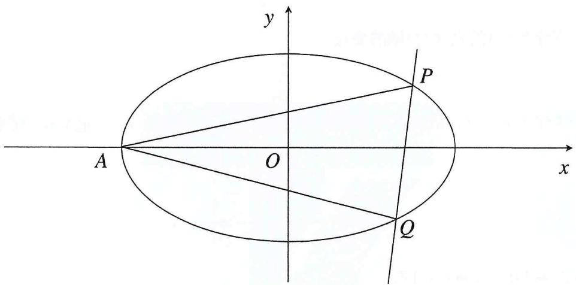

text_image

y
P
A
O
x
Q

对此类图形, 我们可以采取直线系的思维来看待自 $A$ 点发出的两直线 $A P 、 A Q$ , 即 $A P 、 A Q$ 实际是同几何构造的椭圆的左顶点割线;

在这个意义上，对直线 $AP$ 、 $AQ$ 实际可以认为是单一变量“ $K$ ”的变化导致的不同结果；这时介入直线 $PQ$ 、实际可以认为是对 $P$ 、 $Q$ 位置的另一个坐标约束，即点在线上的约束形式

从另一个角度， $PQ$ 可认为是与椭圆有两交点的直线 $L$ ，即 $P$ 、 $Q$ 在直线 $L$ 与 $E$ 的交点上；对 $P$ 、 $Q$ 的坐标就有了来自曲线的二次约束；

# 下面对变量进行刻画

L的运动即代表其斜率的变化，其斜率的变化直接决定P、Q的坐标；在这个基础上，P、Q分别又在各自与椭圆左顶点A的连线上，即可认为AP、AQ是受P、Q影响的一组变量，即PQ-P、

# $Q - AP$ 、 $AQ$ 的变量连接关系

于是可以认为待定的直线 $L$ 的 $K$ 斜率变量决定了两直线 $A P 、 A Q$ 的斜率变量, 即可以通过对坐标两侧 $P Q$ 与 $A P 、 A Q$ 直线间两两相交得到点在线上约束产生的坐标约束 (点斜式直线下的坐标斜率化)；

于是接下来借由曲线点的性质代入曲线方程即可得到关于同构变量 $k$ (AP、AQ的斜率) 的二次方程, 于是加以韦达定理就可以将对点的约束转化到对斜率内容的探索当中

我们下面再以另外两道题目为例讲解, 希望读者能够熟练的掌握这种几何构型对应代数表达的方法
例3 (2023·全国乙卷) 已知曲线 $C$ 的方程为: $\frac{x^{2}}{a^{2}} + \frac{y^{2}}{b^{2}} = 1 (a > b > 0)$ , 离心率为 $\frac{\sqrt{5}}{3}$ , 曲线过点 $A(-2,0)$ .

(1) 求曲线C的方程;   
(2) 过点 $(-2,3)$ 的直线交曲线 $C$ 于 $P$ 、 $Q$ 两点，直线 $AP$ 、 $AQ$ 与 $y$ 轴交于 $M$ 、 $N$ 两点，求证： $MN$ 的中点为定点.

解析 设 $C:\frac{x^{2}}{4}+\frac{y^{2}}{9}=1$ ， $PQ:y=k(x+2)+3$ ，记过A的直线为 $l:y=m(x+2)$ ，AP、AQ的斜率分别为 $m_{1}$ 、 $m_{2}$ ，联立PQ和l得

$$
(\frac {3}{m - k} - 2, \frac {3 m}{m - k}),
$$

代入 $C$ 得

$$
4 m ^ {2} - 1 2 m + 1 2 k + 9 = 0,
$$

$$
\therefore m _ {1} + m _ {2} = 3,
$$

$$
\therefore y _ {M} + y _ {N} = 2 \left(m _ {1} + m _ {2}\right) = 6
$$

∴ MN 的中点为 $(0, \frac{y_{M} + y_{N}}{2})$ ，即 $(0,3)$ .

可以看出, 借由这种共点直线系与单一斜率参数直线联立描述交点, 实现同构形式下坐标的斜率化, 继而以曲线约束建立二次方程描述两斜率根关系, 对于此类以斜率为设问点的题目是极为方便的。要素关系来看, 这里实际还是对点坐标 $P 、 Q$ 寻求了两侧直线 $A P 、 A Q - P 、 Q - P Q$ 的相交约束建立表达, 结合 $P Q$ 本身的曲线点性质建立的“表达——约束”过程

# 下面来看2022年全国乙卷的题目

例3 （2022·全国乙卷）已知椭圆E中心为坐标原点，对称轴为x, y轴，且过A(0, -2)，B( $\frac{3}{2}$ , -1)两点，设过P(1, -2)的直线L交E于M、N，过M平行于x轴的直线与线段AB交于T，点H满足 $\overrightarrow{MT}=\overrightarrow{T}\overrightarrow{H}$ ，证明直线HN过定点.

解析 $E: \frac{x^{2}}{3} + \frac{y^{2}}{4} = 1$ , 记 $MN: y = k(x - 1) - 2$ , 设过 $A$ 的直线为 $l: y = mx - 2$ , 记 $MA$ 、 $MB$ 的斜率分别为 $m_{1}$ 、 $m_{2}$ , 联立 $MN$ 和 $l$ 得

$$
(\frac {k}{k - m}, \frac {m k}{k - m} - 2),
$$

代入椭圆方程得

$$
(\frac {k ^ {2}}{4} + k) m - k ^ {2} m + \frac {k ^ {2}}{3} = 0,
$$

这里注意到二次方程的 $b 、 c$ 项系数可消, 故考虑除 $m^{2}$

$$
\begin{array}{l} (\frac {k ^ {2}}{4} + k) - k ^ {2} \frac {1}{m} + \frac {k ^ {2}}{3} \frac {1}{m ^ {2}} = 0, \\ \therefore \frac {1}{m _ {1}} + \frac {1}{m _ {2}} = 3, \\ \end{array}
$$

设 $M(x_{1},y_{1})$ ，记AM:y=m\_{1}x-2，AH:y=m\_{3}x-2，T为中点且在AB:y= $\frac{2}{3}$ x+2上，故

$$
k _ {A T} = \frac {2}{3},
$$

将 $M(x_{1},m_{1}x_{1}-2)$ ， $H(\frac{m_{1}}{m_{3}}x,m_{1}x_{1}-2)$ ， $T(\frac{m_{1}+m_{3}}{2m_{3}}x_{1},m_{1}x_{1}-2)$ 代入得

$$
\frac {m _ {1} m _ {3}}{m _ {1} + m _ {3}} = \frac {1}{3}, \text {即} \frac {1}{m _ {1}} + \frac {1}{m _ {3}} = 3,
$$

又 $\frac{1}{m_1} +\frac{1}{m_2} = 3$ ，故 $m_{2} = m_{3}$

所以过A的直线AH、AN为同一直线，即A、H、N三点共线，所以NH恒过定点A(0,-2).

本题实际涉及一个平行线中点斜率模型与斜率三角形模型（后面都会讲到），但是在这样类似于直曲联立的形式当中我们没有必要去针对模型解答，只需要化斜率为坐标，坐标斜率化表达，结合曲线约束即可得到有关斜率的二次表达式，韦达出斜率关系即可；

本题另外一个需要注意的点在于对M、T、H三点的中点探究，这里我们采用的是线要素综合到点的解析思路，即对直线AM、AH，我们以斜率要素描述点坐标，进而直接表达中点，其缘由在于中点在定直线AB上这一确定的“静”处（化动为静是翻译的导向，同参化是翻译的技巧），然后结合点斜式的推导（对直线AT，以A为基准点，动点T与A始终有点差斜率成立），以斜率定坐标（对应AT坐标锚定AB斜率的表达式）；

实际这里就反应了要素转化的意识：对水平的三点共线所存在的中点几何特性，转化到解析当中，水平对应纵坐标的一致，中点直接表达中点坐标即可，在这里，对一致的纵坐标，可对 $M$ 、 $H$ 两点加以 $A M 、 A H$ 直线各自的表达（斜截式即可，目的仅是将点在线上的点线要素性质贯彻下去），然后通过 $A B$ 的定直线性质——一定斜率，以中点 $T$ 最终锚定 $M 、 T 、 H$ 平行+中点背后指代的变量关系；

需要注意的是：不要追求所谓的先猜后证，题目必然有直接等价推导产出的逻辑，要合理推导（猜测来源于熟练），而非所谓的“根据某方法”，任何方法的背后都是要素关系的编制，这也正是要素分析方法的核心要求“等价转化”；

另外对本题中中点斜率关系的推导, 我们也可以设 $AH$ 交椭圆于点 $K$ , 此时会发现 $K$ 与 $M$ 同样满足如 $M 、 N$ 的同构关系, 即对应 $A - N / K + M$ 直线的“加法交换律”, 这是可以猜测 $H 、 N$ 共线的唯一逻辑。

# 4

# 斜率坐标化语言

概述 本节开始，我们将从要素转化的视角开始对各类与直曲联立相异的解析方法介绍。本章中便着眼于以点束线的斜率坐标化表达，为大家展开线与点问题结合的约束视角。

# 4.1 对斜率的深度理解

1. 斜率 $k$ 的意义, 在于约束了直线上不相同的两点的相对位置中的方向, 实际上是对直线上两点几何形态的一种充分转化 (加上 $k$ 不存在的情况即为充要转化), 即为倾斜角正切条件的应用; 一般的, 对坐标系中两点斜率, 我们习惯性的写作如下格式:

$$
k = \frac {y _ {1} - y _ {2}}{x _ {1} - x _ {2}}
$$

A. 于是我们得到了由点坐标表示的斜率要素，在本书中即称为“斜率点坐标化”，与直曲联立韦达模式相异之处也恰恰在此  
B. 回顾上一章节, 我们将一切整合为点坐标的名目而运用斜率与截距表示与约束变量; 这里则是将一切整合为点坐标的名目的同时, 将一切要素翻译为点坐标, 那么约束从何而来呢?

1. 回顾三大要素，直线、点坐标、曲线三大要素我们已取其二，唯独余下曲线要素，于是便有了第一章中提到的点差法过程：我们对点坐标进行曲线方程形式的约束（几何意义即为点在曲上）

2. 从而我们有了具有额外参量意义的点坐标, 作差整理 (椭圆带负号, 双曲线不带), 即得到如下等式:

等式左侧为点差斜率，右侧即为曲线约束斜率：

$$
\frac {y _ {1} - y _ {2}}{x _ {1} - x _ {2}} = \pm \frac {b ^ {2}}{a ^ {2}} \frac {x _ {1} + x _ {2}}{y _ {1} + y _ {2}}
$$

即为通过曲线要素对直线要素进行的等价转化，同时经由点坐标的名目也确定了几何上该支线与曲线有两相异交点的事实；

这便是在圆锥曲线解析问题中的斜率坐标（化）语言的基础，其核心要义仍是三大要素的相互转化与曲线约束思想，于是乎我们得到了一种以点坐标作为名目与参变量的代数模式

# 附 三种曲线的点差法推导过程

# 1. 椭圆

A. 对椭圆上任意两点 $(x_{1}, y_{1})$ , $(x_{2}, y_{2})$ 有

$$
\frac {x _ {1} ^ {2}}{a ^ {2}} + \frac {y _ {1} ^ {2}}{b ^ {2}} = 1, \frac {x _ {2} ^ {2}}{a ^ {2}} + \frac {y _ {2} ^ {2}}{b ^ {2}} = 1
$$

B. 作差整理得

$$
\frac {y _ {1} - y _ {2}}{x _ {1} - x _ {2}} = - \frac {b ^ {2}}{a ^ {2}} \frac {x _ {1} + x _ {2}}{y _ {1} + y _ {2}}
$$

# II. 双曲线

A. 对双曲线上任意两点 $(x_{1}, y_{1})$ ， $(x_{2}, y_{2})$ 有

$$
\frac {x _ {1} ^ {2}}{a ^ {2}} - \frac {y _ {1} ^ {2}}{b ^ {2}} = 1, \frac {x _ {2} ^ {2}}{a ^ {2}} - \frac {y _ {2} ^ {2}}{b ^ {2}} = 1
$$

B. 作差整理得

$$
\frac {y _ {1} - y _ {2}}{x _ {1} - x _ {2}} = \frac {b ^ {2}}{a ^ {2}} \frac {x _ {1} + x _ {2}}{y _ {1} + y _ {2}}
$$

# III. 抛物线

A. 对抛物线上任意两点 $(x_{1},y_{1})$ ， $(x_{2},y_{2})$ 有

$$
\left\{ \begin{array}{l l} x _ {1} ^ {2} = 2 p y _ {1} \\ x _ {2} ^ {2} = 2 p y _ {2} \end{array} \right. (\text {焦点在} y \text {轴}), \left\{ \begin{array}{l l} y _ {1} ^ {2} = 2 p x _ {1} \\ y _ {2} ^ {2} = 2 p x _ {2} \end{array} \right. (\text {焦点在} x \text {轴})
$$

B. 作差整理得

$$
\frac {y _ {1} - y _ {2}}{x _ {1} - x _ {2}} = \frac {x _ {1} + x _ {2}}{2 p} (\text {焦点在} y \text {轴}), \frac {x _ {1} - x _ {2}}{y _ {1} - y _ {2}} = \frac {y _ {1} + y _ {2}}{2 p} (\text {焦点在} x \text {轴})
$$

现在我们已经实现了直线斜率要素的点坐标化，那么是否有与之配套的截距要素表达呢？这便是下一小节的主题：斜率坐标化展开表示与直线要素的完全坐标化，即直线的两点式方程

本节要素关系网：

斜率坐标语言模式
……直线斜率要素 …… 点坐标化
……曲线要素 …… 点坐标约束 …… 点坐标确定直线

# 4.2 斜率坐标化展开的实际意义

1. 在上一小节我们提到斜率坐标化模式的要素关系原理，在这一小节，我们将介绍斜率坐标化的衍生处理手段，如斜率的坐标展开、两点式直线与对偶式等

A. 通俗的讲, 斜率双用即为斜率的坐标化对偶式展开的结果, 恰介于其对偶形式的特殊性, 从而产生对偶式这样一种充斥着数学之美的代数式  
B. 对偶式是一种类同构、类对称的数学思想，而非只是一种代数式的表达形式，只是在圆锥曲线当中往往只需要在这一类问题中使用对偶模式，由此而缩小了这一词意范围  
C. 在后文会补充一类求表达式最值问题提升大家对于对偶式的理解

II. 斜率坐标化语言当中, 我们以坐标的名目阐述斜率的条件并通过曲线对点坐标的约束, 实现了将曲线要素、点坐标要素统一进直线要素的名目 (特指斜率) 进行表达, 即通过点坐标表达的点差斜率与曲线约束斜率, 在这样完全由点坐标构成的斜率模式下, 也肯定有与 $y = kx + m$ 等价的直线方程, 在我们的课本当中, 给出了这样一种直线形式:

由直线上三点 $(X,Y)$ ， $(x_{1},y_{1})$ ， $(x_{2},y_{2})$ ，三点共线，点差斜率相等

$$
\frac {y - y _ {1}}{x - x _ {1}} = \frac {y _ {1} - y _ {2}}{x _ {1} - x _ {2}},
$$

$$
\text { 即 } x _ {2} y _ {1} - x _ {1} y _ {2} = X (y _ {1} - y _ {2}) - Y (x _ {1} - x _ {2}).
$$

当 $X 、 Y$ 为定值时, 可认为有过 $(x_{1}, y_{1})$ , $(x_{2}, y_{2})$ 两点的直线, 关于点 $(X, Y)$ 坐标有如上形式的等式恒成立; 换言之, 当我们确定直线过一定点, 则有如上所示的等式恒成立, 等价的, 若有如上等式, 则直线过定点 $(X, Y)$

可以注意到，等式左边是一个类对称的对偶模式表达，这也是下面介绍对偶化斜率展开的一个理论依据（网上很多解答并未关注这一点，从而从错误过程推导到正确答案，希望各位一定注意），如上即为对直线方程的斜率坐标化处理

对于抛物线, 这个过程可以进一步延申, 引入抛物线焦点参量 $p$ , 得到抛物线上的两点式直线方程

# 抛物线两点式

焦点在y轴： $(y_{1}+y_{2})y=2px+y_{1}y_{2}$ ，焦点在x轴： $(x_{1}+x_{2})x=2py+x_{1}x_{2}$

推导 以焦点在 $y$ 轴上为例, 抛物线 $y = 2 p x ^ { 2 }$ , 抛物线上任意两点 $(x _ { 1 } , y _ { 1 })$ , $(x _ { 2 } , y _ { 2 })$ 有

$$
\left\{ \begin{array}{l} x _ {1} ^ {2} = 2 p y _ {1} \\ x _ {2} ^ {2} = 2 p y _ {2} \end{array} \right.,
$$

作差整理得

$$
k = \frac {y _ {1} - y _ {2}}{x _ {1} - x _ {2}} = \frac {x _ {1} + x _ {2}}{2 p},
$$

由点斜式改造（斜率坐标化），将 $k=\frac{x_{1}+x_{2}}{2p}$ 代入 $y-y_{1}=k(x-x_{1})$ 得

$$
(y _ {1} + y _ {2}) y = 2 p x + y _ {1} y _ {2}
$$

这种点坐标化处理的直线斜率方程，在过定点描述的直线方程当中更加常见，也更为大家所熟悉

如图，设 $E(0,m)$ ， $F(x_{1},y_{1})$ ， $D(x_{2},y_{2})$ ，

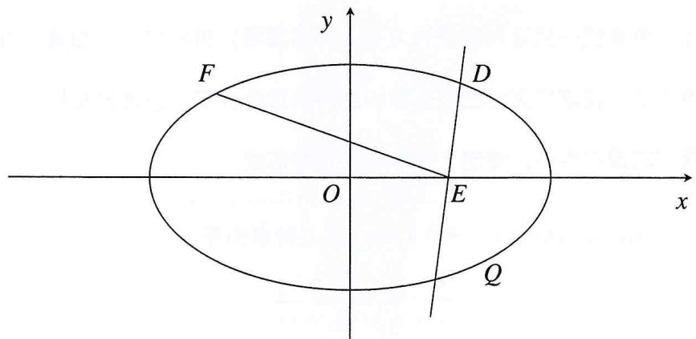

text_image

F
y
D
O
E
x
Q

I. 对于直线 $DE$ 斜率, 可记为 $\frac{y_{2}}{x_{2} - m}$ , 同样的 $EF$ 斜率也有与之形式一致的表达, 产生了类似于点斜式的直线方程, 只是我们这里用坐标点差的形式书写, 将信息要素以点坐标为变量表达, 以与上面的两点式直线方程达成结构上的统一

II. 实际上由 $\frac{y - y_1}{x - x_1} = \frac{y_1 - y_2}{x_1 - x_2}$ 可知，两点式方程即为共线三点共斜率条件的展开，即为本小节标题“斜率要素的坐标化展开”，在任意三点共线条件上，我们都可以做出如 $\frac{y - y_1}{x - x_1} = \frac{y_1 - y_2}{x_1 - x_2}$ 的设定及下述变形

III. 这时我们回顾开篇所设定的三大要素：曲线，直线，点坐标；我们通过点曲联立的变形转化的到点差斜率与曲线约束斜率，构成对直线条件的表达，这时便是本章提到的谚语前半句：“点曲转化，直线表达”；  
IV. 我们通过如上对斜率坐标化处理, 实际是通过点曲转化的方式, 得到的是一个表达斜率要素关系的换元消元用方程, 这也正是斜率坐标化的意义所在——联系起了曲线、点坐标两大要素与直线要素, 这时便需要一个对直线条件的额外设定, 例如斜率和、积、比, 来构成有关斜率要素的可用以计算的坐标化展开方程, 从而进行整体代换, 消元, 求值, 这也是下一个小节, 斜率坐标语言下的解析模式的核心内容:

要素关系：曲、点、直——曲+点=直+直——直直消元求解（要素的消换元）

# 4.3 点坐标支配下的解析模式

1. 本节虽然称为是点坐标支配下的解析模式，但其实只是利用了坐标化下的点坐标名目以表达直曲要素，在斜率坐标化的前提大条件之下我们只需要对直线斜率条件进行探索，斜率坐标化展开，进行对代数式的化简，便是答案

II. 至于斜率双用的方法实际上就是对偶思想的实际应用，通过两组点差斜率与曲线约束斜率的坐标化展开，便可以得到两个形式对偶的代数式，以期得到形如两点式直线方程的斜率坐标化直线方程

# 下面以2017年全国一卷为例

例1 已知椭圆方程为 $\frac{x^{2}}{4}+y^{2}=1$ ，直线l不过顶点与椭圆交于A、B两点，对P点(0,1)有直线PA与直线PB斜率和为-1恒成立，证明：直线l过定点.

设椭圆上任意两点 $(x_{1},y_{1})$ ， $(x_{2},y_{2})$ ，则

$$
\frac {x _ {1} ^ {2}}{4} + y _ {1} ^ {2} = 1, \frac {x _ {2} ^ {2}}{4} + y _ {2} ^ {2} = 1,
$$

作差整理得

$$
\frac {y _ {1} - y _ {2}}{x _ {1} - x _ {2}} = - \frac {1}{4} \frac {x _ {1} + x _ {2}}{y _ {1} + y _ {2}},
$$

令 $A(x_{1},y_{1})$ ， $B(x_{2},y_{2})$ ，对 $P(0,1)$ 有

$$
k _ {P A} = \frac {y _ {1} - 1}{x _ {1}} = - \frac {1}{4} \frac {x _ {1}}{y _ {1} + 1}, k _ {P B} = \frac {y _ {2} - 1}{x _ {2}} = - \frac {1}{4} \frac {x _ {2}}{y _ {2} + 1},
$$

由 $k_{PA} + k_{PB} = -1$

$$
\frac {y _ {1} - 1}{x _ {1}} - \frac {1}{4} \frac {x _ {2}}{y _ {2} + 1} = - 1, \frac {y _ {2} - 1}{x _ {2}} - \frac {1}{4} \frac {x _ {1}}{y _ {1} + 1} = - 1,
$$

即

$$
\left\{ \begin{array}{l} 4 y _ {1} y _ {2} - 4 y _ {2} + 4 y _ {1} - 4 - x _ {1} x _ {2} = - 4 x _ {1} y _ {2} - 4 x _ {1} \\ 4 y _ {1} y _ {2} - 4 y _ {1} + 4 y _ {2} - 4 - x _ {1} x _ {2} = - 4 x _ {2} y _ {1} - 4 x _ {2} \end{array} \right.,
$$

作差得

$$
x _ {2} y _ {1} - x _ {1} y _ {2} = 2 (y _ {1} - y _ {2}) + (x _ {1} - x _ {2}),
$$

对直线上任意三点 $(X,Y)$ 、 $(x_{1},y_{1})$ 、 $(x_{2},y_{2})$

$$
\frac {y _ {1} - y _ {2}}{x _ {1} - x _ {2}} = \frac {Y - y _ {1}}{X - x _ {1}},
$$

即 $x_{2}y_{1}-x_{1}y_{2}=X(y_{1}-y_{2})-Y(x_{1}-x_{2})$ ,

当 $X = 2, Y = -1$ 时有 $x_{2}y_{1} - x_{1}y_{2} = 2(y_{1} - y_{2}) + (x_{1} - x_{2})$ 恒成立，即 $AB$ 过定点 $(2, -1)$ .

下面我们从要素关系的模式建立要素关系网，这一步过程可以理解为教师常说的“仔细审题”，与之不同的是我们要以三大要素的视角来解释题干，并挖掘其中的联系以建立方程再进行求解；

# 要素的提取——按照曲、直、点的逻辑顺序划分

I. 曲线要素：即椭圆方程，切记，曲线要素（任意情况中）是一个万能的约束，以构成换元、消元用工具

II. 直线要素：在该题当中着重重视斜率包括 $PA$ 、 $PB$ 的点斜斜率

III. 点坐标要素：即本题中已知的 $P 、 A 、 B$ 三点, 及设而不求的定点 $(X, Y)$

# 要素关系

I. 曲线要素在斜率坐标化语言当中充当的只有约束作用，特别的代指点曲方程差整理得到的斜率恒等式。由此联系起PA，PB的点线曲要素关系（注意点都在曲线上否则点差法过程不成立）  
II. 题干另外给出的 $PA$ 、 $PB$ 斜率和关系（往往出现曲线上共曲线交点双割线的斜率关系我们就可以利用斜率坐标化展开构造对偶方程，消去对称项以构造对偶方程，转化为关于定点的直线两点式或定斜率展开的表达式）

# 下面对解题过程进行分析

I. 点曲联立，点差，以点坐标的名目对曲线上任意两点定义直线要素与曲线要素的联系之公理（或称第三定义）  
II. 对直线要素的直接表达：即对直线PA、PB斜率的点差斜率与曲线约束斜率  
III. 由斜率关系, 为配凑斜率坐标化模式下的两点式直线方程, 采取交叉斜率建立 (点差式+曲束式) 对偶方程的计算模式以配凑斜率坐标化直线方程 (即俗称斜率双用)  
IV. 计算，消去对称项（如 $x_{1} x_{2}$ 或 $y_{1} y_{2}$ 一类），得到直线l两点式方程关于点 $(2, -1)$ 成立的恒等式V. 比对两点式直线方程，得到定点

当然这类简单题目如今仅应作为各位的一般练手理解用题目，此题题设条件简单，要素少，要素关系也较为直接；仅希望各位读者的阅读过程中能理会到每一步方程的建立，转化是有理可循、有逻辑可溯源的推导过程

简单归纳上述过程，其实还是我们的谚语：“点曲转化，直线表达”；这就是点坐标支配下的斜率坐标语言解析模式概括

# 对其中的计算过程可以采取如下的计算简化

由 $\frac{y_1 - 1}{x_1} -\frac{1}{4}\frac{x_2}{y_2 + 1} = -1,\frac{y_2 - 1}{x_2} -\frac{1}{4}\frac{x_1}{y_1 + 1} = -1$ 可知

$$
\frac {y _ {1} - 1}{x _ {1}} - \frac {1}{4} \frac {x _ {2}}{y _ {2} + 1} = \frac {y _ {2} - 1}{x _ {2}} - \frac {1}{4} \frac {x _ {1}}{y _ {1} + 1},
$$

即 $\frac{4y_1y_2 + 4(y_1 - y_2) - 4 - x_1x_2}{4x_1y_2 + 4x_1} = \frac{4y_1y_2 - 4(y_1 - y_2) - 4}{4x_2y_1 + 4x_2},$

根据比例的性质： $\frac{a}{c}=\frac{b}{d}=\frac{a-b}{c-d}=\lambda$ ，对上式有

$$
\frac {8 \left(y _ {1} - y _ {2}\right)}{4 \left(x _ {1} y _ {2} - x _ {2} y _ {1}\right) + 4 \left(x _ {1} - x _ {2}\right)} = - 1,
$$

$$
4 (x _ {2} y _ {1} - x _ {1} y _ {2}) - 4 (x _ {1} - x _ {2}) = - 8 (y _ {1} - y _ {2}),
$$

即 $x_{2}y_{1} - x_{1}y_{2} = (x_{1} - x_{2}) + 2(y_{1} - y_{2}).$

# 这里便是应用了合分比的代数过程化简（可自行推导）

下面以2023年温州三模为例，为大家介绍共线（共斜率）表达与曲线换元的灵活运用

例2 已知抛物线方程为 $y^{2}=4x-4$ ，双曲线方程 $\frac{x^{2}}{a^{2}}-\frac{y^{2}}{4-a^{2}}=1(1<a<2)$ ，二者交于A、B两点，F为双曲线右焦点，直线AF分别交抛物线、双曲线于C、D两点（不同于A、B），直线BC、BD分别交x轴于P、Q两点.

(1) 设 $A(x_{1},y_{1})$ 、 $C(x_{2},y_{2})$ ，证明： $y_{1}y_{2}$ 为定值；

(2) 求 $\frac{FQ}{FP}$ 的取值范围.

# 同样的先来进行要素分析

1. 曲线要素：抛物线与双曲线。（后面的分析都是以曲线为分类）  
2. 直线要素：直线AF交抛物线为AC，交双曲线为AD。  
3. 点坐标: $A 、 B$ 关于 $\mathrm{x}$ 轴对称且在两曲线上 (意味着关于 $A$ 或直线 $B$ 的方程可坐标互换), $C$ 在抛物线上, $D$ 在双曲线上。

# 随后编织要素关系

由于题设，F、P、Q在x轴上，线段长度比可转化为横坐标作差之比，即为直线截距差之比（原因逻辑是由曲线割线产生x轴截点）

# 要素联系

抛物线+直线AF——直线AC——直线BC——点P;

双曲线+直线AF——直线AD——直线BD——点Q;

其中 $AC - BC$ ， $AD - BD$ 实际上正是对 $A 、 B$ 对称坐标的等价代换

解析 (1) 对抛物线上 $A 、 C$ 两点有

$$
y _ {1} ^ {2} = 4 x _ {1} - 4, y _ {2} ^ {2} = 4 x _ {2} - 4,
$$

作差整理得

$$
k _ {A C} = \frac {y _ {1} - y _ {2}}{x _ {1} - x _ {2}} = \frac {4}{y _ {1} + y _ {2}},
$$

故对直线 ${AC}$

$$
y - y _ {1} = \frac {4}{y _ {1} + y _ {2}} (x - x _ {1}),
$$

即 $(y_{1} + y_{2})y = 4x + y_{1}y_{2} - 4,$

由AC过点F，代入F坐标有

$$
y _ {1} y _ {2} = - 4,
$$

(2) 设 $D\left( {{x}_{3},{y}_{3}}\right)$ ,由 $A$ 、 $F$ 、 $D$ 三点共线

$$
\frac {y _ {1}}{x _ {1} - 2} = \frac {y _ {3}}{x _ {3} - 2}
$$

即

$$
x _ {3} y _ {1} - x _ {1} y _ {3} = 2 \left(y _ {1} - y _ {3}\right)
$$

设 $Q(m,0)$ ，则

$$
\frac {- y _ {1}}{x _ {1} - m} = \frac {y _ {3}}{x _ {3} - m},
$$

即

$$
x _ {3} y _ {1} + x _ {1} y _ {3} = m (y _ {1} + y _ {3}) \dots ①
$$

由 $x_{3}y_{1} - x_{1}y_{3} = 2(y_{1} - y_{3})$ 得

$$
x _ {3} y _ {1} + x _ {1} y _ {3} = \frac {(x _ {3} y _ {1}) ^ {2} - (x _ {1} y _ {3}) ^ {2}}{x _ {3} y _ {1} - x _ {1} y _ {3}} = \frac {a ^ {2}}{2} (y _ {1} + y _ {2}),
$$

与①对比得

$$
m = \frac {a ^ {2}}{2},
$$

而对 $BC$ 有同构于 $AC$ 的直线的方程

$$
(y _ {2} - y _ {1}) y = 4 x - y _ {1} y _ {2} - 4 = 4 x,
$$

若y=0，则x=0，∴ $P(0,0)$ ,

$$
\therefore \frac {F Q}{F P} = \frac {2 - \frac {a ^ {2}}{2}}{2} = 1 - \frac {a ^ {2}}{4} (1 <   a <   2),
$$

$$
\therefore \frac {F Q}{F P} \in (0, \frac {3}{4}).
$$

我们再来回顾一下整个分析、解题过程

1. 首先对于曲线条件提取，而后对单一曲线有关的直线、点坐标要素提取分析并通过点曲联立再做差转变形化为直线斜率要素后通过两点式直线进行表达

II. 在第二问中运用平方差公式的化简, 其实是一步曲线换元的配凑, 通过构造 $x^{2} = a^{2} - \frac{a^{2}}{b^{2}} y^{2}$ , 目的是代换后得到关于 $y_{1} 、 y_{2}$ 的方程, 大家将其作为一类常用的代数变形就好, 这也正是斜率坐标化展开的精妙所在, 在可以最大程度利用坐标条件的同时可以得到关于对偶式的和式、差式方程, 也可以延申到对偶式各自关于 $y_{1} 、 y_{2}$ 的独立方程 (这一步同样对偶), 可以作为一种坐标互化的方法, 关于这一点该题唯一的特别之处当在于 $A 、 B$ 两点的对称条件, 这也是一组额外给予的点坐标要素方程

# 小模型总结

做曲线上一点 $A(x_{2},y_{2})$ 关于坐标轴的对称点B，分别连接曲线上另外一点C，设 $C(x_{2},y_{2})$ ，由对称性可知AC过x轴上定点 $(m,0)$ ， $B(x_{1},-y_{1})$ ，则

$$
A C: x _ {2} y _ {1} - x _ {1} y _ {2} = m (y _ {1} - y _ {2}) \text {或} x _ {2} y _ {1} - x _ {1} y _ {2} = m (x _ {1} - x _ {2}),
$$

代入椭圆方程 $x^{2} = a^{2} - \frac{a^{2}}{b^{2}} y^{2}$ 得

$$
x _ {2} y _ {1} + x _ {1} y _ {2} = \frac {a ^ {2}}{m} (y _ {1} + y _ {2}),
$$

又

$$
A B: x _ {2} y _ {1} + x _ {1} y _ {2} = X \left(y _ {1} + y _ {2}\right) + Y \left(x _ {2} - x _ {1}\right),
$$

与 $x_{2}y_{1} + x_{1}y_{2} = \frac{a^{2}}{m} (y_{1} + y_{2})$ 对照得

$$
X = \frac {a ^ {2}}{m}, Y = 0,
$$

(也可翻译为二者横截距乘积为 $a^{2}$ ，纵截距为 $b^{2}$ )

# 木头注

1. 本章理论部分到此结束，实际上笔者重在阐释解题过程中点+曲=直的要素翻译模式，实际上指代了以斜率为主要研究对象的一类题型（常规齐次化同样适用于此类题目）

II. 事实上, 由斜率三角形的结论 (斜率关系 $\rightarrow$ 定点定斜率或称手电筒模型) 可知共点割线斜率关系与两割点所在直线直接绑定, 由斜率关系确定为定点或定斜率, 故采取斜率坐标化并进行第二小节提到的斜率展开（三点共线共斜率；和差积，以对偶表达消去对称项配凑该体系下直线方程）的翻译模式，直接将曲线要素融入其中而异于直曲联立韦达点坐标化模式的翻译套路，通过斜率坐标化语言的对应直线表达，直接揭示此类“斜率关系&定值定点”背景的题目本质

在下一小节的实战演练中大家可以进一步体会到“曲一直一点”的要素分析逻辑与要素关系建立模式，体会到“约束—转化—表达”的解题逻辑

# 补充-斜率三角形的小结论

(无需背记具体,结合题目条件以斜率坐标化展开消去对称项即可得到)

若 $P(x_{1},y_{1})$ 为椭圆 $C:\frac{x^{2}}{a^{2}}+\frac{y^{2}}{b^{2}}=1$ 上的定点，P与C上的动点A、B（与P不重合）的连线斜率分别为 $k_{1}$ 、 $k_{2}$ .

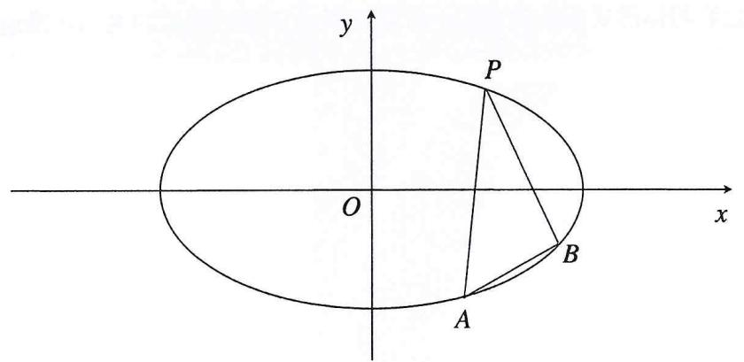

text_image

y
P
O
x
A
B

① 当 $k_{1}+k_{2}=0$ 时，直线AB斜率为定值 $k=\frac{b^{2}x_{0}}{a^{2}y_{0}}$   
② 当 $k_{1}+k_{2}=t$ （某一定值）时，直线AB过定点 $(x_{0}-\frac{2y_{0}}{t},-y_{0}-\frac{2x}{t}\cdot\frac{b^{2}}{a^{2}})$   
③ 当 $k_{1} \times k_{2} = \frac{b^{2}}{a^{2}} (x_{0} \neq 0)$ ，直线 $AB$ 斜率为定值 $k = -\frac{x_0}{y_0}$   
④ 当 $k_{1}\times k_{2}=\lambda$ （某一定值）时，直线AB过定点 $(ux_{0},-uy_{0})$ ，其中 $u=\frac{\lambda a^{2}+b^{2}}{\lambda a^{2}-b^{2}}$

# 补充：常用代数变形

# 对三点共线共斜率的表达:

以椭圆及x轴上轴点为例，两点为曲线点，一点为轴点时

$$
x \text {   轴上一点   } (m, 0): x _ {1} y _ {2} - x _ {2} y _ {1} = m (y _ {2} - y _ {1}),
$$

结合平方差公式与曲线方程代换

$$
x _ {1} y _ {2} + x _ {2} y _ {1} = \frac {(x _ {1} y _ {2}) ^ {2} - (x _ {2} y _ {1}) ^ {2}}{x _ {1} y _ {2} - x _ {2} y _ {1}} = \frac {a ^ {2}}{m} (y _ {1} + y _ {2}) \rightarrow \mathrm{例} 2
$$

上述过程即在第二步的平方差分式中将 $x^{2} = a^{2} - \frac{a^{2}}{b^{2}} y^{2}$ 代入使之变成关于 $y_{1}$ 与 $y_{2}$ 的平方差形式再进行化简。（双曲线与抛物线同理）

由对偶式的和差两式可得到

$$
\left\{ \begin{array}{l} 2 x _ {1} y _ {2} = (\frac {a ^ {2}}{m} + m) y _ {2} + (\frac {a ^ {2}}{m} - m) y _ {1} \\ 2 x _ {2} y _ {1} = (\frac {a ^ {2}}{m} + m) y _ {1} + (\frac {a ^ {2}}{m} - m) y _ {2} \end{array} \right.,
$$

(对于直线定点在y轴上的情况同上)

这样的变形便可以成为曲线上共线两点的坐标约束关系，可用以消换元，常用于一类共线点要素的转化上，同时对于一些非对称形式的韦达定理，我们可以通过这种形式的坐标转换避免计算的繁杂。

# 4.4 实战演练

练习1 F为椭圆 $C:x^{2}+2y^{2}=2$ 的右焦点，过(2,0)的直线l交C于A、B两点，若B是椭圆C的上顶点。设直线AF、BF的斜率分别为求证 $k_{1}$ 、 $k_{2}$ （ $k\neq0$ ），证明： $\frac{k_{1}}{k_{2}}$ 为定值.

# 要素分析

A. 曲线: 椭圆曲线 $C$   
B. 直线:

1. 直线L过点(2,0)  
2. $AF$ 、 $BF$ 的斜率联系

C. 点坐标

1. $A(x_{1},y_{1})$ , $B(x_{2},y_{2})$   
2. 定点(2,0)

# 要素关系建立

A. 对直线 $L$ 过的定点 $(2,0)$ 是一份对直线的恒成立约束条件（可以三点共线共斜率转化为两点式直线方程的语言），恰好有两曲线上的动点，可以两点式直线进行表达（两点式对应坐标为名目的“线过定点”的约束）

B. 对 $AF$ 、 $BF$ , 斜率比为定值即可利用斜率的坐标化展开进行整理, 这里实际只需要翻译斜率比的表达即可, 于是介入斜率坐标语言进行斜率关系的坐标化描述

解析 设直线 ${AB}$ 上一点为 $\left( {X,Y}\right)$ ,则

$$
\frac {Y - y _ {1}}{X - x _ {1}} = \frac {y _ {1} - y _ {2}}{x _ {1} - x _ {2}},
$$

$$
\therefore x _ {2} y _ {1} - x _ {1} y _ {2} = X \left(y _ {1} - y _ {2}\right) - Y \left(x _ {1} - x _ {2}\right),
$$

又(2,0)在直线 ${AB}$ 上

$$
\therefore x _ {2} y _ {1} - x _ {1} y _ {2} = 2 \left(y _ {1} - y _ {2}\right) \dots ①,
$$

$$
\therefore x _ {2} y _ {1} + x _ {1} y _ {2} = \frac {\left(x _ {2} y _ {1}\right) ^ {2} - \left(x _ {1} y _ {2}\right) ^ {2}}{x _ {2} y _ {1} - x _ {1} y _ {2}} = y _ {1} + y _ {2} \dots ②,
$$

联立①②得

$$
x _ {2} y _ {1} = \frac {3 y _ {1} - y _ {2}}{2}, x _ {1} y _ {2} = \frac {3 y _ {2} - y _ {1}}{2},
$$

$$
\therefore \frac {k _ {1}}{k _ {2}} = \frac {\frac {y _ {1}}{x _ {1} - 1}}{\frac {y _ {2}}{x _ {2} - 1}} = \frac {x _ {2} y _ {1} - y _ {1}}{x _ {1} y _ {2} - y _ {2}} = \frac {y _ {1} - y _ {2}}{y _ {2} - y _ {1}} = - 1
$$

# 解析解读

I. 实际上直接通过待求式的坐标化表达，本题就变成了一道非对称韦达的计算题，对于“非对称”这个说法，我们在这里称之为“对偶”式的表达；

II. 于是可以通过对直线三点共线共斜率的表达（标志着对偶差），将坐标间的对偶形式转化出来，这一步实际上是斜率要素坐标化的展现；

III. 而后通过曲线方程的整理代换（等式右侧是x就消y。反之亦然），将对偶式差式等号右侧的“—”通过平方差公式进行平方代换（看上面温州三模的例题），得到对偶式的和式表达，这一步可以认为是对曲线要素换元约束性质的利用，最后进行计算，代入即可得到所求。

注 实际也可以斜率比为条件，反推AB过定点；方法即设斜率比为 $\lambda$ ，下以斜率的坐标化展开构造两点式直线需求的对偶坐标表达即可，最后的计算同样是比对系数，可参考例一的2017全国卷真题，两法可以视为正反推的同模式的不同思路。

# PRACTICE 请在下面重新书写本题，以正反推两种方法表达

# 一、斜率关系坐标化转直线表达

# 二、直线表达转斜率关系坐标化

练习2 已知双曲线 $C: x^{2} - \frac{y^{2}}{3} = 1$ ，过右焦点 $F$ 做直线 $AB$ 交双曲线于 $A$ 、 $B$ 两点，过 $A$ 作直线 $L: x = \frac{1}{2}$ 的垂线，垂足为 $M$ ，求证直线 $MB$ 过定点

# 要素分析

A. 曲线：双曲线C   
B. 直线

1. 直线AB  
2. 直线MB

C. 点坐标

1. A与M的坐标关系  
2. A、B在曲线上  
3. 定点 $F$

# 要素关系

A. A、B在曲线上得到关于A、B的曲线约束（换元）可能性  
B. $A$ 与 $M$ 的坐标对应关系为直线 $A B 、 M B$ 的对换提供了条件, 自然应该看出, 本题的要点就在于描述直线了

解析 由A、B、F三点共线

$$
\frac {y _ {1}}{x _ {1} - 2} = \frac {y _ {2}}{x _ {2} - 2},
$$

$$
\therefore x _ {2} y _ {1} - x _ {1} y _ {2} = 2 \left(y _ {1} - y _ {2}\right) \dots ①,
$$

$$
\therefore x _ {2} y _ {1} + x _ {1} y _ {2} = \frac {\left(x _ {2} y _ {1}\right) ^ {2} - \left(x _ {1} y _ {2}\right) ^ {2}}{x _ {2} y _ {1} - x _ {1} y _ {2}} = \frac {1}{2} \left(y _ {1} + y _ {2}\right) \dots ②,
$$

对MB上一点(X,Y)

$$
\frac {Y - y _ {1}}{X - \frac {1}{2}} = \frac {y _ {1} - y _ {2}}{\frac {1}{2} - x _ {2}},
$$

$$
x _ {2} y _ {1} - \frac {1}{2} y _ {2} = X (y _ {1} - y _ {2}) - Y (\frac {1}{2} - x _ {2}) \dots ③,
$$

$$
\therefore \frac {① + ②}{2} - \frac {1}{2} y _ {2} = \frac {5}{4} (y _ {1} - y _ {2})
$$

与③对比得

$$
X = \frac {5}{4}, Y = 0,
$$

∴ MB 恒过定点 $\left(\frac{5}{4},0\right)$ .

# 解析分析

首先表达题目中给出的直线过定点的表述，于是可得到对偶的和积两式，转化为后面用到的对偶式即可，对于MB，可通过三点共线的表述直接得到MB关于定点 $(X,Y)$ 的约束方程，探索定点即探索左侧满足的恒等式，接下来代入非对称韦达的对偶式表述，计算、比对即可

# 木头小注

不要吝啬于你的表达，勇敢的利用已有条件刻画直线条件即可，两点式是独立于点参/线参之外的一种纯粹的坐标化解析语言（斜率坐标化的结果），凡是涉及点线关系，两点式便可以起到充要价值的转化作用，有时题目中给出具体的数据，我们仍然只需要依次代入，结合其他的点线关系加之曲线换元表达目标即可

练习2 已知点F为抛物线 $E: y^{2} = 2px (p > 0)$ 的焦点，点 $P(7,3)$ ， $PF = 3\sqrt{5}$ 且点P到抛物线准线的距离不大于10，过点P做斜率存在的直线与抛物线E交于点A、B（A在第一象限），过点A做斜率为 $\frac{2}{3}$ 的直线与抛物线的另一个交点是C.

(1) $y^{2} = 4x;$

(2) 证明: $BC$ 恒过定点.

# 要素分析

A. 曲线：抛物线

B. 直线AB（定点）；直线AC（定斜率）、直线BC（待证）

C. (基准点 $M$ 、定点约束点 $A$ 与 $B$ ; 斜率约束点 $A$ 与 $C$ ) $\rightarrow$ 直线 $B C$

# 解析

对抛物线上任意两点 $(x_{1},y_{1})$ 、 $(x_{2},y_{2})$ 均有

$$
k = \frac {y _ {1} - y _ {2}}{x _ {1} - x _ {2}} = \frac {4}{y _ {1} + y _ {2}},
$$

$$
\therefore y - y _ {1} = \frac {4}{y _ {1} + y _ {2}} (x - x _ {1}),
$$

整理得

$$
(y _ {1} + y _ {2}) y = 4 x + y _ {1} y _ {2},
$$

设 $A(x_{1},y_{1})$ 、 $B(x_{2},y_{2})$ 、 $C(x_{3},y_{3})$ ，则

$$
A B: (y _ {1} + y _ {2}) y = 4 x + y _ {1} y _ {2},
$$

$$
B C: (y _ {3} + y _ {2}) y = 4 x + y _ {3} y _ {2},
$$

由 $P(7,3)$ 得

$$
3 (y _ {1} + y _ {2}) = 2 8 + y _ {1} y _ {2},
$$

由 $k_{AC}=\frac{2}{3}$ 得

$$
y _ {1} + y _ {3} = 6,
$$

要求 $BC$ 定点，则需要找 $y_{2}$ 、 $y_{3}$ 的等量关系，联立 $y_{1} + y_{3} = 6$ 和 $3(y_{1} + y_{2}) = 28 + y_{1}y_{2}$ 得

$$
3 \left(y _ {2} + y _ {3}\right) = - 1 0 + y _ {2} y _ {3},
$$

与 $BC: (y_{3} + y_{2})y = 4x + y_{3}y_{2}$ 对比系数得

$$
x = - \frac {5}{2}, y = 3,
$$

$\therefore {BC}$ 恒过定点 $\left( {-\frac{5}{2},3}\right)$ .

# 解题过程分析

A. 对抛物线上两点“点在曲上”的几何约束条件，我们以斜率坐标化语言模式插入两点式直线刻画，以点、曲要素的坐标化表达阐述了直线过定点的性质  
B. 代数上, 对直线 ${AB}$ (联系 ${y}_{1}\text{、}{y}_{2}$ )、 ${AC}$ (联系 ${y}_{1}\text{、}{y}_{3}$ ), 于是只需要消换元, 配凑 ${BC}$ 两点式中 (联系 ${y}_{2}\text{、}{y}_{3}$ ) 满足的和、积表达  
C. 这里实际只需要探寻 $BC$ 直线对应的下标为2、3的坐标关系, 对应到两点式直线的性质, 寻找只与 $(x, y)$ 有关的两点式和积表达, 消除无关项即可求得结果

练习3 （2023·济南二模）已知椭圆 $E:\frac{x^{2}}{4}+y^{2}=1(a>b>0)$ 的长轴长为4，且由E的三个顶点构成的三角形的面积为2。记椭圆E的右顶点和上顶点分别是A和B，点P在线段AB运动，垂直于x轴的直线PQ交椭圆E于点M，M在第一象限，P是线段QM的中点，设AQ与E的另一交点为N，求证：MN过定点.

# 要素分析

A. 曲线: 即椭圆 $E$   
B. 直线

1. 定直线 ${AB}$   
2. 受 $P$ 位置约束的 $MQ$   
3. $A$ 出发到 $M 、 Q$ 得到的动直线

C. 点坐标

1. 定点: $A 、 B$

2. M、P、Q的竖直中点（坐标化替换）  
3. $M 、 N$ 为椭圆上动点

解析 由 $P$ 为 $MQ$ 中点且 $MQ$ 垂直于 $x$ 轴

$$
x _ {M} = x _ {Q} = x _ {P}, y _ {M} + y _ {Q} = 2 y _ {P},
$$

$$
k _ {A M} + k _ {A N} = \frac {y _ {M}}{x _ {M} - 2} + \frac {y _ {N}}{x _ {N} - 2} = \frac {y _ {M}}{x _ {M} - 2} + \frac {y _ {Q}}{x _ {Q} - 2} = \frac {y _ {M} + y _ {Q}}{x _ {P} - 2} = \frac {2 y _ {P}}{x _ {P} - 2} = 2 k _ {A B} = 2 \times (- \frac {1}{2}) = - 1,
$$

对椭圆上任意两点 $(x_{1},y_{1})$ 、 $(x_{2},y_{2})$

$$
\frac {x _ {1} ^ {2}}{4} + y _ {1} ^ {2} = 1, \frac {x _ {2} ^ {2}}{4} + y _ {2} ^ {2} = 1,
$$

作差得

$$
\frac {y _ {1} - y _ {2}}{x _ {1} - x _ {2}} = - \frac {1}{4} \frac {x _ {1} + x _ {2}}{y _ {1} + y _ {2}},
$$

则

$$
k _ {A M} = \frac {y _ {M}}{x _ {M} - 2} = - \frac {1}{4} \frac {x _ {M} + 2}{y _ {M}}, k _ {A N} = \frac {y _ {N}}{x _ {N} - 2} = - \frac {1}{4} \frac {x _ {N} + 2}{y _ {N}},
$$

对偶表达 $k_{AM} + k_{AN} = -1$ ，有

$$
4 y _ {M} y _ {N} - x _ {M} x _ {N} - 2 x _ {N} + 2 x _ {M} + 4 = - 4 x _ {M} y _ {N} + 8 y _ {N},
$$

$$
4 y _ {M} y _ {N} - x _ {M} x _ {N} - 2 x _ {M} + 2 x _ {N} + 4 = - 4 x _ {N} y _ {M} + 8 y _ {M},
$$

作差得

$$
x _ {N} y _ {M} - x _ {M} y _ {N} = 2 (y _ {M} - y _ {N}) - (x _ {M} - x _ {N}),
$$

由 $M 、 N 、 (X, Y)$ 三点共线

$$
\frac {x _ {M} - x _ {N}}{y _ {M} - y _ {N}} = \frac {Y - y _ {M}}{X - x _ {M}},
$$

$$
x _ {N} y _ {M} - x _ {M} y _ {N} = X \left(y _ {M} - y _ {N}\right) - Y \left(x _ {M} - x _ {N}\right),
$$

与 $1x_{N}y_{M} - x_{M}y_{N} = 2(y_{M} - y_{N}) - (x_{M} - x_{N})$ 对比系数得

$$
X = 2, Y = 1,
$$

∴ MN 恒过定点 $(2,1)$ .

# 要素关系

A. 实际本题的“动”在于由 $P$ 的运动衍生出 $M 、 Q$ ( $Q$ 实际也标记着 $N$ ) 的位置变化, 我们便可以 $M 、 P 、 Q$ 的点位置关系入手, 探索定点, 即是探索 $M 、 N$ 满足的斜率三角形的 $MN$ 以外的两边斜率关系

B. 我们可以由要素分析逆推

1. 锁定 $M 、 N$ 与椭圆上一点（这里解释为什么是 $A$ 点）  
2. 对 $N$ : 由 $AQ$ 约束其位置 $+MN$ 相关的动直线即 $AM$ 、 $AN$   
3. 探索 $A M 、 A N$ 的斜率关系（对应斜率三角形 $A M N$ ）

C. 故从 $A M 、 A N$ 的斜率坐标化（便于利用 $M 、 P 、 Q$ 的中点条件）表达入手，这里实际潜藏中点斜率模型，后题笔者注明

练习4 （2023·武汉四调）过 $G(4,2)$ 的动直线L，与双曲线 $C:\frac{x^{2}}{4}-\frac{y^{2}}{4}=1$ 的交于相异两点M、N，求证：若P是直线 $y=x+1$ 上一定点，设直线PM、PN的斜率为 $k_{1}$ 、 $k_{2}$ ，若 $k_{1}k_{2}$ 为定值，请证明P为定点，并求出点P的坐标.

# 要素分析

A. 曲线：等轴双曲线：  
B. 直线

1. 过定点的动直线 $L$

2. 约束P坐标的定直线

3. 直线PM、PN的斜率关系

C. 点坐标

1. L上一定点G(4,2)  
2. 定直线上的点P  
3. 曲线上的点 $M 、 N$

解析-假平移形式下的坐标互化 设 $M(x_{1},y_{1}+2)$ 、 $N(x_{2},y_{2}+2)$ 、 $P(m+1,m+2)$ ，则

$$
k _ {1} k _ {2} = (\frac {y _ {1} - m}{x _ {1} - m - 1}) (\frac {y _ {2} - m}{x _ {2} - m - 1}) = \frac {y _ {1} y _ {2} - m (y _ {1} + y _ {2}) + m ^ {2}}{x _ {1} x _ {2} - (m + 1) (x _ {1} + x _ {2}) + (m + 1) ^ {2}},
$$

由 $M 、 N 、 G$ 三点共线

$$
\frac {y _ {1}}{x _ {1} - 4} = \frac {y _ {2}}{x _ {2} - 4},
$$

$$
\therefore x _ {2} y _ {1} - x _ {1} y _ {2} = 4 \left(y _ {1} - y _ {2}\right),
$$

由点 $M$ 、 $N$ 在双曲线上

$$
x _ {1} ^ {2} = 4 + (y _ {1} + 2) ^ {2}, x _ {2} ^ {2} = 4 + (y _ {2} + 2) ^ {2},
$$

$$
\therefore x _ {2} y _ {1} + x _ {1} y _ {2} = \frac {\left(x _ {2} y _ {1}\right) ^ {2} - \left(x _ {1} y _ {2}\right) ^ {2}}{x _ {2} y _ {1} - x _ {1} y _ {2}} = \frac {[ 4 + (y _ {2} + 2) ^ {2} ] y _ {1} ^ {2} - [ 4 + (y _ {1} + 2) ^ {2} ] y _ {2} ^ {2}}{4 \left(y _ {1} - y _ {2}\right)} = y _ {1} y _ {2} + 2 \left(y _ {1} + y _ {2}\right),
$$

联立 $\left\{ \begin{array}{l}x_{2}y_{1} - x_{1}y_{2} = 4(y_{1} - y_{2})\\ x_{2}y_{1} + x_{1}y_{2} = y_{1}y_{2} + 2(y_{1} + y_{2}) \end{array} \right.$ 得

$$
x _ {2} y _ {1} = \frac {y _ {1} y _ {2}}{2} + 3 y _ {1} - y _ {2}, x _ {1} y _ {2} = \frac {y _ {1} y _ {2}}{2} + 3 y _ {2} - y _ {1},
$$

即

$$
x _ {2} = \frac {y _ {1}}{2} - \frac {y _ {2}}{y _ {1}} + 3, x _ {1} = \frac {y _ {2}}{2} - \frac {y _ {1}}{y _ {2}} + 3,
$$

$$
\therefore k _ {1} k _ {2} = \frac {y _ {1} y _ {2} - m \left(y _ {1} + y _ {2}\right) + m ^ {2}}{\frac {y _ {1} y _ {2}}{4} + \left(\frac {1}{2} - m\right) \left(y _ {1} + y _ {2}\right) + (m - 2) \frac {y _ {1} ^ {2} + y _ {2} ^ {2}}{y _ {1} y _ {2}} + m ^ {2} - 4 m + 5},
$$

故当 $m = 2$ ，即 $P(3,4)$ 时，上式为定值， $k_{1} k_{2} = 4$ .

思路分析 这里采用平移的操作, 是为了在表达三点共线的代数过程中简化代数形式 (简化数据), 得到可以代入曲线方程对坐标的约束方程以换元消参, 下一步则同样的通过和差对偶式的代换, 表达坐标的相互转化, 代入对 $k_{1} k_{2}$ 的坐标表达, 求解即可 ( $m = 2$ 时, 有的系数为零, 即上下可成比例消去 $y_{1} 、 y_{2}$ ); 假平移对于一些存在特殊斜率关系的问题将极具优势, 本题中则是在优化数据后起到了设点的推导作用

思考 转化定点(4,2)对直线上A、B两点的约束其他方式

1. 定比插参（读者可在学习后再来尝试）  
2. 构造调和点列定比设点  
3. 参数方程的介入

注 有人说假平移可以一步出答案，对许多探索斜率和为定值或斜率倒数和为定值的题目来说确实是这样，但是也仅是从形式上，这种方法不能直接的为学生提供一个解题的思路逻辑，想要得到答案就需要结合对出题背景的把握（极点极线+调和点列等等）；

实际上，假平移的核心作用就是数据简化，使得原本难以结合曲线方程消换元的非轴点弦上点与点的共线坐标表达式在代数上化简，从而使得斜率坐标化语言能够得到更为广泛的应用，也就是说这实际上应该看作一种代数化简方法，希望读者们在学习的过程中不要沉迷于“这种方法能秒杀”的心理状态，而是从思路逻辑与代数处理两个角度去思考这种方法的“可行”与“更行”

练习5 已知椭圆 $C: \frac{x^2}{a^2} + \frac{y^2}{b^2} = 1 (a > b > 0)$ ，其经过点 $A(0,2), B(-3,-1)$ 两点.

(1) 求椭圆C和直线AB的方程;   
(2) 直线 $A B$ 交 $x$ 轴于点 $M(m,0)$ , 过点 $M$ 做不垂直于坐标轴且与 $A B$ 不重合的直线 $L$ , $L$ 与椭圆交于 $C$ , $D$ 两点, 直线 $A C$ , $B D$ 分别交直线 $x = m$ 于 $P$ 、 $Q$ 两点, 求证: $\frac{P M}{M Q}$ 为定值.

# 要素分析

A. 曲线: 椭圆 $C$   
B. 直线

1. 过 $M$ 的定直线 $A B$   
2. 过M的动直线L   
3. 过 $x = m$ 可截得直线 $PQ$

C. 点坐标

1. 定点 $M$   
2. $P 、 Q$ 受直线 $A C 、 B D$ 约束的点坐标

要素关系 如无其他条件，表达如上几何构型即可，且设问 $\frac{PM}{MQ}$ 由于竖直，可转化为坐标之比，故可以采取坐标化阐释

解析 (1) $C: \frac{x^2}{12} + \frac{y^2}{4} = 1$ ;

(2) 由 (1) 可知 $l_{AB}: y = x + 2$ , $M(-2,0)$

$$
A C: y = \frac {y _ {1} - 2}{x _ {1}} x + 2, B D: y = \frac {y _ {2} + 1}{x _ {2} + 3} x - 1,
$$

令 $x =  - 2$

$$
y _ {P} = \frac {2 x _ {1} - 2 y _ {1} + 4}{x _ {1}}, y _ {Q} = \frac {- x _ {2} + y _ {2} - 2}{x _ {2} + 3},
$$

$$
\frac {P M}{M Q} = \frac {y _ {P}}{y _ {Q}} = \frac {2 x _ {1} x _ {2} - 2 x _ {2} y _ {1} + 4 x _ {2} + 6 x _ {1} - 6 y _ {1} + 1 2}{x _ {1} x _ {2} - x _ {1} y _ {2} + 2 x _ {1}},
$$

设 $C(x_{1},y_{1})$ 、 $D(x_{2},y_{2})$ ，由C、M、D三点共线

$$
\frac {y _ {1}}{x _ {1} + 2} = \frac {y _ {2}}{x _ {2} + 2},
$$

$$
\therefore x _ {2} y _ {1} - x _ {1} y _ {2} = - 2 (y _ {1} - y _ {2}),
$$

又 $x^{2} = 12x - 3y^{2}$

$$
\therefore x _ {2} y _ {1} + x _ {1} y _ {2} = \frac {\left(x _ {2} y _ {1}\right) ^ {2} - \left(x _ {1} y _ {2}\right) ^ {2}}{x _ {2} y _ {1} - x _ {1} y _ {2}} = \frac {1 2 \left(y _ {1} ^ {2} - y _ {2} ^ {2}\right)}{- 2 \left(y _ {1} - y _ {2}\right)} = - 6 \left(y _ {1} + y _ {2}\right),
$$

$$
\therefore x _ {2} y _ {1} = - 8 y _ {1} - 4 y _ {2}, x _ {1} y _ {2} = - 8 y _ {2} - 4 y _ {1},
$$

由 $(\frac{y_1}{x_1 + 2})^2 = (\frac{y_2}{x_2 + 2})^2$ 得

$$
2 x _ {1} x _ {2} = - 8 (x _ {1} + x _ {2}) - 2 4,
$$

代入 $\frac{PM}{MQ} = \frac{2x_1x_2 - 2x_2y_1 + 4x_2 + 6x_1 - 6y_1 + 12}{x_1x_2 - x_1y_2 + 2x_1}$ 得

$$
\frac {P M}{M Q} = \frac {- 2 x _ {1} - 4 x _ {2} + 2 y _ {1} + 4 y _ {2} - 1 2}{- 2 x _ {1} - 4 x _ {2} + 2 y _ {1} + 4 y _ {2} - 1 2} = 1.
$$

注 本题中使用了②式，这便是对韦达定理中两根和与积关系的表达，将共线式两边平方后根据需求以曲线方程代换x/y的平方项即可调整在斜率坐标语言中出现的对称项 $x_{1}x_{2}$ ；一些面积比值类问题（共顶角三角形）当中也可以利用向量（正弦化为正切插入向量）面积公式来表达，从而坐标化引入和积关系转化（和积关系换对称，这是常用方法）

练习5 （2022·全国乙卷）已知椭圆E中心为坐标原点，对称轴为x, y轴，且过A(0, -2)，B( $\frac{3}{2}$ , -1)两点.

(1) 求E的方程;

(2) 设过 $P(1, -2)$ 的直线 $L$ 交 $E$ 于 $M$ 、 $N$ , 过 $M$ 平行于 $x$ 轴的直线与线段 $A B$ 交于 $T$ , 点 $H$ 满足 $\overrightarrow{MT} = \overrightarrow{T H}$ , 证明: 直线 $H N$ 过定点.

# 要素分析

A. 曲线: 椭圆方程 $C$   
B. 直线

1. 定直线 ${AB}$   
2. 过定点P的直线L   
3. 向量条件可翻译为T为线段MH的中点  
4. 待定直线 $HN$

# C. 点坐标

1. 直线MN上的定点P  
2. ${MH}$ 中点 $T$   
3. 定点 $A$   
4. $A 、 M 、 N$ 都在曲线上

# 中点小结论

# 对平行线中点

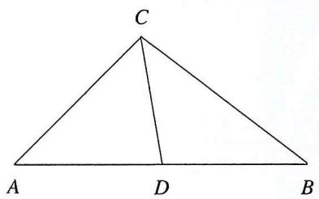

text_image

C
A D B

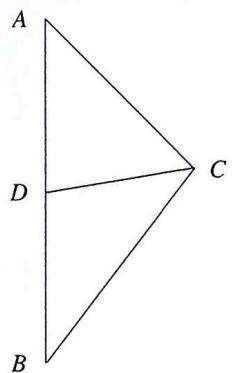

text_image

A
D
C
B

$$
k _ {C A} = \frac {y _ {C} - y _ {A}}{x _ {C} - x _ {A}}, k _ {C B} = \frac {y _ {C} - y _ {B}}{x _ {C} - x _ {B}}, k _ {C D} = \frac {y _ {C} - y _ {D}}{x _ {C} - x _ {D}},
$$

又 $y_{A}=y_{B}=y_{D}$ ，故有

$$
\frac {1}{k _ {C A}} + \frac {1}{k _ {C B}} = \frac {2 x _ {C} - x _ {A} - x _ {B}}{y _ {C} - y _ {D}} = \frac {2 (x _ {C} - x _ {D})}{y _ {C} - y _ {D}} = \frac {2}{k _ {C D}},
$$

# 对竖直线中点

$$
k _ {C A} = \frac {y _ {C} - y _ {A}}{x _ {C} - x _ {A}}, k _ {C B} = \frac {y _ {C} - y _ {B}}{x _ {C} - x _ {B}}, k _ {C D} = \frac {y _ {C} - y _ {D}}{x _ {C} - x _ {D}},
$$

又 $x_{A}=x_{B}=x_{D}$ ，故有

$$
k _ {C A} + k _ {C B} = \frac {y _ {C} - y _ {A}}{x _ {C} - x _ {A}} + \frac {y _ {C} - y _ {B}}{x _ {C} - x _ {B}} = \frac {2 (y _ {C} - y _ {D})}{x _ {C} - x _ {D}} = 2 k _ {C D}.
$$

本题恰好符合平行线中点的斜率结论（如前面第四题），于是可得到 $\frac{1}{k_{AM}} + \frac{1}{k_{AH}} = \frac{2}{k_{AT}} = \frac{2}{k_{AB}}$ ；

又A、M、N都为曲线点，那么接下来介入斜率的坐标化展开即可得到关于直线AH、AM的两点式约束，即存在AH与椭圆另外一交点P，与M存在满足斜率等式的斜率三角形AMP；代入计算即可得到相关两点式直线，下面结合其他点线综合要素即可。

解析 (1) 在椭圆 $\frac{x^2}{3} + \frac{y^2}{4} = 1$ ;

(2) 由 $\overrightarrow{MT} = \overrightarrow{TH}$

$$
2 x _ {T} = x _ {M} + x _ {H}, 2 y _ {T} = y _ {M} + y _ {H},
$$

又 $y_{M}=y_{T}=y_{H}$

$$
\therefore \frac {1}{k _ {A M}} + \frac {1}{k _ {A H}} = \frac {x _ {M} - x _ {A}}{y _ {M} - y _ {A}} + \frac {x _ {H} - x _ {A}}{y _ {H} - y _ {A}} = \frac {2 (x _ {T} - x _ {A})}{y _ {T} - y _ {A}} = \frac {2}{k _ {A B}} = 3,
$$

设AH延长线与椭圆交与点 $P'$ ， $P'(x_{1},y_{1})$ 、 $M(x_{2},y_{2})$ 、 $A(0,-2)$ ，对椭圆上任意两点 $(x_{1},y_{1})$ 、 $(x_{2},y_{2})$ 有

$$
\frac {x _ {1} ^ {2}}{3} + \frac {y _ {1} ^ {2}}{4} = 1, \frac {x _ {2} ^ {2}}{3} + \frac {y _ {2} ^ {2}}{4} = 1,
$$

作差得

$$
k = \frac {y _ {1} - y _ {2}}{x _ {1} - x _ {2}} = - \frac {4}{3} \frac {x _ {1} + x _ {2}}{y _ {1} + y _ {2}},
$$

又 $\frac{1}{k_{AM}} +\frac{1}{k_{AH}} = 3$

$$
\therefore \frac {x _ {1}}{y _ {1} + 2} - \frac {3}{4} \frac {y _ {2} - 2}{x _ {2}} = 3 = \frac {x _ {2}}{y _ {2} + 2} - \frac {3}{4} \frac {y _ {1} - 2}{x _ {1}},
$$

$$
\therefore \frac {- 4 x _ {1} x _ {2} - 3 y _ {1} y _ {2} + 6 y _ {1} - 6 y _ {2} + 1 2}{4 x _ {2} y _ {1} + 8 x _ {2}} = 3 = \frac {- 4 x _ {1} x _ {2} - 3 y _ {1} y _ {2} + 6 y _ {2} - 6 y _ {1} + 1 2}{4 x _ {1} y _ {2} + 8 x _ {1}}
$$

由合分比得

$$
\frac {1 2 (y _ {1} - y _ {2})}{4 (x _ {2} y _ {1} - x _ {1} y _ {2}) - 8 (x _ {1} - x _ {2})} = 3,
$$

即 $x_{2}y_{1} - x_{1}y_{2} = (y_{1} - y_{2}) + 2(x_{1} - x_{2}),$

对 $P^{\prime}M$ 上一点 $(X,Y)$ 有 $\frac{Y-y_{1}}{X-x_{1}}=\frac{y_{1}-y_{2}}{x_{1}-x_{2}}$ ，即

$$
x _ {2} y _ {1} - x _ {1} y _ {2} = X (y _ {1} - y _ {2}) - Y (x _ {1} - x _ {2})
$$

与 $x_{2}y_{1} - x_{1}y_{2} = (y_{1} - y_{2}) + 2(x_{1} - x_{2})$ 对照得

$$
X = 1, Y = - 2,
$$

$\therefore P^{\prime}M$ 过定点 $(1,-2)$ ,

设 $N(x_{3},y_{3})$ ，同理可得

$$
x _ {3} y _ {2} - x _ {2} y _ {3} = (y _ {3} - y _ {2}) + 2 (x _ {3} - x _ {2}),
$$

与 $x_{2}y_{1} - x_{1}y_{2} = (y_{1} - y_{2}) + 2(x_{1} - x_{2})$ 对照得

$$
x _ {3} = x _ {1}, y _ {3} = y _ {1},
$$

∴ $P'$ 点与 N 点重合，即 H、N、A 三点共线，则直线 HN 恒过点 $N(0, -2)$ .

# 解题思路

1. 定点问题往往与斜率三角形挂钩, 要善于挖掘平行中线引出的特别条件并加以运用, 此处构造 $P$ 点引出斜率三角形避开了所谓“先猜后证”的思维观念  
2. 从已知出发, 构造、对照, 由此从解析角度的坐标表达重合, 引出点 $A 、 N 、 H$ 重合的实际几何关系, 达到题设的背景结论, 以解读问题的本质要求

练习6 已知椭圆 $C:\frac{x^{2}}{4}+y^{2}=1$ ，A、B分别为其上下顶点，过定点 $G(-1,-1)$ 与椭圆上一动点D的直线交椭圆于另外一点H，若直线AD斜率为 $k_{1}$ ，直线BD斜率为 $k_{2}$ ，AH斜率为 $k_{3}$ ，且 $k_{1}k_{2}=-\frac{1}{4}$ ，求 $k_{2}+k_{3}$ 的取值范围.

# 要素分析

A. 曲线: 椭圆C   
B. 直线

1. $AB$ 、 $AD$ 、 $AH$ 直线的斜率  
2. ${AD}$ 、 ${AB}$ 的斜率积关系  
3. 过定点G的直线DH

C. 点坐标

1. 定点 $A 、 B 、 G$   
2. $A 、 B 、 D 、 H$ 在曲线上

# 解答思路

1. 从 $k_{2}+k_{3}$ 的问题入手，观察图形可以发现， $k_{2}+k_{3}$ 实际与任何斜率三角形无关，对于此类不在斜率三角形内的题目，我们可以借由其他斜率条件（例如第三定义）进行转化，故问题可以借由 $k_{1}k_{2}=-\frac{1}{4}$ 调整为 $k_{1}$ 、 $k_{3}$ 的数量关系问题（先不要关注加减乘除，先规划变量）

2. $k_{1} 、 k_{3}$ 则标志着以 $A 、 D 、 H$ 为顶点的斜率三角形（恰好 $D H$ 过定点 $G$ ），接下来即可根据斜率三角形的性质探索 $k_{1} 、 k_{3}$ 的关系，结合前面的 $k_{1} k_{2} = - \frac{1}{4}$ ，我们便可以将问题转化为有关 $k_{1}$ 的单变量问题

解析 (1) 对椭圆上任意两点 $(x_{1}, y_{1})$ 、 $(x_{3}, y_{3})$ 有

$$
\frac {x _ {1} ^ {2}}{4} + y _ {1} ^ {2} = 1, \frac {x _ {3} ^ {2}}{4} + y _ {3} ^ {2} = 1,
$$

作差得

$$
\frac {y _ {1} - y _ {3}}{x _ {1} - x _ {3}} = - \frac {1}{4} \frac {x _ {1} + x _ {3}}{y _ {1} + y _ {3}},
$$

故

$$
k _ {1} = \frac {y _ {1} - 1}{x _ {1}} = - \frac {1}{4} \frac {x _ {1}}{y _ {1} + 1}, k _ {3} = \frac {y _ {3} - 1}{x _ {3}} = - \frac {1}{4} \frac {x _ {3}}{y _ {3} + 1},
$$

设 $k_{1}+k_{3}=\lambda$ ，故

$$
4 y _ {1} y _ {3} - 4 y _ {3} + 4 y _ {1} - 1 - x _ {1} x _ {3} = 4 \lambda (x _ {1} y _ {3} + x _ {1}),
$$

$$
4 y _ {1} y _ {3} - 4 y _ {1} + 4 y _ {3} - 1 - x _ {1} x _ {3} = 4 \lambda (x _ {3} y _ {1} + x _ {3}),
$$

作差得

$$
x _ {3} y _ {1} - x _ {1} y _ {3} = - (y _ {1} - y _ {3}) + \frac {2}{\lambda} (x _ {1} - x _ {3}),
$$

由 $D 、 H 、 G$ 三点共线

$$
x _ {3} y _ {1} - x _ {1} y _ {3} = - (y _ {1} - y _ {3}) + (x _ {1} - x _ {3}),
$$

对照得

$$
\lambda = 2, \text {即} k _ {1} + k _ {3} = 2,
$$

又 $k_{1}k_{2} = -\frac{1}{4}$

$$
\therefore k _ {2} + k _ {3} = 2 - k _ {1} - \frac {4}{k _ {1}} \in (- \infty , 1 ] \cup [ 3, \infty).
$$

解答过程

1. 点差，曲线换元得到斜率代换；以斜率的坐标化展开描述点坐标表达的直线过定点约束式，这是对点线要素的综合  
2. 直线L过定点，与上式呼应，直接书写三点共线，以点绘线；比对系数即可得到斜率关系，对应斜率坐标化展开方法  
3. 下面对斜率代求式进行换元，转入一元函数的研究即可（注意到保持直曲双交点，即 $k \neq 0$ ），“几何-代数”的思维在这里至关重要

注 对此类表达式探究问题，无须盯着目标式去构造，解析几何是几何的解析方法，对题目中给定的解析要素全面地等价翻译才是对代求式真正的“构造”

练习7 （2022·全国甲卷）设抛物线 $C: y^{2} = 2px$ （p > 0）的焦点为F，点 $D(p,0)$ ，过F的直线交C于M、N两点，当直线MD垂直于x轴时，MF = 3.

(1) 求 $C$ 的方程;

(2) 设直线 $MD, ND$ 与 $C$ 的另一个交点分别为 $A, B$ , 记直线 $MN、AB$ 的倾斜角分别为 $\alpha、\beta$ 。当 $\alpha-\beta$ 取最大值时, 求直线 $AB$ 的方程。

# 要素分析

I. 曲线

A. 抛物线C直线  
B. 过F的直线MN   
C. 过D的直线MD、ND

II. 点坐标

A. 定点 $F$ 、 $D$   
B. 曲线点 $M 、 N ； A 、 B$

对倾斜角的描述问题要善于利用正切的相关和差公式（逻辑在于倾斜角对应斜率，即对应正切函数），在单调函数上刻画目标式，接下来正常表达点线要素+曲线换元的表述，刻画问题即可

解析 记过抛物线上两点 $(x_{1},y_{1})$ 、 $(x_{2},y_{2})$ 的直线为 $l$ ，由 $y_{1}^{2} = 4x_{1}$ ， $y_{2}^{2} = 4x_{2}$ 作差得

$$
\frac {y _ {1} - y _ {2}}{x _ {1} - x _ {2}} = \frac {4}{y _ {1} + y _ {2}},
$$

$$
\therefore l: y - y _ {1} = \frac {4}{y _ {1} + y _ {2}} (x - x _ {1}), \text {即} (y _ {1} + y _ {2}) y = 4 x + y _ {1} y _ {2},
$$

设 $M(x_{1},y_{1})$ 、 $N(x_{2},y_{2})$ 、 $A(x_{3},y_{3})$ 、 $B(x_{4},y_{4})$ ,

$$
\therefore k _ {M N} = \frac {4}{y _ {1} + y _ {2}} = \tan \alpha , \quad \therefore k _ {A B} = \frac {4}{y _ {3} + y _ {4}} = \tan \beta ,
$$

由 $\tan (\alpha -\beta) = \frac{\tan\alpha - \tan\beta}{1 + \tan\alpha\tan\beta}$ 得

$$
\tan (\alpha - \beta) = \frac {k _ {M N} - k _ {A B}}{1 + k _ {M N} k _ {A B}},
$$

由MN: $(y_{1}+y_{2})y=4x+y_{1}y_{2}$ 过F(1,0)得

$$
y _ {1} y _ {2} = - 4,
$$

由 $AB:(y_3 + y_4)y = 4x + y_3y_4$ 过 $P(m,0)$ 得

$$
y _ {3} y _ {4} = - 4 m,
$$

同理对 ${MA}$ 、 ${NB}$ 可得到

$$
y _ {1} y _ {3} = y _ {2} y _ {4} = - 8,
$$

联立上述式子得

$$
m = 4, \text {即} P (4, 0), y _ {3} y _ {4} = - 1 6,
$$

$$
\therefore k _ {M N} = \frac {4}{y _ {1} + y _ {2}} = \frac {y _ {3} y _ {4}}{2 (y _ {3} + y _ {4})} = \frac {8}{y _ {3} + y _ {4}},
$$

即 $k_{MN} = 2k_{AB}$ ，代入 $\tan (\alpha -\beta) = \frac{k_{MN} - k_{AB}}{1 + k_{MN}k_{AB}}$ 得

$\tan (\alpha - \beta) = \frac{k_{AB}}{1 + 2k_{AB}^2} \leq \frac{\sqrt{2}}{4}$ , 当且仅当 $k_{AB} = \pm \frac{\sqrt{2}}{2}$ 时等号成立,

此时， $AB:y = \frac{\sqrt{2}}{2} x - 2\sqrt{2}$ 或 $y = -\frac{\sqrt{2}}{2} x + 2\sqrt{2}$ （舍）.

# 要素关系

I. 抛物线问题中，无论涉及什么要素，两点式方程都是首选的表达点线关系的代数语言，因为这同时是对曲线条件消换元的结果

II. 在本题当中, 图形围绕过 $x$ 轴的定点 $F$ 构造了曲线割点约束的直线 $M N$ , 后 $M 、 N$ 又与另一 $x$ 轴上定点联系, 构造了新的曲线点 $A B$

III. 自然的, 根据 $M - A 、 B - N$ 的点共轭关系转化坐标, 得到 $A B$ 相关的坐标表达, 本题实际就是一个蝴蝶模型点线约束转化的探索过程, 最后根据题设引入单调函数 $\tan x$ 以描述夹角相关的要素 $k$ 即可

# 5

# 直线要素坐标化与曲线约束

概述 直线，可以从多个角度阐释，视为以一点为基准以一个方向作延伸，这便是直线的建立，亦或者两点确定一条直线等几何定理。无非即倾斜角与基准点两大要素而已。在本章当中，我们将从这样的视角展开对直线上代定点的一系列性质探索。

# 5.1 向量与复数的坐标化视角

1. 在我们的实际学习当中，向量与复数往往是作为一个有方向、长度的线段参量以其独特的计算规则参与计算、设题。但是观望其平面“点”的角度，复数与向量实际上表达了两点之间的相对位置关系  
II. 与斜率角度（方向）不同的是，向量与复数独有的模长成为了点位置关系的加强式表达（方向+距离），因而我们在坐标系当中便可以引入向量、复数的点坐标计算规则（即点差得到向量、复数），借以表达直线上两个点的位置关系，成为一个换元方程，从而以线绘点，将直线要素转化为表达用变量  
III. 此时以点坐标表达的线属性要素既可以称为受曲线约束的变量直接存在于最终的约束表达式中，也就是说此时线属性的参数取代了直曲联立中的斜率 $k$ 与截距 $m$ ，而是由其他直接描述线斜率属性

的变量代替，这是其相较于直曲联立的优势所在，即可以直接描述直线的长度、斜率两大要素，相较于正常联立实际节约了集体点坐标化再计算的步骤

IV. 对向量而言，坐标形式是其本身的一个性质，再结合其加减法以后，向量实际上可以视作直接描述线段属性的坐标表达（加减法配凑即可），在向量的视角下，点与点的相对位置或者说直线的长度要素被简化成了一个向量坐标，这正是是向量的优势所在，结合后面向量的长度式设点法，向量这一工具就同时兼具了相对位置刻画与长度描述两大作用了  
V. 对复数而言, 其坐标化的根据来自复数与向量的一一对应原则, 在这个基础上, 我们可以将点的相对位置或某线段记为向量再对应到一复数上, 复数的详细作用我们在后面还会给出具体介绍  
VI. 实际上, 本章的核心来自对数学工具作用的利用与形式上的改造, 对这一类的方法, 其本质都重在讨论“线过定点”这样的一个约束关系, 以此为表达方法, 即可以产生本章中提到的诸多设点法, 这也正是所谓“坐标化视角”的目的——线属性设点表达

# 5.2 直线要素坐标化（线参的本质）与曲线约束

1. 向量（以为长度单位）

A. 既然选取向量与复数以表达点坐标的相对位置, 那么在坐标系中, “单位元”的代数性质应该是被重视的, 这里便涉及到我们对参数的设置  
B. 回顾我们一般的弦长坐标公式: $\sqrt{1 + k^{2}} x_{1} - x_{2}$ 实际上这里的 $x_{1} - x_{2}$ 即为线段的水平投影单位长度 ( $x$ 轴上单位长度为 1 )，也可记为是单位数

代数过程 以水平底边为1的直角三角形为例

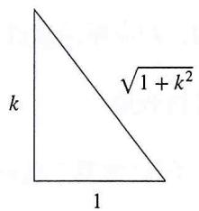

text_image

k
1
√(1 + k²)

- 由斜率 $k$ 的几何意义可知, 此时水平底边长度为 1 , 则竖直边长度为 $k$ , 由此记得该直角三角形斜边长度为 $\sqrt{1 + k^2}$   
- 直线长度正由这一个个单位直角三角形的长度连接而成，我们可以理解为以直线为参变量其单位长度为 $\sqrt{1 + k^2}$ ；参照该单位直角三角形的边长分布，我们可以记该单位直线的向量坐标为 $(1, k)$

C. 在向量中, 我们选取 $(1, k)$ 作为该直线上一个自原点出发平行于直线的方向单位向量

1. 其方向要素与k的取值息息相关  
2. 选取斜率要素的原因：斜率是对点相对位置的方向控制，引入斜率做参数表达单位方向向量（其模长为）正是顺应这一规则  
3. 这种设法实际上是一种以直线要素做参变量表达点坐标的过程; 如图, $E(m,0)$ ,

$$
D (x _ {1}, y _ {1})
$$

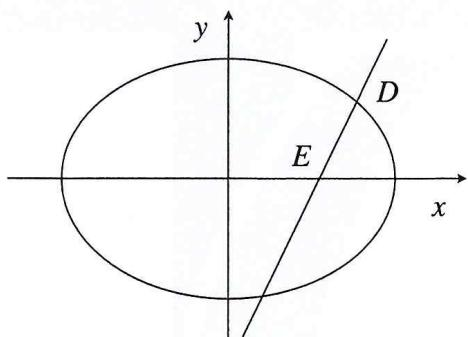

text_image

y
D
E
x

a) 若是需要描述直线ED的长度，便可以通过这样一种设参方式，取向量 $\overrightarrow{ED}$ 上的单位方向向量(1,k)，这个单位方向向量的长度即为单位直线长度  
b) 对线段ED而言，我们需要一个约束使得这个长度可以被确定，这便是直线的另外一个要素“长度”的核心要求：约束  
c) 既然是直曲相交得到了 $D$ 端点, 那么自然曲线对 $D$ 是一个位置约束, 对线段 $E D$ 而言是一个长度约束, 这便是谚语后半句的内容“点曲约束, 线面收束”  
d) 仅以直线为例, 实际上是在直线方向上寻找一个长度单位数量的参数, 我们记这个数量参数为 $\lambda$ , 也可以这样认为, $D$ 点是沿直线方向运动的一个点, 到达直线与曲线交点位置时运动距离为 $\lambda$ 个单位直线长度  
e) 对于点 $D$ 满足直线要素需求, 同时联系了曲线条件, 由此, 若我们从直线角度出发, 又要转移到点坐标上, 便要思考到向量的转化了

代数过程 $E(m,0), D(x_{1},y_{1})$

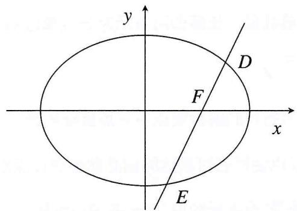

text_image

y
D
F
x
E

设 $\overrightarrow{ED}=\lambda(1,k)$ ，由向量运算法则： $\overrightarrow{ED}=\overrightarrow{OD}-\overrightarrow{OE}$ ，O起点的向量实际就是坐标系中该点的坐标，对D有 $\overrightarrow{OE}+\overrightarrow{ED}=\overrightarrow{OD}$ ， $D(\lambda+m,\lambda k)$ ，故将D代入曲线即可得到对参数 $\lambda$ 的约束.

D. 实际上在运算中, 我们得到的必然是一个关于 $\lambda$ 的二次方程, $\lambda_{1} 、 \lambda_{2}$ 实际上代表了方向相反的距离参量

1. 方向是引入向量附加的结果  
2. 韦达定理得到的两个根在几何上即对应椭圆与直线ED的两个交点

注意 有时二者互为相反数，或者其中之一为零，便对应关于 $\lambda$ 的二次方程使用韦达得到的和或积为零，这时仅取其一即可（几何上该直线方向上与曲线仅有一个交点）

E. 要素关系回顾

1. 我们由直线上取的单位直角三角形射影的特性设定了直线的一个参变量模式，即单位方向向量(1,k)  
2. 由向量的特性, 我们通过向量加减得到一个关于曲线上一点的坐标设置, 这个过程便是直线要素融合进点坐标要素的过程  
3. 仍是三大要素已取其二, 我们只需要进行点曲联立的约束即可得到对要素的统一约束, 对应得到即为 $\lambda$ 的韦达定理

F. 由于引入向量，想要计算相交弦的弦长则要考虑向量方向问题

1. 我们所得到的参量 $\lambda_{1} 、 \lambda_{2}$ 对应线段 $D F 、 E F$ 的单位方向向量个数  
2. $\lambda$ 是附带方向的参数（或记忆单位方向向量 $(1, k)$ 沿 $F \rightarrow D$ 方向的即可， $F \rightarrow E$ 方向与单位方向向量方向相反，则韦达得到的两根和实际为线段长度差）

3. 因而若计算线段 $DE$ 长度, 实际需要计算 $\lambda_1 - \lambda_2$ 的值 (通过完全平方公式) 以得到消去方向的线段单位长度总数量, 长度即可表示为长度单位 $\times$ 长度单位数量, 即对弦 $L$ 的长度有 $L = \sqrt{1 + k^2} \lambda$

4. 这也是所有以点坐标为名目的解析要点——一点坐标约束

a) 凡是将直线要素以点坐标名目表达的则必然要通过点曲联立的过程建立关于要素的核心约束方程；这便是“点坐标约束”这一名词的解释  
b) 对应我们谚语的“点曲约束，线面收束”，我想大家应该对“约束-收束”的对仗有了更直观的体会

# II. 复数

A. 其与直线的亲缘关系我们在第一章中业已介绍，在此仅介绍其一个更为独特的作用：角度转化  
B. 人教版课本上, 在复数篇计算中我们可以额外学习到复数的三角形式, 故复数乘法的几何意义可以借由三角形式解析化, 其形式如下:

# 代数过程

若有复数 $z_{1}$ ， $z_{2}$ ，记其模长分别为 $r_{1}$ 、 $r_{2}$ ，引入直角三角形

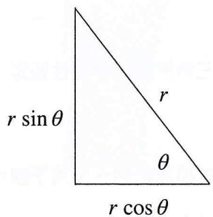

text_image

r sin θ
r
θ
r cos θ

- 可记底边长 $= r \cos \theta$ ; 竖直边长 $= r \sin \theta$   
- 投影到坐标系，即在复数 $z = a + bi$ 中， $a = r \cos \theta, b = r \sin \theta$

所以复数实际可改写为如下三角形式

$$
z = r (\cos \theta + \sin \theta i)
$$

\- 经过上面的处理，复数 $z_{1}(\theta)$ 、 $z_{2}(\alpha)$ 均可改写为如上形式

\- 我们在这里做乘法

$$
z = z _ {1} \cdot z _ {2} = r _ {1} r _ {2} (\cos \theta + \sin \theta i) (\cos \alpha + \sin \alpha i) = r _ {1} r _ {2} [ \cos (\alpha + \theta) + \sin (\alpha + \theta) ]
$$

1. 这个过程中，两复数长度相乘，复数的辐角（可简单视为直线倾斜角）则相加，这正是复数方法的作用——将一个复数与另一个复数的辐角与模长建立关系并得到新的复数

2. 对我们解析过程, 其实际意义就是将两相交直线通过角度建立联系 (实际解析意义就是转化直线要素) 转化直线的信息量与角度的信息量, 实现点曲约束之前的点线要素转化

C. 我们可以借由这个定律, 对一类角度转化问题进行分析, 具体操作方法在后面的演练中会有详细介绍, 复数本身可改写为 $(a, b)$ 的坐标形式也为从实数系到复数系的坐标转化奠定了基础,或者说不同坐标系中除去运算规则, 实际并无实际几何位置的差异; 复数类方法, 其本质思考仍是将直线要素坐标化的转化模式与点坐标的曲线约束代换

# 逻辑

(点+线) 复数化 (坐标化的直线) $\Rightarrow$ 复数乘法 $\Rightarrow$ 转化为坐标 $\Rightarrow$ 曲线约束 $\Rightarrow$ 回代待求式

# III. 直线参数方程

A. 直线的参数方程类似于上面介绍的复数三角形式，实际也是一种投影的应用，只是直接的以某个点为基准进行了直线长度到坐标差的转化，本质也是一种直线要素融入点坐标要素进而点曲联立，以曲线约束点坐标建立约束方程的手法
B. 在某些以线段长度为参变量的题目中，引入直线的参数方程往往会有奇效，这类题目一般伴随对线段长度的条件表达，在这个基础上，以某个点为基准点引入线参表达点坐标的模式便是一步妙手

# 逻辑

基准点+线参⇒点坐标表达⇒曲线约束⇒代回解析式

代数过程 $F(m,0), \quad FD = l_{1}, \quad FE = l_{2}$

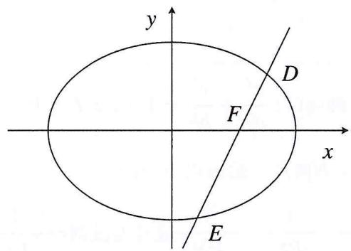

text_image

y
D
F
x
E

借由直线条件作坐标轴射影，得 $D(m+l_{1}\cos\theta,l_{1}\sin\theta)$ ， $E(m+l_{1}\cos\theta,l_{1}\sin\theta)$ ，最后将D、E代入曲线方程进行后续过程

注意 这里的 $F$ 只是指某动直线上一定点, 不存在, 这便是传统的直线参数方程的代数模式

借由这个形式我们也可以清楚的认识到，这一步代数的过程实际就是对直线要素进行处理，借由一个支点联系射影，进而表达点坐标，最终点曲联立约束，实际上仍未脱离我们三大要素的思维体系

# 线参转化与点坐标约束模式

向量 …… 点坐标转化 …… 曲线约束 …… 二次方程根的应用

直线参数方程 …… 射影长度与坐标差 …… 曲线约束

复数 …… 棣莫弗定理 …… 曲线约束

线参点约束的解析模式 向量、复数、直线长度参数方程实际可以统一划入“以线为参”的代数模式，

只是在长度表达上略有差异，向量是直线单位斜率长度的计量模式，而复数则倾向于以坐标距离公式表达，直线长度的参数方程则倾向于直接以长度作为参量，三者实际上都离不开点线转化与曲线约束的思维框架，其代数手段充分体现了“以线绘点”的转化手法，点坐标作为实际代数方程的名目，以直线的要素充分表达，有关线要素的内容实际都可以这样翻译，包括共线点、非轴点弦等等条件

# 5.3 例题剖析

本节选取了三道例题，为大家展示“以线为参”的设点思想是如何具体到向量、复数、线段的长度参数方程当中的，希望读者可以体会到“设参”的灵活运用与“约束”的思想内核，某种意义上有几个约束条件，即对应了多少方程，剩余的也只是消元换元的代数计算过程罢了

# 1. 向量式线参设法应用

例1（2023·极光杯）设点 $S(1,1)$ 在椭圆 $C:\frac{x^{2}}{a^{2}}+\frac{y^{2}}{b^{2}}=1(a>b>0)$ 内，直线 $L:\frac{x}{a^{2}}+\frac{y}{b^{2}}=1$ ，设P为L上的动点，直线PS与C交于M、N两点，给出以下命题：

①存在点P，使得： $\frac{1}{PM}$ 、 $\frac{1}{PS}$ 、 $\frac{1}{PN}$ 成等差数列 $\Leftrightarrow\frac{1}{PS}+\frac{1}{PM}=\frac{2}{PN}$   
②存在点P，使得：PM、PS、PN 成等差数列 $\Leftrightarrow$ PM + PN = 2 PS

③存在点P，使得：PM、PS、PN 成等比数列 $\Leftrightarrow$ PM · PN = PS $^{2}$

# 要素分析

A. 曲线: 即椭圆 $C$

B. 直线

1. 定直线 $L$   
2. 过定点S的直线PS

C. 点坐标

1. $S(1,1)$   
2. $P$ 在直线 $L$ 上  
3. $M 、 N$ 在曲线上

# 要素关系

1. 对设问的三条线段长度关系的陈述, 实际等价于共线的 $P 、 M 、 S 、 N$ 相对位置的表达  
2. 处理共线的点截线段长度关系，向量是极为常用的工具，于是我们便可以采用向量的解析模式，插入线段比例参数 $\lambda$ 以表达斜率化线段的长度系数

解析 设 $\overrightarrow{SP}$ 方向的单位向量为(1,k)，记该线段上单位斜率长度为 $\sqrt{1+k^{2}}$ ，设 $\overrightarrow{SP}=\lambda_{1}(1,k)$ ， $\overrightarrow{SM}=\lambda_{2}(1,k)$ ， $\overrightarrow{SN}=\lambda_{3}(1,k)$ ，代入L和C得

$$
\lambda_ {1} = \frac {a ^ {2} b ^ {2} - a ^ {2} - b ^ {2}}{a ^ {2} k + b ^ {2}}, \lambda_ {2} + \lambda_ {3} = \frac {a ^ {2} k + b ^ {2}}{a ^ {2} k ^ {2} + b ^ {2}}, \lambda_ {2} \lambda_ {3} = \frac {a ^ {2} b ^ {2} - a ^ {2} - b ^ {2}}{a ^ {2} k ^ {2} + b ^ {2}},
$$

由 $\overrightarrow{PM} = \overrightarrow{SM} -\overrightarrow{SP} = (\lambda_2 - \lambda_1)\sqrt{1 + k^2},\overrightarrow{PN} = \overrightarrow{SN} -\overrightarrow{SP} = (\lambda_3 - \lambda_1)\sqrt{1 + k^2},\overrightarrow{PS} = -\lambda_1\sqrt{1 + k^2}$ 得

$$
P M + P N = \left(\lambda_ {2} + \lambda_ {3} - 2 \lambda_ {1}\right) \sqrt {1 + k ^ {2}},
$$

$$
P S ^ {2} = \lambda_ {1} ^ {2} (1 + k ^ {2}),
$$

$$
P M \quad P N = [ \lambda_ {2} \lambda_ {3} + \lambda_ {1} ^ {2} - \lambda_ {1} (\lambda_ {2} + \lambda_ {3}) ] (1 + k ^ {2}),
$$

命题① $\frac{1}{PS}+\frac{1}{PM}=\frac{2}{PN}$ ，即 $\frac{PS+PM}{PS+PM}=\frac{2}{PN}$ ，即

$$
\frac {\lambda_ {2} + \lambda_ {3} - 2 \lambda_ {1}}{\lambda_ {2} \lambda_ {3} + \lambda_ {1} ^ {2} - \lambda_ {1} (\lambda_ {2} + \lambda_ {3})} = - \frac {2}{\lambda_ {1}},
$$

$$
\therefore \lambda_ {2} \lambda_ {3} = \lambda_ {1} (\lambda_ {2} + \lambda_ {3}),
$$

$$
\therefore \frac {a ^ {2} + b ^ {2} - a ^ {2} b ^ {2}}{a ^ {2} k + b} = - \frac {a ^ {2} + b ^ {2} - a ^ {2} b ^ {2}}{a ^ {2} k + b},
$$

$$
\therefore a ^ {2} + b ^ {2} = a ^ {2} b ^ {2},
$$

即 $\frac{1}{a^2} +\frac{1}{b^2} = 1$

又S在椭圆内，故 $\frac{1}{a^{2}}+\frac{1}{b^{2}}<1$ ，矛盾；

命题② $PM + PN = 2PS$ ，即

$$
2 \lambda_ {1} - \lambda_ {2} - \lambda_ {3} = 2 \lambda_ {1},
$$

$\therefore \lambda_{2} + \lambda_{3} = 0$ ，即 $a^2 k + b^2 = 0$ ， $\therefore k = -\frac{b^2}{a^2}$

又 $L:\frac{x}{a^{2}}+\frac{y}{b^{2}}=1$ ，故 $k_{L}=k$ ，由此可得直线PS//L，不可能在直线PS与L上同时找到一点P使得其同时成立；

命题③ $PM \cdot PN = PS^2$ ，即 $\lambda_2\lambda_3 + \lambda_1^2 - \lambda_1(\lambda_2 + \lambda_3) = \lambda_1^2$ ，即

$$
\frac {\lambda_ {2} \lambda_ {3}}{\lambda_ {2} + \lambda_ {3}} = \lambda_ {1},
$$

即 $\frac{1}{a^2} +\frac{1}{b^2} = 1$

又S在椭圆内，故 $\frac{1}{a^{2}}+\frac{1}{b^{2}}<1$ ，矛盾.

注 本题是很好的向量方法建模（线段）题，对共端点线段构造时，向量的加减法是常用的技巧，对于向量化过程中基准点的选取、方向的控制等都有一定考察，各位读者可以本题为例多加练习

PRACTICE 请在下面自己书写一遍本题的方法

# II. 复数式线参设法应用

例2（2023·江西金太阳）已知等轴双曲线 $C:x^{2}-y^{2}=2$ 的中心为坐标原点O，焦点在x轴上。若C上存在两点P、Q，使得 $\angle POQ=45^{\circ}$ ，证明： $\frac{1}{OP^{4}}+\frac{1}{OQ^{4}}$ 为定值.

# 要素分析

A. 曲线: 双曲线 $C$   
B. 直线

A. OP、OQ的长度描述  
B. OP、OQ的夹角关系

C. 点坐标: $P 、 Q$ 在曲线上

解析 设 $P(m,n)$ ，引入复平面可得

$$
z _ {O P} = m + n i,
$$

又 $\angle POQ = 45^{\circ}$

$$
z _ {O P} \times \lambda (\frac {\sqrt {2}}{2} + \frac {\sqrt {2}}{2} i) = z _ {O Q},
$$

$$
z _ {O Q} = \frac {\sqrt {2}}{2} \lambda [ (m - n) + (m + n) i ],
$$

对应到实平面

$$
Q (\frac {\sqrt {2}}{2} \lambda (m - n), \frac {\sqrt {2}}{2} \lambda (m + n)),
$$

则

$$
O P ^ {2} = m ^ {2} + n ^ {2}, \quad O P ^ {4} = (m ^ {2} + n ^ {2}) ^ {2},
$$

$$
O Q ^ {2} = \lambda O P ^ {2}, O Q ^ {4} = \lambda^ {4} (m ^ {2} + n ^ {2}) ^ {2},
$$

则

$$
\frac {1}{O P ^ {4}} + \frac {1}{O Q ^ {4}} = \frac {O P ^ {4} + O Q ^ {4}}{O P ^ {4} O Q ^ {4}} = \frac {\lambda^ {4} + 1}{\lambda^ {4} (m ^ {2} + n ^ {2}) ^ {2}} = \frac {\lambda^ {4} + 1}{\lambda^ {4} [ (m ^ {2} - n ^ {2}) ^ {2} + 4 m ^ {2} n ^ {2} ]} = \frac {\lambda^ {4} + 1}{4 \lambda^ {4} + 4} = \frac {1}{4},
$$

即 $\frac{1}{OP^{4}}+\frac{1}{OQ^{4}}$ 为定值 $\frac{1}{4}$ .

# 要素关系编织

这里便是复数方法最常用的作用“角度转化”

A. 我们可以 $P$ 的点坐标入手设定, 引入复平面, 于是 $P$ 的坐标即标定了复数 $z_{OP}$ , 于是借由复数的乘法公式, 我们可以将复数 $z_{OP}$ 转化为复数 $z_{OQ}$   
B. 由于复数模长未知，故可插入线段比例系数 $\lambda$ 以补足直线的长度要素；再将复平面中 $Q$ 的坐标对应到实平面中即可找到参数 $\lambda$ 相关的约束条件（这一步实际就是点坐标约束的过程）

注 这类问题中的长度往往可结合比例系数 $\lambda$ 进行统一简化以减小计算量。且复数的方法介于其作用的独立，几乎很少用到，在直角或其他特殊角中，我们往往可以采用向量旋转的方法借助一线三等角的线段相似关系插入相似比进行点坐标约束或者线参插入倾斜角建立约束的方法处理

# 另外对于复数方法中的消换元有如下技巧

1. 配凑曲线方程  
2. 配凑曲线约束的表达式

PRACTICE 请在下面自己书写一遍本题的方法

# III. 直线长度参数方程的设法应用

例3 已知椭圆 $\frac{x^{2}}{2} + y^{2} = 1$ ，过点 $E(-1,0)$ 的直线 $L$ 交椭圆于两点 $A$ 、 $B$ ，点 $F$ 的坐标为 $(1,0)$ ，若 $E(-1,0)$ 恰好为线段 $AB$ 的三等分点，求 $\Delta ABF$ 的面积.

# 要素分析

A. 曲线：椭圆曲线 $C$   
B. 直线

1. 过定点E的直线L   
2. A、B与F连接得到线段AF、BF  
3. EA、EB线段长度关系

C. 点坐标

1. 基准点 $E$   
2. 曲线与直线 $L$ 交点 $A 、 B$   
3. 定点F

# 要素关系编织

1. 对于涉及动点A、B的直线L，以定点E为基准，有对EA、EB的长度关系表达，我们就可以利用直线L上的线段长度为一个描述参量，以E为基准点结合直线的参数方程插入三角函数表达A、B的点坐标（E到A、B的相对位置）

2. 曲线要素实际上仍然起到对动点A、B的约束作用，于是三大要素就完成了表达——约束的过程

# 解题过程解读

I. 对直线上的点 $A 、 B$ ，以定点 $E$ 为基准点设定 $A 、 B$ 点的直线参数坐标方程，联立曲线得到有关 $A 、 B$ 对应的 $t_{1} t_{2}$ 两参量的曲线点坐标约束二次方程

II. 通过韦达定理即可以得到对长度参量的直接和积描述。记得注意题目中选取的t的方向问题，对题目中的 $t_{1}t_{2}$ 的代换关系，可以在这里起到解方程的作用从而充分利用条件，最后通过 $AB \times \sin\theta$ 进行铅锤高的转化即可得到三角形ABF的面积表达

解析 对直线l上的点，取长度参量t，设直线的倾斜角为θ，又 $E(-1,0)$ 在l上，故l上的点可记为 $(-1+t\cos\theta,t\sin\theta)$ ，记 $EA = t_{1}$ ， $EB = -t_{2}$ ，则 $t_{1}=-2t_{2}$ ;

由A, B在椭圆上: $(-1 + t \cos \theta)^{2} + 2(t \sin \theta)^{2} - 2 = 0$ , 即 $(1 + \sin^{2} \theta)t^{2} - 2t \cos \theta - 1 = 0$ ,
故 $-t_{2}=t_{1}+t_{2}=\frac{2\cos\theta}{1+\sin^{2}\theta},-2t_{2}^{2}=t_{1}t_{2}=-\frac{1}{1+\sin^{2}\theta},$ 故 $-2(\frac{2\cos\theta}{1+\sin^{2}\theta})^{2}=-\frac{1}{1+\sin^{2}\theta}$

解得： $\sin^2\theta = \frac{7}{9},\quad \therefore S_{\triangle ABF} = \frac{1}{2} AB\quad EF\quad \sin \theta = \frac{2\sqrt{2}}{1 + \sin^2\theta}\sin \theta = \frac{3\sqrt{14}}{8}.$

# 5.4 实战演练

例1 已知椭圆 $C: \frac{x^2}{a^2} + \frac{y^2}{b^2} = 1 (a > b > 0)$ 的中心为原点 $O$ ，过 $O$ 做两条垂直的射线交椭圆于 $PQ$ 两点，求证： $\frac{1}{OQ^2} + \frac{1}{OP^2} = \frac{1}{a^2} + \frac{1}{b^2}$ .

# 要素分析

A. 曲线：椭圆C

B. 直线: $OP$ 、 $OQ$ 互相垂直

C. 点坐标: $P 、 Q$ 在曲线上

# 思路分析

本题约束条件只需考虑两个点，即要素分析的2、3项，于是也可从点的角度切入，以斜率的坐标化展开描述垂直关系以转入点参或以垂直的斜率关系构造关于斜率的约束方程，下面介绍两种方法

# 法一：向量表达斜率长度化（算是一种对称化构造）

取 $\overrightarrow{OP}$ 方向的单位向量 $(1, k)$ , $\because OP \perp OQ$ , 故 $\overrightarrow{OQ}$ 方向的单位向量 $(k, -1)$ , 因此可设

$$
\overrightarrow {O P} = \lambda (1, k), \overrightarrow {O Q} = \mu (k, - 1),
$$

即 $P(\lambda, \lambda k)$ ， $Q(\mu k, -\mu)$ ，代入椭圆 $\frac{x^2}{a^2} + \frac{y^2}{b^2} = 1$ 得

$$
\lambda^ {2} = \frac {1}{\frac {1}{a ^ {2}} + \frac {k ^ {2}}{b ^ {2}}}, \mu^ {2} = \frac {1}{\frac {1}{b ^ {2}} + \frac {k ^ {2}}{a ^ {2}}},
$$

故 $\frac{1}{OQ^2} +\frac{1}{OP^2} = \frac{1}{\lambda^2(1 + k)} +\frac{1}{\mu^2(1 + k)} = (\frac{1}{a^2} +\frac{k^2}{b^2} +\frac{1}{b^2} +\frac{k^2}{a^2})\frac{1}{1 + k^2} = \frac{1}{a^2} +\frac{1}{b^2}.$

# 法二：线参表达三角代数化

设 $P(L\cos\theta,L\sin\theta)$ ， $Q(I\cos\beta,I\sin\beta)$ ，又 $OP\perp OQ$ ，故

$$
\theta - \beta = \frac {\pi}{2},
$$

由诱导公式

$$
\cos^ {2} \theta = \sin^ {2} \beta , \cos^ {2} \beta = \sin^ {2} \theta ,
$$

将 $P$ 、 $Q$ 代入椭圆

$$
L ^ {2} (\frac {\cos^ {2} \theta}{a ^ {2}} + \frac {\sin^ {2} \theta}{b ^ {2}}) = 1, I ^ {2} (\frac {\cos^ {2} \beta}{a ^ {2}} + \frac {\sin^ {2} \beta}{b ^ {2}}) = 1,
$$

即 $L^2 (\frac{\cos^2\theta}{a^2} +\frac{\sin^2\theta}{b^2}) = 1$ ， $I^2 (\frac{\sin^2\theta}{a^2} +\frac{\cos^2\theta}{b^2}) = 1$

相加得

$$
\frac {1}{O Q ^ {2}} + \frac {1}{O P ^ {2}} = \frac {1}{a ^ {2}} + \frac {1}{b ^ {2}}.
$$

复数也可以处理本题，但是直角是最简单的一个角度关系，与直线的斜率要素联系最深，故此处采取单位方向向量的垂直构造进行向量形式的斜率长度描述。

法二则是直接以长度为参数建立点坐标的约束方程，下面以直角为条件进行三角参数方程的描述即可；二者实际都是以“线”为参，以曲为束的一种解析模式，且此处线段参数方程中的三角函数实际就是直线倾斜角的对应函数，这是其相较于参数方程三角函数的优势所在

本题实际是内准圆的探究，原点到直线 $P Q$ 的垂足 $M$ 是以坐标原点为圆心，以垂径长度为半径的圆，

读者可通过等面积法转化题目设问，可自行计算推导 $r=\sqrt{\frac{a^{2}b^{2}}{a^{2}+b^{2}}}$

例2 已知抛物线 $C: x^{2} = 2py (p > 0)$ 上一点 $M(m,1)$ 到焦点的距离为2.

(1) 求抛物线C的方程;

(2) 过点 $(-1,0)$ 的直线交抛物线 $C$ 于 $A$ 、 $B$ 两点，点 $Q(0,-2)$ ，连接 $QA$ 交抛物线于另一点 $E$ ，连接 $QB$ 交抛物线于另一点 $F$ ，且 $\triangle QAB$ 与 $\triangle QEF$ 的面积比为 $1:3$ ，求直线 $AB$ 的方程.

# 要素分析

A. 曲线: 即抛物线 $C$

B. 直线

1. 过定点 $(-1,0)$ 的直线L交C于A、B

2. 过点 $Q(0,-2)$ 两射线交C于E、F

C. 点坐标

1. 定点 $(-1,0)$ 、 $(0,-2)$

2. 曲线点A、B、E、F

# 要素编织

1. 直线 $A B$ 受点 $(-1,0)$ 约束，可根据两点式转化为 $A B$ 两点的坐标代数式

2. 下面对QA、QB生成QB、QF的过程，实际可认为是共直线点的坐标转化，结合题目设定于线段比的条件，于是可以介入向量的长度插参 $\lambda$ 构造，表达共线的条件，最终以点坐标约束收尾

# 思路分析

1. 对抛物线上割线过定点的条件或设问，立刻应联系到抛物线的两点式直线进行坐标条件的转化，下面可以以此消换元

2. 对本题而言, 面积比由正弦面积公式借由共角条件转化为线段长度之比, 于是向量的构造既是对共线条件转化利用, 也是对线段比设问的直接设定  
3. 最后结合过定点的条件转化即可得到 $k$ 的取值，对于这一类共顶角三角形的面积比问题，我们都可以通过这种方式进行化简

解析 设 $A(x_{1},y_{1})$ ， $B(x_{2},y_{2})$ ，则

$$
x _ {1} ^ {2} = 4 y _ {1}, x _ {2} ^ {2} = 4 y _ {2},
$$

$$
\therefore k _ {A B} = \frac {y _ {1} - y _ {2}}{x _ {1} - x _ {2}} = \frac {x _ {1} + x _ {2}}{4},
$$

则 $AB:y - y_{1} = k_{AB}(x - x_{1})$ ，即

$$
(x _ {1} + x _ {2}) x = 4 y + x _ {1} x _ {2},
$$

又AB过F，故

$$
x _ {1} + x _ {2} = - x _ {1} x _ {2},
$$

故 $\overrightarrow{QA} = (x_1, \frac{x_1^2}{4} + 2)$ , $\overrightarrow{QB} = (x_2, \frac{x_2^2}{4} + 2)$ , $\overrightarrow{QE} = \lambda(x_1, \frac{x_1^2}{4} + 2)$ , $\overrightarrow{QF} = \mu(x_2, \frac{x_2^2}{4} + 2)$ ,

$$
\therefore E (\lambda x _ {1}, \frac {\lambda x _ {1}}{4} + 2 \lambda + 2), F (\mu x _ {2}, \frac {\mu x _ {2}}{4} + 2 \mu + 2),
$$

代入抛物线

$$
\lambda x _ {1} ^ {2} (\lambda - 1) = 8 (\lambda - 1), \mu x _ {2} ^ {2} (\mu - 1) = 8 (\mu - 1),
$$

$$
\therefore \lambda = \frac {8}{x _ {1} ^ {2}}, \mu \frac {8}{x _ {2} ^ {2}},
$$

$$
\therefore \frac {S _ {\triangle Q A B}}{S _ {\triangle Q E F}} = \frac {Q A}{Q E} \frac {Q B}{Q F} = \frac {1}{\lambda \mu} = \frac {x _ {1} ^ {2} x _ {2} ^ {2}}{6 4},
$$

$$
\therefore \frac {x _ {1} ^ {2} x _ {2} ^ {2}}{6 4} = \frac {1}{3},
$$

又 $k_{AB}=\frac{x_{1}+x_{2}}{4}=-\frac{x_{1}x_{2}}{4}$ ，故

$$
\frac {6 4}{1 6 k ^ {2}} = \frac {1}{3}, \therefore k = \pm \frac {2}{3} \sqrt {3},
$$

$$
\therefore L _ {A B}: y = \frac {2}{3} \sqrt {3} x + \frac {2}{3} \sqrt {3} \text {或} y = - \frac {2}{3} \sqrt {3} x - \frac {2}{3} \sqrt {3}.
$$

“向量”这一工具的作用在于以点描述线的特性，不要将思维禁锢在 $(1, k)$ 的斜率单位坐标格式下，在解析几何中，向量的许多性质实际都可以得到利用，同时也可以将其视作一种探寻坐标关系的方法。

例3 已知抛物线 $y^{2}=2px$ (p>0)，直线L与抛物线C交于A、B两点，其中点A在第一象限，O为坐标原点， $\angle AOB=\frac{\pi}{3}$ ， $\angle ABO=\frac{\pi}{6}$ ，k为直线OA的斜率，则 $\frac{\sqrt{3}}{k}-k^{2}$ 的值为？

# 要素分析

A. 曲线：抛物线  
B. 直线

1. 直角斜率积关系  
2. 直角边长度关系

C. 点坐标

1. 曲线点A、B、O（定）

# 要素关系

D. 对由直线夹角关系（尤其是直角）确定的几何图形，我们要善于挖掘其中的其余几何条件，例如本题可以由一角为 $30^{\circ}$ 的直角三角形引出边长之比构造额外方程  
E. 对本题而言, 显然斜率积是一个重要的控制变量, 这时便涉及对要素的选取, 注意到设问中以 $k$ 为问, 那么自然可以想到将 $k$ 作为参数 (即以线为参) 直接表达已有条件, 于是“以线绘点”,寻求点坐标的曲线约束即可, 另外要注意几何关系的运用

解析 由 $OA \perp AB$ ，设 $\overrightarrow{OA} = \lambda (1, k)$ ， $\overrightarrow{AB} = \mu (k, -1)$ ，

$$
\text { 故 } A (\lambda , \lambda k), B (\mu k + \lambda , - \mu + \lambda k),
$$

代入曲线得

$$
\left\{ \begin{array}{l} (\lambda k) ^ {2} = 2 p \lambda \\ \mu^ {2} + \lambda^ {2} k ^ {2} - 2 \lambda \mu k = 2 p \lambda + 2 p \mu k \end{array} \right.,
$$

联立得

$$
\mu = \frac {4 p}{k} + 2 p k (\mu \neq 0),
$$

在 $Rt\triangle ABC$ 中， $OA = \frac{AB}{\sqrt{3}}$ ，即 $\lambda = \frac{\mu}{\sqrt{3}}$ ，又非共线向量，故

$$
\lambda = \frac {\mu}{\sqrt {3}},
$$

$$
\therefore \frac {2 p}{k ^ {2}} = \frac {\frac {4 p}{k} + 2 p k}{\sqrt {3}}, \quad \therefore \frac {\sqrt {3}}{k} - k ^ {2} = 2.
$$

# 解答

A. 设点：以线为参，结合斜率关系代换单位方向向量插参即可  
B. 约束：点在曲上，几何代数化处理，寻求 $\lambda$ 和 $\mu$ 的代数关系  
C. 结合其余条件进行转化（此处结合几何条件），表达设问即可  
D. 非共线向量在描述长度、面积时可以根据几何构型省略正负

例4 已知点 $A(-2,0)$ , $B(2,0)$ , 动点 $M(x,y)$ 满足直线 $AM$ 与 $BM$ 的斜率积为 $-\frac{1}{2}$ , 记 $M$ 的轨迹为曲线 $C$ .

(1) 求C的轨迹;   
(2) 过坐标原点的直线交 $C$ 于 $P 、 Q$ 两点, 点 $P$ 在第一象限, $PE \perp x$ 轴, 垂足为 $E$ , 连接 $QE$ 并延长 $C$ 于点 $G$ .

a. 证明： $\triangle PQG$ 是直角三角形；

b. 求 $\triangle PQG$ 面积的最大值.

解析 (1) $\frac{x^2}{4} + \frac{y^2}{2} = 1$ ;

(2) a. 设 $P(x_{1},y_{1})$ 、 $Q(-x_{1},-y_{1})G(x_{2},y_{2})$ ，则 $k_{PQ}=\frac{y_{1}}{x_{1}}$ ，且

$$
\frac {x _ {1} ^ {2}}{4} + \frac {y _ {1} ^ {2}}{2} = 1, \frac {x _ {2} ^ {2}}{4} + \frac {y _ {2} ^ {2}}{2} = 1,
$$

作差得 $\frac{y_1 - y_2}{x_1 - x_2} = -\frac{1}{2}\frac{x_1 + x_2}{y_1 + y_2},$

由Q、E、G三点共线 $\frac{y_{2}}{x_{2}-x_{1}}=\frac{y_{1}+y_{2}}{x_{1}+x_{2}}$ ，即

$$
2 x _ {1} y _ {2} = x _ {2} y _ {1} - x _ {1} y _ {1},
$$

$$
\therefore k _ {P Q} \cdot k _ {P G} = \frac {y _ {1}}{x _ {1}} \frac {x _ {1} + x _ {2}}{y _ {1} + y _ {2}} (- \frac {1}{2}) = \frac {- x _ {1} y _ {1} - x _ {2} y _ {1}}{2 x _ {1} y _ {1} + 2 x _ {1} y _ {2}} = \frac {2 x _ {1} y _ {2} - 2 x _ {2} y _ {1}}{2 x _ {2} y _ {1} - 2 x _ {1} y _ {2}} = - 1,
$$

$$
\therefore P Q \perp P G.
$$

本问证明垂直关系即可，这里利用了一下额外给予的射影点共线构造的斜率坐标化方程，是“斜率坐
标化展开”的重要思想。读者万不要陷入“对偶”的思想固区，灵活的转化条件，表达线上的坐标关系
才是重中之重

# 下面看看最后一问

# 要素分析

A. 曲线: 椭圆 $C$   
B. 直线: PG、PQ的垂直关系  
C. 点坐标: $P 、 Q 、 G$ 都是曲线点

要素关系 仍然同上题，对多直线问题，若给出斜率关系那么充分利用斜率的表达就是重中之重，在本题我们同样可以以线为参，在表达环节以线参设置变量，结合点在曲上的曲线约束即可得到题目条件对应的代数式，最后就是表达问题、代数计算了

解析 (2) b. $\because O$ 是 $PG$ 中点, 故

$$
S _ {\triangle P Q G} = 2 S _ {\triangle P O G} = P O \quad P G,
$$

令 $\overrightarrow{OP} = \lambda (1,k),\overrightarrow{PG} = \mu (k, - 1),k > 0$

$$
\text { 故 } P (\lambda , \lambda k), G (\lambda + \mu k, \lambda k - \mu),
$$

代入椭圆得

$$
\lambda = \frac {2}{\sqrt {1 + 2 k ^ {2}}}, \mu = \frac {- 4 k}{k ^ {2} + 2 \sqrt {1 + 2 k ^ {2}}},
$$

$$
\therefore S _ {\triangle P Q G} = (1 + 2 k ^ {2}) \lambda \mu = 2 \frac {\frac {4}{k} + 4 k}{2 k ^ {2} + 5 + \frac {2}{k ^ {2}}},
$$

令 $m = 4(\frac{1}{k} + k) \geq 8$ ，则 $S_{\triangle PQG} = \frac{16}{m + \frac{8}{m}} \leq \frac{16}{9}$ .

本题前面的转化过程与一般问题无异，只是在对关于 $k$ 的代数式计算时要善于观察，提取可以配凑完全平方式或基本不等式等常用于求最值的变量表达

当我们选择的基准点为曲线上的点时，则关于长度度量参数 $\lambda$ 的二次方程中有且仅有一个非零解，也可以认为一个解是取了基准点到基准点的零向量，这是我们消元导出参数 $\lambda$ 的坐标表达的基础，这里对 $k$ 幂次的配凑换元正是在前面提到的高低幂的平方换元配凑，数感可慢慢积累，不必在此纠结

# 6

# 定比家族的建立与应用

概述 实际可以看作是一种约束关系，满足比例，即满足代换，既可以转化为相关的代数方程。本章当中，我们将从共线条件产生的定比性质入手，结合命题背景做深入探索。

# 6.1 要素与信息量的选取把握

# 1. 定比的实际意义

A. 对于定比的概念, 我们在上一章讲述复数、向量的配参过程中实际上已有应用, 其实际意义在于将直线的长度要素充分利用, 从而得到对于点坐标的约束, 以建立方程求解  
B. 在本章中, 我们将充分利用“定比”的方式方法, 借“以比代参”的思维模式与计算技巧为大家介绍另一种意义上的线参模式

# II. 调和点列及调和线束的长度比值模式——一定比点差

A. 调和点列本身是平面几何中的一项内容，其指代线段之间具有调和性的四个端点，这四个端点隔离出的四段线段间具有对称定比的特殊性

B. 实际上调和性就是一种“定比”的性质，同时介于调和点列乃至调和线束的各类特殊性质，衍生出了许多类题型，处理这些题型时我们往往需要借助调和点列的调和性建立起方程，从而表达、约束变量

C. 在这个过程中, 我们往往将直线要素的相关变量寄于借由“定比”调整后的点坐标中, 在这个过
程当中, 向量作为联系坐标与直线的工具也会在此运用, 实际最后我们还是回到了点坐标表达
与曲线约束的环节, 仍未脱离三大要素的思维模式

# III. 调和点列的构成与其系列性质

A. 调和与调和等差性的几何介绍

1. “调和”一词又可称之为“和谐”，也许大家听说过一类平均数为“调和平均数”，这里的调和与调和点列中同义

2. 其本身的意义可以如下形式的数列归纳

a) “1, $\frac{1}{2}$ , $\frac{1}{3}$ , ……, $\frac{1}{n}$ ”我们可以发现这实际是一列自然数列各取倒数的结果，同时注意到，自然数列是一类等差数列，这便是要点所在，只要有一列数列的倒数成等差数列，则称该数列为调和数列；这是关于“调和”二字的解释，即倒数关系

# 调和点列

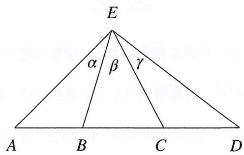

text_image

E
α β γ
A B C D

$$
\frac {1}{A D} + \frac {1}{A B} = \frac {2}{A C} \dots ①
$$

1. 定义: $A, C$ 为线段的两端点, $B$ 为线段 $A C$ 的内分点, $D$ 为线段 $A C$ 的外分点, 于是得到了满足调和等差数列性质的线段长度关系①, 满足这样性质的四个点, 我们即称之为调和点列 (类比等差中项)

2. 对于 $AC 、 BD$ ，其实两组点分别满足如上调和关系，即互为内外分点，可以认为存在两组比例不同的调和点列

可记作

以AC为基准，B为内分点，D为外分点

以BD为基准，C为内分点，A为外分点

# IV. 调和点列的比值定义与几何结论证明

A. 对于调和点列，我们往往采取“定比”的定义方式

对于线段AC的内外分点B、D，满足

$$
\frac {A B}{B C} = \frac {A D}{C D} = \lambda \text {或等价形式} C D \cdot B C = B C \cdot A D
$$

这个等式代表着B, D调和分割AC（以比例的模式理解即可），即标志着调和点列的命题背景，在后面我们会介绍解决这类定义解读问题的方法

定义可以理解为：调和点列 $\Leftrightarrow$ 外分比 $=$ 内分比

B. 在这里给出上面提到的调和等差性质的几何证明

由 $\frac{BC}{BC} = \frac{AD}{CD}$ 得

$$
\frac {A B}{A C - A B} = \frac {A D}{A D - A C},
$$

取倒数得

$$
\frac {A C}{A B} + \frac {A C}{A D} = 2,
$$

同除AC，得到上述①等式，即证明调和点列关系即可几何化推导前述调和等差关系.

C. 另外, 在已知 $B, D$ 调和分割 $A C$ 的情况下, 若给出以下条件中任意一个, 则可另外得到其他两条件:

1. EB是∠AEC的内角平分线

2. $ED$ 是 $\angle AEC$ 的外角平分线  
3. ${EB} \bot  {ED}$

这也是常见的命题背景之一，往往命题人以调和点列及内角平分线引入，这时我们便可以借助调和点
列的如上性质进行补充证明，成为解题助力

# 下面给出证明

以1证2、3为例，若EB为 $\angle AEC$ 的内角平分线，则由三角形的正弦面积公式

$$
\begin{array}{l} 2 S \triangle E A B = E B \times A B \sin \angle E B A = E B \times E A \sin \alpha \dots ① \\ 2 S \triangle E B C = E B \times B C \sin \angle E B C = E B \times E C \sin \beta \dots ② \\ \end{array}
$$

①得
②

$$
\frac {A B}{B C} = \frac {A E \sin \alpha}{E C \sin \beta},
$$

这可以认为是三角形内的一个重要性质，推广到三角形顶角的外角，则有

$$
\frac {A D}{D C} = \frac {A E \sin (\alpha + \beta + \gamma)}{E C \sin \gamma},
$$

由这个性质，可以得到

$$
\frac {\frac {A B}{B C}}{\frac {A D}{D C}} = \frac {\sin \alpha}{\sin \beta} \frac {\sin \gamma}{\sin (\alpha + \beta + \gamma)} = \frac {A}{B} = 1,
$$

1. 1实际上是恒成立的，是调和点列等比性质的一个刻画  
2. 当 $EB$ 为内角平分线时实为 $\lambda = 1$ 时的特殊情况: 若 $A = 1$ , 则 $B = 1$ 成立, 即 $ED$ 为 $\angle AEC$ 外角平分线成立

于是可以得到两平分线各自平分一互补角，得到 $\angle BED$ 为直角，即 $BE\perp ED$ ，（2）、（3）得证.

# 性质（3）的补充

I. 实际上若有 $EB \perp ED$ ，则可认为 $E 、 B 、 D$ 在以 $BD$ 为直径的圆上，这时，这正揭示了阿波罗尼斯圆的性质

II. 也即是说，阿波罗尼斯圆实际是满足调和分割的一个调和点列确定的圆，在小题中碰到阿波罗尼斯圆问题时其实往往只需要找到满足比例的内外分点坐标，即可确定该圆方程

以上即为常见的以调和点列命题的出题背景，以几何的方法表达证明这些性质往往可以极大的节约计算量，圆锥曲线毕竟是几何的学问；高中阶段的学习也许更注重方法而忽视了一些几何性质的图形表现，这一点也正是思维上的退步；

希望您在阅读本书的同时可以领会一些高阶背景及结论作为一些知识储备，将各类方法融入对问题的思考中去，而不是见到什么关键词而去运用什么方法，这一点是极为粗糙表面的理解，是大家要避免的一个思维误区；

实际在以调和点列为背景的题目当中，我们使用直曲联立的韦达定理描述长度或向量表达的斜率化长度都是极为常见的，没有真正一直最快的方法，只有最熟练的计算与自信的证明，表达-约束永远是唯一正道。

# 6.2 极点极线的简单介绍

以椭圆为例 过椭圆外一点 $P(x_{0},y_{0})$ ，引椭圆C: $\frac{x^{2}}{a^{2}}+\frac{y^{2}}{b^{2}}=1$ 的两条切线

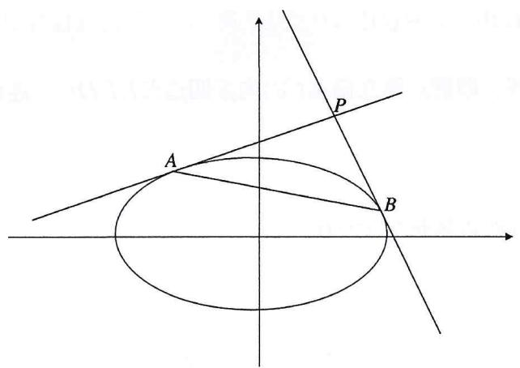

text_image

Geometric diagram showing an ellipse intersected by two lines, with labeled points A, B, and P on coordinate axes.

易知过A,B两切点的直线为： $\frac{xx_{A}}{a^{2}}+\frac{yy_{A}}{b^{2}}=1,\quad\frac{xx_{B}}{a^{2}}+\frac{yy_{B}}{b^{2}}=1,$

$PA$ ， $PB$ 过点 $P$ ： $\frac{x_0x_A}{a^2} +\frac{y_0y_A}{b^2} = 1$ ， $\frac{x_0x_B}{a^2} +\frac{y_0y_B}{b^2} = 1$

故可认为A，B同构于 $\frac{xx_{0}}{a^{2}}+\frac{yy_{0}}{b^{2}}=1$ ，由两点确定一条直线，即有直线AB方程： $\frac{xx_{0}}{a^{2}}+\frac{yy_{0}}{b^{2}}=1$ ；

这个方程就被成为 $P$ 点关于椭圆 $C$ 的极线, 点 $P$ 称为极线 $A B$ 关于椭圆 $C$ 的极点

# 性质

1. 有极点则必有其对应的极线；

2. 反之，若有极线方程： $\frac{xx_{0}}{a^{2}}+\frac{yy_{0}}{b^{2}}=1$ ，则必有该极线关于椭圆C的极点；

3. 同时对于点 $Q(a, b)$ , 若 $Q$ 点在 $P$ 点的极线上, 则 $P$ 也必然在 $Q$ 点关于椭圆 $C$ 的极线上, 这就称为配极原则

以椭圆为例 过椭圆外一点 $P(x_{0},y_{0})$ ，引椭圆C: $\frac{x^{2}}{a^{2}}+\frac{y^{2}}{b^{2}}=1$ 的两条割线，分别交椭圆于C,E,D,F点；连接DE,CF

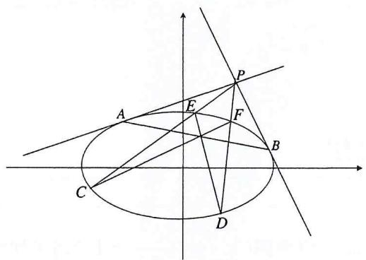

text_image

Geometric diagram with labeled points and intersecting lines, including an ellipse and intersecting lines.

易知ED交CF于一点Q（未标出），且Q必然在直线AB上，这是极点极线对应的一个性质；

任取过 $P$ 点关于椭圆 $C$ 的割线, 取割点建立椭圆 $C$ 的内接四边形 $E F D C$ , 连接对角线, 即可得到点 $Q$ 的轨迹在直线 $A B$ 上

另外 对其内接四边形的另外两边延长交于点 $H$

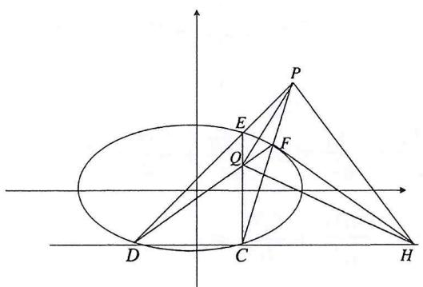

text_image

Geometric diagram with labeled points and lines, including an ellipse, triangle, and coordinate axes

这时连接 ${QH}$ , ${{QH}}$ 也在直线 ${AB}$ 上；这也是椭圆内接四边形对应的一个性质

这里仅取椭圆内接四边形，结合上述，易知

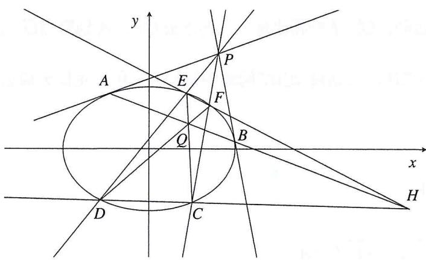

text_image

y
A E P
F
Q B
x
D C H

1. $P$ 的极线为直线 $Q H$   
2. 易知 $H$ 的极线为直线 $PQ$   
3. $Q$ 的极线即为直线 $P H$

于是称 $\triangle PQH$ 为自极三角形

注 极点极线是圆锥曲线当中确定调和点列的基本原理；即当存在极点与其关于圆锥曲线的对应极线时，我们可以确定调和点列的定比关系，从而推导出调和分比的坐标性质，这是圆锥曲线调和点列背景的问题中我们使用定比点差方法的一个基本根据

# 下面为大家介绍一类基础的以调和点列为背景的圆锥曲线问题

例1（2023·四省联考）已知双曲线 $C: \frac{x^{2}}{a^{2}} + \frac{y^{2}}{b^{2}} = 1 (a > 0, b > 0)$ 过点 $A(4\sqrt{2}, 3)$ ，焦距为10.

(1) 求C的方程;

(2)已知 $B$ 与 $A$ 关与 $x$ 轴对称, $D(2 \sqrt{2},0)$ , $E$ 为线段 $A B$ 上一点, 且 $D E$ 交 $C$ 于 $G, H$ 两点, 证明:

$$
\frac {G D}{G E} = \frac {H D}{H E}.
$$

# 要素分析

A. 曲线要素：双曲线 $C$   
B. 直线要素: $AB, DE$   
C. 点坐标要素：已知点 $A, D$ ，未知点 $E$ ；直线与椭圆交于点 $G, H$

# 要素关系网

由题设, 可知 $E$ 在 $A B$ 上运动, 锁定 $E$ 的横坐标, 同时连起 $D E$ , 得到交点 $G$ , $H$ , 由于四点共线, 则线段长度比可以转化为坐标之比, 在这类“定比”问题中我们往往用到定比分点公式, 来讨论这一类线段比值问题

解析 (1) $\frac{x^{2}}{16} - \frac{y^{2}}{9} = 1$

(2) 设 $\overrightarrow{GD} = \lambda \overrightarrow{DH}$ ， $\overrightarrow{GE} = -\lambda \overrightarrow{FH}$ ，则

$$
D (\frac {x _ {1} + \lambda x _ {2}}{1 + \lambda}, \frac {y _ {1} + \lambda y _ {2}}{1 + \lambda}) \Longleftrightarrow (2 \sqrt {2}, 0); E (\frac {x _ {1} - \lambda x _ {2}}{1 - \lambda}, \frac {y _ {1} - \lambda y _ {2}}{1 - \lambda}) \Longleftrightarrow (4 \sqrt {2}, t)
$$

由（1）得 $C: \frac{x^2}{16} - \frac{y^2}{9} = 1$ ，故对 $G(x_1, y_1)$ ， $H(x_2, y_2)$ 有

$$
\left\{ \begin{array}{l} {\frac {x _ {1} ^ {2}}{1 6} - \frac {y _ {1} ^ {2}}{9} = 1 \textcircled {1}} \\ {\frac {x _ {2} ^ {2}}{1 6} - \frac {y _ {2} ^ {2}}{9} = 1 \textcircled {2}} \end{array} , \right.
$$

① - $\lambda^2$ ②得

$$
\frac {(\frac {x _ {1} + \lambda x _ {2}}{1 + \lambda}) (\frac {x _ {1} - \lambda x _ {2}}{1 - \lambda})}{1 6} - \frac {(\frac {y _ {1} + \lambda y _ {2}}{1 + \lambda}) (\frac {y _ {1} - \lambda y _ {2}}{1 - \lambda})}{9} = 1,
$$

即有 $\frac{x_{D}x_{E}}{16}-\frac{y_{D}y_{E}}{9}=1$ ,

代入D,E坐标，符合上式，得证.

注 这个方法即为最常规的定比点差法，定比来源于调和点列出现的线段调和关系，一般我们要用到由向量推导（在左列可设后面应为向量形式的线段）的定比分点（大家可根据题目自行推导）公式，联系起线段与坐标，将一个几何的长度问题转化为解析的坐标问题，然后结合平方差公式得到有定比 $\lambda$ 参与的点差过程，最后整理，得到线段内外分点的坐标，解析中最后关于 $D, E$ 的式子我们即称为定比点差对特征方程（也可认为是 $DE$ 的直线方程），在一些小题中可以借以速求参量

# 对本题的解析过程加以分析

I. 首先, 根据题设, 我们现其满足常见的调和点列定比定义式, 故转化直线要素为点坐标, 再借以曲线上的代数变形, 得到待证目标应满足的式子  
II. 在这里即为关于 $D, E$ 的式子，由待证条件不难看出， $D, E$ 实际为线段的内外分点，也即是说，在圆锥曲线与调和点列相关的题目中， $D, E$ 一类作为内外分点的条件至关重要，也许就可以帮助我们完善这个圆锥曲线上调和点列的特征方程  
III. 有时题目仅仅给出一个定比分点点的相关条件，那么实际上我们就可以根据特征方程，以确定另一个定比分点的坐标，这类题目将会在后面加以补充

例2 已知抛物线 $x^{2}=2py\quad(p>0)$ 上一点 $M(m,5)$ 到焦点的距离为 $\frac{21}{4}$ ，过点 $P(-1,0)$ 做两条相互垂直的直线 $L_{1}$ 和 $L_{2}$ ，其中斜率为 $k(k>0)$ 的直线 $L_{1}$ 和抛物线交于A，B两点， $L_{2}$ 与y轴交于点C，点P、Q满足： $\overrightarrow{AP}=\lambda\overrightarrow{PB},\quad\overrightarrow{QA}=\lambda\overrightarrow{QB}.$

(1) 求出抛物线方程;   
(2) 求 $\triangle PQC$ 面积的最小值.

# 要素分析

1. 抛物线C   
2. 互相垂直的直线 $L_{1}, L_{2}, A, B, P, Q$ 的共线比例关系——调和  
3. 已知点 $P$ , 曲直交点 $A, B, L_{2}$ 与曲线交于点 $C$

解析 (1) $y = x^{2}$ ;

(2) 设 $A(x_{1},y_{1}), B(x_{2},y_{2})$ ，由 $\overrightarrow{AP} = \lambda \overrightarrow{PB}, \overrightarrow{QA} = \lambda \overrightarrow{PB}$ 可以得到

$$
x _ {P} = \frac {x _ {1} + \lambda x _ {2}}{1 + \lambda} = - 1, y _ {P} = \frac {y _ {1} - \lambda y _ {2}}{1 + \lambda} = 0, x _ {Q} = \frac {x _ {1} - \lambda x _ {2}}{1 - \lambda}, y _ {Q} = \frac {y _ {1} - \lambda y _ {2}}{1 - \lambda},
$$

由A,B在曲线上

$$
x _ {1} ^ {2} = y _ {1} ①, x _ {2} ^ {2} = y _ {2} ②,
$$

① - $\lambda^2$ ②得

$$
(\frac {x _ {1} + \lambda x _ {2}}{1 + \lambda}) (\frac {x _ {1} - \lambda x _ {2}}{1 - \lambda}) = \frac {1}{2} (\frac {y _ {1} + \lambda y _ {2}}{1 + \lambda} + \frac {y _ {1} - \lambda y _ {2}}{1 - \lambda}),
$$

即 $-x_{Q}=\frac{1}{2}y_{Q}$ ,

∴ Q 在直线 y = -2x 上，

设 $\angle PCO = \theta$ ，则 $PC = \frac{1}{\sin\theta}$ ，则

可记 $L_{1}:y=\tan\theta(x+1)$

又 $Q$ 在 $y = -2 x$ 上，联立得

$$
Q (\frac {- \sin \theta}{\sin \theta + 2 \cos \theta}, \frac {2 \sin \theta}{\sin \theta + 2 \cos \theta}),
$$

$$
\therefore P Q = \frac {y _ {Q}}{\sin \theta} = \frac {2}{\sin \theta + 2 \cos \theta}
$$

$\therefore S \triangle PQC$ 的最小值 $= (\frac{PQPC}{2})_{min} = \frac{1}{\sin^2\theta + 2\sin\theta \cdot \cos\theta} = \frac{1}{\frac{1 - \cos 2\theta}{2} + \sin 2\theta}$

$$
= \frac {1}{\frac {1}{2} + \frac {\sqrt {5}}{2} \sin (2 \theta - \zeta)} \leq \frac {2}{1 + \sqrt {5}} = \frac {\sqrt {5} - 1}{2}.
$$

# 要素关系

A. 看到题干中的线段比例关系，即立刻想到我们前面介绍的调和点列关系，这是本题中一个较为独立的模型  
B. 通过定比分点公式+定比点差的转化, 我们即可以锁定点 $Q$ 的性质 (即所谓的极点配极线)  
C. 其余的垂直关系与 $P$ 联动得到直角, 控制到 $Q$ 以后, 加上以 $P$ 为起点, 我们便可以充分利用题目中出现的 $P$ 顶点的射影三角形的互补角关系表达弦长了 (使用三角是为了便于计算范围, 加之互余角的出现为三角函数的灵活运用提供了条件, 这是直角条件的一个灵活应用点)

# 解答解读

I. 首先根据比例的条件表达圆锥曲线上调和点列的特征方程（几何——解析），从而借由定比点差的特征方程可以得到点 $P$ 对点 $Q$ 的约束条件

II. 于是我们得到关于 $Q$ 在定直线的一个坐标约束（即所谓极点配极线）；下面对直线要素中剩余的垂直关系，我们可以观察到点 $P$ 出发，实际得到的是以 $P$ ，两直线与 $y$ 轴交点为顶点，以 $x$ 轴为高的射影直角三角形

# 拓展 定比设点的应用与坐标互化

若已知三点 $P(m,n)$ ， $A(x_{1},y_{1})$ ， $B(x_{2},y_{2})$ ，可设 $\overrightarrow{AP}=\lambda\overrightarrow{PB}$ （P在AB外部时），则在AB上可确定一点Q，是的在线段AB内有 $\overrightarrow{AQ}=-\lambda\overrightarrow{QB}$ ，设 $Q(t,\mu)$ 于是可根据定比分点公式

$$
x _ {p} = \frac {x _ {1} + \lambda x _ {2}}{1 + \lambda}, y _ {P} = \frac {y _ {1} + \lambda y _ {2}}{1 + \lambda};
$$

$$
x _ {Q} = \frac {x _ {1} - \lambda x _ {2}}{1 - \lambda}, y _ {Q} = \frac {y _ {1} - \lambda x _ {2}}{1 - \lambda};
$$

则可以得到

$$
m = \frac {x _ {1} + \lambda x _ {2}}{1 + \lambda}, n = \frac {y _ {1} + \lambda y _ {2}}{1 + \lambda};
$$

$$
t = \frac {x _ {1} - \lambda x _ {2}}{1 - \lambda}, \mu = \frac {y _ {1} - \lambda y _ {2}}{1 - \lambda};
$$

实际上这种方法就是一种根据三点确定分比构造调和点列的设点方法，根据A, B在椭圆（抛物线，双曲线同理）

$$
\left\{ \begin{array}{l l} {{\frac {x _ {1} ^ {2}}{a ^ {2}} + \frac {y _ {1} ^ {2}}{b ^ {2}} = 1 \textcircled {1}}} \\ {{\frac {x _ {2} ^ {2}}{a ^ {2}} + \frac {y _ {2} ^ {2}}{b ^ {2}} = 1 \textcircled {2}}} \end{array} \right.,
$$

由①- $\lambda^{2}$ ②:

$$
\frac {(\frac {x _ {1} + \lambda x _ {2}}{1 + \lambda}) (\frac {x _ {1} - \lambda x _ {2}}{1 - \lambda})}{a ^ {2}} + \frac {(\frac {y _ {1} + \lambda y _ {2}}{1 + \lambda}) (\frac {y _ {1} - \lambda y _ {2}}{1 - \lambda})}{b ^ {2}} = 1,
$$

结合前文 $x_{P} = \frac{x_{1} + \lambda x_{2}}{1 + \lambda} = m, y_{P} = \frac{y_{1} + \lambda y_{2}}{1 + \lambda} = n$ ，故有

$$
\lambda x _ {2} = m (1 + \lambda) - x _ {1}, \lambda y _ {2} = n (1 + \lambda) - y _ {1} \dots ③
$$

代入③得：

$$
\frac {m x _ {1}}{a ^ {2}} + \frac {n y _ {1}}{b ^ {2}} - 1 = \frac {(1 + \lambda)}{2} (\frac {m ^ {2}}{a ^ {2}} + \frac {n ^ {2}}{b ^ {2}} - 1),
$$

故 $\lambda = \frac{2(\frac{mx_1}{a^2} + \frac{ny_1}{b^2} - 1) - (\frac{m^2}{a^2} + \frac{n^2}{b^2} - 1)}{(\frac{m^2}{a^2} + \frac{n^2}{b^2} - 1)}$ ，结合③，得到如下等式：

$$
x _ {2} = \frac {m (1 + \lambda) - x _ {1}}{\lambda}, y _ {2} = \frac {(1 + \lambda) - y}{\lambda},
$$

代入 $\lambda$ ，化简即可得到由 $x_{1}, x_{2}$ 表达的 $x_{2}, y_{2}$ .

# 这个方法显然不如插参来的简单直接

# VI. 斜率坐标语言的简单化简与参数射影长度转化模式

A. 斜率坐标化：轴点条件的定比转化

1. 经过上一节对定比点差法的介绍，相信大家可以对线——点的要素转化过程加深一点认识，在前面的学习中，我们也曾经提到过一类线——点的要素转化过程：斜率坐标化

2. 在斜率坐标化语言之中，我们给出了如下两个公式

此处仅以直线过 $x$ 轴定点为例， $y$ 轴同理

$$
\left\{ \begin{array}{l} 2 x _ {1} y _ {2} = (\frac {a ^ {2}}{m} + m) y _ {2} + (\frac {a ^ {2}}{m} - m) y _ {1} \\ 2 x _ {2} y _ {1} = (\frac {a ^ {2}}{m} + m) y _ {1} + (\frac {a ^ {2}}{m} - m) y _ {2} \end{array} \right.,
$$

我们可以借助一步变形，得到如下代数式

$$
\left\{ \begin{array}{l} 2 x _ {1} = (\frac {a ^ {2}}{m} + m) + (\frac {a ^ {2}}{m} - m) \lambda \\ 2 x _ {2} = (\frac {a ^ {2}}{m} + m) + (\frac {a ^ {2}}{m} - m) \frac {1}{\lambda} \\ \lambda = \frac {y _ {1}}{y _ {2}} \end{array} , \right.
$$

这时, 我们可以得到简化版的坐标互化方程, 于是 $x_{1}, x_{2}$ 可以统一表示为有关 $\lambda$ 的代数式, 当然这个方程也可以由在一些需要坐标互相表示的题目中这样的手法着实饶有味道;

这个方法的核心就在于以斜率坐标语言计算的简洁免去了对轴点弦条件定比设参分点，转入到有关参数 $\lambda$ 的定比点差方程的书写过程，对轴点弦的条件来说，倘若不需要对“外分点”加以控制，则这样的新型定比设点法是更为简明直观的

例3 已知椭圆 $C: \frac{x^2}{2} + y^2 = 1$ 的离心率为 $\frac{\sqrt{2}}{2}$ , 设椭圆左右顶点分别为 $A, B$ , 过左焦点的直线 $L$ 交椭圆于 $D, E$ 两点, 其中 $D$ 点在 $x$ 轴上方, 求 $\triangle AEF$ 与 $\triangle BDF$ 面积之比的取值范围.

# 首先进行要素分析

1. 曲线要素：双曲线C   
2. 直线: $L$ 过点 $D, E, F$   
3. 点坐标：基准点F；导出点D,E;顶点A,B

# 思路构建

观察设问，面积比在以坐标轴为基准的几何构造下实际可转化为顶点的纵坐标之比（坐标化）；看到D、E、F三点共线的条件，自然想到三点共线共斜率的坐标化表达，为本节中介绍的新型定比点差提供了基础条件，下面转化问题，整理为坐标比的构造，接下来表达已有条件，转化要素，代数计算即可

解析 (1) $\frac{x^{2}}{2} + y^{2} = 1$

(2) 设点 $D(x_{1},y_{1})$ 、 $E(x_{2},y_{2})$ ，由D,E,F三点共线则

$$
\frac {y _ {1}}{x _ {1} + 1} = \frac {y _ {2}}{x _ {2} + 1} \Rightarrow x _ {2} y _ {1} - x _ {2} y _ {1} = - (y _ {1} - y _ {2}) ①
$$

由曲线方程 $x^{2} = 2 - 2y^{2}$ 平方代换

$$
x _ {2} y _ {1} + x _ {1} y _ {2} = \frac {(x _ {2} y _ {1}) ^ {2} - (x _ {1} y _ {2}) ^ {2}}{x _ {2} y _ {1} - x _ {1} y _ {2}} = - 2 (y _ {1} + y _ {2}) \textcircled {2}
$$

由①±②得到

$$
x _ {2} y _ {1} = - \frac {1}{2} y _ {2} - \frac {3}{2} y _ {1}, x _ {1} y _ {2} = - \frac {1}{2} y _ {1} - \frac {3}{2} y _ {2}
$$

$$
\therefore x _ {2} = - \frac {1}{2} \frac {y _ {2}}{y _ {1}} - \frac {3}{2} = - \frac {\lambda}{2} - \frac {3}{2}, x _ {1} = - \frac {1}{2} \frac {y _ {1}}{y _ {2}} - \frac {3}{2} = - \frac {1}{2 \lambda} - \frac {3}{2}
$$

令 $\lambda = \frac{y_2}{y_1}$ ，由 $x_{2} \in (-\sqrt{2}, \sqrt{2}) \to \lambda \in (3 - 2\sqrt{2}, 3 + 2\sqrt{2})$

$$
\text { 即有 } \frac {S \triangle A E F}{S \triangle B D F} = \frac {\frac {1}{2} A F y _ {2}}{\frac {1}{2} B F y _ {1}} = (3 - 2 \sqrt {2}) \lambda \in (1 7 - 1 2 \sqrt {2}, 1).
$$

# 解析解读

首先表达三点共线共斜率（点直联立）的条件构造，于是可以得到关于 $D, E$ 坐标的对偶式表达，下面通过曲线要素的约束得到对偶的和式表达于是我们便可以和差计算，得到坐标同参化的条件，将坐标转化为唯一参数 $\lambda$ 的比值形式，接下来结合椭圆的长轴限制进行范围约束，计算即可得到结果

# VII. 射影比例与坐标转化：定比插参

在一组相似图形当中, 我们知道两图形间对应的线段长度成一定比例, 这个相似比我们可以记为 $\lambda$ , 于是呢, 倘若我们将共线的三个点关于一点 $(x_0, y_0)$ 作相似三角形, 对应的线段长即坐标差应当满足这个比例 $\lambda$ , 这便是定比家族的最后一小节, 我们称之为定比插参; 系数 $\lambda$ 实际充当起了转化坐标的作用, 鉴于其对坐标归属的兼容性, 我们常用以建立坐标与非轴点坐标的联系

# 其推导如下

$\frac{y_{1}-y_{0}}{x_{1}-x_{0}}=\frac{(y_{2}-y_{0})}{(x_{2}-x_{0})}$ ，故插入相似比例系数 $\lambda$ 得到

$$
y _ {1} - y _ {0} = \lambda (y _ {2} - y _ {0}),
$$

整理可得到： $y_{1} = \lambda y_{2} + (1 - \lambda)y_{0}$ ，同理可得

$$
x _ {1} = \lambda x _ {2} + (1 - \lambda) x _ {0},
$$

代回曲线，进行曲线点坐标约束，对椭圆即有

$$
\frac {1}{\lambda} = \frac {\frac {x _ {0} ^ {2}}{a ^ {2}} + \frac {y _ {0} ^ {2}}{b ^ {2}} - \frac {2 x _ {0} x _ {2}}{a ^ {2}} - \frac {2 y _ {0} y _ {2}}{b ^ {2}} + 1}{\frac {x _ {0} ^ {2}}{a ^ {2}} + \frac {y _ {0} ^ {2}}{b ^ {2}} - 1}.
$$

补充 双曲线的情况请读者自行推导记忆，笔者会在后面给出一种针对非轴点弦的更为直接的化简方法。这里定比的实际意义是也仅是坐标的转化，其目的只是将“ $x_{1}$ 与 $x_{2}$ 同时存在”统一为 $x_{1}$ 或 $x_{2}$ 唯一存在”的形式以追求单变量的化简而已；这种方法真正的作用在于对三点共线条件的转化，将其中一个定点对另外两动点的约束转化为另外两点间的坐标互化关系，这也是对三点共线共斜率的直线条件的一个应用，可以理解为以点描线、再进行点坐标约束的过程，故其代数过程与线参模式中的过程较为类似

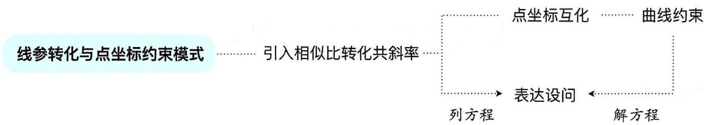

flowchart

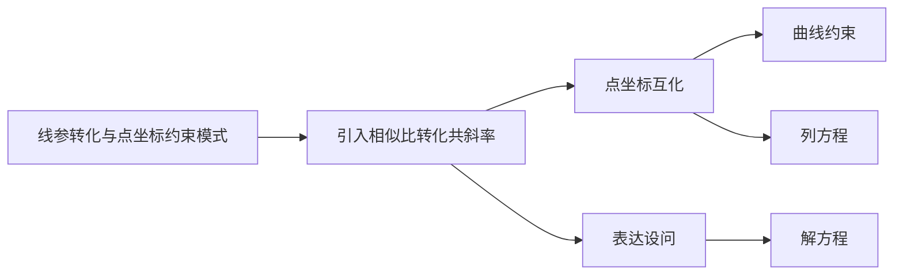

例4（2023全国乙卷）已知椭圆 $E:\frac{y^{2}}{9}+\frac{x^{2}}{4}=1$ ，过点 $P(-2,0)$ 的直线L交椭圆E于B，C两点，直线AB，AC与y轴交于M，N，求证：M，N的中点为定点.

# 要素分析

A. 曲线: 椭圆 $C$   
B. 直线

1. 过点P的直线L   
2. $A$ 点引出 $A B, A C$

C. 点坐标

1. 定点 $P(-2,3)$   
2. 顶点 $A$   
3. 直曲交点 $B 、 C$

# 思路

转化——建立约束——代换计算

解析 设 $B\left( {{x}_{1},{y}_{1}}\right) ,C\left( {{x}_{2},{y}_{2}}\right) ,A\left( {-2,0}\right)$

由 $P, B, C$ 三点共线

$$
\frac {y _ {1} - 3}{x _ {1} + 2} = \frac {\lambda (y _ {2} - 3)}{\lambda (x _ {2} + 3)},
$$

使得

$$
y _ {1} - 3 = \lambda (y _ {2} - 3), x _ {1} + 2 = \lambda (x _ {2} + 2),
$$

$$
\therefore y _ {1} = \lambda y _ {2} + 3 (1 - \lambda), x _ {1} = \lambda x _ {2} - 2 (1 - \lambda),
$$

代入椭圆得到

$$
\frac {[ \lambda y _ {2} + 3 (1 - \lambda) ] ^ {2}}{9} + \frac {[ \lambda x _ {2} - 2 (1 - \lambda) ] ^ {2}}{4} = 1,
$$

化简得到

$$
\frac {1}{\lambda} = x _ {2} - \frac {2}{3} y _ {2} + 3,
$$

又 $AB:y = \frac{y_1}{x_1 + 2} (x + 2),AC:y = \frac{y_2}{x_2 + 2} (x + 2)$

$$
\therefore M (0, \frac {2 y _ {1}}{x _ {1} + 2}), N (0, \frac {2 y _ {2}}{x _ {2} + 2}),
$$

$$
\therefore H (0, \frac {y _ {1}}{x _ {1} + 2} + \frac {y _ {2}}{x _ {2} + 2}),
$$

$$
\begin{array}{l} \therefore y _ {H} = \frac {y _ {1}}{x _ {1} + 2} + \frac {y _ {2}}{x _ {2} + 2} = \frac {\lambda y _ {2} + 3 (1 - \lambda)}{\lambda x _ {2} - 2 (1 - \lambda) + 2} = \frac {y _ {2} + \frac {3}{\lambda} - 3}{x _ {2} + 2} + \frac {y _ {2}}{x _ {2} + 2} = \frac {2 y _ {2} + \frac {3}{\lambda} - 3}{x _ {2} + 2} \\ = \frac {2 y _ {2} - 3 - 2 y _ {2} + 3 x _ {2} + 9}{x _ {2} + 2} = \frac {3 x _ {2} + 6}{x _ {2} + 2} = 3, \\ \end{array}
$$

故其中点为定点， $H(0,3)$ .

# 要素关系

I. 我们仍然从定点出发：从 $P$ 开始引出直线，实际上直曲交点 $B, C$ 是受 $P$ 牵制的变量。也就是说 $B, C$ 实际上是可以与 $P$ 建立关联的变量，源于其共线关系，这是我们使用定比插参的一个动机，即将 $P$ 的已知信息与 $B, C$ 建立联系；  
II. 于是下一步，对 $AB, AC$ 的刻画就可以融入 $P$ 的信息量。下面表达 $AB, AC$ 与 $y$ 轴交点，转化变量即可

额外的介绍定比插参的计算优化方法：引入定比分点

设 $\overrightarrow{BP} = \lambda \overrightarrow{PC}$

$$
\frac {x _ {1} + \lambda x _ {2}}{1 + \lambda} = - 2 \textcircled {1},
$$

即

$$
x _ {1} = - \lambda x _ {2} - 2 (1 + \lambda), y _ {1} = - \lambda y _ {2} + 3 (1 + \lambda) ②,
$$

又

$$
\frac {x _ {1} ^ {2}}{4} + \frac {y _ {1} ^ {2}}{9} = 1 ③, \frac {x _ {2} ^ {2}}{4} + \frac {y _ {2} ^ {2}}{9} = 1 ④,
$$

令③- $\lambda^{2}$ ④得

$$
\frac {(\frac {x _ {1} + \lambda x _ {2}}{1 + \lambda}) (\frac {(x _ {1} - \lambda x _ {2}}{1 - \lambda})}{4} + \frac {(\frac {y _ {1} + \lambda y _ {2}}{1 + \lambda}) (\frac {(y _ {1} - \lambda y _ {2}}{1 - \lambda})}{9} = 1,
$$

代入①得

$$
\frac {- 2 \left(\frac {x _ {1} - \lambda x _ {2}}{1 - \lambda}\right)}{4} + \frac {3 \left(\frac {y _ {1} - \lambda y _ {2}}{1 - \lambda}\right)}{9} = 1,
$$

化简得

$$
- \frac {x _ {1} - \lambda x _ {2}}{2} + \frac {y _ {1} - \lambda y _ {2}}{3} = 1 - \lambda ,
$$

代入②得

$$
- \frac {- \lambda x _ {2} - 2 (1 + \lambda) - \lambda x _ {2}}{2} + \frac {- \lambda y _ {2} + 3 (1 + \lambda) - \lambda y _ {2}}{3} = 1 - \lambda ,
$$

$$
\therefore \frac {1}{\lambda} = - 3 - x _ {2} + \frac {2}{3} y _ {2}.
$$

总结 其余代入计算的步骤是与前法一致的，实际上这种计算方式可以更为快捷的得到参数“”的表达式以代换点坐标，故称为一种计算改良方法，实际上也反映了定比插参就是针对于调和分比的直接“相关化”利用的特征，下面的计算过程与上完全相同

# VIII.实战演练

例1 已知椭圆 $E: \frac{x^{2}}{2} + y^{2} = 1$ , 过 $E$ 左焦点的直线 $L$ 交 $E$ 于 $A, B$ 两点, 与直线 $x = -2$ 交于点 $M$ .

(1) 若 $M(-2, -1)$ ，求证： $MA \cdot BF = MB \cdot AF$ ;  
(2) 过 $F$ 做直线 $L$ 的垂线 $m$ 交 $E$ 于 $C, D$ 两点与直线 $x = -2$ 交于点 $N$ , 求 $\frac{1}{MA} + \frac{1}{MB} + \frac{1}{NC} + \frac{1}{ND}$ 的最大值.

# 要素分析

A. 曲线: 椭圆 $E$   
B. 直线: 过定点 $F(-1,0)$ 交 $E$ 交 $A, B$ 两点, 交 $x = -2$ 于 $M$ 的 $L$   
C. 点坐标: 定点 $F(-1,0)$ , $M(-2,-1)$ ; 曲线上的点 $A,B$

# 思路

1. 设问为线段长度比的形式，即 $MA \cdot BF = MB \cdot AF \rightarrow \frac{MA}{MB} = \frac{AF}{BF}$ ；此类内外分点线段比问题便对应到调和点列的命题背景了

2. 故对第一问可采取定比分点公式, 以 $A,B$ 的坐标分比式表达 $F,M$ , 进而定比点差证明即可

解析 (1) 设 $\frac{\overrightarrow{AF}}{\overrightarrow{FB}} = \frac{\overrightarrow{AM}}{\overrightarrow{BM}} = \lambda, A(x_1, y_1), B(x_2, y_2)$

$$
x _ {F} = \frac {x _ {1} + \lambda x _ {2}}{1 + \lambda}, y _ {F} = \frac {y _ {1} + \lambda y _ {2}}{1 + \lambda}, x _ {M} = \frac {x _ {1} - \lambda x _ {2}}{1 - \lambda}, y _ {M} = \frac {y _ {1} - \lambda y _ {2}}{1 - \lambda},
$$

$A, B$ 在曲线上，故

$$
\frac {x _ {1} ^ {2}}{2} + y _ {1} ^ {2} = 1 \textcircled {1}, \frac {x _ {2} ^ {2}}{2} + y _ {2} ^ {2} = 1 \textcircled {2}
$$

①- $\lambda^{2}$ ②得到

$$
\frac {(\frac {x _ {1} + \lambda x _ {2}}{1 + \lambda}) (\frac {x _ {1} - \lambda x _ {2}}{1 - \lambda})}{2} + (\frac {y _ {1} + \lambda y _ {2}}{1 + \lambda}) (\frac {y _ {1} - \lambda y _ {2}}{1 - \lambda}) = 1
$$

故可代入 $F(-1,0)$ ， $M(-2,-1)$ ，满足上式子，故命题得证.

注 要善于发掘这类常见的小模型小结论，从结论的角度切入处理问题，那么问题会更加简单（三个点确定调和点列）

(2) 当直线 $L$ 交椭圆于两点, 有

$$
\frac {(\frac {x _ {1} + \lambda x _ {2}}{1 + \lambda}) (\frac {x _ {1} - \lambda x _ {2}}{1 - \lambda})}{2} + (\frac {y _ {1} + \lambda y _ {2}}{1 + \lambda}) (\frac {y _ {1} - \lambda y _ {2}}{1 - \lambda}) = 1,
$$

又 $F(-1,0)$ ，代入发现，当 $\left(\frac{x_{1}-\lambda y_{2}}{1-\lambda}\right)=x_{M}=-2$ 时

$$
\frac {A F}{F B} = \frac {A M}{M B}, \text {即} \frac {M B}{B F} = \frac {M A}{A F},
$$

$$
\therefore \frac {M B}{M F - M B} = \frac {M A}{M A - M F},
$$

取倒数得

$$
M F (\frac {1}{M A} + \frac {1}{M B}) = 2,
$$

$$
\therefore \left(\frac {1}{M A} + \frac {1}{M B}\right) = \frac {2}{M F},
$$

同理可以得

$$
(\frac {1}{N C} + \frac {1}{N D}) = \frac {2}{N F},
$$

由 $L$ 与 $m$ 相互垂直，可以得到

$$
M F \perp N F
$$

故可 $MF$ 倾斜角为 $\pi -\theta$ ，则 $MF = \frac{1}{\cos\theta},NF = \frac{1}{\sin\theta}$

$$
\therefore \frac {2}{N F} + \frac {2}{M F} = 2 (\cos \theta + \sin \theta) = 2 \sqrt {2} \sin (\theta + \frac {\pi}{4}) \leq 2 \sqrt {2}.
$$

注 这里应用了调和背景下调和长的二级结论，在以调和点列为背景的题目中，这样的几何化证明手法可以帮我们节省许多的时间；最后采用三角的转化方法，实际还是对直角条件的应用

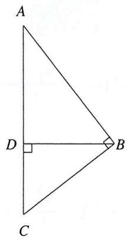

text_image

A
D
B
C

当出现如图所示的一类直角三角形时，我们就可以插入三角函数转化直角条件以描述点坐标或长度

# 思考

1. 为什么第二问仍然可以利用第一问中的结论呢？（点拨：调和点列特征方程）  
2. 本题还可以使用说明方法呢？（点拨：向量表达的斜率长度；直曲联立伟达同构）

例2（2018·全国卷）设椭圆 $C: \frac{x^{2}}{2} + y^{2} = 1$ 的右焦点为 $F$ ，过 $F$ 的直线 $L$ 交 $C$ 于 $A, B$ 两点，点 $M$ 的坐标为 (2,0)，设 $O$ 为坐标原点，证明： $\angle OMA = \angle OMB$ .

# 要素分析

A. 曲线：椭圆 $C$   
B. 直线

1. 过定点F的直线L   
2. 连接OA, OB得到的角度设问

C. 点坐标

1. 定点 $F$ 、 $M$   
2. 曲线点 $A 、 B$

# 解析

对A,F,B三点共线，可设： $\frac{\overrightarrow{AF}}{\overrightarrow{FB}}=\lambda$

即有： $x_{F} = \frac{x_{1} + \lambda x_{2}}{1 + \lambda}, y_{F} = \frac{y_{1} + \lambda y_{2}}{1 + \lambda}$

故可设 ${AB}$ 外存在一点 $P$

使得 $\frac{\overrightarrow{AF}}{\overrightarrow{FB}} = -\lambda$ ，即有 $x_{P} = \frac{x_{1} - \lambda x_{2}}{1 - \lambda}, y_{p} = \frac{y_{1} - \lambda y_{2}}{1 - \lambda}$

对 $A(x_{1},y_{1})$ ， $B(x_{2},y_{2})$

$$
\frac {x _ {1} ^ {2}}{2} + y _ {1} ^ {2} = 1 \textcircled {1}, \frac {x _ {2} ^ {2}}{2} + y _ {2} ^ {2} = 1 \textcircled {2}
$$

令①- $\lambda^{2}$ ②有

$$
\frac {(\frac {x _ {1} + \lambda x _ {2}}{1 + \lambda} (\frac {x _ {1} - \lambda x _ {2}}{1 - \lambda})}{2} + (\frac {y _ {1} + \lambda y _ {2}}{1 + \lambda}) (\frac {y _ {1} - \lambda y _ {2}}{1 - \lambda}) = 1,
$$

得到 $\frac{x_Fx_P}{2} +y_Fy_P = 1$

代入 $F(1,0)$ ，即有 $x_{P}=2$ 恒成立，故可设 $P(2,m)$

$$
\left\{ \begin{array}{l} x _ {F} = \frac {x _ {1} + \lambda x _ {2}}{1 + \lambda} \\ x _ {P} = \frac {x _ {1} - \lambda x _ {2}}{1 - \lambda} \end{array} \right.,
$$

可得

$$
\left\{ \begin{array}{c} {{x _ {1} + \lambda x _ {2} = 1 + \lambda ⓛ}} \\ {{x _ {1} - \lambda x _ {2} = 2 (1 - \lambda) ⓜ}} \end{array} \right.,
$$

①+②得

$$
x _ {1} = \frac {3}{2} - \frac {\lambda}{2}, x _ {2} = \frac {3}{2} - \frac {1}{2 \lambda},
$$

得到

$$
y _ {F} = \frac {y _ {1} + \lambda y _ {2}}{1 + \lambda} = 0 \rightarrow \frac {y _ {1}}{\lambda} = - y _ {2},
$$

故

$$
k _ {O A} = \frac {y _ {1}}{x _ {1} - 2}, k _ {O B} = \frac {y _ {2}}{x _ {2} - 2},
$$

要使得 $\angle OMA = \angle OMB$ ，即

$$
k _ {O A} = - k _ {O B},
$$

$$
\therefore \frac {y _ {1}}{x _ {1} - 2} = \frac {- y _ {2}}{x _ {2} - 2},
$$

故代入互化坐标

$$
\frac {1}{\frac {3}{2} - \frac {\lambda}{2} - 2} = \frac {\frac {1}{\lambda}}{\frac {3}{2} - \frac {1}{2 \lambda} - 2},
$$

$$
\therefore \frac {2}{- 1 - \lambda} = \frac {2}{- \lambda} - 1,
$$

等式恒成立且 $\lambda \neq -1$ ，故原式得证.

要素转化 此处给出了过轴点 $F$ 的直线 $L$ 与椭圆 $C$ 交于两点的条件, 即 $F$ 对曲线点 $A, C$ 构成约束; 对此类轴点束曲点条件, 我们便可以结合定比点差的特征方程进行定比设点以追求参量的统一化;

例3 已知椭圆 $C: \frac{x^{2}}{4} + \frac{y^{2}}{3} = 1 (a > b > 0)$ 的离心率为 $e = \frac{1}{2}$ , 点 $F_{1}, F_{2}$ 为 $C$ 的左右焦点, 过 $F_{1}$ 分别作两垂直直线 $L_{1}, L_{2}$ , 且 $L_{1}$ 交椭圆 $C$ 于不同两点 $A, B$ , 直线 $L_{2}$ 与 $x = 1$ 交于点 $P$ , 若 $\overrightarrow{AF_1} = \mu \overrightarrow{F_1B}$ 且点 $Q$ 满足, 求 $PQ$ 的最小值.

# 要素分析

A. 曲线: 椭圆 $C$

B. 直线: 过定点 $F_{1}$ 相互垂直的 $L_{1}, L_{2}, L_{1}$ 交椭圆于 $A, B$ 两点, $L_{2}$ 交定直线于 $P$ , 线段等比的条件

C. 点坐标: 定点 $F_{1}$ , 曲线点 $A, B$ ; 直线与直线交点 $P$ (动)

解析 由题意 $\overrightarrow{AF_1} = \lambda \overrightarrow{F_1B}$ , $\overrightarrow{QF_1} = \mu \overrightarrow{QB}$ , 故

$$
x _ {F} = \frac {x _ {1} + \lambda x _ {2}}{1 + \lambda}, y _ {F} = \frac {y _ {1} + \lambda y _ {2}}{1 + \lambda}, x _ {Q} = \frac {x _ {1} - \mu x _ {2}}{1 - \mu}, y _ {Q} = \frac {y _ {1} - \mu y _ {2}}{1 - \mu},
$$

又 $A(x_{1},y_{1})$ ， $B(x_{2},y_{2})$ 在椭圆上，故

$$
\frac {x _ {1} ^ {2}}{4} + \frac {y _ {1} ^ {2}}{3} = 1 ①, \frac {x _ {2} ^ {2}}{4} + \frac {y _ {2} ^ {2}}{3} = 1 ②,
$$

令①- $\lambda^{2}$ ②得

$$
\frac {(\frac {x _ {1} + \lambda x _ {2}}{1 + \lambda}) (\frac {x _ {1} - \lambda x _ {2}}{1 - \lambda})}{4} + \frac {(\frac {y _ {1} + \lambda y _ {2}}{1 + \lambda}) (\frac {y _ {1} - \lambda y _ {2}}{1 - \lambda})}{3} = 1,
$$

整理可得

$$
\frac {x _ {F} x _ {Q}}{4} + \frac {y _ {F} y _ {Q}}{3} = 1,
$$

代入 $F_{1}(-1,0)$ 得

$$
x _ {Q} = - 4,
$$

$$
\therefore P F _ {1} = \sqrt {1 + k _ {2} ^ {2}} x _ {p} - x _ {F _ {1}} = 2 \sqrt {1 + k _ {2} ^ {2}}, Q F _ {1} = \sqrt {1 + k _ {1} ^ {2}} x _ {F _ {1}} - x _ {F _ {Q}} = 3 \sqrt {1 + k _ {1} ^ {2}},
$$

$$
\therefore P Q = \sqrt {4 + 4 k _ {2} ^ {2} + 9 + 9 k _ {1} ^ {2}} \geq 5,
$$

又 $k_{1}k_{2} = -1$

$$
\therefore P Q = \sqrt {1 3 + 9 k _ {1} ^ {2} + 4 \frac {1}{k _ {1} ^ {2}}} \geq \sqrt {2 5} = 5.
$$

情况分析 对三点共线且其中一点为轴点的情况，我们根据配极原则都可以推出线段外必有一点在定直线上，这是构造调和点列的一般基础，在这个基础上结合题目给出的定比条件，我们可以采取定比点差的方法说明这一隐藏的调和点列；下面利用直线垂直的条件，将定距以三角函数化为线段长即可注 本题实际上就是对隐藏的调和点列的挖掘，通过定比点差的代数方法得到内外分点坐标结合曲线结构的特征方程，对一点为轴点的情况可以确定定直线，即某点在该定直线上，下面针对题目条件灵活转化即可

例4 已知 $A(2,0)$ , $B(0,1)$ 是椭圆 $E: \frac{x^{2}}{a^{2}} + \frac{y^{2}}{b^{2}} = 1 (a > b > 0)$ 上的两个顶点, 过 $P(2,1)$ 的直线 $L$ 交 $E$ 于 $C$ 、 $D$ 两点, 与 $AB$ 交于点 $M$ , 证明: $\frac{PM}{PC} + \frac{PM}{PD}$ 为定值.

# 要素分析

A. 曲线：椭圆E   
B. 直线

1. 过定点P的直线L交E于C, D两点  
2. 交A, B于点M  
3. 定直线AB

C. 点坐标

1. 定点 $P(2,1)$ ; 曲线点C, D  
2. 定点A, B  
3. 直线与直线交点M

# 要素关系

对本题而言实际就是一个极点 $P$ 对应出极线 $A B$ 从而产生调和点列的模型，在这里我们避开模型，从要素编制的角度告诉大家这种题目的分析方法

3. 对曲线外一定点 $P$ , 其对 $C, D$ 两点必然有一约束关系, 这是对“与曲线有两交点的直线确定一点”的解释, 即对 $C, D$ 的坐标而言, 定点 $P$ 的坐标有一约束, 这个点坐标的约束可以从两个直线要素的角度阐释——斜率、定比  
4. 有关斜率的其他条件（斜率三角形、中线斜率模型）在此处并无其余作用（无法与 $A, B$ 的条件链接），故选用定比的转化方法  
5. 对非轴点弦，我们往往采用定比点差或定比插参两种方法之一用以转化数据到调和点列或者数据上的坐标关系，在这里考虑到内部存在的 $A B$ 定直线，故采用定比点差（其实就是极点配极线），对于需要坐标表达的（斜率关系类）题目再进行插参即可

解析 由A, B在椭圆上

$$
a ^ {2} = 4, b ^ {2} = 1,
$$

设 $\frac{\overrightarrow{CP}}{\overrightarrow{DP}}=\lambda$ ，则CD线段上必有一点Q满足 $\frac{\overrightarrow{CQ}}{\overrightarrow{QD}}=\lambda$ ，设 $C(x_{1},y_{1})$ ， $D(x_{2},y_{2})$ 则

$$
x _ {p} = \frac {x _ {1} + \lambda x _ {2}}{1 + \lambda}, x _ {Q} = \frac {x _ {1} - \lambda x _ {2}}{1 - \lambda}, y _ {p} = \frac {y _ {1} + \lambda y _ {2}}{1 + \lambda}, y _ {Q} = \frac {y _ {1} - \lambda y _ {2}}{1 - \lambda},
$$

因为 $C, D$ 在曲线 $E$ 上

$$
\frac {x _ {1} ^ {2}}{a ^ {2}} + \frac {y _ {1} ^ {2}}{b ^ {2}} = 1 \textcircled {1}, \frac {x _ {2} ^ {2}}{a ^ {2}} + \frac {y _ {2} ^ {2}}{b ^ {2}} = 1 \textcircled {2},
$$

令①- $\lambda^{2}$ ②，变形得到

$$
\frac {(\frac {x _ {1} + \lambda x _ {2}}{1 + \lambda}) (\frac {x _ {1} - \lambda x _ {2}}{1 - \lambda})}{a ^ {2}} + \frac {(\frac {y _ {1} + \lambda y _ {2}}{1 + \lambda}) (\frac {y _ {1} - \lambda y _ {2}}{1 - \lambda})}{b ^ {2}} = 1,
$$

即 $\frac{x_P x_Q}{a^2} + \frac{y_P y_Q}{b^2} = 1$

代入 $P(2,1)$ ，得到 $Q$ 满足

$$
\frac {2 x _ {Q}}{a ^ {2}} + \frac {y _ {Q}}{b ^ {2}} = 1,
$$

∴ Q 在定直线 $x + 2y = 2$ 上，

又 $M$ 在直线 $A B 、 C D$ 上

$$
A B: x + 2 y = 2,
$$

即 $M$ 与 $Q$ 重合，故

$$
\frac {\overrightarrow {C P}}{\overrightarrow {D P}} = \frac {\overrightarrow {C M}}{\overrightarrow {M D}} = \lambda \frac {P C}{P D} = \frac {M C}{M D} \rightarrow \frac {P C}{M C} = \frac {P D}{M D},
$$

即有

$$
\frac {P C}{P C - P M} = \frac {P D}{P M - P D},
$$

取倒数得到

$$
\frac {P M}{P C} + \frac {P M}{P D} = 2,
$$

即原式为定值2.

注 对曲线上两点确定的动直线，若其过曲线外一点，内部存在该点对应的极线构成极点极线的构造，即对应一组调和点列，由此隐藏调和性下的诸多几何性质

例5（2023·武汉四调）过 $G(4,2)$ 的动直线L，与双曲线C: $\frac{x^{2}}{4}+\frac{y^{2}}{4}=1$ 的交于相异两点M,N，求证：若P是直线 $y=x+1$ 上一定点，设直线PM,PN的斜率为 $k_{1},k_{2}$ ，若 $k_{1}k_{2}$ 为定值，请证明P为定点，并求出点P的坐标.

注 自行比较前文的假平移设点法，这里的插参作用同样在与转化数据

解析 对 $M,N,Q$

$$
\frac {y _ {1} - 2}{x _ {1} - 4} = \frac {y _ {2} - 2}{x _ {2} - 2},
$$

可设 $\left\{\begin{aligned}y_{1}-2&=\lambda(y_{2}-2)\\ x_{1}-4&=\lambda(x_{2}-4)\end{aligned}\right.$

化简得

$$
\left\{ \begin{array}{l} {{y _ {1} - \lambda y _ {2} = 2 (1 - \lambda) ①}} \\ {{x _ {1} - \lambda x _ {2} = 4 (1 - \lambda) ②}} \end{array} \right.,
$$

对双曲线上的M, N两点及G(4,2)可设

$$
\frac {\overrightarrow {M G}}{\overrightarrow {N G}} = \lambda , x _ {G} = \frac {x _ {1} - \lambda x _ {2}}{1 - \lambda} = 4, y _ {G} = \frac {y _ {1} - \lambda y _ {2}}{1 - \lambda} = 2,
$$

又

$$
x _ {1} ^ {2} - y _ {1} ^ {2} = 4 \textcircled {3}, x _ {2} ^ {2} - y _ {2} ^ {2} = 4 \textcircled {4},
$$

①- $\lambda^{2}$ ②整理得到

$$
(\frac {x _ {1} - \lambda x _ {2}}{1 - \lambda}) (\frac {x _ {1} + \lambda x _ {2}}{1 + \lambda}) - (\frac {y _ {1} - \lambda y _ {2}}{1 - \lambda}) (\frac {y _ {1} + \lambda y _ {2}}{1 + \lambda}) = 4,
$$

联立①，②即有

$$
\frac {1}{\lambda} = - x _ {2} + \frac {y _ {2}}{2} + 2, \text {故对} k _ {1} k _ {2} = \frac {y _ {1} - y _ {0}}{x _ {1} - x _ {0}} \cdot \frac {y _ {2} - y _ {0}}{x _ {2} - x _ {0}},
$$

又 $P$ 在 $y = x + 1$ 上

$$
\therefore y _ {0} = x _ {0} + 1,
$$

联立上式得到

$$
k _ {1} k _ {2} = \frac {y _ {1} - y _ {0}}{x _ {1} - x _ {0}} \cdot \frac {y _ {2} - y _ {0}}{x _ {2} - x _ {0}} = \frac {\lambda y _ {2} + 2 (1 - \lambda) - y _ {0}}{\lambda x _ {2} + 2 (1 - \lambda) - x _ {0}} \cdot \frac {y _ {2} - y _ {0}}{x _ {2} - x _ {0}}
$$

$$
= \frac {y _ {2} - 2 + \frac {1 - x _ {0}}{\lambda}}{x _ {2} - 4 + \frac {4 - x _ {0}}{\lambda}} \cdot \frac {y _ {2} - x _ {0} - 1}{x _ {2} - x _ {0}} = \frac {(x _ {0} - 1) x _ {2} + (\frac {3}{2} - \frac {x _ {0}}{2}) y _ {2} - 2 x _ {0}}{(x _ {0} - 3) x _ {2} + (2 - \frac {x _ {0}}{2}) y _ {2} + 4 - 2 x _ {0}} \cdot \frac {y _ {2} - x _ {0} - 1}{x _ {2} - x _ {0}}
$$

欲使之为定值, 则需左右两分式分子分母相互抵消, 又与 $x_{2}, y_{2}$ 无关, 即 $x_{2}, y_{2}$ 系数为定值, 结合常数项 $x_{0}, y_{0}$ 有

$$
\frac {(x _ {0} - 1)}{1} = \frac {- 2 x _ {0}}{x _ {0}}, (\frac {3}{2} - \frac {x _ {0}}{2}) = 0 \text {且} \frac {1}{(2 - \frac {x _ {0}}{2})} = \frac {- x _ {0} - 1}{4 - 2 x _ {0}}
$$

即有 $x_0 = 3$ ， $y_{0} = x_{0} + 1 = 4$ ，故 $P(3,4)$ ，此时 $k_{1}k_{2} = 4$ 恒成立.

本页给出的方法意在借由直线的共线表达，以比例系数转化坐标关系，这样也是对非轴点弦条件的充要转化，或者说，假平移是一种数据化简导出的共线表达，插参是基于共线表达导出的数据刻画，前者以点绘线，后者以线绘点，二者殊途同归

# PRACTICE 请在下面书写本题

# 7

# 点参思想的利用

概述 点参的思想由来已久，实际指代一类直接以点表达问题，代数求解的方式方法，参数方程等方法亦是其延伸。本章当中，我们将从点参的多种代数方法上入手，尽可能以简明的视角化简问题。

# 7.1 参数方程的简单介绍

1. 借由圆锥曲线标准方程形式的特殊性, 我们可以避开 $(x, y)$ 式的坐标系参照设点法, 转而结合曲线的特性, 直接将曲线要素融入点坐标要素当中, 这样三大要素实际上只剩了一个直线要素, 这便是点曲转化, 直线表达的核心含义, 任何以曲线作为转化条件、以点坐标作为表达名目的语言模式, 其最终目的一定是表达直线条件。下面首先为大家介绍三族曲线的对应三角式参数方程

# 椭圆

$$
x = a \cos \theta , y = b \sin \theta , \text {带入曲线方程，有} \cos^ {2} \theta + \sin^ {2} \theta = 1
$$

# 双曲线

$$
x = \frac {a}{\cos \theta}, y = b \tan \theta , \text {带入曲线方程，有} \frac {1}{\cos^ {2} \theta} - \frac {\sin^ {2} \theta}{\cos^ {2} \theta} = 1
$$

另 对于抛物线的特殊方程形式，我们采取另一种结合曲线特征整体代换的设点模式（抛物线只需记住平方项不带方，一次项配 $2p^{2}$ ）

方式一

$$
\mathrm{对于} y ^ {2} = 2 p x, \mathrm{设} (2 p t ^ {2}, 2 p t), \mathrm{对} x ^ {2} = 2 p y, \mathrm{则设} (2 p t, 2 p t ^ {2}).
$$

方式二

$$
\mathrm{对于} y ^ {2} = 2 p x, \mathrm{设} (\frac {y ^ {2}}{2 p}, y), \mathrm{对} x ^ {2} = 2 p y, \mathrm{则设} (\frac {x ^ {2}}{2 p}, x).
$$

在如上的点坐标设法当中，我们实际上已经将曲线方程对应的约束表达形式对应到了“设点”这一环节当中，于是可以视为将曲线要素融入点坐标名目的表达中，此时设定的点坐标实际几何内涵已经包含点曲关系及曲线方程的约束条件，同时完成了双变量到单变量的转化，最值问题在这里也可以得到简单的计算模式，于是三大要素唯余直线要素，下面的目标就只是表达直线要素了

例1 已知椭圆方程: $\frac{x^{2}}{4} + \frac{y^{2}}{3} = 1$ , $BF$ 求椭圆上一点到直线 $2x + 5y - 10 = 0$ 的最短距离

解析 设椭圆上一点 $P(2\cos\theta,\sqrt{3}\sin\theta)$

$$
\mathrm{于是得到} d = \frac {4 \cos \theta + 5 \sqrt {3} \sin \theta - 1 0}{\sqrt {2 ^ {2} + 5 ^ {2}}},
$$

由辅助角公式化简

$$
d = \frac {\sqrt {9 1} \cos (\theta + \psi) - 1 0}{\sqrt {2 9}} \leq \frac {\sqrt {9 1} + 1 0}{\sqrt {2 9}}.
$$

其实可以发现, 这里和不等式求最值常用的三角换元相当, 只是我们表达的三角项有了在坐标系中,于几何形态上与曲线结合的解析意义

# 7.2 传统点参思想的实质：全面的点坐标曲线约束与线面表达

1. 传统的点参思想往往将点坐标要素与曲线要素绑定，例如以曲线方程的形式进行整体坐标代换，或是以上小节介绍的三角换元式参数方程的形式进行点曲的融合设点，即在表达上采用将点坐标与曲线两大要素相互结合的点坐标参数模式，相较之下前面提到的直线参数篇就可以认为是直线与点坐标结合的一种点坐标参数模式，只是我们更习惯于采用 $k$ 、 $l$ 、 $t$ 等直线属性的要素构建点坐标的代数方程

A. 这也正是传统点参思想的实质所在, 即全面的点坐标约束, 由此为基础, 设点式 (抛物线最为常用)、三角式、长度式参数方程等等才可以恰如其分的得到应用推导  
B. 在本章节中我们将着重于介绍设点式与三角式的参数方程，以“点”的角度为各位阐释圆锥曲线的解题秘密

# 下面介绍一般点参化的要素编写

# 以椭圆为例

1. 点: $(x, y)$   
2. 线：对任意三点 $(x_{1},y_{1}),(x_{2},y_{2})$ 即线上一点 $(X,Y)$   
3. 三点共线共斜率表达得到直线的两点式方程: $x_{2} y_{1} - x_{1} y_{2} = Y (x_{1} - x_{2}) - X (y_{1} - y_{2})$

将设点结合曲线要素

$$
x _ {1} = a \cos 2 \alpha , y _ {1} = b \sin 2 \alpha , x _ {2} = a \cos 2 \theta , y _ {2} = b \sin 2 \theta
$$

代入两点式

$$
\cos 2 \theta \sin 2 \alpha - \cos 2 \alpha \sin 2 \theta = \frac {y}{b} (\cos 2 \alpha - \cos 2 \theta) - \frac {x}{a} (\sin 2 \alpha - \sin 2 \theta)
$$

# 下面进行对直线关系的刻画即可，补充一些纯点参存在的代数形式

# 1. 点乘与定长

对椭圆： $\frac{x^2}{a^2} +\frac{y^2}{b^2} = 1$ ，设存在其上两点 $M(x_{1},y_{1})$ ， $N(x_{2},y_{2})$ ，设 $k_{OM}k_{ON} = t = \frac{y_1y_2}{x_1x_2}$ ，则

$$
y _ {1} y _ {2} = t x _ {1} x _ {2}, y _ {1} ^ {2} y _ {2} ^ {2} = t x _ {1} ^ {2} x _ {2} ^ {2} \textcircled {1},
$$

故

$$
x _ {1} ^ {2} = a ^ {2} - \frac {a ^ {2} y _ {1} ^ {2}}{b ^ {2}}, x _ {2} ^ {2} = a ^ {2} - \frac {a ^ {2} y _ {2} ^ {2}}{b ^ {2}},
$$

相乘得到

$$
x _ {1} ^ {2} x _ {2} ^ {2} = a ^ {4} - \frac {a ^ {4}}{b ^ {4}} (y _ {1} ^ {2} + y _ {2} ^ {2}) + \frac {a ^ {4} y _ {1} ^ {2} y _ {2} ^ {2}}{b ^ {4}},
$$

①代入上式得到

$$
\frac {y _ {1} ^ {2} y _ {2} ^ {2}}{t ^ {2}} = a ^ {4} - \frac {a ^ {4}}{b ^ {2}} (y _ {1} ^ {2} + y _ {2} ^ {2}) + \frac {a ^ {4} y _ {1} ^ {2} y _ {2} ^ {2}}{b ^ {4}},
$$

$$
\therefore \frac {a ^ {4}}{b ^ {2}} (y _ {1} ^ {2} + y _ {2} ^ {2}) = a ^ {4} + (\frac {a ^ {4}}{b ^ {4}} - \frac {1}{t ^ {2}}) y _ {1} ^ {2} y _ {2} ^ {2} ②
$$

易知当 $t=\pm\frac{b^{2}}{a^{2}}$ 时，有 $y_{1}^{2}+y_{2}^{2}$ 为定值，

$$
y _ {1} ^ {2} + y _ {2} ^ {2} = b ^ {2},
$$

同理得 $t=\pm\frac{b^{2}}{a^{2}}$ 时，

$$
x _ {1} ^ {2} + x _ {2} ^ {2} = a ^ {2},
$$

注 此种点乘或对称形式的点乘，以构造对称项，与易知式子充分消换元

本结论使用三角式参数方程会更容易证明，对 $\triangle AOB$

$$
x _ {1} ^ {2} + x _ {2} ^ {2} = a ^ {2} (\cos^ {2} \theta + \cos^ {2} \theta)
$$

当 $\cos^{2}\alpha=\sin^{2}\theta$ 即 $\cos\alpha=-\sin\theta$ 有

$$
x _ {1} ^ {2} + x _ {2} ^ {2} = a ^ {2} \text {此时有} k _ {1} k _ {2} = \frac {b \sin \theta}{a \cos \theta} \frac {b \sin \alpha}{a \cos \alpha} = - \frac {b ^ {2}}{a ^ {2}}
$$

同理，对 $y_{1}^{2}+y_{2}^{2}=b^{2}$ ，亦有此结论.

# 2. 点乘与面积推论

对椭圆： $\frac{x^2}{a^2} +\frac{y^2}{b^2} = 1$ ，设存在其上两点 $M(x_{1},y_{1})$ ， $N(x_{2},y_{2})$ ，设 $k_{OM}k_{ON} = t = \frac{y_1y_2}{x_1x_2}$

$$
y _ {1} y _ {2} = t x _ {1} x _ {2}, y _ {1} ^ {2} y _ {2} ^ {2} = t ^ {2} x _ {1} ^ {2} x _ {2} ^ {2},
$$

故对 $\frac{x_1^2}{a^2} +\frac{y_1^2}{b^2} = 1;\frac{x_2^2}{a^2} +\frac{y_2^2}{b^2} = 1$ 两式子相乘

$$
\frac {x _ {1} ^ {2} x _ {2} ^ {2}}{a ^ {4}} + \frac {y _ {1} ^ {2} y _ {2} ^ {2}}{b ^ {4}} = (\frac {x _ {1} x _ {2}}{a ^ {2}} + \frac {y _ {1} y _ {2}}{b ^ {2}}) ^ {2} - 2 \frac {x _ {1} x _ {2} y _ {1} y _ {2}}{a ^ {2} b ^ {2}} = (\frac {x _ {1} x _ {2}}{a ^ {2}} + \frac {y _ {1} y _ {2}}{b ^ {2}}) ^ {2} - 2 \frac {(x _ {1} y _ {2}) (x _ {2} y _ {1})}{a ^ {2} b ^ {2}},
$$

于是对②

$$
\frac {x _ {1} ^ {2} x _ {2} ^ {2}}{a ^ {4}} + \frac {y _ {1} ^ {2} y _ {2} ^ {2}}{b ^ {4}} + \frac {x _ {1} ^ {2} y _ {2} ^ {2}}{a ^ {2} b ^ {2}} + \frac {x _ {2} ^ {2} y _ {1} ^ {2}}{a ^ {2} b ^ {2}} = (\frac {x _ {1} x _ {2}}{a ^ {2}} + \frac {y _ {1} y _ {2}}{b ^ {2}}) ^ {2} + (\frac {x _ {1} y _ {2} - x _ {2} y _ {1}}{a b}) ^ {2} = 1 \textcircled {3},
$$

注 $(\cos \theta = \frac{\overrightarrow{OM} \cdot \overrightarrow{ON}}{\overrightarrow{OM} \overrightarrow{ON}})$

对点 $M(x_{1},y_{1})$ ， $N(x_{2},y_{2})$ 与坐标原点O围成的三角形的面积

$$
\begin{array}{l} S = \frac {1}{2} \overrightarrow {O M} \overrightarrow {O N} \tan \theta = \frac {1}{2} O M O N \sin \theta = \frac {1}{2} \sqrt {\left(x _ {1} ^ {2} + y _ {1} ^ {2}\right) \left(x _ {2} ^ {2} + y _ {2} ^ {2}\right)} \sqrt {1 - \cos^ {2} \theta} \\ = \frac {1}{2} \sqrt {\left(x _ {1} ^ {2} + y _ {1} ^ {2}\right) \left(x _ {2} ^ {2} + y _ {2} ^ {2}\right)} \sqrt {\frac {\left(x _ {1} ^ {2} + y _ {1} ^ {2}\right) \left(x _ {2} ^ {2} + y _ {2} ^ {2}\right) - \left(x _ {1} x _ {2} + y _ {1} y _ {2}\right) ^ {2}}{\left(x _ {2} ^ {2} + y _ {2} ^ {2}\right)}} \\ = \frac {1}{2} \sqrt {\left(x _ {1} ^ {2} + y _ {1} ^ {2}\right) \left(x _ {2} ^ {2} + y _ {2} ^ {2}\right) + \left(y _ {1} x _ {2} + y _ {2} x _ {1}\right) ^ {2} - \left(x _ {1} x _ {2} + y _ {1} y _ {2}\right) ^ {2}} = \frac {1}{2} \sqrt {\left(x _ {1} y _ {2} - x _ {2} y _ {1}\right) ^ {2}} \\ = \frac {1}{2} x _ {1} y _ {2} - x _ {2} y _ {1} \\ \end{array}
$$

故③: $(\frac{x_1x_2}{a^2} + \frac{y_1y_2}{b^2})^2 + (\frac{2S}{ab})^2 = 1$ ，即当 $\frac{x_1x_2}{a^2} + \frac{y_1y_2}{b^2} = 0$ 时，有 $S$ 取最大值 $\frac{ab}{2}$ .

注 这里点乘的构造使用了完全平方公式的配凑。面积推论实际就是向量叉乘取模得到的结果,这个构造方式充分将面积换元到了点坐标的描述上，于是使用这个方法实际只需要寻找点坐标的相关描述即可

例1 已知抛物线 $y^{2}=2px$ （x>0）的焦点为F，过 $P(0,-4)$ 的直线L与C相交于A, B两点，当L经过点F时，A恰好为PF中点.

(1) 求出C的方程;   
(2) 是否存在定点 $T$ , 使得 $\overrightarrow{TA} \cdot \overrightarrow{TB}$ 为定值, 若存在, 求出 $T$ 的坐标与定值.

# 要素分析

A. 曲线要素即为抛物线C的方程;  
B. 直线要素显然为 $AB$ ，同时结合 $A 、 B$ 点都在曲线上的几何对应，应该自然的想到将 $AB$ 方程改写为与曲线要素相结合的两点式方程，得到直线要素与曲线要素结合的联系构建

C. 点 $A 、 B$ 在曲线上, 于是有了一个可以直接代换的点坐标约束方程, 同时 $P$ 在 $A B$ 上, 对应到 $A B$ 的直线方程可以得到一组代换方程 (点坐标和积对应关系)

# 要素关系构建：如上所述

1. 建立曲线与点坐标对应的两点式坐标方程，以点坐标和曲线的特征表达直线条件。

2. 同时结合点曲对应，整理出坐标代换 $(x, y) \to (x, \frac{x^2}{4\sqrt{2}})$

3. 于是根据条件做解析：对代求式进行整理，得到一个关于 $m, n$ 的待定系数方程，在这其中根据上面提到的要素联系进行变量代换式整理；其中有一步取了平方，来自于对代数式的敏感度，这也是各位需要训练的一个“感觉”或称“代数能力”，最后只需带入消元，配凑定值即可

解析 (1) $y^{2} = 4\sqrt{2} x \implies x = \frac{y^{2}}{4\sqrt{2}}$

(2) 设 $T(m,n)$ , $A(x_{1},y_{1})$ , $B(x_{2},y_{2})$ , 则记

$$
\overrightarrow {T A} = \left(x _ {1} - m, y _ {1} - n\right), \overrightarrow {T B} = \left(x _ {2} - m, y _ {2} - n\right),
$$

$$
\overrightarrow {T A} \cdot \overrightarrow {T B} = \frac {y _ {1} ^ {2} y _ {2} ^ {2}}{3 2} - m \left(x _ {1} + x _ {2}\right) - n \left(y _ {1} + y _ {2}\right) + m ^ {2} + n ^ {2}
$$

$$
= \frac {y _ {1} ^ {2} y _ {2} ^ {2}}{3 2} + y _ {1} y _ {2} - n (y _ {1} + y _ {2}) - m (\frac {y _ {1} ^ {2}}{4 \sqrt {2}} + \frac {y _ {2} ^ {2}}{4 \sqrt {2}}) + m ^ {2} + n ^ {2},
$$

对直线 ${AB}$ ,我们可以由斜率坐标化引出的抛物线两点式坐标方程

$$
(y _ {1} + y _ {2}) y = 4 \sqrt {2} x + y _ {1} y _ {2} (\text {见前文“斜率坐标化”})
$$

代入(0, - 4)

$$
y _ {1} + y _ {2} = - \frac {y _ {1} y _ {2}}{4},
$$

取上式平方，得

$$
(\frac {n}{4} + 2) y _ {1} y _ {2} + (\frac {1}{2} - \frac {m}{4 \sqrt {2}}) (y _ {1} ^ {2} + y _ {2} ^ {2}) + m ^ {2} + n ^ {2},
$$

由于该式子与 $y_{1}$ ， $y_{2}$ 无关且为定值，故 $m=2\sqrt{2}$ ，n=-8，定值为72.

注：本题题目条件、翻译要素的过程都较为简单，不做多余通用逻辑思考的陈述；但是对大多学生还是从待证式（例如该题一写就是全面点坐标化的形式）入手，结合题目进行要素解读就好了

思考：向量积为定值意味着什么？点拨：隐圆（详见几何章节中对向量隐圆的补充）

例2 已知椭圆 $\frac{x^2}{a^2} + \frac{y^2}{b^2} = 1$ ，且 $M, N$ 为椭圆上相异两点，求证: 当 $k_{OM} \cdot k_{ON} = -\frac{b^2}{a^2}$ 时， $S \triangle OMN$ 为定值.

# 解析

由题意

$$
\frac {x _ {1} ^ {2}}{a ^ {2}} + \frac {y _ {1} ^ {2}}{b ^ {2}} = 1, \frac {x _ {2} ^ {2}}{a ^ {2}} + \frac {y _ {2} ^ {2}}{b ^ {2}} = 1,
$$

相乘得到

$$
(\frac {x _ {1} x _ {2}}{a ^ {2}} + \frac {y _ {1} y _ {2}}{b ^ {2}}) ^ {2} = 0 \text {恒成立，即} (x _ {2} y _ {1} - x _ {1} y _ {2}) ^ {2} = (a b) ^ {2},
$$

又对 $\triangle OMN$

$$
\begin{array}{l} S \triangle O M N = \frac {O M O N \sin \theta}{2} = \frac {O M O N \sqrt {1 - \cos^ {2} \theta}}{2} \\ = \frac {(x _ {1} ^ {2} + y _ {1} ^ {2}) (x _ {2} ^ {2} + y _ {2} ^ {2})}{2} \sqrt {1 - \frac {\overrightarrow {O M} \cdot \overrightarrow {O N}}{O M \cdot O N}} = \frac {\sqrt {(x _ {2} y _ {1} - x _ {1} y _ {2}) ^ {2}}}{2} = \frac {a b}{2}, \\ \end{array}
$$

故 $S\bigtriangleup OMN$ 定值为 $\frac{ab}{2}$ .

本题即为一个常用模型，当 $k_{OM} k_{ON} = -\frac{b^2}{a^2}$ 成立，则有原点三角形面积最值成立。

# 3. 三角式参数方程的相关拓展

在引入拓展项目之前，我们首先来复习一下三角恒等变换的有关公式

$$
\sin 2 A = \frac {2 \sin A \cos A}{\cos^ {2} A + \sin^ {2} A} = \frac {2 \tan A}{1 + \tan^ {2} A},
$$

$$
\cos 2 A = \cos^ {2} A - \sin^ {2} A = \frac {\cos^ {2} A - \sin^ {2} A}{\cos^ {2} A + \sin^ {2} A} = \frac {1 - \tan^ {2} A}{1 + \tan^ {2} A},
$$

不难看出，由三角恒等变换，我们可以将正余弦统一到半角正切的“名”下，使得三角的异名函数得到统一。于是在设定三角式的参数方程时，我们也可以采用这样的同名设点.

即对椭圆

$$
\frac {x ^ {2}}{a ^ {2}} + \frac {y ^ {2}}{b ^ {2}} = 1, t = \tan \frac {\theta}{2}, x = a \cos \theta = a \frac {1 - t ^ {2}}{1 + t ^ {2}}, y = b \sin \theta = b \frac {2 t}{1 + t ^ {2}}
$$

对双曲线

$$
\frac {x ^ {2}}{a ^ {2}} - \frac {y ^ {2}}{b ^ {2}} = 1, t = \tan \frac {\theta}{2}, x = \frac {a}{\cos \theta} = a \frac {1 + t ^ {2}}{1 - t ^ {2}}, y = b \tan \theta = b \frac {2 t}{1 - t ^ {2}}
$$

这样便得到了一组同参量的点坐标方程

对椭圆上的点 $(x,y)\to (a\frac{1 - t2}{1 + t^2},b\frac{2t}{1 + t^2}),$

对双曲线上的点 $(x,y)\rightarrow (a\frac{1 + t^2}{1 - t^2},b\frac{2t}{1 - t^2}),$

于是我们对前面提到的两点式直线做出如下改造

$$
x _ {2} y _ {1} - x _ {1} y _ {2} = X (y _ {1} - y _ {2}) - Y (x _ {1} - x _ {2}),
$$

将曲线上的点进行代换，设定 $(x_{1},y_{1})$ ， $(x_{2},y_{2})$ 为曲线上的点

故得到参数变换后点两点式直线方程

对椭圆

$$
t _ {1} t _ {2} + 1 = \frac {y}{b} (t _ {1} + t _ {2}) - \frac {x}{a} (t _ {1} t _ {2} - 1),
$$

对双曲线

$$
1 - t _ {1} t _ {2} = - \frac {y}{b} (t _ {1} + t _ {2}) + \frac {x}{a} (t _ {1} t _ {2} + 1),
$$

当焦点出现在y轴上时

对椭圆（无伤大雅，不影响计算）仍可继续采用焦点在 $x$ 轴上的情况，或者改写为

$$
x = b \cos \theta = b \frac {1 - t ^ {2}}{1 + t ^ {2}}, y = a \sin \theta = a \frac {2 t}{1 + t ^ {2}},
$$

代入两点式得到

$$
t _ {1} t _ {2} + 1 = \frac {y}{a} (t _ {1} + t _ {2}) - \frac {x}{b} (t _ {1} t _ {2} - 1),
$$

对双曲线则注意中间“-”减号的运算性质，改写为

$$
x = b \tan \theta = b \frac {2 t}{1 - t ^ {2}}, y = \frac {a}{\cos \theta} = a \frac {1 + t ^ {2}}{1 + t ^ {2}},
$$

代入两点式得到

$$
1 - t _ {1} t _ {2} = - \frac {y}{a} (t _ {1} t _ {2} + 1) + \frac {x}{b} (t _ {1} + t _ {2}).
$$

1. 代数过程实际较为复杂, 各位读者实际作答时只需按照三角设点 $\Rightarrow$ 半角代换同名化 $\Rightarrow$ 代入一般两点式的顺序书写步骤即可

2. 那么该种直线方程的书写形式与上面提到的直线两点式又有什么不同呢？首先，这里代入的设定点坐标 $\frac{1}{2}$ 实际上被约束为曲线上的点，也就是说这时的点坐标自带“点在曲上”的几何属性，这样一来，我们实际上完成了点坐标-曲线-直线三大要素的统一，也就是说，我们得到了一个足以充分转化信息的关于“ $t_{1}, t_{2}$ ”的待定方程

3. 实际上三角式设点的过程就是一种点曲转化的过程，那么我们剩下的任务就只是“直线表达”了，这也正是参数方程的一个妙用，这种形式的参数方程在许多重在需要刻画点线要素的题目中应用较广，但是其不包括圆锥曲线的顶点，这也是这种方法的短板所在，故并不推荐学习（原始的参数方程方法现已课本移除，不再过多赘述）

例2 （武汉五调）双曲线 $C: \frac{x^{2}}{4} - y^{2} = 1$ ，椭圆 $E: \frac{x^{2}}{4} + y^{2} = 1$ ，过点 $P(2,1)$ 的动直线 $L$ 交 $C$ 于点 $A$ 、 $B$ ，过点 $P(2,1)$ 的动直线 $T$ 交 $E$ 于点 $C, D$ ，证明：是否存在定点 $Q$ ，使得 $k_{QA} + k_{QB} + k_{QC} + k_{QD}$ 为定值。

# 要素分析

A. 曲线: 双曲线 $C$ , 椭圆 $E$   
B. 直线: $PA(B)$ , $PC(D)$

C. 点坐标: 定点 $P\left( {2,1}\right)$ ,直线 $L$ 与 $C$ 交点 $A,B$ , $T$ 与 $E$ 交点 $C,D$

点拨 本题的设问即在于描述点Q与曲直交点的斜率，于是涉及到点坐标的代换；在这里我们直接使用点曲约束的设法，引入三角式参数方程，描述点、曲联立的结果，接下来表达直线过定点P转述条件，代入点坐标表达斜率，计算即可

注 本题实际也可以通过定比插参、斜率双用的方法证明；直曲联立韦达与定比插参实际为先必要再充分的分步证明（先以约分原理找点，再证明定值关系）；斜率双用则是先充分、再必要的证明（因为斜率双用已经要求了Q必须在曲线上）；三角最后的化简有一定的技巧性，分式为定值的题目类型当中，若为定值则必有同类项的系数对应成比例。故此处采取配凑t的同幂形式以达到消换元的目的

设点 $A(\frac{2}{\cos\alpha},\tan\alpha)$ ， $B(\frac{2}{\cos\theta},\tan\theta)$ ， $C(2\cos\beta,\sin\beta)$ ， $D(2\cos\gamma,\sin\gamma)$

由万能公式变换

$$
\cos \theta = \frac {1 - \tan^ {2} \frac {\theta}{2}}{1 + \tan^ {2} \frac {\theta}{2}}, \sin \theta = \frac {2 \tan \frac {\theta}{2}}{1 + \tan^ {2} \frac {\theta}{2}}, \tan \theta = \frac {2 \tan \frac {\theta}{2}}{1 - \tan^ {2} \frac {\theta}{2}}
$$

记 $t = \tan \frac{\theta}{2}$

$$
A (2 \frac {1 + t _ {1} ^ {2}}{1 - t _ {1} ^ {2}}, \frac {2 t _ {1}}{1 - t _ {1} ^ {2}}), B (2 \frac {1 + t _ {2} ^ {2}}{1 - t _ {2} ^ {2}}, \frac {2 t _ {2}}{1 - t _ {2} ^ {2}}), C (2 \frac {1 - t _ {3} ^ {2}}{1 + t _ {3} ^ {2}}, \frac {2 t _ {3}}{1 + t _ {3} ^ {2}}), D (2 \frac {1 - t _ {4} ^ {2}}{1 + t _ {4} ^ {2}}, \frac {2 t _ {4}}{1 + t _ {4} ^ {2}}),
$$

由 $(x, y)$ , $(x_{1}, y_{1})$ , $(x_{2}, y_{2})$ 三点共线得到

$$
\frac {Y - y _ {1}}{X - x _ {1}} = \frac {y _ {2} - y _ {1}}{x _ {2} - x _ {1}},
$$

$$
\therefore x _ {2} y _ {1} - x _ {1} y _ {2} = X (y _ {1} - y _ {2}) - Y (x _ {1} - x _ {2}),
$$

代入点坐标，故

$$
L _ {A B}: 1 - t _ {1} t _ {2} = \frac {x}{2} (1 + t _ {1} t _ {2}) - y (t _ {1} + t _ {2}), L _ {C D}: 1 + t _ {3} t _ {4} = \frac {x}{2} (1 - t _ {3} t _ {4}) + y (t _ {3} + t _ {4}),
$$

代入 $P(2,1)$ 有

$$
2 t _ {1} t _ {2} = t _ {1} + t _ {2}, 2 t _ {3} t _ {4} = t _ {3} + t _ {4},
$$

设 $Q(m,n)$ ，故

$$
\frac {k _ {Q A}}{k _ {Q B}} = \frac {\frac {2 t}{1 - t ^ {2}} - n}{2 \frac {1 + t ^ {2}}{1 - t ^ {2}} - m} = \frac {2 t - n + n t ^ {2}}{(2 - m) + (2 + m) t ^ {2}}, \frac {k _ {Q C}}{k _ {Q D}} = \frac {\frac {2 t}{1 + t ^ {2}} - n}{2 \frac {1 - t ^ {2}}{1 + t ^ {2}} - m} = \frac {2 t - n - n t ^ {2}}{(2 - m) - (2 + m) t ^ {2}},
$$

$$
\therefore k _ {Q A} + k _ {Q B} = \frac {2 t _ {1} - n + n t _ {1} ^ {2}}{(2 - m) + (2 + m) t _ {1} ^ {2}} + \frac {2 t _ {2} - n + n t _ {2} ^ {2}}{(2 - m) - (2 + m) t _ {2} ^ {2}},
$$

$$
\therefore 2 t _ {1} t _ {2} = t _ {1} + t _ {2}, \frac {1}{t _ {1}} + \frac {1}{t _ {2}} = 2,
$$

对照得到 $m = 2, n = 0$ 时即有

$$
k _ {Q A} + k _ {Q B} = \frac {1}{2 t _ {1}} + \frac {1}{2 t _ {2}} = 1,
$$

同理

$$
k _ {Q C} + k _ {Q D} = - \frac {1}{2 t _ {3}} - \frac {1}{t _ {4}} = - 1,
$$

即当点Q为(2,0)时， $k_{QA} + k_{QB} + k_{QC} + k_{QD} = 0$ ，为定值.

# 7.3 实战演练

例1 （2023·昆明三诊）已知过点(1,e)的椭圆E: $\frac{x^{2}}{a^{2}} + \frac{y^{2}}{b^{2}} = 1 (a > b > 0)$ 的焦距为2, 其中e为椭圆E的离心率

(1) 求 $E$ 的方程;  
(2) 设 $O$ 为坐标原点, 直线 $L$ 与 $E$ 交于 $A, C$ 两点, 做以 $O A, O C$ 为邻边的平行四边形 $O A B C$ 且点 $B$ 恰好在 $E$ 上, 试问: 平行四边形 $O A B C$ 的面积是否为定值?

# 要素分析

1. 曲线: 椭圆 $C$   
2. 直线: 直线 $L$ 交椭圆于两点; 平行四边形; $B$ 的横纵坐标为 $A C$ 中横纵点坐标二倍  
3. 点坐标: $A 、 B 、 C$ 在椭圆

# 解析

(1) $\frac{x^2}{2} + y^2 = 1$ ;

(2) 设点 $A(x_{1}, y_{1}), C(x_{2}, y_{2})$ , 由 $B$ 在以 $OA, OC$ 为邻边的平行四边形上, 即 $B(x_{1} + x_{2}, y_{1} + y_{2})$ 又 $A, C, B$ 在椭圆上得到

$$
\frac {x _ {1} ^ {2}}{2} + y _ {1} ^ {2} = 1, \frac {x _ {2} ^ {2}}{2} + y _ {2} ^ {2} = 1,
$$

相乘得到

$$
\begin{array}{l} (\frac {x _ {1} x _ {2}}{2} + y _ {1} y _ {2}) ^ {2} + (\frac {x _ {2} y _ {1} - x _ {1} y _ {2}}{2}) ^ {2} = 1 \textcircled {1}, \frac {(x _ {1} + x _ {2}) ^ {2}}{2} + (y _ {1} + y _ {2}) ^ {2} = 1 \textcircled {2}, \\ \frac {x _ {1} ^ {2}}{2} + y _ {1} ^ {2} + \frac {x _ {2} ^ {2}}{2} + y _ {2} ^ {2} + x _ {1} x _ {2} + 2 y _ {1} y _ {2} = 1 \textcircled {3}, \\ \end{array}
$$

联立以上三式得

$$
x _ {1} x _ {2} + 2 y _ {1} y _ {2} = - 1 \textcircled {4}
$$

$$
\begin{array}{l} S _ {O A B C} = 2 S _ {\triangle O A C} = O A O C \sin \theta = O A O C \sqrt {1 - \cos^ {2} \theta} \\ = \sqrt {\left(x _ {1} ^ {2} + y _ {1} ^ {2}\right) \left(x _ {2} ^ {2} + y _ {2} ^ {2}\right)} \sqrt {1 - \frac {\overrightarrow {O A} \cdot \overrightarrow {O C}}{O A O C}} \\ = \sqrt {(x _ {1} ^ {2} + y _ {1} ^ {2}) (x _ {2} ^ {2} + y _ {2} ^ {2})} \sqrt {1 - \frac {(x _ {1} x _ {2} + y _ {1} y _ {2})}{(x _ {1} ^ {2} + y _ {1} ^ {2}) (x _ {2} ^ {2} + y _ {2} ^ {2})}} \\ = \sqrt {(x _ {2} y _ {1} - x _ {1} y _ {2}) ^ {2}} ⑤, \\ \end{array}
$$

联立①，④，⑤得

$$
(\frac {1}{2}) ^ {2} + (\frac {S _ {O A B C}}{2}) ^ {2} = 1,
$$

故 $S_{OABC}$ 为定值， $S_{OABC}=\sqrt{3}$ .

题目解读 对此类曲线点构成的平行四边形的面积问题, 我们往往可以借助对角线平分面积的性质将四边形面积问题转化为原点三角形的面积问题; 直线 $L$ 交 $E$ 于 $A C$ 两点, 介于 $L$ 并无其他约束条件, 故研究目标应该只与交点 $A C$ 坐标有关, 于是转向对点坐标约束的研究; 同时对于 $B$ 恰好在 $E$ 上, 即 $A, B, C$ 都存在“点在曲上”的几何约束, 于是可以介入“点乘法”, 以点坐标的研究视角处理该问题

思路 利用平行四边形转化 $B$ 的坐标；代入点坐标，充分转化“点在曲上”的几何约束；点乘表达面积与斜率坐标表达式；联立计算即可；这里是利用平行四边形的性质进行了点坐标的转化，实际上这一类的题目都可以利用向量的表达来建立其直线构成图形的性质，直接以点绘线

例2 过椭圆 $C: \frac{x^{2}}{a^{2}} + \frac{y^{2}}{b^{2}} = 1$ 外一点 $P(m, n)$ 引椭圆两相互垂直的切线切于 $A, B$ 两点，已知过椭圆上一点 $(x_{0}, y_{0})$ 的切线方程为： $\frac{x x_{0}}{a^{2}} + \frac{y y_{0}}{b^{2}} = 1$ ，求 $P$ 的轨迹.

# 要素分析

A. 曲线：椭圆C   
B. 直线: 两过 $P$ 的切线及其垂直关系  
C. 点坐标: $P 、 A 、 B$ 两切点

# 思路分析

1. 对本题而言，可以发现给出的条件对 $A, B$ 二者之间是完全对称的整体，实际上这就是一个同构结构，只是写的长了些就成为了大段的同理化

2. 对题目中给出的切线方程我们可以加以利用, 配合结构上“齐次”的思想就可以与椭圆方程在代数上成为对 $(x, y)$ 形式点坐标的斜率化约束; 这一步也可以结合设问条件转化, 探求坐标积比值式的相关表达

3. 本题实际证明了蒙日圆的结论

# 解析

对 ${PA} : \frac{{x}_{0}{x}_{m}}{{a}^{2}} + \frac{{y}_{0}{y}_{n}}{{b}^{2}} = 1$ ,由于 $A$ 在 ${PA}$ 上,且在曲线上；设 $A\left( {{x}_{1},{y}_{1}}\right)$ 得到

$$
\frac {x _ {1} x}{a ^ {2}} + \frac {y _ {1} y}{b ^ {2}} = 1, \frac {x _ {1} ^ {2}}{a ^ {2}} + \frac {y _ {1} ^ {2}}{b ^ {2}} = 1, k _ {P A} = - \frac {b ^ {2} x _ {1}}{a ^ {2} y _ {1}},
$$

同理设 $B(x_{2},y_{2})$ 得到

$$
\frac {x _ {2} x}{a ^ {2}} + \frac {y _ {2} y}{b ^ {2}} = 1, \frac {x _ {2} ^ {2}}{a ^ {2}} + \frac {y _ {2} ^ {2}}{b ^ {2}} = 1, k _ {P B} = - \frac {b ^ {2} x _ {2}}{a ^ {2} y _ {2}},
$$

若 $PA \perp PB$ ，则有

$$
k _ {P A} k _ {P B} = - 1 = \frac {b ^ {4} x _ {1} x _ {2}}{a ^ {4} y _ {1} y _ {2}},
$$

$P$ 在 $PA 、 PB$ 上, 故有

$$
\frac {x _ {1} m}{a ^ {2}} + \frac {y _ {1} n}{b ^ {2}} = \frac {x _ {1} ^ {2}}{a ^ {2}} + \frac {y _ {1} ^ {2}}{b ^ {2}} = 1,
$$

即

$$
(\frac {x _ {1} m}{a ^ {2}} + \frac {y _ {1} n}{b ^ {2}}) ^ {2} = \frac {x _ {1} ^ {2}}{a ^ {2}} + \frac {y _ {1} ^ {2}}{b ^ {2}} = 1, \frac {x _ {1} ^ {2} m ^ {2}}{a ^ {4}} + \frac {y _ {1} ^ {2} n ^ {2}}{b ^ {4}} + \frac {2 m n x _ {1} y _ {1}}{a ^ {2} b ^ {2}} = \frac {x _ {1} ^ {2}}{a ^ {2}} + \frac {y _ {1} ^ {2}}{b ^ {2}},
$$

$$
\therefore \frac {m ^ {2} - a ^ {2}}{a ^ {4}} x _ {1} ^ {2} + \frac {n ^ {2} - b ^ {2}}{b ^ {4}} y _ {1} ^ {2} + \frac {2 m n}{a ^ {2} b ^ {2}} x _ {1} y _ {1} = 0, k _ {1} = \frac {y _ {1}}{x _ {1}}
$$

同除 $x_{1}^{2}$ 得到

$$
\frac {m ^ {2} - a ^ {2}}{a ^ {4}} + \frac {n ^ {2} - b ^ {2}}{b ^ {4}} k _ {1} ^ {2} + \frac {2 m n}{a ^ {2} b ^ {2}} k _ {1} = 0,
$$

同理对 ${PB}$

$$
\frac {m ^ {2} - a ^ {2}}{a ^ {4}} + \frac {n ^ {2} - b ^ {2}}{b ^ {4}} k _ {2} ^ {2} + \frac {2 m n}{a ^ {2} b ^ {2}} k _ {2} = 0, \text {故} k _ {1} k _ {2} = \frac {y _ {1} y _ {2}}{x _ {1} x _ {2}} = \frac {\frac {m ^ {2} - n ^ {2}}{a ^ {4}}}{\frac {n ^ {2} - b ^ {2}}{b ^ {4}}},
$$

$$
\therefore k _ {P A} k _ {P B} = - 1 = \frac {b ^ {2} x _ {2}}{a ^ {2} y _ {2}} \cdot \frac {b ^ {2} x _ {1}}{a ^ {2} y _ {1}} = \frac {b ^ {4}}{a ^ {4}} \frac {x _ {1} x _ {2}}{y _ {1} y _ {2}},
$$

联立以上二式

$$
\frac {m ^ {2} - a ^ {2}}{n ^ {2} - b ^ {2}} = - 1, m ^ {2} + n ^ {2} = a ^ {2} + b ^ {2},
$$

即 $P$ 的轨迹是以原点为圆心，半径为 $\sqrt{a^2 + b^2}$ 的圆.

# 本题实际上证明了蒙日圆的结论.

例3 （2018·浙江卷）已知 $P$ 是 $y$ 轴左侧（不含 $y$ 轴）一点，抛物线 $C: y^{2} = 4x$ 上存在不同两点 $A, B$ 满足 $PA, PB$ 的中点均在 $C$ 上.

(1) $AB$ 中点为 $M$ , 证明: $PM$ 垂直于 $y$ 轴;  
(2) 若 $P$ 为半椭圆 $x^{2} + \frac{y^{2}}{4} = 1 (x < 0)$ 上一点，求 $\triangle PAB$ 的面积取值范围.

# 要素分析

1. 曲线：抛物线C   
2. 直线: $PA, PB$ 各自与抛物线相割于两点  
3. 点坐标: $A, B$ 及 $P A, P B$ 上中点为曲线点

解析 设 $P(m,n)$ ， $A(x_{1},y_{1})$ ， $B(x_{2},y_{2})$ ，PA中点为C，PB中点为D，

(1) 对 ${AB}$ 中点 $M\left( {\frac{{x}_{1} + {x}_{2}}{2},\frac{{y}_{1} + {y}_{2}}{2}}\right)$ ,对 ${PA}$ 中点 $C\left( {\frac{{x}_{1} + m}{2},\frac{{y}_{1} + n}{2}}\right)$ , $C$ 代入抛物线可以得到

$$
y _ {1} ^ {2} - 2 n y _ {1} + 8 m - n ^ {2} = 0,
$$

同理，对 ${PB}$ 中点 $D\left( {\frac{m + {x}_{2}}{2},\frac{n + {y}_{2}}{2}}\right)$

$$
y _ {2} ^ {2} - 2 n y _ {2} + 8 m - n ^ {2} = 0,
$$

即 $PA, PB$ 同构于方程

$$
y ^ {2} - 2 n y = 8 m - n ^ {2} = 0,
$$

$$
y _ {1} + y _ {2} = 2 n,
$$

即 $M(\frac{x_{1}+x_{2}}{2},n)$ ，故可得到PM垂直于y轴，由（1）得

$$
y _ {1} + y _ {2} = 2 n, y _ {1} y _ {2} = 8 m - n ^ {2},
$$

故对 $S_{\triangle PAB}=\frac{1}{2}PM\quad[y_{1}-y_{2}]$

$$
P M = \frac {x _ {1} + x _ {2}}{2} - m = \frac {1}{8} (y _ {1} ^ {2} + y _ {2} ^ {2}) - m = \frac {1}{8} [ (y _ {1} + y _ {2}) ^ {2} - 2 y _ {1} y _ {2} ] - m = \frac {3}{4} n ^ {2} - 3 m,
$$

又 $P$ 在半椭圆 $x^{2} + \frac{y^{2}}{4} = 1$ 上

$$
n ^ {2} = 4 - 4 m ^ {2}, m \in [ - 1, 0) \dots ①,
$$

代入PM

$$
P M = - 3 m ^ {2} - 3 m + 3,
$$

且 $y_{1} - y_{2} = \sqrt{(y_{1} + y_{2})^{2} - 4y_{1}y_{2}} = \sqrt{8n^{2} - 32m}$

①代入 $S_{\triangle PAB}$

$$
S _ {\triangle P A B} = \frac {1}{2} P M y _ {1} - y _ {2} = \frac {1}{2} (\frac {3}{4} n ^ {2} - 3 m) (\sqrt {8 n ^ {2} - 3 2 m}),
$$

得到原式 $= \frac{3\sqrt{2}}{4} (n^2 - 3m)^{\frac{3}{2}}$ ，取 $t = (n^2 - 4m) = 4 - 4m - 4m^2 = -4(m + \frac{1}{2})^2 + 5, t \in [4,5]$ 代入得到

$$
S _ {\triangle P A B} = \frac {3 \sqrt {2}}{4} (n ^ {2} - 4 m) ^ {\frac {3}{2}} \in [ 6 \sqrt {2}, \frac {1 5 \sqrt {1} 0}{4} ].
$$

解题思路及要素关系 本题的核心之处即在与对两割线段“中点”都在曲线上的几何同构形式表达，在这个基础上我们可以建立有关A, B, P坐标的曲线约束同构方程，介于曲线方程的二次形式我们可以得到关于A, B坐标的坐标韦达定理，下面针对于坐标系数中“P的坐标及曲线系数2P = 4”的参量探究即可

附-中点化算法

若有过点 $M(m,0)$ 的直线l与椭圆C: $\frac{x^{2}}{a^{2}}+\frac{y^{2}}{b^{2}}=1$ 交于A, B两点，设直线： $l=k(x-m)$ ， $A(x_{1},y_{1})$ ， $B(x_{2},y_{2})$ ，取A, B的中点， $P(x_{0},y_{0})$ 有 $x_{1}+x_{2}=2x_{0}$ ， $y_{1}+y_{2}=2y_{0}$ ，求AB的算法和范围.

算法 根据点差法得到

$$
k \cdot {\frac {y _ {0}}{x _ {0}}} = - {\frac {b ^ {2}}{a ^ {2}}} \text {结合} y _ {0} = k (x _ {0} - m),
$$

$$
\therefore k ^ {2} = - \frac {b ^ {2}}{a ^ {2}} \cdot \frac {x _ {o}}{x _ {0} - m} \dots ①,
$$

根据和积关系 $(m + \frac{a^2}{m})(x_1 + x_2) = 2(x_1x_2 + a^2)$ ，整理得

$$
x _ {1} x _ {2} = (m + \frac {a ^ {2}}{m}) x _ {0} - a ^ {2} \dots ②,
$$

计算 $AB^2 = (x_1 - x_2)^2 + (y_1 - y_2)^2 = (x_1 - x_2)^2 + k^2 (x_1 - x_2)^2 = (k^2 + 1)(x_1 - x_2)^2$

又 $(x_{1} - x_{2})^{2} = (x_{1} + x_{2})^{2} - 4x_{1}x_{2}$ ，带入中点得

$$
(x _ {1} - x _ {2}) ^ {2} = 4 (x _ {0} ^ {2} - x _ {1} x _ {2}),
$$

再带入②得

$$
(x _ {1} - x _ {2}) ^ {2} = 4 (x _ {0} ^ {2} - (m + \frac {a ^ {2}}{m}) x _ {0} + a ^ {2}) = 4 (x _ {0} - m) (x _ {0} - \frac {a ^ {2}}{m}),
$$

结合带入①

$$
A B ^ {2} = (k ^ {2} + 1) (x _ {1} - x _ {2}) ^ {2} = 4 (1 - \frac {a ^ {2}}{b ^ {2}} \cdot \frac {x _ {0}}{x _ {0} - m}) (x _ {0} - m) (x _ {0} - \frac {a ^ {2}}{m}),
$$

进一步整理得到

$$
A B ^ {2} = 4 [ (x _ {0} - m) (x _ {0} - \frac {a ^ {2}}{m}) - \frac {b ^ {2}}{a ^ {2}} \cdot x _ {0} (x _ {0} - \frac {a ^ {2}}{m}) ],
$$

最终为

$$
A B = 2 \sqrt {(1 - \frac {b ^ {2}}{a ^ {2}}) x _ {0} ^ {2} - (m + \frac {a ^ {2}}{m} - \frac {b ^ {2}}{m}) x _ {0} + a ^ {2}}.
$$

接下来只需确定中点的范围即可，分成两大类讨论(1) 当 $m < a$ 时, 即点 $M(m,0)$ 在椭圆内部, 根据直线和椭圆的位置关系, 无需联立直线方程与椭圆方程限制 $\triangle \geq 0$ , 因为过椭圆内的直线与椭圆始终有两个交点, 所以始终 $\triangle > 0$ ;

i. 当 $0 < m < a$ 时，根据①得到 $k^2 = -\frac{b^2}{a^2} \cdot \frac{x_0}{x_0 - m} \geq 0$ ，进一步得到 $0 < x_0 \leq m$

ii. 当-a<m<0时，根据①得到 $k^{2}=-\frac{b^{2}}{a^{2}}\cdot\frac{x_{0}}{x_{0}-m}\geq0$ ，进一步得到 $m\leq x_{0}<0$ .

(2) 当 $m > a$ 时, 即点 $M(m,0)$ 在椭圆外部, 由于直线 $l$ 和椭圆不一定有两个交点, 则需定界, 可以找到 $k_{1} < k < k_{2}$ 其中 $(k_{1} + k_{2} = 0)$ , 即为 $0 \leq k^{2} \leq k_{m}^{2}$ 其中 $(k_{m}^{2} = k_{1}^{2} = k_{2}^{2})$ , 此中 $k_{1}$ 和 $k_{2}$ 为点 $M(m,0)$ 引出的双切线的斜率, 根据极线中的切点弦原理:

联立极线 $x = \frac{a^2}{m}$ 与 $\frac{x^2}{a^2} +\frac{y^2}{b^2} = 1$ 得到

$$
y ^ {2} = b ^ {2} (1 - \frac {a ^ {2}}{m ^ {2}}), \text {进而得到} k _ {m} ^ {2} = (- \frac {b ^ {2}}{a ^ {2}}) ^ {2} \cdot \frac {x ^ {2}}{y ^ {2}},
$$

带入 $x = \frac{a^2}{m}$ ， $y^{2} = b^{2}(1 - \frac{a^{2}}{m^{2}})$ 得到

$$
k _ {m} ^ {2} = (- \frac {b ^ {2}}{a ^ {2}}) ^ {2} \cdot \frac {\frac {a ^ {4}}{m ^ {2}}}{b ^ {2} (1 - \frac {a ^ {2}}{m ^ {2}})} = \frac {b ^ {2}}{m ^ {2} - a ^ {2}},
$$

即有： $0 \leq k^{2} \leq \frac{b^{2}}{m^{2} - a^{2}}$

实际上，这些操作可以只用直线l与椭圆联立并限制 $\triangle \geq 0$ 得到

$$
y ^ {2} = k ^ {2} (x - m) ^ {2} = b ^ {2} - \frac {b ^ {2}}{a ^ {2}} x ^ {2} \text {整理得} (k ^ {2} + \frac {b ^ {2}}{a ^ {2}}) x ^ {2} - 2 m k ^ {2} x + m ^ {2} k ^ {2} - b ^ {2} = 0,
$$

令 $\triangle \geq 0$ 得到

$$
4 m ^ {2} k ^ {4} - 4 (k ^ {2} + \frac {b ^ {2}}{a ^ {2}}) (m ^ {2} k ^ {2} - b ^ {2}) \geq 0, \text {得到} 0 \leq k ^ {2} \leq \frac {b ^ {2}}{m ^ {2} - a ^ {2}},
$$

i. 当 $0 < m < a$ 时，由 $0 \leq -\frac{b^2}{a^2} \cdot \frac{x_0}{x_0 - m} \leq \frac{b^2}{m^2 - a^2}$ ，解得 $0 \leq x_0 \leq \frac{a^2}{m}$ ;

ii. 当 $m < -a < 0$ 时，由 $0 \leq -\frac{b^2}{a^2} \cdot \frac{x_0}{x_0 - m} \leq \frac{b^2}{m^2 - a^2}$ ，解得 $\frac{a^2}{m} \leq x_0 \leq 0$ .

例4 已知椭圆 $C: \frac{x^2}{a^2} + \frac{y^2}{b^2} = 1 (a > b > 0)$ 经过点 $(\sqrt{3}, \frac{1}{2})$ ，其右焦点为 $F(\sqrt{3}, 0)$

求椭圆 $C$ 的标准方程

椭圆C的右顶点为A，若点P, Q在椭圆C上，且满足直线AP与AQ的斜率之积为 $\frac{1}{20}$ ，求 $\Delta APQ$ 的面积最大值

解析-面积中点化 (1) $\frac{x^{2}}{4} + y^{2} = 1$

(2) 根据直线 ${AP}$ 与 ${AQ}$ 的斜率之积为 $\frac{1}{20}$ ,易得直线 ${PQ}$ 过点 $N\left( {-3,0}\right)$ 设 $P\left( {{x}_{1},{y}_{1}}\right) ,Q\left( {{x}_{2},{y}_{2}}\right) {PQ}$ 的中点为 $M\left( {{x}_{0},{y}_{0}}\right)$ 则

$$
S _ {\triangle A P Q} = \frac {1}{2} A N \cdot y _ {1} - y _ {2},
$$

$$
\therefore \frac {4}{2 5} \cdot S _ {\triangle A P Q} ^ {2} = (y _ {1} - y _ {2}) ^ {2},
$$

根据双变量中点简化有

$$
(y _ {1} - y _ {2}) ^ {2} = x _ {0} (- \frac {4}{3} - x _ {0}) = - x _ {0} ^ {2} - \frac {4}{3} x _ {0},
$$

根据中点定界分析

$$
- \frac {4}{3} \leq x _ {0} <   0,
$$

当 $x_{0}=-\frac{2}{3}$ 时

$$
(y _ {1} - y _ {2}) _ {m a x} ^ {2} = - (- \frac {2}{3}) ^ {2} - \frac {4}{3} (- \frac {2}{3}) = \frac {4}{9},
$$

$S_{\triangle APQ}^{2}$ 的最大值为 $\frac{25}{9}$ ，此时 $S_{\triangle APQ} = \frac{5}{3}$ ， $\therefore \triangle APQ$ 的面积的最大值为 $\frac{5}{3}$

例5 已知椭圆 $C: \frac{y^2}{a^2} + \frac{x^2}{b^2} = 1 (a > b > 0)$ 的一个焦点为 $(0,2)$ , 长轴长与短轴长的比为 $\sqrt{3}: 1$ .

(1) 求椭圆C的标准方程;

(2) 若 $A, B$ 为椭圆 $C$ 上，点 $P(1, \sqrt{3})$ ，直线 $PA$ 与 $PB$ 的倾斜角互补，求 $\Delta PA B$ 的面积的最大值.

解析 (1) $\frac{x^2}{2} + \frac{y^2}{6} = 1$ ;

(2) 由 $PA$ 与 $PB$ 的倾斜角互补得

$$
k _ {P A} + k _ {P B} = 0,
$$

按向量 $\overrightarrow{PO} = (-1, -\sqrt{3})$ 平移，得

$$
\frac {x ^ {2}}{2} + \frac {y ^ {2}}{6} + x + \frac {\sqrt {3}}{3} y = 0,
$$

设平移后直线 $A'B'$ 为: $mx + ny = 1$ , 构造方程

$$
\frac {x ^ {2}}{2} + \frac {y ^ {2}}{6} + (x + \frac {\sqrt {3}}{3} y) (m x + n y) = 0,
$$

整理为 $Ak^{2}+Bk+C=0$ ,

由 $k_{PA} + k_{PB} = -\frac{B}{A} = 0$ 得

$$
B = 0,
$$

$$
\therefore k _ {A B} = k = - \frac {m}{n} = \sqrt {3},
$$

取线段 $AB$ 的中点 $M(x_0, y_0)$ ，设直线 $AB$ 为 $y = \sqrt{3} x + t$ , 根据中点点差法

$$
k \cdot \frac {y _ {0}}{x _ {0}} = - 3,
$$

$$
\therefore y _ {0} = - \sqrt {3} x _ {0},
$$

又点 $M$ 在直线 ${AB}$ 上,故

$$
t = - 2 \sqrt {3} x _ {0},
$$

又 $S_{\Delta PAB} = \frac{1}{2}\cdot \sqrt{1 + k^2}\left|x_1 - x_2\right|\cdot d_{P - AB},$ 故

$$
S ^ {2} = (x _ {1} - x _ {2}) ^ {2} \cdot d _ {P - A B} ^ {2},
$$

联立直线 $AB$ 与曲线 $C$ , 得

$$
x ^ {2} - 2 x _ {0} x + 2 x _ {0} ^ {2} - 1 = 0,
$$

代入 $x_0$ 可得

$$
- \frac {1}{4} (x _ {1} - x _ {2}) ^ {2} = x _ {0} ^ {2} - 1,
$$

$$
\therefore (x _ {1} - x _ {2}) ^ {2} = 4 - 4 x _ {0} ^ {2},
$$

又 $d_{P - AB} = \frac{\left| - 2\sqrt{3}x_0\right|}{2}\Rightarrow d_{P - AB}^2 = 3x_0^2$ ，结合可得

$$
S ^ {2} = 1 2 x _ {0} ^ {2} \left(1 - x _ {0} ^ {2}\right) \leq 3,
$$

最终可得 $S_{\Delta PAB}$ 的面积最大值为 $\sqrt{3}$ .

# 几何性质的利用分析

概述 一些几何的特性往往揭示一系列可以简化的二级结论，在出题当中这些往往作为背景存在。结合其他几何上、代数上的方法，我们也可以简化一系列问题。

# 8.1 中线的代数化

1. 中线，同时标注着中点，在前面的点差法（此处仅以椭圆为例）过程中我们有等式

$$
\frac {y _ {1} - y _ {2}}{x _ {1} - x _ {2}} = - \frac {b ^ {2} (x _ {1} + x _ {2})}{a ^ {2} (y _ {1} + y _ {2})}
$$

A. 对于等式右侧实际上我们可以由中点坐标公式: $x_{0} = \frac{x_{1} + x_{2}}{2}, y_{0} = \frac{y_{1} + y_{2}}{2}$ , 转化为: $-\frac{b^{2}}{a^{2}} \frac{x_{0}}{y_{0}}$ , 这里的 $(x_{0}, y_{0})$ 实际就是弦的中点坐标

B. 于是这个等式也可以记作: $\frac{y_{1} - y_{2}}{x_{1} - x_{2}} \frac{y_{0}}{x_{0}} = -\frac{b^{2}}{a^{2}}$ , 我们称这个结论为中点弦的斜率积方程

II. 三角形, 关于中线的另一个结论同样十分重要, 即极化恒等式

在三角形 $ABC$ 中，取中线 $AD$ ，则

$$
(\overrightarrow {A B} + \overrightarrow {A C}) ^ {2} - (\overrightarrow {A B} - \overrightarrow {A C}) ^ {2},
$$

即可整理得到

$$
\overrightarrow {A B} \cdot \overrightarrow {A C} = \overrightarrow {A D} ^ {2} - \frac {1}{4} \overrightarrow {B C} ^ {2}.
$$

在一些涉及中点转化的地方这个结论会起到事半功倍的效果

# III. 中线斜率推论

对平行线中点

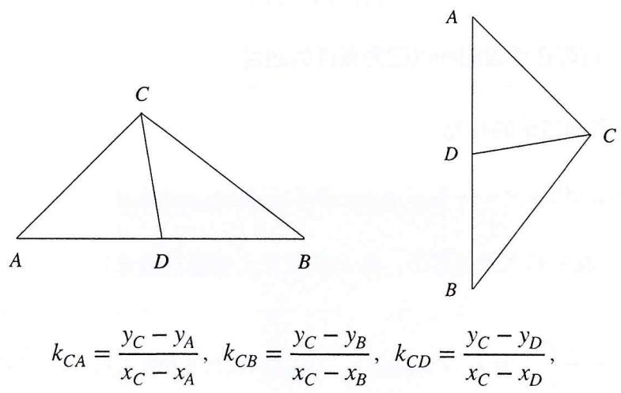

$$
k _ {C A} = \frac {y _ {C} - y _ {A}}{x _ {C} - x _ {A}}, k _ {C B} = \frac {y _ {C} - y _ {B}}{x _ {C} - x _ {B}}, k _ {C D} = \frac {y _ {C} - y _ {D}}{x _ {C} - x _ {D}},
$$

又 $y_{A}=y_{B}=y_{D}$ ，故有

$$
\frac {1}{k _ {C A}} + \frac {1}{k _ {C B}} = \frac {2 x _ {C} - x _ {A} - x _ {B}}{y _ {C} - y _ {D}} = \frac {2 x _ {C} - 2 x _ {D}}{y _ {C} - y _ {D}} = \frac {2}{k _ {C D}},
$$

对竖直线中点

$$
k _ {C A} = \frac {y _ {C} - y _ {A}}{x _ {C} - x _ {A}}, k _ {C B} = \frac {y _ {C} - y _ {B}}{x _ {C} - x _ {B}}, k _ {C D} = \frac {y _ {C} - y _ {D}}{x _ {C} - x _ {D}},
$$

又 $x_{A}=x_{B}=x_{D}$ ，故有

$$
k _ {C A} + k _ {C B} = \frac {y _ {C} - y _ {A}}{x _ {C} - x _ {A}} + \frac {y _ {C} - y _ {B}}{x _ {C} - x _ {B}} = \frac {2 (y _ {C} - y _ {D})}{x _ {C} - x _ {D}} = 2 k _ {C D}.
$$

# 8.2 圆的灵活运用

1. 向径式方程：借由圆上直径的圆周角为直角的条件，我们可以设定如下向量等式

对两点A, B为直径的圆，P在圆上，则

$$
\overrightarrow {P A} \cdot \overrightarrow {P B} = 0,
$$

这个方程常用于计算一些存在性设问的以圆为条件的题目

II. 几类向量形式的隐藏圆结论的补充

A. 基本逻辑：圆的几何定义——到某点的距离为定值的点的集合  
B. 隐圆即探索某点发生的定长度形态，结合向量极化恒等式结论：

①令 $\overrightarrow{PA}\cdot\overrightarrow{PB}=(\overrightarrow{PM})^{2}-\frac{(\overrightarrow{AB})^{2}}{4}=\lambda$ （ $\lambda$ 为定值），记M为线段AB的中点，又 $(\overrightarrow{PM})^{2}=\frac{(\overrightarrow{AB})^{2}}{4}+\lambda$ ，则

$$
P M = \sqrt {\frac {(\overrightarrow {A B}) ^ {2}}{4} + \lambda},
$$

即

$P$ 在以 $M$ 为直径的圆上，半径为 $PM$ ：

②令 $(\overrightarrow{PA})^{2}+(\overrightarrow{PB})^{2}=\lambda$ ，记M为线段AB的中点，由 $\overrightarrow{PA}+\overrightarrow{PB}=2\overrightarrow{PM}$ 得

$$
\overrightarrow {P A} ^ {2} + \overrightarrow {P B} ^ {2} + 2 \overrightarrow {P A} \cdot \overrightarrow {P B} = 4 \overrightarrow {P M} ^ {2},
$$

结合 $\lambda$ 为定值与极化恒等式得

$$
\lambda + 2 [ \overrightarrow {P M} ^ {2} - \frac {\overrightarrow {A B} ^ {2}}{4} ] = 4 \overrightarrow {P M} ^ {2},
$$

整理得

$$
\overrightarrow {P M} ^ {2} = \frac {\lambda}{2} - \frac {\overrightarrow {A B} ^ {2}}{4},
$$

即

$$
P M = \sqrt {\frac {\lambda}{2} - \frac {\overrightarrow {A B} ^ {2}}{4}},
$$

即 $P$ 在以 $M$ 为直径的圆上, 半径为 $P M$ .

# III. 同构双切线

A. 圆的几何定义

1. 同一平面内到一点距离相等的点的集合, 即圆的半径恒等  
2. 这个条件常用以与切线方程相结合, 以半径的“等距性”, 通过点线距公式建立关于斜率 $k$ 的同构关系

例1 已知抛物线 $C: y^{2} = 2px (p > 0)$ 的焦点到准线的距离为2, 圆 $M$ 与 $y$ 轴相切, 且圆心 $M$ 与抛物线 $C$ 的焦点重合.

(1) 求抛物线C和圆M的方程;   
(2) 设 $P(x_{0}, y_{0}) (x_{0} \neq 2)$ 为圆 $M$ 外一点, 过 $P$ 做圆 $M$ 的两切线分别交抛物线 $C$ 于两点 $A(x_{1}, y_{1})$ , $B(x_{2}, y_{2})$ 和点 $Q(x_{3}, y_{3})$ 、 $R(x_{4}, y_{4})$ , 且 $y_{1}y_{2}y_{3}y_{4} = 16$ , 证明: 点 $P$ 在一条定曲线上.

# 要素分析

A. 曲线: 抛物线C   
B. 直线

1. 过P引的两抛物线C的割线AB、QR   
2. AB、QR与M相切（垂径：斜率+长度）  
C. 点坐标: 轨迹参点 $P$ , 抛物线上的 $A, B, Q, R$ 点组

# 要素关系

首先对抛物线的割线, 我们最应该联系的即为抛物线的两点式方程, 这是最足以充分联系曲线、直线、点坐标三大要素的解析式, 由过 $P$ 可引同抛物线的割线 $A B, Q R$ , 联想到 $A B, Q R$ 代入 $P$ 点坐标得到的同构结构; 同时, 对给定的 $M$ 圆, 即有切线上切点到圆心等距的条件, 这也是圆的一个常用转化;

注：前后不同同构条件的联系是本题采用两点式同构、等距同构的重要基础

(1) $C:y^{2} = 4x,M:(x - 1)^{2} + y^{2} = 1;$

(2) 对抛物线 $y^{2}=4x$ 上任意两点 $(x_{1},y_{1})$ ， $(x_{2},y_{2})$ 有

$$
y _ {1} ^ {2} = 4 x _ {1}, y _ {2} ^ {2} = 4 x _ {2},
$$

于是由两点构成的直线有

$$
y - y _ {1} = \frac {4}{(y _ {1} + y _ {2})} (x - x _ {1}) \rightarrow (y _ {1} + y _ {2}) y _ {0} = 4 x _ {0} + y _ {1} y _ {2} \dots ①,
$$

$$
\therefore L _ {Q R}: (y _ {3} + y _ {4}) y = 4 x + y _ {3} y _ {4},
$$

$P$ 在 $QR$ 上

$$
\mathrm{故} (y _ {3} + y _ {4}) y _ {0} = 4 x _ {0} + y _ {3} y _ {4} \dots ②,
$$

又直线 $AB$ 与圆 $M$ 相切, 则

$$
\frac {4 + y _ {1} y _ {2}}{\sqrt {1 6 + (y _ {1} + y _ {2}) ^ {2}}} = 1,
$$

对直线QR与M相切，则

$$
\frac {4 + y _ {3} y _ {4}}{\sqrt {1 6 + (y _ {3} + y _ {4}) ^ {2}}} = 1,
$$

则

$$
(4 + y _ {1} y _ {2}) ^ {2} = 1 6 + (y _ {1} + y _ {2}) ^ {2}; (4 + y _ {3} y _ {4}) ^ {2} = 1 6 + (y _ {3} + y _ {4}) ^ {2},
$$

代入①，②得

$$
(4 + y _ {1} y _ {2}) ^ {2} = 1 6 + (\frac {4 x _ {0}}{y _ {0}} + \frac {y _ {1} y _ {2}}{y _ {0}}) ^ {2}, (4 + y _ {3} y _ {4}) ^ {2} = 1 6 + (\frac {4 x _ {0}}{y _ {0}} + \frac {y _ {3} y _ {4}}{y _ {0}}) ^ {2},
$$

即 $y_{1}y_{2}=t_{1},\quad y_{3}y_{4}=t_{2}$ 同构于二次方程

$$
(4 + t) ^ {2} = 1 6 + (\frac {4 x _ {0}}{y _ {0}} + \frac {t}{y _ {0}}) ^ {2} \rightarrow (y _ {0} ^ {2} - 1) t ^ {2} + 8 (y _ {0} ^ {2} - x _ {0}) t - 1 6 x _ {0} ^ {2},
$$

故

$$
t _ {1} t _ {2} = y _ {1} y _ {2} y _ {3} y _ {4} = 1 6,
$$

即

$$
\frac {- 1 6 x _ {0} ^ {2}}{y _ {0} ^ {2} - 1} \rightarrow x _ {0} ^ {2} + y _ {0} ^ {2} = 1,
$$

即

$$
P \text {   在定曲线   } x _ {0} ^ {2} + y _ {0} ^ {2} = 1.
$$

注：本题重在把握圆翻译为等距的几何特性，其实就是对相切产生垂径的刻画，以斜率刻画长度（点线距公式），从而对圆的条件充分代数化；几何图形的插入，往往思考其定义及相关定理可起到事半功倍的作用

B. 四点共圆的基本性质

1. 圆内接四边形对角和为 $180^{\circ}$ , 在一些与角度关系有关的题目上存在四边形对角和为 $180^{\circ}$ , 即

# 圆内接四边形对角和为 $180^{\circ}\Leftrightarrow$ 四点共圆的存在

例2 (2011·全国卷) 已知椭圆 $C: x^{2} + \frac{y^{2}}{2} = 1$ 在 $y$ 轴正半轴焦点为 $F$ , 过 $F$ 且斜率为 $-\sqrt{2}$ 的直线 $L$ 交 $C$ 于 $A, B$ 两点, 点 $P$ 满足 $\overrightarrow{OA} + \overrightarrow{OB} + \overrightarrow{OP} = 0$ .

(1) 证明: $P$ 在 $C$ 上;  
(2) 设 $P$ 关于 $O$ 的对称点为 $Q$ , 证明: $A, P, B, Q$ 四点共圆.

# 要素分析

A. 曲线：椭圆   
B. 直线: 过 $F$ 的直线 $L$   
C. 点坐标: $L$ 上定点 $F$ ; 已知曲线点 $P, Q$ ; 未知曲线点 $A, B$

# 要素关系

1. $F$ 在直线 $L$ 上, 即对直线 $L$ 恒存在过 $F(0,1)$ 的约束  
2. 对曲线点A, B存在曲线对点坐标的限制

3. 这里的四点共圆我们则可以挖掘条件：对角互补（没有内外的长度限制，转化为斜率即为最优解），即 $\angle A P B + \angle A Q B = 180^{\circ} \rightarrow \tan \angle A P B + \tan \angle A Q B = 0$ ，最后借由斜率和正切的转换表达上式即可

解析 由（1）得

$$
P (- \frac {\sqrt {2}}{2}, - 1), Q (\frac {\sqrt {2}}{2}, 1), A (x _ {1}, y _ {1}), B (x _ {2}, y _ {2}), L _ {A B}: y = - \sqrt {2} x + 1.
$$

由 $\overrightarrow{OA} +\overrightarrow{OB} +\overrightarrow{OP} = 0$ 得

$$
P (- (x _ {1} + x _ {2}), - (y _ {1} + y _ {2})),
$$

$$
\therefore x _ {1} + x _ {2} = \frac {\sqrt {2}}{2}, y _ {1} + y _ {2} = 1,
$$

又 $\tan \angle A P B = \frac{k_{P A} - k_{P B}}{1 + k_{P A}k_{P B}} = \frac{4(x_2 - x_1)}{3},\tan \angle A Q B = \frac{k_{Q B} - k_{Q A}}{1 + k_{Q A}k_{Q B}} = \frac{4(x_1 - x_2)}{3}$ 故

$$
\tan \angle A P B + \tan \angle A Q B = 0,
$$

即A, P, B, Q四点共圆.

注：中间代入点计算斜率的过程可能较为复杂，读者可采取下法

相交弦斜率和为0：通过直线的参数方程或向量转化的方法推导，由于线参的方法更为直接，故采用线参

例3 已知椭圆 $E: \frac{x^{2}}{a^{2}} + \frac{y^{2}}{b^{2}} = 1$ , 过一点 $P(m, n)$ , 作两直线 $A B, C D$ 交椭圆 $E$ 于 $A, B, C, D$ 四点, 假设 $A B, C D$ 斜率存在且不为 0 , 证明: $k_{1} + k_{2} = 0$ 为 $A, B, C, D$ 四点共圆的充要条件.

解析 设 $PA = L_{1}$ ， $PB = L_{2}$ ，则

$$
A (m + L _ {1} \cos \theta , n + L _ {1} \sin \theta), B (m + L _ {2} \cos \theta , n + L _ {2} \sin \theta)
$$

代入椭圆 $E$ 得到

$$
\left\{ \begin{array}{l} \frac {(m + L _ {1} \cos \theta) ^ {2}}{a ^ {2}} + \frac {(n + L _ {2} \sin \theta) ^ {2}}{b ^ {2}} = 1 \\ \frac {(m + L _ {2} \cos \theta) ^ {2}}{a ^ {2}} + \frac {(n + L _ {2} \sin \theta) ^ {2}}{b ^ {2}} = 1 \end{array} , \right.
$$

同构于

$$
\frac {(m + L \cos \theta) ^ {2}}{a ^ {2}} + \frac {(n + L \sin \theta) ^ {2}}{b ^ {2}} = 1,
$$

展开得到

$$
(\frac {\cos^ {2} \theta}{a ^ {2}} + \frac {\sin^ {2} \theta}{b ^ {2}}) L ^ {2} + (\frac {2 m \cos \theta}{a ^ {2}} + \frac {2 n \sin \theta}{b ^ {2}}) L + (\frac {m ^ {2}}{a ^ {2}} + \frac {n ^ {2}}{b ^ {2}} - 1) = 0,
$$

故可得到对 $L_{1}, L_{2}$ 两根关系

$$
L _ {1} L _ {2} = \frac {(\frac {m ^ {2}}{a ^ {2}} + \frac {n ^ {2}}{b ^ {2}} - 1)}{(\frac {\cos^ {2} \theta}{a ^ {2}} + \frac {\sin^ {2} \theta}{b ^ {2}})},
$$

同理对 $PC = L_{3}$ ， $PD = L_{4}$ 可得到

$$
L _ {3} L _ {4} = \frac {(\frac {m ^ {2}}{a ^ {2}} + \frac {n ^ {2}}{b ^ {2}} - 1)}{(\frac {\cos^ {2} \alpha}{a ^ {2}} + \frac {\sin^ {2} \alpha}{b ^ {2}})},
$$

故对四点共圆

有 $PA\quad PB = PC\quad PD$ ，

即 $L_{1} \cdot L_{2} = L_{3} \cdot L_{4}$ 。

$$
\begin{array}{l} \left| \frac {(\frac {m ^ {2}}{a ^ {2}} + \frac {n ^ {2}}{b ^ {2}} - 1)}{(\frac {\cos^ {2} \theta}{a ^ {2}} + \frac {\sin^ {2} \theta}{b ^ {2}})} \right| = \left| \frac {(\frac {m ^ {2}}{a ^ {2}} + \frac {n ^ {2}}{b ^ {2}} - 1)}{(\frac {\cos^ {2} \alpha}{a ^ {2}} + \frac {\sin^ {2} \alpha}{b ^ {2}})} \right| = (\frac {\cos^ {2} \theta}{a ^ {2}} + \frac {\sin^ {2} \theta}{b ^ {2}}) = (\frac {\cos^ {2} \alpha}{a ^ {2}} + \frac {\sin^ {2} \alpha}{b ^ {2}}) 。 \\ = \frac {(\cos \theta - \cos \alpha) (\cos \theta + \cos \alpha)}{a ^ {2}} = \frac {(\sin \alpha - \sin \theta) (\sin \alpha + \sin \theta)}{b ^ {2}} \\ \end{array}
$$

又 $\alpha, \theta \in (0, \pi)$ ，故

$$
\alpha + \theta = \pi (\alpha = \theta \text {舍去}), \text {故} k _ {A B} + k _ {C D} = 0.
$$

# 8.2 同构切割线

切割线的相似构造——源自切割线定理的一组结论，结合线段的比例性质讨论

证明 同弧（弦）AC所对的圆周角

$$
\angle P B C = \angle P D A,
$$

又 $\angle BPC = \angle APD$ ，故

$$
\left\{ \begin{array}{l} \angle P B C = \angle P D A \\ \angle B P C = \angle A P D ^ {\prime} \end{array} \right.
$$

$$
\therefore \triangle P B C \sim \triangle P D A,
$$

$$
\therefore \frac {P B}{P C} = \frac {P D}{P A},
$$

$$
\therefore P A \cdot P B = P C \cdot P D.
$$

# 圆幂定理

对A, B, C, D四点共圆，恒有 PA PB = PC PD 成立

例1（2021·新高考一卷）已知 $F_{1}(-\sqrt{17},0)$ ， $F_{2}(\sqrt{17},0)$ ，M满足 $MF_{2}-MF_{1}=2$ ，M的轨迹为C.

(1) 求 $C$ 的方程:

(2) $T$ 在直线 $x = \frac{1}{2}$ 上, 过 $T$ 的两条直线分别交 $C$ 于 $A, B$ 和 $P, Q$ , 且 $TA \cdot TB = TP \cdot TQ$ , 求 $AB$ 的斜率与 $PQ$ 的斜率之和.

# 要素分析

A. 曲线: 双曲线 $C$

B. 直线: 过 $T$ 关于 $C$ 的割线 $A B, P Q$ ; 长度代换关系 $T A \cdot T B = T P \cdot T Q$

C. 点坐标: 半确定点 $T$ ; 曲线上的点 $A, B, P, Q$

# 要素关系

本题显然的要寻找变量描述长度代换关系，对 $AB, PQ$ 的割线同构形式，我们称之为同构双割线，若是从点斜式的直线介入则只需设置单变量 $K$ 即可，此时的 $K$ 即为同构项，选取完毕同构项后即可介入计算以表达：描述变量 $\Rightarrow$ 约束 $\Rightarrow$ 表达条件 $\Rightarrow$ 证明结论

(1) $C: x^{2} - \frac{y^{2}}{16} = 1$ , 设 $A(x_{1}, y_{1})$ 、 $B(x_{2}, y_{2})$ 、 $P(x_{3}, y_{3})$ 、 $Q(x_{4}, y_{4})K_{AB} = k_{1}$ , $K_{PQ} = k_{2}$ 故

$$
\begin{array}{l} T A = \sqrt {1 + k _ {1} ^ {2}} (x _ {1} - \frac {1}{2}), T B = \sqrt {1 + k _ {1} ^ {2}} (x _ {2} - \frac {1}{2}), \\ T P = \sqrt {1 + k _ {2} ^ {2}} (x _ {3} - \frac {1}{2}), T Q = \sqrt {1 + k _ {2} ^ {2}} (x _ {4} - \frac {1}{2}), \\ \end{array}
$$

则

$$
T A T B = (1 + k _ {1} ^ {2}) (x _ {1} - \frac {1}{2}) (x _ {2} - \frac {1}{2}), T P T Q = (1 + k _ {2} ^ {2}) (x _ {3} - \frac {1}{2}) (x _ {4} - \frac {1}{2}),
$$

设 $L_{AB}:y=k_{1}(x-\frac{1}{2})+t$ ，与C联立得

$$
(1 6 - k _ {1} ^ {2}) x ^ {2} + (k _ {1} ^ {2} - 2 k _ {1} t) x + (t - \frac {x _ {1} ^ {2}}{2}) + 1 6 = 0,
$$

$$
\therefore x _ {1} + x _ {2} = \frac {(k _ {1} ^ {2} - 2 k _ {1} t)}{(k _ {1} ^ {2} - 1 6)}, x _ {1} x _ {2} = \frac {(t - \frac {k _ {1} ^ {2}}{2}) ^ {2} + 1 6}{(1 6 - k _ {1} ^ {2})},
$$

$$
(1 + k _ {1} ^ {2}) x _ {1} - \frac {1}{2} x _ {2} - \frac {1}{2} = x _ {1} x _ {2} - \frac {1}{2} (x _ {1} + x _ {2}) + \frac {1}{4} = \frac {(t ^ {2} + 1 2) (1 + k _ {1} ^ {2})}{(k _ {1} ^ {2} - 1 6)}
$$

同理

$$
(1 + k _ {3} ^ {2}) x _ {1} - \frac {1}{2} x _ {4} - \frac {1}{2} = x _ {3} x _ {4} - \frac {1}{2} (x _ {3} + x _ {4}) + \frac {1}{4} = \frac {(t ^ {2} + 1 2) (1 + k _ {2} ^ {2})}{(k _ {2} ^ {2} - 1 6)}
$$

又 $TA \cdot TB = TP \cdot TQ$

$$
\therefore k _ {1} ^ {2} = k _ {2} ^ {2}, \quad \therefore (k _ {1} + k _ {2}) (k _ {1} - k _ {2}) = 0,
$$

又 $k_{1}-k_{2}\neq0$ ，故 $k_{1}+k_{2}=0$ ，即AB与PQ斜率和为0.

# 思考

1. 此题中出现的共线曲线点是否可以使用向量方法描述呢？（点拨：长度转斜率）  
2. 此题中出现的、是否可以使用点乘双根法简化计算呢？（点拨：双根式）

3. 同构切割线：同构再次出现，注意同构是一种思维而非只是代数技巧，在这里主要指的是几何上线曲结构的相割（交）关系的同构性

例2 （2023·上海二模）已知椭圆方程 $C: x^{2} + 3y^{2} = 4$ ， $A, B$ 为椭圆的左右顶点， $F_{1}, F_{2}$ 为左右焦点， $P$ 为其上一动点，若 $Q, R$ 为椭圆上异于 $P$ 的动点，且 $PQ, PR$ 均与圆 $E: x^{2} + y^{2} = r^{2}$ 相切，记其斜率分别为 $k_{1}, k_{2}$ ；此时是否存在位于第一象限的点 $P$ ，使得 $k_{1}k_{2} = 1$ ？

# 要素分析

A. 曲线: 椭圆 $C$ 、圆 $E$

B. 直线: 过 $P$ 引出的两切线; 两切线的斜率关系

C. 点坐标: $C$ 上曲线点 $P, E$ 上切点 $Q, R$

# 要素关系

对分析过程中提取的线属性要素, 我们可以发现此处的 $P Q, P R$ 无论是与曲线而言的过 $P$ 的共顶点割线形式还是可以二者同时作为关于圆 $E$ 的切线的形式, 都表现了二者的几何同构造构型, 这里对圆的切线自然想到半径的等距性, 于是两直线斜率 $k_{1} k_{2} = 1$ 的斜率关系条件即可以作为二次同构语言中的同构语言, 直接起到对关于 $k$ 的二次方程系数部分的代数对应

解析 记 $P\left( {{x}_{0},{y}_{0}}\right) \left( {{x}_{0},{y}_{0} > 0}\right)$ ,故直线 ${PA}$ , ${PB}$ 可同构于直线形式

$$
y = k (x - x _ {0}) + y _ {0},
$$

由 ${PQ}$ ,PR均为圆 $E$ 的切线得

$$
d _ {P Q} = d _ {P R} = \frac {- k x _ {0} + y _ {0}}{\sqrt {1 + k ^ {2}}} = r,
$$

即

$$
k ^ {2} x _ {0} ^ {2} + y _ {0} ^ {2} - 2 k x _ {0} y _ {0} = r ^ {2} (1 + k ^ {2}),
$$

即有关于 $k$ 的二次方程

$$
(x _ {0} ^ {2} - r ^ {2}) k ^ {2} - 2 k x _ {0} y _ {0} + y _ {0} ^ {2} - r ^ {2} = 0,
$$

故

$$
k _ {1} k _ {2} = \frac {y _ {0} ^ {2} - r ^ {2}}{x _ {0} ^ {2} - r ^ {2}} = 1, \text {即} y _ {0} ^ {2} = x _ {0} ^ {2},
$$

将 $x_0^2 + 3y_0^2 = 1$ 代入得

$$
x _ {0} = 1, y _ {0} = 1.
$$

注 一定记住，同构是一种思维方式，是几何到代数的对应。而同构的语言实际取决于对同构项目的描述（点斜式同构斜率），在这样的对应关系上才是我们利用同构解释各自代数关系的纲目

# 9

# 2023全国高考真题要素分析解读与解析

概述 高考题揭示了一些较为美观整洁的命题思路与几何结构。我们通过对高考题的把握来熟悉命题背景，练习解题方法，以期真正提升能力。

# 9.1 2023·新高考I卷

题目 在直角坐标系当中，点P到x轴的距离等于点P到点 $(0,\frac{1}{2})$ 的距离，记动点P的轨迹为W.

(1) 求W的方程;   
(2)已知矩形ABCD的三个顶点在W上,证明：矩形ABCD的周长大于 $3\sqrt{3}$ .

# 要素分析

A. 曲线: 抛物线 $W$   
B. 直线: 矩形在抛物线上的三点构成的两抛物线的割线; 两割线的垂直关系  
C. 点坐标: 矩形在抛物线上的三点

# 要素关系解读

问题化简：对矩形、平行四边形等对称图形的面积、周长问题，实际都可以借由对称性来化简

例如本题, 可以简化成抛物线 $W$ 上三个顶点构成的直角三角形的两直角边的长度大于 $\frac{3 \sqrt{3}}{2}$ ; 对较为简明的问题, 提取问题项目并化简, 往往是处理问题的第一步

# 要素关系编织

I. 几何: 矩形的顶点 $A, B, D$ 三点在抛物线 $W$ 上, 可以取以 $A$ 为顶点的直角三角形, 于是只需讨论该三点构成的互垂直割线段的长度问题  
II. 代数：下面构造直角三角形 $A, B, D$ 内的要素关系，约束点参构型“以点为参”，描述 $A, B, D$ 三点在曲线上的约束关系（参数方程）  
III. 最后由线垂直关系，代入点间的代数关系寻找代数式、描述长度，以上述点参构造（两点间的距离坐标公式），代入相对应的代数式化简利用二（多）元不等式即可  
IV. 独立化表达与点坐标约束「直+曲-点」

以点为名目，设定 $A, B, D$ 所在的直线， $A D, A B$ 其各自与曲线有两交点，即点坐标 $(x, y)$ 的名目下表达的是 $A B$ 与 $W$ 的交点 $A, B$ ； $A D$ 与 $W$ 的交点 $A, D$ ，此时直线 $A B$ 、 $A D$ 的斜率即满足乘积为 $-1$ 的垂直条件；直曲联立，此时得到的二次方程以点坐标的名目表达，系数为线参属性的斜率与截（或点斜中的斜），利用点坐标名目下的距离坐标公式代数计算化简，利用不等式即可

V. 共线点的转化与点坐标约束「线——点——曲」

I. 向量工具: 对这里存在的两割线, 我们可从共线点约束的角度出发, 利用点到点的“线”属性建立点关系, 向量便起到了以点连线的解析工具意义. 最后结合点在曲上的约束即可得到向量形式下对点坐标的约束方程的作用, 这时的约束项目实际直接连接长度参数, 照常代数计算, 结合不等式即可

II. 以线设参：这里存在的几何构造以一个直角三角形的角度展开，我们同样可以对这里存在的两割线从共线点约束的角度出发，以直角顶点作基准点，建立以直线长度参数连接的共线点坐标，直角条件可起到参数方程当中对三角函数的调换作用。其余结合点坐标约束，代入计算结合不等式即可

# 解析一 约束后点参构造-曲线点的参数方程

记 $A(a,a^{2}+\frac{1}{4})$ 、 $B(b,b^{2}+\frac{1}{4})$ 、 $D(d,d^{2}+\frac{1}{4})$ ，由垂直关系

$$
k _ {A B} k _ {A D} = \frac {a ^ {2} - b ^ {2}}{a - b} \cdot \frac {a ^ {2} - d ^ {2}}{a - d} = - 1,
$$

即 $(a + b)(a + d) = -1$

由两点间的距离公式

$$
A B = \sqrt {(a - b) ^ {2} + (a ^ {2} - b ^ {2}) ^ {2}}, A D = \sqrt {(a - d) ^ {2} + (a ^ {2} - d ^ {2}) ^ {2}},
$$

则

$$
\begin{array}{l} A B + A D = \sqrt {(a - b) ^ {2} + (a ^ {2} - b ^ {2}) ^ {2}} + \sqrt {(a - d) ^ {2} + (a ^ {2} - d ^ {2}) ^ {2}}, \\ = a - b \sqrt {1 + (a + b) ^ {2}} + a - d \sqrt {1 + (a + d) ^ {2}}, \\ \end{array}
$$

记 $(a + b) = m$ ，则 $(a + d) = -\frac{1}{m}$ ，代入得

$$
\begin{array}{l} A B + A D = a - b \sqrt {1 + m ^ {2}} + a - d \sqrt {1 + \frac {1}{m ^ {2}}}, \\ = a + b - 2 a \sqrt {1 + m ^ {2}} + a + d - 2 a \sqrt {1 + \frac {1}{m ^ {2}}}, \\ = m - 2 a \sqrt {1 + m ^ {2}} + - \frac {1}{m} - 2 a \sqrt {1 + \frac {1}{m ^ {2}}} \geq m + \frac {1}{m} \sqrt {1 + \frac {1}{m ^ {2}}}, \\ \end{array}
$$

设 $m \geq 1 \geq \frac{1}{m}$ , 则

$$
A D + A D \geq (m + \frac {1}{m}) \sqrt {1 + \frac {1}{m ^ {2}}} = (\frac {m ^ {2} + 1}{m}) \sqrt {\frac {m ^ {2} + 1}{m ^ {2}}} = \sqrt {\frac {(m ^ {2} + 1) ^ {3}}{m ^ {4}}},
$$

当 $m = \frac{1}{m}$ ，即 $m = 1$ 时，等号成立，

记 $t=m^{2}\geq1$ ，则

$$
A B + A D \geq \sqrt {\frac {(m ^ {2} + 1) ^ {3}}{m ^ {4}}} = \sqrt {\frac {(t + 1) ^ {3}}{t ^ {2}}},
$$

取 $f(t)=\frac{(t+1)^{3}}{t^{2}}$

$$
f ^ {\prime} (t) = \frac {(t + 1) ^ {2} (t - 2)}{t ^ {3}},
$$

∴ $f(t)$ 在 $[1,2)$ 上单调递减，在 $[2,+\infty)$ 上单调递增，

故

$$
f (t) \geq f (2) = \frac {2 7}{4},
$$

则

$$
C _ {A B C D} = 2 A B + A D \geq 2 \sqrt {\frac {(t + 1) ^ {3}}{t ^ {2}}} \geq 2 \sqrt {\frac {2 7}{4}} = 3 \sqrt {3},
$$

综合上述条件， $m = 1$ 与 $t = m^2 = 2$ 不可同时取到，故 $C_{ABCD} = 2AB + AD > 3\sqrt{3}$ 恒成立.

# 解析二 直曲联立-点坐标化约束条件

设 $A(a,a^{2}+\frac{1}{4})$ ，AB斜率为 $k_{1}$ ，AD斜率为 $k_{2}$ ，故

$$
k _ {1} k _ {2} = - 1,
$$

此时

$$
l _ {A B} \colon y = k _ {1} (x - a) + a ^ {2} + \frac {1}{4}, l _ {A D} \colon y = k _ {2} (x - a) + a ^ {2} + \frac {1}{4},
$$

记过A的直线为

$$
y = k (x - a) + a ^ {2} + \frac {1}{4},
$$

与 $W:x^{2}=y+\frac{1}{4}$ 联立得

$$
x ^ {2} - k x + a k - a ^ {2} = 0,
$$

故

$$
x _ {A} + x _ {B} = k, x _ {A} x _ {B} = a k - a ^ {2},
$$

$$
\therefore x _ {A} - x _ {B} = \sqrt {(x _ {A} + x _ {B}) ^ {2} - 4 x _ {A} \cdot x _ {B}} = k _ {1} - 2 a,
$$

同理

$$
x _ {A} - x _ {D} = k _ {2} - 2 a,
$$

于是有

$$
A B = \sqrt {1 + k _ {1} ^ {2}} k _ {1} - 2 a, A D = \sqrt {1 + k _ {2} ^ {2}} k _ {2} - 2 a,
$$

故

$$
A B + A D = \sqrt {1 + k _ {1} ^ {2}} k _ {1} - 2 a + \sqrt {1 + k _ {2} ^ {2}} k _ {2} - 2 a = \sqrt {1 + k _ {1} ^ {2}} k _ {1} - 2 a + \sqrt {1 + \frac {1}{k _ {1} ^ {2}}} \frac {1}{k _ {1}} + 2 a,
$$

令 $k_{1}\geq1\geq\frac{1}{k_{1}}$ ，则

$$
A B + A D \Big | \geq \sqrt {1 + \frac {1}{k _ {1} ^ {2}}} k _ {1} + \frac {1}{k _ {1}} = = \sqrt {\frac {(1 + k _ {1} ^ {2}) ^ {3}}{k ^ {4}}}, \text {当且仅当} k _ {1} = \frac {1}{k _ {1}} \text {时等号成立},
$$

记 $m=k_{1}^{2}\geq1$ ，后续步骤同解析一

# 解析三 共线点的转化与点坐标约束

# 1. 向量

记 $A(a,a^{2}+\frac{1}{4})$ ，设 $\overrightarrow{AB}=\lambda(1,k)$ ，则

$$
B (\lambda + a, \lambda k + a ^ {2} + \frac {1}{4}),
$$

同理设 $\overrightarrow{AD} = \mu (1,k)$ ，则

$$
D (\mu + a, \mu k + a ^ {2} + \frac {1}{4}),
$$

又B, D在W上，代入W方程，整理可得关于 $\lambda$ 和 $\mu$ 的二次方程

$$
\lambda^ {2} + (2 a - k) \lambda = 0, \mu^ {2} + (2 a + \frac {1}{k}) \mu = 0
$$

已知两方程各有一根为0，记

$$
\lambda = 2 a - k, \mu = 2 a + \frac {1}{k},
$$

又 $k(-k) = 1$ ，故设 $k\geq 1$ ， $k\geq 1\geq -\frac{1}{k}$ ，则

$$
\begin{array}{l} A B + A D = 2 a - k \sqrt {1 + k ^ {2}} + 2 a + \frac {1}{k} \sqrt {1 + \frac {1}{k ^ {2}}}, \\ \geq 2 a - k \sqrt {1 + \frac {1}{k ^ {2}}} + 2 a + \frac {1}{k} \sqrt {1 + \frac {1}{k ^ {2}}}, \\ \geq (k + \frac {1}{k}) \sqrt {1 + \frac {1}{k ^ {2}}} = \sqrt {\frac {(k ^ {2} + 1) ^ {3}}{k ^ {4}}}, \quad (\text {当且仅当} k ^ {2} = 1 \text {时取等号}) \\ \end{array}
$$

记 $k^{2}=m\geq1$ 代入，后续步骤同解析一

# 2.长度参数方程

平移 $W$ 至 $x^{2} = y$ ， $AB\perp AD$ ，故

$$
\alpha + \theta = \frac {\pi}{2}, \quad (\theta , \alpha <   \frac {\pi}{2})
$$

记 $A(a,a^{2})$ ，AB= $L_{1}$ ，AD= $L_{2}$ ，则

$$
\left\{ \begin{array}{c} B (a - L _ {1} \cos \theta , a ^ {2} + L _ {1} \sin \theta) \\ D (a + L _ {2} \cos \alpha , a ^ {2} + \frac {1}{4} + L _ {2} \sin \alpha) \end{array} \right.,
$$

$$
\therefore \left\{ \begin{array}{l} B (a - L _ {1} \cos \theta , a ^ {2} + L _ {1} \sin \theta) \\ D (a + L _ {2} \sin \theta , a ^ {2} + L _ {2} \cos \theta) \end{array} \right.,
$$

由B, D在W上，代入W得

$$
\left\{ \begin{array}{l} a ^ {2} + L _ {1} ^ {2} \cos^ {2} \theta - 2 a \cos \theta L _ {1} = a ^ {2} + L _ {1} \sin \theta \\ a ^ {2} + L _ {2} ^ {2} \sin^ {2} \theta + 2 a \sin \theta L _ {2} = a ^ {2} + L _ {2} \cos \theta \end{array} , \right.
$$

$$
\therefore \left\{ \begin{array}{l} \frac {L _ {1} ^ {2} \cos^ {2} \theta - L _ {1} \sin \theta}{\cos \theta L _ {1}} = 2 a \\ \frac {L _ {2} \cos \theta - L _ {2} ^ {2} \sin^ {2} \theta}{\sin \theta L _ {2}} = 2 a \end{array} , \right.
$$

$$
\therefore \frac {L _ {1} ^ {2} \cos^ {2} \theta - L _ {1} ] \sin \theta}{\sin \theta L _ {1}} = \frac {L _ {2} \cos \theta - L _ {2} ^ {2} \sin^ {2} \theta}{\sin \theta L _ {2}},
$$

$$
\therefore \frac {L _ {1} \cos^ {2} \theta - \sin \theta}{\cos \theta} = \frac {\cos \theta - L _ {2} \sin^ {2} \theta}{\sin \theta}, \text {即} L _ {1} \cos \theta + L _ {2} \sin \theta = \frac {\sin \theta}{\cos \theta} + \frac {\cos \theta}{\sin \theta},
$$

$$
\therefore L _ {1} + L _ {2} \tan \theta = \frac {\sin \theta}{\cos^ {2} \theta} + \frac {1}{\sin \theta} \text {或} \frac {L _ {1}}{\tan \theta} + L _ {2} = \frac {1}{\cos \theta} + \frac {\cos \theta}{\sin^ {2} \theta},
$$

又 $\tan \theta$ 在 $\theta \in (0, \frac{\pi}{2})$ 单调递增，

$$
\therefore \theta \in (0, \frac {\pi}{4} ], \tan \theta <   1, \theta \in (\frac {\pi}{4}, \frac {\pi}{2}), \tan \theta > 1, \theta \in (0, \frac {\pi}{4} ],
$$

$$
L _ {1} + L _ {2} > L _ {1} + L _ {2} \tan \theta = \frac {\sin^ {2} \theta + \cos^ {2} \theta}{\cos^ {2} \theta \sin \theta},
$$

记 $t = \sin \theta \in (0, \frac{1}{\sqrt{2}}]$

$$
\mathrm{取} f (t) = (1 - t ^ {2}) t, f ^ {\prime} (t) = - 3 (t + \frac {1}{\sqrt {3}}) (t - \frac {1}{\sqrt {3}}),
$$

故

$f(t)$ 在 $(0, \frac{1}{\sqrt{3}}]$ 单减，在 $(\frac{1}{\sqrt{3}}, \frac{1}{\sqrt{2}}]$ 单增，

$$
\therefore f (t) \geq f (\frac {1}{\sqrt {3}}) = \frac {2}{3 \sqrt {3}},
$$

$$
\therefore C _ {A B C D} = 2 (L _ {1} + L _ {2}) > 2 (L _ {1} + L _ {2} \tan \theta) _ {m a x} = 2 \big (\frac {1}{(1 - \sin^ {2} \theta) \sin \theta} \big) _ {m a x} = 3 \sqrt {3}
$$

同理，当 $\theta \in (\frac{\pi}{4}, \frac{\pi}{2})$ 时

$$
L _ {1} + L _ {2} > \frac {L _ {1}}{\tan \theta} + L _ {2} = \frac {1}{\cos \theta} + \frac {\cos \theta}{\sin^ {2} \theta} = \frac {\sin^ {2} \theta + \cos^ {2} \theta}{\cos \theta \sin^ {2} \theta} = \frac {1}{(1 - \cos^ {2} \theta) \cos \theta}
$$

记 $t = \cos \theta \in (0, \frac{1}{\sqrt{2}}]$

取 $f(t)=(1-t^{2})t$ ，则

$$
f ^ {\prime} (t) = - 3 \left(t + \frac {1}{\sqrt {3}}\right) \left(t - \frac {1}{\sqrt {3}}\right),
$$

$$
\therefore f (t) \geq f (\frac {1}{\sqrt {3}}) = \frac {2}{3 \sqrt {3}},
$$

$$
\therefore C _ {A B C D} = 2 \left(L _ {1} + L _ {2}\right) > 2 \left(\frac {1}{(1 - \cos^ {2} \theta) \cos \theta}\right) _ {\max} = 3 \sqrt {3}.
$$

# 9.2 2023·新高考II卷

题目 已知双曲线C的中心为坐标原点，左焦点为 $(-2\sqrt{5},0)$ ，离心率为 $\sqrt{5}$ .

(1) 求C的方程;   
(2) 记 $C$ 的左右顶点分别为 $A_{1}, A_{2}$ , 过点 $(-4, 0)$ 的直线与 $C$ 的左支交于点 $M, N$ 两点, 点 $M$ 在第二象限, 直线 $MA_{1}$ 与直线 $NA_{2}$ 交于点 $P$ , 证明: 点 $P$ 在定直线上.

# 要素分析

A. 曲线: 双曲线 $C$   
B. 直线

1. 过定点(-4,0)的直线MN

2. 过点P的 $MA_{1}, NA_{2}$

C. 点坐标

1. 定点(-4,0)及两顶点  
2. 曲线点 $M, N, A_{1}, A_{2}$   
3. 直直交点 $P$

# 要素关系编织

在没有其他特殊几何条件的情况下, 重在挖掘点线关系, 本题而言, $P$ 为 $M A_{1}, N A_{2}$ 两直线的交点, 对应到代数中即同时满足两直线方程 (点在线上), 即寻找 $M A_{1}, N A_{2}$ 两直线对应的其他条件, 对锚定一点的直线 $M A_{1}, N A_{2}$ , 从两点确定一条直线的角度出发;

已知两顶点，即寻找 $M, N$ 的约束，这时结合 $MN$ 直线为曲线点（消换元）及其过定点 $(-4,0)$ 产生的对两点的约束，即可完成对变量约束的寻找过程，下面即为描述、刻画、约束的代数过程

# 1. 独立化表达与点坐标约束

以点坐标为名目, 设定动点 $M, N$ 及 $MA_{1}, NA_{2}$ 各自的以点为名目的形式, 动点 $M, N$ 实际为 $(x, y)$ 的坐标形式满足于直线 $MN$ 与曲线 $C$ 交点的坐标, 故从点的角度切入, 将 $M, N$ 作为直曲交点的性质以点坐标独立表达并直曲联立进行约束, 得到关于 $M, N$ 坐标的二次方程, 其系数表达点在直曲交点这一要素;接下来代入其对交点的描述, 计算即可;

# 2. 点线约束表达与曲线换元

化点为参，以点束线，对曲线动点M, N，由点线的约束关系可以借由两点式表达二者的坐标代数关系，结合曲线换元即可得到对偶和差，以此成为以点为参的直曲交点描述，结合P为两直线交点的条件，利用消元处理即可；

# 3.定比点差

设点方法，用以翻译MN与 $(-4,0)$ 的共线约束；

# 4.定比插参

转化数据方法，转译MN与 $(-4,0)$ 的共线约束到坐标关系；

以上与其他方法过于冗杂，于本题属于徒增烦恼，不再赘述

# 解析一 直曲联立-点坐标化约束表达

设MN方程为x=my-4， $M(x_{1},y_{1})$ ， $N(x_{2},y_{2})$ ，联立MN与双曲线C得

$$
(4 m ^ {2} - 1) y ^ {2} - 3 2 m y + 4 8 = 0,
$$

$$
\therefore y _ {1} + y _ {2} = \frac {3 2 m}{(4 m ^ {2} - 1)}, y _ {1} y _ {2} = \frac {4 8}{(4 m ^ {2} - 1)},
$$

又 $MA_{1}$ : $y = \frac{y_{1}}{x_{1} + 2}(x + 2)$ , $NA_{2}$ : $y = \frac{y_{2}}{x_{2} - 2}(x - 2)$ ，联立得

$$
\frac {y _ {1}}{x _ {1} + 2} \left(x _ {0} + 2\right) = \frac {y _ {2}}{x _ {2} - 2} \left(x _ {0} - 2\right),
$$

$$
\therefore \frac {x _ {0} + 2}{x _ {0} - 2} = \frac {y _ {2} (x _ {1} + 2)}{(x _ {2} - 2) y _ {1}} = \frac {(m y _ {1} - 2) y _ {2}}{y _ {1} (m y _ {2} - 6)},
$$

$$
\therefore \frac {x _ {0} + 2}{x _ {0} - 2} = \frac {m y _ {1} y _ {2} - 2 y _ {2}}{m y _ {1} y _ {2} - 6 y _ {1}} = \frac {m y _ {1} y _ {2} - 2 (y _ {1} + y _ {2}) + 2 y _ {1}}{m y _ {1} y _ {2} - 6 y _ {1}},
$$

$$
\therefore \frac {x _ {0} + 2}{x _ {0} - 2} = = \frac {\frac {4 8 m}{(4 m ^ {2} - 1)} - \frac {6 4 m}{(4 m ^ {2} - 1)} + 2 y _ {1}}{\frac {4 8 m}{(4 m ^ {2} - 1)} - 6 y _ {1}} = \frac {- \frac {1 6 m}{(4 m ^ {2} - 1)} + 2 y _ {1}}{\frac {4 8 m}{(4 m ^ {2} - 1)} - 6 y _ {1}} = - \frac {1}{3},
$$

解得 $x_{0} = -1$ ， $y_{0}$ 无法待定，即 $P$ 在定直线 $x = -1$ 上

# 解析二 点线约束表达

设 $M(x_{1},y_{1})$ ， $N(x_{2},y_{2})$ ， $P(x_{0},y_{0})$

对MN过定点 $(-4,0)$ : $\frac{y_{1}}{x_{1}+4}=\frac{y_{2}}{x_{2}+4}$ ,

$$
x _ {2} y _ {1} - x _ {1} y _ {2} = 4 (y _ {1} - y _ {2}),
$$

由双曲线 $C: \frac{x^2}{4} - \frac{y^2}{16} = 1, x^2 = 4 + \frac{y^2}{4}$ 且 $M, N$ 都在曲线上

$$
x _ {2} y _ {1} + x _ {1} y _ {2} = \frac {(x _ {2} y _ {1}) ^ {2} - (x _ {1} y _ {2}) ^ {2}}{x _ {2} y _ {1} - x _ {1} y _ {2}} = \frac {(4 + \frac {y _ {2} ^ {2}}{4}) y _ {1} ^ {2} - (4 + \frac {y _ {1} ^ {2}}{4}) y _ {2} ^ {2}}{4 (y _ {1} - y _ {2})} = \frac {4 y _ {1} ^ {2} - 4 y _ {2} ^ {2}}{4 (y _ {1} - y _ {2})} = (y _ {1} + y _ {2}),
$$

故两式相加减得到:

$$
x _ {2} y _ {1} = \frac {5 y _ {1} - 3 y _ {2}}{2}, x _ {1} y _ {2} = \frac {5 y _ {2} - 3 y _ {1}}{2},
$$

又对 $MA_{1}$ : $y=\frac{y_{1}}{x_{1}+2}(x+2)$ , $NA_{2}$ : $y=\frac{y_{2}}{x_{2}-2}(x-2)$ ,

代入 $P$

联立得到： $\frac{x_0 + 2}{x_0 - 2} = \frac{y_2(x_1 + 2)}{(x_2 - 2)y_1} = \frac{x_1y_2 + 2y_2}{x_2y_1 - 2y_1} = \frac{\frac{9y_2 - 3y_1}{2}}{\frac{y_1 - 3y_2}{2}} = -\frac{1}{3},$

解得 $x_{0}=-1$ ，即P在定直线x=-1上.

注 实际这里得 $MA_{1}, NA_{2}$ 直线可以直接写为两点式直线的形式，两点式下即可以直接代入消换元了；在解答中我们使用的方法也被称为交轨法，实际就是一般联立下消换元的技巧，将待定项隔离，构造已知项的表达式

# 9.3 2023·新高考II卷

题目 已知直线 $x - 2y + 1 = 0$ 与抛物线 $y^{2} = 2px (p > 0)$ 交于 $A, B$ 两点， $AB = 4$ .

(1) 求 $p$ 的值;  
(2) $F$ 为抛物线的焦点, $M 、 N$ 为其上两点, 且, 求 $\triangle MNF$ 面积的最小值.

# 要素分析

A. 曲线: 抛物线C   
B. 直线: 向量数量积条件 $\rightarrow$ 垂直关系; 待定直线 $MN$ (可取不可取)  
C. 点坐标: 定点 $F$ , 动点 $M 、 N$

# 要素关系编织

# 一、问题分析

根据向量数量积为0的条件（这类独立条件往往能直接翻译为几何/代数关系），可得到MF、NF直线的垂直关系，则 $\triangle MNF$ 实际即为一个两点在抛物线上的直角三角形，定点F作为直角顶点，那么接下来处理曲线上动点M、N即可

# 二、约束条件探寻

有关 $M, N$ 的约束条件实际只包含两样，其一即为 $MF, NF$ 的垂直关系，其二即为曲线点性质。在这两约束条件的基础上，我们编织要素转化、约束语言

# - 约束点参构型：参数方程

以点为参, 直接表述曲线点的性质, 于是以这样的代数形式转化其余点线关系要素即可。接下来表达 $MF \perp NF$ 的直线关系, 得到有关 $M, N$ 的坐标代数表达, 结合 $S = \frac{MF \times NF}{2}$ 即可; 或以点 $F$ 到直线 $MN$ 的距离表达结合 $MN$ 两点间的距离坐标公式, 只是较为繁琐; 实际这样翻译直角条件也是面积问题中的简化方法之一

# - 独立化表达与点坐标约束

以点为名目，设定MN所在直线，即有满足直线MN与曲线方程的点坐标 $(x,y)$ 表示M,N两点坐标的坐标（直曲交点），直曲联立消元即可通过韦达定理得到M、N的坐标关系（这里的坐标关系实际翻译的M,N为曲线点的性质）；最后，以两点间距离坐标公式表达MN，以点到直线的距离坐标公式表达F到MN的距离，或以MF、NF的角度出发，利用点到直线的距离坐标公式

注 对比不难发现，MN直线实际作用是为了说明M, N的曲线点性质，设定MN直线对计算起不到帮助，要素角度来看就是多加了一个无关要素

# - 线参角度的两种方式

1. 化线为参，设点寻求曲线约束  
2. 焦半径公式的运用

# 解析一 约束点构型-参数方程

记抛物线 $C: y^{2} = 4x$ 上的 $M(4a^{2}, 4a), N(4b^{2}, 4b)$

故对直线MN: $k = \frac{1}{a + b}$ , $y - 4a = \frac{1}{a + b}(x - 4a^{2})$ ,

即MN： $(a+b)y=x+4ab$ ，令y=0，即有x=-4ab，

对 $\overrightarrow{MF}\cdot\overrightarrow{NF}=0$ ，即

$$
(4 a ^ {2} - 1) (4 b ^ {2} - 1) + 1 6 a b = 0,
$$

即

$$
(4 a b + 1) ^ {2} = (2 a - 2 b) ^ {2},
$$

取 $4ab+1=2a-2b$ ， $4ab+1=2b-2a$ ，

整理得到

$$
a = \frac {2 b + 1}{2 - 4 b}, b = \frac {2 a + 1}{2 - 4 a},
$$

又

$$
S _ {\triangle M N F} = \frac {- 4 a b - 1 \quad 4 a - 4 b}{2} = \frac {2 a - 2 b \quad 4 a - 4 b}{2} = 4 a - b ^ {2},
$$

代入 $a = \frac{2b + 1}{2 - 4b}$ 得

$$
\begin{array}{l} S _ {\triangle M N F} = 4 a - b ^ {2} = 4 \left(\frac {4 b ^ {2} + 1}{2 - 4 b}\right) ^ {2} = 4 \left(\frac {4 b ^ {2} - 1 + 2}{2 (1 - 2 b)}\right) ^ {2} = 4 \left(\frac {1 - 2 b - 2}{2} + \frac {1}{1 - 2 b}\right) ^ {2} \\ = 4 \left(\frac {1 - 2 b}{2} + \frac {1}{1 - 2 b} - 1\right) ^ {2} \geq 4 \left(\frac {(1 - 2 b)}{2} \cdot \frac {1}{(1 - 2 b)} - 1\right) ^ {2} \\ = 4 (\sqrt {2} - 1) ^ {2} = 1 2 \sqrt {2} - 8, \\ \end{array}
$$

当且仅当 $\frac{1 - 2b}{2} = \frac{1}{1 - 2b}$ ，即 $b = \frac{1\pm\sqrt{2}}{2}$ 时，等号成立；

代入 $b=\frac{2a+1}{2-4a}$ 得

$$
\begin{array}{l} S _ {\triangle M N F} = 4 a - b ^ {2} = 4 \left(\frac {- 4 a ^ {2} - 1}{2 - 4 b}\right) ^ {2} = 4 \left(\frac {4 a ^ {2} + 1}{2 - 4 b}\right) ^ {2} = 4 \left(\frac {1 - 2 a - 2}{2} + \frac {1}{1 - 2 a}\right) ^ {2} \\ = 4 \left(\frac {1 - 2 a}{2} + \frac {1}{1 - 2 a} - 1\right) ^ {2} \geq 4 \left(\frac {(1 - 2 a)}{2} \cdot \frac {1}{(1 - 2 a)} - 1\right) ^ {2} \geq 4 (\sqrt {2} - 1) ^ {2} = 1 2 \sqrt {2} - 8, \\ \end{array}
$$

当且仅当 $\frac{1 - 2a}{2} = \frac{1}{1 - 2a}$ ，即 $a = \frac{1\pm\sqrt{2}}{2}$ 时，等号成立，

综上： $\triangle MNF$ 的面积最小值为 $12\sqrt{2}-8$ .

实际在代数过程中不难发现①与②在代数上是极为对称的，于是结合面积中 a - b 项的平方（平方消正负），在①与②两情况下的代数情况实际一致

# 解析二 独立化表达与点坐标约束-直曲联立

设MN:x=my+b, $M(x_{1},y_{1})$ , $N(x_{2},y_{2})$ ，联立MN与抛物线C得

$$
y ^ {2} - 4 m y - 4 b = 0,
$$

$$
\therefore y _ {1} + y _ {2} = 4 m, \quad y _ {1} y _ {2} = - 4 b,
$$

由 $\overrightarrow{MF} \cdot \overrightarrow{NF} = 0$ 得

$$
(m y _ {1} + b - 1) (m y _ {2} + b - 1) + y _ {1} y _ {2} = 0,
$$

则

$$
(m ^ {2} + 1) y _ {1} y _ {2} + m (b - 1) (y _ {1} + y _ {2}) + (b - 1) ^ {2} = 0,
$$

代入整理

$$
4 m ^ {2} - b ^ {2} + 6 b - 1 = 0, \therefore 4 m ^ {2} = b ^ {2} - 6 b + 1 \geq 0,
$$

$$
\therefore b \in (- \infty , 3 - 2 \sqrt {2}) \cup (3 + 2 \sqrt {2}, + \infty),
$$

根据抛物线的性质 $MF = x_{1} + 1, NF = x_{2} + 1$ ，故

$$
\begin{array}{l} S = \frac {M F N F}{2} = \frac {(x _ {1} + 1) (x _ {2} + 1)}{2} = \frac {x _ {1} x _ {2} + x _ {1} + x _ {2} + 1}{2} \\ = \frac {(m y _ {1} + b) (m y _ {2} + b) + m (y _ {1} + y _ {2}) + 2 b + 1}{2} \\ = \frac {m ^ {2} y _ {1} y _ {2} + m (b + 1) (y _ {1} + y _ {2}) + b ^ {2} + 2 b + 1}{2} \\ = \frac {2 b ^ {2} - 4 b + 2}{2} = (b - 1) ^ {2}, \\ \end{array}
$$

$$
\text { 又 } b \in (- \infty , 3 - 2 \sqrt {2}) \cup (3 + 2 \sqrt {2}, + \infty)
$$

$$
\therefore S \geq (2 - 2 \sqrt {2}) ^ {2} = 1 2 - 8 \sqrt {2}.
$$

注 这里需要注意的点即对b取值范围的探路，这是对参数较多时，寻找范围约束的常用方法之一，将两参变量隔离，用其中一个的范围反推另一个的范围，另外的这里的面积处理方法也是需要学习的，看到直角优先转化直角边，这里利用了抛物线的定义——焦半径等于该点到准线的距离

# 另附-点乘双根的计算化简

根据抛物线的性质

$$
M F = x _ {1} + 1, \quad N F = x _ {2} + 1,
$$

故

$$
S = \frac {M F + N F}{2} = \frac {(x _ {1} + 1) (x _ {2} + 1)}{2},
$$

设直线MN: $x = m y + b \rightarrow y = \frac{x - b}{m}$ , 与抛物线联立有

$$
x ^ {2} - (4 m ^ {2} + 2 b) x + b ^ {2} = 0, x ^ {2} - (4 m ^ {2} + 2 b) x + b ^ {2} = (x - x _ {1}) (x - x _ {1}),
$$

代入 $x = -1$ 得

$$
1 + (4 m ^ {2} + 2 b) + b ^ {2} = (1 + x _ {1}) (1 + x _ {2}), \therefore S = \frac {1 + (4 m ^ {2} + 2 b) + b ^ {2}}{2},
$$

代入 $4m^{2}=b^{2}-6b+1$ 得

$$
S = \frac {1 + (b ^ {2} - 6 b + 1 + 2 b) + b ^ {2}}{2} = \frac {2 b ^ {2} - 4 b + 2}{2} = (b - 1) ^ {2},
$$

根据 $b\in(-\infty,3-2\sqrt{2})\cup(3+2\sqrt{2},+\infty)$

$$
\therefore S \geq (2 - 2 \sqrt {2}) ^ {2} = 1 2 - 8 \sqrt {2}.
$$

# 解析三 线参角度-化线属性要素为参

# 长度的参数设点与点坐标约束

设MF与x轴夹角为 $\theta(0<\theta<\frac{\pi}{2})$ ，又 $MF\perp NF$ ，记 $MF=L_{1}$ ， $NF=L_{2}$ ，则NF与x轴负方向夹角为

$$
\beta = \frac {\pi}{2} - \theta (0 <   \beta <   \frac {\pi}{2}),
$$

则可设 $M(L_{1}\cos\theta+1,L_{1}\sin\theta)$ ， $N(-L_{2}\sin\theta+1,L_{2}\cos\theta)$ ，代入 $y^{2}=4x$ 得到

$$
\left\{ \begin{array}{c} L _ {1} ^ {2} \sin^ {2} \theta = 4 L _ {1} \cos \theta + 4 \\ L _ {2} ^ {2} \cos^ {2} \theta = - 4 L _ {2} \sin \theta + 4 \end{array} , \right.
$$

$$
\therefore \left\{ \begin{array}{l} L _ {1} = \frac {2 (c o s \theta \pm 1)}{1 - c o s ^ {2} \theta} \\ L _ {2} = \frac {2 (s i n \theta \pm 1)}{1 - s i n ^ {2} \theta} \end{array} , \right.
$$

欲使得面积取最小值，则 $L_{1},L_{2}$ 取最小，又

$$
L _ {1} = \frac {2}{1 + \cos \theta}, L _ {2} = \frac {2}{1 + \sin \theta},
$$

结合 $\cos\theta$ 、 $\sin\theta$ 在 $\theta\left(0<\theta<\frac{\pi}{2}\right)$ 的取值范围

$$
S = \frac {L _ {1} L _ {2}}{2} = \frac {2}{\sin \theta + \cos \theta + \sin \theta \cos \theta + 1},
$$

设 $\sin \theta +\cos \theta = m$

$$
m = \sqrt {2}   \sin (\theta + \frac {\pi}{4}) \in (1, \sqrt {2}), m ^ {2} = 1 + 2   \sin \theta   \cos \theta , \text {即} \sin \theta   \cos \theta = \frac {m ^ {2} - 1}{2},
$$

故

$$
\sin \theta + \cos \theta + \sin \theta \cos \theta + 1 = \frac {m ^ {2} + 2 m + 1}{2} = \frac {(m + 1) ^ {2}}{2} \leq \frac {2 \sqrt {2} + 3}{2},
$$

$$
\therefore S = \frac {L _ {1} L _ {2}}{2} = \frac {4}{(m + 1) ^ {2}} \geq \frac {4}{2 \sqrt {2} + 3} = 1 2 - 8 \sqrt {2}.
$$

# 焦半径公式

由焦半径公式: 设 ${MF}$ 与 $x$ 轴夹角为 $\theta ,\theta  \in  \left( {0,\pi }\right)$ ,则

$$
M F = \frac {p}{1 - \cos \theta}, N F = \frac {p}{1 - \cos (\theta + \frac {\pi}{2})} = \frac {p}{1 + \sin \theta},
$$

$$
S = \frac {M F \cdot N F}{2} = \frac {p ^ {2}}{2 (1 - \cos \theta) (1 + \cos \theta)} = \frac {\frac {p ^ {2}}{2}}{- \sin \theta \cos \theta + \sin \theta - \cos \theta + 1},
$$

记 $\sin \theta -\cos \theta = m = \sqrt{2}\sin (\theta -\frac{\pi}{4})\in (-1,\sqrt{2})$ ，则

$$
m ^ {2} = 1 - 2 \sin \theta \cos \theta , \text {即} - \sin \theta \cos \theta = {\frac {m ^ {2} - 1}{2}},
$$

$$
S = \frac {\frac {\pi}{2}}{\frac {m ^ {2} - 1}{2} + m + 1} = \frac {4}{m ^ {m} y 2 + 2 m + 1} \geq \frac {4}{(\sqrt {2} + 1) ^ {2}} = \frac {4}{3 + 2 \sqrt {2}} = 1 2 - 8 \sqrt {2}.
$$

# 补充-抛物线的焦半径公式

已知 $AB$ 过焦点 $F(\frac{p}{2},0)$ ， $C$ 为准线 $x = -\frac{p}{2}$ ，作直线 $AD, AE$ 分别垂直准线与 $x$ 轴，垂足为 $D$ 、 $E$ 根据抛物线的定义，抛物线上一点到焦点的距离等于其到准线的距离

$$
\text { 故 } A F = A D,
$$

设 $\angle AFE=\theta,$

$$
A E = A F \sin \theta , \quad F E + A F \cos \theta ,
$$

故

$$
A F + A D = C E = C F + F E = p + A F \cos \theta ,
$$

即 $(1 - \cos \theta) AF = p$ ，整理得

$$
A F = \frac {p}{(1 - \cos \theta)},
$$

同理可得

$$
B F = \frac {p}{(1 + \cos \theta)},
$$

还可以推出另一个性质： $\frac{1}{AF} +\frac{1}{BF} = \frac{1 - \cos\theta}{p} +\frac{1 + \cos\theta}{p} = \frac{2}{p}$

# 9.3 2023·全国乙卷

已知 $E:\frac{y^{2}}{9}+\frac{x^{2}}{4}=1$ 过点 $P(-2,3)$ 的直线L交椭圆E于B、C两点，直线AB、AC与y轴交于M,N，证明：M、N的中点为定点.

# 要素分析

A. 曲线: 椭圆 $E$   
B. 直线

1. 过P点的直线L（非轴点弦）  
2. A点引出AB、AC（定轴点射线）

C. 点坐标

1. 定点 $P(-2,3)$   
2. 顶点 $A$   
3. 直曲交点 $B 、 C$

# 要素关系编织

这类给定非轴点非曲点条件（P的坐标）的问题，我们一般称其几何代数结构上为非轴点弦问题，即此处的BC直线过点P，这也是对B、C两曲线点的坐标约束；同时对AB、AC这类定点射线，其问题往往聚焦于斜率角度的考量（其实也是一个斜率三角形，定点在∠BAC对应的），对应到代数中实际就是点斜式当中的斜率变量 $y = kx + m$ （m为定值）或 $x = my + t$ （t为定值）；这是过轴点的直线的一类表达约束，实际与两点式下的直线形式等价；

此时对直曲交点 $B, C$ 即有两个角度的考量: 直线点、曲线点

I. 在曲线点的意义上, 我们即可以结合曲线换元, 直接描述点线约束关系; 结合设问探索 $A B, A C$ 斜率 $k$ 的和为定值, 这个意义上其实直接连接坐标的关系: $B, C$ 相关的斜率坐标化展开——对偶形式两点式直线方程—— $B C$ 过 $P$ , 形成完整的逻辑闭环

II. 在直线交点的性质上, 即点坐标可以以线要素统一标识, 接下来结合曲线点约束即可, 等价于几何上线 $\times$ 线 $\times$ 曲交点关系以线+线进行表达, 以曲线方程约束或者在变量关系的角度上 $B C$ 的斜率动产生了 $B 、 C$ 坐标的动, 由此产生 $A B 、 A C$ 斜率的动——这是产生线线相交产生斜率坐标描述的几何逻辑, 在此基础上结合 $A B 、 A C$ 的斜率同构形式即可建立有关斜率的同构二次方程, 以此作结探究斜率和为定值

III. 对非轴点弦，我们更为常用的实际还是对线点约束的运用，以轴点配参，直接描述两点B、C坐标的代换关系，这是代数上的优化方法，实际对应优化过后的定比设点

IV. 最朴素的，设问即对应对 $B 、 C$ 与 $A$ 构成的斜率的描述，这个意义上即可以对 $B 、 C$ 的坐标进行直曲结合的点坐标约束，下面描述斜率的坐标表达即可

# 解析一 斜率坐标化展开

依题

$$
\frac {x _ {1} ^ {2}}{4} + \frac {y _ {1} ^ {2}}{9} = 1, \frac {x _ {2} ^ {2}}{4} + \frac {y _ {2} ^ {2}}{9} = 1,
$$

做差整理得

$$
k = \frac {y _ {1} - y _ {2}}{x _ {1} - x _ {2}} = - \frac {9}{4} \frac {x _ {1} + x _ {2}}{y _ {1} + y _ {2}},
$$

故

$$
k _ {A B} = \frac {y _ {1}}{x _ {1} + 2} = - \frac {9}{4} \frac {x _ {1} - 2}{y _ {1}}, k _ {A C} = \frac {y _ {2}}{x _ {2} + 2} = - \frac {9}{4} \frac {x _ {2} - 2}{y _ {2}},
$$

设 $k_{AB}+k_{AC}=\lambda$

$$
\frac {y _ {1}}{x _ {1} + 2} - \frac {9}{4} \frac {x _ {2} - 2}{y _ {2}} = \frac {y _ {2}}{x _ {2} + 2} - \frac {9}{4} \frac {x _ {1} - 2}{y _ {1}} = \lambda ,
$$

即 $x_{2}y_{1} - x_{1}y_{2} = 2(y_{1} - y_{2}) - 3(x_{1} - x_{2})$ ，即 $\lambda = 3$ ，其中点 $(0,\frac{y_M + y_N}{2})$ ，即 $(0,\frac{2k_1 + 2k_2}{2})$ ，即(0,3).

# 解析二 同构直线交点到点坐标约束

设过A点到直线 $y=k_{i}(x+2)$ ，设AB,AC斜率分别为 $k_{1},k_{2}$ ，BC:y=m(x+2)+3

联立得到交点坐标

$$
(- 2 + \frac {3}{k _ {i} - m}, \frac {3 k _ {i}}{k _ {i} - m}),
$$

即B, C满足如下形式的点坐标，代入曲线C得到

$$
4 k _ {i} ^ {2} - 1 2 k _ {i} + 1 2 m + 9 = 0,
$$

即对满足如下方程的B,C，有 $k_{1}+k_{2}=3$

则对M,N的中点 $(0,\frac{y_{m}+y_{n}}{2})$ ，即 $(0,k_{1}+k_{2})$ ，即(0,3).

# 解析三 定比设点转化共线点的坐标约束

设 $B(x_{1},y_{1})$ ， $C(x_{2},y_{2})$ ，A(-2,0)且P,B,C三点共线

$$
\frac {y _ {1} - 3}{x _ {1} + 2} = \frac {\lambda}{\lambda} \frac {y _ {2} - 3}{x _ {2} + 2},
$$

令 $y_{1}-3=\lambda(y_{2}-3)$ ， $x_{1}+2=\lambda(x_{2}+2)$ ，故

$$
y _ {1} = \lambda y _ {2} + 3 (1 - \lambda), x _ {1} = \lambda x _ {2} - 2 (1 - \lambda),
$$

代入椭圆得

$$
\frac {[ \lambda y _ {2} + 3 (1 - \lambda) ] ^ {2}}{9} + \frac {[ \lambda x _ {2} - 2 (1 - \lambda) ] ^ {2}}{4} = 1,
$$

化简得

$$
\frac {1}{\lambda} = x _ {2} - \frac {2}{3} y _ {2} + 3,
$$

又AB: $y = \frac{y_{1}}{x_{1} + 2}(x + 2)$ , AC: $y = \frac{y_{2}}{x_{2} + 2}(x + 2)$

$$
\therefore M (0, \frac {2 y _ {1}}{x _ {1} + 2}), N (0, \frac {2 y _ {2}}{x _ {2} + 2}),
$$

故MN中点 $H(0,\frac{y_{1}}{x_{1}+2}+\frac{y_{2}}{x_{2}+2})$ ,

$$
y _ {H} = \frac {y _ {1}}{x _ {1} + 2} + \frac {y _ {2}}{x _ {2} + 2} = \frac {\lambda y _ {2} + 3 (1 - \lambda)}{\lambda x _ {2} - 2 (1 - \lambda) + 2} = \frac {y _ {2} + \frac {3}{\lambda} - 3}{x _ {2} + 2} + \frac {y _ {2}}{x _ {2} + 2} = \frac {2 y _ {2} + \frac {3}{\lambda} - 3}{x _ {2} + 2}
$$

$$
= \frac {2 y _ {2} - 3 - 2 y _ {2} + 3 x _ {2} + 9}{x _ {2} + 2} = \frac {3 x _ {2} + 6}{x _ {2} + 2} = 3
$$

故其中点为定点， $H(0,3)$ .

# 解析四 独立化表达与点坐标约束

设直线BC: $y = kx + 2k + 3$ ，记 $B(x_1, y_1)$ ， $C(x_2, y_2)$ ，联立BC与曲线C

$$
(4 k ^ {2} + 9) x ^ {2} + (1 6 k ^ {2} + 2 4 k) x + 1 6 k ^ {2} + 4 8 k = 0, \triangle > 0,
$$

$$
\therefore x _ {1} + x _ {2} = - \frac {1 6 k ^ {2} + 2 4 k}{4 k ^ {2} + 9}, x _ {1} x _ {2} = \frac {1 6 k ^ {2} + 4 8 k}{4 k ^ {2} + 9},
$$

又 $L_{AB}:y=\frac{y_{1}}{x_{1}+2}(x+2)$ ， $L_{AC}:y=\frac{y_{2}}{x_{2}+2}(x+2)$ ，令x=0

$$
\frac {y _ {M} + y _ {N}}{2} = \frac {y _ {1}}{x _ {1} + 2} + \frac {y _ {2}}{x _ {2} + 2} = \frac {x _ {2} y _ {1} + x _ {1} y _ {2} + 2 y _ {1} + 2 y _ {2}}{x _ {1} x _ {2} + 2 (x _ {1} + x _ {2}) + 4},
$$

显然这样计算极为复杂，这时要善于消换元

代入BC:y=k(x+2)+3，即有①=2k+ $\frac{3}{x_{1}+2}+\frac{3}{x_{2}+2}$

$$
= 2 k + \frac {3 (x _ {1} + x _ {2}) + 1 2}{x _ {1} x _ {2} + 2 (x _ {1} + x _ {2}) + 4} = 2 k + \frac {3 (x _ {1} + x _ {2}) + 1 2}{x _ {1} x _ {2} + 2 (x _ {1} + x _ {2}) + 4}
$$

$$
= \frac {- 4 8 k ^ {2} - 7 2 k + 4 8 k ^ {2} + 1 0 8}{1 6 k ^ {2} + 4 8 k - 3 2 k ^ {2} - 4 8 k + 1 6 k ^ {2} + 3 6} = 2 k + \frac {- 7 2 k + 1 0 8}{3 6}
$$

$$
= 2 k - 2 k + 3 = 3
$$

故有 $(0, \frac{y_M + y_N}{2}) = (0, 3)$

# 9.3

# 2023·天津卷

题目 已知椭圆方程 $\frac{x^{2}}{a^{2}}+\frac{y^{2}}{b^{2}}=1\quad(a>b>0)$ ，F为右焦点， $A_{1},A_{2}$ 分别为其左右顶点，且

$$
A _ {1} F = 3, \quad A _ {2} F = 1.
$$

(1) 求椭圆方程与离心率;  
(2) $P$ 为椭圆方程上一点（非顶点），直线 $A_{2} P$ 与 $y$ 轴交于点 $Q$ ，若 $S \triangle A_{1} P Q = 2 S \triangle A_{2} F P$ 求直线 $A_{2} P$ 的解析式.

# 要素分析

A. 曲线: 椭圆方程 $C$   
B. 直线: 过两顶点, 与曲线交于 $P$ 的直线; 且 $A_{1} F = 3$ , $A_{2} F = 1$ .  
C. 点坐标: 定点 $A_{1}, A_{2}, F$ , 曲线点 $P$ , 待定直线截距点 $Q$   
D. 面积比条件：对本题的共底 $(A_{1}A_{2})$ 三角形锁定到坐标比即可

# 要素编织

1. 实际以解析的形式目的性来看, 我们要探索未定点, 即待定点 $P 、 Q$ 的坐标性质, 故而开始观察有关 $P 、 Q$ 的条件  
2. 既然直线 $A_{2}P$ 可求, 则必然 $P$ 点可求 (等价意识), 即面积比中的 $P$ 这一要素可往确定的关于 $P$ 的三角形面积中转化, 即对应到整体上对 $\triangle PA_{1}A_{2}$ 的面积比转化  
3. 由此产生对几何分比的思考转化，这是本题联想到表述各类三角形面积比的代数目的——几何对应的思维逻辑

\- 几何分比视角

以 $A_{1} F, A_{2} F$ 的长度比条件切入, 实际可以认为 $F$ 为 $A_{1} A_{2}$ 的四等分点, 即同高三角形 $P F A_{1}$ 的面积与三角形 $P F A_{2}$ 的面积比为 $3: 1$ , 又结合面积比条件, 即可得到 $A_{1} P$ 直线分割总面积的比例, 则有 $P$ 的坐标可求, 即直线锁定;

\- 代数的解析视角

(1) 直曲联立, 点坐标的韦达和积形式  
(2) 参数方程

解析一 几何转化

设 $S_{\triangle A_{2}FP}=m$ ，对 $A_{1}F=3A_{2}F$

即有 $S_{\triangle}A_{1}PA_{2}=4m$ ,

结合面积比条件，即 $S_{\triangle}A_{1}PQ=2\triangle A_{2}PF=2m$

即 $\frac{S_{\triangle A_1PA_2}}{S_{\triangle A_1PQ}} = 2$ ，即2 $PQ = PA_{2}$ ，则 $x_{p} = \frac{1}{3} x_{A_{2}} = \frac{2}{3},$

又 $P$ 在椭圆上

$$
\mathrm{解得} y _ {p} = \pm {\frac {2 {\sqrt {6}}}{3}}, \mathrm{联立得到} y = \pm {\frac {{\sqrt {6}}}{2}} (x - 2).
$$

直曲联立等方法效用一致，核心在于翻译共底三角形的面积比条件，不再赘述

实际对面积比条件大致可以分为两类：

A. 共底比高: 共高比底的水平宽×铅锤高视角  
B. 共角比边：可结合正弦面积公式，转化为两边的向量数量积问题，接下来以向量的坐标形式转达到坐标和积问题即可

# 9.4 2023·上海卷

题目 已知抛物线 $r: y^{2} = 4x$ ，在其上又一点 $A$ 位于第一象限，设 $A$ 的纵坐标为 $a (a > 0)$ .

(1) 若A到抛物线准线的距离为3，求a的值；  
(2) 当 $a = 4$ 时, 若 $x$ 轴上存在一点 $B$ , 使 $A B$ 的中点在抛物线 $r$ 上, 求 $O$ 到直线 $A B$ 距离;  
(3) 直线 $L: x = -3$ , 抛物线上有一异于 $A$ 的动点 $P, P$ 在直线 $L$ 上的投影为点 $H$ , 直线 $AP$ 与直线 $L$ 的交点为 $Q$ ; 若 $P$ 在位置变化过程中, $HQ > 4$ 恒成立, 求 $a$ 的取值范围.

# 要素分析

1、曲线：抛物线r  
2、直线：与曲线交于A、P两点的直线AP；定直线x=-3  
3、点坐标:曲线点A、P；P的投影点H（坐标对应）；AP与定直线L的交点Q

小注：其实在遇到抛物线问题的时候，点参的表示往往已经是最优解，于本题同理

# 问题解读

这类定直线分别交于某点探究截点线段长的问题，其实即对应对待定点（往往即是曲线点）的要素约束；在这里的线段 HQ，H 对应 P 的坐标；Q 对应直线 AP 的表达约束；于是对 A, P 的坐标关系展开：发现二者在几何上，其实只需对应一个信息量：直曲交点；于是可以采用以下方案：

# - 约束点参构型

直接以曲线点的性质设点，以A, P的点坐标为参描述直线AP，即可得到直线AP对应的点Q与P对应的H；信息量得以概括，接下来结合不等式证明问题即可

# - 独立化表达与点坐标约束

直曲联立刻画交点的几何性质，下面则直接表达问题，其余同上

# 解析一 约束点参构造

设点 $A(\frac{a^{2}}{4},a)$ ， $P(\frac{m^{2}}{4},m)$ ，则

$$
k _ {A P} = \frac {4 (a - m)}{a ^ {2} - m ^ {2}} = \frac {4}{a + m},
$$

由 $a$ 为第一象限内的点，则 $a > 0$ ，则

$$
A P \colon y - a = \frac {4}{a - m} (x - \frac {a ^ {2}}{4}),
$$

$$
\therefore Q (- 3, \frac {a m - 1 2}{a + m}),
$$

又点 $H(-3,m)$ ，则

$$
H Q = m - \frac {a m - 1 2}{a + m},
$$

即证

$$
H Q = m - \frac {a m - 1 2}{a + m} = \frac {m ^ {2} + 1 2}{a + m} > 4,
$$

若 $\frac{m^2 + 12}{a + m} > 4$ ，则 $m^2 - 4m = 12 > 4a \to (m - 2)^2 + 8 > 4a$ ，则 $a < 2$ ；若 $\frac{m^2 + 12}{a + m} < -4$ ，则 $m^2 - 4m + 12 > 4a \to 4a < (m + 2)^2 - 8$ ，则 $a < -2$ ；

又a>0，则当m=2时，a<2即HQ>4恒成立；当 $m\neq2$ 时， $(m-2)^{2}+8>8$ ，则a=2时也成立，故a的取值范围为 $a\in(0,2]$ .

注 本题代数部分的核心两处，其一为绝对值不等式的灵活计算，结合题目其他条件即可控制不等式的解；其二，对本题中的 $m$ 与 $a$ 而言，其实际代表了抛物线上的两个点，这里二者存在不可重合的几何特性，则 $m \neq a$ ，在这个意义上，不等式两侧即存在一个 $m$ 不取2、 $a$ 可取2的双变量比较过程，则转化成了一个多元取等问题

# 解析二 直曲联立交点的独立化坐标约束表达

实际代数思路与解析一一致，不再赘述

# 9.5 2023·北京卷

题目 (2023·北京卷) 已知椭圆 $E: \frac{x^{2}}{a^{2}} + \frac{y^{2}}{b^{2}} = 1 (a > b > 0)$ 的离心率为 $\frac{\sqrt{5}}{3}$ , $A, C$ 分别为 $E$ 的上下顶点, $B, D$ 分别是 $E$ 的左右顶点, $AC = 4$ .

(1) 求E的方程;   
(2) 设 $P$ 为第一象限内 $E$ 上的点, 直线 $P D$ 与 $B C$ 交于点 $M$ , 直线 $P A$ 与直线 $y = - 2$ 交于点 $N$ , 求证: $M N / / C D$ .

# 要素分析

I. 曲线: 椭圆 $C$   
II. 直线

A. 定直线AD、BC、CD

B. 过D与曲线交于P的动直线PM

C. 过A与曲线交于点P的动直线AP

III. 点坐标

A. 定点（不再赘述）  
B. 动点P产生：AP交y = -2产生N、PD交直线BC于点M

# 问题解读

平面内证明一平行直线，即证明斜率问题，CD为定直线，则只需表达M, N各自的坐标，接下来结合要素关系，发现实际问题来源仅在于曲线待定点P，接下来约束要素即可

\- 直曲联立点坐标独立化约束

以 $P$ 所在的直线 $PD$ 的斜率要素为变量, 联立得到关于点 $P, D$ 的坐标和积表达; 而后消去 $D$ 的坐标, 即得到 $D$ 作为直曲交点的代数坐标表达;

下面结合需取代入，这里涉及正设、反设直线的问题，注意到这里只是为了描述点在曲上的坐标约束，则考虑反设以优化计算

# - 纯点参化

仅以 $P$ 为变量，结合 $P$ 满足曲线换元的约束进行代数计算，过程较为复杂，不再赘述

# 解析一 直曲联立

设PD:x=my+3，分别联立椭圆E: $\frac{x^{2}}{4}+\frac{y^{2}}{9}=1$ 与直线BC得到二次方程

$$
(4 m ^ {2} + 9) + 2 4 m y = 0,
$$

$$
\therefore y _ {P} + y _ {D} = \frac {- 2 4 m}{4 m ^ {2} + 9},
$$

又 $M(\frac{-3(2m-3)}{2m+3},\frac{-12}{2m+3})$ ，故

$$
y _ {P} = \frac {- 2 4 m}{4 m ^ {2} + 9},
$$

代入 ${PD}$ 得

$$
x _ {P} = \frac {- 1 2 m ^ {2} + 2 7}{4 m ^ {2} + 9},
$$

即 $P(\frac{-12m^{2}+27}{4m^{2}+9},\frac{-24m}{4m^{2}+9})$ ,

故对直线 ${AP}$

$$
\begin{array}{l} k = \frac {\frac {- 2 4 m}{4 m ^ {2} + 9} - 2}{\frac {- 1 2 m ^ {2} + 2 7}{4 m ^ {2} + 9}} = \frac {2 4 m + 8 m ^ {2} + 1 8}{1 2 m ^ {2} - 2 7} = \frac {2}{3} \times \frac {1 2 m + 4 m ^ {2} + 9}{4 m ^ {2} - 9} \\ = \frac {2}{3} \times \frac {(2 m + 3) ^ {2}}{(2 m - 3) (2 m + 3)} = \frac {2 (2 m + 3)}{3 (2 m - 3)}, \\ \end{array}
$$

则AP:y= $\frac{2(2m+3)}{3(2m-3)}$ x+2，令y=-2，解得

$$
N (\frac {- 6 (2 m - 3)}{(2 m + 3)}, - 2),
$$

故

$$
k _ {M N} = \frac {\frac {- 1 2}{2 m + 3} + 2}{\frac {- 3 (2 m - 3)}{2 m + 3} + \frac {6 (2 m - 3)}{(2 m + 3)}} = \frac {- 1 2 + 4 m + 6}{6 m - 9} = \frac {4 m - 6}{6 m - 9} = \frac {2}{3} = k _ {C D}.
$$

# 后记

# 致以我亲爱的读者朋友

历经一番波折，《圆锥曲线要素转化解读》终于与大家见面了，在此对各位读者的耐心等候深表谢意。

站在一个学生的角度上，依笔者之见，写任何题目都应该对题目的条件有所把握，这里即对应我们讲到的要素分析，粗略看来这只是一步读题的操作，但是我们的逻辑体系下，按照点、直、曲划分，结合定与待定、动与带动的逻辑关系，一切问题都成为了三者的消元题目，在这个意义上，要素分析有其独特的价值所在，这是真正能帮助学生理清做题逻辑的读题、分析题目的方法。

其次，对现行的“圆锥曲线不联立”这一说法，实际其指代的只是不直曲联立坐标化的处理方法，在这个意义上，“不联立”只是狭义上的不联立（直曲）。其实际意义在于以新的要素转化模式建立几何上的构型描述，而不只是直曲联立、表述交点这一较为通用的方法。我们讲各种各样的约束，其实际即对应这样那样的代数语言，例如斜率坐标化、线参点坐标化等等，约束即对应二者的相互转化，这是各类方法的大一统逻辑。即要素关系编制的过程，我们脑海中形成的构图逻辑实际即指代要素转化的具体顺序，就对应到这样那样的方法。只是需要注意，方法无好坏之分、快慢之别，一切在于勤学苦练，熟能生巧。“无他，唯手熟尔”才是真正的通关秘诀。

实际上，圆锥曲线的变式很多，我展示的内容也许只算是冰山一隅，但是对题目的分析方法，条件的转化方法，已然交代清楚，希望各位读者在学习的过程中能够灵活体会转化方法各自的好坏，而非只是沉浸于方法——题型的死板套路，一切问题，必有逻辑，凡有逻辑，必有转化，凡是转化，必在要素。

最后再次衷心地感谢您选择了《圆锥曲线要素转化解读》作为您备考团队中的一员，希望读者在未来的备考过程中一切顺利，待到六月，赤火炼天，兴酣落笔，笑傲神州！

T7 木头

2023年7月18日

