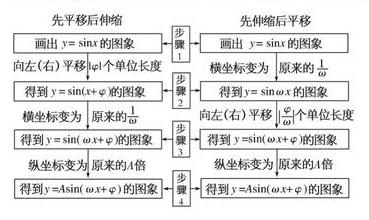
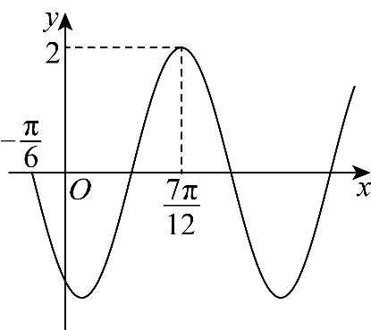
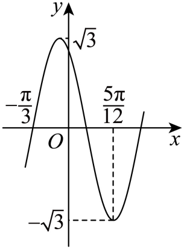
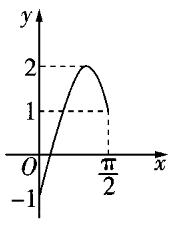

（3）三角函数与解三角形
——2025高考数学一轮复习易混易错专项复习

【易混点梳理】

1.同角三角函数的基本关系式

  
（1）平方关系：；（2）商数关系：.

2.诱导公式

<table><tr><td>
<strong>函数</strong>

<strong>角</strong>
</td><td>
<strong>正弦</strong>
</td><td>
<strong>余弦</strong>
</td><td>
<strong>正切</strong>
</td></tr><tr><td>

</td><td>

</td><td>

</td><td>

</td></tr><tr><td>

</td><td>

</td><td>

</td><td>

</td></tr><tr><td>

</td><td>

</td><td>

</td><td>

</td></tr><tr><td>

</td><td>

</td><td>

</td><td>

</td></tr><tr><td>

</td><td>

</td><td>

</td><td>

</td></tr><tr><td>

</td><td>

</td><td>

</td><td></td></tr><tr><td>

</td><td>

</td><td>

</td><td></td></tr><tr><td>

</td><td>

</td><td>

</td><td></td></tr><tr><td>

</td><td>

</td><td>

</td><td></td></tr></table>

角“”的三角函数的记忆口诀为“奇变偶不变，符号看象限.”

3.两角和与差的正弦、余弦、正切公式
> 

> 
> |  |  |  |
> | --- | --- | --- |
> | （1）； | （2）； | （3）. |
> 

4.二倍角的正弦、余弦、正切公式
> 

> 
> |  |  |  |
> | --- | --- | --- |
> | （1）； | （2）； | （3）. |
> 

5.降幂公式

  
（1）；（2）.

6.辅助角公式

，其中.

7.三角函数的单调性  
（1）求函数的单调区间应遵循简单化原则，将解析式进行化简，并注意复合函数单调性规律“同增异减”.

  
（2）求形如或（其中）的单调区间时，要视“”为一个整体，通过解不等式求解.但如果，那么一定先借助诱导公式将化为正数.  
（3）已知三角函数的单调区间求参数，先求出函数的单调区间，然后利用集合间的关系求解.

8.三角函数的奇偶性

对于，若为奇函数，则；若为偶函数，则.对于，若为奇函数，则；若为偶函数，则.对于，若为奇函数，则.

9.三角函数的周期性

求三角函数的最小正周期，一般先通过恒等变换化为或或（为常数，）的形式，再应用公式（正弦、余弦型）或（正切型）求解.

10.三角函数的对称性

函数（为常数，）图象的对称轴一定经过图象的最高点或最低点，对称中心的横坐标一定是函数的零点，因此在判断直线或点是不是函数图象的对称轴或对称中心时，可通过检验的值进行.

11.三角函数的图象及其变换

由函数的图象通过变换得到的图象，有两种主要途径：“先平移后伸缩”与“先伸缩后平移”.

12.正弦定理：在中，角的对边分别为，则.
在一个三角形中，各边和它所对角的正弦的比相等.

13.正弦定理的常见变形：

  
（1）（边角互化）.

> 

> 
> |  |  |  |
> | --- | --- | --- |
> | （2）.其中，为外接圆的半径. | （3）（边化角）. | （4）（角化边）. |
> 

14.余弦定理：在中，角的对边分别为，则

，，.

三角形中任何一边的平方等于其他两边平方的和减去这两边与它们夹角的余弦的积的两倍.

15.余弦定理的推论：，，.

16.三角形的面积公式

  
（1）（为外接圆的半径）.

  
（2），其中为的一边长，而为该边上的高的长.

  
（3），其中分别为的内切圆半径及的周长.

  
（4）海伦公式：，其中.

  
（5），其中.

  
（6），其中，.

【易错题练习】

1.已知，，则(   )

A.	
B.	
C.	
D.3*m*

2.已知的内角*A*，*B*，*C*的对边分别是*a*，*b*，*c*.若，，则(   )

A.	
B.3	
C.6	
D.

3.将函数的图像向左平移个单位长度后，再把横坐标缩短为原来的一半，得到函数的图像.若点是图像的一个对称中心，则的最小值是(   )

A.	
B.	
C.	
D.

4.已知函数，在区间上的最小值恰为，则所有满足条件的的积属于区间(   )

A.	
B.	
C.	
D.

5.已知函数（，，）的部分图象如图所示，将的图象向左平移个单位长度得函数的图象，若在上有两个不同的根，（），则的值为(   )

A.	
B.	
C.	
D.

6.（多选）在中，，，，则(   )

A.		
B.

C.的面积为	
D.外接圆的直径是

7.（多选）已知函数的部分图像如图所示,令,则下列说法正确的有(   )

A.的最小正周期为

B.的对称轴方程为

C.在上的值域为

D.的单调递增区间为

8.已知角的顶点为坐标原点，始边为*x*轴的非负半轴.若是角终边上一点，且，则\_\_\_\_\_\_\_\_\_\_

9.已知函数.若在上有解，则实数*m*的取值范围是\_\_\_\_\_\_\_\_\_\_\_；若方程在上有两个不同的解，则实数*m*的取值范围是\_\_\_\_\_\_\_\_\_\_\_.

10.在中，角*A*，*B*，*C*所对的边分别为*a*，*b*，*c*，的外接圆半径为*R*，且，.

  
（1）求的值；

  
（2）若的面积为，求的周长.
答案以及解析

1.答案：A

解析：由得①.由得②，由①②得，所以，故选A.

2.答案：B

解析：因为，而，所以，则，得.根据余弦定理可得，故.故选B.

3.答案：C

解析：因为，所以将的图像向左平移个单位长度后，得到函数的图像，再把所得图像上点的横坐标缩短为原来的一半，得到函数的图像.因为点是图像的一个对称中心，所以，，解得，，又，所以的最小值为.故选C.

4.答案：C

解析：当时，因为此时的最小值为，

所以，即.

若，此时能取到最小值，即，

代入可得，满足要求；

若取不到最小值，则需满足，即，

在上单调递减，所以存在唯一符合题意；

所以或者，所以所有满足条件的的积属于区间，
故选：C.

5.答案：D

解析：设的最小正周期为*T*，由图象可知，，所以，

则，于是，又的图象过点，

所以，，所以，

又，则，，则，由，

得，则，

又当时，，所以，得，

则，，

结合知，所以，所以.
故选：D.

6.答案：AB

解析：由题意可知，，故A正确；

在中，，由余弦定理得，解得，故B正确；

，故C错误；

设外接圆半径为*R*，由正弦定理得，故D错误.
故选AB.

7.答案：ACD

解析：对于函数,

由图可知,,

则,

所以,

又,

所以,

解得,,又,

所以;

则,

所以

,

对于A：的最小正周期为,A正确;

对于B：对于,令,,得的对称轴方程为,B错误;

对于C：当时,,所以,

即在上的值域为,C正确;

对于D：令,,解得,,

即的单调递增区间为,D正确;
故选：ACD.

8.答案：-6

解析：由题设知，即，且，即，且，解得.

9.答案：；

解析：，即，当时，，所以，所以在上的最小值为-1，所以实数*m*的取值范围是.方程在上有两个不同的解，等价于函数，的图象与直线有两个交点，函数，的图象如图所示，由图可知，*m*的取值范围是.

10.答案：（1）

  
（2）

解析：（1）由，

结合正弦定理，

得，

化简得，

故.

又，所以，

因此.

  
（2）由（1）知，，

则，

由正弦定理得，

令，则，，

则，解得，

因此的周长为.

