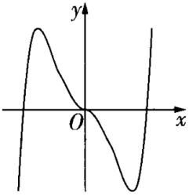
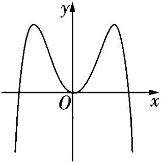
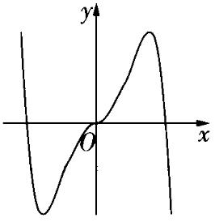
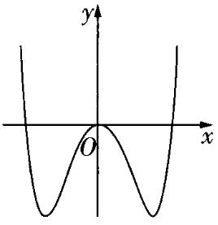
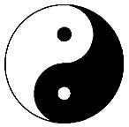
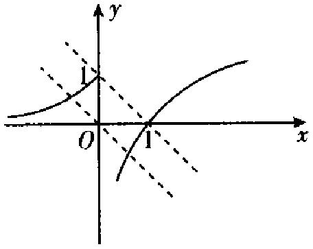
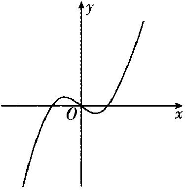
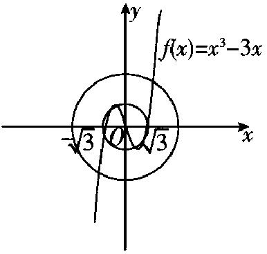
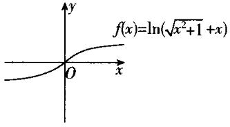

**（2）函数与导数
——2025高考数学一轮复习易混易错专项复习**

**【易混点梳理】**

1.如果函数在区间*D*上是增函数或减函数，那么就说函数在这一区间具有单调性，区间*D*叫做函数的单调区间.

2.

<table><tr><td>
前提
</td><td colspan="2">
一般地，设函数的定义域为<em>I</em>，如果存在实数<em>M</em>满足.
</td></tr><tr><td>
条件
</td><td>
（1）对于任意的，都有；

（2）存在，使得.
</td><td>
（3）对于任意的，都有；

（2）存在，使得.
</td></tr><tr><td>
结论
</td><td>
<em>M</em>为最大值
</td><td>
<em>M</em>为最小值
</td></tr></table>

若函数在闭区间上是增函数，则，；若函数在闭区间上是减函数，则，.

3.奇函数、偶函数的概念及图象特征：

<table><tr><td colspan="2"></td><td>
奇函数
</td><td>
偶函数
</td></tr><tr><td rowspan="4">
定义
</td><td rowspan="2">
定义域
</td><td colspan="2">
函数的定义域关于原点对称
</td></tr><tr><td colspan="2">
对于定义域内任意的一个<em>x</em>
</td></tr><tr><td>
与的关系
</td><td>
都有
</td><td>
都有
</td></tr><tr><td>
结论
</td><td>
函数为奇函数
</td><td>
函数为偶函数
</td></tr><tr><td colspan="2">
图象特征
</td><td>
关于原点对称
</td><td>
关于<em>y</em>轴对称
</td></tr></table>

4.函数周期性的常用结论：

若对于函数定义域内的任意一个*x*都有：

（1），则函数必为周期函数，是它的一个周期；

（2），则函数必为周期函数，是它的一个周期；

（3），则函数必为周期函数，是它的一个周期.

5. 若二次函数恒满足，则其图象关于直线对称.

6.对幂函数，当时，其图象经过点和点，且在第一象限内单调递增；当时，其图象不过点，经过点，且在第一象限内单调递减.

7.指数函数图象可解决的两类热点问题及思路：

（1）求解指数型函数的图象与性质问题

对指数型函数的图象与性质问题（单调性、最值、大小比较、零点等）的求解往往利用相应指数函数的图象，通过平移、对称变换得到其图象，然后数形结合使问题得解.

（2）求解指数型方程、不等式问题

一些指数型方程、不等式问题的求解，往往利用相应指数型函数图象数形结合求解.

8.比较对数的大小：

（1）若底数为同一常数，则可由对数函数的单调性直接进行判断；若底数为同一字母，则需对底数进行分类讨论；

（2）若底数不同，真数相同，则可以先用换底公式化为同底后，再进行比较；

（3）若底数与真数都不同，则常借助1，0等中间量进行比较.

9.函数图象的识别：

（1）从函数的定义域，判断图象的左右位置；从函数的值域，判断图象的上下位置；

（2）从函数的单调性（有时可借助导数判断），判断图象的变化趋势；

（3）从函数的奇偶性，判断图象的对称性；

（4）从函数的周期性，判断图象的循环往复；

（5）从函数的特殊点（与坐标轴的交点、经过的定点、极值点等），排除不合要求的图象.

10.判断函数零点个数的常用方法：

（1）直接法.令，则方程实根的个数就是函数零点的个数.

（2）零点存在的判定方法.判断函数在区间上是连续不断的曲线，且，再结合函数的图象与性质（如单调性、奇偶性、周期性、对称性）可确定函数的零点个数.

（3）数形结合法.转化为两个函数的图象的交点个数问题（画出两个函数的图象，其交点的个数就是函数零点的个数）.

11.根据函数零点求参数范围的一般步骤为：

（1）转化：把已知函数零点的存在情况转化为方程的解或两函数图象的交点的情况.

（2）列式：根据零点存在性定理或结合函数图象列式.

（3）结论：求出参数的取值范围或根据图象得出参数的取值范围.

12.用导数求函数的单调区间的方法：

（1）当不等式或可解时，确定函数的定义域，解不等式或求出单调区间.

（2）当方程可解时，确定函数的定义域，解方程，求出实数根，把函数的间断点（即的无定义点）的横坐标和实根按从小到大的顺序排列起来，把定义域分成若干个小区间，确定在各个区间内的符号，从而确定单调区间.

（3）不等式或及方程均不可解时求导数并化简，根据的结构特征，选择相应基本初等函数，利用其图象与性质确定的符号，得单调区间.

13.已知函数单调性，求参数范围的方法：

（1）利用集合间的包含关系处理：在上单调，则区间是相应单调区间的子集.

（2）转化为不等式的恒成立问题来求解：即“若函数单调递增，则；若函数单调递减，则”.

（3）可导函数在区间上存在单调区间，实际上就是（或）在该区间上存在解集，从而转化为不等式问题，求出参数的取值范围.

14.已知函数求极值：求求方程的根，列表检验在的根的附近两侧的符号，下结论.

15.求函数在上的最大值和最小值的步骤：

（1）若所给的闭区间不含参数，

①求函数在内的极值；

②求函数在区间端点的函数值，；

③将函数的极值与，比较，其中最大的一个为最大值，最小的一个为最小值.

（2）若所给的闭区间含有参数，则需对函数求导，通过对参数分类讨论，判断函数的单调性，从而得到函数的最值.

**【易错题练习】**

1.设，，，则*a*，*b*，*c*的大小关系为(   ).

A.	B.	C.	D.

2.已知函数.若存在2个零点，则*a*的取值范围是(   )

A.	B.	C.	D.

3.设函数的定义域为**R**，且为偶函数，为奇函数，则(   )

A.	B.	C.	D.

4.函数在区间的图象大致为(   )

A.	B.	C.	D.

5.已知定义在**R**上的函数的导函数为，且满足，则不等式的解集为(   )

A.	B.	C.	D.

6.（多选）已知函数有两个不同的极值点，，且不等式恒成立，则实数*t*的范围是(   )

A.	B.	C.	D.

7.（多选）中国传统文化中很多内容体现了数学的“对称美”，如图所示的太极图是由黑白两个鱼形纹组成的图案，俗称阴阳鱼，太极图展现了一种相互转化，相对统一的和谐美.定义：圆*O*的圆心在原点，若函数的图象将圆*O*的周长和面积同时等分成两部分，则这个函数称为圆*O*的一个“太极函数”.下列说法正确的有(   )

A.对于圆*O*，其“太极函数”只有1个

B.函数是圆*O*的一个“太极函数”

C.函数是圆*O*的“太极函数”

D.函数是圆*O*的一个“太极函数”

8.函数的图像在点处的切线恒过定点，则该定点坐标为\_\_\_\_\_\_\_\_\_\_.

9.已知，且，函数若函数在上的最大值比最小值大，则*a*的值为\_\_\_\_\_\_\_\_\_\_\_.

10.已知函数.

（1）若，讨论的单调性；

（2）若，求在上的最小值，并判断方程的实数根个数.

**答案以及解析**

1.答案：D

解析：因为，所以，因为，所以.

因为，所以，所以.

2.答案：C

解析：函数存在2个零点，函数的图象与的图象有2个交点.如图，平移直线，可以看出当且仅当即时，直线与的图象有2个交点.故选C.

3.答案：B

解析：因为函数是偶函数，所以，所以的图象关于直线对称.因为函数是奇函数，所以，所以，且函数的图象关于点对称.，，则，所以，又函数的图象关于直线对称，所以，故选B.

4.答案：B

解析：由题知函数的定义域为<strong>R</strong>，关于原点对称，，所以函数为偶函数，函数图象关于<em>y</em>轴对称，排除A，C；，排除D.故选B.

5.答案：A

解析：令，则，所以在**R**上单调递增.

由，得，即，

又在**R**上单调递增，所以，解得，

即不等式的解集为.故选A.

6.答案： B

解析：，

因为函数有两个不同的极值点，，

所以方程有两个不相等的正实数根，

于是有，解得.

因为不等式恒成立，所以恒成立.

，

设，，故在上单调递增，

故，所以.因此实数*t*的取值范围是.     故选：B

7.答案：BD

解析：对于A选项，圆*O*的“太极函数”不止1个，故A错误；

对于B选项，函数当时，，当时，，

故为奇函数，画出函数的简图如图所示，可知函数为圆*O*的一个“太极函数”，故B正确；

对于C选项，函数的定义域为<strong>R</strong>，，也是奇函数，画出函数的简图如图所示，当且仅当函数图象与圆<em>O</em>只有两个交点时，为圆<em>O</em>的一个“太极函数”，故C错误；

对于D选项，函数的定义域为<strong>R</strong>，，故为奇函数，，，在上均单调递增，所以在<strong>R</strong>上单调递增，画出函数的简图如图所示，可知函数是圆<em>O</em>的一个“太极函数”，故D正确.

故选BD.

8.答案：

解析：由题意，知，所以切点坐标为.又，所以函数的图像在点处的切线的斜率为，所以函数的图像在点处的切线方程为，即.令解得所以切线恒过定点.

9.答案：或

解析：易知当时，函数在上单调递减，

，，

，解得.

当时，在上单调递增，在上单调递减，

.又，，

当，即时，，

，解得.

当时，，

无解.综上，或.

10.答案：（1）在和上单调递减，在和上单调递增

（2）方程只有1个实数根

解析：（1）若，则.

当时，，

则，

所以当时，，单调递减，

当和时，，单调递增.

当时，，

则，所以在上单调递减.

综上，在和上单调递减，在和上单调递增.

（2）由得，

若，则当时，.

若，则当时，，

，

所以在上单调递增，

所以当时，.

若，则当时，，，

当时，则，

当时，，单调递增，当时，，单调递减，

，，，

当时，，，

当时，，，

当时，，，在上单调递增，所以.

综上，.

令函数，，则方程的实根个数就是函数的零点个数，

当时，单调递增，

又，，所以在上有1个零点.

当时，没有零点.

当时，，，在上单调递增，

又，所以在上没有零点.

当时，，，在上单调递增，

又，所以在上没有零点.

综上，方程只有1个实数根.

