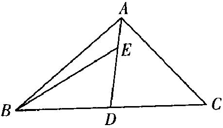
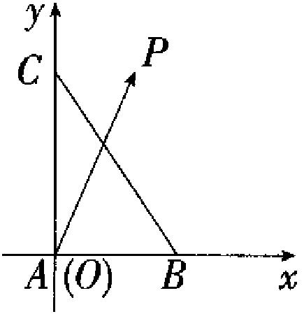
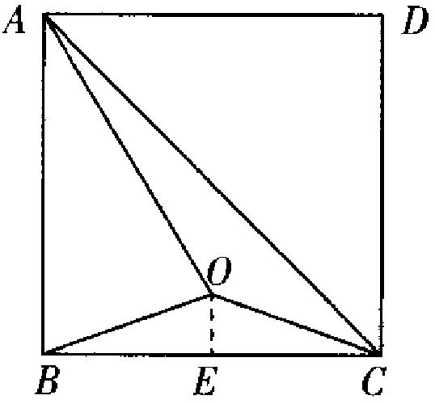
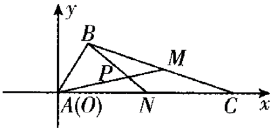

（4）平面向量
——2025高考数学一轮复习易混易错专项复习

【易混点梳理】

1.向量加法的法则：三角形法则和平行四边形法则.

<table><tr><td>
三角形法则
</td><td>
如图，已知非零向量<strong><em>a</em></strong>，<strong><em>b</em></strong>，在平面内取任意一点<em>A</em>，作，，则向量叫做<strong><em>a</em></strong>与<strong><em>b</em></strong>的和，记作，即.

</td></tr><tr><td>
平行四边形法则
</td><td>
已知两个不共线向量<strong><em>a</em></strong>，<strong><em>b</em></strong>，作，，以，为邻边作，则对角线上的向量.

</td></tr></table>

2.对于零向量与任意向量*a*，有.

3.向量加法的运算律：

交换律：；

结合律：.

4.向量形式的三角不等式：，当且仅当方向相同时等号成立.

5.相反向量：

①定义：与*a*长度相等，方向相反的向量，叫做*a*的相反向量，记作－*a*，并且规定，零向量的相反向量仍是零向量.

②性质：零向量的相反向量仍是零向量；

和互为相反向量，于是；

若互为相反向量，则，，.

6.向量数乘的定义：规定实数与向量的积是一个向量，这种运算叫做向量的数乘，记作：，它的长度与方向规定如下：①；②当时，的方向与的方向相同；当时，的方向与的方向相反.当或时，.

7.向量数乘的运算律：设为任意实数，则有：

①；

②；

③.

特别地，有；.

8.向量的线性运算：向量的加、减、数乘运算统称为向量的线性运算，向量线性运算的结果仍是向量.对于任意向量，以及任意实数，恒有.

9.向量共线（平行）定理：向量与共线的充要条件是：存在唯一一个实数，使.

10.平面向量基本定理：如果是同一平面内的两个不共线向量，那么对于这一平面内的任一向量，有且只有一对实数，使.

11.基底：若不共线，则把叫做表示这一平面内所有向量的一个基底.

12.平面向量的正交分解：把一个向量分解为两个互相垂直的向量，叫做把向量作正交分解.

13.平面向量的坐标运算：

设向量，则有下表：

<table><tr><td>
运算
</td><td>
文字描述
</td><td>
符号表示
</td></tr><tr><td>
加法
</td><td>
两个向量和的坐标分别等于这两个向量相应坐标的和
</td><td>

</td></tr><tr><td>
减法
</td><td>
两个向量差的坐标分别等于这两个向量相应坐标的差
</td><td>

</td></tr><tr><td>
数乘
</td><td>
实数与向量的积的坐标等于用这个实数乘原来向量的相应坐标
</td><td>

</td></tr><tr><td>
向量坐标公式
</td><td>
一个向量的坐标等于表示此向量的有向线段的终点的坐标减去起点的坐标
</td><td>
已知，

则
</td></tr></table>

14.平面向量共线的坐标表示

  
（1）设，其中共线的充要条件是存在实数，使.

  
（2）如果用坐标表示，向量共线的充要条件是.

15.向量的夹角：已知两个非零向量，如图，是平面上的任意一点，作，则叫做向量与的夹角.记作.

当时，向量同向；当时，向量垂直，记作；当时，向量反向.

16.平面向量数量积的定义：已知两个非零向量与，它们的夹角为，把数量叫做向量与的数量积（或内积），记作，即.

17.投影向量：如图，设是两个非零向量，，过的起点和终点，分别作所在直线的垂线，垂足分别为，得到，这种变换称为向量向向量投影，叫做向量在向量上的投影向量.

18.向量数量积的性质：设是非零向量，它们的夹角是是与方向相同的单位向量，则
> 

> 
> |  |  |
> | --- | --- |
> | （1）； | （2）； |
> 

  
（3）当与同向时，；当与反向时，，特别地，或；

> 

> 
> |  |  |
> | --- | --- |
> | （4）由可得，； | （5） |
> 

19.向量数量积的运算律
> 

> 
> |  |  |  |
> | --- | --- | --- |
> | （1）交换律：； | （2）数乘结合律：； | （3）分配律：. |
> 

20.平面向量数量积的坐标表示：设向量，则.
这就是说，两个向量的数量积等于它们对应坐标的乘积的和.

21.向量模的坐标表示：

  
（1）若向量，则；

  
（2）若点，向量，则.
由此可知，向量的模的坐标运算的实质是平面直角坐标系中两点间的距离的运算.

22.向量夹角的坐标表示：设都是非零向量，，是与的夹角，则.

23.向量垂直的坐标表示：设向量，则.

【易错题练习】

1.已知，，若，则(   )

A.-1	
B.	
C.	
D.

2.在中，*AD*为*BC*边上的中线，，则(   )

A.		
B.

C.		
D.

3.向量，，，若，且，则的值为(   )

A.2	
B.	
C.3	
D.

4.已知中，，，，点*D*在*BC*边上，且，则线段*AD*的长度为(   )

A.	
B.	
C.	
D.

5.已知向量*a*，*b*满足，，且，则(   )

A.	
B.	
C.	
D.1

6.已知，，.若*P*是所在平面内一点，且，则的最大值为(   )

A.13	
B.	
C.	
D.

7.（多选）已知向量，，，则(   )

A.		
B.向量*a*，*b*的夹角为

C.		
D.*a*在*b*上的投影向量是

8.（多选）若正方形*ABCD*中，*O*为正方形*ABCD*所在平面内一点，且，，则下列说法正确的是(   )

A.可以是平面内任意一个向量

B.若，则*O*在直线*BD*上

C.若，，则

D.若，则

9.设*D*为所在平面内一点，.若，则\_\_\_\_\_\_\_\_\_\_.

10.在中，已知，，，，边上两条中线*AM*，*BN*相交于点*P*，则的余弦值为\_\_\_\_\_\_\_\_\_\_.
答案以及解析

1.答案：B

解析：因为，，且，所以，即，解得.故选B.

2.答案：A

解析：如图，因为，所以.由已知可得，所以，

所以.故选A.

3.答案：C

解析：由题意，得，.

因为，所以，解得，

则，即解得故.故选C.

4.答案：D

解析：由题意得，因为，，，所以

，即线段*AD*的长度为.故选D.

5.答案：B

解析：由，得，所以.将的两边同时平方，得，即，解得，所以，故选B.

6.答案：B
解析：以*A*为坐标原点，建立如图所示的平面直角坐标系，

则，，，，

所以，即，

故，，

所以，当且仅当，即时，等号成立.故选B.

7.答案：BD

解析：，，，

，，

，，故A错误；

，

又，向量*a*，*b*的夹角为，故B正确；

，，故C错误；

*a*在*b*上的投影向量为，故D正确.故选BD.

8.答案：ABD

解析：对于A，由题意，又，，以为基底的坐标系中，根据平面向量基本定理易知可以是平面内任意一个向量，故A正确；

对于B，由向量共线的推论知，若，则*O*在直线*BD*上，故B正确；

对于C，由题设，则，所以，故C错误；

对于D，由，则，作*E*为*BC*的中点，连接*OE*，则，即，且，如图所示，所以，故D正确.故选ABD.

9.答案：-3

解析：因为，所以，即，又，所以，解得.

10.答案：
解析：方法一：如图，以*A*为原点，*AC*所在直线为*x*轴，建立平面直角坐标系.

由，，，得，，.由*M*，*N*分别为*BC*，*AC*的中点，得，，故，，

所以.

方法二：由已知得即为向量与的夹角.

因为*M*，*N*分别是*BC*，*AC*边上的中点，所以，.

又因为，

所以

，

，

，

所以.

