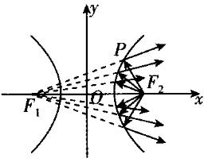
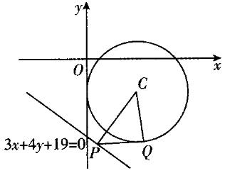
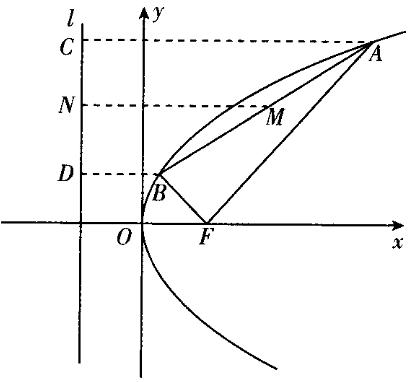
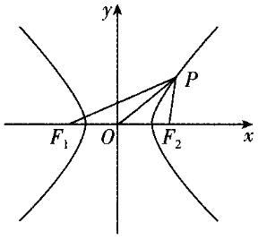
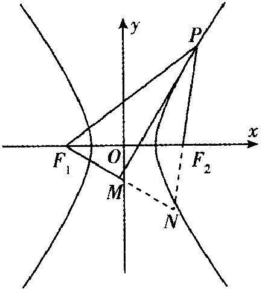

**（8）平面解析几何
——2025高考数学一轮复习易混易错专项复习**

**【易混点梳理】**

1.已知直线的倾斜角为，则直线的斜率为.

2.经过两点的直线的斜率公式*.*

3.两条直线平行与垂直的判定：设两条直线的斜率分别为.

（1）；（2）.

4.直线的方程：

（1）点斜式：.

（2）斜截式：.

（3）两点式：.

（4）截距式：.

（5）一般式：(*A*，*B*不同时为0) .

5.直线的交点坐标与距离公式

①一般地，将两条直线的方程联立，得方程组，若方程组有唯一解，则两条直线相交，此解就是交点的坐标；若方程组无解，则两条直线无公共点，此时两条直线平行.

②两点间的距离公式.

特别地，原点与任一点的距离.

③点到直线的距离：点到直线的距离.

④两条平行直线间的距离：若直线的方程分别为，，则两平行线的距离.

6.圆心为，半径为*r*的圆的标准方程：.

7.圆的一般方程：.

8.判断直线与圆的位置关系的方法：

（1）代数方法（判断直线与圆方程联立所得方程组的解的情况）：相交，相离，相切.

（2）几何方法（比较圆心到直线的距离与半径*r*的大小）：设圆心到直线的距离为*d*，则相交，相离，相切.

9.圆与圆的位置关系

设圆半径为，圆半径为.

<table><tr><td>
圆心距与两圆半径的关系
</td><td>
两圆的位置关系
</td></tr><tr><td>

</td><td>
内含
</td></tr><tr><td>

</td><td>
内切
</td></tr><tr><td>

</td><td>
相交
</td></tr><tr><td>

</td><td>
外切
</td></tr><tr><td>

</td><td>
外离
</td></tr></table>

10.椭圆：

1.定义：平面内与两个定点的距离的和等于常数（大于）的点的轨迹叫做椭圆.这两个定点叫做椭圆的焦点，两焦点间的距离叫做椭圆的焦距.

2.标准方程：

（1）中心在坐标原点，焦点在*x*轴上的椭圆的标准方程为；

（2）中心在坐标原点，焦点在*y*轴上的椭圆的标准方程为.

3.焦点三角形

（1）*P*是椭圆上不同于长轴两端点的任意一点，为椭圆的两焦点，则，其中为.

（2）*P*是椭圆上不同于长轴两端点的任意一点，为椭圆的两焦点，则的周长为.

（3）过焦点的弦*AB*与椭圆另一个焦点构成的的周长为.

4.椭圆的方程与简单几何性质

<table><tr><td></td><td>
焦点在<em>x</em>轴上
</td><td>
焦点在<em>y</em>轴上
</td></tr><tr><td>
标准方程
</td><td>

</td><td>

</td></tr><tr><td>
一般方程
</td><td colspan="2">

</td></tr><tr><td>
焦点坐标
</td><td>

</td><td>

</td></tr><tr><td>
顶点坐标
</td><td>

</td><td>

</td></tr><tr><td>
范围
</td><td>

</td><td>

</td></tr><tr><td>
长轴长
</td><td colspan="2">

</td></tr><tr><td>
短轴长
</td><td colspan="2">

</td></tr><tr><td>
焦距
</td><td colspan="2">

</td></tr><tr><td>
离心率
</td><td colspan="2">
，

越接近于1，椭圆越扁；越接近于0，椭圆越圆
</td></tr></table>

11.双曲线：

1.定义：平面内与两个定点的距离的差的绝对值等于非零常数（小于）的点的轨迹叫做双曲线.这两个定点叫做双曲线的焦点，两焦点间的距离叫做双曲线的焦距.

2.标准方程：

（1）中心在坐标原点，焦点在*x*轴上的双曲线的标准方程为；

（2）中心在坐标原点，焦点在*y*轴上的双曲线的标准方程为.

3.焦点三角形

（1）*P*为双曲线上的点，为双曲线的两个焦点，且，则.

（2）过焦点的直线与双曲线的一支交于*A*，*B*两点，则*A*，*B*与另一个焦点构成的的周长为.

（3）若*P*是双曲线右支上一点，分别为双曲线的左、右焦点，则，.

（4）*P*是双曲线右支上不同于实轴端点的任意一点，分别为双曲线的左、右焦点，为内切圆的圆心，则圆心的横坐标恒为定值*a*.

4.双曲线的几何性质

<table><tr><td></td><td>
焦点在<em>x</em>轴上
</td><td>
焦点在<em>y</em>轴上
</td></tr><tr><td>
标准方程
</td><td>

</td><td>

</td></tr><tr><td>
焦点坐标
</td><td>

</td><td>

</td></tr><tr><td>
顶点坐标
</td><td>

</td><td>

</td></tr><tr><td>
范围
</td><td>

</td><td>

</td></tr><tr><td>
对称性
</td><td colspan="2">
关于<em>x</em>轴、<em>y</em>轴对称，关于原点对称
</td></tr><tr><td>
实、虚轴长
</td><td colspan="2">
实轴长为，虚轴长为
</td></tr><tr><td>
离心率
</td><td colspan="2">
双曲线的焦距与实轴长的比
</td></tr><tr><td>
渐近线方程
</td><td>

</td><td>

</td></tr></table>

12.抛物线：

1.定义：平面内与一个定点*F*和一条定直线*l*（*l*不经过点*F*）的距离相等的点的轨迹叫做抛物线.点*F*叫做抛物线的焦点，直线*l*叫做抛物线的准线.

2.标准方程：

（1）焦点在*x*轴上的抛物线的方程为；

（2）焦点在*y*轴上的抛物线的方程为.

3.抛物线的几何性质

<table><tr><td>
标准方程
</td><td>

</td><td>

</td><td>

</td><td>

</td></tr><tr><td>
范围
</td><td>

</td><td>

</td><td>

</td><td>

</td></tr><tr><td>
准线
</td><td>

</td><td>

</td><td>

</td><td>

</td></tr><tr><td>
焦点
</td><td>

</td><td>

</td><td>

</td><td>

</td></tr><tr><td>
对称性
</td><td colspan="2">
关于<em>x</em>轴对称
</td><td colspan="2">
关于<em>y</em>轴对称
</td></tr><tr><td>
顶点
</td><td colspan="4">

</td></tr><tr><td>
离心率
</td><td colspan="4">

</td></tr><tr><td>
焦半径长
</td><td>

</td><td>

</td><td>

</td><td>

</td></tr><tr><td>
焦点弦长
</td><td>

</td><td>

</td><td>

</td><td>

</td></tr></table>

**【易错题练习】**

1.已知，是椭圆的两个焦点，*P*为*C*上一点，且，，则*C*的离心率为(   )

A.	B.	C.	D.

2.已知圆，过直线上一点*P*向圆*C*作切线，切点为*Q*，则的最小值为(   )

A.5	B.	C.	D.

3.为了增强某会议主席台的亮度，且为了避免主席台就座人员面对强光的不适，灯光设计人员巧妙地通过双曲线镜面反射出发散光线达到了预期的效果.如图，从双曲线右焦点发出的光线的反射光线的反向延长线经过左焦点.已知双曲线的离心率为，则当与恰好相等时，(   )

A.	B.	C.	D.

4.已知抛物线的焦点为*F*，准线为*l*，点*A*，*B*在抛物线*C*上，且满足.设线段*AB*的中点到准线的距离为*d*，则的最小值为(   )

A.	B.	C.	D.

5.已知点*P*是双曲线上的动点，，分别是双曲线*C*的左、右焦点，*O*为坐标原点，则的取值范围是(   )

A.	B.	C.	D.

6.（多选）抛物线的准线为*l*，*P*为*C*上的动点.对*P*作的一条切线，*Q*为切点.对*P*作*l*的垂线，垂足为*B*.则(   )

A.*l*与相切		B.当*P*，*A*，*B*三点共线时，

C.当时，	D.满足的点*P*有且仅有2个

7.（多选）已知椭圆过点，直线与椭圆*C*交于*M*，*N*两点，且线段的中点为*P*，*O*为坐标原点，直线的斜率为，则下列结论正确的是(   )

A.*C*的离心率为

B.*C*的方程为

C.若，则

D.若，则椭圆*C*上存在*E*，*F*两点，使得*E*，*F*关于直线*l*对称

8.已知椭圆的左、右顶点分别为*A*，*B*，*P*是圆上不同于*A*，*B*两点的动点，直线*PB*与椭圆*C*交于点*Q*.若直线*PA*斜率的取值范围是，则直线*QA*斜率的取值范围是\_\_\_\_\_\_\_\_\_\_.

9.设，是双曲线的两个焦点，*P*是双曲线上任意一点，过作平分线的垂线，垂足为*M*，则点*M*到直线的距离的最大值是\_\_\_\_\_\_\_\_\_\_\_.

10.已知抛物线*C*的顶点为坐标原点*O*，焦点*F*在坐标轴上，且过，两点.

（1）求*C*的方程；

（2）设过点*F*的直线*l*与*C*交于*M*，*N*两点，*P*，*Q*两点分别是直线*AM*，*BN*与*x*轴的交点，证明：为定值.

**答案以及解析**

1.答案：A

解析：在椭圆中，由椭圆的定义可得，因为，所以，.在中，，由余弦定理得，即，所以，所以*C*的离心率.故选A.

2.答案：C

解析：如图所示：

记圆心到直线的距离为*d*，则.

因为，所以当直线*l*与*CP*垂直，即时，最小，故.故选C.

3.答案：A

解析：离心率，.

又，则根据双曲线的定义可知，，

.故选A.

4.答案：D

解析：如图，设线段*AB*的中点为*M*，分别过点*A*，*B*，*M*作准线*l*的垂线，垂足分别为*C*，*D*，*N*.

设，，则，.

由*MN*为梯形*ACDB*的中位线，得，由可得，故.

因为，当且仅当时取等号，

所以，故选D.

5.答案：B

解析：如图所示，由双曲线的对称性，不妨设是双曲线*C*右支上的一点，，所以，同理可得，所以.又因为，，所以.

又因为，所以，所以，，所以.故选B.

6.答案：ABD

解析：对于A，易知，故*l*与相切，A正确；

对于B，，的半径，当*P*，*A*，*B*三点共线时，，所以，，故B正确；

对于C，当时，，或，，易知*PA*与*AB*不垂直，故C错误；

对于D，记抛物线*C*的焦点为*F*，连接*AF*，*PF*，易知，由抛物线定义可知，因为，所以，所以点*P*在线段*AF*的中垂线上，线段*AF*的中垂线方程为，即，代入可得，解得，易知满足条件的点*P*有且仅有两个，故D正确.故选ABD.

7.答案：AC

解析：设，，则，即.

因为*M*，*N*在椭圆*C*上，所以，，两式相减，

得，即，

又，所以，

即，所以，离心率，故A正确；

因为椭圆*C*过点，所以，解得，，所以椭圆*C*的标准方程为，故B错误；若，则直线*l*的方程为，由得，所以，，，故C正确；

若，则直线*l*的方程为.假设椭圆*C*上存在*E*，*F*两点，使得*E*，*F*关于直线*l*对称，设，，的中点为，所以，，因为*E*，*F*关于直线*l*对称，所以且点*Q*在直线*l*上，即.又*E*，*F*在椭圆*C*上，所以，，两式相减，得，即，所以，即.联立，解得，即.又，所以点*Q*在椭圆*C*外，这与*Q*是弦的中点矛盾，所以椭圆*C*上不存在*E*，*F*两点，使得*E*，*F*关于直线*l*对称.

故选AC.

8.答案：

解析：由题可知，，设，则，，所以.

因为，所以，即.①

因为点*P*在圆上，所以，所以.②

结合①②可知，.因为，所以.

9.答案：5

解析：由双曲线的方程可得，则，

，.设，

不妨设点*P*在双曲线右支上，延长交的延长线于点*N*，则，如图.

由角平分线性质可知，，由双曲线的定义可得，，即.

，

整理得，即点*M*在以为圆心，2为半径的圆上.

圆心到直线的距离，

直线与圆相离，圆上的点到直线的最大距离为.

10.答案：（1）

（2）证明见解析

解析：（1）由题意可知抛物线*C*过第一、四象限，

故可设抛物线*C*的方程为，代入得，则，

故抛物线*C*的方程为.

（2）证明：由（1）可得，易得直线*l*的斜率不为0，

则可设直线，，.

联立方程得消去*x*得，

则，，.

当直线*AM*的斜率不存在时，，此时直线，

则，，，则；

当直线*AM*的斜率存在时，，

则直线*AM*的方程为，令，则，

解得，，

同理可得，故（定值）.

综上，为定值1.

