**（7）空间向量与立体几何
——2025高考数学一轮复习易混易错专项复习**

**【易混点梳理】**

1.棱柱、棱锥、棱台的表面积

多面体的表面积就是围成多面体各个面的面积的和.一般地，表面积=侧面积+底面积.

<table><tr><td>
多面体
</td><td>
侧面展开图
</td><td>
面积公式
</td></tr><tr><td>
棱柱

（如三棱柱）
</td><td>

</td><td>

</td></tr><tr><td>
棱锥

（如三棱锥）
</td><td>

</td><td>

</td></tr><tr><td>
棱台

（如三棱台）
</td><td>

</td><td>

</td></tr></table>

2.圆柱、圆锥、圆台的表面积

<table><tr><td>
旋转体
</td><td>
侧面展开图
</td><td>
面积公式
</td></tr><tr><td>
圆柱
</td><td>

</td><td>
底面积：

侧面积：

表面积：
</td></tr><tr><td>
圆锥
</td><td>

</td><td>
底面积：

侧面积：

表面积：
</td></tr><tr><td>
圆台
</td><td>

</td><td>
上底面面积：

下底面面积：

侧面积：

表面积：
</td></tr></table>

3.柱体、锥体、台体的体积

<table><tr><td>
几何体
</td><td>
体积公式
</td></tr><tr><td>
柱体
</td><td>
（为底面面积，为高），（为底面半径，为高）
</td></tr><tr><td>
锥体
</td><td>
（为底面面积，为高），（为底面半径，为高）
</td></tr><tr><td>
台体
</td><td>
（分别为上、下底面面积，为高），

（分别为上、下底面半径，为高）
</td></tr></table>

4.球的表面积和体积

（1）球的表面积：设球的半径为，则球的表面积为，即球的表面积等于它的大圆面积的4倍.

（2）球的体积：设球的半径为，则球的体积为.

5.直线与直线平行：

基本事实4 平行于同一条直线的两条直线平行.这一性质叫做空间平行线的传递性.

6.等角定理：如果空间中两个角的两条边分别对应平行，那么这两个角相等或互补.

7.直线与平面平行的判定定理

<table><tr><td>
自然语言
</td><td>
图形语言
</td><td>
符号语言
</td></tr><tr><td>
如果平面外一条直线与此平面内的一条直线平行，那么该直线与此平面平行.
</td><td>

</td><td>
，，且.
</td></tr><tr><td colspan="3">
该定理可简记为“若线线平行，则线面平行”.
</td></tr></table>

8.直线与平面平行的性质定理

<table><tr><td>
自然语言
</td><td>
图形语言
</td><td>
符号语言
</td></tr><tr><td>
一条直线与一个平面平行，如果过该直线的平面与此平面相交，那么该直线与交线平行.
</td><td>

</td><td>
，，.
</td></tr><tr><td colspan="3">
该定理可简记为“若线面平行，则线线平行”.
</td></tr></table>

9.平面与平面平行的判定定理

<table><tr><td>
自然语言
</td><td>
图形语言
</td><td>
符号语言
</td></tr><tr><td>
如果一个平面内的两条相交直线与另一个平面平行，那么这两个平面平行.
</td><td>

</td><td>
，，，，
</td></tr><tr><td colspan="3">
该定理可简记为“若线面平行，则面面平行”.
</td></tr></table>

10.平面与平面平行的性质定理

<table><tr><td>
自然语言
</td><td>
图形语言
</td><td>
符号语言
</td></tr><tr><td>
两个平面平行，如果另一个平面与这两个平面相交，那么两条交线平行.
</td><td>

</td><td>
，，.
</td></tr><tr><td colspan="3">
该定理可简记为“若面面平行，则线线平行”.
</td></tr></table>

11.异面直线所成的角：

（1）定义：已知两条异面直线，经过空间任一点分别作直线，我们把与所成的角叫做异面直线与所成的角（或夹角）.

（2）异面直线所成的角的取值范围：.

（3）两条异面直线互相垂直：两条异面直线所成的角是直角，即时，与互相垂直，记作.

12.直线与平面垂直的概念

<table><tr><td>
定义
</td><td>
如果直线与平面内的任意一条直线都垂直，我们就说直线与平面互相垂直，记作，

直线叫做平面的垂线，平面叫做直线的垂面.它们唯一的公共点叫做垂足.
</td></tr><tr><td>
画法图示
</td><td>
画直线与平面垂直时，通常把直线画成与表示平面的平行四边形的一边垂直，如图所示

</td></tr><tr><td>
点到面的距离

线到面的距离

两面间的距离
</td><td>
过一点垂直于已知平面的直线有且只有一条.

过一点作垂直于已知平面的直线，则该点与垂足间的线段，叫做这个点到该平面的垂线段，垂线段的长度叫做这个点到该平面的距离.

一条直线与一个平面平行时，这条直线上任意一点到这个平面的距离，叫做这条直线到这个平面的距离.

如果两个平面平行，那么其中一个平面内的任意一点到另一个平面的距离都相等，我们把它叫做这两个平行平面间的距离.
</td></tr></table>

13.直线与平面垂直的判定定理

<table><tr><td>
自然语言
</td><td>
图形语言
</td><td>
符号语言
</td></tr><tr><td>
如果一条直线与一个平面内的两条相交直线垂直，那么该直线与此平面垂直.
</td><td>

</td><td>
，，，，

.
</td></tr><tr><td colspan="3">
该定理可简记为“若线线垂直，则线面垂直”.
</td></tr></table>

14.直线和平面所成的角

<table><tr><td colspan="2">
有关概念
</td><td>
对应图形
</td></tr><tr><td>
斜线
</td><td>
一条直线与一个平面相交，但不与这个平面垂直，图中直线.
</td><td rowspan="3">

</td></tr><tr><td>
斜足
</td><td>
斜线和平面的交点，图中点.
</td></tr><tr><td>
射影
</td><td>
过斜线上斜足以外的一点向平面引垂线，过垂足和斜足的直线叫做斜线在这个平面内的射影.
</td></tr><tr><td>
直线与平面所成的角
</td><td colspan="2">
定义：平面的一条斜线和它在平面上的射影所成的角；

规定：一条直线垂直于平面，它们所成的角是直角；

一条直线和平面平行或在平面内，它们所成的角是的角.
</td></tr><tr><td>
取值范围
</td><td colspan="2">

</td></tr></table>

15.直线与平面垂直的性质定理

<table><tr><td>
自然语言
</td><td>
图形语言
</td><td>
符号语言
</td></tr><tr><td>
垂直于同一个平面的两条直线平行.
</td><td>

</td><td>
，
</td></tr></table>

16.二面角的概念

<table><tr><td>
概念
</td><td colspan="2">
从一条直线出发的两个半平面所组成的图形叫做二面角.这条直线叫做二面角的棱，这两个半平面叫做二面角的面.
</td></tr><tr><td>
图示
</td><td colspan="2">

</td></tr><tr><td>
记法
</td><td colspan="2">
棱为，面分别为的二面角记为.

也可在内（棱以外的半平面部分）分别取点，记作二面角.
</td></tr><tr><td rowspan="5">
平面角
</td><td>
文字
</td><td>
在二面角的棱上任取一点，以点为垂足，在半平面和内分别作垂直于棱的射线和，则这两条射线构成的角叫做这个二面角的平面角.
</td></tr><tr><td>
图示
</td><td>

</td></tr><tr><td>
符号
</td><td>
，，，，，，是二面角的平面角.
</td></tr><tr><td>
范围
</td><td>

</td></tr><tr><td>
规定
</td><td>
二面角的大小可以用它的平面角来度量，二面角的平面角是多少度，就说这个二面角是多少度.

平面角是直角的二面角叫做直二面角.
</td></tr></table>

17.平面与平面垂直

（1）定义：一般地，两个平面相交，如果它们所成的二面角是直二面角，就说这两个平面互相垂直.平面与平面垂直，记作.如图

（2）判定定理：

<table><tr><td>
自然语言
</td><td>
图形语言
</td><td>
符号语言
</td></tr><tr><td>
如果一个平面过另一个平面的垂线，那么这两个平面垂直.
</td><td>

</td><td>
，.
</td></tr><tr><td colspan="3">
该定理可简记为“若线面垂直，则面面垂直”.
</td></tr></table>

18.平面与平面垂直的性质定理

<table><tr><td>
自然语言
</td><td>
图形语言
</td><td>
符号语言
</td></tr><tr><td>
两个平面垂直，如果一个平面内有一直线垂直于这两个平面的交线，那么这条直线与另一个平面垂直.
</td><td>

</td><td>
，，，.
</td></tr><tr><td colspan="3">
该定理可简记为“若面面垂直，则线面垂直”.
</td></tr></table>

19.一般地，两条异面直线所成的角，可以转化为两条异面直线的方向向量的夹角来求得.也就是说，若异面直线所成的角为，其方向向量分别是***u***，***v***，则.

20.直线与平面所成的角，可以转化为直线的方向向量与平面的法向量的夹角.如下图，直线<em>AB</em>与平面<em>α</em>相交于点<em>B</em>，设直线<em>AB</em>与平面<em>α</em>所成的角为，直线<em>AB</em>的方向向量为<em><strong>u</strong></em>，平面<em>α</em>的法向量为<em><strong>n</strong></em>，则.

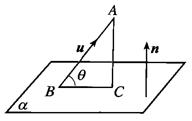

21.平面*α*与平面*β*相交，形成四个二面角，我们把这四个二面角中不大于的二面角称为平面*α*与平面*β*的夹角.若平面*α*，*β*的法向量分别是和，则平面*α*与平面*β*的夹角即为向量和的夹角或其补角.设平面*α*与平面*β*的夹角为，则.

**【易错题练习】**

1.一个五面体.已知，且两两之间距离为1，，，，则该五面体的体积为(   )

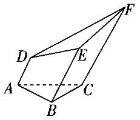

A.	B.	C.	D.

2.已知空间中有两个不重合的平面，和两条不重合的直线*m*，*n*，则下列说法中正确的是(   )

A.若，，，则

B.若，，，则

C.若，，，则

D.若，，，则

3.如图，四棱锥是棱长均为2的正四棱锥，三棱锥是正四面体，*G*为*BE*的中点，则下列结论错误的是(   )

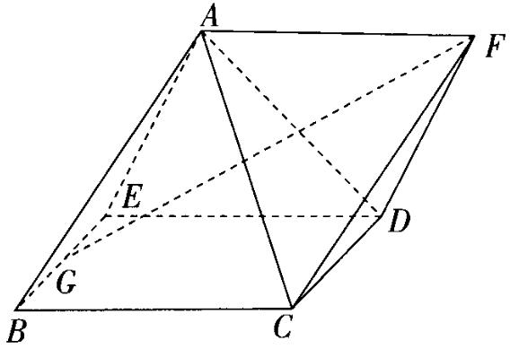

A.点*A*，*B*，*C*，*F*共面	B.平面平面*CDF*

C.		D.平面*ACD*

4.如图，在正方体中，*O*是*AC*中点，点*P*在线段上，若直线*OP*与平面所成的角为，则的取值范围是(   )

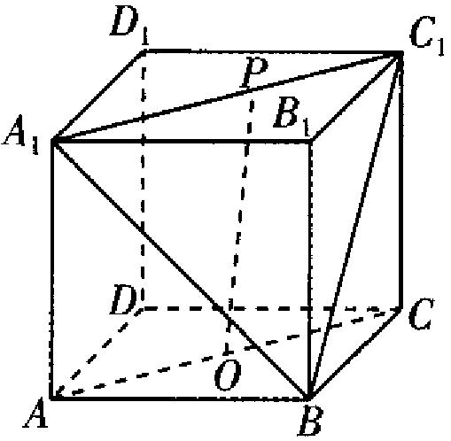

A.	B.	C.	D.

5.已知中，，*D*为的中点.将沿翻折，使点*C*移动至点*E*，在翻折过程中，下列说法不正确的是(   )

A.平面平面

B.三棱锥的体积为定值

C.当二面角的平面角为时，三棱锥的体积为

D.当二面角为直二面角时，三棱锥的内切球表面积为

6.（多选）已知正方体的棱长为4，*EF*是棱*AB*上的一条线段，且，点*Q*是棱的中点，点*P*是棱上的动点，则下面结论中正确的是(   )

A.*PQ*与*EF*一定不垂直	B.二面角的正弦值是

C.的面积是	D.点*P*到平面*QEF*的距离是定值

7.（多选）如图，在正方体中，点*P*在线段上运动，有下列判断，其中正确的是(   )

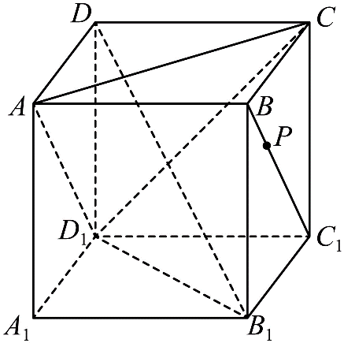

A.平面平面

B.平面

C.异面直线与所成角的取值范围是

D.三棱锥的体积不变

8.如图，在棱长为2的正方体中，*M*为棱的中点，与相交于点*N*，*P*是底面*ABCD*内（含边界）的动点，总有，则动点*P*的轨迹的长度为\_\_\_\_\_\_\_\_\_\_\_.

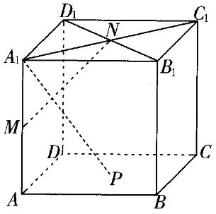

9.已知四棱锥的底面*ABCD*是边长为2的正方形，侧面底面*ABCD*，且，则四棱锥的外接球的表面积为\_\_\_\_\_\_\_\_\_\_.

10.如图所示，圆台的轴截面为等腰梯形，，*B*为底面圆周上异于*A*，*C*的点，且，*P*是线段*BC*的中点.

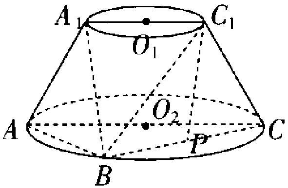

（1）求证：平面.

（2）求平面与平面夹角的余弦值.

**答案以及解析**

1.答案：C

解析：因为*AD*，*BE*，*CF*两两平行，且两两之间距离为1，则该五面体可以分成一个侧棱长为1的三棱柱和一个底面为梯形的四棱锥，其中三棱柱的体积等于棱长均为1的直三棱锥的体积，四棱锥的高为，底面是上底为1、下底为2、高为1的梯形，故该五面体的体积，故选C.

2.答案：A

解析：若，，则或，又，所以，故A正确；

若，，则或，又，则或*n*与斜交或均有可能，故B错误；

若，，则或，又，因此*m*和*n*的位置关系可能为平行、相交或异面，故C错误；

若，，，则或，故D错误.

综上，选A.

3.答案：D

解析：A选项：如图，取*CD*的中点*H*，连接*GH*，*FH*，*AG*，*AH*，易得，，，则平面，平面*AFH*，所以*A*，*G*，*H*，*F*四点共面，由题意知，，所以四边形*AGHF*是平行四边形，所以，因为，所以，所以*A*，*B*，*C*，*F*四点共面，故A正确；

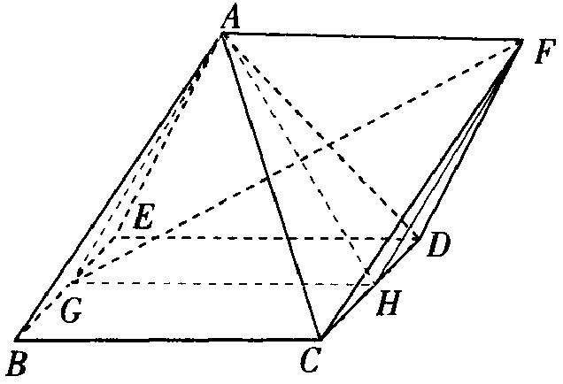

B选项：由选项A知，又平面，平面*CDF*，所以平面*CDF*，因为，且平面，平面*CDF*，所以平面*CDF*，又平面，平面*ABE*，且，所以平面平面*CDF*，故B正确；

C选项：由选项A可得平面*AGHF*，又平面*AGHF*，所以，故C正确；

D选项：假设平面*ACD*，则，由选项A知四边形*AGHF*是平行四边形，所以四边形*AGHF*是菱形，与，矛盾，故D错误.

4.答案：A

解析：如图，设正方体的棱长为1，，则.以*D*为原点，，，所在直线分别为*x*，*y*，*z*轴建立空间直角坐标系.

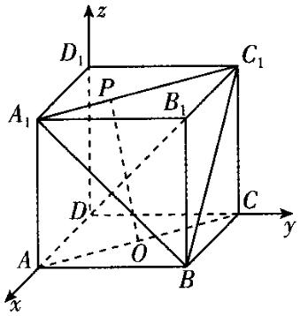

则，，，故，，又，则，所以.

在正方体中，连接，可知体对角线平面，所以是平面的一个法向量，所以.所以当时，取得最大值，当或1时，取得最小值.所以，故选A.

5.答案：B

解析：如图：

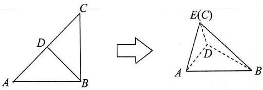

A选项，，，，所以平面，因为平面，故平面平面，A正确，不符合题意.

B选项，由A知平面，但的面积不是定值，故三棱锥的体积不是定值，B错误，符合题意.

C选项，二面角的平面角为，当时，，

三棱锥的体积为，C正确，不符合题意.

D选项，当二面角为直二面角时，，三棱锥的表面积为，

设内切球半径为*r*，则由等体积法知，解得，所以内切球表面积，D正确.

6.答案：BCD

解析：对于A，当点*P*与点重合时，，故选项A错误.

对于B，由于点*P*是棱上的动点，*EF*是棱*AB*上的一条线段，所以平面*PEF*即为平面，平面*QEF*即为平面*QAB*.

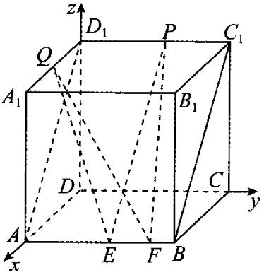

建立如图所示的空间直角坐标系，则，，，，

所以，，.

设平面*QAB*的一个法向量为，则即

令，则.

设平面的法向量为，

则即

令，则.

设二面角的大小为，所以，故，故选项B正确.

对于C，由于平面，平面，所以，所以，所以是的高，所以，故选项C正确.

对于D，由于，且平面，平面*QEF*，所以平面*QEF*，又点*P*在上，所以点*P*到平面*QEF*的距离是定值，故选项D正确.故选BCD.

7.答案：ABD

解析：对于A，连接*DB*，如图，因为在正方体中，平面*ABCD*，又平面*ABCD*，所以，因为在正方形*ABCD*中，，又*DB*与为平面内的两条相交直线，所以平面，又因为平面，所以，同理可得，因为与*AC*为平面内两条相交直线，所以平面，又平面，从而平面平面，故A正确；

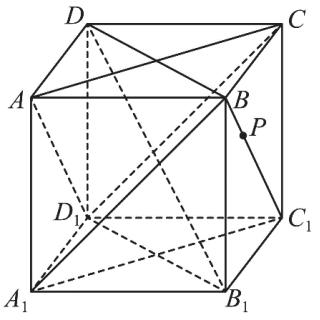

对于B，连接，，如图，因为，，所以四边形是平行四边形，所以，又平面，平面，所以平面，同理平面，又、为平面内两条相交直线，所以平面平面，因为平面，所以平面，故B正确；

对于C，因为，所以与所成角即为与所成的角，因为，所以为等边三角形，当*P*与线段的两端点重合时，与所成角取得最小值，当*P*与线段的中点重合时，与所成角取得最大值，所以与所成角的范围是，故C错误；对于D，由选项B得平面，故上任意一点到平面的距离均相等，即点*P*到平面的距离不变，不妨设为*h*，则，所以三棱锥的体积不变，故D正确.故选ABD.

8.答案：

解析：如图，连接，，，，，因为*N*，*M*分别是，的中点，所以.由正方体的性质易知，，，所以平面，所以.同理可证.又，所以平面，即平面，因此当时，总有，所以动点*P*的轨迹是线段*BD*.又正方体的棱长为2，所以.

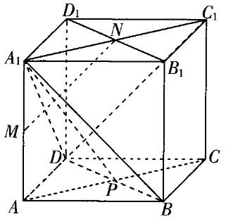

9.答案：

解析：设正方形*ABCD*的中心为，的外心为*G*，取*AB*的中点*E*，连接，，，则，，以，为邻边作平行四边形，如图.

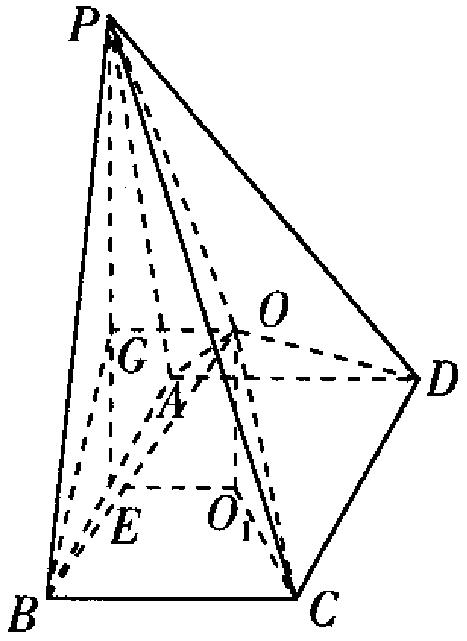

因为侧面底面，，平面平面，平面*PAB*，所以平面*ABCD*，所以.则平面*ABCD*，同理可知平面*PAB*.连接*OA*，*OB*，*OC*，*OD*，*OP*，则，所以*O*就是该四棱锥外接球的球心.连接*BG*，*PE*，由，，得，，解得.设该四棱锥的外接球半径为*R*，在中，，则四棱锥的外接球的表面积为.

10.答案：（1）证明见解析

（2）

解析：（1）取*AB*的中点*H*，连接，，如图所示，

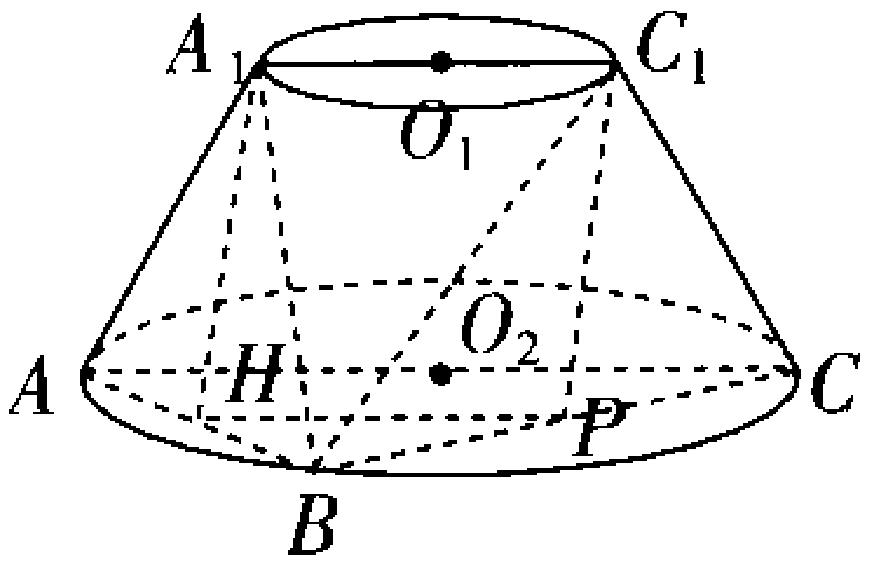

因为*P*为*BC*的中点，所以，.

在等腰梯形中，，，

所以，，所以四边形为平行四边形，

所以，又平面，平面，

所以平面.

（2）以直线，，分别为*x*，*y*，*z*轴，建立空间直角坐标系，如图所示，

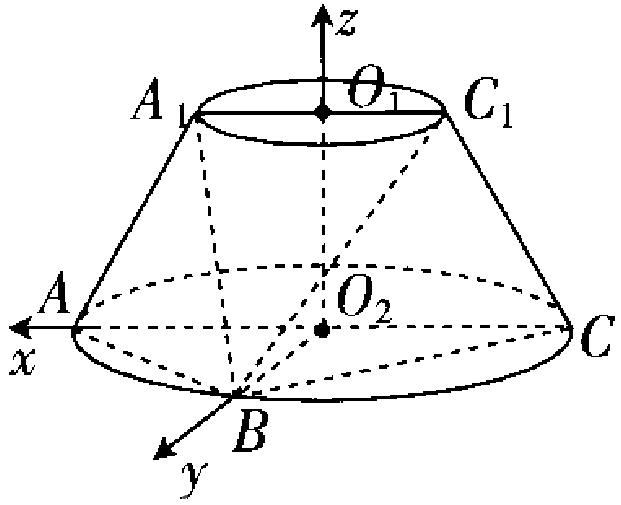

在等腰梯形中，，

此梯形的高为.

因为，，

则，，，，，，

所以，，，.

设平面的法向量为，

则令，得.

设平面的法向量为，

则令，得.

设平面与平面的夹角为，

则.

