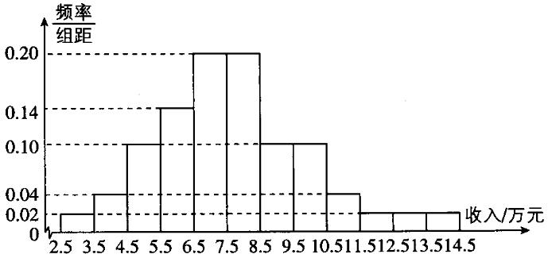
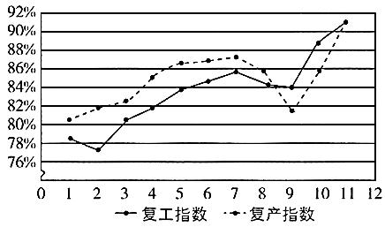
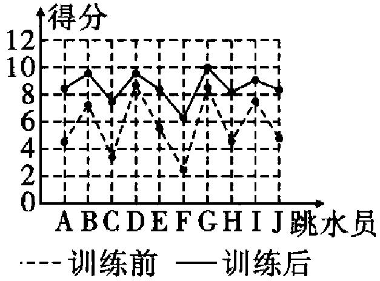

（9）计数原理与概率统计
——2025高考数学一轮复习易混易错专项复习

【易混点梳理】

1.

<table><tr><td>
名称
</td><td>
定义
</td><td>
符号表示
</td></tr><tr><td>
包含关系
</td><td>
若事件<em>A</em>发生，则事件<em>B</em>一定发生，这时称事件<em>B</em>包含事件<em>A</em>（或事件<em>A</em>包含于事件<em>B</em>）
</td><td>
（或）
</td></tr><tr><td>
相等关系
</td><td>
如果事件<em>B</em>包含事件<em>A</em>，事件<em>A</em>也包含事件<em>B</em>，即且，则称事件<em>A</em>与事件<em>B</em>相等
</td><td>
<em>A</em>=<em>B</em>
</td></tr><tr><td>
并事件

（和事件）
</td><td>
事件<em>A</em>与事件<em>B</em>至少有一个发生，这样的一个事件中的样本点或者在事件<em>A</em>中，或者在事件<em>B</em>中，则称这个事件为事件<em>A</em>与事件<em>B</em>的并事件（或和事件）
</td><td>
（或）
</td></tr><tr><td>
交事件

（积事件）
</td><td>
事件<em>A</em>与事件<em>B</em>同时发生，这样的一个事件中的样本点既在事件<em>A</em>中，也在事件<em>B</em>中，则称这样的一个事件为事件<em>A</em>与事件<em>B</em>的交事件（或积事件）
</td><td>
（或）
</td></tr><tr><td>
互斥事件
</td><td>
若为不可能事件，那么称事件<em>A</em>与事件<em>B</em>互斥
</td><td>

</td></tr><tr><td>
对立事件
</td><td>
若为不可能事件，为必然事件，那么称事件<em>A</em>与事件<em>B</em>互为对立事件 
</td><td>
且（<em>U</em>为全集）
</td></tr></table>

2.古典概率模型：我们将具有以下两个特征的试验称为古典概型试验，其数学模型称为古典概率模型，简称古典概率：  
（1）有限性：样本空间的样本点只有有限个；  
（2）等可能性：每个样本点发生的可能性相等.

3.古典概型的概率公式
> 

> 
> |  |  |
> | --- | --- |
> | （1）在基本事件总数为*n*的古典概型中，每个基本事件发生的概率都是相等的，即每个基本事件发生的概率都是. | （2）对于古典概型，任何事件的概率为. |
> 

4.离散型随机变量的分布列  
（1）如果随机试验的结果可以用一个变量来表示，那么这样的变量叫做随机变量，按一定次序一一列出，这样的随机变量叫做离散型随机变量.

  
（2）一般地，若离散型随机变量*X*可能取的不同值为取每一个值的概率，则下表称为随机变量*X*的概率分布列，简称为*X*的分布列.

<table><tr><td>
<em>X</em>
</td><td>

</td><td>

</td><td>
…
</td><td>

</td><td>
…
</td><td>

</td></tr><tr><td>
<em>P</em>
</td><td>

</td><td>

</td><td>
…
</td><td>

</td><td>
…
</td><td>

</td></tr></table>

5.离散型随机变量的分布列的性质
根据概率的性质，离散型随机变量的分布列具有如下性质：
> 

> 
> |  |  |  |
> | --- | --- | --- |
> | （1）； | （2）； | （3）. |
> 

6.常见的离散型随机变量的概率分布模型  
（1）两点分布
若随机变量*X*的分布列为

<table><tr><td>
<em>X</em>
</td><td>
0
</td><td>
1
</td></tr><tr><td>
<em>P</em>
</td><td>

</td><td>
<em>p</em>
</td></tr></table>
则称*X*服从两点分布.  
（2）超几何分布

一般地，在含有*M*件次品的*N*件产品中任取*n*件，其中恰有*X*件次品，则

，其中，且，称分布列

<table><tr><td>
<em>X</em>
</td><td>
0
</td><td>
1
</td><td>
…
</td><td>
<em>m</em>
</td></tr><tr><td>
<em>P</em>
</td><td>

</td><td>

</td><td>
…
</td><td>

</td></tr></table>

为超几何分布.

7.离散型随机变量的均值与方差
若离散型随机变量*X*的分布列为

<table><tr><td>
<em>X</em>
</td><td>

</td><td>

</td><td>
…
</td><td>

</td><td>
…
</td><td>

</td></tr><tr><td>
<em>P</em>
</td><td>

</td><td>

</td><td>
…
</td><td>

</td><td>
…
</td><td>

</td></tr></table>  
（1）均值

称为随机变量*X*的均值或数学期望，它反映了离散型随机变量取值的平均水平.  
（2）方差

称为随机变量*X*的方差，它刻画了随机变量*X*与其均值的平均偏离程度，并称为随机变量*X*的标准差，记为.

8.均值与方差的性质
> 

> 
> |  |  |
> | --- | --- |
> | （1）. | （2）. |
> 

9.两点分布的均值、方差

若*X*服从两点分布，则.

10.条件概率及其性质

  
（1）一般地，设*A*，*B*为两个事件，且，称为在事件*A*发生的条件下，事件*B*发生的概率.  
（2）条件概率的性质：
> 

> 
> |  |  |
> | --- | --- |
> | （i）； | （ii）如果*B*和*C*是两个互斥事件，则. |
> 

11.全概率公式

一般地，设是一组两两互斥的事件，，且，则对任意的事件，有，称此公式为全概率公式.

12.相互独立事件  
（1）对于事件*A*、*B*，若*A*的发生与*B*的发生互不影响，则称*A*、*B*是相互独立事件.

  
（2）若*A*与*B*相互独立，则，.

> 

> 
> |  |  |
> | --- | --- |
> | （3）若*A*与*B*相互独立，则*A*与，与*B*，与也都相互独立. | （4）若，则*A*与*B*相互独立. |
> 

13.独立重复试验与二项分布

<table><tr><td></td><td>
独立重复试验
</td><td>
二项分布
</td></tr><tr><td>
定义
</td><td>
一般地，在相同条件下重复做的<em>n</em>次试验称为<em>n</em>次独立重复试验（也叫<em>n</em>重伯努利试验）
</td><td>
一般地，在<em>n</em>次独立重复试验（<em>n</em>重伯努利试验）中，设事件<em>A</em>发生的次数为<em>X</em>，在每次试验中事件<em>A</em>发生的概率为<em>p</em>，此时称随机变量<em>X</em>服从二项分布，记作
</td></tr><tr><td>
计算公式
</td><td>
用表示第<em>i</em>次试验结果，则
</td><td>
在<em>n</em>次独立重复试验中，事件<em>A</em>恰好发生<em>k</em>次的概率为
</td></tr></table>

14.二项分布的均值与方差：若，则，.

15.正态曲线的定义

函数（其中实数和为参数）的图象为正态分布密度曲线，简称正态曲线.

16.正态曲线的特点  
（1）曲线位于*x*轴上方且与*x*轴不相交；
  
（2）曲线是单峰的，它关于直线对称；

  
（3）曲线在处达到峰值；  
（4）曲线与*x*轴之间的面积为1；

  
（5）当一定时，曲线随着的变化而沿*x*轴移动；

  
（6）当一定时，曲线的形状由确定，越小，曲线越“瘦高”；越大，曲线越“矮胖”.

17.正态分布的定义及表示

如果对于任何实数，随机变量*X*满足，则称*X*的分布为正态分布，记作.

18.简单随机抽样

  
（1）定义：一般地，设一个总体含有*N*（*N*为正整数）个个体，从中逐个不放回地抽取*n*（）个个体作为样本，如果每次抽取时各个个体被抽到的机会都相等，就把这种抽样方法叫做简单随机抽样.  
（2）最常用的简单随机抽样方法有两种：随机数法和抽签法.

19.分层抽样  
（1）定义：一般地，在抽样时，将总体分成互不交叉的层，然后按照一定的比例，从各层独立地抽取一定数量的个体，将各层取出的个体合在一起作为样本，这种抽样方法是分层抽样.  
（2）应用范围：总体是由差异明显的几个部分组成的.

  
（3）分层抽样的关键是根据样本特征的差异进行分层，实质是等比例抽样，抽样比 .

20.频率分布表与频率分布直方图

频率分布表与频率分布直方图的绘制步骤如下：  
（1）求极差，即求一组数据中最大值与最小值的差；  
（2）决定组距与组数；  
（3）将数据分组；  
（4）列频率分布表，落在各小组内的数据的个数叫做频数，每小组的频数与样本容量的比值叫做这一小组的频率，计算各小组的频率，列出频率分布表；
  
（5）画频率分布直方图，依据频率分布表画出频率分布直方图，其中纵坐标（小长方形的高）表示频率与组距的比值，其相应组距上的频率等于该组上的小长方形的面积，即每个小长方形的面积.

各个小长方形面积的总和等于1.

21.频率分布折线图和总体密度曲线  
（1）频率分布折线图：连接频率分布直方图中各小长方形上端的中点，就得到频率分布折线图.  
（2）总体密度曲线：随着样本容量的增加，作频率分布直方图时所分的组数增加，组距减小，相应的频率分布折线图会越来越接近于一条光滑曲线，统计中称这条光滑曲线为总体密度曲线.

22.用样本的数字特征估计总体的数字特征

<table><tr><td>
数字特征
</td><td>
样本数据
</td><td>
频率分布直方图
</td></tr><tr><td>
众数
</td><td>
出现次数最多的数据
</td><td>
取最高的小长方形底边中点的横坐标
</td></tr><tr><td>
中位数
</td><td>
将数据按大小依次排列，处在最中间位置的一个数据（或最中间两个数据的平均数）
</td><td>
把频率分布直方图划分为左右两个面积相等的部分，分界线与<em>x</em>轴交点的横坐标
</td></tr><tr><td>
平均数
</td><td>
样本数据的算术平均数
</td><td>
每个小长方形的面积乘小长方形底边中点的横坐标之和
</td></tr></table>

方差和标准差反映了数据波动程度的大小.

方差：；

标准差：.

23.百分位数

> 

> 
> |  |  |
> | --- | --- |
> | （1）把100个样本数据按从小到大排序，得到第*p*个和第*p*+1个数据分别为.可以发现，区间内的任意一个数，都能把样本数据分成符合要求的两部分.一般地，我们取这两个数的平均数，并称此数为这组数据的第*p*百分位数，或*p*%分位数. | （2）一般地，一组数据的第*p*百分位数是这样一个值，它使得这组数据中至少有*p*%的数据小于或等于这个值，且至少有的数据大于或等于这个值. |
> 
  
（3）四分位数

常用的分位数有第25百分位数，第50百分位数（即中位数），第75百分位数.这三个分位数把一组由小到大排列后的数据分成四等份，因此称为四分位数.其中第25百分位数也称为第一四分位数或下四分位数等，第75百分位数也称为第三四分位数或上四分位数等.

24.变量间的相关关系  
（1）常见的两变量之间的关系有两类：一类是函数关系，另一类是相关关系.与函数关系不同，相关关系是一种非确定性关系.  
（2）在散点图中，点散布在从左下角到右上角的区域内，两个变量的这种相关关系称为正相关，点散布在从左上角到右下角的区域内，两个变量的相关关系称为负相关.

25.两个变量的线性相关  
（1）从散点图上看，如果这些点从整体上看大致分布在通过散点图中心的一条直线附近，称两个变量之间具有线性相关关系，这条直线叫做回归直线.  
（2）回归直线方程

①最小二乘法：通过求的最小值而得到回归直线的方法，即使得样本数据的点到回归直线的距离的平方和最小的方法叫做最小二乘法.

②回归方程：方程是两个具有线性相关关系的变量的一组数据

的回归方程，其中是待定参数.

，其中称为样本点的中心.  
（3）相关系数*r*

①；

②当时，表明两个变量正相关；当时，表明两个变量负相关.

*r*的绝对值越接近于1，表明两个变量的线性相关性越强；*r*的绝对值越接近于0，表明两个变量之间几乎不存在线性相关关系.当*r*的绝对值大于或等于0.75时，认为两个变量有很强的线性相关关系.

  
（4）回归分析是对具有相关关系的两个变量进行统计分析的一种常用方法.在线性回归模型中，因变量*y*的值由自变量*x*和随机误差*e*共同确定，即自变量*x*只能解释部分*y*的变化，在统计中，我们把自变量*x*称为解释变量，因变量*y*称为预报变量.

26.分类变量：变量的不同“值”表示个体所属的不同类别，像这样的变量称为分类变量.

27.列联表：列出两个分类变量的频数表，称为列联表.假设有两个分类变量*X*和*Y*，它们的可能取值分别为和，其样本频数列联表（称为2×2列联表）为：

<table><tr><td></td><td>

</td><td>

</td><td>
总计
</td></tr><tr><td>

</td><td>
<em>a</em>
</td><td>
<em>b</em>
</td><td>

</td></tr><tr><td>

</td><td>
<em>c</em>
</td><td>
<em>d</em>
</td><td>

</td></tr><tr><td>
总计
</td><td>

</td><td>

</td><td>

</td></tr></table>

可构造一个随机变量，其中为样本容量.

28.独立性检验

利用独立性假设、随机变量来确定是否有一定把握认为“两个分类变量有关系”的方法称为两个分类变量的独立性检验.

两个分类变量*X*和*Y*是否有关系的判断标准：

统计学研究表明：当时，认为*X*与*Y*无关；

当时，有95%的把握说*X*与*Y*有关；

当时，有99%的把握说*X*与*Y*有关；

当时，有99.9%的把握说*X*与*Y*有关.

29.排列与排列数

  
（1）排列：从*n*个不同元素中取出个元素，按照一定的顺序排成一列，叫做从*n*个不同元素中取出*m*个元素的一个排列.

  
（2）排列数：从*n*个不同元素中取出个元素的所有不同排列的个数，叫做从*n*个不同元素中取出*m*个元素的排列数，记作.

30.组合与组合数

  
（1）组合：从*n*个不同元素中取出个元素组成一组，叫做从*n*个不同元素中取出*m*个元素的一个组合.

  
（2）组合数：从*n*个不同元素中取出个元素的所有不同组合的个数，叫做从*n*个不同元素中取出*m*个元素的组合数，记作.

31.二项式定理

公式叫做二项式定理.公式中右边的多项式叫做的二项展开式，其中各项的系数叫做二项式系数，式中的叫做二项展开式的通项，用表示，即通项为展开式的第项.

32.二项式系数的性质

  
（1）对称性：与首末两端“等距离”的两个二项式系数相等，即.

  
（2）增减性与最大值：对于二项式系数，当时，二项式系数是递增的；当时，二项式系数是递减的.当*n*是偶数时，二项展开式的中间一项（第项）的二项式系数最大，即最大的二项式系数为.当*n*是奇数时，二项展开式的中间两项（第项和第项）的二项式系数相等且最大，即最大的二项式系数为和.

  
（3）二项式系数的和：的展开式的各个二项式系数的和等于，即.二项展开式中，偶数项的二项式系数的和等于奇数项的二项式系数的和，即.

【易错题练习】

1.从2至8的7个整数中随机取2个不同的数，则这2个数互质的概率为(   )

A.	
B.	
C.	
D.

2.已知的展开式中常数项为240，则的展开式中的系数为(   )

A.10	
B.-8	
C.-6	
D.4

3.为了解某地农村经济情况，对该地农户家庭年收入进行抽样调查，将农户家庭年收入的调查数据整理得到如下频率分布直方图：

根据此频率分布直方图，下面结论中不正确的是(   )

A.该地农户家庭年收入低于4.5万元的农户比率估计为

B.该地农户家庭年收入不低于10.5万元的农户比率估计为

C.估计该地农户家庭年收入的平均值不超过6.5万元

D.估计该地有一半以上的农户，其家庭年收入介于4.5万元至8.5万元之间

4.某班50名同学参加体能测试，经统计成绩*c*近似服从，若，则可估计该班体能测试成绩低于85分的人数为(   )

A.5	
B.10	
C.15	
D.30

5.某中学教师节活动分上午和下午两场，且上午和下午的活动均为*A*，*B*，*C*，*D*，*E*这5个项目.现安排甲、乙、丙、丁四位教师参加教师节活动，每位教师上午、下午各参加一个项目，每场活动中的每个项目只能有一位老师参加，且每位教师上午和下午参加的项目不同.已知丁必须参加上午的项目*E*，甲、乙、丙不能参加上午的项目*A*和下午的项目*E*，其余项目上午和下午都需要有人参加，则不同的安排方法种数为(   )

A.20	
B.40	
C.66	
D.80

6.（多选）我国新冠肺炎疫情防控进入常态化，各地有序推动复工复产.下面是某地连续11天的复工、复产指数折线图.

根据该折线图，(   )

A.这11天复工指数和复产指数均逐日增加

B.在这11天期间，复产指数的增量大于复工指数的增量

C.第3天至第11天，复工指数和复产指数都超过

D.第9天至第11天，复产指数的增量大于复工指数的增量

7.（多选）甲箱中有3个红球和2个白球，乙箱中有2个红球和2个白球（两箱中的球除颜色外没有其他区别），先从甲箱中随机取出一球放入乙箱，分别用事件和表示从甲箱中取出的球是红球和白球；再从乙箱中随机取出两球，用事件*B*表示从乙箱中取出的两球都是红球，则(   )

A.	
B.	
C.	
D.

8.某银行规定，一张银行卡若在一天内出现3次密码尝试错误，该银行卡将被锁定，小王到银行取钱时，发现自己忘记了银行卡的密码，但是可以确定该银行卡的正确密码是他常用的6个密码之一，小王决定从中不重复地随机选择1个进行尝试.若密码正确，则结束尝试；否则继续尝试，直至该银行卡被锁定.则小王至少尝试两次才能成功的概率是\_\_\_\_\_\_\_\_\_\_.

9.从一批含有13件正品，2件次品的产品中不放回地抽3次，每次抽取1件，设抽取的次品数为，则\_\_\_\_\_\_\_\_\_\_.

10.中国跳水队有“跳水梦之队”的称号，在国际赛场上有绝对的优势，同时跳水运动也得到了广泛推广，获得了越来越多人的喜爱.现有A，B，C，…，J共10位跳水运动爱好者自发组建了跳水训练营，并邀请教练甲帮助训练.教练训练前对10位跳水员进行测试打分，得分情况如图中虚线所示；集训后再进行测试打分，10位跳水员得分情况如图中实线所示.规定满分为10分，记得分在8分以上的为“优秀”.

<table><tr><td></td><td>
“优秀”人数
</td><td>
“非优秀”人数
</td><td>
合计
</td></tr><tr><td>
训练前
</td><td></td><td></td><td></td></tr><tr><td>
训练后
</td><td></td><td></td><td></td></tr><tr><td>
合计
</td><td></td><td></td><td></td></tr></table>

  
（1）将上面的列联表补充完整，并根据小概率值的独立性检验，判断跳水员的优秀情况与训练是否有关，并说明原因.  
（2）从这10人中任选3人，在这3人中恰有2人训练后为“优秀”的条件下，求这3人中恰有1人训练前也为“优秀”的概率.

  
（3）跳水员A将对“，和”这三种高度的跳水运动进行集训，且在训练中进行了多轮测试.规定：在每轮测试中，都会有这3种高度，且至少有2个高度的跳水测试达到“优秀”，则该轮测试才记为“优秀”.每轮测试中，跳水员A在每个高度中达到“优秀”的概率均为，每个高度的跳水运动是否达到“优秀”互不影响且每轮测试互不影响.如果跳水员A在集训测试中想获得“优秀”的轮数平均值为3，那么理论上至少要进行多少轮测试？

附：，其中.

<table><tr><td>

</td><td>
0.05
</td><td>
0.01
</td><td>
0.005
</td><td>
0.001
</td></tr><tr><td>

</td><td>
3.841
</td><td>
6.635
</td><td>
7.879
</td><td>
10.828
</td></tr></table>
答案以及解析

1.答案：D

解析：从2至8的7个整数中随机取2个不同的数，取法有，，，，，，，，，，，，，，，，，，，，，共21种，其中这2个数互质的情况有，，，，，，，，，，，，，，共14种.所以这2个数互质的概率.故选D.

2.答案：C

解析：因为的展开式的通项为，令，得，所以的展开式中常数项为，又，解得，所以的展开式中含的项为，故所求系数为-6.

3.答案：C

解析：由频率分布直方图知年收入低于4.5万元的农户比率估计为，故A正确；年收入不低于10.5万元的农户比率估计为，故B正确；该地农户家庭年收入的平均值约为，故C错误；年收入介于4.5万元至8.5万元之间的农户比率约为，故D正确.故选C.

4.答案：B

解析：由*c*近似服从，可知正态分布曲线的对称轴为，

则，

所以,

则可估计该班体能测试成绩低于85分的人数为人，
故选：B.

5.答案：C

解析：因为丁必须参加上午的项目*E*，甲、乙、丙不能参加上午的项目*A*，所以上午甲、乙、丙参加*B*，*C*，*D*这3个项目，共有种不同的安排方法.

易知甲、乙、丙、丁四人下午参加的项目为*A*，*B*，*C*，*D*，

分2类：①丁参加项目*A*，共有2种不同的安排方法；

②丁参加*B*，*C*，*D*这3个项目中的1个，从甲、乙、丙中选1人参加项目*A*，剩下两人参加剩下的2个项目，共有种不同安排方法.

综上，共有种不同的安排方法.故选C.

6.答案：CD

解析：由题图可知第8，9天复工指数和复产指数均减小，故A错误；第1天时复工指数小于复产指数，第11天时两指数相等，故复产指数的增量小于复工指数的增量，故B错误；由题图可知第3天至第11天，复工复产指数都超过，故C正确；第9天至第11天，复产指数的增量大于复工指数的增量，故D正确.

7.答案：ACD

解析：依题意可得，，，，所以，故A正确、B错误、C正确；

，故D正确.

8.答案：

解析：由题意得，小王尝试三次才成功的概率为，小王尝试三次也没成功的概率为，所以小王至少尝试两次才能成功的概率为.

9.答案：4

解析：解法一：依题意知服从参数为15，2，3的超几何分布，所以，所以.

解法二：依题意得，的可能取值为0，1，2，则，，，

所以，

所以.

10.答案：（1）列联表见解析，跳水员的优秀情况与训练有关，此推断犯错误的概率不超过0.01

  
（2）  
（3）至少要进行12轮测试

解析：（1）零假设：跳水员的优秀情况与训练无关.

列联表为

<table><tr><td></td><td>
“优秀”人数
</td><td>
非“优秀”人数
</td><td>
合计
</td></tr><tr><td>
训练前
</td><td>
2
</td><td>
8
</td><td>
10
</td></tr><tr><td>
训练后
</td><td>
8
</td><td>
2
</td><td>
10
</td></tr><tr><td>
合计
</td><td>
10
</td><td>
10
</td><td>
20
</td></tr></table>

.

故根据小概率值的独立性检验，零假设不成立，即跳水员的优秀情况与训练有关，此推断犯错误的概率不超过0.01.  
（2）由题图可知训练前后均不“优秀”的有C，F共2人，训练前后均“优秀”的有D，G共2人，训练前不“优秀”而训练后“优秀”的有6人.

设“所选3人中恰有2人训练后为‘优秀’”，“所选3人中恰有1人训练前为‘优秀’”，

则，，

所以.  
（3）设跳水员A每轮测试为“优秀”的概率为*p*，

则.

设测试轮数为*n*，则“优秀”的轮数.

所以，即，
故至少要进行12轮测试.

