- 圆锥曲线三定义

########## 第一节 椭圆双曲线的第一定义

########## 一.椭圆第一定义

########## 平面内与两个定点的距离的和等于常数（大于）的点的轨迹；其中，两个定点称做椭圆的焦点，两焦点间的距离叫做焦距．

########## 设是椭圆上任意一点，焦点和，由上述椭圆的定义可得：，将这个方程移项，两边平方得：，两边再平方，整理得： 

########## 注意：1.椭圆的标准方程　

########## 后面我们仅以展开性质介绍分析．

########## 2.顶点　，，，．

########## 3. 长轴和短轴　长轴为2*a*，短轴为2*b*，注意区分长半轴为*a*，短半轴为*b*．

########## 4. 焦点　，．

########## 5. 焦距　，同时：．

########## 6. 离心率　；离心率越大，椭圆越扁．

########## 椭圆的离心率是描述椭圆扁平程度的一个重要数据．因为，所以*e*的取值范围是；

########## ①*e*越接近1，则*c*就越接近*a*，从而越小，因此椭圆越扁；
########## ②*e*越接近于0，*c*就越接近0，从而*b*越接近于*a*，这时椭圆就越接近于圆．

########## 7.*P*为椭圆上一点，则(利用极化恒等式证明).

【例1】（2024•新课标II卷） 已知曲线*C*：（），从*C*上任意一点*P*向*x*轴作垂线段，为垂足，则线段的中点*M*的轨迹方程为（    ）

A. （）	
B. （）

C. （）	
D. （）

【例2】（2021•甲卷）已知，是双曲线的两个焦点，为上一点，且，，则的离心率为

A．	
B．	
C．	
D．

【例3】（2023•新高考Ⅰ）设椭圆，的离心率分别为，．若，则

A．	
B．	
C．	
D．

【例4】（&lt;text style="subscript"&gt;&lt;text style="subscript"&gt;2&lt;/text&gt;&lt;/text&gt;024•湖北模拟）已知椭圆 $C：\frac{x^{2}}{2}+y^{2}=1$ 的左、右焦点分别为<em>&lt;text style="italic"&gt;&lt;text style="italic"&gt;&lt;text style="italic"&gt;&lt;text style="italic"&gt;F</em>&lt;/text&gt;&lt;/text&gt;&lt;/text&gt;&lt;/text&gt;&lt;text style="subscript"&gt;&lt;text style="subscript"&gt;1&lt;/text&gt;&lt;/text&gt;，F&lt;text style="subscript"&gt;&lt;text style="subscript"&gt;2&lt;/text&gt;&lt;/text&gt;，点<em>M</em>为<em>C</em>上异于长轴端点的任意一点，∠F1<em>MF</em>2的角平分线交线段F1F2于点<em>N</em>，则 $\frac{|MF_{1}|}{|NF_{1}|}=$ （　　）

A． $\sqrt{2}$ 	
B． $\frac{\sqrt{2}}{2}$ 	
C． $\frac{\sqrt{10}}{5}$ 	
D． $\frac{\sqrt{10}}{2}$

【例5】（2024•辽宁三模）设点<em>&lt;text style="italic"&gt;F</em>&lt;/text&gt;1，F2分别为椭圆 $C：\frac{x^{2}}{8}+\frac{y^{2}}{4}=1$ 的左、左焦点，点<em>&lt;text style="italic"&gt;P</em>&lt;/text&gt;是椭圆<em>C</em>上任意一点，若使得 $\overset{\to }{PF_{1}}\cdot \overset{\to }{PF_{2}}=m$ 成立的点<em>&lt;text style="italic"&gt;P</em>&lt;/text&gt;恰好有4个，则实数<em>m</em>的值可以是（　　）

A．0	
B．2	
C．4	
D．6

【例6】（2024•南昌市东湖区三模）设<em>P</em>是椭圆<em>&lt;text style="italic"&gt;C</em>&lt;/text&gt;： $\frac{x^{2}}{2}+y^{2}=$ 1上任意一点，<em>&lt;text style="italic"&gt;F</em>&lt;/text&gt;1，F2是椭圆<em>&lt;text style="italic"&gt;C</em>&lt;/text&gt;的左、右焦点，则（　　）

A．<em>&lt;text style="italic"&gt;&lt;text style="italic"&gt;&lt;text style="italic"&gt;PF</em>&lt;/text&gt;&lt;/text&gt;&lt;/text&gt;&lt;text style="subscript"&gt;1&lt;/text&gt;+PF2 $=2\sqrt{2}$ 	
B．﹣2＜<em>&lt;text style="italic"&gt;&lt;text style="italic"&gt;&lt;text style="italic"&gt;PF</em>&lt;/text&gt;&lt;/text&gt;&lt;/text&gt;&lt;text style="subscript"&gt;1&lt;/text&gt;﹣PF2＜2

C．1≤<em>&lt;text style="italic"&gt;PF</em>&lt;/text&gt;1•PF2≤2	
D．0 $\leq \overset{\to }{PF_{1}}\cdot \overset{\to }{PF_{2}}\leq$ 1

########## 二．椭圆焦点弦： 若过焦点的直线与椭圆相交于两点和，为，则称线段为焦点弦．

########## ①如图，；；

########## 当焦点弦过左焦点时，焦点弦的长度；当焦点弦过右焦点时，有．

########## ② 过椭圆焦点的所有弦中通径（垂直于焦点的弦）最短，通径为(为焦准距)．

########## ③体:过椭圆的左焦点的弦与右焦点围成的三角形的周长是4*a*；

########## 证明：（1）如图所示，，故；

########## （2）设由余弦定理得

########## ；整理得

同理：；整理得

########## 两式相加得，则过焦点的弦长：

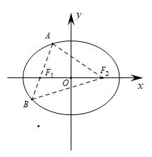

【例7】（&lt;text st<em>y</em>le="subscript"&gt;2&lt;/text&gt;024•九江三模）已知椭圆&lt;text style="it<em>a</em>lic"&gt;<em>&lt;text style="italic"&gt;C</em>&lt;/text&gt;&lt;/text&gt;： $\frac{x^{2}}{a^{2}}+\frac{y^{2}}{b^{2}}=$ &lt;text st<em>y</em>le="subscript"&gt;&lt;text style="subscript"&gt;&lt;text style="subscript"&gt;1&lt;/text&gt;&lt;/text&gt;&lt;/text&gt;（<em>a</em>＞<em>b</em>＞0）的左右焦点分别为<em>&lt;text style="italic"&gt;&lt;text style="italic"&gt;&lt;text style="italic"&gt;F</em>&lt;/text&gt;&lt;/text&gt;&lt;/text&gt;1，F&lt;text style="subscript"&gt;2&lt;/text&gt;，过F1且倾斜角为 $\frac{\pi }{6}$ 的直线交&lt;text st<em>y</em>le="it<em>a</em>lic"&gt;<em>&lt;text style="italic"&gt;C</em>&lt;/text&gt;&lt;/text&gt;于第一象限内一点<em>A</em>．若线段A<em>&lt;text style="italic"&gt;&lt;text style="italic"&gt;&lt;text style="italic"&gt;F</em>&lt;/text&gt;&lt;/text&gt;&lt;/text&gt;&lt;text style="subscript"&gt;&lt;text style="subscript"&gt;&lt;text style="subscript"&gt;1&lt;/text&gt;&lt;/text&gt;&lt;/text&gt;的中点在y轴上，△<em>&lt;text style="italic"&gt;AF</em>&lt;/text&gt;1F&lt;text style="subscript"&gt;2&lt;/text&gt;的面积为2 $\sqrt{3}$ ，则&lt;text st<em>y</em>le="it<em>a</em>lic"&gt;<em>&lt;text style="italic"&gt;C</em>&lt;/text&gt;&lt;/text&gt;的方程为（　　）

A． $\frac{x^{2}}{3}+y^{2}=1$ 	
B． $\frac{x^{2}}{3}+\frac{y^{2}}{2}=1$

C． $\frac{x^{2}}{9}+\frac{y^{2}}{3}=1$ 	
D． $\frac{x^{2}}{9}+\frac{y^{2}}{6}=1$

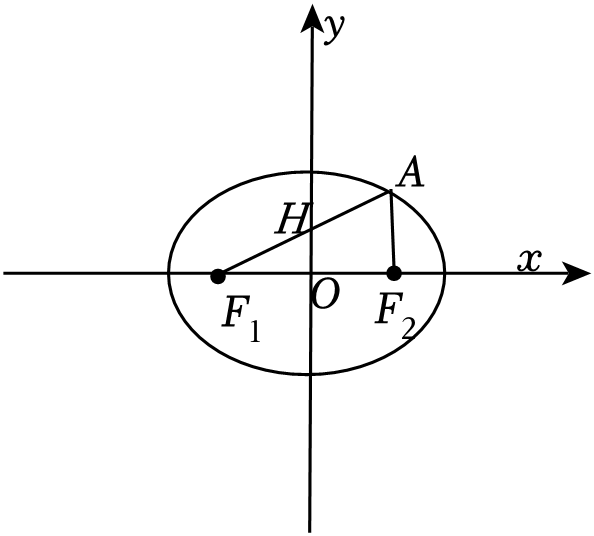

########## 【例8】过椭圆的一个焦点*F*作弦*AB*，若，，则 的数值为（    ）

A．    	
B．             
C．          
D．与、斜率有关

【例9】（2024•河南信阳模拟）已知椭圆 $C：\frac{x^{2}}{a^{2}}+\frac{y^{2}}{b^{2}}=1(a＞b＞0)$ 的上顶点为<t*e*xt style="italic">P</text>，左焦点为*F*，直线*<text style="italic">PF*</text>与*<text style="italic">C*</text>的另一个交点为*Q*，若|PF|＝3|*QF*|，则C的离心率e＝（　　）

A． $\frac{1}{3}$ 	
B． $\frac{\sqrt{3}}{3}$ 	
C． $\frac{1}{2}$ 	
D． $\frac{\sqrt{2}}{2}$

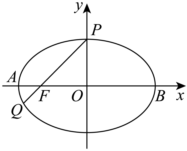

【例&lt;text style="subscript"&gt;1&lt;/text&gt;0】（2024•泉州模拟）椭圆 $C：\frac{x^{2}}{a^{2}}+\frac{y^{2}}{b^{2}}=1(a＞b＞0)$ 的左、右焦点分别为<em>&lt;text style="italic"&gt;&lt;text style="italic"&gt;F</em>&lt;/text&gt;&lt;/text&gt;&lt;text style="subscript"&gt;1&lt;/text&gt;，F2，过F1且斜率为 $-3\sqrt{7}$ 的直线与椭圆交于<em>&lt;text style="italic"&gt;A</em>&lt;/text&gt;，<em>&lt;text style="italic"&gt;B</em>&lt;/text&gt;两点（A在B左侧），若 $(\overset{\to }{F_{1}A}+\overset{\to }{F_{1}F_{2}})\cdot \overset{\to }{AF_{2}}=0$ ，则<em>C</em>的离心率为（　　）

A． $\frac{2}{5}$ 	
B． $\frac{3}{5}$ 	
C． $\frac{2}{7}$ 	
D． $\frac{3}{7}$

【例&lt;text style="subscript"&gt;1&lt;/text&gt;1】（&lt;text style="subscript"&gt;&lt;text style="subscript"&gt;2&lt;/text&gt;&lt;/text&gt;024•浙江一模）已知<em>&lt;text style="italic"&gt;&lt;text style="italic"&gt;F</em>&lt;/text&gt;&lt;/text&gt;1，F2分别为椭圆<em>&lt;text style="italic"&gt;C</em>&lt;/text&gt;： $\frac{x^{2}}{a^{2}}+\frac{y^{2}}{b^{2}}=1(a＞b＞0)$ 的左右焦点，过<em>&lt;text style="italic"&gt;&lt;text style="italic"&gt;F</em>&lt;/text&gt;&lt;/text&gt;&lt;text style="subscript"&gt;&lt;text style="subscript"&gt;2&lt;/text&gt;&lt;/text&gt;的一条直线与<em>&lt;text style="italic"&gt;C</em>&lt;/text&gt;交于<em>A</em>，<em>B</em>两点，且<em>AF</em>&lt;text style="subscript"&gt;1&lt;/text&gt;⊥<em>AB</em>，|<em>BF</em>2|＝1，则椭圆长轴长的最小值是（　　）

A． $4\sqrt{2}$ 	
B．3+2 $\sqrt{2}$ 	
C．6	
D．4+2 $\sqrt{2}$

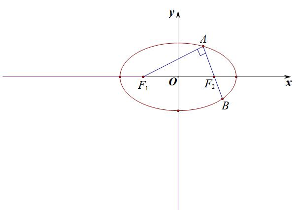

【例12】（多选）（2022•枣庄模拟）已知椭圆，过椭圆的左焦点的直线交于，两点（点在轴的上方），过椭圆的右焦点的直线交于，两点，则

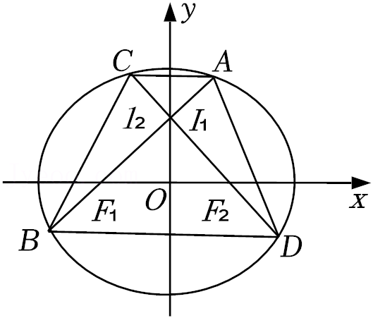

A．若，则的斜率	   
B．的最小值为

C．以为直径的圆与圆相切	   
D．若，则四边形面积的最小值为

【例13】（2022•威海二模）已知是椭圆上一点，以点及椭圆的左、右焦点、为顶点的三角形面积为．

（Ⅰ）求椭圆的标准方程；

（Ⅱ）过作斜率存在且互相垂直的直线、，是与两交点的中点，是与两交点的中点，求面积的最大值．

【例14】（2021•新高考Ⅱ）已知椭圆的方程为，右焦点为，，且离心率为．

（Ⅰ）求椭圆的方程；

（Ⅱ）设，是椭圆上的两点，直线与曲线相切．证明：，，三点共线的充要条件是．

########## 三．双曲线第一定义

########## 平面内与两个定点的距离的差的绝对值等于常数且小于的点的轨迹；其中，两个定点叫做双曲线的焦点，焦点间的距离叫做焦距．

########## 注意：与（）分别表示双曲线的一支．若有“绝对值”，点的轨迹表示双曲线的两支；若无“绝对值”，点的轨迹仅为双曲线的一支；

根据，化简得：.

########## 注意：1.双曲线的标准方程：

########## 2．顶点：，．

########## 3．实轴和虚轴　实轴长为2*a*，虚轴长为2*b*；

########## 4．焦点　，．

########## 5．焦距　，满足关系式：．

### 1.1.1.1.1.1.1.1.1.1 离心率　，离心率越大，开口越大；

### 1.1.1.1.1.1.1.1.1.2 *P*为双曲线上一点，则(利用极化恒等式证明).

【例15】（2025新课标I卷第3题）若双曲线 $C$ 的虚轴长为实轴长的 $\sqrt{7}$ 倍，则 $C$ 的离心率为（   ）

A. $\sqrt{2}$               
B. 2                
C. $\sqrt{7}$                
D. $2\sqrt{2}$
答案：D

【例16】（2024•甲卷）已知双曲线的两个焦点分别为，点在该双曲线上，则该双曲线的离心率为（    ）

A. 4	
B. 3	
C. 2	
D.

【例17】（2024•新课标I卷）设双曲线的左、右焦点分别为，，过作平行于轴的直线交于，两点，若，，则的离心率为 <u>　　</u>．

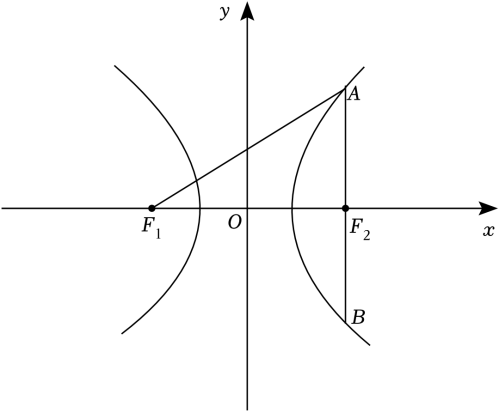

【例18】（2024•黄浦区期中）已知、分别是双曲线的左右焦点，过的直线与双曲线左右两支分别交于、两点，且，则<u>　   　</u>．

【例19】（湖北省武汉市武昌区2025届高三下学期5月质量检则（三模）T14）在几何中，单叶双曲面是一种典型的直纹面如图1所示，因其具有优良的稳定性和美观性，常被应用于大型建筑结构（如广州电视塔）．单叶双曲面的形成过程可通过“双曲狭缝”演示：如图2，直杆与固定轴成一定夹角，且均和连杆垂直．当直杆绕固定轴旋转时，其轨迹形成单叶双曲面．若用过单叶双曲面固定轴的平面截取该曲面，所得交线为双曲线的一部分．在某科技馆的演示中，立板上的双曲狭缝即为直杆运动轨迹（双曲面）被立板面截取的双曲线的一部分，因此直杆旋转时可始终穿过两条弯曲的狭缝．若直杆与固定轴所成角的大小为，则该双曲线的离心率为________．

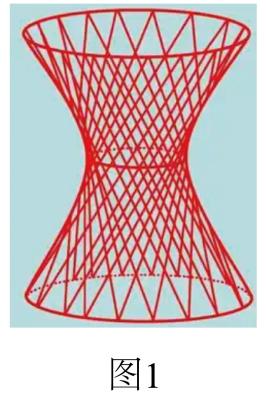

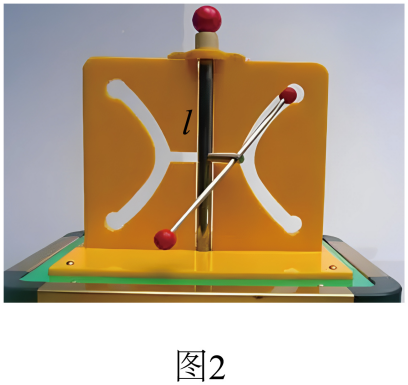

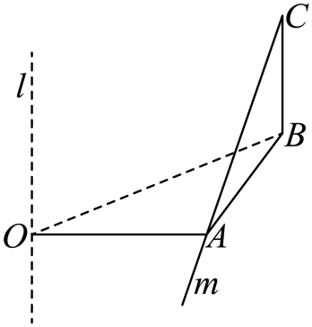

【例20】（2025届河南省豫北六校高三下学期5月份联合模拟考试T14）已知等腰三角形的顶点为，底边的一个端点为，则另一个端点<em>P</em>的轨迹方程为______；又，线段的垂直平分线与直线交于点<em>Q</em>，则动点<em>Q</em>的轨迹方程为_____.

########## 8.焦点弦问题：双曲线（，）的两个焦点为、，弦过左焦点（、都在左支上），，则的周长为（如下图左）

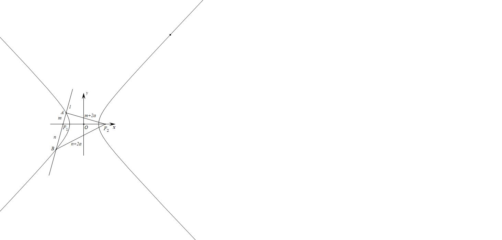

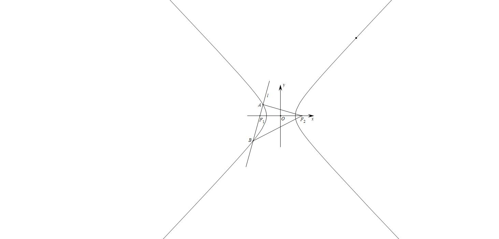

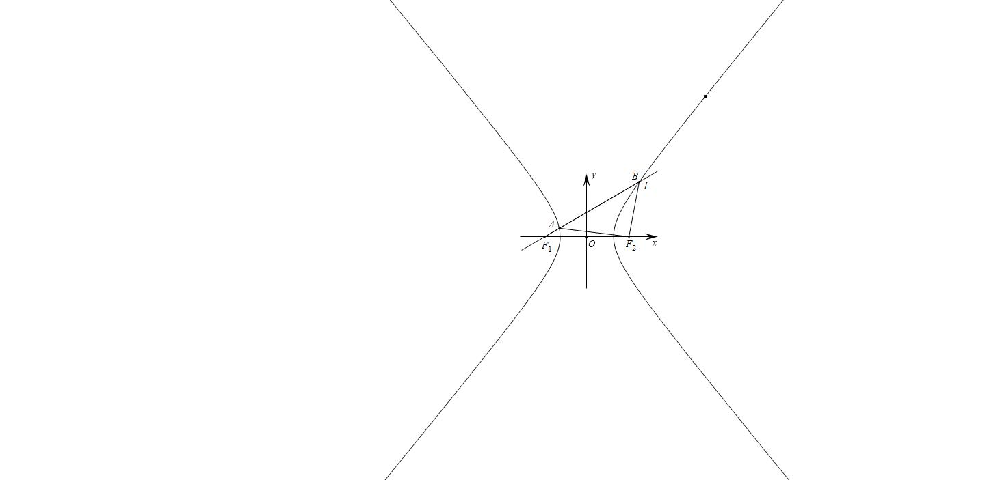

########## 双曲线焦长公式：

########## （1）当*AB*交双曲线于一支时，，（图中）

########## （2）当*AB*交双曲线于两支时，，（图右）

########## 9. 双曲线的渐近线　；或．

【例21】（2024•多选•烟台二模）已知双曲线 $\Gamma ：\frac{x^{2}}{a^{2}}-\frac{y^{2}}{b^{2}}=1(a＞0，b＞0)$ 的离心率为<text sty*l*e="italic">e</text>，过其右焦点*F*的直线l与Γ交于点*A*，*B*，下列结论正确的是（　　）

A．若*a*＝*b*，则 $e=\sqrt{2}$

B．|*AB*|的最小值为2*a*

C．若满足|<text sty*l*e="it*a*lic">AB</text>|＝2a的直线l恰有一条，则 $e＞\sqrt{2}$

D．若满足|<text sty*l*e="it*a*lic">AB</text>|＝2a的直线l恰有三条，则 $1＜e＜\sqrt{2}$

【例22】（2024•长沙天心区模拟）过双曲线 $C：\frac{x^{2}}{4}-y^{2}=1$ 的左焦点&lt;text sty<em>l</em>e="italic"&gt;F&lt;/text&gt;1作倾斜角为θ的直线l交<em>C</em>于<em>M</em>，<em>N</em>两点．若 $\overset{\to }{MF_{1}}=3\overset{\to }{F_{1}N}$ ，则|cosθ|＝（　　）

A． $\frac{\sqrt{10}}{10}$ 	
B． $\frac{3\sqrt{10}}{10}$ 	
C． $\frac{2\sqrt{5}}{5}$ 	
D． $\frac{\sqrt{5}}{5}$

【例&lt;text style="subscript"&gt;&lt;text style="subscript"&gt;&lt;text style="subscript"&gt;2&lt;/text&gt;&lt;/text&gt;&lt;/text&gt;3】（2024•南开区模拟）已知双曲线 $\frac{x^{2}}{a^{2}}-\frac{y^{2}}{b^{2}}=1$ （<em>a</em>＞0，<em>b</em>＞0）的左、右焦点分别为<em>&lt;text style="italic"&gt;&lt;text style="italic"&gt;&lt;text style="italic"&gt;&lt;text style="italic"&gt;F</em>&lt;/text&gt;&lt;/text&gt;&lt;/text&gt;&lt;/text&gt;&lt;text style="subscript"&gt;1&lt;/text&gt;，F&lt;text style="subscript"&gt;&lt;text style="subscript"&gt;&lt;text style="subscript"&gt;2&lt;/text&gt;&lt;/text&gt;&lt;/text&gt;，过F2且斜率为 $\frac{24}{7}$ 的直线与双曲线在第一象限的交点为<em>A</em>，若|<em>&lt;text style="italic"&gt;&lt;text style="italic"&gt;&lt;text style="italic"&gt;&lt;text style="italic"&gt;F</em>&lt;/text&gt;&lt;/text&gt;&lt;/text&gt;&lt;/text&gt;&lt;text style="subscript"&gt;1&lt;/text&gt;F&lt;text style="subscript"&gt;&lt;text style="subscript"&gt;&lt;text style="subscript"&gt;2&lt;/text&gt;&lt;/text&gt;&lt;/text&gt;|＝|<em>AF</em>2|，则此双曲线的标准方程可能为（　　）

A． $\frac{x^{2}}{3}-\frac{y^{2}}{4}=1$ 	
B． $\frac{x^{2}}{4}-\frac{y}{3}=1$

C． $\frac{x^{2}}{9}-\frac{y^{2}}{16}=1$ 	
D． $\frac{x^{2}}{16}-\frac{y^{2}}{9}=1$

【例&lt;te<em>x</em>t style="subscript"&gt;2&lt;/text&gt;4】（2024•永州三模）已知<em>&lt;text style="italic"&gt;&lt;text style="italic"&gt;F</em>&lt;/text&gt;&lt;/text&gt;&lt;text style="subscript"&gt;1&lt;/text&gt;，F2分别是双曲线 $\frac{x^{2}}{a^{2}}-\frac{y^{2}}{b^{2}}=1(a＞0，b＞0)$ 的左、右焦点，点&lt;te<em>x</em>t style="italic"&gt;O&lt;/text&gt;为坐标原点，过<em>&lt;text style="italic"&gt;&lt;text style="italic"&gt;F</em>&lt;/text&gt;&lt;/text&gt;&lt;text style="subscript"&gt;1&lt;/text&gt;的直线分别交双曲线左、右两支于<em>A</em>，<em>B</em>两点，点<em>C</em>在x轴上， $\overset{\to }{CB}=3\overset{\to }{F_{2}A}$ ，&lt;te<em>x</em>t style="italic"&gt;B&lt;/text&gt;<em>&lt;text style="italic"&gt;&lt;text style="italic"&gt;F</em>&lt;/text&gt;&lt;/text&gt;&lt;text style="subscript"&gt;2&lt;/text&gt;平分

∠<em>F</em>1<em>BC</em>，其中一条渐近线与线段<em>AB</em>交于点<em>P</em>，则sin∠<em>POF</em>2＝（　　）

A． $\frac{\sqrt{41}}{7}$ 	
B． $\frac{\sqrt{42}}{7}$ 	
C． $\frac{\sqrt{43}}{7}$ 	
D． $\frac{2\sqrt{11}}{7}$

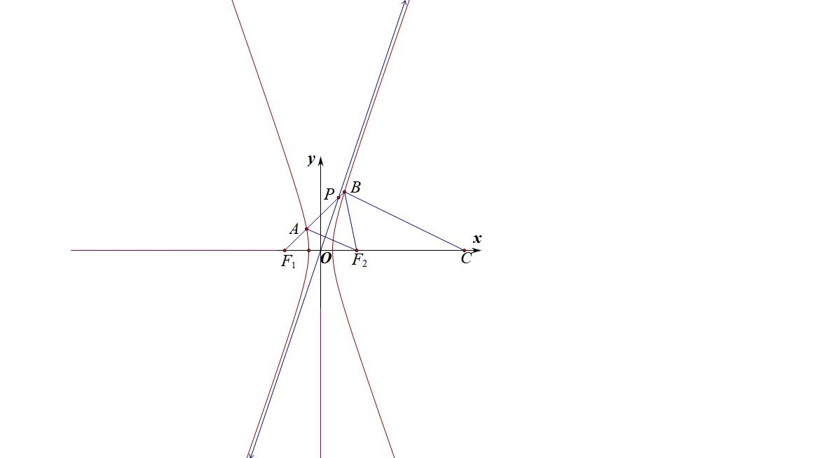

注意：当交两支的焦点弦时，隐藏着几个很重要的等腰三角形，这也是一种常见考题.

【例25】（河北省名校联考2025届高三适应性演练T10）已知双曲线的左右焦点为，点在上，为坐标原点，则（    ）

A．时，为直角三角形

B．时，为锐角三角形

C．为等腰三角形时，或

D．外接圆半径为时，

########## 第二节  椭圆双曲线的第二定义

########## 一．椭圆第二定义关于“比”

########## 平面内与一个定点的距离和到一条定直线的距离的比是常数的点的轨迹，其中，定点为<strong>焦点</strong>，定直线叫做<strong>准线</strong>，常数<em>e</em>叫做<strong>离心率</strong>． 

########## 设是椭圆上任意一点，定点为，定直线为，常数，由上述椭圆的定义可得：，变形即可．

焦半径　椭圆上的点到焦点的距离；设为椭圆上的一点，

① 焦点在轴：焦半径(左加右减)；② 焦点在轴：焦半径(上加下减)．

注意：利用第二定义快速进行证明，结合图像，长的加，短的减。

注意：焦半径公式，在大题中不能直接使用，大题建议使用余弦定理推导。

########## 二．双曲线第二定义关于“比”

########## 平面内与一个定点的距离和到一条定直线的距离的比是常数的点的轨迹；定直线叫做准线，常数叫做离心率．

根据，化简得到．

焦半径　设为双曲线上的一点，

① 焦点在轴：在左支，在右支；

②焦点在轴：在下支，在上支．

焦半径公式和焦长焦比都是解挖掘圆锥曲线几何性质的常见招数，那么什么时候用焦长焦比，什么时候用焦半径呢？

如今的圆锥曲线体系，方法众多，什么时候选择用什么成为了重中之重，焦长焦比强调共线，强调角度和比值，而焦半径强调和积，不注重共线，强调点的坐标，当然很多时候，尤其在高考题当中，焦长焦比与焦半径是相通的，我们从以下例题中找寻答案.

【例1】（2025天津卷第9题）双曲线的左、右焦点分别为，以右焦点为焦点的抛物线与双曲线交于第一象限的点*P*，若，则双曲线的离心率（   ）

A．2	
B．5	
C．	
D．

【例2】（2023•包头期末）设、为椭圆的两个焦点，为上一点且在第二象限．若，则点的坐标为 <u>　　</u>．

【例3】（2024•桂林三模）已知椭圆<te*x*t style="italic">*C*</text>： $\frac{x^{2}}{4}+\frac{y^{2}}{3}=1$ 的右焦点为<te*x*t style="italic">*F*</text>，过F的直线与*<text style="italic">C*</text>交于*<text style="italic">A*</text>、*<text style="italic">B*</text>两点，其中点A在x轴上方且 $\overset{\to }{AF}=2\overset{\to }{FB}$ ，则<te*x*t style="italic">*B*</text>点的横坐标为（　　）

A． $\frac{1}{2}$ 	
B． $\frac{3}{2}$ 	
C． $-\frac{7}{4}$ 	
D． $\frac{7}{4}$

【例4】（2022•新高考1）已知椭圆，的上顶点为，两个焦点为，离心率为，过且垂直于的直线与交于点，两点，，则的周长是__________．

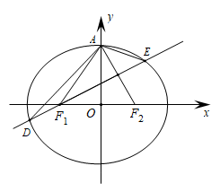

【例5】（2023•南通二模）弓琴（左图），也可称作“乐弓”，是我国弹弦乐器的始祖．古代有“后羿射十日”的神话，说明上古生民对善射者的尊崇，乐弓自然是弓箭发明的延伸．在我国古籍《吴越春秋》中，曾记载着：“断竹、续竹，飞土逐肉”．弓琴的琴身下部分可近似的看作是半椭球的琴腔，其正面为一椭圆面，它有多条弦，拨动琴弦，音色柔弱动听，现有某研究人员对它做出改进，安装了七根弦，发现声音强劲悦耳．右图是一弓琴琴腔下部分的正面图．若按对称建立如图所示坐标系，为左焦点，，2，3，4，5，6，均匀对称分布在上半个椭圆弧上，为琴弦，记，2，3，4，5，6，，数列前项和为，椭圆方程为，且，则取最小值时，椭圆的离心率为 <u>　  　_</u>．

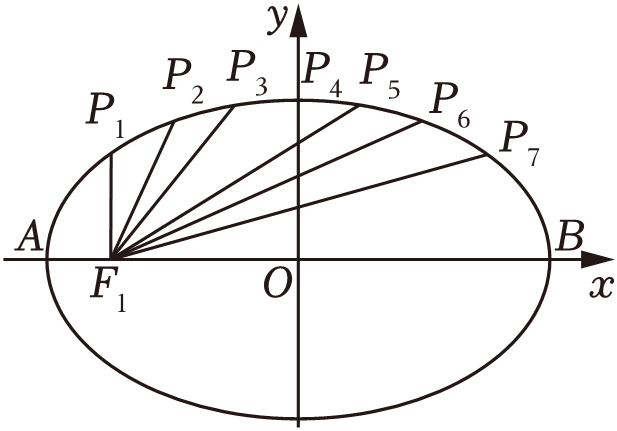

########## <strong>三．第二定义与|PF1|·|PF2|相关的结论</strong>

1.设、是椭圆的两个焦点，*O*是椭圆的中心，*P*是椭圆上任意一点，，则．

2.设、是双曲线的两个焦点，*O*是双曲线的中心，*P*是双曲线上任意一点，，则．

3.等轴双曲线满足：；

证明：1.法一（中线定理），整理得．，故；

法二(焦半径)，

2.法一（中线定理），整理得，，故；

法二(焦半径)，

3.由于等轴双曲线满足，所以．

【例6】（2023•甲卷）已知椭圆，，为两个焦点，为原点，为椭圆上一点，，则

A．	
B．	
C．	
D．

【例7】（&lt;text style="su&lt;text style="it<em>a</em>lic"&gt;b&lt;/text&gt;script"&gt;2&lt;/text&gt;024•浙江模拟）设&lt;text style="it<em>a</em>lic"&gt;O&lt;/text&gt;为原点，<em>&lt;text style="italic"&gt;&lt;text style="italic"&gt;F</em>&lt;/text&gt;&lt;/text&gt;&lt;text style="subscript"&gt;1&lt;/text&gt;，F2为双曲线<em>&lt;text style="italic"&gt;C</em>&lt;/text&gt;： $\frac{x^{2}}{a^{2}}-\frac{y^{2}}{b^{2}}=$ &lt;text style="su&lt;text style="it<em>a</em>lic"&gt;b&lt;/text&gt;script"&gt;1&lt;/text&gt;（<em>a</em>＞0，b＞0）的两个焦点，点<em>P</em>在<em>&lt;text style="italic"&gt;C</em>&lt;/text&gt;上且满足|<em>O</em>P| $=\frac{3}{2}$ &lt;text style="it<em>a</em>lic"&gt;a&lt;/text&gt;，cos∠<em>&lt;text style="italic"&gt;&lt;text style="italic"&gt;F</em>&lt;/text&gt;&lt;/text&gt;&lt;text style="su<em>b</em>script"&gt;1&lt;/text&gt;<em>P</em>F&lt;text style="subscript"&gt;2&lt;/text&gt; $=\frac{3}{7}$ ，则该双曲线的渐近线方程为（　　）

A． $\sqrt{2}x\pm y=0$ 	
B． $x\pm \sqrt{2}y=0$ 	
C． $\sqrt{3}x\pm y=0$ 	
D． $x\pm \sqrt{3}y=0$

【例8】（&lt;text style="subscript"&gt;&lt;text style="superscript"&gt;&lt;text style="superscript"&gt;2&lt;/text&gt;&lt;/text&gt;&lt;/text&gt;024•德阳模拟）设&lt;text style="it<em>a</em>lic"&gt;<em>F</em>&lt;/text&gt;&lt;text style="subscript"&gt;1&lt;/text&gt;、F2是双曲线 $C：\frac{x^{2}}{a^{2}}-\frac{y^{2}}{b^{2}}=1(a＞0，b＞0)$ 的左、右焦点，&lt;text style="it<em>a</em>lic"&gt;O&lt;/text&gt;是坐标原点，点<em>P</em>是<em>&lt;text style="italic"&gt;C</em>&lt;/text&gt;上异于实轴端点的任意一点，若|P<em>&lt;text style="italic"&gt;F</em>&lt;/text&gt;&lt;text style="subscript"&gt;1&lt;/text&gt;|•|<em>&lt;text style="italic"&gt;PF</em>&lt;/text&gt;&lt;text style="subscript"&gt;&lt;text style="superscript"&gt;&lt;text style="superscript"&gt;2&lt;/text&gt;&lt;/text&gt;&lt;/text&gt;|﹣|<em>OP</em>|2＝2a2，则C的离心率为（　　）

A． $\sqrt{3}$ 	
B． $\sqrt{2}$ 	
C．3	
D．2

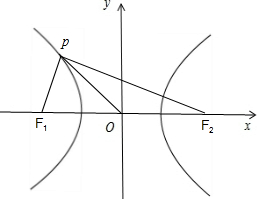

【例9】（2022•舒城县三模）已知椭圆的焦点为，，若点在椭圆上，且满足（其中为坐标原点）的的个数

A．0	
B．2	
C．4	
D．8

【例10】椭圆的长轴的顶点为、，动点<em>P</em>在椭圆内，且，则的取值范围是_________．

【例11】已知点<em>P</em>是双曲线上的动点，是其左、右焦点，<em>O</em>坐标原点，若存在四个点<em>P</em>满足，则此双曲线的离心率取值范围______．

########## 四．双曲线倍角定理

【例12】（2023•多选•菏泽一模）已知双曲线的左、右焦点分别为、，过点的直线与双曲线的左、右两支分别交于、两点，下列命题正确的有

A．当点为线段的中点时，直线的斜率为

B．若，则

C．

D．若直线的斜率为，且，则

【例13】（2024•多选•广州二模）已知双曲线的左、右焦点分别为，，左顶点为，点是的右支上一点，则

A．的最小值为8

B．若直线与交于另一点，则的最小值为6

C．为定值

D．若为△的内心，则为定值

【例14】（2025年福建省厦门市高考数学第二次质检18题（25陪跑课学员博方提问））已知双曲线的左、右顶点分别为，，过的右焦点的直线与的右支交于，两点．当与轴垂直时，．

  
（1）求的方程；

  
（2）直线，与直线的交点分别为，，为的中点．

求的最小值；

证明：点关于直线对称的点在上．

【例15】（2025临考猜题卷19题（25陪跑课学员刘自豪提问））已知双曲线 $C:\frac{x^{2}}{a^{2}}-\frac{y^{2}}{b^{2}}=1\left(a\right⟩0,b>0)$  的左、右焦点分别为 $F_{1},F_{2}$  ，左顶点为 $A$  ，且 $\left|F_{1}F_{2}\right|=$  4， $\left|AF_{2}\right|=3\left|AF_{1}\right|$  ．．  
（1）求双曲线 $C$  的方程；  
（2）过点 $F_{2}$  作直线 $l$  ，与 $C$  的右支交于 $M,N$  两点，求 $\Delta MNF_{1}$  周长的最小值；  
（3）已知点 $Q\left(\frac{3}{2}k\right)$  ，直线 $AQ$  与 $C$  的右支交于点 $P$  ，过点 $F_{1}$  作 $F_{1}E//QF_{2}$  ，交直线 $PF_{2}$  于点 $E$  ，证明：点 $E$  在定圆上。

########## 第三节 椭圆双曲线的第三定义

########## 一．椭圆第三定义关于“积”

########## 第三定义通常作为性质来考查使用，故我们以介绍性质为主。

########## 已知关于原点对称的两个定点，那么到这两定点连线的斜率之积为定值的点的轨迹是椭圆，通常这两个定点分别为长轴或者短轴顶点．         

########## 另一方面，设是椭圆上任意一点，两个定点为、，常数，，根据椭圆方程：将，变形成，所以，椭圆上动点到关于原点对称的两个定点的连线的斜率之积等于常数．

########## 注意：本结论也可以用点差法证明。

若椭圆与直线交于两点，其中，，，为中点，

证明：设，，，则

椭圆：①-②，并将③④⑤代入得：，

【例1】（2022•甲卷）椭圆的左顶点为，点，均在上，且关于轴对称．若直线，的斜率之积为，则的离心率为

A．	
B．	
C．	
D．

【例2】（2022•新高考Ⅱ）已知直线与椭圆在第一象限交于，两点，与轴、轴分别相交于，两点，且，，则的方程为 <u>　    　</u>．

【例3】（2025·重庆九龙坡·三模T11）在平面直角坐标系  中，点  是椭圆  的左焦点，  分别是  的左、右顶点，直线  与椭圆  相交于  两点，则（   ）

A．若直线经过点，则的最小值为1

B．若线段的中点坐标为，则直线的斜率为

C．若直线经过坐标原点，则

D．若点在椭圆上(点与不重合)，且，则

【例4】（2022•武汉模拟）已知点在椭圆:上，点在第一象限，点关于原点的对称点为，点关于轴的对称点为，设，直线与椭圆的另一个交点为，若，则椭圆的离心率(    )

A．	
B．	
C．	
D．

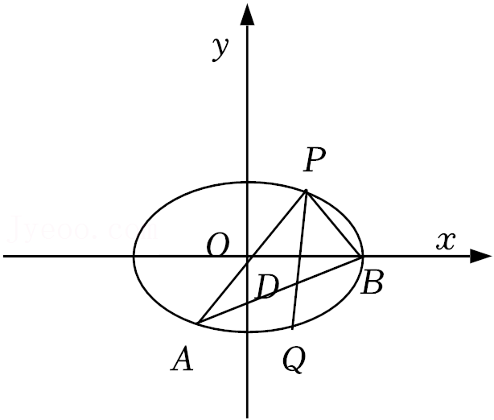

########## 二．双曲线第三定义之“积”

########## 到关于原点对称的两个定点连线的斜率之积为定值的点的轨迹是双曲线；通常定点为实轴或虚轴顶点，定值为正值． 

另一方面，设是双曲线上任意一点，两个定点为、，常数，，根据双曲线方程：将，变形成，所以，双曲线上动点到关于原点对称的两个定点的连线的斜率之积等于常数．

【例5】（浙江省湖州市县域联盟2024-2025学年高三下学期5月月考T14）已知曲线方程，，，点为曲线右支上一点，且与不重合，直线，分别与直线交于，两点，则以，为直径的圆面积的最小值是________．

三．第三定义与中点弦转化

中点弦问题是斜率乘积为定值，其本质来源于第三定义，如图，设*AB*为椭圆不平行于坐标轴的弦，*M*为*AB*的中点，*C*是椭圆上一点，且弦*BC*过椭圆的中心*O*，利用中位线得：．

设*AB*为双曲线不平行于坐标轴的弦，*M*为*AB*的中点，*C*是双曲线上一点，且弦*BC*过双曲线的中心*O*，利用中位线得：．

若双曲线与直线交于两点，其中，，，为中点，

证明：设，，，则

①-②，并将③④⑤代入得：

【例6】（2024•三台县模拟）如图，已知斜率为的直线与双曲线的右支交于，两点，点关于坐标原点对称的点为，且，则该双曲线的离心率为 <u>　   　</u>．

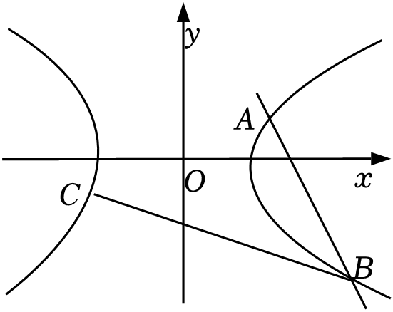

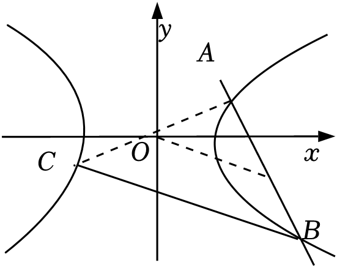

四．第三定义转化为斜率比

如图，、分别为椭圆的左右顶点，、为椭圆上任意两点，与轴交于点，与交于点*，* 根据极点极线理论可知，假设AN与BM交于R，利用圆锥曲线的可轮换性，如果M与N两点位置互换，则P与R两点位置互换，PQR形成自极三角形（参考后面大题章节）此时一定有，即.

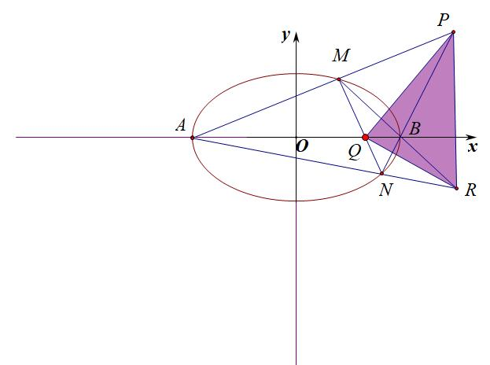

故一定有：，

【例7】（2025·江西赣州·二模T14）椭圆的右焦点为<em>F</em>，上顶点为<em>A</em>，直线<em>l</em>与椭圆交于<em>B</em>，<em>C</em>两点．若，则<em>l</em>的斜率的取值范围是________．

【例8】2024•多选•秦州区开学）已知，是椭圆的左右顶点，过点且斜率不为零的直线与交于，两点，，，，分别表示直线，，，的斜率，则下列结论中正确的是

A．  	
B．

C．	       
D．直线与的交点的轨迹方程是

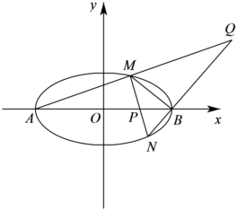

【例9】（2025·辽宁沈阳·三模T11）已知点，分别是椭圆的左、右顶点，为椭圆的右焦点，且，点*P*是椭圆上异于，的一动点，直线，分别与直线交于点，，则下列说法正确的有（   ）

A．	
B．

C．的最小值为	
D．的最小值为

【例10】（2025·重庆·二模T11）已知双曲线的左右顶点分别为 ，双曲线的右焦点为 ，点  是双曲线上在第一象限内的点，直线 交双曲线 右支于点 ，交  轴于点 ， 且  . 设直线的倾斜角分别为 ，则（   ）

A．点  到双曲线的两条渐近线的距离之积为

B．设 ，则 的最小值为

C． 为定值

D．当  取最小值时， 的面积为

########## 第四讲  圆锥曲线的第四定义

【例1】(人教 A 版选择性必修一 P116) 如图,矩形 ABCD 中,  . *E*,  分别是矩形四条边的中点,  是线段*OF*的四等分点,  是线段*CF*的四等分点. 证明直线ER与  、ES与  、ET与 的交点  都在椭圆  上.

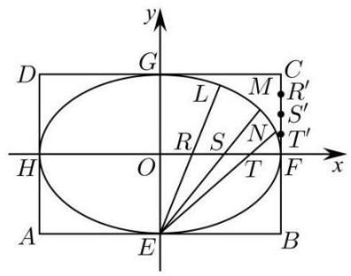

【例2】 (苏教版选修第一册 P87) 把矩形的各边  等分,如图连接直线,判断对应直线的交点是否在一个椭圆上,为什么？

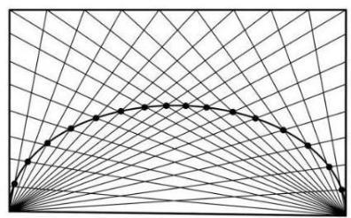

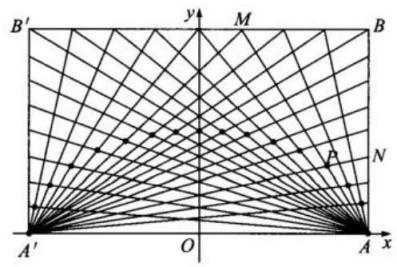

【例3】(苏教版选修第一册 P100) 如图,在矩形中,把边*AB*分成等份. 在边的延长线上, 的*n*分之一为单位长度连续取点. 过边*AB*上各分点和作直线,过延长线上的对应分点和点作直线,这两条直线的交点为在什么曲线上运动?

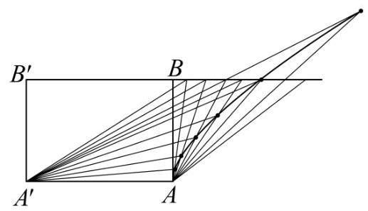

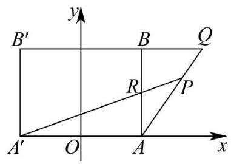

【例4】 (苏教版选修第一册 P105) 如图,将一张长方形纸片ABCD的一只角斜折,使点总是落在对边 上,然后展开纸片,得到一条折痕. 这样继续下去,得到若干折痕,观察这些折痕围成的轮廓, 它是什么曲线?

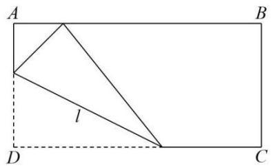

【例5】 (湖北省武汉市2025届高三五月调考) 建立如图所示的坐标系. 矩形中, 分别是矩形四条边的中点,直线上的动点满足  ,直线与的交点为.

( 1 )证明点在一个确定的椭圆上,并求此椭圆的方程；

  
（2）当时,过点的直线(与轴不重合)与（1）中的椭圆交于两点,过点作直线的垂线,垂足为点.设直线与轴交于点,求面积的最大值.

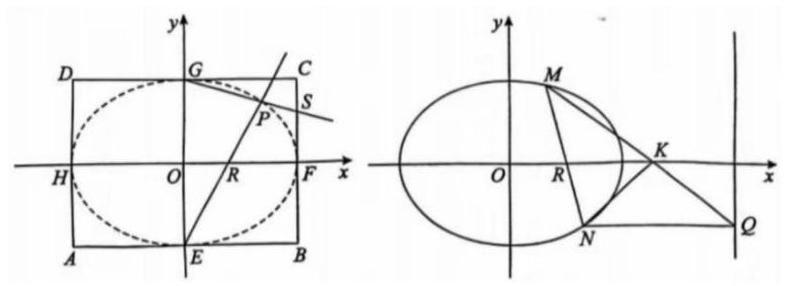

########## 第五讲  抛物线的定义

########## 平面内与一个定点的距离等于到一条定直线的距离点的轨迹；其中，定点为抛物线的焦点，定直线叫做准线．

########## 抛物线标准方程为例，焦点在*x*轴上，开口向右.参数*p*是焦点到准线的距离，称为焦准距，故*p*恒为正数．

########## 一．焦点弦与焦半径公式

########## 1.顶点为原点， 以*x*轴为对称轴，且没有对称中心，焦点为，准线为，由于抛物线的离心率*e*都等于1，故抛物线通径为；

########## 2.焦半径：．

########## 3.焦点弦：；特殊地，当时，为通径．

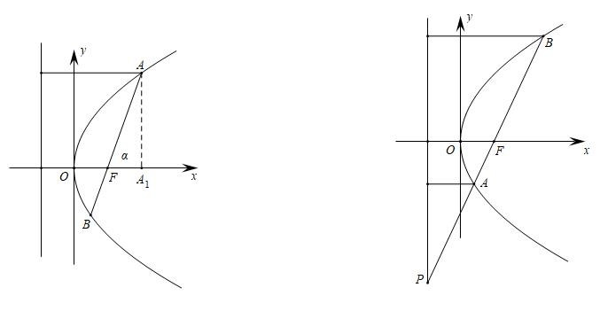

########## 证明：如图，作轴于，  ，同理．．（利用极坐标可以秒证，由于新课标没有引入极坐标，故我们采用保守证明）

########## 抛物线的性质和椭圆、双曲线比较起来，差别较大．它的离心率等于1；它只有一个焦点、一个顶点、一条对称轴、一条准线；它无中心，也没有渐近线． 椭圆、双曲线都有中心，它们均可称为有心圆锥曲线；抛物线没有中心，称为无心圆锥曲线．

【例1】（2025新课标Ⅱ卷第6题）对于抛物线 $C:y^{2}=2px\left(p>0\right)$ ，焦点为 $F$ ，点 $A$  在 $C$  上，过 $A$  作 $C$ 准线的垂线，垂足为 $B$  。若  $l_{BF}:y=-2x+2$  ，则 $\left|AF\right|$  =（           ）

A. 3           
B. 4          
C. 5       
D. 6
答案：C

【例2】（2025北京卷第11题）抛物线的顶点到焦点的距离为3，则________．

【例3】（2024•天津卷） 的圆心与抛物线的焦点重合，为两曲线的交点，则原点到直线的距离为\_\_\_\_\_\_．

【例4】（2021•上海）已知抛物线，若第一象限的，在抛物线上，焦点为，，，，求直线的斜率为 <u>　   　</u>．

【例5】（2021•新高考Ⅰ）已知为坐标原点，抛物线的焦点为，为上一点，与轴垂直，为轴上一点，且．若，则的准线方程为<u>　  　</u>．

【例6】（2021•上海）已知椭圆的左、右焦点为、，以为顶点，为焦点作抛物线交椭圆于，且，则抛物线的准线方程是 <u>　    　</u>．

【例7】（2020•山东）斜率为的直线过抛物线的焦点，且与交于，两点，则<u>　　</u>．

【例8】（2025新课标I卷第10题多选）. 设抛物线 $C:y^{2}=6x$ 的焦点为 $F$ ，过 $F$ 的直线交 $C$ 于 $A、B$ ，过 $F$ 且垂直于 $AB$ 的直线交 $l:x=-\frac{3}{2}$ 于 $E$ ，过 $A$ 作 $l:x=-\frac{3}{2}$ 的垂线，垂足为 $D$ ,则（    ）

A. $\left|AD\right|=\left|AF\right|$         
B. $\left|AE\right|=\left|AB\right|$       
C. $\left|AB\right|\geq 6$      
D. $\left|AE\right|\cdot \left|BE\right|\geq 18$

【例9】（2024•新课标II卷）  抛物线*C*：的准线为*l*，*P*为*C*上的动点，过*P*作的一条切线，*Q*为切点，过*P*作*l*的垂线，垂足为*B*，则（    ）

A. *l*与相切

B. 当*P*，*A*，*B*三点共线时，

C. 当时，

D. 满足的点有且仅有2个

- 焦准斜率关系与转化

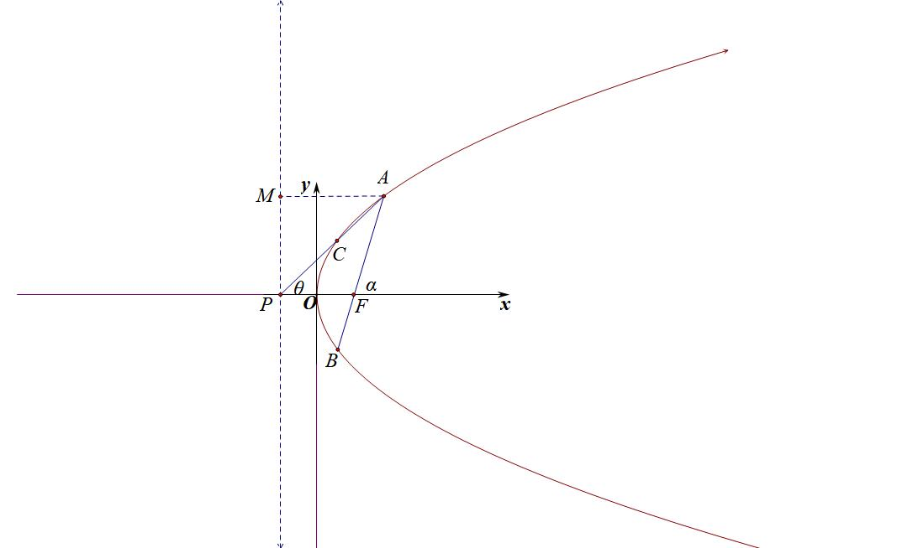

如图所示，以抛物线为例，*AB*是焦点弦，*AC*过准线与*x*轴交点，设，，则一定有：①；②，③；

证明：，，

所以，即；，；

【例10】（2024•茂名模拟）已知抛物线的焦点为，的准线与轴的交点为，点是上一点，且点在第一象限，设，，则

A．	
B．	
C．	
D．

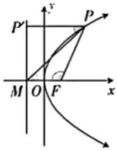

【例11】（2024•绵阳模拟）如图，过点的直线交抛物线于，两点，点在、之间，点与点关于原点对称，延长交抛物线于，记直线的斜率为，直线的斜率为，当时，直线的斜率为

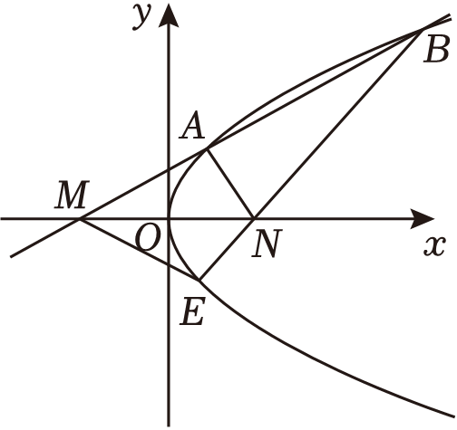

A．	
B．1	
C．	
D．

注意：不是焦准模型的，都可以按照常规的联立进行构造，一切殊途同归.

【例12】（2024•多选•河北模拟）已知点<em>P</em>（﹣1，0）为抛物线<em>C</em>：<em>y</em>2＝2<em>px</em>（<em>p</em>＞0）的准线与<em>x</em>轴的交点，<em>M</em>，<em>N</em>分别为<em>C</em>上不同两点（其中<em>M</em>在第一象限），<em>F</em>为抛物线的焦点，<em>O</em>为坐标原点，则下列说法正确的有（　　）

A．若|*MN*|＝10，则*MN*中点横坐标的最小值为4

B．若*M*，*N*，*P*三点共线，且*MF*⊥*NF*，则直线*MN*的斜率为 $\sqrt{2}$

C．若*M*，*F*，*N*三点共线，且 $\overset{\to }{MN}=4\overset{\to }{FN}$ ，则直线*MN*的斜率为 $\sqrt{3}$

D．若*M*，*F*，*N*三点共线，且△*OMN*的外接圆与*C*的交点为*D*（异于*O*，*N*，*M*），则△*DMN*的重心在*x*轴上

########## 第六讲 最值问题之声东击西

########## 一．椭圆最值问题：

########## 1.若Q在椭圆外，求最小值，则构造利用三点共线求最值（如左图所示），当且仅当三点共线时等号成立.此类型的题目叫做声东击西，即问左焦点，则连接右焦点，问右焦点则连左焦点，三点共线是关键．

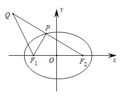

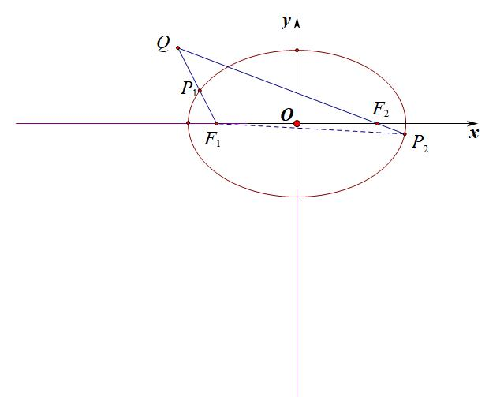

2.若Q为椭圆外一定点（如右图所示），则，当且仅当三点共线时，左边等号成立，当且仅当三点共线时（位于延长线上），等号成立.

3. 若Q为椭圆内一定点（如下图所示），则，当且仅当三点共线时，左边等号成立，当且仅当三点共线时（位于延长线上），右边等号成立，

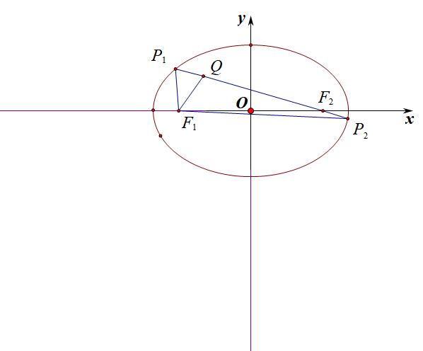

########## 二．双曲线最值问题：求最值，则构造，当且仅当三点共线时等号成立.（如下图所示）．

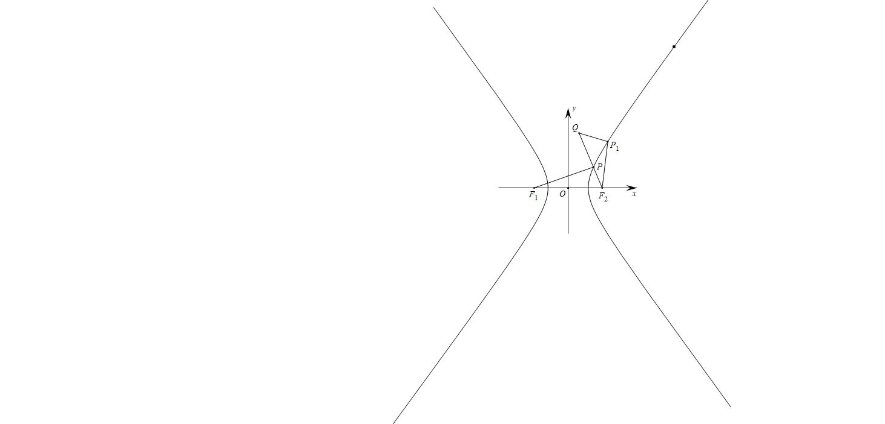

########## 注意：由于椭圆和双曲线的第二定义已经不在高考范围内，形如“”的最值已经不是考试的常考范围，关于问焦点则连接准线的类型题目只适合抛物线，这里不做详述．其它双曲线最值类比椭圆，画图仔细分析即可.

########## 三．抛物线最值问题：根据两点之间线段最短定理，可以知道*P*为抛物线上一点：

########## （1）当为抛物线内任意一点，则存在的最小值,当*P、Q*两点的纵坐标相等时，即（参考下图，内部连准线）

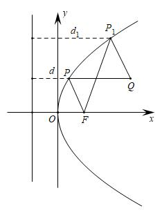

########## （2）当*Q*（）为抛物线外任意一点，存在最小值，当*Q*、*P*、*F*三点共线时，（参考下图，外部连焦点）

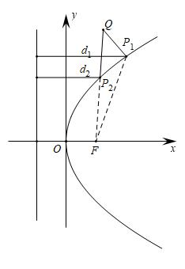

########## 由此类比抛物线的最值问题，把握内连准线，外找焦点．

【例1】（2024•浙江期中）已知双曲线 $C：\frac{x^{2}}{a^{2}}-\frac{y^{2}}{b^{2}}=1(a＞0，b＞0)$ 的左焦点为<te*x*t st*y*le="italic">F</text>，渐近线方程为y＝±x，焦距为8，点*A*的坐标为（1，3），点*P*为*C*的右支上的一点，则|*PF*|+|*PA*|的最小值为（　　）

A． $4\sqrt{2}+2\sqrt{5}$ 	
B． $6\sqrt{2}$ 	
C． $7\sqrt{2}$ 	
D． $4\sqrt{2}+\sqrt{10}$

【例2】（2024•多选•黑龙江模拟）已知，，点为曲线上动点，则下列结论正确的是

A．若为抛物线，则

B．若为椭圆，则

C．若为双曲线，则

D．若为圆，则

【例3】（2024•多选•山西一模）已知点，，分别为双曲线的左、右焦点，为的右支上一点，则

1. B．

C．	
D．

四．阿氏圆反演与圆锥曲线最值问题

一般地，平面内到两个定点距离之比为常数的点的轨迹是圆，此圆被叫做“阿波罗尼斯圆”．<strong>特殊地</strong>，当时，点<em>P</em>的轨迹是线段<em>AB</em>的中垂线．

<strong>求证：</strong>已知动点<em>P</em>与两定点<em>A</em>、<em>B</em>的距离之比为，那么点<em>P</em>的轨迹是什么？

证明： 不妨设、，，由得：，即

，

①当时，即为，整理得：，即点*P*的轨迹是以为圆心，为半径的圆；

②当时，化简得，即点*P*的轨迹为*y*轴．

如图，易知①*PC*为的内角平分线，*PD*为的外角平分线，②③*PC*⊥*PD*；以上三个条件中，知道任意两个都可以推得第三个！

设阿波罗尼斯圆的圆心为*O*，半径，则有，	即，即，即，即（反演）．

同时，，即．

<strong>半径公式</strong>　已知动点<em>P</em>与两定点<em>A</em>、<em>B</em>的距离之比为，则已知两个定点<em>A</em>、<em>B</em>，及定比，则．

注意：阿氏圆的常用公式，，阿氏圆的半径为：

【例4】阿波罗尼斯是古希腊著名数学家，与欧几里得、阿基米德并称为亚历山大时期数学三巨匠，他对圆锥曲线有深刻而系统的研究，主要研究成果集中在他的代表作《圆锥曲线》一书，阿波罗尼斯圆是他的研究成果之一，指的是：已知动点与两定点、的距离之比，那么点的轨迹就是阿波罗尼斯圆．已知动点的轨迹是阿波罗尼斯圆，其方程为，定点为轴上一点，且，若点，则的最小值为

A．	
B．	
C．	
D．

【例5】已知两定点，，动点与、的距离之比且，那么点的轨迹是阿波罗尼斯圆，若其方程为，则的值为

A．	
B．	
C．0	
D．4

【例6】（2024•成都三模）已知点<em>P</em>，<em>Q</em>分别是抛物线<em>C</em>：<em>y</em>2＝4<em>x</em>和圆<em>E</em>：<em>x</em>2+<em>y</em>2﹣10<em>x</em>+21＝0上的动点，若抛物线<em>C</em>的焦点为<em>F</em>，则2|<em>PQ</em>|+|<em>QF</em>|的最小值为（　　）

A．6	
B． $2+2\sqrt{5}$ 	
C． $4\sqrt{3}$ 	
D． $4+2\sqrt{3}$

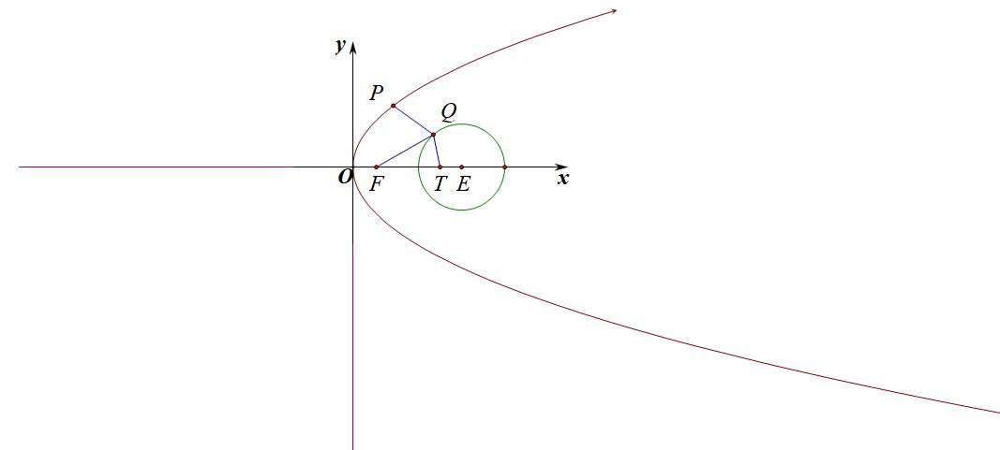

【例7】（2025·陕西咸阳·二模T11）已知在平面直角坐标系中，，，点是满足的曲线上的任意一点，点为过点的抛物线上的一动点，点在直线上的射影为，则（   ）

A．抛物线上与焦点距离等于5的点的横坐标是1

B．若过点的直线交于，两点，且，则的面积为6

C．的最小值为

D．已知点在抛物线上，过点作曲线的切线，若切线长为，则点到的准线的距离为8

