第七章 圆锥曲线常规数据处理方法

第一节 齐次化处理斜率和积问题

一．点在圆锥曲线上的斜率和积为定值问题

咱们以椭圆为例，已知点是椭圆上一个定点,椭圆上有两动点、  
（1）若直线,则直线过定点;(2017全国一卷)  
（2）若直线,则直线斜率为定值;  
（3）若直线,则直线过定点;(2020山东卷,全国一卷)  
（4）若直线,则直线斜率为定值;
证明:将椭圆按向量平移得椭圆,

又点在椭圆上,所以,代入上式得①.椭圆上的定点和动点，分别对应椭圆上的定点和动点，,设直线的方程为,代入①得:,

当时,两边除以得:

因为点，的坐标满足这个方程,所以，是这个关于的方程的两个根.

注意:之所以将的方程设为,就是利用了乘一法,即乘除一个为一的式子,能改变结构,但不改变结果.在三角函数当中我们经常会将转化为,也是利用了齐次化原理化弦为切.
证明：（1）若,由平移性质知,所以,

即,所以,

由此知点在直线上,从而直线过定点.  
（2）依题意知直线，的倾斜角互补且斜率存在,由平移性质知,直线，的倾斜角也互补且斜率存在,所以,即,由此得.所以的斜率为定值  
（3）若,由平移性质知,所,
即，所以,

由此知点在直线上,从而直线过定点.
前三条考试非常常见,不过有一个局限,就是这个定点必须已知,如果未知,计算量会大到你怀疑人生.

4. ,则.

【例1】(2017•新课标I理)已知椭圆,四点，，，，中恰有三点在椭圆上.  
（1）求的方程;  
（2）设直线不经过点且与相交于，两点.若直线与直线的斜率的和为，证明:过定点.

【例2】(2020•山东)已知椭圆的离心率为,且过点.  
（1）求的方程;  
（2）点,在上,且，，为垂足.证明:存在定点,使得为定值.

【例3】（2023•广州模拟）已知椭圆的离心率为，以的短轴为直径的圆与直线相切．

  
（1）求的方程；

  
（2）直线与相交于，两点，过上的点作轴的平行线交线段于点，直线的斜率为为坐标原点），的面积为的面积为，若，判断是否为定值？并说明理由．

关于双曲线，也有跟椭圆类似的性质，过双曲线上任一点，、为双曲线上两动点  
（1）若,则直线恒过定点.  
（2）若直线,则直线斜率为定值(2022新课标全国一卷);  
（3）若,则直线恒过定点.  
（4）若直线,则直线斜率为定值;  
（5）当直线过定点为原点时,则有(第三定义);

【例4】(2022新高考Ⅰ卷)已知在双曲线上,直线交于、两点,直线,斜率之和为0.  
（1）求的斜率;  
（2）若.求面积.

二．点在圆锥曲线外的斜率和积为定值问题

之前提到的都是定点在曲线上的模型,我们还是用椭圆来举例,将椭圆按向量平移得椭圆,又点在椭圆上,所以,代入上式得,我们发现这个二次式是没有常数项的,在构造齐次式的时候,我们仅仅需要,即在一次式乘以平移后的直线方程,定点不在圆锥曲线上时,我们会发现化简后常数项不为零,我们仅仅需要将这个不为零的常数项乘以即可.

1. 以原点为公共顶点的内切圆问题

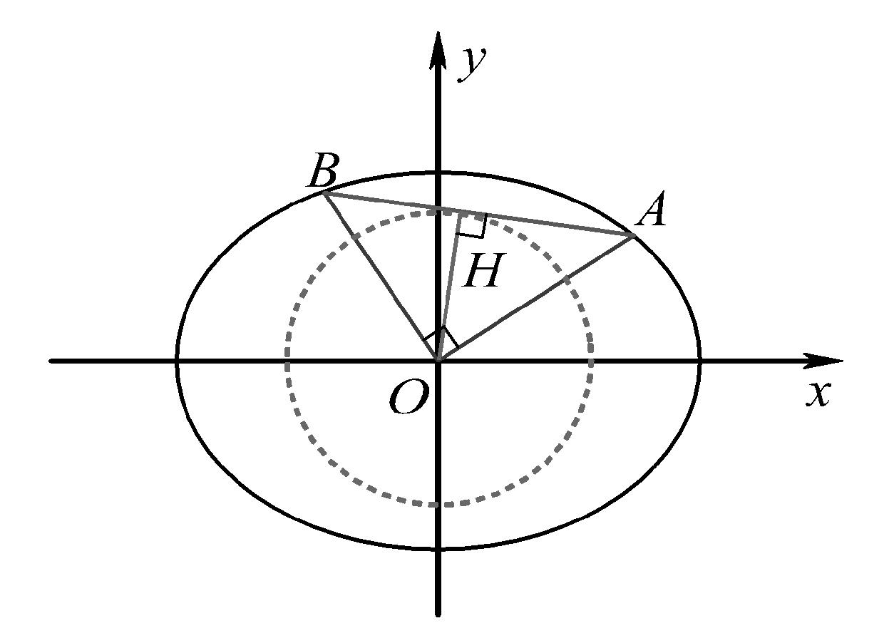

已知椭圆，为坐标原点,为椭圆上的两动点,且,则原点到的距离为定值:.

证明:设,则,即,当时,两边除以得:,所以，是这个关于的方程的两个根.
由于,所以,即,所以,即当时,，一样成立.

【例5】设椭圆的方程为，点为坐标原点，点，的坐标分别为，，点在线段上，满足，直线的斜率为．  
（1）求椭圆的方程；

  
（2）若动直线与椭圆交于，两点，且恒有，是否存在一个以原点为圆心的定圆，使得动直线始终与定圆相切？若存在，求圆的方程，若不存在，请说明理由．

2. 以原点为公共顶点的斜率等比问题

已知椭圆，为坐标原点,为椭圆上的两动点,、、成等比数列,则一定有;；

证明：设,则,即,当时,两边除以得:,所以，是这个关于的方程的两个根.由于,所以,根据等比定理,所以.

【例6】已知圆,点为圆上的动点,过点作轴的垂线,垂足为,设为的中点,且的轨迹为曲线.

  
（1）求曲线的方程；

  
（2）不过原点的直线与曲线交于、两点,已知,直线的斜率成等比数列,记以为直径的圆的面积分别为,试探就是否为定值,若是,求出此值;若不是,说明理由.

3.以坐标轴为角平分线的齐次化构造

  
（1）.椭圆对称轴上的两点、,且、不在上,若点、满足(或者),则过点作任意直线与椭圆交于、两点,则平分,也可以表示为.双曲线也具备一样的性质.  
（2）.抛物线等角定理:抛物线对称轴上关于 $y$ 轴对称的两点、,则过点作任意直线与抛物线交于、两点,则,则平分,也可以表示.

【例7】（2024•北京）已知椭圆方程，以椭圆的焦点和短轴端点为顶点的四边形是边长为2的正方形．过点，且斜率存在的直线与椭圆交于不同的两点，，过点和的直线与椭圆的另一个交点为．

  
（1）求椭圆的方程及离心率；

  
（2）若直线的斜率为0，求的值．

- 隐藏的斜率和积问题

一．同轴轴点弦+顶点角隐藏的斜率之积

若以椭圆的左顶点作交椭圆于两点,且过轴上点,延长交直线于两点,以为直径作圆,则圆在轴上交于两定点;

证明:利用平移构造齐次化可得:为定值,又由于,即,即,因此,以为直径的圆恒过定点和.

【例1】(武汉市2021届高中毕业生三月质量检测)已知椭圆的左右顶点分别为,,过椭圆内点且不与轴重合的动直线交椭圆于，两点,当直线与轴垂直时,

.
(I)求椭圆的标准方程;
(II)设直线，和直线分别交于点,若恒成立,求的值.

【例2】（2021·北京）已知椭圆：（）的一个顶点，以椭圆的四个顶点围成的四边形面积为.

（I）求椭圆的方程；

（II）过点作斜率为的直线与椭圆交于不同的两点，，直线、分别与直线交于点、，当时，求的取值范围.

【例3】(2022浙江卷)如图,已知椭圆.设，是椭圆上异于的两点,且点在线段上,直线分别交直线于，两点.
> 

> 
> |  |  |
> | --- | --- |
> | （1）求点到椭圆上点的距离的最大值； | （2）求的最小值. |
> 

二．隐藏的斜率之比

若为椭圆长轴顶点,直线交椭圆于两点,交长轴于点,则为定值,反之,为定值,则过长轴上定点;

【例4】(2020全国1卷)已知分别为椭圆的左、右顶点,为的上顶点,

.为直线上的动点,与的另一交点为，与的另一交点为.  
（1）求的方程;  
（2）证明:直线过定点.

【例5】（2023•新高考Ⅱ）已知双曲线中心为坐标原点，左焦点为，，离心率为．

  
（1）求的方程；

  
（2）记的左、右顶点分别为，，过点的直线与的左支交于，两点，在第二象限，直线与交于，证明在定直线上．

三．高考题中隐藏的斜率和与积关系

高考中出现斜率和积问题，最早可以追溯到近二十年前，考题的日新月异决定了不会永远局限于斜率和与积的问题,所以需要通过题目给到的定点或者探索定点的过程中,找到北后的本质逻辑.2022年新课标一巻的斜率和积成为了第一问就能看出来,压轴问往往要根据已知的定点或者定值来探索斜率的关系.

1.已知点是椭圆右顶点,

①椭圆上弦过定点,则定值;

②椭圆上弦过定点,则定值;

证明:将椭圆按向量平移得椭圆,

①动点，分别对应椭圆上的动点,，根据题意直线过定点，的方程为

,即,当时,两边除以得:,

定值;

②动点,分别对应椭圆上的动点,,根据题意直线过定点，的方程为,代

入①得,当时,两边除以得:,定

值;

2.已知点是椭圆上顶点,

①椭圆上弦过定点,则定值;

②椭圆上弦过定点,则定值;

证明:将椭圆按向量平移得椭圆,

①动点,分别对应椭圆上的动点,,根据题意直线,过定点，,的方程为,即,当时,两边除以得:,定值;

②动点,分别对应椭圆上的动点,,根据题意直线,过定点，,的方程为

,即,当时,两边除以得:,

定值;

我们不需要记忆这个定值,但是我们可以提前预判定值的类型,从而进行定点定值的必要性探路,

  
（1）当角的顶点为椭圆的轴顶点时,第三边直线过了轴定点,那么斜率之积为定值,当第三边直线过了轴定点时,那么斜率之和为定值;

  
（2）当角的顶点为椭圆的轴顶点时,第三边直线过了轴定点,那么斜率倒数和为定值,当第三边直线过了轴定点时,那么斜率之积为定值;

最终得到一句口诀:同积异和!即轴点弦和角顶点在相同轴上,斜率积为定值,轴点弦和角顶点在不同轴上,斜率和或者倒数和为定值.

四．平行于坐标系的中点斜率翻译

如图,为的中线,设直线的斜率分别为,

①若与轴平行,则:；②若与轴平行,则:

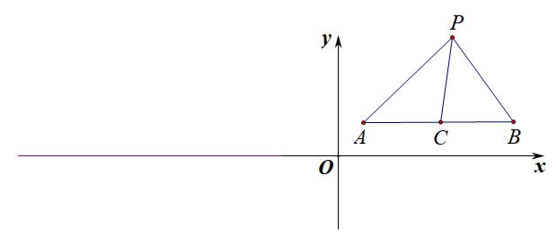

【例6】（2023•乙卷）已知椭圆的离心率为，点在上．

  
（1）求的方程；

  
（2）过点的直线交于点，两点，直线，与轴的交点分别为，，证明：线段的中点为定点．

【例7】(2022北京卷)已知椭圆的一个顶点为,焦距为.

  
（1）求椭圆的方程

  
（2）过点作斜率为的直线与椭圆交于不同的两点,,直线，分别与轴交于点,.当时,求的值.

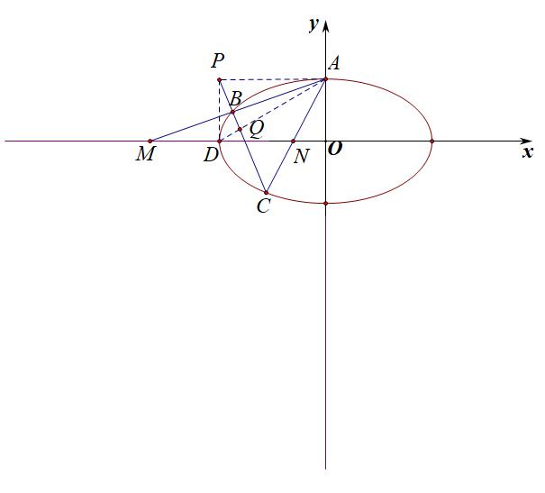

【例8】(2022全国乙卷)已知椭圆的中心为坐标原点,对称轴为轴、轴,且过，两点.

  
（1）求的方程;

  
（2）设过点的直线交于两点,过且平行于轴的直线与线段交于点,点满足.证明:直线过定点.

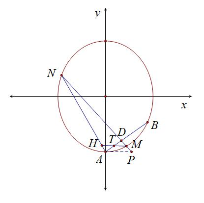

########## 第三节 点差法与中垂线问题

########## 一  点差法与中点弦

若椭圆（双曲线）与直线交于两点，其中，，，为中点，

定理1：（椭圆）；（双曲线）

证明：设，，，则

椭圆：双曲线：

①-②，并将③④⑤代入得：（椭圆），

（双曲线）

##########      点差法，抓住“差中斜”，这样找到了对应关系，由于点差法属于解析几何技巧方法的入门篇，第一次让大家见识到“设而不求”.本内容小题篇就已经介绍，写大题注意步骤即可，也不是什么难题。

########## 点差法与隐藏的中点轨迹问题

########## 1.求隐藏轨迹方程的交轨法

########## 如果直线方程为或者，那么弦中点一定位于一个椭圆上，证明如下：

########## 因为，故，所以，也可以表示为;

########## 因为，故，所以，也可以表示为．

########## 易知弦中点的轨迹都是椭圆，求出轨迹，则很容易求出中点的取值范围．

【例1】已知椭圆的右焦点,离心率为,过作两条互相垂直的弦,,设,的中点分别为，.  
（1）求椭圆的方程;  
（2）证明:直线必过定点,并求出此定点坐标;  
（3）若弦,的斜率均存在,求面积的最大值.

【例2】（2025•临沂一模（25陪跑课学员刘自豪提问））已知椭圆的离心率为是的左、右焦点，且，直线过点与交于，两点．

  
（1）求的方程；

  
（2）若，求的方程；

  
（3）若直线过点与交于，两点，且，的斜率乘积为分别是线段，的中点，求△面积的最大值．

2.斜率双用与双中点连线过定点问题

和两者一起出现，相得益彰，在出现双中点连线过定点时候，两个斜率齐上阵，实现“斜率双用”，中点弦就可以将直接派上，实现双点合一.之后我们在解决定点定值过程中，斜率经常需要双用.

【例3】（2024•天心区模拟）已知椭圆的离心率．

  
（1）若椭圆过点，求椭圆的标准方程．

  
（2）若直线，均过点且互相垂直，直线交椭圆于，两点，直线交椭圆于，两点，，分别为弦和的中点，直线与轴交于点，，设．

求；

记，求数列的前项和．

【例4】（2024•九省联考）已知抛物线的焦点为，过的直线交于，两点，过与垂直的直线交于，两点，其中，在轴上方，，分别为，的中点．

  
（1）证明：直线过定点；

  
（2）设为直线与直线的交点，求面积的最小值．

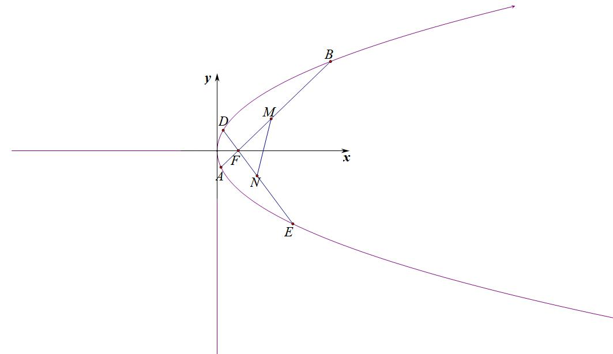

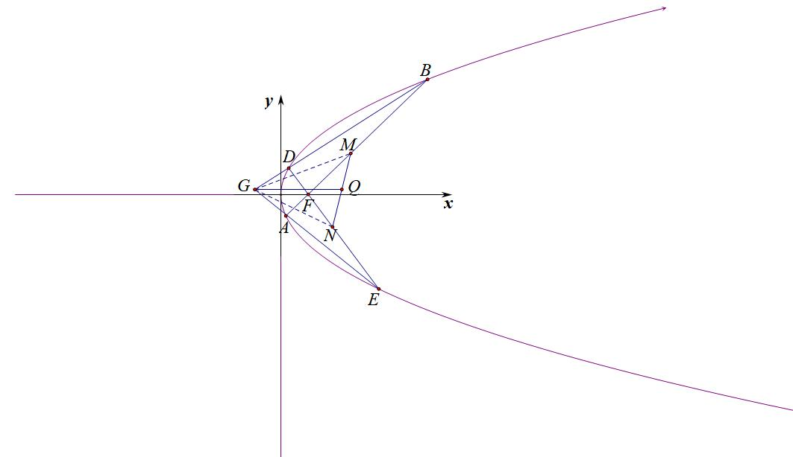

########## 三  点差法与中垂线问题

##########    如今的考试已经不可能让大家简单背个点差结论就能解决，总会在点差法的基础上加上一点命题逻辑，所以我们找到了常考的第一点——中垂线和对称问题！

##########  中垂线问题：若关于直线对称，可以知道线段被直线垂直平分，其中，则能得出以下定理（不妨设焦点在轴上）：

########## （椭圆），（双曲线）；（抛物线）；

########## （椭圆），（双曲线）．（抛物线）；

########## 我们这里以焦点在轴上的椭圆为例来证明：

########## ，，，故，即；同理，即．

【例5】（2024•郑州一模）已知点是双曲线的上顶点．

  
（1）若点的坐标为，延长交双曲线于点，求点的坐标；

  
（2）双曲线与直线有唯一的公共点，过点且与垂直的直线分别交轴，轴于，两点，当点运动时，求点的轨迹方程．

【例6】（2024北京海淀二模改篇题（25届陪跑课学员张梦凯提问））已知椭圆的焦点在轴上，中心在坐标原点．以的一个顶点和两个焦点为顶点的三角形是等边三角形，且其周长为．

（Ⅰ）求椭圆的方程；

> 

> 
> |  |  |  |
> | --- | --- | --- |
> | （Ⅱ）设过点的直线与椭圆交于不同的两点，，与直线交于点．点在轴上，为坐标平面内的一点，四边形是菱形． | （ⅰ）求最大值； | （ⅱ）求证：直线过定点． |
> 

【例7】（2025上海长宁区期中考试20题（26届陪跑课学员宋亚宸提问））已知椭圆的离心率为，且过点．

  
（1）求的方程；

  
（2）直线交于，两点．

点关于原点的对称点为，直线的斜率为，证明：为定值；

若上存在点使得在上的投影向量相等，且△的重心在轴上，求直线的方程．

四．焦点弦中垂线特殊性质

########## 1．设椭圆焦点弦的中垂线与长轴的交点为，则（如左图）

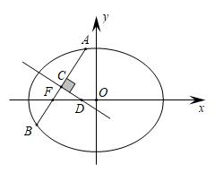

########## 2．设双曲线焦点弦的中垂线与焦点所在轴的交点为，则（如中图）

########## 3．设抛物线焦点弦的中垂线与对称轴的交点为，则（如右图）

##########  1．证明：根据椭圆焦长公式：，，，

########## ，

########## ，故．

########## 2．证明：当直线与双曲线交于一支时，证明过程同椭圆一致；当直线与双曲线交于两支时，

########## ，，，，其余过程与椭圆一致．

########## 3．证明：抛物线焦点弦公式：；；．

########## ，，故．

########## 如果是直接问与之间的长度关系，那属于之前相对简单的考题，本文论述一下在这个结论下隐藏的命题逻辑．

########## 关于焦点弦和中垂线比值问题：求焦点弦所在的直线方程，中垂线被长轴（对称轴）分成两段，

########## 解决口诀：截距两边分，乘除各一边！

########## 模型一 正向相加型

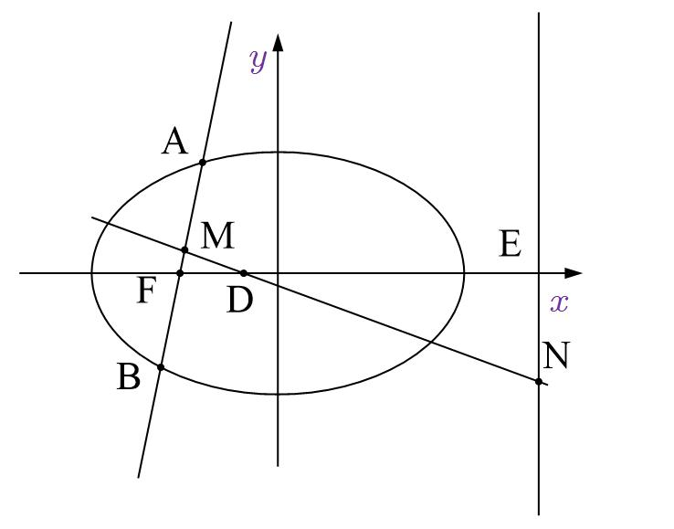

########## 如图：为过椭圆的左焦点的直线，为中垂线，为中点，在直线上，为与轴的交点，，易知，，， 

########## ①，②，

########## 所以． （①②代入整理即可）

########## 模型二 反向相减型

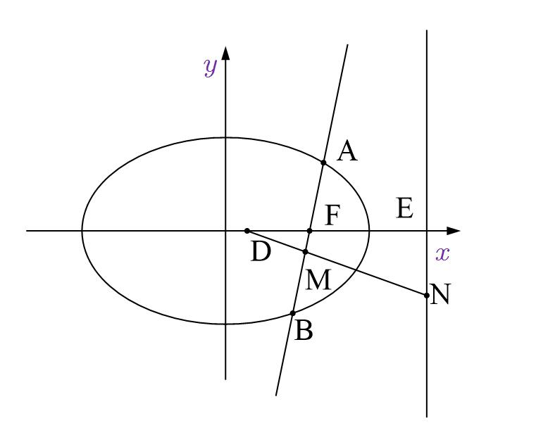

########## 如图：为过椭圆的右焦点的直线，为中垂线，为中点，在直线上，为与轴的交点，易知： ，，，，，

########## ．

【例8】（2024•广东模拟）已知双曲线的右焦点为，过点且斜率为的直线交双曲线于、两点，线段的中垂线交轴于点．若，则双曲线的离心率取值范围是

A．	
B．	
C．	
D．

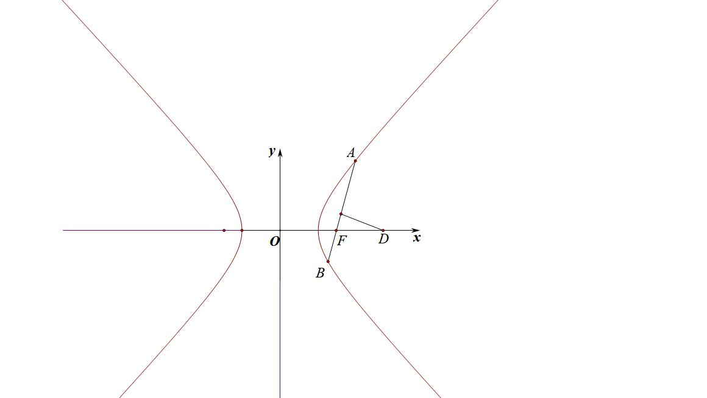

########## 【例9】（2024•安徽模拟）过抛物线的焦点的直线交抛物线于两点，点在直线上，若为等边三角形，则其边长为（    ）

########## A．11    	B．12               C．13	D．14

########## 【例10】（2024•鼓楼模拟）已知椭圆，长轴为4，不过坐标原点且不平行于坐标轴的直线与椭圆有两个交点，，线段的中点为，直线的斜率与直线的斜率的乘积为定值．

########## （1）求椭圆的方程；

########## （2）若直线过右焦点，问轴上是否存在点，使得三角形为正三角形，若存在，求出点坐标，若不存在，请说明理由．

【例11】（2024•保定一模）已知椭圆，过右焦点作不与轴垂直的直线交椭圆于，两点，的中垂线交轴于点，交直线于点，直线与轴交于点．

  
（1）求证：在轴上存在点使得为定值；

  
（2）试探究，，，四点是否共圆，请说明理由．

########## 第四节 定比点差法

########## 一 定比分点概念

定比分点： 为经过两个不同的定点、的直线上的一点，且满足，则：（为参数，）．

证明： 因为，所以，整理得：，下面分三种情况讨论：

①当时，为内分点；②当，且时，为外分点；③当时，点与重合．

########## 二 调和点列与定比点差法

1．调和点列的概念

如下图①，点在线段上，则满足的点是唯一存在的．但是，如果将线段改为直线，此时，满足的点有两个，如下图②，不妨记另一个点为，则

，在此种情况下，我们称点、、、为调和点列，或者称点、调和分割点、．

  
图①

  
图②

特别的，当时，即点为的中点，则为无穷远点．

2．调和点列的性质

如下图所示：对于线段的内分点和外分点满足、调和分割线段，即，设为线段的中点，则有以下结论成立：

①点、也调和分割、，即；

②（是与的调和平均数）．

【例1】（2011•山东）设、、、是平面直角坐标系中两两不同的四点，若，

，且，则称、调和分割、，已知平面上的点、调和分割、，则下面说法正确的是（    ）

A．可能是线段的中点

B．可能是线段的中点

C．、可能同时在线段上

D．、不可能同时在线段的延长线上

3.定比分点和调和分点支配下的圆锥曲线

定理1:在椭圆或双曲线中，设为椭圆或双曲线上的两点.若存在两点，满足

，一定有

证明:若，则，则，有  ①-②得：

即

定理2:在拋物线中，设为抛物线上的两点.若存在两点，满足，一定有.

证明若，则，则

，有①②得:

即，所以

，故.

定比点差的原理谜题解开，就是两个互为调和的定比分点坐标满足圆锥曲线的特征方程.
利用定比分点和调和分点证明特征方程

【例2】设抛物线的焦点为，过点的动直线与拋物线交于两点，当在上时，直线的斜率为.  
（1）求抛物线的方程:

  
（2）在线段上取点，满足，证明:点总在定直线上.

【例3】（2023•四省联考）已知双曲线过点，且焦距为10．

  
（1）求的方程；

  
（2）已知点，，为线段上一点，且直线交于，两点．证明：．

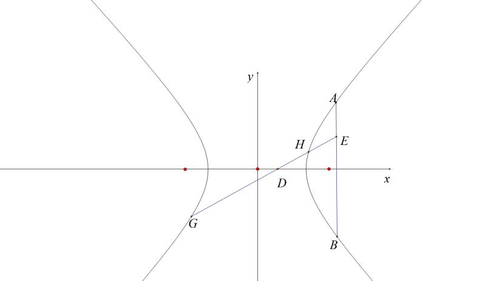

########## 三  定比点差法与轴点弦的三炮齐鸣

轴点弦坐标与比值转换定理:

类型一 定点在轴

过定点的直线与椭圆相交于、两点，设，，则在直线上一定存在点满足，根据定比点差法可知.

一定有

证明:

类型二 定点在轴

过定点的直线与椭圆相交于、两点，设，，则在直线上一定存在点满足，根据定比点差法可知.同理:
由于在考试当中我们经常要拿出这三个等式，故我们称之为:“三炮齐鸣，天下太平”

【例4】(2018•浙江高考)已知点，椭圆上两点、满足，则当<u>     </u>时，点横坐标的绝对值最大.

########## 1.三炮齐鸣破解中点截距定理

如图所示，在椭圆中，、为椭圆上的两点，设轴上一点，存在直线和轴上一点，连接并延长交直线于，

则:①:②直线轴:③.

【例5】（2023•宁德模拟）已知椭圆的离心率为，过点．

  
（1）求椭圆的标准方程；

  
（2）设椭圆的右焦点为，定直线，过点且斜率不为零的直线与椭圆交于，两点，过，两点分别作于，于，直线、交于点，证明：点为定点，并求出点的坐标．

########## 注意：本题的几何背景就是构造调和梯形*ABQP*，定比点差就是专门翻译调和点列的坐标形式.

########## 2.三炮齐鸣破解角平分线定理

已知交椭圆)长轴(短轴)于点是椭圆上关于长轴(短轴)对称的两点，直线交长轴(短轴)于，则或.(双曲线也有相同调和共轭性质)

代数本质解读：

如图，过定点的直线与椭圆相交于、两点，作点*A*关于*x*轴的对称点，则直线恒过定点．

【例6】（2024•北京卷）已知椭圆方程，以椭圆的焦点和短轴端点为顶点的四边形是边长为2的正方形．过点，且斜率存在的直线与椭圆交于不同的两点，，过点和的直线与椭圆的另一个交点为．

  
（1）求椭圆的方程及离心率；

  
（2）若直线的斜率为0，求的值．

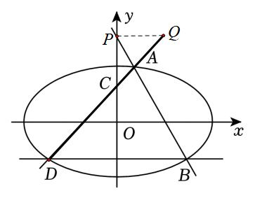

########## 3.三炮齐鸣破解单轴点弦交中点的定点定值问题

【例7】（2024•甲卷）已知椭圆的右焦点为，点在椭圆上，且轴．

  
（1）求椭圆的方程；

  
（2）过点的直线与椭圆交于，两点，为线段的中点，直线与交于，证明：轴．

【例8】(2020北京)已知椭圆过点，且.

  
（1）求椭圆的方程;

  
（2）过点的直线交椭圆于点，直线分别交直线于点.求的值.

【例9】（24武汉二调）已知双曲线*E*：的左右焦点为，，其右准线为，点到直线的距离为，过点的动直线交双曲线*E*于*A*，*B*两点，当直线*AB*与*x*轴垂直时，.  
（1）求双曲线*E*的标准方程；

  
（2）设直线与直线的交点为*P*，证明：直线*PB*过定点.

【例10】（2023•新高考Ⅱ）已知双曲线中心为坐标原点，左焦点为，，离心率为．

  
（1）求的方程；

  
（2）记的左、右顶点分别为，，过点的直线与的左支交于，两点，在第二象限，直线与交于，证明在定直线上．

########## 四． 非轴点弦三炮齐鸣数据

椭圆，点、是椭圆上的点，且，则:

(非轴点弦三炮齐鸣起手式，方便理解，不是最终方程

即点、的坐标都可以用只含有(或的式子表示出来.

证明:由得:，即①，利用定比点差法得:

，

即，代入（1），消去、，整理可得:

如果消去、，整理可得:.

在上面椭圆的基础上，我们也可以大胆推测，对于抛物线，设点、为抛物线上的点，且，则亦有公式:

【例11】(2022•全国乙卷)已知椭圆的中心为坐标原点，对称轴为轴、轴，且过两

点.

  
（1）求的方程;

  
（2）设过点的直线交于两点，过且平行于轴的直线与线段交于点，点满足.证明:直线过定点.

【例12】（2024.成都三诊）已知椭圆  的离心率为 , 过点  的直线  与椭圆  交于  两点, 当  过坐标原点  时, .

(I )求椭圆  的方程;

(II) 线段  上是否存在定点 , 使得直线  与直线  的斜率之积为定值. 若存在,求出点  的坐标; 若不存在, 请说明理由.

