- 离心率

这是圆锥曲线在小题当中最能体现方程思想的地方，离心率，三个变量，需要两个方程，其中一个是（椭圆），（双曲线），另一个就是我们需要去列的方程，这个方程通常有两种语言角度，一种是坐标语言角度，即把一切转化为坐标，通过坐标列方程，另一种是长度/角度（斜率）角度，本文就通过列举两种角度语言来解读。小题小作，最终决定方法选取的关键就是计算量和简捷性。

- 焦点弦体系

########## 1*．* 椭圆的焦比定理

########## *A*是椭圆上一点，、是左、右焦点，为，过，*c*是椭圆半焦距，如图，则①；②；③．

焦比定理：过椭圆的左焦点<em>F</em>1的弦，令，④，代入焦长公式①可得，⑤．

########## 这样组合①②③④⑤，焦点弦问题才能形成闭环.

########## 2.双曲线焦比定理之交一支类型

########## *A*、*B*是双曲线左支上两点，是左焦点，为，过，*c*是双曲线半焦距，如图，则①；②；（根据长减短加判断符号）③．

########## 令，即④（如果，有），

########## 代入弦长公式可得，⑤（与椭圆一致）．

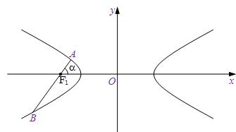

########## 3.双曲线焦比定理之交两支类型

########## *A*是双曲线左支上一点，B是双曲线右支上一点，是左焦点，为，过，*c*是双曲线半焦距，如图，由于交两支时，有，平方得：，即，故

########## ①；②；（根据长减短加判断符号）③．

########## 令，即④

########## 代入弦长公式可得，⑤．

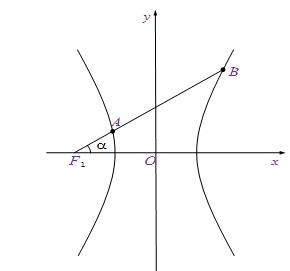

一.通径相关的离心率

通常斜率已知或者角度已知的焦点弦问题，我们采用坐标来进行翻译，尤其是半通径点，其它几何性质相对体现较少.

【例1】（2020•新课标Ⅰ）已知为双曲线的右焦点，为的右顶点，为上的点，且垂直于轴．若的斜率为3，则的离心率为 <u>　   　</u>．

【例2】（2021•天津）已知双曲线的右焦点与抛物线的焦点重合，抛物线的准线交双曲线于，两点，交双曲线的渐近线于，两点，若，则双曲线的离心率为

A．	
B．	
C．2	
D．3

【例3】（2021•浙江）已知椭圆，焦点，，．若过的直线和圆相切，与椭圆的第一象限交于点，且轴，则该直线的斜率是 <u>　   　</u>，椭圆的离心率是 <u>　   　</u>．

【例4】(2024•广东模拟）已知椭圆的左、右焦点分别为，，点，

在椭圆上，且，则当，时，椭圆的离心率的取值范围为<u>　____</u>．

- 焦点弦的化斜为直

过焦点的弦可以用第二定义化斜为直，转化为坐标，也可以通过焦长公式转化为角度，其本质区别就是角度易得，则焦长更适合，如果是斜率不能直接转化为，则更优先考虑转化为坐标计算.

【例5】（2023•新高考Ⅰ）已知双曲线的左、右焦点分别为，．点在上，点在轴上，，，则的离心率为 <u>　  　</u>．

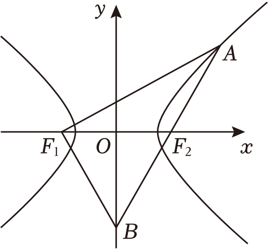

（法三：长度语言转化）

【例6】（2022•浙江）已知双曲线的左焦点为，过且斜率为的直线交双曲线于点，，交双曲线的渐近线于点，且．若，则双曲线的离心率是 <u>　______</u>．

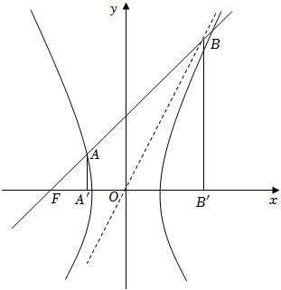

【例7】（2023•南阳期末）如图，内接于椭圆，其中与椭圆右顶点重合，边过椭圆中心，若边上中线恰好过椭圆右焦点，则该椭圆的离心率为 <u>　  　</u>．

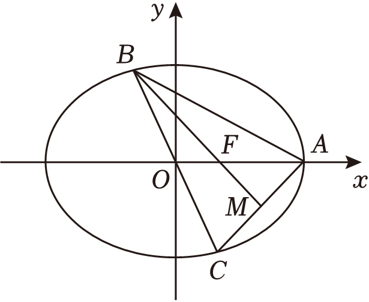

【例8】（2023•重庆模拟）已知双曲线的左、右焦点分别为，，过作直线与双曲线的左、右两支分别交于，两点，设为线段的中点，若，则双曲线的离心率为 <u>　　</u>．

- 焦点弦比值与离心率

本质就是和（双曲线交两支的焦点弦）灵活应用.

【例9】（2022•广西月考）已知是椭圆的左焦点，过作倾斜角为的直线与椭圆交于，两点，若，则椭圆的离心率为 <u>　　</u>．

【例10】（2023•毕节市期末）如图，双曲线的左、右焦点分别为，，点，，在双曲线上，且四边形为等腰梯形，，，则双曲线的离心率为 <u>　  　</u>．

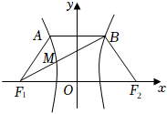

【例11】（2023•株洲一模）已知椭圆的左右焦点为，，过的直线交椭圆于，两点，若，且，则椭圆的离心率为 <u>　  　</u>．

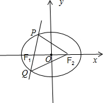

【例12】（2023•南京月考）已知双曲线的左、右焦点分别为，，离心率为．若过点的直线与交于，两点，且，则<u>　 　</u>．

四．焦点弦构造等腰三角形速解策略

椭圆和双曲线中的等腰三角形，一定要考虑隐藏的条件，比如和.

1.隐藏的型

【例13】（2019•新课标Ⅰ）已知椭圆的焦点为，，过的直线与交于，两点．若，，则的方程为（    ）

A．    	
B．        
C．	
D．

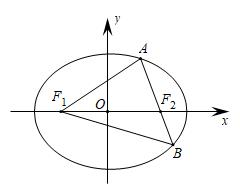

【例14】（2024•江苏南通海门区期中）设椭圆的上顶点为，左、右焦点分别为，，连接并延长交椭圆于点，若，则该椭圆的离心率为 <u>　　</u>．

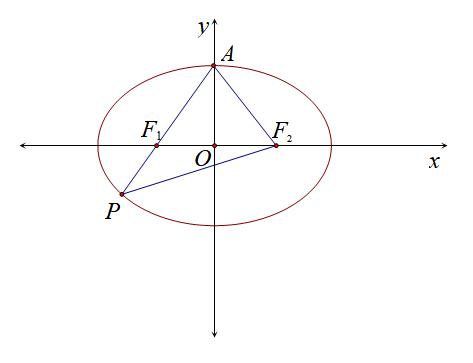

【例15】（2024•广州模拟）已知双曲线的左、右焦点分别为，，过点的直线与双曲线的右支交于，两点，若，且双曲线的离心率为，则

A．	
B．	
C．	
D．

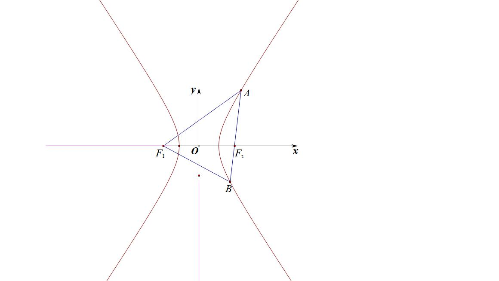

在焦点三角形含有等腰属性时，焦长焦比是最佳处理方法，尤其在双曲线中，最喜欢隐藏焦长为（焦弦为交一支）或者焦长为（焦弦为交两支）的，我们接下来看焦长为的类型.

2.双曲线的4*a*底边等腰三角形

如图，若与互为充要条件．

证明：（充分性），，故．

（必要性），，故

核心技能：

【例16】（2024•湖南期中）双曲线的左、右焦点分别为，，为坐标原点，为双曲线右支上的一点，连接交左支于点．若，且，则双曲线的离心率为

A．2	
B．	
C．3	
D．

【例17】（2023•河南模拟）设双曲线的左、右焦点分别为，，为双曲线上在第一象限内的点，线段与双曲线相交于另一点，的中点为，且，若，则双曲线的离心率为

A．	
B．2	
C．	
D．

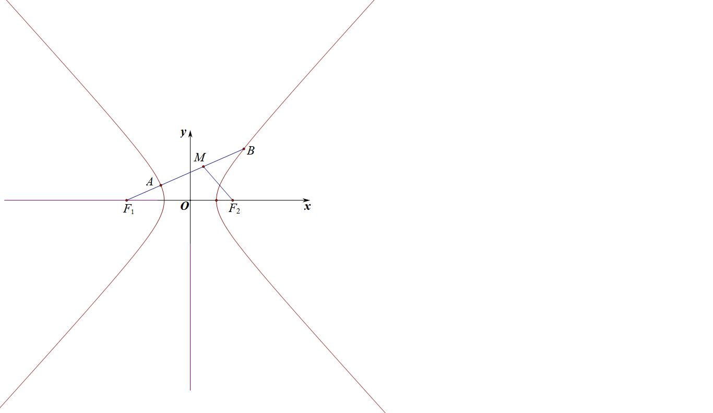

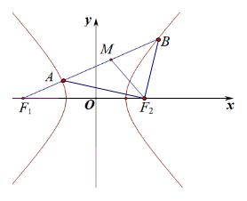

注意：涉及过焦点的弦长比值或者其它几何性质时，选择焦长焦比显然能够简化计算，实现小题小作.

【例18】（2016•上海）双曲线的左、右焦点分别为，，直线过且与双曲线交于，两点．

  
（1）直线的倾斜角为，△是等边三角形，求双曲线的渐近线方程；

  
（2）设，若的斜率存在，且，求的斜率．

########## 五．椭圆与双曲线的焦弦直角体与离心率

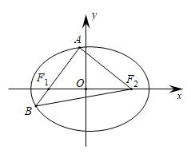

如左图所示，椭圆若，且，，我们可以借助公式可得来求出和的关系，由于，从而求出离心率．

如右图所示，若，过原点，且，通过补全矩形，可得，，借助公式可得来求出和的关系，从而求出离心率．

注意：若直线交双曲线两支于、两点，，则，时，，本节前面已经论述.

【例19】（2024•长沙模拟）已知，分别是椭圆的左，右焦点，，是椭圆上两点，且，，则椭圆的离心率为

A．	
B．	
C．	
D．

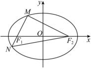

【例20】（2024•荆州期末）如图，已知，分别是双曲线的左、右焦点，过点的直线与双曲线的左支交于点，，若，，则双曲线的渐近线方程为

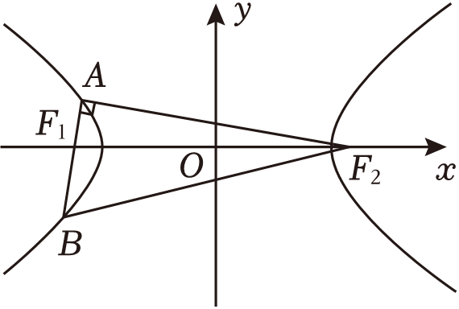

A．	
B．	
C．	
D．

【例21】（2023•涟源市模拟）如图所示，，是双曲线的左、右焦点，双曲线的右支上存在一点满足，与双曲线的左支的交点平分线段，则双曲线的离心率为

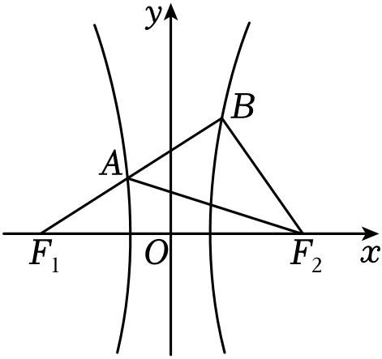

A．3	
B．	
C．	
D．

【例22】（2025·江苏南京·二模T8）在平面直角坐标系中，双曲线的右焦点为，点，在的右支上，且，点关于原点的对称点为.若，则的离心率为（   ）

A．	
B．	
C．	
D．

【例23】（2023•重庆模拟）已知双曲线的左、右焦点分别为，，过的直线交双曲线的左支于，两点，若，且的周长为，则双曲线的离心率为（    ）

A．    	
B．              
C．	
D．

【例24】（2024•多选•南关区模拟）已知，分别为双曲线的左、右焦点，过的直线交双曲线左、右两支于，两点，若为等腰直角三角形，则双曲线的离心率可以为

A．	
B．	
C．	
D．

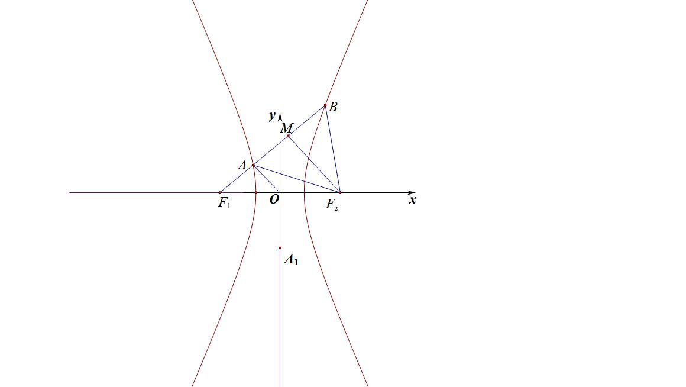

########## 焦点弦的平行四边形对称化构造

【例25】（2022•江西模拟）如图，椭圆的左、右焦点分别为，，两平行直线，分别过，交于，，，四点，且，，则的离心率为

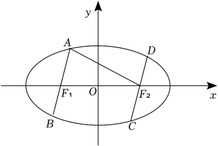

A．	
B．	
C．	
D．

【例26】（2024•台州模拟）设，是双曲线的左、右焦点，点，分别在双曲线的左、右两支上，且满足，，则双曲线的离心率为

A．2	
B．	
C．	
D．

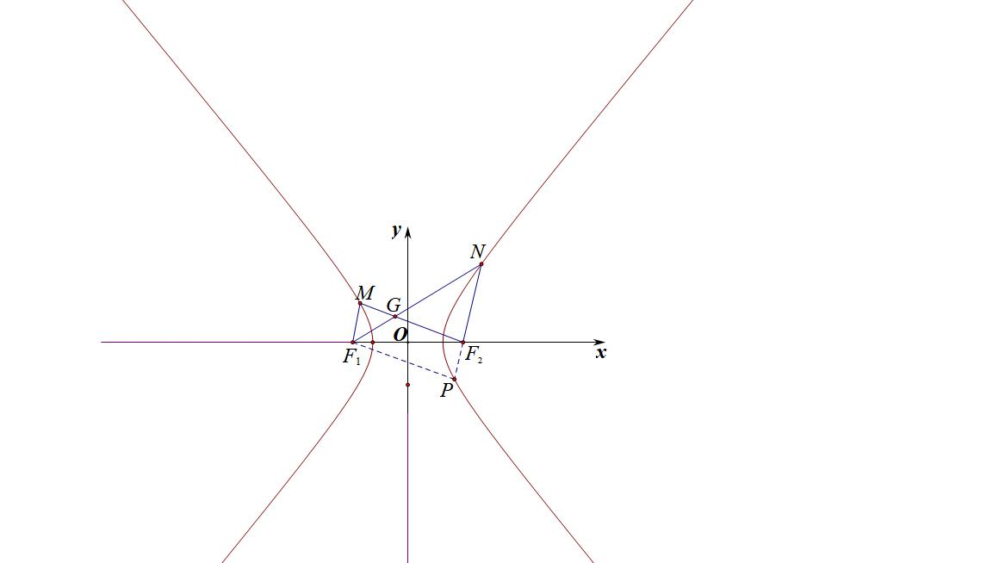

【例27】（2024•泰安四模）已知椭圆的左，右焦点分别为，，点，在上，且满足且，若，则的离心率为 <u>　   　</u>．

【例28】（2025·浙江温州·三模T8）已知双曲线的左、右焦点分别是、，在第二象限且在双曲线的渐近线上，，线段的中点在双曲线的右支上，则双曲线的离心率为（   ）

A．	
B．	
C．	
D．

- 渐近线体系

一．焦点到渐近线距离构造特征三角形

双曲线的焦点到渐近线的距离为定值<em>b</em>，如左图所示，由于渐近线<em>OP</em>的斜率为，又，，显然<em>PF</em>2的长度是定值<em>b</em>．

如右图所示，过双曲线的左焦点作圆的切线，切点为*P*，那么，点*P*在渐近线上，也在左准线上，即点．

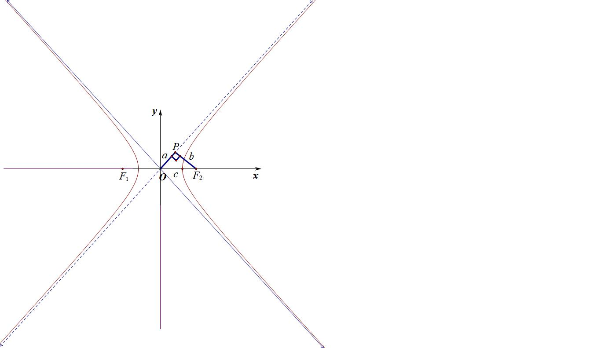

1.利用对称性构造直角三角形

【例1】（2018•新课标Ⅲ）设，是双曲线的左，右焦点，是坐标原点．过作的一条渐近线的垂线，垂足为，若，则的离心率为（　　）

A．    	
B．              
C．	
D．

【例2】（2023•天津）双曲线的左、右焦点分别为，．过作其中一条渐近线的垂线，垂足为．已知，直线的斜率为，则双曲线的方程为

A．	
B．	
C．	
D．

2.与焦长综合的渐近线三角形

*A*、*B*是双曲线左支上两点，是左焦点，为，过，*c*是双曲线半焦距，如左图，则①；②；

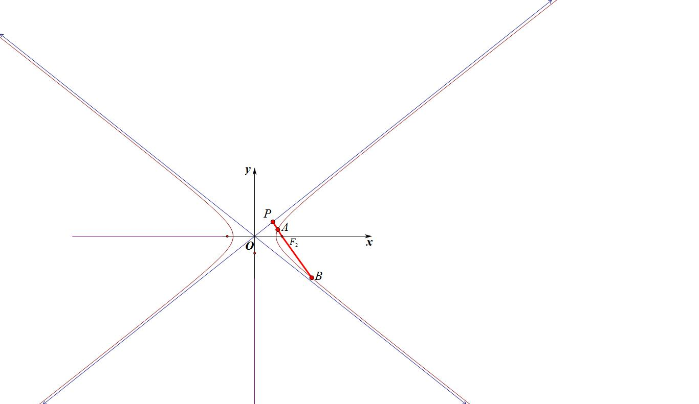

由于，如右图所示，，;

########## *A*是双曲线左支上一点，B是双曲线右支上一点，是左焦点，为，过，*c*是双曲线半焦距，如图，由于交两支时，有，平方得：，即，故

①；②；（根据长减短加判断符号）

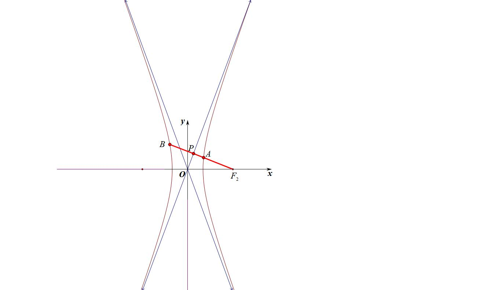

由于，如右图所示，，;

【例3】（2024•漳州模拟）已知双曲线左、右焦点分别为，，过的直线与的渐近线及右支分别交于，两点，若，则的离心率为

A．	
B．2	
C．	
D．3

【例4】（2024•厦门模拟）已知双曲线，过右焦点作一条渐近线的垂线，垂足为，点在上，且，则的离心率为

1. B．	C．2	D．3

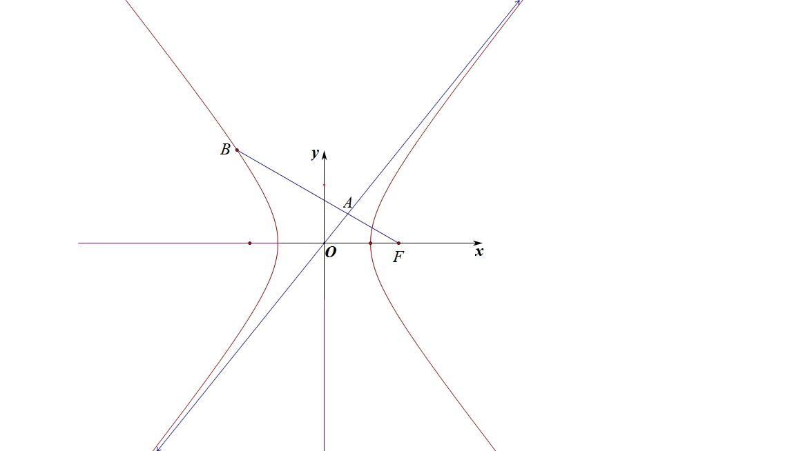

3. 与渐近线平行的焦点弦问题

抓住，焦长为即可.

【例5】（2024•多选•重庆模拟）已知双曲线的左、右焦点分别为，，直线与相交于点，与的一条渐近线相交于点．记的离心率为，那么

A．若，则	
B．若，则

C．若，则	
D．若，则

4.小圆中位线与的数据构造

【例6】（2022•乙卷）双曲线的两个焦点为，，以的实轴为直径的圆记为，过作的切线与交于，两点，且，则的离心率为

A．	
B．	
C．	
D．

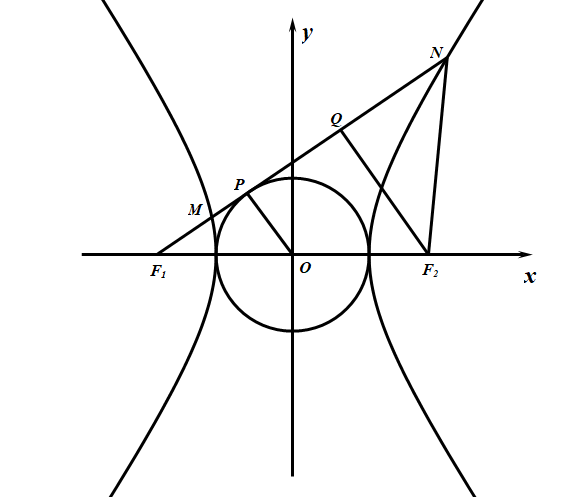

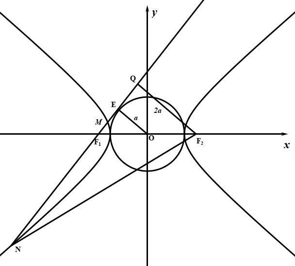

【例7】（河南省H20联盟2025届高三下学期4月联考T14）已知的顶点，分别为双曲线：的左、右焦点，点在的右支上，且与的一条渐近线垂直，记的离心率为，若，则_______.

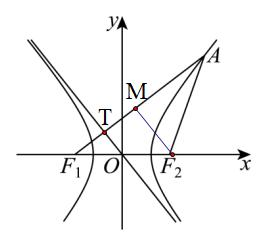

二．渐近线相似三角形比值与离心率

①如左图所示，当离心率时，过焦点作渐近线垂线，则不会形成直角三角形；

②如右图所示，当离心率时，过焦点作渐近线垂线，会交于第二象限点，令，则双曲线离心率为；

证明：作于，易知，，，则，可知：，根据勾股定理，即，故，所以．

③如图所示，当离心率时，过焦点作渐近线垂线，会交于第四象限点，令，则双曲线离心率为；

########## 证明：作于，易知，，，则，可知：，根据勾股定理，即，故，所以．

总结：一切源于直角三角形相似，需要作辅助线构造，其实结论很好理解记忆，就是与比大小，大于就是，小于就是．

【例8】（2018•新课标Ⅰ）已知双曲线，为坐标原点，为的右焦点，过的直线与的两条渐近线的交点分别为，．若为直角三角形，则（    ）

A．    	
B．               
C．	
D．

【例9】（2024•化州市期中）过双曲线的左焦点作圆的切线，切点为，直线交直线于点．若，则双曲线的离心率为 <u>　　</u>．

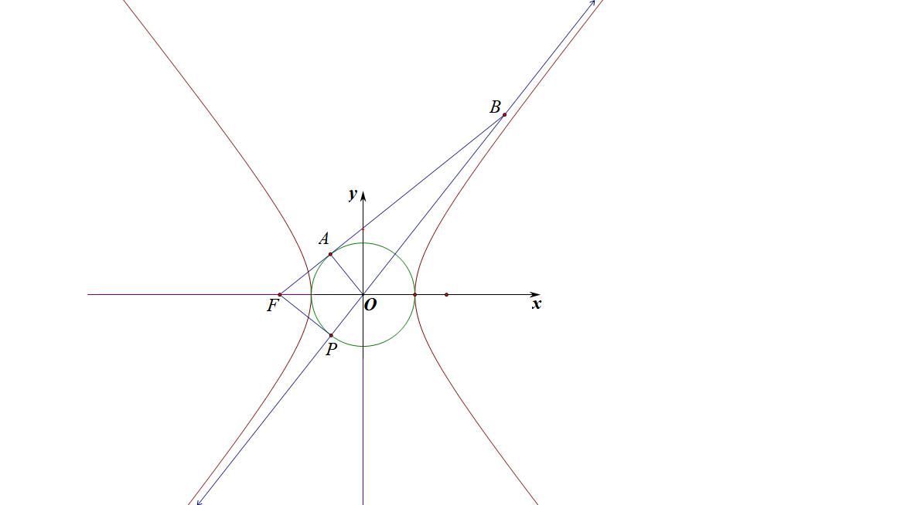

【例10】（2022•上虞区期末）过双曲线右焦点作双曲线一条渐近线的垂线，垂足为，与另一条渐近线交于点，若，则双曲线的离心率为

A．或	
B．2或	
C．或	
D．2或

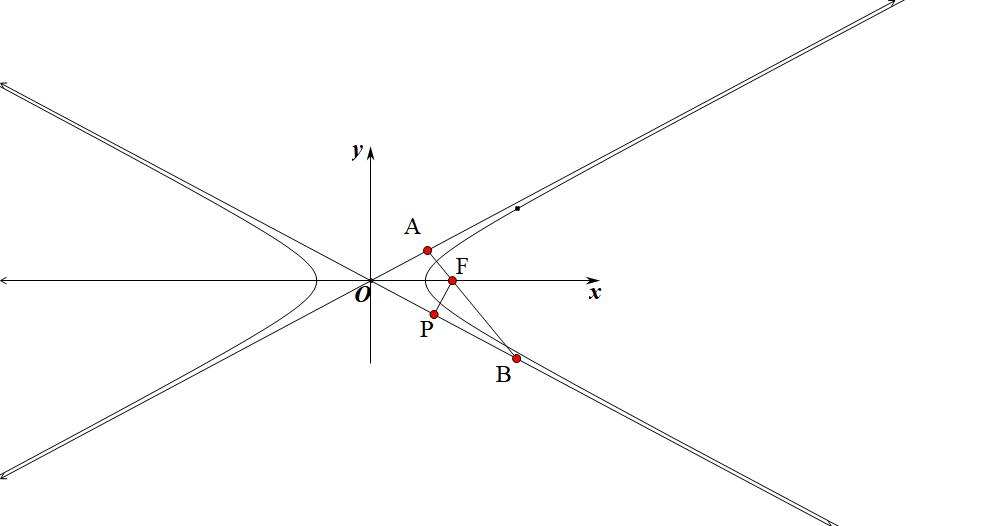

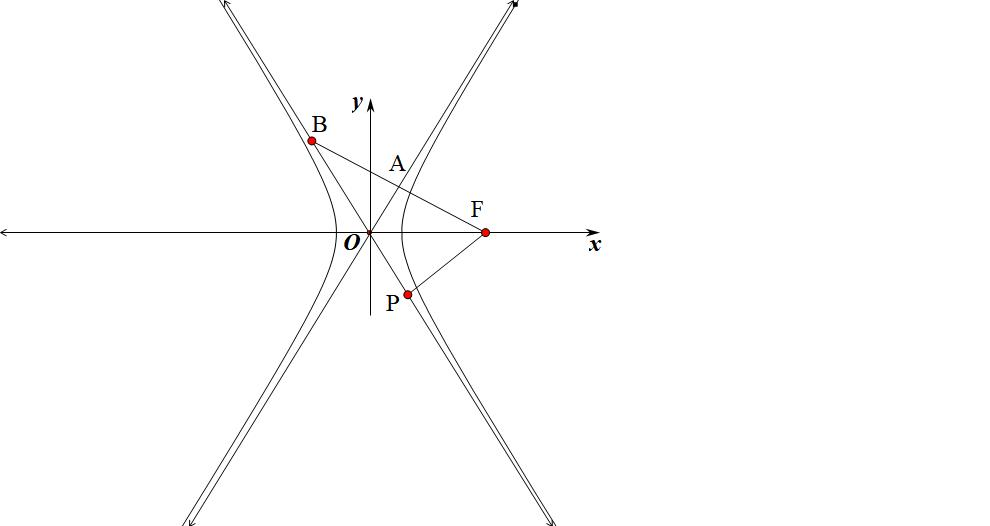

三．大圆与渐近线交点构造坐标特征三角形

这里通常是双曲线的坐标特征三角形，需要借助辅助大圆.

如图，以为直径的圆与双曲线的渐近线在第一象限内的交点坐标为．不过，很多时候，题目会以“点*P*在渐近线上，且”的形式给出条件．

证明　渐近线的方程为，设，则，即，即

> [!example]- 例11.（2025新课标Ⅱ卷第11题多选）对于双曲线 $C:\frac{x^{2}}{a^{2}}-\frac{y^{2}}{b^{2}}=1\left(a>0,b>0\right)$  ，左、右焦点为 $F_{1}、F_{2}$ ，左、右顶点为 $A_{1}、A_{2}$  ， 以 $F_{1}F_{2}$  为直径的圆与 $C$  的一条渐近线交于 $M$  、 $N$  ，且 $\angle NA_{1}M=\frac{5\pi }{6}$ ，下列说法正确的是（           ）
A. $\angle A_{1}MA_{2}$  $=\frac{\pi }{6}$            
B. $\left|MA_{1}\right|=2\left|MA_{2}\right|$

C. $C$  的离心率为 $\sqrt{3}$      
D. 当 $a=\sqrt{2}$  时，四边形 $NA_{1}MA_{2}$  的面积为 $8\sqrt{3}$

【例12】（2023•新乡模拟）已知双曲线的右焦点为，点在的一条渐近线上，且在第一象限，，若的中点在上，则的离心率为（    ）

A．    	
B．	
C．	
D．

【例13】（2023•宝鸡模拟）已知双曲线的左、右焦点分别为，，且以为直径的圆与双曲线的渐近线在第四象限交点为，交双曲线左支于，若，则双曲线的离心率为（　　）

A．    	
B．	
C．	
D．

四．渐近线隐藏的面积和向量积定值

########## ①双曲线上的任意点到双曲线的两条渐近线的距离的乘积是一个常数（左图）；

########## 证明：设是双曲线上任意一点，该双曲线的两条渐近线方程分别是和，点到两条渐近线的距离分别是，乘积

②过双曲线上的任意点作双曲线的两条渐近线的平行线，分别交渐近线于，两点，则是一个常数，，（右图）；

证明：如右图，过点作于点，于点，，其中，则，；

；

③位于椭圆上，过点作平行线分别交于，两点，则

证明：令，，构造方程组，同理：

，

代入数据得：．

【例14】（2024•湖北模拟）已知双曲线的左、右焦点分别为，，过双曲线上的一点作两条渐近线的垂线，垂足分别为，，若，则双曲线的离心率为（　　）

A．    	
B．	
C．	
D．

【例15】（2023•安徽模拟）设为双曲线上任意一点，过点作双曲线两渐近线的平行线，分别与两渐近线交于，两点．若的面积为，则双曲线的离心率为（　　）

########## A．    	B．	

########## C．	D．

【例16】（2024•安徽模拟）已知双曲线，椭圆上一点（不在的渐近线上），过点分别作平行于双曲线两条渐近线的直线，分别交渐近线于，两点，且，则（    ）

A．    	
B．             
C．	
D．

【例17】（2024•多选•江西期末）已知为坐标原点，，分别为双曲线的左、右焦点，点为双曲线右支上一点，设，过作两渐近线的垂线，垂足分别为，，则下列说法正确的是

A．的最小值为	             
B．为定值

C．若当时恰好为等边三角形，则双曲线的离心率为

D．当时若直线与圆相切，则双曲线的离心率为

五．渐近线焦长公式推导方案

【例18 】（2023•平湖市模拟）已知双曲线的左、右焦点为，，过的直线分别交两条渐近线于，两点，若且，则的离心率为 <u>　  　</u>．

- 离心率范围问题

- 短轴端点处张角最大

这是我们之前就介绍过得内容，已知椭圆的左、右两焦点分别为，若椭圆上存在一点*P*，使得，则椭圆离心率．

证明：如图，设为椭圆的短轴顶点，假设椭圆上存在一点*P*，使得，则必有，又，由于，故．

【例1】已知、为椭圆的两个焦点，是椭圆上的点，若满足的点恰好有4个，则此椭圆的离心率的取值范围是（    ）

A．    	
B．              
C．	
D．

【例2】（2024•多选•山东一模）已知椭圆的右焦点为，，，，在椭圆上但不在坐标轴上，若，且，则椭圆的离心率的值可以是

A．	
B．	
C．	
D．

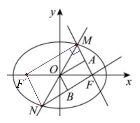

【例3】（2023•常德市期中）设、是椭圆长轴上的两个顶点，若椭圆上存在一个点，满足，则椭圆的离心率取值范围为 <u>　　__</u>．

【例4】（2023•浙江模拟）已知椭圆的右焦点为，过坐标原点的直线与椭圆交于，两点．在中，，且满足，则椭圆的离心率的取值范围为 <u>　　</u>．

二．直角的约束

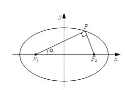

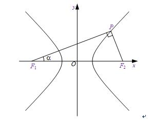

椭圆篇：，，有，带入可得，求得，根据范围求解值域．

双曲线篇：双曲线同样存在类似定理，如上右图，，有，带入可得，求得

【例5】（2023•湖北模拟）已知椭圆上一点关于原点的对称点为*B*，*F*为其右焦点 $．$ 若，设，且，则该椭圆的离心率的取值范围是（    ）

A．    	
B．	
C．	
D．

【例6】（2022•湖南期末）已知双曲线右支上非顶点的一点关于原点的

对称点为，为其右焦点，若，设，且，，则双曲线离心率

的取值范围是（    ）

A．，    	
B．，      
C．，	
D．

三．向量乘积与极化恒等式的约束

这里是向量极化恒等式最常出现在离心率的考题，合理转化向量乘积是关键.

【例7】（2023•深圳开学）设，分别是椭圆的左、右焦点，若椭圆上存在点满足，则椭圆离心率的取值范围

A．	
B．	
C．	
D．

【例8】（2023•六盘水期末）已知椭圆的两焦点，，若椭圆上存在点，使得，为原点），，则椭圆的离心率的取值范围是 <u>　   　</u>．

【例9】（河南省豫西重点高中2024-2025学年高三下学期5月联考T14）已知椭圆的左、右焦点分别为，，<em>P</em>是<em>C</em>上异于长轴端点的一点，点<em>M</em>满足，，<em>O</em>为坐标原点，则<em>C</em>的离心率的取值范围是______.

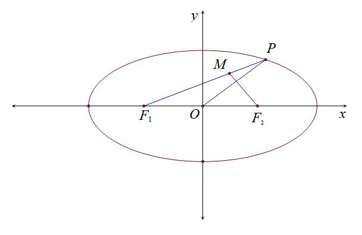

- 弦长与角度范围约束

第一类：双曲线焦点弦最短在实轴顶点

【例10】（2024•涪城区模拟）已知双曲线的左、右焦点分别为，，点在双曲线的右支上，且满足，则该双曲线离心率的取值范围是

A．	
B．	
C．	
D．

第二类：最短焦点弦是通径的约束

【例11】（2023•蔡甸区模拟）已知点在以，为左、右焦点的椭圆上，椭圆内一点在的延长线上，满足，若，则该椭圆离心率取值范围是

A．	
B．	
C．	
D．

【例12】（2024•南昌三模）已知双曲线的左、右焦点分别为，，过作直线与双曲线的右支交于，两点，若△的周长为，则双曲线的离心率的取值范围是

A．	
B．	
C．	
D．，

第三类：最大角为锐角的限制

【例13】（2023•广陵区期中）过双曲线的左焦点的动直线与的左支交于，两点，设的右焦点为若存在直线，使得，则的离心率的取值范围是 <u>　  　</u>．

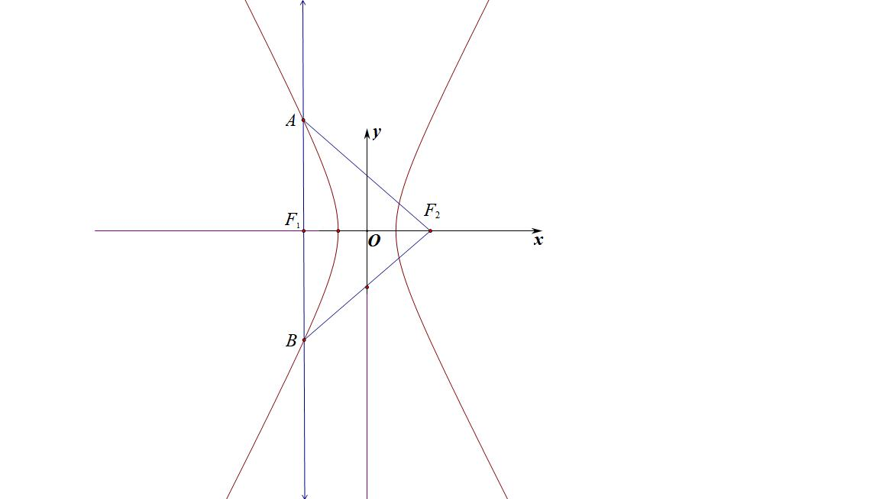

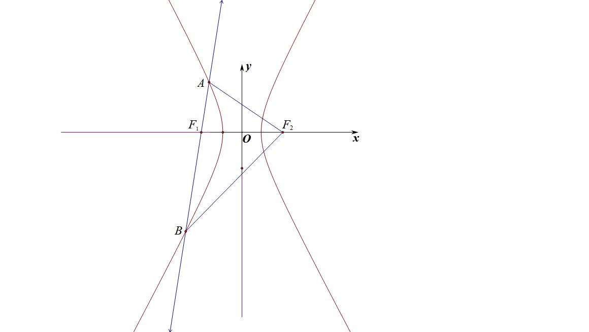

【例14】（2023 •浙江模拟）设直线与双曲线的右支交于，两点，是坐标原点，是等腰直角三角形．若这样的直线恰有两条，则双曲线离心率的取值范围是<u>　    　</u>．

五 圆心角为直角在椭圆内的约束

1.椭圆

已知椭圆，为坐标原点，为椭圆上的两动点，且，则原点到的距离为定值，且．

【证明】设，则，即，当时，两边除以得：，所以是这个关于的方程的两个根．

由于，所以，即，，即

当时，方程为：或，一样成立．

【例15】（2023•广东月考）椭圆的一个焦点是，为坐标原点，过的直线交椭圆于，两点．若恒有，则椭圆离心率的取值范围为 <u>　  　</u>．

2.双曲线

已知双曲线，为坐标原点，为椭圆上的两动点，且，则原点到的距离为定值，且．

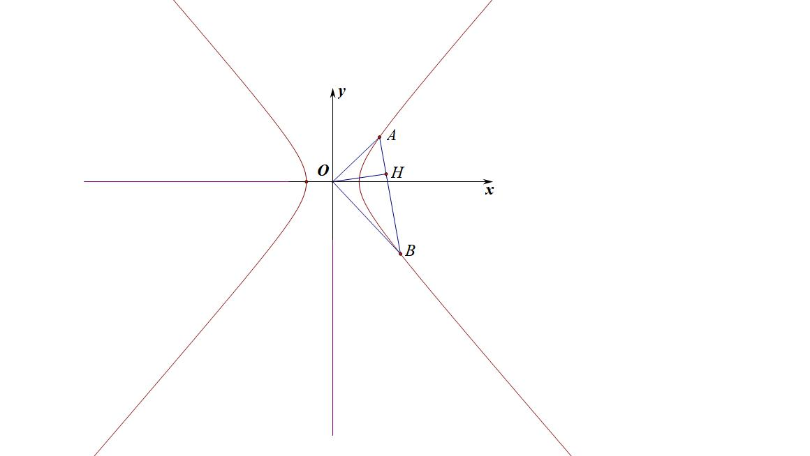

【证明】设，则，即，当时，两边除以得：，所以是这个关于的方程的两个根．

由于，所以，即，，即

当时，方程为：或，一样成立．

【例16】（2024•浙江模拟）已知双曲线上存在关于原点中心对称的两点，，以及双曲线上的另一点，使得为正三角形，则该双曲线离心率的取值范围是

A．	
B．	
C．	
D．

【例17】（2024•聊城三模）已知双曲线的一个焦点为，为坐标原点，点，在双曲线上运动，以，为直径的圆过点，且恒成立，则的离心率的取值范围为 <u>　    　</u>．

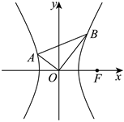

六．中垂线定理与离心率限定

########## 中垂线截距定理：若关于直线对称，可以知道线段被直线垂直平分，其中，则能得出以下定理（不妨设焦点在轴上）：

########## （椭圆），（双曲线）；（椭圆），（双曲线）．

########## 因为（点差法），，所以，故，即；同理，即．

这是一个可解决大题，也可以解决小题的二级结论，任何一个问题我们需要去理解它的适用范围，如果好用，不妨多去往这个方向考虑.

【例18】（2023•MST教师交流群讨论题）双曲线的右顶点为<em>A</em>，在<em>x</em>轴上，若C上存在一点P（异于点A）使得，则C的离心率取值范围是_________.

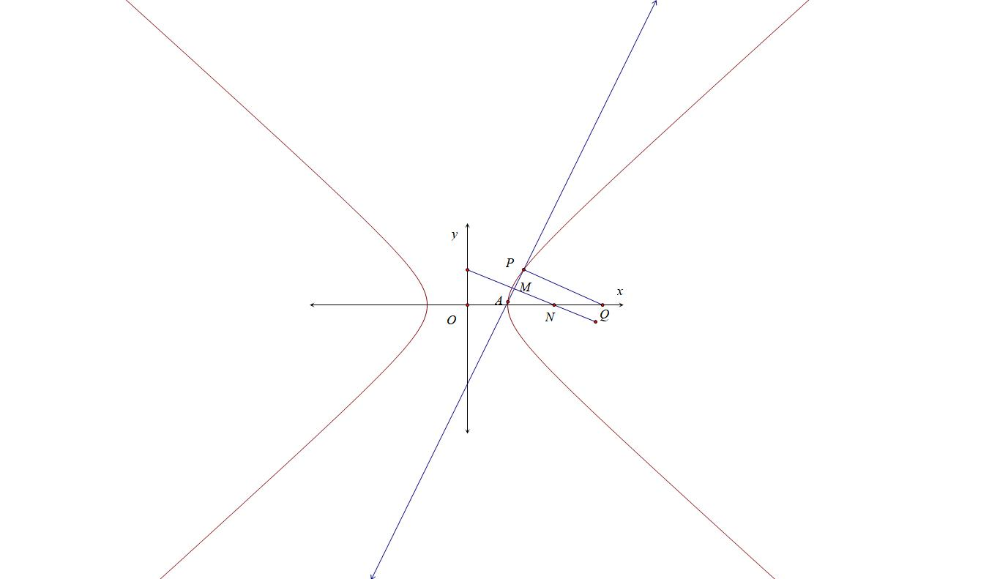

【例19】（2023•哈尔滨月考）椭圆，点是椭圆的右顶点，点为坐标原点，在一象限椭圆上存在一点，使，则椭圆的离心率范围是<u>　   　</u>．

【例20】（2024•西安模拟）已知椭圆的上顶点为，、在椭圆上，为等腰直角三角形，为直角，若这样的有且只有一个，则该椭圆的离心率的取值范围为 <u>　   　</u>．

