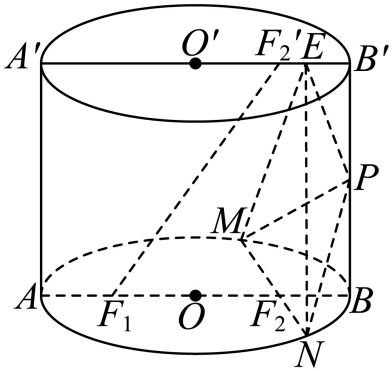
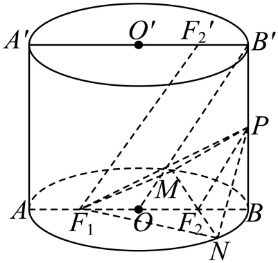
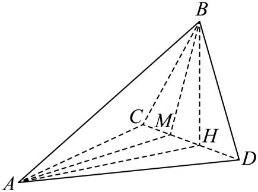
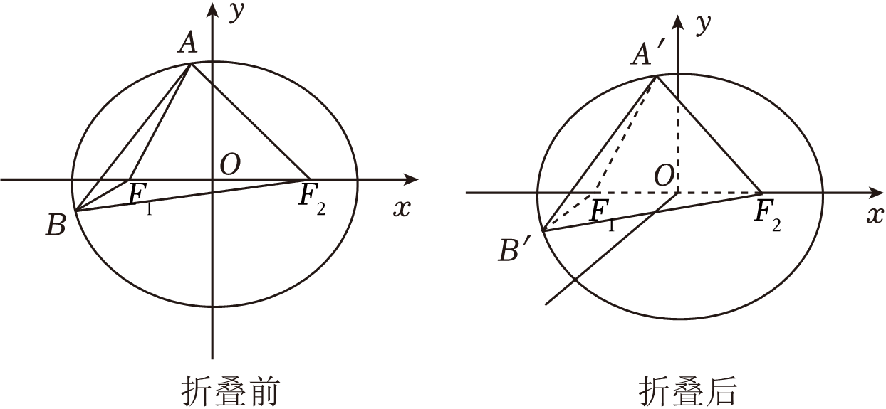
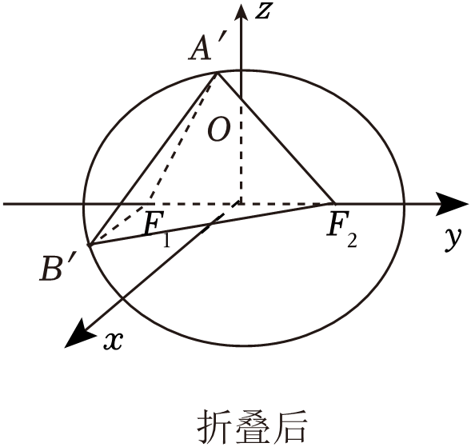
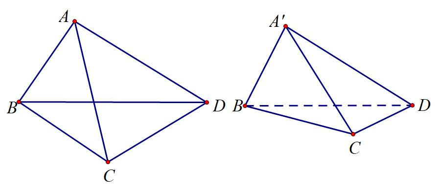
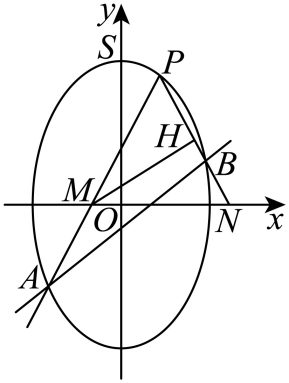
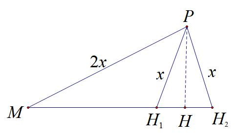
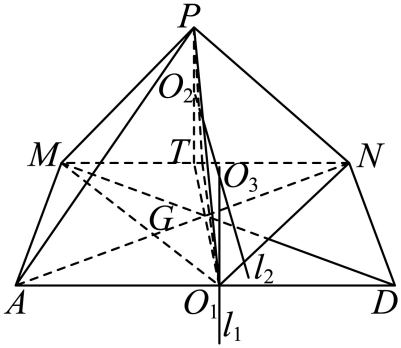

- 圆锥曲线跨界综合

2024年，新高考Ⅱ卷出现了圆锥曲线+数列的综合问题，虽然表面上看是这两个板块，但核心还是圆锥曲线的坐标变换，圆锥曲线的直曲联立是突破重点，本章针对圆锥曲线和其它知识板块的综合，进行逐一分析，新高考模式下，需要跨板块分析，力争知识体系更加立体化。

- 圆锥曲线与立体几何综合

一．隐藏圆的空间构造

【例1】（2025•T8模拟T19）在平面四边形中，，，，将△沿翻折至△，其中为动点．

（1）设，三棱锥的各个顶点都在球的球面上．

证明：平面平面；

（ⅱ）求球的半径；

（2）求二面角的余弦值的最小值．

- 椭圆柱的几何综合

【例2】（2025届湖北省“新八校”协作体高三下学期5月联考T18）：把底面为椭圆且母线与底面垂直的柱体称为“椭圆柱”.如图，椭圆柱中底面长轴，短轴长为下底面椭圆的左右焦点，为上底面椭圆的右焦点，为上的中点，为线段上的动点，为过点的下底面的一条动弦（不与重合）.

(1)求证：平面.

(2)若点是下底面椭圆上的动点，是点在上底面的投影，且与下底面所成的角分别为，试求出的最小值.

(3)求三棱锥的体积的取值范围.

【例3】（2025·广东揭阳三模T19）：如图，三棱锥中，点在平面的射影恰在上，为中点，，，.

(1)若平面，证明：是的三等分点；

(2)记的轨迹为曲线，判断是什么曲线，并说明理由；

(3)求的最小值.

- 折叠问题与圆锥曲线

【例4】（2024•浙江模拟）已知椭圆的左、右焦点分别为、，焦距为，离心率为，直线与椭圆交于、两点（其中点在轴上方，点在轴下方）．

（1）求椭圆的标准方程；

（2）如图，将平面沿轴折叠，使轴正半轴和轴所确定的半平面（平面与轴负半轴和轴所确定的半平面（平面垂直．

①若折叠后，求的值；

②是否存在，使折叠后、两点间的距离与折叠前、两点间的距离之比为？

注意：立体几何的一些性质定理，在这些综合问题中发挥很大作用,补充一下对角线向量定理证明.

########## 如左图所示，在中，由余弦定理的向量式有；在中，同理有．所以在四边形*ABCD*中，,即,这就是对角线向量定理．

########## 推论1：cos②

推论2：在空间向量中涉及折叠的问题，一定有折痕的向量与任意向量在折叠前后对应的向量的乘积不变；

证明：如右图所示，在四边形中，沿着折叠后，移到了位置，则．

【例5】（2025•成都外国语联盟模拟19题）在平面直角坐标系中，分别以轴和轴为实轴和虚轴建立复平面．已知复数，在复平面内满足为定值的点的轨迹为曲线．且点在曲线上．

（1）求曲线的平面直角坐标系方程；

（2）若斜率为的直线与曲线交于、两点（直线斜率为正），直线、（若、重合，直线即为椭圆在点处的切线）分别与轴交于、两点，为中点．

证明：为定值；

最大时，将坐标平面沿轴折成二面角，在二面角大小变化过程中，求三棱锥外接球的半径最小时，三棱锥的表面积．

第二节圆锥曲线与三角函数的综合

三角函数提供三角换元，可以构造联立的方程，这个我们在以前高考小题页经常出现，也会因为构造和差化积，积化和差出现，这些都是以前老高考常见，新高考模式又以新的面貌回来了。

- 联立构造三角的二次方程

【例1】（华大新高考联盟2025届高三下学期4月教学质量测评T 18）已知椭圆经过点，且离心率为.

(1)求的方程；

(2)设、、为上的三个动点，且和关于坐标原点对称.若直线、的斜率存在，设直线、的斜率分别为、，求的值；

(3)设内部（包括边界）的圆满足：该圆在短轴的右侧且与短轴相切.求满足条件的最大圆的方程.

- 积化和差与和差化积综合应用

1.积化和差：

**；；**

**； .**

**证明：由，，得**

**.**

2.和差化积

证明：.

证法一： 由上可知，有，

在其中取，就有，

即

证法二： ，，

.

同理：，，

，.

【例2】（东北三省部分高中联盟2025届高三第三次联合调研T19）已知椭圆的离心率为，，分别为的左，右焦点，点为曲线在第一象限内图象上的一点，的周长为，为坐标原点，记，，.

(1)求的方程及的值

(2)证明:.

(3)请探究：若，，…，为上个不同点，且，，，其中，…，，点与点重合，当变化时，是否为定值？若是定值，请求出该定值；若不是定值，说明理由

【例3】（2025·广东佛山·二模T19）对于椭圆：上的任意两点*P*，*Q*定义“”运算满足：过点作直线直线（规定当*P*和*Q*相同时，直线就是在点*P*处的切线），若*l*与有异于*S*的交点*T*，则；否则.已知“”满足交换律和结合律，记.

(1)若，，求，以及；

(2)对于上的四点，，，，求证：的充要条件是；

(3)是否存在异于*S*的点*P*，使得？若存在，请求出*P*的坐标；若不存在，请说明理由.

第三节 圆锥曲线与导数的综合

关于导数和圆锥曲线，之前一直交集不多，随着新高考模式下的改革，通常第19题会将知识板块进行综合来考查，所以导数和圆锥的综合页多了起来，其实大部分还是涉及求交点，求最值，求斜率三个方向。

- 求交点个数

【例1】（2025·重庆·三模T18）已知椭圆*C*：的离心率为，*C*与曲线经过*x*轴上的同一点.

(1)求*C*的方程；

(2)作曲线在处的切线*l*.

（ⅰ）若，*l*与*C*相交于*A*，*B*两点，*P*是*C*上任意一点，求面积的最大值；

（ⅱ）当时，证明*l*与*C*有两个公共点.

【例2】（江西省上进联考2025届高三下学期5月联合测评T19）记抛物线：的焦点为，过点作的两条切线，切点分别为，.

(1)当时，求直线的方程；

(2)证明：直线的倾斜角为锐角；

(3)记的面积为，的面积为，当取得最小值时，证明：.

【例3】【25温州三模T19】设曲线 .

(1)求证:关于直线 对称；

(2)求证:是某个函数的图象；

(3)试求所有实数与,使得直线在的上方.

解析: ( 1 )证明:设点在曲线上,则，点关于直线的对称点为 ，因为，所以点在曲线上，故关于直线对称

(2)只要满足曲线与直线( )只有一个交点,则就是某个函数的图象，

- 对数均值与中值斜率的综合应用

【例4】【浙江台州部分学校25届高三1月期末T19】对于一个函数  和两个点  ,给出如下定义: 记，

若 满足,则称是视角下的“基于的回点”.

(1)若,点,,求:,视角下的基于的回点的坐标;

(2)若,对于点,若视角下的“基于  的回点” 恰有两个,记为,求证: 直线的斜率.

【例5】【深圳中学24届高三二轮测试T19】已知曲线和圆 相交于 两个不同点,记直线的斜率为 .

(1) 当时,证明: ；

(2)当时,证明: ；

- 圆锥曲线与数列综合（上）

圆锥曲线与数列综合，从2024年起成为各地考题一个绕不开的话题，由于模型较多，在前面介绍阿基米德三角形构造和退化二次曲线系构造重就有一些综合题，属于一个贯穿的大内容，本章介绍一下以过定点联立的数列放缩为主的构造，更多圆锥与数列的放缩会在下一章《万能的两点对合式》重呈现。

一．交点坐标分类构造数列

【例1】（重庆市第一中学校2025届高三下学期5月高考适应性月考卷T19）在平面直角坐标系中，已知椭圆

(1)椭圆的左、右焦点分别为、，点在椭圆上运动，证明：为定值，并求出该定值；

(2)对于给定的正整数，经过点的动直线和椭圆交于、两点，为坐标原点，设面积的最大值为．

（i）求；

（ii）证明：.

二．构造递推式证明数列单调性与裂项放缩

【例2】（安徽省卓越县中联盟2024-2025学年高三下学期5月份检测T19）记抛物线的焦点为*F*，过原点*O*作斜率为1的直线*l*，*l*与*E*交于另一点，取的中点，直线与*E*交于另一点，取的中点，以此类推，记直线的斜率为．

(1)求点的坐标；

(2)证明：是递减数列；

(3)记的面积为，证明：．

【例3】（东北三省精准教学联盟2025届高三下学期4月模拟T19）已知经过定点的动圆与直线相切，记圆心的轨迹为曲线，直线与曲线交于不同的两点，以分别为切点作曲线的切线与的交点为.

(1)求点的轨迹方程；

(2)设点，连接，分别与曲线的另一个交点为，直线与轴相交于，连接，分别与曲线的另一个交点为，直线与轴相交于，连接，分别与曲线的另一个交点为，直线与轴相交于，已知.

（i）求数列的通项；

（ii）已知为数列的前项和，求使不等式成立时，的最小值.

三．斜率关系构造定点与数列递推

【例4】（山东省齐鲁名校教研共同体2024-2025学年高三下学期第六次联考数T19）已知椭圆*C*：经过点．

(1)求*C*的离心率．

(2)设*A*，*B*分别为*C*的左、右顶点，*P*，*Q*为*C*上异于*A*，*B*的两动点，且直线的斜率恒为直线的斜率的5倍．

①当*b*的值确定时，证明：直线过*x*轴上的定点；

②按下面方法构造数列：当时，直线过的定点为，且，设，证明：．

