- 圆锥曲线焦点三角形几何性质

- 椭圆双曲线焦点三角形

########## 一 椭圆焦点三角形的性质

########## 椭圆焦点为，，*P*为椭圆上的点，，如图1，

########## 则（灵动椭圆焦点三角形面积公式）

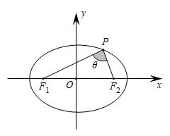

########## 图1

########## 证明：设

########## 注意：焦点三角形面积，本质来自于解三角形部分，

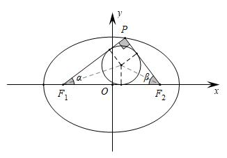

########## 图2

########## 第一类：面积带动角度与坐标转化：（注意：*r*为内切圆半径）

  
（1）直角三角等面积法：如图2，当时，有；

，

  
（2）任意角度的等面积法：．

> 

> 
> |  |  |
> | --- | --- |
> | （3）直角顶点的讨论：当时，取得最大值，若，则，；同理，若，则，；若，则，．在分析直角顶点个数时，当时，有四个点*P*存在；当时，有两个点*P*存在；当时，无点*P*存在.（注意：与的区别） | （4）短轴端点处张角最大 |
> 

已知椭圆的左、右两焦点分别为，*P*是椭圆上一动点，在焦点三角形中，若最大，则点*P*为椭圆短轴的端点．

<strong>证明</strong>　，故当取得最大值<em>b</em>时，当点<em>P</em>位于短轴端点时，取得最大值。

  
（5）已知椭圆的左、右两焦点分别为，若椭圆上存在一点*P*，使得，则椭圆离心率．

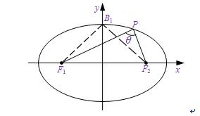

证明：如图，设为椭圆的短轴顶点，假设椭圆上存在一点*P*，使得，则必有，又，由于，故．

【例1】（2023•甲卷）设，为椭圆的两个焦点，点在上，若，则

A．1	
B．2	
C．4	
D．5

【例2】（2021•甲卷）已知，为椭圆的两个焦点，，为上关于坐标原点对称的两点，且，则四边形的面积为 <u>　 　</u>．

【例3】（2019•新课标II）已知，是椭圆的两个焦点，为上的点，为坐标原点．

  
（1）若为等边三角形，求的离心率；

  
（2）如果存在点，使得，且△的面积等于16，求的值和的取值范围．

【例4】（&lt;te&lt;te<em>x</em>t st<em>y</em>le="italic"&gt;x&lt;/text&gt;t style="subscript"&gt;2&lt;/text&gt;&lt;text style="subscript"&gt;&lt;text style="subscript"&gt;0&lt;/text&gt;&lt;/text&gt;24•潍坊三模）已知<em>&lt;text style="italic"&gt;&lt;text style="italic"&gt;F</em>&lt;/text&gt;&lt;/text&gt;&lt;text style="subscript"&gt;1&lt;/text&gt;，F2分别为椭圆 $C：\frac{x^{2}}{6}+\frac{y^{2}}{2}=1$ 的左、右焦点，点&lt;te&lt;te<em>x</em>t st<em>y</em>le="italic"&gt;x&lt;/text&gt;t style="italic"&gt;P&lt;/text&gt;（x&lt;text style="subscript"&gt;&lt;text style="subscript"&gt;0&lt;/text&gt;&lt;/text&gt;，y0）在<em>C</em>上，若∠<em>&lt;text style="italic"&gt;&lt;text style="italic"&gt;F</em>&lt;/text&gt;&lt;/text&gt;&lt;text style="subscript"&gt;1&lt;/text&gt;<em>PF</em>&lt;text style="subscript"&gt;2&lt;/text&gt;大于 $\frac{\pi }{3}$ ，则&lt;te<em>x</em>t st<em>y</em>le="italic"&gt;x&lt;/text&gt;&lt;text style="subscript"&gt;&lt;text style="subscript"&gt;0&lt;/text&gt;&lt;/text&gt;的取值范围是（　　）

A． $(-\infty ，-\sqrt{3})\cup (\sqrt{3}，+\infty )$ 	
B． $(-\sqrt{3}，\sqrt{3})$

C． $(-\infty ，-\sqrt{5})\cup (\sqrt{5}，+\infty )$ 	
D． $(-\sqrt{5}，\sqrt{5})$

【例5】（2024•郴州模拟）已知，是椭圆的左、右焦点，是坐标原点，过作直线与交于，两点，若，且的面积为，则椭圆的离心率为

A．	
B．	
C．	
D．

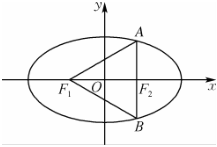

【例6】（&lt;text st<em>y</em>le="subscript"&gt;2&lt;/text&gt;024•临沂二模）椭圆 $\frac{x^{2}}{a^{2}}+\frac{y^{2}}{b^{2}}=1$ （&lt;text st<em>y</em>le="italic"&gt;a&lt;/text&gt;＞<em>b</em>＞0）的左、右焦点分别为<em>&lt;text style="italic"&gt;F</em>&lt;/text&gt;&lt;text style="subscript"&gt;&lt;text style="subscript"&gt;1&lt;/text&gt;&lt;/text&gt;，F&lt;text style="subscript"&gt;2&lt;/text&gt;，<em>P</em>为椭圆上第一象限内的一点，且<em>&lt;text style="italic"&gt;&lt;text style="italic"&gt;PF</em>&lt;/text&gt;&lt;/text&gt;1⊥PF2，PF1与y轴相交于点<em>Q</em>，离心率 $e=\frac{\sqrt{5}}{3}$ ，若 $\overset{\to }{QF_{1}}=\lambda \overset{\to }{PF_{1}}$ ，则λ＝（　　）

A． $\frac{3}{8}$ 	
B． $\frac{5}{8}$ 	
C． $\frac{1}{3}$ 	
D． $\frac{2}{3}$

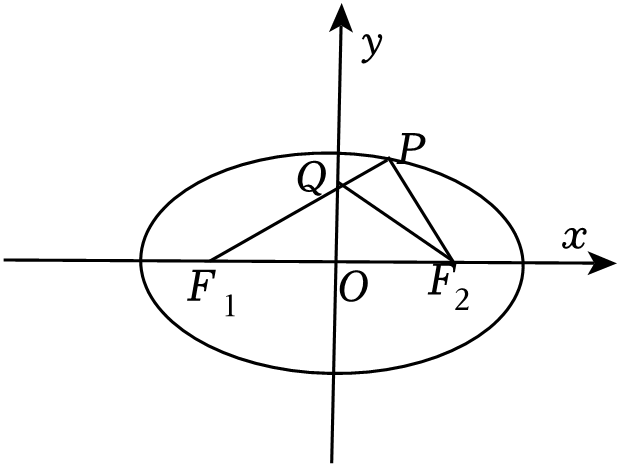

【例7】（2024•西秀区一模）已知椭圆的左、右焦点分别为，，为上一点，且，△的外接圆面积是其内切圆面积的25倍，则椭圆的离心率<u>　　</u>．

########## 二 双曲线焦点三角形性质

########## 双曲线的焦点为<em>F</em>1、<em>F</em>2，为双曲线上的点，，如图，则（灵动双曲线焦点三角形面积公式）．

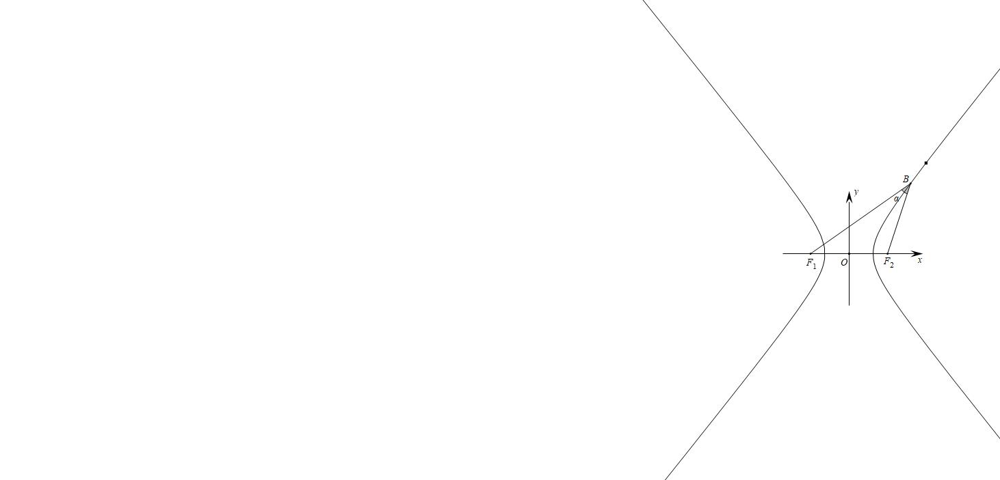

########## 证明：设

．

########## 面积带动角度与坐标转化：

########## （1）直角三角等面积法：当时，有；；

########## （2）任意角度的等面积法：；.

【例8】（2024•天津卷）双曲线的左、右焦点分别为是双曲线右支上一点，且直线的斜率为2．是面积为8的直角三角形，则双曲线的方程为（   ）

A. 	
B. 	
C. 	
D.

【例9】（2023•重庆二模）、是双曲线的左、右焦点，点为双曲线右支上一点，点在轴上，满足，若，则双曲线的离心率为

A．	
B．	
C．	
D．

########## 三．椭圆焦点三角形两底角半角与离心率转化

已知椭圆方程为，左右两焦点分别为，是椭圆上一点，在焦点三角形中，，，则有：

①；

②．

【例10】（2022•遵义期末）椭圆左、右焦点分别为，，为上除左右端点外一点，若，，则椭圆的离心率为

A．	
B．	
C．	
D．

########## 四．双曲线焦点三角形两底角半角与离心率转化

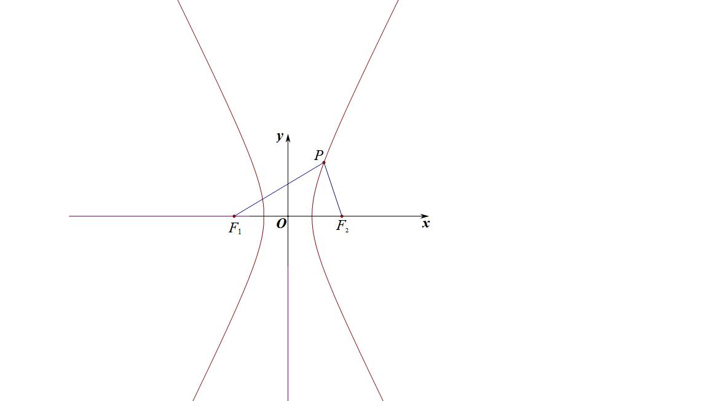

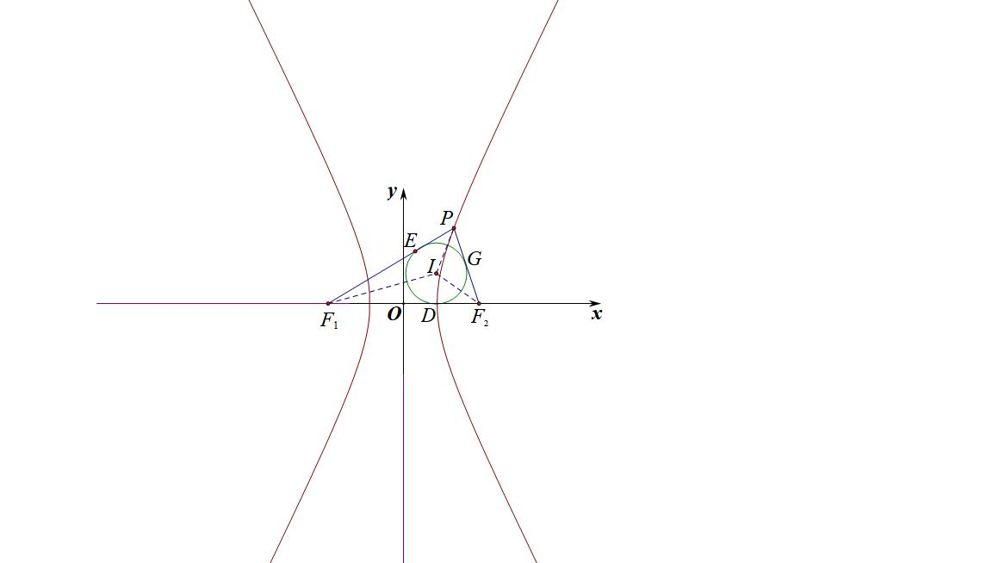

已知点*P*是双曲线右支上除顶点外的一点，分别是双曲线的左、右焦点，，，双曲线的离心率为e，则．

证明：

，故；
注意：本结论涉及双曲线的焦点三角形内心定理，知识点纵横交错形成为了命题的高密集区域.

<strong>双曲线的内心轨迹</strong>　已知双曲线，则焦点三角形的内心<em>I</em>的轨迹是：，和长轴的两个顶点相切．

<strong>证明:</strong>如上右图所示，以点<em>P</em>在右支上为例，设内切圆<em>I</em>和焦点三角形的三边分别切于点D、<em>E</em>、<em>G</em>，则又，故，所以，点D恰好和双曲线的端点重合，圆心<em>I</em>在直线上．我们同样可以证明：．

对比椭圆，类比焦点三角形面积公式，我们可以记忆为椭圆乘，双曲线除，

【例11】（2024•嵩明县期中）已知双曲线的左右焦点分别为，，为上一点，，，则的离心率为

A．	
B．	
C．	
D．

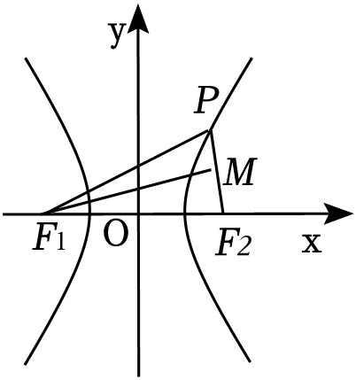

【例12】（2024•赣州模拟）已知，为双曲线的左、右焦点，为左支上一点．设，，且，则的离心率为

A．	
B．3	
C．2	
D．

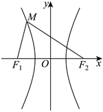

【例13】（2024•多选•新乡二模）如图，已知双曲线的左、右焦点分别为，，点在上，点在轴上，，，三点共线，若直线的斜率为，直线的斜率为，则

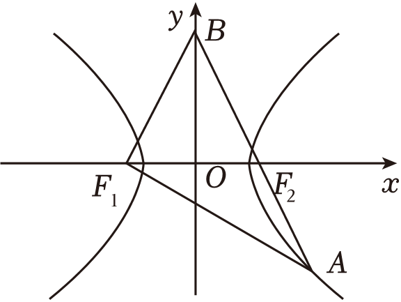

A．的渐近线方程为	
B．

C．的面积为	
D．△内接圆的半径为

########## 五 椭圆双曲线共焦点问题

图17

########## 椭圆双曲线共焦点三角形的问题：如图17，椭圆和双曲线共焦点，由于两个式子不同，将椭圆写成，双曲线写成可以知道，

########## ①当时，椭圆和双曲线的离心率；

########## ②当时，一定有．

证明：．

【例14】（2014•湖北卷）已知椭圆和双曲线有共同的焦点、，是它们的一个交点，且，记椭圆和双曲线的离心率分别为，，则的最大值为_________．

【例15】（湖北省“高中名校联盟·圆创教育”联盟2025届高三下学期5月模拟T8）已知椭圆：与双曲线：有公共的焦点，，.若为，在第一象限的一个公共点，和的离心率分别为，，，则（   ）

A．       
B．

C．     
D．当时，的取值范围是

【例16】（贵州省遵义市2025届高三第三次适应性考试T11）椭圆的左右焦点分别为，，点在上，双曲线与椭圆有相同的焦点，则下列选项正确的是（   ）

A．存在点，使得       
B．若，则

C．若是等腰三角形，则满足条件的点有4个

D．若是椭圆与双曲线的交点，且在第二象限，交轴于点，平分，则双曲线的离心率为

- 焦点三角形与光学性质应用

一：光学性质概念

椭圆的光学性质：从一个焦点发出的照射到椭圆上其反射光线会经过另一个焦点。

双曲线有一个光学性质：从一个焦点发出的照射到双曲线上其反射光线的反向延长线会经过另一个焦点。

抛物线有一个光学性质：从焦点发出的照射到抛物线上其反射光线平行于抛物线开口方向。

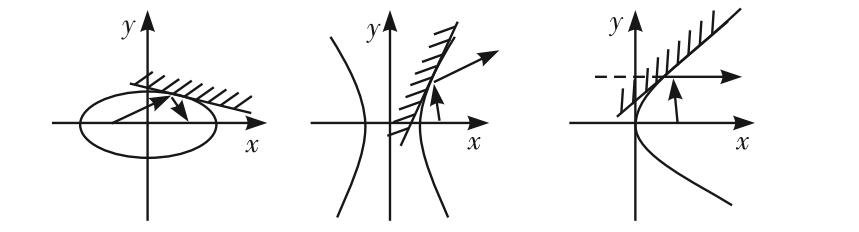

二：光学性质切线法线定理

定理1 点为椭圆上任一点，、为椭圆的两焦点，则椭圆在点处的切线与的平分线垂直.

由于本题证明方法很多，如果是解决小题，我们按照小题小作来解读，根据物理学的反射原理，反射光线等于入射光线，即把椭圆上的点处切线看成镜面，那么法线就是的平分线，所以它们垂直就自然而然了，同理也能推导双曲线.

推论1： 设椭圆（，）的两焦点为，，（，）为椭圆上一点，则的角平分线所在直线的方程为.

根据光学性质可知处切线方程为，由于点处的切线与的平分线垂直，故的角平分线所在直线的方程为，即.

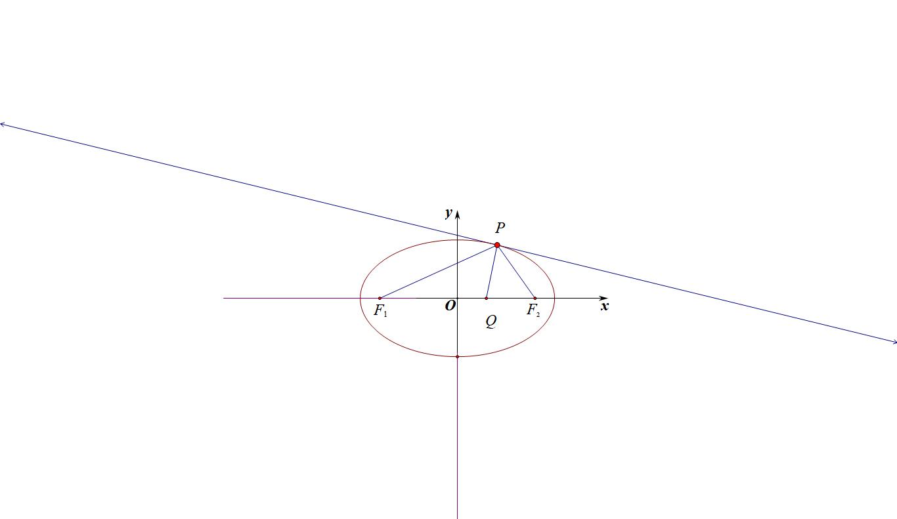

【例1】已知点为椭圆上任一点，、为椭圆的两焦点，求证椭圆在点处的切线与的平分线垂直.

定理2  点为双曲线上任一点.、为双曲线的两焦点，则双曲线在点处的切线与的平分线重合.

推论2  设双曲线（，）的两焦点为，，（，）为双曲线上一点，则的角平分线所在直线的方程.为.

【例2】已知点为双曲线上任一点，、为椭圆的两焦点，求证双曲线在点处的切线与的平分线重合.

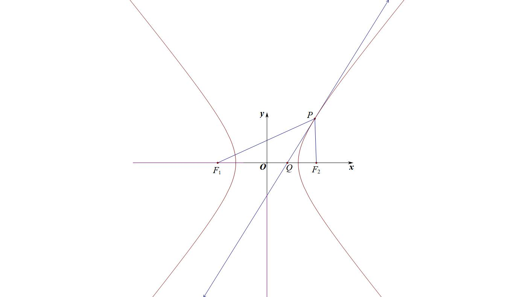

定理3 点为抛物线上任一点，为拋物线的焦点，过作拋物线的准线的垂线，垂足为，则拋物线在点处的切线与的平分线重合.

<strong>证明</strong>：设拋物线的方程为，.利用导数知识易得抛物线在<em>P</em>点处的切线斜率存在时为.又，则，.

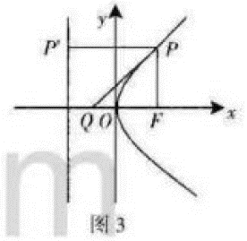

由夹角公式可得：，

.

即有，所以为的平分线.

【例3】（2011年高考全国卷II理15）已知、分别为双曲线*C*：的左、右焦点，点，点的坐标为，为的平分线.则\_\_\_\_\_\_\_\_.

【例4】（2024•多选•湖北月考）双曲线具有如下光学性质：如图，是双曲线的左、右焦点，从右焦点发出的光线交双曲线右支于点，经双曲线反射后，反射光线的反向延长线过左焦点．若双曲线的方程为，下列结论正确的是

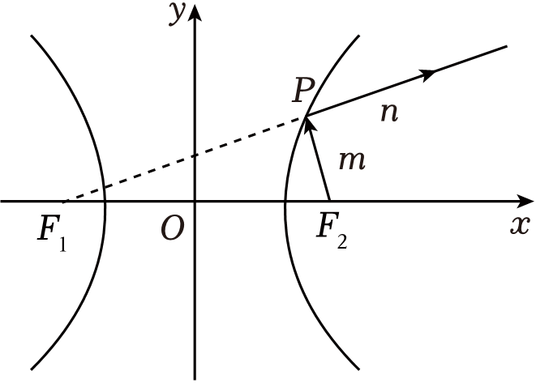

A．若，则	  
B．当反射光线过时，光由所经过的路程为7

C．反射光线所在直线的斜率为，则 
D．记点，直线与相切，则

【例5】（2025届山东省齐鲁名校高三联考四T11）抛物线有如下光学性质：由其焦点射出的光线经抛物线反射后，沿平行于抛物线对称轴的方向射出.反之，平行于抛物线对称轴的光线经抛物线反射后必过抛物线的焦点.已知抛物线为坐标原点，一束平行于轴的光线从点射入，经上的点反射后，再经上另一点反射后，沿直线射出，经过点，则（    ）

A．平分                        
B．

C．直线，直线与抛物线的准线相交于同一点

D．点是轴上一动点，当最小时，点的坐标为

【例6】（2024•多选•濮阳一模）费马原理是几何光学中的一条重要定理，由此定理可以推导出圆锥曲线的一些性质，例如，若点是双曲线，为的两个焦点）上的一点，则在点处的切线平分已知双曲线的左、右焦点分别为，，直线为在其上一点处的切线，则下列结论中正确的是

A．的一条渐近线与直线相互垂直

B．若点在直线上，且，则为坐标原点）

C．直线的方程为

D．延长交于点，则的内切圆圆心在直线上

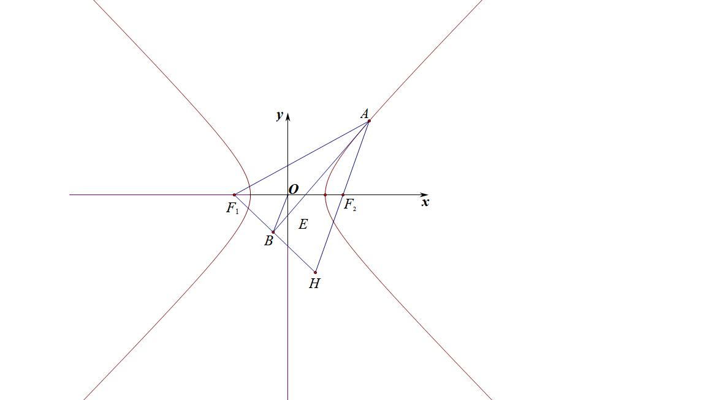

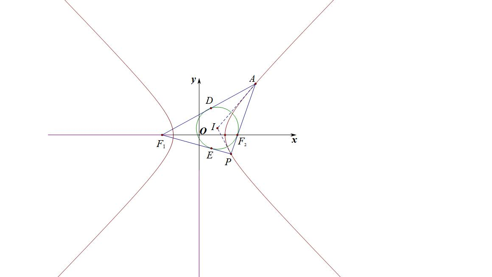

三．光学性质与中垂线截距定理

########## 中垂线截距定理：若关于直线对称，可以知道线段被直线垂直平分，其中，则能得出以下定理（不妨设焦点在轴上）：

########## （椭圆），（双曲线）；（椭圆），（双曲线）．

########## 因为（第三定义点差法），，所以，故，即；同理，即．

########## 光学性质中垂线截距定理：

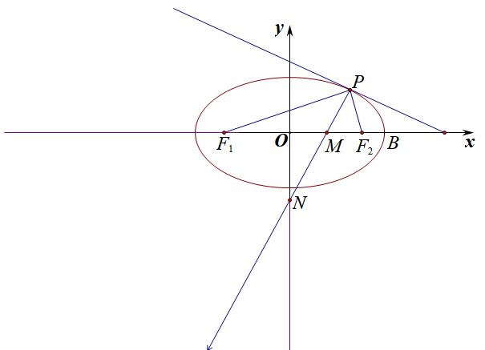

##########       我们可以把切点看成二重点，如图，若*PM*为平分线，则，.

证明：根据为角平分线可知，（<em>l</em>是椭圆在点<em>P</em>处的切线），<em>PF</em>2和<em>PF</em>1是入射光线和反射光线，所以是切线（切点弦）<em>l</em>的中垂线（考虑极限情况，切点看为两个交点的中点），故根据中垂线截距定理，.

【例7】（2024•福州模拟）已知，分别是椭圆的左、右焦点，过点作轴的垂线与椭圆在第一象限的交点为，若的平分线经过椭圆的下顶点，则椭圆的离心率的平方为

A．	
B．	
C．	
D．

【例8】（2025·山西临汾·三模T11）已知双曲线的左、右焦点分别为，，直线与有唯一公共点*M*，过点*M*且与*l*垂直的直线与*x*轴、*y*轴分别交于点，，则下列说法正确的是（   ）

A．                    
B．设关于对称的点为*N*，则*M*，*N*，三点共线

C．当时，的面积为      
D．当点*M*运动时，点在离心率为的双曲线上

【例9】（2023•MST教师群探讨）如图，椭圆焦点三角形的，<em>AB</em>为的角平分线且，则椭圆离心率为_______________.

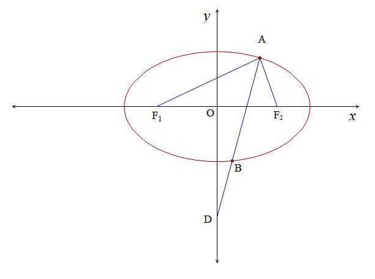

- 焦点三角形四心性质

一. 椭圆焦点三角形内心与离心率

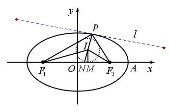

内心定理：如图，为内切圆的圆心，和相交于点(区分切点)，

则：①，②．

证明： ①法一：利用角平分线定理＋比例性质：，

########## 法二：（光学性质+中垂线）根据为角平分线可知，（<em>l</em>是椭圆在点<em>P</em>处的切线），<em>PF</em>2和<em>PF</em>1是入射光线和反射光线，所以是切点弦<em>l</em>的中垂线（考虑极限情况，切点看为两个交点的中点），设，故根据中垂线截距定理，再根据角平分线定理可知，

②根据等面积法，.

【例1】（2022•雅安模拟）已知椭圆的左、右焦点分别为、，为上异于左、右顶点的一点，为△内心，若，则该椭圆的离心率是 <u>　   　</u>．

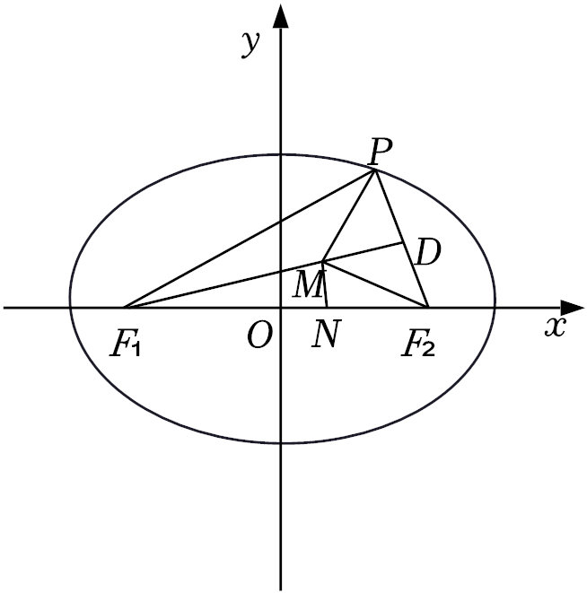

二 椭圆焦点三角形旁心轨迹

如图所示，焦点三角形的旁切圆*J*和的延长线、、的延长线分别切于点*A*(长轴顶点)、*D*、*E*，旁心*J*的轨迹为：．

证明：，，又，

故，，

又，故，点*A*恰好和椭圆的长轴端点重合．

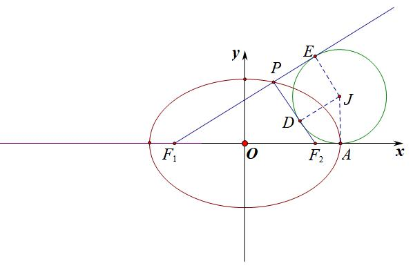

注意：根据光学性质，我们易知即为点*P*处切线方程，令，即，当时，，所以旁切圆半径.

【例2】（2025·四川德阳·三诊T11）给定椭圆上有一动点（不在坐标轴上），分别是椭圆的左右焦点，的内切圆与分别切于两点，则（    ）

A．若，则椭圆的离心率为

B．动点的轨迹是一个椭圆

C．直线的斜率之积为常数

D．内切圆的面积无最大值也无最小值

【例3】（2023•船山区模拟）动点为椭圆上异于椭圆顶点，的一点，，为椭圆的两个焦点，动圆与线段，的延长线及线段相切，则圆心的轨迹为除去坐标轴上的点的

A．抛物线	
B．椭圆	
C．双曲线的右支	
D．直线

三 .双曲线焦点三角形内心轨迹与双切圆

########## 1.内心轨迹方程

########## 已知双曲线，则焦点三角形的内心*I*的轨迹是：，和实轴的两个顶点相切．

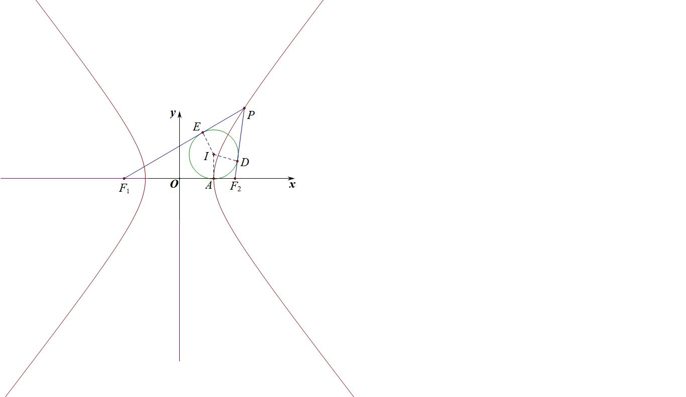

<strong>证明</strong>　如图所示，以点<em>P</em>在右支上为例，设内切圆<em>I</em>和焦点三角形的三边分别切于点<em>A</em>、<em>D</em>、<em>E</em>，则，故，点<em>A</em>恰好和双曲线的顶点重合，则圆心<em>I</em>在直线上．

注意：由于*PI*位于点处切线方程，不妨令，即，

当时，，所以内切圆半径.

【例3】（2024•和平区模拟）已知双曲线的左右焦点记为，且，直线过且与该双曲线的一条渐近线平行，记与双曲线的交点为，若所得△的内切圆半径恰为，则此双曲线的方程为

A．	
B．

C．	
D．

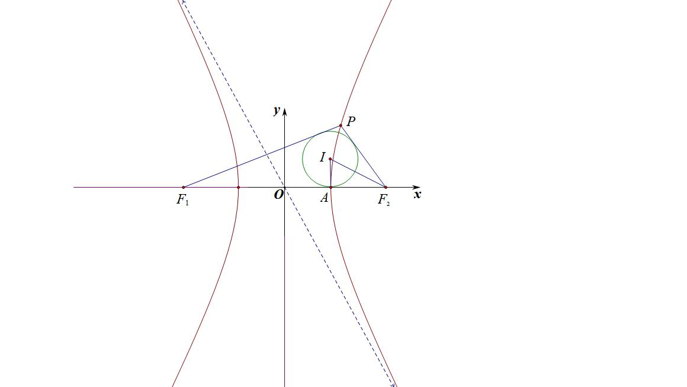

【例4】（2024•松江区期中）已知点为双曲线右支上的一点，，分别为双曲线的左、右焦点，点为△的内心，若成立，则的值为<u>　  　</u>．

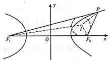

【例5】（2024•宝山区期中）已知双曲线，其左、右焦点分别是，，点坐标为，双曲线上的，，满足，则______．

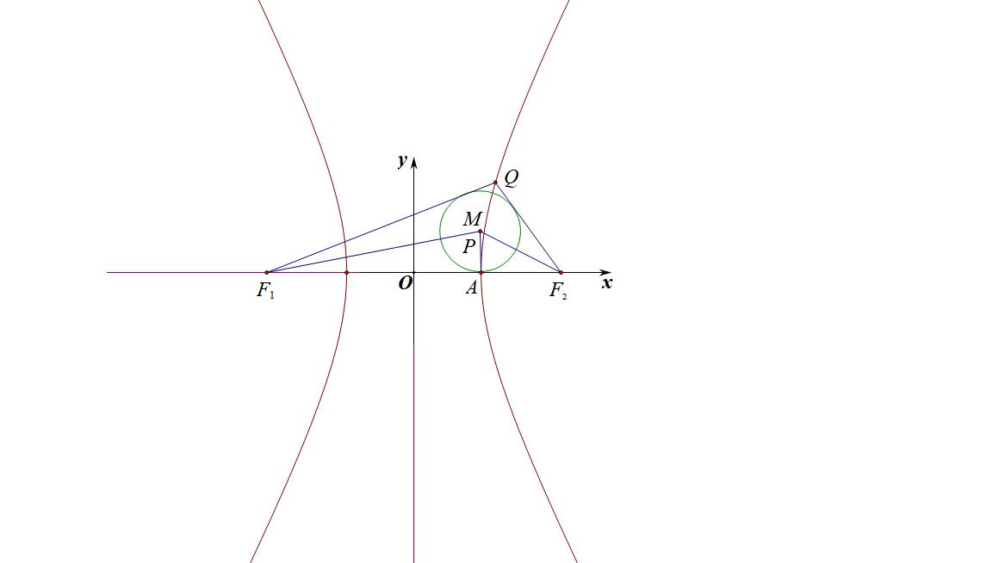

2. 离心率问题：

类比椭圆，已知双曲线，*I*为焦点三角形的内切圆，交*x*轴于*Q*，设,找出与双曲线共焦点的椭圆，则椭圆离心率，通过求出和长度得出，或者利用得出.

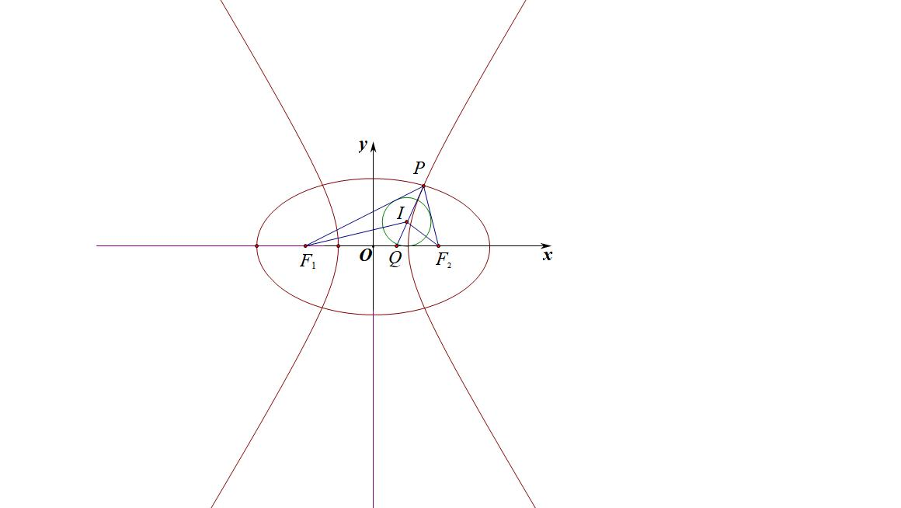

<strong>证明</strong>　如图所示，点<em>P</em>在两共焦点椭圆与双曲线的第一象限交点为例，以椭圆为轴心，根据内角平分线定理，，故可以利用得出.

如果给出或者角度，也可以直接利用焦长公式算出双曲线的这个整体.

【例6】（2024•成都青羊区模拟）已知双曲线的左、右焦点分别为，，为左支上一点，的内切圆圆心为，直线与轴交于点，若双曲线的离心率为，则<u>　  　</u>．

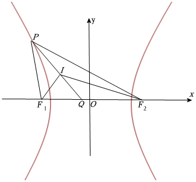

3.大焦点三角形内切圆切于焦点

如图，大焦点三角形，①*AP*与内切圆切于，②

证明：，设内切圆与、、分别切于*D*、*E*、*G*三点，则，故，故与重合.

【例7】（2024•南开区模拟）已知双曲线的左、右焦点分别为、，经过的直线交双曲线的左支于，，的内切圆的圆心为，的角平分线为交于，且，若，则该双曲线的离心率是

A．	
B．	
C．	
D．2

【例8】（2024•多选•临沂三模）已知双曲线的渐近线方程为，过的右焦点的直线交双曲线右支于，两点，△的内切圆分别切直线，，于点，，，内切圆的圆心为，半径为，则

A．的离心率等于	          
B．切点与右焦点重合

C．	  
D．

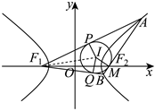

4.双切圆问题：

如图所示，为焦点三角形的内心，为焦点三角形的内心，倾斜角为，令，，则一定有①；②；③

证明： 由于轴，作于，于，交于，易知，，，所以.根据内心定理，、分别为和的平分线，所以，根据射影定理，，，.

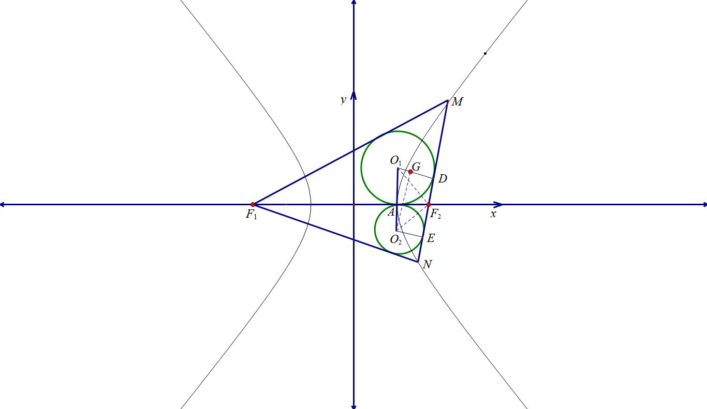

【例9】（2024•多选•潍坊月考）已知双曲线的左、右焦点分别为，，右顶点为，过的直线交双曲线的右支于，两点（其中点在第一象限内），设，分别为△，△的内心，则

A．点的横坐标为2	                             
B．当时，

C．当时，内切圆的半径为	     
D．

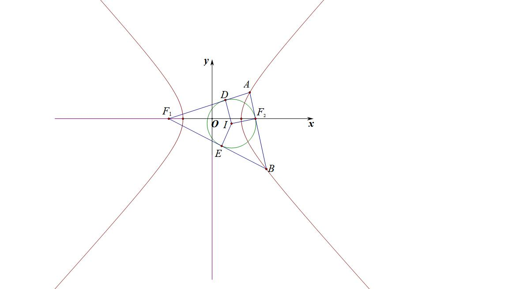

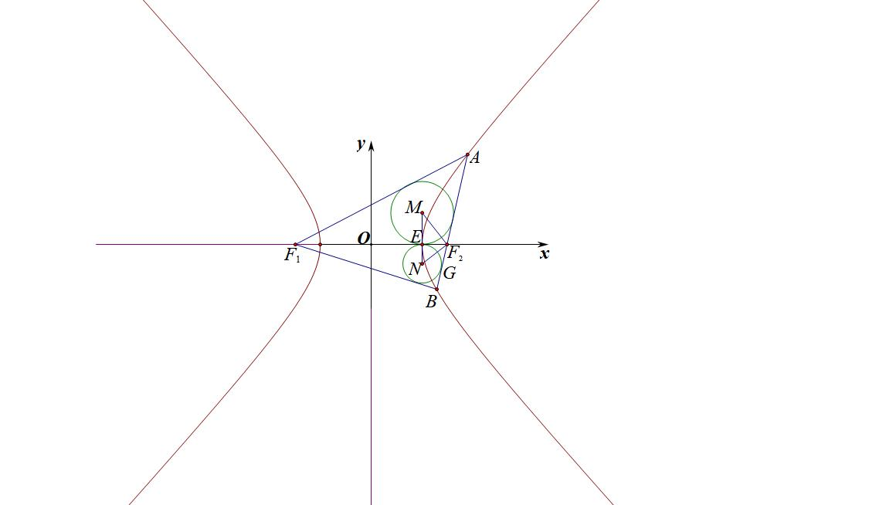

【例10】（湖南省长沙市长郡中学2024-2025学年高三下学期数学模拟试卷T11）已知双曲线 的左、右焦点分别为 ，左、右顶点分别为，过 的直线与双曲线的右支交于两点(在第一象限)，中点为，的内切圆圆心分别为，半径分别为则下列结论正确的是（   ）

A． 三点共线	
B．直线斜率存在时，

C．若，则直线的斜率为	
D．的取值范围是

【例11】（2025广东省中学生数学奥林匹克竞赛一试12题）已知双曲线 $C:\frac{x^{2}}{3}-\frac{y^{2}}{9}=1$ ，其左、右焦点分别为 $F_{1}$ 、 $F_{2}$ ，过 $F_{2}$ 的直线 $l$ 与双曲线右支交于 $A$ 、 $B$ 两点， $P$ 、 $Q$ 分别为 $\Delta AF_{1}F_{2}$ 和 $\Delta BF_{1}F_{2}$  的内心，设直线 $AP$ 、 $BQ$ 分别与 $x$ 轴交于 $D$ 、 $E$  ．  
（1）求四边形 $PF_{1}QF_{2}$  面积 $S$  的取值范围；  
（2）求 $DE$ 的取值范围．

五 双曲线焦点三角形旁心与离心率

*I*是的旁心，、分别是、的角平分线．如图则：，．

证明：法一（ 外角平分线定理＋比例性质）：，

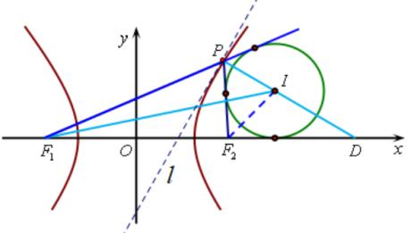

法二：（中垂线截距+光学性质）是双曲线的切点弦（切线是切点弦极限情况），是切点弦*l*的中垂线，根据中垂线截距定理，再根据角平分线定理可知

【例12】（河北省2025届高考冲刺模拟考试T8）已知双曲线的左、右焦点分别为，点为右支上一点，射线是的外角平分线，其与轴的交点为点的角平分线与直线交于点，若，则双曲线的离心率为（    ）

A．	
B．	
C．	
D．

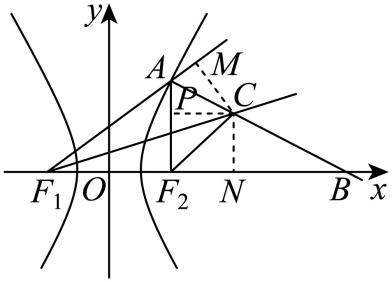

【例13】(2023哈三中高三一模16题）如图，椭圆与双曲线有公共焦点，，椭圆的离心率为，双曲线的离心率为，点<em>P</em>为两曲线的一个公共点<em>，</em>,则_____________；<em>I</em>为的内心，三点共线，且，<em>x</em>轴上点A、B满足，，则的最小值为__________.

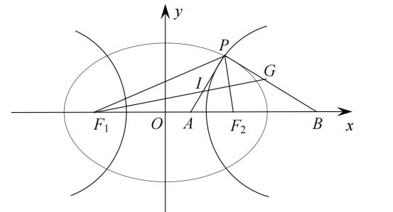

第三节  焦点三角形与大小圆问题

一．以圆锥曲线焦半径为直径的圆的性质  
（1） 以椭圆的焦半径为直径的圆必与大圆（以长轴为直径的圆）相内切．  
（2） 以双曲线的焦半径为直径的圆必与小圆（以实轴为直径的圆）相切．

  
（3） 以抛物线的焦半径为直径的圆必与*y*轴相切．

<strong>证明</strong>　（1） 如左图，以椭圆为例，分别为左、右焦点，以焦半径为直径的圆<em>M</em>，连结<em>OM</em>并延长交圆于<em>N</em>、连接，易知，，所以，所以以椭圆的焦半径为直径的圆必与大圆（以长轴为直径的圆）内切．

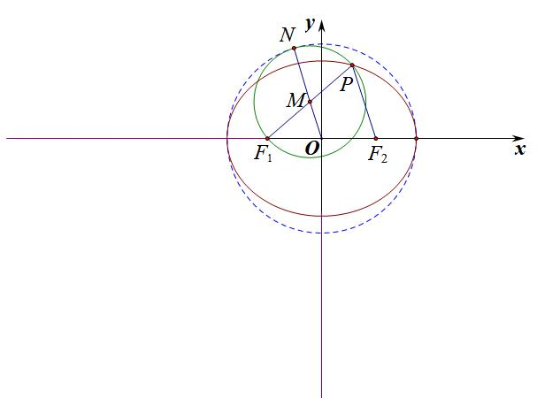

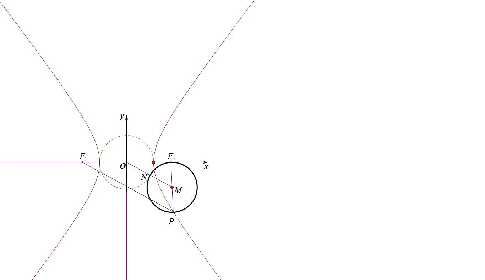

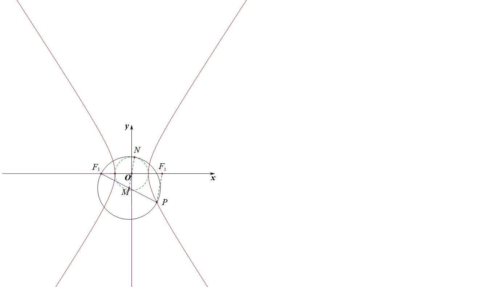

  
（2） 如中图，以双曲线为例，分别为左、右焦点，以焦半径为直径的圆*M*，连结*OM*并与圆交于*N*、连接，易知，，所以，因此，以双曲线的短焦半径为直径的圆必与小圆（以实轴为直径的圆）外切．

如右图，以焦半径为直径的圆*M*，连结*OM*并与反向延长交圆于*N*、连接，易知，，所以，因此，以双曲线的长焦半径为直径的圆必与小圆（以实轴为直径的圆）内切．

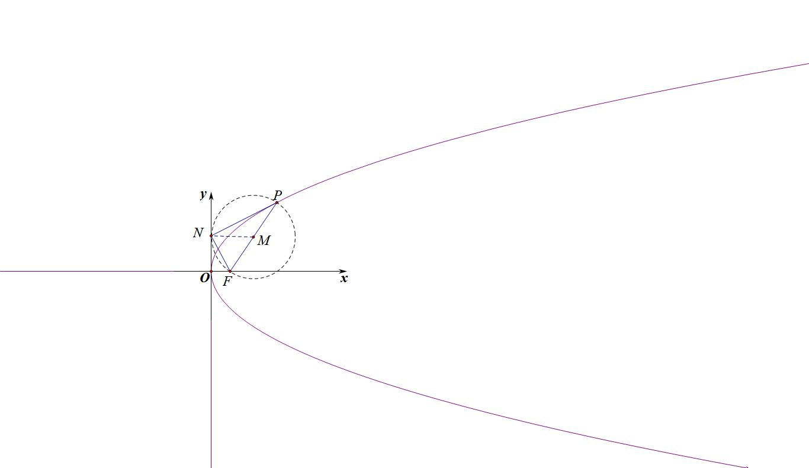

  
（3） 如图，以抛物线为例，*F*为焦点，以焦半径为直径的圆，作轴于*N*，

，，故以为直径的圆和*y*轴相切．

【例1】（2023•岳麓区期末）是椭圆的右焦点，是该椭圆上任一点，以为直径作圆，以椭圆长轴为直径作圆，则圆与圆的位置关系是<u>　    　</u>．

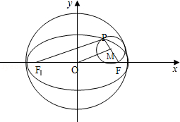

【例2】（2023•锦州模拟）已知抛物线的焦点为，点是上一点，且，以为直径的圆截轴所得的弦长为1，则

A．2	
B．2或4	
C．4	
D．4或6

【例3】（2023•天山区期末）如图，已知是椭圆的左焦点，为椭圆的下顶点，点是椭圆上任意一点，以为直径作圆，射线与圆交于点，则的取值范围为 <u>　     　</u>．

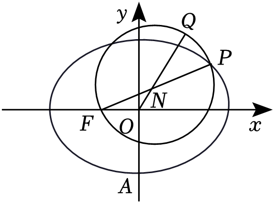

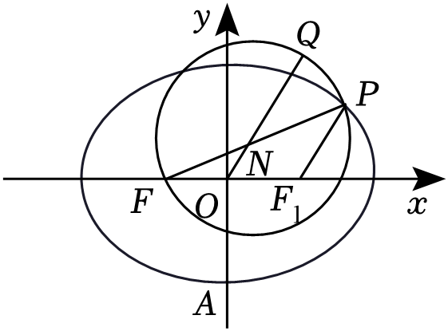

【例4】（&lt;te&lt;te<em>x</em>t st<em>y</em>le="italic"&gt;x&lt;/text&gt;t style="subscript"&gt;2&lt;/text&gt;&lt;text style="subscript"&gt;&lt;text style="subscript"&gt;0&lt;/text&gt;&lt;/text&gt;24•大连模拟）已知<em>&lt;text style="italic"&gt;F</em>&lt;/text&gt;&lt;text style="subscript"&gt;1&lt;/text&gt;、F2是双曲线 $C：\frac{x^{2}}{4}-\frac{y^{2}}{5}=1$ 的左、右焦点，点&lt;te&lt;te<em>x</em>t st<em>y</em>le="italic"&gt;x&lt;/text&gt;t style="italic"&gt;P&lt;/text&gt;（x&lt;text style="subscript"&gt;&lt;text style="subscript"&gt;0&lt;/text&gt;&lt;/text&gt;，y0）（x0≥3）是双曲线<em>C</em>上任意一点，以P<em>&lt;text style="italic"&gt;F</em>&lt;/text&gt;&lt;text style="subscript"&gt;1&lt;/text&gt;为直径作圆<em>&lt;text style="italic"&gt;N</em>&lt;/text&gt;，<em>NO</em>延长线与圆N交于点<em>Q</em>，则 $\overset{\to }{QF_{1}}\cdot \overset{\to }{QF_{2}}=$ （　　）

A．9	
B．4	
C．﹣4	
D．﹣5

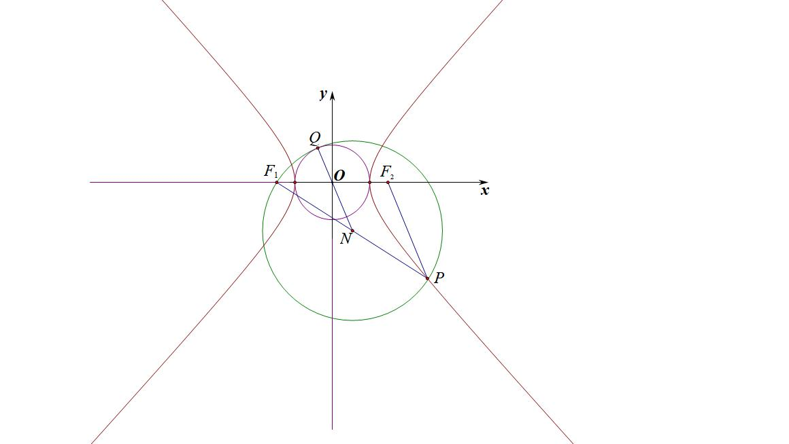

【例5】（&lt;text sty<em>l</em>e="subscript"&gt;&lt;text style="subscript"&gt;2&lt;/text&gt;&lt;/text&gt;024•多选•安徽模拟）已知双曲线&lt;text style="it<em>a</em>lic"&gt;<em>C</em>&lt;/text&gt;： $\frac{x^{2}}{a^{2}}-\frac{y^{2}}{b^{2}}=$ &lt;text sty<em>l</em>e="subscript"&gt;&lt;text style="subscript"&gt;1&lt;/text&gt;&lt;/text&gt;（<em>a</em>＞0，<em>b</em>＞0）左右焦点分别为<em>&lt;text style="italic"&gt;&lt;text style="italic"&gt;&lt;text style="italic"&gt;&lt;text style="italic"&gt;F</em>&lt;/text&gt;&lt;/text&gt;&lt;/text&gt;&lt;/text&gt;1，F&lt;text style="subscript"&gt;&lt;text style="subscript"&gt;2&lt;/text&gt;&lt;/text&gt;，|F1F2|＝4 $\sqrt{7}$ ．经过&lt;text sty<em>l</em>e="italic"&gt;<em>&lt;text style="italic"&gt;&lt;text style="italic"&gt;&lt;text style="italic"&gt;F</em>&lt;/text&gt;&lt;/text&gt;&lt;/text&gt;&lt;/text&gt;&lt;text style="subscript"&gt;&lt;text style="subscript"&gt;1&lt;/text&gt;&lt;/text&gt;的直线l与&lt;text style="it<em>a</em>lic"&gt;<em>C</em>&lt;/text&gt;的左右两支分别交于<em>P</em>，<em>Q</em>，且△<em>PQF</em>&lt;text style="subscript"&gt;&lt;text style="subscript"&gt;2&lt;/text&gt;&lt;/text&gt;为等边三角形，则（　　）

A．双曲线<em>C</em>的方程为 $\frac{x^{2}}{8}-\frac{y^{2}}{20}=1$ 	            
B．△<em>P&lt;text style="italic"&gt;F</em>&lt;/text&gt;1F2的面积为 $8\sqrt{3}$

C．以<em>QF</em>1为直径的圆与以实轴为直径的圆相交	
D．以<em>QF</em>2为直径的圆与以实轴为直径的圆相切

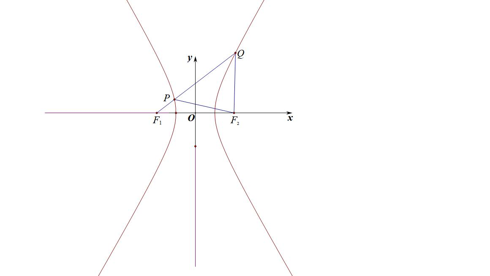

二：光学定理与大圆小圆问题

1. 椭圆的大圆　焦点作椭圆切线的垂线，垂足轨迹是以长轴为直径的圆．这个圆我们称之为大圆.

如图，已知椭圆上点*P*处的切线为*l*，则过焦点作直线*l*的垂线，垂足*H*的轨迹是以长轴为直径的圆，即为．

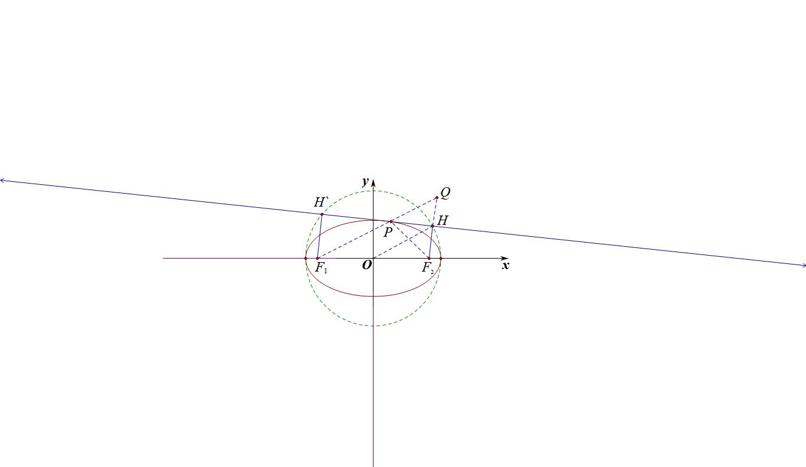

<strong>证明:</strong>　如图，作,．当点<em>P</em>不在长轴的两个端点时，延长交于点<em>Q</em>，根据椭圆的光学性质可知：切线<em>l</em>平分，故是等腰三角形，点<em>H</em>是线段的中点．因此，在中，，故点<em>H</em>的轨迹是，同理，H\`的轨迹也符合此轨迹方程，当点<em>P</em>在长轴的两个端点时，此时的射影点亦满足上述方程．

【例6】（2023•连城县月考）如图所示，已知，是椭圆的左，右焦点，是椭圆上任意一点，过作的外角的角平分线的垂线，垂足为，则点的轨迹为

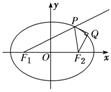

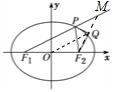

A．直线	
B．圆	
C．椭圆	
D．双曲线

<strong>2.大圆性质拓展</strong>　如图，已知椭圆上点<em>P</em>处的切线为<em>l</em>，且焦点在直线<em>l</em>上的垂足分别为<em>G</em>、<em>H</em>，设，椭圆的上顶点为<em>B</em>，左右顶点分别为、，则：

  
（1） ；

  
（2） 直角梯形的面积的为，又,故；
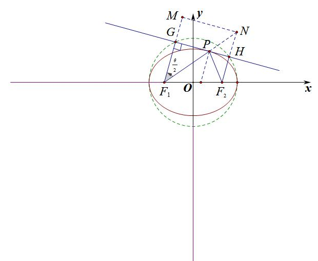

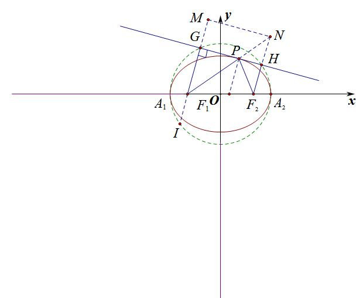

证明　（1） 法一：设，，则，

．

法二　延长交大圆于点，根据对称性，有，再利用相交弦定理，则

．

  
（2） 利用椭圆的光学性质，如图所示，延长交于点*N*，过点*N*作交延长线于点*M*，因此，，

又，则．

注意：大题在证明光学性质时比较麻烦，建议参考例题方式书写大题.

【例7】已知椭圆，圆，直线与椭圆交于点<em>A</em>，过<em>A</em>作椭圆的切线交圆于<em>M</em>、<em>N</em>两点（<em>M</em>在<em>N</em>的左侧），则_______．

3. 双曲线的小圆　焦点在双曲线切线上的垂足轨迹是以实轴为直径的圆，我们称之为小圆.

如图，已知双曲线上点*P*处的切线为*l*，则焦点在直线*l*上的射影点*H*的轨迹是以实轴为直径的圆，即为．

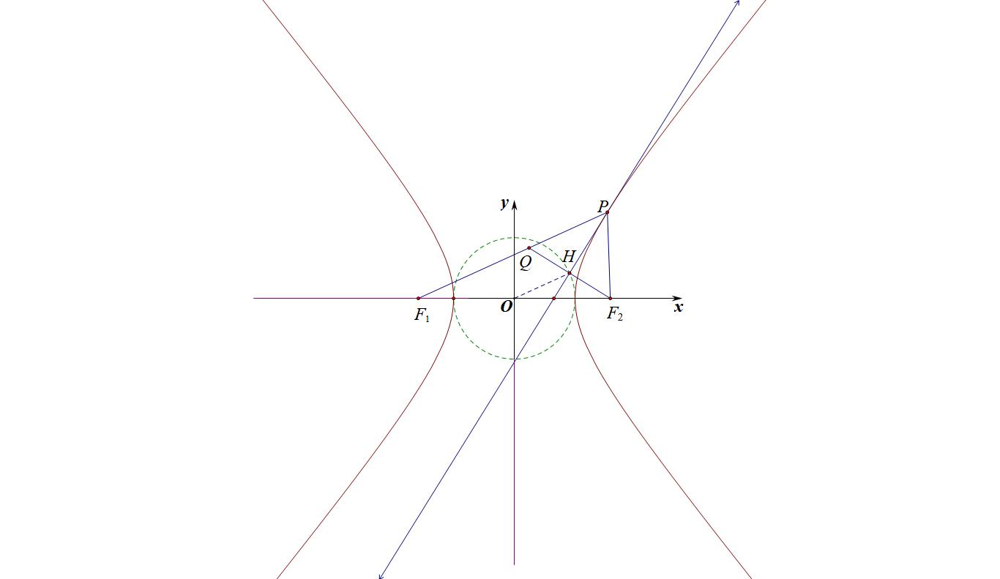

<strong>证明</strong>　如图，点<em>P</em>在右支，以右焦点为例证明，作．当点<em>P</em>不在长轴的两个端点时，延长交于点<em>Q</em>，根据双曲线的光学性质可知：切线<em>l</em>平分，由于在中，线段<em>PH</em>既是角平分线又是高，因此，是等腰三角形，进而点<em>H</em>是线段的中点．因此，在中，，故点<em>H</em>的轨迹是．

【例8】已知双曲线的两焦点分别为，*P*为双曲线上一动点，过点作平分线所在直线的垂线，则垂足*M*的轨迹方程为( 　 )．

A．	
B．	
C．	
D．

