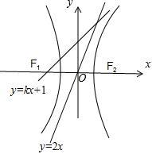

第五章 常规韦达联立

高考发展几十年，圆锥曲线的计算方法呈现百花齐放的状态，韦达联立一直作为一切的根基，虽然再解决一些问题时候并非最优解，但是这也是圆锥曲线入门的必修课，本章节我们介绍一下常规的韦达联立，也能为后面的同构联立增加一些理论支持.

########## 第一节 椭圆双曲线的正设与反设

########## 直曲联立，用斜率作为参数，转韦达定理，最直接的用处就是弦长和面积问题，我们分别以椭圆和双曲线来说明.

########## 椭圆的正设与反设

########## 问题：椭圆与直线相交于*AB*两点，求*AB*的弦长．

### 1.1.1.1.1.1.1.1.1.1 正设：

########## 设则

########## ． 

########## 椭圆与直线交点的判别式：用来判断是否有交点问题．

########## 面积问题：椭圆与直线相交与两点，为*AB*外任意一点，求.设*C*到的距离为，则．

### 1.1.1.1.1.1.1.1.1.2 反设：

########## 若椭圆中出现，或者椭圆与过定点的直线*l，* 则直线设为，如此消去，保留，构造的方程如下：

########## （就是将）

########## ．

椭圆与直线交点的判别式：用来判断是否有交点问题．

########## 【例1】已知椭圆方程为与直线方程相交于*A*、*B*两点，求*AB*的弦长．

【例2】（2024•新高考I卷）已知和为椭圆上两点．

  
（1）求的离心率；

  
（2）若过的直线交于另一点，且的面积为9，求的方程．

> [!example]- 例3（2025新课标Ⅱ卷第16题）. 椭圆 $C:\frac{x^{2}}{a^{2}}+\frac{y^{2}}{b^{2}}=1\left(a>b>0\right)$  的离心率为 $\frac{\sqrt{2}}{2}$  ，长轴长为4。  
（1）求椭圆 $C$  的方程；  
（2）过点 $(0,-2)$ 的直线 $l$  与椭圆 $C$  交于 $A,B$  两点， $O$  为坐标原点，若 $S_{\bigtriangleup OAB}=\sqrt{2}$  ，求 $\left|AB\right|$  。

【例4】（2014•新课标Ⅰ）已知点，椭圆的离心率为，是椭圆的右焦点，直线的斜率为，为坐标原点．

  
（1）求的方程；

  
（2）设过点的直线与相交于，两点，当的面积最大时，求的方程．

【例5】（2023•天津）设椭圆的左、右顶点分别为，，右焦点为，已知，．

（Ⅰ）求椭圆方程及其离心率；

（Ⅱ）已知点是椭圆上一动点（不与顶点重合），直线交轴于点，若△的面积是△面积的二倍，求直线的方程．

> [!example]- 例6（2025上海卷第20题）．已知椭圆，，*A*是的右顶点．

  
（1）若的焦点，求离心率*e*；

  
（2）若，且上存在一点*P*，满足，求*m*；

  
（3）已知*AM*的中垂线*l*的斜率为2，*l*与交于*C*、*D*两点，为钝角，求*a*的取值范围．

########## 双曲线的正设与反设

########## 1.直线与双曲线交点问题：

########## （1）直线与双曲线有两个交点时，；，有仅有一个交点；，没有交点；

########## （2）过点的直线与双曲线有一个交点情况需要分类讨论：

########## ①当时，点在渐近线上，当时，有两条直线（一条切线，一条与另一条渐近线平行的直线）；

########## ②当时，且在双曲线外部，有三条直线（两条切线，一条与另一条渐近线平行的直线）；

########## ③当时（点在双曲线内部），一定有交点，当直线斜率时，有一交点，当直线斜率时，有两个交点．

【例7】（2024•北京卷）已知双曲线，则过且和双曲线只有一个交点的直线的斜率为\_\_\_\_\_\_\_\_．

【例8】（2024•多选•茂名模拟）已知双曲线<em>C</em>：4<em>x</em>2﹣<em>y</em>2＝1，直线<em>l</em>：<em>y</em>＝<em>kx</em>+1（<em>k</em>＞0），则下列说法正确的是（　　）

A．若<text sty<text sty*l*e="italic">l</text>e="italic">k</text>＝2，则l与*<text style="italic">C*</text>仅有一个公共点	      
B．若 $k=2\sqrt{2}$ ，则<text sty*l*e="italic">l</text>与*<text style="italic">C*</text>仅有一个公共点

<text sty*l*e="italic">*C*</text>．若*l*与C有两个公共点，则 $2＜k＜2\sqrt{2}$ 	  D．若<text sty*l*e="italic">l</text>与*<text style="italic">C*</text>没有公共点，则 $k＞2\sqrt{2}$

【例9】（&lt;text st&lt;text st<em>y</em>le="italic"&gt;y&lt;/text&gt;le="subscript"&gt;2&lt;/text&gt;024•多选•桂林开学）若曲线&lt;te<em>x</em>t st<em>y</em>le="italic"&gt;<em>C</em>&lt;/text&gt;1：y＝<em>&lt;text style="italic"&gt;k</em>&lt;/text&gt;|x|+2与曲线C2： $\frac{x^{2}}{2}+$ &lt;te&lt;text st&lt;text st<em>y</em>le="italic"&gt;y&lt;/text&gt;le="italic"&gt;x&lt;/text&gt;t style="italic"&gt;y&lt;/text&gt;|y|＝1有6个公共点，则<em>&lt;text style="italic"&gt;k</em>&lt;/text&gt;的值可能是（　　）

A． $-\frac{\sqrt{15}}{3}$ 	
B． $-\frac{\sqrt{10}}{2}$ 	
C． $-\frac{\sqrt{7}}{2}$ 	
D． $-\sqrt{2}$

########## 2.双曲线弦长面积问题

########## 问题：双曲线与直线相交于*AB*两点，求*AB*的弦长．

##########     双曲线正设和反设差距不大，所以我们一般用正设，双曲线很多侧重点在于渐近线体系，正设的斜率直接对接渐近线斜率，所以本文先介绍正设，反设模仿椭圆的，就是替换*a*与*b*即可，会在后面介绍*.*

########## 设，则

########## 将代入得：                 

########## 双曲线与直线交点的判别式：用来判断是否有两个交点问题．

########## 面积问题：双曲线与直线相交与两点，为*AB*外任意一点，求。设*C*到的距离为，则

【例10】（2024•甘肃省开学）已知双曲线及直线．

  
（1）若直线与双曲线有两个不同的交点，求实数的取值范围；

  
（2）若直线与双曲线交于，两点，是坐标原点，且的面积为，求实数的值．

【例11】（2024•昆明模拟）已知双曲线的焦距为4，且过点．  
（1）求双曲线方程；

  
（2）若直线与双曲线有且只有一个公共点，求实数的值．

########## 第二节 韦达联立与向量乘积问题

########## 一 过原点的向量乘积问题

########## 问题：椭圆与双曲线与直线相交于两点，O为坐标原点，求

########## 设

########## 1.正设： 将代入得：                  将代入得：   

########## 将（1）（2）分别代入（3）得：                

椭圆              双曲线

########## 2.反设：将代入得：                  将代入得：   

########## 将（1）（2）分别代入（3）得：                

椭圆              双曲线

########## 【例1】经过椭圆的一个焦点作倾斜角为的直线，交椭圆于<em>A</em>、<em>B</em>两点.设为坐标原点，则等于__________．

########## 【例2】已知椭圆中心在原点,焦点在*x*轴上，离心率，过椭圆的右焦点且垂直于长轴的弦长为．

########## （1）求椭圆的标准方程；

########## （2）已知直线*l*与椭圆相交于*P*、*Q*两点，*O*为原点,且*.* 试探究点*O*到直线*l*的距离是否为定值?若是，求出这个定值；若不是，说明理由．

【例3】（2024•渭南期末）已知双曲线的离心率为，双曲线的左、右焦点分别为，，点在双曲线的右支上，且．

  
（1）求双曲线的标准方程；

  
（2）过点的直线交双曲线于，两点，且以为直径的圆过原点，求弦长．

【例4】（2024•辽宁期末）已知椭圆的离心率为，上的点到其焦点的最大距离为．

  
（1）求的方程；

  
（2）若，与交于点，，求的最大值．

- 圆锥曲线中非原点向量乘积的问题

1.常规联立

任意长轴上定点向量乘积问题：设定点

通常求定值的问题，若过定点，则只需满足

【例5】（2024•上海）已知双曲线，，左右顶点分别为，，过点的直线交双曲线于、两点，且点在第一象限．

  
（1）当离心率时，求的值；

  
（2）当，△为等腰三角形时，求点的坐标；

  
（3）连接并延长，交双曲线于点，若，求的取值范围．

2.点乘双根法

1. 点乘双根法的原理

我们要计算这个量,此时当然可以将其展开,利用韦达定理来进行计算,但更简单的操作方法是利用二次函数的两根式,得出,并在两端同时令,即可得到,从而,这种方法叫做“点乘双根法”

,从而构建出关于参数的等式关系式,避免复杂的计算,达到快速解題的目的(其中,点坐标为已知定点,为直线与圆锥曲线的交点.  
（2）点乘双根法适用题型

在圆锥曲线中,遇到如(其中为常数)的形式,其中点是己知的点,为直线与圆雉曲线的交点的问题时，可用点乘双根法以达到简化运算.

【例6】(2017•新课标Ⅰ卷文)设为曲线上两点,与的横坐标之和为4.

  
（1）求直线的斜率;

  
（2）设为曲线上一点,在处的切线与直线平行,且,求直线的方程.

【例7】椭圆,若直线与椭圆交于两点不是左右頂点),且以直线为直径的圆恒过椭圆的右顶点.求证:直线恒过定点,并求出该点的坐标。

【例8】（2024•天津）已知椭圆的离心率，左顶点为，下顶点为，是线段的中点，其中．  
（1）求椭圆方程．

  
（2）过点的动直线与椭圆有两个交点，，在轴上是否存在点使得恒成立．若存在，求出这个点纵坐标的取值范围；若不存在，请说明理由．

【例9】（2023•濮阳模拟）已知椭圆的一个焦点与上、下顶点构成直角三角形，以椭圆的长轴长为直径的圆与直线相切．

1. 求椭圆的标准方程；

  
（2）设过椭圆右焦点且不平行于轴的动直线与椭圆相交于、两点，探究在轴上是否存在定点，使得为定值？若存在，试求出定值和点的坐标；若不存在，请说明理由．

########## 第三节 轴点弦之和积互换与非对称韦达定理

一．轴点弦的和积互换

轴点弦就是意味着，和积互换成为韦达定理当中的最大隐藏.当然本文在这里不作深究，毕竟轴点弦的世界还是定比点差的天下.

本节和下一节的非对称韦达定理我们仅以一道经典的考题来解读.

########## 【例1】（2023•赣州教师竞赛）已知椭圆的离心率为,椭圆上的点，与的最大距离为.

### 1.1.1.1.1.1.1.1.1.3 求椭圆的方程；

### 1.1.1.1.1.1.1.1.1.4 设椭圆的下、上顶点分别为A、B,过点P的直线与椭圆Q交于C、D两点，与y轴交于点M，直线AC与直线BD交于点N，试探究是否为定值.

########## 二．非对称韦达定理

关于出现

方案一：对称后直接配凑；方案二：和积互换（参考上一节）

########## 【例2】已知椭圆与*y*轴的交点为，（点位于点的上方），为左焦点，原点到直线的距离为．

########## （1）求椭圆的离心率；

########## （2）设，直线与椭圆交于不同的两点，，求证：直线与直线的交点在定直线上．

