第六章 联立之同构方程

如果曲线上有两个动点，那么就是直曲联立的核心，如果曲线上有三个点，那么就会有三条弦，这三条弦与曲线联立方程就具备同构属性，本章我们探讨同构方程，探讨一次联立之后带来的各种同构式，也将圆锥曲线的二次方程属性展现得淋漓尽致.

########## **抛物线两点联立式方程**

过抛物线上两点、的直线方程是:.

证明:利用，得到，故直线方程为:，化简可得:.

记忆方法:把抛物线化成标准方程，然后将最左端的二次自动降为一次，再在最左端和最右端加上“、”皆可.

同理，如果抛物线的形式是，直线的方程是:.

注意:考试时，最好给出的推导过程。

这个式子首先是经过了一次联立，但又满足直线的两点式方程，故我们称之为抛物线的两点式方程，它体现过直线和抛物线两个交点的所有性质，可以这么说，搞定这个式子，大部分抛物线的题目都大结局了。至于椭圆和双曲线的两点式方程，我们会在下一节介绍。

一旦抛物线上出现三点，、、，这样就会出现轮换，这里就会涉及同构式，所以轮换对称的三个方程，它们的坐标形式结构相同，仅仅是字母变量不同，我们把这种拥有相同的特征和形态的式子叫做同构式。

########## 一  抛物线两点联立式同构与定点定值

【例1】(2018•北京理)已知抛物线经过点，过点的直线与抛物线有两个不同的交点，，且直线交轴于，直线交轴于.

(I)求直线的斜率的取值范围;

(II)设为原点，，求证:为定值.

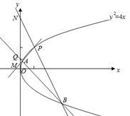

【例2】（2024•广东月考）已知抛物线，焦点为，点，，过点作抛物线的切线，切点为，，又过作直线交抛物线于不同的两点，，直线交抛物线于另一点．

（1）求抛物线方程；

（2）求证过定点．

【例3】(2022全国甲卷)已知抛物线焦点为，点过焦点做直线交抛物线于两点，当轴时，.

（1）求抛物线方程

（2）若直线与抛物线的另一个交点分别为.若直线，的倾斜角为，当最大时，求的方程

【例4】（2023•南宁一模）设抛物线的焦点为，点，过的直线交于，两点．当直线垂直于轴时，．

（1）求的方程；

（2）若点，，过点的动直线交抛物线于、，直线交抛物线于另一点，连接并延长交抛物线于点．证明直线与直线的斜率之和为定值．

【例5】（2024•广东模拟）已知为抛物线的焦点，，，是上三个不同的点，直线，，分别与轴交于，，，其中的最小值为4．

（1）求的标准方程；

（2）的重心位于轴上，且，，的横坐标分别为，，，是否为定值？若是，请求出该定值；若不是，请说明理由．

【例6】(2021•浙江卷)如图，已知点是轴左侧(不含轴)一点，抛物线上存在不同的两点，满足，的中点均在上.

(I)设中点为，证明:垂直于轴;

(II)若是半椭圆上的动点，求面积的取值范围.

例7.（2025苏州大学考前适应卷第18题（陪跑课学员汪小云提问））在平面直角坐标系中,已知抛物线的焦点为,直线与 交于两点.

(1)若过,另一条过的直线与交于,两点(,在轴上方),直线分别交直线于 两点,证明:为的中点;

(2)若上存在点 ,使得 ,证明:为定值.

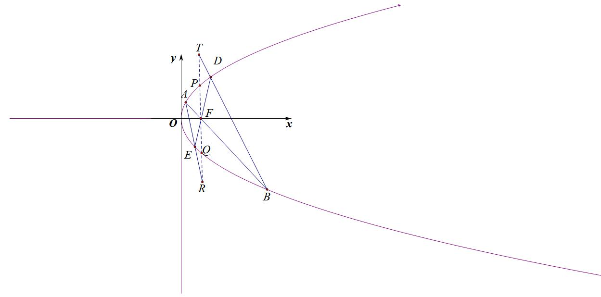

【例8】（2025·河南郑州·三模T18）已知抛物线的焦点为*F*，点在*E*上，且．

(1)求*E*的方程；

(2)过*F*作互相垂直的两条直线，，这两条直线与抛物线*C*分别交于*A*，*B*和*P*，*Q*两点，其中点*A*，*P*在第一象限．

（ⅰ）记△*AOB*和△*POQ*的面积为，，求的最小值；

（ⅱ）过*F*点作*x*轴的垂线，分别交*AP*，*BQ*于*C*，*D*两点，请判断是否存在以*CD*为直径的圆与*y*轴相切，并说明理由．

########## 二．两点联立式下的双切圆

只要两点在抛物线上，就能满足两点联立式的方程，当这两点都在圆的切线上，两点形成双切圆方程，这里就会产生另一组同构方程，再根据曲线的同一法确定方程，我们可以参考例题，逐步曲领悟圆锥曲线的二次方程思想.

【例9】（2024•浙江模拟）如图，已知点是抛物线在第一象限上的点，为抛物线的焦点，且垂直于轴．过作圆的两条切线，与抛物线在第四象限分别交于，两点，且直线的斜率为4．

（Ⅰ）求抛物线的方程及点坐标；

（Ⅱ）问：直线是否经过定点？若是，求出该定点坐标，若不是，请说明理由．

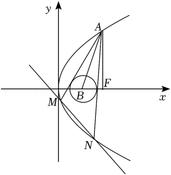

【例10】(2011·浙江理)已知抛物线，圆的圆心为，是上一点(异于原点)，过作圆的两条切线，交于、两点，.求的方程。

【例11】（2023•广州一模）已知抛物线的焦点到准线的距离为2，圆与轴相切，且圆心与抛物线的焦点重合．

（1）求抛物线和圆的方程；

（2）设，为圆外一点，过点作圆的两条切线，分别交抛物线于两个不同的点，，，和点，，，．且，证明：点在一条定曲线上．

########## 三 两点联立式下的彭塞列闭合

以上几道例题属于半等位同构，就是由于和属于完全等位同构，因为都满足与圆相切，由于点不是抛物线任意一点（满足其它条件），所以第三条边*AB*与圆的关系不确定，如果是抛物线上任意一点呢？那么*AB*和圆又会有什么关系呢？能否发现新的对称关系，我们来看看2021年全国甲卷的高考题.

【例12】(2021·全国甲卷)抛物线的顶点为坐标原点，焦点在轴上，直线交于、两点，且，已知点，且圆与相切.

(1)求，圆的方程;

(2)设、、是上的三个点，直线，均与圆相切，判断直线与圆的位置关系，并说明理由.

########## 四． 两点联立式下的极点极线证明

极点极线知识点不复杂，但是落实在解答题的书写当中，就成了一个难题，往往需要联立三四次，但是有了两点联立式的同构属性，一切化繁为简.

【例13】（2024•保定二模）已知抛物线的焦点为，过作互相垂直的直线，，分别与交于，和，两点，在第一象限），当直线的倾斜角等于时，四边形的面积为32．

（1）求的方程；

（2）设直线与交于点，证明：点在定直线上．

【例14】（2024•哈师大附中、东北师大附中、辽宁省实验中学三模）如图抛物线，过有两条直线，，与抛物线交于，，与抛物线交于，．

（Ⅰ）若斜率为1，求；

（Ⅱ）是否存在抛物线上定点，使得，若存在，求出点坐标并证明，若不存在，请说明理由；

（Ⅲ）直线与直线，相交于，两点，证明：为中点．

########## 两点联立式下的平行弦同构

平行就意味着分线段成比例相等，这就是等位的理解，数学中对等位的语言就是可以同构，我们先来进行数学建模.

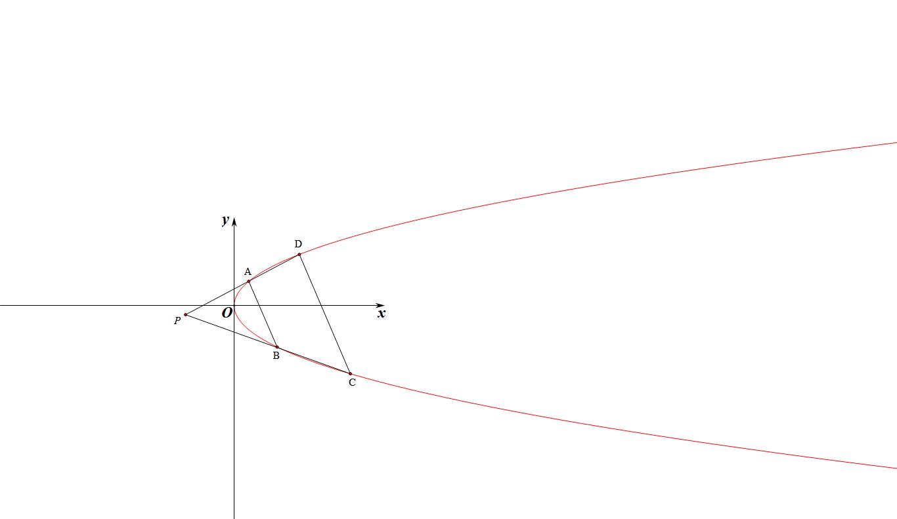

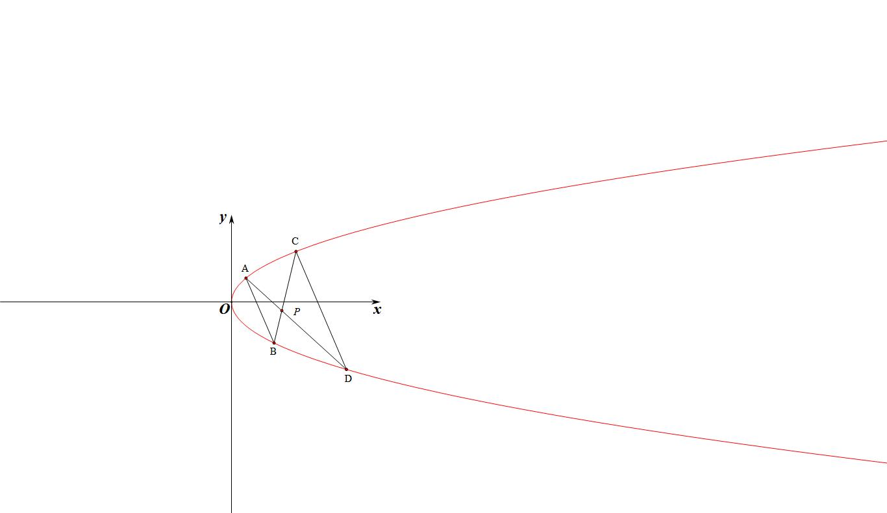

如图所示，抛物线上存在，，，四点，*AD*与*BC*交于，且*AB*//*CD*，令，，则

（1）；（2）；（3），；

证明：，得到，故直线方程为:，化简可得:，同理，直线方程为:，由于*AB*//*CD*，

故①，由于，即②，

由①②得：，即，且；

*AD*:，将得：，

将②式代入得：;

同理*BC*:，将和②式代入得：;

所以均在同构方程上，所以；

所以均在同构方程上，所以；

注意：我们只需要用两点式求出两相交直线的方程，即可得出和，，这两个式子好记忆，用左边乘以，右边乘以，或者左边乘以，右边乘以，如果不需要求两个平行直线的斜率，则两平行线的方程都是多余的，我们只是在建模时候给大家解释清楚.

我们同样可以得到抛物线上存在，，，四点，*AD*与*BC*交于，且*AB*//*CD*，令，，则

（1）；（2）；（3），；

【例15】（2024•浙江模拟）如图所示，已知抛物线的焦点为，过的直线交抛物线于，两点，在轴左侧且的斜率大于0.

(I)当直线的斜率为 时，求弦长的长度;

(II)点在轴正半轴上，连接，分别交抛物线于，若且，求.

【例16】（湖北省部分学校（圆创）2025届高三下学期考前压轴卷T18）平面直角坐标系中，点，为动点，以为直径的圆与轴相切，动点的轨迹记为．

(1)求的方程；

(2)已知点，不经过点的直线与相交于，两点．

①若为的垂心，求的方程；

②连结，分别交于点，，若，求的斜率．

【例17】（合肥一中 2025 届高三最后一卷 18题（陪跑课学员胡升辉、潘思宇提问））在直角坐标系中. 点到点 的距离等于点到直线的距离. 记动点的轨迹为  .

(1)求的方程；

(2)已知梯形的四个顶点都在曲线上,其中 、在第一象限(在的上方). 、在第二象限,且,线段交于点,记中点分别为.

(i)求证: ；

(ii)若线段长度为3 ,梯形的面积为9 ,求线段与长度的比值.

########## **第二节 切线同构与阿基米德三角形**

########## **一． 切线与切点弦的极点极线方程**

1．二次曲线的替换法则

对于一般式的二次曲线，用代，用代，用代，用代，用代，常数项不变，

可得方程：．

2．切线切点弦的极点极线代数定义

高中阶段，常见的二次曲线的极点极线方程如下：

（1）圆：

①极点关于圆的极线方程是；

②极点关于圆的极线方程是；

③极点关于圆的极线方程是：．

（2）椭圆：

极点关于椭圆的极线方程是：．

（3） 双曲线：

极点关于双曲线的极线方程是：．

（4）抛物线

########## 极点关于抛物线的极线方程是：

3．切线切点弦的几何意义

（1）若极点在二次曲线上，则极线是过点的切线方程．

（2）若极点在二次曲线内部，则极线是过点P的弦两端端点的切线交点的轨迹．如图所示，过点P的弦、的两端端点作切线，得到的直线MN即为点对应的极线轨迹．【极线和二次曲线必定相离】

（3）若极点P在二次曲线外部，分成两种情况：

①极线在二次曲线内的部分是点对二次曲线的切点弦；【极线和二次曲线必定相交】

②极线在二次曲线外的部分是过点P的弦两端端点的切线交点的轨迹（也在切点弦上）．

########## 【例1】（2013•山东）过点作圆的两条切线，切点分别为、则直线的方程为（    ）

########## A．    	B．	C．	D．

【例2】（2024•武汉期末）设是直线上的任一点，过点作圆的两条切线、

，切点分别为、，则直线恒过定点<u>　   　__</u>．

########## 【例3】（2010•湖北）已知椭圆的两个焦点，点满足，则的取值范围为_________，直线与椭圆的公共点个数是_________．

########## 【例4】已知椭圆的方程为，过直线上任意一点，作椭圆的两条切线，切点分别为，则原点到直线距离的最大值为___________．

########## 二． 切线方程和切点弦方程求法的书写过程

########## 我们尝试来求椭圆上一点处的切线方程，

########## **法一(参数换元+判别式)：** 令，过点的切线方程为，代入椭圆方程联立得：

########## ，所以，所以，

########## 所以，所以，即．

########## 注意：如果是证明切线方程为，那么可以将，联立方程消除*y*，计算判别式为0．

########## **法二（分类求导）** 当点位于第一或第二象限时，，求导得，当时，，故，代入切线方程得：；

########## 当点位于第三或第四象限时，，求导得

########## ，当时，，故，代入切线方程得：．

########## 注意：如果按照隐函数求导，那么可以一次性解决切线方程问题，但是现行高考开放政策下，这个切线方程已经属于被默认的正确，很多时候我们仅需要一个判别式假装证明过程，即可使用此方程．

########## 我们再来看看切点弦方程，过点作椭圆的两条切线*PA*和*PB*，则切点弦*AB*的方程为：．

########## 【例5】过椭圆内一点，做直线与椭圆交于点，作直线与椭圆交于点，过分别作椭圆的切线交于点，过分别作椭圆的切线交于点，求所在的直线方程．

【例6】已知圆有以下性质：①过圆上一点，的圆的切线方程是．②若，为圆外一点，过作圆的两条切线，切点分别为，，则直线的方程为；③若不在坐标轴上的点，为圆外一点，国作圆的两条切线，切点分别为，，则垂直，即，且平分线段．

（1）类比上述有关结论，猜想过椭圆上一点，的切线方程（不要证明），

（2）过椭圆外一点，作两直线，与椭圆相切于，两点，求过，两点的直线方程，

（3）若过椭圆外一点，不在坐标轴上）作两直线，与椭圆相切与，两点，求证为定值，且平分线段．

【例7】（2023•浙江模拟）已知点为椭圆的左焦点，记点到直线的距离为，且．

（1）求动点的轨迹方程；

（2）过点作椭圆的两条切线，，设切点分别为，，连接，．

①求证：直线方程为；

②求证：．

########## 注意：本题在处理垂直这里计算难度相对较大，所以斜率问题就用专属斜率语言的方法来解读，齐次化当仁不让.

########## 三 抛物线切线方程与阿基米德三角形

########## 1.抛物线的切线方程

########## 设在抛物线上任意一点的切线方程为：

########## 证明：点在抛物线上；又求导得；

########## 在点的切线方程为：即

########## 同理，在抛物线上任意一点的切线方程为：

########## 证明：点在抛物线上；又对*y*求导得；

########## 在点的切线方程为：即

########## 【例8】直线<em>l</em>经过点且与抛物线只有一个公共点，满足这样条件的直线<em>l</em>有<u>　　　　</u>条．

2.抛物线切线与阿基米德三角形性质与结论

########## **阿基米德三角形：** 圆锥曲线的弦与过弦的端点的两条切线所围成的三角形叫做阿基米德三角形．

########## 抛物线的切线方程完全符合二次曲线的切线方程形式，下面我们来分析一下抛物线的切点弦．

########## 如图，过点作抛物线的两条切线和，则切点弦*AB*的方程为：．

若 $AB$  中点为 $Q,AB$  交 $y$  轴于点 $N\left(m\right),PQ$  交抛物线于点 $M$ , 令 $A\left(y_{1}\right),B\left(y_{2}\right)$ , 则有以下推论: (1) $x_{0}=$  $x_{Q}=x_{M}=\frac{x_{1}+x_{2}}{2};\left(2\right)y_{0}+m=0;\left(3\right)M$  处的切线与 $AB$  平行; $\left(4\right)y_{0}=\frac{x_{1}x_{2}}{2p}$ ;
证明: 因为点 $A\left(y_{1}\right),B\left(y_{2}\right)$  在抛物线上, 所以 $x_{1}^{2}=2py_{1},x_{2}^{2}=2py_{2}$ , 求导得 $y^{'}=\frac{2x}{2p}=\frac{x}{p}$ ;     (求导)
所以点 $A\left(y_{1}\right),B\left(y_{2}\right)$  处的切线方程为: $\left\{\begin{array}{c}y-y_{1}=\frac{x_{1}}{p}\left(x-x_{1}\right)\\y-y_{2}=\frac{x_{2}}{p}\left(x-x_{2}\right)\end{array}\right.$  即 $\left\{\begin{array}{c}xx_{1}=p\left(y+y_{1}\right)\\xx_{2}=p\left(y+y_{2}\right)\end{array}\right.$  上,

########## 由于、交于点，故，所以点均在同构方程上，故切点弦 $AB$  的方程为: $xx_{0}=p\left(y+y_{0}\right)$  ③;                            ( 同构 )

########## 方案一（两点联立式）：切点弦④，对比③④得： $x_{0}=\frac{x_{2}+x_{1}}{2}$  ， $y_{0}=\frac{x_{1}x_{2}}{2p}$  ；

########## 方案二： ②-①得: $x_{0}\left(x_{2}-x_{1}\right)=p\left(y_{2}-y_{1}\right)$ , 即 $x_{0}\left(x_{2}-x_{1}\right)=p\left(\frac{x_{2}^{2}}{2p}-\frac{x_{1}^{2}}{2p}\right)\Rightarrow x_{0}=\frac{x_{2}+x_{1}}{2}$  
即 $x_{Q}=\frac{x_{2}+x_{1}}{2}=x_{0}$ , 所以 $x_{0}=x_{Q}=x_{M}=\frac{x_{1}+x_{2}}{2}$ ，当 $x=0$  时, 代入③得, $y=-y_{0}=m$ ;根据 $AB$  方程可知: $k_{AB}=\frac{x_{0}}{p}$ , 求导可得当 $x=x_{M}=x_{0}$  时, $k=\frac{x_{0}}{p}$ .将点 $P\left(y_{0}\right)$  代入切线方程得: $\frac{x_{2}+x_{1}}{2}x_{1}=p\left(y_{0}+y_{1}\right)\Rightarrow x_{1}x_{2}=2py_{0}\Rightarrow y_{0}=\frac{x_{1}x_{2}}{2p}$  
的阿基米德三角形性质类似，具体书写过程参考例题．

**3.特殊的阿基米德三角形**：过抛物线焦点作抛物线的弦，与抛物线交于、两点，分别过、两点做[抛物线](https://baike.baidu.com/item/%E6%8A%9B%E7%89%A9%E7%BA%BF/3555564)的切线，相交于点．那么阿基米德三角形满足以下特性：

①点必在抛物线的准线上

②为直角三角形，且角为直角

③（即符合射影定理）

另外，对于任意[圆锥曲线](https://baike.baidu.com/item/%E5%9C%86%E9%94%A5%E6%9B%B2%E7%BA%BF/6691222)（[椭圆](https://baike.baidu.com/item/%E6%A4%AD%E5%9C%86/684466)、[双曲线](https://baike.baidu.com/item/%E5%8F%8C%E6%9B%B2%E7%BA%BF/5200393)、[抛物线](https://baike.baidu.com/item/%E6%8A%9B%E7%89%A9%E7%BA%BF/3555564)）均有如下特性：

①过某一焦点做弦与曲线交于、两点，分别过、两点做圆锥曲线的切线，相交于点．那么，必在该焦点所对应的准线上．

②过某准线与轴的交点做弦与曲线交于、两点，分别过、两点做圆锥曲线的切线，相交于点．那么，必在一条垂直于轴的直线上，且该直线过对应的焦点．

【例9】（2024•杭州期中）已知抛物线，点，为抛物线外一点（如图），过点作的两条切线，切点分别为，．

求证：直线的方程为；

（Ⅱ）若，在直线上，以为圆心的圆与直线相切，且切点为线段的中点，求该圆的方程．

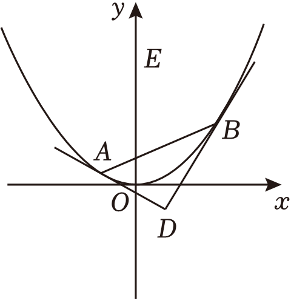

【例10】（2024•辽宁三模）设抛物线的方程为，为直线上任意一点；过点作抛物线的两条切线，，切点分别为，点在第一象限）．

（1）当的坐标为时，求过，，三点的圆的方程；

（2）求证：直线恒过定点；

（3）当变化时，试探究直线上是否存在点，使为直角三角形，若存在，有几个这样的点，说明理由；若不存在，也请说明理由．

########## 四．阿基米德三角形的面积问题

在阿基米德三角形中，根据之前所证可知：点，根据，；底边所在的直线方程为，或者；那么一定有的面积，或者；

【证明】利用面积模型的水平宽乘以铅锤高的一半可知：，当

时，，，故

；或者当时，，故

【例11】（2021•全国乙卷）已知抛物线

的焦点为，且与圆上点的距离的最小值为4．

（1）求；

（2）若点在上，，为的两条切线，，是切点，求面积的最大值．

【例12】（2024•广州二模）已知点是抛物线的焦点，的两条切线交于点，，，是切点．

（1）若，，求直线的方程；

（2）若点在直线上，记的面积为，的面积为，求的最小值；

（3）证明：．

########## 四．新定义下的阿基米德三角形的面积与等比数列      

推论1：如左图，阿基米德三角形中，，分别交轴于点，，则有以下性质：

①，；②，；

③

证明：根据阿基米德三角形的求导、同构可知：，，，

①根据切线方程和，当时，可得：，；

②，

；

③参考阿基米德三角形面积公式：；

推论2：如右图，若为抛物线弧上的动点，点处的切线与分别交于点，则有．

证明：由阿基米德三角形性质可知点的横坐标分别为，

所以，，

所以，同理，故得．

推论3： 若为抛物线弧上的动点，抛物线在点处的切线与阿基米德的边分别交于点，令，，则有、、、成等比数列．

证明：设，则，即，同理，故、、、成公比为的等比数列．

推论4： ．

########## 证明：法一 因为，所以，

所以，即，所以．

法二：如图，根据，分别作*y*轴平行线*PQ*和*EF*分别交*CD*和*AB*于*Q*和*F*，根据面积模型之水平宽和铅锤高乘积一半可知：，，故只需证明，

根据，当得：，；

由于，当得：，，命题得证．

注意：推论2，推论3和推论4的证法一更加适合做小题，解答大题时需要的是推论1和推论4的证法二，无需记忆结论，只要按照模型走下去，结合之前的阿基米德三角形结论即可．

【例13】（2024•苏州模拟）过抛物线外一点作抛物线的两条切线，切点分别为，，我们称为抛物线的阿基米德三角形，弦与抛物线所围成的封闭图形称为相应的“囧边形”，且已知“囧边形”的面积恰为相应阿基米德三角形面积的三分之二．如图，点是圆上的动点，是抛物线的阿基米德三角形，是抛物线的焦点，且．

（1）求抛物线的方程；

（2）利用题给的结论，求图中“囧边形”面积的取值范围；

（3）设是“囧边形”的抛物线弧上的任意一动点（异于，两点），过作抛物线的切线交阿基米德三角形的两切线边，于，，证明：．

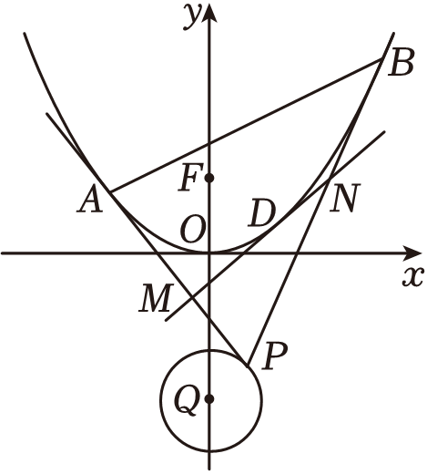

########## 【例14】（2024•深圳市期末）给出如下的定义和定理：

定义：若直线与抛物线有且仅有一个公共点，且与的对称轴不平行，则称直线与抛物线相切，公共点称为切点．

定理：过抛物线上一点，处的切线方程为．

完成下述问题：

如图所示，设、是抛物线上两点．过点、分别作抛物线的两条切线、，直线、交于点，点、分别在线段、的延长线上，且满足，其中．

（1）若点、的纵坐标分别为、，用、和表示点的坐标；

（2）证明：直线与抛物线相切；

（3）设直线与抛物线相切于点，求．

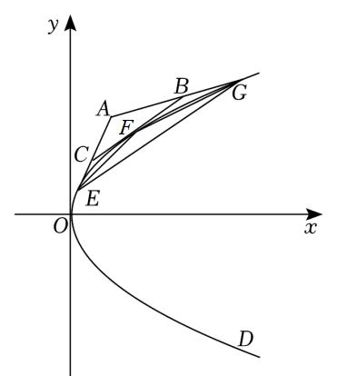

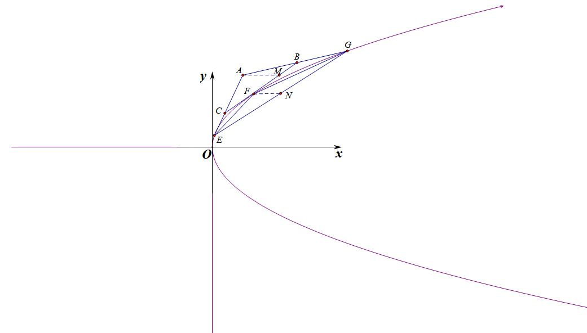

【例15】（2024•江西模拟）已知抛物线，点，在抛物线上．

（1）证明：以为切点的的切线的斜率为；

（2）过外一点（不在轴上）作的切线、，点、为切点，作平行于的切线（切点为，点、分别是与、的交点（如图）．

若直线与的交点为，证明：是的中点；

设面积为，若将由过外一点的两条切线及第三条切线（平行于两切线切点的连线）围成的三角形叫做“切线三角形”，如△．再由点、确定的切线△，△，并依这样的方法不断作1，2，4，，个切线三角形，证明：这些“切线三角形”的面积之和小于．

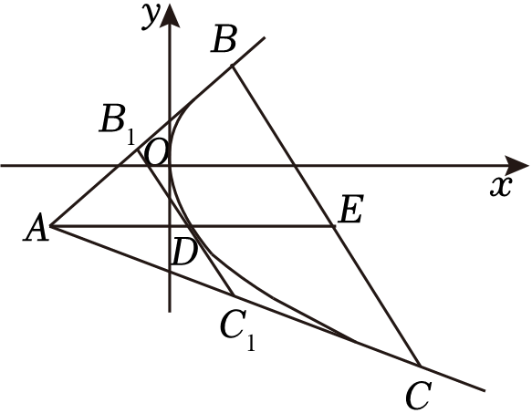

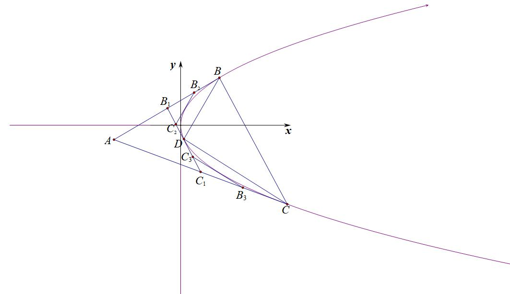

########## **第三节 斜率同构方程**

########## 一 坐标点式同构和斜率同构区别

我们前面两讲的内容都是点式同构，就是两个点可以对称轮换，这就需要直线与同一曲线有两个交点，于是抛物线的两点式方程和椭圆（双曲线）三角两点式方程应运而生。同构是一个强调对称和等位的操作手法，所以我们一定要精确理解，用好了确实能在解题中达到事半功倍的效果.

如果一条直线跟两个不同曲线交于两个不同的点，由于是同一条直线，故斜率不会改变，但是由于交于两条曲线，故此时我们利用不变的斜率来构造同构（同解）方程，便是我们说到的斜率同构.

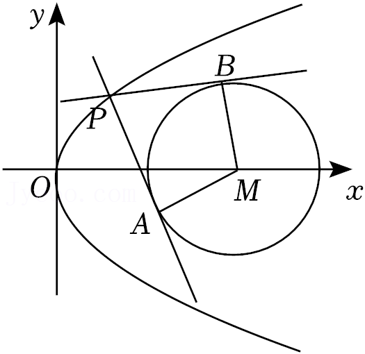  
图1：点式同构                          图2：斜率同构

我们看图1，我们发现*P*、*A*、*B*三点都在抛物线上，这样三点我们称之为等位三点，就能构成三个同构式方程，即，还有，之所以这样分开表达，就是我们发现*PA*、*PB*均与圆*C*相切，所以它们完全等位，即利用点*C*到两条直线距离相等又能得到新的同构方程，但是并不一定能满足。如果圆*C*与三条直线都相切，就是我们熟悉的彭塞列闭合圆。

再来看图2，虽然*PA*、*PB*均与圆*C*相切，但是由*于A、B*均在圆*M*上，此时*P*、*A*、*B*不具备等位性，但是直线*PA*和*PB*具备等位性，因为相切，所以这两条直线的斜率就能构成同构方程，我们把这种两条直线分列不同曲线上，但是具备相同等位性质的类型，叫做斜率同构。

########## 二 圆锥曲线上的双切圆斜率同构

【例1】（2024•大理期末）如图，点是抛物线在第一象限内的动点，过点作圆的两条切线，分别交抛物线的准线于点，．

（Ⅰ）当时，求点的坐标；

（Ⅱ）当点的横坐标大于4时，求面积的最小值．

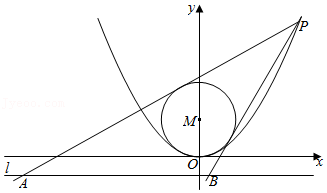

【例2】（2024•河南模拟）在平面直角坐标系中，已知点，点（不位于轴左侧）到轴的距离为，．

（1）求点的轨迹方程；

（2）若圆与点的轨迹有且仅有一个公共点，求的最大值；

（3）在（2）的条件下，当取最大值，且时，过作圆的两条切线，分别交轴于，两点，求面积的最小值．

########## 三 双切椭圆双曲线的斜率同构

【例3】（2024•湖南模拟）已知抛物线的焦点为点，为上一点，若点到原点的距离与点到点的距离都是．

（1）求的标准方程；

（2）动点在抛物线上，且在直线的右侧，过点作椭圆的两条切线分别交直线于，两点．当时，求点的坐标．

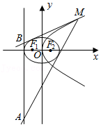

########## 四 双切椭圆的蒙日圆

问题:过外一点作椭圆两条切线.切点分别为、，若.讨论的轨迹.

如果是切线同构成切点弦，这是走阿基米德三角形的线路，一旦涉及两切线斜率和积问题，用构造一个联立式子，利用判别式为零，从而得出的二次方程:，而也满足这个方程，故、是此同构方程的两个根，从而再利用韦达定理来确定的关系式。我们也可以理解为确定方程，而，是此方程的根.

先联立看切线:，①

将代入①得关于的一元一次方程:②

易知、同时满足②式，故、是②式的两个根，我们设为、，

所以，所以;

(1)，为焦点在轴上的椭圆;

(2)，为半径为的圆，即“蒙日圆”:

(3)，为焦点在轴上的椭圆:

(4)，为焦点在轴上的双曲线;

(5)，为斜率为的射线;

(6)，为焦点在轴上的双曲线;

【例4】(2014•广东)已知椭圆的右焦点为，离心率为.

(1)求椭圆的标准方程;

(2)若动点为椭圆外一点，且点到椭圆的两条切线相互垂直，求点的轨迹方程.

【例5】（&lt;text st&lt;text sty&lt;text sty&lt;text sty&lt;text sty<em>l</em>e="italic"&gt;l&lt;/text&gt;e="italic"&gt;l&lt;/text&gt;e="italic"&gt;l&lt;/text&gt;e="italic"&gt;y&lt;/text&gt;le="superscript"&gt;&lt;text style="subscript"&gt;&lt;text style="subscript"&gt;&lt;text style="subscript"&gt;2&lt;/text&gt;&lt;/text&gt;&lt;/text&gt;&lt;/text&gt;024•西湖区模拟）在平面直角坐标系&lt;te<em>x</em>t style="italic"&gt;x<em>&lt;text style="italic"&gt;O</em>&lt;/text&gt;y&lt;/text&gt;中，椭圆 $C：\frac{x^{2}}{4}+y^{2}=1$ ，圆&lt;te&lt;text st&lt;text sty&lt;text sty&lt;text sty&lt;text sty<em>l</em>e="italic"&gt;l&lt;/text&gt;e="italic"&gt;l&lt;/text&gt;e="italic"&gt;l&lt;/text&gt;e="italic"&gt;y&lt;/text&gt;le="italic"&gt;x&lt;/text&gt;t style="italic"&gt;<em>O</em>&lt;/text&gt;：x&lt;text style="superscript"&gt;&lt;text style="subscript"&gt;&lt;text style="subscript"&gt;&lt;text style="subscript"&gt;2&lt;/text&gt;&lt;/text&gt;&lt;/text&gt;&lt;/text&gt;+y2＝5，<em>&lt;text style="italic"&gt;P</em>&lt;/text&gt;为圆O上任意一点，<em>Q</em>为椭圆<em>&lt;text style="italic"&gt;C</em>&lt;/text&gt;上任意一点．过P作椭圆C的两条切线l&lt;text style="subscript"&gt;&lt;text style="subscript"&gt;1&lt;/text&gt;&lt;/text&gt;，l2，当l1，l2与坐标轴不垂直时，记两切线斜率分别为<em>&lt;text style="italic"&gt;k</em>&lt;/text&gt;1，k2，则（　　）

A．椭圆*C*的离心率为 $\frac{\sqrt{3}}{2}$ 	B．|*PQ*|的最小值为1

C．|*PQ*|的最大值为 $\sqrt{5}+2$ 	D． $k_{1}^{2}+k_{2}^{2}\geq 3$

【例6】（2024•威海二模）数学家加斯帕尔•蒙日在研究圆锥曲线时发现：椭圆 $\frac{x^{2}}{a^{2}}+\frac{y^{2}}{b^{2}}=1(a＞b＞0)$ 任意两条互相垂直的切线的交点都在以原点*O*为圆心， $\sqrt{a^{2}+b^{2}}$ 为半径的圆上，这个圆被称为该椭圆的蒙日圆．已知椭圆*C*： $\frac{x^{2}}{9}+\frac{y^{2}}{b^{2}}=1(0＜b＜3)$ 可以与边长为 $2\sqrt{6}$ 的正方形的四条边均相切，它的左、右顶点分别为*A*，*B*，则（　　）

A． $b=\sqrt{3}$

B．若矩形的四条边均与椭圆*C*相切，则该矩形面积的最大值为12

*C*．椭圆C的蒙日圆上存在两个点*M*满足 $|MA|=\sqrt{3}|MB|$

D．若椭圆<em>C</em>的切线与<em>C</em>的蒙日圆交于<em>E</em>，<em>F</em>两点，且直线<em>OE</em>，<em>OF</em>的斜率都存在，记为<em>k</em>1，<em>k</em>2，则<em>k</em>1•<em>k</em>2为定值

########## **五 由内准圆引起的斜率同构**

已知是椭圆上的一点，过原点*O*作圆两条切线，切点为*A*、*B*，且与椭圆交于点*P、Q*，记，，则有以下等价条件：

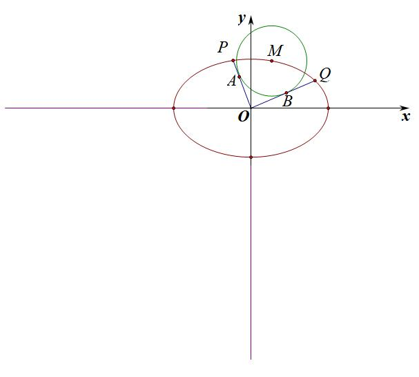

①；②；③．

**我们仅以条件**①为已知条件来进行**证明**：

因为直线，，与圆相切，所以直线与圆联立，可得，，是同构方程的两个不相等的实数根，所以，因为点，在椭圆上，所以，所以，设，，所以，所以，又，所以，所以，同理，

所以．

【例7】（2021•浙江模拟）如图，在平面直角坐标系中，设点，是椭圆上一点，从原点向圆作两条切线，分别与椭圆交于点，，直线，的斜率分别记为，．

（1）若圆与轴相切于椭圆的右焦点，求圆的方程；

（2）若，求证：；

（3）在（2）的情况下，求的最大值．

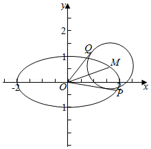

六 斜率和积为定值的同构

斜率和积同构，是通过直线与直线相交联立解点，通过解出来的点用斜率、、表示，代入所在的圆锥曲线方程得出一个关于的二次方程，同理也满足此同构方程;同样，也可以联立得到从而解出和，然后代入直线，得出一个关于的二次方程，同理也满足此同构方程，那么轻松拿捏，。口诀就是:联二代三，同构定系!

【例8】(2022北京卷)已知椭圆的一个顶点为，焦距为.

(1)求椭圆的方程;

(2)过点作斜率为的直线与椭圆交于不同的两点，，直线，分别与轴交于点，.当时，求的值.

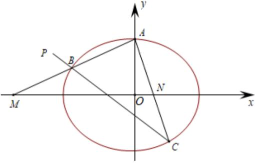

【例9】(2022•新高考Ⅰ卷)已知在双曲线上,直线交于、两点,直线,斜率之和为0.
(1)求的斜率;
(2)若.求面积.

七 坐标同解同构方程（外接圆）

如果一条直线 $l$  上两点在曲线 $C_{1}$  上, 又在曲线 $C_{2}$  上, 我们可以通过联立得到关于 $x_{1},x_{2}$  的方程 $a_{1}x^{2}+b_{1}x+c_{1}=0$ ①
和  $a_{2}x^{2}+b_{2}x+c_{2}=0$ ②
则①②为同解方程, 对比系数, 一定有 $\frac{a_{1}}{a_{2}}=\frac{b_{1}}{b_{2}}=\frac{c_{1}}{c_{2}}$ , 从而解决相关问题. 这种方式对外接圆问题尤为有效.

【例10】（2022·南京联考）双曲线*C*：（经过点且渐近线方程为

（1）求*a*，*b*的值

（2）点*A*，*B*，*D*是双曲线*C*上不同的三个点，且*B*，*D*两点关于*y*对称，Δ*ABD*的外接圆经过原点*O*，求证：直线*AB*与圆相切

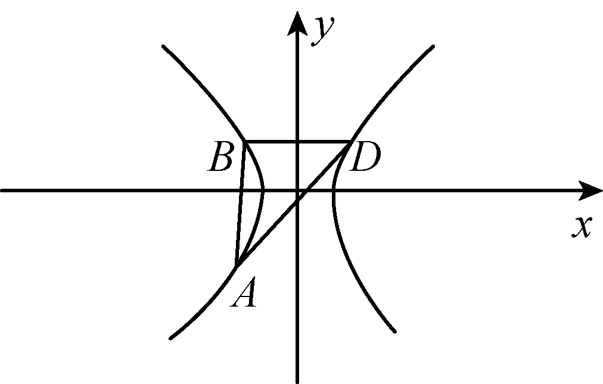

【例11】（2025•南昌一模T18）已知椭圆的离心率，过点作直线与椭圆交于，两点在上方），当的斜率为时，点恰与椭圆的上顶点重合．

（1）求椭圆的标准方程；

（2）已知，设直线，的斜率分别为，，设△的外接圆圆心为．点关于轴的对称点为．

求的值；

求证：．

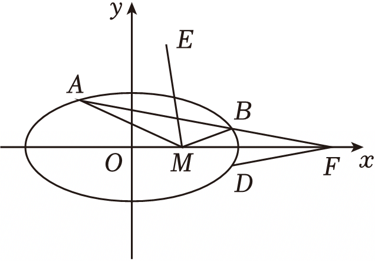

八 双切曲线的斜率同解同构

同解同构，可以是坐标点的同解同构，也可以是斜率的同解同构，斜率同解同构，顾名思义，就是两直线分别交两个曲线于不同点，这两条直线的，就能用来进行两次同构，形成同解同构方程.

【例12】上一点，过作两直线与相切，分别交椭圆于、两点，求证过定点.

【例13】(2023•西安月考)已知椭圆:的离心率为，是椭圆短轴的一个四等分点.

1. 求椭圆的标准方程;
2. 设过点且斜率为的动直线与椭圆交于，两点，且点，直线，分别交圆:于点，(均异于点)，设直线的斜率为，求实数，使得恒成立.

########## **第四节 比值参数同构**

########## 一  比值参数，同构

**我们先介绍一下定比分点：** 为经过两个不同的定点、的直线上的一点，且满足，则：（为参数，）．

**证明：** 因为，所以，整理得：.

对于，，这类含参数，通过构建关于，的同构式，来求解，这类和与差的问题。

【例1】已知焦点在轴上，离心率为的椭圆的一个顶点是拋物线的焦点，过椭圆右焦点的直线交椭圆于，两点，交轴于点，且，

(1)求椭圆的方程;

(2)证明:为定值.

【例2】过的直线交椭圆于不同两点，，在线段上取点，满足.

求证:点在某定直线上.

【例3】(2021•深圳二模)已知实数，且过点的直线与曲线交于、两点.

(1)设为坐标原点，直线、的斜率分别为、，若，求的值;

(2)设直线、与曲线分别相切于点、，点为直线与弦的交点，且，，证明:为定值.

【例4】（2023•清远期末）已知抛物线，为抛物线的焦点，且直线与抛物线交于，两点．

（1）若直线的方程为，求的面积；

（2）设线段的中点为，已知点是不同于，的一点，若，，且，均在抛物线上，证明：直线垂直于轴．

第六章达标训练

1.（2023•乌鲁木齐二模）抛物线上的点到轴的距离为，到焦点的距离为．

（Ⅰ）求抛物线的方程和点的坐标；

（Ⅱ）若点在第一象限，过作直线交抛物线于另一点，且直线与直线交于点，过作轴的垂线交于．证明：直线过定点．

【解析】（Ⅰ）由题意得抛物线的焦点，，准线方程为，设，，点到轴的距离为，到焦点的距离为，，，则，解得，

，抛物线的方程为；

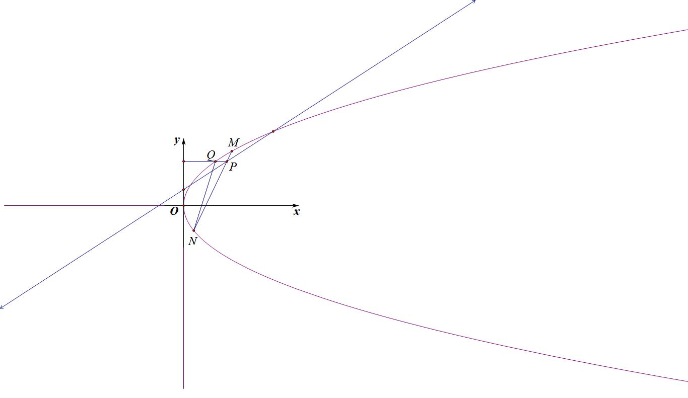

（Ⅱ）证明：由（Ⅰ）得，抛物线的方程为，，得到，故直线方程为:，化简可得:①，即，联立，所以②，

由①可知QN与MN满足直线同构方程，故，代入②得：

，即，故当且仅当

，解得，故直线经过定点．

2.（2023•柳州二模）已知抛物线经过点，过点的直线与抛物线有两个不同交点，，且直线交轴于，直线交轴于．

（1）求直线斜率的取值范围；

（2）证明：存在定点，使得，且．

【解析】（1）抛物线经过点，，解得：，抛物线；

由题意知：直线斜率存在，设，，，，，由得：，

△，解得：或；，，

，又直线，与轴相交于，两点，，即，解得：且；

综上所述：直线斜率的取值范围为；

证明：（2）设点，，，，由，，知：，，，共线，即在轴上，则可设，，

，，，同理可得：，

利用，得到，故直线方程为:，化简可得:①，由于过定点，所以，

同理，，，当时，，，

，解得：，

存在定点满足题意．

3.（2024•南关区期末）已知抛物线的准线与轴的交点为，直线过抛物线的焦点且与交于，两点，的面积的最小值为4．

（1）求抛物线的方程；

（2）若过点的动直线交于，两点，试问抛物线上是否存在定点，使得对任意的直线，都有，若存在，求出点的坐标；若不存在，则说明理由．

【解析】（1）斜率不为0，设，代入，可得，设，，，，则，

，

当时，取最小值，，，抛物线的方程为；

2. 假设存在，，设，，，，由题意，斜率不为0，，，得到，故直线方程为:，化简可得:①，又因为点在*MN*上，所以②

同理，，由于，故，

，代入②得：

，故存在定点满足题意．

4.（2024•福州模拟）已知抛物线，过点的两条直线，分别交于两点和，两点．当的斜率为时，．

（1）求的标准方程；

（2）设为直线与的交点，证明：点必在定直线上．

【解析】（1）当的斜率为时，得的方程为，由，消去得，

由弦长公式得，即，解得或（舍去），

从而的标准方程为；

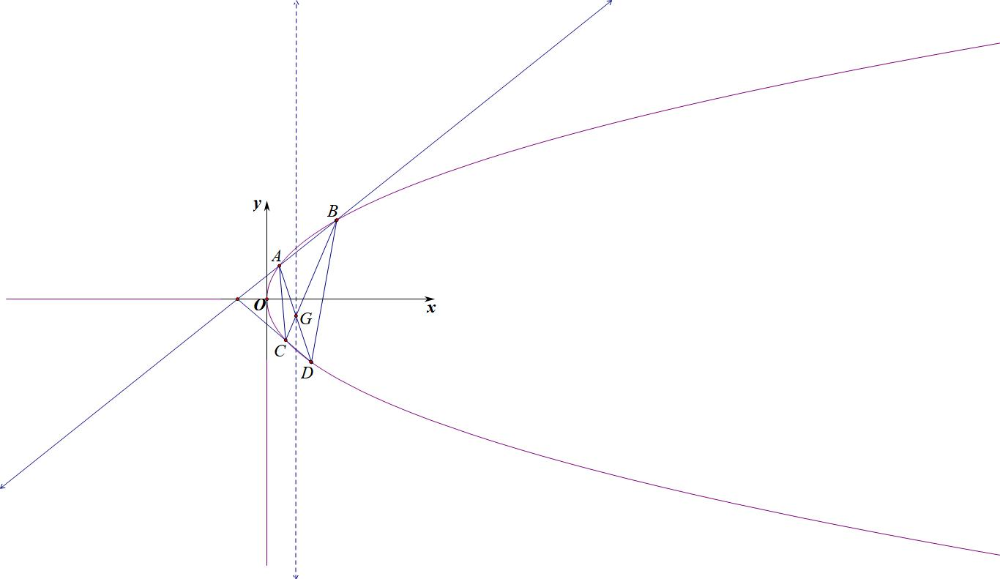

（2）设，，，，得，直线的方程为，即，又直线过点，将该点坐标代入直线方程，得，

设，，，，同理可得，

直线的方程为①，直线的方程为②，

法一：因为在抛物线的对称轴上，由对称性可知，交点必在垂直于轴的直线上，所以只需证的横坐标为定值即可，因为直线与相交，故，由①②组成方程组可得: ，

法二(同一转化)：直线的方程为，转化为，

即，和直线的方程联立得：.

所以点的横坐标为2，即直线与的交点在定直线上．

5.（2023•贵州模拟）抛物线的焦点到准线的距离等于椭圆的短轴长．

（1）求抛物线的方程；

（2）设是抛物线上位于第一象限的一点，过作圆（其中的两条切线，分别交抛物线于点，，证明：直线经过定点．

【解析】（1）椭圆的，即，所以它的短轴长为，

由抛物线的性质可得，所以抛物线的方程为：；

（2）证明：由（1）可得，因为，设，，，，

则直线的方程为，即，同理，

因为直线为圆的切线，所以，整理可得：，①

同理可得：，②

由①②可得，为方程：的两个不同的实根，

法一：所以，，

代入中，整理可得，

可得，解得，，

法二：由于，所以，所以，

即直线恒过定点．

6.（2024•德阳模拟）已知抛物线，直线与抛物线交于不同的两点，，为坐标原点．

（1）若，求证：直线过定点；

（2）若直线的方程为，且与轴交于点，是否存在以为圆心、2为半径的圆，使得过抛物线上任意一点作圆的两条切线，与抛物线交于另外两点，时，总有直线也与圆相切？若存在，求出此时的值；若不存在，请说明理由．

【解析】（1）证明：由题意知直线的斜率不为0，设其方程为，联立，得，

需满足△，设，，，，则，，

又，故，即，即，

故，则，所以，故的方程为，则直线过定点．

（2）假设存在以为圆心，2为半径的圆，符合题意；由题意知直线的方程为，

则，设，则圆的方程为，设，，，

则直线的斜率为，故直线的方程为，即，则由直线与圆相切得，

即，同理可得，

则，否则直线与抛物线只有一个交点，故，是的两个根，需满足，则，

直线的斜率为，故直线的方程为，

即，由直线与圆相切可得，两边平方得，

化简得，

上式对任意的恒成立，故，解得或，

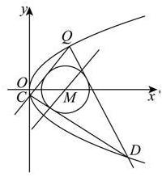

当时，此时圆的方程为与相交，不合题意；

当时，，，符合题意，此时，

综上，存在定圆，使得过抛物线上任意一点作圆的两条切线与抛物线交于另外两点，时，总有直线也与圆相切．

7.（2023•江西模拟）已知椭圆的离心率为，椭圆上的点与两个焦点，构成的三角形的最大面积为1．

（1）求椭圆的方程；

（2）若点为直线上的任意一点，过点作椭圆的两条切线、（切点分别为、，试证明动直线恒过一定点，并求出该定点的坐标．

【解析】（1）解：椭圆的离心率为，椭圆上的点与两个焦点，构

成的三角形的最大面积为1，，解得，，椭圆的方程为．

（2）证明：设切点为，，，，则切线方程为，（请自己完成证明过程），两条切线都过上任意一点，得到，，，，，，都在直线上，而对任意的，直线始终经过定点．动直线恒过一定点．

########## 8.（2009•安徽）已知点在椭圆，，，直线与直线垂直，为坐标原点，直线的倾斜角为，直线的倾斜角为．

########## 1.1.1.1.1.1.1.1.1.1 证明：点是椭圆与直线的唯一交点；

########## 1.1.1.1.1.1.1.1.1.2 证明：，，构成等比数列．

【解析】（1）由，得，代入椭圆，得，将，代入上式，得，

从而，有唯一解，即直线与椭圆有唯一交点．

########## 易知与直线是椭圆的一对极点极线，点在椭圆上所以直线与椭圆相切与点，即点是椭圆与直线唯一交点．

（2），的斜率为，由此得，

，，构成等比数列．

########## 9.（2024•福建联考）已知椭圆的长轴长为，离心率为，点是椭圆上异于顶点的任意一点，过点做椭圆的切线，交轴于点，直线过点且垂直于，交轴于点．

########## 1.1.1.1.1.1.1.1.1.3 求椭圆的方程；

########## 1.1.1.1.1.1.1.1.1.4 试判断以为直径的圆能否过定点？若能，求出定点坐标；若不能，请说明理由．

【解析】（1），，，，．椭圆的方程为．

（2）设点，，，直线的方程为，代入，

整理，得．是方程的两个相等实根，

，解得．直线的方程为．

令，得点的坐标为．又，．

点的坐标为．又直线的方程为，令，得点的坐标为．

以为直径的圆的方程为．整理，得．

令，得，以为直径的圆恒过定点和．

########## 注意：我们利用极点极线整理一下思路，点，根据切线方程可知直线的方程为，所以点的坐标为．又直线的方程为，令，得点坐标为，所以以为直径的圆方程为（圆的直径方程，其中和为圆的一条直径的两个端点），整理得，令，得，所以以为直径的圆恒过定点和．

10.（2024•鸠江区模拟）如图，直线与直线，分别与抛物线交于点，和点，，在轴同侧）．当经过的焦点且垂直于轴时，．

（1）求抛物线的标准方程；

（2）线段与交于点，线段与的中点分别为，，

①求证：，，三点共线；②若，求四边形的面积．

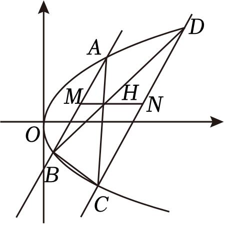

【解析】（1）当经过的焦点且垂直于轴时，，所以线段是抛物线的通径，

所以我们可以得到，因此进一步可得，所以可以解得抛物线方程为．

（2）①设，、，是抛物线上的任意两点，则设直线，则可以得到，同理设，、，是抛物线上的任意两点，则直线，可知，又直线直线，所以，所以可以得到，

同理直线，令，得，

设直线，令，得，

所以，，三点共线．②由①知，同理我们也可以得到，

所以，我们可以得到①，

根据，我们可以得到②，

由①②可以得到，又因为，

所以可以得到．

所以四边形的面积为9．

11（2023•南明模拟）设点为直线上的动点，过点作抛物线的两条切线，切点为，．

（1）证明：直线过定点；

########## （2）若以线段为直径的圆过坐标原点，求点的坐标和圆的方程．

########## 【解析】(1) 证明: 设 $P\left(y_{0}\right),A\left(y_{1}\right),B\left(y_{2}\right)$ ,
因为 $y=\frac{1}{2}x^{2}$ , 所以 $y^{'}=x$ , 所以 $k_{AP}=x_{1},k_{BP}=x_{2}$ , 所以点 $A、B$  处的切线方程为: $\left\{\begin{array}{c}y-y_{1}=x_{1}\left(x-x_{1}\right)\\y-y_{2}=x_{2}\left(x-x_{2}\right)\end{array}\right.$ 即 $\left\{\begin{array}{c}xx_{1}=y+y_{1}\\xx_{2}=y+y_{2}\end{array}\right.$ , 由于 $PA、PB$  交于点 $P\left(y_{0}\right)$ , 所以 $\left\{   A、B\right.$  均在同构方程 $xx_{0}=y_{0}+y$  上, 故直线 $AB$  的方程为 $xx_{0}=y_{0}+y$ , 即 $y=xx_{0}-y_{0}=xx_{0}-\left(x_{0}-3\right)=x_{0}\left(x-1\right)+3$ , 所以过定点 $\left(3\right)$ .
(2) 解: 由 (1) 得直线 $AB$  的方程为 $y=m\left(x-1\right)+3$ , 联立 $\left\{\begin{array}{c}y=m\left(x-1\right)+3\\y=\frac{1}{2}x^{2}\end{array}\right.$ , 可得 $x^{2}-2mx+2m-6=0$ ,所以 $x_{1}x_{2}=2m-6,y_{1}y_{2}=\frac{1}{4}\left(x_{1}x_{2}\right)^{2}=\left(m-3\right)^{2}$ , 因为以线段 $AB$  为直径的圆过坐标原点 $O$ , 所以 $\vec{OA}\cdot \vec{OB}=0$ , 即 $x_{1}x_{2}+y_{1}y_{2}=2m-6+\left(m-3\right)^{2}=0$ , 解得 $m=1$  或 $m=3$ ,
当 $m=1$  时, $AB$  的中点坐标为 $M\left(3\right)$ , 所以 $r=|OM|=\sqrt{10}$ , 则圆的方程为 $\left(x-1\right)^{2}+\left(y-3\right)^{2}=10$ , $P\left(-2\right)$ ;
当 $m=3$  时, $AB$  的中点坐标为 $M\left(9\right)$ , 所以 $r=|OM|=3\sqrt{10}$ , 则圆的方程为 $\left(x-3\right)^{2}+\left(y-9\right)^{2}=90$ , $P\left(0\right)$ .

12.（2019•新课标Ⅲ）已知曲线，为直线上的动点，过作的两条切线，切点分别为，．

（1）证明：直线过定点；

（2）若以为圆心的圆与直线相切，且切点为线段的中点，求四边形的面积．

【解析】（1）证明：的导数为，设切点，，，，即有，，

切线的方程为，即为，切线的方程为，两切线方程相减可得：，再代入切线方程得：，即，点在*DA*、*DB*上，故，由于*A*、*B*均在同构方程上，故，可得恒过定点；

########## （2）取的中点，根据，知道，根据题意知道，当时，此时根据可得，四边形的面积为；

########## 当时，，将点代入得：，再代入

########## 得，

########## ．综上可得：四边形的面积为或．

13.（2024•衡水三模）已知抛物线的焦点为，过且倾斜角为的直线与交于，两点，直线，与相切，切点分别为，．，与轴的交点分别为，两点，且．

（1）求的方程；

（2）若点为上一动点（与，及坐标原点均不重合），直线与相切，切点为，与，的交点分别为，．记，的面积分别为，．

①请问：以，为直径的圆是否过定点？若过定点，求出该定点坐标；若不过定点，请说明理由；

②证明：为定值．

【解析】（1）设，，，，联立，消去得，，，由，，故 的方程为，

同理，故，，，，由，知，

由，得，解得，故的方程为；

（2）①由（1）不妨设，，，直线方程为，直线方程为，

设，，，，，联立，则，

同理，以，为直径的圆的方程为，

整理得，当，解得或，

故该圆恒过 两个点，

②由于，，，，直线的斜率为，显然直线与 垂直，故为直角三角形，同理也是直角三角形，故，，故．

14.（2023•浙江模拟）如图，设抛物线方程为，为直线上任意一点，过引抛物线的切线，切点分别为，．

（1）求直线与轴的交点坐标；

（2）若为抛物线弧上的动点，抛物线在点处的切线与三角形的边，分别交于点，，记，问是否为定值？若是求出该定值；若不是请说明理由．

【解析】（1）设，，，，过点的切线方程为，即，过点的切线方程为，联立这两个方程可得，由于点在这两条切线上，故满足，所以*AB*均在同构方程上，故切点弦*AB*的方程为：，当时，，所以直线过点；

（2）作轴分别交*CD*和*AB*于点*N*和*F*，记，，故，根据（1）可知*CD*方程为:，当得：，；由于，当得：，，所以，

，故．

15.（2024•沈河区四模）已知抛物线，过点的直线与抛物线交于，两点，设抛物线在点，处的切线分别为和，已知与轴交于点，与轴交于点，设与的交点为．

（1）证明：点在定直线上；

（2）若面积为，求点的坐标；

（3）若，，，四点共圆，求点的坐标．

【解析】（1）根据题意，抛物线，变形可得，求导可得，设，，，，所以方程为：，整理得：．同理可得，方程为：

联立直线和方程，解得，，因为点在抛物线内部，可知直线的斜率存在，且与抛物线必相交，设直线的方程为，与抛物线方程联立得：，

故，，所以，，可知，即点在定直线上，

（2）根据题意，方程为：，方程为：，

在，的方程中，令，可得，，，，则的面积，故，代入可得：，

解可得：或，所以点的坐标为或，

（3）根据题意，若，则、重合，与题设矛盾，抛物线焦点，由，可得直线的斜率，则有，同理：，所以是外接圆的直径，若点也在该圆上，则有，又由，则，故直线的方程为：，又由点在定直线上，联立两直线的方程，有，解可得，即的坐标为，．

16.椭圆的中心在原点，焦点在轴上，离心率为，并与直线相切.

(Ⅰ)求椭圆的方程;

(Ⅱ)如图，过圆上任意一点作椭圆的两条切线，.求证:.

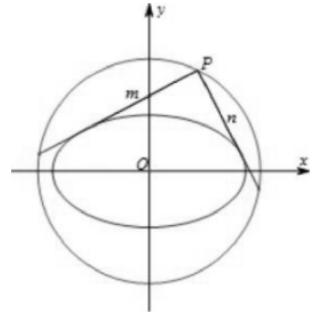

【解析】(Ⅰ)由知，椭圆方程可设为.又直线与椭圆相切，代入椭圆方程满足.由此得.故椭圆的方程为.

(Ⅱ)设，当时，有一条切线斜率不存在，此时，刚好，可见，另一条切线平行于轴，;设，则两条切线雓率存在.设直线的斜率为，则切线方程为

即代入并整理得:.由可得:，注意到直线的斜率也适合这个关系，所以，的斜率，就是上述方程的两根，由韦达定理，.由于点在圆上，，所以.这就证明了.综上所述，过圆上任意一点作椭圆的两条切线，，总存.

17.（2023•河北月考）已知圆的方程为：．

（Ⅰ）已知过点的直线交圆于，两点，若，，求直线的方程；

（Ⅱ）如图，过点作两条直线分别交抛物线于点、，并且都与动圆相切，求证：直线经过定点，并求出定点坐标．

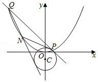

【解析】（Ⅰ）时圆的方程为：，当直线弦斜率不存在时，则直线为，这时圆心到直线的距离为，这时弦长，显然成立；

当直线的斜率存在时，设直线的方程为：，即，因为弦长，而，所以可得，而，整理可得：，解得，这时直线的方程为：，即，综上所述：满足条件的直线的方程为或．

（Ⅱ） 证明：设，故*NP*方程为：，即，同理*NQ*方程为：，以及*PQ*：，

由，与动圆相切得，即，

故均在同构方程上，所以，，

代入*PQ*两点式方程得：，即，只需满足，即，直线恒过点，．

18（2024•苍南县模拟）已知椭圆离心率为且过，；圆的圆心为，是椭圆上上的点，过作圆两条斜率存在的切线，交椭圆于，．

（Ⅰ）求椭圆方程；

（Ⅱ）记，求的最大值．

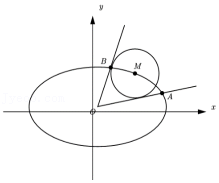

【解析】（Ⅰ）依题意，解得，所以椭圆的方程为．

（Ⅱ）设过原点的圆的切线方程为，即，

则，两边平方并化简得，其两根，满足，

设，，是椭圆上的点，所以，，设，，，，

因为，所以，因为，，在椭圆上，所以，整理得，所以，所以．所以由基本不等式得，当且仅当时等号成立，所以的最大值为．

19.已知椭圆的左焦点，过的直线交椭圆于、两点，点，若为的外心，求的值

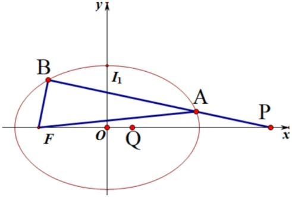

【解析】设，，，

易知的外接圆方程为:，

联立得:①

再联立:②

、为①②的解，所以①与②同解(同解方程)

故，可得.

20.（2024•岳阳楼区一模）已知抛物线上一点，，抛物线的焦点在以为直径的圆上为坐标原点）．

（1）求抛物线的方程；

（2）过点引圆的两条切线、，切线、与抛物线的另一交点分别为、，线段中点的横坐标记为，求实数的取值范围．

【解析】（1）根据题意可得抛物线的焦点，，因为抛物线的焦点在以为直径的圆上，

所以，所以，，，所以，所以，①

因为点，在抛物线上，所以，②由①②，得，所以抛物线的方程为．

（2）由题意可知，过点引圆的切线斜率存在且不为0，

设切线的方程为，则圆心到切线的距离，

整理得，设切线的方程为，同理可得，

所以，是方程的两根为：，，

设，，，，由，得，

所以，所以，同理，

，

设，则，因为，所以，，

所以，对称轴为，所以，

所以的取值范围为，．

21.（2024•山东开学）已知双曲线的左、右焦点分别为，，且，是上一点．

（1）求的方程；

（2）过点的直线与交于两点，，与直线交于点．设，，求证：为定值．

【解析】（1）解：设的焦距为，则，即，，；

由双曲线的定义，得，即，

所以，故的方程为．

（2）证明：（同构方程）：设，，，，，由，得，，，即，由点，不重合，得，解得，．由，在上，得，整理，得，①

由在直线上，得，即，于是①化为．②

同理，由，得．③由②③得，是关于的一元二次方程的两个不等实根．由韦达定理，得，故是定值．

另：②③，得，即，考虑到，所以．

22.（2024•山西期末）已知抛物线的焦点为，原点关于点的对称点为，点关于点的对称点也在抛物线上．

（1）求的值；

（2）设直线交抛物线于不同两点、，直线、与抛物线的另一个交点分别为、，，，且，求直线的横截距的最大值．

【解析】（1）由题知，，，代入的方程得，；

（2）设直线的方程为，与抛物线联立得，由题知△，

可设方程两根为，，则，，，

由得，，，

又点在抛物线上，，化简得，

由题知，为不同两点，故，，即，同理可得，

，

将式代入得，即，将其代入，解得，

，在时取得最大值，即直线的最大横截距为．

23.（2025·江苏苏北七市·三模T18）设为坐标原点，抛物线与的焦点分别为为线段的中点．点在上在第一象限），点在上，．

(1)求曲线的方程；

(2)设直线的方程为，求直线的斜率；

(3)若直线与的斜率之积为，求四边形面积的最小值．

【解析】（1）抛物线的焦点为，由为线段的中点，可得，所以曲线的方程为；

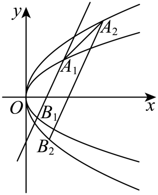

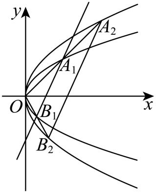

（2）设，，，，联立，消去*x*整理得，解得，，则，，因为，则，因为，，则，所以，所以，，即，直线的斜率为；

（3）因为，，，，所以，，

因为，所以因为，，，，

所以，①，由代入①得，

由得，因为，，所以，所以，同理，

所以且，所以，因为，所以，所以，得，即，

设，联立消去*x*，得，

所以，所以，则，所以过定点，

则，

当且仅当，即时取等号，所以，

所以四边形面积的最小值为

